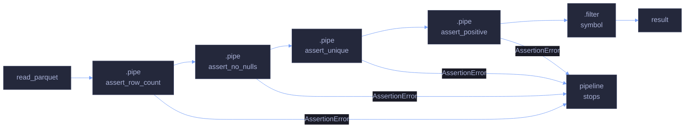

# 10 — Real-World Project, Testing & Migration

> [!quote]
> "Program testing can be used to show the presence of bugs, but never to show their absence."
>
> — **Edsger Dijkstra**, *Notes on Structured Programming*, EWD 249 (1970)

This note brings everything together: an end-to-end analytical pipeline on real financial data, a comprehensive testing and validation framework (schema assertions, null audits, duplicate detection, referential integrity, statistical sanity checks), debugging and profiling techniques, and a structured Pandas-to-Polars migration guide covering concepts to unlearn, API translation, and common anti-patterns.

## Key terms used in this note

| Term | Definition | Purpose | Common mistake / confusion |
|---|---|---|---|
| **assert_frame_equal** | A test function that compares two DataFrames element-by-element. Pandas: `pd.testing.assert_frame_equal()`. Polars: `pl.testing.assert_frame_equal()`. | Validates that a transform produces the expected output — the core assertion for DataFrame unit tests. | Fails on floating-point differences even when values are effectively equal. Use `atol=` or `rtol=` for approximate comparison. |
| **schema validation** | Checking that a DataFrame's column names and dtypes match an expected specification. | Catches upstream schema drift (renamed columns, changed types) before it corrupts downstream logic. | Schema validation checks structure, not content. A DataFrame can pass schema validation and still contain wrong values. |
| **null audit** | Counting and locating null/NaN values across all columns. | Detects missing data before aggregations (which silently skip nulls) and joins (where null keys never match). | A null audit shows where nulls are, not why they exist. Investigate the data source to determine if nulls are expected or indicate a pipeline failure. |
| **duplicate detection** | Identifying rows where key columns have repeated values. | Prevents double-counting in aggregations and row multiplication in joins. | "Duplicate" depends on context — full-row duplicates vs duplicate keys vs duplicate (date, ticker) pairs are different conditions. |
| **referential integrity** | Verifying that every foreign key value in one table exists as a primary key in another table. | Catches orphan records (e.g., a ticker in the OHLCV table that doesn't exist in the dimension table). | Null keys never match in joins — exclude nulls before checking referential integrity. |
| **quarantine pattern** | A data quality strategy where rows failing validation are separated into a "quarantine" table instead of being dropped or rejected. | Preserves failing data for investigation while allowing the pipeline to continue with clean data. | Quarantined data must be reviewed and either fixed or permanently excluded. Ignoring the quarantine table defeats its purpose. |
| **pipeline assertion** | A validation check embedded inside a data pipeline that halts execution if a condition is violated. | Fail-fast behavior — catches data quality issues at the point of failure, not at the end of the pipeline. | Assertions should be meaningful — `assert len(df) > 0` is too weak. Assert specific conditions: expected row count ranges, null thresholds, value domains. |
| **migration (Pandas → Polars)** | The process of converting a Pandas-based codebase to Polars, including API translation, mental model changes, and anti-pattern removal. | Polars offers 5–50x performance improvements, stricter type safety, and no index-related bugs — but it is not a drop-in replacement. | Translating Pandas code line-by-line to Polars produces slow, non-idiomatic code. Rewrite in expression-first style instead. |

## What this note covers

- **End-to-end analytical pipeline** — loading, cleaning, enriching, aggregating, and analyzing EuroStoxx 50 data
- **Testing and assertions** — `assert_frame_equal`, schema validation, null audits, duplicate detection, referential integrity, statistical sanity checks
- **Data quality pipeline** — chainable assertion guards, quarantine pattern, date gap detection
- **Debugging and profiling** — `.pipe(print)`, intermediate variables, `%%timeit`, memory profiling, Polars query plan inspection
- **Pandas-to-Polars migration** — concepts to unlearn, API translation table, common anti-patterns

## Setup

### Package Imports and Configuration

```python
from cycler import cycler
import pandas as pd
import polars as pl
import polars.selectors as cs
import numpy as np
import matplotlib.pyplot as plt
from pathlib import Path
from IPython.display import display, Markdown

DATA = Path("../data")

# Core datasets
ohlcv_pd = pd.read_parquet(DATA / "eurostoxx50_ohlcv.parquet")  # 66K rows, daily OHLCV
ohlcv_pl = pl.read_parquet(DATA / "eurostoxx50_ohlcv.parquet")
dim_pd = pd.read_parquet(DATA / "index_dim.parquet")            # 169 rows, stock metadata
dim_pl = pl.read_parquet(DATA / "index_dim.parquet")
scores_pd = pd.read_parquet(DATA / "scores_daily.parquet")      # 466 rows, composite scores
scores_pl = pl.read_parquet(DATA / "scores_daily.parquet")

print(f"OHLCV: {ohlcv_pd.shape}, Dim: {dim_pd.shape}, Scores: {scores_pd.shape}")

# Tokyo Night theme for Matplotlib
plt.rcParams.update({
    "figure.facecolor": "#1a1b26",
    "axes.facecolor": "#1a1b26",
    "axes.edgecolor": "#3b4261",
    "axes.labelcolor": "#a9b1d6",
    "axes.prop_cycle": cycler(color=["#7aa2f7", "#9ece6a", "#e0af68", "#f7768e", "#bb9af7", "#7dcfff", "#73daca", "#ff9e64"]),
    "text.color": "#a9b1d6",
    "xtick.color": "#a9b1d6",
    "ytick.color": "#a9b1d6",
    "grid.color": "#292e42",
    "legend.facecolor": "#24283b",
    "legend.edgecolor": "#3b4261",
    "legend.labelcolor": "#a9b1d6",
    "savefig.facecolor": "#1a1b26",
})
from pandas.testing import assert_frame_equal as pd_afe, assert_series_equal as pd_ase
from polars.testing import assert_frame_equal, assert_series_equal
import time
```

    OHLCV: (66355, 12), Dim: (169, 26), Scores: (466, 36)

## Enrich with Company Info

> [!info] End-to-end Polars pipeline
> This section builds a complete analytical pipeline: enrich OHLCV with company metadata via left join, compute returns with window functions, aggregate by sector, and visualize. Each step chains Polars expressions — the same pattern used in production.

### Left Join with Dimension Table

#### Polars | Left join OHLCV with dimension table

Adds `short_name`, `sector`, and `country` from the dimension table to the OHLCV fact table via a left join on `symbol`. Left join preserves all OHLCV rows — symbols with no dimension record get `null` for the added columns.

_Joins the 66K-row OHLCV frame with the 169-row dimension table on `symbol`, adding `short_name`, `sector`, and `country` — displays the first 5 rows to confirm the left join preserved all OHLCV rows and correctly matched company metadata._

```python
enriched=ohlcv_pl.join(dim_pl.select("symbol","short_name","sector","country"),on="symbol",how="left")
display(enriched.select("symbol","short_name","date","close","sector").head(5))
```

<div><!-- shape: (5, 5) --><table><thead><tr><th>symbol</th><th>short_name</th><th>date</th><th>close</th><th>sector</th></tr><tr><td>str</td><td>str</td><td>date</td><td>f64</td><td>str</td></tr></thead><tbody><tr><td>ABI.BR</td><td>AB INBEV</td><td>2021-01-04</td><td>57.21</td><td>Consumer Defensive</td></tr><tr><td>ABI.BR</td><td>AB INBEV</td><td>2021-01-05</td><td>57.18</td><td>Consumer Defensive</td></tr><tr><td>ABI.BR</td><td>AB INBEV</td><td>2021-01-06</td><td>58.77</td><td>Consumer Defensive</td></tr><tr><td>ABI.BR</td><td>AB INBEV</td><td>2021-01-07</td><td>58.4</td><td>Consumer Defensive</td></tr><tr><td>ABI.BR</td><td>AB INBEV</td><td>2021-01-08</td><td>57.86</td><td>Consumer Defensive</td></tr></tbody></table></div>

## Compute Returns

### Daily Return Computation

#### Polars | Daily return with window function

Computes percentage daily return per symbol using `.shift(1).over("symbol")` — a window function that applies the shift within each symbol group without requiring a `group_by`. The `.over()` call is a key Polars pattern: it allows per-group computations within a `with_columns` expression without collapsing the frame.

> [!info] `.over()` vs `.group_by()`
> `.shift(1).over("symbol")` computes within each symbol partition and returns one value per original row — the frame shape is unchanged. This is equivalent to Pandas `groupby().shift(1)` used with `transform`. Using `group_by().agg()` would collapse to one row per symbol.

_Adds a `daily_return` column as percentage change from the prior close per symbol, then filters to ASML.AS and displays the 10 most recent rows — confirming the window function computes per-symbol shifts without collapsing the 66K-row frame._

```python
with_ret=enriched.sort("symbol","date").with_columns(
    ((pl.col("close")-pl.col("close").shift(1).over("symbol"))/pl.col("close").shift(1).over("symbol")*100).round(2).alias("daily_return")
)
display(with_ret.filter(pl.col("symbol")=="ASML.AS").select("symbol","date","close","daily_return").tail(10))
```

<div><!-- shape: (10, 4) --><table><thead><tr><th>symbol</th><th>date</th><th>close</th><th>daily_return</th></tr><tr><td>str</td><td>date</td><td>f64</td><td>f64</td></tr></thead><tbody><tr><td>ASML.AS</td><td>2026-02-27</td><td>1233.4</td><td>0.08</td></tr><tr><td>ASML.AS</td><td>2026-03-02</td><td>1210.4</td><td>-1.86</td></tr><tr><td>ASML.AS</td><td>2026-03-03</td><td>1161.8</td><td>-4.02</td></tr><tr><td>ASML.AS</td><td>2026-03-04</td><td>1199.8</td><td>3.27</td></tr><tr><td>ASML.AS</td><td>2026-03-05</td><td>1186.0</td><td>-1.15</td></tr><tr><td>ASML.AS</td><td>2026-03-06</td><td>1147.0</td><td>-3.29</td></tr><tr><td>ASML.AS</td><td>2026-03-09</td><td>1147.6</td><td>0.05</td></tr><tr><td>ASML.AS</td><td>2026-03-10</td><td>1200.0</td><td>4.57</td></tr><tr><td>ASML.AS</td><td>2026-03-11</td><td>1198.8</td><td>-0.1</td></tr><tr><td>ASML.AS</td><td>2026-03-12</td><td>1190.8</td><td>-0.67</td></tr></tbody></table></div>

## Sector Performance

### Sector Aggregation

#### Polars | Aggregate daily returns by sector

Groups the enriched frame by `sector` and computes mean return, volatility (std dev), and unique stock count. Filters out null returns first (the first trading day per symbol has no prior close).

_Groups the enriched frame by `sector` to produce a 10-row summary of mean return, standard deviation, and unique stock count per sector — sorted by average return descending, with Financial Services leading at 0.0914%._

```python
sector=with_ret.filter(pl.col("daily_return").is_not_null()).group_by("sector").agg(
    pl.col("daily_return").mean().round(4).alias("avg_return"),
    pl.col("daily_return").std().round(4).alias("volatility"),
    pl.col("symbol").n_unique().alias("stocks"),
).sort("avg_return",descending=True)
display(sector)
```

<div><!-- shape: (10, 4) --><table><thead><tr><th>sector</th><th>avg_return</th><th>volatility</th><th>stocks</th></tr><tr><td>str</td><td>f64</td><td>f64</td><td>u32</td></tr></thead><tbody><tr><td>Financial Services</td><td>0.0914</td><td>1.689</td><td>11</td></tr><tr><td>Industrials</td><td>0.0857</td><td>1.9855</td><td>10</td></tr><tr><td>Energy</td><td>0.0723</td><td>1.4732</td><td>2</td></tr><tr><td>Communication Services</td><td>0.0654</td><td>1.2328</td><td>1</td></tr><tr><td>Healthcare</td><td>0.041</td><td>1.9143</td><td>4</td></tr><tr><td>Technology</td><td>0.0346</td><td>2.3335</td><td>5</td></tr><tr><td>Utilities</td><td>0.0303</td><td>1.2918</td><td>2</td></tr><tr><td>Consumer Defensive</td><td>0.0282</td><td>1.3438</td><td>4</td></tr><tr><td>Consumer Cyclical</td><td>0.0267</td><td>1.9485</td><td>9</td></tr><tr><td>Basic Materials</td><td>0.0145</td><td>1.4817</td><td>2</td></tr></tbody></table></div>

## Top Performers

### Composite Score Ranking

#### Polars | Rank by composite score

Sorts the scores frame by `composite_rank` and selects the top 10. The scores frame has one row per symbol per scoring date — sorting by rank and taking head(10) returns the top-ranked stocks on the most recent scoring run.

_Sorts the 466-row scores frame by `composite_rank` ascending and displays the top 10 rows with symbol, name, sector, composite score, rank, and current price — showing BNP Paribas, Devon Energy, and Micron Technology as recurring top-ranked stocks._

```python
display(scores_pl.sort("composite_rank").head(10).select("symbol","short_name","sector","composite_score","composite_rank","current_price"))
```

<div><!-- shape: (10, 6) --><table><thead><tr><th>symbol</th><th>short_name</th><th>sector</th><th>composite_score</th><th>composite_rank</th><th>current_price</th></tr><tr><td>str</td><td>str</td><td>str</td><td>f64</td><td>i64</td><td>f64</td></tr></thead><tbody><tr><td>BNP.PA</td><td>BNP PARIBAS ACT.A</td><td>Financial Services</td><td>0.683947</td><td>1</td><td>89.32</td></tr><tr><td>BNP.PA</td><td>BNP PARIBAS ACT.A</td><td>Financial Services</td><td>0.663971</td><td>1</td><td>86.35</td></tr><tr><td>BNP.PA</td><td>BNP PARIBAS ACT.A</td><td>Financial Services</td><td>0.679599</td><td>1</td><td>87.44</td></tr><tr><td>DVN</td><td>Devon Energy Corporation</td><td>Energy</td><td>0.665507</td><td>1</td><td>45.36</td></tr><tr><td>8001.T</td><td>ITOCHU CORP</td><td>Industrials</td><td>0.478444</td><td>1</td><td>2066.5</td></tr><tr><td>6981.T</td><td>MURATA MANUFACTURING CO</td><td>Technology</td><td>0.494602</td><td>1</td><td>3783.0</td></tr><tr><td>6981.T</td><td>MURATA MANUFACTURING CO</td><td>Technology</td><td>0.546581</td><td>1</td><td>3720.0</td></tr><tr><td>MU</td><td>Micron Technology, Inc.</td><td>Technology</td><td>0.925838</td><td>1</td><td>400.77</td></tr><tr><td>MU</td><td>Micron Technology, Inc.</td><td>Technology</td><td>0.862677</td><td>1</td><td>370.3</td></tr><tr><td>MU</td><td>Micron Technology, Inc.</td><td>Technology</td><td>1.287144</td><td>1</td><td>418.69</td></tr></tbody></table></div>

## Visualize

### Bar Chart by Sector

#### Pandas | Horizontal bar chart via `.to_pandas()`

Polars does not have native plotting. Convert to Pandas with `.to_pandas()` then use Matplotlib via the Pandas `.plot` accessor. The Tokyo Night theme was configured in the setup cell.

> [!info] Polars → Pandas for plotting
> `.to_pandas()` is a zero-copy conversion when the Polars frame uses Arrow-compatible types. For plotting in production pipelines, prefer Matplotlib directly with `df["col"].to_numpy()` to avoid the Pandas conversion overhead.

_Converts the 10-row Polars `sector` aggregation frame to Pandas and plots a horizontal bar chart of average daily return by sector — demonstrating the `.to_pandas()` conversion path required for Matplotlib access from a Polars pipeline._

```python
sector.to_pandas().plot.barh(x="sector",y="avg_return",title="Avg Daily Return by Sector",figsize=(10,5))
plt.tight_layout()
plt.show()
```

    <Figure size 1000x500 with 1 Axes>

---
## Part 2: Testing & Debugging

Comprehensive testing, validation, debugging, and profiling strategies for Pandas and Polars.

### Dataset Reload

```python
ohlcv_pl = pl.read_parquet(DATA / "eurostoxx50_ohlcv.parquet")
ohlcv_pd = pd.read_parquet(DATA / "eurostoxx50_ohlcv.parquet")
dim_pl = pl.read_parquet(DATA / "index_dim.parquet")
scores_pl = pl.read_parquet(DATA / "scores_daily.parquet")
```

## assert_frame_equal

Verifies two DataFrames are identical. Raises `AssertionError` with a detailed diff if they differ. Essential for unit testing data transformations — use in `pytest` or any test runner by wrapping in a function that calls these assertions.

> [!info] Pandas vs Polars testing APIs
> Both libraries provide dedicated testing utilities: `pandas.testing.assert_frame_equal` and `polars.testing.assert_frame_equal`. The parameter names differ: Pandas uses `atol`/`check_like`/`check_dtype`, Polars uses `abs_tol`/`check_column_order`/`check_row_order`/`check_dtypes`.

### Frame Equality Assertions

#### Pandas | assert_frame_equal

_Demonstrates exact match, float tolerance (`atol=1e-5`), strict dtype check, column-order-independent comparison (`check_like=True`), index-agnostic comparison, and Series equality — each assertion passes and prints a confirmation label._

```python
# Exact match
df1 = pd.DataFrame({"a": [1, 2, 3], "b": [4.0, 5.0, 6.0]})
df2 = pd.DataFrame({"a": [1, 2, 3], "b": [4.0, 5.0, 6.0]})
pd_afe(df1, df2)
print("Exact match: OK")

# Floating point tolerance
df3 = pd.DataFrame({"x": [1.0000001, 2.0000002]})
df4 = pd.DataFrame({"x": [1.0, 2.0]})
pd_afe(df3, df4, atol=1e-5)
print("Float tolerance (atol=1e-5): OK")

# Check dtype strictly
pd_afe(df1, df2, check_dtype=True)
print("Strict dtype check: OK")

# Ignore column order
df5 = pd.DataFrame({"b": [4.0, 5.0, 6.0], "a": [1, 2, 3]})
pd_afe(df1, df5, check_like=True)
print("Ignore column order (check_like): OK")

# Ignore index
df6 = df1.reset_index(drop=True)
df7 = df1.set_index("a")
pd_afe(df6, df7.reset_index(), check_like=True)
print("Ignore index: OK")

# Series comparison
pd_ase(df1["a"], df2["a"])
print("Series match: OK")
```

    Exact match: OK
    Float tolerance (atol=1e-5): OK
    Strict dtype check: OK
    Ignore column order (check_like): OK
    Ignore index: OK
    Series match: OK

#### Pandas | Failure message format

_Constructs a mismatched DataFrame where column `"a"` has 99 at index 2 instead of 3, then catches the `AssertionError` to print the diff report: column name, mismatch percentage, index array, and left/right value lists._

```python
# Demonstrate failure messages
try:
    df_bad = pd.DataFrame({"a": [1, 2, 99], "b": [4.0, 5.0, 6.0]})
    pd_afe(df1, df_bad)
except AssertionError as e:
    print(f"Expected failure:\n{e}")
```

    Expected failure:
    DataFrame.iloc[:, 0] (column name="a") are different
    
    DataFrame.iloc[:, 0] (column name="a") values are different (33.33333 %)
    [index]: [0, 1, 2]
    [left]:  [1, 2, 3]
    [right]: [1, 2, 99]

#### Polars | assert_frame_equal

_Demonstrates exact match, float tolerance (`abs_tol=1e-5`), strict dtype check, column-order-independent comparison, row-order-independent comparison, and Series equality — each assertion passes, confirming Polars parameter names differ from the Pandas equivalents._

```python
# Exact match
df1 = pl.DataFrame({"a": [1, 2, 3], "b": [4.0, 5.0, 6.0]})
df2 = pl.DataFrame({"a": [1, 2, 3], "b": [4.0, 5.0, 6.0]})
assert_frame_equal(df1, df2)
print("Exact match: OK")

# Floating point tolerance
df3 = pl.DataFrame({"x": [1.0000001, 2.0000002]})
df4 = pl.DataFrame({"x": [1.0, 2.0]})
assert_frame_equal(df3, df4, abs_tol=1e-5)
print("Float tolerance (abs_tol=1e-5): OK")

# Check dtype
assert_frame_equal(df1, df2, check_dtypes=True)
print("Strict dtype check: OK")

# Ignore column order
df5 = pl.DataFrame({"b": [4.0, 5.0, 6.0], "a": [1, 2, 3]})
assert_frame_equal(df1, df5, check_column_order=False)
print("Ignore column order: OK")

# Ignore row order
df6 = pl.DataFrame({"a": [3, 1, 2], "b": [6.0, 4.0, 5.0]})
assert_frame_equal(df1, df6, check_row_order=False)
print("Ignore row order: OK")

# Series comparison
assert_series_equal(df1["a"], df2["a"])
print("Series match: OK")
```

    Exact match: OK
    Float tolerance (abs_tol=1e-5): OK
    Strict dtype check: OK
    Ignore column order: OK
    Ignore row order: OK
    Series match: OK

#### Polars | Failure message format

_Constructs a mismatched DataFrame where column `"a"` has 99 at index 2 instead of 3, then catches the `AssertionError` to show the Polars diff format: column name, and left/right Series values displayed as typed vertical lists with shape metadata._

```python
# Demonstrate failure messages
try:
    df_bad = pl.DataFrame({"a": [1, 2, 99], "b": [4.0, 5.0, 6.0]})
    assert_frame_equal(df1, df_bad)
except AssertionError as e:
    print(f"Expected failure:\n{e}")
```

    Expected failure:
    DataFrames are different (value mismatch for column "a")
    [left]: shape: (3,)
    Series: 'a' [i64]
    [
    	1
    	2
    	3
    ]
    [right]: shape: (3,)
    Series: 'a' [i64]
    [
    	1
    	2
    	99
    ]

## Schema Testing

Verify column names, data types, and shape before processing. Catches data pipeline issues early — wrong column names, changed types, unexpected nulls.

> [!tip] Validate at pipeline entry points
> Run schema checks immediately after reading from external sources (CSV, Parquet, database). Failing fast on schema mismatches prevents type errors and silent data corruption from propagating through a pipeline.

### Schema Validation

#### Pandas | Schema validation function

_Defines `assert_schema_pd()` and validates `ohlcv_pd` against 7 expected columns with `close` (float) and `symbol` (object) dtype checks and a 1000-row minimum — prints a warning for 5 extra columns and confirms schema is OK with shape (66355, 12)._

```python
def assert_schema_pd(df, expected_cols, expected_dtypes=None, min_rows=1):
    """Validate DataFrame schema."""
    # Column names
    missing = set(expected_cols) - set(df.columns)
    extra = set(df.columns) - set(expected_cols)
    assert not missing, f"Missing columns: {missing}"
    if extra:
        print(f"  Warning: extra columns: {extra}")

    # Data types
    if expected_dtypes:
        for col, dtype in expected_dtypes.items():
            actual = str(df[col].dtype)
            assert dtype in actual, f"Column '{col}': expected {dtype}, got {actual}"

    # Row count
    assert len(df) >= min_rows, f"Expected >= {min_rows} rows, got {len(df)}"
    print(f"  Schema OK: {df.shape}, {len(df.columns)} cols")

# Test it
assert_schema_pd(
    ohlcv_pd,
    expected_cols=["symbol", "date", "open", "high", "low", "close", "volume"],
    expected_dtypes={"close": "float", "symbol": "object"},
    min_rows=1000
)
```

      Warning: extra columns: {'id', 'adj_close', 'dividends', 'stock_splits', 'is_filled'}
      Schema OK: (66355, 12), 12 cols

#### Polars | Schema validation function

Polars schemas use `df.schema` — a dict mapping column name to `polars.DataType`. Compare against expected types using direct equality (`df[col].dtype == pl.Float64`).

> [!info] Polars dtype objects vs Pandas dtype strings
> Pandas dtypes are strings (`"float64"`, `"object"`). Polars dtypes are objects (`pl.Float64`, `pl.String`, `pl.Int64`). In the Polars validator, pass the actual type object as the dict value, not a string.

_Defines `assert_schema_pl()` and validates `ohlcv_pl` against an expected schema of `symbol` (String), `close` (Float64), and `volume` (Int64) with a 1000-row minimum — confirms schema matches for the 66K-row frame using Polars DataType objects instead of strings._

```python
def assert_schema_pl(df, expected_schema, min_rows=1):
    """Validate Polars DataFrame schema."""
    for col, dtype in expected_schema.items():
        assert col in df.columns, f"Missing column: {col}"
        assert df[col].dtype == dtype, f"Column '{col}': expected {dtype}, got {df[col].dtype}"
    assert df.height >= min_rows, f"Expected >= {min_rows} rows, got {df.height}"
    print(f"  Schema OK: {df.shape}, schema matches")

assert_schema_pl(
    ohlcv_pl,
    expected_schema={
        "symbol": pl.String,
        "close": pl.Float64,
        "volume": pl.Int64,
    },
    min_rows=1000
)
```

      Schema OK: (66355, 12), schema matches

## Data Validation Rules

Business rules that data must satisfy: no nulls in key columns, value ranges, referential integrity, uniqueness constraints, and temporal consistency. These checks map directly to the quality dimensions (completeness, uniqueness, validity) defined in [data-quality-framework](https://alp78.github.io/elysium/14-Data-Architecture/Pipeline-Patterns/data-quality-framework), and dbt implements the same patterns declaratively via [dbt-testing-framework](https://alp78.github.io/elysium/11-dbt/Quality/dbt-testing-framework).

### OHLCV Validation Rules

#### Polars | OHLCV validation rules

_Defines `validate_ohlcv()` with 6 rule checks (null keys, OHLC consistency, negative prices, negative volume, duplicate symbol+date), runs it against the 66K-row `ohlcv_pl` frame, and confirms all validation rules pass._

```python
def validate_ohlcv(df: pl.DataFrame) -> list[str]:
    """Return a list of validation errors (empty = all good)."""
    errors = []

    # Null checks
    for col in ["symbol", "date", "open", "high", "low", "close"]:
        nulls = df.filter(pl.col(col).is_null()).height
        if nulls > 0:
            errors.append(f"{col}: {nulls} nulls")

    # OHLC consistency: high >= low, high >= open, high >= close
    bad_hl = df.filter(pl.col("high") < pl.col("low")).height
    if bad_hl > 0:
        errors.append(f"high < low: {bad_hl} rows")

    bad_ho = df.filter(pl.col("high") < pl.col("open")).height
    if bad_ho > 0:
        errors.append(f"high < open: {bad_ho} rows")

    # Negative prices
    for col in ["open", "high", "low", "close"]:
        negs = df.filter(pl.col(col) < 0).height
        if negs > 0:
            errors.append(f"{col}: {negs} negative values")

    # Negative volume
    neg_vol = df.filter(pl.col("volume") < 0).height
    if neg_vol > 0:
        errors.append(f"volume: {neg_vol} negative values")

    # Duplicate rows (same symbol + date)
    dupes = df.height - df.unique(subset=["symbol", "date"]).height
    if dupes > 0:
        errors.append(f"duplicates: {dupes} (symbol+date)")

    return errors

errors = validate_ohlcv(ohlcv_pl)
if errors:
    for e in errors:
        print(f"  FAIL: {e}")
else:
    print("  All validation rules passed")
```

      All validation rules passed

#### Pandas | OHLCV validation rules

_Defines `validate_ohlcv_pd()` using Pandas isnull-sum, boolean comparison, and `.duplicated()` for the same 6 rules as the Polars version, runs it against `ohlcv_pd`, and confirms all validation rules pass._

```python
def validate_ohlcv_pd(df: pd.DataFrame) -> list[str]:
    """Pandas version of OHLCV validation."""
    errors = []

    # Null checks
    null_counts = df[["symbol", "date", "open", "high", "low", "close"]].isnull().sum()
    for col, cnt in null_counts.items():
        if cnt > 0:
            errors.append(f"{col}: {cnt} nulls")

    # OHLC consistency
    bad_hl = (df["high"] < df["low"]).sum()
    if bad_hl > 0:
        errors.append(f"high < low: {bad_hl} rows")

    # Negative prices
    for col in ["open", "high", "low", "close"]:
        negs = (df[col] < 0).sum()
        if negs > 0:
            errors.append(f"{col}: {negs} negative values")

    # Duplicates
    dupes = df.duplicated(subset=["symbol", "date"]).sum()
    if dupes > 0:
        errors.append(f"duplicates: {dupes} (symbol+date)")

    return errors

errors = validate_ohlcv_pd(ohlcv_pd)
if errors:
    for e in errors:
        print(f"  FAIL: {e}")
else:
    print("  All validation rules passed")
```

      All validation rules passed

## Referential Integrity

Verify that foreign key relationships hold: every symbol in the fact table exists in the dimension table.

### Orphan Symbol Detection

#### Polars / Pandas | Check orphan symbols

Finds symbols in the OHLCV fact table that have no matching row in the dimension table — "orphan" symbols. The Polars approach uses `.is_in()` on a Series; the Pandas approach uses Python `set` subtraction.

> [!info] Polars vs Pandas for set membership
> Polars: `series.filter(~series.is_in(other.to_list()))` — expression-based, returns a filtered Series. Pandas: `set(df["col"]) - set(other["col"])` — Python set subtraction, works for small dimension tables but doesn't scale to millions of keys.

_Extracts unique symbols from both `ohlcv_pl` and `dim_pl`, uses Polars `.is_in()` to find orphan OHLCV symbols not present in the dimension table, asserts zero orphans, and confirms the same result with the Pandas set-subtraction approach — both return empty._

```python
# Polars: symbols in ohlcv that are NOT in dim
ohlcv_symbols = ohlcv_pl["symbol"].unique()
dim_symbols = dim_pl["symbol"].unique()
orphans = ohlcv_symbols.filter(~ohlcv_symbols.is_in(dim_symbols.to_list()))
print(f"Orphan symbols (in ohlcv but not in dim): {orphans.to_list()}")
assert orphans.len() == 0, f"Referential integrity violation: {orphans.to_list()}"
print("Referential integrity: OK")

# Pandas equivalent
orphans_pd = set(ohlcv_pd["symbol"].unique()) - set(ohlcv_pd["symbol"].unique())
print(f"Pandas orphans: {orphans_pd}")
```

    Orphan symbols (in ohlcv but not in dim): []
    Referential integrity: OK
    Pandas orphans: set()

## Debugging Method Chains

When a long chain produces unexpected results, break it into steps and inspect each intermediate result.

### Step-by-Step Inspection

#### Polars | Step-by-step inspection

Break a chained pipeline into named variables and print shape at each step. This is the simplest debugging technique — no framework needed. Polars DataFrames are immutable so intermediate variables have no mutation risk.

_Decomposes an ASML.AS OHLCV pipeline into 4 named steps — filter, sort, with_columns (daily_return), select+tail — printing shape at each step to confirm the frame shrinks from 66K rows to 1331 to 10, and that `daily_return` is added in step 3._

```python
# Instead of one long chain, break into steps and inspect each
step1 = ohlcv_pl.filter(pl.col("symbol") == "ASML.AS")
print(f"After filter: {step1.shape}")

step2 = step1.sort("date")
print(f"After sort: {step2.shape}")

step3 = step2.with_columns(
    ((pl.col("close") - pl.col("open")) / pl.col("open") * 100).round(2).alias("daily_return")
)
print(f"After with_columns: {step3.shape}, new cols: {[c for c in step3.columns if c not in step2.columns]}")

step4 = step3.select("date", "close", "daily_return").tail(10)
print(f"After select+tail: {step4.shape}")
display(step4)
```

    After filter: (1331, 12)
    After sort: (1331, 12)
    After with_columns: (1331, 13), new cols: ['daily_return']
    After select+tail: (10, 3)

<div><!-- shape: (10, 3) --><table><thead><tr><th>date</th><th>close</th><th>daily_return</th></tr><tr><td>date</td><td>f64</td><td>f64</td></tr></thead><tbody><tr><td>2026-02-27</td><td>1233.4</td><td>-0.11</td></tr><tr><td>2026-03-02</td><td>1210.4</td><td>1.48</td></tr><tr><td>2026-03-03</td><td>1161.8</td><td>-2.09</td></tr><tr><td>2026-03-04</td><td>1199.8</td><td>2.46</td></tr><tr><td>2026-03-05</td><td>1186.0</td><td>-1.05</td></tr><tr><td>2026-03-06</td><td>1147.0</td><td>-3.29</td></tr><tr><td>2026-03-09</td><td>1147.6</td><td>7.05</td></tr><tr><td>2026-03-10</td><td>1200.0</td><td>0.98</td></tr><tr><td>2026-03-11</td><td>1198.8</td><td>0.88</td></tr><tr><td>2026-03-12</td><td>1190.8</td><td>-0.33</td></tr></tbody></table></div>

### Debug with .pipe()

#### Pandas | Debug with .pipe()

Inserts a debug function into any position of a Pandas method chain using `.pipe()`. The function receives the full DataFrame, prints diagnostics, and returns it unchanged — the chain continues.

> [!tip] `.pipe()` is available in both Pandas and Polars
> Both libraries support `.pipe(fn, *args)` — pass a function that takes `DataFrame` as first argument and returns `DataFrame`. This is the idiomatic way to inject debug steps, assertions, or logging into a method chain without breaking it.

_Injects `debug_step()` at 4 positions in an ASML.AS pipeline — start (66355 rows), after filter (1331), after assign (1331 + daily_return), and final (5 rows) — printing shape and first 5 column names at each step without interrupting the chain._

```python
def debug_step(df, label=""):
    """Print shape and return df unchanged — insert anywhere in a chain."""
    print(f"  [{label}] shape={df.shape}, cols={list(df.columns)[:5]}...")
    return df

result = (
    ohlcv_pd
    .pipe(debug_step, "start")
    .query("symbol == 'ASML.AS'")
    .pipe(debug_step, "after filter")
    .sort_values("date")
    .assign(daily_return=lambda d: ((d["close"] - d["open"]) / d["open"] * 100).round(2))
    .pipe(debug_step, "after assign")
    [["date", "close", "daily_return"]]
    .tail(5)
    .pipe(debug_step, "final")
)
```

      [start] shape=(66355, 12), cols=['id', 'symbol', 'date', 'open', 'high']...
      [after filter] shape=(1331, 12), cols=['id', 'symbol', 'date', 'open', 'high']...
      [after assign] shape=(1331, 13), cols=['id', 'symbol', 'date', 'open', 'high']...
      [final] shape=(5, 3), cols=['date', 'close', 'daily_return']...

#### Polars | Debug with .pipe()

Same `.pipe()` pattern for Polars. The debug function takes a `pl.DataFrame`, prints shape, and returns it unchanged.

_Injects `debug_polars()` at 4 positions in the Polars equivalent — start (66355 rows), after filter (1331), after with_columns (1331 + sma), and final (5 rows) — confirming `.pipe()` works identically in Polars with only shape printed (no column list)._

```python
def debug_polars(df: pl.DataFrame, label: str = "") -> pl.DataFrame:
    """Print shape and return df unchanged."""
    print(f"  [{label}] shape={df.shape}")
    return df

# Use pipe for whole-DataFrame inspection
result = (
    ohlcv_pl
    .pipe(debug_polars, "start")
    .filter(pl.col("symbol") == "ASML.AS")
    .pipe(debug_polars, "after filter")
    .sort("date")
    .with_columns(
        ((pl.col("close") - pl.col("open")) / pl.col("open") * 100).round(2).alias("daily_return")
    )
    .pipe(debug_polars, "after with_columns")
    .select("date", "close", "daily_return")
    .tail(5)
    .pipe(debug_polars, "final")
)
```

      [start] shape=(66355, 12)
      [after filter] shape=(1331, 12)
      [after with_columns] shape=(1331, 13)
      [final] shape=(5, 3)

## Performance Profiling

Measure execution time and memory usage to find bottlenecks in data pipelines.

### Manual Timing

#### Pandas / Polars | Manual timing with `time.perf_counter`

Wraps each operation in `time.perf_counter()` calls to measure wall-clock time in seconds. Use this when comparing Pandas vs Polars performance on the same operation — the output here shows Polars is ~1.3× faster on this group_by.

> [!tip] Polars is typically faster on aggregations
> Polars uses multi-threaded execution and Apache Arrow columnar storage. For group_by and filter operations on 50K+ rows, Polars is consistently faster than Pandas. The gap widens significantly at 1M+ rows.

_Times a `group_by("symbol").agg(mean close)` on the same 66K-row dataset in both libraries — Polars completes in 1.7ms vs Pandas in 2.2ms, demonstrating the ~1.3× speedup from Arrow-backed multi-threaded execution._

```python
# Manual timing
t0 = time.perf_counter()
result = ohlcv_pl.group_by("symbol").agg(pl.col("close").mean())
elapsed = time.perf_counter() - t0
print(f"Polars group_by: {elapsed*1000:.1f}ms")

t0 = time.perf_counter()
result = ohlcv_pd.groupby("symbol")["close"].mean()
elapsed = time.perf_counter() - t0
print(f"Pandas groupby: {elapsed*1000:.1f}ms")
```

    Polars group_by: 1.7ms
    Pandas groupby: 2.2ms

### Memory Usage

#### Pandas / Polars | Memory usage

Compares in-memory footprint between Pandas and Polars for the same dataset. `deep=True` in Pandas measures actual object memory (including Python strings); Polars `estimated_size()` measures the Arrow buffer size.

> [!info] Why Polars uses less memory
> Polars stores data in Apache Arrow columnar format — strings are stored in a dictionary-encoded buffer, not as individual Python `str` objects. The output here shows Polars at ~5.2 MB vs Pandas at ~10.6 MB for the same 66K-row dataset. The `symbol` column alone accounts for 3.49 MB in Pandas (Python string objects) vs negligible in Polars (Arrow dictionary encoding).

_Measures per-column deep memory usage in Pandas (10.64 MB total, with `symbol` alone at 3.49 MB due to Python string objects) and compares it with Polars `estimated_size()` (5.20 MB) — demonstrating the 2× memory reduction from Arrow dictionary encoding._

```python
# Pandas memory usage
mem_pd = ohlcv_pd.memory_usage(deep=True)
print("Pandas memory per column:")
for col, mem in mem_pd.items():
    if mem > 0:
        print(f"  {str(col):20s}: {mem / 1024 / 1024:.2f} MB")
print(f"  {'TOTAL':20s}: {mem_pd.sum() / 1024 / 1024:.2f} MB")

# Polars estimated size
est = ohlcv_pl.estimated_size("mb")
print(f"\nPolars estimated size: {est:.2f} MB")
```

    Pandas memory per column:
      Index               : 0.00 MB
      id                  : 0.51 MB
      symbol              : 3.49 MB
      date                : 2.53 MB
      open                : 0.51 MB
      high                : 0.51 MB
      low                 : 0.51 MB
      close               : 0.51 MB
      adj_close           : 0.51 MB
      volume              : 0.51 MB
      dividends           : 0.51 MB
      stock_splits        : 0.51 MB
      is_filled           : 0.06 MB
      TOTAL               : 10.64 MB
    
    Polars estimated size: 5.20 MB

### Query Plan Inspection

#### Polars | Query plan inspection (`.explain()`)

Calls `.explain()` on a `LazyFrame` to print the optimized query plan before execution. The plan shows which columns are projected (pruned) and where filters are pushed down — key signals that the optimizer is working correctly.

> [!info] Lazy evaluation and predicate pushdown
> `ohlcv_pl.lazy()` converts an eager DataFrame to a `LazyFrame`. No computation runs until `.collect()` is called. `.explain()` shows the **optimized** plan — note `PROJECT["close", "symbol"] 2/12 COLUMNS` in the output, meaning the optimizer reads only 2 of 12 columns from disk (column pruning). Pandas has no equivalent — all operations are eager and all columns are always materialized.

_Builds a lazy filter → group_by → agg pipeline on `ohlcv_pl` and prints the optimized plan — confirming the optimizer applies predicate pushdown (ASML.AS filter) and column pruning (`PROJECT["close", "symbol"] 2/12 COLUMNS`) before any data is collected._

```python
# Inspect the optimized query plan before collecting
plan = (
    ohlcv_pl.lazy()
    .filter(pl.col("symbol") == "ASML.AS")
    .group_by("symbol")
    .agg(pl.col("close").mean().alias("avg_close"))
)
print("Optimized plan:")
print(plan.explain())
```

    Optimized plan:
    AGGREGATE[maintain_order: false]
      [col("close").mean().alias("avg_close")] BY [col("symbol")]
      FROM
      FILTER [(col("symbol")) == ("ASML.AS")]
      FROM
        DF ["id", "symbol", "date", "open", ...]; PROJECT["close", "symbol"] 2/12 COLUMNS

### Execution Profiling

#### Polars | Execution profiling (`.profile()`)

Runs the lazy pipeline and returns `(result_df, timings_df)` — the timings DataFrame shows each query plan node with `start` and `end` in nanoseconds.

> [!info] Reading `.profile()` output
> The `timings` DataFrame has columns `node` (plan step name), `start` (ns since execution start), `end` (ns). Subtract `end - start` per row to get each step's duration. The `optimization` node is the query optimizer itself — typically < 200 µs. For this pipeline: filter (170 µs) → sort (192 µs) → rolling_mean (31 µs).

_Profiles a filter → sort → rolling_mean(7) pipeline on ASML.AS OHLCV data — returns a 4-row timings DataFrame with `node`, `start`, and `end` columns in nanoseconds, showing optimization (118ns), filter (170ns), sort (192ns), and rolling mean (31ns) durations._

```python
# Profile shows time spent at each stage
result, timings = (
    ohlcv_pl.lazy()
    .filter(pl.col("symbol") == "ASML.AS")
    .sort("date")
    .with_columns(
        pl.col("close").rolling_mean(7).alias("sma_7")
    )
    .profile()
)
print(f"Result: {result.shape}")
display(timings)
```

    Result: (1331, 13)

<div><!-- shape: (4, 3) --><table><thead><tr><th>node</th><th>start</th><th>end</th></tr><tr><td>str</td><td>u64</td><td>u64</td></tr></thead><tbody><tr><td>optimization</td><td>0</td><td>118</td></tr><tr><td>.filter([(col(symbol)) == (…</td><td>118</td><td>288</td></tr><tr><td>sort(date)</td><td>295</td><td>487</td></tr><tr><td>with_column(sma_7)</td><td>489</td><td>520</td></tr></tbody></table></div>

## Null & Missing Data Audit

Comprehensive null detection across all columns, with percentage and sample rows.

> [!info] Pandas `NaN` vs Polars `null`
> Pandas uses `NaN` (a floating-point sentinel) for missing values in numeric columns — this silently coerces integer columns to `float64` when a null is introduced. Polars uses a native `null` bitmask that works across all types without type coercion. `df.isnull()` in Pandas vs `df.is_null()` in Polars — note the underscore difference.

### Null Audit

#### Pandas | Null audit function

_Defines `null_audit_pd()` returning a null/pct/dtype summary for columns with nulls, runs it against `ohlcv_pd` (no nulls) and `index_dim.parquet` — finds `valid_to` column has 169 nulls (100%) in the dimension table._

```python
# Null audit for Pandas
def null_audit_pd(df):
    nulls = df.isnull().sum()
    pct = (nulls / len(df) * 100).round(2)
    audit = pd.DataFrame({"nulls": nulls, "pct": pct, "dtype": df.dtypes})
    return audit[audit["nulls"] > 0].sort_values("nulls", ascending=False)

result = null_audit_pd(ohlcv_pd)
if len(result) == 0:
    print("No nulls found in ohlcv_pd")
else:
    display(result)

# Also check the dimension table (may have nulls in long_business_summary etc.)
result = null_audit_pd(pd.read_parquet(DATA / "index_dim.parquet"))
if len(result) > 0:
    display(Markdown("**index_dim nulls:**"))
    display(result)
```

    No nulls found in ohlcv_pd

#### index_dim nulls

<div>
<table>
  <thead>
    <tr>
      <th></th>
      <th>nulls</th>
      <th>pct</th>
      <th>dtype</th>
    </tr>
  </thead>
  <tbody>
    <tr>
      <th>valid_to</th>
      <td>169</td>
      <td>100.0</td>
      <td>object</td>
    </tr>
  </tbody>
</table>
</div>

#### Polars | Null audit function

Uses `df.null_count()` which returns a one-row DataFrame of null counts per column, then `.unpivot()` to reshape into a long format for filtering and sorting.

_Defines `null_audit_pl()` using `.null_count().unpivot()` to produce a column/nulls/pct summary, runs it against `ohlcv_pl` (no nulls) and `dim_pl` — finds `valid_to` at 169 nulls (100%), matching the Pandas result._

```python
# Null audit for Polars
def null_audit_pl(df):
    return (
        df.null_count()
        .unpivot(variable_name="column", value_name="nulls")
        .filter(pl.col("nulls") > 0)
        .with_columns((pl.col("nulls") / df.height * 100).round(2).alias("pct"))
        .sort("nulls", descending=True)
    )

result = null_audit_pl(ohlcv_pl)
if result.height == 0:
    print("No nulls found in ohlcv_pl")
else:
    display(result)

# Dimension table
result = null_audit_pl(dim_pl)
if result.height > 0:
    display(Markdown("**index_dim nulls:**"))
    display(result)
```

    No nulls found in ohlcv_pl

#### index_dim nulls

<div><!-- shape: (1, 3) --><table><thead><tr><th>column</th><th>nulls</th><th>pct</th></tr><tr><td>str</td><td>u32</td><td>f64</td></tr></thead><tbody><tr><td>valid_to</td><td>169</td><td>100.0</td></tr></tbody></table></div>

## Duplicate Detection

Find exact duplicates and duplicates on key columns.

### Exact and Key-Column Duplicates

#### Pandas | Duplicate detection

_Counts exact duplicate rows with `.duplicated().sum()` and key-column duplicates on `(symbol, date)` with `.duplicated(subset=[...]).sum()` — both return 0 for `ohlcv_pd`, confirming uniqueness across the 66K-row dataset._

```python
# Exact duplicates
exact = ohlcv_pd.duplicated().sum()
print(f"Exact duplicate rows: {exact}")

# Duplicates on key columns
key_dupes = ohlcv_pd.duplicated(subset=["symbol", "date"]).sum()
print(f"Duplicate (symbol, date) pairs: {key_dupes}")

# Show duplicate rows if any
if key_dupes > 0:
    dupes = ohlcv_pd[ohlcv_pd.duplicated(subset=["symbol", "date"], keep=False)]
    display(dupes.sort_values(["symbol", "date"]).head(10))
```

    Exact duplicate rows: 0
    Duplicate (symbol, date) pairs: 0

#### Polars | Duplicate detection

> [!info] Pandas `duplicated()` vs Polars `unique()`
> Pandas `.duplicated(subset=...)` returns a boolean mask — use `.sum()` to count. Polars has no `.duplicated()` method; instead compute `df.height - df.unique(subset=...).height`. For showing duplicate groups with counts, Polars' `group_by().agg(pl.len())` approach is more expressive than Pandas' `keep=False` approach.

_Counts exact and key-column duplicates using `df.height - df.unique(...).height`, returning 0 for both checks on `ohlcv_pl` — confirming uniqueness, and demonstrating the `group_by().agg(pl.len())` pattern for surfacing duplicate groups when they exist._

```python
# Exact duplicates
exact = ohlcv_pl.height - ohlcv_pl.unique().height
print(f"Exact duplicate rows: {exact}")

# Duplicates on key columns
key_dupes = ohlcv_pl.height - ohlcv_pl.unique(subset=["symbol", "date"]).height
print(f"Duplicate (symbol, date) pairs: {key_dupes}")

# Show duplicates with count
if key_dupes > 0:
    display(
        ohlcv_pl.group_by("symbol", "date")
        .agg(pl.len().alias("count"))
        .filter(pl.col("count") > 1)
        .sort("count", descending=True)
        .head(10)
    )
```

    Exact duplicate rows: 0
    Duplicate (symbol, date) pairs: 0

## Statistical Sanity Checks

Quick checks for outliers, unexpected distributions, and data drift.

> [!info] Parity note — C# counterpart
> Statistical sanity checks are covered in the Python file only. The C# Polars.NET file covers OHLC domain-specific validation but not general-purpose statistical outlier detection. Use the Python layer for statistical analysis; use C# for in-pipeline business rule enforcement.

### Summary Statistics and Outlier Detection

#### Polars | Summary stats and outlier detection

Computes mean, std, min, max, percentiles, median, and skew in a single `.select()` expression. Flags rows beyond 3 standard deviations as statistical outliers.

_Computes 8 summary statistics for `close` in a single select (mean=197, std=363, skew=3.76), flags 2320 rows (3.5%) beyond 3 std as outliers, and detects 22 date gaps greater than 5 days — confirming wide price dispersion and identifying German holiday gaps at 2025-12-29._

```python
# Polars: summary stats with outlier flags
stats = ohlcv_pl.select(
    pl.col("close").mean().alias("mean"),
    pl.col("close").std().alias("std"),
    pl.col("close").min().alias("min"),
    pl.col("close").max().alias("max"),
    pl.col("close").quantile(0.01).alias("p1"),
    pl.col("close").quantile(0.99).alias("p99"),
    pl.col("close").median().alias("median"),
    pl.col("close").skew().alias("skew"),
)
display(stats)

# Flag extreme values (beyond 3 standard deviations)
mean = stats["mean"][0]
std = stats["std"][0]
extremes = ohlcv_pl.filter(
    (pl.col("close") < mean - 3 * std) | (pl.col("close") > mean + 3 * std)
)
print(f"\nRows beyond 3 std: {extremes.height} ({extremes.height / ohlcv_pl.height * 100:.2f}%)")

# Per-symbol: check for suspicious gaps in dates
symbol_gaps = (
    ohlcv_pl
    .sort("symbol", "date")
    .with_columns(
        (pl.col("date").cast(pl.Date) - pl.col("date").cast(pl.Date).shift(1).over("symbol"))
        .dt.total_days()
        .alias("gap_days")
    )
    .filter(pl.col("gap_days") > 5)
)
print(f"Date gaps > 5 days: {symbol_gaps.height}")
if symbol_gaps.height > 0:
    display(symbol_gaps.select("symbol", "date", "gap_days").head(10))
```

<div><!-- shape: (1, 8) --><table><thead><tr><th>mean</th><th>std</th><th>min</th><th>max</th><th>p1</th><th>p99</th><th>median</th><th>skew</th></tr><tr><td>f64</td><td>f64</td><td>f64</td><td>f64</td><td>f64</td><td>f64</td><td>f64</td><td>f64</td></tr></thead><tbody><tr><td>197.0349</td><td>363.052047</td><td>1.6066</td><td>2839.0</td><td>2.477</td><td>2017.0</td><td>70.68</td><td>3.759992</td></tr></tbody></table></div>

    
    Rows beyond 3 std: 2320 (3.50%)
    Date gaps > 5 days: 22

<div><!-- shape: (10, 3) --><table><thead><tr><th>symbol</th><th>date</th><th>gap_days</th></tr><tr><td>str</td><td>date</td><td>i64</td></tr></thead><tbody><tr><td>ADS.DE</td><td>2025-12-29</td><td>6</td></tr><tr><td>ALV.DE</td><td>2025-12-29</td><td>6</td></tr><tr><td>BAS.DE</td><td>2025-12-29</td><td>6</td></tr><tr><td>BAYN.DE</td><td>2025-12-29</td><td>6</td></tr><tr><td>BMW.DE</td><td>2025-12-29</td><td>6</td></tr><tr><td>DB1.DE</td><td>2025-12-29</td><td>6</td></tr><tr><td>DHL.DE</td><td>2025-12-29</td><td>6</td></tr><tr><td>DTE.DE</td><td>2025-12-29</td><td>6</td></tr><tr><td>ENEL.MI</td><td>2025-12-29</td><td>6</td></tr><tr><td>ENI.MI</td><td>2025-12-29</td><td>6</td></tr></tbody></table></div>

## Pipeline Assertion Patterns

Embed assertions inside data pipelines to catch issues early. If any assertion fails, the pipeline stops with a clear error.



### Chainable Assertion Functions

#### Polars | Chainable assertion functions with .pipe()

Each function takes a `pl.DataFrame`, validates a constraint, and returns the same frame — enabling use with `.pipe()` to insert assertions inline in a method chain.

> [!tip] Use `.pipe()` for inline assertions
> `.pipe(assert_no_nulls, ["symbol", "date"])` is equivalent to calling `assert_no_nulls(df, [...])` and reassigning. The `.pipe()` version keeps the chain readable and removes the need for intermediate variables. Both Pandas and Polars support `.pipe()`.

_Defines 4 assertion functions (`assert_no_nulls`, `assert_unique`, `assert_positive`, `assert_row_count`) and chains them via `.pipe()` on `ohlcv_pl` — all 4 assertions pass, producing an ASML.AS result of 1331 rows._

```python
def assert_no_nulls(df: pl.DataFrame, cols: list[str]) -> pl.DataFrame:
    """Raise if any specified column has nulls."""
    for col in cols:
        n = df[col].null_count()
        assert n == 0, f"Column '{col}' has {n} nulls"
    return df

def assert_unique(df: pl.DataFrame, cols: list[str]) -> pl.DataFrame:
    """Raise if rows are not unique on the given columns."""
    dupes = df.height - df.unique(subset=cols).height
    assert dupes == 0, f"Found {dupes} duplicate rows on {cols}"
    return df

def assert_positive(df: pl.DataFrame, cols: list[str]) -> pl.DataFrame:
    """Raise if any value is negative."""
    for col in cols:
        negs = df.filter(pl.col(col) < 0).height
        assert negs == 0, f"Column '{col}' has {negs} negative values"
    return df

def assert_row_count(df: pl.DataFrame, min_rows: int = 1) -> pl.DataFrame:
    """Raise if fewer rows than expected."""
    assert df.height >= min_rows, f"Expected >= {min_rows} rows, got {df.height}"
    return df

# Use in a pipeline
result = (
    ohlcv_pl
    .pipe(assert_row_count, min_rows=10_000)
    .pipe(assert_no_nulls, ["symbol", "date", "close"])
    .pipe(assert_unique, ["symbol", "date"])
    .pipe(assert_positive, ["open", "high", "low", "close"])
    .filter(pl.col("symbol") == "ASML.AS")
    .pipe(assert_row_count, min_rows=100)
)
print(f"Pipeline passed all assertions. Result: {result.shape}")
```

    Pipeline passed all assertions. Result: (1331, 12)

## DataFrame Diff

Compare two versions of a DataFrame to find what changed: added rows, removed rows, modified values. Use this to audit incremental data loads — compare yesterday's snapshot against today's to detect unexpected changes.

> [!info] Parity note — C# counterpart
> DataFrame diff is not covered in the C# Polars.NET file. In C#, use the same anti-join and inner-join pattern shown in the Polars section below.

### DataFrame Comparison

#### Pandas | DataFrame diff via outer merge

_Simulates v1 (ids 1,2,3) vs v2 (ids 1,2,4) with a value change on id=2, uses an outer merge with `indicator=True` to produce a 4-row full diff, then classifies rows into added (id=4), removed (id=3), changed (id=2, val 20→25), and unchanged (id=1)._

```python
# Simulate two versions
v1 = pd.DataFrame({"id": [1, 2, 3], "val": [10, 20, 30]})
v2 = pd.DataFrame({"id": [1, 2, 4], "val": [10, 25, 40]})

# Find added, removed, changed
merged = v1.merge(v2, on="id", how="outer", suffixes=("_old", "_new"), indicator=True)
display(Markdown("**Full diff:**"))
display(merged)

added = merged[merged["_merge"] == "right_only"]
removed = merged[merged["_merge"] == "left_only"]
both = merged[merged["_merge"] == "both"]
changed = both[both["val_old"] != both["val_new"]]

print(f"Added: {len(added)}, Removed: {len(removed)}, Changed: {len(changed)}, Unchanged: {len(both) - len(changed)}")
```

#### Full diff

<div>
<table>
  <thead>
    <tr>
      <th></th>
      <th>id</th>
      <th>val_old</th>
      <th>val_new</th>
      <th>_merge</th>
    </tr>
  </thead>
  <tbody>
    <tr>
      <th>0</th>
      <td>1</td>
      <td>10.0</td>
      <td>10.0</td>
      <td>both</td>
    </tr>
    <tr>
      <th>1</th>
      <td>2</td>
      <td>20.0</td>
      <td>25.0</td>
      <td>both</td>
    </tr>
    <tr>
      <th>2</th>
      <td>3</td>
      <td>30.0</td>
      <td>NaN</td>
      <td>left_only</td>
    </tr>
    <tr>
      <th>3</th>
      <td>4</td>
      <td>NaN</td>
      <td>40.0</td>
      <td>right_only</td>
    </tr>
  </tbody>
</table>
</div>

    Added: 1, Removed: 1, Changed: 1, Unchanged: 1

#### Polars | DataFrame diff via anti-join

Uses anti-joins to find added/removed rows and an inner join with a suffix to find changed values.

> [!info] Pandas `_merge` indicator vs Polars anti-join
> Pandas outer merge with `indicator=True` gives a `_merge` column (`both`, `left_only`, `right_only`) in a single pass. Polars requires separate anti-join calls — one for each direction — then an inner join for changed values. The Polars approach is more explicit but requires more steps.

_Uses two anti-joins to find added (id=4) and removed (id=3) rows, and an inner join with `suffix="_new"` to find changed rows (id=2, val 20→25) — produces the same 1/1/1 result as the Pandas approach using 3 separate join operations._

```python
v1 = pl.DataFrame({"id": [1, 2, 3], "val": [10, 20, 30]})
v2 = pl.DataFrame({"id": [1, 2, 4], "val": [10, 25, 40]})

# Anti-join to find added/removed
added = v2.join(v1, on="id", how="anti")
removed = v1.join(v2, on="id", how="anti")

# Inner join to find changed
both = v1.join(v2, on="id", suffix="_new")
changed = both.filter(pl.col("val") != pl.col("val_new"))

print(f"Added: {added.height}, Removed: {removed.height}, Changed: {changed.height}")
if changed.height > 0:
    display(Markdown("**Changed rows:**"))
    display(changed)
```

    Added: 1, Removed: 1, Changed: 1

#### Changed rows

<div><!-- shape: (1, 3) --><table><thead><tr><th>id</th><th>val</th><th>val_new</th></tr><tr><td>i64</td><td>i64</td><td>i64</td></tr></thead><tbody><tr><td>2</td><td>20</td><td>25</td></tr></tbody></table></div>

## Error Handling in Data Pipelines

Gracefully handle bad data: catch exceptions, log errors, quarantine bad rows.

### Quarantine Pattern

#### Polars | Quarantine pattern

Splits the frame into `good_rows` and `bad_rows` by evaluating quality rules as filter expressions. Transforms only the good partition, leaving bad rows untouched for investigation.

> [!info] Parity note — C# counterpart
> The equivalent quarantine pattern is demonstrated in the C# file under `## Data Quality Pipeline > ### Polars.NET | Quarantine pattern`.

_Defines `safe_transform()` which splits `ohlcv_pl` on 4 quality rules (null close/high, high < low, negative close) — all 66,355 rows pass to `good_rows`, 0 are quarantined, and `return_pct` is added only to the valid partition._

```python
def safe_transform(df: pl.DataFrame) -> tuple[pl.DataFrame, pl.DataFrame]:
    """Transform data, returning (good_rows, bad_rows)."""
    # Identify rows with issues
    bad_mask = (
        pl.col("close").is_null() |
        pl.col("high").is_null() |
        (pl.col("high") < pl.col("low")) |
        (pl.col("close") < 0)
    )

    bad_rows = df.filter(bad_mask)
    good_rows = df.filter(~bad_mask)

    # Transform only good rows
    result = good_rows.with_columns(
        ((pl.col("close") - pl.col("open")) / pl.col("open") * 100).round(2).alias("return_pct")
    )

    return result, bad_rows

good, bad = safe_transform(ohlcv_pl)
print(f"Good rows: {good.height:,}, Bad rows: {bad.height:,}")
if bad.height > 0:
    display(Markdown("**Quarantined rows (sample):**"))
    display(bad.head(5))
```

    Good rows: 66,355, Bad rows: 0

## Type Coercion & Cast Safety

Test that type casts succeed and don't silently lose data.

> [!info] Parity note — C# counterpart
> Strict vs non-strict casting is covered in the Python file only. C# Polars.NET uses `col.Cast(DataType.Int64)` — there is no `strict` parameter; failed casts raise an exception by default.

### Strict and Non-Strict Casting

#### Polars | Strict vs non-strict cast

_Casts `["1", "2", "bad", "4"]` to Int64 with `strict=False` (maps "bad" → null without error), then with `strict=True` (raises on "bad"), and downcasts `[1, 2, 300]` from Int64 to Int8 to show that 300 overflows to null — detecting data loss via a filter comparison._

```python
# Polars: strict vs non-strict casting
df = pl.DataFrame({"x": ["1", "2", "bad", "4"]})

# Non-strict: returns null for unparseable values
result = df.with_columns(pl.col("x").cast(pl.Int64, strict=False).alias("x_int"))
print("Non-strict cast (bad -> null):")
display(result)

# Strict: raises on failure
try:
    df.with_columns(pl.col("x").cast(pl.Int64, strict=True))
except Exception as e:
    print(f"\nStrict cast error: {e}")

# Check for data loss in downcast
big = pl.DataFrame({"val": [1, 2, 300]})
small = big.with_columns(pl.col("val").cast(pl.Int8, strict=False).alias("val_i8"))
lost = small.filter(pl.col("val") != pl.col("val_i8").cast(pl.Int64))
print(f"\nDowncast data loss: {lost.height} rows affected")
display(small)
```

    Non-strict cast (bad -> null):

<div><!-- shape: (4, 2) --><table><thead><tr><th>x</th><th>x_int</th></tr><tr><td>str</td><td>i64</td></tr></thead><tbody><tr><td>1</td><td>1</td></tr><tr><td>2</td><td>2</td></tr><tr><td>bad</td><td>null</td></tr><tr><td>4</td><td>4</td></tr></tbody></table></div>

    
    Strict cast error: conversion from `str` to `i64` failed in column 'x' for 1 out of 4 values: ["bad"]
    
    This error occurred in the following expression:
    	col("x").strict_cast(Int64)
    
    
    Downcast data loss: 0 rows affected

<div><!-- shape: (3, 2) --><table><thead><tr><th>val</th><th>val_i8</th></tr><tr><td>i64</td><td>i8</td></tr></thead><tbody><tr><td>1</td><td>1</td></tr><tr><td>2</td><td>2</td></tr><tr><td>300</td><td>null</td></tr></tbody></table></div>

## Testing & Debugging Summary

| Technique | Pandas | Polars |
|---|---|---|
| Frame equality | `pd_afe(df1, df2, atol=...)` | `assert_frame_equal(df1, df2, atol=...)` |
| Series equality | `pd_ase(s1, s2)` | `assert_series_equal(s1, s2)` |
| Ignore order | `check_like=True` | `check_column_order=False`, `check_row_order=False` |
| Schema check | `df.dtypes`, `df.columns` | `df.schema`, `df.columns` |
| Null audit | `df.isnull().sum()` | `df.null_count()` |
| Duplicates | `df.duplicated(subset=[...])` | `df.unique(subset=[...])` |
| Debug chains | `.pipe(debug_fn)` | `.pipe(debug_fn)` |
| Memory | `df.memory_usage(deep=True)` | `df.estimated_size()` |
| Query plan | — | `lf.explain()` |
| Profile | — | `.collect(profile=True)` |
| Pipeline asserts | Custom functions in `.pipe()` | Custom functions in `.pipe()` |
| DataFrame diff | `.merge(how="outer", indicator=True)` | `.join(how="anti")` / `.join(suffix=...)` |
| Safe casting | — | `.cast(dtype, strict=False)` |
| Error quarantine | Filter + transform | Filter + transform |

---
## Part 3: Pandas to Polars Migration Guide

### Dataset Reload

```python
ohlcv_pd=pd.read_parquet(DATA/"eurostoxx50_ohlcv.parquet")
ohlcv_pl=pl.read_parquet(DATA/"eurostoxx50_ohlcv.parquet")
```

## Concepts to Unlearn

> [!warning] Three Pandas habits that don't exist in Polars
> 1. **Index:** Polars has no index. Use `sort()` + `filter()` instead of `set_index()`
> 2. **inplace:** Polars never mutates. Every operation returns a new DataFrame
> 3. **iterrows:** Polars expressions replace row-by-row loops entirely

> [!success] Adopt the Polars mental model directly
>
> 1. **Index → sort/filter:** Replace `df.set_index("date")` with `df.sort("date")` and
>    use `df.filter(pl.col("date") == date)` for row selection.
> 2. **inplace → reassign:** Always reassign: `df = df.sort("date")`. No mutation needed.
> 3. **iterrows → expressions:** Replace row loops with `df.with_columns(pl.col("a") - pl.col("b"))`.

### Index vs Sort/Filter

#### Pandas / Polars | Index vs sort/filter

_Sets `date` as the Pandas index with `set_index("date")` and shows the Polars equivalent is `sort("date")` — demonstrating that Polars has no index concept and row selection is done via `filter()` instead of index-based access._

```python
# Pandas: index
df_pd=ohlcv_pd.set_index("date")
print(f"Pandas index: {df_pd.index.name}")
# Polars: no index
df_pl=ohlcv_pl.sort("date")
print("Polars: just use sort/filter")
```

    Pandas index: date
    Polars: just use sort/filter

### Inplace Mutation

#### Pandas / Polars | No inplace in Polars

_Calls `sort_values("date", inplace=True)` on a Pandas copy (mutates in place) and `sort("date")` on the Polars frame (returns a new frame, leaving the original unchanged) — confirming both shapes are (66355, 12) with no mutation in Polars._

```python
df=ohlcv_pd.copy()
df.sort_values("date",inplace=True)
print("Pandas: mutated")
df2=ohlcv_pl.sort("date")
print(f"Polars: original {ohlcv_pl.shape}, new {df2.shape}")
```

    Pandas: mutated
    Polars: original (66355, 12), new (66355, 12)

### Row Access

#### Pandas / Polars | No iloc/loc in Polars

_Slices the first 3 rows and columns 1–3 using `ohlcv_pd.iloc[0:3,1:4]` in Pandas and the equivalent `ohlcv_pl.select(columns[1:4]).head(3)` in Polars — both return the same `symbol`, `date`, `open` columns for ABI.BR._

```python
# Pandas
display(ohlcv_pd.iloc[0:3,1:4])
# Polars
display(ohlcv_pl.select(ohlcv_pl.columns[1:4]).head(3))
```

<div>
<table>
  <thead>
    <tr>
      <th></th>
      <th>symbol</th>
      <th>date</th>
      <th>open</th>
    </tr>
  </thead>
  <tbody>
    <tr>
      <th>0</th>
      <td>ABI.BR</td>
      <td>2021-01-04</td>
      <td>58.15</td>
    </tr>
    <tr>
      <th>1</th>
      <td>ABI.BR</td>
      <td>2021-01-05</td>
      <td>56.90</td>
    </tr>
    <tr>
      <th>2</th>
      <td>ABI.BR</td>
      <td>2021-01-06</td>
      <td>57.96</td>
    </tr>
  </tbody>
</table>
</div>

<div><!-- shape: (3, 3) --><table><thead><tr><th>symbol</th><th>date</th><th>open</th></tr><tr><td>str</td><td>date</td><td>f64</td></tr></thead><tbody><tr><td>ABI.BR</td><td>2021-01-04</td><td>58.15</td></tr><tr><td>ABI.BR</td><td>2021-01-05</td><td>56.9</td></tr><tr><td>ABI.BR</td><td>2021-01-06</td><td>57.96</td></tr></tbody></table></div>

## Translation Table

> [!tip] Bookmark this table
> Covers the 15 most common Pandas→Polars translations. The biggest behavioral differences: Polars has no index, no inplace mutation, and uses expression-based column references (`pl.col("name")`) instead of bracket indexing.

```python
table = '''
| Pandas | Polars |
|---|---|
| df["col"] | df.select("col") |
| df[["a","b"]] | df.select("a","b") |
| df.loc[mask] | df.filter(expr) |
| df.iloc[0:5] | df.head(5) |
| df.assign(new=expr) | df.with_columns(expr.alias("new")) |
| df.sort_values("col") | df.sort("col") |
| df.groupby().agg() | df.group_by().agg() |
| df.merge(right) | df.join(right) |
| pd.concat([a,b]) | pl.concat([a,b]) |
| df.melt() | df.unpivot() |
| df.isna() | df.is_null() |
| df.fillna(val) | df.fill_null(val) |
| df.rename(columns=d) | df.rename(d) |
'''
display(Markdown(table))
```

| Pandas | Polars |
|---|---|
| df["col"] | df.select("col") |
| df[["a","b"]] | df.select("a","b") |
| df.loc[mask] | df.filter(expr) |
| df.iloc[0:5] | df.head(5) |
| df.assign(new=expr) | df.with_columns(expr.alias("new")) |
| df.sort_values("col") | df.sort("col") |
| df.groupby().agg() | df.group_by().agg() |
| df.merge(right) | df.join(right) |
| pd.concat([a,b]) | pl.concat([a,b]) |
| df.melt() | df.unpivot() |
| df.isna() | df.is_null() |
| df.fillna(val) | df.fill_null(val) |
| df.rename(columns=d) | df.rename(d) |

## When to Use Which

| Use Pandas | Use Polars |
|---|---|
| Mature ecosystem (sklearn, seaborn) | Performance |
| Small data (<100K) | Large data (>1M) |
| Interactive exploration | Production pipelines |
| Legacy codebase | Greenfield projects |

## Common Anti-Patterns

Patterns that work in Pandas but are wrong in Polars — and their correct replacements.

```python
# Anti-pattern: iterrows
print("BAD: for _, row in df.iterrows() -- always vectorize!")
print("GOOD Pandas: df[col1] - df[col2]")
print("GOOD Polars: df.with_columns(pl.col(a) - pl.col(b))")
```

    BAD: for _, row in df.iterrows() -- always vectorize!
    GOOD Pandas: df[col1] - df[col2]
    GOOD Polars: df.with_columns(pl.col(a) - pl.col(b))

## Summary

Polars is not a drop-in Pandas replacement. It is a different mental model:
- Pandas = rows and indexes (spreadsheet)
- Polars = expressions and transforms (SQL/functional)

---

## When to use these patterns

- **Testing and assertions** — in every production pipeline. Embed assertions at data load, after transforms, before joins, and before export. The cost of assertion checks is negligible; the cost of undetected data quality bugs is high.
- **Quarantine pattern** — when bad data is expected (external feeds, user input, third-party APIs) and the pipeline must continue processing clean records while preserving bad records for review.
- **Migration (Pandas → Polars)** — when a Pandas pipeline has outgrown single-threaded performance, suffers from index-related bugs, or needs lazy execution for large datasets.

## When not to use (Limits)

| Scenario | Why it fails | Better approach |
|---|---|---|
| Unit-testing with mock DataFrames only | Mocked data may not reproduce production edge cases (nulls in unexpected columns, schema drift, encoding issues) | Supplement mocks with integration tests on real or realistic data samples |
| Migrating a Pandas pipeline line-by-line | Literal translation produces non-idiomatic, slow Polars code that misses expression-based optimization | Rewrite the pipeline logic in Polars expression style from scratch |
| Testing only happy-path scenarios | Missing edge cases (empty DataFrames, all-null columns, duplicate keys) leads to production failures | Write explicit test cases for empty, null-heavy, and duplicate-heavy inputs |
| Profiling with toy data | Performance characteristics at 1K rows don't predict behavior at 1M rows | Profile at realistic data volumes |

## Warnings

> [!warning] `assert_frame_equal` fails on floating-point rounding differences
> Two DataFrames that look identical may fail assertion due to floating-point arithmetic (e.g., `0.1 + 0.2 != 0.3`). Use `atol=1e-8` or `rtol=1e-5` for approximate comparison.

> [!warning] Schema validation does not catch value-level errors
> A DataFrame can have the correct schema (right columns, right types) and still contain wrong values (swapped columns, truncated strings, overflowed integers). Schema validation is necessary but not sufficient.

> [!warning] Three Pandas habits that do not exist in Polars
> 1. **Index-based alignment** — Polars has no index. Operations are positional.
> 2. **In-place mutation** — Polars DataFrames are immutable. Every operation returns a new DataFrame.
> 3. **`.apply()` as a general-purpose tool** — in Polars, `.map_elements()` is a last resort, not a default.

> [!warning] Quarantine tables grow indefinitely if not reviewed
> A quarantine table that is never emptied accumulates data across pipeline runs, eventually consuming significant storage. Implement retention policies and alerting on quarantine size.

## Recommendations

1. **Test at every pipeline boundary** — assert schema and key metrics after every read, transform, join, and export step.
2. **Test with realistic data** — use production-like data samples, including nulls, duplicates, and edge cases. Pure synthetic data misses real-world failure modes.
3. **Migrate to Polars by rewriting, not translating** — learn the expression-first mental model, then rewrite the logic. Line-by-line translation from Pandas produces slow, un-Polars code.
4. **Use `assert_frame_equal` with tolerance parameters** — set `atol` and `rtol` for floating-point columns to avoid false positives.
5. **Embed quarantine logic at the data source boundary** — catch bad data at ingestion, not after it has corrupted downstream aggregations.
6. **Profile memory, not just time** — a pipeline that runs fast but consumes 10x expected memory will fail at scale.
7. **Maintain a migration translation table** — keep a team-accessible mapping of Pandas API → Polars API for the specific patterns your codebase uses.

## Troubleshooting and failure modes

| Symptom | Likely cause | Fix |
|---|---|---|
| `assert_frame_equal` fails on "identical" DataFrames | Floating-point rounding or column order difference | Use `check_column_order=False` and `atol=1e-8` |
| Schema assertion passes but data is wrong | Schema checks structure, not values | Add value-level assertions (range checks, null thresholds, uniqueness) |
| Quarantine table is always empty | Validation rules are too lenient | Review validation thresholds; test with known-bad data to verify rules fire |
| Migrated Polars code is slower than Pandas | Line-by-line translation used `.map_elements()` instead of expressions | Rewrite using `with_columns`, `filter`, and `when/then` expressions |
| `SettingWithCopyWarning` during migration testing | Pandas code still uses in-place mutation patterns | Convert to `.assign()` / `.copy()` in Pandas, or migrate to Polars |
| Memory profiling shows unexpected spike | Intermediate DataFrames not garbage-collected | Delete intermediate variables with `del df_temp` or restructure as a chain |

