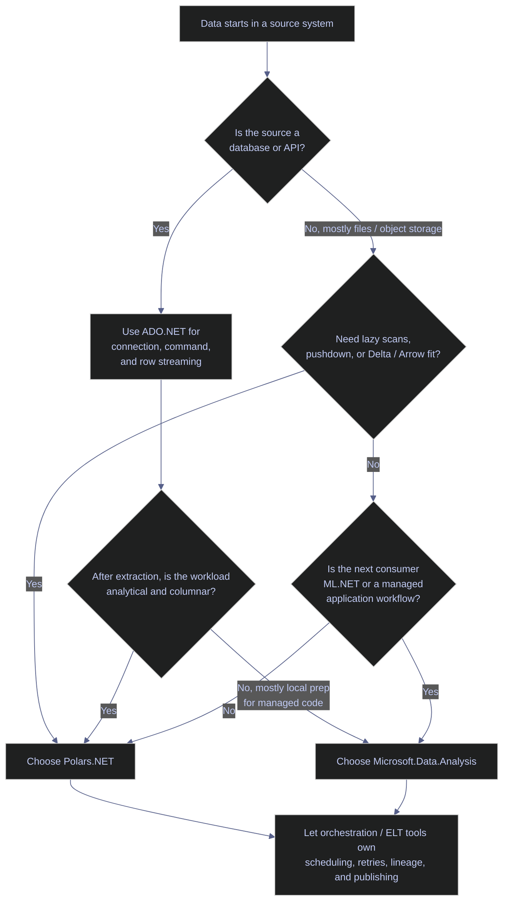

# 01 – Foundations and Data Structures

> [!quote]
> "Bad programmers worry about the code. Good programmers worry about data structures and their relationships."
>
> — **Linus Torvalds**, Git mailing list post (2006)

This note is the C# counterpart to the Python foundations notebook. It defines the core data structures — Series and DataFrame — in both Polars.NET and Microsoft.Data.Analysis (MDA), compares their type systems, null handling, and memory layouts, and covers reading and writing data in CSV, Parquet, and JSON formats. Each section shows both libraries side by side with real EuroStoxx 50 data.

## Key terms used in this note

| Term | Definition | Purpose | Common mistake / confusion |
|---|---|---|---|
| **Polars.NET** | A .NET wrapper around the Rust-based Polars engine. Provides `DataFrame`, `Series`, `LazyFrame`, and expression-based transforms via Apache Arrow memory. | High-performance columnar analytics in C# — same engine as Python Polars, accessed from .NET. | Not a drop-in replacement for LINQ — Polars.NET uses its own expression API, not `IEnumerable<T>`. |
| **Microsoft.Data.Analysis (MDA)** | A Microsoft-maintained DataFrame library for .NET. Provides `DataFrame`, typed `DataFrameColumn` variants, and ML.NET integration via `IDataView`. | Lightweight tabular operations in .NET with direct handoff to ML.NET pipelines. | MDA is less mature than Pandas or Polars — some operations require manual column iteration. |
| **Series** | A one-dimensional typed array. Polars.NET: `Series`. MDA: typed columns like `Int32DataFrameColumn`, `StringDataFrameColumn`. | The atomic unit of columnar data — each DataFrame column is a Series/Column internally. | Polars.NET `Series` is immutable (Arrow-backed). MDA columns are mutable — mutations propagate. |
| **DataFrame** | A two-dimensional tabular structure of named, typed columns. Both libraries provide a `DataFrame` class. | The primary container for structured data in C# analytical workflows. | Polars.NET DataFrames are immutable — every operation returns a new DataFrame. MDA DataFrames are mutable. |
| **NuGet** | The .NET package manager. Polars.NET: `Polars.Net`. MDA: `Microsoft.Data.Analysis`. | Installs and manages library dependencies in .NET projects and Polyglot Notebooks. | Version mismatches between Polars.NET and .NET runtime can cause `DllNotFoundException`. Check compatibility. |
| **Arrow** | Apache Arrow columnar memory format — the internal representation used by Polars.NET. | Enables zero-copy interop with other Arrow-native tools (DuckDB.NET, Python Polars). | MDA does not use Arrow — it stores data in managed .NET arrays. No zero-copy exchange between MDA and Polars.NET. |
| **IDataView** | The ML.NET data interface. MDA `DataFrame` implements `IDataView`, enabling direct use in ML.NET pipelines. | Bridges tabular data to ML.NET training and prediction workflows. | Polars.NET does not implement `IDataView` — convert to MDA or extract arrays for ML.NET. |
| **Parquet** | Columnar binary file format with embedded schema and compression. | The preferred I/O format for both libraries — smallest files, fastest reads, type preservation. | MDA has limited Parquet support — use `MLContext.Data.LoadFromParquet()`. Polars.NET has native `ReadParquet()`. |

## What this note covers

- **Setup and imports** — NuGet packages, warning suppression, runtime and deployment guidance
- **Series** — creating, arithmetic, aggregation, describe, and comparison across both libraries
- **DataFrame** — building from dictionaries, arrays, and records in both libraries
- **Decision matrix** — when to use Polars.NET vs MDA vs neither
- **Architecture decision flow** — mermaid diagram for library selection

---

## Setup & Imports

This section prepares the notebook environment, loads the required packages, and records the runtime constraints that matter before comparing Polars.NET and Microsoft.Data.Analysis in real engineering workflows.

### Warning Suppression

Suppress CS1701/CS1702 assembly version warnings in .NET Interactive. NuGet packages targeting .NET 8/9 trigger these on .NET 10 — harmless. Run this cell once before any cells that use NuGet packages.

```csharp
using System.Reflection;
using Microsoft.DotNet.Interactive;
using Microsoft.DotNet.Interactive.CSharp;
var csharpKernel = (CSharpKernel)Kernel.Root.FindKernelByName("csharp");
var optionsField = typeof(CSharpKernel).GetField("_scriptOptions",
    BindingFlags.NonPublic | BindingFlags.Instance);
var scriptOptions = optionsField.GetValue(csharpKernel);
var withWarningLevel = scriptOptions.GetType().GetMethod("WithWarningLevel");
var newOptions = withWarningLevel.Invoke(scriptOptions, new object[] { 0 });
optionsField.SetValue(csharpKernel, newOptions);
Console.WriteLine("WarningLevel set to 0 — CS1701/CS1702 warnings suppressed.");
```

```text
WarningLevel set to 0 — CS1701/CS1702 warnings suppressed.
```

### NuGet Packages and Imports

```csharp
#r "nuget: Polars.NET, 0.4.0"
#r "nuget: Polars.NET.Native.win-x64, 0.4.0"
#r "nuget: Microsoft.Data.Analysis, 0.23.0"
#r "nuget: ParquetSharp, 21.0.0"
#r "nuget: ParquetSharp.DataFrame, 0.1.0"
using System;
using System.Reflection;
using System.IO;
using System.Linq;
using System.Collections.Generic;
using System.Globalization;
using System.Text.Json;
using Polars.CSharp;
using static Polars.CSharp.Polars;
using MDA = Microsoft.Data.Analysis;
using ParquetSharp;
using Microsoft.DotNet.Interactive;
using Microsoft.DotNet.Interactive.CSharp;
using Microsoft.DotNet.Interactive.Formatting;
Formatter.Register<DataFrame>((df, writer) =>
{
    var html = df.ToHtml();
    html = System.Text.RegularExpressions.Regex.Replace(html, @"(&gt;|>)(.+?)(&lt;|<)", @"$1$2$3");
    html = System.Text.RegularExpressions.Regex.Replace(html, @">""(.+?)""<", @">$1<");
    var css = """
        """;
    writer.Write(css + html);
}, "text/html");
Formatter.Register<Polars.CSharp.Series>((s, writer) =>
{
    var sdf = DataFrame.FromSeries(s);
    var shtml = sdf.ToHtml();
    shtml = System.Text.RegularExpressions.Regex.Replace(shtml, @"(>|>)(.+?)(<|<)", @"$1$2$3");
    shtml = System.Text.RegularExpressions.Regex.Replace(shtml, @">""(.+?)""<", @">$1<");
    var scss = @"";
    writer.Write(scss + shtml);
}, "text/html");
var DATA = Path.Combine("..", "data");
Console.WriteLine($"Data directory: {Path.GetFullPath(DATA)}");

static Type[] OhlcvCsvTypes() => new[]
{
    typeof(long), typeof(string), typeof(DateTime), typeof(decimal), typeof(decimal),
    typeof(decimal), typeof(decimal), typeof(decimal), typeof(long), typeof(decimal),
    typeof(decimal), typeof(bool)
};

static decimal? ToNullableDecimal(object value)
{
    if (value is null) return null;
    if (value is decimal d) return d;
    if (value is string s)
    {
        if (string.IsNullOrWhiteSpace(s)) return null;
        return decimal.Parse(s, NumberStyles.Float, CultureInfo.InvariantCulture);
    }
    return Convert.ToDecimal(value, CultureInfo.InvariantCulture);
}

static MDA.DataFrame ConvertColumnsToDecimal(MDA.DataFrame df, params string[] columnNames)
{
    foreach (var columnName in columnNames)
    {
        var index = df.Columns.IndexOf(columnName);
        if (index < 0) continue;

        var source = df.Columns[index];
        var target = new MDA.PrimitiveDataFrameColumn<decimal>(columnName, df.Rows.Count);
        for (long row = 0; row < df.Rows.Count; row++)
        {
            var value = ToNullableDecimal(source[row]);
            if (value.HasValue) target[row] = value.Value;
        }

        df.Columns.Remove(columnName);
        df.Columns.Insert(index, target);
    }

    return df;
}

static MDA.DataFrame LoadOhlcvCsv(string dataDir) =>
    MDA.DataFrame.LoadCsv(Path.Combine(dataDir, "eurostoxx50_ohlcv.csv"), dataTypes: OhlcvCsvTypes());

static MDA.DataFrame LoadScoresDailyCsv(string dataDir)
{
    var df = MDA.DataFrame.LoadCsv(Path.Combine(dataDir, "scores_daily.csv"));
    return ConvertColumnsToDecimal(
        df,
        "pe_zscore", "pb_zscore", "ev_ebitda_zscore", "yield_zscore", "relative_value_score",
        "relative_strength", "sma_50_ratio", "sma_200_ratio", "dist_from_52w_high", "momentum_score",
        "implied_upside", "recommendation_mean", "sentiment_score", "composite_score", "sma_30_close",
        "sma_90_close", "market_cap", "index_weight", "current_price", "day_change_pct",
        "five_day_change_pct", "ytd_change_pct"
    );
}
```

```text
Data directory: c:\Users\aperi\DEV\LANG\data
```

### Runtime and Deployment Guidance

Package installation is not a footnote here; it directly affects how each library behaves in production. Polars.NET is a native-backed analytical engine exposed to .NET, while Microsoft.Data.Analysis is a managed .NET library that stays closer to the rest of the ML.NET and `System.Data` ecosystem.

> [!info] Official capability snapshot | 2026-04
>
> [Polars.NET 0.4.0](https://www.nuget.org/packages/Polars.NET/0.4.0) documents a .NET 8+ requirement, separate native runtime packages, AVX2-class CPU requirements, and first-class .NET integrations including ADO.NET, ADBC, LINQ, and Delta Lake.
>
> [Microsoft.Data.Analysis 0.23.0](https://www.nuget.org/packages/Microsoft.Data.Analysis/) targets .NET Standard 2.0 / .NET 8, depends on Apache Arrow and `Microsoft.ML.DataView`, and the [official `DataFrame` API](https://learn.microsoft.com/en-us/dotnet/api/microsoft.data.analysis.dataframe?view=ml-dotnet-preview) shows that `DataFrame` implements `IDataView` for ML.NET interoperability.

#### Polars.NET | Plan for native runtime packaging and modern CPUs

Polars.NET is the better fit when you want a high-performance analytical engine embedded inside a .NET application, but the tradeoff is operational: you must ship the matching native runtime package for the deployment target and run on hardware that satisfies the package's AVX2 baseline. That makes Polars.NET a strong choice for data engineering services, batch workers, lakehouse utilities, and notebook environments that you control end-to-end, but a weaker choice for highly constrained hosting environments where native packaging is difficult to standardize.

#### Microsoft.Data.Analysis | Prefer when a pure managed dependency is operationally simpler

Microsoft.Data.Analysis fits more naturally into ordinary managed .NET applications because it does not require a second native runtime package in the way Polars.NET does. Combined with its ML.NET-oriented `IDataView` surface, this makes MDA attractive when the main goal is in-process data preparation, exploratory work inside .NET notebooks, or feature engineering immediately upstream of ML.NET training and scoring code.

#### Deployment recommendation | Treat packaging and interoperability as architecture decisions

For senior teams, the engine decision should happen at the same time as the runtime decision. If your service already standardizes on .NET 8+, ships native dependencies, and processes Parquet/Delta/Arrow data as a first-class workload, Polars.NET is usually the better long-term analytical core. If your service is primarily a managed .NET application that occasionally needs tabular manipulation before ML.NET or reporting logic, Microsoft.Data.Analysis often has the lower operational cost.

---

## Series

A **Series** is a single column of typed, homogeneous data — the fundamental building block of any DataFrame library. Polars.NET and Microsoft.Data.Analysis both work with typed, column-oriented vectors, but they expose them differently. Polars.NET uses Arrow-backed `Series` with native null bitmaps and Arrow logical types. Microsoft.Data.Analysis uses managed `DataFrameColumn` objects backed by CLR types such as `Decimal`, `Int32`, `String`, and `DateTime`.

> [!info] Polars.NET vs Microsoft.Data.Analysis | Null representation
>
> Polars.NET represents missing values with Arrow's native null bitmap, so a nullable numeric column remains strongly typed as `f64` or similar Arrow data. Microsoft.Data.Analysis stores nulls directly inside nullable `DataFrameColumn` values and exposes the result through per-column `.NullCount` and CLR `Type` metadata.

### Creating Series

#### Polars.NET | Create Series from arrays

`Series.From<T>(name, array)` creates a named, typed Series from any .NET array. Polars automatically maps .NET types to Arrow types (`double` → `f64`, `int` → `i32`, `string` → `str`). The name parameter is required because Polars Series always carry a column name — this becomes the column header when the Series is added to a DataFrame.

_Creates a `prices` Series of 5 `f64` values from a `decimal[]`, then creates `ids` (`i32`), `tickers` (`str`), and `dates` (`date`) Series to confirm Polars maps each .NET array type to its Arrow equivalent without explicit type declarations._

```csharp
// Microsoft.Data.Analysis – create a Column from an array
var prices = new PrimitiveDataFrameColumn<decimal>("prices", new[] { 100.0m, 102.5m, 101.8m, 103.2m, 104.1m });

display($"Name: {prices.Name}  |  Length: {prices.Length}  |  DataType: {prices.DataType.Name}");
new DataFrame(prices)
```

```text
Name: prices  |  Length: 5  |  DataType: Decimal
```

<table><thead><tr><th>prices</th></tr></thead><tbody><tr><td>100.0</td></tr><tr><td>102.5</td></tr><tr><td>101.8</td></tr><tr><td>103.2</td></tr><tr><td>104.1</td></tr></tbody></table>

#### Microsoft.Data.Analysis | Create Columns from arrays

`Microsoft.Data.Analysis` models a single series-like vector as `DataFrameColumn`. Numeric data uses `PrimitiveDataFrameColumn<T>`, strings use `StringDataFrameColumn`, and types stay in the CLR type system rather than Arrow logical types.

_Creates a `prices` column of 5 `Decimal` values from a `decimal[]`, then creates `ids` (`Int32`), `tickers` (`String`), and `dates` (`DateTime`) columns to confirm Microsoft.Data.Analysis maps each .NET input array to the matching column type._

```csharp
// Microsoft.Data.Analysis – create a Column from an array
var prices = new MDA.PrimitiveDataFrameColumn<decimal>("prices", new[] { 100.0m, 102.5m, 101.8m, 103.2m, 104.1m });

display($"Name: {prices.Name}  |  Length: {prices.Length}  |  DataType: {prices.DataType.Name}");

var ints = new MDA.PrimitiveDataFrameColumn<int>("ids", new[] { 1, 2, 3, 4, 5 });
var strings = new MDA.StringDataFrameColumn("tickers", new[] { "ASML.AS", "SAP.DE", "SIE.DE" });
var dates = new MDA.PrimitiveDataFrameColumn<DateTime>("dates", new[]
{
    new DateTime(2024, 1, 2), new DateTime(2024, 1, 3), new DateTime(2024, 1, 4)
});

display($"ints: {ints.DataType.Name}  |  strings: {strings.DataType.Name}  |  dates: {dates.DataType.Name}");
new MDA.DataFrame(prices)
```

```text
Name: prices  |  Length: 5  |  DataType: Decimal
ints: Int32  |  strings: String  |  dates: DateTime
```

<table><thead><tr><th>prices</th></tr></thead><tbody><tr><td>100.0</td></tr><tr><td>102.5</td></tr><tr><td>101.8</td></tr><tr><td>103.2</td></tr><tr><td>104.1</td></tr></tbody></table>

#### Microsoft.Data.Analysis | Handle nulls natively in columns

Microsoft.Data.Analysis supports missing values through nullable element types inside `PrimitiveDataFrameColumn<T>`. Use `.NullCount` to inspect how many elements are missing.

_Creates a `with_nulls` column from a `decimal?[]` containing 2 nulls at indices 1 and 3, confirming that `.NullCount` returns 2 and the column keeps its numeric `Decimal` type._

```csharp
// Microsoft.Data.Analysis – native null support via nullable types
var s = new MDA.PrimitiveDataFrameColumn<decimal>("with_nulls",
    new decimal?[] { 1.0m, null, 3.0m, null, 5.0m });

display($"Length: {s.Length}  |  NullCount: {s.NullCount}");
new MDA.DataFrame(s)
```

```text
Length: 5  |  NullCount: 2
```

<table><thead><tr><th>with_nulls</th></tr></thead><tbody><tr><td>1.0</td></tr><tr><td>&lt;null&gt;</td></tr><tr><td>3.0</td></tr><tr><td>&lt;null&gt;</td></tr><tr><td>5.0</td></tr></tbody></table>

#### Microsoft.Data.Analysis | Inspect column data types

Microsoft.Data.Analysis exposes CLR types through `.DataType`. You inspect `Int32`, `Int64`, `Decimal`, `String`, `Boolean`, and `DateTime` rather than Arrow names like `i32` or `f64`.

_Creates columns from several .NET input types and prints each resolved CLR `Type.Name`, confirming the library stays aligned with standard .NET typing._

```csharp
// Microsoft.Data.Analysis – .NET Type system representation
var examples = new (string Name, Type Type)[]
{
    ("Int32",    new MDA.PrimitiveDataFrameColumn<int>("x", new[] { 1, 2, 3 }).DataType),
    ("Int64",    new MDA.PrimitiveDataFrameColumn<long>("x", new[] { 1L, 2L, 3L }).DataType),
    ("Decimal",  new MDA.PrimitiveDataFrameColumn<decimal>("x", new[] { 1.0m, 2.0m }).DataType),
    ("String",   new MDA.StringDataFrameColumn("x", new[] { "a", "b" }).DataType),
    ("Boolean",  new MDA.PrimitiveDataFrameColumn<bool>("x", new[] { true, false }).DataType),
    ("DateTime", new MDA.PrimitiveDataFrameColumn<DateTime>("x", new[] { DateTime.Now }).DataType),
};
foreach (var (name, type) in examples)
    Console.WriteLine($"  {name,-12} → {type.Name}");
```

```text
  Int32        → Int32
  Int64        → Int64
  Decimal      → Decimal
  String       → String
  Boolean      → Boolean
  DateTime     → DateTime
```

---

### Arithmetic Operations

Both libraries support standard arithmetic operators (`+`, `-`, `*`, `/`) on Series. Operations are element-wise and return a new Series.

#### Polars.NET | Perform arithmetic on Series

Polars.NET overloads the standard arithmetic operators. The result is always a new Series — Polars Series are immutable.

_Creates two 3-element `f64` Series `a` ([10, 20, 30]) and `b` ([1, 2, 3]), applies all four arithmetic operators element-wise, and assembles the results into a single DataFrame — confirming each operation returns a new immutable Series._

```csharp
var a = Polars.CSharp.Series.From("a", new[] { 10.0, 20.0, 30.0 });
var b = Polars.CSharp.Series.From("b", new[] { 1.0, 2.0, 3.0 });
DataFrame.FromColumns(
    ("a + b", (a + b).ToArray<double>()),
    ("a - b", (a - b).ToArray<double>()),
    ("a * b", (a * b).ToArray<double>()),
    ("a / b", (a / b).ToArray<double>())
)
```

<!-- Polars DataFrame: (3 rows, 4 columns) -->
<table><thead><tr><th>a + b</th><th>a - b</th><th>a * b</th><th>a / b</th></tr></thead><tbody><tr><td>11</td><td>9</td><td>10</td><td>10</td></tr><tr><td>22</td><td>18</td><td>40</td><td>10</td></tr><tr><td>33</td><td>27</td><td>90</td><td>10</td></tr></tbody></table></div>

#### Microsoft.Data.Analysis | Perform arithmetic on columns

Arithmetic operators work on compatible `DataFrameColumn` instances and return new columns. Names are not derived automatically, so rename the result columns before assembling them into a DataFrame.

_Creates two 3-element numeric columns `a` and `b`, applies `+`, `-`, `*`, and `/` element-wise, assigns readable result names, and combines them into a 4-column DataFrame._

```csharp
// Microsoft.Data.Analysis – operator overloads on Columns
var a = new MDA.PrimitiveDataFrameColumn<decimal>("a", new[] { 10.0m, 20.0m, 30.0m });
var b = new MDA.PrimitiveDataFrameColumn<decimal>("b", new[] { 1.0m, 2.0m, 3.0m });

var add = a + b;
var sub = a - b;
var mul = a * b;
var div = a / b;

add.SetName("a + b");
sub.SetName("a - b");
mul.SetName("a * b");
div.SetName("a / b");

new MDA.DataFrame(add, sub, mul, div)
```

<table><thead><tr><th>a + b</th><th>a - b</th><th>a * b</th><th>a / b</th></tr></thead><tbody><tr><td>11</td><td>9</td><td>10</td><td>10</td></tr><tr><td>22</td><td>18</td><td>40</td><td>10</td></tr><tr><td>33</td><td>27</td><td>90</td><td>10</td></tr></tbody></table>

---

### Aggregations

#### Polars.NET | Compute aggregations on Series

Polars.NET provides generic aggregation methods (`.Sum<T>()`, `.Mean<T>()`, `.Std()`, `.Min<T>()`, `.Max<T>()`) that return scalar values. The generic type parameter specifies the return type. `.Std()` returns a single-element Series rather than a scalar.

_Creates a `vals` Series of [10, 20, 30, 40, 50] and calls all five aggregation methods, assembling results into a summary DataFrame — showing that `.Std()` requires `.GetValue<double>(0)` to extract its scalar while all other methods return directly._

```csharp
var s = Polars.CSharp.Series.From("vals", new[] { 10.0, 20.0, 30.0, 40.0, 50.0 });
new DataFrame(new Polars.CSharp.Series[]
{
    Polars.CSharp.Series.From("stat", new[] { "sum", "mean", "std", "min", "max" }),
    Polars.CSharp.Series.From("value", new[] {
        s.Sum<double>(), s.Mean<double>(), s.Std().GetValue<double>(0),
        s.Min<double>(), s.Max<double>()
    })
})
```

<!-- Polars DataFrame: (5 rows, 2 columns) -->
<table><thead><tr><th>stat</th><th>value</th></tr></thead><tbody><tr><td>sum</td><td>150</td></tr><tr><td>mean</td><td>30</td></tr><tr><td>std</td><td>15.8113883</td></tr><tr><td>min</td><td>10</td></tr><tr><td>max</td><td>50</td></tr></tbody></table></div>

#### Microsoft.Data.Analysis | Compute aggregations on columns

Microsoft.Data.Analysis provides core aggregation methods such as `.Sum()`, `.Mean()`, `.Min()`, and `.Max()`. Standard deviation is often computed manually from the column values when you need parity with richer analytical libraries.

_Creates a `vals` column of `[10, 20, 30, 40, 50]`, computes sum, mean, sample standard deviation, min, and max, and assembles the results into a summary DataFrame._

```csharp
// Microsoft.Data.Analysis — basic aggregations
var s = new MDA.PrimitiveDataFrameColumn<decimal>("vals", new[] { 10.0m, 20.0m, 30.0m, 40.0m, 50.0m });

var values = s.Cast<decimal?>().Where(v => v.HasValue).Select(v => v.Value).ToArray();
var sum = values.Sum();
var mean = values.Average();
decimal sumSq = 0m;
foreach (var val in values)
    sumSq += (val - mean) * (val - mean);
var std = (decimal)Math.Sqrt((double)(sumSq / (values.Length - 1)));

new MDA.DataFrame(
    new MDA.StringDataFrameColumn("stat", new[] { "sum", "mean", "std", "min", "max" }),
    new MDA.PrimitiveDataFrameColumn<decimal>("value", new[] { sum, mean, std, values.Min(), values.Max() })
)
```

<table><thead><tr><th>stat</th><th>value</th></tr></thead><tbody><tr><td>sum</td><td>150</td></tr><tr><td>mean</td><td>30</td></tr><tr><td>std</td><td>15.811388300841896</td></tr><tr><td>min</td><td>10</td></tr><tr><td>max</td><td>50</td></tr></tbody></table>

---

### Describe (Summary Statistics)

#### Polars.NET | Summarise a Series with Describe

`Describe()` returns a DataFrame with count, null_count, mean, std, min, percentiles (25%, 50%, 75%), and max. Since `.Describe()` is a DataFrame method, wrap a single Series in a DataFrame first with `DataFrame.FromSeries()`.

_Wraps a 5-element `prices` Series in a DataFrame via `DataFrame.FromSeries()` and calls `.Describe()`, producing a 9-row summary with count, null_count, mean, std, min, 25%/50%/75% percentiles, and max._

```csharp
var s = Polars.CSharp.Series.From("prices", new[] { 100.0, 102.5, 101.8, 103.2, 104.1 });
var df = DataFrame.FromSeries(s);
df.Describe()
```

<!-- Polars DataFrame: (9 rows, 2 columns) -->
<table><thead><tr><th>statistic</th><th>prices</th></tr></thead><tbody><tr><td>count</td><td>5</td></tr><tr><td>null_count</td><td>0</td></tr><tr><td>mean</td><td>102.32</td></tr><tr><td>std</td><td>1.551450934</td></tr><tr><td>min</td><td>100</td></tr></tbody></table></div>

#### Microsoft.Data.Analysis | Summarise a column with `Description()`

`MDA.DataFrame.Description()` returns a compact statistical summary for numeric columns. It is simpler than Polars `Describe()` and does not include percentile rows.

_Wraps a 5-element `prices` column in an MDA DataFrame and calls `.Description()`, returning length, max, min, and mean for the column._

```csharp
// Microsoft.Data.Analysis – built-in describe (returns a DataFrame)
var s = new MDA.PrimitiveDataFrameColumn<decimal>("prices", new[] { 100.0m, 102.5m, 101.8m, 103.2m, 104.1m });
var df = new MDA.DataFrame(s);
df.Description()
```

<table><thead><tr><th>Description</th><th>prices</th></tr></thead><tbody><tr><td>Length (excluding null values)</td><td>5</td></tr><tr><td>Max</td><td>104.1</td></tr><tr><td>Min</td><td>100</td></tr><tr><td>Mean</td><td>102.32</td></tr></tbody></table>

---

### Comparison Summary | Series

| Operation | Polars.NET | Microsoft.Data.Analysis |
|---|---|---|
| Create from array | `Series.From<T>("name", arr)` | `new MDA.PrimitiveDataFrameColumn<T>("name", arr)` |
| Create string column | `Series.From("name", string[])` | `new MDA.StringDataFrameColumn("name", arr)` |
| Null / missing | Nullable types + Arrow null bitmap | Nullable column elements + `.NullCount` |
| Data type | `.DataTypeName` (Arrow types) | `.DataType` (CLR `Type`) |
| Arithmetic | `+`, `-`, `*`, `/` on `Series` | `+`, `-`, `*`, `/` on columns |
| Sum / Mean / Std | `.Sum<T>()`, `.Mean<T>()`, `.Std()` | `.Sum()`, `.Mean()`, manual `std` |
| Min / Max | `.Min<T>()`, `.Max<T>()` | `.Min()`, `.Max()` |
| Describe | `DataFrame.FromSeries(s).Describe()` | `new MDA.DataFrame(col).Description()` |

---

## DataFrames

A **DataFrame** is a collection of named, typed columns — the primary tabular data structure. Polars.NET DataFrames are Arrow-backed, immutable, and index-free. Microsoft.Data.Analysis DataFrames are managed, column-oriented, mutable objects built from `DataFrameColumn` instances and also operate without a built-in row index.

> [!info] Polars.NET vs Microsoft.Data.Analysis | Mutability
>
> Polars DataFrames are **immutable** — operations like `.WithColumns()`, `.Filter()`, and `.Sort()` always return a new DataFrame. Microsoft.Data.Analysis DataFrames are **mutable** — column insertion, removal, and replacement modify the current frame in place.

### Building DataFrames

#### Polars.NET | Build DataFrames from columns

`DataFrame.FromColumns()` accepts an anonymous object where each property becomes a column. This is the most concise way to create a small DataFrame inline. Column order follows property declaration order.

_Creates a 5-row equity DataFrame (Symbol/Sector/Price) from an anonymous object where each property becomes a column, then creates a second 3-row DataFrame from named tuples — demonstrating both `DataFrame.FromColumns()` overloads._

```csharp
var df = DataFrame.FromColumns(new
{
    Symbol = new[] { "ASML.AS", "SAP.DE", "SIE.DE", "TTE.PA", "AIR.PA" },
    Sector = new[] { "Technology", "Technology", "Industrials", "Energy", "Industrials" },
    Price  = new[] { 680.5, 175.2, 168.9, 58.3, 152.7 },
});
display($"Shape: {df.Shape}");
df
```

```text
Shape: (5, 3)
```

<!-- Polars DataFrame: (5 rows, 3 columns) -->
<table><thead><tr><th>Symbol</th><th>Sector</th><th>Price</th></tr></thead><tbody><tr><td>ASML.AS</td><td>Technology</td><td>680.5</td></tr><tr><td>SAP.DE</td><td>Technology</td><td>175.2</td></tr><tr><td>SIE.DE</td><td>Industrials</td><td>168.9</td></tr><tr><td>TTE.PA</td><td>Energy</td><td>58.3</td></tr><tr><td>AIR.PA</td><td>Industrials</td><td>152.7</td></tr></tbody></table></div>

An alternative is named tuples, which avoids reflection and is slightly faster for construction.

```csharp
var df2 = DataFrame.FromColumns(
    ("Name",  new[] { "Alice", "Bob", "Carol" }),
    ("Age",   new[] { 30, 25, 35 }),
    ("Score", new[] { 95.5, 88.0, 92.3 })
);
df2
```

<!-- Polars DataFrame: (3 rows, 3 columns) -->
<table><thead><tr><th>Name</th><th>Age</th><th>Score</th></tr></thead><tbody><tr><td>Alice</td><td>30</td><td>95.5</td></tr><tr><td>Bob</td><td>25</td><td>88</td></tr><tr><td>Carol</td><td>35</td><td>92.3</td></tr></tbody></table></div>

#### Microsoft.Data.Analysis | Build DataFrames from columns

The standard MDA construction path is `new MDA.DataFrame(col1, col2, ...)`. You define each column explicitly, then compose them into a frame.

_Creates a 5-row equity DataFrame by passing three explicitly constructed columns into the `MDA.DataFrame` constructor._

```csharp
// Microsoft.Data.Analysis – from explicit column definitions
var df = new DataFrame(
    new StringDataFrameColumn("Symbol", new[] { "ASML.AS", "SAP.DE", "SIE.DE", "TTE.PA", "AIR.PA" }),
    new StringDataFrameColumn("Sector", new[] { "Technology", "Technology", "Industrials", "Energy", "Industrials" }),
    new PrimitiveDataFrameColumn<decimal>("Price", new[] { 680.5m, 175.2m, 168.9m, 58.3m, 152.7m })
);

display($"Shape: ({df.Rows.Count}, {df.Columns.Count})");
df
```

```text
Shape: (5, 3)
```

<table><thead><tr><th>Symbol</th><th>Sector</th><th>Price</th></tr></thead><tbody><tr><td>ASML.AS</td><td>Technology</td><td>680.5</td></tr><tr><td>SAP.DE</td><td>Technology</td><td>175.2</td></tr><tr><td>SIE.DE</td><td>Industrials</td><td>168.9</td></tr><tr><td>TTE.PA</td><td>Energy</td><td>58.3</td></tr><tr><td>AIR.PA</td><td>Industrials</td><td>152.7</td></tr></tbody></table>

#### Microsoft.Data.Analysis | Build DataFrames from record objects

Microsoft.Data.Analysis does not offer a Polars-style `DataFrame.From<T>()` helper. The usual pattern is to project an `IEnumerable<T>` into one column per property and build the DataFrame manually.

_Creates 3 OHLC records as anonymous objects, projects each property into a typed column, and builds a 5-column DataFrame manually._

```csharp
// Microsoft.Data.Analysis – from IEnumerable of records (requires manual mapping)
var records = new[]
{
    new { Date = new DateTime(2024, 1, 2), Open = 100.0m, High = 105.0m, Low = 99.0m, Close = 103.5m },
    new { Date = new DateTime(2024, 1, 3), Open = 103.5m, High = 106.0m, Low = 102.0m, Close = 104.8m },
    new { Date = new DateTime(2024, 1, 4), Open = 104.8m, High = 107.5m, Low = 103.0m, Close = 106.2m },
};

var df = new DataFrame(
    new PrimitiveDataFrameColumn<DateTime>("Date", records.Select(r => r.Date)),
    new PrimitiveDataFrameColumn<decimal>("Open", records.Select(r => r.Open)),
    new PrimitiveDataFrameColumn<decimal>("High", records.Select(r => r.High)),
    new PrimitiveDataFrameColumn<decimal>("Low", records.Select(r => r.Low)),
    new PrimitiveDataFrameColumn<decimal>("Close", records.Select(r => r.Close))
);
df
```

<table><thead><tr><th>Date</th><th>Open</th><th>High</th><th>Low</th><th>Close</th></tr></thead><tbody><tr><td>2024-01-02 00:00:00Z</td><td>100.0</td><td>105.0</td><td>99.0</td><td>103.5</td></tr><tr><td>2024-01-03 00:00:00Z</td><td>103.5</td><td>106.0</td><td>102.0</td><td>104.8</td></tr><tr><td>2024-01-04 00:00:00Z</td><td>104.8</td><td>107.5</td><td>103.0</td><td>106.2</td></tr></tbody></table>

#### Microsoft.Data.Analysis | Build DataFrames from existing columns

Pre-built `DataFrameColumn` objects can be combined directly with the DataFrame constructor. Column names become the headers exactly as defined on each source column.

_Pre-builds `name`, `age`, and `score` columns, then combines them into a 2-row MDA DataFrame._

```csharp
// Microsoft.Data.Analysis – from existing Columns
var names  = new StringDataFrameColumn("name", new[] { "Alice", "Bob" });
var ages   = new PrimitiveDataFrameColumn<int>("age", new[] { 30, 25 });
var scores = new PrimitiveDataFrameColumn<decimal>("score", new[] { 95.5m, 88.0m });

var df = new DataFrame(names, ages, scores);
df
```

<table><thead><tr><th>name</th><th>age</th><th>score</th></tr></thead><tbody><tr><td>Alice</td><td>30</td><td>95.5</td></tr><tr><td>Bob</td><td>25</td><td>88.0</td></tr></tbody></table>

#### Microsoft.Data.Analysis | Create an empty DataFrame with a predefined schema

To predefine schema in MDA, create zero-length typed columns and pass them into the `MDA.DataFrame` constructor. This preserves column names and CLR types even with no rows.

_Creates an empty 3-column DataFrame with `id`, `name`, and `value`, confirming the shape is `(0, 3)` and the schema is defined by the empty columns._

```csharp
// Microsoft.Data.Analysis – empty DataFrame with predefined schema
var empty = new DataFrame(
    new PrimitiveDataFrameColumn<int>("id", 0),
    new StringDataFrameColumn("name", 0),
    new PrimitiveDataFrameColumn<decimal>("value", 0)
);

display($"Shape: ({empty.Rows.Count}, {empty.Columns.Count})");
empty.Info();
```

```text
Shape: (0, 3)
```

#### Microsoft.Data.Analysis | Access rows by position and filter with boolean masks

Microsoft.Data.Analysis uses positional row access (`Head`) plus boolean-mask filtering. Instead of setting an index, create a comparison column or mask and pass it to `.Filter()`.

_Creates a 3-row stock DataFrame, retrieves the first row with `.Head(1)`, then filters `Symbol == "SAP.DE"` by building a boolean mask with `ElementwiseEquals`._

```csharp
// Microsoft.Data.Analysis – indexing and filtering
var df = new DataFrame(
    new StringDataFrameColumn("Symbol", new[] { "ASML.AS", "SAP.DE", "SIE.DE" }),
    new PrimitiveDataFrameColumn<decimal>("Price", new[] { 680.5m, 175.2m, 168.9m })
);

display(df.Head(1));

var filter = df.Columns["Symbol"].ElementwiseEquals("SAP.DE");
display(df.Filter(filter));
```

<table><thead><tr><th>Symbol</th><th>Price</th></tr></thead><tbody><tr><td>ASML.AS</td><td>680.5</td></tr></tbody></table>
<table><thead><tr><th>Symbol</th><th>Price</th></tr></thead><tbody><tr><td>SAP.DE</td><td>175.2</td></tr></tbody></table>

#### Microsoft.Data.Analysis | Inspect schema and column types of a real dataset

MDA exposes shape through `Rows.Count` and `Columns.Count`, and schema through `Info()` plus per-column metadata. The type system is CLR-based, so you inspect `Decimal`, `Int64`, `Boolean`, and `DateTime` rather than Arrow logical types.

_Loads `eurostoxx50_ohlcv.csv`, calls `Info()`, and reports the 66,355 × 12 shape as a first-pass schema inspection step._

```csharp
// Microsoft.Data.Analysis – inspect schema of a real dataset (using CSV proxy)
var df = LoadOhlcvCsv(DATA);
df.Info();
display($"Shape: ({df.Rows.Count}, {df.Columns.Count})");
```

```text
Shape: (66355, 12)
```

#### Microsoft.Data.Analysis | Cast column types manually

MDA does not provide a Polars-style expression engine for casting. The normal pattern is to construct a new typed column from the original values, replace the existing column, and use explicit parsing when nullability matters.

_Builds a small DataFrame with string `Id` values, replaces `Id` with a new typed `Int32` column, then safely parses a mixed string column where unparseable values become null._

```csharp
// Microsoft.Data.Analysis – cast columns manually
var df = new DataFrame(
    new StringDataFrameColumn("Id", new[] { "1", "2", "3" }),
    new PrimitiveDataFrameColumn<decimal>("Value", new[] { 10.0m, 20.0m, 30.0m })
);

var newId = new PrimitiveDataFrameColumn<int>("Id", df.Columns["Id"].Cast<string>().Select(s => int.Parse(s)));

df.Columns.Remove("Id");
df.Columns.Insert(0, newId);

df.Info();
df
```

<table><thead><tr><th>Id</th><th>Value</th></tr></thead><tbody><tr><td>1</td><td>10.0</td></tr><tr><td>2</td><td>20.0</td></tr><tr><td>3</td><td>30.0</td></tr></tbody></table>

#### Microsoft.Data.Analysis | Load data from CSV natively and use add-on libraries for JSON and Parquet

Microsoft.Data.Analysis reads CSV through `MDA.DataFrame.LoadCsv()`. JSON requires a `System.Text.Json` deserialization step, and Parquet typically goes through `ParquetSharp` plus its DataFrame bridge.

_Loads the OHLCV CSV natively and summarises the resulting shape; the dedicated JSON and Parquet sections below show the full add-on paths._

```csharp
// Microsoft.Data.Analysis — load from CSV (JSON and Parquet require 3rd party libs)
var csvDf = LoadOhlcvCsv(DATA);

new DataFrame(
    new StringDataFrameColumn("format", new[] { "CSV" }),
    new PrimitiveDataFrameColumn<long>("rows", new[] { csvDf.Rows.Count }),
    new PrimitiveDataFrameColumn<int>("cols", new[] { csvDf.Columns.Count })
)
```

<table><thead><tr><th>format</th><th>rows</th><th>cols</th></tr></thead><tbody><tr><td>CSV</td><td>66355</td><td>12</td></tr></tbody></table>

#### Microsoft.Data.Analysis | Inspect shape, schema, head, tail, describe, nulls, and memory

MDA uses `Rows.Count` and `Columns.Count` for shape, `Head()` and `Tail()` for preview, `Info()` for schema metadata, `Description()` for compact summary statistics, and per-column `.NullCount` for null audits.

_Loads the 66,355-row OHLCV CSV, prints shape, previews head and tail, calls `Info()` and `Description()`, audits null counts on `scores_daily`, and estimates memory from column lengths._

```csharp
// Microsoft.Data.Analysis – load the main dataset
var ohlcv = LoadOhlcvCsv(DATA);

display($"Shape: ({ohlcv.Rows.Count}, {ohlcv.Columns.Count})  |  Height: {ohlcv.Rows.Count}  |  Width: {ohlcv.Columns.Count}");
```

```text
Shape: (66355, 12)  |  Height: 66355  |  Width: 12
```

#### Microsoft.Data.Analysis | Extract values and metadata from a column

MDA exposes metadata through `.Name`, `.Length`, and `.DataType`, and the values themselves can be projected to standard .NET arrays with LINQ over the typed column.
_Creates a 3-element `Int32` column, captures key metadata in a small DataFrame, converts the values to `int[]`, and shows the same pattern on a two-column MDA DataFrame._

```csharp
// Microsoft.Data.Analysis — extract values to .NET types
var s = new PrimitiveDataFrameColumn<int>("x", new[] { 1, 2, 3 });

// Series metadata as DataFrame
display(new DataFrame(
    new StringDataFrameColumn("property", new[] { "Name", "Length", "DataType", "Value[0]" }),
    new StringDataFrameColumn("value", new[] { s.Name, s.Length.ToString(), s.DataType.Name, s[0].ToString() })
));

// Converting to .NET array
var arr = s.Cast<int?>().Select(v => v.GetValueOrDefault()).ToArray();
display($"As int[]: [{string.Join(", ", arr)}]");

// DataFrame row iteration
var df = new DataFrame(
    new PrimitiveDataFrameColumn<int>("A", new[] { 1, 2, 3 }),
    new StringDataFrameColumn("B", new[] { "x", "y", "z" })
);
df
```

<table><thead><tr><th>property</th><th>value</th></tr></thead><tbody><tr><td>Name</td><td>x</td></tr><tr><td>Length</td><td>3</td></tr><tr><td>DataType</td><td>Int32</td></tr><tr><td>Value[0]</td><td>1</td></tr></tbody></table>

```text
As int[]: [1, 2, 3]
```

<table><thead><tr><th>A</th><th>B</th></tr></thead><tbody><tr><td>1</td><td>x</td></tr><tr><td>2</td><td>y</td></tr><tr><td>3</td><td>z</td></tr></tbody></table>

#### Microsoft.Data.Analysis | Read CSV files with `MDA.DataFrame.LoadCsv`

`MDA.DataFrame.LoadCsv()` eagerly reads the file and infers CLR column types. It is the native I/O path for Microsoft.Data.Analysis.

_Loads `eurostoxx50_ohlcv.csv`, reports the shape, and previews the first 3 rows._

```csharp
// Microsoft.Data.Analysis – basic CSV read
var df = LoadOhlcvCsv(DATA);

display($"Shape: ({df.Rows.Count}, {df.Columns.Count})");
df.Head(3)
```

```text
Shape: (66355, 12)
```

<table><thead><tr><th>id</th><th>symbol</th><th>date</th><th>open</th><th>high</th><th>low</th><th>close</th><th>adj_close</th><th>volume</th><th>dividends</th><th>stock_splits</th><th>is_filled</th></tr></thead><tbody><tr><td>21160</td><td>ABI.BR</td><td>2021-01-04 00:00:00Z</td><td>58.15</td><td>58.85</td><td>56.78</td><td>57.21</td><td>53.5761</td><td>1513937</td><td>0.0</td><td>0.0</td><td>False</td></tr><tr><td>21161</td><td>ABI.BR</td><td>2021-01-05 00:00:00Z</td><td>56.9</td><td>57.98</td><td>56.75</td><td>57.18</td><td>53.548</td><td>1382722</td><td>0.0</td><td>0.0</td><td>False</td></tr><tr><td>21162</td><td>ABI.BR</td><td>2021-01-06 00:00:00Z</td><td>57.96</td><td>58.94</td><td>57.39</td><td>58.77</td><td>55.037</td><td>1370204</td><td>0.0</td><td>0.0</td><td>False</td></tr></tbody></table>

#### Microsoft.Data.Analysis | Lazy scan CSV is not supported

Microsoft.Data.Analysis has no lazy planner or scan API. The file is always read eagerly, and filters run in memory after the load completes.

_Loads the CSV eagerly, notes that no query plan exists, then filters `symbol == "ASML.AS"` in memory and returns the first 5 matching rows._

```csharp
// Microsoft.Data.Analysis does NOT support Lazy execution. Reads are eager.
var df = LoadOhlcvCsv(DATA);

display("No Query Plan available (Eager Execution).");

// Materialize with a filter (executed in-memory post-load)
var result = df.Filter(df.Columns["symbol"].ElementwiseEquals("ASML.AS")).Head(5);
result
```

```text
No Query Plan available (Eager Execution).
```

<table><thead><tr><th>id</th><th>symbol</th><th>date</th><th>open</th><th>high</th><th>low</th><th>close</th><th>adj_close</th><th>volume</th><th>dividends</th><th>stock_splits</th><th>is_filled</th></tr></thead><tbody><tr><td>1</td><td>ASML.AS</td><td>2021-01-04 00:00:00Z</td><td>404.0</td><td>411.0</td><td>402.25</td><td>406.25</td><td>387.709</td><td>789502</td><td>0.0</td><td>0.0</td><td>False</td></tr><tr><td>2</td><td>ASML.AS</td><td>2021-01-05 00:00:00Z</td><td>406.55</td><td>412.05</td><td>401.15</td><td>406.9</td><td>388.3294</td><td>798787</td><td>0.0</td><td>0.0</td><td>False</td></tr><tr><td>3</td><td>ASML.AS</td><td>2021-01-06 00:00:00Z</td><td>406.8</td><td>407.2</td><td>399.2</td><td>402.85</td><td>384.4644</td><td>875711</td><td>0.0</td><td>0.0</td><td>False</td></tr><tr><td>4</td><td>ASML.AS</td><td>2021-01-07 00:00:00Z</td><td>404.8</td><td>407.8</td><td>400.35</td><td>403.9</td><td>385.4664</td><td>874780</td><td>0.0</td><td>0.0</td><td>False</td></tr><tr><td>5</td><td>ASML.AS</td><td>2021-01-08 00:00:00Z</td><td>414.25</td><td>419.1</td><td>413.4</td><td>416.05</td><td>397.0618</td><td>975243</td><td>0.0</td><td>0.0</td><td>False</td></tr></tbody></table>

#### Microsoft.Data.Analysis | Read JSON via `System.Text.Json` and map into MDA columns

MDA does not natively read JSON arrays of objects. The usual path is to deserialize into typed records, then project those records into `DataFrameColumn` instances.

_Defines a record class matching the JSON schema, deserializes `eurostoxx50_ohlcv.json`, and maps each property into an MDA column before previewing the result._

```csharp
public class OhlcvRecord
{
    public long id { get; set; }
    public string symbol { get; set; }
    public DateTime date { get; set; }
    public decimal open { get; set; }
    public decimal high { get; set; }
    public decimal low { get; set; }
    public decimal close { get; set; }
    public decimal adj_close { get; set; }
    public long volume { get; set; }
    public decimal dividends { get; set; }
    public decimal stock_splits { get; set; }
    public bool is_filled { get; set; }
}
```

#### Microsoft.Data.Analysis | Read Parquet via the ParquetSharp bridge

Microsoft.Data.Analysis does not ship its own Parquet reader, but `ParquetSharp` plus `ParquetSharp.DataFrame` provides a direct bridge into `MDA.DataFrame`.

_Opens `eurostoxx50_ohlcv.parquet` with `ParquetFileReader`, converts it to an MDA DataFrame, and reports the resulting shape._

```csharp
var filePath = Path.Combine(DATA, "eurostoxx50_ohlcv.parquet");

Microsoft.Data.Analysis.DataFrame df;

// Use a traditional using block to avoid the parser bug
using (var reader = new ParquetFileReader(filePath))
{
    df = reader.ToDataFrame();
}

// Print Schema
df.Info();

// Display Shape
display($"Shape: ({df.Rows.Count}, {df.Columns.Count})");
```

```text
Shape: (66355, 12)
```

#### Microsoft.Data.Analysis | Parquet filtering and projection are eager

Without a lazy engine, MDA loads the dataset first and then performs column projection, filtering, and sorting in memory. That gives functional parity for small and medium workloads, but not pushdown optimization.

_Projects a loaded CSV down to `date`, `symbol`, and `close`, then filters `SAP.DE` and orders the result in memory._

```csharp
// Microsoft.Data.Analysis – column projection (loads all first, then subsets)
var df = LoadOhlcvCsv(DATA);
var projected = new DataFrame(df.Columns["date"], df.Columns["symbol"], df.Columns["close"]);

display($"Shape: ({projected.Rows.Count}, {projected.Columns.Count})");
projected.Info();
```

```text
Shape: (66355, 3)
```

#### Microsoft.Data.Analysis | Load all CSV datasets from the data directory

The native batch-loading pattern in MDA is directory-wide CSV ingestion through repeated `LoadCsv` calls. Parquet batch loading would require the same `ParquetSharp` bridge shown above.

_Scans the data directory for `.csv` files, loads each one with MDA, and prints the resulting row and column counts._

```csharp
// Microsoft.Data.Analysis – load all .csv files from the data directory
var csvFiles = Directory.GetFiles(DATA, "*.csv")
    .Where(f => !Path.GetFileName(f).StartsWith("bench_"))
    .OrderBy(f => f);

foreach (var file in csvFiles)
{
    var fileName = Path.GetFileName(file);
    var df = fileName switch
    {
        "eurostoxx50_ohlcv.csv" => LoadOhlcvCsv(DATA),
        "scores_daily.csv" => LoadScoresDailyCsv(DATA),
        _ => DataFrame.LoadCsv(file)
    };
    Console.WriteLine($"  {fileName,-40} ({df.Rows.Count}, {df.Columns.Count})");
}
```

```text
  dim_country.csv                          (212, 2)
  dim_index.csv                            (4, 5)
  duckdb_export.csv                        (50, 3)
  eurostoxx50_ohlcv.csv                    (66355, 12)
  index_dim.csv                            (169, 26)
  index_performance.csv                    (5281, 15)
  ingest_large.csv                         (750000, 12)
  ingest_medium.csv                        (75000, 12)
  ingest_small.csv                         (2500, 12)
  large_bq_insert.csv                      (65100, 12)
  large_sql_insert.csv                     (24738, 12)
  large_upload.csv                         (12000000, 12)
  medium_upload.csv                        (2500000, 11)
  oil20_ohlcv.csv                          (24738, 12)
  pulse.csv                                (40, 20)
  scores_daily.csv                         (466, 36)
  scores_quarterly.csv                     (170, 29)
  signals_daily.csv                        (466, 19)
  signals_quarterly.csv                    (177, 22)
  small_bq_insert.csv                      (5281, 15)
  small_sql_insert.csv                     (466, 36)
  small_upload.csv                         (125000, 11)
  stoxxusa50_ohlcv.csv                     (65100, 12)
  trading_calendar.csv                     (29335, 11)
```

#### Microsoft.Data.Analysis | Use ADO.NET for extraction, then materialize eagerly into typed columns

The official `DataFrame` API includes `LoadFrom(DbDataReader)` and `LoadFrom(DbDataAdapter)`, so MDA can ingest relational results directly from the standard ADO.NET surface. The important distinction is not "can it connect?" but "where does optimization happen?" MDA remains an eager, in-memory DataFrame API after the reader boundary has been crossed, so it is best suited to straightforward post-extraction shaping, feature preparation, joins, and summarization inside managed .NET code rather than to a pushdown-heavy execution model.

#### Database boundary recommendation | Separate OLTP connectivity from analytical transforms

The [ADO.NET overview](https://learn.microsoft.com/en-us/dotnet/framework/data/adonet/ado-net-overview) and [DataReaders guidance](https://learn.microsoft.com/en-us/dotnet/framework/data/adonet/dataadapters-and-datareaders) still describe the core division of labor correctly: providers and readers own connection management, commands, transactions, and row streaming; downstream structures own manipulation and analysis. Keep that separation explicit in production code. Use ADO.NET to talk to SQL Server, PostgreSQL, Oracle, or ODBC sources, and use Polars.NET or MDA only after the extraction boundary has been crossed.

### Parameter Deep-Dives

#### Polars.NET | Override column types at read time with schema overrides

Force specific columns to particular types at read time using `dtypeOverride`. This is useful when Polars infers the wrong type (e.g., a numeric ID column parsed as `Int64` when you want `Int32`, or `volume` as integer when you need float for division).

_Defines a `PolarsSchema` that overrides only `volume` from its inferred `Int64` to `Float64`, then reads the CSV with `dtypeOverride` — confirming the override applies only to `volume` while all other columns retain their inferred types._

```csharp
// Microsoft.Data.Analysis – schema overrides during LoadCsv
var colTypes = OhlcvCsvTypes();
var df = DataFrame.LoadCsv(Path.Combine(DATA, "eurostoxx50_ohlcv.csv"), dataTypes: colTypes);
df.Info();
```

#### Microsoft.Data.Analysis | Override column types at read time with `dataTypes`

MDA lets you specify CLR types positionally when calling `LoadCsv`. This is less surgical than Polars `dtypeOverride`, but it still forces the parser to use the types you expect.

_Supplies an explicit `Type[]` schema to `LoadCsv` so the OHLCV file is read using predetermined CLR types._

```csharp
// Microsoft.Data.Analysis – schema overrides during LoadCsv
var colTypes = OhlcvCsvTypes();
var df = MDA.DataFrame.LoadCsv(Path.Combine(DATA, "eurostoxx50_ohlcv.csv"), dataTypes: colTypes);
df.Info();
```

#### Polars.NET | Specify which string values to interpret as null

The `nullValues` parameter accepts an array of strings that should be treated as null during parsing. This is critical for datasets from legacy systems that use varied null representations (`"NA"`, `"N/A"`, `"#N/A"`, `"-"`, empty strings).

_Reads `scores_daily.csv` with `nullValues: new[] { "", "NA", "N/A", "#N/A", "-", "null" }` and scans all columns for null counts — confirming that 5 z-score and recommendation columns contain nulls after sentinel expansion._

```csharp
var dfNulls = DataFrame.ReadCsv(Path.Combine(DATA, "scores_daily.csv"),
    nullValues: new[] { "", "NA", "N/A", "#N/A", "-", "null" },
    tryParseDates: true);
var ncNames = new List<string>();
var ncCounts = new List<long>();
foreach (var col in dfNulls.Columns)
{
    var nc = dfNulls.Column(col).NullCount;
    if (nc > 0) { ncNames.Add(col); ncCounts.Add(nc); }
}
display($"scores_daily: {dfNulls.Shape} — {ncNames.Count} columns with nulls");
new DataFrame(new Polars.CSharp.Series[]
{
    Polars.CSharp.Series.From("column", ncNames.ToArray()),
    Polars.CSharp.Series.From("null_count", ncCounts.ToArray())
})
```

```text
scores_daily: (466, 36) — 5 columns with nulls
```

<!-- Polars DataFrame: (5 rows, 2 columns) -->
<table><thead><tr><th>column</th><th>null_count</th></tr></thead><tbody><tr><td>pe_zscore</td><td>3</td></tr><tr><td>pb_zscore</td><td>6</td></tr><tr><td>ev_ebitda_zscore</td><td>71</td></tr><tr><td>yield_zscore</td><td>35</td></tr><tr><td>recommendation_mean</td><td>14</td></tr></tbody></table></div>

#### Microsoft.Data.Analysis | Audit nulls after `LoadCsv`

MDA does not expose a `nullValues` parsing parameter like Polars. In practice you load the CSV and then inspect `.NullCount` column-by-column to understand where missing values landed.

_Loads `scores_daily.csv`, counts columns with non-zero nulls, and assembles the null audit into a 2-column DataFrame._

```csharp
// Microsoft.Data.Analysis — custom null values (No direct parsing argument, using standard LoadCsv)
var dfNulls = LoadScoresDailyCsv(DATA);

var ncNames = new List<string>();
var ncCounts = new List<long>();
foreach (var col in dfNulls.Columns)
{
    var nc = col.NullCount;
    if (nc > 0) { ncNames.Add(col.Name); ncCounts.Add(nc); }
}

display($"scores_daily: ({dfNulls.Rows.Count}, {dfNulls.Columns.Count}) — {ncNames.Count} columns with nulls");
new DataFrame(
    new StringDataFrameColumn("column", ncNames),
    new PrimitiveDataFrameColumn<long>("null_count", ncCounts)
)
```

```text
scores_daily: (466, 36) — 5 columns with nulls
```

<table><thead><tr><th>column</th><th>null_count</th></tr></thead><tbody><tr><td>pe_zscore</td><td>3</td></tr><tr><td>pb_zscore</td><td>6</td></tr><tr><td>ev_ebitda_zscore</td><td>71</td></tr><tr><td>yield_zscore</td><td>35</td></tr><tr><td>recommendation_mean</td><td>14</td></tr></tbody></table>

#### Microsoft.Data.Analysis | Use custom column separators with `LoadCsv`

MDA accepts a single-character `separator` argument for TSV, semicolon-separated, and other delimited text formats.

_Reads `dim_country.tsv` with tab separation and `dim_country.ssv` with semicolon separation, confirming both produce the same 212 × 2 result._

```csharp
// Microsoft.Data.Analysis — custom separator
var dfTsv = DataFrame.LoadCsv(Path.Combine(DATA, "dim_country.tsv"), separator: '\t');
display($"TSV: ({dfTsv.Rows.Count}, {dfTsv.Columns.Count})");
display(dfTsv.Head(3));

var dfSsv = DataFrame.LoadCsv(Path.Combine(DATA, "dim_country.ssv"), separator: ';');
display($"SSV: ({dfSsv.Rows.Count}, {dfSsv.Columns.Count})");
dfSsv.Head(3)
```

```text
TSV: (212, 2)
```

<table><thead><tr><th>country_name</th><th>iso_alpha2</th></tr></thead><tbody><tr><td>Afghanistan</td><td>AF</td></tr><tr><td>Albania</td><td>AL</td></tr><tr><td>Algeria</td><td>DZ</td></tr></tbody></table>

```text
SSV: (212, 2)
```

<table><thead><tr><th>country_name</th><th>iso_alpha2</th></tr></thead><tbody><tr><td>Afghanistan</td><td>AF</td></tr><tr><td>Albania</td><td>AL</td></tr><tr><td>Algeria</td><td>DZ</td></tr></tbody></table>

#### Microsoft.Data.Analysis | Write DataFrames to CSV

CSV is the native write path in Microsoft.Data.Analysis. JSON and Parquet output require separate serialization libraries or a bridge through another engine.
_Loads `dim_country.csv`, writes it back out as `_output/dim_country_out.csv`, and lists the resulting file size._

```csharp
// Microsoft.Data.Analysis – write to CSV format
var df = DataFrame.LoadCsv(Path.Combine(DATA, "dim_country.csv"));

var outDir = Path.Combine(DATA, "_output");
Directory.CreateDirectory(outDir);

// CSV Only
DataFrame.SaveCsv(df, Path.Combine(outDir, "dim_country_out.csv"));

// Show file sizes
foreach (var f in Directory.GetFiles(outDir))
    Console.WriteLine($"  {Path.GetFileName(f),-35} {new FileInfo(f).Length / 1024.0,8:F1} KB");
```

```text
  dim_country_out.csv                      2.8 KB
```

#### Microsoft.Data.Analysis | Compare eager reading to the lack of lazy execution

MDA always reads eagerly, so the relevant comparison is between the eager filtered result and the absence of a lazy engine or query plan. There is no predicate or projection pushdown layer.
_Times a full eager CSV load plus in-memory filter, then explicitly notes that lazy execution and query plans are unsupported._

```csharp
// Eager: reads ALL data into memory, THEN filters
var sw = System.Diagnostics.Stopwatch.StartNew();
var eager = LoadOhlcvCsv(DATA);
var eagerFiltered = eager.Filter(eager.Columns["symbol"].ElementwiseEquals("ASML.AS"));
var eagerSelected = new DataFrame(eagerFiltered.Columns["date"], eagerFiltered.Columns["close"]);
sw.Stop();
display($"Eager: {eagerSelected.Rows.Count} rows in {sw.ElapsedMilliseconds} ms");
```

```text
Eager: 1331 rows in 250 ms
```

#### Microsoft.Data.Analysis | Compare file sizes across CSV, JSON, and Parquet formats

Format size on disk is independent of the in-memory engine, so the same CSV/JSON/Parquet size comparison remains relevant when your downstream consumer is MDA.
_Builds the on-disk size comparison for `eurostoxx50_ohlcv` across CSV, JSON, and Parquet._

```csharp
// Compare file sizes across formats
var baseName = "eurostoxx50_ohlcv";
var formats = new[] { "csv", "json", "parquet" };
var fmtNames = new List<string>();
var fmtSizes = new List<decimal>();
foreach (var fmt in formats)
{
    var path2 = Path.Combine(DATA, $"{baseName}.{fmt}");
    if (File.Exists(path2))
    {
        fmtNames.Add(fmt);
        fmtSizes.Add(Math.Round((decimal)new FileInfo(path2).Length / 1024m, 1));
    }
}
new DataFrame(new StringDataFrameColumn("format", fmtNames), new PrimitiveDataFrameColumn<decimal>("size_kb", fmtSizes))
```

<table><thead><tr><th>format</th><th>size_kb</th></tr></thead><tbody><tr><td>csv</td><td>5162.0</td></tr><tr><td>json</td><td>17668.3</td></tr><tr><td>parquet</td><td>2426.7</td></tr></tbody></table>

#### Microsoft.Data.Analysis | Benchmark native read performance

The native benchmark path in MDA is CSV, because JSON and Parquet require external libraries rather than first-class built-ins.
_Runs 5 warm eager CSV reads for `eurostoxx50_ohlcv` and reports the average milliseconds per read._

```csharp
// Read performance (Eager CSV Load only)
var path2 = Path.Combine(DATA, "eurostoxx50_ohlcv");
var benchFormats = new List<string>();
var benchTimes = new List<decimal>();
var sw = System.Diagnostics.Stopwatch.StartNew();
for (int j = 0; j < 5; j++) { var _ = DataFrame.LoadCsv(path2 + ".csv", dataTypes: OhlcvCsvTypes()); }
sw.Stop();
benchFormats.Add("CSV");
benchTimes.Add(Math.Round(sw.ElapsedMilliseconds / 5m, 1));
new DataFrame(new StringDataFrameColumn("format", benchFormats), new PrimitiveDataFrameColumn<decimal>("avg_ms", benchTimes))
```

<table><thead><tr><th>format</th><th>avg_ms</th></tr></thead><tbody><tr><td>CSV</td><td>239.6</td></tr></tbody></table>

#### Microsoft.Data.Analysis | Parse date strings into `DateTime` manually

MDA does not have a Polars-style expression namespace for date parsing. The typical approach is to project the string column through `DateTime.Parse` into a new typed column.
_Creates a 3-row DataFrame with `DateStr` and `Value`, parses `DateStr` into a new `DateTime` column, and appends it to the frame._

```csharp
// Microsoft.Data.Analysis – parse dates from strings manually
var df = new DataFrame(
    new StringDataFrameColumn("DateStr", new[] { "2024-01-02", "2024-01-03", "2024-01-04" }),
    new PrimitiveDataFrameColumn<decimal>("Value", new[] { 100.0m, 102.5m, 101.8m })
);
var dates = new PrimitiveDataFrameColumn<DateTime>("Date", df.Columns["DateStr"].Cast<string>().Select(s => DateTime.Parse(s)));
df.Columns.Add(dates);
df.Info();
df
```

<table><thead><tr><th>DateStr</th><th>Value</th><th>Date</th></tr></thead><tbody><tr><td>2024-01-02</td><td>100.0</td><td>2024-01-02 00:00:00Z</td></tr><tr><td>2024-01-03</td><td>102.5</td><td>2024-01-03 00:00:00Z</td></tr><tr><td>2024-01-04</td><td>101.8</td><td>2024-01-04 00:00:00Z</td></tr></tbody></table>

#### Microsoft.Data.Analysis | Categorical casting is not natively supported

Microsoft.Data.Analysis does not expose Arrow-style categorical or dictionary-encoded column types. Repeated string values remain ordinary string columns unless you implement your own encoding layer.
_Loads the OHLCV CSV, reports its shape, and explicitly notes that categorical casting is not available natively._

```csharp
// Microsoft.Data.Analysis – Categorical/Arrow mappings are not natively supported.
var df = LoadOhlcvCsv(DATA);

display($"Before: {df.Rows.Count} rows x {df.Columns.Count} cols");
display("Categorical cast not directly supported in Microsoft.Data.Analysis. Falling back to default Strings.");
```

```text
Before: 66355 rows x 12 cols
```

```text
Categorical cast not directly supported in Microsoft.Data.Analysis. Falling back to default Strings.
```

#### Microsoft.Data.Analysis | Prefer for ML.NET prep, in-process transforms, and simpler managed apps

Choose Microsoft.Data.Analysis when the DataFrame is not the pipeline's analytical core but a useful local structure inside a broader .NET application. MDA is especially appropriate when the next consumer is ML.NET, when the data is already local and moderate enough to materialize eagerly, when mutability is convenient, or when the team wants a library that feels close to `System.Data`, CLR types, and standard notebook experimentation without introducing a native analytics runtime.

#### Neither library | Use orchestration, CDC, and warehouse-native ELT tools where they belong

Do not turn either DataFrame library into an orchestration framework, CDC subsystem, or warehouse loading platform. The ChromaDB sources are consistent on this point: robust data engineering systems separate extraction, orchestration, transformation, and publication concerns. Use ADF, Airflow, dbt, Synapse, Spark, warehouse-native SQL, or similar tools for movement, retries, lineage, scheduling, and data contract enforcement. Use Polars.NET or MDA inside the transformation slice where an in-process DataFrame is genuinely the right abstraction.

### Decision Matrix

A concise decision table is often more valuable than another benchmark because it encodes the boundary between "good local fit" and "wrong system level." Use this matrix when choosing the engine for a new .NET data workload.

#### Match the engine to the operational context

| Context | Prefer | Why |
|---|---|---|
| Parquet/CSV/Delta batch transforms with heavy filtering and projection | **Polars.NET** | Lazy scans and optimizer push work toward the scan boundary instead of eagerly materializing the full file set |
| Lakehouse utilities that need Delta Lake or cloud-object-storage alignment | **Polars.NET** | The current package explicitly documents cloud and Delta Lake support |
| Database extraction followed by analytical transforms | **ADO.NET + Polars.NET** | ADO.NET owns connectivity and row streaming; Polars.NET adds the stronger analytical execution model afterward |
| Database extraction followed by ML.NET feature preparation | **ADO.NET + MDA** | ADO.NET handles the source boundary; MDA stays close to CLR types and `IDataView` |
| Managed .NET apps that need local tabular manipulation without native runtime concerns | **Microsoft.Data.Analysis** | Simpler operational footprint and closer alignment with ML.NET / managed app code |
| Notebook exploration inside .NET Interactive with moderate in-memory datasets | **Microsoft.Data.Analysis** or **Polars.NET** | Use MDA for ML.NET-style prep and mutable columns; use Polars.NET for file-native analytics and lazy scans |
| Cross-engine interoperability through Arrow/ADBC | **Polars.NET** | The current package explicitly documents ADBC read/write and query-engine handoff scenarios |
| Scheduling, lineage, retries, CDC, or warehouse publishing | **Neither** | These are orchestration / platform responsibilities, not DataFrame-engine responsibilities |

### Architecture Decision Flow

A quick architecture flow is useful during design reviews because it keeps the decision tied to the data boundary rather than to package familiarity or benchmark screenshots.

#### Choose the engine from the data boundary inward



### Senior Takeaways

The operationally correct choice is usually obvious once the source boundary and the downstream consumer are explicit.

#### Make the boundary explicit before choosing the library

- Use **Polars.NET** when the DataFrame engine is the analytical heart of the workflow and file-native columnar processing dominates the cost profile.
- Use **Microsoft.Data.Analysis** when the DataFrame is a convenient managed structure inside a larger .NET or ML.NET workflow, not the main optimization surface.
- Keep **ADO.NET** as the database access boundary for connections, commands, parameters, transactions, and streaming readers.
- Treat **orchestration, CDC, and warehouse publication** as platform concerns outside both libraries.
- Optimize for **team capability, interoperability, deployment footprint, and future operating model**, not just notebook benchmark numbers.

---

## When to use each library

- **Polars.NET** — when the DataFrame engine is the analytical heart of the workflow: heavy filtering, grouping, joining, and lazy evaluation on columnar data. Best for data engineering pipelines and analytical notebooks.
- **Microsoft.Data.Analysis** — when the DataFrame is a managed structure inside a larger .NET or ML.NET workflow. Best for feature preparation and ML.NET handoff.
- **Neither** — for orchestration, CDC, warehouse publication, or streaming. Use ADO.NET, Entity Framework, or platform-native tools.

## When not to use (Limits)

| Scenario | Why it fails | Better approach |
|---|---|---|
| ML.NET integration | Polars.NET does not implement `IDataView` | Use MDA for the ML.NET boundary; convert from Polars via arrays |
| Data larger than RAM | Both libraries are single-node, in-memory | Push computation to SQL, Spark, or a warehouse engine |
| Real-time streaming | DataFrames are batch-oriented | Use Kafka, Azure Event Hubs, or Spark Structured Streaming |
| Complex relational logic (5+ joins) | DataFrame join chains become unreadable | Use SQL via DuckDB.NET or push to the database |

## Warnings

> [!warning] Polars.NET and MDA have fundamentally different mutability models
> Polars.NET DataFrames are immutable — every operation returns a new DataFrame. MDA DataFrames are mutable — column assignment modifies the original. Mixing mental models causes bugs.

> [!warning] MDA typed columns require explicit type matching
> Creating an `Int32DataFrameColumn` and inserting a `long` value fails silently or throws. Always match the .NET type to the column type exactly.

> [!warning] NuGet version mismatches cause runtime errors
> Polars.NET depends on a native Rust binary. Version mismatches between the NuGet package and .NET runtime produce `DllNotFoundException`. Pin versions explicitly.

> [!warning] CSV reading infers types in both libraries — and can guess wrong
> Just like Python, C# CSV readers infer column types from content. Always pass explicit schemas for production data.

## Recommendations

1. **Default to Polars.NET for new analytical work** — stricter types, immutable data, expression-based API, and the same Rust engine as Python Polars.
2. **Use MDA only for ML.NET integration** — if the pipeline terminates in ML.NET training, MDA's `IDataView` compatibility avoids conversion overhead.
3. **Use Parquet for all persistence** — both libraries read Parquet well; CSV loses types and is slower.
4. **Validate schemas after every I/O boundary** — assert column names and types after reading files or database results.
5. **Use ADO.NET for database access** — neither Polars.NET nor MDA is a database client. Use `SqlDataReader` and convert to DataFrame.

## Troubleshooting and failure modes

| Symptom | Likely cause | Fix |
|---|---|---|
| `DllNotFoundException` on Polars.NET | Native Rust binary not found or version mismatch | Verify NuGet package version matches runtime; check RID (win-x64, linux-x64) |
| MDA column type mismatch | Inserting wrong .NET type into typed column | Use `Int32DataFrameColumn` for `int`, `DoubleDataFrameColumn` for `double`, etc. |
| Parquet read fails in MDA | MDA's Parquet support is limited | Use `MLContext.Data.LoadFromParquet()` or read with Polars.NET and convert |
| CSV import has wrong types | Type inference guessed wrong | Pass explicit schema or type overrides |
| `InvalidOperationException` on DataFrame | Attempted mutation on Polars.NET DataFrame | Polars.NET is immutable — use `WithColumn()` or `WithColumns()` to create a new DataFrame |

