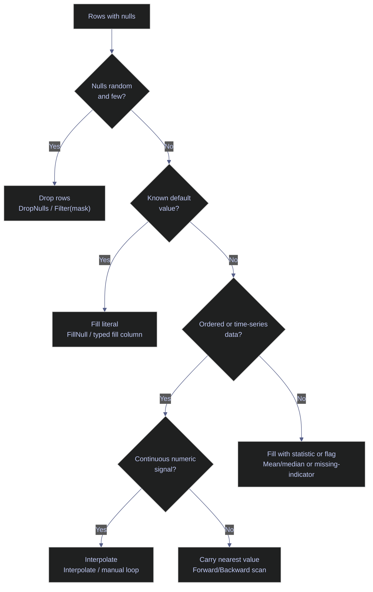

# Missing Data, Strings & DateTime - C#

> [!quote]
> "Life is dirty. So is your data. Get used to it."
>
> — **Oz du Soleil**

> [!abstract]- Summary
>
> Covers three failure-prone dataframe domains in one C# reference: missing-value handling, string cleanup, and datetime/time-series work across Polars.NET and Microsoft.Data.Analysis. The note exists because these are the places where row data stops being "clean columns" and starts exposing the real differences between Arrow-native vectorized expressions and explicit CLR-oriented column loops.
>
> **Setup**
> - Configure the notebook, load Polars.NET and MDA packages, and establish the shared datasets used to compare null, string, and datetime behavior side by side
>
> **Missing Data**
> - Detect nulls, understand how each library represents absence, and compare dropping, literal fill, forward fill, backward fill, and statistic-based fill patterns
> - Keep the library boundary clear: Polars.NET exposes missing-data operations as expressions like `FillNull`, while MDA usually requires explicit typed-column scans and replacement loops
>
> **String Operations**
> - Apply case transforms, substring search, replace, slicing, split, regex extraction, padding, and concatenation over identifier-style text columns
> - Contrast Polars `.Str` vectorization with MDA's materialized string arrays and manual column reconstruction
>
> **DateTime Operations**
> - Parse and round-trip dates, extract components with `.Dt`, apply date arithmetic, shift and lag values, filter by range, generate date sequences, and compute rolling or resampled time-series outputs
> - Make the ordering requirement explicit for rolling windows and related financial calculations, especially when translating the same logic between Polars expressions and MDA loops
>
> **Operations and safety**
> - Warnings: the current warning/recommendation sections in this note still emphasize the broader Polars-versus-MDA transform model, including immutability, conditional-expression API differences, and type mismatches across Arrow and CLR types
> - Recommendations: 4 practices covering expression-first analytical transforms, MDA for ML.NET-oriented boundaries, schema validation after transforms, and Parquet for type-safe intermediates
> - Troubleshooting: 3 failure modes covering missed reassignment in Polars, cast failures, and MDA typed-column mismatches

> [!note]- Glossary
>
> **Null**
> - An absent value that represents missingness rather than a real business value.
> - It matters because every fill, drop, string, and datetime operation in the note depends on understanding whether a value is actually missing or merely present in a different form.
>
> > [!warning] MDA may encode missingness as `NaN`
> >
> > In floating-point MDA columns, missing values may appear as `NaN` instead of CLR `null`. Treating those as ordinary numbers silently breaks data-quality checks.
>
> ---
>
> **`FillNull` / Fill strategy**
> - A replacement operation that substitutes missing values with a constant, carried value, or derived statistic.
> - It matters because filling is one of the main choices that changes how downstream aggregates and models interpret incomplete data.
>
> > [!warning] MDA has no single built-in equivalent
> >
> > In Microsoft.Data.Analysis, fill logic is usually a manual scan that builds a new typed column. The operation is conceptually simple but operationally explicit.
>
> ---
>
> **Forward fill**
> - A strategy that replaces each missing value with the most recent prior non-missing value in sequence.
> - It matters because time-ordered data often needs continuity without inventing a new constant or dropping the row entirely.
>
> > [!warning] Order defines correctness
> >
> > Forward fill only makes sense after the rows are ordered on the intended sequence key, usually time. On unsorted data it manufactures nonsense.
>
> ---
>
> **Backward fill**
> - A strategy that replaces each missing value with the next available non-missing value later in the sequence.
> - It matters because some analytical pipelines prefer future-known carryback logic when filling leading gaps or preparing aligned windows.
>
> > [!warning] Reverse scan is intentional
> >
> > Backward fill is not just forward fill with a different name. The implementation direction changes which neighboring value becomes authoritative.
>
> ---
>
> **`.Str` accessor**
> - The Polars string-expression namespace for vectorized text operations such as lowercase conversion, contains checks, replace, split, and extraction.
> - It matters because the note’s string-cleaning section is largely a contrast between `.Str`-native column logic and manual CLR string materialization in MDA.
>
> > [!info] Text stays inside the engine
> >
> > As long as the logic remains in `.Str`, Polars can keep the work columnar instead of forcing a per-row C# string loop.
>
> ---
>
> **Regex extract**
> - Pulling a substring from text by matching a regular-expression pattern and returning a capture group.
> - It matters because ticker or exchange-code cleanup often depends on pattern-based extraction rather than fixed-position slicing.
>
> > [!warning] Pattern mismatch returns missing output
> >
> > Extraction logic is only as stable as the identifier format. When the pattern stops matching, the result becomes null-like output instead of a clean token.
>
> ---
>
> **`.Dt` accessor**
> - The Polars datetime-expression namespace for extracting and transforming date/time components.
> - It matters because the note uses `.Dt` to derive year, month, weekday, offsets, and range-based filters without leaving the dataframe engine.
>
> > [!info] Datetime logic stays composable
> >
> > `.Dt` makes date operations behave like any other expression, so filtering, projection, and derived columns can share the same pipeline structure.
>
> ---
>
> **`DateTime` / `DateOnly`**
> - CLR-native date representations used in .NET code and often bridged to Arrow-backed dataframe types.
> - It matters because the note repeatedly crosses between dataframe-native datetime operations and explicit .NET parsing or materialization logic.
>
> > [!warning] Precision and semantics differ
> >
> > A .NET `DateTime` and an Arrow datetime may represent similar concepts with different precision defaults and conversion behavior.
>
> ---
>
> **Date range**
> - A generated ordered sequence of dates used for filtering, joining, calendar construction, or time-axis expansion.
> - It matters because time-series workflows often need explicit date scaffolding rather than only the dates already present in the source data.
>
> > [!info] Useful beyond filtering
> >
> > Generated ranges are often the bridge between sparse event rows and complete calendar-aware analysis.
>
> ---
>
> **Rolling window**
> - A fixed-size moving slice over ordered rows used to compute smoothed or local statistics such as moving averages.
> - It matters because the note uses rolling windows for financial-style indicators where current values depend on the immediately preceding history.
>
> > [!warning] Early rows are expected to be incomplete
> >
> > The first `N-1` rows in an `N`-period rolling calculation lack enough history, so null or partial results are a feature, not a bug.
>
> ---
>
> **Resampling**
> - Converting time-series data from one temporal grain to another, such as daily to monthly.
> - It matters because raw event frequency is often wrong for reporting, trend comparison, or downstream modeling windows.
>
> > [!warning] Aggregation rule is part of the metric
> >
> > Resampling is not just grouping by calendar period. You must decide whether the target metric wants sum, mean, last value, OHLC, or something else.
>
> ---

> [!info] Current API and execution-model check | 2026-04
>
> Polars documents missing-data, string, and time-series workflows in its [expressions guide](https://docs.pola.rs/user-guide/expressions/) and [missing-data guide](https://docs.pola.rs/user-guide/expressions/missing-data/). Microsoft documents [`DataFrame`](https://learn.microsoft.com/en-us/dotnet/api/microsoft.data.analysis.dataframe?view=ml-dotnet-preview), [`DataFrame.LoadCsv`](https://learn.microsoft.com/en-us/dotnet/api/microsoft.data.analysis.dataframe.loadcsv?view=ml-dotnet-preview), [`PrimitiveDataFrameColumn<T>`](https://learn.microsoft.com/en-us/dotnet/api/microsoft.data.analysis.primitivedataframecolumn-1?view=ml-dotnet-preview), and [`StringDataFrameColumn`](https://learn.microsoft.com/en-us/dotnet/api/microsoft.data.analysis.stringdataframecolumn?view=ml-dotnet-preview) as an eager typed-column API.

---

## Setup

### Warning Suppression

```csharp
// Suppress CS1701/CS1702 assembly version warnings in .NET Interactive.
// NuGet packages targeting .NET 8/9 trigger these on .NET 10 — harmless.
// Run this cell ONCE before any cells that use NuGet packages.

using System.Reflection;
using Microsoft.DotNet.Interactive;
using Microsoft.DotNet.Interactive.CSharp;

var csharpKernel = (CSharpKernel)Kernel.Root.FindKernelByName("csharp");
var optionsField = typeof(CSharpKernel).GetField("_scriptOptions",
    BindingFlags.NonPublic | BindingFlags.Instance);

var scriptOptions = optionsField.GetValue(csharpKernel);
var withWarningLevel = scriptOptions.GetType().GetMethod("WithWarningLevel");
var newOptions = withWarningLevel.Invoke(scriptOptions, new object[] { 0 });
optionsField.SetValue(csharpKernel, newOptions);
```

### Install NuGet packages and import namespaces

```csharp
#r "nuget: Polars.NET, 0.4.0"
#r "nuget: Polars.NET.Native.win-x64, 0.4.0"
#r "nuget: Microsoft.Data.Analysis, 0.23.0"

using System;
using System.IO;
using System.Linq;
using System.Collections.Generic;
using System.Globalization;
using System.Text.RegularExpressions;
using Polars.CSharp;
using static Polars.CSharp.Polars;
using MDA = Microsoft.Data.Analysis;
using Microsoft.DotNet.Interactive.Formatting;

Formatter.Register<DataFrame>((df, writer) =>
{
    var html = df.ToHtml();
    html = System.Text.RegularExpressions.Regex.Replace(html, @"(&gt;|>)(.+?)(&lt;|<)", @"$1$2$3");
    html = System.Text.RegularExpressions.Regex.Replace(html, @">""(.+?)""<", @">$1<");
    writer.Write(html);
}, "text/html");
Formatter.Register<Polars.CSharp.Series>((s, writer) =>
    writer.Write($"<pre style='font-size:14px'>{s}</pre>"), "text/html");

var DATA = Path.Combine("..", "data");
Console.WriteLine($"Data directory: {Path.GetFullPath(DATA)}");

static Type[] OhlcvCsvTypes() => new[] { typeof(long), typeof(string), typeof(DateTime), typeof(decimal), typeof(decimal), typeof(decimal), typeof(decimal), typeof(decimal), typeof(long), typeof(decimal), typeof(decimal), typeof(bool) };

static decimal? ToNullableDecimal(object value)
{
    if (value is null) return null;
    if (value is decimal d) return d;
    if (value is string s)
    {
        if (string.IsNullOrWhiteSpace(s)) return null;
        return decimal.Parse(s, NumberStyles.Float, CultureInfo.InvariantCulture);
    }
    return Convert.ToDecimal(value, CultureInfo.InvariantCulture);
}

static MDA.DataFrame ConvertColumnsToDecimal(MDA.DataFrame df, params string[] columnNames)
{
    foreach (var columnName in columnNames)
    {
        var index = df.Columns.IndexOf(columnName);
        if (index < 0) continue;
        var source = df.Columns[index];
        var target = new MDA.PrimitiveDataFrameColumn<decimal>(columnName, df.Rows.Count);
        for (long row = 0; row < df.Rows.Count; row++)
        {
            var value = ToNullableDecimal(source[row]);
            if (value.HasValue) target[row] = value.Value;
        }
        df.Columns.Remove(columnName);
        df.Columns.Insert(index, target);
    }
    return df;
}

static MDA.DataFrame LoadOhlcvCsv(string dataDir) =>
    MDA.DataFrame.LoadCsv(Path.Combine(dataDir, "eurostoxx50_ohlcv.csv"), dataTypes: OhlcvCsvTypes());

static MDA.DataFrame LoadScoresDailyCsv(string dataDir)
{
    var df = MDA.DataFrame.LoadCsv(Path.Combine(dataDir, "scores_daily.csv"));
    return ConvertColumnsToDecimal(
        df,
        "pe_zscore", "pb_zscore", "ev_ebitda_zscore", "yield_zscore", "relative_value_score",
        "relative_strength", "sma_50_ratio", "sma_200_ratio", "dist_from_52w_high", "momentum_score",
        "implied_upside", "recommendation_mean", "sentiment_score", "composite_score", "sma_30_close",
        "sma_90_close", "market_cap", "index_weight", "current_price", "day_change_pct",
        "five_day_change_pct", "ytd_change_pct"
    );
}

static MDA.DataFrame LoadSignalsDailyCsv(string dataDir)
{
    var df = MDA.DataFrame.LoadCsv(Path.Combine(dataDir, "signals_daily.csv"));
    return ConvertColumnsToDecimal(
        df,
        "current_price", "forward_pe", "price_to_book", "ev_to_ebitda", "dividend_yield",
        "market_cap", "beta", "fifty_two_week_change", "sandp_52_week_change", "fifty_day_average",
        "two_hundred_day_average", "dist_from_52_week_high", "target_median_price", "recommendation_mean",
        "upside_potential"
    );
}
```

```text
Data directory: c:\Users\aperi\DEV\LANG\data
```

### Load the datasets used throughout this notebook

```csharp
var dfP = DataFrame.ReadCsv(Path.Combine(DATA, "eurostoxx50_ohlcv.csv"), tryParseDates: true);
var dfM = LoadOhlcvCsv(DATA);
display($"OHLCV - Polars: {dfP.Shape}  |  MDA: ({dfM.Rows.Count}, {dfM.Columns.Count})");

var scP = DataFrame.ReadCsv(Path.Combine(DATA, "scores_daily.csv"), tryParseDates: true);
var scM = LoadScoresDailyCsv(DATA);
display($"Scores - Polars: {scP.Shape}  |  MDA: ({scM.Rows.Count}, {scM.Columns.Count})");

var dimP = DataFrame.ReadCsv(Path.Combine(DATA, "index_dim.csv"));
var dimM = MDA.DataFrame.LoadCsv(Path.Combine(DATA, "index_dim.csv"));
display($"index_dim - Polars: {dimP.Shape}  |  MDA: ({dimM.Rows.Count}, {dimM.Columns.Count})");
```

```text
OHLCV - Polars: (66355, 12)  |  MDA: (66355, 12)
```

```text
Scores - Polars: (466, 36)  |  MDA: (466, 36)
```

```text
index_dim - Polars: (169, 26)  |  MDA: (169, 26)
```

---

## Missing Data

Real-world datasets almost always contain missing values — sensor gaps, optional fields, failed joins, or upstream ETL issues. How you detect, quantify, and resolve nulls determines whether downstream aggregations and models produce correct results or silently propagate errors.

> [!info] Polars.NET null model vs MDA typed nulls
>
> **Polars.NET** keeps null handling, fill strategies, and interpolation inside expressions. **Microsoft.Data.Analysis** keeps the same semantics explicit through `NullCount`, `ElementwiseIsNull()`, typed repair columns, and `Filter(...)`.

> [!tip] Fix null generation upstream when possible
>
> As *Fundamentals of Data Engineering.epub* emphasizes, null checks and data-quality guards are strongest near ingestion and transformation boundaries. Use local fills when the rule is analytical, not as a substitute for upstream contracts.

> [!question] Which null strategy to use?
>
> Pick the least misleading repair strategy for the data-generation pattern, not just the shortest code path.



### Detect Nulls

Null detection is the first step in any data quality check. Scan each column for missing values to understand the scope of the problem before choosing a fill or drop strategy.

#### Polars.NET | Detect null rows with IsNull() filter

The `IsNull()` expression returns a boolean mask that can be passed to `Filter()` to isolate rows where a specific column is null. Iterating over `Columns` and checking the `NullCount` property on each `Series` gives a quick per-column summary without constructing a full filtered DataFrame.

_Iterates over all columns in `scP` to print null counts for the 5 columns with missing values, then filters with `IsNull()` to display the 5 rows where `ev_ebitda_zscore` is null alongside their `pe_zscore` values._

```csharp
display("Null counts per column:");
foreach (var col in scP.Columns)
{
    var nc = scP.Column(col).NullCount;
    if (nc > 0)
        Console.WriteLine($"  {col,-28} {nc,4} nulls");
}

display("Rows where ev_ebitda_zscore IS null (first 5):");
scP.Filter(Col("ev_ebitda_zscore").IsNull()).Head(5)
    .Select("symbol", "score_date", "ev_ebitda_zscore", "pe_zscore")
```

Null counts per column:

pe_zscore                       3 nulls
      pb_zscore                       6 nulls
      ev_ebitda_zscore               71 nulls
      yield_zscore                   35 nulls
      recommendation_mean            14 nulls

Rows where ev_ebitda_zscore IS null (first 5):

<!-- Polars DataFrame: (5 rows, 4 columns) --><table><thead><tr><th>symbol</th><th>score_date</th><th>ev_ebitda_zscore</th><th>pe_zscore</th></tr></thead><tbody><tr><td>BNP.PA</td><td>2026-03-04</td><td>null</td><td>0.9133885393</td></tr><tr><td>SAN.MC</td><td>2026-03-04</td><td>null</td><td>0.4585988913</td></tr><tr><td>ISP.MI</td><td>2026-03-04</td><td>null</td><td>0.3666188825</td></tr><tr><td>UCG.MI</td><td>2026-03-04</td><td>null</td><td>0.45250099</td></tr><tr><td>INGA.AS</td><td>2026-03-04</td><td>null</td><td>0.3799166699</td></tr></tbody></table></div>

#### Microsoft.Data.Analysis | Detect nulls with NullCount and ElementwiseIsNull

MDA uses direct `NullCount` metadata and boolean masks for null inspection.

_Prints sparse-column null counts and previews the first five null `ev_ebitda_zscore` rows._

```csharp
// Microsoft.Data.Analysis — Detect nulls in scores_daily (has real nulls)
display("Null counts per column:");
foreach (var col in scP.Columns)
{
    var nc = col.NullCount;
    if (nc > 0)
        Console.WriteLine($"  {col.Name,-28} {nc,4} nulls");
}

display("Rows where ev_ebitda_zscore IS null (first 5):");
var nullMask = (PrimitiveDataFrameColumn<bool>)scP.Columns["ev_ebitda_zscore"].ElementwiseIsNull();
var filteredNulls = scP.Filter(nullMask);
new DataFrame(filteredNulls.Columns["symbol"], filteredNulls.Columns["score_date"], filteredNulls.Columns["ev_ebitda_zscore"], filteredNulls.Columns["pe_zscore"]).Head(5)
```

```text
Null counts per column:
```

```text
  pe_zscore                       3 nulls
  pb_zscore                       6 nulls
  ev_ebitda_zscore               71 nulls
  yield_zscore                   35 nulls
  recommendation_mean            14 nulls
```

```text
Rows where ev_ebitda_zscore IS null (first 5):
```

<table><thead><tr><th>symbol</th><th>score_date</th><th>ev_ebitda_zscore</th><th>pe_zscore</th></tr></thead><tbody><tr><td>BNP.PA</td><td><span>2026-03-04 00:00:00Z</span></td><td>&lt;null&gt;</td><td>0.9133886</td></tr><tr><td>SAN.MC</td><td><span>2026-03-04 00:00:00Z</span></td><td>&lt;null&gt;</td><td>0.4585989</td></tr><tr><td>ISP.MI</td><td><span>2026-03-04 00:00:00Z</span></td><td>&lt;null&gt;</td><td>0.3666189</td></tr><tr><td>UCG.MI</td><td><span>2026-03-04 00:00:00Z</span></td><td>&lt;null&gt;</td><td>0.452501</td></tr><tr><td>INGA.AS</td><td><span>2026-03-04 00:00:00Z</span></td><td>&lt;null&gt;</td><td>0.3799167</td></tr></tbody></table>

#### Microsoft.Data.Analysis | Count nulls with DataFrameColumn.NullCount

`NullCount` is direct in MDA, so completeness checks are simpler than indirect present-value counting patterns.

_Reports null counts for the five known sparse score columns._

```csharp
// Microsoft.Data.Analysis — Count nulls per column with NullCount property
var nullCols = new[] { "pe_zscore", "pb_zscore", "ev_ebitda_zscore", "yield_zscore", "recommendation_mean" };
foreach (var col in nullCols)
{
    if(scP.Columns.IndexOf(col) >= 0)
        Console.WriteLine($"  {col,-28} {scP.Columns[col].NullCount,4} / {scP.Rows.Count}");
}
display($"Total rows: {scP.Rows.Count}");
```

```text
  pe_zscore                       3 / 466
  pb_zscore                       6 / 466
  ev_ebitda_zscore               71 / 466
  yield_zscore                   35 / 466
  recommendation_mean            14 / 466
```

```text
Total rows: 466
```

#### Microsoft.Data.Analysis | Drop rows by building a validity mask

The notebook uses an explicit boolean mask plus `Filter(...)` for whole-row null dropping.

_Scans each score row for nulls, filters valid rows, and previews the first five survivors._

```csharp
// Microsoft.Data.Analysis — Drop rows where any column has null
var validMask = new PrimitiveDataFrameColumn<bool>("mask", scP.Rows.Count);
for (long i = 0; i < scP.Rows.Count; i++)
{
    bool hasNull = false;
    foreach (var col in scP.Columns)
    {
        if (col[i] == null) { hasNull = true; break; }
    }
    validMask[i] = !hasNull;
}

var scPDropped = scP.Filter(validMask);
display($"Before: {scP.Rows.Count} rows  |  After DropNulls: {scPDropped.Rows.Count} rows");
new DataFrame(scPDropped.Columns["symbol"], scPDropped.Columns["score_date"], scPDropped.Columns["ev_ebitda_zscore"], scPDropped.Columns["pe_zscore"]).Head(5)
```

```text
Before: 466 rows  |  After DropNulls: 346 rows
```

<table><thead><tr><th>symbol</th><th>score_date</th><th>ev_ebitda_zscore</th><th>pe_zscore</th></tr></thead><tbody><tr><td>DTE.DE</td><td><span>2026-03-04 00:00:00Z</span></td><td>0.3795319</td><td>0.3265871</td></tr><tr><td>IFX.DE</td><td><span>2026-03-04 00:00:00Z</span></td><td>0.6770676</td><td>0.5093979</td></tr><tr><td>ENR.DE</td><td><span>2026-03-04 00:00:00Z</span></td><td>-1.693212</td><td>-0.9027377</td></tr><tr><td>ABI.BR</td><td><span>2026-03-04 00:00:00Z</span></td><td>0.5527391</td><td>0.4740837</td></tr><tr><td>TTE.PA</td><td><span>2026-03-04 00:00:00Z</span></td><td>0.4496105</td><td>0.6911064</td></tr></tbody></table>

#### Microsoft.Data.Analysis | Fill nulls with an explicit typed replacement column

MDA repairs a column by materializing a typed output column and swapping it back into the frame.

_Fills null `ev_ebitda_zscore` values with `0.0` and confirms the null count drops to zero._

```csharp
// Microsoft.Data.Analysis — Fill null ev_ebitda_zscore with 0.0
var filledCol = new PrimitiveDataFrameColumn<decimal>("ev_ebitda_zscore_filled", scP.Rows.Count);
var origCol = scP.Columns["ev_ebitda_zscore"];
for(long i = 0; i < scP.Rows.Count; i++) filledCol[i] = origCol[i] != null ? Convert.ToDecimal(origCol[i]) : 0.0m;
var scPFilled = scP.Clone(); scPFilled.Columns.Remove("ev_ebitda_zscore"); filledCol.SetName("ev_ebitda_zscore"); scPFilled.Columns.Add(filledCol);
display($"Nulls after FillNull(0.0): {scPFilled.Columns["ev_ebitda_zscore"].NullCount}");
new DataFrame(scPFilled.Columns["symbol"], scPFilled.Columns["score_date"], scPFilled.Columns["ev_ebitda_zscore"]).Head(5)
```

```text
Nulls after FillNull(0.0): 0
```

<table><thead><tr><th>symbol</th><th>score_date</th><th>ev_ebitda_zscore</th></tr></thead><tbody><tr><td>BNP.PA</td><td><span>2026-03-04 00:00:00Z</span></td><td>0.0</td></tr><tr><td>DTE.DE</td><td><span>2026-03-04 00:00:00Z</span></td><td>0.3795319</td></tr><tr><td>IFX.DE</td><td><span>2026-03-04 00:00:00Z</span></td><td>0.6770676</td></tr><tr><td>ENR.DE</td><td><span>2026-03-04 00:00:00Z</span></td><td>-1.693212</td></tr><tr><td>ABI.BR</td><td><span>2026-03-04 00:00:00Z</span></td><td>0.5527391</td></tr></tbody></table>

#### Microsoft.Data.Analysis | Forward fill with a carry-forward loop

Forward fill in MDA is usually an ordered scan with explicit state.

_Carries the last observed `ev_ebitda_zscore` value forward through later gaps._

```csharp
// Microsoft.Data.Analysis — Forward fill: propagate last valid value forward
var ffillCol = new PrimitiveDataFrameColumn<decimal>("ev_ebitda_zscore", scP.Rows.Count);
decimal? lastValid = null;
for(long i = 0; i < scP.Rows.Count; i++) { if (origCol[i] != null) lastValid = Convert.ToDecimal(origCol[i]); if (lastValid.HasValue) ffillCol[i] = lastValid.Value; }
var scPFfill = scP.Clone(); scPFfill.Columns.Remove("ev_ebitda_zscore"); scPFfill.Columns.Add(ffillCol);
display($"Nulls after ForwardFill: {scPFfill.Columns["ev_ebitda_zscore"].NullCount}");
new DataFrame(scPFfill.Columns["symbol"], scPFfill.Columns["score_date"], scPFfill.Columns["ev_ebitda_zscore"]).Head(5)
```

```text
Nulls after ForwardFill: 1
```

<table><thead><tr><th>symbol</th><th>score_date</th><th>ev_ebitda_zscore</th></tr></thead><tbody><tr><td>BNP.PA</td><td><span>2026-03-04 00:00:00Z</span></td><td>&lt;null&gt;</td></tr><tr><td>DTE.DE</td><td><span>2026-03-04 00:00:00Z</span></td><td>0.3795319</td></tr><tr><td>IFX.DE</td><td><span>2026-03-04 00:00:00Z</span></td><td>0.6770676</td></tr><tr><td>ENR.DE</td><td><span>2026-03-04 00:00:00Z</span></td><td>-1.693212</td></tr><tr><td>ABI.BR</td><td><span>2026-03-04 00:00:00Z</span></td><td>0.5527391</td></tr></tbody></table>

#### Microsoft.Data.Analysis | Backward fill with a reverse scan

Backward fill is the same idea in reverse order.

_Propagates the next observed `ev_ebitda_zscore` value backward into earlier gaps._

```csharp
// Microsoft.Data.Analysis — Backward fill: propagate next valid value backward
var bfillCol = new PrimitiveDataFrameColumn<decimal>("ev_ebitda_zscore", scP.Rows.Count);
decimal? nextValid = null;
for(long i = scP.Rows.Count - 1; i >= 0; i--) { if (origCol[i] != null) nextValid = Convert.ToDecimal(origCol[i]); if (nextValid.HasValue) bfillCol[i] = nextValid.Value; }
var scPBfill = scP.Clone(); scPBfill.Columns.Remove("ev_ebitda_zscore"); scPBfill.Columns.Add(bfillCol);
display($"Nulls after BackwardFill: {scPBfill.Columns["ev_ebitda_zscore"].NullCount}");
new DataFrame(scPBfill.Columns["symbol"], scPBfill.Columns["score_date"], scPBfill.Columns["ev_ebitda_zscore"]).Head(5)
```

```text
Nulls after BackwardFill: 0
```

<table><thead><tr><th>symbol</th><th>score_date</th><th>ev_ebitda_zscore</th></tr></thead><tbody><tr><td>BNP.PA</td><td><span>2026-03-04 00:00:00Z</span></td><td>0.3795319</td></tr><tr><td>DTE.DE</td><td><span>2026-03-04 00:00:00Z</span></td><td>0.3795319</td></tr><tr><td>IFX.DE</td><td><span>2026-03-04 00:00:00Z</span></td><td>0.6770676</td></tr><tr><td>ENR.DE</td><td><span>2026-03-04 00:00:00Z</span></td><td>-1.693212</td></tr><tr><td>ABI.BR</td><td><span>2026-03-04 00:00:00Z</span></td><td>0.5527391</td></tr></tbody></table>

#### Microsoft.Data.Analysis | Fill nulls with the column mean

A common MDA pattern is compute-then-materialize: first the statistic, then the repaired column.

_Computes the mean of non-null values and fills gaps with that mean._

```csharp
// Microsoft.Data.Analysis — Fill null with column mean
decimal sum = 0m; int count = 0;
for(long i = 0; i < scP.Rows.Count; i++) if(origCol[i] != null) { sum += Convert.ToDecimal(origCol[i]); count++; }
decimal mean = count > 0 ? sum / count : 0m;
var meanFillCol = new PrimitiveDataFrameColumn<decimal>("ev_ebitda_zscore", scP.Rows.Count);
for(long i = 0; i < scP.Rows.Count; i++) meanFillCol[i] = origCol[i] != null ? Convert.ToDecimal(origCol[i]) : mean;
var scPMeanFill = scP.Clone(); scPMeanFill.Columns.Remove("ev_ebitda_zscore"); scPMeanFill.Columns.Add(meanFillCol);
display($"Nulls after FillNull(mean): {scPMeanFill.Columns["ev_ebitda_zscore"].NullCount}");
new DataFrame(scPMeanFill.Columns["symbol"], scPMeanFill.Columns["score_date"], scPMeanFill.Columns["ev_ebitda_zscore"]).Head(5)
```

```text
Nulls after FillNull(mean): 0
```

<table><thead><tr><th>symbol</th><th>score_date</th><th>ev_ebitda_zscore</th></tr></thead><tbody><tr><td>BNP.PA</td><td><span>2026-03-04 00:00:00Z</span></td><td>0.0380461401518987341772151899</td></tr><tr><td>DTE.DE</td><td><span>2026-03-04 00:00:00Z</span></td><td>0.3795319</td></tr><tr><td>IFX.DE</td><td><span>2026-03-04 00:00:00Z</span></td><td>0.6770676</td></tr><tr><td>ENR.DE</td><td><span>2026-03-04 00:00:00Z</span></td><td>-1.693212</td></tr><tr><td>ABI.BR</td><td><span>2026-03-04 00:00:00Z</span></td><td>0.5527391</td></tr></tbody></table>

#### Microsoft.Data.Analysis | Interpolate missing values manually

MDA has no interpolation expression, so the notebook computes linear interpolation explicitly.

_Searches backward and forward for neighboring values and linearly interpolates each gap._

```csharp
// Microsoft.Data.Analysis — Linear interpolation of missing values
var interpCol = new PrimitiveDataFrameColumn<decimal>("ev_ebitda_zscore", scP.Rows.Count);
for(long i = 0; i < scP.Rows.Count; i++)
{
    if(origCol[i] != null) interpCol[i] = Convert.ToDecimal(origCol[i]);
    else {
        decimal? prev = null; long prevIdx = -1;
        for(long j = i - 1; j >= 0; j--) if(origCol[j] != null) { prev = Convert.ToDecimal(origCol[j]); prevIdx = j; break; }
        decimal? next = null; long nextIdx = -1;
        for(long j = i + 1; j < scP.Rows.Count; j++) if(origCol[j] != null) { next = Convert.ToDecimal(origCol[j]); nextIdx = j; break; }
        if(prev.HasValue && next.HasValue) { decimal ratio = (decimal)(i - prevIdx) / (nextIdx - prevIdx); interpCol[i] = prev.Value + ratio * (next.Value - prev.Value); }
        else if (prev.HasValue) interpCol[i] = prev.Value;
        else if (next.HasValue) interpCol[i] = next.Value;
    }
}
var scPInterp = scP.Clone(); scPInterp.Columns.Remove("ev_ebitda_zscore"); scPInterp.Columns.Add(interpCol);
display($"Nulls after Interpolate: {scPInterp.Columns["ev_ebitda_zscore"].NullCount}");
new DataFrame(scPInterp.Columns["symbol"], scPInterp.Columns["score_date"], scPInterp.Columns["ev_ebitda_zscore"]).Head(10)
```

```text
Nulls after Interpolate: 0
```

<table><thead><tr><th>symbol</th><th>score_date</th><th>ev_ebitda_zscore</th></tr></thead><tbody><tr><td>BNP.PA</td><td><span>2026-03-04 00:00:00Z</span></td><td>0.3795319</td></tr><tr><td>DTE.DE</td><td><span>2026-03-04 00:00:00Z</span></td><td>0.3795319</td></tr><tr><td>IFX.DE</td><td><span>2026-03-04 00:00:00Z</span></td><td>0.6770676</td></tr><tr><td>ENR.DE</td><td><span>2026-03-04 00:00:00Z</span></td><td>-1.693212</td></tr><tr><td>ABI.BR</td><td><span>2026-03-04 00:00:00Z</span></td><td>0.5527391</td></tr><tr><td>VOW.DE</td><td><span>2026-03-04 00:00:00Z</span></td><td>0.3798302</td></tr><tr><td>TTE.PA</td><td><span>2026-03-04 00:00:00Z</span></td><td>0.4496105</td></tr><tr><td>DG.PA</td><td><span>2026-03-04 00:00:00Z</span></td><td>0.9287967</td></tr><tr><td>SAN.MC</td><td><span>2026-03-04 00:00:00Z</span></td><td>0.434032285</td></tr><tr><td>SU.PA</td><td><span>2026-03-04 00:00:00Z</span></td><td>-0.06073213</td></tr></tbody></table>

#### Microsoft.Data.Analysis | Coalesce columns with the null-coalescing operator

MDA emulates `coalesce` by testing candidate columns in order and writing the first non-null value.

_Combines `primary`, `secondary`, and `fallback` into a single `best` column._

```csharp
// Microsoft.Data.Analysis — Coalesce columns
var primaryCol = new PrimitiveDataFrameColumn<decimal>("primary", new decimal?[] { 100.0m, null, 300.0m, null });
var secondaryCol = new PrimitiveDataFrameColumn<decimal>("secondary", new decimal?[] { null, 200.0m, null, 400.0m });
var fallbackCol = new PrimitiveDataFrameColumn<decimal>("fallback", new decimal?[] { 50.0m, 50.0m, 50.0m, 50.0m });
var coalDf = new DataFrame(primaryCol, secondaryCol, fallbackCol);
var bestCol = new PrimitiveDataFrameColumn<decimal>("best", coalDf.Rows.Count);
for(long i = 0; i < coalDf.Rows.Count; i++) bestCol[i] = primaryCol[i] ?? secondaryCol[i] ?? fallbackCol[i];
var coalResult = coalDf.Clone(); coalResult.Columns.Add(bestCol); coalResult
```

<table><thead><tr><th>primary</th><th>secondary</th><th>fallback</th><th>best</th></tr></thead><tbody><tr><td>100.0</td><td>&lt;null&gt;</td><td>50.0</td><td>100.0</td></tr><tr><td>&lt;null&gt;</td><td>200.0</td><td>50.0</td><td>200.0</td></tr><tr><td>300.0</td><td>&lt;null&gt;</td><td>50.0</td><td>300.0</td></tr><tr><td>&lt;null&gt;</td><td>400.0</td><td>50.0</td><td>400.0</td></tr></tbody></table>

#### Microsoft.Data.Analysis | Convert to upper and lower case with StringDataFrameColumn

MDA uses CLR string transforms plus new typed string columns.

_Builds uppercase and lowercase symbol columns and previews the first ten rows._

```csharp
var symbolsM = dfM.Columns["symbol"].Cast<string>().Distinct().ToArray();
var upperColM = new MDA.StringDataFrameColumn("upper", symbolsM.Select(s => s?.ToUpper()));
var lowerColM = new MDA.StringDataFrameColumn("lower", symbolsM.Select(s => s?.ToLower()));

var caseDemoM = new MDA.DataFrame(new MDA.StringDataFrameColumn("symbol", symbolsM), upperColM, lowerColM);
caseDemoM.Head(10)
```

<table><thead><tr><th>symbol</th><th>upper</th><th>lower</th></tr></thead><tbody><tr><td>ABI.BR</td><td>ABI.BR</td><td>abi.br</td></tr><tr><td>AD.AS</td><td>AD.AS</td><td>ad.as</td></tr><tr><td>ADS.DE</td><td>ADS.DE</td><td>ads.de</td></tr><tr><td>ADYEN.AS</td><td>ADYEN.AS</td><td>adyen.as</td></tr><tr><td>AI.PA</td><td>AI.PA</td><td>ai.pa</td></tr></tbody></table>

### Contains, StartsWith, EndsWith

Pattern matching on string columns is the primary way to filter by exchange code, country suffix, or naming convention. These operations return boolean masks suitable for `Filter()`.

#### Polars.NET | Filter with Str.Contains()

`Str.Contains(pattern)` takes a plain string argument (not wrapped in `Lit()`) and returns a boolean expression. Pass it to `Filter()` to keep only matching rows.

_Filters the OHLCV DataFrame to rows where `symbol` contains `".DE"`, then selects unique symbols — returning the 16 German-listed stocks from the 50-member index._

```csharp
var germanP = dfP.Filter(Col("symbol").Str.Contains(".DE"))
    .Select(new[] { "symbol" }).Unique();
display("German exchange symbols (.DE):");
germanP
```

German exchange symbols (.DE):

<!-- Polars DataFrame: (16 rows, 1 columns) --><table><thead><tr><th>symbol</th></tr></thead><tbody><tr><td>ADS.DE</td></tr><tr><td>ALV.DE</td></tr><tr><td>BAS.DE</td></tr><tr><td>BAYN.DE</td></tr><tr><td>BMW.DE</td></tr></tbody></table></div>

#### Microsoft.Data.Analysis | Filter symbols with .Contains()

For light string filters, MDA often materializes a string array and filters it with CLR predicates.

_Filters unique symbols to the German exchange tickers containing `.DE`._

```csharp
var germanSymbolsM = symbolsM.Where(s => s != null && s.Contains(".DE")).ToArray();
display("German exchange symbolsM (.DE):");
new MDA.DataFrame(new MDA.StringDataFrameColumn("symbol", germanSymbolsM))
```

```text
German exchange symbols (.DE):
```

<table><thead><tr><th>symbol</th></tr></thead><tbody><tr><td>ADS.DE</td></tr><tr><td>ALV.DE</td></tr><tr><td>BAS.DE</td></tr><tr><td>BAYN.DE</td></tr><tr><td>BMW.DE</td></tr></tbody></table>

#### Polars.NET | Filter with Str.StartsWith() and Str.EndsWith()

`Str.StartsWith()` and `Str.EndsWith()` take plain string arguments, like `Str.Contains()`. They can be combined with `Filter()` to select rows matching a prefix or suffix pattern.

_Applies `Str.StartsWith("S")` and `Str.EndsWith(".BR")` in separate filter passes, rendering both result sets side by side as HTML — 7 symbols starting with S and 2 Brussels-listed symbols._

```csharp
var startsS = dfP.Filter(Col("symbol").Str.StartsWith("S"))
    .Select(new[] { "symbol" }).Unique();
var endsBR = dfP.Filter(Col("symbol").Str.EndsWith(".BR"))
    .Select(new[] { "symbol" }).Unique();

// Display side by side using raw HTML
string StripQuotes(string h) => h.Replace("", "").Replace("\"", "");
var leftHtml = StripQuotes(startsS.ToHtml());
var rightHtml = StripQuotes(endsBR.ToHtml());
display(HTML($"<div style='display:flex;gap:40px'><div><b>StartsWith S</b>{leftHtml}</div><div><b>EndsWith .BR</b>{rightHtml}</div></div>"));
```

<div style='display:flex;gap:40px'><div><b>StartsWith S</b>
<!-- Polars DataFrame: (7 rows, 1 columns) --><table><thead><tr><th>symbol</th></tr></thead><tbody><tr><td>SAF.PA</td></tr><tr><td>SAN.MC</td></tr><tr><td>SAN.PA</td></tr><tr><td>SAP.DE</td></tr><tr><td>SGO.PA</td></tr></tbody></table></div></div><div><b>EndsWith .BR</b>
<!-- Polars DataFrame: (2 rows, 1 columns) --><table><thead><tr><th>symbol</th></tr></thead><tbody><tr><td>ABI.BR</td></tr><tr><td>ARGX.BR</td></tr></tbody></table></div></div></div>

#### Microsoft.Data.Analysis | Filter with StartsWith and EndsWith

Prefix and suffix filters follow the same CLR-first pattern.

_Displays symbols starting with `S` and symbols ending with `.BR`._

```csharp
var startsSM = symbolsM.Where(s => s != null && s.StartsWith("S")).ToArray();
var endsBRM = symbolsM.Where(s => s != null && s.EndsWith(".BR")).ToArray();

display("StartsWith S:");
display(new MDA.DataFrame(new MDA.StringDataFrameColumn("symbol", startsSM)));
display("EndsWith .BR:");
new MDA.DataFrame(new MDA.StringDataFrameColumn("symbol", endsBRM))
```

```text
StartsWith S:
```

<table><thead><tr><th>symbol</th></tr></thead><tbody><tr><td>SAF.PA</td></tr><tr><td>SAN.MC</td></tr><tr><td>SAN.PA</td></tr><tr><td>SAP.DE</td></tr><tr><td>SGO.PA</td></tr></tbody></table>

```text
EndsWith .BR:
```

<table><thead><tr><th>symbol</th></tr></thead><tbody><tr><td>ABI.BR</td></tr><tr><td>ARGX.BR</td></tr></tbody></table>

### Replace

Substring replacement is used for cleaning identifiers, normalizing naming conventions, or masking sensitive parts of strings. Polars provides both single-match `Replace()` and global `ReplaceAll()`.

#### Polars.NET | Replace substrings with Str.ReplaceAll()

`Str.ReplaceAll(old, new)` replaces every occurrence of the pattern in each string. For single-match replacement, use `Str.Replace()`. Both accept plain strings (not `Lit()`).

_Applies `Str.ReplaceAll(".DE", "_GER")` to all 50 symbols, then filters to the 16 replaced entries — showing `ADS.DE → ADS_GER`, `ALV.DE → ALV_GER`, etc._

```csharp
var replaced = dfP.Select(new[] { "symbol" }).Unique()
    .WithColumns(
        Col("symbol").Str.ReplaceAll(".DE", "_GER").Alias("replaced")
    );
display("Replace '.DE' with '_GER':");
replaced.Filter(Col("replaced").Str.Contains("_GER"))
```

Replace '.DE' with '_GER':

<!-- Polars DataFrame: (16 rows, 2 columns) --><table><thead><tr><th>symbol</th><th>replaced</th></tr></thead><tbody><tr><td>ADS.DE</td><td>ADS_GER</td></tr><tr><td>ALV.DE</td><td>ALV_GER</td></tr><tr><td>BAS.DE</td><td>BAS_GER</td></tr><tr><td>BAYN.DE</td><td>BAYN_GER</td></tr><tr><td>BMW.DE</td><td>BMW_GER</td></tr></tbody></table></div>

#### Microsoft.Data.Analysis | Replace substrings with CLR string replacement

Replacement is explicit managed-code work over the string values.

_Replaces `.DE` with `_GER` and shows only the affected identifiers._

```csharp
var replacedArrM = symbolsM.Select(s => s?.Replace(".DE", "_GER")).ToArray();
var replacedDfM = new MDA.DataFrame(new MDA.StringDataFrameColumn("symbol", symbolsM), new MDA.StringDataFrameColumn("replaced", replacedArrM));

display("Replace '.DE' with '_GER':");
var maskM = new MDA.PrimitiveDataFrameColumn<bool>("maskM", replacedDfM.Rows.Count);
for(long i = 0; i < replacedDfM.Rows.Count; i++) maskM[i] = replacedArrM[i]?.Contains("_GER") == true;
replacedDfM.Filter(maskM)
```

```text
Replace '.DE' with '_GER':
```

<table><thead><tr><th>symbol</th><th>replaced</th></tr></thead><tbody><tr><td>ADS.DE</td><td>ADS_GER</td></tr><tr><td>ALV.DE</td><td>ALV_GER</td></tr><tr><td>BAS.DE</td><td>BAS_GER</td></tr><tr><td>BAYN.DE</td><td>BAYN_GER</td></tr><tr><td>BMW.DE</td><td>BMW_GER</td></tr></tbody></table>

### Length and Slicing

Measuring string length and extracting fixed-position substrings are building blocks for parsing structured identifiers like ticker symbols, ISINs, or fixed-width codes.

#### Polars.NET | Measure string length

In Polars.NET 0.4.0, the `Str.LenChars()` method is not yet exposed. As a workaround, extract the column to a C# array, compute lengths with LINQ, and stack the result back onto the DataFrame.

_Extracts symbols to a C# array, computes each string's `.Length`, stacks the result back as a `char_len` series, then sorts descending to show that `NDA-FI.HE` (9 chars) is the longest ticker in the index._

```csharp
var symDf = dfP.Select(new[] { "symbol" }).Unique();
var symArr = symDf.Column("symbol").ToArray<string>();
var lenArr = symArr.Select(s => (double)s.Length).ToArray();
var lenSeries = Polars.CSharp.Series.From("char_len", lenArr);
var lengths = symDf.HStack(lenSeries);
lengths.Sort("char_len", descending: true).Head(10)
```

<!-- Polars DataFrame: (10 rows, 2 columns) --><table><thead><tr><th>symbol</th><th>char_len</th></tr></thead><tbody><tr><td>NDA-FI.HE</td><td>9</td></tr><tr><td>ADYEN.AS</td><td>8</td></tr><tr><td>ARGX.BR</td><td>7</td></tr><tr><td>ASML.AS</td><td>7</td></tr><tr><td>BAYN.DE</td><td>7</td></tr></tbody></table></div>

#### Microsoft.Data.Analysis | Measure string length with a typed numeric column

String length in MDA is usually projected into a numeric typed column.

_Computes symbol lengths and orders the result by descending length._

```csharp
var lengthsM = symbolsM.Select(s => s != null ? (double)s.Length : 0).ToArray();
var lenDfM = new MDA.DataFrame(new MDA.StringDataFrameColumn("symbol", symbolsM), new MDA.PrimitiveDataFrameColumn<decimal>("char_len", lengthsM));
lenDfM.OrderByDescending("char_len").Head(10)
```

<table><thead><tr><th>symbol</th><th>char_len</th></tr></thead><tbody><tr><td>NDA-FI.HE</td><td>9</td></tr><tr><td>ADYEN.AS</td><td>8</td></tr><tr><td>INGA.AS</td><td>7</td></tr><tr><td>ENEL.MI</td><td>7</td></tr><tr><td>ARGX.BR</td><td>7</td></tr></tbody></table>

#### Polars.NET | Extract substrings with Str.Slice()

`Str.Slice(offset, length)` extracts a fixed-position substring from each value. The offset is zero-based. This is useful for fixed-width parsing but not for variable-length identifiers — use `Str.Split()` or `Str.Extract()` with regex for those.

_Applies `Str.Slice(0, 3)` to all unique symbols, creating a `first_3` column — the first 10 rows show three-character prefixes like `ABI`, `AD.`, `ADS`, `ADY`._

```csharp
var sliced = dfP.Select(new[] { "symbol" }).Unique()
    .WithColumns(
        Col("symbol").Str.Slice(0, 3).Alias("first_3")
    );
sliced.Head(10)
```

<!-- Polars DataFrame: (10 rows, 2 columns) --><table><thead><tr><th>symbol</th><th>first_3</th></tr></thead><tbody><tr><td>ABI.BR</td><td>ABI</td></tr><tr><td>AD.AS</td><td>AD.</td></tr><tr><td>ADS.DE</td><td>ADS</td></tr><tr><td>ADYEN.AS</td><td>ADY</td></tr><tr><td>AI.PA</td><td>AI.</td></tr></tbody></table></div>

#### Microsoft.Data.Analysis | Slice strings with Substring()

Fixed-position slicing uses CLR substring logic before materialization.

_Extracts the first three characters of each symbol into `first_3`._

```csharp
var first3ArrM = symbolsM.Select(s => s != null ? (s.Length >= 3 ? s.Substring(0, 3) : s) : null).ToArray();
var slicedM = new MDA.DataFrame(new MDA.StringDataFrameColumn("symbol", symbolsM), new MDA.StringDataFrameColumn("first_3", first3ArrM));
slicedM.Head(10)
```

<table><thead><tr><th>symbol</th><th>first_3</th></tr></thead><tbody><tr><td>ABI.BR</td><td>ABI</td></tr><tr><td>AD.AS</td><td>AD.</td></tr><tr><td>ADS.DE</td><td>ADS</td></tr><tr><td>ADYEN.AS</td><td>ADY</td></tr><tr><td>AI.PA</td><td>AI.</td></tr></tbody></table>

### Split

Splitting strings by a delimiter decomposes composite identifiers into their parts — for example, splitting `"ASML.AS"` on `"."` yields the ticker (`ASML`) and the exchange code (`AS`). Polars returns a list column; Microsoft.Data.Analysis usually materializes a display-friendly string or a custom typed projection instead.

#### Polars.NET | Split strings with Str.Split()

`Str.Split(separator)` splits each string into a list of substrings. The result is a column of type `List[Str]`. Access individual elements using list indexing expressions in downstream operations.

_Splits all unique symbols on `"."`, producing a `List[Str]` column where each cell contains the ticker and exchange code as a two-element list — e.g., `ABI.BR → [ABI, BR]`._

```csharp
var split = dfP.Select(new[] { "symbol" }).Unique()
    .WithColumns(
        Col("symbol").Str.Split(".").Alias("parts")
    );
split.Head(10)
```

<!-- Polars DataFrame: (10 rows, 2 columns) --><table><thead><tr><th>symbol</th><th>parts</th></tr></thead><tbody><tr><td>ABI.BR</td><td>[ABI, BR]</td></tr><tr><td>AD.AS</td><td>[AD, AS]</td></tr><tr><td>ADS.DE</td><td>[ADS, DE]</td></tr><tr><td>ADYEN.AS</td><td>[ADYEN, AS]</td></tr><tr><td>AI.PA</td><td>[AI, PA]</td></tr></tbody></table></div>

#### Microsoft.Data.Analysis | Split strings and materialize a display column

MDA does not expose a list-typed split result, so the notebook stores a readable serialized form.

_Splits each symbol on `.` and stores the rendered parts string for inspection._

```csharp
var splitArrM = symbolsM.Select(s => s != null ? $"[\"{string.Join("\", \"", s.Split('.'))}\"]" : null).ToArray();
var splitDfM = new MDA.DataFrame(new MDA.StringDataFrameColumn("symbol", symbolsM), new MDA.StringDataFrameColumn("parts", splitArrM));
splitDfM.Head(10)
```

<table><thead><tr><th>symbol</th><th>parts</th></tr></thead><tbody><tr><td>ABI.BR</td><td>[&quot;ABI&quot;, &quot;BR&quot;]</td></tr><tr><td>AD.AS</td><td>[&quot;AD&quot;, &quot;AS&quot;]</td></tr><tr><td>ADS.DE</td><td>[&quot;ADS&quot;, &quot;DE&quot;]</td></tr><tr><td>ADYEN.AS</td><td>[&quot;ADYEN&quot;, &quot;AS&quot;]</td></tr><tr><td>AI.PA</td><td>[&quot;AI&quot;, &quot;PA&quot;]</td></tr></tbody></table>

### Regex Extract

Regular expressions provide flexible pattern matching for extracting structured components from strings. Use regex when the delimiter is inconsistent or when you need to match a specific pattern (e.g., "the part after the last dot").

#### Polars.NET | Extract capture group with Str.Extract()

`Str.Extract(pattern, groupIndex)` applies a regex to each string and returns the specified capture group. Group index `1` refers to the first parenthesized group. Returns `null` for non-matching strings.

_Applies the regex `\.(\w+)` with `Str.Extract(pattern, 1)` to extract the exchange code suffix from all 50 unique symbols, returning `null` for any symbol without a dot — the first 10 rows show `BR`, `AS`, `DE`, etc._

```csharp
var extracted = dfP.Select(new[] { "symbol" }).Unique()
    .WithColumns(
        Col("symbol").Str.Extract(@"\.(\w+)", 1).Alias("exchange")
    );
extracted.Head(10)
```

<!-- Polars DataFrame: (10 rows, 2 columns) --><table><thead><tr><th>symbol</th><th>exchange</th></tr></thead><tbody><tr><td>ABI.BR</td><td>BR</td></tr><tr><td>AD.AS</td><td>AS</td></tr><tr><td>ADS.DE</td><td>DE</td></tr><tr><td>ADYEN.AS</td><td>AS</td></tr><tr><td>AI.PA</td><td>PA</td></tr></tbody></table></div>

#### Microsoft.Data.Analysis | Extract regex groups with Regex.Match

Regex extraction is standard .NET regex work over the materialized string values.

_Captures the exchange code after the dot and previews the first ten results._

```csharp
var regexM = new Regex(@"\.(\w+)");
var exchangeArrM = symbolsM.Select(s => s != null && regexM.IsMatch(s) ? regexM.Match(s).Groups[1].Value : null).ToArray();
var extractedM = new MDA.DataFrame(new MDA.StringDataFrameColumn("symbol", symbolsM), new MDA.StringDataFrameColumn("exchange", exchangeArrM));
extractedM.Head(10)
```

<table><thead><tr><th>symbol</th><th>exchange</th></tr></thead><tbody><tr><td>ABI.BR</td><td>BR</td></tr><tr><td>AD.AS</td><td>AS</td></tr><tr><td>ADS.DE</td><td>DE</td></tr><tr><td>ADYEN.AS</td><td>AS</td></tr><tr><td>AI.PA</td><td>PA</td></tr></tbody></table>

### Padding

Padding strings to a fixed width is common when generating fixed-width output files, aligning display columns, or creating zero-padded identifiers (e.g., `"0000ABI.BR"`).

#### Polars.NET | Pad strings with PadLeft (C# workaround)

In Polars.NET 0.4.0, `Str.PadStart()` is not yet exposed. As a workaround, extract values to a C# array, apply `string.PadLeft()`, and stack the result back.

_Extracts unique symbols to a C# array, pads each to 10 characters with leading zeros using `PadLeft(10, '0')`, and stacks the result back — showing `ABI.BR → 0000ABI.BR` and `ADYEN.AS → 00ADYEN.AS`._

```csharp
var symDfPad = dfP.Select(new[] { "symbol" }).Unique();
var symArrPad = symDfPad.Column("symbol").ToArray<string>();
var paddedArr = symArrPad.Select(s => s.PadLeft(10, '0')).ToArray();
var paddedSeries = Polars.CSharp.Series.From("padded", paddedArr);
symDfPad.HStack(paddedSeries).Head(10)
```

<!-- Polars DataFrame: (10 rows, 2 columns) --><table><thead><tr><th>symbol</th><th>padded</th></tr></thead><tbody><tr><td>ABI.BR</td><td>0000ABI.BR</td></tr><tr><td>AD.AS</td><td>00000AD.AS</td></tr><tr><td>ADS.DE</td><td>0000ADS.DE</td></tr><tr><td>ADYEN.AS</td><td>00ADYEN.AS</td></tr><tr><td>AI.PA</td><td>00000AI.PA</td></tr></tbody></table></div>

#### Microsoft.Data.Analysis | Pad strings with PadLeft

Padding fits naturally with MDA's CLR-centric string workflow.

_Pads each symbol to width 10 with leading zeroes._

```csharp
var paddedArrM = symbolsM.Select(s => s?.PadLeft(10, '0')).ToArray();
var symDfPadM = new MDA.DataFrame(new MDA.StringDataFrameColumn("symbol", symbolsM), new MDA.StringDataFrameColumn("padded", paddedArrM));
symDfPadM.Head(10)
```

<table><thead><tr><th>symbol</th><th>padded</th></tr></thead><tbody><tr><td>ABI.BR</td><td>0000ABI.BR</td></tr><tr><td>AD.AS</td><td>00000AD.AS</td></tr><tr><td>ADS.DE</td><td>0000ADS.DE</td></tr><tr><td>ADYEN.AS</td><td>00ADYEN.AS</td></tr><tr><td>AI.PA</td><td>00000AI.PA</td></tr></tbody></table>

### Concatenation

Combining values from multiple string columns into a single formatted string — for example, building display labels like `"ASML HOLDING (Netherlands)"`. Polars.NET 0.4.0 does not expose `ConcatStr`, so extract columns to C# arrays and use string interpolation.

#### Polars.NET | Concatenate strings via C# Zip

Extract string columns to arrays, combine with `Zip` and string interpolation, then stack the result back as a new series.

_Extracts `short_name` and `country` arrays from `dimP`, zips them with string interpolation to produce `"ASML HOLDING (Netherlands)"` style labels, and stacks the result back as a `display_name` column._

```csharp
var nameArr = dimP.Column("short_name").ToArray<string>();
var countryArr = dimP.Column("country").ToArray<string>();
var displayNames = nameArr.Zip(countryArr, (n, c) => $"{n} ({c})").ToArray();
var dnSeries = Polars.CSharp.Series.From("display_name", displayNames);
dimP.Select("short_name", "country").HStack(dnSeries).Head(10)
```

<!-- Polars DataFrame: (10 rows, 3 columns) --><table><thead><tr><th>short_name</th><th>country</th><th>display_name</th></tr></thead><tbody><tr><td>ASML HOLDING</td><td>Netherlands</td><td>ASML HOLDING (Netherlands)</td></tr><tr><td>LVMH</td><td>France</td><td>LVMH (France)</td></tr><tr><td>HERMES INTL</td><td>France</td><td>HERMES INTL (France)</td></tr><tr><td>L&#x27;OREAL</td><td>France</td><td>L&#x27;OREAL (France)</td></tr><tr><td>SAP SE</td><td>Germany</td><td>SAP SE (Germany)</td></tr></tbody></table>

#### Microsoft.Data.Analysis | Concatenate columns into a display label

String interpolation over source columns is the common MDA pattern for labels and reporting fields.

_Builds `display_name = short_name + " (country)"` from `index_dim` and previews the first ten rows._

```csharp
// Microsoft.Data.Analysis — Build display name "SHORT_NAME (COUNTRY)"
var shortNameCol = dimP.Columns["short_name"];
var countryCol = dimP.Columns["country"];
var displayNames = new StringDataFrameColumn("display_name", dimP.Rows.Count);

for(long i = 0; i < dimP.Rows.Count; i++)
{
    displayNames[i] = $"{shortNameCol[i]} ({countryCol[i]})";
}

new DataFrame(shortNameCol, countryCol, displayNames).Head(10)
```

<table><thead><tr><th>short_name</th><th>country</th><th>display_name</th></tr></thead><tbody><tr><td>ASML HOLDING</td><td>Netherlands</td><td>ASML HOLDING (Netherlands)</td></tr><tr><td>LVMH</td><td>France</td><td>LVMH (France)</td></tr><tr><td>HERMES INTL</td><td>France</td><td>HERMES INTL (France)</td></tr><tr><td>L&#39;OREAL</td><td>France</td><td>L&#39;OREAL (France)</td></tr><tr><td>SAP SE</td><td>Germany</td><td>SAP SE (Germany)</td></tr><tr><td>SIEMENS AG</td><td>Germany</td><td>SIEMENS AG (Germany)</td></tr><tr><td>INDUSTRIA DE DISE...O TEXTIL S.</td><td>Spain</td><td>INDUSTRIA DE DISE...O TEXTIL S. (Spain)</td></tr><tr><td>DEUTSCHE TELEKOM AG</td><td>Germany</td><td>DEUTSCHE TELEKOM AG (Germany)</td></tr><tr><td>BANCO SANTANDER S.A.</td><td>Spain</td><td>BANCO SANTANDER S.A. (Spain)</td></tr><tr><td>SCHNEIDER ELECTRIC SE</td><td>France</td><td>SCHNEIDER ELECTRIC SE (France)</td></tr></tbody></table>

#### Microsoft.Data.Analysis | Trim whitespace with CLR string methods

Whitespace stripping is straightforward once values are already materialized as CLR strings.

_Builds a small demo frame and trims leading and trailing whitespace from each value._

```csharp
// Microsoft.Data.Analysis — Trim whitespace
var dirtyArr = new[] { "  ASML  ", "  SAP ", " MC" };
var dirtySeries = new StringDataFrameColumn("name", dirtyArr);
var dirtyDf = new DataFrame(dirtySeries);

var trimSeries = new StringDataFrameColumn("stripped", dirtyArr.Select(s => s?.Trim()));
dirtyDf.Columns.Add(trimSeries);
dirtyDf
```

<table><thead><tr><th>name</th><th>stripped</th></tr></thead><tbody><tr><td>  ASML  </td><td>ASML</td></tr><tr><td>  SAP </td><td>SAP</td></tr><tr><td> MC</td><td>MC</td></tr></tbody></table>

#### Microsoft.Data.Analysis | Extract all regex matches with Regex.Matches

For all-match extraction, MDA relies on the CLR regex engine and explicit output columns.

_Extracts all numeric substrings, stores the joined matches, and records their count._

```csharp
// Microsoft.Data.Analysis — Extract all numbers from text using Regex
var textArr = new[] { "ASML closed at 900.5 up from 895.2", "No numbers", "PE: 45.3, PB: 12.1" };
var numRegex = new Regex(@"[0-9]+\.?[0-9]*");
var textDf = new DataFrame(new StringDataFrameColumn("text", textArr));
var numbersArr = textArr.Select(s => string.Join(", ", numRegex.Matches(s).Select(m => m.Value))).ToArray();
var countArr = textArr.Select(s => numRegex.Matches(s).Count).ToArray();
textDf.Columns.Add(new StringDataFrameColumn("numbers", numbersArr));
textDf.Columns.Add(new PrimitiveDataFrameColumn<int>("count", countArr));
textDf
```

<table><thead><tr><th>text</th><th>numbers</th><th>count</th></tr></thead><tbody><tr><td>ASML closed at 900.5 up from 895.2</td><td>900.5, 895.2</td><td>2</td></tr><tr><td>No numbers</td><td></td><td>0</td></tr><tr><td>PE: 45.3, PB: 12.1</td><td>45.3, 12.1</td><td>2</td></tr></tbody></table>

#### Microsoft.Data.Analysis | Rely on LoadCsv inference or parse into DateTime

MDA often lands dates as CLR `DateTime` values during `LoadCsv`; reparsing is explicit when needed.

_Prints the inferred type, materializes a string version, reparses it, and shows the columns together._

```csharp
display($"date column type: {dfM.Columns["date"].DataType.Name}");

var dateStrColM = new MDA.StringDataFrameColumn("date_str", dfM.Rows.Count);
var dateReparsedColM = new MDA.PrimitiveDataFrameColumn<DateTime>("date_reparsed", dfM.Rows.Count);

for(long i = 0; i < dfM.Rows.Count; i++)
{
    if(dfM.Columns["date"][i] is DateTime dt)
    {
        string s = dt.ToString("yyyy-MM-dd");
        dateStrColM[i] = s;
        if(DateTime.TryParse(s, out var p)) dateReparsedColM[i] = p;
    }
}

display($"Cast to string: {dateStrColM.DataType.Name}");
display($"After Parse: {dateReparsedColM.DataType.Name}");
new MDA.DataFrame(dfM.Columns["symbol"], dfM.Columns["date"], dateStrColM, dateReparsedColM).Head(5)
```

```text
date column type: DateTime
```

```text
Cast to string: String
```

```text
After Parse: DateTime
```

<table><thead><tr><th>symbol</th><th>date</th><th>date_str</th><th>date_reparsed</th></tr></thead><tbody><tr><td>ABI.BR</td><td>2021-01-04 00:00:00Z</td><td>2021-01-04</td><td>2021-01-04 00:00:00Z</td></tr><tr><td>ABI.BR</td><td>2021-01-05 00:00:00Z</td><td>2021-01-05</td><td>2021-01-05 00:00:00Z</td></tr><tr><td>ABI.BR</td><td>2021-01-06 00:00:00Z</td><td>2021-01-06</td><td>2021-01-06 00:00:00Z</td></tr><tr><td>ABI.BR</td><td>2021-01-07 00:00:00Z</td><td>2021-01-07</td><td>2021-01-07 00:00:00Z</td></tr><tr><td>ABI.BR</td><td>2021-01-08 00:00:00Z</td><td>2021-01-08</td><td>2021-01-08 00:00:00Z</td></tr></tbody></table>

### Extract Date Components

Extracting year, month, day, and weekday from date columns enables time-based grouping (monthly aggregation, weekday analysis), filtering (Q1 only, weekdays only), and feature engineering for models.

#### Polars.NET | Extract year, month, weekday with Dt accessor

The `.Dt` accessor provides `.Year()`, `.Month()`, `.Day()`, `.Weekday()`, and other component extractors. These return integer expressions. Polars weekday numbering: Monday = 1, Sunday = 7 (ISO 8601).

_Adds `year`, `month`, and `weekday` columns to the OHLCV DataFrame using `.Dt.Year()`, `.Dt.Month()`, and `.Dt.Weekday()`, showing the first 10 rows for `ABI.BR` in January 2021 — weekdays 1–5 confirming sequential trading day ordering._

```csharp
var dateComponents = dfP.WithColumns(
    Col("date").Dt.Year().Alias("year"),
    Col("date").Dt.Month().Alias("month"),
    Col("date").Dt.Weekday().Alias("weekday")
);
dateComponents.Select(new[] { "symbol", "date", "year", "month", "weekday" }).Head(10)
```

<!-- Polars DataFrame: (10 rows, 5 columns) --><table><thead><tr><th>symbol</th><th>date</th><th>year</th><th>month</th><th>weekday</th></tr></thead><tbody><tr><td>ABI.BR</td><td>2021-01-04</td><td>2021</td><td>1</td><td>1</td></tr><tr><td>ABI.BR</td><td>2021-01-05</td><td>2021</td><td>1</td><td>2</td></tr><tr><td>ABI.BR</td><td>2021-01-06</td><td>2021</td><td>1</td><td>3</td></tr><tr><td>ABI.BR</td><td>2021-01-07</td><td>2021</td><td>1</td><td>4</td></tr><tr><td>ABI.BR</td><td>2021-01-08</td><td>2021</td><td>1</td><td>5</td></tr></tbody></table></div>

#### Microsoft.Data.Analysis | Extract year, month, and weekday with DateTime

Temporal feature extraction uses `DateTime` properties and typed target columns.

_Adds `year`, `month`, and ISO-like `weekday` columns derived from the typed date column._

```csharp
var yearColM = new MDA.PrimitiveDataFrameColumn<int>("year", dfM.Rows.Count);
var monthColM = new MDA.PrimitiveDataFrameColumn<int>("month", dfM.Rows.Count);
var weekdayColM = new MDA.PrimitiveDataFrameColumn<int>("weekday", dfM.Rows.Count);

for(long i = 0; i < dfM.Rows.Count; i++)
{
    if(dfM.Columns["date"][i] is DateTime dt)
    {
        yearColM[i] = dt.Year;
        monthColM[i] = dt.Month;
        weekdayColM[i] = (int)dt.DayOfWeek == 0 ? 7 : (int)dt.DayOfWeek; // Standardize to 1-7 (Mon-Sun)
    }
}

new MDA.DataFrame(dfM.Columns["symbol"], dfM.Columns["date"], yearColM, monthColM, weekdayColM).Head(10)
```

<table><thead><tr><th>symbol</th><th>date</th><th>year</th><th>month</th><th>weekday</th></tr></thead><tbody><tr><td>ABI.BR</td><td>2021-01-04 00:00:00Z</td><td>2021</td><td>1</td><td>1</td></tr><tr><td>ABI.BR</td><td>2021-01-05 00:00:00Z</td><td>2021</td><td>1</td><td>2</td></tr><tr><td>ABI.BR</td><td>2021-01-06 00:00:00Z</td><td>2021</td><td>1</td><td>3</td></tr><tr><td>ABI.BR</td><td>2021-01-07 00:00:00Z</td><td>2021</td><td>1</td><td>4</td></tr><tr><td>ABI.BR</td><td>2021-01-08 00:00:00Z</td><td>2021</td><td>1</td><td>5</td></tr></tbody></table>

### Date Arithmetic

Adding or subtracting durations from date columns is essential for computing settlement dates, lookback windows, and expiration dates. Polars uses string-encoded duration offsets (`"7d"`, `"1mo"`). Microsoft.Data.Analysis relies on CLR `DateTime.AddDays()` and related .NET temporal APIs.

#### Polars.NET | Add days with Dt.OffsetBy()

`Dt.OffsetBy("7d")` adds a duration string to every value in a date column. Supported units: `d` (days), `w` (weeks), `mo` (months), `y` (years), `h` (hours), `m` (minutes), `s` (seconds). Returns a new date expression.

_Uses `Dt.OffsetBy("7d")` to add exactly 7 calendar days to each trading date, producing `date_plus_7` — the first row shows `2021-01-04 → 2021-01-11`, confirming the offset is calendar days, not trading days._

```csharp
var dfPlus7 = dfP.WithColumns(
    Col("date").Dt.OffsetBy("7d").Alias("date_plus_7")
);
dfPlus7.Select(new[] { "symbol", "date", "date_plus_7" }).Head(5)
```

<!-- Polars DataFrame: (5 rows, 3 columns) --><table><thead><tr><th>symbol</th><th>date</th><th>date_plus_7</th></tr></thead><tbody><tr><td>ABI.BR</td><td>2021-01-04</td><td>2021-01-11</td></tr><tr><td>ABI.BR</td><td>2021-01-05</td><td>2021-01-12</td></tr><tr><td>ABI.BR</td><td>2021-01-06</td><td>2021-01-13</td></tr><tr><td>ABI.BR</td><td>2021-01-07</td><td>2021-01-14</td></tr><tr><td>ABI.BR</td><td>2021-01-08</td><td>2021-01-15</td></tr></tbody></table></div>

#### Microsoft.Data.Analysis | Add days with DateTime.AddDays

Date arithmetic in MDA is direct CLR date logic written into a typed target column.

_Adds seven calendar days to each date and previews the first five rows._

```csharp
var plus7ColM = new MDA.PrimitiveDataFrameColumn<DateTime>("date_plus_7", dfM.Rows.Count);
for(long i = 0; i < dfM.Rows.Count; i++)
{
    if(dfM.Columns["date"][i] is DateTime dt) plus7ColM[i] = dt.AddDays(7);
}
new MDA.DataFrame(dfM.Columns["symbol"], dfM.Columns["date"], plus7ColM).Head(5)
```

<table><thead><tr><th>symbol</th><th>date</th><th>date_plus_7</th></tr></thead><tbody><tr><td>ABI.BR</td><td>2021-01-04 00:00:00Z</td><td>2021-01-11 00:00:00Z</td></tr><tr><td>ABI.BR</td><td>2021-01-05 00:00:00Z</td><td>2021-01-12 00:00:00Z</td></tr><tr><td>ABI.BR</td><td>2021-01-06 00:00:00Z</td><td>2021-01-13 00:00:00Z</td></tr><tr><td>ABI.BR</td><td>2021-01-07 00:00:00Z</td><td>2021-01-14 00:00:00Z</td></tr><tr><td>ABI.BR</td><td>2021-01-08 00:00:00Z</td><td>2021-01-15 00:00:00Z</td></tr></tbody></table>

### Shift and Lag

Shifting a column by N positions creates lagged (previous) or lead (future) versions of the data. This is the foundation for computing day-over-day returns, comparing consecutive values, and building time-series features. A shift of 1 gives the previous row's value; -1 gives the next row's value.

#### Polars.NET | Shift a column with Shift()

`Shift(n)` offsets the column values by `n` positions. Positive `n` shifts down (lag — previous values), negative shifts up (lead — future values). The resulting nulls at the edges represent the missing boundary values.

_Filters to `ABI.BR` rows, shifts `close` by 1 to create `prev_close`, and displays the first 5 rows — the first row shows `null` in `prev_close` (no preceding value), while row 2 shows `57.21` (the row-1 close) appearing in both columns._

```csharp
var abiPrices = dfP.Filter(Col("symbol") == Lit("ABI.BR"));
var abiShifted = abiPrices.WithColumns(
    Col("close").Shift(1).Alias("prev_close")
);
display("ABI.BR with lagged close (first 5):");
abiShifted.Select(new[] { "date", "close", "prev_close" }).Head(5)
```

ABI.BR with lagged close (first 5):

<!-- Polars DataFrame: (5 rows, 3 columns) --><table><thead><tr><th>date</th><th>close</th><th>prev_close</th></tr></thead><tbody><tr><td>2021-01-04</td><td>57.21</td><td>null</td></tr><tr><td>2021-01-05</td><td>57.18</td><td>57.21</td></tr><tr><td>2021-01-06</td><td>58.77</td><td>57.18</td></tr><tr><td>2021-01-07</td><td>58.4</td><td>58.77</td></tr><tr><td>2021-01-08</td><td>57.86</td><td>58.4</td></tr></tbody></table></div>

#### Microsoft.Data.Analysis | Build a lag column with an explicit shift loop

Lagging a column in MDA means reading the typed source and writing each previous value into a target column.

_Filters to `ABI.BR`, shifts close by one row, and previews the first five lagged values._

```csharp
// Microsoft.Data.Analysis — Rolling mean (SMA-7 and SMA-30)
var asmlP = df.Filter((PrimitiveDataFrameColumn<bool>)((StringDataFrameColumn)df.Columns["symbol"]).ElementwiseEquals("ASML.AS")).OrderBy("date");
var sma7Col = new PrimitiveDataFrameColumn<decimal>("sma_7", asmlP.Rows.Count);
var sma30Col = new PrimitiveDataFrameColumn<decimal>("sma_30", asmlP.Rows.Count);
var rc = asmlP.Columns["close"];
for(long i = 0; i < asmlP.Rows.Count; i++)
{
    decimal sum7 = 0m; int count7 = 0;
    for(long j = 0; j < 7 && (i - j) >= 0; j++) if (rc[i - j] != null) { sum7 += Convert.ToDecimal(rc[i - j]); count7++; }
    if (count7 > 0) sma7Col[i] = sum7 / count7;
    decimal sum30 = 0m; int count30 = 0;
    for(long j = 0; j < 30 && (i - j) >= 0; j++) if (rc[i - j] != null) { sum30 += Convert.ToDecimal(rc[i - j]); count30++; }
    if (count30 > 0) sma30Col[i] = sum30 / count30;
}
var asmlRolling = asmlP.Clone(); asmlRolling.Columns.Add(sma7Col); asmlRolling.Columns.Add(sma30Col);
new DataFrame(asmlRolling.Columns["date"], asmlRolling.Columns["close"], sma7Col, sma30Col).Tail(10)
```

<table><thead><tr><th>date</th><th>close</th><th>sma_7</th><th>sma_30</th></tr></thead><tbody><tr><td><span>2026-02-27 00:00:00Z</span></td><td>1233.4</td><td>1251.5142857142857142857142857</td><td>1201.4</td></tr><tr><td><span>2026-03-02 00:00:00Z</span></td><td>1210.4</td><td>1247.5428571428571428571428571</td><td>1204.4</td></tr><tr><td><span>2026-03-03 00:00:00Z</span></td><td>1161.8</td><td>1234.1428571428571428571428571</td><td>1205.1266666666666666666666667</td></tr><tr><td><span>2026-03-04 00:00:00Z</span></td><td>1199.8</td><td>1227.0857142857142857142857143</td><td>1206.6266666666666666666666667</td></tr><tr><td><span>2026-03-05 00:00:00Z</span></td><td>1186.0</td><td>1216.0285714285714285714285714</td><td>1206.9466666666666666666666667</td></tr><tr><td><span>2026-03-06 00:00:00Z</span></td><td>1147.0</td><td>1195.8285714285714285714285714</td><td>1205.9066666666666666666666667</td></tr><tr><td><span>2026-03-09 00:00:00Z</span></td><td>1147.6</td><td>1183.7142857142857142857142857</td><td>1204.8933333333333333333333333</td></tr><tr><td><span>2026-03-10 00:00:00Z</span></td><td>1200.0</td><td>1178.9428571428571428571428571</td><td>1204.3066666666666666666666667</td></tr><tr><td><span>2026-03-11 00:00:00Z</span></td><td>1198.8</td><td>1177.2857142857142857142857143</td><td>1204.4533333333333333333333333</td></tr><tr><td><span>2026-03-12 00:00:00Z</span></td><td>1190.8</td><td>1181.4285714285714285714285714</td><td>1204.4133333333333333333333333</td></tr></tbody></table>

#### Microsoft.Data.Analysis | Cumulative volume with a running accumulator

Running totals are explicit stateful scans in MDA.

_Accumulates `ABI.BR` volume into `cum_volume` and previews the first ten rows._

```csharp
var abiVolM = abiPricesM.Columns["volume"];
var cumVolColM = new MDA.PrimitiveDataFrameColumn<decimal>("cum_volume", abiPricesM.Rows.Count);
double currentCumM = 0;

for(long i = 0; i < abiPricesM.Rows.Count; i++)
{
    currentCumM += Convert.ToDouble(abiVolM[i] ?? 0.0);
    cumVolColM[i] = currentCumM;
}

new MDA.DataFrame(abiPricesM.Columns["date"], abiPricesM.Columns["volume"], cumVolColM).Head(10)
```

<table><thead><tr><th>date</th><th>volume</th><th>cum_volume</th></tr></thead><tbody><tr><td>2021-01-04 00:00:00Z</td><td>1513937</td><td>1513937</td></tr><tr><td>2021-01-05 00:00:00Z</td><td>1382722</td><td>2896659</td></tr><tr><td>2021-01-06 00:00:00Z</td><td>1370204</td><td>4266863</td></tr><tr><td>2021-01-07 00:00:00Z</td><td>1469911</td><td>5736774</td></tr><tr><td>2021-01-08 00:00:00Z</td><td>1428681</td><td>7165455</td></tr></tbody></table>

### Filter by Date Range

Filtering rows by date range is the most common datetime operation — selecting a specific month, quarter, or year for analysis. Polars uses expression-based filtering with `Dt` component comparisons. Microsoft.Data.Analysis uses explicit predicates over typed `DateTime` values.

#### Polars.NET | Filter by date components

Combine `Dt.Year()`, `Dt.Month()`, and column equality expressions with `&` (and) to build complex date filters. Each component comparison returns a boolean expression; combine with `&` for intersection.

_Chains three expression filters with `&` to select `SAP.DE` rows in January 2024, returning all 22 trading days in that month with close prices ranging from `137.34` to `160.76`._

```csharp
var jan2024 = dfP.Filter(
    (Col("date").Dt.Year() == Lit(2024))
    & (Col("date").Dt.Month() == Lit(1))
    & (Col("symbol") == Lit("SAP.DE"))
);
display("SAP.DE in January 2024:");
jan2024.Select(new[] { "symbol", "date", "close", "volume" })
```

SAP.DE in January 2024:

<!-- Polars DataFrame: (22 rows, 4 columns) --><table><thead><tr><th>symbol</th><th>date</th><th>close</th><th>volume</th></tr></thead><tbody><tr><td>SAP.DE</td><td>2024-01-02</td><td>137.34</td><td>1442435</td></tr><tr><td>SAP.DE</td><td>2024-01-03</td><td>137.12</td><td>1311703</td></tr><tr><td>SAP.DE</td><td>2024-01-04</td><td>136.44</td><td>1114133</td></tr><tr><td>SAP.DE</td><td>2024-01-05</td><td>137.08</td><td>1171604</td></tr><tr><td>SAP.DE</td><td>2024-01-08</td><td>138.78</td><td>992579</td></tr></tbody></table></div>

#### Microsoft.Data.Analysis | Filter a typed DateTime column by year and month

Date filters in MDA are CLR predicates over typed `DateTime` values.

_Builds a mask for `SAP.DE` rows in January 2024 and renders the matching records._

```csharp
var jan24MaskM = new MDA.PrimitiveDataFrameColumn<bool>("maskM", dfM.Rows.Count);
var dfSymbolM = (MDA.StringDataFrameColumn)dfM.Columns["symbol"];
var dfDateM = dfM.Columns["date"];

for(long i = 0; i < dfM.Rows.Count; i++)
{
    if (dfSymbolM[i] == "SAP.DE" && dfDateM[i] is DateTime dt)
    {
        jan24MaskM[i] = (dt.Year == 2024 && dt.Month == 1);
    }
}

var jan2024M = dfM.Filter(jan24MaskM);
display("SAP.DE in January 2024:");
new MDA.DataFrame(jan2024M.Columns["symbol"], jan2024M.Columns["date"], jan2024M.Columns["close"], jan2024M.Columns["volume"])
```

```text
SAP.DE in January 2024:
```

<table><thead><tr><th>symbol</th><th>date</th><th>close</th><th>volume</th></tr></thead><tbody><tr><td>SAP.DE</td><td>2024-01-02 00:00:00Z</td><td>137.34</td><td>1442435</td></tr><tr><td>SAP.DE</td><td>2024-01-03 00:00:00Z</td><td>137.12</td><td>1311703</td></tr><tr><td>SAP.DE</td><td>2024-01-04 00:00:00Z</td><td>136.44</td><td>1114133</td></tr><tr><td>SAP.DE</td><td>2024-01-05 00:00:00Z</td><td>137.08</td><td>1171604</td></tr><tr><td>SAP.DE</td><td>2024-01-08 00:00:00Z</td><td>138.78</td><td>992579</td></tr></tbody></table>

### Date Range Generation

Generate a sequence of dates between a start and end point. Useful for building trading calendars, creating time-axis DataFrames, or filling date gaps in sparse data. Polars.NET 0.4.0 does not expose `DateRange` — generate dates in C# and parse to Polars `Date` type via `Str.ToDate`.

#### Polars.NET | Generate date range via C# Enumerable

Build date strings with `Enumerable.Range` and `AddDays`, then parse to Polars `Date` type.

_Generates a 10-element date sequence from `2026-01-01` to `2026-01-10` using `Enumerable.Range` with `AddDays`, formats them as strings, then parses back to Polars `Date` type with `Str.ToDate("%Y-%m-%d")`._

```csharp
var start = new DateTime(2026, 1, 1);
var end = new DateTime(2026, 1, 10);
var dates = Enumerable.Range(0, (end - start).Days + 1)
    .Select(i => start.AddDays(i).ToString("yyyy-MM-dd"))
    .ToArray();

var dateRangeSeries = Polars.CSharp.Series.From("date_str", dates);
var dateRangeDf = DataFrame.FromSeries(dateRangeSeries)
    .WithColumns(Col("date_str").Str.ToDate("%Y-%m-%d").Alias("date"));
display($"Date range: {dates.Length} days from {dates.First()} to {dates.Last()}");
dateRangeDf.Select("date")
```

Date range: 10 days from 2026-01-01 to 2026-01-10

<!-- Polars DataFrame: (10 rows, 1 columns) --><table><thead><tr><th>date</th></tr></thead><tbody><tr><td>2026-01-01</td></tr><tr><td>2026-01-02</td></tr><tr><td>2026-01-03</td></tr><tr><td>2026-01-04</td></tr><tr><td>2026-01-05</td></tr></tbody></table>

#### Microsoft.Data.Analysis | Generate a DateTime range explicitly

Date-range generation in MDA is explicit CLR date arithmetic written into a typed date column.

_Builds a 10-day inclusive `DateTime` range from 2026-01-01 through 2026-01-10._

```csharp
var startM = new DateTime(2026, 1, 1);
var endM = new DateTime(2026, 1, 10);
var totalDaysM = (endM - startM).Days + 1;

var datesColM = new MDA.PrimitiveDataFrameColumn<DateTime>("date", totalDaysM);
for(int i = 0; i < totalDaysM; i++) datesColM[i] = startM.AddDays(i);

display($"Date range: {totalDaysM} days from {startM:yyyy-MM-dd} to {endM:yyyy-MM-dd}");
new MDA.DataFrame(datesColM)
```

```text
Date range: 10 days from 2026-01-01 to 2026-01-10
```

<table><thead><tr><th>date</th></tr></thead><tbody><tr><td>2026-01-01 00:00:00Z</td></tr><tr><td>2026-01-02 00:00:00Z</td></tr><tr><td>2026-01-03 00:00:00Z</td></tr><tr><td>2026-01-04 00:00:00Z</td></tr><tr><td>2026-01-05 00:00:00Z</td></tr></tbody></table>

### Rolling Windows

Compute statistics over a sliding window of N consecutive rows — moving averages, rolling standard deviations, or rolling correlations. The window slides one row at a time, producing a smoothed series. The first `N-1` rows are null since there aren't enough preceding values to fill the window.

> [!tip] Rolling windows for financial analysis
>
> Short-term moving averages (SMA-7) respond quickly to price changes; long-term averages (SMA-30) smooth out noise. Crossover of short-over-long is a classic trading signal.

#### Polars.NET | Rolling mean with RollingMean()

`RollingMean("7")` computes the 7-period simple moving average. The window size is passed as a string in Polars.NET 0.4.0. Combine with `WithColumns` and `Alias` for multiple rolling columns.

_Filters to `ASML.AS` sorted by date, computes both a 7-period and 30-period simple moving average on `close`, and displays the last 10 rows — showing SMA-7 (`1181`) tracking below SMA-30 (`1204`) in the declining price period._

```csharp
var asmlP = dfP.Filter(Col("symbol") == Lit("ASML.AS")).Sort("date");
var asmlRolling = asmlP.WithColumns(
    Col("close").RollingMean("7").Alias("sma_7"),
    Col("close").RollingMean("30").Alias("sma_30")
);
asmlRolling.Select(new[] { "date", "close", "sma_7", "sma_30" }).Tail(10)
```

<!-- Polars DataFrame: (10 rows, 4 columns) --><table><thead><tr><th>date</th><th>close</th><th>sma_7</th><th>sma_30</th></tr></thead><tbody><tr><td>2026-02-27</td><td>1233.4</td><td>1251.514286</td><td>1201.4</td></tr><tr><td>2026-03-02</td><td>1210.4</td><td>1247.542857</td><td>1204.4</td></tr><tr><td>2026-03-03</td><td>1161.8</td><td>1234.142857</td><td>1205.126667</td></tr><tr><td>2026-03-04</td><td>1199.8</td><td>1227.085714</td><td>1206.626667</td></tr><tr><td>2026-03-05</td><td>1186</td><td>1216.028571</td><td>1206.946667</td></tr></tbody></table>

#### Microsoft.Data.Analysis | Rolling means with explicit sliding windows

Rolling windows are explicit loops over ordered rows in MDA.

_Computes 7-row and 30-row moving averages for `ASML.AS` close prices._

```csharp
var asmlPM = dfM.Filter((MDA.PrimitiveDataFrameColumn<bool>)((MDA.StringDataFrameColumn)dfM.Columns["symbol"]).ElementwiseEquals("ASML.AS")).OrderBy("date");
var sma7ColM = new MDA.PrimitiveDataFrameColumn<decimal>("sma_7", asmlPM.Rows.Count);
var sma30ColM = new MDA.PrimitiveDataFrameColumn<decimal>("sma_30", asmlPM.Rows.Count);
var rcM = asmlPM.Columns["close"];

for(long i = 0; i < asmlPM.Rows.Count; i++)
{
    double sum7 = 0; int count7 = 0;
    for(long j = 0; j < 7 && (i - j) >= 0; j++) {
        if (rcM[i - j] != null) { sum7 += Convert.ToDouble(rcM[i - j]); count7++; }
    }
    if (count7 > 0) sma7ColM[i] = sum7 / count7;

    double sum30 = 0; int count30 = 0;
    for(long j = 0; j < 30 && (i - j) >= 0; j++) {
        if (rcM[i - j] != null) { sum30 += Convert.ToDouble(rcM[i - j]); count30++; }
    }
    if (count30 > 0) sma30ColM[i] = sum30 / count30;
}

var asmlRollingM = asmlPM.Clone();
asmlRollingM.Columns.Add(sma7ColM);
asmlRollingM.Columns.Add(sma30ColM);
new MDA.DataFrame(asmlRollingM.Columns["date"], asmlRollingM.Columns["close"], sma7ColM, sma30ColM).Tail(10)
```

<table><thead><tr><th>date</th><th>close</th><th>sma_7</th><th>sma_30</th></tr></thead><tbody><tr><td>2026-02-27 00:00:00Z</td><td>1233.4</td><td>1251.5142822265625</td><td>1201.400008138021</td></tr><tr><td>2026-03-02 00:00:00Z</td><td>1210.4</td><td>1247.5428641183037</td><td>1204.400008138021</td></tr><tr><td>2026-03-03 00:00:00Z</td><td>1161.8</td><td>1234.1428745814733</td><td>1205.1266764322916</td></tr><tr><td>2026-03-04 00:00:00Z</td><td>1199.8</td><td>1227.0857456752233</td><td>1206.6266764322916</td></tr><tr><td>2026-03-05 00:00:00Z</td><td>1186</td><td>1216.028599330357</td><td>1206.9466756184895</td></tr></tbody></table>

### Resampling

Change time frequency by downsampling daily data to monthly OHLC bars. Polars.NET 0.4.0 does not expose `GroupByDynamic`, so the examples use extracted year/month keys. Microsoft.Data.Analysis has no dynamic resampling API either, so monthly bars become explicit grouping logic.

#### Polars.NET | Monthly OHLC via GroupBy year and month

Extract year and month components with the `.Dt` accessor, group by both, then aggregate with `First` (open), `Max` (high), `Min` (low), `Last` (close), and `Sum` (volume).

_Groups `ASML.AS` by extracted `year` and `month` components, aggregating `open` (first), `high` (max), `low` (min), `close` (last), and `volume` (sum) — the last 6 months show the stock's rally from close 918 (Oct 2025) to 1190 (Mar 2026)._

```csharp
var asmlSorted = dfP.Filter(Col("symbol") == Lit("ASML.AS")).Sort("date");
var asmlMonthly = asmlSorted
    .WithColumns(
        Col("date").Dt.Year().Alias("year"),
        Col("date").Dt.Month().Alias("month")
    )
    .GroupBy("year", "month")
    .Agg(
        Col("open").First().Alias("open"),
        Col("high").Max().Alias("high"),
        Col("low").Min().Alias("low"),
        Col("close").Last().Alias("close"),
        Col("volume").Sum().Alias("volume")
    )
    .Sort(new[] { "year", "month" });
display("ASML.AS — Monthly OHLC (last 6 months):");
asmlMonthly.Tail(6)
```

ASML.AS — Monthly OHLC (last 6 months):

<!-- Polars DataFrame: (6 rows, 7 columns) --><table><thead><tr><th>year</th><th>month</th><th>open</th><th>high</th><th>low</th><th>close</th><th>volume</th></tr></thead><tbody><tr><td>2025</td><td>10</td><td>818</td><td>938.6</td><td>812.1</td><td>918.1</td><td>16383868</td></tr><tr><td>2025</td><td>11</td><td>917</td><td>930.9</td><td>822.2</td><td>903.4</td><td>12064891</td></tr><tr><td>2025</td><td>12</td><td>910</td><td>977.1</td><td>866.4</td><td>921.4</td><td>10360738</td></tr><tr><td>2026</td><td>1</td><td>919.4</td><td>1309</td><td>919.2</td><td>1215.6</td><td>16549130</td></tr><tr><td>2026</td><td>2</td><td>1178.6</td><td>1312.8</td><td>1117.6</td><td>1233.4</td><td>11528098</td></tr></tbody></table>

#### Microsoft.Data.Analysis | Monthly OHLC with explicit monthly grouping

MDA has no dynamic time-window grouping API, so monthly OHLC becomes explicit grouping state over ordered rows.

_Groups `ASML.AS` observations by calendar month and shows the last six monthly bars._

```csharp
// Microsoft.Data.Analysis — Monthly OHLC resampling (GroupBy Dynamic replacement using LINQ)
var grouped = new List<(int Year, int Month, decimal Open, decimal High, decimal Low, decimal Close, decimal Volume)>();
var currentGroup = new List<(DateTime Date, decimal Open, decimal High, decimal Low, decimal Close, decimal Volume)>();
void ProcessGroup() { if (!currentGroup.Any()) return; var ordered = currentGroup.OrderBy(x => x.Date).ToList(); grouped.Add((ordered.First().Date.Year, ordered.First().Date.Month, ordered.First().Open, ordered.Max(x => x.High), ordered.Min(x => x.Low), ordered.Last().Close, ordered.Sum(x => x.Volume))); }
for(long i = 0; i < asmlP.Rows.Count; i++)
{
    if(asmlP.Columns["date"][i] is DateTime dt)
    {
        if (currentGroup.Any() && (currentGroup.First().Date.Year != dt.Year || currentGroup.First().Date.Month != dt.Month)) { ProcessGroup(); currentGroup.Clear(); }
        currentGroup.Add((dt, Convert.ToDecimal(asmlP.Columns["open"][i] ?? 0m), Convert.ToDecimal(asmlP.Columns["high"][i] ?? 0m), Convert.ToDecimal(asmlP.Columns["low"][i] ?? 0m), Convert.ToDecimal(asmlP.Columns["close"][i] ?? 0m), Convert.ToDecimal(asmlP.Columns["volume"][i] ?? 0m)));
    }
}
ProcessGroup();
var asmlMonthly = new DataFrame(new PrimitiveDataFrameColumn<int>("year", grouped.Select(g => g.Year)), new PrimitiveDataFrameColumn<int>("month", grouped.Select(g => g.Month)), new PrimitiveDataFrameColumn<decimal>("open", grouped.Select(g => g.Open)), new PrimitiveDataFrameColumn<decimal>("high", grouped.Select(g => g.High)), new PrimitiveDataFrameColumn<decimal>("low", grouped.Select(g => g.Low)), new PrimitiveDataFrameColumn<decimal>("close", grouped.Select(g => g.Close)), new PrimitiveDataFrameColumn<decimal>("volume", grouped.Select(g => g.Volume)));
display("ASML.AS — Monthly OHLC (last 6 months):");
asmlMonthly.Tail(6)
```

```text
ASML.AS — Monthly OHLC (last 6 months):
```

<table><thead><tr><th>year</th><th>month</th><th>open</th><th>high</th><th>low</th><th>close</th><th>volume</th></tr></thead><tbody><tr><td>2025</td><td>10</td><td>818.0</td><td>938.6</td><td>812.1</td><td>918.1</td><td>16383868</td></tr><tr><td>2025</td><td>11</td><td>917.0</td><td>930.9</td><td>822.2</td><td>903.4</td><td>12064891</td></tr><tr><td>2025</td><td>12</td><td>910.0</td><td>977.1</td><td>866.4</td><td>921.4</td><td>10360738</td></tr><tr><td>2026</td><td>1</td><td>919.4</td><td>1309.0</td><td>919.2</td><td>1215.6</td><td>16549130</td></tr><tr><td>2026</td><td>2</td><td>1178.6</td><td>1312.8</td><td>1117.6</td><td>1233.4</td><td>11528098</td></tr><tr><td>2026</td><td>3</td><td>1192.8</td><td>1231.4</td><td>1060.2</td><td>1190.8</td><td>6344179</td></tr></tbody></table>

#### Microsoft.Data.Analysis | Running high, low, and cumulative volume with explicit state

Running extrema use the same explicit state pattern as cumulative totals.

_Tracks cumulative volume together with the running high and running low for `ASML.AS`._

```csharp
// Microsoft.Data.Analysis — Cumulative max, min (running high / running low)
var cumVol = new PrimitiveDataFrameColumn<decimal>("cum_volume", asmlP.Rows.Count);
var runHigh = new PrimitiveDataFrameColumn<decimal>("running_high", asmlP.Rows.Count);
var runLow = new PrimitiveDataFrameColumn<decimal>("running_low", asmlP.Rows.Count);
decimal currentV = 0m; decimal? highV = null; decimal? lowV = null;
for(long i = 0; i < asmlP.Rows.Count; i++)
{
    currentV += asmlP.Columns["volume"][i] != null ? Convert.ToDecimal(asmlP.Columns["volume"][i]) : 0m; cumVol[i] = currentV;
    if (asmlP.Columns["close"][i] != null) { decimal c = Convert.ToDecimal(asmlP.Columns["close"][i]); highV = highV == null ? c : Math.Max(highV.Value, c); lowV = lowV == null ? c : Math.Min(lowV.Value, c); }
    if (highV.HasValue) runHigh[i] = highV.Value; if (lowV.HasValue) runLow[i] = lowV.Value;
}
var asmlCum = asmlP.Clone(); asmlCum.Columns.Add(cumVol); asmlCum.Columns.Add(runHigh); asmlCum.Columns.Add(runLow);
new DataFrame(asmlCum.Columns["date"], asmlCum.Columns["close"], asmlCum.Columns["volume"], cumVol, runHigh, runLow).Tail(10)
```

<table><thead><tr><th>date</th><th>close</th><th>volume</th><th>cum_volume</th><th>running_high</th><th>running_low</th></tr></thead><tbody><tr><td><span>2026-02-27 00:00:00Z</span></td><td>1233.4</td><td>1010698</td><td>938726541</td><td>1288.4</td><td>397.45</td></tr><tr><td><span>2026-03-02 00:00:00Z</span></td><td>1210.4</td><td>871267</td><td>939597808</td><td>1288.4</td><td>397.45</td></tr><tr><td><span>2026-03-03 00:00:00Z</span></td><td>1161.8</td><td>941945</td><td>940539753</td><td>1288.4</td><td>397.45</td></tr><tr><td><span>2026-03-04 00:00:00Z</span></td><td>1199.8</td><td>714587</td><td>941254340</td><td>1288.4</td><td>397.45</td></tr><tr><td><span>2026-03-05 00:00:00Z</span></td><td>1186.0</td><td>778081</td><td>942032421</td><td>1288.4</td><td>397.45</td></tr><tr><td><span>2026-03-06 00:00:00Z</span></td><td>1147.0</td><td>857271</td><td>942889692</td><td>1288.4</td><td>397.45</td></tr><tr><td><span>2026-03-09 00:00:00Z</span></td><td>1147.6</td><td>689086</td><td>943578778</td><td>1288.4</td><td>397.45</td></tr><tr><td><span>2026-03-10 00:00:00Z</span></td><td>1200.0</td><td>800815</td><td>944379593</td><td>1288.4</td><td>397.45</td></tr><tr><td><span>2026-03-11 00:00:00Z</span></td><td>1198.8</td><td>562904</td><td>944942497</td><td>1288.4</td><td>397.45</td></tr><tr><td><span>2026-03-12 00:00:00Z</span></td><td>1190.8</td><td>128223</td><td>945070720</td><td>1288.4</td><td>397.45</td></tr></tbody></table>

---

## Warnings

> [!warning] Polars.NET DataFrames are immutable — every operation returns a new DataFrame
> Forgetting to assign the result of `WithColumns()`, `Filter()`, or `Sort()` silently discards the work. MDA is mutable — column assignment modifies the original.

> [!warning] `IfElse` in Polars.NET is not `When/Then/Otherwise`
> The C# API uses `Col("x").Gt(0).IfElse(trueVal, falseVal)` — not `When().Then().Otherwise()`. Translating from Python literally produces compile errors.

> [!warning] Type mismatches between Polars.NET and MDA are common
> Polars.NET uses Arrow types (Int64, Float64, Utf8). MDA uses .NET types (int, double, string). Converting between libraries requires explicit type mapping.

## Recommendations

1. **Prefer Polars.NET expressions for analytical transforms** — the optimizer can fuse and reorder operations.
2. **Use MDA when ML.NET integration is the goal** — MDA DataFrame implements `IDataView` for direct ML.NET handoff.
3. **Validate output schemas after transforms** — assert column names and types match expectations.
4. **Prefer Parquet for intermediate data** — lossless type preservation between transform steps.

## Troubleshooting and failure modes

| Symptom | Likely cause | Fix |
|---|---|---|
| Transform result appears unchanged | Polars.NET immutability — result not assigned | Assign: `df = df.WithColumns(...)` |
| `ComputeError` on Cast | Column contains values that cannot be converted | Clean data before casting; handle with `IfElse` |
| MDA column type mismatch | Wrong .NET type used in column construction | Match exactly: `Int32DataFrameColumn` for `int`, etc. |
