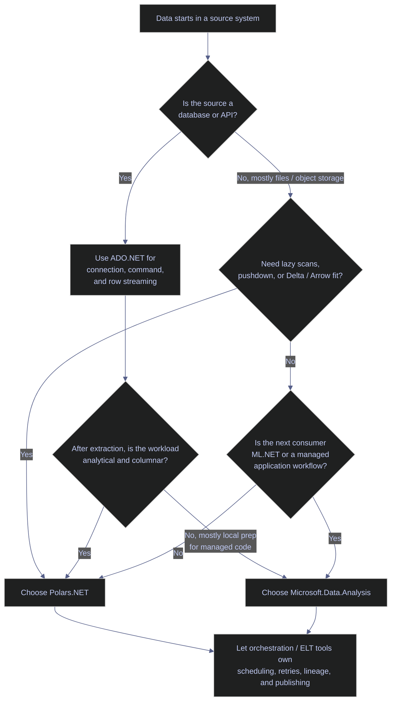

# 01 – Foundations and Data Structures

> [!quote]
> "Bad programmers worry about the code. Good programmers worry about data structures and their relationships."
>
> — **Linus Torvalds**, Git mailing list post (2006)

Polars.NET vs Microsoft.Data.Analysis: Series, DataFrames, and Data Types

---

## Setup & Imports

This section prepares the notebook environment, loads the required packages, and records the runtime constraints that matter before comparing Polars.NET and Microsoft.Data.Analysis in real engineering workflows.

### Warning Suppression

Suppress CS1701/CS1702 assembly version warnings in .NET Interactive. NuGet packages targeting .NET 8/9 trigger these on .NET 10 — harmless. Run this cell once before any cells that use NuGet packages.

```csharp
using System.Reflection;
using Microsoft.DotNet.Interactive;
using Microsoft.DotNet.Interactive.CSharp;
var csharpKernel = (CSharpKernel)Kernel.Root.FindKernelByName("csharp");
var optionsField = typeof(CSharpKernel).GetField("_scriptOptions",
    BindingFlags.NonPublic | BindingFlags.Instance);
var scriptOptions = optionsField.GetValue(csharpKernel);
var withWarningLevel = scriptOptions.GetType().GetMethod("WithWarningLevel");
var newOptions = withWarningLevel.Invoke(scriptOptions, new object[] { 0 });
optionsField.SetValue(csharpKernel, newOptions);
Console.WriteLine("WarningLevel set to 0 — CS1701/CS1702 warnings suppressed.");
```

```text
WarningLevel set to 0 — CS1701/CS1702 warnings suppressed.
```

### NuGet Packages and Imports

```csharp
#r "nuget: Polars.NET, 0.4.0"
#r "nuget: Polars.NET.Native.win-x64, 0.4.0"
#r "nuget: Microsoft.Data.Analysis, 0.23.0"
#r "nuget: ParquetSharp, 21.0.0"
#r "nuget: ParquetSharp.DataFrame, 0.1.0"
using System;
using System.Reflection;
using System.IO;
using System.Linq;
using System.Collections.Generic;
using System.Text.Json;
using Polars.CSharp;
using static Polars.CSharp.Polars;
using MDA = Microsoft.Data.Analysis;
using ParquetSharp;
using Microsoft.DotNet.Interactive;
using Microsoft.DotNet.Interactive.CSharp;
using Microsoft.DotNet.Interactive.Formatting;
Formatter.Register<DataFrame>((df, writer) =>
{
    var html = df.ToHtml();
    html = System.Text.RegularExpressions.Regex.Replace(html, @"(&gt;|>)(.+?)(&lt;|<)", @"$1$2$3");
    html = System.Text.RegularExpressions.Regex.Replace(html, @">""(.+?)""<", @">$1<");
    var css = """
        """;
    writer.Write(css + html);
}, "text/html");
Formatter.Register<Polars.CSharp.Series>((s, writer) =>
{
    var sdf = DataFrame.FromSeries(s);
    var shtml = sdf.ToHtml();
    shtml = System.Text.RegularExpressions.Regex.Replace(shtml, @"(>|>)(.+?)(<|<)", @"$1$2$3");
    shtml = System.Text.RegularExpressions.Regex.Replace(shtml, @">""(.+?)""<", @">$1<");
    var scss = @"";
    writer.Write(scss + shtml);
}, "text/html");
var DATA = Path.Combine("..", "data");
Console.WriteLine($"Data directory: {Path.GetFullPath(DATA)}");
```

```text
Data directory: c:\Users\aperi\DEV\LANG\data
```

### Runtime and Deployment Guidance

Package installation is not a footnote here; it directly affects how each library behaves in production. Polars.NET is a native-backed analytical engine exposed to .NET, while Microsoft.Data.Analysis is a managed .NET library that stays closer to the rest of the ML.NET and `System.Data` ecosystem.

> [!info] Official capability snapshot | 2026-04
>
> [Polars.NET 0.4.0](https://www.nuget.org/packages/Polars.NET/0.4.0) documents a .NET 8+ requirement, separate native runtime packages, AVX2-class CPU requirements, and first-class .NET integrations including ADO.NET, ADBC, LINQ, and Delta Lake.
>
> [Microsoft.Data.Analysis 0.23.0](https://www.nuget.org/packages/Microsoft.Data.Analysis/) targets .NET Standard 2.0 / .NET 8, depends on Apache Arrow and `Microsoft.ML.DataView`, and the [official `DataFrame` API](https://learn.microsoft.com/en-us/dotnet/api/microsoft.data.analysis.dataframe?view=ml-dotnet-preview) shows that `DataFrame` implements `IDataView` for ML.NET interoperability.

#### Polars.NET | Plan for native runtime packaging and modern CPUs

Polars.NET is the better fit when you want a high-performance analytical engine embedded inside a .NET application, but the tradeoff is operational: you must ship the matching native runtime package for the deployment target and run on hardware that satisfies the package's AVX2 baseline. That makes Polars.NET a strong choice for data engineering services, batch workers, lakehouse utilities, and notebook environments that you control end-to-end, but a weaker choice for highly constrained hosting environments where native packaging is difficult to standardize.

#### Microsoft.Data.Analysis | Prefer when a pure managed dependency is operationally simpler

Microsoft.Data.Analysis fits more naturally into ordinary managed .NET applications because it does not require a second native runtime package in the way Polars.NET does. Combined with its ML.NET-oriented `IDataView` surface, this makes MDA attractive when the main goal is in-process data preparation, exploratory work inside .NET notebooks, or feature engineering immediately upstream of ML.NET training and scoring code.

#### Deployment recommendation | Treat packaging and interoperability as architecture decisions

For senior teams, the engine decision should happen at the same time as the runtime decision. If your service already standardizes on .NET 8+, ships native dependencies, and processes Parquet/Delta/Arrow data as a first-class workload, Polars.NET is usually the better long-term analytical core. If your service is primarily a managed .NET application that occasionally needs tabular manipulation before ML.NET or reporting logic, Microsoft.Data.Analysis often has the lower operational cost.

---

## Series

A **Series** is a single column of typed, homogeneous data — the fundamental building block of any DataFrame library. Polars.NET and Microsoft.Data.Analysis both work with typed, column-oriented vectors, but they expose them differently. Polars.NET uses Arrow-backed `Series` with native null bitmaps and Arrow logical types. Microsoft.Data.Analysis uses managed `DataFrameColumn` objects backed by CLR types such as `Double`, `Int32`, `String`, and `DateTime`.

> [!info] Polars.NET vs Microsoft.Data.Analysis | Null representation
>
> Polars.NET represents missing values with Arrow's native null bitmap, so a nullable numeric column remains strongly typed as `f64` or similar Arrow data. Microsoft.Data.Analysis stores nulls directly inside nullable `DataFrameColumn` values and exposes the result through per-column `.NullCount` and CLR `Type` metadata.

### Creating Series

#### Polars.NET | Create Series from arrays

`Series.From<T>(name, array)` creates a named, typed Series from any .NET array. Polars automatically maps .NET types to Arrow types (`double` → `f64`, `int` → `i32`, `string` → `str`). The name parameter is required because Polars Series always carry a column name — this becomes the column header when the Series is added to a DataFrame.

_Creates a `prices` Series of 5 `f64` values from a `double[]`, then creates `ids` (`i32`), `tickers` (`str`), and `dates` (`date`) Series to confirm Polars maps each .NET array type to its Arrow equivalent without explicit type declarations._

```csharp
var prices = Polars.CSharp.Series.From("prices", new[] { 100.0, 102.5, 101.8, 103.2, 104.1 });
display($"Name: {prices.Name}  |  Length: {prices.Length}  |  DataType: {prices.DataTypeName}");
prices
```

```text
Name: prices  |  Length: 5  |  DataType: f64
```

<!-- Polars DataFrame: (5 rows, 1 columns) -->
<table><thead><tr><th>prices</th></tr></thead><tbody><tr><td>100</td></tr><tr><td>102.5</td></tr><tr><td>101.8</td></tr><tr><td>103.2</td></tr><tr><td>104.1</td></tr></tbody></table></div>

Polars maps different .NET types to Arrow types automatically — `int[]` becomes `i32`, `string[]` becomes `str`, and `DateOnly[]` becomes `date`.

```csharp
var ints    = Polars.CSharp.Series.From("ids", new[] { 1, 2, 3, 4, 5 });
var strings = Polars.CSharp.Series.From("tickers", new[] { "ASML.AS", "SAP.DE", "SIE.DE" });
var dates   = Polars.CSharp.Series.From("dates", new[] {
    new DateOnly(2024, 1, 2), new DateOnly(2024, 1, 3), new DateOnly(2024, 1, 4)
});
display($"ints: {ints.DataTypeName}  |  strings: {strings.DataTypeName}  |  dates: {dates.DataTypeName}");
```

```text
ints: i32  |  strings: str  |  dates: date
```

#### Microsoft.Data.Analysis | Create Columns from arrays

`Microsoft.Data.Analysis` models a single series-like vector as `DataFrameColumn`. Numeric data uses `PrimitiveDataFrameColumn<T>`, strings use `StringDataFrameColumn`, and types stay in the CLR type system rather than Arrow logical types.

_Creates a `prices` column of 5 `Double` values from a `double[]`, then creates `ids` (`Int32`), `tickers` (`String`), and `dates` (`DateTime`) columns to confirm Microsoft.Data.Analysis maps each .NET input array to the matching column type._

```csharp
// Microsoft.Data.Analysis – create a Column from an array
var prices = new MDA.PrimitiveDataFrameColumn<double>("prices", new[] { 100.0, 102.5, 101.8, 103.2, 104.1 });
display($"Name: {prices.Name}  |  Length: {prices.Length}  |  DataType: {prices.DataType.Name}");
new MDA.DataFrame(prices)
```

```text
Name: prices  |  Length: 5  |  DataType: Double
```

<table id="table_639110702375365306"><thead><tr><th><i>index</i></th><th>prices</th></tr></thead><tbody><tr><td><i><div class="dni-plaintext"><pre>0</pre></div></i></td><td><div class="dni-plaintext"><pre>100</pre></div></td></tr><tr><td><i><div class="dni-plaintext"><pre>1</pre></div></i></td><td><div class="dni-plaintext"><pre>102.5</pre></div></td></tr><tr><td><i><div class="dni-plaintext"><pre>2</pre></div></i></td><td><div class="dni-plaintext"><pre>101.8</pre></div></td></tr><tr><td><i><div class="dni-plaintext"><pre>3</pre></div></i></td><td><div class="dni-plaintext"><pre>103.2</pre></div></td></tr><tr><td><i><div class="dni-plaintext"><pre>4</pre></div></i></td><td><div class="dni-plaintext"><pre>104.1</pre></div></td></tr></tbody></table>

Microsoft.Data.Analysis maps .NET arrays to concrete column classes: numerics become `PrimitiveDataFrameColumn<T>`, strings use `StringDataFrameColumn`, and temporal data typically stays as `DateTime`.

```csharp
// From different .NET types -- Maps to underlying primitive or string columns
var ints    = new MDA.PrimitiveDataFrameColumn<int>("ids", new[] { 1, 2, 3, 4, 5 });
var strings = new MDA.StringDataFrameColumn("tickers", new[] { "ASML.AS", "SAP.DE", "SIE.DE" });
var dates   = new MDA.PrimitiveDataFrameColumn<DateTime>("dates", new[] {
    new DateTime(2024, 1, 2), new DateTime(2024, 1, 3), new DateTime(2024, 1, 4)
});
display($"ints: {ints.DataType.Name}  |  strings: {strings.DataType.Name}  |  dates: {dates.DataType.Name}");
```

```text
ints: Int32  |  strings: String  |  dates: DateTime
```

---

### Null and Missing Values

#### Polars.NET | Handle nulls natively in Series

Polars.NET supports native nulls via C# nullable types (`double?`, `int?`, `string?`). Nulls are stored in Arrow's null bitmap — the column type is preserved without coercion. Use `.NullCount` to inspect how many values are missing.

_Creates a `with_nulls` Series from a `double?[]` containing 2 nulls at indices 1 and 3, confirming that `.NullCount` returns 2 and the Arrow representation stores nulls without coercing the `f64` type._

```csharp
var s = Polars.CSharp.Series.From<double?>("with_nulls",
    new double?[] { 1.0, null, 3.0, null, 5.0 });
display($"Length: {s.Length}  |  NullCount: {s.NullCount}");
s
```

```text
Length: 5  |  NullCount: 2
```

<!-- Polars DataFrame: (5 rows, 1 columns) -->
<table><thead><tr><th>with_nulls</th></tr></thead><tbody><tr><td>1</td></tr><tr><td class='pl-null'>null</td></tr><tr><td>3</td></tr><tr><td class='pl-null'>null</td></tr><tr><td>5</td></tr></tbody></table></div>

#### Microsoft.Data.Analysis | Handle nulls natively in columns

Microsoft.Data.Analysis supports missing values through nullable element types inside `PrimitiveDataFrameColumn<T>`. Use `.NullCount` to inspect how many elements are missing.

_Creates a `with_nulls` column from a `double?[]` containing 2 nulls at indices 1 and 3, confirming that `.NullCount` returns 2 and the column keeps its numeric `Double` type._

```csharp
// Microsoft.Data.Analysis – native null support via nullable types
var s = new MDA.PrimitiveDataFrameColumn<double>("with_nulls",
    new double?[] { 1.0, null, 3.0, null, 5.0 });
display($"Length: {s.Length}  |  NullCount: {s.NullCount}");
new MDA.DataFrame(s)
```

```text
Length: 5  |  NullCount: 2
```

<table id="table_639110702410980364"><thead><tr><th><i>index</i></th><th>with_nulls</th></tr></thead><tbody><tr><td><i><div class="dni-plaintext"><pre>0</pre></div></i></td><td><div class="dni-plaintext"><pre>1</pre></div></td></tr><tr><td><i><div class="dni-plaintext"><pre>1</pre></div></i></td><td><div class="dni-plaintext"><pre>&lt;null&gt;</pre></div></td></tr><tr><td><i><div class="dni-plaintext"><pre>2</pre></div></i></td><td><div class="dni-plaintext"><pre>3</pre></div></td></tr><tr><td><i><div class="dni-plaintext"><pre>3</pre></div></i></td><td><div class="dni-plaintext"><pre>&lt;null&gt;</pre></div></td></tr><tr><td><i><div class="dni-plaintext"><pre>4</pre></div></i></td><td><div class="dni-plaintext"><pre>5</pre></div></td></tr></tbody></table>

---

### Data Types

#### Polars.NET | Inspect Series data types

Polars.NET uses the Apache Arrow type system. Each `.NET` type maps to a specific Arrow type. Use `.DataTypeName` to inspect the Arrow type of any Series.

_Creates 7 Series from different .NET types (`int[]`, `long[]`, `double[]`, `string[]`, `bool[]`, `DateOnly[]`, `DateTime[]`) and prints each Arrow type name, confirming the mapping: `i32`, `i64`, `f64`, `str`, `bool`, `date`, `datetime[μs]`._

```csharp
var examples = new (string Name, string Type)[]
{
    ("Int32",    Polars.CSharp.Series.From("x", new[] { 1, 2, 3 }).DataTypeName),
    ("Int64",    Polars.CSharp.Series.From("x", new[] { 1L, 2L, 3L }).DataTypeName),
    ("Float64",  Polars.CSharp.Series.From("x", new[] { 1.0, 2.0 }).DataTypeName),
    ("String",   Polars.CSharp.Series.From("x", new[] { "a", "b" }).DataTypeName),
    ("Boolean",  Polars.CSharp.Series.From("x", new[] { true, false }).DataTypeName),
    ("Date",     Polars.CSharp.Series.From("x", new[] { DateOnly.MinValue }).DataTypeName),
    ("DateTime", Polars.CSharp.Series.From("x", new[] { DateTime.Now }).DataTypeName),
};
foreach (var (name, type) in examples)
    Console.WriteLine($"  {name,-12} → {type}");
```

```text
Int32        → i32
Int64        → i64
Float64      → f64
String       → str
Boolean      → bool
Date         → date
DateTime     → datetime[μs]
```

#### Microsoft.Data.Analysis | Inspect column data types

Microsoft.Data.Analysis exposes CLR types through `.DataType`. You inspect `Int32`, `Int64`, `Double`, `String`, `Boolean`, and `DateTime` rather than Arrow names like `i32` or `f64`.

_Creates columns from several .NET input types and prints each resolved CLR `Type.Name`, confirming the library stays aligned with standard .NET typing._

```csharp
// Microsoft.Data.Analysis – .NET Type system representation
var examples = new (string Name, Type Type)[]
{
    ("Int32",    new MDA.PrimitiveDataFrameColumn<int>("x", new[] { 1, 2, 3 }).DataType),
    ("Int64",    new MDA.PrimitiveDataFrameColumn<long>("x", new[] { 1L, 2L, 3L }).DataType),
    ("Float64",  new MDA.PrimitiveDataFrameColumn<double>("x", new[] { 1.0, 2.0 }).DataType),
    ("String",   new MDA.StringDataFrameColumn("x", new[] { "a", "b" }).DataType),
    ("Boolean",  new MDA.PrimitiveDataFrameColumn<bool>("x", new[] { true, false }).DataType),
    ("DateTime", new MDA.PrimitiveDataFrameColumn<DateTime>("x", new[] { DateTime.Now }).DataType),
};
foreach (var (name, type) in examples)
    Console.WriteLine($"  {name,-12} → {type.Name}");
```

```text
  Int32        → Int32
  Int64        → Int64
  Float64      → Double
  String       → String
  Boolean      → Boolean
  DateTime     → DateTime
```

---

### Arithmetic Operations

Both libraries support standard arithmetic operators (`+`, `-`, `*`, `/`) on Series. Operations are element-wise and return a new Series.

#### Polars.NET | Perform arithmetic on Series

Polars.NET overloads the standard arithmetic operators. The result is always a new Series — Polars Series are immutable.

_Creates two 3-element `f64` Series `a` ([10, 20, 30]) and `b` ([1, 2, 3]), applies all four arithmetic operators element-wise, and assembles the results into a single DataFrame — confirming each operation returns a new immutable Series._

```csharp
var a = Polars.CSharp.Series.From("a", new[] { 10.0, 20.0, 30.0 });
var b = Polars.CSharp.Series.From("b", new[] { 1.0, 2.0, 3.0 });
DataFrame.FromColumns(
    ("a + b", (a + b).ToArray<double>()),
    ("a - b", (a - b).ToArray<double>()),
    ("a * b", (a * b).ToArray<double>()),
    ("a / b", (a / b).ToArray<double>())
)
```

<!-- Polars DataFrame: (3 rows, 4 columns) -->
<table><thead><tr><th>a + b</th><th>a - b</th><th>a * b</th><th>a / b</th></tr></thead><tbody><tr><td>11</td><td>9</td><td>10</td><td>10</td></tr><tr><td>22</td><td>18</td><td>40</td><td>10</td></tr><tr><td>33</td><td>27</td><td>90</td><td>10</td></tr></tbody></table></div>

#### Microsoft.Data.Analysis | Perform arithmetic on columns

Arithmetic operators work on compatible `DataFrameColumn` instances and return new columns. Names are not derived automatically, so rename the result columns before assembling them into a DataFrame.

_Creates two 3-element numeric columns `a` and `b`, applies `+`, `-`, `*`, and `/` element-wise, assigns readable result names, and combines them into a 4-column DataFrame._

```csharp
// Microsoft.Data.Analysis – operator overloads on Columns
var a = new MDA.PrimitiveDataFrameColumn<double>("a", new[] { 10.0, 20.0, 30.0 });
var b = new MDA.PrimitiveDataFrameColumn<double>("b", new[] { 1.0, 2.0, 3.0 });
// Perform the operations (creates new columns)
var add = a + b;
var sub = a - b;
var mul = a * b;
var div = a / b;
// Set the names (returns void)
add.SetName("a + b");
sub.SetName("a - b");
mul.SetName("a * b");
div.SetName("a / b");
// Create the DataFrame
new MDA.DataFrame(add, sub, mul, div)
```

<table id="table_639110702884159625"><thead><tr><th><i>index</i></th><th>a + b</th><th>a - b</th><th>a * b</th><th>a / b</th></tr></thead><tbody><tr><td><i><div class="dni-plaintext"><pre>0</pre></div></i></td><td><div class="dni-plaintext"><pre>11</pre></div></td><td><div class="dni-plaintext"><pre>9</pre></div></td><td><div class="dni-plaintext"><pre>10</pre></div></td><td><div class="dni-plaintext"><pre>10</pre></div></td></tr><tr><td><i><div class="dni-plaintext"><pre>1</pre></div></i></td><td><div class="dni-plaintext"><pre>22</pre></div></td><td><div class="dni-plaintext"><pre>18</pre></div></td><td><div class="dni-plaintext"><pre>40</pre></div></td><td><div class="dni-plaintext"><pre>10</pre></div></td></tr><tr><td><i><div class="dni-plaintext"><pre>2</pre></div></i></td><td><div class="dni-plaintext"><pre>33</pre></div></td><td><div class="dni-plaintext"><pre>27</pre></div></td><td><div class="dni-plaintext"><pre>90</pre></div></td><td><div class="dni-plaintext"><pre>10</pre></div></td></tr></tbody></table>

---

### Aggregations

#### Polars.NET | Compute aggregations on Series

Polars.NET provides generic aggregation methods (`.Sum<T>()`, `.Mean<T>()`, `.Std()`, `.Min<T>()`, `.Max<T>()`) that return scalar values. The generic type parameter specifies the return type. `.Std()` returns a single-element Series rather than a scalar.

_Creates a `vals` Series of [10, 20, 30, 40, 50] and calls all five aggregation methods, assembling results into a summary DataFrame — showing that `.Std()` requires `.GetValue<double>(0)` to extract its scalar while all other methods return directly._

```csharp
var s = Polars.CSharp.Series.From("vals", new[] { 10.0, 20.0, 30.0, 40.0, 50.0 });
new DataFrame(new Polars.CSharp.Series[]
{
    Polars.CSharp.Series.From("stat", new[] { "sum", "mean", "std", "min", "max" }),
    Polars.CSharp.Series.From("value", new[] {
        s.Sum<double>(), s.Mean<double>(), s.Std().GetValue<double>(0),
        s.Min<double>(), s.Max<double>()
    })
})
```

<!-- Polars DataFrame: (5 rows, 2 columns) -->
<table><thead><tr><th>stat</th><th>value</th></tr></thead><tbody><tr><td>sum</td><td>150</td></tr><tr><td>mean</td><td>30</td></tr><tr><td>std</td><td>15.8113883</td></tr><tr><td>min</td><td>10</td></tr><tr><td>max</td><td>50</td></tr></tbody></table></div>

#### Microsoft.Data.Analysis | Compute aggregations on columns

Microsoft.Data.Analysis provides core aggregation methods such as `.Sum()`, `.Mean()`, `.Min()`, and `.Max()`. Standard deviation is often computed manually from the column values when you need parity with richer analytical libraries.

_Creates a `vals` column of `[10, 20, 30, 40, 50]`, computes sum, mean, sample standard deviation, min, and max, and assembles the results into a summary DataFrame._

```csharp
// Microsoft.Data.Analysis — basic aggregations
var s = new MDA.PrimitiveDataFrameColumn<double>("vals", new[] { 10.0, 20.0, 30.0, 40.0, 50.0 });
double mean = (double)s.Mean();
double sumSq = 0;
for (long i = 0; i < s.Length; i++) {
    var val = s[i].GetValueOrDefault();
    sumSq += (val - mean) * (val - mean);
}
double std = Math.Sqrt(sumSq / (s.Length - 1));
new MDA.DataFrame(
    new MDA.StringDataFrameColumn("stat", new[] { "sum", "mean", "std", "min", "max" }),
    new MDA.PrimitiveDataFrameColumn<double>("value", new[] {
        (double)s.Sum(), mean, std, (double)s.Min(), (double)s.Max()
    })
)
```

<table id="table_639110702908547987"><thead><tr><th><i>index</i></th><th>stat</th><th>value</th></tr></thead><tbody><tr><td><i><div class="dni-plaintext"><pre>0</pre></div></i></td><td>sum</td><td><div class="dni-plaintext"><pre>150</pre></div></td></tr><tr><td><i><div class="dni-plaintext"><pre>1</pre></div></i></td><td>mean</td><td><div class="dni-plaintext"><pre>30</pre></div></td></tr><tr><td><i><div class="dni-plaintext"><pre>2</pre></div></i></td><td>std</td><td><div class="dni-plaintext"><pre>15.811388300841896</pre></div></td></tr><tr><td><i><div class="dni-plaintext"><pre>3</pre></div></i></td><td>min</td><td><div class="dni-plaintext"><pre>10</pre></div></td></tr><tr><td><i><div class="dni-plaintext"><pre>4</pre></div></i></td><td>max</td><td><div class="dni-plaintext"><pre>50</pre></div></td></tr></tbody></table>

---

### Describe (Summary Statistics)

#### Polars.NET | Summarise a Series with Describe

`Describe()` returns a DataFrame with count, null_count, mean, std, min, percentiles (25%, 50%, 75%), and max. Since `.Describe()` is a DataFrame method, wrap a single Series in a DataFrame first with `DataFrame.FromSeries()`.

_Wraps a 5-element `prices` Series in a DataFrame via `DataFrame.FromSeries()` and calls `.Describe()`, producing a 9-row summary with count, null_count, mean, std, min, 25%/50%/75% percentiles, and max._

```csharp
var s = Polars.CSharp.Series.From("prices", new[] { 100.0, 102.5, 101.8, 103.2, 104.1 });
var df = DataFrame.FromSeries(s);
df.Describe()
```

<!-- Polars DataFrame: (9 rows, 2 columns) -->
<table><thead><tr><th>statistic</th><th>prices</th></tr></thead><tbody><tr><td>count</td><td>5</td></tr><tr><td>null_count</td><td>0</td></tr><tr><td>mean</td><td>102.32</td></tr><tr><td>std</td><td>1.551450934</td></tr><tr><td>min</td><td>100</td></tr><tr><td>25%</td><td>101.8</td></tr><tr><td>50%</td><td>102.5</td></tr><tr><td>75%</td><td>103.2</td></tr><tr><td>max</td><td>104.1</td></tr></tbody></table></div>

#### Microsoft.Data.Analysis | Summarise a column with `Description()`

`MDA.DataFrame.Description()` returns a compact statistical summary for numeric columns. It is simpler than Polars `Describe()` and does not include percentile rows.

_Wraps a 5-element `prices` column in an MDA DataFrame and calls `.Description()`, returning length, max, min, and mean for the column._

```csharp
// Microsoft.Data.Analysis – built-in describe (returns a DataFrame)
var s = new MDA.PrimitiveDataFrameColumn<double>("prices", new[] { 100.0, 102.5, 101.8, 103.2, 104.1 });
var df = new MDA.DataFrame(s);
df.Description()
```

<table id="table_639110702929011300"><thead><tr><th><i>index</i></th><th>Description</th><th>prices</th></tr></thead><tbody><tr><td><i><div class="dni-plaintext"><pre>0</pre></div></i></td><td>Length (excluding null values)</td><td><div class="dni-plaintext"><pre>5</pre></div></td></tr><tr><td><i><div class="dni-plaintext"><pre>1</pre></div></i></td><td>Max</td><td><div class="dni-plaintext"><pre>104.1</pre></div></td></tr><tr><td><i><div class="dni-plaintext"><pre>2</pre></div></i></td><td>Min</td><td><div class="dni-plaintext"><pre>100</pre></div></td></tr><tr><td><i><div class="dni-plaintext"><pre>3</pre></div></i></td><td>Mean</td><td><div class="dni-plaintext"><pre>102.32</pre></div></td></tr></tbody></table>

---

### Comparison Summary | Series

| Operation | Polars.NET | Microsoft.Data.Analysis |
|---|---|---|
| Create from array | `Series.From<T>("name", arr)` | `new MDA.PrimitiveDataFrameColumn<T>("name", arr)` |
| Create string column | `Series.From("name", string[])` | `new MDA.StringDataFrameColumn("name", arr)` |
| Null / missing | Nullable types + Arrow null bitmap | Nullable column elements + `.NullCount` |
| Data type | `.DataTypeName` (Arrow types) | `.DataType` (CLR `Type`) |
| Arithmetic | `+`, `-`, `*`, `/` on `Series` | `+`, `-`, `*`, `/` on columns |
| Sum / Mean / Std | `.Sum<T>()`, `.Mean<T>()`, `.Std()` | `.Sum()`, `.Mean()`, manual `std` |
| Min / Max | `.Min<T>()`, `.Max<T>()` | `.Min()`, `.Max()` |
| Describe | `DataFrame.FromSeries(s).Describe()` | `new MDA.DataFrame(col).Description()` |

---

## DataFrames

A **DataFrame** is a collection of named, typed columns — the primary tabular data structure. Polars.NET DataFrames are Arrow-backed, immutable, and index-free. Microsoft.Data.Analysis DataFrames are managed, column-oriented, mutable objects built from `DataFrameColumn` instances and also operate without a built-in row index.

> [!info] Polars.NET vs Microsoft.Data.Analysis | Mutability
>
> Polars DataFrames are **immutable** — operations like `.WithColumns()`, `.Filter()`, and `.Sort()` always return a new DataFrame. Microsoft.Data.Analysis DataFrames are **mutable** — column insertion, removal, and replacement modify the current frame in place.

### Building DataFrames

#### Polars.NET | Build DataFrames from columns

`DataFrame.FromColumns()` accepts an anonymous object where each property becomes a column. This is the most concise way to create a small DataFrame inline. Column order follows property declaration order.

_Creates a 5-row equity DataFrame (Symbol/Sector/Price) from an anonymous object where each property becomes a column, then creates a second 3-row DataFrame from named tuples — demonstrating both `DataFrame.FromColumns()` overloads._

```csharp
var df = DataFrame.FromColumns(new
{
    Symbol = new[] { "ASML.AS", "SAP.DE", "SIE.DE", "TTE.PA", "AIR.PA" },
    Sector = new[] { "Technology", "Technology", "Industrials", "Energy", "Industrials" },
    Price  = new[] { 680.5, 175.2, 168.9, 58.3, 152.7 },
});
display($"Shape: {df.Shape}");
df
```

```text
Shape: (5, 3)
```

<!-- Polars DataFrame: (5 rows, 3 columns) -->
<table><thead><tr><th>Symbol</th><th>Sector</th><th>Price</th></tr></thead><tbody><tr><td>ASML.AS</td><td>Technology</td><td>680.5</td></tr><tr><td>SAP.DE</td><td>Technology</td><td>175.2</td></tr><tr><td>SIE.DE</td><td>Industrials</td><td>168.9</td></tr><tr><td>TTE.PA</td><td>Energy</td><td>58.3</td></tr><tr><td>AIR.PA</td><td>Industrials</td><td>152.7</td></tr></tbody></table></div>

An alternative is named tuples, which avoids reflection and is slightly faster for construction.

```csharp
var df2 = DataFrame.FromColumns(
    ("Name",  new[] { "Alice", "Bob", "Carol" }),
    ("Age",   new[] { 30, 25, 35 }),
    ("Score", new[] { 95.5, 88.0, 92.3 })
);
df2
```

<!-- Polars DataFrame: (3 rows, 3 columns) -->
<table><thead><tr><th>Name</th><th>Age</th><th>Score</th></tr></thead><tbody><tr><td>Alice</td><td>30</td><td>95.5</td></tr><tr><td>Bob</td><td>25</td><td>88</td></tr><tr><td>Carol</td><td>35</td><td>92.3</td></tr></tbody></table></div>

#### Microsoft.Data.Analysis | Build DataFrames from columns

The standard MDA construction path is `new MDA.DataFrame(col1, col2, ...)`. You define each column explicitly, then compose them into a frame.

_Creates a 5-row equity DataFrame by passing three explicitly constructed columns into the `MDA.DataFrame` constructor._

```csharp
// Microsoft.Data.Analysis – from explicit column definitions
var df = new MDA.DataFrame(
    new MDA.StringDataFrameColumn("Symbol", new[] { "ASML.AS", "SAP.DE", "SIE.DE", "TTE.PA", "AIR.PA" }),
    new MDA.StringDataFrameColumn("Sector", new[] { "Technology", "Technology", "Industrials", "Energy", "Industrials" }),
    new MDA.PrimitiveDataFrameColumn<double>("Price", new[] { 680.5, 175.2, 168.9, 58.3, 152.7 })
);
display($"Shape: ({df.Rows.Count}, {df.Columns.Count})");
df
```

```text
Shape: (5, 3)
```

<table id="table_639110702947000189"><thead><tr><th><i>index</i></th><th>Symbol</th><th>Sector</th><th>Price</th></tr></thead><tbody><tr><td><i><div class="dni-plaintext"><pre>0</pre></div></i></td><td>ASML.AS</td><td>Technology</td><td><div class="dni-plaintext"><pre>680.5</pre></div></td></tr><tr><td><i><div class="dni-plaintext"><pre>1</pre></div></i></td><td>SAP.DE</td><td>Technology</td><td><div class="dni-plaintext"><pre>175.2</pre></div></td></tr><tr><td><i><div class="dni-plaintext"><pre>2</pre></div></i></td><td>SIE.DE</td><td>Industrials</td><td><div class="dni-plaintext"><pre>168.9</pre></div></td></tr><tr><td><i><div class="dni-plaintext"><pre>3</pre></div></i></td><td>TTE.PA</td><td>Energy</td><td><div class="dni-plaintext"><pre>58.3</pre></div></td></tr><tr><td><i><div class="dni-plaintext"><pre>4</pre></div></i></td><td>AIR.PA</td><td>Industrials</td><td><div class="dni-plaintext"><pre>152.7</pre></div></td></tr></tbody></table>

---

#### Polars.NET | Build DataFrames from record objects

`DataFrame.From<T>()` creates a DataFrame from any `IEnumerable<T>` — anonymous types, POCOs, or records. This is useful when your data is already structured as .NET objects (e.g., from a deserialized JSON response or a database query result).

_Creates 3 OHLCV anonymous records with `DateOnly` date fields and passes the `IEnumerable<T>` to `DataFrame.From()`, producing a 5-column DataFrame where the `Date` column maps to Arrow's `date` type — demonstrating object-to-DataFrame conversion without explicit column declarations._

```csharp
var records = new[]
{
    new { Date = new DateOnly(2024, 1, 2), Open = 100.0, High = 105.0, Low = 99.0, Close = 103.5 },
    new { Date = new DateOnly(2024, 1, 3), Open = 103.5, High = 106.0, Low = 102.0, Close = 104.8 },
    new { Date = new DateOnly(2024, 1, 4), Open = 104.8, High = 107.5, Low = 103.0, Close = 106.2 },
};
var df = DataFrame.From(records);
df
```

<!-- Polars DataFrame: (3 rows, 5 columns) -->
<table><thead><tr><th>Date</th><th>Open</th><th>High</th><th>Low</th><th>Close</th></tr></thead><tbody><tr><td>2024-01-02</td><td>100</td><td>105</td><td>99</td><td>103.5</td></tr><tr><td>2024-01-03</td><td>103.5</td><td>106</td><td>102</td><td>104.8</td></tr><tr><td>2024-01-04</td><td>104.8</td><td>107.5</td><td>103</td><td>106.2</td></tr></tbody></table></div>

---

#### Microsoft.Data.Analysis | Build DataFrames from record objects

Microsoft.Data.Analysis does not offer a Polars-style `DataFrame.From<T>()` helper. The usual pattern is to project an `IEnumerable<T>` into one column per property and build the DataFrame manually.

_Creates 3 OHLC records as anonymous objects, projects each property into a typed column, and builds a 5-column DataFrame manually._

```csharp
// Microsoft.Data.Analysis – from IEnumerable of records (requires manual mapping)
var records = new[]
{
    new { Date = new DateTime(2024, 1, 2), Open = 100.0, High = 105.0, Low = 99.0, Close = 103.5 },
    new { Date = new DateTime(2024, 1, 3), Open = 103.5, High = 106.0, Low = 102.0, Close = 104.8 },
    new { Date = new DateTime(2024, 1, 4), Open = 104.8, High = 107.5, Low = 103.0, Close = 106.2 },
};
var df = new MDA.DataFrame(
    new MDA.PrimitiveDataFrameColumn<DateTime>("Date", records.Select(r => r.Date)),
    new MDA.PrimitiveDataFrameColumn<double>("Open", records.Select(r => r.Open)),
    new MDA.PrimitiveDataFrameColumn<double>("High", records.Select(r => r.High)),
    new MDA.PrimitiveDataFrameColumn<double>("Low", records.Select(r => r.Low)),
    new MDA.PrimitiveDataFrameColumn<double>("Close", records.Select(r => r.Close))
);
df
```

<table id="table_639110702966001853"><thead><tr><th><i>index</i></th><th>Date</th><th>Open</th><th>High</th><th>Low</th><th>Close</th></tr></thead><tbody><tr><td><i><div class="dni-plaintext"><pre>0</pre></div></i></td><td><span>2024-01-02 00:00:00Z</span></td><td><div class="dni-plaintext"><pre>100</pre></div></td><td><div class="dni-plaintext"><pre>105</pre></div></td><td><div class="dni-plaintext"><pre>99</pre></div></td><td><div class="dni-plaintext"><pre>103.5</pre></div></td></tr><tr><td><i><div class="dni-plaintext"><pre>1</pre></div></i></td><td><span>2024-01-03 00:00:00Z</span></td><td><div class="dni-plaintext"><pre>103.5</pre></div></td><td><div class="dni-plaintext"><pre>106</pre></div></td><td><div class="dni-plaintext"><pre>102</pre></div></td><td><div class="dni-plaintext"><pre>104.8</pre></div></td></tr><tr><td><i><div class="dni-plaintext"><pre>2</pre></div></i></td><td><span>2024-01-04 00:00:00Z</span></td><td><div class="dni-plaintext"><pre>104.8</pre></div></td><td><div class="dni-plaintext"><pre>107.5</pre></div></td><td><div class="dni-plaintext"><pre>103</pre></div></td><td><div class="dni-plaintext"><pre>106.2</pre></div></td></tr></tbody></table>

---

#### Polars.NET | Build DataFrames from existing Series

`DataFrame.FromSeries()` combines multiple pre-built Series into a DataFrame. All Series must have the same length; names become column headers.

_Pre-builds three named Series (`name` str, `age` i32, `score` f64) and combines them into a 2-row DataFrame using `DataFrame.FromSeries()`, confirming that Series names become column headers and all Series must share the same length._

```csharp
var names  = Polars.CSharp.Series.From("name", new[] { "Alice", "Bob" });
var ages   = Polars.CSharp.Series.From("age", new[] { 30, 25 });
var scores = Polars.CSharp.Series.From("score", new[] { 95.5, 88.0 });
var df = DataFrame.FromSeries(names, ages, scores);
df
```

<!-- Polars DataFrame: (2 rows, 3 columns) -->
<table><thead><tr><th>name</th><th>age</th><th>score</th></tr></thead><tbody><tr><td>Alice</td><td>30</td><td>95.5</td></tr><tr><td>Bob</td><td>25</td><td>88</td></tr></tbody></table></div>

---

#### Microsoft.Data.Analysis | Build DataFrames from existing columns

Pre-built `DataFrameColumn` objects can be combined directly with the DataFrame constructor. Column names become the headers exactly as defined on each source column.

_Pre-builds `name`, `age`, and `score` columns, then combines them into a 2-row MDA DataFrame._

```csharp
// Microsoft.Data.Analysis – from existing Columns
var names  = new MDA.StringDataFrameColumn("name", new[] { "Alice", "Bob" });
var ages   = new MDA.PrimitiveDataFrameColumn<int>("age", new[] { 30, 25 });
var scores = new MDA.PrimitiveDataFrameColumn<double>("score", new[] { 95.5, 88.0 });
var df = new MDA.DataFrame(names, ages, scores);
df
```

<table id="table_639110702983146244"><thead><tr><th><i>index</i></th><th>name</th><th>age</th><th>score</th></tr></thead><tbody><tr><td><i><div class="dni-plaintext"><pre>0</pre></div></i></td><td>Alice</td><td><div class="dni-plaintext"><pre>30</pre></div></td><td><div class="dni-plaintext"><pre>95.5</pre></div></td></tr><tr><td><i><div class="dni-plaintext"><pre>1</pre></div></i></td><td>Bob</td><td><div class="dni-plaintext"><pre>25</pre></div></td><td><div class="dni-plaintext"><pre>88</pre></div></td></tr></tbody></table>

---

#### Polars.NET | Create an empty DataFrame with a predefined schema

An empty DataFrame with a predefined schema is useful as a sentinel or accumulator start value. Define the schema with `PolarsSchema`, then create the DataFrame with empty arrays matching those types.

_Defines a `PolarsSchema` with three typed columns (Int32, String, Float64) and creates an empty DataFrame by passing `Array.Empty<T>()` for each, confirming the shape is `(0, 3)` and the schema is preserved with no rows._

```csharp
var schema = new PolarsSchema()
    .Add("id", DataType.Int32)
    .Add("name", DataType.String)
    .Add("value", DataType.Float64);
var empty = DataFrame.FromColumns(
    ("id",    Array.Empty<int>()),
    ("name",  Array.Empty<string>()),
    ("value", Array.Empty<double>())
);
display($"Shape: {empty.Shape}");
empty.PrintSchema();
```

```text
Shape: (0, 3)
```

```text
root
 |-- id: Int32
 |-- name: String
 |-- value: Float64
```

#### Microsoft.Data.Analysis | Create an empty DataFrame with a predefined schema

To predefine schema in MDA, create zero-length typed columns and pass them into the `MDA.DataFrame` constructor. This preserves column names and CLR types even with no rows.

_Creates an empty 3-column DataFrame with `id`, `name`, and `value`, confirming the shape is `(0, 3)` and the schema is defined by the empty columns._

```csharp
// Microsoft.Data.Analysis – empty DataFrame with predefined schema
var empty = new MDA.DataFrame(
    new MDA.PrimitiveDataFrameColumn<int>("id", 0),
    new MDA.StringDataFrameColumn("name", 0),
    new MDA.PrimitiveDataFrameColumn<double>("value", 0)
);
display($"Shape: ({empty.Rows.Count}, {empty.Columns.Count})");
empty.Info();
```

```text
Shape: (0, 3)
```

---

## Row Access and Filtering

Neither library uses a label-based row index by default. **Polars.NET** stays entirely index-free and expression-driven. **Microsoft.Data.Analysis** is also positional: rows are addressed by order, and key-based access is modelled as an explicit filter over a column rather than an index lookup.

> [!info] Polars.NET vs Microsoft.Data.Analysis | Row identity
>
> Both libraries treat row identity as data, not metadata. If you need label semantics, keep the key as an ordinary column and filter or join on it explicitly.

### Positional Access and Predicate Filtering

#### Polars.NET | Access rows by position

Polars accesses rows by integer position. Use `.Head(n)` for the first N rows, `.Slice(offset, length)` for arbitrary ranges, or `.Filter()` with expressions for conditional access.

_Creates a 3-row stock DataFrame and demonstrates two access patterns: `.Head(1)` to retrieve the first row by position, and `.Filter(Col("Symbol") == Lit("SAP.DE"))` to retrieve a row by predicate — confirming Polars has no label-based row index._

```csharp
var df = DataFrame.FromColumns(new
{
    Symbol = new[] { "ASML.AS", "SAP.DE", "SIE.DE" },
    Price  = new[] { 680.5, 175.2, 168.9 },
});
display(df.Head(1));
display(df.Filter(Col("Symbol") == Lit("SAP.DE")));
```

<!-- Polars DataFrame: (1 rows, 2 columns) -->
<table><thead><tr><th>Symbol</th><th>Price</th></tr></thead><tbody><tr><td>ASML.AS</td><td>680.5</td></tr></tbody></table></div>
<!-- Polars DataFrame: (1 rows, 2 columns) -->
<table><thead><tr><th>Symbol</th><th>Price</th></tr></thead><tbody><tr><td>SAP.DE</td><td>175.2</td></tr></tbody></table></div>

#### Microsoft.Data.Analysis | Access rows by position and filter with boolean masks

Microsoft.Data.Analysis uses positional row access (`Head`) plus boolean-mask filtering. Instead of setting an index, create a comparison column or mask and pass it to `.Filter()`.

_Creates a 3-row stock DataFrame, retrieves the first row with `.Head(1)`, then filters `Symbol == "SAP.DE"` by building a boolean mask with `ElementwiseEquals`._

```csharp
// Microsoft.Data.Analysis – indexing and filtering
var df = new MDA.DataFrame(
    new MDA.StringDataFrameColumn("Symbol", new[] { "ASML.AS", "SAP.DE", "SIE.DE" }),
    new MDA.PrimitiveDataFrameColumn<double>("Price", new[] { 680.5, 175.2, 168.9 })
);
// Row 0
display(df.Head(1));
// Filter instead of Index
var filter = df.Columns["Symbol"].ElementwiseEquals("SAP.DE");
display(df.Filter(filter));
```

<table id="table_639110703035198348"><thead><tr><th><i>index</i></th><th>Symbol</th><th>Price</th></tr></thead><tbody><tr><td><i><div class="dni-plaintext"><pre>0</pre></div></i></td><td>ASML.AS</td><td><div class="dni-plaintext"><pre>680.5</pre></div></td></tr></tbody></table>
<table id="table_639110703035211902"><thead><tr><th><i>index</i></th><th>Symbol</th><th>Price</th></tr></thead><tbody><tr><td><i><div class="dni-plaintext"><pre>0</pre></div></i></td><td>SAP.DE</td><td><div class="dni-plaintext"><pre>175.2</pre></div></td></tr></tbody></table>

---

## Data Types Deep Dive

Polars.NET uses the **Apache Arrow** type system with a rich set of logical types: `Int8`..`Int64`, `UInt8`..`UInt64`, `Float32`, `Float64`, `Utf8` (String), `Date`, `Datetime`, `Duration`, `Boolean`, `Categorical`, `Enum`, `List`, `Struct`, and `Binary`. Microsoft.Data.Analysis stays closer to **standard .NET types** (`int`, `double`, `string`, `DateTime`, `bool`, etc.) through CLR-backed `DataFrameColumn` implementations.

The Arrow type system provides more precise logical typing and more specialized storage options, while Microsoft.Data.Analysis keeps the API close to regular CLR types and explicit column classes. That makes it ergonomic from C#, but it does not expose Polars' broader Arrow-native feature set.

### Schema Inspection

#### Polars.NET | Inspect schema and data types of a real dataset

`.PrintSchema()` displays the Arrow type for every column. `.Shape` returns a `(rows, columns)` tuple. Use these as a first step when exploring any new dataset to understand column names, types, and size.

_Reads the 66,355-row `eurostoxx50_ohlcv.parquet` dataset and calls `.PrintSchema()` and `.Shape` to show the 12-column Arrow schema (Int64, String, Date, Float64, Boolean) and overall dimensions — illustrating schema introspection as the first step in data exploration._

```csharp
var df = DataFrame.ReadParquet(Path.Combine(DATA, "eurostoxx50_ohlcv.parquet"));
df.PrintSchema();
display($"Shape: {df.Shape}");
```

```text
root
 |-- id: Int64
 |-- symbol: String
 |-- date: Date
 |-- open: Float64
 |-- high: Float64
 |-- low: Float64
 |-- close: Float64
 |-- adj_close: Float64
 |-- volume: Int64
 |-- dividends: Float64
 |-- stock_splits: Float64
 |-- is_filled: Boolean
```

```text
Shape: (66355, 12)
```

#### Microsoft.Data.Analysis | Inspect schema and column types of a real dataset

MDA exposes shape through `Rows.Count` and `Columns.Count`, and schema through `Info()` plus per-column metadata. The type system is CLR-based, so you inspect `Double`, `Int64`, `Boolean`, and `DateTime` rather than Arrow logical types.

_Loads `eurostoxx50_ohlcv.csv`, calls `Info()`, and reports the 66,355 × 12 shape as a first-pass schema inspection step._

```csharp
// Microsoft.Data.Analysis – inspect schema of a real dataset (using CSV proxy)
var df = MDA.DataFrame.LoadCsv(Path.Combine(DATA, "eurostoxx50_ohlcv.csv"));
df.Info();
display($"Shape: ({df.Rows.Count}, {df.Columns.Count})");
```

```text
Shape: (66355, 12)
```

---

### Type Casting

#### Polars.NET | Cast column types with expressions

Use `.Cast(DataType.X)` within a `.WithColumns()` expression to change a column's type. Casting a string to a numeric type will produce `null` for unparseable values — no exception is thrown.

_Casts the `Id` column from `String` to `Int32` and `Value` from integer to `Float64` using `Col().Cast(DataType.X)` inside `.WithColumns()`, then casts a mixed `["1", "two", "3"]` Series to `Int32` — confirming that unparseable values become `null` rather than throwing._

```csharp
var df = DataFrame.FromColumns(new
{
    Id    = new[] { "1", "2", "3" },
    Value = new[] { 10, 20, 30 },
});
var casted = df.WithColumns(
    Col("Id").Cast(DataType.Int32).Alias("Id"),
    Col("Value").Cast(DataType.Float64).Alias("Value")
);
casted.PrintSchema();
casted
```

```text
root
 |-- Id: Int32
 |-- Value: Float64
```

<!-- Polars DataFrame: (3 rows, 2 columns) -->
<table><thead><tr><th>Id</th><th>Value</th></tr></thead><tbody><tr><td>1</td><td>10</td></tr><tr><td>2</td><td>20</td></tr><tr><td>3</td><td>30</td></tr></tbody></table></div>

Casting a string Series to `Int32` demonstrates safe coercion — unparseable values become `null` rather than throwing.

```csharp
var s = Polars.CSharp.Series.From("mixed", new[] { "1", "two", "3" });
var numeric = s.Cast(DataType.Int32);
numeric
```

<!-- Polars DataFrame: (3 rows, 1 columns) -->
<table><thead><tr><th>mixed</th></tr></thead><tbody><tr><td>1</td></tr><tr><td class='pl-null'>null</td></tr><tr><td>3</td></tr></tbody></table></div>

---

#### Microsoft.Data.Analysis | Cast column types manually

MDA does not provide a Polars-style expression engine for casting. The normal pattern is to construct a new typed column from the original values, replace the existing column, and use explicit parsing when nullability matters.

_Builds a small DataFrame with string `Id` values, replaces `Id` with a new typed `Int32` column, then safely parses a mixed string column where unparseable values become null._

```csharp
// Microsoft.Data.Analysis – cast columns manually
var df = new MDA.DataFrame(
    new MDA.StringDataFrameColumn("Id", new[] { "1", "2", "3" }),
    new MDA.PrimitiveDataFrameColumn<double>("Value", new[] { 10.0, 20.0, 30.0 })
);
var newId = new MDA.PrimitiveDataFrameColumn<int>("Id",
    df.Columns["Id"].Cast<string>().Select(s => int.Parse(s)));
df.Columns.Remove("Id");
df.Columns.Insert(0, newId);
df.Info();
df
```

<table id="table_639110703074933160"><thead><tr><th><i>index</i></th><th>Id</th><th>Value</th></tr></thead><tbody><tr><td><i><div class="dni-plaintext"><pre>0</pre></div></i></td><td><div class="dni-plaintext"><pre>1</pre></div></td><td><div class="dni-plaintext"><pre>10</pre></div></td></tr><tr><td><i><div class="dni-plaintext"><pre>1</pre></div></i></td><td><div class="dni-plaintext"><pre>2</pre></div></td><td><div class="dni-plaintext"><pre>20</pre></div></td></tr><tr><td><i><div class="dni-plaintext"><pre>2</pre></div></i></td><td><div class="dni-plaintext"><pre>3</pre></div></td><td><div class="dni-plaintext"><pre>30</pre></div></td></tr></tbody></table>

Safe parsing to a nullable numeric column requires explicit looping or LINQ logic; unparseable values do not become null automatically unless you code that path yourself.

```csharp
// Microsoft.Data.Analysis – parse a string Column to Int (unparseable becomes null)
var s = new MDA.StringDataFrameColumn("mixed", new[] { "1", "two", "3" });
var numeric = new MDA.PrimitiveDataFrameColumn<int>("mixed", s.Length);
for (long i = 0; i < s.Length; i++) {
    if (int.TryParse(s[i], out int val)) numeric[i] = val;
    else numeric[i] = null;
}
var df = new MDA.DataFrame(numeric);
df
```

<table id="table_639110703093579717"><thead><tr><th><i>index</i></th><th>mixed</th></tr></thead><tbody><tr><td><i><div class="dni-plaintext"><pre>0</pre></div></i></td><td><div class="dni-plaintext"><pre>1</pre></div></td></tr><tr><td><i><div class="dni-plaintext"><pre>1</pre></div></i></td><td><div class="dni-plaintext"><pre>&lt;null&gt;</pre></div></td></tr><tr><td><i><div class="dni-plaintext"><pre>2</pre></div></i></td><td><div class="dni-plaintext"><pre>3</pre></div></td></tr></tbody></table>

---

## Loading Real Data

Polars.NET natively supports CSV, Parquet, and JSON formats. Microsoft.Data.Analysis reads CSV natively, while JSON and Parquet go through `System.Text.Json` and `ParquetSharp` add-ons.

### Multi-Format Loading

#### Polars.NET | Load data from CSV, Parquet, and JSON

Polars.NET reads all three formats through static methods on `DataFrame`. All three produce identical DataFrames from the same source data, differing only in I/O performance and type preservation.

_Reads `eurostoxx50_ohlcv` in CSV, Parquet, and JSON formats using the three static `DataFrame.Read*()` methods and assembles a comparison table confirming all three produce the same shape: 66,355 rows × 12 cols._

```csharp
var csvDf     = DataFrame.ReadCsv(Path.Combine(DATA, "eurostoxx50_ohlcv.csv"), tryParseDates: true);
var parquetDf = DataFrame.ReadParquet(Path.Combine(DATA, "eurostoxx50_ohlcv.parquet"));
var jsonDf    = DataFrame.ReadJson(Path.Combine(DATA, "eurostoxx50_ohlcv.json"));
new DataFrame(new Polars.CSharp.Series[]
{
    Polars.CSharp.Series.From("format", new[] { "CSV", "Parquet", "JSON" }),
    Polars.CSharp.Series.From("rows", new[] { csvDf.Height, parquetDf.Height, jsonDf.Height }),
    Polars.CSharp.Series.From("cols", new[] { csvDf.Width, parquetDf.Width, jsonDf.Width })
})
```

<!-- Polars DataFrame: (3 rows, 3 columns) -->
<table><thead><tr><th>format</th><th>rows</th><th>cols</th></tr></thead><tbody><tr><td>CSV</td><td>66355</td><td>12</td></tr><tr><td>Parquet</td><td>66355</td><td>12</td></tr><tr><td>JSON</td><td>66355</td><td>12</td></tr></tbody></table></div>

#### Microsoft.Data.Analysis | Load data from CSV natively and use add-on libraries for JSON and Parquet

Microsoft.Data.Analysis reads CSV through `MDA.DataFrame.LoadCsv()`. JSON requires a `System.Text.Json` deserialization step, and Parquet typically goes through `ParquetSharp` plus its DataFrame bridge.

_Loads the OHLCV CSV natively and summarises the resulting shape; the dedicated JSON and Parquet sections below show the full add-on paths._

```csharp
// Microsoft.Data.Analysis — load from CSV (JSON and Parquet require 3rd party libs)
var csvDf = MDA.DataFrame.LoadCsv(Path.Combine(DATA, "eurostoxx50_ohlcv.csv"));
new MDA.DataFrame(
    new MDA.StringDataFrameColumn("format", new[] { "CSV" }),
    new MDA.PrimitiveDataFrameColumn<long>("rows", new[] { csvDf.Rows.Count }),
    new MDA.PrimitiveDataFrameColumn<int>("cols", new[] { csvDf.Columns.Count })
)
```

<table id="table_639110703116537491"><thead><tr><th><i>index</i></th><th>format</th><th>rows</th><th>cols</th></tr></thead><tbody><tr><td><i><div class="dni-plaintext"><pre>0</pre></div></i></td><td>CSV</td><td><div class="dni-plaintext"><pre>66355</pre></div></td><td><div class="dni-plaintext"><pre>12</pre></div></td></tr></tbody></table>

---

## Inspecting DataFrames

After loading data, the first step is always inspection: shape, column types, head/tail preview, summary statistics, and null counts. Both libraries support that workflow, but Polars.NET exposes more of it through first-class built-ins, while Microsoft.Data.Analysis leans on `Info()`, `Description()`, and simple loops over columns.

### Shape, Head, and Tail

#### Polars.NET | Inspect shape, schema, head, tail, nulls, and memory

`.Shape` returns `(rows, columns)`, `.Height` and `.Width` return individual dimensions. `.Head(n)` and `.Tail(n)` show the first and last N rows respectively.

_Reads the 66,355-row Parquet dataset and chains `.Shape`, `.Head(3)`, `.Tail(3)`, `.PrintSchema()`, `.Describe()`, and a manual null-count loop to produce a complete first-pass inspection — including a memory estimate from column widths and a null audit against the `scores_daily` dataset._

```csharp
var ohlcv = DataFrame.ReadParquet(Path.Combine(DATA, "eurostoxx50_ohlcv.parquet"));
display($"Shape: {ohlcv.Shape}  |  Height: {ohlcv.Height}  |  Width: {ohlcv.Width}");
```

```text
Shape: (66355, 12)  |  Height: 66355  |  Width: 12
```

```csharp
display("First 3 rows:");
display(ohlcv.Head(3));
display("Last 3 rows:");
display(ohlcv.Tail(3));
```

<!-- Polars DataFrame: (3 rows, 12 columns) -->
<table><thead><tr><th>id</th><th>symbol</th><th>date</th><th>open</th><th>high</th><th>low</th><th>close</th><th>adj_close</th><th>volume</th><th>dividends</th><th>stock_splits</th><th>is_filled</th></tr></thead><tbody><tr><td>21160</td><td>ABI.BR</td><td>2021-01-04</td><td>58.15</td><td>58.85</td><td>56.78</td><td>57.21</td><td>53.5761</td><td>1513937</td><td>0</td><td>0</td><td>false</td></tr><tr><td>21161</td><td>ABI.BR</td><td>2021-01-05</td><td>56.9</td><td>57.98</td><td>56.75</td><td>57.18</td><td>53.548</td><td>1382722</td><td>0</td><td>0</td><td>false</td></tr><tr><td>21162</td><td>ABI.BR</td><td>2021-01-06</td><td>57.96</td><td>58.94</td><td>57.39</td><td>58.77</td><td>55.037</td><td>1370204</td><td>0</td><td>0</td><td>false</td></tr></tbody></table></div>
<!-- Polars DataFrame: (3 rows, 12 columns) -->
<table><thead><tr><th>id</th><th>symbol</th><th>date</th><th>open</th><th>high</th><th>low</th><th>close</th><th>adj_close</th><th>volume</th><th>dividends</th><th>stock_splits</th><th>is_filled</th></tr></thead><tbody><tr><td>66876</td><td>WKL.AS</td><td>2026-03-10</td><td>68.8</td><td>69.16</td><td>66.34</td><td>67.16</td><td>67.16</td><td>1355645</td><td>0</td><td>0</td><td>false</td></tr><tr><td>66877</td><td>WKL.AS</td><td>2026-03-11</td><td>67.5</td><td>69.6</td><td>67.02</td><td>67.22</td><td>67.22</td><td>1142531</td><td>0</td><td>0</td><td>false</td></tr><tr><td>66929</td><td>WKL.AS</td><td>2026-03-12</td><td>67</td><td>67.54</td><td>66.28</td><td>67.32</td><td>67.32</td><td>210379</td><td>0</td><td>0</td><td>false</td></tr></tbody></table></div>

```csharp
ohlcv.PrintSchema();
```

```text
root
 |-- id: Int64
 |-- symbol: String
 |-- date: Date
 |-- open: Float64
 |-- high: Float64
 |-- low: Float64
 |-- close: Float64
 |-- adj_close: Float64
 |-- volume: Int64
 |-- dividends: Float64
 |-- stock_splits: Float64
 |-- is_filled: Boolean
```

`.Describe()` returns a DataFrame with summary statistics for all numeric columns. The output includes count, null_count, mean, std, min, percentiles (25%, 50%, 75%), and max. Non-numeric columns (strings, booleans) are excluded.

```csharp
ohlcv.Describe()
```

<!-- Polars DataFrame: (9 rows, 10 columns) -->
<table><thead><tr><th>statistic</th><th>id</th><th>open</th><th>high</th><th>low</th><th>close</th><th>adj_close</th><th>volume</th><th>dividends</th><th>stock_splits</th></tr></thead><tbody><tr><td>count</td><td>66355</td><td>66355</td><td>66355</td><td>66355</td><td>66355</td><td>66355</td><td>66355</td><td>66355</td><td>66355</td></tr><tr><td>null_count</td><td>0</td><td>0</td><td>0</td><td>0</td><td>0</td><td>0</td><td>0</td><td>0</td><td>0</td></tr><tr><td>mean</td><td>33179.7331</td><td>197.0405202</td><td>199.364124</td><td>194.5857816</td><td>197.0349004</td><td>190.4949089</td><td>5942123.691</td><td>0.01175667386</td><td>0.0001720326822</td></tr><tr><td>std</td><td>19158.20139</td><td>363.1504839</td><td>367.8738291</td><td>358.011643</td><td>363.052047</td><td>359.6353012</td><td>16156185.53</td><td>0.2831418842</td><td>0.02271628163</td></tr><tr><td>min</td><td>1</td><td>1.601</td><td>1.6628</td><td>1.5842</td><td>1.6066</td><td>1.2013</td><td>0</td><td>0</td><td>0</td></tr><tr><td>25%</td><td>16590</td><td>29.79</td><td>30.09</td><td>29.47</td><td>29.7899</td><td>28.1461</td><td>509991</td><td>0</td><td>0</td></tr><tr><td>50%</td><td>33178</td><td>70.7</td><td>71.4</td><td>69.89</td><td>70.68</td><td>63.141</td><td>1415896</td><td>0</td><td>0</td></tr><tr><td>75%</td><td>49767</td><td>186</td><td>188</td><td>184</td><td>186.1</td><td>175.2609</td><td>4089463</td><td>0</td><td>0</td></tr><tr><td>max</td><td>66930</td><td>2926</td><td>2957</td><td>2813</td><td>2839</td><td>2802.9382</td><td>376391539</td><td>22.5</td><td>5</td></tr></tbody></table></div>

Key observations: **null_count** is 0 for all columns — this dataset is complete. The **std** for `volume` (16.2M) is nearly 3x the mean (5.9M), indicating high right-skew — a few stocks dominate trading volume. The `dividends` and `stock_splits` columns have mean ≈ 0, confirming that corporate actions are sparse events.

Null counts per column are critical for data quality assessment. The `scores_daily` dataset has real nulls in several z-score columns.

```csharp
// scores_daily has real nulls in z-score columns
var scoresNulls = DataFrame.ReadCsv(Path.Combine(DATA, "scores_daily.csv"), tryParseDates: true);
var ncCols = scoresNulls.Columns.ToArray();
var ncNames = new List<string>();
var ncCounts = new List<long>();
foreach (var col in ncCols)
{
    var nc = scoresNulls.Column(col).NullCount;
    if (nc > 0) { ncNames.Add(col); ncCounts.Add(nc); }
}
new DataFrame(new Polars.CSharp.Series[]
{
    Polars.CSharp.Series.From("column", ncNames.ToArray()),
    Polars.CSharp.Series.From("null_count", ncCounts.ToArray())
})
```

<!-- Polars DataFrame: (5 rows, 2 columns) -->
<table><thead><tr><th>column</th><th>null_count</th></tr></thead><tbody><tr><td>pe_zscore</td><td>3</td></tr><tr><td>pb_zscore</td><td>6</td></tr><tr><td>ev_ebitda_zscore</td><td>71</td></tr><tr><td>yield_zscore</td><td>35</td></tr><tr><td>recommendation_mean</td><td>14</td></tr></tbody></table></div>

Estimated memory size gives a rough sense of the in-memory footprint. This multiplies each column's length by 8 bytes (approximate for 64-bit types).

```csharp
long totalBytes = 0;
foreach (var col in ohlcv.Columns)
    totalBytes += ohlcv.Column(col).Length * 8; // rough estimate
display($"Estimated size: ~{totalBytes / 1_048_576.0:F2} MB ({ohlcv.Height} rows x {ohlcv.Width} cols)");
```

```text
Estimated size: ~6.07 MB (66355 rows x 12 cols)
```

#### Microsoft.Data.Analysis | Inspect shape, schema, head, tail, describe, nulls, and memory

MDA uses `Rows.Count` and `Columns.Count` for shape, `Head()` and `Tail()` for preview, `Info()` for schema metadata, `Description()` for compact summary statistics, and per-column `.NullCount` for null audits.

_Loads the 66,355-row OHLCV CSV, prints shape, previews head and tail, calls `Info()` and `Description()`, audits null counts on `scores_daily`, and estimates memory from column lengths._

```csharp
// Microsoft.Data.Analysis – load the main dataset
var ohlcv = MDA.DataFrame.LoadCsv(Path.Combine(DATA, "eurostoxx50_ohlcv.csv"));
display($"Shape: ({ohlcv.Rows.Count}, {ohlcv.Columns.Count})  |  Height: {ohlcv.Rows.Count}  |  Width: {ohlcv.Columns.Count}");
```

```text
Shape: (66355, 12)  |  Height: 66355  |  Width: 12
```

```csharp
// Head and Tail
display("First 3 rows:");
display(ohlcv.Head(3));
display("Last 3 rows:");
display(ohlcv.Tail(3));
```

```text
First 3 rows:
```

<table id="table_639110703147313322"><thead><tr><th><i>index</i></th><th>id</th><th>symbol</th><th>date</th><th>open</th><th>high</th><th>low</th><th>close</th><th>adj_close</th><th>volume</th><th>dividends</th><th>stock_splits</th><th>is_filled</th></tr></thead><tbody><tr><td><i><div class="dni-plaintext"><pre>0</pre></div></i></td><td><div class="dni-plaintext"><pre>21160</pre></div></td><td>ABI.BR</td><td><span>2021-01-04 00:00:00Z</span></td><td><div class="dni-plaintext"><pre>58.15</pre></div></td><td><div class="dni-plaintext"><pre>58.85</pre></div></td><td><div class="dni-plaintext"><pre>56.78</pre></div></td><td><div class="dni-plaintext"><pre>57.21</pre></div></td><td><div class="dni-plaintext"><pre>53.5761</pre></div></td><td><div class="dni-plaintext"><pre>1513937</pre></div></td><td><div class="dni-plaintext"><pre>0</pre></div></td><td><div class="dni-plaintext"><pre>0</pre></div></td><td><div class="dni-plaintext"><pre>False</pre></div></td></tr><tr><td><i><div class="dni-plaintext"><pre>1</pre></div></i></td><td><div class="dni-plaintext"><pre>21161</pre></div></td><td>ABI.BR</td><td><span>2021-01-05 00:00:00Z</span></td><td><div class="dni-plaintext"><pre>56.9</pre></div></td><td><div class="dni-plaintext"><pre>57.98</pre></div></td><td><div class="dni-plaintext"><pre>56.75</pre></div></td><td><div class="dni-plaintext"><pre>57.18</pre></div></td><td><div class="dni-plaintext"><pre>53.548</pre></div></td><td><div class="dni-plaintext"><pre>1382722</pre></div></td><td><div class="dni-plaintext"><pre>0</pre></div></td><td><div class="dni-plaintext"><pre>0</pre></div></td><td><div class="dni-plaintext"><pre>False</pre></div></td></tr><tr><td><i><div class="dni-plaintext"><pre>2</pre></div></i></td><td><div class="dni-plaintext"><pre>21162</pre></div></td><td>ABI.BR</td><td><span>2021-01-06 00:00:00Z</span></td><td><div class="dni-plaintext"><pre>57.96</pre></div></td><td><div class="dni-plaintext"><pre>58.94</pre></div></td><td><div class="dni-plaintext"><pre>57.39</pre></div></td><td><div class="dni-plaintext"><pre>58.77</pre></div></td><td><div class="dni-plaintext"><pre>55.037</pre></div></td><td><div class="dni-plaintext"><pre>1370204</pre></div></td><td><div class="dni-plaintext"><pre>0</pre></div></td><td><div class="dni-plaintext"><pre>0</pre></div></td><td><div class="dni-plaintext"><pre>False</pre></div></td></tr></tbody></table>

```text
Last 3 rows:
```

<table id="table_639110703147363158"><thead><tr><th><i>index</i></th><th>id</th><th>symbol</th><th>date</th><th>open</th><th>high</th><th>low</th><th>close</th><th>adj_close</th><th>volume</th><th>dividends</th><th>stock_splits</th><th>is_filled</th></tr></thead><tbody><tr><td><i><div class="dni-plaintext"><pre>0</pre></div></i></td><td><div class="dni-plaintext"><pre>66876</pre></div></td><td>WKL.AS</td><td><span>2026-03-10 00:00:00Z</span></td><td><div class="dni-plaintext"><pre>68.8</pre></div></td><td><div class="dni-plaintext"><pre>69.16</pre></div></td><td><div class="dni-plaintext"><pre>66.34</pre></div></td><td><div class="dni-plaintext"><pre>67.16</pre></div></td><td><div class="dni-plaintext"><pre>67.16</pre></div></td><td><div class="dni-plaintext"><pre>1355645</pre></div></td><td><div class="dni-plaintext"><pre>0</pre></div></td><td><div class="dni-plaintext"><pre>0</pre></div></td><td><div class="dni-plaintext"><pre>False</pre></div></td></tr><tr><td><i><div class="dni-plaintext"><pre>1</pre></div></i></td><td><div class="dni-plaintext"><pre>66877</pre></div></td><td>WKL.AS</td><td><span>2026-03-11 00:00:00Z</span></td><td><div class="dni-plaintext"><pre>67.5</pre></div></td><td><div class="dni-plaintext"><pre>69.6</pre></div></td><td><div class="dni-plaintext"><pre>67.02</pre></div></td><td><div class="dni-plaintext"><pre>67.22</pre></div></td><td><div class="dni-plaintext"><pre>67.22</pre></div></td><td><div class="dni-plaintext"><pre>1142531</pre></div></td><td><div class="dni-plaintext"><pre>0</pre></div></td><td><div class="dni-plaintext"><pre>0</pre></div></td><td><div class="dni-plaintext"><pre>False</pre></div></td></tr><tr><td><i><div class="dni-plaintext"><pre>2</pre></div></i></td><td><div class="dni-plaintext"><pre>66929</pre></div></td><td>WKL.AS</td><td><span>2026-03-12 00:00:00Z</span></td><td><div class="dni-plaintext"><pre>67</pre></div></td><td><div class="dni-plaintext"><pre>67.54</pre></div></td><td><div class="dni-plaintext"><pre>66.28</pre></div></td><td><div class="dni-plaintext"><pre>67.32</pre></div></td><td><div class="dni-plaintext"><pre>67.32</pre></div></td><td><div class="dni-plaintext"><pre>210379</pre></div></td><td><div class="dni-plaintext"><pre>0</pre></div></td><td><div class="dni-plaintext"><pre>0</pre></div></td><td><div class="dni-plaintext"><pre>False</pre></div></td></tr></tbody></table>

`Description()` in MDA returns a compact summary rather than the percentile-rich profile Polars exposes with `Describe()`.

```csharp
// Schema
ohlcv.Info();
```

```csharp
// Describe (summary statistics)
ohlcv.Description()
```

<table id="table_639110703186304625"><thead><tr><th><i>index</i></th><th>Description</th><th>id</th><th>date</th><th>open</th><th>high</th><th>low</th><th>close</th><th>adj_close</th><th>volume</th><th>dividends</th><th>stock_splits</th></tr></thead><tbody><tr><td><i><div class="dni-plaintext"><pre>0</pre></div></i></td><td>Length (excluding null values)</td><td><div class="dni-plaintext"><pre>66355</pre></div></td><td><div class="dni-plaintext"><pre>66355</pre></div></td><td><div class="dni-plaintext"><pre>66355</pre></div></td><td><div class="dni-plaintext"><pre>66355</pre></div></td><td><div class="dni-plaintext"><pre>66355</pre></div></td><td><div class="dni-plaintext"><pre>66355</pre></div></td><td><div class="dni-plaintext"><pre>66355</pre></div></td><td><div class="dni-plaintext"><pre>66355</pre></div></td><td><div class="dni-plaintext"><pre>66355</pre></div></td><td><div class="dni-plaintext"><pre>66355</pre></div></td></tr><tr><td><i><div class="dni-plaintext"><pre>1</pre></div></i></td><td>Max</td><td><div class="dni-plaintext"><pre>66930</pre></div></td><td><div class="dni-plaintext"><pre>&lt;null&gt;</pre></div></td><td><div class="dni-plaintext"><pre>2926</pre></div></td><td><div class="dni-plaintext"><pre>2957</pre></div></td><td><div class="dni-plaintext"><pre>2813</pre></div></td><td><div class="dni-plaintext"><pre>2839</pre></div></td><td><div class="dni-plaintext"><pre>2802.9382</pre></div></td><td><div class="dni-plaintext"><pre>376391550</pre></div></td><td><div class="dni-plaintext"><pre>22.5</pre></div></td><td><div class="dni-plaintext"><pre>5</pre></div></td></tr><tr><td><i><div class="dni-plaintext"><pre>2</pre></div></i></td><td>Min</td><td><div class="dni-plaintext"><pre>1</pre></div></td><td><div class="dni-plaintext"><pre>&lt;null&gt;</pre></div></td><td><div class="dni-plaintext"><pre>1.601</pre></div></td><td><div class="dni-plaintext"><pre>1.6628</pre></div></td><td><div class="dni-plaintext"><pre>1.5842</pre></div></td><td><div class="dni-plaintext"><pre>1.6066</pre></div></td><td><div class="dni-plaintext"><pre>1.2013</pre></div></td><td><div class="dni-plaintext"><pre>0</pre></div></td><td><div class="dni-plaintext"><pre>0</pre></div></td><td><div class="dni-plaintext"><pre>0</pre></div></td></tr><tr><td><i><div class="dni-plaintext"><pre>3</pre></div></i></td><td>Mean</td><td><div class="dni-plaintext"><pre>33179.312</pre></div></td><td><div class="dni-plaintext"><pre>&lt;null&gt;</pre></div></td><td><div class="dni-plaintext"><pre>197.04108</pre></div></td><td><div class="dni-plaintext"><pre>199.36696</pre></div></td><td><div class="dni-plaintext"><pre>194.58563</pre></div></td><td><div class="dni-plaintext"><pre>197.03654</pre></div></td><td><div class="dni-plaintext"><pre>190.49628</pre></div></td><td><div class="dni-plaintext"><pre>5942157.5</pre></div></td><td><div class="dni-plaintext"><pre>0.01175667</pre></div></td><td><div class="dni-plaintext"><pre>0.00017203267</pre></div></td></tr></tbody></table>

`NullCount` is available per column, so a frame-wide null audit is a short loop over `df.Columns`.

```csharp
// Null counts per column — use scores_daily which has real nulls
var scoresNulls = MDA.DataFrame.LoadCsv(Path.Combine(DATA, "scores_daily.csv"));
var ncNames = new List<string>();
var ncCounts = new List<long>();
foreach (var col in scoresNulls.Columns)
{
var nc = col.NullCount;
if (nc > 0) { ncNames.Add(col.Name); ncCounts.Add(nc); }
}
new MDA.DataFrame(
new MDA.StringDataFrameColumn("column", ncNames),
new MDA.PrimitiveDataFrameColumn<long>("null_count", ncCounts)
)
```

<table id="table_639110703199778576"><thead><tr><th><i>index</i></th><th>column</th><th>null_count</th></tr></thead><tbody><tr><td><i><div class="dni-plaintext"><pre>0</pre></div></i></td><td>pe_zscore</td><td><div class="dni-plaintext"><pre>3</pre></div></td></tr><tr><td><i><div class="dni-plaintext"><pre>1</pre></div></i></td><td>pb_zscore</td><td><div class="dni-plaintext"><pre>6</pre></div></td></tr><tr><td><i><div class="dni-plaintext"><pre>2</pre></div></i></td><td>ev_ebitda_zscore</td><td><div class="dni-plaintext"><pre>71</pre></div></td></tr><tr><td><i><div class="dni-plaintext"><pre>3</pre></div></i></td><td>yield_zscore</td><td><div class="dni-plaintext"><pre>35</pre></div></td></tr><tr><td><i><div class="dni-plaintext"><pre>4</pre></div></i></td><td>recommendation_mean</td><td><div class="dni-plaintext"><pre>14</pre></div></td></tr></tbody></table>

A quick memory estimate is still manual in MDA; there is no direct equivalent to Polars' native memory accounting helpers.

```csharp
// Estimated memory size (sum of column lengths vs 8 bytes roughly)
long totalBytes = 0;
foreach (var col in ohlcv.Columns)
totalBytes += col.Length * 8; // rough estimate
display($"Estimated size: ~{totalBytes / 1_048_576.0:F2} MB ({ohlcv.Rows.Count} rows x {ohlcv.Columns.Count} cols)");
```

```text
Estimated size: ~6.07 MB (66355 rows x 12 cols)
```

---

## Edge Cases & Gotchas

Common pitfalls when working with Polars.NET and `Microsoft.Data.Analysis` in the same project.

### IDisposable and Memory Management

> [!warning] Polars.NET wraps native Rust memory — types are IDisposable
>
> `DataFrame`, `Series`, `LazyFrame`, `PolarsSchema`, and `DataType` all wrap native Rust memory and implement `IDisposable`. In notebook cells the GC and finalizer will clean up eventually, but in production code or loops, failing to dispose can cause memory leaks.
> [!success] Use `using` statements in production code
>
> ```csharp
> using var df = DataFrame.ReadParquet("big.parquet");
> // df is disposed deterministically when scope exits
> ```
> [!info] Microsoft.Data.Analysis stays in managed memory
>
> MDA DataFrames and columns are managed CLR objects and do not require `IDisposable`, but large eager CSV loads can still put pressure on the GC and LOH. Cleanup is simpler, not free.

### Mutability and Column Replacement

> [!info] Polars is immutable; Microsoft.Data.Analysis is mutable
>
> Polars expressions return new DataFrames and Series. MDA mutates in place through APIs such as `.Columns.Add`, `.Columns.Remove`, `.Columns.Insert`, and direct element assignment. This is convenient, but it means later cells can observe side effects from earlier edits.

### Namespace Collisions

> [!warning] `DataFrame` is ambiguous when both libraries are imported
>
> `Polars.CSharp` and `Microsoft.Data.Analysis` both define a `DataFrame` type. This notebook keeps Polars imported normally and aliases MDA as `MDA` so the examples remain executable in order.
> [!success] Prefer an explicit alias
>
> - Use `DataFrame` and `Series` for Polars.NET examples.
> - Use `MDA.DataFrame`, `MDA.PrimitiveDataFrameColumn<T>`, and `MDA.StringDataFrameColumn` for Microsoft.Data.Analysis examples.

### Extracting Values to .NET Types

#### Polars.NET | Extract values and metadata

Use `.Name`, `.Length`, `.DataTypeName` for metadata inspection, `.GetValue<T>(index)` for single values, and `.ToArray<T>()` to convert the entire Series to a .NET array.
_Creates a 3-element `i32` Series and extracts `.Name`, `.Length`, `.DataTypeName`, and `GetValue<int>(0)` into a summary DataFrame, then converts the full Series to `int[]` via `.ToArray<int>()` — confirming all three extraction patterns for Polars.NET Series._

```csharp
var s = Polars.CSharp.Series.From("x", new[] { 1, 2, 3 });
display(new DataFrame(new Polars.CSharp.Series[]
{
Polars.CSharp.Series.From("property", new[] { "Name", "Length", "DataType", "Value[0]" }),
Polars.CSharp.Series.From("value", new[] { s.Name, s.Length.ToString(), s.DataTypeName, s.GetValue<int>(0).ToString() })
}));
var arr = s.ToArray<int>();
display($"As int[]: [{string.Join(", ", arr)}]");
// DataFrame row iteration
var df = DataFrame.FromColumns(new { A = new[] { 1, 2, 3 }, B = new[] { "x", "y", "z" } });
df
```

<!-- Polars DataFrame: (4 rows, 2 columns) -->
<table><thead><tr><th>property</th><th>value</th></tr></thead><tbody><tr><td>Name</td><td>x</td></tr><tr><td>Length</td><td>3</td></tr><tr><td>DataType</td><td>i32</td></tr><tr><td>Value[0]</td><td>1</td></tr></tbody></table></div>

```text
As int[]: [1, 2, 3]
```

<!-- Polars DataFrame: (3 rows, 2 columns) -->
<table><thead><tr><th>A</th><th>B</th></tr></thead><tbody><tr><td>1</td><td>x</td></tr><tr><td>2</td><td>y</td></tr><tr><td>3</td><td>z</td></tr></tbody></table></div>

#### Microsoft.Data.Analysis | Extract values and metadata from a column

MDA exposes metadata through `.Name`, `.Length`, and `.DataType`, and the values themselves can be projected to standard .NET arrays with LINQ over the typed column.
_Creates a 3-element `Int32` column, captures key metadata in a small DataFrame, converts the values to `int[]`, and shows the same pattern on a two-column MDA DataFrame._

```csharp
// Microsoft.Data.Analysis — extract values to .NET types
var s = new MDA.PrimitiveDataFrameColumn<int>("x", new[] { 1, 2, 3 });
// Series metadata as DataFrame
display(new MDA.DataFrame(
new MDA.StringDataFrameColumn("property", new[] { "Name", "Length", "DataType", "Value[0]" }),
new MDA.StringDataFrameColumn("value", new[] { s.Name, s.Length.ToString(), s.DataType.Name, s[0].ToString() })
));
// Converting to .NET array
var arr = s.Cast<int?>().Select(v => v.GetValueOrDefault()).ToArray();
display($"As int[]: [{string.Join(", ", arr)}]");
// DataFrame row iteration
var df = new MDA.DataFrame(
new MDA.PrimitiveDataFrameColumn<int>("A", new[] { 1, 2, 3 }),
new MDA.StringDataFrameColumn("B", new[] { "x", "y", "z" })
);
df
```

<table id="table_639110703235480164"><thead><tr><th><i>index</i></th><th>property</th><th>value</th></tr></thead><tbody><tr><td><i><div class="dni-plaintext"><pre>0</pre></div></i></td><td>Name</td><td>x</td></tr><tr><td><i><div class="dni-plaintext"><pre>1</pre></div></i></td><td>Length</td><td>3</td></tr><tr><td><i><div class="dni-plaintext"><pre>2</pre></div></i></td><td>DataType</td><td>Int32</td></tr><tr><td><i><div class="dni-plaintext"><pre>3</pre></div></i></td><td>Value[0]</td><td>1</td></tr></tbody></table>

```text
As int[]: [1, 2, 3]
```

<table id="table_639110703235516829"><thead><tr><th><i>index</i></th><th>A</th><th>B</th></tr></thead><tbody><tr><td><i><div class="dni-plaintext"><pre>0</pre></div></i></td><td><div class="dni-plaintext"><pre>1</pre></div></td><td>x</td></tr><tr><td><i><div class="dni-plaintext"><pre>1</pre></div></i></td><td><div class="dni-plaintext"><pre>2</pre></div></td><td>y</td></tr><tr><td><i><div class="dni-plaintext"><pre>2</pre></div></i></td><td><div class="dni-plaintext"><pre>3</pre></div></td><td>z</td></tr></tbody></table>

---

## Comparison Summary — Part 1

| Concept | Polars.NET | Microsoft.Data.Analysis |
|---|---|---|
| **Series creation** | `Series.From<T>("name", arr)` | `new MDA.PrimitiveDataFrameColumn<T>("name", arr)` |
| **DataFrame creation** | `DataFrame.FromColumns(new { ... })` | `new MDA.DataFrame(col1, col2, ...)` |
| **From records** | `DataFrame.From(enumerable)` | Project records into columns manually |
| **Read CSV** | `DataFrame.ReadCsv(path)` | `MDA.DataFrame.LoadCsv(path)` |
| **Read Parquet** | `DataFrame.ReadParquet(path)` | `ParquetFileReader(...).ToDataFrame()` |
| **Read JSON** | `DataFrame.ReadJson(path)` | `JsonSerializer.Deserialize<T[]>()` + column mapping |
| **Shape** | `df.Shape` / `df.Height` / `df.Width` | `df.Rows.Count` / `df.Columns.Count` |
| **Schema** | `df.PrintSchema()` / `df.Schema` | `df.Info()` / `df.Columns` |
| **Head / Tail** | `df.Head(n)` / `df.Tail(n)` | `df.Head(n)` / `df.Tail(n)` |
| **Describe** | `df.Describe()` | `df.Description()` |
| **Null count** | `df[col].NullCount` per column | `col.NullCount` per column |
| **Memory size** | Native helpers + Arrow metadata | Manual estimate |
| **Row index** | None (by design) | None (filter on explicit key columns) |
| **Type casting** | `Col("c").Cast(DataType.X)` | Manual column replacement |
| **Null model** | Native Arrow null bitmap | Nullable CLR-backed columns |
| **IDisposable** | Yes (wraps native Rust memory) | No |

---

## Reading & Writing Data

This section covers I/O operations: discovering data files, reading from CSV/JSON/Parquet, writing output, and understanding format trade-offs across Polars.NET and Microsoft.Data.Analysis.

### Discovering Data Files

List all available data files in the data directory with their sizes to understand what datasets are available.

```csharp
var dataDir = new DirectoryInfo(DATA);
var files = dataDir.GetFiles("*.*")
    .Where(f => new[] { ".csv", ".parquet", ".json" }.Contains(f.Extension.ToLower()))
    .OrderBy(f => f.Name)
    .Select(f => new { f.Name, SizeKB = f.Length / 1024.0 });
Console.WriteLine($"{"File",-45} {"Size (KB)",10}");
Console.WriteLine(new string('-', 56));
foreach (var f in files)
    Console.WriteLine($"{f.Name,-45} {f.SizeKB,10:F1}");
```

```text
File                                           Size (KB)
--------------------------------------------------------
bench_large.csv                                1246870.5
    bench_large.parquet                             464593.8
    bench_medium.csv                                197738.9
    bench_medium.parquet                             57876.7
    bench_small.csv                                   4745.0
    bench_small.parquet                               2173.2
    compression_results_cs.json                          0.8
    compression_results.json                             5.5
    dim_country.csv                                      2.8
    dim_country.json                                    13.0
    dim_country.parquet                                  5.0
    dim_index.csv                                        0.2
    dim_index.json                                       0.6
    dim_index.parquet                                    3.5
    duckdb_top10_export.parquet                          1.2
    eurostoxx50_ohlcv.csv                             5162.0
    eurostoxx50_ohlcv.json                           17668.3
    eurostoxx50_ohlcv.parquet                         2426.7
    index_dim.csv                                      278.0
    index_dim.json                                     371.8
    index_dim.parquet                                  145.0
    index_performance.csv                              940.1
    index_performance.json                            2432.6
    index_performance.parquet                          344.9
    large_bq_insert.csv                               5048.3
    large_sql_insert.csv                              1849.1
    large_upload.csv                               1246870.5
    medium_upload.csv                               197738.9
    oil20_ohlcv.csv                                   1849.1
    oil20_ohlcv.json                                  6511.6
    oil20_ohlcv.parquet                                882.4
    pulse.csv                                            6.8
    pulse.json                                          20.8
    pulse.parquet                                       16.4
    scores_daily.csv                                   236.6
    scores_daily.json                                  541.0
    scores_daily.parquet                               117.4
    scores_quarterly.csv                                49.0
    scores_quarterly.json                              148.1
    scores_quarterly.parquet                            33.6
    signals_daily.csv                                   84.6
    signals_daily.json                                 270.5
    signals_daily.parquet                               59.4
    signals_quarterly.csv                               28.4
    signals_quarterly.json                             112.7
    signals_quarterly.parquet                           29.2
    small_bq_insert.csv                                940.1
    small_sql_insert.csv                               236.6
    small_upload.csv                                  9893.4
    stoxxusa50_ohlcv.csv                              5048.3
    stoxxusa50_ohlcv.json                            17318.1
    stoxxusa50_ohlcv.parquet                          2522.3
    trading_calendar.csv                              1498.8
    trading_calendar.json                             7342.8
    trading_calendar.parquet                            34.8
    upload_results_cs.json                               6.6
    upload_results.json                                  9.0
    vm_transfer_results_cs.json                          4.1
    vm_transfer_results.json                             4.1
    vm_upload_results_cs.json                            6.6
vm_upload_results.json                               9.5
```

---

### Reading CSV

> [!warning] Polars.NET ReadCsv UTF-8 only
>
> Polars.NET `ReadCsv` only supports UTF-8 encoding. Files from legacy systems (BCP exports, Excel CSV) may use Latin-1 or Windows-1252
> encoding. Polars.NET raises an error on non-UTF-8 bytes — preprocess with
> `File.ReadAllText(path, Encoding.Latin1)` and write to a temp file, or use
> `CsvReader` from `CsvHelper` which supports arbitrary encodings.
> [!success] Convert to UTF-8 before reading
>
> Re-encode the file before passing it to `ReadCsv`:
> ```csharp
> var text = File.ReadAllText(path, Encoding.Latin1);
> var tmpPath = Path.GetTempFileName();
> File.WriteAllText(tmpPath, text, Encoding.UTF8);
> var df = DataFrame.ReadCsv(tmpPath, tryParseDates: true);
> ```
> Alternatively, use `CsvHelper` with `configuration.Encoding = Encoding.Latin1` to read the source directly and then materialise a `DataFrame` from the resulting records.
> [!tip] tryParseDates: true enables automatic date
>
> `tryParseDates: true` enables automatic date detection. Without it, date columns
> remain as strings. Always set this for data pipeline CSV reads to avoid downstream
> type-casting issues.

#### Polars.NET | Read CSV files with DataFrame.ReadCsv

`DataFrame.ReadCsv()` reads a CSV file into an eager DataFrame. It infers column types from the first 1000 rows by default. Set `tryParseDates: true` to enable automatic date column detection.

_Reads the full `eurostoxx50_ohlcv.csv` with `tryParseDates: true` and confirms the shape, then re-reads with `nRows: 100` and a `nullValues` array of common null sentinels — showing how to limit rows and map legacy null representations at parse time._

```csharp
var df = DataFrame.ReadCsv(Path.Combine(DATA, "eurostoxx50_ohlcv.csv"),
    tryParseDates: true);
display($"Shape: {df.Shape}");
df.Head(3)
```

```text
Shape: (66355, 12)
```

<!-- Polars DataFrame: (3 rows, 12 columns) -->
<table><thead><tr><th>id</th><th>symbol</th><th>date</th><th>open</th><th>high</th><th>low</th><th>close</th><th>adj_close</th><th>volume</th><th>dividends</th><th>stock_splits</th><th>is_filled</th></tr></thead><tbody><tr><td>21160</td><td>ABI.BR</td><td>2021-01-04</td><td>58.15</td><td>58.85</td><td>56.78</td><td>57.21</td><td>53.5761</td><td>1513937</td><td>0</td><td>0</td><td>false</td></tr><tr><td>21161</td><td>ABI.BR</td><td>2021-01-05</td><td>56.9</td><td>57.98</td><td>56.75</td><td>57.18</td><td>53.548</td><td>1382722</td><td>0</td><td>0</td><td>false</td></tr><tr><td>21162</td><td>ABI.BR</td><td>2021-01-06</td><td>57.96</td><td>58.94</td><td>57.39</td><td>58.77</td><td>55.037</td><td>1370204</td><td>0</td><td>0</td><td>false</td></tr></tbody></table></div>

Use `nRows` to limit how many rows are read, and `nullValues` to specify which strings should be treated as null.

```csharp
var df = DataFrame.ReadCsv(Path.Combine(DATA, "eurostoxx50_ohlcv.csv"),
    tryParseDates: true,
    nRows: 100,
    nullValues: new[] { "", "NA", "N/A" }
);
display($"Shape: {df.Shape}");
df.PrintSchema();
```

```text
Shape: (100, 12)
```

```text
root
 |-- id: Int64
 |-- symbol: String
 |-- date: Date
 |-- open: Float64
 |-- high: Float64
 |-- low: Float64
 |-- close: Float64
 |-- adj_close: Float64
 |-- volume: Int64
 |-- dividends: Float64
 |-- stock_splits: Float64
 |-- is_filled: Boolean
```

#### Microsoft.Data.Analysis | Read CSV files with `MDA.DataFrame.LoadCsv`

`MDA.DataFrame.LoadCsv()` eagerly reads the file and infers CLR column types. It is the native I/O path for Microsoft.Data.Analysis.

_Loads `eurostoxx50_ohlcv.csv`, reports the shape, and previews the first 3 rows._

```csharp
// Microsoft.Data.Analysis – basic CSV read
var df = MDA.DataFrame.LoadCsv(Path.Combine(DATA, "eurostoxx50_ohlcv.csv"));
display($"Shape: ({df.Rows.Count}, {df.Columns.Count})");
df.Head(3)
```

```text
Shape: (66355, 12)
```

<table id="table_639110703287515504"><thead><tr><th><i>index</i></th><th>id</th><th>symbol</th><th>date</th><th>open</th><th>high</th><th>low</th><th>close</th><th>adj_close</th><th>volume</th><th>dividends</th><th>stock_splits</th><th>is_filled</th></tr></thead><tbody><tr><td><i><div class="dni-plaintext"><pre>0</pre></div></i></td><td><div class="dni-plaintext"><pre>21160</pre></div></td><td>ABI.BR</td><td><span>2021-01-04 00:00:00Z</span></td><td><div class="dni-plaintext"><pre>58.15</pre></div></td><td><div class="dni-plaintext"><pre>58.85</pre></div></td><td><div class="dni-plaintext"><pre>56.78</pre></div></td><td><div class="dni-plaintext"><pre>57.21</pre></div></td><td><div class="dni-plaintext"><pre>53.5761</pre></div></td><td><div class="dni-plaintext"><pre>1513937</pre></div></td><td><div class="dni-plaintext"><pre>0</pre></div></td><td><div class="dni-plaintext"><pre>0</pre></div></td><td><div class="dni-plaintext"><pre>False</pre></div></td></tr><tr><td><i><div class="dni-plaintext"><pre>1</pre></div></i></td><td><div class="dni-plaintext"><pre>21161</pre></div></td><td>ABI.BR</td><td><span>2021-01-05 00:00:00Z</span></td><td><div class="dni-plaintext"><pre>56.9</pre></div></td><td><div class="dni-plaintext"><pre>57.98</pre></div></td><td><div class="dni-plaintext"><pre>56.75</pre></div></td><td><div class="dni-plaintext"><pre>57.18</pre></div></td><td><div class="dni-plaintext"><pre>53.548</pre></div></td><td><div class="dni-plaintext"><pre>1382722</pre></div></td><td><div class="dni-plaintext"><pre>0</pre></div></td><td><div class="dni-plaintext"><pre>0</pre></div></td><td><div class="dni-plaintext"><pre>False</pre></div></td></tr><tr><td><i><div class="dni-plaintext"><pre>2</pre></div></i></td><td><div class="dni-plaintext"><pre>21162</pre></div></td><td>ABI.BR</td><td><span>2021-01-06 00:00:00Z</span></td><td><div class="dni-plaintext"><pre>57.96</pre></div></td><td><div class="dni-plaintext"><pre>58.94</pre></div></td><td><div class="dni-plaintext"><pre>57.39</pre></div></td><td><div class="dni-plaintext"><pre>58.77</pre></div></td><td><div class="dni-plaintext"><pre>55.037</pre></div></td><td><div class="dni-plaintext"><pre>1370204</pre></div></td><td><div class="dni-plaintext"><pre>0</pre></div></td><td><div class="dni-plaintext"><pre>0</pre></div></td><td><div class="dni-plaintext"><pre>False</pre></div></td></tr></tbody></table>

#### Polars.NET | Lazy scan CSV with LazyFrame.ScanCsv

`LazyFrame.ScanCsv()` reads only the schema and metadata — no data is loaded until `.Collect()` is called. The query optimizer can then push predicates and projections down to the file scan, reading only the rows and columns needed.

_Creates a `LazyFrame` from the CSV with `ScanCsv()`, prints the query plan, then applies a `symbol == "ASML.AS"` filter and calls `.Collect()` — showing that predicate pushdown is expressed in the plan and only matching rows are materialized._

```csharp
var lf = LazyFrame.ScanCsv(Path.Combine(DATA, "eurostoxx50_ohlcv.csv"),
    tryParseDates: true);
display("Query plan:");
Console.WriteLine(lf.Explain(optimized: true));
// Materialize with a filter – only matching rows are loaded
var result = lf
    .Filter(Col("symbol") == Lit("ASML.AS"))
    .Collect()
    .Head(5);
result
```

```text
Query plan:
Csv SCAN [../data/eurostoxx50_ohlcv.csv]
PROJECT */12 COLUMNS
ESTIMATED ROWS: 66910
```

<!-- Polars DataFrame: (5 rows, 12 columns) -->
<table><thead><tr><th>id</th><th>symbol</th><th>date</th><th>open</th><th>high</th><th>low</th><th>close</th><th>adj_close</th><th>volume</th><th>dividends</th><th>stock_splits</th><th>is_filled</th></tr></thead><tbody><tr><td>1</td><td>ASML.AS</td><td>2021-01-04</td><td>404</td><td>411</td><td>402.25</td><td>406.25</td><td>387.709</td><td>789502</td><td>0</td><td>0</td><td>false</td></tr><tr><td>2</td><td>ASML.AS</td><td>2021-01-05</td><td>406.55</td><td>412.05</td><td>401.15</td><td>406.9</td><td>388.3294</td><td>798787</td><td>0</td><td>0</td><td>false</td></tr><tr><td>3</td><td>ASML.AS</td><td>2021-01-06</td><td>406.8</td><td>407.2</td><td>399.2</td><td>402.85</td><td>384.4644</td><td>875711</td><td>0</td><td>0</td><td>false</td></tr><tr><td>4</td><td>ASML.AS</td><td>2021-01-07</td><td>404.8</td><td>407.8</td><td>400.35</td><td>403.9</td><td>385.4664</td><td>874780</td><td>0</td><td>0</td><td>false</td></tr><tr><td>5</td><td>ASML.AS</td><td>2021-01-08</td><td>414.25</td><td>419.1</td><td>413.4</td><td>416.05</td><td>397.0618</td><td>975243</td><td>0</td><td>0</td><td>false</td></tr></tbody></table></div>

#### Microsoft.Data.Analysis | Lazy scan CSV is not supported

Microsoft.Data.Analysis has no lazy planner or scan API. The file is always read eagerly, and filters run in memory after the load completes.

_Loads the CSV eagerly, notes that no query plan exists, then filters `symbol == "ASML.AS"` in memory and returns the first 5 matching rows._

```csharp
// Microsoft.Data.Analysis does NOT support Lazy execution. Reads are eager.
var df = MDA.DataFrame.LoadCsv(Path.Combine(DATA, "eurostoxx50_ohlcv.csv"));
display("No Query Plan available (Eager Execution).");
// Materialize with a filter (executed in-memory post-load)
var result = df.Filter(df.Columns["symbol"].ElementwiseEquals("ASML.AS")).Head(5);
result
```

```text
No Query Plan available (Eager Execution).
```

<table id="table_639110703309419255"><thead><tr><th><i>index</i></th><th>id</th><th>symbol</th><th>date</th><th>open</th><th>high</th><th>low</th><th>close</th><th>adj_close</th><th>volume</th><th>dividends</th><th>stock_splits</th><th>is_filled</th></tr></thead><tbody><tr><td><i><div class="dni-plaintext"><pre>0</pre></div></i></td><td><div class="dni-plaintext"><pre>1</pre></div></td><td>ASML.AS</td><td><span>2021-01-04 00:00:00Z</span></td><td><div class="dni-plaintext"><pre>404</pre></div></td><td><div class="dni-plaintext"><pre>411</pre></div></td><td><div class="dni-plaintext"><pre>402.25</pre></div></td><td><div class="dni-plaintext"><pre>406.25</pre></div></td><td><div class="dni-plaintext"><pre>387.709</pre></div></td><td><div class="dni-plaintext"><pre>789502</pre></div></td><td><div class="dni-plaintext"><pre>0</pre></div></td><td><div class="dni-plaintext"><pre>0</pre></div></td><td><div class="dni-plaintext"><pre>False</pre></div></td></tr><tr><td><i><div class="dni-plaintext"><pre>1</pre></div></i></td><td><div class="dni-plaintext"><pre>2</pre></div></td><td>ASML.AS</td><td><span>2021-01-05 00:00:00Z</span></td><td><div class="dni-plaintext"><pre>406.55</pre></div></td><td><div class="dni-plaintext"><pre>412.05</pre></div></td><td><div class="dni-plaintext"><pre>401.15</pre></div></td><td><div class="dni-plaintext"><pre>406.9</pre></div></td><td><div class="dni-plaintext"><pre>388.3294</pre></div></td><td><div class="dni-plaintext"><pre>798787</pre></div></td><td><div class="dni-plaintext"><pre>0</pre></div></td><td><div class="dni-plaintext"><pre>0</pre></div></td><td><div class="dni-plaintext"><pre>False</pre></div></td></tr><tr><td><i><div class="dni-plaintext"><pre>2</pre></div></i></td><td><div class="dni-plaintext"><pre>3</pre></div></td><td>ASML.AS</td><td><span>2021-01-06 00:00:00Z</span></td><td><div class="dni-plaintext"><pre>406.8</pre></div></td><td><div class="dni-plaintext"><pre>407.2</pre></div></td><td><div class="dni-plaintext"><pre>399.2</pre></div></td><td><div class="dni-plaintext"><pre>402.85</pre></div></td><td><div class="dni-plaintext"><pre>384.4644</pre></div></td><td><div class="dni-plaintext"><pre>875711</pre></div></td><td><div class="dni-plaintext"><pre>0</pre></div></td><td><div class="dni-plaintext"><pre>0</pre></div></td><td><div class="dni-plaintext"><pre>False</pre></div></td></tr><tr><td><i><div class="dni-plaintext"><pre>3</pre></div></i></td><td><div class="dni-plaintext"><pre>4</pre></div></td><td>ASML.AS</td><td><span>2021-01-07 00:00:00Z</span></td><td><div class="dni-plaintext"><pre>404.8</pre></div></td><td><div class="dni-plaintext"><pre>407.8</pre></div></td><td><div class="dni-plaintext"><pre>400.35</pre></div></td><td><div class="dni-plaintext"><pre>403.9</pre></div></td><td><div class="dni-plaintext"><pre>385.4664</pre></div></td><td><div class="dni-plaintext"><pre>874780</pre></div></td><td><div class="dni-plaintext"><pre>0</pre></div></td><td><div class="dni-plaintext"><pre>0</pre></div></td><td><div class="dni-plaintext"><pre>False</pre></div></td></tr><tr><td><i><div class="dni-plaintext"><pre>4</pre></div></i></td><td><div class="dni-plaintext"><pre>5</pre></div></td><td>ASML.AS</td><td><span>2021-01-08 00:00:00Z</span></td><td><div class="dni-plaintext"><pre>414.25</pre></div></td><td><div class="dni-plaintext"><pre>419.1</pre></div></td><td><div class="dni-plaintext"><pre>413.4</pre></div></td><td><div class="dni-plaintext"><pre>416.05</pre></div></td><td><div class="dni-plaintext"><pre>397.0618</pre></div></td><td><div class="dni-plaintext"><pre>975243</pre></div></td><td><div class="dni-plaintext"><pre>0</pre></div></td><td><div class="dni-plaintext"><pre>0</pre></div></td><td><div class="dni-plaintext"><pre>False</pre></div></td></tr></tbody></table>

---

### Reading JSON

#### Polars.NET | Read JSON files with DataFrame.ReadJson

`DataFrame.ReadJson()` reads a JSON array of objects into a DataFrame. Each object becomes a row, each key becomes a column. Polars also supports NDJSON (newline-delimited JSON) via `JsonFormat.JsonLines`.

_Reads `eurostoxx50_ohlcv.json` and confirms the same 66,355-row shape as CSV and Parquet — noting that dates appear as ISO 8601 timestamps in the JSON source and are shown as datetime strings in the output._

```csharp
var df = DataFrame.ReadJson(Path.Combine(DATA, "eurostoxx50_ohlcv.json"));
display($"Shape: {df.Shape}");
df.Head(3)
```

```text
Shape: (66355, 12)
```

<!-- Polars DataFrame: (3 rows, 12 columns) -->
<table><thead><tr><th>id</th><th>symbol</th><th>date</th><th>open</th><th>high</th><th>low</th><th>close</th><th>adj_close</th><th>volume</th><th>dividends</th><th>stock_splits</th><th>is_filled</th></tr></thead><tbody><tr><td>21160</td><td>ABI.BR</td><td>2021-01-04T00:00:00.000</td><td>58.15</td><td>58.85</td><td>56.78</td><td>57.21</td><td>53.5761</td><td>1513937</td><td>0</td><td>0</td><td>false</td></tr><tr><td>21161</td><td>ABI.BR</td><td>2021-01-05T00:00:00.000</td><td>56.9</td><td>57.98</td><td>56.75</td><td>57.18</td><td>53.548</td><td>1382722</td><td>0</td><td>0</td><td>false</td></tr><tr><td>21162</td><td>ABI.BR</td><td>2021-01-06T00:00:00.000</td><td>57.96</td><td>58.94</td><td>57.39</td><td>58.77</td><td>55.037</td><td>1370204</td><td>0</td><td>0</td><td>false</td></tr></tbody></table></div>

> [!info] Polars.NET — NDJSON (newline-delimited JSON)
>
> ```csharp
> var df = DataFrame.ReadJson(path, jsonFormat: JsonFormat.JsonLines);
> var lf = LazyFrame.ScanNdjson(path);  // lazy scan
> ```

#### Microsoft.Data.Analysis | Read JSON via `System.Text.Json` and map into MDA columns

MDA does not natively read JSON arrays of objects. The usual path is to deserialize into typed records, then project those records into `DataFrameColumn` instances.

_Defines a record class matching the JSON schema, deserializes `eurostoxx50_ohlcv.json`, and maps each property into an MDA column before previewing the result._

```csharp
// 1. Define a class that matches your JSON properties
// Note: Property names must match the JSON keys (or use [JsonPropertyName] attributes)
public class OhlcvRecord
{
    public long id { get; set; }
    public string symbol { get; set; }
    public DateTime date { get; set; }
    public double open { get; set; }
    public double high { get; set; }
    public double low { get; set; }
    public double close { get; set; }
    public double adj_close { get; set; }
    public long volume { get; set; }
    public double dividends { get; set; }
    public double stock_splits { get; set; }
    public bool is_filled { get; set; }
}
```

```csharp
// Microsoft.Data.Analysis – JSON reading not natively supported
var jsonPath = Path.Combine(DATA, "eurostoxx50_ohlcv.json");
// 2. Read and deserialize the JSON file into an array of objects
string jsonContent = File.ReadAllText(jsonPath);
// Use CaseInsensitive just in case your JSON keys are camelCase instead of snake_case
var options = new JsonSerializerOptions { PropertyNameCaseInsensitive = true };
var records = JsonSerializer.Deserialize<OhlcvRecord[]>(jsonContent, options);
// 3. Map the array to Microsoft.Data.Analysis columns
var df = new MDA.DataFrame(
    new MDA.PrimitiveDataFrameColumn<long>("id", records.Select(r => r.id)),
    new MDA.StringDataFrameColumn("symbol", records.Select(r => r.symbol)),
    new MDA.PrimitiveDataFrameColumn<DateTime>("date", records.Select(r => r.date)),
    new MDA.PrimitiveDataFrameColumn<double>("open", records.Select(r => r.open)),
    new MDA.PrimitiveDataFrameColumn<double>("high", records.Select(r => r.high)),
    new MDA.PrimitiveDataFrameColumn<double>("low", records.Select(r => r.low)),
    new MDA.PrimitiveDataFrameColumn<double>("close", records.Select(r => r.close)),
    new MDA.PrimitiveDataFrameColumn<double>("adj_close", records.Select(r => r.adj_close)),
    new MDA.PrimitiveDataFrameColumn<long>("volume", records.Select(r => r.volume)),
    new MDA.PrimitiveDataFrameColumn<double>("dividends", records.Select(r => r.dividends)),
    new MDA.PrimitiveDataFrameColumn<double>("stock_splits", records.Select(r => r.stock_splits)),
    new MDA.PrimitiveDataFrameColumn<bool>("is_filled", records.Select(r => r.is_filled))
);
// Display the result
display($"Shape: ({df.Rows.Count}, {df.Columns.Count})");
df.Head(3)
```

```text
Shape: (66355, 12)
```

<table id="table_639110712848019003"><thead><tr><th><i>index</i></th><th>id</th><th>symbol</th><th>date</th><th>open</th><th>high</th><th>low</th><th>close</th><th>adj_close</th><th>volume</th><th>dividends</th><th>stock_splits</th><th>is_filled</th></tr></thead><tbody><tr><td><i><div class="dni-plaintext"><pre>0</pre></div></i></td><td><div class="dni-plaintext"><pre>21160</pre></div></td><td>ABI.BR</td><td><span>2021-01-04 00:00:00Z</span></td><td><div class="dni-plaintext"><pre>58.15</pre></div></td><td><div class="dni-plaintext"><pre>58.85</pre></div></td><td><div class="dni-plaintext"><pre>56.78</pre></div></td><td><div class="dni-plaintext"><pre>57.21</pre></div></td><td><div class="dni-plaintext"><pre>53.5761</pre></div></td><td><div class="dni-plaintext"><pre>1513937</pre></div></td><td><div class="dni-plaintext"><pre>0</pre></div></td><td><div class="dni-plaintext"><pre>0</pre></div></td><td><div class="dni-plaintext"><pre>False</pre></div></td></tr><tr><td><i><div class="dni-plaintext"><pre>1</pre></div></i></td><td><div class="dni-plaintext"><pre>21161</pre></div></td><td>ABI.BR</td><td><span>2021-01-05 00:00:00Z</span></td><td><div class="dni-plaintext"><pre>56.9</pre></div></td><td><div class="dni-plaintext"><pre>57.98</pre></div></td><td><div class="dni-plaintext"><pre>56.75</pre></div></td><td><div class="dni-plaintext"><pre>57.18</pre></div></td><td><div class="dni-plaintext"><pre>53.548</pre></div></td><td><div class="dni-plaintext"><pre>1382722</pre></div></td><td><div class="dni-plaintext"><pre>0</pre></div></td><td><div class="dni-plaintext"><pre>0</pre></div></td><td><div class="dni-plaintext"><pre>False</pre></div></td></tr><tr><td><i><div class="dni-plaintext"><pre>2</pre></div></i></td><td><div class="dni-plaintext"><pre>21162</pre></div></td><td>ABI.BR</td><td><span>2021-01-06 00:00:00Z</span></td><td><div class="dni-plaintext"><pre>57.96</pre></div></td><td><div class="dni-plaintext"><pre>58.94</pre></div></td><td><div class="dni-plaintext"><pre>57.39</pre></div></td><td><div class="dni-plaintext"><pre>58.77</pre></div></td><td><div class="dni-plaintext"><pre>55.037</pre></div></td><td><div class="dni-plaintext"><pre>1370204</pre></div></td><td><div class="dni-plaintext"><pre>0</pre></div></td><td><div class="dni-plaintext"><pre>0</pre></div></td><td><div class="dni-plaintext"><pre>False</pre></div></td></tr></tbody></table>

---

### Reading Parquet

#### Polars.NET | Read Parquet files with DataFrame.ReadParquet

`DataFrame.ReadParquet()` reads a Parquet file into an eager DataFrame. Parquet preserves exact types (no inference needed), supports column projection via the `columns` parameter, and is typically 2-5x faster than CSV for the same data.

_Reads the full `eurostoxx50_ohlcv.parquet` (66,355 × 12) and then re-reads with `columns: new[] { "date", "symbol", "close" }` — confirming column projection narrows the result to 3 columns, and that schema shows exact Arrow types from Parquet metadata without inference._

```csharp
var df = DataFrame.ReadParquet(Path.Combine(DATA, "eurostoxx50_ohlcv.parquet"));
display($"Shape: {df.Shape}");
df.Head(3)
```

```text
Shape: (66355, 12)
```

<!-- Polars DataFrame: (3 rows, 12 columns) -->
<table><thead><tr><th>id</th><th>symbol</th><th>date</th><th>open</th><th>high</th><th>low</th><th>close</th><th>adj_close</th><th>volume</th><th>dividends</th><th>stock_splits</th><th>is_filled</th></tr></thead><tbody><tr><td>21160</td><td>ABI.BR</td><td>2021-01-04</td><td>58.15</td><td>58.85</td><td>56.78</td><td>57.21</td><td>53.5761</td><td>1513937</td><td>0</td><td>0</td><td>false</td></tr><tr><td>21161</td><td>ABI.BR</td><td>2021-01-05</td><td>56.9</td><td>57.98</td><td>56.75</td><td>57.18</td><td>53.548</td><td>1382722</td><td>0</td><td>0</td><td>false</td></tr><tr><td>21162</td><td>ABI.BR</td><td>2021-01-06</td><td>57.96</td><td>58.94</td><td>57.39</td><td>58.77</td><td>55.037</td><td>1370204</td><td>0</td><td>0</td><td>false</td></tr></tbody></table></div>

Column projection reads only the specified columns from the file, skipping the rest entirely. This is significantly faster when you only need a few columns from a wide dataset.

```csharp
var df = DataFrame.ReadParquet(Path.Combine(DATA, "eurostoxx50_ohlcv.parquet"),
    columns: new[] { "date", "symbol", "close" });
display($"Shape: {df.Shape}");
df.PrintSchema();
```

```text
Shape: (66355, 3)
```

```text
root
 |-- date: Date
 |-- symbol: String
 |-- close: Float64
```

#### Microsoft.Data.Analysis | Read Parquet via the ParquetSharp bridge

Microsoft.Data.Analysis does not ship its own Parquet reader, but `ParquetSharp` plus `ParquetSharp.DataFrame` provides a direct bridge into `MDA.DataFrame`.

_Opens `eurostoxx50_ohlcv.parquet` with `ParquetFileReader`, converts it to an MDA DataFrame, and reports the resulting shape._

```csharp
var filePath = Path.Combine(DATA, "eurostoxx50_ohlcv.parquet");
MDA.DataFrame df;
// Use a traditional using block to avoid the parser bug
using (var reader = new ParquetFileReader(filePath))
{
    df = reader.ToDataFrame();
}
// Print Schema
df.Info();
// Display Shape
display($"Shape: ({df.Rows.Count}, {df.Columns.Count})");
```

```text
Shape: (66355, 12)
```

#### Polars.NET | Lazy scan Parquet with predicate and projection pushdown

`LazyFrame.ScanParquet()` builds a query plan without reading data. Combined with `.Select()` and `.Filter()`, the optimizer pushes both column selection (projection pushdown) and row filtering (predicate pushdown) down to the Parquet reader, reading only the necessary row groups and columns.

_Builds a lazy Parquet scan, applies `.Select("date", "symbol", "close")`, `.Filter(symbol == "SAP.DE")`, and `.Sort("date")` before `.Collect()` — reducing the 12-column, 66,355-row dataset to 1,324 rows × 3 columns via combined projection and predicate pushdown._

```csharp
var lf = LazyFrame.ScanParquet(Path.Combine(DATA, "eurostoxx50_ohlcv.parquet"));
var result = lf
    .Select("date", "symbol", "close")
    .Filter(Col("symbol") == Lit("SAP.DE"))
    .Sort("date")
    .Collect();
display($"Shape: {result.Shape}");
result.Head(5)
```

```text
Shape: (1324, 3)
```

<!-- Polars DataFrame: (5 rows, 3 columns) -->
<table><thead><tr><th>date</th><th>symbol</th><th>close</th></tr></thead><tbody><tr><td>2021-01-04</td><td>SAP.DE</td><td>105.32</td></tr><tr><td>2021-01-05</td><td>SAP.DE</td><td>105.04</td></tr><tr><td>2021-01-06</td><td>SAP.DE</td><td>105.48</td></tr><tr><td>2021-01-07</td><td>SAP.DE</td><td>104.52</td></tr><tr><td>2021-01-08</td><td>SAP.DE</td><td>106.18</td></tr></tbody></table></div>

#### Microsoft.Data.Analysis | Parquet filtering and projection are eager

Without a lazy engine, MDA loads the dataset first and then performs column projection, filtering, and sorting in memory. That gives functional parity for small and medium workloads, but not pushdown optimization.

_Projects a loaded CSV down to `date`, `symbol`, and `close`, then filters `SAP.DE` and orders the result in memory._

```csharp
// Microsoft.Data.Analysis – column projection (loads all first, then subsets)
var df = MDA.DataFrame.LoadCsv(Path.Combine(DATA, "eurostoxx50_ohlcv.csv"));
var projected = new MDA.DataFrame(df.Columns["date"], df.Columns["symbol"], df.Columns["close"]);
display($"Shape: ({projected.Rows.Count}, {projected.Columns.Count})");
projected.Info();
```

```text
Shape: (66355, 3)
```

```csharp
// Microsoft.Data.Analysis – Eager evaluation only (filters and sorts in-memory)
var df = MDA.DataFrame.LoadCsv(Path.Combine(DATA, "eurostoxx50_ohlcv.csv"));
var result = df.Filter(df.Columns["symbol"].ElementwiseEquals("SAP.DE"))
               .OrderBy("date");
var finalResult = new MDA.DataFrame(result.Columns["date"], result.Columns["symbol"], result.Columns["close"]);
display($"Shape: ({finalResult.Rows.Count}, {finalResult.Columns.Count})");
finalResult.Head(5)
```

```text
Shape: (1324, 3)
```

<table id="table_639110703573641266"><thead><tr><th><i>index</i></th><th>date</th><th>symbol</th><th>close</th></tr></thead><tbody><tr><td><i><div class="dni-plaintext"><pre>0</pre></div></i></td><td><span>2021-01-04 00:00:00Z</span></td><td>SAP.DE</td><td><div class="dni-plaintext"><pre>105.32</pre></div></td></tr><tr><td><i><div class="dni-plaintext"><pre>1</pre></div></i></td><td><span>2021-01-05 00:00:00Z</span></td><td>SAP.DE</td><td><div class="dni-plaintext"><pre>105.04</pre></div></td></tr><tr><td><i><div class="dni-plaintext"><pre>2</pre></div></i></td><td><span>2021-01-06 00:00:00Z</span></td><td>SAP.DE</td><td><div class="dni-plaintext"><pre>105.48</pre></div></td></tr><tr><td><i><div class="dni-plaintext"><pre>3</pre></div></i></td><td><span>2021-01-07 00:00:00Z</span></td><td>SAP.DE</td><td><div class="dni-plaintext"><pre>104.52</pre></div></td></tr><tr><td><i><div class="dni-plaintext"><pre>4</pre></div></i></td><td><span>2021-01-08 00:00:00Z</span></td><td>SAP.DE</td><td><div class="dni-plaintext"><pre>106.18</pre></div></td></tr></tbody></table>

---

### Loading All Datasets

#### Polars.NET | Load all Parquet datasets from the data directory

Iterate over all `.parquet` files in the data directory (excluding benchmark files) and display their shapes. This gives a quick inventory of available datasets and their sizes.

_Iterates all non-benchmark `.parquet` files, reads each into a DataFrame, and prints the file name and shape — providing a quick inventory of the 14 available datasets, from the 2-column `dim_country` (212 rows) to the 12-column `eurostoxx50_ohlcv` (66,355 rows)._

```csharp
var parquetFiles = Directory.GetFiles(DATA, "*.parquet")
    .Where(f => !Path.GetFileName(f).StartsWith("bench_"))
    .OrderBy(f => f);
foreach (var file in parquetFiles)
{
    var df = DataFrame.ReadParquet(file);
    Console.WriteLine($"  {Path.GetFileName(file),-40} {df.Shape}");
}
```

```text
dim_country.parquet                      (212, 2)
      dim_index.parquet                        (4, 5)
      duckdb_top10_export.parquet              (10, 4)
      eurostoxx50_ohlcv.parquet                (66355, 12)
      index_dim.parquet                        (169, 26)
      index_performance.parquet                (5281, 15)
      oil20_ohlcv.parquet                      (24738, 12)
      pulse.parquet                            (40, 20)
      scores_daily.parquet                     (466, 36)
      scores_quarterly.parquet                 (170, 29)
      signals_daily.parquet                    (466, 19)
      signals_quarterly.parquet                (177, 22)
      stoxxusa50_ohlcv.parquet                 (65100, 12)
trading_calendar.parquet                 (29335, 11)
```

---

#### Microsoft.Data.Analysis | Load all CSV datasets from the data directory

The native batch-loading pattern in MDA is directory-wide CSV ingestion through repeated `LoadCsv` calls. Parquet batch loading would require the same `ParquetSharp` bridge shown above.

_Scans the data directory for `.csv` files, loads each one with MDA, and prints the resulting row and column counts._

```csharp
// Microsoft.Data.Analysis – load all .csv files from the data directory
var csvFiles = Directory.GetFiles(DATA, "*.csv")
    .Where(f => !Path.GetFileName(f).StartsWith("bench_"))
    .OrderBy(f => f);
foreach (var file in csvFiles)
{
    var df = MDA.DataFrame.LoadCsv(file);
    Console.WriteLine($"  {Path.GetFileName(file),-40} ({df.Rows.Count}, {df.Columns.Count})");
}
```

```text
  dim_country.csv                          (212, 2)
  dim_index.csv                            (4, 5)
  duckdb_export.csv                        (50, 3)
  eurostoxx50_ohlcv.csv                    (66355, 12)
  index_dim.csv                            (169, 26)
  index_performance.csv                    (5281, 15)
  ingest_large.csv                         (750000, 12)
  ingest_medium.csv                        (75000, 12)
  ingest_small.csv                         (2500, 12)
  large_bq_insert.csv                      (65100, 12)
  large_sql_insert.csv                     (24738, 12)
  large_upload.csv                         (12000000, 12)
  medium_upload.csv                        (2500000, 11)
  oil20_ohlcv.csv                          (24738, 12)
  pulse.csv                                (40, 20)
  scores_daily.csv                         (466, 36)
  scores_quarterly.csv                     (170, 29)
  signals_daily.csv                        (466, 19)
  signals_quarterly.csv                    (177, 22)
  small_bq_insert.csv                      (5281, 15)
  small_sql_insert.csv                     (466, 36)
  small_upload.csv                         (125000, 11)
  stoxxusa50_ohlcv.csv                     (65100, 12)
  trading_calendar.csv                     (29335, 11)
```

### Database Connectivity and External Sources

Even when the DataFrame library can ingest database results directly, the durable boundary for relational access in .NET is still ADO.NET: open the connection, execute the query, stream rows or fill a disconnected structure, and then hand the result to the DataFrame engine that is appropriate for the transformation phase.

#### Polars.NET | Bridge databases through ADO.NET readers or ADBC when pushdown matters

The Polars.NET package explicitly exposes `AsDataReader()`, `DataFrame.ReadDatabase(sourceReader)`, and ADBC round-trips. That means Polars.NET can sit immediately after a `DbDataReader` boundary, or participate in a more advanced Arrow-native pipeline where filtering and projection can be pushed closer to the source engine. This is the stronger option when the data engineer wants one of two patterns: relational extraction through standard .NET data providers followed by columnar analytics, or query-engine interoperability where Arrow/ADBC reduces re-materialization overhead between stages.

#### Microsoft.Data.Analysis | Use ADO.NET for extraction, then materialize eagerly into typed columns

The official `DataFrame` API includes `LoadFrom(DbDataReader)` and `LoadFrom(DbDataAdapter)`, so MDA can ingest relational results directly from the standard ADO.NET surface. The important distinction is not "can it connect?" but "where does optimization happen?" MDA remains an eager, in-memory DataFrame API after the reader boundary has been crossed, so it is best suited to straightforward post-extraction shaping, feature preparation, joins, and summarization inside managed .NET code rather than to a pushdown-heavy execution model.

#### Database boundary recommendation | Separate OLTP connectivity from analytical transforms

The [ADO.NET overview](https://learn.microsoft.com/en-us/dotnet/framework/data/adonet/ado-net-overview) and [DataReaders guidance](https://learn.microsoft.com/en-us/dotnet/framework/data/adonet/dataadapters-and-datareaders) still describe the core division of labor correctly: providers and readers own connection management, commands, transactions, and row streaming; downstream structures own manipulation and analysis. Keep that separation explicit in production code. Use ADO.NET to talk to SQL Server, PostgreSQL, Oracle, or ODBC sources, and use Polars.NET or MDA only after the extraction boundary has been crossed.

### Parameter Deep-Dives

#### Polars.NET | Override column types at read time with schema overrides

Force specific columns to particular types at read time using `dtypeOverride`. This is useful when Polars infers the wrong type (e.g., a numeric ID column parsed as `Int64` when you want `Int32`, or `volume` as integer when you need float for division).

_Defines a `PolarsSchema` that overrides only `volume` from its inferred `Int64` to `Float64`, then reads the CSV with `dtypeOverride` — confirming the override applies only to `volume` while all other columns retain their inferred types._

```csharp
var schema = new PolarsSchema()
    .Add("volume", DataType.Float64);
var df = DataFrame.ReadCsv(Path.Combine(DATA, "eurostoxx50_ohlcv.csv"),
    tryParseDates: true,
    dtypeOverride: schema);
df.PrintSchema();
```

```text
root
 |-- id: Int64
 |-- symbol: String
 |-- date: Date
 |-- open: Float64
 |-- high: Float64
 |-- low: Float64
 |-- close: Float64
 |-- adj_close: Float64
 |-- volume: Float64
 |-- dividends: Float64
 |-- stock_splits: Float64
 |-- is_filled: Boolean
```

#### Microsoft.Data.Analysis | Override column types at read time with `dataTypes`

MDA lets you specify CLR types positionally when calling `LoadCsv`. This is less surgical than Polars `dtypeOverride`, but it still forces the parser to use the types you expect.

_Supplies an explicit `Type[]` schema to `LoadCsv` so the OHLCV file is read using predetermined CLR types._

```csharp
// Microsoft.Data.Analysis – schema overrides during LoadCsv
var colTypes = new Type[] {
    typeof(long), typeof(string), typeof(DateTime), typeof(double), typeof(double),
    typeof(double), typeof(double), typeof(double), typeof(double), typeof(double),
    typeof(double), typeof(bool)
};
var df = MDA.DataFrame.LoadCsv(Path.Combine(DATA, "eurostoxx50_ohlcv.csv"), dataTypes: colTypes);
df.Info();
```

#### Polars.NET | Specify which string values to interpret as null

The `nullValues` parameter accepts an array of strings that should be treated as null during parsing. This is critical for datasets from legacy systems that use varied null representations (`"NA"`, `"N/A"`, `"#N/A"`, `"-"`, empty strings).

_Reads `scores_daily.csv` with `nullValues: new[] { "", "NA", "N/A", "#N/A", "-", "null" }` and scans all columns for null counts — confirming that 5 z-score and recommendation columns contain nulls after sentinel expansion._

```csharp
var dfNulls = DataFrame.ReadCsv(Path.Combine(DATA, "scores_daily.csv"),
    nullValues: new[] { "", "NA", "N/A", "#N/A", "-", "null" },
    tryParseDates: true);
var ncNames = new List<string>();
var ncCounts = new List<long>();
foreach (var col in dfNulls.Columns)
{
    var nc = dfNulls.Column(col).NullCount;
    if (nc > 0) { ncNames.Add(col); ncCounts.Add(nc); }
}
display($"scores_daily: {dfNulls.Shape} — {ncNames.Count} columns with nulls");
new DataFrame(new Polars.CSharp.Series[]
{
    Polars.CSharp.Series.From("column", ncNames.ToArray()),
    Polars.CSharp.Series.From("null_count", ncCounts.ToArray())
})
```

```text
scores_daily: (466, 36) — 5 columns with nulls
```

<!-- Polars DataFrame: (5 rows, 2 columns) -->
<table><thead><tr><th>column</th><th>null_count</th></tr></thead><tbody><tr><td>pe_zscore</td><td>3</td></tr><tr><td>pb_zscore</td><td>6</td></tr><tr><td>ev_ebitda_zscore</td><td>71</td></tr><tr><td>yield_zscore</td><td>35</td></tr><tr><td>recommendation_mean</td><td>14</td></tr></tbody></table></div>

#### Microsoft.Data.Analysis | Audit nulls after `LoadCsv`

MDA does not expose a `nullValues` parsing parameter like Polars. In practice you load the CSV and then inspect `.NullCount` column-by-column to understand where missing values landed.

_Loads `scores_daily.csv`, counts columns with non-zero nulls, and assembles the null audit into a 2-column DataFrame._

```csharp
// Microsoft.Data.Analysis — custom null values (No direct parsing argument, using standard LoadCsv)
var dfNulls = MDA.DataFrame.LoadCsv(Path.Combine(DATA, "scores_daily.csv"));
var ncNames = new List<string>();
var ncCounts = new List<long>();
foreach (var col in dfNulls.Columns)
{
    var nc = col.NullCount;
    if (nc > 0) { ncNames.Add(col.Name); ncCounts.Add(nc); }
}
display($"scores_daily: ({dfNulls.Rows.Count}, {dfNulls.Columns.Count}) — {ncNames.Count} columns with nulls");
new MDA.DataFrame(
    new MDA.StringDataFrameColumn("column", ncNames),
    new MDA.PrimitiveDataFrameColumn<long>("null_count", ncCounts)
)
```

```text
scores_daily: (466, 36) — 5 columns with nulls
```

<table id="table_639110704159325458"><thead><tr><th><i>index</i></th><th>column</th><th>null_count</th></tr></thead><tbody><tr><td><i><div class="dni-plaintext"><pre>0</pre></div></i></td><td>pe_zscore</td><td><div class="dni-plaintext"><pre>3</pre></div></td></tr><tr><td><i><div class="dni-plaintext"><pre>1</pre></div></i></td><td>pb_zscore</td><td><div class="dni-plaintext"><pre>6</pre></div></td></tr><tr><td><i><div class="dni-plaintext"><pre>2</pre></div></i></td><td>ev_ebitda_zscore</td><td><div class="dni-plaintext"><pre>71</pre></div></td></tr><tr><td><i><div class="dni-plaintext"><pre>3</pre></div></i></td><td>yield_zscore</td><td><div class="dni-plaintext"><pre>35</pre></div></td></tr><tr><td><i><div class="dni-plaintext"><pre>4</pre></div></i></td><td>recommendation_mean</td><td><div class="dni-plaintext"><pre>14</pre></div></td></tr></tbody></table>

#### Polars.NET | Use custom column separators and delimiters

`ReadCsv` defaults to comma (`,`) as the separator. For TSV (tab-separated) or SSV (semicolon-separated) files, pass the actual delimiter via `separator`. Without this, the entire line is parsed as a single column.

_Reads `dim_country.tsv` with `separator: '\\t'` and `dim_country.ssv` with `separator: ';'`, confirming both produce the same 212-row, 2-column result as the comma-separated version — showing the single-char `separator` parameter handles any delimiter._

```csharp
var dfTsv = DataFrame.ReadCsv(Path.Combine(DATA, "dim_country.tsv"), separator: '\t');
display($"TSV: {dfTsv.Shape}");
display(dfTsv.Head(3));
var dfSsv = DataFrame.ReadCsv(Path.Combine(DATA, "dim_country.ssv"), separator: ';');
display($"SSV: {dfSsv.Shape}");
dfSsv.Head(3)
```

```text
TSV: (212, 2)
```

<!-- Polars DataFrame: (3 rows, 2 columns) -->
<table><thead><tr><th>country_name</th><th>iso_alpha2</th></tr></thead><tbody><tr><td>Afghanistan</td><td>AF</td></tr><tr><td>Albania</td><td>AL</td></tr><tr><td>Algeria</td><td>DZ</td></tr></tbody></table></div>

```text
SSV: (212, 2)
```

<!-- Polars DataFrame: (3 rows, 2 columns) -->
<table><thead><tr><th>country_name</th><th>iso_alpha2</th></tr></thead><tbody><tr><td>Afghanistan</td><td>AF</td></tr><tr><td>Albania</td><td>AL</td></tr><tr><td>Algeria</td><td>DZ</td></tr></tbody></table></div>

#### Microsoft.Data.Analysis | Use custom column separators with `LoadCsv`

MDA accepts a single-character `separator` argument for TSV, semicolon-separated, and other delimited text formats.

_Reads `dim_country.tsv` with tab separation and `dim_country.ssv` with semicolon separation, confirming both produce the same 212 × 2 result._

```csharp
// Microsoft.Data.Analysis — custom separator
var dfTsv = MDA.DataFrame.LoadCsv(Path.Combine(DATA, "dim_country.tsv"), separator: '\t');
display($"TSV: ({dfTsv.Rows.Count}, {dfTsv.Columns.Count})");
display(dfTsv.Head(3));
var dfSsv = MDA.DataFrame.LoadCsv(Path.Combine(DATA, "dim_country.ssv"), separator: ';');
display($"SSV: ({dfSsv.Rows.Count}, {dfSsv.Columns.Count})");
dfSsv.Head(3)
```

```text
TSV: (212, 2)
```

<table id="table_639110704224551444"><thead><tr><th><i>index</i></th><th>country_name</th><th>iso_alpha2</th></tr></thead><tbody><tr><td><i><div class="dni-plaintext"><pre>0</pre></div></i></td><td>Afghanistan</td><td>AF</td></tr><tr><td><i><div class="dni-plaintext"><pre>1</pre></div></i></td><td>Albania</td><td>AL</td></tr><tr><td><i><div class="dni-plaintext"><pre>2</pre></div></i></td><td>Algeria</td><td>DZ</td></tr></tbody></table>

```text
SSV: (212, 2)
```

<table id="table_639110704224597936"><thead><tr><th><i>index</i></th><th>country_name</th><th>iso_alpha2</th></tr></thead><tbody><tr><td><i><div class="dni-plaintext"><pre>0</pre></div></i></td><td>Afghanistan</td><td>AF</td></tr><tr><td><i><div class="dni-plaintext"><pre>1</pre></div></i></td><td>Albania</td><td>AL</td></tr><tr><td><i><div class="dni-plaintext"><pre>2</pre></div></i></td><td>Algeria</td><td>DZ</td></tr></tbody></table>

---

### Writing Data

#### Polars.NET | Write DataFrames to CSV, Parquet, and JSON

Polars.NET writes to all three formats through `.WriteCsv()`, `.WriteParquet()`, and `.WriteJson()`. Parquet produces the smallest files due to columnar compression.
_Reads `dim_country.parquet` and writes it to CSV, Parquet, and JSON in `_output`, then lists file sizes — confirming Parquet (3.4 KB) is slightly smaller than CSV (3.5 KB) for this 212-row dataset, while JSON (9.6 KB) is ~3× larger._

```csharp
var df = DataFrame.ReadParquet(Path.Combine(DATA, "dim_country.parquet"));
var outDir = Path.Combine(DATA, "_output");
Directory.CreateDirectory(outDir);
// CSV
df.WriteCsv(Path.Combine(outDir, "dim_country_out.csv"));
// Parquet
df.WriteParquet(Path.Combine(outDir, "dim_country_out.parquet"));
// JSON
df.WriteJson(Path.Combine(outDir, "dim_country_out.json"));
// Show file sizes
foreach (var f in Directory.GetFiles(outDir))
Console.WriteLine($"  {Path.GetFileName(f),-35} {new FileInfo(f).Length / 1024.0,8:F1} KB");
```

```text
dim_country_out.csv                      3.5 KB
dim_country_out.json                     9.6 KB
dim_country_out.parquet                  3.4 KB
```

#### Microsoft.Data.Analysis | Write DataFrames to CSV

CSV is the native write path in Microsoft.Data.Analysis. JSON and Parquet output require separate serialization libraries or a bridge through another engine.
_Loads `dim_country.csv`, writes it back out as `_output/dim_country_out.csv`, and lists the resulting file size._

```csharp
// Microsoft.Data.Analysis – write to CSV format
var df = MDA.DataFrame.LoadCsv(Path.Combine(DATA, "dim_country.csv"));
var outDir = Path.Combine(DATA, "_output");
Directory.CreateDirectory(outDir);
// CSV Only
MDA.DataFrame.SaveCsv(df, Path.Combine(outDir, "dim_country_out.csv"));
// Show file sizes
foreach (var f in Directory.GetFiles(outDir))
Console.WriteLine($"  {Path.GetFileName(f),-35} {new FileInfo(f).Length / 1024.0,8:F1} KB");
```

```text
dim_country_out.csv                      2.8 KB
```

---

### Lazy Scanning vs Eager Reading (Polars.NET only)

Polars.NET's lazy API defers computation until `.Collect()` is called. The query optimizer rewrites the plan to minimize I/O and memory usage through three key optimizations: **predicate pushdown** (filter rows at the file level), **projection pushdown** (skip unused columns entirely), and **common subexpression elimination** (avoid redundant work).

> [!tip] When to use lazy vs eager
>
> Use **lazy** (`ScanCsv`, `ScanParquet`) when you only need a subset of rows or columns — the optimizer avoids reading unnecessary data. Use **eager** (`ReadCsv`, `ReadParquet`) when you need the full dataset or when the file is small enough that optimization overhead outweighs savings.

```mermaid
%%{init: {'theme': 'dark', 'themeVariables': {
  'primaryColor': '#292e42',
  'primaryTextColor': '#c0caf5',
  'primaryBorderColor': '#565f89',
  'lineColor': '#565f89',
  'secondaryColor': '#1a1b26',
  'tertiaryColor': '#24283b',
  'noteTextColor': '#c0caf5',
  'noteBkgColor': '#292e42',
  'textColor': '#c0caf5',
  'fontSize': '14px'
}}}%%
flowchart LR
    subgraph Eager["Eager: ReadParquet"]
        E1["Read ALL rows\nand columns"] --> E2["Filter in\nmemory"] --> E3["Select\ncolumns"]
    end
    subgraph Lazy["Lazy: ScanParquet"]
        L1["Build\nquery plan"] --> L2["Optimizer:\npushdown"] --> L3["Read ONLY\nneeded data"]
    end
    style Eager fill:#292e42,stroke:#565f89
    style Lazy fill:#1a1b26,stroke:#565f89
```



#### Polars.NET | Compare eager reading vs lazy scanning performance

The eager path reads the entire file into memory, then applies filters and selects columns. The lazy path builds a query plan and reads only what's needed.
_Reads `eurostoxx50_ohlcv.parquet` twice — eagerly (`.ReadParquet()` + `.Filter()` + `.Select()`) and lazily (`ScanParquet()` + predicate + `.Collect()`) — timing both to show the lazy path completes in ~1 ms vs ~6 ms, then prints the optimized plan confirming `PROJECT 3/12 COLUMNS` and predicate pushdown._

```csharp
var sw = System.Diagnostics.Stopwatch.StartNew();
var eager = DataFrame.ReadParquet(Path.Combine(DATA, "eurostoxx50_ohlcv.parquet"))
.Filter(Col("symbol") == Lit("ASML.AS"))
.Select("date", "close");
sw.Stop();
display($"Eager: {eager.Height} rows in {sw.ElapsedMilliseconds} ms");
```

```text
Eager: 1331 rows in 6 ms
```

```csharp
var sw = System.Diagnostics.Stopwatch.StartNew();
var lazy = LazyFrame.ScanParquet(Path.Combine(DATA, "eurostoxx50_ohlcv.parquet"))
.Filter(Col("symbol") == Lit("ASML.AS"))
.Select("date", "close")
.Collect();
sw.Stop();
display($"Lazy:  {lazy.Height} rows in {sw.ElapsedMilliseconds} ms");
```

```text
Lazy:  1331 rows in 1 ms
```

The `.Explain(optimized: true)` method shows the optimized query plan — how Polars will actually execute the query after optimization.

```csharp
var plan = LazyFrame.ScanParquet(Path.Combine(DATA, "eurostoxx50_ohlcv.parquet"))
.Filter(Col("symbol") == Lit("ASML.AS"))
.Select("date", "close")
.Explain(optimized: true);
Console.WriteLine("Optimized query plan:");
Console.WriteLine(plan);
```

```text
Optimized query plan:
simple π 2/2 ["date", "close"]
Parquet SCAN [../data/eurostoxx50_ohlcv.parquet]
PROJECT 3/12 COLUMNS
SELECTION: [(col("symbol")) == ("ASML.AS")]
ESTIMATED ROWS: 66355
```

Reading the plan bottom-up: `Parquet SCAN` reads the file. `PROJECT 3/12 COLUMNS` means only 3 of 12 columns are loaded (projection pushdown — `date`, `symbol`, `close`; `symbol` is needed for the filter). `SELECTION` shows the predicate pushed down to the scan. `simple π 2/2` is the final projection that drops `symbol` after filtering, returning only `date` and `close`.

---

#### Microsoft.Data.Analysis | Compare eager reading to the lack of lazy execution

MDA always reads eagerly, so the relevant comparison is between the eager filtered result and the absence of a lazy engine or query plan. There is no predicate or projection pushdown layer.
_Times a full eager CSV load plus in-memory filter, then explicitly notes that lazy execution and query plans are unsupported._

```csharp
// Eager: reads ALL data into memory, THEN filters
var sw = System.Diagnostics.Stopwatch.StartNew();
var eager = MDA.DataFrame.LoadCsv(Path.Combine(DATA, "eurostoxx50_ohlcv.csv"));
var eagerFiltered = eager.Filter(eager.Columns["symbol"].ElementwiseEquals("ASML.AS"));
var eagerSelected = new MDA.DataFrame(eagerFiltered.Columns["date"], eagerFiltered.Columns["close"]);
sw.Stop();
display($"Eager: {eagerSelected.Rows.Count} rows in {sw.ElapsedMilliseconds} ms");
```

```text
Eager: 1331 rows in 181 ms
```

```csharp
// Microsoft.Data.Analysis does not have a Lazy execution engine.
display("Lazy execution not supported in Microsoft.Data.Analysis.");
```

```text
Lazy execution not supported in Microsoft.Data.Analysis.
```

```csharp
// Microsoft.Data.Analysis does not support query plans.
display("Query plans not supported in Microsoft.Data.Analysis.");
```

```text
Query plans not supported in Microsoft.Data.Analysis.
```

---

### Format Comparison

Parquet consistently produces the smallest files due to columnar compression and efficient encoding. JSON is the largest due to verbose key repetition. CSV falls in between.

#### Polars.NET | Compare file sizes across CSV, JSON, and Parquet formats

_Checks the on-disk size of `eurostoxx50_ohlcv` in all three formats and builds a summary DataFrame — confirming Parquet (2,427 KB) is 2× smaller than CSV (5,162 KB) and 7× smaller than JSON (17,668 KB) for the same 66,355-row dataset._

```csharp
var baseName = "eurostoxx50_ohlcv";
var formats = new[] { "csv", "json", "parquet" };
var fmtNames = new List<string>();
var fmtSizes = new List<double>();
foreach (var fmt in formats)
{
var path = Path.Combine(DATA, $"{baseName}.{fmt}");
if (File.Exists(path))
{
fmtNames.Add(fmt);
fmtSizes.Add(Math.Round(new FileInfo(path).Length / 1024.0, 1));
}
}
new DataFrame(new Polars.CSharp.Series[]
{
Polars.CSharp.Series.From("format", fmtNames.ToArray()),
Polars.CSharp.Series.From("size_kb", fmtSizes.ToArray())
})
```

<!-- Polars DataFrame: (3 rows, 2 columns) -->
<table><thead><tr><th>format</th><th>size_kb</th></tr></thead><tbody><tr><td>csv</td><td>5162</td></tr><tr><td>json</td><td>17668.3</td></tr><tr><td>parquet</td><td>2426.7</td></tr></tbody></table></div>

#### Microsoft.Data.Analysis | Compare file sizes across CSV, JSON, and Parquet formats

Format size on disk is independent of the in-memory engine, so the same CSV/JSON/Parquet size comparison remains relevant when your downstream consumer is MDA.
_Builds the on-disk size comparison for `eurostoxx50_ohlcv` across CSV, JSON, and Parquet._

```csharp
// Compare file sizes across formats
var baseName = "eurostoxx50_ohlcv";
var formats = new[] { "csv", "json", "parquet" };
var fmtNames = new List<string>();
var fmtSizes = new List<double>();
foreach (var fmt in formats)
{
var path = Path.Combine(DATA, $"{baseName}.{fmt}");
if (File.Exists(path))
{
fmtNames.Add(fmt);
fmtSizes.Add(Math.Round(new FileInfo(path).Length / 1024.0, 1));
}
}
new MDA.DataFrame(
new MDA.StringDataFrameColumn("format", fmtNames),
new MDA.PrimitiveDataFrameColumn<double>("size_kb", fmtSizes)
)
```

<table id="table_639110704325648951"><thead><tr><th><i>index</i></th><th>format</th><th>size_kb</th></tr></thead><tbody><tr><td><i><div class="dni-plaintext"><pre>0</pre></div></i></td><td>csv</td><td><div class="dni-plaintext"><pre>5162</pre></div></td></tr><tr><td><i><div class="dni-plaintext"><pre>1</pre></div></i></td><td>json</td><td><div class="dni-plaintext"><pre>17668.3</pre></div></td></tr><tr><td><i><div class="dni-plaintext"><pre>2</pre></div></i></td><td>parquet</td><td><div class="dni-plaintext"><pre>2426.7</pre></div></td></tr></tbody></table>

#### Polars.NET | Benchmark read performance across formats

Read performance varies significantly by format. Parquet and CSV are typically the fastest (Parquet due to columnar layout, CSV due to minimal parsing overhead for simple schemas). JSON is slowest due to per-row parsing.
_Runs 5 timed warm reads per format for `eurostoxx50_ohlcv` and averages the results — confirming Parquet (4 ms avg) is fastest, CSV (5.2 ms avg) is comparable, and JSON (41.8 ms avg) is ~8× slower due to per-row key parsing._

```csharp
var path = Path.Combine(DATA, "eurostoxx50_ohlcv");
var benchFormats = new List<string>();
var benchTimes = new List<double>();
foreach (var (label, action) in new (string, Func<DataFrame>)[]
{
("CSV",     () => DataFrame.ReadCsv(path + ".csv", tryParseDates: true)),
("JSON",    () => DataFrame.ReadJson(path + ".json")),
("Parquet", () => DataFrame.ReadParquet(path + ".parquet")),
})
{
var sw = System.Diagnostics.Stopwatch.StartNew();
for (int j = 0; j < 5; j++) { var _ = action(); }
sw.Stop();
benchFormats.Add(label);
benchTimes.Add(Math.Round(sw.ElapsedMilliseconds / 5.0, 1));
}
new DataFrame(new Polars.CSharp.Series[]
{
Polars.CSharp.Series.From("format", benchFormats.ToArray()),
Polars.CSharp.Series.From("avg_ms", benchTimes.ToArray())
})
```

<!-- Polars DataFrame: (3 rows, 2 columns) -->
<table><thead><tr><th>format</th><th>avg_ms</th></tr></thead><tbody><tr><td>CSV</td><td>5.2</td></tr><tr><td>JSON</td><td>41.8</td></tr><tr><td>Parquet</td><td>4</td></tr></tbody></table></div>

#### Microsoft.Data.Analysis | Benchmark native read performance

The native benchmark path in MDA is CSV, because JSON and Parquet require external libraries rather than first-class built-ins.
_Runs 5 warm eager CSV reads for `eurostoxx50_ohlcv` and reports the average milliseconds per read._

```csharp
// Read performance (Eager CSV Load only)
var path = Path.Combine(DATA, "eurostoxx50_ohlcv");
var benchFormats = new List<string>();
var benchTimes = new List<double>();
var sw = System.Diagnostics.Stopwatch.StartNew();
for (int j = 0; j < 5; j++) { var _ = MDA.DataFrame.LoadCsv(path + ".csv"); }
sw.Stop();
benchFormats.Add("CSV");
benchTimes.Add(Math.Round(sw.ElapsedMilliseconds / 5.0, 1));
new MDA.DataFrame(
new MDA.StringDataFrameColumn("format", benchFormats),
new MDA.PrimitiveDataFrameColumn<double>("avg_ms", benchTimes)
)
```

<table id="table_639110704355478299"><thead><tr><th><i>index</i></th><th>format</th><th>avg_ms</th></tr></thead><tbody><tr><td><i><div class="dni-plaintext"><pre>0</pre></div></i></td><td>CSV</td><td><div class="dni-plaintext"><pre>180.8</pre></div></td></tr></tbody></table>

---

### Gotchas & Tips

#### Polars.NET | Parse date strings into proper date types

Polars.NET provides two approaches for date parsing: set `tryParseDates: true` in `ReadCsv` for automatic detection, or use `.Str.ToDate(format)` to parse string columns explicitly with a format string. Microsoft.Data.Analysis typically parses dates through `LoadCsv` inference or manual `DateTime.Parse` projection into a new typed column.
_Creates a 3-row DataFrame with `DateStr` and `Value` columns, then adds a properly typed `Date` column by calling `.Str.ToDate("%Y-%m-%d")` inside `.WithColumns()` — showing the explicit string-to-date parse path for when `tryParseDates: true` is not used._

```csharp
var df = DataFrame.FromColumns(new
{
DateStr = new[] { "2024-01-02", "2024-01-03", "2024-01-04" },
Value   = new[] { 100.0, 102.5, 101.8 },
});
var withDate = df.WithColumns(
Col("DateStr").Str.ToDate("%Y-%m-%d").Alias("Date")
);
withDate.PrintSchema();
withDate
```

```text
root
|-- DateStr: String
|-- Value: Float64
|-- Date: Date
```

<!-- Polars DataFrame: (3 rows, 3 columns) -->
<table><thead><tr><th>DateStr</th><th>Value</th><th>Date</th></tr></thead><tbody><tr><td>2024-01-02</td><td>100</td><td>2024-01-02</td></tr><tr><td>2024-01-03</td><td>102.5</td><td>2024-01-03</td></tr><tr><td>2024-01-04</td><td>101.8</td><td>2024-01-04</td></tr></tbody></table></div>

#### Microsoft.Data.Analysis | Parse date strings into `DateTime` manually

MDA does not have a Polars-style expression namespace for date parsing. The typical approach is to project the string column through `DateTime.Parse` into a new typed column.
_Creates a 3-row DataFrame with `DateStr` and `Value`, parses `DateStr` into a new `DateTime` column, and appends it to the frame._

```csharp
// Microsoft.Data.Analysis – parse dates from strings manually
var df = new MDA.DataFrame(
new MDA.StringDataFrameColumn("DateStr", new[] { "2024-01-02", "2024-01-03", "2024-01-04" }),
new MDA.PrimitiveDataFrameColumn<double>("Value", new[] { 100.0, 102.5, 101.8 })
);
var dates = new MDA.PrimitiveDataFrameColumn<DateTime>("Date",
df.Columns["DateStr"].Cast<string>().Select(s => DateTime.Parse(s)));
df.Columns.Add(dates);
df.Info();
df
```

<table id="table_639110704372770902"><thead><tr><th><i>index</i></th><th>DateStr</th><th>Value</th><th>Date</th></tr></thead><tbody><tr><td><i><div class="dni-plaintext"><pre>0</pre></div></i></td><td>2024-01-02</td><td><div class="dni-plaintext"><pre>100</pre></div></td><td><span>2024-01-02 00:00:00Z</span></td></tr><tr><td><i><div class="dni-plaintext"><pre>1</pre></div></i></td><td>2024-01-03</td><td><div class="dni-plaintext"><pre>102.5</pre></div></td><td><span>2024-01-03 00:00:00Z</span></td></tr><tr><td><i><div class="dni-plaintext"><pre>2</pre></div></i></td><td>2024-01-04</td><td><div class="dni-plaintext"><pre>101.8</pre></div></td><td><span>2024-01-04 00:00:00Z</span></td></tr></tbody></table>

#### Polars.NET | Use Categorical type for low-cardinality string columns

For columns with low cardinality (few unique values like "sector", "country"), casting to `Categorical` type in Polars.NET significantly reduces memory usage and speeds up group-by and filter operations. Internally, Polars stores a dictionary of unique values and uses integer indices.
_Reads `eurostoxx50_ohlcv.parquet` and recasts `symbol` from `String` to `Categorical` using `Col("symbol").Cast(DataType.Categorical)` inside `.WithColumns()` — showing that Polars replaces the repeated 66,355-row string values with a dictionary-encoded integer mapping._

```csharp
var df = DataFrame.ReadParquet(Path.Combine(DATA, "eurostoxx50_ohlcv.parquet"));
display($"Before: {df.Height} rows x {df.Width} cols");
var optimized = df.WithColumns(
Col("symbol").Cast(DataType.Categorical)
);
display("Cast symbol to Categorical – reduces memory for repeated string values.");
optimized.PrintSchema();
```

```text
Before: 66355 rows x 12 cols
Cast symbol to Categorical – reduces memory for repeated string values.
```

```text
root
|-- id: Int64
|-- symbol: Categorical
|-- date: Date
|-- open: Float64
|-- high: Float64
|-- low: Float64
|-- close: Float64
|-- adj_close: Float64
|-- volume: Int64
|-- dividends: Float64
|-- stock_splits: Float64
|-- is_filled: Boolean
```

#### Microsoft.Data.Analysis | Categorical casting is not natively supported

Microsoft.Data.Analysis does not expose Arrow-style categorical or dictionary-encoded column types. Repeated string values remain ordinary string columns unless you implement your own encoding layer.
_Loads the OHLCV CSV, reports its shape, and explicitly notes that categorical casting is not available natively._

```csharp
// Microsoft.Data.Analysis – Categorical/Arrow mappings are not natively supported.
var df = MDA.DataFrame.LoadCsv(Path.Combine(DATA, "eurostoxx50_ohlcv.csv"));
display($"Before: {df.Rows.Count} rows x {df.Columns.Count} cols");
display("Categorical cast not directly supported in Microsoft.Data.Analysis. Falling back to default Strings.");
```

```text
Before: 66355 rows x 12 cols
```

```text
Categorical cast not directly supported in Microsoft.Data.Analysis. Falling back to default Strings.
```

---

## Engineering Recommendations

This note is not just a syntax comparison; it is an architectural choice between two different ways of embedding tabular computation inside a .NET system. For senior data engineers, the deciding factors are usually execution model, source boundaries, deployment constraints, and the role the DataFrame layer plays inside the wider pipeline.

> [!quote]
> "Architecture first, technology second."
>
> Source: Joe Reis / Matt Housley | Fundamentals of Data Engineering.epub

### Engine Selection by Workload

The most useful selection question is not "Which library is faster?" but "Where in the pipeline does this library sit?" A DataFrame engine inside a notebook, inside a microservice, inside an ML feature-prep path, and inside a file-native batch pipeline has different constraints and success criteria.

#### Polars.NET | Prefer for analytical ETL, columnar files, and pushdown-heavy workloads

Choose Polars.NET when the workload is fundamentally analytical: CSV/Parquet/Delta/Arrow inputs, column pruning, predicate filtering, aggregations, joins, and repeated batch transformations over datasets that are larger than what you want to naively materialize and mutate row-by-row. The [official Polars lazy optimizer documentation](https://docs.pola.rs/user-guide/lazy/optimizations/) states that lazy execution applies predicate pushdown, projection pushdown, slice pushdown, common subplan elimination, expression simplification, join ordering, and type coercion. That optimization model is exactly what senior data engineers want when the pipeline cost is dominated by bytes scanned, columns read, and repeated transformations over immutable datasets.

#### Microsoft.Data.Analysis | Prefer for ML.NET prep, in-process transforms, and simpler managed apps

Choose Microsoft.Data.Analysis when the DataFrame is not the pipeline's analytical core but a useful local structure inside a broader .NET application. MDA is especially appropriate when the next consumer is ML.NET, when the data is already local and moderate enough to materialize eagerly, when mutability is convenient, or when the team wants a library that feels close to `System.Data`, CLR types, and standard notebook experimentation without introducing a native analytics runtime.

#### Neither library | Use orchestration, CDC, and warehouse-native ELT tools where they belong

Do not turn either DataFrame library into an orchestration framework, CDC subsystem, or warehouse loading platform. The ChromaDB sources are consistent on this point: robust data engineering systems separate extraction, orchestration, transformation, and publication concerns. Use ADF, Airflow, dbt, Synapse, Spark, warehouse-native SQL, or similar tools for movement, retries, lineage, scheduling, and data contract enforcement. Use Polars.NET or MDA inside the transformation slice where an in-process DataFrame is genuinely the right abstraction.

### Decision Matrix

A concise decision table is often more valuable than another benchmark because it encodes the boundary between "good local fit" and "wrong system level." Use this matrix when choosing the engine for a new .NET data workload.

#### Match the engine to the operational context

| Context | Prefer | Why |
|---|---|---|
| Parquet/CSV/Delta batch transforms with heavy filtering and projection | **Polars.NET** | Lazy scans and optimizer push work toward the scan boundary instead of eagerly materializing the full file set |
| Lakehouse utilities that need Delta Lake or cloud-object-storage alignment | **Polars.NET** | The current package explicitly documents cloud and Delta Lake support |
| Database extraction followed by analytical transforms | **ADO.NET + Polars.NET** | ADO.NET owns connectivity and row streaming; Polars.NET adds the stronger analytical execution model afterward |
| Database extraction followed by ML.NET feature preparation | **ADO.NET + MDA** | ADO.NET handles the source boundary; MDA stays close to CLR types and `IDataView` |
| Managed .NET apps that need local tabular manipulation without native runtime concerns | **Microsoft.Data.Analysis** | Simpler operational footprint and closer alignment with ML.NET / managed app code |
| Notebook exploration inside .NET Interactive with moderate in-memory datasets | **Microsoft.Data.Analysis** or **Polars.NET** | Use MDA for ML.NET-style prep and mutable columns; use Polars.NET for file-native analytics and lazy scans |
| Cross-engine interoperability through Arrow/ADBC | **Polars.NET** | The current package explicitly documents ADBC read/write and query-engine handoff scenarios |
| Scheduling, lineage, retries, CDC, or warehouse publishing | **Neither** | These are orchestration / platform responsibilities, not DataFrame-engine responsibilities |

### Architecture Decision Flow

A quick architecture flow is useful during design reviews because it keeps the decision tied to the data boundary rather than to package familiarity or benchmark screenshots.

#### Choose the engine from the data boundary inward



### Senior Takeaways

The operationally correct choice is usually obvious once the source boundary and the downstream consumer are explicit.

#### Make the boundary explicit before choosing the library

- Use **Polars.NET** when the DataFrame engine is the analytical heart of the workflow and file-native columnar processing dominates the cost profile.
- Use **Microsoft.Data.Analysis** when the DataFrame is a convenient managed structure inside a larger .NET or ML.NET workflow, not the main optimization surface.
- Keep **ADO.NET** as the database access boundary for connections, commands, parameters, transactions, and streaming readers.
- Treat **orchestration, CDC, and warehouse publication** as platform concerns outside both libraries.
- Optimize for **team capability, interoperability, deployment footprint, and future operating model**, not just notebook benchmark numbers.
