# 01 – Foundations and Data Structures

> [!quote]
> "Bad programmers worry about the code. Good programmers worry about data structures and their relationships."
>
> — **Linus Torvalds**, Git mailing list post (2006)

Polars.NET vs Deedle: Series, DataFrames, and Data Types

---
## Setup & Imports

### Warning Suppression

Suppress CS1701/CS1702 assembly version warnings in .NET Interactive. NuGet packages targeting .NET 8/9 trigger these on .NET 10 — harmless. Run this cell once before any cells that use NuGet packages.

```csharp
using System.Reflection;
using Microsoft.DotNet.Interactive;
using Microsoft.DotNet.Interactive.CSharp;

var csharpKernel = (CSharpKernel)Kernel.Root.FindKernelByName("csharp");
var optionsField = typeof(CSharpKernel).GetField("_scriptOptions",
    BindingFlags.NonPublic | BindingFlags.Instance);

var scriptOptions = optionsField.GetValue(csharpKernel);
var withWarningLevel = scriptOptions.GetType().GetMethod("WithWarningLevel");
var newOptions = withWarningLevel.Invoke(scriptOptions, new object[] { 0 });
optionsField.SetValue(csharpKernel, newOptions);

Console.WriteLine("WarningLevel set to 0 — CS1701/CS1702 warnings suppressed.");
```

```text
WarningLevel set to 0 — CS1701/CS1702 warnings suppressed.
```

### NuGet Packages and Imports

```csharp
#r "nuget: Polars.NET, 0.4.0"
#r "nuget: Polars.NET.Native.win-x64, 0.4.0"
#r "nuget: Deedle, 4.0.1"
#r "nuget: Deedle.Interactive, 3.0.0"

using System.IO;
using System.Linq;
using System.Text.Json;
using Polars.CSharp;
using static Polars.CSharp.Polars;
using Deedle;
using Microsoft.DotNet.Interactive.Formatting;

// Redirect Deedle's FSharp.Core 10.1.0.0 request to the SDK's 11.0.0.0 already loaded
System.Runtime.Loader.AssemblyLoadContext.Default.Resolving += (ctx, name) =>
{
    if (name.Name == "FSharp.Core")
        return AppDomain.CurrentDomain.GetAssemblies()
            .FirstOrDefault(a => a.GetName().Name == "FSharp.Core");
    return null;
};

// Register HTML formatter for Polars.NET types (Deedle.Interactive handles Deedle)
Formatter.Register<DataFrame>((df, writer) =>
{
    var html = df.ToHtml();
    // Strip surrounding quotes from Polars string values in HTML
    html = System.Text.RegularExpressions.Regex.Replace(html, @"(&gt;|>)(.+?)(&lt;|<)", @"$1$2$3");
    html = System.Text.RegularExpressions.Regex.Replace(html, @">""(.+?)""<", @">$1<");
    // Override Polars default CSS to work with VS Code dark/light themes
    var css = """
        """;
    writer.Write(css + html);
}, "text/html");
Formatter.Register<Polars.CSharp.Series>((s, writer) =>
{
    var sdf = DataFrame.FromSeries(s);
    var shtml = sdf.ToHtml();
    shtml = System.Text.RegularExpressions.Regex.Replace(shtml, @"(>|>)(.+?)(<|<)", @"$1$2$3");
    shtml = System.Text.RegularExpressions.Regex.Replace(shtml, @">""(.+?)""<", @">$1<");
    var scss = @"";
    writer.Write(scss + shtml);
}, "text/html");

var DATA = Path.Combine("..", "data");
Console.WriteLine($"Data directory: {Path.GetFullPath(DATA)}");
```

```text
Data directory: c:\Users\aperi\DEV\LANG\data
```

---
## Series

A **Series** is a single column of typed, homogeneous data — the fundamental building block of any DataFrame library. Both Polars.NET and Deedle provide Series types, but their internal representations differ significantly: Polars.NET uses Apache Arrow-backed memory with native null bitmaps, while Deedle uses standard .NET generics wrapped in `OptionalValue<T>` for missing data tracking.

> [!info] Polars.NET vs Deedle | Null representation
>
> Polars.NET represents missing values with Arrow's native null bitmap — no type coercion occurs. A `double` column with nulls stays `f64`. Deedle uses `OptionalValue<T>.Missing`, which preserves the .NET type but requires explicit handling via `.TryGet()` or key-based alignment.

### Creating Series

#### Polars.NET | Create Series from arrays

`Series.From<T>(name, array)` creates a named, typed Series from any .NET array. Polars automatically maps .NET types to Arrow types (`double` → `f64`, `int` → `i32`, `string` → `str`). The name parameter is required because Polars Series always carry a column name — this becomes the column header when the Series is added to a DataFrame.

_Creates a `prices` Series of 5 f64 values, then builds three additional Series from `int[]`, `string[]`, and `DateOnly[]` — printing their Arrow types to confirm that `Series.From<T>()` maps each .NET type without explicit type declarations._

```csharp
var prices = Polars.CSharp.Series.From("prices", new[] { 100.0, 102.5, 101.8, 103.2, 104.1 });

display($"Name: {prices.Name}  |  Length: {prices.Length}  |  DataType: {prices.DataTypeName}");
prices
```

```text
Name: prices  |  Length: 5  |  DataType: f64
```

<!-- Polars DataFrame: (5 rows, 1 columns) --><table><thead><tr><th>prices</th></tr></thead><tbody><tr><td>100</td></tr><tr><td>102.5</td></tr><tr><td>101.8</td></tr><tr><td>103.2</td></tr><tr><td>104.1</td></tr></tbody></table></div>

Polars maps different .NET types to Arrow types automatically — `int[]` becomes `i32`, `string[]` becomes `str`, and `DateOnly[]` becomes `date`.

```csharp
var ints    = Polars.CSharp.Series.From("ids", new[] { 1, 2, 3, 4, 5 });
var strings = Polars.CSharp.Series.From("tickers", new[] { "ASML.AS", "SAP.DE", "SIE.DE" });
var dates   = Polars.CSharp.Series.From("dates", new[] {
    new DateOnly(2024, 1, 2), new DateOnly(2024, 1, 3), new DateOnly(2024, 1, 4)
});

display($"ints: {ints.DataTypeName}  |  strings: {strings.DataTypeName}  |  dates: {dates.DataTypeName}");
```

```text
ints: i32  |  strings: str  |  dates: date
```

#### Deedle | Create Series with ToOrdinalSeries

The fastest way to create a Deedle Series is `.ToOrdinalSeries()`, which assigns integer keys starting from 0. Unlike Polars, Deedle Series are always keyed — the key type (`TRowKey`) determines how alignment and lookup work.

_Creates a 5-element ordinal float Series, then builds two alternatives — one via `SeriesBuilder<int, string>` with explicit key-value pairs, and one via LINQ `KeyValue.Create()` projection — demonstrating all three Deedle construction patterns side by side._

```csharp
var prices = new[] { 100.0, 102.5, 101.8, 103.2, 104.1 }.ToOrdinalSeries();
display($"KeyCount: {prices.KeyCount}");
prices
```

```text
KeyCount: 5
```

<div>
<table>
<tr><td><b>0</b></td><td class="no-wrap">-></td><td>100</td></tr><tr><td><b>1</b></td><td class="no-wrap">-></td><td>102.5</td></tr><tr><td><b>2</b></td><td class="no-wrap">-></td><td>101.8</td></tr><tr><td><b>3</b></td><td class="no-wrap">-></td><td>103.2</td></tr><tr><td><b>4</b></td><td class="no-wrap">-></td><td>104.1</td></tr>
</table>
<p>Series of <b>5</b> items<p><b>0</b> missing values</p>
</div>

`SeriesBuilder<TKey, TValue>` provides explicit control over key-value pairs. This is useful when keys carry meaning (e.g., dates, ticker symbols) rather than being positional integers.

```csharp
var tickers = new SeriesBuilder<int, string>
{
    { 0, "ASML.AS" },
    { 1, "SAP.DE" },
    { 2, "SIE.DE" },
}.Series;

tickers
```

<div>
<table>
<tr><td><b>0</b></td><td class="no-wrap">-></td><td>ASML.AS</td></tr><tr><td><b>1</b></td><td class="no-wrap">-></td><td>SAP.DE</td></tr><tr><td><b>2</b></td><td class="no-wrap">-></td><td>SIE.DE</td></tr>
</table>
<p>Series of <b>3</b> items<p><b>0</b> missing values</p>
</div>

For LINQ-heavy workflows, create a Series from `KeyValue` pairs. This integrates naturally with projection and transformation pipelines.

```csharp
var indexed = Enumerable.Range(0, 5)
    .Select(i => KeyValue.Create(i, i * 10.0))
    .ToSeries();

indexed
```

<div>
<table>
<tr><td><b>0</b></td><td class="no-wrap">-></td><td>0</td></tr><tr><td><b>1</b></td><td class="no-wrap">-></td><td>10</td></tr><tr><td><b>2</b></td><td class="no-wrap">-></td><td>20</td></tr><tr><td><b>3</b></td><td class="no-wrap">-></td><td>30</td></tr><tr><td><b>4</b></td><td class="no-wrap">-></td><td>40</td></tr>
</table>
<p>Series of <b>5</b> items<p><b>0</b> missing values</p>
</div>

---
### Null and Missing Values

#### Polars.NET | Handle nulls natively in Series

Polars.NET supports native nulls via C# nullable types (`double?`, `int?`, `string?`). Nulls are stored in Arrow's null bitmap — the column type is preserved without coercion. Use `.NullCount` to inspect how many values are missing.

_Creates a 5-element `double?` Series with nulls at positions 1 and 3, printing `Length: 5` and `NullCount: 2` to confirm that the column type remains `f64` without coercion._

```csharp
var s = Polars.CSharp.Series.From<double?>("with_nulls",
    new double?[] { 1.0, null, 3.0, null, 5.0 });

display($"Length: {s.Length}  |  NullCount: {s.NullCount}");
s
```

```text
Length: 5  |  NullCount: 2
```

<!-- Polars DataFrame: (5 rows, 1 columns) --><table><thead><tr><th>with_nulls</th></tr></thead><tbody><tr><td>1</td></tr><tr><td class='pl-null'>null</td></tr><tr><td>3</td></tr><tr><td class='pl-null'>null</td></tr><tr><td>5</td></tr></tbody></table></div>

#### Deedle | Represent missing values with OptionalValue&lt;T&gt;

Deedle does not have a direct null constructor for Series. Missing values arise through key alignment — when you `.Realign()` a sparse Series to a full key range, gaps become `<missing>` values backed by `OptionalValue<T>.Missing`.

_Builds a sparse Series at keys {0, 2, 4}, then realigns it to the full range {0..4} with `.Realign()`, producing `<missing>` at keys 1 and 3 and confirming `KeyCount: 5` with 2 missing values._

```csharp
var sparse = new SeriesBuilder<int, double>
{
    { 0, 1.0 },
    { 2, 3.0 },
    { 4, 5.0 },
}.Series;

var withGaps = sparse.Realign(Enumerable.Range(0, 5));

display($"KeyCount: {withGaps.KeyCount}");
withGaps
```

```text
KeyCount: 5
```

<div>
<table>
<tr><td><b>0</b></td><td class="no-wrap">-></td><td>1</td></tr><tr><td><b>1</b></td><td class="no-wrap">-></td><td><missing></td></tr><tr><td><b>2</b></td><td class="no-wrap">-></td><td>3</td></tr><tr><td><b>3</b></td><td class="no-wrap">-></td><td><missing></td></tr><tr><td><b>4</b></td><td class="no-wrap">-></td><td>5</td></tr>
</table>
<p>Series of <b>5</b> items<p><b>2</b> missing values</p>
</div>

---
### Data Types

#### Polars.NET | Inspect Series data types

Polars.NET uses the Apache Arrow type system. Each `.NET` type maps to a specific Arrow type. Use `.DataTypeName` to inspect the Arrow type of any Series.

_Creates 7 Series from different .NET types (`int`, `long`, `double`, `string`, `bool`, `DateOnly`, `DateTime`) and prints the corresponding Arrow type name for each, building a complete .NET → Arrow type reference table._

```csharp
var examples = new (string Name, string Type)[]
{
    ("Int32",    Polars.CSharp.Series.From("x", new[] { 1, 2, 3 }).DataTypeName),
    ("Int64",    Polars.CSharp.Series.From("x", new[] { 1L, 2L, 3L }).DataTypeName),
    ("Float64",  Polars.CSharp.Series.From("x", new[] { 1.0, 2.0 }).DataTypeName),
    ("String",   Polars.CSharp.Series.From("x", new[] { "a", "b" }).DataTypeName),
    ("Boolean",  Polars.CSharp.Series.From("x", new[] { true, false }).DataTypeName),
    ("Date",     Polars.CSharp.Series.From("x", new[] { DateOnly.MinValue }).DataTypeName),
    ("DateTime", Polars.CSharp.Series.From("x", new[] { DateTime.Now }).DataTypeName),
};

foreach (var (name, type) in examples)
    Console.WriteLine($"  {name,-12} → {type}");
```

```text
Int32        → i32
Int64        → i64
Float64      → f64
String       → str
Boolean      → bool
Date         → date
DateTime     → datetime[μs]
```

#### Deedle | Inspect data types

Deedle uses standard .NET types (`Int32`, `Double`, `String`, etc.) rather than Arrow types. Inspect column types through `Frame.ColumnTypes`, which returns the underlying CLR `Type` for each column.

_Creates three single-column Frames from `int[]`, `double[]`, and `string[]` and prints the CLR type name from `ColumnTypes`, confirming Deedle maps them to `Int32`, `Double`, and `String` respectively._

```csharp
var dfInt = Frame.FromRecords(new[] { new { x = 1 }, new { x = 2 } });
var dfDbl = Frame.FromRecords(new[] { new { x = 1.0 }, new { x = 2.0 } });
var dfStr = Frame.FromRecords(new[] { new { x = "a" }, new { x = "b" } });

Console.WriteLine($"  int[]    → {dfInt.ColumnTypes.First().Name}");
Console.WriteLine($"  double[] → {dfDbl.ColumnTypes.First().Name}");
Console.WriteLine($"  string[] → {dfStr.ColumnTypes.First().Name}");
```

```text
int[]    → Int32
double[] → Double
string[] → String
```

---
### Arithmetic Operations

Both libraries support standard arithmetic operators (`+`, `-`, `*`, `/`) on Series. Operations are element-wise and return a new Series.

#### Polars.NET | Perform arithmetic on Series

Polars.NET overloads the standard arithmetic operators. The result is always a new Series — Polars Series are immutable.

_Applies `+`, `-`, `*`, and `/` to two 3-element float Series and combines the four result Series into a single DataFrame, confirming element-wise behaviour and that each operation returns a new immutable Series._

```csharp
var a = Polars.CSharp.Series.From("a", new[] { 10.0, 20.0, 30.0 });
var b = Polars.CSharp.Series.From("b", new[] { 1.0, 2.0, 3.0 });

DataFrame.FromColumns(
    ("a + b", (a + b).ToArray<double>()),
    ("a - b", (a - b).ToArray<double>()),
    ("a * b", (a * b).ToArray<double>()),
    ("a / b", (a / b).ToArray<double>())
)
```

<!-- Polars DataFrame: (3 rows, 4 columns) --><table><thead><tr><th>a + b</th><th>a - b</th><th>a * b</th><th>a / b</th></tr></thead><tbody><tr><td>11</td><td>9</td><td>10</td><td>10</td></tr><tr><td>22</td><td>18</td><td>40</td><td>10</td></tr><tr><td>33</td><td>27</td><td>90</td><td>10</td></tr></tbody></table></div>

#### Deedle | Perform arithmetic on Series

Deedle also overloads arithmetic operators on `Series<K,V>`. When two Series have the same keys, the operation proceeds element-wise. When keys differ, Deedle automatically aligns by key — mismatched keys produce `<missing>` values.

_Applies `+`, `-`, `*`, and `/` to two ordinal float Series with matching keys and assembles results into a Frame via `FrameBuilder.Columns`, confirming identical element-wise output to Polars.NET with zero missing values._

```csharp
var a = new[] { 10.0, 20.0, 30.0 }.ToOrdinalSeries();
var b = new[] { 1.0, 2.0, 3.0 }.ToOrdinalSeries();

var builder = new FrameBuilder.Columns<int, string>();
builder.Add("a + b", a + b);
builder.Add("a - b", a - b);
builder.Add("a * b", a * b);
builder.Add("a / b", a / b);
builder.Frame
```

<div>
<table>
<thead><th></th><th></th><th>a + b</th><th>a - b</th><th>a * b</th><th>a / b</th></thead><thead><th></th><th></th><th>(float)</th><th>(float)</th><th>(float)</th><th>(float)</th></thead>
<tr><td><b>0</b></td><td class="no-wrap">-></td><td>11</td><td>9</td><td>10</td><td>10</td></tr><tr><td><b>1</b></td><td class="no-wrap">-></td><td>22</td><td>18</td><td>40</td><td>10</td></tr><tr><td><b>2</b></td><td class="no-wrap">-></td><td>33</td><td>27</td><td>90</td><td>10</td></tr>
</table>
<p><b>3</b> rows x <b>4</b> columns</p><p><b>0</b> missing values</p>
</div>

---
### Aggregations

#### Polars.NET | Compute aggregations on Series

Polars.NET provides generic aggregation methods (`.Sum<T>()`, `.Mean<T>()`, `.Std()`, `.Min<T>()`, `.Max<T>()`) that return scalar values. The generic type parameter specifies the return type. `.Std()` returns a single-element Series rather than a scalar.

_Computes sum (150), mean (30), std (~15.8), min (10), and max (50) on a 5-element float Series and presents the results as a two-column stat/value DataFrame, demonstrating that `.Std()` requires `.GetValue<double>(0)` while other methods return scalars directly._

```csharp
var s = Polars.CSharp.Series.From("vals", new[] { 10.0, 20.0, 30.0, 40.0, 50.0 });

new DataFrame(new Polars.CSharp.Series[]
{
    Polars.CSharp.Series.From("stat", new[] { "sum", "mean", "std", "min", "max" }),
    Polars.CSharp.Series.From("value", new[] {
        s.Sum<double>(), s.Mean<double>(), s.Std().GetValue<double>(0),
        s.Min<double>(), s.Max<double>()
    })
})
```

<!-- Polars DataFrame: (5 rows, 2 columns) --><table><thead><tr><th>stat</th><th>value</th></tr></thead><tbody><tr><td>sum</td><td>150</td></tr><tr><td>mean</td><td>30</td></tr><tr><td>std</td><td>15.8113883</td></tr><tr><td>min</td><td>10</td></tr><tr><td>max</td><td>50</td></tr></tbody></table></div>

#### Deedle | Compute aggregations on Series

Deedle aggregation methods (`.Sum()`, `.Mean()`, `.StdDev()`, `.Min()`, `.Max()`, `.Median()`) return `double` directly — no generic type parameter needed. Deedle also provides `.Median()` which Polars.NET does not expose as a direct Series method.

_Computes 6 aggregations on the same 5-element float Series and assembles them into a stat/value Frame, confirming that all methods return `double` directly and that Deedle adds `.Median()` (30) not available as a direct Polars.NET Series method._

```csharp
var s = new[] { 10.0, 20.0, 30.0, 40.0, 50.0 }.ToOrdinalSeries();

var stats = new[] { "sum", "mean", "stddev", "min", "max", "median" };
var vals = new[] { s.Sum(), s.Mean(), s.StdDev(), s.Min(), s.Max(), s.Median() };
var idx = Enumerable.Range(0, stats.Length).ToArray();

var fb = new FrameBuilder.Columns<int, string>();
fb.Add("stat", new Series<int, string>(idx, stats));
fb.Add("value", new Series<int, double>(idx, vals));
fb.Frame
```

<div>
<table>
<thead><th></th><th></th><th>stat</th><th>value</th></thead><thead><th></th><th></th><th>(string)</th><th>(float)</th></thead>
<tr><td><b>0</b></td><td class="no-wrap">-></td><td>sum</td><td>150</td></tr><tr><td><b>1</b></td><td class="no-wrap">-></td><td>mean</td><td>30</td></tr><tr><td><b>2</b></td><td class="no-wrap">-></td><td>stddev</td><td>15.811388300841896</td></tr><tr><td><b>3</b></td><td class="no-wrap">-></td><td>min</td><td>10</td></tr><tr><td><b>4</b></td><td class="no-wrap">-></td><td>max</td><td>50</td></tr><tr><td><b>5</b></td><td class="no-wrap">-></td><td>median</td><td>30</td></tr>
</table>
<p><b>6</b> rows x <b>2</b> columns</p><p><b>0</b> missing values</p>
</div>

---
### Describe (Summary Statistics)

#### Polars.NET | Summarise a Series with Describe

`Describe()` returns a DataFrame with count, null_count, mean, std, min, percentiles (25%, 50%, 75%), and max. Since `.Describe()` is a DataFrame method, wrap a single Series in a DataFrame first with `DataFrame.FromSeries()`.

_Wraps a 5-element `prices` Series in a single-column DataFrame and calls `.Describe()`, producing a 9-row summary with count=5, null_count=0, mean=102.32, std≈1.55, and the 25%/50%/75% percentiles._

```csharp
var s = Polars.CSharp.Series.From("prices", new[] { 100.0, 102.5, 101.8, 103.2, 104.1 });
var df = DataFrame.FromSeries(s);
df.Describe()
```

<!-- Polars DataFrame: (9 rows, 2 columns) --><table><thead><tr><th>statistic</th><th>prices</th></tr></thead><tbody><tr><td>count</td><td>5</td></tr><tr><td>null_count</td><td>0</td></tr><tr><td>mean</td><td>102.32</td></tr><tr><td>std</td><td>1.551450934</td></tr><tr><td>min</td><td>100</td></tr><tr><td>25%</td><td>101.8</td></tr><tr><td>50%</td><td>102.5</td></tr><tr><td>75%</td><td>103.2</td></tr><tr><td>max</td><td>104.1</td></tr></tbody></table></div>

#### Deedle | Compute summary statistics manually

Deedle does not have a built-in `Describe()` for individual Series. Build a summary Frame manually from the individual aggregation methods.

_Manually assembles a 6-row stat/value Frame for the same 5-element `prices` Series using `.KeyCount`, `.Mean()`, `.StdDev()`, `.Min()`, `.Max()`, and `.Median()`, replicating the Polars.NET Describe output without a built-in method._

```csharp
var s = new[] { 100.0, 102.5, 101.8, 103.2, 104.1 }.ToOrdinalSeries();

var stats = new[] { "count", "mean", "stddev", "min", "max", "median" };
var vals = new[] { (double)s.KeyCount, s.Mean(), s.StdDev(), s.Min(), s.Max(), s.Median() };
var idx = Enumerable.Range(0, stats.Length).ToArray();

var fb = new FrameBuilder.Columns<int, string>();
fb.Add("stat", new Series<int, string>(idx, stats));
fb.Add("value", new Series<int, double>(idx, vals));
fb.Frame
```

<div>
<table>
<thead><th></th><th></th><th>stat</th><th>value</th></thead><thead><th></th><th></th><th>(string)</th><th>(float)</th></thead>
<tr><td><b>0</b></td><td class="no-wrap">-></td><td>count</td><td>5</td></tr><tr><td><b>1</b></td><td class="no-wrap">-></td><td>mean</td><td>102.32000000000001</td></tr><tr><td><b>2</b></td><td class="no-wrap">-></td><td>stddev</td><td>1.551450933802398</td></tr><tr><td><b>3</b></td><td class="no-wrap">-></td><td>min</td><td>100</td></tr><tr><td><b>4</b></td><td class="no-wrap">-></td><td>max</td><td>104.1</td></tr><tr><td><b>5</b></td><td class="no-wrap">-></td><td>median</td><td>102.5</td></tr>
</table>
<p><b>6</b> rows x <b>2</b> columns</p><p><b>0</b> missing values</p>
</div>

---
### Comparison Summary | Series

| Operation | Polars.NET | Deedle |
|---|---|---|
| Create from array | `Series.From<T>("name", arr)` | `arr.ToOrdinalSeries()` |
| Create with keys | `Series.From<T>("name", arr)` (positional) | `new SeriesBuilder<K,V> { {k,v}, ... }.Series` |
| Null / missing | Nullable types: `double?[] { 1.0, null }` | `OptionalValue<T>.Missing` via key gaps + `.Realign()` |
| Data type | `.DataTypeName` (Arrow types) | `.NET` types via `Frame.ColumnTypes` |
| Arithmetic | `+`, `-`, `*`, `/` operators | `+`, `-`, `*`, `/` operators |
| Sum / Mean / Std | `.Sum<T>()`, `.Mean<T>()`, `.Std<T>()` | `.Sum()`, `.Mean()`, `.StdDev()` |
| Min / Max | `.Min<T>()`, `.Max<T>()` | `.Min()`, `.Max()` |
| Describe | `DataFrame.FromSeries(s).Describe()` | Manual stats or `Frame.Describe()` |

---
## DataFrames

A **DataFrame** is a collection of named, typed columns — the primary tabular data structure. Polars.NET DataFrames are column-oriented, Arrow-backed, and have no row index. Deedle uses `Frame<TRowKey, TColKey>` with a typed row index that enables label-based alignment and lookup.

> [!info] Polars.NET vs Deedle | Mutability
>
> Polars DataFrames are **immutable** — operations like `.WithColumns()`, `.Filter()`, and `.Sort()` always return a new DataFrame. The original is never modified. Deedle Frames are **mutable** — methods like `.ReplaceColumn()` modify the Frame in place.

### Building DataFrames

#### Polars.NET | Build DataFrames from columns

`DataFrame.FromColumns()` accepts an anonymous object where each property becomes a column. This is the most concise way to create a small DataFrame inline. Column order follows property declaration order.

_Builds a 5-row, 3-column DataFrame of EUROSTOXX 50 stocks (Symbol, Sector, Price) from an anonymous object, then creates a 3-row Name/Age/Score DataFrame using named tuples, demonstrating both anonymous-object and tuple construction syntaxes._

```csharp
var df = DataFrame.FromColumns(new
{
    Symbol = new[] { "ASML.AS", "SAP.DE", "SIE.DE", "TTE.PA", "AIR.PA" },
    Sector = new[] { "Technology", "Technology", "Industrials", "Energy", "Industrials" },
    Price  = new[] { 680.5, 175.2, 168.9, 58.3, 152.7 },
});

display($"Shape: {df.Shape}");
df
```

```text
Shape: (5, 3)
```

<!-- Polars DataFrame: (5 rows, 3 columns) --><table><thead><tr><th>Symbol</th><th>Sector</th><th>Price</th></tr></thead><tbody><tr><td>ASML.AS</td><td>Technology</td><td>680.5</td></tr><tr><td>SAP.DE</td><td>Technology</td><td>175.2</td></tr><tr><td>SIE.DE</td><td>Industrials</td><td>168.9</td></tr><tr><td>TTE.PA</td><td>Energy</td><td>58.3</td></tr><tr><td>AIR.PA</td><td>Industrials</td><td>152.7</td></tr></tbody></table></div>

An alternative is named tuples, which avoids reflection and is slightly faster for construction.

```csharp
var df2 = DataFrame.FromColumns(
    ("Name",  new[] { "Alice", "Bob", "Carol" }),
    ("Age",   new[] { 30, 25, 35 }),
    ("Score", new[] { 95.5, 88.0, 92.3 })
);
df2
```

<!-- Polars DataFrame: (3 rows, 3 columns) --><table><thead><tr><th>Name</th><th>Age</th><th>Score</th></tr></thead><tbody><tr><td>Alice</td><td>30</td><td>95.5</td></tr><tr><td>Bob</td><td>25</td><td>88</td></tr><tr><td>Carol</td><td>35</td><td>92.3</td></tr></tbody></table></div>

#### Deedle | Build DataFrames from records

`Frame.FromRecords()` creates a Deedle Frame from an array of anonymous objects (row-oriented). Each property becomes a column, and rows receive integer keys starting from 0. This is analogous to creating a Pandas DataFrame from a list of dictionaries.

_Creates the same 5-row EUROSTOXX 50 stock Frame from anonymous object records, then builds an alternative 3-column Name/Age/Score Frame using `FrameBuilder.Columns` with `ToOrdinalSeries()`, showing both row-oriented and column-oriented construction._

```csharp
var df = Frame.FromRecords(new[]
{
    new { Symbol = "ASML.AS", Sector = "Technology",  Price = 680.5 },
    new { Symbol = "SAP.DE",  Sector = "Technology",  Price = 175.2 },
    new { Symbol = "SIE.DE",  Sector = "Industrials", Price = 168.9 },
    new { Symbol = "TTE.PA",  Sector = "Energy",      Price = 58.3 },
    new { Symbol = "AIR.PA",  Sector = "Industrials", Price = 152.7 },
});

display($"Shape: {df.RowCount} rows x {df.ColumnCount} cols");
df
```

```text
Shape: 5 rows x 3 cols
```

<div>
<table>
<thead><th></th><th></th><th>Symbol</th><th>Sector</th><th>Price</th></thead><thead><th></th><th></th><th>(string)</th><th>(string)</th><th>(float)</th></thead>
<tr><td><b>0</b></td><td class="no-wrap">-></td><td>ASML.AS</td><td>Technology</td><td>680.5</td></tr><tr><td><b>1</b></td><td class="no-wrap">-></td><td>SAP.DE</td><td>Technology</td><td>175.2</td></tr><tr><td><b>2</b></td><td class="no-wrap">-></td><td>SIE.DE</td><td>Industrials</td><td>168.9</td></tr><tr><td><b>3</b></td><td class="no-wrap">-></td><td>TTE.PA</td><td>Energy</td><td>58.3</td></tr><tr><td><b>4</b></td><td class="no-wrap">-></td><td>AIR.PA</td><td>Industrials</td><td>152.7</td></tr>
</table>
<p><b>5</b> rows x <b>3</b> columns</p><p><b>0</b> missing values</p>
</div>

`FrameBuilder.Columns<TRow, TCol>` provides a column-oriented construction API that preserves insertion order. This is more natural when building DataFrames programmatically from computed Series.

```csharp
var builder = new FrameBuilder.Columns<int, string>();
builder.Add("Name",  new[] { "Alice", "Bob", "Carol" }.ToOrdinalSeries());
builder.Add("Age",   new[] { 30, 25, 35 }.ToOrdinalSeries());
builder.Add("Score", new[] { 95.5, 88.0, 92.3 }.ToOrdinalSeries());
var df2 = builder.Frame;
df2
```

<div>
<table>
<thead><th></th><th></th><th>Name</th><th>Age</th><th>Score</th></thead><thead><th></th><th></th><th>(string)</th><th>(int)</th><th>(float)</th></thead>
<tr><td><b>0</b></td><td class="no-wrap">-></td><td>Alice</td><td>30</td><td>95.5</td></tr><tr><td><b>1</b></td><td class="no-wrap">-></td><td>Bob</td><td>25</td><td>88</td></tr><tr><td><b>2</b></td><td class="no-wrap">-></td><td>Carol</td><td>35</td><td>92.3</td></tr>
</table>
<p><b>3</b> rows x <b>3</b> columns</p><p><b>0</b> missing values</p>
</div>

---
#### Polars.NET | Build DataFrames from record objects

`DataFrame.From<T>()` creates a DataFrame from any `IEnumerable<T>` — anonymous types, POCOs, or records. This is useful when your data is already structured as .NET objects (e.g., from a deserialized JSON response or a database query result).

_Converts 3 anonymous OHLCV record objects (Date, Open, High, Low, Close) into a typed 3-row × 5-column DataFrame via `DataFrame.From()`, demonstrating row-oriented ingestion from any `IEnumerable<T>` with automatic column naming from property names._

```csharp
var records = new[]
{
    new { Date = new DateOnly(2024, 1, 2), Open = 100.0, High = 105.0, Low = 99.0, Close = 103.5 },
    new { Date = new DateOnly(2024, 1, 3), Open = 103.5, High = 106.0, Low = 102.0, Close = 104.8 },
    new { Date = new DateOnly(2024, 1, 4), Open = 104.8, High = 107.5, Low = 103.0, Close = 106.2 },
};
var df = DataFrame.From(records);
df
```

<!-- Polars DataFrame: (3 rows, 5 columns) --><table><thead><tr><th>Date</th><th>Open</th><th>High</th><th>Low</th><th>Close</th></tr></thead><tbody><tr><td>2024-01-02</td><td>100</td><td>105</td><td>99</td><td>103.5</td></tr><tr><td>2024-01-03</td><td>103.5</td><td>106</td><td>102</td><td>104.8</td></tr><tr><td>2024-01-04</td><td>104.8</td><td>107.5</td><td>103</td><td>106.2</td></tr></tbody></table></div>

---
#### Polars.NET | Build DataFrames from existing Series

`DataFrame.FromSeries()` combines multiple pre-built Series into a DataFrame. All Series must have the same length; names become column headers.

_Combines three independently built Series (`name`, `age`, `score`) of length 2 into a DataFrame via `DataFrame.FromSeries()`, confirming that column names are taken from the Series names and all Series must share the same length._

```csharp
var names  = Polars.CSharp.Series.From("name", new[] { "Alice", "Bob" });
var ages   = Polars.CSharp.Series.From("age", new[] { 30, 25 });
var scores = Polars.CSharp.Series.From("score", new[] { 95.5, 88.0 });

var df = DataFrame.FromSeries(names, ages, scores);
df
```

<!-- Polars DataFrame: (2 rows, 3 columns) --><table><thead><tr><th>name</th><th>age</th><th>score</th></tr></thead><tbody><tr><td>Alice</td><td>30</td><td>95.5</td></tr><tr><td>Bob</td><td>25</td><td>88</td></tr></tbody></table></div>

---
#### Polars.NET | Create an empty DataFrame with a predefined schema

An empty DataFrame with a predefined schema is useful as a sentinel or accumulator start value. Define the schema with `PolarsSchema`, then create the DataFrame with empty arrays matching those types.

_Creates a zero-row DataFrame with three typed columns (id: Int32, name: String, value: Float64) using `Array.Empty<T>()`, then calls `PrintSchema()` to confirm that column types are registered correctly despite the absence of any data rows._

```csharp
var schema = new PolarsSchema()
    .Add("id", DataType.Int32)
    .Add("name", DataType.String)
    .Add("value", DataType.Float64);

var empty = DataFrame.FromColumns(
    ("id",    Array.Empty<int>()),
    ("name",  Array.Empty<string>()),
    ("value", Array.Empty<double>())
);

display($"Shape: {empty.Shape}");
empty.PrintSchema();
```

```text
Shape: (0, 3)
```

```text
root
 |-- id: Int32
 |-- name: String
 |-- value: Float64
```

#### Deedle | Create an empty DataFrame

`Frame.CreateEmpty<TRowKey, TColKey>()` creates a completely empty Frame with no columns or rows. Unlike Polars, you cannot predefine a schema on an empty Deedle Frame — columns and their types are determined when data is added.

_Calls `Frame.CreateEmpty<int, string>()` and prints the resulting shape, confirming `0 x 0` — no columns or rows — and that Deedle provides no mechanism to pre-register column types on an empty Frame._

```csharp
var empty = Frame.CreateEmpty<int, string>();
display($"Shape: {empty.RowCount} x {empty.ColumnCount}");
```

```text
Shape: 0 x 0
```

---
## The Index Concept

The index is one of the most significant design differences between the two libraries. **Polars.NET** has no row index by design — rows are identified purely by position (0, 1, 2, …). This eliminates an entire class of alignment bugs and keeps the API simpler. **Deedle** has a first-class `Frame<TRowKey, TColKey>` where `TRowKey` can be `int`, `DateTime`, `string`, or any comparable type, enabling label-based lookup and automatic alignment when combining frames.

> [!question] When does the index matter?
>
> If your workflow involves time-series alignment (e.g., joining price data from different sources by date), Deedle's automatic key alignment can be convenient. If you prefer explicit control over joins and merges, Polars' index-free design avoids surprises.

### Positional vs Label-Based Access

#### Polars.NET | Access rows by position

Polars accesses rows by integer position. Use `.Head(n)` for the first N rows, `.Slice(offset, length)` for arbitrary ranges, or `.Filter()` with expressions for conditional access.

_Builds a 3-row Symbol/Price DataFrame and demonstrates two positional access patterns: `.Head(1)` to retrieve the first row, and `.Filter(Col("Symbol") == Lit("SAP.DE"))` to retrieve a specific row by predicate without a row index._

```csharp
var df = DataFrame.FromColumns(new
{
    Symbol = new[] { "ASML.AS", "SAP.DE", "SIE.DE" },
    Price  = new[] { 680.5, 175.2, 168.9 },
});

display(df.Head(1));
display(df.Filter(Col("Symbol") == Lit("SAP.DE")));
```

<!-- Polars DataFrame: (1 rows, 2 columns) --><table><thead><tr><th>Symbol</th><th>Price</th></tr></thead><tbody><tr><td>ASML.AS</td><td>680.5</td></tr></tbody></table></div>

<!-- Polars DataFrame: (1 rows, 2 columns) --><table><thead><tr><th>Symbol</th><th>Price</th></tr></thead><tbody><tr><td>SAP.DE</td><td>175.2</td></tr></tbody></table></div>

#### Deedle | Set a column as the row index for label-based lookup

`.IndexRows<T>(columnName)` promotes a column to the row index, enabling direct label-based access via `frame.Rows["key"]`. This is equivalent to Pandas' `.set_index()`.

_Creates a 3-row Symbol/Price Frame, promotes the Symbol column to the row index via `.IndexRows<string>("Symbol")`, then retrieves the SAP.DE row by string key using `indexed.Rows["SAP.DE"]`, returning a single-element Series with Price 175.2._

```csharp
var df = Frame.FromRecords(new[]
{
    new { Symbol = "ASML.AS", Price = 680.5 },
    new { Symbol = "SAP.DE",  Price = 175.2 },
    new { Symbol = "SIE.DE",  Price = 168.9 },
});

var indexed = df.IndexRows<string>("Symbol");
display(indexed.Rows["SAP.DE"]);
```

<div>
<table>
<tr><td><b>Price</b></td><td class="no-wrap">-></td><td>175.2</td></tr>
</table>
<p>Series of <b>1</b> items<p><b>0</b> missing values</p>
</div>

#### Deedle | Automatic index alignment when combining Series

Deedle automatically aligns Series by their keys when performing operations. If keys don't match, the result contains `<missing>` values at those positions. This is powerful for time-series work but can introduce silent data loss if you're not careful. Polars.NET avoids this entirely — you must use explicit joins.

> [!warning] Silent missing values from alignment
>
> When combining two Deedle Series with different keys, unmatched keys silently become `<missing>`. In a pipeline, this can propagate through multiple operations before being noticed.

> [!success] Inspect alignment results
>
> Always check `.KeyCount` and missing value counts after combining Series with different keys. Use `.DropMissing()` to remove gaps, or `.FillMissing(strategy)` to interpolate.

_Adds two string-keyed price Series with overlapping key sets — {ASML, SAP, SIE} and {SAP, SIE, TTE} — showing that the `+` operator aligns on shared keys (SAP→180.2, SIE→172.1) and silently produces `<missing>` for ASML and TTE._

```csharp
var s1 = new SeriesBuilder<string, double>
{
    { "ASML", 680.5 }, { "SAP", 175.2 }, { "SIE", 168.9 }
}.Series;

var s2 = new SeriesBuilder<string, double>
{
    { "SAP", 5.0 }, { "SIE", 3.2 }, { "TTE", 58.3 }
}.Series;

var result = s1 + s2;
result
```

<div>
<table>
<tr><td><b>ASML</b></td><td class="no-wrap">-></td><td><missing></td></tr><tr><td><b>SAP</b></td><td class="no-wrap">-></td><td>180.2</td></tr><tr><td><b>SIE</b></td><td class="no-wrap">-></td><td>172.1</td></tr><tr><td><b>TTE</b></td><td class="no-wrap">-></td><td><missing></td></tr>
</table>
<p>Series of <b>4</b> items<p><b>2</b> missing values</p>
</div>

---
## Data Types Deep Dive

Polars.NET uses the **Apache Arrow** type system with a rich set of types: `Int8`..`Int64`, `UInt8`..`UInt64`, `Float32`, `Float64`, `Utf8` (String), `Date`, `Datetime`, `Duration`, `Boolean`, `Categorical`, `Enum`, `List`, `Struct`, and `Binary`. Deedle uses **standard .NET types** (`int`, `double`, `string`, `DateTime`, `bool`, etc.) wrapped in `OptionalValue<T>` for null tracking.

The Arrow type system provides more precise type control (e.g., distinguishing `Date` from `Datetime`, or `Int32` from `Int64`), while Deedle relies on .NET's type inference which can sometimes produce unexpected results (e.g., CSV numeric columns read as `Decimal` instead of `Double`).

### Schema Inspection

#### Polars.NET | Inspect schema and data types of a real dataset

`.PrintSchema()` displays the Arrow type for every column. `.Shape` returns a `(rows, columns)` tuple. Use these as a first step when exploring any new dataset to understand column names, types, and size.

_Reads `eurostoxx50_ohlcv.parquet` (66,355 × 12) and calls `.PrintSchema()` followed by `.Shape`, outputting the Arrow type for all 12 columns including the `date` (Date) and `is_filled` (Boolean) types alongside the OHLCV Float64 columns._

```csharp
var df = DataFrame.ReadParquet(Path.Combine(DATA, "eurostoxx50_ohlcv.parquet"));
df.PrintSchema();
display($"Shape: {df.Shape}");
```

```text
root
 |-- id: Int64
 |-- symbol: String
 |-- date: Date
 |-- open: Float64
 |-- high: Float64
 |-- low: Float64
 |-- close: Float64
 |-- adj_close: Float64
 |-- volume: Int64
 |-- dividends: Float64
 |-- stock_splits: Float64
 |-- is_filled: Boolean
```

```text
Shape: (66355, 12)
```

#### Deedle | Inspect column types of a CSV-loaded frame

Deedle exposes column metadata through `.ColumnKeys` (names) and `.ColumnTypes` (CLR types). There is no built-in schema printer, so you iterate and format the output yourself.

_Reads `eurostoxx50_ohlcv.csv`, zips `.ColumnKeys` with `.ColumnTypes`, and assembles a 12-row column/type reference Frame — revealing that Deedle infers OHLCV floating-point columns as `Decimal` rather than `Double`._

```csharp
var df = Frame.ReadCsv(Path.Combine(DATA, "eurostoxx50_ohlcv.csv"));
display($"Shape: {df.RowCount} x {df.ColumnCount}");

var colNames = df.ColumnKeys.ToArray();
var colTypes = df.ColumnTypes.Select(t => t.Name).ToArray();
var idx = Enumerable.Range(0, colNames.Length).ToArray();

var fb = new FrameBuilder.Columns<int, string>();
fb.Add("column", new Series<int, string>(idx, colNames));
fb.Add("type", new Series<int, string>(idx, colTypes));
fb.Frame
```

```text
Shape: 66355 x 12
```

<div>
<table>
<thead><th></th><th></th><th>column</th><th>type</th></thead><thead><th></th><th></th><th>(string)</th><th>(string)</th></thead>
<tr><td><b>0</b></td><td class="no-wrap">-></td><td>id</td><td>Int32</td></tr><tr><td><b>1</b></td><td class="no-wrap">-></td><td>symbol</td><td>String</td></tr><tr><td><b>2</b></td><td class="no-wrap">-></td><td>date</td><td>DateTime</td></tr><tr><td><b>3</b></td><td class="no-wrap">-></td><td>open</td><td>Decimal</td></tr><tr><td><b>4</b></td><td class="no-wrap">-></td><td>high</td><td>Decimal</td></tr><tr><td><b>:</b></td><td class="no-wrap"></td><td>...</td><td>...</td></tr><tr><td><b>7</b></td><td class="no-wrap">-></td><td>adj_close</td><td>Decimal</td></tr><tr><td><b>8</b></td><td class="no-wrap">-></td><td>volume</td><td>Int32</td></tr><tr><td><b>9</b></td><td class="no-wrap">-></td><td>dividends</td><td>Decimal</td></tr><tr><td><b>10</b></td><td class="no-wrap">-></td><td>stock_splits</td><td>Decimal</td></tr><tr><td><b>11</b></td><td class="no-wrap">-></td><td>is_filled</td><td>Boolean</td></tr>
</table>
<p><b>12</b> rows x <b>2</b> columns</p><p><b>0</b> missing values</p>
</div>

---
### Type Casting

#### Polars.NET | Cast column types with expressions

Use `.Cast(DataType.X)` within a `.WithColumns()` expression to change a column's type. Casting a string to a numeric type will produce `null` for unparseable values — no exception is thrown.

_Casts the `Id` column from `str` to `Int32` and `Value` from `i32` to `Float64` in a 3-row DataFrame, prints the updated schema to confirm the type changes, then casts a mixed-string Series where "two" becomes `null` to demonstrate safe coercion._

```csharp
var df = DataFrame.FromColumns(new
{
    Id    = new[] { "1", "2", "3" },
    Value = new[] { 10, 20, 30 },
});

var casted = df.WithColumns(
    Col("Id").Cast(DataType.Int32).Alias("Id"),
    Col("Value").Cast(DataType.Float64).Alias("Value")
);

casted.PrintSchema();
casted
```

```text
root
 |-- Id: Int32
 |-- Value: Float64
```

<!-- Polars DataFrame: (3 rows, 2 columns) --><table><thead><tr><th>Id</th><th>Value</th></tr></thead><tbody><tr><td>1</td><td>10</td></tr><tr><td>2</td><td>20</td></tr><tr><td>3</td><td>30</td></tr></tbody></table></div>

Casting a string Series to `Int32` demonstrates safe coercion — unparseable values become `null` rather than throwing.

```csharp
var s = Polars.CSharp.Series.From("mixed", new[] { "1", "two", "3" });
var numeric = s.Cast(DataType.Int32);
numeric
```

<!-- Polars DataFrame: (3 rows, 1 columns) --><table><thead><tr><th>mixed</th></tr></thead><tbody><tr><td>1</td></tr><tr><td class='pl-null'>null</td></tr><tr><td>3</td></tr></tbody></table></div>

---
## Loading Real Data

Polars.NET natively supports CSV, Parquet, and JSON formats. Deedle only supports CSV natively — other formats require workarounds through System.Text.Json or Polars.NET as an intermediary.

### Multi-Format Loading

#### Polars.NET | Load data from CSV, Parquet, and JSON

Polars.NET reads all three formats through static methods on `DataFrame`. All three produce identical DataFrames from the same source data, differing only in I/O performance and type preservation.

_Reads `eurostoxx50_ohlcv` from CSV (with `tryParseDates: true`), Parquet, and JSON into three DataFrames, then compares their row and column counts in a summary table — confirming all three produce 66,355 × 12._

```csharp
var csvDf     = DataFrame.ReadCsv(Path.Combine(DATA, "eurostoxx50_ohlcv.csv"), tryParseDates: true);
var parquetDf = DataFrame.ReadParquet(Path.Combine(DATA, "eurostoxx50_ohlcv.parquet"));
var jsonDf    = DataFrame.ReadJson(Path.Combine(DATA, "eurostoxx50_ohlcv.json"));

new DataFrame(new Polars.CSharp.Series[]
{
    Polars.CSharp.Series.From("format", new[] { "CSV", "Parquet", "JSON" }),
    Polars.CSharp.Series.From("rows", new[] { csvDf.Height, parquetDf.Height, jsonDf.Height }),
    Polars.CSharp.Series.From("cols", new[] { csvDf.Width, parquetDf.Width, jsonDf.Width })
})
```

<!-- Polars DataFrame: (3 rows, 3 columns) --><table><thead><tr><th>format</th><th>rows</th><th>cols</th></tr></thead><tbody><tr><td>CSV</td><td>66355</td><td>12</td></tr><tr><td>Parquet</td><td>66355</td><td>12</td></tr><tr><td>JSON</td><td>66355</td><td>12</td></tr></tbody></table></div>

#### Deedle | Load data from CSV

Deedle only supports CSV natively via `Frame.ReadCsv()`. For Parquet, use Polars.NET or ParquetSharp as a reader and convert the result. For JSON, deserialize with `System.Text.Json` first, then create a Frame from the typed records.

_Reads `eurostoxx50_ohlcv.csv` with `Frame.ReadCsv()` and prints the resulting shape (66,355 × 12), confirming successful CSV loading and noting that Parquet and JSON require external library workarounds._

```csharp
var csvDf = Frame.ReadCsv(Path.Combine(DATA, "eurostoxx50_ohlcv.csv"));
display($"CSV: {csvDf.RowCount} x {csvDf.ColumnCount}");

```

```text
CSV: 66355 x 12
```

---
## Inspecting DataFrames

After loading data, the first step is always inspection: shape, column types, head/tail preview, summary statistics, and null counts. Both libraries provide these capabilities, though Polars.NET offers more built-in methods.

### Shape, Head, and Tail

#### Polars.NET | Inspect shape, schema, head, tail, nulls, and memory

`.Shape` returns `(rows, columns)`, `.Height` and `.Width` return individual dimensions. `.Head(n)` and `.Tail(n)` show the first and last N rows respectively.

_Loads the full OHLCV Parquet dataset (66,355 × 12), prints shape/head/tail/schema, calls `.Describe()` to reveal volume right-skew and sparse corporate-actions columns, then scans `scores_daily` to identify the 5 columns with real nulls._

```csharp
var ohlcv = DataFrame.ReadParquet(Path.Combine(DATA, "eurostoxx50_ohlcv.parquet"));

display($"Shape: {ohlcv.Shape}  |  Height: {ohlcv.Height}  |  Width: {ohlcv.Width}");
```

```text
Shape: (66355, 12)  |  Height: 66355  |  Width: 12
```

```csharp
display("First 3 rows:");
display(ohlcv.Head(3));
display("Last 3 rows:");
display(ohlcv.Tail(3));
```

<!-- Polars DataFrame: (3 rows, 12 columns) --><table><thead><tr><th>id</th><th>symbol</th><th>date</th><th>open</th><th>high</th><th>low</th><th>close</th><th>adj_close</th><th>volume</th><th>dividends</th><th>stock_splits</th><th>is_filled</th></tr></thead><tbody><tr><td>21160</td><td>ABI.BR</td><td>2021-01-04</td><td>58.15</td><td>58.85</td><td>56.78</td><td>57.21</td><td>53.5761</td><td>1513937</td><td>0</td><td>0</td><td>false</td></tr><tr><td>21161</td><td>ABI.BR</td><td>2021-01-05</td><td>56.9</td><td>57.98</td><td>56.75</td><td>57.18</td><td>53.548</td><td>1382722</td><td>0</td><td>0</td><td>false</td></tr><tr><td>21162</td><td>ABI.BR</td><td>2021-01-06</td><td>57.96</td><td>58.94</td><td>57.39</td><td>58.77</td><td>55.037</td><td>1370204</td><td>0</td><td>0</td><td>false</td></tr></tbody></table></div>

<!-- Polars DataFrame: (3 rows, 12 columns) --><table><thead><tr><th>id</th><th>symbol</th><th>date</th><th>open</th><th>high</th><th>low</th><th>close</th><th>adj_close</th><th>volume</th><th>dividends</th><th>stock_splits</th><th>is_filled</th></tr></thead><tbody><tr><td>66876</td><td>WKL.AS</td><td>2026-03-10</td><td>68.8</td><td>69.16</td><td>66.34</td><td>67.16</td><td>67.16</td><td>1355645</td><td>0</td><td>0</td><td>false</td></tr><tr><td>66877</td><td>WKL.AS</td><td>2026-03-11</td><td>67.5</td><td>69.6</td><td>67.02</td><td>67.22</td><td>67.22</td><td>1142531</td><td>0</td><td>0</td><td>false</td></tr><tr><td>66929</td><td>WKL.AS</td><td>2026-03-12</td><td>67</td><td>67.54</td><td>66.28</td><td>67.32</td><td>67.32</td><td>210379</td><td>0</td><td>0</td><td>false</td></tr></tbody></table></div>

```csharp
ohlcv.PrintSchema();
```

```text
root
 |-- id: Int64
 |-- symbol: String
 |-- date: Date
 |-- open: Float64
 |-- high: Float64
 |-- low: Float64
 |-- close: Float64
 |-- adj_close: Float64
 |-- volume: Int64
 |-- dividends: Float64
 |-- stock_splits: Float64
 |-- is_filled: Boolean
```

`.Describe()` returns a DataFrame with summary statistics for all numeric columns. The output includes count, null_count, mean, std, min, percentiles (25%, 50%, 75%), and max. Non-numeric columns (strings, booleans) are excluded.

```csharp
ohlcv.Describe()
```

<!-- Polars DataFrame: (9 rows, 10 columns) --><table><thead><tr><th>statistic</th><th>id</th><th>open</th><th>high</th><th>low</th><th>close</th><th>adj_close</th><th>volume</th><th>dividends</th><th>stock_splits</th></tr></thead><tbody><tr><td>count</td><td>66355</td><td>66355</td><td>66355</td><td>66355</td><td>66355</td><td>66355</td><td>66355</td><td>66355</td><td>66355</td></tr><tr><td>null_count</td><td>0</td><td>0</td><td>0</td><td>0</td><td>0</td><td>0</td><td>0</td><td>0</td><td>0</td></tr><tr><td>mean</td><td>33179.7331</td><td>197.0405202</td><td>199.364124</td><td>194.5857816</td><td>197.0349004</td><td>190.4949089</td><td>5942123.691</td><td>0.01175667386</td><td>0.0001720326822</td></tr><tr><td>std</td><td>19158.20139</td><td>363.1504839</td><td>367.8738291</td><td>358.011643</td><td>363.052047</td><td>359.6353012</td><td>16156185.53</td><td>0.2831418842</td><td>0.02271628163</td></tr><tr><td>min</td><td>1</td><td>1.601</td><td>1.6628</td><td>1.5842</td><td>1.6066</td><td>1.2013</td><td>0</td><td>0</td><td>0</td></tr><tr><td>25%</td><td>16590</td><td>29.79</td><td>30.09</td><td>29.47</td><td>29.7899</td><td>28.1461</td><td>509991</td><td>0</td><td>0</td></tr><tr><td>50%</td><td>33178</td><td>70.7</td><td>71.4</td><td>69.89</td><td>70.68</td><td>63.141</td><td>1415896</td><td>0</td><td>0</td></tr><tr><td>75%</td><td>49767</td><td>186</td><td>188</td><td>184</td><td>186.1</td><td>175.2609</td><td>4089463</td><td>0</td><td>0</td></tr><tr><td>max</td><td>66930</td><td>2926</td><td>2957</td><td>2813</td><td>2839</td><td>2802.9382</td><td>376391539</td><td>22.5</td><td>5</td></tr></tbody></table></div>

Key observations: **null_count** is 0 for all columns — this dataset is complete. The **std** for `volume` (16.2M) is nearly 3x the mean (5.9M), indicating high right-skew — a few stocks dominate trading volume. The `dividends` and `stock_splits` columns have mean ≈ 0, confirming that corporate actions are sparse events.

Null counts per column are critical for data quality assessment. The `scores_daily` dataset has real nulls in several z-score columns.

```csharp
// scores_daily has real nulls in z-score columns
var scoresNulls = DataFrame.ReadCsv(Path.Combine(DATA, "scores_daily.csv"), tryParseDates: true);
var ncCols = scoresNulls.Columns.ToArray();
var ncNames = new List<string>();
var ncCounts = new List<long>();
foreach (var col in ncCols)
{
    var nc = scoresNulls.Column(col).NullCount;
    if (nc > 0) { ncNames.Add(col); ncCounts.Add(nc); }
}

new DataFrame(new Polars.CSharp.Series[]
{
    Polars.CSharp.Series.From("column", ncNames.ToArray()),
    Polars.CSharp.Series.From("null_count", ncCounts.ToArray())
})
```

<!-- Polars DataFrame: (5 rows, 2 columns) --><table><thead><tr><th>column</th><th>null_count</th></tr></thead><tbody><tr><td>pe_zscore</td><td>3</td></tr><tr><td>pb_zscore</td><td>6</td></tr><tr><td>ev_ebitda_zscore</td><td>71</td></tr><tr><td>yield_zscore</td><td>35</td></tr><tr><td>recommendation_mean</td><td>14</td></tr></tbody></table></div>

Estimated memory size gives a rough sense of the in-memory footprint. This multiplies each column's length by 8 bytes (approximate for 64-bit types).

```csharp
long totalBytes = 0;
foreach (var col in ohlcv.Columns)
    totalBytes += ohlcv.Column(col).Length * 8; // rough estimate
display($"Estimated size: ~{totalBytes / 1_048_576.0:F2} MB ({ohlcv.Height} rows x {ohlcv.Width} cols)");
```

```text
Estimated size: ~6.07 MB (66355 rows x 12 cols)
```

#### Deedle | Inspect shape, column types, head, tail, and describe

Deedle uses `.RowCount` and `.ColumnCount` for shape (no tuple property). `FrameModule.Take(n, df)` and `FrameModule.TakeLast(n, df)` serve as head/tail — there are no direct `.Head()` / `.Tail()` instance methods in the C# API.

_Loads the OHLCV CSV, prints the shape via `.RowCount`/`.ColumnCount`, retrieves head and tail via `FrameModule.Take` and `FrameModule.TakeLast`, iterates column types to reveal Decimal inference, and calls `.Describe()` — exercising all core Deedle inspection methods on a real dataset._

```csharp
var ohlcv = Frame.ReadCsv(Path.Combine(DATA, "eurostoxx50_ohlcv.csv"));

display($"Shape: {ohlcv.RowCount} rows x {ohlcv.ColumnCount} cols");
```

```text
Shape: 66355 rows x 12 cols
```

```csharp
display("First 3 rows:");
display(FrameModule.Take(3, ohlcv));
display("Last 3 rows:");
display(FrameModule.TakeLast(3, ohlcv));
```

<div>
<table>
<thead><th></th><th></th><th>id</th><th>symbol</th><th>date</th><th>open</th><th>high</th><th>low</th><th>close</th><th>adj_close</th><th>volume</th><th>dividends</th><th>stock_splits</th><th>is_filled</th></thead><thead><th></th><th></th><th>(int)</th><th>(string)</th><th>(DateTime)</th><th>(Decimal)</th><th>(Decimal)</th><th>(Decimal)</th><th>(Decimal)</th><th>(Decimal)</th><th>(int)</th><th>(Decimal)</th><th>(Decimal)</th><th>(Boolean)</th></thead>
<tr><td><b>0</b></td><td class="no-wrap">-></td><td>21160</td><td>ABI.BR</td><td>04-Jan-21 0:00:00</td><td>58.15</td><td>58.85</td><td>56.78</td><td>57.21</td><td>53.5761</td><td>1513937</td><td>0.0</td><td>0.0</td><td>False</td></tr><tr><td><b>1</b></td><td class="no-wrap">-></td><td>21161</td><td>ABI.BR</td><td>05-Jan-21 0:00:00</td><td>56.9</td><td>57.98</td><td>56.75</td><td>57.18</td><td>53.548</td><td>1382722</td><td>0.0</td><td>0.0</td><td>False</td></tr><tr><td><b>2</b></td><td class="no-wrap">-></td><td>21162</td><td>ABI.BR</td><td>06-Jan-21 0:00:00</td><td>57.96</td><td>58.94</td><td>57.39</td><td>58.77</td><td>55.037</td><td>1370204</td><td>0.0</td><td>0.0</td><td>False</td></tr>
</table>
<p><b>3</b> rows x <b>12</b> columns</p><p><b>0</b> missing values</p>
</div>

<div>
<table>
<thead><th></th><th></th><th>id</th><th>symbol</th><th>date</th><th>open</th><th>high</th><th>low</th><th>close</th><th>adj_close</th><th>volume</th><th>dividends</th><th>stock_splits</th><th>is_filled</th></thead><thead><th></th><th></th><th>(int)</th><th>(string)</th><th>(DateTime)</th><th>(Decimal)</th><th>(Decimal)</th><th>(Decimal)</th><th>(Decimal)</th><th>(Decimal)</th><th>(int)</th><th>(Decimal)</th><th>(Decimal)</th><th>(Boolean)</th></thead>
<tr><td><b>66352</b></td><td class="no-wrap">-></td><td>66876</td><td>WKL.AS</td><td>10-Mar-26 0:00:00</td><td>68.8</td><td>69.16</td><td>66.34</td><td>67.16</td><td>67.16</td><td>1355645</td><td>0.0</td><td>0.0</td><td>False</td></tr><tr><td><b>66353</b></td><td class="no-wrap">-></td><td>66877</td><td>WKL.AS</td><td>11-Mar-26 0:00:00</td><td>67.5</td><td>69.6</td><td>67.02</td><td>67.22</td><td>67.22</td><td>1142531</td><td>0.0</td><td>0.0</td><td>False</td></tr><tr><td><b>66354</b></td><td class="no-wrap">-></td><td>66929</td><td>WKL.AS</td><td>12-Mar-26 0:00:00</td><td>67.0</td><td>67.54</td><td>66.28</td><td>67.32</td><td>67.32</td><td>210379</td><td>0.0</td><td>0.0</td><td>False</td></tr>
</table>
<p><b>3</b> rows x <b>12</b> columns</p><p><b>0</b> missing values</p>
</div>

```csharp
foreach (var (name, type) in ohlcv.ColumnKeys.Zip(ohlcv.ColumnTypes))
    Console.WriteLine($"  {name,-10} : {type.Name}");
```

```text
id         : Int32
symbol     : String
date       : DateTime
open       : Decimal
high       : Decimal
low        : Decimal
close      : Decimal
adj_close  : Decimal
volume     : Int32
dividends  : Decimal
stock_splits : Decimal
is_filled  : Boolean
```

> [!info] Deedle reads CSV numerics as Decimal
>
> Deedle's CSV reader infers floating-point columns as `Decimal` rather than `Double`. This preserves precision but may cause issues with libraries that expect `double`. Use `.GetColumn<double>("col")` to convert when needed.

```csharp
ohlcv.Describe()
```

<div>
<table>
<thead><th></th><th></th><th>id</th><th>symbol</th><th>date</th><th>open</th><th>high</th><th>low</th><th>close</th><th>adj_close</th><th>volume</th><th>dividends</th><th>stock_splits</th><th>is_filled</th></thead><thead><th></th><th></th><th>(float)</th><th>(obj)</th><th>(obj)</th><th>(float)</th><th>(float)</th><th>(float)</th><th>(float)</th><th>(float)</th><th>(float)</th><th>(float)</th><th>(float)</th><th>(obj)</th></thead>
<tr><td><b>unique</b></td><td class="no-wrap">-></td><td>66355</td><td><missing></td><td><missing></td><td>29671</td><td>31651</td><td>31695</td><td>31505</td><td>57739</td><td>65199</td><td>216</td><td>6</td><td><missing></td></tr><tr><td><b>mean</b></td><td class="no-wrap">-></td><td>33179.733102253034</td><td><missing></td><td><missing></td><td>197.0405202155085</td><td>199.36412400874195</td><td>194.5857815793841</td><td>197.0349003767613</td><td>190.49490887499087</td><td>5942123.6909501925</td><td>0.011756673860296897</td><td>0.000172032682241534</td><td><missing></td></tr><tr><td><b>std</b></td><td class="no-wrap">-></td><td>19158.201385287863</td><td><missing></td><td><missing></td><td>363.15048392741073</td><td>367.8738291376105</td><td>358.0116429653695</td><td>363.0520470243152</td><td>359.6353011698428</td><td>16156185.534944274</td><td>0.28314188424599934</td><td>0.022716281632449882</td><td><missing></td></tr><tr><td><b>min</b></td><td class="no-wrap">-></td><td>1</td><td><missing></td><td><missing></td><td>1.601</td><td>1.6628</td><td>1.5842</td><td>1.6066</td><td>1.2013</td><td>0</td><td>0</td><td>0</td><td><missing></td></tr><tr><td><b>0.25</b></td><td class="no-wrap">-></td><td>16589.5</td><td><missing></td><td><missing></td><td>29.789949999999997</td><td>30.09</td><td>29.47</td><td>29.78745</td><td>28.1434</td><td>509985.5</td><td>0</td><td>0</td><td><missing></td></tr><tr><td><b>0.5</b></td><td class="no-wrap">-></td><td>33178</td><td><missing></td><td><missing></td><td>70.7</td><td>71.4</td><td>69.89</td><td>70.68</td><td>63.141</td><td>1415896</td><td>0</td><td>0</td><td><missing></td></tr><tr><td><b>0.75</b></td><td class="no-wrap">-></td><td>49766.5</td><td><missing></td><td><missing></td><td>185.99</td><td>188</td><td>184</td><td>186.1</td><td>175.2539</td><td>4089299</td><td>0</td><td>0</td><td><missing></td></tr><tr><td><b>max</b></td><td class="no-wrap">-></td><td>66930</td><td><missing></td><td><missing></td><td>2926</td><td>2957</td><td>2813</td><td>2839</td><td>2802.9382</td><td>376391539</td><td>22.5</td><td>5</td><td><missing></td></tr>
</table>
<p><b>8</b> rows x <b>12</b> columns</p><p><b>24</b> missing values</p>
</div>

---
## Edge Cases & Gotchas

Common pitfalls when working with Polars.NET and Deedle in the same project.

### IDisposable and Memory Management

> [!warning] Polars.NET wraps native Rust memory — types are IDisposable
>
> `DataFrame`, `Series`, `LazyFrame`, `PolarsSchema`, and `DataType` all wrap native Rust memory and implement `IDisposable`. In notebook cells the GC and finalizer will clean up eventually, but in production code or loops, failing to dispose can cause memory leaks.

> [!success] Use `using` statements in production code
>
> ```csharp
> using var df = DataFrame.ReadParquet("big.parquet");
> // df is disposed deterministically when scope exits
> ```

### Deedle C# API Ergonomics

> [!info] Deedle was designed for F# — C# API requires workarounds
>
> - `FrameModule.Take(n, df)` instead of `df.Head(n)`
> - `SeriesBuilder<K,V>` instead of a clean constructor
> - Explicit type parameters: `frame.GetColumn<double>("col")`
> - Casting to `dynamic` for quick column access: `dynamic dfd = df; var col = dfd.Close;`

> [!info] Microsoft.Data.Analysis as an alternative
>
> For new .NET DataFrame projects, consider `Microsoft.Data.Analysis` (part of ML.NET). It provides a Pandas-like API with `DataFrame` and `DataFrameColumn` types, better C# ergonomics than Deedle, and native integration with ML.NET pipelines. However, it lacks Polars' performance and lazy evaluation capabilities.

### Namespace Collisions

> [!warning] Polars.CSharp.Series vs Deedle.Series
>
> Both libraries define a `Series` type. When both `using Polars.CSharp` and `using Deedle` are active, the compiler may report ambiguous references.

> [!success] Disambiguate with fully qualified names
>
> - Use `Polars.CSharp.Series.From<T>(...)` for Polars.NET
> - Use `Deedle.Series<K,V>` or `SeriesBuilder<K,V>` for Deedle
> - The compiler usually resolves correctly because Polars Series is non-generic and Deedle Series is generic

### Extracting Values to .NET Types

#### Polars.NET | Extract values and metadata

Use `.Name`, `.Length`, `.DataTypeName` for metadata inspection, `.GetValue<T>(index)` for single values, and `.ToArray<T>()` to convert the entire Series to a .NET array.

_Creates a 3-element `int` Series, extracts `Name`, `Length`, `DataTypeName`, and `GetValue<int>(0)` into a metadata table, converts the Series to `int[]` via `.ToArray<int>()`, and builds a 3×2 DataFrame to confirm row-level access by position._

```csharp
var s = Polars.CSharp.Series.From("x", new[] { 1, 2, 3 });

display(new DataFrame(new Polars.CSharp.Series[]
{
    Polars.CSharp.Series.From("property", new[] { "Name", "Length", "DataType", "Value[0]" }),
    Polars.CSharp.Series.From("value", new[] { s.Name, s.Length.ToString(), s.DataTypeName, s.GetValue<int>(0).ToString() })
}));

var arr = s.ToArray<int>();
display($"As int[]: [{string.Join(", ", arr)}]");

// DataFrame row iteration
var df = DataFrame.FromColumns(new { A = new[] { 1, 2, 3 }, B = new[] { "x", "y", "z" } });
df
```

<!-- Polars DataFrame: (4 rows, 2 columns) --><table><thead><tr><th>property</th><th>value</th></tr></thead><tbody><tr><td>Name</td><td>x</td></tr><tr><td>Length</td><td>3</td></tr><tr><td>DataType</td><td>i32</td></tr><tr><td>Value[0]</td><td>1</td></tr></tbody></table></div>

```text
As int[]: [1, 2, 3]
```

<!-- Polars DataFrame: (3 rows, 2 columns) --><table><thead><tr><th>A</th><th>B</th></tr></thead><tbody><tr><td>1</td><td>x</td></tr><tr><td>2</td><td>y</td></tr><tr><td>3</td><td>z</td></tr></tbody></table></div>

#### Deedle | Extract values, keys, and index from a Series

Access individual values by key with `series[key]`, all values with `.Values`, and all keys with `.Keys`. These return standard .NET collections.

_Creates a 3-element ordinal float Series and demonstrates three extraction patterns: single-value access by key (`s[0]` → 1), all values via `.Values`, and all keys via `.Keys` — confirming each returns standard .NET types._

```csharp
var s = new[] { 1.0, 2.0, 3.0 }.ToOrdinalSeries();
display($"Value at key 0: {s[0]}");
display($"Values: [{string.Join(", ", s.Values)}]");
display($"Keys:   [{string.Join(", ", s.Keys)}]");
```

```text
Value at key 0: 1
Values: [1, 2, 3]
Keys:   [0, 1, 2]
```

---
## Comparison Summary — Part 1

| Concept | Polars.NET | Deedle |
|---|---|---|
| **Series creation** | `Series.From<T>("name", arr)` | `arr.ToOrdinalSeries()` or `SeriesBuilder<K,V>` |
| **DataFrame creation** | `DataFrame.FromColumns(new { ... })` | `Frame.FromRecords(new[] { ... })` |
| **From records** | `DataFrame.From(enumerable)` | `Frame.FromRecords(enumerable)` |
| **Read CSV** | `DataFrame.ReadCsv(path)` | `Frame.ReadCsv(path)` |
| **Read Parquet** | `DataFrame.ReadParquet(path)` | Not supported |
| **Read JSON** | `DataFrame.ReadJson(path)` | Not supported |
| **Shape** | `df.Shape` / `df.Height` / `df.Width` | `df.RowCount` / `df.ColumnCount` |
| **Schema** | `df.PrintSchema()` / `df.Schema` | `df.ColumnKeys` + `df.ColumnTypes` |
| **Head / Tail** | `df.Head(n)` / `df.Tail(n)` | `FrameModule.Take(n, df)` / `FrameModule.TakeLast(n, df)` |
| **Describe** | `df.Describe()` | `df.Describe()` |
| **Null count** | `df[col].NullCount` per column | Manual |
| **Memory size** | `df.EstimatedSize()` | Not available |
| **Row index** | None (by design) | `Frame<TRowKey, TColKey>` with typed index |
| **Index alignment** | Explicit joins | Automatic on matching keys |
| **Type casting** | `Col("c").Cast(DataType.X)` | Manual conversion |
| **Null model** | Native Arrow null bitmap | `OptionalValue<T>.Missing` |
| **IDisposable** | Yes (wraps native Rust memory) | No |

---
## Reading & Writing Data

This section covers I/O operations: discovering data files, reading from CSV/JSON/Parquet, writing output, and understanding format trade-offs.

### Discovering Data Files

List all available data files in the data directory with their sizes to understand what datasets are available.

```csharp
var dataDir = new DirectoryInfo(DATA);
var files = dataDir.GetFiles("*.*")
    .Where(f => new[] { ".csv", ".parquet", ".json" }.Contains(f.Extension.ToLower()))
    .OrderBy(f => f.Name)
    .Select(f => new { f.Name, SizeKB = f.Length / 1024.0 });

Console.WriteLine($"{"File",-45} {"Size (KB)",10}");
Console.WriteLine(new string('-', 56));
foreach (var f in files)
    Console.WriteLine($"{f.Name,-45} {f.SizeKB,10:F1}");
```

```text
File                                           Size (KB)
--------------------------------------------------------
bench_large.csv                                1246870.5
    bench_large.parquet                             464593.8
    bench_medium.csv                                197738.9
    bench_medium.parquet                             57876.7
    bench_small.csv                                   4745.0
    bench_small.parquet                               2173.2
    compression_results_cs.json                          0.8
    compression_results.json                             5.5
    dim_country.csv                                      2.8
    dim_country.json                                    13.0
    dim_country.parquet                                  5.0
    dim_index.csv                                        0.2
    dim_index.json                                       0.6
    dim_index.parquet                                    3.5
    duckdb_top10_export.parquet                          1.2
    eurostoxx50_ohlcv.csv                             5162.0
    eurostoxx50_ohlcv.json                           17668.3
    eurostoxx50_ohlcv.parquet                         2426.7
    index_dim.csv                                      278.0
    index_dim.json                                     371.8
    index_dim.parquet                                  145.0
    index_performance.csv                              940.1
    index_performance.json                            2432.6
    index_performance.parquet                          344.9
    large_bq_insert.csv                               5048.3
    large_sql_insert.csv                              1849.1
    large_upload.csv                               1246870.5
    medium_upload.csv                               197738.9
    oil20_ohlcv.csv                                   1849.1
    oil20_ohlcv.json                                  6511.6
    oil20_ohlcv.parquet                                882.4
    pulse.csv                                            6.8
    pulse.json                                          20.8
    pulse.parquet                                       16.4
    scores_daily.csv                                   236.6
    scores_daily.json                                  541.0
    scores_daily.parquet                               117.4
    scores_quarterly.csv                                49.0
    scores_quarterly.json                              148.1
    scores_quarterly.parquet                            33.6
    signals_daily.csv                                   84.6
    signals_daily.json                                 270.5
    signals_daily.parquet                               59.4
    signals_quarterly.csv                               28.4
    signals_quarterly.json                             112.7
    signals_quarterly.parquet                           29.2
    small_bq_insert.csv                                940.1
    small_sql_insert.csv                               236.6
    small_upload.csv                                  9893.4
    stoxxusa50_ohlcv.csv                              5048.3
    stoxxusa50_ohlcv.json                            17318.1
    stoxxusa50_ohlcv.parquet                          2522.3
    trading_calendar.csv                              1498.8
    trading_calendar.json                             7342.8
    trading_calendar.parquet                            34.8
    upload_results_cs.json                               6.6
    upload_results.json                                  9.0
    vm_transfer_results_cs.json                          4.1
    vm_transfer_results.json                             4.1
    vm_upload_results_cs.json                            6.6
vm_upload_results.json                               9.5
```

---
### Reading CSV

> [!warning] Polars.NET ReadCsv UTF-8 only
>
> Polars.NET `ReadCsv` only supports UTF-8 encoding. Files from legacy systems (BCP exports, Excel CSV) may use Latin-1 or Windows-1252
> encoding. Polars.NET raises an error on non-UTF-8 bytes — preprocess with
> `File.ReadAllText(path, Encoding.Latin1)` and write to a temp file, or use
> `CsvReader` from `CsvHelper` which supports arbitrary encodings.

> [!success] Convert to UTF-8 before reading
>
> Re-encode the file before passing it to `ReadCsv`:
> ```csharp
> var text = File.ReadAllText(path, Encoding.Latin1);
> var tmpPath = Path.GetTempFileName();
> File.WriteAllText(tmpPath, text, Encoding.UTF8);
> var df = DataFrame.ReadCsv(tmpPath, tryParseDates: true);
> ```
> Alternatively, use `CsvHelper` with `configuration.Encoding = Encoding.Latin1` to read the source directly and then materialise a `DataFrame` from the resulting records.

> [!tip] tryParseDates: true enables automatic date
>
> `tryParseDates: true` enables automatic date detection. Without it, date columns
> remain as strings. Always set this for data pipeline CSV reads to avoid downstream
> type-casting issues.

#### Polars.NET | Read CSV files with DataFrame.ReadCsv

`DataFrame.ReadCsv()` reads a CSV file into an eager DataFrame. It infers column types from the first 1000 rows by default. Set `tryParseDates: true` to enable automatic date column detection.

_Reads `eurostoxx50_ohlcv.csv` with `tryParseDates: true` to auto-detect the date column, displaying shape (66,355 × 12) and the first 3 rows, then re-reads limited to 100 rows with explicit `nullValues` strings and prints the full schema to confirm Arrow types._

```csharp
var df = DataFrame.ReadCsv(Path.Combine(DATA, "eurostoxx50_ohlcv.csv"),
    tryParseDates: true);

display($"Shape: {df.Shape}");
df.Head(3)
```

```text
Shape: (66355, 12)
```

<!-- Polars DataFrame: (3 rows, 12 columns) --><table><thead><tr><th>id</th><th>symbol</th><th>date</th><th>open</th><th>high</th><th>low</th><th>close</th><th>adj_close</th><th>volume</th><th>dividends</th><th>stock_splits</th><th>is_filled</th></tr></thead><tbody><tr><td>21160</td><td>ABI.BR</td><td>2021-01-04</td><td>58.15</td><td>58.85</td><td>56.78</td><td>57.21</td><td>53.5761</td><td>1513937</td><td>0</td><td>0</td><td>false</td></tr><tr><td>21161</td><td>ABI.BR</td><td>2021-01-05</td><td>56.9</td><td>57.98</td><td>56.75</td><td>57.18</td><td>53.548</td><td>1382722</td><td>0</td><td>0</td><td>false</td></tr><tr><td>21162</td><td>ABI.BR</td><td>2021-01-06</td><td>57.96</td><td>58.94</td><td>57.39</td><td>58.77</td><td>55.037</td><td>1370204</td><td>0</td><td>0</td><td>false</td></tr></tbody></table></div>

Use `nRows` to limit how many rows are read, and `nullValues` to specify which strings should be treated as null.

```csharp
var df = DataFrame.ReadCsv(Path.Combine(DATA, "eurostoxx50_ohlcv.csv"),
    tryParseDates: true,
    nRows: 100,
    nullValues: new[] { "", "NA", "N/A" }
);
display($"Shape: {df.Shape}");
df.PrintSchema();
```

```text
Shape: (100, 12)
```

```text
root
 |-- id: Int64
 |-- symbol: String
 |-- date: Date
 |-- open: Float64
 |-- high: Float64
 |-- low: Float64
 |-- close: Float64
 |-- adj_close: Float64
 |-- volume: Int64
 |-- dividends: Float64
 |-- stock_splits: Float64
 |-- is_filled: Boolean
```

#### Polars.NET | Lazy scan CSV with LazyFrame.ScanCsv

`LazyFrame.ScanCsv()` reads only the schema and metadata — no data is loaded until `.Collect()` is called. The query optimizer can then push predicates and projections down to the file scan, reading only the rows and columns needed.

_Builds a lazy scan of the OHLCV CSV, prints the optimized query plan showing deferred execution, then materializes only ASML.AS rows by chaining `.Filter()` before `.Collect()` — returning the first 5 rows as proof of predicate pushdown._

```csharp
var lf = LazyFrame.ScanCsv(Path.Combine(DATA, "eurostoxx50_ohlcv.csv"),
    tryParseDates: true);

display("Query plan:");
Console.WriteLine(lf.Explain(optimized: true));

// Materialize with a filter – only matching rows are loaded
var result = lf
    .Filter(Col("symbol") == Lit("ASML.AS"))
    .Collect()
    .Head(5);
result
```

```text
Query plan:
Csv SCAN [../data/eurostoxx50_ohlcv.csv]
PROJECT */12 COLUMNS
ESTIMATED ROWS: 66910
```

<!-- Polars DataFrame: (5 rows, 12 columns) --><table><thead><tr><th>id</th><th>symbol</th><th>date</th><th>open</th><th>high</th><th>low</th><th>close</th><th>adj_close</th><th>volume</th><th>dividends</th><th>stock_splits</th><th>is_filled</th></tr></thead><tbody><tr><td>1</td><td>ASML.AS</td><td>2021-01-04</td><td>404</td><td>411</td><td>402.25</td><td>406.25</td><td>387.709</td><td>789502</td><td>0</td><td>0</td><td>false</td></tr><tr><td>2</td><td>ASML.AS</td><td>2021-01-05</td><td>406.55</td><td>412.05</td><td>401.15</td><td>406.9</td><td>388.3294</td><td>798787</td><td>0</td><td>0</td><td>false</td></tr><tr><td>3</td><td>ASML.AS</td><td>2021-01-06</td><td>406.8</td><td>407.2</td><td>399.2</td><td>402.85</td><td>384.4644</td><td>875711</td><td>0</td><td>0</td><td>false</td></tr><tr><td>4</td><td>ASML.AS</td><td>2021-01-07</td><td>404.8</td><td>407.8</td><td>400.35</td><td>403.9</td><td>385.4664</td><td>874780</td><td>0</td><td>0</td><td>false</td></tr><tr><td>5</td><td>ASML.AS</td><td>2021-01-08</td><td>414.25</td><td>419.1</td><td>413.4</td><td>416.05</td><td>397.0618</td><td>975243</td><td>0</td><td>0</td><td>false</td></tr></tbody></table></div>

#### Deedle | Read CSV files with Frame.ReadCsv

`Frame.ReadCsv()` reads a CSV into an eager Deedle Frame. Use `inferRows` to control how many rows are sampled for type inference, and `maxRows` to limit the result.

_Reads `eurostoxx50_ohlcv.csv` with default settings and displays the first 3 rows via `FrameModule.Take`, then re-reads with `inferRows: 1000` and `maxRows: 100` to demonstrate Deedle's type-inference sampling and row-limit parameters._

```csharp
var df = Frame.ReadCsv(Path.Combine(DATA, "eurostoxx50_ohlcv.csv"));

display($"Shape: {df.RowCount} x {df.ColumnCount}");
FrameModule.Take(3, df)
```

```text
Shape: 66355 x 12
```

<div>
<table>
<thead><th></th><th></th><th>id</th><th>symbol</th><th>date</th><th>open</th><th>high</th><th>low</th><th>close</th><th>adj_close</th><th>volume</th><th>dividends</th><th>stock_splits</th><th>is_filled</th></thead><thead><th></th><th></th><th>(int)</th><th>(string)</th><th>(DateTime)</th><th>(Decimal)</th><th>(Decimal)</th><th>(Decimal)</th><th>(Decimal)</th><th>(Decimal)</th><th>(int)</th><th>(Decimal)</th><th>(Decimal)</th><th>(Boolean)</th></thead>
<tr><td><b>0</b></td><td class="no-wrap">-></td><td>21160</td><td>ABI.BR</td><td>04-Jan-21 0:00:00</td><td>58.15</td><td>58.85</td><td>56.78</td><td>57.21</td><td>53.5761</td><td>1513937</td><td>0.0</td><td>0.0</td><td>False</td></tr><tr><td><b>1</b></td><td class="no-wrap">-></td><td>21161</td><td>ABI.BR</td><td>05-Jan-21 0:00:00</td><td>56.9</td><td>57.98</td><td>56.75</td><td>57.18</td><td>53.548</td><td>1382722</td><td>0.0</td><td>0.0</td><td>False</td></tr><tr><td><b>2</b></td><td class="no-wrap">-></td><td>21162</td><td>ABI.BR</td><td>06-Jan-21 0:00:00</td><td>57.96</td><td>58.94</td><td>57.39</td><td>58.77</td><td>55.037</td><td>1370204</td><td>0.0</td><td>0.0</td><td>False</td></tr>
</table>
<p><b>3</b> rows x <b>12</b> columns</p><p><b>0</b> missing values</p>
</div>

```csharp
var df = Frame.ReadCsv(Path.Combine(DATA, "eurostoxx50_ohlcv.csv"),
    inferRows: 1000,
    maxRows: 100,
    missingValues: new[] { "", "NA", "N/A", "NaN" }
);
display($"Shape: {df.RowCount} x {df.ColumnCount}");
```

```text
Shape: 100 x 12
```

---
### Reading JSON

#### Polars.NET | Read JSON files with DataFrame.ReadJson

`DataFrame.ReadJson()` reads a JSON array of objects into a DataFrame. Each object becomes a row, each key becomes a column. Polars also supports NDJSON (newline-delimited JSON) via `JsonFormat.JsonLines`.

_Reads `eurostoxx50_ohlcv.json` into a full 66,355 × 12 DataFrame and displays the first 3 rows, showing that datetime values are preserved as ISO 8601 strings in the JSON source but are stored as Arrow `datetime[μs]` in the DataFrame._

```csharp
var df = DataFrame.ReadJson(Path.Combine(DATA, "eurostoxx50_ohlcv.json"));
display($"Shape: {df.Shape}");
df.Head(3)
```

```text
Shape: (66355, 12)
```

<!-- Polars DataFrame: (3 rows, 12 columns) --><table><thead><tr><th>id</th><th>symbol</th><th>date</th><th>open</th><th>high</th><th>low</th><th>close</th><th>adj_close</th><th>volume</th><th>dividends</th><th>stock_splits</th><th>is_filled</th></tr></thead><tbody><tr><td>21160</td><td>ABI.BR</td><td>2021-01-04T00:00:00.000</td><td>58.15</td><td>58.85</td><td>56.78</td><td>57.21</td><td>53.5761</td><td>1513937</td><td>0</td><td>0</td><td>false</td></tr><tr><td>21161</td><td>ABI.BR</td><td>2021-01-05T00:00:00.000</td><td>56.9</td><td>57.98</td><td>56.75</td><td>57.18</td><td>53.548</td><td>1382722</td><td>0</td><td>0</td><td>false</td></tr><tr><td>21162</td><td>ABI.BR</td><td>2021-01-06T00:00:00.000</td><td>57.96</td><td>58.94</td><td>57.39</td><td>58.77</td><td>55.037</td><td>1370204</td><td>0</td><td>0</td><td>false</td></tr></tbody></table></div>

> [!info] Polars.NET — NDJSON (newline-delimited JSON)
>
> ```csharp
> var df = DataFrame.ReadJson(path, jsonFormat: JsonFormat.JsonLines);
> var lf = LazyFrame.ScanNdjson(path);  // lazy scan
> ```

#### Deedle | Read JSON via System.Text.Json workaround

Deedle does not natively support JSON. The workaround is to deserialize with `System.Text.Json` first, then create a Frame from the resulting typed records with `Frame.FromRecords()`.

_Parses `dim_country.json` with `JsonDocument.Parse()`, counts the 212 root-array records, and prints the two-step workaround pattern — confirming that Deedle requires an explicit deserialize-then-`Frame.FromRecords()` pipeline because it has no native JSON reader._

```csharp
var jsonText = File.ReadAllText(Path.Combine(DATA, "dim_country.json"));
var jsonDoc = JsonDocument.Parse(jsonText);

int count = 0;
if (jsonDoc.RootElement.ValueKind == JsonValueKind.Array)
    count = jsonDoc.RootElement.GetArrayLength();

Console.WriteLine($"Parsed {count} JSON records");
Console.WriteLine("Use Frame.FromRecords() with a typed class to create a Deedle Frame.");
```

```text
Parsed 212 JSON records
Use Frame.FromRecords() with a typed class to create a Deedle Frame.
```

---
### Reading Parquet

#### Polars.NET | Read Parquet files with DataFrame.ReadParquet

`DataFrame.ReadParquet()` reads a Parquet file into an eager DataFrame. Parquet preserves exact types (no inference needed), supports column projection via the `columns` parameter, and is typically 2-5x faster than CSV for the same data.

_Reads `eurostoxx50_ohlcv.parquet` eagerly (full 66,355 × 12), then re-reads with `columns: new[] { "date", "symbol", "close" }` to demonstrate column projection — reducing the result to 66,355 × 3 without loading the other 9 columns._

```csharp
var df = DataFrame.ReadParquet(Path.Combine(DATA, "eurostoxx50_ohlcv.parquet"));
display($"Shape: {df.Shape}");
df.Head(3)
```

```text
Shape: (66355, 12)
```

<!-- Polars DataFrame: (3 rows, 12 columns) --><table><thead><tr><th>id</th><th>symbol</th><th>date</th><th>open</th><th>high</th><th>low</th><th>close</th><th>adj_close</th><th>volume</th><th>dividends</th><th>stock_splits</th><th>is_filled</th></tr></thead><tbody><tr><td>21160</td><td>ABI.BR</td><td>2021-01-04</td><td>58.15</td><td>58.85</td><td>56.78</td><td>57.21</td><td>53.5761</td><td>1513937</td><td>0</td><td>0</td><td>false</td></tr><tr><td>21161</td><td>ABI.BR</td><td>2021-01-05</td><td>56.9</td><td>57.98</td><td>56.75</td><td>57.18</td><td>53.548</td><td>1382722</td><td>0</td><td>0</td><td>false</td></tr><tr><td>21162</td><td>ABI.BR</td><td>2021-01-06</td><td>57.96</td><td>58.94</td><td>57.39</td><td>58.77</td><td>55.037</td><td>1370204</td><td>0</td><td>0</td><td>false</td></tr></tbody></table></div>

Column projection reads only the specified columns from the file, skipping the rest entirely. This is significantly faster when you only need a few columns from a wide dataset.

```csharp
var df = DataFrame.ReadParquet(Path.Combine(DATA, "eurostoxx50_ohlcv.parquet"),
    columns: new[] { "date", "symbol", "close" });
display($"Shape: {df.Shape}");
df.PrintSchema();
```

```text
Shape: (66355, 3)
```

```text
root
 |-- date: Date
 |-- symbol: String
 |-- close: Float64
```

#### Polars.NET | Lazy scan Parquet with predicate and projection pushdown

`LazyFrame.ScanParquet()` builds a query plan without reading data. Combined with `.Select()` and `.Filter()`, the optimizer pushes both column selection (projection pushdown) and row filtering (predicate pushdown) down to the Parquet reader, reading only the necessary row groups and columns.

```csharp
var lf = LazyFrame.ScanParquet(Path.Combine(DATA, "eurostoxx50_ohlcv.parquet"));

var result = lf
    .Select("date", "symbol", "close")
    .Filter(Col("symbol") == Lit("SAP.DE"))
    .Sort("date")
    .Collect();

display($"Shape: {result.Shape}");
result.Head(5)
```

```text
Shape: (1324, 3)
```

<!-- Polars DataFrame: (5 rows, 3 columns) --><table><thead><tr><th>date</th><th>symbol</th><th>close</th></tr></thead><tbody><tr><td>2021-01-04</td><td>SAP.DE</td><td>105.32</td></tr><tr><td>2021-01-05</td><td>SAP.DE</td><td>105.04</td></tr><tr><td>2021-01-06</td><td>SAP.DE</td><td>105.48</td></tr><tr><td>2021-01-07</td><td>SAP.DE</td><td>104.52</td></tr><tr><td>2021-01-08</td><td>SAP.DE</td><td>106.18</td></tr></tbody></table></div>

#### Deedle | Parquet is not natively supported

Deedle has no Parquet reader. Three workaround paths exist:
1. Read with Polars.NET, then convert via `AsDataReader()`
2. Read with ParquetSharp + Microsoft.Data.Analysis bridge
3. Export to CSV first, then read with `Frame.ReadCsv()`

```csharp
Console.WriteLine("Deedle cannot read Parquet natively. Use Polars.NET and convert if needed.");
```

```text
Deedle cannot read Parquet natively. Use Polars.NET and convert if needed.
```

---
### Loading All Datasets

#### Polars.NET | Load all Parquet datasets from the data directory

Iterate over all `.parquet` files in the data directory (excluding benchmark files) and display their shapes. This gives a quick inventory of available datasets and their sizes.

```csharp
var parquetFiles = Directory.GetFiles(DATA, "*.parquet")
    .Where(f => !Path.GetFileName(f).StartsWith("bench_"))
    .OrderBy(f => f);

foreach (var file in parquetFiles)
{
    var df = DataFrame.ReadParquet(file);
    Console.WriteLine($"  {Path.GetFileName(file),-40} {df.Shape}");
}
```

```text
dim_country.parquet                      (212, 2)
      dim_index.parquet                        (4, 5)
      duckdb_top10_export.parquet              (10, 4)
      eurostoxx50_ohlcv.parquet                (66355, 12)
      index_dim.parquet                        (169, 26)
      index_performance.parquet                (5281, 15)
      oil20_ohlcv.parquet                      (24738, 12)
      pulse.parquet                            (40, 20)
      scores_daily.parquet                     (466, 36)
      scores_quarterly.parquet                 (170, 29)
      signals_daily.parquet                    (466, 19)
      signals_quarterly.parquet                (177, 22)
      stoxxusa50_ohlcv.parquet                 (65100, 12)
trading_calendar.parquet                 (29335, 11)
```

---
### Parameter Deep-Dives

#### Polars.NET | Override column types at read time with schema overrides

Force specific columns to particular types at read time using `dtypeOverride`. This is useful when Polars infers the wrong type (e.g., a numeric ID column parsed as `Int64` when you want `Int32`, or `volume` as integer when you need float for division).

```csharp
var schema = new PolarsSchema()
    .Add("volume", DataType.Float64);

var df = DataFrame.ReadCsv(Path.Combine(DATA, "eurostoxx50_ohlcv.csv"),
    tryParseDates: true,
    dtypeOverride: schema);

df.PrintSchema();
```

```text
root
 |-- id: Int64
 |-- symbol: String
 |-- date: Date
 |-- open: Float64
 |-- high: Float64
 |-- low: Float64
 |-- close: Float64
 |-- adj_close: Float64
 |-- volume: Float64
 |-- dividends: Float64
 |-- stock_splits: Float64
 |-- is_filled: Boolean
```

#### Polars.NET | Specify which string values to interpret as null

The `nullValues` parameter accepts an array of strings that should be treated as null during parsing. This is critical for datasets from legacy systems that use varied null representations (`"NA"`, `"N/A"`, `"#N/A"`, `"-"`, empty strings).

```csharp
var dfNulls = DataFrame.ReadCsv(Path.Combine(DATA, "scores_daily.csv"),
    nullValues: new[] { "", "NA", "N/A", "#N/A", "-", "null" },
    tryParseDates: true);

var ncNames = new List<string>();
var ncCounts = new List<long>();
foreach (var col in dfNulls.Columns)
{
    var nc = dfNulls.Column(col).NullCount;
    if (nc > 0) { ncNames.Add(col); ncCounts.Add(nc); }
}

display($"scores_daily: {dfNulls.Shape} — {ncNames.Count} columns with nulls");
new DataFrame(new Polars.CSharp.Series[]
{
    Polars.CSharp.Series.From("column", ncNames.ToArray()),
    Polars.CSharp.Series.From("null_count", ncCounts.ToArray())
})
```

```text
scores_daily: (466, 36) — 5 columns with nulls
```

<!-- Polars DataFrame: (5 rows, 2 columns) --><table><thead><tr><th>column</th><th>null_count</th></tr></thead><tbody><tr><td>pe_zscore</td><td>3</td></tr><tr><td>pb_zscore</td><td>6</td></tr><tr><td>ev_ebitda_zscore</td><td>71</td></tr><tr><td>yield_zscore</td><td>35</td></tr><tr><td>recommendation_mean</td><td>14</td></tr></tbody></table></div>

#### Polars.NET | Use custom column separators and delimiters

`ReadCsv` defaults to comma (`,`) as the separator. For TSV (tab-separated) or SSV (semicolon-separated) files, pass the actual delimiter via `separator`. Without this, the entire line is parsed as a single column.

```csharp
var dfTsv = DataFrame.ReadCsv(Path.Combine(DATA, "dim_country.tsv"), separator: '\t');
display($"TSV: {dfTsv.Shape}");
display(dfTsv.Head(3));

var dfSsv = DataFrame.ReadCsv(Path.Combine(DATA, "dim_country.ssv"), separator: ';');
display($"SSV: {dfSsv.Shape}");
dfSsv.Head(3)
```

```text
TSV: (212, 2)
```

<!-- Polars DataFrame: (3 rows, 2 columns) --><table><thead><tr><th>country_name</th><th>iso_alpha2</th></tr></thead><tbody><tr><td>Afghanistan</td><td>AF</td></tr><tr><td>Albania</td><td>AL</td></tr><tr><td>Algeria</td><td>DZ</td></tr></tbody></table></div>

```text
SSV: (212, 2)
```

<!-- Polars DataFrame: (3 rows, 2 columns) --><table><thead><tr><th>country_name</th><th>iso_alpha2</th></tr></thead><tbody><tr><td>Afghanistan</td><td>AF</td></tr><tr><td>Albania</td><td>AL</td></tr><tr><td>Algeria</td><td>DZ</td></tr></tbody></table></div>

#### Deedle | Use custom separators with Frame.ReadCsv

Deedle uses `separators` (plural, string) instead of `separator` (char). Pass `"\t"` for tab-separated files.

```csharp
var dfTsv = Frame.ReadCsv(Path.Combine(DATA, "dim_country.tsv"), separators: "\t");
display($"TSV: {dfTsv.RowCount} rows x {dfTsv.ColumnCount} cols");
dfTsv.Rows[Enumerable.Range(0, 3)]
```

```text
TSV: 212 rows x 2 cols
```

<div>
<table>
<thead><th></th><th></th><th>country_name</th><th>iso_alpha2</th></thead><thead><th></th><th></th><th>(string)</th><th>(string)</th></thead>
<tr><td><b>0</b></td><td class="no-wrap">-></td><td>Afghanistan</td><td>AF</td></tr><tr><td><b>1</b></td><td class="no-wrap">-></td><td>Albania</td><td>AL</td></tr><tr><td><b>2</b></td><td class="no-wrap">-></td><td>Algeria</td><td>DZ</td></tr>
</table>
<p><b>3</b> rows x <b>2</b> columns</p><p><b>0</b> missing values</p>
</div>

---
### Writing Data

#### Polars.NET | Write DataFrames to CSV, Parquet, and JSON

Polars.NET writes to all three formats through `.WriteCsv()`, `.WriteParquet()`, and `.WriteJson()`. Parquet produces the smallest files due to columnar compression.

```csharp
var df = DataFrame.ReadParquet(Path.Combine(DATA, "dim_country.parquet"));

var outDir = Path.Combine(DATA, "_output");
Directory.CreateDirectory(outDir);

// CSV
df.WriteCsv(Path.Combine(outDir, "dim_country_out.csv"));

// Parquet
df.WriteParquet(Path.Combine(outDir, "dim_country_out.parquet"));

// JSON
df.WriteJson(Path.Combine(outDir, "dim_country_out.json"));

// Show file sizes
foreach (var f in Directory.GetFiles(outDir))
    Console.WriteLine($"  {Path.GetFileName(f),-35} {new FileInfo(f).Length / 1024.0,8:F1} KB");
```

```text
dim_country_out.csv                      3.5 KB
dim_country_out.json                     9.6 KB
dim_country_out.parquet                  3.4 KB
```

#### Deedle | Write DataFrames to CSV with SaveCsv

Deedle only supports CSV output natively via `.SaveCsv()`. For Parquet or JSON output, convert to Polars.NET or use a separate serialization library.

```csharp
var df = Frame.ReadCsv(Path.Combine(DATA, "dim_country.csv"));
var outPath = Path.Combine(DATA, "_output", "dim_country_deedle.csv");
df.SaveCsv(outPath);
Console.WriteLine($"Saved: {outPath} ({new FileInfo(outPath).Length / 1024.0:F1} KB)");
```

```text
Saved: ..\data\_output\dim_country_deedle.csv (2.9 KB)
```

```csharp
var outDir = Path.Combine(DATA, "_output");
if (Directory.Exists(outDir)) Directory.Delete(outDir, true);
Console.WriteLine("Cleaned up output files.");
```

```text
Cleaned up output files.
```

---
### Lazy Scanning vs Eager Reading (Polars.NET only)

Polars.NET's lazy API defers computation until `.Collect()` is called. The query optimizer rewrites the plan to minimize I/O and memory usage through three key optimizations: **predicate pushdown** (filter rows at the file level), **projection pushdown** (skip unused columns entirely), and **common subexpression elimination** (avoid redundant work).

> [!tip] When to use lazy vs eager
>
> Use **lazy** (`ScanCsv`, `ScanParquet`) when you only need a subset of rows or columns — the optimizer avoids reading unnecessary data. Use **eager** (`ReadCsv`, `ReadParquet`) when you need the full dataset or when the file is small enough that optimization overhead outweighs savings.

```mermaid
%%{init: {'theme': 'dark', 'themeVariables': {
  'primaryColor': '#292e42',
  'primaryTextColor': '#c0caf5',
  'primaryBorderColor': '#565f89',
  'lineColor': '#565f89',
  'secondaryColor': '#1a1b26',
  'tertiaryColor': '#24283b',
  'noteTextColor': '#c0caf5',
  'noteBkgColor': '#292e42',
  'textColor': '#c0caf5',
  'fontSize': '14px'
}}}%%
flowchart LR
    subgraph Eager["Eager: ReadParquet"]
        E1["Read ALL rows\nand columns"] --> E2["Filter in\nmemory"] --> E3["Select\ncolumns"]
    end
    subgraph Lazy["Lazy: ScanParquet"]
        L1["Build\nquery plan"] --> L2["Optimizer:\npushdown"] --> L3["Read ONLY\nneeded data"]
    end
    style Eager fill:#292e42,stroke:#565f89
    style Lazy fill:#1a1b26,stroke:#565f89
```



#### Polars.NET | Compare eager reading vs lazy scanning performance

The eager path reads the entire file into memory, then applies filters and selects columns. The lazy path builds a query plan and reads only what's needed.

```csharp
var sw = System.Diagnostics.Stopwatch.StartNew();
var eager = DataFrame.ReadParquet(Path.Combine(DATA, "eurostoxx50_ohlcv.parquet"))
    .Filter(Col("symbol") == Lit("ASML.AS"))
    .Select("date", "close");
sw.Stop();
display($"Eager: {eager.Height} rows in {sw.ElapsedMilliseconds} ms");
```

```text
Eager: 1331 rows in 6 ms
```

```csharp
var sw = System.Diagnostics.Stopwatch.StartNew();
var lazy = LazyFrame.ScanParquet(Path.Combine(DATA, "eurostoxx50_ohlcv.parquet"))
    .Filter(Col("symbol") == Lit("ASML.AS"))
    .Select("date", "close")
    .Collect();
sw.Stop();
display($"Lazy:  {lazy.Height} rows in {sw.ElapsedMilliseconds} ms");
```

```text
Lazy:  1331 rows in 1 ms
```

The `.Explain(optimized: true)` method shows the optimized query plan — how Polars will actually execute the query after optimization.

```csharp
var plan = LazyFrame.ScanParquet(Path.Combine(DATA, "eurostoxx50_ohlcv.parquet"))
    .Filter(Col("symbol") == Lit("ASML.AS"))
    .Select("date", "close")
    .Explain(optimized: true);

Console.WriteLine("Optimized query plan:");
Console.WriteLine(plan);
```

```text
Optimized query plan:
simple π 2/2 ["date", "close"]
  Parquet SCAN [../data/eurostoxx50_ohlcv.parquet]
  PROJECT 3/12 COLUMNS
  SELECTION: [(col("symbol")) == ("ASML.AS")]
  ESTIMATED ROWS: 66355
```

Reading the plan bottom-up: `Parquet SCAN` reads the file. `PROJECT 3/12 COLUMNS` means only 3 of 12 columns are loaded (projection pushdown — `date`, `symbol`, `close`; `symbol` is needed for the filter). `SELECTION` shows the predicate pushed down to the scan. `simple π 2/2` is the final projection that drops `symbol` after filtering, returning only `date` and `close`.

---
### Format Comparison

Parquet consistently produces the smallest files due to columnar compression and efficient encoding. JSON is the largest due to verbose key repetition. CSV falls in between.

#### Polars.NET | Compare file sizes across CSV, JSON, and Parquet formats

```csharp
var baseName = "eurostoxx50_ohlcv";
var formats = new[] { "csv", "json", "parquet" };
var fmtNames = new List<string>();
var fmtSizes = new List<double>();

foreach (var fmt in formats)
{
    var path = Path.Combine(DATA, $"{baseName}.{fmt}");
    if (File.Exists(path))
    {
        fmtNames.Add(fmt);
        fmtSizes.Add(Math.Round(new FileInfo(path).Length / 1024.0, 1));
    }
}

new DataFrame(new Polars.CSharp.Series[]
{
    Polars.CSharp.Series.From("format", fmtNames.ToArray()),
    Polars.CSharp.Series.From("size_kb", fmtSizes.ToArray())
})
```

<!-- Polars DataFrame: (3 rows, 2 columns) --><table><thead><tr><th>format</th><th>size_kb</th></tr></thead><tbody><tr><td>csv</td><td>5162</td></tr><tr><td>json</td><td>17668.3</td></tr><tr><td>parquet</td><td>2426.7</td></tr></tbody></table></div>

#### Polars.NET | Benchmark read performance across formats

Read performance varies significantly by format. Parquet and CSV are typically the fastest (Parquet due to columnar layout, CSV due to minimal parsing overhead for simple schemas). JSON is slowest due to per-row parsing.

```csharp
var path = Path.Combine(DATA, "eurostoxx50_ohlcv");
var benchFormats = new List<string>();
var benchTimes = new List<double>();

foreach (var (label, action) in new (string, Func<DataFrame>)[]
{
    ("CSV",     () => DataFrame.ReadCsv(path + ".csv", tryParseDates: true)),
    ("JSON",    () => DataFrame.ReadJson(path + ".json")),
    ("Parquet", () => DataFrame.ReadParquet(path + ".parquet")),
})
{
    var sw = System.Diagnostics.Stopwatch.StartNew();
    for (int j = 0; j < 5; j++) { var _ = action(); }
    sw.Stop();
    benchFormats.Add(label);
    benchTimes.Add(Math.Round(sw.ElapsedMilliseconds / 5.0, 1));
}

new DataFrame(new Polars.CSharp.Series[]
{
    Polars.CSharp.Series.From("format", benchFormats.ToArray()),
    Polars.CSharp.Series.From("avg_ms", benchTimes.ToArray())
})
```

<!-- Polars DataFrame: (3 rows, 2 columns) --><table><thead><tr><th>format</th><th>avg_ms</th></tr></thead><tbody><tr><td>CSV</td><td>5.2</td></tr><tr><td>JSON</td><td>41.8</td></tr><tr><td>Parquet</td><td>4</td></tr></tbody></table></div>

---
### Gotchas & Tips

#### Polars.NET | Parse date strings into proper date types

Polars.NET provides two approaches for date parsing: set `tryParseDates: true` in `ReadCsv` for automatic detection, or use `.Str.ToDate(format)` to parse string columns explicitly with a format string. Deedle reads dates as `DateTime` automatically from CSV but may misparse ambiguous formats.

```csharp
var df = DataFrame.FromColumns(new
{
    DateStr = new[] { "2024-01-02", "2024-01-03", "2024-01-04" },
    Value   = new[] { 100.0, 102.5, 101.8 },
});

var withDate = df.WithColumns(
    Col("DateStr").Str.ToDate("%Y-%m-%d").Alias("Date")
);
withDate.PrintSchema();
withDate
```

```text
root
 |-- DateStr: String
 |-- Value: Float64
 |-- Date: Date
```

<!-- Polars DataFrame: (3 rows, 3 columns) --><table><thead><tr><th>DateStr</th><th>Value</th><th>Date</th></tr></thead><tbody><tr><td>2024-01-02</td><td>100</td><td>2024-01-02</td></tr><tr><td>2024-01-03</td><td>102.5</td><td>2024-01-03</td></tr><tr><td>2024-01-04</td><td>101.8</td><td>2024-01-04</td></tr></tbody></table></div>

#### Polars.NET | Use Categorical type for low-cardinality string columns

For columns with low cardinality (few unique values like "sector", "country"), casting to `Categorical` type in Polars.NET significantly reduces memory usage and speeds up group-by and filter operations. Internally, Polars stores a dictionary of unique values and uses integer indices.

```csharp
var df = DataFrame.ReadParquet(Path.Combine(DATA, "eurostoxx50_ohlcv.parquet"));

display($"Before: {df.Height} rows x {df.Width} cols");

var optimized = df.WithColumns(
    Col("symbol").Cast(DataType.Categorical)
);

display("Cast symbol to Categorical – reduces memory for repeated string values.");
optimized.PrintSchema();
```

```text
Before: 66355 rows x 12 cols
Cast symbol to Categorical – reduces memory for repeated string values.
```

```text
root
 |-- id: Int64
 |-- symbol: Categorical
 |-- date: Date
 |-- open: Float64
 |-- high: Float64
 |-- low: Float64
 |-- close: Float64
 |-- adj_close: Float64
 |-- volume: Int64
 |-- dividends: Float64
 |-- stock_splits: Float64
 |-- is_filled: Boolean
```

---
### Comparison Summary | Part 2

| Operation | Polars.NET | Deedle |
|---|---|---|
| **Read CSV** | `DataFrame.ReadCsv(path, tryParseDates: true)` | `Frame.ReadCsv(path)` |
| **Read Parquet** | `DataFrame.ReadParquet(path)` | Not supported |
| **Read JSON** | `DataFrame.ReadJson(path)` | Not supported (use System.Text.Json) |
| **Lazy scan CSV** | `LazyFrame.ScanCsv(path)` | Not supported (eager only) |
| **Lazy scan Parquet** | `LazyFrame.ScanParquet(path)` | Not supported |
| **Write CSV** | `df.WriteCsv(path)` | `df.SaveCsv(path)` |
| **Write Parquet** | `df.WriteParquet(path, compression: ...)` | Not supported |
| **Write JSON** | `df.WriteJson(path)` | `df.SaveJson()` (limited) |
| **Separator** | `separator: ';'` (char) | `separators: ";"` (string) |
| **Null values** | `nullValues: new[] { "NA", "" }` | `missingValues: new[] { "NA" }` |
| **Schema override** | `dtypeOverride: PolarsSchema` | `schema: "col=type,..."` |
| **Date parsing** | `tryParseDates: true` | Manual `DateTime.Parse` |
| **Query optimization** | Predicate + projection pushdown | None |
| **Streaming** | `lf.Collect(useStreaming: true)` | None |

---

### Key Takeaways

1. **Polars.NET** is the clear choice for I/O – it supports CSV, Parquet, JSON, NDJSON, IPC, Excel, Avro, and Delta Lake with lazy scanning and query optimization.
2. **Deedle** only supports CSV natively. For other formats, use Polars.NET to read and convert via `AsDataReader()`.
3. **Always prefer Parquet** for analytical workloads – smallest files, fastest reads, full type preservation.
4. **Lazy scanning** (`LazyFrame.ScanParquet`) is faster than eager reading when you only need a subset of rows/columns.
5. **Categorical types** save memory for low-cardinality string columns.
