# 03 — Transformations, Expressions & Chaining

> [!quote]
> "If you torture the data long enough, it will confess to anything."
>
> — **Ronald Coase**, attributed remark (c. 1960s)

Polars.NET vs Deedle: Create columns, expressions, method chaining.

---

## Setup

### Warning Suppression

Suppress CS1701/CS1702 assembly version warnings in .NET Interactive. Run this cell once before any cells that use NuGet packages.

```csharp
using System.Reflection;
using Microsoft.DotNet.Interactive;
using Microsoft.DotNet.Interactive.CSharp;

var csharpKernel = (CSharpKernel)Kernel.Root.FindKernelByName("csharp");
var optionsField = typeof(CSharpKernel).GetField("_scriptOptions",
    BindingFlags.NonPublic | BindingFlags.Instance);

var scriptOptions = optionsField.GetValue(csharpKernel);
var withWarningLevel = scriptOptions.GetType().GetMethod("WithWarningLevel");
var newOptions = withWarningLevel.Invoke(scriptOptions, new object[] { 0 });
optionsField.SetValue(csharpKernel, newOptions);
```

### NuGet Packages and Imports

Install NuGet packages and import namespaces.

```csharp
#r "nuget: Polars.NET, 0.4.0"
#r "nuget: Polars.NET.Native.win-x64, 0.4.0"
#r "nuget: Deedle, 4.0.1"
#r "nuget: Deedle.Interactive, 3.0.0"

using System.IO;
using System.Linq;
using System.Text.RegularExpressions;
using Polars.CSharp;
using static Polars.CSharp.Polars;
using Deedle;
using Microsoft.DotNet.Interactive.Formatting;

System.Runtime.Loader.AssemblyLoadContext.Default.Resolving += (ctx, name) =>
{
    if (name.Name == "FSharp.Core")
        return AppDomain.CurrentDomain.GetAssemblies()
            .FirstOrDefault(a => a.GetName().Name == "FSharp.Core");
    return null;
};

Formatter.Register<DataFrame>((df, writer) =>
{
    var html = df.ToHtml();
    html = System.Text.RegularExpressions.Regex.Replace(html, @"(&gt;|>)(.+?)(&lt;|<)", @"$1$2$3");
    html = System.Text.RegularExpressions.Regex.Replace(html, @">""(.+?)""<", @">$1<");
    var css = """
        """;
    writer.Write(css + html);
}, "text/html");
Formatter.Register<Polars.CSharp.Series>((s, writer) =>
    writer.Write($"<pre style='font-size:14px'>{s}</pre>"), "text/html");

var DATA = Path.Combine("..", "data");
```

    Loading extensions from `C:\Users\aperi\.nuget\packages\deedle.interactive\3.0.0\lib\netstandard2.1\Deedle.Interactive.dll`

### Dataset Loading

Load the primary datasets used throughout this notebook. Both libraries read the same CSV — Polars.NET with date parsing enabled, Deedle with default inference.

```csharp
var dfP = DataFrame.ReadCsv(Path.Combine(DATA, "eurostoxx50_ohlcv.csv"), tryParseDates: true);
var dfD = Frame.ReadCsv(Path.Combine(DATA, "eurostoxx50_ohlcv.csv"));
display($"Polars: {dfP.Shape}  |  Deedle: {dfD.RowCount} x {dfD.ColumnCount}");
```

    Polars: (66355, 12)  |  Deedle: 66355 x 12

---
## Column Transforms

Adding, modifying, and overwriting columns is the most common DataFrame operation. Polars.NET uses the expression-based `.WithColumns()` method that returns a new DataFrame, while Deedle uses imperative `.AddColumn()` that mutates the frame in place.

> [!info] Mutability difference
> Polars DataFrames are **immutable** — `.WithColumns()` always returns a new frame, leaving the original unchanged. Deedle frames are **mutable** — `.AddColumn()` and `.ReplaceColumn()` modify the frame in place. Always `.Clone()` a Deedle frame first if you need to preserve the original.

### Polars.NET / Deedle | Arithmetic Columns

#### Polars.NET | Add a computed column with WithColumns

`.WithColumns()` accepts one or more expressions. Each expression references existing columns via `Col()`, applies arithmetic or logic, and is named with `.Alias()`. The result is a new DataFrame with the additional column appended.

_Computes a `range` column (high − low) for the full 66 K-row dataset using a single expression and previews the first 5 rows to confirm per-row subtraction._

```csharp
var dfRange = dfP.WithColumns(
    (Col("high") - Col("low")).Alias("range"));

dfRange.Select("symbol", "date", "high", "low", "range").Head(5)
```

<!-- Polars DataFrame: (5 rows, 5 columns) --><table><thead><tr><th>symbol</th><th>date</th><th>high</th><th>low</th><th>range</th></tr></thead><tbody><tr><td>ABI.BR</td><td>2021-01-04</td><td>58.85</td><td>56.78</td><td>2.07</td></tr><tr><td>ABI.BR</td><td>2021-01-05</td><td>57.98</td><td>56.75</td><td>1.23</td></tr><tr><td>ABI.BR</td><td>2021-01-06</td><td>58.94</td><td>57.39</td><td>1.55</td></tr><tr><td>ABI.BR</td><td>2021-01-07</td><td>58.86</td><td>57.88</td><td>0.98</td></tr><tr><td>ABI.BR</td><td>2021-01-08</td><td>58.4</td><td>57.43</td><td>0.97</td></tr></tbody></table></div>

#### Deedle | Add a computed column with AddColumn

Deedle uses `.GetColumn<T>()` to extract typed Series objects, then standard C# arithmetic operators to combine them. The result is added to the frame with `.AddColumn()`. Because Deedle mutates in place, clone the frame first to avoid side effects.

_Extracts `high` and `low` as typed `double` Series from a cloned frame, subtracts them with the C# `−` operator, and adds `range` with `.AddColumn()` — previewing 5 rows with all five selected columns._

```csharp
var dfDRange = dfD.Clone();
var high  = dfDRange.GetColumn<double>("high");
var low   = dfDRange.GetColumn<double>("low");
dfDRange.AddColumn("range", high - low);

dfDRange.Columns[new[] { "symbol", "date", "high", "low", "range" }].Rows[dfD.RowKeys.Take(5)]
```

<div>

<table>

<thead><th></th><th></th><th>symbol</th><th>date</th><th>high</th><th>low</th><th>range</th></thead><thead><th></th><th></th><th>(string)</th><th>(DateTime)</th><th>(Decimal)</th><th>(Decimal)</th><th>(float)</th></thead>

<tr><td><b>0</b></td><td class="no-wrap">-></td><td>ABI.BR</td><td>04-Jan-21 0:00:00</td><td>58.85</td><td>56.78</td><td>2.0700000000000003</td></tr><tr><td><b>1</b></td><td class="no-wrap">-></td><td>ABI.BR</td><td>05-Jan-21 0:00:00</td><td>57.98</td><td>56.75</td><td>1.2299999999999969</td></tr><tr><td><b>2</b></td><td class="no-wrap">-></td><td>ABI.BR</td><td>06-Jan-21 0:00:00</td><td>58.94</td><td>57.39</td><td>1.5499999999999972</td></tr><tr><td><b>3</b></td><td class="no-wrap">-></td><td>ABI.BR</td><td>07-Jan-21 0:00:00</td><td>58.86</td><td>57.88</td><td>0.9799999999999969</td></tr><tr><td><b>4</b></td><td class="no-wrap">-></td><td>ABI.BR</td><td>08-Jan-21 0:00:00</td><td>58.4</td><td>57.43</td><td>0.9699999999999989</td></tr>

</table>

<p><b>5</b> rows x <b>5</b> columns</p><p><b>0</b> missing values</p>

</div>

### Polars.NET / Deedle | Column Overwrite via Cast

#### Polars.NET | Overwrite a column with Cast

When `.Alias()` matches an existing column name, the new expression replaces that column. `.Cast(DataType.X)` converts the column's data type. This is useful for promoting integer columns to float for downstream arithmetic that requires fractional precision.

_Casts the `volume` column from `i64` to `f64` in-place by aliasing to the same column name, confirms the dtype change in a `display()` call, and previews 3 rows._

```csharp
var dfCast = dfP.WithColumns(
    Col("volume").Cast(DataType.Float64)
);

display($"Before: {dfP["volume"].DataTypeName}  |  After: {dfCast["volume"].DataTypeName}");
dfCast.Select("symbol", "date", "volume").Head(3)
```

    Before: i64  |  After: f64

<!-- Polars DataFrame: (3 rows, 3 columns) --><table><thead><tr><th>symbol</th><th>date</th><th>volume</th></tr></thead><tbody><tr><td>ABI.BR</td><td>2021-01-04</td><td>1513937</td></tr><tr><td>ABI.BR</td><td>2021-01-05</td><td>1382722</td></tr><tr><td>ABI.BR</td><td>2021-01-06</td><td>1370204</td></tr></tbody></table></div>

#### Deedle | Overwrite a column by replacing it with a converted Series

Deedle's CSV reader infers `volume` as `double` by default, so there is no integer-to-float cast to demonstrate. Instead, `.ReplaceColumn()` is shown here rounding the existing values — the same method used to overwrite any column with a transformed Series.

_Rounds the existing `double` `volume` values to 0 decimal places with `Math.Round`, then uses `.ReplaceColumn()` to overwrite the column in a cloned frame — demonstrating the overwrite pattern with a 3-row preview._

```csharp
var dfDCast = dfD.Clone();
var vol = dfDCast.GetColumn<double>("volume");
dfDCast.ReplaceColumn("volume", vol.Select(kvp => Math.Round(kvp.Value, 0)));

dfDCast.Columns[new[] { "symbol", "date", "volume" }].Rows[dfD.RowKeys.Take(3)]
```

<div>

<table>

<thead><th></th><th></th><th>symbol</th><th>date</th><th>volume</th></thead><thead><th></th><th></th><th>(string)</th><th>(DateTime)</th><th>(float)</th></thead>

<tr><td><b>0</b></td><td class="no-wrap">-></td><td>ABI.BR</td><td>04-Jan-21 0:00:00</td><td>1513937</td></tr><tr><td><b>1</b></td><td class="no-wrap">-></td><td>ABI.BR</td><td>05-Jan-21 0:00:00</td><td>1382722</td></tr><tr><td><b>2</b></td><td class="no-wrap">-></td><td>ABI.BR</td><td>06-Jan-21 0:00:00</td><td>1370204</td></tr>

</table>

<p><b>3</b> rows x <b>3</b> columns</p><p><b>0</b> missing values</p>

</div>

### Polars.NET / Deedle | Percentage Change

#### Polars.NET | Percentage change with expressions

Compound expressions chain arithmetic operators directly on `Col()` references. `Lit(100.0)` injects a scalar constant into the expression tree. The entire expression is evaluated in a single vectorized pass — no intermediate Series objects are allocated.

_Chains subtraction, division, and multiplication on three `Col()` references — `(close − open) / open * 100.0` — to add `daily_return_pct` in one pass, previewing 5 ABI.BR rows with values around ±1.5%._

```csharp
var dfPct = dfP.WithColumns(
    ((Col("close") - Col("open")) / Col("open") * Lit(100.0)).Alias("daily_return_pct")
);

dfPct.Select("symbol", "date", "open", "close", "daily_return_pct").Head(5)
```

<!-- Polars DataFrame: (5 rows, 5 columns) --><table><thead><tr><th>symbol</th><th>date</th><th>open</th><th>close</th><th>daily_return_pct</th></tr></thead><tbody><tr><td>ABI.BR</td><td>2021-01-04</td><td>58.15</td><td>57.21</td><td>-1.616509028</td></tr><tr><td>ABI.BR</td><td>2021-01-05</td><td>56.9</td><td>57.18</td><td>0.4920913884</td></tr><tr><td>ABI.BR</td><td>2021-01-06</td><td>57.96</td><td>58.77</td><td>1.397515528</td></tr><tr><td>ABI.BR</td><td>2021-01-07</td><td>58.68</td><td>58.4</td><td>-0.4771642808</td></tr><tr><td>ABI.BR</td><td>2021-01-08</td><td>58.16</td><td>57.86</td><td>-0.5158184319</td></tr></tbody></table></div>

#### Deedle | Percentage change with Series arithmetic

The equivalent Deedle approach extracts each column as a `Series<int, double>`, then uses C# arithmetic operators. Each intermediate operation (subtraction, division, multiplication) materializes a new Series object, making this less memory-efficient than the Polars expression approach for large datasets.

_Extracts `open` and `close` as `double` Series, computes `(close − open) / open * 100.0` by chaining C# operators (each step materializing a new Series), and adds `daily_return_pct` to a cloned frame._

```csharp
var dfDPct = dfD.Clone();
var openS = dfDPct.GetColumn<double>("open");
var closeS = dfDPct.GetColumn<double>("close");
dfDPct.AddColumn("daily_return_pct", (closeS - openS) / openS * 100.0);

dfDPct.Columns[new[] { "symbol", "date", "open", "close", "daily_return_pct" }].Rows[dfD.RowKeys.Take(5)]
```

<div>

<table>

<thead><th></th><th></th><th>symbol</th><th>date</th><th>open</th><th>close</th><th>daily_return_pct</th></thead><thead><th></th><th></th><th>(string)</th><th>(DateTime)</th><th>(Decimal)</th><th>(Decimal)</th><th>(float)</th></thead>

<tr><td><b>0</b></td><td class="no-wrap">-></td><td>ABI.BR</td><td>04-Jan-21 0:00:00</td><td>58.15</td><td>57.21</td><td>-1.6165090283748886</td></tr><tr><td><b>1</b></td><td class="no-wrap">-></td><td>ABI.BR</td><td>05-Jan-21 0:00:00</td><td>56.9</td><td>57.18</td><td>0.492091388400705</td></tr><tr><td><b>2</b></td><td class="no-wrap">-></td><td>ABI.BR</td><td>06-Jan-21 0:00:00</td><td>57.96</td><td>58.77</td><td>1.3975155279503144</td></tr><tr><td><b>3</b></td><td class="no-wrap">-></td><td>ABI.BR</td><td>07-Jan-21 0:00:00</td><td>58.68</td><td>58.4</td><td>-0.47716428084526435</td></tr><tr><td><b>4</b></td><td class="no-wrap">-></td><td>ABI.BR</td><td>08-Jan-21 0:00:00</td><td>58.16</td><td>57.86</td><td>-0.5158184319119621</td></tr>

</table>

<p><b>5</b> rows x <b>5</b> columns</p><p><b>0</b> missing values</p>

</div>

### Polars.NET / Deedle | Multiple Transforms in One Pass

#### Polars.NET | Multiple expressions in a single WithColumns call

`.WithColumns()` accepts multiple comma-separated expressions. Polars evaluates them in a single pass over the data, avoiding repeated scans. This is both more readable and more performant than chaining multiple `.WithColumns()` calls.

_Adds `range`, `midpoint`, and `daily_return_pct` in one `.WithColumns()` call — all three evaluated in a single scan of the 66 K-row dataset — with a 5-row preview showing all new columns._

```csharp
var dfMulti = dfP.WithColumns(
    (Col("high") - Col("low")).Alias("range"),
    ((Col("high") + Col("low")) / Lit(2.0)).Alias("midpoint"),
    ((Col("close") - Col("open")) / Col("open") * Lit(100.0)).Alias("daily_return_pct")
);

dfMulti.Select("symbol", "date", "range", "midpoint", "daily_return_pct").Head(5)
```

<!-- Polars DataFrame: (5 rows, 5 columns) --><table><thead><tr><th>symbol</th><th>date</th><th>range</th><th>midpoint</th><th>daily_return_pct</th></tr></thead><tbody><tr><td>ABI.BR</td><td>2021-01-04</td><td>2.07</td><td>57.815</td><td>-1.616509028</td></tr><tr><td>ABI.BR</td><td>2021-01-05</td><td>1.23</td><td>57.365</td><td>0.4920913884</td></tr><tr><td>ABI.BR</td><td>2021-01-06</td><td>1.55</td><td>58.165</td><td>1.397515528</td></tr><tr><td>ABI.BR</td><td>2021-01-07</td><td>0.98</td><td>58.37</td><td>-0.4771642808</td></tr><tr><td>ABI.BR</td><td>2021-01-08</td><td>0.97</td><td>57.915</td><td>-0.5158184319</td></tr></tbody></table></div>

#### Deedle | Multiple transforms with chained AddColumn calls

Deedle has no multi-expression equivalent. Each `.AddColumn()` call mutates the frame and materializes immediately. For multiple transforms, chain the calls sequentially — each one operates on the already-mutated frame.

_Extracts four OHLC Series from a cloned frame, then chains three sequential `.AddColumn()` calls — `range`, `midpoint`, `daily_return_pct` — each mutating the frame immediately and using the already-extracted column variables._

```csharp
var dfDMulti = dfD.Clone();
var hCol = dfDMulti.GetColumn<double>("high");
var lCol = dfDMulti.GetColumn<double>("low");
var oCol = dfDMulti.GetColumn<double>("open");
var cCol = dfDMulti.GetColumn<double>("close");

dfDMulti.AddColumn("range", hCol - lCol);
dfDMulti.AddColumn("midpoint", (hCol + lCol) / 2.0);
dfDMulti.AddColumn("daily_return_pct", (cCol - oCol) / oCol * 100.0);

dfDMulti.Columns[new[] { "symbol", "date", "range", "midpoint", "daily_return_pct" }].Rows[dfD.RowKeys.Take(5)]
```

<div>

<table>

<thead><th></th><th></th><th>symbol</th><th>date</th><th>range</th><th>midpoint</th><th>daily_return_pct</th></thead><thead><th></th><th></th><th>(string)</th><th>(DateTime)</th><th>(float)</th><th>(float)</th><th>(float)</th></thead>

<tr><td><b>0</b></td><td class="no-wrap">-></td><td>ABI.BR</td><td>04-Jan-21 0:00:00</td><td>2.0700000000000003</td><td>57.815</td><td>-1.6165090283748886</td></tr><tr><td><b>1</b></td><td class="no-wrap">-></td><td>ABI.BR</td><td>05-Jan-21 0:00:00</td><td>1.2299999999999969</td><td>57.364999999999995</td><td>0.492091388400705</td></tr><tr><td><b>2</b></td><td class="no-wrap">-></td><td>ABI.BR</td><td>06-Jan-21 0:00:00</td><td>1.5499999999999972</td><td>58.165</td><td>1.3975155279503144</td></tr><tr><td><b>3</b></td><td class="no-wrap">-></td><td>ABI.BR</td><td>07-Jan-21 0:00:00</td><td>0.9799999999999969</td><td>58.370000000000005</td><td>-0.47716428084526435</td></tr><tr><td><b>4</b></td><td class="no-wrap">-></td><td>ABI.BR</td><td>08-Jan-21 0:00:00</td><td>0.9699999999999989</td><td>57.915</td><td>-0.5158184319119621</td></tr>

</table>

<p><b>5</b> rows x <b>5</b> columns</p><p><b>0</b> missing values</p>

</div>

---
## Expression System

Polars' expression engine is the core differentiator from Deedle. Expressions are lazy, composable, and optimizable — the query planner can reorder, fuse, and parallelize them before execution. Deedle has no equivalent expression system; all operations are eager and imperative.

> [!info] Polars expressions vs Deedle imperative model
> In Polars, `Col("x") + Col("y")` does not compute anything immediately — it builds an expression tree that the engine evaluates when the DataFrame method (`.Select()`, `.WithColumns()`, `.Filter()`) runs. This enables optimizations like predicate pushdown and column pruning. In Deedle, `series1 + series2` executes immediately and allocates a new Series in memory.

```mermaid
%%{init: {'theme': 'dark', 'themeVariables': {
  'primaryColor': '#292e42',
  'primaryTextColor': '#c0caf5',
  'primaryBorderColor': '#565f89',
  'lineColor': '#565f89',
  'secondaryColor': '#1a1b26',
  'tertiaryColor': '#24283b',
  'noteTextColor': '#c0caf5',
  'noteBkgColor': '#292e42',
  'textColor': '#c0caf5',
  'fontSize': '14px'
}}}%%
flowchart LR
    A["Col(&quot;close&quot;)"] --> B["* Lit(1.10)"]
    B --> C[".Alias(&quot;close_usd&quot;)"]
    C --> D[".WithColumns()"]
    D --> E["New DataFrame"]
    style A fill:#292e42,stroke:#565f89,color:#c0caf5
    style B fill:#292e42,stroke:#565f89,color:#c0caf5
    style C fill:#292e42,stroke:#565f89,color:#c0caf5
    style D fill:#24283b,stroke:#7aa2f7,color:#c0caf5
    style E fill:#1a1b26,stroke:#9ece6a,color:#c0caf5
```



### Polars.NET / Deedle | Col, Lit, and Alias

#### Polars.NET | Col, Lit, and Alias basics

`Col("name")` references a column by name, `Lit(value)` injects a scalar constant, and `.Alias("name")` assigns a name to the resulting expression. These three primitives compose into arbitrarily complex expressions passed to `.Select()` or `.WithColumns()`.

_Selects `symbol`, `close`, a `Lit(1.10)` constant aliased as `eur_to_usd`, and `close * 1.10` aliased as `close_usd` — four output columns built from expressions referencing just two source columns._

```csharp
var dfExpr = dfP.Select(
    Col("symbol"),
    Col("close"),
    Lit(1.10).Alias("eur_to_usd"),
    (Col("close") * Lit(1.10)).Alias("close_usd")
);

dfExpr.Head(5)
```

<!-- Polars DataFrame: (5 rows, 4 columns) --><table><thead><tr><th>symbol</th><th>close</th><th>eur_to_usd</th><th>close_usd</th></tr></thead><tbody><tr><td>ABI.BR</td><td>57.21</td><td>1.1</td><td>62.931</td></tr><tr><td>ABI.BR</td><td>57.18</td><td>1.1</td><td>62.898</td></tr><tr><td>ABI.BR</td><td>58.77</td><td>1.1</td><td>64.647</td></tr><tr><td>ABI.BR</td><td>58.4</td><td>1.1</td><td>64.24</td></tr><tr><td>ABI.BR</td><td>57.86</td><td>1.1</td><td>63.646</td></tr></tbody></table></div>

#### Deedle | Equivalent using direct Series arithmetic

Deedle has no expression system. The equivalent requires extracting each column as a typed Series, performing arithmetic with C# operators, and adding the results back to the frame imperatively.

_Fills `eur_to_usd` with `Enumerable.Repeat(1.10, rowCount)` and multiplies the `close` Series by 1.10 to produce `close_usd` — the same four columns as the Polars version, via two separate `.AddColumn()` calls._

```csharp
var dfDExpr = dfD.Clone();
dfDExpr.AddColumn("eur_to_usd", Enumerable.Repeat(1.10, dfD.RowCount).ToArray());
dfDExpr.AddColumn("close_usd", dfDExpr.GetColumn<double>("close") * 1.10);

dfDExpr.Columns[new[] { "symbol", "close", "eur_to_usd", "close_usd" }].Rows[dfD.RowKeys.Take(5)]
```

<div>

<table>

<thead><th></th><th></th><th>symbol</th><th>close</th><th>eur_to_usd</th><th>close_usd</th></thead><thead><th></th><th></th><th>(string)</th><th>(Decimal)</th><th>(float)</th><th>(float)</th></thead>

<tr><td><b>0</b></td><td class="no-wrap">-></td><td>ABI.BR</td><td>57.21</td><td>1.1</td><td>62.931000000000004</td></tr><tr><td><b>1</b></td><td class="no-wrap">-></td><td>ABI.BR</td><td>57.18</td><td>1.1</td><td>62.898</td></tr><tr><td><b>2</b></td><td class="no-wrap">-></td><td>ABI.BR</td><td>58.77</td><td>1.1</td><td>64.647</td></tr><tr><td><b>3</b></td><td class="no-wrap">-></td><td>ABI.BR</td><td>58.4</td><td>1.1</td><td>64.24000000000001</td></tr><tr><td><b>4</b></td><td class="no-wrap">-></td><td>ABI.BR</td><td>57.86</td><td>1.1</td><td>63.64600000000001</td></tr>

</table>

<p><b>5</b> rows x <b>4</b> columns</p><p><b>0</b> missing values</p>

</div>

### Polars.NET / Deedle | Conditional Expressions

#### Polars.NET | Conditional column with IfElse

`IfElse(condition, true_value, false_value)` is the Polars.NET conditional expression. It evaluates the condition per row and returns the corresponding value. Nest `IfElse` calls for multi-branch logic. The condition, true, and false branches are all expressions — they can reference columns, literals, or further nested expressions.

> [!warning] Polars.NET uses `IfElse`, not `When/Then/Otherwise`
> The Python Polars API uses `pl.when().then().otherwise()` for conditional logic. Polars.NET 0.4.0 does not expose this API — use `IfElse()` instead. The summary table at the bottom of this page reflects this difference.

> [!success] Correct Polars.NET conditional pattern
> `IfElse(Col("a") > Col("b"), Lit("yes"), Lit("no")).Alias("result")`

_Computes `return_pct` and a three-way `direction` label (`"up"` / `"down"` / `"flat"`) for the full dataset in one `.WithColumns()` call, previewing 8 ABI.BR rows to confirm both columns are populated correctly._

```csharp
var dailyRet = (Col("close") - Col("open")) / Col("open") * Lit(100.0);

var dfCond = dfP.WithColumns(
    dailyRet.Alias("return_pct"),
    IfElse(
        Col("close") > Col("open"),
        Lit("up"),
        IfElse(Col("close") < Col("open"), Lit("down"), Lit("flat"))
    ).Alias("direction")
);

dfCond.Select("symbol", "date", "open", "close", "return_pct", "direction").Head(8)
```

<!-- Polars DataFrame: (8 rows, 6 columns) --><table><thead><tr><th>symbol</th><th>date</th><th>open</th><th>close</th><th>return_pct</th><th>direction</th></tr></thead><tbody><tr><td>ABI.BR</td><td>2021-01-04</td><td>58.15</td><td>57.21</td><td>-1.616509028</td><td>down</td></tr><tr><td>ABI.BR</td><td>2021-01-05</td><td>56.9</td><td>57.18</td><td>0.4920913884</td><td>up</td></tr><tr><td>ABI.BR</td><td>2021-01-06</td><td>57.96</td><td>58.77</td><td>1.397515528</td><td>up</td></tr><tr><td>ABI.BR</td><td>2021-01-07</td><td>58.68</td><td>58.4</td><td>-0.4771642808</td><td>down</td></tr><tr><td>ABI.BR</td><td>2021-01-08</td><td>58.16</td><td>57.86</td><td>-0.5158184319</td><td>down</td></tr><tr><td>ABI.BR</td><td>2021-01-11</td><td>57.73</td><td>56.61</td><td>-1.940065824</td><td>down</td></tr><tr><td>ABI.BR</td><td>2021-01-12</td><td>56.7</td><td>56.51</td><td>-0.3350970018</td><td>down</td></tr><tr><td>ABI.BR</td><td>2021-01-13</td><td>56.5</td><td>56.48</td><td>-0.03539823009</td><td>down</td></tr></tbody></table></div>

#### Deedle | Conditional column via Series.Select lambda

Deedle uses `.ZipInner()` to align two Series by key, then `.Select()` with a lambda containing C# ternary operators. This is functionally equivalent but imperative — the lambda runs once per row with no opportunity for the framework to optimize.

_Zips `close` and `open` with `.ZipInner()`, applies a ternary in `.Select()` to assign `"up"`, `"down"`, or `"flat"`, then adds both `return_pct` and `direction` to a cloned frame — previewing 8 matching rows._

```csharp
var dfDCond = dfD.Clone();
var openCol = dfDCond.GetColumn<double>("open");
var closeCol = dfDCond.GetColumn<double>("close");
var retPct = (closeCol - openCol) / openCol * 100.0;
dfDCond.AddColumn("return_pct", retPct);

var direction = closeCol.ZipInner(openCol).Select(kvp =>
    kvp.Value.Item1 > kvp.Value.Item2 ? "up"
    : kvp.Value.Item1 < kvp.Value.Item2 ? "down"
    : "flat");
dfDCond.AddColumn("direction", direction);

dfDCond.Columns[new[] { "symbol", "date", "open", "close", "return_pct", "direction" }].Rows[dfD.RowKeys.Take(8)]
```

<div>

<table>

<thead><th></th><th></th><th>symbol</th><th>date</th><th>open</th><th>close</th><th>return_pct</th><th>direction</th></thead><thead><th></th><th></th><th>(string)</th><th>(DateTime)</th><th>(Decimal)</th><th>(Decimal)</th><th>(float)</th><th>(string)</th></thead>

<tr><td><b>0</b></td><td class="no-wrap">-></td><td>ABI.BR</td><td>04-Jan-21 0:00:00</td><td>58.15</td><td>57.21</td><td>-1.6165090283748886</td><td>down</td></tr><tr><td><b>1</b></td><td class="no-wrap">-></td><td>ABI.BR</td><td>05-Jan-21 0:00:00</td><td>56.9</td><td>57.18</td><td>0.492091388400705</td><td>up</td></tr><tr><td><b>2</b></td><td class="no-wrap">-></td><td>ABI.BR</td><td>06-Jan-21 0:00:00</td><td>57.96</td><td>58.77</td><td>1.3975155279503144</td><td>up</td></tr><tr><td><b>3</b></td><td class="no-wrap">-></td><td>ABI.BR</td><td>07-Jan-21 0:00:00</td><td>58.68</td><td>58.4</td><td>-0.47716428084526435</td><td>down</td></tr><tr><td><b>4</b></td><td class="no-wrap">-></td><td>ABI.BR</td><td>08-Jan-21 0:00:00</td><td>58.16</td><td>57.86</td><td>-0.5158184319119621</td><td>down</td></tr><tr><td><b>5</b></td><td class="no-wrap">-></td><td>ABI.BR</td><td>11-Jan-21 0:00:00</td><td>57.73</td><td>56.61</td><td>-1.9400658236618697</td><td>down</td></tr><tr><td><b>6</b></td><td class="no-wrap">-></td><td>ABI.BR</td><td>12-Jan-21 0:00:00</td><td>56.7</td><td>56.51</td><td>-0.3350970017636769</td><td>down</td></tr><tr><td><b>7</b></td><td class="no-wrap">-></td><td>ABI.BR</td><td>13-Jan-21 0:00:00</td><td>56.5</td><td>56.48</td><td>-0.03539823008850111</td><td>down</td></tr>

</table>

<p><b>8</b> rows x <b>6</b> columns</p><p><b>0</b> missing values</p>

</div>

#### Polars.NET | Nested IfElse for multiple conditions

For multi-tier classification, nest `IfElse` calls — the false branch of each outer `IfElse` becomes the next condition. The volume column is cast to `Float64` first because `Lit()` with numeric constants produces float comparisons.

_Classifies all 66 K rows into four volume tiers with three nested `IfElse` calls, then groups by `vol_tier` to count each bucket — medium (24,964), low (27,061), high (5,887), very_high (8,443)._

```csharp
var volFloat = Col("volume").Cast(DataType.Float64);

var dfTier = dfP.WithColumns(
    IfElse(volFloat > Lit(10_000_000.0), Lit("very_high"),
        IfElse(volFloat > Lit(5_000_000.0), Lit("high"),
            IfElse(volFloat > Lit(1_000_000.0), Lit("medium"), Lit("low"))))
    .Alias("vol_tier")
);

display(dfTier.Select("symbol", "date", "volume", "vol_tier").Head(8));

dfTier.GroupBy("vol_tier").Agg(Col("vol_tier").Count().Alias("count"))
```

<!-- Polars DataFrame: (8 rows, 4 columns) --><table><thead><tr><th>symbol</th><th>date</th><th>volume</th><th>vol_tier</th></tr></thead><tbody><tr><td>ABI.BR</td><td>2021-01-04</td><td>1513937</td><td>medium</td></tr><tr><td>ABI.BR</td><td>2021-01-05</td><td>1382722</td><td>medium</td></tr><tr><td>ABI.BR</td><td>2021-01-06</td><td>1370204</td><td>medium</td></tr><tr><td>ABI.BR</td><td>2021-01-07</td><td>1469911</td><td>medium</td></tr><tr><td>ABI.BR</td><td>2021-01-08</td><td>1428681</td><td>medium</td></tr><tr><td>ABI.BR</td><td>2021-01-11</td><td>1518079</td><td>medium</td></tr><tr><td>ABI.BR</td><td>2021-01-12</td><td>1649991</td><td>medium</td></tr><tr><td>ABI.BR</td><td>2021-01-13</td><td>1090806</td><td>medium</td></tr></tbody></table></div>

<!-- Polars DataFrame: (4 rows, 2 columns) --><table><thead><tr><th>vol_tier</th><th>count</th></tr></thead><tbody><tr><td>medium</td><td>24964</td></tr><tr><td>low</td><td>27061</td></tr><tr><td>high</td><td>5887</td></tr><tr><td>very_high</td><td>8443</td></tr></tbody></table></div>

#### Deedle | Equivalent tier classification with imperative logic

The Deedle equivalent uses a `Series.Select` lambda with chained ternary operators — a direct C# translation of the nested `IfElse` logic.

_Applies three chained ternary operators in a `.Select()` lambda on the `volume` Series to assign the same four-tier labels, then groups observations by tier value using LINQ to print the count for each bucket._

```csharp
var dfDTier = dfD.Clone();
var volSeries = dfDTier.GetColumn<double>("volume");

var tier = volSeries.Select(kvp =>
    kvp.Value > 10_000_000 ? "very_high"
    : kvp.Value > 5_000_000 ? "high"
    : kvp.Value > 1_000_000 ? "medium"
    : "low");
dfDTier.AddColumn("vol_tier", tier);

var tierCounts = tier.GroupBy(v => v.Value).Select(g =>
    KeyValuePair.Create(g.Key, g.Value.KeyCount));
foreach (var kv in tierCounts.Observations)
    Console.WriteLine($"  {kv.Key}: {kv.Value}");
```

      medium: [medium, 24964]
      low: [low, 27061]
      high: [high, 5887]
      very_high: [very_high, 8443]

### Polars.NET / Deedle | Horizontal Arithmetic

#### Polars.NET | Horizontal arithmetic across columns

Horizontal operations combine values across multiple columns within each row. Polars.NET 0.4.0 does not expose `horizontal_mean`, so the OHLC average is computed as manual arithmetic over four `Col()` references divided by `Lit(4.0)`.

_Sums `open`, `high`, `low`, and `close` with four `Col()` references and divides by `Lit(4.0)` to produce `ohlc_avg` (the OHLC midpoint) — previewing 5 ABI.BR rows with all source price columns visible._

```csharp
var dfHoriz = dfP.WithColumns(
    ((Col("open") + Col("high") + Col("low") + Col("close")) / Lit(4.0)).Alias("ohlc_avg")
);

dfHoriz.Select("symbol", "date", "open", "high", "low", "close", "ohlc_avg").Head(5)
```

<!-- Polars DataFrame: (5 rows, 7 columns) --><table><thead><tr><th>symbol</th><th>date</th><th>open</th><th>high</th><th>low</th><th>close</th><th>ohlc_avg</th></tr></thead><tbody><tr><td>ABI.BR</td><td>2021-01-04</td><td>58.15</td><td>58.85</td><td>56.78</td><td>57.21</td><td>57.7475</td></tr><tr><td>ABI.BR</td><td>2021-01-05</td><td>56.9</td><td>57.98</td><td>56.75</td><td>57.18</td><td>57.2025</td></tr><tr><td>ABI.BR</td><td>2021-01-06</td><td>57.96</td><td>58.94</td><td>57.39</td><td>58.77</td><td>58.265</td></tr><tr><td>ABI.BR</td><td>2021-01-07</td><td>58.68</td><td>58.86</td><td>57.88</td><td>58.4</td><td>58.455</td></tr><tr><td>ABI.BR</td><td>2021-01-08</td><td>58.16</td><td>58.4</td><td>57.43</td><td>57.86</td><td>57.9625</td></tr></tbody></table></div>

#### Deedle | Horizontal arithmetic across columns

The Deedle equivalent extracts four Series and combines them with standard arithmetic operators. Each intermediate operation (`+`, `/`) materializes a new Series.

_Extracts all four OHLC columns as `double` Series and chains `+` four times before dividing by `4.0` — each binary operation allocating a temporary Series — then adds `ohlc_avg` to a cloned frame._

```csharp
var dfDHoriz = dfD.Clone();
var oH = dfDHoriz.GetColumn<double>("open");
var hH = dfDHoriz.GetColumn<double>("high");
var lH = dfDHoriz.GetColumn<double>("low");
var cH = dfDHoriz.GetColumn<double>("close");
dfDHoriz.AddColumn("ohlc_avg", (oH + hH + lH + cH) / 4.0);

dfDHoriz.Columns[new[] { "symbol", "date", "open", "high", "low", "close", "ohlc_avg" }].Rows[dfD.RowKeys.Take(5)]
```

<div>

<table>

<thead><th></th><th></th><th>symbol</th><th>date</th><th>open</th><th>high</th><th>low</th><th>close</th><th>ohlc_avg</th></thead><thead><th></th><th></th><th>(string)</th><th>(DateTime)</th><th>(Decimal)</th><th>(Decimal)</th><th>(Decimal)</th><th>(Decimal)</th><th>(float)</th></thead>

<tr><td><b>0</b></td><td class="no-wrap">-></td><td>ABI.BR</td><td>04-Jan-21 0:00:00</td><td>58.15</td><td>58.85</td><td>56.78</td><td>57.21</td><td>57.7475</td></tr><tr><td><b>1</b></td><td class="no-wrap">-></td><td>ABI.BR</td><td>05-Jan-21 0:00:00</td><td>56.9</td><td>57.98</td><td>56.75</td><td>57.18</td><td>57.2025</td></tr><tr><td><b>2</b></td><td class="no-wrap">-></td><td>ABI.BR</td><td>06-Jan-21 0:00:00</td><td>57.96</td><td>58.94</td><td>57.39</td><td>58.77</td><td>58.26500000000001</td></tr><tr><td><b>3</b></td><td class="no-wrap">-></td><td>ABI.BR</td><td>07-Jan-21 0:00:00</td><td>58.68</td><td>58.86</td><td>57.88</td><td>58.4</td><td>58.455</td></tr><tr><td><b>4</b></td><td class="no-wrap">-></td><td>ABI.BR</td><td>08-Jan-21 0:00:00</td><td>58.16</td><td>58.4</td><td>57.43</td><td>57.86</td><td>57.962500000000006</td></tr>

</table>

<p><b>5</b> rows x <b>7</b> columns</p><p><b>0</b> missing values</p>

</div>

### Polars.NET / Deedle | String Operations

#### Polars.NET | Build a direction tag with IfElse

String-valued expressions work the same way as numeric ones — `Lit("UP")` creates a string constant. This example builds a directional label per row using nested `IfElse`.

_Builds a `tag` column with values `"UP"`, `"DOWN"`, or `"FLAT"` for the full dataset using string `Lit()` expressions inside nested `IfElse`, previewing 5 ABI.BR rows to confirm per-day labelling._

```csharp
var dfLabel = dfP.WithColumns(
    IfElse(
        Col("close") > Col("open"),
        Lit("UP"),
        IfElse(Col("close") < Col("open"), Lit("DOWN"), Lit("FLAT"))
    ).Alias("tag")
);

dfLabel.Select("symbol", "date", "close", "open", "tag").Head(5)
```

<!-- Polars DataFrame: (5 rows, 5 columns) --><table><thead><tr><th>symbol</th><th>date</th><th>close</th><th>open</th><th>tag</th></tr></thead><tbody><tr><td>ABI.BR</td><td>2021-01-04</td><td>57.21</td><td>58.15</td><td>DOWN</td></tr><tr><td>ABI.BR</td><td>2021-01-05</td><td>57.18</td><td>56.9</td><td>UP</td></tr><tr><td>ABI.BR</td><td>2021-01-06</td><td>58.77</td><td>57.96</td><td>UP</td></tr><tr><td>ABI.BR</td><td>2021-01-07</td><td>58.4</td><td>58.68</td><td>DOWN</td></tr><tr><td>ABI.BR</td><td>2021-01-08</td><td>57.86</td><td>58.16</td><td>DOWN</td></tr></tbody></table></div>

#### Deedle | String concatenation with Series.Select

Deedle builds the label by zipping the symbol and close/open Series, applying a ternary for direction, then zipping again with the symbol to concatenate via string interpolation. This multi-zip pattern is the standard Deedle approach for combining values from multiple columns row-wise.

_Zips `close` and `open` for directional ternary evaluation, then zips again with `symbol` to build a `"{symbol}_{direction}"` interpolated string — demonstrating chained `.ZipInner()` for multi-column string assembly._

```csharp
var dfDLabel = dfD.Clone();
var symS = dfDLabel.GetColumn<string>("symbol");
var oLbl = dfDLabel.GetColumn<double>("open");
var cLbl = dfDLabel.GetColumn<double>("close");

var tagSeries = cLbl.ZipInner(oLbl).Select(kvp =>
    kvp.Value.Item1 > kvp.Value.Item2 ? "UP"
    : kvp.Value.Item1 < kvp.Value.Item2 ? "DOWN"
    : "FLAT");

var label = symS.ZipInner(tagSeries).Select(kvp =>
    $"{kvp.Value.Item1}_{kvp.Value.Item2}");
dfDLabel.AddColumn("label", label);

dfDLabel.Columns[new[] { "symbol", "date", "close", "open", "label" }].Rows[dfD.RowKeys.Take(5)]
```

<div>

<table>

<thead><th></th><th></th><th>symbol</th><th>date</th><th>close</th><th>open</th><th>label</th></thead><thead><th></th><th></th><th>(string)</th><th>(DateTime)</th><th>(Decimal)</th><th>(Decimal)</th><th>(string)</th></thead>

<tr><td><b>0</b></td><td class="no-wrap">-></td><td>ABI.BR</td><td>04-Jan-21 0:00:00</td><td>57.21</td><td>58.15</td><td>ABI.BR_DOWN</td></tr><tr><td><b>1</b></td><td class="no-wrap">-></td><td>ABI.BR</td><td>05-Jan-21 0:00:00</td><td>57.18</td><td>56.9</td><td>ABI.BR_UP</td></tr><tr><td><b>2</b></td><td class="no-wrap">-></td><td>ABI.BR</td><td>06-Jan-21 0:00:00</td><td>58.77</td><td>57.96</td><td>ABI.BR_UP</td></tr><tr><td><b>3</b></td><td class="no-wrap">-></td><td>ABI.BR</td><td>07-Jan-21 0:00:00</td><td>58.4</td><td>58.68</td><td>ABI.BR_DOWN</td></tr><tr><td><b>4</b></td><td class="no-wrap">-></td><td>ABI.BR</td><td>08-Jan-21 0:00:00</td><td>57.86</td><td>58.16</td><td>ABI.BR_DOWN</td></tr>

</table>

<p><b>5</b> rows x <b>5</b> columns</p><p><b>0</b> missing values</p>

</div>

---
## Type Casting

Type casting converts column data types — numeric promotions, string-to-date parsing, and categorical encoding. Polars.NET uses `.Cast(DataType.X)` within expressions; Deedle requires manual conversion via `Series.Select` lambdas.

### Polars.NET / Deedle | Numeric Cast

#### Polars.NET | Cast a column to Float64 with Col.Cast

`.Cast(DataType.Float64)` converts the column's underlying storage type. When aliased to a new name, the original column is preserved alongside the cast version.

_Casts `id` from `i64` to `f64` under the alias `id_float`, keeping the original `id` column intact — confirms both dtypes in a `display()` line before previewing 3 rows with both columns side by side._

```csharp
var dfCast1 = dfP.WithColumns(
    Col("id").Cast(DataType.Float64).Alias("id_float")
);

display($"id dtype: {dfCast1["id"].DataTypeName}  |  id_float dtype: {dfCast1["id_float"].DataTypeName}");
dfCast1.Select("id", "id_float").Head(3)
```

    id dtype: i64  |  id_float dtype: f64

<!-- Polars DataFrame: (3 rows, 2 columns) --><table><thead><tr><th>id</th><th>id_float</th></tr></thead><tbody><tr><td>21160</td><td>21160</td></tr><tr><td>21161</td><td>21161</td></tr><tr><td>21162</td><td>21162</td></tr></tbody></table></div>

#### Deedle | Manual type conversion with Series.Select

Deedle has no `.Cast()` method. Instead, extract the column as the source type, then use `.Select()` with a lambda that performs the C# cast. The converted Series is added as a new column.

_Extracts `id` as `int`, maps each value through `(double)kvp.Value` in a `.Select()` lambda to produce `id_float`, and adds it to a cloned frame — verifying the conversion with a 3-row preview showing both integer and double columns._

```csharp
var dfDCast1 = dfD.Clone();
var idInt = dfDCast1.GetColumn<int>("id");
var idFloat = idInt.Select(kvp => (double)kvp.Value);
dfDCast1.AddColumn("id_float", idFloat);

dfDCast1.Columns[new[] { "id", "id_float" }].Rows[dfD.RowKeys.Take(3)]
```

<div>

<table>

<thead><th></th><th></th><th>id</th><th>id_float</th></thead><thead><th></th><th></th><th>(int)</th><th>(float)</th></thead>

<tr><td><b>0</b></td><td class="no-wrap">-></td><td>21160</td><td>21160</td></tr><tr><td><b>1</b></td><td class="no-wrap">-></td><td>21161</td><td>21161</td></tr><tr><td><b>2</b></td><td class="no-wrap">-></td><td>21162</td><td>21162</td></tr>

</table>

<p><b>3</b> rows x <b>2</b> columns</p><p><b>0</b> missing values</p>

</div>

### Polars.NET / Deedle | Date Parsing

#### Polars.NET | Parse string dates with Str.ToDate

`.Str.ToDate(format)` parses a string column into a Polars `Date` type using a strftime format string. Since `tryParseDates: true` already parsed the date column during CSV load, this example first casts the date back to string to demonstrate the parsing roundtrip.

_Casts the already-parsed `date` column back to `str` to create `date_str`, then re-parses it with `.Str.ToDate("%Y-%m-%d")` to confirm the full roundtrip — displaying both dtypes (`str` → `date`) and 3 rows._

```csharp
var dfDateStr = dfP.WithColumns(
    Col("date").Cast(DataType.String).Alias("date_str")
);

var dfDateParsed = dfDateStr.WithColumns(
    Col("date_str").Str.ToDate("%Y-%m-%d").Alias("date_parsed")
);

display($"date_str dtype: {dfDateParsed["date_str"].DataTypeName}  |  date_parsed dtype: {dfDateParsed["date_parsed"].DataTypeName}");
dfDateParsed.Select("date_str", "date_parsed").Head(3)
```

    date_str dtype: str  |  date_parsed dtype: date

<!-- Polars DataFrame: (3 rows, 2 columns) --><table><thead><tr><th>date_str</th><th>date_parsed</th></tr></thead><tbody><tr><td>2021-01-04</td><td>2021-01-04</td></tr><tr><td>2021-01-05</td><td>2021-01-05</td></tr><tr><td>2021-01-06</td><td>2021-01-06</td></tr></tbody></table></div>

#### Deedle | Parse date strings to DateTime with Series.Select

Deedle uses `DateTime.Parse()` inside a `.Select()` lambda. The parsed values become a `Series<int, DateTime>` that can be added back to the frame. For format-specific parsing, use `DateTime.ParseExact()` instead.

_Extracts the string `date` column from a cloned frame, maps each value through `DateTime.Parse()` in a `.Select()` lambda, adds it as `date_parsed`, and confirms the type is `DateTime` by displaying the first row's value._

```csharp
var dfDDate = dfD.Clone();
var dateStr = dfDDate.GetColumn<string>("date");
var dateParsed = dateStr.Select(kvp => DateTime.Parse(kvp.Value));
dfDDate.AddColumn("date_parsed", dateParsed);

display($"First date: {dateParsed.GetAt(0):yyyy-MM-dd}  Type: {dateParsed.GetAt(0).GetType().Name}");
dfDDate.Columns[new[] { "date", "date_parsed" }].Rows[dfD.RowKeys.Take(3)]
```

    First date: 2021-01-04  Type: DateTime

<div>

<table>

<thead><th></th><th></th><th>date</th><th>date_parsed</th></thead><thead><th></th><th></th><th>(DateTime)</th><th>(DateTime)</th></thead>

<tr><td><b>0</b></td><td class="no-wrap">-></td><td>04-Jan-21 0:00:00</td><td>04-Jan-21 0:00:00</td></tr><tr><td><b>1</b></td><td class="no-wrap">-></td><td>05-Jan-21 0:00:00</td><td>05-Jan-21 0:00:00</td></tr><tr><td><b>2</b></td><td class="no-wrap">-></td><td>06-Jan-21 0:00:00</td><td>06-Jan-21 0:00:00</td></tr>

</table>

<p><b>3</b> rows x <b>2</b> columns</p><p><b>0</b> missing values</p>

</div>

### Polars.NET / Deedle | Categorical Encoding

#### Polars.NET | Cast to Categorical for memory-efficient string storage

`.Cast(DataType.Categorical)` dictionary-encodes the column — each unique string is stored once, and the column stores integer codes. This dramatically reduces memory for columns with high repetition (e.g., 66K rows but only 50 unique symbols).

_Casts the 66 K-row `symbol` column (50 unique values) from `str` to Polars `cat` type, confirms the dtype change and prints the unique count, then previews 3 rows — demonstrating dictionary encoding with no visible change in displayed values._

```csharp
var dfCat = dfP.WithColumns(
    Col("symbol").Cast(DataType.Categorical).Alias("symbol_cat")
);

display($"symbol dtype: {dfCat["symbol"].DataTypeName}  |  symbol_cat dtype: {dfCat["symbol_cat"].DataTypeName}");
display($"Unique symbols: {dfCat["symbol_cat"].NUnique}");
dfCat.Select("symbol", "symbol_cat").Head(3)
```

    symbol dtype: str  |  symbol_cat dtype: cat

    Unique symbols: 50

<!-- Polars DataFrame: (3 rows, 2 columns) --><table><thead><tr><th>symbol</th><th>symbol_cat</th></tr></thead><tbody><tr><td>ABI.BR</td><td>ABI.BR</td></tr><tr><td>ABI.BR</td><td>ABI.BR</td></tr><tr><td>ABI.BR</td><td>ABI.BR</td></tr></tbody></table></div>

#### Deedle | No categorical type — manual encoding workaround

Deedle has no native categorical type. The workaround maps unique string values to integer codes manually using a `Dictionary<string, int>`. This reduces memory but lacks the integration benefits of Polars' categorical type (e.g., optimized groupby, join performance).

> [!info] Deedle categorical limitation
> Deedle's lack of native categorical support means group-by operations on string columns always hash the full string. For datasets with high-cardinality string columns, consider using Polars.NET or `Microsoft.Data.Analysis` which support dictionary encoding natively.

_Builds a `Dictionary<string, int>` mapping each of the 50 unique symbols to an integer code, maps the full `symbol` Series through it to produce `coded`, and prints the unique count and first three codes to confirm the manual encoding pattern._

```csharp
var symbols = dfD.GetColumn<string>("symbol");
var uniqueSymbols = symbols.Values.Distinct().ToList();
var symbolToCode = uniqueSymbols.Select((s, i) => (s, i)).ToDictionary(x => x.s, x => x.i);
var coded = symbols.Select(kvp => symbolToCode[kvp.Value]);

display($"Unique symbols: {uniqueSymbols.Count}");
display($"Sample codes: {coded.GetAt(0)}, {coded.GetAt(1)}, {coded.GetAt(2)}");
Console.WriteLine("Deedle has no native Categorical type — manual encoding shown above.");
```

    Unique symbols: 50

    Sample codes: 0, 0, 0

    Deedle has no native Categorical type — manual encoding shown above.

---
## Method Chaining & Window Functions

Method chaining composes multiple DataFrame operations into a single fluent pipeline. Polars.NET's immutable API returns a new DataFrame from each method, enabling natural chaining. Deedle's mutable model requires separate statements for each step.

### Polars.NET / Deedle | Fluent Chaining

#### Polars.NET | Fluent chain with Filter, WithColumns, Sort, Head, Select

Each method in the chain returns a new DataFrame, allowing `.Filter()` → `.WithColumns()` → `.Sort()` → `.Head()` → `.Select()` to read as a single declarative pipeline. The query planner can optimize across the entire chain.

_Chains `.Filter()` (ASML.AS only) → `.WithColumns()` (`return_pct`) → `.Sort()` (ascending by return) → `.Head(10)` → `.Select()` — finding the 10 days with the largest negative returns for ASML.AS in a single declarative expression._

```csharp
var dfChain = dfP
    .Filter(Col("symbol") == Lit("ASML.AS"))
    .WithColumns(
        ((Col("close") - Col("open")) / Col("open") * Lit(100.0)).Alias("return_pct")
    )
    .Sort("return_pct", false)   // descending
    .Head(10)
    .Select("symbol", "date", "open", "close", "return_pct");

dfChain
```

<!-- Polars DataFrame: (10 rows, 5 columns) --><table><thead><tr><th>symbol</th><th>date</th><th>open</th><th>close</th><th>return_pct</th></tr></thead><tbody><tr><td>ASML.AS</td><td>2024-10-15</td><td>795.7</td><td>668.1</td><td>-16.03619455</td></tr><tr><td>ASML.AS</td><td>2026-01-28</td><td>1300</td><td>1194.4</td><td>-8.123076923</td></tr><tr><td>ASML.AS</td><td>2024-07-17</td><td>946</td><td>870.9</td><td>-7.938689218</td></tr><tr><td>ASML.AS</td><td>2025-04-10</td><td>623</td><td>577.6</td><td>-7.287319422</td></tr><tr><td>ASML.AS</td><td>2022-01-10</td><td>667.5</td><td>622.3</td><td>-6.771535581</td></tr><tr><td>ASML.AS</td><td>2025-07-16</td><td>669.5</td><td>625.8</td><td>-6.527259149</td></tr><tr><td>ASML.AS</td><td>2023-08-24</td><td>643.5</td><td>603.6</td><td>-6.2004662</td></tr><tr><td>ASML.AS</td><td>2022-06-16</td><td>478.05</td><td>448.85</td><td>-6.108147683</td></tr><tr><td>ASML.AS</td><td>2021-09-28</td><td>708.4</td><td>665.2</td><td>-6.098249577</td></tr><tr><td>ASML.AS</td><td>2022-07-05</td><td>434.2</td><td>409</td><td>-5.803777061</td></tr></tbody></table></div>

#### Deedle | Equivalent multi-step pipeline

Deedle lacks fluent chaining — each step (filter, add column, sort, take) is a separate statement. Sorting requires extracting the column, ordering observations with LINQ, then re-indexing the frame by the sorted keys.

_Reproduces the five-step pipeline imperatively: slices ASML.AS rows by key, adds `return_pct`, sorts row keys with LINQ `.OrderByDescending()`, takes 10, and subsets columns — producing the 10 best-return days (opposite sort direction to the Polars chain)._

```csharp
var asmlRows = dfD.GetColumn<string>("symbol")
    .Where(kvp => kvp.Value == "ASML.AS").Keys;
var dfDAsml = dfD.Rows[asmlRows];

var oA = dfDAsml.GetColumn<double>("open");
var cA = dfDAsml.GetColumn<double>("close");
var retA = (cA - oA) / oA * 100.0;
var dfDAsml2 = dfDAsml.Clone();
dfDAsml2.AddColumn("return_pct", retA);

var sortedKeys = dfDAsml2.GetColumn<double>("return_pct")
    .Observations
    .OrderByDescending(o => o.Value)
    .Take(10)
    .Select(o => o.Key);

dfDAsml2.Rows[sortedKeys].Columns[new[] { "symbol", "date", "open", "close", "return_pct" }]
```

<div>

<table>

<thead><th></th><th></th><th>symbol</th><th>date</th><th>open</th><th>close</th><th>return_pct</th></thead><thead><th></th><th></th><th>(string)</th><th>(DateTime)</th><th>(Decimal)</th><th>(Decimal)</th><th>(float)</th></thead>

<tr><td><b>11113</b></td><td class="no-wrap">-></td><td>ASML.AS</td><td>10-Nov-22 0:00:00</td><td>488.5</td><td>544.2</td><td>11.402251791197553</td></tr><tr><td><b>11555</b></td><td class="no-wrap">-></td><td>ASML.AS</td><td>05-Aug-24 0:00:00</td><td>680.0</td><td>746.0</td><td>9.705882352941178</td></tr><tr><td><b>11915</b></td><td class="no-wrap">-></td><td>ASML.AS</td><td>02-Jan-26 0:00:00</td><td>919.4</td><td>986.3</td><td>7.276484663911244</td></tr><tr><td><b>11961</b></td><td class="no-wrap">-></td><td>ASML.AS</td><td>09-Mar-26 0:00:00</td><td>1072.0</td><td>1147.6</td><td>7.05223880597014</td></tr><tr><td><b>11512</b></td><td class="no-wrap">-></td><td>ASML.AS</td><td>05-Jun-24 0:00:00</td><td>883.0</td><td>943.6</td><td>6.862967157417896</td></tr><tr><td><b>11032</b></td><td class="no-wrap">-></td><td>ASML.AS</td><td>20-Jul-22 0:00:00</td><td>470.0</td><td>501.2</td><td>6.638297872340424</td></tr><tr><td><b>11727</b></td><td class="no-wrap">-></td><td>ASML.AS</td><td>07-Apr-25 0:00:00</td><td>516.0</td><td>550.0</td><td>6.5891472868217065</td></tr><tr><td><b>10928</b></td><td class="no-wrap">-></td><td>ASML.AS</td><td>22-Feb-22 0:00:00</td><td>530.6</td><td>564.5</td><td>6.388993592159814</td></tr><tr><td><b>11662</b></td><td class="no-wrap">-></td><td>ASML.AS</td><td>06-Jan-25 0:00:00</td><td>703.8</td><td>747.8</td><td>6.251776072747941</td></tr><tr><td><b>10930</b></td><td class="no-wrap">-></td><td>ASML.AS</td><td>24-Feb-22 0:00:00</td><td>527.1</td><td>558.2</td><td>5.900208689053315</td></tr>

</table>

<p><b>10</b> rows x <b>5</b> columns</p><p><b>0</b> missing values</p>

</div>

### Polars.NET / Deedle | Window Functions

#### Polars.NET | Group-level mean with Over

`.Over("column")` is Polars' window function — it partitions the data by the given column, computes the aggregate within each partition, and broadcasts the result back to every row. This is equivalent to SQL's `AVG(close) OVER (PARTITION BY symbol)`.

_Computes the per-symbol mean close using `.Mean().Over("symbol")` and broadcasts it back to all 66 K rows — every ABI.BR row shows the same mean (≈54.864) repeated in the `mean_close_by_symbol` column._

```csharp
var dfOver = dfP.WithColumns(
    Col("close").Mean().Over("symbol").Alias("mean_close_by_symbol")
);

dfOver.Select("symbol", "date", "close", "mean_close_by_symbol").Head(8)
```

<!-- Polars DataFrame: (8 rows, 4 columns) --><table><thead><tr><th>symbol</th><th>date</th><th>close</th><th>mean_close_by_symbol</th></tr></thead><tbody><tr><td>ABI.BR</td><td>2021-01-04</td><td>57.21</td><td>54.86423366</td></tr><tr><td>ABI.BR</td><td>2021-01-05</td><td>57.18</td><td>54.86423366</td></tr><tr><td>ABI.BR</td><td>2021-01-06</td><td>58.77</td><td>54.86423366</td></tr><tr><td>ABI.BR</td><td>2021-01-07</td><td>58.4</td><td>54.86423366</td></tr><tr><td>ABI.BR</td><td>2021-01-08</td><td>57.86</td><td>54.86423366</td></tr><tr><td>ABI.BR</td><td>2021-01-11</td><td>56.61</td><td>54.86423366</td></tr><tr><td>ABI.BR</td><td>2021-01-12</td><td>56.51</td><td>54.86423366</td></tr><tr><td>ABI.BR</td><td>2021-01-13</td><td>56.48</td><td>54.86423366</td></tr></tbody></table></div>

#### Deedle | Group-level mean via GroupBy and manual broadcast

Deedle has no window function. The equivalent requires: (1) computing the group-level aggregate with LINQ's `GroupBy`, (2) storing results in a `Dictionary`, and (3) mapping each row's symbol to the precomputed mean.

_Zips `symbol` and `close`, groups by symbol key with LINQ `.GroupBy()`, averages each group into a `Dictionary<string, double>`, then broadcasts via `.Select()` — producing the same per-symbol mean as `.Over("symbol")`, previewing 8 ABI.BR rows._

```csharp
var symCol = dfD.GetColumn<string>("symbol");
var closeCol2 = dfD.GetColumn<double>("close");

var meanBySymbol = symCol.ZipInner(closeCol2)
    .Observations
    .GroupBy(o => o.Value.Item1)
    .ToDictionary(g => g.Key, g => g.Average(o => o.Value.Item2));

var meanCol = symCol.Select(kvp => meanBySymbol[kvp.Value]);
var dfDOver = dfD.Clone();
dfDOver.AddColumn("mean_close_by_symbol", meanCol);

dfDOver.Columns[new[] { "symbol", "date", "close", "mean_close_by_symbol" }].Rows[dfD.RowKeys.Take(8)]
```

<div>

<table>

<thead><th></th><th></th><th>symbol</th><th>date</th><th>close</th><th>mean_close_by_symbol</th></thead><thead><th></th><th></th><th>(string)</th><th>(DateTime)</th><th>(Decimal)</th><th>(float)</th></thead>

<tr><td><b>0</b></td><td class="no-wrap">-></td><td>ABI.BR</td><td>04-Jan-21 0:00:00</td><td>57.21</td><td>54.864233658903025</td></tr><tr><td><b>1</b></td><td class="no-wrap">-></td><td>ABI.BR</td><td>05-Jan-21 0:00:00</td><td>57.18</td><td>54.864233658903025</td></tr><tr><td><b>2</b></td><td class="no-wrap">-></td><td>ABI.BR</td><td>06-Jan-21 0:00:00</td><td>58.77</td><td>54.864233658903025</td></tr><tr><td><b>3</b></td><td class="no-wrap">-></td><td>ABI.BR</td><td>07-Jan-21 0:00:00</td><td>58.4</td><td>54.864233658903025</td></tr><tr><td><b>4</b></td><td class="no-wrap">-></td><td>ABI.BR</td><td>08-Jan-21 0:00:00</td><td>57.86</td><td>54.864233658903025</td></tr><tr><td><b>5</b></td><td class="no-wrap">-></td><td>ABI.BR</td><td>11-Jan-21 0:00:00</td><td>56.61</td><td>54.864233658903025</td></tr><tr><td><b>6</b></td><td class="no-wrap">-></td><td>ABI.BR</td><td>12-Jan-21 0:00:00</td><td>56.51</td><td>54.864233658903025</td></tr><tr><td><b>7</b></td><td class="no-wrap">-></td><td>ABI.BR</td><td>13-Jan-21 0:00:00</td><td>56.48</td><td>54.864233658903025</td></tr>

</table>

<p><b>8</b> rows x <b>4</b> columns</p><p><b>0</b> missing values</p>

</div>

### Polars.NET / Deedle | Rolling Aggregates

#### Polars.NET | Rolling mean with RollingMean

`.RollingMean("20i")` computes a rolling average over a window of 20 rows. The `"20i"` syntax specifies an integer-indexed window (20 rows). Polars fills partial windows at the start of the series with the available data, so the first row's rolling mean equals the first value itself.

_Filters to ASML.AS, sorts ascending, and computes a 20-row rolling mean on `close` — row 1 returns 406.25 (itself), row 2 returns 406.575 (mean of 2), row 3 returns 405.33 (mean of 3), confirming Polars' partial-window fill._

```csharp
var dfAsml = dfP.Filter(Col("symbol") == Lit("ASML.AS")).Sort("date", false);

var dfRoll = dfAsml.WithColumns(
    Col("close").RollingMean("20i").Alias("close_ma20")
);

dfRoll.Select("symbol", "date", "close", "close_ma20").Head(25)
```

<!-- Polars DataFrame: (25 rows, 4 columns) --><table><thead><tr><th>symbol</th><th>date</th><th>close</th><th>close_ma20</th></tr></thead><tbody><tr><td>ASML.AS</td><td>2021-01-04</td><td>406.25</td><td>406.25</td></tr><tr><td>ASML.AS</td><td>2021-01-05</td><td>406.9</td><td>406.575</td></tr><tr><td>ASML.AS</td><td>2021-01-06</td><td>402.85</td><td>405.3333333</td></tr><tr><td>ASML.AS</td><td>2021-01-07</td><td>403.9</td><td>404.975</td></tr><tr><td>ASML.AS</td><td>2021-01-08</td><td>416.05</td><td>407.19</td></tr><tr><td>ASML.AS</td><td>2021-01-11</td><td>414.9</td><td>408.475</td></tr><tr><td>ASML.AS</td><td>2021-01-12</td><td>418.95</td><td>409.9714286</td></tr><tr><td>ASML.AS</td><td>2021-01-13</td><td>422.45</td><td>411.53125</td></tr><tr><td>ASML.AS</td><td>2021-01-14</td><td>447.35</td><td>415.5111111</td></tr><tr><td>ASML.AS</td><td>2021-01-15</td><td>435.85</td><td>417.545</td></tr><tr><td colspan='4'>... 15 more rows ...</td></tr></tbody></table></div>

#### Deedle | Rolling mean with Series.Window

`.Window(20)` produces a `Series<int, Series<int, double>>` — a series of overlapping sub-series, each containing 20 consecutive values. `.Select(kvp => kvp.Value.Mean())` collapses each window into its mean. Unlike Polars, Deedle returns `<missing>` for the first 19 rows where the full window is not yet available.

> [!info] Partial window behavior
> Polars fills partial windows at series start (row 1 gets a 1-element mean, row 2 a 2-element mean, etc.). Deedle produces `<missing>` until the full window size is reached. Align behavior by setting `min_periods` in Polars or pre-filling Deedle's missing values.

_Uses `.Window(20)` on the ASML.AS `close` Series to produce 20-row sub-series, collapses each with `.Mean()`, and adds the result as `close_ma20` — showing `<missing>` for rows 1–19 and only computed values from row 20 onwards._

```csharp
var asmlKeys = dfD.GetColumn<string>("symbol")
    .Where(kvp => kvp.Value == "ASML.AS").Keys;
var dfDAsmlR = dfD.Rows[asmlKeys];

var closeSeries = dfDAsmlR.GetColumn<double>("close");
var ma20 = closeSeries
    .Window(20)
    .Select(kvp => kvp.Value.Mean());

var dfDRoll = dfDAsmlR.Clone();
dfDRoll.AddColumn("close_ma20", ma20);

dfDRoll.Columns[new[] { "symbol", "date", "close", "close_ma20" }].Rows[dfDRoll.RowKeys.Take(25)]
```

<div>

<table>

<thead><th></th><th></th><th>symbol</th><th>date</th><th>close</th><th>close_ma20</th></thead><thead><th></th><th></th><th>(string)</th><th>(DateTime)</th><th>(Decimal)</th><th>(float)</th></thead>

<tr><td><b>10634</b></td><td class="no-wrap">-></td><td>ASML.AS</td><td>04-Jan-21 0:00:00</td><td>406.25</td><td><missing></td></tr><tr><td><b>10635</b></td><td class="no-wrap">-></td><td>ASML.AS</td><td>05-Jan-21 0:00:00</td><td>406.9</td><td><missing></td></tr><tr><td><b>10636</b></td><td class="no-wrap">-></td><td>ASML.AS</td><td>06-Jan-21 0:00:00</td><td>402.85</td><td><missing></td></tr><tr><td><b>10637</b></td><td class="no-wrap">-></td><td>ASML.AS</td><td>07-Jan-21 0:00:00</td><td>403.9</td><td><missing></td></tr><tr><td><b>10638</b></td><td class="no-wrap">-></td><td>ASML.AS</td><td>08-Jan-21 0:00:00</td><td>416.05</td><td><missing></td></tr><tr><td><b>:</b></td><td class="no-wrap"></td><td>...</td><td>...</td><td>...</td><td>...</td></tr><tr><td><b>10654</b></td><td class="no-wrap">-></td><td>ASML.AS</td><td>01-Feb-21 0:00:00</td><td>454.9</td><td>436.85999999999996</td></tr><tr><td><b>10655</b></td><td class="no-wrap">-></td><td>ASML.AS</td><td>02-Feb-21 0:00:00</td><td>457.5</td><td>439.39</td></tr><tr><td><b>10656</b></td><td class="no-wrap">-></td><td>ASML.AS</td><td>03-Feb-21 0:00:00</td><td>457.15</td><td>442.1049999999999</td></tr><tr><td><b>10657</b></td><td class="no-wrap">-></td><td>ASML.AS</td><td>04-Feb-21 0:00:00</td><td>459.55</td><td>444.88749999999993</td></tr><tr><td><b>10658</b></td><td class="no-wrap">-></td><td>ASML.AS</td><td>05-Feb-21 0:00:00</td><td>460.0</td><td>447.0849999999999</td></tr>

</table>

<p><b>25</b> rows x <b>4</b> columns</p><p><b>19</b> missing values</p>

</div>

### Polars.NET / Deedle | Cumulative Operations

#### Polars.NET | Cumulative sum with CumSum

`.CumSum()` computes the running total of a column. Combined with `.Filter()` and `.Sort()`, this builds a cumulative volume curve for a single symbol. The operation is vectorized and runs in a single pass.

_Filters to ASML.AS, sorts by date ascending, and computes running volume totals with `.CumSum()` — showing cumulative traded shares grow from 789,502 on day 1 to 9,052,722 by day 10._

```csharp
var dfAsmlCum = dfP
    .Filter(Col("symbol") == Lit("ASML.AS"))
    .Sort("date", false)
    .WithColumns(
        Col("volume").CumSum().Alias("cum_volume")
    );

dfAsmlCum.Select("symbol", "date", "volume", "cum_volume").Head(10)
```

<!-- Polars DataFrame: (10 rows, 4 columns) --><table><thead><tr><th>symbol</th><th>date</th><th>volume</th><th>cum_volume</th></tr></thead><tbody><tr><td>ASML.AS</td><td>2021-01-04</td><td>789502</td><td>789502</td></tr><tr><td>ASML.AS</td><td>2021-01-05</td><td>798787</td><td>1588289</td></tr><tr><td>ASML.AS</td><td>2021-01-06</td><td>875711</td><td>2464000</td></tr><tr><td>ASML.AS</td><td>2021-01-07</td><td>874780</td><td>3338780</td></tr><tr><td>ASML.AS</td><td>2021-01-08</td><td>975243</td><td>4314023</td></tr><tr><td>ASML.AS</td><td>2021-01-11</td><td>717929</td><td>5031952</td></tr><tr><td>ASML.AS</td><td>2021-01-12</td><td>787472</td><td>5819424</td></tr><tr><td>ASML.AS</td><td>2021-01-13</td><td>669646</td><td>6489070</td></tr><tr><td>ASML.AS</td><td>2021-01-14</td><td>1272594</td><td>7761664</td></tr><tr><td>ASML.AS</td><td>2021-01-15</td><td>1291058</td><td>9052722</td></tr></tbody></table></div>

#### Deedle | Cumulative sum with manual loop

Deedle has no `.CumSum()` method. The workaround extracts values as an array and accumulates them in a `for` loop. The result is wrapped back into a `Series<int, double>` using the original keys.

_Extracts ASML.AS `volume` values to a `double[]`, accumulates them in a `for` loop (`cumVals[j] = cumVals[j-1] + vals[j]`), wraps the result as a `Series<int, double>` with the original keys, and adds it as `cum_volume`._

```csharp
var asmlKeysC = dfD.GetColumn<string>("symbol")
    .Where(kvp => kvp.Value == "ASML.AS").Keys;
var dfDAsmlC = dfD.Rows[asmlKeysC];

var volC = dfDAsmlC.GetColumn<double>("volume");

var keys = volC.Keys.ToArray();
var vals = volC.Values.ToArray();
var cumVals = new double[vals.Length];
cumVals[0] = vals[0];
for (int j = 1; j < vals.Length; j++)
    cumVals[j] = cumVals[j - 1] + vals[j];
var cumSeries = new Series<int, double>(keys, cumVals);

var dfDAsmlC2 = dfDAsmlC.Clone();
dfDAsmlC2.AddColumn("cum_volume", cumSeries);

var first10Keys = dfDAsmlC2.RowKeys.Take(10);
dfDAsmlC2.Columns[new[] { "symbol", "date", "volume", "cum_volume" }].Rows[first10Keys]
```

<div>

<table>

<thead><th></th><th></th><th>symbol</th><th>date</th><th>volume</th><th>cum_volume</th></thead><thead><th></th><th></th><th>(string)</th><th>(DateTime)</th><th>(int)</th><th>(float)</th></thead>

<tr><td><b>10634</b></td><td class="no-wrap">-></td><td>ASML.AS</td><td>04-Jan-21 0:00:00</td><td>789502</td><td>789502</td></tr><tr><td><b>10635</b></td><td class="no-wrap">-></td><td>ASML.AS</td><td>05-Jan-21 0:00:00</td><td>798787</td><td>1588289</td></tr><tr><td><b>10636</b></td><td class="no-wrap">-></td><td>ASML.AS</td><td>06-Jan-21 0:00:00</td><td>875711</td><td>2464000</td></tr><tr><td><b>10637</b></td><td class="no-wrap">-></td><td>ASML.AS</td><td>07-Jan-21 0:00:00</td><td>874780</td><td>3338780</td></tr><tr><td><b>10638</b></td><td class="no-wrap">-></td><td>ASML.AS</td><td>08-Jan-21 0:00:00</td><td>975243</td><td>4314023</td></tr><tr><td><b>10639</b></td><td class="no-wrap">-></td><td>ASML.AS</td><td>11-Jan-21 0:00:00</td><td>717929</td><td>5031952</td></tr><tr><td><b>10640</b></td><td class="no-wrap">-></td><td>ASML.AS</td><td>12-Jan-21 0:00:00</td><td>787472</td><td>5819424</td></tr><tr><td><b>10641</b></td><td class="no-wrap">-></td><td>ASML.AS</td><td>13-Jan-21 0:00:00</td><td>669646</td><td>6489070</td></tr><tr><td><b>10642</b></td><td class="no-wrap">-></td><td>ASML.AS</td><td>14-Jan-21 0:00:00</td><td>1272594</td><td>7761664</td></tr><tr><td><b>10643</b></td><td class="no-wrap">-></td><td>ASML.AS</td><td>15-Jan-21 0:00:00</td><td>1291058</td><td>9052722</td></tr>

</table>

<p><b>10</b> rows x <b>4</b> columns</p><p><b>0</b> missing values</p>

</div>

### Polars.NET / Deedle | Rank

#### Polars.NET | Rank with Col.Rank expression

`.Rank()` assigns a rank to each value. By default, Polars uses the "average" method for ties (e.g., two values tied for rank 11 both receive 11.5). The ranking is computed within the filtered/sorted context — here, close prices for a single symbol.

_Filters to ASML.AS, sorts by date ascending, and ranks all close prices using Polars' average tie-breaking — rank 11.5 for 14-Jan indicates two closes tied at that position — previewing 10 rows to show early-2021 ASML close ranks._

```csharp
var dfRank = dfP
    .Filter(Col("symbol") == Lit("ASML.AS"))
    .Sort("date", false)
    .WithColumns(
        Col("close").Rank().Alias("close_rank")
    );

dfRank.Select("symbol", "date", "close", "close_rank").Head(10)
```

<!-- Polars DataFrame: (10 rows, 4 columns) --><table><thead><tr><th>symbol</th><th>date</th><th>close</th><th>close_rank</th></tr></thead><tbody><tr><td>ASML.AS</td><td>2021-01-04</td><td>406.25</td><td>6</td></tr><tr><td>ASML.AS</td><td>2021-01-05</td><td>406.9</td><td>7</td></tr><tr><td>ASML.AS</td><td>2021-01-06</td><td>402.85</td><td>3</td></tr><tr><td>ASML.AS</td><td>2021-01-07</td><td>403.9</td><td>5</td></tr><tr><td>ASML.AS</td><td>2021-01-08</td><td>416.05</td><td>13</td></tr><tr><td>ASML.AS</td><td>2021-01-11</td><td>414.9</td><td>11.5</td></tr><tr><td>ASML.AS</td><td>2021-01-12</td><td>418.95</td><td>14</td></tr><tr><td>ASML.AS</td><td>2021-01-13</td><td>422.45</td><td>16</td></tr><tr><td>ASML.AS</td><td>2021-01-14</td><td>447.35</td><td>44</td></tr><tr><td>ASML.AS</td><td>2021-01-15</td><td>435.85</td><td>25</td></tr></tbody></table></div>

#### Deedle | Manual rank computation with LINQ

Deedle has no `.Rank()` method. The manual approach sorts observations by value, assigns ranks by position using a dictionary, then maps each original key to its rank. This implementation uses ordinal ranking (no tie handling) — ties receive different ranks based on sort order.

_Sorts all ASML.AS close observations by value with LINQ `.OrderBy()`, assigns 1-based integer ranks by loop index into a `Dictionary<int, int>`, then maps each original key to its rank with `.Select()` — ordinal ranking only, no tie averaging._

```csharp
var asmlKeysR = dfD.GetColumn<string>("symbol")
    .Where(kvp => kvp.Value == "ASML.AS").Keys;
var dfDAsmlRnk = dfD.Rows[asmlKeysR];

var closeR = dfDAsmlRnk.GetColumn<double>("close");

var sorted = closeR.Observations.OrderBy(o => o.Value).ToList();
var rankDict = new Dictionary<int, int>();
for (int i = 0; i < sorted.Count; i++)
    rankDict[sorted[i].Key] = i + 1;

var rankSeries = closeR.Select(kvp => rankDict[kvp.Key]);
var dfDRnk = dfDAsmlRnk.Clone();
dfDRnk.AddColumn("close_rank", rankSeries);

dfDRnk.Columns[new[] { "symbol", "date", "close", "close_rank" }].Rows[dfDRnk.RowKeys.Take(10)]
```

<div>

<table>

<thead><th></th><th></th><th>symbol</th><th>date</th><th>close</th><th>close_rank</th></thead><thead><th></th><th></th><th>(string)</th><th>(DateTime)</th><th>(Decimal)</th><th>(int)</th></thead>

<tr><td><b>10634</b></td><td class="no-wrap">-></td><td>ASML.AS</td><td>04-Jan-21 0:00:00</td><td>406.25</td><td>6</td></tr><tr><td><b>10635</b></td><td class="no-wrap">-></td><td>ASML.AS</td><td>05-Jan-21 0:00:00</td><td>406.9</td><td>7</td></tr><tr><td><b>10636</b></td><td class="no-wrap">-></td><td>ASML.AS</td><td>06-Jan-21 0:00:00</td><td>402.85</td><td>3</td></tr><tr><td><b>10637</b></td><td class="no-wrap">-></td><td>ASML.AS</td><td>07-Jan-21 0:00:00</td><td>403.9</td><td>5</td></tr><tr><td><b>10638</b></td><td class="no-wrap">-></td><td>ASML.AS</td><td>08-Jan-21 0:00:00</td><td>416.05</td><td>13</td></tr><tr><td><b>10639</b></td><td class="no-wrap">-></td><td>ASML.AS</td><td>11-Jan-21 0:00:00</td><td>414.9</td><td>11</td></tr><tr><td><b>10640</b></td><td class="no-wrap">-></td><td>ASML.AS</td><td>12-Jan-21 0:00:00</td><td>418.95</td><td>14</td></tr><tr><td><b>10641</b></td><td class="no-wrap">-></td><td>ASML.AS</td><td>13-Jan-21 0:00:00</td><td>422.45</td><td>16</td></tr><tr><td><b>10642</b></td><td class="no-wrap">-></td><td>ASML.AS</td><td>14-Jan-21 0:00:00</td><td>447.35</td><td>44</td></tr><tr><td><b>10643</b></td><td class="no-wrap">-></td><td>ASML.AS</td><td>15-Jan-21 0:00:00</td><td>435.85</td><td>25</td></tr>

</table>

<p><b>10</b> rows x <b>4</b> columns</p><p><b>0</b> missing values</p>

</div>

### Polars.NET / Deedle | Percent Change

#### Polars.NET | Day-over-day percent change with PctChange

`.PctChange(n)` computes `(current - previous) / previous` with a configurable lag. The first row returns `null` because there is no prior value. This is one of the most common operations in financial time series analysis.

_Filters to ASML.AS, sorts by date ascending, and computes `(current − previous) / previous` with lag 1 — showing `null` for the first row and values like 0.16% and −1.0% for subsequent trading days._

```csharp
var dfPctChg = dfP
    .Filter(Col("symbol") == Lit("ASML.AS"))
    .Sort("date", false)
    .WithColumns(
        Col("close").PctChange(1).Alias("close_pct_change")
    );

dfPctChg.Select("symbol", "date", "close", "close_pct_change").Head(10)
```

<!-- Polars DataFrame: (10 rows, 4 columns) --><table><thead><tr><th>symbol</th><th>date</th><th>close</th><th>close_pct_change</th></tr></thead><tbody><tr><td>ASML.AS</td><td>2021-01-04</td><td>406.25</td><td class='pl-null'>null</td></tr><tr><td>ASML.AS</td><td>2021-01-05</td><td>406.9</td><td>0.0016</td></tr><tr><td>ASML.AS</td><td>2021-01-06</td><td>402.85</td><td>-0.00995330548</td></tr><tr><td>ASML.AS</td><td>2021-01-07</td><td>403.9</td><td>0.002606429192</td></tr><tr><td>ASML.AS</td><td>2021-01-08</td><td>416.05</td><td>0.03008170339</td></tr><tr><td>ASML.AS</td><td>2021-01-11</td><td>414.9</td><td>-0.002764090854</td></tr><tr><td>ASML.AS</td><td>2021-01-12</td><td>418.95</td><td>0.009761388286</td></tr><tr><td>ASML.AS</td><td>2021-01-13</td><td>422.45</td><td>0.008354218881</td></tr><tr><td>ASML.AS</td><td>2021-01-14</td><td>447.35</td><td>0.05894188661</td></tr><tr><td>ASML.AS</td><td>2021-01-15</td><td>435.85</td><td>-0.02570694087</td></tr></tbody></table></div>

#### Deedle | Manual percent change with Shift

Deedle's `.Shift(1)` offsets the series by one position, producing a `<missing>` value at the start. The percent change formula `(current - shifted) / shifted` then computes the same metric. The first row propagates the missing value from the shift.

_Offsets the ASML.AS `close` Series by one position with `.Shift(1)` (producing `<missing>` at row 1), then computes `(close − shifted) / shifted` element-wise — producing identical percentage values to the Polars `.PctChange(1)` output._

```csharp
var asmlKeysPct = dfD.GetColumn<string>("symbol")
    .Where(kvp => kvp.Value == "ASML.AS").Keys;
var dfDAsmlPct = dfD.Rows[asmlKeysPct];

var closePct = dfDAsmlPct.GetColumn<double>("close");
var shifted = closePct.Shift(1);

var pctChange = (closePct - shifted) / shifted;

var dfDPctChg = dfDAsmlPct.Clone();
dfDPctChg.AddColumn("close_pct_change", pctChange);

dfDPctChg.Columns[new[] { "symbol", "date", "close", "close_pct_change" }].Rows[dfDPctChg.RowKeys.Take(10)]
```

<div>

<table>

<thead><th></th><th></th><th>symbol</th><th>date</th><th>close</th><th>close_pct_change</th></thead><thead><th></th><th></th><th>(string)</th><th>(DateTime)</th><th>(Decimal)</th><th>(float)</th></thead>

<tr><td><b>10634</b></td><td class="no-wrap">-></td><td>ASML.AS</td><td>04-Jan-21 0:00:00</td><td>406.25</td><td><missing></td></tr><tr><td><b>10635</b></td><td class="no-wrap">-></td><td>ASML.AS</td><td>05-Jan-21 0:00:00</td><td>406.9</td><td>0.0015999999999999441</td></tr><tr><td><b>10636</b></td><td class="no-wrap">-></td><td>ASML.AS</td><td>06-Jan-21 0:00:00</td><td>402.85</td><td>-0.00995330548046192</td></tr><tr><td><b>10637</b></td><td class="no-wrap">-></td><td>ASML.AS</td><td>07-Jan-21 0:00:00</td><td>403.9</td><td>0.0026064291920068375</td></tr><tr><td><b>10638</b></td><td class="no-wrap">-></td><td>ASML.AS</td><td>08-Jan-21 0:00:00</td><td>416.05</td><td>0.030081703391928782</td></tr><tr><td><b>10639</b></td><td class="no-wrap">-></td><td>ASML.AS</td><td>11-Jan-21 0:00:00</td><td>414.9</td><td>-0.0027640908544646894</td></tr><tr><td><b>10640</b></td><td class="no-wrap">-></td><td>ASML.AS</td><td>12-Jan-21 0:00:00</td><td>418.95</td><td>0.009761388286334084</td></tr><tr><td><b>10641</b></td><td class="no-wrap">-></td><td>ASML.AS</td><td>13-Jan-21 0:00:00</td><td>422.45</td><td>0.00835421888053467</td></tr><tr><td><b>10642</b></td><td class="no-wrap">-></td><td>ASML.AS</td><td>14-Jan-21 0:00:00</td><td>447.35</td><td>0.05894188661380053</td></tr><tr><td><b>10643</b></td><td class="no-wrap">-></td><td>ASML.AS</td><td>15-Jan-21 0:00:00</td><td>435.85</td><td>-0.025706940874035987</td></tr>

</table>

<p><b>10</b> rows x <b>4</b> columns</p><p><b>1</b> missing values</p>

</div>

---
## Apply / Map / UDF

User-defined functions (UDFs) apply custom logic element-wise or row-wise. Polars encourages using native expressions over UDFs for performance, but when custom logic is unavoidable, the workaround in Polars.NET 0.4.0 is to extract a column to a C# array, transform it, and add the result back.

> [!tip] Prefer expressions over UDFs
> Polars expressions (arithmetic, `IfElse`, `Cast`, string methods) are vectorized and optimized by the query engine. UDFs force row-by-row evaluation and prevent parallelization. Only use UDFs for logic that cannot be expressed declaratively.

### Polars.NET / Deedle | Element-wise UDF

#### Polars.NET | Element-wise UDF via extract-transform-add

`MapElements` is not available in Polars.NET 0.4.0. The workaround extracts the column to a C# array with `.ToArray<T>()`, applies a LINQ `.Select()` transform, wraps the result as a `Polars.CSharp.Series`, and stacks it onto the DataFrame with `.HStack()`.

> [!warning] MapElements not available in Polars.NET 0.4.0
> The Python Polars `map_elements()` function has no direct equivalent in the .NET bindings at version 0.4.0. Use the extract-transform-add pattern shown below.

_Filters to ASML.AS, extracts `close` values to a `double[]` with `.ToArray<double>()`, applies `Math.Log()` via LINQ, wraps the result as a named `Series`, and stacks it onto the DataFrame with `.HStack()` — adding `log_close` without rebuilding the frame._

```csharp
var dfAsmlU = dfP
    .Filter(Col("symbol") == Lit("ASML.AS"))
    .Sort("date");

var closeArr = dfAsmlU.Column("close").ToArray<double>();
var logArr = closeArr.Select(v => Math.Log(v)).ToArray();
var logSeries = Polars.CSharp.Series.From("log_close", logArr);

var dfUdf = dfAsmlU.HStack(logSeries);
dfUdf.Select("symbol", "date", "close", "log_close").Head(8)
```

<!-- Polars DataFrame: (8 rows, 4 columns) --><table><thead><tr><th>symbol</th><th>date</th><th>close</th><th>log_close</th></tr></thead><tbody><tr><td>ASML.AS</td><td>2021-01-04</td><td>406.25</td><td>6.006968734</td></tr><tr><td>ASML.AS</td><td>2021-01-05</td><td>406.9</td><td>6.008567455</td></tr><tr><td>ASML.AS</td><td>2021-01-06</td><td>402.85</td><td>5.998564284</td></tr><tr><td>ASML.AS</td><td>2021-01-07</td><td>403.9</td><td>6.001167323</td></tr><tr><td>ASML.AS</td><td>2021-01-08</td><td>416.05</td><td>6.030805445</td></tr><tr><td>ASML.AS</td><td>2021-01-11</td><td>414.9</td><td>6.028037527</td></tr><tr><td>ASML.AS</td><td>2021-01-12</td><td>418.95</td><td>6.037751581</td></tr><tr><td>ASML.AS</td><td>2021-01-13</td><td>422.45</td><td>6.046071097</td></tr></tbody></table></div>

#### Deedle | Element-wise transform with Series.Select

Deedle's `.Select()` is the natural UDF mechanism — it takes a lambda that receives each key-value pair and returns the transformed value. This is idiomatic Deedle and has no performance penalty relative to its normal operation model (all Deedle operations are eager and row-wise).

_Extracts the ASML.AS `close` Series from a cloned frame and applies `Math.Log(kvp.Value)` in a `.Select()` lambda — adding `log_close` directly with `.AddColumn()`, with no array extraction or `.HStack()` required._

```csharp
var asmlKeysU = dfD.GetColumn<string>("symbol")
    .Where(kvp => kvp.Value == "ASML.AS").Keys;
var dfDAsmlU = dfD.Rows[asmlKeysU].Clone();

var closeU = dfDAsmlU.GetColumn<double>("close");
var logClose = closeU.Select(kvp => Math.Log(kvp.Value));
dfDAsmlU.AddColumn("log_close", logClose);

dfDAsmlU.Columns[new[] { "symbol", "date", "close", "log_close" }].Rows[dfDAsmlU.RowKeys.Take(8)]
```

<div>

<table>

<thead><th></th><th></th><th>symbol</th><th>date</th><th>close</th><th>log_close</th></thead><thead><th></th><th></th><th>(string)</th><th>(DateTime)</th><th>(Decimal)</th><th>(float)</th></thead>

<tr><td><b>10634</b></td><td class="no-wrap">-></td><td>ASML.AS</td><td>04-Jan-21 0:00:00</td><td>406.25</td><td>6.006968733643947</td></tr><tr><td><b>10635</b></td><td class="no-wrap">-></td><td>ASML.AS</td><td>05-Jan-21 0:00:00</td><td>406.9</td><td>6.008567455007644</td></tr><tr><td><b>10636</b></td><td class="no-wrap">-></td><td>ASML.AS</td><td>06-Jan-21 0:00:00</td><td>402.85</td><td>5.998564284223205</td></tr><tr><td><b>10637</b></td><td class="no-wrap">-></td><td>ASML.AS</td><td>07-Jan-21 0:00:00</td><td>403.9</td><td>6.001167322569367</td></tr><tr><td><b>10638</b></td><td class="no-wrap">-></td><td>ASML.AS</td><td>08-Jan-21 0:00:00</td><td>416.05</td><td>6.030805445346439</td></tr><tr><td><b>10639</b></td><td class="no-wrap">-></td><td>ASML.AS</td><td>11-Jan-21 0:00:00</td><td>414.9</td><td>6.028037527338822</td></tr><tr><td><b>10640</b></td><td class="no-wrap">-></td><td>ASML.AS</td><td>12-Jan-21 0:00:00</td><td>418.95</td><td>6.037751581059295</td></tr><tr><td><b>10641</b></td><td class="no-wrap">-></td><td>ASML.AS</td><td>13-Jan-21 0:00:00</td><td>422.45</td><td>6.046071096598854</td></tr>

</table>

<p><b>8</b> rows x <b>4</b> columns</p><p><b>0</b> missing values</p>

</div>

### Polars.NET / Deedle | Row-wise Logic

#### Polars.NET | Row-wise logic with expressions (preferred over UDFs)

Multi-column row-wise conditions are best expressed with Polars' expression combinators using `&` (AND) and `|` (OR). This keeps the operation vectorized and optimizable. The volume column is cast to `Float64` for comparison with the `Lit()` constant.

_Flags rows where close > open AND volume > 2,000,000 using `&` inside `IfElse`, adds the boolean `bullish_high_vol` column, then counts the 13,931 matching rows across all 66 K rows._

```csharp
var dfRowWise = dfP.WithColumns(
    IfElse(
        (Col("close") > Col("open")) & (Col("volume").Cast(DataType.Float64) > Lit(2_000_000.0)),
        Lit(true),
        Lit(false)
    ).Alias("bullish_high_vol")
);

display($"Bullish high-vol rows: {dfRowWise.Filter(Col("bullish_high_vol") == Lit(true)).Shape}");
dfRowWise.Select("symbol", "date", "close", "open", "volume", "bullish_high_vol").Head(8)
```

    Bullish high-vol rows: (13931, 13)

<!-- Polars DataFrame: (8 rows, 6 columns) --><table><thead><tr><th>symbol</th><th>date</th><th>close</th><th>open</th><th>volume</th><th>bullish_high_vol</th></tr></thead><tbody><tr><td>ABI.BR</td><td>2021-01-04</td><td>57.21</td><td>58.15</td><td>1513937</td><td>false</td></tr><tr><td>ABI.BR</td><td>2021-01-05</td><td>57.18</td><td>56.9</td><td>1382722</td><td>false</td></tr><tr><td>ABI.BR</td><td>2021-01-06</td><td>58.77</td><td>57.96</td><td>1370204</td><td>false</td></tr><tr><td>ABI.BR</td><td>2021-01-07</td><td>58.4</td><td>58.68</td><td>1469911</td><td>false</td></tr><tr><td>ABI.BR</td><td>2021-01-08</td><td>57.86</td><td>58.16</td><td>1428681</td><td>false</td></tr><tr><td>ABI.BR</td><td>2021-01-11</td><td>56.61</td><td>57.73</td><td>1518079</td><td>false</td></tr><tr><td>ABI.BR</td><td>2021-01-12</td><td>56.51</td><td>56.7</td><td>1649991</td><td>false</td></tr><tr><td>ABI.BR</td><td>2021-01-13</td><td>56.48</td><td>56.5</td><td>1090806</td><td>false</td></tr></tbody></table></div>

#### Deedle | Row-wise apply with ZipInner

The Deedle equivalent zips three Series together and applies a lambda that evaluates the combined condition. `.ZipInner()` chains for multi-column logic — each `.ZipInner()` adds one more series to the tuple.

_Chains two `.ZipInner()` calls to zip `close`, `open`, and `volume` into a triple-tuple Series, applies a lambda evaluating both conditions simultaneously, and adds `bullish_high_vol` — confirming the same 13,931 count as Polars._

```csharp
var cD = dfD.GetColumn<double>("close");
var oD = dfD.GetColumn<double>("open");
var vD = dfD.GetColumn<double>("volume");

var bullish = cD.ZipInner(oD).ZipInner(vD).Select(kvp =>
{
    var c = kvp.Value.Item1.Item1;
    var o = kvp.Value.Item1.Item2;
    var v = kvp.Value.Item2;
    return c > o && v > 2_000_000;
});

var dfDRow = dfD.Clone();
dfDRow.AddColumn("bullish_high_vol", bullish);

var trueCount = bullish.Where(kvp => kvp.Value).KeyCount;
display($"Bullish high-vol rows: {trueCount}");
dfDRow.Columns[new[] { "symbol", "date", "close", "open", "volume", "bullish_high_vol" }].Rows[dfD.RowKeys.Take(8)]
```

    Bullish high-vol rows: 13931

<div>

<table>

<thead><th></th><th></th><th>symbol</th><th>date</th><th>close</th><th>open</th><th>volume</th><th>bullish_high_vol</th></thead><thead><th></th><th></th><th>(string)</th><th>(DateTime)</th><th>(Decimal)</th><th>(Decimal)</th><th>(int)</th><th>(Boolean)</th></thead>

<tr><td><b>0</b></td><td class="no-wrap">-></td><td>ABI.BR</td><td>04-Jan-21 0:00:00</td><td>57.21</td><td>58.15</td><td>1513937</td><td>False</td></tr><tr><td><b>1</b></td><td class="no-wrap">-></td><td>ABI.BR</td><td>05-Jan-21 0:00:00</td><td>57.18</td><td>56.9</td><td>1382722</td><td>False</td></tr><tr><td><b>2</b></td><td class="no-wrap">-></td><td>ABI.BR</td><td>06-Jan-21 0:00:00</td><td>58.77</td><td>57.96</td><td>1370204</td><td>False</td></tr><tr><td><b>3</b></td><td class="no-wrap">-></td><td>ABI.BR</td><td>07-Jan-21 0:00:00</td><td>58.4</td><td>58.68</td><td>1469911</td><td>False</td></tr><tr><td><b>4</b></td><td class="no-wrap">-></td><td>ABI.BR</td><td>08-Jan-21 0:00:00</td><td>57.86</td><td>58.16</td><td>1428681</td><td>False</td></tr><tr><td><b>5</b></td><td class="no-wrap">-></td><td>ABI.BR</td><td>11-Jan-21 0:00:00</td><td>56.61</td><td>57.73</td><td>1518079</td><td>False</td></tr><tr><td><b>6</b></td><td class="no-wrap">-></td><td>ABI.BR</td><td>12-Jan-21 0:00:00</td><td>56.51</td><td>56.7</td><td>1649991</td><td>False</td></tr><tr><td><b>7</b></td><td class="no-wrap">-></td><td>ABI.BR</td><td>13-Jan-21 0:00:00</td><td>56.48</td><td>56.5</td><td>1090806</td><td>False</td></tr>

</table>

<p><b>8</b> rows x <b>6</b> columns</p><p><b>0</b> missing values</p>

</div>

---
## Summary

| Operation | Polars.NET | Deedle |
|---|---|---|
| **Add column** | `df.WithColumns(expr.Alias("name"))` | `frame.AddColumn("name", series)` |
| **Arithmetic** | `Col("a") + Col("b")` expression | `series1 + series2` eager |
| **Conditional** | `IfElse(cond, x, IfElse(...))` | `series.Select(kvp => ternary)` |
| **Type cast** | `Col("c").Cast(DataType.X)` | `series.Select(kvp => (T)kvp.Value)` |
| **Parse date** | `Col("d").Str.ToDate(fmt)` | `series.Select(kvp => DateTime.Parse(...))` |
| **Categorical** | `Col("c").Cast(DataType.Categorical)` | Not supported natively |
| **Method chaining** | `.Filter().WithColumns().Sort().Head()` | Manual — filter/sort/take separate |
| **Window (Over)** | `Col("c").Mean().Over("g")` | GroupBy + manual broadcast |
| **Rolling mean** | `Col("c").RollingMean(n)` | `series.Window(n).Select(mean)` |
| **Cumulative sum** | `Col("c").CumSum()` | Manual loop or scan |
| **Rank** | `Col("c").Rank()` | Manual sort + index |
| **Pct change** | `Col("c").PctChange(n)` | `(s - s.Shift(n)) / s.Shift(n)` |
| **Element UDF** | Extract → LINQ → `HStack` (0.4.0) | `series.Select(kvp => fn(kvp.Value))` |
| **Row-wise logic** | Prefer expressions (`When/Then`) | `Rows.Select` or zip series |

**Key takeaway:** Polars.NET's expression system enables declarative, composable transforms that can be optimized by the query engine. Deedle is imperative — each step eagerly materializes, requiring more boilerplate for equivalent operations.
