```mermaid
%%{init: {'theme': 'dark', 'themeVariables': {
  'primaryColor': '#292e42',
  'primaryTextColor': '#c0caf5',
  'primaryBorderColor': '#565f89',
  'lineColor': '#565f89',
  'secondaryColor': '#1a1b26',
  'tertiaryColor': '#24283b',
  'noteTextColor': '#c0caf5',
  'noteBkgColor': '#292e42',
  'textColor': '#c0caf5',
  'fontSize': '14px'
}}}%%
flowchart LR
    A["Col(&quot;close&quot;)"] --> B["* Lit(1.10)"]
    B --> C[".Alias(&quot;close_usd&quot;)"]
    C --> D[".WithColumns()"]
    D --> E["New DataFrame"]
    style A fill:#292e42,stroke:#565f89,color:#c0caf5
    style B fill:#292e42,stroke:#565f89,color:#c0caf5
    style C fill:#292e42,stroke:#565f89,color:#c0caf5
    style D fill:#24283b,stroke:#7aa2f7,color:#c0caf5
    style E fill:#1a1b26,stroke:#9ece6a,color:#c0caf5
```

# 03 — Transformations, Expressions & Chaining

> [!quote]
> "If you torture the data long enough, it will confess to anything."
>
> — **Ronald Coase**, attributed remark (c. 1960s)

Polars.NET vs Microsoft.Data.Analysis: create columns, transform values, and compose multi-step pipelines.

---

Suppress CS1701/CS1702 assembly version warnings in .NET Interactive. Run this cell once before any cells that use NuGet packages.

```csharp
using System.Reflection;
using Microsoft.DotNet.Interactive;
using Microsoft.DotNet.Interactive.CSharp;

var csharpKernel = (CSharpKernel)Kernel.Root.FindKernelByName("csharp");
var optionsField = typeof(CSharpKernel).GetField("_scriptOptions",
    BindingFlags.NonPublic | BindingFlags.Instance);

var scriptOptions = optionsField.GetValue(csharpKernel);
var withWarningLevel = scriptOptions.GetType().GetMethod("WithWarningLevel");
var newOptions = withWarningLevel.Invoke(scriptOptions, new object[] { 0 });
optionsField.SetValue(csharpKernel, newOptions);
```

Install NuGet packages and import namespaces. Alias Microsoft.Data.Analysis as `MDA` so `DataFrame` continues to refer to Polars.NET inside mixed examples.

```csharp
#r "nuget: Polars.NET, 0.4.0"
#r "nuget: Polars.NET.Native.win-x64, 0.4.0"
#r "nuget: Microsoft.Data.Analysis, 0.23.0"

using System;
using System.IO;
using System.Linq;
using System.Collections.Generic;
using System.Text.RegularExpressions;
using Polars.CSharp;
using static Polars.CSharp.Polars;
using MDA = Microsoft.Data.Analysis;
using Microsoft.DotNet.Interactive.Formatting;

Formatter.Register<DataFrame>((df, writer) =>
{
    var html = df.ToHtml();
    html = System.Text.RegularExpressions.Regex.Replace(html, @"(&gt;|>)(.+?)(&lt;|<)", @"$1$2$3");
    html = System.Text.RegularExpressions.Regex.Replace(html, @">""(.+?)""<", @">$1<");
    writer.Write(html);
}, "text/html");
Formatter.Register<Polars.CSharp.Series>((s, writer) =>
    writer.Write($"<pre style='font-size:14px'>{s}</pre>"), "text/html");

var DATA = Path.Combine("..", "data");
Console.WriteLine($"Data directory: {Path.GetFullPath(DATA)}");
```

```text
Data directory: c:\Users\aperi\DEV\LANG\data
```

Load the primary dataset used throughout this notebook. Both libraries read the same CSV, so the rest of the page focuses on transform style, execution model, and notebook ergonomics rather than data differences.

```csharp
var dfP = DataFrame.ReadCsv(Path.Combine(DATA, "eurostoxx50_ohlcv.csv"), tryParseDates: true);
var df = MDA.DataFrame.LoadCsv(Path.Combine(DATA, "eurostoxx50_ohlcv.csv"));

display($"Polars: {dfP.Shape}  |  MDA: ({df.Rows.Count}, {df.Columns.Count})");
```

```text
Polars: (66355, 12)  |  MDA: (66355, 12)
```

> [!info] Current API and execution-model check | 2026-04
>
> Polars' [expressions guide](https://docs.pola.rs/user-guide/expressions/) and [lazy optimization guide](https://docs.pola.rs/user-guide/lazy/optimizations/) document expressions, window functions, folds, categorical data, and optimizer-driven execution as first-class concepts. Microsoft's [`DataFrame`](https://learn.microsoft.com/en-us/dotnet/api/microsoft.data.analysis.dataframe?view=ml-dotnet-preview), [`PrimitiveDataFrameColumn<T>`](https://learn.microsoft.com/en-us/dotnet/api/microsoft.data.analysis.primitivedataframecolumn-1?view=ml-dotnet-preview), and [`StringDataFrameColumn`](https://learn.microsoft.com/en-us/dotnet/api/microsoft.data.analysis.stringdataframecolumn?view=ml-dotnet-preview) document an eager typed-column API centered on explicit materialization. In practice, Polars favors declarative transform graphs; MDA favors direct CLR-native column operations.

---

## Column Transforms

Adding, modifying, and overwriting columns is the core dataframe workflow. Polars.NET expresses these transforms declaratively through `.WithColumns()`, while Microsoft.Data.Analysis usually computes typed target columns explicitly and then appends them to a cloned or newly constructed frame.

> [!info] Polars expressions vs MDA materialization
> Polars DataFrames stay close to an expression graph: `.WithColumns()` returns a new frame and the transform can later participate in lazy optimization. Microsoft.Data.Analysis is eager and explicit: `Clone()`, `Columns.Add(...)`, and `new MDA.DataFrame(...)` materialize each added column immediately. That makes debugging straightforward, but it also means the developer owns more of the transform plumbing.

### Polars.NET / Microsoft.Data.Analysis | Arithmetic Columns

#### Polars.NET | Add a computed column with WithColumns

`.WithColumns()` accepts one or more expressions. Each expression references existing columns via `Col()`, applies arithmetic or logic, and is named with `.Alias()`. The result is a new DataFrame with the additional column appended.

_Computes a `range` column as `high − low` for every row in the 66K-row dataset, then previews the first 5 ABI.BR rows confirming intraday ranges between 0.97 and 2.07._

```csharp
var dfRange = dfP.WithColumns(
    (Col("high") - Col("low")).Alias("range"));

dfRange.Select("symbol", "date", "high", "low", "range").Head(5)
```

<!-- Polars DataFrame: (5 rows, 5 columns) --><table><thead><tr><th>symbol</th><th>date</th><th>high</th><th>low</th><th>range</th></tr></thead><tbody><tr><td>ABI.BR</td><td>2021-01-04</td><td>58.85</td><td>56.78</td><td>2.07</td></tr><tr><td>ABI.BR</td><td>2021-01-05</td><td>57.98</td><td>56.75</td><td>1.23</td></tr><tr><td>ABI.BR</td><td>2021-01-06</td><td>58.94</td><td>57.39</td><td>1.55</td></tr><tr><td>ABI.BR</td><td>2021-01-07</td><td>58.86</td><td>57.88</td><td>0.98</td></tr><tr><td>ABI.BR</td><td>2021-01-08</td><td>58.4</td><td>57.43</td><td>0.97</td></tr></tbody></table></div>

#### Microsoft.Data.Analysis | Add a computed column by cloning and appending

`Microsoft.Data.Analysis` does not expose a Polars-style expression builder. The standard pattern is to cast the source columns to typed `PrimitiveDataFrameColumn<T>` objects, compute the derived column directly, name it with `SetName`, and append it to a cloned frame.

_Computes `range = high - low`, appends it to a cloned MDA frame, and previews `symbol`, `date`, `high`, `low`, and `range` for the first five rows._

```csharp
var highColM = (MDA.PrimitiveDataFrameColumn<float>)df.Columns["high"];
var lowColM = (MDA.PrimitiveDataFrameColumn<float>)df.Columns["low"];
var rangeColM = highColM - lowColM;
rangeColM.SetName("range");

var dfRangeM = df.Clone();
dfRangeM.Columns.Add(rangeColM);

var selectedM = new MDA.DataFrame(dfRangeM.Columns["symbol"], dfRangeM.Columns["date"], dfRangeM.Columns["high"], dfRangeM.Columns["low"], dfRangeM.Columns["range"]);
selectedM.Head(5)
```

<table id="table_639110912777173997"><thead><tr><th><i>index</i></th><th>symbol</th><th>date</th><th>high</th><th>low</th><th>range</th></tr></thead><tbody><tr><td><i><div class="dni-plaintext"><pre>0</pre></div></i></td><td>ABI.BR</td><td><span>2021-01-04 00:00:00Z</span></td><td><div class="dni-plaintext"><pre>58.85</pre></div></td><td><div class="dni-plaintext"><pre>56.78</pre></div></td><td><div class="dni-plaintext"><pre>2.0699997</pre></div></td></tr><tr><td><i><div class="dni-plaintext"><pre>1</pre></div></i></td><td>ABI.BR</td><td><span>2021-01-05 00:00:00Z</span></td><td><div class="dni-plaintext"><pre>57.98</pre></div></td><td><div class="dni-plaintext"><pre>56.75</pre></div></td><td><div class="dni-plaintext"><pre>1.2299995</pre></div></td></tr><tr><td><i><div class="dni-plaintext"><pre>2</pre></div></i></td><td>ABI.BR</td><td><span>2021-01-06 00:00:00Z</span></td><td><div class="dni-plaintext"><pre>58.94</pre></div></td><td><div class="dni-plaintext"><pre>57.39</pre></div></td><td><div class="dni-plaintext"><pre>1.5499992</pre></div></td></tr><tr><td><i><div class="dni-plaintext"><pre>3</pre></div></i></td><td>ABI.BR</td><td><span>2021-01-07 00:00:00Z</span></td><td><div class="dni-plaintext"><pre>58.86</pre></div></td><td><div class="dni-plaintext"><pre>57.88</pre></div></td><td><div class="dni-plaintext"><pre>0.97999954</pre></div></td></tr><tr><td><i><div class="dni-plaintext"><pre>4</pre></div></i></td><td>ABI.BR</td><td><span>2021-01-08 00:00:00Z</span></td><td><div class="dni-plaintext"><pre>58.4</pre></div></td><td><div class="dni-plaintext"><pre>57.43</pre></div></td><td><div class="dni-plaintext"><pre>0.9700012</pre></div></td></tr></tbody></table>

### Polars.NET / Microsoft.Data.Analysis | Column Overwrite via Cast

#### Polars.NET | Overwrite a column with Cast

When `.Alias()` matches an existing column name, the new expression replaces that column. `.Cast(DataType.X)` converts the column's data type. This is useful for promoting integer columns to float for downstream arithmetic that requires fractional precision.

_Casts `volume` from `i64` to `f64` by aliasing the expression to the same column name, confirms the dtype change via `DataTypeName`, and shows the first 3 rows where integer values are preserved as floats._

```csharp
var dfCast = dfP.WithColumns(
    Col("volume").Cast(DataType.Float64)
);

display($"Before: {dfP["volume"].DataTypeName}  |  After: {dfCast["volume"].DataTypeName}");
dfCast.Select("symbol", "date", "volume").Head(3)
```

Before: i64  |  After: f64

<!-- Polars DataFrame: (3 rows, 3 columns) --><table><thead><tr><th>symbol</th><th>date</th><th>volume</th></tr></thead><tbody><tr><td>ABI.BR</td><td>2021-01-04</td><td>1513937</td></tr><tr><td>ABI.BR</td><td>2021-01-05</td><td>1382722</td></tr><tr><td>ABI.BR</td><td>2021-01-06</td><td>1370204</td></tr></tbody></table></div>

#### Microsoft.Data.Analysis | Add a converted numeric column explicitly

MDA type conversion is usually explicit: read the source values from the existing column, create a new typed target column, and populate it row by row. This is more verbose than Polars `Cast`, but it makes the materialization step obvious and debuggable.

_Converts `volume` into a new `volume_f64` column, appends it to a cloned frame, prints the source and target CLR types, and previews the first three rows._

```csharp
var volColM = df.Columns["volume"];
var volDoubleM = new MDA.PrimitiveDataFrameColumn<double>("volume_f64", df.Rows.Count);

for(long i = 0; i < df.Rows.Count; i++)
{
    if (volColM[i] != null) volDoubleM[i] = Convert.ToDouble(volColM[i]);
}

var dfCastM = df.Clone();
dfCastM.Columns.Add(volDoubleM);

display($"Before: {volColM.DataType.Name}  |  After: {volDoubleM.DataType.Name}");
new MDA.DataFrame(dfCastM.Columns["symbol"], dfCastM.Columns["date"], dfCastM.Columns["volume_f64"]).Head(3)
```

```text
Before: Single  |  After: Double
```

<table id="table_639110912796452929"><thead><tr><th><i>index</i></th><th>symbol</th><th>date</th><th>volume_f64</th></tr></thead><tbody><tr><td><i><div class="dni-plaintext"><pre>0</pre></div></i></td><td>ABI.BR</td><td><span>2021-01-04 00:00:00Z</span></td><td><div class="dni-plaintext"><pre>1513937</pre></div></td></tr><tr><td><i><div class="dni-plaintext"><pre>1</pre></div></i></td><td>ABI.BR</td><td><span>2021-01-05 00:00:00Z</span></td><td><div class="dni-plaintext"><pre>1382722</pre></div></td></tr><tr><td><i><div class="dni-plaintext"><pre>2</pre></div></i></td><td>ABI.BR</td><td><span>2021-01-06 00:00:00Z</span></td><td><div class="dni-plaintext"><pre>1370204</pre></div></td></tr></tbody></table>

### Polars.NET / Microsoft.Data.Analysis | Percentage Change

#### Polars.NET | Percentage change with expressions

Compound expressions chain arithmetic operators directly on `Col()` references. `Lit(100.0)` injects a scalar constant into the expression tree. The entire expression is evaluated in a single vectorized pass — no intermediate Series objects are allocated.

_Computes `(close − open) / open * 100` as a single named expression `daily_return_pct` in one pass, and previews the first 5 ABI.BR rows showing daily returns ranging from −1.62% to +1.40%._

```csharp
var dfPct = dfP.WithColumns(
    ((Col("close") - Col("open")) / Col("open") * Lit(100.0)).Alias("daily_return_pct")
);

dfPct.Select("symbol", "date", "open", "close", "daily_return_pct").Head(5)
```

<!-- Polars DataFrame: (5 rows, 5 columns) --><table><thead><tr><th>symbol</th><th>date</th><th>open</th><th>close</th><th>daily_return_pct</th></tr></thead><tbody><tr><td>ABI.BR</td><td>2021-01-04</td><td>58.15</td><td>57.21</td><td>-1.616509028</td></tr><tr><td>ABI.BR</td><td>2021-01-05</td><td>56.9</td><td>57.18</td><td>0.4920913884</td></tr><tr><td>ABI.BR</td><td>2021-01-06</td><td>57.96</td><td>58.77</td><td>1.397515528</td></tr><tr><td>ABI.BR</td><td>2021-01-07</td><td>58.68</td><td>58.4</td><td>-0.4771642808</td></tr><tr><td>ABI.BR</td><td>2021-01-08</td><td>58.16</td><td>57.86</td><td>-0.5158184319</td></tr></tbody></table></div>

#### Microsoft.Data.Analysis | Percentage change with typed column arithmetic

Once numeric inputs are typed as `PrimitiveDataFrameColumn<float>`, MDA supports elementwise arithmetic directly. The transform still materializes eagerly, but the code remains vector-style for straightforward numeric feature engineering.

_Computes `daily_return_pct = (close - open) / open * 100`, appends it to a cloned frame, and previews the first five rows._

```csharp
var openColM = (MDA.PrimitiveDataFrameColumn<float>)df.Columns["open"];
var closeColM = (MDA.PrimitiveDataFrameColumn<float>)df.Columns["close"];

var pctColM = (closeColM - openColM) / openColM * 100.0f;
pctColM.SetName("daily_return_pct");

var dfPctM = df.Clone();
dfPctM.Columns.Add(pctColM);

new MDA.DataFrame(dfPctM.Columns["symbol"], dfPctM.Columns["date"], dfPctM.Columns["open"], dfPctM.Columns["close"], dfPctM.Columns["daily_return_pct"]).Head(5)
```

<table id="table_639110912815710512"><thead><tr><th><i>index</i></th><th>symbol</th><th>date</th><th>open</th><th>close</th><th>daily_return_pct</th></tr></thead><tbody><tr><td><i><div class="dni-plaintext"><pre>0</pre></div></i></td><td>ABI.BR</td><td><span>2021-01-04 00:00:00Z</span></td><td><div class="dni-plaintext"><pre>58.15</pre></div></td><td><div class="dni-plaintext"><pre>57.21</pre></div></td><td><div class="dni-plaintext"><pre>-1.6165131</pre></div></td></tr><tr><td><i><div class="dni-plaintext"><pre>1</pre></div></i></td><td>ABI.BR</td><td><span>2021-01-05 00:00:00Z</span></td><td><div class="dni-plaintext"><pre>56.9</pre></div></td><td><div class="dni-plaintext"><pre>57.18</pre></div></td><td><div class="dni-plaintext"><pre>0.49208924</pre></div></td></tr><tr><td><i><div class="dni-plaintext"><pre>2</pre></div></i></td><td>ABI.BR</td><td><span>2021-01-06 00:00:00Z</span></td><td><div class="dni-plaintext"><pre>57.96</pre></div></td><td><div class="dni-plaintext"><pre>58.77</pre></div></td><td><div class="dni-plaintext"><pre>1.3975179</pre></div></td></tr><tr><td><i><div class="dni-plaintext"><pre>3</pre></div></i></td><td>ABI.BR</td><td><span>2021-01-07 00:00:00Z</span></td><td><div class="dni-plaintext"><pre>58.68</pre></div></td><td><div class="dni-plaintext"><pre>58.4</pre></div></td><td><div class="dni-plaintext"><pre>-0.47716218</pre></div></td></tr><tr><td><i><div class="dni-plaintext"><pre>4</pre></div></i></td><td>ABI.BR</td><td><span>2021-01-08 00:00:00Z</span></td><td><div class="dni-plaintext"><pre>58.16</pre></div></td><td><div class="dni-plaintext"><pre>57.86</pre></div></td><td><div class="dni-plaintext"><pre>-0.5158171</pre></div></td></tr></tbody></table>

### Polars.NET / Microsoft.Data.Analysis | Multiple Transforms in One Pass

#### Polars.NET | Multiple expressions in a single WithColumns call

`.WithColumns()` accepts multiple comma-separated expressions. Polars evaluates them in a single pass over the data, avoiding repeated scans. This is both more readable and more performant than chaining multiple `.WithColumns()` calls.

_Adds `range`, `midpoint`, and `daily_return_pct` in a single `.WithColumns()` call with one data scan, and previews 5 ABI.BR rows showing all three derived columns computed simultaneously._

```csharp
var dfMulti = dfP.WithColumns(
    (Col("high") - Col("low")).Alias("range"),
    ((Col("high") + Col("low")) / Lit(2.0)).Alias("midpoint"),
    ((Col("close") - Col("open")) / Col("open") * Lit(100.0)).Alias("daily_return_pct")
);

dfMulti.Select("symbol", "date", "range", "midpoint", "daily_return_pct").Head(5)
```

<!-- Polars DataFrame: (5 rows, 5 columns) --><table><thead><tr><th>symbol</th><th>date</th><th>range</th><th>midpoint</th><th>daily_return_pct</th></tr></thead><tbody><tr><td>ABI.BR</td><td>2021-01-04</td><td>2.07</td><td>57.815</td><td>-1.616509028</td></tr><tr><td>ABI.BR</td><td>2021-01-05</td><td>1.23</td><td>57.365</td><td>0.4920913884</td></tr><tr><td>ABI.BR</td><td>2021-01-06</td><td>1.55</td><td>58.165</td><td>1.397515528</td></tr><tr><td>ABI.BR</td><td>2021-01-07</td><td>0.98</td><td>58.37</td><td>-0.4771642808</td></tr><tr><td>ABI.BR</td><td>2021-01-08</td><td>0.97</td><td>57.915</td><td>-0.5158184319</td></tr></tbody></table></div>

#### Microsoft.Data.Analysis | Multiple transforms with eager column adds

MDA has no single-call `WithColumns` equivalent. The practical pattern is to compute each derived column first and then append them to a cloned frame. This keeps the control flow explicit, but each new column is materialized eagerly.

_Adds `range`, `midpoint`, and `daily_return_pct` to a cloned frame and previews all three derived columns together._

```csharp
var midColM = (highColM + lowColM) / 2.0f;
midColM.SetName("midpoint");

var dfMultiM = df.Clone();
dfMultiM.Columns.Add(rangeColM);
dfMultiM.Columns.Add(midColM);
dfMultiM.Columns.Add(pctColM);

new MDA.DataFrame(dfMultiM.Columns["symbol"], dfMultiM.Columns["date"], dfMultiM.Columns["range"], dfMultiM.Columns["midpoint"], dfMultiM.Columns["daily_return_pct"]).Head(5)
```

<table id="table_639110912831961321"><thead><tr><th><i>index</i></th><th>symbol</th><th>date</th><th>range</th><th>midpoint</th><th>daily_return_pct</th></tr></thead><tbody><tr><td><i><div class="dni-plaintext"><pre>0</pre></div></i></td><td>ABI.BR</td><td><span>2021-01-04 00:00:00Z</span></td><td><div class="dni-plaintext"><pre>2.0699997</pre></div></td><td><div class="dni-plaintext"><pre>57.815</pre></div></td><td><div class="dni-plaintext"><pre>-1.6165131</pre></div></td></tr><tr><td><i><div class="dni-plaintext"><pre>1</pre></div></i></td><td>ABI.BR</td><td><span>2021-01-05 00:00:00Z</span></td><td><div class="dni-plaintext"><pre>1.2299995</pre></div></td><td><div class="dni-plaintext"><pre>57.364998</pre></div></td><td><div class="dni-plaintext"><pre>0.49208924</pre></div></td></tr><tr><td><i><div class="dni-plaintext"><pre>2</pre></div></i></td><td>ABI.BR</td><td><span>2021-01-06 00:00:00Z</span></td><td><div class="dni-plaintext"><pre>1.5499992</pre></div></td><td><div class="dni-plaintext"><pre>58.165</pre></div></td><td><div class="dni-plaintext"><pre>1.3975179</pre></div></td></tr><tr><td><i><div class="dni-plaintext"><pre>3</pre></div></i></td><td>ABI.BR</td><td><span>2021-01-07 00:00:00Z</span></td><td><div class="dni-plaintext"><pre>0.97999954</pre></div></td><td><div class="dni-plaintext"><pre>58.370003</pre></div></td><td><div class="dni-plaintext"><pre>-0.47716218</pre></div></td></tr><tr><td><i><div class="dni-plaintext"><pre>4</pre></div></i></td><td>ABI.BR</td><td><span>2021-01-08 00:00:00Z</span></td><td><div class="dni-plaintext"><pre>0.9700012</pre></div></td><td><div class="dni-plaintext"><pre>57.915</pre></div></td><td><div class="dni-plaintext"><pre>-0.5158171</pre></div></td></tr></tbody></table>

## Expression System

Polars' expression engine is the core differentiator in this chapter. Expressions are composable and can later flow into lazy optimization, while Microsoft.Data.Analysis centers the API on eager `DataFrame` / `DataFrameColumn` operations and explicit per-column materialization.

> [!info] Polars expressions vs MDA managed columns
> In Polars, `Col("x") + Col("y")` is an expression object that remains reusable across `Select`, `WithColumns`, `Filter`, window functions, and lazy plans. In Microsoft.Data.Analysis, `PrimitiveDataFrameColumn<T>` arithmetic executes eagerly and produces a concrete target column immediately. That difference matters most once transformation graphs become long, stateful, or production-bound.



### Polars.NET / Microsoft.Data.Analysis | Col, Lit, and Alias

#### Polars.NET | Col, Lit, and Alias basics

`Col("name")` references a column by name, `Lit(value)` injects a scalar constant, and `.Alias("name")` assigns a name to the resulting expression. These three primitives compose into arbitrarily complex expressions passed to `.Select()` or `.WithColumns()`.

_Selects `symbol` and `close`, injects `1.10` as a literal `eur_to_usd` column, and multiplies `close * 1.10` to produce `close_usd` — showing the first 5 ABI.BR rows with all four columns._

```csharp
var dfExpr = dfP.Select(
    Col("symbol"),
    Col("close"),
    Lit(1.10).Alias("eur_to_usd"),
    (Col("close") * Lit(1.10)).Alias("close_usd")
);

dfExpr.Head(5)
```

<!-- Polars DataFrame: (5 rows, 4 columns) --><table><thead><tr><th>symbol</th><th>close</th><th>eur_to_usd</th><th>close_usd</th></tr></thead><tbody><tr><td>ABI.BR</td><td>57.21</td><td>1.1</td><td>62.931</td></tr><tr><td>ABI.BR</td><td>57.18</td><td>1.1</td><td>62.898</td></tr><tr><td>ABI.BR</td><td>58.77</td><td>1.1</td><td>64.647</td></tr><tr><td>ABI.BR</td><td>58.4</td><td>1.1</td><td>64.24</td></tr><tr><td>ABI.BR</td><td>57.86</td><td>1.1</td><td>63.646</td></tr></tbody></table></div>

#### Microsoft.Data.Analysis | Explicit constants and typed column arithmetic

MDA does not have `Col`, `Lit`, or `Alias`. To express the same idea, you build the constant column explicitly, apply typed arithmetic on the underlying columns, and materialize the final projection into a new dataframe.

_Creates a constant `eur_to_usd` column, computes `close_usd = close * 1.10`, and shows the first five rows of the projected result._

```csharp
var eurToUsdColM = new MDA.PrimitiveDataFrameColumn<float>("eur_to_usd", df.Rows.Count);
for (long i = 0; i < df.Rows.Count; i++) eurToUsdColM[i] = 1.10f;

var closeUsdColM = closeColM * 1.10f;
closeUsdColM.SetName("close_usd");

var dfExprM = new MDA.DataFrame(df.Columns["symbol"], df.Columns["close"], eurToUsdColM, closeUsdColM);
dfExprM.Head(5)
```

<table id="table_639110912852896285"><thead><tr><th><i>index</i></th><th>symbol</th><th>close</th><th>eur_to_usd</th><th>close_usd</th></tr></thead><tbody><tr><td><i><div class="dni-plaintext"><pre>0</pre></div></i></td><td>ABI.BR</td><td><div class="dni-plaintext"><pre>57.21</pre></div></td><td><div class="dni-plaintext"><pre>1.1</pre></div></td><td><div class="dni-plaintext"><pre>62.931</pre></div></td></tr><tr><td><i><div class="dni-plaintext"><pre>1</pre></div></i></td><td>ABI.BR</td><td><div class="dni-plaintext"><pre>57.18</pre></div></td><td><div class="dni-plaintext"><pre>1.1</pre></div></td><td><div class="dni-plaintext"><pre>62.898003</pre></div></td></tr><tr><td><i><div class="dni-plaintext"><pre>2</pre></div></i></td><td>ABI.BR</td><td><div class="dni-plaintext"><pre>58.77</pre></div></td><td><div class="dni-plaintext"><pre>1.1</pre></div></td><td><div class="dni-plaintext"><pre>64.647</pre></div></td></tr><tr><td><i><div class="dni-plaintext"><pre>3</pre></div></i></td><td>ABI.BR</td><td><div class="dni-plaintext"><pre>58.4</pre></div></td><td><div class="dni-plaintext"><pre>1.1</pre></div></td><td><div class="dni-plaintext"><pre>64.240005</pre></div></td></tr><tr><td><i><div class="dni-plaintext"><pre>4</pre></div></i></td><td>ABI.BR</td><td><div class="dni-plaintext"><pre>57.86</pre></div></td><td><div class="dni-plaintext"><pre>1.1</pre></div></td><td><div class="dni-plaintext"><pre>63.646004</pre></div></td></tr></tbody></table>

### Polars.NET / Microsoft.Data.Analysis | Conditional Expressions

#### Polars.NET | Conditional column with IfElse

`IfElse(condition, true_value, false_value)` is the Polars.NET conditional expression. It evaluates the condition per row and returns the corresponding value. Nest `IfElse` calls for multi-branch logic. The condition, true, and false branches are all expressions — they can reference columns, literals, or further nested expressions.

_Builds a `return_pct` column, then classifies each row as "up", "down", or "flat" using two nested `IfElse` calls on `close` vs. `open`, showing 8 ABI.BR rows where 5 of 8 sessions close below the open._

> [!warning] Polars.NET uses `IfElse`, not `When/Then/Otherwise`
> The Python Polars API uses `pl.when().then().otherwise()` for conditional logic. Polars.NET 0.4.0 does not expose this API — use `IfElse()` instead. The summary table at the bottom of this page reflects this difference.

> [!success] Correct Polars.NET conditional pattern
> `IfElse(Col("a") > Col("b"), Lit("yes"), Lit("no")).Alias("result")`

```csharp
var dailyRet = (Col("close") - Col("open")) / Col("open") * Lit(100.0);

var dfCond = dfP.WithColumns(
    dailyRet.Alias("return_pct"),
    IfElse(
        Col("close") > Col("open"),
        Lit("up"),
        IfElse(Col("close") < Col("open"), Lit("down"), Lit("flat"))
    ).Alias("direction")
);

dfCond.Select("symbol", "date", "open", "close", "return_pct", "direction").Head(8)
```

<!-- Polars DataFrame: (8 rows, 6 columns) --><table><thead><tr><th>symbol</th><th>date</th><th>open</th><th>close</th><th>return_pct</th><th>direction</th></tr></thead><tbody><tr><td>ABI.BR</td><td>2021-01-04</td><td>58.15</td><td>57.21</td><td>-1.616509028</td><td>down</td></tr><tr><td>ABI.BR</td><td>2021-01-05</td><td>56.9</td><td>57.18</td><td>0.4920913884</td><td>up</td></tr><tr><td>ABI.BR</td><td>2021-01-06</td><td>57.96</td><td>58.77</td><td>1.397515528</td><td>up</td></tr><tr><td>ABI.BR</td><td>2021-01-07</td><td>58.68</td><td>58.4</td><td>-0.4771642808</td><td>down</td></tr><tr><td>ABI.BR</td><td>2021-01-08</td><td>58.16</td><td>57.86</td><td>-0.5158184319</td><td>down</td></tr><tr><td>ABI.BR</td><td>2021-01-11</td><td>57.73</td><td>56.61</td><td>-1.940065824</td><td>down</td></tr><tr><td>ABI.BR</td><td>2021-01-12</td><td>56.7</td><td>56.51</td><td>-0.3350970018</td><td>down</td></tr><tr><td>ABI.BR</td><td>2021-01-13</td><td>56.5</td><td>56.48</td><td>-0.03539823009</td><td>down</td></tr></tbody></table></div>

#### Microsoft.Data.Analysis | Conditional column with an explicit string pass

Conditional logic in MDA is usually an explicit per-row pass that writes the result into a `StringDataFrameColumn` or a typed boolean column. That is straightforward to debug, but it does not become a reusable expression tree the way it does in Polars.

_Builds a `direction` string column from `close` versus `open`, appends both `daily_return_pct` and `direction`, and previews the first eight rows._

```csharp
var dirColM = new MDA.StringDataFrameColumn("direction", df.Rows.Count);
for (long i = 0; i < df.Rows.Count; i++)
{
    float c = closeColM[i].GetValueOrDefault();
    float o = openColM[i].GetValueOrDefault();
    dirColM[i] = c > o ? "up" : (c < o ? "down" : "flat");
}

var dfCondM = df.Clone();
dfCondM.Columns.Add(pctColM);
dfCondM.Columns.Add(dirColM);

new MDA.DataFrame(dfCondM.Columns["symbol"], dfCondM.Columns["date"], dfCondM.Columns["open"], dfCondM.Columns["close"], dfCondM.Columns["daily_return_pct"], dfCondM.Columns["direction"]).Head(8)
```

<table id="table_639110912880007312"><thead><tr><th><i>index</i></th><th>symbol</th><th>date</th><th>open</th><th>close</th><th>daily_return_pct</th><th>direction</th></tr></thead><tbody><tr><td><i><div class="dni-plaintext"><pre>0</pre></div></i></td><td>ABI.BR</td><td><span>2021-01-04 00:00:00Z</span></td><td><div class="dni-plaintext"><pre>58.15</pre></div></td><td><div class="dni-plaintext"><pre>57.21</pre></div></td><td><div class="dni-plaintext"><pre>-1.6165131</pre></div></td><td>down</td></tr><tr><td><i><div class="dni-plaintext"><pre>1</pre></div></i></td><td>ABI.BR</td><td><span>2021-01-05 00:00:00Z</span></td><td><div class="dni-plaintext"><pre>56.9</pre></div></td><td><div class="dni-plaintext"><pre>57.18</pre></div></td><td><div class="dni-plaintext"><pre>0.49208924</pre></div></td><td>up</td></tr><tr><td><i><div class="dni-plaintext"><pre>2</pre></div></i></td><td>ABI.BR</td><td><span>2021-01-06 00:00:00Z</span></td><td><div class="dni-plaintext"><pre>57.96</pre></div></td><td><div class="dni-plaintext"><pre>58.77</pre></div></td><td><div class="dni-plaintext"><pre>1.3975179</pre></div></td><td>up</td></tr><tr><td><i><div class="dni-plaintext"><pre>3</pre></div></i></td><td>ABI.BR</td><td><span>2021-01-07 00:00:00Z</span></td><td><div class="dni-plaintext"><pre>58.68</pre></div></td><td><div class="dni-plaintext"><pre>58.4</pre></div></td><td><div class="dni-plaintext"><pre>-0.47716218</pre></div></td><td>down</td></tr><tr><td><i><div class="dni-plaintext"><pre>4</pre></div></i></td><td>ABI.BR</td><td><span>2021-01-08 00:00:00Z</span></td><td><div class="dni-plaintext"><pre>58.16</pre></div></td><td><div class="dni-plaintext"><pre>57.86</pre></div></td><td><div class="dni-plaintext"><pre>-0.5158171</pre></div></td><td>down</td></tr><tr><td><i><div class="dni-plaintext"><pre>5</pre></div></i></td><td>ABI.BR</td><td><span>2021-01-11 00:00:00Z</span></td><td><div class="dni-plaintext"><pre>57.73</pre></div></td><td><div class="dni-plaintext"><pre>56.61</pre></div></td><td><div class="dni-plaintext"><pre>-1.940064</pre></div></td><td>down</td></tr><tr><td><i><div class="dni-plaintext"><pre>6</pre></div></i></td><td>ABI.BR</td><td><span>2021-01-12 00:00:00Z</span></td><td><div class="dni-plaintext"><pre>56.7</pre></div></td><td><div class="dni-plaintext"><pre>56.51</pre></div></td><td><div class="dni-plaintext"><pre>-0.3351013</pre></div></td><td>down</td></tr><tr><td><i><div class="dni-plaintext"><pre>7</pre></div></i></td><td>ABI.BR</td><td><span>2021-01-13 00:00:00Z</span></td><td><div class="dni-plaintext"><pre>56.5</pre></div></td><td><div class="dni-plaintext"><pre>56.48</pre></div></td><td><div class="dni-plaintext"><pre>-0.035399042</pre></div></td><td>down</td></tr></tbody></table>

#### Polars.NET | Nested IfElse for multiple conditions

For multi-tier classification, nest `IfElse` calls — the false branch of each outer `IfElse` becomes the next condition. The volume column is cast to `Float64` first because `Lit()` with numeric constants produces float comparisons.

_Classifies all 66K rows into "low" / "medium" / "high" / "very_high" volume tiers using three nested `IfElse` calls, then groups by tier to confirm 27K low, 25K medium, 8.4K very_high, and 5.9K high rows._

```csharp
var volFloat = Col("volume").Cast(DataType.Float64);

var dfTier = dfP.WithColumns(
    IfElse(volFloat > Lit(10_000_000.0), Lit("very_high"),
        IfElse(volFloat > Lit(5_000_000.0), Lit("high"),
            IfElse(volFloat > Lit(1_000_000.0), Lit("medium"), Lit("low"))))
    .Alias("vol_tier")
);

display(dfTier.Select("symbol", "date", "volume", "vol_tier").Head(8));

dfTier.GroupBy("vol_tier").Agg(Col("vol_tier").Count().Alias("count"))
```

<!-- Polars DataFrame: (8 rows, 4 columns) --><table><thead><tr><th>symbol</th><th>date</th><th>volume</th><th>vol_tier</th></tr></thead><tbody><tr><td>ABI.BR</td><td>2021-01-04</td><td>1513937</td><td>medium</td></tr><tr><td>ABI.BR</td><td>2021-01-05</td><td>1382722</td><td>medium</td></tr><tr><td>ABI.BR</td><td>2021-01-06</td><td>1370204</td><td>medium</td></tr><tr><td>ABI.BR</td><td>2021-01-07</td><td>1469911</td><td>medium</td></tr><tr><td>ABI.BR</td><td>2021-01-08</td><td>1428681</td><td>medium</td></tr><tr><td>ABI.BR</td><td>2021-01-11</td><td>1518079</td><td>medium</td></tr><tr><td>ABI.BR</td><td>2021-01-12</td><td>1649991</td><td>medium</td></tr><tr><td>ABI.BR</td><td>2021-01-13</td><td>1090806</td><td>medium</td></tr></tbody></table></div>
<!-- Polars DataFrame: (4 rows, 2 columns) --><table><thead><tr><th>vol_tier</th><th>count</th></tr></thead><tbody><tr><td>medium</td><td>24964</td></tr><tr><td>low</td><td>27061</td></tr><tr><td>high</td><td>5887</td></tr><tr><td>very_high</td><td>8443</td></tr></tbody></table></div>

#### Microsoft.Data.Analysis | Multi-branch classification with manual thresholds

Multi-branch logic is just an explicit pass over the typed source column. This notebook writes the final label into a string column and then uses `ValueCounts()` to validate the distribution across the full dataset.

_Classifies each row into `low`, `medium`, `high`, or `very_high` volume tiers, previews the first eight rows, and then counts the tier distribution._

```csharp
var tierColM = new MDA.StringDataFrameColumn("vol_tier", df.Rows.Count);
for (long i = 0; i < df.Rows.Count; i++)
{
    double v = volDoubleM[i].GetValueOrDefault();
    if (v > 10000000) tierColM[i] = "very_high";
    else if (v > 5000000) tierColM[i] = "high";
    else if (v > 1000000) tierColM[i] = "medium";
    else tierColM[i] = "low";
}

var dfTierM = df.Clone();
dfTierM.Columns.Add(tierColM);

display(new MDA.DataFrame(dfTierM.Columns["symbol"], dfTierM.Columns["date"], dfTierM.Columns["volume"], dfTierM.Columns["vol_tier"]).Head(8));
dfTierM.Columns["vol_tier"].ValueCounts()
```

<table id="table_639110912900525849"><thead><tr><th><i>index</i></th><th>symbol</th><th>date</th><th>volume</th><th>vol_tier</th></tr></thead><tbody><tr><td><i><div class="dni-plaintext"><pre>0</pre></div></i></td><td>ABI.BR</td><td><span>2021-01-04 00:00:00Z</span></td><td><div class="dni-plaintext"><pre>1513937</pre></div></td><td>medium</td></tr><tr><td><i><div class="dni-plaintext"><pre>1</pre></div></i></td><td>ABI.BR</td><td><span>2021-01-05 00:00:00Z</span></td><td><div class="dni-plaintext"><pre>1382722</pre></div></td><td>medium</td></tr><tr><td><i><div class="dni-plaintext"><pre>2</pre></div></i></td><td>ABI.BR</td><td><span>2021-01-06 00:00:00Z</span></td><td><div class="dni-plaintext"><pre>1370204</pre></div></td><td>medium</td></tr><tr><td><i><div class="dni-plaintext"><pre>3</pre></div></i></td><td>ABI.BR</td><td><span>2021-01-07 00:00:00Z</span></td><td><div class="dni-plaintext"><pre>1469911</pre></div></td><td>medium</td></tr><tr><td><i><div class="dni-plaintext"><pre>4</pre></div></i></td><td>ABI.BR</td><td><span>2021-01-08 00:00:00Z</span></td><td><div class="dni-plaintext"><pre>1428681</pre></div></td><td>medium</td></tr><tr><td><i><div class="dni-plaintext"><pre>5</pre></div></i></td><td>ABI.BR</td><td><span>2021-01-11 00:00:00Z</span></td><td><div class="dni-plaintext"><pre>1518079</pre></div></td><td>medium</td></tr><tr><td><i><div class="dni-plaintext"><pre>6</pre></div></i></td><td>ABI.BR</td><td><span>2021-01-12 00:00:00Z</span></td><td><div class="dni-plaintext"><pre>1649991</pre></div></td><td>medium</td></tr><tr><td><i><div class="dni-plaintext"><pre>7</pre></div></i></td><td>ABI.BR</td><td><span>2021-01-13 00:00:00Z</span></td><td><div class="dni-plaintext"><pre>1090806</pre></div></td><td>medium</td></tr></tbody></table>
<table id="table_639110912900622619"><thead><tr><th><i>index</i></th><th>Values</th><th>Counts</th></tr></thead><tbody><tr><td><i><div class="dni-plaintext"><pre>0</pre></div></i></td><td>medium</td><td><div class="dni-plaintext"><pre>24964</pre></div></td></tr><tr><td><i><div class="dni-plaintext"><pre>1</pre></div></i></td><td>low</td><td><div class="dni-plaintext"><pre>27061</pre></div></td></tr><tr><td><i><div class="dni-plaintext"><pre>2</pre></div></i></td><td>high</td><td><div class="dni-plaintext"><pre>5887</pre></div></td></tr><tr><td><i><div class="dni-plaintext"><pre>3</pre></div></i></td><td>very_high</td><td><div class="dni-plaintext"><pre>8443</pre></div></td></tr></tbody></table>

### Polars.NET / Microsoft.Data.Analysis | Horizontal Arithmetic

#### Polars.NET | Horizontal arithmetic across columns

Horizontal operations combine values across multiple columns within each row. Polars.NET 0.4.0 does not expose `horizontal_mean`, so the OHLC average is computed as manual arithmetic over four `Col()` references divided by `Lit(4.0)`.

_Sums `open`, `high`, `low`, and `close` in a single expression divided by `Lit(4.0)` to produce `ohlc_avg`, and shows 5 ABI.BR rows with per-row OHLC averages between 57.20 and 58.46._

```csharp
var dfHoriz = dfP.WithColumns(
    ((Col("open") + Col("high") + Col("low") + Col("close")) / Lit(4.0)).Alias("ohlc_avg")
);

dfHoriz.Select("symbol", "date", "open", "high", "low", "close", "ohlc_avg").Head(5)
```

<!-- Polars DataFrame: (5 rows, 7 columns) --><table><thead><tr><th>symbol</th><th>date</th><th>open</th><th>high</th><th>low</th><th>close</th><th>ohlc_avg</th></tr></thead><tbody><tr><td>ABI.BR</td><td>2021-01-04</td><td>58.15</td><td>58.85</td><td>56.78</td><td>57.21</td><td>57.7475</td></tr><tr><td>ABI.BR</td><td>2021-01-05</td><td>56.9</td><td>57.98</td><td>56.75</td><td>57.18</td><td>57.2025</td></tr><tr><td>ABI.BR</td><td>2021-01-06</td><td>57.96</td><td>58.94</td><td>57.39</td><td>58.77</td><td>58.265</td></tr><tr><td>ABI.BR</td><td>2021-01-07</td><td>58.68</td><td>58.86</td><td>57.88</td><td>58.4</td><td>58.455</td></tr><tr><td>ABI.BR</td><td>2021-01-08</td><td>58.16</td><td>58.4</td><td>57.43</td><td>57.86</td><td>57.9625</td></tr></tbody></table></div>

#### Microsoft.Data.Analysis | Horizontal arithmetic with column addition

Horizontal row-wise math is still written as typed column arithmetic. Because there is no horizontal expression namespace, the notebook computes the OHLC average directly from the four typed numeric columns.

_Computes `ohlc_avg` from `open`, `high`, `low`, and `close`, appends it to a cloned frame, and previews the first five rows._

```csharp
var ohlcAvgM = (openColM + highColM + lowColM + closeColM) / 4.0f;
ohlcAvgM.SetName("ohlc_avg");

var dfHorizM = df.Clone();
dfHorizM.Columns.Add(ohlcAvgM);

new MDA.DataFrame(dfHorizM.Columns["symbol"], dfHorizM.Columns["date"], dfHorizM.Columns["open"], dfHorizM.Columns["high"], dfHorizM.Columns["low"], dfHorizM.Columns["close"], dfHorizM.Columns["ohlc_avg"]).Head(5)
```

<table id="table_639110912922103474"><thead><tr><th><i>index</i></th><th>symbol</th><th>date</th><th>open</th><th>high</th><th>low</th><th>close</th><th>ohlc_avg</th></tr></thead><tbody><tr><td><i><div class="dni-plaintext"><pre>0</pre></div></i></td><td>ABI.BR</td><td><span>2021-01-04 00:00:00Z</span></td><td><div class="dni-plaintext"><pre>58.15</pre></div></td><td><div class="dni-plaintext"><pre>58.85</pre></div></td><td><div class="dni-plaintext"><pre>56.78</pre></div></td><td><div class="dni-plaintext"><pre>57.21</pre></div></td><td><div class="dni-plaintext"><pre>57.747498</pre></div></td></tr><tr><td><i><div class="dni-plaintext"><pre>1</pre></div></i></td><td>ABI.BR</td><td><span>2021-01-05 00:00:00Z</span></td><td><div class="dni-plaintext"><pre>56.9</pre></div></td><td><div class="dni-plaintext"><pre>57.98</pre></div></td><td><div class="dni-plaintext"><pre>56.75</pre></div></td><td><div class="dni-plaintext"><pre>57.18</pre></div></td><td><div class="dni-plaintext"><pre>57.2025</pre></div></td></tr><tr><td><i><div class="dni-plaintext"><pre>2</pre></div></i></td><td>ABI.BR</td><td><span>2021-01-06 00:00:00Z</span></td><td><div class="dni-plaintext"><pre>57.96</pre></div></td><td><div class="dni-plaintext"><pre>58.94</pre></div></td><td><div class="dni-plaintext"><pre>57.39</pre></div></td><td><div class="dni-plaintext"><pre>58.77</pre></div></td><td><div class="dni-plaintext"><pre>58.265</pre></div></td></tr><tr><td><i><div class="dni-plaintext"><pre>3</pre></div></i></td><td>ABI.BR</td><td><span>2021-01-07 00:00:00Z</span></td><td><div class="dni-plaintext"><pre>58.68</pre></div></td><td><div class="dni-plaintext"><pre>58.86</pre></div></td><td><div class="dni-plaintext"><pre>57.88</pre></div></td><td><div class="dni-plaintext"><pre>58.4</pre></div></td><td><div class="dni-plaintext"><pre>58.455</pre></div></td></tr><tr><td><i><div class="dni-plaintext"><pre>4</pre></div></i></td><td>ABI.BR</td><td><span>2021-01-08 00:00:00Z</span></td><td><div class="dni-plaintext"><pre>58.16</pre></div></td><td><div class="dni-plaintext"><pre>58.4</pre></div></td><td><div class="dni-plaintext"><pre>57.43</pre></div></td><td><div class="dni-plaintext"><pre>57.86</pre></div></td><td><div class="dni-plaintext"><pre>57.962498</pre></div></td></tr></tbody></table>

### Polars.NET / Microsoft.Data.Analysis | String Operations

#### Polars.NET | Build a direction tag with IfElse

String-valued expressions work the same way as numeric ones — `Lit("UP")` creates a string constant. This example builds a directional label per row using nested `IfElse`.

_Assigns "UP", "DOWN", or "FLAT" to a `tag` column using two nested `IfElse` expressions on `close` vs. `open`, showing 5 ABI.BR rows where the first row tags as "DOWN" (close 57.21 < open 58.15)._

```csharp
var dfLabel = dfP.WithColumns(
    IfElse(
        Col("close") > Col("open"),
        Lit("UP"),
        IfElse(Col("close") < Col("open"), Lit("DOWN"), Lit("FLAT"))
    ).Alias("tag")
);

dfLabel.Select("symbol", "date", "close", "open", "tag").Head(5)
```

<!-- Polars DataFrame: (5 rows, 5 columns) --><table><thead><tr><th>symbol</th><th>date</th><th>close</th><th>open</th><th>tag</th></tr></thead><tbody><tr><td>ABI.BR</td><td>2021-01-04</td><td>57.21</td><td>58.15</td><td>DOWN</td></tr><tr><td>ABI.BR</td><td>2021-01-05</td><td>57.18</td><td>56.9</td><td>UP</td></tr><tr><td>ABI.BR</td><td>2021-01-06</td><td>58.77</td><td>57.96</td><td>UP</td></tr><tr><td>ABI.BR</td><td>2021-01-07</td><td>58.4</td><td>58.68</td><td>DOWN</td></tr><tr><td>ABI.BR</td><td>2021-01-08</td><td>57.86</td><td>58.16</td><td>DOWN</td></tr></tbody></table></div>

#### Microsoft.Data.Analysis | Build a direction tag with explicit string assignment

MDA string transforms usually mean allocating a `StringDataFrameColumn` and filling it inside a loop. For short label-generation logic, that is perfectly serviceable and keeps the resulting column strongly associated with the source frame.

_Builds a `tag` column with `UP`, `DOWN`, or `FLAT` based on `close` versus `open` and previews the first five rows._

```csharp
var tagColM = new MDA.StringDataFrameColumn("tag", df.Rows.Count);
for (long i = 0; i < df.Rows.Count; i++)
{
    float c = closeColM[i].GetValueOrDefault();
    float o = openColM[i].GetValueOrDefault();
    tagColM[i] = c > o ? "UP" : (c < o ? "DOWN" : "FLAT");
}

var dfLabelM = df.Clone();
dfLabelM.Columns.Add(tagColM);
new MDA.DataFrame(dfLabelM.Columns["symbol"], dfLabelM.Columns["date"], dfLabelM.Columns["close"], dfLabelM.Columns["open"], dfLabelM.Columns["tag"]).Head(5)
```

<table id="table_639110912937795851"><thead><tr><th><i>index</i></th><th>symbol</th><th>date</th><th>close</th><th>open</th><th>tag</th></tr></thead><tbody><tr><td><i><div class="dni-plaintext"><pre>0</pre></div></i></td><td>ABI.BR</td><td><span>2021-01-04 00:00:00Z</span></td><td><div class="dni-plaintext"><pre>57.21</pre></div></td><td><div class="dni-plaintext"><pre>58.15</pre></div></td><td>DOWN</td></tr><tr><td><i><div class="dni-plaintext"><pre>1</pre></div></i></td><td>ABI.BR</td><td><span>2021-01-05 00:00:00Z</span></td><td><div class="dni-plaintext"><pre>57.18</pre></div></td><td><div class="dni-plaintext"><pre>56.9</pre></div></td><td>UP</td></tr><tr><td><i><div class="dni-plaintext"><pre>2</pre></div></i></td><td>ABI.BR</td><td><span>2021-01-06 00:00:00Z</span></td><td><div class="dni-plaintext"><pre>58.77</pre></div></td><td><div class="dni-plaintext"><pre>57.96</pre></div></td><td>UP</td></tr><tr><td><i><div class="dni-plaintext"><pre>3</pre></div></i></td><td>ABI.BR</td><td><span>2021-01-07 00:00:00Z</span></td><td><div class="dni-plaintext"><pre>58.4</pre></div></td><td><div class="dni-plaintext"><pre>58.68</pre></div></td><td>DOWN</td></tr><tr><td><i><div class="dni-plaintext"><pre>4</pre></div></i></td><td>ABI.BR</td><td><span>2021-01-08 00:00:00Z</span></td><td><div class="dni-plaintext"><pre>57.86</pre></div></td><td><div class="dni-plaintext"><pre>58.16</pre></div></td><td>DOWN</td></tr></tbody></table>

## Type Casting

Type casting converts column data into the representation your downstream code actually needs. Polars.NET keeps casting inside expressions; Microsoft.Data.Analysis usually builds an explicitly typed target column and populates it value by value or through typed column arithmetic.

### Polars.NET / Microsoft.Data.Analysis | Numeric Cast

#### Polars.NET | Cast a column to Float64 with Col.Cast

`.Cast(DataType.Float64)` converts the column's underlying storage type. When aliased to a new name, the original column is preserved alongside the cast version.

_Casts `id` (i64) to a new `id_float` (f64) column using a different alias, confirms both dtype names with `DataTypeName`, and shows 3 rows where integer values 21160–21162 are preserved in both columns._

```csharp
var dfCast1 = dfP.WithColumns(
    Col("id").Cast(DataType.Float64).Alias("id_float")
);

display($"id dtype: {dfCast1["id"].DataTypeName}  |  id_float dtype: {dfCast1["id_float"].DataTypeName}");
dfCast1.Select("id", "id_float").Head(3)
```

id dtype: i64  |  id_float dtype: f64

<!-- Polars DataFrame: (3 rows, 2 columns) --><table><thead><tr><th>id</th><th>id_float</th></tr></thead><tbody><tr><td>21160</td><td>21160</td></tr><tr><td>21161</td><td>21161</td></tr><tr><td>21162</td><td>21162</td></tr></tbody></table></div>

#### Microsoft.Data.Analysis | Convert id to float with a typed target column

MDA exposes each column's CLR type, but cross-type conversion still usually means constructing a new typed target column and populating it explicitly. This example also checks for column existence first so the notebook fails gracefully if the CSV schema changes.

_Checks that `id` exists, converts it into `id_float`, prints both data types, and previews the first three rows._

```csharp
MDA.DataFrame resultM = null;

if (df.Columns.IndexOf("id") >= 0)
{
    var idColM = df.Columns["id"];
    var idFloatM = new MDA.PrimitiveDataFrameColumn<double>("id_float", df.Rows.Count);
    for (long i = 0; i < df.Rows.Count; i++) if (idColM[i] != null) idFloatM[i] = Convert.ToDouble(idColM[i]);

    Console.WriteLine($"id dtype: {idColM.DataType.Name}  |  id_float dtype: {idFloatM.DataType.Name}");

    resultM = new MDA.DataFrame(idColM, idFloatM).Head(3);
}
else
{
    Console.WriteLine("'id' column not present in this CSV structure.");
}

resultM
```

```text
id dtype: Single  |  id_float dtype: Double
```

<table id="table_639110914032163236"><thead><tr><th><i>index</i></th><th>id</th><th>id_float</th></tr></thead><tbody><tr><td><i><div class="dni-plaintext"><pre>0</pre></div></i></td><td><div class="dni-plaintext"><pre>21160</pre></div></td><td><div class="dni-plaintext"><pre>21160</pre></div></td></tr><tr><td><i><div class="dni-plaintext"><pre>1</pre></div></i></td><td><div class="dni-plaintext"><pre>21161</pre></div></td><td><div class="dni-plaintext"><pre>21161</pre></div></td></tr><tr><td><i><div class="dni-plaintext"><pre>2</pre></div></i></td><td><div class="dni-plaintext"><pre>21162</pre></div></td><td><div class="dni-plaintext"><pre>21162</pre></div></td></tr></tbody></table>

### Polars.NET / Microsoft.Data.Analysis | Date Parsing

#### Polars.NET | Parse string dates with Str.ToDate

`.Str.ToDate(format)` parses a string column into a Polars `Date` type using a strftime format string. Since `tryParseDates: true` already parsed the date column during CSV load, this example first casts the date back to string to demonstrate the parsing roundtrip.

_First casts `date` back to `str` to simulate a raw string input, then re-parses it with `Str.ToDate("%Y-%m-%d")`, confirming the roundtrip restores the `date` dtype and that 3 sample rows show the same 2021-01-04/05/06 values._

```csharp
var dfDateStr = dfP.WithColumns(
    Col("date").Cast(DataType.String).Alias("date_str")
);

var dfDateParsed = dfDateStr.WithColumns(
    Col("date_str").Str.ToDate("%Y-%m-%d").Alias("date_parsed")
);

display($"date_str dtype: {dfDateParsed["date_str"].DataTypeName}  |  date_parsed dtype: {dfDateParsed["date_parsed"].DataTypeName}");
dfDateParsed.Select("date_str", "date_parsed").Head(3)
```

date_str dtype: str  |  date_parsed dtype: date

<!-- Polars DataFrame: (3 rows, 2 columns) --><table><thead><tr><th>date_str</th><th>date_parsed</th></tr></thead><tbody><tr><td>2021-01-04</td><td>2021-01-04</td></tr><tr><td>2021-01-05</td><td>2021-01-05</td></tr><tr><td>2021-01-06</td><td>2021-01-06</td></tr></tbody></table></div>

#### Microsoft.Data.Analysis | Parse string dates into a typed DateTime column

Date parsing is explicit in MDA: allocate a `PrimitiveDataFrameColumn<DateTime>` and write parsed values only when `DateTime.TryParse` succeeds. That gives you predictable null behavior when parsing semi-clean strings.

_Parses `date` into a new `date_parsed` column, prints both data types, and previews the first three rows._

```csharp
var dateStrColM = df.Columns["date"];
var dateParsedColM = new MDA.PrimitiveDataFrameColumn<DateTime>("date_parsed", df.Rows.Count);

for (long i = 0; i < df.Rows.Count; i++)
{
    var val = dateStrColM[i]?.ToString();
    if (DateTime.TryParse(val, out var dt)) dateParsedColM[i] = dt;
}

display($"date dtype: {dateStrColM.DataType.Name}  |  date_parsed dtype: {dateParsedColM.DataType.Name}");
new MDA.DataFrame(dateStrColM, dateParsedColM).Head(3)
```

```text
date dtype: DateTime  |  date_parsed dtype: DateTime
```

<table id="table_639110914072078686"><thead><tr><th><i>index</i></th><th>date</th><th>date_parsed</th></tr></thead><tbody><tr><td><i><div class="dni-plaintext"><pre>0</pre></div></i></td><td><span>2021-01-04 00:00:00Z</span></td><td><span>2021-01-04 00:00:00Z</span></td></tr><tr><td><i><div class="dni-plaintext"><pre>1</pre></div></i></td><td><span>2021-01-05 00:00:00Z</span></td><td><span>2021-01-05 00:00:00Z</span></td></tr><tr><td><i><div class="dni-plaintext"><pre>2</pre></div></i></td><td><span>2021-01-06 00:00:00Z</span></td><td><span>2021-01-06 00:00:00Z</span></td></tr></tbody></table>

### Polars.NET / Microsoft.Data.Analysis | Categorical Encoding

#### Polars.NET | Cast to Categorical for memory-efficient string storage

`.Cast(DataType.Categorical)` dictionary-encodes the column — each unique string is stored once, and the column stores integer codes. This dramatically reduces memory for columns with high repetition (e.g., 66K rows but only 50 unique symbols).

_Casts `symbol` to a `cat` column aliased as `symbol_cat`, reports the dtype change from `str` to `cat` and 50 unique values, then shows 3 rows confirming that display values remain human-readable strings._

```csharp
var dfCat = dfP.WithColumns(
    Col("symbol").Cast(DataType.Categorical).Alias("symbol_cat")
);

display($"symbol dtype: {dfCat["symbol"].DataTypeName}  |  symbol_cat dtype: {dfCat["symbol_cat"].DataTypeName}");
display($"Unique symbols: {dfCat["symbol_cat"].NUnique}");
dfCat.Select("symbol", "symbol_cat").Head(3)
```

symbol dtype: str  |  symbol_cat dtype: cat

Unique symbols: 50

<!-- Polars DataFrame: (3 rows, 2 columns) --><table><thead><tr><th>symbol</th><th>symbol_cat</th></tr></thead><tbody><tr><td>ABI.BR</td><td>ABI.BR</td></tr><tr><td>ABI.BR</td><td>ABI.BR</td></tr><tr><td>ABI.BR</td><td>ABI.BR</td></tr></tbody></table></div>

#### Microsoft.Data.Analysis | No native categorical type in the dataframe API

Unlike Polars categorical casting, the MDA dataframe API centers on primitive and string columns. A practical notebook pattern is to keep the string column and inspect distinct cardinality with `ValueCounts()`; if you need encoded features, create numeric codes explicitly at the model-facing layer.

_Reports the `symbol` column type, counts distinct values with `ValueCounts()`, and previews the first three rows of the original string column._

> [!question] Where should encoding happen?
>
> Keep business-readable labels in the dataframe while you are exploring or validating the data. If you need stable numeric encoding for a model, build that encoding deliberately in the feature-engineering or ML pipeline stage instead of assuming the dataframe library has a native categorical abstraction.

```csharp
var symbolStrColM = (MDA.StringDataFrameColumn)df.Columns["symbol"];
var uniqueCountM = symbolStrColM.ValueCounts().Rows.Count;

display($"symbol dtype: {symbolStrColM.DataType.Name}");
display($"Unique symbolsM: {uniqueCountM}");
new MDA.DataFrame(symbolStrColM).Head(3)
```

```text
symbol dtype: String
```

```text
Unique symbols: 50
```

<table id="table_639110914090660577"><thead><tr><th><i>index</i></th><th>symbol</th></tr></thead><tbody><tr><td><i><div class="dni-plaintext"><pre>0</pre></div></i></td><td>ABI.BR</td></tr><tr><td><i><div class="dni-plaintext"><pre>1</pre></div></i></td><td>ABI.BR</td></tr><tr><td><i><div class="dni-plaintext"><pre>2</pre></div></i></td><td>ABI.BR</td></tr></tbody></table>

## Method Chaining & Window Functions

Method chaining composes multiple dataframe operations into a readable pipeline. In Polars.NET, the chain is still expression-oriented and can later move toward lazy execution. In Microsoft.Data.Analysis, the same work is usually expressed as a sequence of named intermediate frames and typed columns.

> [!question] When should rolling or window logic stay in the dataframe layer?
>
> If the data is already local and the goal is notebook-side feature engineering, either library is acceptable. If the same rolling or window logic becomes a recurring production transform over larger partitions, prefer Polars or move the computation upstream into SQL, Spark, or a streaming engine so you do not own custom loop code as pipeline infrastructure.

### Polars.NET / Microsoft.Data.Analysis | Fluent Chaining

#### Polars.NET | Fluent chain with Filter, WithColumns, Sort, Head, Select

Each method in the chain returns a new DataFrame, allowing `.Filter()` → `.WithColumns()` → `.Sort()` → `.Head()` → `.Select()` to read as a single declarative pipeline. The query planner can optimize across the entire chain.

_Filters to ASML.AS rows, adds `return_pct`, sorts ascending by `return_pct` to surface the 10 worst sessions (led by −16% on 2024-10-15), and projects 5 columns — all in a single fluent expression._

```csharp
var dfChain = dfP
    .Filter(Col("symbol") == Lit("ASML.AS"))
    .WithColumns(
        ((Col("close") - Col("open")) / Col("open") * Lit(100.0)).Alias("return_pct")
    )
    .Sort("return_pct", false)   // descending
    .Head(10)
    .Select("symbol", "date", "open", "close", "return_pct");

dfChain
```

<!-- Polars DataFrame: (10 rows, 5 columns) --><table><thead><tr><th>symbol</th><th>date</th><th>open</th><th>close</th><th>return_pct</th></tr></thead><tbody><tr><td>ASML.AS</td><td>2024-10-15</td><td>795.7</td><td>668.1</td><td>-16.03619455</td></tr><tr><td>ASML.AS</td><td>2026-01-28</td><td>1300</td><td>1194.4</td><td>-8.123076923</td></tr><tr><td>ASML.AS</td><td>2024-07-17</td><td>946</td><td>870.9</td><td>-7.938689218</td></tr><tr><td>ASML.AS</td><td>2025-04-10</td><td>623</td><td>577.6</td><td>-7.287319422</td></tr><tr><td>ASML.AS</td><td>2022-01-10</td><td>667.5</td><td>622.3</td><td>-6.771535581</td></tr><tr><td>ASML.AS</td><td>2025-07-16</td><td>669.5</td><td>625.8</td><td>-6.527259149</td></tr><tr><td>ASML.AS</td><td>2023-08-24</td><td>643.5</td><td>603.6</td><td>-6.2004662</td></tr><tr><td>ASML.AS</td><td>2022-06-16</td><td>478.05</td><td>448.85</td><td>-6.108147683</td></tr><tr><td>ASML.AS</td><td>2021-09-28</td><td>708.4</td><td>665.2</td><td>-6.098249577</td></tr><tr><td>ASML.AS</td><td>2022-07-05</td><td>434.2</td><td>409</td><td>-5.803777061</td></tr></tbody></table></div>

#### Microsoft.Data.Analysis | Equivalent staged pipeline

MDA can express the same pipeline, but each stage is a named intermediate: filter, compute a return column, append it, sort, then trim. That explicitness is useful in debugging-heavy notebook work, but less concise than Polars chaining when transform graphs grow.

_Filters to `ASML.AS`, computes `return_pct`, sorts descending by that derived value, keeps the top ten rows, and projects the final columns._

```csharp
var isAsmlMaskM = (MDA.PrimitiveDataFrameColumn<bool>)((MDA.StringDataFrameColumn)df.Columns["symbol"]).ElementwiseEquals("ASML.AS");
var dfAsmlM = df.Filter(isAsmlMaskM);

var asmlOpenM = (MDA.PrimitiveDataFrameColumn<float>)dfAsmlM.Columns["open"];
var asmlCloseM = (MDA.PrimitiveDataFrameColumn<float>)dfAsmlM.Columns["close"];
var asmlRetM = (asmlCloseM - asmlOpenM) / asmlOpenM * 100.0f;
asmlRetM.SetName("return_pct");

dfAsmlM.Columns.Add(asmlRetM);

var dfChainM = dfAsmlM.OrderByDescending("return_pct").Head(10);
new MDA.DataFrame(dfChainM.Columns["symbol"], dfChainM.Columns["date"], dfChainM.Columns["open"], dfChainM.Columns["close"], dfChainM.Columns["return_pct"])
```

<table id="table_639110914107550915"><thead><tr><th><i>index</i></th><th>symbol</th><th>date</th><th>open</th><th>close</th><th>return_pct</th></tr></thead><tbody><tr><td><i><div class="dni-plaintext"><pre>0</pre></div></i></td><td>ASML.AS</td><td><span>2022-11-10 00:00:00Z</span></td><td><div class="dni-plaintext"><pre>488.5</pre></div></td><td><div class="dni-plaintext"><pre>544.2</pre></div></td><td><div class="dni-plaintext"><pre>11.402254</pre></div></td></tr><tr><td><i><div class="dni-plaintext"><pre>1</pre></div></i></td><td>ASML.AS</td><td><span>2024-08-05 00:00:00Z</span></td><td><div class="dni-plaintext"><pre>680</pre></div></td><td><div class="dni-plaintext"><pre>746</pre></div></td><td><div class="dni-plaintext"><pre>9.705882</pre></div></td></tr><tr><td><i><div class="dni-plaintext"><pre>2</pre></div></i></td><td>ASML.AS</td><td><span>2026-01-02 00:00:00Z</span></td><td><div class="dni-plaintext"><pre>919.4</pre></div></td><td><div class="dni-plaintext"><pre>986.3</pre></div></td><td><div class="dni-plaintext"><pre>7.2764807</pre></div></td></tr><tr><td><i><div class="dni-plaintext"><pre>3</pre></div></i></td><td>ASML.AS</td><td><span>2026-03-09 00:00:00Z</span></td><td><div class="dni-plaintext"><pre>1072</pre></div></td><td><div class="dni-plaintext"><pre>1147.6</pre></div></td><td><div class="dni-plaintext"><pre>7.0522366</pre></div></td></tr><tr><td><i><div class="dni-plaintext"><pre>4</pre></div></i></td><td>ASML.AS</td><td><span>2024-06-05 00:00:00Z</span></td><td><div class="dni-plaintext"><pre>883</pre></div></td><td><div class="dni-plaintext"><pre>943.6</pre></div></td><td><div class="dni-plaintext"><pre>6.8629646</pre></div></td></tr><tr><td><i><div class="dni-plaintext"><pre>5</pre></div></i></td><td>ASML.AS</td><td><span>2022-07-20 00:00:00Z</span></td><td><div class="dni-plaintext"><pre>470</pre></div></td><td><div class="dni-plaintext"><pre>501.2</pre></div></td><td><div class="dni-plaintext"><pre>6.6383004</pre></div></td></tr><tr><td><i><div class="dni-plaintext"><pre>6</pre></div></i></td><td>ASML.AS</td><td><span>2025-04-07 00:00:00Z</span></td><td><div class="dni-plaintext"><pre>516</pre></div></td><td><div class="dni-plaintext"><pre>550</pre></div></td><td><div class="dni-plaintext"><pre>6.5891476</pre></div></td></tr><tr><td><i><div class="dni-plaintext"><pre>7</pre></div></i></td><td>ASML.AS</td><td><span>2022-02-22 00:00:00Z</span></td><td><div class="dni-plaintext"><pre>530.6</pre></div></td><td><div class="dni-plaintext"><pre>564.5</pre></div></td><td><div class="dni-plaintext"><pre>6.388999</pre></div></td></tr><tr><td><i><div class="dni-plaintext"><pre>8</pre></div></i></td><td>ASML.AS</td><td><span>2025-01-06 00:00:00Z</span></td><td><div class="dni-plaintext"><pre>703.8</pre></div></td><td><div class="dni-plaintext"><pre>747.8</pre></div></td><td><div class="dni-plaintext"><pre>6.251776</pre></div></td></tr><tr><td><i><div class="dni-plaintext"><pre>9</pre></div></i></td><td>ASML.AS</td><td><span>2022-02-24 00:00:00Z</span></td><td><div class="dni-plaintext"><pre>527.1</pre></div></td><td><div class="dni-plaintext"><pre>558.2</pre></div></td><td><div class="dni-plaintext"><pre>5.9002156</pre></div></td></tr></tbody></table>

### Polars.NET / Microsoft.Data.Analysis | Window Functions

#### Polars.NET | Group-level mean with Over

`.Over("column")` is Polars' window function — it partitions the data by the given column, computes the aggregate within each partition, and broadcasts the result back to every row. This is equivalent to SQL's `AVG(close) OVER (PARTITION BY symbol)`.

_Computes the mean `close` per symbol across all 50 partitions simultaneously and broadcasts it back to every row, so all 8 ABI.BR rows show the same `mean_close_by_symbol` of ~54.86._

```csharp
var dfOver = dfP.WithColumns(
    Col("close").Mean().Over("symbol").Alias("mean_close_by_symbol")
);

dfOver.Select("symbol", "date", "close", "mean_close_by_symbol").Head(8)
```

<!-- Polars DataFrame: (8 rows, 4 columns) --><table><thead><tr><th>symbol</th><th>date</th><th>close</th><th>mean_close_by_symbol</th></tr></thead><tbody><tr><td>ABI.BR</td><td>2021-01-04</td><td>57.21</td><td>54.86423366</td></tr><tr><td>ABI.BR</td><td>2021-01-05</td><td>57.18</td><td>54.86423366</td></tr><tr><td>ABI.BR</td><td>2021-01-06</td><td>58.77</td><td>54.86423366</td></tr><tr><td>ABI.BR</td><td>2021-01-07</td><td>58.4</td><td>54.86423366</td></tr><tr><td>ABI.BR</td><td>2021-01-08</td><td>57.86</td><td>54.86423366</td></tr><tr><td>ABI.BR</td><td>2021-01-11</td><td>56.61</td><td>54.86423366</td></tr><tr><td>ABI.BR</td><td>2021-01-12</td><td>56.51</td><td>54.86423366</td></tr><tr><td>ABI.BR</td><td>2021-01-13</td><td>56.48</td><td>54.86423366</td></tr></tbody></table></div>

#### Microsoft.Data.Analysis | Group-level mean via dictionary broadcast

There is no `Over`-style window expression in MDA. The equivalent pattern is to compute group aggregates in dictionaries and then broadcast the result back into a new column. This works well for modest in-memory frames but gets verbose for richer window logic.

_Computes the mean `close` per `symbol`, broadcasts it back into `mean_close_by_symbol`, and previews the first eight rows._

```csharp
var symbolsM = (MDA.StringDataFrameColumn)df.Columns["symbol"];
var sumsM = new Dictionary<string, double>();
var countsM = new Dictionary<string, int>();

for (long i = 0; i < df.Rows.Count; i++)
{
    var s = symbolsM[i];
    var c = closeColM[i];
    if (s != null && c.HasValue)
    {
        if (!sumsM.ContainsKey(s)) { sumsM[s] = 0; countsM[s] = 0; }
        sumsM[s] += c.Value;
        countsM[s]++;
    }
}

var meanColM = new MDA.PrimitiveDataFrameColumn<float>("mean_close_by_symbol", df.Rows.Count);
for (long i = 0; i < df.Rows.Count; i++)
{
    var s = symbolsM[i];
    if (s != null && countsM.ContainsKey(s)) meanColM[i] = (float)(sumsM[s] / countsM[s]);
}

var dfOverM = df.Clone();
dfOverM.Columns.Add(meanColM);
new MDA.DataFrame(dfOverM.Columns["symbol"], dfOverM.Columns["date"], dfOverM.Columns["close"], dfOverM.Columns["mean_close_by_symbol"]).Head(8)
```

<table id="table_639110914130443728"><thead><tr><th><i>index</i></th><th>symbol</th><th>date</th><th>close</th><th>mean_close_by_symbol</th></tr></thead><tbody><tr><td><i><div class="dni-plaintext"><pre>0</pre></div></i></td><td>ABI.BR</td><td><span>2021-01-04 00:00:00Z</span></td><td><div class="dni-plaintext"><pre>57.21</pre></div></td><td><div class="dni-plaintext"><pre>54.864235</pre></div></td></tr><tr><td><i><div class="dni-plaintext"><pre>1</pre></div></i></td><td>ABI.BR</td><td><span>2021-01-05 00:00:00Z</span></td><td><div class="dni-plaintext"><pre>57.18</pre></div></td><td><div class="dni-plaintext"><pre>54.864235</pre></div></td></tr><tr><td><i><div class="dni-plaintext"><pre>2</pre></div></i></td><td>ABI.BR</td><td><span>2021-01-06 00:00:00Z</span></td><td><div class="dni-plaintext"><pre>58.77</pre></div></td><td><div class="dni-plaintext"><pre>54.864235</pre></div></td></tr><tr><td><i><div class="dni-plaintext"><pre>3</pre></div></i></td><td>ABI.BR</td><td><span>2021-01-07 00:00:00Z</span></td><td><div class="dni-plaintext"><pre>58.4</pre></div></td><td><div class="dni-plaintext"><pre>54.864235</pre></div></td></tr><tr><td><i><div class="dni-plaintext"><pre>4</pre></div></i></td><td>ABI.BR</td><td><span>2021-01-08 00:00:00Z</span></td><td><div class="dni-plaintext"><pre>57.86</pre></div></td><td><div class="dni-plaintext"><pre>54.864235</pre></div></td></tr><tr><td><i><div class="dni-plaintext"><pre>5</pre></div></i></td><td>ABI.BR</td><td><span>2021-01-11 00:00:00Z</span></td><td><div class="dni-plaintext"><pre>56.61</pre></div></td><td><div class="dni-plaintext"><pre>54.864235</pre></div></td></tr><tr><td><i><div class="dni-plaintext"><pre>6</pre></div></i></td><td>ABI.BR</td><td><span>2021-01-12 00:00:00Z</span></td><td><div class="dni-plaintext"><pre>56.51</pre></div></td><td><div class="dni-plaintext"><pre>54.864235</pre></div></td></tr><tr><td><i><div class="dni-plaintext"><pre>7</pre></div></i></td><td>ABI.BR</td><td><span>2021-01-13 00:00:00Z</span></td><td><div class="dni-plaintext"><pre>56.48</pre></div></td><td><div class="dni-plaintext"><pre>54.864235</pre></div></td></tr></tbody></table>

### Polars.NET / Microsoft.Data.Analysis | Rolling Aggregates

#### Polars.NET | Rolling mean with RollingMean

`.RollingMean("20i")` computes a rolling average over a window of 20 rows. The `"20i"` syntax specifies an integer-indexed window (20 rows). Polars fills partial windows at the start of the series with the available data, so the first row's rolling mean equals the first value itself.

_Filters and sorts ASML.AS chronologically, then computes a 20-row rolling mean on `close` — showing partial windows filling from row 1 (mean=406.25) through row 5 (mean=407.19) up to row 25 where the full 20-row window first applies._

```csharp
var dfAsml = dfP.Filter(Col("symbol") == Lit("ASML.AS")).Sort("date", false);

var dfRoll = dfAsml.WithColumns(
    Col("close").RollingMean("20i").Alias("close_ma20")
);

dfRoll.Select("symbol", "date", "close", "close_ma20").Head(25)
```

<!-- Polars DataFrame: (25 rows, 4 columns) --><table><thead><tr><th>symbol</th><th>date</th><th>close</th><th>close_ma20</th></tr></thead><tbody><tr><td>ASML.AS</td><td>2021-01-04</td><td>406.25</td><td>406.25</td></tr><tr><td>ASML.AS</td><td>2021-01-05</td><td>406.9</td><td>406.575</td></tr><tr><td>ASML.AS</td><td>2021-01-06</td><td>402.85</td><td>405.3333333</td></tr><tr><td>ASML.AS</td><td>2021-01-07</td><td>403.9</td><td>404.975</td></tr><tr><td>ASML.AS</td><td>2021-01-08</td><td>416.05</td><td>407.19</td></tr><tr><td>ASML.AS</td><td>2021-01-11</td><td>414.9</td><td>408.475</td></tr><tr><td>ASML.AS</td><td>2021-01-12</td><td>418.95</td><td>409.9714286</td></tr><tr><td>ASML.AS</td><td>2021-01-13</td><td>422.45</td><td>411.53125</td></tr><tr><td>ASML.AS</td><td>2021-01-14</td><td>447.35</td><td>415.5111111</td></tr><tr><td>ASML.AS</td><td>2021-01-15</td><td>435.85</td><td>417.545</td></tr><tr><td colspan='4'>... 15 more rows ...</td></tr></tbody></table></div>

#### Microsoft.Data.Analysis | Rolling mean with an explicit sliding loop

Rolling logic in MDA is stateful code over the ordered frame. The example sorts ASML rows and then computes a 20-row moving mean manually. This gives full control over window semantics, but the developer owns every edge-case detail.

_Builds a 20-row rolling mean over ASML closes and previews the first 25 rows of the ordered result._

```csharp
var dfRollBaseM = dfAsmlM.OrderByDescending("date");
var rollCloseColM = (MDA.PrimitiveDataFrameColumn<float>)dfRollBaseM.Columns["close"];
var ma20ColM = new MDA.PrimitiveDataFrameColumn<float>("close_ma20", dfRollBaseM.Rows.Count);

for (long i = 0; i < dfRollBaseM.Rows.Count; i++)
{
    float sum = 0;
    int count = 0;
    for (long j = 0; j < 20 && (i - j) >= 0; j++)
    {
        var val = rollCloseColM[i - j];
        if (val.HasValue) { sum += val.Value; count++; }
    }
    if (count > 0) ma20ColM[i] = sum / count;
}

dfRollBaseM.Columns.Add(ma20ColM);
new MDA.DataFrame(dfRollBaseM.Columns["symbol"], dfRollBaseM.Columns["date"], dfRollBaseM.Columns["close"], dfRollBaseM.Columns["close_ma20"]).Head(25)
```

<table id="table_639110914150891450"><thead><tr><th><i>index</i></th><th>symbol</th><th>date</th><th>close</th><th>close_ma20</th></tr></thead><tbody><tr><td><i><div class="dni-plaintext"><pre>0</pre></div></i></td><td>ASML.AS</td><td><span>2026-03-12 00:00:00Z</span></td><td><div class="dni-plaintext"><pre>1190.8</pre></div></td><td><div class="dni-plaintext"><pre>1190.8</pre></div></td></tr><tr><td><i><div class="dni-plaintext"><pre>1</pre></div></i></td><td>ASML.AS</td><td><span>2026-03-11 00:00:00Z</span></td><td><div class="dni-plaintext"><pre>1198.8</pre></div></td><td><div class="dni-plaintext"><pre>1194.8</pre></div></td></tr><tr><td><i><div class="dni-plaintext"><pre>2</pre></div></i></td><td>ASML.AS</td><td><span>2026-03-10 00:00:00Z</span></td><td><div class="dni-plaintext"><pre>1200</pre></div></td><td><div class="dni-plaintext"><pre>1196.5333</pre></div></td></tr><tr><td><i><div class="dni-plaintext"><pre>3</pre></div></i></td><td>ASML.AS</td><td><span>2026-03-09 00:00:00Z</span></td><td><div class="dni-plaintext"><pre>1147.6</pre></div></td><td><div class="dni-plaintext"><pre>1184.3</pre></div></td></tr><tr><td><i><div class="dni-plaintext"><pre>4</pre></div></i></td><td>ASML.AS</td><td><span>2026-03-06 00:00:00Z</span></td><td><div class="dni-plaintext"><pre>1147</pre></div></td><td><div class="dni-plaintext"><pre>1176.8401</pre></div></td></tr><tr><td><i><div class="dni-plaintext"><pre>5</pre></div></i></td><td>ASML.AS</td><td><span>2026-03-05 00:00:00Z</span></td><td><div class="dni-plaintext"><pre>1186</pre></div></td><td><div class="dni-plaintext"><pre>1178.3667</pre></div></td></tr><tr><td><i><div class="dni-plaintext"><pre>6</pre></div></i></td><td>ASML.AS</td><td><span>2026-03-04 00:00:00Z</span></td><td><div class="dni-plaintext"><pre>1199.8</pre></div></td><td><div class="dni-plaintext"><pre>1181.4286</pre></div></td></tr><tr><td><i><div class="dni-plaintext"><pre>7</pre></div></i></td><td>ASML.AS</td><td><span>2026-03-03 00:00:00Z</span></td><td><div class="dni-plaintext"><pre>1161.8</pre></div></td><td><div class="dni-plaintext"><pre>1178.975</pre></div></td></tr><tr><td><i><div class="dni-plaintext"><pre>8</pre></div></i></td><td>ASML.AS</td><td><span>2026-03-02 00:00:00Z</span></td><td><div class="dni-plaintext"><pre>1210.4</pre></div></td><td><div class="dni-plaintext"><pre>1182.4666</pre></div></td></tr><tr><td><i><div class="dni-plaintext"><pre>9</pre></div></i></td><td>ASML.AS</td><td><span>2026-02-27 00:00:00Z</span></td><td><div class="dni-plaintext"><pre>1233.4</pre></div></td><td><div class="dni-plaintext"><pre>1187.5599</pre></div></td></tr><tr><td><i><div class="dni-plaintext"><pre>10</pre></div></i></td><td>ASML.AS</td><td><span>2026-02-26 00:00:00Z</span></td><td><div class="dni-plaintext"><pre>1232.4</pre></div></td><td><div class="dni-plaintext"><pre>1191.6362</pre></div></td></tr><tr><td><i><div class="dni-plaintext"><pre>11</pre></div></i></td><td>ASML.AS</td><td><span>2026-02-25 00:00:00Z</span></td><td><div class="dni-plaintext"><pre>1288.4</pre></div></td><td><div class="dni-plaintext"><pre>1199.7</pre></div></td></tr><tr><td><i><div class="dni-plaintext"><pre>12</pre></div></i></td><td>ASML.AS</td><td><span>2026-02-24 00:00:00Z</span></td><td><div class="dni-plaintext"><pre>1263.4</pre></div></td><td><div class="dni-plaintext"><pre>1204.5999</pre></div></td></tr><tr><td><i><div class="dni-plaintext"><pre>13</pre></div></i></td><td>ASML.AS</td><td><span>2026-02-23 00:00:00Z</span></td><td><div class="dni-plaintext"><pre>1249.2</pre></div></td><td><div class="dni-plaintext"><pre>1207.7858</pre></div></td></tr><tr><td><i><div class="dni-plaintext"><pre>14</pre></div></i></td><td>ASML.AS</td><td><span>2026-02-20 00:00:00Z</span></td><td><div class="dni-plaintext"><pre>1255.6</pre></div></td><td><div class="dni-plaintext"><pre>1210.9733</pre></div></td></tr><tr><td><i><div class="dni-plaintext"><pre>15</pre></div></i></td><td>ASML.AS</td><td><span>2026-02-19 00:00:00Z</span></td><td><div class="dni-plaintext"><pre>1238.2</pre></div></td><td><div class="dni-plaintext"><pre>1212.675</pre></div></td></tr><tr><td><i><div class="dni-plaintext"><pre>16</pre></div></i></td><td>ASML.AS</td><td><span>2026-02-18 00:00:00Z</span></td><td><div class="dni-plaintext"><pre>1244.8</pre></div></td><td><div class="dni-plaintext"><pre>1214.5648</pre></div></td></tr><tr><td><i><div class="dni-plaintext"><pre>17</pre></div></i></td><td>ASML.AS</td><td><span>2026-02-17 00:00:00Z</span></td><td><div class="dni-plaintext"><pre>1199.2</pre></div></td><td><div class="dni-plaintext"><pre>1213.7113</pre></div></td></tr><tr><td><i><div class="dni-plaintext"><pre>18</pre></div></i></td><td>ASML.AS</td><td><span>2026-02-16 00:00:00Z</span></td><td><div class="dni-plaintext"><pre>1195</pre></div></td><td><div class="dni-plaintext"><pre>1212.7264</pre></div></td></tr><tr><td><i><div class="dni-plaintext"><pre>19</pre></div></i></td><td>ASML.AS</td><td><span>2026-02-13 00:00:00Z</span></td><td><div class="dni-plaintext"><pre>1190.4</pre></div></td><td><div class="dni-plaintext"><pre>1211.6101</pre></div></td></tr><tr><td><i><div class="dni-plaintext"><pre>20</pre></div></i></td><td>ASML.AS</td><td><span>2026-02-12 00:00:00Z</span></td><td><div class="dni-plaintext"><pre>1179.8</pre></div></td><td><div class="dni-plaintext"><pre>1211.0602</pre></div></td></tr><tr><td><i><div class="dni-plaintext"><pre>21</pre></div></i></td><td>ASML.AS</td><td><span>2026-02-11 00:00:00Z</span></td><td><div class="dni-plaintext"><pre>1207.8</pre></div></td><td><div class="dni-plaintext"><pre>1211.5101</pre></div></td></tr><tr><td><i><div class="dni-plaintext"><pre>22</pre></div></i></td><td>ASML.AS</td><td><span>2026-02-10 00:00:00Z</span></td><td><div class="dni-plaintext"><pre>1193</pre></div></td><td><div class="dni-plaintext"><pre>1211.1602</pre></div></td></tr><tr><td><i><div class="dni-plaintext"><pre>23</pre></div></i></td><td>ASML.AS</td><td><span>2026-02-09 00:00:00Z</span></td><td><div class="dni-plaintext"><pre>1204.8</pre></div></td><td><div class="dni-plaintext"><pre>1214.0201</pre></div></td></tr><tr><td><i><div class="dni-plaintext"><pre>24</pre></div></i></td><td>ASML.AS</td><td><span>2026-02-06 00:00:00Z</span></td><td><div class="dni-plaintext"><pre>1193.8</pre></div></td><td><div class="dni-plaintext"><pre>1216.3601</pre></div></td></tr></tbody></table>

### Polars.NET / Microsoft.Data.Analysis | Cumulative Operations

#### Polars.NET | Cumulative sum with CumSum

`.CumSum()` computes the running total of a column. Combined with `.Filter()` and `.Sort()`, this builds a cumulative volume curve for a single symbol. The operation is vectorized and runs in a single pass.

_Filters and sorts ASML.AS by date, applies `.CumSum()` to `volume`, building a running total that grows from 789K on day 1 to 9.05M by day 10._

```csharp
var dfAsmlCum = dfP
    .Filter(Col("symbol") == Lit("ASML.AS"))
    .Sort("date", false)
    .WithColumns(
        Col("volume").CumSum().Alias("cum_volume")
    );

dfAsmlCum.Select("symbol", "date", "volume", "cum_volume").Head(10)
```

<!-- Polars DataFrame: (10 rows, 4 columns) --><table><thead><tr><th>symbol</th><th>date</th><th>volume</th><th>cum_volume</th></tr></thead><tbody><tr><td>ASML.AS</td><td>2021-01-04</td><td>789502</td><td>789502</td></tr><tr><td>ASML.AS</td><td>2021-01-05</td><td>798787</td><td>1588289</td></tr><tr><td>ASML.AS</td><td>2021-01-06</td><td>875711</td><td>2464000</td></tr><tr><td>ASML.AS</td><td>2021-01-07</td><td>874780</td><td>3338780</td></tr><tr><td>ASML.AS</td><td>2021-01-08</td><td>975243</td><td>4314023</td></tr><tr><td>ASML.AS</td><td>2021-01-11</td><td>717929</td><td>5031952</td></tr><tr><td>ASML.AS</td><td>2021-01-12</td><td>787472</td><td>5819424</td></tr><tr><td>ASML.AS</td><td>2021-01-13</td><td>669646</td><td>6489070</td></tr><tr><td>ASML.AS</td><td>2021-01-14</td><td>1272594</td><td>7761664</td></tr><tr><td>ASML.AS</td><td>2021-01-15</td><td>1291058</td><td>9052722</td></tr></tbody></table></div>

#### Microsoft.Data.Analysis | Cumulative volume with a running accumulator

Cumulative transforms are another explicit-state pattern in MDA: hold the running accumulator in a scalar, write each step into a typed target column, and append the result to the working frame.

_Accumulates ASML trading volume into `cum_volume` and previews the first ten rows._

```csharp
var cumVolColM = new MDA.PrimitiveDataFrameColumn<double>("cum_volume", dfRollBaseM.Rows.Count);
var rollVolColM = dfRollBaseM.Columns["volume"];
double currentCumM = 0;

for (long i = 0; i < dfRollBaseM.Rows.Count; i++)
{
    double v = Convert.ToDouble(rollVolColM[i] ?? 0.0);
    currentCumM += v;
    cumVolColM[i] = currentCumM;
}

dfRollBaseM.Columns.Add(cumVolColM);
new MDA.DataFrame(dfRollBaseM.Columns["symbol"], dfRollBaseM.Columns["date"], dfRollBaseM.Columns["volume"], dfRollBaseM.Columns["cum_volume"]).Head(10)
```

<table id="table_639110914183552788"><thead><tr><th><i>index</i></th><th>symbol</th><th>date</th><th>volume</th><th>cum_volume</th></tr></thead><tbody><tr><td><i><div class="dni-plaintext"><pre>0</pre></div></i></td><td>ASML.AS</td><td><span>2026-03-12 00:00:00Z</span></td><td><div class="dni-plaintext"><pre>128223</pre></div></td><td><div class="dni-plaintext"><pre>128223</pre></div></td></tr><tr><td><i><div class="dni-plaintext"><pre>1</pre></div></i></td><td>ASML.AS</td><td><span>2026-03-11 00:00:00Z</span></td><td><div class="dni-plaintext"><pre>562904</pre></div></td><td><div class="dni-plaintext"><pre>691127</pre></div></td></tr><tr><td><i><div class="dni-plaintext"><pre>2</pre></div></i></td><td>ASML.AS</td><td><span>2026-03-10 00:00:00Z</span></td><td><div class="dni-plaintext"><pre>800815</pre></div></td><td><div class="dni-plaintext"><pre>1491942</pre></div></td></tr><tr><td><i><div class="dni-plaintext"><pre>3</pre></div></i></td><td>ASML.AS</td><td><span>2026-03-09 00:00:00Z</span></td><td><div class="dni-plaintext"><pre>689086</pre></div></td><td><div class="dni-plaintext"><pre>2181028</pre></div></td></tr><tr><td><i><div class="dni-plaintext"><pre>4</pre></div></i></td><td>ASML.AS</td><td><span>2026-03-06 00:00:00Z</span></td><td><div class="dni-plaintext"><pre>857271</pre></div></td><td><div class="dni-plaintext"><pre>3038299</pre></div></td></tr><tr><td><i><div class="dni-plaintext"><pre>5</pre></div></i></td><td>ASML.AS</td><td><span>2026-03-05 00:00:00Z</span></td><td><div class="dni-plaintext"><pre>778081</pre></div></td><td><div class="dni-plaintext"><pre>3816380</pre></div></td></tr><tr><td><i><div class="dni-plaintext"><pre>6</pre></div></i></td><td>ASML.AS</td><td><span>2026-03-04 00:00:00Z</span></td><td><div class="dni-plaintext"><pre>714587</pre></div></td><td><div class="dni-plaintext"><pre>4530967</pre></div></td></tr><tr><td><i><div class="dni-plaintext"><pre>7</pre></div></i></td><td>ASML.AS</td><td><span>2026-03-03 00:00:00Z</span></td><td><div class="dni-plaintext"><pre>941945</pre></div></td><td><div class="dni-plaintext"><pre>5472912</pre></div></td></tr><tr><td><i><div class="dni-plaintext"><pre>8</pre></div></i></td><td>ASML.AS</td><td><span>2026-03-02 00:00:00Z</span></td><td><div class="dni-plaintext"><pre>871267</pre></div></td><td><div class="dni-plaintext"><pre>6344179</pre></div></td></tr><tr><td><i><div class="dni-plaintext"><pre>9</pre></div></i></td><td>ASML.AS</td><td><span>2026-02-27 00:00:00Z</span></td><td><div class="dni-plaintext"><pre>1010698</pre></div></td><td><div class="dni-plaintext"><pre>7354877</pre></div></td></tr></tbody></table>

### Polars.NET / Microsoft.Data.Analysis | Rank

#### Polars.NET | Rank with Col.Rank expression

`.Rank()` assigns a rank to each value. By default, Polars uses the "average" method for ties (e.g., two values tied for rank 11 both receive 11.5). The ranking is computed within the filtered/sorted context — here, close prices for a single symbol.

_Filters and sorts ASML.AS by date, ranks all `close` values across the full history using average-tie handling, and shows 10 rows — confirming rank 6 on 2021-01-04 (close=406.25) as the 6th-lowest ASML close price and rank 11.5 for a tied pair._

```csharp
var dfRank = dfP
    .Filter(Col("symbol") == Lit("ASML.AS"))
    .Sort("date", false)
    .WithColumns(
        Col("close").Rank().Alias("close_rank")
    );

dfRank.Select("symbol", "date", "close", "close_rank").Head(10)
```

<!-- Polars DataFrame: (10 rows, 4 columns) --><table><thead><tr><th>symbol</th><th>date</th><th>close</th><th>close_rank</th></tr></thead><tbody><tr><td>ASML.AS</td><td>2021-01-04</td><td>406.25</td><td>6</td></tr><tr><td>ASML.AS</td><td>2021-01-05</td><td>406.9</td><td>7</td></tr><tr><td>ASML.AS</td><td>2021-01-06</td><td>402.85</td><td>3</td></tr><tr><td>ASML.AS</td><td>2021-01-07</td><td>403.9</td><td>5</td></tr><tr><td>ASML.AS</td><td>2021-01-08</td><td>416.05</td><td>13</td></tr><tr><td>ASML.AS</td><td>2021-01-11</td><td>414.9</td><td>11.5</td></tr><tr><td>ASML.AS</td><td>2021-01-12</td><td>418.95</td><td>14</td></tr><tr><td>ASML.AS</td><td>2021-01-13</td><td>422.45</td><td>16</td></tr><tr><td>ASML.AS</td><td>2021-01-14</td><td>447.35</td><td>44</td></tr><tr><td>ASML.AS</td><td>2021-01-15</td><td>435.85</td><td>25</td></tr></tbody></table></div>

#### Microsoft.Data.Analysis | Rank values by sorting indexed observations

MDA has no built-in rank expression, so ranking is a two-step algorithm: gather the non-null values with their row positions, sort them, and then write the ordinal rank back into a new numeric column.

_Ranks ASML close prices by value, writes the 1-based rank into `close_rank`, and previews the first ten rows._

```csharp
var rankColM = new MDA.PrimitiveDataFrameColumn<double>("close_rank", dfRollBaseM.Rows.Count);
var indexedClosesM = new List<(long Index, float Value)>();

for (long i = 0; i < dfRollBaseM.Rows.Count; i++)
{
    if (rollCloseColM[i].HasValue) indexedClosesM.Add((i, rollCloseColM[i].Value));
}

var sortedClosesM = indexedClosesM.OrderBy(x => x.Value).ToList();
for (int r = 0; r < sortedClosesM.Count; r++)
{
    rankColM[sortedClosesM[r].Index] = r + 1; // 1-based rank
}

dfRollBaseM.Columns.Add(rankColM);
new MDA.DataFrame(dfRollBaseM.Columns["symbol"], dfRollBaseM.Columns["date"], dfRollBaseM.Columns["close"], dfRollBaseM.Columns["close_rank"]).Head(10)
```

<table id="table_639110914203573201"><thead><tr><th><i>index</i></th><th>symbol</th><th>date</th><th>close</th><th>close_rank</th></tr></thead><tbody><tr><td><i><div class="dni-plaintext"><pre>0</pre></div></i></td><td>ASML.AS</td><td><span>2026-03-12 00:00:00Z</span></td><td><div class="dni-plaintext"><pre>1190.8</pre></div></td><td><div class="dni-plaintext"><pre>1308</pre></div></td></tr><tr><td><i><div class="dni-plaintext"><pre>1</pre></div></i></td><td>ASML.AS</td><td><span>2026-03-11 00:00:00Z</span></td><td><div class="dni-plaintext"><pre>1198.8</pre></div></td><td><div class="dni-plaintext"><pre>1314</pre></div></td></tr><tr><td><i><div class="dni-plaintext"><pre>2</pre></div></i></td><td>ASML.AS</td><td><span>2026-03-10 00:00:00Z</span></td><td><div class="dni-plaintext"><pre>1200</pre></div></td><td><div class="dni-plaintext"><pre>1317</pre></div></td></tr><tr><td><i><div class="dni-plaintext"><pre>3</pre></div></i></td><td>ASML.AS</td><td><span>2026-03-09 00:00:00Z</span></td><td><div class="dni-plaintext"><pre>1147.6</pre></div></td><td><div class="dni-plaintext"><pre>1295</pre></div></td></tr><tr><td><i><div class="dni-plaintext"><pre>4</pre></div></i></td><td>ASML.AS</td><td><span>2026-03-06 00:00:00Z</span></td><td><div class="dni-plaintext"><pre>1147</pre></div></td><td><div class="dni-plaintext"><pre>1294</pre></div></td></tr><tr><td><i><div class="dni-plaintext"><pre>5</pre></div></i></td><td>ASML.AS</td><td><span>2026-03-05 00:00:00Z</span></td><td><div class="dni-plaintext"><pre>1186</pre></div></td><td><div class="dni-plaintext"><pre>1305</pre></div></td></tr><tr><td><i><div class="dni-plaintext"><pre>6</pre></div></i></td><td>ASML.AS</td><td><span>2026-03-04 00:00:00Z</span></td><td><div class="dni-plaintext"><pre>1199.8</pre></div></td><td><div class="dni-plaintext"><pre>1316</pre></div></td></tr><tr><td><i><div class="dni-plaintext"><pre>7</pre></div></i></td><td>ASML.AS</td><td><span>2026-03-03 00:00:00Z</span></td><td><div class="dni-plaintext"><pre>1161.8</pre></div></td><td><div class="dni-plaintext"><pre>1299</pre></div></td></tr><tr><td><i><div class="dni-plaintext"><pre>8</pre></div></i></td><td>ASML.AS</td><td><span>2026-03-02 00:00:00Z</span></td><td><div class="dni-plaintext"><pre>1210.4</pre></div></td><td><div class="dni-plaintext"><pre>1320</pre></div></td></tr><tr><td><i><div class="dni-plaintext"><pre>9</pre></div></i></td><td>ASML.AS</td><td><span>2026-02-27 00:00:00Z</span></td><td><div class="dni-plaintext"><pre>1233.4</pre></div></td><td><div class="dni-plaintext"><pre>1325</pre></div></td></tr></tbody></table>

### Polars.NET / Microsoft.Data.Analysis | Percent Change

#### Polars.NET | Day-over-day percent change with PctChange

`.PctChange(n)` computes `(current - previous) / previous` with a configurable lag. The first row returns `null` because there is no prior value. This is one of the most common operations in financial time series analysis.

_Filters and sorts ASML.AS chronologically, computes `.PctChange(1)` on `close`, producing `null` on 2021-01-04 and fractional daily returns thereafter (e.g., +0.16% on 2021-01-05, then −0.995% on 2021-01-06)._

```csharp
var dfPctChg = dfP
    .Filter(Col("symbol") == Lit("ASML.AS"))
    .Sort("date", false)
    .WithColumns(
        Col("close").PctChange(1).Alias("close_pct_change")
    );

dfPctChg.Select("symbol", "date", "close", "close_pct_change").Head(10)
```

<!-- Polars DataFrame: (10 rows, 4 columns) --><table><thead><tr><th>symbol</th><th>date</th><th>close</th><th>close_pct_change</th></tr></thead><tbody><tr><td>ASML.AS</td><td>2021-01-04</td><td>406.25</td><td class='pl-null'>null</td></tr><tr><td>ASML.AS</td><td>2021-01-05</td><td>406.9</td><td>0.0016</td></tr><tr><td>ASML.AS</td><td>2021-01-06</td><td>402.85</td><td>-0.00995330548</td></tr><tr><td>ASML.AS</td><td>2021-01-07</td><td>403.9</td><td>0.002606429192</td></tr><tr><td>ASML.AS</td><td>2021-01-08</td><td>416.05</td><td>0.03008170339</td></tr><tr><td>ASML.AS</td><td>2021-01-11</td><td>414.9</td><td>-0.002764090854</td></tr><tr><td>ASML.AS</td><td>2021-01-12</td><td>418.95</td><td>0.009761388286</td></tr><tr><td>ASML.AS</td><td>2021-01-13</td><td>422.45</td><td>0.008354218881</td></tr><tr><td>ASML.AS</td><td>2021-01-14</td><td>447.35</td><td>0.05894188661</td></tr><tr><td>ASML.AS</td><td>2021-01-15</td><td>435.85</td><td>-0.02570694087</td></tr></tbody></table></div>

#### Microsoft.Data.Analysis | Day-over-day percent change with explicit lag logic

Lag-based transforms are explicit loops in MDA. The current row and prior row are read from the typed price column, and the result is written only when both values are present and the prior value is nonzero.

_Computes day-over-day percent change for ASML closes and previews the first ten rows._

```csharp
var pctChangeColM = new MDA.PrimitiveDataFrameColumn<float>("close_pct_change", dfRollBaseM.Rows.Count);

for (long i = 1; i < dfRollBaseM.Rows.Count; i++)
{
    var curr = rollCloseColM[i];
    var prev = rollCloseColM[i - 1];
    if (curr.HasValue && prev.HasValue && prev.Value != 0)
    {
        pctChangeColM[i] = (curr.Value - prev.Value) / prev.Value;
    }
}

dfRollBaseM.Columns.Add(pctChangeColM);
new MDA.DataFrame(dfRollBaseM.Columns["symbol"], dfRollBaseM.Columns["date"], dfRollBaseM.Columns["close"], dfRollBaseM.Columns["close_pct_change"]).Head(10)
```

<table id="table_639110914221966047"><thead><tr><th><i>index</i></th><th>symbol</th><th>date</th><th>close</th><th>close_pct_change</th></tr></thead><tbody><tr><td><i><div class="dni-plaintext"><pre>0</pre></div></i></td><td>ASML.AS</td><td><span>2026-03-12 00:00:00Z</span></td><td><div class="dni-plaintext"><pre>1190.8</pre></div></td><td><div class="dni-plaintext"><pre>&lt;null&gt;</pre></div></td></tr><tr><td><i><div class="dni-plaintext"><pre>1</pre></div></i></td><td>ASML.AS</td><td><span>2026-03-11 00:00:00Z</span></td><td><div class="dni-plaintext"><pre>1198.8</pre></div></td><td><div class="dni-plaintext"><pre>0.006718172</pre></div></td></tr><tr><td><i><div class="dni-plaintext"><pre>2</pre></div></i></td><td>ASML.AS</td><td><span>2026-03-10 00:00:00Z</span></td><td><div class="dni-plaintext"><pre>1200</pre></div></td><td><div class="dni-plaintext"><pre>0.0010009602</pre></div></td></tr><tr><td><i><div class="dni-plaintext"><pre>3</pre></div></i></td><td>ASML.AS</td><td><span>2026-03-09 00:00:00Z</span></td><td><div class="dni-plaintext"><pre>1147.6</pre></div></td><td><div class="dni-plaintext"><pre>-0.043666687</pre></div></td></tr><tr><td><i><div class="dni-plaintext"><pre>4</pre></div></i></td><td>ASML.AS</td><td><span>2026-03-06 00:00:00Z</span></td><td><div class="dni-plaintext"><pre>1147</pre></div></td><td><div class="dni-plaintext"><pre>-0.000522809</pre></div></td></tr><tr><td><i><div class="dni-plaintext"><pre>5</pre></div></i></td><td>ASML.AS</td><td><span>2026-03-05 00:00:00Z</span></td><td><div class="dni-plaintext"><pre>1186</pre></div></td><td><div class="dni-plaintext"><pre>0.034001745</pre></div></td></tr><tr><td><i><div class="dni-plaintext"><pre>6</pre></div></i></td><td>ASML.AS</td><td><span>2026-03-04 00:00:00Z</span></td><td><div class="dni-plaintext"><pre>1199.8</pre></div></td><td><div class="dni-plaintext"><pre>0.0116357915</pre></div></td></tr><tr><td><i><div class="dni-plaintext"><pre>7</pre></div></i></td><td>ASML.AS</td><td><span>2026-03-03 00:00:00Z</span></td><td><div class="dni-plaintext"><pre>1161.8</pre></div></td><td><div class="dni-plaintext"><pre>-0.031671945</pre></div></td></tr><tr><td><i><div class="dni-plaintext"><pre>8</pre></div></i></td><td>ASML.AS</td><td><span>2026-03-02 00:00:00Z</span></td><td><div class="dni-plaintext"><pre>1210.4</pre></div></td><td><div class="dni-plaintext"><pre>0.041831616</pre></div></td></tr><tr><td><i><div class="dni-plaintext"><pre>9</pre></div></i></td><td>ASML.AS</td><td><span>2026-02-27 00:00:00Z</span></td><td><div class="dni-plaintext"><pre>1233.4</pre></div></td><td><div class="dni-plaintext"><pre>0.019001983</pre></div></td></tr></tbody></table>

## Apply / Map / UDF

User-defined functions (UDFs) apply custom logic element-wise or row-wise. Polars encourages native expressions over UDF-style code because expressions stay vectorized and optimizable. Microsoft.Data.Analysis is more comfortable with explicit CLR loops, but those loops are still eager notebook code rather than reusable query semantics.

> [!tip] Prefer built-in column operations over manual loops
> In Polars, expression-based transforms keep the work vectorized and compatible with lazy optimization. In Microsoft.Data.Analysis, typed column arithmetic is still preferable to per-row loops whenever possible because it keeps the code shorter and reduces custom state handling.

### Polars.NET / Microsoft.Data.Analysis | Element-wise UDF

#### Polars.NET | Element-wise UDF via extract-transform-add

`MapElements` is not available in Polars.NET 0.4.0. The workaround extracts the column to a C# array with `.ToArray<T>()`, applies a LINQ `.Select()` transform, wraps the result as a `Polars.CSharp.Series`, and stacks it onto the DataFrame with `.HStack()`.

_Extracts ASML.AS `close` as a `double[]`, applies `Math.Log()` element-wise via LINQ, wraps the result as a named `Series`, and attaches it with `.HStack()` — showing the first 8 rows with natural log prices between 6.007 and 6.046._

> [!warning] MapElements not available in Polars.NET 0.4.0
> The Python Polars `map_elements()` function has no direct equivalent in the .NET bindings at version 0.4.0. Use the extract-transform-add pattern shown below.

> [!success] Preferred workaround
> Keep the transformation in Polars expressions whenever possible. Use extract-transform-add only for CLR-specific logic that genuinely cannot be expressed with the current Polars.NET API surface.

```csharp
var dfAsmlU = dfP
    .Filter(Col("symbol") == Lit("ASML.AS"))
    .Sort("date");

var closeArr = dfAsmlU.Column("close").ToArray<double>();
var logArr = closeArr.Select(v => Math.Log(v)).ToArray();
var logSeries = Polars.CSharp.Series.From("log_close", logArr);

var dfUdf = dfAsmlU.HStack(logSeries);
dfUdf.Select("symbol", "date", "close", "log_close").Head(8)
```

<!-- Polars DataFrame: (8 rows, 4 columns) --><table><thead><tr><th>symbol</th><th>date</th><th>close</th><th>log_close</th></tr></thead><tbody><tr><td>ASML.AS</td><td>2021-01-04</td><td>406.25</td><td>6.006968734</td></tr><tr><td>ASML.AS</td><td>2021-01-05</td><td>406.9</td><td>6.008567455</td></tr><tr><td>ASML.AS</td><td>2021-01-06</td><td>402.85</td><td>5.998564284</td></tr><tr><td>ASML.AS</td><td>2021-01-07</td><td>403.9</td><td>6.001167323</td></tr><tr><td>ASML.AS</td><td>2021-01-08</td><td>416.05</td><td>6.030805445</td></tr><tr><td>ASML.AS</td><td>2021-01-11</td><td>414.9</td><td>6.028037527</td></tr><tr><td>ASML.AS</td><td>2021-01-12</td><td>418.95</td><td>6.037751581</td></tr><tr><td>ASML.AS</td><td>2021-01-13</td><td>422.45</td><td>6.046071097</td></tr></tbody></table></div>

#### Microsoft.Data.Analysis | Element-wise transform with an explicit target column

In MDA, custom elementwise transforms are usually direct loops over a typed source column. That is mechanically simple and fits CLR-native math well, but it is still eager, notebook-local materialization rather than an optimizable expression.

_Applies `Math.Log()` to ASML close prices, appends `log_close`, and previews the first eight rows._

```csharp
var dfAsmlLogM = dfAsmlM.OrderBy("date");
var asmlLogCloseColM = (MDA.PrimitiveDataFrameColumn<float>)dfAsmlLogM.Columns["close"];
var logColM = new MDA.PrimitiveDataFrameColumn<double>("log_close", dfAsmlLogM.Rows.Count);

for (long i = 0; i < dfAsmlLogM.Rows.Count; i++)
{
    if (asmlLogCloseColM[i].HasValue) logColM[i] = Math.Log(asmlLogCloseColM[i].Value);
}

dfAsmlLogM.Columns.Add(logColM);
new MDA.DataFrame(dfAsmlLogM.Columns["symbol"], dfAsmlLogM.Columns["date"], dfAsmlLogM.Columns["close"], dfAsmlLogM.Columns["log_close"]).Head(8)
```

<table id="table_639110914242677140"><thead><tr><th><i>index</i></th><th>symbol</th><th>date</th><th>close</th><th>log_close</th></tr></thead><tbody><tr><td><i><div class="dni-plaintext"><pre>0</pre></div></i></td><td>ASML.AS</td><td><span>2021-01-04 00:00:00Z</span></td><td><div class="dni-plaintext"><pre>406.25</pre></div></td><td><div class="dni-plaintext"><pre>6.006968733643947</pre></div></td></tr><tr><td><i><div class="dni-plaintext"><pre>1</pre></div></i></td><td>ASML.AS</td><td><span>2021-01-05 00:00:00Z</span></td><td><div class="dni-plaintext"><pre>406.9</pre></div></td><td><div class="dni-plaintext"><pre>6.008567440007606</pre></div></td></tr><tr><td><i><div class="dni-plaintext"><pre>2</pre></div></i></td><td>ASML.AS</td><td><span>2021-01-06 00:00:00Z</span></td><td><div class="dni-plaintext"><pre>402.85</pre></div></td><td><div class="dni-plaintext"><pre>5.998564299374044</pre></div></td></tr><tr><td><i><div class="dni-plaintext"><pre>3</pre></div></i></td><td>ASML.AS</td><td><span>2021-01-07 00:00:00Z</span></td><td><div class="dni-plaintext"><pre>403.9</pre></div></td><td><div class="dni-plaintext"><pre>6.001167307457915</pre></div></td></tr><tr><td><i><div class="dni-plaintext"><pre>4</pre></div></i></td><td>ASML.AS</td><td><span>2021-01-08 00:00:00Z</span></td><td><div class="dni-plaintext"><pre>416.05</pre></div></td><td><div class="dni-plaintext"><pre>6.03080541600614</pre></div></td></tr><tr><td><i><div class="dni-plaintext"><pre>5</pre></div></i></td><td>ASML.AS</td><td><span>2021-01-11 00:00:00Z</span></td><td><div class="dni-plaintext"><pre>414.9</pre></div></td><td><div class="dni-plaintext"><pre>6.028037512628011</pre></div></td></tr><tr><td><i><div class="dni-plaintext"><pre>6</pre></div></i></td><td>ASML.AS</td><td><span>2021-01-12 00:00:00Z</span></td><td><div class="dni-plaintext"><pre>418.95</pre></div></td><td><div class="dni-plaintext"><pre>6.037751610196498</pre></div></td></tr><tr><td><i><div class="dni-plaintext"><pre>7</pre></div></i></td><td>ASML.AS</td><td><span>2021-01-13 00:00:00Z</span></td><td><div class="dni-plaintext"><pre>422.45</pre></div></td><td><div class="dni-plaintext"><pre>6.046071125494655</pre></div></td></tr></tbody></table>

### Polars.NET / Microsoft.Data.Analysis | Row-wise Logic

#### Polars.NET | Row-wise logic with expressions (preferred over UDFs)

Multi-column row-wise conditions are best expressed with Polars' expression combinators using `&` (AND) and `|` (OR). This keeps the operation vectorized and optimizable. The volume column is cast to `Float64` for comparison with the `Lit()` constant.

_Flags rows where `close > open` AND `volume > 2,000,000` as `bullish_high_vol`, finding 13,931 such rows across all 50 symbols — previewing 8 ABI.BR rows which are all `false` due to low volume._

```csharp
var dfRowWise = dfP.WithColumns(
    IfElse(
        (Col("close") > Col("open")) & (Col("volume").Cast(DataType.Float64) > Lit(2_000_000.0)),
        Lit(true),
        Lit(false)
    ).Alias("bullish_high_vol")
);

display($"Bullish high-vol rows: {dfRowWise.Filter(Col("bullish_high_vol") == Lit(true)).Shape}");
dfRowWise.Select("symbol", "date", "close", "open", "volume", "bullish_high_vol").Head(8)
```

Bullish high-vol rows: (13931, 13)

<!-- Polars DataFrame: (8 rows, 6 columns) --><table><thead><tr><th>symbol</th><th>date</th><th>close</th><th>open</th><th>volume</th><th>bullish_high_vol</th></tr></thead><tbody><tr><td>ABI.BR</td><td>2021-01-04</td><td>57.21</td><td>58.15</td><td>1513937</td><td>false</td></tr><tr><td>ABI.BR</td><td>2021-01-05</td><td>57.18</td><td>56.9</td><td>1382722</td><td>false</td></tr><tr><td>ABI.BR</td><td>2021-01-06</td><td>58.77</td><td>57.96</td><td>1370204</td><td>false</td></tr><tr><td>ABI.BR</td><td>2021-01-07</td><td>58.4</td><td>58.68</td><td>1469911</td><td>false</td></tr><tr><td>ABI.BR</td><td>2021-01-08</td><td>57.86</td><td>58.16</td><td>1428681</td><td>false</td></tr><tr><td>ABI.BR</td><td>2021-01-11</td><td>56.61</td><td>57.73</td><td>1518079</td><td>false</td></tr><tr><td>ABI.BR</td><td>2021-01-12</td><td>56.51</td><td>56.7</td><td>1649991</td><td>false</td></tr><tr><td>ABI.BR</td><td>2021-01-13</td><td>56.48</td><td>56.5</td><td>1090806</td><td>false</td></tr></tbody></table></div>

#### Microsoft.Data.Analysis | Row-wise boolean flag with an explicit bool column

Multi-column row logic is expressed by reading the relevant typed columns together and writing the boolean outcome into a `PrimitiveDataFrameColumn<bool>`. This is the clearest MDA pattern when the condition cannot be reduced to a simpler precomputed numeric transform.

_Flags rows where `close > open` and `volume > 2,000,000`, prints the filtered shape, and previews the first eight rows._

```csharp
var bullishVolColM = new MDA.PrimitiveDataFrameColumn<bool>("bullish_high_vol", df.Rows.Count);

for (long i = 0; i < df.Rows.Count; i++)
{
    var c = closeColM[i];
    var o = openColM[i];
    var v = volDoubleM[i];

    bullishVolColM[i] = c.HasValue && o.HasValue && v.HasValue
                        && (c.Value > o.Value)
                        && (v.Value > 2_000_000.0);
}

var dfRowWiseM = df.Clone();
dfRowWiseM.Columns.Add(bullishVolColM);

var filteredBullishM = dfRowWiseM.Filter(bullishVolColM);
display($"Bullish high-vol rows: ({filteredBullishM.Rows.Count}, {filteredBullishM.Columns.Count})");
new MDA.DataFrame(dfRowWiseM.Columns["symbol"], dfRowWiseM.Columns["date"], dfRowWiseM.Columns["close"], dfRowWiseM.Columns["open"], dfRowWiseM.Columns["volume"], dfRowWiseM.Columns["bullish_high_vol"]).Head(8)
```

```text
Bullish high-vol rows: (13931, 13)
```

<table id="table_639110914260645964"><thead><tr><th><i>index</i></th><th>symbol</th><th>date</th><th>close</th><th>open</th><th>volume</th><th>bullish_high_vol</th></tr></thead><tbody><tr><td><i><div class="dni-plaintext"><pre>0</pre></div></i></td><td>ABI.BR</td><td><span>2021-01-04 00:00:00Z</span></td><td><div class="dni-plaintext"><pre>57.21</pre></div></td><td><div class="dni-plaintext"><pre>58.15</pre></div></td><td><div class="dni-plaintext"><pre>1513937</pre></div></td><td><div class="dni-plaintext"><pre>False</pre></div></td></tr><tr><td><i><div class="dni-plaintext"><pre>1</pre></div></i></td><td>ABI.BR</td><td><span>2021-01-05 00:00:00Z</span></td><td><div class="dni-plaintext"><pre>57.18</pre></div></td><td><div class="dni-plaintext"><pre>56.9</pre></div></td><td><div class="dni-plaintext"><pre>1382722</pre></div></td><td><div class="dni-plaintext"><pre>False</pre></div></td></tr><tr><td><i><div class="dni-plaintext"><pre>2</pre></div></i></td><td>ABI.BR</td><td><span>2021-01-06 00:00:00Z</span></td><td><div class="dni-plaintext"><pre>58.77</pre></div></td><td><div class="dni-plaintext"><pre>57.96</pre></div></td><td><div class="dni-plaintext"><pre>1370204</pre></div></td><td><div class="dni-plaintext"><pre>False</pre></div></td></tr><tr><td><i><div class="dni-plaintext"><pre>3</pre></div></i></td><td>ABI.BR</td><td><span>2021-01-07 00:00:00Z</span></td><td><div class="dni-plaintext"><pre>58.4</pre></div></td><td><div class="dni-plaintext"><pre>58.68</pre></div></td><td><div class="dni-plaintext"><pre>1469911</pre></div></td><td><div class="dni-plaintext"><pre>False</pre></div></td></tr><tr><td><i><div class="dni-plaintext"><pre>4</pre></div></i></td><td>ABI.BR</td><td><span>2021-01-08 00:00:00Z</span></td><td><div class="dni-plaintext"><pre>57.86</pre></div></td><td><div class="dni-plaintext"><pre>58.16</pre></div></td><td><div class="dni-plaintext"><pre>1428681</pre></div></td><td><div class="dni-plaintext"><pre>False</pre></div></td></tr><tr><td><i><div class="dni-plaintext"><pre>5</pre></div></i></td><td>ABI.BR</td><td><span>2021-01-11 00:00:00Z</span></td><td><div class="dni-plaintext"><pre>56.61</pre></div></td><td><div class="dni-plaintext"><pre>57.73</pre></div></td><td><div class="dni-plaintext"><pre>1518079</pre></div></td><td><div class="dni-plaintext"><pre>False</pre></div></td></tr><tr><td><i><div class="dni-plaintext"><pre>6</pre></div></i></td><td>ABI.BR</td><td><span>2021-01-12 00:00:00Z</span></td><td><div class="dni-plaintext"><pre>56.51</pre></div></td><td><div class="dni-plaintext"><pre>56.7</pre></div></td><td><div class="dni-plaintext"><pre>1649991</pre></div></td><td><div class="dni-plaintext"><pre>False</pre></div></td></tr><tr><td><i><div class="dni-plaintext"><pre>7</pre></div></i></td><td>ABI.BR</td><td><span>2021-01-13 00:00:00Z</span></td><td><div class="dni-plaintext"><pre>56.48</pre></div></td><td><div class="dni-plaintext"><pre>56.5</pre></div></td><td><div class="dni-plaintext"><pre>1090806</pre></div></td><td><div class="dni-plaintext"><pre>False</pre></div></td></tr></tbody></table>

## Summary

This chapter is where the libraries diverge most clearly. Polars.NET gives you a declarative transformation DSL that scales from notebook experimentation into lazy analytical pipelines. Microsoft.Data.Analysis gives you explicit typed-column mechanics that fit .NET-centric preprocessing, ML.NET handoff, and situations where you want total control over every materialized step.

### API Comparison

| Operation | Polars.NET | Microsoft.Data.Analysis |
|---|---|---|
| **Add column** | `df.WithColumns(expr.Alias("name"))` | Build a typed column and append with `Columns.Add(...)` or `new MDA.DataFrame(...)` |
| **Multiple transforms** | Many expressions in one `.WithColumns(...)` | Compute each target column explicitly and append eagerly |
| **Literal / scalar injection** | `Lit(value)` | Build a constant target column explicitly |
| **Conditional logic** | `IfElse(cond, x, y)` | Manual pass into `StringDataFrameColumn` or `PrimitiveDataFrameColumn<bool>` |
| **Horizontal arithmetic** | Expression arithmetic or folds | Typed column arithmetic across the source columns |
| **Numeric cast** | `Col("c").Cast(DataType.X)` | Construct a new typed target column and populate it |
| **Date parsing** | `Col("d").Str.ToDate(fmt)` | Parse into `PrimitiveDataFrameColumn<DateTime>` |
| **Categorical encoding** | `Col("c").Cast(DataType.Categorical)` | No native categorical type in the dataframe API |
| **Fluent chaining** | `.Filter().WithColumns().Sort().Head()` | Named eager stages and intermediate frames |
| **Window / broadcast** | `Col("c").Mean().Over("g")` | Aggregate into dictionaries and broadcast back manually |
| **Rolling mean** | `Col("c").RollingMean(n)` | Explicit sliding loop over the ordered frame |
| **Cumulative sum** | `Col("c").CumSum()` | Running accumulator into a target column |
| **Rank** | `Col("c").Rank()` | Sort indexed observations and write ranks back |
| **Pct change** | `Col("c").PctChange(n)` | Manual prior-row loop |
| **Element UDF** | Extract / transform / `HStack` workaround in 0.4.0 | Explicit loop into a target column |
| **Row-wise logic** | Prefer expressions with `IfElse`, `&`, and `|` | Explicit boolean target column populated row by row |

### Engineering Recommendations

As *Fundamentals of Data Engineering.epub* argues, the best architecture decisions stay reversible. Applied here, that means not overcommitting to notebook-local loop code if the same transformation is likely to migrate into a larger batch, SQL, or streaming pipeline later.

| Scenario | Prefer | Why |
|---|---|---|
| Expression-heavy transforms that may grow into lazy analytical pipelines | Polars.NET | The expression model, window functions, rolling ops, and categorical support stay declarative and closer to optimizer-friendly execution. |
| Small or medium in-memory feature engineering inside a .NET notebook or service | Microsoft.Data.Analysis | Typed columns and explicit loops make every materialized step easy to inspect, debug, and adapt to CLR-native business logic. |
| Repeated rolling, ranking, or stateful time-series transforms | Polars.NET | Built-in rolling, window, cumulative, rank, and percent-change operations reduce custom state code substantially. |
| Feature prep immediately upstream of ML.NET | Microsoft.Data.Analysis | `DataFrame` implements `IDataView`, which makes the handoff into ML.NET natural once features are ready. |
| String-heavy domains that need compact categorical storage | Polars.NET | Native categorical casting avoids ad hoc code tables and keeps labels human-readable. |
| One-off CLR-specific math or row checks where explicit control matters more than optimizer behavior | Microsoft.Data.Analysis | Manual target-column construction is acceptable when the dataset is already local and the transform belongs in application code. |

If the same transformation can run earlier in SQL, DuckDB, Spark, or a lakehouse engine, prefer that upstream execution boundary first. Local dataframe transforms are most valuable when the data is already in memory, the goal is exploratory feature engineering, or the transform sits squarely within a .NET application boundary.
