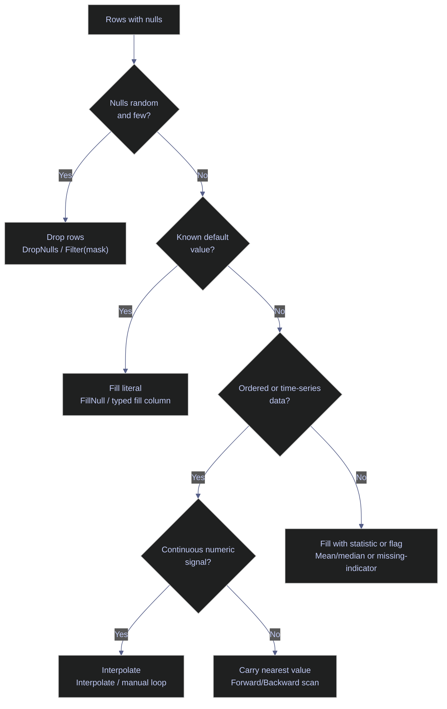

# 04 — Missing Data, Strings & DateTime

> [!quote]
> "Life is dirty. So is your data. Get used to it."
>
> — **Oz du Soleil**

Three foundational topics that every data pipeline must handle correctly: detecting and filling missing values, cleaning and transforming string columns, and parsing, extracting, and computing with dates and times. Each operation is shown side by side in Polars.NET (expression-based, vectorized) and Microsoft.Data.Analysis (typed-column, CLR-oriented) so you can compare built-in columnar operations against explicit .NET materialization patterns directly.

> [!info] Current API and execution-model check | 2026-04
>
> Polars documents missing-data, string, and time-series workflows in its [expressions guide](https://docs.pola.rs/user-guide/expressions/) and [missing-data guide](https://docs.pola.rs/user-guide/expressions/missing-data/). Microsoft documents [`DataFrame`](https://learn.microsoft.com/en-us/dotnet/api/microsoft.data.analysis.dataframe?view=ml-dotnet-preview), [`DataFrame.LoadCsv`](https://learn.microsoft.com/en-us/dotnet/api/microsoft.data.analysis.dataframe.loadcsv?view=ml-dotnet-preview), [`PrimitiveDataFrameColumn<T>`](https://learn.microsoft.com/en-us/dotnet/api/microsoft.data.analysis.primitivedataframecolumn-1?view=ml-dotnet-preview), and [`StringDataFrameColumn`](https://learn.microsoft.com/en-us/dotnet/api/microsoft.data.analysis.stringdataframecolumn?view=ml-dotnet-preview) as an eager typed-column API.

---

## Setup

### Warning Suppression

```csharp
// Suppress CS1701/CS1702 assembly version warnings in .NET Interactive.
// NuGet packages targeting .NET 8/9 trigger these on .NET 10 — harmless.
// Run this cell ONCE before any cells that use NuGet packages.

using System.Reflection;
using Microsoft.DotNet.Interactive;
using Microsoft.DotNet.Interactive.CSharp;

var csharpKernel = (CSharpKernel)Kernel.Root.FindKernelByName("csharp");
var optionsField = typeof(CSharpKernel).GetField("_scriptOptions",
    BindingFlags.NonPublic | BindingFlags.Instance);

var scriptOptions = optionsField.GetValue(csharpKernel);
var withWarningLevel = scriptOptions.GetType().GetMethod("WithWarningLevel");
var newOptions = withWarningLevel.Invoke(scriptOptions, new object[] { 0 });
optionsField.SetValue(csharpKernel, newOptions);
```

### Install NuGet packages and import namespaces

```csharp
#r "nuget: Polars.NET, 0.4.0"
#r "nuget: Polars.NET.Native.win-x64, 0.4.0"
#r "nuget: Microsoft.Data.Analysis, 0.23.0"

using System;
using System.IO;
using System.Linq;
using System.Collections.Generic;
using System.Text.RegularExpressions;
using Polars.CSharp;
using static Polars.CSharp.Polars;
using MDA = Microsoft.Data.Analysis;
using Microsoft.DotNet.Interactive.Formatting;

Formatter.Register<DataFrame>((df, writer) =>
{
    var html = df.ToHtml();
    html = System.Text.RegularExpressions.Regex.Replace(html, @"(&gt;|>)(.+?)(&lt;|<)", @"$1$2$3");
    html = System.Text.RegularExpressions.Regex.Replace(html, @">""(.+?)""<", @">$1<");
    writer.Write(html);
}, "text/html");
Formatter.Register<Polars.CSharp.Series>((s, writer) =>
    writer.Write($"<pre style='font-size:14px'>{s}</pre>"), "text/html");

var DATA = Path.Combine("..", "data");
Console.WriteLine($"Data directory: {Path.GetFullPath(DATA)}");
```

```text
Data directory: c:\Users\aperi\DEV\LANG\data
```

### Load the datasets used throughout this notebook

```csharp
var dfP = DataFrame.ReadCsv(Path.Combine(DATA, "eurostoxx50_ohlcv.csv"), tryParseDates: true);
var dfM = MDA.DataFrame.LoadCsv(Path.Combine(DATA, "eurostoxx50_ohlcv.csv"));
display($"OHLCV - Polars: {dfP.Shape}  |  MDA: ({dfM.Rows.Count}, {dfM.Columns.Count})");

var scP = DataFrame.ReadCsv(Path.Combine(DATA, "scores_daily.csv"), tryParseDates: true);
var scM = MDA.DataFrame.LoadCsv(Path.Combine(DATA, "scores_daily.csv"));
display($"Scores - Polars: {scP.Shape}  |  MDA: ({scM.Rows.Count}, {scM.Columns.Count})");

var dimP = DataFrame.ReadCsv(Path.Combine(DATA, "index_dim.csv"));
var dimM = MDA.DataFrame.LoadCsv(Path.Combine(DATA, "index_dim.csv"));
display($"index_dim - Polars: {dimP.Shape}  |  MDA: ({dimM.Rows.Count}, {dimM.Columns.Count})");
```

```text
OHLCV - Polars: (66355, 12)  |  MDA: (66355, 12)
```

```text
Scores - Polars: (466, 36)  |  MDA: (466, 36)
```

```text
index_dim - Polars: (169, 26)  |  MDA: (169, 26)
```

---

## Missing Data

Real-world datasets almost always contain missing values — sensor gaps, optional fields, failed joins, or upstream ETL issues. How you detect, quantify, and resolve nulls determines whether downstream aggregations and models produce correct results or silently propagate errors.

> [!info] Polars.NET null model vs MDA typed nulls
>
> **Polars.NET** keeps null handling, fill strategies, and interpolation inside expressions. **Microsoft.Data.Analysis** keeps the same semantics explicit through `NullCount`, `ElementwiseIsNull()`, typed repair columns, and `Filter(...)`.

> [!tip] Fix null generation upstream when possible
>
> As *Fundamentals of Data Engineering.epub* emphasizes, null checks and data-quality guards are strongest near ingestion and transformation boundaries. Use local fills when the rule is analytical, not as a substitute for upstream contracts.

> [!question] Which null strategy to use?
>
> Pick the least misleading repair strategy for the data-generation pattern, not just the shortest code path.



### Detect Nulls

Null detection is the first step in any data quality check. Scan each column for missing values to understand the scope of the problem before choosing a fill or drop strategy.

#### Polars.NET | Detect null rows with IsNull() filter

The `IsNull()` expression returns a boolean mask that can be passed to `Filter()` to isolate rows where a specific column is null. Iterating over `Columns` and checking the `NullCount` property on each `Series` gives a quick per-column summary without constructing a full filtered DataFrame.

_Iterates over all columns in `scP` to print null counts for the 5 columns with missing values, then filters with `IsNull()` to display the 5 rows where `ev_ebitda_zscore` is null alongside their `pe_zscore` values._

```csharp
display("Null counts per column:");
foreach (var col in scP.Columns)
{
    var nc = scP.Column(col).NullCount;
    if (nc > 0)
        Console.WriteLine($"  {col,-28} {nc,4} nulls");
}

display("Rows where ev_ebitda_zscore IS null (first 5):");
scP.Filter(Col("ev_ebitda_zscore").IsNull()).Head(5)
    .Select("symbol", "score_date", "ev_ebitda_zscore", "pe_zscore")
```

Null counts per column:

pe_zscore                       3 nulls
      pb_zscore                       6 nulls
      ev_ebitda_zscore               71 nulls
      yield_zscore                   35 nulls
      recommendation_mean            14 nulls

Rows where ev_ebitda_zscore IS null (first 5):

<!-- Polars DataFrame: (5 rows, 4 columns) --><table><thead><tr><th>symbol</th><th>score_date</th><th>ev_ebitda_zscore</th><th>pe_zscore</th></tr></thead><tbody><tr><td>BNP.PA</td><td>2026-03-04</td><td class='pl-null'>null</td><td>0.9133885393</td></tr><tr><td>SAN.MC</td><td>2026-03-04</td><td class='pl-null'>null</td><td>0.4585988913</td></tr><tr><td>ISP.MI</td><td>2026-03-04</td><td class='pl-null'>null</td><td>0.3666188825</td></tr><tr><td>UCG.MI</td><td>2026-03-04</td><td class='pl-null'>null</td><td>0.45250099</td></tr><tr><td>INGA.AS</td><td>2026-03-04</td><td class='pl-null'>null</td><td>0.3799166699</td></tr></tbody></table></div>

#### Microsoft.Data.Analysis | Detect nulls with NullCount and ElementwiseIsNull

MDA uses direct `NullCount` metadata and boolean masks for null inspection.

_Prints sparse-column null counts and previews the first five null `ev_ebitda_zscore` rows._

```csharp
display("Null counts per column:");
foreach (var col in scM.Columns)
{
    var nc = col.NullCount;
    if (nc > 0)
        Console.WriteLine($"  {col.Name,-28} {nc,4} nulls");
}

display("Rows where ev_ebitda_zscore IS null (first 5):");
var nullMaskM = (MDA.PrimitiveDataFrameColumn<bool>)scM.Columns["ev_ebitda_zscore"].ElementwiseIsNull();
var filteredNullsM = scM.Filter(nullMaskM);
new MDA.DataFrame(filteredNullsM.Columns["symbol"], filteredNullsM.Columns["score_date"], filteredNullsM.Columns["ev_ebitda_zscore"], filteredNullsM.Columns["pe_zscore"]).Head(5)
```

```text
Null counts per column:
```

```text
  pe_zscore                       3 nulls
  pb_zscore                       6 nulls
  ev_ebitda_zscore               71 nulls
  yield_zscore                   35 nulls
  recommendation_mean            14 nulls
```

```text
Rows where ev_ebitda_zscore IS null (first 5):
```

<table id="table_639110919315428295"><thead><tr><th><i>index</i></th><th>symbol</th><th>score_date</th><th>ev_ebitda_zscore</th><th>pe_zscore</th></tr></thead><tbody><tr><td><i><div class="dni-plaintext"><pre>0</pre></div></i></td><td>BNP.PA</td><td><span>2026-03-04 00:00:00Z</span></td><td><div class="dni-plaintext"><pre>&lt;null&gt;</pre></div></td><td><div class="dni-plaintext"><pre>0.91338855</pre></div></td></tr><tr><td><i><div class="dni-plaintext"><pre>1</pre></div></i></td><td>SAN.MC</td><td><span>2026-03-04 00:00:00Z</span></td><td><div class="dni-plaintext"><pre>&lt;null&gt;</pre></div></td><td><div class="dni-plaintext"><pre>0.45859888</pre></div></td></tr><tr><td><i><div class="dni-plaintext"><pre>2</pre></div></i></td><td>ISP.MI</td><td><span>2026-03-04 00:00:00Z</span></td><td><div class="dni-plaintext"><pre>&lt;null&gt;</pre></div></td><td><div class="dni-plaintext"><pre>0.36661887</pre></div></td></tr><tr><td><i><div class="dni-plaintext"><pre>3</pre></div></i></td><td>UCG.MI</td><td><span>2026-03-04 00:00:00Z</span></td><td><div class="dni-plaintext"><pre>&lt;null&gt;</pre></div></td><td><div class="dni-plaintext"><pre>0.452501</pre></div></td></tr><tr><td><i><div class="dni-plaintext"><pre>4</pre></div></i></td><td>INGA.AS</td><td><span>2026-03-04 00:00:00Z</span></td><td><div class="dni-plaintext"><pre>&lt;null&gt;</pre></div></td><td><div class="dni-plaintext"><pre>0.37991667</pre></div></td></tr></tbody></table>

### Count Nulls

After detecting which columns contain nulls, quantify the problem. Knowing the exact count per column helps decide whether to drop, fill, or investigate further — a column with 3 nulls out of 466 rows is a different problem than one with 71.

#### Polars.NET | Count nulls per column with NullCount property

The `NullCount` property on a Polars `Series` returns the number of null entries as a simple integer. This is a metadata operation — it does not scan the data, making it O(1) for most column types.

_Prints the null count and total row count for each of the 5 known-null columns, confirming that `ev_ebitda_zscore` has the most missing values (71 out of 466) and `pe_zscore` the fewest (3)._

```csharp
var nullCols = new[] { "pe_zscore", "pb_zscore", "ev_ebitda_zscore", "yield_zscore", "recommendation_mean" };
foreach (var col in nullCols)
    Console.WriteLine($"  {col,-28} {scP.Column(col).NullCount,4} / {scP.Height}");
display($"Total rows: {scP.Height}");
```

pe_zscore                       3 / 466
      pb_zscore                       6 / 466
      ev_ebitda_zscore               71 / 466
      yield_zscore                   35 / 466
      recommendation_mean            14 / 466

Total rows: 466

#### Microsoft.Data.Analysis | Count nulls with DataFrameColumn.NullCount

`NullCount` is direct in MDA, so completeness checks are simpler than indirect present-value counting patterns.

_Reports null counts for the five known sparse score columns._

```csharp
var nullColsM = new[] { "pe_zscore", "pb_zscore", "ev_ebitda_zscore", "yield_zscore", "recommendation_mean" };
foreach (var col in nullColsM)
{
    if(scM.Columns.IndexOf(col) >= 0)
        Console.WriteLine($"  {col,-28} {scM.Columns[col].NullCount,4} / {scM.Rows.Count}");
}
display($"Total rows: {scM.Rows.Count}");
```

```text
  pe_zscore                       3 / 466
  pb_zscore                       6 / 466
  ev_ebitda_zscore               71 / 466
  yield_zscore                   35 / 466
  recommendation_mean            14 / 466
```

```text
Total rows: 466
```

### Drop Nulls

The simplest null strategy: remove rows that contain any missing value. Use this when nulls are random, few in number, and the remaining dataset is large enough to be representative. Be cautious — dropping nulls across many columns can eliminate a disproportionate number of rows.

#### Polars.NET | Drop null rows with DropNulls()

`DropNulls()` removes every row that has a null in any column. It returns a new DataFrame (Polars DataFrames are immutable). To drop nulls in specific columns only, filter with `IsNotNull()` instead.

_Calls `DropNulls()` on the scores DataFrame, reducing it from 466 to 346 rows, then previews the first 5 surviving rows to confirm all four selected columns are non-null._

```csharp
var scPDropped = scP.DropNulls();
display($"Before: {scP.Height} rows  |  After DropNulls: {scPDropped.Height} rows");
scPDropped.Select("symbol", "score_date", "ev_ebitda_zscore", "pe_zscore").Head(5)
```

Before: 466 rows  |  After DropNulls: 346 rows

<!-- Polars DataFrame: (5 rows, 4 columns) --><table><thead><tr><th>symbol</th><th>score_date</th><th>ev_ebitda_zscore</th><th>pe_zscore</th></tr></thead><tbody><tr><td>DTE.DE</td><td>2026-03-04</td><td>0.3795319291</td><td>0.3265870647</td></tr><tr><td>IFX.DE</td><td>2026-03-04</td><td>0.6770676017</td><td>0.5093979371</td></tr><tr><td>ENR.DE</td><td>2026-03-04</td><td>-1.693211811</td><td>-0.9027376753</td></tr><tr><td>ABI.BR</td><td>2026-03-04</td><td>0.5527390806</td><td>0.4740837062</td></tr><tr><td>TTE.PA</td><td>2026-03-04</td><td>0.4496104876</td><td>0.6911063935</td></tr></tbody></table></div>

#### Microsoft.Data.Analysis | Drop rows by building a validity mask

The notebook uses an explicit boolean mask plus `Filter(...)` for whole-row null dropping.

_Scans each score row for nulls, filters valid rows, and previews the first five survivors._

```csharp
var validMaskM = new MDA.PrimitiveDataFrameColumn<bool>("maskM", scM.Rows.Count);
for (long i = 0; i < scM.Rows.Count; i++)
{
    bool hasNull = false;
    foreach (var col in scM.Columns)
    {
        if (col[i] == null) { hasNull = true; break; }
    }
    validMaskM[i] = !hasNull;
}

var scMDropped = scM.Filter(validMaskM);
display($"Before: {scM.Rows.Count} rows  |  After DropNulls: {scMDropped.Rows.Count} rows");
new MDA.DataFrame(scMDropped.Columns["symbol"], scMDropped.Columns["score_date"], scMDropped.Columns["ev_ebitda_zscore"], scMDropped.Columns["pe_zscore"]).Head(5)
```

```text
Before: 466 rows  |  After DropNulls: 346 rows
```

<table id="table_639110919390461653"><thead><tr><th><i>index</i></th><th>symbol</th><th>score_date</th><th>ev_ebitda_zscore</th><th>pe_zscore</th></tr></thead><tbody><tr><td><i><div class="dni-plaintext"><pre>0</pre></div></i></td><td>DTE.DE</td><td><span>2026-03-04 00:00:00Z</span></td><td><div class="dni-plaintext"><pre>0.37953192</pre></div></td><td><div class="dni-plaintext"><pre>0.32658705</pre></div></td></tr><tr><td><i><div class="dni-plaintext"><pre>1</pre></div></i></td><td>IFX.DE</td><td><span>2026-03-04 00:00:00Z</span></td><td><div class="dni-plaintext"><pre>0.6770676</pre></div></td><td><div class="dni-plaintext"><pre>0.5093979</pre></div></td></tr><tr><td><i><div class="dni-plaintext"><pre>2</pre></div></i></td><td>ENR.DE</td><td><span>2026-03-04 00:00:00Z</span></td><td><div class="dni-plaintext"><pre>-1.6932118</pre></div></td><td><div class="dni-plaintext"><pre>-0.9027377</pre></div></td></tr><tr><td><i><div class="dni-plaintext"><pre>3</pre></div></i></td><td>ABI.BR</td><td><span>2026-03-04 00:00:00Z</span></td><td><div class="dni-plaintext"><pre>0.5527391</pre></div></td><td><div class="dni-plaintext"><pre>0.4740837</pre></div></td></tr><tr><td><i><div class="dni-plaintext"><pre>4</pre></div></i></td><td>TTE.PA</td><td><span>2026-03-04 00:00:00Z</span></td><td><div class="dni-plaintext"><pre>0.4496105</pre></div></td><td><div class="dni-plaintext"><pre>0.6911064</pre></div></td></tr></tbody></table>

### Fill with Literal

Replace nulls with a known constant value. Appropriate when the business logic defines a clear default — for example, filling missing dividend yields with `0.0` (no dividend) or missing boolean flags with `false`.

> [!warning] Filling z-scores with 0.0 distorts the distribution
>
> A z-score of 0.0 means "exactly at the mean." Filling missing z-scores with 0.0 artificially inflates the count of mean-valued observations and biases statistical summaries. Use mean/median imputation or interpolation instead if the downstream use is statistical.

> [!success] Use domain-appropriate defaults
>
> Fill with `0.0` only when zero is a meaningful business value (e.g., "no dividends paid"). For z-scores and continuous metrics, prefer `FillNull(Col("c").Mean())` or `Interpolate()`.

#### Polars.NET | Fill nulls with a literal value using FillNull(Lit())

`FillNull(Lit(value))` replaces every null in the column with the given literal. The `Lit()` wrapper converts a C# value into a Polars expression. Combined with `WithColumns` and `Alias`, this returns a new DataFrame with the specified column's nulls replaced.

_Fills the 71 nulls in `ev_ebitda_zscore` with literal `0.0`, confirms null count drops to 0, and displays the first 5 rows — `BNP.PA`'s formerly null value now reads `0`._

```csharp
var scPFilled = scP.WithColumns(
    Col("ev_ebitda_zscore").FillNull(Lit(0.0)).Alias("ev_ebitda_zscore")
);
display($"Nulls after FillNull(0.0): {scPFilled.Column("ev_ebitda_zscore").NullCount}");
scPFilled.Select("symbol", "score_date", "ev_ebitda_zscore").Head(5)
```

Nulls after FillNull(0.0): 0

<!-- Polars DataFrame: (5 rows, 3 columns) --><table><thead><tr><th>symbol</th><th>score_date</th><th>ev_ebitda_zscore</th></tr></thead><tbody><tr><td>BNP.PA</td><td>2026-03-04</td><td>0</td></tr><tr><td>DTE.DE</td><td>2026-03-04</td><td>0.3795319291</td></tr><tr><td>IFX.DE</td><td>2026-03-04</td><td>0.6770676017</td></tr><tr><td>ENR.DE</td><td>2026-03-04</td><td>-1.693211811</td></tr><tr><td>ABI.BR</td><td>2026-03-04</td><td>0.5527390806</td></tr></tbody></table></div>

#### Microsoft.Data.Analysis | Fill nulls with an explicit typed replacement column

MDA repairs a column by materializing a typed output column and swapping it back into the frame.

_Fills null `ev_ebitda_zscore` values with `0.0` and confirms the null count drops to zero._

```csharp
var filledColM = new MDA.PrimitiveDataFrameColumn<double>("ev_ebitda_zscore_filled", scM.Rows.Count);
var origColM = scM.Columns["ev_ebitda_zscore"];

for(long i = 0; i < scM.Rows.Count; i++)
{
    filledColM[i] = origColM[i] != null ? Convert.ToDouble(origColM[i]) : 0.0;
}

var scMFilled = scM.Clone();
scMFilled.Columns.Remove("ev_ebitda_zscore");
filledColM.SetName("ev_ebitda_zscore");
scMFilled.Columns.Add(filledColM);

display($"Nulls after FillNull(0.0): {scMFilled.Columns["ev_ebitda_zscore"].NullCount}");
new MDA.DataFrame(scMFilled.Columns["symbol"], scMFilled.Columns["score_date"], scMFilled.Columns["ev_ebitda_zscore"]).Head(5)
```

```text
Nulls after FillNull(0.0): 0
```

<table id="table_639110919408100857"><thead><tr><th><i>index</i></th><th>symbol</th><th>score_date</th><th>ev_ebitda_zscore</th></tr></thead><tbody><tr><td><i><div class="dni-plaintext"><pre>0</pre></div></i></td><td>BNP.PA</td><td><span>2026-03-04 00:00:00Z</span></td><td><div class="dni-plaintext"><pre>0</pre></div></td></tr><tr><td><i><div class="dni-plaintext"><pre>1</pre></div></i></td><td>DTE.DE</td><td><span>2026-03-04 00:00:00Z</span></td><td><div class="dni-plaintext"><pre>0.3795319199562073</pre></div></td></tr><tr><td><i><div class="dni-plaintext"><pre>2</pre></div></i></td><td>IFX.DE</td><td><span>2026-03-04 00:00:00Z</span></td><td><div class="dni-plaintext"><pre>0.6770675778388977</pre></div></td></tr><tr><td><i><div class="dni-plaintext"><pre>3</pre></div></i></td><td>ENR.DE</td><td><span>2026-03-04 00:00:00Z</span></td><td><div class="dni-plaintext"><pre>-1.6932117938995361</pre></div></td></tr><tr><td><i><div class="dni-plaintext"><pre>4</pre></div></i></td><td>ABI.BR</td><td><span>2026-03-04 00:00:00Z</span></td><td><div class="dni-plaintext"><pre>0.5527390837669373</pre></div></td></tr></tbody></table>

### Forward and Backward Fill

Directional fill strategies propagate the nearest non-null value forward (LOCF — Last Observation Carried Forward) or backward to replace nulls. These are the standard approach for time-series data where the previous or next known value is the best estimate — for example, carrying forward the last known stock price across weekend gaps.

> [!tip] Forward fill across groups
>
> When your DataFrame contains multiple symbols or entities, always apply forward fill within each group (e.g., per symbol) rather than across the entire DataFrame. Otherwise, the last value from one symbol bleeds into the first null of the next symbol.

#### Polars.NET | Forward fill nulls with ForwardFill()

`ForwardFill()` propagates the last non-null value forward through subsequent nulls. If the first value in the column is null, it remains null — there is no preceding value to carry. Returns a new expression that can be used with `WithColumns`.

_Applies `ForwardFill()` to `ev_ebitda_zscore`, reducing nulls from 71 to 1 — the single leading null for `BNP.PA` remains because there is no preceding value to carry forward._

```csharp
var scPFfill = scP.WithColumns(
    Col("ev_ebitda_zscore").ForwardFill().Alias("ev_ebitda_zscore")
);
display($"Nulls after ForwardFill: {scPFfill.Column("ev_ebitda_zscore").NullCount}");
scPFfill.Select("symbol", "score_date", "ev_ebitda_zscore").Head(5)
```

Nulls after ForwardFill: 1

<!-- Polars DataFrame: (5 rows, 3 columns) --><table><thead><tr><th>symbol</th><th>score_date</th><th>ev_ebitda_zscore</th></tr></thead><tbody><tr><td>BNP.PA</td><td>2026-03-04</td><td class='pl-null'>null</td></tr><tr><td>DTE.DE</td><td>2026-03-04</td><td>0.3795319291</td></tr><tr><td>IFX.DE</td><td>2026-03-04</td><td>0.6770676017</td></tr><tr><td>ENR.DE</td><td>2026-03-04</td><td>-1.693211811</td></tr><tr><td>ABI.BR</td><td>2026-03-04</td><td>0.5527390806</td></tr></tbody></table></div>

#### Microsoft.Data.Analysis | Forward fill with a carry-forward loop

Forward fill in MDA is usually an ordered scan with explicit state.

_Carries the last observed `ev_ebitda_zscore` value forward through later gaps._

```csharp
var ffillColM = new MDA.PrimitiveDataFrameColumn<double>("ev_ebitda_zscore", scM.Rows.Count);
double? lastValidM = null;

for(long i = 0; i < scM.Rows.Count; i++)
{
    if (origColM[i] != null) lastValidM = Convert.ToDouble(origColM[i]);
    if (lastValidM.HasValue) ffillColM[i] = lastValidM.Value;
}

var scMFfill = scM.Clone();
scMFfill.Columns.Remove("ev_ebitda_zscore");
scMFfill.Columns.Add(ffillColM);

display($"Nulls after ForwardFill: {scMFfill.Columns["ev_ebitda_zscore"].NullCount}");
new MDA.DataFrame(scMFfill.Columns["symbol"], scMFfill.Columns["score_date"], scMFfill.Columns["ev_ebitda_zscore"]).Head(5)
```

```text
Nulls after ForwardFill: 1
```

<table id="table_639110919428178862"><thead><tr><th><i>index</i></th><th>symbol</th><th>score_date</th><th>ev_ebitda_zscore</th></tr></thead><tbody><tr><td><i><div class="dni-plaintext"><pre>0</pre></div></i></td><td>BNP.PA</td><td><span>2026-03-04 00:00:00Z</span></td><td><div class="dni-plaintext"><pre>&lt;null&gt;</pre></div></td></tr><tr><td><i><div class="dni-plaintext"><pre>1</pre></div></i></td><td>DTE.DE</td><td><span>2026-03-04 00:00:00Z</span></td><td><div class="dni-plaintext"><pre>0.3795319199562073</pre></div></td></tr><tr><td><i><div class="dni-plaintext"><pre>2</pre></div></i></td><td>IFX.DE</td><td><span>2026-03-04 00:00:00Z</span></td><td><div class="dni-plaintext"><pre>0.6770675778388977</pre></div></td></tr><tr><td><i><div class="dni-plaintext"><pre>3</pre></div></i></td><td>ENR.DE</td><td><span>2026-03-04 00:00:00Z</span></td><td><div class="dni-plaintext"><pre>-1.6932117938995361</pre></div></td></tr><tr><td><i><div class="dni-plaintext"><pre>4</pre></div></i></td><td>ABI.BR</td><td><span>2026-03-04 00:00:00Z</span></td><td><div class="dni-plaintext"><pre>0.5527390837669373</pre></div></td></tr></tbody></table>

#### Polars.NET | Backward fill nulls with BackwardFill()

`BackwardFill()` propagates the next non-null value backward. This resolves the leading-null problem that forward fill cannot — combining both directions fills all interior nulls and at least one edge.

_Applies `BackwardFill()` to `ev_ebitda_zscore`, resolving all 71 nulls including the leading `BNP.PA` entry — which now shows `0.3795` (the value from the next non-null row, `DTE.DE`)._

```csharp
var scPBfill = scP.WithColumns(
    Col("ev_ebitda_zscore").BackwardFill().Alias("ev_ebitda_zscore")
);
display($"Nulls after BackwardFill: {scPBfill.Column("ev_ebitda_zscore").NullCount}");
scPBfill.Select("symbol", "score_date", "ev_ebitda_zscore").Head(5)
```

Nulls after BackwardFill: 0

<!-- Polars DataFrame: (5 rows, 3 columns) --><table><thead><tr><th>symbol</th><th>score_date</th><th>ev_ebitda_zscore</th></tr></thead><tbody><tr><td>BNP.PA</td><td>2026-03-04</td><td>0.3795319291</td></tr><tr><td>DTE.DE</td><td>2026-03-04</td><td>0.3795319291</td></tr><tr><td>IFX.DE</td><td>2026-03-04</td><td>0.6770676017</td></tr><tr><td>ENR.DE</td><td>2026-03-04</td><td>-1.693211811</td></tr><tr><td>ABI.BR</td><td>2026-03-04</td><td>0.5527390806</td></tr></tbody></table></div>

#### Microsoft.Data.Analysis | Backward fill with a reverse scan

Backward fill is the same idea in reverse order.

_Propagates the next observed `ev_ebitda_zscore` value backward into earlier gaps._

```csharp
var bfillColM = new MDA.PrimitiveDataFrameColumn<double>("ev_ebitda_zscore", scM.Rows.Count);
double? nextValidM = null;

for(long i = scM.Rows.Count - 1; i >= 0; i--)
{
    if (origColM[i] != null) nextValidM = Convert.ToDouble(origColM[i]);
    if (nextValidM.HasValue) bfillColM[i] = nextValidM.Value;
}

var scMBfill = scM.Clone();
scMBfill.Columns.Remove("ev_ebitda_zscore");
scMBfill.Columns.Add(bfillColM);

display($"Nulls after BackwardFill: {scMBfill.Columns["ev_ebitda_zscore"].NullCount}");
new MDA.DataFrame(scMBfill.Columns["symbol"], scMBfill.Columns["score_date"], scMBfill.Columns["ev_ebitda_zscore"]).Head(5)
```

```text
Nulls after BackwardFill: 0
```

<table id="table_639110919455091846"><thead><tr><th><i>index</i></th><th>symbol</th><th>score_date</th><th>ev_ebitda_zscore</th></tr></thead><tbody><tr><td><i><div class="dni-plaintext"><pre>0</pre></div></i></td><td>BNP.PA</td><td><span>2026-03-04 00:00:00Z</span></td><td><div class="dni-plaintext"><pre>0.3795319199562073</pre></div></td></tr><tr><td><i><div class="dni-plaintext"><pre>1</pre></div></i></td><td>DTE.DE</td><td><span>2026-03-04 00:00:00Z</span></td><td><div class="dni-plaintext"><pre>0.3795319199562073</pre></div></td></tr><tr><td><i><div class="dni-plaintext"><pre>2</pre></div></i></td><td>IFX.DE</td><td><span>2026-03-04 00:00:00Z</span></td><td><div class="dni-plaintext"><pre>0.6770675778388977</pre></div></td></tr><tr><td><i><div class="dni-plaintext"><pre>3</pre></div></i></td><td>ENR.DE</td><td><span>2026-03-04 00:00:00Z</span></td><td><div class="dni-plaintext"><pre>-1.6932117938995361</pre></div></td></tr><tr><td><i><div class="dni-plaintext"><pre>4</pre></div></i></td><td>ABI.BR</td><td><span>2026-03-04 00:00:00Z</span></td><td><div class="dni-plaintext"><pre>0.5527390837669373</pre></div></td></tr></tbody></table>

### Fill with Statistics

Replace nulls with a summary statistic of the column — mean, median, or mode. This preserves the overall distribution better than a literal fill but assumes the data is stationary (no trend). For financial z-scores, mean imputation is a reasonable default since z-scores are centered around zero by construction.

#### Polars.NET | Fill nulls with column mean using FillNull(Col().Mean())

The expression `Col("c").FillNull(Col("c").Mean())` computes the column mean and uses it as the fill value — all inside the Polars engine. This is faster than computing the mean in C# and passing it as `Lit()` because it avoids a round-trip between managed and native code.

_Uses `FillNull(Col("ev_ebitda_zscore").Mean())` to replace all 71 nulls with the column mean (`0.038`), shown in the first row where `BNP.PA` now reads `0.03804613962` instead of null._

```csharp
var scPMeanFill = scP.WithColumns(
    Col("ev_ebitda_zscore").FillNull(Col("ev_ebitda_zscore").Mean()).Alias("ev_ebitda_zscore")
);
display($"Nulls after FillNull(mean): {scPMeanFill.Column("ev_ebitda_zscore").NullCount}");
scPMeanFill.Select("symbol", "score_date", "ev_ebitda_zscore").Head(5)
```

Nulls after FillNull(mean): 0

<!-- Polars DataFrame: (5 rows, 3 columns) --><table><thead><tr><th>symbol</th><th>score_date</th><th>ev_ebitda_zscore</th></tr></thead><tbody><tr><td>BNP.PA</td><td>2026-03-04</td><td>0.03804613962</td></tr><tr><td>DTE.DE</td><td>2026-03-04</td><td>0.3795319291</td></tr><tr><td>IFX.DE</td><td>2026-03-04</td><td>0.6770676017</td></tr><tr><td>ENR.DE</td><td>2026-03-04</td><td>-1.693211811</td></tr><tr><td>ABI.BR</td><td>2026-03-04</td><td>0.5527390806</td></tr></tbody></table></div>

#### Microsoft.Data.Analysis | Fill nulls with the column mean

A common MDA pattern is compute-then-materialize: first the statistic, then the repaired column.

_Computes the mean of non-null values and fills gaps with that mean._

```csharp
double sumM = 0; int countM = 0;
for(long i = 0; i < scM.Rows.Count; i++)
{
    if(origColM[i] != null) { sumM += Convert.ToDouble(origColM[i]); countM++; }
}
double meanM = countM > 0 ? sumM / countM : 0;

var meanFillColM = new MDA.PrimitiveDataFrameColumn<double>("ev_ebitda_zscore", scM.Rows.Count);
for(long i = 0; i < scM.Rows.Count; i++)
{
    meanFillColM[i] = origColM[i] != null ? Convert.ToDouble(origColM[i]) : meanM;
}

var scMMeanFill = scM.Clone();
scMMeanFill.Columns.Remove("ev_ebitda_zscore");
scMMeanFill.Columns.Add(meanFillColM);

display($"Nulls after FillNull(meanM): {scMMeanFill.Columns["ev_ebitda_zscore"].NullCount}");
new MDA.DataFrame(scMMeanFill.Columns["symbol"], scMMeanFill.Columns["score_date"], scMMeanFill.Columns["ev_ebitda_zscore"]).Head(5)
```

```text
Nulls after FillNull(mean): 0
```

<table id="table_639110919476347635"><thead><tr><th><i>index</i></th><th>symbol</th><th>score_date</th><th>ev_ebitda_zscore</th></tr></thead><tbody><tr><td><i><div class="dni-plaintext"><pre>0</pre></div></i></td><td>BNP.PA</td><td><span>2026-03-04 00:00:00Z</span></td><td><div class="dni-plaintext"><pre>0.038046139499314034</pre></div></td></tr><tr><td><i><div class="dni-plaintext"><pre>1</pre></div></i></td><td>DTE.DE</td><td><span>2026-03-04 00:00:00Z</span></td><td><div class="dni-plaintext"><pre>0.3795319199562073</pre></div></td></tr><tr><td><i><div class="dni-plaintext"><pre>2</pre></div></i></td><td>IFX.DE</td><td><span>2026-03-04 00:00:00Z</span></td><td><div class="dni-plaintext"><pre>0.6770675778388977</pre></div></td></tr><tr><td><i><div class="dni-plaintext"><pre>3</pre></div></i></td><td>ENR.DE</td><td><span>2026-03-04 00:00:00Z</span></td><td><div class="dni-plaintext"><pre>-1.6932117938995361</pre></div></td></tr><tr><td><i><div class="dni-plaintext"><pre>4</pre></div></i></td><td>ABI.BR</td><td><span>2026-03-04 00:00:00Z</span></td><td><div class="dni-plaintext"><pre>0.5527390837669373</pre></div></td></tr></tbody></table>

### Interpolate

Linear interpolation estimates missing values by drawing a straight line between the nearest non-null neighbors. This is ideal for continuous measurements (temperature, price, sensor readings) where the true value likely falls between adjacent observations. Leading/trailing nulls remain null because there is no second anchor point for the line.

#### Polars.NET | Interpolate missing values with Interpolate()

`Interpolate()` performs linear interpolation on a numeric series. It uses the positional index (row number), not datetime values, to compute the interpolated value. If the first or last row is null, it stays null — interpolation requires values on both sides.

_Applies linear interpolation to `ev_ebitda_zscore`, filling all interior nulls and leaving 1 remaining (the leading `BNP.PA` row) — the first 10 rows show computed values filling the gaps between known anchor points._

```csharp
var scPInterp = scP.WithColumns(
    Col("ev_ebitda_zscore").Interpolate().Alias("ev_ebitda_zscore")
);
display($"Nulls after Interpolate: {scPInterp.Column("ev_ebitda_zscore").NullCount}");
scPInterp.Select("symbol", "score_date", "ev_ebitda_zscore").Head(10)
```

Nulls after Interpolate: 1

<!-- Polars DataFrame: (10 rows, 3 columns) --><table><thead><tr><th>symbol</th><th>score_date</th><th>ev_ebitda_zscore</th></tr></thead><tbody><tr><td>BNP.PA</td><td>2026-03-04</td><td class='pl-null'>null</td></tr><tr><td>DTE.DE</td><td>2026-03-04</td><td>0.3795319291</td></tr><tr><td>IFX.DE</td><td>2026-03-04</td><td>0.6770676017</td></tr><tr><td>ENR.DE</td><td>2026-03-04</td><td>-1.693211811</td></tr><tr><td>ABI.BR</td><td>2026-03-04</td><td>0.5527390806</td></tr><tr><td>VOW.DE</td><td>2026-03-04</td><td>0.3798301687</td></tr><tr><td>TTE.PA</td><td>2026-03-04</td><td>0.4496104876</td></tr><tr><td>DG.PA</td><td>2026-03-04</td><td>0.9287967228</td></tr><tr><td>SAN.MC</td><td>2026-03-04</td><td>0.4340322959</td></tr><tr><td>SU.PA</td><td>2026-03-04</td><td>-0.06073213096</td></tr></tbody></table></div>

#### Microsoft.Data.Analysis | Interpolate missing values manually

MDA has no interpolation expression, so the notebook computes linear interpolation explicitly.

_Searches backward and forward for neighboring values and linearly interpolates each gap._

```csharp
var interpColM = new MDA.PrimitiveDataFrameColumn<double>("ev_ebitda_zscore", scM.Rows.Count);
for(long i = 0; i < scM.Rows.Count; i++)
{
    if(origColM[i] != null) { interpColM[i] = Convert.ToDouble(origColM[i]); }
    else {
        double? prev = null; long prevIdx = -1;
        for(long j = i - 1; j >= 0; j--) if(origColM[j] != null) { prev = Convert.ToDouble(origColM[j]); prevIdx = j; break; }

        double? next = null; long nextIdx = -1;
        for(long j = i + 1; j < scM.Rows.Count; j++) if(origColM[j] != null) { next = Convert.ToDouble(origColM[j]); nextIdx = j; break; }

        if(prev.HasValue && next.HasValue) {
            double ratio = (double)(i - prevIdx) / (nextIdx - prevIdx);
            interpColM[i] = prev.Value + ratio * (next.Value - prev.Value);
        } else if (prev.HasValue) { interpColM[i] = prev.Value; }
        else if (next.HasValue) { interpColM[i] = next.Value; }
    }
}

var scMInterp = scM.Clone();
scMInterp.Columns.Remove("ev_ebitda_zscore");
scMInterp.Columns.Add(interpColM);

display($"Nulls after Interpolate: {scMInterp.Columns["ev_ebitda_zscore"].NullCount}");
new MDA.DataFrame(scMInterp.Columns["symbol"], scMInterp.Columns["score_date"], scMInterp.Columns["ev_ebitda_zscore"]).Head(10)
```

```text
Nulls after Interpolate: 0
```

<table id="table_639110919515978946"><thead><tr><th><i>index</i></th><th>symbol</th><th>score_date</th><th>ev_ebitda_zscore</th></tr></thead><tbody><tr><td><i><div class="dni-plaintext"><pre>0</pre></div></i></td><td>BNP.PA</td><td><span>2026-03-04 00:00:00Z</span></td><td><div class="dni-plaintext"><pre>0.3795319199562073</pre></div></td></tr><tr><td><i><div class="dni-plaintext"><pre>1</pre></div></i></td><td>DTE.DE</td><td><span>2026-03-04 00:00:00Z</span></td><td><div class="dni-plaintext"><pre>0.3795319199562073</pre></div></td></tr><tr><td><i><div class="dni-plaintext"><pre>2</pre></div></i></td><td>IFX.DE</td><td><span>2026-03-04 00:00:00Z</span></td><td><div class="dni-plaintext"><pre>0.6770675778388977</pre></div></td></tr><tr><td><i><div class="dni-plaintext"><pre>3</pre></div></i></td><td>ENR.DE</td><td><span>2026-03-04 00:00:00Z</span></td><td><div class="dni-plaintext"><pre>-1.6932117938995361</pre></div></td></tr><tr><td><i><div class="dni-plaintext"><pre>4</pre></div></i></td><td>ABI.BR</td><td><span>2026-03-04 00:00:00Z</span></td><td><div class="dni-plaintext"><pre>0.5527390837669373</pre></div></td></tr><tr><td><i><div class="dni-plaintext"><pre>5</pre></div></i></td><td>VOW.DE</td><td><span>2026-03-04 00:00:00Z</span></td><td><div class="dni-plaintext"><pre>0.37983018159866333</pre></div></td></tr><tr><td><i><div class="dni-plaintext"><pre>6</pre></div></i></td><td>TTE.PA</td><td><span>2026-03-04 00:00:00Z</span></td><td><div class="dni-plaintext"><pre>0.44961050152778625</pre></div></td></tr><tr><td><i><div class="dni-plaintext"><pre>7</pre></div></i></td><td>DG.PA</td><td><span>2026-03-04 00:00:00Z</span></td><td><div class="dni-plaintext"><pre>0.9287967085838318</pre></div></td></tr><tr><td><i><div class="dni-plaintext"><pre>8</pre></div></i></td><td>SAN.MC</td><td><span>2026-03-04 00:00:00Z</span></td><td><div class="dni-plaintext"><pre>0.4340322893112898</pre></div></td></tr><tr><td><i><div class="dni-plaintext"><pre>9</pre></div></i></td><td>SU.PA</td><td><span>2026-03-04 00:00:00Z</span></td><td><div class="dni-plaintext"><pre>-0.06073212996125221</pre></div></td></tr></tbody></table>

### Coalesce

`Coalesce` returns the first non-null value across multiple columns for each row. This is the equivalent of SQL's `COALESCE()` and Python Polars' `pl.coalesce()`. Use it to build fallback chains — for example, prefer the primary data source, else the secondary, else a default. Polars.NET 0.4.0 does not expose a top-level `Coalesce` function, but chaining `FillNull` across columns achieves the same result.

#### Polars.NET | Coalesce via chained FillNull

Chain `FillNull(Col("secondary")).FillNull(Col("fallback"))` on the primary column to cascade through fallback sources. Each `FillNull` replaces remaining nulls with the next column's values.

_Constructs a 4-row DataFrame where `primary` and `secondary` alternate nulls, then chains `FillNull(Col("secondary")).FillNull(Col("fallback"))` to produce a `best` column that picks the first non-null across all three sources._

```csharp
var coalDf = DataFrame.FromColumns(
    ("primary",   new double?[] { 100.0, null, 300.0, null }),
    ("secondary", new double?[] { null, 200.0, null, 400.0 }),
    ("fallback",  new double?[] { 50.0, 50.0, 50.0, 50.0 })
);

var coalResult = coalDf.WithColumns(
    Col("primary")
        .FillNull(Col("secondary"))
        .FillNull(Col("fallback"))
        .Alias("best")
);

coalResult
```

<!-- Polars DataFrame: (4 rows, 4 columns) --><table><thead><tr><th>primary</th><th>secondary</th><th>fallback</th><th>best</th></tr></thead><tbody><tr><td>100</td><td class='pl-null'>null</td><td>50</td><td>100</td></tr><tr><td class='pl-null'>null</td><td>200</td><td>50</td><td>200</td></tr><tr><td>300</td><td class='pl-null'>null</td><td>50</td><td>300</td></tr><tr><td class='pl-null'>null</td><td>400</td><td>50</td><td>400</td></tr></tbody></table>

---

#### Microsoft.Data.Analysis | Coalesce columns with the null-coalescing operator

MDA emulates `coalesce` by testing candidate columns in order and writing the first non-null value.

_Combines `primary`, `secondary`, and `fallback` into a single `best` column._

```csharp
var primaryColM = new MDA.PrimitiveDataFrameColumn<double>("primary", new double?[] { 100.0, null, 300.0, null });
var secondaryColM = new MDA.PrimitiveDataFrameColumn<double>("secondary", new double?[] { null, 200.0, null, 400.0 });
var fallbackColM = new MDA.PrimitiveDataFrameColumn<double>("fallback", new double?[] { 50.0, 50.0, 50.0, 50.0 });
var coalDfM = new MDA.DataFrame(primaryColM, secondaryColM, fallbackColM);

var bestColM = new MDA.PrimitiveDataFrameColumn<double>("best", coalDfM.Rows.Count);
for(long i = 0; i < coalDfM.Rows.Count; i++)
{
    bestColM[i] = primaryColM[i] ?? secondaryColM[i] ?? fallbackColM[i];
}

var coalResultM = coalDfM.Clone();
coalResultM.Columns.Add(bestColM);
coalResultM
```

<table id="table_639110919951583920"><thead><tr><th><i>index</i></th><th>primary</th><th>secondary</th><th>fallback</th><th>best</th></tr></thead><tbody><tr><td><i><div class="dni-plaintext"><pre>0</pre></div></i></td><td><div class="dni-plaintext"><pre>100</pre></div></td><td><div class="dni-plaintext"><pre>&lt;null&gt;</pre></div></td><td><div class="dni-plaintext"><pre>50</pre></div></td><td><div class="dni-plaintext"><pre>100</pre></div></td></tr><tr><td><i><div class="dni-plaintext"><pre>1</pre></div></i></td><td><div class="dni-plaintext"><pre>&lt;null&gt;</pre></div></td><td><div class="dni-plaintext"><pre>200</pre></div></td><td><div class="dni-plaintext"><pre>50</pre></div></td><td><div class="dni-plaintext"><pre>200</pre></div></td></tr><tr><td><i><div class="dni-plaintext"><pre>2</pre></div></i></td><td><div class="dni-plaintext"><pre>300</pre></div></td><td><div class="dni-plaintext"><pre>&lt;null&gt;</pre></div></td><td><div class="dni-plaintext"><pre>50</pre></div></td><td><div class="dni-plaintext"><pre>300</pre></div></td></tr><tr><td><i><div class="dni-plaintext"><pre>3</pre></div></i></td><td><div class="dni-plaintext"><pre>&lt;null&gt;</pre></div></td><td><div class="dni-plaintext"><pre>400</pre></div></td><td><div class="dni-plaintext"><pre>50</pre></div></td><td><div class="dni-plaintext"><pre>400</pre></div></td></tr></tbody></table>

## String Operations

String manipulation is essential for cleaning column values, extracting components from composite identifiers, standardizing text for joins, and filtering by patterns. Polars.NET provides a `.Str` accessor with vectorized operations; Microsoft.Data.Analysis relies on `StringDataFrameColumn`, `Regex`, and CLR string methods over materialized values.

> [!info] Polars.NET Str accessor vs MDA CLR string workflow
>
> Polars keeps string transforms inside expression space. MDA keeps them explicit through managed string operations and typed string columns.

> [!question] Where should string normalization happen?
>
> Put shared canonicalization rules upstream. Keep local string transforms for notebook-side feature engineering and service-local formatting.

### Case Conversion

Converting strings to upper or lower case is a common normalization step before joins or deduplication. Ensures that `"ASML.AS"` and `"asml.as"` match when compared.

#### Polars.NET | Convert to upper and lower case with Str.ToUpper()

The `Str.ToUpper()` and `Str.ToLower()` methods return new string expressions with case-converted values. Use with `WithColumns` to add the results as new columns.

_Extracts the 50 unique symbols from the OHLCV DataFrame, adds `upper` and `lower` columns using `Str.ToUpper()` and `Str.ToLower()`, and displays the first 10 rows — confirming that already-uppercase tickers remain unchanged._

```csharp
var symbols = dfP.Select(new[] { "symbol" }).Unique();
var caseDemo = symbols.WithColumns(
    Col("symbol").Str.ToUpper().Alias("upper"),
    Col("symbol").Str.ToLower().Alias("lower")
);
caseDemo.Head(10)
```

<!-- Polars DataFrame: (10 rows, 3 columns) --><table><thead><tr><th>symbol</th><th>upper</th><th>lower</th></tr></thead><tbody><tr><td>ABI.BR</td><td>ABI.BR</td><td>abi.br</td></tr><tr><td>AD.AS</td><td>AD.AS</td><td>ad.as</td></tr><tr><td>ADS.DE</td><td>ADS.DE</td><td>ads.de</td></tr><tr><td>ADYEN.AS</td><td>ADYEN.AS</td><td>adyen.as</td></tr><tr><td>AI.PA</td><td>AI.PA</td><td>ai.pa</td></tr><tr><td>AIR.PA</td><td>AIR.PA</td><td>air.pa</td></tr><tr><td>ALV.DE</td><td>ALV.DE</td><td>alv.de</td></tr><tr><td>ARGX.BR</td><td>ARGX.BR</td><td>argx.br</td></tr><tr><td>ASML.AS</td><td>ASML.AS</td><td>asml.as</td></tr><tr><td>BAS.DE</td><td>BAS.DE</td><td>bas.de</td></tr></tbody></table></div>

#### Microsoft.Data.Analysis | Convert to upper and lower case with StringDataFrameColumn

MDA uses CLR string transforms plus new typed string columns.

_Builds uppercase and lowercase symbol columns and previews the first ten rows._

```csharp
var symbolsM = dfM.Columns["symbol"].Cast<string>().Distinct().ToArray();
var upperColM = new MDA.StringDataFrameColumn("upper", symbolsM.Select(s => s?.ToUpper()));
var lowerColM = new MDA.StringDataFrameColumn("lower", symbolsM.Select(s => s?.ToLower()));

var caseDemoM = new MDA.DataFrame(new MDA.StringDataFrameColumn("symbol", symbolsM), upperColM, lowerColM);
caseDemoM.Head(10)
```

<table id="table_639110919584939381"><thead><tr><th><i>index</i></th><th>symbol</th><th>upper</th><th>lower</th></tr></thead><tbody><tr><td><i><div class="dni-plaintext"><pre>0</pre></div></i></td><td>ABI.BR</td><td>ABI.BR</td><td>abi.br</td></tr><tr><td><i><div class="dni-plaintext"><pre>1</pre></div></i></td><td>AD.AS</td><td>AD.AS</td><td>ad.as</td></tr><tr><td><i><div class="dni-plaintext"><pre>2</pre></div></i></td><td>ADS.DE</td><td>ADS.DE</td><td>ads.de</td></tr><tr><td><i><div class="dni-plaintext"><pre>3</pre></div></i></td><td>ADYEN.AS</td><td>ADYEN.AS</td><td>adyen.as</td></tr><tr><td><i><div class="dni-plaintext"><pre>4</pre></div></i></td><td>AI.PA</td><td>AI.PA</td><td>ai.pa</td></tr><tr><td><i><div class="dni-plaintext"><pre>5</pre></div></i></td><td>AIR.PA</td><td>AIR.PA</td><td>air.pa</td></tr><tr><td><i><div class="dni-plaintext"><pre>6</pre></div></i></td><td>ALV.DE</td><td>ALV.DE</td><td>alv.de</td></tr><tr><td><i><div class="dni-plaintext"><pre>7</pre></div></i></td><td>ARGX.BR</td><td>ARGX.BR</td><td>argx.br</td></tr><tr><td><i><div class="dni-plaintext"><pre>8</pre></div></i></td><td>ASML.AS</td><td>ASML.AS</td><td>asml.as</td></tr><tr><td><i><div class="dni-plaintext"><pre>9</pre></div></i></td><td>BAS.DE</td><td>BAS.DE</td><td>bas.de</td></tr></tbody></table>

### Contains, StartsWith, EndsWith

Pattern matching on string columns is the primary way to filter by exchange code, country suffix, or naming convention. These operations return boolean masks suitable for `Filter()`.

#### Polars.NET | Filter with Str.Contains()

`Str.Contains(pattern)` takes a plain string argument (not wrapped in `Lit()`) and returns a boolean expression. Pass it to `Filter()` to keep only matching rows.

_Filters the OHLCV DataFrame to rows where `symbol` contains `".DE"`, then selects unique symbols — returning the 16 German-listed stocks from the 50-member index._

```csharp
var germanP = dfP.Filter(Col("symbol").Str.Contains(".DE"))
    .Select(new[] { "symbol" }).Unique();
display("German exchange symbols (.DE):");
germanP
```

German exchange symbols (.DE):

<!-- Polars DataFrame: (16 rows, 1 columns) --><table><thead><tr><th>symbol</th></tr></thead><tbody><tr><td>ADS.DE</td></tr><tr><td>ALV.DE</td></tr><tr><td>BAS.DE</td></tr><tr><td>BAYN.DE</td></tr><tr><td>BMW.DE</td></tr><tr><td>DB1.DE</td></tr><tr><td>DHL.DE</td></tr><tr><td>DTE.DE</td></tr><tr><td>ENR.DE</td></tr><tr><td>IFX.DE</td></tr><tr><td colspan='1'>... 6 more rows ...</td></tr></tbody></table></div>

#### Microsoft.Data.Analysis | Filter symbols with .Contains()

For light string filters, MDA often materializes a string array and filters it with CLR predicates.

_Filters unique symbols to the German exchange tickers containing `.DE`._

```csharp
var germanSymbolsM = symbolsM.Where(s => s != null && s.Contains(".DE")).ToArray();
display("German exchange symbolsM (.DE):");
new MDA.DataFrame(new MDA.StringDataFrameColumn("symbol", germanSymbolsM))
```

```text
German exchange symbols (.DE):
```

<table id="table_639110919604235417"><thead><tr><th><i>index</i></th><th>symbol</th></tr></thead><tbody><tr><td><i><div class="dni-plaintext"><pre>0</pre></div></i></td><td>ADS.DE</td></tr><tr><td><i><div class="dni-plaintext"><pre>1</pre></div></i></td><td>ALV.DE</td></tr><tr><td><i><div class="dni-plaintext"><pre>2</pre></div></i></td><td>BAS.DE</td></tr><tr><td><i><div class="dni-plaintext"><pre>3</pre></div></i></td><td>BAYN.DE</td></tr><tr><td><i><div class="dni-plaintext"><pre>4</pre></div></i></td><td>BMW.DE</td></tr><tr><td><i><div class="dni-plaintext"><pre>5</pre></div></i></td><td>DB1.DE</td></tr><tr><td><i><div class="dni-plaintext"><pre>6</pre></div></i></td><td>DHL.DE</td></tr><tr><td><i><div class="dni-plaintext"><pre>7</pre></div></i></td><td>DTE.DE</td></tr><tr><td><i><div class="dni-plaintext"><pre>8</pre></div></i></td><td>ENR.DE</td></tr><tr><td><i><div class="dni-plaintext"><pre>9</pre></div></i></td><td>IFX.DE</td></tr><tr><td><i><div class="dni-plaintext"><pre>10</pre></div></i></td><td>MBG.DE</td></tr><tr><td><i><div class="dni-plaintext"><pre>11</pre></div></i></td><td>MUV2.DE</td></tr><tr><td><i><div class="dni-plaintext"><pre>12</pre></div></i></td><td>RHM.DE</td></tr><tr><td><i><div class="dni-plaintext"><pre>13</pre></div></i></td><td>SAP.DE</td></tr><tr><td><i><div class="dni-plaintext"><pre>14</pre></div></i></td><td>SIE.DE</td></tr><tr><td><i><div class="dni-plaintext"><pre>15</pre></div></i></td><td>VOW.DE</td></tr></tbody></table>

#### Polars.NET | Filter with Str.StartsWith() and Str.EndsWith()

`Str.StartsWith()` and `Str.EndsWith()` take plain string arguments, like `Str.Contains()`. They can be combined with `Filter()` to select rows matching a prefix or suffix pattern.

_Applies `Str.StartsWith("S")` and `Str.EndsWith(".BR")` in separate filter passes, rendering both result sets side by side as HTML — 7 symbols starting with S and 2 Brussels-listed symbols._

```csharp
var startsS = dfP.Filter(Col("symbol").Str.StartsWith("S"))
    .Select(new[] { "symbol" }).Unique();
var endsBR = dfP.Filter(Col("symbol").Str.EndsWith(".BR"))
    .Select(new[] { "symbol" }).Unique();

// Display side by side using raw HTML
string StripQuotes(string h) => h.Replace("", "").Replace("\"", "");
var leftHtml = StripQuotes(startsS.ToHtml());
var rightHtml = StripQuotes(endsBR.ToHtml());
display(HTML($"<div style='display:flex;gap:40px'><div><b>StartsWith S</b>{leftHtml}</div><div><b>EndsWith .BR</b>{rightHtml}</div></div>"));
```

<div style='display:flex;gap:40px'><div><b>StartsWith S</b>
<!-- Polars DataFrame: (7 rows, 1 columns) --><table><thead><tr><th>symbol</th></tr></thead><tbody><tr><td>SAF.PA</td></tr><tr><td>SAN.MC</td></tr><tr><td>SAN.PA</td></tr><tr><td>SAP.DE</td></tr><tr><td>SGO.PA</td></tr><tr><td>SIE.DE</td></tr><tr><td>SU.PA</td></tr></tbody></table></div></div><div><b>EndsWith .BR</b>
<!-- Polars DataFrame: (2 rows, 1 columns) --><table><thead><tr><th>symbol</th></tr></thead><tbody><tr><td>ABI.BR</td></tr><tr><td>ARGX.BR</td></tr></tbody></table></div></div></div>

#### Microsoft.Data.Analysis | Filter with StartsWith and EndsWith

Prefix and suffix filters follow the same CLR-first pattern.

_Displays symbols starting with `S` and symbols ending with `.BR`._

```csharp
var startsSM = symbolsM.Where(s => s != null && s.StartsWith("S")).ToArray();
var endsBRM = symbolsM.Where(s => s != null && s.EndsWith(".BR")).ToArray();

display("StartsWith S:");
display(new MDA.DataFrame(new MDA.StringDataFrameColumn("symbol", startsSM)));
display("EndsWith .BR:");
new MDA.DataFrame(new MDA.StringDataFrameColumn("symbol", endsBRM))
```

```text
StartsWith S:
```

<table id="table_639110919623856899"><thead><tr><th><i>index</i></th><th>symbol</th></tr></thead><tbody><tr><td><i><div class="dni-plaintext"><pre>0</pre></div></i></td><td>SAF.PA</td></tr><tr><td><i><div class="dni-plaintext"><pre>1</pre></div></i></td><td>SAN.MC</td></tr><tr><td><i><div class="dni-plaintext"><pre>2</pre></div></i></td><td>SAN.PA</td></tr><tr><td><i><div class="dni-plaintext"><pre>3</pre></div></i></td><td>SAP.DE</td></tr><tr><td><i><div class="dni-plaintext"><pre>4</pre></div></i></td><td>SGO.PA</td></tr><tr><td><i><div class="dni-plaintext"><pre>5</pre></div></i></td><td>SIE.DE</td></tr><tr><td><i><div class="dni-plaintext"><pre>6</pre></div></i></td><td>SU.PA</td></tr></tbody></table>

```text
EndsWith .BR:
```

<table id="table_639110919623873618"><thead><tr><th><i>index</i></th><th>symbol</th></tr></thead><tbody><tr><td><i><div class="dni-plaintext"><pre>0</pre></div></i></td><td>ABI.BR</td></tr><tr><td><i><div class="dni-plaintext"><pre>1</pre></div></i></td><td>ARGX.BR</td></tr></tbody></table>

### Replace

Substring replacement is used for cleaning identifiers, normalizing naming conventions, or masking sensitive parts of strings. Polars provides both single-match `Replace()` and global `ReplaceAll()`.

#### Polars.NET | Replace substrings with Str.ReplaceAll()

`Str.ReplaceAll(old, new)` replaces every occurrence of the pattern in each string. For single-match replacement, use `Str.Replace()`. Both accept plain strings (not `Lit()`).

_Applies `Str.ReplaceAll(".DE", "_GER")` to all 50 symbols, then filters to the 16 replaced entries — showing `ADS.DE → ADS_GER`, `ALV.DE → ALV_GER`, etc._

```csharp
var replaced = dfP.Select(new[] { "symbol" }).Unique()
    .WithColumns(
        Col("symbol").Str.ReplaceAll(".DE", "_GER").Alias("replaced")
    );
display("Replace '.DE' with '_GER':");
replaced.Filter(Col("replaced").Str.Contains("_GER"))
```

Replace '.DE' with '_GER':

<!-- Polars DataFrame: (16 rows, 2 columns) --><table><thead><tr><th>symbol</th><th>replaced</th></tr></thead><tbody><tr><td>ADS.DE</td><td>ADS_GER</td></tr><tr><td>ALV.DE</td><td>ALV_GER</td></tr><tr><td>BAS.DE</td><td>BAS_GER</td></tr><tr><td>BAYN.DE</td><td>BAYN_GER</td></tr><tr><td>BMW.DE</td><td>BMW_GER</td></tr><tr><td>DB1.DE</td><td>DB1_GER</td></tr><tr><td>DHL.DE</td><td>DHL_GER</td></tr><tr><td>DTE.DE</td><td>DTE_GER</td></tr><tr><td>ENR.DE</td><td>ENR_GER</td></tr><tr><td>IFX.DE</td><td>IFX_GER</td></tr><tr><td colspan='2'>... 6 more rows ...</td></tr></tbody></table></div>

#### Microsoft.Data.Analysis | Replace substrings with CLR string replacement

Replacement is explicit managed-code work over the string values.

_Replaces `.DE` with `_GER` and shows only the affected identifiers._

```csharp
var replacedArrM = symbolsM.Select(s => s?.Replace(".DE", "_GER")).ToArray();
var replacedDfM = new MDA.DataFrame(new MDA.StringDataFrameColumn("symbol", symbolsM), new MDA.StringDataFrameColumn("replaced", replacedArrM));

display("Replace '.DE' with '_GER':");
var maskM = new MDA.PrimitiveDataFrameColumn<bool>("maskM", replacedDfM.Rows.Count);
for(long i = 0; i < replacedDfM.Rows.Count; i++) maskM[i] = replacedArrM[i]?.Contains("_GER") == true;
replacedDfM.Filter(maskM)
```

```text
Replace '.DE' with '_GER':
```

<table id="table_639110919640713912"><thead><tr><th><i>index</i></th><th>symbol</th><th>replaced</th></tr></thead><tbody><tr><td><i><div class="dni-plaintext"><pre>0</pre></div></i></td><td>ADS.DE</td><td>ADS_GER</td></tr><tr><td><i><div class="dni-plaintext"><pre>1</pre></div></i></td><td>ALV.DE</td><td>ALV_GER</td></tr><tr><td><i><div class="dni-plaintext"><pre>2</pre></div></i></td><td>BAS.DE</td><td>BAS_GER</td></tr><tr><td><i><div class="dni-plaintext"><pre>3</pre></div></i></td><td>BAYN.DE</td><td>BAYN_GER</td></tr><tr><td><i><div class="dni-plaintext"><pre>4</pre></div></i></td><td>BMW.DE</td><td>BMW_GER</td></tr><tr><td><i><div class="dni-plaintext"><pre>5</pre></div></i></td><td>DB1.DE</td><td>DB1_GER</td></tr><tr><td><i><div class="dni-plaintext"><pre>6</pre></div></i></td><td>DHL.DE</td><td>DHL_GER</td></tr><tr><td><i><div class="dni-plaintext"><pre>7</pre></div></i></td><td>DTE.DE</td><td>DTE_GER</td></tr><tr><td><i><div class="dni-plaintext"><pre>8</pre></div></i></td><td>ENR.DE</td><td>ENR_GER</td></tr><tr><td><i><div class="dni-plaintext"><pre>9</pre></div></i></td><td>IFX.DE</td><td>IFX_GER</td></tr><tr><td><i><div class="dni-plaintext"><pre>10</pre></div></i></td><td>MBG.DE</td><td>MBG_GER</td></tr><tr><td><i><div class="dni-plaintext"><pre>11</pre></div></i></td><td>MUV2.DE</td><td>MUV2_GER</td></tr><tr><td><i><div class="dni-plaintext"><pre>12</pre></div></i></td><td>RHM.DE</td><td>RHM_GER</td></tr><tr><td><i><div class="dni-plaintext"><pre>13</pre></div></i></td><td>SAP.DE</td><td>SAP_GER</td></tr><tr><td><i><div class="dni-plaintext"><pre>14</pre></div></i></td><td>SIE.DE</td><td>SIE_GER</td></tr><tr><td><i><div class="dni-plaintext"><pre>15</pre></div></i></td><td>VOW.DE</td><td>VOW_GER</td></tr></tbody></table>

### Length and Slicing

Measuring string length and extracting fixed-position substrings are building blocks for parsing structured identifiers like ticker symbols, ISINs, or fixed-width codes.

#### Polars.NET | Measure string length

In Polars.NET 0.4.0, the `Str.LenChars()` method is not yet exposed. As a workaround, extract the column to a C# array, compute lengths with LINQ, and stack the result back onto the DataFrame.

_Extracts symbols to a C# array, computes each string's `.Length`, stacks the result back as a `char_len` series, then sorts descending to show that `NDA-FI.HE` (9 chars) is the longest ticker in the index._

```csharp
var symDf = dfP.Select(new[] { "symbol" }).Unique();
var symArr = symDf.Column("symbol").ToArray<string>();
var lenArr = symArr.Select(s => (double)s.Length).ToArray();
var lenSeries = Polars.CSharp.Series.From("char_len", lenArr);
var lengths = symDf.HStack(lenSeries);
lengths.Sort("char_len", descending: true).Head(10)
```

<!-- Polars DataFrame: (10 rows, 2 columns) --><table><thead><tr><th>symbol</th><th>char_len</th></tr></thead><tbody><tr><td>NDA-FI.HE</td><td>9</td></tr><tr><td>ADYEN.AS</td><td>8</td></tr><tr><td>ARGX.BR</td><td>7</td></tr><tr><td>ASML.AS</td><td>7</td></tr><tr><td>BAYN.DE</td><td>7</td></tr><tr><td>BBVA.MC</td><td>7</td></tr><tr><td>ENEL.MI</td><td>7</td></tr><tr><td>INGA.AS</td><td>7</td></tr><tr><td>MUV2.DE</td><td>7</td></tr><tr><td>RACE.MI</td><td>7</td></tr></tbody></table></div>

#### Microsoft.Data.Analysis | Measure string length with a typed numeric column

String length in MDA is usually projected into a numeric typed column.

_Computes symbol lengths and orders the result by descending length._

```csharp
var lengthsM = symbolsM.Select(s => s != null ? (double)s.Length : 0).ToArray();
var lenDfM = new MDA.DataFrame(new MDA.StringDataFrameColumn("symbol", symbolsM), new MDA.PrimitiveDataFrameColumn<double>("char_len", lengthsM));
lenDfM.OrderByDescending("char_len").Head(10)
```

<table id="table_639110919662953215"><thead><tr><th><i>index</i></th><th>symbol</th><th>char_len</th></tr></thead><tbody><tr><td><i><div class="dni-plaintext"><pre>0</pre></div></i></td><td>NDA-FI.HE</td><td><div class="dni-plaintext"><pre>9</pre></div></td></tr><tr><td><i><div class="dni-plaintext"><pre>1</pre></div></i></td><td>ADYEN.AS</td><td><div class="dni-plaintext"><pre>8</pre></div></td></tr><tr><td><i><div class="dni-plaintext"><pre>2</pre></div></i></td><td>INGA.AS</td><td><div class="dni-plaintext"><pre>7</pre></div></td></tr><tr><td><i><div class="dni-plaintext"><pre>3</pre></div></i></td><td>ENEL.MI</td><td><div class="dni-plaintext"><pre>7</pre></div></td></tr><tr><td><i><div class="dni-plaintext"><pre>4</pre></div></i></td><td>ARGX.BR</td><td><div class="dni-plaintext"><pre>7</pre></div></td></tr><tr><td><i><div class="dni-plaintext"><pre>5</pre></div></i></td><td>ASML.AS</td><td><div class="dni-plaintext"><pre>7</pre></div></td></tr><tr><td><i><div class="dni-plaintext"><pre>6</pre></div></i></td><td>BAYN.DE</td><td><div class="dni-plaintext"><pre>7</pre></div></td></tr><tr><td><i><div class="dni-plaintext"><pre>7</pre></div></i></td><td>BBVA.MC</td><td><div class="dni-plaintext"><pre>7</pre></div></td></tr><tr><td><i><div class="dni-plaintext"><pre>8</pre></div></i></td><td>MUV2.DE</td><td><div class="dni-plaintext"><pre>7</pre></div></td></tr><tr><td><i><div class="dni-plaintext"><pre>9</pre></div></i></td><td>RACE.MI</td><td><div class="dni-plaintext"><pre>7</pre></div></td></tr></tbody></table>

#### Polars.NET | Extract substrings with Str.Slice()

`Str.Slice(offset, length)` extracts a fixed-position substring from each value. The offset is zero-based. This is useful for fixed-width parsing but not for variable-length identifiers — use `Str.Split()` or `Str.Extract()` with regex for those.

_Applies `Str.Slice(0, 3)` to all unique symbols, creating a `first_3` column — the first 10 rows show three-character prefixes like `ABI`, `AD.`, `ADS`, `ADY`._

```csharp
var sliced = dfP.Select(new[] { "symbol" }).Unique()
    .WithColumns(
        Col("symbol").Str.Slice(0, 3).Alias("first_3")
    );
sliced.Head(10)
```

<!-- Polars DataFrame: (10 rows, 2 columns) --><table><thead><tr><th>symbol</th><th>first_3</th></tr></thead><tbody><tr><td>ABI.BR</td><td>ABI</td></tr><tr><td>AD.AS</td><td>AD.</td></tr><tr><td>ADS.DE</td><td>ADS</td></tr><tr><td>ADYEN.AS</td><td>ADY</td></tr><tr><td>AI.PA</td><td>AI.</td></tr><tr><td>AIR.PA</td><td>AIR</td></tr><tr><td>ALV.DE</td><td>ALV</td></tr><tr><td>ARGX.BR</td><td>ARG</td></tr><tr><td>ASML.AS</td><td>ASM</td></tr><tr><td>BAS.DE</td><td>BAS</td></tr></tbody></table></div>

#### Microsoft.Data.Analysis | Slice strings with Substring()

Fixed-position slicing uses CLR substring logic before materialization.

_Extracts the first three characters of each symbol into `first_3`._

```csharp
var first3ArrM = symbolsM.Select(s => s != null ? (s.Length >= 3 ? s.Substring(0, 3) : s) : null).ToArray();
var slicedM = new MDA.DataFrame(new MDA.StringDataFrameColumn("symbol", symbolsM), new MDA.StringDataFrameColumn("first_3", first3ArrM));
slicedM.Head(10)
```

<table id="table_639110919683691818"><thead><tr><th><i>index</i></th><th>symbol</th><th>first_3</th></tr></thead><tbody><tr><td><i><div class="dni-plaintext"><pre>0</pre></div></i></td><td>ABI.BR</td><td>ABI</td></tr><tr><td><i><div class="dni-plaintext"><pre>1</pre></div></i></td><td>AD.AS</td><td>AD.</td></tr><tr><td><i><div class="dni-plaintext"><pre>2</pre></div></i></td><td>ADS.DE</td><td>ADS</td></tr><tr><td><i><div class="dni-plaintext"><pre>3</pre></div></i></td><td>ADYEN.AS</td><td>ADY</td></tr><tr><td><i><div class="dni-plaintext"><pre>4</pre></div></i></td><td>AI.PA</td><td>AI.</td></tr><tr><td><i><div class="dni-plaintext"><pre>5</pre></div></i></td><td>AIR.PA</td><td>AIR</td></tr><tr><td><i><div class="dni-plaintext"><pre>6</pre></div></i></td><td>ALV.DE</td><td>ALV</td></tr><tr><td><i><div class="dni-plaintext"><pre>7</pre></div></i></td><td>ARGX.BR</td><td>ARG</td></tr><tr><td><i><div class="dni-plaintext"><pre>8</pre></div></i></td><td>ASML.AS</td><td>ASM</td></tr><tr><td><i><div class="dni-plaintext"><pre>9</pre></div></i></td><td>BAS.DE</td><td>BAS</td></tr></tbody></table>

### Split

Splitting strings by a delimiter decomposes composite identifiers into their parts — for example, splitting `"ASML.AS"` on `"."` yields the ticker (`ASML`) and the exchange code (`AS`). Polars returns a list column; Microsoft.Data.Analysis usually materializes a display-friendly string or a custom typed projection instead.

#### Polars.NET | Split strings with Str.Split()

`Str.Split(separator)` splits each string into a list of substrings. The result is a column of type `List[Str]`. Access individual elements using list indexing expressions in downstream operations.

_Splits all unique symbols on `"."`, producing a `List[Str]` column where each cell contains the ticker and exchange code as a two-element list — e.g., `ABI.BR → [ABI, BR]`._

```csharp
var split = dfP.Select(new[] { "symbol" }).Unique()
    .WithColumns(
        Col("symbol").Str.Split(".").Alias("parts")
    );
split.Head(10)
```

<!-- Polars DataFrame: (10 rows, 2 columns) --><table><thead><tr><th>symbol</th><th>parts</th></tr></thead><tbody><tr><td>ABI.BR</td><td>[ABI, BR]</td></tr><tr><td>AD.AS</td><td>[AD, AS]</td></tr><tr><td>ADS.DE</td><td>[ADS, DE]</td></tr><tr><td>ADYEN.AS</td><td>[ADYEN, AS]</td></tr><tr><td>AI.PA</td><td>[AI, PA]</td></tr><tr><td>AIR.PA</td><td>[AIR, PA]</td></tr><tr><td>ALV.DE</td><td>[ALV, DE]</td></tr><tr><td>ARGX.BR</td><td>[ARGX, BR]</td></tr><tr><td>ASML.AS</td><td>[ASML, AS]</td></tr><tr><td>BAS.DE</td><td>[BAS, DE]</td></tr></tbody></table></div>

#### Microsoft.Data.Analysis | Split strings and materialize a display column

MDA does not expose a list-typed split result, so the notebook stores a readable serialized form.

_Splits each symbol on `.` and stores the rendered parts string for inspection._

```csharp
var splitArrM = symbolsM.Select(s => s != null ? $"[\"{string.Join("\", \"", s.Split('.'))}\"]" : null).ToArray();
var splitDfM = new MDA.DataFrame(new MDA.StringDataFrameColumn("symbol", symbolsM), new MDA.StringDataFrameColumn("parts", splitArrM));
splitDfM.Head(10)
```

<table id="table_639110919752064990"><thead><tr><th><i>index</i></th><th>symbol</th><th>parts</th></tr></thead><tbody><tr><td><i><div class="dni-plaintext"><pre>0</pre></div></i></td><td>ABI.BR</td><td>[&quot;ABI&quot;, &quot;BR&quot;]</td></tr><tr><td><i><div class="dni-plaintext"><pre>1</pre></div></i></td><td>AD.AS</td><td>[&quot;AD&quot;, &quot;AS&quot;]</td></tr><tr><td><i><div class="dni-plaintext"><pre>2</pre></div></i></td><td>ADS.DE</td><td>[&quot;ADS&quot;, &quot;DE&quot;]</td></tr><tr><td><i><div class="dni-plaintext"><pre>3</pre></div></i></td><td>ADYEN.AS</td><td>[&quot;ADYEN&quot;, &quot;AS&quot;]</td></tr><tr><td><i><div class="dni-plaintext"><pre>4</pre></div></i></td><td>AI.PA</td><td>[&quot;AI&quot;, &quot;PA&quot;]</td></tr><tr><td><i><div class="dni-plaintext"><pre>5</pre></div></i></td><td>AIR.PA</td><td>[&quot;AIR&quot;, &quot;PA&quot;]</td></tr><tr><td><i><div class="dni-plaintext"><pre>6</pre></div></i></td><td>ALV.DE</td><td>[&quot;ALV&quot;, &quot;DE&quot;]</td></tr><tr><td><i><div class="dni-plaintext"><pre>7</pre></div></i></td><td>ARGX.BR</td><td>[&quot;ARGX&quot;, &quot;BR&quot;]</td></tr><tr><td><i><div class="dni-plaintext"><pre>8</pre></div></i></td><td>ASML.AS</td><td>[&quot;ASML&quot;, &quot;AS&quot;]</td></tr><tr><td><i><div class="dni-plaintext"><pre>9</pre></div></i></td><td>BAS.DE</td><td>[&quot;BAS&quot;, &quot;DE&quot;]</td></tr></tbody></table>

### Regex Extract

Regular expressions provide flexible pattern matching for extracting structured components from strings. Use regex when the delimiter is inconsistent or when you need to match a specific pattern (e.g., "the part after the last dot").

#### Polars.NET | Extract capture group with Str.Extract()

`Str.Extract(pattern, groupIndex)` applies a regex to each string and returns the specified capture group. Group index `1` refers to the first parenthesized group. Returns `null` for non-matching strings.

_Applies the regex `\.(\w+)` with `Str.Extract(pattern, 1)` to extract the exchange code suffix from all 50 unique symbols, returning `null` for any symbol without a dot — the first 10 rows show `BR`, `AS`, `DE`, etc._

```csharp
var extracted = dfP.Select(new[] { "symbol" }).Unique()
    .WithColumns(
        Col("symbol").Str.Extract(@"\.(\w+)", 1).Alias("exchange")
    );
extracted.Head(10)
```

<!-- Polars DataFrame: (10 rows, 2 columns) --><table><thead><tr><th>symbol</th><th>exchange</th></tr></thead><tbody><tr><td>ABI.BR</td><td>BR</td></tr><tr><td>AD.AS</td><td>AS</td></tr><tr><td>ADS.DE</td><td>DE</td></tr><tr><td>ADYEN.AS</td><td>AS</td></tr><tr><td>AI.PA</td><td>PA</td></tr><tr><td>AIR.PA</td><td>PA</td></tr><tr><td>ALV.DE</td><td>DE</td></tr><tr><td>ARGX.BR</td><td>BR</td></tr><tr><td>ASML.AS</td><td>AS</td></tr><tr><td>BAS.DE</td><td>DE</td></tr></tbody></table></div>

#### Microsoft.Data.Analysis | Extract regex groups with Regex.Match

Regex extraction is standard .NET regex work over the materialized string values.

_Captures the exchange code after the dot and previews the first ten results._

```csharp
var regexM = new Regex(@"\.(\w+)");
var exchangeArrM = symbolsM.Select(s => s != null && regexM.IsMatch(s) ? regexM.Match(s).Groups[1].Value : null).ToArray();
var extractedM = new MDA.DataFrame(new MDA.StringDataFrameColumn("symbol", symbolsM), new MDA.StringDataFrameColumn("exchange", exchangeArrM));
extractedM.Head(10)
```

<table id="table_639110919771298394"><thead><tr><th><i>index</i></th><th>symbol</th><th>exchange</th></tr></thead><tbody><tr><td><i><div class="dni-plaintext"><pre>0</pre></div></i></td><td>ABI.BR</td><td>BR</td></tr><tr><td><i><div class="dni-plaintext"><pre>1</pre></div></i></td><td>AD.AS</td><td>AS</td></tr><tr><td><i><div class="dni-plaintext"><pre>2</pre></div></i></td><td>ADS.DE</td><td>DE</td></tr><tr><td><i><div class="dni-plaintext"><pre>3</pre></div></i></td><td>ADYEN.AS</td><td>AS</td></tr><tr><td><i><div class="dni-plaintext"><pre>4</pre></div></i></td><td>AI.PA</td><td>PA</td></tr><tr><td><i><div class="dni-plaintext"><pre>5</pre></div></i></td><td>AIR.PA</td><td>PA</td></tr><tr><td><i><div class="dni-plaintext"><pre>6</pre></div></i></td><td>ALV.DE</td><td>DE</td></tr><tr><td><i><div class="dni-plaintext"><pre>7</pre></div></i></td><td>ARGX.BR</td><td>BR</td></tr><tr><td><i><div class="dni-plaintext"><pre>8</pre></div></i></td><td>ASML.AS</td><td>AS</td></tr><tr><td><i><div class="dni-plaintext"><pre>9</pre></div></i></td><td>BAS.DE</td><td>DE</td></tr></tbody></table>

### Padding

Padding strings to a fixed width is common when generating fixed-width output files, aligning display columns, or creating zero-padded identifiers (e.g., `"0000ABI.BR"`).

#### Polars.NET | Pad strings with PadLeft (C# workaround)

In Polars.NET 0.4.0, `Str.PadStart()` is not yet exposed. As a workaround, extract values to a C# array, apply `string.PadLeft()`, and stack the result back.

_Extracts unique symbols to a C# array, pads each to 10 characters with leading zeros using `PadLeft(10, '0')`, and stacks the result back — showing `ABI.BR → 0000ABI.BR` and `ADYEN.AS → 00ADYEN.AS`._

```csharp
var symDfPad = dfP.Select(new[] { "symbol" }).Unique();
var symArrPad = symDfPad.Column("symbol").ToArray<string>();
var paddedArr = symArrPad.Select(s => s.PadLeft(10, '0')).ToArray();
var paddedSeries = Polars.CSharp.Series.From("padded", paddedArr);
symDfPad.HStack(paddedSeries).Head(10)
```

<!-- Polars DataFrame: (10 rows, 2 columns) --><table><thead><tr><th>symbol</th><th>padded</th></tr></thead><tbody><tr><td>ABI.BR</td><td>0000ABI.BR</td></tr><tr><td>AD.AS</td><td>00000AD.AS</td></tr><tr><td>ADS.DE</td><td>0000ADS.DE</td></tr><tr><td>ADYEN.AS</td><td>00ADYEN.AS</td></tr><tr><td>AI.PA</td><td>00000AI.PA</td></tr><tr><td>AIR.PA</td><td>0000AIR.PA</td></tr><tr><td>ALV.DE</td><td>0000ALV.DE</td></tr><tr><td>ARGX.BR</td><td>000ARGX.BR</td></tr><tr><td>ASML.AS</td><td>000ASML.AS</td></tr><tr><td>BAS.DE</td><td>0000BAS.DE</td></tr></tbody></table></div>

#### Microsoft.Data.Analysis | Pad strings with PadLeft

Padding fits naturally with MDA's CLR-centric string workflow.

_Pads each symbol to width 10 with leading zeroes._

```csharp
var paddedArrM = symbolsM.Select(s => s?.PadLeft(10, '0')).ToArray();
var symDfPadM = new MDA.DataFrame(new MDA.StringDataFrameColumn("symbol", symbolsM), new MDA.StringDataFrameColumn("padded", paddedArrM));
symDfPadM.Head(10)
```

<table id="table_639110919788722319"><thead><tr><th><i>index</i></th><th>symbol</th><th>padded</th></tr></thead><tbody><tr><td><i><div class="dni-plaintext"><pre>0</pre></div></i></td><td>ABI.BR</td><td>0000ABI.BR</td></tr><tr><td><i><div class="dni-plaintext"><pre>1</pre></div></i></td><td>AD.AS</td><td>00000AD.AS</td></tr><tr><td><i><div class="dni-plaintext"><pre>2</pre></div></i></td><td>ADS.DE</td><td>0000ADS.DE</td></tr><tr><td><i><div class="dni-plaintext"><pre>3</pre></div></i></td><td>ADYEN.AS</td><td>00ADYEN.AS</td></tr><tr><td><i><div class="dni-plaintext"><pre>4</pre></div></i></td><td>AI.PA</td><td>00000AI.PA</td></tr><tr><td><i><div class="dni-plaintext"><pre>5</pre></div></i></td><td>AIR.PA</td><td>0000AIR.PA</td></tr><tr><td><i><div class="dni-plaintext"><pre>6</pre></div></i></td><td>ALV.DE</td><td>0000ALV.DE</td></tr><tr><td><i><div class="dni-plaintext"><pre>7</pre></div></i></td><td>ARGX.BR</td><td>000ARGX.BR</td></tr><tr><td><i><div class="dni-plaintext"><pre>8</pre></div></i></td><td>ASML.AS</td><td>000ASML.AS</td></tr><tr><td><i><div class="dni-plaintext"><pre>9</pre></div></i></td><td>BAS.DE</td><td>0000BAS.DE</td></tr></tbody></table>

### Concatenation

Combining values from multiple string columns into a single formatted string — for example, building display labels like `"ASML HOLDING (Netherlands)"`. Polars.NET 0.4.0 does not expose `ConcatStr`, so extract columns to C# arrays and use string interpolation.

#### Polars.NET | Concatenate strings via C# Zip

Extract string columns to arrays, combine with `Zip` and string interpolation, then stack the result back as a new series.

_Extracts `short_name` and `country` arrays from `dimP`, zips them with string interpolation to produce `"ASML HOLDING (Netherlands)"` style labels, and stacks the result back as a `display_name` column._

```csharp
var nameArr = dimP.Column("short_name").ToArray<string>();
var countryArr = dimP.Column("country").ToArray<string>();
var displayNames = nameArr.Zip(countryArr, (n, c) => $"{n} ({c})").ToArray();
var dnSeries = Polars.CSharp.Series.From("display_name", displayNames);
dimP.Select("short_name", "country").HStack(dnSeries).Head(10)
```

<!-- Polars DataFrame: (10 rows, 3 columns) --><table><thead><tr><th>short_name</th><th>country</th><th>display_name</th></tr></thead><tbody><tr><td>ASML HOLDING</td><td>Netherlands</td><td>ASML HOLDING (Netherlands)</td></tr><tr><td>LVMH</td><td>France</td><td>LVMH (France)</td></tr><tr><td>HERMES INTL</td><td>France</td><td>HERMES INTL (France)</td></tr><tr><td>L'OREAL</td><td>France</td><td>L'OREAL (France)</td></tr><tr><td>SAP SE</td><td>Germany</td><td>SAP SE (Germany)</td></tr><tr><td>SIEMENS AG</td><td>Germany</td><td>SIEMENS AG (Germany)</td></tr><tr><td>INDUSTRIA DE DISE...O TEXTIL S.</td><td>Spain</td><td>INDUSTRIA DE DISE...O TEXTIL S. (Spain)</td></tr><tr><td>DEUTSCHE TELEKOM AG</td><td>Germany</td><td>DEUTSCHE TELEKOM AG (Germany)</td></tr><tr><td>BANCO SANTANDER S.A.</td><td>Spain</td><td>BANCO SANTANDER S.A. (Spain)</td></tr><tr><td>SCHNEIDER ELECTRIC SE</td><td>France</td><td>SCHNEIDER ELECTRIC SE (France)</td></tr></tbody></table>

#### Microsoft.Data.Analysis | Concatenate columns into a display label

String interpolation over source columns is the common MDA pattern for labels and reporting fields.

_Builds `display_name = short_name + " (country)"` from `index_dim` and previews the first ten rows._

```csharp
var shortNameColM = dimM.Columns["short_name"];
var countryColM = dimM.Columns["country"];
var displayNamesM = new MDA.StringDataFrameColumn("display_name", dimM.Rows.Count);

for(long i = 0; i < dimM.Rows.Count; i++)
{
    displayNamesM[i] = $"{shortNameColM[i]} ({countryColM[i]})";
}

new MDA.DataFrame(shortNameColM, countryColM, displayNamesM).Head(10)
```

<table id="table_639110919977546068"><thead><tr><th><i>index</i></th><th>short_name</th><th>country</th><th>display_name</th></tr></thead><tbody><tr><td><i><div class="dni-plaintext"><pre>0</pre></div></i></td><td>ASML HOLDING</td><td>Netherlands</td><td>ASML HOLDING (Netherlands)</td></tr><tr><td><i><div class="dni-plaintext"><pre>1</pre></div></i></td><td>LVMH</td><td>France</td><td>LVMH (France)</td></tr><tr><td><i><div class="dni-plaintext"><pre>2</pre></div></i></td><td>HERMES INTL</td><td>France</td><td>HERMES INTL (France)</td></tr><tr><td><i><div class="dni-plaintext"><pre>3</pre></div></i></td><td>L&#39;OREAL</td><td>France</td><td>L&#39;OREAL (France)</td></tr><tr><td><i><div class="dni-plaintext"><pre>4</pre></div></i></td><td>SAP SE</td><td>Germany</td><td>SAP SE (Germany)</td></tr><tr><td><i><div class="dni-plaintext"><pre>5</pre></div></i></td><td>SIEMENS AG</td><td>Germany</td><td>SIEMENS AG (Germany)</td></tr><tr><td><i><div class="dni-plaintext"><pre>6</pre></div></i></td><td>INDUSTRIA DE DISE...O TEXTIL S.</td><td>Spain</td><td>INDUSTRIA DE DISE...O TEXTIL S. (Spain)</td></tr><tr><td><i><div class="dni-plaintext"><pre>7</pre></div></i></td><td>DEUTSCHE TELEKOM AG</td><td>Germany</td><td>DEUTSCHE TELEKOM AG (Germany)</td></tr><tr><td><i><div class="dni-plaintext"><pre>8</pre></div></i></td><td>BANCO SANTANDER S.A.</td><td>Spain</td><td>BANCO SANTANDER S.A. (Spain)</td></tr><tr><td><i><div class="dni-plaintext"><pre>9</pre></div></i></td><td>SCHNEIDER ELECTRIC SE</td><td>France</td><td>SCHNEIDER ELECTRIC SE (France)</td></tr></tbody></table>

### Stripping / Trimming

Remove leading and trailing whitespace (or specified characters) from strings. Polars.NET 0.4.0 does not expose `Str.Strip` — use C#'s `string.Trim()` as a workaround.

#### Polars.NET | Strip whitespace via C# Trim

Extract to array, apply `Trim()`, and stack back.

_Demonstrates the workaround on a 3-element test array with leading/trailing spaces — applies `string.Trim()` and stacks back to show `"  ASML  " → "ASML"` and `"  SAP " → "SAP"`._

```csharp
var dirtyArr = new[] { "  ASML  ", "  SAP ", " MC" };
var dirtySeries = Polars.CSharp.Series.From("name", dirtyArr);
var dirtyDf = DataFrame.FromSeries(dirtySeries);
var trimmedArr = dirtyArr.Select(s => s.Trim()).ToArray();
var trimSeries = Polars.CSharp.Series.From("stripped", trimmedArr);
dirtyDf.HStack(trimSeries)
```

<!-- Polars DataFrame: (3 rows, 2 columns) --><table><thead><tr><th>name</th><th>stripped</th></tr></thead><tbody><tr><td>  ASML  </td><td>ASML</td></tr><tr><td>  SAP </td><td>SAP</td></tr><tr><td> MC</td><td>MC</td></tr></tbody></table>

#### Microsoft.Data.Analysis | Trim whitespace with CLR string methods

Whitespace stripping is straightforward once values are already materialized as CLR strings.

_Builds a small demo frame and trims leading and trailing whitespace from each value._

```csharp
var dirtyArrM = new[] { "  ASML  ", "  SAP ", " MC" };
var dirtySeriesM = new MDA.StringDataFrameColumn("name", dirtyArrM);
var dirtyDfM = new MDA.DataFrame(dirtySeriesM);

var trimSeriesM = new MDA.StringDataFrameColumn("stripped", dirtyArrM.Select(s => s?.Trim()));
dirtyDfM.Columns.Add(trimSeriesM);
dirtyDfM
```

<table id="table_639110919999998878"><thead><tr><th><i>index</i></th><th>name</th><th>stripped</th></tr></thead><tbody><tr><td><i><div class="dni-plaintext"><pre>0</pre></div></i></td><td>  ASML  </td><td>ASML</td></tr><tr><td><i><div class="dni-plaintext"><pre>1</pre></div></i></td><td>  SAP </td><td>SAP</td></tr><tr><td><i><div class="dni-plaintext"><pre>2</pre></div></i></td><td> MC</td><td>MC</td></tr></tbody></table>

### Regex Extract All

Extract all matches of a pattern from each string — not just the first. Returns a collected list of matched substrings. Polars.NET 0.4.0 does not expose `Str.ExtractAll` — use `System.Text.RegularExpressions.Regex.Matches` via C#.

#### Polars.NET | Extract all regex matches via C# Regex.Matches

Apply `Regex.Matches` per string, join results, and stack back as columns.

_Demonstrates on a 3-row test DataFrame — extracts all decimal-number matches as comma-separated strings and their count, showing `"ASML closed at 900.5 up from 895.2" → "900.5, 895.2"` (count: 2) and `"No numbers" → ""` (count: 0)._

```csharp
var textArr = new[] {
    "ASML closed at 900.5 up from 895.2",
    "No numbers",
    "PE: 45.3, PB: 12.1"
};
var numRegex = new Regex(@"[0-9]+\.?[0-9]*");
var textSeries = Polars.CSharp.Series.From("text", textArr);
var textDf = DataFrame.FromSeries(textSeries);
var numbersArr = textArr.Select(s => string.Join(", ", numRegex.Matches(s).Select(m => m.Value))).ToArray();
var countArr = textArr.Select(s => (double)numRegex.Matches(s).Count).ToArray();
textDf
    .HStack(Polars.CSharp.Series.From("numbers", numbersArr))
    .HStack(Polars.CSharp.Series.From("count", countArr))
```

<!-- Polars DataFrame: (3 rows, 3 columns) --><table><thead><tr><th>text</th><th>numbers</th><th>count</th></tr></thead><tbody><tr><td>ASML closed at 900.5 up from 895.2</td><td>900.5, 895.2</td><td>2</td></tr><tr><td>No numbers</td><td></td><td>0</td></tr><tr><td>PE: 45.3, PB: 12.1</td><td>45.3, 12.1</td><td>2</td></tr></tbody></table>

#### Microsoft.Data.Analysis | Extract all regex matches with Regex.Matches

For all-match extraction, MDA relies on the CLR regex engine and explicit output columns.

_Extracts all numeric substrings, stores the joined matches, and records their count._

```csharp
var textArrM = new[] {
    "ASML closed at 900.5 up from 895.2",
    "No numbers",
    "PE: 45.3, PB: 12.1"
};
var numRegexM = new Regex(@"[0-9]+\.?[0-9]*");
var textDfM = new MDA.DataFrame(new MDA.StringDataFrameColumn("text", textArrM));

var numbersArrM = textArrM.Select(s => string.Join(", ", numRegexM.Matches(s).Select(m => m.Value))).ToArray();
var countArrM = textArrM.Select(s => (double)numRegexM.Matches(s).Count).ToArray();

textDfM.Columns.Add(new MDA.StringDataFrameColumn("numbers", numbersArrM));
textDfM.Columns.Add(new MDA.PrimitiveDataFrameColumn<double>("count", countArrM));
textDfM
```

<table id="table_639110920017564198"><thead><tr><th><i>index</i></th><th>text</th><th>numbers</th><th>count</th></tr></thead><tbody><tr><td><i><div class="dni-plaintext"><pre>0</pre></div></i></td><td>ASML closed at 900.5 up from 895.2</td><td>900.5, 895.2</td><td><div class="dni-plaintext"><pre>2</pre></div></td></tr><tr><td><i><div class="dni-plaintext"><pre>1</pre></div></i></td><td>No numbers</td><td></td><td><div class="dni-plaintext"><pre>0</pre></div></td></tr><tr><td><i><div class="dni-plaintext"><pre>2</pre></div></i></td><td>PE: 45.3, PB: 12.1</td><td>45.3, 12.1</td><td><div class="dni-plaintext"><pre>2</pre></div></td></tr></tbody></table>

## DateTime Operations

Date and time handling is central to financial data pipelines: filtering by trading days, computing rolling windows, resampling to monthly OHLC bars, and calculating returns require reliable date parsing, component extraction, and arithmetic. Polars.NET provides a `.Dt` accessor for vectorized datetime operations. Microsoft.Data.Analysis relies on typed `DateTime` values and explicit CLR date logic for most higher-level temporal transforms.

> [!info] Polars temporal types vs MDA DateTime columns
>
> Polars distinguishes `Date`, `Datetime`, and duration-aware expressions. MDA usually lands dates as CLR `DateTime` values, so extraction and arithmetic use standard .NET temporal APIs.

> [!question] Where should rolling and resampling logic live?
>
> Keep shared business-calendar and resampling logic upstream. Use local dataframe code when the transform is exploratory or owned by a single .NET boundary.

### Parse Dates

Converting string columns to proper date types enables date arithmetic, component extraction, and time-aware filtering. Always verify the format string matches your data — silent parsing failures produce nulls.

#### Polars.NET | Parse string column to date with Str.ToDate()

The `Str.ToDate(format)` method parses a string column into a Polars `Date` type using strftime format codes (e.g., `%Y-%m-%d`). If the date column was already parsed during `ReadCsv` with `tryParseDates: true`, it arrives as `Date` type directly.

_Confirms the `date` column arrives as Polars `Date` type after `ReadCsv` with `tryParseDates`, then demonstrates round-trip parsing by casting to string and reparsing with `Str.ToDate("%Y-%m-%d")` — all three representations appear side by side for the first 5 rows._

```csharp
display($"date column type: {dfP.Column("date").DataTypeName}");

// Demonstrate Str.ToDate by casting date to string first, then parsing back
var dfStr = dfP.WithColumns(Col("date").Cast(DataType.String).Alias("date_str"));
display($"Cast to string: {dfStr.Column("date_str").DataTypeName}");

var dfParsed = dfStr.WithColumns(
    Col("date_str").Str.ToDate("%Y-%m-%d").Alias("date_reparsed")
);
display($"After Str.ToDate: {dfParsed.Column("date_reparsed").DataTypeName}");
dfParsed.Select("symbol", "date", "date_str", "date_reparsed").Head(5)
```

date column type: date

Cast to string: str

After Str.ToDate: date

<!-- Polars DataFrame: (5 rows, 4 columns) --><table><thead><tr><th>symbol</th><th>date</th><th>date_str</th><th>date_reparsed</th></tr></thead><tbody><tr><td>ABI.BR</td><td>2021-01-04</td><td>2021-01-04</td><td>2021-01-04</td></tr><tr><td>ABI.BR</td><td>2021-01-05</td><td>2021-01-05</td><td>2021-01-05</td></tr><tr><td>ABI.BR</td><td>2021-01-06</td><td>2021-01-06</td><td>2021-01-06</td></tr><tr><td>ABI.BR</td><td>2021-01-07</td><td>2021-01-07</td><td>2021-01-07</td></tr><tr><td>ABI.BR</td><td>2021-01-08</td><td>2021-01-08</td><td>2021-01-08</td></tr></tbody></table></div>

#### Microsoft.Data.Analysis | Rely on LoadCsv inference or parse into DateTime

MDA often lands dates as CLR `DateTime` values during `LoadCsv`; reparsing is explicit when needed.

_Prints the inferred type, materializes a string version, reparses it, and shows the columns together._

```csharp
display($"date column type: {dfM.Columns["date"].DataType.Name}");

var dateStrColM = new MDA.StringDataFrameColumn("date_str", dfM.Rows.Count);
var dateReparsedColM = new MDA.PrimitiveDataFrameColumn<DateTime>("date_reparsed", dfM.Rows.Count);

for(long i = 0; i < dfM.Rows.Count; i++)
{
    if(dfM.Columns["date"][i] is DateTime dt)
    {
        string s = dt.ToString("yyyy-MM-dd");
        dateStrColM[i] = s;
        if(DateTime.TryParse(s, out var p)) dateReparsedColM[i] = p;
    }
}

display($"Cast to string: {dateStrColM.DataType.Name}");
display($"After Parse: {dateReparsedColM.DataType.Name}");
new MDA.DataFrame(dfM.Columns["symbol"], dfM.Columns["date"], dateStrColM, dateReparsedColM).Head(5)
```

```text
date column type: DateTime
```

```text
Cast to string: String
```

```text
After Parse: DateTime
```

<table id="table_639110919809421615"><thead><tr><th><i>index</i></th><th>symbol</th><th>date</th><th>date_str</th><th>date_reparsed</th></tr></thead><tbody><tr><td><i><div class="dni-plaintext"><pre>0</pre></div></i></td><td>ABI.BR</td><td><span>2021-01-04 00:00:00Z</span></td><td>2021-01-04</td><td><span>2021-01-04 00:00:00Z</span></td></tr><tr><td><i><div class="dni-plaintext"><pre>1</pre></div></i></td><td>ABI.BR</td><td><span>2021-01-05 00:00:00Z</span></td><td>2021-01-05</td><td><span>2021-01-05 00:00:00Z</span></td></tr><tr><td><i><div class="dni-plaintext"><pre>2</pre></div></i></td><td>ABI.BR</td><td><span>2021-01-06 00:00:00Z</span></td><td>2021-01-06</td><td><span>2021-01-06 00:00:00Z</span></td></tr><tr><td><i><div class="dni-plaintext"><pre>3</pre></div></i></td><td>ABI.BR</td><td><span>2021-01-07 00:00:00Z</span></td><td>2021-01-07</td><td><span>2021-01-07 00:00:00Z</span></td></tr><tr><td><i><div class="dni-plaintext"><pre>4</pre></div></i></td><td>ABI.BR</td><td><span>2021-01-08 00:00:00Z</span></td><td>2021-01-08</td><td><span>2021-01-08 00:00:00Z</span></td></tr></tbody></table>

### Extract Date Components

Extracting year, month, day, and weekday from date columns enables time-based grouping (monthly aggregation, weekday analysis), filtering (Q1 only, weekdays only), and feature engineering for models.

#### Polars.NET | Extract year, month, weekday with Dt accessor

The `.Dt` accessor provides `.Year()`, `.Month()`, `.Day()`, `.Weekday()`, and other component extractors. These return integer expressions. Polars weekday numbering: Monday = 1, Sunday = 7 (ISO 8601).

_Adds `year`, `month`, and `weekday` columns to the OHLCV DataFrame using `.Dt.Year()`, `.Dt.Month()`, and `.Dt.Weekday()`, showing the first 10 rows for `ABI.BR` in January 2021 — weekdays 1–5 confirming sequential trading day ordering._

```csharp
var dateComponents = dfP.WithColumns(
    Col("date").Dt.Year().Alias("year"),
    Col("date").Dt.Month().Alias("month"),
    Col("date").Dt.Weekday().Alias("weekday")
);
dateComponents.Select(new[] { "symbol", "date", "year", "month", "weekday" }).Head(10)
```

<!-- Polars DataFrame: (10 rows, 5 columns) --><table><thead><tr><th>symbol</th><th>date</th><th>year</th><th>month</th><th>weekday</th></tr></thead><tbody><tr><td>ABI.BR</td><td>2021-01-04</td><td>2021</td><td>1</td><td>1</td></tr><tr><td>ABI.BR</td><td>2021-01-05</td><td>2021</td><td>1</td><td>2</td></tr><tr><td>ABI.BR</td><td>2021-01-06</td><td>2021</td><td>1</td><td>3</td></tr><tr><td>ABI.BR</td><td>2021-01-07</td><td>2021</td><td>1</td><td>4</td></tr><tr><td>ABI.BR</td><td>2021-01-08</td><td>2021</td><td>1</td><td>5</td></tr><tr><td>ABI.BR</td><td>2021-01-11</td><td>2021</td><td>1</td><td>1</td></tr><tr><td>ABI.BR</td><td>2021-01-12</td><td>2021</td><td>1</td><td>2</td></tr><tr><td>ABI.BR</td><td>2021-01-13</td><td>2021</td><td>1</td><td>3</td></tr><tr><td>ABI.BR</td><td>2021-01-14</td><td>2021</td><td>1</td><td>4</td></tr><tr><td>ABI.BR</td><td>2021-01-15</td><td>2021</td><td>1</td><td>5</td></tr></tbody></table></div>

#### Microsoft.Data.Analysis | Extract year, month, and weekday with DateTime

Temporal feature extraction uses `DateTime` properties and typed target columns.

_Adds `year`, `month`, and ISO-like `weekday` columns derived from the typed date column._

```csharp
var yearColM = new MDA.PrimitiveDataFrameColumn<int>("year", dfM.Rows.Count);
var monthColM = new MDA.PrimitiveDataFrameColumn<int>("month", dfM.Rows.Count);
var weekdayColM = new MDA.PrimitiveDataFrameColumn<int>("weekday", dfM.Rows.Count);

for(long i = 0; i < dfM.Rows.Count; i++)
{
    if(dfM.Columns["date"][i] is DateTime dt)
    {
        yearColM[i] = dt.Year;
        monthColM[i] = dt.Month;
        weekdayColM[i] = (int)dt.DayOfWeek == 0 ? 7 : (int)dt.DayOfWeek; // Standardize to 1-7 (Mon-Sun)
    }
}

new MDA.DataFrame(dfM.Columns["symbol"], dfM.Columns["date"], yearColM, monthColM, weekdayColM).Head(10)
```

<table id="table_639110919833402728"><thead><tr><th><i>index</i></th><th>symbol</th><th>date</th><th>year</th><th>month</th><th>weekday</th></tr></thead><tbody><tr><td><i><div class="dni-plaintext"><pre>0</pre></div></i></td><td>ABI.BR</td><td><span>2021-01-04 00:00:00Z</span></td><td><div class="dni-plaintext"><pre>2021</pre></div></td><td><div class="dni-plaintext"><pre>1</pre></div></td><td><div class="dni-plaintext"><pre>1</pre></div></td></tr><tr><td><i><div class="dni-plaintext"><pre>1</pre></div></i></td><td>ABI.BR</td><td><span>2021-01-05 00:00:00Z</span></td><td><div class="dni-plaintext"><pre>2021</pre></div></td><td><div class="dni-plaintext"><pre>1</pre></div></td><td><div class="dni-plaintext"><pre>2</pre></div></td></tr><tr><td><i><div class="dni-plaintext"><pre>2</pre></div></i></td><td>ABI.BR</td><td><span>2021-01-06 00:00:00Z</span></td><td><div class="dni-plaintext"><pre>2021</pre></div></td><td><div class="dni-plaintext"><pre>1</pre></div></td><td><div class="dni-plaintext"><pre>3</pre></div></td></tr><tr><td><i><div class="dni-plaintext"><pre>3</pre></div></i></td><td>ABI.BR</td><td><span>2021-01-07 00:00:00Z</span></td><td><div class="dni-plaintext"><pre>2021</pre></div></td><td><div class="dni-plaintext"><pre>1</pre></div></td><td><div class="dni-plaintext"><pre>4</pre></div></td></tr><tr><td><i><div class="dni-plaintext"><pre>4</pre></div></i></td><td>ABI.BR</td><td><span>2021-01-08 00:00:00Z</span></td><td><div class="dni-plaintext"><pre>2021</pre></div></td><td><div class="dni-plaintext"><pre>1</pre></div></td><td><div class="dni-plaintext"><pre>5</pre></div></td></tr><tr><td><i><div class="dni-plaintext"><pre>5</pre></div></i></td><td>ABI.BR</td><td><span>2021-01-11 00:00:00Z</span></td><td><div class="dni-plaintext"><pre>2021</pre></div></td><td><div class="dni-plaintext"><pre>1</pre></div></td><td><div class="dni-plaintext"><pre>1</pre></div></td></tr><tr><td><i><div class="dni-plaintext"><pre>6</pre></div></i></td><td>ABI.BR</td><td><span>2021-01-12 00:00:00Z</span></td><td><div class="dni-plaintext"><pre>2021</pre></div></td><td><div class="dni-plaintext"><pre>1</pre></div></td><td><div class="dni-plaintext"><pre>2</pre></div></td></tr><tr><td><i><div class="dni-plaintext"><pre>7</pre></div></i></td><td>ABI.BR</td><td><span>2021-01-13 00:00:00Z</span></td><td><div class="dni-plaintext"><pre>2021</pre></div></td><td><div class="dni-plaintext"><pre>1</pre></div></td><td><div class="dni-plaintext"><pre>3</pre></div></td></tr><tr><td><i><div class="dni-plaintext"><pre>8</pre></div></i></td><td>ABI.BR</td><td><span>2021-01-14 00:00:00Z</span></td><td><div class="dni-plaintext"><pre>2021</pre></div></td><td><div class="dni-plaintext"><pre>1</pre></div></td><td><div class="dni-plaintext"><pre>4</pre></div></td></tr><tr><td><i><div class="dni-plaintext"><pre>9</pre></div></i></td><td>ABI.BR</td><td><span>2021-01-15 00:00:00Z</span></td><td><div class="dni-plaintext"><pre>2021</pre></div></td><td><div class="dni-plaintext"><pre>1</pre></div></td><td><div class="dni-plaintext"><pre>5</pre></div></td></tr></tbody></table>

### Date Arithmetic

Adding or subtracting durations from date columns is essential for computing settlement dates, lookback windows, and expiration dates. Polars uses string-encoded duration offsets (`"7d"`, `"1mo"`). Microsoft.Data.Analysis relies on CLR `DateTime.AddDays()` and related .NET temporal APIs.

#### Polars.NET | Add days with Dt.OffsetBy()

`Dt.OffsetBy("7d")` adds a duration string to every value in a date column. Supported units: `d` (days), `w` (weeks), `mo` (months), `y` (years), `h` (hours), `m` (minutes), `s` (seconds). Returns a new date expression.

_Uses `Dt.OffsetBy("7d")` to add exactly 7 calendar days to each trading date, producing `date_plus_7` — the first row shows `2021-01-04 → 2021-01-11`, confirming the offset is calendar days, not trading days._

```csharp
var dfPlus7 = dfP.WithColumns(
    Col("date").Dt.OffsetBy("7d").Alias("date_plus_7")
);
dfPlus7.Select(new[] { "symbol", "date", "date_plus_7" }).Head(5)
```

<!-- Polars DataFrame: (5 rows, 3 columns) --><table><thead><tr><th>symbol</th><th>date</th><th>date_plus_7</th></tr></thead><tbody><tr><td>ABI.BR</td><td>2021-01-04</td><td>2021-01-11</td></tr><tr><td>ABI.BR</td><td>2021-01-05</td><td>2021-01-12</td></tr><tr><td>ABI.BR</td><td>2021-01-06</td><td>2021-01-13</td></tr><tr><td>ABI.BR</td><td>2021-01-07</td><td>2021-01-14</td></tr><tr><td>ABI.BR</td><td>2021-01-08</td><td>2021-01-15</td></tr></tbody></table></div>

#### Microsoft.Data.Analysis | Add days with DateTime.AddDays

Date arithmetic in MDA is direct CLR date logic written into a typed target column.

_Adds seven calendar days to each date and previews the first five rows._

```csharp
var plus7ColM = new MDA.PrimitiveDataFrameColumn<DateTime>("date_plus_7", dfM.Rows.Count);
for(long i = 0; i < dfM.Rows.Count; i++)
{
    if(dfM.Columns["date"][i] is DateTime dt) plus7ColM[i] = dt.AddDays(7);
}
new MDA.DataFrame(dfM.Columns["symbol"], dfM.Columns["date"], plus7ColM).Head(5)
```

<table id="table_639110919854544452"><thead><tr><th><i>index</i></th><th>symbol</th><th>date</th><th>date_plus_7</th></tr></thead><tbody><tr><td><i><div class="dni-plaintext"><pre>0</pre></div></i></td><td>ABI.BR</td><td><span>2021-01-04 00:00:00Z</span></td><td><span>2021-01-11 00:00:00Z</span></td></tr><tr><td><i><div class="dni-plaintext"><pre>1</pre></div></i></td><td>ABI.BR</td><td><span>2021-01-05 00:00:00Z</span></td><td><span>2021-01-12 00:00:00Z</span></td></tr><tr><td><i><div class="dni-plaintext"><pre>2</pre></div></i></td><td>ABI.BR</td><td><span>2021-01-06 00:00:00Z</span></td><td><span>2021-01-13 00:00:00Z</span></td></tr><tr><td><i><div class="dni-plaintext"><pre>3</pre></div></i></td><td>ABI.BR</td><td><span>2021-01-07 00:00:00Z</span></td><td><span>2021-01-14 00:00:00Z</span></td></tr><tr><td><i><div class="dni-plaintext"><pre>4</pre></div></i></td><td>ABI.BR</td><td><span>2021-01-08 00:00:00Z</span></td><td><span>2021-01-15 00:00:00Z</span></td></tr></tbody></table>

### Shift and Lag

Shifting a column by N positions creates lagged (previous) or lead (future) versions of the data. This is the foundation for computing day-over-day returns, comparing consecutive values, and building time-series features. A shift of 1 gives the previous row's value; -1 gives the next row's value.

#### Polars.NET | Shift a column with Shift()

`Shift(n)` offsets the column values by `n` positions. Positive `n` shifts down (lag — previous values), negative shifts up (lead — future values). The resulting nulls at the edges represent the missing boundary values.

_Filters to `ABI.BR` rows, shifts `close` by 1 to create `prev_close`, and displays the first 5 rows — the first row shows `null` in `prev_close` (no preceding value), while row 2 shows `57.21` (the row-1 close) appearing in both columns._

```csharp
var abiPrices = dfP.Filter(Col("symbol") == Lit("ABI.BR"));
var abiShifted = abiPrices.WithColumns(
    Col("close").Shift(1).Alias("prev_close")
);
display("ABI.BR with lagged close (first 5):");
abiShifted.Select(new[] { "date", "close", "prev_close" }).Head(5)
```

ABI.BR with lagged close (first 5):

<!-- Polars DataFrame: (5 rows, 3 columns) --><table><thead><tr><th>date</th><th>close</th><th>prev_close</th></tr></thead><tbody><tr><td>2021-01-04</td><td>57.21</td><td class='pl-null'>null</td></tr><tr><td>2021-01-05</td><td>57.18</td><td>57.21</td></tr><tr><td>2021-01-06</td><td>58.77</td><td>57.18</td></tr><tr><td>2021-01-07</td><td>58.4</td><td>58.77</td></tr><tr><td>2021-01-08</td><td>57.86</td><td>58.4</td></tr></tbody></table></div>

#### Microsoft.Data.Analysis | Build a lag column with an explicit shift loop

Lagging a column in MDA means reading the typed source and writing each previous value into a target column.

_Filters to `ABI.BR`, shifts close by one row, and previews the first five lagged values._

```csharp
var abiMaskM = (MDA.PrimitiveDataFrameColumn<bool>)((MDA.StringDataFrameColumn)dfM.Columns["symbol"]).ElementwiseEquals("ABI.BR");
var abiPricesM = dfM.Filter(abiMaskM);
var abiCloseM = (MDA.PrimitiveDataFrameColumn<float>)abiPricesM.Columns["close"];

var prevCloseColM = new MDA.PrimitiveDataFrameColumn<float>("prev_close", abiPricesM.Rows.Count);
for(long i = 1; i < abiPricesM.Rows.Count; i++)
{
    if (abiCloseM[i - 1].HasValue) prevCloseColM[i] = abiCloseM[i - 1].Value;
}

display("ABI.BR with lagged close (first 5):");
new MDA.DataFrame(abiPricesM.Columns["date"], abiPricesM.Columns["close"], prevCloseColM).Head(5)
```

```text
ABI.BR with lagged close (first 5):
```

<table id="table_639110919876220330"><thead><tr><th><i>index</i></th><th>date</th><th>close</th><th>prev_close</th></tr></thead><tbody><tr><td><i><div class="dni-plaintext"><pre>0</pre></div></i></td><td><span>2021-01-04 00:00:00Z</span></td><td><div class="dni-plaintext"><pre>57.21</pre></div></td><td><div class="dni-plaintext"><pre>&lt;null&gt;</pre></div></td></tr><tr><td><i><div class="dni-plaintext"><pre>1</pre></div></i></td><td><span>2021-01-05 00:00:00Z</span></td><td><div class="dni-plaintext"><pre>57.18</pre></div></td><td><div class="dni-plaintext"><pre>57.21</pre></div></td></tr><tr><td><i><div class="dni-plaintext"><pre>2</pre></div></i></td><td><span>2021-01-06 00:00:00Z</span></td><td><div class="dni-plaintext"><pre>58.77</pre></div></td><td><div class="dni-plaintext"><pre>57.18</pre></div></td></tr><tr><td><i><div class="dni-plaintext"><pre>3</pre></div></i></td><td><span>2021-01-07 00:00:00Z</span></td><td><div class="dni-plaintext"><pre>58.4</pre></div></td><td><div class="dni-plaintext"><pre>58.77</pre></div></td></tr><tr><td><i><div class="dni-plaintext"><pre>4</pre></div></i></td><td><span>2021-01-08 00:00:00Z</span></td><td><div class="dni-plaintext"><pre>57.86</pre></div></td><td><div class="dni-plaintext"><pre>58.4</pre></div></td></tr></tbody></table>

### Cumulative Operations

Cumulative (running) aggregations compute a value that grows from the first row to the current row — running total of volume, running maximum of price, etc. These are essential for tracking accumulated metrics and identifying all-time highs/lows.

#### Polars.NET | Cumulative sum with CumSum()

`CumSum()` computes the running total of a numeric column. Each row's value is the sum of all preceding values plus the current value. Nulls are skipped (treated as 0 in the running total).

_Applies `CumSum()` to the `volume` column for `ABI.BR`, adding a `cum_volume` column that grows from 1,513,937 (first trading day) to 14,717,364 by the 10th row._

```csharp
var abiCum = abiPrices.WithColumns(
    Col("volume").CumSum().Alias("cum_volume")
);
abiCum.Select(new[] { "date", "volume", "cum_volume" }).Head(10)
```

<!-- Polars DataFrame: (10 rows, 3 columns) --><table><thead><tr><th>date</th><th>volume</th><th>cum_volume</th></tr></thead><tbody><tr><td>2021-01-04</td><td>1513937</td><td>1513937</td></tr><tr><td>2021-01-05</td><td>1382722</td><td>2896659</td></tr><tr><td>2021-01-06</td><td>1370204</td><td>4266863</td></tr><tr><td>2021-01-07</td><td>1469911</td><td>5736774</td></tr><tr><td>2021-01-08</td><td>1428681</td><td>7165455</td></tr><tr><td>2021-01-11</td><td>1518079</td><td>8683534</td></tr><tr><td>2021-01-12</td><td>1649991</td><td>10333525</td></tr><tr><td>2021-01-13</td><td>1090806</td><td>11424331</td></tr><tr><td>2021-01-14</td><td>1523045</td><td>12947376</td></tr><tr><td>2021-01-15</td><td>1769988</td><td>14717364</td></tr></tbody></table></div>

#### Microsoft.Data.Analysis | Cumulative volume with a running accumulator

Running totals are explicit stateful scans in MDA.

_Accumulates `ABI.BR` volume into `cum_volume` and previews the first ten rows._

```csharp
var abiVolM = abiPricesM.Columns["volume"];
var cumVolColM = new MDA.PrimitiveDataFrameColumn<double>("cum_volume", abiPricesM.Rows.Count);
double currentCumM = 0;

for(long i = 0; i < abiPricesM.Rows.Count; i++)
{
    currentCumM += Convert.ToDouble(abiVolM[i] ?? 0.0);
    cumVolColM[i] = currentCumM;
}

new MDA.DataFrame(abiPricesM.Columns["date"], abiPricesM.Columns["volume"], cumVolColM).Head(10)
```

<table id="table_639110919892052888"><thead><tr><th><i>index</i></th><th>date</th><th>volume</th><th>cum_volume</th></tr></thead><tbody><tr><td><i><div class="dni-plaintext"><pre>0</pre></div></i></td><td><span>2021-01-04 00:00:00Z</span></td><td><div class="dni-plaintext"><pre>1513937</pre></div></td><td><div class="dni-plaintext"><pre>1513937</pre></div></td></tr><tr><td><i><div class="dni-plaintext"><pre>1</pre></div></i></td><td><span>2021-01-05 00:00:00Z</span></td><td><div class="dni-plaintext"><pre>1382722</pre></div></td><td><div class="dni-plaintext"><pre>2896659</pre></div></td></tr><tr><td><i><div class="dni-plaintext"><pre>2</pre></div></i></td><td><span>2021-01-06 00:00:00Z</span></td><td><div class="dni-plaintext"><pre>1370204</pre></div></td><td><div class="dni-plaintext"><pre>4266863</pre></div></td></tr><tr><td><i><div class="dni-plaintext"><pre>3</pre></div></i></td><td><span>2021-01-07 00:00:00Z</span></td><td><div class="dni-plaintext"><pre>1469911</pre></div></td><td><div class="dni-plaintext"><pre>5736774</pre></div></td></tr><tr><td><i><div class="dni-plaintext"><pre>4</pre></div></i></td><td><span>2021-01-08 00:00:00Z</span></td><td><div class="dni-plaintext"><pre>1428681</pre></div></td><td><div class="dni-plaintext"><pre>7165455</pre></div></td></tr><tr><td><i><div class="dni-plaintext"><pre>5</pre></div></i></td><td><span>2021-01-11 00:00:00Z</span></td><td><div class="dni-plaintext"><pre>1518079</pre></div></td><td><div class="dni-plaintext"><pre>8683534</pre></div></td></tr><tr><td><i><div class="dni-plaintext"><pre>6</pre></div></i></td><td><span>2021-01-12 00:00:00Z</span></td><td><div class="dni-plaintext"><pre>1649991</pre></div></td><td><div class="dni-plaintext"><pre>10333525</pre></div></td></tr><tr><td><i><div class="dni-plaintext"><pre>7</pre></div></i></td><td><span>2021-01-13 00:00:00Z</span></td><td><div class="dni-plaintext"><pre>1090806</pre></div></td><td><div class="dni-plaintext"><pre>11424331</pre></div></td></tr><tr><td><i><div class="dni-plaintext"><pre>8</pre></div></i></td><td><span>2021-01-14 00:00:00Z</span></td><td><div class="dni-plaintext"><pre>1523045</pre></div></td><td><div class="dni-plaintext"><pre>12947376</pre></div></td></tr><tr><td><i><div class="dni-plaintext"><pre>9</pre></div></i></td><td><span>2021-01-15 00:00:00Z</span></td><td><div class="dni-plaintext"><pre>1769988</pre></div></td><td><div class="dni-plaintext"><pre>14717364</pre></div></td></tr></tbody></table>

### Filter by Date Range

Filtering rows by date range is the most common datetime operation — selecting a specific month, quarter, or year for analysis. Polars uses expression-based filtering with `Dt` component comparisons. Microsoft.Data.Analysis uses explicit predicates over typed `DateTime` values.

#### Polars.NET | Filter by date components

Combine `Dt.Year()`, `Dt.Month()`, and column equality expressions with `&` (and) to build complex date filters. Each component comparison returns a boolean expression; combine with `&` for intersection.

_Chains three expression filters with `&` to select `SAP.DE` rows in January 2024, returning all 22 trading days in that month with close prices ranging from `137.34` to `160.76`._

```csharp
var jan2024 = dfP.Filter(
    (Col("date").Dt.Year() == Lit(2024))
    & (Col("date").Dt.Month() == Lit(1))
    & (Col("symbol") == Lit("SAP.DE"))
);
display("SAP.DE in January 2024:");
jan2024.Select(new[] { "symbol", "date", "close", "volume" })
```

SAP.DE in January 2024:

<!-- Polars DataFrame: (22 rows, 4 columns) --><table><thead><tr><th>symbol</th><th>date</th><th>close</th><th>volume</th></tr></thead><tbody><tr><td>SAP.DE</td><td>2024-01-02</td><td>137.34</td><td>1442435</td></tr><tr><td>SAP.DE</td><td>2024-01-03</td><td>137.12</td><td>1311703</td></tr><tr><td>SAP.DE</td><td>2024-01-04</td><td>136.44</td><td>1114133</td></tr><tr><td>SAP.DE</td><td>2024-01-05</td><td>137.08</td><td>1171604</td></tr><tr><td>SAP.DE</td><td>2024-01-08</td><td>138.78</td><td>992579</td></tr><tr><td>SAP.DE</td><td>2024-01-09</td><td>139.28</td><td>1043679</td></tr><tr><td>SAP.DE</td><td>2024-01-10</td><td>142.04</td><td>1619033</td></tr><tr><td>SAP.DE</td><td>2024-01-11</td><td>141.88</td><td>1354264</td></tr><tr><td>SAP.DE</td><td>2024-01-12</td><td>144.86</td><td>1155152</td></tr><tr><td>SAP.DE</td><td>2024-01-15</td><td>144.56</td><td>732435</td></tr><tr><td colspan='4'>... 12 more rows ...</td></tr></tbody></table></div>

#### Microsoft.Data.Analysis | Filter a typed DateTime column by year and month

Date filters in MDA are CLR predicates over typed `DateTime` values.

_Builds a mask for `SAP.DE` rows in January 2024 and renders the matching records._

```csharp
var jan24MaskM = new MDA.PrimitiveDataFrameColumn<bool>("maskM", dfM.Rows.Count);
var dfSymbolM = (MDA.StringDataFrameColumn)dfM.Columns["symbol"];
var dfDateM = dfM.Columns["date"];

for(long i = 0; i < dfM.Rows.Count; i++)
{
    if (dfSymbolM[i] == "SAP.DE" && dfDateM[i] is DateTime dt)
    {
        jan24MaskM[i] = (dt.Year == 2024 && dt.Month == 1);
    }
}

var jan2024M = dfM.Filter(jan24MaskM);
display("SAP.DE in January 2024:");
new MDA.DataFrame(jan2024M.Columns["symbol"], jan2024M.Columns["date"], jan2024M.Columns["close"], jan2024M.Columns["volume"])
```

```text
SAP.DE in January 2024:
```

<table id="table_639110919908898738"><thead><tr><th><i>index</i></th><th>symbol</th><th>date</th><th>close</th><th>volume</th></tr></thead><tbody><tr><td><i><div class="dni-plaintext"><pre>0</pre></div></i></td><td>SAP.DE</td><td><span>2024-01-02 00:00:00Z</span></td><td><div class="dni-plaintext"><pre>137.34</pre></div></td><td><div class="dni-plaintext"><pre>1442435</pre></div></td></tr><tr><td><i><div class="dni-plaintext"><pre>1</pre></div></i></td><td>SAP.DE</td><td><span>2024-01-03 00:00:00Z</span></td><td><div class="dni-plaintext"><pre>137.12</pre></div></td><td><div class="dni-plaintext"><pre>1311703</pre></div></td></tr><tr><td><i><div class="dni-plaintext"><pre>2</pre></div></i></td><td>SAP.DE</td><td><span>2024-01-04 00:00:00Z</span></td><td><div class="dni-plaintext"><pre>136.44</pre></div></td><td><div class="dni-plaintext"><pre>1114133</pre></div></td></tr><tr><td><i><div class="dni-plaintext"><pre>3</pre></div></i></td><td>SAP.DE</td><td><span>2024-01-05 00:00:00Z</span></td><td><div class="dni-plaintext"><pre>137.08</pre></div></td><td><div class="dni-plaintext"><pre>1171604</pre></div></td></tr><tr><td><i><div class="dni-plaintext"><pre>4</pre></div></i></td><td>SAP.DE</td><td><span>2024-01-08 00:00:00Z</span></td><td><div class="dni-plaintext"><pre>138.78</pre></div></td><td><div class="dni-plaintext"><pre>992579</pre></div></td></tr><tr><td><i><div class="dni-plaintext"><pre>5</pre></div></i></td><td>SAP.DE</td><td><span>2024-01-09 00:00:00Z</span></td><td><div class="dni-plaintext"><pre>139.28</pre></div></td><td><div class="dni-plaintext"><pre>1043679</pre></div></td></tr><tr><td><i><div class="dni-plaintext"><pre>6</pre></div></i></td><td>SAP.DE</td><td><span>2024-01-10 00:00:00Z</span></td><td><div class="dni-plaintext"><pre>142.04</pre></div></td><td><div class="dni-plaintext"><pre>1619033</pre></div></td></tr><tr><td><i><div class="dni-plaintext"><pre>7</pre></div></i></td><td>SAP.DE</td><td><span>2024-01-11 00:00:00Z</span></td><td><div class="dni-plaintext"><pre>141.88</pre></div></td><td><div class="dni-plaintext"><pre>1354264</pre></div></td></tr><tr><td><i><div class="dni-plaintext"><pre>8</pre></div></i></td><td>SAP.DE</td><td><span>2024-01-12 00:00:00Z</span></td><td><div class="dni-plaintext"><pre>144.86</pre></div></td><td><div class="dni-plaintext"><pre>1155152</pre></div></td></tr><tr><td><i><div class="dni-plaintext"><pre>9</pre></div></i></td><td>SAP.DE</td><td><span>2024-01-15 00:00:00Z</span></td><td><div class="dni-plaintext"><pre>144.56</pre></div></td><td><div class="dni-plaintext"><pre>732435</pre></div></td></tr><tr><td><i><div class="dni-plaintext"><pre>10</pre></div></i></td><td>SAP.DE</td><td><span>2024-01-16 00:00:00Z</span></td><td><div class="dni-plaintext"><pre>144.58</pre></div></td><td><div class="dni-plaintext"><pre>966319</pre></div></td></tr><tr><td><i><div class="dni-plaintext"><pre>11</pre></div></i></td><td>SAP.DE</td><td><span>2024-01-17 00:00:00Z</span></td><td><div class="dni-plaintext"><pre>144.82</pre></div></td><td><div class="dni-plaintext"><pre>1359745</pre></div></td></tr><tr><td><i><div class="dni-plaintext"><pre>12</pre></div></i></td><td>SAP.DE</td><td><span>2024-01-18 00:00:00Z</span></td><td><div class="dni-plaintext"><pre>147.26</pre></div></td><td><div class="dni-plaintext"><pre>1346568</pre></div></td></tr><tr><td><i><div class="dni-plaintext"><pre>13</pre></div></i></td><td>SAP.DE</td><td><span>2024-01-19 00:00:00Z</span></td><td><div class="dni-plaintext"><pre>148.88</pre></div></td><td><div class="dni-plaintext"><pre>1962585</pre></div></td></tr><tr><td><i><div class="dni-plaintext"><pre>14</pre></div></i></td><td>SAP.DE</td><td><span>2024-01-22 00:00:00Z</span></td><td><div class="dni-plaintext"><pre>150.34</pre></div></td><td><div class="dni-plaintext"><pre>1744799</pre></div></td></tr><tr><td><i><div class="dni-plaintext"><pre>15</pre></div></i></td><td>SAP.DE</td><td><span>2024-01-23 00:00:00Z</span></td><td><div class="dni-plaintext"><pre>149.36</pre></div></td><td><div class="dni-plaintext"><pre>1451296</pre></div></td></tr><tr><td><i><div class="dni-plaintext"><pre>16</pre></div></i></td><td>SAP.DE</td><td><span>2024-01-24 00:00:00Z</span></td><td><div class="dni-plaintext"><pre>160.76</pre></div></td><td><div class="dni-plaintext"><pre>5268147</pre></div></td></tr><tr><td><i><div class="dni-plaintext"><pre>17</pre></div></i></td><td>SAP.DE</td><td><span>2024-01-25 00:00:00Z</span></td><td><div class="dni-plaintext"><pre>160.76</pre></div></td><td><div class="dni-plaintext"><pre>3408973</pre></div></td></tr><tr><td><i><div class="dni-plaintext"><pre>18</pre></div></i></td><td>SAP.DE</td><td><span>2024-01-26 00:00:00Z</span></td><td><div class="dni-plaintext"><pre>160</pre></div></td><td><div class="dni-plaintext"><pre>2548387</pre></div></td></tr><tr><td><i><div class="dni-plaintext"><pre>19</pre></div></i></td><td>SAP.DE</td><td><span>2024-01-29 00:00:00Z</span></td><td><div class="dni-plaintext"><pre>162</pre></div></td><td><div class="dni-plaintext"><pre>1669174</pre></div></td></tr><tr><td><i><div class="dni-plaintext"><pre>20</pre></div></i></td><td>SAP.DE</td><td><span>2024-01-30 00:00:00Z</span></td><td><div class="dni-plaintext"><pre>162.42</pre></div></td><td><div class="dni-plaintext"><pre>1411612</pre></div></td></tr><tr><td><i><div class="dni-plaintext"><pre>21</pre></div></i></td><td>SAP.DE</td><td><span>2024-01-31 00:00:00Z</span></td><td><div class="dni-plaintext"><pre>160.8</pre></div></td><td><div class="dni-plaintext"><pre>2021425</pre></div></td></tr></tbody></table>

### Date Range Generation

Generate a sequence of dates between a start and end point. Useful for building trading calendars, creating time-axis DataFrames, or filling date gaps in sparse data. Polars.NET 0.4.0 does not expose `DateRange` — generate dates in C# and parse to Polars `Date` type via `Str.ToDate`.

#### Polars.NET | Generate date range via C# Enumerable

Build date strings with `Enumerable.Range` and `AddDays`, then parse to Polars `Date` type.

_Generates a 10-element date sequence from `2026-01-01` to `2026-01-10` using `Enumerable.Range` with `AddDays`, formats them as strings, then parses back to Polars `Date` type with `Str.ToDate("%Y-%m-%d")`._

```csharp
var start = new DateTime(2026, 1, 1);
var end = new DateTime(2026, 1, 10);
var dates = Enumerable.Range(0, (end - start).Days + 1)
    .Select(i => start.AddDays(i).ToString("yyyy-MM-dd"))
    .ToArray();

var dateRangeSeries = Polars.CSharp.Series.From("date_str", dates);
var dateRangeDf = DataFrame.FromSeries(dateRangeSeries)
    .WithColumns(Col("date_str").Str.ToDate("%Y-%m-%d").Alias("date"));
display($"Date range: {dates.Length} days from {dates.First()} to {dates.Last()}");
dateRangeDf.Select("date")
```

Date range: 10 days from 2026-01-01 to 2026-01-10

<!-- Polars DataFrame: (10 rows, 1 columns) --><table><thead><tr><th>date</th></tr></thead><tbody><tr><td>2026-01-01</td></tr><tr><td>2026-01-02</td></tr><tr><td>2026-01-03</td></tr><tr><td>2026-01-04</td></tr><tr><td>2026-01-05</td></tr><tr><td>2026-01-06</td></tr><tr><td>2026-01-07</td></tr><tr><td>2026-01-08</td></tr><tr><td>2026-01-09</td></tr><tr><td>2026-01-10</td></tr></tbody></table>

#### Microsoft.Data.Analysis | Generate a DateTime range explicitly

Date-range generation in MDA is explicit CLR date arithmetic written into a typed date column.

_Builds a 10-day inclusive `DateTime` range from 2026-01-01 through 2026-01-10._

```csharp
var startM = new DateTime(2026, 1, 1);
var endM = new DateTime(2026, 1, 10);
var totalDaysM = (endM - startM).Days + 1;

var datesColM = new MDA.PrimitiveDataFrameColumn<DateTime>("date", totalDaysM);
for(int i = 0; i < totalDaysM; i++) datesColM[i] = startM.AddDays(i);

display($"Date range: {totalDaysM} days from {startM:yyyy-MM-dd} to {endM:yyyy-MM-dd}");
new MDA.DataFrame(datesColM)
```

```text
Date range: 10 days from 2026-01-01 to 2026-01-10
```

<table id="table_639110920038429100"><thead><tr><th><i>index</i></th><th>date</th></tr></thead><tbody><tr><td><i><div class="dni-plaintext"><pre>0</pre></div></i></td><td><span>2026-01-01 00:00:00Z</span></td></tr><tr><td><i><div class="dni-plaintext"><pre>1</pre></div></i></td><td><span>2026-01-02 00:00:00Z</span></td></tr><tr><td><i><div class="dni-plaintext"><pre>2</pre></div></i></td><td><span>2026-01-03 00:00:00Z</span></td></tr><tr><td><i><div class="dni-plaintext"><pre>3</pre></div></i></td><td><span>2026-01-04 00:00:00Z</span></td></tr><tr><td><i><div class="dni-plaintext"><pre>4</pre></div></i></td><td><span>2026-01-05 00:00:00Z</span></td></tr><tr><td><i><div class="dni-plaintext"><pre>5</pre></div></i></td><td><span>2026-01-06 00:00:00Z</span></td></tr><tr><td><i><div class="dni-plaintext"><pre>6</pre></div></i></td><td><span>2026-01-07 00:00:00Z</span></td></tr><tr><td><i><div class="dni-plaintext"><pre>7</pre></div></i></td><td><span>2026-01-08 00:00:00Z</span></td></tr><tr><td><i><div class="dni-plaintext"><pre>8</pre></div></i></td><td><span>2026-01-09 00:00:00Z</span></td></tr><tr><td><i><div class="dni-plaintext"><pre>9</pre></div></i></td><td><span>2026-01-10 00:00:00Z</span></td></tr></tbody></table>

### Rolling Windows

Compute statistics over a sliding window of N consecutive rows — moving averages, rolling standard deviations, or rolling correlations. The window slides one row at a time, producing a smoothed series. The first `N-1` rows are null since there aren't enough preceding values to fill the window.

> [!tip] Rolling windows for financial analysis
>
> Short-term moving averages (SMA-7) respond quickly to price changes; long-term averages (SMA-30) smooth out noise. Crossover of short-over-long is a classic trading signal.

#### Polars.NET | Rolling mean with RollingMean()

`RollingMean("7")` computes the 7-period simple moving average. The window size is passed as a string in Polars.NET 0.4.0. Combine with `WithColumns` and `Alias` for multiple rolling columns.

_Filters to `ASML.AS` sorted by date, computes both a 7-period and 30-period simple moving average on `close`, and displays the last 10 rows — showing SMA-7 (`1181`) tracking below SMA-30 (`1204`) in the declining price period._

```csharp
var asmlP = dfP.Filter(Col("symbol") == Lit("ASML.AS")).Sort("date");
var asmlRolling = asmlP.WithColumns(
    Col("close").RollingMean("7").Alias("sma_7"),
    Col("close").RollingMean("30").Alias("sma_30")
);
asmlRolling.Select(new[] { "date", "close", "sma_7", "sma_30" }).Tail(10)
```

<!-- Polars DataFrame: (10 rows, 4 columns) --><table><thead><tr><th>date</th><th>close</th><th>sma_7</th><th>sma_30</th></tr></thead><tbody><tr><td>2026-02-27</td><td>1233.4</td><td>1251.514286</td><td>1201.4</td></tr><tr><td>2026-03-02</td><td>1210.4</td><td>1247.542857</td><td>1204.4</td></tr><tr><td>2026-03-03</td><td>1161.8</td><td>1234.142857</td><td>1205.126667</td></tr><tr><td>2026-03-04</td><td>1199.8</td><td>1227.085714</td><td>1206.626667</td></tr><tr><td>2026-03-05</td><td>1186</td><td>1216.028571</td><td>1206.946667</td></tr><tr><td>2026-03-06</td><td>1147</td><td>1195.828571</td><td>1205.906667</td></tr><tr><td>2026-03-09</td><td>1147.6</td><td>1183.714286</td><td>1204.893333</td></tr><tr><td>2026-03-10</td><td>1200</td><td>1178.942857</td><td>1204.306667</td></tr><tr><td>2026-03-11</td><td>1198.8</td><td>1177.285714</td><td>1204.453333</td></tr><tr><td>2026-03-12</td><td>1190.8</td><td>1181.428571</td><td>1204.413333</td></tr></tbody></table>

#### Microsoft.Data.Analysis | Rolling means with explicit sliding windows

Rolling windows are explicit loops over ordered rows in MDA.

_Computes 7-row and 30-row moving averages for `ASML.AS` close prices._

```csharp
var asmlPM = dfM.Filter((MDA.PrimitiveDataFrameColumn<bool>)((MDA.StringDataFrameColumn)dfM.Columns["symbol"]).ElementwiseEquals("ASML.AS")).OrderBy("date");
var sma7ColM = new MDA.PrimitiveDataFrameColumn<double>("sma_7", asmlPM.Rows.Count);
var sma30ColM = new MDA.PrimitiveDataFrameColumn<double>("sma_30", asmlPM.Rows.Count);
var rcM = asmlPM.Columns["close"];

for(long i = 0; i < asmlPM.Rows.Count; i++)
{
    double sum7 = 0; int count7 = 0;
    for(long j = 0; j < 7 && (i - j) >= 0; j++) {
        if (rcM[i - j] != null) { sum7 += Convert.ToDouble(rcM[i - j]); count7++; }
    }
    if (count7 > 0) sma7ColM[i] = sum7 / count7;

    double sum30 = 0; int count30 = 0;
    for(long j = 0; j < 30 && (i - j) >= 0; j++) {
        if (rcM[i - j] != null) { sum30 += Convert.ToDouble(rcM[i - j]); count30++; }
    }
    if (count30 > 0) sma30ColM[i] = sum30 / count30;
}

var asmlRollingM = asmlPM.Clone();
asmlRollingM.Columns.Add(sma7ColM);
asmlRollingM.Columns.Add(sma30ColM);
new MDA.DataFrame(asmlRollingM.Columns["date"], asmlRollingM.Columns["close"], sma7ColM, sma30ColM).Tail(10)
```

<table id="table_639110920055645234"><thead><tr><th><i>index</i></th><th>date</th><th>close</th><th>sma_7</th><th>sma_30</th></tr></thead><tbody><tr><td><i><div class="dni-plaintext"><pre>0</pre></div></i></td><td><span>2026-02-27 00:00:00Z</span></td><td><div class="dni-plaintext"><pre>1233.4</pre></div></td><td><div class="dni-plaintext"><pre>1251.5142822265625</pre></div></td><td><div class="dni-plaintext"><pre>1201.400008138021</pre></div></td></tr><tr><td><i><div class="dni-plaintext"><pre>1</pre></div></i></td><td><span>2026-03-02 00:00:00Z</span></td><td><div class="dni-plaintext"><pre>1210.4</pre></div></td><td><div class="dni-plaintext"><pre>1247.5428641183037</pre></div></td><td><div class="dni-plaintext"><pre>1204.400008138021</pre></div></td></tr><tr><td><i><div class="dni-plaintext"><pre>2</pre></div></i></td><td><span>2026-03-03 00:00:00Z</span></td><td><div class="dni-plaintext"><pre>1161.8</pre></div></td><td><div class="dni-plaintext"><pre>1234.1428745814733</pre></div></td><td><div class="dni-plaintext"><pre>1205.1266764322916</pre></div></td></tr><tr><td><i><div class="dni-plaintext"><pre>3</pre></div></i></td><td><span>2026-03-04 00:00:00Z</span></td><td><div class="dni-plaintext"><pre>1199.8</pre></div></td><td><div class="dni-plaintext"><pre>1227.0857456752233</pre></div></td><td><div class="dni-plaintext"><pre>1206.6266764322916</pre></div></td></tr><tr><td><i><div class="dni-plaintext"><pre>4</pre></div></i></td><td><span>2026-03-05 00:00:00Z</span></td><td><div class="dni-plaintext"><pre>1186</pre></div></td><td><div class="dni-plaintext"><pre>1216.028599330357</pre></div></td><td><div class="dni-plaintext"><pre>1206.9466756184895</pre></div></td></tr><tr><td><i><div class="dni-plaintext"><pre>5</pre></div></i></td><td><span>2026-03-06 00:00:00Z</span></td><td><div class="dni-plaintext"><pre>1147</pre></div></td><td><div class="dni-plaintext"><pre>1195.8285958426338</pre></div></td><td><div class="dni-plaintext"><pre>1205.9066772460938</pre></div></td></tr><tr><td><i><div class="dni-plaintext"><pre>6</pre></div></i></td><td><span>2026-03-09 00:00:00Z</span></td><td><div class="dni-plaintext"><pre>1147.6</pre></div></td><td><div class="dni-plaintext"><pre>1183.7143031529017</pre></div></td><td><div class="dni-plaintext"><pre>1204.8933430989584</pre></div></td></tr><tr><td><i><div class="dni-plaintext"><pre>7</pre></div></i></td><td><span>2026-03-10 00:00:00Z</span></td><td><div class="dni-plaintext"><pre>1200</pre></div></td><td><div class="dni-plaintext"><pre>1178.94287109375</pre></div></td><td><div class="dni-plaintext"><pre>1204.3066772460938</pre></div></td></tr><tr><td><i><div class="dni-plaintext"><pre>8</pre></div></i></td><td><span>2026-03-11 00:00:00Z</span></td><td><div class="dni-plaintext"><pre>1198.8</pre></div></td><td><div class="dni-plaintext"><pre>1177.2857317243304</pre></div></td><td><div class="dni-plaintext"><pre>1204.4533447265626</pre></div></td></tr><tr><td><i><div class="dni-plaintext"><pre>9</pre></div></i></td><td><span>2026-03-12 00:00:00Z</span></td><td><div class="dni-plaintext"><pre>1190.8</pre></div></td><td><div class="dni-plaintext"><pre>1181.4285888671875</pre></div></td><td><div class="dni-plaintext"><pre>1204.4133463541666</pre></div></td></tr></tbody></table>

### Resampling

Change time frequency by downsampling daily data to monthly OHLC bars. Polars.NET 0.4.0 does not expose `GroupByDynamic`, so the examples use extracted year/month keys. Microsoft.Data.Analysis has no dynamic resampling API either, so monthly bars become explicit grouping logic.

#### Polars.NET | Monthly OHLC via GroupBy year and month

Extract year and month components with the `.Dt` accessor, group by both, then aggregate with `First` (open), `Max` (high), `Min` (low), `Last` (close), and `Sum` (volume).

_Groups `ASML.AS` by extracted `year` and `month` components, aggregating `open` (first), `high` (max), `low` (min), `close` (last), and `volume` (sum) — the last 6 months show the stock's rally from close 918 (Oct 2025) to 1190 (Mar 2026)._

```csharp
var asmlSorted = dfP.Filter(Col("symbol") == Lit("ASML.AS")).Sort("date");
var asmlMonthly = asmlSorted
    .WithColumns(
        Col("date").Dt.Year().Alias("year"),
        Col("date").Dt.Month().Alias("month")
    )
    .GroupBy("year", "month")
    .Agg(
        Col("open").First().Alias("open"),
        Col("high").Max().Alias("high"),
        Col("low").Min().Alias("low"),
        Col("close").Last().Alias("close"),
        Col("volume").Sum().Alias("volume")
    )
    .Sort(new[] { "year", "month" });
display("ASML.AS — Monthly OHLC (last 6 months):");
asmlMonthly.Tail(6)
```

ASML.AS — Monthly OHLC (last 6 months):

<!-- Polars DataFrame: (6 rows, 7 columns) --><table><thead><tr><th>year</th><th>month</th><th>open</th><th>high</th><th>low</th><th>close</th><th>volume</th></tr></thead><tbody><tr><td>2025</td><td>10</td><td>818</td><td>938.6</td><td>812.1</td><td>918.1</td><td>16383868</td></tr><tr><td>2025</td><td>11</td><td>917</td><td>930.9</td><td>822.2</td><td>903.4</td><td>12064891</td></tr><tr><td>2025</td><td>12</td><td>910</td><td>977.1</td><td>866.4</td><td>921.4</td><td>10360738</td></tr><tr><td>2026</td><td>1</td><td>919.4</td><td>1309</td><td>919.2</td><td>1215.6</td><td>16549130</td></tr><tr><td>2026</td><td>2</td><td>1178.6</td><td>1312.8</td><td>1117.6</td><td>1233.4</td><td>11528098</td></tr><tr><td>2026</td><td>3</td><td>1192.8</td><td>1231.4</td><td>1060.2</td><td>1190.8</td><td>6344179</td></tr></tbody></table>

#### Microsoft.Data.Analysis | Monthly OHLC with explicit monthly grouping

MDA has no dynamic time-window grouping API, so monthly OHLC becomes explicit grouping state over ordered rows.

_Groups `ASML.AS` observations by calendar month and shows the last six monthly bars._

```csharp
var groupedM = new List<(int Year, int Month, double Open, double High, double Low, double Close, double Volume)>();
var currentGroupM = new List<(DateTime Date, double Open, double High, double Low, double Close, double Volume)>();

void ProcessGroupM() {
    if (!currentGroupM.Any()) return;
    var ordered = currentGroupM.OrderBy(x => x.Date).ToList();
    groupedM.Add((
        ordered.First().Date.Year,
        ordered.First().Date.Month,
        ordered.First().Open,
        ordered.Max(x => x.High),
        ordered.Min(x => x.Low),
        ordered.Last().Close,
        ordered.Sum(x => x.Volume)
    ));
}

for(long i = 0; i < asmlPM.Rows.Count; i++)
{
    if(asmlPM.Columns["date"][i] is DateTime dt)
    {
        if (currentGroupM.Any() && (currentGroupM.First().Date.Year != dt.Year || currentGroupM.First().Date.Month != dt.Month))
        {
            ProcessGroupM();
            currentGroupM.Clear();
        }
        currentGroupM.Add((dt,
            Convert.ToDouble(asmlPM.Columns["open"][i] ?? 0),
            Convert.ToDouble(asmlPM.Columns["high"][i] ?? 0),
            Convert.ToDouble(asmlPM.Columns["low"][i] ?? 0),
            Convert.ToDouble(asmlPM.Columns["close"][i] ?? 0),
            Convert.ToDouble(asmlPM.Columns["volume"][i] ?? 0)
        ));
    }
}
ProcessGroupM();

var asmlMonthlyM = new MDA.DataFrame(
    new MDA.PrimitiveDataFrameColumn<int>("year", groupedM.Select(g => g.Year)),
    new MDA.PrimitiveDataFrameColumn<int>("month", groupedM.Select(g => g.Month)),
    new MDA.PrimitiveDataFrameColumn<double>("open", groupedM.Select(g => g.Open)),
    new MDA.PrimitiveDataFrameColumn<double>("high", groupedM.Select(g => g.High)),
    new MDA.PrimitiveDataFrameColumn<double>("low", groupedM.Select(g => g.Low)),
    new MDA.PrimitiveDataFrameColumn<double>("close", groupedM.Select(g => g.Close)),
    new MDA.PrimitiveDataFrameColumn<double>("volume", groupedM.Select(g => g.Volume))
);

display("ASML.AS — Monthly OHLC (last 6 months):");
asmlMonthlyM.Tail(6)
```

```text
ASML.AS — Monthly OHLC (last 6 months):
```

<table id="table_639110920081411349"><thead><tr><th><i>index</i></th><th>year</th><th>month</th><th>open</th><th>high</th><th>low</th><th>close</th><th>volume</th></tr></thead><tbody><tr><td><i><div class="dni-plaintext"><pre>0</pre></div></i></td><td><div class="dni-plaintext"><pre>2025</pre></div></td><td><div class="dni-plaintext"><pre>10</pre></div></td><td><div class="dni-plaintext"><pre>818</pre></div></td><td><div class="dni-plaintext"><pre>938.5999755859375</pre></div></td><td><div class="dni-plaintext"><pre>812.0999755859375</pre></div></td><td><div class="dni-plaintext"><pre>918.0999755859375</pre></div></td><td><div class="dni-plaintext"><pre>16383868</pre></div></td></tr><tr><td><i><div class="dni-plaintext"><pre>1</pre></div></i></td><td><div class="dni-plaintext"><pre>2025</pre></div></td><td><div class="dni-plaintext"><pre>11</pre></div></td><td><div class="dni-plaintext"><pre>917</pre></div></td><td><div class="dni-plaintext"><pre>930.9000244140625</pre></div></td><td><div class="dni-plaintext"><pre>822.2000122070312</pre></div></td><td><div class="dni-plaintext"><pre>903.4000244140625</pre></div></td><td><div class="dni-plaintext"><pre>12064891</pre></div></td></tr><tr><td><i><div class="dni-plaintext"><pre>2</pre></div></i></td><td><div class="dni-plaintext"><pre>2025</pre></div></td><td><div class="dni-plaintext"><pre>12</pre></div></td><td><div class="dni-plaintext"><pre>910</pre></div></td><td><div class="dni-plaintext"><pre>977.0999755859375</pre></div></td><td><div class="dni-plaintext"><pre>866.4000244140625</pre></div></td><td><div class="dni-plaintext"><pre>921.4000244140625</pre></div></td><td><div class="dni-plaintext"><pre>10360738</pre></div></td></tr><tr><td><i><div class="dni-plaintext"><pre>3</pre></div></i></td><td><div class="dni-plaintext"><pre>2026</pre></div></td><td><div class="dni-plaintext"><pre>1</pre></div></td><td><div class="dni-plaintext"><pre>919.4000244140625</pre></div></td><td><div class="dni-plaintext"><pre>1309</pre></div></td><td><div class="dni-plaintext"><pre>919.2000122070312</pre></div></td><td><div class="dni-plaintext"><pre>1215.5999755859375</pre></div></td><td><div class="dni-plaintext"><pre>16549130</pre></div></td></tr><tr><td><i><div class="dni-plaintext"><pre>4</pre></div></i></td><td><div class="dni-plaintext"><pre>2026</pre></div></td><td><div class="dni-plaintext"><pre>2</pre></div></td><td><div class="dni-plaintext"><pre>1178.5999755859375</pre></div></td><td><div class="dni-plaintext"><pre>1312.800048828125</pre></div></td><td><div class="dni-plaintext"><pre>1117.5999755859375</pre></div></td><td><div class="dni-plaintext"><pre>1233.4000244140625</pre></div></td><td><div class="dni-plaintext"><pre>11528098</pre></div></td></tr><tr><td><i><div class="dni-plaintext"><pre>5</pre></div></i></td><td><div class="dni-plaintext"><pre>2026</pre></div></td><td><div class="dni-plaintext"><pre>3</pre></div></td><td><div class="dni-plaintext"><pre>1192.800048828125</pre></div></td><td><div class="dni-plaintext"><pre>1231.4000244140625</pre></div></td><td><div class="dni-plaintext"><pre>1060.199951171875</pre></div></td><td><div class="dni-plaintext"><pre>1190.800048828125</pre></div></td><td><div class="dni-plaintext"><pre>6344179</pre></div></td></tr></tbody></table>

### Cumulative Max and Min

Running maximum and minimum track the all-time high and all-time low from the first row to the current row. Combined with cumulative sum of volume, these provide a complete picture of accumulated trading activity and price extremes.

#### Polars.NET | Cumulative max, min, and sum with CumMax(), CumMin(), CumSum()

`CumMax()` and `CumMin()` return running aggregates. Each row's value is the max (or min) of all values from the first row to the current row.

_Applies `CumMax()`, `CumMin()`, and `CumSum()` to `ASML.AS` prices and volume — the last 10 rows confirm the all-time high at `1288.4` and all-time low at `397.45`, with cumulative volume exceeding 945 million shares._

```csharp
var asmlCum = asmlSorted.WithColumns(
    Col("volume").CumSum().Alias("cum_volume"),
    Col("close").CumMax().Alias("running_high"),
    Col("close").CumMin().Alias("running_low")
);
asmlCum.Select(new[] { "date", "close", "volume", "cum_volume", "running_high", "running_low" }).Tail(10)
```

<!-- Polars DataFrame: (10 rows, 6 columns) --><table><thead><tr><th>date</th><th>close</th><th>volume</th><th>cum_volume</th><th>running_high</th><th>running_low</th></tr></thead><tbody><tr><td>2026-02-27</td><td>1233.4</td><td>1010698</td><td>938726541</td><td>1288.4</td><td>397.45</td></tr><tr><td>2026-03-02</td><td>1210.4</td><td>871267</td><td>939597808</td><td>1288.4</td><td>397.45</td></tr><tr><td>2026-03-03</td><td>1161.8</td><td>941945</td><td>940539753</td><td>1288.4</td><td>397.45</td></tr><tr><td>2026-03-04</td><td>1199.8</td><td>714587</td><td>941254340</td><td>1288.4</td><td>397.45</td></tr><tr><td>2026-03-05</td><td>1186</td><td>778081</td><td>942032421</td><td>1288.4</td><td>397.45</td></tr><tr><td>2026-03-06</td><td>1147</td><td>857271</td><td>942889692</td><td>1288.4</td><td>397.45</td></tr><tr><td>2026-03-09</td><td>1147.6</td><td>689086</td><td>943578778</td><td>1288.4</td><td>397.45</td></tr><tr><td>2026-03-10</td><td>1200</td><td>800815</td><td>944379593</td><td>1288.4</td><td>397.45</td></tr><tr><td>2026-03-11</td><td>1198.8</td><td>562904</td><td>944942497</td><td>1288.4</td><td>397.45</td></tr><tr><td>2026-03-12</td><td>1190.8</td><td>128223</td><td>945070720</td><td>1288.4</td><td>397.45</td></tr></tbody></table>

#### Microsoft.Data.Analysis | Running high, low, and cumulative volume with explicit state

Running extrema use the same explicit state pattern as cumulative totals.

_Tracks cumulative volume together with the running high and running low for `ASML.AS`._

```csharp
var cumVolM = new MDA.PrimitiveDataFrameColumn<double>("cum_volume", asmlPM.Rows.Count);
var runHighM = new MDA.PrimitiveDataFrameColumn<double>("running_high", asmlPM.Rows.Count);
var runLowM = new MDA.PrimitiveDataFrameColumn<double>("running_low", asmlPM.Rows.Count);

double currentVM = 0;
double? highVM = null;
double? lowVM = null;

for(long i = 0; i < asmlPM.Rows.Count; i++)
{
    currentVM += Convert.ToDouble(asmlPM.Columns["volume"][i] ?? 0);
    cumVolM[i] = currentVM;

    if (asmlPM.Columns["close"][i] != null)
    {
        double c = Convert.ToDouble(asmlPM.Columns["close"][i]);
        highVM = highVM == null ? c : Math.Max(highVM.Value, c);
        lowVM = lowVM == null ? c : Math.Min(lowVM.Value, c);
    }

    if (highVM.HasValue) runHighM[i] = highVM.Value;
    if (lowVM.HasValue) runLowM[i] = lowVM.Value;
}

var asmlCumM = asmlPM.Clone();
asmlCumM.Columns.Add(cumVolM);
asmlCumM.Columns.Add(runHighM);
asmlCumM.Columns.Add(runLowM);

new MDA.DataFrame(asmlCumM.Columns["date"], asmlCumM.Columns["close"], asmlCumM.Columns["volume"], cumVolM, runHighM, runLowM).Tail(10)
```

<table id="table_639110920211151590"><thead><tr><th><i>index</i></th><th>date</th><th>close</th><th>volume</th><th>cum_volume</th><th>running_high</th><th>running_low</th></tr></thead><tbody><tr><td><i><div class="dni-plaintext"><pre>0</pre></div></i></td><td><span>2026-02-27 00:00:00Z</span></td><td><div class="dni-plaintext"><pre>1233.4</pre></div></td><td><div class="dni-plaintext"><pre>1010698</pre></div></td><td><div class="dni-plaintext"><pre>938726541</pre></div></td><td><div class="dni-plaintext"><pre>1288.4000244140625</pre></div></td><td><div class="dni-plaintext"><pre>397.45001220703125</pre></div></td></tr><tr><td><i><div class="dni-plaintext"><pre>1</pre></div></i></td><td><span>2026-03-02 00:00:00Z</span></td><td><div class="dni-plaintext"><pre>1210.4</pre></div></td><td><div class="dni-plaintext"><pre>871267</pre></div></td><td><div class="dni-plaintext"><pre>939597808</pre></div></td><td><div class="dni-plaintext"><pre>1288.4000244140625</pre></div></td><td><div class="dni-plaintext"><pre>397.45001220703125</pre></div></td></tr><tr><td><i><div class="dni-plaintext"><pre>2</pre></div></i></td><td><span>2026-03-03 00:00:00Z</span></td><td><div class="dni-plaintext"><pre>1161.8</pre></div></td><td><div class="dni-plaintext"><pre>941945</pre></div></td><td><div class="dni-plaintext"><pre>940539753</pre></div></td><td><div class="dni-plaintext"><pre>1288.4000244140625</pre></div></td><td><div class="dni-plaintext"><pre>397.45001220703125</pre></div></td></tr><tr><td><i><div class="dni-plaintext"><pre>3</pre></div></i></td><td><span>2026-03-04 00:00:00Z</span></td><td><div class="dni-plaintext"><pre>1199.8</pre></div></td><td><div class="dni-plaintext"><pre>714587</pre></div></td><td><div class="dni-plaintext"><pre>941254340</pre></div></td><td><div class="dni-plaintext"><pre>1288.4000244140625</pre></div></td><td><div class="dni-plaintext"><pre>397.45001220703125</pre></div></td></tr><tr><td><i><div class="dni-plaintext"><pre>4</pre></div></i></td><td><span>2026-03-05 00:00:00Z</span></td><td><div class="dni-plaintext"><pre>1186</pre></div></td><td><div class="dni-plaintext"><pre>778081</pre></div></td><td><div class="dni-plaintext"><pre>942032421</pre></div></td><td><div class="dni-plaintext"><pre>1288.4000244140625</pre></div></td><td><div class="dni-plaintext"><pre>397.45001220703125</pre></div></td></tr><tr><td><i><div class="dni-plaintext"><pre>5</pre></div></i></td><td><span>2026-03-06 00:00:00Z</span></td><td><div class="dni-plaintext"><pre>1147</pre></div></td><td><div class="dni-plaintext"><pre>857271</pre></div></td><td><div class="dni-plaintext"><pre>942889692</pre></div></td><td><div class="dni-plaintext"><pre>1288.4000244140625</pre></div></td><td><div class="dni-plaintext"><pre>397.45001220703125</pre></div></td></tr><tr><td><i><div class="dni-plaintext"><pre>6</pre></div></i></td><td><span>2026-03-09 00:00:00Z</span></td><td><div class="dni-plaintext"><pre>1147.6</pre></div></td><td><div class="dni-plaintext"><pre>689086</pre></div></td><td><div class="dni-plaintext"><pre>943578778</pre></div></td><td><div class="dni-plaintext"><pre>1288.4000244140625</pre></div></td><td><div class="dni-plaintext"><pre>397.45001220703125</pre></div></td></tr><tr><td><i><div class="dni-plaintext"><pre>7</pre></div></i></td><td><span>2026-03-10 00:00:00Z</span></td><td><div class="dni-plaintext"><pre>1200</pre></div></td><td><div class="dni-plaintext"><pre>800815</pre></div></td><td><div class="dni-plaintext"><pre>944379593</pre></div></td><td><div class="dni-plaintext"><pre>1288.4000244140625</pre></div></td><td><div class="dni-plaintext"><pre>397.45001220703125</pre></div></td></tr><tr><td><i><div class="dni-plaintext"><pre>8</pre></div></i></td><td><span>2026-03-11 00:00:00Z</span></td><td><div class="dni-plaintext"><pre>1198.8</pre></div></td><td><div class="dni-plaintext"><pre>562904</pre></div></td><td><div class="dni-plaintext"><pre>944942497</pre></div></td><td><div class="dni-plaintext"><pre>1288.4000244140625</pre></div></td><td><div class="dni-plaintext"><pre>397.45001220703125</pre></div></td></tr><tr><td><i><div class="dni-plaintext"><pre>9</pre></div></i></td><td><span>2026-03-12 00:00:00Z</span></td><td><div class="dni-plaintext"><pre>1190.8</pre></div></td><td><div class="dni-plaintext"><pre>128223</pre></div></td><td><div class="dni-plaintext"><pre>945070720</pre></div></td><td><div class="dni-plaintext"><pre>1288.4000244140625</pre></div></td><td><div class="dni-plaintext"><pre>397.45001220703125</pre></div></td></tr></tbody></table>

## Summary

This chapter shows the practical boundary clearly. Polars.NET gives you built-in null repair, string transforms, rolling windows, and temporal grouping as composable expressions. Microsoft.Data.Analysis gives you typed columns and CLR control, which works well for service-local preprocessing and notebook-side inspection, but many advanced repairs and calendar operations become explicit loops.

### API Comparison

| Operation | Polars.NET | Microsoft.Data.Analysis |
|---|---|---|
| **Detect nulls** | `IsNull()` and `NullCount` | `NullCount` and `ElementwiseIsNull()` |
| **Drop nulls** | `DropNulls()` | `DropNulls(...)` or explicit mask + `Filter(...)` |
| **Fill / interpolate** | Built-in fill and interpolation expressions | Typed repair columns and manual interpolation loops |
| **String transforms** | `.Str.*` namespace | `StringDataFrameColumn` plus CLR `string` / `Regex` logic |
| **Date parsing and extraction** | `Str.ToDate(...)` and `.Dt.*` | `LoadCsv` inference plus CLR `DateTime` properties |
| **Lag / rolling / cumulative** | Built-in expressions | Explicit stateful loops |
| **Resampling** | Declarative grouping workarounds | Manual calendar grouping |

### Engineering Recommendations

As *Fundamentals of Data Engineering.epub* argues, data-quality fixes are strongest when they stay close to the source. Use local dataframe fills and cleanups as deliberate analytical choices, not as a substitute for upstream contracts.

| Scenario | Prefer | Why |
|---|---|---|
| Shared null or canonical string rules across multiple consumers | Upstream SQL / dbt / ETL | Centralizes semantics and avoids notebook drift. |
| Local .NET cleanup with custom CLR string or `DateTime` logic | Microsoft.Data.Analysis | Typed columns and native .NET APIs keep service-local logic straightforward. |
| Repeated fill, rolling, regex-heavy, or resampling work over large local frames | Polars.NET | Built-in expression operators reduce custom loop code. |
| Small diagnostic or one-off repair steps where explicit state matters | Microsoft.Data.Analysis | Manual masks and typed columns make every repair step visible. |
| Time-series-heavy analytical notebooks expected to grow in complexity | Polars.NET | The expression model scales better as window and calendar logic accumulates. |

If the same cleanup or temporal logic will be reused across teams or serving paths, move it upstream. Keep MDA and Polars notebook code for local exploration, service-bound preprocessing, and explicit verification of data semantics.
