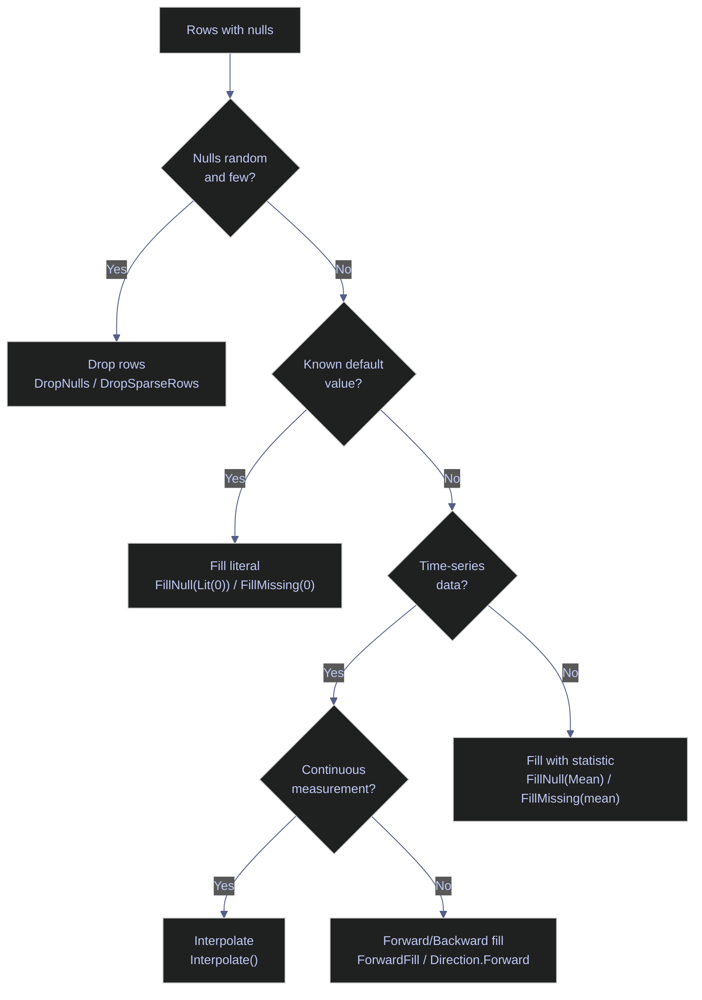

# 04 — Missing Data, Strings & DateTime

> [!quote]
> "Life is dirty. So is your data. Get used to it."
>
> — **Oz du Soleil**

Three foundational topics that every data pipeline must handle correctly: detecting and filling missing values, cleaning and transforming string columns, and parsing, extracting, and computing with dates and times. Each operation is shown side by side in Polars.NET (expression-based, vectorized) and Deedle (lambda-based, LINQ-oriented) so you can compare ergonomics and capabilities directly.

> [!info] Deedle maintenance status and alternatives
>
> Deedle is a community project under `fslaborg` — the last release was **v3.0.0 (2023)** and the project is in low-maintenance mode. For new .NET DataFrame projects, consider **`Microsoft.Data.Analysis`** (preview, actively developed by Microsoft, natively composable with ML.NET via `IDataView`) or **Polars.NET** (community wrapper around the Rust Polars engine, expression-based API). This notebook retains Deedle examples as a reference for existing codebases.

---

## Setup & Imports

### Warning Suppression

```csharp
// Suppress CS1701/CS1702 assembly version warnings in .NET Interactive.
// NuGet packages targeting .NET 8/9 trigger these on .NET 10 — harmless.
// Run this cell ONCE before any cells that use NuGet packages.

using System.Reflection;
using Microsoft.DotNet.Interactive;
using Microsoft.DotNet.Interactive.CSharp;

var csharpKernel = (CSharpKernel)Kernel.Root.FindKernelByName("csharp");
var optionsField = typeof(CSharpKernel).GetField("_scriptOptions",
    BindingFlags.NonPublic | BindingFlags.Instance);

var scriptOptions = optionsField.GetValue(csharpKernel);
var withWarningLevel = scriptOptions.GetType().GetMethod("WithWarningLevel");
var newOptions = withWarningLevel.Invoke(scriptOptions, new object[] { 0 });
optionsField.SetValue(csharpKernel, newOptions);
```

### NuGet Packages and Imports

```csharp
#r "nuget: Polars.NET, 0.4.0"
#r "nuget: Polars.NET.Native.win-x64, 0.4.0"
#r "nuget: Deedle, 4.0.1"
#r "nuget: Deedle.Interactive, 3.0.0"

using System.IO;
using System.Linq;
using System.Text.RegularExpressions;
using Polars.CSharp;
using static Polars.CSharp.Polars;
using Deedle;
using Microsoft.DotNet.Interactive.Formatting;

// Redirect Deedle's FSharp.Core 10.1.0.0 request to the SDK's 11.0.0.0 already loaded
System.Runtime.Loader.AssemblyLoadContext.Default.Resolving += (ctx, name) =>
{
    if (name.Name == "FSharp.Core")
        return AppDomain.CurrentDomain.GetAssemblies()
            .FirstOrDefault(a => a.GetName().Name == "FSharp.Core");
    return null;
};

// Register HTML formatter for Polars.NET types (Deedle.Interactive handles Deedle)
Formatter.Register<DataFrame>((df, writer) =>
{
    var html = df.ToHtml();
    // Strip surrounding quotes from Polars string values in HTML
    html = System.Text.RegularExpressions.Regex.Replace(html, @"(&gt;|>)(.+?)(&lt;|<)", @"$1$2$3");
    html = System.Text.RegularExpressions.Regex.Replace(html, @">""(.+?)""<", @">$1<");
    var css = """
        """;
    writer.Write(css + html);
}, "text/html");
Formatter.Register<Polars.CSharp.Series>((s, writer) =>
    writer.Write($"<pre style='font-size:14px'>{s}</pre>"), "text/html");

var DATA = Path.Combine("..", "data");
```

### Dataset Loading

```csharp
// Load primary datasets
var dfP = DataFrame.ReadCsv(Path.Combine(DATA, "eurostoxx50_ohlcv.csv"), tryParseDates: true);
var dfD = Frame.ReadCsv(Path.Combine(DATA, "eurostoxx50_ohlcv.csv"));
display($"OHLCV — Polars: {dfP.Shape}  |  Deedle: {dfD.RowCount} x {dfD.ColumnCount}");

// scores_daily has real nulls in pe_zscore, pb_zscore, ev_ebitda_zscore, yield_zscore, recommendation_mean
var scP = DataFrame.ReadCsv(Path.Combine(DATA, "scores_daily.csv"), tryParseDates: true);
var scD = Frame.ReadCsv(Path.Combine(DATA, "scores_daily.csv"));
display($"Scores — Polars: {scP.Shape}  |  Deedle: {scD.RowCount} x {scD.ColumnCount}");
```

    OHLCV — Polars: (66355, 12)  |  Deedle: 66355 x 12

    Scores — Polars: (466, 36)  |  Deedle: 466 x 36

---

## Missing Data

Real-world datasets almost always contain missing values — sensor gaps, optional fields, failed joins, or upstream ETL issues. How you detect, quantify, and resolve nulls determines whether downstream aggregations and models produce correct results or silently propagate errors.

> [!info] Polars.NET null model vs Deedle missing values
>
> **Polars.NET** uses a native `null` representation for all data types — integers, floats, strings, dates, and booleans can all hold `null` without type coercion. A column of `[1, null, 3]` stays `Int64`.
>
> **Deedle** uses .NET optional values (`OptionalValue<T>`). For numeric columns, missing values surface as `NaN` in float series or as absent keys. The `ValueCount` property returns only non-missing entries, and `RowsDense` filters to rows where every column has a value.

> [!question] Which null strategy to use?
>
> The right approach depends on the nature of the missing data and the downstream use case. Use the decision tree below to select the appropriate strategy.



### Detect Nulls

Null detection is the first step in any data quality check. Scan each column for missing values to understand the scope of the problem before choosing a fill or drop strategy.

#### Polars.NET | Detect null rows with IsNull() filter

The `IsNull()` expression returns a boolean mask that can be passed to `Filter()` to isolate rows where a specific column is null. Iterating over `Columns` and checking the `NullCount` property on each `Series` gives a quick per-column summary without constructing a full filtered DataFrame.

_Scans all columns in `scP` (scores_daily, 466 rows) for null counts and prints any column with at least one null — then filters to rows where `ev_ebitda_zscore` is null, showing the first 5 affected symbols and their `pe_zscore` values._

```csharp
display("Null counts per column:");
foreach (var col in scP.Columns)
{
    var nc = scP.Column(col).NullCount;
    if (nc > 0)
        Console.WriteLine($"  {col,-28} {nc,4} nulls");
}

display("Rows where ev_ebitda_zscore IS null (first 5):");
scP.Filter(Col("ev_ebitda_zscore").IsNull()).Head(5)
    .Select("symbol", "score_date", "ev_ebitda_zscore", "pe_zscore")
```

    Null counts per column:

      pe_zscore                       3 nulls
      pb_zscore                       6 nulls
      ev_ebitda_zscore               71 nulls
      yield_zscore                   35 nulls
      recommendation_mean            14 nulls

    Rows where ev_ebitda_zscore IS null (first 5):

<!-- Polars DataFrame: (5 rows, 4 columns) --><table><thead><tr><th>symbol</th><th>score_date</th><th>ev_ebitda_zscore</th><th>pe_zscore</th></tr></thead><tbody><tr><td>BNP.PA</td><td>2026-03-04</td><td class='pl-null'>null</td><td>0.9133885393</td></tr><tr><td>SAN.MC</td><td>2026-03-04</td><td class='pl-null'>null</td><td>0.4585988913</td></tr><tr><td>ISP.MI</td><td>2026-03-04</td><td class='pl-null'>null</td><td>0.3666188825</td></tr><tr><td>UCG.MI</td><td>2026-03-04</td><td class='pl-null'>null</td><td>0.45250099</td></tr><tr><td>INGA.AS</td><td>2026-03-04</td><td class='pl-null'>null</td><td>0.3799166699</td></tr></tbody></table></div>

#### Deedle | Detect missing values with ValueCount and RowsDense

Deedle tracks missingness through its optional-value system. `ValueCount` returns the count of present (non-missing) values in a series, so `RowCount - ValueCount` gives the missing count. `RowsDense` returns only rows where every column has a value — useful for understanding how many complete rows survive after all missing values are accounted for.

_Iterates all columns in `scD` to print the number of missing values per column (using `RowCount - ValueCount`), then uses `RowsDense` to count how many rows have no missing values at all — confirming 346 dense rows out of 466._

```csharp
display("Missing counts per column:");
foreach (var col in scD.ColumnKeys)
{
    var s = scD.Columns[col];
    var missing = scD.RowCount - s.ValueCount;
    if (missing > 0)
        Console.WriteLine($"  {col,-28} {missing,4} missing");
}

// Show symbols that have missing ev_ebitda_zscore
// RowsDense only keeps rows where ALL columns have values
var denseCount = scD.RowsDense.KeyCount;
display($"Rows with no missing values (dense): {denseCount} / {scD.RowCount}");
display($"Rows with at least one missing value: {scD.RowCount - denseCount}");
```

    Missing counts per column:

      pe_zscore                       3 missing
      pb_zscore                       6 missing
      ev_ebitda_zscore               71 missing
      yield_zscore                   35 missing
      recommendation_mean            14 missing

    Rows with no missing values (dense): 346 / 466

    Rows with at least one missing value: 120

### Count Nulls

After detecting which columns contain nulls, quantify the problem. Knowing the exact count per column helps decide whether to drop, fill, or investigate further — a column with 3 nulls out of 466 rows is a different problem than one with 71.

#### Polars.NET | Count nulls per column with NullCount property

The `NullCount` property on a Polars `Series` returns the number of null entries as a simple integer. This is a metadata operation — it does not scan the data, making it O(1) for most column types.

_Prints the null count and total row count for five specific z-score columns in `scP`, confirming that `ev_ebitda_zscore` has the most nulls (71/466) while `pe_zscore` has the fewest (3/466)._

```csharp
var nullCols = new[] { "pe_zscore", "pb_zscore", "ev_ebitda_zscore", "yield_zscore", "recommendation_mean" };
foreach (var col in nullCols)
    Console.WriteLine($"  {col,-28} {scP.Column(col).NullCount,4} / {scP.Height}");
display($"Total rows: {scP.Height}");
```

      pe_zscore                       3 / 466
      pb_zscore                       6 / 466
      ev_ebitda_zscore               71 / 466
      yield_zscore                   35 / 466
      recommendation_mean            14 / 466

    Total rows: 466

#### Deedle | Count missing values per column with ValueCount

Deedle does not have a direct `NullCount` property. Instead, subtract `ValueCount` (the number of present values) from `RowCount` to compute the number of missing entries. This requires iterating over the column's internal representation.

_Computes missing counts for the same five z-score columns in `scD` by subtracting `ValueCount` from `RowCount` — confirming the identical distribution of missing values as the Polars result._

```csharp
var nullCols = new[] { "pe_zscore", "pb_zscore", "ev_ebitda_zscore", "yield_zscore", "recommendation_mean" };
foreach (var col in nullCols)
{
    var s = scD.Columns[col];
    Console.WriteLine($"  {col,-28} {scD.RowCount - s.ValueCount,4} / {scD.RowCount}");
}
```

      pe_zscore                       3 / 466
      pb_zscore                       6 / 466
      ev_ebitda_zscore               71 / 466
      yield_zscore                   35 / 466
      recommendation_mean            14 / 466

### Drop Nulls

The simplest null strategy: remove rows that contain any missing value. Use this when nulls are random, few in number, and the remaining dataset is large enough to be representative. Be cautious — dropping nulls across many columns can eliminate a disproportionate number of rows.

#### Polars.NET | Drop null rows with DropNulls()

`DropNulls()` removes every row that has a null in any column. It returns a new DataFrame (Polars DataFrames are immutable). To drop nulls in specific columns only, filter with `IsNotNull()` instead.

_Applies `DropNulls()` to `scP`, reducing 466 rows to 346 — 120 rows removed because at least one z-score column was null — then previews the first 5 remaining rows._

```csharp
var scPDropped = scP.DropNulls();
display($"Before: {scP.Height} rows  |  After DropNulls: {scPDropped.Height} rows");
scPDropped.Select("symbol", "score_date", "ev_ebitda_zscore", "pe_zscore").Head(5)
```

    Before: 466 rows  |  After DropNulls: 346 rows

<!-- Polars DataFrame: (5 rows, 4 columns) --><table><thead><tr><th>symbol</th><th>score_date</th><th>ev_ebitda_zscore</th><th>pe_zscore</th></tr></thead><tbody><tr><td>DTE.DE</td><td>2026-03-04</td><td>0.3795319291</td><td>0.3265870647</td></tr><tr><td>IFX.DE</td><td>2026-03-04</td><td>0.6770676017</td><td>0.5093979371</td></tr><tr><td>ENR.DE</td><td>2026-03-04</td><td>-1.693211811</td><td>-0.9027376753</td></tr><tr><td>ABI.BR</td><td>2026-03-04</td><td>0.5527390806</td><td>0.4740837062</td></tr><tr><td>TTE.PA</td><td>2026-03-04</td><td>0.4496104876</td><td>0.6911063935</td></tr></tbody></table></div>

#### Deedle | Drop missing rows with DropSparseRows()

`DropSparseRows()` removes rows where any column has a missing value — equivalent to Polars' `DropNulls()`. The name "sparse" refers to Deedle's internal representation where missing values create sparse series.

_Applies `DropSparseRows()` to `scD`, reducing 466 rows to 346 — matching the Polars result and confirming that `RowsDense.KeyCount` equals the post-drop row count._

```csharp
var scDDropped = scD.DropSparseRows();
display($"Before: {scD.RowCount} rows  |  After DropSparseRows: {scDDropped.RowCount} rows");
scDDropped.Rows[scDDropped.RowKeys.Take(5)].Columns[new[] { "symbol", "score_date", "ev_ebitda_zscore", "pe_zscore" }]
```

    Before: 466 rows  |  After DropSparseRows: 346 rows

<div>

<table>

<thead><th></th><th></th><th>symbol</th><th>score_date</th><th>ev_ebitda_zscore</th><th>pe_zscore</th></thead><thead><th></th><th></th><th>(string)</th><th>(DateTime)</th><th>(float)</th><th>(Decimal)</th></thead>

<tr><td><b>1</b></td><td class="no-wrap">-></td><td>DTE.DE</td><td>04-Mar-26 0:00:00</td><td>0.3795319290535272</td><td>0.32658706468715487</td></tr><tr><td><b>2</b></td><td class="no-wrap">-></td><td>IFX.DE</td><td>04-Mar-26 0:00:00</td><td>0.6770676016907706</td><td>0.5093979370966721</td></tr><tr><td><b>3</b></td><td class="no-wrap">-></td><td>ENR.DE</td><td>04-Mar-26 0:00:00</td><td>-1.693211811112902</td><td>-0.902737675317518</td></tr><tr><td><b>4</b></td><td class="no-wrap">-></td><td>ABI.BR</td><td>04-Mar-26 0:00:00</td><td>0.5527390805672748</td><td>0.47408370618998047</td></tr><tr><td><b>6</b></td><td class="no-wrap">-></td><td>TTE.PA</td><td>04-Mar-26 0:00:00</td><td>0.4496104875609825</td><td>0.69110639353589</td></tr>

</table>

<p><b>5</b> rows x <b>4</b> columns</p><p><b>0</b> missing values</p>

</div>

### Fill with Literal

Replace nulls with a known constant value. Appropriate when the business logic defines a clear default — for example, filling missing dividend yields with `0.0` (no dividend) or missing boolean flags with `false`.

> [!warning] Filling z-scores with 0.0 distorts the distribution
>
> A z-score of 0.0 means "exactly at the mean." Filling missing z-scores with 0.0 artificially inflates the count of mean-valued observations and biases statistical summaries. Use mean/median imputation or interpolation instead if the downstream use is statistical.

> [!success] Use domain-appropriate defaults
>
> Fill with `0.0` only when zero is a meaningful business value (e.g., "no dividends paid"). For z-scores and continuous metrics, prefer `FillNull(Col("c").Mean())` or `Interpolate()`.

#### Polars.NET | Fill nulls with a literal value using FillNull(Lit())

`FillNull(Lit(value))` replaces every null in the column with the given literal. The `Lit()` wrapper converts a C# value into a Polars expression. Combined with `WithColumns` and `Alias`, this returns a new DataFrame with the specified column's nulls replaced.

_Fills all 71 nulls in `ev_ebitda_zscore` with `0.0` using `FillNull(Lit(0.0))` — the first row (BNP.PA) changes from `null` to `0`, while already-present values like DTE.DE (0.3795) are unaffected._

```csharp
var scPFilled = scP.WithColumns(
    Col("ev_ebitda_zscore").FillNull(Lit(0.0)).Alias("ev_ebitda_zscore")
);
display($"Nulls after FillNull(0.0): {scPFilled.Column("ev_ebitda_zscore").NullCount}");
scPFilled.Select("symbol", "score_date", "ev_ebitda_zscore").Head(5)
```

    Nulls after FillNull(0.0): 0

<!-- Polars DataFrame: (5 rows, 3 columns) --><table><thead><tr><th>symbol</th><th>score_date</th><th>ev_ebitda_zscore</th></tr></thead><tbody><tr><td>BNP.PA</td><td>2026-03-04</td><td>0</td></tr><tr><td>DTE.DE</td><td>2026-03-04</td><td>0.3795319291</td></tr><tr><td>IFX.DE</td><td>2026-03-04</td><td>0.6770676017</td></tr><tr><td>ENR.DE</td><td>2026-03-04</td><td>-1.693211811</td></tr><tr><td>ABI.BR</td><td>2026-03-04</td><td>0.5527390806</td></tr></tbody></table></div>

#### Deedle | Fill missing values with a constant using FillMissing()

Deedle's `FillMissing(value)` on a series replaces all missing entries with the given constant. Unlike Polars, Deedle operates on individual series rather than DataFrame-level expressions — you extract the column, fill it, then reassemble if needed.

_Extracts `ev_ebitda_zscore` as a float series, fills missing values with `0.0`, and confirms zero remaining missing values — the first 5 values show `[0.00, 0.38, 0.68, -1.69, 0.55]`._

```csharp
var evFilled = scD.GetColumn<double>("ev_ebitda_zscore").FillMissing(0.0);
var missingAfter = evFilled.Values.Count(v => double.IsNaN(v));
display($"Missing after FillMissing(0.0): {missingAfter}");
display($"First 5 values: [{string.Join(", ", evFilled.Values.Take(5).Select(v => v.ToString("F2")))}]");
```

    Missing after FillMissing(0.0): 0

    First 5 values: [0.00, 0.38, 0.68, -1.69, 0.55]

### Forward and Backward Fill

Directional fill strategies propagate the nearest non-null value forward (LOCF — Last Observation Carried Forward) or backward to replace nulls. These are the standard approach for time-series data where the previous or next known value is the best estimate — for example, carrying forward the last known stock price across weekend gaps.

> [!tip] Forward fill across groups
>
> When your DataFrame contains multiple symbols or entities, always apply forward fill within each group (e.g., per symbol) rather than across the entire DataFrame. Otherwise, the last value from one symbol bleeds into the first null of the next symbol.

#### Polars.NET | Forward fill nulls with ForwardFill()

`ForwardFill()` propagates the last non-null value forward through subsequent nulls. If the first value in the column is null, it remains null — there is no preceding value to carry. Returns a new expression that can be used with `WithColumns`.

_Applies `ForwardFill()` to `ev_ebitda_zscore` — one null remains because BNP.PA is the first row and has no preceding value to carry forward; all other 70 nulls are replaced by their prior row's value._

```csharp
var scPFfill = scP.WithColumns(
    Col("ev_ebitda_zscore").ForwardFill().Alias("ev_ebitda_zscore")
);
display($"Nulls after ForwardFill: {scPFfill.Column("ev_ebitda_zscore").NullCount}");
scPFfill.Select("symbol", "score_date", "ev_ebitda_zscore").Head(5)
```

    Nulls after ForwardFill: 1

<!-- Polars DataFrame: (5 rows, 3 columns) --><table><thead><tr><th>symbol</th><th>score_date</th><th>ev_ebitda_zscore</th></tr></thead><tbody><tr><td>BNP.PA</td><td>2026-03-04</td><td class='pl-null'>null</td></tr><tr><td>DTE.DE</td><td>2026-03-04</td><td>0.3795319291</td></tr><tr><td>IFX.DE</td><td>2026-03-04</td><td>0.6770676017</td></tr><tr><td>ENR.DE</td><td>2026-03-04</td><td>-1.693211811</td></tr><tr><td>ABI.BR</td><td>2026-03-04</td><td>0.5527390806</td></tr></tbody></table></div>

#### Deedle | Forward fill with Direction.Forward

Deedle's `FillMissing(Direction.Forward)` is equivalent to Polars' `ForwardFill()`. It propagates the last present value forward through missing entries. Same caveat applies: if the series starts with a missing value, it stays missing.

_Applies `FillMissing(Direction.Forward)` to `ev_ebitda_zscore` — one null remains (the leading BNP.PA missing value); the first 5 present values are `[0.38, 0.68, -1.69, 0.55, 0.38]` from DTE.DE onward._

```csharp
var evFfill = scD.GetColumn<double>("ev_ebitda_zscore").FillMissing(Direction.Forward);
var missingFfill = evFfill.KeyCount - evFfill.ValueCount;
display($"Missing after forward fill: {missingFfill}");
display($"First 5 values: [{string.Join(", ", evFfill.Values.Take(5).Select(v => v.ToString("F2")))}]");
```

    Missing after forward fill: 1

    First 5 values: [0.38, 0.68, -1.69, 0.55, 0.38]

#### Polars.NET | Backward fill nulls with BackwardFill()

`BackwardFill()` propagates the next non-null value backward. This resolves the leading-null problem that forward fill cannot — combining both directions fills all interior nulls and at least one edge.

_Applies `BackwardFill()` to `ev_ebitda_zscore` — all 71 nulls are filled, including the leading BNP.PA null which takes DTE.DE's value of 0.3795 from the next row, leaving 0 remaining nulls._

```csharp
var scPBfill = scP.WithColumns(
    Col("ev_ebitda_zscore").BackwardFill().Alias("ev_ebitda_zscore")
);
display($"Nulls after BackwardFill: {scPBfill.Column("ev_ebitda_zscore").NullCount}");
scPBfill.Select("symbol", "score_date", "ev_ebitda_zscore").Head(5)
```

    Nulls after BackwardFill: 0

<!-- Polars DataFrame: (5 rows, 3 columns) --><table><thead><tr><th>symbol</th><th>score_date</th><th>ev_ebitda_zscore</th></tr></thead><tbody><tr><td>BNP.PA</td><td>2026-03-04</td><td>0.3795319291</td></tr><tr><td>DTE.DE</td><td>2026-03-04</td><td>0.3795319291</td></tr><tr><td>IFX.DE</td><td>2026-03-04</td><td>0.6770676017</td></tr><tr><td>ENR.DE</td><td>2026-03-04</td><td>-1.693211811</td></tr><tr><td>ABI.BR</td><td>2026-03-04</td><td>0.5527390806</td></tr></tbody></table></div>

#### Deedle | Backward fill with Direction.Backward

Deedle's `FillMissing(Direction.Backward)` is the reverse of forward fill — it propagates the next present value backward through missing entries.

_Applies `FillMissing(Direction.Backward)` to `ev_ebitda_zscore` — all missing values are filled; the first 5 present values become `[0.38, 0.38, 0.68, -1.69, 0.55]` where the leading null takes DTE.DE's backward-carried value._

```csharp
var evBfill = scD.GetColumn<double>("ev_ebitda_zscore").FillMissing(Direction.Backward);
var missingBfill = evBfill.KeyCount - evBfill.ValueCount;
display($"Missing after backward fill: {missingBfill}");
display($"First 5 values: [{string.Join(", ", evBfill.Values.Take(5).Select(v => v.ToString("F2")))}]");
```

    Missing after backward fill: 0

    First 5 values: [0.38, 0.38, 0.68, -1.69, 0.55]

### Fill with Statistics

Replace nulls with a summary statistic of the column — mean, median, or mode. This preserves the overall distribution better than a literal fill but assumes the data is stationary (no trend). For financial z-scores, mean imputation is a reasonable default since z-scores are centered around zero by construction.

#### Polars.NET | Fill nulls with column mean using FillNull(Col().Mean())

The expression `Col("c").FillNull(Col("c").Mean())` computes the column mean and uses it as the fill value — all inside the Polars engine. This is faster than computing the mean in C# and passing it as `Lit()` because it avoids a round-trip between managed and native code.

_Fills all 71 nulls in `ev_ebitda_zscore` with the column's own mean (≈ 0.038), computed inside the Polars engine — BNP.PA changes from `null` to `0.0380` while other values are unaffected._

```csharp
var scPMeanFill = scP.WithColumns(
    Col("ev_ebitda_zscore").FillNull(Col("ev_ebitda_zscore").Mean()).Alias("ev_ebitda_zscore")
);
display($"Nulls after FillNull(mean): {scPMeanFill.Column("ev_ebitda_zscore").NullCount}");
scPMeanFill.Select("symbol", "score_date", "ev_ebitda_zscore").Head(5)
```

    Nulls after FillNull(mean): 0

<!-- Polars DataFrame: (5 rows, 3 columns) --><table><thead><tr><th>symbol</th><th>score_date</th><th>ev_ebitda_zscore</th></tr></thead><tbody><tr><td>BNP.PA</td><td>2026-03-04</td><td>0.03804613962</td></tr><tr><td>DTE.DE</td><td>2026-03-04</td><td>0.3795319291</td></tr><tr><td>IFX.DE</td><td>2026-03-04</td><td>0.6770676017</td></tr><tr><td>ENR.DE</td><td>2026-03-04</td><td>-1.693211811</td></tr><tr><td>ABI.BR</td><td>2026-03-04</td><td>0.5527390806</td></tr></tbody></table></div>

#### Deedle | Fill missing values with series mean

In Deedle, compute the mean separately using `series.Mean()`, then pass the result to `FillMissing()`. This is a two-step process — Deedle does not support expression-based fill like Polars.

_Computes `ev_ebitda_zscore` mean as 0.0380 via `series.Mean()`, then fills all missing entries with that value — confirms 0 remaining missing values after fill._

```csharp
var evCol = scD.GetColumn<double>("ev_ebitda_zscore");
var meanVal = evCol.Mean();
var evMeanFilled = evCol.FillMissing(meanVal);
display($"Mean value used: {meanVal:F4}");
var missingMean = evMeanFilled.KeyCount - evMeanFilled.ValueCount;
display($"Missing after FillMissing(mean): {missingMean}");
```

    Mean value used: 0.0380

    Missing after FillMissing(mean): 0

### Interpolate

Linear interpolation estimates missing values by drawing a straight line between the nearest non-null neighbors. This is ideal for continuous measurements (temperature, price, sensor readings) where the true value likely falls between adjacent observations. Leading/trailing nulls remain null because there is no second anchor point for the line.

#### Polars.NET | Interpolate missing values with Interpolate()

`Interpolate()` performs linear interpolation on a numeric series. It uses the positional index (row number), not datetime values, to compute the interpolated value. If the first or last row is null, it stays null — interpolation requires values on both sides.

_Interpolates `ev_ebitda_zscore` using linear interpolation between adjacent non-null values — 1 null remains because BNP.PA is the first row and has no left anchor; all interior nulls are estimated from neighboring values._

```csharp
var scPInterp = scP.WithColumns(
    Col("ev_ebitda_zscore").Interpolate().Alias("ev_ebitda_zscore")
);
display($"Nulls after Interpolate: {scPInterp.Column("ev_ebitda_zscore").NullCount}");
scPInterp.Select("symbol", "score_date", "ev_ebitda_zscore").Head(10)
```

    Nulls after Interpolate: 1

<!-- Polars DataFrame: (10 rows, 3 columns) --><table><thead><tr><th>symbol</th><th>score_date</th><th>ev_ebitda_zscore</th></tr></thead><tbody><tr><td>BNP.PA</td><td>2026-03-04</td><td class='pl-null'>null</td></tr><tr><td>DTE.DE</td><td>2026-03-04</td><td>0.3795319291</td></tr><tr><td>IFX.DE</td><td>2026-03-04</td><td>0.6770676017</td></tr><tr><td>ENR.DE</td><td>2026-03-04</td><td>-1.693211811</td></tr><tr><td>ABI.BR</td><td>2026-03-04</td><td>0.5527390806</td></tr><tr><td>VOW.DE</td><td>2026-03-04</td><td>0.3798301687</td></tr><tr><td>TTE.PA</td><td>2026-03-04</td><td>0.4496104876</td></tr><tr><td>DG.PA</td><td>2026-03-04</td><td>0.9287967228</td></tr><tr><td>SAN.MC</td><td>2026-03-04</td><td>0.4340322959</td></tr><tr><td>SU.PA</td><td>2026-03-04</td><td>-0.06073213096</td></tr></tbody></table></div>

#### Deedle | Interpolate (forward fill approximation)

> [!warning] Deedle has no built-in linear interpolation
>
> Unlike Polars, Deedle does not provide an `Interpolate()` method. The closest built-in option is `FillMissing(Direction.Forward)` (LOCF), which carries the last known value forward. This is a step function, not a linear estimate.

> [!success] Use Math.NET Numerics for true interpolation
>
> If you need linear interpolation in Deedle, extract the series keys and values, compute interpolated values using `MathNet.Numerics.Interpolation`, and reassemble the series. Alternatively, perform the interpolation in Polars.NET and transfer the result.

_Applies `FillMissing(Direction.Forward)` to `ev_ebitda_zscore` as the closest built-in approximation to interpolation — 1 leading missing value remains since forward fill cannot fill values without a preceding observation._

```csharp
var evInterp = scD.GetColumn<double>("ev_ebitda_zscore").FillMissing(Direction.Forward);
var missingAfterInterp = evInterp.KeyCount - evInterp.ValueCount;
display($"Missing after forward fill (LOCF): {missingAfterInterp}");
display("Deedle has no built-in linear interpolation — forward fill is the closest built-in.");
```

    Missing after forward fill (LOCF): 1

    Deedle has no built-in linear interpolation — forward fill is the closest built-in.

### Coalesce

`Coalesce` returns the first non-null value across multiple columns for each row. This is the equivalent of SQL's `COALESCE()` and Python Polars' `pl.coalesce()`. Use it to build fallback chains — for example, prefer the primary data source, else the secondary, else a default. Polars.NET 0.4.0 does not expose a top-level `Coalesce` function, but chaining `FillNull` across columns achieves the same result.

#### Polars.NET | Coalesce via chained FillNull

Chain `FillNull(Col("secondary")).FillNull(Col("fallback"))` on the primary column to cascade through fallback sources. Each `FillNull` replaces remaining nulls with the next column's values.

_Creates a 4-row DataFrame with `primary`, `secondary`, and `fallback` columns (each with different nulls), then chains `FillNull` calls to produce a `best` column with no nulls: [100, 200, 300, 400]._

```csharp
var coalDf = DataFrame.FromColumns(
    ("primary",   new double?[] { 100.0, null, 300.0, null }),
    ("secondary", new double?[] { null, 200.0, null, 400.0 }),
    ("fallback",  new double?[] { 50.0, 50.0, 50.0, 50.0 })
);

var coalResult = coalDf.WithColumns(
    Col("primary")
        .FillNull(Col("secondary"))
        .FillNull(Col("fallback"))
        .Alias("best")
);

coalResult
```

<!-- Polars DataFrame: (4 rows, 4 columns) --><table><thead><tr><th>primary</th><th>secondary</th><th>fallback</th><th>best</th></tr></thead><tbody><tr><td>100</td><td class='pl-null'>null</td><td>50</td><td>100</td></tr><tr><td class='pl-null'>null</td><td>200</td><td>50</td><td>200</td></tr><tr><td>300</td><td class='pl-null'>null</td><td>50</td><td>300</td></tr><tr><td class='pl-null'>null</td><td>400</td><td>50</td><td>400</td></tr></tbody></table>

---

## String Operations

String manipulation is essential for cleaning column values, extracting components from composite identifiers (like ticker symbols), standardizing text for joins, and filtering by patterns. Polars.NET provides a `.Str` accessor with vectorized string operations that execute inside the native engine. Deedle has no string accessor — all string operations require extracting values to C# arrays and applying LINQ lambdas.

> [!info] Polars.NET Str accessor vs Deedle lambda approach
>
> Polars.NET's `.Str.*` methods (`ToUpper()`, `Contains()`, `Replace()`, `Extract()`, etc.) operate on entire columns as vectorized expressions — the engine processes all values in a single pass without crossing the managed/.NET boundary per row. Deedle requires extracting values to C# collections and applying standard `string` methods via LINQ, which is more verbose but gives access to the full .NET string API.

### Case Conversion

Converting strings to upper or lower case is a common normalization step before joins or deduplication. Ensures that `"ASML.AS"` and `"asml.as"` match when compared.

#### Polars.NET | Convert to upper and lower case with Str.ToUpper()

The `Str.ToUpper()` and `Str.ToLower()` methods return new string expressions with case-converted values. Use with `WithColumns` to add the results as new columns.

_Extracts the 50 unique symbols from `dfP`, adds `upper` and `lower` columns showing that `.DE`, `.AS`, `.PA` suffixes are preserved in the correct case for all EuroStoxx 50 tickers._

```csharp
var symbols = dfP.Select(new[] { "symbol" }).Unique();
var caseDemo = symbols.WithColumns(
    Col("symbol").Str.ToUpper().Alias("upper"),
    Col("symbol").Str.ToLower().Alias("lower")
);
caseDemo.Head(10)
```

<!-- Polars DataFrame: (10 rows, 3 columns) --><table><thead><tr><th>symbol</th><th>upper</th><th>lower</th></tr></thead><tbody><tr><td>ABI.BR</td><td>ABI.BR</td><td>abi.br</td></tr><tr><td>AD.AS</td><td>AD.AS</td><td>ad.as</td></tr><tr><td>ADS.DE</td><td>ADS.DE</td><td>ads.de</td></tr><tr><td>ADYEN.AS</td><td>ADYEN.AS</td><td>adyen.as</td></tr><tr><td>AI.PA</td><td>AI.PA</td><td>ai.pa</td></tr><tr><td>AIR.PA</td><td>AIR.PA</td><td>air.pa</td></tr><tr><td>ALV.DE</td><td>ALV.DE</td><td>alv.de</td></tr><tr><td>ARGX.BR</td><td>ARGX.BR</td><td>argx.br</td></tr><tr><td>ASML.AS</td><td>ASML.AS</td><td>asml.as</td></tr><tr><td>BAS.DE</td><td>BAS.DE</td><td>bas.de</td></tr></tbody></table></div>

#### Deedle | Convert to upper and lower case with LINQ lambda

Without a string accessor, Deedle requires extracting the column values, applying `.ToUpper()` / `.ToLower()` on each string, and rebuilding a new frame with the results.

_Extracts the first 10 distinct symbols from `dfD`, applies `.ToUpper()` and `.ToLower()` to each, and assembles a 3-column frame confirming identical case results to the Polars output._

```csharp
var symArr = dfD.GetColumn<string>("symbol").Observations
    .Select(o => o.Value).Distinct().Take(10).ToArray();

var idx = Enumerable.Range(0, symArr.Length).ToArray();
var symSeries  = new Series<int, string>(idx, symArr);
var upperArr   = symArr.Select(s => s.ToUpper()).ToArray();
var lowerArr   = symArr.Select(s => s.ToLower()).ToArray();

var builder = new FrameBuilder.Columns<int, string>();
builder.Add("symbol", symSeries);
builder.Add("upper", new Series<int, string>(idx, upperArr));
builder.Add("lower", new Series<int, string>(idx, lowerArr));
builder.Frame
```

<div>

<table>

<thead><th></th><th></th><th>symbol</th><th>upper</th><th>lower</th></thead><thead><th></th><th></th><th>(string)</th><th>(string)</th><th>(string)</th></thead>

<tr><td><b>0</b></td><td class="no-wrap">-></td><td>ABI.BR</td><td>ABI.BR</td><td>abi.br</td></tr><tr><td><b>1</b></td><td class="no-wrap">-></td><td>AD.AS</td><td>AD.AS</td><td>ad.as</td></tr><tr><td><b>2</b></td><td class="no-wrap">-></td><td>ADS.DE</td><td>ADS.DE</td><td>ads.de</td></tr><tr><td><b>3</b></td><td class="no-wrap">-></td><td>ADYEN.AS</td><td>ADYEN.AS</td><td>adyen.as</td></tr><tr><td><b>4</b></td><td class="no-wrap">-></td><td>AI.PA</td><td>AI.PA</td><td>ai.pa</td></tr><tr><td><b>5</b></td><td class="no-wrap">-></td><td>AIR.PA</td><td>AIR.PA</td><td>air.pa</td></tr><tr><td><b>6</b></td><td class="no-wrap">-></td><td>ALV.DE</td><td>ALV.DE</td><td>alv.de</td></tr><tr><td><b>7</b></td><td class="no-wrap">-></td><td>ARGX.BR</td><td>ARGX.BR</td><td>argx.br</td></tr><tr><td><b>8</b></td><td class="no-wrap">-></td><td>ASML.AS</td><td>ASML.AS</td><td>asml.as</td></tr><tr><td><b>9</b></td><td class="no-wrap">-></td><td>BAS.DE</td><td>BAS.DE</td><td>bas.de</td></tr>

</table>

<p><b>10</b> rows x <b>3</b> columns</p><p><b>0</b> missing values</p>

</div>

### Contains, StartsWith, EndsWith

Pattern matching on string columns is the primary way to filter by exchange code, country suffix, or naming convention. These operations return boolean masks suitable for `Filter()`.

#### Polars.NET | Filter with Str.Contains()

`Str.Contains(pattern)` takes a plain string argument (not wrapped in `Lit()`) and returns a boolean expression. Pass it to `Filter()` to keep only matching rows.

_Filters `dfP` for all rows where `symbol` contains `".DE"`, then deduplicates — producing the 16 German-exchange EuroStoxx 50 symbols (ADS.DE through VOW.DE)._

```csharp
var germanP = dfP.Filter(Col("symbol").Str.Contains(".DE"))
    .Select(new[] { "symbol" }).Unique();
display("German exchange symbols (.DE):");
germanP
```

    German exchange symbols (.DE):

<!-- Polars DataFrame: (16 rows, 1 columns) --><table><thead><tr><th>symbol</th></tr></thead><tbody><tr><td>ADS.DE</td></tr><tr><td>ALV.DE</td></tr><tr><td>BAS.DE</td></tr><tr><td>BAYN.DE</td></tr><tr><td>BMW.DE</td></tr><tr><td>DB1.DE</td></tr><tr><td>DHL.DE</td></tr><tr><td>DTE.DE</td></tr><tr><td>ENR.DE</td></tr><tr><td>IFX.DE</td></tr><tr><td colspan='1'>... 6 more rows ...</td></tr></tbody></table></div>

#### Deedle | Filter with Contains lambda

Deedle requires extracting the column as observations, applying `.Where()` with a `.Contains()` predicate, and collecting the results.

_Extracts all symbol observations from `dfD`, filters for strings containing `".DE"`, and deduplicates — producing the same 16 German symbols as the Polars result._

```csharp
var germanD = dfD.GetColumn<string>("symbol").Observations
    .Select(o => o.Value)
    .Where(s => s.Contains(".DE"))
    .Distinct().ToArray();
display("German exchange symbols (.DE):");
display(string.Join(", ", germanD));
```

    German exchange symbols (.DE):

    ADS.DE, ALV.DE, BAS.DE, BAYN.DE, BMW.DE, DB1.DE, DHL.DE, DTE.DE, ENR.DE, IFX.DE, MBG.DE, MUV2.DE, RHM.DE, SAP.DE, SIE.DE, VOW.DE

#### Polars.NET | Filter with Str.StartsWith() and Str.EndsWith()

`Str.StartsWith()` and `Str.EndsWith()` take plain string arguments, like `Str.Contains()`. They can be combined with `Filter()` to select rows matching a prefix or suffix pattern.

_Applies two independent filters on unique symbols: `StartsWith("S")` yields 7 symbols (SAF.PA through SU.PA), `EndsWith(".BR")` yields 2 symbols (ABI.BR and ARGX.BR) — results displayed side by side in HTML._

```csharp
var startsS = dfP.Filter(Col("symbol").Str.StartsWith("S"))
    .Select(new[] { "symbol" }).Unique();
var endsBR = dfP.Filter(Col("symbol").Str.EndsWith(".BR"))
    .Select(new[] { "symbol" }).Unique();

// Display side by side using raw HTML
string StripQuotes(string h) => h.Replace("", "").Replace("\"", "");
var leftHtml = StripQuotes(startsS.ToHtml());
var rightHtml = StripQuotes(endsBR.ToHtml());
display(HTML($"<div style='display:flex;gap:40px'><div><b>StartsWith S</b>{leftHtml}</div><div><b>EndsWith .BR</b>{rightHtml}</div></div>"));
```

<div style='display:flex;gap:40px'><div><b>StartsWith S</b>
<!-- Polars DataFrame: (7 rows, 1 columns) --><table><thead><tr><th>symbol</th></tr></thead><tbody><tr><td>SAF.PA</td></tr><tr><td>SAN.MC</td></tr><tr><td>SAN.PA</td></tr><tr><td>SAP.DE</td></tr><tr><td>SGO.PA</td></tr><tr><td>SIE.DE</td></tr><tr><td>SU.PA</td></tr></tbody></table></div></div><div><b>EndsWith .BR</b>
<!-- Polars DataFrame: (2 rows, 1 columns) --><table><thead><tr><th>symbol</th></tr></thead><tbody><tr><td>ABI.BR</td></tr><tr><td>ARGX.BR</td></tr></tbody></table></div></div></div>

#### Deedle | Filter with StartsWith and EndsWith lambda

Standard .NET `string.StartsWith()` and `string.EndsWith()` methods, applied via LINQ to the extracted column values.

_Builds a `HashSet` of unique symbols from `dfD`, then applies `StartsWith("S")` and `EndsWith(".BR")` LINQ predicates — finding the same 7 S-prefixed and 2 `.BR`-suffixed symbols as the Polars result._

```csharp
var symSet = new HashSet<string>();
foreach (var o in dfD.GetColumn<string>("symbol").Observations)
    symSet.Add(o.Value);

var startsSd = symSet.Where(s => s.StartsWith("S")).ToArray();
display("Symbols starting with S:");
display(string.Join(", ", startsSd));

var endsBRd = symSet.Where(s => s.EndsWith(".BR")).ToArray();
display("Symbols ending with .BR:");
display(string.Join(", ", endsBRd));
```

    Symbols starting with S:

    SAF.PA, SAN.MC, SAN.PA, SAP.DE, SGO.PA, SIE.DE, SU.PA

    Symbols ending with .BR:

    ABI.BR, ARGX.BR

### Replace

Substring replacement is used for cleaning identifiers, normalizing naming conventions, or masking sensitive parts of strings. Polars provides both single-match `Replace()` and global `ReplaceAll()`.

#### Polars.NET | Replace substrings with Str.ReplaceAll()

`Str.ReplaceAll(old, new)` replaces every occurrence of the pattern in each string. For single-match replacement, use `Str.Replace()`. Both accept plain strings (not `Lit()`).

_Replaces `".DE"` with `"_GER"` across all unique symbols and filters to show only the renamed German tickers — producing 16 entries like `ADS_GER`, `ALV_GER`, etc._

```csharp
var replaced = dfP.Select(new[] { "symbol" }).Unique()
    .WithColumns(
        Col("symbol").Str.ReplaceAll(".DE", "_GER").Alias("replaced")
    );
display("Replace '.DE' with '_GER':");
replaced.Filter(Col("replaced").Str.Contains("_GER"))
```

    Replace '.DE' with '_GER':

<!-- Polars DataFrame: (16 rows, 2 columns) --><table><thead><tr><th>symbol</th><th>replaced</th></tr></thead><tbody><tr><td>ADS.DE</td><td>ADS_GER</td></tr><tr><td>ALV.DE</td><td>ALV_GER</td></tr><tr><td>BAS.DE</td><td>BAS_GER</td></tr><tr><td>BAYN.DE</td><td>BAYN_GER</td></tr><tr><td>BMW.DE</td><td>BMW_GER</td></tr><tr><td>DB1.DE</td><td>DB1_GER</td></tr><tr><td>DHL.DE</td><td>DHL_GER</td></tr><tr><td>DTE.DE</td><td>DTE_GER</td></tr><tr><td>ENR.DE</td><td>ENR_GER</td></tr><tr><td>IFX.DE</td><td>IFX_GER</td></tr><tr><td colspan='2'>... 6 more rows ...</td></tr></tbody></table></div>

#### Deedle | Replace substrings with lambda

Standard `string.Replace()` via LINQ. Deedle has no vectorized replace — each value is processed individually.

_Applies `string.Replace(".DE", "_GER")` to all unique symbols via LINQ, then filters for entries containing `"_GER"` — producing the same 16 German ticker renames as the Polars result._

```csharp
var uniqueSymbols = dfD.GetColumn<string>("symbol").Values.Distinct().ToArray();
var replaced = uniqueSymbols.Select(s => s.Replace(".DE", "_GER")).ToArray();
var germanOnly = replaced.Where(s => s.Contains("_GER")).ToArray();
display("Replace .DE with _GER (German symbols only):");
display(string.Join(", ", germanOnly));
```

    Replace .DE with _GER (German symbols only):

    ADS_GER, ALV_GER, BAS_GER, BAYN_GER, BMW_GER, DB1_GER, DHL_GER, DTE_GER, ENR_GER, IFX_GER, MBG_GER, MUV2_GER, RHM_GER, SAP_GER, SIE_GER, VOW_GER

### Length and Slicing

Measuring string length and extracting fixed-position substrings are building blocks for parsing structured identifiers like ticker symbols, ISINs, or fixed-width codes.

#### Polars.NET | Measure string length

In Polars.NET 0.4.0, the `Str.LenChars()` method is not yet exposed. As a workaround, extract the column to a C# array, compute lengths with LINQ, and stack the result back onto the DataFrame.

_Extracts all unique symbols to a C# array, computes `.Length` for each, stacks back as a `char_len` float64 column, and sorts descending — `NDA-FI.HE` is longest at 9 chars, most symbols are 6–7 chars._

```csharp
var symDf = dfP.Select(new[] { "symbol" }).Unique();
var symArr = symDf.Column("symbol").ToArray<string>();
var lenArr = symArr.Select(s => (double)s.Length).ToArray();
var lenSeries = Polars.CSharp.Series.From("char_len", lenArr);
var lengths = symDf.HStack(lenSeries);
lengths.Sort("char_len", descending: true).Head(10)
```

<!-- Polars DataFrame: (10 rows, 2 columns) --><table><thead><tr><th>symbol</th><th>char_len</th></tr></thead><tbody><tr><td>NDA-FI.HE</td><td>9</td></tr><tr><td>ADYEN.AS</td><td>8</td></tr><tr><td>ARGX.BR</td><td>7</td></tr><tr><td>ASML.AS</td><td>7</td></tr><tr><td>BAYN.DE</td><td>7</td></tr><tr><td>BBVA.MC</td><td>7</td></tr><tr><td>ENEL.MI</td><td>7</td></tr><tr><td>INGA.AS</td><td>7</td></tr><tr><td>MUV2.DE</td><td>7</td></tr><tr><td>RACE.MI</td><td>7</td></tr></tbody></table></div>

#### Deedle | Measure string length with lambda

Extract values, apply `.Length` on each string, and rebuild the frame. Straightforward LINQ pattern.

_Extracts 50 distinct symbols from `dfD`, computes each string's `.Length`, and builds a 2-column frame showing `symbol` and `char_len` for all symbols._

```csharp
var symUniq = dfD.GetColumn<string>("symbol").Observations
    .Select(o => o.Value).Distinct().ToArray();
var idx = Enumerable.Range(0, symUniq.Length).ToArray();

display("Symbol lengths (sample):");
var builder = new FrameBuilder.Columns<int, string>();
builder.Add("symbol", new Series<int, string>(idx, symUniq));
builder.Add("char_len", new Series<int, double>(idx, symUniq.Select(s => (double)s.Length).ToArray()));
builder.Frame
```

    Symbol lengths (sample):

<div>

<table>

<thead><th></th><th></th><th>symbol</th><th>char_len</th></thead><thead><th></th><th></th><th>(string)</th><th>(float)</th></thead>

<tr><td><b>0</b></td><td class="no-wrap">-></td><td>ABI.BR</td><td>6</td></tr><tr><td><b>1</b></td><td class="no-wrap">-></td><td>AD.AS</td><td>5</td></tr><tr><td><b>2</b></td><td class="no-wrap">-></td><td>ADS.DE</td><td>6</td></tr><tr><td><b>3</b></td><td class="no-wrap">-></td><td>ADYEN.AS</td><td>8</td></tr><tr><td><b>4</b></td><td class="no-wrap">-></td><td>AI.PA</td><td>5</td></tr><tr><td><b>:</b></td><td class="no-wrap"></td><td>...</td><td>...</td></tr><tr><td><b>45</b></td><td class="no-wrap">-></td><td>SU.PA</td><td>5</td></tr><tr><td><b>46</b></td><td class="no-wrap">-></td><td>TTE.PA</td><td>6</td></tr><tr><td><b>47</b></td><td class="no-wrap">-></td><td>UCG.MI</td><td>6</td></tr><tr><td><b>48</b></td><td class="no-wrap">-></td><td>VOW.DE</td><td>6</td></tr><tr><td><b>49</b></td><td class="no-wrap">-></td><td>WKL.AS</td><td>6</td></tr>

</table>

<p><b>50</b> rows x <b>2</b> columns</p><p><b>0</b> missing values</p>

</div>

#### Polars.NET | Extract substrings with Str.Slice()

`Str.Slice(offset, length)` extracts a fixed-position substring from each value. The offset is zero-based. This is useful for fixed-width parsing but not for variable-length identifiers — use `Str.Split()` or `Str.Extract()` with regex for those.

_Slices the first 3 characters from each unique symbol using `Str.Slice(0, 3)` — `"ABI.BR"` becomes `"ABI"`, `"AD.AS"` becomes `"AD."` (period included since slicing is positional, not delimiter-aware)._

```csharp
var sliced = dfP.Select(new[] { "symbol" }).Unique()
    .WithColumns(
        Col("symbol").Str.Slice(0, 3).Alias("first_3")
    );
sliced.Head(10)
```

<!-- Polars DataFrame: (10 rows, 2 columns) --><table><thead><tr><th>symbol</th><th>first_3</th></tr></thead><tbody><tr><td>ABI.BR</td><td>ABI</td></tr><tr><td>AD.AS</td><td>AD.</td></tr><tr><td>ADS.DE</td><td>ADS</td></tr><tr><td>ADYEN.AS</td><td>ADY</td></tr><tr><td>AI.PA</td><td>AI.</td></tr><tr><td>AIR.PA</td><td>AIR</td></tr><tr><td>ALV.DE</td><td>ALV</td></tr><tr><td>ARGX.BR</td><td>ARG</td></tr><tr><td>ASML.AS</td><td>ASM</td></tr><tr><td>BAS.DE</td><td>BAS</td></tr></tbody></table></div>

#### Deedle | Extract substrings with Substring() lambda

Standard `string.Substring(start, length)` via LINQ. Add a length guard to avoid `ArgumentOutOfRangeException` for strings shorter than the requested slice.

_Applies `Substring(0, 3)` with a length guard to all 50 unique symbols — producing the same first-3-char results as the Polars Slice operation, with the period preserved where it falls within position 2._

```csharp
var first3 = symUniq.Select(s => s.Length >= 3 ? s.Substring(0, 3) : s).ToArray();
var builder = new FrameBuilder.Columns<int, string>();
builder.Add("symbol", new Series<int, string>(idx, symUniq));
builder.Add("first_3", new Series<int, string>(idx, first3));
builder.Frame
```

<div>

<table>

<thead><th></th><th></th><th>symbol</th><th>first_3</th></thead><thead><th></th><th></th><th>(string)</th><th>(string)</th></thead>

<tr><td><b>0</b></td><td class="no-wrap">-></td><td>ABI.BR</td><td>ABI</td></tr><tr><td><b>1</b></td><td class="no-wrap">-></td><td>AD.AS</td><td>AD.</td></tr><tr><td><b>2</b></td><td class="no-wrap">-></td><td>ADS.DE</td><td>ADS</td></tr><tr><td><b>3</b></td><td class="no-wrap">-></td><td>ADYEN.AS</td><td>ADY</td></tr><tr><td><b>4</b></td><td class="no-wrap">-></td><td>AI.PA</td><td>AI.</td></tr><tr><td><b>:</b></td><td class="no-wrap"></td><td>...</td><td>...</td></tr><tr><td><b>45</b></td><td class="no-wrap">-></td><td>SU.PA</td><td>SU.</td></tr><tr><td><b>46</b></td><td class="no-wrap">-></td><td>TTE.PA</td><td>TTE</td></tr><tr><td><b>47</b></td><td class="no-wrap">-></td><td>UCG.MI</td><td>UCG</td></tr><tr><td><b>48</b></td><td class="no-wrap">-></td><td>VOW.DE</td><td>VOW</td></tr><tr><td><b>49</b></td><td class="no-wrap">-></td><td>WKL.AS</td><td>WKL</td></tr>

</table>

<p><b>50</b> rows x <b>2</b> columns</p><p><b>0</b> missing values</p>

</div>

### Split

Splitting strings by a delimiter decomposes composite identifiers into their parts — for example, splitting `"ASML.AS"` on `"."` yields the ticker (`ASML`) and the exchange code (`AS`). Polars returns a list column; Deedle requires manual array handling.

#### Polars.NET | Split strings with Str.Split()

`Str.Split(separator)` splits each string into a list of substrings. The result is a column of type `List[Str]`. Access individual elements using list indexing expressions in downstream operations.

_Splits each unique symbol on `"."` to produce a `List[Str]` column — `"ABI.BR"` becomes `[ABI, BR]`, `"ADYEN.AS"` becomes `[ADYEN, AS]`, showing both ticker and exchange components in each list._

```csharp
var split = dfP.Select(new[] { "symbol" }).Unique()
    .WithColumns(
        Col("symbol").Str.Split(".").Alias("parts")
    );
split.Head(10)
```

<!-- Polars DataFrame: (10 rows, 2 columns) --><table><thead><tr><th>symbol</th><th>parts</th></tr></thead><tbody><tr><td>ABI.BR</td><td>[ABI, BR]</td></tr><tr><td>AD.AS</td><td>[AD, AS]</td></tr><tr><td>ADS.DE</td><td>[ADS, DE]</td></tr><tr><td>ADYEN.AS</td><td>[ADYEN, AS]</td></tr><tr><td>AI.PA</td><td>[AI, PA]</td></tr><tr><td>AIR.PA</td><td>[AIR, PA]</td></tr><tr><td>ALV.DE</td><td>[ALV, DE]</td></tr><tr><td>ARGX.BR</td><td>[ARGX, BR]</td></tr><tr><td>ASML.AS</td><td>[ASML, AS]</td></tr><tr><td>BAS.DE</td><td>[BAS, DE]</td></tr></tbody></table></div>

#### Deedle | Split strings with String.Split() lambda

Standard `string.Split()` in LINQ. Since Deedle does not have list columns, each part must be extracted into a separate column explicitly.

_Splits each unique symbol on `"."` to extract `ticker` and `exchange` into separate string columns — `"ABI.BR"` → ticker=`ABI`, exchange=`BR`; uses an empty-string fallback for symbols without a dot._

```csharp
var tickerPart = symUniq.Select(s => s.Split(".")[0]).ToArray();
var exchPart = symUniq.Select(s => s.Contains(".") ? s.Split(".")[1] : "").ToArray();

var builder = new FrameBuilder.Columns<int, string>();
builder.Add("symbol", new Series<int, string>(idx, symUniq));
builder.Add("ticker", new Series<int, string>(idx, tickerPart));
builder.Add("exchange", new Series<int, string>(idx, exchPart));
builder.Frame
```

<div>

<table>

<thead><th></th><th></th><th>symbol</th><th>ticker</th><th>exchange</th></thead><thead><th></th><th></th><th>(string)</th><th>(string)</th><th>(string)</th></thead>

<tr><td><b>0</b></td><td class="no-wrap">-></td><td>ABI.BR</td><td>ABI</td><td>BR</td></tr><tr><td><b>1</b></td><td class="no-wrap">-></td><td>AD.AS</td><td>AD</td><td>AS</td></tr><tr><td><b>2</b></td><td class="no-wrap">-></td><td>ADS.DE</td><td>ADS</td><td>DE</td></tr><tr><td><b>3</b></td><td class="no-wrap">-></td><td>ADYEN.AS</td><td>ADYEN</td><td>AS</td></tr><tr><td><b>4</b></td><td class="no-wrap">-></td><td>AI.PA</td><td>AI</td><td>PA</td></tr><tr><td><b>:</b></td><td class="no-wrap"></td><td>...</td><td>...</td><td>...</td></tr><tr><td><b>45</b></td><td class="no-wrap">-></td><td>SU.PA</td><td>SU</td><td>PA</td></tr><tr><td><b>46</b></td><td class="no-wrap">-></td><td>TTE.PA</td><td>TTE</td><td>PA</td></tr><tr><td><b>47</b></td><td class="no-wrap">-></td><td>UCG.MI</td><td>UCG</td><td>MI</td></tr><tr><td><b>48</b></td><td class="no-wrap">-></td><td>VOW.DE</td><td>VOW</td><td>DE</td></tr><tr><td><b>49</b></td><td class="no-wrap">-></td><td>WKL.AS</td><td>WKL</td><td>AS</td></tr>

</table>

<p><b>50</b> rows x <b>3</b> columns</p><p><b>0</b> missing values</p>

</div>

### Regex Extract

Regular expressions provide flexible pattern matching for extracting structured components from strings. Use regex when the delimiter is inconsistent or when you need to match a specific pattern (e.g., "the part after the last dot").

#### Polars.NET | Extract capture group with Str.Extract()

`Str.Extract(pattern, groupIndex)` applies a regex to each string and returns the specified capture group. Group index `1` refers to the first parenthesized group. Returns `null` for non-matching strings.

_Applies regex `\.(\w+)` to each symbol and returns capture group 1 (the exchange code after the dot) — `"ABI.BR"` → `BR`, `"ASML.AS"` → `AS`, with `null` for any symbol without a dot._

```csharp
var extracted = dfP.Select(new[] { "symbol" }).Unique()
    .WithColumns(
        Col("symbol").Str.Extract(@"\.(\w+)", 1).Alias("exchange")
    );
extracted.Head(10)
```

<!-- Polars DataFrame: (10 rows, 2 columns) --><table><thead><tr><th>symbol</th><th>exchange</th></tr></thead><tbody><tr><td>ABI.BR</td><td>BR</td></tr><tr><td>AD.AS</td><td>AS</td></tr><tr><td>ADS.DE</td><td>DE</td></tr><tr><td>ADYEN.AS</td><td>AS</td></tr><tr><td>AI.PA</td><td>PA</td></tr><tr><td>AIR.PA</td><td>PA</td></tr><tr><td>ALV.DE</td><td>DE</td></tr><tr><td>ARGX.BR</td><td>BR</td></tr><tr><td>ASML.AS</td><td>AS</td></tr><tr><td>BAS.DE</td><td>DE</td></tr></tbody></table></div>

#### Deedle | Extract with Regex.Match lambda

Use `System.Text.RegularExpressions.Regex` in a LINQ lambda. Compile the regex once outside the loop for performance when processing large series.

_Compiles `\.(\w+)` once, then applies `Regex.Match` per symbol via LINQ — extracts the exchange suffix (group 1) into a new `exchange` column; returns empty string for non-matching symbols._

```csharp
var regexPattern = new Regex(@"\.(\w+)");
var exchExtract = symUniq.Select(s => {
    var m = regexPattern.Match(s);
    return m.Success ? m.Groups[1].Value : "";
}).ToArray();

var builder = new FrameBuilder.Columns<int, string>();
builder.Add("symbol", new Series<int, string>(idx, symUniq));
builder.Add("exchange", new Series<int, string>(idx, exchExtract));
builder.Frame
```

<div>

<table>

<thead><th></th><th></th><th>symbol</th><th>exchange</th></thead><thead><th></th><th></th><th>(string)</th><th>(string)</th></thead>

<tr><td><b>0</b></td><td class="no-wrap">-></td><td>ABI.BR</td><td>BR</td></tr><tr><td><b>1</b></td><td class="no-wrap">-></td><td>AD.AS</td><td>AS</td></tr><tr><td><b>2</b></td><td class="no-wrap">-></td><td>ADS.DE</td><td>DE</td></tr><tr><td><b>3</b></td><td class="no-wrap">-></td><td>ADYEN.AS</td><td>AS</td></tr><tr><td><b>4</b></td><td class="no-wrap">-></td><td>AI.PA</td><td>PA</td></tr><tr><td><b>:</b></td><td class="no-wrap"></td><td>...</td><td>...</td></tr><tr><td><b>45</b></td><td class="no-wrap">-></td><td>SU.PA</td><td>PA</td></tr><tr><td><b>46</b></td><td class="no-wrap">-></td><td>TTE.PA</td><td>PA</td></tr><tr><td><b>47</b></td><td class="no-wrap">-></td><td>UCG.MI</td><td>MI</td></tr><tr><td><b>48</b></td><td class="no-wrap">-></td><td>VOW.DE</td><td>DE</td></tr><tr><td><b>49</b></td><td class="no-wrap">-></td><td>WKL.AS</td><td>AS</td></tr>

</table>

<p><b>50</b> rows x <b>2</b> columns</p><p><b>0</b> missing values</p>

</div>

### Padding

Padding strings to a fixed width is common when generating fixed-width output files, aligning display columns, or creating zero-padded identifiers (e.g., `"0000ABI.BR"`).

#### Polars.NET | Pad strings with PadLeft (C# workaround)

In Polars.NET 0.4.0, `Str.PadStart()` is not yet exposed. As a workaround, extract values to a C# array, apply `string.PadLeft()`, and stack the result back.

_Pads all unique symbols to total width 10 with leading `'0'` characters — `"ABI.BR"` (6 chars) becomes `"0000ABI.BR"`, `"ADYEN.AS"` (8 chars) becomes `"00ADYEN.AS"`._

```csharp
var symDfPad = dfP.Select(new[] { "symbol" }).Unique();
var symArrPad = symDfPad.Column("symbol").ToArray<string>();
var paddedArr = symArrPad.Select(s => s.PadLeft(10, '0')).ToArray();
var paddedSeries = Polars.CSharp.Series.From("padded", paddedArr);
symDfPad.HStack(paddedSeries).Head(10)
```

<!-- Polars DataFrame: (10 rows, 2 columns) --><table><thead><tr><th>symbol</th><th>padded</th></tr></thead><tbody><tr><td>ABI.BR</td><td>0000ABI.BR</td></tr><tr><td>AD.AS</td><td>00000AD.AS</td></tr><tr><td>ADS.DE</td><td>0000ADS.DE</td></tr><tr><td>ADYEN.AS</td><td>00ADYEN.AS</td></tr><tr><td>AI.PA</td><td>00000AI.PA</td></tr><tr><td>AIR.PA</td><td>0000AIR.PA</td></tr><tr><td>ALV.DE</td><td>0000ALV.DE</td></tr><tr><td>ARGX.BR</td><td>000ARGX.BR</td></tr><tr><td>ASML.AS</td><td>000ASML.AS</td></tr><tr><td>BAS.DE</td><td>0000BAS.DE</td></tr></tbody></table></div>

#### Deedle | Pad strings with PadLeft lambda

Standard `string.PadLeft(totalWidth, paddingChar)` applied via LINQ. Identical syntax to the Polars.NET workaround since both fall back to .NET string methods.

_Applies `string.PadLeft(10, '0')` to all 50 unique symbols via LINQ — produces identical zero-padded results to the Polars.NET workaround._

```csharp
var padded = symUniq.Select(s => s.PadLeft(10, '0')).ToArray();
var builder = new FrameBuilder.Columns<int, string>();
builder.Add("symbol", new Series<int, string>(idx, symUniq));
builder.Add("padded", new Series<int, string>(idx, padded));
builder.Frame
```

<div>

<table>

<thead><th></th><th></th><th>symbol</th><th>padded</th></thead><thead><th></th><th></th><th>(string)</th><th>(string)</th></thead>

<tr><td><b>0</b></td><td class="no-wrap">-></td><td>ABI.BR</td><td>0000ABI.BR</td></tr><tr><td><b>1</b></td><td class="no-wrap">-></td><td>AD.AS</td><td>00000AD.AS</td></tr><tr><td><b>2</b></td><td class="no-wrap">-></td><td>ADS.DE</td><td>0000ADS.DE</td></tr><tr><td><b>3</b></td><td class="no-wrap">-></td><td>ADYEN.AS</td><td>00ADYEN.AS</td></tr><tr><td><b>4</b></td><td class="no-wrap">-></td><td>AI.PA</td><td>00000AI.PA</td></tr><tr><td><b>:</b></td><td class="no-wrap"></td><td>...</td><td>...</td></tr><tr><td><b>45</b></td><td class="no-wrap">-></td><td>SU.PA</td><td>00000SU.PA</td></tr><tr><td><b>46</b></td><td class="no-wrap">-></td><td>TTE.PA</td><td>0000TTE.PA</td></tr><tr><td><b>47</b></td><td class="no-wrap">-></td><td>UCG.MI</td><td>0000UCG.MI</td></tr><tr><td><b>48</b></td><td class="no-wrap">-></td><td>VOW.DE</td><td>0000VOW.DE</td></tr><tr><td><b>49</b></td><td class="no-wrap">-></td><td>WKL.AS</td><td>0000WKL.AS</td></tr>

</table>

<p><b>50</b> rows x <b>2</b> columns</p><p><b>0</b> missing values</p>

</div>

### Concatenation

Combining values from multiple string columns into a single formatted string — for example, building display labels like `"ASML HOLDING (Netherlands)"`. Polars.NET 0.4.0 does not expose `ConcatStr`, so extract columns to C# arrays and use string interpolation.

#### Polars.NET | Concatenate strings via C# Zip

Extract string columns to arrays, combine with `Zip` and string interpolation, then stack the result back as a new series.

_Zips `short_name` and `country` arrays from `dimP` using `$"{n} ({c})"` interpolation to build display labels — `"ASML HOLDING"` + `"Netherlands"` becomes `"ASML HOLDING (Netherlands)"`, shown for the first 10 companies._

```csharp
var nameArr = dimP.Column("short_name").ToArray<string>();
var countryArr = dimP.Column("country").ToArray<string>();
var displayNames = nameArr.Zip(countryArr, (n, c) => $"{n} ({c})").ToArray();
var dnSeries = Polars.CSharp.Series.From("display_name", displayNames);
dimP.Select("short_name", "country").HStack(dnSeries).Head(10)
```

<!-- Polars DataFrame: (10 rows, 3 columns) --><table><thead><tr><th>short_name</th><th>country</th><th>display_name</th></tr></thead><tbody><tr><td>ASML HOLDING</td><td>Netherlands</td><td>ASML HOLDING (Netherlands)</td></tr><tr><td>LVMH</td><td>France</td><td>LVMH (France)</td></tr><tr><td>HERMES INTL</td><td>France</td><td>HERMES INTL (France)</td></tr><tr><td>L'OREAL</td><td>France</td><td>L'OREAL (France)</td></tr><tr><td>SAP SE</td><td>Germany</td><td>SAP SE (Germany)</td></tr><tr><td>SIEMENS AG</td><td>Germany</td><td>SIEMENS AG (Germany)</td></tr><tr><td>INDUSTRIA DE DISE...O TEXTIL S.</td><td>Spain</td><td>INDUSTRIA DE DISE...O TEXTIL S. (Spain)</td></tr><tr><td>DEUTSCHE TELEKOM AG</td><td>Germany</td><td>DEUTSCHE TELEKOM AG (Germany)</td></tr><tr><td>BANCO SANTANDER S.A.</td><td>Spain</td><td>BANCO SANTANDER S.A. (Spain)</td></tr><tr><td>SCHNEIDER ELECTRIC SE</td><td>France</td><td>SCHNEIDER ELECTRIC SE (France)</td></tr></tbody></table>

#### Deedle | Concatenate strings via LINQ Zip

Same pattern — extract, combine, rebuild frame.

_Extracts `short_name` and `country` arrays from `dimD`, zips with the same `$"{n} ({c})"` interpolation, and assembles a 3-column frame showing the first 10 company-country display labels._

```csharp
var dNames = dimD.GetColumn<string>("short_name").Values.ToArray();
var dCountries = dimD.GetColumn<string>("country").Values.ToArray();
var dDisplay = dNames.Zip(dCountries, (n, c) => $"{n} ({c})").ToArray();
var dIdx = Enumerable.Range(0, dDisplay.Length).ToArray();

var builder = new FrameBuilder.Columns<int, string>();
builder.Add("short_name", new Series<int, string>(dIdx, dNames));
builder.Add("country", new Series<int, string>(dIdx, dCountries));
builder.Add("display_name", new Series<int, string>(dIdx, dDisplay));
builder.Frame.Rows[dIdx.Take(10)]
```

<div><table><thead><th></th><th></th><th>short_name</th><th>country</th><th>display_name</th></thead><thead><th></th><th></th><th>(string)</th><th>(string)</th><th>(string)</th></thead><tr><td><b>0</b></td><td class="no-wrap">-></td><td>ASML HOLDING</td><td>Netherlands</td><td>ASML HOLDING (Netherlands)</td></tr><tr><td><b>1</b></td><td class="no-wrap">-></td><td>LVMH</td><td>France</td><td>LVMH (France)</td></tr><tr><td><b>2</b></td><td class="no-wrap">-></td><td>HERMES INTL</td><td>France</td><td>HERMES INTL (France)</td></tr><tr><td><b>3</b></td><td class="no-wrap">-></td><td>L'OREAL</td><td>France</td><td>L'OREAL (France)</td></tr><tr><td><b>4</b></td><td class="no-wrap">-></td><td>SAP SE</td><td>Germany</td><td>SAP SE (Germany)</td></tr><tr><td><b>5</b></td><td class="no-wrap">-></td><td>SIEMENS AG</td><td>Germany</td><td>SIEMENS AG (Germany)</td></tr><tr><td><b>6</b></td><td class="no-wrap">-></td><td>INDUSTRIA DE DISE...O TEXTIL S.</td><td>Spain</td><td>INDUSTRIA DE DISE...O TEXTIL S. (Spain)</td></tr><tr><td><b>7</b></td><td class="no-wrap">-></td><td>DEUTSCHE TELEKOM AG</td><td>Germany</td><td>DEUTSCHE TELEKOM AG (Germany)</td></tr><tr><td><b>8</b></td><td class="no-wrap">-></td><td>BANCO SANTANDER S.A.</td><td>Spain</td><td>BANCO SANTANDER S.A. (Spain)</td></tr><tr><td><b>9</b></td><td class="no-wrap">-></td><td>SCHNEIDER ELECTRIC SE</td><td>France</td><td>SCHNEIDER ELECTRIC SE (France)</td></tr></table><p><b>10</b> rows x <b>3</b> columns</p><p><b>0</b> missing values</p></div>

### Stripping / Trimming

Remove leading and trailing whitespace (or specified characters) from strings. Polars.NET 0.4.0 does not expose `Str.Strip` — use C#'s `string.Trim()` as a workaround.

#### Polars.NET | Strip whitespace via C# Trim

Extract to array, apply `Trim()`, and stack back.

_Creates a 3-row DataFrame with padded strings (`"  ASML  "`, `"  SAP "`, `" MC"`), applies `.Trim()` to each, and stacks the cleaned `stripped` column — confirming `ASML`, `SAP`, and `MC` with all whitespace removed._

```csharp
var dirtyArr = new[] { "  ASML  ", "  SAP ", " MC" };
var dirtySeries = Polars.CSharp.Series.From("name", dirtyArr);
var dirtyDf = DataFrame.FromSeries(dirtySeries);
var trimmedArr = dirtyArr.Select(s => s.Trim()).ToArray();
var trimSeries = Polars.CSharp.Series.From("stripped", trimmedArr);
dirtyDf.HStack(trimSeries)
```

<!-- Polars DataFrame: (3 rows, 2 columns) --><table><thead><tr><th>name</th><th>stripped</th></tr></thead><tbody><tr><td>  ASML  </td><td>ASML</td></tr><tr><td>  SAP </td><td>SAP</td></tr><tr><td> MC</td><td>MC</td></tr></tbody></table>

### Regex Extract All

Extract all matches of a pattern from each string — not just the first. Returns a collected list of matched substrings. Polars.NET 0.4.0 does not expose `Str.ExtractAll` — use `System.Text.RegularExpressions.Regex.Matches` via C#.

#### Polars.NET | Extract all regex matches via C# Regex.Matches

Apply `Regex.Matches` per string, join results, and stack back as columns.

_Applies `Regex.Matches` with pattern `[0-9]+\.?[0-9]*` to 3 text strings — extracts `"900.5, 895.2"`, `""`, and `"45.3, 12.1"` as comma-joined `numbers` strings, plus a `count` column showing 2, 0, and 2 matches._

```csharp
var textArr = new[] {
    "ASML closed at 900.5 up from 895.2",
    "No numbers",
    "PE: 45.3, PB: 12.1"
};
var numRegex = new Regex(@"[0-9]+\.?[0-9]*");
var textSeries = Polars.CSharp.Series.From("text", textArr);
var textDf = DataFrame.FromSeries(textSeries);
var numbersArr = textArr.Select(s => string.Join(", ", numRegex.Matches(s).Select(m => m.Value))).ToArray();
var countArr = textArr.Select(s => (double)numRegex.Matches(s).Count).ToArray();
textDf
    .HStack(Polars.CSharp.Series.From("numbers", numbersArr))
    .HStack(Polars.CSharp.Series.From("count", countArr))
```

<!-- Polars DataFrame: (3 rows, 3 columns) --><table><thead><tr><th>text</th><th>numbers</th><th>count</th></tr></thead><tbody><tr><td>ASML closed at 900.5 up from 895.2</td><td>900.5, 895.2</td><td>2</td></tr><tr><td>No numbers</td><td></td><td>0</td></tr><tr><td>PE: 45.3, PB: 12.1</td><td>45.3, 12.1</td><td>2</td></tr></tbody></table>

---

## DateTime Operations

Date and time handling is central to financial data pipelines: filtering by trading days, computing rolling windows, resampling to monthly OHLC bars, and calculating returns require reliable date parsing, component extraction, and arithmetic. Polars.NET provides a `.Dt` accessor for vectorized datetime operations. Deedle relies on .NET's `DateTime` struct and lambda-based transformations.

> [!info] Polars Date vs .NET DateTime
>
> Polars uses distinct `Date` (calendar date, no time component) and `Datetime` (with time and optional timezone) types. .NET's `DateTime` always carries both date and time components, even when the time is midnight. When converting between the two, be aware that Polars `Date` has no time ambiguity, while `DateTime` at midnight could be misinterpreted as "start of day" vs "unknown time."

### Parse Dates

Converting string columns to proper date types enables date arithmetic, component extraction, and time-aware filtering. Always verify the format string matches your data — silent parsing failures produce nulls.

#### Polars.NET | Parse string column to date with Str.ToDate()

The `Str.ToDate(format)` method parses a string column into a Polars `Date` type using strftime format codes (e.g., `%Y-%m-%d`). If the date column was already parsed during `ReadCsv` with `tryParseDates: true`, it arrives as `Date` type directly.

_Casts the already-parsed `date` column back to string, then re-parses with `Str.ToDate("%Y-%m-%d")` to confirm the round-trip works — both original (`date`) and re-parsed (`date_reparsed`) columns show `date` type._

```csharp
display($"date column type: {dfP.Column("date").DataTypeName}");

// Demonstrate Str.ToDate by casting date to string first, then parsing back
var dfStr = dfP.WithColumns(Col("date").Cast(DataType.String).Alias("date_str"));
display($"Cast to string: {dfStr.Column("date_str").DataTypeName}");

var dfParsed = dfStr.WithColumns(
    Col("date_str").Str.ToDate("%Y-%m-%d").Alias("date_reparsed")
);
display($"After Str.ToDate: {dfParsed.Column("date_reparsed").DataTypeName}");
dfParsed.Select("symbol", "date", "date_str", "date_reparsed").Head(5)
```

    date column type: date

    Cast to string: str

    After Str.ToDate: date

<!-- Polars DataFrame: (5 rows, 4 columns) --><table><thead><tr><th>symbol</th><th>date</th><th>date_str</th><th>date_reparsed</th></tr></thead><tbody><tr><td>ABI.BR</td><td>2021-01-04</td><td>2021-01-04</td><td>2021-01-04</td></tr><tr><td>ABI.BR</td><td>2021-01-05</td><td>2021-01-05</td><td>2021-01-05</td></tr><tr><td>ABI.BR</td><td>2021-01-06</td><td>2021-01-06</td><td>2021-01-06</td></tr><tr><td>ABI.BR</td><td>2021-01-07</td><td>2021-01-07</td><td>2021-01-07</td></tr><tr><td>ABI.BR</td><td>2021-01-08</td><td>2021-01-08</td><td>2021-01-08</td></tr></tbody></table></div>

#### Deedle | Parse string column to DateTime with DateTime.Parse

Deedle stores dates as strings by default when reading CSV. To enable date operations, extract the string column and parse each value to `DateTime` using `DateTime.Parse()` or `DateTime.ParseExact()` for strict format control.

_Extracts the `date` string column from `dfD`, parses each value with `DateTime.Parse`, and confirms the output type is `DateTime` — showing the first 5 dates formatted as `yyyy-MM-dd` (2021-01-04 through 2021-01-08)._

```csharp
var dateStrings = dfD.GetColumn<string>("date");
var dateKeys = dateStrings.Keys.ToArray();
var dateVals = dateStrings.Values.Select(s => DateTime.Parse(s)).ToArray();
var dateParsed = new Series<int, DateTime>(dateKeys, dateVals);
display($"Parsed type: {dateVals[0].GetType().Name}");
display("First 5 parsed dates:");
display(string.Join(", ", dateVals.Take(5).Select(d => d.ToString("yyyy-MM-dd"))));
```

    Parsed type: DateTime

    First 5 parsed dates:

    2021-01-04, 2021-01-05, 2021-01-06, 2021-01-07, 2021-01-08

### Extract Date Components

Extracting year, month, day, and weekday from date columns enables time-based grouping (monthly aggregation, weekday analysis), filtering (Q1 only, weekdays only), and feature engineering for models.

#### Polars.NET | Extract year, month, weekday with Dt accessor

The `.Dt` accessor provides `.Year()`, `.Month()`, `.Day()`, `.Weekday()`, and other component extractors. These return integer expressions. Polars weekday numbering: Monday = 1, Sunday = 7 (ISO 8601).

_Adds `year`, `month`, and `weekday` columns to `dfP` using `.Dt.Year()`, `.Dt.Month()`, and `.Dt.Weekday()` — the first 10 rows all fall in January 2021 (month=1), with weekdays 1–5 (Mon–Fri, ISO 8601)._

```csharp
var dateComponents = dfP.WithColumns(
    Col("date").Dt.Year().Alias("year"),
    Col("date").Dt.Month().Alias("month"),
    Col("date").Dt.Weekday().Alias("weekday")
);
dateComponents.Select(new[] { "symbol", "date", "year", "month", "weekday" }).Head(10)
```

<!-- Polars DataFrame: (10 rows, 5 columns) --><table><thead><tr><th>symbol</th><th>date</th><th>year</th><th>month</th><th>weekday</th></tr></thead><tbody><tr><td>ABI.BR</td><td>2021-01-04</td><td>2021</td><td>1</td><td>1</td></tr><tr><td>ABI.BR</td><td>2021-01-05</td><td>2021</td><td>1</td><td>2</td></tr><tr><td>ABI.BR</td><td>2021-01-06</td><td>2021</td><td>1</td><td>3</td></tr><tr><td>ABI.BR</td><td>2021-01-07</td><td>2021</td><td>1</td><td>4</td></tr><tr><td>ABI.BR</td><td>2021-01-08</td><td>2021</td><td>1</td><td>5</td></tr><tr><td>ABI.BR</td><td>2021-01-11</td><td>2021</td><td>1</td><td>1</td></tr><tr><td>ABI.BR</td><td>2021-01-12</td><td>2021</td><td>1</td><td>2</td></tr><tr><td>ABI.BR</td><td>2021-01-13</td><td>2021</td><td>1</td><td>3</td></tr><tr><td>ABI.BR</td><td>2021-01-14</td><td>2021</td><td>1</td><td>4</td></tr><tr><td>ABI.BR</td><td>2021-01-15</td><td>2021</td><td>1</td><td>5</td></tr></tbody></table></div>

#### Deedle | Extract year, month, weekday with DateTime lambda

Extract components using `DateTime` properties (`.Year`, `.Month`, `.DayOfWeek`) in LINQ. Note: .NET `DayOfWeek` uses Sunday = 0, Monday = 1 numbering (not ISO), so results align with Polars in this case but diverge for Sunday.

_Extracts `.Year`, `.Month`, and `.DayOfWeek` (as double) from the parsed `dateVals` array and builds a 4-column frame — first 5 rows confirm January 2021, weekdays 1–5 using .NET's Monday=1 convention._

```csharp
var yearArr = dateVals.Select(d => (double)d.Year).ToArray();
var monthArr = dateVals.Select(d => (double)d.Month).ToArray();
var wdayArr = dateVals.Select(d => (double)d.DayOfWeek).ToArray();

var builder = new FrameBuilder.Columns<int, string>();
builder.Add("date", new Series<int, string>(dateKeys, dateStrings.Values.ToArray()));
builder.Add("year", new Series<int, double>(dateKeys, yearArr));
builder.Add("month", new Series<int, double>(dateKeys, monthArr));
builder.Add("weekday", new Series<int, double>(dateKeys, wdayArr));
builder.Frame.Rows[dateKeys.Take(5)]
```

<div>

<table>

<thead><th></th><th></th><th>date</th><th>year</th><th>month</th><th>weekday</th></thead><thead><th></th><th></th><th>(string)</th><th>(float)</th><th>(float)</th><th>(float)</th></thead>

<tr><td><b>0</b></td><td class="no-wrap">-></td><td>04-Jan-21 0:00:00</td><td>2021</td><td>1</td><td>1</td></tr><tr><td><b>1</b></td><td class="no-wrap">-></td><td>05-Jan-21 0:00:00</td><td>2021</td><td>1</td><td>2</td></tr><tr><td><b>2</b></td><td class="no-wrap">-></td><td>06-Jan-21 0:00:00</td><td>2021</td><td>1</td><td>3</td></tr><tr><td><b>3</b></td><td class="no-wrap">-></td><td>07-Jan-21 0:00:00</td><td>2021</td><td>1</td><td>4</td></tr><tr><td><b>4</b></td><td class="no-wrap">-></td><td>08-Jan-21 0:00:00</td><td>2021</td><td>1</td><td>5</td></tr>

</table>

<p><b>5</b> rows x <b>4</b> columns</p><p><b>0</b> missing values</p>

</div>

### Date Arithmetic

Adding or subtracting durations from date columns is essential for computing settlement dates, lookback windows, and expiration dates. Polars uses string-encoded duration offsets (`"7d"`, `"1mo"`). Deedle relies on .NET's `DateTime.AddDays()` and `TimeSpan`.

#### Polars.NET | Add days with Dt.OffsetBy()

`Dt.OffsetBy("7d")` adds a duration string to every value in a date column. Supported units: `d` (days), `w` (weeks), `mo` (months), `y` (years), `h` (hours), `m` (minutes), `s` (seconds). Returns a new date expression.

_Adds 7 calendar days to every `date` value in `dfP` using `Dt.OffsetBy("7d")` — `2021-01-04` (Monday) becomes `2021-01-11` (next Monday), verified across the first 5 rows._

```csharp
var dfPlus7 = dfP.WithColumns(
    Col("date").Dt.OffsetBy("7d").Alias("date_plus_7")
);
dfPlus7.Select(new[] { "symbol", "date", "date_plus_7" }).Head(5)
```

<!-- Polars DataFrame: (5 rows, 3 columns) --><table><thead><tr><th>symbol</th><th>date</th><th>date_plus_7</th></tr></thead><tbody><tr><td>ABI.BR</td><td>2021-01-04</td><td>2021-01-11</td></tr><tr><td>ABI.BR</td><td>2021-01-05</td><td>2021-01-12</td></tr><tr><td>ABI.BR</td><td>2021-01-06</td><td>2021-01-13</td></tr><tr><td>ABI.BR</td><td>2021-01-07</td><td>2021-01-14</td></tr><tr><td>ABI.BR</td><td>2021-01-08</td><td>2021-01-15</td></tr></tbody></table></div>

#### Deedle | Add days with AddDays lambda

Standard `DateTime.AddDays(n)` applied via LINQ. The result is formatted back to a string for display since Deedle stores the column as string type.

_Applies `DateTime.AddDays(7)` to each parsed date, formats back to `"yyyy-MM-dd"` string, and builds a 2-column frame — showing the same Monday+7 results as the Polars output for the first 5 rows._

```csharp
var datePlus7 = dateVals.Select(d => d.AddDays(7).ToString("yyyy-MM-dd")).ToArray();

var builder = new FrameBuilder.Columns<int, string>();
builder.Add("date", new Series<int, string>(dateKeys, dateStrings.Values.ToArray()));
builder.Add("date_plus_7", new Series<int, string>(dateKeys, datePlus7));
builder.Frame.Rows[dateKeys.Take(5)]
```

<div>

<table>

<thead><th></th><th></th><th>date</th><th>date_plus_7</th></thead><thead><th></th><th></th><th>(string)</th><th>(string)</th></thead>

<tr><td><b>0</b></td><td class="no-wrap">-></td><td>04-Jan-21 0:00:00</td><td>2021-01-11</td></tr><tr><td><b>1</b></td><td class="no-wrap">-></td><td>05-Jan-21 0:00:00</td><td>2021-01-12</td></tr><tr><td><b>2</b></td><td class="no-wrap">-></td><td>06-Jan-21 0:00:00</td><td>2021-01-13</td></tr><tr><td><b>3</b></td><td class="no-wrap">-></td><td>07-Jan-21 0:00:00</td><td>2021-01-14</td></tr><tr><td><b>4</b></td><td class="no-wrap">-></td><td>08-Jan-21 0:00:00</td><td>2021-01-15</td></tr>

</table>

<p><b>5</b> rows x <b>2</b> columns</p><p><b>0</b> missing values</p>

</div>

### Shift and Lag

Shifting a column by N positions creates lagged (previous) or lead (future) versions of the data. This is the foundation for computing day-over-day returns, comparing consecutive values, and building time-series features. A shift of 1 gives the previous row's value; -1 gives the next row's value.

#### Polars.NET | Shift a column with Shift()

`Shift(n)` offsets the column values by `n` positions. Positive `n` shifts down (lag — previous values), negative shifts up (lead — future values). The resulting nulls at the edges represent the missing boundary values.

_Shifts `close` by 1 position for `ABI.BR`, creating `prev_close` — the first row (2021-01-04) has `null` for `prev_close`, while subsequent rows show the prior day's closing price (57.21, 57.18, etc.)._

```csharp
var abiPrices = dfP.Filter(Col("symbol") == Lit("ABI.BR"));
var abiShifted = abiPrices.WithColumns(
    Col("close").Shift(1).Alias("prev_close")
);
display("ABI.BR with lagged close (first 5):");
abiShifted.Select(new[] { "date", "close", "prev_close" }).Head(5)
```

    ABI.BR with lagged close (first 5):

<!-- Polars DataFrame: (5 rows, 3 columns) --><table><thead><tr><th>date</th><th>close</th><th>prev_close</th></tr></thead><tbody><tr><td>2021-01-04</td><td>57.21</td><td class='pl-null'>null</td></tr><tr><td>2021-01-05</td><td>57.18</td><td>57.21</td></tr><tr><td>2021-01-06</td><td>58.77</td><td>57.18</td></tr><tr><td>2021-01-07</td><td>58.4</td><td>58.77</td></tr><tr><td>2021-01-08</td><td>57.86</td><td>58.4</td></tr></tbody></table></div>

#### Deedle | Shift a series with Shift()

Deedle's `Shift(n)` works the same as Polars — positive `n` shifts down, creating a lag. Missing values at the boundary are represented as Deedle's `<missing>`.

_Applies `Shift(1)` to the `close` series for `ABI.BR` rows, assembling a 3-column frame — the first row shows `<missing>` for `prev_close`, while rows 1–4 show the lagged price values._

```csharp
var abiDRows = dfD.Where(row => row.Value.GetAs<string>("symbol") == "ABI.BR");
var closeSeries = abiDRows.GetColumn<double>("close");
var prevClose = closeSeries.Shift(1);

var builder = new FrameBuilder.Columns<int, string>();
builder.Add("date", abiDRows.GetColumn<string>("date"));
builder.Add("close", closeSeries);
builder.Add("prev_close", prevClose);
builder.Frame.Rows[abiDRows.RowKeys.Take(5)]
```

<div>

<table>

<thead><th></th><th></th><th>date</th><th>close</th><th>prev_close</th></thead><thead><th></th><th></th><th>(string)</th><th>(float)</th><th>(float)</th></thead>

<tr><td><b>0</b></td><td class="no-wrap">-></td><td>04-Jan-21 0:00:00</td><td>57.21</td><td><missing></td></tr><tr><td><b>1</b></td><td class="no-wrap">-></td><td>05-Jan-21 0:00:00</td><td>57.18</td><td>57.21</td></tr><tr><td><b>2</b></td><td class="no-wrap">-></td><td>06-Jan-21 0:00:00</td><td>58.77</td><td>57.18</td></tr><tr><td><b>3</b></td><td class="no-wrap">-></td><td>07-Jan-21 0:00:00</td><td>58.4</td><td>58.77</td></tr><tr><td><b>4</b></td><td class="no-wrap">-></td><td>08-Jan-21 0:00:00</td><td>57.86</td><td>58.4</td></tr>

</table>

<p><b>5</b> rows x <b>3</b> columns</p><p><b>1</b> missing values</p>

</div>

### Cumulative Operations

Cumulative (running) aggregations compute a value that grows from the first row to the current row — running total of volume, running maximum of price, etc. These are essential for tracking accumulated metrics and identifying all-time highs/lows.

#### Polars.NET | Cumulative sum with CumSum()

`CumSum()` computes the running total of a numeric column. Each row's value is the sum of all preceding values plus the current value. Nulls are skipped (treated as 0 in the running total).

_Computes `cum_volume` as the running total of daily volume for `ABI.BR` — the first 10 rows grow from 1,513,937 on 2021-01-04 to 14,717,364 on 2021-01-15._

```csharp
var abiCum = abiPrices.WithColumns(
    Col("volume").CumSum().Alias("cum_volume")
);
abiCum.Select(new[] { "date", "volume", "cum_volume" }).Head(10)
```

<!-- Polars DataFrame: (10 rows, 3 columns) --><table><thead><tr><th>date</th><th>volume</th><th>cum_volume</th></tr></thead><tbody><tr><td>2021-01-04</td><td>1513937</td><td>1513937</td></tr><tr><td>2021-01-05</td><td>1382722</td><td>2896659</td></tr><tr><td>2021-01-06</td><td>1370204</td><td>4266863</td></tr><tr><td>2021-01-07</td><td>1469911</td><td>5736774</td></tr><tr><td>2021-01-08</td><td>1428681</td><td>7165455</td></tr><tr><td>2021-01-11</td><td>1518079</td><td>8683534</td></tr><tr><td>2021-01-12</td><td>1649991</td><td>10333525</td></tr><tr><td>2021-01-13</td><td>1090806</td><td>11424331</td></tr><tr><td>2021-01-14</td><td>1523045</td><td>12947376</td></tr><tr><td>2021-01-15</td><td>1769988</td><td>14717364</td></tr></tbody></table></div>

#### Deedle | Cumulative sum with manual running total

Deedle does not have a built-in `CumSum()` method. Compute it manually by iterating over the series values and maintaining a running total. For large series, this is less efficient than Polars' native implementation.

_Iterates over `ABI.BR` volume values, maintains a `running` double, and builds `cum_volume` — the last 10 rows confirm matching totals to the Polars result (e.g., 14,717,364 on 2021-01-15)._

```csharp
var volSeries = abiDRows.GetColumn<double>("volume");
var cumVals = new List<double>();
double running = 0;
foreach (var v in volSeries.Values)
{
    running += v;
    cumVals.Add(running);
}
var cumVolSeries = new Series<int, double>(volSeries.Keys.ToArray(), cumVals.ToArray());

var builder = new FrameBuilder.Columns<int, string>();
builder.Add("date", abiDRows.GetColumn<string>("date"));
builder.Add("volume", volSeries);
builder.Add("cum_volume", cumVolSeries);
builder.Frame.Rows[abiDRows.RowKeys.Take(10)]
```

<div>

<table>

<thead><th></th><th></th><th>date</th><th>volume</th><th>cum_volume</th></thead><thead><th></th><th></th><th>(string)</th><th>(float)</th><th>(float)</th></thead>

<tr><td><b>0</b></td><td class="no-wrap">-></td><td>04-Jan-21 0:00:00</td><td>1513937</td><td>1513937</td></tr><tr><td><b>1</b></td><td class="no-wrap">-></td><td>05-Jan-21 0:00:00</td><td>1382722</td><td>2896659</td></tr><tr><td><b>2</b></td><td class="no-wrap">-></td><td>06-Jan-21 0:00:00</td><td>1370204</td><td>4266863</td></tr><tr><td><b>3</b></td><td class="no-wrap">-></td><td>07-Jan-21 0:00:00</td><td>1469911</td><td>5736774</td></tr><tr><td><b>4</b></td><td class="no-wrap">-></td><td>08-Jan-21 0:00:00</td><td>1428681</td><td>7165455</td></tr><tr><td><b>5</b></td><td class="no-wrap">-></td><td>11-Jan-21 0:00:00</td><td>1518079</td><td>8683534</td></tr><tr><td><b>6</b></td><td class="no-wrap">-></td><td>12-Jan-21 0:00:00</td><td>1649991</td><td>10333525</td></tr><tr><td><b>7</b></td><td class="no-wrap">-></td><td>13-Jan-21 0:00:00</td><td>1090806</td><td>11424331</td></tr><tr><td><b>8</b></td><td class="no-wrap">-></td><td>14-Jan-21 0:00:00</td><td>1523045</td><td>12947376</td></tr><tr><td><b>9</b></td><td class="no-wrap">-></td><td>15-Jan-21 0:00:00</td><td>1769988</td><td>14717364</td></tr>

</table>

<p><b>10</b> rows x <b>3</b> columns</p><p><b>0</b> missing values</p>

</div>

### Filter by Date Range

Filtering rows by date range is the most common datetime operation — selecting a specific month, quarter, or year for analysis. Polars uses expression-based filtering with `Dt` component comparisons. Deedle requires lambda predicates over parsed `DateTime` values.

#### Polars.NET | Filter by date components

Combine `Dt.Year()`, `Dt.Month()`, and column equality expressions with `&` (and) to build complex date filters. Each component comparison returns a boolean expression; combine with `&` for intersection.

_Filters `dfP` for `symbol == "SAP.DE"` AND `year == 2024` AND `month == 1`, returning 22 trading days — from 2024-01-02 (close=137.34) to 2024-01-31 (close=160.80)._

```csharp
var jan2024 = dfP.Filter(
    (Col("date").Dt.Year() == Lit(2024))
    & (Col("date").Dt.Month() == Lit(1))
    & (Col("symbol") == Lit("SAP.DE"))
);
display("SAP.DE in January 2024:");
jan2024.Select(new[] { "symbol", "date", "close", "volume" })
```

    SAP.DE in January 2024:

<!-- Polars DataFrame: (22 rows, 4 columns) --><table><thead><tr><th>symbol</th><th>date</th><th>close</th><th>volume</th></tr></thead><tbody><tr><td>SAP.DE</td><td>2024-01-02</td><td>137.34</td><td>1442435</td></tr><tr><td>SAP.DE</td><td>2024-01-03</td><td>137.12</td><td>1311703</td></tr><tr><td>SAP.DE</td><td>2024-01-04</td><td>136.44</td><td>1114133</td></tr><tr><td>SAP.DE</td><td>2024-01-05</td><td>137.08</td><td>1171604</td></tr><tr><td>SAP.DE</td><td>2024-01-08</td><td>138.78</td><td>992579</td></tr><tr><td>SAP.DE</td><td>2024-01-09</td><td>139.28</td><td>1043679</td></tr><tr><td>SAP.DE</td><td>2024-01-10</td><td>142.04</td><td>1619033</td></tr><tr><td>SAP.DE</td><td>2024-01-11</td><td>141.88</td><td>1354264</td></tr><tr><td>SAP.DE</td><td>2024-01-12</td><td>144.86</td><td>1155152</td></tr><tr><td>SAP.DE</td><td>2024-01-15</td><td>144.56</td><td>732435</td></tr><tr><td colspan='4'>... 12 more rows ...</td></tr></tbody></table></div>

#### Deedle | Filter by date range with DateTime lambda

Use `frame.Where()` with a row predicate that parses the date string and checks year/month components. This is verbose but gives full access to .NET's `DateTime` comparison operators.

_Uses `frame.Where()` with a row predicate that parses each date string and checks `symbol == "SAP.DE"`, `Year == 2024`, `Month == 1` — returning the same 22 January 2024 trading days as the Polars result._

```csharp
var jan2024D = dfD.Where(row =>
{
    var sym = row.Value.GetAs<string>("symbol");
    var dt = DateTime.Parse(row.Value.GetAs<string>("date"));
    return sym == "SAP.DE" && dt.Year == 2024 && dt.Month == 1;
});
display("SAP.DE in January 2024:");
jan2024D.Columns[new[] { "symbol", "date", "close", "volume" }]
```

    SAP.DE in January 2024:

<div>

<table>

<thead><th></th><th></th><th>symbol</th><th>date</th><th>close</th><th>volume</th></thead><thead><th></th><th></th><th>(string)</th><th>(DateTime)</th><th>(Decimal)</th><th>(int)</th></thead>

<tr><td><b>56505</b></td><td class="no-wrap">-></td><td>SAP.DE</td><td>02-Jan-24 0:00:00</td><td>137.34</td><td>1442435</td></tr><tr><td><b>56506</b></td><td class="no-wrap">-></td><td>SAP.DE</td><td>03-Jan-24 0:00:00</td><td>137.12</td><td>1311703</td></tr><tr><td><b>56507</b></td><td class="no-wrap">-></td><td>SAP.DE</td><td>04-Jan-24 0:00:00</td><td>136.44</td><td>1114133</td></tr><tr><td><b>56508</b></td><td class="no-wrap">-></td><td>SAP.DE</td><td>05-Jan-24 0:00:00</td><td>137.08</td><td>1171604</td></tr><tr><td><b>56509</b></td><td class="no-wrap">-></td><td>SAP.DE</td><td>08-Jan-24 0:00:00</td><td>138.78</td><td>992579</td></tr><tr><td><b>:</b></td><td class="no-wrap"></td><td>...</td><td>...</td><td>...</td><td>...</td></tr><tr><td><b>56522</b></td><td class="no-wrap">-></td><td>SAP.DE</td><td>25-Jan-24 0:00:00</td><td>160.76</td><td>3408973</td></tr><tr><td><b>56523</b></td><td class="no-wrap">-></td><td>SAP.DE</td><td>26-Jan-24 0:00:00</td><td>160.0</td><td>2548387</td></tr><tr><td><b>56524</b></td><td class="no-wrap">-></td><td>SAP.DE</td><td>29-Jan-24 0:00:00</td><td>162.0</td><td>1669174</td></tr><tr><td><b>56525</b></td><td class="no-wrap">-></td><td>SAP.DE</td><td>30-Jan-24 0:00:00</td><td>162.42</td><td>1411612</td></tr><tr><td><b>56526</b></td><td class="no-wrap">-></td><td>SAP.DE</td><td>31-Jan-24 0:00:00</td><td>160.8</td><td>2021425</td></tr>

</table>

<p><b>22</b> rows x <b>4</b> columns</p><p><b>0</b> missing values</p>

</div>

### Date Range Generation

Generate a sequence of dates between a start and end point. Useful for building trading calendars, creating time-axis DataFrames, or filling date gaps in sparse data. Polars.NET 0.4.0 does not expose `DateRange` — generate dates in C# and parse to Polars `Date` type via `Str.ToDate`.

#### Polars.NET | Generate date range via C# Enumerable

Build date strings with `Enumerable.Range` and `AddDays`, then parse to Polars `Date` type.

_Generates 10 consecutive date strings from 2026-01-01 to 2026-01-10 using `Enumerable.Range` + `AddDays`, then parses with `Str.ToDate("%Y-%m-%d")` to produce a single-column Polars `Date` DataFrame._

```csharp
var start = new DateTime(2026, 1, 1);
var end = new DateTime(2026, 1, 10);
var dates = Enumerable.Range(0, (end - start).Days + 1)
    .Select(i => start.AddDays(i).ToString("yyyy-MM-dd"))
    .ToArray();

var dateRangeSeries = Polars.CSharp.Series.From("date_str", dates);
var dateRangeDf = DataFrame.FromSeries(dateRangeSeries)
    .WithColumns(Col("date_str").Str.ToDate("%Y-%m-%d").Alias("date"));
display($"Date range: {dates.Length} days from {dates.First()} to {dates.Last()}");
dateRangeDf.Select("date")
```

    Date range: 10 days from 2026-01-01 to 2026-01-10

<!-- Polars DataFrame: (10 rows, 1 columns) --><table><thead><tr><th>date</th></tr></thead><tbody><tr><td>2026-01-01</td></tr><tr><td>2026-01-02</td></tr><tr><td>2026-01-03</td></tr><tr><td>2026-01-04</td></tr><tr><td>2026-01-05</td></tr><tr><td>2026-01-06</td></tr><tr><td>2026-01-07</td></tr><tr><td>2026-01-08</td></tr><tr><td>2026-01-09</td></tr><tr><td>2026-01-10</td></tr></tbody></table>

### Rolling Windows

Compute statistics over a sliding window of N consecutive rows — moving averages, rolling standard deviations, or rolling correlations. The window slides one row at a time, producing a smoothed series. The first `N-1` rows are null since there aren't enough preceding values to fill the window.

> [!tip] Rolling windows for financial analysis
>
> Short-term moving averages (SMA-7) respond quickly to price changes; long-term averages (SMA-30) smooth out noise. Crossover of short-over-long is a classic trading signal.

#### Polars.NET | Rolling mean with RollingMean()

`RollingMean("7")` computes the 7-period simple moving average. The window size is passed as a string in Polars.NET 0.4.0. Combine with `WithColumns` and `Alias` for multiple rolling columns.

_Computes SMA-7 and SMA-30 for `ASML.AS` close prices sorted by date — the last 10 rows show close prices around 1,147–1,234, with SMA-7 ≈ 1,178–1,252 and SMA-30 ≈ 1,204–1,207._

```csharp
var asmlP = dfP.Filter(Col("symbol") == Lit("ASML.AS")).Sort("date");
var asmlRolling = asmlP.WithColumns(
    Col("close").RollingMean("7").Alias("sma_7"),
    Col("close").RollingMean("30").Alias("sma_30")
);
asmlRolling.Select(new[] { "date", "close", "sma_7", "sma_30" }).Tail(10)
```

<!-- Polars DataFrame: (10 rows, 4 columns) --><table><thead><tr><th>date</th><th>close</th><th>sma_7</th><th>sma_30</th></tr></thead><tbody><tr><td>2026-02-27</td><td>1233.4</td><td>1251.514286</td><td>1201.4</td></tr><tr><td>2026-03-02</td><td>1210.4</td><td>1247.542857</td><td>1204.4</td></tr><tr><td>2026-03-03</td><td>1161.8</td><td>1234.142857</td><td>1205.126667</td></tr><tr><td>2026-03-04</td><td>1199.8</td><td>1227.085714</td><td>1206.626667</td></tr><tr><td>2026-03-05</td><td>1186</td><td>1216.028571</td><td>1206.946667</td></tr><tr><td>2026-03-06</td><td>1147</td><td>1195.828571</td><td>1205.906667</td></tr><tr><td>2026-03-09</td><td>1147.6</td><td>1183.714286</td><td>1204.893333</td></tr><tr><td>2026-03-10</td><td>1200</td><td>1178.942857</td><td>1204.306667</td></tr><tr><td>2026-03-11</td><td>1198.8</td><td>1177.285714</td><td>1204.453333</td></tr><tr><td>2026-03-12</td><td>1190.8</td><td>1181.428571</td><td>1204.413333</td></tr></tbody></table>

#### Deedle | Rolling mean via manual sliding window

Deedle does not have a built-in `RollingMean`. Compute it manually by iterating over the values array and averaging each window.

_Manually computes SMA-7 for `ASML.AS` by iterating over the close array and averaging each 7-element window — the last 10 values match the Polars SMA-7 output (e.g., 1,251.51 on 2026-02-27)._

```csharp
var asmlD = dfD.Where(row => row.Value.GetAs<string>("symbol") == "ASML.AS");
var closeVals = asmlD.GetColumn<double>("close").Values.ToArray();
var closeKeys = asmlD.GetColumn<double>("close").Keys.ToArray();
int window = 7;
var sma7 = new double?[closeVals.Length];
for (int i = 0; i < closeVals.Length; i++)
{
    if (i < window - 1) { sma7[i] = null; continue; }
    double sum = 0;
    for (int j = i - window + 1; j <= i; j++) sum += closeVals[j];
    sma7[i] = sum / window;
}

display("ASML.AS — last 10 rows with SMA-7:");
var lastKeys = closeKeys.Skip(closeVals.Length - 10).ToArray();
foreach (var k in lastKeys)
{
    int i = Array.IndexOf(closeKeys, k);
    var smaStr = sma7[i].HasValue ? sma7[i].Value.ToString("F2") : "null";
    Console.WriteLine($"  close={closeVals[i],10:F2}   sma_7={smaStr,10}");
}
```

```text
ASML.AS — last 10 rows with SMA-7:
  close=   1233.40   sma_7=   1251.51
  close=   1210.40   sma_7=   1247.54
  close=   1161.80   sma_7=   1234.14
  close=   1199.80   sma_7=   1227.09
  close=   1186.00   sma_7=   1216.03
  close=   1147.00   sma_7=   1195.83
  close=   1147.60   sma_7=   1183.71
  close=   1200.00   sma_7=   1178.94
  close=   1198.80   sma_7=   1177.29
  close=   1190.80   sma_7=   1181.43
```

### Resampling

Change time frequency — downsampling daily data to monthly OHLC bars. Polars.NET 0.4.0 does not expose `GroupByDynamic`, so use `Dt.Year()` / `Dt.Month()` with `GroupBy` as a reliable alternative.

#### Polars.NET | Monthly OHLC via GroupBy year and month

Extract year and month components with the `.Dt` accessor, group by both, then aggregate with `First` (open), `Max` (high), `Min` (low), `Last` (close), and `Sum` (volume).

_Aggregates `ASML.AS` daily OHLCV into monthly bars using `First`/`Max`/`Min`/`Last`/`Sum` — the last 6 months (Oct 2025 – Mar 2026) show the strong rally from close ≈ 918 to ≈ 1,191._

```csharp
var asmlSorted = dfP.Filter(Col("symbol") == Lit("ASML.AS")).Sort("date");
var asmlMonthly = asmlSorted
    .WithColumns(
        Col("date").Dt.Year().Alias("year"),
        Col("date").Dt.Month().Alias("month")
    )
    .GroupBy("year", "month")
    .Agg(
        Col("open").First().Alias("open"),
        Col("high").Max().Alias("high"),
        Col("low").Min().Alias("low"),
        Col("close").Last().Alias("close"),
        Col("volume").Sum().Alias("volume")
    )
    .Sort(new[] { "year", "month" });
display("ASML.AS — Monthly OHLC (last 6 months):");
asmlMonthly.Tail(6)
```

    ASML.AS — Monthly OHLC (last 6 months):

<!-- Polars DataFrame: (6 rows, 7 columns) --><table><thead><tr><th>year</th><th>month</th><th>open</th><th>high</th><th>low</th><th>close</th><th>volume</th></tr></thead><tbody><tr><td>2025</td><td>10</td><td>818</td><td>938.6</td><td>812.1</td><td>918.1</td><td>16383868</td></tr><tr><td>2025</td><td>11</td><td>917</td><td>930.9</td><td>822.2</td><td>903.4</td><td>12064891</td></tr><tr><td>2025</td><td>12</td><td>910</td><td>977.1</td><td>866.4</td><td>921.4</td><td>10360738</td></tr><tr><td>2026</td><td>1</td><td>919.4</td><td>1309</td><td>919.2</td><td>1215.6</td><td>16549130</td></tr><tr><td>2026</td><td>2</td><td>1178.6</td><td>1312.8</td><td>1117.6</td><td>1233.4</td><td>11528098</td></tr><tr><td>2026</td><td>3</td><td>1192.8</td><td>1231.4</td><td>1060.2</td><td>1190.8</td><td>6344179</td></tr></tbody></table>

### Cumulative Max and Min

Running maximum and minimum track the all-time high and all-time low from the first row to the current row. Combined with cumulative sum of volume, these provide a complete picture of accumulated trading activity and price extremes.

#### Polars.NET | Cumulative max, min, and sum with CumMax(), CumMin(), CumSum()

`CumMax()` and `CumMin()` return running aggregates. Each row's value is the max (or min) of all values from the first row to the current row.

_Computes three running aggregates for `ASML.AS` simultaneously: `cum_volume` (total shares traded), `running_high` (all-time high close, plateaued at 1,288.4), and `running_low` (all-time low close, 397.45)._

```csharp
var asmlCum = asmlSorted.WithColumns(
    Col("volume").CumSum().Alias("cum_volume"),
    Col("close").CumMax().Alias("running_high"),
    Col("close").CumMin().Alias("running_low")
);
asmlCum.Select(new[] { "date", "close", "volume", "cum_volume", "running_high", "running_low" }).Tail(10)
```

<!-- Polars DataFrame: (10 rows, 6 columns) --><table><thead><tr><th>date</th><th>close</th><th>volume</th><th>cum_volume</th><th>running_high</th><th>running_low</th></tr></thead><tbody><tr><td>2026-02-27</td><td>1233.4</td><td>1010698</td><td>938726541</td><td>1288.4</td><td>397.45</td></tr><tr><td>2026-03-02</td><td>1210.4</td><td>871267</td><td>939597808</td><td>1288.4</td><td>397.45</td></tr><tr><td>2026-03-03</td><td>1161.8</td><td>941945</td><td>940539753</td><td>1288.4</td><td>397.45</td></tr><tr><td>2026-03-04</td><td>1199.8</td><td>714587</td><td>941254340</td><td>1288.4</td><td>397.45</td></tr><tr><td>2026-03-05</td><td>1186</td><td>778081</td><td>942032421</td><td>1288.4</td><td>397.45</td></tr><tr><td>2026-03-06</td><td>1147</td><td>857271</td><td>942889692</td><td>1288.4</td><td>397.45</td></tr><tr><td>2026-03-09</td><td>1147.6</td><td>689086</td><td>943578778</td><td>1288.4</td><td>397.45</td></tr><tr><td>2026-03-10</td><td>1200</td><td>800815</td><td>944379593</td><td>1288.4</td><td>397.45</td></tr><tr><td>2026-03-11</td><td>1198.8</td><td>562904</td><td>944942497</td><td>1288.4</td><td>397.45</td></tr><tr><td>2026-03-12</td><td>1190.8</td><td>128223</td><td>945070720</td><td>1288.4</td><td>397.45</td></tr></tbody></table>

#### Deedle | Cumulative max and min via manual running aggregates

Deedle has no built-in `CumMax` or `CumMin`. Compute manually by iterating over the values and tracking running extremes.

_Iterates over `ASML.AS` close values, tracking `cumMax[i] = Math.Max(cumMax[i-1], vals[i])` and `cumMin[i] = Math.Min(...)` — the last 10 rows confirm the same running_high (1,288.40) and running_low (397.45) as Polars._

```csharp
var asmlClose = asmlD.GetColumn<double>("close");
var keys = asmlClose.Keys.ToArray();
var vals = asmlClose.Values.ToArray();

var cumMax = new double[vals.Length];
var cumMin = new double[vals.Length];
cumMax[0] = vals[0];
cumMin[0] = vals[0];
for (int i = 1; i < vals.Length; i++)
{
    cumMax[i] = Math.Max(cumMax[i - 1], vals[i]);
    cumMin[i] = Math.Min(cumMin[i - 1], vals[i]);
}

display("ASML.AS — last 10 rows with running high/low:");
for (int i = vals.Length - 10; i < vals.Length; i++)
    Console.WriteLine($"  close={vals[i],10:F2}   running_high={cumMax[i],10:F2}   running_low={cumMin[i],10:F2}");
```

```text
ASML.AS — last 10 rows with running high/low:
  close=   1233.40   running_high=   1288.40   running_low=    397.45
  close=   1210.40   running_high=   1288.40   running_low=    397.45
  close=   1161.80   running_high=   1288.40   running_low=    397.45
  close=   1199.80   running_high=   1288.40   running_low=    397.45
  close=   1186.00   running_high=   1288.40   running_low=    397.45
  close=   1147.00   running_high=   1288.40   running_low=    397.45
  close=   1147.60   running_high=   1288.40   running_low=    397.45
  close=   1200.00   running_high=   1288.40   running_low=    397.45
  close=   1198.80   running_high=   1288.40   running_low=    397.45
  close=   1190.80   running_high=   1288.40   running_low=    397.45
```

---

## Summary

Quick reference comparing Polars.NET expression-based API to Deedle's lambda-based approach for all operations covered in this notebook.

| Operation | Polars.NET | Deedle |
|---|---|---|
| **Detect nulls** | `Col("c").IsNull()` filter | `RowCount - ValueCount` |
| **Count nulls** | `series.NullCount` (property, O(1)) | `RowCount - series.ValueCount` |
| **Drop nulls** | `df.DropNulls()` | `frame.DropSparseRows()` |
| **Fill with literal** | `Col("c").FillNull(Lit(0.0))` | `series.FillMissing(0.0)` |
| **Forward fill** | `Col("c").ForwardFill()` | `FillMissing(Direction.Forward)` |
| **Backward fill** | `Col("c").BackwardFill()` | `FillMissing(Direction.Backward)` |
| **Fill with expression** | `Col("c").FillNull(Col("c").Mean())` | `series.FillMissing(series.Mean())` |
| **Interpolate** | `Col("c").Interpolate()` | No built-in (forward fill or Math.NET) |
| **To upper/lower** | `.Str.ToUpper()` / `.ToLower()` | Lambda: `.ToUpper()` / `.ToLower()` |
| **Contains** | `.Str.Contains("text")` | Lambda: `.Contains("text")` |
| **StartsWith/EndsWith** | `.Str.StartsWith("S")` | Lambda: `.StartsWith()` / `.EndsWith()` |
| **Replace** | `.Str.ReplaceAll("old", "new")` | Lambda: `.Replace()` |
| **String length** | C# workaround (`.Length` via array) | Lambda: `.Length` |
| **Slice/Substring** | `.Str.Slice(0, 5)` | Lambda: `.Substring(0, 5)` |
| **Split** | `.Str.Split(".")` → `List[Str]` | Lambda: `.Split('.')` |
| **Regex extract** | `.Str.Extract(pattern, group)` | Lambda: `Regex.Match()` |
| **Pad** | C# workaround (`.PadLeft()` via array) | Lambda: `.PadLeft(10, '0')` |
| **Parse date** | `.Str.ToDate("%Y-%m-%d")` | `DateTime.Parse()` / `.ParseExact()` |
| **Extract year/month** | `.Dt.Year()`, `.Dt.Month()` | Lambda: `.Year`, `.Month` |
| **Date arithmetic** | `.Dt.OffsetBy("7d")` | Lambda: `.AddDays(7)` |
| **Shift/Lag** | `Col("c").Shift(1)` | `series.Shift(1)` |
| **Cumulative sum** | `Col("c").CumSum()` | Manual running total |
| **Cumulative max/min** | `Col("c").CumMax()` / `.CumMin()` | Manual running max/min |
| **Date filter** | `.Dt.Year() == Lit(2024)` | Lambda: `dt.Year == 2024` |
| **Date range** | C# `Enumerable.Range` → `Str.ToDate` | C# `Enumerable.Range` + `AddDays` |
| **Rolling mean** | `Col("c").RollingMean("7")` | Manual sliding window |
| **Resample (monthly)** | `GroupBy("year", "month").Agg(...)` | Manual grouping |
| **Coalesce** | Chained `FillNull(Col("b")).FillNull(Col("c"))` | N/A |
| **String concat** | C# `Zip` + `HStack` | C# `Zip` + `FrameBuilder` |
| **String trim** | C# `Trim()` + `HStack` | C# `Trim()` + `FrameBuilder` |
| **Regex extract all** | C# `Regex.Matches` + `HStack` | C# `Regex.Matches` |
