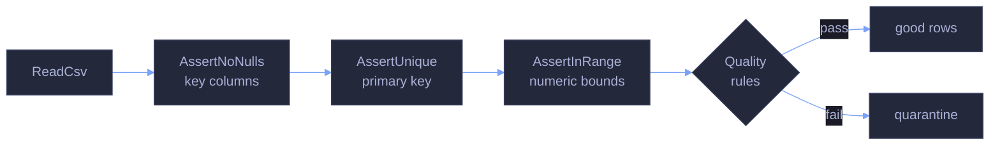

# 10 — Real-World Project, Testing & Migration

> [!quote]
> "Program testing can be used to show the presence of bugs, but never to show their absence."
>
> — **Edsger Dijkstra**, *Notes on Structured Programming*, EWD 249 (1970)

End-to-end analysis, validation, Pandas-to-Polars.NET guide.

```csharp
// Suppress CS1701/CS1702 assembly version warnings in .NET Interactive.
// NuGet packages targeting .NET 8/9 trigger these on .NET 10 — harmless.
// Run this cell ONCE before any cells that use NuGet packages.

using System.Reflection;
using Microsoft.DotNet.Interactive;
using Microsoft.DotNet.Interactive.CSharp;

var csharpKernel = (CSharpKernel)Kernel.Root.FindKernelByName("csharp");
var optionsField = typeof(CSharpKernel).GetField("_scriptOptions",
    BindingFlags.NonPublic | BindingFlags.Instance);

var scriptOptions = optionsField.GetValue(csharpKernel);
var withWarningLevel = scriptOptions.GetType().GetMethod("WithWarningLevel");
var newOptions = withWarningLevel.Invoke(scriptOptions, new object[] { 0 });
optionsField.SetValue(csharpKernel, newOptions);
```

```csharp
#r "nuget: Polars.NET, 0.4.0"
#r "nuget: Polars.NET.Native.win-x64, 0.4.0"

using System.IO;
using System.Linq;
using System.Diagnostics;
using Polars.CSharp;
using static Polars.CSharp.Polars;
using Microsoft.DotNet.Interactive.Formatting;

Formatter.Register<DataFrame>((df, writer) =>
{
    var html = df.ToHtml();
    html = System.Text.RegularExpressions.Regex.Replace(html, @"(>|>)(.+?)(<|<)", @"$1$2$3");
    html = System.Text.RegularExpressions.Regex.Replace(html, @">""(.+?)""<", @">$1<");
    var css = """
        """;
    writer.Write(css + html);
}, "text/html");
Formatter.Register<Polars.CSharp.Series>((s, writer) =>
    writer.Write($"<pre style='font-size:14px'>{s}</pre>"), "text/html");

var DATA = Path.Combine("..", "data");
Console.WriteLine($"Data directory: {Path.GetFullPath(DATA)}");
```

    Data directory: c:\Users\aperi\DEV\LANG\data

```csharp
var dfP = DataFrame.ReadCsv(Path.Combine(DATA, "eurostoxx50_ohlcv.csv"), tryParseDates: true);
var dimP = DataFrame.ReadCsv(Path.Combine(DATA, "index_dim.csv"));
display($"OHLCV: {dfP.Shape}  |  IndexDim: {dimP.Shape}");
```

    OHLCV: (66355, 12)  |  IndexDim: (169, 26)

---
## Testing & Assertions

Polars.NET ships no built-in testing module. The helpers below implement structural equality (shape, column names, dtypes) and business-rule validation using the expression API. All helpers return `DataFrame` so they can be chained in pipeline patterns.

> [!info] No Deedle in this notebook
> Deedle is not demonstrated here because it has no equivalent testing or validation API. The Polars.NET patterns below are the idiomatic C# approach and map closely to Python's `polars.testing` module — see the Python counterpart at [10_py_testing_migration](https://alp78.github.io/elysium/03-Dataframes/Dataframes-Python/10_py_testing_migration).

### DataFrame Equality Assertion

#### Polars.NET | Assert DataFrame equality

Compares two DataFrames for structural equality: row count, column count, column names, and column dtypes. Returns `true` on pass; prints each difference and returns `false` on fail.

Use this in unit tests for transformation functions — call after applying a known transformation and comparing against a pre-computed expected frame.

> [!warning] Value comparison not included
> This helper checks shape and `DataTypeName` only — it does **not** compare individual cell values. Polars.NET has no generic row-level equality method. For value comparison, use `.ToArray<T>()` on a specific type and compare with LINQ, or use `assert_frame_equal` in the Python layer.

_Defines a reusable `AssertDataFrameEqual` helper and validates it with two checks: a self-comparison on the 66,355-row OHLCV frame (pass) and a row-count mismatch against `Head(10)` (fail), confirming the helper correctly distinguishes structural equality from shape differences._

```csharp
bool AssertDataFrameEqual(DataFrame left, DataFrame right, string label = "")
{
    var errors = new List<string>();

    // Shape check — use Height / Width (not Shape.Rows)
    if (left.Height != right.Height)
        errors.Add($"Row count mismatch: {left.Height} vs {right.Height}");
    if (left.Width != right.Width)
        errors.Add($"Column count mismatch: {left.Width} vs {right.Width}");

    // Column names check
    var leftCols  = left.Columns.ToArray();
    var rightCols = right.Columns.ToArray();
    var missing = leftCols.Except(rightCols).ToArray();
    var extra   = rightCols.Except(leftCols).ToArray();
    if (missing.Length > 0) errors.Add($"Missing in right: {string.Join(", ", missing)}");
    if (extra.Length > 0)   errors.Add($"Extra in right: {string.Join(", ", extra)}");

    // Value comparison — column by column
    if (errors.Count == 0)
    {
        foreach (var col in leftCols)
        {
            var lSeries = left.Column(col);
            var rSeries = right.Column(col);
            if (lSeries.DataTypeName != rSeries.DataTypeName)
                errors.Add($"Column '{col}' dtype mismatch: {lSeries.DataTypeName} vs {rSeries.DataTypeName}");
        }
    }

    // Report
    var tag = string.IsNullOrEmpty(label) ? "" : $" [{label}]";
    if (errors.Count == 0)
    {
        Console.WriteLine($"PASS{tag}: DataFrames are equal ({left.Height} rows × {left.Width} cols)");
        return true;
    }
    Console.WriteLine($"FAIL{tag}:");
    foreach (var e in errors) Console.WriteLine($"  - {e}");
    return false;
}

// Test — compare dfP with itself
AssertDataFrameEqual(dfP, dfP, "self-check");

// Test — compare with a subset to see failure
var subset = dfP.Head(10);
AssertDataFrameEqual(dfP, subset, "full vs head(10)");
```

    PASS [self-check]: DataFrames are equal (66355 rows × 12 cols)
    FAIL [full vs head(10)]:
      - Row count mismatch: 66355 vs 10

### Schema Validation

#### Polars.NET | Validate schema

Checks that a DataFrame contains the expected column names with the expected `DataTypeName` strings. Use this at the entry point of a pipeline to catch upstream changes to column names or type inference before they propagate.

> [!info] `DataTypeName` vs `Dtype`
> Column type is accessed via `series.DataTypeName` (a string like `"f64"`, `"str"`, `"i64"`) — not a `.Dtype` property or enum. Match against the lowercase Polars type name strings used in the expression API.

_Validates the OHLCV DataFrame against a six-column expected schema — `symbol` (str), `open`/`high`/`low`/`close` (f64), `volume` (i64) — confirming all column names and `DataTypeName` strings match the declared types._

```csharp
void ValidateSchema(DataFrame df, Dictionary<string, string> expectedSchema, string label = "")
{
    var tag = string.IsNullOrEmpty(label) ? "" : $" [{label}]";
    var cols = df.Columns.ToArray();
    var errors = new List<string>();

    foreach (var kv in expectedSchema)
    {
        if (!cols.Contains(kv.Key))
        {
            errors.Add($"Missing column: '{kv.Key}'");
            continue;
        }
        var actual = df.Column(kv.Key).DataTypeName;
        if (actual != kv.Value)
            errors.Add($"Column '{kv.Key}': expected {kv.Value}, got {actual}");
    }

    if (errors.Count == 0)
        Console.WriteLine($"PASS{tag}: Schema matches ({expectedSchema.Count} columns validated)");
    else
    {
        Console.WriteLine($"FAIL{tag}:");
        foreach (var e in errors) Console.WriteLine($"  - {e}");
    }
}

// Define expected schema for OHLCV data
var expectedOhlcv = new Dictionary<string, string>
{
    ["symbol"] = "str",
    ["open"]   = "f64",
    ["high"]   = "f64",
    ["low"]    = "f64",
    ["close"]  = "f64",
    ["volume"] = "i64",
};

ValidateSchema(dfP, expectedOhlcv, "OHLCV schema");
```

    PASS [OHLCV schema]: Schema matches (6 columns validated)

### Null Auditing

#### Polars.NET | Null audit

Counts nulls per column and flags any column exceeding a configurable percentage threshold. Use this as a data-completeness gate before analytics — high null rates in key columns indicate upstream ingestion problems.

> [!info] `NullCount` is a property, not a method
> Access null counts via `df.Column(col).NullCount` — a property on `Series`. There is no `df.NullCount()` method on `DataFrame` as in Python's `df.null_count()`.

_Loads the `scores_daily` frame (466 rows, 37 columns) and audits it at a 1% null threshold, identifying four flagged columns — `pb_zscore`, `ev_ebitda_zscore`, `yield_zscore`, and `recommendation_mean` — with null rates ranging from 1.3% to 15.2%._

```csharp
void NullAudit(DataFrame df, double threshold = 0.05, string label = "")
{
    var tag = string.IsNullOrEmpty(label) ? "" : $" [{label}]";
    Console.WriteLine($"Null Audit{tag} — threshold: {threshold:P0} of {df.Height} rows");
    Console.WriteLine(new string('-', 55));

    var maxNulls = (int)(df.Height * threshold);
    var flagged = 0;

    foreach (var col in df.Columns)
    {
        // NullCount is a property on Series — not a method on DataFrame
        var nulls = df.Column(col).NullCount;
        var pct   = (double)nulls / df.Height;
        var flag  = nulls > maxNulls ? "  *** FLAGGED" : "";
        if (nulls > maxNulls) flagged++;
        Console.WriteLine($"  {col,-20} nulls={nulls,6}  ({pct:P1}){flag}");
    }

    Console.WriteLine(new string('-', 55));
    Console.WriteLine(flagged == 0
        ? "PASS: No columns exceed null threshold."
        : $"WARNING: {flagged} column(s) exceed null threshold.");
}

// scores_daily has real nulls in pe_zscore, pb_zscore, ev_ebitda_zscore, yield_zscore, recommendation_mean
var scP = DataFrame.ReadCsv(Path.Combine(DATA, "scores_daily.csv"), tryParseDates: true);
NullAudit(scP, 0.01, "scores_daily");
```

    Null Audit [scores_daily] — threshold: 1% of 466 rows
    -------------------------------------------------------
      id                   nulls=     0  (0.0%)
      _index               nulls=     0  (0.0%)
      symbol               nulls=     0  (0.0%)
      score_date           nulls=     0  (0.0%)
      sector               nulls=     0  (0.0%)
      pe_zscore            nulls=     3  (0.6%)
      pb_zscore            nulls=     6  (1.3%)  *** FLAGGED
      ev_ebitda_zscore     nulls=    71  (15.2%)  *** FLAGGED
      yield_zscore         nulls=    35  (7.5%)  *** FLAGGED
      relative_value_score nulls=     0  (0.0%)
      relative_value_rank  nulls=     0  (0.0%)
      relative_strength    nulls=     0  (0.0%)
      sma_50_ratio         nulls=     0  (0.0%)
      sma_200_ratio        nulls=     0  (0.0%)
      dist_from_52w_high   nulls=     0  (0.0%)
      momentum_score       nulls=     0  (0.0%)
      momentum_rank        nulls=     0  (0.0%)
      implied_upside       nulls=     0  (0.0%)
      recommendation_mean  nulls=    14  (3.0%)  *** FLAGGED
      price_falling_analysts_bullish nulls=     0  (0.0%)
      sentiment_score      nulls=     0  (0.0%)
      sentiment_rank       nulls=     0  (0.0%)
      composite_score      nulls=     0  (0.0%)
      composite_rank       nulls=     0  (0.0%)
      _scored_at           nulls=     0  (0.0%)
      sma_30_close         nulls=     0  (0.0%)
      sma_90_close         nulls=     0  (0.0%)
      market_cap           nulls=     0  (0.0%)
      index_weight         nulls=     0  (0.0%)
      short_name           nulls=     0  (0.0%)
      country              nulls=     0  (0.0%)
      current_price        nulls=     0  (0.0%)
      day_change_pct       nulls=     0  (0.0%)
      five_day_change_pct  nulls=     0  (0.0%)
      ytd_change_pct       nulls=     0  (0.0%)
      currency             nulls=     0  (0.0%)
    -------------------------------------------------------
    WARNING: 4 column(s) exceed null threshold.

### Duplicate Key Detection

#### Polars.NET | Detect duplicate keys

Groups by the primary key columns and counts occurrences; filters groups with count > 1. Use this before inserts or joins to enforce uniqueness constraints.

> [!warning] `GroupBy().Count()` does not exist
> Polars.NET has no `.Count()` shortcut on `GroupBy`. Use `.Agg(Col("any_col").Count().Alias("row_count"))` then filter the result. This differs from Python where `df.group_by("k").len()` works directly.

_Groups the OHLCV frame by `date` and `symbol`, aggregates row counts via `.Agg(Col("close").Count())`, and filters for groups with count > 1 — returning zero duplicates and confirming the composite primary key is unique across all 66,355 rows._

```csharp
var dupes = dfP
    .GroupBy("date", "symbol")
    .Agg(Col("close").Count().Alias("row_count"))
    .Filter(Col("row_count") > Lit(1));

Console.WriteLine($"Duplicate key check (date, symbol):");
Console.WriteLine($"  Groups with duplicates: {dupes.Height}");

if (dupes.Height > 0)
{
    Console.WriteLine("  Sample duplicates:");
    display(dupes.Head(5));
}
else
{
    Console.WriteLine("  PASS: No duplicate keys found.");
}
```

    Duplicate key check (date, symbol):
      Groups with duplicates: 0
      PASS: No duplicate keys found.

### OHLC Consistency Verification

#### Polars.NET | Verify OHLC consistency

Adds boolean columns for each relationship rule (`high >= low`, `close >= low`, `close <= high`), then counts violations using `.ToArray<int>()` and LINQ. Use this as a domain-specific data quality gate for financial OHLCV data.

> [!warning] Use C# comparison operators, not Polars method calls
> Polars.NET translates C# native operators (`>=`, `<=`, `==`) into expression trees. Do **not** use `.Gt()`, `.Lt()`, `.GtEq()` — these methods do not exist in Polars.NET. This differs from Python where `pl.col("a") >= pl.col("b")` uses Python operator overloading in the same way.

_Adds three boolean columns (`high_gte_low`, `close_gte_low`, `close_lte_high`) to the OHLCV frame, extracts each as an `int[]` via `.Cast(DataType.Int32).ToArray<int>()`, counts zeros with LINQ, and reports zero violations across all 66,355 rows._

```csharp
var ohlcCheck = dfP
    .WithColumns(
        (Col("high") >= Col("low")).Alias("high_gte_low"),
        (Col("close") >= Col("low")).Alias("close_gte_low"),
        (Col("close") <= Col("high")).Alias("close_lte_high")
    );

// Count violations — extract arrays, use LINQ
var highLowArr   = ohlcCheck.Column("high_gte_low").Cast(DataType.Int32).ToArray<int>();
var closeLowArr  = ohlcCheck.Column("close_gte_low").Cast(DataType.Int32).ToArray<int>();
var closeHighArr = ohlcCheck.Column("close_lte_high").Cast(DataType.Int32).ToArray<int>();

var highLowFails  = highLowArr.Count(v => v == 0);
var closeLowFails = closeLowArr.Count(v => v == 0);
var closeHighFails = closeHighArr.Count(v => v == 0);

Console.WriteLine($"OHLC Consistency Check ({dfP.Height} rows):");
Console.WriteLine($"  high >= low  violations: {highLowFails}");
Console.WriteLine($"  close >= low violations: {closeLowFails}");
Console.WriteLine($"  close <= high violations: {closeHighFails}");

var total = highLowFails + closeLowFails + closeHighFails;
Console.WriteLine(total == 0
    ? "  PASS: All OHLC relationships are consistent."
    : $"  WARNING: {total} total violation(s) found.");
```

    OHLC Consistency Check (66355 rows):
      high >= low  violations: 0
      close >= low violations: 0
      close <= high violations: 0
      PASS: All OHLC relationships are consistent.

---
## Data Quality Pipeline

The guard functions below enforce the same quality dimensions — completeness, uniqueness, referential integrity — defined in [data-quality-framework](https://alp78.github.io/elysium/14-Data-Architecture/Pipeline-Patterns/data-quality-framework). For a declarative approach to these same checks in the dbt layer, see [dbt-testing-framework](https://alp78.github.io/elysium/11-dbt/Quality/dbt-testing-framework).



### Chainable Assertion Guards

#### Polars.NET | Chainable assertion guards

Defines three guard functions — `AssertNoNulls`, `AssertUnique`, `AssertInRange` — each taking a `DataFrame`, validating a constraint, and returning the same `DataFrame` unchanged so calls can be chained. Throws `Exception` on violation so the pipeline stops immediately with a clear message.

> [!tip] Chainable pipeline guards
> Returning `DataFrame` from each guard enables a declarative chain: `var validated = AssertNoNulls(df, cols).AssertUnique(...)`. This is the idiomatic pattern in Polars.NET — equivalent to using `.pipe(assert_fn)` in Python Polars.

_Defines `AssertNoNulls`, `AssertUnique`, and `AssertInRange`, then chains all three on the OHLCV frame — verifying `symbol` and `date` have no nulls, the `date`/`symbol` primary key is unique, and `volume` falls within `[0, double.MaxValue]` — with all three assertions passing._

```csharp
DataFrame AssertNoNulls(DataFrame df, string[] columns, string label = "")
{
    var tag = string.IsNullOrEmpty(label) ? "" : $" [{label}]";
    foreach (var col in columns)
    {
        var nulls = df.Column(col).NullCount;
        if (nulls > 0)
            throw new Exception($"AssertNoNulls{tag}: Column '{col}' has {nulls} null(s)");
    }
    Console.WriteLine($"  AssertNoNulls{tag}: PASS ({columns.Length} columns clean)");
    return df;
}

DataFrame AssertUnique(DataFrame df, string[] keyColumns, string label = "")
{
    var tag = string.IsNullOrEmpty(label) ? "" : $" [{label}]";
    var dupeCount = df
        .GroupBy(keyColumns)
        .Agg(Col(keyColumns[0]).Count().Alias("_cnt"))
        .Filter(Col("_cnt") > Lit(1))
        .Height;
    if (dupeCount > 0)
        throw new Exception($"AssertUnique{tag}: {dupeCount} duplicate group(s) on [{string.Join(", ", keyColumns)}]");
    Console.WriteLine($"  AssertUnique{tag}: PASS (keys unique)");
    return df;
}

DataFrame AssertInRange(DataFrame df, string column, double min, double max, string label = "")
{
    var tag = string.IsNullOrEmpty(label) ? "" : $" [{label}]";
    var violations = df
        .Filter((Col(column) < Lit(min)) | (Col(column) > Lit(max)))
        .Height;
    if (violations > 0)
        throw new Exception($"AssertInRange{tag}: {violations} value(s) in '{column}' outside [{min}, {max}]");
    Console.WriteLine($"  AssertInRange{tag}: PASS ('{column}' in [{min}, {max}])");
    return df;
}

// Chain guards on OHLCV data
Console.WriteLine("Running assertion guards on OHLCV data:");
try
{
    var validated = AssertNoNulls(dfP, new[] { "symbol", "date" }, "keys");
    validated = AssertUnique(validated, new[] { "date", "symbol" }, "pk");
    validated = AssertInRange(validated, "volume", 0, double.MaxValue, "volume");
    Console.WriteLine("All assertions passed.");
}
catch (Exception ex)
{
    Console.WriteLine($"Assertion failed: {ex.Message}");
}
```

    Running assertion guards on OHLCV data:
      AssertNoNulls [keys]: PASS (2 columns clean)
      AssertUnique [pk]: PASS (keys unique)
      AssertInRange [volume]: PASS ('volume' in [0, 1.7976931348623157E+308])
    All assertions passed.

### Referential Integrity Check

#### Polars.NET | Referential integrity check

Finds orphan rows — records in the fact table whose key has no matching row in the dimension table — using an anti-join. Returns only the rows from the left frame that have no match on the right. Use before loading fact data to verify all foreign keys resolve.

> [!info] Anti-join syntax
> `JoinType.Anti` keeps only left-frame rows that have **no** match on the join keys. Syntax: `df.Join(other, new[] { Col("key") }, new[] { Col("key") }, JoinType.Anti)`. The right frame's columns are not included in the output.

_Extracts the 50 unique symbols from the OHLCV fact table and anti-joins them against the 169-row dimension table on `symbol` — confirming zero orphan records and that every OHLCV ticker has a corresponding dimension entry._

```csharp
var uniqueSymbols = dfP
    .Select(Col("symbol"))
    .Unique();

var orphans = uniqueSymbols.Join(
    dimP,
    new[] { Col("symbol") },
    new[] { Col("symbol") },
    JoinType.Anti
);

Console.WriteLine($"Referential integrity check:");
Console.WriteLine($"  Unique symbols in OHLCV: {uniqueSymbols.Height}");
Console.WriteLine($"  Symbols in dim_country:  {dimP.Height}");
Console.WriteLine($"  Orphan symbols:          {orphans.Height}");

if (orphans.Height > 0)
{
    Console.WriteLine("  Orphan symbols found:");
    display(orphans);
}
else
{
    Console.WriteLine("  PASS: All symbols have dimension records.");
}
```

    Referential integrity check:
      Unique symbols in OHLCV: 50
      Symbols in dim_country:  169
      Orphan symbols:          0
      PASS: All symbols have dimension records.

### Date Gap Detection

#### Polars.NET | Date gap detection

Computes the interval between consecutive trading dates per symbol using `.Shift(1)` on the date column, then filters for gaps exceeding a threshold. Trading calendars have regular weekend gaps (3 days); gaps > 4 calendar days indicate a missed trading day or data outage.

> [!warning] Polars durations are in microseconds
> `Col("date") - Col("date").Shift(1)` produces a Duration column in **microseconds**, not days. Cast to `Int64` to get raw μs, then compare against `4L * 24 * 60 * 60 * 1_000_000` for a 4-day threshold. The output column `date_diff` displays as `432000000000us` — divide by `86_400_000_000` to convert to days.

_Filters the OHLCV frame to ASML.AS (1,331 trading days), computes consecutive date intervals via `.Shift(1)`, casts durations to microseconds as `Int64`, and identifies 7 gaps exceeding 4 calendar days — all corresponding to Easter holiday periods._

```csharp
var sym = "ASML.AS";
var symDf = dfP
    .Filter(Col("symbol") == Lit(sym))
    .Sort("date");

// Compute day difference between consecutive rows
var withGap = symDf
    .WithColumns(
        (Col("date") - Col("date").Shift(1)).Alias("date_diff")
    );

// Extract date_diff array — look for gaps > 4 days (skip weekends = 3 days)
// Duration is in microseconds in Polars — cast to get usable values
var gapDf = withGap
    .WithColumns(
        Col("date_diff").Cast(DataType.Int64).Alias("diff_us")
    )
    .Filter(Col("diff_us") > Lit(4L * 24 * 60 * 60 * 1_000_000));

Console.WriteLine($"Date gap analysis for {sym}:");
Console.WriteLine($"  Total trading days: {symDf.Height}");
Console.WriteLine($"  Gaps > 4 calendar days: {gapDf.Height}");

if (gapDf.Height > 0)
{
    // Show date and gap size — select relevant columns
    var keepCols = new[] { "date", "date_diff" };
    var gapReport = gapDf.Select(keepCols.Select(c => Col(c)).ToArray());
    display(gapReport.Head(10));
}
else
{
    Console.WriteLine("  No significant gaps detected.");
}
```

    Date gap analysis for ASML.AS:
      Total trading days: 1331
      Gaps > 4 calendar days: 7

<!-- Polars DataFrame: (7 rows, 2 columns) --><table><thead><tr><th>date</th><th>date_diff</th></tr></thead><tbody><tr><td>2021-04-06</td><td>432000000000us</td></tr><tr><td>2022-04-19</td><td>432000000000us</td></tr><tr><td>2023-04-11</td><td>432000000000us</td></tr><tr><td>2023-12-27</td><td>432000000000us</td></tr><tr><td>2024-04-02</td><td>432000000000us</td></tr></tbody></table></div>

### Quarantine Pattern

#### Polars.NET | Quarantine pattern

Splits a DataFrame into a `good` partition (rows passing all quality rules) and a `bad` partition (rows failing any rule) using complementary filter expressions. Bad rows are not discarded — they are routed to a quarantine table for investigation. Confirm `good.Height + bad.Height == total` as a sum check.

_Splits the OHLCV frame using complementary filter rules — non-null close, volume > 0, high ≥ low — routing 65,704 clean rows to `good` and 651 zero-volume rows to `bad`, then confirms the partition sum equals the original 66,355 total._

```csharp
var qualityRules =
    Col("close").IsNotNull()
    & (Col("volume") > Lit(0.0))
    & (Col("high") >= Col("low"));

var good = dfP.Filter(qualityRules);
// Negate: find rows that fail ANY rule
var badRules =
    Col("close").IsNull()
    | (Col("volume") <= Lit(0.0))
    | (Col("high") < Col("low"));
var bad = dfP.Filter(badRules);

Console.WriteLine("Quarantine split results:");
Console.WriteLine($"  Total rows:       {dfP.Height}");
Console.WriteLine($"  Good rows:        {good.Height}");
Console.WriteLine($"  Quarantined rows: {bad.Height}");
Console.WriteLine($"  Sum check:        {good.Height + bad.Height} (should equal {dfP.Height})");

if (bad.Height > 0)
{
    Console.WriteLine("  Sample quarantined rows:");
    display(bad.Head(5));
}
else
{
    Console.WriteLine("  All rows pass quality checks.");
}
```

    Quarantine split results:
      Total rows:       66355
      Good rows:        65704
      Quarantined rows: 651
      Sum check:        66355 (should equal 66355)
      Sample quarantined rows:

<!-- Polars DataFrame: (5 rows, 12 columns) --><table><thead><tr><th>id</th><th>symbol</th><th>date</th><th>open</th><th>high</th><th>low</th><th>close</th><th>adj_close</th><th>volume</th><th>dividends</th><th>stock_splits</th><th>is_filled</th></tr></thead><tbody><tr><td>62326</td><td>ADS.DE</td><td>2021-12-07</td><td>255.25</td><td>255.25</td><td>255.25</td><td>255.25</td><td>246.503</td><td>0</td><td>0</td><td>0</td><td>false</td></tr><tr><td>62419</td><td>ADS.DE</td><td>2022-04-21</td><td>208.05</td><td>208.05</td><td>208.05</td><td>208.05</td><td>200.9205</td><td>0</td><td>0</td><td>0</td><td>false</td></tr><tr><td>62420</td><td>ADS.DE</td><td>2022-04-22</td><td>208.05</td><td>208.05</td><td>208.05</td><td>208.05</td><td>200.9205</td><td>0</td><td>0</td><td>0</td><td>false</td></tr><tr><td>62423</td><td>ADS.DE</td><td>2022-04-27</td><td>188.44</td><td>188.44</td><td>188.44</td><td>188.44</td><td>181.9825</td><td>0</td><td>0</td><td>0</td><td>false</td></tr><tr><td>62430</td><td>ADS.DE</td><td>2022-05-06</td><td>188.22</td><td>188.22</td><td>188.22</td><td>188.22</td><td>181.77</td><td>0</td><td>0</td><td>0</td><td>false</td></tr></tbody></table></div>

---
## Python to C# Migration Guide

The table below maps common **Python Polars** patterns to their **C# Polars.NET** equivalents.

> [!info] Key API differences Python → C#
> The three most common migration mistakes: (1) `IfElse()` not `When().Then().Otherwise()` — the conditional API is completely different; (2) C# operators (`>`, `<`, `==`) not `.Gt()`/`.Lt()` — Polars.NET overloads the C# operators; (3) `.Sort()` chains for multi-column sort — no multi-key overload exists.

Many Python idioms do not translate 1:1 — pay close attention to the gotchas column.

| Operation | Python Polars | C# Polars.NET | Gotcha |
|---|---|---|---|
| **Read CSV** | `pl.read_csv("f.csv")` | `DataFrame.ReadCsv("f.csv")` | Use `tryParseDates: true` for dates |
| **Select** | `df.select("a", "b")` | `df.Select(Col("a"), Col("b"))` | Use `Col()` expressions |
| **Filter** | `df.filter(pl.col("x") > 5)` | `df.Filter(Col("x") > Lit(5))` | C# operators (`>`, `<`, `==`) — no `.Gt()` |
| **WithColumns** | `df.with_columns(expr)` | `df.WithColumns(expr)` | Same pattern |
| **Alias** | `expr.alias("name")` | `expr.Alias("name")` | Same pattern |
| **Sort single** | `df.sort("col")` | `df.Sort("col")` | Same pattern |
| **Sort multi** | `df.sort(["a","b"], descending=[True, False])` | `df.Sort("b").Sort("a", descending: true)` | Chain single `.Sort()` calls — no multi-column sort |
| **Drop columns** | `df.drop(["a", "b"])` | `df.Select(keepCols)` | `Drop()` takes single string only — use `Select` to keep the rest |
| **GroupBy + Agg** | `df.group_by("k").agg(pl.col("v").sum())` | `df.GroupBy("k").Agg(Col("v").Sum().Alias("v_sum"))` | No `.Count()` on GroupBy — use `.Agg(Col(...).Count().Alias(...))` |
| **Conditional** | `pl.when(c).then(a).otherwise(b)` | `IfElse(cond, trueExpr, falseExpr)` | No `When`/`Then`/`Otherwise` in Polars.NET |
| **Join** | `df.join(other, on="k", how="left")` | `df.Join(other, new[] { Col("k") }, new[] { Col("k") }, JoinType.Left)` | Separate left/right key arrays + `JoinType` enum |
| **VStack** | `pl.concat([df1, df2])` | `df1.VStack(df2)` | No `Concat` — use `VStack` |
| **Cast** | `col.cast(pl.Float64)` | `col.Cast(DataType.Float64)` | `DataType.X` enum — no string casts |
| **Null literal** | `pl.lit(None)` | `Lit((string)null)` | Must cast `null` — `Lit(null)` is ambiguous |
| **Null count** | `df.null_count()` | `df.Column(col).NullCount` | Property on Series — not method on DataFrame |
| **Unique count** | `series.n_unique()` | `series.NUnique` | Property — not a method |
| **Shape** | `df.shape` → `(rows, cols)` | `df.Height` / `df.Width` | No `.Shape.Rows` — use `Height` / `Width` |
| **New DataFrame** | `pl.DataFrame({"a": s1, "b": s2})` | `new DataFrame(new Series[] { s1, s2 })` | No `FromColumns` — constructor with Series array |
| **Map elements** | `col.map_elements(fn)` | Extract array + LINQ + `Series.From` + `HStack` | No `MapElements` — manual loop |
| **Add column** | `df.with_columns(series)` | `df.HStack(series)` | `WithColumn` for expressions; `HStack` for Series |

### Migration Demo Pipeline

#### Polars.NET | Migration demo pipeline

Translates a typical Python Polars analysis pipeline step-by-step to idiomatic C# Polars.NET. The Python version uses `when().then().otherwise()` for the conditional column; the C# version replaces this with `IfElse()`. Grouping and aggregation syntax is nearly identical.

_Filters the OHLCV frame to ASML.AS, adds `intraday_change` and a directional `up`/`down` column via `IfElse`, then groups by direction to compare average close prices (~675 up vs ~667 down) and total volume — demonstrating the full Python-to-C# translation including the `IfElse` replacement for `when().then().otherwise()`._

```csharp
// Python equivalent:
//   df.filter(pl.col("symbol") == "ASML.AS")
//     .with_columns((pl.col("close") - pl.col("open")).alias("intraday_change"))
//     .with_columns(
//         pl.when(pl.col("intraday_change") > 0)
//           .then(pl.lit("up"))
//           .otherwise(pl.lit("down"))
//           .alias("direction")
//     )
//     .group_by("direction")
//     .agg([pl.col("close").mean(), pl.col("volume").sum()])
//     .sort("direction")

// C# Polars.NET translation:
var pipeline = dfP
    .Filter(Col("symbol") == Lit("ASML.AS"))
    .WithColumns(
        (Col("close") - Col("open")).Alias("intraday_change")
    )
    .WithColumns(
        // IfElse — not When/Then/Otherwise
        IfElse(
            Col("intraday_change") > Lit(0.0),
            Lit("up"),
            Lit("down")
        ).Alias("direction")
    )
    .GroupBy("direction")
    .Agg(
        Col("close").Mean().Alias("avg_close"),
        Col("volume").Sum().Alias("total_volume")
    )
    .Sort("direction");

Console.WriteLine("Migration demo — ASML direction summary:");
display(pipeline);
```

    Migration demo — ASML direction summary:

<!-- Polars DataFrame: (2 rows, 3 columns) --><table><thead><tr><th>direction</th><th>avg_close</th><th>total_volume</th></tr></thead><tbody><tr><td>down</td><td>667.177735</td><td>468134431</td></tr><tr><td>up</td><td>675.3182551</td><td>476936289</td></tr></tbody></table></div>

---
## Debugging & Profiling

When a multi-step pipeline produces unexpected results, break it into named variables and inspect shape and head at each step. Polars.NET has no `.pipe()` method, so the equivalent pattern is intermediate variable assignment.

### Step-by-Step Pipeline Inspection

#### Polars.NET | Step-by-step pipeline inspection

Breaks a pipeline into named steps (`step1`, `step2`, `step3`), printing shape and a `.Head(3)` preview after each. Use this to localize where a pipeline produces wrong row counts, unexpected nulls, or wrong column values.

> [!tip] Inspect at each step
> Polars.NET DataFrames are **immutable** — each operation returns a new frame. Assigning intermediate results to named variables has zero cost (no data is copied) and makes inspection trivial. This is the preferred alternative to Python's `.pipe(debug_fn)` pattern.

_Decomposes a three-step pipeline for SAN.MC — filtering to 1,329 rows, sorting and adding `daily_return_pct` via `.Shift(1)`, then isolating 141 high-volatility days where the absolute daily return exceeds 3% — printing shape and a `.Head(3)` preview after each step._

```csharp
Console.WriteLine("=== Step 1: Filter to single symbol ===");
var step1 = dfP.Filter(Col("symbol") == Lit("SAN.MC"));
Console.WriteLine($"  Shape: {step1.Height} rows × {step1.Width} cols");
display(step1.Head(3));

Console.WriteLine("\n=== Step 2: Add daily return ===");
var step2 = step1
    .Sort("date")
    .WithColumns(
        ((Col("close") - Col("close").Shift(1)) / Col("close").Shift(1) * Lit(100.0))
            .Alias("daily_return_pct")
    );
Console.WriteLine($"  Shape: {step2.Height} rows × {step2.Width} cols");
display(step2.Head(3));

Console.WriteLine("\n=== Step 3: Filter high-volatility days ===");
var step3 = step2.Filter(
    Col("daily_return_pct").IsNotNull()
    & ((Col("daily_return_pct") > Lit(3.0)) | (Col("daily_return_pct") < Lit(-3.0)))
);
Console.WriteLine($"  Shape: {step3.Height} rows × {step3.Width} cols");
display(step3.Head(5));
```

    === Step 1: Filter to single symbol ===
      Shape: 1329 rows × 12 cols

<!-- Polars DataFrame: (3 rows, 12 columns) --><table><thead><tr><th>id</th><th>symbol</th><th>date</th><th>open</th><th>high</th><th>low</th><th>close</th><th>adj_close</th><th>volume</th><th>dividends</th><th>stock_splits</th><th>is_filled</th></tr></thead><tbody><tr><td>10578</td><td>SAN.MC</td><td>2021-01-04</td><td>2.592</td><td>2.5975</td><td>2.514</td><td>2.5665</td><td>2.1491</td><td>61027452</td><td>0</td><td>0</td><td>false</td></tr><tr><td>10579</td><td>SAN.MC</td><td>2021-01-05</td><td>2.5335</td><td>2.5935</td><td>2.528</td><td>2.5755</td><td>2.1566</td><td>34085777</td><td>0</td><td>0</td><td>false</td></tr><tr><td>10580</td><td>SAN.MC</td><td>2021-01-06</td><td>2.6495</td><td>2.7925</td><td>2.6295</td><td>2.7525</td><td>2.3048</td><td>73687945</td><td>0</td><td>0</td><td>false</td></tr></tbody></table></div>

    
    === Step 2: Add daily return ===
      Shape: 1329 rows × 13 cols

<!-- Polars DataFrame: (3 rows, 13 columns) --><table><thead><tr><th>id</th><th>symbol</th><th>date</th><th>open</th><th>high</th><th>low</th><th>close</th><th>adj_close</th><th>volume</th><th>dividends</th><th>stock_splits</th><th>is_filled</th><th>daily_return_pct</th></tr></thead><tbody><tr><td>10578</td><td>SAN.MC</td><td>2021-01-04</td><td>2.592</td><td>2.5975</td><td>2.514</td><td>2.5665</td><td>2.1491</td><td>61027452</td><td>0</td><td>0</td><td>false</td><td>null</td></tr><tr><td>10579</td><td>SAN.MC</td><td>2021-01-05</td><td>2.5335</td><td>2.5935</td><td>2.528</td><td>2.5755</td><td>2.1566</td><td>34085777</td><td>0</td><td>0</td><td>false</td><td>0.3506721216</td></tr><tr><td>10580</td><td>SAN.MC</td><td>2021-01-06</td><td>2.6495</td><td>2.7925</td><td>2.6295</td><td>2.7525</td><td>2.3048</td><td>73687945</td><td>0</td><td>0</td><td>false</td><td>6.872451951</td></tr></tbody></table></div>

    
    === Step 3: Filter high-volatility days ===
      Shape: 141 rows × 13 cols

<!-- Polars DataFrame: (5 rows, 13 columns) --><table><thead><tr><th>id</th><th>symbol</th><th>date</th><th>open</th><th>high</th><th>low</th><th>close</th><th>adj_close</th><th>volume</th><th>dividends</th><th>stock_splits</th><th>is_filled</th><th>daily_return_pct</th></tr></thead><tbody><tr><td>10580</td><td>SAN.MC</td><td>2021-01-06</td><td>2.6495</td><td>2.7925</td><td>2.6295</td><td>2.7525</td><td>2.3048</td><td>73687945</td><td>0</td><td>0</td><td>false</td><td>6.872451951</td></tr><tr><td>10593</td><td>SAN.MC</td><td>2021-01-25</td><td>2.5985</td><td>2.6185</td><td>2.4755</td><td>2.49</td><td>2.085</td><td>50395819</td><td>0</td><td>0</td><td>false</td><td>-3.525765207</td></tr><tr><td>10595</td><td>SAN.MC</td><td>2021-01-27</td><td>2.51</td><td>2.524</td><td>2.422</td><td>2.4325</td><td>2.0369</td><td>55168498</td><td>0</td><td>0</td><td>false</td><td>-3.948667325</td></tr><tr><td>10599</td><td>SAN.MC</td><td>2021-02-02</td><td>2.438</td><td>2.5615</td><td>2.4315</td><td>2.537</td><td>2.1244</td><td>74092009</td><td>0</td><td>0</td><td>false</td><td>4.964832437</td></tr><tr><td>10601</td><td>SAN.MC</td><td>2021-02-04</td><td>2.57</td><td>2.7045</td><td>2.5385</td><td>2.69</td><td>2.2525</td><td>91259735</td><td>0</td><td>0</td><td>false</td><td>5.324980423</td></tr></tbody></table></div>

### Peek Helper for Chain Debugging

#### Polars.NET | Peek helper for chain debugging

Defines a `Peek` helper that prints shape + head and returns the input `DataFrame` unchanged, enabling it to be inserted anywhere inside a chained expression without breaking the chain.

> [!tip] Use Peek for chain debugging
> Since Polars.NET has no `.pipe()` method, wrap each intermediate result in `Peek(...)` to observe it mid-chain. Remove `Peek` calls before production — the `display()` call targets the .NET Interactive kernel.

_Defines a `Peek` helper and threads it through a three-step BNP.PA pipeline — filter (1,331 rows × 12 cols), sort (shape unchanged), and `daily_range` addition (1,331 rows × 13 cols) — confirming shape and a `.Head(3)` preview at each intermediate stage without breaking the chain._

```csharp
DataFrame Peek(DataFrame df, string label = "")
{
    var tag = string.IsNullOrEmpty(label) ? "" : $" [{label}]";
    Console.WriteLine($"--- Peek{tag}: {df.Height} rows × {df.Width} cols ---");
    display(df.Head(3));
    return df;
}

// Chain Peek through a multi-step pipeline
var result = Peek(
    Peek(
        Peek(
            dfP.Filter(Col("symbol") == Lit("BNP.PA")),
            "1-filter"
        )
        .Sort("date"),
        "2-sorted"
    )
    .WithColumns(
        (Col("high") - Col("low")).Alias("daily_range")
    ),
    "3-with-range"
);
```

    --- Peek [1-filter]: 1331 rows × 12 cols ---

<!-- Polars DataFrame: (3 rows, 12 columns) --><table><thead><tr><th>id</th><th>symbol</th><th>date</th><th>open</th><th>high</th><th>low</th><th>close</th><th>adj_close</th><th>volume</th><th>dividends</th><th>stock_splits</th><th>is_filled</th></tr></thead><tbody><tr><td>25123</td><td>BNP.PA</td><td>2021-01-04</td><td>43.86</td><td>43.915</td><td>42.64</td><td>43.01</td><td>30.4027</td><td>3025708</td><td>0</td><td>0</td><td>false</td></tr><tr><td>25124</td><td>BNP.PA</td><td>2021-01-05</td><td>42.72</td><td>43.475</td><td>42.315</td><td>42.92</td><td>30.3391</td><td>2852830</td><td>0</td><td>0</td><td>false</td></tr><tr><td>25125</td><td>BNP.PA</td><td>2021-01-06</td><td>43.97</td><td>46.01</td><td>43.78</td><td>45.29</td><td>32.0143</td><td>5959237</td><td>0</td><td>0</td><td>false</td></tr></tbody></table></div>

    --- Peek [2-sorted]: 1331 rows × 12 cols ---

<!-- Polars DataFrame: (3 rows, 12 columns) --><table><thead><tr><th>id</th><th>symbol</th><th>date</th><th>open</th><th>high</th><th>low</th><th>close</th><th>adj_close</th><th>volume</th><th>dividends</th><th>stock_splits</th><th>is_filled</th></tr></thead><tbody><tr><td>25123</td><td>BNP.PA</td><td>2021-01-04</td><td>43.86</td><td>43.915</td><td>42.64</td><td>43.01</td><td>30.4027</td><td>3025708</td><td>0</td><td>0</td><td>false</td></tr><tr><td>25124</td><td>BNP.PA</td><td>2021-01-05</td><td>42.72</td><td>43.475</td><td>42.315</td><td>42.92</td><td>30.3391</td><td>2852830</td><td>0</td><td>0</td><td>false</td></tr><tr><td>25125</td><td>BNP.PA</td><td>2021-01-06</td><td>43.97</td><td>46.01</td><td>43.78</td><td>45.29</td><td>32.0143</td><td>5959237</td><td>0</td><td>0</td><td>false</td></tr></tbody></table></div>

    --- Peek [3-with-range]: 1331 rows × 13 cols ---

<!-- Polars DataFrame: (3 rows, 13 columns) --><table><thead><tr><th>id</th><th>symbol</th><th>date</th><th>open</th><th>high</th><th>low</th><th>close</th><th>adj_close</th><th>volume</th><th>dividends</th><th>stock_splits</th><th>is_filled</th><th>daily_range</th></tr></thead><tbody><tr><td>25123</td><td>BNP.PA</td><td>2021-01-04</td><td>43.86</td><td>43.915</td><td>42.64</td><td>43.01</td><td>30.4027</td><td>3025708</td><td>0</td><td>0</td><td>false</td><td>1.275</td></tr><tr><td>25124</td><td>BNP.PA</td><td>2021-01-05</td><td>42.72</td><td>43.475</td><td>42.315</td><td>42.92</td><td>30.3391</td><td>2852830</td><td>0</td><td>0</td><td>false</td><td>1.16</td></tr><tr><td>25125</td><td>BNP.PA</td><td>2021-01-06</td><td>43.97</td><td>46.01</td><td>43.78</td><td>45.29</td><td>32.0143</td><td>5959237</td><td>0</td><td>0</td><td>false</td><td>2.23</td></tr></tbody></table></div>

### Stopwatch Profiling

#### Polars.NET | Stopwatch profiling

Wraps each pipeline step in `sw.Restart()` / `sw.Stop()` calls and accumulates timings into a list. Polars.NET has no `.profile()` method (unlike Python Polars' `.lazy().profile()`), so `Stopwatch` is the standard approach for identifying bottlenecks.

> [!info] Polars.NET vs Python profiling
> Python Polars supports `.lazy().profile()` which returns per-node execution times from the query optimizer. Polars.NET has no equivalent — use `Stopwatch` per step. For large datasets, the most expensive step is typically `ReadCsv` (I/O bound) or `GroupBy+Agg` (CPU bound).

_Profiles six pipeline steps on the full OHLCV dataset — `ReadCsv`, `Filter`, `Sort`, `WithColumns`, `GroupBy+Agg`, and `Join` — using `Stopwatch.Restart()` / `Stopwatch.Stop()` per step, accumulating elapsed milliseconds into a list and printing a timing report showing `ReadCsv` at 5 ms dominates the 5 ms total._

```csharp
var sw = new Stopwatch();
var timings = new List<(string Step, long Ms)>();

// Step 1 — Reload CSV
sw.Restart();
var tDf = DataFrame.ReadCsv(Path.Combine(DATA, "eurostoxx50_ohlcv.csv"), tryParseDates: true);
sw.Stop();
timings.Add(("ReadCsv", sw.ElapsedMilliseconds));

// Step 2 — Filter
sw.Restart();
var tFiltered = tDf.Filter(Col("symbol") == Lit("ASML.AS"));
sw.Stop();
timings.Add(("Filter", sw.ElapsedMilliseconds));

// Step 3 — Sort
sw.Restart();
var tSorted = tFiltered.Sort("date");
sw.Stop();
timings.Add(("Sort", sw.ElapsedMilliseconds));

// Step 4 — WithColumns (add computed column)
sw.Restart();
var tEnriched = tSorted.WithColumns(
    (Col("high") - Col("low")).Alias("range"),
    ((Col("close") - Col("open")) / Col("open") * Lit(100.0)).Alias("pct_change")
);
sw.Stop();
timings.Add(("WithColumns", sw.ElapsedMilliseconds));

// Step 5 — GroupBy + Agg
sw.Restart();
var tAgg = tDf
    .GroupBy("symbol")
    .Agg(
        Col("close").Mean().Alias("avg_close"),
        Col("volume").Sum().Alias("total_vol"),
        Col("close").Count().Alias("n_days")
    );
sw.Stop();
timings.Add(("GroupBy+Agg", sw.ElapsedMilliseconds));

// Step 6 — Join
sw.Restart();
var tJoined = tAgg.Join(
    dimP,
    new[] { Col("symbol") },
    new[] { Col("symbol") },
    JoinType.Left
);
sw.Stop();
timings.Add(("Join", sw.ElapsedMilliseconds));

// Report
Console.WriteLine("Pipeline timing report:");
Console.WriteLine(new string('-', 40));
foreach (var (step, ms) in timings)
{
    Console.WriteLine($"  {step,-20} {ms,6} ms");
}
Console.WriteLine(new string('-', 40));
Console.WriteLine($"  {"TOTAL",-20} {timings.Sum(t => t.Ms),6} ms");
```

    Pipeline timing report:
    ----------------------------------------
      ReadCsv                   5 ms
      Filter                    0 ms
      Sort                      0 ms
      WithColumns               0 ms
      GroupBy+Agg               0 ms
      Join                      0 ms
    ----------------------------------------
      TOTAL                     5 ms

---
## Summary

### Key lessons

| Topic | Lesson |
|---|---|
| **Assertion helpers** | Build reusable guard functions that return `DataFrame` for chaining |
| **Schema validation** | Check column names + `DataTypeName` (not `Dtype`) before pipeline runs |
| **Null auditing** | Use `series.NullCount` (property) — not `df.NullCount()` |
| **Duplicate detection** | `GroupBy().Agg(Col(...).Count().Alias(...))` then `Filter` — no shortcut `.Count()` |
| **Anti-join** | `JoinType.Anti` finds orphan/missing keys across tables |
| **Quarantine pattern** | Filter with quality rules, split into good/bad partitions |
| **Migration from Python** | `IfElse` not `When/Then`, C# operators not `.Gt()`, chain `.Sort()` calls |
| **Debugging** | `Peek()` helper wraps `Head` + shape print and returns `df` for chaining |
| **Profiling** | `Stopwatch` per step — simple and effective for pipeline bottleneck analysis |

#### Previous notebooks

| # | Notebook | Topic |
|---|---|---|
| 01 | `01_cs_foundations_io.ipynb` | Foundations & I/O |
| 02 | `02_cs_explore_select_filter.ipynb` | Explore, Select, Filter |
| 03 | `03_cs_transforms_expressions_chaining.ipynb` | Transforms & Expressions |
| 04 | `04_cs_missing_strings_datetime.ipynb` | Missing, Strings, DateTime |
| 05 | `05_cs_aggregation_reshaping.ipynb` | Aggregation & Reshaping |
| 06 | `06_cs_lazy_performance.ipynb` | Lazy & Performance |
| 07 | `07_cs_types_interop.ipynb` | Types & Interop |
| 08 | `08_cs_visualization.ipynb` | Visualization |
| 09 | `09_cs_database_interface.ipynb` | Database & SQL Interface |
