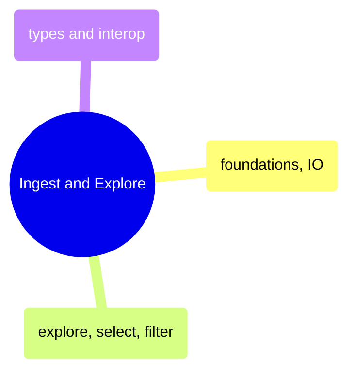

# Ingest and Explore

DataFrame foundations, data loading, exploration, selection, filtering, and type interop across Pandas, Polars, and their C# counterparts.

> [!abstract]- Foundations and IO
>
> - Series creation and indexing — [[01-py-foundations-io#Series|py]] · [[01-cs-foundations-io#Series|cs]]
> - DataFrame construction and column access — [[01-py-foundations-io#DataFrame|py]] · [[01-cs-foundations-io#DataFrames|cs]]
> - Data types and type system — [[01-py-foundations-io#Data Types Deep Dive|py]] · [[01-cs-foundations-io#Data Types Deep Dive|cs]]
> - Reading CSV, JSON, and Parquet — [[01-py-foundations-io#Loading Real Data from Multiple Formats|py]] · [[01-cs-foundations-io#Loading Real Data|cs]]
> - Writing data to disk — [[01-py-foundations-io#Writing Data|py]] · [[01-cs-foundations-io#Writing Data|cs]]
> - Edge cases and gotchas — [[01-py-foundations-io#Edge Cases and Gotchas|py]] · [[01-cs-foundations-io#Edge Cases & Gotchas|cs]]

> [!abstract]- Explore, Select, and Filter
>
> - Head, tail, slice, and sample — [[02-py-explore-select-filter#head, tail, slice, sample|py]] · [[02-cs-explore-select-filter#Data Exploration|cs]]
> - Data profiling strategies — [[02-py-explore-select-filter#Data Profiling Strategies|py]] · [[02-cs-explore-select-filter#Data Exploration|cs]]
> - Column selection by name, dtype, and pattern — [[02-py-explore-select-filter#Single Column Selection|py]] · [[02-cs-explore-select-filter#Column Selection|cs]]
> - Boolean filtering and multiple conditions — [[02-py-explore-select-filter#Boolean Indexing (Single Condition)|py]] · [[02-cs-explore-select-filter#Row Filtering|cs]]
> - Row access and slicing — [[02-py-explore-select-filter#Selecting Rows by Position|py]] · [[02-cs-explore-select-filter#Row Access & Slicing|cs]]

> [!abstract]- Types and Interop
>
> - Categoricals and enums — [[07-py-types-interop#Categorical|py]] · [[07-cs-types-interop#Advanced Data Types|cs]]
> - List and struct nested types — [[07-py-types-interop#List Type (Polars)|py]] · [[07-cs-types-interop#Advanced Data Types|cs]]
> - Library conversions and zero-copy — [[07-py-types-interop#Polars to Pandas|py]] · [[07-cs-types-interop#Interoperability|cs]]
> - CSV and JSON format deep dive — [[07-py-types-interop#CSV|py]] · [[07-cs-types-interop#Interoperability|cs]]
> - Parquet format deep dive — [[07-py-types-interop#Parquet|py]] · [[07-cs-types-interop#Interoperability|cs]]
