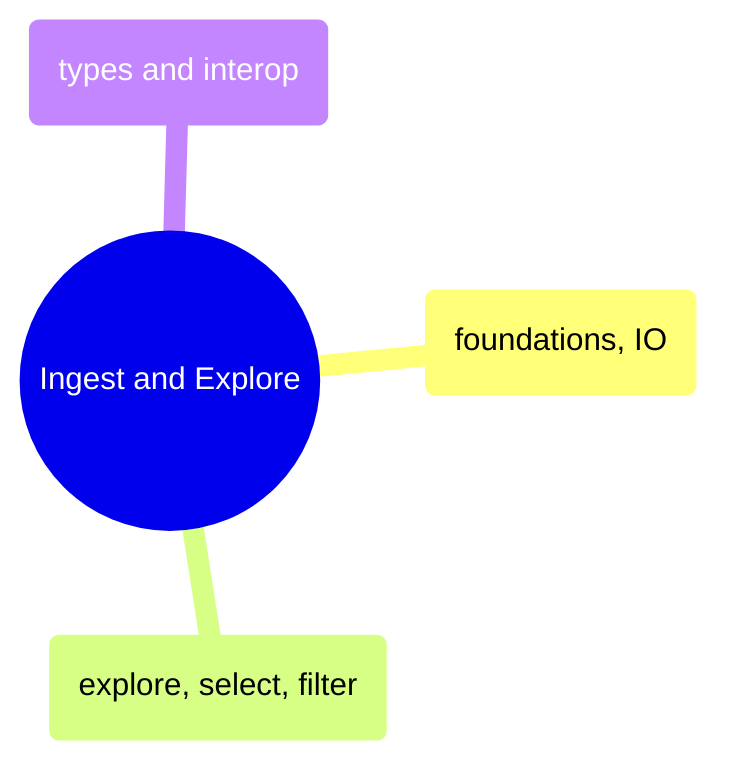

# Ingest and Explore

DataFrame foundations, data loading, exploration, selection, filtering, and type interop across Pandas, Polars, and their C# counterparts.

> [!abstract]- Foundations and IO
>
> - Series creation and indexing — [[01_py_foundations_io#Series|py]] · [[01_cs_foundations_io#Series|cs]]
> - DataFrame construction and column access — [[01_py_foundations_io#DataFrame|py]] · [[01_cs_foundations_io#DataFrames|cs]]
> - Data types and type system — [[01_py_foundations_io#Data Types Deep Dive|py]] · [[01_cs_foundations_io#Data Types Deep Dive|cs]]
> - Reading CSV, JSON, and Parquet — [[01_py_foundations_io#Loading Real Data from Multiple Formats|py]] · [[01_cs_foundations_io#Loading Real Data|cs]]
> - Writing data to disk — [[01_py_foundations_io#Writing Data|py]] · [[01_cs_foundations_io#Writing Data|cs]]
> - Edge cases and gotchas — [[01_py_foundations_io#Edge Cases and Gotchas|py]] · [[01_cs_foundations_io#Edge Cases & Gotchas|cs]]

> [!abstract]- Explore, Select, and Filter
>
> - Head, tail, slice, and sample — [[02_py_explore_select_filter#head, tail, slice, sample|py]] · [[02_cs_explore_select_filter#Data Exploration|cs]]
> - Data profiling strategies — [[02_py_explore_select_filter#Data Profiling Strategies|py]] · [[02_cs_explore_select_filter#Data Exploration|cs]]
> - Column selection by name, dtype, and pattern — [[02_py_explore_select_filter#Single Column Selection|py]] · [[02_cs_explore_select_filter#Column Selection|cs]]
> - Boolean filtering and multiple conditions — [[02_py_explore_select_filter#Boolean Indexing (Single Condition)|py]] · [[02_cs_explore_select_filter#Row Filtering|cs]]
> - Row access and slicing — [[02_py_explore_select_filter#Selecting Rows by Position|py]] · [[02_cs_explore_select_filter#Row Access & Slicing|cs]]

> [!abstract]- Types and Interop
>
> - Categoricals and enums — [[07_py_types_interop#Categorical|py]] · [[07_cs_types_interop#Advanced Data Types|cs]]
> - List and struct nested types — [[07_py_types_interop#List Type (Polars)|py]] · [[07_cs_types_interop#Advanced Data Types|cs]]
> - Library conversions and zero-copy — [[07_py_types_interop#Polars to Pandas|py]] · [[07_cs_types_interop#Interoperability|cs]]
> - CSV and JSON format deep dive — [[07_py_types_interop#CSV|py]] · [[07_cs_types_interop#Interoperability|cs]]
> - Parquet format deep dive — [[07_py_types_interop#Parquet|py]] · [[07_cs_types_interop#Interoperability|cs]]
