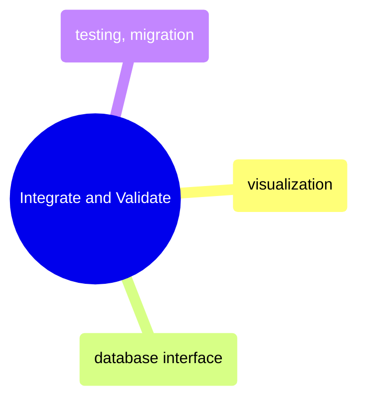

# Integrate and Validate

Visualization, database connectivity, testing frameworks, and migration guides for DataFrame workflows.

> [!abstract]- Visualization
>
> - Line charts — [[08_py_visualization#Line Charts|py]] · [[08_cs_visualization#Line Charts|cs]]
> - Bar charts — [[08_py_visualization#Bar Charts|py]] · [[08_cs_visualization#Bar Charts|cs]]
> - Scatter and distribution plots — [[08_py_visualization#Scatter Plots|py]] · [[08_cs_visualization#Scatter & Distribution|cs]]
> - Financial charts — [[08_py_visualization#Financial Charts|py]] · [[08_cs_visualization#Financial Charts|cs]]
> - Seaborn statistical plots — [[08_py_visualization#Seaborn — Statistical Plots|py]] · [[08_cs_visualization#Heatmap|cs]]
> - Exporting charts — [[08_py_visualization#Exporting Charts|py]] · [[08_cs_visualization#Static Export with ScottPlot|cs]]

> [!abstract]- Database Interface
>
> - Polars SQLContext — [[09_py_database_interface#Polars SQLContext|py]] · [[09_cs_database_interface#Polars.NET SQL Context|cs]]
> - DuckDB embedded analytics — [[09_py_database_interface#DuckDB — Embedded Analytical Database|py]] · [[09_cs_database_interface#DuckDB.NET|cs]]
> - SQL Server connectivity — [[09_py_database_interface#Connection Setup|py]] · [[09_cs_database_interface#SQL Server|cs]]
> - Reading and writing tables — [[09_py_database_interface#Reading Tables|py]] · [[09_cs_database_interface#SQL Server|cs]]
> - Performance comparison — [[09_py_database_interface#Performance: SQLAlchemy vs pyodbc (Pandas vs Polars)|py]] · [[09_cs_database_interface#Performance Comparison|cs]]

> [!abstract]- Testing and Migration
>
> - Frame equality assertions — [[10_py_testing_migration#assert_frame_equal|py]] · [[10_cs_testing_migration#Testing & Assertions|cs]]
> - Schema and data validation — [[10_py_testing_migration#Schema Testing|py]] · [[10_cs_testing_migration#Data Quality Pipeline|cs]]
> - Debugging method chains — [[10_py_testing_migration#Debugging Method Chains|py]] · [[10_cs_testing_migration#Debugging & Profiling|cs]]
> - Performance profiling — [[10_py_testing_migration#Performance Profiling|py]] · [[10_cs_testing_migration#Debugging & Profiling|cs]]
> - Pandas to Polars migration guide — [[10_py_testing_migration#Concepts to Unlearn|py]] · [[10_cs_testing_migration#Python to C# Migration Guide|cs]]
