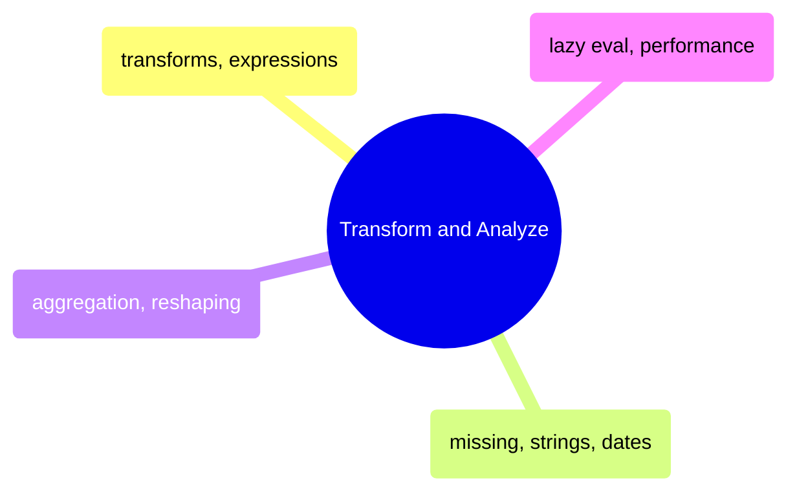

# Transform and Analyze

Column transforms, expressions, missing data handling, aggregation, reshaping, and lazy evaluation performance across Pandas and Polars.

> [!abstract]- Transforms and Expressions
>
> - Column creation with assign and with_columns — [[03_py_transforms_expressions#Setup & Data Loading|py]] · [[03_cs_transforms_expressions#Column Transforms|cs]]
> - Polars expression system — [[03_py_transforms_expressions#Comparison Table — Creating & Transforming Columns|py]] · [[03_cs_transforms_expressions#Expression System (Polars.NET focus)|cs]]
> - Type casting — [[03_py_transforms_expressions#Comparison Table — Creating & Transforming Columns|py]] · [[03_cs_transforms_expressions#Type Casting|cs]]
> - Method chaining and window expressions — [[03_py_transforms_expressions#Practical Transform Examples — scores_daily dataset|py]] · [[03_cs_transforms_expressions#Method Chaining & Window Functions|cs]]
> - Apply, map, and UDFs — [[03_py_transforms_expressions#Practical Transform Examples — scores_daily dataset|py]] · [[03_cs_transforms_expressions#Column Transforms|cs]]

> [!abstract]- Missing Data, Strings, and DateTime
>
> - Null representations and detection — [[04_py_missing_strings_datetime#Null Representations|py]] · [[04_cs_missing_strings_datetime#Missing Data|cs]]
> - Filling and dropping nulls — [[04_py_missing_strings_datetime#Filling Nulls|py]] · [[04_cs_missing_strings_datetime#Missing Data|cs]]
> - String operations and pattern matching — [[04_py_missing_strings_datetime#Case Operations|py]] · [[04_cs_missing_strings_datetime#String Operations|cs]]
> - Date parsing and dt accessor — [[04_py_missing_strings_datetime#Parsing Dates|py]] · [[04_cs_missing_strings_datetime#DateTime Operations|cs]]
> - Rolling windows and resampling — [[04_py_missing_strings_datetime#Rolling Windows|py]] · [[04_cs_missing_strings_datetime#DateTime Operations|cs]]

> [!abstract]- Aggregation and Reshaping
>
> - Group-by and multiple aggregations — [[05_py_aggregation_reshaping#Basic Group By|py]] · [[05_cs_aggregation_reshaping#Grouping & Aggregation|cs]]
> - Window functions and rolling — [[05_py_aggregation_reshaping#Window Transform|py]] · [[05_cs_aggregation_reshaping#Window Functions|cs]]
> - Joins — [[05_py_aggregation_reshaping#Inner Join|py]] · [[05_cs_aggregation_reshaping#Joins|cs]]
> - Concatenation — [[05_py_aggregation_reshaping#Vertical Concat|py]] · [[05_cs_aggregation_reshaping#Concatenation|cs]]
> - Pivot, melt, and explode — [[05_py_aggregation_reshaping#Long to Wide: pivot|py]] · [[05_cs_aggregation_reshaping#Reshaping|cs]]

> [!abstract]- Lazy Evaluation and Performance
>
> - Eager vs lazy execution — [[06_py_lazy_performance#Eager: Immediate|py]] · [[06_cs_lazy_performance#Lazy Fundamentals|cs]]
> - Query optimization and pushdown — [[06_py_lazy_performance#Predicate Pushdown|py]] · [[06_cs_lazy_performance#Query Optimization|cs]]
> - Pandas vs Polars benchmarks — [[06_py_lazy_performance#Pandas vs Polars Lazy Benchmark|py]] · [[06_cs_lazy_performance#Performance Comparison|cs]]
> - Vectorized vs loop performance — [[06_py_lazy_performance#Vectorized vs Loop|py]] · [[06_cs_lazy_performance#Performance Comparison|cs]]
> - Memory usage and profiling — [[06_py_lazy_performance#Memory Usage|py]] · [[06_cs_lazy_performance#Deedle Note|cs]]
