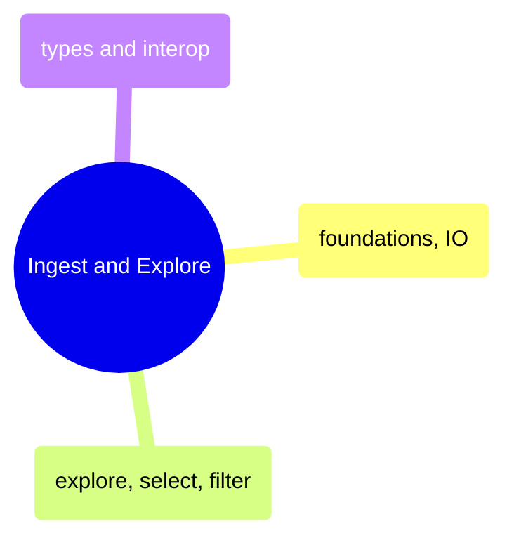
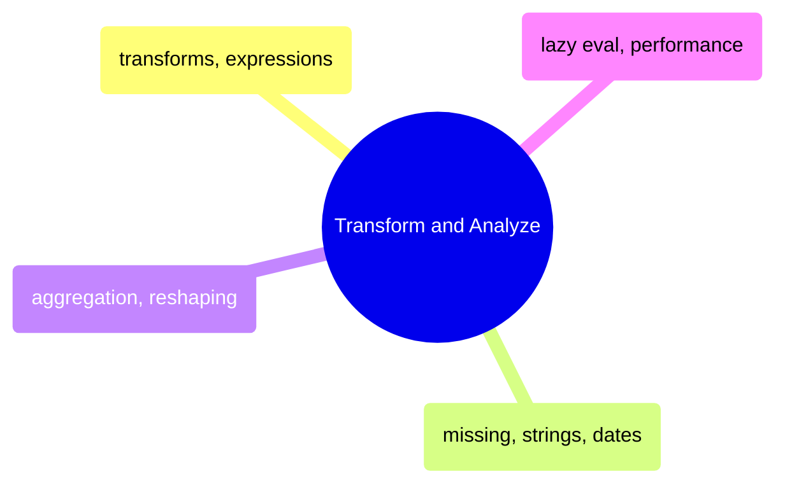
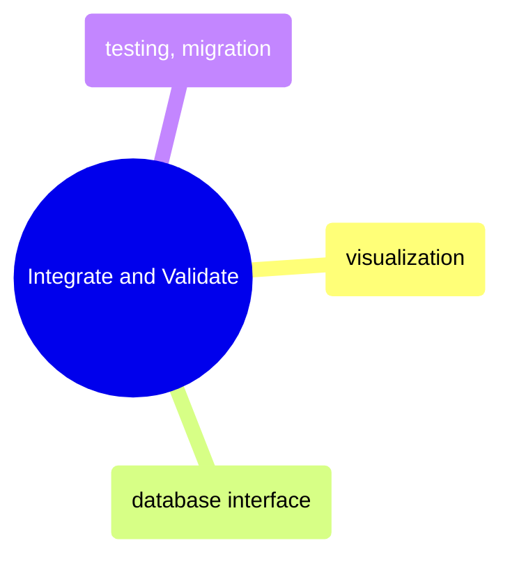

# MOC: DataFrames

Pandas and Polars side-by-side — 10 topics with paired Python and C#
notebooks covering every DataFrame operation from loading to testing.
Expand any topic and pick your language.

> [!example]- Ingest and Explore
>
> > [!abstract]- Foundations and IO
> >
> > - Series creation and indexing — [[01_py_foundations_io#Series|py]] · [[01_cs_foundations_io#Series|cs]]
> > - DataFrame construction and column access — [[01_py_foundations_io#DataFrame|py]] · [[01_cs_foundations_io#DataFrames|cs]]
> > - Data types and type system — [[01_py_foundations_io#Data Types Deep Dive|py]] · [[01_cs_foundations_io#Data Types Deep Dive|cs]]
> > - Reading CSV, JSON, and Parquet — [[01_py_foundations_io#Loading Real Data from Multiple Formats|py]] · [[01_cs_foundations_io#Loading Real Data|cs]]
> > - Writing data to disk — [[01_py_foundations_io#Writing Data|py]] · [[01_cs_foundations_io#Writing Data|cs]]
> > - Edge cases and gotchas — [[01_py_foundations_io#Edge Cases and Gotchas|py]] · [[01_cs_foundations_io#Edge Cases & Gotchas|cs]]
>
> > [!abstract]- Explore, Select, and Filter
> >
> > - Head, tail, slice, and sample — [[02_py_explore_select_filter#head, tail, slice, sample|py]] · [[02_cs_explore_select_filter#Data Exploration|cs]]
> > - Data profiling strategies — [[02_py_explore_select_filter#Data Profiling Strategies|py]] · [[02_cs_explore_select_filter#Data Exploration|cs]]
> > - Column selection by name, dtype, and pattern — [[02_py_explore_select_filter#Single Column Selection|py]] · [[02_cs_explore_select_filter#Column Selection|cs]]
> > - Boolean filtering and multiple conditions — [[02_py_explore_select_filter#Boolean Indexing (Single Condition)|py]] · [[02_cs_explore_select_filter#Row Filtering|cs]]
> > - Row access and slicing — [[02_py_explore_select_filter#Selecting Rows by Position|py]] · [[02_cs_explore_select_filter#Row Access & Slicing|cs]]
>
> > [!abstract]- Types and Interop
> >
> > - Categoricals and enums — [[07_py_types_interop#Categorical|py]] · [[07_cs_types_interop#Advanced Data Types|cs]]
> > - List and struct nested types — [[07_py_types_interop#List Type (Polars)|py]] · [[07_cs_types_interop#Advanced Data Types|cs]]
> > - Library conversions and zero-copy — [[07_py_types_interop#Polars to Pandas|py]] · [[07_cs_types_interop#Interoperability|cs]]
> > - CSV and JSON format deep dive — [[07_py_types_interop#CSV|py]] · [[07_cs_types_interop#Interoperability|cs]]
> > - Parquet format deep dive — [[07_py_types_interop#Parquet|py]] · [[07_cs_types_interop#Interoperability|cs]]

> [!example]- Transform and Analyze
>
> > [!abstract]- Transforms and Expressions
> >
> > - Column creation with assign and with_columns — [[03_py_transforms_expressions#Setup & Data Loading|py]] · [[03_cs_transforms_expressions#Column Transforms|cs]]
> > - Polars expression system — [[03_py_transforms_expressions#Comparison Table — Creating & Transforming Columns|py]] · [[03_cs_transforms_expressions#Expression System (Polars.NET focus)|cs]]
> > - Type casting — [[03_py_transforms_expressions#Comparison Table — Creating & Transforming Columns|py]] · [[03_cs_transforms_expressions#Type Casting|cs]]
> > - Method chaining and window expressions — [[03_py_transforms_expressions#Practical Transform Examples — scores_daily dataset|py]] · [[03_cs_transforms_expressions#Method Chaining & Window Functions|cs]]
> > - Apply, map, and UDFs — [[03_py_transforms_expressions#Practical Transform Examples — scores_daily dataset|py]] · [[03_cs_transforms_expressions#Column Transforms|cs]]
>
> > [!abstract]- Missing Data, Strings, and DateTime
> >
> > - Null representations and detection — [[04_py_missing_strings_datetime#Null Representations|py]] · [[04_cs_missing_strings_datetime#Missing Data|cs]]
> > - Filling and dropping nulls — [[04_py_missing_strings_datetime#Filling Nulls|py]] · [[04_cs_missing_strings_datetime#Missing Data|cs]]
> > - String operations and pattern matching — [[04_py_missing_strings_datetime#Case Operations|py]] · [[04_cs_missing_strings_datetime#String Operations|cs]]
> > - Date parsing and dt accessor — [[04_py_missing_strings_datetime#Parsing Dates|py]] · [[04_cs_missing_strings_datetime#DateTime Operations|cs]]
> > - Rolling windows and resampling — [[04_py_missing_strings_datetime#Rolling Windows|py]] · [[04_cs_missing_strings_datetime#DateTime Operations|cs]]
>
> > [!abstract]- Aggregation and Reshaping
> >
> > - Group-by and multiple aggregations — [[05_py_aggregation_reshaping#Basic Group By|py]] · [[05_cs_aggregation_reshaping#Grouping & Aggregation|cs]]
> > - Window functions and rolling — [[05_py_aggregation_reshaping#Window Transform|py]] · [[05_cs_aggregation_reshaping#Window Functions|cs]]
> > - Joins — [[05_py_aggregation_reshaping#Inner Join|py]] · [[05_cs_aggregation_reshaping#Joins|cs]]
> > - Concatenation — [[05_py_aggregation_reshaping#Vertical Concat|py]] · [[05_cs_aggregation_reshaping#Concatenation|cs]]
> > - Pivot, melt, and explode — [[05_py_aggregation_reshaping#Long to Wide: pivot|py]] · [[05_cs_aggregation_reshaping#Reshaping|cs]]
>
> > [!abstract]- Lazy Evaluation and Performance
> >
> > - Eager vs lazy execution — [[06_py_lazy_performance#Eager: Immediate|py]] · [[06_cs_lazy_performance#Lazy Fundamentals|cs]]
> > - Query optimization and pushdown — [[06_py_lazy_performance#Predicate Pushdown|py]] · [[06_cs_lazy_performance#Query Optimization|cs]]
> > - Pandas vs Polars benchmarks — [[06_py_lazy_performance#Pandas vs Polars Lazy Benchmark|py]] · [[06_cs_lazy_performance#Performance Comparison|cs]]
> > - Vectorized vs loop performance — [[06_py_lazy_performance#Vectorized vs Loop|py]] · [[06_cs_lazy_performance#Performance Comparison|cs]]
> > - Memory usage and profiling — [[06_py_lazy_performance#Memory Usage|py]] · [[06_cs_lazy_performance#Deedle Note|cs]]

> [!example]- Integrate and Validate
>
> > [!abstract]- Visualization
> >
> > - Line charts — [[08_py_visualization#Line Charts|py]] · [[08_cs_visualization#Line Charts|cs]]
> > - Bar charts — [[08_py_visualization#Bar Charts|py]] · [[08_cs_visualization#Bar Charts|cs]]
> > - Scatter and distribution plots — [[08_py_visualization#Scatter Plots|py]] · [[08_cs_visualization#Scatter & Distribution|cs]]
> > - Financial charts — [[08_py_visualization#Financial Charts|py]] · [[08_cs_visualization#Financial Charts|cs]]
> > - Seaborn statistical plots — [[08_py_visualization#Seaborn — Statistical Plots|py]] · [[08_cs_visualization#Heatmap|cs]]
> > - Exporting charts — [[08_py_visualization#Exporting Charts|py]] · [[08_cs_visualization#Static Export with ScottPlot|cs]]
>
> > [!abstract]- Database Interface
> >
> > - Polars SQLContext — [[09_py_database_interface#Polars SQLContext|py]] · [[09_cs_database_interface#Polars.NET SQL Context|cs]]
> > - DuckDB embedded analytics — [[09_py_database_interface#DuckDB — Embedded Analytical Database|py]] · [[09_cs_database_interface#DuckDB.NET|cs]]
> > - SQL Server connectivity — [[09_py_database_interface#Connection Setup|py]] · [[09_cs_database_interface#SQL Server|cs]]
> > - Reading and writing tables — [[09_py_database_interface#Reading Tables|py]] · [[09_cs_database_interface#SQL Server|cs]]
> > - Performance comparison — [[09_py_database_interface#Performance: SQLAlchemy vs pyodbc (Pandas vs Polars)|py]] · [[09_cs_database_interface#Performance Comparison|cs]]
>
> > [!abstract]- Testing and Migration
> >
> > - Frame equality assertions — [[10_py_testing_migration#assert_frame_equal|py]] · [[10_cs_testing_migration#Testing & Assertions|cs]]
> > - Schema and data validation — [[10_py_testing_migration#Schema Testing|py]] · [[10_cs_testing_migration#Data Quality Pipeline|cs]]
> > - Debugging method chains — [[10_py_testing_migration#Debugging Method Chains|py]] · [[10_cs_testing_migration#Debugging & Profiling|cs]]
> > - Performance profiling — [[10_py_testing_migration#Performance Profiling|py]] · [[10_cs_testing_migration#Debugging & Profiling|cs]]
> > - Pandas to Polars migration guide — [[10_py_testing_migration#Concepts to Unlearn|py]] · [[10_cs_testing_migration#Python to C# Migration Guide|cs]]

## Cross-References

- [Programming Languages](/02-Programming-Languages/moc-programming-languages) — Python and C# foundations these notebooks build on
- [DB Queries](/05-DB-Queries/moc-db-queries) — SQL-first approach to the same data operations
- [25_py_functional_pipeline](/02-Programming-Languages/Python/25_py_functional_pipeline) — Production pipeline using Polars DataFrames
