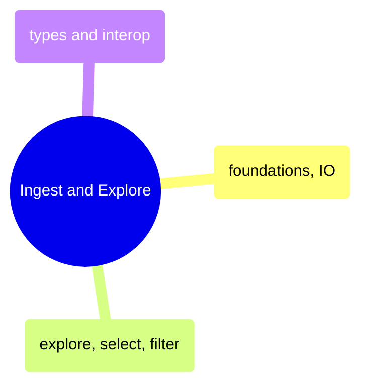
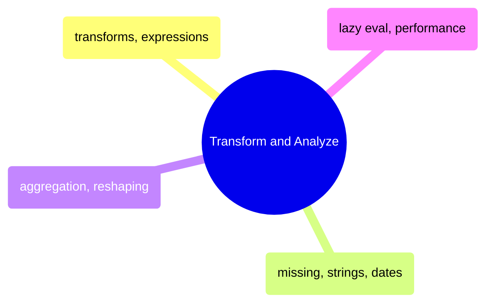
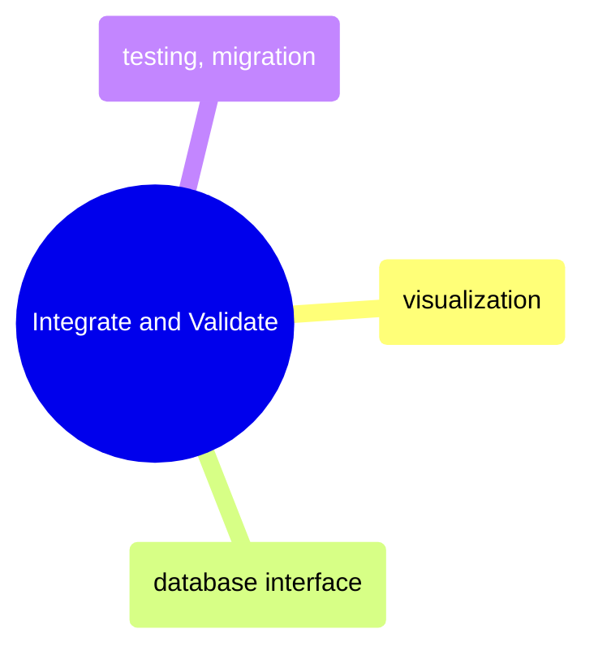

# MOC: DataFrames

Pandas and Polars side-by-side — 10 topics with paired Python and C#
notebooks covering every DataFrame operation from loading to testing.
Expand any domain to browse its sub-MOC.

> [!guide]- Ingest and Explore
>
> [[domain-ingest-and-explore]]
>
> DataFrame foundations, data loading, exploration, selection, filtering, and type interop across Pandas, Polars, and their C# counterparts.

> [!guide]- Transform and Analyze
>
> [[domain-transform-and-analyze]]
>
> Column transforms, expressions, missing data handling, aggregation, reshaping, and lazy evaluation performance across Pandas and Polars.

> [!guide]- Integrate and Validate
>
> [[domain-integrate-and-validate]]
>
> Visualization, database connectivity, testing frameworks, and migration guides for DataFrame workflows.

## Cross-References

- [Programming Languages](https://alp78.github.io/elysium/02-Programming-Languages/moc-programming-languages) — Python and C# foundations these notebooks build on
- [DB Queries](https://alp78.github.io/elysium/05-DB-Queries/moc-db-queries) — SQL-first approach to the same data operations
- [25_py_functional_pipeline](https://alp78.github.io/elysium/02-Programming-Languages/Python/25_py_functional_pipeline) — Production pipeline using Polars DataFrames
