# 08 — Visualization

Pandas/Matplotlib/Seaborn for static charts, Plotly for interactive.

```python
from cycler import cycler
import pandas as pd
import polars as pl
import polars.selectors as cs
import numpy as np
import matplotlib.pyplot as plt
import seaborn as sns
from pathlib import Path

from IPython.display import display, Markdown
html_formatter = get_ipython().display_formatter.formatters['text/html'] # type: ignore
html_formatter.for_type(pd.DataFrame, lambda df: df.to_html())
html_formatter.for_type(pd.Series, lambda s: s.to_frame().to_html())

pl.Config.set_tbl_rows(100)
pd.set_option("display.max_rows", 100)

DATA = Path("../data")

# Core datasets
ohlcv_pd = pd.read_parquet(DATA / "eurostoxx50_ohlcv.parquet")  # 66K rows, daily OHLCV
ohlcv_pl = pl.read_parquet(DATA / "eurostoxx50_ohlcv.parquet")
dim_pd = pd.read_parquet(DATA / "index_dim.parquet")            # 169 rows, stock metadata
dim_pl = pl.read_parquet(DATA / "index_dim.parquet")
scores_pd = pd.read_parquet(DATA / "scores_daily.parquet")      # 466 rows, composite scores
scores_pl = pl.read_parquet(DATA / "scores_daily.parquet")

print(f"OHLCV: {ohlcv_pd.shape}, Dim: {dim_pd.shape}, Scores: {scores_pd.shape}")

import tempfile
TMP = Path(tempfile.mkdtemp())

# Tokyo Night theme for Matplotlib
plt.rcParams.update({
    "figure.facecolor": "#1a1b26",
    "axes.facecolor": "#1a1b26",
    "axes.edgecolor": "#3b4261",
    "axes.labelcolor": "#a9b1d6",
    "axes.prop_cycle": cycler(color=["#7aa2f7", "#9ece6a", "#e0af68", "#f7768e", "#bb9af7", "#7dcfff", "#73daca", "#ff9e64"]),
    "text.color": "#a9b1d6",
    "xtick.color": "#a9b1d6",
    "ytick.color": "#a9b1d6",
    "grid.color": "#292e42",
    "legend.facecolor": "#24283b",
    "legend.edgecolor": "#3b4261",
    "legend.labelcolor": "#a9b1d6",
    "savefig.facecolor": "#1a1b26",
})

from matplotlib.patches import Circle
import plotly.io as pio
import plotly.express as px
import plotly.graph_objects as go
from plotly.subplots import make_subplots
from IPython.display import HTML
```

    OHLCV: (66355, 12), Dim: (169, 26), Scores: (466, 36)

## Data Preparation

```python
# Reusable subsets for plotting
asml = ohlcv_pd[ohlcv_pd["symbol"] == "ASML.AS"].sort_values("date").tail(365).copy()
top5_syms = ["ASML.AS", "SAP.DE", "SIE.DE", "TTE.PA", "AIR.PA"]
top5 = ohlcv_pd[ohlcv_pd["symbol"].isin(top5_syms)].sort_values("date").copy()
sector_avg = scores_pd.groupby("sector")["composite_score"].mean().sort_values()
```

## 1. Line Charts


Line charts connect data points in order, revealing **trends**, **cycles**, and **rate of change** over time. Slope shows velocity; curvature shows acceleration; crossings between series highlight regime changes.

**Best for:** Time-series data, continuous measurements over ordered intervals (stock prices, sensor readings, revenue over months). Not suitable for unordered categories.

### 1.1 Basic Line (Pandas built-in)

```python
# Close price evolution for ASML over the last year
asml.plot(x="date", y="close", title="ASML Close Price (1Y)", figsize=(10, 4), legend=False)
plt.ylabel("Close")
plt.tight_layout()
plt.show()
```

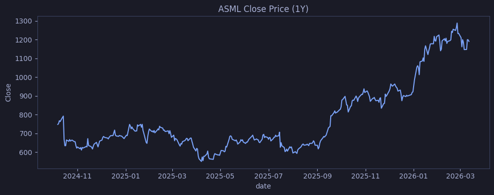

### 1.2 Multi-Series

```python
# Close price comparison for 5 stocks on the same time axis
fig, ax = plt.subplots(figsize=(10, 5))
for sym in top5_syms:
    df = top5[top5["symbol"] == sym]
    ax.plot(df["date"], df["close"], label=sym)
ax.set_title("Close Prices — Top 5")
ax.legend()
plt.tight_layout()
plt.show()
```

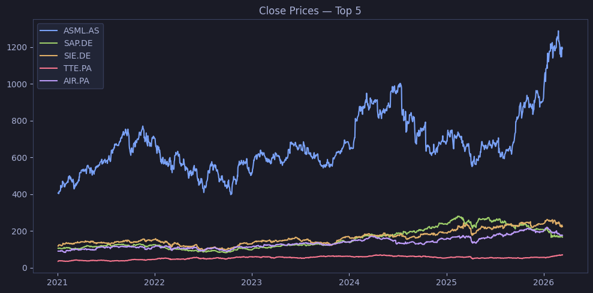

### 1.3 Line Styles & Markers

```python
# Close vs Open price with different line styles and monthly markers
fig, ax = plt.subplots(figsize=(10, 4))
ax.plot(asml["date"], asml["close"], color="#7aa2f7", linewidth=2, label="Close")
ax.plot(asml["date"], asml["open"], color="#e0af68", linewidth=1, linestyle="--", label="Open")
ax.plot(asml["date"].iloc[::30], asml["close"].iloc[::30], "o",
        color="#f7768e", markersize=6, label="Monthly mark")
ax.set_title("Line Styles & Markers")
ax.legend()
plt.tight_layout()
plt.show()
```

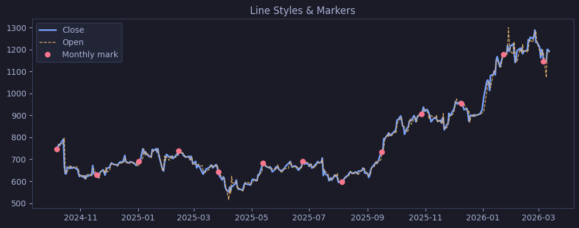

### 1.4 Fill Between

```python
# Close price with shaded high-low range showing daily volatility
fig, ax = plt.subplots(figsize=(10, 4))
ax.plot(asml["date"], asml["close"], color="#7aa2f7")
ax.fill_between(asml["date"], asml["low"], asml["high"], alpha=0.2, color="#7aa2f7", label="High-Low range")
ax.set_title("ASML: Close with High-Low Band")
ax.legend()
plt.tight_layout()
plt.show()
```

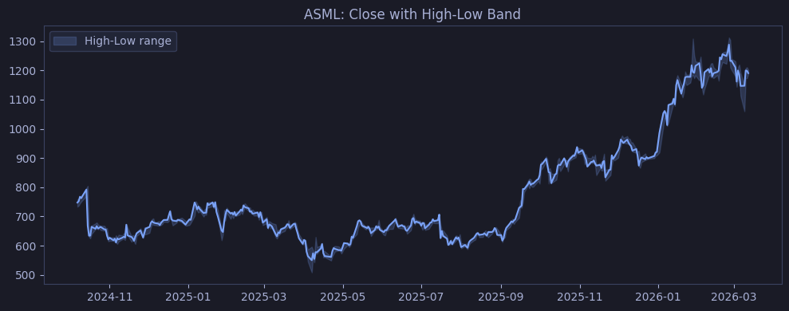

### 1.5 Dual Y-Axis

```python
# Price on left axis, volume bars on right axis — shows if volume spikes align with price moves
fig, ax1 = plt.subplots(figsize=(10, 4))
ax1.plot(asml["date"], asml["close"], color="#7aa2f7", label="Close")
ax1.set_ylabel("Close", color="#7aa2f7")

ax2 = ax1.twinx()
ax2.bar(asml["date"], asml["volume"], alpha=0.3, color="#9ece6a", label="Volume")
ax2.set_ylabel("Volume", color="#9ece6a")

ax1.set_title("ASML: Price & Volume")
fig.tight_layout()
plt.show()
```

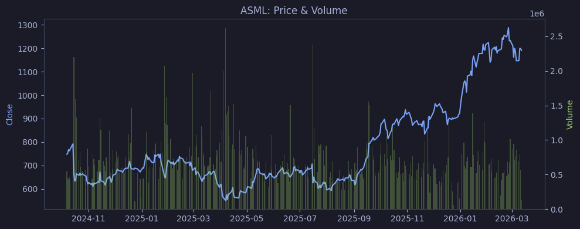

## 2. Bar Charts


Bar charts compare **discrete categories** by encoding values as bar lengths. Horizontal bars work better when category labels are long. Grouped bars compare sub-categories side by side; stacked bars show part-to-whole composition.

**Best for:** Categorical comparisons (revenue by department, scores by sector, counts by group). Use when you have a small-to-medium number of categories (<20). For many categories, consider sorting or filtering.

### 2.1 Horizontal Bar

```python
# Horizontal ranking of sectors by average composite score
sector_avg.plot.barh(title="Avg Composite Score by Sector", figsize=(10, 5))
plt.xlabel("Score")
plt.tight_layout()
plt.show()
```

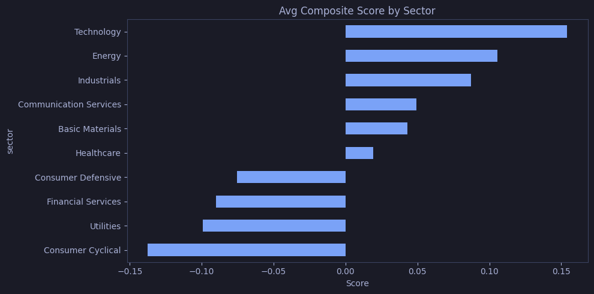

### 2.2 Vertical Bar

```python
# Same ranking as vertical bars (easier axis labels when few categories)
sector_avg.plot.bar(title="Avg Composite Score by Sector", figsize=(10, 5))
plt.ylabel("Score")
plt.xticks(rotation=45, ha="right")
plt.tight_layout()
plt.show()
```

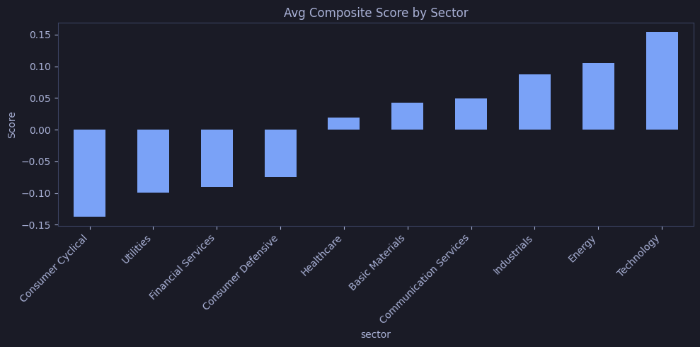

### 2.3 Grouped Bar

```python
# Side-by-side comparison of momentum and value scores per sector
agg = scores_pd.groupby("sector")[["momentum_score", "relative_value_score"]].mean()
agg.plot.bar(figsize=(10, 5), title="Momentum vs Value by Sector")
plt.ylabel("Score")
plt.xticks(rotation=45, ha="right")
plt.legend(title="Metric")
plt.tight_layout()
plt.show()
```

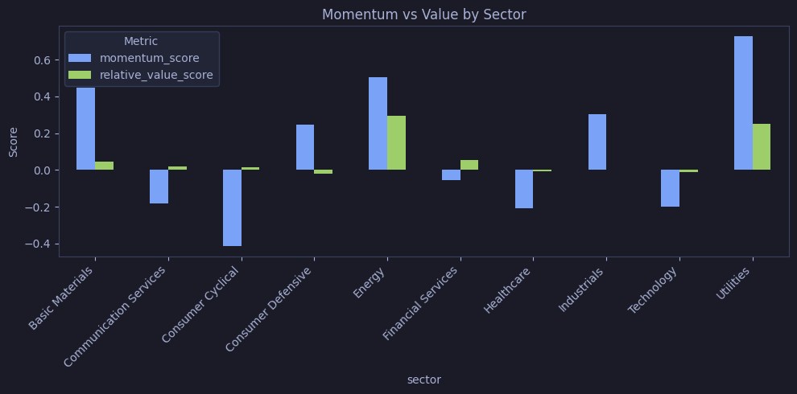

### 2.4 Stacked Bar

```python
# Stacked view: total score magnitude per sector, split by metric
agg.plot.bar(stacked=True, figsize=(10, 5), title="Momentum + Value Stacked")
plt.ylabel("Score")
plt.xticks(rotation=45, ha="right")
plt.tight_layout()
plt.show()
```

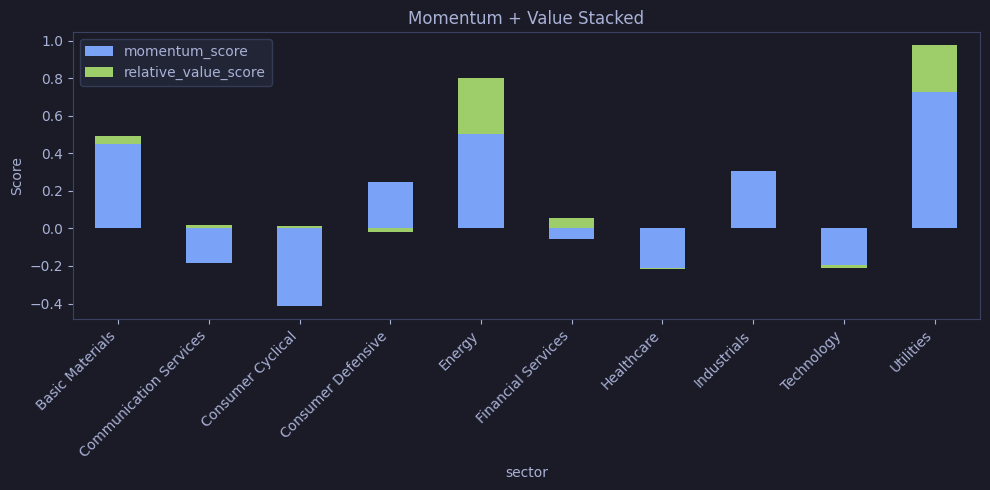

### 2.5 Bar with Error Bars

```python
# Mean composite score per sector with standard deviation error bars showing dispersion
stats = scores_pd.groupby("sector")["composite_score"].agg(["mean", "std"])
fig, ax = plt.subplots(figsize=(10, 5))
stats["mean"].plot.barh(xerr=stats["std"], ax=ax, capsize=4, title="Score ± Std Dev")
plt.xlabel("Composite Score")
plt.tight_layout()
plt.show()
```

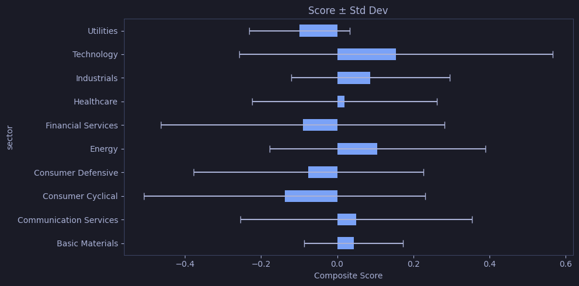

## 3. Histograms


Histograms bin continuous data to show its **distribution shape** — normal, skewed, bimodal, etc. Bin count matters: too few hides structure, too many adds noise. KDE (kernel density estimation) overlays a smooth curve estimate of the probability density.

**Best for:** Exploring a single continuous variable (prices, returns, test scores). Answers: "What is the typical range? Are there outliers? Is the data symmetric?"

### 3.1 Basic Histogram

```python
# Distribution of all close prices across all stocks — reveals price clustering and outliers
ohlcv_pd["close"].plot.hist(bins=50, title="Distribution of Close Prices", figsize=(10, 4))
plt.xlabel("Close Price")
plt.tight_layout()
plt.show()
```

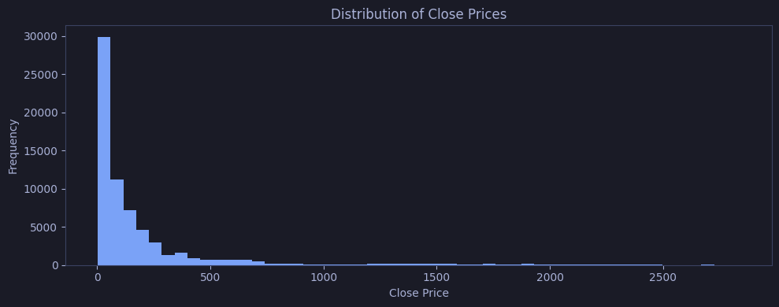

### 3.2 Overlaid Histograms

```python
# Overlaid histograms to compare price distributions of 3 stocks
fig, ax = plt.subplots(figsize=(10, 4))
for sym in ["ASML.AS", "SAP.DE", "SIE.DE"]:
    ohlcv_pd[ohlcv_pd["symbol"] == sym]["close"].plot.hist(
        bins=40, alpha=0.5, label=sym, ax=ax)
ax.set_title("Close Price Distribution (Overlaid)")
ax.legend()
plt.tight_layout()
plt.show()
```

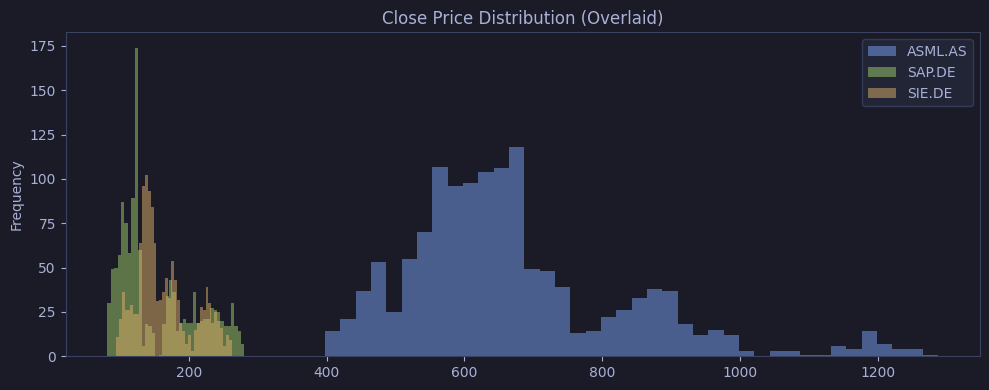

### 3.3 Histogram + KDE

```python
# ASML price histogram with KDE overlay showing the smooth probability density
fig, ax = plt.subplots(figsize=(10, 4))
asml["close"].plot.hist(bins=30, density=True, alpha=0.6, ax=ax, label="Histogram")
asml["close"].plot.kde(ax=ax, color="#f7768e", linewidth=2, label="KDE")
ax.set_title("ASML Close: Histogram + KDE")
ax.legend()
plt.tight_layout()
plt.show()
```

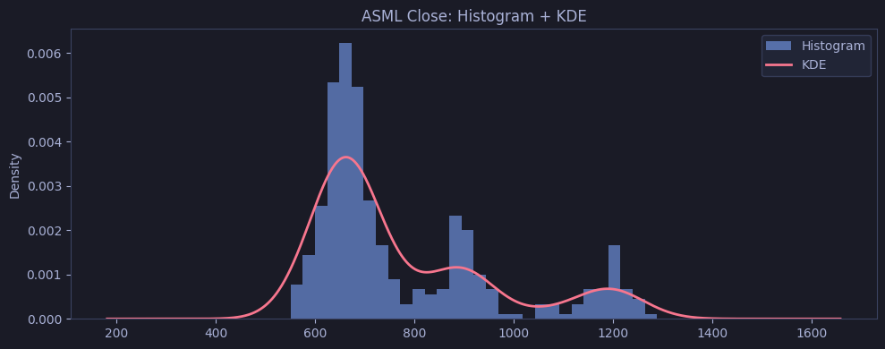

### 3.4 2D Histogram (hexbin)

```python
# 2D density of momentum vs value scores — reveals where most stocks cluster
fig, ax = plt.subplots(figsize=(8, 6))
hb = ax.hexbin(scores_pd["momentum_score"], scores_pd["relative_value_score"],
               gridsize=20, cmap="YlOrRd")
plt.colorbar(hb, ax=ax, label="Count")
ax.set_xlabel("Momentum Score")
ax.set_ylabel("Relative Value Score")
ax.set_title("2D Hexbin: Momentum vs Value")
plt.tight_layout()
plt.show()
```

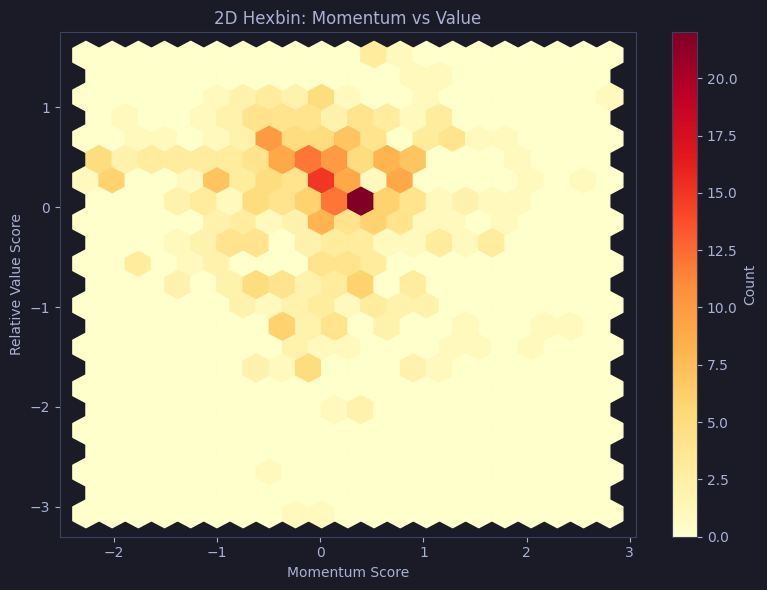

## 4. Scatter Plots


Scatter plots reveal **relationships between two continuous variables** — correlation, clusters, and outliers. Adding color encodes a third variable (categorical or continuous); size encodes a fourth (bubble chart). No visible pattern = no linear relationship, but non-linear patterns may still exist.

**Best for:** Exploring correlation between two numeric columns (price vs volume, momentum vs value). Works well up to ~10K points; beyond that, use hexbin or density plots to avoid overplotting.

### 4.1 Basic Scatter

```python
# Relationship between momentum and relative value scores across all stocks
scores_pd.plot.scatter(x="momentum_score", y="relative_value_score",
                       alpha=0.5, title="Momentum vs Value", figsize=(8, 6))
plt.tight_layout()
plt.show()
```

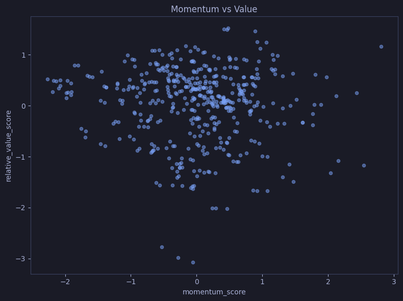

### 4.2 Color-Mapped Scatter

```python
# Same scatter, color-mapped by composite score to reveal which quadrant has highest scores
fig, ax = plt.subplots(figsize=(8, 6))
sc = ax.scatter(scores_pd["momentum_score"], scores_pd["relative_value_score"],
                c=scores_pd["composite_score"], cmap="coolwarm", alpha=0.7, edgecolors="none")
plt.colorbar(sc, ax=ax, label="Composite Score")
ax.set_xlabel("Momentum")
ax.set_ylabel("Relative Value")
ax.set_title("Scatter colored by Composite Score")
plt.tight_layout()
plt.show()
```

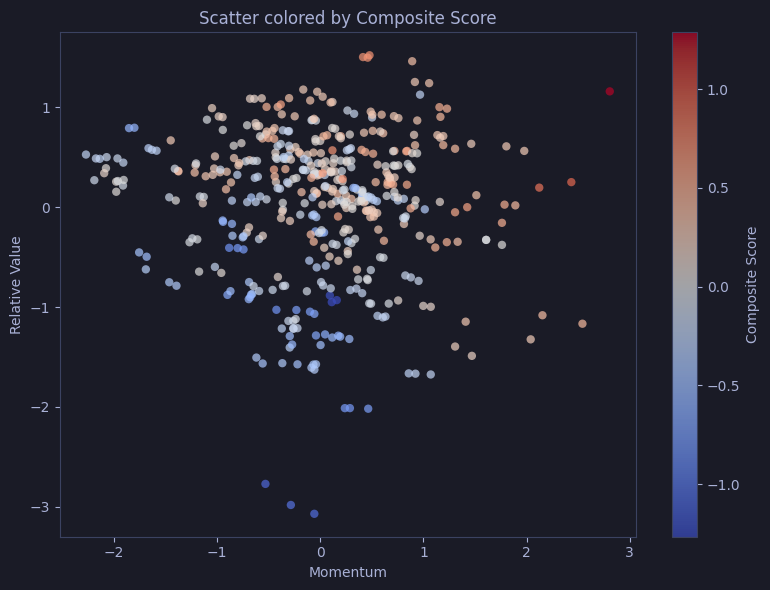

### 4.3 Bubble Chart (size + color)

```python
# Bubble chart: position = momentum vs value, size & color = composite score magnitude
fig, ax = plt.subplots(figsize=(8, 6))
# Normalize composite_score to positive sizes
sizes = (scores_pd["composite_score"] - scores_pd["composite_score"].min() + 0.1) * 100
sc = ax.scatter(scores_pd["momentum_score"], scores_pd["relative_value_score"],
                s=sizes, c=scores_pd["composite_score"], cmap="viridis",
                alpha=0.6, edgecolors="#3b4261", linewidth=0.5)
plt.colorbar(sc, ax=ax, label="Composite Score")
ax.set_title("Bubble Chart: size & color = composite score")
plt.tight_layout()
plt.show()
```

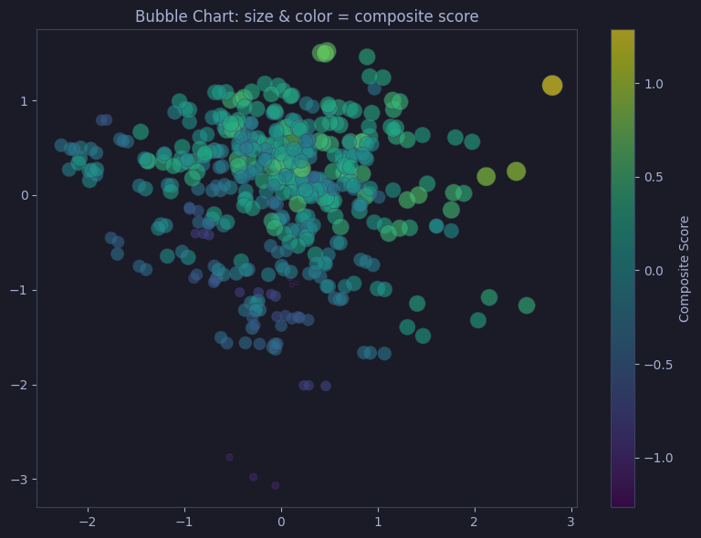

## 5. Area Charts


Area charts are line charts with the region below filled, emphasizing **magnitude** and **cumulative totals**. Stacked areas show how components contribute to a total over time.

**Best for:** Time-series composition data (market share over time, portfolio allocation, traffic sources). Keep to 3–5 series; too many layers become unreadable.

### 5.1 Basic Area

```python
# ASML close price as filled area — emphasizes magnitude relative to zero
asml.plot.area(x="date", y="close", alpha=0.4, title="ASML Close (Area)", figsize=(10, 4), legend=False)
plt.ylabel("Close")
plt.tight_layout()
plt.show()
```

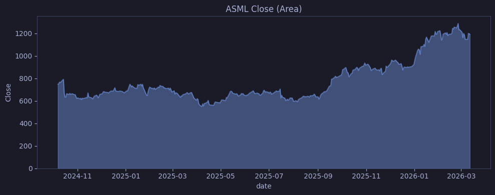

### 5.2 Stacked Area

```python
# Pivot daily volume for top 3 stocks
vol_pivot = top5[top5["symbol"].isin(top5_syms[:3])].pivot_table(
    index="date", columns="symbol", values="volume", aggfunc="sum")
vol_pivot.plot.area(figsize=(10, 5), alpha=0.6, title="Stacked Volume (Top 3)")
plt.ylabel("Volume")
plt.tight_layout()
plt.show()
```

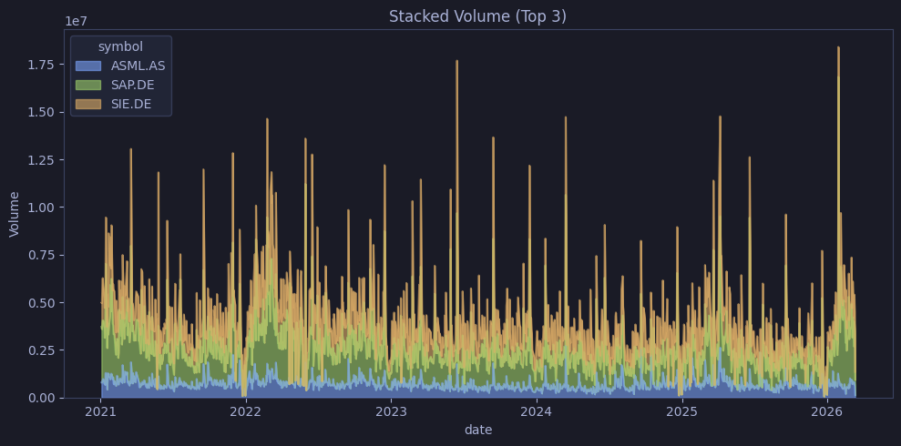

## 6. Pie & Donut


Pie charts show **part-to-whole proportions** for a single categorical variable. Humans judge angles poorly, so pie charts work best with ≤6 slices and clear size differences. Donut charts free the center for labels or KPIs.

**Best for:** Showing composition when there are few categories with distinct proportions (market share, budget allocation). For precise comparison or many categories, prefer bar charts.

### 6.1 Pie Chart

```python
# Proportion of stocks in each sector within the EuroStoxx 50 index
sector_count = dim_pd.groupby("sector").size()
total = sector_count.sum()
fig, ax = plt.subplots(figsize=(8, 8))
NL = chr(10)
labels = [f"{name}{NL}{count} ({count/total*100:.0f}%)" for name, count in zip(sector_count.index, sector_count)]
colors = ["#1a3a5c", "#2d4a3e", "#5c4a1a", "#5c1a2a", "#3a2a5c",
          "#1a4a5c", "#1a5c4a", "#5c3a1a", "#1a4a4a", "#2a3a4a",
          "#3b4261", "#292e42"]
ax.pie(sector_count.tolist(), labels=labels, startangle=90,
       colors=colors[:len(sector_count)])
ax.set_title("Stocks per Sector")
plt.tight_layout()
plt.show()
```

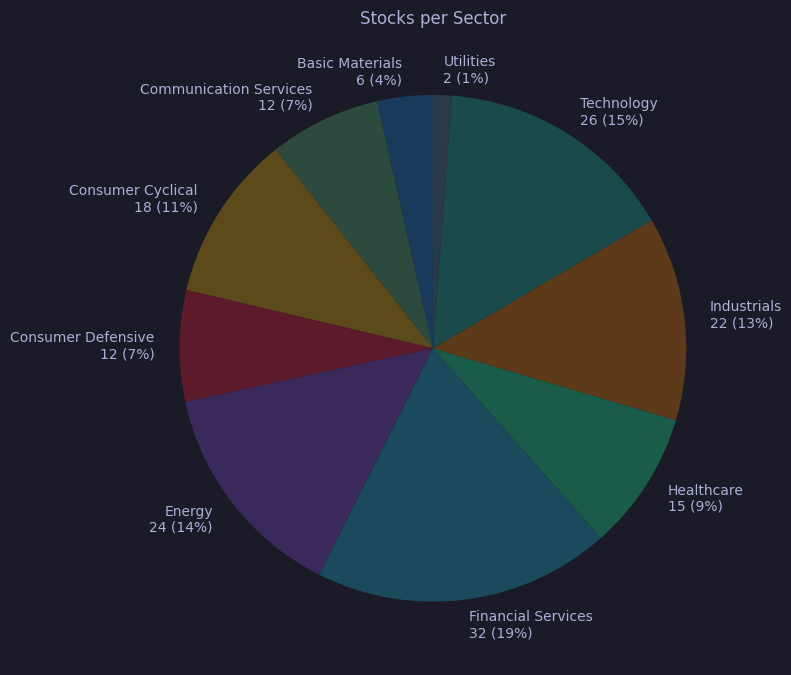

### 6.2 Donut Chart

```python
# Same proportions as donut — center space available for a KPI or total
sector_count = dim_pd.groupby("sector").size()
total = sector_count.sum()
fig, ax = plt.subplots(figsize=(8, 8))
NL = chr(10)
labels = [f"{name}{NL}{count} ({count/total*100:.0f}%)" for name, count in zip(sector_count.index, sector_count)]
colors = ["#1a3a5c", "#2d4a3e", "#5c4a1a", "#5c1a2a", "#3a2a5c",
          "#1a4a5c", "#1a5c4a", "#5c3a1a", "#1a4a4a", "#2a3a4a",
          "#3b4261", "#292e42"]
ax.pie(sector_count.tolist(), labels=labels, startangle=90, pctdistance=0.85,
       colors=colors[:len(sector_count)])
ax.add_artist(Circle((0, 0), 0.60, fc="#1a1b26"))
ax.set_title("Stocks per Sector (Donut)")
plt.tight_layout()
plt.show()
```

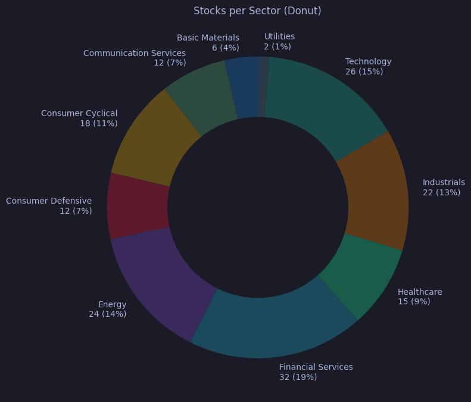

## 7. Seaborn — Statistical Plots


Seaborn provides high-level functions for **statistical visualization** — distribution shapes, group comparisons, correlations, and regression. It handles grouping, faceting, and confidence intervals automatically.

**Best for:** Exploratory data analysis (EDA) when you need to understand distributions (violin, box, KDE), relationships (regression, pair plots), and group differences (strip, swarm). Accepts Pandas DataFrames directly with column-name-based API.

### 7.1 Box Plot


**How to read:**
- **Box** = interquartile range (IQR): middle 50% of data (Q1 to Q3)
- **Line inside box** = median (Q2)
- **Whiskers** = extend to the farthest point within 1.5×IQR from the box edges
- **Circles/diamonds beyond whiskers** = outliers (individual data points outside 1.5×IQR)
- **Notch** (if enabled) = 95% confidence interval around the median; non-overlapping notches between groups suggest significantly different medians

```python
# Quartile summary of composite scores per sector — shows median, IQR, and outliers
fig, ax = plt.subplots(figsize=(10, 5))
sns.boxplot(data=scores_pd, x="sector", y="composite_score", ax=ax)
ax.set_title("Composite Score by Sector")
plt.xticks(rotation=45, ha="right")
plt.tight_layout()
plt.show()
```

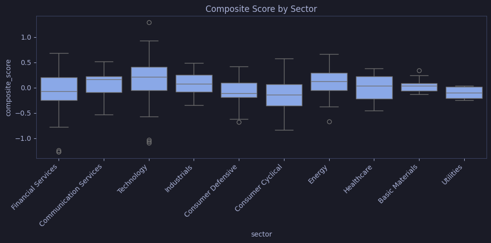

### 7.2 Violin Plot


**How to read:**
- **Width** = density estimate (wider = more data points at that value)
- **Inner box/lines** = quartiles (same as box plot: Q1, median, Q3)
- **Shape** = full distribution — symmetric = normal; multiple bulges = multimodal; long tail = skewed
- Compare width across groups: a wider section means more stocks cluster at that score level

```python
# Full distribution shape per sector — wider = more stocks at that score level
fig, ax = plt.subplots(figsize=(10, 5))
sns.violinplot(data=scores_pd, x="sector", y="composite_score", inner="quart", ax=ax)
ax.set_title("Composite Score (Violin)")
plt.xticks(rotation=45, ha="right")
plt.tight_layout()
plt.show()
```

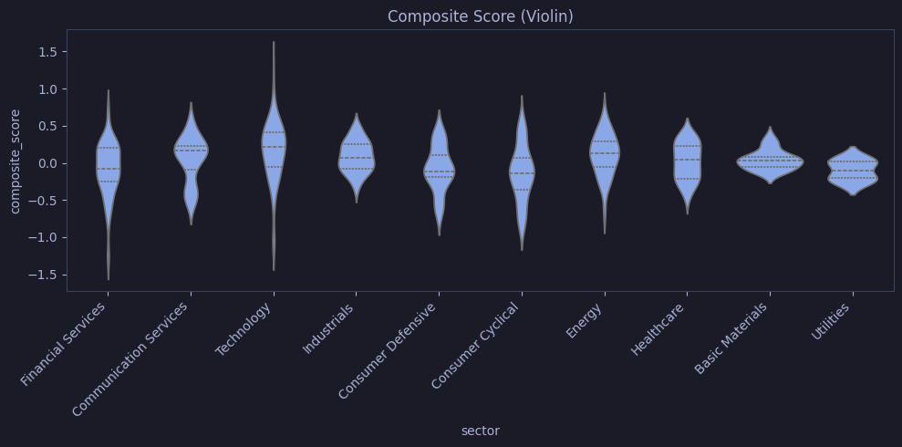

### 7.3 Strip Plot


**How to read:**
- **Each dot** = one data point (one stock)
- **Jitter** = small random horizontal offset to prevent dots from stacking on top of each other
- **Dense clusters** = many values near that level; isolated dots = outliers
- Best for small-to-medium datasets (<500 points per group)

```python
# Every individual stock plotted as a dot, jittered to avoid overlap
fig, ax = plt.subplots(figsize=(10, 5))
sns.stripplot(data=scores_pd, x="sector", y="composite_score", jitter=True, alpha=0.5, ax=ax)
ax.set_title("Composite Score (Strip)")
plt.xticks(rotation=45, ha="right")
plt.tight_layout()
plt.show()
```

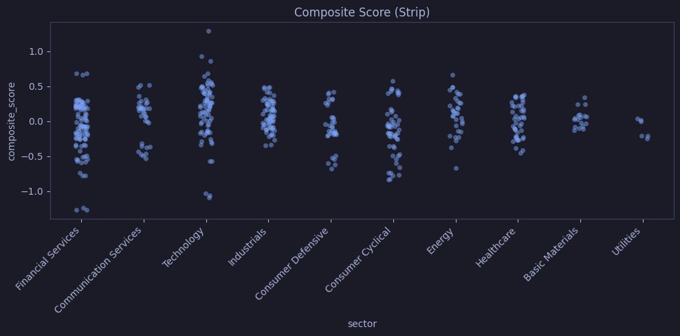

### 7.4 Swarm Plot


**How to read:**
- Like strip plot, but dots are algorithmically spread so **no two overlap**
- **Width of the swarm** at a given y-value reflects how many points are near that value (like a violin)
- Gives exact count — every point is visible and countable
- Slow for large datasets (>300 points per group)

```python
# Swarm works best with smaller datasets
fig, ax = plt.subplots(figsize=(10, 5))
sns.swarmplot(data=scores_pd, x="sector", y="composite_score", size=3, ax=ax)
ax.set_title("Composite Score (Swarm)")
plt.xticks(rotation=45, ha="right")
plt.tight_layout()
plt.show()
```

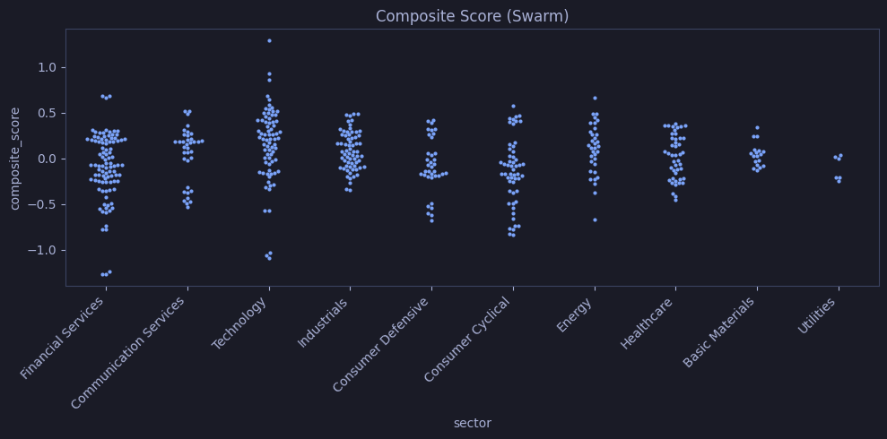

### 7.5 Heatmap


**How to read:**
- **Color intensity** = magnitude of the value in each cell
- **Diverging scale (RdBu):** red = strong positive, white = zero, blue = strong negative
- **Diagonal** (in correlation matrix) = always 1.0 (variable correlated with itself)
- **Off-diagonal symmetry** = correlation is symmetric: corr(A,B) = corr(B,A)
- Look for dark clusters of red/blue — these indicate groups of highly correlated variables

```python
# Pairwise correlation between all numeric score columns — red = positive, blue = negative
corr = scores_pd.select_dtypes("number").corr()
fig, ax = plt.subplots(figsize=(12, 10))
sns.heatmap(corr, annot=True, fmt=".2f", cmap="RdBu_r", center=0,
            square=True, linewidths=0.5, ax=ax,
            annot_kws={"size": 7})
ax.set_title("Score Correlation Matrix")
plt.tight_layout()
plt.show()
```

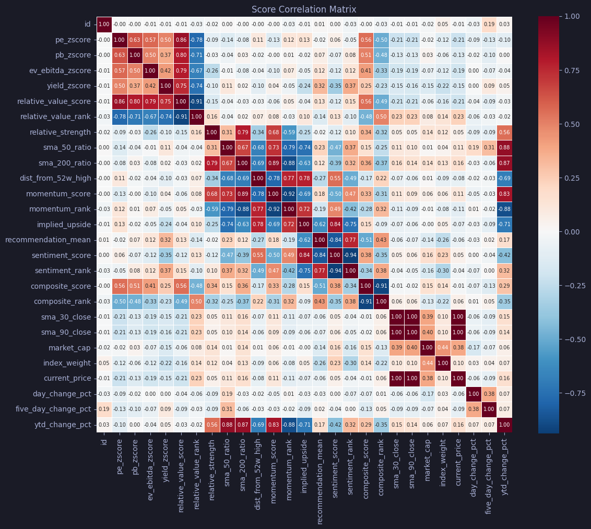

### 7.6 Clustermap (hierarchical clustering)


**How to read:**
- Same as heatmap, but rows and columns are **reordered by hierarchical clustering**
- **Dendrograms** (tree diagrams on the sides) show which variables are most similar
- Variables that merge early in the tree are more correlated with each other
- Look for diagonal blocks of strong color — these are clusters of related metrics

```python
# Clustermap reorders rows/cols by similarity
g = sns.clustermap(corr, annot=True, fmt=".2f", cmap="RdBu_r", center=0,
                   figsize=(12, 10), linewidths=0.5,
                   annot_kws={"size": 7})
g.fig.suptitle("Clustered Correlation Matrix", y=1.02)
plt.show()
```

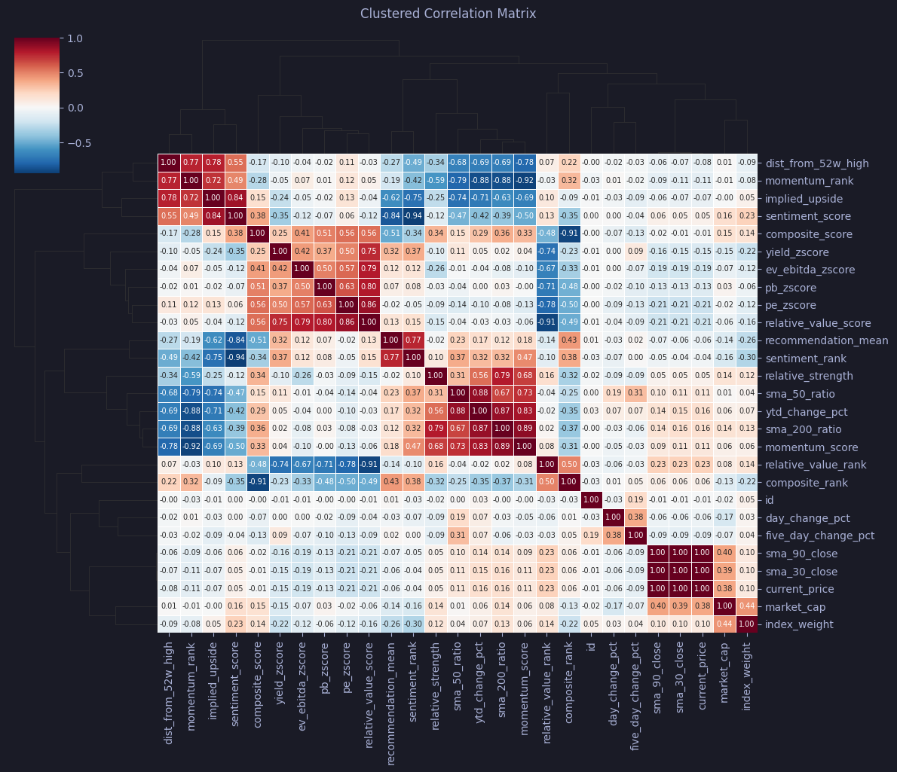

### 7.7 Pair Plot


**How to read:**
- **Grid of scatter plots**: every pair of numeric columns plotted against each other
- **Diagonal** = distribution of each variable (KDE or histogram)
- **Off-diagonal** = scatter of row-variable (y) vs column-variable (x)
- **Color** = categorical grouping — separated clusters suggest the groups differ on those dimensions
- Quick way to spot correlations, clusters, and outliers across all variable pairs

```python
# Pair plot for selected numeric columns
cols = ["momentum_score", "relative_value_score", "composite_score", "sector"]
g = sns.pairplot(scores_pd[cols], hue="sector", diag_kind="kde",
                 plot_kws={"alpha": 0.5, "s": 20}, height=2.5)
g.fig.suptitle("Pair Plot: Scores by Sector", y=1.02)
plt.show()
```

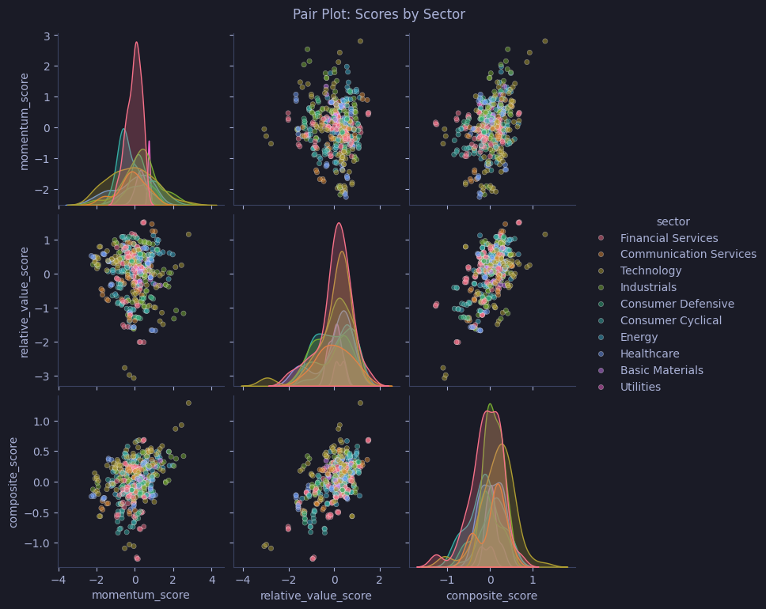

### 7.8 Joint Plot


**How to read:**
- **Center** = scatter (or hexbin/KDE) of two variables
- **Top margin** = distribution of the x-variable
- **Right margin** = distribution of the y-variable
- **Hexbin mode**: color intensity = count of points in each hex — dark = dense cluster
- Combines relationship analysis with individual distributions in one view

```python
# Momentum vs value with marginal hexbin density showing where most stocks concentrate
g = sns.jointplot(data=scores_pd, x="momentum_score", y="relative_value_score",
                  kind="hex", height=7)
g.fig.suptitle("Joint Plot: Momentum vs Value", y=1.02)
plt.show()
```

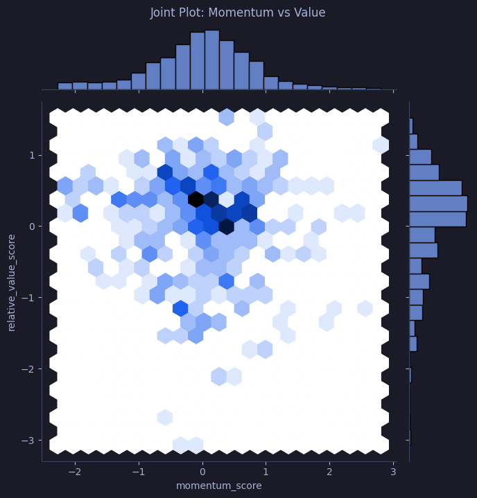

### 7.9 KDE Plot


**How to read:**
- **Curve height** = estimated probability density (not count)
- **Peaks** = modes — values where data concentrates
- **Width/spread** = variance — wider curve = more dispersed data
- **Fill** = area under curve always sums to 1.0
- Overlaying multiple KDEs reveals which groups overlap or separate in their distributions

```python
# Smooth density curves comparing close price distributions across 3 stocks
fig, ax = plt.subplots(figsize=(10, 5))
for sym in ["ASML.AS", "SAP.DE", "SIE.DE"]:
    data = ohlcv_pd[ohlcv_pd["symbol"] == sym]["close"]
    sns.kdeplot(data, label=sym, ax=ax, fill=True, alpha=0.3)
ax.set_title("KDE: Close Price Distribution")
ax.legend()
plt.tight_layout()
plt.show()
```

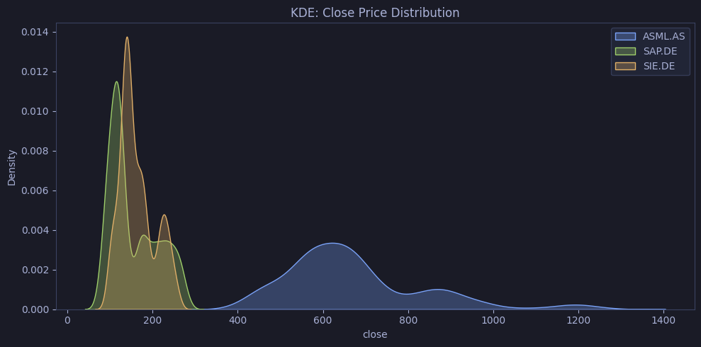

### 7.10 Regression Plot


**How to read:**
- **Dots** = individual data points
- **Line** = OLS (ordinary least squares) best-fit line
- **Shaded band** = 95% confidence interval around the regression line
- **Steep slope** = strong relationship; **flat slope** = weak/no relationship
- Wide confidence band = high uncertainty (small sample or high variance)

```python
# Linear regression fit between momentum and value — shows direction and strength of relationship
fig, ax = plt.subplots(figsize=(8, 6))
sns.regplot(data=scores_pd, x="momentum_score", y="relative_value_score",
            scatter_kws={"alpha": 0.4}, line_kws={"color": "#f7768e"}, ax=ax)
ax.set_title("Regression: Momentum vs Value")
plt.tight_layout()
plt.show()
```

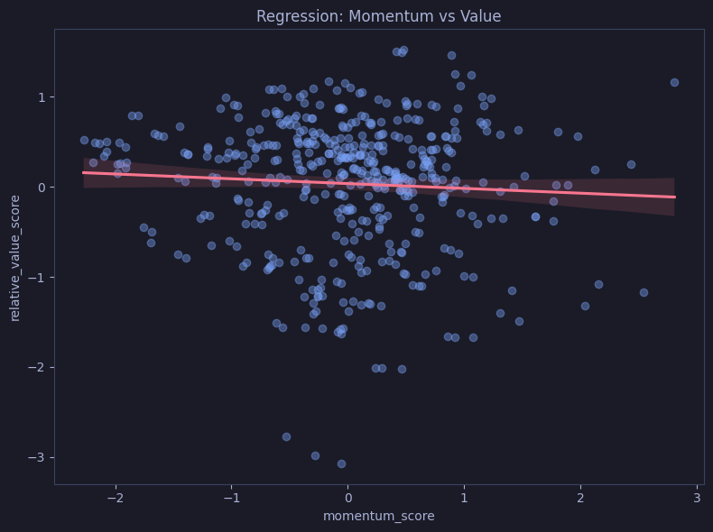

### 7.11 Residual Plot


**How to read:**
- **Each dot** = residual (actual value minus predicted value from linear fit)
- **Ideal pattern**: random scatter around zero — no visible structure
- **Funnel shape** = heteroscedasticity (variance changes with x)
- **Curved pattern** = the relationship is non-linear — linear model is a poor fit
- **Clusters** = possible subgroups that the model treats as one

```python
# Residuals from the linear fit — random scatter = good fit, patterns = nonlinearity
fig, ax = plt.subplots(figsize=(8, 5))
sns.residplot(data=scores_pd, x="momentum_score", y="relative_value_score",
              scatter_kws={"alpha": 0.4}, ax=ax)
ax.set_title("Residuals: Momentum vs Value")
plt.tight_layout()
plt.show()
```

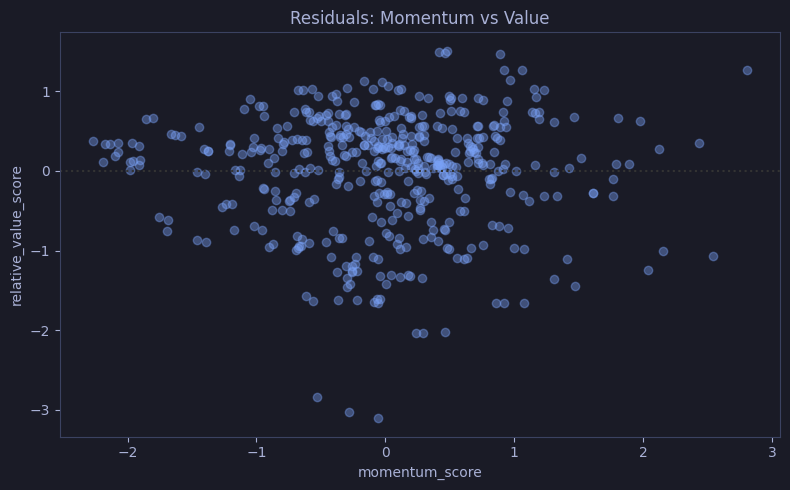

### 7.12 Count Plot


**How to read:**
- **Bar length** = number of observations in each category
- Essentially a histogram for categorical data
- Ordered by count to quickly identify the most/least populated categories

```python
# Count of stocks in each sector — bar length = number of constituent companies
fig, ax = plt.subplots(figsize=(10, 5))
sns.countplot(data=dim_pd, y="sector", order=dim_pd["sector"].value_counts().index, ax=ax)
ax.set_title("Number of Stocks per Sector")
plt.tight_layout()
plt.show()
```

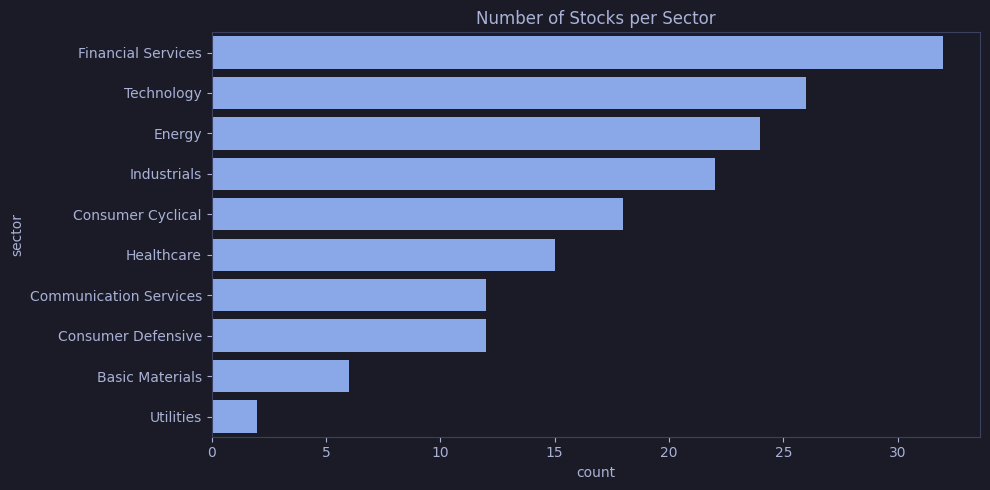

### 7.13 ECDF (Empirical CDF)


**How to read:**
- **X-axis** = variable values; **Y-axis** = cumulative proportion (0 to 1)
- Read as: "what fraction of data falls below this value?"
- **Steep section** = many values concentrated in a narrow range
- **Flat section** = sparse region with few data points
- Curves shifted right = higher values overall; compare vertical gaps between groups at any x to see which group has more data below that threshold

```python
# Cumulative distribution per sector — read off what % of stocks score below a threshold
fig, ax = plt.subplots(figsize=(10, 4))
sns.ecdfplot(data=scores_pd, x="composite_score", hue="sector", ax=ax)
ax.set_title("ECDF of Composite Score by Sector")
plt.tight_layout()
plt.show()
```

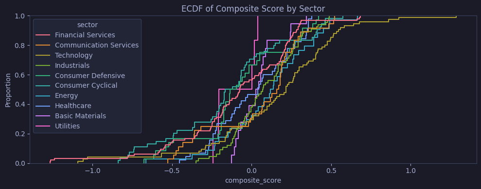

### 7.14 Rug Plot


**How to read:**
- **Short ticks on the axis** = exact position of each data point
- Combined with KDE, it grounds the smooth curve in actual observations
- **Dense ticks** = cluster of values; **gaps** = sparse regions
- Useful for small-to-medium datasets; too many ticks become a solid bar

```python
# KDE density with rug ticks showing exact score positions of each stock
fig, ax = plt.subplots(figsize=(10, 3))
sns.kdeplot(data=scores_pd, x="composite_score", fill=True, alpha=0.3, ax=ax)
sns.rugplot(data=scores_pd, x="composite_score", height=0.1, ax=ax)
ax.set_title("KDE + Rug: Composite Score")
plt.tight_layout()
plt.show()
```

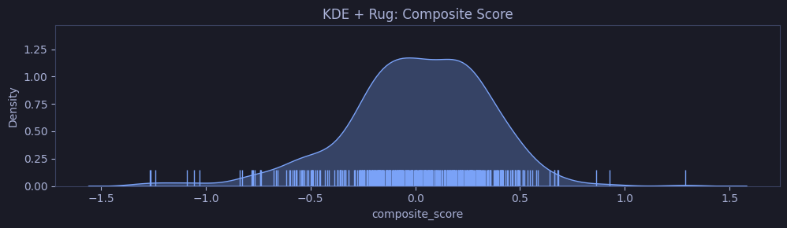

## 8. Matplotlib — Advanced


Matplotlib is the low-level engine behind Pandas and Seaborn plots. Use it directly when you need **full control**: custom layouts, mixed chart types in subplots, annotations, polar coordinates, or any visualization not covered by higher-level APIs.

**Best for:** Publication-quality figures, custom dashboards, unconventional chart types (radar, stem), and any scenario where you need pixel-level control over every element.

### 8.1 Subplots Grid

```python
# 2x2 dashboard: close price, volume, distribution, and open-vs-close scatter for ASML
fig, axes = plt.subplots(2, 2, figsize=(12, 8))

asml.plot(x="date", y="close", ax=axes[0, 0], title="Close", legend=False)
asml.plot(x="date", y="volume", ax=axes[0, 1], title="Volume", legend=False)
axes[1, 0].hist(asml["close"], bins=30)
axes[1, 0].set_title("Close Distribution")
axes[1, 1].scatter(asml["open"], asml["close"], alpha=0.5, s=10)
axes[1, 1].set_title("Open vs Close")

fig.suptitle("ASML Dashboard", fontsize=16)
plt.tight_layout()
plt.show()
```

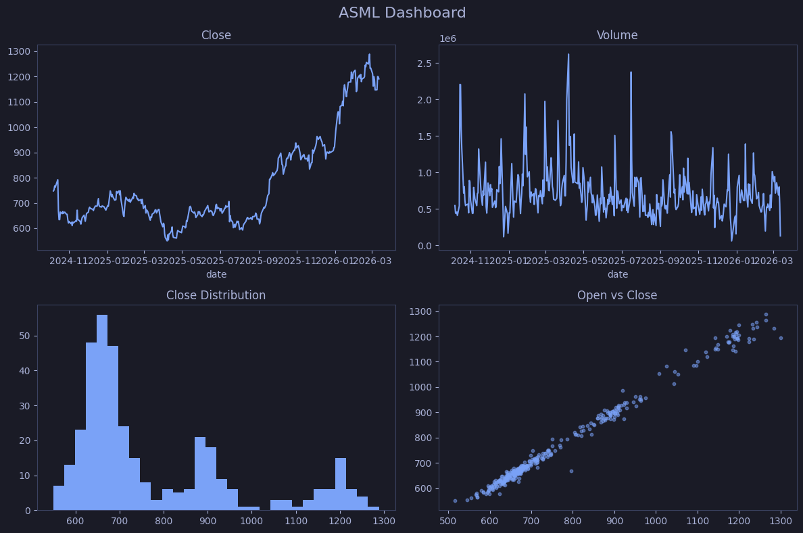

### 8.2 Step Plot


**How to read:**
- Value stays **flat** between changes, then jumps vertically
- Emphasizes that the value is constant between updates (unlike a line chart which implies interpolation)
- Best for discrete-step data: interest rates, pricing tiers, digital signals

```python
# Step plot — shows price as flat segments between changes (useful for discrete-step data)
fig, ax = plt.subplots(figsize=(10, 4))
ax.step(asml["date"], asml["close"], where="mid", color="#7aa2f7")
ax.set_title("ASML Close (Step)")
plt.tight_layout()
plt.show()
```

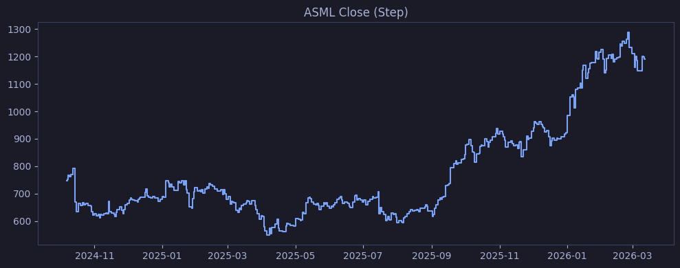

### 8.3 Stem Plot


**How to read:**
- **Vertical line** from baseline (zero) to the value — length = magnitude
- **Dot at tip** = the actual value
- Lines above zero = positive; below = negative
- Best for discrete events: daily returns, impulse responses, sparse signals

```python
# Stem plot of daily returns — each vertical line = one day's % change from previous close
returns = asml["close"].pct_change().dropna() * 100
fig, ax = plt.subplots(figsize=(10, 4))
ax.stem(asml["date"].iloc[1:], returns, linefmt="#7aa2f7", markerfmt="o", basefmt="#3b4261")
ax.set_title("ASML Daily Returns (%)")
plt.tight_layout()
plt.show()
```

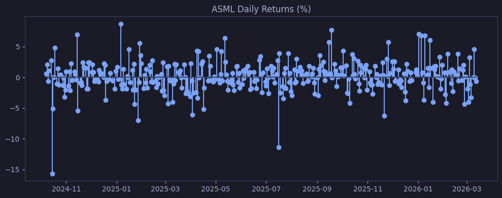

### 8.4 Stackplot (matplotlib native)

```python
# Native matplotlib stacked area — same as Pandas .plot.area but with more control
vol_pivot = top5[top5["symbol"].isin(top5_syms[:3])].pivot_table(
    index="date", columns="symbol", values="volume", aggfunc="sum").dropna()
fig, ax = plt.subplots(figsize=(10, 5))
ax.stackplot(vol_pivot.index, *[vol_pivot[c] for c in vol_pivot.columns],
             labels=vol_pivot.columns, alpha=0.7)
ax.set_title("Stacked Volume")
ax.legend(loc="upper left")
plt.tight_layout()
plt.show()
```

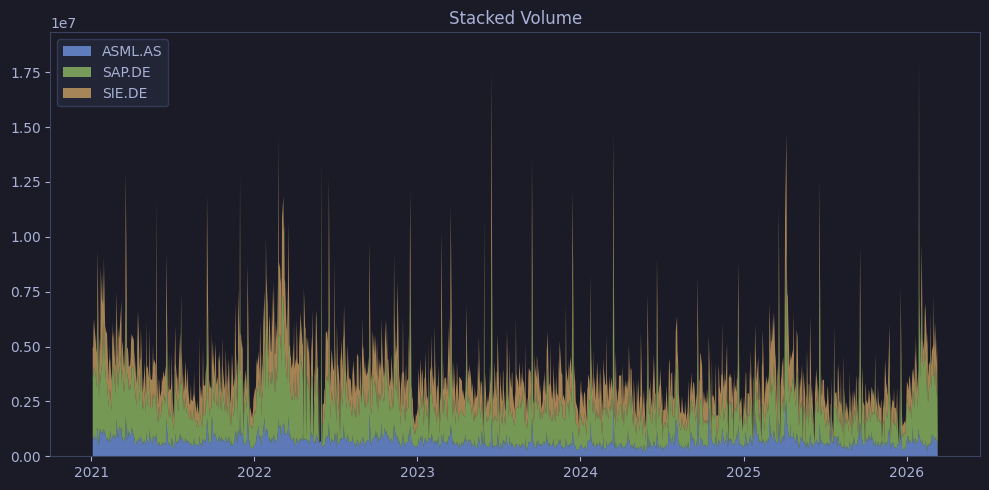

### 8.5 Polar / Radar Chart


**How to read:**
- Each **spoke** = one dimension/metric (e.g., momentum, value, sentiment, composite)
- **Distance from center** = score magnitude on that dimension
- **Shape** reveals the profile: balanced (regular polygon) vs specialized (elongated toward one spoke)
- Useful for comparing multi-dimensional profiles of a single entity

```python
# Radar chart for one stock's scores
cols = ["momentum_score", "relative_value_score", "sentiment_score", "composite_score"]
vals = scores_pd[scores_pd["symbol"] == "ASML.AS"][cols].iloc[0].tolist()
vals += [vals[0]]  # close the polygon

angles = np.linspace(0, 2 * np.pi, len(cols), endpoint=False).tolist()
angles += [angles[0]]

fig, ax = plt.subplots(figsize=(6, 6), subplot_kw=dict(polar=True))
ax.plot(angles, vals, color="#7aa2f7", linewidth=2)
ax.fill(angles, vals, alpha=0.2, color="#7aa2f7")
ax.set_xticks(angles[:-1])
ax.set_xticklabels(cols, size=9)
ax.set_title("ASML Score Radar")
plt.tight_layout()
plt.show()
```

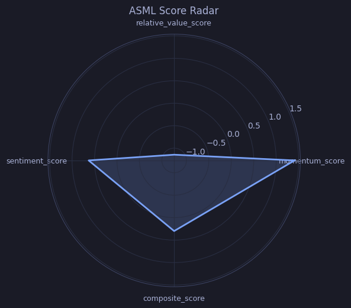

### 8.6 Error Bar Plot


**How to read:**
- **Dot** = point estimate (mean)
- **Bars** = uncertainty range (here: ±1 standard deviation)
- **Short bars** = low dispersion (consistent values); **long bars** = high dispersion
- Non-overlapping error bars suggest the groups differ meaningfully

```python
# Mean composite score per sector with std dev error bars — wider bars = more dispersion
stats = scores_pd.groupby("sector")["composite_score"].agg(["mean", "std"]).sort_values("mean")
fig, ax = plt.subplots(figsize=(10, 5))
ax.errorbar(stats.index, stats["mean"], yerr=stats["std"], fmt="o",
            capsize=5, color="#7aa2f7", ecolor="#f7768e")
ax.set_title("Composite Score: Mean ± Std")
plt.xticks(rotation=45, ha="right")
plt.tight_layout()
plt.show()
```

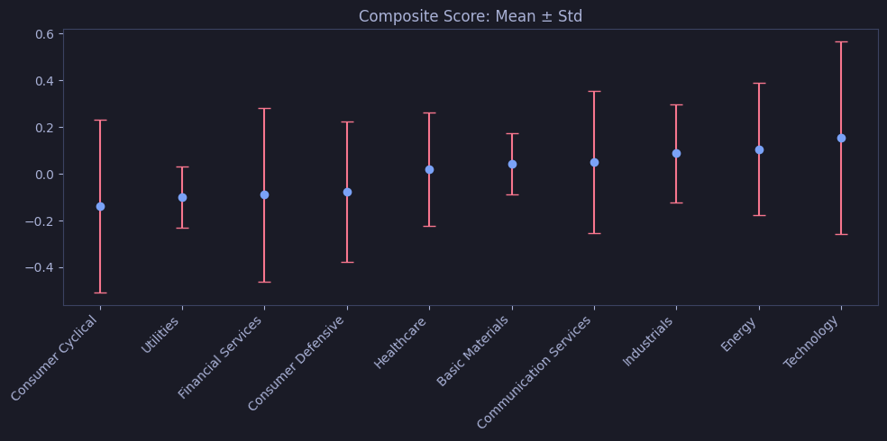

### 8.7 Annotations & Text

```python
# Close price with annotated max/min points and mean reference line
fig, ax = plt.subplots(figsize=(10, 4))
ax.plot(asml["date"], asml["close"], color="#7aa2f7")

# Mark max and min
max_idx = int(asml["close"].idxmax())
min_idx = int(asml["close"].idxmin())
for idx, label, color, offset in [
    (max_idx, "Max", "#9ece6a", (20, 15)),
    (min_idx, "Min", "#f7768e", (-60, -40)),
]:
    x = asml["date"].loc[idx]  # type: ignore[arg-type]
    y: float = asml["close"].loc[idx].item()  # type: ignore[union-attr]
    ax.annotate(f"{label}: {y:.0f}", xy=(x, y),
                xytext=offset, textcoords="offset points",
                arrowprops=dict(arrowstyle="->", color=color), color=color)

ax.axhline(asml["close"].mean(), linestyle="--", color="#e0af68", alpha=0.7, label="Mean")
ax.legend()
ax.set_title("ASML with Annotations")
plt.tight_layout()
plt.show()
```

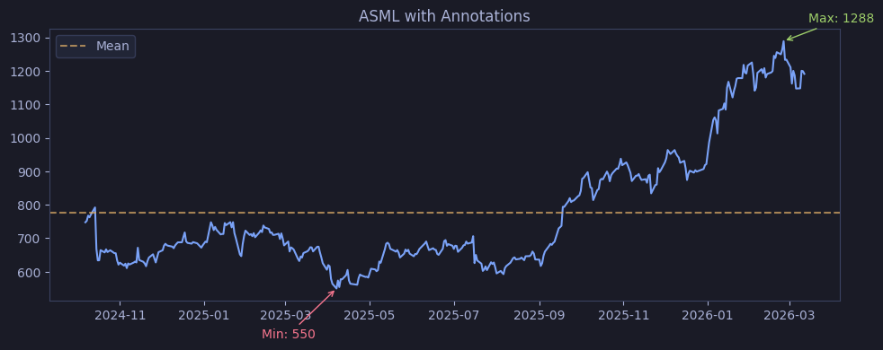

## 9. Polars to Pandas for Plotting

```python
# Polars DataFrame converted to Pandas for matplotlib plotting — standard workflow
asml_pl = ohlcv_pl.filter(pl.col("symbol") == "ASML.AS").sort("date").tail(90)
asml_pl.to_pandas().plot(x="date", y="close", title="ASML (Polars → Pandas plot)",
                         figsize=(10, 4), legend=False)
plt.tight_layout()
plt.show()
```

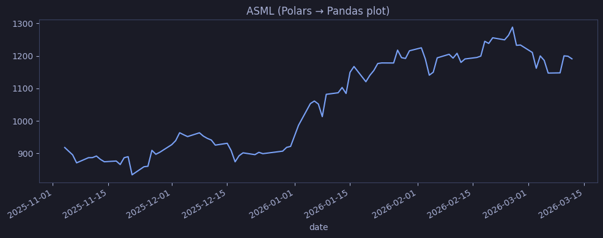

## Matplotlib / Seaborn Summary

| Chart | Matplotlib / Pandas | Seaborn |
|---|---|---|
| Line | `ax.plot()` / `df.plot()` | `sns.lineplot()` |
| Bar | `df.plot.bar()` / `.barh()` | `sns.barplot()` / `sns.countplot()` |
| Histogram | `df.plot.hist()` | `sns.histplot()` |
| KDE | `df.plot.kde()` | `sns.kdeplot()` |
| Scatter | `df.plot.scatter()` | `sns.scatterplot()` / `sns.regplot()` |
| Area | `df.plot.area()` / `ax.stackplot()` | — |
| Pie | `df.plot.pie()` | — |
| Box | — | `sns.boxplot()` |
| Violin | — | `sns.violinplot()` |
| Strip | — | `sns.stripplot()` |
| Swarm | — | `sns.swarmplot()` |
| Heatmap | `ax.imshow()` | `sns.heatmap()` / `sns.clustermap()` |
| Pair | — | `sns.pairplot()` |
| Joint | — | `sns.jointplot()` |
| ECDF | — | `sns.ecdfplot()` |
| Regression | — | `sns.regplot()` / `sns.residplot()` |
| Hexbin | `ax.hexbin()` | — |
| Step | `ax.step()` | — |
| Stem | `ax.stem()` | — |
| Polar/Radar | `subplot_kw=dict(polar=True)` | — |
| Error bars | `ax.errorbar()` | — |
| Fill between | `ax.fill_between()` | — |

---
# Part 2: Plotly — Interactive Charts

Plotly Express for quick interactive charts, and Graph Objects for full control.

```python
pio.renderers.default = "notebook_connected"


# Prepare data subsets
asml_pd = ohlcv_pd[ohlcv_pd["symbol"] == "ASML.AS"].sort_values("date").tail(365).copy()
asml_pl = ohlcv_pl.filter(pl.col("symbol") == "ASML.AS").sort("date").tail(365)
top5 = ["ASML.AS", "SAP.DE", "SIE.DE", "TTE.PA", "AIR.PA"]
top5_pd = ohlcv_pd[ohlcv_pd["symbol"].isin(top5)].sort_values("date").copy()

# Tokyo Night theme for all Plotly charts
pio.templates["tokyo_night"] = go.layout.Template(
    layout=go.Layout(
        paper_bgcolor="#1a1b26",
        plot_bgcolor="#1a1b26",
        font=dict(color="#a9b1d6", family="JetBrains Mono, Consolas, monospace"),
        title=dict(font=dict(color="#c0caf5", size=16)),
        xaxis=dict(gridcolor="#292e42", zerolinecolor="#3b4261", linecolor="#3b4261"),
        yaxis=dict(gridcolor="#292e42", zerolinecolor="#3b4261", linecolor="#3b4261"),
        colorway=["#7aa2f7", "#9ece6a", "#e0af68", "#f7768e", "#bb9af7",
                  "#7dcfff", "#73daca", "#ff9e64", "#2ac3de", "#b4f9f8"],
        legend=dict(bgcolor="rgba(0,0,0,0)", bordercolor="#3b4261"),
        hoverlabel=dict(bgcolor="#24283b", font_color="#c0caf5", bordercolor="#3b4261"),
    )
)
pio.templates.default = "tokyo_night"
```

## 1. Line Charts


Plotly line charts are **interactive** — hover for values, zoom, pan, and export. Faceting splits series into separate panels; dual Y-axes overlay different scales.

**Best for:** Interactive exploration of time-series data in notebooks or dashboards. Ideal when stakeholders need to zoom into specific date ranges or compare series on hover.

### 1.1 Basic Line

```python
# Interactive close price for ASML — hover for exact values, drag to zoom
fig = px.line(asml_pd, x="date", y="close", title="ASML Close Price (1Y)")
fig.show()
```

<script>
        window.PlotlyConfig = {MathJaxConfig: 'local'};
        if (window.MathJax && window.MathJax.Hub && window.MathJax.Hub.Config) {window.MathJax.Hub.Config({SVG: {font: "STIX-Web"}});}
        </script>
        <script type="module">import "https://cdn.plot.ly/plotly-3.4.0.min"</script>

<div>            <script src="https://cdnjs.cloudflare.com/ajax/libs/mathjax/2.7.5/MathJax.js?config=TeX-AMS-MML_SVG"></script><script>if (window.MathJax && window.MathJax.Hub && window.MathJax.Hub.Config) {window.MathJax.Hub.Config({SVG: {font: "STIX-Web"}});}</script>                <script>window.PlotlyConfig = {MathJaxConfig: 'local'};</script>
        <script charset="utf-8" src="https://cdn.plot.ly/plotly-3.4.0.min.js" integrity="sha256-KEmPoupLpFyGMyGAiOsiNDbKDKAvxXAn/W+oQa0ZAfk=" crossorigin="anonymous"></script>                <div id="0bbd1e7b-5d87-4cbc-9e24-eec36a8f25c3" class="plotly-graph-div" style="height:525px; width:100%;"></div>            <script>                window.PLOTLYENV=window.PLOTLYENV || {};                                if (document.getElementById("0bbd1e7b-5d87-4cbc-9e24-eec36a8f25c3")) {                    Plotly.newPlot(                        "0bbd1e7b-5d87-4cbc-9e24-eec36a8f25c3",                        [{"hovertemplate":"date=%{x}\u003cbr\u003eclose=%{y}\u003cextra\u003e\u003c\u002fextra\u003e","legendgroup":"","line":{"color":"#7aa2f7","dash":"solid"},"marker":{"symbol":"circle"},"mode":"lines","name":"","orientation":"v","showlegend":false,"x":["2024-10-07","2024-10-08","2024-10-09","2024-10-10","2024-10-11","2024-10-14","2024-10-15","2024-10-16","2024-10-17","2024-10-18","2024-10-21","2024-10-22","2024-10-23","2024-10-24","2024-10-25","2024-10-28","2024-10-29","2024-10-30","2024-10-31","2024-11-01","2024-11-04","2024-11-05","2024-11-06","2024-11-07","2024-11-08","2024-11-11","2024-11-12","2024-11-13","2024-11-14","2024-11-15","2024-11-18","2024-11-19","2024-11-20","2024-11-21","2024-11-22","2024-11-25","2024-11-26","2024-11-27","2024-11-28","2024-11-29","2024-12-02","2024-12-03","2024-12-04","2024-12-05","2024-12-06","2024-12-09","2024-12-10","2024-12-11","2024-12-12","2024-12-13","2024-12-16","2024-12-17","2024-12-18","2024-12-19","2024-12-20","2024-12-23","2024-12-24","2024-12-27","2024-12-30","2024-12-31","2025-01-02","2025-01-03","2025-01-06","2025-01-07","2025-01-08","2025-01-09","2025-01-10","2025-01-13","2025-01-14","2025-01-15","2025-01-16","2025-01-17","2025-01-20","2025-01-21","2025-01-22","2025-01-23","2025-01-24","2025-01-27","2025-01-28","2025-01-29","2025-01-30","2025-01-31","2025-02-03","2025-02-04","2025-02-05","2025-02-06","2025-02-07","2025-02-10","2025-02-11","2025-02-12","2025-02-13","2025-02-14","2025-02-17","2025-02-18","2025-02-19","2025-02-20","2025-02-21","2025-02-24","2025-02-25","2025-02-26","2025-02-27","2025-02-28","2025-03-03","2025-03-04","2025-03-05","2025-03-06","2025-03-07","2025-03-10","2025-03-11","2025-03-12","2025-03-13","2025-03-14","2025-03-17","2025-03-18","2025-03-19","2025-03-20","2025-03-21","2025-03-24","2025-03-25","2025-03-26","2025-03-27","2025-03-28","2025-03-31","2025-04-01","2025-04-02","2025-04-03","2025-04-04","2025-04-07","2025-04-08","2025-04-09","2025-04-10","2025-04-11","2025-04-14","2025-04-15","2025-04-16","2025-04-17","2025-04-22","2025-04-23","2025-04-24","2025-04-25","2025-04-28","2025-04-29","2025-04-30","2025-05-02","2025-05-05","2025-05-06","2025-05-07","2025-05-08","2025-05-09","2025-05-12","2025-05-13","2025-05-14","2025-05-15","2025-05-16","2025-05-19","2025-05-20","2025-05-21","2025-05-22","2025-05-23","2025-05-26","2025-05-27","2025-05-28","2025-05-29","2025-05-30","2025-06-02","2025-06-03","2025-06-04","2025-06-05","2025-06-06","2025-06-09","2025-06-10","2025-06-11","2025-06-12","2025-06-13","2025-06-16","2025-06-17","2025-06-18","2025-06-19","2025-06-20","2025-06-23","2025-06-24","2025-06-25","2025-06-26","2025-06-27","2025-06-30","2025-07-01","2025-07-02","2025-07-03","2025-07-04","2025-07-07","2025-07-08","2025-07-09","2025-07-10","2025-07-11","2025-07-14","2025-07-15","2025-07-16","2025-07-17","2025-07-18","2025-07-21","2025-07-22","2025-07-23","2025-07-24","2025-07-25","2025-07-28","2025-07-29","2025-07-30","2025-07-31","2025-08-01","2025-08-04","2025-08-05","2025-08-06","2025-08-07","2025-08-08","2025-08-11","2025-08-12","2025-08-13","2025-08-14","2025-08-15","2025-08-18","2025-08-19","2025-08-20","2025-08-21","2025-08-22","2025-08-25","2025-08-26","2025-08-27","2025-08-28","2025-08-29","2025-09-01","2025-09-02","2025-09-03","2025-09-04","2025-09-05","2025-09-08","2025-09-09","2025-09-10","2025-09-11","2025-09-12","2025-09-15","2025-09-16","2025-09-17","2025-09-18","2025-09-19","2025-09-22","2025-09-23","2025-09-24","2025-09-25","2025-09-26","2025-09-29","2025-09-30","2025-10-01","2025-10-02","2025-10-03","2025-10-06","2025-10-07","2025-10-08","2025-10-09","2025-10-10","2025-10-13","2025-10-14","2025-10-15","2025-10-16","2025-10-17","2025-10-20","2025-10-21","2025-10-22","2025-10-23","2025-10-24","2025-10-27","2025-10-28","2025-10-29","2025-10-30","2025-10-31","2025-11-03","2025-11-04","2025-11-05","2025-11-06","2025-11-07","2025-11-10","2025-11-11","2025-11-12","2025-11-13","2025-11-14","2025-11-17","2025-11-18","2025-11-19","2025-11-20","2025-11-21","2025-11-24","2025-11-25","2025-11-26","2025-11-27","2025-11-28","2025-12-01","2025-12-02","2025-12-03","2025-12-04","2025-12-05","2025-12-08","2025-12-09","2025-12-10","2025-12-11","2025-12-12","2025-12-15","2025-12-16","2025-12-17","2025-12-18","2025-12-19","2025-12-22","2025-12-23","2025-12-24","2025-12-29","2025-12-30","2025-12-31","2026-01-02","2026-01-05","2026-01-06","2026-01-07","2026-01-08","2026-01-09","2026-01-12","2026-01-13","2026-01-14","2026-01-15","2026-01-16","2026-01-19","2026-01-20","2026-01-21","2026-01-22","2026-01-23","2026-01-26","2026-01-27","2026-01-28","2026-01-29","2026-01-30","2026-02-02","2026-02-03","2026-02-04","2026-02-05","2026-02-06","2026-02-09","2026-02-10","2026-02-11","2026-02-12","2026-02-13","2026-02-16","2026-02-17","2026-02-18","2026-02-19","2026-02-20","2026-02-23","2026-02-24","2026-02-25","2026-02-26","2026-02-27","2026-03-02","2026-03-03","2026-03-04","2026-03-05","2026-03-06","2026-03-09","2026-03-10","2026-03-11","2026-03-12"],"xaxis":"x","y":{"dtype":"f8","bdata":"zczMzMxch0DNzMzMzICHQAAAAAAA\u002fIdAzczMzMzUh0CamZmZmRWIQAAAAAAAwIhAzczMzMzghEAzMzMzM8+DQJqZmZmZ0YNAAAAAAADEhEDNzMzMzIyEQGZmZmZm1oRAZmZmZmaWhEBmZmZmZqqEQM3MzMzMwIRAAAAAAAB8hECamZmZmXmEQAAAAAAA0INAmpmZmZlpg0DNzMzMzJiDQJqZmZmZUYNAAAAAAACAg0BmZmZmZhaDQJqZmZmZhYNAAAAAAABsg0BmZmZmZpqDQGZmZmZmsoNAmpmZmZmdg0DNzMzMzPyEQAAAAAAA2INAzczMzMysg0CamZmZmYWDQAAAAAAARINAAAAAAAC8g0DNzMzMzBCEQAAAAAAAYIRAAAAAAAAAhECamZmZmZ2DQDMzMzMzF4RAMzMzMzOThEDNzMzMzMCEQDMzMzMzL4VAAAAAAABchUCamZmZmTmFQM3MzMzMLIVAAAAAAAAYhUBmZmZmZvKEQGZmZmZmMoVAZmZmZmZahUCamZmZmX2FQAAAAAAAgIVAMzMzMzP7hUBmZmZmZmqGQGZmZmZmloVAzczMzMxwhUBmZmZmZl6FQAAAAAAAhIVAMzMzMzNnhUAzMzMzM\u002f+EQJqZmZmZNYVAAAAAAACQhUAAAAAAAICFQGZmZmZmXodAMzMzMzMTh0BmZmZmZqKGQDMzMzMz74ZAZmZmZmaqhkAAAAAAADyGQJqZmZmZRYZAmpmZmZlFhkAzMzMzM0uHQM3MzMzMGIdAAAAAAABgh0AzMzMzM+OGQM3MzMzMYIdAZmZmZmZahkCamZmZmeWFQM3MzMzMXIRAzczMzMw0hEAAAAAAAFSFQJqZmZmZFYZAmpmZmZmVhkAzMzMzMy+GQDMzMzMzQ4ZAzczMzMwQhkBmZmZmZlqGQAAAAAAA+IVAAAAAAABohkDNzMzMzJyGQDMzMzMzc4ZAMzMzMzMPh0CamZmZmeGGQGZmZmZmvoZAmpmZmZlhhkAAAAAAAGyGQDMzMzMzL4ZAzczMzMwwhkAAAAAAAEyGQGZmZmZmzoVAAAAAAABUhkDNzMzMzNiFQM3MzMzMNIVAZmZmZmaShUAAAAAAAKSEQJqZmZmZBYVAAAAAAADwhEAAAAAAANCEQAAAAAAA+INAAAAAAADAg0AAAAAAACyEQDMzMzMzE4RAmpmZmZl9hEBmZmZmZqqEQDMzMzMzz4RAzczMzMwIhUAAAAAAAASFQJqZmZmZpYRAzczMzMwUhUCamZmZmRWFQJqZmZmZiYRAAAAAAAAUhEDNzMzMzIyDQAAAAAAA8IJAmpmZmZldg0BmZmZmZkKDQJqZmZmZFYJAzczMzMyggUAAAAAAADCBQGZmZmZm7oFAZmZmZmZSgUDNzMzMzAyCQGZmZmZmCoJAAAAAAABwgkAzMzMzM+uCQAAAAAAA8IFAmpmZmZmhgUDNzMzMzIiBQDMzMzMzJ4JAmpmZmZl9gkAzMzMzM2eCQAAAAAAARIJAAAAAAABIgkAAAAAAADSCQDMzMzMzB4NAZmZmZmb2gkAAAAAAAMyCQJqZmZmZ5YJAAAAAAAC0g0BmZmZmZpaDQDMzMzMz14RAmpmZmZldhUDNzMzMzHSFQJqZmZmZUYVAMzMzMzPjhEAzMzMzM7OEQAAAAAAAoIRAmpmZmZnFhEBmZmZmZoaEQM3MzMzMFIRAAAAAAABwhEDNzMzMzNCEQGZmZmZmpoRAAAAAAADMhEAzMzMzM2+EQJqZmZmZMYRAzczMzMxohEAzMzMzM2OEQAAAAAAAmIRAzczMzMzchEDNzMzMzECFQAAAAAAAZIVAmpmZmZmRhUDNzMzMzCSFQM3MzMzMxIRAzczMzMzwhEAAAAAAANCEQAAAAAAAyIRAzczMzMxohEAzMzMzM1OEQJqZmZmZ5YRAMzMzMzObhUAAAAAAALSFQDMzMzMzK4VAAAAAAABUhUDNzMzMzCyFQJqZmZmZ4YRAzczMzMwshUDNzMzMzCiFQDMzMzMzm4RAzczMzMz8hEAzMzMzMzeFQGZmZmZmPoVAAAAAAACQhUAzMzMzM1+FQGZmZmZmeoVAzczMzMwQhkBmZmZmZo6DQJqZmZmZUYRAAAAAAADMg0DNzMzMzICDQDMzMzMz04JAzczMzMz0gkAzMzMzMz+DQDMzMzMz54JAZmZmZmaig0AAAAAAAHiDQAAAAAAAnINAzczMzMwog0AAAAAAAJiCQDMzMzMz04JAzczMzMyogkAzMzMzM4eCQJqZmZmZFYNAMzMzMzNHg0AAAAAAAJiDQDMzMzMzz4NAzczMzMwEhEAzMzMzMxeEQJqZmZmZ5YNAmpmZmZn1g0BmZmZmZhKEQJqZmZmZ8YNAAAAAAADUg0CamZmZmTGEQJqZmZmZNYRAzczMzMxUhECamZmZmaGEQGZmZmZmcoRAzczMzMzkg0DNzMzMzOCDQJqZmZmZSYNAZmZmZmaKg0DNzMzMzDyEQJqZmZmZoYRAzczMzMwkhUCamZmZmVmFQJqZmZmZQYVAAAAAAABwhUBmZmZmZo6FQDMzMzMzy4ZAMzMzMzPnhkAAAAAAAAiHQAAAAAAA0IhAmpmZmZnNiEBmZmZmZlaJQGZmZmZmnolAAAAAAABAiUCamZmZmV2JQGZmZmZmZolAAAAAAADMiUDNzMzMzOCJQDMzMzMzS4pAzczMzMxsi0DNzMzMzICLQGZmZmZmCoxAZmZmZmZWi0BmZmZmZp6KQGZmZmZmjopAMzMzMzNviUAAAAAAAGCKQM3MzMzMdIpAAAAAAABIi0AzMzMzM2uLQJqZmZmZXYtAAAAAAAAYjEBmZmZmZs6LQM3MzMzMMItAmpmZmZm9i0AzMzMzM\u002fOLQM3MzMzMYIxAMzMzMzNbjEAzMzMzM7uMQAAAAAAATI1AzczMzMywjEAAAAAAAPSMQAAAAAAAsIxAzczMzMxUjEBmZmZmZvqLQGZmZmZmNotAmpmZmZm1i0AzMzMzM7eLQGZmZmZm3otAAAAAAACMi0DNzMzMzFCLQDMzMzMzY4tAzczMzMwMi0DNzMzMzLSLQGZmZmZmzotAAAAAAAAQikBmZmZmZtaKQGZmZmZm4opAZmZmZmZqjECamZmZmQmMQDMzMzMzO4xAmpmZmZn1jEDNzMzMzFiNQDMzMzMzG45AZmZmZmbqjUDNzMzMzLyNQJqZmZmZGY5AMzMzMzPHjUAAAAAAAJCNQDMzMzMzZ41AZmZmZmbqjEAAAAAAABiNQM3MzMzMZIxAAAAAAABQi0CamZmZmeWLQM3MzMzMLIxAAAAAAAAAjECamZmZmTmMQAAAAAAAGIxAZmZmZmZWjEAzMzMzM7OMQDMzMzMzy4xAZmZmZmbSjkDNzMzMzHSQQAAAAAAAlJBAMzMzMzNvkEAAAAAAAKiPQGZmZmZm5pBAmpmZmZn5kEBmZmZmZjqRQM3MzMzM8JBAmpmZmZn1kUDNzMzMzDySQJqZmZmZgZFAAAAAAADQkUAzMzMzMwuSQJqZmZmZYZJAzczMzMxokkAAAAAAAGiSQGZmZmZmBpNAmpmZmZmpkkAAAAAAAKCSQGZmZmZm\u002fpJAMzMzMzMjk0CamZmZmZmSQGZmZmZm0pFAZmZmZmb2kUAzMzMzM6eSQDMzMzMz05JAAAAAAACkkkAzMzMzM9+SQDMzMzMzb5JAmpmZmZmZkkAAAAAAAKySQM3MzMzMvJJAMzMzMzNzk0DNzMzMzFiTQGZmZmZmnpNAzczMzMyEk0CamZmZmb2TQJqZmZmZIZRAmpmZmZlBk0CamZmZmUWTQJqZmZmZ6ZJAMzMzMzMnkkAzMzMzM7+SQAAAAAAAiJJAAAAAAADskUBmZmZmZu6RQAAAAAAAwJJAMzMzMzO7kkAzMzMzM5uSQA=="},"yaxis":"y","type":"scatter"}],                        {"template":{"layout":{"colorway":["#7aa2f7","#9ece6a","#e0af68","#f7768e","#bb9af7","#7dcfff","#73daca","#ff9e64","#2ac3de","#b4f9f8"],"font":{"color":"#a9b1d6","family":"JetBrains Mono, Consolas, monospace"},"hoverlabel":{"bgcolor":"#24283b","bordercolor":"#3b4261","font":{"color":"#c0caf5"}},"legend":{"bgcolor":"rgba(0,0,0,0)","bordercolor":"#3b4261"},"paper_bgcolor":"#1a1b26","plot_bgcolor":"#1a1b26","title":{"font":{"color":"#c0caf5","size":16}},"xaxis":{"gridcolor":"#292e42","linecolor":"#3b4261","zerolinecolor":"#3b4261"},"yaxis":{"gridcolor":"#292e42","linecolor":"#3b4261","zerolinecolor":"#3b4261"}}},"xaxis":{"anchor":"y","domain":[0.0,1.0],"title":{"text":"date"}},"yaxis":{"anchor":"x","domain":[0.0,1.0],"title":{"text":"close"}},"legend":{"tracegroupgap":0},"title":{"text":"ASML Close Price (1Y)"}},                        {"responsive": true}                    ).then(function(){
                            
var gd = document.getElementById('0bbd1e7b-5d87-4cbc-9e24-eec36a8f25c3');
var x = new MutationObserver(function (mutations, observer) {{
        var display = window.getComputedStyle(gd).display;
        if (!display || display === 'none') {{
            console.log([gd, 'removed!']);
            Plotly.purge(gd);
            observer.disconnect();
        }}
}});

// Listen for the removal of the full notebook cells
var notebookContainer = gd.closest('#notebook-container');
if (notebookContainer) {{
    x.observe(notebookContainer, {childList: true});
}}

// Listen for the clearing of the current output cell
var outputEl = gd.closest('.output');
if (outputEl) {{
    x.observe(outputEl, {childList: true});
}}

                        })                };            </script>        </div>

### 1.2 Multi-Series (color)

```python
# Multi-stock comparison — unified hover shows all prices at the same date
fig = px.line(top5_pd, x="date", y="close", color="symbol",
              title="Close Prices — Top 5 Stocks")
fig.update_layout(hovermode="x unified")
fig.show()
```

<div>            <script src="https://cdnjs.cloudflare.com/ajax/libs/mathjax/2.7.5/MathJax.js?config=TeX-AMS-MML_SVG"></script><script>if (window.MathJax && window.MathJax.Hub && window.MathJax.Hub.Config) {window.MathJax.Hub.Config({SVG: {font: "STIX-Web"}});}</script>                <script>window.PlotlyConfig = {MathJaxConfig: 'local'};</script>
        <script charset="utf-8" src="https://cdn.plot.ly/plotly-3.4.0.min.js" integrity="sha256-KEmPoupLpFyGMyGAiOsiNDbKDKAvxXAn/W+oQa0ZAfk=" crossorigin="anonymous"></script>                <div id="161be4f4-8fa9-4153-b3e4-be01d581735f" class="plotly-graph-div" style="height:525px; width:100%;"></div>            <script>                window.PLOTLYENV=window.PLOTLYENV || {};                                if (document.getElementById("161be4f4-8fa9-4153-b3e4-be01d581735f")) {                    Plotly.newPlot(                        "161be4f4-8fa9-4153-b3e4-be01d581735f",                        [{"hovertemplate":"symbol=AIR.PA\u003cbr\u003edate=%{x}\u003cbr\u003eclose=%{y}\u003cextra\u003e\u003c\u002fextra\u003e","legendgroup":"AIR.PA","line":{"color":"#7aa2f7","dash":"solid"},"marker":{"symbol":"circle"},"mode":"lines","name":"AIR.PA","showlegend":true,"x":["2021-01-04","2021-01-05","2021-01-06","2021-01-07","2021-01-08","2021-01-11","2021-01-12","2021-01-13","2021-01-14","2021-01-15","2021-01-18","2021-01-19","2021-01-20","2021-01-21","2021-01-22","2021-01-25","2021-01-26","2021-01-27","2021-01-28","2021-01-29","2021-02-01","2021-02-02","2021-02-03","2021-02-04","2021-02-05","2021-02-08","2021-02-09","2021-02-10","2021-02-11","2021-02-12","2021-02-15","2021-02-16","2021-02-17","2021-02-18","2021-02-19","2021-02-22","2021-02-23","2021-02-24","2021-02-25","2021-02-26","2021-03-01","2021-03-02","2021-03-03","2021-03-04","2021-03-05","2021-03-08","2021-03-09","2021-03-10","2021-03-11","2021-03-12","2021-03-15","2021-03-16","2021-03-17","2021-03-18","2021-03-19","2021-03-22","2021-03-23","2021-03-24","2021-03-25","2021-03-26","2021-03-29","2021-03-30","2021-03-31","2021-04-01","2021-04-06","2021-04-07","2021-04-08","2021-04-09","2021-04-12","2021-04-13","2021-04-14","2021-04-15","2021-04-16","2021-04-19","2021-04-20","2021-04-21","2021-04-22","2021-04-23","2021-04-26","2021-04-27","2021-04-28","2021-04-29","2021-04-30","2021-05-03","2021-05-04","2021-05-05","2021-05-06","2021-05-07","2021-05-10","2021-05-11","2021-05-12","2021-05-13","2021-05-14","2021-05-17","2021-05-18","2021-05-19","2021-05-20","2021-05-21","2021-05-24","2021-05-25","2021-05-26","2021-05-27","2021-05-28","2021-05-31","2021-06-01","2021-06-02","2021-06-03","2021-06-04","2021-06-07","2021-06-08","2021-06-09","2021-06-10","2021-06-11","2021-06-14","2021-06-15","2021-06-16","2021-06-17","2021-06-18","2021-06-21","2021-06-22","2021-06-23","2021-06-24","2021-06-25","2021-06-28","2021-06-29","2021-06-30","2021-07-01","2021-07-02","2021-07-05","2021-07-06","2021-07-07","2021-07-08","2021-07-09","2021-07-12","2021-07-13","2021-07-14","2021-07-15","2021-07-16","2021-07-19","2021-07-20","2021-07-21","2021-07-22","2021-07-23","2021-07-26","2021-07-27","2021-07-28","2021-07-29","2021-07-30","2021-08-02","2021-08-03","2021-08-04","2021-08-05","2021-08-06","2021-08-09","2021-08-10","2021-08-11","2021-08-12","2021-08-13","2021-08-16","2021-08-17","2021-08-18","2021-08-19","2021-08-20","2021-08-23","2021-08-24","2021-08-25","2021-08-26","2021-08-27","2021-08-30","2021-08-31","2021-09-01","2021-09-02","2021-09-03","2021-09-06","2021-09-07","2021-09-08","2021-09-09","2021-09-10","2021-09-13","2021-09-14","2021-09-15","2021-09-16","2021-09-17","2021-09-20","2021-09-21","2021-09-22","2021-09-23","2021-09-24","2021-09-27","2021-09-28","2021-09-29","2021-09-30","2021-10-01","2021-10-04","2021-10-05","2021-10-06","2021-10-07","2021-10-08","2021-10-11","2021-10-12","2021-10-13","2021-10-14","2021-10-15","2021-10-18","2021-10-19","2021-10-20","2021-10-21","2021-10-22","2021-10-25","2021-10-26","2021-10-27","2021-10-28","2021-10-29","2021-11-01","2021-11-02","2021-11-03","2021-11-04","2021-11-05","2021-11-08","2021-11-09","2021-11-10","2021-11-11","2021-11-12","2021-11-15","2021-11-16","2021-11-17","2021-11-18","2021-11-19","2021-11-22","2021-11-23","2021-11-24","2021-11-25","2021-11-26","2021-11-29","2021-11-30","2021-12-01","2021-12-02","2021-12-03","2021-12-06","2021-12-07","2021-12-08","2021-12-09","2021-12-10","2021-12-13","2021-12-14","2021-12-15","2021-12-16","2021-12-17","2021-12-20","2021-12-21","2021-12-22","2021-12-23","2021-12-24","2021-12-27","2021-12-28","2021-12-29","2021-12-30","2021-12-31","2022-01-03","2022-01-04","2022-01-05","2022-01-06","2022-01-07","2022-01-10","2022-01-11","2022-01-12","2022-01-13","2022-01-14","2022-01-17","2022-01-18","2022-01-19","2022-01-20","2022-01-21","2022-01-24","2022-01-25","2022-01-26","2022-01-27","2022-01-28","2022-01-31","2022-02-01","2022-02-02","2022-02-03","2022-02-04","2022-02-07","2022-02-08","2022-02-09","2022-02-10","2022-02-11","2022-02-14","2022-02-15","2022-02-16","2022-02-17","2022-02-18","2022-02-21","2022-02-22","2022-02-23","2022-02-24","2022-02-25","2022-02-28","2022-03-01","2022-03-02","2022-03-03","2022-03-04","2022-03-07","2022-03-08","2022-03-09","2022-03-10","2022-03-11","2022-03-14","2022-03-15","2022-03-16","2022-03-17","2022-03-18","2022-03-21","2022-03-22","2022-03-23","2022-03-24","2022-03-25","2022-03-28","2022-03-29","2022-03-30","2022-03-31","2022-04-01","2022-04-04","2022-04-05","2022-04-06","2022-04-07","2022-04-08","2022-04-11","2022-04-12","2022-04-13","2022-04-14","2022-04-19","2022-04-20","2022-04-21","2022-04-22","2022-04-25","2022-04-26","2022-04-27","2022-04-28","2022-04-29","2022-05-02","2022-05-03","2022-05-04","2022-05-05","2022-05-06","2022-05-09","2022-05-10","2022-05-11","2022-05-12","2022-05-13","2022-05-16","2022-05-17","2022-05-18","2022-05-19","2022-05-20","2022-05-23","2022-05-24","2022-05-25","2022-05-26","2022-05-27","2022-05-30","2022-05-31","2022-06-01","2022-06-02","2022-06-03","2022-06-06","2022-06-07","2022-06-08","2022-06-09","2022-06-10","2022-06-13","2022-06-14","2022-06-15","2022-06-16","2022-06-17","2022-06-20","2022-06-21","2022-06-22","2022-06-23","2022-06-24","2022-06-27","2022-06-28","2022-06-29","2022-06-30","2022-07-01","2022-07-04","2022-07-05","2022-07-06","2022-07-07","2022-07-08","2022-07-11","2022-07-12","2022-07-13","2022-07-14","2022-07-15","2022-07-18","2022-07-19","2022-07-20","2022-07-21","2022-07-22","2022-07-25","2022-07-26","2022-07-27","2022-07-28","2022-07-29","2022-08-01","2022-08-02","2022-08-03","2022-08-04","2022-08-05","2022-08-08","2022-08-09","2022-08-10","2022-08-11","2022-08-12","2022-08-15","2022-08-16","2022-08-17","2022-08-18","2022-08-19","2022-08-22","2022-08-23","2022-08-24","2022-08-25","2022-08-26","2022-08-29","2022-08-30","2022-08-31","2022-09-01","2022-09-02","2022-09-05","2022-09-06","2022-09-07","2022-09-08","2022-09-09","2022-09-12","2022-09-13","2022-09-14","2022-09-15","2022-09-16","2022-09-19","2022-09-20","2022-09-21","2022-09-22","2022-09-23","2022-09-26","2022-09-27","2022-09-28","2022-09-29","2022-09-30","2022-10-03","2022-10-04","2022-10-05","2022-10-06","2022-10-07","2022-10-10","2022-10-11","2022-10-12","2022-10-13","2022-10-14","2022-10-17","2022-10-18","2022-10-19","2022-10-20","2022-10-21","2022-10-24","2022-10-25","2022-10-26","2022-10-27","2022-10-28","2022-10-31","2022-11-01","2022-11-02","2022-11-03","2022-11-04","2022-11-07","2022-11-08","2022-11-09","2022-11-10","2022-11-11","2022-11-14","2022-11-15","2022-11-16","2022-11-17","2022-11-18","2022-11-21","2022-11-22","2022-11-23","2022-11-24","2022-11-25","2022-11-28","2022-11-29","2022-11-30","2022-12-01","2022-12-02","2022-12-05","2022-12-06","2022-12-07","2022-12-08","2022-12-09","2022-12-12","2022-12-13","2022-12-14","2022-12-15","2022-12-16","2022-12-19","2022-12-20","2022-12-21","2022-12-22","2022-12-23","2022-12-27","2022-12-28","2022-12-29","2022-12-30","2023-01-02","2023-01-03","2023-01-04","2023-01-05","2023-01-06","2023-01-09","2023-01-10","2023-01-11","2023-01-12","2023-01-13","2023-01-16","2023-01-17","2023-01-18","2023-01-19","2023-01-20","2023-01-23","2023-01-24","2023-01-25","2023-01-26","2023-01-27","2023-01-30","2023-01-31","2023-02-01","2023-02-02","2023-02-03","2023-02-06","2023-02-07","2023-02-08","2023-02-09","2023-02-10","2023-02-13","2023-02-14","2023-02-15","2023-02-16","2023-02-17","2023-02-20","2023-02-21","2023-02-22","2023-02-23","2023-02-24","2023-02-27","2023-02-28","2023-03-01","2023-03-02","2023-03-03","2023-03-06","2023-03-07","2023-03-08","2023-03-09","2023-03-10","2023-03-13","2023-03-14","2023-03-15","2023-03-16","2023-03-17","2023-03-20","2023-03-21","2023-03-22","2023-03-23","2023-03-24","2023-03-27","2023-03-28","2023-03-29","2023-03-30","2023-03-31","2023-04-03","2023-04-04","2023-04-05","2023-04-06","2023-04-11","2023-04-12","2023-04-13","2023-04-14","2023-04-17","2023-04-18","2023-04-19","2023-04-20","2023-04-21","2023-04-24","2023-04-25","2023-04-26","2023-04-27","2023-04-28","2023-05-02","2023-05-03","2023-05-04","2023-05-05","2023-05-08","2023-05-09","2023-05-10","2023-05-11","2023-05-12","2023-05-15","2023-05-16","2023-05-17","2023-05-18","2023-05-19","2023-05-22","2023-05-23","2023-05-24","2023-05-25","2023-05-26","2023-05-29","2023-05-30","2023-05-31","2023-06-01","2023-06-02","2023-06-05","2023-06-06","2023-06-07","2023-06-08","2023-06-09","2023-06-12","2023-06-13","2023-06-14","2023-06-15","2023-06-16","2023-06-19","2023-06-20","2023-06-21","2023-06-22","2023-06-23","2023-06-26","2023-06-27","2023-06-28","2023-06-29","2023-06-30","2023-07-03","2023-07-04","2023-07-05","2023-07-06","2023-07-07","2023-07-10","2023-07-11","2023-07-12","2023-07-13","2023-07-14","2023-07-17","2023-07-18","2023-07-19","2023-07-20","2023-07-21","2023-07-24","2023-07-25","2023-07-26","2023-07-27","2023-07-28","2023-07-31","2023-08-01","2023-08-02","2023-08-03","2023-08-04","2023-08-07","2023-08-08","2023-08-09","2023-08-10","2023-08-11","2023-08-14","2023-08-15","2023-08-16","2023-08-17","2023-08-18","2023-08-21","2023-08-22","2023-08-23","2023-08-24","2023-08-25","2023-08-28","2023-08-29","2023-08-30","2023-08-31","2023-09-01","2023-09-04","2023-09-05","2023-09-06","2023-09-07","2023-09-08","2023-09-11","2023-09-12","2023-09-13","2023-09-14","2023-09-15","2023-09-18","2023-09-19","2023-09-20","2023-09-21","2023-09-22","2023-09-25","2023-09-26","2023-09-27","2023-09-28","2023-09-29","2023-10-02","2023-10-03","2023-10-04","2023-10-05","2023-10-06","2023-10-09","2023-10-10","2023-10-11","2023-10-12","2023-10-13","2023-10-16","2023-10-17","2023-10-18","2023-10-19","2023-10-20","2023-10-23","2023-10-24","2023-10-25","2023-10-26","2023-10-27","2023-10-30","2023-10-31","2023-11-01","2023-11-02","2023-11-03","2023-11-06","2023-11-07","2023-11-08","2023-11-09","2023-11-10","2023-11-13","2023-11-14","2023-11-15","2023-11-16","2023-11-17","2023-11-20","2023-11-21","2023-11-22","2023-11-23","2023-11-24","2023-11-27","2023-11-28","2023-11-29","2023-11-30","2023-12-01","2023-12-04","2023-12-05","2023-12-06","2023-12-07","2023-12-08","2023-12-11","2023-12-12","2023-12-13","2023-12-14","2023-12-15","2023-12-18","2023-12-19","2023-12-20","2023-12-21","2023-12-22","2023-12-27","2023-12-28","2023-12-29","2024-01-02","2024-01-03","2024-01-04","2024-01-05","2024-01-08","2024-01-09","2024-01-10","2024-01-11","2024-01-12","2024-01-15","2024-01-16","2024-01-17","2024-01-18","2024-01-19","2024-01-22","2024-01-23","2024-01-24","2024-01-25","2024-01-26","2024-01-29","2024-01-30","2024-01-31","2024-02-01","2024-02-02","2024-02-05","2024-02-06","2024-02-07","2024-02-08","2024-02-09","2024-02-12","2024-02-13","2024-02-14","2024-02-15","2024-02-16","2024-02-19","2024-02-20","2024-02-21","2024-02-22","2024-02-23","2024-02-26","2024-02-27","2024-02-28","2024-02-29","2024-03-01","2024-03-04","2024-03-05","2024-03-06","2024-03-07","2024-03-08","2024-03-11","2024-03-12","2024-03-13","2024-03-14","2024-03-15","2024-03-18","2024-03-19","2024-03-20","2024-03-21","2024-03-22","2024-03-25","2024-03-26","2024-03-27","2024-03-28","2024-04-02","2024-04-03","2024-04-04","2024-04-05","2024-04-08","2024-04-09","2024-04-10","2024-04-11","2024-04-12","2024-04-15","2024-04-16","2024-04-17","2024-04-18","2024-04-19","2024-04-22","2024-04-23","2024-04-24","2024-04-25","2024-04-26","2024-04-29","2024-04-30","2024-05-02","2024-05-03","2024-05-06","2024-05-07","2024-05-08","2024-05-09","2024-05-10","2024-05-13","2024-05-14","2024-05-15","2024-05-16","2024-05-17","2024-05-20","2024-05-21","2024-05-22","2024-05-23","2024-05-24","2024-05-27","2024-05-28","2024-05-29","2024-05-30","2024-05-31","2024-06-03","2024-06-04","2024-06-05","2024-06-06","2024-06-07","2024-06-10","2024-06-11","2024-06-12","2024-06-13","2024-06-14","2024-06-17","2024-06-18","2024-06-19","2024-06-20","2024-06-21","2024-06-24","2024-06-25","2024-06-26","2024-06-27","2024-06-28","2024-07-01","2024-07-02","2024-07-03","2024-07-04","2024-07-05","2024-07-08","2024-07-09","2024-07-10","2024-07-11","2024-07-12","2024-07-15","2024-07-16","2024-07-17","2024-07-18","2024-07-19","2024-07-22","2024-07-23","2024-07-24","2024-07-25","2024-07-26","2024-07-29","2024-07-30","2024-07-31","2024-08-01","2024-08-02","2024-08-05","2024-08-06","2024-08-07","2024-08-08","2024-08-09","2024-08-12","2024-08-13","2024-08-14","2024-08-15","2024-08-16","2024-08-19","2024-08-20","2024-08-21","2024-08-22","2024-08-23","2024-08-26","2024-08-27","2024-08-28","2024-08-29","2024-08-30","2024-09-02","2024-09-03","2024-09-04","2024-09-05","2024-09-06","2024-09-09","2024-09-10","2024-09-11","2024-09-12","2024-09-13","2024-09-16","2024-09-17","2024-09-18","2024-09-19","2024-09-20","2024-09-23","2024-09-24","2024-09-25","2024-09-26","2024-09-27","2024-09-30","2024-10-01","2024-10-02","2024-10-03","2024-10-04","2024-10-07","2024-10-08","2024-10-09","2024-10-10","2024-10-11","2024-10-14","2024-10-15","2024-10-16","2024-10-17","2024-10-18","2024-10-21","2024-10-22","2024-10-23","2024-10-24","2024-10-25","2024-10-28","2024-10-29","2024-10-30","2024-10-31","2024-11-01","2024-11-04","2024-11-05","2024-11-06","2024-11-07","2024-11-08","2024-11-11","2024-11-12","2024-11-13","2024-11-14","2024-11-15","2024-11-18","2024-11-19","2024-11-20","2024-11-21","2024-11-22","2024-11-25","2024-11-26","2024-11-27","2024-11-28","2024-11-29","2024-12-02","2024-12-03","2024-12-04","2024-12-05","2024-12-06","2024-12-09","2024-12-10","2024-12-11","2024-12-12","2024-12-13","2024-12-16","2024-12-17","2024-12-18","2024-12-19","2024-12-20","2024-12-23","2024-12-24","2024-12-27","2024-12-30","2024-12-31","2025-01-02","2025-01-03","2025-01-06","2025-01-07","2025-01-08","2025-01-09","2025-01-10","2025-01-13","2025-01-14","2025-01-15","2025-01-16","2025-01-17","2025-01-20","2025-01-21","2025-01-22","2025-01-23","2025-01-24","2025-01-27","2025-01-28","2025-01-29","2025-01-30","2025-01-31","2025-02-03","2025-02-04","2025-02-05","2025-02-06","2025-02-07","2025-02-10","2025-02-11","2025-02-12","2025-02-13","2025-02-14","2025-02-17","2025-02-18","2025-02-19","2025-02-20","2025-02-21","2025-02-24","2025-02-25","2025-02-26","2025-02-27","2025-02-28","2025-03-03","2025-03-04","2025-03-05","2025-03-06","2025-03-07","2025-03-10","2025-03-11","2025-03-12","2025-03-13","2025-03-14","2025-03-17","2025-03-18","2025-03-19","2025-03-20","2025-03-21","2025-03-24","2025-03-25","2025-03-26","2025-03-27","2025-03-28","2025-03-31","2025-04-01","2025-04-02","2025-04-03","2025-04-04","2025-04-07","2025-04-08","2025-04-09","2025-04-10","2025-04-11","2025-04-14","2025-04-15","2025-04-16","2025-04-17","2025-04-22","2025-04-23","2025-04-24","2025-04-25","2025-04-28","2025-04-29","2025-04-30","2025-05-02","2025-05-05","2025-05-06","2025-05-07","2025-05-08","2025-05-09","2025-05-12","2025-05-13","2025-05-14","2025-05-15","2025-05-16","2025-05-19","2025-05-20","2025-05-21","2025-05-22","2025-05-23","2025-05-26","2025-05-27","2025-05-28","2025-05-29","2025-05-30","2025-06-02","2025-06-03","2025-06-04","2025-06-05","2025-06-06","2025-06-09","2025-06-10","2025-06-11","2025-06-12","2025-06-13","2025-06-16","2025-06-17","2025-06-18","2025-06-19","2025-06-20","2025-06-23","2025-06-24","2025-06-25","2025-06-26","2025-06-27","2025-06-30","2025-07-01","2025-07-02","2025-07-03","2025-07-04","2025-07-07","2025-07-08","2025-07-09","2025-07-10","2025-07-11","2025-07-14","2025-07-15","2025-07-16","2025-07-17","2025-07-18","2025-07-21","2025-07-22","2025-07-23","2025-07-24","2025-07-25","2025-07-28","2025-07-29","2025-07-30","2025-07-31","2025-08-01","2025-08-04","2025-08-05","2025-08-06","2025-08-07","2025-08-08","2025-08-11","2025-08-12","2025-08-13","2025-08-14","2025-08-15","2025-08-18","2025-08-19","2025-08-20","2025-08-21","2025-08-22","2025-08-25","2025-08-26","2025-08-27","2025-08-28","2025-08-29","2025-09-01","2025-09-02","2025-09-03","2025-09-04","2025-09-05","2025-09-08","2025-09-09","2025-09-10","2025-09-11","2025-09-12","2025-09-15","2025-09-16","2025-09-17","2025-09-18","2025-09-19","2025-09-22","2025-09-23","2025-09-24","2025-09-25","2025-09-26","2025-09-29","2025-09-30","2025-10-01","2025-10-02","2025-10-03","2025-10-06","2025-10-07","2025-10-08","2025-10-09","2025-10-10","2025-10-13","2025-10-14","2025-10-15","2025-10-16","2025-10-17","2025-10-20","2025-10-21","2025-10-22","2025-10-23","2025-10-24","2025-10-27","2025-10-28","2025-10-29","2025-10-30","2025-10-31","2025-11-03","2025-11-04","2025-11-05","2025-11-06","2025-11-07","2025-11-10","2025-11-11","2025-11-12","2025-11-13","2025-11-14","2025-11-17","2025-11-18","2025-11-19","2025-11-20","2025-11-21","2025-11-24","2025-11-25","2025-11-26","2025-11-27","2025-11-28","2025-12-01","2025-12-02","2025-12-03","2025-12-04","2025-12-05","2025-12-08","2025-12-09","2025-12-10","2025-12-11","2025-12-12","2025-12-15","2025-12-16","2025-12-17","2025-12-18","2025-12-19","2025-12-22","2025-12-23","2025-12-24","2025-12-29","2025-12-30","2025-12-31","2026-01-02","2026-01-05","2026-01-06","2026-01-07","2026-01-08","2026-01-09","2026-01-12","2026-01-13","2026-01-14","2026-01-15","2026-01-16","2026-01-19","2026-01-20","2026-01-21","2026-01-22","2026-01-23","2026-01-26","2026-01-27","2026-01-28","2026-01-29","2026-01-30","2026-02-02","2026-02-03","2026-02-04","2026-02-05","2026-02-06","2026-02-09","2026-02-10","2026-02-11","2026-02-12","2026-02-13","2026-02-16","2026-02-17","2026-02-18","2026-02-19","2026-02-20","2026-02-23","2026-02-24","2026-02-25","2026-02-26","2026-02-27","2026-03-02","2026-03-03","2026-03-04","2026-03-05","2026-03-06","2026-03-09","2026-03-10","2026-03-11","2026-03-12"],"xaxis":"x","y":{"dtype":"f8","bdata":"KVyPwvV4VkCF61G4HnVWQHsUrkfhilZASOF6FK5nVkBmZmZmZoZWQFK4HoXrcVZAPQrXo3B9VkDXo3A9CkdWQAAAAAAAUFdAMzMzMzMjV0Bcj8L1KMxWQDMzMzMz01ZACtejcD0aV0DXo3A9CldWQIXrUbgeNVZASOF6FK43VUDD9Shcj1JVQNejcD0KF1VAmpmZmZlJVUDNzMzMzMxUQNejcD0Kx1RA9ihcj8IlVkCkcD0K13NWQGZmZmZmRldAexSuR+FaV0BI4XoUrndXQK5H4XoUHldAXI\u002fC9SjsVkCuR+F6FM5WQD0K16NwDVdAexSuR+FqV0AzMzMzM3NXQJqZmZmZeVdAw\u002fUoXI\u002fSVkDhehSuR\u002fFWQDMzMzMz81dAzczMzMy8WECuR+F6FK5ZQOxRuB6Fu1hACtejcD36V0DsUbgehStZQGZmZmZmxlhAPQrXo3AdWUAzMzMzMxNZQHsUrkfh2ldA4XoUrkchWUBxPQrXoxBZQI\u002fC9Shcv1hAuB6F61HIWEAAAAAAAABZQAAAAAAAAFlAUrgehetxWUAAAAAAAEBZQGZmZmZmRllA9ihcj8JVWEAUrkfhekRYQD0K16NwzVdArkfhehT+V0CPwvUoXB9YQOxRuB6Fa1hAmpmZmZlZWEDNzMzMzGxYQMP1KFyPIlhAexSuR+EaWUDNzMzMzCxZQMP1KFyPIllAMzMzMzMzWUBmZmZmZkZZQJqZmZmZ+VhAmpmZmZmZWECuR+F6FA5ZQPYoXI\u002fCtVlA7FG4HoXrWUDNzMzMzKxZQFyPwvUofFhAH4XrUbhuWEA9CtejcO1YQD0K16NwnVhAj8L1KFxPWUDD9Shcj\u002fJYQDMzMzMz01hAAAAAAAAAWUBcj8L1KPxYQArXo3A9+lhAH4XrUbguWEAUrkfheiRYQAAAAAAAMFhASOF6FK6XWEDXo3A9CpdYQJqZmZmZ+VdApHA9CtcjWEAAAAAAAABYQBSuR+F65FhAmpmZmZk5WEApXI\u002fC9UhYQKRwPQrXw1dAcT0K16MgWEAK16NwPXpYQHE9CtejkFhAKVyPwvVIWEB7FK5H4WpYQOxRuB6Fq1pAAAAAAAAAW0AK16NwPapaQHE9CtejMFtAzczMzMysW0BSuB6F63FbQHsUrkfheltAFK5H4XrUW0AAAAAAAKBbQGZmZmZmpltA4XoUrkehW0DXo3A9ChdcQJqZmZmZGVxA7FG4HoVLXECF61G4HoVcQGZmZmZmplxArkfhehQuXEB7FK5H4TpcQClcj8L1KFxAMzMzMzPTW0B7FK5H4fpbQBSuR+F6lFtAZmZmZmbGWkAfhetRuJ5aQFyPwvUoHFtAmpmZmZl5W0CuR+F6FA5cQIXrUbgeRVxAuB6F61G4W0AUrkfhenRbQOF6FK5HQVtAcT0K16MwXEDNzMzMzAxcQI\u002fC9Shcz1tAH4XrUbi+W0CamZmZmZlbQClcj8L1qFtAhetRuB7lWUAAAAAAAIBaQClcj8L1qFtA4XoUrkdhW0AAAAAAAOBbQAAAAAAAAFxAFK5H4XoUXEAzMzMzM9NcQAAAAAAAAF1AzczMzMzsXEBSuB6F6zFdQFK4HoXrsVxAXI\u002fC9SicXEApXI\u002fC9ShdQJqZmZmZOV1AcT0K16OwXEAK16NwPcpcQK5H4XoU7lxAMzMzMzPTXEBcj8L1KNxcQEjhehSup1xAw\u002fUoXI9iXEBI4XoUrmdcQMP1KFyPgltAH4XrUbieW0CuR+F6FO5bQD0K16NwXVxAexSuR+H6XEAAAAAAAMBcQOF6FK5HwVxA16NwPQq3XEDNzMzMzOxcQAAAAAAAgF1AUrgehesxXUAfhetRuJ5cQLgehetR+FxAZmZmZmaGXECuR+F6FG5cQM3MzMzMzFxA16NwPQqXXECF61G4HsVcQHE9CtejMFxA16NwPQoXXEC4HoXrUbhcQMP1KFyPQlxAXI\u002fC9Sj8W0BSuB6F61FcQPYoXI\u002fC9VxA7FG4HoUrXUCamZmZmdlcQI\u002fC9ShcT11A16NwPQpXXEAzMzMzM1NdQGZmZmZmxlxAhetRuB4lXUAK16NwPWpcQIXrUbgexVxAexSuR+FaXEDNzMzMzIxcQK5H4XoUTlxAFK5H4Xp0XECPwvUoXE9cQPYoXI\u002fCFVxA16NwPQpXXECamZmZmblcQDMzMzMzU1xAFK5H4XoUXEAK16NwPQpcQLgehetR2FtAUrgehetxW0CF61G4HgVbQFyPwvUofFtAAAAAAACAW0AAAAAAAABcQGZmZmZmpltACtejcD1qW0AzMzMzM5NbQAAAAAAAAFtAAAAAAABAW0CamZmZmXlcQClcj8L16FxAFK5H4XoUXUDNzMzMzAxdQM3MzMzMrFxAKVyPwvUIXEDD9Shcj4JcQAAAAAAAwFxAXI\u002fC9SicXEBxPQrXo1BcQJqZmZmZWVtAUrgehesxW0BxPQrXo5BbQD0K16Nw3VtAcT0K16MQXEDXo3A9CtdYQFyPwvUo7FhArkfhehSuWEB7FK5H4XpZQGZmZmZmRllAMzMzMzOjWED2KFyPwrVZQLgehetReFpAcT0K16PQWkAAAAAAAGBaQIXrUbgeZVpAhetRuB7FWUAAAAAAAKBZQI\u002fC9Shc\u002f1hAmpmZmZmZWUApXI\u002fC9QhaQKRwPQrXg1lAMzMzMzOzWkCF61G4HsVbQPYoXI\u002fC9VtA7FG4HoXrW0D2KFyPwhVcQHsUrkfhWlxASOF6FK4HXEDsUbgehStcQNejcD0KF1xAKVyPwvUIXUC4HoXrUbhdQJqZmZmZGV5AKVyPwvWoXUDNzMzMzGxdQHsUrkfhel1AexSuR+GaXUDsUbgehatdQDMzMzMzU11A9ihcj8JVXUBxPQrXozBdQLgehetR+FxASOF6FK7HXECuR+F6FO5cQJqZmZmZWVxA9ihcj8LVWkD2KFyPwhVbQK5H4XoUjlxAexSuR+GaXEC4HoXrUdhbQEjhehSuB1xAXI\u002fC9SjcXEAzMzMzM1NcQClcj8L16FtAFK5H4XqUW0Bcj8L1KDxcQClcj8L16FxAAAAAAABgXUAzMzMzM5NdQAAAAAAAoF1AMzMzMzMTXUCamZmZmZldQLgehetReF1AFK5H4XoUXUAAAAAAAMBcQClcj8L1CFxAhetRuB6FXEBcj8L1KHxcQHsUrkfhOltAexSuR+H6XECamZmZmblcQOxRuB6FC1pA7FG4HoVrW0DhehSuR0FaQGZmZmZmRlhAj8L1KFx\u002fV0C4HoXrUYhXQClcj8L1yFlAw\u002fUoXI\u002fyWECkcD0K1+NZQKRwPQrXI1pASOF6FK7HWUAUrkfherRaQI\u002fC9Shcz1pAKVyPwvWIWkAUrkfhelRaQHE9CtejEFtAj8L1KFzPWkCamZmZmdlaQMP1KFyP4lpAzczMzMzsWkCkcD0K12NcQNejcD0K11tA16NwPQqXW0DhehSuR8FbQGZmZmZmhltAj8L1KFxPWkAzMzMzM\u002fNZQB+F61G4fllAmpmZmZnZWUBcj8L1KBxaQArXo3A9KlpA16NwPQoXWkBI4XoUrodaQK5H4XoUDlpAFK5H4Xp0WkDhehSuRyFbQArXo3A9KlpAAAAAAADAWUDD9Shcj4JZQEjhehSuh1lA9ihcj8LVWUDD9Shcj2JaQB+F61G4\u002fllAw\u002fUoXI+iWkCF61G4HqVZQOF6FK5HQVtAAAAAAADgWkCuR+F6FO5ZQGZmZmZmJlpAH4XrUbjeWkCamZmZmRlaQNejcD0Kl1pA9ihcj8J1WkBSuB6F6xFbQFyPwvUo\u002fFpAmpmZmZmZWkB7FK5H4bpaQOxRuB6Fy1pAj8L1KFyvWUBxPQrXozBaQKRwPQrXQ1tA16NwPQr3W0DD9ShcjyJcQFK4HoXrMVtAcT0K16MQW0A9CtejcD1bQOxRuB6FK1tA9ihcj8LVW0BxPQrXo5BbQBSuR+F6FFtAmpmZmZlZWkAAAAAAAIBZQOF6FK5HYVhA16NwPQoXWEDNzMzMzBxYQAAAAAAAQFdASOF6FK6HV0AfhetRuD5YQIXrUbgeBVhAPQrXo3A9V0B7FK5H4bpWQAAAAAAAIFdAPQrXo3BNV0Bcj8L1KLxXQD0K16NwDVdAzczMzMwcV0CPwvUoXM9XQJqZmZmZWVdAexSuR+FaVkAK16NwPSpXQOxRuB6Fq1dAw\u002fUoXI8CWEA9CtejcC1YQD0K16NwHVlAUrgehetRWUBI4XoUrudYQK5H4XoU7llA9ihcj8IVWkD2KFyPwnVaQArXo3A9KlpApHA9CtcjWkCF61G4HmVaQPYoXI\u002fCdVpAAAAAAABAWkAK16NwPYpaQMP1KFyPwllAuB6F61E4WkAfhetRuJ5ZQI\u002fC9Shcr1lAZmZmZmYGWkD2KFyPwvVZQFK4HoXrMVpApHA9CteDWkBcj8L1KJxaQOF6FK5H4VpA9ihcj8L1WkB7FK5H4RpbQDMzMzMzM1tAw\u002fUoXI+iW0ApXI\u002fC9QhbQArXo3A9KltAj8L1KFyPWkCPwvUoXM9ZQLgehetRuFlAFK5H4XrUWUCamZmZmflZQHsUrkfhellAuB6F61EYWUBI4XoUridZQClcj8L1eFhArkfhehS+V0A9CtejcL1YQNejcD0KN1hA9ihcj8JFWECuR+F6FP5XQFK4HoXrEVhAAAAAAAAAWEBcj8L1KOxYQAAAAAAAYFhAH4XrUbjeV0CamZmZmblXQI\u002fC9Shc71ZAXI\u002fC9ShcV0CuR+F6FP5WQEjhehSuV1dA9ihcj8IVV0AfhetRuP5WQB+F61G43lZAMzMzMzNzVkDD9Shcj1JWQPYoXI\u002fCBVZAKVyPwvU4VkA9CtejcE1WQM3MzMzMrFdAZmZmZmZWV0ApXI\u002fC9UhXQIXrUbgeFVdAcT0K16NAV0DsUbgehXtXQAAAAAAAUFdAmpmZmZk5WED2KFyPwiVYQGZmZmZmxlhAj8L1KFwPWUC4HoXrUThZQNejcD0KV1lAexSuR+E6WUDD9Shcj6JZQKRwPQrXA1pAmpmZmZl5WkBI4XoUrodaQAAAAAAAgFtAhetRuB5lW0DhehSuRyFcQNejcD0K91tAmpmZmZnZW0AAAAAAAIBcQB+F61G4flxACtejcD1KXEAzMzMzM1NcQClcj8L1SFxAAAAAAABAXEDXo3A9CjdcQLgehetRmFxAcT0K16OQXECkcD0K10NcQClcj8L1qFxA7FG4HoWLXECF61G4HoVcQHE9CtejcFxAcT0K16NQXEAUrkfhenRcQNejcD0K11pA7FG4HoVLW0DNzMzMzExbQClcj8L1iFtAH4XrUbi+W0AUrkfhepRbQPYoXI\u002fCtVtAmpmZmZkZW0ApXI\u002fC9YhbQClcj8L16FtAZmZmZmYGXEAfhetRuF5cQAAAAAAAQFxA7FG4HoWrW0AfhetRuH5bQFyPwvUovFtAhetRuB7FW0AzMzMzM1NcQPYoXI\u002fC9VtAj8L1KFzvW0AUrkfhejRcQEjhehSu51tA4XoUrkcBXEDhehSuR8FbQNejcD0Kd1xAw\u002fUoXI+iXEC4HoXrUdhcQM3MzMzMzFxAw\u002fUoXI8iXUAAAAAAAGBdQGZmZmZmxlxAmpmZmZl5XECPwvUoXA9dQPYoXI\u002fCNV1AFK5H4XrUXEAUrkfhehRdQMP1KFyPol1AexSuR+E6XUB7FK5H4bpdQK5H4XoUzl1AUrgehesxXkApXI\u002fC9QheQFyPwvUoPF5ASOF6FK4nXUDhehSuR+FcQPYoXI\u002fCtVxAw\u002fUoXI8CXUBxPQrXo3BdQEjhehSuR11Aj8L1KFzvXEAzMzMzMxNcQDMzMzMzU1xACtejcD1qXECPwvUoXG9cQGZmZmZm5lxAH4XrUbj+XECkcD0K18NdQFyPwvUoPF9ACtejcD1qX0D2KFyPwrVeQBSuR+F6tF5AUrgeheuxXkBcj8L1KBxfQFyPwvUofF5AKVyPwvXoXkDhehSuRwFfQBSuR+F6lF5AmpmZmZm5XkAK16NwPQpfQJqZmZmZ+V5A4XoUrkcBX0AfhetRuP5eQAAAAAAAIF9ASOF6FK5nXkAK16NwPYpdQOxRuB6Fi15AMzMzMzMTXUBSuB6F69FdQI\u002fC9ShcL11AZmZmZmamXUBmZmZmZmZeQAAAAAAAQF5AXI\u002fC9Sj8XUCamZmZmVldQIXrUbgexV1ArkfhehSuXUCamZmZmTleQI\u002fC9Shcj15AUrgehevRXkDNzMzMzExfQFyPwvUoXF9AuB6F61EYX0DsUbgehYtfQAAAAAAAgF9Aj8L1KFyPX0B7FK5H4XpfQFK4HoXrkV9Aw\u002fUoXI8CYEAK16NwPQpgQHE9CtejEGBAKVyPwvUoYEAUrkfhetRfQEjhehSuB2BAmpmZmZl5X0CF61G4HgVfQMP1KFyPYl9AKVyPwvXIX0DXo3A9CldfQJqZmZmZGV9AZmZmZmaGXkDNzMzMzIxeQHE9CtejUF5ASOF6FK5nXkDNzMzMzGxeQBSuR+F6VF5AMzMzMzOzXkCkcD0K18NeQI\u002fC9Shcj19AZmZmZmYGYECamZmZmRlgQEjhehSuJ2BAZmZmZmYGYEBSuB6F65FfQDMzMzMz815Aw\u002fUoXI8iX0DsUbgehWtfQFK4HoXrUV9AXI\u002fC9SgcX0DD9Shcj6JeQFyPwvUofF9AXI\u002fC9SgMYECuR+F6FK5fQFyPwvUo3F9AXI\u002fC9SicX0DD9Shcj6JfQD0K16NwDWBArkfhehQuYEDhehSuR0FgQHE9CtejMGBAzczMzMw8YED2KFyPwmVgQI\u002fC9Shcb2BAcT0K16OAYEApXI\u002fC9ThgQClcj8L16F9Aj8L1KFyvX0AK16NwPepfQD0K16NwHWBAH4XrUbhOYECF61G4HlVgQOxRuB6Fi2BApHA9CteTYEAK16NwPWpgQD0K16NwnWBAj8L1KFwvYEAzMzMzM2NgQOF6FK5HgWBASOF6FK6HYEAfhetRuK5gQDMzMzMz02BAcT0K16OgYEBxPQrXo7BgQOF6FK5HwWBA7FG4HoXLYEAzMzMzM9NgQAAAAAAA0GBA7FG4HoULYUBxPQrXo6BgQPYoXI\u002fCpWBAAAAAAABgYEA9CtejcK1gQI\u002fC9Shcv2BAmpmZmZl5YEC4HoXrUXhgQD0K16NwTWBAmpmZmZlZYECkcD0K12NgQAAAAAAAUGBA9ihcj8J1YEDhehSuR4FgQEjhehSuV2BAFK5H4XpUYECuR+F6FB5gQPYoXI\u002fCFWBAhetRuB7lX0DNzMzMzKxfQKRwPQrXA2BArkfhehQeYEBxPQrXo0BgQArXo3A9KmBAXI\u002fC9Sg8YEBI4XoUrodgQFK4HoXrkWBAexSuR+G6YEBcj8L1KOxgQOxRuB6Fu2BA9ihcj8LFYEAzMzMzM8NgQK5H4XoUvmBAPQrXo3ANYUCuR+F6FO5gQIXrUbgetWBAj8L1KFxPYEBxPQrXo1BgQM3MzMzMTGBACtejcD1qYEDhehSuR0FgQClcj8L1KGBAFK5H4Xo0YEDhehSuR2FfQLgehetR+F5APQrXo3C9XkCF61G4HuVeQAAAAAAAAF9Aj8L1KFyvX0AfhetRuL5fQKRwPQrXY19AFK5H4XoUX0DD9Shcj+JeQOF6FK5H4V5AUrgehesRX0CF61G4HsVeQGZmZmZmZl9AFK5H4XqUX0BxPQrXo3BfQD0K16NwfV5AXI\u002fC9Si8XkAzMzMzM9NfQK5H4XoULl9AmpmZmZn5XkBxPQrXo1BeQAAAAAAAoF5ACtejcD1KX0DD9Shcj0JfQFyPwvUonF9APQrXo3A9X0DNzMzMzIxfQFK4HoXrkV9AXI\u002fC9Sj8X0BSuB6F6yFgQFK4HoXrIWBAPQrXo3ANYEBmZmZmZiZgQFyPwvUoTGBA16NwPQr3X0CPwvUoXA9gQEjhehSuR2BAFK5H4Xp0YEBmZmZmZmZgQB+F61G4bmBAuB6F61GIYEDhehSuR6FgQLgehetRuGBAAAAAAADAYEDD9Shcj9JgQIXrUbge1WBAMzMzMzOzYEBSuB6F69FgQFK4HoXr8WBAZmZmZmYGYUDD9Shcj0JhQHE9CtejIGFAUrgehesRYUCamZmZmUlhQOxRuB6FS2FACtejcD26YUCamZmZmclhQPYoXI\u002fC1WFAmpmZmZnJYUBSuB6F64FhQHE9CtejcGFA9ihcj8JlYUBcj8L1KHxhQFyPwvUoPGFAcT0K16NQYUCuR+F6FG5hQD0K16NwbWFA9ihcj8J1YUApXI\u002fC9XhhQClcj8L1qGFAhetRuB4lYUBcj8L1KGxhQGZmZmZmdmFAZmZmZmbmYUCkcD0K1+NhQOF6FK5HAWJAXI\u002fC9Sj8YUBmZmZmZqZiQHE9CtejgGJAhetRuB51YkDhehSuR2FiQOF6FK5HwWJAexSuR+GaYkDhehSuR8FiQAAAAAAAgGJASOF6FK5XYkCPwvUoXI9iQClcj8L1qGJAw\u002fUoXI+iYkDsUbgehbtiQJqZmZmZeWJAzczMzMxsYkCamZmZmaliQFK4HoXroWJASOF6FK73YkD2KFyPwtViQHsUrkfh6mJAcT0K16PQYkAfhetRuL5iQM3MzMzMnGJAuB6F61HIYkDNzMzMzJxiQHsUrkfhSmJAmpmZmZkJYkAfhetRuB5iQOxRuB6FO2JAKVyPwvVoYkAfhetRuH5iQHsUrkfhamJAAAAAAACAYkDXo3A9CjdjQK5H4XoUHmNAFK5H4XoUY0DsUbgehWtjQMP1KFyPsmNASOF6FK7HY0B7FK5H4cpjQFK4HoXrwWNAmpmZmZmZY0AAAAAAAMBjQClcj8L16GNA7FG4HoULZEC4HoXrUVhkQNejcD0KZ2RA9ihcj8LFZEBSuB6F6wFlQJqZmZmZKWVAzczMzMw8ZUCkcD0K10NlQBSuR+F6VGVAMzMzMzNzZUDXo3A9CldlQIXrUbge5WRAUrgehesBZUAfhetRuP5kQHE9CtejAGVA4XoUrkdRZUD2KFyPwpVkQNejcD0Kh2RAuB6F61FIZEDNzMzMzFxkQDMzMzMzc2RAAAAAAADgY0DNzMzMzPxjQIXrUbgeFWRA4XoUrkcBZECuR+F6FC5kQNejcD0KV2RA16NwPQpHZEBxPQrXo9BjQFK4HoXroWNAzczMzMx8Y0D2KFyPwlVjQMP1KFyPMmNAexSuR+FKY0CF61G4HpVjQOxRuB6F22NAcT0K16MwZECuR+F6FE5kQHsUrkfh+mNAH4XrUbi+Y0BmZmZmZtZjQAAAAAAAAGRAH4XrUbjeY0AfhetRuN5jQK5H4XoUHmRAexSuR+EqZEDNzMzMzAxkQClcj8L1KGRApHA9CtfjY0AfhetRuO5jQB+F61G4zmNASOF6FK6XY0AzMzMzM+NjQM3MzMzMfGNAmpmZmZlpY0AzMzMzMxNjQPYoXI\u002fCJWNAcT0K16MwY0AAAAAAAMBiQB+F61G4rmJAAAAAAACQYkDsUbgehatiQJqZmZmZOWJACtejcD36YUCamZmZmTliQKRwPQrXg2JArkfhehR+YkC4HoXrUZhiQMP1KFyPkmJAKVyPwvWYYkApXI\u002fC9dhgQI\u002fC9ShcX2BAFK5H4XpUYEC4HoXrUQhgQBSuR+F6dGBAXI\u002fC9Sh8YEB7FK5H4fpgQDMzMzMzA2FAKVyPwvUIYUD2KFyPwvVgQHsUrkfhemBAmpmZmZmpYEAfhetRuH5gQOxRuB6Fq2BAAAAAAACgYEAAAAAAAKBgQMP1KFyPgmBAXI\u002fC9ShcYECamZmZmXlgQFK4HoXrkWBAZmZmZmaGYEAzMzMzM1NgQB+F61G4HmBAzczMzMxcYEDXo3A9CkdgQMP1KFyPsmBAH4XrUbh+YUA9CtejcL1gQM3MzMzMfGBAAAAAAABQYEDhehSuR6FgQI\u002fC9Shc\u002f2BAH4XrUbjOYEDsUbgehctgQLgehetRuGBAexSuR+HKYECF61G4HtVgQD0K16NwHWFApHA9CtczYUBxPQrXo1BhQI\u002fC9ShcT2FAMzMzMzNjYUBcj8L1KFxhQJqZmZmZmWFAFK5H4XqkYUDsUbgehZthQOxRuB6Fm2FAUrgeheuRYUAK16NwPVphQD0K16NwHWFA4XoUrkfRYEDD9Shcj7JgQEjhehSud2BAexSuR+EKYEC4HoXrUThgQK5H4XoUTmBA16NwPQpHYEDhehSuR1FgQAAAAAAAUGBAPQrXo3AtYEDXo3A9CjdgQNejcD0KF2BArkfhehSuYEB7FK5H4VpgQK5H4XoUnmBAPQrXo3DdYEAAAAAAALBgQHsUrkfhymBACtejcD26YEDXo3A9CmdgQEjhehSuF2BA9ihcj8LVX0CkcD0K16NfQPYoXI\u002fCtV9AmpmZmZnZX0D2KFyPwpVfQFyPwvUo3F9AmpmZmZn5X0A9CtejcJ1gQKRwPQrX42BAuB6F61H4YEAfhetRuP5gQJqZmZmZqWFAUrgehetxYUB7FK5H4VphQEjhehSup2FA9ihcj8KlYUCkcD0K16NhQI\u002fC9Shcj2FAXI\u002fC9Sh8YUB7FK5H4YphQEjhehSud2FAhetRuB6FYUAzMzMzM7NhQClcj8L1iGFACtejcD26YUDsUbgehcthQM3MzMzMDGJAmpmZmZnJYUCPwvUoXC9iQKRwPQrXg2FAH4XrUbhOYUA9CtejcF1hQOF6FK5HQWFA4XoUrkdRYUC4HoXrUShhQHsUrkfhOmFAAAAAAABwYUCuR+F6FD5hQArXo3A9SmFAZmZmZmYWYUBcj8L1KGxhQBSuR+F6JGJAUrgehetxYkBxPQrXo9BiQMP1KFyPAmNA16NwPQpHY0DhehSuRzFjQIXrUbgeZWNAH4XrUbieY0BmZmZmZoZjQEjhehSuh2NAzczMzMz8Y0DXo3A9CgdkQOxRuB6Fu2NA4XoUrkfRY0DsUbgehdtjQHE9CtejkGNAKVyPwvVYY0DNzMzMzDxjQGZmZmZmNmNAmpmZmZlpY0Bcj8L1KExjQClcj8L1WGNAFK5H4XoEZEDD9Shcj9JjQBSuR+F69GNAzczMzMzMY0DD9Shcj9JjQMP1KFyPkmNAUrgeheuxY0CuR+F6FG5jQI\u002fC9Shcf2NAXI\u002fC9ShMY0BmZmZmZqZjQClcj8L1GGRAPQrXo3BtZECamZmZmWlkQBSuR+F6pGRAhetRuB7VZEDhehSuR+FkQHsUrkfhumRAmpmZmZnZZECkcD0K19NkQArXo3A9ymRApHA9CtfjZEDD9Shcj9JkQHE9CtejwGRAzczMzMzcZEDNzMzMzPxkQD0K16Nw3WRArkfhehTuZEDXo3A9CudkQFyPwvUoPGVAj8L1KFw\u002fZUBxPQrXoxBlQAAAAAAAUGVAAAAAAACgZUA9CtejcB1lQMP1KFyPomRAAAAAAAAAZEB7FK5H4YpkQDMzMzMzg2RAcT0K16PwZEAUrkfheqRkQGZmZmZmtmRAXI\u002fC9SjMZUBI4XoUrhdlQClcj8L1mGVAUrgeheuhZUBSuB6F6zFlQKRwPQrXY2RAAAAAAABgZEAzMzMzM4NkQNejcD0KR2RAZmZmZmYmZUBI4XoUrmdlQClcj8L1eGVAmpmZmZlpZUDsUbgehetkQBSuR+F61GRA16NwPQrnZEAK16NwPYplQOF6FK5HUWVAZmZmZmYWZUC4HoXrUchkQClcj8L1WGRAUrgehesBZUBI4XoUrldkQHE9CtejwGNAzczMzMxcYkCamZmZmRlhQEjhehSuh2FAj8L1KFyvYEAfhetRuG5hQOxRuB6F22BAuB6F61FoYUCuR+F6FJ5hQAAAAAAAkGFAH4XrUbgOYUBSuB6F66FgQHsUrkfhWmFAuB6F61EoYUAzMzMzM5NhQArXo3A9CmJAj8L1KFz\u002fYUAUrkfhemRiQB+F61G4XmNAKVyPwvXIY0AUrkfhepRjQMP1KFyPUmNAXI\u002fC9SjMY0CuR+F6FM5jQMP1KFyP0mNAMzMzMzMjZEAAAAAAAPBjQNejcD0K52NASOF6FK4HZEDNzMzMzDxkQHsUrkfhOmRAMzMzMzNDZEC4HoXrUShkQJqZmZmZqWNA16NwPQoHZEBmZmZmZkZkQHsUrkfhSmRAUrgehetRZEDD9Shcj0JkQMP1KFyPUmRArkfhehTOZED2KFyPwkVlQAAAAAAAsGRAexSuR+GqZEAAAAAAALBkQD0K16NwfWRApHA9CtdzZECamZmZmVlkQMP1KFyPMmRAcT0K16NAZEBI4XoUrhdkQI\u002fC9ShcX2RAuB6F61E4ZEAAAAAAAPBkQAAAAAAA4GRAMzMzMzNTZUDhehSuR3FlQDMzMzMzA2ZAZmZmZmZGZkC4HoXrUShmQArXo3A9imVA9ihcj8LlZUC4HoXrURhmQFyPwvUo7GVAKVyPwvUoZkA9CtejcF1mQOxRuB6Fy2ZAmpmZmZnpZkDXo3A9CudmQAAAAAAA4GZAFK5H4XqEZkAAAAAAAKBmQClcj8L1KGdA16NwPQpHZ0BxPQrXo0BnQArXo3A9qmZAXI\u002fC9SjsZkAzMzMzM9NmQGZmZmZmhmZAFK5H4Xo0ZkCuR+F6FG5mQOxRuB6FW2ZA4XoUrkcBZkAzMzMzMyNlQArXo3A9imVAZmZmZmbmZUDNzMzMzDxmQM3MzMzMLGZA16NwPQoHZkCamZmZmfllQOxRuB6Fm2ZAUrgehetxZkApXI\u002fC9fhmQFyPwvUoXGdA16NwPQoHZ0B7FK5H4fpmQBSuR+F6ZGZAPQrXo3CdZkDXo3A9CpdmQOF6FK5HkWZAXI\u002fC9Sh8ZkC4HoXrUUhmQKRwPQrXU2ZAUrgehethZkAAAAAAAMBmQIXrUbgeZWZAZmZmZmYWZ0DsUbgehVtnQHsUrkfh+mZACtejcD16Z0DhehSuR3FnQFK4HoXrkWdAAAAAAABAaEDXo3A9CidoQJqZmZmZiWhAPQrXo3AdaEBmZmZmZvZnQGZmZmZm9mdA7FG4HoU7aEAUrkfhemRoQLgehetRSGhACtejcD06aEDsUbgehTtoQNejcD0Kd2hAKVyPwvV4aEDNzMzMzKxoQMP1KFyP4mhAmpmZmZlBaUCamZmZmXFpQDMzMzMzI2lAZmZmZmZOaUCamZmZmalpQM3MzMzMlGlAAAAAAABAaUAzMzMzM0tpQJqZmZmZaWlAAAAAAABgaUBmZmZmZq5pQM3MzMzMDGlAZmZmZmZ2aUAzMzMzM+tpQJqZmZmZuWlAAAAAAADoaUBmZmZmZg5qQDMzMzMzE2pAAAAAAAD4aUDNzMzMzAxqQGZmZmZmlmpAzczMzMysakDNzMzMzMRqQDMzMzMzm2pAMzMzMzOLakDNzMzMzBRqQJqZmZmZAWpAMzMzMzNjakAAAAAAAGBqQAAAAAAAgGpAAAAAAABIakAAAAAAANBpQJqZmZmZ6WlAzczMzMyEaUAAAAAAAGhpQM3MzMzMjGlAAAAAAABYaUCamZmZmQFpQAAAAAAAOGlAMzMzMzObaUDNzMzMzIRpQGZmZmZmjmlAw\u002fUoXI8SaEAAAAAAANBnQKRwPQrXw2hAcT0K16OgaEBmZmZmZpZoQMP1KFyPwmhArkfhehRuaECPwvUoXD9oQClcj8L1KGhAcT0K16NAaECkcD0K14NoQB+F61G4HmhAzczMzMzMZ0DhehSuR0FoQHsUrkfhemhA16NwPQp3aEDXo3A9CpdoQB+F61G4fmhAAAAAAACAaECuR+F6FN5oQM3MzMzMzGhAZmZmZmZ2aUAAAAAAAABqQM3MzMzMLGpAAAAAAAC4akBmZmZmZuZqQDMzMzMz42pAzczMzMwEa0BmZmZmZoZrQGZmZmZm7mpAMzMzMzPbakDNzMzMzCxrQM3MzMzMTGpAZmZmZmb+aUDNzMzMzOxpQAAAAAAA2GlAmpmZmZnZaUDNzMzMzExpQM3MzMzM7GhAUrgehethaEAAAAAAAEBoQM3MzMzMLGhAmpmZmZk5aEBI4XoUrsdnQLgehetRiGdAcT0K16OwZ0CamZmZmelnQBSuR+F6JGhApHA9CtfzZ0BI4XoUrmdnQD0K16NwzWdAPQrXo3ANaEBmZmZmZqZoQAAAAAAAkGhAzczMzMwUaUAzMzMzM2NnQEjhehSut2dAFK5H4XrkZkB7FK5H4dpmQI\u002fC9ShcD2dASOF6FK5XZ0BI4XoUrgdnQClcj8L1iGZAPQrXo3DtZUBmZmZmZiZmQFyPwvUo\u002fGVAAAAAAADwZUA9CtejcO1lQM3MzMzMPGZAPQrXo3AdZkCuR+F6FP5lQA=="},"yaxis":"y","type":"scattergl"},{"hovertemplate":"symbol=TTE.PA\u003cbr\u003edate=%{x}\u003cbr\u003eclose=%{y}\u003cextra\u003e\u003c\u002fextra\u003e","legendgroup":"TTE.PA","line":{"color":"#9ece6a","dash":"solid"},"marker":{"symbol":"circle"},"mode":"lines","name":"TTE.PA","showlegend":true,"x":["2021-01-04","2021-01-05","2021-01-06","2021-01-07","2021-01-08","2021-01-11","2021-01-12","2021-01-13","2021-01-14","2021-01-15","2021-01-18","2021-01-19","2021-01-20","2021-01-21","2021-01-22","2021-01-25","2021-01-26","2021-01-27","2021-01-28","2021-01-29","2021-02-01","2021-02-02","2021-02-03","2021-02-04","2021-02-05","2021-02-08","2021-02-09","2021-02-10","2021-02-11","2021-02-12","2021-02-15","2021-02-16","2021-02-17","2021-02-18","2021-02-19","2021-02-22","2021-02-23","2021-02-24","2021-02-25","2021-02-26","2021-03-01","2021-03-02","2021-03-03","2021-03-04","2021-03-05","2021-03-08","2021-03-09","2021-03-10","2021-03-11","2021-03-12","2021-03-15","2021-03-16","2021-03-17","2021-03-18","2021-03-19","2021-03-22","2021-03-23","2021-03-24","2021-03-25","2021-03-26","2021-03-29","2021-03-30","2021-03-31","2021-04-01","2021-04-06","2021-04-07","2021-04-08","2021-04-09","2021-04-12","2021-04-13","2021-04-14","2021-04-15","2021-04-16","2021-04-19","2021-04-20","2021-04-21","2021-04-22","2021-04-23","2021-04-26","2021-04-27","2021-04-28","2021-04-29","2021-04-30","2021-05-03","2021-05-04","2021-05-05","2021-05-06","2021-05-07","2021-05-10","2021-05-11","2021-05-12","2021-05-13","2021-05-14","2021-05-17","2021-05-18","2021-05-19","2021-05-20","2021-05-21","2021-05-24","2021-05-25","2021-05-26","2021-05-27","2021-05-28","2021-05-31","2021-06-01","2021-06-02","2021-06-03","2021-06-04","2021-06-07","2021-06-08","2021-06-09","2021-06-10","2021-06-11","2021-06-14","2021-06-15","2021-06-16","2021-06-17","2021-06-18","2021-06-21","2021-06-22","2021-06-23","2021-06-24","2021-06-25","2021-06-28","2021-06-29","2021-06-30","2021-07-01","2021-07-02","2021-07-05","2021-07-06","2021-07-07","2021-07-08","2021-07-09","2021-07-12","2021-07-13","2021-07-14","2021-07-15","2021-07-16","2021-07-19","2021-07-20","2021-07-21","2021-07-22","2021-07-23","2021-07-26","2021-07-27","2021-07-28","2021-07-29","2021-07-30","2021-08-02","2021-08-03","2021-08-04","2021-08-05","2021-08-06","2021-08-09","2021-08-10","2021-08-11","2021-08-12","2021-08-13","2021-08-16","2021-08-17","2021-08-18","2021-08-19","2021-08-20","2021-08-23","2021-08-24","2021-08-25","2021-08-26","2021-08-27","2021-08-30","2021-08-31","2021-09-01","2021-09-02","2021-09-03","2021-09-06","2021-09-07","2021-09-08","2021-09-09","2021-09-10","2021-09-13","2021-09-14","2021-09-15","2021-09-16","2021-09-17","2021-09-20","2021-09-21","2021-09-22","2021-09-23","2021-09-24","2021-09-27","2021-09-28","2021-09-29","2021-09-30","2021-10-01","2021-10-04","2021-10-05","2021-10-06","2021-10-07","2021-10-08","2021-10-11","2021-10-12","2021-10-13","2021-10-14","2021-10-15","2021-10-18","2021-10-19","2021-10-20","2021-10-21","2021-10-22","2021-10-25","2021-10-26","2021-10-27","2021-10-28","2021-10-29","2021-11-01","2021-11-02","2021-11-03","2021-11-04","2021-11-05","2021-11-08","2021-11-09","2021-11-10","2021-11-11","2021-11-12","2021-11-15","2021-11-16","2021-11-17","2021-11-18","2021-11-19","2021-11-22","2021-11-23","2021-11-24","2021-11-25","2021-11-26","2021-11-29","2021-11-30","2021-12-01","2021-12-02","2021-12-03","2021-12-06","2021-12-07","2021-12-08","2021-12-09","2021-12-10","2021-12-13","2021-12-14","2021-12-15","2021-12-16","2021-12-17","2021-12-20","2021-12-21","2021-12-22","2021-12-23","2021-12-24","2021-12-27","2021-12-28","2021-12-29","2021-12-30","2021-12-31","2022-01-03","2022-01-04","2022-01-05","2022-01-06","2022-01-07","2022-01-10","2022-01-11","2022-01-12","2022-01-13","2022-01-14","2022-01-17","2022-01-18","2022-01-19","2022-01-20","2022-01-21","2022-01-24","2022-01-25","2022-01-26","2022-01-27","2022-01-28","2022-01-31","2022-02-01","2022-02-02","2022-02-03","2022-02-04","2022-02-07","2022-02-08","2022-02-09","2022-02-10","2022-02-11","2022-02-14","2022-02-15","2022-02-16","2022-02-17","2022-02-18","2022-02-21","2022-02-22","2022-02-23","2022-02-24","2022-02-25","2022-02-28","2022-03-01","2022-03-02","2022-03-03","2022-03-04","2022-03-07","2022-03-08","2022-03-09","2022-03-10","2022-03-11","2022-03-14","2022-03-15","2022-03-16","2022-03-17","2022-03-18","2022-03-21","2022-03-22","2022-03-23","2022-03-24","2022-03-25","2022-03-28","2022-03-29","2022-03-30","2022-03-31","2022-04-01","2022-04-04","2022-04-05","2022-04-06","2022-04-07","2022-04-08","2022-04-11","2022-04-12","2022-04-13","2022-04-14","2022-04-19","2022-04-20","2022-04-21","2022-04-22","2022-04-25","2022-04-26","2022-04-27","2022-04-28","2022-04-29","2022-05-02","2022-05-03","2022-05-04","2022-05-05","2022-05-06","2022-05-09","2022-05-10","2022-05-11","2022-05-12","2022-05-13","2022-05-16","2022-05-17","2022-05-18","2022-05-19","2022-05-20","2022-05-23","2022-05-24","2022-05-25","2022-05-26","2022-05-27","2022-05-30","2022-05-31","2022-06-01","2022-06-02","2022-06-03","2022-06-06","2022-06-07","2022-06-08","2022-06-09","2022-06-10","2022-06-13","2022-06-14","2022-06-15","2022-06-16","2022-06-17","2022-06-20","2022-06-21","2022-06-22","2022-06-23","2022-06-24","2022-06-27","2022-06-28","2022-06-29","2022-06-30","2022-07-01","2022-07-04","2022-07-05","2022-07-06","2022-07-07","2022-07-08","2022-07-11","2022-07-12","2022-07-13","2022-07-14","2022-07-15","2022-07-18","2022-07-19","2022-07-20","2022-07-21","2022-07-22","2022-07-25","2022-07-26","2022-07-27","2022-07-28","2022-07-29","2022-08-01","2022-08-02","2022-08-03","2022-08-04","2022-08-05","2022-08-08","2022-08-09","2022-08-10","2022-08-11","2022-08-12","2022-08-15","2022-08-16","2022-08-17","2022-08-18","2022-08-19","2022-08-22","2022-08-23","2022-08-24","2022-08-25","2022-08-26","2022-08-29","2022-08-30","2022-08-31","2022-09-01","2022-09-02","2022-09-05","2022-09-06","2022-09-07","2022-09-08","2022-09-09","2022-09-12","2022-09-13","2022-09-14","2022-09-15","2022-09-16","2022-09-19","2022-09-20","2022-09-21","2022-09-22","2022-09-23","2022-09-26","2022-09-27","2022-09-28","2022-09-29","2022-09-30","2022-10-03","2022-10-04","2022-10-05","2022-10-06","2022-10-07","2022-10-10","2022-10-11","2022-10-12","2022-10-13","2022-10-14","2022-10-17","2022-10-18","2022-10-19","2022-10-20","2022-10-21","2022-10-24","2022-10-25","2022-10-26","2022-10-27","2022-10-28","2022-10-31","2022-11-01","2022-11-02","2022-11-03","2022-11-04","2022-11-07","2022-11-08","2022-11-09","2022-11-10","2022-11-11","2022-11-14","2022-11-15","2022-11-16","2022-11-17","2022-11-18","2022-11-21","2022-11-22","2022-11-23","2022-11-24","2022-11-25","2022-11-28","2022-11-29","2022-11-30","2022-12-01","2022-12-02","2022-12-05","2022-12-06","2022-12-07","2022-12-08","2022-12-09","2022-12-12","2022-12-13","2022-12-14","2022-12-15","2022-12-16","2022-12-19","2022-12-20","2022-12-21","2022-12-22","2022-12-23","2022-12-27","2022-12-28","2022-12-29","2022-12-30","2023-01-02","2023-01-03","2023-01-04","2023-01-05","2023-01-06","2023-01-09","2023-01-10","2023-01-11","2023-01-12","2023-01-13","2023-01-16","2023-01-17","2023-01-18","2023-01-19","2023-01-20","2023-01-23","2023-01-24","2023-01-25","2023-01-26","2023-01-27","2023-01-30","2023-01-31","2023-02-01","2023-02-02","2023-02-03","2023-02-06","2023-02-07","2023-02-08","2023-02-09","2023-02-10","2023-02-13","2023-02-14","2023-02-15","2023-02-16","2023-02-17","2023-02-20","2023-02-21","2023-02-22","2023-02-23","2023-02-24","2023-02-27","2023-02-28","2023-03-01","2023-03-02","2023-03-03","2023-03-06","2023-03-07","2023-03-08","2023-03-09","2023-03-10","2023-03-13","2023-03-14","2023-03-15","2023-03-16","2023-03-17","2023-03-20","2023-03-21","2023-03-22","2023-03-23","2023-03-24","2023-03-27","2023-03-28","2023-03-29","2023-03-30","2023-03-31","2023-04-03","2023-04-04","2023-04-05","2023-04-06","2023-04-11","2023-04-12","2023-04-13","2023-04-14","2023-04-17","2023-04-18","2023-04-19","2023-04-20","2023-04-21","2023-04-24","2023-04-25","2023-04-26","2023-04-27","2023-04-28","2023-05-02","2023-05-03","2023-05-04","2023-05-05","2023-05-08","2023-05-09","2023-05-10","2023-05-11","2023-05-12","2023-05-15","2023-05-16","2023-05-17","2023-05-18","2023-05-19","2023-05-22","2023-05-23","2023-05-24","2023-05-25","2023-05-26","2023-05-29","2023-05-30","2023-05-31","2023-06-01","2023-06-02","2023-06-05","2023-06-06","2023-06-07","2023-06-08","2023-06-09","2023-06-12","2023-06-13","2023-06-14","2023-06-15","2023-06-16","2023-06-19","2023-06-20","2023-06-21","2023-06-22","2023-06-23","2023-06-26","2023-06-27","2023-06-28","2023-06-29","2023-06-30","2023-07-03","2023-07-04","2023-07-05","2023-07-06","2023-07-07","2023-07-10","2023-07-11","2023-07-12","2023-07-13","2023-07-14","2023-07-17","2023-07-18","2023-07-19","2023-07-20","2023-07-21","2023-07-24","2023-07-25","2023-07-26","2023-07-27","2023-07-28","2023-07-31","2023-08-01","2023-08-02","2023-08-03","2023-08-04","2023-08-07","2023-08-08","2023-08-09","2023-08-10","2023-08-11","2023-08-14","2023-08-15","2023-08-16","2023-08-17","2023-08-18","2023-08-21","2023-08-22","2023-08-23","2023-08-24","2023-08-25","2023-08-28","2023-08-29","2023-08-30","2023-08-31","2023-09-01","2023-09-04","2023-09-05","2023-09-06","2023-09-07","2023-09-08","2023-09-11","2023-09-12","2023-09-13","2023-09-14","2023-09-15","2023-09-18","2023-09-19","2023-09-20","2023-09-21","2023-09-22","2023-09-25","2023-09-26","2023-09-27","2023-09-28","2023-09-29","2023-10-02","2023-10-03","2023-10-04","2023-10-05","2023-10-06","2023-10-09","2023-10-10","2023-10-11","2023-10-12","2023-10-13","2023-10-16","2023-10-17","2023-10-18","2023-10-19","2023-10-20","2023-10-23","2023-10-24","2023-10-25","2023-10-26","2023-10-27","2023-10-30","2023-10-31","2023-11-01","2023-11-02","2023-11-03","2023-11-06","2023-11-07","2023-11-08","2023-11-09","2023-11-10","2023-11-13","2023-11-14","2023-11-15","2023-11-16","2023-11-17","2023-11-20","2023-11-21","2023-11-22","2023-11-23","2023-11-24","2023-11-27","2023-11-28","2023-11-29","2023-11-30","2023-12-01","2023-12-04","2023-12-05","2023-12-06","2023-12-07","2023-12-08","2023-12-11","2023-12-12","2023-12-13","2023-12-14","2023-12-15","2023-12-18","2023-12-19","2023-12-20","2023-12-21","2023-12-22","2023-12-27","2023-12-28","2023-12-29","2024-01-02","2024-01-03","2024-01-04","2024-01-05","2024-01-08","2024-01-09","2024-01-10","2024-01-11","2024-01-12","2024-01-15","2024-01-16","2024-01-17","2024-01-18","2024-01-19","2024-01-22","2024-01-23","2024-01-24","2024-01-25","2024-01-26","2024-01-29","2024-01-30","2024-01-31","2024-02-01","2024-02-02","2024-02-05","2024-02-06","2024-02-07","2024-02-08","2024-02-09","2024-02-12","2024-02-13","2024-02-14","2024-02-15","2024-02-16","2024-02-19","2024-02-20","2024-02-21","2024-02-22","2024-02-23","2024-02-26","2024-02-27","2024-02-28","2024-02-29","2024-03-01","2024-03-04","2024-03-05","2024-03-06","2024-03-07","2024-03-08","2024-03-11","2024-03-12","2024-03-13","2024-03-14","2024-03-15","2024-03-18","2024-03-19","2024-03-20","2024-03-21","2024-03-22","2024-03-25","2024-03-26","2024-03-27","2024-03-28","2024-04-02","2024-04-03","2024-04-04","2024-04-05","2024-04-08","2024-04-09","2024-04-10","2024-04-11","2024-04-12","2024-04-15","2024-04-16","2024-04-17","2024-04-18","2024-04-19","2024-04-22","2024-04-23","2024-04-24","2024-04-25","2024-04-26","2024-04-29","2024-04-30","2024-05-02","2024-05-03","2024-05-06","2024-05-07","2024-05-08","2024-05-09","2024-05-10","2024-05-13","2024-05-14","2024-05-15","2024-05-16","2024-05-17","2024-05-20","2024-05-21","2024-05-22","2024-05-23","2024-05-24","2024-05-27","2024-05-28","2024-05-29","2024-05-30","2024-05-31","2024-06-03","2024-06-04","2024-06-05","2024-06-06","2024-06-07","2024-06-10","2024-06-11","2024-06-12","2024-06-13","2024-06-14","2024-06-17","2024-06-18","2024-06-19","2024-06-20","2024-06-21","2024-06-24","2024-06-25","2024-06-26","2024-06-27","2024-06-28","2024-07-01","2024-07-02","2024-07-03","2024-07-04","2024-07-05","2024-07-08","2024-07-09","2024-07-10","2024-07-11","2024-07-12","2024-07-15","2024-07-16","2024-07-17","2024-07-18","2024-07-19","2024-07-22","2024-07-23","2024-07-24","2024-07-25","2024-07-26","2024-07-29","2024-07-30","2024-07-31","2024-08-01","2024-08-02","2024-08-05","2024-08-06","2024-08-07","2024-08-08","2024-08-09","2024-08-12","2024-08-13","2024-08-14","2024-08-15","2024-08-16","2024-08-19","2024-08-20","2024-08-21","2024-08-22","2024-08-23","2024-08-26","2024-08-27","2024-08-28","2024-08-29","2024-08-30","2024-09-02","2024-09-03","2024-09-04","2024-09-05","2024-09-06","2024-09-09","2024-09-10","2024-09-11","2024-09-12","2024-09-13","2024-09-16","2024-09-17","2024-09-18","2024-09-19","2024-09-20","2024-09-23","2024-09-24","2024-09-25","2024-09-26","2024-09-27","2024-09-30","2024-10-01","2024-10-02","2024-10-03","2024-10-04","2024-10-07","2024-10-08","2024-10-09","2024-10-10","2024-10-11","2024-10-14","2024-10-15","2024-10-16","2024-10-17","2024-10-18","2024-10-21","2024-10-22","2024-10-23","2024-10-24","2024-10-25","2024-10-28","2024-10-29","2024-10-30","2024-10-31","2024-11-01","2024-11-04","2024-11-05","2024-11-06","2024-11-07","2024-11-08","2024-11-11","2024-11-12","2024-11-13","2024-11-14","2024-11-15","2024-11-18","2024-11-19","2024-11-20","2024-11-21","2024-11-22","2024-11-25","2024-11-26","2024-11-27","2024-11-28","2024-11-29","2024-12-02","2024-12-03","2024-12-04","2024-12-05","2024-12-06","2024-12-09","2024-12-10","2024-12-11","2024-12-12","2024-12-13","2024-12-16","2024-12-17","2024-12-18","2024-12-19","2024-12-20","2024-12-23","2024-12-24","2024-12-27","2024-12-30","2024-12-31","2025-01-02","2025-01-03","2025-01-06","2025-01-07","2025-01-08","2025-01-09","2025-01-10","2025-01-13","2025-01-14","2025-01-15","2025-01-16","2025-01-17","2025-01-20","2025-01-21","2025-01-22","2025-01-23","2025-01-24","2025-01-27","2025-01-28","2025-01-29","2025-01-30","2025-01-31","2025-02-03","2025-02-04","2025-02-05","2025-02-06","2025-02-07","2025-02-10","2025-02-11","2025-02-12","2025-02-13","2025-02-14","2025-02-17","2025-02-18","2025-02-19","2025-02-20","2025-02-21","2025-02-24","2025-02-25","2025-02-26","2025-02-27","2025-02-28","2025-03-03","2025-03-04","2025-03-05","2025-03-06","2025-03-07","2025-03-10","2025-03-11","2025-03-12","2025-03-13","2025-03-14","2025-03-17","2025-03-18","2025-03-19","2025-03-20","2025-03-21","2025-03-24","2025-03-25","2025-03-26","2025-03-27","2025-03-28","2025-03-31","2025-04-01","2025-04-02","2025-04-03","2025-04-04","2025-04-07","2025-04-08","2025-04-09","2025-04-10","2025-04-11","2025-04-14","2025-04-15","2025-04-16","2025-04-17","2025-04-22","2025-04-23","2025-04-24","2025-04-25","2025-04-28","2025-04-29","2025-04-30","2025-05-02","2025-05-05","2025-05-06","2025-05-07","2025-05-08","2025-05-09","2025-05-12","2025-05-13","2025-05-14","2025-05-15","2025-05-16","2025-05-19","2025-05-20","2025-05-21","2025-05-22","2025-05-23","2025-05-26","2025-05-27","2025-05-28","2025-05-29","2025-05-30","2025-06-02","2025-06-03","2025-06-04","2025-06-05","2025-06-06","2025-06-09","2025-06-10","2025-06-11","2025-06-12","2025-06-13","2025-06-16","2025-06-17","2025-06-18","2025-06-19","2025-06-20","2025-06-23","2025-06-24","2025-06-25","2025-06-26","2025-06-27","2025-06-30","2025-07-01","2025-07-02","2025-07-03","2025-07-04","2025-07-07","2025-07-08","2025-07-09","2025-07-10","2025-07-11","2025-07-14","2025-07-15","2025-07-16","2025-07-17","2025-07-18","2025-07-21","2025-07-22","2025-07-23","2025-07-24","2025-07-25","2025-07-28","2025-07-29","2025-07-30","2025-07-31","2025-08-01","2025-08-04","2025-08-05","2025-08-06","2025-08-07","2025-08-08","2025-08-11","2025-08-12","2025-08-13","2025-08-14","2025-08-15","2025-08-18","2025-08-19","2025-08-20","2025-08-21","2025-08-22","2025-08-25","2025-08-26","2025-08-27","2025-08-28","2025-08-29","2025-09-01","2025-09-02","2025-09-03","2025-09-04","2025-09-05","2025-09-08","2025-09-09","2025-09-10","2025-09-11","2025-09-12","2025-09-15","2025-09-16","2025-09-17","2025-09-18","2025-09-19","2025-09-22","2025-09-23","2025-09-24","2025-09-25","2025-09-26","2025-09-29","2025-09-30","2025-10-01","2025-10-02","2025-10-03","2025-10-06","2025-10-07","2025-10-08","2025-10-09","2025-10-10","2025-10-13","2025-10-14","2025-10-15","2025-10-16","2025-10-17","2025-10-20","2025-10-21","2025-10-22","2025-10-23","2025-10-24","2025-10-27","2025-10-28","2025-10-29","2025-10-30","2025-10-31","2025-11-03","2025-11-04","2025-11-05","2025-11-06","2025-11-07","2025-11-10","2025-11-11","2025-11-12","2025-11-13","2025-11-14","2025-11-17","2025-11-18","2025-11-19","2025-11-20","2025-11-21","2025-11-24","2025-11-25","2025-11-26","2025-11-27","2025-11-28","2025-12-01","2025-12-02","2025-12-03","2025-12-04","2025-12-05","2025-12-08","2025-12-09","2025-12-10","2025-12-11","2025-12-12","2025-12-15","2025-12-16","2025-12-17","2025-12-18","2025-12-19","2025-12-22","2025-12-23","2025-12-24","2025-12-29","2025-12-30","2025-12-31","2026-01-02","2026-01-05","2026-01-06","2026-01-07","2026-01-08","2026-01-09","2026-01-12","2026-01-13","2026-01-14","2026-01-15","2026-01-16","2026-01-19","2026-01-20","2026-01-21","2026-01-22","2026-01-23","2026-01-26","2026-01-27","2026-01-28","2026-01-29","2026-01-30","2026-02-02","2026-02-03","2026-02-04","2026-02-05","2026-02-06","2026-02-09","2026-02-10","2026-02-11","2026-02-12","2026-02-13","2026-02-16","2026-02-17","2026-02-18","2026-02-19","2026-02-20","2026-02-23","2026-02-24","2026-02-25","2026-02-26","2026-02-27","2026-03-02","2026-03-03","2026-03-04","2026-03-05","2026-03-06","2026-03-09","2026-03-10","2026-03-11","2026-03-12"],"xaxis":"x","y":{"dtype":"f8","bdata":"exSuR+FKQUCPwvUoXL9BQNejcD0Kh0JAexSuR+G6QkCuR+F6FL5CQIXrUbgedUJAZmZmZmaGQkBI4XoUrrdCQGZmZmZm5kJAXI\u002fC9SiMQkA9CtejcH1CQDMzMzMzk0JAXI\u002fC9SisQkDNzMzMzDxCQFyPwvUoHEJAzczMzMysQUA9CtejcP1BQJqZmZmZ6UFAuB6F61HoQUDD9Shcj3JBQNejcD0KR0FAj8L1KFxvQUBSuB6F65FBQEjhehSud0FAKVyPwvWIQUDXo3A9CpdBQLgehetRSEFAj8L1KFxfQUBSuB6F61FBQM3MzMzMfEFAhetRuB5FQkDD9ShcjzJCQOxRuB6Fe0JAmpmZmZlJQkCamZmZmXlCQFyPwvUovEJASOF6FK4nQ0DNzMzMzHxDQArXo3A9ukNAAAAAAAAwQ0B7FK5H4WpDQIXrUbgedUNASOF6FK6nQ0BI4XoUrkdEQM3MzMzMfERA9ihcj8J1RECF61G4HlVEQEjhehSup0RAH4XrUbjeREC4HoXrURhFQIXrUbgepURAUrgehethRECuR+F6FE5EQEjhehSuN0RAPQrXo3AdREA9CtejcN1DQLgehetRuENAuB6F61EIRECPwvUoXF9DQBSuR+F6lENAj8L1KFzfQ0AAAAAAACBEQDMzMzMz40NAzczMzMyMQ0ApXI\u002fC9WhDQIXrUbgedUNA4XoUrkchQ0Bcj8L1KOxCQPYoXI\u002fC1UJAAAAAAADwQkD2KFyPwiVDQAAAAAAAAENAmpmZmZn5QkCF61G4HgVDQK5H4XoUbkJApHA9CtdzQkDD9Shcj3JCQDMzMzMzY0JArkfhehRuQkCF61G4HmVCQClcj8L1uEJAzczMzMyMQkCamZmZmWlCQB+F61G4nkJAhetRuB7VQkBSuB6F64FDQFK4HoXrkUNAZmZmZmaGQ0DsUbgehatDQPYoXI\u002fCNUNAZmZmZmamQ0BI4XoUrmdDQAAAAAAA4ENASOF6FK7nQ0ApXI\u002fC9dhDQOF6FK5HMUNA9ihcj8JFQ0AAAAAAAIBDQIXrUbgehUNACtejcD0qQ0Bcj8L1KDxDQPYoXI\u002fCBUNAw\u002fUoXI8SQ0CkcD0K1\u002fNCQClcj8L1aENAuB6F61HYQ0C4HoXrUdhDQLgehetR2ENAH4XrUbi+Q0DhehSuR9FDQFK4HoXrAURAKVyPwvXoQ0AK16NwPSpEQOF6FK5HcURAhetRuB51RECamZmZmXlEQFyPwvUoXERAFK5H4XrEQ0B7FK5H4fpDQArXo3A9GkRAhetRuB4FREBxPQrXoyBEQEjhehSu90NAFK5H4XpkQ0A9CtejcE1DQKRwPQrXE0NA4XoUrkdhQ0AfhetRuE5DQHsUrkfhWkNApHA9CtfzQkBcj8L1KLxCQM3MzMzMjEJAmpmZmZm5QkBcj8L1KLxCQLgehetRmEJAPQrXo3CNQkDD9Shcj1JCQBSuR+F6JEJAUrgehetxQUAfhetRuG5BQPYoXI\u002fC5UFAUrgehevRQUDhehSuR9FBQHsUrkfhOkJAmpmZmZk5QkB7FK5H4VpCQHE9CtejwEJAmpmZmZlZQkC4HoXrUVhCQLgehetR2EJA7FG4HoXLQkBmZmZmZtZCQEjhehSu90JAuB6F61HoQkBxPQrXo9BCQBSuR+F6FENAmpmZmZkpQ0Bcj8L1KBxDQAAAAAAA4EJAmpmZmZnpQkDNzMzMzNxCQNejcD0KJ0JA7FG4HoU7QkAK16NwPYpCQBSuR+F6lEJAexSuR+GqQkBI4XoUrqdCQAAAAAAA4EJACtejcD3aQkBcj8L1KKxCQM3MzMzMjEJACtejcD3KQkBSuB6F66FCQIXrUbge1UJAH4XrUbjOQkDhehSuR6FCQClcj8L1eEJAcT0K16NQQkAAAAAAAOBCQFyPwvUo7EJAuB6F61FYQ0Bcj8L1KFxDQFK4HoXrMUNAXI\u002fC9SjsQkBcj8L1KAxDQClcj8L1iENAcT0K16PQQ0ApXI\u002fC9dhDQEjhehSuh0RAXI\u002fC9SjMREAUrkfheoREQHsUrkfhqkRAMzMzMzOjREDsUbgehQtFQM3MzMzMrEVAcT0K16NgRUApXI\u002fC9VhFQM3MzMzMrEVAXI\u002fC9SgcRkCamZmZmdlFQDMzMzMzo0VAZmZmZmbmRUAK16NwPTpGQDMzMzMzU0ZACtejcD1qRkAfhetRuG5GQFyPwvUoHEZA16NwPQrnRUBmZmZmZvZFQI\u002fC9Shc30VA4XoUrkfRRUD2KFyPwqVFQI\u002fC9Shcr0VApHA9CtfDRUBmZmZmZtZFQBSuR+F6dEVAAAAAAACgRUAUrkfherRFQAAAAAAAwEVAFK5H4XrERUCF61G4HvVFQB+F61G47kVAZmZmZmaWRUBSuB6F69FFQK5H4XoU7kVAhetRuB7FRUApXI\u002fC9YhFQMP1KFyP8kRAw\u002fUoXI8yRUDhehSuR3FFQB+F61G4jkVAexSuR+GKRUCkcD0K10NEQJqZmZmZmURArkfhehROREBI4XoUrvdEQDMzMzMzA0VAexSuR+EqRUC4HoXrUbhFQKRwPQrXI0ZAPQrXo3AdRkAK16NwPfpFQOxRuB6FC0ZACtejcD26RUA9CtejcN1FQBSuR+F6pEVAZmZmZmZWRkAUrkfhetRFQB+F61G4rkVAMzMzMzMzRkB7FK5H4VpGQI\u002fC9Shcj0ZAMzMzMzNjRkAK16NwPXpGQHE9CtejoEZAcT0K16NgRkAzMzMzM3NGQHE9CtejUEZAH4XrUbh+RkCPwvUoXK9GQIXrUbge9UZASOF6FK73RkB7FK5H4TpHQB+F61G4XkdAzczMzMzMR0BI4XoUrodIQNejcD0KZ0hAFK5H4XrESEBmZmZmZtZIQPYoXI\u002fCNUlA4XoUrkehSUDXo3A9CldJQI\u002fC9Shcz0hAhetRuB71R0A9CtejcI1IQClcj8L1iElAH4XrUbjeSUAfhetRuJ5JQFyPwvUoHElAZmZmZmamSUAAAAAAACBJQHsUrkfh2khAXI\u002fC9Sh8SUA9CtejcJ1JQIXrUbgepUlAMzMzMzMzSkDXo3A9CvdJQAAAAAAAIEpAcT0K16OQSUAAAAAAAIBJQPYoXI\u002fCtUlAMzMzMzNTSUAUrkfhelRJQLgehetR+EhA4XoUrkfxSEAUrkfhesRIQI\u002fC9Shcz0dAw\u002fUoXI8iSEDsUbgehctGQM3MzMzMLEZAzczMzMz8R0BmZmZmZhZHQAAAAAAAQEZAUrgehetxRkCuR+F6FN5GQM3MzMzMHEdAmpmZmZnZRkDsUbgehctGQAAAAAAA4EZAcT0K16PgRkCF61G4HsVGQOF6FK5HAUdAcT0K16PARkAzMzMzM+NGQD0K16Nw\u002fUZAexSuR+EqR0BI4XoUrldHQM3MzMzMzEdAuB6F61FYR0BI4XoUrudGQOxRuB6Fe0dApHA9CtcDR0BxPQrXo2BHQMP1KFyPUkdAZmZmZmYmR0AzMzMzM9NGQBSuR+F6dEZAFK5H4XrURkAAAAAAAFBHQGZmZmZmNkdArkfhehR+R0C4HoXrUVhHQFyPwvUorEdAFK5H4XqER0AzMzMzM5NHQI\u002fC9Shc70ZApHA9CtcDRkBxPQrXo2BGQHE9CtejkEZApHA9CtdjR0DNzMzMzJxHQD0K16NwfUdAZmZmZmZmSECamZmZmWlIQFK4HoXrwUhAzczMzMxMSUDhehSuRxFIQMP1KFyPEkhAzczMzMwsSUCPwvUoXK9IQArXo3A9iklAexSuR+HaSUAK16NwPSpKQNejcD0KF0pApHA9CtfDSUB7FK5H4dpJQIXrUbgepUpAmpmZmZk5SkCamZmZmflKQI\u002fC9Shcj0tAcT0K16NwS0DXo3A9CpdLQOxRuB6Fy0tAj8L1KFwPS0D2KFyPwhVLQD0K16NwPUtAH4XrUbi+S0B7FK5H4dpLQMP1KFyPQkxAexSuR+HaS0AAAAAAAEBLQM3MzMzMrEpACtejcD0KS0CkcD0K18NKQFyPwvUo\u002fElA7FG4HoWrSEAAAAAAACBJQAAAAAAAQElA9ihcj8KFSEBcj8L1KAxIQNejcD0Kx0hAAAAAAAAASUAzMzMzM1NJQHsUrkfheklAj8L1KFwvSUAzMzMzMxNJQNejcD0KN0pAuB6F61GISEBSuB6F69FHQAAAAAAAsEhAw\u002fUoXI+iSED2KFyPwnVIQFK4HoXrIUhAXI\u002fC9SgsSEDsUbgehQtHQBSuR+F6xEdAw\u002fUoXI9SSEDNzMzMzIxIQJqZmZmZmUhA4XoUrkfxR0CF61G4HkVIQM3MzMzMjEhAmpmZmZmZSECPwvUoXN9IQOxRuB6FC0hA4XoUrkfhSECamZmZmXlIQB+F61G4HkhAw\u002fUoXI9SSEBSuB6F61FIQFK4HoXrcUhAKVyPwvXoSEDNzMzMzGxJQIXrUbgeRUlAAAAAAAAASkDXo3A9CvdJQHsUrkfhWklAAAAAAADASUCF61G4HsVJQGZmZmZmZkpAuB6F61FYSkCF61G4HoVKQOF6FK5HYUtAUrgehevRSkCF61G4HgVLQHsUrkfh+kpAMzMzMzMzS0DXo3A9CjdKQLgehetRWElAexSuR+EaSUBI4XoUrsdJQNejcD0Kl0pAexSuR+HaSUD2KFyPwuVIQJqZmZmZmUhAexSuR+HqSEDNzMzMzExJQMP1KFyPAklA4XoUrkehSUCkcD0K1wNJQDMzMzMz40hAZmZmZmamSECPwvUoXG9IQGZmZmZmdkhAhetRuB51SEDhehSuR0FHQDMzMzMzg0dAXI\u002fC9SjsR0AUrkfhepRHQNejcD0Kp0dAMzMzMzMjSEDhehSuR+FIQEjhehSup0lAj8L1KFzvSUDD9Shcj6JJQM3MzMzMTEpAAAAAAADASUC4HoXrUThJQHE9Ctej4EhAZmZmZmamSUCamZmZmRlKQB+F61G4fkpAj8L1KFwPSkCuR+F6FE5KQHsUrkfhekpAXI\u002fC9Sh8SkAAAAAAAMBKQAAAAAAAoEpA9ihcj8J1SkA9CtejcD1LQOxRuB6FS0tAzczMzMyMS0AAAAAAAEBMQD0K16NwHUxAcT0K16NwTEDhehSuR+FMQBSuR+F6FE1AUrgeheuRTEB7FK5H4VpMQMP1KFyPQkxApHA9CteDTED2KFyPwnVMQKRwPQrX40xAH4XrUbgeTUDXo3A9CrdMQDMzMzMzs0xAcT0K16PQS0ApXI\u002fC9QhNQK5H4XoUzkxAKVyPwvXoTEC4HoXrUThNQB+F61G43kxAuB6F61F4TUBI4XoUridOQMP1KFyPok1AUrgehetxTUDhehSuR2FNQFyPwvUo3ExAhetRuB5FTEBI4XoUrmdMQIXrUbgeJUxAj8L1KFxPTEBSuB6F6\u002fFMQD0K16NwvUxA16NwPQo3TEAUrkfhetRLQDMzMzMzU0xAZmZmZmamTEAfhetRuH5NQAAAAAAAgE1AexSuR+GaTUBxPQrXo9BNQI\u002fC9Shcr01AcT0K16OwTUAzMzMzM1NNQMP1KFyPAk5APQrXo3B9TUDNzMzMzMxMQLgehetR+ExA16NwPQpXTUApXI\u002fC9ShNQBSuR+F6NE1AhetRuB5lTUCamZmZmblNQD0K16Nw3U1AcT0K16OwTUDNzMzMzMxNQM3MzMzMzE1A7FG4HoUrTUDNzMzMzGxNQJqZmZmZmU1AuB6F61FYTUBSuB6F6zFNQOF6FK5HQU1Aj8L1KFxPTUAUrkfhevRMQD0K16NwfUxAXI\u002fC9Sj8S0DXo3A9CpdLQM3MzMzMLExAFK5H4XrUS0CF61G4HsVMQLgehetROExAzczMzMzsTEDNzMzMzKxNQIXrUbgexU1APQrXo3D9TUAAAAAAAABOQLgehetR+E1AFK5H4XpUTUD2KFyPwnVNQFK4HoXrUU1AMzMzMzMzTUCuR+F6FI5NQLgehetRGE1AXI\u002fC9SicTUApXI\u002fC9UhNQD0K16Nw\u002fUxAj8L1KFyPTUDhehSuR4FNQGZmZmZmpk1AAAAAAACATUAzMzMzM3NNQD0K16NwPU1AhetRuB4FTUBSuB6F65FLQJqZmZmZOUxAw\u002fUoXI+iSkBI4XoUrqdKQFK4HoXrkUpArkfhehTuSkB7FK5H4ZpLQNejcD0KN0tA16NwPQq3SkBI4XoUrudJQHE9CtejEEpA4XoUrkfBSkDsUbgehetKQBSuR+F6NEtArkfhehQuS0BI4XoUrsdMQD0K16NwXUxAUrgeheuRTEAAAAAAAMBMQJqZmZmZOU1AexSuR+E6TUA9CtejcB1NQFyPwvUoXE1APQrXo3BdTUAzMzMzM1NNQClcj8L1CE1ACtejcD3KTECamZmZmdlMQHsUrkfhGk1AMzMzMzPTTEAzMzMzMzNNQI\u002fC9Shcb0xAuB6F61H4TEAAAAAAAIBLQHE9CtejUEtAFK5H4XpUS0BxPQrXoxBMQJqZmZmZGUxAmpmZmZm5S0DsUbgehctLQI\u002fC9Shcb0tA4XoUrkfhS0BxPQrXo\u002fBLQFK4HoXrkUtAuB6F61GYS0C4HoXrUdhLQI\u002fC9ShcD0xA9ihcj8L1S0DD9Shcj4JMQK5H4XoUbkxAAAAAAACAS0DhehSuR+FLQD0K16Nw3UtAKVyPwvXoSkAK16NwPYpKQIXrUbge5UpA16NwPQqXS0DNzMzMzGxLQOxRuB6FK0tAhetRuB5lS0CkcD0K14NLQJqZmZmZeUtAmpmZmZn5SkAUrkfhehRLQBSuR+F69EpAAAAAAADgSkBmZmZmZuZKQEjhehSu50pAFK5H4XqUSkDNzMzMzOxKQOF6FK5HQUpAZmZmZmYGSkApXI\u002fC9UhKQAAAAAAAAEpAw\u002fUoXI8CSkDXo3A9CvdJQGZmZmZmRkpAAAAAAADASkBxPQrXo9BKQJqZmZmZWUpACtejcD1KSUDNzMzMzIxJQD0K16NwnUlAH4XrUbj+SUApXI\u002fC9UhKQFK4HoXrUUpApHA9CtejSUB7FK5H4XpJQEjhehSux0lAKVyPwvUoSkBmZmZmZqZKQB+F61G4\u002fkpAhetRuB5lS0DsUbgehStLQK5H4XoU7kpAKVyPwvUoS0C4HoXrUThLQOF6FK5HoUtArkfhehROS0CuR+F6FI5KQM3MzMzMDEtAKVyPwvXIS0DXo3A9CrdLQBSuR+F6lEtAhetRuB6FTEApXI\u002fC9ehMQPYoXI\u002fClUxACtejcD1KTEDNzMzMzAxMQClcj8L1KExA4XoUrkdhTEDhehSuR4FMQOxRuB6Fy0xAPQrXo3D9TEBcj8L1KHxMQPYoXI\u002fClUxAKVyPwvWoTEBSuB6F6\u002fFMQK5H4XoU7kxAuB6F61H4TEApXI\u002fC9QhNQFK4HoXrcU1AXI\u002fC9ShcTUAzMzMzM\u002fNNQOF6FK5HwU1AcT0K16PwTUBxPQrXozBOQB+F61G4Xk5AhetRuB6lTkA9CtejcJ1OQKRwPQrXI09Aj8L1KFwvT0AfhetRuP5OQIXrUbgehU9AhetRuB4lT0BxPQrXo\u002fBOQBSuR+F69E5AcT0K16MQT0AUrkfhevROQNejcD0Kd09Aj8L1KFzPT0BI4XoUridPQGZmZmZmxk5ApHA9CtejTkDsUbgehQtOQMP1KFyP4k1A7FG4HoUrTkBSuB6F67FOQFK4HoXr8U5AuB6F61HYTkD2KFyPwhVPQPYoXI\u002fClU9ASOF6FK6HT0DXo3A9CpdPQKRwPQrX409ACtejcD2qT0ApXI\u002fC9UhPQGZmZmZmJk9ApHA9CtcDT0CamZmZmRlPQD0K16NwPU9AAAAAAACAT0AfhetRuH5PQJqZmZmZmU9AcT0K16PQT0D2KFyPwiVQQArXo3A9Kk9AFK5H4XpUT0AfhetRuJ5OQKRwPQrXY05ArkfhehSuTkCF61G4HgVPQIXrUbgeZU9AhetRuB5FT0CuR+F6FE5PQHsUrkfhek5ASOF6FK7nTkAAAAAAAIBPQJqZmZmZeU9AzczMzMzsTkBI4XoUrmdPQFK4HoXrkU9ArkfhehRuT0C4HoXrUZhPQNejcD0K105A4XoUrkchT0CuR+F6FC5PQFK4HoXrsU5Aj8L1KFyvTkAzMzMzM1NOQPYoXI\u002fCVU5AMzMzMzPzTkBcj8L1KPxOQEjhehSup05ArkfhehSuTkAUrkfherROQHE9Ctej0E5AzczMzMwsT0AfhetRuP5OQDMzMzMzE09AAAAAAAAAT0BmZmZmZiZPQFyPwvUoPE9AFK5H4Xq0TkDNzMzMzMxOQB+F61G4\u002fk5AH4XrUbjeTkA9CtejcD1PQAAAAAAAQE9AZmZmZmZGTkCPwvUoXA9OQMP1KFyP4k1APQrXo3C9TUBSuB6F6xFOQLgehetR+E1ACtejcD3KTUDhehSuRyFNQOF6FK5HQU1ApHA9CtcjTUAAAAAAAOBMQI\u002fC9ShcD01ArkfhehRuTUC4HoXrUXhNQI\u002fC9Shcz01AexSuR+EaTkDXo3A9CjdOQM3MzMzMDE5ACtejcD1KTkBmZmZmZuZNQFyPwvUonE1AZmZmZmYmTkBSuB6F6zFNQNejcD0Kl01AXI\u002fC9SjcTUApXI\u002fC9ehNQGZmZmZmJk5A9ihcj8I1TkAAAAAAAOBNQFK4HoXr8U1AuB6F61HYTUDNzMzMzExNQPYoXI\u002fCdU1AcT0K16OQTUAUrkfhetRNQLgehetRmE1AAAAAAADATUAzMzMzM7NNQB+F61G4fk1AZmZmZmbmTUBSuB6F67FNQBSuR+F6lE1APQrXo3D9TUD2KFyPwvVNQGZmZmZmBk5AcT0K16MQTkD2KFyPwlVOQB+F61G43k5AexSuR+FaT0A9CtejcD1PQHE9CtejUE9AMzMzMzMTUECamZmZmZlPQPYoXI\u002fCdU9AzczMzMxsT0A9CtejcJ1PQD0K16NwfU9AhetRuB6FT0Bcj8L1KLxPQD0K16NwfVBACtejcD2qUEAzMzMzM8NQQDMzMzMzs1BA7FG4HoX7UECamZmZmdlQQIXrUbgeBVFAzczMzMzsUED2KFyPwkVRQMP1KFyPElFAAAAAAADQUEAK16NwPepQQHsUrkfh2lBAUrgehevRUECamZmZmflQQArXo3A9+lBACtejcD36UECkcD0K1wNRQB+F61G4XlFAAAAAAABQUUD2KFyPwiVRQGZmZmZmtlBA16NwPQqXUEBxPQrXo9BQQBSuR+F6xFBAH4XrUbjOUEBmZmZmZhZRQOxRuB6FK1FAAAAAAAAwUUAUrkfhehRRQK5H4XoU3lBAPQrXo3CdUEDNzMzMzLxQQAAAAAAAwFBAmpmZmZmZUEB7FK5H4UpQQM3MzMzMbFBAj8L1KFx\u002fUECamZmZmZlQQClcj8L1iFBAuB6F61FoUECkcD0K11NQQHE9CtejwFBAexSuR+F6UECF61G4HhVQQK5H4XoULlBArkfhehQ+UEBcj8L1KDxQQD0K16NwTVBAZmZmZmYGUEC4HoXrUfhPQEjhehSuJ09A9ihcj8K1TkAAAAAAAABPQK5H4XoUbk9ApHA9CtfjTkBI4XoUridPQMP1KFyP4k5A4XoUrkdBT0BxPQrXo3BPQIXrUbgeBU9AhetRuB4FT0AK16NwPSpPQK5H4XoUzk9AcT0K16MAUECF61G4HjVQQMP1KFyPclBA16NwPQpXUEDsUbgehStQQFyPwvUonE9AhetRuB6FT0ApXI\u002fC9WhPQAAAAAAAwE9ApHA9CtejT0BmZmZmZiZPQArXo3A9ak9AZmZmZmbmT0A9CtejcF1PQFK4HoXrkU9AcT0K16MQT0B7FK5H4TpPQFyPwvUo\u002fE5AcT0K16MQT0AfhetRuN5OQArXo3A9Ck9APQrXo3A9T0AUrkfhevROQFK4HoXrkU5AAAAAAADATUA9CtejcJ1NQPYoXI\u002fCdU5AFK5H4Xp0TkDNzMzMzKxOQFyPwvUo3E5A7FG4HoWrTkB7FK5H4bpOQD0K16NwPU9ACtejcD0qT0D2KFyPwnVPQFyPwvUo\u002fE5AcT0K16MQT0CPwvUoXM9OQBSuR+F6FE9ArkfhehRuT0Bcj8L1KFxPQBSuR+F6NE9AexSuR+FaT0C4HoXrURhPQD0K16NwPU9A4XoUrkdBTkD2KFyPwhVOQEjhehSuR05ArkfhehTuTUB7FK5H4XpOQI\u002fC9Shc701AuB6F61EYTkAUrkfhenROQClcj8L1iE5AXI\u002fC9SicTkAzMzMzM7NOQD0K16NwnU5AMzMzMzNTT0AfhetRuP5OQI\u002fC9ShcD09AmpmZmZlZT0B7FK5H4VpOQGZmZmZmpk1AMzMzMzOTTUAAAAAAAEBNQEjhehSup01AUrgehetRTkDD9Shcj8JOQDMzMzMzU09ApHA9CtejT0AK16NwPQpPQD0K16Nw\u002fU5AFK5H4Xo0T0CPwvUoXC9PQB+F61G4Pk9AH4XrUbi+TUAUrkfherRNQKRwPQrX401AFK5H4XrUTUC4HoXrUfhNQAAAAAAAIE5A4XoUrkcBTkAK16NwPQpOQMP1KFyPIk5APQrXo3DdTUAzMzMzM7NNQFK4HoXrkU1AMzMzMzOzTEAzMzMzM\u002fNMQArXo3A9Ck1AhetRuB4lTUApXI\u002fC9chMQB+F61G43kxA7FG4HoVrTEAUrkfhepRMQFyPwvUo3EtA7FG4HoXrS0AzMzMzM5NMQOF6FK5HwUxAzczMzMwMTUBcj8L1KLxMQI\u002fC9Shcr0xA16NwPQqXTEDsUbgehYtMQHE9Ctej8EtA16NwPQp3S0DNzMzMzAxLQFyPwvUoHEtAXI\u002fC9Sh8S0BmZmZmZuZKQFK4HoXrEUtAuB6F61H4SkBI4XoUrgdLQD0K16NwHUtAexSuR+F6S0DNzMzMzCxLQD0K16NwvUpAj8L1KFyvSkCuR+F6FK5KQIXrUbgeJUpA16NwPQrXSUCamZmZmRlKQNejcD0K90lAUrgehevxSUDNzMzMzOxJQOF6FK5HAUpAAAAAAABgSkDNzMzMzExKQI\u002fC9Shcr0pAPQrXo3DdSkAAAAAAAABLQHsUrkfhWktAPQrXo3B9S0AUrkfhepRLQGZmZmZmpktAAAAAAACgS0D2KFyPwvVLQM3MzMzMzEtA16NwPQr3S0BxPQrXo7BMQFyPwvUovExA9ihcj8KVTEBSuB6F61FMQHE9CtejMExAUrgehesRTEDsUbgehetLQLgehetR2EtAAAAAAADgS0BmZmZmZuZLQBSuR+F6FExAUrgehesxTEBcj8L1KPxLQMP1KFyPgkxA4XoUrkcBTUCuR+F6FE5NQHE9CtejcE1Aj8L1KFxPTUCuR+F6FG5NQOF6FK5HgU1AmpmZmZlZTUBxPQrXo3BNQDMzMzMzc01A7FG4HoWLTUB7FK5H4VpNQClcj8L1aE1Aj8L1KFwPTUBI4XoUrgdNQFyPwvUovExA4XoUrkfhTEApXI\u002fC9ehMQKRwPQrX40xA9ihcj8IVTUCuR+F6FE5MQD0K16Nw\u002fUtAKVyPwvUoTECF61G4HkVMQDMzMzMzM0xAUrgehesRTEBxPQrXo1BMQNejcD0Kl0xAH4XrUbi+TEBmZmZmZsZMQFyPwvUo\u002fExASOF6FK5nTUCPwvUoXG9NQDMzMzMzM01AexSuR+H6TEDNzMzMzKxNQBSuR+F6NE5A4XoUrkdBTkB7FK5H4ZpNQBSuR+F61E1AH4XrUbi+TUAUrkfherRNQM3MzMzMTExAKVyPwvWISkCF61G4HiVJQJqZmZmZOUlAcT0K16MgSEBSuB6F68FIQIXrUbgeVUhAXI\u002fC9SgcSUCuR+F6FE5JQNejcD0K10lAMzMzMzPTSUCPwvUoXO9JQB+F61G4\u002fklAMzMzMzMTSkDhehSuR2FKQPYoXI\u002fCdUpAzczMzMwsSkAUrkfhepRJQK5H4XoUbklA4XoUrkdBSUBI4XoUrodJQAAAAAAAYElAZmZmZmaGSUBSuB6F6\u002fFJQClcj8L1iEpAFK5H4Xq0SkCuR+F6FI5KQK5H4XoUbkpAPQrXo3CdSkBxPQrXo3BKQOF6FK5HgUpAKVyPwvUoSkAAAAAAAMBJQFyPwvUofElApHA9CtfjSUCF61G4HsVJQFK4HoXr0UlAFK5H4Xq0SUAUrkfhetRJQNejcD0KV0pApHA9CteDSkDD9ShcjyJKQI\u002fC9Shc70lAZmZmZmYmSkAK16NwPSpKQOxRuB6Fy0pAZmZmZmbGSkAfhetRuF5LQGZmZmZmZktAw\u002fUoXI9CS0DhehSuR8FLQM3MzMzMTEtAMzMzMzNzS0AUrkfhelRLQKRwPQrXI0tAAAAAAABASkCkcD0K1yNKQOF6FK5HQUpAw\u002fUoXI9CSkDNzMzMzAxKQM3MzMzMLEpAcT0K16OwSkCPwvUoXK9KQFyPwvUofEpAhetRuB7lSUDsUbgehWtKQKRwPQrXo0pAAAAAAADASkCPwvUoXO9KQOxRuB6Fq0pAPQrXo3C9SkDsUbgehYtKQFyPwvUofEpAMzMzMzOTSkCuR+F6FG5KQGZmZmZmZkpA7FG4HoWrSkB7FK5H4bpJQArXo3A9qklAMzMzMzMzSkCkcD0K10NKQIXrUbgeJUpAw\u002fUoXI8CSkApXI\u002fC9YhJQArXo3A9yklAMzMzMzPzSUAAAAAAAEBKQHE9CtejMEpAexSuR+FaSkDD9Shcj0JKQPYoXI\u002fClUpA4XoUrkdBSkApXI\u002fC9UhKQFyPwvUovEpAw\u002fUoXI+CSkCamZmZmdlKQOF6FK5HAUtAhetRuB4lS0BxPQrXo1BLQM3MzMzMDEtAFK5H4Xp0SkB7FK5H4ZpKQM3MzMzMjEpAAAAAAADASkCamZmZmblKQKRwPQrXw0pApHA9CtdjSkDhehSuR2FKQClcj8L16ElAMzMzMzPzSUAfhetRuF5KQOF6FK5HYUpAuB6F61EYSkCPwvUoXA9KQArXo3A9SkpA16NwPQo3SkA9CtejcN1JQKRwPQrXA0pAKVyPwvXISUA9CtejcN1JQFK4HoXrMUpAAAAAAADASkBxPQrXo7BKQAAAAAAAIEtAZmZmZmaGSkA9CtejcN1JQOxRuB6Fy0lAPQrXo3B9SUBI4XoUrodJQEjhehSup0lAj8L1KFxvSUCPwvUoXI9JQFK4HoXrkUlAAAAAAAAASUBcj8L1KOxIQAAAAAAAIElArkfhehQOSkApXI\u002fC9UhKQHsUrkfhWkpAAAAAAABASkAzMzMzM1NKQKRwPQrXg0pAzczMzMwMS0AUrkfhevRKQMP1KFyP4kpAPQrXo3C9SkBSuB6F6xFLQFK4HoXr0UpAmpmZmZn5SkCF61G4HuVKQM3MzMzMzEpA16NwPQrXSkAfhetRuJ5KQArXo3A9ykpAhetRuB4FS0DsUbgehatLQGZmZmZmpktAuB6F61EYTEA9CtejcB1MQKRwPQrXQ0xAXI\u002fC9Si8S0AzMzMzM7NLQPYoXI\u002fC1UtAXI\u002fC9Sj8S0BSuB6F6\u002fFLQPYoXI\u002fCFUxAFK5H4XpUTECamZmZmTlMQGZmZmZmZkxAexSuR+FaTEDD9Shcj0JMQIXrUbgehUxA16NwPQqXTEAzMzMzMzNMQClcj8L1KExA4XoUrkdBTEApXI\u002fC9ehLQOxRuB6F60tA7FG4HoXLS0AAAAAAAMBLQAAAAAAAQEtAcT0K16OQS0DXo3A9CrdLQEjhehSu50tAuB6F61H4S0DNzMzMzOxLQK5H4XoUzktAmpmZmZn5S0AzMzMzMzNMQOxRuB6Fy0tAzczMzMwMTECF61G4HuVLQIXrUbgehUtA4XoUrkfBSkBxPQrXo7BKQI\u002fC9Shcj0tASOF6FK6nS0CkcD0K10NMQEjhehSuh0xAH4XrUbheTEBmZmZmZmZMQK5H4XoUDkxAMzMzMzNzTEAAAAAAAOBMQB+F61G4nkxAPQrXo3D9TEAzMzMzM3NNQOxRuB6Fq01AAAAAAAAATkApXI\u002fC9WhOQDMzMzMzk05AcT0K16NQTkA9CtejcL1OQEjhehSuR09AmpmZmZn5TkAK16NwPUpPQHE9CtejUE9A4XoUrkdBT0CuR+F6FA5QQDMzMzMzE1BAuB6F61EYUEAK16NwPQpQQBSuR+F6JFBA9ihcj8JVUEBSuB6F66FQQFyPwvUoXFBAKVyPwvWIUECuR+F6FK5QQEjhehSu11BAMzMzMzPjUEBSuB6F69FQQNejcD0KV1FAZmZmZmYGUUDXo3A9CrdQQOF6FK5HsVBAAAAAAAAAUUApXI\u002fC9ThRQI\u002fC9ShcL1FAAAAAAACAUUDhehSuR3FRQA=="},"yaxis":"y","type":"scattergl"},{"hovertemplate":"symbol=SAP.DE\u003cbr\u003edate=%{x}\u003cbr\u003eclose=%{y}\u003cextra\u003e\u003c\u002fextra\u003e","legendgroup":"SAP.DE","line":{"color":"#e0af68","dash":"solid"},"marker":{"symbol":"circle"},"mode":"lines","name":"SAP.DE","showlegend":true,"x":["2021-01-04","2021-01-05","2021-01-06","2021-01-07","2021-01-08","2021-01-11","2021-01-12","2021-01-13","2021-01-14","2021-01-15","2021-01-18","2021-01-19","2021-01-20","2021-01-21","2021-01-22","2021-01-25","2021-01-26","2021-01-27","2021-01-28","2021-01-29","2021-02-01","2021-02-02","2021-02-03","2021-02-04","2021-02-05","2021-02-08","2021-02-09","2021-02-10","2021-02-11","2021-02-12","2021-02-15","2021-02-16","2021-02-17","2021-02-18","2021-02-19","2021-02-22","2021-02-23","2021-02-24","2021-02-25","2021-02-26","2021-03-01","2021-03-02","2021-03-03","2021-03-04","2021-03-05","2021-03-08","2021-03-09","2021-03-10","2021-03-11","2021-03-12","2021-03-15","2021-03-16","2021-03-17","2021-03-18","2021-03-19","2021-03-22","2021-03-23","2021-03-24","2021-03-25","2021-03-26","2021-03-29","2021-03-30","2021-03-31","2021-04-01","2021-04-06","2021-04-07","2021-04-08","2021-04-09","2021-04-12","2021-04-13","2021-04-14","2021-04-15","2021-04-16","2021-04-19","2021-04-20","2021-04-21","2021-04-22","2021-04-23","2021-04-26","2021-04-27","2021-04-28","2021-04-29","2021-04-30","2021-05-03","2021-05-04","2021-05-05","2021-05-06","2021-05-07","2021-05-10","2021-05-11","2021-05-12","2021-05-13","2021-05-14","2021-05-17","2021-05-18","2021-05-19","2021-05-20","2021-05-21","2021-05-25","2021-05-26","2021-05-27","2021-05-28","2021-05-31","2021-06-01","2021-06-02","2021-06-03","2021-06-04","2021-06-07","2021-06-08","2021-06-09","2021-06-10","2021-06-11","2021-06-14","2021-06-15","2021-06-16","2021-06-17","2021-06-18","2021-06-21","2021-06-22","2021-06-23","2021-06-24","2021-06-25","2021-06-28","2021-06-29","2021-06-30","2021-07-01","2021-07-02","2021-07-05","2021-07-06","2021-07-07","2021-07-08","2021-07-09","2021-07-12","2021-07-13","2021-07-14","2021-07-15","2021-07-16","2021-07-19","2021-07-20","2021-07-21","2021-07-22","2021-07-23","2021-07-26","2021-07-27","2021-07-28","2021-07-29","2021-07-30","2021-08-02","2021-08-03","2021-08-04","2021-08-05","2021-08-06","2021-08-09","2021-08-10","2021-08-11","2021-08-12","2021-08-13","2021-08-16","2021-08-17","2021-08-18","2021-08-19","2021-08-20","2021-08-23","2021-08-24","2021-08-25","2021-08-26","2021-08-27","2021-08-30","2021-08-31","2021-09-01","2021-09-02","2021-09-03","2021-09-06","2021-09-07","2021-09-08","2021-09-09","2021-09-10","2021-09-13","2021-09-14","2021-09-15","2021-09-16","2021-09-17","2021-09-20","2021-09-21","2021-09-22","2021-09-23","2021-09-24","2021-09-27","2021-09-28","2021-09-29","2021-09-30","2021-10-01","2021-10-04","2021-10-05","2021-10-06","2021-10-07","2021-10-08","2021-10-11","2021-10-12","2021-10-13","2021-10-14","2021-10-15","2021-10-18","2021-10-19","2021-10-20","2021-10-21","2021-10-22","2021-10-25","2021-10-26","2021-10-27","2021-10-28","2021-10-29","2021-11-01","2021-11-02","2021-11-03","2021-11-04","2021-11-05","2021-11-08","2021-11-09","2021-11-10","2021-11-11","2021-11-12","2021-11-15","2021-11-16","2021-11-17","2021-11-18","2021-11-19","2021-11-22","2021-11-23","2021-11-24","2021-11-25","2021-11-26","2021-11-29","2021-11-30","2021-12-01","2021-12-02","2021-12-03","2021-12-06","2021-12-07","2021-12-08","2021-12-09","2021-12-10","2021-12-13","2021-12-14","2021-12-15","2021-12-16","2021-12-17","2021-12-20","2021-12-21","2021-12-22","2021-12-23","2021-12-27","2021-12-28","2021-12-29","2021-12-30","2022-01-03","2022-01-04","2022-01-05","2022-01-06","2022-01-07","2022-01-10","2022-01-11","2022-01-12","2022-01-13","2022-01-14","2022-01-17","2022-01-18","2022-01-19","2022-01-20","2022-01-21","2022-01-24","2022-01-25","2022-01-26","2022-01-27","2022-01-28","2022-01-31","2022-02-01","2022-02-02","2022-02-03","2022-02-04","2022-02-07","2022-02-08","2022-02-09","2022-02-10","2022-02-11","2022-02-14","2022-02-15","2022-02-16","2022-02-17","2022-02-18","2022-02-21","2022-02-22","2022-02-23","2022-02-24","2022-02-25","2022-02-28","2022-03-01","2022-03-02","2022-03-03","2022-03-04","2022-03-07","2022-03-08","2022-03-09","2022-03-10","2022-03-11","2022-03-14","2022-03-15","2022-03-16","2022-03-17","2022-03-18","2022-03-21","2022-03-22","2022-03-23","2022-03-24","2022-03-25","2022-03-28","2022-03-29","2022-03-30","2022-03-31","2022-04-01","2022-04-04","2022-04-05","2022-04-06","2022-04-07","2022-04-08","2022-04-11","2022-04-12","2022-04-13","2022-04-14","2022-04-19","2022-04-20","2022-04-21","2022-04-22","2022-04-25","2022-04-26","2022-04-27","2022-04-28","2022-04-29","2022-05-02","2022-05-03","2022-05-04","2022-05-05","2022-05-06","2022-05-09","2022-05-10","2022-05-11","2022-05-12","2022-05-13","2022-05-16","2022-05-17","2022-05-18","2022-05-19","2022-05-20","2022-05-23","2022-05-24","2022-05-25","2022-05-26","2022-05-27","2022-05-30","2022-05-31","2022-06-01","2022-06-02","2022-06-03","2022-06-06","2022-06-07","2022-06-08","2022-06-09","2022-06-10","2022-06-13","2022-06-14","2022-06-15","2022-06-16","2022-06-17","2022-06-20","2022-06-21","2022-06-22","2022-06-23","2022-06-24","2022-06-27","2022-06-28","2022-06-29","2022-06-30","2022-07-01","2022-07-04","2022-07-05","2022-07-06","2022-07-07","2022-07-08","2022-07-11","2022-07-12","2022-07-13","2022-07-14","2022-07-15","2022-07-18","2022-07-19","2022-07-20","2022-07-21","2022-07-22","2022-07-25","2022-07-26","2022-07-27","2022-07-28","2022-07-29","2022-08-01","2022-08-02","2022-08-03","2022-08-04","2022-08-05","2022-08-08","2022-08-09","2022-08-10","2022-08-11","2022-08-12","2022-08-15","2022-08-16","2022-08-17","2022-08-18","2022-08-19","2022-08-22","2022-08-23","2022-08-24","2022-08-25","2022-08-26","2022-08-29","2022-08-30","2022-08-31","2022-09-01","2022-09-02","2022-09-05","2022-09-06","2022-09-07","2022-09-08","2022-09-09","2022-09-12","2022-09-13","2022-09-14","2022-09-15","2022-09-16","2022-09-19","2022-09-20","2022-09-21","2022-09-22","2022-09-23","2022-09-26","2022-09-27","2022-09-28","2022-09-29","2022-09-30","2022-10-03","2022-10-04","2022-10-05","2022-10-06","2022-10-07","2022-10-10","2022-10-11","2022-10-12","2022-10-13","2022-10-14","2022-10-17","2022-10-18","2022-10-19","2022-10-20","2022-10-21","2022-10-24","2022-10-25","2022-10-26","2022-10-27","2022-10-28","2022-10-31","2022-11-01","2022-11-02","2022-11-03","2022-11-04","2022-11-07","2022-11-08","2022-11-09","2022-11-10","2022-11-11","2022-11-14","2022-11-15","2022-11-16","2022-11-17","2022-11-18","2022-11-21","2022-11-22","2022-11-23","2022-11-24","2022-11-25","2022-11-28","2022-11-29","2022-11-30","2022-12-01","2022-12-02","2022-12-05","2022-12-06","2022-12-07","2022-12-08","2022-12-09","2022-12-12","2022-12-13","2022-12-14","2022-12-15","2022-12-16","2022-12-19","2022-12-20","2022-12-21","2022-12-22","2022-12-23","2022-12-27","2022-12-28","2022-12-29","2022-12-30","2023-01-02","2023-01-03","2023-01-04","2023-01-05","2023-01-06","2023-01-09","2023-01-10","2023-01-11","2023-01-12","2023-01-13","2023-01-16","2023-01-17","2023-01-18","2023-01-19","2023-01-20","2023-01-23","2023-01-24","2023-01-25","2023-01-26","2023-01-27","2023-01-30","2023-01-31","2023-02-01","2023-02-02","2023-02-03","2023-02-06","2023-02-07","2023-02-08","2023-02-09","2023-02-10","2023-02-13","2023-02-14","2023-02-15","2023-02-16","2023-02-17","2023-02-20","2023-02-21","2023-02-22","2023-02-23","2023-02-24","2023-02-27","2023-02-28","2023-03-01","2023-03-02","2023-03-03","2023-03-06","2023-03-07","2023-03-08","2023-03-09","2023-03-10","2023-03-13","2023-03-14","2023-03-15","2023-03-16","2023-03-17","2023-03-20","2023-03-21","2023-03-22","2023-03-23","2023-03-24","2023-03-27","2023-03-28","2023-03-29","2023-03-30","2023-03-31","2023-04-03","2023-04-04","2023-04-05","2023-04-06","2023-04-11","2023-04-12","2023-04-13","2023-04-14","2023-04-17","2023-04-18","2023-04-19","2023-04-20","2023-04-21","2023-04-24","2023-04-25","2023-04-26","2023-04-27","2023-04-28","2023-05-02","2023-05-03","2023-05-04","2023-05-05","2023-05-08","2023-05-09","2023-05-10","2023-05-11","2023-05-12","2023-05-15","2023-05-16","2023-05-17","2023-05-18","2023-05-19","2023-05-22","2023-05-23","2023-05-24","2023-05-25","2023-05-26","2023-05-29","2023-05-30","2023-05-31","2023-06-01","2023-06-02","2023-06-05","2023-06-06","2023-06-07","2023-06-08","2023-06-09","2023-06-12","2023-06-13","2023-06-14","2023-06-15","2023-06-16","2023-06-19","2023-06-20","2023-06-21","2023-06-22","2023-06-23","2023-06-26","2023-06-27","2023-06-28","2023-06-29","2023-06-30","2023-07-03","2023-07-04","2023-07-05","2023-07-06","2023-07-07","2023-07-10","2023-07-11","2023-07-12","2023-07-13","2023-07-14","2023-07-17","2023-07-18","2023-07-19","2023-07-20","2023-07-21","2023-07-24","2023-07-25","2023-07-26","2023-07-27","2023-07-28","2023-07-31","2023-08-01","2023-08-02","2023-08-03","2023-08-04","2023-08-07","2023-08-08","2023-08-09","2023-08-10","2023-08-11","2023-08-14","2023-08-15","2023-08-16","2023-08-17","2023-08-18","2023-08-21","2023-08-22","2023-08-23","2023-08-24","2023-08-25","2023-08-28","2023-08-29","2023-08-30","2023-08-31","2023-09-01","2023-09-04","2023-09-05","2023-09-06","2023-09-07","2023-09-08","2023-09-11","2023-09-12","2023-09-13","2023-09-14","2023-09-15","2023-09-18","2023-09-19","2023-09-20","2023-09-21","2023-09-22","2023-09-25","2023-09-26","2023-09-27","2023-09-28","2023-09-29","2023-10-02","2023-10-03","2023-10-04","2023-10-05","2023-10-06","2023-10-09","2023-10-10","2023-10-11","2023-10-12","2023-10-13","2023-10-16","2023-10-17","2023-10-18","2023-10-19","2023-10-20","2023-10-23","2023-10-24","2023-10-25","2023-10-26","2023-10-27","2023-10-30","2023-10-31","2023-11-01","2023-11-02","2023-11-03","2023-11-06","2023-11-07","2023-11-08","2023-11-09","2023-11-10","2023-11-13","2023-11-14","2023-11-15","2023-11-16","2023-11-17","2023-11-20","2023-11-21","2023-11-22","2023-11-23","2023-11-24","2023-11-27","2023-11-28","2023-11-29","2023-11-30","2023-12-01","2023-12-04","2023-12-05","2023-12-06","2023-12-07","2023-12-08","2023-12-11","2023-12-12","2023-12-13","2023-12-14","2023-12-15","2023-12-18","2023-12-19","2023-12-20","2023-12-21","2023-12-22","2023-12-27","2023-12-28","2023-12-29","2024-01-02","2024-01-03","2024-01-04","2024-01-05","2024-01-08","2024-01-09","2024-01-10","2024-01-11","2024-01-12","2024-01-15","2024-01-16","2024-01-17","2024-01-18","2024-01-19","2024-01-22","2024-01-23","2024-01-24","2024-01-25","2024-01-26","2024-01-29","2024-01-30","2024-01-31","2024-02-01","2024-02-02","2024-02-05","2024-02-06","2024-02-07","2024-02-08","2024-02-09","2024-02-12","2024-02-13","2024-02-14","2024-02-15","2024-02-16","2024-02-19","2024-02-20","2024-02-21","2024-02-22","2024-02-23","2024-02-26","2024-02-27","2024-02-28","2024-02-29","2024-03-01","2024-03-04","2024-03-05","2024-03-06","2024-03-07","2024-03-08","2024-03-11","2024-03-12","2024-03-13","2024-03-14","2024-03-15","2024-03-18","2024-03-19","2024-03-20","2024-03-21","2024-03-22","2024-03-25","2024-03-26","2024-03-27","2024-03-28","2024-04-02","2024-04-03","2024-04-04","2024-04-05","2024-04-08","2024-04-09","2024-04-10","2024-04-11","2024-04-12","2024-04-15","2024-04-16","2024-04-17","2024-04-18","2024-04-19","2024-04-22","2024-04-23","2024-04-24","2024-04-25","2024-04-26","2024-04-29","2024-04-30","2024-05-02","2024-05-03","2024-05-06","2024-05-07","2024-05-08","2024-05-09","2024-05-10","2024-05-13","2024-05-14","2024-05-15","2024-05-16","2024-05-17","2024-05-20","2024-05-21","2024-05-22","2024-05-23","2024-05-24","2024-05-27","2024-05-28","2024-05-29","2024-05-30","2024-05-31","2024-06-03","2024-06-04","2024-06-05","2024-06-06","2024-06-07","2024-06-10","2024-06-11","2024-06-12","2024-06-13","2024-06-14","2024-06-17","2024-06-18","2024-06-19","2024-06-20","2024-06-21","2024-06-24","2024-06-25","2024-06-26","2024-06-27","2024-06-28","2024-07-01","2024-07-02","2024-07-03","2024-07-04","2024-07-05","2024-07-08","2024-07-09","2024-07-10","2024-07-11","2024-07-12","2024-07-15","2024-07-16","2024-07-17","2024-07-18","2024-07-19","2024-07-22","2024-07-23","2024-07-24","2024-07-25","2024-07-26","2024-07-29","2024-07-30","2024-07-31","2024-08-01","2024-08-02","2024-08-05","2024-08-06","2024-08-07","2024-08-08","2024-08-09","2024-08-12","2024-08-13","2024-08-14","2024-08-15","2024-08-16","2024-08-19","2024-08-20","2024-08-21","2024-08-22","2024-08-23","2024-08-26","2024-08-27","2024-08-28","2024-08-29","2024-08-30","2024-09-02","2024-09-03","2024-09-04","2024-09-05","2024-09-06","2024-09-09","2024-09-10","2024-09-11","2024-09-12","2024-09-13","2024-09-16","2024-09-17","2024-09-18","2024-09-19","2024-09-20","2024-09-23","2024-09-24","2024-09-25","2024-09-26","2024-09-27","2024-09-30","2024-10-01","2024-10-02","2024-10-03","2024-10-04","2024-10-07","2024-10-08","2024-10-09","2024-10-10","2024-10-11","2024-10-14","2024-10-15","2024-10-16","2024-10-17","2024-10-18","2024-10-21","2024-10-22","2024-10-23","2024-10-24","2024-10-25","2024-10-28","2024-10-29","2024-10-30","2024-10-31","2024-11-01","2024-11-04","2024-11-05","2024-11-06","2024-11-07","2024-11-08","2024-11-11","2024-11-12","2024-11-13","2024-11-14","2024-11-15","2024-11-18","2024-11-19","2024-11-20","2024-11-21","2024-11-22","2024-11-25","2024-11-26","2024-11-27","2024-11-28","2024-11-29","2024-12-02","2024-12-03","2024-12-04","2024-12-05","2024-12-06","2024-12-09","2024-12-10","2024-12-11","2024-12-12","2024-12-13","2024-12-16","2024-12-17","2024-12-18","2024-12-19","2024-12-20","2024-12-23","2024-12-27","2024-12-30","2025-01-02","2025-01-03","2025-01-06","2025-01-07","2025-01-08","2025-01-09","2025-01-10","2025-01-13","2025-01-14","2025-01-15","2025-01-16","2025-01-17","2025-01-20","2025-01-21","2025-01-22","2025-01-23","2025-01-24","2025-01-27","2025-01-28","2025-01-29","2025-01-30","2025-01-31","2025-02-03","2025-02-04","2025-02-05","2025-02-06","2025-02-07","2025-02-10","2025-02-11","2025-02-12","2025-02-13","2025-02-14","2025-02-17","2025-02-18","2025-02-19","2025-02-20","2025-02-21","2025-02-24","2025-02-25","2025-02-26","2025-02-27","2025-02-28","2025-03-03","2025-03-04","2025-03-05","2025-03-06","2025-03-07","2025-03-10","2025-03-11","2025-03-12","2025-03-13","2025-03-14","2025-03-17","2025-03-18","2025-03-19","2025-03-20","2025-03-21","2025-03-24","2025-03-25","2025-03-26","2025-03-27","2025-03-28","2025-03-31","2025-04-01","2025-04-02","2025-04-03","2025-04-04","2025-04-07","2025-04-08","2025-04-09","2025-04-10","2025-04-11","2025-04-14","2025-04-15","2025-04-16","2025-04-17","2025-04-22","2025-04-23","2025-04-24","2025-04-25","2025-04-28","2025-04-29","2025-04-30","2025-05-02","2025-05-05","2025-05-06","2025-05-07","2025-05-08","2025-05-09","2025-05-12","2025-05-13","2025-05-14","2025-05-15","2025-05-16","2025-05-19","2025-05-20","2025-05-21","2025-05-22","2025-05-23","2025-05-26","2025-05-27","2025-05-28","2025-05-29","2025-05-30","2025-06-02","2025-06-03","2025-06-04","2025-06-05","2025-06-06","2025-06-09","2025-06-10","2025-06-11","2025-06-12","2025-06-13","2025-06-16","2025-06-17","2025-06-18","2025-06-19","2025-06-20","2025-06-23","2025-06-24","2025-06-25","2025-06-26","2025-06-27","2025-06-30","2025-07-01","2025-07-02","2025-07-03","2025-07-04","2025-07-07","2025-07-08","2025-07-09","2025-07-10","2025-07-11","2025-07-14","2025-07-15","2025-07-16","2025-07-17","2025-07-18","2025-07-21","2025-07-22","2025-07-23","2025-07-24","2025-07-25","2025-07-28","2025-07-29","2025-07-30","2025-07-31","2025-08-01","2025-08-04","2025-08-05","2025-08-06","2025-08-07","2025-08-08","2025-08-11","2025-08-12","2025-08-13","2025-08-14","2025-08-15","2025-08-18","2025-08-19","2025-08-20","2025-08-21","2025-08-22","2025-08-25","2025-08-26","2025-08-27","2025-08-28","2025-08-29","2025-09-01","2025-09-02","2025-09-03","2025-09-04","2025-09-05","2025-09-08","2025-09-09","2025-09-10","2025-09-11","2025-09-12","2025-09-15","2025-09-16","2025-09-17","2025-09-18","2025-09-19","2025-09-22","2025-09-23","2025-09-24","2025-09-25","2025-09-26","2025-09-29","2025-09-30","2025-10-01","2025-10-02","2025-10-03","2025-10-06","2025-10-07","2025-10-08","2025-10-09","2025-10-10","2025-10-13","2025-10-14","2025-10-15","2025-10-16","2025-10-17","2025-10-20","2025-10-21","2025-10-22","2025-10-23","2025-10-24","2025-10-27","2025-10-28","2025-10-29","2025-10-30","2025-10-31","2025-11-03","2025-11-04","2025-11-05","2025-11-06","2025-11-07","2025-11-10","2025-11-11","2025-11-12","2025-11-13","2025-11-14","2025-11-17","2025-11-18","2025-11-19","2025-11-20","2025-11-21","2025-11-24","2025-11-25","2025-11-26","2025-11-27","2025-11-28","2025-12-01","2025-12-02","2025-12-03","2025-12-04","2025-12-05","2025-12-08","2025-12-09","2025-12-10","2025-12-11","2025-12-12","2025-12-15","2025-12-16","2025-12-17","2025-12-18","2025-12-19","2025-12-22","2025-12-23","2025-12-29","2025-12-30","2026-01-02","2026-01-05","2026-01-06","2026-01-07","2026-01-08","2026-01-09","2026-01-12","2026-01-13","2026-01-14","2026-01-15","2026-01-16","2026-01-19","2026-01-20","2026-01-21","2026-01-22","2026-01-23","2026-01-26","2026-01-27","2026-01-28","2026-01-29","2026-01-30","2026-02-02","2026-02-03","2026-02-04","2026-02-05","2026-02-06","2026-02-09","2026-02-10","2026-02-11","2026-02-12","2026-02-13","2026-02-16","2026-02-17","2026-02-18","2026-02-19","2026-02-20","2026-02-23","2026-02-24","2026-02-25","2026-02-26","2026-02-27","2026-03-02","2026-03-03","2026-03-04","2026-03-05","2026-03-06","2026-03-09","2026-03-10","2026-03-11","2026-03-12"],"xaxis":"x","y":{"dtype":"f8","bdata":"FK5H4XpUWkDD9Shcj0JaQB+F61G4XlpA4XoUrkchWkDsUbgehYtaQMP1KFyPglpAj8L1KFxvWkDXo3A9CldaQM3MzMzMDFpA4XoUrkfhWUCPwvUoXM9ZQJqZmZmZ+VlA16NwPQo3WkB7FK5H4TpaQM3MzMzMLFpA4XoUrkdhWkAfhetRuH5bQClcj8L1aFtAMzMzMzMTW0AzMzMzMzNaQMP1KFyPwlpAcT0K16MQW0BxPQrXozBbQFK4HoXrkVtAH4XrUbgeW0A9CtejcD1bQLgehetROFtAUrgehevRWkAAAAAAAGBbQKRwPQrXI1tA9ihcj8I1W0D2KFyPwhVbQHsUrkfhGlpAj8L1KFyPWkBcj8L1KDxaQJqZmZmZ+VlAmpmZmZm5WUCuR+F6FM5ZQK5H4XoUrllApHA9CteDWUDXo3A9CtdZQAAAAAAA4FlAZmZmZmbGWUDsUbgehatZQFK4HoXrcVlACtejcD0qWkAAAAAAAIBaQBSuR+F6dFpA16NwPQp3WkDD9Shcj8JZQArXo3A9qllA4XoUrkfBWUAAAAAAAMBZQHE9CtejsFlAZmZmZmbmWUAAAAAAAOBZQKRwPQrXw1lAFK5H4Xq0WUA9CtejcJ1ZQLgehetRuFlAMzMzMzMTWkCkcD0K1+NZQHsUrkfhGlpAUrgeheuxWkCamZmZmTlbQNejcD0KV1tAZmZmZmbGW0AzMzMzMxNcQI\u002fC9Shcz1tACtejcD0KXECamZmZmVlcQOxRuB6F61xArkfhehQOXUDD9ShcjwJdQPYoXI\u002fC1VxAzczMzMwsXUDNzMzMzCxeQHsUrkfh2l1A4XoUrkehXUDD9Shcj4JdQHE9CtejsF1Aw\u002fUoXI+CXUBxPQrXozBdQEjhehSuJ11Aj8L1KFwvXED2KFyPwvVcQHsUrkfhGl1A16NwPQpXXUBmZmZmZuZcQHE9CtejUFxApHA9CtcjXEAK16NwPQpcQMP1KFyPglxAH4XrUbg+XEBcj8L1KFxcQGZmZmZmBlxAAAAAAADAXEC4HoXrUbhcQIXrUbgexVxA4XoUrkcBXUB7FK5H4XpcQEjhehSux1xA4XoUrkdhXEB7FK5H4XpcQEjhehSuh1xAAAAAAABgXEAzMzMzM7NcQGZmZmZm5lxAAAAAAAAAXUCkcD0K18NcQMP1KFyPAl1A9ihcj8KVXUB7FK5H4fpdQHE9CtejEF5AFK5H4Xq0XUDXo3A9CtddQM3MzMzMjF1ApHA9CteDXUCF61G4HoVdQIXrUbgeJV1ACtejcD2qXUDsUbgehWtdQAAAAAAAoF1Aj8L1KFzvXUD2KFyPwrVdQJqZmZmZmV1AMzMzMzPTXUCamZmZmbldQDMzMzMzE15AAAAAAAAgX0DsUbgehcteQK5H4XoULl9AUrgehetxX0BxPQrXo9BfQAAAAAAAwF9AmpmZmZlZX0A9CtejcF1fQHE9CtejsF5AH4XrUbheXkA9CtejcJ1dQAAAAAAAwF1AMzMzMzNzXUBmZmZmZmZdQBSuR+F6tF1AH4XrUbg+XkBxPQrXo1BeQPYoXI\u002fCNV5AMzMzMzNTXkCamZmZmXleQLgehetR2F5AUrgehetxX0D2KFyPwjVfQOxRuB6FK19Aj8L1KFwPX0BxPQrXo\u002fBeQJqZmZmZeV9AH4XrUbheX0AK16NwPWpfQGZmZmZmxl9AexSuR+G6X0BxPQrXo3BfQDMzMzMzk19AzczMzMysX0C4HoXrUZhfQM3MzMzMTF9AmpmZmZlZX0BxPQrXo3BfQHsUrkfhul9APQrXo3DdX0BI4XoUrudfQBSuR+F6dF9AZmZmZmZmX0AK16NwPepfQOxRuB6Fq19AzczMzMwMX0BSuB6F69FeQM3MzMzMzF5AzczMzMysXkCamZmZmbleQK5H4XoUbl5AAAAAAACgXkCF61G4HoVeQD0K16NwvV1AUrgehetRXkAK16NwPUpeQPYoXI\u002fCtV5Aj8L1KFxPXkB7FK5H4VpeQHE9CtejcF1AUrgehetxXUC4HoXrUThdQHE9CtejEF1AUrgeheuxXEBcj8L1KLxcQDMzMzMzE11AcT0K16OQXUBcj8L1KFxdQClcj8L1SF1AXI\u002fC9Sg8XUAAAAAAAGBeQD0K16NwPV9AUrgeheuRX0AfhetRuD5fQI\u002fC9ShcL19A9ihcj8L1XkDXo3A9CvddQFK4HoXrUV5Aj8L1KFzvXkCF61G4HoVfQJqZmZmZOV9AMzMzMzOTX0AUrkfhelRfQBSuR+F6lF9AXI\u002fC9Si8X0CuR+F6FA5gQJqZmZmZGWBAj8L1KFwfYECPwvUoXB9gQArXo3A9CmBA7FG4HoXrX0ApXI\u002fC9chfQGZmZmZmRl9ArkfhehQuX0DXo3A9CndfQD0K16NwXV9AcT0K16MwX0C4HoXrUXhfQArXo3A9al5Aw\u002fUoXI\u002fiXUBcj8L1KLxdQBSuR+F69F1ArkfhehTOXEAzMzMzMzNdQOxRuB6FS1xAhetRuB5FXUBI4XoUrodcQArXo3A9ilxAMzMzMzMTXUAzMzMzMxNdQPYoXI\u002fClV1AexSuR+GaXUC4HoXrUdhdQAAAAAAAoF5APQrXo3D9XUApXI\u002fC9UheQLgehetRmF5A4XoUrkfhXkAAAAAAACBeQJqZmZmZWV5Aj8L1KFyvXkDhehSuR+FeQClcj8L1CF9AuB6F61E4X0CkcD0K1+NeQJqZmZmZOV9Aj8L1KFwPX0C4HoXrURhfQBSuR+F6NF9AXI\u002fC9Sh8XkBSuB6F61FeQI\u002fC9ShcL15AzczMzMxsXkBxPQrXo5BeQAAAAAAAIF5AH4XrUbgeXkDhehSuR6FeQD0K16NwPV5AexSuR+FaXkAfhetRuL5eQM3MzMzMTF5AAAAAAAAAXUBI4XoUriddQLgehetReF1A9ihcj8K1W0DsUbgehQtbQJqZmZmZmVtAAAAAAABAXEBmZmZmZgZcQGZmZmZmRltA7FG4HoVLW0DNzMzMzMxbQI\u002fC9Shcb1tAcT0K16NwW0AzMzMzM1NbQAAAAAAA4FpAuB6F61FYWkDNzMzMzGxaQAAAAAAAYFpAcT0K16NQWkBxPQrXo5BZQOF6FK5HQVlApHA9CtcDWUBmZmZmZuZYQB+F61G4XlhAmpmZmZlZWUAUrkfhelRZQLgehetRuFhAuB6F61E4WUCuR+F6FM5YQOF6FK5HMVhA4XoUrkdRWEApXI\u002fC9RhYQHsUrkfhWllA4XoUrkeBWECF61G4HuVYQOxRuB6FS1lAw\u002fUoXI8iWUD2KFyPwrVZQI\u002fC9Shc71lAzczMzMzsWUCamZmZmXlZQAAAAAAAoFlAzczMzMwsWUB7FK5H4RpZQNejcD0KN1lAH4XrUbg+WUB7FK5H4dpZQKRwPQrXg1lASOF6FK5HWUAAAAAAAPBYQIXrUbgeZVlA7FG4HoVrWUCF61G4HiVZQK5H4XoU7lhAexSuR+EaWUD2KFyPwtVYQBSuR+F6lFhAZmZmZmY2WEAK16NwPUpYQHsUrkfhSlhAH4XrUbieWEAfhetRuJ5YQBSuR+F6ZFhAj8L1KFzvV0CkcD0K16NXQKRwPQrXo1dAcT0K16MwWECkcD0K12NYQHE9CtejIFhAAAAAAADQV0CPwvUoXF9XQK5H4XoUzldArkfhehTOV0DhehSuR7FWQArXo3A96lZAFK5H4XpEV0CamZmZmVlXQJqZmZmZWVdAj8L1KFxPV0Bcj8L1KHxXQAAAAAAA4FZAH4XrUbiOVkDhehSuRwFXQHE9CtejQFdAH4XrUbj+VkAfhetRuP5WQGZmZmZm5lZAZmZmZmbmVkBmZmZmZuZWQMP1KFyPMldAMzMzMzNTV0AzMzMzM1NXQNejcD0KZ1dArkfhehSuV0CuR+F6FJ5XQGZmZmZmZldAZmZmZmYWV0BSuB6F60FWQAAAAAAAwFVAcT0K16PAVUCPwvUoXD9WQOF6FK5H8VVA4XoUrkdBVkCPwvUoXE9WQD0K16NwXVZAMzMzMzNjVkC4HoXrUVhWQIXrUbgeFVdAMzMzMzMTV0CPwvUoXM9WQHsUrkfhilZA7FG4HoW7VUDNzMzMzKxVQFyPwvUoXFVA7FG4HoVbVUD2KFyPwvVVQClcj8L1OFZAZmZmZmZmVkC4HoXrURhWQLgehetRGFZACtejcD1aVUBcj8L1KDxVQB+F61G4zlVArkfhehTuVUC4HoXrUXhWQK5H4XoUrlZAKVyPwvUIVkCkcD0K1wNXQHE9CtejgFZArkfhehROVkBmZmZmZjZWQJqZmZmZeVZA7FG4HoWrVkBcj8L1KOxWQLgehetRaFZAMzMzMzPzVkD2KFyPwjVXQB+F61G4DldAZmZmZmZGV0C4HoXrUfhWQLgehetRWFdAMzMzMzMzV0BSuB6F60FXQMP1KFyPUldAFK5H4XokV0BSuB6F69FWQHE9Ctej4FZAMzMzMzPTVkDsUbgehUtWQM3MzMzM\u002fFVAj8L1KFwPVkDXo3A9CvdVQMP1KFyPUlVAFK5H4XokVUBmZmZmZiZVQFyPwvUoPFVAmpmZmZnJVEAUrkfhelRVQHE9CtejIFVAcT0K16NgVUAzMzMzM1NVQK5H4XoUXlVA9ihcj8KlVUAzMzMzM\u002fNVQOxRuB6Fq1VAH4XrUbh+VUCPwvUoXD9VQHsUrkfh6lRAuB6F61HYVEDhehSuR9FUQK5H4XoUHlVAH4XrUbieVECkcD0K10NUQEjhehSut1RAmpmZmZmZVECamZmZmclUQEjhehSud1RASOF6FK4HVUCkcD0K1zNVQHE9CtejIFZAj8L1KFzPVUBmZmZmZgZWQB+F61G4rlVAFK5H4XqUVUDD9Shcj4JVQDMzMzMzU1VAMzMzMzODVUAK16NwPfpVQAAAAAAAMFZACtejcD2KVkAK16NwPUpWQIXrUbgedVZAmpmZmZnZVkD2KFyPwtVWQAAAAAAAUFhA7FG4HoWLWEA9CtejcH1YQI\u002fC9Shcb1hAexSuR+FqWEAK16NwPTpYQGZmZmZmNlhAcT0K16PgV0CPwvUoXA9YQEjhehSuN1hAKVyPwvWYWEAK16NwPYpYQOF6FK5HQVpAH4XrUbh+WkCuR+F6FG5aQJqZmZmZuVpA9ihcj8K1WkDsUbgehetaQArXo3A9SlpAj8L1KFyPWkBI4XoUrmdaQGZmZmZmZlpAPQrXo3BdWkDhehSuR4FaQJqZmZmZOVpAhetRuB7FWUA9CtejcB1aQBSuR+F6lFpAPQrXo3CdWkCPwvUoXE9aQI\u002fC9Shcz1lAXI\u002fC9SicWUC4HoXrUZhZQPYoXI\u002fClVlAPQrXo3CdWUDhehSuRwFaQFK4HoXr8VlA9ihcj8LVWEDNzMzMzNxYQClcj8L1uFhAw\u002fUoXI9yWEAzMzMzM9NYQGZmZmZmZlhAuB6F61FYWECPwvUoXE9YQHsUrkfhKlhA9ihcj8JlWEApXI\u002fC9RhYQHsUrkfhWlhAcT0K16OgWEDNzMzMzCxZQPYoXI\u002fCNVlA9ihcj8KVWUCkcD0K1yNaQOxRuB6FK1pAKVyPwvWoWkCPwvUoXK9aQClcj8L16FpAexSuR+HaWkAzMzMzM9NaQAAAAAAAQFtAAAAAAACgWkAfhetRuL5aQHE9Ctej0FpASOF6FK6nWkBcj8L1KHxaQAAAAAAAQFpAAAAAAABAWkBmZmZmZsZaQLgehetRGFtAj8L1KFxPW0CF61G4HiVcQFK4HoXrEVxA9ihcj8L1W0C4HoXrUbhbQArXo3A9qltA16NwPQrXW0BI4XoUrmdbQEjhehSuh1tAmpmZmZl5W0AzMzMzM7NbQAAAAAAAwFtAH4XrUbheW0BSuB6F61FbQHE9Ctej8FpArkfhehQuW0AzMzMzMzNbQHsUrkfhulpAuB6F61EYW0AfhetRuN5aQEjhehSup1pArkfhehTOWkC4HoXrUVhbQD0K16Nw\u002fVtAUrgeheuxW0D2KFyPwrVbQFyPwvUo3FtAH4XrUbieW0CuR+F6FM5aQKRwPQrXg1tAuB6F61EYW0ApXI\u002fC9ShcQIXrUbge5VtAXI\u002fC9Sg8XED2KFyPwnVcQFK4HoXrcVxA7FG4HoWrXEAfhetRuH5cQNejcD0Kl1xAj8L1KFxvXEBmZmZmZqZcQNejcD0K11xApHA9CtcDXUBmZmZmZuZcQPYoXI\u002fCFV1AcT0K16MQXUAAAAAAAEBdQIXrUbgeBV1ASOF6FK4nXUA9CtejcP1cQD0K16Nw\u002fVxA16NwPQoXXUCuR+F6FC5dQOF6FK5HAV1AZmZmZmbmXEAK16NwPWpeQLgehetR+F1AhetRuB6lXkDNzMzMzGxeQEjhehSu515A16NwPQq3XkA9CtejcH1eQNejcD0K115AexSuR+F6XkDsUbgehYteQAAAAAAAwF5AZmZmZmamXkDsUbgehateQDMzMzMzk15AUrgehetRXkD2KFyPwhVeQBSuR+F6VF5A9ihcj8KVXkDD9ShcjwJfQB+F61G4Hl9AzczMzMzsXkAUrkfhenReQK5H4XoUDl5AMzMzMzMzXkApXI\u002fC9aheQLgehetReF5AhetRuB6FXkDsUbgehYteQLgehetRuF5A16NwPQoXX0CF61G4HsVeQJqZmZmZ2V5AAAAAAADgXkBmZmZmZuZeQM3MzMzMzF5A7FG4HoXrXkBxPQrXo1BfQB+F61G4Xl9AUrgehesxX0DD9Shcj6JfQArXo3A9Sl9AhetRuB4lX0AAAAAAAMBeQGZmZmZmxl5AhetRuB6lXkBI4XoUrmdeQDMzMzMzM15AmpmZmZnZXkC4HoXrUdheQClcj8L1SF9ASOF6FK7HXkCamZmZmdleQB+F61G4vl5A16NwPQpXXkBcj8L1KFxeQBSuR+F6lF5ASOF6FK7HXkAfhetRuF5fQHsUrkfh+l9A16NwPQoXYEDNzMzMzAxgQNejcD0KB2BAAAAAAAAAYEC4HoXrUZhfQIXrUbgeRV5AUrgehevxXUCamZmZmRleQPYoXI\u002fC1V1AMzMzMzPTXkCF61G4HuVeQJqZmZmZGV9ApHA9CtcDX0CamZmZmZleQLgehetROF5ApHA9CtdjXkAUrkfherReQOxRuB6Fi15ArkfhehTOXkDNzMzMzGxfQM3MzMzMTF9AKVyPwvXIX0DsUbgehYtfQEjhehSux19AmpmZmZn5XkDsUbgehQtfQB+F61G4Pl9AZmZmZmbmX0Bcj8L1KBxgQOF6FK5HgV9ACtejcD2KX0DXo3A9CvdfQJqZmZmZGWBAexSuR+EaYEAK16NwPRpgQGZmZmZmBmBAAAAAAAAAYEC4HoXrUQhgQB+F61G4HmBAuB6F61FIYECPwvUoXG9gQM3MzMzMHGBAZmZmZmamX0DD9Shcj6JfQJqZmZmZ2V9ArkfhehTOX0DsUbgehatfQBSuR+F6dF9APQrXo3BdX0DD9ShcjwJfQKRwPQrXQ19AexSuR+EaX0AfhetRuD5eQHE9CtejUF5AH4XrUbheXkAUrkfherReQNejcD0Kt15AMzMzMzOTXkAAAAAAAIBeQClcj8L1iF5ApHA9CtfjXkCPwvUoXI9eQArXo3A9Cl9A9ihcj8I1X0ApXI\u002fC9WhfQOxRuB6Fi15ACtejcD2qXkAUrkfhetReQClcj8L1SF5AUrgehevRX0B7FK5H4fpeQHsUrkfh+l5AcT0K16NwX0AAAAAAAEBfQFK4HoXrMV9A4XoUrkdBX0BmZmZmZmZfQI\u002fC9Shcr19AFK5H4Xr0X0CkcD0K10NgQClcj8L1KGBA16NwPQoXYEC4HoXrUXhgQPYoXI\u002fCpWBA16NwPQrXYEDsUbgehdtgQD0K16Nw7WBAuB6F61EIYUC4HoXrUShhQK5H4XoUDmFA16NwPQonYUA9CtejcH1hQK5H4XoUbmFAhetRuB6lYUAAAAAAANBhQMP1KFyPomFAMzMzMzOzYUDhehSuR9FhQOF6FK5HEWJAj8L1KFwvYkBmZmZmZlZiQArXo3A9SmJAFK5H4XpkYkAUrkfhemRiQDMzMzMzY2JA9ihcj8KFYkB7FK5H4WpiQArXo3A9amJAAAAAAABQYkDhehSuR9FhQI\u002fC9Shcr2FAZmZmZmamYUC4HoXrUahhQGZmZmZmZmFAw\u002fUoXI8yYUBI4XoUrkdhQHsUrkfhemFAFK5H4Xp0YUCPwvUoXG9hQHsUrkfhKmFApHA9CtcjYUCuR+F6FA5hQMP1KFyPImFAKVyPwvVYYUApXI\u002fC9WhhQOF6FK5HwWFAXI\u002fC9Si8YUDsUbgehRtiQFK4HoXrEWJAw\u002fUoXI8SYkAK16NwPRpiQLgehetRaGJAXI\u002fC9SicYkB7FK5H4cpiQOxRuB6Fq2JAuB6F61EYZEC4HoXrURhkQAAAAAAAAGRAAAAAAABAZEA9CtejcE1kQJqZmZmZGWRAmpmZmZlJZEAUrkfhenRkQHE9CtejkGRAzczMzMzMZEAAAAAAAABlQAAAAAAAAGVACtejcD0KZUC4HoXrUfhkQLgehetRWGRAXI\u002fC9SicZEBcj8L1KIxkQMP1KFyPomRASOF6FK6HZEBSuB6F62FkQClcj8L1SGRA16NwPQrnZECamZmZmTllQAAAAAAAoGVAmpmZmZnZZUCkcD0K14NlQFyPwvUonGVAexSuR+GqZUDXo3A9CudlQI\u002fC9Shcr2VAKVyPwvXoZUApXI\u002fC9ThmQK5H4XoUHmZAcT0K16OwZUAAAAAAACBmQHE9Ctej8GVAzczMzMzcZUA9CtejcH1lQNejcD0Kh2VASOF6FK6nZUDhehSuR7FlQFK4HoXrkWZAKVyPwvWIZkBI4XoUrpdmQDMzMzMz02ZA4XoUrkfBZkAfhetRuI5mQFK4HoXrIWZA16NwPQpHZkBxPQrXo0BmQD0K16NwLWZA16NwPQonZkA9CtejcI1lQJqZmZmZaWVA16NwPQpnZUBSuB6F62FlQIXrUbgedWVAXI\u002fC9ShMZUC4HoXrURhlQPYoXI\u002fCJWVAmpmZmZm5ZEAzMzMzM8NkQOxRuB6F22VAUrgehevxZUBmZmZmZkZlQAAAAAAAwGVAPQrXo3BtZUBmZmZmZjZlQOF6FK5HEWVA16NwPQpXZUCPwvUoXG9lQOxRuB6Fy2VAH4XrUbgOZkApXI\u002fC9ThmQFK4HoXrAWZA9ihcj8IVZkD2KFyPwtVlQDMzMzMzA2ZASOF6FK4XZkBxPQrXoyBmQFyPwvUobGZAAAAAAACAZkAK16NwPWpmQOxRuB6Fq2ZAUrgeheuBZkA9CtejcI1mQNejcD0KJ2ZACtejcD36ZUDD9ShcjxJlQB+F61G4vmRAuB6F61EIZUAzMzMzMxNlQHE9CtejcGVA16NwPQo3ZkDsUbgehStmQArXo3A9GmZAzczMzMzsZUDNzMzMzKxmQI\u002fC9ShcP2ZAKVyPwvXYZUC4HoXrUfhlQAAAAAAAAGZAKVyPwvUIZkBmZmZmZnZmQFK4HoXroWZAH4XrUbhuZkDXo3A9CrdmQHE9CtejQGdArkfhehRuZ0BxPQrXo7BnQPYoXI\u002fCNWdAZmZmZmYmZ0CF61G4HnVnQHE9CtejYGdAw\u002fUoXI+iZ0B7FK5H4XpnQLgehetRGGdAmpmZmZk5Z0AfhetRuE5nQEjhehSul2dAuB6F61F4Z0DXo3A9CmdnQLgehetR6GZAw\u002fUoXI+SZkAAAAAAALBmQKRwPQrX82ZASOF6FK6XaEAK16NwPTpoQNejcD0KZ2hAKVyPwvV4aEBcj8L1KBxoQHE9CtejAGhAcT0K16NgaEAfhetRuO5nQIXrUbgeRWdA16NwPQqnZkDNzMzMzCxnQI\u002fC9Shcf2dAKVyPwvWIZ0A9CtejcL1nQJqZmZmZqWdAw\u002fUoXI\u002fyZ0DD9ShcjwJoQI\u002fC9Shcf2hAmpmZmZmZaEBI4XoUrqdoQM3MzMzMfGhAAAAAAACQaEDhehSuR5FoQKRwPQrXc2hAZmZmZmZGaEC4HoXrUWhoQGZmZmZmZmhAcT0K16PgaEDXo3A9CrdoQOxRuB6F+2hAZmZmZmbGaEDD9ShcjzJoQK5H4XoU7mdA16NwPQrXZ0DD9ShcjxJoQOF6FK5HEWhAPQrXo3BNaED2KFyPwuVoQM3MzMzMFGlAzczMzMwEaUDNzMzMzBRpQMP1KFyP8mhAMzMzMzPDaUAAAAAAAJBpQDMzMzMz22lAMzMzMzPbaUCamZmZmTlpQAAAAAAAkGlAZmZmZma2aUDNzMzMzIxpQJqZmZmZiWlAAAAAAAB4aUCamZmZmRlpQGZmZmZmFmlAmpmZmZkJaUAAAAAAAKBpQDMzMzMz+2lAmpmZmZnBaUAzMzMzMxNqQJqZmZmZcWpAmpmZmZk5akDNzMzMzFRqQDMzMzMzc2pAMzMzMzObakAAAAAAAFhqQAAAAAAA6GpAzczMzMxUa0CamZmZmWFrQJqZmZmZoWtAZmZmZmbWa0AAAAAAAABsQJqZmZmZcWtAmpmZmZnZakCamZmZmdlqQJqZmZmZuWpAzczMzMz0akBmZmZmZp5qQDMzMzMzk2tAzczMzMysa0AzMzMzM7NrQM3MzMzMjGtAZmZmZmZua0CamZmZmaFrQJqZmZmZKWtAMzMzMzNTa0DNzMzMzHxrQDMzMzMzk2tAZmZmZmYWbEDNzMzMzDxsQAAAAAAA8GtAZmZmZmbma0DNzMzMzIRrQM3MzMzMhGtAzczMzMwcbECamZmZmeFsQGZmZmZmHm1AZmZmZmY2bkAzMzMzMytuQAAAAAAAQG5AAAAAAAAQbkAAAAAAABBuQDMzMzMz021AAAAAAAAwbkCamZmZmSFuQM3MzMzMFG5AmpmZmZnhbUCamZmZmQluQJqZmZmZoW1AAAAAAACYbUAzMzMzM4ttQAAAAAAA8G1AmpmZmZmJbUCamZmZmdFtQDMzMzMzW21AAAAAAADobUCamZmZmWluQAAAAAAAmG5AzczMzMykbkAzMzMzM7tuQM3MzMzMfG5AzczMzMzsbkAzMzMzM7NvQJqZmZmZ4W9AmpmZmZkNcEAAAAAAAABwQAAAAAAAAHBAzczMzMxkcEBmZmZmZmZwQGZmZmZmZnBAZmZmZmZWcECamZmZmWlwQDMzMzMzs3BAzczMzMzAcEAAAAAAAMhwQGZmZmZmcnBAzczMzMy0cEDNzMzMzOxwQGZmZmZmGnFAAAAAAADwcEAAAAAAAPBwQJqZmZmZZXFAZmZmZmZycUDNzMzMzIRxQDMzMzMzT3FAmpmZmZmBcUCamZmZmWVxQM3MzMzMRHFAMzMzMzMvcUCamZmZmRlxQM3MzMzMJHFAZmZmZmYGcUAzMzMzMzNxQAAAAAAAuHBAzczMzMyUcEDNzMzMzPhwQDMzMzMzL3BAMzMzMzOLcECamZmZmVVwQDMzMzMzy29AZmZmZmZGbkDNzMzMzNRtQJqZmZmZUW5AzczMzMycbUAzMzMzM1NuQDMzMzMzU25AZmZmZmbWbkAzMzMzMwtvQM3MzMzMRG9AZmZmZmZ+b0BmZmZmZn5vQAAAAAAALHBAMzMzMzNDb0AAAAAAAChvQAAAAAAA2G5AzczMzMyMbkDNzMzMzERvQDMzMzMzI29AZmZmZmbebUBmZmZmZuZsQM3MzMzMrGtAmpmZmZn5a0DNzMzMzMxqQAAAAAAAwGxAmpmZmZkZbECamZmZmZlsQM3MzMzMFG1AMzMzMzMLbUAAAAAAAEBsQAAAAAAAUGtAZmZmZmY2bkDNzMzMzCRuQGZmZmZmlm5AmpmZmZkZb0AzMzMzM9NvQJqZmZmZ6W9AzczMzMykcECamZmZmbVwQJqZmZmZhXBAAAAAAABYcEDNzMzMzGxwQGZmZmZmWnBAAAAAAABocECamZmZmWVwQJqZmZmZZXBAMzMzMzNzcEAAAAAAAKRwQDMzMzMzl3BAmpmZmZmRcEDNzMzMzJxwQAAAAAAAmHBAzczMzMxIcEDNzMzMzGRwQGZmZmZmmnBAzczMzMx0cEAzMzMzM2dwQGZmZmZmnnBAzczMzMyEcEDNzMzMzNhwQM3MzMzM9HBAMzMzMzPvcECamZmZmQVxQJqZmZmZBXFAMzMzMzObcEBmZmZmZnJwQGZmZmZmUnBAAAAAAADYb0AzMzMzMxdwQM3MzMzMAHBAZmZmZmaeb0AAAAAAAPhuQM3MzMzMZG9AZmZmZmY+b0BmZmZmZt5vQAAAAAAAkG9AzczMzMx0b0AAAAAAACBwQGZmZmZmInBAMzMzMzPzb0AzMzMzM6NvQDMzMzMzI3BAAAAAAADwb0BmZmZmZlJwQGZmZmZmgnBAAAAAAACYcECamZmZmXFwQAAAAAAALHBAzczMzMwgcEDNzMzMzDxwQM3MzMzMPHBAzczMzMyccEDNzMzMzIBwQM3MzMzMgHBAAAAAAAA4cEAzMzMzMxtvQDMzMzMzw25AAAAAAACgbkCamZmZmYFuQGZmZmZmDm9AAAAAAACgb0CamZmZmVlvQM3MzMzMlG5AAAAAAACYbkDNzMzMzNRuQDMzMzMzG29AAAAAAADYb0AzMzMzM0NvQDMzMzMzK29AAAAAAAAAbUAAAAAAAOBtQAAAAAAA4G1AAAAAAACgbUDNzMzMzJRtQM3MzMzMnG1AAAAAAAA4bUDNzMzMzARtQDMzMzMzE21AAAAAAAAgbUAzMzMzM\u002ftsQM3MzMzMjG1AMzMzMzOLbUBmZmZmZvZsQM3MzMzMPG1AAAAAAABobEAzMzMzM+tsQGZmZmZmJm1AAAAAAACIbEBmZmZmZs5sQJqZmZmZyWxAZmZmZmb2a0CamZmZmXlrQM3MzMzMnGtAzczMzMzUakBmZmZmZl5qQGZmZmZmNmtAAAAAAACwbECamZmZmXFsQJqZmZmZcWxAZmZmZmZGbEAAAAAAAIBsQGZmZmZmJmxAzczMzMwkbECamZmZmTFsQJqZmZmZMWxAmpmZmZl5bEAzMzMzMwNtQM3MzMzMxGxAMzMzMzPzbEAAAAAAAGBtQGZmZmZmpm1AmpmZmZm5bUCamZmZmdFsQM3MzMzM7GxAZmZmZmYWbUBmZmZmZkZtQGZmZmZmJm1AZmZmZmbebEAzMzMzM9NtQM3MzMzMDG5AMzMzMzObbUAAAAAAAEBuQDMzMzMzK21AmpmZmZlxbUAzMzMzM0NtQJqZmZmZCWxAMzMzMzM7bEBmZmZmZg5sQDMzMzMzm2xAmpmZmZlBbEBmZmZmZn5sQGZmZmZmPmtAZmZmZmY+a0AAAAAAAAhrQJqZmZmZIWtAzczMzMxMa0DNzMzMzExrQDMzMzMzY2pAAAAAAADgaUAzMzMzM6tpQAAAAAAAsGlAMzMzMzPTaUAAAAAAAKBpQAAAAAAA8GlAMzMzMzObaUBmZmZmZtZpQAAAAAAA4GlAmpmZmZkRakDNzMzMzBxqQDMzMzMz+2lAAAAAAADQaUDNzMzMzERqQAAAAAAAqGpAMzMzMzNDakAAAAAAAEBqQGZmZmZmXmpAmpmZmZkpakBmZmZmZgZqQGZmZmZmBmpAzczMzMzUaUDNzMzMzNRpQM3MzMzM1GlAmpmZmZkZakCamZmZmRFqQGZmZmZm9mlAZmZmZmYOakAzMzMzMwtqQGZmZmZmPmlAZmZmZmbGaUCamZmZmUFpQM3MzMzMDGpAAAAAAADQaUAzMzMzM4tqQDMzMzMzo2pAZmZmZmauakAzMzMzM8NpQDMzMzMzs2lAzczMzMxEaUAfhetRuH5oQAAAAAAAQGhA4XoUrkfhZ0B7FK5H4bpnQD0K16NwvWhAZmZmZmYeaUDhehSuR3FoQBSuR+F6hGhApHA9CteTZEBSuB6F61FlQDMzMzMz42VAAAAAAADgZEBmZmZmZuZkQI\u002fC9ShcT2VA16NwPQpnZUA9CtejcN1lQClcj8L1SGZAAAAAAAAgZUBmZmZmZjZlQNejcD0Kd2VA7FG4HoULZUAUrkfhejRlQFyPwvUorGVASOF6FK5XZUCamZmZmbllQOxRuB6F+2RAexSuR+G6ZEApXI\u002fC9dhkQNejcD0Kh2VAH4XrUbheZUAzMzMzM+NkQI\u002fC9Shcr2RAXI\u002fC9SjsZECPwvUoXF9lQEjhehSul2VAXI\u002fC9Sh8ZUAzMzMzMzNlQK5H4XoUrmRAcT0K16PQZEA="},"yaxis":"y","type":"scattergl"},{"hovertemplate":"symbol=SIE.DE\u003cbr\u003edate=%{x}\u003cbr\u003eclose=%{y}\u003cextra\u003e\u003c\u002fextra\u003e","legendgroup":"SIE.DE","line":{"color":"#f7768e","dash":"solid"},"marker":{"symbol":"circle"},"mode":"lines","name":"SIE.DE","showlegend":true,"x":["2021-01-04","2021-01-05","2021-01-06","2021-01-07","2021-01-08","2021-01-11","2021-01-12","2021-01-13","2021-01-14","2021-01-15","2021-01-18","2021-01-19","2021-01-20","2021-01-21","2021-01-22","2021-01-25","2021-01-26","2021-01-27","2021-01-28","2021-01-29","2021-02-01","2021-02-02","2021-02-03","2021-02-04","2021-02-05","2021-02-08","2021-02-09","2021-02-10","2021-02-11","2021-02-12","2021-02-15","2021-02-16","2021-02-17","2021-02-18","2021-02-19","2021-02-22","2021-02-23","2021-02-24","2021-02-25","2021-02-26","2021-03-01","2021-03-02","2021-03-03","2021-03-04","2021-03-05","2021-03-08","2021-03-09","2021-03-10","2021-03-11","2021-03-12","2021-03-15","2021-03-16","2021-03-17","2021-03-18","2021-03-19","2021-03-22","2021-03-23","2021-03-24","2021-03-25","2021-03-26","2021-03-29","2021-03-30","2021-03-31","2021-04-01","2021-04-06","2021-04-07","2021-04-08","2021-04-09","2021-04-12","2021-04-13","2021-04-14","2021-04-15","2021-04-16","2021-04-19","2021-04-20","2021-04-21","2021-04-22","2021-04-23","2021-04-26","2021-04-27","2021-04-28","2021-04-29","2021-04-30","2021-05-03","2021-05-04","2021-05-05","2021-05-06","2021-05-07","2021-05-10","2021-05-11","2021-05-12","2021-05-13","2021-05-14","2021-05-17","2021-05-18","2021-05-19","2021-05-20","2021-05-21","2021-05-25","2021-05-26","2021-05-27","2021-05-28","2021-05-31","2021-06-01","2021-06-02","2021-06-03","2021-06-04","2021-06-07","2021-06-08","2021-06-09","2021-06-10","2021-06-11","2021-06-14","2021-06-15","2021-06-16","2021-06-17","2021-06-18","2021-06-21","2021-06-22","2021-06-23","2021-06-24","2021-06-25","2021-06-28","2021-06-29","2021-06-30","2021-07-01","2021-07-02","2021-07-05","2021-07-06","2021-07-07","2021-07-08","2021-07-09","2021-07-12","2021-07-13","2021-07-14","2021-07-15","2021-07-16","2021-07-19","2021-07-20","2021-07-21","2021-07-22","2021-07-23","2021-07-26","2021-07-27","2021-07-28","2021-07-29","2021-07-30","2021-08-02","2021-08-03","2021-08-04","2021-08-05","2021-08-06","2021-08-09","2021-08-10","2021-08-11","2021-08-12","2021-08-13","2021-08-16","2021-08-17","2021-08-18","2021-08-19","2021-08-20","2021-08-23","2021-08-24","2021-08-25","2021-08-26","2021-08-27","2021-08-30","2021-08-31","2021-09-01","2021-09-02","2021-09-03","2021-09-06","2021-09-07","2021-09-08","2021-09-09","2021-09-10","2021-09-13","2021-09-14","2021-09-15","2021-09-16","2021-09-17","2021-09-20","2021-09-21","2021-09-22","2021-09-23","2021-09-24","2021-09-27","2021-09-28","2021-09-29","2021-09-30","2021-10-01","2021-10-04","2021-10-05","2021-10-06","2021-10-07","2021-10-08","2021-10-11","2021-10-12","2021-10-13","2021-10-14","2021-10-15","2021-10-18","2021-10-19","2021-10-20","2021-10-21","2021-10-22","2021-10-25","2021-10-26","2021-10-27","2021-10-28","2021-10-29","2021-11-01","2021-11-02","2021-11-03","2021-11-04","2021-11-05","2021-11-08","2021-11-09","2021-11-10","2021-11-11","2021-11-12","2021-11-15","2021-11-16","2021-11-17","2021-11-18","2021-11-19","2021-11-22","2021-11-23","2021-11-24","2021-11-25","2021-11-26","2021-11-29","2021-11-30","2021-12-01","2021-12-02","2021-12-03","2021-12-06","2021-12-07","2021-12-08","2021-12-09","2021-12-10","2021-12-13","2021-12-14","2021-12-15","2021-12-16","2021-12-17","2021-12-20","2021-12-21","2021-12-22","2021-12-23","2021-12-27","2021-12-28","2021-12-29","2021-12-30","2022-01-03","2022-01-04","2022-01-05","2022-01-06","2022-01-07","2022-01-10","2022-01-11","2022-01-12","2022-01-13","2022-01-14","2022-01-17","2022-01-18","2022-01-19","2022-01-20","2022-01-21","2022-01-24","2022-01-25","2022-01-26","2022-01-27","2022-01-28","2022-01-31","2022-02-01","2022-02-02","2022-02-03","2022-02-04","2022-02-07","2022-02-08","2022-02-09","2022-02-10","2022-02-11","2022-02-14","2022-02-15","2022-02-16","2022-02-17","2022-02-18","2022-02-21","2022-02-22","2022-02-23","2022-02-24","2022-02-25","2022-02-28","2022-03-01","2022-03-02","2022-03-03","2022-03-04","2022-03-07","2022-03-08","2022-03-09","2022-03-10","2022-03-11","2022-03-14","2022-03-15","2022-03-16","2022-03-17","2022-03-18","2022-03-21","2022-03-22","2022-03-23","2022-03-24","2022-03-25","2022-03-28","2022-03-29","2022-03-30","2022-03-31","2022-04-01","2022-04-04","2022-04-05","2022-04-06","2022-04-07","2022-04-08","2022-04-11","2022-04-12","2022-04-13","2022-04-14","2022-04-19","2022-04-20","2022-04-21","2022-04-22","2022-04-25","2022-04-26","2022-04-27","2022-04-28","2022-04-29","2022-05-02","2022-05-03","2022-05-04","2022-05-05","2022-05-06","2022-05-09","2022-05-10","2022-05-11","2022-05-12","2022-05-13","2022-05-16","2022-05-17","2022-05-18","2022-05-19","2022-05-20","2022-05-23","2022-05-24","2022-05-25","2022-05-26","2022-05-27","2022-05-30","2022-05-31","2022-06-01","2022-06-02","2022-06-03","2022-06-06","2022-06-07","2022-06-08","2022-06-09","2022-06-10","2022-06-13","2022-06-14","2022-06-15","2022-06-16","2022-06-17","2022-06-20","2022-06-21","2022-06-22","2022-06-23","2022-06-24","2022-06-27","2022-06-28","2022-06-29","2022-06-30","2022-07-01","2022-07-04","2022-07-05","2022-07-06","2022-07-07","2022-07-08","2022-07-11","2022-07-12","2022-07-13","2022-07-14","2022-07-15","2022-07-18","2022-07-19","2022-07-20","2022-07-21","2022-07-22","2022-07-25","2022-07-26","2022-07-27","2022-07-28","2022-07-29","2022-08-01","2022-08-02","2022-08-03","2022-08-04","2022-08-05","2022-08-08","2022-08-09","2022-08-10","2022-08-11","2022-08-12","2022-08-15","2022-08-16","2022-08-17","2022-08-18","2022-08-19","2022-08-22","2022-08-23","2022-08-24","2022-08-25","2022-08-26","2022-08-29","2022-08-30","2022-08-31","2022-09-01","2022-09-02","2022-09-05","2022-09-06","2022-09-07","2022-09-08","2022-09-09","2022-09-12","2022-09-13","2022-09-14","2022-09-15","2022-09-16","2022-09-19","2022-09-20","2022-09-21","2022-09-22","2022-09-23","2022-09-26","2022-09-27","2022-09-28","2022-09-29","2022-09-30","2022-10-03","2022-10-04","2022-10-05","2022-10-06","2022-10-07","2022-10-10","2022-10-11","2022-10-12","2022-10-13","2022-10-14","2022-10-17","2022-10-18","2022-10-19","2022-10-20","2022-10-21","2022-10-24","2022-10-25","2022-10-26","2022-10-27","2022-10-28","2022-10-31","2022-11-01","2022-11-02","2022-11-03","2022-11-04","2022-11-07","2022-11-08","2022-11-09","2022-11-10","2022-11-11","2022-11-14","2022-11-15","2022-11-16","2022-11-17","2022-11-18","2022-11-21","2022-11-22","2022-11-23","2022-11-24","2022-11-25","2022-11-28","2022-11-29","2022-11-30","2022-12-01","2022-12-02","2022-12-05","2022-12-06","2022-12-07","2022-12-08","2022-12-09","2022-12-12","2022-12-13","2022-12-14","2022-12-15","2022-12-16","2022-12-19","2022-12-20","2022-12-21","2022-12-22","2022-12-23","2022-12-27","2022-12-28","2022-12-29","2022-12-30","2023-01-02","2023-01-03","2023-01-04","2023-01-05","2023-01-06","2023-01-09","2023-01-10","2023-01-11","2023-01-12","2023-01-13","2023-01-16","2023-01-17","2023-01-18","2023-01-19","2023-01-20","2023-01-23","2023-01-24","2023-01-25","2023-01-26","2023-01-27","2023-01-30","2023-01-31","2023-02-01","2023-02-02","2023-02-03","2023-02-06","2023-02-07","2023-02-08","2023-02-09","2023-02-10","2023-02-13","2023-02-14","2023-02-15","2023-02-16","2023-02-17","2023-02-20","2023-02-21","2023-02-22","2023-02-23","2023-02-24","2023-02-27","2023-02-28","2023-03-01","2023-03-02","2023-03-03","2023-03-06","2023-03-07","2023-03-08","2023-03-09","2023-03-10","2023-03-13","2023-03-14","2023-03-15","2023-03-16","2023-03-17","2023-03-20","2023-03-21","2023-03-22","2023-03-23","2023-03-24","2023-03-27","2023-03-28","2023-03-29","2023-03-30","2023-03-31","2023-04-03","2023-04-04","2023-04-05","2023-04-06","2023-04-11","2023-04-12","2023-04-13","2023-04-14","2023-04-17","2023-04-18","2023-04-19","2023-04-20","2023-04-21","2023-04-24","2023-04-25","2023-04-26","2023-04-27","2023-04-28","2023-05-02","2023-05-03","2023-05-04","2023-05-05","2023-05-08","2023-05-09","2023-05-10","2023-05-11","2023-05-12","2023-05-15","2023-05-16","2023-05-17","2023-05-18","2023-05-19","2023-05-22","2023-05-23","2023-05-24","2023-05-25","2023-05-26","2023-05-29","2023-05-30","2023-05-31","2023-06-01","2023-06-02","2023-06-05","2023-06-06","2023-06-07","2023-06-08","2023-06-09","2023-06-12","2023-06-13","2023-06-14","2023-06-15","2023-06-16","2023-06-19","2023-06-20","2023-06-21","2023-06-22","2023-06-23","2023-06-26","2023-06-27","2023-06-28","2023-06-29","2023-06-30","2023-07-03","2023-07-04","2023-07-05","2023-07-06","2023-07-07","2023-07-10","2023-07-11","2023-07-12","2023-07-13","2023-07-14","2023-07-17","2023-07-18","2023-07-19","2023-07-20","2023-07-21","2023-07-24","2023-07-25","2023-07-26","2023-07-27","2023-07-28","2023-07-31","2023-08-01","2023-08-02","2023-08-03","2023-08-04","2023-08-07","2023-08-08","2023-08-09","2023-08-10","2023-08-11","2023-08-14","2023-08-15","2023-08-16","2023-08-17","2023-08-18","2023-08-21","2023-08-22","2023-08-23","2023-08-24","2023-08-25","2023-08-28","2023-08-29","2023-08-30","2023-08-31","2023-09-01","2023-09-04","2023-09-05","2023-09-06","2023-09-07","2023-09-08","2023-09-11","2023-09-12","2023-09-13","2023-09-14","2023-09-15","2023-09-18","2023-09-19","2023-09-20","2023-09-21","2023-09-22","2023-09-25","2023-09-26","2023-09-27","2023-09-28","2023-09-29","2023-10-02","2023-10-03","2023-10-04","2023-10-05","2023-10-06","2023-10-09","2023-10-10","2023-10-11","2023-10-12","2023-10-13","2023-10-16","2023-10-17","2023-10-18","2023-10-19","2023-10-20","2023-10-23","2023-10-24","2023-10-25","2023-10-26","2023-10-27","2023-10-30","2023-10-31","2023-11-01","2023-11-02","2023-11-03","2023-11-06","2023-11-07","2023-11-08","2023-11-09","2023-11-10","2023-11-13","2023-11-14","2023-11-15","2023-11-16","2023-11-17","2023-11-20","2023-11-21","2023-11-22","2023-11-23","2023-11-24","2023-11-27","2023-11-28","2023-11-29","2023-11-30","2023-12-01","2023-12-04","2023-12-05","2023-12-06","2023-12-07","2023-12-08","2023-12-11","2023-12-12","2023-12-13","2023-12-14","2023-12-15","2023-12-18","2023-12-19","2023-12-20","2023-12-21","2023-12-22","2023-12-27","2023-12-28","2023-12-29","2024-01-02","2024-01-03","2024-01-04","2024-01-05","2024-01-08","2024-01-09","2024-01-10","2024-01-11","2024-01-12","2024-01-15","2024-01-16","2024-01-17","2024-01-18","2024-01-19","2024-01-22","2024-01-23","2024-01-24","2024-01-25","2024-01-26","2024-01-29","2024-01-30","2024-01-31","2024-02-01","2024-02-02","2024-02-05","2024-02-06","2024-02-07","2024-02-08","2024-02-09","2024-02-12","2024-02-13","2024-02-14","2024-02-15","2024-02-16","2024-02-19","2024-02-20","2024-02-21","2024-02-22","2024-02-23","2024-02-26","2024-02-27","2024-02-28","2024-02-29","2024-03-01","2024-03-04","2024-03-05","2024-03-06","2024-03-07","2024-03-08","2024-03-11","2024-03-12","2024-03-13","2024-03-14","2024-03-15","2024-03-18","2024-03-19","2024-03-20","2024-03-21","2024-03-22","2024-03-25","2024-03-26","2024-03-27","2024-03-28","2024-04-02","2024-04-03","2024-04-04","2024-04-05","2024-04-08","2024-04-09","2024-04-10","2024-04-11","2024-04-12","2024-04-15","2024-04-16","2024-04-17","2024-04-18","2024-04-19","2024-04-22","2024-04-23","2024-04-24","2024-04-25","2024-04-26","2024-04-29","2024-04-30","2024-05-02","2024-05-03","2024-05-06","2024-05-07","2024-05-08","2024-05-09","2024-05-10","2024-05-13","2024-05-14","2024-05-15","2024-05-16","2024-05-17","2024-05-20","2024-05-21","2024-05-22","2024-05-23","2024-05-24","2024-05-27","2024-05-28","2024-05-29","2024-05-30","2024-05-31","2024-06-03","2024-06-04","2024-06-05","2024-06-06","2024-06-07","2024-06-10","2024-06-11","2024-06-12","2024-06-13","2024-06-14","2024-06-17","2024-06-18","2024-06-19","2024-06-20","2024-06-21","2024-06-24","2024-06-25","2024-06-26","2024-06-27","2024-06-28","2024-07-01","2024-07-02","2024-07-03","2024-07-04","2024-07-05","2024-07-08","2024-07-09","2024-07-10","2024-07-11","2024-07-12","2024-07-15","2024-07-16","2024-07-17","2024-07-18","2024-07-19","2024-07-22","2024-07-23","2024-07-24","2024-07-25","2024-07-26","2024-07-29","2024-07-30","2024-07-31","2024-08-01","2024-08-02","2024-08-05","2024-08-06","2024-08-07","2024-08-08","2024-08-09","2024-08-12","2024-08-13","2024-08-14","2024-08-15","2024-08-16","2024-08-19","2024-08-20","2024-08-21","2024-08-22","2024-08-23","2024-08-26","2024-08-27","2024-08-28","2024-08-29","2024-08-30","2024-09-02","2024-09-03","2024-09-04","2024-09-05","2024-09-06","2024-09-09","2024-09-10","2024-09-11","2024-09-12","2024-09-13","2024-09-16","2024-09-17","2024-09-18","2024-09-19","2024-09-20","2024-09-23","2024-09-24","2024-09-25","2024-09-26","2024-09-27","2024-09-30","2024-10-01","2024-10-02","2024-10-03","2024-10-04","2024-10-07","2024-10-08","2024-10-09","2024-10-10","2024-10-11","2024-10-14","2024-10-15","2024-10-16","2024-10-17","2024-10-18","2024-10-21","2024-10-22","2024-10-23","2024-10-24","2024-10-25","2024-10-28","2024-10-29","2024-10-30","2024-10-31","2024-11-01","2024-11-04","2024-11-05","2024-11-06","2024-11-07","2024-11-08","2024-11-11","2024-11-12","2024-11-13","2024-11-14","2024-11-15","2024-11-18","2024-11-19","2024-11-20","2024-11-21","2024-11-22","2024-11-25","2024-11-26","2024-11-27","2024-11-28","2024-11-29","2024-12-02","2024-12-03","2024-12-04","2024-12-05","2024-12-06","2024-12-09","2024-12-10","2024-12-11","2024-12-12","2024-12-13","2024-12-16","2024-12-17","2024-12-18","2024-12-19","2024-12-20","2024-12-23","2024-12-27","2024-12-30","2025-01-02","2025-01-03","2025-01-06","2025-01-07","2025-01-08","2025-01-09","2025-01-10","2025-01-13","2025-01-14","2025-01-15","2025-01-16","2025-01-17","2025-01-20","2025-01-21","2025-01-22","2025-01-23","2025-01-24","2025-01-27","2025-01-28","2025-01-29","2025-01-30","2025-01-31","2025-02-03","2025-02-04","2025-02-05","2025-02-06","2025-02-07","2025-02-10","2025-02-11","2025-02-12","2025-02-13","2025-02-14","2025-02-17","2025-02-18","2025-02-19","2025-02-20","2025-02-21","2025-02-24","2025-02-25","2025-02-26","2025-02-27","2025-02-28","2025-03-03","2025-03-04","2025-03-05","2025-03-06","2025-03-07","2025-03-10","2025-03-11","2025-03-12","2025-03-13","2025-03-14","2025-03-17","2025-03-18","2025-03-19","2025-03-20","2025-03-21","2025-03-24","2025-03-25","2025-03-26","2025-03-27","2025-03-28","2025-03-31","2025-04-01","2025-04-02","2025-04-03","2025-04-04","2025-04-07","2025-04-08","2025-04-09","2025-04-10","2025-04-11","2025-04-14","2025-04-15","2025-04-16","2025-04-17","2025-04-22","2025-04-23","2025-04-24","2025-04-25","2025-04-28","2025-04-29","2025-04-30","2025-05-02","2025-05-05","2025-05-06","2025-05-07","2025-05-08","2025-05-09","2025-05-12","2025-05-13","2025-05-14","2025-05-15","2025-05-16","2025-05-19","2025-05-20","2025-05-21","2025-05-22","2025-05-23","2025-05-26","2025-05-27","2025-05-28","2025-05-29","2025-05-30","2025-06-02","2025-06-03","2025-06-04","2025-06-05","2025-06-06","2025-06-09","2025-06-10","2025-06-11","2025-06-12","2025-06-13","2025-06-16","2025-06-17","2025-06-18","2025-06-19","2025-06-20","2025-06-23","2025-06-24","2025-06-25","2025-06-26","2025-06-27","2025-06-30","2025-07-01","2025-07-02","2025-07-03","2025-07-04","2025-07-07","2025-07-08","2025-07-09","2025-07-10","2025-07-11","2025-07-14","2025-07-15","2025-07-16","2025-07-17","2025-07-18","2025-07-21","2025-07-22","2025-07-23","2025-07-24","2025-07-25","2025-07-28","2025-07-29","2025-07-30","2025-07-31","2025-08-01","2025-08-04","2025-08-05","2025-08-06","2025-08-07","2025-08-08","2025-08-11","2025-08-12","2025-08-13","2025-08-14","2025-08-15","2025-08-18","2025-08-19","2025-08-20","2025-08-21","2025-08-22","2025-08-25","2025-08-26","2025-08-27","2025-08-28","2025-08-29","2025-09-01","2025-09-02","2025-09-03","2025-09-04","2025-09-05","2025-09-08","2025-09-09","2025-09-10","2025-09-11","2025-09-12","2025-09-15","2025-09-16","2025-09-17","2025-09-18","2025-09-19","2025-09-22","2025-09-23","2025-09-24","2025-09-25","2025-09-26","2025-09-29","2025-09-30","2025-10-01","2025-10-02","2025-10-03","2025-10-06","2025-10-07","2025-10-08","2025-10-09","2025-10-10","2025-10-13","2025-10-14","2025-10-15","2025-10-16","2025-10-17","2025-10-20","2025-10-21","2025-10-22","2025-10-23","2025-10-24","2025-10-27","2025-10-28","2025-10-29","2025-10-30","2025-10-31","2025-11-03","2025-11-04","2025-11-05","2025-11-06","2025-11-07","2025-11-10","2025-11-11","2025-11-12","2025-11-13","2025-11-14","2025-11-17","2025-11-18","2025-11-19","2025-11-20","2025-11-21","2025-11-24","2025-11-25","2025-11-26","2025-11-27","2025-11-28","2025-12-01","2025-12-02","2025-12-03","2025-12-04","2025-12-05","2025-12-08","2025-12-09","2025-12-10","2025-12-11","2025-12-12","2025-12-15","2025-12-16","2025-12-17","2025-12-18","2025-12-19","2025-12-22","2025-12-23","2025-12-29","2025-12-30","2026-01-02","2026-01-05","2026-01-06","2026-01-07","2026-01-08","2026-01-09","2026-01-12","2026-01-13","2026-01-14","2026-01-15","2026-01-16","2026-01-19","2026-01-20","2026-01-21","2026-01-22","2026-01-23","2026-01-26","2026-01-27","2026-01-28","2026-01-29","2026-01-30","2026-02-02","2026-02-03","2026-02-04","2026-02-05","2026-02-06","2026-02-09","2026-02-10","2026-02-11","2026-02-12","2026-02-13","2026-02-16","2026-02-17","2026-02-18","2026-02-19","2026-02-20","2026-02-23","2026-02-24","2026-02-25","2026-02-26","2026-02-27","2026-03-02","2026-03-03","2026-03-04","2026-03-05","2026-03-06","2026-03-09","2026-03-10","2026-03-11","2026-03-12"],"xaxis":"x","y":{"dtype":"f8","bdata":"SOF6FK5nXUC4HoXrUVhdQLgehetReF5AMzMzMzMTX0AAAAAAAABfQB+F61G4\u002fl5Aw\u002fUoXI8CX0AUrkfherReQPYoXI\u002fClV5AUrgehevxXUD2KFyPwvVdQK5H4XoUTl5A16NwPQqXXkAzMzMzM\u002fNeQJqZmZmZmWBA7FG4HoULYECF61G4HlVgQHsUrkfhKmBA16NwPQo3YEBcj8L1KPxfQOF6FK5HUWBAw\u002fUoXI+yYEAAAAAAAABhQIXrUbgeBWFAmpmZmZmpYEA9CtejcI1gQPYoXI\u002fCZWBAzczMzMysYEApXI\u002fC9YhgQHE9CtejwGBAPQrXo3B9YEDsUbgehUtgQClcj8L1WGBAUrgehesxYECPwvUoXI9gQAAAAAAAcGBApHA9CtczYEA9CtejcF1gQPYoXI\u002fCRWBAH4XrUbj+X0Bcj8L1KFxgQFyPwvUoPGBApHA9CtejYEAAAAAAAHBgQKRwPQrXI2BAcT0K16PQYEAzMzMzM+NgQOxRuB6F62BAZmZmZmYWYUBcj8L1KOxgQJqZmZmZ2WBAPQrXo3DtYECPwvUoXP9gQI\u002fC9Shcn2FAuB6F61E4YUC4HoXrUfhgQI\u002fC9Shc\u002f2BAUrgehevxYEAfhetRuO5gQFyPwvUoLGFAexSuR+E6YUDD9Shcj6JhQAAAAAAAgGFAmpmZmZmZYUBI4XoUrqdhQOF6FK5HgWFArkfhehSOYUDNzMzMzIxhQClcj8L1aGFAzczMzMxsYUC4HoXrUVhhQAAAAAAAgGFAH4XrUbg+YkCamZmZmflhQClcj8L1iGFAZmZmZmamYUAfhetRuM5hQK5H4XoU3mFAj8L1KFzPYUCF61G4HsVhQOxRuB6Fq2FAzczMzMxsYUAK16NwPVphQHsUrkfhmmFAMzMzMzMDYUAAAAAAAIBhQBSuR+F6hGFAKVyPwvUIYkCamZmZmflhQEjhehSud2FAuB6F61FoYUAK16NwPYphQI\u002fC9ShcD2JAPQrXo3CtYUBxPQrXo2BhQPYoXI\u002fCtWBA7FG4HoXbYEDsUbgehftgQFyPwvUo7GBAZmZmZmbWYEBxPQrXo0BgQM3MzMzM3GBAFK5H4XqUYEDhehSuR+FgQFyPwvUoDGFAuB6F61H4YEAAAAAAAABhQOF6FK5HAWFArkfhehT+YEAAAAAAAABhQDMzMzMz42BA16NwPQoXYUBI4XoUrvdgQDMzMzMzU2FAKVyPwvUYYUDNzMzMzCxhQGZmZmZmtmBAAAAAAAAQYUBmZmZmZhZhQOxRuB6FG2FASOF6FK7nYEA9CtejcB1hQGZmZmZmxmBAMzMzMzPTYECkcD0K17NgQBSuR+F6xGBA7FG4HoW7YEBmZmZmZrZgQNejcD0Kh2BAj8L1KFy\u002fYEBxPQrXo2BgQHsUrkfhmmBA4XoUrkexYEBmZmZmZtZgQFK4HoXrsWBASOF6FK5HYEDNzMzMzCxgQIXrUbgehV9Aw\u002fUoXI\u002fCX0CamZmZmUlgQAAAAAAAwGBAUrgehevRYEA9CtejcM1gQNejcD0Kp2BASOF6FK6nYED2KFyPwqVgQMP1KFyPcmBAMzMzMzPjYEDsUbgehdtgQJqZmZmZOWFAXI\u002fC9SisYUCamZmZmYlhQKRwPQrXU2FAZmZmZmZmYUCF61G4HrVhQDMzMzMz02FApHA9CtfDYUDXo3A9CrdhQDMzMzMz02FAUrgehevRYUBmZmZmZlZhQMP1KFyPUmFAw\u002fUoXI9yYUAUrkfheoRhQK5H4XoUXmFAUrgehethYUD2KFyPwpVhQD0K16NwrWFAexSuR+GaYUBI4XoUrmdhQNejcD0Kt2FAw\u002fUoXI\u002fSYUCamZmZmVliQMP1KFyPQmJAH4XrUbieYUB7FK5H4ephQMP1KFyPQmJA4XoUrkdRYkB7FK5H4XpiQNejcD0KV2JAKVyPwvW4YkBxPQrXo7BiQI\u002fC9Shcv2FAcT0K16NAYkAzMzMzM7NiQLgehetRyGJAH4XrUbh+YkApXI\u002fC9WhiQBSuR+F65GFAPQrXo3DtYUA9CtejcL1hQGZmZmZmNmFA7FG4HoX7YEDsUbgehTthQPYoXI\u002fC5WBAuB6F61E4YUCF61G4HjVhQFyPwvUoDGFAFK5H4XoEYUBcj8L1KBxhQFK4HoXroWFAuB6F61GoYUDsUbgehXthQBSuR+F6lGFAMzMzMzPDYUDD9Shcj1JhQFK4HoXrcWFAcT0K16NgYUDsUbgehathQGZmZmZmlmFAexSuR+F6YUApXI\u002fC9YhhQEjhehSul2FAAAAAAAAgYkD2KFyPwgViQK5H4XoUPmJAw\u002fUoXI8yYkCF61G4HkViQGZmZmZmNmJAH4XrUbheYkCF61G4HuViQM3MzMzMjGJAUrgehevBYkAzMzMzMzNjQEjhehSuV2NAexSuR+FaY0BmZmZmZmZjQD0K16NwfWNAexSuR+EqY0CuR+F6FP5iQMP1KFyPMmNASOF6FK4nYkBSuB6F6xFiQClcj8L1qGFAcT0K16OAYkCamZmZmXliQOF6FK5HUWJAexSuR+GqYkB7FK5H4apiQDMzMzMz82JAcT0K16PgYkDhehSuR+FiQFK4HoXr0WJACtejcD1qYkBSuB6F65FiQAAAAAAAwGJAzczMzMx8YkD2KFyPwhViQMP1KFyPUmJAFK5H4Xp0YkDXo3A9CsdiQJqZmZmZ2WJACtejcD0aY0ApXI\u002fC9fhiQPYoXI\u002fCFWNA16NwPQo3Y0A9CtejcG1jQB+F61G4vmNAhetRuB5FY0CF61G4HgVjQFyPwvUofGJAmpmZmZnJYkDXo3A9CgdjQAAAAAAA8GJA7FG4HoU7YkAAAAAAAEBiQDMzMzMz02FAexSuR+EKYkDNzMzMzFxiQHE9CtejEGJArkfhehQuYUBxPQrXo1BhQEjhehSup2FAAAAAAACQYUB7FK5H4UphQFyPwvUofGFArkfhehSeYUBxPQrXo5BhQArXo3A9GmFAexSuR+GaYEAzMzMzM\u002fNgQDMzMzMzE2FAhetRuB5FYUD2KFyPwhViQK5H4XoUrmFAAAAAAABwYUDNzMzMzOxhQOF6FK5H0WFAAAAAAABwYUB7FK5H4QphQMP1KFyPsmBA4XoUrkeBYEDhehSuR3FgQOxRuB6FC19A16NwPQo3YEAK16NwPapfQD0K16NwHV5AMzMzMzPzXkBI4XoUrmdeQK5H4XoUTlxAUrgehetxXEAAAAAAAOBcQK5H4XoU7l9AhetRuB7FXkBSuB6F69FfQIXrUbgeJWBA7FG4HoULYEBI4XoUrgdhQOF6FK5H0WBA4XoUrkcBYUDD9Shcj6JgQGZmZmZmpmBAAAAAAABgYECkcD0K10NgQFyPwvUoDGBAZmZmZmYmYEAfhetRuM5gQHE9CtejQGBACtejcD1qX0DNzMzMzKxfQK5H4XoUbl9AAAAAAACAXkAAAAAAAIBdQD0K16Nw\u002fVxAZmZmZmaGXUDNzMzMzAxdQClcj8L1KF1AUrgehesRXUAAAAAAAEBdQEjhehSuR11AcT0K16PwXUBxPQrXo\u002fBdQI\u002fC9Shcj11AH4XrUbj+XEDhehSuR0FcQOF6FK5HQVxAcT0K16MQXUBSuB6F63FdQEjhehSux1xApHA9CtejXEBSuB6F6\u002fFcQIXrUbgeJV1AhetRuB4lXUDNzMzMzOxbQK5H4XoUrlxAMzMzMzMzXUCamZmZmXlcQJqZmZmZeVxAZmZmZmZmXEAAAAAAACBdQEjhehSuZ1xAPQrXo3AdXECF61G4HsVcQM3MzMzMLF1AzczMzMyMXEDNzMzMzIxcQOF6FK5HoV1A4XoUrkehXUDhehSuR6FdQFyPwvUonF5AhetRuB6lXkCF61G4HqVeQOF6FK5HAV9A9ihcj8J1X0AAAAAAAEBfQArXo3A9Cl9A7FG4HoVrXkBmZmZmZsZcQGZmZmZm5ltArkfhehROW0AfhetRuD5bQDMzMzMzk1lASOF6FK7nWUDD9Shcj+JZQClcj8L1yFlAw\u002fUoXI9iWUBxPQrXo9BYQEjhehSup1lAKVyPwvUIWkApXI\u002fC9QhaQJqZmZmZWVlA9ihcj8JFWEAAAAAAAABYQBSuR+F6VFhAj8L1KFxvV0AzMzMzMwNYQD0K16NwbVhA9ihcj8L1WEAzMzMzMzNYQDMzMzMzM1hA16NwPQoHWEDXo3A9CvdXQGZmZmZmBllAzczMzMxMWUBSuB6F63FaQNejcD0Kt1pAKVyPwvXIWkB7FK5H4VpaQJqZmZmZGVpA9ihcj8K1WUDhehSuRyFaQGZmZmZmhlpAw\u002fUoXI8iW0DhehSuR8FaQJqZmZmZmVpAw\u002fUoXI\u002fiWkBxPQrXo1BbQClcj8L1KFtAmpmZmZlZW0DhehSuR6FaQOxRuB6FS1tAexSuR+F6W0D2KFyPwvVbQM3MzMzMDFxAw\u002fUoXI8CXEApXI\u002fC9ShbQHE9CtejkFtAzczMzMwMW0DNzMzMzOxZQM3MzMzMzFlA16NwPQo3WkBSuB6F61FaQJqZmZmZuVlAmpmZmZm5WUCPwvUoXO9ZQIXrUbgeRVlASOF6FK7nWEC4HoXrUThaQKRwPQrXg1lA4XoUrkfhWUA9CtejcB1aQEjhehSux1lAAAAAAABAWkCF61G4HuVaQKRwPQrXI1pArkfhehSuWUDhehSuR4FZQClcj8L1CFlAAAAAAABAWUBI4XoUrtdYQJqZmZmZOVlApHA9CtfDWEC4HoXrUahYQAAAAAAAkFhAexSuR+F6WEA9CtejcN1YQHE9CtejkFhAzczMzMxMWUB7FK5H4TpZQBSuR+F6lFpAj8L1KFwPWkApXI\u002fC9UhaQArXo3A9qllAuB6F61H4WUBmZmZmZsZZQFyPwvUonFlAj8L1KFxPWkAK16NwPQpaQOF6FK5HwVpAFK5H4XoUW0AfhetRuP5aQJqZmZmZ+VpA9ihcj8K1WkD2KFyPwnVbQI\u002fC9Shcz1tA16NwPQoXXEDNzMzMzAxcQFyPwvUo3FtAKVyPwvWoW0AzMzMzMxNcQBSuR+F6lFtAZmZmZmYGW0DD9Shcj0JcQKRwPQrXo1xAw\u002fUoXI8iXUBxPQrXo\u002fBcQM3MzMzMLF5AZmZmZmamXkDXo3A9CrdeQEjhehSux15ASOF6FK5HXkDD9ShcjzJgQAAAAAAAkGBAMzMzMzMjYED2KFyPwlVgQPYoXI\u002fCVWBAH4XrUbheYEBSuB6F64FgQOF6FK5HcWBAw\u002fUoXI+iYEDXo3A9CmdgQIXrUbgetWBAZmZmZmbWYECuR+F6FO5gQLgehetRuGBAzczMzMycYEAAAAAAAIBgQK5H4XoUrmBAmpmZmZnJYEDsUbgehdtgQHE9CtejoGBA4XoUrkfhX0CF61G4HsVfQHE9CtejAGBAUrgehevxX0DNzMzMzDxgQFK4HoXrEWBA4XoUrkcRYEBxPQrXozBgQD0K16NwDWBArkfhehROYEAUrkfhejRgQArXo3A9OmBArkfhehReYEApXI\u002fC9ehgQHsUrkfh2mBAFK5H4XoEYUB7FK5H4UphQBSuR+F6RGFAhetRuB6FYUBSuB6F68FhQK5H4XoUzmFACtejcD3KYUAAAAAAACBiQB+F61G4HmJAMzMzMzOTYUBcj8L1KLxhQD0K16Nw\u002fWFAmpmZmZnpYUAK16NwPdphQFK4HoXrAWJAUrgehesBYkC4HoXrUehhQM3MzMzM3GFAAAAAAADgYUDXo3A9CvdhQHE9CtejIGJAH4XrUbjeYUDsUbgehZthQFK4HoXrgWFAPQrXo3CtYkBI4XoUrjdiQIXrUbgeRWJAcT0K16MgYkAAAAAAAJBiQFyPwvUobGJArkfhehQuYkCF61G4HhViQEjhehSu92FAexSuR+EKYkCPwvUoXD9iQB+F61G4rmFAmpmZmZn5YUBmZmZmZhZiQHsUrkfhKmJAH4XrUbgOYkDD9Shcj2JiQHE9CtejcGJAcT0K16OAYkAK16NwPbpiQIXrUbge5WJAAAAAAABwYkAfhetRuJ5hQMP1KFyPMmJAMzMzMzNDYUAfhetRuJ5hQOxRuB6FK2FACtejcD1aYUApXI\u002fC9dhhQK5H4XoUHmJA9ihcj8IlYkDD9Shcj5JhQIXrUbgetWFAcT0K16PwYUCamZmZmUliQHE9CtejkGJAuB6F61GoYkC4HoXrUYhiQFK4HoXrcWJArkfhehT+YUCkcD0K16NhQHsUrkfh6mFACtejcD0aYkApXI\u002fC9QhiQIXrUbgeRWJAUrgehethYkBmZmZmZmZiQMP1KFyPUmJAAAAAAABAYkAUrkfhejRiQIXrUbgeNWJAXI\u002fC9ShsYkD2KFyPwjViQOxRuB6Fa2JAzczMzMycYkAK16NwPWpiQI\u002fC9Shcr2JAAAAAAACQYkCPwvUoXM9iQArXo3A9umJAFK5H4XrUYkCF61G4HqViQOxRuB6Fm2JAMzMzMzPDYkCkcD0K19NiQDMzMzMzs2JAPQrXo3AtY0BI4XoUrrdjQClcj8L1+GNAPQrXo3C9Y0CuR+F6FG5jQLgehetRCGNAFK5H4Xo0Y0D2KFyPwpVjQAAAAAAAgGNAhetRuB6VY0B7FK5H4SpjQPYoXI\u002fClWNAKVyPwvXoY0BxPQrXo9BjQOxRuB6Fy2NAH4XrUbjOY0C4HoXrUdhjQBSuR+F6xGNAKVyPwvUYZEAfhetRuI5kQHsUrkfhimRAKVyPwvW4ZEApXI\u002fC9XhkQJqZmZmZaWRAcT0K16MwZEBcj8L1KAxkQHE9CtejEGRAj8L1KFyfY0CPwvUoXG9jQFK4HoXrsWNA16NwPQoXY0DD9Shcj9JiQOF6FK5HEWNAKVyPwvWYYkAAAAAAAGBiQHsUrkfhOmJA16NwPQrHYUCkcD0K19NhQFyPwvUoDGJAj8L1KFw\u002fYkC4HoXrUahiQAAAAAAA0GJAMzMzMzPTYkA9CtejcL1iQGZmZmZmxmJAH4XrUbiOYkDNzMzMzOxiQDMzMzMz82JAMzMzMzPjYkCamZmZmfliQFyPwvUo3GJA9ihcj8J1Y0ApXI\u002fC9UhjQI\u002fC9ShcX2NAH4XrUbjOYkAK16NwPXpiQLgehetRSGJAexSuR+GaYkBcj8L1KIxiQPYoXI\u002fCNWJAj8L1KFxPYkAfhetRuG5hQD0K16NwLWFA16NwPQpXYUCF61G4HjVhQKRwPQrXQ2FACtejcD36YEDNzMzMzMxgQD0K16Nw3WBAzczMzMwcYUAAAAAAACBhQDMzMzMz82BAzczMzMwMYUAAAAAAAEBhQMP1KFyPgmFAmpmZmZlJYUBcj8L1KFxhQAAAAAAAMGFAFK5H4XpEYUAfhetRuD5hQLgehetRKGFAH4XrUbgOYUCkcD0K1yNhQI\u002fC9ShcH2FAPQrXo3D9YEAUrkfhesRgQFyPwvUoDGFAMzMzMzNDYUD2KFyPwiVhQOF6FK5H0WBAZmZmZmYGYUD2KFyPwrVgQEjhehSup2BAj8L1KFyPYEA9CtejcD1gQGZmZmZmxmBAw\u002fUoXI\u002fyYECF61G4HvVgQK5H4XoUzmBAMzMzMzOjYEDhehSuR7FgQLgehetRiGBAhetRuB7VYEDXo3A9CpdgQArXo3A9GmFASOF6FK5HYUAUrkfhehRhQI\u002fC9Shcr2BAzczMzMy8YEAfhetRuL5gQM3MzMzMTGBA7FG4HoU7YEBI4XoUrsdfQM3MzMzM7F9AXI\u002fC9SjcX0A9CtejcL1fQM3MzMzMTF5AexSuR+GaXkDNzMzMzOxeQD0K16NwPV9AAAAAAABgX0ApXI\u002fC9ehfQDMzMzMz819Aj8L1KFwfYEBcj8L1KBxgQD0K16NwPWBAAAAAAACgYECamZmZmVlgQM3MzMzMnGBAUrgehesRYUDNzMzMzFxhQArXo3A9WmJAH4XrUbiOYkAUrkfhenRiQIXrUbgedWJAhetRuB61YkAUrkfherRiQOxRuB6F22JASOF6FK7HYkA9CtejcO1iQFyPwvUoHGNAAAAAAABAY0AAAAAAAIBjQI\u002fC9Shcn2NASOF6FK7XY0A9CtejcB1kQAAAAAAAMGRAPQrXo3BNZECamZmZmYlkQOxRuB6Fe2RAXI\u002fC9ShcZEAK16NwPbpkQClcj8L12GRAzczMzMxsZECPwvUoXP9kQBSuR+F6JGVAj8L1KFwPZUDD9ShcjwJlQArXo3A9GmVAj8L1KFwPZUA9CtejcD1lQFyPwvUo\u002fGRACtejcD1KZEA9CtejcE1kQAAAAAAAEGRAKVyPwvUYZEDNzMzMzOxjQClcj8L1GGRAhetRuB4VZECkcD0K12NkQD0K16NwPWRAhetRuB4lZECuR+F6FN5jQArXo3A9GmRArkfhehQeZEDNzMzMzGxkQOF6FK5HQWRAAAAAAADwZEBmZmZmZuZkQOxRuB6F+2RAexSuR+HqZEAK16NwPSplQPYoXI\u002fC1WRAUrgehevRZECF61G4HtVkQKRwPQrXk2RAXI\u002fC9SjsZECF61G4HgVlQClcj8L1OGVAcT0K16OwZEAUrkfheqRkQPYoXI\u002fCdWRA4XoUrkehZEAAAAAAAOBkQNejcD0KJ2VAw\u002fUoXI8yZUDXo3A9ChdlQD0K16NwLWVAMzMzMzODZUCamZmZmellQM3MzMzM3GVApHA9CtcTZkDsUbgehXtmQK5H4XoU3mZAKVyPwvWoZkDD9Shcj6JmQOF6FK5HUWZAAAAAAACAZkDhehSuR7FmQD0K16NwvWZApHA9CteTZkBI4XoUrtdmQM3MzMzM\u002fGZAAAAAAAAAZ0AfhetRuB5nQKRwPQrX82ZA4XoUrkehZUC4HoXrUfhlQHsUrkfh2mVAzczMzMzsZUBSuB6F68FlQJqZmZmZ6WVAPQrXo3AdZkAfhetRuB5mQDMzMzMz82VA4XoUrkcRZkAUrkfhegRmQOxRuB6Fi2VAuB6F61HIZUAUrkfheqRlQFyPwvUozGVAw\u002fUoXI+yZUCF61G4HpVlQM3MzMzM\u002fGVAw\u002fUoXI+iZUD2KFyPwpVlQHE9Ctej8GVAH4XrUbieZUBxPQrXo8BlQHsUrkfh6mVAFK5H4XrUZUBmZmZmZrZlQKRwPQrXM2ZAFK5H4Xo0ZkDNzMzMzPxlQGZmZmZm5mVApHA9CtczZkDsUbgehWtmQBSuR+F6hGZAw\u002fUoXI+yZkDD9ShcjwJnQM3MzMzMjGdAj8L1KFx\u002fZ0BI4XoUridnQGZmZmZmdmdAAAAAAADgZUBSuB6F65FlQKRwPQrXo2VAFK5H4Xq0ZUBmZmZmZrZlQPYoXI\u002fCJWZAmpmZmZkpZkA9CtejcF1mQLgehetRKGZASOF6FK73ZUCkcD0K1wNmQLgehetRCGZAhetRuB5FZkApXI\u002fC9chlQArXo3A9WmZA9ihcj8L1ZUCuR+F6FM5lQK5H4XoUzmVAH4XrUbiOZUAzMzMzM0NmQHsUrkfhWmVASOF6FK63ZEAzMzMzMwNlQK5H4XoUDmVASOF6FK4HZUB7FK5H4UplQGZmZmZmBmVA4XoUrkdhZUDD9ShcjzJlQNejcD0KJ2VA4XoUrkexZUDXo3A9CrdlQKRwPQrXI2ZAexSuR+HaZUC4HoXrURhmQHsUrkfhKmZApHA9CtcjZkCF61G4HiVmQLgehetRqGVAXI\u002fC9SgMZkDNzMzMzFxmQIXrUbgeBWdAXI\u002fC9SicZkBSuB6F67FmQM3MzMzMTGZAcT0K16NQZUCuR+F6FE5lQLgehetRqGVApHA9CtezZUCuR+F6FG5lQArXo3A9GmVACtejcD06ZUB7FK5H4fpkQAAAAAAAEGVAPQrXo3AtZUDhehSuR5FkQJqZmZmZuWNAFK5H4XpkY0AAAAAAAEBjQK5H4XoUfmNAZmZmZmbmY0D2KFyPwqVjQGZmZmZmpmNArkfhehTeY0CamZmZmeljQGZmZmZmVmRAZmZmZmZmZEC4HoXrUYhkQArXo3A9emRA7FG4HoWbZEBcj8L1KJxkQDMzMzMz42RAmpmZmZn5ZECkcD0K1+NkQNejcD0KB2VA16NwPQpHZUA9CtejcD1lQFK4HoXrUWVApHA9CtcDZUDXo3A9CtdkQNejcD0Kp2RAFK5H4XokZEAzMzMzM1NkQOxRuB6FS2RAFK5H4XpEZECamZmZmYlkQFK4HoXrgWRAzczMzMxcZEDsUbgehctkQNejcD0Kt2RAPQrXo3A9ZUCF61G4HtVkQAAAAAAA8GRAexSuR+FKZUDhehSuR5FlQEjhehSut2ZA7FG4HoXbZkB7FK5H4apmQOxRuB6Fe2ZApHA9CteTZkDD9Shcj3JmQFyPwvUo3GZAXI\u002fC9SgMZ0D2KFyPwoVmQB+F61G4DmdA7FG4HoXrZkB7FK5H4TpnQLgehetRKGdAexSuR+HaZkAAAAAAAKBmQClcj8L1CGdAMzMzMzMzZ0AzMzMzMyNnQAAAAAAA8GZAZmZmZmamZkAfhetRuG5mQD0K16NwjWZAexSuR+G6ZkBSuB6F66FmQI\u002fC9Shcb2ZAzczMzMxMZkBxPQrXo7BmQJqZmZmZqWZAAAAAAAAAZ0AzMzMzMwNnQI\u002fC9Shcf2dAw\u002fUoXI\u002fiZkB7FK5H4TpnQK5H4XoUPmZAzczMzMxsZkBmZmZmZoZnQM3MzMzMbGdAAAAAAAAAZ0B7FK5H4TpmQFK4HoXrEWZAAAAAAAAAZkBSuB6F6zFmQArXo3A9mmZACtejcD2KZkCPwvUoXF9mQI\u002fC9ShcX2ZAhetRuB7lZkCkcD0K14NnQGZmZmZmxmdAzczMzMz8Z0BSuB6F6yFoQGZmZmZmNmhAFK5H4XpEaEAUrkfhekRoQHE9CtejcGhAAAAAAABAaEBcj8L1KOxnQArXo3A9ymdAPQrXo3AdaEDXo3A9CldoQK5H4XoUrmdAuB6F61GoZ0CPwvUoXJ9nQDMzMzMzs2dAMzMzMzOzZ0CkcD0K16NnQClcj8L1WGdAw\u002fUoXI8iaEDhehSuRzFoQOF6FK5HMWhAMzMzMzOTaEAAAAAAAFBoQPYoXI\u002fCJWhAH4XrUbg+aEDD9Shcj3JoQIXrUbgeZWhAMzMzMzMbaUCamZmZmTlpQJqZmZmZOWlAzczMzMzkaUAAAAAAACBqQAAAAAAAIGpAzczMzMwsaUCamZmZmQFpQDMzMzMza2lAzczMzMykaUBmZmZmZu5pQDMzMzMzQ2lAMzMzMzM7aUAAAAAAAChpQJqZmZmZAWpAZmZmZmbuaUBmZmZmZu5pQM3MzMzM3GpAmpmZmZmBakBmZmZmZm5sQGZmZmZmJmxAAAAAAABgbEBmZmZmZkZsQDMzMzMzi2tAAAAAAACoa0BmZmZmZq5rQDMzMzMzQ2tAMzMzMzMTa0BmZmZmZu5rQDMzMzMzk2tAZmZmZmama0BmZmZmZj5sQJqZmZmZqWpAmpmZmZnxbEAAAAAAAGBuQJqZmZmZSW1AzczMzMyMbEBmZmZmZuZrQDMzMzMzW2xAAAAAAABQbEAAAAAAAPhsQJqZmZmZSW1AAAAAAACgbUBmZmZmZpZtQGZmZmZmTm1AMzMzMzObbEAzMzMzM5tsQM3MzMzMnGxAAAAAAAAQbECamZmZmbFrQAAAAAAAAGtAzczMzMx8akAAAAAAANhqQAAAAAAA2GpAj8L1KFyvaECkcD0K1zNnQDMzMzMzE2ZASOF6FK7XZkCF61G4HiVmQK5H4XoUXmdA9ihcj8KVZkBmZmZmZjZnQJqZmZmZKWdAFK5H4XpEZ0BxPQrXo2BnQArXo3A9qmdAAAAAAACQaEDNzMzMzBRpQM3MzMzMFGlAmpmZmZmhaUAAAAAAAEhpQGZmZmZmPmlAmpmZmZk5akAAAAAAAGhqQGZmZmZmHmpAzczMzMwkakBmZmZmZqZqQJqZmZmZwWpAAAAAAAC4a0DNzMzMzCRsQM3MzMzMJGxAMzMzMzO7a0BmZmZmZn5rQJqZmZmZuWtAAAAAAADIa0AAAAAAAKBrQDMzMzMzI2tAmpmZmZmJakDNzMzMzFRrQAAAAAAAoGtAAAAAAAAwa0AzMzMzM5NqQJqZmZmZeWpAzczMzMy0akCamZmZmcFqQJqZmZmZQWtAAAAAAABoa0CamZmZmVlrQJqZmZmZWWtAmpmZmZlha0BmZmZmZnZrQDMzMzMzK2tAZmZmZmbeakAAAAAAAABrQAAAAAAAwGpAmpmZmZlhakDNzMzMzPxpQJqZmZmZKWpAmpmZmZkZakAAAAAAANBqQDMzMzMzs2pAMzMzMzPbakAAAAAAANhrQM3MzMzMNGtAzczMzMz0akAAAAAAAHBrQJqZmZmZqWtAAAAAAAAAa0AzMzMzM0trQJqZmZmZIWtAAAAAAAAwbECamZmZmVlsQJqZmZmZ4WtAmpmZmZmJa0CamZmZmUlrQJqZmZmZSWtAAAAAAABAbEBmZmZmZgZsQJqZmZmZEWxAMzMzMzOLa0BmZmZmZnZsQAAAAAAAaGxAmpmZmZlpbEDNzMzMzDRsQJqZmZmZYWxAZmZmZmaebEDNzMzMzBxsQGZmZmZmnmpAmpmZmZkZa0CamZmZmVlrQAAAAAAAYGtAMzMzMzNjbEDNzMzMzAxtQJqZmZmZgWxAMzMzMzPjbEAAAAAAAMhsQAAAAAAAKG1AAAAAAABIbUCamZmZmTFtQAAAAAAAyG1AAAAAAAAwbUDNzMzMzDRtQM3MzMzMnG1AAAAAAABwbUDNzMzMzFxtQAAAAAAAIG1AMzMzMzObbUAzMzMzM5NtQGZmZmZm5m1AZmZmZmaWbEBmZmZmZq5sQJqZmZmZwWxAAAAAAABAbEDNzMzMzNRsQAAAAAAAkGxAzczMzMyMbECamZmZmaFsQJqZmZmZkWxAZmZmZmbGbECamZmZmUFsQAAAAAAAKGxAAAAAAACAbEDNzMzMzIxsQM3MzMzMjGxAAAAAAACgbEAzMzMzM0tsQJqZmZmZ+WtAAAAAAACYbEBmZmZmZkZsQGZmZmZmRmxAZmZmZmbubEBmZmZmZiZuQGZmZmZmJm5AAAAAAABobkCamZmZmUluQAAAAAAAqG5AZmZmZmbObkCamZmZmUluQDMzMzMzw25AMzMzMzPLbUDNzMzMzBRuQAAAAAAAiG5AzczMzMy8bUBmZmZmZmZuQM3MzMzMPG5AAAAAAABAbkDNzMzMzPRtQDMzMzMzc25AmpmZmZnZbkAAAAAAAMhuQAAAAAAAuG5AAAAAAADgbkCamZmZmbFuQGZmZmZm5m5AZmZmZmaGbkAAAAAAAKBuQDMzMzMzM25AMzMzMzMzbkBmZmZmZrZuQM3MzMzM7G5AzczMzMxMb0AAAAAAAGBsQDMzMzMzy2xAAAAAAADga0DNzMzMzERrQDMzMzMzU2tAMzMzMzOja0DNzMzMzGRrQAAAAAAA4GtAAAAAAABgbEAzMzMzM4NsQJqZmZmZcWxAmpmZmZmJbEBmZmZmZkZsQJqZmZmZaWxAAAAAAACYbEBmZmZmZsZsQGZmZmZmLm1AMzMzMzNLbUCamZmZmUFtQDMzMzMz82xAMzMzMzPbbUAzMzMzM9ttQDMzMzMz221AAAAAAACwbUAAAAAAALBtQAAAAAAAsG1AAAAAAACAbUDNzMzMzJRtQJqZmZmZuW1AmpmZmZmhbUDNzMzMzORtQDMzMzMzI25AMzMzMzOTbkCamZmZmfFuQAAAAAAABHBAmpmZmZl5b0BmZmZmZsZvQJqZmZmZJXBAAAAAAABccEDNzMzMzDBwQJqZmZmZTXBAAAAAAABEcEAAAAAAAABwQGZmZmZmtm9AMzMzMzOjb0AAAAAAACBwQM3MzMzMzG9AmpmZmZnRb0DNzMzMzKxvQM3MzMzMXG9AZmZmZmb+b0DNzMzMzARwQJqZmZmZRXBAMzMzMzNLcEAAAAAAAEBuQAAAAAAAkG5AAAAAAABQb0BmZmZmZv5vQJqZmZmZIXBAAAAAAAAEcEAAAAAAABBwQJqZmZmZYW9AZmZmZmZebUAAAAAAAHhtQJqZmZmZmW5AmpmZmZkRbkDNzMzMzKRuQM3MzMzMFG5AAAAAAADwbUAzMzMzM4NuQM3MzMzMFG9AzczMzMzsbkBmZmZmZsZtQGZmZmZmTmxAzczMzMwcbUCamZmZmRlsQJqZmZmZGWxAMzMzMzOja0DNzMzMzARtQGZmZmZmhmxAAAAAAAD4a0A="},"yaxis":"y","type":"scattergl"},{"hovertemplate":"symbol=ASML.AS\u003cbr\u003edate=%{x}\u003cbr\u003eclose=%{y}\u003cextra\u003e\u003c\u002fextra\u003e","legendgroup":"ASML.AS","line":{"color":"#bb9af7","dash":"solid"},"marker":{"symbol":"circle"},"mode":"lines","name":"ASML.AS","showlegend":true,"x":["2021-01-04","2021-01-05","2021-01-06","2021-01-07","2021-01-08","2021-01-11","2021-01-12","2021-01-13","2021-01-14","2021-01-15","2021-01-18","2021-01-19","2021-01-20","2021-01-21","2021-01-22","2021-01-25","2021-01-26","2021-01-27","2021-01-28","2021-01-29","2021-02-01","2021-02-02","2021-02-03","2021-02-04","2021-02-05","2021-02-08","2021-02-09","2021-02-10","2021-02-11","2021-02-12","2021-02-15","2021-02-16","2021-02-17","2021-02-18","2021-02-19","2021-02-22","2021-02-23","2021-02-24","2021-02-25","2021-02-26","2021-03-01","2021-03-02","2021-03-03","2021-03-04","2021-03-05","2021-03-08","2021-03-09","2021-03-10","2021-03-11","2021-03-12","2021-03-15","2021-03-16","2021-03-17","2021-03-18","2021-03-19","2021-03-22","2021-03-23","2021-03-24","2021-03-25","2021-03-26","2021-03-29","2021-03-30","2021-03-31","2021-04-01","2021-04-06","2021-04-07","2021-04-08","2021-04-09","2021-04-12","2021-04-13","2021-04-14","2021-04-15","2021-04-16","2021-04-19","2021-04-20","2021-04-21","2021-04-22","2021-04-23","2021-04-26","2021-04-27","2021-04-28","2021-04-29","2021-04-30","2021-05-03","2021-05-04","2021-05-05","2021-05-06","2021-05-07","2021-05-10","2021-05-11","2021-05-12","2021-05-13","2021-05-14","2021-05-17","2021-05-18","2021-05-19","2021-05-20","2021-05-21","2021-05-24","2021-05-25","2021-05-26","2021-05-27","2021-05-28","2021-05-31","2021-06-01","2021-06-02","2021-06-03","2021-06-04","2021-06-07","2021-06-08","2021-06-09","2021-06-10","2021-06-11","2021-06-14","2021-06-15","2021-06-16","2021-06-17","2021-06-18","2021-06-21","2021-06-22","2021-06-23","2021-06-24","2021-06-25","2021-06-28","2021-06-29","2021-06-30","2021-07-01","2021-07-02","2021-07-05","2021-07-06","2021-07-07","2021-07-08","2021-07-09","2021-07-12","2021-07-13","2021-07-14","2021-07-15","2021-07-16","2021-07-19","2021-07-20","2021-07-21","2021-07-22","2021-07-23","2021-07-26","2021-07-27","2021-07-28","2021-07-29","2021-07-30","2021-08-02","2021-08-03","2021-08-04","2021-08-05","2021-08-06","2021-08-09","2021-08-10","2021-08-11","2021-08-12","2021-08-13","2021-08-16","2021-08-17","2021-08-18","2021-08-19","2021-08-20","2021-08-23","2021-08-24","2021-08-25","2021-08-26","2021-08-27","2021-08-30","2021-08-31","2021-09-01","2021-09-02","2021-09-03","2021-09-06","2021-09-07","2021-09-08","2021-09-09","2021-09-10","2021-09-13","2021-09-14","2021-09-15","2021-09-16","2021-09-17","2021-09-20","2021-09-21","2021-09-22","2021-09-23","2021-09-24","2021-09-27","2021-09-28","2021-09-29","2021-09-30","2021-10-01","2021-10-04","2021-10-05","2021-10-06","2021-10-07","2021-10-08","2021-10-11","2021-10-12","2021-10-13","2021-10-14","2021-10-15","2021-10-18","2021-10-19","2021-10-20","2021-10-21","2021-10-22","2021-10-25","2021-10-26","2021-10-27","2021-10-28","2021-10-29","2021-11-01","2021-11-02","2021-11-03","2021-11-04","2021-11-05","2021-11-08","2021-11-09","2021-11-10","2021-11-11","2021-11-12","2021-11-15","2021-11-16","2021-11-17","2021-11-18","2021-11-19","2021-11-22","2021-11-23","2021-11-24","2021-11-25","2021-11-26","2021-11-29","2021-11-30","2021-12-01","2021-12-02","2021-12-03","2021-12-06","2021-12-07","2021-12-08","2021-12-09","2021-12-10","2021-12-13","2021-12-14","2021-12-15","2021-12-16","2021-12-17","2021-12-20","2021-12-21","2021-12-22","2021-12-23","2021-12-24","2021-12-27","2021-12-28","2021-12-29","2021-12-30","2021-12-31","2022-01-03","2022-01-04","2022-01-05","2022-01-06","2022-01-07","2022-01-10","2022-01-11","2022-01-12","2022-01-13","2022-01-14","2022-01-17","2022-01-18","2022-01-19","2022-01-20","2022-01-21","2022-01-24","2022-01-25","2022-01-26","2022-01-27","2022-01-28","2022-01-31","2022-02-01","2022-02-02","2022-02-03","2022-02-04","2022-02-07","2022-02-08","2022-02-09","2022-02-10","2022-02-11","2022-02-14","2022-02-15","2022-02-16","2022-02-17","2022-02-18","2022-02-21","2022-02-22","2022-02-23","2022-02-24","2022-02-25","2022-02-28","2022-03-01","2022-03-02","2022-03-03","2022-03-04","2022-03-07","2022-03-08","2022-03-09","2022-03-10","2022-03-11","2022-03-14","2022-03-15","2022-03-16","2022-03-17","2022-03-18","2022-03-21","2022-03-22","2022-03-23","2022-03-24","2022-03-25","2022-03-28","2022-03-29","2022-03-30","2022-03-31","2022-04-01","2022-04-04","2022-04-05","2022-04-06","2022-04-07","2022-04-08","2022-04-11","2022-04-12","2022-04-13","2022-04-14","2022-04-19","2022-04-20","2022-04-21","2022-04-22","2022-04-25","2022-04-26","2022-04-27","2022-04-28","2022-04-29","2022-05-02","2022-05-03","2022-05-04","2022-05-05","2022-05-06","2022-05-09","2022-05-10","2022-05-11","2022-05-12","2022-05-13","2022-05-16","2022-05-17","2022-05-18","2022-05-19","2022-05-20","2022-05-23","2022-05-24","2022-05-25","2022-05-26","2022-05-27","2022-05-30","2022-05-31","2022-06-01","2022-06-02","2022-06-03","2022-06-06","2022-06-07","2022-06-08","2022-06-09","2022-06-10","2022-06-13","2022-06-14","2022-06-15","2022-06-16","2022-06-17","2022-06-20","2022-06-21","2022-06-22","2022-06-23","2022-06-24","2022-06-27","2022-06-28","2022-06-29","2022-06-30","2022-07-01","2022-07-04","2022-07-05","2022-07-06","2022-07-07","2022-07-08","2022-07-11","2022-07-12","2022-07-13","2022-07-14","2022-07-15","2022-07-18","2022-07-19","2022-07-20","2022-07-21","2022-07-22","2022-07-25","2022-07-26","2022-07-27","2022-07-28","2022-07-29","2022-08-01","2022-08-02","2022-08-03","2022-08-04","2022-08-05","2022-08-08","2022-08-09","2022-08-10","2022-08-11","2022-08-12","2022-08-15","2022-08-16","2022-08-17","2022-08-18","2022-08-19","2022-08-22","2022-08-23","2022-08-24","2022-08-25","2022-08-26","2022-08-29","2022-08-30","2022-08-31","2022-09-01","2022-09-02","2022-09-05","2022-09-06","2022-09-07","2022-09-08","2022-09-09","2022-09-12","2022-09-13","2022-09-14","2022-09-15","2022-09-16","2022-09-19","2022-09-20","2022-09-21","2022-09-22","2022-09-23","2022-09-26","2022-09-27","2022-09-28","2022-09-29","2022-09-30","2022-10-03","2022-10-04","2022-10-05","2022-10-06","2022-10-07","2022-10-10","2022-10-11","2022-10-12","2022-10-13","2022-10-14","2022-10-17","2022-10-18","2022-10-19","2022-10-20","2022-10-21","2022-10-24","2022-10-25","2022-10-26","2022-10-27","2022-10-28","2022-10-31","2022-11-01","2022-11-02","2022-11-03","2022-11-04","2022-11-07","2022-11-08","2022-11-09","2022-11-10","2022-11-11","2022-11-14","2022-11-15","2022-11-16","2022-11-17","2022-11-18","2022-11-21","2022-11-22","2022-11-23","2022-11-24","2022-11-25","2022-11-28","2022-11-29","2022-11-30","2022-12-01","2022-12-02","2022-12-05","2022-12-06","2022-12-07","2022-12-08","2022-12-09","2022-12-12","2022-12-13","2022-12-14","2022-12-15","2022-12-16","2022-12-19","2022-12-20","2022-12-21","2022-12-22","2022-12-23","2022-12-27","2022-12-28","2022-12-29","2022-12-30","2023-01-02","2023-01-03","2023-01-04","2023-01-05","2023-01-06","2023-01-09","2023-01-10","2023-01-11","2023-01-12","2023-01-13","2023-01-16","2023-01-17","2023-01-18","2023-01-19","2023-01-20","2023-01-23","2023-01-24","2023-01-25","2023-01-26","2023-01-27","2023-01-30","2023-01-31","2023-02-01","2023-02-02","2023-02-03","2023-02-06","2023-02-07","2023-02-08","2023-02-09","2023-02-10","2023-02-13","2023-02-14","2023-02-15","2023-02-16","2023-02-17","2023-02-20","2023-02-21","2023-02-22","2023-02-23","2023-02-24","2023-02-27","2023-02-28","2023-03-01","2023-03-02","2023-03-03","2023-03-06","2023-03-07","2023-03-08","2023-03-09","2023-03-10","2023-03-13","2023-03-14","2023-03-15","2023-03-16","2023-03-17","2023-03-20","2023-03-21","2023-03-22","2023-03-23","2023-03-24","2023-03-27","2023-03-28","2023-03-29","2023-03-30","2023-03-31","2023-04-03","2023-04-04","2023-04-05","2023-04-06","2023-04-11","2023-04-12","2023-04-13","2023-04-14","2023-04-17","2023-04-18","2023-04-19","2023-04-20","2023-04-21","2023-04-24","2023-04-25","2023-04-26","2023-04-27","2023-04-28","2023-05-02","2023-05-03","2023-05-04","2023-05-05","2023-05-08","2023-05-09","2023-05-10","2023-05-11","2023-05-12","2023-05-15","2023-05-16","2023-05-17","2023-05-18","2023-05-19","2023-05-22","2023-05-23","2023-05-24","2023-05-25","2023-05-26","2023-05-29","2023-05-30","2023-05-31","2023-06-01","2023-06-02","2023-06-05","2023-06-06","2023-06-07","2023-06-08","2023-06-09","2023-06-12","2023-06-13","2023-06-14","2023-06-15","2023-06-16","2023-06-19","2023-06-20","2023-06-21","2023-06-22","2023-06-23","2023-06-26","2023-06-27","2023-06-28","2023-06-29","2023-06-30","2023-07-03","2023-07-04","2023-07-05","2023-07-06","2023-07-07","2023-07-10","2023-07-11","2023-07-12","2023-07-13","2023-07-14","2023-07-17","2023-07-18","2023-07-19","2023-07-20","2023-07-21","2023-07-24","2023-07-25","2023-07-26","2023-07-27","2023-07-28","2023-07-31","2023-08-01","2023-08-02","2023-08-03","2023-08-04","2023-08-07","2023-08-08","2023-08-09","2023-08-10","2023-08-11","2023-08-14","2023-08-15","2023-08-16","2023-08-17","2023-08-18","2023-08-21","2023-08-22","2023-08-23","2023-08-24","2023-08-25","2023-08-28","2023-08-29","2023-08-30","2023-08-31","2023-09-01","2023-09-04","2023-09-05","2023-09-06","2023-09-07","2023-09-08","2023-09-11","2023-09-12","2023-09-13","2023-09-14","2023-09-15","2023-09-18","2023-09-19","2023-09-20","2023-09-21","2023-09-22","2023-09-25","2023-09-26","2023-09-27","2023-09-28","2023-09-29","2023-10-02","2023-10-03","2023-10-04","2023-10-05","2023-10-06","2023-10-09","2023-10-10","2023-10-11","2023-10-12","2023-10-13","2023-10-16","2023-10-17","2023-10-18","2023-10-19","2023-10-20","2023-10-23","2023-10-24","2023-10-25","2023-10-26","2023-10-27","2023-10-30","2023-10-31","2023-11-01","2023-11-02","2023-11-03","2023-11-06","2023-11-07","2023-11-08","2023-11-09","2023-11-10","2023-11-13","2023-11-14","2023-11-15","2023-11-16","2023-11-17","2023-11-20","2023-11-21","2023-11-22","2023-11-23","2023-11-24","2023-11-27","2023-11-28","2023-11-29","2023-11-30","2023-12-01","2023-12-04","2023-12-05","2023-12-06","2023-12-07","2023-12-08","2023-12-11","2023-12-12","2023-12-13","2023-12-14","2023-12-15","2023-12-18","2023-12-19","2023-12-20","2023-12-21","2023-12-22","2023-12-27","2023-12-28","2023-12-29","2024-01-02","2024-01-03","2024-01-04","2024-01-05","2024-01-08","2024-01-09","2024-01-10","2024-01-11","2024-01-12","2024-01-15","2024-01-16","2024-01-17","2024-01-18","2024-01-19","2024-01-22","2024-01-23","2024-01-24","2024-01-25","2024-01-26","2024-01-29","2024-01-30","2024-01-31","2024-02-01","2024-02-02","2024-02-05","2024-02-06","2024-02-07","2024-02-08","2024-02-09","2024-02-12","2024-02-13","2024-02-14","2024-02-15","2024-02-16","2024-02-19","2024-02-20","2024-02-21","2024-02-22","2024-02-23","2024-02-26","2024-02-27","2024-02-28","2024-02-29","2024-03-01","2024-03-04","2024-03-05","2024-03-06","2024-03-07","2024-03-08","2024-03-11","2024-03-12","2024-03-13","2024-03-14","2024-03-15","2024-03-18","2024-03-19","2024-03-20","2024-03-21","2024-03-22","2024-03-25","2024-03-26","2024-03-27","2024-03-28","2024-04-02","2024-04-03","2024-04-04","2024-04-05","2024-04-08","2024-04-09","2024-04-10","2024-04-11","2024-04-12","2024-04-15","2024-04-16","2024-04-17","2024-04-18","2024-04-19","2024-04-22","2024-04-23","2024-04-24","2024-04-25","2024-04-26","2024-04-29","2024-04-30","2024-05-02","2024-05-03","2024-05-06","2024-05-07","2024-05-08","2024-05-09","2024-05-10","2024-05-13","2024-05-14","2024-05-15","2024-05-16","2024-05-17","2024-05-20","2024-05-21","2024-05-22","2024-05-23","2024-05-24","2024-05-27","2024-05-28","2024-05-29","2024-05-30","2024-05-31","2024-06-03","2024-06-04","2024-06-05","2024-06-06","2024-06-07","2024-06-10","2024-06-11","2024-06-12","2024-06-13","2024-06-14","2024-06-17","2024-06-18","2024-06-19","2024-06-20","2024-06-21","2024-06-24","2024-06-25","2024-06-26","2024-06-27","2024-06-28","2024-07-01","2024-07-02","2024-07-03","2024-07-04","2024-07-05","2024-07-08","2024-07-09","2024-07-10","2024-07-11","2024-07-12","2024-07-15","2024-07-16","2024-07-17","2024-07-18","2024-07-19","2024-07-22","2024-07-23","2024-07-24","2024-07-25","2024-07-26","2024-07-29","2024-07-30","2024-07-31","2024-08-01","2024-08-02","2024-08-05","2024-08-06","2024-08-07","2024-08-08","2024-08-09","2024-08-12","2024-08-13","2024-08-14","2024-08-15","2024-08-16","2024-08-19","2024-08-20","2024-08-21","2024-08-22","2024-08-23","2024-08-26","2024-08-27","2024-08-28","2024-08-29","2024-08-30","2024-09-02","2024-09-03","2024-09-04","2024-09-05","2024-09-06","2024-09-09","2024-09-10","2024-09-11","2024-09-12","2024-09-13","2024-09-16","2024-09-17","2024-09-18","2024-09-19","2024-09-20","2024-09-23","2024-09-24","2024-09-25","2024-09-26","2024-09-27","2024-09-30","2024-10-01","2024-10-02","2024-10-03","2024-10-04","2024-10-07","2024-10-08","2024-10-09","2024-10-10","2024-10-11","2024-10-14","2024-10-15","2024-10-16","2024-10-17","2024-10-18","2024-10-21","2024-10-22","2024-10-23","2024-10-24","2024-10-25","2024-10-28","2024-10-29","2024-10-30","2024-10-31","2024-11-01","2024-11-04","2024-11-05","2024-11-06","2024-11-07","2024-11-08","2024-11-11","2024-11-12","2024-11-13","2024-11-14","2024-11-15","2024-11-18","2024-11-19","2024-11-20","2024-11-21","2024-11-22","2024-11-25","2024-11-26","2024-11-27","2024-11-28","2024-11-29","2024-12-02","2024-12-03","2024-12-04","2024-12-05","2024-12-06","2024-12-09","2024-12-10","2024-12-11","2024-12-12","2024-12-13","2024-12-16","2024-12-17","2024-12-18","2024-12-19","2024-12-20","2024-12-23","2024-12-24","2024-12-27","2024-12-30","2024-12-31","2025-01-02","2025-01-03","2025-01-06","2025-01-07","2025-01-08","2025-01-09","2025-01-10","2025-01-13","2025-01-14","2025-01-15","2025-01-16","2025-01-17","2025-01-20","2025-01-21","2025-01-22","2025-01-23","2025-01-24","2025-01-27","2025-01-28","2025-01-29","2025-01-30","2025-01-31","2025-02-03","2025-02-04","2025-02-05","2025-02-06","2025-02-07","2025-02-10","2025-02-11","2025-02-12","2025-02-13","2025-02-14","2025-02-17","2025-02-18","2025-02-19","2025-02-20","2025-02-21","2025-02-24","2025-02-25","2025-02-26","2025-02-27","2025-02-28","2025-03-03","2025-03-04","2025-03-05","2025-03-06","2025-03-07","2025-03-10","2025-03-11","2025-03-12","2025-03-13","2025-03-14","2025-03-17","2025-03-18","2025-03-19","2025-03-20","2025-03-21","2025-03-24","2025-03-25","2025-03-26","2025-03-27","2025-03-28","2025-03-31","2025-04-01","2025-04-02","2025-04-03","2025-04-04","2025-04-07","2025-04-08","2025-04-09","2025-04-10","2025-04-11","2025-04-14","2025-04-15","2025-04-16","2025-04-17","2025-04-22","2025-04-23","2025-04-24","2025-04-25","2025-04-28","2025-04-29","2025-04-30","2025-05-02","2025-05-05","2025-05-06","2025-05-07","2025-05-08","2025-05-09","2025-05-12","2025-05-13","2025-05-14","2025-05-15","2025-05-16","2025-05-19","2025-05-20","2025-05-21","2025-05-22","2025-05-23","2025-05-26","2025-05-27","2025-05-28","2025-05-29","2025-05-30","2025-06-02","2025-06-03","2025-06-04","2025-06-05","2025-06-06","2025-06-09","2025-06-10","2025-06-11","2025-06-12","2025-06-13","2025-06-16","2025-06-17","2025-06-18","2025-06-19","2025-06-20","2025-06-23","2025-06-24","2025-06-25","2025-06-26","2025-06-27","2025-06-30","2025-07-01","2025-07-02","2025-07-03","2025-07-04","2025-07-07","2025-07-08","2025-07-09","2025-07-10","2025-07-11","2025-07-14","2025-07-15","2025-07-16","2025-07-17","2025-07-18","2025-07-21","2025-07-22","2025-07-23","2025-07-24","2025-07-25","2025-07-28","2025-07-29","2025-07-30","2025-07-31","2025-08-01","2025-08-04","2025-08-05","2025-08-06","2025-08-07","2025-08-08","2025-08-11","2025-08-12","2025-08-13","2025-08-14","2025-08-15","2025-08-18","2025-08-19","2025-08-20","2025-08-21","2025-08-22","2025-08-25","2025-08-26","2025-08-27","2025-08-28","2025-08-29","2025-09-01","2025-09-02","2025-09-03","2025-09-04","2025-09-05","2025-09-08","2025-09-09","2025-09-10","2025-09-11","2025-09-12","2025-09-15","2025-09-16","2025-09-17","2025-09-18","2025-09-19","2025-09-22","2025-09-23","2025-09-24","2025-09-25","2025-09-26","2025-09-29","2025-09-30","2025-10-01","2025-10-02","2025-10-03","2025-10-06","2025-10-07","2025-10-08","2025-10-09","2025-10-10","2025-10-13","2025-10-14","2025-10-15","2025-10-16","2025-10-17","2025-10-20","2025-10-21","2025-10-22","2025-10-23","2025-10-24","2025-10-27","2025-10-28","2025-10-29","2025-10-30","2025-10-31","2025-11-03","2025-11-04","2025-11-05","2025-11-06","2025-11-07","2025-11-10","2025-11-11","2025-11-12","2025-11-13","2025-11-14","2025-11-17","2025-11-18","2025-11-19","2025-11-20","2025-11-21","2025-11-24","2025-11-25","2025-11-26","2025-11-27","2025-11-28","2025-12-01","2025-12-02","2025-12-03","2025-12-04","2025-12-05","2025-12-08","2025-12-09","2025-12-10","2025-12-11","2025-12-12","2025-12-15","2025-12-16","2025-12-17","2025-12-18","2025-12-19","2025-12-22","2025-12-23","2025-12-24","2025-12-29","2025-12-30","2025-12-31","2026-01-02","2026-01-05","2026-01-06","2026-01-07","2026-01-08","2026-01-09","2026-01-12","2026-01-13","2026-01-14","2026-01-15","2026-01-16","2026-01-19","2026-01-20","2026-01-21","2026-01-22","2026-01-23","2026-01-26","2026-01-27","2026-01-28","2026-01-29","2026-01-30","2026-02-02","2026-02-03","2026-02-04","2026-02-05","2026-02-06","2026-02-09","2026-02-10","2026-02-11","2026-02-12","2026-02-13","2026-02-16","2026-02-17","2026-02-18","2026-02-19","2026-02-20","2026-02-23","2026-02-24","2026-02-25","2026-02-26","2026-02-27","2026-03-02","2026-03-03","2026-03-04","2026-03-05","2026-03-06","2026-03-09","2026-03-10","2026-03-11","2026-03-12"],"xaxis":"x","y":{"dtype":"f8","bdata":"AAAAAABkeUBmZmZmZm55QJqZmZmZLXlAZmZmZmY+eUDNzMzMzAB6QGZmZmZm7nlAMzMzMzMvekAzMzMzM2d6QJqZmZmZ9XtAmpmZmZk9e0CamZmZmVl7QGZmZmZmfntAZmZmZmZSfEDNzMzMzGh9QGZmZmZm7nxAmpmZmZnVfEDNzMzMzKh8QGZmZmZmintAAAAAAAAQfEAzMzMzM3d7QGZmZmZmbnxAAAAAAACYfEBmZmZmZpJ8QM3MzMzMuHxAAAAAAADAfECamZmZmTF9QAAAAAAAXH1AmpmZmZkBfUAzMzMzMwd+QAAAAAAA7H5AAAAAAAAgf0CamZmZmT1\u002fQJqZmZmZRX5AmpmZmZkVfkAAAAAAAOB+QDMzMzMzO35AZmZmZmaOfUAzMzMzM5d9QDMzMzMzr31AmpmZmZkVfUAzMzMzMw9+QDMzMzMzd31AAAAAAAAAfUCamZmZmTl7QDMzMzMzx3pAmpmZmZlte0BmZmZmZhp8QAAAAAAAyHtAZmZmZmaOfECamZmZme17QDMzMzMzX3xAZmZmZmb2fECamZmZmdF8QAAAAAAA0HxAZmZmZmYKfUAAAAAAAOB9QAAAAAAAiH1AMzMzMzPDfkCamZmZmbV+QDMzMzMzJ4BAAAAAAAAkgEBmZmZmZiKAQAAAAAAAKIBAZmZmZmaKgEBmZmZmZqqAQDMzMzMzZ4BAAAAAAACggEAAAAAAALyAQDMzMzMzY4BAmpmZmZltgEBmZmZmZpKAQDMzMzMzj4BAMzMzMzPDgECamZmZmVGAQAAAAAAAAIBAMzMzMzOngECamZmZmf2AQM3MzMzMUIFAAAAAAABogUCamZmZmUWBQGZmZmZmLoFAZmZmZmb2gECamZmZmemAQGZmZmZm1oBAAAAAAAAQgEAAAAAAANyAQGZmZmZmjoBAMzMzMzP\u002fgECamZmZmW2AQJqZmZmZFYBAMzMzMzN7f0CamZmZmQWAQAAAAAAAgIBAZmZmZmY2gEAzMzMzM1eAQAAAAAAA0H9AMzMzMzNngEAzMzMzM2uAQDMzMzMzw4BAZmZmZmYagUAzMzMzM++AQAAAAAAAAIFAZmZmZmZCgUCamZmZmRmBQM3MzMzMOIFAzczMzMxYgUAzMzMzMyuBQM3MzMzMcIFAMzMzMzNvgUBmZmZmZmaBQDMzMzMzk4FAmpmZmZnZgUDNzMzMzOyBQJqZmZmZDYJAAAAAAAAUgkCamZmZmUGCQJqZmZmZbYJAZmZmZmaegUCamZmZmcWBQAAAAAAA\u002fIFAMzMzMzPTgUDNzMzMzDCCQAAAAAAALIJAMzMzMzNTgkAzMzMzM2+CQDMzMzMzG4JAZmZmZmbagUAAAAAAABiCQDMzMzMzK4JAAAAAAAAggkCamZmZmT2CQGZmZmZmuoFAzczMzMw4gkCamZmZmX2CQM3MzMzMvIJAzczMzMwIg0AAAAAAALyCQGZmZmZmaoJAZmZmZmYKgkAzMzMzMyeCQM3MzMzMuIJAZmZmZmZmg0BmZmZmZvaDQAAAAAAA8INAAAAAAAB4g0AAAAAAABSEQJqZmZmZFYRAAAAAAAD4g0CamZmZmWWEQAAAAAAAWIRAzczMzMzwhEDNzMzMzASFQAAAAAAA0IRAAAAAAAD4hEBmZmZmZhKFQJqZmZmZ5YRAZmZmZmbqhEDNzMzMzMyEQM3MzMzMxIRAmpmZmZnFhEDNzMzMzNSEQDMzMzMzw4RAzczMzMwEhUBmZmZmZnKFQDMzMzMzW4VAMzMzMzODhUBmZmZmZoKFQAAAAAAA\u002fIVAzczMzMwshkAAAAAAAASGQJqZmZmZUYZAmpmZmZmRhkBmZmZmZo6GQDMzMzMzJ4dAmpmZmZnRhkAzMzMzM5OGQDMzMzMzi4ZAzczMzMzghkAAAAAAAPiGQDMzMzMzi4dAzczMzMxIh0DNzMzMzGCHQDMzMzMz14ZAAAAAAABshkCamZmZmd2GQJqZmZmZFYdAZmZmZmaOh0AzMzMzMxuHQDMzMzMzZ4ZAmpmZmZnJhECamZmZmT2EQDMzMzMzL4RAAAAAAADEg0DNzMzMzByDQDMzMzMz54NAZmZmZmaqg0AAAAAAAFyEQM3MzMzM1INAZmZmZmayg0AzMzMzM5ODQAAAAAAADIRAmpmZmZnRhEBmZmZmZiKFQDMzMzMzF4VAAAAAAABYhUDNzMzMzIiEQGZmZmZm0oRAAAAAAACUhUDNzMzMzGyFQDMzMzMzP4VAZmZmZma2hUAzMzMzM9OFQAAAAAAA5IVAzczMzMzEhUBmZmZmZgaGQDMzMzMzG4ZAAAAAAACohkDNzMzMzAiHQGZmZmZm9oZAmpmZmZndhkCamZmZmX2GQJqZmZmZ0YZAMzMzMzMXh0DNzMzMzISHQAAAAAAAlIdAAAAAAADsh0AAAAAAABSIQDMzMzMzv4dAZmZmZmZah0DNzMzMzBCGQAAAAAAAKIZAAAAAAAA4hkDNzMzMzGyFQGZmZmZmBoZAzczMzMzchUAzMzMzM+eGQJqZmZmZlYVAmpmZmZlJhUAzMzMzM7OEQDMzMzMza4ZAAAAAAAAMhkAAAAAAAJiFQAAAAAAAaIVAmpmZmZk5hUAAAAAAAKiEQGZmZmZmNoVAZmZmZmYehUAAAAAAALCEQJqZmZmZoYRAAAAAAABghUAzMzMzM8uFQJqZmZmZGYZAMzMzMzP3hUDNzMzMzEiGQGZmZmZmWoZAAAAAAAD8hUAzMzMzMzOGQJqZmZmZFYZAmpmZmZnthUBmZmZmZkqFQDMzMzMz94RAAAAAAACUhEAzMzMzM8eEQGZmZmZmcoNAAAAAAACYg0BmZmZmZjKEQGZmZmZmtoRAmpmZmZkRhECamZmZmYGEQDMzMzMzC4RAmpmZmZmRg0AAAAAAAACEQGZmZmZmqoNAAAAAAABIgkAAAAAAAPyBQM3MzMzMcIJAzczMzMw0gkDNzMzMzLCBQJqZmZmZkYJAMzMzMzPDgkAAAAAAALSCQGZmZmZm7oFAmpmZmZmhgUDNzMzMzOSBQAAAAAAAtIFAZmZmZmZmgkDNzMzMzECCQAAAAAAAzIFAmpmZmZl9gUAzMzMzM+eBQDMzMzMz74FAmpmZmZkRgkAzMzMzM9OBQGZmZmZmNoFAAAAAAACkgUBmZmZmZqKBQJqZmZmZcYFAzczMzMxogkAzMzMzM7eCQJqZmZmZCYJAmpmZmZk5gkBmZmZmZuqBQM3MzMzMrIBAzczMzMzkgEAAAAAAACiAQM3MzMzMaIFAMzMzMzMLgUBmZmZmZvaAQAAAAAAAtIBAMzMzMzPjgEAzMzMzMxeCQJqZmZmZRYJAMzMzMzMPg0CamZmZmSWDQJqZmZmZmYNAMzMzMzMvg0CamZmZmT2DQJqZmZmZYYNAmpmZmZl1g0AAAAAAAMiDQJqZmZmZcYNAAAAAAAAQg0CamZmZmfWCQDMzMzMzS4NAmpmZmZm5gkBmZmZmZt6BQDMzMzMzu4FAZmZmZmbKgUBmZmZmZkKBQDMzMzMzg4FAzczMzMywgUCamZmZmXWBQM3MzMzMjIFAMzMzMzN7gkAAAAAAAECCQJqZmZmZ2YFAmpmZmZkdgUAzMzMzM4uAQJqZmZmZhYBAmpmZmZklgUAAAAAAACCBQGZmZmZmvoBAZmZmZmbygEAzMzMzM7uAQJqZmZmZyYBAMzMzMzNjgEAAAAAAAGx+QAAAAAAAjH5AzczMzMwQgECamZmZmVF\u002fQJqZmZmZaYBAzczMzMwEgEDNzMzMzISAQDMzMzMzF4BAMzMzMzNrf0AzMzMzM0t\u002fQAAAAAAASIBAMzMzMzPTf0AzMzMzM7N\u002fQAAAAAAAKIBAZmZmZmbqgEDNzMzMzGCBQAAAAAAAwIBAMzMzMzOTgEDNzMzMzLiAQAAAAAAAbIBAAAAAAADUgEDNzMzMzKCAQDMzMzMzv4BAmpmZmZlFgECamZmZmfF+QJqZmZmZkX1AMzMzMzNzfUCamZmZmSV+QJqZmZmZDXxAZmZmZmYSfEAAAAAAAJR8QAAAAAAAXH1AMzMzMzMTfUBmZmZmZsZ8QJqZmZmZTX5AMzMzMzM7fkCamZmZmY19QDMzMzMzE31AmpmZmZl9fEAAAAAAAPR6QAAAAAAAyHpAAAAAAACQeUAAAAAAAFh6QM3MzMzMjHtAZmZmZmbie0AAAAAAAGB7QDMzMzMzK3tAAAAAAACce0AAAAAAALB7QGZmZmZmFn1AMzMzMzPDfUDNzMzMzEx+QDMzMzMzU39AAAAAAAB4gEAAAAAAAFSAQGZmZmZmgoBAMzMzMzMXgEAzMzMzM4eAQDMzMzMzC4FAMzMzMzNbgUAAAAAAAKiBQJqZmZmZRYFAzczMzMzUgUCamZmZmQGCQDMzMzMze4FAzczMzMyEgUAzMzMzM5OAQM3MzMzMAIFAZmZmZmYmgUCamZmZmUmBQJqZmZmZgYFAAAAAAABsgUAzMzMzM\u002f+AQJqZmZmZaYFAzczMzMwIgUDNzMzMzGyAQDMzMzMzc4BAZmZmZmaWgECamZmZmaGAQDMzMzMzS4BAzczMzMx0f0BmZmZmZqZ+QGZmZmZmSn5AAAAAAAAwfUBmZmZmZkJ+QDMzMzMz031AmpmZmZnpfUAzMzMzM699QAAAAAAAAH5AZmZmZmYef0DNzMzMzDx\u002fQDMzMzMz931AAAAAAADsfUAzMzMzMzd9QAAAAAAAEH1AmpmZmZkxfUCamZmZmRl9QAAAAAAAfH1AAAAAAAD0e0BmZmZmZqJ7QDMzMzMz83tAzczMzMwcfEAzMzMzMxt8QGZmZmZm\u002fnpAmpmZmZkZe0DNzMzMzJR7QJqZmZmZTX1AAAAAAAAofUAAAAAAAMh9QAAAAAAA9HtAZmZmZmYKe0BmZmZmZu55QM3MzMzM4HlAzczMzMy0eUAzMzMzM9d4QM3MzMzMCHlAmpmZmZk5eUAAAAAAAEh7QM3MzMzMRHxAzczMzMy4fEAzMzMzM999QAAAAAAAAH9AmpmZmZmtfkCamZmZmTV+QGZmZmZmBn5AAAAAAADgfUBmZmZmZhp+QGZmZmZmhn1AMzMzMzNbfEBmZmZmZgZ9QM3MzMzMzH1AmpmZmZlZf0BmZmZmZv5+QJqZmZmZAYFAAAAAAAA8gUBmZmZmZqqBQGZmZmZmGoJAmpmZmZl1gUAAAAAAAKiBQDMzMzMz24FAzczMzMycgUAAAAAAANSBQJqZmZmZPYJAAAAAAAAMgkDNzMzMzPCBQGZmZmZmtoFAZmZmZmZ+gUDNzMzMzIiBQJqZmZmZMYJAmpmZmZn1gUAzMzMzM+OBQGZmZmZmvoFAmpmZmZmpgUBmZmZmZtaBQGZmZmZmCoJAzczMzMzIgUCamZmZmYmCQM3MzMzMTIJAAAAAAAA8gUAAAAAAAOSAQGZmZmZmyoBAAAAAAACQgECamZmZmQmBQGZmZmZmVoBAMzMzMzMngEDNzMzMzOR\u002fQM3MzMzMXH9AmpmZmZklgEDNzMzMzHx\u002fQDMzMzMzJ4BAZmZmZmZCgEAAAAAAAMiAQDMzMzMz34BAAAAAAAA8gUDNzMzMzFSCQJqZmZmZNYJAmpmZmZmFgkAzMzMzM7uCQJqZmZmZ5YJAmpmZmZn5gkAzMzMzM\u002fOCQM3MzMzMLINAzczMzMx0gkAzMzMzM3OCQAAAAAAAOINAmpmZmZk9g0DNzMzMzEiDQM3MzMzMWINAzczMzMxgg0AzMzMzM9uCQM3MzMzM1IJAMzMzMzP7gkAAAAAAANiDQAAAAAAA\u002fINAzczMzMxkg0AzMzMzM2uDQDMzMzMzW4NAmpmZmZmZg0CamZmZmR2DQM3MzMzMZINAzczMzMxog0AzMzMzM4uDQAAAAAAAeINAZmZmZmYSg0DNzMzMzNyCQDMzMzMzp4JAAAAAAACIgkCamZmZmZWCQAAAAAAAGIJAAAAAAACcgkAAAAAAAECCQM3MzMzM9IFAAAAAAAAMgkAzMzMzM2uCQJqZmZmZcYJAzczMzMzwgUAAAAAAADCCQGZmZmZmSoJAzczMzMwMgkAAAAAAAKiBQM3MzMzMAIJAAAAAAADAgUAAAAAAAFiCQM3MzMzMoIJAmpmZmZnBgkCamZmZmZmCQGZmZmZmxoJAZmZmZmZKg0CamZmZmbWCQJqZmZmZ6YJAmpmZmZldgkBmZmZmZu6CQJqZmZmZfYNAmpmZmZmJg0CamZmZmU2DQJqZmZmZUYNAmpmZmZnxgkAAAAAAAPiCQM3MzMzMFINAMzMzMzPbgkCamZmZmdmCQAAAAAAA9IJAZmZmZmYygkDNzMzMzGSCQDMzMzMzt4FAMzMzMzPrgUCamZmZmSGCQGZmZmZm6oFAZmZmZmaegUDNzMzMzGSBQJqZmZmZoYFAAAAAAADsgUAzMzMzM+eBQGZmZmZm+oFAZmZmZmYKgkDNzMzMzEyCQGZmZmZmeoJAAAAAAABEgkDNzMzMzLyCQGZmZmZmioJAzczMzMykgkDNzMzMzJyCQJqZmZmZ4YJAMzMzMzMDg0DNzMzMzASEQDMzMzMzG4RAmpmZmZkZhEAAAAAAANiDQJqZmZmZbYNAzczMzMxkhEDNzMzMzFCFQJqZmZmZIYVAzczMzMxYhUAAAAAAAPyEQJqZmZmZKYVAzczMzMwUhUCamZmZmRmFQJqZmZmZ6YRAMzMzMzPfhECamZmZmbWEQM3MzMzM1IRAAAAAAAD8hEDNzMzMzESFQJqZmZmZTYVAZmZmZmYOhUBmZmZmZp6EQJqZmZmZqYRAMzMzMzODhEAAAAAAADCEQDMzMzMzX4RAZmZmZmYGhEBmZmZmZjqEQM3MzMzMTIRAmpmZmZnFhEAzMzMzM+OEQAAAAAAAuIRAzczMzMzQhEDNzMzMzOiEQGZmZmZmmoRAZmZmZmb+g0AzMzMzMwOEQJqZmZmZKYRAzczMzMzYg0AAAAAAAHCEQAAAAAAAuIRAMzMzMzNnhUCamZmZmcWEQJqZmZmZwYRAMzMzMzNfhEDNzMzMzGCDQAAAAAAAjINAmpmZmZk9g0AzMzMzM6ODQDMzMzMzS4NAZmZmZmZmhEAAAAAAAGiEQJqZmZmZYYRAzczMzMwkhEAzMzMzM6eDQGZmZmZmWoNAzczMzMxog0CamZmZmYmDQGZmZmZmNoNAzczMzMwwg0CamZmZmYGDQJqZmZmZ7YJAmpmZmZnpgkAAAAAAAMSCQAAAAAAA0IJAmpmZmZmFgkCamZmZmbGCQJqZmZmZvYJAZmZmZmZag0AzMzMzM4uDQM3MzMzM3IJAmpmZmZmRgkAAAAAAAPSCQAAAAAAAKINAmpmZmZkVg0AzMzMzM\u002f+CQJqZmZmZHYNAZmZmZmZGg0AzMzMzM1uDQGZmZmZmRoNAAAAAAACMgkCamZmZmVWCQDMzMzMzC4JAmpmZmZkJgkCamZmZmfWBQAAAAAAAMIJAZmZmZmaOgUAAAAAAAGyBQDMzMzMzS4FAzczMzMxkgUAAAAAAAECBQJqZmZmZWYFAmpmZmZlVgUDNzMzMzPSAQDMzMzMzI4FAZmZmZmY2gUDNzMzMzHiBQDMzMzMzY4FAzczMzMwYgUAAAAAAAGyBQDMzMzMzI4FAmpmZmZmJgUDNzMzMzFiBQM3MzMzM4IFAzczMzMy4gUCamZmZmWWCQM3MzMzM7IFAzczMzMzMgUAzMzMzM+eBQJqZmZmZSYFAAAAAAACUgUDNzMzMzBiBQM3MzMzMRIFAzczMzMyUgUCamZmZmYWBQM3MzMzMhIFAmpmZmZmBgUAAAAAAAECBQGZmZmZmqoFAZmZmZmbagUCamZmZmZWCQJqZmZmZrYJAmpmZmZl9gkDNzMzMzLiCQAAAAAAAwIJAAAAAAADcgkAAAAAAAACDQAAAAAAAJINAZmZmZmZqg0BmZmZmZp6DQAAAAAAAjINAmpmZmZmlg0CamZmZma2DQJqZmZmZjYNAZmZmZmbKg0BmZmZmZq6DQGZmZmZmwoNAzczMzMykg0CamZmZmV2DQJqZmZmZqYNAAAAAAAB4g0AAAAAAAOyDQM3MzMzMtINAZmZmZmYahEAAAAAAAEiEQM3MzMzMNIRAzczMzMxMhECamZmZmZmEQDMzMzMzu4RAzczMzMzohECamZmZmVGFQJqZmZmZtYVAzczMzMwkhUBmZmZmZiaFQDMzMzMzO4VAzczMzMxUhUDNzMzMzFyFQDMzMzMzZ4VAMzMzMzNvhUCamZmZmU2FQGZmZmZmwoRAMzMzMzMrhEAzMzMzMzOEQJqZmZmZIYRAMzMzMzNrhEAAAAAAAHSEQDMzMzMzW4RAMzMzMzNHhEBmZmZmZkqEQJqZmZmZQYRAZmZmZmZihEDNzMzMzEyEQAAAAAAAIIVAZmZmZmZyhUAAAAAAAByGQM3MzMzMGIZAZmZmZmY+iEBmZmZmZl6JQJqZmZmZ6YhAZmZmZmYmiUBmZmZmZgqJQJqZmZmZ8YhAAAAAAABkiUBmZmZmZpaJQDMzMzMz24lAZmZmZmYOikAAAAAAAJCKQM3MzMzMuIpAzczMzMxgi0DNzMzMzGyLQJqZmZmZlYpAMzMzMzOrikBmZmZmZuaKQM3MzMzMVItAAAAAAADcikCamZmZmS2KQAAAAAAAEIpAZmZmZmZmi0AAAAAAAAiLQGZmZmZmLotAmpmZmZl5i0AzMzMzMyuLQAAAAAAANItAAAAAAADwi0CamZmZmYmMQAAAAAAAHIxAmpmZmZmBjECamZmZmamNQDMzMzMz24xAAAAAAACki0BmZmZmZuKLQDMzMzMzd4tAAAAAAACIi0CamZmZmc2KQGZmZmZmNotAzczMzMwsi0AAAAAAAFSLQGZmZmZm2oxAzczMzMxQjEAAAAAAAIiMQDMzMzMzI4xAmpmZmZn5i0CamZmZmeGLQJqZmZmZ1YtAAAAAAABIjEBmZmZmZiqMQJqZmZmZTYxAmpmZmZmNjEBmZmZmZhqMQGZmZmZmioxAzczMzMxojEAAAAAAAFyMQDMzMzMzd4xAMzMzMzOLjEAzMzMzM6OKQGZmZmZmQopAAAAAAACoiUCamZmZmWmJQGZmZmZmEopAZmZmZmYWikCamZmZmQ2KQGZmZmZm1opAmpmZmZl9ikCamZmZmQWKQDMzMzMzW4lAMzMzMzMfikDNzMzMzHSKQJqZmZmZsYpAAAAAAABoikAzMzMzM3+KQAAAAAAABItAAAAAAACoikCamZmZmUWKQAAAAAAAmIpAzczMzMzYikAAAAAAAKiKQJqZmZmZBYtAmpmZmZmtikDNzMzMzLCKQDMzMzMzY4tAAAAAAACEi0DNzMzMzJSLQAAAAAAAAIxAAAAAAADEi0AAAAAAAIiLQGZmZmZmNotAAAAAAACEi0AzMzMzM0eLQM3MzMzMfI1AAAAAAADsjUAzMzMzM\u002feNQDMzMzMzG45AmpmZmZn5jUDNzMzMzMyOQAAAAAAANI5AAAAAAADIjUAzMzMzM0uOQGZmZmZmvo5AAAAAAAA0jkAzMzMzM+eOQDMzMzMzG45AAAAAAACkjUCamZmZmbGNQM3MzMzMlI1AAAAAAAAAjkCamZmZmSGOQGZmZmZm0o1AMzMzMzMvjkBmZmZmZs6OQJqZmZmZwY5AAAAAAAAIj0AzMzMzMy+PQJqZmZmZtY5AAAAAAABQj0DNzMzMzOiOQJqZmZmZUY9AmpmZmZnpjkBmZmZmZo6OQDMzMzMzN4tAAAAAAAA0ikAAAAAAAOyJQAAAAAAAlIpAMzMzMzPnikDNzMzMzPyJQM3MzMzM\u002fIhAAAAAAACkiUBmZmZmZjKJQJqZmZmZLYlAAAAAAACUikAzMzMzM++JQM3MzMzMCIdAAAAAAABQh0DNzMzMzGCIQAAAAAAA4IhAZmZmZmbSiEAAAAAAAICIQM3MzMzMhIhAAAAAAACsiEBmZmZmZvqIQAAAAAAAAIpAAAAAAAAEikAzMzMzM+uJQM3MzMzMBIpAZmZmZmZaikAAAAAAAAiKQGZmZmZmlolAAAAAAADoiECamZmZmdGIQDMzMzMz+4hAAAAAAAC4iUAAAAAAAGCJQJqZmZmZlYlAZmZmZmZ2iEAzMzMzMwOHQAAAAAAAgIZAAAAAAABIhUAAAAAAACSFQAAAAAAABIVAzczMzMzQhUAzMzMzM5OGQAAAAAAA8IZAMzMzMzN\u002fhkAAAAAAALCGQAAAAAAAWIZAMzMzMzNfh0CamZmZmWWGQGZmZmZmcoZAzczMzMy8hkAAAAAAAPiGQGZmZmZmvodAZmZmZmaqh0DNzMzMzEyHQGZmZmZmLodAMzMzMzOrh0DNzMzMzJiHQAAAAAAArIdAzczMzMxch0DNzMzMzICHQAAAAAAA\u002fIdAzczMzMzUh0CamZmZmRWIQAAAAAAAwIhAzczMzMzghEAzMzMzM8+DQJqZmZmZ0YNAAAAAAADEhEDNzMzMzIyEQGZmZmZm1oRAZmZmZmaWhEBmZmZmZqqEQM3MzMzMwIRAAAAAAAB8hECamZmZmXmEQAAAAAAA0INAmpmZmZlpg0DNzMzMzJiDQJqZmZmZUYNAAAAAAACAg0BmZmZmZhaDQJqZmZmZhYNAAAAAAABsg0BmZmZmZpqDQGZmZmZmsoNAmpmZmZmdg0DNzMzMzPyEQAAAAAAA2INAzczMzMysg0CamZmZmYWDQAAAAAAARINAAAAAAAC8g0DNzMzMzBCEQAAAAAAAYIRAAAAAAAAAhECamZmZmZ2DQDMzMzMzF4RAMzMzMzOThEDNzMzMzMCEQDMzMzMzL4VAAAAAAABchUCamZmZmTmFQM3MzMzMLIVAAAAAAAAYhUBmZmZmZvKEQGZmZmZmMoVAZmZmZmZahUCamZmZmX2FQAAAAAAAgIVAMzMzMzP7hUBmZmZmZmqGQGZmZmZmloVAzczMzMxwhUBmZmZmZl6FQAAAAAAAhIVAMzMzMzNnhUAzMzMzM\u002f+EQJqZmZmZNYVAAAAAAACQhUAAAAAAAICFQGZmZmZmXodAMzMzMzMTh0BmZmZmZqKGQDMzMzMz74ZAZmZmZmaqhkAAAAAAADyGQJqZmZmZRYZAmpmZmZlFhkAzMzMzM0uHQM3MzMzMGIdAAAAAAABgh0AzMzMzM+OGQM3MzMzMYIdAZmZmZmZahkCamZmZmeWFQM3MzMzMXIRAzczMzMw0hEAAAAAAAFSFQJqZmZmZFYZAmpmZmZmVhkAzMzMzMy+GQDMzMzMzQ4ZAzczMzMwQhkBmZmZmZlqGQAAAAAAA+IVAAAAAAABohkDNzMzMzJyGQDMzMzMzc4ZAMzMzMzMPh0CamZmZmeGGQGZmZmZmvoZAmpmZmZlhhkAAAAAAAGyGQDMzMzMzL4ZAzczMzMwwhkAAAAAAAEyGQGZmZmZmzoVAAAAAAABUhkDNzMzMzNiFQM3MzMzMNIVAZmZmZmaShUAAAAAAAKSEQJqZmZmZBYVAAAAAAADwhEAAAAAAANCEQAAAAAAA+INAAAAAAADAg0AAAAAAACyEQDMzMzMzE4RAmpmZmZl9hEBmZmZmZqqEQDMzMzMzz4RAzczMzMwIhUAAAAAAAASFQJqZmZmZpYRAzczMzMwUhUCamZmZmRWFQJqZmZmZiYRAAAAAAAAUhEDNzMzMzIyDQAAAAAAA8IJAmpmZmZldg0BmZmZmZkKDQJqZmZmZFYJAzczMzMyggUAAAAAAADCBQGZmZmZm7oFAZmZmZmZSgUDNzMzMzAyCQGZmZmZmCoJAAAAAAABwgkAzMzMzM+uCQAAAAAAA8IFAmpmZmZmhgUDNzMzMzIiBQDMzMzMzJ4JAmpmZmZl9gkAzMzMzM2eCQAAAAAAARIJAAAAAAABIgkAAAAAAADSCQDMzMzMzB4NAZmZmZmb2gkAAAAAAAMyCQJqZmZmZ5YJAAAAAAAC0g0BmZmZmZpaDQDMzMzMz14RAmpmZmZldhUDNzMzMzHSFQJqZmZmZUYVAMzMzMzPjhEAzMzMzM7OEQAAAAAAAoIRAmpmZmZnFhEBmZmZmZoaEQM3MzMzMFIRAAAAAAABwhEDNzMzMzNCEQGZmZmZmpoRAAAAAAADMhEAzMzMzM2+EQJqZmZmZMYRAzczMzMxohEAzMzMzM2OEQAAAAAAAmIRAzczMzMzchEDNzMzMzECFQAAAAAAAZIVAmpmZmZmRhUDNzMzMzCSFQM3MzMzMxIRAzczMzMzwhEAAAAAAANCEQAAAAAAAyIRAzczMzMxohEAzMzMzM1OEQJqZmZmZ5YRAMzMzMzObhUAAAAAAALSFQDMzMzMzK4VAAAAAAABUhUDNzMzMzCyFQJqZmZmZ4YRAzczMzMwshUDNzMzMzCiFQDMzMzMzm4RAzczMzMz8hEAzMzMzMzeFQGZmZmZmPoVAAAAAAACQhUAzMzMzM1+FQGZmZmZmeoVAzczMzMwQhkBmZmZmZo6DQJqZmZmZUYRAAAAAAADMg0DNzMzMzICDQDMzMzMz04JAzczMzMz0gkAzMzMzMz+DQDMzMzMz54JAZmZmZmaig0AAAAAAAHiDQAAAAAAAnINAzczMzMwog0AAAAAAAJiCQDMzMzMz04JAzczMzMyogkAzMzMzM4eCQJqZmZmZFYNAMzMzMzNHg0AAAAAAAJiDQDMzMzMzz4NAzczMzMwEhEAzMzMzMxeEQJqZmZmZ5YNAmpmZmZn1g0BmZmZmZhKEQJqZmZmZ8YNAAAAAAADUg0CamZmZmTGEQJqZmZmZNYRAzczMzMxUhECamZmZmaGEQGZmZmZmcoRAzczMzMzkg0DNzMzMzOCDQJqZmZmZSYNAZmZmZmaKg0DNzMzMzDyEQJqZmZmZoYRAzczMzMwkhUCamZmZmVmFQJqZmZmZQYVAAAAAAABwhUBmZmZmZo6FQDMzMzMzy4ZAMzMzMzPnhkAAAAAAAAiHQAAAAAAA0IhAmpmZmZnNiEBmZmZmZlaJQGZmZmZmnolAAAAAAABAiUCamZmZmV2JQGZmZmZmZolAAAAAAADMiUDNzMzMzOCJQDMzMzMzS4pAzczMzMxsi0DNzMzMzICLQGZmZmZmCoxAZmZmZmZWi0BmZmZmZp6KQGZmZmZmjopAMzMzMzNviUAAAAAAAGCKQM3MzMzMdIpAAAAAAABIi0AzMzMzM2uLQJqZmZmZXYtAAAAAAAAYjEBmZmZmZs6LQM3MzMzMMItAmpmZmZm9i0AzMzMzM\u002fOLQM3MzMzMYIxAMzMzMzNbjEAzMzMzM7uMQAAAAAAATI1AzczMzMywjEAAAAAAAPSMQAAAAAAAsIxAzczMzMxUjEBmZmZmZvqLQGZmZmZmNotAmpmZmZm1i0AzMzMzM7eLQGZmZmZm3otAAAAAAACMi0DNzMzMzFCLQDMzMzMzY4tAzczMzMwMi0DNzMzMzLSLQGZmZmZmzotAAAAAAAAQikBmZmZmZtaKQGZmZmZm4opAZmZmZmZqjECamZmZmQmMQDMzMzMzO4xAmpmZmZn1jEDNzMzMzFiNQDMzMzMzG45AZmZmZmbqjUDNzMzMzLyNQJqZmZmZGY5AMzMzMzPHjUAAAAAAAJCNQDMzMzMzZ41AZmZmZmbqjEAAAAAAABiNQM3MzMzMZIxAAAAAAABQi0CamZmZmeWLQM3MzMzMLIxAAAAAAAAAjECamZmZmTmMQAAAAAAAGIxAZmZmZmZWjEAzMzMzM7OMQDMzMzMzy4xAZmZmZmbSjkDNzMzMzHSQQAAAAAAAlJBAMzMzMzNvkEAAAAAAAKiPQGZmZmZm5pBAmpmZmZn5kEBmZmZmZjqRQM3MzMzM8JBAmpmZmZn1kUDNzMzMzDySQJqZmZmZgZFAAAAAAADQkUAzMzMzMwuSQJqZmZmZYZJAzczMzMxokkAAAAAAAGiSQGZmZmZmBpNAmpmZmZmpkkAAAAAAAKCSQGZmZmZm\u002fpJAMzMzMzMjk0CamZmZmZmSQGZmZmZm0pFAZmZmZmb2kUAzMzMzM6eSQDMzMzMz05JAAAAAAACkkkAzMzMzM9+SQDMzMzMzb5JAmpmZmZmZkkAAAAAAAKySQM3MzMzMvJJAMzMzMzNzk0DNzMzMzFiTQGZmZmZmnpNAzczMzMyEk0CamZmZmb2TQJqZmZmZIZRAmpmZmZlBk0CamZmZmUWTQJqZmZmZ6ZJAMzMzMzMnkkAzMzMzM7+SQAAAAAAAiJJAAAAAAADskUBmZmZmZu6RQAAAAAAAwJJAMzMzMzO7kkAzMzMzM5uSQA=="},"yaxis":"y","type":"scattergl"}],                        {"template":{"layout":{"colorway":["#7aa2f7","#9ece6a","#e0af68","#f7768e","#bb9af7","#7dcfff","#73daca","#ff9e64","#2ac3de","#b4f9f8"],"font":{"color":"#a9b1d6","family":"JetBrains Mono, Consolas, monospace"},"hoverlabel":{"bgcolor":"#24283b","bordercolor":"#3b4261","font":{"color":"#c0caf5"}},"legend":{"bgcolor":"rgba(0,0,0,0)","bordercolor":"#3b4261"},"paper_bgcolor":"#1a1b26","plot_bgcolor":"#1a1b26","title":{"font":{"color":"#c0caf5","size":16}},"xaxis":{"gridcolor":"#292e42","linecolor":"#3b4261","zerolinecolor":"#3b4261"},"yaxis":{"gridcolor":"#292e42","linecolor":"#3b4261","zerolinecolor":"#3b4261"}}},"xaxis":{"anchor":"y","domain":[0.0,1.0],"title":{"text":"date"}},"yaxis":{"anchor":"x","domain":[0.0,1.0],"title":{"text":"close"}},"legend":{"title":{"text":"symbol"},"tracegroupgap":0},"title":{"text":"Close Prices \u2014 Top 5 Stocks"},"hovermode":"x unified"},                        {"responsive": true}                    ).then(function(){
                            
var gd = document.getElementById('161be4f4-8fa9-4153-b3e4-be01d581735f');
var x = new MutationObserver(function (mutations, observer) {{
        var display = window.getComputedStyle(gd).display;
        if (!display || display === 'none') {{
            console.log([gd, 'removed!']);
            Plotly.purge(gd);
            observer.disconnect();
        }}
}});

// Listen for the removal of the full notebook cells
var notebookContainer = gd.closest('#notebook-container');
if (notebookContainer) {{
    x.observe(notebookContainer, {childList: true});
}}

// Listen for the clearing of the current output cell
var outputEl = gd.closest('.output');
if (outputEl) {{
    x.observe(outputEl, {childList: true});
}}

                        })                };            </script>        </div>

### 1.3 Faceted Lines

```python
# Each stock in its own panel — independent y-axes reveal individual patterns
fig = px.line(top5_pd, x="date", y="close", facet_col="symbol", facet_col_wrap=3,
              title="Close Prices by Stock")
fig.update_yaxes(matches=None, showticklabels=True)  # independent y-axes
fig.show()
```

<div>            <script src="https://cdnjs.cloudflare.com/ajax/libs/mathjax/2.7.5/MathJax.js?config=TeX-AMS-MML_SVG"></script><script>if (window.MathJax && window.MathJax.Hub && window.MathJax.Hub.Config) {window.MathJax.Hub.Config({SVG: {font: "STIX-Web"}});}</script>                <script>window.PlotlyConfig = {MathJaxConfig: 'local'};</script>
        <script charset="utf-8" src="https://cdn.plot.ly/plotly-3.4.0.min.js" integrity="sha256-KEmPoupLpFyGMyGAiOsiNDbKDKAvxXAn/W+oQa0ZAfk=" crossorigin="anonymous"></script>                <div id="b65e2618-4c02-4b20-8063-f35c2eaeb7a1" class="plotly-graph-div" style="height:525px; width:100%;"></div>            <script>                window.PLOTLYENV=window.PLOTLYENV || {};                                if (document.getElementById("b65e2618-4c02-4b20-8063-f35c2eaeb7a1")) {                    Plotly.newPlot(                        "b65e2618-4c02-4b20-8063-f35c2eaeb7a1",                        [{"hovertemplate":"symbol=AIR.PA\u003cbr\u003edate=%{x}\u003cbr\u003eclose=%{y}\u003cextra\u003e\u003c\u002fextra\u003e","legendgroup":"","line":{"color":"#7aa2f7","dash":"solid"},"marker":{"symbol":"circle"},"mode":"lines","name":"","showlegend":false,"x":["2021-01-04","2021-01-05","2021-01-06","2021-01-07","2021-01-08","2021-01-11","2021-01-12","2021-01-13","2021-01-14","2021-01-15","2021-01-18","2021-01-19","2021-01-20","2021-01-21","2021-01-22","2021-01-25","2021-01-26","2021-01-27","2021-01-28","2021-01-29","2021-02-01","2021-02-02","2021-02-03","2021-02-04","2021-02-05","2021-02-08","2021-02-09","2021-02-10","2021-02-11","2021-02-12","2021-02-15","2021-02-16","2021-02-17","2021-02-18","2021-02-19","2021-02-22","2021-02-23","2021-02-24","2021-02-25","2021-02-26","2021-03-01","2021-03-02","2021-03-03","2021-03-04","2021-03-05","2021-03-08","2021-03-09","2021-03-10","2021-03-11","2021-03-12","2021-03-15","2021-03-16","2021-03-17","2021-03-18","2021-03-19","2021-03-22","2021-03-23","2021-03-24","2021-03-25","2021-03-26","2021-03-29","2021-03-30","2021-03-31","2021-04-01","2021-04-06","2021-04-07","2021-04-08","2021-04-09","2021-04-12","2021-04-13","2021-04-14","2021-04-15","2021-04-16","2021-04-19","2021-04-20","2021-04-21","2021-04-22","2021-04-23","2021-04-26","2021-04-27","2021-04-28","2021-04-29","2021-04-30","2021-05-03","2021-05-04","2021-05-05","2021-05-06","2021-05-07","2021-05-10","2021-05-11","2021-05-12","2021-05-13","2021-05-14","2021-05-17","2021-05-18","2021-05-19","2021-05-20","2021-05-21","2021-05-24","2021-05-25","2021-05-26","2021-05-27","2021-05-28","2021-05-31","2021-06-01","2021-06-02","2021-06-03","2021-06-04","2021-06-07","2021-06-08","2021-06-09","2021-06-10","2021-06-11","2021-06-14","2021-06-15","2021-06-16","2021-06-17","2021-06-18","2021-06-21","2021-06-22","2021-06-23","2021-06-24","2021-06-25","2021-06-28","2021-06-29","2021-06-30","2021-07-01","2021-07-02","2021-07-05","2021-07-06","2021-07-07","2021-07-08","2021-07-09","2021-07-12","2021-07-13","2021-07-14","2021-07-15","2021-07-16","2021-07-19","2021-07-20","2021-07-21","2021-07-22","2021-07-23","2021-07-26","2021-07-27","2021-07-28","2021-07-29","2021-07-30","2021-08-02","2021-08-03","2021-08-04","2021-08-05","2021-08-06","2021-08-09","2021-08-10","2021-08-11","2021-08-12","2021-08-13","2021-08-16","2021-08-17","2021-08-18","2021-08-19","2021-08-20","2021-08-23","2021-08-24","2021-08-25","2021-08-26","2021-08-27","2021-08-30","2021-08-31","2021-09-01","2021-09-02","2021-09-03","2021-09-06","2021-09-07","2021-09-08","2021-09-09","2021-09-10","2021-09-13","2021-09-14","2021-09-15","2021-09-16","2021-09-17","2021-09-20","2021-09-21","2021-09-22","2021-09-23","2021-09-24","2021-09-27","2021-09-28","2021-09-29","2021-09-30","2021-10-01","2021-10-04","2021-10-05","2021-10-06","2021-10-07","2021-10-08","2021-10-11","2021-10-12","2021-10-13","2021-10-14","2021-10-15","2021-10-18","2021-10-19","2021-10-20","2021-10-21","2021-10-22","2021-10-25","2021-10-26","2021-10-27","2021-10-28","2021-10-29","2021-11-01","2021-11-02","2021-11-03","2021-11-04","2021-11-05","2021-11-08","2021-11-09","2021-11-10","2021-11-11","2021-11-12","2021-11-15","2021-11-16","2021-11-17","2021-11-18","2021-11-19","2021-11-22","2021-11-23","2021-11-24","2021-11-25","2021-11-26","2021-11-29","2021-11-30","2021-12-01","2021-12-02","2021-12-03","2021-12-06","2021-12-07","2021-12-08","2021-12-09","2021-12-10","2021-12-13","2021-12-14","2021-12-15","2021-12-16","2021-12-17","2021-12-20","2021-12-21","2021-12-22","2021-12-23","2021-12-24","2021-12-27","2021-12-28","2021-12-29","2021-12-30","2021-12-31","2022-01-03","2022-01-04","2022-01-05","2022-01-06","2022-01-07","2022-01-10","2022-01-11","2022-01-12","2022-01-13","2022-01-14","2022-01-17","2022-01-18","2022-01-19","2022-01-20","2022-01-21","2022-01-24","2022-01-25","2022-01-26","2022-01-27","2022-01-28","2022-01-31","2022-02-01","2022-02-02","2022-02-03","2022-02-04","2022-02-07","2022-02-08","2022-02-09","2022-02-10","2022-02-11","2022-02-14","2022-02-15","2022-02-16","2022-02-17","2022-02-18","2022-02-21","2022-02-22","2022-02-23","2022-02-24","2022-02-25","2022-02-28","2022-03-01","2022-03-02","2022-03-03","2022-03-04","2022-03-07","2022-03-08","2022-03-09","2022-03-10","2022-03-11","2022-03-14","2022-03-15","2022-03-16","2022-03-17","2022-03-18","2022-03-21","2022-03-22","2022-03-23","2022-03-24","2022-03-25","2022-03-28","2022-03-29","2022-03-30","2022-03-31","2022-04-01","2022-04-04","2022-04-05","2022-04-06","2022-04-07","2022-04-08","2022-04-11","2022-04-12","2022-04-13","2022-04-14","2022-04-19","2022-04-20","2022-04-21","2022-04-22","2022-04-25","2022-04-26","2022-04-27","2022-04-28","2022-04-29","2022-05-02","2022-05-03","2022-05-04","2022-05-05","2022-05-06","2022-05-09","2022-05-10","2022-05-11","2022-05-12","2022-05-13","2022-05-16","2022-05-17","2022-05-18","2022-05-19","2022-05-20","2022-05-23","2022-05-24","2022-05-25","2022-05-26","2022-05-27","2022-05-30","2022-05-31","2022-06-01","2022-06-02","2022-06-03","2022-06-06","2022-06-07","2022-06-08","2022-06-09","2022-06-10","2022-06-13","2022-06-14","2022-06-15","2022-06-16","2022-06-17","2022-06-20","2022-06-21","2022-06-22","2022-06-23","2022-06-24","2022-06-27","2022-06-28","2022-06-29","2022-06-30","2022-07-01","2022-07-04","2022-07-05","2022-07-06","2022-07-07","2022-07-08","2022-07-11","2022-07-12","2022-07-13","2022-07-14","2022-07-15","2022-07-18","2022-07-19","2022-07-20","2022-07-21","2022-07-22","2022-07-25","2022-07-26","2022-07-27","2022-07-28","2022-07-29","2022-08-01","2022-08-02","2022-08-03","2022-08-04","2022-08-05","2022-08-08","2022-08-09","2022-08-10","2022-08-11","2022-08-12","2022-08-15","2022-08-16","2022-08-17","2022-08-18","2022-08-19","2022-08-22","2022-08-23","2022-08-24","2022-08-25","2022-08-26","2022-08-29","2022-08-30","2022-08-31","2022-09-01","2022-09-02","2022-09-05","2022-09-06","2022-09-07","2022-09-08","2022-09-09","2022-09-12","2022-09-13","2022-09-14","2022-09-15","2022-09-16","2022-09-19","2022-09-20","2022-09-21","2022-09-22","2022-09-23","2022-09-26","2022-09-27","2022-09-28","2022-09-29","2022-09-30","2022-10-03","2022-10-04","2022-10-05","2022-10-06","2022-10-07","2022-10-10","2022-10-11","2022-10-12","2022-10-13","2022-10-14","2022-10-17","2022-10-18","2022-10-19","2022-10-20","2022-10-21","2022-10-24","2022-10-25","2022-10-26","2022-10-27","2022-10-28","2022-10-31","2022-11-01","2022-11-02","2022-11-03","2022-11-04","2022-11-07","2022-11-08","2022-11-09","2022-11-10","2022-11-11","2022-11-14","2022-11-15","2022-11-16","2022-11-17","2022-11-18","2022-11-21","2022-11-22","2022-11-23","2022-11-24","2022-11-25","2022-11-28","2022-11-29","2022-11-30","2022-12-01","2022-12-02","2022-12-05","2022-12-06","2022-12-07","2022-12-08","2022-12-09","2022-12-12","2022-12-13","2022-12-14","2022-12-15","2022-12-16","2022-12-19","2022-12-20","2022-12-21","2022-12-22","2022-12-23","2022-12-27","2022-12-28","2022-12-29","2022-12-30","2023-01-02","2023-01-03","2023-01-04","2023-01-05","2023-01-06","2023-01-09","2023-01-10","2023-01-11","2023-01-12","2023-01-13","2023-01-16","2023-01-17","2023-01-18","2023-01-19","2023-01-20","2023-01-23","2023-01-24","2023-01-25","2023-01-26","2023-01-27","2023-01-30","2023-01-31","2023-02-01","2023-02-02","2023-02-03","2023-02-06","2023-02-07","2023-02-08","2023-02-09","2023-02-10","2023-02-13","2023-02-14","2023-02-15","2023-02-16","2023-02-17","2023-02-20","2023-02-21","2023-02-22","2023-02-23","2023-02-24","2023-02-27","2023-02-28","2023-03-01","2023-03-02","2023-03-03","2023-03-06","2023-03-07","2023-03-08","2023-03-09","2023-03-10","2023-03-13","2023-03-14","2023-03-15","2023-03-16","2023-03-17","2023-03-20","2023-03-21","2023-03-22","2023-03-23","2023-03-24","2023-03-27","2023-03-28","2023-03-29","2023-03-30","2023-03-31","2023-04-03","2023-04-04","2023-04-05","2023-04-06","2023-04-11","2023-04-12","2023-04-13","2023-04-14","2023-04-17","2023-04-18","2023-04-19","2023-04-20","2023-04-21","2023-04-24","2023-04-25","2023-04-26","2023-04-27","2023-04-28","2023-05-02","2023-05-03","2023-05-04","2023-05-05","2023-05-08","2023-05-09","2023-05-10","2023-05-11","2023-05-12","2023-05-15","2023-05-16","2023-05-17","2023-05-18","2023-05-19","2023-05-22","2023-05-23","2023-05-24","2023-05-25","2023-05-26","2023-05-29","2023-05-30","2023-05-31","2023-06-01","2023-06-02","2023-06-05","2023-06-06","2023-06-07","2023-06-08","2023-06-09","2023-06-12","2023-06-13","2023-06-14","2023-06-15","2023-06-16","2023-06-19","2023-06-20","2023-06-21","2023-06-22","2023-06-23","2023-06-26","2023-06-27","2023-06-28","2023-06-29","2023-06-30","2023-07-03","2023-07-04","2023-07-05","2023-07-06","2023-07-07","2023-07-10","2023-07-11","2023-07-12","2023-07-13","2023-07-14","2023-07-17","2023-07-18","2023-07-19","2023-07-20","2023-07-21","2023-07-24","2023-07-25","2023-07-26","2023-07-27","2023-07-28","2023-07-31","2023-08-01","2023-08-02","2023-08-03","2023-08-04","2023-08-07","2023-08-08","2023-08-09","2023-08-10","2023-08-11","2023-08-14","2023-08-15","2023-08-16","2023-08-17","2023-08-18","2023-08-21","2023-08-22","2023-08-23","2023-08-24","2023-08-25","2023-08-28","2023-08-29","2023-08-30","2023-08-31","2023-09-01","2023-09-04","2023-09-05","2023-09-06","2023-09-07","2023-09-08","2023-09-11","2023-09-12","2023-09-13","2023-09-14","2023-09-15","2023-09-18","2023-09-19","2023-09-20","2023-09-21","2023-09-22","2023-09-25","2023-09-26","2023-09-27","2023-09-28","2023-09-29","2023-10-02","2023-10-03","2023-10-04","2023-10-05","2023-10-06","2023-10-09","2023-10-10","2023-10-11","2023-10-12","2023-10-13","2023-10-16","2023-10-17","2023-10-18","2023-10-19","2023-10-20","2023-10-23","2023-10-24","2023-10-25","2023-10-26","2023-10-27","2023-10-30","2023-10-31","2023-11-01","2023-11-02","2023-11-03","2023-11-06","2023-11-07","2023-11-08","2023-11-09","2023-11-10","2023-11-13","2023-11-14","2023-11-15","2023-11-16","2023-11-17","2023-11-20","2023-11-21","2023-11-22","2023-11-23","2023-11-24","2023-11-27","2023-11-28","2023-11-29","2023-11-30","2023-12-01","2023-12-04","2023-12-05","2023-12-06","2023-12-07","2023-12-08","2023-12-11","2023-12-12","2023-12-13","2023-12-14","2023-12-15","2023-12-18","2023-12-19","2023-12-20","2023-12-21","2023-12-22","2023-12-27","2023-12-28","2023-12-29","2024-01-02","2024-01-03","2024-01-04","2024-01-05","2024-01-08","2024-01-09","2024-01-10","2024-01-11","2024-01-12","2024-01-15","2024-01-16","2024-01-17","2024-01-18","2024-01-19","2024-01-22","2024-01-23","2024-01-24","2024-01-25","2024-01-26","2024-01-29","2024-01-30","2024-01-31","2024-02-01","2024-02-02","2024-02-05","2024-02-06","2024-02-07","2024-02-08","2024-02-09","2024-02-12","2024-02-13","2024-02-14","2024-02-15","2024-02-16","2024-02-19","2024-02-20","2024-02-21","2024-02-22","2024-02-23","2024-02-26","2024-02-27","2024-02-28","2024-02-29","2024-03-01","2024-03-04","2024-03-05","2024-03-06","2024-03-07","2024-03-08","2024-03-11","2024-03-12","2024-03-13","2024-03-14","2024-03-15","2024-03-18","2024-03-19","2024-03-20","2024-03-21","2024-03-22","2024-03-25","2024-03-26","2024-03-27","2024-03-28","2024-04-02","2024-04-03","2024-04-04","2024-04-05","2024-04-08","2024-04-09","2024-04-10","2024-04-11","2024-04-12","2024-04-15","2024-04-16","2024-04-17","2024-04-18","2024-04-19","2024-04-22","2024-04-23","2024-04-24","2024-04-25","2024-04-26","2024-04-29","2024-04-30","2024-05-02","2024-05-03","2024-05-06","2024-05-07","2024-05-08","2024-05-09","2024-05-10","2024-05-13","2024-05-14","2024-05-15","2024-05-16","2024-05-17","2024-05-20","2024-05-21","2024-05-22","2024-05-23","2024-05-24","2024-05-27","2024-05-28","2024-05-29","2024-05-30","2024-05-31","2024-06-03","2024-06-04","2024-06-05","2024-06-06","2024-06-07","2024-06-10","2024-06-11","2024-06-12","2024-06-13","2024-06-14","2024-06-17","2024-06-18","2024-06-19","2024-06-20","2024-06-21","2024-06-24","2024-06-25","2024-06-26","2024-06-27","2024-06-28","2024-07-01","2024-07-02","2024-07-03","2024-07-04","2024-07-05","2024-07-08","2024-07-09","2024-07-10","2024-07-11","2024-07-12","2024-07-15","2024-07-16","2024-07-17","2024-07-18","2024-07-19","2024-07-22","2024-07-23","2024-07-24","2024-07-25","2024-07-26","2024-07-29","2024-07-30","2024-07-31","2024-08-01","2024-08-02","2024-08-05","2024-08-06","2024-08-07","2024-08-08","2024-08-09","2024-08-12","2024-08-13","2024-08-14","2024-08-15","2024-08-16","2024-08-19","2024-08-20","2024-08-21","2024-08-22","2024-08-23","2024-08-26","2024-08-27","2024-08-28","2024-08-29","2024-08-30","2024-09-02","2024-09-03","2024-09-04","2024-09-05","2024-09-06","2024-09-09","2024-09-10","2024-09-11","2024-09-12","2024-09-13","2024-09-16","2024-09-17","2024-09-18","2024-09-19","2024-09-20","2024-09-23","2024-09-24","2024-09-25","2024-09-26","2024-09-27","2024-09-30","2024-10-01","2024-10-02","2024-10-03","2024-10-04","2024-10-07","2024-10-08","2024-10-09","2024-10-10","2024-10-11","2024-10-14","2024-10-15","2024-10-16","2024-10-17","2024-10-18","2024-10-21","2024-10-22","2024-10-23","2024-10-24","2024-10-25","2024-10-28","2024-10-29","2024-10-30","2024-10-31","2024-11-01","2024-11-04","2024-11-05","2024-11-06","2024-11-07","2024-11-08","2024-11-11","2024-11-12","2024-11-13","2024-11-14","2024-11-15","2024-11-18","2024-11-19","2024-11-20","2024-11-21","2024-11-22","2024-11-25","2024-11-26","2024-11-27","2024-11-28","2024-11-29","2024-12-02","2024-12-03","2024-12-04","2024-12-05","2024-12-06","2024-12-09","2024-12-10","2024-12-11","2024-12-12","2024-12-13","2024-12-16","2024-12-17","2024-12-18","2024-12-19","2024-12-20","2024-12-23","2024-12-24","2024-12-27","2024-12-30","2024-12-31","2025-01-02","2025-01-03","2025-01-06","2025-01-07","2025-01-08","2025-01-09","2025-01-10","2025-01-13","2025-01-14","2025-01-15","2025-01-16","2025-01-17","2025-01-20","2025-01-21","2025-01-22","2025-01-23","2025-01-24","2025-01-27","2025-01-28","2025-01-29","2025-01-30","2025-01-31","2025-02-03","2025-02-04","2025-02-05","2025-02-06","2025-02-07","2025-02-10","2025-02-11","2025-02-12","2025-02-13","2025-02-14","2025-02-17","2025-02-18","2025-02-19","2025-02-20","2025-02-21","2025-02-24","2025-02-25","2025-02-26","2025-02-27","2025-02-28","2025-03-03","2025-03-04","2025-03-05","2025-03-06","2025-03-07","2025-03-10","2025-03-11","2025-03-12","2025-03-13","2025-03-14","2025-03-17","2025-03-18","2025-03-19","2025-03-20","2025-03-21","2025-03-24","2025-03-25","2025-03-26","2025-03-27","2025-03-28","2025-03-31","2025-04-01","2025-04-02","2025-04-03","2025-04-04","2025-04-07","2025-04-08","2025-04-09","2025-04-10","2025-04-11","2025-04-14","2025-04-15","2025-04-16","2025-04-17","2025-04-22","2025-04-23","2025-04-24","2025-04-25","2025-04-28","2025-04-29","2025-04-30","2025-05-02","2025-05-05","2025-05-06","2025-05-07","2025-05-08","2025-05-09","2025-05-12","2025-05-13","2025-05-14","2025-05-15","2025-05-16","2025-05-19","2025-05-20","2025-05-21","2025-05-22","2025-05-23","2025-05-26","2025-05-27","2025-05-28","2025-05-29","2025-05-30","2025-06-02","2025-06-03","2025-06-04","2025-06-05","2025-06-06","2025-06-09","2025-06-10","2025-06-11","2025-06-12","2025-06-13","2025-06-16","2025-06-17","2025-06-18","2025-06-19","2025-06-20","2025-06-23","2025-06-24","2025-06-25","2025-06-26","2025-06-27","2025-06-30","2025-07-01","2025-07-02","2025-07-03","2025-07-04","2025-07-07","2025-07-08","2025-07-09","2025-07-10","2025-07-11","2025-07-14","2025-07-15","2025-07-16","2025-07-17","2025-07-18","2025-07-21","2025-07-22","2025-07-23","2025-07-24","2025-07-25","2025-07-28","2025-07-29","2025-07-30","2025-07-31","2025-08-01","2025-08-04","2025-08-05","2025-08-06","2025-08-07","2025-08-08","2025-08-11","2025-08-12","2025-08-13","2025-08-14","2025-08-15","2025-08-18","2025-08-19","2025-08-20","2025-08-21","2025-08-22","2025-08-25","2025-08-26","2025-08-27","2025-08-28","2025-08-29","2025-09-01","2025-09-02","2025-09-03","2025-09-04","2025-09-05","2025-09-08","2025-09-09","2025-09-10","2025-09-11","2025-09-12","2025-09-15","2025-09-16","2025-09-17","2025-09-18","2025-09-19","2025-09-22","2025-09-23","2025-09-24","2025-09-25","2025-09-26","2025-09-29","2025-09-30","2025-10-01","2025-10-02","2025-10-03","2025-10-06","2025-10-07","2025-10-08","2025-10-09","2025-10-10","2025-10-13","2025-10-14","2025-10-15","2025-10-16","2025-10-17","2025-10-20","2025-10-21","2025-10-22","2025-10-23","2025-10-24","2025-10-27","2025-10-28","2025-10-29","2025-10-30","2025-10-31","2025-11-03","2025-11-04","2025-11-05","2025-11-06","2025-11-07","2025-11-10","2025-11-11","2025-11-12","2025-11-13","2025-11-14","2025-11-17","2025-11-18","2025-11-19","2025-11-20","2025-11-21","2025-11-24","2025-11-25","2025-11-26","2025-11-27","2025-11-28","2025-12-01","2025-12-02","2025-12-03","2025-12-04","2025-12-05","2025-12-08","2025-12-09","2025-12-10","2025-12-11","2025-12-12","2025-12-15","2025-12-16","2025-12-17","2025-12-18","2025-12-19","2025-12-22","2025-12-23","2025-12-24","2025-12-29","2025-12-30","2025-12-31","2026-01-02","2026-01-05","2026-01-06","2026-01-07","2026-01-08","2026-01-09","2026-01-12","2026-01-13","2026-01-14","2026-01-15","2026-01-16","2026-01-19","2026-01-20","2026-01-21","2026-01-22","2026-01-23","2026-01-26","2026-01-27","2026-01-28","2026-01-29","2026-01-30","2026-02-02","2026-02-03","2026-02-04","2026-02-05","2026-02-06","2026-02-09","2026-02-10","2026-02-11","2026-02-12","2026-02-13","2026-02-16","2026-02-17","2026-02-18","2026-02-19","2026-02-20","2026-02-23","2026-02-24","2026-02-25","2026-02-26","2026-02-27","2026-03-02","2026-03-03","2026-03-04","2026-03-05","2026-03-06","2026-03-09","2026-03-10","2026-03-11","2026-03-12"],"xaxis":"x4","y":{"dtype":"f8","bdata":"KVyPwvV4VkCF61G4HnVWQHsUrkfhilZASOF6FK5nVkBmZmZmZoZWQFK4HoXrcVZAPQrXo3B9VkDXo3A9CkdWQAAAAAAAUFdAMzMzMzMjV0Bcj8L1KMxWQDMzMzMz01ZACtejcD0aV0DXo3A9CldWQIXrUbgeNVZASOF6FK43VUDD9Shcj1JVQNejcD0KF1VAmpmZmZlJVUDNzMzMzMxUQNejcD0Kx1RA9ihcj8IlVkCkcD0K13NWQGZmZmZmRldAexSuR+FaV0BI4XoUrndXQK5H4XoUHldAXI\u002fC9SjsVkCuR+F6FM5WQD0K16NwDVdAexSuR+FqV0AzMzMzM3NXQJqZmZmZeVdAw\u002fUoXI\u002fSVkDhehSuR\u002fFWQDMzMzMz81dAzczMzMy8WECuR+F6FK5ZQOxRuB6Fu1hACtejcD36V0DsUbgehStZQGZmZmZmxlhAPQrXo3AdWUAzMzMzMxNZQHsUrkfh2ldA4XoUrkchWUBxPQrXoxBZQI\u002fC9Shcv1hAuB6F61HIWEAAAAAAAABZQAAAAAAAAFlAUrgehetxWUAAAAAAAEBZQGZmZmZmRllA9ihcj8JVWEAUrkfhekRYQD0K16NwzVdArkfhehT+V0CPwvUoXB9YQOxRuB6Fa1hAmpmZmZlZWEDNzMzMzGxYQMP1KFyPIlhAexSuR+EaWUDNzMzMzCxZQMP1KFyPIllAMzMzMzMzWUBmZmZmZkZZQJqZmZmZ+VhAmpmZmZmZWECuR+F6FA5ZQPYoXI\u002fCtVlA7FG4HoXrWUDNzMzMzKxZQFyPwvUofFhAH4XrUbhuWEA9CtejcO1YQD0K16NwnVhAj8L1KFxPWUDD9Shcj\u002fJYQDMzMzMz01hAAAAAAAAAWUBcj8L1KPxYQArXo3A9+lhAH4XrUbguWEAUrkfheiRYQAAAAAAAMFhASOF6FK6XWEDXo3A9CpdYQJqZmZmZ+VdApHA9CtcjWEAAAAAAAABYQBSuR+F65FhAmpmZmZk5WEApXI\u002fC9UhYQKRwPQrXw1dAcT0K16MgWEAK16NwPXpYQHE9CtejkFhAKVyPwvVIWEB7FK5H4WpYQOxRuB6Fq1pAAAAAAAAAW0AK16NwPapaQHE9CtejMFtAzczMzMysW0BSuB6F63FbQHsUrkfheltAFK5H4XrUW0AAAAAAAKBbQGZmZmZmpltA4XoUrkehW0DXo3A9ChdcQJqZmZmZGVxA7FG4HoVLXECF61G4HoVcQGZmZmZmplxArkfhehQuXEB7FK5H4TpcQClcj8L1KFxAMzMzMzPTW0B7FK5H4fpbQBSuR+F6lFtAZmZmZmbGWkAfhetRuJ5aQFyPwvUoHFtAmpmZmZl5W0CuR+F6FA5cQIXrUbgeRVxAuB6F61G4W0AUrkfhenRbQOF6FK5HQVtAcT0K16MwXEDNzMzMzAxcQI\u002fC9Shcz1tAH4XrUbi+W0CamZmZmZlbQClcj8L1qFtAhetRuB7lWUAAAAAAAIBaQClcj8L1qFtA4XoUrkdhW0AAAAAAAOBbQAAAAAAAAFxAFK5H4XoUXEAzMzMzM9NcQAAAAAAAAF1AzczMzMzsXEBSuB6F6zFdQFK4HoXrsVxAXI\u002fC9SicXEApXI\u002fC9ShdQJqZmZmZOV1AcT0K16OwXEAK16NwPcpcQK5H4XoU7lxAMzMzMzPTXEBcj8L1KNxcQEjhehSup1xAw\u002fUoXI9iXEBI4XoUrmdcQMP1KFyPgltAH4XrUbieW0CuR+F6FO5bQD0K16NwXVxAexSuR+H6XEAAAAAAAMBcQOF6FK5HwVxA16NwPQq3XEDNzMzMzOxcQAAAAAAAgF1AUrgehesxXUAfhetRuJ5cQLgehetR+FxAZmZmZmaGXECuR+F6FG5cQM3MzMzMzFxA16NwPQqXXECF61G4HsVcQHE9CtejMFxA16NwPQoXXEC4HoXrUbhcQMP1KFyPQlxAXI\u002fC9Sj8W0BSuB6F61FcQPYoXI\u002fC9VxA7FG4HoUrXUCamZmZmdlcQI\u002fC9ShcT11A16NwPQpXXEAzMzMzM1NdQGZmZmZmxlxAhetRuB4lXUAK16NwPWpcQIXrUbgexVxAexSuR+FaXEDNzMzMzIxcQK5H4XoUTlxAFK5H4Xp0XECPwvUoXE9cQPYoXI\u002fCFVxA16NwPQpXXECamZmZmblcQDMzMzMzU1xAFK5H4XoUXEAK16NwPQpcQLgehetR2FtAUrgehetxW0CF61G4HgVbQFyPwvUofFtAAAAAAACAW0AAAAAAAABcQGZmZmZmpltACtejcD1qW0AzMzMzM5NbQAAAAAAAAFtAAAAAAABAW0CamZmZmXlcQClcj8L16FxAFK5H4XoUXUDNzMzMzAxdQM3MzMzMrFxAKVyPwvUIXEDD9Shcj4JcQAAAAAAAwFxAXI\u002fC9SicXEBxPQrXo1BcQJqZmZmZWVtAUrgehesxW0BxPQrXo5BbQD0K16Nw3VtAcT0K16MQXEDXo3A9CtdYQFyPwvUo7FhArkfhehSuWEB7FK5H4XpZQGZmZmZmRllAMzMzMzOjWED2KFyPwrVZQLgehetReFpAcT0K16PQWkAAAAAAAGBaQIXrUbgeZVpAhetRuB7FWUAAAAAAAKBZQI\u002fC9Shc\u002f1hAmpmZmZmZWUApXI\u002fC9QhaQKRwPQrXg1lAMzMzMzOzWkCF61G4HsVbQPYoXI\u002fC9VtA7FG4HoXrW0D2KFyPwhVcQHsUrkfhWlxASOF6FK4HXEDsUbgehStcQNejcD0KF1xAKVyPwvUIXUC4HoXrUbhdQJqZmZmZGV5AKVyPwvWoXUDNzMzMzGxdQHsUrkfhel1AexSuR+GaXUDsUbgehatdQDMzMzMzU11A9ihcj8JVXUBxPQrXozBdQLgehetR+FxASOF6FK7HXECuR+F6FO5cQJqZmZmZWVxA9ihcj8LVWkD2KFyPwhVbQK5H4XoUjlxAexSuR+GaXEC4HoXrUdhbQEjhehSuB1xAXI\u002fC9SjcXEAzMzMzM1NcQClcj8L16FtAFK5H4XqUW0Bcj8L1KDxcQClcj8L16FxAAAAAAABgXUAzMzMzM5NdQAAAAAAAoF1AMzMzMzMTXUCamZmZmZldQLgehetReF1AFK5H4XoUXUAAAAAAAMBcQClcj8L1CFxAhetRuB6FXEBcj8L1KHxcQHsUrkfhOltAexSuR+H6XECamZmZmblcQOxRuB6FC1pA7FG4HoVrW0DhehSuR0FaQGZmZmZmRlhAj8L1KFx\u002fV0C4HoXrUYhXQClcj8L1yFlAw\u002fUoXI\u002fyWECkcD0K1+NZQKRwPQrXI1pASOF6FK7HWUAUrkfherRaQI\u002fC9Shcz1pAKVyPwvWIWkAUrkfhelRaQHE9CtejEFtAj8L1KFzPWkCamZmZmdlaQMP1KFyP4lpAzczMzMzsWkCkcD0K12NcQNejcD0K11tA16NwPQqXW0DhehSuR8FbQGZmZmZmhltAj8L1KFxPWkAzMzMzM\u002fNZQB+F61G4fllAmpmZmZnZWUBcj8L1KBxaQArXo3A9KlpA16NwPQoXWkBI4XoUrodaQK5H4XoUDlpAFK5H4Xp0WkDhehSuRyFbQArXo3A9KlpAAAAAAADAWUDD9Shcj4JZQEjhehSuh1lA9ihcj8LVWUDD9Shcj2JaQB+F61G4\u002fllAw\u002fUoXI+iWkCF61G4HqVZQOF6FK5HQVtAAAAAAADgWkCuR+F6FO5ZQGZmZmZmJlpAH4XrUbjeWkCamZmZmRlaQNejcD0Kl1pA9ihcj8J1WkBSuB6F6xFbQFyPwvUo\u002fFpAmpmZmZmZWkB7FK5H4bpaQOxRuB6Fy1pAj8L1KFyvWUBxPQrXozBaQKRwPQrXQ1tA16NwPQr3W0DD9ShcjyJcQFK4HoXrMVtAcT0K16MQW0A9CtejcD1bQOxRuB6FK1tA9ihcj8LVW0BxPQrXo5BbQBSuR+F6FFtAmpmZmZlZWkAAAAAAAIBZQOF6FK5HYVhA16NwPQoXWEDNzMzMzBxYQAAAAAAAQFdASOF6FK6HV0AfhetRuD5YQIXrUbgeBVhAPQrXo3A9V0B7FK5H4bpWQAAAAAAAIFdAPQrXo3BNV0Bcj8L1KLxXQD0K16NwDVdAzczMzMwcV0CPwvUoXM9XQJqZmZmZWVdAexSuR+FaVkAK16NwPSpXQOxRuB6Fq1dAw\u002fUoXI8CWEA9CtejcC1YQD0K16NwHVlAUrgehetRWUBI4XoUrudYQK5H4XoU7llA9ihcj8IVWkD2KFyPwnVaQArXo3A9KlpApHA9CtcjWkCF61G4HmVaQPYoXI\u002fCdVpAAAAAAABAWkAK16NwPYpaQMP1KFyPwllAuB6F61E4WkAfhetRuJ5ZQI\u002fC9Shcr1lAZmZmZmYGWkD2KFyPwvVZQFK4HoXrMVpApHA9CteDWkBcj8L1KJxaQOF6FK5H4VpA9ihcj8L1WkB7FK5H4RpbQDMzMzMzM1tAw\u002fUoXI+iW0ApXI\u002fC9QhbQArXo3A9KltAj8L1KFyPWkCPwvUoXM9ZQLgehetRuFlAFK5H4XrUWUCamZmZmflZQHsUrkfhellAuB6F61EYWUBI4XoUridZQClcj8L1eFhArkfhehS+V0A9CtejcL1YQNejcD0KN1hA9ihcj8JFWECuR+F6FP5XQFK4HoXrEVhAAAAAAAAAWEBcj8L1KOxYQAAAAAAAYFhAH4XrUbjeV0CamZmZmblXQI\u002fC9Shc71ZAXI\u002fC9ShcV0CuR+F6FP5WQEjhehSuV1dA9ihcj8IVV0AfhetRuP5WQB+F61G43lZAMzMzMzNzVkDD9Shcj1JWQPYoXI\u002fCBVZAKVyPwvU4VkA9CtejcE1WQM3MzMzMrFdAZmZmZmZWV0ApXI\u002fC9UhXQIXrUbgeFVdAcT0K16NAV0DsUbgehXtXQAAAAAAAUFdAmpmZmZk5WED2KFyPwiVYQGZmZmZmxlhAj8L1KFwPWUC4HoXrUThZQNejcD0KV1lAexSuR+E6WUDD9Shcj6JZQKRwPQrXA1pAmpmZmZl5WkBI4XoUrodaQAAAAAAAgFtAhetRuB5lW0DhehSuRyFcQNejcD0K91tAmpmZmZnZW0AAAAAAAIBcQB+F61G4flxACtejcD1KXEAzMzMzM1NcQClcj8L1SFxAAAAAAABAXEDXo3A9CjdcQLgehetRmFxAcT0K16OQXECkcD0K10NcQClcj8L1qFxA7FG4HoWLXECF61G4HoVcQHE9CtejcFxAcT0K16NQXEAUrkfhenRcQNejcD0K11pA7FG4HoVLW0DNzMzMzExbQClcj8L1iFtAH4XrUbi+W0AUrkfhepRbQPYoXI\u002fCtVtAmpmZmZkZW0ApXI\u002fC9YhbQClcj8L16FtAZmZmZmYGXEAfhetRuF5cQAAAAAAAQFxA7FG4HoWrW0AfhetRuH5bQFyPwvUovFtAhetRuB7FW0AzMzMzM1NcQPYoXI\u002fC9VtAj8L1KFzvW0AUrkfhejRcQEjhehSu51tA4XoUrkcBXEDhehSuR8FbQNejcD0Kd1xAw\u002fUoXI+iXEC4HoXrUdhcQM3MzMzMzFxAw\u002fUoXI8iXUAAAAAAAGBdQGZmZmZmxlxAmpmZmZl5XECPwvUoXA9dQPYoXI\u002fCNV1AFK5H4XrUXEAUrkfhehRdQMP1KFyPol1AexSuR+E6XUB7FK5H4bpdQK5H4XoUzl1AUrgehesxXkApXI\u002fC9QheQFyPwvUoPF5ASOF6FK4nXUDhehSuR+FcQPYoXI\u002fCtVxAw\u002fUoXI8CXUBxPQrXo3BdQEjhehSuR11Aj8L1KFzvXEAzMzMzMxNcQDMzMzMzU1xACtejcD1qXECPwvUoXG9cQGZmZmZm5lxAH4XrUbj+XECkcD0K18NdQFyPwvUoPF9ACtejcD1qX0D2KFyPwrVeQBSuR+F6tF5AUrgeheuxXkBcj8L1KBxfQFyPwvUofF5AKVyPwvXoXkDhehSuRwFfQBSuR+F6lF5AmpmZmZm5XkAK16NwPQpfQJqZmZmZ+V5A4XoUrkcBX0AfhetRuP5eQAAAAAAAIF9ASOF6FK5nXkAK16NwPYpdQOxRuB6Fi15AMzMzMzMTXUBSuB6F69FdQI\u002fC9ShcL11AZmZmZmamXUBmZmZmZmZeQAAAAAAAQF5AXI\u002fC9Sj8XUCamZmZmVldQIXrUbgexV1ArkfhehSuXUCamZmZmTleQI\u002fC9Shcj15AUrgehevRXkDNzMzMzExfQFyPwvUoXF9AuB6F61EYX0DsUbgehYtfQAAAAAAAgF9Aj8L1KFyPX0B7FK5H4XpfQFK4HoXrkV9Aw\u002fUoXI8CYEAK16NwPQpgQHE9CtejEGBAKVyPwvUoYEAUrkfhetRfQEjhehSuB2BAmpmZmZl5X0CF61G4HgVfQMP1KFyPYl9AKVyPwvXIX0DXo3A9CldfQJqZmZmZGV9AZmZmZmaGXkDNzMzMzIxeQHE9CtejUF5ASOF6FK5nXkDNzMzMzGxeQBSuR+F6VF5AMzMzMzOzXkCkcD0K18NeQI\u002fC9Shcj19AZmZmZmYGYECamZmZmRlgQEjhehSuJ2BAZmZmZmYGYEBSuB6F65FfQDMzMzMz815Aw\u002fUoXI8iX0DsUbgehWtfQFK4HoXrUV9AXI\u002fC9SgcX0DD9Shcj6JeQFyPwvUofF9AXI\u002fC9SgMYECuR+F6FK5fQFyPwvUo3F9AXI\u002fC9SicX0DD9Shcj6JfQD0K16NwDWBArkfhehQuYEDhehSuR0FgQHE9CtejMGBAzczMzMw8YED2KFyPwmVgQI\u002fC9Shcb2BAcT0K16OAYEApXI\u002fC9ThgQClcj8L16F9Aj8L1KFyvX0AK16NwPepfQD0K16NwHWBAH4XrUbhOYECF61G4HlVgQOxRuB6Fi2BApHA9CteTYEAK16NwPWpgQD0K16NwnWBAj8L1KFwvYEAzMzMzM2NgQOF6FK5HgWBASOF6FK6HYEAfhetRuK5gQDMzMzMz02BAcT0K16OgYEBxPQrXo7BgQOF6FK5HwWBA7FG4HoXLYEAzMzMzM9NgQAAAAAAA0GBA7FG4HoULYUBxPQrXo6BgQPYoXI\u002fCpWBAAAAAAABgYEA9CtejcK1gQI\u002fC9Shcv2BAmpmZmZl5YEC4HoXrUXhgQD0K16NwTWBAmpmZmZlZYECkcD0K12NgQAAAAAAAUGBA9ihcj8J1YEDhehSuR4FgQEjhehSuV2BAFK5H4XpUYECuR+F6FB5gQPYoXI\u002fCFWBAhetRuB7lX0DNzMzMzKxfQKRwPQrXA2BArkfhehQeYEBxPQrXo0BgQArXo3A9KmBAXI\u002fC9Sg8YEBI4XoUrodgQFK4HoXrkWBAexSuR+G6YEBcj8L1KOxgQOxRuB6Fu2BA9ihcj8LFYEAzMzMzM8NgQK5H4XoUvmBAPQrXo3ANYUCuR+F6FO5gQIXrUbgetWBAj8L1KFxPYEBxPQrXo1BgQM3MzMzMTGBACtejcD1qYEDhehSuR0FgQClcj8L1KGBAFK5H4Xo0YEDhehSuR2FfQLgehetR+F5APQrXo3C9XkCF61G4HuVeQAAAAAAAAF9Aj8L1KFyvX0AfhetRuL5fQKRwPQrXY19AFK5H4XoUX0DD9Shcj+JeQOF6FK5H4V5AUrgehesRX0CF61G4HsVeQGZmZmZmZl9AFK5H4XqUX0BxPQrXo3BfQD0K16NwfV5AXI\u002fC9Si8XkAzMzMzM9NfQK5H4XoULl9AmpmZmZn5XkBxPQrXo1BeQAAAAAAAoF5ACtejcD1KX0DD9Shcj0JfQFyPwvUonF9APQrXo3A9X0DNzMzMzIxfQFK4HoXrkV9AXI\u002fC9Sj8X0BSuB6F6yFgQFK4HoXrIWBAPQrXo3ANYEBmZmZmZiZgQFyPwvUoTGBA16NwPQr3X0CPwvUoXA9gQEjhehSuR2BAFK5H4Xp0YEBmZmZmZmZgQB+F61G4bmBAuB6F61GIYEDhehSuR6FgQLgehetRuGBAAAAAAADAYEDD9Shcj9JgQIXrUbge1WBAMzMzMzOzYEBSuB6F69FgQFK4HoXr8WBAZmZmZmYGYUDD9Shcj0JhQHE9CtejIGFAUrgehesRYUCamZmZmUlhQOxRuB6FS2FACtejcD26YUCamZmZmclhQPYoXI\u002fC1WFAmpmZmZnJYUBSuB6F64FhQHE9CtejcGFA9ihcj8JlYUBcj8L1KHxhQFyPwvUoPGFAcT0K16NQYUCuR+F6FG5hQD0K16NwbWFA9ihcj8J1YUApXI\u002fC9XhhQClcj8L1qGFAhetRuB4lYUBcj8L1KGxhQGZmZmZmdmFAZmZmZmbmYUCkcD0K1+NhQOF6FK5HAWJAXI\u002fC9Sj8YUBmZmZmZqZiQHE9CtejgGJAhetRuB51YkDhehSuR2FiQOF6FK5HwWJAexSuR+GaYkDhehSuR8FiQAAAAAAAgGJASOF6FK5XYkCPwvUoXI9iQClcj8L1qGJAw\u002fUoXI+iYkDsUbgehbtiQJqZmZmZeWJAzczMzMxsYkCamZmZmaliQFK4HoXroWJASOF6FK73YkD2KFyPwtViQHsUrkfh6mJAcT0K16PQYkAfhetRuL5iQM3MzMzMnGJAuB6F61HIYkDNzMzMzJxiQHsUrkfhSmJAmpmZmZkJYkAfhetRuB5iQOxRuB6FO2JAKVyPwvVoYkAfhetRuH5iQHsUrkfhamJAAAAAAACAYkDXo3A9CjdjQK5H4XoUHmNAFK5H4XoUY0DsUbgehWtjQMP1KFyPsmNASOF6FK7HY0B7FK5H4cpjQFK4HoXrwWNAmpmZmZmZY0AAAAAAAMBjQClcj8L16GNA7FG4HoULZEC4HoXrUVhkQNejcD0KZ2RA9ihcj8LFZEBSuB6F6wFlQJqZmZmZKWVAzczMzMw8ZUCkcD0K10NlQBSuR+F6VGVAMzMzMzNzZUDXo3A9CldlQIXrUbge5WRAUrgehesBZUAfhetRuP5kQHE9CtejAGVA4XoUrkdRZUD2KFyPwpVkQNejcD0Kh2RAuB6F61FIZEDNzMzMzFxkQDMzMzMzc2RAAAAAAADgY0DNzMzMzPxjQIXrUbgeFWRA4XoUrkcBZECuR+F6FC5kQNejcD0KV2RA16NwPQpHZEBxPQrXo9BjQFK4HoXroWNAzczMzMx8Y0D2KFyPwlVjQMP1KFyPMmNAexSuR+FKY0CF61G4HpVjQOxRuB6F22NAcT0K16MwZECuR+F6FE5kQHsUrkfh+mNAH4XrUbi+Y0BmZmZmZtZjQAAAAAAAAGRAH4XrUbjeY0AfhetRuN5jQK5H4XoUHmRAexSuR+EqZEDNzMzMzAxkQClcj8L1KGRApHA9CtfjY0AfhetRuO5jQB+F61G4zmNASOF6FK6XY0AzMzMzM+NjQM3MzMzMfGNAmpmZmZlpY0AzMzMzMxNjQPYoXI\u002fCJWNAcT0K16MwY0AAAAAAAMBiQB+F61G4rmJAAAAAAACQYkDsUbgehatiQJqZmZmZOWJACtejcD36YUCamZmZmTliQKRwPQrXg2JArkfhehR+YkC4HoXrUZhiQMP1KFyPkmJAKVyPwvWYYkApXI\u002fC9dhgQI\u002fC9ShcX2BAFK5H4XpUYEC4HoXrUQhgQBSuR+F6dGBAXI\u002fC9Sh8YEB7FK5H4fpgQDMzMzMzA2FAKVyPwvUIYUD2KFyPwvVgQHsUrkfhemBAmpmZmZmpYEAfhetRuH5gQOxRuB6Fq2BAAAAAAACgYEAAAAAAAKBgQMP1KFyPgmBAXI\u002fC9ShcYECamZmZmXlgQFK4HoXrkWBAZmZmZmaGYEAzMzMzM1NgQB+F61G4HmBAzczMzMxcYEDXo3A9CkdgQMP1KFyPsmBAH4XrUbh+YUA9CtejcL1gQM3MzMzMfGBAAAAAAABQYEDhehSuR6FgQI\u002fC9Shc\u002f2BAH4XrUbjOYEDsUbgehctgQLgehetRuGBAexSuR+HKYECF61G4HtVgQD0K16NwHWFApHA9CtczYUBxPQrXo1BhQI\u002fC9ShcT2FAMzMzMzNjYUBcj8L1KFxhQJqZmZmZmWFAFK5H4XqkYUDsUbgehZthQOxRuB6Fm2FAUrgeheuRYUAK16NwPVphQD0K16NwHWFA4XoUrkfRYEDD9Shcj7JgQEjhehSud2BAexSuR+EKYEC4HoXrUThgQK5H4XoUTmBA16NwPQpHYEDhehSuR1FgQAAAAAAAUGBAPQrXo3AtYEDXo3A9CjdgQNejcD0KF2BArkfhehSuYEB7FK5H4VpgQK5H4XoUnmBAPQrXo3DdYEAAAAAAALBgQHsUrkfhymBACtejcD26YEDXo3A9CmdgQEjhehSuF2BA9ihcj8LVX0CkcD0K16NfQPYoXI\u002fCtV9AmpmZmZnZX0D2KFyPwpVfQFyPwvUo3F9AmpmZmZn5X0A9CtejcJ1gQKRwPQrX42BAuB6F61H4YEAfhetRuP5gQJqZmZmZqWFAUrgehetxYUB7FK5H4VphQEjhehSup2FA9ihcj8KlYUCkcD0K16NhQI\u002fC9Shcj2FAXI\u002fC9Sh8YUB7FK5H4YphQEjhehSud2FAhetRuB6FYUAzMzMzM7NhQClcj8L1iGFACtejcD26YUDsUbgehcthQM3MzMzMDGJAmpmZmZnJYUCPwvUoXC9iQKRwPQrXg2FAH4XrUbhOYUA9CtejcF1hQOF6FK5HQWFA4XoUrkdRYUC4HoXrUShhQHsUrkfhOmFAAAAAAABwYUCuR+F6FD5hQArXo3A9SmFAZmZmZmYWYUBcj8L1KGxhQBSuR+F6JGJAUrgehetxYkBxPQrXo9BiQMP1KFyPAmNA16NwPQpHY0DhehSuRzFjQIXrUbgeZWNAH4XrUbieY0BmZmZmZoZjQEjhehSuh2NAzczMzMz8Y0DXo3A9CgdkQOxRuB6Fu2NA4XoUrkfRY0DsUbgehdtjQHE9CtejkGNAKVyPwvVYY0DNzMzMzDxjQGZmZmZmNmNAmpmZmZlpY0Bcj8L1KExjQClcj8L1WGNAFK5H4XoEZEDD9Shcj9JjQBSuR+F69GNAzczMzMzMY0DD9Shcj9JjQMP1KFyPkmNAUrgeheuxY0CuR+F6FG5jQI\u002fC9Shcf2NAXI\u002fC9ShMY0BmZmZmZqZjQClcj8L1GGRAPQrXo3BtZECamZmZmWlkQBSuR+F6pGRAhetRuB7VZEDhehSuR+FkQHsUrkfhumRAmpmZmZnZZECkcD0K19NkQArXo3A9ymRApHA9CtfjZEDD9Shcj9JkQHE9CtejwGRAzczMzMzcZEDNzMzMzPxkQD0K16Nw3WRArkfhehTuZEDXo3A9CudkQFyPwvUoPGVAj8L1KFw\u002fZUBxPQrXoxBlQAAAAAAAUGVAAAAAAACgZUA9CtejcB1lQMP1KFyPomRAAAAAAAAAZEB7FK5H4YpkQDMzMzMzg2RAcT0K16PwZEAUrkfheqRkQGZmZmZmtmRAXI\u002fC9SjMZUBI4XoUrhdlQClcj8L1mGVAUrgeheuhZUBSuB6F6zFlQKRwPQrXY2RAAAAAAABgZEAzMzMzM4NkQNejcD0KR2RAZmZmZmYmZUBI4XoUrmdlQClcj8L1eGVAmpmZmZlpZUDsUbgehetkQBSuR+F61GRA16NwPQrnZEAK16NwPYplQOF6FK5HUWVAZmZmZmYWZUC4HoXrUchkQClcj8L1WGRAUrgehesBZUBI4XoUrldkQHE9CtejwGNAzczMzMxcYkCamZmZmRlhQEjhehSuh2FAj8L1KFyvYEAfhetRuG5hQOxRuB6F22BAuB6F61FoYUCuR+F6FJ5hQAAAAAAAkGFAH4XrUbgOYUBSuB6F66FgQHsUrkfhWmFAuB6F61EoYUAzMzMzM5NhQArXo3A9CmJAj8L1KFz\u002fYUAUrkfhemRiQB+F61G4XmNAKVyPwvXIY0AUrkfhepRjQMP1KFyPUmNAXI\u002fC9SjMY0CuR+F6FM5jQMP1KFyP0mNAMzMzMzMjZEAAAAAAAPBjQNejcD0K52NASOF6FK4HZEDNzMzMzDxkQHsUrkfhOmRAMzMzMzNDZEC4HoXrUShkQJqZmZmZqWNA16NwPQoHZEBmZmZmZkZkQHsUrkfhSmRAUrgehetRZEDD9Shcj0JkQMP1KFyPUmRArkfhehTOZED2KFyPwkVlQAAAAAAAsGRAexSuR+GqZEAAAAAAALBkQD0K16NwfWRApHA9CtdzZECamZmZmVlkQMP1KFyPMmRAcT0K16NAZEBI4XoUrhdkQI\u002fC9ShcX2RAuB6F61E4ZEAAAAAAAPBkQAAAAAAA4GRAMzMzMzNTZUDhehSuR3FlQDMzMzMzA2ZAZmZmZmZGZkC4HoXrUShmQArXo3A9imVA9ihcj8LlZUC4HoXrURhmQFyPwvUo7GVAKVyPwvUoZkA9CtejcF1mQOxRuB6Fy2ZAmpmZmZnpZkDXo3A9CudmQAAAAAAA4GZAFK5H4XqEZkAAAAAAAKBmQClcj8L1KGdA16NwPQpHZ0BxPQrXo0BnQArXo3A9qmZAXI\u002fC9SjsZkAzMzMzM9NmQGZmZmZmhmZAFK5H4Xo0ZkCuR+F6FG5mQOxRuB6FW2ZA4XoUrkcBZkAzMzMzMyNlQArXo3A9imVAZmZmZmbmZUDNzMzMzDxmQM3MzMzMLGZA16NwPQoHZkCamZmZmfllQOxRuB6Fm2ZAUrgehetxZkApXI\u002fC9fhmQFyPwvUoXGdA16NwPQoHZ0B7FK5H4fpmQBSuR+F6ZGZAPQrXo3CdZkDXo3A9CpdmQOF6FK5HkWZAXI\u002fC9Sh8ZkC4HoXrUUhmQKRwPQrXU2ZAUrgehethZkAAAAAAAMBmQIXrUbgeZWZAZmZmZmYWZ0DsUbgehVtnQHsUrkfh+mZACtejcD16Z0DhehSuR3FnQFK4HoXrkWdAAAAAAABAaEDXo3A9CidoQJqZmZmZiWhAPQrXo3AdaEBmZmZmZvZnQGZmZmZm9mdA7FG4HoU7aEAUrkfhemRoQLgehetRSGhACtejcD06aEDsUbgehTtoQNejcD0Kd2hAKVyPwvV4aEDNzMzMzKxoQMP1KFyP4mhAmpmZmZlBaUCamZmZmXFpQDMzMzMzI2lAZmZmZmZOaUCamZmZmalpQM3MzMzMlGlAAAAAAABAaUAzMzMzM0tpQJqZmZmZaWlAAAAAAABgaUBmZmZmZq5pQM3MzMzMDGlAZmZmZmZ2aUAzMzMzM+tpQJqZmZmZuWlAAAAAAADoaUBmZmZmZg5qQDMzMzMzE2pAAAAAAAD4aUDNzMzMzAxqQGZmZmZmlmpAzczMzMysakDNzMzMzMRqQDMzMzMzm2pAMzMzMzOLakDNzMzMzBRqQJqZmZmZAWpAMzMzMzNjakAAAAAAAGBqQAAAAAAAgGpAAAAAAABIakAAAAAAANBpQJqZmZmZ6WlAzczMzMyEaUAAAAAAAGhpQM3MzMzMjGlAAAAAAABYaUCamZmZmQFpQAAAAAAAOGlAMzMzMzObaUDNzMzMzIRpQGZmZmZmjmlAw\u002fUoXI8SaEAAAAAAANBnQKRwPQrXw2hAcT0K16OgaEBmZmZmZpZoQMP1KFyPwmhArkfhehRuaECPwvUoXD9oQClcj8L1KGhAcT0K16NAaECkcD0K14NoQB+F61G4HmhAzczMzMzMZ0DhehSuR0FoQHsUrkfhemhA16NwPQp3aEDXo3A9CpdoQB+F61G4fmhAAAAAAACAaECuR+F6FN5oQM3MzMzMzGhAZmZmZmZ2aUAAAAAAAABqQM3MzMzMLGpAAAAAAAC4akBmZmZmZuZqQDMzMzMz42pAzczMzMwEa0BmZmZmZoZrQGZmZmZm7mpAMzMzMzPbakDNzMzMzCxrQM3MzMzMTGpAZmZmZmb+aUDNzMzMzOxpQAAAAAAA2GlAmpmZmZnZaUDNzMzMzExpQM3MzMzM7GhAUrgehethaEAAAAAAAEBoQM3MzMzMLGhAmpmZmZk5aEBI4XoUrsdnQLgehetRiGdAcT0K16OwZ0CamZmZmelnQBSuR+F6JGhApHA9CtfzZ0BI4XoUrmdnQD0K16NwzWdAPQrXo3ANaEBmZmZmZqZoQAAAAAAAkGhAzczMzMwUaUAzMzMzM2NnQEjhehSut2dAFK5H4XrkZkB7FK5H4dpmQI\u002fC9ShcD2dASOF6FK5XZ0BI4XoUrgdnQClcj8L1iGZAPQrXo3DtZUBmZmZmZiZmQFyPwvUo\u002fGVAAAAAAADwZUA9CtejcO1lQM3MzMzMPGZAPQrXo3AdZkCuR+F6FP5lQA=="},"yaxis":"y4","type":"scattergl"},{"hovertemplate":"symbol=TTE.PA\u003cbr\u003edate=%{x}\u003cbr\u003eclose=%{y}\u003cextra\u003e\u003c\u002fextra\u003e","legendgroup":"","line":{"color":"#7aa2f7","dash":"solid"},"marker":{"symbol":"circle"},"mode":"lines","name":"","showlegend":false,"x":["2021-01-04","2021-01-05","2021-01-06","2021-01-07","2021-01-08","2021-01-11","2021-01-12","2021-01-13","2021-01-14","2021-01-15","2021-01-18","2021-01-19","2021-01-20","2021-01-21","2021-01-22","2021-01-25","2021-01-26","2021-01-27","2021-01-28","2021-01-29","2021-02-01","2021-02-02","2021-02-03","2021-02-04","2021-02-05","2021-02-08","2021-02-09","2021-02-10","2021-02-11","2021-02-12","2021-02-15","2021-02-16","2021-02-17","2021-02-18","2021-02-19","2021-02-22","2021-02-23","2021-02-24","2021-02-25","2021-02-26","2021-03-01","2021-03-02","2021-03-03","2021-03-04","2021-03-05","2021-03-08","2021-03-09","2021-03-10","2021-03-11","2021-03-12","2021-03-15","2021-03-16","2021-03-17","2021-03-18","2021-03-19","2021-03-22","2021-03-23","2021-03-24","2021-03-25","2021-03-26","2021-03-29","2021-03-30","2021-03-31","2021-04-01","2021-04-06","2021-04-07","2021-04-08","2021-04-09","2021-04-12","2021-04-13","2021-04-14","2021-04-15","2021-04-16","2021-04-19","2021-04-20","2021-04-21","2021-04-22","2021-04-23","2021-04-26","2021-04-27","2021-04-28","2021-04-29","2021-04-30","2021-05-03","2021-05-04","2021-05-05","2021-05-06","2021-05-07","2021-05-10","2021-05-11","2021-05-12","2021-05-13","2021-05-14","2021-05-17","2021-05-18","2021-05-19","2021-05-20","2021-05-21","2021-05-24","2021-05-25","2021-05-26","2021-05-27","2021-05-28","2021-05-31","2021-06-01","2021-06-02","2021-06-03","2021-06-04","2021-06-07","2021-06-08","2021-06-09","2021-06-10","2021-06-11","2021-06-14","2021-06-15","2021-06-16","2021-06-17","2021-06-18","2021-06-21","2021-06-22","2021-06-23","2021-06-24","2021-06-25","2021-06-28","2021-06-29","2021-06-30","2021-07-01","2021-07-02","2021-07-05","2021-07-06","2021-07-07","2021-07-08","2021-07-09","2021-07-12","2021-07-13","2021-07-14","2021-07-15","2021-07-16","2021-07-19","2021-07-20","2021-07-21","2021-07-22","2021-07-23","2021-07-26","2021-07-27","2021-07-28","2021-07-29","2021-07-30","2021-08-02","2021-08-03","2021-08-04","2021-08-05","2021-08-06","2021-08-09","2021-08-10","2021-08-11","2021-08-12","2021-08-13","2021-08-16","2021-08-17","2021-08-18","2021-08-19","2021-08-20","2021-08-23","2021-08-24","2021-08-25","2021-08-26","2021-08-27","2021-08-30","2021-08-31","2021-09-01","2021-09-02","2021-09-03","2021-09-06","2021-09-07","2021-09-08","2021-09-09","2021-09-10","2021-09-13","2021-09-14","2021-09-15","2021-09-16","2021-09-17","2021-09-20","2021-09-21","2021-09-22","2021-09-23","2021-09-24","2021-09-27","2021-09-28","2021-09-29","2021-09-30","2021-10-01","2021-10-04","2021-10-05","2021-10-06","2021-10-07","2021-10-08","2021-10-11","2021-10-12","2021-10-13","2021-10-14","2021-10-15","2021-10-18","2021-10-19","2021-10-20","2021-10-21","2021-10-22","2021-10-25","2021-10-26","2021-10-27","2021-10-28","2021-10-29","2021-11-01","2021-11-02","2021-11-03","2021-11-04","2021-11-05","2021-11-08","2021-11-09","2021-11-10","2021-11-11","2021-11-12","2021-11-15","2021-11-16","2021-11-17","2021-11-18","2021-11-19","2021-11-22","2021-11-23","2021-11-24","2021-11-25","2021-11-26","2021-11-29","2021-11-30","2021-12-01","2021-12-02","2021-12-03","2021-12-06","2021-12-07","2021-12-08","2021-12-09","2021-12-10","2021-12-13","2021-12-14","2021-12-15","2021-12-16","2021-12-17","2021-12-20","2021-12-21","2021-12-22","2021-12-23","2021-12-24","2021-12-27","2021-12-28","2021-12-29","2021-12-30","2021-12-31","2022-01-03","2022-01-04","2022-01-05","2022-01-06","2022-01-07","2022-01-10","2022-01-11","2022-01-12","2022-01-13","2022-01-14","2022-01-17","2022-01-18","2022-01-19","2022-01-20","2022-01-21","2022-01-24","2022-01-25","2022-01-26","2022-01-27","2022-01-28","2022-01-31","2022-02-01","2022-02-02","2022-02-03","2022-02-04","2022-02-07","2022-02-08","2022-02-09","2022-02-10","2022-02-11","2022-02-14","2022-02-15","2022-02-16","2022-02-17","2022-02-18","2022-02-21","2022-02-22","2022-02-23","2022-02-24","2022-02-25","2022-02-28","2022-03-01","2022-03-02","2022-03-03","2022-03-04","2022-03-07","2022-03-08","2022-03-09","2022-03-10","2022-03-11","2022-03-14","2022-03-15","2022-03-16","2022-03-17","2022-03-18","2022-03-21","2022-03-22","2022-03-23","2022-03-24","2022-03-25","2022-03-28","2022-03-29","2022-03-30","2022-03-31","2022-04-01","2022-04-04","2022-04-05","2022-04-06","2022-04-07","2022-04-08","2022-04-11","2022-04-12","2022-04-13","2022-04-14","2022-04-19","2022-04-20","2022-04-21","2022-04-22","2022-04-25","2022-04-26","2022-04-27","2022-04-28","2022-04-29","2022-05-02","2022-05-03","2022-05-04","2022-05-05","2022-05-06","2022-05-09","2022-05-10","2022-05-11","2022-05-12","2022-05-13","2022-05-16","2022-05-17","2022-05-18","2022-05-19","2022-05-20","2022-05-23","2022-05-24","2022-05-25","2022-05-26","2022-05-27","2022-05-30","2022-05-31","2022-06-01","2022-06-02","2022-06-03","2022-06-06","2022-06-07","2022-06-08","2022-06-09","2022-06-10","2022-06-13","2022-06-14","2022-06-15","2022-06-16","2022-06-17","2022-06-20","2022-06-21","2022-06-22","2022-06-23","2022-06-24","2022-06-27","2022-06-28","2022-06-29","2022-06-30","2022-07-01","2022-07-04","2022-07-05","2022-07-06","2022-07-07","2022-07-08","2022-07-11","2022-07-12","2022-07-13","2022-07-14","2022-07-15","2022-07-18","2022-07-19","2022-07-20","2022-07-21","2022-07-22","2022-07-25","2022-07-26","2022-07-27","2022-07-28","2022-07-29","2022-08-01","2022-08-02","2022-08-03","2022-08-04","2022-08-05","2022-08-08","2022-08-09","2022-08-10","2022-08-11","2022-08-12","2022-08-15","2022-08-16","2022-08-17","2022-08-18","2022-08-19","2022-08-22","2022-08-23","2022-08-24","2022-08-25","2022-08-26","2022-08-29","2022-08-30","2022-08-31","2022-09-01","2022-09-02","2022-09-05","2022-09-06","2022-09-07","2022-09-08","2022-09-09","2022-09-12","2022-09-13","2022-09-14","2022-09-15","2022-09-16","2022-09-19","2022-09-20","2022-09-21","2022-09-22","2022-09-23","2022-09-26","2022-09-27","2022-09-28","2022-09-29","2022-09-30","2022-10-03","2022-10-04","2022-10-05","2022-10-06","2022-10-07","2022-10-10","2022-10-11","2022-10-12","2022-10-13","2022-10-14","2022-10-17","2022-10-18","2022-10-19","2022-10-20","2022-10-21","2022-10-24","2022-10-25","2022-10-26","2022-10-27","2022-10-28","2022-10-31","2022-11-01","2022-11-02","2022-11-03","2022-11-04","2022-11-07","2022-11-08","2022-11-09","2022-11-10","2022-11-11","2022-11-14","2022-11-15","2022-11-16","2022-11-17","2022-11-18","2022-11-21","2022-11-22","2022-11-23","2022-11-24","2022-11-25","2022-11-28","2022-11-29","2022-11-30","2022-12-01","2022-12-02","2022-12-05","2022-12-06","2022-12-07","2022-12-08","2022-12-09","2022-12-12","2022-12-13","2022-12-14","2022-12-15","2022-12-16","2022-12-19","2022-12-20","2022-12-21","2022-12-22","2022-12-23","2022-12-27","2022-12-28","2022-12-29","2022-12-30","2023-01-02","2023-01-03","2023-01-04","2023-01-05","2023-01-06","2023-01-09","2023-01-10","2023-01-11","2023-01-12","2023-01-13","2023-01-16","2023-01-17","2023-01-18","2023-01-19","2023-01-20","2023-01-23","2023-01-24","2023-01-25","2023-01-26","2023-01-27","2023-01-30","2023-01-31","2023-02-01","2023-02-02","2023-02-03","2023-02-06","2023-02-07","2023-02-08","2023-02-09","2023-02-10","2023-02-13","2023-02-14","2023-02-15","2023-02-16","2023-02-17","2023-02-20","2023-02-21","2023-02-22","2023-02-23","2023-02-24","2023-02-27","2023-02-28","2023-03-01","2023-03-02","2023-03-03","2023-03-06","2023-03-07","2023-03-08","2023-03-09","2023-03-10","2023-03-13","2023-03-14","2023-03-15","2023-03-16","2023-03-17","2023-03-20","2023-03-21","2023-03-22","2023-03-23","2023-03-24","2023-03-27","2023-03-28","2023-03-29","2023-03-30","2023-03-31","2023-04-03","2023-04-04","2023-04-05","2023-04-06","2023-04-11","2023-04-12","2023-04-13","2023-04-14","2023-04-17","2023-04-18","2023-04-19","2023-04-20","2023-04-21","2023-04-24","2023-04-25","2023-04-26","2023-04-27","2023-04-28","2023-05-02","2023-05-03","2023-05-04","2023-05-05","2023-05-08","2023-05-09","2023-05-10","2023-05-11","2023-05-12","2023-05-15","2023-05-16","2023-05-17","2023-05-18","2023-05-19","2023-05-22","2023-05-23","2023-05-24","2023-05-25","2023-05-26","2023-05-29","2023-05-30","2023-05-31","2023-06-01","2023-06-02","2023-06-05","2023-06-06","2023-06-07","2023-06-08","2023-06-09","2023-06-12","2023-06-13","2023-06-14","2023-06-15","2023-06-16","2023-06-19","2023-06-20","2023-06-21","2023-06-22","2023-06-23","2023-06-26","2023-06-27","2023-06-28","2023-06-29","2023-06-30","2023-07-03","2023-07-04","2023-07-05","2023-07-06","2023-07-07","2023-07-10","2023-07-11","2023-07-12","2023-07-13","2023-07-14","2023-07-17","2023-07-18","2023-07-19","2023-07-20","2023-07-21","2023-07-24","2023-07-25","2023-07-26","2023-07-27","2023-07-28","2023-07-31","2023-08-01","2023-08-02","2023-08-03","2023-08-04","2023-08-07","2023-08-08","2023-08-09","2023-08-10","2023-08-11","2023-08-14","2023-08-15","2023-08-16","2023-08-17","2023-08-18","2023-08-21","2023-08-22","2023-08-23","2023-08-24","2023-08-25","2023-08-28","2023-08-29","2023-08-30","2023-08-31","2023-09-01","2023-09-04","2023-09-05","2023-09-06","2023-09-07","2023-09-08","2023-09-11","2023-09-12","2023-09-13","2023-09-14","2023-09-15","2023-09-18","2023-09-19","2023-09-20","2023-09-21","2023-09-22","2023-09-25","2023-09-26","2023-09-27","2023-09-28","2023-09-29","2023-10-02","2023-10-03","2023-10-04","2023-10-05","2023-10-06","2023-10-09","2023-10-10","2023-10-11","2023-10-12","2023-10-13","2023-10-16","2023-10-17","2023-10-18","2023-10-19","2023-10-20","2023-10-23","2023-10-24","2023-10-25","2023-10-26","2023-10-27","2023-10-30","2023-10-31","2023-11-01","2023-11-02","2023-11-03","2023-11-06","2023-11-07","2023-11-08","2023-11-09","2023-11-10","2023-11-13","2023-11-14","2023-11-15","2023-11-16","2023-11-17","2023-11-20","2023-11-21","2023-11-22","2023-11-23","2023-11-24","2023-11-27","2023-11-28","2023-11-29","2023-11-30","2023-12-01","2023-12-04","2023-12-05","2023-12-06","2023-12-07","2023-12-08","2023-12-11","2023-12-12","2023-12-13","2023-12-14","2023-12-15","2023-12-18","2023-12-19","2023-12-20","2023-12-21","2023-12-22","2023-12-27","2023-12-28","2023-12-29","2024-01-02","2024-01-03","2024-01-04","2024-01-05","2024-01-08","2024-01-09","2024-01-10","2024-01-11","2024-01-12","2024-01-15","2024-01-16","2024-01-17","2024-01-18","2024-01-19","2024-01-22","2024-01-23","2024-01-24","2024-01-25","2024-01-26","2024-01-29","2024-01-30","2024-01-31","2024-02-01","2024-02-02","2024-02-05","2024-02-06","2024-02-07","2024-02-08","2024-02-09","2024-02-12","2024-02-13","2024-02-14","2024-02-15","2024-02-16","2024-02-19","2024-02-20","2024-02-21","2024-02-22","2024-02-23","2024-02-26","2024-02-27","2024-02-28","2024-02-29","2024-03-01","2024-03-04","2024-03-05","2024-03-06","2024-03-07","2024-03-08","2024-03-11","2024-03-12","2024-03-13","2024-03-14","2024-03-15","2024-03-18","2024-03-19","2024-03-20","2024-03-21","2024-03-22","2024-03-25","2024-03-26","2024-03-27","2024-03-28","2024-04-02","2024-04-03","2024-04-04","2024-04-05","2024-04-08","2024-04-09","2024-04-10","2024-04-11","2024-04-12","2024-04-15","2024-04-16","2024-04-17","2024-04-18","2024-04-19","2024-04-22","2024-04-23","2024-04-24","2024-04-25","2024-04-26","2024-04-29","2024-04-30","2024-05-02","2024-05-03","2024-05-06","2024-05-07","2024-05-08","2024-05-09","2024-05-10","2024-05-13","2024-05-14","2024-05-15","2024-05-16","2024-05-17","2024-05-20","2024-05-21","2024-05-22","2024-05-23","2024-05-24","2024-05-27","2024-05-28","2024-05-29","2024-05-30","2024-05-31","2024-06-03","2024-06-04","2024-06-05","2024-06-06","2024-06-07","2024-06-10","2024-06-11","2024-06-12","2024-06-13","2024-06-14","2024-06-17","2024-06-18","2024-06-19","2024-06-20","2024-06-21","2024-06-24","2024-06-25","2024-06-26","2024-06-27","2024-06-28","2024-07-01","2024-07-02","2024-07-03","2024-07-04","2024-07-05","2024-07-08","2024-07-09","2024-07-10","2024-07-11","2024-07-12","2024-07-15","2024-07-16","2024-07-17","2024-07-18","2024-07-19","2024-07-22","2024-07-23","2024-07-24","2024-07-25","2024-07-26","2024-07-29","2024-07-30","2024-07-31","2024-08-01","2024-08-02","2024-08-05","2024-08-06","2024-08-07","2024-08-08","2024-08-09","2024-08-12","2024-08-13","2024-08-14","2024-08-15","2024-08-16","2024-08-19","2024-08-20","2024-08-21","2024-08-22","2024-08-23","2024-08-26","2024-08-27","2024-08-28","2024-08-29","2024-08-30","2024-09-02","2024-09-03","2024-09-04","2024-09-05","2024-09-06","2024-09-09","2024-09-10","2024-09-11","2024-09-12","2024-09-13","2024-09-16","2024-09-17","2024-09-18","2024-09-19","2024-09-20","2024-09-23","2024-09-24","2024-09-25","2024-09-26","2024-09-27","2024-09-30","2024-10-01","2024-10-02","2024-10-03","2024-10-04","2024-10-07","2024-10-08","2024-10-09","2024-10-10","2024-10-11","2024-10-14","2024-10-15","2024-10-16","2024-10-17","2024-10-18","2024-10-21","2024-10-22","2024-10-23","2024-10-24","2024-10-25","2024-10-28","2024-10-29","2024-10-30","2024-10-31","2024-11-01","2024-11-04","2024-11-05","2024-11-06","2024-11-07","2024-11-08","2024-11-11","2024-11-12","2024-11-13","2024-11-14","2024-11-15","2024-11-18","2024-11-19","2024-11-20","2024-11-21","2024-11-22","2024-11-25","2024-11-26","2024-11-27","2024-11-28","2024-11-29","2024-12-02","2024-12-03","2024-12-04","2024-12-05","2024-12-06","2024-12-09","2024-12-10","2024-12-11","2024-12-12","2024-12-13","2024-12-16","2024-12-17","2024-12-18","2024-12-19","2024-12-20","2024-12-23","2024-12-24","2024-12-27","2024-12-30","2024-12-31","2025-01-02","2025-01-03","2025-01-06","2025-01-07","2025-01-08","2025-01-09","2025-01-10","2025-01-13","2025-01-14","2025-01-15","2025-01-16","2025-01-17","2025-01-20","2025-01-21","2025-01-22","2025-01-23","2025-01-24","2025-01-27","2025-01-28","2025-01-29","2025-01-30","2025-01-31","2025-02-03","2025-02-04","2025-02-05","2025-02-06","2025-02-07","2025-02-10","2025-02-11","2025-02-12","2025-02-13","2025-02-14","2025-02-17","2025-02-18","2025-02-19","2025-02-20","2025-02-21","2025-02-24","2025-02-25","2025-02-26","2025-02-27","2025-02-28","2025-03-03","2025-03-04","2025-03-05","2025-03-06","2025-03-07","2025-03-10","2025-03-11","2025-03-12","2025-03-13","2025-03-14","2025-03-17","2025-03-18","2025-03-19","2025-03-20","2025-03-21","2025-03-24","2025-03-25","2025-03-26","2025-03-27","2025-03-28","2025-03-31","2025-04-01","2025-04-02","2025-04-03","2025-04-04","2025-04-07","2025-04-08","2025-04-09","2025-04-10","2025-04-11","2025-04-14","2025-04-15","2025-04-16","2025-04-17","2025-04-22","2025-04-23","2025-04-24","2025-04-25","2025-04-28","2025-04-29","2025-04-30","2025-05-02","2025-05-05","2025-05-06","2025-05-07","2025-05-08","2025-05-09","2025-05-12","2025-05-13","2025-05-14","2025-05-15","2025-05-16","2025-05-19","2025-05-20","2025-05-21","2025-05-22","2025-05-23","2025-05-26","2025-05-27","2025-05-28","2025-05-29","2025-05-30","2025-06-02","2025-06-03","2025-06-04","2025-06-05","2025-06-06","2025-06-09","2025-06-10","2025-06-11","2025-06-12","2025-06-13","2025-06-16","2025-06-17","2025-06-18","2025-06-19","2025-06-20","2025-06-23","2025-06-24","2025-06-25","2025-06-26","2025-06-27","2025-06-30","2025-07-01","2025-07-02","2025-07-03","2025-07-04","2025-07-07","2025-07-08","2025-07-09","2025-07-10","2025-07-11","2025-07-14","2025-07-15","2025-07-16","2025-07-17","2025-07-18","2025-07-21","2025-07-22","2025-07-23","2025-07-24","2025-07-25","2025-07-28","2025-07-29","2025-07-30","2025-07-31","2025-08-01","2025-08-04","2025-08-05","2025-08-06","2025-08-07","2025-08-08","2025-08-11","2025-08-12","2025-08-13","2025-08-14","2025-08-15","2025-08-18","2025-08-19","2025-08-20","2025-08-21","2025-08-22","2025-08-25","2025-08-26","2025-08-27","2025-08-28","2025-08-29","2025-09-01","2025-09-02","2025-09-03","2025-09-04","2025-09-05","2025-09-08","2025-09-09","2025-09-10","2025-09-11","2025-09-12","2025-09-15","2025-09-16","2025-09-17","2025-09-18","2025-09-19","2025-09-22","2025-09-23","2025-09-24","2025-09-25","2025-09-26","2025-09-29","2025-09-30","2025-10-01","2025-10-02","2025-10-03","2025-10-06","2025-10-07","2025-10-08","2025-10-09","2025-10-10","2025-10-13","2025-10-14","2025-10-15","2025-10-16","2025-10-17","2025-10-20","2025-10-21","2025-10-22","2025-10-23","2025-10-24","2025-10-27","2025-10-28","2025-10-29","2025-10-30","2025-10-31","2025-11-03","2025-11-04","2025-11-05","2025-11-06","2025-11-07","2025-11-10","2025-11-11","2025-11-12","2025-11-13","2025-11-14","2025-11-17","2025-11-18","2025-11-19","2025-11-20","2025-11-21","2025-11-24","2025-11-25","2025-11-26","2025-11-27","2025-11-28","2025-12-01","2025-12-02","2025-12-03","2025-12-04","2025-12-05","2025-12-08","2025-12-09","2025-12-10","2025-12-11","2025-12-12","2025-12-15","2025-12-16","2025-12-17","2025-12-18","2025-12-19","2025-12-22","2025-12-23","2025-12-24","2025-12-29","2025-12-30","2025-12-31","2026-01-02","2026-01-05","2026-01-06","2026-01-07","2026-01-08","2026-01-09","2026-01-12","2026-01-13","2026-01-14","2026-01-15","2026-01-16","2026-01-19","2026-01-20","2026-01-21","2026-01-22","2026-01-23","2026-01-26","2026-01-27","2026-01-28","2026-01-29","2026-01-30","2026-02-02","2026-02-03","2026-02-04","2026-02-05","2026-02-06","2026-02-09","2026-02-10","2026-02-11","2026-02-12","2026-02-13","2026-02-16","2026-02-17","2026-02-18","2026-02-19","2026-02-20","2026-02-23","2026-02-24","2026-02-25","2026-02-26","2026-02-27","2026-03-02","2026-03-03","2026-03-04","2026-03-05","2026-03-06","2026-03-09","2026-03-10","2026-03-11","2026-03-12"],"xaxis":"x5","y":{"dtype":"f8","bdata":"exSuR+FKQUCPwvUoXL9BQNejcD0Kh0JAexSuR+G6QkCuR+F6FL5CQIXrUbgedUJAZmZmZmaGQkBI4XoUrrdCQGZmZmZm5kJAXI\u002fC9SiMQkA9CtejcH1CQDMzMzMzk0JAXI\u002fC9SisQkDNzMzMzDxCQFyPwvUoHEJAzczMzMysQUA9CtejcP1BQJqZmZmZ6UFAuB6F61HoQUDD9Shcj3JBQNejcD0KR0FAj8L1KFxvQUBSuB6F65FBQEjhehSud0FAKVyPwvWIQUDXo3A9CpdBQLgehetRSEFAj8L1KFxfQUBSuB6F61FBQM3MzMzMfEFAhetRuB5FQkDD9ShcjzJCQOxRuB6Fe0JAmpmZmZlJQkCamZmZmXlCQFyPwvUovEJASOF6FK4nQ0DNzMzMzHxDQArXo3A9ukNAAAAAAAAwQ0B7FK5H4WpDQIXrUbgedUNASOF6FK6nQ0BI4XoUrkdEQM3MzMzMfERA9ihcj8J1RECF61G4HlVEQEjhehSup0RAH4XrUbjeREC4HoXrURhFQIXrUbgepURAUrgehethRECuR+F6FE5EQEjhehSuN0RAPQrXo3AdREA9CtejcN1DQLgehetRuENAuB6F61EIRECPwvUoXF9DQBSuR+F6lENAj8L1KFzfQ0AAAAAAACBEQDMzMzMz40NAzczMzMyMQ0ApXI\u002fC9WhDQIXrUbgedUNA4XoUrkchQ0Bcj8L1KOxCQPYoXI\u002fC1UJAAAAAAADwQkD2KFyPwiVDQAAAAAAAAENAmpmZmZn5QkCF61G4HgVDQK5H4XoUbkJApHA9CtdzQkDD9Shcj3JCQDMzMzMzY0JArkfhehRuQkCF61G4HmVCQClcj8L1uEJAzczMzMyMQkCamZmZmWlCQB+F61G4nkJAhetRuB7VQkBSuB6F64FDQFK4HoXrkUNAZmZmZmaGQ0DsUbgehatDQPYoXI\u002fCNUNAZmZmZmamQ0BI4XoUrmdDQAAAAAAA4ENASOF6FK7nQ0ApXI\u002fC9dhDQOF6FK5HMUNA9ihcj8JFQ0AAAAAAAIBDQIXrUbgehUNACtejcD0qQ0Bcj8L1KDxDQPYoXI\u002fCBUNAw\u002fUoXI8SQ0CkcD0K1\u002fNCQClcj8L1aENAuB6F61HYQ0C4HoXrUdhDQLgehetR2ENAH4XrUbi+Q0DhehSuR9FDQFK4HoXrAURAKVyPwvXoQ0AK16NwPSpEQOF6FK5HcURAhetRuB51RECamZmZmXlEQFyPwvUoXERAFK5H4XrEQ0B7FK5H4fpDQArXo3A9GkRAhetRuB4FREBxPQrXoyBEQEjhehSu90NAFK5H4XpkQ0A9CtejcE1DQKRwPQrXE0NA4XoUrkdhQ0AfhetRuE5DQHsUrkfhWkNApHA9CtfzQkBcj8L1KLxCQM3MzMzMjEJAmpmZmZm5QkBcj8L1KLxCQLgehetRmEJAPQrXo3CNQkDD9Shcj1JCQBSuR+F6JEJAUrgehetxQUAfhetRuG5BQPYoXI\u002fC5UFAUrgehevRQUDhehSuR9FBQHsUrkfhOkJAmpmZmZk5QkB7FK5H4VpCQHE9CtejwEJAmpmZmZlZQkC4HoXrUVhCQLgehetR2EJA7FG4HoXLQkBmZmZmZtZCQEjhehSu90JAuB6F61HoQkBxPQrXo9BCQBSuR+F6FENAmpmZmZkpQ0Bcj8L1KBxDQAAAAAAA4EJAmpmZmZnpQkDNzMzMzNxCQNejcD0KJ0JA7FG4HoU7QkAK16NwPYpCQBSuR+F6lEJAexSuR+GqQkBI4XoUrqdCQAAAAAAA4EJACtejcD3aQkBcj8L1KKxCQM3MzMzMjEJACtejcD3KQkBSuB6F66FCQIXrUbge1UJAH4XrUbjOQkDhehSuR6FCQClcj8L1eEJAcT0K16NQQkAAAAAAAOBCQFyPwvUo7EJAuB6F61FYQ0Bcj8L1KFxDQFK4HoXrMUNAXI\u002fC9SjsQkBcj8L1KAxDQClcj8L1iENAcT0K16PQQ0ApXI\u002fC9dhDQEjhehSuh0RAXI\u002fC9SjMREAUrkfheoREQHsUrkfhqkRAMzMzMzOjREDsUbgehQtFQM3MzMzMrEVAcT0K16NgRUApXI\u002fC9VhFQM3MzMzMrEVAXI\u002fC9SgcRkCamZmZmdlFQDMzMzMzo0VAZmZmZmbmRUAK16NwPTpGQDMzMzMzU0ZACtejcD1qRkAfhetRuG5GQFyPwvUoHEZA16NwPQrnRUBmZmZmZvZFQI\u002fC9Shc30VA4XoUrkfRRUD2KFyPwqVFQI\u002fC9Shcr0VApHA9CtfDRUBmZmZmZtZFQBSuR+F6dEVAAAAAAACgRUAUrkfherRFQAAAAAAAwEVAFK5H4XrERUCF61G4HvVFQB+F61G47kVAZmZmZmaWRUBSuB6F69FFQK5H4XoU7kVAhetRuB7FRUApXI\u002fC9YhFQMP1KFyP8kRAw\u002fUoXI8yRUDhehSuR3FFQB+F61G4jkVAexSuR+GKRUCkcD0K10NEQJqZmZmZmURArkfhehROREBI4XoUrvdEQDMzMzMzA0VAexSuR+EqRUC4HoXrUbhFQKRwPQrXI0ZAPQrXo3AdRkAK16NwPfpFQOxRuB6FC0ZACtejcD26RUA9CtejcN1FQBSuR+F6pEVAZmZmZmZWRkAUrkfhetRFQB+F61G4rkVAMzMzMzMzRkB7FK5H4VpGQI\u002fC9Shcj0ZAMzMzMzNjRkAK16NwPXpGQHE9CtejoEZAcT0K16NgRkAzMzMzM3NGQHE9CtejUEZAH4XrUbh+RkCPwvUoXK9GQIXrUbge9UZASOF6FK73RkB7FK5H4TpHQB+F61G4XkdAzczMzMzMR0BI4XoUrodIQNejcD0KZ0hAFK5H4XrESEBmZmZmZtZIQPYoXI\u002fCNUlA4XoUrkehSUDXo3A9CldJQI\u002fC9Shcz0hAhetRuB71R0A9CtejcI1IQClcj8L1iElAH4XrUbjeSUAfhetRuJ5JQFyPwvUoHElAZmZmZmamSUAAAAAAACBJQHsUrkfh2khAXI\u002fC9Sh8SUA9CtejcJ1JQIXrUbgepUlAMzMzMzMzSkDXo3A9CvdJQAAAAAAAIEpAcT0K16OQSUAAAAAAAIBJQPYoXI\u002fCtUlAMzMzMzNTSUAUrkfhelRJQLgehetR+EhA4XoUrkfxSEAUrkfhesRIQI\u002fC9Shcz0dAw\u002fUoXI8iSEDsUbgehctGQM3MzMzMLEZAzczMzMz8R0BmZmZmZhZHQAAAAAAAQEZAUrgehetxRkCuR+F6FN5GQM3MzMzMHEdAmpmZmZnZRkDsUbgehctGQAAAAAAA4EZAcT0K16PgRkCF61G4HsVGQOF6FK5HAUdAcT0K16PARkAzMzMzM+NGQD0K16Nw\u002fUZAexSuR+EqR0BI4XoUrldHQM3MzMzMzEdAuB6F61FYR0BI4XoUrudGQOxRuB6Fe0dApHA9CtcDR0BxPQrXo2BHQMP1KFyPUkdAZmZmZmYmR0AzMzMzM9NGQBSuR+F6dEZAFK5H4XrURkAAAAAAAFBHQGZmZmZmNkdArkfhehR+R0C4HoXrUVhHQFyPwvUorEdAFK5H4XqER0AzMzMzM5NHQI\u002fC9Shc70ZApHA9CtcDRkBxPQrXo2BGQHE9CtejkEZApHA9CtdjR0DNzMzMzJxHQD0K16NwfUdAZmZmZmZmSECamZmZmWlIQFK4HoXrwUhAzczMzMxMSUDhehSuRxFIQMP1KFyPEkhAzczMzMwsSUCPwvUoXK9IQArXo3A9iklAexSuR+HaSUAK16NwPSpKQNejcD0KF0pApHA9CtfDSUB7FK5H4dpJQIXrUbgepUpAmpmZmZk5SkCamZmZmflKQI\u002fC9Shcj0tAcT0K16NwS0DXo3A9CpdLQOxRuB6Fy0tAj8L1KFwPS0D2KFyPwhVLQD0K16NwPUtAH4XrUbi+S0B7FK5H4dpLQMP1KFyPQkxAexSuR+HaS0AAAAAAAEBLQM3MzMzMrEpACtejcD0KS0CkcD0K18NKQFyPwvUo\u002fElA7FG4HoWrSEAAAAAAACBJQAAAAAAAQElA9ihcj8KFSEBcj8L1KAxIQNejcD0Kx0hAAAAAAAAASUAzMzMzM1NJQHsUrkfheklAj8L1KFwvSUAzMzMzMxNJQNejcD0KN0pAuB6F61GISEBSuB6F69FHQAAAAAAAsEhAw\u002fUoXI+iSED2KFyPwnVIQFK4HoXrIUhAXI\u002fC9SgsSEDsUbgehQtHQBSuR+F6xEdAw\u002fUoXI9SSEDNzMzMzIxIQJqZmZmZmUhA4XoUrkfxR0CF61G4HkVIQM3MzMzMjEhAmpmZmZmZSECPwvUoXN9IQOxRuB6FC0hA4XoUrkfhSECamZmZmXlIQB+F61G4HkhAw\u002fUoXI9SSEBSuB6F61FIQFK4HoXrcUhAKVyPwvXoSEDNzMzMzGxJQIXrUbgeRUlAAAAAAAAASkDXo3A9CvdJQHsUrkfhWklAAAAAAADASUCF61G4HsVJQGZmZmZmZkpAuB6F61FYSkCF61G4HoVKQOF6FK5HYUtAUrgehevRSkCF61G4HgVLQHsUrkfh+kpAMzMzMzMzS0DXo3A9CjdKQLgehetRWElAexSuR+EaSUBI4XoUrsdJQNejcD0Kl0pAexSuR+HaSUD2KFyPwuVIQJqZmZmZmUhAexSuR+HqSEDNzMzMzExJQMP1KFyPAklA4XoUrkehSUCkcD0K1wNJQDMzMzMz40hAZmZmZmamSECPwvUoXG9IQGZmZmZmdkhAhetRuB51SEDhehSuR0FHQDMzMzMzg0dAXI\u002fC9SjsR0AUrkfhepRHQNejcD0Kp0dAMzMzMzMjSEDhehSuR+FIQEjhehSup0lAj8L1KFzvSUDD9Shcj6JJQM3MzMzMTEpAAAAAAADASUC4HoXrUThJQHE9Ctej4EhAZmZmZmamSUCamZmZmRlKQB+F61G4fkpAj8L1KFwPSkCuR+F6FE5KQHsUrkfhekpAXI\u002fC9Sh8SkAAAAAAAMBKQAAAAAAAoEpA9ihcj8J1SkA9CtejcD1LQOxRuB6FS0tAzczMzMyMS0AAAAAAAEBMQD0K16NwHUxAcT0K16NwTEDhehSuR+FMQBSuR+F6FE1AUrgeheuRTEB7FK5H4VpMQMP1KFyPQkxApHA9CteDTED2KFyPwnVMQKRwPQrX40xAH4XrUbgeTUDXo3A9CrdMQDMzMzMzs0xAcT0K16PQS0ApXI\u002fC9QhNQK5H4XoUzkxAKVyPwvXoTEC4HoXrUThNQB+F61G43kxAuB6F61F4TUBI4XoUridOQMP1KFyPok1AUrgehetxTUDhehSuR2FNQFyPwvUo3ExAhetRuB5FTEBI4XoUrmdMQIXrUbgeJUxAj8L1KFxPTEBSuB6F6\u002fFMQD0K16NwvUxA16NwPQo3TEAUrkfhetRLQDMzMzMzU0xAZmZmZmamTEAfhetRuH5NQAAAAAAAgE1AexSuR+GaTUBxPQrXo9BNQI\u002fC9Shcr01AcT0K16OwTUAzMzMzM1NNQMP1KFyPAk5APQrXo3B9TUDNzMzMzMxMQLgehetR+ExA16NwPQpXTUApXI\u002fC9ShNQBSuR+F6NE1AhetRuB5lTUCamZmZmblNQD0K16Nw3U1AcT0K16OwTUDNzMzMzMxNQM3MzMzMzE1A7FG4HoUrTUDNzMzMzGxNQJqZmZmZmU1AuB6F61FYTUBSuB6F6zFNQOF6FK5HQU1Aj8L1KFxPTUAUrkfhevRMQD0K16NwfUxAXI\u002fC9Sj8S0DXo3A9CpdLQM3MzMzMLExAFK5H4XrUS0CF61G4HsVMQLgehetROExAzczMzMzsTEDNzMzMzKxNQIXrUbgexU1APQrXo3D9TUAAAAAAAABOQLgehetR+E1AFK5H4XpUTUD2KFyPwnVNQFK4HoXrUU1AMzMzMzMzTUCuR+F6FI5NQLgehetRGE1AXI\u002fC9SicTUApXI\u002fC9UhNQD0K16Nw\u002fUxAj8L1KFyPTUDhehSuR4FNQGZmZmZmpk1AAAAAAACATUAzMzMzM3NNQD0K16NwPU1AhetRuB4FTUBSuB6F65FLQJqZmZmZOUxAw\u002fUoXI+iSkBI4XoUrqdKQFK4HoXrkUpArkfhehTuSkB7FK5H4ZpLQNejcD0KN0tA16NwPQq3SkBI4XoUrudJQHE9CtejEEpA4XoUrkfBSkDsUbgehetKQBSuR+F6NEtArkfhehQuS0BI4XoUrsdMQD0K16NwXUxAUrgeheuRTEAAAAAAAMBMQJqZmZmZOU1AexSuR+E6TUA9CtejcB1NQFyPwvUoXE1APQrXo3BdTUAzMzMzM1NNQClcj8L1CE1ACtejcD3KTECamZmZmdlMQHsUrkfhGk1AMzMzMzPTTEAzMzMzMzNNQI\u002fC9Shcb0xAuB6F61H4TEAAAAAAAIBLQHE9CtejUEtAFK5H4XpUS0BxPQrXoxBMQJqZmZmZGUxAmpmZmZm5S0DsUbgehctLQI\u002fC9Shcb0tA4XoUrkfhS0BxPQrXo\u002fBLQFK4HoXrkUtAuB6F61GYS0C4HoXrUdhLQI\u002fC9ShcD0xA9ihcj8L1S0DD9Shcj4JMQK5H4XoUbkxAAAAAAACAS0DhehSuR+FLQD0K16Nw3UtAKVyPwvXoSkAK16NwPYpKQIXrUbge5UpA16NwPQqXS0DNzMzMzGxLQOxRuB6FK0tAhetRuB5lS0CkcD0K14NLQJqZmZmZeUtAmpmZmZn5SkAUrkfhehRLQBSuR+F69EpAAAAAAADgSkBmZmZmZuZKQEjhehSu50pAFK5H4XqUSkDNzMzMzOxKQOF6FK5HQUpAZmZmZmYGSkApXI\u002fC9UhKQAAAAAAAAEpAw\u002fUoXI8CSkDXo3A9CvdJQGZmZmZmRkpAAAAAAADASkBxPQrXo9BKQJqZmZmZWUpACtejcD1KSUDNzMzMzIxJQD0K16NwnUlAH4XrUbj+SUApXI\u002fC9UhKQFK4HoXrUUpApHA9CtejSUB7FK5H4XpJQEjhehSux0lAKVyPwvUoSkBmZmZmZqZKQB+F61G4\u002fkpAhetRuB5lS0DsUbgehStLQK5H4XoU7kpAKVyPwvUoS0C4HoXrUThLQOF6FK5HoUtArkfhehROS0CuR+F6FI5KQM3MzMzMDEtAKVyPwvXIS0DXo3A9CrdLQBSuR+F6lEtAhetRuB6FTEApXI\u002fC9ehMQPYoXI\u002fClUxACtejcD1KTEDNzMzMzAxMQClcj8L1KExA4XoUrkdhTEDhehSuR4FMQOxRuB6Fy0xAPQrXo3D9TEBcj8L1KHxMQPYoXI\u002fClUxAKVyPwvWoTEBSuB6F6\u002fFMQK5H4XoU7kxAuB6F61H4TEApXI\u002fC9QhNQFK4HoXrcU1AXI\u002fC9ShcTUAzMzMzM\u002fNNQOF6FK5HwU1AcT0K16PwTUBxPQrXozBOQB+F61G4Xk5AhetRuB6lTkA9CtejcJ1OQKRwPQrXI09Aj8L1KFwvT0AfhetRuP5OQIXrUbgehU9AhetRuB4lT0BxPQrXo\u002fBOQBSuR+F69E5AcT0K16MQT0AUrkfhevROQNejcD0Kd09Aj8L1KFzPT0BI4XoUridPQGZmZmZmxk5ApHA9CtejTkDsUbgehQtOQMP1KFyP4k1A7FG4HoUrTkBSuB6F67FOQFK4HoXr8U5AuB6F61HYTkD2KFyPwhVPQPYoXI\u002fClU9ASOF6FK6HT0DXo3A9CpdPQKRwPQrX409ACtejcD2qT0ApXI\u002fC9UhPQGZmZmZmJk9ApHA9CtcDT0CamZmZmRlPQD0K16NwPU9AAAAAAACAT0AfhetRuH5PQJqZmZmZmU9AcT0K16PQT0D2KFyPwiVQQArXo3A9Kk9AFK5H4XpUT0AfhetRuJ5OQKRwPQrXY05ArkfhehSuTkCF61G4HgVPQIXrUbgeZU9AhetRuB5FT0CuR+F6FE5PQHsUrkfhek5ASOF6FK7nTkAAAAAAAIBPQJqZmZmZeU9AzczMzMzsTkBI4XoUrmdPQFK4HoXrkU9ArkfhehRuT0C4HoXrUZhPQNejcD0K105A4XoUrkchT0CuR+F6FC5PQFK4HoXrsU5Aj8L1KFyvTkAzMzMzM1NOQPYoXI\u002fCVU5AMzMzMzPzTkBcj8L1KPxOQEjhehSup05ArkfhehSuTkAUrkfherROQHE9Ctej0E5AzczMzMwsT0AfhetRuP5OQDMzMzMzE09AAAAAAAAAT0BmZmZmZiZPQFyPwvUoPE9AFK5H4Xq0TkDNzMzMzMxOQB+F61G4\u002fk5AH4XrUbjeTkA9CtejcD1PQAAAAAAAQE9AZmZmZmZGTkCPwvUoXA9OQMP1KFyP4k1APQrXo3C9TUBSuB6F6xFOQLgehetR+E1ACtejcD3KTUDhehSuRyFNQOF6FK5HQU1ApHA9CtcjTUAAAAAAAOBMQI\u002fC9ShcD01ArkfhehRuTUC4HoXrUXhNQI\u002fC9Shcz01AexSuR+EaTkDXo3A9CjdOQM3MzMzMDE5ACtejcD1KTkBmZmZmZuZNQFyPwvUonE1AZmZmZmYmTkBSuB6F6zFNQNejcD0Kl01AXI\u002fC9SjcTUApXI\u002fC9ehNQGZmZmZmJk5A9ihcj8I1TkAAAAAAAOBNQFK4HoXr8U1AuB6F61HYTUDNzMzMzExNQPYoXI\u002fCdU1AcT0K16OQTUAUrkfhetRNQLgehetRmE1AAAAAAADATUAzMzMzM7NNQB+F61G4fk1AZmZmZmbmTUBSuB6F67FNQBSuR+F6lE1APQrXo3D9TUD2KFyPwvVNQGZmZmZmBk5AcT0K16MQTkD2KFyPwlVOQB+F61G43k5AexSuR+FaT0A9CtejcD1PQHE9CtejUE9AMzMzMzMTUECamZmZmZlPQPYoXI\u002fCdU9AzczMzMxsT0A9CtejcJ1PQD0K16NwfU9AhetRuB6FT0Bcj8L1KLxPQD0K16NwfVBACtejcD2qUEAzMzMzM8NQQDMzMzMzs1BA7FG4HoX7UECamZmZmdlQQIXrUbgeBVFAzczMzMzsUED2KFyPwkVRQMP1KFyPElFAAAAAAADQUEAK16NwPepQQHsUrkfh2lBAUrgehevRUECamZmZmflQQArXo3A9+lBACtejcD36UECkcD0K1wNRQB+F61G4XlFAAAAAAABQUUD2KFyPwiVRQGZmZmZmtlBA16NwPQqXUEBxPQrXo9BQQBSuR+F6xFBAH4XrUbjOUEBmZmZmZhZRQOxRuB6FK1FAAAAAAAAwUUAUrkfhehRRQK5H4XoU3lBAPQrXo3CdUEDNzMzMzLxQQAAAAAAAwFBAmpmZmZmZUEB7FK5H4UpQQM3MzMzMbFBAj8L1KFx\u002fUECamZmZmZlQQClcj8L1iFBAuB6F61FoUECkcD0K11NQQHE9CtejwFBAexSuR+F6UECF61G4HhVQQK5H4XoULlBArkfhehQ+UEBcj8L1KDxQQD0K16NwTVBAZmZmZmYGUEC4HoXrUfhPQEjhehSuJ09A9ihcj8K1TkAAAAAAAABPQK5H4XoUbk9ApHA9CtfjTkBI4XoUridPQMP1KFyP4k5A4XoUrkdBT0BxPQrXo3BPQIXrUbgeBU9AhetRuB4FT0AK16NwPSpPQK5H4XoUzk9AcT0K16MAUECF61G4HjVQQMP1KFyPclBA16NwPQpXUEDsUbgehStQQFyPwvUonE9AhetRuB6FT0ApXI\u002fC9WhPQAAAAAAAwE9ApHA9CtejT0BmZmZmZiZPQArXo3A9ak9AZmZmZmbmT0A9CtejcF1PQFK4HoXrkU9AcT0K16MQT0B7FK5H4TpPQFyPwvUo\u002fE5AcT0K16MQT0AfhetRuN5OQArXo3A9Ck9APQrXo3A9T0AUrkfhevROQFK4HoXrkU5AAAAAAADATUA9CtejcJ1NQPYoXI\u002fCdU5AFK5H4Xp0TkDNzMzMzKxOQFyPwvUo3E5A7FG4HoWrTkB7FK5H4bpOQD0K16NwPU9ACtejcD0qT0D2KFyPwnVPQFyPwvUo\u002fE5AcT0K16MQT0CPwvUoXM9OQBSuR+F6FE9ArkfhehRuT0Bcj8L1KFxPQBSuR+F6NE9AexSuR+FaT0C4HoXrURhPQD0K16NwPU9A4XoUrkdBTkD2KFyPwhVOQEjhehSuR05ArkfhehTuTUB7FK5H4XpOQI\u002fC9Shc701AuB6F61EYTkAUrkfhenROQClcj8L1iE5AXI\u002fC9SicTkAzMzMzM7NOQD0K16NwnU5AMzMzMzNTT0AfhetRuP5OQI\u002fC9ShcD09AmpmZmZlZT0B7FK5H4VpOQGZmZmZmpk1AMzMzMzOTTUAAAAAAAEBNQEjhehSup01AUrgehetRTkDD9Shcj8JOQDMzMzMzU09ApHA9CtejT0AK16NwPQpPQD0K16Nw\u002fU5AFK5H4Xo0T0CPwvUoXC9PQB+F61G4Pk9AH4XrUbi+TUAUrkfherRNQKRwPQrX401AFK5H4XrUTUC4HoXrUfhNQAAAAAAAIE5A4XoUrkcBTkAK16NwPQpOQMP1KFyPIk5APQrXo3DdTUAzMzMzM7NNQFK4HoXrkU1AMzMzMzOzTEAzMzMzM\u002fNMQArXo3A9Ck1AhetRuB4lTUApXI\u002fC9chMQB+F61G43kxA7FG4HoVrTEAUrkfhepRMQFyPwvUo3EtA7FG4HoXrS0AzMzMzM5NMQOF6FK5HwUxAzczMzMwMTUBcj8L1KLxMQI\u002fC9Shcr0xA16NwPQqXTEDsUbgehYtMQHE9Ctej8EtA16NwPQp3S0DNzMzMzAxLQFyPwvUoHEtAXI\u002fC9Sh8S0BmZmZmZuZKQFK4HoXrEUtAuB6F61H4SkBI4XoUrgdLQD0K16NwHUtAexSuR+F6S0DNzMzMzCxLQD0K16NwvUpAj8L1KFyvSkCuR+F6FK5KQIXrUbgeJUpA16NwPQrXSUCamZmZmRlKQNejcD0K90lAUrgehevxSUDNzMzMzOxJQOF6FK5HAUpAAAAAAABgSkDNzMzMzExKQI\u002fC9Shcr0pAPQrXo3DdSkAAAAAAAABLQHsUrkfhWktAPQrXo3B9S0AUrkfhepRLQGZmZmZmpktAAAAAAACgS0D2KFyPwvVLQM3MzMzMzEtA16NwPQr3S0BxPQrXo7BMQFyPwvUovExA9ihcj8KVTEBSuB6F61FMQHE9CtejMExAUrgehesRTEDsUbgehetLQLgehetR2EtAAAAAAADgS0BmZmZmZuZLQBSuR+F6FExAUrgehesxTEBcj8L1KPxLQMP1KFyPgkxA4XoUrkcBTUCuR+F6FE5NQHE9CtejcE1Aj8L1KFxPTUCuR+F6FG5NQOF6FK5HgU1AmpmZmZlZTUBxPQrXo3BNQDMzMzMzc01A7FG4HoWLTUB7FK5H4VpNQClcj8L1aE1Aj8L1KFwPTUBI4XoUrgdNQFyPwvUovExA4XoUrkfhTEApXI\u002fC9ehMQKRwPQrX40xA9ihcj8IVTUCuR+F6FE5MQD0K16Nw\u002fUtAKVyPwvUoTECF61G4HkVMQDMzMzMzM0xAUrgehesRTEBxPQrXo1BMQNejcD0Kl0xAH4XrUbi+TEBmZmZmZsZMQFyPwvUo\u002fExASOF6FK5nTUCPwvUoXG9NQDMzMzMzM01AexSuR+H6TEDNzMzMzKxNQBSuR+F6NE5A4XoUrkdBTkB7FK5H4ZpNQBSuR+F61E1AH4XrUbi+TUAUrkfherRNQM3MzMzMTExAKVyPwvWISkCF61G4HiVJQJqZmZmZOUlAcT0K16MgSEBSuB6F68FIQIXrUbgeVUhAXI\u002fC9SgcSUCuR+F6FE5JQNejcD0K10lAMzMzMzPTSUCPwvUoXO9JQB+F61G4\u002fklAMzMzMzMTSkDhehSuR2FKQPYoXI\u002fCdUpAzczMzMwsSkAUrkfhepRJQK5H4XoUbklA4XoUrkdBSUBI4XoUrodJQAAAAAAAYElAZmZmZmaGSUBSuB6F6\u002fFJQClcj8L1iEpAFK5H4Xq0SkCuR+F6FI5KQK5H4XoUbkpAPQrXo3CdSkBxPQrXo3BKQOF6FK5HgUpAKVyPwvUoSkAAAAAAAMBJQFyPwvUofElApHA9CtfjSUCF61G4HsVJQFK4HoXr0UlAFK5H4Xq0SUAUrkfhetRJQNejcD0KV0pApHA9CteDSkDD9ShcjyJKQI\u002fC9Shc70lAZmZmZmYmSkAK16NwPSpKQOxRuB6Fy0pAZmZmZmbGSkAfhetRuF5LQGZmZmZmZktAw\u002fUoXI9CS0DhehSuR8FLQM3MzMzMTEtAMzMzMzNzS0AUrkfhelRLQKRwPQrXI0tAAAAAAABASkCkcD0K1yNKQOF6FK5HQUpAw\u002fUoXI9CSkDNzMzMzAxKQM3MzMzMLEpAcT0K16OwSkCPwvUoXK9KQFyPwvUofEpAhetRuB7lSUDsUbgehWtKQKRwPQrXo0pAAAAAAADASkCPwvUoXO9KQOxRuB6Fq0pAPQrXo3C9SkDsUbgehYtKQFyPwvUofEpAMzMzMzOTSkCuR+F6FG5KQGZmZmZmZkpA7FG4HoWrSkB7FK5H4bpJQArXo3A9qklAMzMzMzMzSkCkcD0K10NKQIXrUbgeJUpAw\u002fUoXI8CSkApXI\u002fC9YhJQArXo3A9yklAMzMzMzPzSUAAAAAAAEBKQHE9CtejMEpAexSuR+FaSkDD9Shcj0JKQPYoXI\u002fClUpA4XoUrkdBSkApXI\u002fC9UhKQFyPwvUovEpAw\u002fUoXI+CSkCamZmZmdlKQOF6FK5HAUtAhetRuB4lS0BxPQrXo1BLQM3MzMzMDEtAFK5H4Xp0SkB7FK5H4ZpKQM3MzMzMjEpAAAAAAADASkCamZmZmblKQKRwPQrXw0pApHA9CtdjSkDhehSuR2FKQClcj8L16ElAMzMzMzPzSUAfhetRuF5KQOF6FK5HYUpAuB6F61EYSkCPwvUoXA9KQArXo3A9SkpA16NwPQo3SkA9CtejcN1JQKRwPQrXA0pAKVyPwvXISUA9CtejcN1JQFK4HoXrMUpAAAAAAADASkBxPQrXo7BKQAAAAAAAIEtAZmZmZmaGSkA9CtejcN1JQOxRuB6Fy0lAPQrXo3B9SUBI4XoUrodJQEjhehSup0lAj8L1KFxvSUCPwvUoXI9JQFK4HoXrkUlAAAAAAAAASUBcj8L1KOxIQAAAAAAAIElArkfhehQOSkApXI\u002fC9UhKQHsUrkfhWkpAAAAAAABASkAzMzMzM1NKQKRwPQrXg0pAzczMzMwMS0AUrkfhevRKQMP1KFyP4kpAPQrXo3C9SkBSuB6F6xFLQFK4HoXr0UpAmpmZmZn5SkCF61G4HuVKQM3MzMzMzEpA16NwPQrXSkAfhetRuJ5KQArXo3A9ykpAhetRuB4FS0DsUbgehatLQGZmZmZmpktAuB6F61EYTEA9CtejcB1MQKRwPQrXQ0xAXI\u002fC9Si8S0AzMzMzM7NLQPYoXI\u002fC1UtAXI\u002fC9Sj8S0BSuB6F6\u002fFLQPYoXI\u002fCFUxAFK5H4XpUTECamZmZmTlMQGZmZmZmZkxAexSuR+FaTEDD9Shcj0JMQIXrUbgehUxA16NwPQqXTEAzMzMzMzNMQClcj8L1KExA4XoUrkdBTEApXI\u002fC9ehLQOxRuB6F60tA7FG4HoXLS0AAAAAAAMBLQAAAAAAAQEtAcT0K16OQS0DXo3A9CrdLQEjhehSu50tAuB6F61H4S0DNzMzMzOxLQK5H4XoUzktAmpmZmZn5S0AzMzMzMzNMQOxRuB6Fy0tAzczMzMwMTECF61G4HuVLQIXrUbgehUtA4XoUrkfBSkBxPQrXo7BKQI\u002fC9Shcj0tASOF6FK6nS0CkcD0K10NMQEjhehSuh0xAH4XrUbheTEBmZmZmZmZMQK5H4XoUDkxAMzMzMzNzTEAAAAAAAOBMQB+F61G4nkxAPQrXo3D9TEAzMzMzM3NNQOxRuB6Fq01AAAAAAAAATkApXI\u002fC9WhOQDMzMzMzk05AcT0K16NQTkA9CtejcL1OQEjhehSuR09AmpmZmZn5TkAK16NwPUpPQHE9CtejUE9A4XoUrkdBT0CuR+F6FA5QQDMzMzMzE1BAuB6F61EYUEAK16NwPQpQQBSuR+F6JFBA9ihcj8JVUEBSuB6F66FQQFyPwvUoXFBAKVyPwvWIUECuR+F6FK5QQEjhehSu11BAMzMzMzPjUEBSuB6F69FQQNejcD0KV1FAZmZmZmYGUUDXo3A9CrdQQOF6FK5HsVBAAAAAAAAAUUApXI\u002fC9ThRQI\u002fC9ShcL1FAAAAAAACAUUDhehSuR3FRQA=="},"yaxis":"y5","type":"scattergl"},{"hovertemplate":"symbol=SAP.DE\u003cbr\u003edate=%{x}\u003cbr\u003eclose=%{y}\u003cextra\u003e\u003c\u002fextra\u003e","legendgroup":"","line":{"color":"#7aa2f7","dash":"solid"},"marker":{"symbol":"circle"},"mode":"lines","name":"","showlegend":false,"x":["2021-01-04","2021-01-05","2021-01-06","2021-01-07","2021-01-08","2021-01-11","2021-01-12","2021-01-13","2021-01-14","2021-01-15","2021-01-18","2021-01-19","2021-01-20","2021-01-21","2021-01-22","2021-01-25","2021-01-26","2021-01-27","2021-01-28","2021-01-29","2021-02-01","2021-02-02","2021-02-03","2021-02-04","2021-02-05","2021-02-08","2021-02-09","2021-02-10","2021-02-11","2021-02-12","2021-02-15","2021-02-16","2021-02-17","2021-02-18","2021-02-19","2021-02-22","2021-02-23","2021-02-24","2021-02-25","2021-02-26","2021-03-01","2021-03-02","2021-03-03","2021-03-04","2021-03-05","2021-03-08","2021-03-09","2021-03-10","2021-03-11","2021-03-12","2021-03-15","2021-03-16","2021-03-17","2021-03-18","2021-03-19","2021-03-22","2021-03-23","2021-03-24","2021-03-25","2021-03-26","2021-03-29","2021-03-30","2021-03-31","2021-04-01","2021-04-06","2021-04-07","2021-04-08","2021-04-09","2021-04-12","2021-04-13","2021-04-14","2021-04-15","2021-04-16","2021-04-19","2021-04-20","2021-04-21","2021-04-22","2021-04-23","2021-04-26","2021-04-27","2021-04-28","2021-04-29","2021-04-30","2021-05-03","2021-05-04","2021-05-05","2021-05-06","2021-05-07","2021-05-10","2021-05-11","2021-05-12","2021-05-13","2021-05-14","2021-05-17","2021-05-18","2021-05-19","2021-05-20","2021-05-21","2021-05-25","2021-05-26","2021-05-27","2021-05-28","2021-05-31","2021-06-01","2021-06-02","2021-06-03","2021-06-04","2021-06-07","2021-06-08","2021-06-09","2021-06-10","2021-06-11","2021-06-14","2021-06-15","2021-06-16","2021-06-17","2021-06-18","2021-06-21","2021-06-22","2021-06-23","2021-06-24","2021-06-25","2021-06-28","2021-06-29","2021-06-30","2021-07-01","2021-07-02","2021-07-05","2021-07-06","2021-07-07","2021-07-08","2021-07-09","2021-07-12","2021-07-13","2021-07-14","2021-07-15","2021-07-16","2021-07-19","2021-07-20","2021-07-21","2021-07-22","2021-07-23","2021-07-26","2021-07-27","2021-07-28","2021-07-29","2021-07-30","2021-08-02","2021-08-03","2021-08-04","2021-08-05","2021-08-06","2021-08-09","2021-08-10","2021-08-11","2021-08-12","2021-08-13","2021-08-16","2021-08-17","2021-08-18","2021-08-19","2021-08-20","2021-08-23","2021-08-24","2021-08-25","2021-08-26","2021-08-27","2021-08-30","2021-08-31","2021-09-01","2021-09-02","2021-09-03","2021-09-06","2021-09-07","2021-09-08","2021-09-09","2021-09-10","2021-09-13","2021-09-14","2021-09-15","2021-09-16","2021-09-17","2021-09-20","2021-09-21","2021-09-22","2021-09-23","2021-09-24","2021-09-27","2021-09-28","2021-09-29","2021-09-30","2021-10-01","2021-10-04","2021-10-05","2021-10-06","2021-10-07","2021-10-08","2021-10-11","2021-10-12","2021-10-13","2021-10-14","2021-10-15","2021-10-18","2021-10-19","2021-10-20","2021-10-21","2021-10-22","2021-10-25","2021-10-26","2021-10-27","2021-10-28","2021-10-29","2021-11-01","2021-11-02","2021-11-03","2021-11-04","2021-11-05","2021-11-08","2021-11-09","2021-11-10","2021-11-11","2021-11-12","2021-11-15","2021-11-16","2021-11-17","2021-11-18","2021-11-19","2021-11-22","2021-11-23","2021-11-24","2021-11-25","2021-11-26","2021-11-29","2021-11-30","2021-12-01","2021-12-02","2021-12-03","2021-12-06","2021-12-07","2021-12-08","2021-12-09","2021-12-10","2021-12-13","2021-12-14","2021-12-15","2021-12-16","2021-12-17","2021-12-20","2021-12-21","2021-12-22","2021-12-23","2021-12-27","2021-12-28","2021-12-29","2021-12-30","2022-01-03","2022-01-04","2022-01-05","2022-01-06","2022-01-07","2022-01-10","2022-01-11","2022-01-12","2022-01-13","2022-01-14","2022-01-17","2022-01-18","2022-01-19","2022-01-20","2022-01-21","2022-01-24","2022-01-25","2022-01-26","2022-01-27","2022-01-28","2022-01-31","2022-02-01","2022-02-02","2022-02-03","2022-02-04","2022-02-07","2022-02-08","2022-02-09","2022-02-10","2022-02-11","2022-02-14","2022-02-15","2022-02-16","2022-02-17","2022-02-18","2022-02-21","2022-02-22","2022-02-23","2022-02-24","2022-02-25","2022-02-28","2022-03-01","2022-03-02","2022-03-03","2022-03-04","2022-03-07","2022-03-08","2022-03-09","2022-03-10","2022-03-11","2022-03-14","2022-03-15","2022-03-16","2022-03-17","2022-03-18","2022-03-21","2022-03-22","2022-03-23","2022-03-24","2022-03-25","2022-03-28","2022-03-29","2022-03-30","2022-03-31","2022-04-01","2022-04-04","2022-04-05","2022-04-06","2022-04-07","2022-04-08","2022-04-11","2022-04-12","2022-04-13","2022-04-14","2022-04-19","2022-04-20","2022-04-21","2022-04-22","2022-04-25","2022-04-26","2022-04-27","2022-04-28","2022-04-29","2022-05-02","2022-05-03","2022-05-04","2022-05-05","2022-05-06","2022-05-09","2022-05-10","2022-05-11","2022-05-12","2022-05-13","2022-05-16","2022-05-17","2022-05-18","2022-05-19","2022-05-20","2022-05-23","2022-05-24","2022-05-25","2022-05-26","2022-05-27","2022-05-30","2022-05-31","2022-06-01","2022-06-02","2022-06-03","2022-06-06","2022-06-07","2022-06-08","2022-06-09","2022-06-10","2022-06-13","2022-06-14","2022-06-15","2022-06-16","2022-06-17","2022-06-20","2022-06-21","2022-06-22","2022-06-23","2022-06-24","2022-06-27","2022-06-28","2022-06-29","2022-06-30","2022-07-01","2022-07-04","2022-07-05","2022-07-06","2022-07-07","2022-07-08","2022-07-11","2022-07-12","2022-07-13","2022-07-14","2022-07-15","2022-07-18","2022-07-19","2022-07-20","2022-07-21","2022-07-22","2022-07-25","2022-07-26","2022-07-27","2022-07-28","2022-07-29","2022-08-01","2022-08-02","2022-08-03","2022-08-04","2022-08-05","2022-08-08","2022-08-09","2022-08-10","2022-08-11","2022-08-12","2022-08-15","2022-08-16","2022-08-17","2022-08-18","2022-08-19","2022-08-22","2022-08-23","2022-08-24","2022-08-25","2022-08-26","2022-08-29","2022-08-30","2022-08-31","2022-09-01","2022-09-02","2022-09-05","2022-09-06","2022-09-07","2022-09-08","2022-09-09","2022-09-12","2022-09-13","2022-09-14","2022-09-15","2022-09-16","2022-09-19","2022-09-20","2022-09-21","2022-09-22","2022-09-23","2022-09-26","2022-09-27","2022-09-28","2022-09-29","2022-09-30","2022-10-03","2022-10-04","2022-10-05","2022-10-06","2022-10-07","2022-10-10","2022-10-11","2022-10-12","2022-10-13","2022-10-14","2022-10-17","2022-10-18","2022-10-19","2022-10-20","2022-10-21","2022-10-24","2022-10-25","2022-10-26","2022-10-27","2022-10-28","2022-10-31","2022-11-01","2022-11-02","2022-11-03","2022-11-04","2022-11-07","2022-11-08","2022-11-09","2022-11-10","2022-11-11","2022-11-14","2022-11-15","2022-11-16","2022-11-17","2022-11-18","2022-11-21","2022-11-22","2022-11-23","2022-11-24","2022-11-25","2022-11-28","2022-11-29","2022-11-30","2022-12-01","2022-12-02","2022-12-05","2022-12-06","2022-12-07","2022-12-08","2022-12-09","2022-12-12","2022-12-13","2022-12-14","2022-12-15","2022-12-16","2022-12-19","2022-12-20","2022-12-21","2022-12-22","2022-12-23","2022-12-27","2022-12-28","2022-12-29","2022-12-30","2023-01-02","2023-01-03","2023-01-04","2023-01-05","2023-01-06","2023-01-09","2023-01-10","2023-01-11","2023-01-12","2023-01-13","2023-01-16","2023-01-17","2023-01-18","2023-01-19","2023-01-20","2023-01-23","2023-01-24","2023-01-25","2023-01-26","2023-01-27","2023-01-30","2023-01-31","2023-02-01","2023-02-02","2023-02-03","2023-02-06","2023-02-07","2023-02-08","2023-02-09","2023-02-10","2023-02-13","2023-02-14","2023-02-15","2023-02-16","2023-02-17","2023-02-20","2023-02-21","2023-02-22","2023-02-23","2023-02-24","2023-02-27","2023-02-28","2023-03-01","2023-03-02","2023-03-03","2023-03-06","2023-03-07","2023-03-08","2023-03-09","2023-03-10","2023-03-13","2023-03-14","2023-03-15","2023-03-16","2023-03-17","2023-03-20","2023-03-21","2023-03-22","2023-03-23","2023-03-24","2023-03-27","2023-03-28","2023-03-29","2023-03-30","2023-03-31","2023-04-03","2023-04-04","2023-04-05","2023-04-06","2023-04-11","2023-04-12","2023-04-13","2023-04-14","2023-04-17","2023-04-18","2023-04-19","2023-04-20","2023-04-21","2023-04-24","2023-04-25","2023-04-26","2023-04-27","2023-04-28","2023-05-02","2023-05-03","2023-05-04","2023-05-05","2023-05-08","2023-05-09","2023-05-10","2023-05-11","2023-05-12","2023-05-15","2023-05-16","2023-05-17","2023-05-18","2023-05-19","2023-05-22","2023-05-23","2023-05-24","2023-05-25","2023-05-26","2023-05-29","2023-05-30","2023-05-31","2023-06-01","2023-06-02","2023-06-05","2023-06-06","2023-06-07","2023-06-08","2023-06-09","2023-06-12","2023-06-13","2023-06-14","2023-06-15","2023-06-16","2023-06-19","2023-06-20","2023-06-21","2023-06-22","2023-06-23","2023-06-26","2023-06-27","2023-06-28","2023-06-29","2023-06-30","2023-07-03","2023-07-04","2023-07-05","2023-07-06","2023-07-07","2023-07-10","2023-07-11","2023-07-12","2023-07-13","2023-07-14","2023-07-17","2023-07-18","2023-07-19","2023-07-20","2023-07-21","2023-07-24","2023-07-25","2023-07-26","2023-07-27","2023-07-28","2023-07-31","2023-08-01","2023-08-02","2023-08-03","2023-08-04","2023-08-07","2023-08-08","2023-08-09","2023-08-10","2023-08-11","2023-08-14","2023-08-15","2023-08-16","2023-08-17","2023-08-18","2023-08-21","2023-08-22","2023-08-23","2023-08-24","2023-08-25","2023-08-28","2023-08-29","2023-08-30","2023-08-31","2023-09-01","2023-09-04","2023-09-05","2023-09-06","2023-09-07","2023-09-08","2023-09-11","2023-09-12","2023-09-13","2023-09-14","2023-09-15","2023-09-18","2023-09-19","2023-09-20","2023-09-21","2023-09-22","2023-09-25","2023-09-26","2023-09-27","2023-09-28","2023-09-29","2023-10-02","2023-10-03","2023-10-04","2023-10-05","2023-10-06","2023-10-09","2023-10-10","2023-10-11","2023-10-12","2023-10-13","2023-10-16","2023-10-17","2023-10-18","2023-10-19","2023-10-20","2023-10-23","2023-10-24","2023-10-25","2023-10-26","2023-10-27","2023-10-30","2023-10-31","2023-11-01","2023-11-02","2023-11-03","2023-11-06","2023-11-07","2023-11-08","2023-11-09","2023-11-10","2023-11-13","2023-11-14","2023-11-15","2023-11-16","2023-11-17","2023-11-20","2023-11-21","2023-11-22","2023-11-23","2023-11-24","2023-11-27","2023-11-28","2023-11-29","2023-11-30","2023-12-01","2023-12-04","2023-12-05","2023-12-06","2023-12-07","2023-12-08","2023-12-11","2023-12-12","2023-12-13","2023-12-14","2023-12-15","2023-12-18","2023-12-19","2023-12-20","2023-12-21","2023-12-22","2023-12-27","2023-12-28","2023-12-29","2024-01-02","2024-01-03","2024-01-04","2024-01-05","2024-01-08","2024-01-09","2024-01-10","2024-01-11","2024-01-12","2024-01-15","2024-01-16","2024-01-17","2024-01-18","2024-01-19","2024-01-22","2024-01-23","2024-01-24","2024-01-25","2024-01-26","2024-01-29","2024-01-30","2024-01-31","2024-02-01","2024-02-02","2024-02-05","2024-02-06","2024-02-07","2024-02-08","2024-02-09","2024-02-12","2024-02-13","2024-02-14","2024-02-15","2024-02-16","2024-02-19","2024-02-20","2024-02-21","2024-02-22","2024-02-23","2024-02-26","2024-02-27","2024-02-28","2024-02-29","2024-03-01","2024-03-04","2024-03-05","2024-03-06","2024-03-07","2024-03-08","2024-03-11","2024-03-12","2024-03-13","2024-03-14","2024-03-15","2024-03-18","2024-03-19","2024-03-20","2024-03-21","2024-03-22","2024-03-25","2024-03-26","2024-03-27","2024-03-28","2024-04-02","2024-04-03","2024-04-04","2024-04-05","2024-04-08","2024-04-09","2024-04-10","2024-04-11","2024-04-12","2024-04-15","2024-04-16","2024-04-17","2024-04-18","2024-04-19","2024-04-22","2024-04-23","2024-04-24","2024-04-25","2024-04-26","2024-04-29","2024-04-30","2024-05-02","2024-05-03","2024-05-06","2024-05-07","2024-05-08","2024-05-09","2024-05-10","2024-05-13","2024-05-14","2024-05-15","2024-05-16","2024-05-17","2024-05-20","2024-05-21","2024-05-22","2024-05-23","2024-05-24","2024-05-27","2024-05-28","2024-05-29","2024-05-30","2024-05-31","2024-06-03","2024-06-04","2024-06-05","2024-06-06","2024-06-07","2024-06-10","2024-06-11","2024-06-12","2024-06-13","2024-06-14","2024-06-17","2024-06-18","2024-06-19","2024-06-20","2024-06-21","2024-06-24","2024-06-25","2024-06-26","2024-06-27","2024-06-28","2024-07-01","2024-07-02","2024-07-03","2024-07-04","2024-07-05","2024-07-08","2024-07-09","2024-07-10","2024-07-11","2024-07-12","2024-07-15","2024-07-16","2024-07-17","2024-07-18","2024-07-19","2024-07-22","2024-07-23","2024-07-24","2024-07-25","2024-07-26","2024-07-29","2024-07-30","2024-07-31","2024-08-01","2024-08-02","2024-08-05","2024-08-06","2024-08-07","2024-08-08","2024-08-09","2024-08-12","2024-08-13","2024-08-14","2024-08-15","2024-08-16","2024-08-19","2024-08-20","2024-08-21","2024-08-22","2024-08-23","2024-08-26","2024-08-27","2024-08-28","2024-08-29","2024-08-30","2024-09-02","2024-09-03","2024-09-04","2024-09-05","2024-09-06","2024-09-09","2024-09-10","2024-09-11","2024-09-12","2024-09-13","2024-09-16","2024-09-17","2024-09-18","2024-09-19","2024-09-20","2024-09-23","2024-09-24","2024-09-25","2024-09-26","2024-09-27","2024-09-30","2024-10-01","2024-10-02","2024-10-03","2024-10-04","2024-10-07","2024-10-08","2024-10-09","2024-10-10","2024-10-11","2024-10-14","2024-10-15","2024-10-16","2024-10-17","2024-10-18","2024-10-21","2024-10-22","2024-10-23","2024-10-24","2024-10-25","2024-10-28","2024-10-29","2024-10-30","2024-10-31","2024-11-01","2024-11-04","2024-11-05","2024-11-06","2024-11-07","2024-11-08","2024-11-11","2024-11-12","2024-11-13","2024-11-14","2024-11-15","2024-11-18","2024-11-19","2024-11-20","2024-11-21","2024-11-22","2024-11-25","2024-11-26","2024-11-27","2024-11-28","2024-11-29","2024-12-02","2024-12-03","2024-12-04","2024-12-05","2024-12-06","2024-12-09","2024-12-10","2024-12-11","2024-12-12","2024-12-13","2024-12-16","2024-12-17","2024-12-18","2024-12-19","2024-12-20","2024-12-23","2024-12-27","2024-12-30","2025-01-02","2025-01-03","2025-01-06","2025-01-07","2025-01-08","2025-01-09","2025-01-10","2025-01-13","2025-01-14","2025-01-15","2025-01-16","2025-01-17","2025-01-20","2025-01-21","2025-01-22","2025-01-23","2025-01-24","2025-01-27","2025-01-28","2025-01-29","2025-01-30","2025-01-31","2025-02-03","2025-02-04","2025-02-05","2025-02-06","2025-02-07","2025-02-10","2025-02-11","2025-02-12","2025-02-13","2025-02-14","2025-02-17","2025-02-18","2025-02-19","2025-02-20","2025-02-21","2025-02-24","2025-02-25","2025-02-26","2025-02-27","2025-02-28","2025-03-03","2025-03-04","2025-03-05","2025-03-06","2025-03-07","2025-03-10","2025-03-11","2025-03-12","2025-03-13","2025-03-14","2025-03-17","2025-03-18","2025-03-19","2025-03-20","2025-03-21","2025-03-24","2025-03-25","2025-03-26","2025-03-27","2025-03-28","2025-03-31","2025-04-01","2025-04-02","2025-04-03","2025-04-04","2025-04-07","2025-04-08","2025-04-09","2025-04-10","2025-04-11","2025-04-14","2025-04-15","2025-04-16","2025-04-17","2025-04-22","2025-04-23","2025-04-24","2025-04-25","2025-04-28","2025-04-29","2025-04-30","2025-05-02","2025-05-05","2025-05-06","2025-05-07","2025-05-08","2025-05-09","2025-05-12","2025-05-13","2025-05-14","2025-05-15","2025-05-16","2025-05-19","2025-05-20","2025-05-21","2025-05-22","2025-05-23","2025-05-26","2025-05-27","2025-05-28","2025-05-29","2025-05-30","2025-06-02","2025-06-03","2025-06-04","2025-06-05","2025-06-06","2025-06-09","2025-06-10","2025-06-11","2025-06-12","2025-06-13","2025-06-16","2025-06-17","2025-06-18","2025-06-19","2025-06-20","2025-06-23","2025-06-24","2025-06-25","2025-06-26","2025-06-27","2025-06-30","2025-07-01","2025-07-02","2025-07-03","2025-07-04","2025-07-07","2025-07-08","2025-07-09","2025-07-10","2025-07-11","2025-07-14","2025-07-15","2025-07-16","2025-07-17","2025-07-18","2025-07-21","2025-07-22","2025-07-23","2025-07-24","2025-07-25","2025-07-28","2025-07-29","2025-07-30","2025-07-31","2025-08-01","2025-08-04","2025-08-05","2025-08-06","2025-08-07","2025-08-08","2025-08-11","2025-08-12","2025-08-13","2025-08-14","2025-08-15","2025-08-18","2025-08-19","2025-08-20","2025-08-21","2025-08-22","2025-08-25","2025-08-26","2025-08-27","2025-08-28","2025-08-29","2025-09-01","2025-09-02","2025-09-03","2025-09-04","2025-09-05","2025-09-08","2025-09-09","2025-09-10","2025-09-11","2025-09-12","2025-09-15","2025-09-16","2025-09-17","2025-09-18","2025-09-19","2025-09-22","2025-09-23","2025-09-24","2025-09-25","2025-09-26","2025-09-29","2025-09-30","2025-10-01","2025-10-02","2025-10-03","2025-10-06","2025-10-07","2025-10-08","2025-10-09","2025-10-10","2025-10-13","2025-10-14","2025-10-15","2025-10-16","2025-10-17","2025-10-20","2025-10-21","2025-10-22","2025-10-23","2025-10-24","2025-10-27","2025-10-28","2025-10-29","2025-10-30","2025-10-31","2025-11-03","2025-11-04","2025-11-05","2025-11-06","2025-11-07","2025-11-10","2025-11-11","2025-11-12","2025-11-13","2025-11-14","2025-11-17","2025-11-18","2025-11-19","2025-11-20","2025-11-21","2025-11-24","2025-11-25","2025-11-26","2025-11-27","2025-11-28","2025-12-01","2025-12-02","2025-12-03","2025-12-04","2025-12-05","2025-12-08","2025-12-09","2025-12-10","2025-12-11","2025-12-12","2025-12-15","2025-12-16","2025-12-17","2025-12-18","2025-12-19","2025-12-22","2025-12-23","2025-12-29","2025-12-30","2026-01-02","2026-01-05","2026-01-06","2026-01-07","2026-01-08","2026-01-09","2026-01-12","2026-01-13","2026-01-14","2026-01-15","2026-01-16","2026-01-19","2026-01-20","2026-01-21","2026-01-22","2026-01-23","2026-01-26","2026-01-27","2026-01-28","2026-01-29","2026-01-30","2026-02-02","2026-02-03","2026-02-04","2026-02-05","2026-02-06","2026-02-09","2026-02-10","2026-02-11","2026-02-12","2026-02-13","2026-02-16","2026-02-17","2026-02-18","2026-02-19","2026-02-20","2026-02-23","2026-02-24","2026-02-25","2026-02-26","2026-02-27","2026-03-02","2026-03-03","2026-03-04","2026-03-05","2026-03-06","2026-03-09","2026-03-10","2026-03-11","2026-03-12"],"xaxis":"x6","y":{"dtype":"f8","bdata":"FK5H4XpUWkDD9Shcj0JaQB+F61G4XlpA4XoUrkchWkDsUbgehYtaQMP1KFyPglpAj8L1KFxvWkDXo3A9CldaQM3MzMzMDFpA4XoUrkfhWUCPwvUoXM9ZQJqZmZmZ+VlA16NwPQo3WkB7FK5H4TpaQM3MzMzMLFpA4XoUrkdhWkAfhetRuH5bQClcj8L1aFtAMzMzMzMTW0AzMzMzMzNaQMP1KFyPwlpAcT0K16MQW0BxPQrXozBbQFK4HoXrkVtAH4XrUbgeW0A9CtejcD1bQLgehetROFtAUrgehevRWkAAAAAAAGBbQKRwPQrXI1tA9ihcj8I1W0D2KFyPwhVbQHsUrkfhGlpAj8L1KFyPWkBcj8L1KDxaQJqZmZmZ+VlAmpmZmZm5WUCuR+F6FM5ZQK5H4XoUrllApHA9CteDWUDXo3A9CtdZQAAAAAAA4FlAZmZmZmbGWUDsUbgehatZQFK4HoXrcVlACtejcD0qWkAAAAAAAIBaQBSuR+F6dFpA16NwPQp3WkDD9Shcj8JZQArXo3A9qllA4XoUrkfBWUAAAAAAAMBZQHE9CtejsFlAZmZmZmbmWUAAAAAAAOBZQKRwPQrXw1lAFK5H4Xq0WUA9CtejcJ1ZQLgehetRuFlAMzMzMzMTWkCkcD0K1+NZQHsUrkfhGlpAUrgeheuxWkCamZmZmTlbQNejcD0KV1tAZmZmZmbGW0AzMzMzMxNcQI\u002fC9Shcz1tACtejcD0KXECamZmZmVlcQOxRuB6F61xArkfhehQOXUDD9ShcjwJdQPYoXI\u002fC1VxAzczMzMwsXUDNzMzMzCxeQHsUrkfh2l1A4XoUrkehXUDD9Shcj4JdQHE9CtejsF1Aw\u002fUoXI+CXUBxPQrXozBdQEjhehSuJ11Aj8L1KFwvXED2KFyPwvVcQHsUrkfhGl1A16NwPQpXXUBmZmZmZuZcQHE9CtejUFxApHA9CtcjXEAK16NwPQpcQMP1KFyPglxAH4XrUbg+XEBcj8L1KFxcQGZmZmZmBlxAAAAAAADAXEC4HoXrUbhcQIXrUbgexVxA4XoUrkcBXUB7FK5H4XpcQEjhehSux1xA4XoUrkdhXEB7FK5H4XpcQEjhehSuh1xAAAAAAABgXEAzMzMzM7NcQGZmZmZm5lxAAAAAAAAAXUCkcD0K18NcQMP1KFyPAl1A9ihcj8KVXUB7FK5H4fpdQHE9CtejEF5AFK5H4Xq0XUDXo3A9CtddQM3MzMzMjF1ApHA9CteDXUCF61G4HoVdQIXrUbgeJV1ACtejcD2qXUDsUbgehWtdQAAAAAAAoF1Aj8L1KFzvXUD2KFyPwrVdQJqZmZmZmV1AMzMzMzPTXUCamZmZmbldQDMzMzMzE15AAAAAAAAgX0DsUbgehcteQK5H4XoULl9AUrgehetxX0BxPQrXo9BfQAAAAAAAwF9AmpmZmZlZX0A9CtejcF1fQHE9CtejsF5AH4XrUbheXkA9CtejcJ1dQAAAAAAAwF1AMzMzMzNzXUBmZmZmZmZdQBSuR+F6tF1AH4XrUbg+XkBxPQrXo1BeQPYoXI\u002fCNV5AMzMzMzNTXkCamZmZmXleQLgehetR2F5AUrgehetxX0D2KFyPwjVfQOxRuB6FK19Aj8L1KFwPX0BxPQrXo\u002fBeQJqZmZmZeV9AH4XrUbheX0AK16NwPWpfQGZmZmZmxl9AexSuR+G6X0BxPQrXo3BfQDMzMzMzk19AzczMzMysX0C4HoXrUZhfQM3MzMzMTF9AmpmZmZlZX0BxPQrXo3BfQHsUrkfhul9APQrXo3DdX0BI4XoUrudfQBSuR+F6dF9AZmZmZmZmX0AK16NwPepfQOxRuB6Fq19AzczMzMwMX0BSuB6F69FeQM3MzMzMzF5AzczMzMysXkCamZmZmbleQK5H4XoUbl5AAAAAAACgXkCF61G4HoVeQD0K16NwvV1AUrgehetRXkAK16NwPUpeQPYoXI\u002fCtV5Aj8L1KFxPXkB7FK5H4VpeQHE9CtejcF1AUrgehetxXUC4HoXrUThdQHE9CtejEF1AUrgeheuxXEBcj8L1KLxcQDMzMzMzE11AcT0K16OQXUBcj8L1KFxdQClcj8L1SF1AXI\u002fC9Sg8XUAAAAAAAGBeQD0K16NwPV9AUrgeheuRX0AfhetRuD5fQI\u002fC9ShcL19A9ihcj8L1XkDXo3A9CvddQFK4HoXrUV5Aj8L1KFzvXkCF61G4HoVfQJqZmZmZOV9AMzMzMzOTX0AUrkfhelRfQBSuR+F6lF9AXI\u002fC9Si8X0CuR+F6FA5gQJqZmZmZGWBAj8L1KFwfYECPwvUoXB9gQArXo3A9CmBA7FG4HoXrX0ApXI\u002fC9chfQGZmZmZmRl9ArkfhehQuX0DXo3A9CndfQD0K16NwXV9AcT0K16MwX0C4HoXrUXhfQArXo3A9al5Aw\u002fUoXI\u002fiXUBcj8L1KLxdQBSuR+F69F1ArkfhehTOXEAzMzMzMzNdQOxRuB6FS1xAhetRuB5FXUBI4XoUrodcQArXo3A9ilxAMzMzMzMTXUAzMzMzMxNdQPYoXI\u002fClV1AexSuR+GaXUC4HoXrUdhdQAAAAAAAoF5APQrXo3D9XUApXI\u002fC9UheQLgehetRmF5A4XoUrkfhXkAAAAAAACBeQJqZmZmZWV5Aj8L1KFyvXkDhehSuR+FeQClcj8L1CF9AuB6F61E4X0CkcD0K1+NeQJqZmZmZOV9Aj8L1KFwPX0C4HoXrURhfQBSuR+F6NF9AXI\u002fC9Sh8XkBSuB6F61FeQI\u002fC9ShcL15AzczMzMxsXkBxPQrXo5BeQAAAAAAAIF5AH4XrUbgeXkDhehSuR6FeQD0K16NwPV5AexSuR+FaXkAfhetRuL5eQM3MzMzMTF5AAAAAAAAAXUBI4XoUriddQLgehetReF1A9ihcj8K1W0DsUbgehQtbQJqZmZmZmVtAAAAAAABAXEBmZmZmZgZcQGZmZmZmRltA7FG4HoVLW0DNzMzMzMxbQI\u002fC9Shcb1tAcT0K16NwW0AzMzMzM1NbQAAAAAAA4FpAuB6F61FYWkDNzMzMzGxaQAAAAAAAYFpAcT0K16NQWkBxPQrXo5BZQOF6FK5HQVlApHA9CtcDWUBmZmZmZuZYQB+F61G4XlhAmpmZmZlZWUAUrkfhelRZQLgehetRuFhAuB6F61E4WUCuR+F6FM5YQOF6FK5HMVhA4XoUrkdRWEApXI\u002fC9RhYQHsUrkfhWllA4XoUrkeBWECF61G4HuVYQOxRuB6FS1lAw\u002fUoXI8iWUD2KFyPwrVZQI\u002fC9Shc71lAzczMzMzsWUCamZmZmXlZQAAAAAAAoFlAzczMzMwsWUB7FK5H4RpZQNejcD0KN1lAH4XrUbg+WUB7FK5H4dpZQKRwPQrXg1lASOF6FK5HWUAAAAAAAPBYQIXrUbgeZVlA7FG4HoVrWUCF61G4HiVZQK5H4XoU7lhAexSuR+EaWUD2KFyPwtVYQBSuR+F6lFhAZmZmZmY2WEAK16NwPUpYQHsUrkfhSlhAH4XrUbieWEAfhetRuJ5YQBSuR+F6ZFhAj8L1KFzvV0CkcD0K16NXQKRwPQrXo1dAcT0K16MwWECkcD0K12NYQHE9CtejIFhAAAAAAADQV0CPwvUoXF9XQK5H4XoUzldArkfhehTOV0DhehSuR7FWQArXo3A96lZAFK5H4XpEV0CamZmZmVlXQJqZmZmZWVdAj8L1KFxPV0Bcj8L1KHxXQAAAAAAA4FZAH4XrUbiOVkDhehSuRwFXQHE9CtejQFdAH4XrUbj+VkAfhetRuP5WQGZmZmZm5lZAZmZmZmbmVkBmZmZmZuZWQMP1KFyPMldAMzMzMzNTV0AzMzMzM1NXQNejcD0KZ1dArkfhehSuV0CuR+F6FJ5XQGZmZmZmZldAZmZmZmYWV0BSuB6F60FWQAAAAAAAwFVAcT0K16PAVUCPwvUoXD9WQOF6FK5H8VVA4XoUrkdBVkCPwvUoXE9WQD0K16NwXVZAMzMzMzNjVkC4HoXrUVhWQIXrUbgeFVdAMzMzMzMTV0CPwvUoXM9WQHsUrkfhilZA7FG4HoW7VUDNzMzMzKxVQFyPwvUoXFVA7FG4HoVbVUD2KFyPwvVVQClcj8L1OFZAZmZmZmZmVkC4HoXrURhWQLgehetRGFZACtejcD1aVUBcj8L1KDxVQB+F61G4zlVArkfhehTuVUC4HoXrUXhWQK5H4XoUrlZAKVyPwvUIVkCkcD0K1wNXQHE9CtejgFZArkfhehROVkBmZmZmZjZWQJqZmZmZeVZA7FG4HoWrVkBcj8L1KOxWQLgehetRaFZAMzMzMzPzVkD2KFyPwjVXQB+F61G4DldAZmZmZmZGV0C4HoXrUfhWQLgehetRWFdAMzMzMzMzV0BSuB6F60FXQMP1KFyPUldAFK5H4XokV0BSuB6F69FWQHE9Ctej4FZAMzMzMzPTVkDsUbgehUtWQM3MzMzM\u002fFVAj8L1KFwPVkDXo3A9CvdVQMP1KFyPUlVAFK5H4XokVUBmZmZmZiZVQFyPwvUoPFVAmpmZmZnJVEAUrkfhelRVQHE9CtejIFVAcT0K16NgVUAzMzMzM1NVQK5H4XoUXlVA9ihcj8KlVUAzMzMzM\u002fNVQOxRuB6Fq1VAH4XrUbh+VUCPwvUoXD9VQHsUrkfh6lRAuB6F61HYVEDhehSuR9FUQK5H4XoUHlVAH4XrUbieVECkcD0K10NUQEjhehSut1RAmpmZmZmZVECamZmZmclUQEjhehSud1RASOF6FK4HVUCkcD0K1zNVQHE9CtejIFZAj8L1KFzPVUBmZmZmZgZWQB+F61G4rlVAFK5H4XqUVUDD9Shcj4JVQDMzMzMzU1VAMzMzMzODVUAK16NwPfpVQAAAAAAAMFZACtejcD2KVkAK16NwPUpWQIXrUbgedVZAmpmZmZnZVkD2KFyPwtVWQAAAAAAAUFhA7FG4HoWLWEA9CtejcH1YQI\u002fC9Shcb1hAexSuR+FqWEAK16NwPTpYQGZmZmZmNlhAcT0K16PgV0CPwvUoXA9YQEjhehSuN1hAKVyPwvWYWEAK16NwPYpYQOF6FK5HQVpAH4XrUbh+WkCuR+F6FG5aQJqZmZmZuVpA9ihcj8K1WkDsUbgehetaQArXo3A9SlpAj8L1KFyPWkBI4XoUrmdaQGZmZmZmZlpAPQrXo3BdWkDhehSuR4FaQJqZmZmZOVpAhetRuB7FWUA9CtejcB1aQBSuR+F6lFpAPQrXo3CdWkCPwvUoXE9aQI\u002fC9Shcz1lAXI\u002fC9SicWUC4HoXrUZhZQPYoXI\u002fClVlAPQrXo3CdWUDhehSuRwFaQFK4HoXr8VlA9ihcj8LVWEDNzMzMzNxYQClcj8L1uFhAw\u002fUoXI9yWEAzMzMzM9NYQGZmZmZmZlhAuB6F61FYWECPwvUoXE9YQHsUrkfhKlhA9ihcj8JlWEApXI\u002fC9RhYQHsUrkfhWlhAcT0K16OgWEDNzMzMzCxZQPYoXI\u002fCNVlA9ihcj8KVWUCkcD0K1yNaQOxRuB6FK1pAKVyPwvWoWkCPwvUoXK9aQClcj8L16FpAexSuR+HaWkAzMzMzM9NaQAAAAAAAQFtAAAAAAACgWkAfhetRuL5aQHE9Ctej0FpASOF6FK6nWkBcj8L1KHxaQAAAAAAAQFpAAAAAAABAWkBmZmZmZsZaQLgehetRGFtAj8L1KFxPW0CF61G4HiVcQFK4HoXrEVxA9ihcj8L1W0C4HoXrUbhbQArXo3A9qltA16NwPQrXW0BI4XoUrmdbQEjhehSuh1tAmpmZmZl5W0AzMzMzM7NbQAAAAAAAwFtAH4XrUbheW0BSuB6F61FbQHE9Ctej8FpArkfhehQuW0AzMzMzMzNbQHsUrkfhulpAuB6F61EYW0AfhetRuN5aQEjhehSup1pArkfhehTOWkC4HoXrUVhbQD0K16Nw\u002fVtAUrgeheuxW0D2KFyPwrVbQFyPwvUo3FtAH4XrUbieW0CuR+F6FM5aQKRwPQrXg1tAuB6F61EYW0ApXI\u002fC9ShcQIXrUbge5VtAXI\u002fC9Sg8XED2KFyPwnVcQFK4HoXrcVxA7FG4HoWrXEAfhetRuH5cQNejcD0Kl1xAj8L1KFxvXEBmZmZmZqZcQNejcD0K11xApHA9CtcDXUBmZmZmZuZcQPYoXI\u002fCFV1AcT0K16MQXUAAAAAAAEBdQIXrUbgeBV1ASOF6FK4nXUA9CtejcP1cQD0K16Nw\u002fVxA16NwPQoXXUCuR+F6FC5dQOF6FK5HAV1AZmZmZmbmXEAK16NwPWpeQLgehetR+F1AhetRuB6lXkDNzMzMzGxeQEjhehSu515A16NwPQq3XkA9CtejcH1eQNejcD0K115AexSuR+F6XkDsUbgehYteQAAAAAAAwF5AZmZmZmamXkDsUbgehateQDMzMzMzk15AUrgehetRXkD2KFyPwhVeQBSuR+F6VF5A9ihcj8KVXkDD9ShcjwJfQB+F61G4Hl9AzczMzMzsXkAUrkfhenReQK5H4XoUDl5AMzMzMzMzXkApXI\u002fC9aheQLgehetReF5AhetRuB6FXkDsUbgehYteQLgehetRuF5A16NwPQoXX0CF61G4HsVeQJqZmZmZ2V5AAAAAAADgXkBmZmZmZuZeQM3MzMzMzF5A7FG4HoXrXkBxPQrXo1BfQB+F61G4Xl9AUrgehesxX0DD9Shcj6JfQArXo3A9Sl9AhetRuB4lX0AAAAAAAMBeQGZmZmZmxl5AhetRuB6lXkBI4XoUrmdeQDMzMzMzM15AmpmZmZnZXkC4HoXrUdheQClcj8L1SF9ASOF6FK7HXkCamZmZmdleQB+F61G4vl5A16NwPQpXXkBcj8L1KFxeQBSuR+F6lF5ASOF6FK7HXkAfhetRuF5fQHsUrkfh+l9A16NwPQoXYEDNzMzMzAxgQNejcD0KB2BAAAAAAAAAYEC4HoXrUZhfQIXrUbgeRV5AUrgehevxXUCamZmZmRleQPYoXI\u002fC1V1AMzMzMzPTXkCF61G4HuVeQJqZmZmZGV9ApHA9CtcDX0CamZmZmZleQLgehetROF5ApHA9CtdjXkAUrkfherReQOxRuB6Fi15ArkfhehTOXkDNzMzMzGxfQM3MzMzMTF9AKVyPwvXIX0DsUbgehYtfQEjhehSux19AmpmZmZn5XkDsUbgehQtfQB+F61G4Pl9AZmZmZmbmX0Bcj8L1KBxgQOF6FK5HgV9ACtejcD2KX0DXo3A9CvdfQJqZmZmZGWBAexSuR+EaYEAK16NwPRpgQGZmZmZmBmBAAAAAAAAAYEC4HoXrUQhgQB+F61G4HmBAuB6F61FIYECPwvUoXG9gQM3MzMzMHGBAZmZmZmamX0DD9Shcj6JfQJqZmZmZ2V9ArkfhehTOX0DsUbgehatfQBSuR+F6dF9APQrXo3BdX0DD9ShcjwJfQKRwPQrXQ19AexSuR+EaX0AfhetRuD5eQHE9CtejUF5AH4XrUbheXkAUrkfherReQNejcD0Kt15AMzMzMzOTXkAAAAAAAIBeQClcj8L1iF5ApHA9CtfjXkCPwvUoXI9eQArXo3A9Cl9A9ihcj8I1X0ApXI\u002fC9WhfQOxRuB6Fi15ACtejcD2qXkAUrkfhetReQClcj8L1SF5AUrgehevRX0B7FK5H4fpeQHsUrkfh+l5AcT0K16NwX0AAAAAAAEBfQFK4HoXrMV9A4XoUrkdBX0BmZmZmZmZfQI\u002fC9Shcr19AFK5H4Xr0X0CkcD0K10NgQClcj8L1KGBA16NwPQoXYEC4HoXrUXhgQPYoXI\u002fCpWBA16NwPQrXYEDsUbgehdtgQD0K16Nw7WBAuB6F61EIYUC4HoXrUShhQK5H4XoUDmFA16NwPQonYUA9CtejcH1hQK5H4XoUbmFAhetRuB6lYUAAAAAAANBhQMP1KFyPomFAMzMzMzOzYUDhehSuR9FhQOF6FK5HEWJAj8L1KFwvYkBmZmZmZlZiQArXo3A9SmJAFK5H4XpkYkAUrkfhemRiQDMzMzMzY2JA9ihcj8KFYkB7FK5H4WpiQArXo3A9amJAAAAAAABQYkDhehSuR9FhQI\u002fC9Shcr2FAZmZmZmamYUC4HoXrUahhQGZmZmZmZmFAw\u002fUoXI8yYUBI4XoUrkdhQHsUrkfhemFAFK5H4Xp0YUCPwvUoXG9hQHsUrkfhKmFApHA9CtcjYUCuR+F6FA5hQMP1KFyPImFAKVyPwvVYYUApXI\u002fC9WhhQOF6FK5HwWFAXI\u002fC9Si8YUDsUbgehRtiQFK4HoXrEWJAw\u002fUoXI8SYkAK16NwPRpiQLgehetRaGJAXI\u002fC9SicYkB7FK5H4cpiQOxRuB6Fq2JAuB6F61EYZEC4HoXrURhkQAAAAAAAAGRAAAAAAABAZEA9CtejcE1kQJqZmZmZGWRAmpmZmZlJZEAUrkfhenRkQHE9CtejkGRAzczMzMzMZEAAAAAAAABlQAAAAAAAAGVACtejcD0KZUC4HoXrUfhkQLgehetRWGRAXI\u002fC9SicZEBcj8L1KIxkQMP1KFyPomRASOF6FK6HZEBSuB6F62FkQClcj8L1SGRA16NwPQrnZECamZmZmTllQAAAAAAAoGVAmpmZmZnZZUCkcD0K14NlQFyPwvUonGVAexSuR+GqZUDXo3A9CudlQI\u002fC9Shcr2VAKVyPwvXoZUApXI\u002fC9ThmQK5H4XoUHmZAcT0K16OwZUAAAAAAACBmQHE9Ctej8GVAzczMzMzcZUA9CtejcH1lQNejcD0Kh2VASOF6FK6nZUDhehSuR7FlQFK4HoXrkWZAKVyPwvWIZkBI4XoUrpdmQDMzMzMz02ZA4XoUrkfBZkAfhetRuI5mQFK4HoXrIWZA16NwPQpHZkBxPQrXo0BmQD0K16NwLWZA16NwPQonZkA9CtejcI1lQJqZmZmZaWVA16NwPQpnZUBSuB6F62FlQIXrUbgedWVAXI\u002fC9ShMZUC4HoXrURhlQPYoXI\u002fCJWVAmpmZmZm5ZEAzMzMzM8NkQOxRuB6F22VAUrgehevxZUBmZmZmZkZlQAAAAAAAwGVAPQrXo3BtZUBmZmZmZjZlQOF6FK5HEWVA16NwPQpXZUCPwvUoXG9lQOxRuB6Fy2VAH4XrUbgOZkApXI\u002fC9ThmQFK4HoXrAWZA9ihcj8IVZkD2KFyPwtVlQDMzMzMzA2ZASOF6FK4XZkBxPQrXoyBmQFyPwvUobGZAAAAAAACAZkAK16NwPWpmQOxRuB6Fq2ZAUrgeheuBZkA9CtejcI1mQNejcD0KJ2ZACtejcD36ZUDD9ShcjxJlQB+F61G4vmRAuB6F61EIZUAzMzMzMxNlQHE9CtejcGVA16NwPQo3ZkDsUbgehStmQArXo3A9GmZAzczMzMzsZUDNzMzMzKxmQI\u002fC9ShcP2ZAKVyPwvXYZUC4HoXrUfhlQAAAAAAAAGZAKVyPwvUIZkBmZmZmZnZmQFK4HoXroWZAH4XrUbhuZkDXo3A9CrdmQHE9CtejQGdArkfhehRuZ0BxPQrXo7BnQPYoXI\u002fCNWdAZmZmZmYmZ0CF61G4HnVnQHE9CtejYGdAw\u002fUoXI+iZ0B7FK5H4XpnQLgehetRGGdAmpmZmZk5Z0AfhetRuE5nQEjhehSul2dAuB6F61F4Z0DXo3A9CmdnQLgehetR6GZAw\u002fUoXI+SZkAAAAAAALBmQKRwPQrX82ZASOF6FK6XaEAK16NwPTpoQNejcD0KZ2hAKVyPwvV4aEBcj8L1KBxoQHE9CtejAGhAcT0K16NgaEAfhetRuO5nQIXrUbgeRWdA16NwPQqnZkDNzMzMzCxnQI\u002fC9Shcf2dAKVyPwvWIZ0A9CtejcL1nQJqZmZmZqWdAw\u002fUoXI\u002fyZ0DD9ShcjwJoQI\u002fC9Shcf2hAmpmZmZmZaEBI4XoUrqdoQM3MzMzMfGhAAAAAAACQaEDhehSuR5FoQKRwPQrXc2hAZmZmZmZGaEC4HoXrUWhoQGZmZmZmZmhAcT0K16PgaEDXo3A9CrdoQOxRuB6F+2hAZmZmZmbGaEDD9ShcjzJoQK5H4XoU7mdA16NwPQrXZ0DD9ShcjxJoQOF6FK5HEWhAPQrXo3BNaED2KFyPwuVoQM3MzMzMFGlAzczMzMwEaUDNzMzMzBRpQMP1KFyP8mhAMzMzMzPDaUAAAAAAAJBpQDMzMzMz22lAMzMzMzPbaUCamZmZmTlpQAAAAAAAkGlAZmZmZma2aUDNzMzMzIxpQJqZmZmZiWlAAAAAAAB4aUCamZmZmRlpQGZmZmZmFmlAmpmZmZkJaUAAAAAAAKBpQDMzMzMz+2lAmpmZmZnBaUAzMzMzMxNqQJqZmZmZcWpAmpmZmZk5akDNzMzMzFRqQDMzMzMzc2pAMzMzMzObakAAAAAAAFhqQAAAAAAA6GpAzczMzMxUa0CamZmZmWFrQJqZmZmZoWtAZmZmZmbWa0AAAAAAAABsQJqZmZmZcWtAmpmZmZnZakCamZmZmdlqQJqZmZmZuWpAzczMzMz0akBmZmZmZp5qQDMzMzMzk2tAzczMzMysa0AzMzMzM7NrQM3MzMzMjGtAZmZmZmZua0CamZmZmaFrQJqZmZmZKWtAMzMzMzNTa0DNzMzMzHxrQDMzMzMzk2tAZmZmZmYWbEDNzMzMzDxsQAAAAAAA8GtAZmZmZmbma0DNzMzMzIRrQM3MzMzMhGtAzczMzMwcbECamZmZmeFsQGZmZmZmHm1AZmZmZmY2bkAzMzMzMytuQAAAAAAAQG5AAAAAAAAQbkAAAAAAABBuQDMzMzMz021AAAAAAAAwbkCamZmZmSFuQM3MzMzMFG5AmpmZmZnhbUCamZmZmQluQJqZmZmZoW1AAAAAAACYbUAzMzMzM4ttQAAAAAAA8G1AmpmZmZmJbUCamZmZmdFtQDMzMzMzW21AAAAAAADobUCamZmZmWluQAAAAAAAmG5AzczMzMykbkAzMzMzM7tuQM3MzMzMfG5AzczMzMzsbkAzMzMzM7NvQJqZmZmZ4W9AmpmZmZkNcEAAAAAAAABwQAAAAAAAAHBAzczMzMxkcEBmZmZmZmZwQGZmZmZmZnBAZmZmZmZWcECamZmZmWlwQDMzMzMzs3BAzczMzMzAcEAAAAAAAMhwQGZmZmZmcnBAzczMzMy0cEDNzMzMzOxwQGZmZmZmGnFAAAAAAADwcEAAAAAAAPBwQJqZmZmZZXFAZmZmZmZycUDNzMzMzIRxQDMzMzMzT3FAmpmZmZmBcUCamZmZmWVxQM3MzMzMRHFAMzMzMzMvcUCamZmZmRlxQM3MzMzMJHFAZmZmZmYGcUAzMzMzMzNxQAAAAAAAuHBAzczMzMyUcEDNzMzMzPhwQDMzMzMzL3BAMzMzMzOLcECamZmZmVVwQDMzMzMzy29AZmZmZmZGbkDNzMzMzNRtQJqZmZmZUW5AzczMzMycbUAzMzMzM1NuQDMzMzMzU25AZmZmZmbWbkAzMzMzMwtvQM3MzMzMRG9AZmZmZmZ+b0BmZmZmZn5vQAAAAAAALHBAMzMzMzNDb0AAAAAAAChvQAAAAAAA2G5AzczMzMyMbkDNzMzMzERvQDMzMzMzI29AZmZmZmbebUBmZmZmZuZsQM3MzMzMrGtAmpmZmZn5a0DNzMzMzMxqQAAAAAAAwGxAmpmZmZkZbECamZmZmZlsQM3MzMzMFG1AMzMzMzMLbUAAAAAAAEBsQAAAAAAAUGtAZmZmZmY2bkDNzMzMzCRuQGZmZmZmlm5AmpmZmZkZb0AzMzMzM9NvQJqZmZmZ6W9AzczMzMykcECamZmZmbVwQJqZmZmZhXBAAAAAAABYcEDNzMzMzGxwQGZmZmZmWnBAAAAAAABocECamZmZmWVwQJqZmZmZZXBAMzMzMzNzcEAAAAAAAKRwQDMzMzMzl3BAmpmZmZmRcEDNzMzMzJxwQAAAAAAAmHBAzczMzMxIcEDNzMzMzGRwQGZmZmZmmnBAzczMzMx0cEAzMzMzM2dwQGZmZmZmnnBAzczMzMyEcEDNzMzMzNhwQM3MzMzM9HBAMzMzMzPvcECamZmZmQVxQJqZmZmZBXFAMzMzMzObcEBmZmZmZnJwQGZmZmZmUnBAAAAAAADYb0AzMzMzMxdwQM3MzMzMAHBAZmZmZmaeb0AAAAAAAPhuQM3MzMzMZG9AZmZmZmY+b0BmZmZmZt5vQAAAAAAAkG9AzczMzMx0b0AAAAAAACBwQGZmZmZmInBAMzMzMzPzb0AzMzMzM6NvQDMzMzMzI3BAAAAAAADwb0BmZmZmZlJwQGZmZmZmgnBAAAAAAACYcECamZmZmXFwQAAAAAAALHBAzczMzMwgcEDNzMzMzDxwQM3MzMzMPHBAzczMzMyccEDNzMzMzIBwQM3MzMzMgHBAAAAAAAA4cEAzMzMzMxtvQDMzMzMzw25AAAAAAACgbkCamZmZmYFuQGZmZmZmDm9AAAAAAACgb0CamZmZmVlvQM3MzMzMlG5AAAAAAACYbkDNzMzMzNRuQDMzMzMzG29AAAAAAADYb0AzMzMzM0NvQDMzMzMzK29AAAAAAAAAbUAAAAAAAOBtQAAAAAAA4G1AAAAAAACgbUDNzMzMzJRtQM3MzMzMnG1AAAAAAAA4bUDNzMzMzARtQDMzMzMzE21AAAAAAAAgbUAzMzMzM\u002ftsQM3MzMzMjG1AMzMzMzOLbUBmZmZmZvZsQM3MzMzMPG1AAAAAAABobEAzMzMzM+tsQGZmZmZmJm1AAAAAAACIbEBmZmZmZs5sQJqZmZmZyWxAZmZmZmb2a0CamZmZmXlrQM3MzMzMnGtAzczMzMzUakBmZmZmZl5qQGZmZmZmNmtAAAAAAACwbECamZmZmXFsQJqZmZmZcWxAZmZmZmZGbEAAAAAAAIBsQGZmZmZmJmxAzczMzMwkbECamZmZmTFsQJqZmZmZMWxAmpmZmZl5bEAzMzMzMwNtQM3MzMzMxGxAMzMzMzPzbEAAAAAAAGBtQGZmZmZmpm1AmpmZmZm5bUCamZmZmdFsQM3MzMzM7GxAZmZmZmYWbUBmZmZmZkZtQGZmZmZmJm1AZmZmZmbebEAzMzMzM9NtQM3MzMzMDG5AMzMzMzObbUAAAAAAAEBuQDMzMzMzK21AmpmZmZlxbUAzMzMzM0NtQJqZmZmZCWxAMzMzMzM7bEBmZmZmZg5sQDMzMzMzm2xAmpmZmZlBbEBmZmZmZn5sQGZmZmZmPmtAZmZmZmY+a0AAAAAAAAhrQJqZmZmZIWtAzczMzMxMa0DNzMzMzExrQDMzMzMzY2pAAAAAAADgaUAzMzMzM6tpQAAAAAAAsGlAMzMzMzPTaUAAAAAAAKBpQAAAAAAA8GlAMzMzMzObaUBmZmZmZtZpQAAAAAAA4GlAmpmZmZkRakDNzMzMzBxqQDMzMzMz+2lAAAAAAADQaUDNzMzMzERqQAAAAAAAqGpAMzMzMzNDakAAAAAAAEBqQGZmZmZmXmpAmpmZmZkpakBmZmZmZgZqQGZmZmZmBmpAzczMzMzUaUDNzMzMzNRpQM3MzMzM1GlAmpmZmZkZakCamZmZmRFqQGZmZmZm9mlAZmZmZmYOakAzMzMzMwtqQGZmZmZmPmlAZmZmZmbGaUCamZmZmUFpQM3MzMzMDGpAAAAAAADQaUAzMzMzM4tqQDMzMzMzo2pAZmZmZmauakAzMzMzM8NpQDMzMzMzs2lAzczMzMxEaUAfhetRuH5oQAAAAAAAQGhA4XoUrkfhZ0B7FK5H4bpnQD0K16NwvWhAZmZmZmYeaUDhehSuR3FoQBSuR+F6hGhApHA9CteTZEBSuB6F61FlQDMzMzMz42VAAAAAAADgZEBmZmZmZuZkQI\u002fC9ShcT2VA16NwPQpnZUA9CtejcN1lQClcj8L1SGZAAAAAAAAgZUBmZmZmZjZlQNejcD0Kd2VA7FG4HoULZUAUrkfhejRlQFyPwvUorGVASOF6FK5XZUCamZmZmbllQOxRuB6F+2RAexSuR+G6ZEApXI\u002fC9dhkQNejcD0Kh2VAH4XrUbheZUAzMzMzM+NkQI\u002fC9Shcr2RAXI\u002fC9SjsZECPwvUoXF9lQEjhehSul2VAXI\u002fC9Sh8ZUAzMzMzMzNlQK5H4XoUrmRAcT0K16PQZEA="},"yaxis":"y6","type":"scattergl"},{"hovertemplate":"symbol=SIE.DE\u003cbr\u003edate=%{x}\u003cbr\u003eclose=%{y}\u003cextra\u003e\u003c\u002fextra\u003e","legendgroup":"","line":{"color":"#7aa2f7","dash":"solid"},"marker":{"symbol":"circle"},"mode":"lines","name":"","showlegend":false,"x":["2021-01-04","2021-01-05","2021-01-06","2021-01-07","2021-01-08","2021-01-11","2021-01-12","2021-01-13","2021-01-14","2021-01-15","2021-01-18","2021-01-19","2021-01-20","2021-01-21","2021-01-22","2021-01-25","2021-01-26","2021-01-27","2021-01-28","2021-01-29","2021-02-01","2021-02-02","2021-02-03","2021-02-04","2021-02-05","2021-02-08","2021-02-09","2021-02-10","2021-02-11","2021-02-12","2021-02-15","2021-02-16","2021-02-17","2021-02-18","2021-02-19","2021-02-22","2021-02-23","2021-02-24","2021-02-25","2021-02-26","2021-03-01","2021-03-02","2021-03-03","2021-03-04","2021-03-05","2021-03-08","2021-03-09","2021-03-10","2021-03-11","2021-03-12","2021-03-15","2021-03-16","2021-03-17","2021-03-18","2021-03-19","2021-03-22","2021-03-23","2021-03-24","2021-03-25","2021-03-26","2021-03-29","2021-03-30","2021-03-31","2021-04-01","2021-04-06","2021-04-07","2021-04-08","2021-04-09","2021-04-12","2021-04-13","2021-04-14","2021-04-15","2021-04-16","2021-04-19","2021-04-20","2021-04-21","2021-04-22","2021-04-23","2021-04-26","2021-04-27","2021-04-28","2021-04-29","2021-04-30","2021-05-03","2021-05-04","2021-05-05","2021-05-06","2021-05-07","2021-05-10","2021-05-11","2021-05-12","2021-05-13","2021-05-14","2021-05-17","2021-05-18","2021-05-19","2021-05-20","2021-05-21","2021-05-25","2021-05-26","2021-05-27","2021-05-28","2021-05-31","2021-06-01","2021-06-02","2021-06-03","2021-06-04","2021-06-07","2021-06-08","2021-06-09","2021-06-10","2021-06-11","2021-06-14","2021-06-15","2021-06-16","2021-06-17","2021-06-18","2021-06-21","2021-06-22","2021-06-23","2021-06-24","2021-06-25","2021-06-28","2021-06-29","2021-06-30","2021-07-01","2021-07-02","2021-07-05","2021-07-06","2021-07-07","2021-07-08","2021-07-09","2021-07-12","2021-07-13","2021-07-14","2021-07-15","2021-07-16","2021-07-19","2021-07-20","2021-07-21","2021-07-22","2021-07-23","2021-07-26","2021-07-27","2021-07-28","2021-07-29","2021-07-30","2021-08-02","2021-08-03","2021-08-04","2021-08-05","2021-08-06","2021-08-09","2021-08-10","2021-08-11","2021-08-12","2021-08-13","2021-08-16","2021-08-17","2021-08-18","2021-08-19","2021-08-20","2021-08-23","2021-08-24","2021-08-25","2021-08-26","2021-08-27","2021-08-30","2021-08-31","2021-09-01","2021-09-02","2021-09-03","2021-09-06","2021-09-07","2021-09-08","2021-09-09","2021-09-10","2021-09-13","2021-09-14","2021-09-15","2021-09-16","2021-09-17","2021-09-20","2021-09-21","2021-09-22","2021-09-23","2021-09-24","2021-09-27","2021-09-28","2021-09-29","2021-09-30","2021-10-01","2021-10-04","2021-10-05","2021-10-06","2021-10-07","2021-10-08","2021-10-11","2021-10-12","2021-10-13","2021-10-14","2021-10-15","2021-10-18","2021-10-19","2021-10-20","2021-10-21","2021-10-22","2021-10-25","2021-10-26","2021-10-27","2021-10-28","2021-10-29","2021-11-01","2021-11-02","2021-11-03","2021-11-04","2021-11-05","2021-11-08","2021-11-09","2021-11-10","2021-11-11","2021-11-12","2021-11-15","2021-11-16","2021-11-17","2021-11-18","2021-11-19","2021-11-22","2021-11-23","2021-11-24","2021-11-25","2021-11-26","2021-11-29","2021-11-30","2021-12-01","2021-12-02","2021-12-03","2021-12-06","2021-12-07","2021-12-08","2021-12-09","2021-12-10","2021-12-13","2021-12-14","2021-12-15","2021-12-16","2021-12-17","2021-12-20","2021-12-21","2021-12-22","2021-12-23","2021-12-27","2021-12-28","2021-12-29","2021-12-30","2022-01-03","2022-01-04","2022-01-05","2022-01-06","2022-01-07","2022-01-10","2022-01-11","2022-01-12","2022-01-13","2022-01-14","2022-01-17","2022-01-18","2022-01-19","2022-01-20","2022-01-21","2022-01-24","2022-01-25","2022-01-26","2022-01-27","2022-01-28","2022-01-31","2022-02-01","2022-02-02","2022-02-03","2022-02-04","2022-02-07","2022-02-08","2022-02-09","2022-02-10","2022-02-11","2022-02-14","2022-02-15","2022-02-16","2022-02-17","2022-02-18","2022-02-21","2022-02-22","2022-02-23","2022-02-24","2022-02-25","2022-02-28","2022-03-01","2022-03-02","2022-03-03","2022-03-04","2022-03-07","2022-03-08","2022-03-09","2022-03-10","2022-03-11","2022-03-14","2022-03-15","2022-03-16","2022-03-17","2022-03-18","2022-03-21","2022-03-22","2022-03-23","2022-03-24","2022-03-25","2022-03-28","2022-03-29","2022-03-30","2022-03-31","2022-04-01","2022-04-04","2022-04-05","2022-04-06","2022-04-07","2022-04-08","2022-04-11","2022-04-12","2022-04-13","2022-04-14","2022-04-19","2022-04-20","2022-04-21","2022-04-22","2022-04-25","2022-04-26","2022-04-27","2022-04-28","2022-04-29","2022-05-02","2022-05-03","2022-05-04","2022-05-05","2022-05-06","2022-05-09","2022-05-10","2022-05-11","2022-05-12","2022-05-13","2022-05-16","2022-05-17","2022-05-18","2022-05-19","2022-05-20","2022-05-23","2022-05-24","2022-05-25","2022-05-26","2022-05-27","2022-05-30","2022-05-31","2022-06-01","2022-06-02","2022-06-03","2022-06-06","2022-06-07","2022-06-08","2022-06-09","2022-06-10","2022-06-13","2022-06-14","2022-06-15","2022-06-16","2022-06-17","2022-06-20","2022-06-21","2022-06-22","2022-06-23","2022-06-24","2022-06-27","2022-06-28","2022-06-29","2022-06-30","2022-07-01","2022-07-04","2022-07-05","2022-07-06","2022-07-07","2022-07-08","2022-07-11","2022-07-12","2022-07-13","2022-07-14","2022-07-15","2022-07-18","2022-07-19","2022-07-20","2022-07-21","2022-07-22","2022-07-25","2022-07-26","2022-07-27","2022-07-28","2022-07-29","2022-08-01","2022-08-02","2022-08-03","2022-08-04","2022-08-05","2022-08-08","2022-08-09","2022-08-10","2022-08-11","2022-08-12","2022-08-15","2022-08-16","2022-08-17","2022-08-18","2022-08-19","2022-08-22","2022-08-23","2022-08-24","2022-08-25","2022-08-26","2022-08-29","2022-08-30","2022-08-31","2022-09-01","2022-09-02","2022-09-05","2022-09-06","2022-09-07","2022-09-08","2022-09-09","2022-09-12","2022-09-13","2022-09-14","2022-09-15","2022-09-16","2022-09-19","2022-09-20","2022-09-21","2022-09-22","2022-09-23","2022-09-26","2022-09-27","2022-09-28","2022-09-29","2022-09-30","2022-10-03","2022-10-04","2022-10-05","2022-10-06","2022-10-07","2022-10-10","2022-10-11","2022-10-12","2022-10-13","2022-10-14","2022-10-17","2022-10-18","2022-10-19","2022-10-20","2022-10-21","2022-10-24","2022-10-25","2022-10-26","2022-10-27","2022-10-28","2022-10-31","2022-11-01","2022-11-02","2022-11-03","2022-11-04","2022-11-07","2022-11-08","2022-11-09","2022-11-10","2022-11-11","2022-11-14","2022-11-15","2022-11-16","2022-11-17","2022-11-18","2022-11-21","2022-11-22","2022-11-23","2022-11-24","2022-11-25","2022-11-28","2022-11-29","2022-11-30","2022-12-01","2022-12-02","2022-12-05","2022-12-06","2022-12-07","2022-12-08","2022-12-09","2022-12-12","2022-12-13","2022-12-14","2022-12-15","2022-12-16","2022-12-19","2022-12-20","2022-12-21","2022-12-22","2022-12-23","2022-12-27","2022-12-28","2022-12-29","2022-12-30","2023-01-02","2023-01-03","2023-01-04","2023-01-05","2023-01-06","2023-01-09","2023-01-10","2023-01-11","2023-01-12","2023-01-13","2023-01-16","2023-01-17","2023-01-18","2023-01-19","2023-01-20","2023-01-23","2023-01-24","2023-01-25","2023-01-26","2023-01-27","2023-01-30","2023-01-31","2023-02-01","2023-02-02","2023-02-03","2023-02-06","2023-02-07","2023-02-08","2023-02-09","2023-02-10","2023-02-13","2023-02-14","2023-02-15","2023-02-16","2023-02-17","2023-02-20","2023-02-21","2023-02-22","2023-02-23","2023-02-24","2023-02-27","2023-02-28","2023-03-01","2023-03-02","2023-03-03","2023-03-06","2023-03-07","2023-03-08","2023-03-09","2023-03-10","2023-03-13","2023-03-14","2023-03-15","2023-03-16","2023-03-17","2023-03-20","2023-03-21","2023-03-22","2023-03-23","2023-03-24","2023-03-27","2023-03-28","2023-03-29","2023-03-30","2023-03-31","2023-04-03","2023-04-04","2023-04-05","2023-04-06","2023-04-11","2023-04-12","2023-04-13","2023-04-14","2023-04-17","2023-04-18","2023-04-19","2023-04-20","2023-04-21","2023-04-24","2023-04-25","2023-04-26","2023-04-27","2023-04-28","2023-05-02","2023-05-03","2023-05-04","2023-05-05","2023-05-08","2023-05-09","2023-05-10","2023-05-11","2023-05-12","2023-05-15","2023-05-16","2023-05-17","2023-05-18","2023-05-19","2023-05-22","2023-05-23","2023-05-24","2023-05-25","2023-05-26","2023-05-29","2023-05-30","2023-05-31","2023-06-01","2023-06-02","2023-06-05","2023-06-06","2023-06-07","2023-06-08","2023-06-09","2023-06-12","2023-06-13","2023-06-14","2023-06-15","2023-06-16","2023-06-19","2023-06-20","2023-06-21","2023-06-22","2023-06-23","2023-06-26","2023-06-27","2023-06-28","2023-06-29","2023-06-30","2023-07-03","2023-07-04","2023-07-05","2023-07-06","2023-07-07","2023-07-10","2023-07-11","2023-07-12","2023-07-13","2023-07-14","2023-07-17","2023-07-18","2023-07-19","2023-07-20","2023-07-21","2023-07-24","2023-07-25","2023-07-26","2023-07-27","2023-07-28","2023-07-31","2023-08-01","2023-08-02","2023-08-03","2023-08-04","2023-08-07","2023-08-08","2023-08-09","2023-08-10","2023-08-11","2023-08-14","2023-08-15","2023-08-16","2023-08-17","2023-08-18","2023-08-21","2023-08-22","2023-08-23","2023-08-24","2023-08-25","2023-08-28","2023-08-29","2023-08-30","2023-08-31","2023-09-01","2023-09-04","2023-09-05","2023-09-06","2023-09-07","2023-09-08","2023-09-11","2023-09-12","2023-09-13","2023-09-14","2023-09-15","2023-09-18","2023-09-19","2023-09-20","2023-09-21","2023-09-22","2023-09-25","2023-09-26","2023-09-27","2023-09-28","2023-09-29","2023-10-02","2023-10-03","2023-10-04","2023-10-05","2023-10-06","2023-10-09","2023-10-10","2023-10-11","2023-10-12","2023-10-13","2023-10-16","2023-10-17","2023-10-18","2023-10-19","2023-10-20","2023-10-23","2023-10-24","2023-10-25","2023-10-26","2023-10-27","2023-10-30","2023-10-31","2023-11-01","2023-11-02","2023-11-03","2023-11-06","2023-11-07","2023-11-08","2023-11-09","2023-11-10","2023-11-13","2023-11-14","2023-11-15","2023-11-16","2023-11-17","2023-11-20","2023-11-21","2023-11-22","2023-11-23","2023-11-24","2023-11-27","2023-11-28","2023-11-29","2023-11-30","2023-12-01","2023-12-04","2023-12-05","2023-12-06","2023-12-07","2023-12-08","2023-12-11","2023-12-12","2023-12-13","2023-12-14","2023-12-15","2023-12-18","2023-12-19","2023-12-20","2023-12-21","2023-12-22","2023-12-27","2023-12-28","2023-12-29","2024-01-02","2024-01-03","2024-01-04","2024-01-05","2024-01-08","2024-01-09","2024-01-10","2024-01-11","2024-01-12","2024-01-15","2024-01-16","2024-01-17","2024-01-18","2024-01-19","2024-01-22","2024-01-23","2024-01-24","2024-01-25","2024-01-26","2024-01-29","2024-01-30","2024-01-31","2024-02-01","2024-02-02","2024-02-05","2024-02-06","2024-02-07","2024-02-08","2024-02-09","2024-02-12","2024-02-13","2024-02-14","2024-02-15","2024-02-16","2024-02-19","2024-02-20","2024-02-21","2024-02-22","2024-02-23","2024-02-26","2024-02-27","2024-02-28","2024-02-29","2024-03-01","2024-03-04","2024-03-05","2024-03-06","2024-03-07","2024-03-08","2024-03-11","2024-03-12","2024-03-13","2024-03-14","2024-03-15","2024-03-18","2024-03-19","2024-03-20","2024-03-21","2024-03-22","2024-03-25","2024-03-26","2024-03-27","2024-03-28","2024-04-02","2024-04-03","2024-04-04","2024-04-05","2024-04-08","2024-04-09","2024-04-10","2024-04-11","2024-04-12","2024-04-15","2024-04-16","2024-04-17","2024-04-18","2024-04-19","2024-04-22","2024-04-23","2024-04-24","2024-04-25","2024-04-26","2024-04-29","2024-04-30","2024-05-02","2024-05-03","2024-05-06","2024-05-07","2024-05-08","2024-05-09","2024-05-10","2024-05-13","2024-05-14","2024-05-15","2024-05-16","2024-05-17","2024-05-20","2024-05-21","2024-05-22","2024-05-23","2024-05-24","2024-05-27","2024-05-28","2024-05-29","2024-05-30","2024-05-31","2024-06-03","2024-06-04","2024-06-05","2024-06-06","2024-06-07","2024-06-10","2024-06-11","2024-06-12","2024-06-13","2024-06-14","2024-06-17","2024-06-18","2024-06-19","2024-06-20","2024-06-21","2024-06-24","2024-06-25","2024-06-26","2024-06-27","2024-06-28","2024-07-01","2024-07-02","2024-07-03","2024-07-04","2024-07-05","2024-07-08","2024-07-09","2024-07-10","2024-07-11","2024-07-12","2024-07-15","2024-07-16","2024-07-17","2024-07-18","2024-07-19","2024-07-22","2024-07-23","2024-07-24","2024-07-25","2024-07-26","2024-07-29","2024-07-30","2024-07-31","2024-08-01","2024-08-02","2024-08-05","2024-08-06","2024-08-07","2024-08-08","2024-08-09","2024-08-12","2024-08-13","2024-08-14","2024-08-15","2024-08-16","2024-08-19","2024-08-20","2024-08-21","2024-08-22","2024-08-23","2024-08-26","2024-08-27","2024-08-28","2024-08-29","2024-08-30","2024-09-02","2024-09-03","2024-09-04","2024-09-05","2024-09-06","2024-09-09","2024-09-10","2024-09-11","2024-09-12","2024-09-13","2024-09-16","2024-09-17","2024-09-18","2024-09-19","2024-09-20","2024-09-23","2024-09-24","2024-09-25","2024-09-26","2024-09-27","2024-09-30","2024-10-01","2024-10-02","2024-10-03","2024-10-04","2024-10-07","2024-10-08","2024-10-09","2024-10-10","2024-10-11","2024-10-14","2024-10-15","2024-10-16","2024-10-17","2024-10-18","2024-10-21","2024-10-22","2024-10-23","2024-10-24","2024-10-25","2024-10-28","2024-10-29","2024-10-30","2024-10-31","2024-11-01","2024-11-04","2024-11-05","2024-11-06","2024-11-07","2024-11-08","2024-11-11","2024-11-12","2024-11-13","2024-11-14","2024-11-15","2024-11-18","2024-11-19","2024-11-20","2024-11-21","2024-11-22","2024-11-25","2024-11-26","2024-11-27","2024-11-28","2024-11-29","2024-12-02","2024-12-03","2024-12-04","2024-12-05","2024-12-06","2024-12-09","2024-12-10","2024-12-11","2024-12-12","2024-12-13","2024-12-16","2024-12-17","2024-12-18","2024-12-19","2024-12-20","2024-12-23","2024-12-27","2024-12-30","2025-01-02","2025-01-03","2025-01-06","2025-01-07","2025-01-08","2025-01-09","2025-01-10","2025-01-13","2025-01-14","2025-01-15","2025-01-16","2025-01-17","2025-01-20","2025-01-21","2025-01-22","2025-01-23","2025-01-24","2025-01-27","2025-01-28","2025-01-29","2025-01-30","2025-01-31","2025-02-03","2025-02-04","2025-02-05","2025-02-06","2025-02-07","2025-02-10","2025-02-11","2025-02-12","2025-02-13","2025-02-14","2025-02-17","2025-02-18","2025-02-19","2025-02-20","2025-02-21","2025-02-24","2025-02-25","2025-02-26","2025-02-27","2025-02-28","2025-03-03","2025-03-04","2025-03-05","2025-03-06","2025-03-07","2025-03-10","2025-03-11","2025-03-12","2025-03-13","2025-03-14","2025-03-17","2025-03-18","2025-03-19","2025-03-20","2025-03-21","2025-03-24","2025-03-25","2025-03-26","2025-03-27","2025-03-28","2025-03-31","2025-04-01","2025-04-02","2025-04-03","2025-04-04","2025-04-07","2025-04-08","2025-04-09","2025-04-10","2025-04-11","2025-04-14","2025-04-15","2025-04-16","2025-04-17","2025-04-22","2025-04-23","2025-04-24","2025-04-25","2025-04-28","2025-04-29","2025-04-30","2025-05-02","2025-05-05","2025-05-06","2025-05-07","2025-05-08","2025-05-09","2025-05-12","2025-05-13","2025-05-14","2025-05-15","2025-05-16","2025-05-19","2025-05-20","2025-05-21","2025-05-22","2025-05-23","2025-05-26","2025-05-27","2025-05-28","2025-05-29","2025-05-30","2025-06-02","2025-06-03","2025-06-04","2025-06-05","2025-06-06","2025-06-09","2025-06-10","2025-06-11","2025-06-12","2025-06-13","2025-06-16","2025-06-17","2025-06-18","2025-06-19","2025-06-20","2025-06-23","2025-06-24","2025-06-25","2025-06-26","2025-06-27","2025-06-30","2025-07-01","2025-07-02","2025-07-03","2025-07-04","2025-07-07","2025-07-08","2025-07-09","2025-07-10","2025-07-11","2025-07-14","2025-07-15","2025-07-16","2025-07-17","2025-07-18","2025-07-21","2025-07-22","2025-07-23","2025-07-24","2025-07-25","2025-07-28","2025-07-29","2025-07-30","2025-07-31","2025-08-01","2025-08-04","2025-08-05","2025-08-06","2025-08-07","2025-08-08","2025-08-11","2025-08-12","2025-08-13","2025-08-14","2025-08-15","2025-08-18","2025-08-19","2025-08-20","2025-08-21","2025-08-22","2025-08-25","2025-08-26","2025-08-27","2025-08-28","2025-08-29","2025-09-01","2025-09-02","2025-09-03","2025-09-04","2025-09-05","2025-09-08","2025-09-09","2025-09-10","2025-09-11","2025-09-12","2025-09-15","2025-09-16","2025-09-17","2025-09-18","2025-09-19","2025-09-22","2025-09-23","2025-09-24","2025-09-25","2025-09-26","2025-09-29","2025-09-30","2025-10-01","2025-10-02","2025-10-03","2025-10-06","2025-10-07","2025-10-08","2025-10-09","2025-10-10","2025-10-13","2025-10-14","2025-10-15","2025-10-16","2025-10-17","2025-10-20","2025-10-21","2025-10-22","2025-10-23","2025-10-24","2025-10-27","2025-10-28","2025-10-29","2025-10-30","2025-10-31","2025-11-03","2025-11-04","2025-11-05","2025-11-06","2025-11-07","2025-11-10","2025-11-11","2025-11-12","2025-11-13","2025-11-14","2025-11-17","2025-11-18","2025-11-19","2025-11-20","2025-11-21","2025-11-24","2025-11-25","2025-11-26","2025-11-27","2025-11-28","2025-12-01","2025-12-02","2025-12-03","2025-12-04","2025-12-05","2025-12-08","2025-12-09","2025-12-10","2025-12-11","2025-12-12","2025-12-15","2025-12-16","2025-12-17","2025-12-18","2025-12-19","2025-12-22","2025-12-23","2025-12-29","2025-12-30","2026-01-02","2026-01-05","2026-01-06","2026-01-07","2026-01-08","2026-01-09","2026-01-12","2026-01-13","2026-01-14","2026-01-15","2026-01-16","2026-01-19","2026-01-20","2026-01-21","2026-01-22","2026-01-23","2026-01-26","2026-01-27","2026-01-28","2026-01-29","2026-01-30","2026-02-02","2026-02-03","2026-02-04","2026-02-05","2026-02-06","2026-02-09","2026-02-10","2026-02-11","2026-02-12","2026-02-13","2026-02-16","2026-02-17","2026-02-18","2026-02-19","2026-02-20","2026-02-23","2026-02-24","2026-02-25","2026-02-26","2026-02-27","2026-03-02","2026-03-03","2026-03-04","2026-03-05","2026-03-06","2026-03-09","2026-03-10","2026-03-11","2026-03-12"],"xaxis":"x","y":{"dtype":"f8","bdata":"SOF6FK5nXUC4HoXrUVhdQLgehetReF5AMzMzMzMTX0AAAAAAAABfQB+F61G4\u002fl5Aw\u002fUoXI8CX0AUrkfherReQPYoXI\u002fClV5AUrgehevxXUD2KFyPwvVdQK5H4XoUTl5A16NwPQqXXkAzMzMzM\u002fNeQJqZmZmZmWBA7FG4HoULYECF61G4HlVgQHsUrkfhKmBA16NwPQo3YEBcj8L1KPxfQOF6FK5HUWBAw\u002fUoXI+yYEAAAAAAAABhQIXrUbgeBWFAmpmZmZmpYEA9CtejcI1gQPYoXI\u002fCZWBAzczMzMysYEApXI\u002fC9YhgQHE9CtejwGBAPQrXo3B9YEDsUbgehUtgQClcj8L1WGBAUrgehesxYECPwvUoXI9gQAAAAAAAcGBApHA9CtczYEA9CtejcF1gQPYoXI\u002fCRWBAH4XrUbj+X0Bcj8L1KFxgQFyPwvUoPGBApHA9CtejYEAAAAAAAHBgQKRwPQrXI2BAcT0K16PQYEAzMzMzM+NgQOxRuB6F62BAZmZmZmYWYUBcj8L1KOxgQJqZmZmZ2WBAPQrXo3DtYECPwvUoXP9gQI\u002fC9Shcn2FAuB6F61E4YUC4HoXrUfhgQI\u002fC9Shc\u002f2BAUrgehevxYEAfhetRuO5gQFyPwvUoLGFAexSuR+E6YUDD9Shcj6JhQAAAAAAAgGFAmpmZmZmZYUBI4XoUrqdhQOF6FK5HgWFArkfhehSOYUDNzMzMzIxhQClcj8L1aGFAzczMzMxsYUC4HoXrUVhhQAAAAAAAgGFAH4XrUbg+YkCamZmZmflhQClcj8L1iGFAZmZmZmamYUAfhetRuM5hQK5H4XoU3mFAj8L1KFzPYUCF61G4HsVhQOxRuB6Fq2FAzczMzMxsYUAK16NwPVphQHsUrkfhmmFAMzMzMzMDYUAAAAAAAIBhQBSuR+F6hGFAKVyPwvUIYkCamZmZmflhQEjhehSud2FAuB6F61FoYUAK16NwPYphQI\u002fC9ShcD2JAPQrXo3CtYUBxPQrXo2BhQPYoXI\u002fCtWBA7FG4HoXbYEDsUbgehftgQFyPwvUo7GBAZmZmZmbWYEBxPQrXo0BgQM3MzMzM3GBAFK5H4XqUYEDhehSuR+FgQFyPwvUoDGFAuB6F61H4YEAAAAAAAABhQOF6FK5HAWFArkfhehT+YEAAAAAAAABhQDMzMzMz42BA16NwPQoXYUBI4XoUrvdgQDMzMzMzU2FAKVyPwvUYYUDNzMzMzCxhQGZmZmZmtmBAAAAAAAAQYUBmZmZmZhZhQOxRuB6FG2FASOF6FK7nYEA9CtejcB1hQGZmZmZmxmBAMzMzMzPTYECkcD0K17NgQBSuR+F6xGBA7FG4HoW7YEBmZmZmZrZgQNejcD0Kh2BAj8L1KFy\u002fYEBxPQrXo2BgQHsUrkfhmmBA4XoUrkexYEBmZmZmZtZgQFK4HoXrsWBASOF6FK5HYEDNzMzMzCxgQIXrUbgehV9Aw\u002fUoXI\u002fCX0CamZmZmUlgQAAAAAAAwGBAUrgehevRYEA9CtejcM1gQNejcD0Kp2BASOF6FK6nYED2KFyPwqVgQMP1KFyPcmBAMzMzMzPjYEDsUbgehdtgQJqZmZmZOWFAXI\u002fC9SisYUCamZmZmYlhQKRwPQrXU2FAZmZmZmZmYUCF61G4HrVhQDMzMzMz02FApHA9CtfDYUDXo3A9CrdhQDMzMzMz02FAUrgehevRYUBmZmZmZlZhQMP1KFyPUmFAw\u002fUoXI9yYUAUrkfheoRhQK5H4XoUXmFAUrgehethYUD2KFyPwpVhQD0K16NwrWFAexSuR+GaYUBI4XoUrmdhQNejcD0Kt2FAw\u002fUoXI\u002fSYUCamZmZmVliQMP1KFyPQmJAH4XrUbieYUB7FK5H4ephQMP1KFyPQmJA4XoUrkdRYkB7FK5H4XpiQNejcD0KV2JAKVyPwvW4YkBxPQrXo7BiQI\u002fC9Shcv2FAcT0K16NAYkAzMzMzM7NiQLgehetRyGJAH4XrUbh+YkApXI\u002fC9WhiQBSuR+F65GFAPQrXo3DtYUA9CtejcL1hQGZmZmZmNmFA7FG4HoX7YEDsUbgehTthQPYoXI\u002fC5WBAuB6F61E4YUCF61G4HjVhQFyPwvUoDGFAFK5H4XoEYUBcj8L1KBxhQFK4HoXroWFAuB6F61GoYUDsUbgehXthQBSuR+F6lGFAMzMzMzPDYUDD9Shcj1JhQFK4HoXrcWFAcT0K16NgYUDsUbgehathQGZmZmZmlmFAexSuR+F6YUApXI\u002fC9YhhQEjhehSul2FAAAAAAAAgYkD2KFyPwgViQK5H4XoUPmJAw\u002fUoXI8yYkCF61G4HkViQGZmZmZmNmJAH4XrUbheYkCF61G4HuViQM3MzMzMjGJAUrgehevBYkAzMzMzMzNjQEjhehSuV2NAexSuR+FaY0BmZmZmZmZjQD0K16NwfWNAexSuR+EqY0CuR+F6FP5iQMP1KFyPMmNASOF6FK4nYkBSuB6F6xFiQClcj8L1qGFAcT0K16OAYkCamZmZmXliQOF6FK5HUWJAexSuR+GqYkB7FK5H4apiQDMzMzMz82JAcT0K16PgYkDhehSuR+FiQFK4HoXr0WJACtejcD1qYkBSuB6F65FiQAAAAAAAwGJAzczMzMx8YkD2KFyPwhViQMP1KFyPUmJAFK5H4Xp0YkDXo3A9CsdiQJqZmZmZ2WJACtejcD0aY0ApXI\u002fC9fhiQPYoXI\u002fCFWNA16NwPQo3Y0A9CtejcG1jQB+F61G4vmNAhetRuB5FY0CF61G4HgVjQFyPwvUofGJAmpmZmZnJYkDXo3A9CgdjQAAAAAAA8GJA7FG4HoU7YkAAAAAAAEBiQDMzMzMz02FAexSuR+EKYkDNzMzMzFxiQHE9CtejEGJArkfhehQuYUBxPQrXo1BhQEjhehSup2FAAAAAAACQYUB7FK5H4UphQFyPwvUofGFArkfhehSeYUBxPQrXo5BhQArXo3A9GmFAexSuR+GaYEAzMzMzM\u002fNgQDMzMzMzE2FAhetRuB5FYUD2KFyPwhViQK5H4XoUrmFAAAAAAABwYUDNzMzMzOxhQOF6FK5H0WFAAAAAAABwYUB7FK5H4QphQMP1KFyPsmBA4XoUrkeBYEDhehSuR3FgQOxRuB6FC19A16NwPQo3YEAK16NwPapfQD0K16NwHV5AMzMzMzPzXkBI4XoUrmdeQK5H4XoUTlxAUrgehetxXEAAAAAAAOBcQK5H4XoU7l9AhetRuB7FXkBSuB6F69FfQIXrUbgeJWBA7FG4HoULYEBI4XoUrgdhQOF6FK5H0WBA4XoUrkcBYUDD9Shcj6JgQGZmZmZmpmBAAAAAAABgYECkcD0K10NgQFyPwvUoDGBAZmZmZmYmYEAfhetRuM5gQHE9CtejQGBACtejcD1qX0DNzMzMzKxfQK5H4XoUbl9AAAAAAACAXkAAAAAAAIBdQD0K16Nw\u002fVxAZmZmZmaGXUDNzMzMzAxdQClcj8L1KF1AUrgehesRXUAAAAAAAEBdQEjhehSuR11AcT0K16PwXUBxPQrXo\u002fBdQI\u002fC9Shcj11AH4XrUbj+XEDhehSuR0FcQOF6FK5HQVxAcT0K16MQXUBSuB6F63FdQEjhehSux1xApHA9CtejXEBSuB6F6\u002fFcQIXrUbgeJV1AhetRuB4lXUDNzMzMzOxbQK5H4XoUrlxAMzMzMzMzXUCamZmZmXlcQJqZmZmZeVxAZmZmZmZmXEAAAAAAACBdQEjhehSuZ1xAPQrXo3AdXECF61G4HsVcQM3MzMzMLF1AzczMzMyMXEDNzMzMzIxcQOF6FK5HoV1A4XoUrkehXUDhehSuR6FdQFyPwvUonF5AhetRuB6lXkCF61G4HqVeQOF6FK5HAV9A9ihcj8J1X0AAAAAAAEBfQArXo3A9Cl9A7FG4HoVrXkBmZmZmZsZcQGZmZmZm5ltArkfhehROW0AfhetRuD5bQDMzMzMzk1lASOF6FK7nWUDD9Shcj+JZQClcj8L1yFlAw\u002fUoXI9iWUBxPQrXo9BYQEjhehSup1lAKVyPwvUIWkApXI\u002fC9QhaQJqZmZmZWVlA9ihcj8JFWEAAAAAAAABYQBSuR+F6VFhAj8L1KFxvV0AzMzMzMwNYQD0K16NwbVhA9ihcj8L1WEAzMzMzMzNYQDMzMzMzM1hA16NwPQoHWEDXo3A9CvdXQGZmZmZmBllAzczMzMxMWUBSuB6F63FaQNejcD0Kt1pAKVyPwvXIWkB7FK5H4VpaQJqZmZmZGVpA9ihcj8K1WUDhehSuRyFaQGZmZmZmhlpAw\u002fUoXI8iW0DhehSuR8FaQJqZmZmZmVpAw\u002fUoXI\u002fiWkBxPQrXo1BbQClcj8L1KFtAmpmZmZlZW0DhehSuR6FaQOxRuB6FS1tAexSuR+F6W0D2KFyPwvVbQM3MzMzMDFxAw\u002fUoXI8CXEApXI\u002fC9ShbQHE9CtejkFtAzczMzMwMW0DNzMzMzOxZQM3MzMzMzFlA16NwPQo3WkBSuB6F61FaQJqZmZmZuVlAmpmZmZm5WUCPwvUoXO9ZQIXrUbgeRVlASOF6FK7nWEC4HoXrUThaQKRwPQrXg1lA4XoUrkfhWUA9CtejcB1aQEjhehSux1lAAAAAAABAWkCF61G4HuVaQKRwPQrXI1pArkfhehSuWUDhehSuR4FZQClcj8L1CFlAAAAAAABAWUBI4XoUrtdYQJqZmZmZOVlApHA9CtfDWEC4HoXrUahYQAAAAAAAkFhAexSuR+F6WEA9CtejcN1YQHE9CtejkFhAzczMzMxMWUB7FK5H4TpZQBSuR+F6lFpAj8L1KFwPWkApXI\u002fC9UhaQArXo3A9qllAuB6F61H4WUBmZmZmZsZZQFyPwvUonFlAj8L1KFxPWkAK16NwPQpaQOF6FK5HwVpAFK5H4XoUW0AfhetRuP5aQJqZmZmZ+VpA9ihcj8K1WkD2KFyPwnVbQI\u002fC9Shcz1tA16NwPQoXXEDNzMzMzAxcQFyPwvUo3FtAKVyPwvWoW0AzMzMzMxNcQBSuR+F6lFtAZmZmZmYGW0DD9Shcj0JcQKRwPQrXo1xAw\u002fUoXI8iXUBxPQrXo\u002fBcQM3MzMzMLF5AZmZmZmamXkDXo3A9CrdeQEjhehSux15ASOF6FK5HXkDD9ShcjzJgQAAAAAAAkGBAMzMzMzMjYED2KFyPwlVgQPYoXI\u002fCVWBAH4XrUbheYEBSuB6F64FgQOF6FK5HcWBAw\u002fUoXI+iYEDXo3A9CmdgQIXrUbgetWBAZmZmZmbWYECuR+F6FO5gQLgehetRuGBAzczMzMycYEAAAAAAAIBgQK5H4XoUrmBAmpmZmZnJYEDsUbgehdtgQHE9CtejoGBA4XoUrkfhX0CF61G4HsVfQHE9CtejAGBAUrgehevxX0DNzMzMzDxgQFK4HoXrEWBA4XoUrkcRYEBxPQrXozBgQD0K16NwDWBArkfhehROYEAUrkfhejRgQArXo3A9OmBArkfhehReYEApXI\u002fC9ehgQHsUrkfh2mBAFK5H4XoEYUB7FK5H4UphQBSuR+F6RGFAhetRuB6FYUBSuB6F68FhQK5H4XoUzmFACtejcD3KYUAAAAAAACBiQB+F61G4HmJAMzMzMzOTYUBcj8L1KLxhQD0K16Nw\u002fWFAmpmZmZnpYUAK16NwPdphQFK4HoXrAWJAUrgehesBYkC4HoXrUehhQM3MzMzM3GFAAAAAAADgYUDXo3A9CvdhQHE9CtejIGJAH4XrUbjeYUDsUbgehZthQFK4HoXrgWFAPQrXo3CtYkBI4XoUrjdiQIXrUbgeRWJAcT0K16MgYkAAAAAAAJBiQFyPwvUobGJArkfhehQuYkCF61G4HhViQEjhehSu92FAexSuR+EKYkCPwvUoXD9iQB+F61G4rmFAmpmZmZn5YUBmZmZmZhZiQHsUrkfhKmJAH4XrUbgOYkDD9Shcj2JiQHE9CtejcGJAcT0K16OAYkAK16NwPbpiQIXrUbge5WJAAAAAAABwYkAfhetRuJ5hQMP1KFyPMmJAMzMzMzNDYUAfhetRuJ5hQOxRuB6FK2FACtejcD1aYUApXI\u002fC9dhhQK5H4XoUHmJA9ihcj8IlYkDD9Shcj5JhQIXrUbgetWFAcT0K16PwYUCamZmZmUliQHE9CtejkGJAuB6F61GoYkC4HoXrUYhiQFK4HoXrcWJArkfhehT+YUCkcD0K16NhQHsUrkfh6mFACtejcD0aYkApXI\u002fC9QhiQIXrUbgeRWJAUrgehethYkBmZmZmZmZiQMP1KFyPUmJAAAAAAABAYkAUrkfhejRiQIXrUbgeNWJAXI\u002fC9ShsYkD2KFyPwjViQOxRuB6Fa2JAzczMzMycYkAK16NwPWpiQI\u002fC9Shcr2JAAAAAAACQYkCPwvUoXM9iQArXo3A9umJAFK5H4XrUYkCF61G4HqViQOxRuB6Fm2JAMzMzMzPDYkCkcD0K19NiQDMzMzMzs2JAPQrXo3AtY0BI4XoUrrdjQClcj8L1+GNAPQrXo3C9Y0CuR+F6FG5jQLgehetRCGNAFK5H4Xo0Y0D2KFyPwpVjQAAAAAAAgGNAhetRuB6VY0B7FK5H4SpjQPYoXI\u002fClWNAKVyPwvXoY0BxPQrXo9BjQOxRuB6Fy2NAH4XrUbjOY0C4HoXrUdhjQBSuR+F6xGNAKVyPwvUYZEAfhetRuI5kQHsUrkfhimRAKVyPwvW4ZEApXI\u002fC9XhkQJqZmZmZaWRAcT0K16MwZEBcj8L1KAxkQHE9CtejEGRAj8L1KFyfY0CPwvUoXG9jQFK4HoXrsWNA16NwPQoXY0DD9Shcj9JiQOF6FK5HEWNAKVyPwvWYYkAAAAAAAGBiQHsUrkfhOmJA16NwPQrHYUCkcD0K19NhQFyPwvUoDGJAj8L1KFw\u002fYkC4HoXrUahiQAAAAAAA0GJAMzMzMzPTYkA9CtejcL1iQGZmZmZmxmJAH4XrUbiOYkDNzMzMzOxiQDMzMzMz82JAMzMzMzPjYkCamZmZmfliQFyPwvUo3GJA9ihcj8J1Y0ApXI\u002fC9UhjQI\u002fC9ShcX2NAH4XrUbjOYkAK16NwPXpiQLgehetRSGJAexSuR+GaYkBcj8L1KIxiQPYoXI\u002fCNWJAj8L1KFxPYkAfhetRuG5hQD0K16NwLWFA16NwPQpXYUCF61G4HjVhQKRwPQrXQ2FACtejcD36YEDNzMzMzMxgQD0K16Nw3WBAzczMzMwcYUAAAAAAACBhQDMzMzMz82BAzczMzMwMYUAAAAAAAEBhQMP1KFyPgmFAmpmZmZlJYUBcj8L1KFxhQAAAAAAAMGFAFK5H4XpEYUAfhetRuD5hQLgehetRKGFAH4XrUbgOYUCkcD0K1yNhQI\u002fC9ShcH2FAPQrXo3D9YEAUrkfhesRgQFyPwvUoDGFAMzMzMzNDYUD2KFyPwiVhQOF6FK5H0WBAZmZmZmYGYUD2KFyPwrVgQEjhehSup2BAj8L1KFyPYEA9CtejcD1gQGZmZmZmxmBAw\u002fUoXI\u002fyYECF61G4HvVgQK5H4XoUzmBAMzMzMzOjYEDhehSuR7FgQLgehetRiGBAhetRuB7VYEDXo3A9CpdgQArXo3A9GmFASOF6FK5HYUAUrkfhehRhQI\u002fC9Shcr2BAzczMzMy8YEAfhetRuL5gQM3MzMzMTGBA7FG4HoU7YEBI4XoUrsdfQM3MzMzM7F9AXI\u002fC9SjcX0A9CtejcL1fQM3MzMzMTF5AexSuR+GaXkDNzMzMzOxeQD0K16NwPV9AAAAAAABgX0ApXI\u002fC9ehfQDMzMzMz819Aj8L1KFwfYEBcj8L1KBxgQD0K16NwPWBAAAAAAACgYECamZmZmVlgQM3MzMzMnGBAUrgehesRYUDNzMzMzFxhQArXo3A9WmJAH4XrUbiOYkAUrkfhenRiQIXrUbgedWJAhetRuB61YkAUrkfherRiQOxRuB6F22JASOF6FK7HYkA9CtejcO1iQFyPwvUoHGNAAAAAAABAY0AAAAAAAIBjQI\u002fC9Shcn2NASOF6FK7XY0A9CtejcB1kQAAAAAAAMGRAPQrXo3BNZECamZmZmYlkQOxRuB6Fe2RAXI\u002fC9ShcZEAK16NwPbpkQClcj8L12GRAzczMzMxsZECPwvUoXP9kQBSuR+F6JGVAj8L1KFwPZUDD9ShcjwJlQArXo3A9GmVAj8L1KFwPZUA9CtejcD1lQFyPwvUo\u002fGRACtejcD1KZEA9CtejcE1kQAAAAAAAEGRAKVyPwvUYZEDNzMzMzOxjQClcj8L1GGRAhetRuB4VZECkcD0K12NkQD0K16NwPWRAhetRuB4lZECuR+F6FN5jQArXo3A9GmRArkfhehQeZEDNzMzMzGxkQOF6FK5HQWRAAAAAAADwZEBmZmZmZuZkQOxRuB6F+2RAexSuR+HqZEAK16NwPSplQPYoXI\u002fC1WRAUrgehevRZECF61G4HtVkQKRwPQrXk2RAXI\u002fC9SjsZECF61G4HgVlQClcj8L1OGVAcT0K16OwZEAUrkfheqRkQPYoXI\u002fCdWRA4XoUrkehZEAAAAAAAOBkQNejcD0KJ2VAw\u002fUoXI8yZUDXo3A9ChdlQD0K16NwLWVAMzMzMzODZUCamZmZmellQM3MzMzM3GVApHA9CtcTZkDsUbgehXtmQK5H4XoU3mZAKVyPwvWoZkDD9Shcj6JmQOF6FK5HUWZAAAAAAACAZkDhehSuR7FmQD0K16NwvWZApHA9CteTZkBI4XoUrtdmQM3MzMzM\u002fGZAAAAAAAAAZ0AfhetRuB5nQKRwPQrX82ZA4XoUrkehZUC4HoXrUfhlQHsUrkfh2mVAzczMzMzsZUBSuB6F68FlQJqZmZmZ6WVAPQrXo3AdZkAfhetRuB5mQDMzMzMz82VA4XoUrkcRZkAUrkfhegRmQOxRuB6Fi2VAuB6F61HIZUAUrkfheqRlQFyPwvUozGVAw\u002fUoXI+yZUCF61G4HpVlQM3MzMzM\u002fGVAw\u002fUoXI+iZUD2KFyPwpVlQHE9Ctej8GVAH4XrUbieZUBxPQrXo8BlQHsUrkfh6mVAFK5H4XrUZUBmZmZmZrZlQKRwPQrXM2ZAFK5H4Xo0ZkDNzMzMzPxlQGZmZmZm5mVApHA9CtczZkDsUbgehWtmQBSuR+F6hGZAw\u002fUoXI+yZkDD9ShcjwJnQM3MzMzMjGdAj8L1KFx\u002fZ0BI4XoUridnQGZmZmZmdmdAAAAAAADgZUBSuB6F65FlQKRwPQrXo2VAFK5H4Xq0ZUBmZmZmZrZlQPYoXI\u002fCJWZAmpmZmZkpZkA9CtejcF1mQLgehetRKGZASOF6FK73ZUCkcD0K1wNmQLgehetRCGZAhetRuB5FZkApXI\u002fC9chlQArXo3A9WmZA9ihcj8L1ZUCuR+F6FM5lQK5H4XoUzmVAH4XrUbiOZUAzMzMzM0NmQHsUrkfhWmVASOF6FK63ZEAzMzMzMwNlQK5H4XoUDmVASOF6FK4HZUB7FK5H4UplQGZmZmZmBmVA4XoUrkdhZUDD9ShcjzJlQNejcD0KJ2VA4XoUrkexZUDXo3A9CrdlQKRwPQrXI2ZAexSuR+HaZUC4HoXrURhmQHsUrkfhKmZApHA9CtcjZkCF61G4HiVmQLgehetRqGVAXI\u002fC9SgMZkDNzMzMzFxmQIXrUbgeBWdAXI\u002fC9SicZkBSuB6F67FmQM3MzMzMTGZAcT0K16NQZUCuR+F6FE5lQLgehetRqGVApHA9CtezZUCuR+F6FG5lQArXo3A9GmVACtejcD06ZUB7FK5H4fpkQAAAAAAAEGVAPQrXo3AtZUDhehSuR5FkQJqZmZmZuWNAFK5H4XpkY0AAAAAAAEBjQK5H4XoUfmNAZmZmZmbmY0D2KFyPwqVjQGZmZmZmpmNArkfhehTeY0CamZmZmeljQGZmZmZmVmRAZmZmZmZmZEC4HoXrUYhkQArXo3A9emRA7FG4HoWbZEBcj8L1KJxkQDMzMzMz42RAmpmZmZn5ZECkcD0K1+NkQNejcD0KB2VA16NwPQpHZUA9CtejcD1lQFK4HoXrUWVApHA9CtcDZUDXo3A9CtdkQNejcD0Kp2RAFK5H4XokZEAzMzMzM1NkQOxRuB6FS2RAFK5H4XpEZECamZmZmYlkQFK4HoXrgWRAzczMzMxcZEDsUbgehctkQNejcD0Kt2RAPQrXo3A9ZUCF61G4HtVkQAAAAAAA8GRAexSuR+FKZUDhehSuR5FlQEjhehSut2ZA7FG4HoXbZkB7FK5H4apmQOxRuB6Fe2ZApHA9CteTZkDD9Shcj3JmQFyPwvUo3GZAXI\u002fC9SgMZ0D2KFyPwoVmQB+F61G4DmdA7FG4HoXrZkB7FK5H4TpnQLgehetRKGdAexSuR+HaZkAAAAAAAKBmQClcj8L1CGdAMzMzMzMzZ0AzMzMzMyNnQAAAAAAA8GZAZmZmZmamZkAfhetRuG5mQD0K16NwjWZAexSuR+G6ZkBSuB6F66FmQI\u002fC9Shcb2ZAzczMzMxMZkBxPQrXo7BmQJqZmZmZqWZAAAAAAAAAZ0AzMzMzMwNnQI\u002fC9Shcf2dAw\u002fUoXI\u002fiZkB7FK5H4TpnQK5H4XoUPmZAzczMzMxsZkBmZmZmZoZnQM3MzMzMbGdAAAAAAAAAZ0B7FK5H4TpmQFK4HoXrEWZAAAAAAAAAZkBSuB6F6zFmQArXo3A9mmZACtejcD2KZkCPwvUoXF9mQI\u002fC9ShcX2ZAhetRuB7lZkCkcD0K14NnQGZmZmZmxmdAzczMzMz8Z0BSuB6F6yFoQGZmZmZmNmhAFK5H4XpEaEAUrkfhekRoQHE9CtejcGhAAAAAAABAaEBcj8L1KOxnQArXo3A9ymdAPQrXo3AdaEDXo3A9CldoQK5H4XoUrmdAuB6F61GoZ0CPwvUoXJ9nQDMzMzMzs2dAMzMzMzOzZ0CkcD0K16NnQClcj8L1WGdAw\u002fUoXI8iaEDhehSuRzFoQOF6FK5HMWhAMzMzMzOTaEAAAAAAAFBoQPYoXI\u002fCJWhAH4XrUbg+aEDD9Shcj3JoQIXrUbgeZWhAMzMzMzMbaUCamZmZmTlpQJqZmZmZOWlAzczMzMzkaUAAAAAAACBqQAAAAAAAIGpAzczMzMwsaUCamZmZmQFpQDMzMzMza2lAzczMzMykaUBmZmZmZu5pQDMzMzMzQ2lAMzMzMzM7aUAAAAAAAChpQJqZmZmZAWpAZmZmZmbuaUBmZmZmZu5pQM3MzMzM3GpAmpmZmZmBakBmZmZmZm5sQGZmZmZmJmxAAAAAAABgbEBmZmZmZkZsQDMzMzMzi2tAAAAAAACoa0BmZmZmZq5rQDMzMzMzQ2tAMzMzMzMTa0BmZmZmZu5rQDMzMzMzk2tAZmZmZmama0BmZmZmZj5sQJqZmZmZqWpAmpmZmZnxbEAAAAAAAGBuQJqZmZmZSW1AzczMzMyMbEBmZmZmZuZrQDMzMzMzW2xAAAAAAABQbEAAAAAAAPhsQJqZmZmZSW1AAAAAAACgbUBmZmZmZpZtQGZmZmZmTm1AMzMzMzObbEAzMzMzM5tsQM3MzMzMnGxAAAAAAAAQbECamZmZmbFrQAAAAAAAAGtAzczMzMx8akAAAAAAANhqQAAAAAAA2GpAj8L1KFyvaECkcD0K1zNnQDMzMzMzE2ZASOF6FK7XZkCF61G4HiVmQK5H4XoUXmdA9ihcj8KVZkBmZmZmZjZnQJqZmZmZKWdAFK5H4XpEZ0BxPQrXo2BnQArXo3A9qmdAAAAAAACQaEDNzMzMzBRpQM3MzMzMFGlAmpmZmZmhaUAAAAAAAEhpQGZmZmZmPmlAmpmZmZk5akAAAAAAAGhqQGZmZmZmHmpAzczMzMwkakBmZmZmZqZqQJqZmZmZwWpAAAAAAAC4a0DNzMzMzCRsQM3MzMzMJGxAMzMzMzO7a0BmZmZmZn5rQJqZmZmZuWtAAAAAAADIa0AAAAAAAKBrQDMzMzMzI2tAmpmZmZmJakDNzMzMzFRrQAAAAAAAoGtAAAAAAAAwa0AzMzMzM5NqQJqZmZmZeWpAzczMzMy0akCamZmZmcFqQJqZmZmZQWtAAAAAAABoa0CamZmZmVlrQJqZmZmZWWtAmpmZmZlha0BmZmZmZnZrQDMzMzMzK2tAZmZmZmbeakAAAAAAAABrQAAAAAAAwGpAmpmZmZlhakDNzMzMzPxpQJqZmZmZKWpAmpmZmZkZakAAAAAAANBqQDMzMzMzs2pAMzMzMzPbakAAAAAAANhrQM3MzMzMNGtAzczMzMz0akAAAAAAAHBrQJqZmZmZqWtAAAAAAAAAa0AzMzMzM0trQJqZmZmZIWtAAAAAAAAwbECamZmZmVlsQJqZmZmZ4WtAmpmZmZmJa0CamZmZmUlrQJqZmZmZSWtAAAAAAABAbEBmZmZmZgZsQJqZmZmZEWxAMzMzMzOLa0BmZmZmZnZsQAAAAAAAaGxAmpmZmZlpbEDNzMzMzDRsQJqZmZmZYWxAZmZmZmaebEDNzMzMzBxsQGZmZmZmnmpAmpmZmZkZa0CamZmZmVlrQAAAAAAAYGtAMzMzMzNjbEDNzMzMzAxtQJqZmZmZgWxAMzMzMzPjbEAAAAAAAMhsQAAAAAAAKG1AAAAAAABIbUCamZmZmTFtQAAAAAAAyG1AAAAAAAAwbUDNzMzMzDRtQM3MzMzMnG1AAAAAAABwbUDNzMzMzFxtQAAAAAAAIG1AMzMzMzObbUAzMzMzM5NtQGZmZmZm5m1AZmZmZmaWbEBmZmZmZq5sQJqZmZmZwWxAAAAAAABAbEDNzMzMzNRsQAAAAAAAkGxAzczMzMyMbECamZmZmaFsQJqZmZmZkWxAZmZmZmbGbECamZmZmUFsQAAAAAAAKGxAAAAAAACAbEDNzMzMzIxsQM3MzMzMjGxAAAAAAACgbEAzMzMzM0tsQJqZmZmZ+WtAAAAAAACYbEBmZmZmZkZsQGZmZmZmRmxAZmZmZmbubEBmZmZmZiZuQGZmZmZmJm5AAAAAAABobkCamZmZmUluQAAAAAAAqG5AZmZmZmbObkCamZmZmUluQDMzMzMzw25AMzMzMzPLbUDNzMzMzBRuQAAAAAAAiG5AzczMzMy8bUBmZmZmZmZuQM3MzMzMPG5AAAAAAABAbkDNzMzMzPRtQDMzMzMzc25AmpmZmZnZbkAAAAAAAMhuQAAAAAAAuG5AAAAAAADgbkCamZmZmbFuQGZmZmZm5m5AZmZmZmaGbkAAAAAAAKBuQDMzMzMzM25AMzMzMzMzbkBmZmZmZrZuQM3MzMzM7G5AzczMzMxMb0AAAAAAAGBsQDMzMzMzy2xAAAAAAADga0DNzMzMzERrQDMzMzMzU2tAMzMzMzOja0DNzMzMzGRrQAAAAAAA4GtAAAAAAABgbEAzMzMzM4NsQJqZmZmZcWxAmpmZmZmJbEBmZmZmZkZsQJqZmZmZaWxAAAAAAACYbEBmZmZmZsZsQGZmZmZmLm1AMzMzMzNLbUCamZmZmUFtQDMzMzMz82xAMzMzMzPbbUAzMzMzM9ttQDMzMzMz221AAAAAAACwbUAAAAAAALBtQAAAAAAAsG1AAAAAAACAbUDNzMzMzJRtQJqZmZmZuW1AmpmZmZmhbUDNzMzMzORtQDMzMzMzI25AMzMzMzOTbkCamZmZmfFuQAAAAAAABHBAmpmZmZl5b0BmZmZmZsZvQJqZmZmZJXBAAAAAAABccEDNzMzMzDBwQJqZmZmZTXBAAAAAAABEcEAAAAAAAABwQGZmZmZmtm9AMzMzMzOjb0AAAAAAACBwQM3MzMzMzG9AmpmZmZnRb0DNzMzMzKxvQM3MzMzMXG9AZmZmZmb+b0DNzMzMzARwQJqZmZmZRXBAMzMzMzNLcEAAAAAAAEBuQAAAAAAAkG5AAAAAAABQb0BmZmZmZv5vQJqZmZmZIXBAAAAAAAAEcEAAAAAAABBwQJqZmZmZYW9AZmZmZmZebUAAAAAAAHhtQJqZmZmZmW5AmpmZmZkRbkDNzMzMzKRuQM3MzMzMFG5AAAAAAADwbUAzMzMzM4NuQM3MzMzMFG9AzczMzMzsbkBmZmZmZsZtQGZmZmZmTmxAzczMzMwcbUCamZmZmRlsQJqZmZmZGWxAMzMzMzOja0DNzMzMzARtQGZmZmZmhmxAAAAAAAD4a0A="},"yaxis":"y","type":"scattergl"},{"hovertemplate":"symbol=ASML.AS\u003cbr\u003edate=%{x}\u003cbr\u003eclose=%{y}\u003cextra\u003e\u003c\u002fextra\u003e","legendgroup":"","line":{"color":"#7aa2f7","dash":"solid"},"marker":{"symbol":"circle"},"mode":"lines","name":"","showlegend":false,"x":["2021-01-04","2021-01-05","2021-01-06","2021-01-07","2021-01-08","2021-01-11","2021-01-12","2021-01-13","2021-01-14","2021-01-15","2021-01-18","2021-01-19","2021-01-20","2021-01-21","2021-01-22","2021-01-25","2021-01-26","2021-01-27","2021-01-28","2021-01-29","2021-02-01","2021-02-02","2021-02-03","2021-02-04","2021-02-05","2021-02-08","2021-02-09","2021-02-10","2021-02-11","2021-02-12","2021-02-15","2021-02-16","2021-02-17","2021-02-18","2021-02-19","2021-02-22","2021-02-23","2021-02-24","2021-02-25","2021-02-26","2021-03-01","2021-03-02","2021-03-03","2021-03-04","2021-03-05","2021-03-08","2021-03-09","2021-03-10","2021-03-11","2021-03-12","2021-03-15","2021-03-16","2021-03-17","2021-03-18","2021-03-19","2021-03-22","2021-03-23","2021-03-24","2021-03-25","2021-03-26","2021-03-29","2021-03-30","2021-03-31","2021-04-01","2021-04-06","2021-04-07","2021-04-08","2021-04-09","2021-04-12","2021-04-13","2021-04-14","2021-04-15","2021-04-16","2021-04-19","2021-04-20","2021-04-21","2021-04-22","2021-04-23","2021-04-26","2021-04-27","2021-04-28","2021-04-29","2021-04-30","2021-05-03","2021-05-04","2021-05-05","2021-05-06","2021-05-07","2021-05-10","2021-05-11","2021-05-12","2021-05-13","2021-05-14","2021-05-17","2021-05-18","2021-05-19","2021-05-20","2021-05-21","2021-05-24","2021-05-25","2021-05-26","2021-05-27","2021-05-28","2021-05-31","2021-06-01","2021-06-02","2021-06-03","2021-06-04","2021-06-07","2021-06-08","2021-06-09","2021-06-10","2021-06-11","2021-06-14","2021-06-15","2021-06-16","2021-06-17","2021-06-18","2021-06-21","2021-06-22","2021-06-23","2021-06-24","2021-06-25","2021-06-28","2021-06-29","2021-06-30","2021-07-01","2021-07-02","2021-07-05","2021-07-06","2021-07-07","2021-07-08","2021-07-09","2021-07-12","2021-07-13","2021-07-14","2021-07-15","2021-07-16","2021-07-19","2021-07-20","2021-07-21","2021-07-22","2021-07-23","2021-07-26","2021-07-27","2021-07-28","2021-07-29","2021-07-30","2021-08-02","2021-08-03","2021-08-04","2021-08-05","2021-08-06","2021-08-09","2021-08-10","2021-08-11","2021-08-12","2021-08-13","2021-08-16","2021-08-17","2021-08-18","2021-08-19","2021-08-20","2021-08-23","2021-08-24","2021-08-25","2021-08-26","2021-08-27","2021-08-30","2021-08-31","2021-09-01","2021-09-02","2021-09-03","2021-09-06","2021-09-07","2021-09-08","2021-09-09","2021-09-10","2021-09-13","2021-09-14","2021-09-15","2021-09-16","2021-09-17","2021-09-20","2021-09-21","2021-09-22","2021-09-23","2021-09-24","2021-09-27","2021-09-28","2021-09-29","2021-09-30","2021-10-01","2021-10-04","2021-10-05","2021-10-06","2021-10-07","2021-10-08","2021-10-11","2021-10-12","2021-10-13","2021-10-14","2021-10-15","2021-10-18","2021-10-19","2021-10-20","2021-10-21","2021-10-22","2021-10-25","2021-10-26","2021-10-27","2021-10-28","2021-10-29","2021-11-01","2021-11-02","2021-11-03","2021-11-04","2021-11-05","2021-11-08","2021-11-09","2021-11-10","2021-11-11","2021-11-12","2021-11-15","2021-11-16","2021-11-17","2021-11-18","2021-11-19","2021-11-22","2021-11-23","2021-11-24","2021-11-25","2021-11-26","2021-11-29","2021-11-30","2021-12-01","2021-12-02","2021-12-03","2021-12-06","2021-12-07","2021-12-08","2021-12-09","2021-12-10","2021-12-13","2021-12-14","2021-12-15","2021-12-16","2021-12-17","2021-12-20","2021-12-21","2021-12-22","2021-12-23","2021-12-24","2021-12-27","2021-12-28","2021-12-29","2021-12-30","2021-12-31","2022-01-03","2022-01-04","2022-01-05","2022-01-06","2022-01-07","2022-01-10","2022-01-11","2022-01-12","2022-01-13","2022-01-14","2022-01-17","2022-01-18","2022-01-19","2022-01-20","2022-01-21","2022-01-24","2022-01-25","2022-01-26","2022-01-27","2022-01-28","2022-01-31","2022-02-01","2022-02-02","2022-02-03","2022-02-04","2022-02-07","2022-02-08","2022-02-09","2022-02-10","2022-02-11","2022-02-14","2022-02-15","2022-02-16","2022-02-17","2022-02-18","2022-02-21","2022-02-22","2022-02-23","2022-02-24","2022-02-25","2022-02-28","2022-03-01","2022-03-02","2022-03-03","2022-03-04","2022-03-07","2022-03-08","2022-03-09","2022-03-10","2022-03-11","2022-03-14","2022-03-15","2022-03-16","2022-03-17","2022-03-18","2022-03-21","2022-03-22","2022-03-23","2022-03-24","2022-03-25","2022-03-28","2022-03-29","2022-03-30","2022-03-31","2022-04-01","2022-04-04","2022-04-05","2022-04-06","2022-04-07","2022-04-08","2022-04-11","2022-04-12","2022-04-13","2022-04-14","2022-04-19","2022-04-20","2022-04-21","2022-04-22","2022-04-25","2022-04-26","2022-04-27","2022-04-28","2022-04-29","2022-05-02","2022-05-03","2022-05-04","2022-05-05","2022-05-06","2022-05-09","2022-05-10","2022-05-11","2022-05-12","2022-05-13","2022-05-16","2022-05-17","2022-05-18","2022-05-19","2022-05-20","2022-05-23","2022-05-24","2022-05-25","2022-05-26","2022-05-27","2022-05-30","2022-05-31","2022-06-01","2022-06-02","2022-06-03","2022-06-06","2022-06-07","2022-06-08","2022-06-09","2022-06-10","2022-06-13","2022-06-14","2022-06-15","2022-06-16","2022-06-17","2022-06-20","2022-06-21","2022-06-22","2022-06-23","2022-06-24","2022-06-27","2022-06-28","2022-06-29","2022-06-30","2022-07-01","2022-07-04","2022-07-05","2022-07-06","2022-07-07","2022-07-08","2022-07-11","2022-07-12","2022-07-13","2022-07-14","2022-07-15","2022-07-18","2022-07-19","2022-07-20","2022-07-21","2022-07-22","2022-07-25","2022-07-26","2022-07-27","2022-07-28","2022-07-29","2022-08-01","2022-08-02","2022-08-03","2022-08-04","2022-08-05","2022-08-08","2022-08-09","2022-08-10","2022-08-11","2022-08-12","2022-08-15","2022-08-16","2022-08-17","2022-08-18","2022-08-19","2022-08-22","2022-08-23","2022-08-24","2022-08-25","2022-08-26","2022-08-29","2022-08-30","2022-08-31","2022-09-01","2022-09-02","2022-09-05","2022-09-06","2022-09-07","2022-09-08","2022-09-09","2022-09-12","2022-09-13","2022-09-14","2022-09-15","2022-09-16","2022-09-19","2022-09-20","2022-09-21","2022-09-22","2022-09-23","2022-09-26","2022-09-27","2022-09-28","2022-09-29","2022-09-30","2022-10-03","2022-10-04","2022-10-05","2022-10-06","2022-10-07","2022-10-10","2022-10-11","2022-10-12","2022-10-13","2022-10-14","2022-10-17","2022-10-18","2022-10-19","2022-10-20","2022-10-21","2022-10-24","2022-10-25","2022-10-26","2022-10-27","2022-10-28","2022-10-31","2022-11-01","2022-11-02","2022-11-03","2022-11-04","2022-11-07","2022-11-08","2022-11-09","2022-11-10","2022-11-11","2022-11-14","2022-11-15","2022-11-16","2022-11-17","2022-11-18","2022-11-21","2022-11-22","2022-11-23","2022-11-24","2022-11-25","2022-11-28","2022-11-29","2022-11-30","2022-12-01","2022-12-02","2022-12-05","2022-12-06","2022-12-07","2022-12-08","2022-12-09","2022-12-12","2022-12-13","2022-12-14","2022-12-15","2022-12-16","2022-12-19","2022-12-20","2022-12-21","2022-12-22","2022-12-23","2022-12-27","2022-12-28","2022-12-29","2022-12-30","2023-01-02","2023-01-03","2023-01-04","2023-01-05","2023-01-06","2023-01-09","2023-01-10","2023-01-11","2023-01-12","2023-01-13","2023-01-16","2023-01-17","2023-01-18","2023-01-19","2023-01-20","2023-01-23","2023-01-24","2023-01-25","2023-01-26","2023-01-27","2023-01-30","2023-01-31","2023-02-01","2023-02-02","2023-02-03","2023-02-06","2023-02-07","2023-02-08","2023-02-09","2023-02-10","2023-02-13","2023-02-14","2023-02-15","2023-02-16","2023-02-17","2023-02-20","2023-02-21","2023-02-22","2023-02-23","2023-02-24","2023-02-27","2023-02-28","2023-03-01","2023-03-02","2023-03-03","2023-03-06","2023-03-07","2023-03-08","2023-03-09","2023-03-10","2023-03-13","2023-03-14","2023-03-15","2023-03-16","2023-03-17","2023-03-20","2023-03-21","2023-03-22","2023-03-23","2023-03-24","2023-03-27","2023-03-28","2023-03-29","2023-03-30","2023-03-31","2023-04-03","2023-04-04","2023-04-05","2023-04-06","2023-04-11","2023-04-12","2023-04-13","2023-04-14","2023-04-17","2023-04-18","2023-04-19","2023-04-20","2023-04-21","2023-04-24","2023-04-25","2023-04-26","2023-04-27","2023-04-28","2023-05-02","2023-05-03","2023-05-04","2023-05-05","2023-05-08","2023-05-09","2023-05-10","2023-05-11","2023-05-12","2023-05-15","2023-05-16","2023-05-17","2023-05-18","2023-05-19","2023-05-22","2023-05-23","2023-05-24","2023-05-25","2023-05-26","2023-05-29","2023-05-30","2023-05-31","2023-06-01","2023-06-02","2023-06-05","2023-06-06","2023-06-07","2023-06-08","2023-06-09","2023-06-12","2023-06-13","2023-06-14","2023-06-15","2023-06-16","2023-06-19","2023-06-20","2023-06-21","2023-06-22","2023-06-23","2023-06-26","2023-06-27","2023-06-28","2023-06-29","2023-06-30","2023-07-03","2023-07-04","2023-07-05","2023-07-06","2023-07-07","2023-07-10","2023-07-11","2023-07-12","2023-07-13","2023-07-14","2023-07-17","2023-07-18","2023-07-19","2023-07-20","2023-07-21","2023-07-24","2023-07-25","2023-07-26","2023-07-27","2023-07-28","2023-07-31","2023-08-01","2023-08-02","2023-08-03","2023-08-04","2023-08-07","2023-08-08","2023-08-09","2023-08-10","2023-08-11","2023-08-14","2023-08-15","2023-08-16","2023-08-17","2023-08-18","2023-08-21","2023-08-22","2023-08-23","2023-08-24","2023-08-25","2023-08-28","2023-08-29","2023-08-30","2023-08-31","2023-09-01","2023-09-04","2023-09-05","2023-09-06","2023-09-07","2023-09-08","2023-09-11","2023-09-12","2023-09-13","2023-09-14","2023-09-15","2023-09-18","2023-09-19","2023-09-20","2023-09-21","2023-09-22","2023-09-25","2023-09-26","2023-09-27","2023-09-28","2023-09-29","2023-10-02","2023-10-03","2023-10-04","2023-10-05","2023-10-06","2023-10-09","2023-10-10","2023-10-11","2023-10-12","2023-10-13","2023-10-16","2023-10-17","2023-10-18","2023-10-19","2023-10-20","2023-10-23","2023-10-24","2023-10-25","2023-10-26","2023-10-27","2023-10-30","2023-10-31","2023-11-01","2023-11-02","2023-11-03","2023-11-06","2023-11-07","2023-11-08","2023-11-09","2023-11-10","2023-11-13","2023-11-14","2023-11-15","2023-11-16","2023-11-17","2023-11-20","2023-11-21","2023-11-22","2023-11-23","2023-11-24","2023-11-27","2023-11-28","2023-11-29","2023-11-30","2023-12-01","2023-12-04","2023-12-05","2023-12-06","2023-12-07","2023-12-08","2023-12-11","2023-12-12","2023-12-13","2023-12-14","2023-12-15","2023-12-18","2023-12-19","2023-12-20","2023-12-21","2023-12-22","2023-12-27","2023-12-28","2023-12-29","2024-01-02","2024-01-03","2024-01-04","2024-01-05","2024-01-08","2024-01-09","2024-01-10","2024-01-11","2024-01-12","2024-01-15","2024-01-16","2024-01-17","2024-01-18","2024-01-19","2024-01-22","2024-01-23","2024-01-24","2024-01-25","2024-01-26","2024-01-29","2024-01-30","2024-01-31","2024-02-01","2024-02-02","2024-02-05","2024-02-06","2024-02-07","2024-02-08","2024-02-09","2024-02-12","2024-02-13","2024-02-14","2024-02-15","2024-02-16","2024-02-19","2024-02-20","2024-02-21","2024-02-22","2024-02-23","2024-02-26","2024-02-27","2024-02-28","2024-02-29","2024-03-01","2024-03-04","2024-03-05","2024-03-06","2024-03-07","2024-03-08","2024-03-11","2024-03-12","2024-03-13","2024-03-14","2024-03-15","2024-03-18","2024-03-19","2024-03-20","2024-03-21","2024-03-22","2024-03-25","2024-03-26","2024-03-27","2024-03-28","2024-04-02","2024-04-03","2024-04-04","2024-04-05","2024-04-08","2024-04-09","2024-04-10","2024-04-11","2024-04-12","2024-04-15","2024-04-16","2024-04-17","2024-04-18","2024-04-19","2024-04-22","2024-04-23","2024-04-24","2024-04-25","2024-04-26","2024-04-29","2024-04-30","2024-05-02","2024-05-03","2024-05-06","2024-05-07","2024-05-08","2024-05-09","2024-05-10","2024-05-13","2024-05-14","2024-05-15","2024-05-16","2024-05-17","2024-05-20","2024-05-21","2024-05-22","2024-05-23","2024-05-24","2024-05-27","2024-05-28","2024-05-29","2024-05-30","2024-05-31","2024-06-03","2024-06-04","2024-06-05","2024-06-06","2024-06-07","2024-06-10","2024-06-11","2024-06-12","2024-06-13","2024-06-14","2024-06-17","2024-06-18","2024-06-19","2024-06-20","2024-06-21","2024-06-24","2024-06-25","2024-06-26","2024-06-27","2024-06-28","2024-07-01","2024-07-02","2024-07-03","2024-07-04","2024-07-05","2024-07-08","2024-07-09","2024-07-10","2024-07-11","2024-07-12","2024-07-15","2024-07-16","2024-07-17","2024-07-18","2024-07-19","2024-07-22","2024-07-23","2024-07-24","2024-07-25","2024-07-26","2024-07-29","2024-07-30","2024-07-31","2024-08-01","2024-08-02","2024-08-05","2024-08-06","2024-08-07","2024-08-08","2024-08-09","2024-08-12","2024-08-13","2024-08-14","2024-08-15","2024-08-16","2024-08-19","2024-08-20","2024-08-21","2024-08-22","2024-08-23","2024-08-26","2024-08-27","2024-08-28","2024-08-29","2024-08-30","2024-09-02","2024-09-03","2024-09-04","2024-09-05","2024-09-06","2024-09-09","2024-09-10","2024-09-11","2024-09-12","2024-09-13","2024-09-16","2024-09-17","2024-09-18","2024-09-19","2024-09-20","2024-09-23","2024-09-24","2024-09-25","2024-09-26","2024-09-27","2024-09-30","2024-10-01","2024-10-02","2024-10-03","2024-10-04","2024-10-07","2024-10-08","2024-10-09","2024-10-10","2024-10-11","2024-10-14","2024-10-15","2024-10-16","2024-10-17","2024-10-18","2024-10-21","2024-10-22","2024-10-23","2024-10-24","2024-10-25","2024-10-28","2024-10-29","2024-10-30","2024-10-31","2024-11-01","2024-11-04","2024-11-05","2024-11-06","2024-11-07","2024-11-08","2024-11-11","2024-11-12","2024-11-13","2024-11-14","2024-11-15","2024-11-18","2024-11-19","2024-11-20","2024-11-21","2024-11-22","2024-11-25","2024-11-26","2024-11-27","2024-11-28","2024-11-29","2024-12-02","2024-12-03","2024-12-04","2024-12-05","2024-12-06","2024-12-09","2024-12-10","2024-12-11","2024-12-12","2024-12-13","2024-12-16","2024-12-17","2024-12-18","2024-12-19","2024-12-20","2024-12-23","2024-12-24","2024-12-27","2024-12-30","2024-12-31","2025-01-02","2025-01-03","2025-01-06","2025-01-07","2025-01-08","2025-01-09","2025-01-10","2025-01-13","2025-01-14","2025-01-15","2025-01-16","2025-01-17","2025-01-20","2025-01-21","2025-01-22","2025-01-23","2025-01-24","2025-01-27","2025-01-28","2025-01-29","2025-01-30","2025-01-31","2025-02-03","2025-02-04","2025-02-05","2025-02-06","2025-02-07","2025-02-10","2025-02-11","2025-02-12","2025-02-13","2025-02-14","2025-02-17","2025-02-18","2025-02-19","2025-02-20","2025-02-21","2025-02-24","2025-02-25","2025-02-26","2025-02-27","2025-02-28","2025-03-03","2025-03-04","2025-03-05","2025-03-06","2025-03-07","2025-03-10","2025-03-11","2025-03-12","2025-03-13","2025-03-14","2025-03-17","2025-03-18","2025-03-19","2025-03-20","2025-03-21","2025-03-24","2025-03-25","2025-03-26","2025-03-27","2025-03-28","2025-03-31","2025-04-01","2025-04-02","2025-04-03","2025-04-04","2025-04-07","2025-04-08","2025-04-09","2025-04-10","2025-04-11","2025-04-14","2025-04-15","2025-04-16","2025-04-17","2025-04-22","2025-04-23","2025-04-24","2025-04-25","2025-04-28","2025-04-29","2025-04-30","2025-05-02","2025-05-05","2025-05-06","2025-05-07","2025-05-08","2025-05-09","2025-05-12","2025-05-13","2025-05-14","2025-05-15","2025-05-16","2025-05-19","2025-05-20","2025-05-21","2025-05-22","2025-05-23","2025-05-26","2025-05-27","2025-05-28","2025-05-29","2025-05-30","2025-06-02","2025-06-03","2025-06-04","2025-06-05","2025-06-06","2025-06-09","2025-06-10","2025-06-11","2025-06-12","2025-06-13","2025-06-16","2025-06-17","2025-06-18","2025-06-19","2025-06-20","2025-06-23","2025-06-24","2025-06-25","2025-06-26","2025-06-27","2025-06-30","2025-07-01","2025-07-02","2025-07-03","2025-07-04","2025-07-07","2025-07-08","2025-07-09","2025-07-10","2025-07-11","2025-07-14","2025-07-15","2025-07-16","2025-07-17","2025-07-18","2025-07-21","2025-07-22","2025-07-23","2025-07-24","2025-07-25","2025-07-28","2025-07-29","2025-07-30","2025-07-31","2025-08-01","2025-08-04","2025-08-05","2025-08-06","2025-08-07","2025-08-08","2025-08-11","2025-08-12","2025-08-13","2025-08-14","2025-08-15","2025-08-18","2025-08-19","2025-08-20","2025-08-21","2025-08-22","2025-08-25","2025-08-26","2025-08-27","2025-08-28","2025-08-29","2025-09-01","2025-09-02","2025-09-03","2025-09-04","2025-09-05","2025-09-08","2025-09-09","2025-09-10","2025-09-11","2025-09-12","2025-09-15","2025-09-16","2025-09-17","2025-09-18","2025-09-19","2025-09-22","2025-09-23","2025-09-24","2025-09-25","2025-09-26","2025-09-29","2025-09-30","2025-10-01","2025-10-02","2025-10-03","2025-10-06","2025-10-07","2025-10-08","2025-10-09","2025-10-10","2025-10-13","2025-10-14","2025-10-15","2025-10-16","2025-10-17","2025-10-20","2025-10-21","2025-10-22","2025-10-23","2025-10-24","2025-10-27","2025-10-28","2025-10-29","2025-10-30","2025-10-31","2025-11-03","2025-11-04","2025-11-05","2025-11-06","2025-11-07","2025-11-10","2025-11-11","2025-11-12","2025-11-13","2025-11-14","2025-11-17","2025-11-18","2025-11-19","2025-11-20","2025-11-21","2025-11-24","2025-11-25","2025-11-26","2025-11-27","2025-11-28","2025-12-01","2025-12-02","2025-12-03","2025-12-04","2025-12-05","2025-12-08","2025-12-09","2025-12-10","2025-12-11","2025-12-12","2025-12-15","2025-12-16","2025-12-17","2025-12-18","2025-12-19","2025-12-22","2025-12-23","2025-12-24","2025-12-29","2025-12-30","2025-12-31","2026-01-02","2026-01-05","2026-01-06","2026-01-07","2026-01-08","2026-01-09","2026-01-12","2026-01-13","2026-01-14","2026-01-15","2026-01-16","2026-01-19","2026-01-20","2026-01-21","2026-01-22","2026-01-23","2026-01-26","2026-01-27","2026-01-28","2026-01-29","2026-01-30","2026-02-02","2026-02-03","2026-02-04","2026-02-05","2026-02-06","2026-02-09","2026-02-10","2026-02-11","2026-02-12","2026-02-13","2026-02-16","2026-02-17","2026-02-18","2026-02-19","2026-02-20","2026-02-23","2026-02-24","2026-02-25","2026-02-26","2026-02-27","2026-03-02","2026-03-03","2026-03-04","2026-03-05","2026-03-06","2026-03-09","2026-03-10","2026-03-11","2026-03-12"],"xaxis":"x2","y":{"dtype":"f8","bdata":"AAAAAABkeUBmZmZmZm55QJqZmZmZLXlAZmZmZmY+eUDNzMzMzAB6QGZmZmZm7nlAMzMzMzMvekAzMzMzM2d6QJqZmZmZ9XtAmpmZmZk9e0CamZmZmVl7QGZmZmZmfntAZmZmZmZSfEDNzMzMzGh9QGZmZmZm7nxAmpmZmZnVfEDNzMzMzKh8QGZmZmZmintAAAAAAAAQfEAzMzMzM3d7QGZmZmZmbnxAAAAAAACYfEBmZmZmZpJ8QM3MzMzMuHxAAAAAAADAfECamZmZmTF9QAAAAAAAXH1AmpmZmZkBfUAzMzMzMwd+QAAAAAAA7H5AAAAAAAAgf0CamZmZmT1\u002fQJqZmZmZRX5AmpmZmZkVfkAAAAAAAOB+QDMzMzMzO35AZmZmZmaOfUAzMzMzM5d9QDMzMzMzr31AmpmZmZkVfUAzMzMzMw9+QDMzMzMzd31AAAAAAAAAfUCamZmZmTl7QDMzMzMzx3pAmpmZmZlte0BmZmZmZhp8QAAAAAAAyHtAZmZmZmaOfECamZmZme17QDMzMzMzX3xAZmZmZmb2fECamZmZmdF8QAAAAAAA0HxAZmZmZmYKfUAAAAAAAOB9QAAAAAAAiH1AMzMzMzPDfkCamZmZmbV+QDMzMzMzJ4BAAAAAAAAkgEBmZmZmZiKAQAAAAAAAKIBAZmZmZmaKgEBmZmZmZqqAQDMzMzMzZ4BAAAAAAACggEAAAAAAALyAQDMzMzMzY4BAmpmZmZltgEBmZmZmZpKAQDMzMzMzj4BAMzMzMzPDgECamZmZmVGAQAAAAAAAAIBAMzMzMzOngECamZmZmf2AQM3MzMzMUIFAAAAAAABogUCamZmZmUWBQGZmZmZmLoFAZmZmZmb2gECamZmZmemAQGZmZmZm1oBAAAAAAAAQgEAAAAAAANyAQGZmZmZmjoBAMzMzMzP\u002fgECamZmZmW2AQJqZmZmZFYBAMzMzMzN7f0CamZmZmQWAQAAAAAAAgIBAZmZmZmY2gEAzMzMzM1eAQAAAAAAA0H9AMzMzMzNngEAzMzMzM2uAQDMzMzMzw4BAZmZmZmYagUAzMzMzM++AQAAAAAAAAIFAZmZmZmZCgUCamZmZmRmBQM3MzMzMOIFAzczMzMxYgUAzMzMzMyuBQM3MzMzMcIFAMzMzMzNvgUBmZmZmZmaBQDMzMzMzk4FAmpmZmZnZgUDNzMzMzOyBQJqZmZmZDYJAAAAAAAAUgkCamZmZmUGCQJqZmZmZbYJAZmZmZmaegUCamZmZmcWBQAAAAAAA\u002fIFAMzMzMzPTgUDNzMzMzDCCQAAAAAAALIJAMzMzMzNTgkAzMzMzM2+CQDMzMzMzG4JAZmZmZmbagUAAAAAAABiCQDMzMzMzK4JAAAAAAAAggkCamZmZmT2CQGZmZmZmuoFAzczMzMw4gkCamZmZmX2CQM3MzMzMvIJAzczMzMwIg0AAAAAAALyCQGZmZmZmaoJAZmZmZmYKgkAzMzMzMyeCQM3MzMzMuIJAZmZmZmZmg0BmZmZmZvaDQAAAAAAA8INAAAAAAAB4g0AAAAAAABSEQJqZmZmZFYRAAAAAAAD4g0CamZmZmWWEQAAAAAAAWIRAzczMzMzwhEDNzMzMzASFQAAAAAAA0IRAAAAAAAD4hEBmZmZmZhKFQJqZmZmZ5YRAZmZmZmbqhEDNzMzMzMyEQM3MzMzMxIRAmpmZmZnFhEDNzMzMzNSEQDMzMzMzw4RAzczMzMwEhUBmZmZmZnKFQDMzMzMzW4VAMzMzMzODhUBmZmZmZoKFQAAAAAAA\u002fIVAzczMzMwshkAAAAAAAASGQJqZmZmZUYZAmpmZmZmRhkBmZmZmZo6GQDMzMzMzJ4dAmpmZmZnRhkAzMzMzM5OGQDMzMzMzi4ZAzczMzMzghkAAAAAAAPiGQDMzMzMzi4dAzczMzMxIh0DNzMzMzGCHQDMzMzMz14ZAAAAAAABshkCamZmZmd2GQJqZmZmZFYdAZmZmZmaOh0AzMzMzMxuHQDMzMzMzZ4ZAmpmZmZnJhECamZmZmT2EQDMzMzMzL4RAAAAAAADEg0DNzMzMzByDQDMzMzMz54NAZmZmZmaqg0AAAAAAAFyEQM3MzMzM1INAZmZmZmayg0AzMzMzM5ODQAAAAAAADIRAmpmZmZnRhEBmZmZmZiKFQDMzMzMzF4VAAAAAAABYhUDNzMzMzIiEQGZmZmZm0oRAAAAAAACUhUDNzMzMzGyFQDMzMzMzP4VAZmZmZma2hUAzMzMzM9OFQAAAAAAA5IVAzczMzMzEhUBmZmZmZgaGQDMzMzMzG4ZAAAAAAACohkDNzMzMzAiHQGZmZmZm9oZAmpmZmZndhkCamZmZmX2GQJqZmZmZ0YZAMzMzMzMXh0DNzMzMzISHQAAAAAAAlIdAAAAAAADsh0AAAAAAABSIQDMzMzMzv4dAZmZmZmZah0DNzMzMzBCGQAAAAAAAKIZAAAAAAAA4hkDNzMzMzGyFQGZmZmZmBoZAzczMzMzchUAzMzMzM+eGQJqZmZmZlYVAmpmZmZlJhUAzMzMzM7OEQDMzMzMza4ZAAAAAAAAMhkAAAAAAAJiFQAAAAAAAaIVAmpmZmZk5hUAAAAAAAKiEQGZmZmZmNoVAZmZmZmYehUAAAAAAALCEQJqZmZmZoYRAAAAAAABghUAzMzMzM8uFQJqZmZmZGYZAMzMzMzP3hUDNzMzMzEiGQGZmZmZmWoZAAAAAAAD8hUAzMzMzMzOGQJqZmZmZFYZAmpmZmZnthUBmZmZmZkqFQDMzMzMz94RAAAAAAACUhEAzMzMzM8eEQGZmZmZmcoNAAAAAAACYg0BmZmZmZjKEQGZmZmZmtoRAmpmZmZkRhECamZmZmYGEQDMzMzMzC4RAmpmZmZmRg0AAAAAAAACEQGZmZmZmqoNAAAAAAABIgkAAAAAAAPyBQM3MzMzMcIJAzczMzMw0gkDNzMzMzLCBQJqZmZmZkYJAMzMzMzPDgkAAAAAAALSCQGZmZmZm7oFAmpmZmZmhgUDNzMzMzOSBQAAAAAAAtIFAZmZmZmZmgkDNzMzMzECCQAAAAAAAzIFAmpmZmZl9gUAzMzMzM+eBQDMzMzMz74FAmpmZmZkRgkAzMzMzM9OBQGZmZmZmNoFAAAAAAACkgUBmZmZmZqKBQJqZmZmZcYFAzczMzMxogkAzMzMzM7eCQJqZmZmZCYJAmpmZmZk5gkBmZmZmZuqBQM3MzMzMrIBAzczMzMzkgEAAAAAAACiAQM3MzMzMaIFAMzMzMzMLgUBmZmZmZvaAQAAAAAAAtIBAMzMzMzPjgEAzMzMzMxeCQJqZmZmZRYJAMzMzMzMPg0CamZmZmSWDQJqZmZmZmYNAMzMzMzMvg0CamZmZmT2DQJqZmZmZYYNAmpmZmZl1g0AAAAAAAMiDQJqZmZmZcYNAAAAAAAAQg0CamZmZmfWCQDMzMzMzS4NAmpmZmZm5gkBmZmZmZt6BQDMzMzMzu4FAZmZmZmbKgUBmZmZmZkKBQDMzMzMzg4FAzczMzMywgUCamZmZmXWBQM3MzMzMjIFAMzMzMzN7gkAAAAAAAECCQJqZmZmZ2YFAmpmZmZkdgUAzMzMzM4uAQJqZmZmZhYBAmpmZmZklgUAAAAAAACCBQGZmZmZmvoBAZmZmZmbygEAzMzMzM7uAQJqZmZmZyYBAMzMzMzNjgEAAAAAAAGx+QAAAAAAAjH5AzczMzMwQgECamZmZmVF\u002fQJqZmZmZaYBAzczMzMwEgEDNzMzMzISAQDMzMzMzF4BAMzMzMzNrf0AzMzMzM0t\u002fQAAAAAAASIBAMzMzMzPTf0AzMzMzM7N\u002fQAAAAAAAKIBAZmZmZmbqgEDNzMzMzGCBQAAAAAAAwIBAMzMzMzOTgEDNzMzMzLiAQAAAAAAAbIBAAAAAAADUgEDNzMzMzKCAQDMzMzMzv4BAmpmZmZlFgECamZmZmfF+QJqZmZmZkX1AMzMzMzNzfUCamZmZmSV+QJqZmZmZDXxAZmZmZmYSfEAAAAAAAJR8QAAAAAAAXH1AMzMzMzMTfUBmZmZmZsZ8QJqZmZmZTX5AMzMzMzM7fkCamZmZmY19QDMzMzMzE31AmpmZmZl9fEAAAAAAAPR6QAAAAAAAyHpAAAAAAACQeUAAAAAAAFh6QM3MzMzMjHtAZmZmZmbie0AAAAAAAGB7QDMzMzMzK3tAAAAAAACce0AAAAAAALB7QGZmZmZmFn1AMzMzMzPDfUDNzMzMzEx+QDMzMzMzU39AAAAAAAB4gEAAAAAAAFSAQGZmZmZmgoBAMzMzMzMXgEAzMzMzM4eAQDMzMzMzC4FAMzMzMzNbgUAAAAAAAKiBQJqZmZmZRYFAzczMzMzUgUCamZmZmQGCQDMzMzMze4FAzczMzMyEgUAzMzMzM5OAQM3MzMzMAIFAZmZmZmYmgUCamZmZmUmBQJqZmZmZgYFAAAAAAABsgUAzMzMzM\u002f+AQJqZmZmZaYFAzczMzMwIgUDNzMzMzGyAQDMzMzMzc4BAZmZmZmaWgECamZmZmaGAQDMzMzMzS4BAzczMzMx0f0BmZmZmZqZ+QGZmZmZmSn5AAAAAAAAwfUBmZmZmZkJ+QDMzMzMz031AmpmZmZnpfUAzMzMzM699QAAAAAAAAH5AZmZmZmYef0DNzMzMzDx\u002fQDMzMzMz931AAAAAAADsfUAzMzMzMzd9QAAAAAAAEH1AmpmZmZkxfUCamZmZmRl9QAAAAAAAfH1AAAAAAAD0e0BmZmZmZqJ7QDMzMzMz83tAzczMzMwcfEAzMzMzMxt8QGZmZmZm\u002fnpAmpmZmZkZe0DNzMzMzJR7QJqZmZmZTX1AAAAAAAAofUAAAAAAAMh9QAAAAAAA9HtAZmZmZmYKe0BmZmZmZu55QM3MzMzM4HlAzczMzMy0eUAzMzMzM9d4QM3MzMzMCHlAmpmZmZk5eUAAAAAAAEh7QM3MzMzMRHxAzczMzMy4fEAzMzMzM999QAAAAAAAAH9AmpmZmZmtfkCamZmZmTV+QGZmZmZmBn5AAAAAAADgfUBmZmZmZhp+QGZmZmZmhn1AMzMzMzNbfEBmZmZmZgZ9QM3MzMzMzH1AmpmZmZlZf0BmZmZmZv5+QJqZmZmZAYFAAAAAAAA8gUBmZmZmZqqBQGZmZmZmGoJAmpmZmZl1gUAAAAAAAKiBQDMzMzMz24FAzczMzMycgUAAAAAAANSBQJqZmZmZPYJAAAAAAAAMgkDNzMzMzPCBQGZmZmZmtoFAZmZmZmZ+gUDNzMzMzIiBQJqZmZmZMYJAmpmZmZn1gUAzMzMzM+OBQGZmZmZmvoFAmpmZmZmpgUBmZmZmZtaBQGZmZmZmCoJAzczMzMzIgUCamZmZmYmCQM3MzMzMTIJAAAAAAAA8gUAAAAAAAOSAQGZmZmZmyoBAAAAAAACQgECamZmZmQmBQGZmZmZmVoBAMzMzMzMngEDNzMzMzOR\u002fQM3MzMzMXH9AmpmZmZklgEDNzMzMzHx\u002fQDMzMzMzJ4BAZmZmZmZCgEAAAAAAAMiAQDMzMzMz34BAAAAAAAA8gUDNzMzMzFSCQJqZmZmZNYJAmpmZmZmFgkAzMzMzM7uCQJqZmZmZ5YJAmpmZmZn5gkAzMzMzM\u002fOCQM3MzMzMLINAzczMzMx0gkAzMzMzM3OCQAAAAAAAOINAmpmZmZk9g0DNzMzMzEiDQM3MzMzMWINAzczMzMxgg0AzMzMzM9uCQM3MzMzM1IJAMzMzMzP7gkAAAAAAANiDQAAAAAAA\u002fINAzczMzMxkg0AzMzMzM2uDQDMzMzMzW4NAmpmZmZmZg0CamZmZmR2DQM3MzMzMZINAzczMzMxog0AzMzMzM4uDQAAAAAAAeINAZmZmZmYSg0DNzMzMzNyCQDMzMzMzp4JAAAAAAACIgkCamZmZmZWCQAAAAAAAGIJAAAAAAACcgkAAAAAAAECCQM3MzMzM9IFAAAAAAAAMgkAzMzMzM2uCQJqZmZmZcYJAzczMzMzwgUAAAAAAADCCQGZmZmZmSoJAzczMzMwMgkAAAAAAAKiBQM3MzMzMAIJAAAAAAADAgUAAAAAAAFiCQM3MzMzMoIJAmpmZmZnBgkCamZmZmZmCQGZmZmZmxoJAZmZmZmZKg0CamZmZmbWCQJqZmZmZ6YJAmpmZmZldgkBmZmZmZu6CQJqZmZmZfYNAmpmZmZmJg0CamZmZmU2DQJqZmZmZUYNAmpmZmZnxgkAAAAAAAPiCQM3MzMzMFINAMzMzMzPbgkCamZmZmdmCQAAAAAAA9IJAZmZmZmYygkDNzMzMzGSCQDMzMzMzt4FAMzMzMzPrgUCamZmZmSGCQGZmZmZm6oFAZmZmZmaegUDNzMzMzGSBQJqZmZmZoYFAAAAAAADsgUAzMzMzM+eBQGZmZmZm+oFAZmZmZmYKgkDNzMzMzEyCQGZmZmZmeoJAAAAAAABEgkDNzMzMzLyCQGZmZmZmioJAzczMzMykgkDNzMzMzJyCQJqZmZmZ4YJAMzMzMzMDg0DNzMzMzASEQDMzMzMzG4RAmpmZmZkZhEAAAAAAANiDQJqZmZmZbYNAzczMzMxkhEDNzMzMzFCFQJqZmZmZIYVAzczMzMxYhUAAAAAAAPyEQJqZmZmZKYVAzczMzMwUhUCamZmZmRmFQJqZmZmZ6YRAMzMzMzPfhECamZmZmbWEQM3MzMzM1IRAAAAAAAD8hEDNzMzMzESFQJqZmZmZTYVAZmZmZmYOhUBmZmZmZp6EQJqZmZmZqYRAMzMzMzODhEAAAAAAADCEQDMzMzMzX4RAZmZmZmYGhEBmZmZmZjqEQM3MzMzMTIRAmpmZmZnFhEAzMzMzM+OEQAAAAAAAuIRAzczMzMzQhEDNzMzMzOiEQGZmZmZmmoRAZmZmZmb+g0AzMzMzMwOEQJqZmZmZKYRAzczMzMzYg0AAAAAAAHCEQAAAAAAAuIRAMzMzMzNnhUCamZmZmcWEQJqZmZmZwYRAMzMzMzNfhEDNzMzMzGCDQAAAAAAAjINAmpmZmZk9g0AzMzMzM6ODQDMzMzMzS4NAZmZmZmZmhEAAAAAAAGiEQJqZmZmZYYRAzczMzMwkhEAzMzMzM6eDQGZmZmZmWoNAzczMzMxog0CamZmZmYmDQGZmZmZmNoNAzczMzMwwg0CamZmZmYGDQJqZmZmZ7YJAmpmZmZnpgkAAAAAAAMSCQAAAAAAA0IJAmpmZmZmFgkCamZmZmbGCQJqZmZmZvYJAZmZmZmZag0AzMzMzM4uDQM3MzMzM3IJAmpmZmZmRgkAAAAAAAPSCQAAAAAAAKINAmpmZmZkVg0AzMzMzM\u002f+CQJqZmZmZHYNAZmZmZmZGg0AzMzMzM1uDQGZmZmZmRoNAAAAAAACMgkCamZmZmVWCQDMzMzMzC4JAmpmZmZkJgkCamZmZmfWBQAAAAAAAMIJAZmZmZmaOgUAAAAAAAGyBQDMzMzMzS4FAzczMzMxkgUAAAAAAAECBQJqZmZmZWYFAmpmZmZlVgUDNzMzMzPSAQDMzMzMzI4FAZmZmZmY2gUDNzMzMzHiBQDMzMzMzY4FAzczMzMwYgUAAAAAAAGyBQDMzMzMzI4FAmpmZmZmJgUDNzMzMzFiBQM3MzMzM4IFAzczMzMy4gUCamZmZmWWCQM3MzMzM7IFAzczMzMzMgUAzMzMzM+eBQJqZmZmZSYFAAAAAAACUgUDNzMzMzBiBQM3MzMzMRIFAzczMzMyUgUCamZmZmYWBQM3MzMzMhIFAmpmZmZmBgUAAAAAAAECBQGZmZmZmqoFAZmZmZmbagUCamZmZmZWCQJqZmZmZrYJAmpmZmZl9gkDNzMzMzLiCQAAAAAAAwIJAAAAAAADcgkAAAAAAAACDQAAAAAAAJINAZmZmZmZqg0BmZmZmZp6DQAAAAAAAjINAmpmZmZmlg0CamZmZma2DQJqZmZmZjYNAZmZmZmbKg0BmZmZmZq6DQGZmZmZmwoNAzczMzMykg0CamZmZmV2DQJqZmZmZqYNAAAAAAAB4g0AAAAAAAOyDQM3MzMzMtINAZmZmZmYahEAAAAAAAEiEQM3MzMzMNIRAzczMzMxMhECamZmZmZmEQDMzMzMzu4RAzczMzMzohECamZmZmVGFQJqZmZmZtYVAzczMzMwkhUBmZmZmZiaFQDMzMzMzO4VAzczMzMxUhUDNzMzMzFyFQDMzMzMzZ4VAMzMzMzNvhUCamZmZmU2FQGZmZmZmwoRAMzMzMzMrhEAzMzMzMzOEQJqZmZmZIYRAMzMzMzNrhEAAAAAAAHSEQDMzMzMzW4RAMzMzMzNHhEBmZmZmZkqEQJqZmZmZQYRAZmZmZmZihEDNzMzMzEyEQAAAAAAAIIVAZmZmZmZyhUAAAAAAAByGQM3MzMzMGIZAZmZmZmY+iEBmZmZmZl6JQJqZmZmZ6YhAZmZmZmYmiUBmZmZmZgqJQJqZmZmZ8YhAAAAAAABkiUBmZmZmZpaJQDMzMzMz24lAZmZmZmYOikAAAAAAAJCKQM3MzMzMuIpAzczMzMxgi0DNzMzMzGyLQJqZmZmZlYpAMzMzMzOrikBmZmZmZuaKQM3MzMzMVItAAAAAAADcikCamZmZmS2KQAAAAAAAEIpAZmZmZmZmi0AAAAAAAAiLQGZmZmZmLotAmpmZmZl5i0AzMzMzMyuLQAAAAAAANItAAAAAAADwi0CamZmZmYmMQAAAAAAAHIxAmpmZmZmBjECamZmZmamNQDMzMzMz24xAAAAAAACki0BmZmZmZuKLQDMzMzMzd4tAAAAAAACIi0CamZmZmc2KQGZmZmZmNotAzczMzMwsi0AAAAAAAFSLQGZmZmZm2oxAzczMzMxQjEAAAAAAAIiMQDMzMzMzI4xAmpmZmZn5i0CamZmZmeGLQJqZmZmZ1YtAAAAAAABIjEBmZmZmZiqMQJqZmZmZTYxAmpmZmZmNjEBmZmZmZhqMQGZmZmZmioxAzczMzMxojEAAAAAAAFyMQDMzMzMzd4xAMzMzMzOLjEAzMzMzM6OKQGZmZmZmQopAAAAAAACoiUCamZmZmWmJQGZmZmZmEopAZmZmZmYWikCamZmZmQ2KQGZmZmZm1opAmpmZmZl9ikCamZmZmQWKQDMzMzMzW4lAMzMzMzMfikDNzMzMzHSKQJqZmZmZsYpAAAAAAABoikAzMzMzM3+KQAAAAAAABItAAAAAAACoikCamZmZmUWKQAAAAAAAmIpAzczMzMzYikAAAAAAAKiKQJqZmZmZBYtAmpmZmZmtikDNzMzMzLCKQDMzMzMzY4tAAAAAAACEi0DNzMzMzJSLQAAAAAAAAIxAAAAAAADEi0AAAAAAAIiLQGZmZmZmNotAAAAAAACEi0AzMzMzM0eLQM3MzMzMfI1AAAAAAADsjUAzMzMzM\u002feNQDMzMzMzG45AmpmZmZn5jUDNzMzMzMyOQAAAAAAANI5AAAAAAADIjUAzMzMzM0uOQGZmZmZmvo5AAAAAAAA0jkAzMzMzM+eOQDMzMzMzG45AAAAAAACkjUCamZmZmbGNQM3MzMzMlI1AAAAAAAAAjkCamZmZmSGOQGZmZmZm0o1AMzMzMzMvjkBmZmZmZs6OQJqZmZmZwY5AAAAAAAAIj0AzMzMzMy+PQJqZmZmZtY5AAAAAAABQj0DNzMzMzOiOQJqZmZmZUY9AmpmZmZnpjkBmZmZmZo6OQDMzMzMzN4tAAAAAAAA0ikAAAAAAAOyJQAAAAAAAlIpAMzMzMzPnikDNzMzMzPyJQM3MzMzM\u002fIhAAAAAAACkiUBmZmZmZjKJQJqZmZmZLYlAAAAAAACUikAzMzMzM++JQM3MzMzMCIdAAAAAAABQh0DNzMzMzGCIQAAAAAAA4IhAZmZmZmbSiEAAAAAAAICIQM3MzMzMhIhAAAAAAACsiEBmZmZmZvqIQAAAAAAAAIpAAAAAAAAEikAzMzMzM+uJQM3MzMzMBIpAZmZmZmZaikAAAAAAAAiKQGZmZmZmlolAAAAAAADoiECamZmZmdGIQDMzMzMz+4hAAAAAAAC4iUAAAAAAAGCJQJqZmZmZlYlAZmZmZmZ2iEAzMzMzMwOHQAAAAAAAgIZAAAAAAABIhUAAAAAAACSFQAAAAAAABIVAzczMzMzQhUAzMzMzM5OGQAAAAAAA8IZAMzMzMzN\u002fhkAAAAAAALCGQAAAAAAAWIZAMzMzMzNfh0CamZmZmWWGQGZmZmZmcoZAzczMzMy8hkAAAAAAAPiGQGZmZmZmvodAZmZmZmaqh0DNzMzMzEyHQGZmZmZmLodAMzMzMzOrh0DNzMzMzJiHQAAAAAAArIdAzczMzMxch0DNzMzMzICHQAAAAAAA\u002fIdAzczMzMzUh0CamZmZmRWIQAAAAAAAwIhAzczMzMzghEAzMzMzM8+DQJqZmZmZ0YNAAAAAAADEhEDNzMzMzIyEQGZmZmZm1oRAZmZmZmaWhEBmZmZmZqqEQM3MzMzMwIRAAAAAAAB8hECamZmZmXmEQAAAAAAA0INAmpmZmZlpg0DNzMzMzJiDQJqZmZmZUYNAAAAAAACAg0BmZmZmZhaDQJqZmZmZhYNAAAAAAABsg0BmZmZmZpqDQGZmZmZmsoNAmpmZmZmdg0DNzMzMzPyEQAAAAAAA2INAzczMzMysg0CamZmZmYWDQAAAAAAARINAAAAAAAC8g0DNzMzMzBCEQAAAAAAAYIRAAAAAAAAAhECamZmZmZ2DQDMzMzMzF4RAMzMzMzOThEDNzMzMzMCEQDMzMzMzL4VAAAAAAABchUCamZmZmTmFQM3MzMzMLIVAAAAAAAAYhUBmZmZmZvKEQGZmZmZmMoVAZmZmZmZahUCamZmZmX2FQAAAAAAAgIVAMzMzMzP7hUBmZmZmZmqGQGZmZmZmloVAzczMzMxwhUBmZmZmZl6FQAAAAAAAhIVAMzMzMzNnhUAzMzMzM\u002f+EQJqZmZmZNYVAAAAAAACQhUAAAAAAAICFQGZmZmZmXodAMzMzMzMTh0BmZmZmZqKGQDMzMzMz74ZAZmZmZmaqhkAAAAAAADyGQJqZmZmZRYZAmpmZmZlFhkAzMzMzM0uHQM3MzMzMGIdAAAAAAABgh0AzMzMzM+OGQM3MzMzMYIdAZmZmZmZahkCamZmZmeWFQM3MzMzMXIRAzczMzMw0hEAAAAAAAFSFQJqZmZmZFYZAmpmZmZmVhkAzMzMzMy+GQDMzMzMzQ4ZAzczMzMwQhkBmZmZmZlqGQAAAAAAA+IVAAAAAAABohkDNzMzMzJyGQDMzMzMzc4ZAMzMzMzMPh0CamZmZmeGGQGZmZmZmvoZAmpmZmZlhhkAAAAAAAGyGQDMzMzMzL4ZAzczMzMwwhkAAAAAAAEyGQGZmZmZmzoVAAAAAAABUhkDNzMzMzNiFQM3MzMzMNIVAZmZmZmaShUAAAAAAAKSEQJqZmZmZBYVAAAAAAADwhEAAAAAAANCEQAAAAAAA+INAAAAAAADAg0AAAAAAACyEQDMzMzMzE4RAmpmZmZl9hEBmZmZmZqqEQDMzMzMzz4RAzczMzMwIhUAAAAAAAASFQJqZmZmZpYRAzczMzMwUhUCamZmZmRWFQJqZmZmZiYRAAAAAAAAUhEDNzMzMzIyDQAAAAAAA8IJAmpmZmZldg0BmZmZmZkKDQJqZmZmZFYJAzczMzMyggUAAAAAAADCBQGZmZmZm7oFAZmZmZmZSgUDNzMzMzAyCQGZmZmZmCoJAAAAAAABwgkAzMzMzM+uCQAAAAAAA8IFAmpmZmZmhgUDNzMzMzIiBQDMzMzMzJ4JAmpmZmZl9gkAzMzMzM2eCQAAAAAAARIJAAAAAAABIgkAAAAAAADSCQDMzMzMzB4NAZmZmZmb2gkAAAAAAAMyCQJqZmZmZ5YJAAAAAAAC0g0BmZmZmZpaDQDMzMzMz14RAmpmZmZldhUDNzMzMzHSFQJqZmZmZUYVAMzMzMzPjhEAzMzMzM7OEQAAAAAAAoIRAmpmZmZnFhEBmZmZmZoaEQM3MzMzMFIRAAAAAAABwhEDNzMzMzNCEQGZmZmZmpoRAAAAAAADMhEAzMzMzM2+EQJqZmZmZMYRAzczMzMxohEAzMzMzM2OEQAAAAAAAmIRAzczMzMzchEDNzMzMzECFQAAAAAAAZIVAmpmZmZmRhUDNzMzMzCSFQM3MzMzMxIRAzczMzMzwhEAAAAAAANCEQAAAAAAAyIRAzczMzMxohEAzMzMzM1OEQJqZmZmZ5YRAMzMzMzObhUAAAAAAALSFQDMzMzMzK4VAAAAAAABUhUDNzMzMzCyFQJqZmZmZ4YRAzczMzMwshUDNzMzMzCiFQDMzMzMzm4RAzczMzMz8hEAzMzMzMzeFQGZmZmZmPoVAAAAAAACQhUAzMzMzM1+FQGZmZmZmeoVAzczMzMwQhkBmZmZmZo6DQJqZmZmZUYRAAAAAAADMg0DNzMzMzICDQDMzMzMz04JAzczMzMz0gkAzMzMzMz+DQDMzMzMz54JAZmZmZmaig0AAAAAAAHiDQAAAAAAAnINAzczMzMwog0AAAAAAAJiCQDMzMzMz04JAzczMzMyogkAzMzMzM4eCQJqZmZmZFYNAMzMzMzNHg0AAAAAAAJiDQDMzMzMzz4NAzczMzMwEhEAzMzMzMxeEQJqZmZmZ5YNAmpmZmZn1g0BmZmZmZhKEQJqZmZmZ8YNAAAAAAADUg0CamZmZmTGEQJqZmZmZNYRAzczMzMxUhECamZmZmaGEQGZmZmZmcoRAzczMzMzkg0DNzMzMzOCDQJqZmZmZSYNAZmZmZmaKg0DNzMzMzDyEQJqZmZmZoYRAzczMzMwkhUCamZmZmVmFQJqZmZmZQYVAAAAAAABwhUBmZmZmZo6FQDMzMzMzy4ZAMzMzMzPnhkAAAAAAAAiHQAAAAAAA0IhAmpmZmZnNiEBmZmZmZlaJQGZmZmZmnolAAAAAAABAiUCamZmZmV2JQGZmZmZmZolAAAAAAADMiUDNzMzMzOCJQDMzMzMzS4pAzczMzMxsi0DNzMzMzICLQGZmZmZmCoxAZmZmZmZWi0BmZmZmZp6KQGZmZmZmjopAMzMzMzNviUAAAAAAAGCKQM3MzMzMdIpAAAAAAABIi0AzMzMzM2uLQJqZmZmZXYtAAAAAAAAYjEBmZmZmZs6LQM3MzMzMMItAmpmZmZm9i0AzMzMzM\u002fOLQM3MzMzMYIxAMzMzMzNbjEAzMzMzM7uMQAAAAAAATI1AzczMzMywjEAAAAAAAPSMQAAAAAAAsIxAzczMzMxUjEBmZmZmZvqLQGZmZmZmNotAmpmZmZm1i0AzMzMzM7eLQGZmZmZm3otAAAAAAACMi0DNzMzMzFCLQDMzMzMzY4tAzczMzMwMi0DNzMzMzLSLQGZmZmZmzotAAAAAAAAQikBmZmZmZtaKQGZmZmZm4opAZmZmZmZqjECamZmZmQmMQDMzMzMzO4xAmpmZmZn1jEDNzMzMzFiNQDMzMzMzG45AZmZmZmbqjUDNzMzMzLyNQJqZmZmZGY5AMzMzMzPHjUAAAAAAAJCNQDMzMzMzZ41AZmZmZmbqjEAAAAAAABiNQM3MzMzMZIxAAAAAAABQi0CamZmZmeWLQM3MzMzMLIxAAAAAAAAAjECamZmZmTmMQAAAAAAAGIxAZmZmZmZWjEAzMzMzM7OMQDMzMzMzy4xAZmZmZmbSjkDNzMzMzHSQQAAAAAAAlJBAMzMzMzNvkEAAAAAAAKiPQGZmZmZm5pBAmpmZmZn5kEBmZmZmZjqRQM3MzMzM8JBAmpmZmZn1kUDNzMzMzDySQJqZmZmZgZFAAAAAAADQkUAzMzMzMwuSQJqZmZmZYZJAzczMzMxokkAAAAAAAGiSQGZmZmZmBpNAmpmZmZmpkkAAAAAAAKCSQGZmZmZm\u002fpJAMzMzMzMjk0CamZmZmZmSQGZmZmZm0pFAZmZmZmb2kUAzMzMzM6eSQDMzMzMz05JAAAAAAACkkkAzMzMzM9+SQDMzMzMzb5JAmpmZmZmZkkAAAAAAAKySQM3MzMzMvJJAMzMzMzNzk0DNzMzMzFiTQGZmZmZmnpNAzczMzMyEk0CamZmZmb2TQJqZmZmZIZRAmpmZmZlBk0CamZmZmUWTQJqZmZmZ6ZJAMzMzMzMnkkAzMzMzM7+SQAAAAAAAiJJAAAAAAADskUBmZmZmZu6RQAAAAAAAwJJAMzMzMzO7kkAzMzMzM5uSQA=="},"yaxis":"y2","type":"scattergl"}],                        {"template":{"layout":{"colorway":["#7aa2f7","#9ece6a","#e0af68","#f7768e","#bb9af7","#7dcfff","#73daca","#ff9e64","#2ac3de","#b4f9f8"],"font":{"color":"#a9b1d6","family":"JetBrains Mono, Consolas, monospace"},"hoverlabel":{"bgcolor":"#24283b","bordercolor":"#3b4261","font":{"color":"#c0caf5"}},"legend":{"bgcolor":"rgba(0,0,0,0)","bordercolor":"#3b4261"},"paper_bgcolor":"#1a1b26","plot_bgcolor":"#1a1b26","title":{"font":{"color":"#c0caf5","size":16}},"xaxis":{"gridcolor":"#292e42","linecolor":"#3b4261","zerolinecolor":"#3b4261"},"yaxis":{"gridcolor":"#292e42","linecolor":"#3b4261","zerolinecolor":"#3b4261"}}},"xaxis":{"anchor":"y","domain":[0.0,0.31999999999999995],"title":{"text":"date"}},"yaxis":{"anchor":"x","domain":[0.0,0.46499999999999997],"title":{"text":"close"},"showticklabels":true},"xaxis2":{"anchor":"y2","domain":[0.33999999999999997,0.6599999999999999],"matches":"x","title":{"text":"date"}},"yaxis2":{"anchor":"x2","domain":[0.0,0.46499999999999997],"showticklabels":true},"xaxis3":{"anchor":"y3","domain":[0.6799999999999999,0.9999999999999999],"matches":"x","title":{"text":"date"}},"yaxis3":{"anchor":"x3","domain":[0.0,0.46499999999999997],"showticklabels":true},"xaxis4":{"anchor":"y4","domain":[0.0,0.31999999999999995],"matches":"x","showticklabels":false},"yaxis4":{"anchor":"x4","domain":[0.5349999999999999,0.9999999999999999],"title":{"text":"close"},"showticklabels":true},"xaxis5":{"anchor":"y5","domain":[0.33999999999999997,0.6599999999999999],"matches":"x","showticklabels":false},"yaxis5":{"anchor":"x5","domain":[0.5349999999999999,0.9999999999999999],"showticklabels":true},"xaxis6":{"anchor":"y6","domain":[0.6799999999999999,0.9999999999999999],"matches":"x","showticklabels":false},"yaxis6":{"anchor":"x6","domain":[0.5349999999999999,0.9999999999999999],"showticklabels":true},"annotations":[{"font":{},"showarrow":false,"text":"symbol=SIE.DE","x":0.15999999999999998,"xanchor":"center","xref":"paper","y":0.46499999999999997,"yanchor":"bottom","yref":"paper"},{"font":{},"showarrow":false,"text":"symbol=ASML.AS","x":0.49999999999999994,"xanchor":"center","xref":"paper","y":0.46499999999999997,"yanchor":"bottom","yref":"paper"},{"font":{},"showarrow":false,"text":"symbol=AIR.PA","x":0.15999999999999998,"xanchor":"center","xref":"paper","y":0.9999999999999999,"yanchor":"bottom","yref":"paper"},{"font":{},"showarrow":false,"text":"symbol=TTE.PA","x":0.49999999999999994,"xanchor":"center","xref":"paper","y":0.9999999999999999,"yanchor":"bottom","yref":"paper"},{"font":{},"showarrow":false,"text":"symbol=SAP.DE","x":0.8399999999999999,"xanchor":"center","xref":"paper","y":0.9999999999999999,"yanchor":"bottom","yref":"paper"}],"legend":{"tracegroupgap":0},"title":{"text":"Close Prices by Stock"}},                        {"responsive": true}                    ).then(function(){
                            
var gd = document.getElementById('b65e2618-4c02-4b20-8063-f35c2eaeb7a1');
var x = new MutationObserver(function (mutations, observer) {{
        var display = window.getComputedStyle(gd).display;
        if (!display || display === 'none') {{
            console.log([gd, 'removed!']);
            Plotly.purge(gd);
            observer.disconnect();
        }}
}});

// Listen for the removal of the full notebook cells
var notebookContainer = gd.closest('#notebook-container');
if (notebookContainer) {{
    x.observe(notebookContainer, {childList: true});
}}

// Listen for the clearing of the current output cell
var outputEl = gd.closest('.output');
if (outputEl) {{
    x.observe(outputEl, {childList: true});
}}

                        })                };            </script>        </div>

### 1.4 Dual Y-Axis (Graph Objects)

```python
# ASML price (line) + volume (bars) on dual axes — volume spikes often precede price moves
fig = make_subplots(specs=[[{"secondary_y": True}]])
fig.add_trace(go.Scatter(x=asml_pd["date"], y=asml_pd["close"], name="Close", mode="lines"), secondary_y=False)
fig.add_trace(go.Bar(x=asml_pd["date"], y=asml_pd["volume"], name="Volume", opacity=0.3), secondary_y=True)
fig.update_layout(title="ASML: Price & Volume", hovermode="x unified")
fig.update_yaxes(title_text="Close", secondary_y=False)
fig.update_yaxes(title_text="Volume", secondary_y=True)
fig.show()
```

<div>            <script src="https://cdnjs.cloudflare.com/ajax/libs/mathjax/2.7.5/MathJax.js?config=TeX-AMS-MML_SVG"></script><script>if (window.MathJax && window.MathJax.Hub && window.MathJax.Hub.Config) {window.MathJax.Hub.Config({SVG: {font: "STIX-Web"}});}</script>                <script>window.PlotlyConfig = {MathJaxConfig: 'local'};</script>
        <script charset="utf-8" src="https://cdn.plot.ly/plotly-3.4.0.min.js" integrity="sha256-KEmPoupLpFyGMyGAiOsiNDbKDKAvxXAn/W+oQa0ZAfk=" crossorigin="anonymous"></script>                <div id="35c2461f-5a84-4803-adf8-9fc07c0207bf" class="plotly-graph-div" style="height:525px; width:100%;"></div>            <script>                window.PLOTLYENV=window.PLOTLYENV || {};                                if (document.getElementById("35c2461f-5a84-4803-adf8-9fc07c0207bf")) {                    Plotly.newPlot(                        "35c2461f-5a84-4803-adf8-9fc07c0207bf",                        [{"mode":"lines","name":"Close","x":["2024-10-07","2024-10-08","2024-10-09","2024-10-10","2024-10-11","2024-10-14","2024-10-15","2024-10-16","2024-10-17","2024-10-18","2024-10-21","2024-10-22","2024-10-23","2024-10-24","2024-10-25","2024-10-28","2024-10-29","2024-10-30","2024-10-31","2024-11-01","2024-11-04","2024-11-05","2024-11-06","2024-11-07","2024-11-08","2024-11-11","2024-11-12","2024-11-13","2024-11-14","2024-11-15","2024-11-18","2024-11-19","2024-11-20","2024-11-21","2024-11-22","2024-11-25","2024-11-26","2024-11-27","2024-11-28","2024-11-29","2024-12-02","2024-12-03","2024-12-04","2024-12-05","2024-12-06","2024-12-09","2024-12-10","2024-12-11","2024-12-12","2024-12-13","2024-12-16","2024-12-17","2024-12-18","2024-12-19","2024-12-20","2024-12-23","2024-12-24","2024-12-27","2024-12-30","2024-12-31","2025-01-02","2025-01-03","2025-01-06","2025-01-07","2025-01-08","2025-01-09","2025-01-10","2025-01-13","2025-01-14","2025-01-15","2025-01-16","2025-01-17","2025-01-20","2025-01-21","2025-01-22","2025-01-23","2025-01-24","2025-01-27","2025-01-28","2025-01-29","2025-01-30","2025-01-31","2025-02-03","2025-02-04","2025-02-05","2025-02-06","2025-02-07","2025-02-10","2025-02-11","2025-02-12","2025-02-13","2025-02-14","2025-02-17","2025-02-18","2025-02-19","2025-02-20","2025-02-21","2025-02-24","2025-02-25","2025-02-26","2025-02-27","2025-02-28","2025-03-03","2025-03-04","2025-03-05","2025-03-06","2025-03-07","2025-03-10","2025-03-11","2025-03-12","2025-03-13","2025-03-14","2025-03-17","2025-03-18","2025-03-19","2025-03-20","2025-03-21","2025-03-24","2025-03-25","2025-03-26","2025-03-27","2025-03-28","2025-03-31","2025-04-01","2025-04-02","2025-04-03","2025-04-04","2025-04-07","2025-04-08","2025-04-09","2025-04-10","2025-04-11","2025-04-14","2025-04-15","2025-04-16","2025-04-17","2025-04-22","2025-04-23","2025-04-24","2025-04-25","2025-04-28","2025-04-29","2025-04-30","2025-05-02","2025-05-05","2025-05-06","2025-05-07","2025-05-08","2025-05-09","2025-05-12","2025-05-13","2025-05-14","2025-05-15","2025-05-16","2025-05-19","2025-05-20","2025-05-21","2025-05-22","2025-05-23","2025-05-26","2025-05-27","2025-05-28","2025-05-29","2025-05-30","2025-06-02","2025-06-03","2025-06-04","2025-06-05","2025-06-06","2025-06-09","2025-06-10","2025-06-11","2025-06-12","2025-06-13","2025-06-16","2025-06-17","2025-06-18","2025-06-19","2025-06-20","2025-06-23","2025-06-24","2025-06-25","2025-06-26","2025-06-27","2025-06-30","2025-07-01","2025-07-02","2025-07-03","2025-07-04","2025-07-07","2025-07-08","2025-07-09","2025-07-10","2025-07-11","2025-07-14","2025-07-15","2025-07-16","2025-07-17","2025-07-18","2025-07-21","2025-07-22","2025-07-23","2025-07-24","2025-07-25","2025-07-28","2025-07-29","2025-07-30","2025-07-31","2025-08-01","2025-08-04","2025-08-05","2025-08-06","2025-08-07","2025-08-08","2025-08-11","2025-08-12","2025-08-13","2025-08-14","2025-08-15","2025-08-18","2025-08-19","2025-08-20","2025-08-21","2025-08-22","2025-08-25","2025-08-26","2025-08-27","2025-08-28","2025-08-29","2025-09-01","2025-09-02","2025-09-03","2025-09-04","2025-09-05","2025-09-08","2025-09-09","2025-09-10","2025-09-11","2025-09-12","2025-09-15","2025-09-16","2025-09-17","2025-09-18","2025-09-19","2025-09-22","2025-09-23","2025-09-24","2025-09-25","2025-09-26","2025-09-29","2025-09-30","2025-10-01","2025-10-02","2025-10-03","2025-10-06","2025-10-07","2025-10-08","2025-10-09","2025-10-10","2025-10-13","2025-10-14","2025-10-15","2025-10-16","2025-10-17","2025-10-20","2025-10-21","2025-10-22","2025-10-23","2025-10-24","2025-10-27","2025-10-28","2025-10-29","2025-10-30","2025-10-31","2025-11-03","2025-11-04","2025-11-05","2025-11-06","2025-11-07","2025-11-10","2025-11-11","2025-11-12","2025-11-13","2025-11-14","2025-11-17","2025-11-18","2025-11-19","2025-11-20","2025-11-21","2025-11-24","2025-11-25","2025-11-26","2025-11-27","2025-11-28","2025-12-01","2025-12-02","2025-12-03","2025-12-04","2025-12-05","2025-12-08","2025-12-09","2025-12-10","2025-12-11","2025-12-12","2025-12-15","2025-12-16","2025-12-17","2025-12-18","2025-12-19","2025-12-22","2025-12-23","2025-12-24","2025-12-29","2025-12-30","2025-12-31","2026-01-02","2026-01-05","2026-01-06","2026-01-07","2026-01-08","2026-01-09","2026-01-12","2026-01-13","2026-01-14","2026-01-15","2026-01-16","2026-01-19","2026-01-20","2026-01-21","2026-01-22","2026-01-23","2026-01-26","2026-01-27","2026-01-28","2026-01-29","2026-01-30","2026-02-02","2026-02-03","2026-02-04","2026-02-05","2026-02-06","2026-02-09","2026-02-10","2026-02-11","2026-02-12","2026-02-13","2026-02-16","2026-02-17","2026-02-18","2026-02-19","2026-02-20","2026-02-23","2026-02-24","2026-02-25","2026-02-26","2026-02-27","2026-03-02","2026-03-03","2026-03-04","2026-03-05","2026-03-06","2026-03-09","2026-03-10","2026-03-11","2026-03-12"],"y":{"dtype":"f8","bdata":"zczMzMxch0DNzMzMzICHQAAAAAAA\u002fIdAzczMzMzUh0CamZmZmRWIQAAAAAAAwIhAzczMzMzghEAzMzMzM8+DQJqZmZmZ0YNAAAAAAADEhEDNzMzMzIyEQGZmZmZm1oRAZmZmZmaWhEBmZmZmZqqEQM3MzMzMwIRAAAAAAAB8hECamZmZmXmEQAAAAAAA0INAmpmZmZlpg0DNzMzMzJiDQJqZmZmZUYNAAAAAAACAg0BmZmZmZhaDQJqZmZmZhYNAAAAAAABsg0BmZmZmZpqDQGZmZmZmsoNAmpmZmZmdg0DNzMzMzPyEQAAAAAAA2INAzczMzMysg0CamZmZmYWDQAAAAAAARINAAAAAAAC8g0DNzMzMzBCEQAAAAAAAYIRAAAAAAAAAhECamZmZmZ2DQDMzMzMzF4RAMzMzMzOThEDNzMzMzMCEQDMzMzMzL4VAAAAAAABchUCamZmZmTmFQM3MzMzMLIVAAAAAAAAYhUBmZmZmZvKEQGZmZmZmMoVAZmZmZmZahUCamZmZmX2FQAAAAAAAgIVAMzMzMzP7hUBmZmZmZmqGQGZmZmZmloVAzczMzMxwhUBmZmZmZl6FQAAAAAAAhIVAMzMzMzNnhUAzMzMzM\u002f+EQJqZmZmZNYVAAAAAAACQhUAAAAAAAICFQGZmZmZmXodAMzMzMzMTh0BmZmZmZqKGQDMzMzMz74ZAZmZmZmaqhkAAAAAAADyGQJqZmZmZRYZAmpmZmZlFhkAzMzMzM0uHQM3MzMzMGIdAAAAAAABgh0AzMzMzM+OGQM3MzMzMYIdAZmZmZmZahkCamZmZmeWFQM3MzMzMXIRAzczMzMw0hEAAAAAAAFSFQJqZmZmZFYZAmpmZmZmVhkAzMzMzMy+GQDMzMzMzQ4ZAzczMzMwQhkBmZmZmZlqGQAAAAAAA+IVAAAAAAABohkDNzMzMzJyGQDMzMzMzc4ZAMzMzMzMPh0CamZmZmeGGQGZmZmZmvoZAmpmZmZlhhkAAAAAAAGyGQDMzMzMzL4ZAzczMzMwwhkAAAAAAAEyGQGZmZmZmzoVAAAAAAABUhkDNzMzMzNiFQM3MzMzMNIVAZmZmZmaShUAAAAAAAKSEQJqZmZmZBYVAAAAAAADwhEAAAAAAANCEQAAAAAAA+INAAAAAAADAg0AAAAAAACyEQDMzMzMzE4RAmpmZmZl9hEBmZmZmZqqEQDMzMzMzz4RAzczMzMwIhUAAAAAAAASFQJqZmZmZpYRAzczMzMwUhUCamZmZmRWFQJqZmZmZiYRAAAAAAAAUhEDNzMzMzIyDQAAAAAAA8IJAmpmZmZldg0BmZmZmZkKDQJqZmZmZFYJAzczMzMyggUAAAAAAADCBQGZmZmZm7oFAZmZmZmZSgUDNzMzMzAyCQGZmZmZmCoJAAAAAAABwgkAzMzMzM+uCQAAAAAAA8IFAmpmZmZmhgUDNzMzMzIiBQDMzMzMzJ4JAmpmZmZl9gkAzMzMzM2eCQAAAAAAARIJAAAAAAABIgkAAAAAAADSCQDMzMzMzB4NAZmZmZmb2gkAAAAAAAMyCQJqZmZmZ5YJAAAAAAAC0g0BmZmZmZpaDQDMzMzMz14RAmpmZmZldhUDNzMzMzHSFQJqZmZmZUYVAMzMzMzPjhEAzMzMzM7OEQAAAAAAAoIRAmpmZmZnFhEBmZmZmZoaEQM3MzMzMFIRAAAAAAABwhEDNzMzMzNCEQGZmZmZmpoRAAAAAAADMhEAzMzMzM2+EQJqZmZmZMYRAzczMzMxohEAzMzMzM2OEQAAAAAAAmIRAzczMzMzchEDNzMzMzECFQAAAAAAAZIVAmpmZmZmRhUDNzMzMzCSFQM3MzMzMxIRAzczMzMzwhEAAAAAAANCEQAAAAAAAyIRAzczMzMxohEAzMzMzM1OEQJqZmZmZ5YRAMzMzMzObhUAAAAAAALSFQDMzMzMzK4VAAAAAAABUhUDNzMzMzCyFQJqZmZmZ4YRAzczMzMwshUDNzMzMzCiFQDMzMzMzm4RAzczMzMz8hEAzMzMzMzeFQGZmZmZmPoVAAAAAAACQhUAzMzMzM1+FQGZmZmZmeoVAzczMzMwQhkBmZmZmZo6DQJqZmZmZUYRAAAAAAADMg0DNzMzMzICDQDMzMzMz04JAzczMzMz0gkAzMzMzMz+DQDMzMzMz54JAZmZmZmaig0AAAAAAAHiDQAAAAAAAnINAzczMzMwog0AAAAAAAJiCQDMzMzMz04JAzczMzMyogkAzMzMzM4eCQJqZmZmZFYNAMzMzMzNHg0AAAAAAAJiDQDMzMzMzz4NAzczMzMwEhEAzMzMzMxeEQJqZmZmZ5YNAmpmZmZn1g0BmZmZmZhKEQJqZmZmZ8YNAAAAAAADUg0CamZmZmTGEQJqZmZmZNYRAzczMzMxUhECamZmZmaGEQGZmZmZmcoRAzczMzMzkg0DNzMzMzOCDQJqZmZmZSYNAZmZmZmaKg0DNzMzMzDyEQJqZmZmZoYRAzczMzMwkhUCamZmZmVmFQJqZmZmZQYVAAAAAAABwhUBmZmZmZo6FQDMzMzMzy4ZAMzMzMzPnhkAAAAAAAAiHQAAAAAAA0IhAmpmZmZnNiEBmZmZmZlaJQGZmZmZmnolAAAAAAABAiUCamZmZmV2JQGZmZmZmZolAAAAAAADMiUDNzMzMzOCJQDMzMzMzS4pAzczMzMxsi0DNzMzMzICLQGZmZmZmCoxAZmZmZmZWi0BmZmZmZp6KQGZmZmZmjopAMzMzMzNviUAAAAAAAGCKQM3MzMzMdIpAAAAAAABIi0AzMzMzM2uLQJqZmZmZXYtAAAAAAAAYjEBmZmZmZs6LQM3MzMzMMItAmpmZmZm9i0AzMzMzM\u002fOLQM3MzMzMYIxAMzMzMzNbjEAzMzMzM7uMQAAAAAAATI1AzczMzMywjEAAAAAAAPSMQAAAAAAAsIxAzczMzMxUjEBmZmZmZvqLQGZmZmZmNotAmpmZmZm1i0AzMzMzM7eLQGZmZmZm3otAAAAAAACMi0DNzMzMzFCLQDMzMzMzY4tAzczMzMwMi0DNzMzMzLSLQGZmZmZmzotAAAAAAAAQikBmZmZmZtaKQGZmZmZm4opAZmZmZmZqjECamZmZmQmMQDMzMzMzO4xAmpmZmZn1jEDNzMzMzFiNQDMzMzMzG45AZmZmZmbqjUDNzMzMzLyNQJqZmZmZGY5AMzMzMzPHjUAAAAAAAJCNQDMzMzMzZ41AZmZmZmbqjEAAAAAAABiNQM3MzMzMZIxAAAAAAABQi0CamZmZmeWLQM3MzMzMLIxAAAAAAAAAjECamZmZmTmMQAAAAAAAGIxAZmZmZmZWjEAzMzMzM7OMQDMzMzMzy4xAZmZmZmbSjkDNzMzMzHSQQAAAAAAAlJBAMzMzMzNvkEAAAAAAAKiPQGZmZmZm5pBAmpmZmZn5kEBmZmZmZjqRQM3MzMzM8JBAmpmZmZn1kUDNzMzMzDySQJqZmZmZgZFAAAAAAADQkUAzMzMzMwuSQJqZmZmZYZJAzczMzMxokkAAAAAAAGiSQGZmZmZmBpNAmpmZmZmpkkAAAAAAAKCSQGZmZmZm\u002fpJAMzMzMzMjk0CamZmZmZmSQGZmZmZm0pFAZmZmZmb2kUAzMzMzM6eSQDMzMzMz05JAAAAAAACkkkAzMzMzM9+SQDMzMzMzb5JAmpmZmZmZkkAAAAAAAKySQM3MzMzMvJJAMzMzMzNzk0DNzMzMzFiTQGZmZmZmnpNAzczMzMyEk0CamZmZmb2TQJqZmZmZIZRAmpmZmZlBk0CamZmZmUWTQJqZmZmZ6ZJAMzMzMzMnkkAzMzMzM7+SQAAAAAAAiJJAAAAAAADskUBmZmZmZu6RQAAAAAAAwJJAMzMzMzO7kkAzMzMzM5uSQA=="},"type":"scatter","xaxis":"x","yaxis":"y"},{"name":"Volume","opacity":0.3,"x":["2024-10-07","2024-10-08","2024-10-09","2024-10-10","2024-10-11","2024-10-14","2024-10-15","2024-10-16","2024-10-17","2024-10-18","2024-10-21","2024-10-22","2024-10-23","2024-10-24","2024-10-25","2024-10-28","2024-10-29","2024-10-30","2024-10-31","2024-11-01","2024-11-04","2024-11-05","2024-11-06","2024-11-07","2024-11-08","2024-11-11","2024-11-12","2024-11-13","2024-11-14","2024-11-15","2024-11-18","2024-11-19","2024-11-20","2024-11-21","2024-11-22","2024-11-25","2024-11-26","2024-11-27","2024-11-28","2024-11-29","2024-12-02","2024-12-03","2024-12-04","2024-12-05","2024-12-06","2024-12-09","2024-12-10","2024-12-11","2024-12-12","2024-12-13","2024-12-16","2024-12-17","2024-12-18","2024-12-19","2024-12-20","2024-12-23","2024-12-24","2024-12-27","2024-12-30","2024-12-31","2025-01-02","2025-01-03","2025-01-06","2025-01-07","2025-01-08","2025-01-09","2025-01-10","2025-01-13","2025-01-14","2025-01-15","2025-01-16","2025-01-17","2025-01-20","2025-01-21","2025-01-22","2025-01-23","2025-01-24","2025-01-27","2025-01-28","2025-01-29","2025-01-30","2025-01-31","2025-02-03","2025-02-04","2025-02-05","2025-02-06","2025-02-07","2025-02-10","2025-02-11","2025-02-12","2025-02-13","2025-02-14","2025-02-17","2025-02-18","2025-02-19","2025-02-20","2025-02-21","2025-02-24","2025-02-25","2025-02-26","2025-02-27","2025-02-28","2025-03-03","2025-03-04","2025-03-05","2025-03-06","2025-03-07","2025-03-10","2025-03-11","2025-03-12","2025-03-13","2025-03-14","2025-03-17","2025-03-18","2025-03-19","2025-03-20","2025-03-21","2025-03-24","2025-03-25","2025-03-26","2025-03-27","2025-03-28","2025-03-31","2025-04-01","2025-04-02","2025-04-03","2025-04-04","2025-04-07","2025-04-08","2025-04-09","2025-04-10","2025-04-11","2025-04-14","2025-04-15","2025-04-16","2025-04-17","2025-04-22","2025-04-23","2025-04-24","2025-04-25","2025-04-28","2025-04-29","2025-04-30","2025-05-02","2025-05-05","2025-05-06","2025-05-07","2025-05-08","2025-05-09","2025-05-12","2025-05-13","2025-05-14","2025-05-15","2025-05-16","2025-05-19","2025-05-20","2025-05-21","2025-05-22","2025-05-23","2025-05-26","2025-05-27","2025-05-28","2025-05-29","2025-05-30","2025-06-02","2025-06-03","2025-06-04","2025-06-05","2025-06-06","2025-06-09","2025-06-10","2025-06-11","2025-06-12","2025-06-13","2025-06-16","2025-06-17","2025-06-18","2025-06-19","2025-06-20","2025-06-23","2025-06-24","2025-06-25","2025-06-26","2025-06-27","2025-06-30","2025-07-01","2025-07-02","2025-07-03","2025-07-04","2025-07-07","2025-07-08","2025-07-09","2025-07-10","2025-07-11","2025-07-14","2025-07-15","2025-07-16","2025-07-17","2025-07-18","2025-07-21","2025-07-22","2025-07-23","2025-07-24","2025-07-25","2025-07-28","2025-07-29","2025-07-30","2025-07-31","2025-08-01","2025-08-04","2025-08-05","2025-08-06","2025-08-07","2025-08-08","2025-08-11","2025-08-12","2025-08-13","2025-08-14","2025-08-15","2025-08-18","2025-08-19","2025-08-20","2025-08-21","2025-08-22","2025-08-25","2025-08-26","2025-08-27","2025-08-28","2025-08-29","2025-09-01","2025-09-02","2025-09-03","2025-09-04","2025-09-05","2025-09-08","2025-09-09","2025-09-10","2025-09-11","2025-09-12","2025-09-15","2025-09-16","2025-09-17","2025-09-18","2025-09-19","2025-09-22","2025-09-23","2025-09-24","2025-09-25","2025-09-26","2025-09-29","2025-09-30","2025-10-01","2025-10-02","2025-10-03","2025-10-06","2025-10-07","2025-10-08","2025-10-09","2025-10-10","2025-10-13","2025-10-14","2025-10-15","2025-10-16","2025-10-17","2025-10-20","2025-10-21","2025-10-22","2025-10-23","2025-10-24","2025-10-27","2025-10-28","2025-10-29","2025-10-30","2025-10-31","2025-11-03","2025-11-04","2025-11-05","2025-11-06","2025-11-07","2025-11-10","2025-11-11","2025-11-12","2025-11-13","2025-11-14","2025-11-17","2025-11-18","2025-11-19","2025-11-20","2025-11-21","2025-11-24","2025-11-25","2025-11-26","2025-11-27","2025-11-28","2025-12-01","2025-12-02","2025-12-03","2025-12-04","2025-12-05","2025-12-08","2025-12-09","2025-12-10","2025-12-11","2025-12-12","2025-12-15","2025-12-16","2025-12-17","2025-12-18","2025-12-19","2025-12-22","2025-12-23","2025-12-24","2025-12-29","2025-12-30","2025-12-31","2026-01-02","2026-01-05","2026-01-06","2026-01-07","2026-01-08","2026-01-09","2026-01-12","2026-01-13","2026-01-14","2026-01-15","2026-01-16","2026-01-19","2026-01-20","2026-01-21","2026-01-22","2026-01-23","2026-01-26","2026-01-27","2026-01-28","2026-01-29","2026-01-30","2026-02-02","2026-02-03","2026-02-04","2026-02-05","2026-02-06","2026-02-09","2026-02-10","2026-02-11","2026-02-12","2026-02-13","2026-02-16","2026-02-17","2026-02-18","2026-02-19","2026-02-20","2026-02-23","2026-02-24","2026-02-25","2026-02-26","2026-02-27","2026-03-02","2026-03-03","2026-03-04","2026-03-05","2026-03-06","2026-03-09","2026-03-10","2026-03-11","2026-03-12"],"y":{"dtype":"i4","bdata":"KlMIAFe2BgD1qgYAnPcGAIpABgA0OQgAAaUhAFWZIQDYQxgArj0UAPPlCgB\u002fSwwA5F8JADJKCABmcQgAm5sIAHDNBgBTjQ0AwEANAFVzCQB1pAYAubUGANYUDACK\u002fwoAUrcJABdJCAAk1QoArPQKAMonFAA6fBEA7J4KAGGNCQAUXQgAtmALAIZ6CgC1YBEA0RYIAGy9BgC\u002f3ggAfwENADtkCgDArQwA2k0LAL7SCwAs7gcAWfsIAD5JCQCJ3wcARggIAJyfCwCsLgsAZngQAO\u002fiDAAJsQ4AI0YWAFUOCAAzxwEAvCAIADqdBgDNiAIAf88GAGa\u002fBgDkGBEAh8UMAHGxCAD54gUAb0UJADD9CADM3AoANgwNACXGDgB7Yg4An6AGAKhYCQC23QoAuucOAKNwDADQpR8AlwQTAFy3GAASjBIA+VAOAD9pDwA4RQoAnAAJAE4lCwAXUwoAtcUKAPSMCACuqwoAN9cLAHaVCwCIywYAHloKAI9vCgCMKAoAc2sLAHyvCADCrA0AnS8KAEO5CwDUGh4AInkNAJRkEAA99g0Ah4gLAG9lCwDYShIAOuQPANNPDAANpgsAzp4JAGxpCQA3owkA3c4JAOJtCwB3FhoALd8JAKJHCADWzAgAr8ALAP7yDADymw4Al1oKABJcCgC2eREAYm0eAAL3JwA35hQAhJQVAOTCFgD+TBAA2BENAGZADgBhSBcAxTwNAITcDADYbxEAdfALAKz7DABz\u002fggAM5QJADpAEAC2xw0AJUIFAP\u002fRBgCEcQgAyEENANYcCwAxNw4AbvYKANhcCgD+5AgANoYKAN8dCAAjSAYAgUsGADKrBwA0hQoAwAMFAJemBwChzwkAXrQIAAdhEABF8gYA5fUJAN6ABwBougcAQ7wFAHqaCQAuoggAoaoKALcfCQDWIwwAVokIAHw+CgBJ0QgAYCwGAE3zFgBmvQcAhGULAGENCwB6swkAk7AIAIl9CQB7NwcAx1IIAPoyCACf5AcAN2YJAMvYCQALUQcAU6cJAL3dBgCEPgkAsQIKABU8JABR4xEAmAELABgwCADWOQ4A0fINABxFDAAVOQ4AAAsNAOScCQAD5gUAZtsNAO0pDgDUDAcAAikIAKkkBwCXeQoAbD8GAAZPBgCI1gUAadcGANMcBgA9oggA5VYEACIABgB5dAcA2FcEABiHBgBwIgQAapwKAB5cCACtkQcAusgIADDzAwCaEwoAZjoIAJW1CACmsQ0AH9kHACaaBwC2XAgA56oHALa4BgAhUA0AGb4OAE4QCgAqvxcATusWABLbDQCZ6woAUsILAGozCACVdAcAMh0IAHC4CACeCQwAKLsOAI0CCgBYOwwAKoEJAHQcEABrHAsAf2kOAKjeCwD5xgoAajESAPm6CgBbHw0AfBkIAG3gBgCJNQgAtGILAB6jBwDo\u002fAcAtD8GAFWYCgCxjgkABI8IALl6BgDs0AcABiAKAGtXBwBUtwsAmeIGAIxaBgA2iggAw98IAOcvCgALMgcA0g8JAG6vCABJRwoAB+gOAGplFAD1zgcAFHIKAMy3AwAySAcA39wJALbpCABJAwkA0TEHAE97BQA9NwYAshYFAJTNBQDsGAcAwJsIAH0KCABiygkA1J8LAPNnCwDXCxMARrsFAODwAwDB6AAA1M4FAK0iBgCQYQIAnjAMABCfDgB0cgkA8ugIAAN3CgCbjgsAg1gJAP5fCQCyWwkAji4VAJ36CwDW\u002fQcAEdMMAMGPCgAtwgwARsUJAKfBCACalgwAVVETAE\u002f7DgD6iQ4AB7UJAH\u002f7CQDsJQoAJQ4LAHZSCADp9gYA1AIHAMgYCABohggABc4KAIX8AgBYVAYA1vsHAJXmBwAAoQgABlEHADCJCgC92gcAXlQKAApsDwBjSw0AeV8OAFvnCgBh3wsAtxQNAL6DCgAvOAwA2JYIAN\u002f0AQA="},"type":"bar","xaxis":"x","yaxis":"y2"}],                        {"template":{"layout":{"colorway":["#7aa2f7","#9ece6a","#e0af68","#f7768e","#bb9af7","#7dcfff","#73daca","#ff9e64","#2ac3de","#b4f9f8"],"font":{"color":"#a9b1d6","family":"JetBrains Mono, Consolas, monospace"},"hoverlabel":{"bgcolor":"#24283b","bordercolor":"#3b4261","font":{"color":"#c0caf5"}},"legend":{"bgcolor":"rgba(0,0,0,0)","bordercolor":"#3b4261"},"paper_bgcolor":"#1a1b26","plot_bgcolor":"#1a1b26","title":{"font":{"color":"#c0caf5","size":16}},"xaxis":{"gridcolor":"#292e42","linecolor":"#3b4261","zerolinecolor":"#3b4261"},"yaxis":{"gridcolor":"#292e42","linecolor":"#3b4261","zerolinecolor":"#3b4261"}}},"xaxis":{"anchor":"y","domain":[0.0,0.94]},"yaxis":{"anchor":"x","domain":[0.0,1.0],"title":{"text":"Close"}},"yaxis2":{"anchor":"x","overlaying":"y","side":"right","title":{"text":"Volume"}},"title":{"text":"ASML: Price & Volume"},"hovermode":"x unified"},                        {"responsive": true}                    ).then(function(){
                            
var gd = document.getElementById('35c2461f-5a84-4803-adf8-9fc07c0207bf');
var x = new MutationObserver(function (mutations, observer) {{
        var display = window.getComputedStyle(gd).display;
        if (!display || display === 'none') {{
            console.log([gd, 'removed!']);
            Plotly.purge(gd);
            observer.disconnect();
        }}
}});

// Listen for the removal of the full notebook cells
var notebookContainer = gd.closest('#notebook-container');
if (notebookContainer) {{
    x.observe(notebookContainer, {childList: true});
}}

// Listen for the clearing of the current output cell
var outputEl = gd.closest('.output');
if (outputEl) {{
    x.observe(outputEl, {childList: true});
}}

                        })                };            </script>        </div>

### 1.5 Line Styles & Markers

```python
# Close vs Open with different line styles — solid, dashed, with markers
fig = go.Figure()
fig.add_trace(go.Scatter(x=asml_pd["date"], y=asml_pd["close"],
                         mode="lines+markers", name="Close",
                         line=dict(color="royalblue", width=2, dash="solid"),
                         marker=dict(size=3)))
fig.add_trace(go.Scatter(x=asml_pd["date"], y=asml_pd["open"],
                         mode="lines", name="Open",
                         line=dict(color="orange", width=1, dash="dash")))
fig.update_layout(title="ASML: Line Styles")
fig.show()
```

<div>            <script src="https://cdnjs.cloudflare.com/ajax/libs/mathjax/2.7.5/MathJax.js?config=TeX-AMS-MML_SVG"></script><script>if (window.MathJax && window.MathJax.Hub && window.MathJax.Hub.Config) {window.MathJax.Hub.Config({SVG: {font: "STIX-Web"}});}</script>                <script>window.PlotlyConfig = {MathJaxConfig: 'local'};</script>
        <script charset="utf-8" src="https://cdn.plot.ly/plotly-3.4.0.min.js" integrity="sha256-KEmPoupLpFyGMyGAiOsiNDbKDKAvxXAn/W+oQa0ZAfk=" crossorigin="anonymous"></script>                <div id="133fc2b2-cd80-4bac-8387-84c3bc7d4d01" class="plotly-graph-div" style="height:525px; width:100%;"></div>            <script>                window.PLOTLYENV=window.PLOTLYENV || {};                                if (document.getElementById("133fc2b2-cd80-4bac-8387-84c3bc7d4d01")) {                    Plotly.newPlot(                        "133fc2b2-cd80-4bac-8387-84c3bc7d4d01",                        [{"line":{"color":"royalblue","dash":"solid","width":2},"marker":{"size":3},"mode":"lines+markers","name":"Close","x":["2024-10-07","2024-10-08","2024-10-09","2024-10-10","2024-10-11","2024-10-14","2024-10-15","2024-10-16","2024-10-17","2024-10-18","2024-10-21","2024-10-22","2024-10-23","2024-10-24","2024-10-25","2024-10-28","2024-10-29","2024-10-30","2024-10-31","2024-11-01","2024-11-04","2024-11-05","2024-11-06","2024-11-07","2024-11-08","2024-11-11","2024-11-12","2024-11-13","2024-11-14","2024-11-15","2024-11-18","2024-11-19","2024-11-20","2024-11-21","2024-11-22","2024-11-25","2024-11-26","2024-11-27","2024-11-28","2024-11-29","2024-12-02","2024-12-03","2024-12-04","2024-12-05","2024-12-06","2024-12-09","2024-12-10","2024-12-11","2024-12-12","2024-12-13","2024-12-16","2024-12-17","2024-12-18","2024-12-19","2024-12-20","2024-12-23","2024-12-24","2024-12-27","2024-12-30","2024-12-31","2025-01-02","2025-01-03","2025-01-06","2025-01-07","2025-01-08","2025-01-09","2025-01-10","2025-01-13","2025-01-14","2025-01-15","2025-01-16","2025-01-17","2025-01-20","2025-01-21","2025-01-22","2025-01-23","2025-01-24","2025-01-27","2025-01-28","2025-01-29","2025-01-30","2025-01-31","2025-02-03","2025-02-04","2025-02-05","2025-02-06","2025-02-07","2025-02-10","2025-02-11","2025-02-12","2025-02-13","2025-02-14","2025-02-17","2025-02-18","2025-02-19","2025-02-20","2025-02-21","2025-02-24","2025-02-25","2025-02-26","2025-02-27","2025-02-28","2025-03-03","2025-03-04","2025-03-05","2025-03-06","2025-03-07","2025-03-10","2025-03-11","2025-03-12","2025-03-13","2025-03-14","2025-03-17","2025-03-18","2025-03-19","2025-03-20","2025-03-21","2025-03-24","2025-03-25","2025-03-26","2025-03-27","2025-03-28","2025-03-31","2025-04-01","2025-04-02","2025-04-03","2025-04-04","2025-04-07","2025-04-08","2025-04-09","2025-04-10","2025-04-11","2025-04-14","2025-04-15","2025-04-16","2025-04-17","2025-04-22","2025-04-23","2025-04-24","2025-04-25","2025-04-28","2025-04-29","2025-04-30","2025-05-02","2025-05-05","2025-05-06","2025-05-07","2025-05-08","2025-05-09","2025-05-12","2025-05-13","2025-05-14","2025-05-15","2025-05-16","2025-05-19","2025-05-20","2025-05-21","2025-05-22","2025-05-23","2025-05-26","2025-05-27","2025-05-28","2025-05-29","2025-05-30","2025-06-02","2025-06-03","2025-06-04","2025-06-05","2025-06-06","2025-06-09","2025-06-10","2025-06-11","2025-06-12","2025-06-13","2025-06-16","2025-06-17","2025-06-18","2025-06-19","2025-06-20","2025-06-23","2025-06-24","2025-06-25","2025-06-26","2025-06-27","2025-06-30","2025-07-01","2025-07-02","2025-07-03","2025-07-04","2025-07-07","2025-07-08","2025-07-09","2025-07-10","2025-07-11","2025-07-14","2025-07-15","2025-07-16","2025-07-17","2025-07-18","2025-07-21","2025-07-22","2025-07-23","2025-07-24","2025-07-25","2025-07-28","2025-07-29","2025-07-30","2025-07-31","2025-08-01","2025-08-04","2025-08-05","2025-08-06","2025-08-07","2025-08-08","2025-08-11","2025-08-12","2025-08-13","2025-08-14","2025-08-15","2025-08-18","2025-08-19","2025-08-20","2025-08-21","2025-08-22","2025-08-25","2025-08-26","2025-08-27","2025-08-28","2025-08-29","2025-09-01","2025-09-02","2025-09-03","2025-09-04","2025-09-05","2025-09-08","2025-09-09","2025-09-10","2025-09-11","2025-09-12","2025-09-15","2025-09-16","2025-09-17","2025-09-18","2025-09-19","2025-09-22","2025-09-23","2025-09-24","2025-09-25","2025-09-26","2025-09-29","2025-09-30","2025-10-01","2025-10-02","2025-10-03","2025-10-06","2025-10-07","2025-10-08","2025-10-09","2025-10-10","2025-10-13","2025-10-14","2025-10-15","2025-10-16","2025-10-17","2025-10-20","2025-10-21","2025-10-22","2025-10-23","2025-10-24","2025-10-27","2025-10-28","2025-10-29","2025-10-30","2025-10-31","2025-11-03","2025-11-04","2025-11-05","2025-11-06","2025-11-07","2025-11-10","2025-11-11","2025-11-12","2025-11-13","2025-11-14","2025-11-17","2025-11-18","2025-11-19","2025-11-20","2025-11-21","2025-11-24","2025-11-25","2025-11-26","2025-11-27","2025-11-28","2025-12-01","2025-12-02","2025-12-03","2025-12-04","2025-12-05","2025-12-08","2025-12-09","2025-12-10","2025-12-11","2025-12-12","2025-12-15","2025-12-16","2025-12-17","2025-12-18","2025-12-19","2025-12-22","2025-12-23","2025-12-24","2025-12-29","2025-12-30","2025-12-31","2026-01-02","2026-01-05","2026-01-06","2026-01-07","2026-01-08","2026-01-09","2026-01-12","2026-01-13","2026-01-14","2026-01-15","2026-01-16","2026-01-19","2026-01-20","2026-01-21","2026-01-22","2026-01-23","2026-01-26","2026-01-27","2026-01-28","2026-01-29","2026-01-30","2026-02-02","2026-02-03","2026-02-04","2026-02-05","2026-02-06","2026-02-09","2026-02-10","2026-02-11","2026-02-12","2026-02-13","2026-02-16","2026-02-17","2026-02-18","2026-02-19","2026-02-20","2026-02-23","2026-02-24","2026-02-25","2026-02-26","2026-02-27","2026-03-02","2026-03-03","2026-03-04","2026-03-05","2026-03-06","2026-03-09","2026-03-10","2026-03-11","2026-03-12"],"y":{"dtype":"f8","bdata":"zczMzMxch0DNzMzMzICHQAAAAAAA\u002fIdAzczMzMzUh0CamZmZmRWIQAAAAAAAwIhAzczMzMzghEAzMzMzM8+DQJqZmZmZ0YNAAAAAAADEhEDNzMzMzIyEQGZmZmZm1oRAZmZmZmaWhEBmZmZmZqqEQM3MzMzMwIRAAAAAAAB8hECamZmZmXmEQAAAAAAA0INAmpmZmZlpg0DNzMzMzJiDQJqZmZmZUYNAAAAAAACAg0BmZmZmZhaDQJqZmZmZhYNAAAAAAABsg0BmZmZmZpqDQGZmZmZmsoNAmpmZmZmdg0DNzMzMzPyEQAAAAAAA2INAzczMzMysg0CamZmZmYWDQAAAAAAARINAAAAAAAC8g0DNzMzMzBCEQAAAAAAAYIRAAAAAAAAAhECamZmZmZ2DQDMzMzMzF4RAMzMzMzOThEDNzMzMzMCEQDMzMzMzL4VAAAAAAABchUCamZmZmTmFQM3MzMzMLIVAAAAAAAAYhUBmZmZmZvKEQGZmZmZmMoVAZmZmZmZahUCamZmZmX2FQAAAAAAAgIVAMzMzMzP7hUBmZmZmZmqGQGZmZmZmloVAzczMzMxwhUBmZmZmZl6FQAAAAAAAhIVAMzMzMzNnhUAzMzMzM\u002f+EQJqZmZmZNYVAAAAAAACQhUAAAAAAAICFQGZmZmZmXodAMzMzMzMTh0BmZmZmZqKGQDMzMzMz74ZAZmZmZmaqhkAAAAAAADyGQJqZmZmZRYZAmpmZmZlFhkAzMzMzM0uHQM3MzMzMGIdAAAAAAABgh0AzMzMzM+OGQM3MzMzMYIdAZmZmZmZahkCamZmZmeWFQM3MzMzMXIRAzczMzMw0hEAAAAAAAFSFQJqZmZmZFYZAmpmZmZmVhkAzMzMzMy+GQDMzMzMzQ4ZAzczMzMwQhkBmZmZmZlqGQAAAAAAA+IVAAAAAAABohkDNzMzMzJyGQDMzMzMzc4ZAMzMzMzMPh0CamZmZmeGGQGZmZmZmvoZAmpmZmZlhhkAAAAAAAGyGQDMzMzMzL4ZAzczMzMwwhkAAAAAAAEyGQGZmZmZmzoVAAAAAAABUhkDNzMzMzNiFQM3MzMzMNIVAZmZmZmaShUAAAAAAAKSEQJqZmZmZBYVAAAAAAADwhEAAAAAAANCEQAAAAAAA+INAAAAAAADAg0AAAAAAACyEQDMzMzMzE4RAmpmZmZl9hEBmZmZmZqqEQDMzMzMzz4RAzczMzMwIhUAAAAAAAASFQJqZmZmZpYRAzczMzMwUhUCamZmZmRWFQJqZmZmZiYRAAAAAAAAUhEDNzMzMzIyDQAAAAAAA8IJAmpmZmZldg0BmZmZmZkKDQJqZmZmZFYJAzczMzMyggUAAAAAAADCBQGZmZmZm7oFAZmZmZmZSgUDNzMzMzAyCQGZmZmZmCoJAAAAAAABwgkAzMzMzM+uCQAAAAAAA8IFAmpmZmZmhgUDNzMzMzIiBQDMzMzMzJ4JAmpmZmZl9gkAzMzMzM2eCQAAAAAAARIJAAAAAAABIgkAAAAAAADSCQDMzMzMzB4NAZmZmZmb2gkAAAAAAAMyCQJqZmZmZ5YJAAAAAAAC0g0BmZmZmZpaDQDMzMzMz14RAmpmZmZldhUDNzMzMzHSFQJqZmZmZUYVAMzMzMzPjhEAzMzMzM7OEQAAAAAAAoIRAmpmZmZnFhEBmZmZmZoaEQM3MzMzMFIRAAAAAAABwhEDNzMzMzNCEQGZmZmZmpoRAAAAAAADMhEAzMzMzM2+EQJqZmZmZMYRAzczMzMxohEAzMzMzM2OEQAAAAAAAmIRAzczMzMzchEDNzMzMzECFQAAAAAAAZIVAmpmZmZmRhUDNzMzMzCSFQM3MzMzMxIRAzczMzMzwhEAAAAAAANCEQAAAAAAAyIRAzczMzMxohEAzMzMzM1OEQJqZmZmZ5YRAMzMzMzObhUAAAAAAALSFQDMzMzMzK4VAAAAAAABUhUDNzMzMzCyFQJqZmZmZ4YRAzczMzMwshUDNzMzMzCiFQDMzMzMzm4RAzczMzMz8hEAzMzMzMzeFQGZmZmZmPoVAAAAAAACQhUAzMzMzM1+FQGZmZmZmeoVAzczMzMwQhkBmZmZmZo6DQJqZmZmZUYRAAAAAAADMg0DNzMzMzICDQDMzMzMz04JAzczMzMz0gkAzMzMzMz+DQDMzMzMz54JAZmZmZmaig0AAAAAAAHiDQAAAAAAAnINAzczMzMwog0AAAAAAAJiCQDMzMzMz04JAzczMzMyogkAzMzMzM4eCQJqZmZmZFYNAMzMzMzNHg0AAAAAAAJiDQDMzMzMzz4NAzczMzMwEhEAzMzMzMxeEQJqZmZmZ5YNAmpmZmZn1g0BmZmZmZhKEQJqZmZmZ8YNAAAAAAADUg0CamZmZmTGEQJqZmZmZNYRAzczMzMxUhECamZmZmaGEQGZmZmZmcoRAzczMzMzkg0DNzMzMzOCDQJqZmZmZSYNAZmZmZmaKg0DNzMzMzDyEQJqZmZmZoYRAzczMzMwkhUCamZmZmVmFQJqZmZmZQYVAAAAAAABwhUBmZmZmZo6FQDMzMzMzy4ZAMzMzMzPnhkAAAAAAAAiHQAAAAAAA0IhAmpmZmZnNiEBmZmZmZlaJQGZmZmZmnolAAAAAAABAiUCamZmZmV2JQGZmZmZmZolAAAAAAADMiUDNzMzMzOCJQDMzMzMzS4pAzczMzMxsi0DNzMzMzICLQGZmZmZmCoxAZmZmZmZWi0BmZmZmZp6KQGZmZmZmjopAMzMzMzNviUAAAAAAAGCKQM3MzMzMdIpAAAAAAABIi0AzMzMzM2uLQJqZmZmZXYtAAAAAAAAYjEBmZmZmZs6LQM3MzMzMMItAmpmZmZm9i0AzMzMzM\u002fOLQM3MzMzMYIxAMzMzMzNbjEAzMzMzM7uMQAAAAAAATI1AzczMzMywjEAAAAAAAPSMQAAAAAAAsIxAzczMzMxUjEBmZmZmZvqLQGZmZmZmNotAmpmZmZm1i0AzMzMzM7eLQGZmZmZm3otAAAAAAACMi0DNzMzMzFCLQDMzMzMzY4tAzczMzMwMi0DNzMzMzLSLQGZmZmZmzotAAAAAAAAQikBmZmZmZtaKQGZmZmZm4opAZmZmZmZqjECamZmZmQmMQDMzMzMzO4xAmpmZmZn1jEDNzMzMzFiNQDMzMzMzG45AZmZmZmbqjUDNzMzMzLyNQJqZmZmZGY5AMzMzMzPHjUAAAAAAAJCNQDMzMzMzZ41AZmZmZmbqjEAAAAAAABiNQM3MzMzMZIxAAAAAAABQi0CamZmZmeWLQM3MzMzMLIxAAAAAAAAAjECamZmZmTmMQAAAAAAAGIxAZmZmZmZWjEAzMzMzM7OMQDMzMzMzy4xAZmZmZmbSjkDNzMzMzHSQQAAAAAAAlJBAMzMzMzNvkEAAAAAAAKiPQGZmZmZm5pBAmpmZmZn5kEBmZmZmZjqRQM3MzMzM8JBAmpmZmZn1kUDNzMzMzDySQJqZmZmZgZFAAAAAAADQkUAzMzMzMwuSQJqZmZmZYZJAzczMzMxokkAAAAAAAGiSQGZmZmZmBpNAmpmZmZmpkkAAAAAAAKCSQGZmZmZm\u002fpJAMzMzMzMjk0CamZmZmZmSQGZmZmZm0pFAZmZmZmb2kUAzMzMzM6eSQDMzMzMz05JAAAAAAACkkkAzMzMzM9+SQDMzMzMzb5JAmpmZmZmZkkAAAAAAAKySQM3MzMzMvJJAMzMzMzNzk0DNzMzMzFiTQGZmZmZmnpNAzczMzMyEk0CamZmZmb2TQJqZmZmZIZRAmpmZmZlBk0CamZmZmUWTQJqZmZmZ6ZJAMzMzMzMnkkAzMzMzM7+SQAAAAAAAiJJAAAAAAADskUBmZmZmZu6RQAAAAAAAwJJAMzMzMzO7kkAzMzMzM5uSQA=="},"type":"scatter"},{"line":{"color":"orange","dash":"dash","width":1},"mode":"lines","name":"Open","x":["2024-10-07","2024-10-08","2024-10-09","2024-10-10","2024-10-11","2024-10-14","2024-10-15","2024-10-16","2024-10-17","2024-10-18","2024-10-21","2024-10-22","2024-10-23","2024-10-24","2024-10-25","2024-10-28","2024-10-29","2024-10-30","2024-10-31","2024-11-01","2024-11-04","2024-11-05","2024-11-06","2024-11-07","2024-11-08","2024-11-11","2024-11-12","2024-11-13","2024-11-14","2024-11-15","2024-11-18","2024-11-19","2024-11-20","2024-11-21","2024-11-22","2024-11-25","2024-11-26","2024-11-27","2024-11-28","2024-11-29","2024-12-02","2024-12-03","2024-12-04","2024-12-05","2024-12-06","2024-12-09","2024-12-10","2024-12-11","2024-12-12","2024-12-13","2024-12-16","2024-12-17","2024-12-18","2024-12-19","2024-12-20","2024-12-23","2024-12-24","2024-12-27","2024-12-30","2024-12-31","2025-01-02","2025-01-03","2025-01-06","2025-01-07","2025-01-08","2025-01-09","2025-01-10","2025-01-13","2025-01-14","2025-01-15","2025-01-16","2025-01-17","2025-01-20","2025-01-21","2025-01-22","2025-01-23","2025-01-24","2025-01-27","2025-01-28","2025-01-29","2025-01-30","2025-01-31","2025-02-03","2025-02-04","2025-02-05","2025-02-06","2025-02-07","2025-02-10","2025-02-11","2025-02-12","2025-02-13","2025-02-14","2025-02-17","2025-02-18","2025-02-19","2025-02-20","2025-02-21","2025-02-24","2025-02-25","2025-02-26","2025-02-27","2025-02-28","2025-03-03","2025-03-04","2025-03-05","2025-03-06","2025-03-07","2025-03-10","2025-03-11","2025-03-12","2025-03-13","2025-03-14","2025-03-17","2025-03-18","2025-03-19","2025-03-20","2025-03-21","2025-03-24","2025-03-25","2025-03-26","2025-03-27","2025-03-28","2025-03-31","2025-04-01","2025-04-02","2025-04-03","2025-04-04","2025-04-07","2025-04-08","2025-04-09","2025-04-10","2025-04-11","2025-04-14","2025-04-15","2025-04-16","2025-04-17","2025-04-22","2025-04-23","2025-04-24","2025-04-25","2025-04-28","2025-04-29","2025-04-30","2025-05-02","2025-05-05","2025-05-06","2025-05-07","2025-05-08","2025-05-09","2025-05-12","2025-05-13","2025-05-14","2025-05-15","2025-05-16","2025-05-19","2025-05-20","2025-05-21","2025-05-22","2025-05-23","2025-05-26","2025-05-27","2025-05-28","2025-05-29","2025-05-30","2025-06-02","2025-06-03","2025-06-04","2025-06-05","2025-06-06","2025-06-09","2025-06-10","2025-06-11","2025-06-12","2025-06-13","2025-06-16","2025-06-17","2025-06-18","2025-06-19","2025-06-20","2025-06-23","2025-06-24","2025-06-25","2025-06-26","2025-06-27","2025-06-30","2025-07-01","2025-07-02","2025-07-03","2025-07-04","2025-07-07","2025-07-08","2025-07-09","2025-07-10","2025-07-11","2025-07-14","2025-07-15","2025-07-16","2025-07-17","2025-07-18","2025-07-21","2025-07-22","2025-07-23","2025-07-24","2025-07-25","2025-07-28","2025-07-29","2025-07-30","2025-07-31","2025-08-01","2025-08-04","2025-08-05","2025-08-06","2025-08-07","2025-08-08","2025-08-11","2025-08-12","2025-08-13","2025-08-14","2025-08-15","2025-08-18","2025-08-19","2025-08-20","2025-08-21","2025-08-22","2025-08-25","2025-08-26","2025-08-27","2025-08-28","2025-08-29","2025-09-01","2025-09-02","2025-09-03","2025-09-04","2025-09-05","2025-09-08","2025-09-09","2025-09-10","2025-09-11","2025-09-12","2025-09-15","2025-09-16","2025-09-17","2025-09-18","2025-09-19","2025-09-22","2025-09-23","2025-09-24","2025-09-25","2025-09-26","2025-09-29","2025-09-30","2025-10-01","2025-10-02","2025-10-03","2025-10-06","2025-10-07","2025-10-08","2025-10-09","2025-10-10","2025-10-13","2025-10-14","2025-10-15","2025-10-16","2025-10-17","2025-10-20","2025-10-21","2025-10-22","2025-10-23","2025-10-24","2025-10-27","2025-10-28","2025-10-29","2025-10-30","2025-10-31","2025-11-03","2025-11-04","2025-11-05","2025-11-06","2025-11-07","2025-11-10","2025-11-11","2025-11-12","2025-11-13","2025-11-14","2025-11-17","2025-11-18","2025-11-19","2025-11-20","2025-11-21","2025-11-24","2025-11-25","2025-11-26","2025-11-27","2025-11-28","2025-12-01","2025-12-02","2025-12-03","2025-12-04","2025-12-05","2025-12-08","2025-12-09","2025-12-10","2025-12-11","2025-12-12","2025-12-15","2025-12-16","2025-12-17","2025-12-18","2025-12-19","2025-12-22","2025-12-23","2025-12-24","2025-12-29","2025-12-30","2025-12-31","2026-01-02","2026-01-05","2026-01-06","2026-01-07","2026-01-08","2026-01-09","2026-01-12","2026-01-13","2026-01-14","2026-01-15","2026-01-16","2026-01-19","2026-01-20","2026-01-21","2026-01-22","2026-01-23","2026-01-26","2026-01-27","2026-01-28","2026-01-29","2026-01-30","2026-02-02","2026-02-03","2026-02-04","2026-02-05","2026-02-06","2026-02-09","2026-02-10","2026-02-11","2026-02-12","2026-02-13","2026-02-16","2026-02-17","2026-02-18","2026-02-19","2026-02-20","2026-02-23","2026-02-24","2026-02-25","2026-02-26","2026-02-27","2026-03-02","2026-03-03","2026-03-04","2026-03-05","2026-03-06","2026-03-09","2026-03-10","2026-03-11","2026-03-12"],"y":{"dtype":"f8","bdata":"AAAAAACoh0DNzMzMzCCHQAAAAAAAeIdAAAAAAAAQiEAAAAAAAACIQAAAAAAAIIhAmpmZmZndiEAzMzMzMwuEQGZmZmZm5oNAZmZmZmYahECamZmZmQmFQJqZmZmZuYRAZmZmZmbWhEAzMzMzM8uEQM3MzMzMnIRAmpmZmZndhEAAAAAAAHyEQGZmZmZmboRAAAAAAACwg0AAAAAAAGCDQDMzMzMzl4NAmpmZmZlBg0AAAAAAAICDQJqZmZmZGYNAAAAAAACwg0AAAAAAANCDQGZmZmZmhoNAMzMzMzOLg0AAAAAAAGiEQDMzMzMzi4RAAAAAAACwg0AzMzMzM9eDQJqZmZmZyYNAMzMzMzMrg0BmZmZmZgqEQM3MzMzMRIRAmpmZmZlNhEBmZmZmZt6DQAAAAAAAsIRAzczMzMwMhEAzMzMzM0uEQDMzMzMz\u002f4RAAAAAAABAhUBmZmZmZkqFQJqZmZmZGYVAAAAAAAAshUDNzMzMzASFQAAAAAAAAIVAmpmZmZk5hUAAAAAAAFCFQAAAAAAAXIVAAAAAAABghUCamZmZmRGGQDMzMzMzz4VAZmZmZmZehUAzMzMzM0OFQM3MzMzMkIVAzczMzMxIhUAzMzMzM2eFQDMzMzMz44RAAAAAAAAYhUAAAAAAAJCFQGZmZmZm\u002foVAMzMzMzNXh0AzMzMzMxeHQDMzMzMza4ZAmpmZmZnRhkCamZmZmVWGQAAAAAAAVIZAAAAAAAAUhkAAAAAAACCHQM3MzMzM9IZAmpmZmZk1h0CamZmZmVWHQGZmZmZmEodAAAAAAADAhkBmZmZmZkKGQAAAAAAAOIRAmpmZmZmdhEAAAAAAAFiGQGZmZmZmuoVAAAAAAABIhkAAAAAAALiFQGZmZmZmRoZAMzMzMzPzhUAAAAAAADCGQGZmZmZmUoZAMzMzMzMjhkCamZmZmWGGQM3MzMzMoIZAAAAAAADAhkCamZmZmSGHQAAAAAAAsIZAMzMzMzO\u002fhkAAAAAAAEyGQM3MzMzMLIZAmpmZmZk1hkCamZmZmS2GQAAAAAAAwIVAMzMzMzPvhUDNzMzMzCiGQAAAAAAAGIVAAAAAAAA4hUAAAAAAAAiFQJqZmZmZDYVAMzMzMzMvhUBmZmZmZvaEQM3MzMzM8IRAmpmZmZkNhEBmZmZmZv6DQAAAAAAA\u002fINAMzMzMzMnhEAAAAAAAGSEQAAAAAAAyIRAzczMzMzQhEAAAAAAACCFQM3MzMzM1IRAMzMzMzPfhEAAAAAAAAiFQJqZmZmZFYVAAAAAAABQhEAAAAAAANiDQM3MzMzMRINAZmZmZmYig0AAAAAAADiDQDMzMzMzt4JAAAAAAADQgUAAAAAAACCAQM3MzMzMxIFAAAAAAAAIgUAAAAAAAHiDQDMzMzMzd4JAAAAAAACwgkDNzMzMzKSCQAAAAAAAsIFAAAAAAADUgUAzMzMzM1eBQDMzMzMzv4FAMzMzMzMfgkCamZmZmaGCQJqZmZmZkYJAAAAAAABIgkAAAAAAAEiCQAAAAAAAmIJAzczMzMwEg0AzMzMzM++CQAAAAAAAyIJAmpmZmZlxg0CamZmZmcmDQAAAAAAAAIRAZmZmZmYOhUBmZmZmZnaFQAAAAAAAWIVAAAAAAAAAhUAAAAAAAKCEQGZmZmZm3oRAMzMzMzN\u002fhECamZmZmXGEQM3MzMzMgIRAZmZmZmaWhEBmZmZmZnqEQGZmZmZmtoRAMzMzMzMbhUAAAAAAAIiEQDMzMzMz74NAmpmZmZkdhEAAAAAAAJiEQM3MzMzMkIRAMzMzMzOPhEAAAAAAAJCEQAAAAAAAFIVAMzMzMzOHhUAAAAAAAESFQJqZmZmZxYRAZmZmZmbOhEDNzMzMzJyEQDMzMzMz14RAAAAAAACYhEBmZmZmZqaEQAAAAAAAiIRAAAAAAACohUAAAAAAAOCFQAAAAAAAnIVAAAAAAAB4hUAAAAAAAGiFQM3MzMzMHIVAzczMzMzQhEAAAAAAADiFQM3MzMzM8IRAZmZmZmaehEBmZmZmZv6EQAAAAAAAGIVAAAAAAABIhUCamZmZmWmFQJqZmZmZSYVAAAAAAADghUAAAAAAAOyEQDMzMzMzD4RAMzMzMzMrhEAzMzMzM8eDQAAAAAAAQINAAAAAAADggkAAAAAAAAiDQJqZmZmZGYNAAAAAAABgg0AzMzMzM8eDQAAAAAAAeINAZmZmZmbig0BmZmZmZvaCQJqZmZmZwYJAmpmZmZntgkBmZmZmZqqCQGZmZmZm4oJAZmZmZmYug0AzMzMzM2+DQJqZmZmZhYNAMzMzMzPfg0BmZmZmZjKEQDMzMzMz14NAmpmZmZnRg0AAAAAAABCEQM3MzMzM9INAAAAAAAAAhEAAAAAAALCDQAAAAAAAPIRAAAAAAABIhEAAAAAAAGSEQM3MzMzMoIRAAAAAAAB8hEDNzMzMzJSDQAAAAAAAsINAAAAAAAC0g0AzMzMzM6eDQAAAAAAAoIRAmpmZmZnZhEAAAAAAAECFQJqZmZmZmYVAmpmZmZlBhUAAAAAAAICFQAAAAAAA0IVAAAAAAABQh0AAAAAAAOSGQM3MzMzMeIdAmpmZmZmViEBmZmZmZmaJQM3MzMzMHIlAAAAAAACgiUBmZmZmZj6JQM3MzMzMNIlAMzMzMzOniUAAAAAAAMiJQAAAAAAAkIlAMzMzMzPfikCamZmZmSmLQM3MzMzMyItAMzMzMzPPi0AAAAAAAJCKQGZmZmZmlopAzczMzMxoikCamZmZmbmJQJqZmZmZFYpAzczMzMxci0CamZmZmZ2LQM3MzMzM3IpAAAAAAACgi0AAAAAAANCLQJqZmZmZZYtAAAAAAABAi0AAAAAAACCMQAAAAAAAIIxAzczMzMxAjEAAAAAAAECMQAAAAAAA6IxAAAAAAAAQjUAAAAAAAKiMQJqZmZmZaYxAMzMzMzOXi0DNzMzMzCiMQAAAAAAAGIxAAAAAAADYi0AAAAAAANCLQM3MzMzMwItAmpmZmZkhjEAzMzMzMxeLQGZmZmZmeotAAAAAAABAi0DNzMzMzOiKQGZmZmZmZoxAmpmZmZk5ikAAAAAAAGCKQAAAAAAAIItAAAAAAABYi0CamZmZmSmMQAAAAAAAAIxAAAAAAABwjEAAAAAAABCNQAAAAAAAEI5AAAAAAAB4jkDNzMzMzASOQJqZmZmZsY1AAAAAAAAgjkDNzMzMzCCOQM3MzMzMiI1AAAAAAADAjUAzMzMzM9uMQAAAAAAAkIxAAAAAAADcjEAAAAAAACCLQM3MzMzMwItAAAAAAABYjEAAAAAAAPiLQAAAAAAACIxAzczMzMxgjEAzMzMzM2OMQDMzMzMzb4xAMzMzMzO7jEAzMzMzM3uPQAAAAAAAVJBAAAAAAAB0kEAzMzMzM0uQQGZmZmZmBpBAAAAAAAAIkUAAAAAAADCRQAAAAAAAKJFAAAAAAAD4kUAAAAAAAPiRQDMzMzMzi5FAAAAAAACAkUAAAAAAAOCRQAAAAAAAXJJAAAAAAABYkkAAAAAAAGSSQGZmZmZmrpJAAAAAAABQlEAAAAAAACSTQAAAAAAAoJJAZmZmZmZqkkAzMzMzM0+TQM3MzMzMnJJAzczMzMzYkUCamZmZmdmRQAAAAAAAwJJAAAAAAACwkkCamZmZmYWSQAAAAAAAJJNAZmZmZmaakkAAAAAAALCSQAAAAAAAiJJAzczMzMy8kkBmZmZmZnKTQAAAAAAAaJNAZmZmZmZCk0AAAAAAAMSTQM3MzMzMwJNAAAAAAAAUlEAzMzMzM0uTQDMzMzMzo5JAZmZmZmaKkkAAAAAAAEySQGZmZmZmupJAAAAAAACIkkAAAAAAAMCQQJqZmZmZkZJAmpmZmZmRkkAzMzMzM6uSQA=="},"type":"scatter"}],                        {"template":{"layout":{"colorway":["#7aa2f7","#9ece6a","#e0af68","#f7768e","#bb9af7","#7dcfff","#73daca","#ff9e64","#2ac3de","#b4f9f8"],"font":{"color":"#a9b1d6","family":"JetBrains Mono, Consolas, monospace"},"hoverlabel":{"bgcolor":"#24283b","bordercolor":"#3b4261","font":{"color":"#c0caf5"}},"legend":{"bgcolor":"rgba(0,0,0,0)","bordercolor":"#3b4261"},"paper_bgcolor":"#1a1b26","plot_bgcolor":"#1a1b26","title":{"font":{"color":"#c0caf5","size":16}},"xaxis":{"gridcolor":"#292e42","linecolor":"#3b4261","zerolinecolor":"#3b4261"},"yaxis":{"gridcolor":"#292e42","linecolor":"#3b4261","zerolinecolor":"#3b4261"}}},"title":{"text":"ASML: Line Styles"}},                        {"responsive": true}                    ).then(function(){
                            
var gd = document.getElementById('133fc2b2-cd80-4bac-8387-84c3bc7d4d01');
var x = new MutationObserver(function (mutations, observer) {{
        var display = window.getComputedStyle(gd).display;
        if (!display || display === 'none') {{
            console.log([gd, 'removed!']);
            Plotly.purge(gd);
            observer.disconnect();
        }}
}});

// Listen for the removal of the full notebook cells
var notebookContainer = gd.closest('#notebook-container');
if (notebookContainer) {{
    x.observe(notebookContainer, {childList: true});
}}

// Listen for the clearing of the current output cell
var outputEl = gd.closest('.output');
if (outputEl) {{
    x.observe(outputEl, {childList: true});
}}

                        })                };            </script>        </div>

## 2. Bar Charts


Interactive bars support hover tooltips, click-to-filter, and animated transitions. Grouped bars (`barmode="group"`) compare side by side; stacked (`barmode="stack"`) show totals. Text labels (`text_auto`) make values readable without consulting the axis.

**Best for:** Presentations and dashboards where viewers need to read exact values via hover, or explore subsets by clicking legend items to toggle categories.

### 2.1 Basic Bar

```python
# Horizontal bar ranking of sectors — color intensity reinforces score magnitude
sector_avg = scores_pd.groupby("sector")["composite_score"].mean().reset_index().sort_values("composite_score")
fig = px.bar(sector_avg, x="composite_score", y="sector", orientation="h",
             title="Average Composite Score by Sector",
             color="composite_score", color_continuous_scale="Viridis")
fig.show()
```

<div>            <script src="https://cdnjs.cloudflare.com/ajax/libs/mathjax/2.7.5/MathJax.js?config=TeX-AMS-MML_SVG"></script><script>if (window.MathJax && window.MathJax.Hub && window.MathJax.Hub.Config) {window.MathJax.Hub.Config({SVG: {font: "STIX-Web"}});}</script>                <script>window.PlotlyConfig = {MathJaxConfig: 'local'};</script>
        <script charset="utf-8" src="https://cdn.plot.ly/plotly-3.4.0.min.js" integrity="sha256-KEmPoupLpFyGMyGAiOsiNDbKDKAvxXAn/W+oQa0ZAfk=" crossorigin="anonymous"></script>                <div id="2e3a0d47-351e-4108-8eb4-7bb92a707e9e" class="plotly-graph-div" style="height:525px; width:100%;"></div>            <script>                window.PLOTLYENV=window.PLOTLYENV || {};                                if (document.getElementById("2e3a0d47-351e-4108-8eb4-7bb92a707e9e")) {                    Plotly.newPlot(                        "2e3a0d47-351e-4108-8eb4-7bb92a707e9e",                        [{"hovertemplate":"composite_score=%{marker.color}\u003cbr\u003esector=%{y}\u003cextra\u003e\u003c\u002fextra\u003e","legendgroup":"","marker":{"color":{"dtype":"f8","bdata":"IQZgINWXwb8ECEnmxnC5vwBPD9egCbe\u002fn1j8fohHs7\u002f04pJZ7YeTP3MQqnFCBaY\u002fJOHumUBFqT\u002fjG7jPSmG2P2AsxFZ3DLs\u002fsEoXkIm2wz8="},"coloraxis":"coloraxis","pattern":{"shape":""}},"name":"","orientation":"h","showlegend":false,"textposition":"auto","x":{"dtype":"f8","bdata":"IQZgINWXwb8ECEnmxnC5vwBPD9egCbe\u002fn1j8fohHs7\u002f04pJZ7YeTP3MQqnFCBaY\u002fJOHumUBFqT\u002fjG7jPSmG2P2AsxFZ3DLs\u002fsEoXkIm2wz8="},"xaxis":"x","y":["Consumer Cyclical","Utilities","Financial Services","Consumer Defensive","Healthcare","Basic Materials","Communication Services","Industrials","Energy","Technology"],"yaxis":"y","type":"bar"}],                        {"template":{"layout":{"colorway":["#7aa2f7","#9ece6a","#e0af68","#f7768e","#bb9af7","#7dcfff","#73daca","#ff9e64","#2ac3de","#b4f9f8"],"font":{"color":"#a9b1d6","family":"JetBrains Mono, Consolas, monospace"},"hoverlabel":{"bgcolor":"#24283b","bordercolor":"#3b4261","font":{"color":"#c0caf5"}},"legend":{"bgcolor":"rgba(0,0,0,0)","bordercolor":"#3b4261"},"paper_bgcolor":"#1a1b26","plot_bgcolor":"#1a1b26","title":{"font":{"color":"#c0caf5","size":16}},"xaxis":{"gridcolor":"#292e42","linecolor":"#3b4261","zerolinecolor":"#3b4261"},"yaxis":{"gridcolor":"#292e42","linecolor":"#3b4261","zerolinecolor":"#3b4261"}}},"xaxis":{"anchor":"y","domain":[0.0,1.0],"title":{"text":"composite_score"}},"yaxis":{"anchor":"x","domain":[0.0,1.0],"title":{"text":"sector"}},"coloraxis":{"colorbar":{"title":{"text":"composite_score"}},"colorscale":[[0.0,"#440154"],[0.1111111111111111,"#482878"],[0.2222222222222222,"#3e4989"],[0.3333333333333333,"#31688e"],[0.4444444444444444,"#26828e"],[0.5555555555555556,"#1f9e89"],[0.6666666666666666,"#35b779"],[0.7777777777777778,"#6ece58"],[0.8888888888888888,"#b5de2b"],[1.0,"#fde725"]]},"legend":{"tracegroupgap":0},"title":{"text":"Average Composite Score by Sector"},"barmode":"relative"},                        {"responsive": true}                    ).then(function(){
                            
var gd = document.getElementById('2e3a0d47-351e-4108-8eb4-7bb92a707e9e');
var x = new MutationObserver(function (mutations, observer) {{
        var display = window.getComputedStyle(gd).display;
        if (!display || display === 'none') {{
            console.log([gd, 'removed!']);
            Plotly.purge(gd);
            observer.disconnect();
        }}
}});

// Listen for the removal of the full notebook cells
var notebookContainer = gd.closest('#notebook-container');
if (notebookContainer) {{
    x.observe(notebookContainer, {childList: true});
}}

// Listen for the clearing of the current output cell
var outputEl = gd.closest('.output');
if (outputEl) {{
    x.observe(outputEl, {childList: true});
}}

                        })                };            </script>        </div>

### 2.2 Grouped Bar

```python
# Compare momentum vs value scores by sector
agg = scores_pd.groupby("sector")[["momentum_score", "relative_value_score"]].mean().reset_index()
fig = px.bar(agg.melt(id_vars="sector", var_name="metric", value_name="score"),
             x="sector", y="score", color="metric", barmode="group",
             title="Momentum vs Value by Sector")
fig.update_layout(xaxis_tickangle=-45)
fig.show()
```

<div>            <script src="https://cdnjs.cloudflare.com/ajax/libs/mathjax/2.7.5/MathJax.js?config=TeX-AMS-MML_SVG"></script><script>if (window.MathJax && window.MathJax.Hub && window.MathJax.Hub.Config) {window.MathJax.Hub.Config({SVG: {font: "STIX-Web"}});}</script>                <script>window.PlotlyConfig = {MathJaxConfig: 'local'};</script>
        <script charset="utf-8" src="https://cdn.plot.ly/plotly-3.4.0.min.js" integrity="sha256-KEmPoupLpFyGMyGAiOsiNDbKDKAvxXAn/W+oQa0ZAfk=" crossorigin="anonymous"></script>                <div id="c09a429b-5016-4586-9e8c-2358ef2bf65c" class="plotly-graph-div" style="height:525px; width:100%;"></div>            <script>                window.PLOTLYENV=window.PLOTLYENV || {};                                if (document.getElementById("c09a429b-5016-4586-9e8c-2358ef2bf65c")) {                    Plotly.newPlot(                        "c09a429b-5016-4586-9e8c-2358ef2bf65c",                        [{"alignmentgroup":"True","hovertemplate":"metric=momentum_score\u003cbr\u003esector=%{x}\u003cbr\u003escore=%{y}\u003cextra\u003e\u003c\u002fextra\u003e","legendgroup":"momentum_score","marker":{"color":"#7aa2f7","pattern":{"shape":""}},"name":"momentum_score","offsetgroup":"momentum_score","orientation":"v","showlegend":true,"textposition":"auto","x":["Basic Materials","Communication Services","Consumer Cyclical","Consumer Defensive","Energy","Financial Services","Healthcare","Industrials","Technology","Utilities"],"xaxis":"x","y":{"dtype":"f8","bdata":"9xCQThij3D8dkv7tB1vHvy9mNI0zctq\u002fDqgphPC0zz\u002fnSP8YkRbgP6EvepzD56y\u002fThVXlE\u002fWyr\u002fWmz5172vTP4V7Sms5Osm\u002f6HLDYhA25z8="},"yaxis":"y","type":"bar"},{"alignmentgroup":"True","hovertemplate":"metric=relative_value_score\u003cbr\u003esector=%{x}\u003cbr\u003escore=%{y}\u003cextra\u003e\u003c\u002fextra\u003e","legendgroup":"relative_value_score","marker":{"color":"#9ece6a","pattern":{"shape":""}},"name":"relative_value_score","offsetgroup":"relative_value_score","orientation":"v","showlegend":true,"textposition":"auto","x":["Basic Materials","Communication Services","Consumer Cyclical","Consumer Defensive","Energy","Financial Services","Healthcare","Industrials","Technology","Utilities"],"xaxis":"x","y":{"dtype":"f8","bdata":"YBvi1GUwpj++UToUjUaTP060auRTJYw\u002fkHTFhfb2lL85OAKc2frSPzDgN\u002fgA5qs\u002fszS9ja3Wgb9lk0022WSDPN4GZNK4lIu\u002fNCwyGKvqzz8="},"yaxis":"y","type":"bar"}],                        {"template":{"layout":{"colorway":["#7aa2f7","#9ece6a","#e0af68","#f7768e","#bb9af7","#7dcfff","#73daca","#ff9e64","#2ac3de","#b4f9f8"],"font":{"color":"#a9b1d6","family":"JetBrains Mono, Consolas, monospace"},"hoverlabel":{"bgcolor":"#24283b","bordercolor":"#3b4261","font":{"color":"#c0caf5"}},"legend":{"bgcolor":"rgba(0,0,0,0)","bordercolor":"#3b4261"},"paper_bgcolor":"#1a1b26","plot_bgcolor":"#1a1b26","title":{"font":{"color":"#c0caf5","size":16}},"xaxis":{"gridcolor":"#292e42","linecolor":"#3b4261","zerolinecolor":"#3b4261"},"yaxis":{"gridcolor":"#292e42","linecolor":"#3b4261","zerolinecolor":"#3b4261"}}},"xaxis":{"anchor":"y","domain":[0.0,1.0],"title":{"text":"sector"},"tickangle":-45},"yaxis":{"anchor":"x","domain":[0.0,1.0],"title":{"text":"score"}},"legend":{"title":{"text":"metric"},"tracegroupgap":0},"title":{"text":"Momentum vs Value by Sector"},"barmode":"group"},                        {"responsive": true}                    ).then(function(){
                            
var gd = document.getElementById('c09a429b-5016-4586-9e8c-2358ef2bf65c');
var x = new MutationObserver(function (mutations, observer) {{
        var display = window.getComputedStyle(gd).display;
        if (!display || display === 'none') {{
            console.log([gd, 'removed!']);
            Plotly.purge(gd);
            observer.disconnect();
        }}
}});

// Listen for the removal of the full notebook cells
var notebookContainer = gd.closest('#notebook-container');
if (notebookContainer) {{
    x.observe(notebookContainer, {childList: true});
}}

// Listen for the clearing of the current output cell
var outputEl = gd.closest('.output');
if (outputEl) {{
    x.observe(outputEl, {childList: true});
}}

                        })                };            </script>        </div>

### 2.3 Stacked Bar

```python
# Stacked version of the same data — total bar height = combined score
fig = px.bar(agg.melt(id_vars="sector", var_name="metric", value_name="score"),
             x="sector", y="score", color="metric", barmode="stack",
             title="Momentum + Value Stacked by Sector")
fig.update_layout(xaxis_tickangle=-45)
fig.show()
```

<div>            <script src="https://cdnjs.cloudflare.com/ajax/libs/mathjax/2.7.5/MathJax.js?config=TeX-AMS-MML_SVG"></script><script>if (window.MathJax && window.MathJax.Hub && window.MathJax.Hub.Config) {window.MathJax.Hub.Config({SVG: {font: "STIX-Web"}});}</script>                <script>window.PlotlyConfig = {MathJaxConfig: 'local'};</script>
        <script charset="utf-8" src="https://cdn.plot.ly/plotly-3.4.0.min.js" integrity="sha256-KEmPoupLpFyGMyGAiOsiNDbKDKAvxXAn/W+oQa0ZAfk=" crossorigin="anonymous"></script>                <div id="f5224d8c-12ae-4c1c-9e19-3d7e03ecef10" class="plotly-graph-div" style="height:525px; width:100%;"></div>            <script>                window.PLOTLYENV=window.PLOTLYENV || {};                                if (document.getElementById("f5224d8c-12ae-4c1c-9e19-3d7e03ecef10")) {                    Plotly.newPlot(                        "f5224d8c-12ae-4c1c-9e19-3d7e03ecef10",                        [{"hovertemplate":"metric=momentum_score\u003cbr\u003esector=%{x}\u003cbr\u003escore=%{y}\u003cextra\u003e\u003c\u002fextra\u003e","legendgroup":"momentum_score","marker":{"color":"#7aa2f7","pattern":{"shape":""}},"name":"momentum_score","orientation":"v","showlegend":true,"textposition":"auto","x":["Basic Materials","Communication Services","Consumer Cyclical","Consumer Defensive","Energy","Financial Services","Healthcare","Industrials","Technology","Utilities"],"xaxis":"x","y":{"dtype":"f8","bdata":"9xCQThij3D8dkv7tB1vHvy9mNI0zctq\u002fDqgphPC0zz\u002fnSP8YkRbgP6EvepzD56y\u002fThVXlE\u002fWyr\u002fWmz5172vTP4V7Sms5Osm\u002f6HLDYhA25z8="},"yaxis":"y","type":"bar"},{"hovertemplate":"metric=relative_value_score\u003cbr\u003esector=%{x}\u003cbr\u003escore=%{y}\u003cextra\u003e\u003c\u002fextra\u003e","legendgroup":"relative_value_score","marker":{"color":"#9ece6a","pattern":{"shape":""}},"name":"relative_value_score","orientation":"v","showlegend":true,"textposition":"auto","x":["Basic Materials","Communication Services","Consumer Cyclical","Consumer Defensive","Energy","Financial Services","Healthcare","Industrials","Technology","Utilities"],"xaxis":"x","y":{"dtype":"f8","bdata":"YBvi1GUwpj++UToUjUaTP060auRTJYw\u002fkHTFhfb2lL85OAKc2frSPzDgN\u002fgA5qs\u002fszS9ja3Wgb9lk0022WSDPN4GZNK4lIu\u002fNCwyGKvqzz8="},"yaxis":"y","type":"bar"}],                        {"template":{"layout":{"colorway":["#7aa2f7","#9ece6a","#e0af68","#f7768e","#bb9af7","#7dcfff","#73daca","#ff9e64","#2ac3de","#b4f9f8"],"font":{"color":"#a9b1d6","family":"JetBrains Mono, Consolas, monospace"},"hoverlabel":{"bgcolor":"#24283b","bordercolor":"#3b4261","font":{"color":"#c0caf5"}},"legend":{"bgcolor":"rgba(0,0,0,0)","bordercolor":"#3b4261"},"paper_bgcolor":"#1a1b26","plot_bgcolor":"#1a1b26","title":{"font":{"color":"#c0caf5","size":16}},"xaxis":{"gridcolor":"#292e42","linecolor":"#3b4261","zerolinecolor":"#3b4261"},"yaxis":{"gridcolor":"#292e42","linecolor":"#3b4261","zerolinecolor":"#3b4261"}}},"xaxis":{"anchor":"y","domain":[0.0,1.0],"title":{"text":"sector"},"tickangle":-45},"yaxis":{"anchor":"x","domain":[0.0,1.0],"title":{"text":"score"}},"legend":{"title":{"text":"metric"},"tracegroupgap":0},"title":{"text":"Momentum + Value Stacked by Sector"},"barmode":"stack"},                        {"responsive": true}                    ).then(function(){
                            
var gd = document.getElementById('f5224d8c-12ae-4c1c-9e19-3d7e03ecef10');
var x = new MutationObserver(function (mutations, observer) {{
        var display = window.getComputedStyle(gd).display;
        if (!display || display === 'none') {{
            console.log([gd, 'removed!']);
            Plotly.purge(gd);
            observer.disconnect();
        }}
}});

// Listen for the removal of the full notebook cells
var notebookContainer = gd.closest('#notebook-container');
if (notebookContainer) {{
    x.observe(notebookContainer, {childList: true});
}}

// Listen for the clearing of the current output cell
var outputEl = gd.closest('.output');
if (outputEl) {{
    x.observe(outputEl, {childList: true});
}}

                        })                };            </script>        </div>

### 2.4 Bar with Text Labels

```python
# Bars with explicit numeric labels — no need to reference the axis
fig = px.bar(sector_avg, x="sector", y="composite_score",
             text=sector_avg["composite_score"].round(2),
             title="Scores with Labels")
fig.update_traces(textposition="outside")
fig.update_layout(xaxis_tickangle=-45,
                  xaxis_title=None,
                  margin=dict(b=150),
                  yaxis_range=[0, sector_avg["composite_score"].max() * 1.15])
fig.show()
```

<script>
        window.PlotlyConfig = {MathJaxConfig: 'local'};
        if (window.MathJax && window.MathJax.Hub && window.MathJax.Hub.Config) {window.MathJax.Hub.Config({SVG: {font: "STIX-Web"}});}
        </script>
        <script type="module">import "https://cdn.plot.ly/plotly-3.4.0.min"</script>

<div>            <script src="https://cdnjs.cloudflare.com/ajax/libs/mathjax/2.7.5/MathJax.js?config=TeX-AMS-MML_SVG"></script><script>if (window.MathJax && window.MathJax.Hub && window.MathJax.Hub.Config) {window.MathJax.Hub.Config({SVG: {font: "STIX-Web"}});}</script>                <script>window.PlotlyConfig = {MathJaxConfig: 'local'};</script>
        <script charset="utf-8" src="https://cdn.plot.ly/plotly-3.4.0.min.js" integrity="sha256-KEmPoupLpFyGMyGAiOsiNDbKDKAvxXAn/W+oQa0ZAfk=" crossorigin="anonymous"></script>                <div id="9df6f473-a4ca-4922-871a-ebdb785220e1" class="plotly-graph-div" style="height:525px; width:100%;"></div>            <script>                window.PLOTLYENV=window.PLOTLYENV || {};                                if (document.getElementById("9df6f473-a4ca-4922-871a-ebdb785220e1")) {                    Plotly.newPlot(                        "9df6f473-a4ca-4922-871a-ebdb785220e1",                        [{"hovertemplate":"sector=%{x}\u003cbr\u003ecomposite_score=%{y}\u003cbr\u003etext=%{text}\u003cextra\u003e\u003c\u002fextra\u003e","legendgroup":"","marker":{"color":"#7aa2f7","pattern":{"shape":""}},"name":"","orientation":"v","showlegend":false,"text":{"dtype":"f8","bdata":"7FG4HoXrwb+amZmZmZm5vwrXo3A9Cre\u002fexSuR+F6tL97FK5H4XqUP3sUrkfheqQ\u002fmpmZmZmZqT8K16NwPQq3Pylcj8L1KLw\u002fMzMzMzMzwz8="},"textposition":"outside","x":["Consumer Cyclical","Utilities","Financial Services","Consumer Defensive","Healthcare","Basic Materials","Communication Services","Industrials","Energy","Technology"],"xaxis":"x","y":{"dtype":"f8","bdata":"IQZgINWXwb8ECEnmxnC5vwBPD9egCbe\u002fn1j8fohHs7\u002f04pJZ7YeTP3MQqnFCBaY\u002fJOHumUBFqT\u002fjG7jPSmG2P2AsxFZ3DLs\u002fsEoXkIm2wz8="},"yaxis":"y","type":"bar"}],                        {"template":{"layout":{"colorway":["#7aa2f7","#9ece6a","#e0af68","#f7768e","#bb9af7","#7dcfff","#73daca","#ff9e64","#2ac3de","#b4f9f8"],"font":{"color":"#a9b1d6","family":"JetBrains Mono, Consolas, monospace"},"hoverlabel":{"bgcolor":"#24283b","bordercolor":"#3b4261","font":{"color":"#c0caf5"}},"legend":{"bgcolor":"rgba(0,0,0,0)","bordercolor":"#3b4261"},"paper_bgcolor":"#1a1b26","plot_bgcolor":"#1a1b26","title":{"font":{"color":"#c0caf5","size":16}},"xaxis":{"gridcolor":"#292e42","linecolor":"#3b4261","zerolinecolor":"#3b4261"},"yaxis":{"gridcolor":"#292e42","linecolor":"#3b4261","zerolinecolor":"#3b4261"}}},"xaxis":{"anchor":"y","domain":[0.0,1.0],"title":{},"tickangle":-45},"yaxis":{"anchor":"x","domain":[0.0,1.0],"title":{"text":"composite_score"},"range":[0,0.17710931268736296]},"legend":{"tracegroupgap":0},"title":{"text":"Scores with Labels"},"barmode":"relative","margin":{"b":150}},                        {"responsive": true}                    ).then(function(){
                            
var gd = document.getElementById('9df6f473-a4ca-4922-871a-ebdb785220e1');
var x = new MutationObserver(function (mutations, observer) {{
        var display = window.getComputedStyle(gd).display;
        if (!display || display === 'none') {{
            console.log([gd, 'removed!']);
            Plotly.purge(gd);
            observer.disconnect();
        }}
}});

// Listen for the removal of the full notebook cells
var notebookContainer = gd.closest('#notebook-container');
if (notebookContainer) {{
    x.observe(notebookContainer, {childList: true});
}}

// Listen for the clearing of the current output cell
var outputEl = gd.closest('.output');
if (outputEl) {{
    x.observe(outputEl, {childList: true});
}}

                        })                };            </script>        </div>

## 3. Scatter Plots


Plotly scatter adds **hover details**, marginal distributions, trendlines, and 3D projection. Color, size, and symbol can each encode a different variable, turning a 2D plot into a 5D exploration tool.

**Best for:** Multi-dimensional exploration — when you want to encode 3–5 variables in a single view. OLS trendlines quantify relationships; marginals show distributions along each axis. 3D scatter is useful for PCA or factor analysis visualization.

### 3.1 Basic Scatter

```python
# Interactive momentum vs value scatter — hover to identify individual stocks
fig = px.scatter(scores_pd, x="momentum_score", y="relative_value_score",
                 title="Momentum vs Value")
fig.show()
```

<div>            <script src="https://cdnjs.cloudflare.com/ajax/libs/mathjax/2.7.5/MathJax.js?config=TeX-AMS-MML_SVG"></script><script>if (window.MathJax && window.MathJax.Hub && window.MathJax.Hub.Config) {window.MathJax.Hub.Config({SVG: {font: "STIX-Web"}});}</script>                <script>window.PlotlyConfig = {MathJaxConfig: 'local'};</script>
        <script charset="utf-8" src="https://cdn.plot.ly/plotly-3.4.0.min.js" integrity="sha256-KEmPoupLpFyGMyGAiOsiNDbKDKAvxXAn/W+oQa0ZAfk=" crossorigin="anonymous"></script>                <div id="d9384cad-a3ea-4a0b-9d46-5e59adcf721f" class="plotly-graph-div" style="height:525px; width:100%;"></div>            <script>                window.PLOTLYENV=window.PLOTLYENV || {};                                if (document.getElementById("d9384cad-a3ea-4a0b-9d46-5e59adcf721f")) {                    Plotly.newPlot(                        "d9384cad-a3ea-4a0b-9d46-5e59adcf721f",                        [{"hovertemplate":"momentum_score=%{x}\u003cbr\u003erelative_value_score=%{y}\u003cextra\u003e\u003c\u002fextra\u003e","legendgroup":"","marker":{"color":"#7aa2f7","symbol":"circle"},"mode":"markers","name":"","orientation":"v","showlegend":false,"x":{"dtype":"f8","bdata":"YDdfCwCX3j\u002fznmcCrvHlPwhIFWzcn+U\u002f8aFoB8pVBEDcYQwtStzkP8\u002fYQ46yXdq\u002fzMSlABZs7T+Rsrh39RDjP9pGDlkpnuA\u002froTMIRWj4D80h+qE2472P+YLljUzK\u002fI\u002f\u002fk\u002fUjmUv97\u002fjCXJGy2z3PziHVcx6sZ2\u002fBjH5G29kv7\u002fYANxg26i\u002fP94haT8m7Lk\u002f8l25kA9J7r\u002f5MwFndPTiv17BSyJWnMg\u002fmRjyNoS00T+Ed9QfX50AwKKwgfl1Zva\u002fnBwryqVmzb9qgAtKrb\u002fmP2Rz4d\u002fnyPK\u002f7kA9hLaR4j9sNFn7\u002fPbZP0D\u002fpzTMXqW\u002fJT48D3fV878MpVF+4cvJPymAT8C5p+C\u002fsr6v73bNvj\u002f\u002fj72SMB+9v8l0+\u002f2JhAHArsUKZN8X4D8o+3\u002fBdb\u002fTv0Sd\u002faLP\u002ftO\u002fVfgzKwz95j9NNyi6vYCwv8kxRWYoZOu\u002fBCfzgYheo7\u002f41M\u002fH8b+1v6IAAB5scOW\u002fWKzCdRuvp79w\u002faxWlBuoP+BLtePExey\u002frdB2HEeOzj+fn3YPWZDaP+gHQXn95uo\u002fzxBie0mk4L8b3Su6l+3kP6qVd5GZFfM\u002fsrhGlFSvxT8rcI33CzwBQHrzMrpgYdw\u002fjFxdalkr4D+gr4HtWxLfPyxY3n+vtci\u002fsG7ZJMEW8z\u002frqxnx4978P\u002fD4Ex9HG3e\u002feC2++9Jz8L+KzpeVtt27P9qnV2NY7PQ\u002ftmzLRA3Usj+PLGmHBXvvvwkbCSKS0uO\u002fklSoyx1RxT\u002fGlFFbR\u002fTOP8sLDBo0r+6\u002fv4rwLZ6i\u002f7\u002fWhHPhxMLQv9jNnILJOte\u002f7V2kg7s05z8A7c9W+hDzvz6PKyVboOM\u002fyJC69NAP8r9saKiz3sbZP3OLGQ6fRrO\u002f3s6KDOF\u002fzT+OVHdv5JX+v5wUz5c\u002fPcQ\u002fxk4lMbSbl78BbhFeILPQv904IwU7ONe\u002fbGq6S31+pj\u002fUiNaQ6ArVPxrM5RJvAuS\u002f4kSKFvjw6T\u002fhnTfQktSsv6RBCGrbja+\u002f0pgL2JAS5b9uJyl1JDOjPzdaOO+L0fy\u002f6GcLxNa65b+mnBMzwWXGP\u002fbMegdkxd0\u002f4pzg2Vt23T\u002fM9OByn3fYv0z7hMOxmuY\u002fnOJx\u002fA7r9D+ULIjmDjPhP6FRF36QUtM\u002fUNp2TYPP3D\u002fw50ONhlLfP0hRurpNqcq\u002fd+FCZiWN5D9mEdgiPqX\u002fP6fcSfU0BuI\u002fZ0WYi21SAEBU9jlrRJvyP5JgxGkwVvO\u002fnEPECcC8k79Lqc8+0MSlPx0nq4kDx\u002fC\u002fzHcOUauF9z\u002fVIX+yyQzkv7lZd72UQNq\u002fKBeqwZ2eyz8z8JwZtqb\u002fvwHcToge08w\u002fqXJxc0JG5D9BnJqg2qvTv9+Z1mNIIte\u002fCzx0OAVi\u002f7+KY3ULKUX0vyDFB3c5YNM\u002f2QUobuep8r+eClADUm3Ov+F4p+KZpsM\u002fIO1LGt59tb+QIgLmz1DcP\u002f5dlBVRR9M\u002f+CWGpFHl0D9oPSTvxWTfP3ryvz0hW9O\u002f3h\u002fxyTLPqr8\u002fgcajR6fmvzojtc2yG+g\u002frsTkhI\u002fV17+SKK\u002fLF9Wzv5Z3DUeJ1+u\u002fwk1mz\u002fgq5r+Wm11eWKf9v2jGnzIYBY4\u002f8B9zFgsOpb8pgLXqOWzSP7L\u002fuSPwTb4\u002frts3iNcv\u002fD8RUQpreRnbPwIxkAtFXr4\u002fruQCH9U18r\u002f2rsVZ6nzbvyNBx1Q8ytu\u002fIF27DIbd7j\u002fUs2Kk25XaPwRoRbLmqa6\u002fj\u002f46ORJGw798zm7MNcDIvwUGKNb6+eK\u002fTJJZkhBV8L940wj8eVTRP4k0d0Og9+4\u002fASY89Xrt0r\u002f\u002f1NKdEmblv5jN9XGX\u002fqy\u002f4hrumpho4D8nmei1ZgPnP0YQE6LOhck\u002fNlRwI2mk8j9uQgrYVD6gv4H+vG8Q+\u002fW\u002f5rtA2QE3+D94Vp8JGKXPv4BXTX8+3Z2\u002ffBiRqazHsL9IiViXJPvpP8zFD6Zq9L0\u002fOJIHyCf\u002f3z8CWpLQM6vwvwn8O040lOU\u002fQkyAgMZR8L+0bR3Fi9ujP8F\u002fJSOTIuK\u002feOaM3TnE4T8HeYM+6q67PwzL9BHo2La\u002fr29dR2DI5r8T0V4DqPfvPwCYTkIrWBu\u002frtOq3+eW27\u002f2IClQqlzSP4Fe8jM7\u002fuY\u002fo9jxi7o46D+dR2\u002f1lkbtPwrIIihFvfk\u002fFKZk+3\u002f+2j9gRAUSIqWKP54sJbxgnOO\u002fyMEuQZ6+1b8J+XoATILuP1iBpQIqG50\u002fMwAkYTOQAMDXSPxNScLQv+VDQ8OtC9o\u002fgClGkvy36b++nnTxJRgBwD15k4I8xeE\u002f5JFfIQN\u002f4D8iogExP3brP2RVliSbyee\u002fJ+g8l1dp979SkHUKYuv6vzsfxWdDstk\u002f6m5RjuLI579j0vNTc5y8PzbY8FkKreo\u002fiG7xgql98j\u002fjdAbjK\u002f7bP5lKmsFAQ\u002f4\u002fsnyDlcXunz9o2Rxkhgz2v4C7AfnheqO\u002f+EktRm4Y77+rt6I4Kvflv3pr7a772Ne\u002f\u002fayy40QM0D8zgc8s7B\u002fxPyHyyMMbCcW\u002f91V44Lqq4T95+P70WxvlP5ImVEq+F9E\u002f6S+OwA4u0D9gdXh9uAd7P3Qv\u002fYYxpMI\u002fXi5F11TE5b9E3\u002fed3SXxP\u002fmuYJ9UzuG\u002fkh\u002ffx9BYqj\u002foQeX3jdumv\u002fJRnOtkkcI\u002fSS8iJ\u002fTN6z+Q956YM9Tqv5gDF\u002fnNldU\u002fiNr3kx27+T+sUkUUkDvaP3cpUMip09w\u002fnQ30eqwd2j\u002fvoyjwFszkv3dH2zpbINe\u002f\u002fl2SDvxx\u002f7+AlKxFe+2AP4Eyq59bZeo\u002fRlgw25dCzL9FQCv3qlfjv3+6fh9UauM\u002f\u002fLkVui1lAcCOKn4h+STxP2l1n2I\u002frNI\u002f5NNorIXV3T8eU8uzpkr2v1RNfq2ROOu\u002fmGP7eN4V\u002fL+UHAT6gI3UPxiZyPlzPey\u002fiNK1tu3itz+6nhbK\u002ffPqPyoHbyWKlvw\u002fZKOGz5Cp2T\u002fECse1garzPyCnYqCkC7E\u002fUPXiIHV4878TxFZHolD1P0yQwZ9DMse\u002fuNboDzCyrr\u002f9lMmNaPvsv4DozO09veq\u002fGAjuoYNUmD+NHZMzmYnSvwm44K8kEec\u002fxhGEpPcv3j9yoAltYnOtv8RUuOXKFea\u002fCckjoUdMlT9wgdSH5MOoP3aobv\u002flP8A\u002f+NgCfvJw5L9c7sDMny3oP3QLrm89\u002fae\u002fjqvhnCdv6L+NCRi0SaC9P1aQR7JpI9E\u002fppK3TIdc7D9iRaxwbDD8P\u002fo5jGZUw9Y\u002fgwo7besZzj9wE5VSv2KHv7IUYfuRg8C\u002f\u002fG524nYc578vCFnVcjrMPwLhi8xmKLo\u002f0ISepZ0b7D+sjaIF1ojQv6mH5SKOS+S\u002fQAl++EN11j\u002feMmXhq4n+v9ZCxygtPuQ\u002fP2zJ+dOL7T92NqRoWyoCwDSLBX5rkd8\u002fyr0KRREL+79qqSMnjAnov8wxRozJD+a\u002fxEP1FL\u002ff1T96Sy7D1J7pv4a8hg1njsQ\u002fVsGTmvt4A0B4dUheaMz2P9qCvG4Es9y\u002fbS2da4ii8z90DqVWjPDhvzyf7sIIn9W\u002fdjfZeg1+t784qGuXz4bsPxodbp4miOM\u002frr46HoGxuT+DHEJJ08Pxvx\u002f3mqNVW9y\u002fidQPc3vd5j93M6ZrdJbXvwFeX9oNsc6\u002fNbWlQ4kktz+c4awBIy\u002fHP0uraObtm+I\u002fJaLvwmDAAMBi14zSqY7yP819l+rycNA\u002fkQR\u002f08J72T8rke7ivgnOP5eLE6xV7eC\u002fspDGPV+f5j+8YUa7R5\u002fkP1PEgBohe90\u002fq3W9Ap5lyT9HiRZBipDxv+MHlTrFQeU\u002fMLoNuC8x1b9VsK8GNb7pP2KCb5wrpMG\u002fg1UkhuBl07+aGsLaDPrYvyeZkIle9eK\u002fwd3uWhYG0z81+XMBloHUv+qugX\u002f2L8S\u002fstkacTui+r\u002fJE461YCW7v3P0ze0a2eG\u002fQ2Y0I1owzL9DuwXADmbRv71CxCsN370\u002fnIOJ6WAi7r92M2B0Bi3bv0mPXR14\u002feC\u002fOl5saFb8AECE1Oy3sZeYP1GL0KIqDOw\u002fYbCQnxKS3L97uXmE5yWwv3JpZCU\u002fxOM\u002fiGwvWWY43L93r3yF66vrv9P5pWaO4ri\u002f92pfgHhK4D\u002fGvVxiWeXwP6r4LaLCGe4\u002fWsQqMDKo3b+pfzqZQV7pv1uzXIfumMY\u002fjhSeBa5R2L9TmYIkKxrtPzi89++wOY4\u002fk+zJGBaRyT\u002fOi+gzkRDoP\u002fsCZbqheNA\u002fZoMMmEu11z8dUeIxYdvTP7TKWCRCDO4\u002fYKwnWy6r4r+JN0l4yqzmv6CprvrEev6\u002fzimzC95K0z9SBx2KnhzdP\u002fhkfCwyQfO\u002fBOwwpYyq1r\u002fjLWKJnorfP1orJElIheo\u002fpiyrRz+Cxb87BZaEYnzYv1q5c\u002f+2hd2\u002fS56cfn5t2r\u002f2I+jLngrSP+gmcBsExag\u002fY3J6y6aE07\u002fuNps9RmH5v1o5tHyDg6G\u002fXYhjkPSW4T8u8b5Zo4DXv\u002feZhQpx7rC\u002fQEM7qWlObD+MHkIYqhDSP24OayHXQe6\u002fRCDqWfaTzb\u002fQqolmuzCtvxS\u002fmXY0dAZAnYAGsw\u002fnyz82mlPWBR\u002fGP195yJ186vQ\u002fNJRZTo3ttb87mUnnvhPgvwlzRHCw2PE\u002fwnb24bg57b97B7bxVk7Tv9BmOIIbmOC\u002fuI0UPasr2z+O\u002fE\u002f7Oh3pvwwYiqv5Xu0\u002f84uEZvRB6D\u002futXSRvcjSv3Z+EVSLz9Y\u002fAT0x95Up0r+qGaFMtmu7P0YcNw05le0\u002fflzTOpGK7D9UzbMFQWDBP8xqR5C89NM\u002f0dVvQRNj0D+UKlqlFzbuvywkxq\u002ftktc\u002fvtJ3II8q6z\u002fGKT3Dz4z2v5TE63Gb48o\u002f8\u002f\u002fLebnd2r+mHkw0BW7eP9JRE7O7reS\u002fvlElfzxq9781WKw4sT3qPwWpt5ar+e6\u002fBxFb+MjqxL\u002f8\u002fDwWk3ravxLOXkp8jdA\u002fhRjr6Pad4r+OHIAsRXSrPxAlWEXtqNa\u002fQEqv7Nr2sr\u002frOPcLlhj6v5j\u002f9DNFOPA\u002f1LJN83HN479O\u002fh4l0vGkv7QhU2vT4dK\u002fIuRHuizAyD9uaMKDQF7rv8xrH4NVZ7m\u002fdIJT+pw00r8="},"xaxis":"x","y":{"dtype":"f8","bdata":"dXkTga9W+D8h0VAlI+fOPyDypUVFCNI\u002fW5A\u002f3VSp8r8vVfYcKKvMP\u002fak6meUD\u002fA\u002fG4fqtDjb4z94oE6SEaPtPxVwhg7Rh6m\u002fgciEOvghuL9iU43nv1Xyv3pz34fJGuc\u002fmIiDcS1o5T+lz6NEPk\u002fkP\u002fAAjSNsVdQ\u002ftz\u002feSMPV4D8HjTWGRFfHPz4JPba2kNY\u002f9HGf8fDd7D9vvENHdQDqPyGzuoCKgNI\u002ftOFS7w3IzL9clBDrvvzYP3pBzGBEJbE\u002floMY6oOy0j9Q2And6LXaP0FXghODouS\u002fmJhrix0I4L+LnOIGDuW3P8kA+SB\u002fwes\u002f6GM8miDs078p+i2M\u002f+qxP1E3VB3wH7Q\u002fp2kbfjt317\u002fUQR2afI7dPzqaLJTHTdE\u002fFEwnLqy97D+4tILjKjfyv\u002fj1kBUJVOg\u002f2zzhohyRuj8QJXpVmfDUP6Jtp6T+4LA\u002f3C6wBKFDub\u002f7kNMT5rH5v\u002f8rdkbkAey\u002fpd+CRY7+zr+nDe0c8F70v3p+B050Fey\u002fSMm9T6UXAMD9+UqYvQz4P82m6RwV0cw\u002fUIRJ4RIR8D89oq1MVw\u002fQP5D\u002fXTs24uM\u002fDylTDCouwT+SpxS7wU3xv1ViHnhjTqK\u002fFvEzJdmh7T\u002fEU2QLxmu5v8sy34P7HeE\u002fFvrHJvfJ5j+r6NNImn\u002fjP6J7aKPk1NQ\u002f3ICwXurM2D\u002fCKpIYA13XP14s4Wy6UPa\u002f2PULMubryD9BpM32ZxTtP\u002fWwHLLl8ek\u002fu9YCzDmE0T\u002f0jA30h+3Lv1MwnF8kCuW\u002fwpqmAPfNwz+mC1ivfhXSP4CYwhfTSaY\u002fsnevFhB02j\u002fWxk+ZY5nUv33bfSX2MOC\u002fO7fM0TJmuj+ITR8nksW1PwzX1whI++s\u002fAGSjW4ugqT\u002fRbb9CvMPLP5ig6r7PIdi\u002fgH3\u002f3TYy3D+e7NNLzjfyvwD571dio+g\u002f9Fw130Gp1D+rO2+Dh+ztPyw86zNNrKo\u002fdlRCWA6DtT9gkxrukAT6v7bcYH1XwLK\u002f8\u002fHklnjF678j9Mbz1yrQv7J6QEe2dek\u002fxbDcetbX7L\u002fVvFzeIZP0v253i\u002fUHIwDAwSchFU309z86lkCXx3PwPx5tQyDF7cw\u002fDG3nJa+54j\u002foSfqQVQnQP5S2ssmxZbU\u002fNTJxuF7por\u002fcEmj3DpzuP9WcbZNPsuE\u002fvknx6XRS1j\u002fChilu3AjiP+Q6tPn2uMy\u002f+I2cHEwq9b9Mea3y0ETmPzQBR2Hn7do\u002f\u002fbm2sixy1T9QQaZEeN7JP33CDl5gvu8\u002fBb4tBMLO978aNK17rPHqP0Jp8+m5V+a\u002fSIMhN0ii0D8LXdrrvlzQP4Qt0epyKNC\u002f3fcIx9tG2j9yuauLMlrOP67AXvA73pm\u002ffEXbRN7G0D9Rsi9CtnDWv1uOOKaBAte\u002fF22jlSmCuz83VQk1XezxvzyT2J0TEq8\u002fECogzzjb6z9Mstoo1CewPwixEiLno9k\u002fKLGpfTL87j\u002fgHPYwxCHkv55Q13u3X+g\u002fRFnIz6eW1T\u002fSD1y4wOepP6VhLTyHKLE\u002fCO0syIhu87+UGXnu6RK1vzMz2kDS5Oq\u002fGPLIuXNz7b+8wQ+GElfpP\u002fFt8oTSSdC\u002fcmWH0WeK9L8llgXe2xYAwNQv+h5aOOI\u002f\u002fXeionkAxL9IVRErnP2oP35cqGxv2fA\u002f3F8PS0IjpD8bIqeQWyjQP1UlNmUpeuE\u002fEWxzbhJK0r\u002fZaFSGr\u002fu9P0sCUl1f2dY\u002fMNdAuAJbpD+Ty8klgj6zvywNMAXOcdS\u002frL1yZ\u002fQg479ZVQz039TVvw8mEPiqBvI\u002fRmiVYtl49r9Y3PvOCgm5P35gK4p6FPG\u002fzss0Dswi4T9WsgxjfAXiP3dKxqvOvuY\u002fVlCxFhPy7D\u002f+nasdavDBP8+KnCQV8NY\u002f4nBy5yTQvj92s0tL5R7tP8abwNhWgPI\u002fRjQKU+2C4T8zozuBp3rFv9nwzf20FsQ\u002fSrFRUnIwmL+sD9qBX7jUP\u002ft42sjd9dI\u002f11\u002f5QI5F4D8VFZBervjZv7N3KNufcvE\u002fOcF13NtA2z8rPbhSeJieP77U7Q+Nm9o\u002fcrsAOXdB0L\u002fOiBWMbpvvv43eZpnDOeU\u002fvqKP3N\u002f43z+LfTQ8FEjnPz+A85bzeMM\u002f2Rutgn7V2j+UF0FSnw2QP7pQN33R6dS\u002fzMnOR+Pjtz+EUdtYAnTNvwoPtZyCqt0\u002fGDq+cZsm6b\u002feanQqWpznv0t0oYv8E+m\u002f1y4FmesK4D\u002fJq655Umfzv0NGsExtiuu\u002f+YTdI3i71D+l+Vm4agDfP5o2f0D8ZfG\u002fG4hPar3Msj8mnef8gJ36v9NLZyRqn9K\u002fgvQwT4sI6L\u002fCwkL32rrfv7se7hWMCcI\u002fjE3KncEQ278Vcm0JgGruv68vD5xK5eE\u002fLP8afL4G8D+HC8UMz7HhPzjrhDsA0pI\u002f\u002fxImQtWz5j9vNj+IEUfXPzGTMUANScE\u002f0KSf509g1j+C+6BJrSfeP5CjYcixv+0\u002f\u002fYJi00BIvj9EqGs6N5vUv0epamDw1\u002fI\u002ffNE9k2bMrb9k+8whdlDUP7wgLhlYINy\u002fQGTu1wIJgL8PSGCvhU3hPzDvS9Pq29Y\u002f7bpZikxh8T8qPK24deXvv3xeL88MRtK\u002f2b\u002f7ql5p3T8RK\u002fy0Pg7lPz0XYeLSJek\u002fZNYkD8ja2T8\u002fvX9jHrHjP192dY3ETNS\u002fRIeIPBf01L9ZXeLHU2jDPyKzHEvpzLk\u002fUvP0rBrOxT+gxRVRabTdPycBpdUAPum\u002f46CsR1k+3z8AAOP2NPvnv\u002fv5+HfZ3eW\u002fUM46cnpg878OZOFg0YfTP6xQLwRHp\u002fG\u002fYpT\u002fklQ93z\u002f0zBBRwsr6v6qlJ1RPh+q\u002fBWh0veyHuz\u002fhmreT+Cbpv1Vrq\u002fgkSdK\u002fQyBm\u002fP3z3L\u002fVG0rZucfIP61jSqSbBtq\u002fsIRp0uVE7L\u002fwLHVEeAriPxgRgf9wP5o\u002fvCXqIbxf4j95YhOKp5LvP3K5CeWqC+c\u002fIVFtfRYq1j8ILpZ\u002fUSbWvxsWyQRBScM\u002fvoB3TxVT7D9jBAzMOLrWP78tzgG8fd8\u002f49AXMeey8T9w8VXtMYHiPxw5lnDCEtM\u002fcpkbZ0Inn79pDBx+saDEPzjjNHkr3cm\u002fNW8TEMrBmD\u002fyT64AW3nYP1eHDU20Ltw\u002fA\u002fJ6X8lc8T\u002fma2EE897tv93SP78o0+U\u002fQOwEaJmG5D8loeEMKWDpP3rHoeqKCN6\u002fqAXQhQRu2D80fqNS2CLYvwRWhhvAosY\u002fCMJE0L6fxj+jaZqUlYnQv+SgpLw87Oq\u002fqgkrrnFf3T\u002f1mecu5KzFP1nP9DLm\u002fOm\u002feq0LgtB65r+6RP4\u002fonrzv58kLQk8yNI\u002fYMmZv3UV6r8QjorKZo7cP0Pk9QjRgvG\u002fu0CPRz6p+r9iBU+kUd\u002fgP4Fg9cRK4rg\u002fLqy4niTo478L8Lzq\u002fU3Tv2wPw2i0+ue\u002fkJC47Wh9yD\u002fiuWo5OTHav2W\u002fz+IIxO2\u002feLUHiFwT0D8AYOlwo+U4P4nS7W1KGNg\u002fZBb4C0dl1r+VTHz0rwbmP2vqZM71adg\u002f6PCTamqD0b9rDf2IEGL3PyCVWZX1sOc\u002fn8XIqorF8D\u002fNt+xLOtjTPztvruJBW+k\u002fwEVP8DEt7T9uHABYxuSlv4hdVPM5ReM\u002ftE57PhGf37\u002f6VVyVJbjmP2Qtv+TWPOg\u002fy5pydRTJ1T8Hae0U6SWrP8ji3yfU1t0\u002feGuha9qBrz8cF+8fcZuaPw367QHFUec\u002fzD2l4Ijt4T\u002fM0E\u002fQAQW9P2JmYl2qV+e\u002fmBU67qTQ3T+oRPqRVQrsP04cnoGQ3+6\u002fz5K\u002f39vS3j8kXpl2XaC7v+z3mCaootc\u002fg4kqMuau4z\u002fF2x8mIbfHP5gTn8lD2eq\u002f0s+djlHl4j8R4haXv\u002fbPP4OUuX4G794\u002fXMMh4KXm4j8UZH+7MB7hvx59a6A1CPm\u002f4BDOqg8q+b8jVAZP+v\u002f1v6p0jBF23\u002fS\u002fHbIEIpO2wr\u002fgCSRYWm7wv0iwh4iUKAbAn2Vdhg4ZyT++3F3HEsjVPxAnuz1nrIe\u002fpezSEuzr5T90iOCQEhjWv8KaFDNjgtW\u002fFoGRPhK90z8ZQeMIs8XPP0WhjE+UGPE\u002fUg8b\u002fkF26D8gLo2aYd\u002fzP\u002fJimgyUx+s\u002fHRPw90Zy6D9MX\u002fyLANPaP5rpBTZ9KOG\u002f4s\u002fyWxzzu7\u002fBLY4azCvnP1V8BRNjC9w\u002fJJ\u002fedwca5j+EIgrhNu+4PzBhM1IY1tw\u002f2uxaEipHrT8QI+tUqliJP7RMYxKsQ+E\u002fLxS8EyS25j+tWKcPAUDqP+wFEHeqd9E\u002fdRWwXK3p3T9OKpNQF+7mvx582bxrDNw\u002feR6xSAUB3z9Bp7voeuXuvwpcjvlZyre\u002fnKkdqKUC2D\u002fuH+NwXkDkP3DyBhnifeq\u002fSLTCnSBtyD90+8LM\u002fIziP+B3NWVQEMs\u002fcHE7h0SB4D9QN\u002feALBviPwKq2Ga4SeO\u002fa9kA4BC5rj+z7sgtvPr4v8ffWS82NPm\u002fOI8Q\u002frcT9r+EylXMYRv1vwlDPu0F\u002fsC\u002fnOkBQGR38L\u002f8TIzIno0IwCC9B0wqjvI\u002fzu\u002f9WicV0j9eBQoIfN23vyi7YY7S6qm\u002f35YNr4bc0j9fmYcyMiPmP9IV4QG809m\u002fXgZEJDn1xj9EgTIVsnjxPyVSBhxePOg\u002fatENlhXc5z+T80L51kncP4LXecAGD\u002fQ\u002fPqLJy\u002f2L7D+C8NFl4JjBvyIMFC1GBeS\u002fdWm4P6aK3j8rTrpsQ17WP1qvzj8RB7I\u002fGinbeVBP4T8NKtGogCffP+w3ASInxpC\u002fFjh5jD6Tqz+9Pn4WmMHoP46O+6KhHee\u002fc5JRioC82z\u002fMxtMUWqvYPxvk7B7gJtc\u002f6y0FjNb03j8peMPz38zuv6bqQ7d6Rem\u002fJtw2Rr9puT8L7sTOUs68v8SsdFOFDNg\u002fOreJC4Pd1z\u002f8Xe14KovjPz95uyKFOuI\u002fiUtebUaUuz9YJawUkbriv4l6pMocEOA\u002fJfPz7bZpuT+PgAPKh2HiP9vJ62cyv5W\u002fTrPygmQV+L\u002f+kcOiUSn5v5\u002fnhJFBpfS\u002fjt9s+2u79L8bn4F2alfFv0NsMFqCu\u002fC\u002fkMWwW4nYB8A="},"yaxis":"y","type":"scatter"}],                        {"template":{"layout":{"colorway":["#7aa2f7","#9ece6a","#e0af68","#f7768e","#bb9af7","#7dcfff","#73daca","#ff9e64","#2ac3de","#b4f9f8"],"font":{"color":"#a9b1d6","family":"JetBrains Mono, Consolas, monospace"},"hoverlabel":{"bgcolor":"#24283b","bordercolor":"#3b4261","font":{"color":"#c0caf5"}},"legend":{"bgcolor":"rgba(0,0,0,0)","bordercolor":"#3b4261"},"paper_bgcolor":"#1a1b26","plot_bgcolor":"#1a1b26","title":{"font":{"color":"#c0caf5","size":16}},"xaxis":{"gridcolor":"#292e42","linecolor":"#3b4261","zerolinecolor":"#3b4261"},"yaxis":{"gridcolor":"#292e42","linecolor":"#3b4261","zerolinecolor":"#3b4261"}}},"xaxis":{"anchor":"y","domain":[0.0,1.0],"title":{"text":"momentum_score"}},"yaxis":{"anchor":"x","domain":[0.0,1.0],"title":{"text":"relative_value_score"}},"legend":{"tracegroupgap":0},"title":{"text":"Momentum vs Value"}},                        {"responsive": true}                    ).then(function(){
                            
var gd = document.getElementById('d9384cad-a3ea-4a0b-9d46-5e59adcf721f');
var x = new MutationObserver(function (mutations, observer) {{
        var display = window.getComputedStyle(gd).display;
        if (!display || display === 'none') {{
            console.log([gd, 'removed!']);
            Plotly.purge(gd);
            observer.disconnect();
        }}
}});

// Listen for the removal of the full notebook cells
var notebookContainer = gd.closest('#notebook-container');
if (notebookContainer) {{
    x.observe(notebookContainer, {childList: true});
}}

// Listen for the clearing of the current output cell
var outputEl = gd.closest('.output');
if (outputEl) {{
    x.observe(outputEl, {childList: true});
}}

                        })                };            </script>        </div>

### 3.2 Color, Size, Hover

```python
# Colored by sector — hover shows symbol and composite score
fig = px.scatter(scores_pd, x="momentum_score", y="relative_value_score",
                 color="sector",
                 hover_data=["symbol", "composite_score"],
                 title="Momentum vs Value (colored by sector)")
fig.show()
```

<div>            <script src="https://cdnjs.cloudflare.com/ajax/libs/mathjax/2.7.5/MathJax.js?config=TeX-AMS-MML_SVG"></script><script>if (window.MathJax && window.MathJax.Hub && window.MathJax.Hub.Config) {window.MathJax.Hub.Config({SVG: {font: "STIX-Web"}});}</script>                <script>window.PlotlyConfig = {MathJaxConfig: 'local'};</script>
        <script charset="utf-8" src="https://cdn.plot.ly/plotly-3.4.0.min.js" integrity="sha256-KEmPoupLpFyGMyGAiOsiNDbKDKAvxXAn/W+oQa0ZAfk=" crossorigin="anonymous"></script>                <div id="df82bf3f-03d9-4359-806f-9eeafd6a3bcd" class="plotly-graph-div" style="height:525px; width:100%;"></div>            <script>                window.PLOTLYENV=window.PLOTLYENV || {};                                if (document.getElementById("df82bf3f-03d9-4359-806f-9eeafd6a3bcd")) {                    Plotly.newPlot(                        "df82bf3f-03d9-4359-806f-9eeafd6a3bcd",                        [{"customdata":[["BNP.PA",0.6839467847784353],["SAN.MC",0.3060728525835701],["CS.PA",0.21337186237286518],["ISP.MI",0.1834755145909158],["UCG.MI",0.18227990895577859],["INGA.AS",0.11195375534763179],["NDA-FI.HE",-0.05316690736709889],["BBVA.MC",-0.07364589882769136],["ALV.DE",-0.34228741302742033],["MUV2.DE",-0.5713123699823051],["DB1.DE",-0.7723670259458394],["BNP.PA",0.6639711356464837],["SAN.MC",0.30832968995626625],["ISP.MI",0.2796087980661634],["CS.PA",0.2208794260947372],["UCG.MI",0.19864412813007726],["INGA.AS",0.10545495495550872],["NDA-FI.HE",-0.06640153070288184],["BBVA.MC",-0.07324319465566033],["ALV.DE",-0.33446457005956104],["MUV2.DE",-0.5498342749866084],["DB1.DE",-0.7379047995039145],["BNP.PA",0.6795985859619491],["SAN.MC",0.31063282435584555],["ISP.MI",0.28518257395318697],["CS.PA",0.21388307211560043],["UCG.MI",0.1898389603423798],["INGA.AS",0.09800302880143573],["BBVA.MC",-0.07771292251197766],["NDA-FI.HE",-0.083438495884721],["ALV.DE",-0.3541997279237274],["MUV2.DE",-0.586418483757075],["DB1.DE",-0.7796701664829416],["D05.SI",0.2613607229579115],["8766.T",0.2604753808180071],["8316.T",0.2376130093507339],["1299.HK",0.18451116262157508],["8306.T",0.160487371799382],["ANZ.AX",0.06882406810879076],["8411.T",-0.04721259658305821],["0388.HK",-0.18594709739738935],["MQG.AX",-0.221453910701064],["NAB.AX",-0.24907167260761598],["WBC.AX",-0.4983324674144846],["CBA.AX",-1.2620060441952754],["8316.T",0.2465931725665408],["D05.SI",0.24075903295153975],["1299.HK",0.21368872621506577],["8306.T",0.20700215678789488],["8766.T",0.20414567141388587],["ANZ.AX",0.06175680341632561],["8411.T",-0.015003976122900506],["0388.HK",-0.17398069150787884],["MQG.AX",-0.18422714517801944],["NAB.AX",-0.24417575671962585],["WBC.AX",-0.49415148124323477],["CBA.AX",-1.2399187482081884],["D05.SI",0.25356274307403165],["8766.T",0.22709628148244695],["8316.T",0.19601796506850178],["8306.T",0.1748231019073008],["ANZ.AX",0.047073852972253305],["1299.HK",0.04579570297134775],["8411.T",-0.07215623162426156],["0388.HK",-0.1766129078010724],["MQG.AX",-0.19427651680208502],["NAB.AX",-0.2569263154414992],["WBC.AX",-0.5095281141330436],["CBA.AX",-1.2659247685120598],["BAC",0.291584559277416],["WFC",0.01736111158032483],["JPM",-0.09756178391925796],["MS",-0.15792714179204057],["V",-0.1806657130412522],["BRK-B",-0.2317797545296513],["GS",-0.2470228382112044],["MA",-0.42011776541164325],["AXP",-0.5779253677080219],["BAC",0.29143313937242343],["WFC",0.019563854155901658],["JPM",-0.08540308223754771],["MS",-0.13823413468005166],["V",-0.14139562305925177],["BRK-B",-0.18196654897411232],["GS",-0.2328974981991494],["MA",-0.3586360536068279],["AXP",-0.5456687007088762],["BAC",0.29838446370358246],["WFC",0.006475139574621563],["JPM",-0.09058942979874644],["V",-0.1218529453520143],["MS",-0.13755231434747575],["GS",-0.25543465892827405],["BRK-B",-0.26002139510152283],["MA",-0.33960001102247334],["AXP",-0.5413939947699123]],"hovertemplate":"sector=Financial Services\u003cbr\u003emomentum_score=%{x}\u003cbr\u003erelative_value_score=%{y}\u003cbr\u003esymbol=%{customdata[0]}\u003cbr\u003ecomposite_score=%{customdata[1]}\u003cextra\u003e\u003c\u002fextra\u003e","legendgroup":"Financial Services","marker":{"color":"#7aa2f7","symbol":"circle"},"mode":"markers","name":"Financial Services","orientation":"v","showlegend":true,"x":{"dtype":"f8","bdata":"YDdfCwCX3j\u002faRg5ZKZ7gPziHVcx6sZ2\u002fBjH5G29kv7\u002fYANxg26i\u002fP17BSyJWnMg\u002fbDRZ+\u002fz22T8MpVF+4cvJPwQn84GIXqO\u002fWKzCdRuvp7+t0HYcR47OP5+fdg9ZkNo\u002fevMyumBh3D8sWN5\u002fr7XIv\u002fD4Ex9HG3e\u002ftmzLRA3Usj+SVKjLHVHFP2xoqLPextk\u002f3s6KDOF\u002fzT+kQQhq242vv24nKXUkM6M\u002f9sx6B2TF3T\u002finODZW3bdP1Dadk2Dz9w\u002fSFG6uk2pyr+cQ8QJwLyTv0upzz7QxKU\u002fKBeqwZ2eyz\u002fheKfimabDP5AiAubPUNw\u002fkiivyxfVs79oxp8yGAWOPymAteo5bNI\u002fgFdNfz7dnb98GJGprMewv8zFD6Zq9L0\u002ftG0dxYvboz8HeYM+6q67P\u002fYgKVCqXNI\u002fYEQFEiKlij\u002fXSPxNScLQv4ApRpL8t+m\u002f5JFfIQN\u002f4D87H8VnQ7LZP2PS81NznLw\u002f\u002fayy40QM0D8h8sjDGwnFv5ImVEq+F9E\u002f6S+OwA4u0D9gdXh9uAd7P\u002fJRnOtkkcI\u002fmAMX+c2V1T9GWDDbl0LMv0VAK\u002feqV+O\u002f5NNorIXV3T+UHAT6gI3UP4jStbbt4rc\u002fGAjuoYNUmD+NHZMzmYnSv3KgCW1ic62\u002fCckjoUdMlT+NCRi0SaC9P1aQR7JpI9E\u002fcBOVUr9ih7+sjaIF1ojQv6mH5SKOS+S\u002fNIsFfmuR3z\u002fEQ\u002fUUv9\u002fVP4a8hg1njsQ\u002fH\u002feao1Vb3L+XixOsVe3gvzC6DbgvMdW\u002fg1UkhuBl078nmZCJXvXivzX5cwGWgdS\u002f6q6Bf\u002fYvxL9z9M3tGtnhv5yDielgIu6\u002fWsQqMDKo3b9grCdbLqvivwTsMKWMqta\u002fOwWWhGJ82L9auXP\u002ftoXdv+gmcBsExag\u002fY3J6y6aE078u8b5Zo4DXv24OayHXQe6\u002f0GY4ghuY4L+UKlqlFzbuv\u002fP\u002fy3m53dq\u002f0lETs7ut5L\u002f8\u002fDwWk3ravxAlWEXtqNa\u002fQEqv7Nr2sr\u002fUsk3zcc3jv25owoNAXuu\u002f"},"xaxis":"x","y":{"dtype":"f8","bdata":"dXkTga9W+D8VcIYO0Yepv\u002fAAjSNsVdQ\u002ftz\u002feSMPV4D8HjTWGRFfHPyGzuoCKgNI\u002fi5ziBg7ltz8p+i2M\u002f+qxP9wusAShQ7m\u002fpd+CRY7+zr9Iyb1PpRcAwP35Spi9DPg\u002fVWIeeGNOor\u002fLMt+D+x3hP6J7aKPk1NQ\u002f2PULMubryD+71gLMOYTRP4hNHyeSxbU\u002fAGSjW4ugqT+23GB9V8CyvyP0xvPXKtC\u002fbneL9QcjAMDBJyEVTfT3PzUycbhe6aK\u002f1Zxtk0+y4T\u002f9ubayLHLVP1BBpkR43sk\u002fSIMhN0ii0D88k9idExKvP0yy2ijUJ7A\u002flBl57ukStb\u002fxbfKE0knQvyWWBd7bFgDAxpvA2FaA8j9GNApT7YLhP9nwzf20FsQ\u002fFRWQXq742b8rPbhSeJieP4t9NDwUSOc\u002fhFHbWAJ0zb\u002fJq655Umfzv\u002fmE3SN4u9Q\u002fG4hPar3Msj+7Hu4VjAnCPxVybQmAau6\u002f\u002fYJi00BIvj9HqWpg8NfyP7wgLhlYINy\u002fQGTu1wIJgL8PSGCvhU3hPz0XYeLSJek\u002fX3Z1jcRM1L9QzjpyemDzvw5k4WDRh9M\u002fBWh0veyHuz\u002fVG0rZucfIP7CEadLlROy\u002f49AXMeey8T9w8VXtMYHiP2kMHH6xoMQ\u002fNW8TEMrBmD8loeEMKWDpP3rHoeqKCN6\u002fo2malJWJ0L+6RP4\u002fonrzv58kLQk8yNI\u002fgWD1xEriuD+QkLjtaH3IP2W\u002fz+IIxO2\u002fO2+u4kFb6T8N+u0BxVHnP8+Sv9\u002fb0t4\u002fg4kqMuau4z+YE5\u002fJQ9nqvxHiFpe\u002f9s8\u002fg5S5fgbv3j8efWugNQj5vx2yBCKTtsK\u002fHRPw90Zy6D8vFLwTJLbmP3kesUgFAd8\u002f7h\u002fjcF5A5D9w8gYZ4n3qv+B3NWVQEMs\u002fcHE7h0SB4D+z7sgtvPr4vwlDPu0F\u002fsC\u002fJVIGHF486D+9Pn4WmMHoP+stBYzW9N4\u002fpupDt3pF6b\u002f8Xe14KovjP4l6pMocEOA\u002fJfPz7bZpuT9Os\u002fKCZBX4vxufgXZqV8W\u002f"},"yaxis":"y","type":"scatter"},{"customdata":[["DTE.DE",0.5150053634526331],["DTE.DE",0.5214424751678984],["DTE.DE",0.4870486370039222],["9432.T",0.2652397375091407],["9984.T",0.11939763801196819],["9433.T",0.07886418381834825],["TLS.AX",-0.005553557885917011],["6098.T",-0.3606020695884944],["7974.T",-0.4591616344686508],["9432.T",0.2510653735162128],["9984.T",0.12694955801030317],["9433.T",0.06398869102307521],["TLS.AX",-0.019101842874557223],["6098.T",-0.3569357906709277],["7974.T",-0.4324328442565486],["9432.T",0.2931244669523759],["9984.T",0.18397054190336556],["9433.T",0.06610069389162332],["TLS.AX",0.005170939141986075],["6098.T",-0.31723630547423304],["7974.T",-0.3705528812476883],["VZ",0.3583259653776547],["META",0.20662698390285472],["TMUS",0.18102578142549666],["GOOGL",0.18064593192244885],["NFLX",-0.5276437178794486],["VZ",0.3082634130875362],["GOOGL",0.18766555289798248],["META",0.1857299080901509],["TMUS",0.16969186368617983],["NFLX",-0.474729708830637],["VZ",0.2686966601503691],["META",0.2130516843841872],["GOOGL",0.19376420526156427],["TMUS",0.15838824240855745],["NFLX",-0.4884609131280608]],"hovertemplate":"sector=Communication Services\u003cbr\u003emomentum_score=%{x}\u003cbr\u003erelative_value_score=%{y}\u003cbr\u003esymbol=%{customdata[0]}\u003cbr\u003ecomposite_score=%{customdata[1]}\u003cextra\u003e\u003c\u002fextra\u003e","legendgroup":"Communication Services","marker":{"color":"#9ece6a","symbol":"circle"},"mode":"markers","name":"Communication Services","orientation":"v","showlegend":true,"x":{"dtype":"f8","bdata":"855nAq7x5T\u002foB0F5\u002febqP0z7hMOxmuY\u002feFafCRilz7+vb11HYMjmvwCYTkIrWBu\u002fFKZk+3\u002f+2j8n6DyXV2n3v1KQdQpi6\u002fq\u002femvtrvvY17\u002f5rmCfVM7hv+hB5feN26a\u002fdylQyKnT3D8eU8uzpkr2v5hj+3jeFfy\u002fuNboDzCyrr\u002fEVLjlyhXmv3QLrm89\u002fae\u002f+jmMZlTD1j\u002fKvQpFEQv7v8wxRozJD+a\u002fOKhrl8+G7D93M6ZrdJbXvwFeX9oNsc6\u002fNbWlQ4kktz9DuwXADmbRv8a9XGJZ5fA\u002fW7Nch+6Yxj+OFJ4FrlHYvzi89++wOY4\u002fQEM7qWlObD8MGIqr+V7tP+61dJG9yNK\u002fdn4RVIvP1j8BPTH3lSnSv7QhU2vT4dK\u002f"},"xaxis":"x","y":{"dtype":"f8","bdata":"IdFQJSPnzj\u002fNpukcFdHMPx5tQyDF7cw\u002fdrNLS+Ue7T9yuwA5d0HQv43eZpnDOeU\u002fzMnOR+Pjtz+C9DBPiwjov8LCQvfaut+\u002fkKNhyLG\u002f7T98Xi\u002fPDEbSvxEr\u002fLQ+DuU\u002fIrMcS+nMuT\u002fhmreT+Cbpv0MgZvz989y\u002fvoB3TxVT7D844zR5K93Jv93SP78o0+U\u002fBFaGG8Cixj8urLieJOjjv2wPw2i0+ue\u002faw39iBBi9z9uHABYxuSlv4hdVPM5ReM\u002ftE57PhGf378jVAZP+v\u002f1vyAujZph3\u002fM\u002fmukFNn0o4b\u002fiz\u002fJbHPO7v1V8BRNjC9w\u002fOI8Q\u002frcT9r+C13nABg\u002f0P4Lw0WXgmMG\u002fIgwULUYF5L91abg\u002fporeP5\u002fnhJFBpfS\u002f"},"yaxis":"y","type":"scatter"},{"customdata":[["IFX.DE",0.5122353361255053],["ASML.AS",0.2982340119335742],["SAP.DE",0.26337093453643906],["ADYEN.AS",0.04938375837010045],["IFX.DE",0.38812717305408034],["SAP.DE",0.21788257464432945],["ASML.AS",0.20514311079764994],["ADYEN.AS",0.04556549281038976],["DSY.PA",-0.5671019073197664],["IFX.DE",0.34870425939827027],["SAP.DE",0.22456076202341446],["ASML.AS",0.17610432350282],["ADYEN.AS",0.0793553523436618],["DSY.PA",-0.567516173749958],["6981.T",0.47494331447049515],["6758.T",0.23422095854862293],["6702.T",0.21595506833516145],["8035.T",0.11349759176030777],["6861.T",-0.1644375401334905],["1810.HK",-0.1659054719025049],["6981.T",0.49460198201484734],["6758.T",0.2710878257147858],["6702.T",0.26643696780287346],["8035.T",0.12766739238781286],["1810.HK",-0.15263159352738667],["6861.T",-0.1541980442380297],["6981.T",0.5465806810304817],["6758.T",0.29128981473931637],["6702.T",0.2591211679041982],["8035.T",0.09731834920295988],["6861.T",-0.15837197227421793],["1810.HK",-0.20211151231743255],["MU",0.9258381577146992],["AMAT",0.5834937461391061],["AVGO",0.5145620570401043],["LRCX",0.4766598938271623],["AMD",0.40386421607695705],["NVDA",0.40335368261875254],["MSFT",0.30048096622020354],["CSCO",0.15817074273416007],["ORCL",0.13872891315593416],["INTC",-0.012009301873882086],["IBM",-0.03686103174641699],["AAPL",-0.29207360024491535],["PLTR",-1.0914434939086262],["MU",0.8626772811727753],["AVGO",0.6426399714412341],["AMAT",0.49848956105114944],["NVDA",0.41700350230741895],["LRCX",0.41515036274181477],["AMD",0.40688276457379285],["MSFT",0.3250381802446921],["UBER",0.21661151070466425],["CSCO",0.15077560099549722],["IBM",0.011868638233451486],["ORCL",0.010413813903180044],["CRM",-0.03461659477975473],["AAPL",-0.28653574835237233],["INTC",-0.3166648815673978],["PLTR",-1.0569948534537692],["MU",1.287144456411337],["AVGO",0.6787412449107068],["NVDA",0.5581052870892138],["AMAT",0.5348318971617213],["AMD",0.46130550067680165],["LRCX",0.44303693352803136],["MSFT",0.35604214744710955],["UBER",0.2704274239042989],["CSCO",0.09835973488041587],["CRM",-0.06297688668945696],["ORCL",-0.12577335964640704],["IBM",-0.13572302776735595],["AAPL",-0.25526919377399954],["INTC",-0.3315154851590601],["PLTR",-1.0307473687564372]],"hovertemplate":"sector=Technology\u003cbr\u003emomentum_score=%{x}\u003cbr\u003erelative_value_score=%{y}\u003cbr\u003esymbol=%{customdata[0]}\u003cbr\u003ecomposite_score=%{customdata[1]}\u003cextra\u003e\u003c\u002fextra\u003e","legendgroup":"Technology","marker":{"color":"#e0af68","symbol":"circle"},"mode":"markers","name":"Technology","orientation":"v","showlegend":true,"x":{"dtype":"f8","bdata":"CEgVbNyf5T80h+qE2472P\u002f5P1I5lL\u002fe\u002fhHfUH1+dAMCyuEaUVK\u002fFP3gtvvvSc\u002fC\u002f2qdXY1js9D+\u002fivAtnqL\u002fvzdaOO+L0fy\u002foVEXfpBS0z+SYMRpMFbzv8x3DlGrhfc\u002fM\u002fCcGbam\u002f7+Wm11eWKf9vyeZ6LVmA+c\u002fAlqS0DOr8L9CTICAxlHwvxPRXgOo9+8\u002fWIGlAiobnT8zACRhM5AAwDbY8FkKreo\u002f+EktRm4Y77+rt6I4Kvflv0Tf953dJfE\u002f\u002fl2SDvxx\u002f7+AlKxFe+2AP7qeFsr98+o\u002f\u002fZTJjWj77L+A6MztPb3qv1zuwMyfLeg\u002fAuGLzGYouj\u002feMmXhq4n+v1bBk5r7eANAeHVIXmjM9j\u002fagrxuBLPcv20tnWuIovM\u002fPJ\u002fuwgif1b92N9l6DX63v4McQknTw\u002fG\u002fnOGsASMvxz8lou\u002fCYMAAwLxhRrtHn+Q\u002fR4kWQYqQ8b\u002fJE461YCW7v0mPXR14\u002feC\u002fOl5saFb8AECE1Oy3sZeYP1GL0KIqDOw\u002fe7l5hOclsL9yaWQlP8TjP4hsL1lmONy\u002fd698heur67+pfzqZQV7pv5PsyRgWkck\u002fiTdJeMqs5r+gqa76xHr+v\u002fhkfCwyQfO\u002fWjm0fIODob9diGOQ9JbhP9CqiWa7MK2\u002fFL+ZdjR0BkCdgAazD+fLPzaaU9YFH8Y\u002fX3nInXzq9D80lFlOje21vwlzRHCw2PE\u002fwnb24bg57b+O\u002fE\u002f7Oh3pv6oZoUy2a7s\u002fxik9w8+M9r++USV\u002fPGr3vwWpt5ar+e6\u002fjhyALEV0qz+Y\u002f\u002fQzRTjwP3SCU\u002fqcNNK\u002f"},"xaxis":"x","y":{"dtype":"f8","bdata":"IPKlRUUI0j9iU43nv1Xyv5iIg3EtaOU\u002fXJQQ67782D8PKVMMKi7BP9yAsF7qzNg\u002fXizhbLpQ9r\u002fCmqYA983DP7J6QEe2dek\u002flLayybFltT80AUdh5+3aPwW+LQTCzve\u002fC13a675c0D+8wQ+GElfpP1ayDGN8BeI\u002frA\u002fagV+41D\u002fXX\u002flAjkXgP86IFYxum++\u002fS3Shi\u002fwT6b\u002fXLgWZ6wrgP68vD5xK5eE\u002f0KSf509g1j+C+6BJrSfePyo8rbh15e+\u002f46CsR1k+3z8AAOP2NPvnv\u002fAsdUR4CuI\u002fYwQMzDi61j+\u002fLc4BvH3fP+ZrYQTz3u2\u002fWc\u002f0Mub86b8QjorKZo7cP3i1B4hcE9A\u002fAGDpcKPlOD+J0u1tShjYP2QW+AtHZda\u002fa+pkzvVp2D\u002fo8JNqaoPRv8237Es62NM\u002f+lVclSW45j\u002fLmnJ1FMnVP8zQT9ABBb0\u002fqET6kVUK7D8UZH+7MB7hv0iwh4iUKAbAn2Vdhg4ZyT++3F3HEsjVPxAnuz1nrIe\u002fdIjgkBIY1r\u002fCmhQzY4LVvxaBkT4SvdM\u002fGUHjCLPFzz9MX\u002fyLANPaPySf3ncHGuY\u002frVinDwFA6j\u002fsBRB3qnfRPx582bxrDNw\u002fAqrYZrhJ479r2QDgELmuP\u002fxMjMiejQjAIL0HTCqO8j\u002fO7\u002f1aJxXSP14FCgh83be\u002fKLthjtLqqb\u002fflg2vhtzSP9IV4QG809m\u002fXgZEJDn1xj+T80L51kncPytOumxDXtY\u002fzMbTFFqr2D8m3DZGv2m5P8SsdFOFDNg\u002fWCWsFJG64r\u002fbyetnMr+Vv5DFsFuJ2AfA"},"yaxis":"y","type":"scatter"},{"customdata":[["ENR.DE",0.4174282230037167],["DG.PA",0.32797242024763906],["SU.PA",0.30495987749662906],["SGO.PA",0.1622062620357455],["SIE.DE",0.023871947568540358],["SAF.PA",-0.044219190824439404],["AIR.PA",-0.10254923437898378],["WKL.AS",-0.1277030096276753],["DHL.DE",-0.1547781714061586],["RHM.DE",-0.34880276384171066],["ENR.DE",0.37401982899191344],["DG.PA",0.30117521156190025],["SU.PA",0.2929606974813952],["SGO.PA",0.16640119295692438],["SIE.DE",0.024822920937652388],["AIR.PA",0.004148666514723935],["SAF.PA",-0.04167519879891629],["WKL.AS",-0.08094214259788239],["DHL.DE",-0.18060843632342438],["RHM.DE",-0.33269617322090034],["DG.PA",0.2927510733352998],["SU.PA",0.26054541395799025],["ENR.DE",0.2557010167774651],["SGO.PA",0.18566360703990867],["SIE.DE",0.032344468296180394],["AIR.PA",-0.00317525488141294],["WKL.AS",-0.021931037591245744],["DHL.DE",-0.11207167719357007],["SAF.PA",-0.11928700402778876],["RHM.DE",-0.26661388612540354],["8001.T",0.47844356676067745],["8031.T",0.32124016589385157],["6273.T",0.2359754537923445],["9022.T",0.1685592417548125],["6367.T",0.14178468862312185],["6594.T",0.07232462940012072],["8058.T",-0.0037310073778296835],["6501.T",-0.12041140474084995],["6954.T",-0.19963350621186648],["8001.T",0.46616008748684873],["8031.T",0.4083435336728598],["6273.T",0.22672357741607085],["6367.T",0.1685374957964382],["9022.T",0.07719785099437011],["6594.T",0.04637805598574807],["8058.T",-0.01719671867248122],["6501.T",-0.10505140088616723],["6954.T",-0.22078610771625598],["8031.T",0.48931959461299673],["8001.T",0.4857152226473526],["6273.T",0.21697712629157725],["6367.T",0.1553554771804112],["9022.T",0.1446511141946004],["6594.T",0.06067431575735053],["8058.T",0.020790217944087752],["6501.T",-0.07928871533242592],["6954.T",-0.19877039495051282],["RTX",0.26611564143843364],["CAT",0.10440653453160964],["GE",-0.04899888908222457],["RTX",0.29432265056508117],["CAT",0.0712865208418683],["GE",-0.08720448493067103],["RTX",0.24771970460189727],["CAT",0.08709223235333892],["GE",-0.09508564935379293]],"hovertemplate":"sector=Industrials\u003cbr\u003emomentum_score=%{x}\u003cbr\u003erelative_value_score=%{y}\u003cbr\u003esymbol=%{customdata[0]}\u003cbr\u003ecomposite_score=%{customdata[1]}\u003cextra\u003e\u003c\u002fextra\u003e","legendgroup":"Industrials","marker":{"color":"#f7768e","symbol":"circle"},"mode":"markers","name":"Industrials","orientation":"v","showlegend":true,"x":{"dtype":"f8","bdata":"8aFoB8pVBECRsrh39RDjP66EzCEVo+A\u002f8l25kA9J7r+cHCvKpWbNv+5APYS2keI\u002fKYBPwLmn4L\u002fJdPv9iYQBwK7FCmTfF+A\u002f+NTPx\u002fG\u002ftb8rcI33CzwBQIxcXWpZK+A\u002foK+B7VsS3z+PLGmHBXvvv9aEc+HEwtC\u002f2M2cgsk6178+jyslW6DjP45Ud2\u002fklf6\u002f1IjWkOgK1T\u002fhnTfQktSsv\u002fDnQ42GUt8\u002fp9xJ9TQG4j9nRZiLbVIAQB0nq4kDx\u002fC\u002fQZyaoNqr07\u002ffmdZjSCLXvws8dDgFYv+\u002f+CWGpFHl0D9oPSTvxWTfP67E5ISP1de\u002f4hrumpho4D\u002fmu0DZATf4PziSB8gn\u002f98\u002feOaM3TnE4T8My\u002fQR6Ni2v67Tqt\u002fnltu\u002fCsgiKEW9+T\u002fIwS5Bnr7Vv+VDQ8OtC9o\u002f43QG4yv+2z+ZSprBQEP+P\u002fdVeOC6quE\u002fdC\u002f9hjGkwj+SH9\u002fH0FiqP5D3npgz1Oq\u002fiNr3kx27+T93R9s6WyDXv2l1n2I\u002frNI\u002fKgdvJYqW\u002fD9ko4bPkKnZP8YRhKT3L94\u002fcIHUh+TDqD92qG7\u002f5T\u002fAP46r4Zwnb+i\u002fYkWscGww\u002fD+yFGH7kYPAv0AJfvhDddY\u002fidQPc3vd5j9i14zSqY7yP+MHlTrFQeU\u002fqvgtosIZ7j\u002fOi+gzkRDoP+MtYomeit8\u002f84uEZvRB6D9GHDcNOZXtP6YeTDQFbt4\u002f"},"xaxis":"x","y":{"dtype":"f8","bdata":"W5A\u002f3VSp8r94oE6SEaPtP4HIhDr4Ibi\u002f9HGf8fDd7D+Wgxjqg7LSP5iYa4sdCOC\u002fUTdUHfAftD86miyUx03RPxRMJy6svew\u002f+5DTE+ax+b+SpxS7wU3xvxbxMyXZoe0\u002fxFNkC8Zrub9BpM32ZxTtP6YLWK9+FdI\u002fgJjCF9NJpj99230l9jDgv9Ftv0K8w8s\u002fqztvg4fs7T9gkxrukAT6v9wSaPcOnO4\u002f5Dq0+fa4zL\u002f4jZwcTCr1v33CDl5gvu8\u002fcrmrizJazj+uwF7wO96Zv3xF20TextA\u002fKLGpfTL87j\u002fgHPYwxCHkvwjtLMiIbvO\u002fzss0Dswi4T\u002ficHLnJNC+P0qxUVJyMJi\u002fOcF13NtA2z++1O0PjZvaP76ij9zf+N8\u002fulA3fdHp1L8YOr5xmybpv0NGsExtiuu\u002fhwvFDM+x4T8464Q7ANKSP3zRPZNmzK2\u002fMO9L0+rb1j\u002fZv\u002fuqXmndPz+9f2MeseM\u002fRIeIPBf01L8nAaXVAD7pv6qlJ1RPh+q\u002fGBGB\u002f3A\u002fmj+8JeohvF\u002fiP3KZG2dCJ5+\u002f8k+uAFt52D9Xhw1NtC7cP0DsBGiZhuQ\u002fNH6jUtgi2L\u002fkoKS8POzqv2DJmb91Feq\u002fwEVP8DEt7T8Hae0U6SWrP04cnoGQ3+6\u002f8mKaDJTH6z+EIgrhNu+4P0Gnu+h65e6\u002fPqLJy\u002f2L7D9ar84\u002fEQeyPyl4w\u002fPfzO6\u002f"},"yaxis":"y","type":"scatter"},{"customdata":[["ABI.BR",0.4068731380714185],["AD.AS",0.275495480080204],["BN.PA",-0.21126216459555805],["OR.PA",-0.6161234710021922],["ABI.BR",0.420939889795868],["AD.AS",0.2634033624799684],["BN.PA",-0.17356406132501856],["OR.PA",-0.6013703542746449],["ABI.BR",0.38521031359211527],["AD.AS",0.2366886690741862],["BN.PA",-0.1913868039469715],["OR.PA",-0.6746031839299405],["3382.T",-0.060052792121496106],["WOW.AX",-0.16113159986069062],["3382.T",-0.07276110917387037],["WOW.AX",-0.16613916057456182],["3382.T",-0.0938597088213355],["WOW.AX",-0.1733914384377988],["PM",0.3130495568250031],["KO",0.05216913683203145],["WMT",-0.015359209517901706],["PG",-0.13550759051475478],["PEP",-0.19090182883770349],["COST",-0.5377142863437084],["PM",0.3179711949640288],["KO",0.052741736311776054],["WMT",-0.0165730054415885],["PG",-0.1373240220848258],["PEP",-0.17600655695986947],["COST",-0.49097035008689144],["PM",0.32110814269073573],["KO",0.033302003636322415],["WMT",-0.039375673405575774],["PG",-0.1371159431801339],["PEP",-0.19866827635138282],["COST",-0.5189593871318832]],"hovertemplate":"sector=Consumer Defensive\u003cbr\u003emomentum_score=%{x}\u003cbr\u003erelative_value_score=%{y}\u003cbr\u003esymbol=%{customdata[0]}\u003cbr\u003ecomposite_score=%{customdata[1]}\u003cextra\u003e\u003c\u002fextra\u003e","legendgroup":"Consumer Defensive","marker":{"color":"#bb9af7","symbol":"circle"},"mode":"markers","name":"Consumer Defensive","orientation":"v","showlegend":true,"x":{"dtype":"f8","bdata":"3GEMLUrc5D\u002fmC5Y1MyvyP003KLq9gLC\u002fcP2sVpQbqD8b3Su6l+3kP7Bu2STBFvM\u002fbGq6S31+pj+mnBMzwWXGP5QsiOYOM+E\u002fVPY5a0Sb8j\u002feH\u002fHJMs+qv\u002fAfcxYLDqW\u002fniwlvGCc478J+XoATILuP++jKPAWzOS\u002fgTKrn1tl6j\u002f8bnbidhznv9CEnqWdG+w\u002frr46HoGxuT8rke7ivgnOP1PEgBohe90\u002fYoJvnCukwb\u002fB3e5aFgbTP71CxCsN370\u002f0\u002fmlZo7iuL8dUeIxYdvTP1IHHYqeHN0\u002fpiyrRz+Cxb\u002f2I+jLngrSP4weQhiqENI\u002fewe28VZO07\u002fMakeQvPTTPywkxq\u002ftktc\u002fBxFb+MjqxL8Szl5KfI3QPyLkR7oswMg\u002f"},"xaxis":"x","y":{"dtype":"f8","bdata":"L1X2HCirzD96c9+HyRrnPxAlelWZ8NQ\u002fpw3tHPBe9L89oq1MVw\u002fQPxb6xyb3yeY\u002f9Fw130Gp1D\u002fVvFzeIZP0v+hJ+pBVCdA\u002fTHmt8tBE5j9EWcjPp5bVP3Jlh9FnivS\u002fCg+1nIKq3T\u002feanQqWpznv6DFFVFptN0\u002f+\u002fn4d9nd5b+qCSuucV\u002fdP3qtC4LQeua\u002fn8XIqorF8D8cF+8fcZuaP2JmYl2qV+e\u002f7PeYJqii1z\u002fSz52OUeXiP6p0jBF23\u002fS\u002fRaGMT5QY8T8QI+tUqliJP04qk1AX7ua\u002fnKkdqKUC2D90+8LM\u002fIziP4TKVcxhG\u002fW\u002fRIEyFbJ48T\u002fsNwEiJ8aQv46O+6KhHee\u002fOreJC4Pd1z8\u002febsihTriP47fbPtru\u002fS\u002f"},"yaxis":"y","type":"scatter"},{"customdata":[["VOW.DE",0.38239716062861406],["ADS.DE",0.031532711975860904],["PRX.AS",0.015471732456472079],["MBG.DE",-0.06447910225505545],["ITX.MC",-0.11890689593244215],["BMW.DE",-0.17311165413465487],["MC.PA",-0.25529630930431074],["RACE.MI",-0.4919058868798547],["RMS.PA",-0.655344571850805],["VOW.DE",0.4633226280165381],["PRX.AS",0.0794182193992008],["ADS.DE",-0.0456675479449129],["MBG.DE",-0.06861824147626024],["ITX.MC",-0.08137713474252224],["BMW.DE",-0.17130694149950024],["MC.PA",-0.19209212561806055],["RACE.MI",-0.46786245723911657],["RMS.PA",-0.5984041637555042],["VOW.DE",0.5756100520413311],["PRX.AS",0.10141357847666484],["ITX.MC",-0.03993175623394251],["ADS.DE",-0.06370156264094613],["MBG.DE",-0.07868412397926401],["BMW.DE",-0.17380617647085927],["MC.PA",-0.20376901423642355],["RACE.MI",-0.49064017336849797],["RMS.PA",-0.5382270150369683],["7203.T",0.42993556028594765],["7267.T",0.1757847023541409],["9983.T",-0.24496087382503628],["4661.T",-0.3589672447485179],["WES.AX",-0.7672758456159193],["7203.T",0.39604707859308624],["7267.T",0.1507198634570922],["9983.T",-0.216579043358611],["4661.T",-0.37106707438025915],["WES.AX",-0.8366708095166135],["7203.T",0.4113257012591472],["7267.T",0.13948700931123745],["9983.T",-0.2198713364068261],["4661.T",-0.35685829028369437],["WES.AX",-0.7763084656180473],["AMZN",0.40724668414083104],["MCD",-0.031008526678559172],["HD",-0.17046620741965868],["TSLA",-0.8270102783605348],["AMZN",0.4386531679566444],["MCD",-0.012957251066371467],["HD",-0.1670407949864253],["TSLA",-0.738450563447616],["AMZN",0.4608718543437352],["MCD",-0.06648856339958871],["HD",-0.2056541290912801],["TSLA",-0.7405568432674431]],"hovertemplate":"sector=Consumer Cyclical\u003cbr\u003emomentum_score=%{x}\u003cbr\u003erelative_value_score=%{y}\u003cbr\u003esymbol=%{customdata[0]}\u003cbr\u003ecomposite_score=%{customdata[1]}\u003cextra\u003e\u003c\u002fextra\u003e","legendgroup":"Consumer Cyclical","marker":{"color":"#7dcfff","symbol":"circle"},"mode":"markers","name":"Consumer Cyclical","orientation":"v","showlegend":true,"x":{"dtype":"f8","bdata":"z9hDjrJd2r+isIH5dWb2v2Rz4d\u002fnyPK\u002fQP+nNMxepb+yvq\u002fvds2+P0Sd\u002faLP\u002ftO\u002fyTFFZihk67+iAAAebHDlv+BLtePExey\u002fzxBie0mk4L\u002fLCwwaNK\u002fuv8iQuvTQD\u002fK\u002fc4sZDp9Gs7+cFM+XPz3EP904IwU7ONe\u002fGszlEm8C5L\u002fSmAvYkBLlv+hnC8TWuuW\u002fzPTgcp932L+5WXe9lEDavyDFB3c5YNM\u002f2QUobuep8r8g7Usa3n21v3ryvz0hW9O\u002fP4HGo0en5r+Wdw1Hidfrv8JNZs\u002f4Kua\u002fRhATos6FyT\u002fBfyUjkyLivz15k4I8xeE\u002fZFWWJJvJ57\u002fqblGO4sjnv7J8g5XF7p8\u002fXi5F11TE5b9\u002fun4fVGrjP1RNfq2ROOu\u002fGJnI+XM97L8gp2KgpAuxP\u002fjYAn7ycOS\u002f1kLHKC0+5D9qqSMnjAnov3pLLsPUnum\u002fdA6lVozw4b+rdb0CnmXJP5oawtoM+ti\u002fdjNgdAYt279hsJCfEpLcv84pswveStM\u002fS56cfn5t2r9EIOpZ9pPNvzuZSee+E+C\u002flMTrcZvjyj+FGOvo9p3iv8xrH4NVZ7m\u002f"},"xaxis":"x","y":{"dtype":"f8","bdata":"9qTqZ5QP8D96QcxgRCWxP0FXghODouS\u002fyQD5IH\u002fB6z+naRt+O3fXv\u002fj1kBUJVOg\u002fom2npP7gsD\u002f\u002fK3ZG5AHsv3p+B050Fey\u002fUIRJ4RIR8D9TMJxfJArlvzu3zNEyZro\u002fDNfXCEj76z+YoOq+zyHYvwD571dio+g\u002fLDzrM02sqj\u002fz8eSWeMXrv8Ww3HrW1+y\u002fOpZAl8dz8D9CafPpuVfmv1uOOKaBAte\u002fF22jlSmCuz8QKiDPONvrP55Q13u3X+g\u002f0g9cuMDnqT8zM9pA0uTqvxjyyLlzc+2\u002fd0rGq86+5j+zdyjbn3LxP5o2f0D8ZfG\u002f00tnJGqf0r+MTcqdwRDbv\u002f8SJkLVs+Y\u002f7bpZikxh8T+sUC8ER6fxv1Vrq\u002fgkSdK\u002frWNKpJsG2r9yuQnlqgvnPwPyel\u002fJXPE\u002fQ+T1CNGC8b8L8Lzq\u002fU3Tv+K5ajk5Mdq\u002flUx89K8G5j+YFTrupNDdP8XbHyYht8c\u002f4AkkWFpu8L+l7NIS7OvlP3UVsFyt6d0\u002fSLTCnSBtyD+c6QFAZHfwv1+ZhzIyI+Y\u002fG+TsHuAm1z+JS15tRpS7P0NsMFqCu\u002fC\u002f"},"yaxis":"y","type":"scatter"},{"customdata":[["TTE.PA",0.33245946036349044],["ENI.MI",0.22481652826924484],["TTE.PA",0.38989376233186074],["ENI.MI",0.2604040143192991],["TTE.PA",0.3912872052761238],["ENI.MI",0.26585319812965214],["DVN",0.6655073305739346],["VLO",0.49008977002115145],["HAL",0.2961449198962131],["TTE",0.193075588082268],["SLB",0.16054497880191834],["COP",0.1374725980899348],["EOG",0.11908235262890543],["MPC",0.11152515409016633],["PSX",0.07665593715688539],["SHEL",0.04279099466829362],["CVX",-0.02995214575486325],["XOM",-0.13490655932690787],["KMI",-0.14713500235110002],["BKR",-0.20648100891603147],["OXY",-0.22895972988059884],["EQNR",-0.2324111049417216],["WMB",-0.2762690183835028],["ENB",-0.3720993139979121],["BP",-0.6646757404570272],["WDS.AX",0.4145558508652169],["WDS.AX",0.49065410830727857],["WDS.AX",0.45203024074405707],["CVX",0.14125065702261894],["XOM",0.0007604898254953696],["CVX",0.17988619390634977],["XOM",0.028187033872809113],["CVX",0.07817762145957204],["XOM",-0.057811431499778555]],"hovertemplate":"sector=Energy\u003cbr\u003emomentum_score=%{x}\u003cbr\u003erelative_value_score=%{y}\u003cbr\u003esymbol=%{customdata[0]}\u003cbr\u003ecomposite_score=%{customdata[1]}\u003cextra\u003e\u003c\u002fextra\u003e","legendgroup":"Energy","marker":{"color":"#73daca","symbol":"circle"},"mode":"markers","name":"Energy","orientation":"v","showlegend":true,"x":{"dtype":"f8","bdata":"zMSlABZs7T\u002fjCXJGy2z3P6qVd5GZFfM\u002f66sZ8ePe\u002fD+c4nH8Duv0P2YR2CI+pf8\u002fsv+5I\u002fBNvj+u2zeI1y\u002f8PxFRCmt5Gds\u002fAjGQC0Vevj+u5AIf1TXyv\u002fauxVnqfNu\u002fI0HHVDzK278gXbsMht3uP9SzYqTbldo\u002fBGhFsuaprr+P\u002fjo5EkbDv3zObsw1wMi\u002fBQYo1vr54r9MklmSEFXwv3jTCPx5VNE\u002fiTR3Q6D37j8BJjz1eu3Sv\u002f\u002fU0p0SZuW\u002fmM31cZf+rL82VHAjaaTyP4hu8YKpffI\u002fxArHtYGq8z9Lq2jm7ZviP7KQxj1fn+Y\u002fU5mCJCsa7T+0ylgkQgzuP35c0zqRiuw\u002fvtJ3II8q6z8="},"xaxis":"x","y":{"dtype":"f8","bdata":"G4fqtDjb4z+lz6NEPk\u002fkP5D\u002fXTs24uM\u002fq+jTSJp\u002f4z8Mbeclr7niP8KGKW7cCOI\u002f1C\u002f6Hlo44j\u002f9d6KieQDEv0hVESuc\u002fag\u002fflyobG\u002fZ8D\u002fcXw9LQiOkPxsip5BbKNA\u002fVSU2ZSl64T8RbHNuEkrSv9loVIav+70\u002fSwJSXV\u002fZ1j8w10C4AlukP5PLySWCPrO\u002fLA0wBc5x1L+svXJn9CDjv1lVDPTf1NW\u002fDyYQ+KoG8j9GaJVi2Xj2v1jc+84KCbk\u002ffmArinoU8b9WULEWE\u002fLsPyz\u002fGny+BvA\u002feWITiqeS7z9kLb\u002fk1jzoP8w9peCI7eE\u002fwS2OGswr5z+0TGMSrEPhPxop23lQT+E\u002fc5JRioC82z8="},"yaxis":"y","type":"scatter"},{"customdata":[["BAYN.DE",0.1738698961703676],["SAN.PA",0.13028396029441422],["EL.PA",-0.07248976636831232],["ARGX.BR",-0.16165244980136287],["BAYN.DE",0.2175126267983366],["SAN.PA",0.14615632358664518],["EL.PA",-0.025123043719293674],["ARGX.BR",-0.12184892031423256],["BAYN.DE",0.27238567872715413],["SAN.PA",0.15215701571956278],["EL.PA",-0.03576371334948473],["ARGX.BR",-0.06403307274419467],["2269.HK",0.35749916248563535],["4568.T",0.35584302676336727],["4502.T",0.22260578867505088],["4503.T",0.040737519710253155],["CSL.AX",-0.2422211420095377],["7741.T",-0.262441737367718],["4568.T",0.377455338567603],["2269.HK",0.34954248965795354],["4502.T",0.2253470475300335],["4503.T",0.05623494212477387],["CSL.AX",-0.2174177255630636],["7741.T",-0.21933717075814094],["4568.T",0.35610922846799714],["2269.HK",0.34158160426710343],["4502.T",0.22335219337096454],["4503.T",0.040303415765386395],["7741.T",-0.22611988254469476],["CSL.AX",-0.24288969560567955],["MRK",0.3462100665700683],["ABBV",0.07430759505300422],["JNJ",-0.10689255722422202],["UNH",-0.287934087370917],["LLY",-0.453418134110783],["MRK",0.3115724948080361],["ABBV",0.06623510961629205],["JNJ",-0.10048910694657916],["UNH",-0.265478018470709],["LLY",-0.41228419663390703],["MRK",0.27249503591135626],["ABBV",0.047442878777751864],["JNJ",-0.12853092193953342],["UNH",-0.2679927551535753],["LLY",-0.384587962525768]],"hovertemplate":"sector=Healthcare\u003cbr\u003emomentum_score=%{x}\u003cbr\u003erelative_value_score=%{y}\u003cbr\u003esymbol=%{customdata[0]}\u003cbr\u003ecomposite_score=%{customdata[1]}\u003cextra\u003e\u003c\u002fextra\u003e","legendgroup":"Healthcare","marker":{"color":"#ff9e64","symbol":"circle"},"mode":"markers","name":"Healthcare","orientation":"v","showlegend":true,"x":{"dtype":"f8","bdata":"3iFpPybsuT\u002f5MwFndPTivyU+PA931fO\u002fKPt\u002fwXW\u002f07+KzpeVtt27PwkbCSKS0uO\u002fAO3PVvoQ878BbhFeILPQv3fhQmYljeQ\u002f1SF\u002fsskM5L+KY3ULKUX0v54KUANSbc6\u002fbkIK2FQ+oL+B\u002frxvEPv1vwn8O040lOU\u002fo9jxi7o46D++nnTxJRgBwCKiATE\u002fdus\u002faNkcZIYM9r+AuwH54Xqjv3n4\u002fvRbG+U\u002fSS8iJ\u002fTN6z\u002f8uRW6LWUBwI4qfiH5JPE\u002fUPXiIHV4879MkMGfQzLHvwm44K8kEec\u002fppK3TIdc7D8\u002fbMn504vtP3Y2pGhbKgLAGh1uniaI4z\u002fNfZfq8nDQP1WwrwY1vuk\u002fstkacTui+r9DZjQjWjDMv\u002fdqX4B4SuA\u002f+wJluqF40D9aKyRJSIXqP+42mz1GYfm\u002f95mFCnHusL+4jRQ9qyvbP1TNswVBYME\u002fNVisOLE96j\u002frOPcLlhj6v07+HiXS8aS\u002f"},"xaxis":"x","y":{"dtype":"f8","bdata":"Pgk9traQ1j9vvENHdQDqP+hjPJog7NO\u002fuLSC4yo38r\u002fCKpIYA13XP\u002fWwHLLl8ek\u002f1sZPmWOZ1L+e7NNLzjfyv75J8el0UtY\u002fGjSte6zx6j9Rsi9CtnDWvzdVCTVd7PG\u002f\u002fp2rHWrwwT\u002fPipwkFfDWP\u002ft42sjd9dI\u002f2Rutgn7V2j+l+Vm4agDfPyad5\u002fyAnfq\u002fbzY\u002fiBFH1z8xkzFADUnBP2T7zCF2UNQ\u002fZNYkD8ja2T9ilP+SVD3fP\u002fTMEFHCyvq\u002fIVFtfRYq1j8bFskEQUnDPxw5lnDCEtM\u002fqAXQhQRu2D+7QI9HPqn6v2IFT6RR3+A\u002fIJVZlfWw5z\u002fI4t8n1NbdPyRemXZdoLu\u002fXMMh4KXm4j\u002fgEM6qDyr5v1IPG\u002f5Bdug\u002fMGEzUhjW3D8KXI75Wcq3v1A394AsG+I\u002fx99ZLzY0+b9q0Q2WFdznPw0q0aiAJ98\u002fC+7EzlLOvL+PgAPKh2HiP\u002f6Rw6JRKfm\u002f"},"yaxis":"y","type":"scatter"},{"customdata":[["AI.PA",0.0971868284626664],["BAS.DE",-0.12534549449107246],["AI.PA",0.08872606430941717],["BAS.DE",-0.1086290074344823],["AI.PA",0.06307487681250389],["BAS.DE",-0.08419867030985691],["4063.T",0.24484045041055102],["RIO.AX",0.04482037693794605],["BHP.AX",0.026917055639198512],["4063.T",0.24572825725931904],["RIO.AX",-0.01727615226641958],["BHP.AX",-0.032020936402076816],["4063.T",0.34400796479094115],["RIO.AX",-0.06853499140691625],["BHP.AX",-0.09744434055150664],["LIN",0.07209270772007277],["LIN",0.05695786015906703],["LIN",0.023256939208274447]],"hovertemplate":"sector=Basic Materials\u003cbr\u003emomentum_score=%{x}\u003cbr\u003erelative_value_score=%{y}\u003cbr\u003esymbol=%{customdata[0]}\u003cbr\u003ecomposite_score=%{customdata[1]}\u003cextra\u003e\u003c\u002fextra\u003e","legendgroup":"Basic Materials","marker":{"color":"#2ac3de","symbol":"circle"},"mode":"markers","name":"Basic Materials","orientation":"v","showlegend":true,"x":{"dtype":"f8","bdata":"mRjyNoS00T\u002f\u002fj72SMB+9v8aUUVtH9M4\u002fxk4lMbSbl78B3E6IHtPMP\u002f5dlBVRR9M\u002fSIlYlyT76T+BXvIzO\u002f7mP51Hb\u002fWWRu0\u002fM4HPLOwf8T+sUkUUkDvaP50N9HqsHdo\u002fE8RWR6JQ9T+DCjtt6xnOPy8IWdVyOsw\u002fkQR\u002f08J72T9mgwyYS7XXP9HVb0ETY9A\u002f"},"xaxis":"x","y":{"dtype":"f8","bdata":"tOFS7w3IzL\u002fUQR2afI7dP\u002fSMDfSH7cu\u002fgH3\u002f3TYy3D+ELdHqcijQvwixEiLno9k\u002fM6M7gad6xb8\u002fgPOW83jDP5QXQVKfDZA\u002fRKhrOjeb1L9ZXeLHU2jDP1Lz9KwazsU\u002fCC6Wf1Em1r8IwkTQvp\u002fGP\u002fWZ5y7krMU\u002feGuha9qBrz\u002fa7FoSKketPxY4eYw+k6s\u002f"},"yaxis":"y","type":"scatter"},{"customdata":[["ENEL.MI",0.01866810765473052],["IBE.MC",-0.2043340975855831],["ENEL.MI",0.002435195311430771],["IBE.MC",-0.2095434689850517],["ENEL.MI",0.03933749900816371],["IBE.MC",-0.24282577367650113]],"hovertemplate":"sector=Utilities\u003cbr\u003emomentum_score=%{x}\u003cbr\u003erelative_value_score=%{y}\u003cbr\u003esymbol=%{customdata[0]}\u003cbr\u003ecomposite_score=%{customdata[1]}\u003cextra\u003e\u003c\u002fextra\u003e","legendgroup":"Utilities","marker":{"color":"#b4f9f8","symbol":"circle"},"mode":"markers","name":"Utilities","orientation":"v","showlegend":true,"x":{"dtype":"f8","bdata":"aoALSq2\u002f5j9V+DMrDP3mP+1dpIO7NOc\u002f4kSKFvjw6T+pcnFzQkbkPzojtc2yG+g\u002f"},"xaxis":"x","y":{"dtype":"f8","bdata":"UNgJ3ei12j\u002fbPOGiHJG6P7J3rxYQdNo\u002fdlRCWA6DtT\u002fd9wjH20baP6VhLTyHKLE\u002f"},"yaxis":"y","type":"scatter"}],                        {"template":{"layout":{"colorway":["#7aa2f7","#9ece6a","#e0af68","#f7768e","#bb9af7","#7dcfff","#73daca","#ff9e64","#2ac3de","#b4f9f8"],"font":{"color":"#a9b1d6","family":"JetBrains Mono, Consolas, monospace"},"hoverlabel":{"bgcolor":"#24283b","bordercolor":"#3b4261","font":{"color":"#c0caf5"}},"legend":{"bgcolor":"rgba(0,0,0,0)","bordercolor":"#3b4261"},"paper_bgcolor":"#1a1b26","plot_bgcolor":"#1a1b26","title":{"font":{"color":"#c0caf5","size":16}},"xaxis":{"gridcolor":"#292e42","linecolor":"#3b4261","zerolinecolor":"#3b4261"},"yaxis":{"gridcolor":"#292e42","linecolor":"#3b4261","zerolinecolor":"#3b4261"}}},"xaxis":{"anchor":"y","domain":[0.0,1.0],"title":{"text":"momentum_score"}},"yaxis":{"anchor":"x","domain":[0.0,1.0],"title":{"text":"relative_value_score"}},"legend":{"title":{"text":"sector"},"tracegroupgap":0},"title":{"text":"Momentum vs Value (colored by sector)"}},                        {"responsive": true}                    ).then(function(){
                            
var gd = document.getElementById('df82bf3f-03d9-4359-806f-9eeafd6a3bcd');
var x = new MutationObserver(function (mutations, observer) {{
        var display = window.getComputedStyle(gd).display;
        if (!display || display === 'none') {{
            console.log([gd, 'removed!']);
            Plotly.purge(gd);
            observer.disconnect();
        }}
}});

// Listen for the removal of the full notebook cells
var notebookContainer = gd.closest('#notebook-container');
if (notebookContainer) {{
    x.observe(notebookContainer, {childList: true});
}}

// Listen for the clearing of the current output cell
var outputEl = gd.closest('.output');
if (outputEl) {{
    x.observe(outputEl, {childList: true});
}}

                        })                };            </script>        </div>

### 3.3 Marginal Distributions


**How to read:**
- **Center** = main scatter plot showing the relationship
- **Top margin** = histogram of the x-variable's distribution
- **Right margin** = box plot of the y-variable's distribution
- Combines relationship analysis with individual variable summaries in one view

```python
# Colored by sector — hover shows symbol and composite score
fig = px.scatter(scores_pd, x="momentum_score", y="relative_value_score",
                 color="sector", marginal_x="histogram", marginal_y="box",
                 title="Scatter with Marginal Distributions")
fig.show()
```

<div>            <script src="https://cdnjs.cloudflare.com/ajax/libs/mathjax/2.7.5/MathJax.js?config=TeX-AMS-MML_SVG"></script><script>if (window.MathJax && window.MathJax.Hub && window.MathJax.Hub.Config) {window.MathJax.Hub.Config({SVG: {font: "STIX-Web"}});}</script>                <script>window.PlotlyConfig = {MathJaxConfig: 'local'};</script>
        <script charset="utf-8" src="https://cdn.plot.ly/plotly-3.4.0.min.js" integrity="sha256-KEmPoupLpFyGMyGAiOsiNDbKDKAvxXAn/W+oQa0ZAfk=" crossorigin="anonymous"></script>                <div id="0b58f8f7-4e01-469c-8e34-b3069389430d" class="plotly-graph-div" style="height:525px; width:100%;"></div>            <script>                window.PLOTLYENV=window.PLOTLYENV || {};                                if (document.getElementById("0b58f8f7-4e01-469c-8e34-b3069389430d")) {                    Plotly.newPlot(                        "0b58f8f7-4e01-469c-8e34-b3069389430d",                        [{"hovertemplate":"sector=Financial Services\u003cbr\u003emomentum_score=%{x}\u003cbr\u003erelative_value_score=%{y}\u003cextra\u003e\u003c\u002fextra\u003e","legendgroup":"Financial Services","marker":{"color":"#7aa2f7","symbol":"circle"},"mode":"markers","name":"Financial Services","orientation":"v","showlegend":true,"x":{"dtype":"f8","bdata":"YDdfCwCX3j\u002faRg5ZKZ7gPziHVcx6sZ2\u002fBjH5G29kv7\u002fYANxg26i\u002fP17BSyJWnMg\u002fbDRZ+\u002fz22T8MpVF+4cvJPwQn84GIXqO\u002fWKzCdRuvp7+t0HYcR47OP5+fdg9ZkNo\u002fevMyumBh3D8sWN5\u002fr7XIv\u002fD4Ex9HG3e\u002ftmzLRA3Usj+SVKjLHVHFP2xoqLPextk\u002f3s6KDOF\u002fzT+kQQhq242vv24nKXUkM6M\u002f9sx6B2TF3T\u002finODZW3bdP1Dadk2Dz9w\u002fSFG6uk2pyr+cQ8QJwLyTv0upzz7QxKU\u002fKBeqwZ2eyz\u002fheKfimabDP5AiAubPUNw\u002fkiivyxfVs79oxp8yGAWOPymAteo5bNI\u002fgFdNfz7dnb98GJGprMewv8zFD6Zq9L0\u002ftG0dxYvboz8HeYM+6q67P\u002fYgKVCqXNI\u002fYEQFEiKlij\u002fXSPxNScLQv4ApRpL8t+m\u002f5JFfIQN\u002f4D87H8VnQ7LZP2PS81NznLw\u002f\u002fayy40QM0D8h8sjDGwnFv5ImVEq+F9E\u002f6S+OwA4u0D9gdXh9uAd7P\u002fJRnOtkkcI\u002fmAMX+c2V1T9GWDDbl0LMv0VAK\u002feqV+O\u002f5NNorIXV3T+UHAT6gI3UP4jStbbt4rc\u002fGAjuoYNUmD+NHZMzmYnSv3KgCW1ic62\u002fCckjoUdMlT+NCRi0SaC9P1aQR7JpI9E\u002fcBOVUr9ih7+sjaIF1ojQv6mH5SKOS+S\u002fNIsFfmuR3z\u002fEQ\u002fUUv9\u002fVP4a8hg1njsQ\u002fH\u002feao1Vb3L+XixOsVe3gvzC6DbgvMdW\u002fg1UkhuBl078nmZCJXvXivzX5cwGWgdS\u002f6q6Bf\u002fYvxL9z9M3tGtnhv5yDielgIu6\u002fWsQqMDKo3b9grCdbLqvivwTsMKWMqta\u002fOwWWhGJ82L9auXP\u002ftoXdv+gmcBsExag\u002fY3J6y6aE078u8b5Zo4DXv24OayHXQe6\u002f0GY4ghuY4L+UKlqlFzbuv\u002fP\u002fy3m53dq\u002f0lETs7ut5L\u002f8\u002fDwWk3ravxAlWEXtqNa\u002fQEqv7Nr2sr\u002fUsk3zcc3jv25owoNAXuu\u002f"},"xaxis":"x","y":{"dtype":"f8","bdata":"dXkTga9W+D8VcIYO0Yepv\u002fAAjSNsVdQ\u002ftz\u002feSMPV4D8HjTWGRFfHPyGzuoCKgNI\u002fi5ziBg7ltz8p+i2M\u002f+qxP9wusAShQ7m\u002fpd+CRY7+zr9Iyb1PpRcAwP35Spi9DPg\u002fVWIeeGNOor\u002fLMt+D+x3hP6J7aKPk1NQ\u002f2PULMubryD+71gLMOYTRP4hNHyeSxbU\u002fAGSjW4ugqT+23GB9V8CyvyP0xvPXKtC\u002fbneL9QcjAMDBJyEVTfT3PzUycbhe6aK\u002f1Zxtk0+y4T\u002f9ubayLHLVP1BBpkR43sk\u002fSIMhN0ii0D88k9idExKvP0yy2ijUJ7A\u002flBl57ukStb\u002fxbfKE0knQvyWWBd7bFgDAxpvA2FaA8j9GNApT7YLhP9nwzf20FsQ\u002fFRWQXq742b8rPbhSeJieP4t9NDwUSOc\u002fhFHbWAJ0zb\u002fJq655Umfzv\u002fmE3SN4u9Q\u002fG4hPar3Msj+7Hu4VjAnCPxVybQmAau6\u002f\u002fYJi00BIvj9HqWpg8NfyP7wgLhlYINy\u002fQGTu1wIJgL8PSGCvhU3hPz0XYeLSJek\u002fX3Z1jcRM1L9QzjpyemDzvw5k4WDRh9M\u002fBWh0veyHuz\u002fVG0rZucfIP7CEadLlROy\u002f49AXMeey8T9w8VXtMYHiP2kMHH6xoMQ\u002fNW8TEMrBmD8loeEMKWDpP3rHoeqKCN6\u002fo2malJWJ0L+6RP4\u002fonrzv58kLQk8yNI\u002fgWD1xEriuD+QkLjtaH3IP2W\u002fz+IIxO2\u002fO2+u4kFb6T8N+u0BxVHnP8+Sv9\u002fb0t4\u002fg4kqMuau4z+YE5\u002fJQ9nqvxHiFpe\u002f9s8\u002fg5S5fgbv3j8efWugNQj5vx2yBCKTtsK\u002fHRPw90Zy6D8vFLwTJLbmP3kesUgFAd8\u002f7h\u002fjcF5A5D9w8gYZ4n3qv+B3NWVQEMs\u002fcHE7h0SB4D+z7sgtvPr4vwlDPu0F\u002fsC\u002fJVIGHF486D+9Pn4WmMHoP+stBYzW9N4\u002fpupDt3pF6b\u002f8Xe14KovjP4l6pMocEOA\u002fJfPz7bZpuT9Os\u002fKCZBX4vxufgXZqV8W\u002f"},"yaxis":"y","type":"scatter"},{"bingroup":"x","hovertemplate":"sector=Financial Services\u003cbr\u003emomentum_score=%{x}\u003cbr\u003ecount=%{y}\u003cextra\u003e\u003c\u002fextra\u003e","legendgroup":"Financial Services","marker":{"color":"#7aa2f7"},"name":"Financial Services","opacity":0.5,"showlegend":false,"x":{"dtype":"f8","bdata":"YDdfCwCX3j\u002faRg5ZKZ7gPziHVcx6sZ2\u002fBjH5G29kv7\u002fYANxg26i\u002fP17BSyJWnMg\u002fbDRZ+\u002fz22T8MpVF+4cvJPwQn84GIXqO\u002fWKzCdRuvp7+t0HYcR47OP5+fdg9ZkNo\u002fevMyumBh3D8sWN5\u002fr7XIv\u002fD4Ex9HG3e\u002ftmzLRA3Usj+SVKjLHVHFP2xoqLPextk\u002f3s6KDOF\u002fzT+kQQhq242vv24nKXUkM6M\u002f9sx6B2TF3T\u002finODZW3bdP1Dadk2Dz9w\u002fSFG6uk2pyr+cQ8QJwLyTv0upzz7QxKU\u002fKBeqwZ2eyz\u002fheKfimabDP5AiAubPUNw\u002fkiivyxfVs79oxp8yGAWOPymAteo5bNI\u002fgFdNfz7dnb98GJGprMewv8zFD6Zq9L0\u002ftG0dxYvboz8HeYM+6q67P\u002fYgKVCqXNI\u002fYEQFEiKlij\u002fXSPxNScLQv4ApRpL8t+m\u002f5JFfIQN\u002f4D87H8VnQ7LZP2PS81NznLw\u002f\u002fayy40QM0D8h8sjDGwnFv5ImVEq+F9E\u002f6S+OwA4u0D9gdXh9uAd7P\u002fJRnOtkkcI\u002fmAMX+c2V1T9GWDDbl0LMv0VAK\u002feqV+O\u002f5NNorIXV3T+UHAT6gI3UP4jStbbt4rc\u002fGAjuoYNUmD+NHZMzmYnSv3KgCW1ic62\u002fCckjoUdMlT+NCRi0SaC9P1aQR7JpI9E\u002fcBOVUr9ih7+sjaIF1ojQv6mH5SKOS+S\u002fNIsFfmuR3z\u002fEQ\u002fUUv9\u002fVP4a8hg1njsQ\u002fH\u002feao1Vb3L+XixOsVe3gvzC6DbgvMdW\u002fg1UkhuBl078nmZCJXvXivzX5cwGWgdS\u002f6q6Bf\u002fYvxL9z9M3tGtnhv5yDielgIu6\u002fWsQqMDKo3b9grCdbLqvivwTsMKWMqta\u002fOwWWhGJ82L9auXP\u002ftoXdv+gmcBsExag\u002fY3J6y6aE078u8b5Zo4DXv24OayHXQe6\u002f0GY4ghuY4L+UKlqlFzbuv\u002fP\u002fy3m53dq\u002f0lETs7ut5L\u002f8\u002fDwWk3ravxAlWEXtqNa\u002fQEqv7Nr2sr\u002fUsk3zcc3jv25owoNAXuu\u002f"},"xaxis":"x3","yaxis":"y3","type":"histogram"},{"hovertemplate":"sector=Financial Services\u003cbr\u003erelative_value_score=%{y}\u003cextra\u003e\u003c\u002fextra\u003e","legendgroup":"Financial Services","marker":{"color":"#7aa2f7","symbol":"circle"},"name":"Financial Services","notched":true,"showlegend":false,"xaxis":"x2","y":{"dtype":"f8","bdata":"dXkTga9W+D8VcIYO0Yepv\u002fAAjSNsVdQ\u002ftz\u002feSMPV4D8HjTWGRFfHPyGzuoCKgNI\u002fi5ziBg7ltz8p+i2M\u002f+qxP9wusAShQ7m\u002fpd+CRY7+zr9Iyb1PpRcAwP35Spi9DPg\u002fVWIeeGNOor\u002fLMt+D+x3hP6J7aKPk1NQ\u002f2PULMubryD+71gLMOYTRP4hNHyeSxbU\u002fAGSjW4ugqT+23GB9V8CyvyP0xvPXKtC\u002fbneL9QcjAMDBJyEVTfT3PzUycbhe6aK\u002f1Zxtk0+y4T\u002f9ubayLHLVP1BBpkR43sk\u002fSIMhN0ii0D88k9idExKvP0yy2ijUJ7A\u002flBl57ukStb\u002fxbfKE0knQvyWWBd7bFgDAxpvA2FaA8j9GNApT7YLhP9nwzf20FsQ\u002fFRWQXq742b8rPbhSeJieP4t9NDwUSOc\u002fhFHbWAJ0zb\u002fJq655Umfzv\u002fmE3SN4u9Q\u002fG4hPar3Msj+7Hu4VjAnCPxVybQmAau6\u002f\u002fYJi00BIvj9HqWpg8NfyP7wgLhlYINy\u002fQGTu1wIJgL8PSGCvhU3hPz0XYeLSJek\u002fX3Z1jcRM1L9QzjpyemDzvw5k4WDRh9M\u002fBWh0veyHuz\u002fVG0rZucfIP7CEadLlROy\u002f49AXMeey8T9w8VXtMYHiP2kMHH6xoMQ\u002fNW8TEMrBmD8loeEMKWDpP3rHoeqKCN6\u002fo2malJWJ0L+6RP4\u002fonrzv58kLQk8yNI\u002fgWD1xEriuD+QkLjtaH3IP2W\u002fz+IIxO2\u002fO2+u4kFb6T8N+u0BxVHnP8+Sv9\u002fb0t4\u002fg4kqMuau4z+YE5\u002fJQ9nqvxHiFpe\u002f9s8\u002fg5S5fgbv3j8efWugNQj5vx2yBCKTtsK\u002fHRPw90Zy6D8vFLwTJLbmP3kesUgFAd8\u002f7h\u002fjcF5A5D9w8gYZ4n3qv+B3NWVQEMs\u002fcHE7h0SB4D+z7sgtvPr4vwlDPu0F\u002fsC\u002fJVIGHF486D+9Pn4WmMHoP+stBYzW9N4\u002fpupDt3pF6b\u002f8Xe14KovjP4l6pMocEOA\u002fJfPz7bZpuT9Os\u002fKCZBX4vxufgXZqV8W\u002f"},"yaxis":"y2","type":"box"},{"hovertemplate":"sector=Communication Services\u003cbr\u003emomentum_score=%{x}\u003cbr\u003erelative_value_score=%{y}\u003cextra\u003e\u003c\u002fextra\u003e","legendgroup":"Communication Services","marker":{"color":"#9ece6a","symbol":"circle"},"mode":"markers","name":"Communication Services","orientation":"v","showlegend":true,"x":{"dtype":"f8","bdata":"855nAq7x5T\u002foB0F5\u002febqP0z7hMOxmuY\u002feFafCRilz7+vb11HYMjmvwCYTkIrWBu\u002fFKZk+3\u002f+2j8n6DyXV2n3v1KQdQpi6\u002fq\u002femvtrvvY17\u002f5rmCfVM7hv+hB5feN26a\u002fdylQyKnT3D8eU8uzpkr2v5hj+3jeFfy\u002fuNboDzCyrr\u002fEVLjlyhXmv3QLrm89\u002fae\u002f+jmMZlTD1j\u002fKvQpFEQv7v8wxRozJD+a\u002fOKhrl8+G7D93M6ZrdJbXvwFeX9oNsc6\u002fNbWlQ4kktz9DuwXADmbRv8a9XGJZ5fA\u002fW7Nch+6Yxj+OFJ4FrlHYvzi89++wOY4\u002fQEM7qWlObD8MGIqr+V7tP+61dJG9yNK\u002fdn4RVIvP1j8BPTH3lSnSv7QhU2vT4dK\u002f"},"xaxis":"x","y":{"dtype":"f8","bdata":"IdFQJSPnzj\u002fNpukcFdHMPx5tQyDF7cw\u002fdrNLS+Ue7T9yuwA5d0HQv43eZpnDOeU\u002fzMnOR+Pjtz+C9DBPiwjov8LCQvfaut+\u002fkKNhyLG\u002f7T98Xi\u002fPDEbSvxEr\u002fLQ+DuU\u002fIrMcS+nMuT\u002fhmreT+Cbpv0MgZvz989y\u002fvoB3TxVT7D844zR5K93Jv93SP78o0+U\u002fBFaGG8Cixj8urLieJOjjv2wPw2i0+ue\u002faw39iBBi9z9uHABYxuSlv4hdVPM5ReM\u002ftE57PhGf378jVAZP+v\u002f1vyAujZph3\u002fM\u002fmukFNn0o4b\u002fiz\u002fJbHPO7v1V8BRNjC9w\u002fOI8Q\u002frcT9r+C13nABg\u002f0P4Lw0WXgmMG\u002fIgwULUYF5L91abg\u002fporeP5\u002fnhJFBpfS\u002f"},"yaxis":"y","type":"scatter"},{"bingroup":"x","hovertemplate":"sector=Communication Services\u003cbr\u003emomentum_score=%{x}\u003cbr\u003ecount=%{y}\u003cextra\u003e\u003c\u002fextra\u003e","legendgroup":"Communication Services","marker":{"color":"#9ece6a"},"name":"Communication Services","opacity":0.5,"showlegend":false,"x":{"dtype":"f8","bdata":"855nAq7x5T\u002foB0F5\u002febqP0z7hMOxmuY\u002feFafCRilz7+vb11HYMjmvwCYTkIrWBu\u002fFKZk+3\u002f+2j8n6DyXV2n3v1KQdQpi6\u002fq\u002femvtrvvY17\u002f5rmCfVM7hv+hB5feN26a\u002fdylQyKnT3D8eU8uzpkr2v5hj+3jeFfy\u002fuNboDzCyrr\u002fEVLjlyhXmv3QLrm89\u002fae\u002f+jmMZlTD1j\u002fKvQpFEQv7v8wxRozJD+a\u002fOKhrl8+G7D93M6ZrdJbXvwFeX9oNsc6\u002fNbWlQ4kktz9DuwXADmbRv8a9XGJZ5fA\u002fW7Nch+6Yxj+OFJ4FrlHYvzi89++wOY4\u002fQEM7qWlObD8MGIqr+V7tP+61dJG9yNK\u002fdn4RVIvP1j8BPTH3lSnSv7QhU2vT4dK\u002f"},"xaxis":"x3","yaxis":"y3","type":"histogram"},{"hovertemplate":"sector=Communication Services\u003cbr\u003erelative_value_score=%{y}\u003cextra\u003e\u003c\u002fextra\u003e","legendgroup":"Communication Services","marker":{"color":"#9ece6a","symbol":"circle"},"name":"Communication Services","notched":true,"showlegend":false,"xaxis":"x2","y":{"dtype":"f8","bdata":"IdFQJSPnzj\u002fNpukcFdHMPx5tQyDF7cw\u002fdrNLS+Ue7T9yuwA5d0HQv43eZpnDOeU\u002fzMnOR+Pjtz+C9DBPiwjov8LCQvfaut+\u002fkKNhyLG\u002f7T98Xi\u002fPDEbSvxEr\u002fLQ+DuU\u002fIrMcS+nMuT\u002fhmreT+Cbpv0MgZvz989y\u002fvoB3TxVT7D844zR5K93Jv93SP78o0+U\u002fBFaGG8Cixj8urLieJOjjv2wPw2i0+ue\u002faw39iBBi9z9uHABYxuSlv4hdVPM5ReM\u002ftE57PhGf378jVAZP+v\u002f1vyAujZph3\u002fM\u002fmukFNn0o4b\u002fiz\u002fJbHPO7v1V8BRNjC9w\u002fOI8Q\u002frcT9r+C13nABg\u002f0P4Lw0WXgmMG\u002fIgwULUYF5L91abg\u002fporeP5\u002fnhJFBpfS\u002f"},"yaxis":"y2","type":"box"},{"hovertemplate":"sector=Technology\u003cbr\u003emomentum_score=%{x}\u003cbr\u003erelative_value_score=%{y}\u003cextra\u003e\u003c\u002fextra\u003e","legendgroup":"Technology","marker":{"color":"#e0af68","symbol":"circle"},"mode":"markers","name":"Technology","orientation":"v","showlegend":true,"x":{"dtype":"f8","bdata":"CEgVbNyf5T80h+qE2472P\u002f5P1I5lL\u002fe\u002fhHfUH1+dAMCyuEaUVK\u002fFP3gtvvvSc\u002fC\u002f2qdXY1js9D+\u002fivAtnqL\u002fvzdaOO+L0fy\u002foVEXfpBS0z+SYMRpMFbzv8x3DlGrhfc\u002fM\u002fCcGbam\u002f7+Wm11eWKf9vyeZ6LVmA+c\u002fAlqS0DOr8L9CTICAxlHwvxPRXgOo9+8\u002fWIGlAiobnT8zACRhM5AAwDbY8FkKreo\u002f+EktRm4Y77+rt6I4Kvflv0Tf953dJfE\u002f\u002fl2SDvxx\u002f7+AlKxFe+2AP7qeFsr98+o\u002f\u002fZTJjWj77L+A6MztPb3qv1zuwMyfLeg\u002fAuGLzGYouj\u002feMmXhq4n+v1bBk5r7eANAeHVIXmjM9j\u002fagrxuBLPcv20tnWuIovM\u002fPJ\u002fuwgif1b92N9l6DX63v4McQknTw\u002fG\u002fnOGsASMvxz8lou\u002fCYMAAwLxhRrtHn+Q\u002fR4kWQYqQ8b\u002fJE461YCW7v0mPXR14\u002feC\u002fOl5saFb8AECE1Oy3sZeYP1GL0KIqDOw\u002fe7l5hOclsL9yaWQlP8TjP4hsL1lmONy\u002fd698heur67+pfzqZQV7pv5PsyRgWkck\u002fiTdJeMqs5r+gqa76xHr+v\u002fhkfCwyQfO\u002fWjm0fIODob9diGOQ9JbhP9CqiWa7MK2\u002fFL+ZdjR0BkCdgAazD+fLPzaaU9YFH8Y\u002fX3nInXzq9D80lFlOje21vwlzRHCw2PE\u002fwnb24bg57b+O\u002fE\u002f7Oh3pv6oZoUy2a7s\u002fxik9w8+M9r++USV\u002fPGr3vwWpt5ar+e6\u002fjhyALEV0qz+Y\u002f\u002fQzRTjwP3SCU\u002fqcNNK\u002f"},"xaxis":"x","y":{"dtype":"f8","bdata":"IPKlRUUI0j9iU43nv1Xyv5iIg3EtaOU\u002fXJQQ67782D8PKVMMKi7BP9yAsF7qzNg\u002fXizhbLpQ9r\u002fCmqYA983DP7J6QEe2dek\u002flLayybFltT80AUdh5+3aPwW+LQTCzve\u002fC13a675c0D+8wQ+GElfpP1ayDGN8BeI\u002frA\u002fagV+41D\u002fXX\u002flAjkXgP86IFYxum++\u002fS3Shi\u002fwT6b\u002fXLgWZ6wrgP68vD5xK5eE\u002f0KSf509g1j+C+6BJrSfePyo8rbh15e+\u002f46CsR1k+3z8AAOP2NPvnv\u002fAsdUR4CuI\u002fYwQMzDi61j+\u002fLc4BvH3fP+ZrYQTz3u2\u002fWc\u002f0Mub86b8QjorKZo7cP3i1B4hcE9A\u002fAGDpcKPlOD+J0u1tShjYP2QW+AtHZda\u002fa+pkzvVp2D\u002fo8JNqaoPRv8237Es62NM\u002f+lVclSW45j\u002fLmnJ1FMnVP8zQT9ABBb0\u002fqET6kVUK7D8UZH+7MB7hv0iwh4iUKAbAn2Vdhg4ZyT++3F3HEsjVPxAnuz1nrIe\u002fdIjgkBIY1r\u002fCmhQzY4LVvxaBkT4SvdM\u002fGUHjCLPFzz9MX\u002fyLANPaPySf3ncHGuY\u002frVinDwFA6j\u002fsBRB3qnfRPx582bxrDNw\u002fAqrYZrhJ479r2QDgELmuP\u002fxMjMiejQjAIL0HTCqO8j\u002fO7\u002f1aJxXSP14FCgh83be\u002fKLthjtLqqb\u002fflg2vhtzSP9IV4QG809m\u002fXgZEJDn1xj+T80L51kncPytOumxDXtY\u002fzMbTFFqr2D8m3DZGv2m5P8SsdFOFDNg\u002fWCWsFJG64r\u002fbyetnMr+Vv5DFsFuJ2AfA"},"yaxis":"y","type":"scatter"},{"bingroup":"x","hovertemplate":"sector=Technology\u003cbr\u003emomentum_score=%{x}\u003cbr\u003ecount=%{y}\u003cextra\u003e\u003c\u002fextra\u003e","legendgroup":"Technology","marker":{"color":"#e0af68"},"name":"Technology","opacity":0.5,"showlegend":false,"x":{"dtype":"f8","bdata":"CEgVbNyf5T80h+qE2472P\u002f5P1I5lL\u002fe\u002fhHfUH1+dAMCyuEaUVK\u002fFP3gtvvvSc\u002fC\u002f2qdXY1js9D+\u002fivAtnqL\u002fvzdaOO+L0fy\u002foVEXfpBS0z+SYMRpMFbzv8x3DlGrhfc\u002fM\u002fCcGbam\u002f7+Wm11eWKf9vyeZ6LVmA+c\u002fAlqS0DOr8L9CTICAxlHwvxPRXgOo9+8\u002fWIGlAiobnT8zACRhM5AAwDbY8FkKreo\u002f+EktRm4Y77+rt6I4Kvflv0Tf953dJfE\u002f\u002fl2SDvxx\u002f7+AlKxFe+2AP7qeFsr98+o\u002f\u002fZTJjWj77L+A6MztPb3qv1zuwMyfLeg\u002fAuGLzGYouj\u002feMmXhq4n+v1bBk5r7eANAeHVIXmjM9j\u002fagrxuBLPcv20tnWuIovM\u002fPJ\u002fuwgif1b92N9l6DX63v4McQknTw\u002fG\u002fnOGsASMvxz8lou\u002fCYMAAwLxhRrtHn+Q\u002fR4kWQYqQ8b\u002fJE461YCW7v0mPXR14\u002feC\u002fOl5saFb8AECE1Oy3sZeYP1GL0KIqDOw\u002fe7l5hOclsL9yaWQlP8TjP4hsL1lmONy\u002fd698heur67+pfzqZQV7pv5PsyRgWkck\u002fiTdJeMqs5r+gqa76xHr+v\u002fhkfCwyQfO\u002fWjm0fIODob9diGOQ9JbhP9CqiWa7MK2\u002fFL+ZdjR0BkCdgAazD+fLPzaaU9YFH8Y\u002fX3nInXzq9D80lFlOje21vwlzRHCw2PE\u002fwnb24bg57b+O\u002fE\u002f7Oh3pv6oZoUy2a7s\u002fxik9w8+M9r++USV\u002fPGr3vwWpt5ar+e6\u002fjhyALEV0qz+Y\u002f\u002fQzRTjwP3SCU\u002fqcNNK\u002f"},"xaxis":"x3","yaxis":"y3","type":"histogram"},{"hovertemplate":"sector=Technology\u003cbr\u003erelative_value_score=%{y}\u003cextra\u003e\u003c\u002fextra\u003e","legendgroup":"Technology","marker":{"color":"#e0af68","symbol":"circle"},"name":"Technology","notched":true,"showlegend":false,"xaxis":"x2","y":{"dtype":"f8","bdata":"IPKlRUUI0j9iU43nv1Xyv5iIg3EtaOU\u002fXJQQ67782D8PKVMMKi7BP9yAsF7qzNg\u002fXizhbLpQ9r\u002fCmqYA983DP7J6QEe2dek\u002flLayybFltT80AUdh5+3aPwW+LQTCzve\u002fC13a675c0D+8wQ+GElfpP1ayDGN8BeI\u002frA\u002fagV+41D\u002fXX\u002flAjkXgP86IFYxum++\u002fS3Shi\u002fwT6b\u002fXLgWZ6wrgP68vD5xK5eE\u002f0KSf509g1j+C+6BJrSfePyo8rbh15e+\u002f46CsR1k+3z8AAOP2NPvnv\u002fAsdUR4CuI\u002fYwQMzDi61j+\u002fLc4BvH3fP+ZrYQTz3u2\u002fWc\u002f0Mub86b8QjorKZo7cP3i1B4hcE9A\u002fAGDpcKPlOD+J0u1tShjYP2QW+AtHZda\u002fa+pkzvVp2D\u002fo8JNqaoPRv8237Es62NM\u002f+lVclSW45j\u002fLmnJ1FMnVP8zQT9ABBb0\u002fqET6kVUK7D8UZH+7MB7hv0iwh4iUKAbAn2Vdhg4ZyT++3F3HEsjVPxAnuz1nrIe\u002fdIjgkBIY1r\u002fCmhQzY4LVvxaBkT4SvdM\u002fGUHjCLPFzz9MX\u002fyLANPaPySf3ncHGuY\u002frVinDwFA6j\u002fsBRB3qnfRPx582bxrDNw\u002fAqrYZrhJ479r2QDgELmuP\u002fxMjMiejQjAIL0HTCqO8j\u002fO7\u002f1aJxXSP14FCgh83be\u002fKLthjtLqqb\u002fflg2vhtzSP9IV4QG809m\u002fXgZEJDn1xj+T80L51kncPytOumxDXtY\u002fzMbTFFqr2D8m3DZGv2m5P8SsdFOFDNg\u002fWCWsFJG64r\u002fbyetnMr+Vv5DFsFuJ2AfA"},"yaxis":"y2","type":"box"},{"hovertemplate":"sector=Industrials\u003cbr\u003emomentum_score=%{x}\u003cbr\u003erelative_value_score=%{y}\u003cextra\u003e\u003c\u002fextra\u003e","legendgroup":"Industrials","marker":{"color":"#f7768e","symbol":"circle"},"mode":"markers","name":"Industrials","orientation":"v","showlegend":true,"x":{"dtype":"f8","bdata":"8aFoB8pVBECRsrh39RDjP66EzCEVo+A\u002f8l25kA9J7r+cHCvKpWbNv+5APYS2keI\u002fKYBPwLmn4L\u002fJdPv9iYQBwK7FCmTfF+A\u002f+NTPx\u002fG\u002ftb8rcI33CzwBQIxcXWpZK+A\u002foK+B7VsS3z+PLGmHBXvvv9aEc+HEwtC\u002f2M2cgsk6178+jyslW6DjP45Ud2\u002fklf6\u002f1IjWkOgK1T\u002fhnTfQktSsv\u002fDnQ42GUt8\u002fp9xJ9TQG4j9nRZiLbVIAQB0nq4kDx\u002fC\u002fQZyaoNqr07\u002ffmdZjSCLXvws8dDgFYv+\u002f+CWGpFHl0D9oPSTvxWTfP67E5ISP1de\u002f4hrumpho4D\u002fmu0DZATf4PziSB8gn\u002f98\u002feOaM3TnE4T8My\u002fQR6Ni2v67Tqt\u002fnltu\u002fCsgiKEW9+T\u002fIwS5Bnr7Vv+VDQ8OtC9o\u002f43QG4yv+2z+ZSprBQEP+P\u002fdVeOC6quE\u002fdC\u002f9hjGkwj+SH9\u002fH0FiqP5D3npgz1Oq\u002fiNr3kx27+T93R9s6WyDXv2l1n2I\u002frNI\u002fKgdvJYqW\u002fD9ko4bPkKnZP8YRhKT3L94\u002fcIHUh+TDqD92qG7\u002f5T\u002fAP46r4Zwnb+i\u002fYkWscGww\u002fD+yFGH7kYPAv0AJfvhDddY\u002fidQPc3vd5j9i14zSqY7yP+MHlTrFQeU\u002fqvgtosIZ7j\u002fOi+gzkRDoP+MtYomeit8\u002f84uEZvRB6D9GHDcNOZXtP6YeTDQFbt4\u002f"},"xaxis":"x","y":{"dtype":"f8","bdata":"W5A\u002f3VSp8r94oE6SEaPtP4HIhDr4Ibi\u002f9HGf8fDd7D+Wgxjqg7LSP5iYa4sdCOC\u002fUTdUHfAftD86miyUx03RPxRMJy6svew\u002f+5DTE+ax+b+SpxS7wU3xvxbxMyXZoe0\u002fxFNkC8Zrub9BpM32ZxTtP6YLWK9+FdI\u002fgJjCF9NJpj99230l9jDgv9Ftv0K8w8s\u002fqztvg4fs7T9gkxrukAT6v9wSaPcOnO4\u002f5Dq0+fa4zL\u002f4jZwcTCr1v33CDl5gvu8\u002fcrmrizJazj+uwF7wO96Zv3xF20TextA\u002fKLGpfTL87j\u002fgHPYwxCHkvwjtLMiIbvO\u002fzss0Dswi4T\u002ficHLnJNC+P0qxUVJyMJi\u002fOcF13NtA2z++1O0PjZvaP76ij9zf+N8\u002fulA3fdHp1L8YOr5xmybpv0NGsExtiuu\u002fhwvFDM+x4T8464Q7ANKSP3zRPZNmzK2\u002fMO9L0+rb1j\u002fZv\u002fuqXmndPz+9f2MeseM\u002fRIeIPBf01L8nAaXVAD7pv6qlJ1RPh+q\u002fGBGB\u002f3A\u002fmj+8JeohvF\u002fiP3KZG2dCJ5+\u002f8k+uAFt52D9Xhw1NtC7cP0DsBGiZhuQ\u002fNH6jUtgi2L\u002fkoKS8POzqv2DJmb91Feq\u002fwEVP8DEt7T8Hae0U6SWrP04cnoGQ3+6\u002f8mKaDJTH6z+EIgrhNu+4P0Gnu+h65e6\u002fPqLJy\u002f2L7D9ar84\u002fEQeyPyl4w\u002fPfzO6\u002f"},"yaxis":"y","type":"scatter"},{"bingroup":"x","hovertemplate":"sector=Industrials\u003cbr\u003emomentum_score=%{x}\u003cbr\u003ecount=%{y}\u003cextra\u003e\u003c\u002fextra\u003e","legendgroup":"Industrials","marker":{"color":"#f7768e"},"name":"Industrials","opacity":0.5,"showlegend":false,"x":{"dtype":"f8","bdata":"8aFoB8pVBECRsrh39RDjP66EzCEVo+A\u002f8l25kA9J7r+cHCvKpWbNv+5APYS2keI\u002fKYBPwLmn4L\u002fJdPv9iYQBwK7FCmTfF+A\u002f+NTPx\u002fG\u002ftb8rcI33CzwBQIxcXWpZK+A\u002foK+B7VsS3z+PLGmHBXvvv9aEc+HEwtC\u002f2M2cgsk6178+jyslW6DjP45Ud2\u002fklf6\u002f1IjWkOgK1T\u002fhnTfQktSsv\u002fDnQ42GUt8\u002fp9xJ9TQG4j9nRZiLbVIAQB0nq4kDx\u002fC\u002fQZyaoNqr07\u002ffmdZjSCLXvws8dDgFYv+\u002f+CWGpFHl0D9oPSTvxWTfP67E5ISP1de\u002f4hrumpho4D\u002fmu0DZATf4PziSB8gn\u002f98\u002feOaM3TnE4T8My\u002fQR6Ni2v67Tqt\u002fnltu\u002fCsgiKEW9+T\u002fIwS5Bnr7Vv+VDQ8OtC9o\u002f43QG4yv+2z+ZSprBQEP+P\u002fdVeOC6quE\u002fdC\u002f9hjGkwj+SH9\u002fH0FiqP5D3npgz1Oq\u002fiNr3kx27+T93R9s6WyDXv2l1n2I\u002frNI\u002fKgdvJYqW\u002fD9ko4bPkKnZP8YRhKT3L94\u002fcIHUh+TDqD92qG7\u002f5T\u002fAP46r4Zwnb+i\u002fYkWscGww\u002fD+yFGH7kYPAv0AJfvhDddY\u002fidQPc3vd5j9i14zSqY7yP+MHlTrFQeU\u002fqvgtosIZ7j\u002fOi+gzkRDoP+MtYomeit8\u002f84uEZvRB6D9GHDcNOZXtP6YeTDQFbt4\u002f"},"xaxis":"x3","yaxis":"y3","type":"histogram"},{"hovertemplate":"sector=Industrials\u003cbr\u003erelative_value_score=%{y}\u003cextra\u003e\u003c\u002fextra\u003e","legendgroup":"Industrials","marker":{"color":"#f7768e","symbol":"circle"},"name":"Industrials","notched":true,"showlegend":false,"xaxis":"x2","y":{"dtype":"f8","bdata":"W5A\u002f3VSp8r94oE6SEaPtP4HIhDr4Ibi\u002f9HGf8fDd7D+Wgxjqg7LSP5iYa4sdCOC\u002fUTdUHfAftD86miyUx03RPxRMJy6svew\u002f+5DTE+ax+b+SpxS7wU3xvxbxMyXZoe0\u002fxFNkC8Zrub9BpM32ZxTtP6YLWK9+FdI\u002fgJjCF9NJpj99230l9jDgv9Ftv0K8w8s\u002fqztvg4fs7T9gkxrukAT6v9wSaPcOnO4\u002f5Dq0+fa4zL\u002f4jZwcTCr1v33CDl5gvu8\u002fcrmrizJazj+uwF7wO96Zv3xF20TextA\u002fKLGpfTL87j\u002fgHPYwxCHkvwjtLMiIbvO\u002fzss0Dswi4T\u002ficHLnJNC+P0qxUVJyMJi\u002fOcF13NtA2z++1O0PjZvaP76ij9zf+N8\u002fulA3fdHp1L8YOr5xmybpv0NGsExtiuu\u002fhwvFDM+x4T8464Q7ANKSP3zRPZNmzK2\u002fMO9L0+rb1j\u002fZv\u002fuqXmndPz+9f2MeseM\u002fRIeIPBf01L8nAaXVAD7pv6qlJ1RPh+q\u002fGBGB\u002f3A\u002fmj+8JeohvF\u002fiP3KZG2dCJ5+\u002f8k+uAFt52D9Xhw1NtC7cP0DsBGiZhuQ\u002fNH6jUtgi2L\u002fkoKS8POzqv2DJmb91Feq\u002fwEVP8DEt7T8Hae0U6SWrP04cnoGQ3+6\u002f8mKaDJTH6z+EIgrhNu+4P0Gnu+h65e6\u002fPqLJy\u002f2L7D9ar84\u002fEQeyPyl4w\u002fPfzO6\u002f"},"yaxis":"y2","type":"box"},{"hovertemplate":"sector=Consumer Defensive\u003cbr\u003emomentum_score=%{x}\u003cbr\u003erelative_value_score=%{y}\u003cextra\u003e\u003c\u002fextra\u003e","legendgroup":"Consumer Defensive","marker":{"color":"#bb9af7","symbol":"circle"},"mode":"markers","name":"Consumer Defensive","orientation":"v","showlegend":true,"x":{"dtype":"f8","bdata":"3GEMLUrc5D\u002fmC5Y1MyvyP003KLq9gLC\u002fcP2sVpQbqD8b3Su6l+3kP7Bu2STBFvM\u002fbGq6S31+pj+mnBMzwWXGP5QsiOYOM+E\u002fVPY5a0Sb8j\u002feH\u002fHJMs+qv\u002fAfcxYLDqW\u002fniwlvGCc478J+XoATILuP++jKPAWzOS\u002fgTKrn1tl6j\u002f8bnbidhznv9CEnqWdG+w\u002frr46HoGxuT8rke7ivgnOP1PEgBohe90\u002fYoJvnCukwb\u002fB3e5aFgbTP71CxCsN370\u002f0\u002fmlZo7iuL8dUeIxYdvTP1IHHYqeHN0\u002fpiyrRz+Cxb\u002f2I+jLngrSP4weQhiqENI\u002fewe28VZO07\u002fMakeQvPTTPywkxq\u002ftktc\u002fBxFb+MjqxL8Szl5KfI3QPyLkR7oswMg\u002f"},"xaxis":"x","y":{"dtype":"f8","bdata":"L1X2HCirzD96c9+HyRrnPxAlelWZ8NQ\u002fpw3tHPBe9L89oq1MVw\u002fQPxb6xyb3yeY\u002f9Fw130Gp1D\u002fVvFzeIZP0v+hJ+pBVCdA\u002fTHmt8tBE5j9EWcjPp5bVP3Jlh9FnivS\u002fCg+1nIKq3T\u002feanQqWpznv6DFFVFptN0\u002f+\u002fn4d9nd5b+qCSuucV\u002fdP3qtC4LQeua\u002fn8XIqorF8D8cF+8fcZuaP2JmYl2qV+e\u002f7PeYJqii1z\u002fSz52OUeXiP6p0jBF23\u002fS\u002fRaGMT5QY8T8QI+tUqliJP04qk1AX7ua\u002fnKkdqKUC2D90+8LM\u002fIziP4TKVcxhG\u002fW\u002fRIEyFbJ48T\u002fsNwEiJ8aQv46O+6KhHee\u002fOreJC4Pd1z8\u002febsihTriP47fbPtru\u002fS\u002f"},"yaxis":"y","type":"scatter"},{"bingroup":"x","hovertemplate":"sector=Consumer Defensive\u003cbr\u003emomentum_score=%{x}\u003cbr\u003ecount=%{y}\u003cextra\u003e\u003c\u002fextra\u003e","legendgroup":"Consumer Defensive","marker":{"color":"#bb9af7"},"name":"Consumer Defensive","opacity":0.5,"showlegend":false,"x":{"dtype":"f8","bdata":"3GEMLUrc5D\u002fmC5Y1MyvyP003KLq9gLC\u002fcP2sVpQbqD8b3Su6l+3kP7Bu2STBFvM\u002fbGq6S31+pj+mnBMzwWXGP5QsiOYOM+E\u002fVPY5a0Sb8j\u002feH\u002fHJMs+qv\u002fAfcxYLDqW\u002fniwlvGCc478J+XoATILuP++jKPAWzOS\u002fgTKrn1tl6j\u002f8bnbidhznv9CEnqWdG+w\u002frr46HoGxuT8rke7ivgnOP1PEgBohe90\u002fYoJvnCukwb\u002fB3e5aFgbTP71CxCsN370\u002f0\u002fmlZo7iuL8dUeIxYdvTP1IHHYqeHN0\u002fpiyrRz+Cxb\u002f2I+jLngrSP4weQhiqENI\u002fewe28VZO07\u002fMakeQvPTTPywkxq\u002ftktc\u002fBxFb+MjqxL8Szl5KfI3QPyLkR7oswMg\u002f"},"xaxis":"x3","yaxis":"y3","type":"histogram"},{"hovertemplate":"sector=Consumer Defensive\u003cbr\u003erelative_value_score=%{y}\u003cextra\u003e\u003c\u002fextra\u003e","legendgroup":"Consumer Defensive","marker":{"color":"#bb9af7","symbol":"circle"},"name":"Consumer Defensive","notched":true,"showlegend":false,"xaxis":"x2","y":{"dtype":"f8","bdata":"L1X2HCirzD96c9+HyRrnPxAlelWZ8NQ\u002fpw3tHPBe9L89oq1MVw\u002fQPxb6xyb3yeY\u002f9Fw130Gp1D\u002fVvFzeIZP0v+hJ+pBVCdA\u002fTHmt8tBE5j9EWcjPp5bVP3Jlh9FnivS\u002fCg+1nIKq3T\u002feanQqWpznv6DFFVFptN0\u002f+\u002fn4d9nd5b+qCSuucV\u002fdP3qtC4LQeua\u002fn8XIqorF8D8cF+8fcZuaP2JmYl2qV+e\u002f7PeYJqii1z\u002fSz52OUeXiP6p0jBF23\u002fS\u002fRaGMT5QY8T8QI+tUqliJP04qk1AX7ua\u002fnKkdqKUC2D90+8LM\u002fIziP4TKVcxhG\u002fW\u002fRIEyFbJ48T\u002fsNwEiJ8aQv46O+6KhHee\u002fOreJC4Pd1z8\u002febsihTriP47fbPtru\u002fS\u002f"},"yaxis":"y2","type":"box"},{"hovertemplate":"sector=Consumer Cyclical\u003cbr\u003emomentum_score=%{x}\u003cbr\u003erelative_value_score=%{y}\u003cextra\u003e\u003c\u002fextra\u003e","legendgroup":"Consumer Cyclical","marker":{"color":"#7dcfff","symbol":"circle"},"mode":"markers","name":"Consumer Cyclical","orientation":"v","showlegend":true,"x":{"dtype":"f8","bdata":"z9hDjrJd2r+isIH5dWb2v2Rz4d\u002fnyPK\u002fQP+nNMxepb+yvq\u002fvds2+P0Sd\u002faLP\u002ftO\u002fyTFFZihk67+iAAAebHDlv+BLtePExey\u002fzxBie0mk4L\u002fLCwwaNK\u002fuv8iQuvTQD\u002fK\u002fc4sZDp9Gs7+cFM+XPz3EP904IwU7ONe\u002fGszlEm8C5L\u002fSmAvYkBLlv+hnC8TWuuW\u002fzPTgcp932L+5WXe9lEDavyDFB3c5YNM\u002f2QUobuep8r8g7Usa3n21v3ryvz0hW9O\u002fP4HGo0en5r+Wdw1Hidfrv8JNZs\u002f4Kua\u002fRhATos6FyT\u002fBfyUjkyLivz15k4I8xeE\u002fZFWWJJvJ57\u002fqblGO4sjnv7J8g5XF7p8\u002fXi5F11TE5b9\u002fun4fVGrjP1RNfq2ROOu\u002fGJnI+XM97L8gp2KgpAuxP\u002fjYAn7ycOS\u002f1kLHKC0+5D9qqSMnjAnov3pLLsPUnum\u002fdA6lVozw4b+rdb0CnmXJP5oawtoM+ti\u002fdjNgdAYt279hsJCfEpLcv84pswveStM\u002fS56cfn5t2r9EIOpZ9pPNvzuZSee+E+C\u002flMTrcZvjyj+FGOvo9p3iv8xrH4NVZ7m\u002f"},"xaxis":"x","y":{"dtype":"f8","bdata":"9qTqZ5QP8D96QcxgRCWxP0FXghODouS\u002fyQD5IH\u002fB6z+naRt+O3fXv\u002fj1kBUJVOg\u002fom2npP7gsD\u002f\u002fK3ZG5AHsv3p+B050Fey\u002fUIRJ4RIR8D9TMJxfJArlvzu3zNEyZro\u002fDNfXCEj76z+YoOq+zyHYvwD571dio+g\u002fLDzrM02sqj\u002fz8eSWeMXrv8Ww3HrW1+y\u002fOpZAl8dz8D9CafPpuVfmv1uOOKaBAte\u002fF22jlSmCuz8QKiDPONvrP55Q13u3X+g\u002f0g9cuMDnqT8zM9pA0uTqvxjyyLlzc+2\u002fd0rGq86+5j+zdyjbn3LxP5o2f0D8ZfG\u002f00tnJGqf0r+MTcqdwRDbv\u002f8SJkLVs+Y\u002f7bpZikxh8T+sUC8ER6fxv1Vrq\u002fgkSdK\u002frWNKpJsG2r9yuQnlqgvnPwPyel\u002fJXPE\u002fQ+T1CNGC8b8L8Lzq\u002fU3Tv+K5ajk5Mdq\u002flUx89K8G5j+YFTrupNDdP8XbHyYht8c\u002f4AkkWFpu8L+l7NIS7OvlP3UVsFyt6d0\u002fSLTCnSBtyD+c6QFAZHfwv1+ZhzIyI+Y\u002fG+TsHuAm1z+JS15tRpS7P0NsMFqCu\u002fC\u002f"},"yaxis":"y","type":"scatter"},{"bingroup":"x","hovertemplate":"sector=Consumer Cyclical\u003cbr\u003emomentum_score=%{x}\u003cbr\u003ecount=%{y}\u003cextra\u003e\u003c\u002fextra\u003e","legendgroup":"Consumer Cyclical","marker":{"color":"#7dcfff"},"name":"Consumer Cyclical","opacity":0.5,"showlegend":false,"x":{"dtype":"f8","bdata":"z9hDjrJd2r+isIH5dWb2v2Rz4d\u002fnyPK\u002fQP+nNMxepb+yvq\u002fvds2+P0Sd\u002faLP\u002ftO\u002fyTFFZihk67+iAAAebHDlv+BLtePExey\u002fzxBie0mk4L\u002fLCwwaNK\u002fuv8iQuvTQD\u002fK\u002fc4sZDp9Gs7+cFM+XPz3EP904IwU7ONe\u002fGszlEm8C5L\u002fSmAvYkBLlv+hnC8TWuuW\u002fzPTgcp932L+5WXe9lEDavyDFB3c5YNM\u002f2QUobuep8r8g7Usa3n21v3ryvz0hW9O\u002fP4HGo0en5r+Wdw1Hidfrv8JNZs\u002f4Kua\u002fRhATos6FyT\u002fBfyUjkyLivz15k4I8xeE\u002fZFWWJJvJ57\u002fqblGO4sjnv7J8g5XF7p8\u002fXi5F11TE5b9\u002fun4fVGrjP1RNfq2ROOu\u002fGJnI+XM97L8gp2KgpAuxP\u002fjYAn7ycOS\u002f1kLHKC0+5D9qqSMnjAnov3pLLsPUnum\u002fdA6lVozw4b+rdb0CnmXJP5oawtoM+ti\u002fdjNgdAYt279hsJCfEpLcv84pswveStM\u002fS56cfn5t2r9EIOpZ9pPNvzuZSee+E+C\u002flMTrcZvjyj+FGOvo9p3iv8xrH4NVZ7m\u002f"},"xaxis":"x3","yaxis":"y3","type":"histogram"},{"hovertemplate":"sector=Consumer Cyclical\u003cbr\u003erelative_value_score=%{y}\u003cextra\u003e\u003c\u002fextra\u003e","legendgroup":"Consumer Cyclical","marker":{"color":"#7dcfff","symbol":"circle"},"name":"Consumer Cyclical","notched":true,"showlegend":false,"xaxis":"x2","y":{"dtype":"f8","bdata":"9qTqZ5QP8D96QcxgRCWxP0FXghODouS\u002fyQD5IH\u002fB6z+naRt+O3fXv\u002fj1kBUJVOg\u002fom2npP7gsD\u002f\u002fK3ZG5AHsv3p+B050Fey\u002fUIRJ4RIR8D9TMJxfJArlvzu3zNEyZro\u002fDNfXCEj76z+YoOq+zyHYvwD571dio+g\u002fLDzrM02sqj\u002fz8eSWeMXrv8Ww3HrW1+y\u002fOpZAl8dz8D9CafPpuVfmv1uOOKaBAte\u002fF22jlSmCuz8QKiDPONvrP55Q13u3X+g\u002f0g9cuMDnqT8zM9pA0uTqvxjyyLlzc+2\u002fd0rGq86+5j+zdyjbn3LxP5o2f0D8ZfG\u002f00tnJGqf0r+MTcqdwRDbv\u002f8SJkLVs+Y\u002f7bpZikxh8T+sUC8ER6fxv1Vrq\u002fgkSdK\u002frWNKpJsG2r9yuQnlqgvnPwPyel\u002fJXPE\u002fQ+T1CNGC8b8L8Lzq\u002fU3Tv+K5ajk5Mdq\u002flUx89K8G5j+YFTrupNDdP8XbHyYht8c\u002f4AkkWFpu8L+l7NIS7OvlP3UVsFyt6d0\u002fSLTCnSBtyD+c6QFAZHfwv1+ZhzIyI+Y\u002fG+TsHuAm1z+JS15tRpS7P0NsMFqCu\u002fC\u002f"},"yaxis":"y2","type":"box"},{"hovertemplate":"sector=Energy\u003cbr\u003emomentum_score=%{x}\u003cbr\u003erelative_value_score=%{y}\u003cextra\u003e\u003c\u002fextra\u003e","legendgroup":"Energy","marker":{"color":"#73daca","symbol":"circle"},"mode":"markers","name":"Energy","orientation":"v","showlegend":true,"x":{"dtype":"f8","bdata":"zMSlABZs7T\u002fjCXJGy2z3P6qVd5GZFfM\u002f66sZ8ePe\u002fD+c4nH8Duv0P2YR2CI+pf8\u002fsv+5I\u002fBNvj+u2zeI1y\u002f8PxFRCmt5Gds\u002fAjGQC0Vevj+u5AIf1TXyv\u002fauxVnqfNu\u002fI0HHVDzK278gXbsMht3uP9SzYqTbldo\u002fBGhFsuaprr+P\u002fjo5EkbDv3zObsw1wMi\u002fBQYo1vr54r9MklmSEFXwv3jTCPx5VNE\u002fiTR3Q6D37j8BJjz1eu3Sv\u002f\u002fU0p0SZuW\u002fmM31cZf+rL82VHAjaaTyP4hu8YKpffI\u002fxArHtYGq8z9Lq2jm7ZviP7KQxj1fn+Y\u002fU5mCJCsa7T+0ylgkQgzuP35c0zqRiuw\u002fvtJ3II8q6z8="},"xaxis":"x","y":{"dtype":"f8","bdata":"G4fqtDjb4z+lz6NEPk\u002fkP5D\u002fXTs24uM\u002fq+jTSJp\u002f4z8Mbeclr7niP8KGKW7cCOI\u002f1C\u002f6Hlo44j\u002f9d6KieQDEv0hVESuc\u002fag\u002fflyobG\u002fZ8D\u002fcXw9LQiOkPxsip5BbKNA\u002fVSU2ZSl64T8RbHNuEkrSv9loVIav+70\u002fSwJSXV\u002fZ1j8w10C4AlukP5PLySWCPrO\u002fLA0wBc5x1L+svXJn9CDjv1lVDPTf1NW\u002fDyYQ+KoG8j9GaJVi2Xj2v1jc+84KCbk\u002ffmArinoU8b9WULEWE\u002fLsPyz\u002fGny+BvA\u002feWITiqeS7z9kLb\u002fk1jzoP8w9peCI7eE\u002fwS2OGswr5z+0TGMSrEPhPxop23lQT+E\u002fc5JRioC82z8="},"yaxis":"y","type":"scatter"},{"bingroup":"x","hovertemplate":"sector=Energy\u003cbr\u003emomentum_score=%{x}\u003cbr\u003ecount=%{y}\u003cextra\u003e\u003c\u002fextra\u003e","legendgroup":"Energy","marker":{"color":"#73daca"},"name":"Energy","opacity":0.5,"showlegend":false,"x":{"dtype":"f8","bdata":"zMSlABZs7T\u002fjCXJGy2z3P6qVd5GZFfM\u002f66sZ8ePe\u002fD+c4nH8Duv0P2YR2CI+pf8\u002fsv+5I\u002fBNvj+u2zeI1y\u002f8PxFRCmt5Gds\u002fAjGQC0Vevj+u5AIf1TXyv\u002fauxVnqfNu\u002fI0HHVDzK278gXbsMht3uP9SzYqTbldo\u002fBGhFsuaprr+P\u002fjo5EkbDv3zObsw1wMi\u002fBQYo1vr54r9MklmSEFXwv3jTCPx5VNE\u002fiTR3Q6D37j8BJjz1eu3Sv\u002f\u002fU0p0SZuW\u002fmM31cZf+rL82VHAjaaTyP4hu8YKpffI\u002fxArHtYGq8z9Lq2jm7ZviP7KQxj1fn+Y\u002fU5mCJCsa7T+0ylgkQgzuP35c0zqRiuw\u002fvtJ3II8q6z8="},"xaxis":"x3","yaxis":"y3","type":"histogram"},{"hovertemplate":"sector=Energy\u003cbr\u003erelative_value_score=%{y}\u003cextra\u003e\u003c\u002fextra\u003e","legendgroup":"Energy","marker":{"color":"#73daca","symbol":"circle"},"name":"Energy","notched":true,"showlegend":false,"xaxis":"x2","y":{"dtype":"f8","bdata":"G4fqtDjb4z+lz6NEPk\u002fkP5D\u002fXTs24uM\u002fq+jTSJp\u002f4z8Mbeclr7niP8KGKW7cCOI\u002f1C\u002f6Hlo44j\u002f9d6KieQDEv0hVESuc\u002fag\u002fflyobG\u002fZ8D\u002fcXw9LQiOkPxsip5BbKNA\u002fVSU2ZSl64T8RbHNuEkrSv9loVIav+70\u002fSwJSXV\u002fZ1j8w10C4AlukP5PLySWCPrO\u002fLA0wBc5x1L+svXJn9CDjv1lVDPTf1NW\u002fDyYQ+KoG8j9GaJVi2Xj2v1jc+84KCbk\u002ffmArinoU8b9WULEWE\u002fLsPyz\u002fGny+BvA\u002feWITiqeS7z9kLb\u002fk1jzoP8w9peCI7eE\u002fwS2OGswr5z+0TGMSrEPhPxop23lQT+E\u002fc5JRioC82z8="},"yaxis":"y2","type":"box"},{"hovertemplate":"sector=Healthcare\u003cbr\u003emomentum_score=%{x}\u003cbr\u003erelative_value_score=%{y}\u003cextra\u003e\u003c\u002fextra\u003e","legendgroup":"Healthcare","marker":{"color":"#ff9e64","symbol":"circle"},"mode":"markers","name":"Healthcare","orientation":"v","showlegend":true,"x":{"dtype":"f8","bdata":"3iFpPybsuT\u002f5MwFndPTivyU+PA931fO\u002fKPt\u002fwXW\u002f07+KzpeVtt27PwkbCSKS0uO\u002fAO3PVvoQ878BbhFeILPQv3fhQmYljeQ\u002f1SF\u002fsskM5L+KY3ULKUX0v54KUANSbc6\u002fbkIK2FQ+oL+B\u002frxvEPv1vwn8O040lOU\u002fo9jxi7o46D++nnTxJRgBwCKiATE\u002fdus\u002faNkcZIYM9r+AuwH54Xqjv3n4\u002fvRbG+U\u002fSS8iJ\u002fTN6z\u002f8uRW6LWUBwI4qfiH5JPE\u002fUPXiIHV4879MkMGfQzLHvwm44K8kEec\u002fppK3TIdc7D8\u002fbMn504vtP3Y2pGhbKgLAGh1uniaI4z\u002fNfZfq8nDQP1WwrwY1vuk\u002fstkacTui+r9DZjQjWjDMv\u002fdqX4B4SuA\u002f+wJluqF40D9aKyRJSIXqP+42mz1GYfm\u002f95mFCnHusL+4jRQ9qyvbP1TNswVBYME\u002fNVisOLE96j\u002frOPcLlhj6v07+HiXS8aS\u002f"},"xaxis":"x","y":{"dtype":"f8","bdata":"Pgk9traQ1j9vvENHdQDqP+hjPJog7NO\u002fuLSC4yo38r\u002fCKpIYA13XP\u002fWwHLLl8ek\u002f1sZPmWOZ1L+e7NNLzjfyv75J8el0UtY\u002fGjSte6zx6j9Rsi9CtnDWvzdVCTVd7PG\u002f\u002fp2rHWrwwT\u002fPipwkFfDWP\u002ft42sjd9dI\u002f2Rutgn7V2j+l+Vm4agDfPyad5\u002fyAnfq\u002fbzY\u002fiBFH1z8xkzFADUnBP2T7zCF2UNQ\u002fZNYkD8ja2T9ilP+SVD3fP\u002fTMEFHCyvq\u002fIVFtfRYq1j8bFskEQUnDPxw5lnDCEtM\u002fqAXQhQRu2D+7QI9HPqn6v2IFT6RR3+A\u002fIJVZlfWw5z\u002fI4t8n1NbdPyRemXZdoLu\u002fXMMh4KXm4j\u002fgEM6qDyr5v1IPG\u002f5Bdug\u002fMGEzUhjW3D8KXI75Wcq3v1A394AsG+I\u002fx99ZLzY0+b9q0Q2WFdznPw0q0aiAJ98\u002fC+7EzlLOvL+PgAPKh2HiP\u002f6Rw6JRKfm\u002f"},"yaxis":"y","type":"scatter"},{"bingroup":"x","hovertemplate":"sector=Healthcare\u003cbr\u003emomentum_score=%{x}\u003cbr\u003ecount=%{y}\u003cextra\u003e\u003c\u002fextra\u003e","legendgroup":"Healthcare","marker":{"color":"#ff9e64"},"name":"Healthcare","opacity":0.5,"showlegend":false,"x":{"dtype":"f8","bdata":"3iFpPybsuT\u002f5MwFndPTivyU+PA931fO\u002fKPt\u002fwXW\u002f07+KzpeVtt27PwkbCSKS0uO\u002fAO3PVvoQ878BbhFeILPQv3fhQmYljeQ\u002f1SF\u002fsskM5L+KY3ULKUX0v54KUANSbc6\u002fbkIK2FQ+oL+B\u002frxvEPv1vwn8O040lOU\u002fo9jxi7o46D++nnTxJRgBwCKiATE\u002fdus\u002faNkcZIYM9r+AuwH54Xqjv3n4\u002fvRbG+U\u002fSS8iJ\u002fTN6z\u002f8uRW6LWUBwI4qfiH5JPE\u002fUPXiIHV4879MkMGfQzLHvwm44K8kEec\u002fppK3TIdc7D8\u002fbMn504vtP3Y2pGhbKgLAGh1uniaI4z\u002fNfZfq8nDQP1WwrwY1vuk\u002fstkacTui+r9DZjQjWjDMv\u002fdqX4B4SuA\u002f+wJluqF40D9aKyRJSIXqP+42mz1GYfm\u002f95mFCnHusL+4jRQ9qyvbP1TNswVBYME\u002fNVisOLE96j\u002frOPcLlhj6v07+HiXS8aS\u002f"},"xaxis":"x3","yaxis":"y3","type":"histogram"},{"hovertemplate":"sector=Healthcare\u003cbr\u003erelative_value_score=%{y}\u003cextra\u003e\u003c\u002fextra\u003e","legendgroup":"Healthcare","marker":{"color":"#ff9e64","symbol":"circle"},"name":"Healthcare","notched":true,"showlegend":false,"xaxis":"x2","y":{"dtype":"f8","bdata":"Pgk9traQ1j9vvENHdQDqP+hjPJog7NO\u002fuLSC4yo38r\u002fCKpIYA13XP\u002fWwHLLl8ek\u002f1sZPmWOZ1L+e7NNLzjfyv75J8el0UtY\u002fGjSte6zx6j9Rsi9CtnDWvzdVCTVd7PG\u002f\u002fp2rHWrwwT\u002fPipwkFfDWP\u002ft42sjd9dI\u002f2Rutgn7V2j+l+Vm4agDfPyad5\u002fyAnfq\u002fbzY\u002fiBFH1z8xkzFADUnBP2T7zCF2UNQ\u002fZNYkD8ja2T9ilP+SVD3fP\u002fTMEFHCyvq\u002fIVFtfRYq1j8bFskEQUnDPxw5lnDCEtM\u002fqAXQhQRu2D+7QI9HPqn6v2IFT6RR3+A\u002fIJVZlfWw5z\u002fI4t8n1NbdPyRemXZdoLu\u002fXMMh4KXm4j\u002fgEM6qDyr5v1IPG\u002f5Bdug\u002fMGEzUhjW3D8KXI75Wcq3v1A394AsG+I\u002fx99ZLzY0+b9q0Q2WFdznPw0q0aiAJ98\u002fC+7EzlLOvL+PgAPKh2HiP\u002f6Rw6JRKfm\u002f"},"yaxis":"y2","type":"box"},{"hovertemplate":"sector=Basic Materials\u003cbr\u003emomentum_score=%{x}\u003cbr\u003erelative_value_score=%{y}\u003cextra\u003e\u003c\u002fextra\u003e","legendgroup":"Basic Materials","marker":{"color":"#2ac3de","symbol":"circle"},"mode":"markers","name":"Basic Materials","orientation":"v","showlegend":true,"x":{"dtype":"f8","bdata":"mRjyNoS00T\u002f\u002fj72SMB+9v8aUUVtH9M4\u002fxk4lMbSbl78B3E6IHtPMP\u002f5dlBVRR9M\u002fSIlYlyT76T+BXvIzO\u002f7mP51Hb\u002fWWRu0\u002fM4HPLOwf8T+sUkUUkDvaP50N9HqsHdo\u002fE8RWR6JQ9T+DCjtt6xnOPy8IWdVyOsw\u002fkQR\u002f08J72T9mgwyYS7XXP9HVb0ETY9A\u002f"},"xaxis":"x","y":{"dtype":"f8","bdata":"tOFS7w3IzL\u002fUQR2afI7dP\u002fSMDfSH7cu\u002fgH3\u002f3TYy3D+ELdHqcijQvwixEiLno9k\u002fM6M7gad6xb8\u002fgPOW83jDP5QXQVKfDZA\u002fRKhrOjeb1L9ZXeLHU2jDP1Lz9KwazsU\u002fCC6Wf1Em1r8IwkTQvp\u002fGP\u002fWZ5y7krMU\u002feGuha9qBrz\u002fa7FoSKketPxY4eYw+k6s\u002f"},"yaxis":"y","type":"scatter"},{"bingroup":"x","hovertemplate":"sector=Basic Materials\u003cbr\u003emomentum_score=%{x}\u003cbr\u003ecount=%{y}\u003cextra\u003e\u003c\u002fextra\u003e","legendgroup":"Basic Materials","marker":{"color":"#2ac3de"},"name":"Basic Materials","opacity":0.5,"showlegend":false,"x":{"dtype":"f8","bdata":"mRjyNoS00T\u002f\u002fj72SMB+9v8aUUVtH9M4\u002fxk4lMbSbl78B3E6IHtPMP\u002f5dlBVRR9M\u002fSIlYlyT76T+BXvIzO\u002f7mP51Hb\u002fWWRu0\u002fM4HPLOwf8T+sUkUUkDvaP50N9HqsHdo\u002fE8RWR6JQ9T+DCjtt6xnOPy8IWdVyOsw\u002fkQR\u002f08J72T9mgwyYS7XXP9HVb0ETY9A\u002f"},"xaxis":"x3","yaxis":"y3","type":"histogram"},{"hovertemplate":"sector=Basic Materials\u003cbr\u003erelative_value_score=%{y}\u003cextra\u003e\u003c\u002fextra\u003e","legendgroup":"Basic Materials","marker":{"color":"#2ac3de","symbol":"circle"},"name":"Basic Materials","notched":true,"showlegend":false,"xaxis":"x2","y":{"dtype":"f8","bdata":"tOFS7w3IzL\u002fUQR2afI7dP\u002fSMDfSH7cu\u002fgH3\u002f3TYy3D+ELdHqcijQvwixEiLno9k\u002fM6M7gad6xb8\u002fgPOW83jDP5QXQVKfDZA\u002fRKhrOjeb1L9ZXeLHU2jDP1Lz9KwazsU\u002fCC6Wf1Em1r8IwkTQvp\u002fGP\u002fWZ5y7krMU\u002feGuha9qBrz\u002fa7FoSKketPxY4eYw+k6s\u002f"},"yaxis":"y2","type":"box"},{"hovertemplate":"sector=Utilities\u003cbr\u003emomentum_score=%{x}\u003cbr\u003erelative_value_score=%{y}\u003cextra\u003e\u003c\u002fextra\u003e","legendgroup":"Utilities","marker":{"color":"#b4f9f8","symbol":"circle"},"mode":"markers","name":"Utilities","orientation":"v","showlegend":true,"x":{"dtype":"f8","bdata":"aoALSq2\u002f5j9V+DMrDP3mP+1dpIO7NOc\u002f4kSKFvjw6T+pcnFzQkbkPzojtc2yG+g\u002f"},"xaxis":"x","y":{"dtype":"f8","bdata":"UNgJ3ei12j\u002fbPOGiHJG6P7J3rxYQdNo\u002fdlRCWA6DtT\u002fd9wjH20baP6VhLTyHKLE\u002f"},"yaxis":"y","type":"scatter"},{"bingroup":"x","hovertemplate":"sector=Utilities\u003cbr\u003emomentum_score=%{x}\u003cbr\u003ecount=%{y}\u003cextra\u003e\u003c\u002fextra\u003e","legendgroup":"Utilities","marker":{"color":"#b4f9f8"},"name":"Utilities","opacity":0.5,"showlegend":false,"x":{"dtype":"f8","bdata":"aoALSq2\u002f5j9V+DMrDP3mP+1dpIO7NOc\u002f4kSKFvjw6T+pcnFzQkbkPzojtc2yG+g\u002f"},"xaxis":"x3","yaxis":"y3","type":"histogram"},{"hovertemplate":"sector=Utilities\u003cbr\u003erelative_value_score=%{y}\u003cextra\u003e\u003c\u002fextra\u003e","legendgroup":"Utilities","marker":{"color":"#b4f9f8","symbol":"circle"},"name":"Utilities","notched":true,"showlegend":false,"xaxis":"x2","y":{"dtype":"f8","bdata":"UNgJ3ei12j\u002fbPOGiHJG6P7J3rxYQdNo\u002fdlRCWA6DtT\u002fd9wjH20baP6VhLTyHKLE\u002f"},"yaxis":"y2","type":"box"}],                        {"template":{"layout":{"colorway":["#7aa2f7","#9ece6a","#e0af68","#f7768e","#bb9af7","#7dcfff","#73daca","#ff9e64","#2ac3de","#b4f9f8"],"font":{"color":"#a9b1d6","family":"JetBrains Mono, Consolas, monospace"},"hoverlabel":{"bgcolor":"#24283b","bordercolor":"#3b4261","font":{"color":"#c0caf5"}},"legend":{"bgcolor":"rgba(0,0,0,0)","bordercolor":"#3b4261"},"paper_bgcolor":"#1a1b26","plot_bgcolor":"#1a1b26","title":{"font":{"color":"#c0caf5","size":16}},"xaxis":{"gridcolor":"#292e42","linecolor":"#3b4261","zerolinecolor":"#3b4261"},"yaxis":{"gridcolor":"#292e42","linecolor":"#3b4261","zerolinecolor":"#3b4261"}}},"xaxis":{"anchor":"y","domain":[0.0,0.7363],"title":{"text":"momentum_score"}},"yaxis":{"anchor":"x","domain":[0.0,0.7326],"title":{"text":"relative_value_score"}},"xaxis2":{"anchor":"y2","domain":[0.7413,1.0],"matches":"x2","showticklabels":false,"showline":false,"ticks":"","showgrid":false},"yaxis2":{"anchor":"x2","domain":[0.0,0.7326],"matches":"y","showticklabels":false,"showgrid":true},"xaxis3":{"anchor":"y3","domain":[0.0,0.7363],"matches":"x","showticklabels":false,"showgrid":true},"yaxis3":{"anchor":"x3","domain":[0.7426,1.0],"matches":"y3","showticklabels":false,"showline":false,"ticks":"","showgrid":true},"xaxis4":{"anchor":"y4","domain":[0.7413,1.0],"matches":"x2","showticklabels":false,"showgrid":false,"showline":false,"ticks":""},"yaxis4":{"anchor":"x4","domain":[0.7426,1.0],"matches":"y3","showticklabels":false,"showline":false,"ticks":"","showgrid":true},"legend":{"title":{"text":"sector"},"tracegroupgap":0},"title":{"text":"Scatter with Marginal Distributions"},"barmode":"overlay"},                        {"responsive": true}                    ).then(function(){
                            
var gd = document.getElementById('0b58f8f7-4e01-469c-8e34-b3069389430d');
var x = new MutationObserver(function (mutations, observer) {{
        var display = window.getComputedStyle(gd).display;
        if (!display || display === 'none') {{
            console.log([gd, 'removed!']);
            Plotly.purge(gd);
            observer.disconnect();
        }}
}});

// Listen for the removal of the full notebook cells
var notebookContainer = gd.closest('#notebook-container');
if (notebookContainer) {{
    x.observe(notebookContainer, {childList: true});
}}

// Listen for the clearing of the current output cell
var outputEl = gd.closest('.output');
if (outputEl) {{
    x.observe(outputEl, {childList: true});
}}

                        })                };            </script>        </div>

### 3.4 Trendline (OLS)


**How to read:**
- **Red line** = best-fit linear regression
- **Slope direction** = positive or negative correlation
- **Scatter tightness** around line = strength of relationship (R²)
- Hover the trendline to see equation and R² value

```python
# OLS regression line overlaid — quantifies the linear relationship
fig = px.scatter(scores_pd, x="momentum_score", y="relative_value_score",
                 trendline="ols", trendline_color_override="red",
                 title="With OLS Trendline")
fig.show()
```

<div>            <script src="https://cdnjs.cloudflare.com/ajax/libs/mathjax/2.7.5/MathJax.js?config=TeX-AMS-MML_SVG"></script><script>if (window.MathJax && window.MathJax.Hub && window.MathJax.Hub.Config) {window.MathJax.Hub.Config({SVG: {font: "STIX-Web"}});}</script>                <script>window.PlotlyConfig = {MathJaxConfig: 'local'};</script>
        <script charset="utf-8" src="https://cdn.plot.ly/plotly-3.4.0.min.js" integrity="sha256-KEmPoupLpFyGMyGAiOsiNDbKDKAvxXAn/W+oQa0ZAfk=" crossorigin="anonymous"></script>                <div id="796f1174-2159-41d8-bb36-4892dce3ced5" class="plotly-graph-div" style="height:525px; width:100%;"></div>            <script>                window.PLOTLYENV=window.PLOTLYENV || {};                                if (document.getElementById("796f1174-2159-41d8-bb36-4892dce3ced5")) {                    Plotly.newPlot(                        "796f1174-2159-41d8-bb36-4892dce3ced5",                        [{"hovertemplate":"momentum_score=%{x}\u003cbr\u003erelative_value_score=%{y}\u003cextra\u003e\u003c\u002fextra\u003e","legendgroup":"","marker":{"color":"#7aa2f7","symbol":"circle"},"mode":"markers","name":"","orientation":"v","showlegend":false,"x":{"dtype":"f8","bdata":"YDdfCwCX3j\u002fznmcCrvHlPwhIFWzcn+U\u002f8aFoB8pVBEDcYQwtStzkP8\u002fYQ46yXdq\u002fzMSlABZs7T+Rsrh39RDjP9pGDlkpnuA\u002froTMIRWj4D80h+qE2472P+YLljUzK\u002fI\u002f\u002fk\u002fUjmUv97\u002fjCXJGy2z3PziHVcx6sZ2\u002fBjH5G29kv7\u002fYANxg26i\u002fP94haT8m7Lk\u002f8l25kA9J7r\u002f5MwFndPTiv17BSyJWnMg\u002fmRjyNoS00T+Ed9QfX50AwKKwgfl1Zva\u002fnBwryqVmzb9qgAtKrb\u002fmP2Rz4d\u002fnyPK\u002f7kA9hLaR4j9sNFn7\u002fPbZP0D\u002fpzTMXqW\u002fJT48D3fV878MpVF+4cvJPymAT8C5p+C\u002fsr6v73bNvj\u002f\u002fj72SMB+9v8l0+\u002f2JhAHArsUKZN8X4D8o+3\u002fBdb\u002fTv0Sd\u002faLP\u002ftO\u002fVfgzKwz95j9NNyi6vYCwv8kxRWYoZOu\u002fBCfzgYheo7\u002f41M\u002fH8b+1v6IAAB5scOW\u002fWKzCdRuvp79w\u002faxWlBuoP+BLtePExey\u002frdB2HEeOzj+fn3YPWZDaP+gHQXn95uo\u002fzxBie0mk4L8b3Su6l+3kP6qVd5GZFfM\u002fsrhGlFSvxT8rcI33CzwBQHrzMrpgYdw\u002fjFxdalkr4D+gr4HtWxLfPyxY3n+vtci\u002fsG7ZJMEW8z\u002frqxnx4978P\u002fD4Ex9HG3e\u002feC2++9Jz8L+KzpeVtt27P9qnV2NY7PQ\u002ftmzLRA3Usj+PLGmHBXvvvwkbCSKS0uO\u002fklSoyx1RxT\u002fGlFFbR\u002fTOP8sLDBo0r+6\u002fv4rwLZ6i\u002f7\u002fWhHPhxMLQv9jNnILJOte\u002f7V2kg7s05z8A7c9W+hDzvz6PKyVboOM\u002fyJC69NAP8r9saKiz3sbZP3OLGQ6fRrO\u002f3s6KDOF\u002fzT+OVHdv5JX+v5wUz5c\u002fPcQ\u002fxk4lMbSbl78BbhFeILPQv904IwU7ONe\u002fbGq6S31+pj\u002fUiNaQ6ArVPxrM5RJvAuS\u002f4kSKFvjw6T\u002fhnTfQktSsv6RBCGrbja+\u002f0pgL2JAS5b9uJyl1JDOjPzdaOO+L0fy\u002f6GcLxNa65b+mnBMzwWXGP\u002fbMegdkxd0\u002f4pzg2Vt23T\u002fM9OByn3fYv0z7hMOxmuY\u002fnOJx\u002fA7r9D+ULIjmDjPhP6FRF36QUtM\u002fUNp2TYPP3D\u002fw50ONhlLfP0hRurpNqcq\u002fd+FCZiWN5D9mEdgiPqX\u002fP6fcSfU0BuI\u002fZ0WYi21SAEBU9jlrRJvyP5JgxGkwVvO\u002fnEPECcC8k79Lqc8+0MSlPx0nq4kDx\u002fC\u002fzHcOUauF9z\u002fVIX+yyQzkv7lZd72UQNq\u002fKBeqwZ2eyz8z8JwZtqb\u002fvwHcToge08w\u002fqXJxc0JG5D9BnJqg2qvTv9+Z1mNIIte\u002fCzx0OAVi\u002f7+KY3ULKUX0vyDFB3c5YNM\u002f2QUobuep8r+eClADUm3Ov+F4p+KZpsM\u002fIO1LGt59tb+QIgLmz1DcP\u002f5dlBVRR9M\u002f+CWGpFHl0D9oPSTvxWTfP3ryvz0hW9O\u002f3h\u002fxyTLPqr8\u002fgcajR6fmvzojtc2yG+g\u002frsTkhI\u002fV17+SKK\u002fLF9Wzv5Z3DUeJ1+u\u002fwk1mz\u002fgq5r+Wm11eWKf9v2jGnzIYBY4\u002f8B9zFgsOpb8pgLXqOWzSP7L\u002fuSPwTb4\u002frts3iNcv\u002fD8RUQpreRnbPwIxkAtFXr4\u002fruQCH9U18r\u002f2rsVZ6nzbvyNBx1Q8ytu\u002fIF27DIbd7j\u002fUs2Kk25XaPwRoRbLmqa6\u002fj\u002f46ORJGw798zm7MNcDIvwUGKNb6+eK\u002fTJJZkhBV8L940wj8eVTRP4k0d0Og9+4\u002fASY89Xrt0r\u002f\u002f1NKdEmblv5jN9XGX\u002fqy\u002f4hrumpho4D8nmei1ZgPnP0YQE6LOhck\u002fNlRwI2mk8j9uQgrYVD6gv4H+vG8Q+\u002fW\u002f5rtA2QE3+D94Vp8JGKXPv4BXTX8+3Z2\u002ffBiRqazHsL9IiViXJPvpP8zFD6Zq9L0\u002fOJIHyCf\u002f3z8CWpLQM6vwvwn8O040lOU\u002fQkyAgMZR8L+0bR3Fi9ujP8F\u002fJSOTIuK\u002feOaM3TnE4T8HeYM+6q67PwzL9BHo2La\u002fr29dR2DI5r8T0V4DqPfvPwCYTkIrWBu\u002frtOq3+eW27\u002f2IClQqlzSP4Fe8jM7\u002fuY\u002fo9jxi7o46D+dR2\u002f1lkbtPwrIIihFvfk\u002fFKZk+3\u002f+2j9gRAUSIqWKP54sJbxgnOO\u002fyMEuQZ6+1b8J+XoATILuP1iBpQIqG50\u002fMwAkYTOQAMDXSPxNScLQv+VDQ8OtC9o\u002fgClGkvy36b++nnTxJRgBwD15k4I8xeE\u002f5JFfIQN\u002f4D8iogExP3brP2RVliSbyee\u002fJ+g8l1dp979SkHUKYuv6vzsfxWdDstk\u002f6m5RjuLI579j0vNTc5y8PzbY8FkKreo\u002fiG7xgql98j\u002fjdAbjK\u002f7bP5lKmsFAQ\u002f4\u002fsnyDlcXunz9o2Rxkhgz2v4C7AfnheqO\u002f+EktRm4Y77+rt6I4Kvflv3pr7a772Ne\u002f\u002fayy40QM0D8zgc8s7B\u002fxPyHyyMMbCcW\u002f91V44Lqq4T95+P70WxvlP5ImVEq+F9E\u002f6S+OwA4u0D9gdXh9uAd7P3Qv\u002fYYxpMI\u002fXi5F11TE5b9E3\u002fed3SXxP\u002fmuYJ9UzuG\u002fkh\u002ffx9BYqj\u002foQeX3jdumv\u002fJRnOtkkcI\u002fSS8iJ\u002fTN6z+Q956YM9Tqv5gDF\u002fnNldU\u002fiNr3kx27+T+sUkUUkDvaP3cpUMip09w\u002fnQ30eqwd2j\u002fvoyjwFszkv3dH2zpbINe\u002f\u002fl2SDvxx\u002f7+AlKxFe+2AP4Eyq59bZeo\u002fRlgw25dCzL9FQCv3qlfjv3+6fh9UauM\u002f\u002fLkVui1lAcCOKn4h+STxP2l1n2I\u002frNI\u002f5NNorIXV3T8eU8uzpkr2v1RNfq2ROOu\u002fmGP7eN4V\u002fL+UHAT6gI3UPxiZyPlzPey\u002fiNK1tu3itz+6nhbK\u002ffPqPyoHbyWKlvw\u002fZKOGz5Cp2T\u002fECse1garzPyCnYqCkC7E\u002fUPXiIHV4878TxFZHolD1P0yQwZ9DMse\u002fuNboDzCyrr\u002f9lMmNaPvsv4DozO09veq\u002fGAjuoYNUmD+NHZMzmYnSvwm44K8kEec\u002fxhGEpPcv3j9yoAltYnOtv8RUuOXKFea\u002fCckjoUdMlT9wgdSH5MOoP3aobv\u002flP8A\u002f+NgCfvJw5L9c7sDMny3oP3QLrm89\u002fae\u002fjqvhnCdv6L+NCRi0SaC9P1aQR7JpI9E\u002fppK3TIdc7D9iRaxwbDD8P\u002fo5jGZUw9Y\u002fgwo7besZzj9wE5VSv2KHv7IUYfuRg8C\u002f\u002fG524nYc578vCFnVcjrMPwLhi8xmKLo\u002f0ISepZ0b7D+sjaIF1ojQv6mH5SKOS+S\u002fQAl++EN11j\u002feMmXhq4n+v9ZCxygtPuQ\u002fP2zJ+dOL7T92NqRoWyoCwDSLBX5rkd8\u002fyr0KRREL+79qqSMnjAnov8wxRozJD+a\u002fxEP1FL\u002ff1T96Sy7D1J7pv4a8hg1njsQ\u002fVsGTmvt4A0B4dUheaMz2P9qCvG4Es9y\u002fbS2da4ii8z90DqVWjPDhvzyf7sIIn9W\u002fdjfZeg1+t784qGuXz4bsPxodbp4miOM\u002frr46HoGxuT+DHEJJ08Pxvx\u002f3mqNVW9y\u002fidQPc3vd5j93M6ZrdJbXvwFeX9oNsc6\u002fNbWlQ4kktz+c4awBIy\u002fHP0uraObtm+I\u002fJaLvwmDAAMBi14zSqY7yP819l+rycNA\u002fkQR\u002f08J72T8rke7ivgnOP5eLE6xV7eC\u002fspDGPV+f5j+8YUa7R5\u002fkP1PEgBohe90\u002fq3W9Ap5lyT9HiRZBipDxv+MHlTrFQeU\u002fMLoNuC8x1b9VsK8GNb7pP2KCb5wrpMG\u002fg1UkhuBl07+aGsLaDPrYvyeZkIle9eK\u002fwd3uWhYG0z81+XMBloHUv+qugX\u002f2L8S\u002fstkacTui+r\u002fJE461YCW7v3P0ze0a2eG\u002fQ2Y0I1owzL9DuwXADmbRv71CxCsN370\u002fnIOJ6WAi7r92M2B0Bi3bv0mPXR14\u002feC\u002fOl5saFb8AECE1Oy3sZeYP1GL0KIqDOw\u002fYbCQnxKS3L97uXmE5yWwv3JpZCU\u002fxOM\u002fiGwvWWY43L93r3yF66vrv9P5pWaO4ri\u002f92pfgHhK4D\u002fGvVxiWeXwP6r4LaLCGe4\u002fWsQqMDKo3b+pfzqZQV7pv1uzXIfumMY\u002fjhSeBa5R2L9TmYIkKxrtPzi89++wOY4\u002fk+zJGBaRyT\u002fOi+gzkRDoP\u002fsCZbqheNA\u002fZoMMmEu11z8dUeIxYdvTP7TKWCRCDO4\u002fYKwnWy6r4r+JN0l4yqzmv6CprvrEev6\u002fzimzC95K0z9SBx2KnhzdP\u002fhkfCwyQfO\u002fBOwwpYyq1r\u002fjLWKJnorfP1orJElIheo\u002fpiyrRz+Cxb87BZaEYnzYv1q5c\u002f+2hd2\u002fS56cfn5t2r\u002f2I+jLngrSP+gmcBsExag\u002fY3J6y6aE07\u002fuNps9RmH5v1o5tHyDg6G\u002fXYhjkPSW4T8u8b5Zo4DXv\u002feZhQpx7rC\u002fQEM7qWlObD+MHkIYqhDSP24OayHXQe6\u002fRCDqWfaTzb\u002fQqolmuzCtvxS\u002fmXY0dAZAnYAGsw\u002fnyz82mlPWBR\u002fGP195yJ186vQ\u002fNJRZTo3ttb87mUnnvhPgvwlzRHCw2PE\u002fwnb24bg57b97B7bxVk7Tv9BmOIIbmOC\u002fuI0UPasr2z+O\u002fE\u002f7Oh3pvwwYiqv5Xu0\u002f84uEZvRB6D\u002futXSRvcjSv3Z+EVSLz9Y\u002fAT0x95Up0r+qGaFMtmu7P0YcNw05le0\u002fflzTOpGK7D9UzbMFQWDBP8xqR5C89NM\u002f0dVvQRNj0D+UKlqlFzbuvywkxq\u002ftktc\u002fvtJ3II8q6z\u002fGKT3Dz4z2v5TE63Gb48o\u002f8\u002f\u002fLebnd2r+mHkw0BW7eP9JRE7O7reS\u002fvlElfzxq9781WKw4sT3qPwWpt5ar+e6\u002fBxFb+MjqxL\u002f8\u002fDwWk3ravxLOXkp8jdA\u002fhRjr6Pad4r+OHIAsRXSrPxAlWEXtqNa\u002fQEqv7Nr2sr\u002frOPcLlhj6v5j\u002f9DNFOPA\u002f1LJN83HN479O\u002fh4l0vGkv7QhU2vT4dK\u002fIuRHuizAyD9uaMKDQF7rv8xrH4NVZ7m\u002fdIJT+pw00r8="},"xaxis":"x","y":{"dtype":"f8","bdata":"dXkTga9W+D8h0VAlI+fOPyDypUVFCNI\u002fW5A\u002f3VSp8r8vVfYcKKvMP\u002fak6meUD\u002fA\u002fG4fqtDjb4z94oE6SEaPtPxVwhg7Rh6m\u002fgciEOvghuL9iU43nv1Xyv3pz34fJGuc\u002fmIiDcS1o5T+lz6NEPk\u002fkP\u002fAAjSNsVdQ\u002ftz\u002feSMPV4D8HjTWGRFfHPz4JPba2kNY\u002f9HGf8fDd7D9vvENHdQDqPyGzuoCKgNI\u002ftOFS7w3IzL9clBDrvvzYP3pBzGBEJbE\u002floMY6oOy0j9Q2And6LXaP0FXghODouS\u002fmJhrix0I4L+LnOIGDuW3P8kA+SB\u002fwes\u002f6GM8miDs078p+i2M\u002f+qxP1E3VB3wH7Q\u002fp2kbfjt317\u002fUQR2afI7dPzqaLJTHTdE\u002fFEwnLqy97D+4tILjKjfyv\u002fj1kBUJVOg\u002f2zzhohyRuj8QJXpVmfDUP6Jtp6T+4LA\u002f3C6wBKFDub\u002f7kNMT5rH5v\u002f8rdkbkAey\u002fpd+CRY7+zr+nDe0c8F70v3p+B050Fey\u002fSMm9T6UXAMD9+UqYvQz4P82m6RwV0cw\u002fUIRJ4RIR8D89oq1MVw\u002fQP5D\u002fXTs24uM\u002fDylTDCouwT+SpxS7wU3xv1ViHnhjTqK\u002fFvEzJdmh7T\u002fEU2QLxmu5v8sy34P7HeE\u002fFvrHJvfJ5j+r6NNImn\u002fjP6J7aKPk1NQ\u002f3ICwXurM2D\u002fCKpIYA13XP14s4Wy6UPa\u002f2PULMubryD9BpM32ZxTtP\u002fWwHLLl8ek\u002fu9YCzDmE0T\u002f0jA30h+3Lv1MwnF8kCuW\u002fwpqmAPfNwz+mC1ivfhXSP4CYwhfTSaY\u002fsnevFhB02j\u002fWxk+ZY5nUv33bfSX2MOC\u002fO7fM0TJmuj+ITR8nksW1PwzX1whI++s\u002fAGSjW4ugqT\u002fRbb9CvMPLP5ig6r7PIdi\u002fgH3\u002f3TYy3D+e7NNLzjfyvwD571dio+g\u002f9Fw130Gp1D+rO2+Dh+ztPyw86zNNrKo\u002fdlRCWA6DtT9gkxrukAT6v7bcYH1XwLK\u002f8\u002fHklnjF678j9Mbz1yrQv7J6QEe2dek\u002fxbDcetbX7L\u002fVvFzeIZP0v253i\u002fUHIwDAwSchFU309z86lkCXx3PwPx5tQyDF7cw\u002fDG3nJa+54j\u002foSfqQVQnQP5S2ssmxZbU\u002fNTJxuF7por\u002fcEmj3DpzuP9WcbZNPsuE\u002fvknx6XRS1j\u002fChilu3AjiP+Q6tPn2uMy\u002f+I2cHEwq9b9Mea3y0ETmPzQBR2Hn7do\u002f\u002fbm2sixy1T9QQaZEeN7JP33CDl5gvu8\u002fBb4tBMLO978aNK17rPHqP0Jp8+m5V+a\u002fSIMhN0ii0D8LXdrrvlzQP4Qt0epyKNC\u002f3fcIx9tG2j9yuauLMlrOP67AXvA73pm\u002ffEXbRN7G0D9Rsi9CtnDWv1uOOKaBAte\u002fF22jlSmCuz83VQk1XezxvzyT2J0TEq8\u002fECogzzjb6z9Mstoo1CewPwixEiLno9k\u002fKLGpfTL87j\u002fgHPYwxCHkv55Q13u3X+g\u002fRFnIz6eW1T\u002fSD1y4wOepP6VhLTyHKLE\u002fCO0syIhu87+UGXnu6RK1vzMz2kDS5Oq\u002fGPLIuXNz7b+8wQ+GElfpP\u002fFt8oTSSdC\u002fcmWH0WeK9L8llgXe2xYAwNQv+h5aOOI\u002f\u002fXeionkAxL9IVRErnP2oP35cqGxv2fA\u002f3F8PS0IjpD8bIqeQWyjQP1UlNmUpeuE\u002fEWxzbhJK0r\u002fZaFSGr\u002fu9P0sCUl1f2dY\u002fMNdAuAJbpD+Ty8klgj6zvywNMAXOcdS\u002frL1yZ\u002fQg479ZVQz039TVvw8mEPiqBvI\u002fRmiVYtl49r9Y3PvOCgm5P35gK4p6FPG\u002fzss0Dswi4T9WsgxjfAXiP3dKxqvOvuY\u002fVlCxFhPy7D\u002f+nasdavDBP8+KnCQV8NY\u002f4nBy5yTQvj92s0tL5R7tP8abwNhWgPI\u002fRjQKU+2C4T8zozuBp3rFv9nwzf20FsQ\u002fSrFRUnIwmL+sD9qBX7jUP\u002ft42sjd9dI\u002f11\u002f5QI5F4D8VFZBervjZv7N3KNufcvE\u002fOcF13NtA2z8rPbhSeJieP77U7Q+Nm9o\u002fcrsAOXdB0L\u002fOiBWMbpvvv43eZpnDOeU\u002fvqKP3N\u002f43z+LfTQ8FEjnPz+A85bzeMM\u002f2Rutgn7V2j+UF0FSnw2QP7pQN33R6dS\u002fzMnOR+Pjtz+EUdtYAnTNvwoPtZyCqt0\u002fGDq+cZsm6b\u002feanQqWpznv0t0oYv8E+m\u002f1y4FmesK4D\u002fJq655Umfzv0NGsExtiuu\u002f+YTdI3i71D+l+Vm4agDfP5o2f0D8ZfG\u002fG4hPar3Msj8mnef8gJ36v9NLZyRqn9K\u002fgvQwT4sI6L\u002fCwkL32rrfv7se7hWMCcI\u002fjE3KncEQ278Vcm0JgGruv68vD5xK5eE\u002fLP8afL4G8D+HC8UMz7HhPzjrhDsA0pI\u002f\u002fxImQtWz5j9vNj+IEUfXPzGTMUANScE\u002f0KSf509g1j+C+6BJrSfeP5CjYcixv+0\u002f\u002fYJi00BIvj9EqGs6N5vUv0epamDw1\u002fI\u002ffNE9k2bMrb9k+8whdlDUP7wgLhlYINy\u002fQGTu1wIJgL8PSGCvhU3hPzDvS9Pq29Y\u002f7bpZikxh8T8qPK24deXvv3xeL88MRtK\u002f2b\u002f7ql5p3T8RK\u002fy0Pg7lPz0XYeLSJek\u002fZNYkD8ja2T8\u002fvX9jHrHjP192dY3ETNS\u002fRIeIPBf01L9ZXeLHU2jDPyKzHEvpzLk\u002fUvP0rBrOxT+gxRVRabTdPycBpdUAPum\u002f46CsR1k+3z8AAOP2NPvnv\u002fv5+HfZ3eW\u002fUM46cnpg878OZOFg0YfTP6xQLwRHp\u002fG\u002fYpT\u002fklQ93z\u002f0zBBRwsr6v6qlJ1RPh+q\u002fBWh0veyHuz\u002fhmreT+Cbpv1Vrq\u002fgkSdK\u002fQyBm\u002fP3z3L\u002fVG0rZucfIP61jSqSbBtq\u002fsIRp0uVE7L\u002fwLHVEeAriPxgRgf9wP5o\u002fvCXqIbxf4j95YhOKp5LvP3K5CeWqC+c\u002fIVFtfRYq1j8ILpZ\u002fUSbWvxsWyQRBScM\u002fvoB3TxVT7D9jBAzMOLrWP78tzgG8fd8\u002f49AXMeey8T9w8VXtMYHiPxw5lnDCEtM\u002fcpkbZ0Inn79pDBx+saDEPzjjNHkr3cm\u002fNW8TEMrBmD\u002fyT64AW3nYP1eHDU20Ltw\u002fA\u002fJ6X8lc8T\u002fma2EE897tv93SP78o0+U\u002fQOwEaJmG5D8loeEMKWDpP3rHoeqKCN6\u002fqAXQhQRu2D80fqNS2CLYvwRWhhvAosY\u002fCMJE0L6fxj+jaZqUlYnQv+SgpLw87Oq\u002fqgkrrnFf3T\u002f1mecu5KzFP1nP9DLm\u002fOm\u002feq0LgtB65r+6RP4\u002fonrzv58kLQk8yNI\u002fYMmZv3UV6r8QjorKZo7cP0Pk9QjRgvG\u002fu0CPRz6p+r9iBU+kUd\u002fgP4Fg9cRK4rg\u002fLqy4niTo478L8Lzq\u002fU3Tv2wPw2i0+ue\u002fkJC47Wh9yD\u002fiuWo5OTHav2W\u002fz+IIxO2\u002feLUHiFwT0D8AYOlwo+U4P4nS7W1KGNg\u002fZBb4C0dl1r+VTHz0rwbmP2vqZM71adg\u002f6PCTamqD0b9rDf2IEGL3PyCVWZX1sOc\u002fn8XIqorF8D\u002fNt+xLOtjTPztvruJBW+k\u002fwEVP8DEt7T9uHABYxuSlv4hdVPM5ReM\u002ftE57PhGf37\u002f6VVyVJbjmP2Qtv+TWPOg\u002fy5pydRTJ1T8Hae0U6SWrP8ji3yfU1t0\u002feGuha9qBrz8cF+8fcZuaPw367QHFUec\u002fzD2l4Ijt4T\u002fM0E\u002fQAQW9P2JmYl2qV+e\u002fmBU67qTQ3T+oRPqRVQrsP04cnoGQ3+6\u002fz5K\u002f39vS3j8kXpl2XaC7v+z3mCaootc\u002fg4kqMuau4z\u002fF2x8mIbfHP5gTn8lD2eq\u002f0s+djlHl4j8R4haXv\u002fbPP4OUuX4G794\u002fXMMh4KXm4j8UZH+7MB7hvx59a6A1CPm\u002f4BDOqg8q+b8jVAZP+v\u002f1v6p0jBF23\u002fS\u002fHbIEIpO2wr\u002fgCSRYWm7wv0iwh4iUKAbAn2Vdhg4ZyT++3F3HEsjVPxAnuz1nrIe\u002fpezSEuzr5T90iOCQEhjWv8KaFDNjgtW\u002fFoGRPhK90z8ZQeMIs8XPP0WhjE+UGPE\u002fUg8b\u002fkF26D8gLo2aYd\u002fzP\u002fJimgyUx+s\u002fHRPw90Zy6D9MX\u002fyLANPaP5rpBTZ9KOG\u002f4s\u002fyWxzzu7\u002fBLY4azCvnP1V8BRNjC9w\u002fJJ\u002fedwca5j+EIgrhNu+4PzBhM1IY1tw\u002f2uxaEipHrT8QI+tUqliJP7RMYxKsQ+E\u002fLxS8EyS25j+tWKcPAUDqP+wFEHeqd9E\u002fdRWwXK3p3T9OKpNQF+7mvx582bxrDNw\u002feR6xSAUB3z9Bp7voeuXuvwpcjvlZyre\u002fnKkdqKUC2D\u002fuH+NwXkDkP3DyBhnifeq\u002fSLTCnSBtyD90+8LM\u002fIziP+B3NWVQEMs\u002fcHE7h0SB4D9QN\u002feALBviPwKq2Ga4SeO\u002fa9kA4BC5rj+z7sgtvPr4v8ffWS82NPm\u002fOI8Q\u002frcT9r+EylXMYRv1vwlDPu0F\u002fsC\u002fnOkBQGR38L\u002f8TIzIno0IwCC9B0wqjvI\u002fzu\u002f9WicV0j9eBQoIfN23vyi7YY7S6qm\u002f35YNr4bc0j9fmYcyMiPmP9IV4QG809m\u002fXgZEJDn1xj9EgTIVsnjxPyVSBhxePOg\u002fatENlhXc5z+T80L51kncP4LXecAGD\u002fQ\u002fPqLJy\u002f2L7D+C8NFl4JjBvyIMFC1GBeS\u002fdWm4P6aK3j8rTrpsQ17WP1qvzj8RB7I\u002fGinbeVBP4T8NKtGogCffP+w3ASInxpC\u002fFjh5jD6Tqz+9Pn4WmMHoP46O+6KhHee\u002fc5JRioC82z\u002fMxtMUWqvYPxvk7B7gJtc\u002f6y0FjNb03j8peMPz38zuv6bqQ7d6Rem\u002fJtw2Rr9puT8L7sTOUs68v8SsdFOFDNg\u002fOreJC4Pd1z\u002f8Xe14KovjPz95uyKFOuI\u002fiUtebUaUuz9YJawUkbriv4l6pMocEOA\u002fJfPz7bZpuT+PgAPKh2HiP9vJ62cyv5W\u002fTrPygmQV+L\u002f+kcOiUSn5v5\u002fnhJFBpfS\u002fjt9s+2u79L8bn4F2alfFv0NsMFqCu\u002fC\u002fkMWwW4nYB8A="},"yaxis":"y","type":"scatter"},{"hovertemplate":"\u003cb\u003eOLS trendline\u003c\u002fb\u003e\u003cbr\u003erelative_value_score = -0.0533197 * momentum_score + 0.0361954\u003cbr\u003eR\u003csup\u003e2\u003c\u002fsup\u003e=0.003623\u003cbr\u003e\u003cbr\u003emomentum_score=%{x}\u003cbr\u003erelative_value_score=%{y} \u003cb\u003e(trend)\u003c\u002fb\u003e\u003cextra\u003e\u003c\u002fextra\u003e","legendgroup":"","line":{"color":"red"},"marker":{"color":"#7aa2f7","symbol":"circle"},"mode":"lines","name":"","showlegend":false,"x":{"dtype":"f8","bdata":"djakaFsqAsDJdPv9iYQBwPy5FbotZQHAvp508SUYAcAlou\u002fCYMAAwIR31B9fnQDAMwAkYTOQAMAz8JwZtqb\u002fv7+K8C2eov+\u002f\u002fl2SDvxx\u002f78LPHQ4BWL\u002fv45Ud2\u002fklf6\u002f3jJl4auJ\u002fr+gqa76xHr+v5abXV5Yp\u002f2\u002fN1o474vR\u002fL+YY\u002ft43hX8v8q9CkURC\u002fu\u002fUpB1CmLr+r+y2RpxO6L6v+s49wuWGPq\u002f7jabPUZh+b++USV\u002fPGr3vyfoPJdXafe\u002f\u002fk\u002fUjmUv97\u002fGKT3Dz4z2v6Kwgfl1Zva\u002fHlPLs6ZK9r9o2Rxkhgz2v4H+vG8Q+\u002fW\u002fimN1CylF9L8lPjwPd9Xzv1D14iB1ePO\u002fkmDEaTBW87\u002f4ZHwsMkHzvwDtz1b6EPO\u002fZHPh3+fI8r\u002fZBShu56nyv67kAh\u002fVNfK\u002fyJC69NAP8r+DHEJJ08Pxv0eJFkGKkPG\u002fHSeriQPH8L8CWpLQM6vwv3gtvvvSc\u002fC\u002fTJJZkhBV8L9CTICAxlHwv48saYcFe++\u002f+EktRm4Y778FqbeWq\u002fnuv8sLDBo0r+6\u002f8l25kA9J7r9uDmsh10Huv5QqWqUXNu6\u002fnIOJ6WAi7r\u002fCdvbhuDntv\u002f2UyY1o++y\u002f4Eu148TF7L8Ymcj5cz3sv5Z3DUeJ1+u\u002fd698heur67\u002fJMUVmKGTrv25owoNAXuu\u002fVE1+rZE467+Q956YM9Tqv4DozO09veq\u002fgClGkvy36b96Sy7D1J7pv6l\u002fOplBXum\u002fjvxP+zod6b+Oq+GcJ2\u002fov2qpIyeMCei\u002fZFWWJJvJ57\u002fqblGO4sjnv\u002fxuduJ2HOe\u002fr29dR2DI5r+JN0l4yqzmvz+BxqNHp+a\u002fwk1mz\u002fgq5r\u002fEVLjlyhXmv8wxRozJD+a\u002fq7eiOCr35b9eLkXXVMTlv+hnC8TWuuW\u002fogAAHmxw5b\u002f\u002f1NKdEmblv9KYC9iQEuW\u002f76Mo8BbM5L\u002fSUROzu63kv\u002fjYAn7ycOS\u002fqYflIo5L5L\u002fVIX+yyQzkvxrM5RJvAuS\u002fCRsJIpLS47\u002fUsk3zcc3jv54sJbxgnOO\u002fRUAr96pX478FBijW+vnivyeZkIle9eK\u002f+TMBZ3T04r9grCdbLqviv4UY6+j2neK\u002fwX8lI5Mi4r90DqVWjPDhv3P0ze0a2eG\u002f+a5gn1TO4b9Jj10deP3gv5eLE6xV7eC\u002fKYBPwLmn4L\u002fPEGJ7SaTgv9BmOIIbmOC\u002fO5lJ574T4L9axCowMqjdv1q5c\u002f+2hd2\u002f2oK8bgSz3L9hsJCfEpLcvx\u002f3mqNVW9y\u002fiGwvWWY43L8jQcdUPMrbv67Tqt\u002fnltu\u002f9q7FWep82792M2B0Bi3bv\u002fP\u002fy3m53dq\u002f\u002fPw8FpN62r9Lnpx+fm3av8\u002fYQ46yXdq\u002fuVl3vZRA2r+aGsLaDPrYvzsFloRifNi\u002fzPTgcp932L+OFJ4FrlHYv3pr7a772Ne\u002frsTkhI\u002fV1793M6ZrdJbXvy7xvlmjgNe\u002f2M2cgsk617\u002fdOCMFOzjXv9+Z1mNIIte\u002fd0fbOlsg178E7DCljKrWvxAlWEXtqNa\u002fyMEuQZ6+1b88n+7CCJ\u002fVvzC6DbgvMdW\u002fNflzAZaB1L9Enf2iz\u002f7Tvyj7f8F1v9O\u002fQZyaoNqr079jcnrLpoTTv4NVJIbgZdO\u002fevK\u002fPSFb0797B7bxVk7TvwEmPPV67dK\u002ftCFTa9Ph0r\u002futXSRvcjSv40dkzOZidK\u002fdIJT+pw00r8BPTH3lSnSv0O7BcAOZtG\u002f1oRz4cTC0L\u002fXSPxNScLQvwFuEV4gs9C\u002frI2iBdaI0L94Vp8JGKXPvwFeX9oNsc6\u002fngpQA1Jtzr9EIOpZ9pPNv5wcK8qlZs2\u002fRlgw25dCzL9DZjQjWjDMv0hRurpNqcq\u002ffM5uzDXAyL8sWN5\u002fr7XIv0yQwZ9DMse\u002fpiyrRz+Cxb8h8sjDGwnFvwcRW\u002fjI6sS\u002f6q6Bf\u002fYvxL+P\u002fjo5EkbDv2KCb5wrpMG\u002fshRh+5GDwL8GMfkbb2S\u002fv\u002f+PvZIwH72\u002fyROOtWAlu7\u002fMax+DVWe5v9P5pWaO4ri\u002fdjfZeg1+t78My\u002fQR6Ni2vzSUWU6N7bW\u002f+NTPx\u002fG\u002ftb8g7Usa3n21v5Ior8sX1bO\u002fc4sZDp9Gs79ASq\u002fs2vayv\u002feZhQpx7rC\u002ffBiRqazHsL9NNyi6vYCwv3u5eYTnJbC\u002fpEEIatuNr7+41ugPMLKuvwRoRbLmqa6\u002fcqAJbWJzrb\u002fQqolmuzCtv5jN9XGX\u002fqy\u002f4Z030JLUrL\u002feH\u002fHJMs+qv3QLrm89\u002fae\u002fWKzCdRuvp7\u002foQeX3jdumv0D\u002fpzTMXqW\u002f8B9zFgsOpb9O\u002fh4l0vGkv4C7AfnheqO\u002fBCfzgYheo79aObR8g4Ohv25CCthUPqC\u002fgFdNfz7dnb84h1XMerGdv8ZOJTG0m5e\u002fnEPECcC8k79wE5VSv2KHv\u002fD4Ex9HG3e\u002fAJhOQitYG79AQzupaU5sP2B1eH24B3s\u002fgJSsRXvtgD9gRAUSIqWKP2jGnzIYBY4\u002fOLz377A5jj8JySOhR0yVPxgI7qGDVJg\u002fhNTst7GXmD9YgaUCKhudP7J8g5XF7p8\u002fbicpdSQzoz+0bR3Fi9ujP0upzz7QxKU\u002fbGq6S31+pj9w\u002faxWlBuoP3CB1Ifkw6g\u002f6CZwGwTFqD+SH9\u002fH0FiqP44cgCxFdKs\u002fIKdioKQLsT+2bMtEDdSyPzW1pUOJJLc\u002fiNK1tu3itz+uvjoegbG5P94haT8m7Lk\u002fAuGLzGYouj+qGaFMtmu7Pwd5gz7qrrs\u002fis6Xlbbduz9j0vNTc5y8P40JGLRJoL0\u002fvULEKw3fvT\u002fMxQ+mavS9P7L\u002fuSPwTb4\u002fAjGQC0Vevj+yvq\u002fvds2+P9gA3GDbqL8\u002fdqhu\u002f+U\u002fwD9UzbMFQWDBP\u002fJRnOtkkcI\u002fdC\u002f9hjGkwj\u002fheKfimabDP5wUz5c\u002fPcQ\u002fhryGDWeOxD+SVKjLHVHFP7K4RpRUr8U\u002fNppT1gUfxj+mnBMzwWXGP1uzXIfumMY\u002fnOGsASMvxz9ewUsiVpzIPyLkR7oswMg\u002fq3W9Ap5lyT9GEBOizoXJP5PsyRgWkck\u002fDKVRfuHLyT+UxOtxm+PKPygXqsGdnss\u002fnYAGsw\u002fnyz8vCFnVcjrMPwHcToge08w\u002f3s6KDOF\u002fzT8rke7ivgnOP4MKO23rGc4\u002frdB2HEeOzj\u002fGlFFbR\u002fTOP\u002f2ssuNEDNA\u002f6S+OwA4u0D\u002fR1W9BE2PQP819l+rycNA\u002f+wJluqF40D8Szl5KfI3QP\u002fglhqRR5dA\u002fkiZUSr4X0T9WkEeyaSPRP3jTCPx5VNE\u002fmRjyNoS00T\u002f2I+jLngrSP4weQhiqENI\u002f9iApUKpc0j8pgLXqOWzSP2l1n2I\u002frNI\u002fwd3uWhYG0z\u002f+XZQVUUfTP84pswveStM\u002foVEXfpBS0z8gxQd3OWDTPx1R4jFh29M\u002fzGpHkLz00z+UHAT6gI3UP9SI1pDoCtU\u002fmAMX+c2V1T\u002fEQ\u002fUUv9\u002fVP0AJfvhDddY\u002f+jmMZlTD1j92fhFUi8\u002fWPywkxq\u002ftktc\u002fZoMMmEu11z+RBH\u002fTwnvZP2Sjhs+Qqdk\u002fOx\u002fFZ0Oy2T9saKiz3sbZP2w0Wfv89tk\u002f5UNDw60L2j+dDfR6rB3aP6xSRRSQO9o\u002fn592D1mQ2j\u002fUs2Kk25XaPxSmZPt\u002f\u002fto\u002fEVEKa3kZ2z+4jRQ9qyvbP+N0BuMr\u002fts\u002fkCIC5s9Q3D968zK6YGHcP1Dadk2Dz9w\u002fdylQyKnT3D9SBx2KnhzdP+Kc4Nlbdt0\u002fU8SAGiF73T\u002f2zHoHZMXdP+TTaKyF1d0\u002fxhGEpPcv3j+mHkw0BW7eP2A3XwsAl94\u002foK+B7VsS3z\u002fw50ONhlLfP2g9JO\u002fFZN8\u002f4y1iiZ6K3z80iwV+a5HfPziSB8gn\u002f98\u002frsUKZN8X4D+MXF1qWSvgP\u002fdqX4B4SuA\u002f4hrumpho4D\u002fkkV8hA3\u002fgP9pGDlkpnuA\u002froTMIRWj4D+ULIjmDjPhP12IY5D0luE\u002f91V44Lqq4T945ozdOcThPz15k4I8xeE\u002fp9xJ9TQG4j\u002fuQD2EtpHiP0uraObtm+I\u002fkbK4d\u002fUQ4z9\u002fun4fVGrjPxodbp4miOM\u002fPo8rJVug4z9yaWQlP8TjP9ZCxygtPuQ\u002fqXJxc0JG5D934UJmJY3kP7xhRrtHn+Q\u002f3GEMLUrc5D8b3Su6l+3kP3n4\u002fvRbG+U\u002f4weVOsVB5T8J\u002fDtONJTlPwhIFWzcn+U\u002f855nAq7x5T9M+4TDsZrmP7KQxj1fn+Y\u002faoALSq2\u002f5j+J1A9ze93mP1X4MysM\u002feY\u002fgV7yMzv+5j8nmei1ZgPnPwm44K8kEec\u002f7V2kg7s05z\u002fOi+gzkRDoPzojtc2yG+g\u002fXO7AzJ8t6D+j2PGLujjoP\u002fOLhGb0Qeg\u002fVbCvBjW+6T\u002fiRIoW+PDpP0iJWJck++k\u002fNVisOLE96j+BMqufW2XqP1orJElIheo\u002fNtjwWQqt6j\u002foB0F5\u002febqP7qeFsr98+o\u002fvtJ3II8q6z8iogExP3brP0kvIif0zes\u002fUYvQoioM7D\u002fQhJ6lnRvsP6aSt0yHXOw\u002fOKhrl8+G7D9+XNM6kYrsP1OZgiQrGu0\u002fnUdv9ZZG7T8MGIqr+V7tP8zEpQAWbO0\u002fP2zJ+dOL7T9GHDcNOZXtP7TKWCRCDO4\u002fqvgtosIZ7j8J+XoATILuPyBduwyG3e4\u002fiTR3Q6D37j8T0V4DqPfvP5j\u002f9DNFOPA\u002fxr1cYlnl8D8zgc8s7B\u002fxP44qfiH5JPE\u002fRN\u002f3nd0l8T8Jc0RwsNjxP+YLljUzK\u002fI\u002fiG7xgql98j9i14zSqY7yP1T2OWtEm\u002fI\u002fNlRwI2mk8j+qlXeRmRXzP7Bu2STBFvM\u002fbS2da4ii8z\u002fECse1garzP195yJ186vQ\u002fnOJx\u002fA7r9D\u002fap1djWOz0PxPEVkeiUPU\u002fNIfqhNuO9j94dUheaMz2P+MJckbLbPc\u002fzHcOUauF9z\u002fmu0DZATf4P4ja95Mdu\u002fk\u002fCsgiKEW9+T+u2zeI1y\u002f8P2JFrHBsMPw\u002fKgdvJYqW\u002fD\u002frqxnx4978P5lKmsFAQ\u002f4\u002fZhHYIj6l\u002fz9nRZiLbVIAQDpebGhW\u002fABAK3CN9ws8AUBWwZOa+3gDQPGhaAfKVQRAFL+ZdjR0BkA="},"xaxis":"x","y":{"dtype":"f8","bdata":"vhFcZ1YhxD\u002f5Zugv4JPDPxdNLigfecM\u002foI\u002f662c3wz\u002fWZJQih+zCPxte6tSpzsI\u002f1AvSWG3Dwj9vbSAYUiLCPz4AmBiTIMI\u002fKyXOZ9QLwj88kbciBQXCP+WLbJ\u002fyrcE\u002fdShkHbyowT8X\u002f0LXYKLBP1W26ZcxSME\u002fvuAKE\u002f\u002fswD8FlqLu8JzAPxdZTY4iK8A\u002feynspp4dwD+U9oZe1fy\u002fP1a6XNVnh78\u002fBA6XCQXrvj8U94nd3j29P8hGGpUbPb0\u002fsODdc6wLvT\u002fK7LZK+IC8P9S1+pdAYLw\u002flpbhCYdIvD8yc7HWhhO8P5hvhnShBLw\u002fpBuRagyPuj\u002fsv2Z4wi+6P5jk695p4Lk\u002fxqVHvS3DuT86N7nlRLG5P9ovIjEiiLk\u002f3sDY1KVKuT8LMpQiMzC5P5EjqGwtzbg\u002fylW5xb6suD9EsxaQ6mu4P1f+gv4pQLg\u002f6tKJMz2Utz8ACAFDg3y3P0wH0sxETbc\u002fAIJLBgcztz+SHIOkODC3PyJGnAy8sbY\u002fNp6eD66Htj+aMHgOj3q2P29VGGPLWrY\u002fsvfDiTkvtj9EYSYTJSy2PzYE1jUiJ7Y\u002feCs\u002ffbketj8osmO5e7u1PzawVyTnoLU\u002fpZDkzAWKtT+fUWpE4E+1P7IQ8hZnJLU\u002fcgtCQcwRtT9sgznrL\u002fO0P4sfawOr8LQ\u002fHzatFZjgtD\u002f0ADcWyLW0P5I9yOz8q7Q\u002fMMerMYw8tD89ax0\u002f0TG0P7zWDMJFFrQ\u002fPGisBYn6sz+oTS4xSLCzPwjKa9DwhLM\u002fF8xYfqppsz\u002fElLHBW2mzP6P3aKjPH7M\u002fKS29U\u002fH7sj8pLZ4PLfCyP4pX2ULT7bI\u002fokNEAM24sj\u002f2AZ0+xK+yP3qbG3o0rbI\u002fGiI7v7Oisj+M6XDLBI2yP6iEejr4iLI\u002fbdIJCTppsj98EBjfz2SyP+aS0QYxQbI\u002f3pW\u002fHiEjsj+yWNk9LhayP+JrwH5A\u002fLE\u002figs+Vk3ssT\u002fbUBw6h9GxPwRnkJUczbE\u002fuhvAALK4sT8sPCpIgraxP1QqLTSUobE\u002fO4fLKEWEsT8EPeCNTlyxP7IexxZXWrE\u002fIDuMN\u002fNZsT8fL+TVsTqxP8c\u002fEpoONbE\u002fJrpnm2wAsT9+IwrGFeuwPzLXHdQV4bA\u002fdg+9QH3csD+6lO\u002feZYOwP8GPHQCEfLA\u002fSKB+yNJesD9nD0RMW12wP9fSvE0pWLA\u002fkoQBlLMfsD\u002fVn77ztC6vP0sNVKb\u002fH68\u002fuVHhwh\u002fGrj8i7SVCEriuPyQ38uq4oK4\u002f6A6FF9KRrj9V5dJQ1GKuP91mYSjvTK4\u002fCmSIDNlBrj\u002f+hbwkxR+uP4E955zx\u002fa0\u002fw47ckabTrT+jwws0Es6tPyzwTztVx60\u002fcniUwOm6rT\u002fjLRMGoS+tP0J9MIgG+qw\u002fcvR1h\u002f73rD+64jIyz+esP9MVzEhTtKw\u002fkbXVjN2yrD8EiZh58pesP9XnZh+kjqw\u002fDsJDfthwrD8eYtBQwW+sPwzE5aVkZqw\u002fhjV5SZJlrD\u002f8HjnsUTOsP7pc5L2gMqw\u002fZER0jK7Oqz9ZLWCfNcGrP3HkAmNakqs\u002fptRtDXNHqz9agiacqg+rP9hzLcGk9Ko\u002fFMAIz0fsqj\u002fmR3\u002fzjtuqP2Dr0Wpuzqo\u002fAiJo1tjJqj9C+IgpZMSqP8sK4kATm6o\u002fhIRumhqWqj+079pQZ4uqP4z7jEl4cKo\u002f4qjsAjhMqj9r8r\u002fVg0eqP6Ra7Goc9Kk\u002fOp59hnWuqT+s6ibQQK6pP4b3+17Jp6k\u002fOmp9UL+VqT\u002fi8yCX\u002fUepP6aiRy7xE6k\u002fm9GQ9n4FqT8wprZbI9eoP7PyyDR5zag\u002fNFWiOi+PqD\u002fW9hpHS4uoP8pYukrkN6g\u002f9F4iHZTPpz8mKDN6Vc2nP9ZyFoe0eqc\u002fefBksJAepz8WeVSYugSnP6o56vRC\u002fqY\u002f9I9ol2rWpj9CqLdCiKSmP1CwXCdnS6Y\u002f+zukx9kNpj9wNZ87M+GlP+Z4KXU3o6U\u002feZyd9UZtpT9WTy4dtj2lP1VIK1ONL6U\u002fWso65YgJpT+ifwd27PekP81FPlzT3qQ\u002fPzJJSvbZpD+Q+upp6tKkP0H2KTWepaQ\u002fjH1\u002fx2yWpD\u002fG57ww642kP5+UgRJsVqQ\u002fgvZFvklSpD84d2RJuUqkP84fN3kJQaQ\u002f+9JKqug2pD\u002fT0ho3MiukP8C50BrBKqQ\u002fiNyQmjIapD\u002fHmBzPpBakP4yBdWb4E6Q\u002fBgk63LoRpD8Jd8HGJPajPwfBFCqmz6M\u002f0vFvqnvLoz\u002f4prIBNMCjP1E8E73mq6M\u002fA1R1dJinoz\u002fHszE5F6ajP8I3O2EZkqM\u002fjckKapaQoz8lEcV5QnejP4sV9crrZaM\u002ftpR\u002fagVUoz+1ai+62lKjP2SIgwlTKaM\u002fCTFL3OcOoz+LD6LJANiiP\u002fg4yhSgr6I\u002fWamK4u2Ioj+YUL49DXCiPwMy36EUWqI\u002f9LC0b29Ooj+NG9RtRi2iP1h1VDLCIaI\u002ftHl3tg4hoj8sH\u002fXn1\u002fahPwKvySsm4qE\u002fsqxIrFvgoT9A8+2vjcGhPy3e9x9DrqE\u002fkaPuYiCCoT8fXLO0JXmhP53WRkkPX6E\u002fIGIO1yhVoT8TVvA6Ij+hP2GwS8goNqE\u002fvU3schk2oT+8JSankSChP8d+RYt0EaE\u002fFxtyQt22oD9lJddzMYagP2XTw2VpEKA\u002fQGx3fzf4nz+wAeUqj5WfP854BTANiZ8\u002faDPMdTN8nz\u002fIQm7rPjefPzRAga\u002fpKJ8\u002f8FXqiO4enz8iLg1oQPaeP4bYEXXVvp4\u002frVINnHKxnj+ymzYW5KyeP6Zle0bMmZ4\u002fS0zSk1CWnj80hCJpmX6eP7h6BbzOT54\u002fRSuWKPchnj9T9nwd96adP9QyhTXOJJ0\u002fW1xBW8kcnT+m1OmVj66cPyvpCBpNbpw\u002fqvqBLa9LnD+oSqKvoPibP86NmaRw0Js\u002fYjXu+sugmz\u002f9DhknoIKbP4+QZ6\u002fLbJs\u002fwBsTgLksmz8\u002faY0t8pCaPyfjJbCogZo\u002fbBcVlhY7mj\u002f8Khl9Wy2aP9BC6NGLKJo\u002f0PB0iXcPmj+Ubi3KJZiZP\u002fiRKadgSJk\u002fziHsvnkpmT8qklT45wWZP7JneojIxJg\u002fMqrPYxd7mD+4pcuLSECYPxIGUl5iOZg\u002frZHeNsAHmD\u002fk+HTYPdyXP1yVdoCTX5c\u002fPbt\u002fLcBClz\u002fgFexGhRWXPyCkrU2vCZc\u002fmhw9YyEDlz\u002f2PXD7VvGWP3X\u002fdGZoppY\u002fXPI12GN7lj\u002fGqrA+b3GWP1TKPuGTR5Y\u002f+vsdAqX1lT\u002f4SPwoMKyVPxAVLCMIp5U\u002fpRHwwDFmlT+GoIFI61iVPxTHSTBNIpU\u002fdGiMbqjVlD\u002fQk5+AAp6UP2Hp3w37mpQ\u002fD1qJCWqUlD9ksBS4woiUPxI05\u002fOxH5Q\u002fFy1GEhAKlD8bphodvIeTP2gEzRLAHJM\u002f\u002f1HVh0Gmkj+EHunULGeSP9WEakKe55E\u002f+bAwQAWlkT\u002f8YH2fmZqRP0tyXjvq85A\u002f89fbm5jWkD+kiBIAxaWOP47MjcidV44\u002fJE\u002fbs8ZIjj\u002fob37WnSWOP6i4bweE040\u002f6pvEgTawjT+iUhpkgpGNP2o2fgKDXo0\u002fJM1lVtnNjD\u002fWitGPcsSMP57vwoPnEYw\u002fXvgSQuHjiz8CM+zy1cSLP4o1pJCrXYo\u002fdPCGj6rQiT+ESxW8ZrSJPyZf6FN8+Ig\u002fIk1cfmfxiD\u002fkyXKq7HSIPx4Cau7O24c\u002f7lPbMavThz8QLNsy9lSHP5IoQhRwOYc\u002favLzGR6fhj9Yck6xPTWGP84wQupR74U\u002fRN+OZdcchT+wFLzPW6+EP9a21Vw5kIQ\u002f4PvnYqZPhD+01sXqC0SEP4S6pQjQiIM\u002fSpKpP+g1gz8e5aSlcfOCP6YMSEw+iYI\u002fVvqsEHEigj8QvUSW8tWBP+Iv3uama4E\u002f2Orc8NtagT+YVYeuGN9+P5w89I5ONXw\u002fRADxsViuez8oE6SKVgB7PyRzQVBx+Xo\u002fxFiXPQY+eT9MQ9wt6IV1P9yvnmcuQHU\u002fmATh2XYhcj9g0B3eC39vPwCKbUX6520\u002fEFUUuJSdbD\u002fQW6wJrrNqPwD0+\u002fRbM2Q\u002f8JN0eAbFYz\u002fgCvFK3\u002fpfP+BqaizRC14\u002fwKAb2EaKVz\u002fgywyS6bFVP2BFn2aA0FA\u002fgE9ptsZvST8AkZIhw2svPwD9IAX4eSU\u002fgFe1MoIpOL+AQvnTaxBYv8CuCJEekFi\u002fIK6gHggCXL+gppvztC9fv8DjufK2RmG\u002f0PNaUN9WYb9wxxf5cJ1hvxCR8sMEWWK\u002fUNL+Cc4+ZL\u002fwxtkcg\u002fdvv7jKJNi5R3C\u002fCGKVXBHCcL+AaD\u002ff2g1xv3AF2VPSTHG\u002fUMwmSgNwe784wEOBdcp8vyD7oAXlD32\u002f4DSfmhbWfr8o8tiNzeR\u002fv2A9UaVXX4C\u002fNBjv3gPngL\u002fk0qAbxKyBv+CFytgh2YG\u002fnLUHoVeTgr98FX6kn5WDv0AWOXDrwIS\u002foFQW5jeVhb9sAX418MmFv7hVv0Fzp4a\u002fcO2rs7w3h79AnqNAjkSHv8S1wb+WLom\u002fGK4SmSzGib8wWSaXYxmKv+zyZe8gRoq\u002fwMvzenKyir+AVJyzgdKKv7yldtq1aIy\u002fKOud\u002fMiWjL\u002fQ3rQKg\u002fuNv4z97cHRMo+\u002feNSqiOSLj78cgsfsynqRvy7IKpAMSZK\u002fKt3wYqyXlL\u002fazVR8jV+Vv2CSuaTJcJW\u002fTnzcV9Vzlb8Ycj6qD9aXv0bomD2g75i\u002fBJqDRAYJmr+6xfhYCkOavwz\u002fLfkMbpq\u002fSmXZlECNmr8qX\u002f5wgQ+cvyLDyBRyE5y\u002fhjqSBW\u002fwnb9yzH3WpAuevy3ypAXIJ6G\u002fmUIuw8Eoob9rljHM8yqhvwX9wFYR1qG\u002f71iOtQf1o7\u002fDbT6BDF6kv7VT5mi0b6W\u002fN3x1vyWapb95VT0Musimv\u002fvCMLHtXqm\u002fuX7cz5piqb99t1kGro+tv48jlRiskK2\u002fF\u002fVz1uc+rr+PiwZEWrquv4Kw78MxjbC\u002fPlnCLzC7sb\u002fgjDRoQZWyv5Q87QUpt7O\u002fMGtm3twjtL+U6YBLbPW3v96IrFQrbrm\u002fxlaWpKcLvb8="},"yaxis":"y","type":"scatter"}],                        {"template":{"layout":{"colorway":["#7aa2f7","#9ece6a","#e0af68","#f7768e","#bb9af7","#7dcfff","#73daca","#ff9e64","#2ac3de","#b4f9f8"],"font":{"color":"#a9b1d6","family":"JetBrains Mono, Consolas, monospace"},"hoverlabel":{"bgcolor":"#24283b","bordercolor":"#3b4261","font":{"color":"#c0caf5"}},"legend":{"bgcolor":"rgba(0,0,0,0)","bordercolor":"#3b4261"},"paper_bgcolor":"#1a1b26","plot_bgcolor":"#1a1b26","title":{"font":{"color":"#c0caf5","size":16}},"xaxis":{"gridcolor":"#292e42","linecolor":"#3b4261","zerolinecolor":"#3b4261"},"yaxis":{"gridcolor":"#292e42","linecolor":"#3b4261","zerolinecolor":"#3b4261"}}},"xaxis":{"anchor":"y","domain":[0.0,1.0],"title":{"text":"momentum_score"}},"yaxis":{"anchor":"x","domain":[0.0,1.0],"title":{"text":"relative_value_score"}},"legend":{"tracegroupgap":0},"title":{"text":"With OLS Trendline"}},                        {"responsive": true}                    ).then(function(){
                            
var gd = document.getElementById('796f1174-2159-41d8-bb36-4892dce3ced5');
var x = new MutationObserver(function (mutations, observer) {{
        var display = window.getComputedStyle(gd).display;
        if (!display || display === 'none') {{
            console.log([gd, 'removed!']);
            Plotly.purge(gd);
            observer.disconnect();
        }}
}});

// Listen for the removal of the full notebook cells
var notebookContainer = gd.closest('#notebook-container');
if (notebookContainer) {{
    x.observe(notebookContainer, {childList: true});
}}

// Listen for the clearing of the current output cell
var outputEl = gd.closest('.output');
if (outputEl) {{
    x.observe(outputEl, {childList: true});
}}

                        })                };            </script>        </div>

### 3.5 3D Scatter

```python
# 3D view of momentum, value, and composite — rotate to find cluster structure
fig = px.scatter_3d(scores_pd, x="momentum_score", y="relative_value_score",
                    z="composite_score", color="sector", hover_data=["symbol"],
                    title="3D: Momentum × Value × Composite")
fig.update_layout(height=600)
fig.show()
```

<div>            <script src="https://cdnjs.cloudflare.com/ajax/libs/mathjax/2.7.5/MathJax.js?config=TeX-AMS-MML_SVG"></script><script>if (window.MathJax && window.MathJax.Hub && window.MathJax.Hub.Config) {window.MathJax.Hub.Config({SVG: {font: "STIX-Web"}});}</script>                <script>window.PlotlyConfig = {MathJaxConfig: 'local'};</script>
        <script charset="utf-8" src="https://cdn.plot.ly/plotly-3.4.0.min.js" integrity="sha256-KEmPoupLpFyGMyGAiOsiNDbKDKAvxXAn/W+oQa0ZAfk=" crossorigin="anonymous"></script>                <div id="da215671-792f-4e28-9367-86f75b48e55c" class="plotly-graph-div" style="height:600px; width:100%;"></div>            <script>                window.PLOTLYENV=window.PLOTLYENV || {};                                if (document.getElementById("da215671-792f-4e28-9367-86f75b48e55c")) {                    Plotly.newPlot(                        "da215671-792f-4e28-9367-86f75b48e55c",                        [{"customdata":[["BNP.PA"],["SAN.MC"],["CS.PA"],["ISP.MI"],["UCG.MI"],["INGA.AS"],["NDA-FI.HE"],["BBVA.MC"],["ALV.DE"],["MUV2.DE"],["DB1.DE"],["BNP.PA"],["SAN.MC"],["ISP.MI"],["CS.PA"],["UCG.MI"],["INGA.AS"],["NDA-FI.HE"],["BBVA.MC"],["ALV.DE"],["MUV2.DE"],["DB1.DE"],["BNP.PA"],["SAN.MC"],["ISP.MI"],["CS.PA"],["UCG.MI"],["INGA.AS"],["BBVA.MC"],["NDA-FI.HE"],["ALV.DE"],["MUV2.DE"],["DB1.DE"],["D05.SI"],["8766.T"],["8316.T"],["1299.HK"],["8306.T"],["ANZ.AX"],["8411.T"],["0388.HK"],["MQG.AX"],["NAB.AX"],["WBC.AX"],["CBA.AX"],["8316.T"],["D05.SI"],["1299.HK"],["8306.T"],["8766.T"],["ANZ.AX"],["8411.T"],["0388.HK"],["MQG.AX"],["NAB.AX"],["WBC.AX"],["CBA.AX"],["D05.SI"],["8766.T"],["8316.T"],["8306.T"],["ANZ.AX"],["1299.HK"],["8411.T"],["0388.HK"],["MQG.AX"],["NAB.AX"],["WBC.AX"],["CBA.AX"],["BAC"],["WFC"],["JPM"],["MS"],["V"],["BRK-B"],["GS"],["MA"],["AXP"],["BAC"],["WFC"],["JPM"],["MS"],["V"],["BRK-B"],["GS"],["MA"],["AXP"],["BAC"],["WFC"],["JPM"],["V"],["MS"],["GS"],["BRK-B"],["MA"],["AXP"]],"hovertemplate":"sector=Financial Services\u003cbr\u003emomentum_score=%{x}\u003cbr\u003erelative_value_score=%{y}\u003cbr\u003ecomposite_score=%{z}\u003cbr\u003esymbol=%{customdata[0]}\u003cextra\u003e\u003c\u002fextra\u003e","legendgroup":"Financial Services","marker":{"color":"#7aa2f7","symbol":"circle"},"mode":"markers","name":"Financial Services","scene":"scene","showlegend":true,"x":{"dtype":"f8","bdata":"YDdfCwCX3j\u002faRg5ZKZ7gPziHVcx6sZ2\u002fBjH5G29kv7\u002fYANxg26i\u002fP17BSyJWnMg\u002fbDRZ+\u002fz22T8MpVF+4cvJPwQn84GIXqO\u002fWKzCdRuvp7+t0HYcR47OP5+fdg9ZkNo\u002fevMyumBh3D8sWN5\u002fr7XIv\u002fD4Ex9HG3e\u002ftmzLRA3Usj+SVKjLHVHFP2xoqLPextk\u002f3s6KDOF\u002fzT+kQQhq242vv24nKXUkM6M\u002f9sx6B2TF3T\u002finODZW3bdP1Dadk2Dz9w\u002fSFG6uk2pyr+cQ8QJwLyTv0upzz7QxKU\u002fKBeqwZ2eyz\u002fheKfimabDP5AiAubPUNw\u002fkiivyxfVs79oxp8yGAWOPymAteo5bNI\u002fgFdNfz7dnb98GJGprMewv8zFD6Zq9L0\u002ftG0dxYvboz8HeYM+6q67P\u002fYgKVCqXNI\u002fYEQFEiKlij\u002fXSPxNScLQv4ApRpL8t+m\u002f5JFfIQN\u002f4D87H8VnQ7LZP2PS81NznLw\u002f\u002fayy40QM0D8h8sjDGwnFv5ImVEq+F9E\u002f6S+OwA4u0D9gdXh9uAd7P\u002fJRnOtkkcI\u002fmAMX+c2V1T9GWDDbl0LMv0VAK\u002feqV+O\u002f5NNorIXV3T+UHAT6gI3UP4jStbbt4rc\u002fGAjuoYNUmD+NHZMzmYnSv3KgCW1ic62\u002fCckjoUdMlT+NCRi0SaC9P1aQR7JpI9E\u002fcBOVUr9ih7+sjaIF1ojQv6mH5SKOS+S\u002fNIsFfmuR3z\u002fEQ\u002fUUv9\u002fVP4a8hg1njsQ\u002fH\u002feao1Vb3L+XixOsVe3gvzC6DbgvMdW\u002fg1UkhuBl078nmZCJXvXivzX5cwGWgdS\u002f6q6Bf\u002fYvxL9z9M3tGtnhv5yDielgIu6\u002fWsQqMDKo3b9grCdbLqvivwTsMKWMqta\u002fOwWWhGJ82L9auXP\u002ftoXdv+gmcBsExag\u002fY3J6y6aE078u8b5Zo4DXv24OayHXQe6\u002f0GY4ghuY4L+UKlqlFzbuv\u002fP\u002fy3m53dq\u002f0lETs7ut5L\u002f8\u002fDwWk3ravxAlWEXtqNa\u002fQEqv7Nr2sr\u002fUsk3zcc3jv25owoNAXuu\u002f"},"y":{"dtype":"f8","bdata":"dXkTga9W+D8VcIYO0Yepv\u002fAAjSNsVdQ\u002ftz\u002feSMPV4D8HjTWGRFfHPyGzuoCKgNI\u002fi5ziBg7ltz8p+i2M\u002f+qxP9wusAShQ7m\u002fpd+CRY7+zr9Iyb1PpRcAwP35Spi9DPg\u002fVWIeeGNOor\u002fLMt+D+x3hP6J7aKPk1NQ\u002f2PULMubryD+71gLMOYTRP4hNHyeSxbU\u002fAGSjW4ugqT+23GB9V8CyvyP0xvPXKtC\u002fbneL9QcjAMDBJyEVTfT3PzUycbhe6aK\u002f1Zxtk0+y4T\u002f9ubayLHLVP1BBpkR43sk\u002fSIMhN0ii0D88k9idExKvP0yy2ijUJ7A\u002flBl57ukStb\u002fxbfKE0knQvyWWBd7bFgDAxpvA2FaA8j9GNApT7YLhP9nwzf20FsQ\u002fFRWQXq742b8rPbhSeJieP4t9NDwUSOc\u002fhFHbWAJ0zb\u002fJq655Umfzv\u002fmE3SN4u9Q\u002fG4hPar3Msj+7Hu4VjAnCPxVybQmAau6\u002f\u002fYJi00BIvj9HqWpg8NfyP7wgLhlYINy\u002fQGTu1wIJgL8PSGCvhU3hPz0XYeLSJek\u002fX3Z1jcRM1L9QzjpyemDzvw5k4WDRh9M\u002fBWh0veyHuz\u002fVG0rZucfIP7CEadLlROy\u002f49AXMeey8T9w8VXtMYHiP2kMHH6xoMQ\u002fNW8TEMrBmD8loeEMKWDpP3rHoeqKCN6\u002fo2malJWJ0L+6RP4\u002fonrzv58kLQk8yNI\u002fgWD1xEriuD+QkLjtaH3IP2W\u002fz+IIxO2\u002fO2+u4kFb6T8N+u0BxVHnP8+Sv9\u002fb0t4\u002fg4kqMuau4z+YE5\u002fJQ9nqvxHiFpe\u002f9s8\u002fg5S5fgbv3j8efWugNQj5vx2yBCKTtsK\u002fHRPw90Zy6D8vFLwTJLbmP3kesUgFAd8\u002f7h\u002fjcF5A5D9w8gYZ4n3qv+B3NWVQEMs\u002fcHE7h0SB4D+z7sgtvPr4vwlDPu0F\u002fsC\u002fJVIGHF486D+9Pn4WmMHoP+stBYzW9N4\u002fpupDt3pF6b\u002f8Xe14KovjP4l6pMocEOA\u002fJfPz7bZpuT9Os\u002fKCZBX4vxufgXZqV8W\u002f"},"z":{"dtype":"f8","bdata":"xHwaXuTi5T8cjQKXspbTP8OXY+nET8s\u002f03JkKyB8xz8jatez8lTHPyPp4VUAqbw\u002fiAe+YLE4q7\u002fBD\u002fMmddqyv\u002fVAMncJ6NW\u002f4Pkb4TBI4r\u002f5Rp4NO7fovzreImVAP+U\u002f9d6vc6y70z\u002f3jddMHOXRP5zTt+vGRcw\u002fCDnuuCttyT8YLbyOGP+6P5PxxdKw\u002f7C\u002fCVyz5RDAsr+h5YQV3mfVvwEyqQw+mOG\u002ftMithuqc579MqaOIRb\u002flP7sJa39o4dM\u002fjychaW5A0j8Yx\u002fM\u002fhWDLP0CtFp+kTMg\u002f33Gc+7kWuT\u002ftX6p8\u002fuSzvwNkDas5XLW\u002f987rVTWr1r+cNTCy8MPiv2nBVtkO8+i\u002flwpkUyK60D\u002fzsYHuoKvQP1v9IWQaas4\u002f9HGa0A+exz+4UKam2YrEP3t2tEF0nrE\u002f0COR3D8sqL8g0A1PHc3Hv9ckBAyaWMy\u002fbNgaoJThz7\u002fzIYXcreTfv8TE8j8tMfS\u002f7YrLdV2Qzz9bKV8mMdHOP7ENT\u002fUmWss\u002fI4DN8gt\u002fyj9h2isDciHKP6AN9XWWnq8\u002fRQUQlme6jr8DthTS\u002f0TGv9WayU3BlMe\u002fvx3LtCZBz7\u002fras2ILaDfv9kFlAq11vO\u002fRys\u002fOl860D8rUgGvfRHNP1znst4dF8k\u002fEXmjeJpgxj+wawZmEBqoP3VYHs2Icqc\u002fuV8Hr9R4sr8LTodzQJvGvyDbBYsN3si\u002fqWSTEntx0L\u002fdAVPnDU7gv2pKf1Q6QfS\u002fZF2HSFKp0j8gvNZ5HMeRPzDLRR\u002fP+bi\u002fi+OS4vQ2xL9DpoLYDSDHv5U1yoD1qs2\u002fdLm9wXGez7\u002fIV7qfNePavxm2OlddfuK\u002fkM+kLtem0j9cHCIHjAiUP\u002fsXMPX53LW\u002fnSLS96exwb\u002fLI2t0QBnCv1unZwyuSse\u002f0PMK0ZXPzb\u002fdGVqi5PPWv5va\u002fzQeduG\u002f3XJPJrsY0z+gTVwLrYV6P8NRWW7eMLe\u002fEEs1L8Exv79JRs5xUJvBv5Mol5wKWdC\u002fWyoOxzCk0L9NBESvAbzVv8MzuX8ZU+G\u002f"},"type":"scatter3d"},{"customdata":[["DTE.DE"],["DTE.DE"],["DTE.DE"],["9432.T"],["9984.T"],["9433.T"],["TLS.AX"],["6098.T"],["7974.T"],["9432.T"],["9984.T"],["9433.T"],["TLS.AX"],["6098.T"],["7974.T"],["9432.T"],["9984.T"],["9433.T"],["TLS.AX"],["6098.T"],["7974.T"],["VZ"],["META"],["TMUS"],["GOOGL"],["NFLX"],["VZ"],["GOOGL"],["META"],["TMUS"],["NFLX"],["VZ"],["META"],["GOOGL"],["TMUS"],["NFLX"]],"hovertemplate":"sector=Communication Services\u003cbr\u003emomentum_score=%{x}\u003cbr\u003erelative_value_score=%{y}\u003cbr\u003ecomposite_score=%{z}\u003cbr\u003esymbol=%{customdata[0]}\u003cextra\u003e\u003c\u002fextra\u003e","legendgroup":"Communication Services","marker":{"color":"#9ece6a","symbol":"circle"},"mode":"markers","name":"Communication Services","scene":"scene","showlegend":true,"x":{"dtype":"f8","bdata":"855nAq7x5T\u002foB0F5\u002febqP0z7hMOxmuY\u002feFafCRilz7+vb11HYMjmvwCYTkIrWBu\u002fFKZk+3\u002f+2j8n6DyXV2n3v1KQdQpi6\u002fq\u002femvtrvvY17\u002f5rmCfVM7hv+hB5feN26a\u002fdylQyKnT3D8eU8uzpkr2v5hj+3jeFfy\u002fuNboDzCyrr\u002fEVLjlyhXmv3QLrm89\u002fae\u002f+jmMZlTD1j\u002fKvQpFEQv7v8wxRozJD+a\u002fOKhrl8+G7D93M6ZrdJbXvwFeX9oNsc6\u002fNbWlQ4kktz9DuwXADmbRv8a9XGJZ5fA\u002fW7Nch+6Yxj+OFJ4FrlHYvzi89++wOY4\u002fQEM7qWlObD8MGIqr+V7tP+61dJG9yNK\u002fdn4RVIvP1j8BPTH3lSnSv7QhU2vT4dK\u002f"},"y":{"dtype":"f8","bdata":"IdFQJSPnzj\u002fNpukcFdHMPx5tQyDF7cw\u002fdrNLS+Ue7T9yuwA5d0HQv43eZpnDOeU\u002fzMnOR+Pjtz+C9DBPiwjov8LCQvfaut+\u002fkKNhyLG\u002f7T98Xi\u002fPDEbSvxEr\u002fLQ+DuU\u002fIrMcS+nMuT\u002fhmreT+Cbpv0MgZvz989y\u002fvoB3TxVT7D844zR5K93Jv93SP78o0+U\u002fBFaGG8Cixj8urLieJOjjv2wPw2i0+ue\u002faw39iBBi9z9uHABYxuSlv4hdVPM5ReM\u002ftE57PhGf378jVAZP+v\u002f1vyAujZph3\u002fM\u002fmukFNn0o4b\u002fiz\u002fJbHPO7v1V8BRNjC9w\u002fOI8Q\u002frcT9r+C13nABg\u002f0P4Lw0WXgmMG\u002fIgwULUYF5L91abg\u002fporeP5\u002fnhJFBpfS\u002f"},"z":{"dtype":"f8","bdata":"m2Uph+x64D\u002fh7DIhqK\u002fgP\u002fCQ3wvOK98\u002feeOMF7D50D8VJnv215C+P3hWU3JxMLQ\u002fVXzx11O\u002fdr\u002f0KPCzGhTXv4+653rnYt2\u002fCUAagHQR0D8UrfIT4j\u002fAP3UJQheQYbA\u002faxrC+W6Pk7+9Bu02CdjWv7AU8876rNu\u002f3fHNH43C0j9LgHPCWIzHP+DmgZ7567A\u002fACwSaB8udT+TZ0eBmU3Uv+NumW4jt9e\u002frLKmB9Du1j+QvCrFwHLKP\u002f1IelHaK8c\u002fBZXh6Gcfxz84bQcUdeLgv2XqcHeWutM\u002fACwkwmwFyD\u002fBcZFk\u002f8XHP6T3doZ2uMU\u002fA4B3t\u002fhh3r8M+vh5UzLRP5DWZBBHRcs\u002fye5d9kPNyD85m5vgEEbEP6uY0I\u002fxQt+\u002f"},"type":"scatter3d"},{"customdata":[["IFX.DE"],["ASML.AS"],["SAP.DE"],["ADYEN.AS"],["IFX.DE"],["SAP.DE"],["ASML.AS"],["ADYEN.AS"],["DSY.PA"],["IFX.DE"],["SAP.DE"],["ASML.AS"],["ADYEN.AS"],["DSY.PA"],["6981.T"],["6758.T"],["6702.T"],["8035.T"],["6861.T"],["1810.HK"],["6981.T"],["6758.T"],["6702.T"],["8035.T"],["1810.HK"],["6861.T"],["6981.T"],["6758.T"],["6702.T"],["8035.T"],["6861.T"],["1810.HK"],["MU"],["AMAT"],["AVGO"],["LRCX"],["AMD"],["NVDA"],["MSFT"],["CSCO"],["ORCL"],["INTC"],["IBM"],["AAPL"],["PLTR"],["MU"],["AVGO"],["AMAT"],["NVDA"],["LRCX"],["AMD"],["MSFT"],["UBER"],["CSCO"],["IBM"],["ORCL"],["CRM"],["AAPL"],["INTC"],["PLTR"],["MU"],["AVGO"],["NVDA"],["AMAT"],["AMD"],["LRCX"],["MSFT"],["UBER"],["CSCO"],["CRM"],["ORCL"],["IBM"],["AAPL"],["INTC"],["PLTR"]],"hovertemplate":"sector=Technology\u003cbr\u003emomentum_score=%{x}\u003cbr\u003erelative_value_score=%{y}\u003cbr\u003ecomposite_score=%{z}\u003cbr\u003esymbol=%{customdata[0]}\u003cextra\u003e\u003c\u002fextra\u003e","legendgroup":"Technology","marker":{"color":"#e0af68","symbol":"circle"},"mode":"markers","name":"Technology","scene":"scene","showlegend":true,"x":{"dtype":"f8","bdata":"CEgVbNyf5T80h+qE2472P\u002f5P1I5lL\u002fe\u002fhHfUH1+dAMCyuEaUVK\u002fFP3gtvvvSc\u002fC\u002f2qdXY1js9D+\u002fivAtnqL\u002fvzdaOO+L0fy\u002foVEXfpBS0z+SYMRpMFbzv8x3DlGrhfc\u002fM\u002fCcGbam\u002f7+Wm11eWKf9vyeZ6LVmA+c\u002fAlqS0DOr8L9CTICAxlHwvxPRXgOo9+8\u002fWIGlAiobnT8zACRhM5AAwDbY8FkKreo\u002f+EktRm4Y77+rt6I4Kvflv0Tf953dJfE\u002f\u002fl2SDvxx\u002f7+AlKxFe+2AP7qeFsr98+o\u002f\u002fZTJjWj77L+A6MztPb3qv1zuwMyfLeg\u002fAuGLzGYouj\u002feMmXhq4n+v1bBk5r7eANAeHVIXmjM9j\u002fagrxuBLPcv20tnWuIovM\u002fPJ\u002fuwgif1b92N9l6DX63v4McQknTw\u002fG\u002fnOGsASMvxz8lou\u002fCYMAAwLxhRrtHn+Q\u002fR4kWQYqQ8b\u002fJE461YCW7v0mPXR14\u002feC\u002fOl5saFb8AECE1Oy3sZeYP1GL0KIqDOw\u002fe7l5hOclsL9yaWQlP8TjP4hsL1lmONy\u002fd698heur67+pfzqZQV7pv5PsyRgWkck\u002fiTdJeMqs5r+gqa76xHr+v\u002fhkfCwyQfO\u002fWjm0fIODob9diGOQ9JbhP9CqiWa7MK2\u002fFL+ZdjR0BkCdgAazD+fLPzaaU9YFH8Y\u002fX3nInXzq9D80lFlOje21vwlzRHCw2PE\u002fwnb24bg57b+O\u002fE\u002f7Oh3pv6oZoUy2a7s\u002fxik9w8+M9r++USV\u002fPGr3vwWpt5ar+e6\u002fjhyALEV0qz+Y\u002f\u002fQzRTjwP3SCU\u002fqcNNK\u002f"},"y":{"dtype":"f8","bdata":"IPKlRUUI0j9iU43nv1Xyv5iIg3EtaOU\u002fXJQQ67782D8PKVMMKi7BP9yAsF7qzNg\u002fXizhbLpQ9r\u002fCmqYA983DP7J6QEe2dek\u002flLayybFltT80AUdh5+3aPwW+LQTCzve\u002fC13a675c0D+8wQ+GElfpP1ayDGN8BeI\u002frA\u002fagV+41D\u002fXX\u002flAjkXgP86IFYxum++\u002fS3Shi\u002fwT6b\u002fXLgWZ6wrgP68vD5xK5eE\u002f0KSf509g1j+C+6BJrSfePyo8rbh15e+\u002f46CsR1k+3z8AAOP2NPvnv\u002fAsdUR4CuI\u002fYwQMzDi61j+\u002fLc4BvH3fP+ZrYQTz3u2\u002fWc\u002f0Mub86b8QjorKZo7cP3i1B4hcE9A\u002fAGDpcKPlOD+J0u1tShjYP2QW+AtHZda\u002fa+pkzvVp2D\u002fo8JNqaoPRv8237Es62NM\u002f+lVclSW45j\u002fLmnJ1FMnVP8zQT9ABBb0\u002fqET6kVUK7D8UZH+7MB7hv0iwh4iUKAbAn2Vdhg4ZyT++3F3HEsjVPxAnuz1nrIe\u002fdIjgkBIY1r\u002fCmhQzY4LVvxaBkT4SvdM\u002fGUHjCLPFzz9MX\u002fyLANPaPySf3ncHGuY\u002frVinDwFA6j\u002fsBRB3qnfRPx582bxrDNw\u002fAqrYZrhJ479r2QDgELmuP\u002fxMjMiejQjAIL0HTCqO8j\u002fO7\u002f1aJxXSP14FCgh83be\u002fKLthjtLqqb\u002fflg2vhtzSP9IV4QG809m\u002fXgZEJDn1xj+T80L51kncPytOumxDXtY\u002fzMbTFFqr2D8m3DZGv2m5P8SsdFOFDNg\u002fWCWsFJG64r\u002fbyetnMr+Vv5DFsFuJ2AfA"},"z":{"dtype":"f8","bdata":"tXcQXDtk4D8T0PMbRBbTP\u002flCo8MR29A\u002fYGlO9tNIqT+BMr1aE9fYPzObO4KT48s\u002fBRTwIyFCyj8LvOQ6XFSnP\u002fsALuayJeK\u002fq9qFqytR1j\u002fgfW00aL7MPwt9ECOWisY\u002fGx4U46FQtD\u002fBoMatFynivxmyxqR4Zd4\u002flYaAzvP6zT\u002fZ1fNpaqTLPywIyZwtDr0\u002f5tONEEoMxb\u002f7Owb4YzzFv12YUhKPp98\u002f7XpywIBZ0T\u002fnKMqjTQ3RP+ceibVnV8A\u002fvatEm26Jw78PBI7ywrzDv6vXtMSWfeE\u002fGKb9CH6k0j8LZHbzcJXQP5+eIPfa6bg\u002fE6nCZIhFxL9lNMY\u002fyt7Jv7TAGFh3oO0\u002fytCiE\u002fur4j\u002fT\u002fdfYSnfgPxFc03+Ygd4\u002fNdAETOnY2T+tZeT2i9DZP80ev4QUO9M\u002fbxadW\u002fA+xD+Y1oF43sHBP5VxXjZVmIi\u002f8wKy+3Lfor\u002fA60R4VbHSv\u002flP\u002fHONdvG\u002f33S0Yg2b6z\u002fAKI6zgZDkP1ssh8JA598\u002fr5QudS+w2j8tg7nT0pHaP+uhyQFeCto\u002fLoyG8GzN1D+x8zQN7bnLP1+7p2mdTMM\u002fq198qJVOiD+rVSBx1lOFP1uz9CxEuaG\u002fmbsTCZpW0r986ofHPETUv+\u002f8eW9z6fC\u002f8ToYySSY9D9bzyqPP7jlP067eJ7\u002f2+E\u002f71llyFcd4T8Qy7eBB4bdP8USG5W3Wtw\u002fxxvSAGXJ1j9PEmfTrk7RP1v7jYQaLrk\u002fhTC81EAfsL+x1jFpVxnAvx6WyUZfX8G\u002fHeG7mVRW0L8RDLi5jDfVv4Lz8\u002fPwffC\u002f"},"type":"scatter3d"},{"customdata":[["ENR.DE"],["DG.PA"],["SU.PA"],["SGO.PA"],["SIE.DE"],["SAF.PA"],["AIR.PA"],["WKL.AS"],["DHL.DE"],["RHM.DE"],["ENR.DE"],["DG.PA"],["SU.PA"],["SGO.PA"],["SIE.DE"],["AIR.PA"],["SAF.PA"],["WKL.AS"],["DHL.DE"],["RHM.DE"],["DG.PA"],["SU.PA"],["ENR.DE"],["SGO.PA"],["SIE.DE"],["AIR.PA"],["WKL.AS"],["DHL.DE"],["SAF.PA"],["RHM.DE"],["8001.T"],["8031.T"],["6273.T"],["9022.T"],["6367.T"],["6594.T"],["8058.T"],["6501.T"],["6954.T"],["8001.T"],["8031.T"],["6273.T"],["6367.T"],["9022.T"],["6594.T"],["8058.T"],["6501.T"],["6954.T"],["8031.T"],["8001.T"],["6273.T"],["6367.T"],["9022.T"],["6594.T"],["8058.T"],["6501.T"],["6954.T"],["RTX"],["CAT"],["GE"],["RTX"],["CAT"],["GE"],["RTX"],["CAT"],["GE"]],"hovertemplate":"sector=Industrials\u003cbr\u003emomentum_score=%{x}\u003cbr\u003erelative_value_score=%{y}\u003cbr\u003ecomposite_score=%{z}\u003cbr\u003esymbol=%{customdata[0]}\u003cextra\u003e\u003c\u002fextra\u003e","legendgroup":"Industrials","marker":{"color":"#f7768e","symbol":"circle"},"mode":"markers","name":"Industrials","scene":"scene","showlegend":true,"x":{"dtype":"f8","bdata":"8aFoB8pVBECRsrh39RDjP66EzCEVo+A\u002f8l25kA9J7r+cHCvKpWbNv+5APYS2keI\u002fKYBPwLmn4L\u002fJdPv9iYQBwK7FCmTfF+A\u002f+NTPx\u002fG\u002ftb8rcI33CzwBQIxcXWpZK+A\u002foK+B7VsS3z+PLGmHBXvvv9aEc+HEwtC\u002f2M2cgsk6178+jyslW6DjP45Ud2\u002fklf6\u002f1IjWkOgK1T\u002fhnTfQktSsv\u002fDnQ42GUt8\u002fp9xJ9TQG4j9nRZiLbVIAQB0nq4kDx\u002fC\u002fQZyaoNqr07\u002ffmdZjSCLXvws8dDgFYv+\u002f+CWGpFHl0D9oPSTvxWTfP67E5ISP1de\u002f4hrumpho4D\u002fmu0DZATf4PziSB8gn\u002f98\u002feOaM3TnE4T8My\u002fQR6Ni2v67Tqt\u002fnltu\u002fCsgiKEW9+T\u002fIwS5Bnr7Vv+VDQ8OtC9o\u002f43QG4yv+2z+ZSprBQEP+P\u002fdVeOC6quE\u002fdC\u002f9hjGkwj+SH9\u002fH0FiqP5D3npgz1Oq\u002fiNr3kx27+T93R9s6WyDXv2l1n2I\u002frNI\u002fKgdvJYqW\u002fD9ko4bPkKnZP8YRhKT3L94\u002fcIHUh+TDqD92qG7\u002f5T\u002fAP46r4Zwnb+i\u002fYkWscGww\u002fD+yFGH7kYPAv0AJfvhDddY\u002fidQPc3vd5j9i14zSqY7yP+MHlTrFQeU\u002fqvgtosIZ7j\u002fOi+gzkRDoP+MtYomeit8\u002f84uEZvRB6D9GHDcNOZXtP6YeTDQFbt4\u002f"},"y":{"dtype":"f8","bdata":"W5A\u002f3VSp8r94oE6SEaPtP4HIhDr4Ibi\u002f9HGf8fDd7D+Wgxjqg7LSP5iYa4sdCOC\u002fUTdUHfAftD86miyUx03RPxRMJy6svew\u002f+5DTE+ax+b+SpxS7wU3xvxbxMyXZoe0\u002fxFNkC8Zrub9BpM32ZxTtP6YLWK9+FdI\u002fgJjCF9NJpj99230l9jDgv9Ftv0K8w8s\u002fqztvg4fs7T9gkxrukAT6v9wSaPcOnO4\u002f5Dq0+fa4zL\u002f4jZwcTCr1v33CDl5gvu8\u002fcrmrizJazj+uwF7wO96Zv3xF20TextA\u002fKLGpfTL87j\u002fgHPYwxCHkvwjtLMiIbvO\u002fzss0Dswi4T\u002ficHLnJNC+P0qxUVJyMJi\u002fOcF13NtA2z++1O0PjZvaP76ij9zf+N8\u002fulA3fdHp1L8YOr5xmybpv0NGsExtiuu\u002fhwvFDM+x4T8464Q7ANKSP3zRPZNmzK2\u002fMO9L0+rb1j\u002fZv\u002fuqXmndPz+9f2MeseM\u002fRIeIPBf01L8nAaXVAD7pv6qlJ1RPh+q\u002fGBGB\u002f3A\u002fmj+8JeohvF\u002fiP3KZG2dCJ5+\u002f8k+uAFt52D9Xhw1NtC7cP0DsBGiZhuQ\u002fNH6jUtgi2L\u002fkoKS8POzqv2DJmb91Feq\u002fwEVP8DEt7T8Hae0U6SWrP04cnoGQ3+6\u002f8mKaDJTH6z+EIgrhNu+4P0Gnu+h65e6\u002fPqLJy\u002f2L7D9ar84\u002fEQeyPyl4w\u002fPfzO6\u002f"},"z":{"dtype":"f8","bdata":"a52O3SS32j9sB70IgP3UPwssHG92hNM\u002fBDFTvyzDxD+YE2VI43GYP0Wi5NTlo6a\u002fEDjjp6pAur9Lz\u002fl8kljAvzV9KWjFz8O\u002ffRfd08hS1r+Y2WTd8O\u002fXPzGNAWV0RtM\u002fUIqsOd6\u002f0j\u002fV9+FgokzFP6VAeQYua5k\u002fK0MLMDH+cD\u002fYkcqfc1alv4t5U8+fuLS\u002f8AWyXy0ex79TPd\u002fj5ErVv0QEdv9uvNI\u002fYqEErMas0D8DPifMZ13QP1ebJTjTw8c\u002f28MTQ3SPoD9Vg+j7\u002fQJqv6sR4wQXdZa\u002fS7BavLqwvL\u002fFHSPVl4m+v11bZLAzENG\u002fOP8NxNGe3j\u002fJPqvpMo\u002fUP1MzWZRxNM4\u002f10JjZ1mTxT9r3FosACbCP84F+O3dg7I\u002fq7xnVX2Qbr8daG0lSNO+v9zRLjqXjcm\u002fhzedHpHV3T\u002fMHKrqTCLaP5T4HTdHBc0\u002fXTdM\u002fKKSxT8FoVcFPcOzP+Dza1Pdvqc\u002fa\u002fEvQQSckb+1fzQLpuS6v8W2Bhy4Qsy\u002fOegJIgNR3z+rJBxN9RXfP2OBsw7oxcs\u002fjEbfMrDiwz\u002fL22V+7YPCP3UexTO0EK8\u002fQBaW6AdKlT9rbEvnQ0y0v7\u002fb3OxOccm\u002fGag75gkI0T8gTU37Yrq6P1sGTORhFqm\u002fMYqpqy7W0j+TVKlb1T+yP2F913oIU7a\u002fz4Lrfke1zz8dd7ExrUu2P3ggS3qIV7i\u002f"},"type":"scatter3d"},{"customdata":[["ABI.BR"],["AD.AS"],["BN.PA"],["OR.PA"],["ABI.BR"],["AD.AS"],["BN.PA"],["OR.PA"],["ABI.BR"],["AD.AS"],["BN.PA"],["OR.PA"],["3382.T"],["WOW.AX"],["3382.T"],["WOW.AX"],["3382.T"],["WOW.AX"],["PM"],["KO"],["WMT"],["PG"],["PEP"],["COST"],["PM"],["KO"],["WMT"],["PG"],["PEP"],["COST"],["PM"],["KO"],["WMT"],["PG"],["PEP"],["COST"]],"hovertemplate":"sector=Consumer Defensive\u003cbr\u003emomentum_score=%{x}\u003cbr\u003erelative_value_score=%{y}\u003cbr\u003ecomposite_score=%{z}\u003cbr\u003esymbol=%{customdata[0]}\u003cextra\u003e\u003c\u002fextra\u003e","legendgroup":"Consumer Defensive","marker":{"color":"#bb9af7","symbol":"circle"},"mode":"markers","name":"Consumer Defensive","scene":"scene","showlegend":true,"x":{"dtype":"f8","bdata":"3GEMLUrc5D\u002fmC5Y1MyvyP003KLq9gLC\u002fcP2sVpQbqD8b3Su6l+3kP7Bu2STBFvM\u002fbGq6S31+pj+mnBMzwWXGP5QsiOYOM+E\u002fVPY5a0Sb8j\u002feH\u002fHJMs+qv\u002fAfcxYLDqW\u002fniwlvGCc478J+XoATILuP++jKPAWzOS\u002fgTKrn1tl6j\u002f8bnbidhznv9CEnqWdG+w\u002frr46HoGxuT8rke7ivgnOP1PEgBohe90\u002fYoJvnCukwb\u002fB3e5aFgbTP71CxCsN370\u002f0\u002fmlZo7iuL8dUeIxYdvTP1IHHYqeHN0\u002fpiyrRz+Cxb\u002f2I+jLngrSP4weQhiqENI\u002fewe28VZO07\u002fMakeQvPTTPywkxq\u002ftktc\u002fBxFb+MjqxL8Szl5KfI3QPyLkR7oswMg\u002f"},"y":{"dtype":"f8","bdata":"L1X2HCirzD96c9+HyRrnPxAlelWZ8NQ\u002fpw3tHPBe9L89oq1MVw\u002fQPxb6xyb3yeY\u002f9Fw130Gp1D\u002fVvFzeIZP0v+hJ+pBVCdA\u002fTHmt8tBE5j9EWcjPp5bVP3Jlh9FnivS\u002fCg+1nIKq3T\u002feanQqWpznv6DFFVFptN0\u002f+\u002fn4d9nd5b+qCSuucV\u002fdP3qtC4LQeua\u002fn8XIqorF8D8cF+8fcZuaP2JmYl2qV+e\u002f7PeYJqii1z\u002fSz52OUeXiP6p0jBF23\u002fS\u002fRaGMT5QY8T8QI+tUqliJP04qk1AX7ua\u002fnKkdqKUC2D90+8LM\u002fIziP4TKVcxhG\u002fW\u002fRIEyFbJ48T\u002fsNwEiJ8aQv46O+6KhHee\u002fOreJC4Pd1z8\u002febsihTriP47fbPtru\u002fS\u002f"},"z":{"dtype":"f8","bdata":"A89ooTUK2j+b+kjLt6HRP7346HujCsu\u002f0xPIkUi347+DUxDdrfDaP2WB4MaZ29A\u002fPHGT31g3xr\u002fUl4wKbT7jv0lxvShJp9g\u002fXfKAdtBLzj9YSuvfXH\u002fIv8w1mGpZluW\u002f9\u002f9jVD2\u002frr9RfeDT9Z\u002fEv6mMUth4oLK\u002fXVagSgxExb9dusybMAe4v0iVv86wMca\u002fu80lAgEJ1D8othvB6bWqP8ALkzSmdI+\u002f23DPDlBYwb8dYc2beG\u002fIv8sFTpf0NOG\u002f3jHc2qNZ1D9zyS8B9wCrP8vieJGD+JC\u002f+p3nY9WTwb8BGQMDYofGv5lyO+cObN+\u002fNoHVKgmN1D8RwATR9QyhP63hEVsMKaS\u002f6QPc5QONwb\u002fTR9dK9m3Jv2TgdbdQm+C\u002f"},"type":"scatter3d"},{"customdata":[["VOW.DE"],["ADS.DE"],["PRX.AS"],["MBG.DE"],["ITX.MC"],["BMW.DE"],["MC.PA"],["RACE.MI"],["RMS.PA"],["VOW.DE"],["PRX.AS"],["ADS.DE"],["MBG.DE"],["ITX.MC"],["BMW.DE"],["MC.PA"],["RACE.MI"],["RMS.PA"],["VOW.DE"],["PRX.AS"],["ITX.MC"],["ADS.DE"],["MBG.DE"],["BMW.DE"],["MC.PA"],["RACE.MI"],["RMS.PA"],["7203.T"],["7267.T"],["9983.T"],["4661.T"],["WES.AX"],["7203.T"],["7267.T"],["9983.T"],["4661.T"],["WES.AX"],["7203.T"],["7267.T"],["9983.T"],["4661.T"],["WES.AX"],["AMZN"],["MCD"],["HD"],["TSLA"],["AMZN"],["MCD"],["HD"],["TSLA"],["AMZN"],["MCD"],["HD"],["TSLA"]],"hovertemplate":"sector=Consumer Cyclical\u003cbr\u003emomentum_score=%{x}\u003cbr\u003erelative_value_score=%{y}\u003cbr\u003ecomposite_score=%{z}\u003cbr\u003esymbol=%{customdata[0]}\u003cextra\u003e\u003c\u002fextra\u003e","legendgroup":"Consumer Cyclical","marker":{"color":"#7dcfff","symbol":"circle"},"mode":"markers","name":"Consumer Cyclical","scene":"scene","showlegend":true,"x":{"dtype":"f8","bdata":"z9hDjrJd2r+isIH5dWb2v2Rz4d\u002fnyPK\u002fQP+nNMxepb+yvq\u002fvds2+P0Sd\u002faLP\u002ftO\u002fyTFFZihk67+iAAAebHDlv+BLtePExey\u002fzxBie0mk4L\u002fLCwwaNK\u002fuv8iQuvTQD\u002fK\u002fc4sZDp9Gs7+cFM+XPz3EP904IwU7ONe\u002fGszlEm8C5L\u002fSmAvYkBLlv+hnC8TWuuW\u002fzPTgcp932L+5WXe9lEDavyDFB3c5YNM\u002f2QUobuep8r8g7Usa3n21v3ryvz0hW9O\u002fP4HGo0en5r+Wdw1Hidfrv8JNZs\u002f4Kua\u002fRhATos6FyT\u002fBfyUjkyLivz15k4I8xeE\u002fZFWWJJvJ57\u002fqblGO4sjnv7J8g5XF7p8\u002fXi5F11TE5b9\u002fun4fVGrjP1RNfq2ROOu\u002fGJnI+XM97L8gp2KgpAuxP\u002fjYAn7ycOS\u002f1kLHKC0+5D9qqSMnjAnov3pLLsPUnum\u002fdA6lVozw4b+rdb0CnmXJP5oawtoM+ti\u002fdjNgdAYt279hsJCfEpLcv84pswveStM\u002fS56cfn5t2r9EIOpZ9pPNvzuZSee+E+C\u002flMTrcZvjyj+FGOvo9p3iv8xrH4NVZ7m\u002f"},"y":{"dtype":"f8","bdata":"9qTqZ5QP8D96QcxgRCWxP0FXghODouS\u002fyQD5IH\u002fB6z+naRt+O3fXv\u002fj1kBUJVOg\u002fom2npP7gsD\u002f\u002fK3ZG5AHsv3p+B050Fey\u002fUIRJ4RIR8D9TMJxfJArlvzu3zNEyZro\u002fDNfXCEj76z+YoOq+zyHYvwD571dio+g\u002fLDzrM02sqj\u002fz8eSWeMXrv8Ww3HrW1+y\u002fOpZAl8dz8D9CafPpuVfmv1uOOKaBAte\u002fF22jlSmCuz8QKiDPONvrP55Q13u3X+g\u002f0g9cuMDnqT8zM9pA0uTqvxjyyLlzc+2\u002fd0rGq86+5j+zdyjbn3LxP5o2f0D8ZfG\u002f00tnJGqf0r+MTcqdwRDbv\u002f8SJkLVs+Y\u002f7bpZikxh8T+sUC8ER6fxv1Vrq\u002fgkSdK\u002frWNKpJsG2r9yuQnlqgvnPwPyel\u002fJXPE\u002fQ+T1CNGC8b8L8Lzq\u002fU3Tv+K5ajk5Mdq\u002flUx89K8G5j+YFTrupNDdP8XbHyYht8c\u002f4AkkWFpu8L+l7NIS7OvlP3UVsFyt6d0\u002fSLTCnSBtyD+c6QFAZHfwv1+ZhzIyI+Y\u002fG+TsHuAm1z+JS15tRpS7P0NsMFqCu\u002fC\u002f"},"z":{"dtype":"f8","bdata":"COy+8DF52D+LimE9DiWgP9XXTcekr48\u002fvf1107OBsL+NeEytrnC+v49LiM6FKMa\u002f0xjQVMZW0L9s9zbUYnvfvwW79i2V+OS\u002fwPq08xOn3T\u002fQrwafwFS0P0Dm0qG8Yae\u002fhbAMD\u002feQsb9df1zEIdW0v8W4qMdi7cW\u002fAKKsinmWyL+okDdgdfHdvwTYI30gJuO\u002fJYaYxWVr4j+Fd+2CPfa5Px95MWbvcaS\u002ftTg\u002f4L5OsL+1kTSLpCS0v6R\u002f5OFHP8a\u002fU7MKYhoVyr+MLK4KpmbfvxIKbdwnOeG\u002ffTK0cBCE2z+0wt\u002f1HIDGPwRm8L7gWs+\u002fW+0hwFH51r+5y\u002f0Sho3ovxP0jtjVWNk\u002fJPEz2slKwz+Yshyy3LjLv616RR2Qv9e\u002f0IiM3AHG6r8tY7oIKVPaP8+zmte12sE\u002fGPqYc74kzL\u002fZy4QnxNbWv5\u002f\u002f7dmE1+i\u002fE4RyZVQQ2j\u002fLHO3\u002fssCfvyRl+DDW0cW\u002flXVgQt526r\u002f9Rqq85BLcP0Dom8xUiYq\u002fw0LIv5dhxb+QDHcTY6Hnv+1ng6nsft0\u002fNfhb\u002fWQFsb8oAV7f31LKv4801UOksue\u002f"},"type":"scatter3d"},{"customdata":[["TTE.PA"],["ENI.MI"],["TTE.PA"],["ENI.MI"],["TTE.PA"],["ENI.MI"],["DVN"],["VLO"],["HAL"],["TTE"],["SLB"],["COP"],["EOG"],["MPC"],["PSX"],["SHEL"],["CVX"],["XOM"],["KMI"],["BKR"],["OXY"],["EQNR"],["WMB"],["ENB"],["BP"],["WDS.AX"],["WDS.AX"],["WDS.AX"],["CVX"],["XOM"],["CVX"],["XOM"],["CVX"],["XOM"]],"hovertemplate":"sector=Energy\u003cbr\u003emomentum_score=%{x}\u003cbr\u003erelative_value_score=%{y}\u003cbr\u003ecomposite_score=%{z}\u003cbr\u003esymbol=%{customdata[0]}\u003cextra\u003e\u003c\u002fextra\u003e","legendgroup":"Energy","marker":{"color":"#73daca","symbol":"circle"},"mode":"markers","name":"Energy","scene":"scene","showlegend":true,"x":{"dtype":"f8","bdata":"zMSlABZs7T\u002fjCXJGy2z3P6qVd5GZFfM\u002f66sZ8ePe\u002fD+c4nH8Duv0P2YR2CI+pf8\u002fsv+5I\u002fBNvj+u2zeI1y\u002f8PxFRCmt5Gds\u002fAjGQC0Vevj+u5AIf1TXyv\u002fauxVnqfNu\u002fI0HHVDzK278gXbsMht3uP9SzYqTbldo\u002fBGhFsuaprr+P\u002fjo5EkbDv3zObsw1wMi\u002fBQYo1vr54r9MklmSEFXwv3jTCPx5VNE\u002fiTR3Q6D37j8BJjz1eu3Sv\u002f\u002fU0p0SZuW\u002fmM31cZf+rL82VHAjaaTyP4hu8YKpffI\u002fxArHtYGq8z9Lq2jm7ZviP7KQxj1fn+Y\u002fU5mCJCsa7T+0ylgkQgzuP35c0zqRiuw\u002fvtJ3II8q6z8="},"y":{"dtype":"f8","bdata":"G4fqtDjb4z+lz6NEPk\u002fkP5D\u002fXTs24uM\u002fq+jTSJp\u002f4z8Mbeclr7niP8KGKW7cCOI\u002f1C\u002f6Hlo44j\u002f9d6KieQDEv0hVESuc\u002fag\u002fflyobG\u002fZ8D\u002fcXw9LQiOkPxsip5BbKNA\u002fVSU2ZSl64T8RbHNuEkrSv9loVIav+70\u002fSwJSXV\u002fZ1j8w10C4AlukP5PLySWCPrO\u002fLA0wBc5x1L+svXJn9CDjv1lVDPTf1NW\u002fDyYQ+KoG8j9GaJVi2Xj2v1jc+84KCbk\u002ffmArinoU8b9WULEWE\u002fLsPyz\u002fGny+BvA\u002feWITiqeS7z9kLb\u002fk1jzoP8w9peCI7eE\u002fwS2OGswr5z+0TGMSrEPhPxop23lQT+E\u002fc5JRioC82z8="},"z":{"dtype":"f8","bdata":"r3JgCwRH1T8dIkK6ycbMP6NNiPcE9Ng\u002fg+dPmXWq0D+oRIB92QrZP1A\u002f4CG9A9E\u002fowaCB9ZL5T+XFJZ7oV3fP2srddIJ9NI\u002fTBI8bLO2yD9d4b7kvIzEP+M6cryzmME\u002fSGcSWi58vj\u002fkpX+Z6Yy8P9MPIje5n7M\u002fgcdThbPopT87Qdl5xquevxCYKT6eRMG\u002fGfGY21HVwr9bDEU++G3Kv9MV+GuNTs2\u002fddh5p6W\u002fzb8Qu7Y\u002fZK7Rv1gLH6R50Ne\u002f+KP2DgZF5b9HOHVDFYjaP7v6NH3gZt8\u002fbB4zPxDu3D9DrzlkgBTCPwAA+HZz60g\u002fLTPqw4IGxz+rrZ7SD92cP4WrctdyA7Q\u002ftcNAv3WZrb8="},"type":"scatter3d"},{"customdata":[["BAYN.DE"],["SAN.PA"],["EL.PA"],["ARGX.BR"],["BAYN.DE"],["SAN.PA"],["EL.PA"],["ARGX.BR"],["BAYN.DE"],["SAN.PA"],["EL.PA"],["ARGX.BR"],["2269.HK"],["4568.T"],["4502.T"],["4503.T"],["CSL.AX"],["7741.T"],["4568.T"],["2269.HK"],["4502.T"],["4503.T"],["CSL.AX"],["7741.T"],["4568.T"],["2269.HK"],["4502.T"],["4503.T"],["7741.T"],["CSL.AX"],["MRK"],["ABBV"],["JNJ"],["UNH"],["LLY"],["MRK"],["ABBV"],["JNJ"],["UNH"],["LLY"],["MRK"],["ABBV"],["JNJ"],["UNH"],["LLY"]],"hovertemplate":"sector=Healthcare\u003cbr\u003emomentum_score=%{x}\u003cbr\u003erelative_value_score=%{y}\u003cbr\u003ecomposite_score=%{z}\u003cbr\u003esymbol=%{customdata[0]}\u003cextra\u003e\u003c\u002fextra\u003e","legendgroup":"Healthcare","marker":{"color":"#ff9e64","symbol":"circle"},"mode":"markers","name":"Healthcare","scene":"scene","showlegend":true,"x":{"dtype":"f8","bdata":"3iFpPybsuT\u002f5MwFndPTivyU+PA931fO\u002fKPt\u002fwXW\u002f07+KzpeVtt27PwkbCSKS0uO\u002fAO3PVvoQ878BbhFeILPQv3fhQmYljeQ\u002f1SF\u002fsskM5L+KY3ULKUX0v54KUANSbc6\u002fbkIK2FQ+oL+B\u002frxvEPv1vwn8O040lOU\u002fo9jxi7o46D++nnTxJRgBwCKiATE\u002fdus\u002faNkcZIYM9r+AuwH54Xqjv3n4\u002fvRbG+U\u002fSS8iJ\u002fTN6z\u002f8uRW6LWUBwI4qfiH5JPE\u002fUPXiIHV4879MkMGfQzLHvwm44K8kEec\u002fppK3TIdc7D8\u002fbMn504vtP3Y2pGhbKgLAGh1uniaI4z\u002fNfZfq8nDQP1WwrwY1vuk\u002fstkacTui+r9DZjQjWjDMv\u002fdqX4B4SuA\u002f+wJluqF40D9aKyRJSIXqP+42mz1GYfm\u002f95mFCnHusL+4jRQ9qyvbP1TNswVBYME\u002fNVisOLE96j\u002frOPcLlhj6v07+HiXS8aS\u002f"},"y":{"dtype":"f8","bdata":"Pgk9traQ1j9vvENHdQDqP+hjPJog7NO\u002fuLSC4yo38r\u002fCKpIYA13XP\u002fWwHLLl8ek\u002f1sZPmWOZ1L+e7NNLzjfyv75J8el0UtY\u002fGjSte6zx6j9Rsi9CtnDWvzdVCTVd7PG\u002f\u002fp2rHWrwwT\u002fPipwkFfDWP\u002ft42sjd9dI\u002f2Rutgn7V2j+l+Vm4agDfPyad5\u002fyAnfq\u002fbzY\u002fiBFH1z8xkzFADUnBP2T7zCF2UNQ\u002fZNYkD8ja2T9ilP+SVD3fP\u002fTMEFHCyvq\u002fIVFtfRYq1j8bFskEQUnDPxw5lnDCEtM\u002fqAXQhQRu2D+7QI9HPqn6v2IFT6RR3+A\u002fIJVZlfWw5z\u002fI4t8n1NbdPyRemXZdoLu\u002fXMMh4KXm4j\u002fgEM6qDyr5v1IPG\u002f5Bdug\u002fMGEzUhjW3D8KXI75Wcq3v1A394AsG+I\u002fx99ZLzY0+b9q0Q2WFdznPw0q0aiAJ98\u002fC+7EzlLOvL+PgAPKh2HiP\u002f6Rw6JRKfm\u002f"},"z":{"dtype":"f8","bdata":"M8PnZl5Bxj8jNVQSJa3AP5u52HewjrK\u002fjYmbCAexxL+0b0gpdNfLPwdB9BpAtcI\u002f6\u002fOZ7Nq5mb8wc82nfTG\u002fv3wKglfEbtE\u002fba0vj+F5wz+VaXAWn0+iv\u002fB3TLF4ZLC\u002fz0jOKkTh1j8JVZ3UIcbWP5Q7IbNYfsw\u002fy1rAVYzbpD+QVao1GgHPv6Fixm3Yy9C\u002fNU22bzoo2D9MLGl2517WP6Mhsgss2Mw\u002foP+iitPKrD+QmW4SWNTLv3MImos9E8y\u002fy7mEXH7K1j\u002fdg88WedzVPxdTAv\u002fNlsw\u002fC0RCOaaipD8dnkAOf\u002fHMv321lHECF8+\u002fKbldRE4o1j842ZiS0gWzP1u+doVPXbu\u002fN1kqGINt0r9w01p+zQTdvz0n4sLN8NM\u002fjSGmvcj0sD\u002f9lvBzp7m5v3veyIOX\u002fdC\u002fINFMQd1i2r+Y8eMEj3DRP12cjtluSqg\u002fqKQghbNzwL9JxbwVyybRv8zwXtQWndi\u002f"},"type":"scatter3d"},{"customdata":[["AI.PA"],["BAS.DE"],["AI.PA"],["BAS.DE"],["AI.PA"],["BAS.DE"],["4063.T"],["RIO.AX"],["BHP.AX"],["4063.T"],["RIO.AX"],["BHP.AX"],["4063.T"],["RIO.AX"],["BHP.AX"],["LIN"],["LIN"],["LIN"]],"hovertemplate":"sector=Basic Materials\u003cbr\u003emomentum_score=%{x}\u003cbr\u003erelative_value_score=%{y}\u003cbr\u003ecomposite_score=%{z}\u003cbr\u003esymbol=%{customdata[0]}\u003cextra\u003e\u003c\u002fextra\u003e","legendgroup":"Basic Materials","marker":{"color":"#2ac3de","symbol":"circle"},"mode":"markers","name":"Basic Materials","scene":"scene","showlegend":true,"x":{"dtype":"f8","bdata":"mRjyNoS00T\u002f\u002fj72SMB+9v8aUUVtH9M4\u002fxk4lMbSbl78B3E6IHtPMP\u002f5dlBVRR9M\u002fSIlYlyT76T+BXvIzO\u002f7mP51Hb\u002fWWRu0\u002fM4HPLOwf8T+sUkUUkDvaP50N9HqsHdo\u002fE8RWR6JQ9T+DCjtt6xnOPy8IWdVyOsw\u002fkQR\u002f08J72T9mgwyYS7XXP9HVb0ETY9A\u002f"},"y":{"dtype":"f8","bdata":"tOFS7w3IzL\u002fUQR2afI7dP\u002fSMDfSH7cu\u002fgH3\u002f3TYy3D+ELdHqcijQvwixEiLno9k\u002fM6M7gad6xb8\u002fgPOW83jDP5QXQVKfDZA\u002fRKhrOjeb1L9ZXeLHU2jDP1Lz9KwazsU\u002fCC6Wf1Em1r8IwkTQvp\u002fGP\u002fWZ5y7krMU\u002feGuha9qBrz\u002fa7FoSKketPxY4eYw+k6s\u002f"},"z":{"dtype":"f8","bdata":"i1\u002fZaTzhuD8kIsU3UgvAv10Bg1jAtrY\u002flfpTUhzPu78H4xvVrCWwPy33WEcLjrW\u002fMCigj+5Wzz9gJklKsvKmP1UrswYlkJs\u002fdeBQBgZ0zz\u002fLoPDz1rCRv\u002fC3RFUMZaC\u002flcyV+zkE1j\u002fDbrlagouxv5BY2b8c8ri\u002fnRPw7ap0sj9jRESllCmtP8XoN8Wq0Jc\u002f"},"type":"scatter3d"},{"customdata":[["ENEL.MI"],["IBE.MC"],["ENEL.MI"],["IBE.MC"],["ENEL.MI"],["IBE.MC"]],"hovertemplate":"sector=Utilities\u003cbr\u003emomentum_score=%{x}\u003cbr\u003erelative_value_score=%{y}\u003cbr\u003ecomposite_score=%{z}\u003cbr\u003esymbol=%{customdata[0]}\u003cextra\u003e\u003c\u002fextra\u003e","legendgroup":"Utilities","marker":{"color":"#b4f9f8","symbol":"circle"},"mode":"markers","name":"Utilities","scene":"scene","showlegend":true,"x":{"dtype":"f8","bdata":"aoALSq2\u002f5j9V+DMrDP3mP+1dpIO7NOc\u002f4kSKFvjw6T+pcnFzQkbkPzojtc2yG+g\u002f"},"y":{"dtype":"f8","bdata":"UNgJ3ei12j\u002fbPOGiHJG6P7J3rxYQdNo\u002fdlRCWA6DtT\u002fd9wjH20baP6VhLTyHKLE\u002f"},"z":{"dtype":"f8","bdata":"K81rf7sdkz91O0ulnifKvwBcGof58mM\u002fv8owBVLSyr+rNH5vCySkPxeCSDrqFM+\u002f"},"type":"scatter3d"}],                        {"template":{"layout":{"colorway":["#7aa2f7","#9ece6a","#e0af68","#f7768e","#bb9af7","#7dcfff","#73daca","#ff9e64","#2ac3de","#b4f9f8"],"font":{"color":"#a9b1d6","family":"JetBrains Mono, Consolas, monospace"},"hoverlabel":{"bgcolor":"#24283b","bordercolor":"#3b4261","font":{"color":"#c0caf5"}},"legend":{"bgcolor":"rgba(0,0,0,0)","bordercolor":"#3b4261"},"paper_bgcolor":"#1a1b26","plot_bgcolor":"#1a1b26","title":{"font":{"color":"#c0caf5","size":16}},"xaxis":{"gridcolor":"#292e42","linecolor":"#3b4261","zerolinecolor":"#3b4261"},"yaxis":{"gridcolor":"#292e42","linecolor":"#3b4261","zerolinecolor":"#3b4261"}}},"scene":{"domain":{"x":[0.0,1.0],"y":[0.0,1.0]},"xaxis":{"title":{"text":"momentum_score"}},"yaxis":{"title":{"text":"relative_value_score"}},"zaxis":{"title":{"text":"composite_score"}}},"legend":{"title":{"text":"sector"},"tracegroupgap":0},"title":{"text":"3D: Momentum \u00d7 Value \u00d7 Composite"},"height":600},                        {"responsive": true}                    ).then(function(){
                            
var gd = document.getElementById('da215671-792f-4e28-9367-86f75b48e55c');
var x = new MutationObserver(function (mutations, observer) {{
        var display = window.getComputedStyle(gd).display;
        if (!display || display === 'none') {{
            console.log([gd, 'removed!']);
            Plotly.purge(gd);
            observer.disconnect();
        }}
}});

// Listen for the removal of the full notebook cells
var notebookContainer = gd.closest('#notebook-container');
if (notebookContainer) {{
    x.observe(notebookContainer, {childList: true});
}}

// Listen for the clearing of the current output cell
var outputEl = gd.closest('.output');
if (outputEl) {{
    x.observe(outputEl, {childList: true});
}}

                        })                };            </script>        </div>

## 4. Histograms & Distributions


Interactive histograms let you zoom into tails, hover for bin counts, and overlay multiple groups. Violin plots show the full density shape; box plots summarize with quartiles and outliers; strip plots show every individual point.

**Best for:** Comparing distributions across groups interactively. Use violin when shape matters (bimodality), box when you need quartile summary, strip/swarm for small datasets where every point counts.

### 4.1 Basic Histogram

```python
# Distribution of all close prices — zoom into tails to inspect outliers
fig = px.histogram(ohlcv_pd, x="close", nbins=80,
                   title="Distribution of Close Prices")
fig.show()
```

<div>            <script src="https://cdnjs.cloudflare.com/ajax/libs/mathjax/2.7.5/MathJax.js?config=TeX-AMS-MML_SVG"></script><script>if (window.MathJax && window.MathJax.Hub && window.MathJax.Hub.Config) {window.MathJax.Hub.Config({SVG: {font: "STIX-Web"}});}</script>                <script>window.PlotlyConfig = {MathJaxConfig: 'local'};</script>
        <script charset="utf-8" src="https://cdn.plot.ly/plotly-3.4.0.min.js" integrity="sha256-KEmPoupLpFyGMyGAiOsiNDbKDKAvxXAn/W+oQa0ZAfk=" crossorigin="anonymous"></script>                <div id="c03843e2-f49b-4ba8-b21a-22c4a463999f" class="plotly-graph-div" style="height:525px; width:100%;"></div>            <script>                window.PLOTLYENV=window.PLOTLYENV || {};                                if (document.getElementById("c03843e2-f49b-4ba8-b21a-22c4a463999f")) {                    Plotly.newPlot(                        "c03843e2-f49b-4ba8-b21a-22c4a463999f",                        [{"bingroup":"x","hovertemplate":"close=%{x}\u003cbr\u003ecount=%{y}\u003cextra\u003e\u003c\u002fextra\u003e","legendgroup":"","marker":{"color":"#7aa2f7","pattern":{"shape":""}},"name":"","nbinsx":80,"orientation":"v","showlegend":false,"x":{"dtype":"f8","bdata":"exSuR+GaTEDXo3A9CpdMQMP1KFyPYk1AMzMzMzMzTUCuR+F6FO5MQK5H4XoUTkxA4XoUrkdBTEA9CtejcD1MQHsUrkfhekxAH4XrUbheTEAK16NwPYpMQM3MzMzMLExAH4XrUbgeTEBI4XoUrqdLQKRwPQrXY0tA9ihcj8KVSkCPwvUoXI9KQIXrUbgeZUpAFK5H4XrUSkA9CtejcP1JQArXo3A9SkpASOF6FK5HS0ApXI\u002fC9QhLQLgehetROEtApHA9CtdjS0ApXI\u002fC9QhLQHsUrkfhukpA4XoUrkehSkDNzMzMzExKQM3MzMzMTEpA4XoUrkcBS0DhehSuR6FKQEjhehSup0pAcT0K16NQSkCuR+F6FK5KQNejcD0Kl0pAUrgeheuRSkC4HoXrUZhKQDMzMzMz80hAexSuR+G6R0BI4XoUrsdIQK5H4XoUbkhASOF6FK63SEAK16NwPWpJQFyPwvUoPElAj8L1KFzvSUApXI\u002fC9ShKQFK4HoXrkUpAmpmZmZkZSkDXo3A9CjdKQIXrUbgeJUpA9ihcj8IVSkDNzMzMzKxKQKRwPQrXo0pAzczMzMzMSkA9CtejcH1KQJqZmZmZmUpA9ihcj8J1SkB7FK5H4RpKQGZmZmZmhkpAMzMzMzMzS0DNzMzMzGxLQAAAAAAA4EpAw\u002fUoXI\u002fiSkDD9ShcjwJLQEjhehSux0pASOF6FK5HS0AK16NwPWpLQLgehetRWEtAPQrXo3D9SkB7FK5H4TpLQAAAAAAAQExAw\u002fUoXI9iTEBI4XoUrodMQD0K16Nw3UtApHA9CtfjTED2KFyPwlVNQFyPwvUoPE1ArkfhehQuTUBI4XoUrgdNQAAAAAAAgE1AAAAAAACgTUAK16NwPWpNQBSuR+F6lE1AmpmZmZlZTUC4HoXrUVhNQB+F61G43k5ApHA9CtejTkAK16NwPQpPQI\u002fC9Shcb05A16NwPQrXTkD2KFyPwvVOQClcj8L1KE9AmpmZmZn5TkD2KFyPwrVOQGZmZmZmZk5AFK5H4XrUTkCkcD0K1yNPQOF6FK5HIU9AFK5H4Xr0TkCPwvUoXA9PQHE9CtejEE9A7FG4HoUrT0BI4XoUrsdOQHE9CtejME9Aj8L1KFyvT0ApXI\u002fC9WhPQM3MzMzMbE9AMzMzMzMDUEDNzMzMzCxQQI\u002fC9ShcL1BAUrgeheshUECkcD0K1yNQQNejcD0KJ1BAPQrXo3BNUED2KFyPwlVQQAAAAAAAQFBAMzMzMzOzT0DD9Shcj+JPQFK4HoXr8U9APQrXo3B9T0BI4XoUrqdPQArXo3A9ik9ASOF6FK4HT0AAAAAAAMBOQEjhehSuZ05APQrXo3B9TkBI4XoUridOQLgehetROE5AuB6F61G4TUCkcD0K1+NNQPYoXI\u002fCVU1AcT0K16NwTUApXI\u002fC9UhNQArXo3A9ak1Aw\u002fUoXI9iTUCamZmZmRlNQClcj8L1KE1AAAAAAAAATEDNzMzMzExMQIXrUbgeBU1AcT0K16PwTEDsUbgehQtNQBSuR+F6FE1AexSuR+EaTUCPwvUoXA9NQM3MzMzMbEtAMzMzMzOzSkApXI\u002fC9ahKQBSuR+F6NEpAAAAAAAAgSkD2KFyPwjVKQB+F61G4PkpASOF6FK7nSUDsUbgehQtKQHsUrkfhGkpAexSuR+E6SkD2KFyPwlVKQDMzMzMzU0pAZmZmZmZGSkBxPQrXozBKQM3MzMzMbElASOF6FK6nSUAzMzMzM9NJQPYoXI\u002fC1UlAKVyPwvXISUD2KFyPwtVJQFyPwvUo3ElArkfhehTuSUAfhetRuP5JQLgehetROEpAUrgeheuRSUCF61G4HiVJQAAAAAAAIElAexSuR+EaSUCamZmZmdlIQGZmZmZmdkhAAAAAAABgSEBcj8L1KLxIQFK4HoXrUUhAZmZmZmYWSECkcD0K1zNIQI\u002fC9Shcf0hAzczMzMxsSECamZmZmalIQB+F61G4\u002fkhAj8L1KFz\u002fSEDXo3A9CsdIQDMzMzMzU0lA7FG4HoUrSUBcj8L1KNxIQMP1KFyPkkhAKVyPwvVYSEB7FK5H4UpIQK5H4XoULkhAw\u002fUoXI\u002fCR0DD9Shcj\u002fJHQFK4HoXrwUdAXI\u002fC9SisR0AAAAAAAIBHQBSuR+F6BEhAKVyPwvVYSEAUrkfhevRHQGZmZmZm1kdA7FG4HoXbR0DsUbgehVtIQClcj8L1GEhAPQrXo3AdSEAUrkfhekRIQHsUrkfhqkhArkfhehSuSEB7FK5H4TpLQMP1KFyPYkpAmpmZmZkZSkC4HoXrUfhJQDMzMzMzE0pAAAAAAADASUCamZmZmTlKQFK4HoXr8UlASOF6FK7nSUBcj8L1KDxKQNejcD0KN0pAAAAAAAAgSkBSuB6F61FKQMP1KFyPgkpA4XoUrkdBSkCF61G4HgVKQK5H4XoU7klAuB6F61E4SkCF61G4HgVKQHE9CtejMEpAzczMzMwsS0C4HoXrUZhJQOxRuB6Fa0lAcT0K16OgSEBxPQrXo+BIQBSuR+F69EhA4XoUrkfhSECF61G4HgVKQHE9CtejEEpAMzMzMzNzSUB7FK5H4XpJQIXrUbgehUlArkfhehRuSUBmZmZmZsZJQArXo3A9aklAUrgehesxSkAUrkfhepRKQAAAAAAAAEpAH4XrUbh+SkDXo3A9CndKQBSuR+F61EpAH4XrUbieSkCamZmZmblKQAAAAAAAoEpA9ihcj8J1SkA9CtejcL1KQPYoXI\u002fClUpAKVyPwvXoS0CPwvUoXC9MQAAAAAAAAExAUrgeheuRS0A9CtejcL1LQD0K16NwXUxAUrgehetRTEBcj8L1KDxMQDMzMzMz80xAPQrXo3B9TUCkcD0K18NNQFK4HoXrkU1AAAAAAABATUApXI\u002fC9UhNQFK4HoXrEU1AH4XrUbg+TEBI4XoUrodMQAAAAAAAgExArkfhehTuTEDD9ShcjwJMQFyPwvUo3EtA16NwPQo3TECuR+F6FC5MQFyPwvUoPEtAPQrXo3CdSkCF61G4HuVKQIXrUbgeRUtA16NwPQr3SkD2KFyPwvVLQK5H4XoU7ktAXI\u002fC9Sg8S0AAAAAAAKBLQGZmZmZmJkxAj8L1KFzvS0ApXI\u002fC9ehLQFK4HoXrMUtA9ihcj8I1S0AUrkfhepRLQHE9CtejMEtAAAAAAAAgTUBSuB6F65FLQFyPwvUoXEpAw\u002fUoXI+CSkDNzMzMzCxKQLgehetRWElAexSuR+F6SEAAAAAAAEBIQIXrUbge5UlAhetRuB5lSUCPwvUoXM9JQIXrUbgeJUpAH4XrUbgeSkDD9ShcjwJLQFyPwvUo\u002fEpACtejcD1qS0AAAAAAAEBLQLgehetROEtAzczMzMysSkCkcD0K16NKQFyPwvUo\u002fEpAXI\u002fC9SgcS0BSuB6F69FLQJqZmZmZmUtA4XoUrkchS0CamZmZmXlLQGZmZmZmJkxAj8L1KFzvS0DD9Shcj2JLQIXrUbgepUpAj8L1KFwvS0D2KFyPwvVKQFyPwvUo\u002fEpAexSuR+H6SkCuR+F6FE5LQArXo3A9SktAH4XrUbh+TEDD9Shcj8JMQMP1KFyPwktA4XoUrkdhS0AfhetRuH5LQArXo3A9aktAexSuR+E6S0AzMzMzM7NLQNejcD0K10pAuB6F61EYS0BI4XoUrudKQClcj8L1KEtA7FG4HoULSkD2KFyPwnVJQK5H4XoU7klAw\u002fUoXI9iSkCF61G4HiVKQD0K16NwvUpACtejcD0KS0C4HoXrUThLQAAAAAAAwEpAKVyPwvWISUB7FK5H4ZpJQPYoXI\u002fC9UlAKVyPwvWISUCuR+F6FC5KQOF6FK5HYUpAj8L1KFxvSkApXI\u002fC9UhKQPYoXI\u002fCFUpAAAAAAADASUAzMzMzM5NJQI\u002fC9Shc70lAKVyPwvVISkDNzMzMzAxKQJqZmZmZ+UlASOF6FK5nSUBSuB6F68FIQEjhehSup0hAKVyPwvVoSED2KFyPwjVJQAAAAAAAgEhAXI\u002fC9SicSEA9CtejcM1IQMP1KFyPckhAcT0K16PASECamZmZmelIQEjhehSuZ0lAZmZmZmaGSUDsUbgehQtKQEjhehSu50lArkfhehSuSUCkcD0K1yNKQIXrUbgexUlA16NwPQoXSkBmZmZmZsZKQArXo3A9ykpAcT0K16NQS0DsUbgehUtLQM3MzMzMbEtArkfhehROS0D2KFyPwvVKQKRwPQrXA0tAuB6F61E4S0CkcD0K12NLQAAAAAAAAEtAUrgeheuxSkApXI\u002fC9YhKQOxRuB6Fy0pAAAAAAAAAS0AK16NwPSpLQK5H4XoUDkpAw\u002fUoXI8iSkCkcD0K18NJQAAAAAAAYElAXI\u002fC9Sj8SUDD9ShcjyJKQK5H4XoUDkpAFK5H4Xp0SkBmZmZmZkZKQHsUrkfhekpAw\u002fUoXI+CSkA9CtejcH1KQFyPwvUonEpAAAAAAADASkCkcD0K14NKQNejcD0KV0pAj8L1KFwvSkBmZmZmZsZJQMP1KFyPoklAAAAAAAAgSkCuR+F6FK5JQKRwPQrXI0lAj8L1KFy\u002fSEAfhetRuJ5IQFyPwvUoLEhAmpmZmZn5R0CamZmZmWlIQM3MzMzMfEhAXI\u002fC9SicSECamZmZmYlIQB+F61G4rkhAXI\u002fC9Si8SEAzMzMzM3NJQEjhehSuB0lAzczMzMx8SEAAAAAAAKBIQBSuR+F6pEhAKVyPwvXoSEBmZmZmZrZIQFyPwvUonEhAAAAAAADASEDhehSuRwFIQK5H4XoUrkdA7FG4HoW7R0DsUbgehatHQD0K16NwLUdAj8L1KFxfR0ApXI\u002fC9ThHQK5H4XoULkhAmpmZmZmJR0DsUbgehWtHQAAAAAAAUEdAUrgeheshR0AzMzMzM1NHQArXo3A9mkdArkfhehR+R0CkcD0K15NHQIXrUbgexUdA4XoUrkfhR0AUrkfhelRHQD0K16NwLUdAZmZmZmZGR0CkcD0K15NHQBSuR+F6tEdAPQrXo3CdR0AAAAAAAABJQJqZmZmZGUlAzczMzMxMSUDsUbgehctJQFyPwvUoXElASOF6FK4nSUA9CtejcB1KQI\u002fC9ShcT0pAXI\u002fC9Sg8SkC4HoXrURhKQDMzMzMzc0pAcT0K16OwSkBI4XoUrqdKQIXrUbgehUpA9ihcj8J1SkBcj8L1KHxKQArXo3A9ykpAuB6F61H4SkCamZmZmRlLQGZmZmZmBktApHA9CtdDS0ApXI\u002fC9UhLQNejcD0KF0xAmpmZmZkZTEBmZmZmZgZMQFK4HoXrcUxAMzMzMzOTTED2KFyPwjVMQArXo3A9SkxArkfhehQuTECF61G4HkVMQHE9CtejcExAhetRuB5FTEDsUbgehctMQIXrUbgexUxAMzMzMzPzS0AfhetRuP5LQFyPwvUoHExAUrgehesRTECamZmZmXlMQK5H4XoUbkxApHA9CtdjTEDNzMzMzGxMQIXrUbgeZUxAPQrXo3B9TEDD9ShcjyJMQDMzMzMzc0xA7FG4HoVrTEDD9ShcjwJNQFK4HoXrkUxAuB6F61G4TEDD9Shcj2JMQOxRuB6FK0xA16NwPQp3TEAfhetRuP5LQIXrUbgeJUxAzczMzMwsTECamZmZmVlMQHsUrkfh2ktAZmZmZmaGS0DD9Shcj4JLQHsUrkfhektA4XoUrkdhS0CuR+F6FG5LQJqZmZmZWUtAUrgehesRS0DhehSuR0FLQOxRuB6Fi0tAw\u002fUoXI+CS0AAAAAAAIBLQLgehetReEtAAAAAAABgS0A9CtejcD1LQB+F61G4PktAH4XrUbg+S0AAAAAAAEBLQIXrUbgeZUtAexSuR+FaS0AUrkfherRLQHE9CtejsEtA4XoUrkeBS0ApXI\u002fC9chLQEjhehSux0tAFK5H4XpUTEBxPQrXo5BMQLgehetRWExAexSuR+GaTEA9CtejcJ1MQI\u002fC9ShcT0xAUrgehetxTEDNzMzMzOxMQI\u002fC9Shcj0xAuB6F61F4TEAAAAAAAIBMQHE9Ctej0ExA9ihcj8K1TEC4HoXrUdhLQAAAAAAAYExAw\u002fUoXI\u002fiS0CF61G4HoVMQIXrUbgeJUxAFK5H4Xo0TECkcD0K14NMQOxRuB6Fy0xAAAAAAACgTEBcj8L1KLxMQFK4HoXrEU1AexSuR+E6TUCPwvUoXA9OQDMzMzMzU05ACtejcD2qTkAUrkfhepROQB+F61G4fk5AXI\u002fC9SicTkAK16NwPYpOQK5H4XoUTk5AUrgehetRTUBSuB6F6xFNQB+F61G4Xk1A9ihcj8K1TUCF61G4HmVNQJqZmZmZGU5ArkfhehTuTUD2KFyPwtVNQClcj8L16E1ACtejcD0KTkB7FK5H4RpOQLgehetR2E1AzczMzMyMTUBmZmZmZiZNQKRwPQrXA01APQrXo3C9TUBcj8L1KFxNQKRwPQrXY01AmpmZmZkZTUCamZmZmTlMQOF6FK5HQUxApHA9CtcjTECkcD0K1yNMQEjhehSux0tArkfhehQuS0DhehSuR2FLQM3MzMzMbEtAAAAAAABAS0DhehSuR0FLQLgehetRuEpA4XoUrkeBSkD2KFyPwpVKQJqZmZmZeUpApHA9CtejSUAUrkfhevRIQClcj8L1KElAFK5H4Xp0SUAUrkfhenRJQDMzMzMzk0lAFK5H4XrUSUCuR+F6FG5JQPYoXI\u002fClUlAZmZmZmaGSUB7FK5H4bpJQClcj8L1KEpACtejcD2KSkB7FK5H4bpKQOxRuB6FK0pAAAAAAAAASkDXo3A9CtdJQK5H4XoUTkpAMzMzMzMzSkDhehSuR+FJQMP1KFyPwklArkfhehSuSUApXI\u002fC9YhJQArXo3A96klAPQrXo3A9SkD2KFyPwhVKQIXrUbgeJUpAj8L1KFxvSUBxPQrXo1BJQNejcD0KV0lA9ihcj8J1SUDsUbgehctJQIXrUbge5UlAAAAAAADgSUCF61G4HqVJQD0K16NwvUlAAAAAAAAASkCPwvUoXE9KQJqZmZmZWUpAmpmZmZlZSkD2KFyPwnVKQOxRuB6Fa0pAXI\u002fC9Si8SkDD9Shcj8JKQGZmZmZmBkpAw\u002fUoXI\u002fCSUBI4XoUrodJQFyPwvUo3ElAAAAAAADgSUBI4XoUrqdJQGZmZmZmpklAhetRuB6lSUDXo3A9CvdJQBSuR+F6lElAPQrXo3C9SUBSuB6F63FJQD0K16NwXUlAAAAAAACASUCuR+F6FI5JQI\u002fC9Shcr0lAcT0K16PQSUBxPQrXoxBKQLgehetRGEpAAAAAAAAgSkApXI\u002fC9WhKQClcj8L1aEpAw\u002fUoXI+CSkAAAAAAAEBKQHsUrkfh+klAj8L1KFyvSUDNzMzMzOxJQHsUrkfhOkpAPQrXo3A9SkD2KFyPwjVKQOxRuB6Fa0pAmpmZmZk5SkCamZmZmRlKQFyPwvUofEpACtejcD2qSkBxPQrXo9BKQIXrUbge5UpAFK5H4Xq0SkApXI\u002fC9ahKQHE9CtejkEpAXI\u002fC9SgcSkBI4XoUrqdJQI\u002fC9Shcb0lAZmZmZmZmSUDhehSuR0FKQGZmZmZmhklA7FG4HoVLSUBSuB6F6xFJQIXrUbgehUlAKVyPwvW4SEAfhetRuL5IQHE9CtejUElACtejcD2qSUAK16NwPYpJQOxRuB6Fa0lAKVyPwvWoSUDNzMzMzIxJQPYoXI\u002fCVUlAZmZmZmZGSUAAAAAAAPBIQLgehetR6EhAuB6F61EYSUDNzMzMzIxJQFyPwvUoXElAMzMzMzMzSUDNzMzMzGxJQHE9Ctej0EpAcT0K16OwSkBSuB6F6zFLQK5H4XoUjktA7FG4HoVrS0CuR+F6FK5LQBSuR+F61EtApHA9CtcjTEAUrkfherRLQPYoXI\u002fC9UtAmpmZmZkZTEAfhetRuD5MQLgehetROExAPQrXo3AdTED2KFyPwjVMQClcj8L1aExAcT0K16PQTECkcD0K18NMQFyPwvUo3ExAmpmZmZmZTEDD9Shcj6JMQNejcD0Kl0xArkfhehTOTEAAAAAAACBNQK5H4XoULk1A16NwPQo3TUDsUbgehStNQD0K16NwHU1AexSuR+FaTUBI4XoUrkdNQBSuR+F6VE1A9ihcj8K1TEDD9Shcj8JMQKRwPQrXw0xAcT0K16OwTEDhehSuR+FMQArXo3A9Ck1AzczMzMzMTEBSuB6F6zFNQEjhehSuJ01Aj8L1KFwvTUD2KFyPwjVNQMP1KFyPYk1Aj8L1KFwvTUBI4XoUrmdNQK5H4XoUbk1AcT0K16OwTUDNzMzMzMxNQOxRuB6FC05AMzMzMzOTTUAfhetRuL5NQClcj8L1yE1AMzMzMzNTTUA9CtejcN1MQJqZmZmZuUxAcT0K16PQTECF61G4HuVMQI\u002fC9Shcr0xA4XoUrkfhTECamZmZmZlMQJqZmZmZmUxAuB6F61G4TEBcj8L1KLxMQOF6FK5HwUxA16NwPQq3TEBI4XoUrqdMQDMzMzMz00xAUrgehesRTUDsUbgehUtOQDMzMzMzU05AexSuR+H6TUDNzMzMzOxNQDMzMzMzs01A9ihcj8L1TEDD9ShcjyJNQEjhehSu50xAPQrXo3AdTUDhehSuRyFNQAAAAAAAQE1APQrXo3A9TUBcj8L1KDxNQMP1KFyPIk1ACtejcD0KTUApXI\u002fC9chMQFyPwvUo3EtApHA9CtfjS0CuR+F6FM5LQM3MzMzMzEtA16NwPQrXS0BSuB6F6xFMQK5H4XoUTkxAZmZmZmbGTECamZmZmflMQClcj8L1aE1AXI\u002fC9Sj8S0BSuB6F67FLQNejcD0Kl0tA9ihcj8KVS0C4HoXrUXhLQClcj8L1aEtA9ihcj8KVS0DD9Shcj8JLQClcj8L16EtAAAAAAAAgTEB7FK5H4TpMQFyPwvUoHExAcT0K16PwS0CkcD0K16NLQK5H4XoUrktAhetRuB7FS0Bcj8L1KNxLQKRwPQrXo0tAhetRuB7FS0B7FK5H4bpLQGZmZmZmZktArkfhehTuSkCuR+F6FO5KQBSuR+F6FEtAexSuR+F6S0CamZmZmdlLQOxRuB6F60tAhetRuB4FTEBI4XoUrgdMQI\u002fC9ShcD0xA9ihcj8I1TEAUrkfhehRMQD0K16Nw\u002fUtAw\u002fUoXI\u002fCS0A9CtejcL1LQIXrUbgeRUxApHA9CtdjTUB7FK5H4XpNQD0K16NwvU1Aw\u002fUoXI8CTkD2KFyPwjVOQEjhehSuh05AH4XrUbieTkCPwvUoXA9PQI\u002fC9Shcz05AmpmZmZmZTkAAAAAAAEBOQHE9Ctej8E1Aw\u002fUoXI8CTkBxPQrXo\u002fBNQBSuR+F6VE1AFK5H4XrUTECPwvUoXM9MQI\u002fC9Shcz0xA4XoUrkfhTEDNzMzMzIxMQKRwPQrXo0xAZmZmZmYmTUBmZmZmZuZMQOF6FK5HoUxA4XoUrkdhTECPwvUoXI9MQM3MzMzMDExAexSuR+G6S0CPwvUoXM9LQGZmZmZmpktACtejcD2KS0DD9Shcj8JLQEjhehSuh0tAFK5H4XpUTEBxPQrXo\u002fBLQHsUrkfhuktAFK5H4XqUS0CPwvUoXA9LQLgehetROEtAzczMzMxMS0AUrkfhetRLQKRwPQrX40tAUrgeheuRS0DD9Shcj4JLQBSuR+F6VEtAw\u002fUoXI\u002fCS0CamZmZmRlMQEjhehSuR0xA7FG4HoWrS0CuR+F6FG5LQJqZmZmZGUxAZmZmZmYmTEA9CtejcL1LQMP1KFyPAkxAZmZmZmbmS0DXo3A9CtdLQK5H4XoU7ktAFK5H4XoUTEAK16NwPYpLQMP1KFyPgktAexSuR+F6S0DsUbgehStMQArXo3A9ykxAj8L1KFzPS0BSuB6F65FLQGZmZmZm5ktACtejcD3KS0B7FK5H4bpLQJqZmZmZmUtArkfhehRuS0D2KFyPwnVLQJqZmZmZmUtAhetRuB6FS0AK16NwPYpLQHE9CtejMEtA16NwPQpXS0AAAAAAAIBLQBSuR+F6lEtAw\u002fUoXI+CS0C4HoXrUbhLQOF6FK5HoUtAw\u002fUoXI\u002fCS0BmZmZmZqZLQJqZmZmZmUtAFK5H4XrUS0DD9Shcj0JMQOF6FK5HoUxASOF6FK5HTEDhehSuR+FMQKRwPQrXI01A4XoUrkchTUCF61G4HkVNQEjhehSuR01Aj8L1KFwPTUAAAAAAAABNQClcj8L1qExAuB6F61G4TEDNzMzMzExMQOxRuB6Fa0xA4XoUrkfhTEAfhetRuF5MQEjhehSuR01Aj8L1KFzPTUBxPQrXo7BNQClcj8L1KE5AhetRuB4FTkAfhetRuB5OQJqZmZmZGU5AcT0K16OwTUDD9Shcj0JNQOxRuB6Fa01A4XoUrkdhTUBxPQrXo7BNQM3MzMzMzE1APQrXo3A9TkD2KFyPwvVNQEjhehSuR05AXI\u002fC9ShcTkDXo3A9ChdOQFyPwvUo3E1A4XoUrkfhTUCuR+F6FO5NQIXrUbgexU1AH4XrUbjeTUAAAAAAAMBNQHE9CtejME1APQrXo3B9S0BSuB6F65FLQHsUrkfh+kpAexSuR+H6SkAfhetRuF5KQFyPwvUo3EpAZmZmZmamSkBSuB6F69FKQAAAAAAAQEpAj8L1KFxPSkCPwvUoXM9KQNejcD0Kl0pAcT0K16OwSkAAAAAAAIBKQClcj8L1KEpAH4XrUbgeSkAK16NwPUpKQBSuR+F6VEpApHA9CtejSUBmZmZmZqZJQIXrUbgehUlAuB6F61F4SUDNzMzMzIxJQOF6FK5HoUlAhetRuB5FSUA9CtejcD1JQKRwPQrXI0lAAAAAAABASUB7FK5H4TpJQB+F61G4HklAexSuR+F6SUBcj8L1KJxJQArXo3A9SklAKVyPwvXISEDXo3A9CndIQFK4HoXrMUhAUrgehesRSEAAAAAAACBIQPYoXI\u002fCNUhAXI\u002fC9ShcSEDD9ShcjwJIQAAAAAAAIEhA4XoUrkdhSEBxPQrXo7BHQIXrUbgexUdAH4XrUbjeR0AzMzMzM7NHQI\u002fC9Shcz0dAMzMzMzPTRkB7FK5H4bpGQEjhehSuh0ZAmpmZmZmZRkC4HoXrUbhGQPYoXI\u002fCVUdArkfhehSOR0AK16NwPUpHQArXo3A9CkdAzczMzMwMR0CPwvUoXE9HQB+F61G4vkdAuB6F61G4R0C4HoXrUZhHQOxRuB6F60dAuB6F61HYR0BSuB6F67FHQClcj8L1iEdAexSuR+F6R0CuR+F6FE5IQDMzMzMzc0hApHA9CtdjSECF61G4HmVIQNejcD0KF0lAMzMzMzNzSUAfhetRuF5JQFyPwvUoXElA7FG4HoVrSUAAAAAAAEBJQI\u002fC9ShcT0lAj8L1KFzPSUAK16NwPQpKQClcj8L1KEpAZmZmZmZmTEDhehSuR+FMQFK4HoXr0UxAMzMzMzMzTUAAAAAAAEBNQJqZmZmZ2UxAH4XrUbjeTEDhehSuRyFNQB+F61G4Hk1Aw\u002fUoXI+CTECuR+F6FK5MQClcj8L1aExA7FG4HoWrTEDNzMzMzAxNQAAAAAAAAE1Aw\u002fUoXI8CTUBI4XoUrgdNQFK4HoXrEU1AhetRuB6FTECamZmZmZlMQM3MzMzMjExA4XoUrkehTEBcj8L1KNxMQPYoXI\u002fCdUxAH4XrUbieTEBmZmZmZqZMQDMzMzMzs0xAMzMzMzPzS0ApXI\u002fC9ehKQDMzMzMzc0tACtejcD2KSkCamZmZmRlLQHsUrkfhOktAMzMzMzOzS0BI4XoUrgdMQIXrUbgexUxApHA9CtfjTED2KFyPwjVNQGZmZmZmJk1AH4XrUbgeTUApXI\u002fC9ahMQGZmZmZmpkxApHA9CtdjTEDNzMzMzMxMQLgehetROE1A7FG4HoUrTUCuR+F6FO5MQArXo3A9ykxA9ihcj8K1TUDsUbgehetNQFK4HoXr0U1AKVyPwvVoTUBcj8L1KJxNQB+F61G4Hk5AKVyPwvUoTkAfhetRuF5OQOxRuB6Fa05AH4XrUbheTkBmZmZmZmZOQJqZmZmZWU5APQrXo3C9TkB7FK5H4fpOQAAAAAAAAE9ArkfhehTuTkCF61G4HgVPQLgehetR+E5AXI\u002fC9SgcT0CkcD0K12NPQK5H4XoULk9A16NwPQoXT0CPwvUoXA9PQK5H4XoU7k5AmpmZmZnZTkCkcD0K1+NOQHsUrkfh+k5A9ihcj8L1TkBI4XoUrsdOQOF6FK5H4U5AcT0K16OwTkBSuB6F6xFPQBSuR+F61E5AzczMzMyMTkD2KFyPwnVNQEjhehSuh01A4XoUrkdhTUAfhetRuB5NQFyPwvUonE1AcT0K16NwTUAfhetRuF5NQLgehetReE1AXI\u002fC9ShcTUB7FK5H4fpMQBSuR+F61ExAAAAAAAAATUBcj8L1KNxMQD0K16Nw\u002fUxAmpmZmZnZTEDNzMzMzMxMQK5H4XoULk1AcT0K16MwTUCamZmZmVlNQLgehetReE1ACtejcD3KTUA9CtejcP1NQM3MzMzMzE1AuB6F61G4TEBSuB6F69FMQI\u002fC9ShcD01AMzMzMzOzSUC4HoXrUfhIQPYoXI\u002fCNUlAexSuR+G6SUAfhetRuN5JQLgehetROEpAw\u002fUoXI+CSkBcj8L1KFxKQI\u002fC9ShcT0pASOF6FK5HSkDNzMzMzAxKQMP1KFyPQkpAj8L1KFyPSkD2KFyPwrVKQD0K16Nw\u002fUpA4XoUrkchS0AfhetRuB5LQB+F61G4HktAUrgehevRSkAAAAAAAABLQOF6FK5H4UpAhetRuB7FSkAzMzMzM7NKQIXrUbgeRUpAcT0K16OwSUB7FK5H4XpJQClcj8L1qElAUrgehetRSUCkcD0K12NJQLgehetROElAuB6F61E4SUAAAAAAAABJQEjhehSuB0lAhetRuB6FSEApXI\u002fC9ehIQIXrUbgeBUlAPQrXo3A9SUCF61G4HuVIQHsUrkfh+khAj8L1KFxPSUDNzMzMzIxJQOxRuB6Fa0lAexSuR+F6SUBmZmZmZmZJQNejcD0KV0lAcT0K16OwSUDNzMzMzExJQI\u002fC9ShcD0lAXI\u002fC9SicSUB7FK5H4bpJQM3MzMzMjElArkfhehSuSUBcj8L1KJxJQOxRuB6Fq0lAAAAAAAAASkAzMzMzM3NKQK5H4XoUrkpAPQrXo3C9SkBSuB6F65FKQEjhehSux0pArkfhehRuSkDhehSuR2FKQK5H4XoUbkpAUrgeheuRSkA9CtejcH1KQK5H4XoU7klAMzMzMzNzSkBI4XoUrodKQM3MzMzMDEtAuB6F61E4S0B7FK5H4TpLQHsUrkfhOktAw\u002fUoXI9CS0DsUbgehetLQFK4HoXrEUxAXI\u002fC9SjcS0Bcj8L1KFxLQPYoXI\u002fC9UpAj8L1KFxPSkAzMzMzM3NKQOxRuB6Fa0pAMzMzMzMzS0CuR+F6FO5KQAAAAAAAQEtA9ihcj8K1SkBcj8L1KNxKQMP1KFyPgkpAmpmZmZnZSkBI4XoUrodKQIXrUbgehUpAhetRuB5FSkBcj8L1KFxKQOF6FK5H4UlAPQrXo3D9SUAAAAAAAIBKQI\u002fC9ShcD0tAUrgehesRS0A9CtejcH1LQK5H4XoUbktACtejcD3KS0DsUbgehatLQD0K16NwvUtAj8L1KFwPS0DhehSuRyFLQHE9CtejMEtAcT0K16NwS0D2KFyPwnVLQDMzMzMzc0tAMzMzMzMzS0A9CtejcP1KQLgehetReEtAuB6F61E4S0CuR+F6FO5LQEjhehSuR0xACtejcD2KTEBxPQrXo7BMQHsUrkfhek1A4XoUrkehTUAK16NwPYpNQJqZmZmZWU1AAAAAAABATUDXo3A9CldNQClcj8L1qE1AcT0K16NwTUAAAAAAAIBNQClcj8L1aE1AXI\u002fC9ShcTUBSuB6F69FNQArXo3A9Ck5Aj8L1KFyPTkApXI\u002fC9ShPQM3MzMzMzE9A4XoUrkcBUEBxPQrXoxBQQBSuR+F61E9APQrXo3C9T0DXo3A9CjdQQMP1KFyPIlFA7FG4HoXrUEDNzMzMzMxQQKRwPQrXw1BAw\u002fUoXI\u002fiUEAK16NwPapQQHsUrkfhulBAcT0K16PwUEAzMzMzMxNRQK5H4XoUzlBAexSuR+HaUEAUrkfhejRRQFK4HoXr0VBAZmZmZmZmUEAfhetRuB5QQAAAAAAAAFBAUrgeheuRT0AK16NwPUpPQClcj8L1qE9A16NwPQpXT0DhehSuR2FPQArXo3A9yjdArkfhehSuN0DD9Shcj8I3QLgehetRuDdAZmZmZmamN0A9CtejcH03QNejcD0K1zdASOF6FK5HOEA9CtejcH04QFyPwvUo3DhAMzMzMzPzN0DhehSuR+E3QArXo3A9ijdAuB6F61G4N0CkcD0K16M3QJqZmZmZGThACtejcD0KOEC4HoXrUXg4QFyPwvUoHDhA16NwPQqXN0CF61G4HsU3QArXo3A9ijdAmpmZmZmZN0D2KFyPwnU3QJqZmZmZWTdAzczMzMxMN0B7FK5H4To3QK5H4XoULjdApHA9CtcjN0DD9Shcj4I3QAAAAAAAwDdAFK5H4XrUN0AK16NwPQo3QPYoXI\u002fCdTZA4XoUrkdhNkAzMzMzMzM2QOF6FK5HITZAH4XrUbgeNkBI4XoUrkc2QNejcD0K1zVAH4XrUbjeNUCF61G4HsU1QLgehetRuDVAcT0K16MwNkA9CtejcH02QAAAAAAAgDZAmpmZmZmZNkCPwvUoXA83QMP1KFyPAjdA9ihcj8L1NkCPwvUoXA83QOF6FK5HITdAXI\u002fC9SjcNkAfhetRuN42QAAAAAAAgDdAmpmZmZkZN0BI4XoUrkc3QKRwPQrXIzdAZmZmZmZmN0CPwvUoXI83QI\u002fC9ShczzdAMzMzMzPzN0AAAAAAAMA3QClcj8L1yDdA7FG4HoULOEDsUbgehSs4QMP1KFyPIjhAMzMzMzPTN0DhehSuR6E3QDMzMzMzMzdA7FG4HoUrN0DhehSuR+E2QNejcD0KlzZArkfhehQON0AAAAAAAMA2QPYoXI\u002fCFTdAAAAAAADgNkBSuB6F67E2QEjhehSupzZAmpmZmZmZNkAAAAAAAGA2QD0K16NwXTZApHA9CtdjNkBcj8L1KHw2QIXrUbgeZTZAAAAAAADANkDXo3A9Ctc2QK5H4XoUDjdAAAAAAABAN0C4HoXrUdg2QArXo3A9ijdA16NwPQp3N0D2KFyPwnU3QLgehetR+DdAKVyPwvUIOECF61G4HuU3QPYoXI\u002fC9TdAuB6F61EYOEDD9ShcjwI4QHsUrkfh2jdAXI\u002fC9Si8N0AAAAAAAAA4QPYoXI\u002fC1TdAAAAAAACgN0CPwvUoXK83QI\u002fC9ShcrzdA7FG4HoULOEC4HoXrURg4QHsUrkfhWjhAcT0K16OQOEBmZmZmZoY4QOxRuB6FqzhAMzMzMzOzOEDsUbgehcs4QHE9Ctej0DhAmpmZmZmZOEAUrkfhetQ4QMP1KFyPgjhA7FG4HoXLOEDhehSuR+E4QIXrUbgepThAZmZmZmamOEDNzMzMzKw4QK5H4XoUrjhAMzMzMzPTOEBSuB6F6xE5QBSuR+F6NDlAw\u002fUoXI9COUB7FK5H4Vo5QFK4HoXrMTlAH4XrUbieOUD2KFyPwlU5QNejcD0KVzlAmpmZmZl5OUCkcD0K14M5QOxRuB6FizlAMzMzMzNTOUB7FK5H4Zo5QKRwPQrXIzlAZmZmZmYmOUCuR+F6FI45QAAAAAAAoDlAmpmZmZnZOUA9CtejcN05QOF6FK5HwTlAAAAAAADAOUApXI\u002fC9Qg6QFK4HoXrMTpAzczMzMwsOkCPwvUoXI86QEjhehSuZzpAUrgehetROkDXo3A9Cnc6QKRwPQrXwzpAuB6F61HYOkA9CtejcL07QK5H4XoUTjxArkfhehTOO0AfhetRuN47QIXrUbgeZTxA7FG4HoVrPEDhehSuR8E8QKRwPQrXAz1ArkfhehQOPUBmZmZmZuY8QHE9CtejsDxAUrgeheuxPEC4HoXrUbg8QM3MzMzMzDxAUrgeheuRPECuR+F6FG48QArXo3A9ajxA7FG4HoVLPEBcj8L1KFw8QFyPwvUoPDxAPQrXo3B9PECF61G4HkU8QMP1KFyP4jtAexSuR+H6O0BmZmZmZiY8QFK4HoXrUTxA7FG4HoVLPECPwvUoXE88QK5H4XoULjxAhetRuB6FPEBSuB6F67E8QClcj8L1yDxAuB6F61HYPECkcD0K16M8QHE9CtejkDxAUrgehesRPUBcj8L1KLw8QAAAAAAAoDxAUrgehevRPECPwvUoXG89QFK4HoXr8TxAmpmZmZk5PUB7FK5H4Ro9QAAAAAAA4DxACtejcD1KPEApXI\u002fC9ag7QMP1KFyP4jtAMzMzMzPzO0CuR+F6FM47QHsUrkfhmjtAhetRuB7FO0Bcj8L1KPw7QI\u002fC9ShcDzxAexSuR+FaPEAzMzMzM1M8QPYoXI\u002fCVTxA9ihcj8IVPEDhehSuRyE8QAAAAAAAgDxAXI\u002fC9Sh8PEAK16NwPQo9QHE9Ctej8DxAmpmZmZmZPEDsUbgehSs8QEjhehSuhzxAKVyPwvWoPUDsUbgehSs9QClcj8L1yD1A9ihcj8LVPkDXo3A9Ctc9QPYoXI\u002fCtT1AMzMzMzMTPkBxPQrXoxA+QIXrUbgexT5AXI\u002fC9SjcPkBI4XoUroc+QPYoXI\u002fClT5AMzMzMzNTPkDhehSuR0E+QGZmZmZmpj1ApHA9CtfDPUAUrkfhetQ9QOF6FK5HoT1A7FG4HoXrPUAK16NwPWo+QI\u002fC9Shc7z1A7FG4HoULPkDXo3A9Clc+QPYoXI\u002fCdT5APQrXo3A9PkB7FK5H4fo9QBSuR+F69D1Aw\u002fUoXI8CPkAUrkfhelQ+QOF6FK5HQT5AZmZmZmbmPUCamZmZmfk9QArXo3A96j1AAAAAAAAAPkDXo3A9Clc+QBSuR+F6dD5AXI\u002fC9Sh8PkDD9ShcjyI+QEjhehSuhz5A16NwPQp3PkAK16NwPco+QB+F61G4nj5A4XoUrkeBPkBI4XoUroc+QNejcD0KFz9ACtejcD0KP0BxPQrXo\u002fA+QJqZmZmZWT5A9ihcj8J1PkDNzMzMzEw+QArXo3A96j1Aj8L1KFyvPUCamZmZmRk9QNejcD0KdzxAPQrXo3CdPEBcj8L1KDw8QHsUrkfhmjxAAAAAAADAPEDhehSuR8E8QDMzMzMzszxAmpmZmZk5PUDXo3A9Ctc8QArXo3A9ijxAFK5H4XqUPED2KFyPwtU8QGZmZmZmRj1AzczMzMwsPUBSuB6F6zE9QIXrUbgexTxAzczMzMzsPEA9CtejcN06QLgehetRuDpA9ihcj8IVO0CamZmZmTk6QKRwPQrXYzpAw\u002fUoXI+COkCPwvUoXE86QEjhehSu5zpAexSuR+F6O0DXo3A9Chc7QM3MzMzM7DpAUrgehesxO0DsUbgehWs7QArXo3A9qjtA9ihcj8K1OkDNzMzMzAw8QBSuR+F6lDtAKVyPwvVoO0BmZmZmZgY8QClcj8L1qDxAexSuR+G6PED2KFyPwrU8QLgehetRODxAcT0K16MwPEApXI\u002fC9Sg8QEjhehSuJzxAPQrXo3B9PEAzMzMzM5M8QBSuR+F6tDxAexSuR+HaPEBmZmZmZiY9QD0K16NwHT1A9ihcj8L1PECamZmZmRk9QB+F61G4Hj1ASOF6FK6nPUAUrkfhehQ+QHE9CtejkD5AcT0K16PQPkBcj8L1KLw9QJqZmZmZuTxACtejcD1qPEDXo3A9Cnc8QLgehetRWDxA7FG4HoUrPEDNzMzMzAw8QHsUrkfhGjxA4XoUrkdBPEC4HoXrUXg8QAAAAAAAQDxA16NwPQoXPEDD9ShcjyI8QIXrUbgehTxAPQrXo3D9O0BmZmZmZuY7QClcj8L1aDtAKVyPwvWoO0CPwvUoXK87QAAAAAAAQDpAUrgehevROkBcj8L1KNw6QOxRuB6FSztA9ihcj8KVOkCF61G4HiU6QBSuR+F6FDlAFK5H4Xr0OEDsUbgehUs5QI\u002fC9ShcDzlAuB6F61FYOUA9CtejcH05QB+F61G4vjlAmpmZmZm5OUAUrkfherQ5QPYoXI\u002fCdTlAAAAAAACgOUAfhetRuJ45QK5H4XoU7jlAMzMzMzOzOUCF61G4HqU5QHsUrkfhWjlASOF6FK5nOUCamZmZmVk5QDMzMzMzMzlASOF6FK5nOUDD9Shcj2I5QKRwPQrXAzlASOF6FK4nOUD2KFyPwhU5QNejcD0KdzhAFK5H4Xo0OEAK16NwPeo4QHsUrkfh+jhAcT0K16MwOUDXo3A9Cvc4QFyPwvUo3DhASOF6FK4nOUBxPQrXo1A5QOF6FK5HITlAMzMzMzPTOUCPwvUoXM85QKRwPQrXYzpApHA9CtdDOkAfhetRuF46QK5H4XoU7jlAAAAAAACgOUBxPQrXo\u002fA5QHE9CtejEDpA7FG4HoUrOkAfhetRuB46QOF6FK5HYTpAFK5H4Xp0OkBSuB6F67E6QM3MzMzMbDpAH4XrUbheOkAAAAAAAKA6QMP1KFyP4jpAw\u002fUoXI8CO0Bcj8L1KBw7QHE9Ctej0DpAFK5H4XqUOkDsUbgehWs6QB+F61G4XjpA16NwPQo3OkAzMzMzMzM8QArXo3A96jtAexSuR+EaO0B7FK5H4Zo7QKRwPQrXwztAexSuR+EaPEB7FK5H4Ro8QM3MzMzMTDxAcT0K16NQPEB7FK5H4Ro8QJqZmZmZ+TtAMzMzMzPzO0CF61G4HoU7QFyPwvUofDtA9ihcj8JVO0BmZmZmZmY7QJqZmZmZWTtAAAAAAACAO0CkcD0K1yM7QM3MzMzMTDtAKVyPwvVoO0BI4XoUroc7QGZmZmZm5jtAj8L1KFxvPECPwvUoXK88QGZmZmZm5jtAZmZmZmamO0CF61G4HqU7QPYoXI\u002fClTtAFK5H4Xo0O0AAAAAAACA7QK5H4XoUTjtAKVyPwvXIOkDD9Shcj6I6QPYoXI\u002fC9TpAAAAAAADgOkDD9ShcjwI6QMP1KFyPIjpAH4XrUbj+OUBSuB6F61E6QOxRuB6F6zlAMzMzMzOTOUDXo3A9Cpc5QMP1KFyPYjpApHA9CtcDO0CkcD0K1+M6QBSuR+F6VDtAuB6F61F4O0ApXI\u002fC9Wg7QIXrUbgepTtACtejcD2qO0AzMzMzM1M7QArXo3A9ajtAj8L1KFzvO0CkcD0K1yM8QBSuR+F6FDxAexSuR+EaPEC4HoXrURg8QAAAAAAAQDxAH4XrUbg+PEA9CtejcB08QOxRuB6FKzxAj8L1KFwvPEB7FK5H4Xo8QPYoXI\u002fCtTxASOF6FK4nPUCPwvUoXG88QNejcD0KVztAFK5H4Xq0O0B7FK5H4Zo7QKRwPQrXwztA9ihcj8J1O0C4HoXrUZg7QD0K16Nw3TtAH4XrUbjeO0AUrkfhevQ7QPYoXI\u002fC9TtA4XoUrkchPECamZmZmRk8QHE9Ctej8DtAcT0K16PQO0DhehSuRyE8QEjhehSuJzxAFK5H4Xr0O0AzMzMzM1M8QHE9CtejUDxAzczMzMxsPEDNzMzMzIw8QM3MzMzMLDxA9ihcj8IVPEBcj8L1KLw7QM3MzMzMbDtAZmZmZmYmO0BI4XoUrkc7QB+F61G4fjtAMzMzMzOzO0DNzMzMzMw7QClcj8L1yDtAZmZmZmamO0CamZmZmVk7QK5H4XoUTjtA16NwPQrXOkAK16NwPQo7QB+F61G4XjtAhetRuB6lO0B7FK5H4Vo7QAAAAAAAYDtASOF6FK6nO0B7FK5H4Vo7QLgehetR2DtACtejcD3qO0ApXI\u002fC9eg7QGZmZmZmJjxAKVyPwvWIPEDhehSuR+E7QLgehetR2DtAZmZmZmbmO0BI4XoUruc7QFyPwvUoHDtASOF6FK4HO0CF61G4HsU6QFyPwvUo3DpAKVyPwvUIO0DD9Shcj2I7QJqZmZmZOTtAj8L1KFxPO0DXo3A9Clc7QD0K16NwnTtAZmZmZmZGO0B7FK5H4Vo7QArXo3A9ijtAexSuR+GaO0BxPQrXo5A7QHsUrkfhejtAj8L1KFyvPUD2KFyPwjU9QFyPwvUovD1ACtejcD2qPUCPwvUoXA8+QOxRuB6Faz5ApHA9CtcjPkBSuB6F6\u002fE9QI\u002fC9ShcTz5ApHA9CtcDPkBmZmZmZmY9QI\u002fC9Shczz1AzczMzMwMPkBSuB6F6\u002fE9QAAAAAAAAD5A7FG4HoXrPUBmZmZmZiY+QFyPwvUoPD5AUrgehevRPUBxPQrXo\u002fA9QHsUrkfh+j1AFK5H4XpUPkDXo3A9Chc+QKRwPQrXgz5AhetRuB6lPkDsUbgehcs+QNejcD0Klz5AH4XrUbhePkAAAAAAAKA+QAAAAAAAoD5AAAAAAADgPkAAAAAAAAA\u002fQD0K16NwfT9AuB6F61GYP0CF61G4HuU\u002fQEjhehSu5z9AUrgehesBQEBSuB6F6yFAQM3MzMzMHEBAzczMzMxMP0DXo3A9Cpc+QOF6FK5HIT9AXI\u002fC9SjcPkApXI\u002fC9Sg\u002fQMP1KFyPQj9ArkfhehRuP0D2KFyPwpU\u002fQB+F61G4nj9AXI\u002fC9ShcP0AK16NwPWo\u002fQLgehetROD9AzczMzMxsP0DhehSuR2E\u002fQHsUrkfhGj9AcT0K16NQP0DsUbgehUs\u002fQK5H4XoUzj9AFK5H4XoUP0CkcD0K1wM\u002fQGZmZmZmBj9ASOF6FK4HP0DsUbgehSs\u002fQGZmZmZm5j5A9ihcj8LVPkA9CtejcL0+QOxRuB6Fqz5AcT0K16OwPkDNzMzMzKw+QAAAAAAAYD5AzczMzMxsPkBcj8L1KHw+QMP1KFyP4j1AKVyPwvWoPUCF61G4HmU9QHsUrkfhWj1AzczMzMyMPUApXI\u002fC9Yg9QK5H4XoUbj1AMzMzMzNzPUApXI\u002fC9Sg9QBSuR+F6ND1AexSuR+F6PUCuR+F6FK49QFyPwvUonD1A9ihcj8IVPkDsUbgehcs9QBSuR+F69D1AcT0K16PQPUCuR+F6FM49QD0K16NwPT5AXI\u002fC9Sg8PkBI4XoUrqc+QD0K16Nw\u002fT5AXI\u002fC9Sj8PkDD9Shcj0I\u002fQPYoXI\u002fClT9A9ihcj8J1P0BI4XoUroc\u002fQI\u002fC9Shcbz9A9ihcj8I1P0Bcj8L1KDw\u002fQArXo3A9yj5AAAAAAACgPkCF61G4HmU+QHE9CtejsD5AAAAAAADgPkCamZmZmbk+QDMzMzMz0z5AhetRuB5lP0BmZmZmZoY\u002fQPYoXI\u002fCdT9AexSuR+FaP0AUrkfhenQ\u002fQD0K16NwvT9Aj8L1KFzPP0DD9Shcj2I\u002fQLgehetReD9AMzMzMzNTP0BSuB6F67E+QHsUrkfhuj5AFK5H4XoUP0AAAAAAAGA\u002fQClcj8L1KD9AZmZmZmZGP0AfhetRuL4+QClcj8L1qD5AXI\u002fC9SicPkDhehSuR2E+QGZmZmZmZj5AKVyPwvWIPkBcj8L1KJw+QGZmZmZmRj5AexSuR+G6PUDNzMzMzOw9QI\u002fC9ShcDz5Aj8L1KFxPPkAfhetRuF4+QKRwPQrXIz5AzczMzMwsPkCkcD0K12M+QB+F61G4Xj5AZmZmZmaGPEC4HoXrUbg8QOF6FK5H4TxA7FG4HoXrPEBmZmZmZuY8QHsUrkfh+jxAZmZmZmbGPECPwvUoXM88QD0K16NwHT1AMzMzMzMzPUCPwvUoXE89QFK4HoXrUT1A7FG4HoVLPUD2KFyPwjU9QD0K16Nw\u002fTxAFK5H4XrUPEAzMzMzM3M8QFK4HoXrkTxAhetRuB6FPECamZmZmTk8QD0K16NwPTxAXI\u002fC9Sh8PED2KFyPwrU8QD0K16NwHTxAZmZmZmYmPEAUrkfherQ8QB+F61G43jxAmpmZmZm5O0DhehSuR6E7QGZmZmZmxjtAAAAAAACgO0AUrkfhepQ7QKRwPQrXgztAuB6F61E4O0CPwvUoXG87QOF6FK5HwTtAmpmZmZnZO0AK16NwPeo7QNejcD0KFzxArkfhehROPEAAAAAAAAA8QGZmZmZmZjxAmpmZmZl5PEAzMzMzM1M8QNejcD0KVzxA16NwPQqXPEBI4XoUroc6QMP1KFyP4jpAAAAAAADAOkAAAAAAAAA7QD0K16NwHTtAH4XrUbjeOkBmZmZmZsY6QAAAAAAAoDpAFK5H4Xp0OkAK16NwPYo6QJqZmZmZuTpAKVyPwvXIOkCF61G4HuU6QBSuR+F6tDpAexSuR+F6OkDXo3A9Clc6QI\u002fC9ShcjzpAXI\u002fC9Sh8OkAzMzMzM7M6QAAAAAAAIDtA4XoUrkfhOkAUrkfhehQ7QGZmZmZmRjtA16NwPQo3O0CPwvUoXM86QFyPwvUoPDpAexSuR+H6OUCPwvUoXC86QAAAAAAAQDpAAAAAAAAgOkA9CtejcF06QEjhehSuRzpAhetRuB4lOkCPwvUoXA86QI\u002fC9ShcDzpApHA9CtcDOkA9CtejcJ06QOxRuB6FCztAcT0K16MQO0AAAAAAAAA7QIXrUbgeBTtAmpmZmZn5OkBSuB6F67E6QIXrUbge5TpAXI\u002fC9Sh8OkDXo3A9Cpc6QHE9CtejcDpAexSuR+F6OkDsUbgehas5QNejcD0KdzlA4XoUrkehOUC4HoXrUZg5QBSuR+F69DlA7FG4HoXLOUCPwvUoXO85QArXo3A9KjpAFK5H4XoUOkDD9ShcjwI6QPYoXI\u002fC1TlAPQrXo3AdOkD2KFyPwjU6QClcj8L1CDpAKVyPwvXIOUAzMzMzMzM6QHE9CtejMDpAMzMzMzNTOkCuR+F6FO45QKRwPQrXozpA9ihcj8LVOkBxPQrXo1A7QDMzMzMzcztAexSuR+G6O0AK16NwPao7QJqZmZmZmTtASOF6FK6nO0CkcD0K14M7QDMzMzMzsztAPQrXo3C9O0CF61G4HoU7QHsUrkfhejtApHA9CteDO0B7FK5H4Xo7QHsUrkfhmjtASOF6FK7nO0AAAAAAAAA8QM3MzMzMjDtAexSuR+G6O0AfhetRuL47QDMzMzMzsztArkfhehSOO0BmZmZmZiY7QJqZmZmZOTtAKVyPwvUIO0AzMzMzMzM7QDMzMzMzUztAKVyPwvUoO0DNzMzMzGw7QOF6FK5HoTtAuB6F61G4O0BmZmZmZqY7QJqZmZmZ2TtA9ihcj8L1O0DXo3A9Cpc7QNejcD0KVztA9ihcj8I1O0CF61G4HkU7QIXrUbgeRTtA4XoUrkehOkB7FK5H4fo6QArXo3A9yjpA9ihcj8L1OkCkcD0K1yM7QOF6FK5HYTtAXI\u002fC9SicO0DhehSuR+E7QMP1KFyPwjtA4XoUrkfhO0AAAAAAAAA8QFyPwvUoHDxAcT0K16NwPECkcD0K1yM8QJqZmZmZGTxAFK5H4XoUPEDD9Shcj0I8QKRwPQrX4zxA9ihcj8J1PUBxPQrXo7A9QFyPwvUo3D1AFK5H4XqUPUCamZmZmRk9QHsUrkfhOj1AzczMzMxMPUC4HoXrUXg9QJqZmZmZmT1AhetRuB6FPUBcj8L1KBw9QIXrUbgeBT1AzczMzMwMPUAUrkfhetQ8QFyPwvUonDxApHA9CtejPEAK16NwPYo8QLgehetRuDxAmpmZmZmZPECkcD0K16M8QGZmZmZmJjxAFK5H4XoUPEDsUbgehSs8QPYoXI\u002fCNTxA4XoUrkfhO0Bcj8L1KBw8QBSuR+F6FDxA16NwPQoXPEA9CtejcD08QK5H4XoULjxA7FG4HoUrPED2KFyPwjU8QGZmZmZmJjxAj8L1KFwPPEBcj8L1KNw7QFK4HoXr0TtA16NwPQqXO0D2KFyPwvU7QFK4HoXr0TtAAAAAAAAAPEBSuB6F6xE8QOF6FK5HITxAcT0K16MwPEC4HoXrUTg8QI\u002fC9ShczzxAmpmZmZnZPEBSuB6F69E8QFK4HoXrkTxArkfhehSuPEBmZmZmZiY9QK5H4XoUrj1AcT0K16NwPUAfhetRuN49QJqZmZmZmT1A16NwPQrXPUCkcD0K12M9QIXrUbgexT1AFK5H4XrUPUCuR+F6FO49QEjhehSuxz1A7FG4HoWrPUAfhetRuN49QKRwPQrXYz1Aw\u002fUoXI9CPUA9CtejcL0+QD0K16NwfT5Aj8L1KFzPPUC4HoXrUbg9QMP1KFyPwj1AUrgehevRPUAfhetRuB4+QI\u002fC9ShcDz5A7FG4HoUrPkCF61G4HgU+QNejcD0KFz5AZmZmZmYmPkBxPQrXozA+QI\u002fC9ShcTz5AH4XrUbiePkAK16NwPco+QOF6FK5H4T5Aj8L1KFwPP0DsUbgehSs\u002fQK5H4XoUbj9AMzMzMzMzP0CF61G4HgU\u002fQBSuR+F6FD9AhetRuB5FP0AK16NwPQo\u002fQEjhehSuxz5AZmZmZmbmPkApXI\u002fC9eg+QD0K16Nw\u002fT5ApHA9CtcjP0DhehSuR+E+QI\u002fC9Shcjz5AuB6F61F4PkBmZmZmZuY+QFyPwvUoHD9A7FG4HoUrP0CamZmZmdk+QOF6FK5HIT9ASOF6FK4HP0AAAAAAAEA\u002fQFyPwvUo3D5Aw\u002fUoXI\u002fCPkDhehSuR6E+QOF6FK5H4T5AMzMzMzPzPkAzMzMzMzM\u002fQFyPwvUoHD9AKVyPwvUoP0BSuB6F6xE+QM3MzMzMTD5AcT0K16MwPkDD9Shcj4I+QLgehetRuD5Aj8L1KFyPPkDD9Shcj4I+QDMzMzMzcz5Aj8L1KFyPPkD2KFyPwrU+QLgehetR+D5A16NwPQrXPkCkcD0K12M+QI\u002fC9ShcTz5AZmZmZmamPkCPwvUoXM8+QBSuR+F61D5AMzMzMzPzP0BmZmZmZgZAQFK4HoXrMUBAhetRuB5lQEAUrkfhehRAQDMzMzMzE0BAzczMzMwsQEBxPQrXoxBAQK5H4XoUTkBASOF6FK5HQEAUrkfhelRAQEjhehSuJ0BACtejcD1qQEDhehSuR2FAQKRwPQrXQ0BAzczMzMxsQEDXo3A9CldAQDMzMzMzU0BA16NwPQpXQEBI4XoUrmdAQClcj8L1aEBAAAAAAACgQEAAAAAAAEBAQFK4HoXrEUBAAAAAAAAgQEAK16NwPQpAQLgehetRGEBA7FG4HoUrQEApXI\u002fC9QhAQK5H4XoU7j9ApHA9CtejP0BxPQrXo3A\u002fQArXo3A9Sj9AZmZmZmYmP0A9CtejcD0\u002fQOF6FK5HYT9AAAAAAABAP0A9CtejcH0\u002fQHsUrkfhuj9AAAAAAAAAQEAAAAAAAMA\u002fQI\u002fC9ShcL0BAcT0K16MwQEAK16NwPUpAQJqZmZmZOUBAZmZmZmYmQEAfhetRuD5AQClcj8L1iEBAUrgeheuxQECamZmZmflAQKRwPQrXI0FAcT0K16MwQUDXo3A9CvdAQB+F61G4\u002fkBAuB6F61G4QEDsUbgehetAQD0K16NwHUFAXI\u002fC9SgcQUBxPQrXozBBQBSuR+F6FEFAj8L1KFwPQUAUrkfhenRBQFyPwvUofEFAw\u002fUoXI+CQUAzMzMzM5NBQEjhehSup0FA16NwPQrXQUBxPQrXo9BAQEjhehSuR0FA16NwPQoXQUBmZmZmZiZBQMP1KFyPAkFACtejcD3qQEDhehSuR8FAQHE9Ctej0EBAuB6F61H4QECamZmZmVlBQArXo3A9KkFAH4XrUbj+QEBcj8L1KPxAQFyPwvUo\u002fEBAw\u002fUoXI9CQUCkcD0K1+NAQHsUrkfh2kBArkfhehQOQUBcj8L1KFxBQK5H4XoU7kBA9ihcj8L1QEB7FK5H4fpAQD0K16Nw3UBAFK5H4XoUQUAK16NwPQpBQJqZmZmZ+UBAmpmZmZkZQUD2KFyPwhVBQD0K16Nw\u002fUBAexSuR+EaQUDD9ShcjyJBQBSuR+F6FEFA7FG4HoVLQUBI4XoUrkdBQI\u002fC9ShcT0FACtejcD1KQUAzMzMzM5NBQFyPwvUoPEFASOF6FK5nQEAAAAAAAMBAQD0K16NwfUBA4XoUrkfBQEAzMzMzM3NAQM3MzMzM7EBAZmZmZmYmQUCuR+F6FC5BQGZmZmZmRkFArkfhehTOQUCkcD0K1+NBQDMzMzMz80FAmpmZmZnZQUCamZmZmdlBQOF6FK5H4UFAUrgehesRQkBxPQrXoxBCQOF6FK5HIUJAzczMzMxMQkAAAAAAAMBCQAAAAAAAQEJAj8L1KFxvQkAfhetRuB5CQI\u002fC9ShcD0JAPQrXo3AdQkDXo3A9CldCQClcj8L1iEJACtejcD2qQkCPwvUoXO9CQEjhehSu50JA9ihcj8L1QkBSuB6F69FCQJqZmZmZ2UJAAAAAAADgQkApXI\u002fC9ahCQFK4HoXrcUJA16NwPQqXQkCPwvUoXI9CQK5H4XoUTkJAzczMzMxMQkA9CtejcB1CQD0K16NwHUJAhetRuB4FQkAAAAAAACBCQOF6FK5HAUJArkfhehTuQUDNzMzMzOxBQGZmZmZm5kFAzczMzMzMQUDsUbgehctBQJqZmZmZmUFAhetRuB7lQUApXI\u002fC9QhCQOxRuB6FK0JAexSuR+G6QUD2KFyPwpVBQHE9CtejsEFAAAAAAADAQUDhehSuR+FBQI\u002fC9Shcr0FAexSuR+HaQUDhehSuR+FBQDMzMzMz80FAmpmZmZl5QUC4HoXrUZhBQDMzMzMzs0FA7FG4HoWLQUBSuB6F67FBQOF6FK5HgUFA9ihcj8KVQUAAAAAAAKBBQGZmZmZmpkFAZmZmZmaGQUBmZmZmZkZBQBSuR+F6VEFAH4XrUbheQUAfhetRuF5BQJqZmZmZOUFA16NwPQpXQUBmZmZmZkZBQM3MzMzMTEFAuB6F61EYQUA9CtejcD1BQPYoXI\u002fCNUFAKVyPwvVIQUDNzMzMzIxBQGZmZmZmRkFAFK5H4Xp0QUCPwvUoXG9BQD0K16NwPUFA16NwPQpXQUCamZmZmTlBQB+F61G4PkFAH4XrUbh+QUDXo3A9CrdBQArXo3A9ykFAZmZmZmaGQUCPwvUoXG9BQClcj8L1aEFA16NwPQo3QUAAAAAAACBBQAAAAAAAIEFAH4XrUbj+QEAUrkfhevRAQHsUrkfhGkFAZmZmZmZGQUAfhetRuF5BQM3MzMzMTEFApHA9CtdDQUCkcD0K1yNBQLgehetROEFAKVyPwvUoQUBSuB6F6xFBQPYoXI\u002fC1UBASOF6FK7nQEBcj8L1KNxAQKRwPQrX40BArkfhehTOQEBI4XoUrudAQHsUrkfh2kBAexSuR+HaQECkcD0K1wNBQFK4HoXrEUFAmpmZmZk5QUDNzMzMzAxBQArXo3A9KkFASOF6FK4nQUA9CtejcF1BQHE9CtejUEFAmpmZmZl5QUBSuB6F67FBQB+F61G43kFAAAAAAAAAQkA9CtejcN1BQM3MzMzM7EFAw\u002fUoXI9CQkB7FK5H4XpCQB+F61G4XkJASOF6FK5nQkB7FK5H4ZpCQIXrUbgeZUJA7FG4HoVrQkDXo3A9CldCQI\u002fC9ShcL0JApHA9CtcDQkCPwvUoXO9BQOF6FK5HwUFA7FG4HoWrQUD2KFyPwtVBQNejcD0K90FA9ihcj8IVQkA9CtejcP1BQFyPwvUo\u002fEFAexSuR+EaQkAUrkfhehRCQDMzMzMzM0JA9ihcj8IVQkC4HoXrUfhBQB+F61G4vkFASOF6FK5nQUBSuB6F63FBQClcj8L1qEFAPQrXo3CdQUBcj8L1KLxBQGZmZmZmxkFA9ihcj8LVQUAzMzMzM9NBQM3MzMzM7EFAhetRuB7lQUAK16NwPapBQLgehetRWEFA4XoUrkeBQUBI4XoUrmdBQArXo3A9akFAcT0K16MwQUDsUbgehWtBQArXo3A9SkFAmpmZmZlZQUD2KFyPwlVBQPYoXI\u002fCVUFAMzMzMzNzQUBmZmZmZmZBQJqZmZmZWUFAw\u002fUoXI9CQUApXI\u002fC9UhBQJqZmZmZWUFAuB6F61F4QUCPwvUoXG9BQI\u002fC9Shcb0FAzczMzMwsQUBmZmZmZiZBQAAAAAAAAEFAH4XrUbjeQEDNzMzMzMxAQBSuR+F61EBAcT0K16PQQEDXo3A9ChdBQDMzMzMzE0FAzczMzMzsQEAAAAAAAKBAQEjhehSuh0BAKVyPwvVoQEDXo3A9CndAQNejcD0Kd0BA9ihcj8J1QEAzMzMzMzNAQPYoXI\u002fCNUBAzczMzMxsQEB7FK5H4XpAQLgehetRuEBA9ihcj8L1QEAAAAAAAGBBQNejcD0Kd0FAexSuR+F6QUCkcD0K10NBQHsUrkfhWkFAXI\u002fC9ShcQ0AAAAAAAMBDQClcj8L16ENA7FG4HoXLQ0D2KFyPwtVDQLgehetR2ENAAAAAAAAAREBmZmZmZgZEQAAAAAAAoERACtejcD2qREDNzMzMzIxEQD0K16NwfURAw\u002fUoXI\u002fiREApXI\u002fC9ahEQK5H4XoUTkRA9ihcj8K1REDD9Shcj2JEQI\u002fC9Shcb0RAKVyPwvWIREAAAAAAAKBEQHE9CtejcERAZmZmZmaGREBmZmZmZnZyQJqZmZmZGXJAMzMzMzM7ckAAAAAAAAhyQJqZmZmZcXJAZmZmZmY+ckAzMzMzMwNyQM3MzMzM7HFAzczMzMwcckDNzMzMzJxxQDMzMzMzc3JAMzMzMzPjcUBmZmZmZs5xQJqZmZmZ0XFAAAAAAABgcUAAAAAAANBwQDMzMzMzS3FAMzMzMzPrcECamZmZmZlwQAAAAAAAYHBAZmZmZmbucEAAAAAAAGhxQAAAAAAAMHFAmpmZmZkpcUCamZmZmWlxQAAAAAAAaHFAAAAAAADIcUBmZmZmZnZxQAAAAAAAWHJAZmZmZmY+ckAzMzMzM5tyQM3MzMzMdHJAZmZmZmYuckDNzMzMzAxyQJqZmZmZeXJAmpmZmZkxckCamZmZmSlyQDMzMzMzC3JAmpmZmZlRckBmZmZmZg5yQDMzMzMzY3JAMzMzMzMjckAAAAAAABhyQDMzMzMzc3FAAAAAAAD4cEAzMzMzM4NxQAAAAAAAqHFAzczMzMwkckAAAAAAAMByQGZmZmZmrnJAzczMzMxMckAAAAAAAPhxQAAAAAAA0HFAAAAAAADwcUAAAAAAAJBxQAAAAAAAYHFAMzMzMzOTcUDNzMzMzGxxQM3MzMzMXHBAMzMzMzNbcECamZmZmYFwQAAAAAAAkHBAMzMzMzOjcEAAAAAAAOxwQAAAAAAAQHFAAAAAAADocEAAAAAAAExxQAAAAAAAgHFAmpmZmZmZcUAzMzMzM4dxQJqZmZmZWXFAzczMzMxYcUBmZmZmZl5xQDMzMzMzU3FAmpmZmZnRcEDNzMzMzPhwQM3MzMzM5HBAmpmZmZmhcEDNzMzMzJRwQAAAAAAAbHBAmpmZmZktcECamZmZmUlwQJqZmZmZDXBAzczMzMw8cECamZmZmZFvQJqZmZmZOXBAzczMzMwscECamZmZmYlxQDMzMzMz53FAAAAAAADEcUDNzMzMzOhxQJqZmZmZzXFAzczMzMwIckDNzMzMzIxyQM3MzMzMXHJAzczMzMxockBmZmZmZqZyQDMzMzMz33JAZmZmZmayckDNzMzMzJByQAAAAAAAlHJAmpmZmZm1ckCamZmZmaVyQAAAAAAAoHJAAAAAAACockAzMzMzM69yQJqZmZmZiXJAAAAAAACQckCamZmZmXFyQAAAAAAAWHJAzczMzMw0ckBmZmZmZm5yQAAAAAAAUHJAAAAAAABQckCamZmZmVVyQJqZmZmZPXJAmpmZmZnxcUAzMzMzMxtyQDMzMzMzK3JAZmZmZmYqckAAAAAAAEhyQJqZmZmZdXNAmpmZmZldc0AAAAAAANhzQGZmZmZmnnNAzczMzMykc0CamZmZmclzQAAAAAAAtHNAmpmZmZmBc0BmZmZmZupzQM3MzMzMlHNAMzMzMzPnc0CamZmZmRF0QDMzMzMzE3RAMzMzMzMrdECamZmZmb1zQGZmZmZmfnNAMzMzMzMXc0BmZmZmZhZzQAAAAAAASHNAzczMzMyEc0DNzMzMzNxzQAAAAAAAgHNAMzMzMzNPc0AAAAAAAFhzQJqZmZmZSXNAmpmZmZkhc0AzMzMzM9tzQAAAAAAALHRAAAAAAAAEdUAAAAAAAMBzQM3MzMzMaHNAzczMzMyQc0CamZmZmU1zQJqZmZmZMXNAAAAAAACAc0DNzMzMzPRzQAAAAAAAnHNAMzMzMzN7c0AAAAAAADBzQJqZmZmZ9XJAAAAAAADgckCamZmZmSlzQGZmZmZmDnNAMzMzMzMrc0DNzMzMzBBzQAAAAAAABHNAzczMzMzgckAzMzMzM8dyQDMzMzMz03JAMzMzMzPXckDNzMzMzLByQAAAAAAAwHJAZmZmZmbOckBmZmZmZo5yQAAAAAAAnHJAzczMzMywckAzMzMzM5dyQM3MzMzMWHJAZmZmZmbOcUBmZmZmZtZxQJqZmZmZpXFAzczMzMyEcUCamZmZmalxQJqZmZmZxXFAmpmZmZkRckAAAAAAAKBxQJqZmZmZaXFAAAAAAACscEAAAAAAAPBwQM3MzMzM\u002fHBAAAAAAADkcEDNzMzMzIBwQDMzMzMze3BAmpmZmZldcEAAAAAAALBwQM3MzMzMZHBAAAAAAABUcECamZmZmUFwQJqZmZmZbXBAAAAAAACwcEBmZmZmZiZxQGZmZmZm6nBAmpmZmZnFcEDNzMzMzNBwQM3MzMzMOHFAAAAAAABUcUCamZmZmVVxQDMzMzMzf3FAZmZmZmZycUDNzMzMzMBxQM3MzMzMtHFAAAAAAADAcUBmZmZmZtpxQJqZmZmZOXJAmpmZmZlhckBmZmZmZqZyQAAAAAAAYHJAAAAAAAB4ckAAAAAAAMhxQDMzMzMzi3FAmpmZmZmJcUBmZmZmZp5xQAAAAAAA6HFAzczMzMzIcUAAAAAAAKhxQJqZmZmZpXFAMzMzMzNvcUCamZmZmf1wQGZmZmZmxnBAMzMzMzO\u002fcEAzMzMzM6tvQJqZmZmZyW9AmpmZmZnxb0BmZmZmZlpwQM3MzMzMAHBAzczMzMwsb0AAAAAAAOhvQAAAAAAA6G9AAAAAAABwcEAAAAAAADBwQJqZmZmZ2W9AMzMzMzOjb0DNzMzMzBRvQGZmZmZmZm9AMzMzMzNzb0BmZmZmZpZvQAAAAAAAoG5AMzMzMzPLbkDNzMzMzDRvQM3MzMzMfG9AZmZmZmaeb0AAAAAAAOBvQDMzMzMzw29AZmZmZmamb0CamZmZmTFwQAAAAAAAKHBAmpmZmZlNcEAAAAAAAJhvQGZmZmZm7m5AAAAAAACIbkAAAAAAANhvQAAAAAAAwG9AMzMzMzMDcEAzMzMzM4tvQM3MzMzMlG9AZmZmZmbGb0AzMzMzM7NvQM3MzMzM9G9AMzMzMzNTb0AAAAAAABhuQAAAAAAAuG1AZmZmZmZmbkDNzMzMzERuQM3MzMzMhG1AAAAAAABIbkAAAAAAAHhuQM3MzMzMxG5AAAAAAABIbkAzMzMzMwNuQGZmZmZmDm5AMzMzMzPjbUBmZmZmZp5uQM3MzMzMXG5AZmZmZmaGbUDNzMzMzORsQAAAAAAAaG1AAAAAAABIbUCamZmZmdFsQM3MzMzMrGxAAAAAAABAbECamZmZmeFrQM3MzMzMPGtAzczMzMxEakAzMzMzM7tqQJqZmZmZgWpAMzMzMzOLaUAAAAAAALBpQJqZmZmZCWlAAAAAAABgZ0DNzMzMzBxmQK5H4XoUHmdAzczMzMxEakDD9Shcj6JoQAAAAAAAgGlAMzMzMzPDaUBmZmZmZnZpQDMzMzMzs2pAzczMzMzEakAzMzMzMxNrQJqZmZmZsWpAzczMzMwUa0AAAAAAAHhqQDMzMzMzS2pAZmZmZmaOakCamZmZmZlqQJqZmZmZOWtAzczMzMwMa0DNzMzMzHxqQDMzMzMzQ2pAMzMzMzOTakDNzMzMzDRqQAAAAAAAUGlAZmZmZmZ2aUAzMzMzM\u002fNpQM3MzMzMTGlAzczMzMxMaUC4HoXrUbhoQAAAAAAAIGlAZmZmZmZ2aUCamZmZmQFqQJqZmZmZAWpAmpmZmZkBakBI4XoUrgdoQK5H4XoUjmdArkfhehSOZ0BI4XoUrodnQNejcD0KN2hA9ihcj8JFaEC4HoXrUQhoQJqZmZmZOWhA16NwPQqHZ0DXo3A9CodnQOF6FK5HsWVA7FG4HoWrZUDsUbgehbtmQI\u002fC9Shcj2ZAj8L1KFyPZkBSuB6F64FmQJqZmZmZ6WZAj8L1KFz\u002fZUCPwvUoXP9lQJqZmZmZmWVAj8L1KFzvZUBmZmZmZmZlQGZmZmZmZmVAuB6F61EYZkC4HoXrURhmQLgehetRGGZAH4XrUbgOZ0CuR+F6FM5mQK5H4XoUzmZArkfhehTOZkB7FK5H4YpnQAAAAAAAQGdAj8L1KFxfZ0DNzMzMzKxmQGZmZmZm9mVA9ihcj8I1ZUDhehSuR5FkQK5H4XoUzmRAAAAAAABAZEAAAAAAAMBkQHE9Ctej0GRAw\u002fUoXI\u002fCZECPwvUoXJ9kQFK4HoXr4WRA7FG4HoVLZUBcj8L1KHxlQArXo3A9SmVAcT0K16NAZUC4HoXrURhlQBSuR+F69GRAhetRuB71ZEBI4XoUrsdkQOF6FK5HkWRAKVyPwvUoZUAfhetRuA5lQMP1KFyPYmRAw\u002fUoXI9iZECuR+F6FB5kQK5H4XoUTmNAH4XrUbgeZED2KFyPwqVkQD0K16Nw\u002fWVAzczMzMy8ZUDD9Shcj+JlQKRwPQrXE2ZAcT0K16MAZkDXo3A9CjdlQFK4HoXrIWRAexSuR+HKZECamZmZmflkQD0K16NwXWVAw\u002fUoXI\u002fiZEAAAAAAAGBlQEjhehSu52VAUrgehetxZUAzMzMzM+NlQAAAAAAAIGVA7FG4HoWrZUBxPQrXo4BlQGZmZmZmpmVArkfhehSeZUDsUbgehatlQDMzMzMzI2VAcT0K16PwZEAzMzMzM7NkQI\u002fC9Shcn2NAmpmZmZmJY0B7FK5H4dpjQAAAAAAAwGNA4XoUrkfxYkApXI\u002fC9YhiQOF6FK5H8WJAKVyPwvWIYkCF61G4HiViQClcj8L1iGJAZmZmZmYmYkDsUbgehQtiQI\u002fC9Shcv2FA7FG4HoXLYUDsUbgehStiQNejcD0Kp2JAzczMzMzcYUCamZmZmclhQDMzMzMzE2FAFK5H4XrkYEBmZmZmZhZhQEjhehSu92BAj8L1KFwPYUAfhetRuK5gQB+F61G4XmBAMzMzMzNDYEAzMzMzM9NfQEjhehSuR2BA4XoUrkcBX0C4HoXrUbhdQAAAAAAAwF1AzczMzMyMX0AzMzMzM7NeQNejcD0Kd15ApHA9CtfjXECPwvUoXI9cQIXrUbgexVxAuB6F61H4W0BI4XoUrkdcQEjhehSuh1xA7FG4HoWLXUBSuB6F65FdQOxRuB6F61xAMzMzMzOzXEDXo3A9CvdZQBSuR+F69FlAAAAAAAAgWUAAAAAAAIBZQPYoXI\u002fC1VhAZmZmZmbWWEAfhetRuL5YQK5H4XoUvlhAuB6F61E4WEDNzMzMzHxXQMP1KFyPglxAPQrXo3C9XEAAAAAAAABeQFyPwvUoHF9AAAAAAAAAYEAUrkfhevRgQOxRuB6Fe2BApHA9CteDYEDXo3A9CjdgQOF6FK5HIWBAZmZmZmYmYEAzMzMzMxNfQAAAAAAAwF5AMzMzMzMTX0AK16NwPapfQB+F61G4\u002fl5AcT0K16NQXkBcj8L1KDxeQHE9CtejkF5AexSuR+E6X0BxPQrXoxBfQKRwPQrXg15ApHA9CtfDXUCkcD0K12NdQMP1KFyPYl1AmpmZmZm5XUAAAAAAAGBdQAAAAAAAAF9AH4XrUbj+XkCkcD0K16NdQGZmZmZmRl5A7FG4HoVLXkAzMzMzM5NdQDMzMzMzk19ACtejcD1KX0DXo3A9CndfQPYoXI\u002fClV9AUrgehetxX0Bcj8L1KAxgQD0K16Nw3V9AzczMzMzsX0Bcj8L1KHxgQFyPwvUoTGFA4XoUrkdRYUD2KFyPwpVhQIXrUbgetWFAMzMzMzODYUDhehSuRxFiQK5H4XoUTmJAcT0K16NQYkCkcD0K17NiQKRwPQrX02JAj8L1KFyvYkAUrkfhegRiQK5H4XoUTmJAuB6F61GYYkDXo3A9CpdiQAAAAAAAMGJAKVyPwvUoYkApXI\u002fC9ShiQArXo3A9amJAXI\u002fC9ShsYkDD9Shcj3JiQD0K16NwvWNAUrgeheshZEDsUbgehWtjQMP1KFyPImNAAAAAAABAY0C4HoXrUYhjQLgehetRaGFAj8L1KFx\u002fYUAK16NwPVphQLgehetRmGFAPQrXo3AdYkBxPQrXo\u002fBhQClcj8L1mGFAPQrXo3AtYUCamZmZmXlhQIXrUbgeZWFAzczMzMwMYUDsUbgehUthQIXrUbgetWFA7FG4HoWbYUAAAAAAAOBhQAAAAAAAQGJAw\u002fUoXI9SYkCuR+F6FA5iQAAAAAAAcGJA7FG4HoX7YkCkcD0K17NiQD0K16NwPWJAH4XrUbh+YkCF61G4HqVhQK5H4XoUvmFA4XoUrkehYUCF61G4HrVhQDMzMzMz02FAAAAAAACgYUCamZmZmclhQKRwPQrXo2FAAAAAAACgYUD2KFyPwqVhQD0K16NwTWJAAAAAAABgY0ApXI\u002fC9VhkQOF6FK5HYWRAZmZmZmZ2ZEAAAAAAAIBkQJqZmZmZeWRArkfhehS+ZECuR+F6FG5kQPYoXI\u002fCVWRAMzMzMzOzZEDD9Shcj1JkQAAAAAAAYGRASOF6FK5HZED2KFyPwjVkQAAAAAAAcGRA7FG4HoUrZEAzMzMzMwNkQEjhehSu52NApHA9CtfDY0CuR+F6FO5jQNejcD0K52NAhetRuB6VY0A9CtejcI1jQHsUrkfhSmVAZmZmZmY2ZUAAAAAAALBkQNejcD0Kd2RAFK5H4XrkZEB7FK5H4ZpkQPYoXI\u002fCxWRApHA9CtdDZEAUrkfhelRkQK5H4XoUjmRAcT0K16PgY0DXo3A9CkdkQClcj8L16GNAw\u002fUoXI9CY0AfhetRuD5jQK5H4XoUbmNACtejcD1KY0DsUbgehWtjQAAAAAAA8GJASOF6FK7XYkBxPQrXo\u002fBjQJqZmZmZyWNA9ihcj8L1Y0C4HoXrUehjQHE9Ctej4GNAAAAAAAAAZEB7FK5H4RplQJqZmZmZmWVAZmZmZmbWZUD2KFyPwsVlQArXo3A92mVAhetRuB6FZUCuR+F6FC5lQPYoXI\u002fCFWZAXI\u002fC9SisZkBcj8L1KBxmQMP1KFyPEmZAUrgeheuxZUAfhetRuI5lQHE9CtejsGVAKVyPwvU4ZkCkcD0K1xNmQBSuR+F6VGZAPQrXo3DNZUBI4XoUrpdkQKRwPQrX02RAexSuR+HqZECkcD0K13NlQBSuR+F6xGVAcT0K16PAZUC4HoXrUahlQBSuR+F6lGVArkfhehSuZUCamZmZmYllQAAAAAAAYGVAZmZmZmaWZUCamZmZmdllQAAAAAAAsGZAj8L1KFwvZkAzMzMzM8NmQBSuR+F6JGdAAAAAAAAAZ0A9CtejcM1mQIXrUbgeVWZAAAAAAABwZkC4HoXrUahmQD0K16NwbWZAhetRuB71ZUD2KFyPwiVmQK5H4XoUzmZArkfhehQ+ZkBmZmZmZkZmQEjhehSud2ZAw\u002fUoXI8iZ0AAAAAAACBnQDMzMzMz82ZASOF6FK73ZkAAAAAAAABnQD0K16NwPWZASOF6FK4HZkCuR+F6FA5mQJqZmZmZOWZAcT0K16OwZkCuR+F6FO5mQD0K16NwDWdAH4XrUbgOZ0DsUbgehTtnQFyPwvUo3GZAH4XrUbi+ZkDD9ShcjwJmQI\u002fC9Shc\u002f2VAexSuR+E6ZkCuR+F6FM5lQDMzMzMzY2VAzczMzMxcZUDD9Shcj8JlQDMzMzMzM2VAH4XrUbiuZECamZmZmdlkQJqZmZmZWWRAmpmZmZl5ZEAzMzMzMzNkQK5H4XoU\u002fmNApHA9CtezY0DsUbgehZtjQKRwPQrX02RAMzMzMzOTZEDXo3A9ChdkQKRwPQrXQ2RAhetRuB6FY0BI4XoUrudjQDMzMzMzw2RA7FG4HoU7ZUCF61G4HjVlQK5H4XoUPmVAw\u002fUoXI\u002fyZEDNzMzMzExlQB+F61G4XmVA7FG4HoULZkAK16NwPcplQAAAAAAAQGVAAAAAAAAgZUBxPQrXo4BlQAAAAAAAcGVAH4XrUbjOZECamZmZmclkQK5H4XoUzmRAZmZmZmbmZEAAAAAAAOBkQPYoXI\u002fCZWVAj8L1KFxPZUAAAAAAAIBlQFyPwvUofGVApHA9CtczZUCPwvUoXL9lQM3MzMzMXGVAw\u002fUoXI9CZUBxPQrXo2BmQD0K16NwXWZAUrgehesRZkAUrkfhenRmQGZmZmZmtmZAFK5H4XokZ0DsUbgehWtnQClcj8L1OGdArkfhehQOZ0BI4XoUridnQIXrUbgeVWdA16NwPQoXaEAUrkfhegRoQEjhehSuR2hAFK5H4XpUaEApXI\u002fC9WhoQAAAAAAAoGhAMzMzMzPjZ0DsUbgehStoQAAAAAAAQGhAH4XrUbguaEAAAAAAAEBoQM3MzMzMrGhAcT0K16MQaEBI4XoUrgdoQM3MzMzMLGhArkfhehR+aEA9CtejcE1oQBSuR+F6BGdAUrgehesxZ0AzMzMzMwNnQIXrUbgeBWdA16NwPQrHZkCF61G4HmVmQLgehetRuGVAj8L1KFyvZUBI4XoUrhdmQDMzMzMzQ2ZAXI\u002fC9ShsZkAUrkfhejRmQOF6FK5HMWZA9ihcj8L1ZUAAAAAAAIBlQHE9CtejsGRAH4XrUbieZED2KFyPwpVkQBSuR+F61GRAKVyPwvXoZEAUrkfhesRkQPYoXI\u002fC9WVA7FG4HoU7ZkAAAAAAAEBmQKRwPQrXc2ZApHA9CtcDZkAfhetRuI5lQHE9Ctej4GVA16NwPQr3ZUBmZmZmZgZmQD0K16Nw7WVAzczMzMyMZUBI4XoUrndlQEjhehSux2VAMzMzMzNTZUDsUbgehdtlQKRwPQrXw2VASOF6FK4HZkDXo3A9CndmQKRwPQrXo2ZArkfhehSuZkAK16NwPXpnQClcj8L1mGdAZmZmZmaGZ0CF61G4HoVnQHsUrkfhumdApHA9CtdjZ0AAAAAAAGBnQAAAAAAAEGdAMzMzMzMjZ0AfhetRuD5nQM3MzMzMjGdAFK5H4XqkZ0DsUbgehZtnQEjhehSuF2hAzczMzMwEaUAAAAAAANBpQAAAAAAAoGlAMzMzMzMDaUAzMzMzMxtpQK5H4XoU\u002fmhAZmZmZmbmaEAAAAAAAAhpQGZmZmZmfmlAmpmZmZmJaUBmZmZmZpZpQAAAAAAA4GlAzczMzMxMaUDNzMzMzCxpQDMzMzMzY2lAMzMzMzMzaUAzMzMzM5NpQAAAAAAAIGlAAAAAAAAQaUCamZmZmfloQM3MzMzMjGhAMzMzMzOTaUAAAAAAAFBpQAAAAAAAgGtAzczMzMw8bEAzMzMzMxNsQJqZmZmZ+WtAzczMzMx8bEBmZmZmZnZsQM3MzMzMTGxAzczMzMzcbECamZmZmQltQM3MzMzMTGxAAAAAAAAAbEAAAAAAACBsQDMzMzMzI2xAMzMzMzPDa0AAAAAAANBrQJqZmZmZ6WtAzczMzMwMbEDNzMzMzAxsQDMzMzMzY2xAMzMzMzMDbUCamZmZmclsQM3MzMzMnGxAZmZmZmZ2bEAAAAAAAIBsQM3MzMzMLGxAzczMzMzca0DNzMzMzPxrQGZmZmZm1mtAmpmZmZnJa0AzMzMzM2NsQAAAAAAA8GxAAAAAAADwbEDNzMzMzBxtQM3MzMzMDG1AZmZmZmb2bEBmZmZmZuZsQAAAAAAA4GxAZmZmZma2bECamZmZmTlsQM3MzMzMzGxAAAAAAABwbEDNzMzMzBxsQDMzMzMzY2tAAAAAAAAAa0AAAAAAAOBqQGZmZmZmpmtAmpmZmZk5a0AzMzMzM4NrQM3MzMzMPGtAZmZmZmbGa0AzMzMzM9NrQAAAAAAA4GtAAAAAAABwa0AAAAAAAABrQDMzMzMzQ2tAAAAAAABwa0CamZmZmYlrQJqZmZmZWWtAMzMzMzMDa0CamZmZmalrQJqZmZmZOWxAZmZmZmbmbEDNzMzMzOxsQGZmZmZmlmxAAAAAAAAwbUCamZmZmRltQDMzMzMzY2xAZmZmZmaWbEDNzMzMzMxsQDMzMzMzE21AMzMzMzOjbEAAAAAAACBtQJqZmZmZeW1AMzMzMzOTbUCamZmZmelsQAAAAAAAMGxAZmZmZmZWa0DNzMzMzNxqQGZmZmZmpmpAZmZmZmYWa0AAAAAAAPBqQDMzMzMz02pAzczMzMyMakCamZmZmalqQGZmZmZmJmtAzczMzMxMa0AAAAAAACBrQDMzMzMzM2tAMzMzMzPDakDNzMzMzCxrQAAAAAAAMGtAZmZmZmZma0DNzMzMzFxrQGZmZmZm9mtAAAAAAABgbEAzMzMzM\u002fNsQAAAAAAAAG1AAAAAAADAbEAAAAAAAMBsQAAAAAAAEGxAAAAAAADAa0BmZmZmZpZrQAAAAAAAwGpAMzMzMzMjakCamZmZmZlqQAAAAAAAUGtAAAAAAABQa0CamZmZmWlrQDMzMzMzo2tAZmZmZmaGa0AzMzMzM2NsQJqZmZmZOWtAAAAAAABQa0AAAAAAAJBrQAAAAAAA0GtAmpmZmZk5bUCamZmZmQluQM3MzMzMvG1AmpmZmZkZbUBmZmZmZqZtQAAAAAAAkG1AZmZmZmbGbUCamZmZmcltQAAAAAAAYG1AzczMzMx8bUBmZmZmZhZtQDMzMzMzM21AmpmZmZmZbUBmZmZmZvZtQGZmZmZmFmxAmpmZmZkpbEDNzMzMzHxsQDMzMzMz02tAMzMzMzODa0AAAAAAAABrQAAAAAAAAGtAAAAAAAAga0CamZmZmblqQAAAAAAAwGtAmpmZmZmZa0DNzMzMzGxrQM3MzMzMbGtAAAAAAACQa0AzMzMzM6NrQDMzMzMzo2pAzczMzMzca0AAAAAAAGBrQJqZmZmZ6WtAMzMzMzMza0DNzMzMzBxrQGZmZmZmRmtAAAAAAADgakAAAAAAAOBqQGZmZmZmpmpAAAAAAACwakAzMzMzM2NqQM3MzMzMzGpAZmZmZmama0AAAAAAAMBrQM3MzMzMjGtAzczMzMyMa0AzMzMzM+NrQGZmZmZmxmxAZmZmZmZWbUAAAAAAAIBtQGZmZmZm5m1AMzMzMzMzbkAzMzMzM9NtQDMzMzMz021AAAAAAAAwbkAAAAAAAJBuQAAAAAAAAG5AAAAAAABgbkBmZmZmZkZuQGZmZmZmJm5AMzMzMzODbUDNzMzMzIxtQM3MzMzMXG1AAAAAAACAbUCamZmZmZltQGZmZmZmlm1AMzMzMzMzbUAAAAAAAPBtQJqZmZmZaW5AZmZmZmaWbkAAAAAAAMBuQJqZmZmZeW5AmpmZmZnZbUCamZmZmaltQDMzMzMzI25AzczMzMxMbkDNzMzMzExuQM3MzMzMTG5AzczMzMxMbkCamZmZmSFwQGZmZmZmLnBAZmZmZmYucEAzMzMzM+NvQDMzMzMzs29AAAAAAAAIcEAAAAAAADhwQM3MzMzM3G9AAAAAAACwb0AzMzMzM7NvQJqZmZmZiW9AAAAAAAA4cEAzMzMzM7NvQDMzMzMzs29AZmZmZmbWb0BmZmZmZj5wQJqZmZmZcXBAzczMzMwscEDNzMzMzDxwQGZmZmZm5m9AZmZmZmZWb0CamZmZmdluQM3MzMzMvG5AZmZmZmambkAzMzMzM6NuQDMzMzMzo25AzczMzMysbkBmZmZmZsZuQGZmZmZmBm9AZmZmZma2bUAAAAAAAMBtQGZmZmZmJm5AzczMzMyMbUCamZmZmVlsQM3MzMzMzGtAmpmZmZmpa0CamZmZmXlrQAAAAAAA4GtAAAAAAADga0CamZmZmelrQJqZmZmZSWxAAAAAAADga0AzMzMzMwNsQDMzMzMzA2xAZmZmZmYGbEAAAAAAALBrQAAAAAAAwGtAzczMzMy8a0BmZmZmZhZrQJqZmZmZ6WtAAAAAAACga0AzMzMzM2NoQM3MzMzMhGhAMzMzMzNLZ0AzMzMzM7tnQM3MzMzMRGdAAAAAAACYaEAzMzMzM3toQJqZmZmZSWlAmpmZmZlJaUCamZmZmdFoQM3MzMzM1GhAZmZmZmaGaUCamZmZmUlqQDMzMzMz82pAAAAAAAAga0DNzMzMzCxrQM3MzMzMTGpAZmZmZmY2aUBmZmZmZtZpQM3MzMzM7GlAmpmZmZmZaUDNzMzMzNxpQM3MzMzMHGpAAAAAAAAgakDNzMzMzBxrQDMzMzMz82tAMzMzMzPza0AAAAAAAGBrQDMzMzMzY2tAmpmZmZlJa0BmZmZmZpZrQJqZmZmZiWtAmpmZmZlJa0AAAAAAAMBqQGZmZmZmVmtAAAAAAACQa0AAAAAAAFBrQDMzMzMzg2tAAAAAAABwa0AzMzMzM0NrQJqZmZmZCWtAMzMzMzPDakAzMzMzM8NqQM3MzMzMbGpAzczMzMxsakDNzMzMzJxqQJqZmZmZOWpAZmZmZma2aUAAAAAAAABpQJqZmZmZKWlAmpmZmZmxaEBmZmZmZq5oQJqZmZmZKWhAzczMzMxsaEBmZmZmZp5oQGZmZmZm5mhAMzMzMzOjaEBmZmZmZgZoQDMzMzMz82hAZmZmZma+aEBmZmZmZsZpQJqZmZmZCWpAAAAAAADwaUCamZmZmalpQJqZmZmZKWpAAAAAAAAgakCamZmZmYlqQGZmZmZmhmpAZmZmZmYGakAzMzMzM9NpQGZmZmZm9mlAZmZmZmb2aUAAAAAAANBpQJqZmZmZuWlAmpmZmZm5aUAAAAAAAGBpQAAAAAAAYGlAAAAAAADQaEBmZmZmZt5oQDMzMzMzk2hAZmZmZma2aEDNzMzMzNxlQJqZmZmZAWVAAAAAAADoZECamZmZmdlkQAAAAAAAyGRAzczMzMxcZECamZmZmdFkQAAAAAAA8GRAZmZmZmaGZEAzMzMzM9NkQAAAAAAAAGVAAAAAAAAAZUBmZmZmZsZkQM3MzMzM3GRAmpmZmZkpZUBmZmZmZkZlQM3MzMzMFGVAZmZmZmZuZUBmZmZmZh5lQGZmZmZm9mRAzczMzMwUZUBmZmZmZjZlQDMzMzMzy2RAAAAAAADAZEAzMzMzM4NkQAAAAAAAgGVAzczMzMykZUBmZmZmZvZlQJqZmZmZwWZAMzMzMzNDZkAzMzMzM0tmQJqZmZmZWWZAAAAAAAAgZkCamZmZmUlmQAAAAAAA+GVAmpmZmZlZZkCamZmZmalmQDMzMzMza2ZAMzMzMzNrZkAAAAAAAChnQAAAAAAAGGdAmpmZmZmJZkCamZmZmYlmQDMzMzMzo2ZAMzMzMzOjZkCamZmZmVFnQAAAAAAASGdAMzMzMzNzZ0AzMzMzM3NnQAAAAAAAYGdAAAAAAABgZ0DNzMzMzOxnQAAAAAAAcGdAAAAAAACYZ0AAAAAAAGBnQJqZmZmZqWdAzczMzMwUaEDNzMzMzOxnQM3MzMzMXGhAAAAAAABYaEBmZmZmZqZnQDMzMzMzu2dAzczMzMxsZ0AzMzMzM2tnQM3MzMzMDGdAAAAAAACoZEBmZmZmZu5kQJqZmZmZeWRAzczMzMxEZEAAAAAAALhjQAAAAAAA6GNAMzMzMzPrY0AzMzMzM+tjQGZmZmZmtmNAmpmZmZlJZECamZmZmZlkQJqZmZmZmWRAzczMzMw0ZEAAAAAAAABkQM3MzMzMPGNAzczMzMwcY0AAAAAAAAhjQDMzMzMz82JAMzMzMzMLY0BmZmZmZkZjQDMzMzMz22NAMzMzMzPzY0DNzMzMzAxkQM3MzMzMJGRAAAAAAAAQZEAAAAAAAPhjQM3MzMzMNGRAmpmZmZmJZEAzMzMzMwtkQM3MzMzM\u002fGNAzczMzMwsZEAAAAAAAIhkQAAAAAAA8GRAAAAAAADwZECamZmZmRFlQJqZmZmZEWVAmpmZmZkRZUAzMzMzM6NkQJqZmZmZ2WRAzczMzMyMZEAAAAAAAAhlQJqZmZmZIWVAzczMzMzsZEDNzMzMzDxlQAAAAAAAeGRAZmZmZmYeZEDNzMzMzKxkQM3MzMzM1GRAzczMzMy0ZEAAAAAAAFhkQM3MzMzMBGRAMzMzMzNLZEAzMzMzM\u002ftjQJqZmZmZ8WJAAAAAAAAgY0BmZmZmZg5jQGZmZmZmDmNAAAAAAAD4YUBmZmZmZl5iQJqZmZmZYWJAmpmZmZkRYkAAAAAAAPBhQM3MzMzMpGJAzczMzMzEYkAAAAAAAKBiQGZmZmZm\u002fmJAMzMzMzP7YkAzMzMzMxtjQDMzMzMzM2NAzczMzMx8Y0CamZmZmTljQJqZmZmZMWNAZmZmZmZeY0CamZmZmUFjQGZmZmZmjmNAmpmZmZmhY0AAAAAAAGhjQGZmZmZm1mNAMzMzMzPTY0BmZmZmZgZkQAAAAAAA0GNAAAAAAABQZEBmZmZmZsZjQDMzMzMz62JAMzMzMzNjYkCamZmZmblhQDMzMzMzI2JAZmZmZmbWYUBmZmZmZnZhQDMzMzMzu2FAmpmZmZmBYUAAAAAAAIhhQAAAAAAADp1AAAAAAACUnEAAAAAAABSbQAAAAAAAyppAAAAAAABym0AAAAAAAEKbQAAAAAAAeptAAAAAAAD8m0AAAAAAAMabQAAAAAAA9JtAAAAAAAD+m0AAAAAAAOSbQAAAAAAAUJ1AAAAAAADknUAAAAAAAPydQAAAAAAATJ1AAAAAAAACnUAAAAAAALybQAAAAAAAgJtAAAAAAADemkAAAAAAAKqbQAAAAAAAIJxAAAAAAAB8nEAAAAAAALydQAAAAAAAcp1AAAAAAACknUAAAAAAALadQAAAAAAAJKBAAAAAAAAQoUAAAAAAAByhQAAAAAAArqBAAAAAAAAgoUAAAAAAAOCgQAAAAAAA7qBAAAAAAABGoUAAAAAAANCgQAAAAAAA8J5AAAAAAADqnkAAAAAAADqeQAAAAAAA8J1AAAAAAAB4nkAAAAAAAF6eQAAAAAAA+p1AAAAAAABOnUAAAAAAAFicQAAAAAAAEJ1AAAAAAABAnkAAAAAAAGqdQAAAAAAA+p5AAAAAAAA8nkAAAAAAAL6eQAAAAAAAHJ9AAAAAAABcnkAAAAAAANadQAAAAAAA5J1AAAAAAAAAnkAAAAAAAFCeQAAAAAAAoJ1AAAAAAADgnEAAAAAAAIadQAAAAAAABJ1AAAAAAABWnUAAAAAAAL6dQAAAAAAA+J5AmpmZmZkFn0CamZmZmTGfQAAAAAAAKJ9AzczMzMwUn0AAAAAAAJyeQAAAAAAAGJ9AAAAAAAAUn0AAAAAAAGCfQAAAAAAAiJ9AzczMzMwwn0AAAAAAAPSeQAAAAAAAcp9AAAAAAAAxoEAAAAAAAHagQAAAAAAAiKBAAAAAAABpoEAAAAAAADSgQAAAAAAASaBAAAAAAADmn0AAAAAAABygQDMzMzMzK55AMzMzMzPbnkAzMzMzM4OdQAAAAAAA5J1AAAAAAADAnEAAAAAAAMybQGZmZmZmKppAmpmZmZmpmkDNzMzMzJSaQAAAAAAAjJpAMzMzMzNrm0DNzMzMzLSaQJqZmZmZJZxAAAAAAADUnEDNzMzMzBidQJqZmZmZyZ1AZmZmZmbSnUAAAAAAAICdQM3MzMzMuJ1AmpmZmZmJnUDNzMzMzKydQM3MzMzMEJ1AzczMzMwknEDNzMzMzBydQGZmZmZmRp1AzczMzMyonUCamZmZmRGeQGZmZmZm1p1AMzMzMzP7nUBmZmZmZi6eQM3MzMzMqJ1AMzMzMzOvnUBmZmZmZrqdQJqZmZmZOZ5AMzMzMzPrnUCamZmZmW2eQGZmZmZm4p1AAAAAAACUn0AAAAAAAFKfQAAAAAAA0p9AAAAAAAASoEAAAAAAABmgQAAAAAAA\u002fJ9AAAAAAABAoEAAAAAAACygQAAAAAAAY6BAAAAAAACGoEAAAAAAADWgQAAAAAAAjaBAAAAAAADXoEAAAAAAAPugQAAAAAAAHqFAAAAAAAAHoUAAAAAAACuhQAAAAAAAyqBAAAAAAACfoEAAAAAAAAahQAAAAAAA0aFAAAAAAAAIokAAAAAAAPGhQAAAAAAAq6FAAAAAAAAtokAAAAAAAGmiQAAAAAAA46FAAAAAAAALokAAAAAAAB2iQAAAAAAANKJAAAAAAAB9okAAAAAAAGGiQAAAAAAAcKJAAAAAAACAokAAAAAAAEiiQAAAAAAAT6JAAAAAAABpokAAAAAAAHSiQAAAAAAAj6JAAAAAAACkokAAAAAAALejQAAAAAAAfKRAAAAAAAAfpUAAAAAAAJylQAAAAAAAO6VAAAAAAADHpEAAAAAAAEulQAAAAAAAe6VAAAAAAABdpUAAAAAAAPekQAAAAAAACaVAAAAAAADcpEAAAAAAACKlQAAAAAAA2KRAAAAAAABqpEAAAAAAAOSkQAAAAAAAB6VAAAAAAACvpEAAAAAAAO2kQAAAAAAAEaVAAAAAAABwpUAAAAAAAEalQAAAAAAA4qRAAAAAAAAOpUAAAAAAACulQAAAAAAAdaVAAAAAAADepEAAAAAAAKikQAAAAAAAiaNAAAAAAAB+o0AAAAAAAN6iQAAAAAAA66JAAAAAAABlokAAAAAAACWjQAAAAAAABKNAAAAAAABjo0AAAAAAALqiQAAAAAAA1KJAAAAAAADeokAAAAAAAIijQAAAAAAAZaRAAAAAAACxpEAAAAAAAJOkQAAAAAAAB6VAAAAAAAAypUAAAAAAAAalQAAAAAAA1qRAAAAAAADupEAAAAAAAEOlQAAAAAAA1qRAAAAAAACNpEAAAAAAAGWkQAAAAAAACaRAAAAAAABGpEAAAAAAAJWkQAAAAAAAV6VAAAAAAABypUAAAAAAADKlQAAAAAAAXKRAAAAAAAAYpEAAAAAAAB6kQAAAAAAAKKRAAAAAAABIpEAAAAAAAEykQAAAAAAASKRAAAAAAADho0AAAAAAAHGkQAAAAAAANqNAAAAAAAC\u002fokAAAAAAAHmiQAAAAAAANaNAAAAAAADtokAAAAAAADmjQAAAAAAAH6NAAAAAAAAXo0AAAAAAAFKiQAAAAAAA8KFAAAAAAAA9okAAAAAAAGWjQAAAAAAAi6NAAAAAAABNo0AAAAAAAOiiQAAAAAAA9KJAAAAAAAACokAAAAAAADOiQAAAAAAACKJAAAAAAAD+oEAAAAAAAKOgQAAAAAAACqFAAAAAAACVoUAAAAAAAKChQAAAAAAApaFAAAAAAAAzokAAAAAAAESiQAAAAAAA6KFAAAAAAAA9okAAAAAAAA+iQAAAAAAAZaJAAAAAAAC+oUAAAAAAAJ6hQAAAAAAAF6FAAAAAAADCoEBmZmZmZraeQAAAAAAAYJ9AAAAAAADOn0AAAAAAAOidQAAAAAAAsJtAZmZmZmbym0AAAAAAAJCbQDMzMzMzy5xAMzMzMzOPnUBmZmZmZsKcQM3MzMzMOJpAmpmZmZkBmkAAAAAAAEibQM3MzMzMVJtAMzMzMzP7mkAAAAAAAPSbQM3MzMzMeJxAzczMzMzAm0AAAAAAAEyZQDMzMzMzA5pAMzMzMzObmkCamZmZmUmaQGZmZmZmUp1AzczMzMzMnEDNzMzMzBidQDMzMzMzV51AMzMzMzOXnkAAAAAAAMCfQAAAAAAAFJ5AmpmZmZl9nEAAAAAAAHicQGZmZmZmupxAZmZmZmbam0BmZmZmZjKcQJqZmZmZUZxAmpmZmZkhnUDNzMzMzOSbQJqZmZmZnZtAMzMzMzNPmkCamZmZmc2YQAAAAAAAPJdAMzMzMzNblkBmZmZmZhaZQAAAAAAA9JdAAAAAAACgmEBmZmZmZmqZQDMzMzMzR5pAZmZmZmbWm0CamZmZmSmcQAAAAAAAxJxAAAAAAABcnEAzMzMzMwudQDMzMzMzT5xAMzMzMzN7nECamZmZmdWcQM3MzMzMoJtAzczMzMwgnkCamZmZmZGdQAAAAAAARJxAAAAAAAAInEBmZmZmZv6cQAAAAAAA2JxAzczMzMzEmkAAAAAAAPSaQJqZmZmZzZpAZmZmZmZumUAzMzMzM2OaQAAAAAAALJpAmpmZmZldmkAzMzMzMweaQGZmZmZm0ppAAAAAAAAAm0CamZmZmamZQGZmZmZmJplAAAAAAAB0mEBmZmZmZi6ZQGZmZmZm4plAAAAAAABcmUBmZmZmZrKYQJqZmZmZmZhAMzMzMzMnmEAAAAAAABCXQGZmZmZmJpZAmpmZmZntlUCamZmZmYmVQGZmZmZmcpVAAAAAAABolUAzMzMzMy+XQGZmZmZmKpdAAAAAAAD0lkDNzMzMzBiWQDMzMzMzp5ZAAAAAAADolkCamZmZmRGXQM3MzMzMeJVAAAAAAADYlUDNzMzMzPSWQM3MzMzMtJdAMzMzMzNvl0DNzMzMzJyWQDMzMzMzn5ZAmpmZmZkpl0AAAAAAAJCWQM3MzMzMeJdAZmZmZmbClkAzMzMzM6+WQGZmZmZmJpZAZmZmZmbalEBmZmZmZhqTQJqZmZmZDZJAmpmZmZnNkkCamZmZmaGSQM3MzMzMYJNAZmZmZmZak0CamZmZmcmTQJqZmZmZhZRAzczMzMzElEDNzMzMzBSWQDMzMzMzL5ZAAAAAAAAklkAAAAAAAByWQAAAAAAAsJVAAAAAAADslUBmZmZmZn6VQDMzMzMz\u002f5RAzczMzMzglkDNzMzMzJyWQGZmZmZm9pZAzczMzMzMlkAzMzMzMw+XQAAAAAAAVJZAmpmZmZnxlUBmZmZmZpaXQAAAAAAAOJhAMzMzMzOnmEDNzMzMzPCYQJqZmZmZ+ZlAAAAAAABYmUDNzMzMzNiZQGZmZmZmZphAAAAAAAAkmkAAAAAAAKSaQAAAAAAARJtAZmZmZmZ6m0AAAAAAAFibQGZmZmZm+ptAAAAAAAA4nEAzMzMzM0+bQAAAAAAAcJxAZmZmZmbim0AAAAAAAOicQDMzMzMz55xAzczMzMzYnEAAAAAAABidQJqZmZmZ8ZtAAAAAAAA8nEAzMzMzMy+bQDMzMzMzR5lAZmZmZmYCmUDNzMzMzKSYQJqZmZmZEZpAZmZmZmYOmkAAAAAAAAiZQM3MzMzMnJhAZmZmZmaOmEAAAAAAACSYQAAAAAAAMJdAZmZmZmbCl0AzMzMzM4OXQJqZmZmZVZdAZmZmZmZul0AAAAAAALyWQGZmZmZmPpdAZmZmZmayl0DNzMzMzMyVQGZmZmZmFpZAAAAAAADElUBmZmZmZp6UQJqZmZmZjZRAmpmZmZkFlEDNzMzMzIyUQJqZmZmZ6ZNAmpmZmZnFk0AzMzMzM7uTQDMzMzMzC5RAzczMzMzck0BmZmZmZmKTQDMzMzMzV5RAMzMzMzOHlEBmZmZmZvqVQJqZmZmZsZVAmpmZmZntlUCamZmZmZ2UQDMzMzMz35NAZmZmZmbKk0AAAAAAAOiTQGZmZmZm0pNAMzMzMzMPlEAzMzMzM1+VQJqZmZmZSZVAAAAAAAC4lEAAAAAAADiVQAAAAAAAjJRAZmZmZmYqlUBmZmZmZmKWQAAAAAAA+JZAMzMzMzO3lkAzMzMzM2OWQGZmZmZmspZAmpmZmZldlkDNzMzMzEyWQM3MzMzMhJRAzczMzMwslEAzMzMzMwOUQJqZmZmZjZRAzczMzMzUlEDNzMzMzKCXQAAAAAAACJlAzczMzMwcmEBmZmZmZm6YQAAAAAAAWJdAZmZmZmYel0BmZmZmZsaXQM3MzMzMnJdAzczMzMxEl0BmZmZmZi6XQJqZmZmZeZdAmpmZmZlZl0DNzMzMzAiXQAAAAAAATJZAMzMzMzPflkBmZmZmZoaXQGZmZmZmMpdAzczMzMyslkDNzMzMzPSVQM3MzMzM1JVAzczMzMzwlUAAAAAAAAyWQM3MzMzMgJZAzczMzMxkl0AAAAAAAICXQDMzMzMzd5VAMzMzMzNvlUAAAAAAANyUQM3MzMzMlJRAMzMzMzPjlEAzMzMzMy+UQAAAAAAAUJRAmpmZmZlJlEBmZmZmZiKUQAAAAAAAnJRAmpmZmZkhlECamZmZmWmUQAAAAAAAcJRAZmZmZma2lEDNzMzMzBCUQAAAAAAAfJRAAAAAAAAklUAAAAAAAPCUQJqZmZmZTZRAzczMzMyElEBmZmZmZkKVQM3MzMzMJJVAzczMzMyUlUAAAAAAAMiVQM3MzMzMXJRAzczMzMyslECamZmZmWGVQAAAAAAAJJVAzczMzMx4lEBmZmZmZg6VQAAAAAAAgJVAAAAAAAB8lUBmZmZmZoaVQAAAAAAAdJZAAAAAAABkmUBmZmZmZkaZQAAAAAAAEJhAmpmZmZndl0CamZmZmf2TQM3MzMzMAJVAmpmZmZm1lEBmZmZmZh6VQM3MzMzMZJVAzczMzMwklkBmZmZmZtaWQDMzMzMz65ZAAAAAAAD8lkAzMzMzM4OWQJqZmZmZ6ZVAmpmZmZmxlUDNzMzMzLiUQAAAAAAAGJVAzczMzMwElUDNzMzMzLiUQM3MzMzMFJVAZmZmZmbqlUBmZmZmZgKWQGZmZmZmnpVAzczMzMxUlUBmZmZmZnKVQM3MzMzMyJRAAAAAAABslEAAAAAAADCVQGZmZmZmfpVAAAAAAABclkAAAAAAAKSVQGZmZmZm6pVAmpmZmZlBlkCamZmZmUmWQGZmZmZmupZAZmZmZmYalkAAAAAAAFCWQM3MzMzMZJVAmpmZmZnhlUAAAAAAAFyWQM3MzMzMzJZAmpmZmZkVlkCamZmZmW2WQDMzMzMzR5ZAzczMzMwslkCamZmZmWWWQM3MzMzMlJZAZmZmZma+lkBmZmZmZp6WQM3MzMzMqJZAzczMzMzolkDNzMzMzLCWQDMzMzMzW5ZAzczMzMyQlkCamZmZmZmWQJqZmZmZSZZAZmZmZmZGlkDNzMzMzMCWQAAAAAAAsJZAzczMzMxMlkCamZmZmQGWQAAAAAAA2JVAmpmZmZlllkAzMzMzM4+WQAAAAAAAHJZAMzMzMzP7lUAAAAAAAMSWQAAAAAAAcJZAZmZmZmZ2lkAzMzMzMyuWQAAAAAAAGJZAMzMzMzM3lkAzMzMzM7uWQGZmZmZm2pdAZmZmZmZ6l0CamZmZmdGWQJqZmZmZQZdAmpmZmZnhl0DNzMzMzGSXQDMzMzMzm5dAMzMzMzPbl0AAAAAAADiYQAAAAAAAuJhAzczMzMywmECamZmZmcGYQAAAAAAA7JhAAAAAAAC8mEAzMzMzM6eYQAAAAAAAyJhAmpmZmZkBmUAAAAAAAGSZQM3MzMzMTJlAMzMzMzOvmEBmZmZmZoKYQDMzMzMzC5hAMzMzMzOjl0AAAAAAAECYQM3MzMzMEJhAAAAAAAAUmEAzMzMzMz+YQDMzMzMz95hAMzMzMzODmEAzMzMzM8eYQJqZmZmZoZhAZmZmZmbCmEAAAAAAAOiXQM3MzMzM6JZAAAAAAADYlkAAAAAAAAyXQGZmZmZmXpdAZmZmZma+l0AzMzMzM0OYQGZmZmZmfphAzczMzMwsmEAzMzMzMyeYQDMzMzMza5hAAAAAAABUmECamZmZmSWYQGZmZmZmephAmpmZmZk9mEDNzMzMzCCYQM3MzMzMBJlAAAAAAAAomkAzMzMzM2eaQGZmZmZmwplAAAAAAAAgmUDNzMzMzGyYQDMzMzMzu5hAmpmZmZmVmEAzMzMzM0+YQAAAAAAAaJhAMzMzMzPzmEAAAAAAAFiYQGZmZmZmVphAzczMzMxgl0CamZmZmQGXQDMzMzMzE4xAAAAAAABAi0AAAAAAAOiIQAAAAAAAiIhAZmZmZmbyiECamZmZmd2HQAAAAAAA6IdAzczMzMyUiEAzMzMzMyuIQAAAAAAA+IdAAAAAAAAkiEAzMzMzM0eIQDMzMzMzs4hAZmZmZmZqiEAzMzMzM9eHQJqZmZmZNYdAMzMzMzMXh0AAAAAAAICGQAAAAAAALIZAAAAAAADghUBmZmZmZvaFQDMzMzMzb4ZAzczMzMwQhUDNzMzMzESEQDMzMzMzv4RAZmZmZma2g0DNzMzMzFCEQM3MzMzMMIRAMzMzMzNLhEAAAAAAAAyFQM3MzMzMAIVAmpmZmZkNhkDNzMzMzAiGQM3MzMzMtIVAzczMzMzghUBmZmZmZh6GQDMzMzMzD4dAZmZmZmb2hUDNzMzMzOCGQGZmZmZmSodAmpmZmZlth0AzMzMzM4+GQAAAAAAApIZAzczMzMx4hkBmZmZmZtaFQGZmZmZm2oVAZmZmZmZOhUCamZmZmVGFQAAAAAAAiIVAmpmZmZkxhECamZmZmemEQAAAAAAAAIRAAAAAAADIg0AzMzMzM8+DQJqZmZmZRYRAAAAAAADQhEBmZmZmZiaGQDMzMzMzc4VAMzMzMzPnhECamZmZmb2FQGZmZmZm9o1AAAAAAABAjUAAAAAAAOSOQJqZmZmZOZBAZmZmZmYOkECamZmZmbmPQGZmZmZmNpBAzczMzMw4kECamZmZmWGQQM3MzMzMjJBAmpmZmZl9kEBmZmZmZsaQQJqZmZmZCZFAMzMzMzMDkUAzMzMzM\u002f+QQAAAAAAAvJBAMzMzMzPrkEAzMzMzM3+RQGZmZmZmupFAAAAAAAAIkkCamZmZmQ2SQDMzMzMzi5JAZmZmZmYGk0AAAAAAAOSSQAAAAAAAmJJAmpmZmZmJkkAAAAAAALCSQM3MzMzMZJJAZmZmZmaGkkAAAAAAAFCSQGZmZmZmOpJAAAAAAABAkkCamZmZmWmSQGZmZmZmRpJAZmZmZmY6kkDNzMzMzBySQAAAAAAAxJFAAAAAAACMkUAzMzMzM6eRQM3MzMzM4JFAAAAAAADskUAAAAAAAACSQM3MzMzMMJJAzczMzMy4kkAAAAAAALCSQGZmZmZmnpJAZmZmZmbmkUBmZmZmZvKRQM3MzMzMqJFAMzMzMzMLkkAzMzMzMyeSQGZmZmZmfpJAZmZmZmbukUAAAAAAACSSQM3MzMzMRJJAzczMzMx4kkDNzMzMzEySQGZmZmZmtpJAmpmZmZnNkkBmZmZmZsaSQAAAAAAAnJJAZmZmZmZ+kkDNzMzMzHCWQAAAAAAABJdAAAAAAACMl0DNzMzMzJCWQGZmZmZmnpZAZmZmZmYWl0AzMzMzM4+XQDMzMzMzW5dAMzMzMzMrl0CamZmZmZmWQM3MzMzM6JZAZmZmZmbulkBmZmZmZr6WQDMzMzMz35ZAmpmZmZnBlkAAAAAAANCWQAAAAAAA+JZAZmZmZma+lkAAAAAAAHCWQAAAAAAA0JZAAAAAAABwl0BmZmZmZiqXQM3MzMzMJJdAmpmZmZkxl0AAAAAAAOiWQAAAAAAAqJZAAAAAAADElkAzMzMzM4+WQM3MzMzMoJZAAAAAAADYlkDNzMzMzISXQAAAAAAAcJdAmpmZmZnBl0CamZmZmQGYQAAAAAAAiJhAAAAAAACAmECamZmZmWmYQDMzMzMzN5hAAAAAAAAcmEBmZmZmZj6XQAAAAAAAdJdAmpmZmZn9lkAAAAAAALyWQGZmZmZmypZAZmZmZmY2lkBmZmZmZqaWQGZmZmZmXpZAMzMzMzNrlkBmZmZmZoqWQM3MzMzM3JVAmpmZmZmVlUBmZmZmZgaWQJqZmZmZKZZAAAAAAAAUkkBmZmZmZm6SQAAAAAAA\u002fJFAzczMzMyokUAzMzMzM6ORQDMzMzMzC5JAMzMzMzNjkkAAAAAAAPySQAAAAAAA\u002fJJAAAAAAAAok0BmZmZmZnqTQAAAAAAAqJNAAAAAAAC0k0CamZmZmf2TQM3MzMzMCJRAzczMzMxkk0AAAAAAAHiTQDMzMzMzA5NAmpmZmZkBk0DNzMzMzLiSQJqZmZmZAZNAMzMzMzNHk0BmZmZmZu6SQAAAAAAAXJJAZmZmZmaikkAzMzMzM4OSQGZmZmZmgpJAAAAAAACAkkDNzMzMzFiTQDMzMzMzP5NAMzMzMzM\u002fk0AzMzMzMyOTQJqZmZmZuZJAZmZmZmZ2k0AAAAAAAOSSQGZmZmZmtpJAAAAAAADAkkCamZmZmZGSQDMzMzMzB5JAAAAAAAAckkCamZmZma2RQDMzMzMz05FAZmZmZmbukUDNzMzMzLSRQDMzMzMzk5FAzczMzMxkkUDNzMzMzGSRQM3MzMzMdJFAAAAAAADMkUAAAAAAALiRQM3MzMzMyJFAzczMzMxAkUAzMzMzM0ORQGZmZmZmspFAzczMzMygkUAAAAAAABiSQJqZmZmZzZFAmpmZmZmhkUDNzMzMzLCRQM3MzMzM4JFAzczMzMxwkUAzMzMzM7uRQDMzMzMzU5FAMzMzMzPrkEDNzMzMzGyQQGZmZmZm7pBAzczMzMyokECamZmZmZGRQGZmZmZmqpFAZmZmZmY2kUAzMzMzM0+QQAAAAAAAFJBAAAAAAAAMkECamZmZmXmQQGZmZmZmrpBAZmZmZmb2kEAAAAAAACiRQJqZmZmZuZFAzczMzMzIkUAAAAAAAOyTQJqZmZmZSZRAZmZmZmaGlECamZmZmU2UQAAAAAAAgJRAAAAAAADElEAAAAAAALiUQM3MzMzMjJRAZmZmZmZ6lEAAAAAAAKSUQJqZmZmZ7ZRAAAAAAADElEAzMzMzM5eUQDMzMzMzR5RAzczMzMwslECamZmZmdGTQM3MzMzMqJNAmpmZmZlZlEAzMzMzM0eUQDMzMzMzS5RAMzMzMzNflEAAAAAAAICUQGZmZmZmEpRAmpmZmZnZlEAAAAAAAKiUQM3MzMzM0JVAMzMzMzOflUAzMzMzM6eVQM3MzMzMfJVAMzMzMzMPlUAAAAAAALyVQGZmZmZmApZAZmZmZmbqlUAAAAAAAEiVQM3MzMzMVJVAAAAAAAAklUDNzMzMzBSVQAAAAAAALJVAzczMzMyMlUDNzMzMzNSVQM3MzMzMWJVAZmZmZmZGlUAAAAAAAKyVQGZmZmZmZpVAZmZmZmZalUAAAAAAAMCVQGZmZmZmMpZAAAAAAAAolkCamZmZmUGWQGZmZmZmLpZAAAAAAABAlkBmZmZmZiaWQAAAAAAAqJZAAAAAAADIlkAAAAAAAHCWQJqZmZmZ+ZVAmpmZmZn5lUAzMzMzM8+VQDMzMzMz35VAmpmZmZmBlUAzMzMzM9+UQGZmZmZm4pNAzczMzMxclEAzMzMzM9OTQDMzMzMz75NAMzMzMzPzk0AAAAAAAFSTQJqZmZmZWZNAZmZmZmY6k0AAAAAAAPiSQAAAAAAAzJNAmpmZmZkplECamZmZmbmUQM3MzMzMpJVAmpmZmZmllUCamZmZmXGVQJqZmZmZiZVAmpmZmZkVlkAzMzMzM+eVQDMzMzMzg5ZAZmZmZmYWl0DNzMzMzFSXQDMzMzMzg5dAAAAAAABcl0DNzMzMzHyXQJqZmZmZfZdAzczMzMxIl0DNzMzMzFyXQAAAAAAAfJdAmpmZmZl9l0AAAAAAAJyWQAAAAAAAhJZAAAAAAAAwlkBmZmZmZm6WQGZmZmZmcpZAmpmZmZkllkAAAAAAAHSWQAAAAAAAUJZAAAAAAAB0lkCamZmZmR2XQAAAAAAAIJdAmpmZmZkZl0BmZmZmZkaXQJqZmZmZAZdAMzMzMzO7lUDNzMzMzGCWQGZmZmZm5pZAAAAAAABAl0BmZmZmZlqXQAAAAAAASJdAmpmZmZlNl0BmZmZmZoqXQAAAAAAAsJdAmpmZmZnBl0BmZmZmZn6XQDMzMzMzQ5hAAAAAAACwl0AAAAAAAGyYQAAAAAAAiJhAmpmZmZlBmEBmZmZmZv6YQAAAAAAABJlAmpmZmZnFmEDNzMzMzESYQM3MzMzMIJhAAAAAAAA8mEDNzMzMzKiYQAAAAAAANJxAAAAAAADAnEDNzMzMzMScQAAAAAAA2JxAMzMzMzOvnEAzMzMzMzOcQAAAAAAA7JtAmpmZmZmlm0BmZmZmZvqaQJqZmZmZ+ZpAzczMzMyImkDNzMzMzDSbQM3MzMzMTJtAAAAAAAB4mkBmZmZmZr6aQGZmZmZm+plAZmZmZmbmmECamZmZmR2YQGZmZmZmhpdAmpmZmZkZmEBmZmZmZmaXQGZmZmZmjpdAZmZmZmael0BmZmZmZtaXQGZmZmZmUphAZmZmZmZSmEBmZmZmZv6XQAAAAAAAjJdAmpmZmZmBl0AzMzMzMwOXQAAAAAAAqJZAAAAAAACklkAAAAAAAPiVQM3MzMzMHJZAMzMzMzMzlkDNzMzMzGiUQGZmZmZmrpNAMzMzMzNHk0DNzMzMzHCUQAAAAAAABJRAzczMzMwklUBmZmZmZsqUQDMzMzMzL5ZAmpmZmZmdlkAAAAAAAISWQJqZmZmZ4ZVAAAAAAAAclkAAAAAAAPiWQJqZmZmZ8ZZAmpmZmZnplkAzMzMzM4OWQJqZmZmZoZZAMzMzMzMnlkAAAAAAAPCWQAAAAAAAHJdAmpmZmZkxl0DNzMzMzNyXQJqZmZmZaZhAZmZmZma+mEBmZmZmZuaZQGZmZmZmXppAmpmZmZnFmUAzMzMzM1eZQAAAAAAAlJlAZmZmZmbemUAAAAAAAFCZQAAAAAAAXJlAmpmZmZkhmUDNzMzMzMiYQDMzMzMzF5lAAAAAAABUmUAzMzMzM0+ZQAAAAAAAQJpAZmZmZmZmmkDNzMzMzNyZQM3MzMzMHJpAMzMzMzNLmkDNzMzMzKSaQDMzMzMz85pAzczMzMysmkAzMzMzM0ObQDMzMzMz55pAAAAAAACQmkDNzMzMzOCZQJqZmZmZXZpAmpmZmZlJmkAzMzMzMw+ZQM3MzMzMMJhAZmZmZmbul0AAAAAAABiYQM3MzMzM8JhAMzMzMzO7mEAAAAAAAPCXQGZmZmZmophAmpmZmZlZmECamZmZmfGXQGZmZmZm6pdAAAAAAAD8l0AAAAAAALiXQDMzMzMza5hAZmZmZmZumEBmZmZmZp6YQAAAAAAAnJdAAAAAAAC8l0AzMzMzM5eXQM3MzMzMpJdAmpmZmZmdl0BmZmZmZj6YQM3MzMzMUJhAAAAAAABomEBmZmZmZjaYQM3MzMzM9JdAmpmZmZkZmEDNzMzMzFyYQJqZmZmZvZhAAAAAAADcl0BmZmZmZuKXQGZmZmZmmpdAmpmZmZmhlkDNzMzMzMSWQM3MzMzMsJZAAAAAAABAl0AAAAAAAMSXQDMzMzMzW5dAZmZmZmZel0BmZmZmZt6WQAAAAAAA5JZAZmZmZmbClUCamZmZmdGVQM3MzMzMbJZAAAAAAAColkDNzMzMzLSWQJqZmZmZjZZAmpmZmZkJl0AAAAAAAACXQJqZmZmZXZZAAAAAAACAlkBmZmZmZoqWQJqZmZmZaZZAAAAAAAA8lkDNzMzMzICVQJqZmZmZyZVAMzMzMzOHlUCamZmZmamVQGZmZmZmupVAAAAAAADslUAzMzMzM1eVQJqZmZmZQZVAzczMzMwElUAAAAAAABSVQAAAAAAApJRAAAAAAACElUDNzMzMzMyVQDMzMzMzj5VAzczMzMyMlUBmZmZmZnqVQJqZmZmZqZVAzczMzMyIlUAAAAAAACSVQGZmZmZmXpVAAAAAAABUlUAAAAAAAGCVQAAAAAAAwJZAZmZmZmaWlkBmZmZmZhKXQDMzMzMzH5dAAAAAAABol0BmZmZmZl6XQGZmZmZm7pZAmpmZmZkZl0CamZmZmdGWQGZmZmZmxpZAmpmZmZnhlkBmZmZmZpqWQAAAAAAA4JZAmpmZmZkhl0DNzMzMzFCXQM3MzMzMWJdAZmZmZmail0CamZmZmYWXQDMzMzMzo5ZAZmZmZmbGl0CamZmZmbGXQGZmZmZmQpdAAAAAAAB0lkBmZmZmZg6WQM3MzMzM\u002fJVAzczMzMxklUDNzMzMzOSUQAAAAAAAKJVAzczMzMzslkDNzMzMzMiWQM3MzMzMIJZAmpmZmZkBlkAAAAAAAGSVQM3MzMzMkJRAAAAAAACwlEAAAAAAAHyUQAAAAAAAVJRAAAAAAACUlEAAAAAAALiUQM3MzMzM8JRAMzMzMzMHlUBmZmZmZvKUQJqZmZmZDZVAAAAAAAAglUAzMzMzM0+VQGZmZmZmypRAmpmZmZkVlUAAAAAAANiUQGZmZmZmmpRAMzMzMzPXlEAAAAAAAMyUQDMzMzMz15RAAAAAAAAglUCamZmZmRmVQGZmZmZmxpRAzczMzMxolUCamZmZmYWVQGZmZmZmepVAzczMzMxMlUAAAAAAAGCVQDMzMzMze5VAzczMzMyQlUAAAAAAAHyVQM3MzMzM1JVAMzMzMzOPlkCamZmZmeWWQAAAAAAA0JZAZmZmZmZ2lkBmZmZmZq6WQDMzMzMzU5ZAMzMzMzPXlUDNzMzMzJiVQGZmZmZmFpZAzczMzMzAlUAAAAAAAGyVQJqZmZmZlZVAzczMzMwAlkAAAAAAAFyWQDMzMzMz05VAZmZmZmbGlUAzMzMzM9uUQAAAAAAADJRAZmZmZmbak0CamZmZmZWTQGZmZmZmxpNAMzMzMzNjkkAAAAAAAEySQM3MzMzM4JFAMzMzMzO7kUAzMzMzM4uSQJqZmZmZUZNAzczMzMwQkkBmZmZmZjqMQJqZmZmZCYxAAAAAAACwjEAzMzMzM+eNQJqZmZmZxY5AmpmZmZktj0DNzMzMzEyPQGZmZmZmmo1AAAAAAAAkjUDNzMzMzCCOQGZmZmZmAo9AZmZmZmYWj0CamZmZmS2OQM3MzMzMqI1AzczMzMzsjUAAAAAAAByNQDMzMzMzE41AmpmZmZl1jUAAAAAAADiNQAAAAAAA9IxAmpmZmZntjEAp7Q2+MDFcQHgLJCh+5FtAlWWIY130W0CWQ4ts5ytcQEMc6+I2VlxAhxbZzvcjXEDysFBrmq9bQJVliGNd9FtA2V92Tx7CW0Dl0CLb+VpbQCh+jLlrdVtAHHxhMlVYW0CwcmiR7RBbQA1xrIvbGFtA\u002fyH99nVIW0CuR+F6FCZbQK62Yn\u002fZ4VtA8kHPZtUzXEBfmEwVjC5cQHgLJCh+5FtAQj7o2aweXEChZ7PqcxFcQPJBz2bVM1xAlkOLbOcrXEBRa5p3nCZcQA+cM6K0Q1xAKcsQx7poXEDXNO84RddbQK62Yn\u002fZ4VtA5WGh1jTfW0CUh4Va07xbQMpUwaikgltAeVioNc2XW0BtVn2utnpbQET67evATVtAQxzr4jYWW0BfmEwVjO5aQF66SQwCt1pAXynLEMcyWkAPnDOitMNZQOauJeSDUlpA8tJNYhA4WkDXo3A9ChNaQLAD54woVVpAsAPnjChVWkCiRbbz\u002fQhbQDcawFsg+VpA2V92Tx7CW0BDrWnecZpbQG1Wfa62eltA5q4l5IOSW0Bt5\u002fup8f5bQG3n+6nx\u002fltAysNCrWk+XEAOvjCZKgxcQEMc6+I2VlxAeHqlLEOgXEBCPujZrB5cQLByaJHtUFxAysNCrWk+XEBQ\u002fBhz16pcQG1Wfa62ulxADi2yne\u002fHXEDmP6TfvtZcQJSHhVrT\u002fFxAUkmdgCbeXEAAAAAAAABdQK+UZYhjGV1AbHh6pSwDXUDxY8xdSzxdQClcj8L17FxAiIVa07wfXUCGONbFbSxdQK5H4XoUJl1AeekmMQjcXEBrmnecogtdQPJBz2bVM11A8kHPZtUzXUBd3EYDeD9dQKFns+pzUV1ANjy9UpZBXUDJ5T+k30ZdQAFNhA1P81xA2IFzRpQKXUB4CyQofuRcQBpR2ht8LV1A1zTvOEWXXUBDrWnecZpdQNbFbTSAm11Ah6dXyjIoXUBEaW\u002fwhQldQF66SQwCN11AeekmMQhcXUCh+DHmrtVcQK8l5IOenVxAveMUHclpXECh1jTvOM1cQLyWkA969lxAh6dXyjIoXUDzjlN0JCddQJSHhVrT\u002fFxAvsEXJlPhXECh+DHmrtVcQPFjzF1LvFxADXGsi9vYXEBE+u3rwA1dQNiBc0aUCl1AryXkg54dXUCutmJ\u002f2SFdQEOtad5xGl1Aofgx5q5VXUBfKcsQxzJdQLByaJHtEF1AQ61p3nEaXUAMAiuHFt1dQDVeukkMSl5ARPrt68ANXkB4eqUsQ+BdQEI+6Nmsnl5AhslUwagwX0CiRbbz\u002fcheQDcawFsgOV9AUPwYc9fqXkDmriXkg9JeQMoyxLEuul5A2V92Tx6CXkCwA+eMKJVeQEI+6Nmsnl5AKH6MuWt1XkBR2ht8YWJeQF+YTBWMrl5A9P3UeOkiXkBrK\u002faX3Y9eQFD8GHPX6l5AbHh6pSwDX0Bt5\u002fup8f5eQJZDi2zn615AyeU\u002fpN\u002fGXkB5WKg1zVdeQNjw9EpZhl5AeVioNc3XXkDmP6TfvtZeQNbFbTSAG19AoWez6nPRXkB6Nqs+V89eQLx0kxgE7l5AQxzr4jYWXkCiRbbz\u002fUheQJT2Bl+Y+F1Ar5RliGMZXkBEi2zn+xFeQOXQItv5Wl5A5fIf0m9jXkApyxDHumheQEOtad5xml5A8tJNYhC4XkDWxW00gJteQDarPldbvV5AyeU\u002fpN\u002fGXkB56SYxCNxeQBrAWyBBKV9ADeAtkKBUX0B6Nqs+V09fQDarPldbPV9ARPrt68ANX0CUh4Va0\u002fxeQK+UZYhjGV9AhxbZzvcjX0BQjZduEm9fQFJJnYAmXl9Aayv2l92PX0Dl0CLb+VpfQMoyxLEuOl9AUkmdgCZeX0AcfGEyVRhfQGwJ+aBnB19ARGlv8IUJX0BRa5p3nOZeQFD8GHPX6l5ADr4wmSrMXkAnoImw4X1eQERpb\u002fCFiV5Ay6FFtvO1XUDKw0KtaT5dQAwCK4cW3V1AUdobfGHiXUCUh4Va0\u002fxdQHqlLEMcy11AkxgEVg6BXUAB3gIJivdcQHnpJjEI3FxArrZif9mhXEC8dJMYBO5cQDY8vVKWwVxA5j+k377WXECTqYJRSYVcQG1Wfa62+lxADi2yne\u002fHXEBDHOviNpZcQLAD54wolVxAk6mCUUkFXUBQjZduEm9dQNbFbTSAm11ARGlv8IWJXUDXEvJBz45dQPLSTWIQuF1AGsBbIEGpXUBrK\u002faX3Y9dQGwJ+aBnh11ArrZif9mhXUB56SYxCNxdQPMf0m9fq11AodY07zjNXUAoDwu1pvldQNbFbTSAG15A2PD0SlmGXkB4eqUsQ+BeQG1Wfa62+l5AQxzr4jYWX0AaUdobfC1fQFD8GHPXal9AKA8LtaZ5X0CwcmiR7ZBfQFFrmnecZl9Ay6FFtvM1X0DmP6TfvlZfQOSDns2qZ19AXrpJDAK3X0BfKcsQx7JfQDVeukkMSl9A5j+k375WX0A2zTtO0UVfQIbJVMGosF5AvAUSFD9yXkAbnl4pyyBeQGuad5yii15AGy\u002fdJAYlXkAaUdobfC1eQPFjzF1LvF5Aa5p3nKILYEAOvjCZKgxgQAAAAAAAAGBAKVyPwvXsX0DKVMGopAJgQBx8YTJVmF9AodY07zjNX0AB3gIJivdfQESLbOf7kV9AlkOLbOfrXkAofoy5a\u002fVeQGsr9pfdD19AodY07zhNX0DXNO84RRdfQJSHhVrTfF9Ay6FFtvO1X0DXEvJBz45fQKMjufyHwF9AGlHaG3ytX0CWQ4ts5+tfQKK0N\u002fjCRGBAWDm0yHaIYEBL6gQ0EThgQHPXEvJBKWBAL26jAbwfYEAp7Q2+MDFgQHlYqDXNV2BAKVyPwvUsYECU9gZfmPhfQCKOdXEbC2BAXkvIBz27X0DDZKpgVBhgQH\u002fZPXlYRmBAWDm0yHYIYECHFtnO9yNfQClcj8L1bF9AAG+BBMV7X0Dy0k1iELhfQDarPldbPV9AyeU\u002fpN9GX0BQ\u002fBhz12pfQOauJeSD0l9AXynLEMcyX0ApXI\u002fC9WxeQKK0N\u002fjCRF5AG55eKcsgXkD0\u002fdR46SJeQGq8dJMYlF5A8rBQa5qvXUAMAiuHFl1dQHnpJjEI3F1AGsBbIEGpXkDXEvJBzw5fQBsv3SQGJV9ANe84RUdOXkAPnDOitENeQK62Yn\u002fZoV5A5WGh1jTfXUBqvHSTGJReQDcawFsguV5ARIts5\u002fuRXkBd3EYDeL9eQG1Wfa62el5AHHxhMlWYXUDzH9JvXytdQFCNl24Sb1xAGsBbIEEpXkAN4C2QoFRdQPJBz2bVs11A\u002f7J78rCMXkBDHOviNpZeQF8pyxDHMl9AbHh6pSyDX0AAkX77OoRfQKMjufyHQF9AGy\u002fdJAYlX0AMAiuHFt1fQLaEfNCzQ2BAodY07zhNYECb5h2n6GJgQIY41sVtbGBAqMZLN4l3YEBQ\u002fBhz12pgQKjGSzeJd2BAmnecoiOnYEAofoy5a7VgQGuad5yii2BA6+I2GsCNYECASL99HcJgQCntDb4w8WBAFNBE2PC+YECASL99HcJgQMPTK2UZ1GBA5WGh1jSfYEAUrkfherZgQOviNhrAzWBAWMoyxLGMYEByio7k8nVgQL1SliGOpWBAAJF++zrEYEA9m1Wfq+dgQA3gLZCgFGFAMEymCkbXYECppE5AE+9gQBsv3SQG5WBA8rBQa5rvYEBlGeJYF51gQJVliGNdNGBAokW28\u002f1IYEB56SYxCFxgQFg5tMh2SGBAIv32deDGYEDsL7snD4FgQI0o7Q2+1mBAcoqO5PK1YECUh4Va03xgQNiBc0aUimBA6+I2GsDNYECvJeSDnp1gQOXyH9Jvo2BAFNBE2PC+YEBlGeJYFx1hQKHWNO84DWFAjZduEoPSYEAAAAAAAIBgQEoMAiuHwGBAXrpJDAK3YEBpAG+BBNlgQGkAb4EEuWBAm+Ydp+hiYEDPZtXnah9gQG40gLdAnl9A\u002fmX35GFtX0D+ZffkYa1eQJqZmZmZGV9A\u002fmX35GHtXUApyxDHumhdQMHKoUW271xAoWez6nPRXUAnMQisHJZdQCxlGeJYe11AKcsQx7qoXkAFNBE2PGVeQDMzMzMzc15AB84ZUdr3XUBuNIC3QB5dQJqZmZmZ2VxA1zTvOEUXXUBkzF1LyNNbQD2bVZ+rvVxA+THmriUIXUDSAN4CCTJdQGZmZmZmJl1AzczMzMwMXUBd\u002fkP67ZtcQPkx5q4lSFxAbjSAt0DeXEAMAiuHFt1cQMX+snvyVF1AyjLEsS46XUDDZKpgVEJdQAU0ETY8ZV1AzczMzMxMXUA4Z0Rpb1hdQDhnRGlvWF1A+THmriVIXkAsZRniWHteQM9m1edqH15APZtVn6v9XUD0\u002fdR46SJeQDGZKhiVYF5ALv8h\u002ffZNXkBkzF1LyJNeQP5l9+RhbV5AjZduEoO8XkA7AU2EDateQAwCK4cW3V5AB84ZUdo3X0D2l92Th\u002fVeQGuad5yiy15AYTJVMCoBX0A2zTtO0QVfQMNkqmBUAl5ANs07TtHFXUCQMXctIQ9eQDbNO07RBV5AppvEILB2XUAFNBE2PCVdQAAAAAAAAF1AlWWIY110XEDF\u002frJ78hRcQKMBvAUSZFxAOwFNhA1rW0BmZmZmZqZbQDbNO07RBVxAZMxdS8jTW0A7AU2EDetbQJwzorQ3rFxAOGdEaW9YXECcM6K0NyxcQGuad5yiy1tAX5hMFYyuW0A\u002fNV66SZBbQNIA3gIJ8lpA0gDeAgmyW0AFNBE2POVaQDhnRGlv2FpAPzVeukmQWkBhMlUwKoFaQNnO91Pj6VpAa5p3nKJLWkAHzhlR2rdaQDbNO07RxVpAOwFNhA3rW0BfmEwVjK5bQGuad5yiS1tAyjLEsS66WkA4Z0Rpb9haQMoyxLEuulpADAIrhxadWkBkzF1LyNNaQKabxCCw9lpAYTJVMCoBW0BzaJHtfENbQD2bVZ+rfVtAbjSAt0DeW0DKMsSxLrpbQCxlGeJYO1xADAIrhxYdXkDByqFFti9eQF+YTBWM7l1AApoIG55SXkChZ7PqcxFeQKabxCCw9l1Aa5p3nKKLXUCSy39Iv6FdQPaX3ZOHNV5AyJi7lpBnXkCamZmZmZleQMX+snvylF5AjZduEoM8X0AzMzMzM7NeQMiYu5aQJ19AnDOitDcsX0ACmggbnhJfQCnLEMe6qF5ALv8h\u002ffYNX0BrmnecogtfQKFns+pzEV9APZtVn6u9X0DUmuYdpwRgQJVliGNdFGBA\u002fBhz1xIEYEBaZDvfT4lfQNnO91PjaV9A9pfdk4e1X0BfmEwVjO5fQM9m1edq319AlWWIY120X0CjAbwFEmRfQAwCK4cWXV9AmpmZmZkZX0CVZYhjXfReQCnLEMe6aF9AZmZmZmZmX0BpAG+BBHleQJwzorQ3LF5AAAAAAABAXkAMAiuHFl1eQGuad5yiy15Az2bV52pfXkD0\u002fdR46WJeQMHKoUW2b15AkDF3LSFPXkAMAiuHFp1eQNc07zhFF15AX5hMFYyuXkD7y+7Jw5peQP5l9+RhbV9ANs07TtFFX0Au\u002fyH99g1gQAKaCBueMmBAyjLEsS4aYEBrmnecomtgQP5l9+RhTWBA0LNZ9bkoYEDMf0i\u002ffWNgQMnlP6TfcGBAZmZmZmZmYECVZYhjXXRgQJ2AJsKGdWBAApoIG55SYEDJ5T+k33BgQNNNYhBYm2BAbjSAt0C+YEBpAG+BBNlgQM3MzMzMzGBAaQBvgQSZYED+ZffkYY1gQGuad5yiq2BAzH9Iv32DYEACmggbnlJgQMiYu5aQZ2BAMuauJeSpYEAxmSoYlYBgQJwzorQ3LGBA0gDeAglyYEAy5q4l5GlgQMnlP6TfkGBANIC3QILcYED7y+7Jw\u002fpgQKAaL90kSGFAZmZmZmYmYUAxmSoYlQBhQGpN845T4mBAMuauJeTJYEDKMsSxLjphQATnjCjtG2FAYOXQItv3YECfzarP1f5gQM4ZUdobFmFAMuauJeTpYEA2zTtO0QVhQDcawFsg72BAnYAmwoYVYUBjf9k9eepgQDbNO07RpWBAyjLEsS76YED\u002fsnvysLZgQGZmZmZmBmFA+8vuycO6YECamZmZmRlhQJwzorQ3DGFALv8h\u002ffYtYUACmggbnjJhQAAAAAAAAGFAyJi7lpAHYUCYTBWMShBhQGuad5yiK2FAyjLEsS5aYUA2zTtO0YVhQJ\u002fNqs\u002fVfmFAzczMzMyMYUDUmuYdp6RhQJ2AJsKG9WFAnDOitDcMYkDJ5T+k3xBiQGN\u002f2T15CmJAkst\u002fSL8BYkA3GsBbIC9iQJf\u002fkH77RmJAz2bV52pfYkD6fmq8dHFiQJvmHafogmJALv8h\u002ffaNYkAu\u002fyH99o1iQAU0ETY8RWJAZMxdS8hzYkCTGARWDotiQMiYu5aQZ2JAAAAAAACAYkBuNIC3QH5iQPp+arx0kWJAmEwVjEqQYkCVZYhjXZRiQNCzWfW5aGJAlrIMcax9YkDKMsSxLppiQJ\u002fNqs\u002fVPmJAYTJVMCohYkCb5h2n6CJiQJVliGNdVGJAzH9Iv32DYkDOGVHaG3ZiQAaBlUOLLmJAaLPqc7XvYUDNzMzMzOxhQNNNYhBYG2JA1JrmHackYkBqTfOOUyJiQM3MzMzMzGFAzhlR2hv2YUA0gLdAghxiQNNNYhBY+2FALv8h\u002ffbtYUCVZYhjXdRhQAaBlUOLzmFAa5p3nKLLYUAzMzMzM\u002fNhQP5l9+RhDWJAak3zjlMiYkAwTKYKRjdiQJ2AJsKGFWNAyjLEsS5aYkD7y+7Jw1piQKAaL90kSGJABoGVQ4suYkAFNBE2PAViQGZmZmZmJmJAak3zjlNCYkAwTKYKRndiQGuad5yii2JA0LNZ9bmoYkA3GsBbIK9iQAaBlUOLjmJAbjSAt0A+YkBuNIC3QJ5hQP+ye\u002fKwlmFAOGdEaW+4YUBpAG+BBLlhQJwzorQ3DGJA\u002fmX35GEtYkDImLuWkEdiQG40gLdAHmJAbjSAt0AeYkD7y+7Jw\u002fphQMoyxLEuOmJAoBov3SRIYkAFNBE2PEViQMoyxLEuOmJA+8vuycP6YUDImLuWkGdiQMoyxLEummJAmEwVjEqQYkABTYQNT2liQM3MzMzMLGJA+n5qvHTxYUDSAN4CCRJiQMx\u002fSL99I2JA001iEFgbYkAxmSoYlUBiQDLmriXkiWJAlrIMcaxdYkCfzarP1X5iQDSAt0CCXGJABOeMKO1bYkCb5h2n6EJiQGEyVTAqQWJAaLPqc7UvYkCgGi\u002fdJEhiQPwYc9cSZGJAZRniWBd9YkBhMlUwKoFiQNCzWfW5yGJANxrAWyDPYkD8GHPXEuRiQM4ZUdob9mJAMZkqGJUAY0Bjf9k9eepiQDSAt0CCnGJAzhlR2hu2YkDSAN4CCdJiQC7\u002fIf32zWJAMzMzMzPzYkCb5h2n6MJiQP5l9+RhrWJAZRniWBfdYkBpAG+BBBljQM3MzMzMrGJA+8vuycO6YkD+ZffkYW1iQAAAAAAAQGJAbjSAt0A+YkDOGVHaGzZiQJVliGNdFGJAak3zjlMCYkDNzMzMzCxiQDLmriXkKWJAz2bV52rfYUCfzarP1b5hQJMYBFYOy2FAzczMzMzMYUBos+pzte9hQGUZ4lgX\u002fWFAYTJVMCphYkAGgZVDi45iQP+ye\u002fKwlmJAzhlR2htWYkAAAAAAAEBiQNNNYhBYG2JAMZkqGJXgYUA4Z0Rpb9hhQGDl0CLbV2FAMZkqGJVgYUD7y+7Jw3phQGiz6nO1z2FABTQRNjwFYkCdgCbChjViQKAaL90kKGJAz2bV52pfYkCSy39Iv4FiQAAAAAAAwGJAkxgEVg6LYkACmggbnpJiQMoyxLEuemJA0gDeAgmSYkAxmSoYleBiQAaBlUOL7mJA\u002fmX35GENY0CVZYhjXTRjQGDl0CLbF2NA+n5qvHQxY0BpAG+BBFljQJ\u002fNqs\u002fVXmNAz2bV52p\u002fY0D8GHPXEqRjQJf\u002fkH77pmNABOeMKO27Y0DPZtXnar9jQJhMFYxK0GNAn82qz9W+Y0AAAAAAAMBjQAaBlUOLrmNAZMxdS8iTY0ACmggbntJjQM4ZUdobtmNAm+Ydp+jCY0CcM6K0N+xjQNIA3gIJEmRAm+Ydp+hCZEA4Z0Rpb1hkQDbNO07R5WNAz2bV52r\u002fY0DPZtXnav9jQDcawFsgD2RAY3\u002fZPXkqZECdgCbChhVkQMiYu5aQJ2RAYOXQItsXZEA2zTtO0QVkQMx\u002fSL99A2RAAAAAAADgY0Bjf9k9eYpjQP5l9+RhjWNABTQRNjxlY0CdgCbChnVjQC7\u002fIf32bWNABOeMKO17Y0CSy39Iv6FjQJ2AJsKG9WNAyeU\u002fpN\u002fwY0BkzF1LyPNjQM9m1edqv2NAl\u002f+QfvvmY0ABTYQNT6ljQJLLf0i\u002foWNAY3\u002fZPXlKY0BpAG+BBJljQJf\u002fkH77hmNANIC3QIJ8Y0BkzF1LyJNjQJMYBFYOq2NANIC3QIK8Y0AGgZVDi65jQDBMpgpGd2NAMzMzMzMTY0CgGi\u002fdJIhjQDGZKhiVYGNAoBov3SQIY0CgGi\u002fdJAhjQGUZ4lgXHWNAm+Ydp+giY0D+ZffkYU1jQPvL7snDOmNA+n5qvHRxY0BqTfOOU4JjQJ\u002fNqs\u002fVHmVA+n5qvHQRZUDSAN4CCRJlQNCzWfW5iGVAaLPqc7WPZUD8GHPXEoRlQNIA3gIJcmVAyjLEsS5aZUBuNIC3QD5lQJqZmZmZmWVAAU2EDU+JZUAu\u002fyH99q1lQGkAb4EE+WVAkst\u002fSL8BZkAy5q4l5OllQAFNhA1PCWZAm+Ydp+giZkD6fmq8dDFmQM3MzMzMLGZA\u002fmX35GENZkBos+pztS9mQNCzWfW5KGZAm+Ydp+gCZkAFNBE2PKVlQPvL7snDumVAn82qz9XeZUBg5dAi2\u002fdlQDLmriXk6WVAMZkqGJXAZUCcM6K0N8xlQGN\u002f2T15imVABoGVQ4tOZUDUmuYdp2RlQDLmriXkSWVAoBov3SRIZUDSAN4CCXJlQJMYBFYOS2VANs07TtFlZUD7y+7JwxplQPp+arx0MWVAYOXQIts3ZUDOGVHaG1ZlQJqZmZmZWWVAyJi7lpCnZUCX\u002f5B++yZlQJayDHGs3WRAkxgEVg4LZUCVZYhjXfRkQAU0ETY85WRAMzMzMzOTZEBmZmZmZoZkQGuad5yiq2RAoBov3SToZEACmggbnjJlQJ\u002fNqs\u002fVPmVAnYAmwoY1ZUDMf0i\u002ffSNlQAKaCBueMmVANIC3QII8ZUCgGi\u002fdJAhlQDhnRGlvGGVAZMxdS8gTZUAE54wo7ftkQDbNO07RxWRAZmZmZmamZECdgCbChrVkQM9m1edq32RAYTJVMCqhZEAE54wo7VtkQDGZKhiVgGRAkst\u002fSL+BZECb5h2n6MJkQM4ZUdobtmRANIC3QIL8ZECVZYhjXRRlQKAaL90kSGVApHA9CtcDZUDNzMzMzLxkQNejcD0KJ2VAKVyPwvVoZEApXI\u002fC9ehjQFyPwvUoDGRAuB6F61FIZEBcj8L1KCxkQJqZmZmZiWRAXI\u002fC9ShcZEC4HoXrUZhkQHE9Ctej0GRACtejcD2aZECPwvUoXG9kQClcj8L1KGRApHA9CtdTZEBcj8L1KFxkQGZmZmZmhmRAzczMzMysZEAfhetRuG5kQLgehetReGRAmpmZmZkZZEAzMzMzM0NkQK5H4XoUbmRAMzMzMzPDZECF61G4HmVkQGZmZmZmVmRA16NwPQqXZEAUrkfheqRkQOF6FK5HYWRAZmZmZmamZEApXI\u002fC9chkQDMzMzMzs2RACtejcD2aZEAK16NwPepkQAAAAAAAsGRAMzMzMzPzZEApXI\u002fC9RhlQM3MzMzMvGRAj8L1KFxvZEAAAAAAAGBkQJqZmZmZKWRAw\u002fUoXI9yZEBI4XoUrldkQDMzMzMzc2RAmpmZmZlJZEDXo3A9CldkQFK4HoXrcWRApHA9CtejZEBcj8L1KLxkQM3MzMzMrGRA16NwPQqnZEBSuB6F67FkQAAAAAAAoGRAPQrXo3C9ZED2KFyPwsVkQHE9CtejsGRAZmZmZmbmZEB7FK5H4SplQNejcD0KF2VAPQrXo3AdZUBcj8L1KCxlQOxRuB6FC2VAMzMzMzNjZEDsUbgehUtkQGZmZmZmxmRAj8L1KFwfZUCkcD0K1yNlQNejcD0KN2VA16NwPQpHZUBxPQrXozBlQBSuR+F6RGVAmpmZmZn5ZEBSuB6F62FlQNejcD0K92RAMzMzMzNTZUCamZmZmZllQAAAAAAAgGVAZmZmZmbGZUD2KFyPwgVmQLgehetRqGVArkfhehReZUAAAAAAAGBlQHsUrkfh6mRAMzMzMzPzZEAUrkfhevRkQM3MzMzMHGVACtejcD0qZUBxPQrXo0BlQClcj8L1WGVAMzMzMzODZUAK16NwPXplQFyPwvUofGVApHA9CteTZUD2KFyPwrVlQFyPwvUofGVAPQrXo3BdZUCamZmZmSllQM3MzMzM\u002fGRArkfhehTuZECF61G4HkVlQClcj8L1GGVAzczMzMy8ZECF61G4HpVkQJqZmZmZyWRAMzMzMzOjZEAK16NwPcpkQD0K16NwXWRApHA9CtdjZEAAAAAAADBkQGZmZmZmdmRAw\u002fUoXI\u002fyY0CPwvUoXB9kQK5H4XoUTmRAmpmZmZkZZEBI4XoUrgdkQEjhehSu52NAUrgehevBY0C4HoXrUehjQEjhehSuB2RAH4XrUbjeY0CPwvUoXJ9jQClcj8L1iGNAKVyPwvWIY0ApXI\u002fC9ahjQOF6FK5H8WNAcT0K16MAZECF61G4HiVkQIXrUbgeNWRAUrgehetBZECF61G4HjVkQOF6FK5HAWRAH4XrUbj+Y0DNzMzMzPxjQGZmZmZm9mNAmpmZmZnpY0DNzMzMzNxjQLgehetRyGNAAAAAAABwY0Bcj8L1KGxjQEjhehSuR2NAexSuR+FKY0DNzMzMzHxjQKRwPQrXU2NAPQrXo3CdY0DsUbgehXtjQBSuR+F6VGNA9ihcj8LFY0C4HoXrUehjQBSuR+F6tGNAexSuR+HKY0DD9Shcj4JjQI\u002fC9Shcj2NAzczMzMx8Y0DNzMzMzIxjQClcj8L1yGNAAAAAAAAwZEBxPQrXo0BkQOxRuB6FG2RAzczMzMxMZEDXo3A9CjdkQLgehetReGRArkfhehS+ZEBmZmZmZtZkQFyPwvUo7GRAFK5H4XokZUAzMzMzMxNlQJqZmZmZ+WRAKVyPwvUIZUAUrkfhevRkQArXo3A9SmVApHA9CtcjZUApXI\u002fC9ThlQBSuR+F6VGVACtejcD1aZUDD9Shcj6JlQDMzMzMzw2VAAAAAAADAZUDsUbgehctlQM3MzMzMjGVAKVyPwvWYZUDNzMzMzExmQClcj8L12GVAAAAAAADwZUCuR+F6FP5lQOF6FK5H0WVApHA9CtcTZkD2KFyPwnVmQOxRuB6FO2ZAPQrXo3CdZkAAAAAAAJBmQJqZmZmZiWZAuB6F61HoZkDD9ShcjzJmQGZmZmZmdmZAKVyPwvVoZkApXI\u002fC9YhmQAAAAAAAkGZAj8L1KFx\u002fZkAUrkfheoRmQClcj8L1OGZAcT0K16MwZkB7FK5H4SpmQNejcD0KV2ZASOF6FK4XZkCuR+F6FA5mQArXo3A9CmZAFK5H4XrkZUCkcD0K1yNmQKRwPQrXQ2ZAmpmZmZnJZUBmZmZmZqZlQDMzMzMzE2RAcT0K16PAZEDXo3A9ChdkQAAAAAAA4GRAexSuR+EKZUAzMzMzM1NlQLgehetRyGVA9ihcj8LVZUD2KFyPwqVlQFyPwvUo3GVAZmZmZmbWZUDD9Shcj1JmQK5H4XoUTmZAZmZmZmZGZkAK16NwPVpmQFK4HoXrkWZASOF6FK4nZ0A9CtejcP1mQI\u002fC9Shc72ZAcT0K16PQZkDXo3A9CtdmQM3MzMzM\u002fGZAKVyPwvWoZkCkcD0K18NmQJqZmZmZ2WZA7FG4HoUrZ0AUrkfhelRnQMP1KFyPImdAzczMzMw8Z0AzMzMzMzNnQArXo3A9KmdAPQrXo3D9ZkBxPQrXozBnQFyPwvUoLGdApHA9CtfTZkCPwvUoXL9mQM3MzMzMzGZAj8L1KFzfZkAAAAAAAMBmQJqZmZmZCWdACtejcD0KZ0AfhetRuO5mQClcj8L12GZACtejcD36ZkD2KFyPwgVnQGZmZmZmBmdAmpmZmZnZZkBxPQrXo\u002fBmQEjhehSux2ZAFK5H4XqkZkB7FK5H4UpmQLgehetRWGZAMzMzMzPTZUAK16NwPQpmQFyPwvUozGVAw\u002fUoXI\u002fCZUDD9ShcjxJmQBSuR+F65GVASOF6FK73ZUBcj8L1KPxlQK5H4XoU\u002fmVAcT0K16PgZUDNzMzMzOxlQAAAAAAA4GVAPQrXo3AdZkAAAAAAABBmQDMzMzMz42VA7FG4HoXbZUCamZmZmbllQBSuR+F6pGVAj8L1KFy\u002fZUAAAAAAAIBlQBSuR+F6hGVApHA9CtdzZUBI4XoUrodlQM3MzMzMnGVA9ihcj8J1ZUDNzMzMzIxlQArXo3A96mVACtejcD3KZUCamZmZmZllQNejcD0KR2VASOF6FK6HZUAAAAAAAKBlQLgehetReGVAw\u002fUoXI+yZUApXI\u002fC9bhlQAAAAAAAkGVA9ihcj8K1ZUBI4XoUrvdlQKRwPQrXU2ZA16NwPQqHZkAAAAAAAIBmQLgehetR6GZAAAAAAAAgZ0CamZmZmelmQKRwPQrX42ZA9ihcj8KVZkCF61G4HhVmQFK4HoXrQWZAzczMzMwsZkDXo3A9CgdmQJqZmZmZCWZAzczMzMzcZUBI4XoUrvdlQGZmZmZmBmZAXI\u002fC9SjsZUA9CtejcB1mQI\u002fC9ShcH2ZAj8L1KFzPZUDXo3A9CidmQEjhehSuJ2ZAhetRuB4lZkCPwvUoXM9lQIXrUbgexWVApHA9CtfTZUD2KFyPwvVlQDMzMzMz02VAexSuR+HqZUAK16NwPaplQAAAAAAAwGVAH4XrUbjuZUA9CtejcA1mQOxRuB6FG2ZAPQrXo3D9ZUDD9ShcjxJmQPYoXI\u002fCdWVAUrgehetBZUAfhetRuC5lQJqZmZmZOWVAH4XrUbhuZUAzMzMzMzNlQLgehetRaGVAPQrXo3BtZUBI4XoUrmdlQAAAAAAAwGVACtejcD2aZUBI4XoUrqdlQOF6FK5HoWVAzczMzMyMZUBcj8L1KJxlQAAAAAAAkGVA7FG4HoWLZUDsUbgehbtlQKRwPQrXM2VA4XoUrkdRZUA9CtejcP1kQLgehetR+GRAzczMzMwcZUDNzMzMzBxlQGZmZmZmBmVACtejcD0qZUBI4XoUrjdlQDMzMzMzc2VAmpmZmZmJZUBmZmZmZqZlQMP1KFyPYmVAMzMzMzMzZUCuR+F6FL5kQAAAAAAAsGRAZmZmZma2ZECuR+F6FL5kQD0K16NwjWRAPQrXo3CNZEAAAAAAAKBkQOF6FK5HkWRApHA9CtejZEA9CtejcL1kQClcj8L1iGRAuB6F61F4ZEBmZmZmZmZkQFK4HoXrYWRAcT0K16MwZEBxPQrXo9BjQLgehetR2GNAH4XrUbjOY0AzMzMzM9NjQMP1KFyP8mNAzczMzMzsY0B7FK5H4epjQGZmZmZm9mNAAAAAAADwY0AAAAAAAABkQHsUrkfh+mNAcT0K16MAZEAfhetRuA5kQKRwPQrXE2RAuB6F61EIZEAAAAAAAOBjQAAAAAAAoGNAj8L1KFyvY0CuR+F6FH5jQNejcD0Kd2NAmpmZmZnZY0AK16NwPdpjQB+F61G4vmNAUrgehesxZEBI4XoUrhdkQNejcD0K52NAuB6F61GYY0D2KFyPwnVjQEjhehSud2NAZmZmZmamY0CkcD0K17NjQOxRuB6Fq2NArkfhehSeY0DNzMzMzJxjQPYoXI\u002fCxWNArkfhehS+Y0CuR+F6FO5jQI\u002fC9Shc72NAw\u002fUoXI8SZUCamZmZmflkQEjhehSu92RA9ihcj8LlZEDsUbgehStlQM3MzMzM\u002fGRAzczMzMwcZUDNzMzMzCxlQLgehetRKGVAuB6F61FIZUBmZmZmZvZkQHE9Ctej8GRAUrgehevxZUC4HoXrUdhlQJqZmZmZKWZAmpmZmZlJZkAAAAAAAHBmQEjhehSuR2ZA9ihcj8L1ZUBmZmZmZrZlQOxRuB6Fi2VAmpmZmZlJZUCamZmZmelkQFyPwvUorGRA7FG4HoXrZEAUrkfheuRkQHE9CtejAGVAKVyPwvV4VkCF61G4HnVWQHsUrkfhilZASOF6FK5nVkBmZmZmZoZWQFK4HoXrcVZAPQrXo3B9VkDXo3A9CkdWQAAAAAAAUFdAMzMzMzMjV0Bcj8L1KMxWQDMzMzMz01ZACtejcD0aV0DXo3A9CldWQIXrUbgeNVZASOF6FK43VUDD9Shcj1JVQNejcD0KF1VAmpmZmZlJVUDNzMzMzMxUQNejcD0Kx1RA9ihcj8IlVkCkcD0K13NWQGZmZmZmRldAexSuR+FaV0BI4XoUrndXQK5H4XoUHldAXI\u002fC9SjsVkCuR+F6FM5WQD0K16NwDVdAexSuR+FqV0AzMzMzM3NXQJqZmZmZeVdAw\u002fUoXI\u002fSVkDhehSuR\u002fFWQDMzMzMz81dAzczMzMy8WECuR+F6FK5ZQOxRuB6Fu1hACtejcD36V0DsUbgehStZQGZmZmZmxlhAPQrXo3AdWUAzMzMzMxNZQHsUrkfh2ldA4XoUrkchWUBxPQrXoxBZQI\u002fC9Shcv1hAuB6F61HIWEAAAAAAAABZQAAAAAAAAFlAUrgehetxWUAAAAAAAEBZQGZmZmZmRllA9ihcj8JVWEAUrkfhekRYQD0K16NwzVdArkfhehT+V0CPwvUoXB9YQOxRuB6Fa1hAmpmZmZlZWEDNzMzMzGxYQMP1KFyPIlhAexSuR+EaWUDNzMzMzCxZQMP1KFyPIllAMzMzMzMzWUBmZmZmZkZZQJqZmZmZ+VhAmpmZmZmZWECuR+F6FA5ZQPYoXI\u002fCtVlA7FG4HoXrWUDNzMzMzKxZQFyPwvUofFhAH4XrUbhuWEA9CtejcO1YQD0K16NwnVhAj8L1KFxPWUDD9Shcj\u002fJYQDMzMzMz01hAAAAAAAAAWUBcj8L1KPxYQArXo3A9+lhAH4XrUbguWEAUrkfheiRYQAAAAAAAMFhASOF6FK6XWEDXo3A9CpdYQJqZmZmZ+VdApHA9CtcjWEAAAAAAAABYQBSuR+F65FhAmpmZmZk5WEApXI\u002fC9UhYQKRwPQrXw1dAcT0K16MgWEAK16NwPXpYQHE9CtejkFhAKVyPwvVIWEB7FK5H4WpYQOxRuB6Fq1pAAAAAAAAAW0AK16NwPapaQHE9CtejMFtAzczMzMysW0BSuB6F63FbQHsUrkfheltAFK5H4XrUW0AAAAAAAKBbQGZmZmZmpltA4XoUrkehW0DXo3A9ChdcQJqZmZmZGVxA7FG4HoVLXECF61G4HoVcQGZmZmZmplxArkfhehQuXEB7FK5H4TpcQClcj8L1KFxAMzMzMzPTW0B7FK5H4fpbQBSuR+F6lFtAZmZmZmbGWkAfhetRuJ5aQFyPwvUoHFtAmpmZmZl5W0CuR+F6FA5cQIXrUbgeRVxAuB6F61G4W0AUrkfhenRbQOF6FK5HQVtAcT0K16MwXEDNzMzMzAxcQI\u002fC9Shcz1tAH4XrUbi+W0CamZmZmZlbQClcj8L1qFtAhetRuB7lWUAAAAAAAIBaQClcj8L1qFtA4XoUrkdhW0AAAAAAAOBbQAAAAAAAAFxAFK5H4XoUXEAzMzMzM9NcQAAAAAAAAF1AzczMzMzsXEBSuB6F6zFdQFK4HoXrsVxAXI\u002fC9SicXEApXI\u002fC9ShdQJqZmZmZOV1AcT0K16OwXEAK16NwPcpcQK5H4XoU7lxAMzMzMzPTXEBcj8L1KNxcQEjhehSup1xAw\u002fUoXI9iXEBI4XoUrmdcQMP1KFyPgltAH4XrUbieW0CuR+F6FO5bQD0K16NwXVxAexSuR+H6XEAAAAAAAMBcQOF6FK5HwVxA16NwPQq3XEDNzMzMzOxcQAAAAAAAgF1AUrgehesxXUAfhetRuJ5cQLgehetR+FxAZmZmZmaGXECuR+F6FG5cQM3MzMzMzFxA16NwPQqXXECF61G4HsVcQHE9CtejMFxA16NwPQoXXEC4HoXrUbhcQMP1KFyPQlxAXI\u002fC9Sj8W0BSuB6F61FcQPYoXI\u002fC9VxA7FG4HoUrXUCamZmZmdlcQI\u002fC9ShcT11A16NwPQpXXEAzMzMzM1NdQGZmZmZmxlxAhetRuB4lXUAK16NwPWpcQIXrUbgexVxAexSuR+FaXEDNzMzMzIxcQK5H4XoUTlxAFK5H4Xp0XECPwvUoXE9cQPYoXI\u002fCFVxA16NwPQpXXECamZmZmblcQDMzMzMzU1xAFK5H4XoUXEAK16NwPQpcQLgehetR2FtAUrgehetxW0CF61G4HgVbQFyPwvUofFtAAAAAAACAW0AAAAAAAABcQGZmZmZmpltACtejcD1qW0AzMzMzM5NbQAAAAAAAAFtAAAAAAABAW0CamZmZmXlcQClcj8L16FxAFK5H4XoUXUDNzMzMzAxdQM3MzMzMrFxAKVyPwvUIXEDD9Shcj4JcQAAAAAAAwFxAXI\u002fC9SicXEBxPQrXo1BcQJqZmZmZWVtAUrgehesxW0BxPQrXo5BbQD0K16Nw3VtAcT0K16MQXEDXo3A9CtdYQFyPwvUo7FhArkfhehSuWEB7FK5H4XpZQGZmZmZmRllAMzMzMzOjWED2KFyPwrVZQLgehetReFpAcT0K16PQWkAAAAAAAGBaQIXrUbgeZVpAhetRuB7FWUAAAAAAAKBZQI\u002fC9Shc\u002f1hAmpmZmZmZWUApXI\u002fC9QhaQKRwPQrXg1lAMzMzMzOzWkCF61G4HsVbQPYoXI\u002fC9VtA7FG4HoXrW0D2KFyPwhVcQHsUrkfhWlxASOF6FK4HXEDsUbgehStcQNejcD0KF1xAKVyPwvUIXUC4HoXrUbhdQJqZmZmZGV5AKVyPwvWoXUDNzMzMzGxdQHsUrkfhel1AexSuR+GaXUDsUbgehatdQDMzMzMzU11A9ihcj8JVXUBxPQrXozBdQLgehetR+FxASOF6FK7HXECuR+F6FO5cQJqZmZmZWVxA9ihcj8LVWkD2KFyPwhVbQK5H4XoUjlxAexSuR+GaXEC4HoXrUdhbQEjhehSuB1xAXI\u002fC9SjcXEAzMzMzM1NcQClcj8L16FtAFK5H4XqUW0Bcj8L1KDxcQClcj8L16FxAAAAAAABgXUAzMzMzM5NdQAAAAAAAoF1AMzMzMzMTXUCamZmZmZldQLgehetReF1AFK5H4XoUXUAAAAAAAMBcQClcj8L1CFxAhetRuB6FXEBcj8L1KHxcQHsUrkfhOltAexSuR+H6XECamZmZmblcQOxRuB6FC1pA7FG4HoVrW0DhehSuR0FaQGZmZmZmRlhAj8L1KFx\u002fV0C4HoXrUYhXQClcj8L1yFlAw\u002fUoXI\u002fyWECkcD0K1+NZQKRwPQrXI1pASOF6FK7HWUAUrkfherRaQI\u002fC9Shcz1pAKVyPwvWIWkAUrkfhelRaQHE9CtejEFtAj8L1KFzPWkCamZmZmdlaQMP1KFyP4lpAzczMzMzsWkCkcD0K12NcQNejcD0K11tA16NwPQqXW0DhehSuR8FbQGZmZmZmhltAj8L1KFxPWkAzMzMzM\u002fNZQB+F61G4fllAmpmZmZnZWUBcj8L1KBxaQArXo3A9KlpA16NwPQoXWkBI4XoUrodaQK5H4XoUDlpAFK5H4Xp0WkDhehSuRyFbQArXo3A9KlpAAAAAAADAWUDD9Shcj4JZQEjhehSuh1lA9ihcj8LVWUDD9Shcj2JaQB+F61G4\u002fllAw\u002fUoXI+iWkCF61G4HqVZQOF6FK5HQVtAAAAAAADgWkCuR+F6FO5ZQGZmZmZmJlpAH4XrUbjeWkCamZmZmRlaQNejcD0Kl1pA9ihcj8J1WkBSuB6F6xFbQFyPwvUo\u002fFpAmpmZmZmZWkB7FK5H4bpaQOxRuB6Fy1pAj8L1KFyvWUBxPQrXozBaQKRwPQrXQ1tA16NwPQr3W0DD9ShcjyJcQFK4HoXrMVtAcT0K16MQW0A9CtejcD1bQOxRuB6FK1tA9ihcj8LVW0BxPQrXo5BbQBSuR+F6FFtAmpmZmZlZWkAAAAAAAIBZQOF6FK5HYVhA16NwPQoXWEDNzMzMzBxYQAAAAAAAQFdASOF6FK6HV0AfhetRuD5YQIXrUbgeBVhAPQrXo3A9V0B7FK5H4bpWQAAAAAAAIFdAPQrXo3BNV0Bcj8L1KLxXQD0K16NwDVdAzczMzMwcV0CPwvUoXM9XQJqZmZmZWVdAexSuR+FaVkAK16NwPSpXQOxRuB6Fq1dAw\u002fUoXI8CWEA9CtejcC1YQD0K16NwHVlAUrgehetRWUBI4XoUrudYQK5H4XoU7llA9ihcj8IVWkD2KFyPwnVaQArXo3A9KlpApHA9CtcjWkCF61G4HmVaQPYoXI\u002fCdVpAAAAAAABAWkAK16NwPYpaQMP1KFyPwllAuB6F61E4WkAfhetRuJ5ZQI\u002fC9Shcr1lAZmZmZmYGWkD2KFyPwvVZQFK4HoXrMVpApHA9CteDWkBcj8L1KJxaQOF6FK5H4VpA9ihcj8L1WkB7FK5H4RpbQDMzMzMzM1tAw\u002fUoXI+iW0ApXI\u002fC9QhbQArXo3A9KltAj8L1KFyPWkCPwvUoXM9ZQLgehetRuFlAFK5H4XrUWUCamZmZmflZQHsUrkfhellAuB6F61EYWUBI4XoUridZQClcj8L1eFhArkfhehS+V0A9CtejcL1YQNejcD0KN1hA9ihcj8JFWECuR+F6FP5XQFK4HoXrEVhAAAAAAAAAWEBcj8L1KOxYQAAAAAAAYFhAH4XrUbjeV0CamZmZmblXQI\u002fC9Shc71ZAXI\u002fC9ShcV0CuR+F6FP5WQEjhehSuV1dA9ihcj8IVV0AfhetRuP5WQB+F61G43lZAMzMzMzNzVkDD9Shcj1JWQPYoXI\u002fCBVZAKVyPwvU4VkA9CtejcE1WQM3MzMzMrFdAZmZmZmZWV0ApXI\u002fC9UhXQIXrUbgeFVdAcT0K16NAV0DsUbgehXtXQAAAAAAAUFdAmpmZmZk5WED2KFyPwiVYQGZmZmZmxlhAj8L1KFwPWUC4HoXrUThZQNejcD0KV1lAexSuR+E6WUDD9Shcj6JZQKRwPQrXA1pAmpmZmZl5WkBI4XoUrodaQAAAAAAAgFtAhetRuB5lW0DhehSuRyFcQNejcD0K91tAmpmZmZnZW0AAAAAAAIBcQB+F61G4flxACtejcD1KXEAzMzMzM1NcQClcj8L1SFxAAAAAAABAXEDXo3A9CjdcQLgehetRmFxAcT0K16OQXECkcD0K10NcQClcj8L1qFxA7FG4HoWLXECF61G4HoVcQHE9CtejcFxAcT0K16NQXEAUrkfhenRcQNejcD0K11pA7FG4HoVLW0DNzMzMzExbQClcj8L1iFtAH4XrUbi+W0AUrkfhepRbQPYoXI\u002fCtVtAmpmZmZkZW0ApXI\u002fC9YhbQClcj8L16FtAZmZmZmYGXEAfhetRuF5cQAAAAAAAQFxA7FG4HoWrW0AfhetRuH5bQFyPwvUovFtAhetRuB7FW0AzMzMzM1NcQPYoXI\u002fC9VtAj8L1KFzvW0AUrkfhejRcQEjhehSu51tA4XoUrkcBXEDhehSuR8FbQNejcD0Kd1xAw\u002fUoXI+iXEC4HoXrUdhcQM3MzMzMzFxAw\u002fUoXI8iXUAAAAAAAGBdQGZmZmZmxlxAmpmZmZl5XECPwvUoXA9dQPYoXI\u002fCNV1AFK5H4XrUXEAUrkfhehRdQMP1KFyPol1AexSuR+E6XUB7FK5H4bpdQK5H4XoUzl1AUrgehesxXkApXI\u002fC9QheQFyPwvUoPF5ASOF6FK4nXUDhehSuR+FcQPYoXI\u002fCtVxAw\u002fUoXI8CXUBxPQrXo3BdQEjhehSuR11Aj8L1KFzvXEAzMzMzMxNcQDMzMzMzU1xACtejcD1qXECPwvUoXG9cQGZmZmZm5lxAH4XrUbj+XECkcD0K18NdQFyPwvUoPF9ACtejcD1qX0D2KFyPwrVeQBSuR+F6tF5AUrgeheuxXkBcj8L1KBxfQFyPwvUofF5AKVyPwvXoXkDhehSuRwFfQBSuR+F6lF5AmpmZmZm5XkAK16NwPQpfQJqZmZmZ+V5A4XoUrkcBX0AfhetRuP5eQAAAAAAAIF9ASOF6FK5nXkAK16NwPYpdQOxRuB6Fi15AMzMzMzMTXUBSuB6F69FdQI\u002fC9ShcL11AZmZmZmamXUBmZmZmZmZeQAAAAAAAQF5AXI\u002fC9Sj8XUCamZmZmVldQIXrUbgexV1ArkfhehSuXUCamZmZmTleQI\u002fC9Shcj15AUrgehevRXkDNzMzMzExfQFyPwvUoXF9AuB6F61EYX0DsUbgehYtfQAAAAAAAgF9Aj8L1KFyPX0B7FK5H4XpfQFK4HoXrkV9Aw\u002fUoXI8CYEAK16NwPQpgQHE9CtejEGBAKVyPwvUoYEAUrkfhetRfQEjhehSuB2BAmpmZmZl5X0CF61G4HgVfQMP1KFyPYl9AKVyPwvXIX0DXo3A9CldfQJqZmZmZGV9AZmZmZmaGXkDNzMzMzIxeQHE9CtejUF5ASOF6FK5nXkDNzMzMzGxeQBSuR+F6VF5AMzMzMzOzXkCkcD0K18NeQI\u002fC9Shcj19AZmZmZmYGYECamZmZmRlgQEjhehSuJ2BAZmZmZmYGYEBSuB6F65FfQDMzMzMz815Aw\u002fUoXI8iX0DsUbgehWtfQFK4HoXrUV9AXI\u002fC9SgcX0DD9Shcj6JeQFyPwvUofF9AXI\u002fC9SgMYECuR+F6FK5fQFyPwvUo3F9AXI\u002fC9SicX0DD9Shcj6JfQD0K16NwDWBArkfhehQuYEDhehSuR0FgQHE9CtejMGBAzczMzMw8YED2KFyPwmVgQI\u002fC9Shcb2BAcT0K16OAYEApXI\u002fC9ThgQClcj8L16F9Aj8L1KFyvX0AK16NwPepfQD0K16NwHWBAH4XrUbhOYECF61G4HlVgQOxRuB6Fi2BApHA9CteTYEAK16NwPWpgQD0K16NwnWBAj8L1KFwvYEAzMzMzM2NgQOF6FK5HgWBASOF6FK6HYEAfhetRuK5gQDMzMzMz02BAcT0K16OgYEBxPQrXo7BgQOF6FK5HwWBA7FG4HoXLYEAzMzMzM9NgQAAAAAAA0GBA7FG4HoULYUBxPQrXo6BgQPYoXI\u002fCpWBAAAAAAABgYEA9CtejcK1gQI\u002fC9Shcv2BAmpmZmZl5YEC4HoXrUXhgQD0K16NwTWBAmpmZmZlZYECkcD0K12NgQAAAAAAAUGBA9ihcj8J1YEDhehSuR4FgQEjhehSuV2BAFK5H4XpUYECuR+F6FB5gQPYoXI\u002fCFWBAhetRuB7lX0DNzMzMzKxfQKRwPQrXA2BArkfhehQeYEBxPQrXo0BgQArXo3A9KmBAXI\u002fC9Sg8YEBI4XoUrodgQFK4HoXrkWBAexSuR+G6YEBcj8L1KOxgQOxRuB6Fu2BA9ihcj8LFYEAzMzMzM8NgQK5H4XoUvmBAPQrXo3ANYUCuR+F6FO5gQIXrUbgetWBAj8L1KFxPYEBxPQrXo1BgQM3MzMzMTGBACtejcD1qYEDhehSuR0FgQClcj8L1KGBAFK5H4Xo0YEDhehSuR2FfQLgehetR+F5APQrXo3C9XkCF61G4HuVeQAAAAAAAAF9Aj8L1KFyvX0AfhetRuL5fQKRwPQrXY19AFK5H4XoUX0DD9Shcj+JeQOF6FK5H4V5AUrgehesRX0CF61G4HsVeQGZmZmZmZl9AFK5H4XqUX0BxPQrXo3BfQD0K16NwfV5AXI\u002fC9Si8XkAzMzMzM9NfQK5H4XoULl9AmpmZmZn5XkBxPQrXo1BeQAAAAAAAoF5ACtejcD1KX0DD9Shcj0JfQFyPwvUonF9APQrXo3A9X0DNzMzMzIxfQFK4HoXrkV9AXI\u002fC9Sj8X0BSuB6F6yFgQFK4HoXrIWBAPQrXo3ANYEBmZmZmZiZgQFyPwvUoTGBA16NwPQr3X0CPwvUoXA9gQEjhehSuR2BAFK5H4Xp0YEBmZmZmZmZgQB+F61G4bmBAuB6F61GIYEDhehSuR6FgQLgehetRuGBAAAAAAADAYEDD9Shcj9JgQIXrUbge1WBAMzMzMzOzYEBSuB6F69FgQFK4HoXr8WBAZmZmZmYGYUDD9Shcj0JhQHE9CtejIGFAUrgehesRYUCamZmZmUlhQOxRuB6FS2FACtejcD26YUCamZmZmclhQPYoXI\u002fC1WFAmpmZmZnJYUBSuB6F64FhQHE9CtejcGFA9ihcj8JlYUBcj8L1KHxhQFyPwvUoPGFAcT0K16NQYUCuR+F6FG5hQD0K16NwbWFA9ihcj8J1YUApXI\u002fC9XhhQClcj8L1qGFAhetRuB4lYUBcj8L1KGxhQGZmZmZmdmFAZmZmZmbmYUCkcD0K1+NhQOF6FK5HAWJAXI\u002fC9Sj8YUBmZmZmZqZiQHE9CtejgGJAhetRuB51YkDhehSuR2FiQOF6FK5HwWJAexSuR+GaYkDhehSuR8FiQAAAAAAAgGJASOF6FK5XYkCPwvUoXI9iQClcj8L1qGJAw\u002fUoXI+iYkDsUbgehbtiQJqZmZmZeWJAzczMzMxsYkCamZmZmaliQFK4HoXroWJASOF6FK73YkD2KFyPwtViQHsUrkfh6mJAcT0K16PQYkAfhetRuL5iQM3MzMzMnGJAuB6F61HIYkDNzMzMzJxiQHsUrkfhSmJAmpmZmZkJYkAfhetRuB5iQOxRuB6FO2JAKVyPwvVoYkAfhetRuH5iQHsUrkfhamJAAAAAAACAYkDXo3A9CjdjQK5H4XoUHmNAFK5H4XoUY0DsUbgehWtjQMP1KFyPsmNASOF6FK7HY0B7FK5H4cpjQFK4HoXrwWNAmpmZmZmZY0AAAAAAAMBjQClcj8L16GNA7FG4HoULZEC4HoXrUVhkQNejcD0KZ2RA9ihcj8LFZEBSuB6F6wFlQJqZmZmZKWVAzczMzMw8ZUCkcD0K10NlQBSuR+F6VGVAMzMzMzNzZUDXo3A9CldlQIXrUbge5WRAUrgehesBZUAfhetRuP5kQHE9CtejAGVA4XoUrkdRZUD2KFyPwpVkQNejcD0Kh2RAuB6F61FIZEDNzMzMzFxkQDMzMzMzc2RAAAAAAADgY0DNzMzMzPxjQIXrUbgeFWRA4XoUrkcBZECuR+F6FC5kQNejcD0KV2RA16NwPQpHZEBxPQrXo9BjQFK4HoXroWNAzczMzMx8Y0D2KFyPwlVjQMP1KFyPMmNAexSuR+FKY0CF61G4HpVjQOxRuB6F22NAcT0K16MwZECuR+F6FE5kQHsUrkfh+mNAH4XrUbi+Y0BmZmZmZtZjQAAAAAAAAGRAH4XrUbjeY0AfhetRuN5jQK5H4XoUHmRAexSuR+EqZEDNzMzMzAxkQClcj8L1KGRApHA9CtfjY0AfhetRuO5jQB+F61G4zmNASOF6FK6XY0AzMzMzM+NjQM3MzMzMfGNAmpmZmZlpY0AzMzMzMxNjQPYoXI\u002fCJWNAcT0K16MwY0AAAAAAAMBiQB+F61G4rmJAAAAAAACQYkDsUbgehatiQJqZmZmZOWJACtejcD36YUCamZmZmTliQKRwPQrXg2JArkfhehR+YkC4HoXrUZhiQMP1KFyPkmJAKVyPwvWYYkApXI\u002fC9dhgQI\u002fC9ShcX2BAFK5H4XpUYEC4HoXrUQhgQBSuR+F6dGBAXI\u002fC9Sh8YEB7FK5H4fpgQDMzMzMzA2FAKVyPwvUIYUD2KFyPwvVgQHsUrkfhemBAmpmZmZmpYEAfhetRuH5gQOxRuB6Fq2BAAAAAAACgYEAAAAAAAKBgQMP1KFyPgmBAXI\u002fC9ShcYECamZmZmXlgQFK4HoXrkWBAZmZmZmaGYEAzMzMzM1NgQB+F61G4HmBAzczMzMxcYEDXo3A9CkdgQMP1KFyPsmBAH4XrUbh+YUA9CtejcL1gQM3MzMzMfGBAAAAAAABQYEDhehSuR6FgQI\u002fC9Shc\u002f2BAH4XrUbjOYEDsUbgehctgQLgehetRuGBAexSuR+HKYECF61G4HtVgQD0K16NwHWFApHA9CtczYUBxPQrXo1BhQI\u002fC9ShcT2FAMzMzMzNjYUBcj8L1KFxhQJqZmZmZmWFAFK5H4XqkYUDsUbgehZthQOxRuB6Fm2FAUrgeheuRYUAK16NwPVphQD0K16NwHWFA4XoUrkfRYEDD9Shcj7JgQEjhehSud2BAexSuR+EKYEC4HoXrUThgQK5H4XoUTmBA16NwPQpHYEDhehSuR1FgQAAAAAAAUGBAPQrXo3AtYEDXo3A9CjdgQNejcD0KF2BArkfhehSuYEB7FK5H4VpgQK5H4XoUnmBAPQrXo3DdYEAAAAAAALBgQHsUrkfhymBACtejcD26YEDXo3A9CmdgQEjhehSuF2BA9ihcj8LVX0CkcD0K16NfQPYoXI\u002fCtV9AmpmZmZnZX0D2KFyPwpVfQFyPwvUo3F9AmpmZmZn5X0A9CtejcJ1gQKRwPQrX42BAuB6F61H4YEAfhetRuP5gQJqZmZmZqWFAUrgehetxYUB7FK5H4VphQEjhehSup2FA9ihcj8KlYUCkcD0K16NhQI\u002fC9Shcj2FAXI\u002fC9Sh8YUB7FK5H4YphQEjhehSud2FAhetRuB6FYUAzMzMzM7NhQClcj8L1iGFACtejcD26YUDsUbgehcthQM3MzMzMDGJAmpmZmZnJYUCPwvUoXC9iQKRwPQrXg2FAH4XrUbhOYUA9CtejcF1hQOF6FK5HQWFA4XoUrkdRYUC4HoXrUShhQHsUrkfhOmFAAAAAAABwYUCuR+F6FD5hQArXo3A9SmFAZmZmZmYWYUBcj8L1KGxhQBSuR+F6JGJAUrgehetxYkBxPQrXo9BiQMP1KFyPAmNA16NwPQpHY0DhehSuRzFjQIXrUbgeZWNAH4XrUbieY0BmZmZmZoZjQEjhehSuh2NAzczMzMz8Y0DXo3A9CgdkQOxRuB6Fu2NA4XoUrkfRY0DsUbgehdtjQHE9CtejkGNAKVyPwvVYY0DNzMzMzDxjQGZmZmZmNmNAmpmZmZlpY0Bcj8L1KExjQClcj8L1WGNAFK5H4XoEZEDD9Shcj9JjQBSuR+F69GNAzczMzMzMY0DD9Shcj9JjQMP1KFyPkmNAUrgeheuxY0CuR+F6FG5jQI\u002fC9Shcf2NAXI\u002fC9ShMY0BmZmZmZqZjQClcj8L1GGRAPQrXo3BtZECamZmZmWlkQBSuR+F6pGRAhetRuB7VZEDhehSuR+FkQHsUrkfhumRAmpmZmZnZZECkcD0K19NkQArXo3A9ymRApHA9CtfjZEDD9Shcj9JkQHE9CtejwGRAzczMzMzcZEDNzMzMzPxkQD0K16Nw3WRArkfhehTuZEDXo3A9CudkQFyPwvUoPGVAj8L1KFw\u002fZUBxPQrXoxBlQAAAAAAAUGVAAAAAAACgZUA9CtejcB1lQMP1KFyPomRAAAAAAAAAZEB7FK5H4YpkQDMzMzMzg2RAcT0K16PwZEAUrkfheqRkQGZmZmZmtmRAXI\u002fC9SjMZUBI4XoUrhdlQClcj8L1mGVAUrgeheuhZUBSuB6F6zFlQKRwPQrXY2RAAAAAAABgZEAzMzMzM4NkQNejcD0KR2RAZmZmZmYmZUBI4XoUrmdlQClcj8L1eGVAmpmZmZlpZUDsUbgehetkQBSuR+F61GRA16NwPQrnZEAK16NwPYplQOF6FK5HUWVAZmZmZmYWZUC4HoXrUchkQClcj8L1WGRAUrgehesBZUBI4XoUrldkQHE9CtejwGNAzczMzMxcYkCamZmZmRlhQEjhehSuh2FAj8L1KFyvYEAfhetRuG5hQOxRuB6F22BAuB6F61FoYUCuR+F6FJ5hQAAAAAAAkGFAH4XrUbgOYUBSuB6F66FgQHsUrkfhWmFAuB6F61EoYUAzMzMzM5NhQArXo3A9CmJAj8L1KFz\u002fYUAUrkfhemRiQB+F61G4XmNAKVyPwvXIY0AUrkfhepRjQMP1KFyPUmNAXI\u002fC9SjMY0CuR+F6FM5jQMP1KFyP0mNAMzMzMzMjZEAAAAAAAPBjQNejcD0K52NASOF6FK4HZEDNzMzMzDxkQHsUrkfhOmRAMzMzMzNDZEC4HoXrUShkQJqZmZmZqWNA16NwPQoHZEBmZmZmZkZkQHsUrkfhSmRAUrgehetRZEDD9Shcj0JkQMP1KFyPUmRArkfhehTOZED2KFyPwkVlQAAAAAAAsGRAexSuR+GqZEAAAAAAALBkQD0K16NwfWRApHA9CtdzZECamZmZmVlkQMP1KFyPMmRAcT0K16NAZEBI4XoUrhdkQI\u002fC9ShcX2RAuB6F61E4ZEAAAAAAAPBkQAAAAAAA4GRAMzMzMzNTZUDhehSuR3FlQDMzMzMzA2ZAZmZmZmZGZkC4HoXrUShmQArXo3A9imVA9ihcj8LlZUC4HoXrURhmQFyPwvUo7GVAKVyPwvUoZkA9CtejcF1mQOxRuB6Fy2ZAmpmZmZnpZkDXo3A9CudmQAAAAAAA4GZAFK5H4XqEZkAAAAAAAKBmQClcj8L1KGdA16NwPQpHZ0BxPQrXo0BnQArXo3A9qmZAXI\u002fC9SjsZkAzMzMzM9NmQGZmZmZmhmZAFK5H4Xo0ZkCuR+F6FG5mQOxRuB6FW2ZA4XoUrkcBZkAzMzMzMyNlQArXo3A9imVAZmZmZmbmZUDNzMzMzDxmQM3MzMzMLGZA16NwPQoHZkCamZmZmfllQOxRuB6Fm2ZAUrgehetxZkApXI\u002fC9fhmQFyPwvUoXGdA16NwPQoHZ0B7FK5H4fpmQBSuR+F6ZGZAPQrXo3CdZkDXo3A9CpdmQOF6FK5HkWZAXI\u002fC9Sh8ZkC4HoXrUUhmQKRwPQrXU2ZAUrgehethZkAAAAAAAMBmQIXrUbgeZWZAZmZmZmYWZ0DsUbgehVtnQHsUrkfh+mZACtejcD16Z0DhehSuR3FnQFK4HoXrkWdAAAAAAABAaEDXo3A9CidoQJqZmZmZiWhAPQrXo3AdaEBmZmZmZvZnQGZmZmZm9mdA7FG4HoU7aEAUrkfhemRoQLgehetRSGhACtejcD06aEDsUbgehTtoQNejcD0Kd2hAKVyPwvV4aEDNzMzMzKxoQMP1KFyP4mhAmpmZmZlBaUCamZmZmXFpQDMzMzMzI2lAZmZmZmZOaUCamZmZmalpQM3MzMzMlGlAAAAAAABAaUAzMzMzM0tpQJqZmZmZaWlAAAAAAABgaUBmZmZmZq5pQM3MzMzMDGlAZmZmZmZ2aUAzMzMzM+tpQJqZmZmZuWlAAAAAAADoaUBmZmZmZg5qQDMzMzMzE2pAAAAAAAD4aUDNzMzMzAxqQGZmZmZmlmpAzczMzMysakDNzMzMzMRqQDMzMzMzm2pAMzMzMzOLakDNzMzMzBRqQJqZmZmZAWpAMzMzMzNjakAAAAAAAGBqQAAAAAAAgGpAAAAAAABIakAAAAAAANBpQJqZmZmZ6WlAzczMzMyEaUAAAAAAAGhpQM3MzMzMjGlAAAAAAABYaUCamZmZmQFpQAAAAAAAOGlAMzMzMzObaUDNzMzMzIRpQGZmZmZmjmlAw\u002fUoXI8SaEAAAAAAANBnQKRwPQrXw2hAcT0K16OgaEBmZmZmZpZoQMP1KFyPwmhArkfhehRuaECPwvUoXD9oQClcj8L1KGhAcT0K16NAaECkcD0K14NoQB+F61G4HmhAzczMzMzMZ0DhehSuR0FoQHsUrkfhemhA16NwPQp3aEDXo3A9CpdoQB+F61G4fmhAAAAAAACAaECuR+F6FN5oQM3MzMzMzGhAZmZmZmZ2aUAAAAAAAABqQM3MzMzMLGpAAAAAAAC4akBmZmZmZuZqQDMzMzMz42pAzczMzMwEa0BmZmZmZoZrQGZmZmZm7mpAMzMzMzPbakDNzMzMzCxrQM3MzMzMTGpAZmZmZmb+aUDNzMzMzOxpQAAAAAAA2GlAmpmZmZnZaUDNzMzMzExpQM3MzMzM7GhAUrgehethaEAAAAAAAEBoQM3MzMzMLGhAmpmZmZk5aEBI4XoUrsdnQLgehetRiGdAcT0K16OwZ0CamZmZmelnQBSuR+F6JGhApHA9CtfzZ0BI4XoUrmdnQD0K16NwzWdAPQrXo3ANaEBmZmZmZqZoQAAAAAAAkGhAzczMzMwUaUAzMzMzM2NnQEjhehSut2dAFK5H4XrkZkB7FK5H4dpmQI\u002fC9ShcD2dASOF6FK5XZ0BI4XoUrgdnQClcj8L1iGZAPQrXo3DtZUBmZmZmZiZmQFyPwvUo\u002fGVAAAAAAADwZUA9CtejcO1lQM3MzMzMPGZAPQrXo3AdZkCuR+F6FP5lQKRwPQrX02hAw\u002fUoXI+SaECamZmZmdlpQDMzMzMzo2lAAAAAAAC4aUCamZmZmWlpQM3MzMzMZGlAMzMzMzMjaUBmZmZmZmZpQM3MzMzMRGlAzczMzMwkaUAAAAAAACBpQAAAAAAACGlASOF6FK7HaEApXI\u002fC9WhoQI\u002fC9Shcz2dAcT0K16MgaECamZmZmclnQD0K16Nw3WdAcT0K16NQZ0C4HoXrUYhnQNejcD0KF2hAFK5H4XokaEAfhetRuH5oQGZmZmZmdmhAw\u002fUoXI9yaEB7FK5H4VpoQJqZmZmZiWhA4XoUrkeRaEDhehSuR3FoQHE9Ctej4GhAj8L1KFzfaEDsUbgehbtoQOxRuB6FW2hAXI\u002fC9ShsaEA9CtejcF1oQLgehetRyGhAZmZmZmYOaUAAAAAAAEBpQJqZmZmZ+WhAAAAAAABgaUCamZmZmdlpQM3MzMzMDGpAAAAAAABAakDNzMzMzPRpQAAAAAAA6GpAmpmZmZmpakBmZmZmZq5qQJqZmZmZuWpAzczMzMy8akAzMzMzM6tqQGZmZmZmbmpAMzMzMzNDakDNzMzMzARrQAAAAAAA2GpAAAAAAACAakBmZmZmZm5qQJqZmZmZkWpAMzMzMzOLakAAAAAAAKhqQDMzMzMz02pAmpmZmZlha0CamZmZmSFrQGZmZmZmJmtAMzMzMzNLa0AAAAAAAIBrQJqZmZmZWWtAAAAAAABYa0DNzMzMzGRrQDMzMzMzU2tAAAAAAAAoa0BmZmZmZu5qQAAAAAAAWGtAMzMzMzNja0CamZmZmfFqQGZmZmZmBmtAmpmZmZkBa0DNzMzMzAxrQJqZmZmZKWtAMzMzMzMLa0CamZmZmUFrQGZmZmZmDmtAzczMzMwMa0DNzMzMzHxrQAAAAAAAEGtAAAAAAACwa0BmZmZmZpZqQDMzMzMzy2pAZmZmZmbmakDNzMzMzFxqQAAAAAAAsGpAZmZmZmbmakCamZmZmSlrQM3MzMzMNGtAzczMzMwsa0AAAAAAALhqQGZmZmZm3mpAAAAAAAAQa0AzMzMzM+tqQDMzMzMzw2pAMzMzMzPrakAAAAAAADhrQGZmZmZm7mpAAAAAAAAga0DNzMzMzCRrQAAAAAAAUGtAzczMzMxUa0CamZmZmUlrQM3MzMzMTGtAMzMzMzMza0BmZmZmZkZrQM3MzMzMLGtAzczMzMwUa0DNzMzMzExrQJqZmZmZeWtAzczMzMzUa0CamZmZmSlrQGZmZmZmJmtAZmZmZmb2akDNzMzMzKRqQDMzMzMz22pAzczMzMzUakAAAAAAALBqQJqZmZmZmWpAmpmZmZlJakCamZmZmYFqQDMzMzMzm2pAZmZmZma+akCamZmZmWlqQDMzMzMzg2pAAAAAAAD4aUAzMzMzM4NqQDMzMzMzg2pAZmZmZmaGakBmZmZmZmZqQAAAAAAAYGpAZmZmZmYeakAzMzMzMyNpQDMzMzMza2lAMzMzMzPzaUAzMzMzMxtqQAAAAAAAUGpAzczMzMxkakBmZmZmZkZqQJqZmZmZSWpAAAAAAABwakAAAAAAAEBqQGZmZmZmNmhAFK5H4XoEaEAAAAAAANBnQFyPwvUoHGhA16NwPQq3aEAzMzMzM\u002fNoQJqZmZmZKWlAZmZmZmY2aUBmZmZmZjZpQM3MzMzMNGlAZmZmZmYmaUBmZmZmZtZoQPYoXI\u002fC9WhAcT0K16PAaEDXo3A9CtdoQLgehetR6GhAAAAAAAAYaUAzMzMzMxtpQFyPwvUo3GhAAAAAAADgaEAK16NwPcpoQI\u002fC9Shc32hAmpmZmZnpaEDXo3A9CrdoQPYoXI\u002fClWhArkfhehTOaEBmZmZmZrZoQMP1KFyPkmhA9ihcj8JFaEC4HoXrUShoQEjhehSuV2hAexSuR+EaaEC4HoXrUQhoQM3MzMzMDGhAKVyPwvXYZ0A9CtejcP1mQKRwPQrXc2dAcT0K16PgZ0CPwvUoXO9nQHsUrkfhCmhAhetRuB51aEAUrkfhejRoQFyPwvUofGhAexSuR+FaaECamZmZmWloQHsUrkfhWmhAzczMzMysaEApXI\u002fC9XhoQGZmZmZm1mhAw\u002fUoXI\u002fSaECuR+F6FN5oQJqZmZmZuWhAw\u002fUoXI9iaEDNzMzMzIxoQDMzMzMz02hA4XoUrkfRaEDD9Shcj+JoQKRwPQrX42hAw\u002fUoXI\u002fSaEC4HoXrUdhoQB+F61G4zmhAmpmZmZkpaUBmZmZmZiZpQGZmZmZmHmlAzczMzMwkaUBmZmZmZkZpQDMzMzMzW2lAMzMzMzNjaUCamZmZmTFpQAAAAAAAcGlAzczMzMxkaUCamZmZmWlpQAAAAAAAqGlAzczMzMykaUCamZmZmalpQAAAAAAAuGlAmpmZmZm5aUAAAAAAAKhpQAAAAAAAmGlAAAAAAABYaUCamZmZmWFpQAAAAAAAaGlAMzMzMzNjaUDNzMzMzFRpQK5H4XoU7mdAw\u002fUoXI8CaECuR+F6FA5oQB+F61G43mhAmpmZmZmpaEBcj8L1KMxoQGZmZmZmXmlAZmZmZmZeaUAzMzMzM5tpQDMzMzMze2lAAAAAAABYaUCamZmZmTlpQGZmZmZmJmlAZmZmZmZGaUAzMzMzM6tpQGZmZmZmlmlAZmZmZmYeaUAAAAAAAHhpQAAAAAAAkGlAAAAAAADgaUCamZmZmfFpQM3MzMzMJGpAMzMzMzMDakDNzMzMzPRpQDMzMzMzO2pAMzMzMzP7akAAAAAAABhrQAAAAAAAgGtAmpmZmZnRa0DNzMzMzOxrQJqZmZmZOWxAmpmZmZlBbEDNzMzMzGxsQAAAAAAAYGxAmpmZmZlhbEBmZmZmZj5sQJqZmZmZ+WtAmpmZmZkZbEBmZmZmZrZrQDMzMzMzE2tAmpmZmZmBa0CamZmZmRlsQGZmZmZmlmxAmpmZmZl5bEAzMzMzM2tsQM3MzMzMZGxAmpmZmZlhbEBmZmZmZi5sQAAAAAAAyGtAAAAAAAA4bEAzMzMzM7tsQGZmZmZm\u002fmxAAAAAAACobECamZmZmbFsQDMzMzMz42tAMzMzMzM7bEDNzMzMzCxsQAAAAAAA0GtAMzMzMzPDakAzMzMzMwtqQDMzMzMz02lAMzMzMzPLaUBmZmZmZgZpQGZmZmZm7mlAmpmZmZlpaUDXo3A9CndoQArXo3A9qmhAUrgeheuBaEBSuB6F65FnQNejcD0K52ZArkfhehR+Z0AzMzMzMzNpQDMzMzMzw2hAAAAAAAB4aUCamZmZmSlqQM3MzMzMHGpAMzMzMzP7akBmZmZmZq5qQM3MzMzMfGpAMzMzMzOLakAAAAAAAOBqQDMzMzMzm2pAzczMzMyUakCamZmZmalqQAAAAAAA2GpAmpmZmZlRa0CamZmZmQlrQJqZmZmZEWtAAAAAAABAa0AzMzMzMxtrQDMzMzMzA2tAZmZmZmbWakCamZmZmalqQGZmZmZmHmtAmpmZmZlpa0BmZmZmZmZrQAAAAAAAMGtAMzMzMzNja0CamZmZmUFrQJqZmZmZiWtAmpmZmZmJa0BmZmZmZmZrQM3MzMzMlGpAmpmZmZmpakCamZmZmalqQDMzMzMzy2pAZmZmZmYGa0AAAAAAAOBqQAAAAAAAIGtAmpmZmZmxakC4HoXrUfhoQLgehetR+GhAhetRuB71Z0DXo3A9CjdoQM3MzMzMpGlAexSuR+HKaEB7FK5H4cpoQArXo3A92mhAAAAAAABIaUAzMzMzMxtpQJqZmZmZWWhAw\u002fUoXI9yaEBcj8L1KOxoQOxRuB6Fu2hA7FG4HoW7aECamZmZmdloQJqZmZmZ2WhAmpmZmZnZaEBxPQrXo2BoQM3MzMzMPGhAzczMzMw8aED2KFyPwmVoQJqZmZmZyWhAhetRuB6FaEDD9Shcj\u002fJnQFyPwvUorGdAAAAAAADQZkDhehSuR8FmQFK4HoXrwWZAAAAAAABQZ0AAAAAAAPBmQK5H4XoU7mZApHA9CtdDZ0AUrkfheiRnQHsUrkfh+mZAAAAAAABgZkBmZmZmZqZmQOF6FK5HoWZAMzMzMzPjZkDXo3A9CvdmQKRwPQrXw2ZAAAAAAADAZkBxPQrXo+BmQNejcD0K52VAAAAAAADwZUAfhetRuE5mQClcj8L1iGZAKVyPwvVIZkApXI\u002fC9UhmQI\u002fC9Shc\u002f2VArkfhehQ+ZUAAAAAAAKBlQPYoXI\u002fCtWVA16NwPQr3ZUAUrkfheuRlQFyPwvUozGVApHA9CtfDZUA9CtejcM1lQBSuR+F6tGVACtejcD26ZUBcj8L1KKxlQArXo3A9KmZAKVyPwvVIZkBI4XoUrgdmQPYoXI\u002fCZWZAH4XrUbhuZkAUrkfhehRmQHsUrkfhOmZAUrgehetRZkAAAAAAAFBmQAAAAAAAYGZAw\u002fUoXI+iZkApXI\u002fC9VhmQK5H4XoUfmZA4XoUrkcxZkBxPQrXo1BmQHE9CtejAGZAAAAAAACwZUAzMzMzM7NlQNejcD0Kl2VAKVyPwvWoZUDD9Shcj1JlQD0K16NwLWVAFK5H4XpEZUDD9ShcjxJlQNejcD0Kx2RA7FG4HoWLZUBI4XoUrhdlQBSuR+F6JGVA7FG4HoXLZEBSuB6F6\u002fFkQKRwPQrXE2VAzczMzMwMZkCPwvUoXM9lQKRwPQrXg2VAcT0K16OwZUCF61G4HsVlQDMzMzMzw2VA7FG4HoV7ZUB7FK5H4XplQNejcD0Kh2VASOF6FK4XZUBI4XoUrrdkQEjhehSud2RA16NwPQoXZECkcD0K1\u002fNjQJqZmZmZOWRA4XoUrkcxZEBmZmZmZuZkQKRwPQrXw2RArkfhehSeZECamZmZmYlkQOxRuB6Fm2RApHA9CteTZEB7FK5H4YpkQB+F61G4zmRAPQrXo3DtZEC4HoXrUUhlQClcj8L1SGVAXI\u002fC9SiMZUBcj8L1KJxlQB+F61G4rmVA9ihcj8IVZkDsUbgehStmQM3MzMzMPGZAcT0K16OAZkDNzMzMzKxmQGZmZmZmxmZACtejcD0KZ0DsUbgehRtnQFyPwvUoLGdAFK5H4XqEZ0B7FK5H4WpnQOxRuB6Fi2dAPQrXo3CdZ0CamZmZmQFpQM3MzMzMFGlAAAAAAABAaUDNzMzMzARpQAAAAAAASGlAzczMzMw0aUBmZmZmZn5pQAAAAAAAcGlAAAAAAACYaUAzMzMzM4tpQGZmZmZmnmlAMzMzMzOraUCamZmZmXlpQDMzMzMzs2lAMzMzMzOLaUAAAAAAAHhpQM3MzMzMVGlAAAAAAABgaUDNzMzMzGxpQM3MzMzMdGlAzczMzMx0aUBmZmZmZpZpQM3MzMzMXGlAZmZmZmauaUAAAAAAAIBpQOxRuB6F22hA7FG4HoW7aEAK16NwPepoQAAAAAAAAGlAZmZmZmZ2aUCamZmZmVFpQGZmZmZmRmlAmpmZmZlhaUDNzMzMzERpQGZmZmZmdmlAzczMzMwcaUCamZmZmWFpQGZmZmZmpmlAAAAAAABwakCamZmZmTFqQJqZmZmZeWpAzczMzMy0akCamZmZmQlrQM3MzMzM7GpAZmZmZmY2a0AAAAAAADhrQAAAAAAAYGtAAAAAAABga0AzMzMzM2NrQDMzMzMzI2tAzczMzMyMa0AzMzMzM4NrQGZmZmZmlmtAZmZmZma2a0AzMzMzM7NrQDMzMzMzs2tAMzMzMzOra0BmZmZmZmZrQAAAAAAAoGtAZmZmZma2a0AAAAAAAJhrQJqZmZmZaWtAzczMzMxsa0AAAAAAAJhrQAAAAAAAwGtAzczMzMx8a0CamZmZmXlrQM3MzMzMhGtAMzMzMzN7a0CamZmZmaFrQGZmZmZmHmtAMzMzMzNLa0DNzMzMzCxrQAAAAAAAIGtAAAAAAAA4a0BmZmZmZuZqQJqZmZmZYWtAzczMzMzEa0CamZmZmalrQAAAAAAAoGtAMzMzMzOra0AzMzMzM+NrQGZmZmZmrmtAzczMzMzMa0BmZmZmZtZrQAAAAAAAiGtAMzMzMzNbakBmZmZmZqZqQDMzMzMzg2lAMzMzMzOjaUCamZmZmQFpQM3MzMzMTGlAmpmZmZkJakAzMzMzMwNqQJqZmZmZ2WlAzczMzMykaUAzMzMzM7NpQM3MzMzMxGlAMzMzMzMrakCamZmZmXlqQJqZmZmZmWpAZmZmZmaeakBmZmZmZqZqQDMzMzMzo2pAMzMzMzMLa0DNzMzMzAxrQM3MzMzMTGtAMzMzMzNja0AzMzMzM2NrQAAAAAAAEGtAAAAAAABga0AAAAAAALhrQAAAAAAAyGtAmpmZmZnRa0AAAAAAAPhrQDMzMzMzA2xAZmZmZmbma0AAAAAAAEhsQGZmZmZmbmxAMzMzMzPLa0AzMzMzM+trQGZmZmZmnmtAZmZmZmb+akAAAAAAACBrQM3MzMzM\u002fGpAMzMzMzOLakAzMzMzM3NqQAAAAAAAgGpAmpmZmZlRakCamZmZmSFqQM3MzMzMHGpAmpmZmZlBakAAAAAAAIhqQDMzMzMzc2pAMzMzMzNzakDNzMzMzLxpQDMzMzMzs2lAzczMzMzsaUAAAAAAAPhpQDMzMzMz62lAj8L1KFz\u002faEBmZmZmZoZpQM3MzMzMRGpAZmZmZmY+akAAAAAAAFBqQDMzMzMzG2pAzczMzMwcakBmZmZmZv5pQDMzMzMzE2pAZmZmZmYeakAAAAAAADhqQJqZmZmZOWpAmpmZmZlJakAAAAAAAEBqQAAAAAAAKGpAzczMzMwcakBmZmZmZg5qQM3MzMzMJGpAZmZmZmYmakCamZmZmWlqQM3MzMzMdGpAmpmZmZlhakBmZmZmZqZqQAAAAAAAuGpAZmZmZmamakCamZmZmfFpQGZmZmZmZmlAAAAAAACAaUAzMzMzM7tpQDMzMzMz+2lAMzMzMzNjakDNzMzMzIRqQDMzMzMzS2pAZmZmZmZGakCamZmZmVlqQDMzMzMzU2pAMzMzMzPLakAzMzMzM9NqQAAAAAAA6GpAMzMzMzMDa0CamZmZmflqQDMzMzMzW2tAmpmZmZlpa0DNzMzMzCxrQM3MzMzM\u002fGpAAAAAAAB4akAAAAAAAHBqQAAAAAAAwGpAmpmZmZnhakDNzMzMzJRqQAAAAAAA0GpAAAAAAAAgbEAAAAAAAOhrQJqZmZmZCWxAAAAAAACoa0AAAAAAALhrQGZmZmZmvmtAzczMzMyka0CamZmZmZlrQDMzMzMzo2tAAAAAAAC4a0DNzMzMzMxrQDMzMzMzw2tAZmZmZmYWbEAAAAAAADBsQDMzMzMzI2xAMzMzMzMLbEAAAAAAAAhsQJqZmZmZ6WtAZmZmZma+a0AAAAAAAKhrQAAAAAAAqGtAAAAAAADIa0AAAAAAABhsQJqZmZmZWWxAMzMzMzNrbEAAAAAAAPBsQGZmZmZmLm1AAAAAAADwbEAzMzMzMyttQM3MzMzM7GxAZmZmZma+bEDNzMzMzARtQDMzMzMzq2xAZmZmZmbObEBmZmZmZl5sQJqZmZmZkWxAZmZmZmY2bEBmZmZmZtZrQGZmZmZmnmtAzczMzMx0a0BmZmZmZpZrQJqZmZmZCWxAAAAAAADQa0AAAAAAAChsQGZmZmZmXmxAAAAAAABQbECamZmZmdlrQAAAAAAACGxAmpmZmZkRbECamZmZmelrQAAAAAAAqGtAzczMzMwsa0CamZmZmTlrQM3MzMzMRGtAzczMzMyEa0CamZmZmXFrQDMzMzMzU2tAmpmZmZmha0DNzMzMzJxrQAAAAAAACGxAMzMzMzPza0AAAAAAAKBrQM3MzMzMpGtAMzMzMzNba0AAAAAAAJhrQJqZmZmZyWtAAAAAAADAa0DNzMzMzKxrQAAAAAAAEGxAAAAAAAAQbEDNzMzMzERsQAAAAAAAkGxAmpmZmZmZbEAzMzMzM8tsQAAAAAAA4GxAmpmZmZkJbUBmZmZmZhZtQAAAAAAA0GxAmpmZmZnRbEAAAAAAAOBsQDMzMzMz02xAAAAAAABobUAzMzMzM2NtQAAAAAAA2G1AZmZmZmYebkDNzMzMzERuQJqZmZmZeW5AzczMzMysbkAAAAAAALBuQGZmZmZmnm5AAAAAAADgbUBmZmZmZgZuQGZmZmZmFm5AAAAAAABQbkAAAAAAAEhuQM3MzMzMNG5AMzMzMzNTbkBmZmZmZjZuQM3MzMzMFG5AZmZmZmY+bkBmZmZmZp5uQJqZmZmZUW5AAAAAAACwbkDNzMzMzHxuQJqZmZmZkW5AmpmZmZlxbkBmZmZmZkZuQM3MzMzM9G1AZmZmZmY2bkCamZmZmTluQM3MzMzMVG5AMzMzMzObbkAzMzMzM6tuQM3MzMzM5G5AMzMzMzM7b0DNzMzMzKxuQAAAAAAAEG9AMzMzMzPbbkAzMzMzMwNvQJqZmZmZ0W5AMzMzMzPzbkCamZmZmfluQAAAAAAAqG5AzczMzMy8bkDNzMzMzKxuQDMzMzMzA29AAAAAAACobkAzMzMzM3tuQAAAAAAAYG5AAAAAAADIbkBmZmZmZrZuQDMzMzMzk25AAAAAAADAbkAzMzMzM+NuQM3MzMzMFG9AzczMzMwsb0BmZmZmZlZvQDMzMzMz429AAAAAAADQbkDNzMzMzLRuQAAAAAAAAG9AmpmZmZkRb0AzMzMzM7tvQJqZmZmZeW9AAAAAAACAb0BmZmZmZs5vQDMzMzMz029AzczMzMwEcEDNzMzMzCxwQAAAAAAARHBAmpmZmZl9cEAzMzMzM5dwQJqZmZmZiXBAZmZmZmaqcEAzMzMzM6NwQM3MzMzM8HBAAAAAAADwcEBmZmZmZg5xQJqZmZmZ\u002fXBAMzMzMzMzcUAAAAAAAFBxQDMzMzMzV3FAzczMzMxccUBmZmZmZh5xQGZmZmZmJnFAZmZmZmYGcUDNzMzMzMxwQAAAAAAAyHBAAAAAAACAcEBmZmZmZnZwQAAAAAAAUHBAAAAAAABgcEAAAAAAAIBwQAAAAAAAMHBAZmZmZmZWcEAAAAAAAGBwQDMzMzMzc3BAMzMzMzOrcEAAAAAAAOhwQDMzMzMzq3BAMzMzMzNrcEAAAAAAAJhwQM3MzMzMpHBAmpmZmZmpcEBmZmZmZrZwQDMzMzMzg3BAMzMzMzPTcEAAAAAAAAhxQJqZmZmZGXFAzczMzMx0cEAAAAAAAJhwQJqZmZmZoXBAZmZmZmaWcEDNzMzMzHRwQM3MzMzMpHBAZmZmZma2cEDNzMzMzLxwQDMzMzMzs3BAmpmZmZmpcEAAAAAAAIBwQGZmZmZmjnBAMzMzMzOjcEBmZmZmZp5wQGZmZmZmfnBAMzMzMzObcEDNzMzMzMRwQM3MzMzM7HBAAAAAAABgcEDNzMzMzGxwQGZmZmZmfnBAAAAAAABYcEBmZmZmZjZwQJqZmZmZAXBAMzMzMzM7cEDNzMzMzARwQM3MzMzMrG9AMzMzMzPzb0AAAAAAABBwQJqZmZmZIXBAAAAAAABAcECamZmZmTlwQAAAAAAAWHBAMzMzMzNDcECamZmZmTFwQGZmZmZmNnBAAAAAAAA4cEAAAAAAAGhwQDMzMzMzK3BAAAAAAABAcECamZmZmVlwQGZmZmZmTnBAMzMzMzNjcEBmZmZmZj5wQM3MzMzMZHBAmpmZmZmBcEAzMzMzM6twQDMzMzMzk3BAMzMzMzNzcEAAAAAAAHBwQJqZmZmZaXBAZmZmZmY2cEDNzMzMzGRwQJqZmZmZaXBAMzMzMzM7cEBmZmZmZi5wQJqZmZmZUXBAzczMzMwscEBmZmZmZl5wQM3MzMzMTHBAzczMzMy8b0CamZmZmWlvQAAAAAAAsG5AMzMzMzOTbkBmZmZmZiZvQM3MzMzMvG9AzczMzMz8b0DNzMzMzPxvQGZmZmZmDnBAAAAAAAAwcEAAAAAAAHhwQAAAAAAAsHBAMzMzMzPbcEAAAAAAAOhwQJqZmZmZ+XBAZmZmZmYGcUCamZmZmUFxQAAAAAAAMHFAzczMzMxEcUAzMzMzM4txQGZmZmZmjnFAZmZmZmaOcUBmZmZmZp5xQAAAAAAAoHFAZmZmZmaOcUCamZmZmblxQDMzMzMzg3FAMzMzMzO7cUBmZmZmZq5xQM3MzMzMtHFAMzMzMzPLcUCamZmZmelxQAAAAAAA+HFAZmZmZmYGckBmZmZmZgZyQM3MzMzMPHJAzczMzMw8ckBmZmZmZm5yQDMzMzMze3JAmpmZmZlhckDNzMzMzHxyQAAAAAAAiHJAAAAAAABwckAAAAAAAFhyQM3MzMzMPHJAMzMzMzMbckDNzMzMzDxyQM3MzMzMRHJAZmZmZmYuckBmZmZmZlZyQGZmZmZmZnJAmpmZmZmRckDNzMzMzLRyQJqZmZmZ0XJAMzMzMzPTckDNzMzMzOxyQM3MzMzMBHNAMzMzMzPTckDNzMzMzHxyQAAAAAAAYHJAZmZmZmZuckDNzMzMzFxyQAAAAAAAgHJAAAAAAABwckAAAAAAAEByQGZmZmZmFnJAZmZmZmYWckAzMzMzMyNyQGZmZmZmPnJAMzMzMzMbckCamZmZmRlyQAAAAAAA8HFAAAAAAAAYckBmZmZmZq5xQJqZmZmZyXFAzczMzMzUcUBmZmZmZv5xQGZmZmZmBnJAMzMzMzPTcUDNzMzMzNRxQJqZmZmZMXJAZmZmZmY2ckAAAAAAAEhyQM3MzMzMJHJAZmZmZmb+cUBmZmZmZv5xQDMzMzMzQ3JAAAAAAACIckAAAAAAAJhyQJqZmZmZwXJAmpmZmZkJc0CamZmZmdlyQJqZmZmZqXJAmpmZmZmpckCamZmZmdlyQGZmZmZmtnJAmpmZmZnhckBmZmZmZrZyQJqZmZmZsXJAmpmZmZmZckBmZmZmZo5yQJqZmZmZaXJAMzMzMzNjckCamZmZmXFyQGZmZmZmfnJAzczMzMyMckBmZmZmZo5yQAAAAAAAsHJAzczMzMzEckCamZmZmdlyQAAAAAAAyHJAAAAAAACAckBmZmZmZl5yQJqZmZmZeXJAzczMzMzUckCamZmZmflyQM3MzMzMHHNAmpmZmZkhc0CamZmZmSFzQAAAAAAAKHNAzczMzMxsc0DNzMzMzGxzQAAAAAAAkHNAAAAAAACwc0AzMzMzM6NzQJqZmZmZuXNAZmZmZmamc0BmZmZmZn5zQGZmZmZmjnNAmpmZmZmRc0BmZmZmZs5zQGZmZmZm5nNAZmZmZmbmc0AzMzMzMwN0QJqZmZmZMXRAzczMzMykdEAzMzMzMyN0QGZmZmZmdnRAZmZmZmaOdEAAAAAAAAB0QAAAAAAA+HNAMzMzMzMDdECamZmZmTF0QAAAAAAAYHRAMzMzMzPrdEDNzMzMzNR0QM3MzMzMpHRAzczMzMxEdUBmZmZmZuZ0QM3MzMzMZHVAzczMzMycdUAzMzMzM3N1QM3MzMzMZHVAzczMzMwcdUAzMzMzM6t1QGZmZmZmxnVAmpmZmZn5dUCamZmZmfl1QM3MzMzMZHZAAAAAAAA4dkAzMzMzMxt2QGZmZmZm9nVAZmZmZmb2dUAzMzMzM0N2QDMzMzMzM3ZAzczMzMxUdkDNzMzMzDR2QJqZmZmZAXZAAAAAAABQdkDNzMzMzFR2QM3MzMzMHHZAZmZmZmbGdEAAAAAAAMBzQJqZmZmZUXRAMzMzMzOzc0AAAAAAAJB0QAAAAAAAgHRAMzMzMzMbdUAAAAAAAHB1QM3MzMzMtHVAMzMzMzPDdUAzMzMzMyt2QJqZmZmZUXZAAAAAAABIdkCamZmZmXF2QDMzMzMzk3ZAMzMzMzObdkCamZmZmcF2QAAAAAAAIHdAmpmZmZlxd0CamZmZmZl3QDMzMzMzO3dAZmZmZmZGd0BmZmZmZqZ2QDMzMzMz+3VAZmZmZmbudUBmZmZmZu51QDMzMzMzw3VAMzMzMzPzdUCamZmZmfl1QM3MzMzMvHVAAAAAAAD4dUBmZmZmZu51QAAAAAAAsHVAzczMzMwEdkBmZmZmZgZ2QDMzMzMzw3VAMzMzMzO7dUAzMzMzM8t1QJqZmZmZ6XVAzczMzMzsdUBmZmZmZg52QGZmZmZmHnZAzczMzMw0dkDNzMzMzDR2QJqZmZmZuXVAAAAAAACgdUCamZmZmXF1QJqZmZmZWXVAZmZmZmZ+dUDNzMzMzCx1QDMzMzMzG3VAZmZmZmbWdEAzMzMzM0N1QDMzMzMzA3VAMzMzMzNLdUBmZmZmZj51QM3MzMzMRHVAzczMzMx8dUCamZmZmYF1QM3MzMzMbHVAAAAAAABIdUBmZmZmZn51QDMzMzMzW3VAmpmZmZnZdUAzMzMzM+t1QDMzMzMzQ3ZAzczMzMzEdUCamZmZmal1QAAAAAAAkHVAMzMzMzM7dUAzMzMzMzt1QAAAAAAAkHVAmpmZmZmZdUCamZmZmZl1QGZmZmZmRnVAzczMzMyUdUAAAAAAAIh1QAAAAAAAWHVAmpmZmZk5dUAzMzMzM4t1QJqZmZmZmXVAMzMzMzOzdUCamZmZmeF0QM3MzMzMlHVAzczMzMy0dUBmZmZmZgZ2QGZmZmZm7nZAAAAAAADQdkBmZmZmZr52QM3MzMzMvHZAMzMzMzMLd0AzMzMzMwt3QAAAAAAAmHdAAAAAAABYd0BmZmZmZmZ3QAAAAAAAeHdAZmZmZmZud0AAAAAAAFB3QDMzMzMzK3dAAAAAAADIdkAAAAAAAMB2QJqZmZmZmXZAMzMzMzOTdkBmZmZmZn52QDMzMzMzI3ZAAAAAAAAQdkCamZmZmSF2QGZmZmZm9nVAMzMzMzMLdkDNzMzMzBR2QDMzMzMz+3VAZmZmZmYGdkAAAAAAACh2QAAAAAAAOHZAmpmZmZmpdUAAAAAAAIh1QDMzMzMzs3VAAAAAAAC4dUAAAAAAALh1QDMzMzMzw3VAAAAAAACgdUDNzMzMzNR1QJqZmZmZYXZAZmZmZmZGdkBmZmZmZkZ2QM3MzMzMtHZAzczMzMykdkAAAAAAAJh2QAAAAAAAsHZAzczMzMzEdkCamZmZmTF3QAAAAAAAEHdAZmZmZmb2dkCamZmZmQl3QDMzMzMzG3dAmpmZmZnhdkAAAAAAAMB2QM3MzMzMvHVAmpmZmZnxdUAzMzMzMwt2QDMzMzMz+3VAMzMzMzPjdUDNzMzMzAx2QM3MzMzMRHZAZmZmZmZWdkDNzMzMzCR2QJqZmZmZQXZAMzMzMzPDdUAAAAAAABB2QM3MzMzMHHZAzczMzMxEdkDNzMzMzBR2QM3MzMzMFHZAzczMzMxMdkAAAAAAAHB2QAAAAAAAkHZAAAAAAACQdkCamZmZmfl2QDMzMzMzo3ZAmpmZmZl5dkDNzMzMzHR2QDMzMzMzq3ZAmpmZmZmxdkBmZmZmZq52QAAAAAAA8HZAZmZmZmZWd0DNzMzMzDx3QM3MzMzMRHdAMzMzMzMbd0DNzMzMzDx3QDMzMzMz03ZAzczMzMzsdkAzMzMzM+t2QJqZmZmZGXdAMzMzMzPLd0CamZmZmbF3QAAAAAAAAHhAZmZmZmbGd0BmZmZmZsZ3QM3MzMzM9HdAzczMzMz0d0DNzMzMzPR3QAAAAAAAWHhAZmZmZmZmeEAAAAAAAHB4QM3MzMzMTHhAAAAAAABoeEAzMzMzMzt4QDMzMzMzi3hAzczMzMx0eEDNzMzMzAx4QDMzMzMzY3hAzczMzMzkd0AAAAAAAMB3QM3MzMzMvHdAZmZmZmaud0CamZmZmeF3QJqZmZmZyXdAzczMzMy0d0AzMzMzM1t3QJqZmZmZAXdAAAAAAAAgd0BmZmZmZr52QGZmZmZm1nZAzczMzMzUdkBmZmZmZv52QM3MzMzMFHdAzczMzMw8d0AzMzMzM7N3QGZmZmZm5ndAZmZmZmY2eEAAAAAAAAB4QDMzMzMzM3hAZmZmZmY2eEBmZmZmZpZ3QM3MzMzM7HZAAAAAAADwdkBmZmZmZu52QDMzMzMzE3dAZmZmZmZGd0AAAAAAAEh3QGZmZmZmVndAMzMzMzOzd0DNzMzMzKx3QAAAAAAAqHdAAAAAAADYd0AzMzMzMwt4QDMzMzMz43dAZmZmZmYmd0BmZmZmZjZ2QAAAAAAAcHZAMzMzMzMTdkCamZmZmbl1QDMzMzMzg3VAZmZmZmYmdkBmZmZmZv51QDMzMzMzy3VAZmZmZmZmbkAAAAAAAABuQDMzMzMz02xAZmZmZmambEBmZmZmZmZtQAAAAAAAwGtAMzMzMzPTa0DNzMzMzOxrQDMzMzMzs2xAzczMzMzsbEBmZmZmZuZsQGZmZmZmRm1AMzMzMzPzbUBmZmZmZsZvQDMzMzMz029AmpmZmZkJcECamZmZmblvQAAAAAAAQG5AMzMzMzNTbkBmZmZmZiZuQAAAAAAAcHBAAAAAAABwcEAzMzMzM2NyQM3MzMzMrHJAMzMzMzMzc0AAAAAAAMByQDMzMzMzc3NAzczMzMxcc0AzMzMzM4NzQM3MzMzMXHNAAAAAAAAAc0BmZmZmZuZyQDMzMzMz43JAMzMzMzPTckDNzMzMzOxyQDMzMzMzk3JAAAAAAADgcUCamZmZmblxQM3MzMzMbHFAmpmZmZlZcUAzMzMzM3NxQDMzMzMzM3FAAAAAAADQcEAAAAAAAKBvQAAAAAAA4G1AMzMzMzMzb0BmZmZmZlZwQAAAAAAAUHBAAAAAAABgcEAzMzMzMzNwQAAAAAAAcHBAAAAAAACgcEBmZmZmZmZwQM3MzMzMLHBAAAAAAADAb0DNzMzMzOxvQDMzMzMzU29AmpmZmZlZbkCamZmZmRluQJqZmZmZOW5AAAAAAABAbUBmZmZmZkZtQM3MzMzMTG1AMzMzMzPDbUBmZmZmZiZuQJqZmZmZGW1AmpmZmZmpbUCamZmZmSltQAAAAAAAgGxAAAAAAABAbEAzMzMzM6NsQDMzMzMzw2xAzczMzMzsbEBmZmZmZsZsQM3MzMzMfGxAMzMzMzNjbUAAAAAAADBuQJqZmZmZaW5AmpmZmZnJbkBmZmZmZvZtQAAAAAAAAG5AmpmZmZnJbUDNzMzMzAxuQDMzMzMzg21AAAAAAABAbEDNzMzMzHxsQAAAAAAA4GpAMzMzMzNja0DNzMzMzHxqQAAAAAAAgGpAmpmZmZkZakDNzMzMzAxrQM3MzMzMnGtAZmZmZmZGbEAAAAAAAMBsQGZmZmZmpmtAzczMzMy8a0AzMzMzM4NrQGZmZmZmlmtAMzMzMzNza0BmZmZmZhZsQM3MzMzMHGxAAAAAAADQbEBmZmZmZjZsQGZmZmZmRmxAZmZmZmbma0BmZmZmZnZrQM3MzMzMrGtAAAAAAAAAa0AAAAAAAOBqQM3MzMzMjG1AzczMzMysbkDNzMzMzOxvQGZmZmZmdnBAmpmZmZkpcEAzMzMzM2NwQJqZmZmZmXBAMzMzMzOzcEAAAAAAALhwQAAAAAAAsHBAZmZmZmZGcECamZmZmalwQDMzMzMzo3BAmpmZmZmpcEAzMzMzM2twQDMzMzMz429AMzMzMzOjb0BmZmZmZmZwQAAAAAAAGHBAAAAAAACAcEDNzMzMzGxwQDMzMzMzO3BAZmZmZmZecEAAAAAAAHBwQGZmZmZmTnBAzczMzMw0cEBmZmZmZvZvQAAAAAAAMHBAzczMzMyEcEAzMzMzM0NwQDMzMzMzu3BAAAAAAAD4cEBmZmZmZr5wQM3MzMzMXHBAMzMzMzNjb0CamZmZmQlwQGZmZmZmtm9AzczMzMwUcEAAAAAAAFBwQAAAAAAASHBAAAAAAACIcEAzMzMzM1NwQAAAAAAAcHBAmpmZmZnhcEBmZmZmZpZwQGZmZmZmlnBAMzMzMzOzcECamZmZmalwQJqZmZmZUXBAMzMzMzNjcEBmZmZmZsZwQJqZmZmZsXBAAAAAAADQcEBmZmZmZqZxQAAAAAAAAHJAMzMzMzNTckBmZmZmZkZyQAAAAAAAAHJAZmZmZmbucUDNzMzMzNxxQDMzMzMzy3FAAAAAAABQckAAAAAAAHByQGZmZmZmjnJAZmZmZmYmckAAAAAAAKhxQAAAAAAAsHFAAAAAAABwcUBmZmZmZi5xQGZmZmZmRnFAAAAAAAAAcUAzMzMzMwtxQJqZmZmZgXFAAAAAAABIcUDNzMzMzMRwQDMzMzMz03BAAAAAAADgcEBmZmZmZm5wQM3MzMzMVHBAmpmZmZnZb0BmZmZmZtZvQAAAAAAAOHBAAAAAAABocEBmZmZmZgZwQM3MzMzMLHBAMzMzMzPDb0DNzMzMzFRwQJqZmZmZ6W9AAAAAAAAAcEBmZmZmZsZvQJqZmZmZ+W9AmpmZmZkxcECamZmZmelvQGZmZmZmpm9AmpmZmZkBcEAAAAAAANBvQGZmZmZmxm9AMzMzMzMzb0AzMzMzMzNvQJqZmZmZuW5AzczMzMwMbkAzMzMzMxNuQGZmZmZmLnBAAAAAAACIcEBmZmZmZg5xQGZmZmZmPnFAMzMzMzPTcUBmZmZmZj5xQJqZmZmZGXFAAAAAAABocUBmZmZmZsZwQJqZmZmZ6XBAZmZmZmbmcEAAAAAAAMhwQM3MzMzMhHBAMzMzMzMzcECamZmZmUFwQM3MzMzMvG9AzczMzMxsbkDNzMzMzMxtQDMzMzMzo25AMzMzMzPjbkDNzMzMzMxuQM3MzMzMXG9AAAAAAADgbkDNzMzMzDxvQM3MzMzMFHBAAAAAAADQb0CamZmZmSlvQAAAAAAA8G9AZmZmZmZmcEAzMzMzM+twQM3MzMzMZHBAZmZmZmaucEAzMzMzM4NwQM3MzMzMxHBAAAAAAAAgcUAzMzMzM0txQDMzMzMzu3JAZmZmZmY2c0DNzMzMzFxzQDMzMzMzU3NAzczMzMxsc0BmZmZmZm5zQAAAAAAAYHNAmpmZmZlhc0AzMzMzM4NzQM3MzMzMtHNAZmZmZmY2c0DNzMzMzBRzQDMzMzMz43JAmpmZmZlpckDNzMzMzKxxQAAAAAAAoHBAzczMzMyccECamZmZmWlwQJqZmZmZyW9AAAAAAAAwb0AAAAAAABBwQJqZmZmZWW9AAAAAAACAb0AzMzMzM9NvQAAAAAAAAG9AmpmZmZkZbUAAAAAAAJBsQGZmZmZmJm1AAAAAAAAgbUCamZmZmVlsQJqZmZmZSW1AzczMzMycbkAAAAAAAFBuQM3MzMzMnG1AMzMzMzNjbkAzMzMzM5NvQJqZmZmZ+W5AzczMzMwccEAzMzMzMzNwQDMzMzMzs29AmpmZmZmJb0DNzMzMzBxwQAAAAAAAOHBAzczMzMz8b0DNzMzMzPxuQAAAAAAAUG5AzczMzMysbkDNzMzMzDxuQM3MzMzMHG9AzczMzMwEcECamZmZmQFwQGZmZmZmfnBAZmZmZmZecEBmZmZmZsZuQJqZmZmZaW5AMzMzMzOzbkDNzMzMzExuQM3MzMzMjG9AmpmZmZl5b0AzMzMzM\u002fNvQM3MzMzM7G9AAAAAAADwb0DNzMzMzNxwQGZmZmZm9nBAZmZmZmY+cUAzMzMzMwNxQGZmZmZmtnFAZmZmZma2cUAzMzMzMwtyQGZmZmZmHnFAAAAAAADwcEDNzMzMzERxQGZmZmZmpnFAAAAAAACocUDNzMzMzCRyQM3MzMzMrHJAmpmZmZnZckAzMzMzM2tyQDMzMzMz23JAAAAAAAAQc0DNzMzMzJxyQAAAAAAAwHJAmpmZmZnBckAzMzMzM6tyQM3MzMzMnHJAmpmZmZmpckDNzMzMzHxyQDMzMzMzU3JAZmZmZmZWckAAAAAAALByQDMzMzMzc3FAAAAAAADwcEBmZmZmZh5xQM3MzMzMfHFAZmZmZma2cUAzMzMzM\u002ftwQM3MzMzMHHNAMzMzMzNjckCamZmZmVlxQGZmZmZmxnFAAAAAAABwcUAzMzMzM5NxQAAAAAAAoHJAzczMzMy8ckDNzMzMzMRyQGZmZmZmTnJAAAAAAACwckDNzMzMzBRzQM3MzMzM5HJAZmZmZmZeckDNzMzMzFxyQDMzMzMzW3JAzczMzMzEckDNzMzMzLxyQAAAAAAAKHJAZmZmZmYWckDNzMzMzAxyQJqZmZmZcXJAmpmZmZnBckCamZmZmclyQM3MzMzMXHNAMzMzMzNbc0DNzMzMzIRzQJqZmZmZYXNAZmZmZmaec0AzMzMzM1t0QDMzMzMzk3NAAAAAAACwdEDNzMzMzFx0QM3MzMzMJHVAMzMzMzMrdUAAAAAAAEB1QM3MzMzMBHVAmpmZmZkBdkDNzMzMzKR1QAAAAAAACHZAAAAAAABYdkAzMzMzM6t2QM3MzMzMlHZAmpmZmZkBd0AzMzMzM6t2QM3MzMzM5HZAZmZmZmbGdUAAAAAAAIB2QDMzMzMz03VAmpmZmZlhdkAAAAAAALh2QAAAAAAAoHZAMzMzMzPDdkDNzMzMzPx2QJqZmZmZkXZAmpmZmZmxdkAzMzMzMxt2QDMzMzMzQ3ZAmpmZmZl5dkAzMzMzM2N2QJqZmZmZwXZAMzMzMzNTdkAzMzMzMwt2QDMzMzMzG3ZAZmZmZma2dkBmZmZmZmZ2QDMzMzMzg3ZAAAAAAACAdkAzMzMzMxt3QAAAAAAAaHZAmpmZmZnJdkCamZmZmeF2QM3MzMzMdHdAzczMzMxMd0BmZmZmZo53QGZmZmZmbndAmpmZmZnJd0AAAAAAAIB4QDMzMzMzu3dAmpmZmZmxeEAAAAAAALB4QJqZmZmZcXhAAAAAAADwd0AzMzMzM9t3QAAAAAAAWHdAMzMzMzNDd0AzMzMzM9t3QAAAAAAA+HdAMzMzMzObd0AzMzMzM1t3QM3MzMzMfHhAZmZmZmaWeEAzMzMzMzN4QGZmZmZmDnhAZmZmZmZmeECamZmZmdF3QDMzMzMzw3dAmpmZmZmBdkAzMzMzM1N3QJqZmZmZYXdAmpmZmZmpdkAzMzMzM0N2QM3MzMzMbHZAzczMzMwUd0AzMzMzM+t2QAAAAAAA4HZAAAAAAAAId0AAAAAAAJh2QM3MzMzM9HZAzczMzMysd0AAAAAAANB3QJqZmZmZuXZAzczMzMxMdkDNzMzMzJx2QAAAAAAAEHZAMzMzMzMrdkAzMzMzM6N2QAAAAAAAOHdAmpmZmZmZd0CamZmZmWF3QJqZmZmZ2XZAMzMzMzOrd0AzMzMzM8N3QGZmZmZmXnhAAAAAAABAeEBmZmZmZmZ2QM3MzMzMDHhAzczMzMyseEDNzMzMzJR4QGZmZmZmzndAZmZmZmYWeEDNzMzMzDx3QAAAAAAA0HZAAAAAAACgdkBmZmZmZhZ3QDMzMzMzA3dAAAAAAACYdUCamZmZmSF2QM3MzMzMhHZAMzMzMzMTdkAAAAAAAEB2QJqZmZmZQXZAAAAAAADIdkAzMzMzM5N2QGZmZmZmtnZAzczMzMz8dkAzMzMzM9N2QGZmZmZmRndAzczMzMzEdkAAAAAAAGB4QAAAAAAAMHhAmpmZmZkReEDNzMzMzHx3QJqZmZmZSXdAmpmZmZkBd0AAAAAAAGh3QGZmZmZmFndAAAAAAACwd0AzMzMzM9t2QGZmZmZm\u002fnZAMzMzMzM7d0AAAAAAANh2QDMzMzMzO3ZAmpmZmZlJdkDNzMzMzJx2QJqZmZmZeXZAAAAAAAA4dkAzMzMzM+N1QAAAAAAAoHVAMzMzMzMDdkDNzMzMzMR1QJqZmZmZAXZAAAAAAACAdkCamZmZmeF1QJqZmZmZMXZAmpmZmZlhdkBmZmZmZq51QJqZmZmZKXZAzczMzMykdkCamZmZmfl2QGZmZmZmLndAzczMzMzsdkBmZmZmZgZ3QJqZmZmZsXZAMzMzMzMjdkAAAAAAADh2QAAAAAAAsHZAmpmZmZlJdkAAAAAAANh1QM3MzMzM7HVAmpmZmZmpdUCamZmZmal1QAAAAAAAsHVAZmZmZmaOdUDNzMzMzDR1QGZmZmZmbnVAMzMzMzPrdUAAAAAAAMB1QDMzMzMz+3VAMzMzMzPjdUBmZmZmZsZ1QJqZmZmZ0XVAMzMzMzPTdUAAAAAAAPB1QJqZmZmZqXVAzczMzMycdUCamZmZmcl1QJqZmZmZsXVAZmZmZmZ2dUAzMzMzM6t1QDMzMzMzo3VAMzMzMzOrdUAzMzMzM2N1QGZmZmZmxnVAAAAAAABYdEAAAAAAAFh0QJqZmZmZGXRAAAAAAAAodECamZmZmQF0QM3MzMzMLHRAzczMzMw0dECamZmZmWF0QAAAAAAAsHRAZmZmZmYGdUBmZmZmZjZ1QDMzMzMzI3VAMzMzMzMLdUCamZmZmeF0QGZmZmZmznRAZmZmZmbOdEAzMzMzM+t0QJqZmZmZ2XRAAAAAAAAYdUAzMzMzM4t1QGZmZmZmXnVAMzMzMzNLdUAzMzMzM8t0QJqZmZmZuXRAzczMzMx8dUBmZmZmZvZ1QJqZmZmZoXVAZmZmZmZ2dUAAAAAAANh1QM3MzMzMtHVAZmZmZmYGdkAAAAAAAFh1QDMzMzMzi3VAzczMzMysdUAAAAAAABB2QDMzMzMzC3ZAZmZmZmZmdkAzMzMzM7N1QM3MzMzMbHVAMzMzMzPLdUDNzMzMzIR2QAAAAAAAMHZAzczMzMw8dkAAAAAAAMh2QDMzMzMzy3ZAZmZmZma2dkBmZmZmZrZ2QM3MzMzMBHdAMzMzMzMjd0DNzMzMzHR3QJqZmZmZKXdAzczMzMy8d0BmZmZmZh54QDMzMzMzI3hAzczMzMxkeEAAAAAAAEB4QM3MzMzMlHdAzczMzMxsd0CamZmZmWF3QGZmZmZmdndAZmZmZmYGd0CamZmZmcl2QDMzMzMz23ZAmpmZmZkRd0DNzMzMzGR3QM3MzMzMjHdAMzMzMzMTd0AAAAAAAMh2QAAAAAAAyHZAAAAAAAAgd0DNzMzMzNx2QDMzMzMzw3ZAzczMzMyMdkDNzMzMzMx2QJqZmZmZgXZAMzMzMzOTdkCamZmZmWF2QJqZmZmZsXZAMzMzMzOzdkAAAAAAAGB2QAAAAAAAqHVAMzMzMzPrdUBmZmZmZh52QGZmZmZmNnZAZmZmZmbWdUDNzMzMzLR1QJqZmZmZ6XVAzczMzMz8dUAzMzMzM8N1QJqZmZmZ+XVAzczMzMzUdUBmZmZmZiZ1QDMzMzMzy3RAAAAAAADgdECamZmZmVl7QJqZmZmZWXtAmpmZmZlRfUDNzMzMzOx9QM3MzMzMvH5AZmZmZmbufUDNzMzMzNx9QM3MzMzMnH1AmpmZmZlRfUAAAAAAAGB8QAAAAAAAkHxAzczMzMzkfEBmZmZmZnZ8QAAAAAAAcHxAmpmZmZn5e0CamZmZmaF7QM3MzMzM\u002fHtAzczMzMw8fEAAAAAAAJB8QDMzMzMza3xAmpmZmZmRfEDNzMzMzAR9QM3MzMzMtHxAmpmZmZmJfEAzMzMzMwt8QJqZmZmZgXxAAAAAAADwfEAzMzMzM+t8QM3MzMzMHH1AMzMzMzNTfUCamZmZmVl9QJqZmZmZKX1AMzMzMzMbfUDNzMzMzAx9QDMzMzMz431AZmZmZmaufUDNzMzMzPR9QGZmZmZmJn5AMzMzMzPzfUAzMzMzM0t+QDMzMzMzu35AzczMzMxcfkDNzMzMzAx+QM3MzMzMrH5AzczMzMykfkAzMzMzM4N+QM3MzMzMjH5AmpmZmZl5fkCamZmZmZl9QGZmZmZm1n1AMzMzMzPTfUBmZmZmZiZ8QAAAAAAAqHxAZmZmZmY+fECamZmZmcl8QAAAAAAAMH1AZmZmZmYWfEAAAAAAAHh8QJqZmZmZgXxAmpmZmZk5fUAAAAAAADB9QGZmZmZmnn1AmpmZmZmpfUBmZmZmZgZ+QAAAAAAAoH1AAAAAAABgfUCamZmZmbF9QGZmZmZmNn1AzczMzMwsfEDNzMzMzFR8QGZmZmZmLnxAMzMzMzOLfEBmZmZmZuZ7QGZmZmZmfntAmpmZmZl5e0BmZmZmZlZ7QJqZmZmZwXtAMzMzMzMDfUBmZmZmZvZ8QJqZmZmZGX1AzczMzMzcfEAAAAAAAAh9QGZmZmZmLn1AAAAAAADIfEDNzMzMzGR8QJqZmZmZwXxAMzMzMzODfECamZmZmWl8QAAAAAAAIHxAzczMzMxEfEAzMzMzMyt8QGZmZmZmJnxAAAAAAAAYfEDNzMzMzNR8QJqZmZmZQXxAmpmZmZlhfEBmZmZmZoZ5QDMzMzMzI3lAZmZmZmZ2eUDNzMzMzBR6QM3MzMzMVHpAZmZmZmbOekAAAAAAALB6QAAAAAAAiHpAAAAAAACAekBmZmZmZh56QM3MzMzMRHpAmpmZmZmhekDNzMzMzJR6QGZmZmZmfnpAMzMzMzM7ekCamZmZmfF5QM3MzMzMTHNAMzMzMzOrckBmZmZmZg51QM3MzMzMnHVAmpmZmZmxdUAAAAAAAHh1QAAAAAAAkHVAZmZmZma+dUBmZmZmZj52QAAAAAAAEHZAzczMzMzcdkBmZmZmZkZ3QM3MzMzMlHZAAAAAAADgdUDNzMzMzJx1QAAAAAAAwHVAAAAAAADQdUCamZmZmZF1QDMzMzMz63RAmpmZmZmxdEBmZmZmZu50QM3MzMzMBHVAzczMzMwMdUBmZmZmZq51QGZmZmZmBnZAZmZmZmb+dUAAAAAAANh1QM3MzMzMzHVAZmZmZmbudUCamZmZmeF1QDMzMzMzM3dAmpmZmZmxdkBmZmZmZq52QDMzMzMzs3ZAAAAAAABYd0BmZmZmZqZ2QM3MzMzMnHZAzczMzMyUdkAzMzMzM8N2QJqZmZmZ2XZAAAAAAAAQd0DNzMzMzOR2QGZmZmZmHndAzczMzMxUd0CamZmZmZl3QDMzMzMzg3dAZmZmZmaWd0AAAAAAAAh3QDMzMzMzc3VAzczMzMx0dkAzMzMzM3N2QDMzMzMzI3ZAMzMzMzNjdkBmZmZmZmZ2QGZmZmZmTnZAMzMzMzNzdkCamZmZmUl2QAAAAAAAgHVAzczMzMy8dUDNzMzMzGx1QDMzMzMz03RAMzMzMzPLdEDNzMzMzGR0QGZmZmZmPndAmpmZmZkhd0AAAAAAAOB2QAAAAAAA4HZAMzMzMzMDd0CamZmZmeF2QM3MzMzMlHZAZmZmZmbudkDNzMzMzKR2QGZmZmZmVnZAZmZmZmZWdkDNzMzMzBR2QJqZmZmZQXZAAAAAAAAQdkAAAAAAAAh2QAAAAAAAYHZAZmZmZmbWdUAAAAAAAEB1QAAAAAAAYHVAzczMzMwUdUCamZmZmRF1QDMzMzMz03VAZmZmZmbedUAzMzMzM6N1QM3MzMzM1HVAAAAAAADIdUDNzMzMzOx1QJqZmZmZsXZAmpmZmZlpdkBmZmZmZrZ2QJqZmZmZ6XZAmpmZmZn5dkBmZmZmZs51QGZmZmZmvnVAMzMzMzNjdUDNzMzMzKx0QAAAAAAAkHVAZmZmZmaOdUBmZmZmZj51QJqZmZmZ6XRAzczMzMycdEAzMzMzM1N1QAAAAAAA+HRAMzMzMzMbdUAAAAAAAGh1QDMzMzMzG3VAmpmZmZnxdUAzMzMzMxN1QDMzMzMzS3VAZmZmZma2dUDNzMzMzNR1QAAAAAAA8HVAzczMzMwMdkCamZmZmSl2QJqZmZmZ6XVAMzMzMzP7dUDNzMzMzOR1QJqZmZmZaXZAZmZmZmaOdkCamZmZmTl2QGZmZmZmPnZAmpmZmZkZdkAzMzMzM2t2QM3MzMzMPHdAAAAAAABYeUAAAAAAAJB6QDMzMzMzO3pAZmZmZmYGekCamZmZmYl5QAAAAAAAOHlAZmZmZmaueUDNzMzMzDx5QGZmZmZmRnlAMzMzMzMreUCamZmZmRF5QAAAAAAAAHpAZmZmZmbmekBmZmZmZt56QM3MzMzM9HpAAAAAAACoekBmZmZmZu56QGZmZmZmdnpAMzMzMzObekDNzMzMzMx6QGZmZmZmvnpAzczMzMzcekAAAAAAANB6QDMzMzMzu3tAZmZmZmY2fECamZmZmbF8QJqZmZmZKX1AmpmZmZlxfUAzMzMzM+t9QM3MzMzMdHxAmpmZmZmpe0AAAAAAAAB8QAAAAAAAMH1AmpmZmZk5fUDNzMzMzGx+QAAAAAAAiH5AZmZmZmZefkBmZmZmZt59QM3MzMzM9H1AmpmZmZnZfUDNzMzMzKR9QDMzMzMzi31AAAAAAACYfUCamZmZmXF9QJqZmZmZCX1AmpmZmZkxfUBmZmZmZsZ8QGZmZmZm5nxAmpmZmZmhfUCamZmZmUF9QGZmZmZmDn1AmpmZmZkxfUAAAAAAAFh9QM3MzMzMZH5AmpmZmZl5fkBmZmZmZi5\u002fQDMzMzMzg35AzczMzMy8fkAAAAAAAGB+QAAAAAAAgH5AAAAAAABYfkBmZmZmZh5+QDMzMzMzu31AMzMzMzMjfkAAAAAAACB+QDMzMzMzA35AMzMzMzNLfUCamZmZmVF+QJqZmZmZyX1AMzMzMzPrfUCamZmZmVl+QGZmZmZmxn5AMzMzMzMLf0DNzMzMzDR\u002fQAAAAAAACH5AmpmZmZn5fUBmZmZmZv59QM3MzMzMlH1AAAAAAAAAfkAAAAAAAGB+QM3MzMzMFH9AZmZmZmYWf0CamZmZmUl\u002fQM3MzMzMbH9AZmZmZmbWf0CamZmZmQGAQM3MzMzMRIBAzczMzMxUgEDNzMzMzAyAQAAAAAAASIBAMzMzMzMTgEAAAAAAAPB\u002fQJqZmZmZ+X9AzczMzMzsgEDNzMzMzDyBQGZmZmZm9oBAAAAAAAAggUCamZmZmUmBQJqZmZmZKYFAMzMzMzNTgUAAAAAAAHiBQJqZmZmZcYFAzczMzMzMgUCamZmZmcGBQGZmZmZm3oBAAAAAAADAgECamZmZmaGAQM3MzMzMTIFAZmZmZmamgUDNzMzMzDSCQJqZmZmZWYJAzczMzMwEgkAzMzMzMzOCQGZmZmZmdoJAMzMzMzNTgkBmZmZmZm6CQJqZmZmZYYJAZmZmZmZugkAAAAAAAICCQGZmZmZmdoJAmpmZmZlJgkAAAAAAACCCQJqZmZmZIYJAzczMzMwsgkBmZmZmZiaCQGZmZmZm7oJAMzMzMzO7gkAAAAAAABCDQGZmZmZmvoJAzczMzMzkgkAzMzMzM5uCQM3MzMzM5IJAAAAAAADogkAzMzMzM5uCQAAAAAAAwIJAZmZmZmYWg0DNzMzMzCSDQM3MzMzMDINAAAAAAACog0AzMzMzMwuEQDMzMzMzE4RAAAAAAAAghEBmZmZmZjaEQM3MzMzMbIRAmpmZmZkRhEAAAAAAAAiEQGZmZmZm7oNAMzMzMzPTg0AzMzMzM5ODQDMzMzMza4NAzczMzMxUg0AzMzMzM4ODQAAAAAAAoINAzczMzMx8g0DNzMzMzLyDQAAAAAAA2INAAAAAAAAYhECamZmZmdmDQDMzMzMzu4NAmpmZmZkJhEAAAAAAAPCDQAAAAAAAwINAMzMzMzPLg0AzMzMzM1uDQM3MzMzMfINAAAAAAABog0BmZmZmZv6CQM3MzMzMNINAZmZmZmYug0DNzMzMzFSDQGZmZmZmPoNAmpmZmZlZg0BmZmZmZtaCQDMzMzMzs4JAMzMzMzPDgkAzMzMzMxuDQJqZmZmZqYJAZmZmZmbegkAzMzMzM3uCQJqZmZmZgYJAmpmZmZkRgkAzMzMzM1uBQJqZmZmZmYBAAAAAAABYgEBmZmZmZuaAQGZmZmZmtoBAAAAAAAA4gUCamZmZmYGBQAAAAAAAqIFAMzMzMzOjgUCamZmZmcGBQGZmZmZmxoFAAAAAAACogUAAAAAAAHiBQGZmZmZmDoFAZmZmZmY+gUAAAAAAAECBQM3MzMzM5IBAzczMzMz8gEBmZmZmZsaAQGZmZmZmxoBAMzMzMzNDgEBmZmZmZiZ\u002fQAAAAAAAUIBAmpmZmZmxfUAzMzMzM4N+QGZmZmZm5n9AMzMzMzN7gEAAAAAAAJCAQDMzMzMzW4BAmpmZmZlhgEAAAAAAAFiAQM3MzMzMfIBAzczMzMycgEBmZmZmZr6AQGZmZmZm5oBAzczMzMxEgUAAAAAAAMCBQM3MzMzM\u002fIFAAAAAAAAYgkDNzMzMzLSBQAAAAAAAEIFAzczMzMxkfkAAAAAAAAB\u002fQDMzMzMzK39AMzMzMzOLfkDNzMzMzNR9QM3MzMzMXH5AZmZmZmaGf0AAAAAAALB\u002fQM3MzMzMDIBAZmZmZmZOgEAzMzMzMyOAQM3MzMzMFIBAzczMzMxEgEDNzMzMzByAQJqZmZmZyX9AAAAAAAAIgEBmZmZmZqZ\u002fQJqZmZmZmX9AmpmZmZnZf0AAAAAAAMB\u002fQM3MzMzM7H9AmpmZmZkhgEAzMzMzMwuAQAAAAAAAwH9AZmZmZmamf0DNzMzMzJx\u002fQJqZmZmZaX9AmpmZmZkxfkDNzMzMzIx9QM3MzMzMjH1AMzMzMzOTfUCamZmZmXF9QAAAAAAAIH1AZmZmZmaGfkCamZmZmTF+QDMzMzMz431AzczMzMz0fUDNzMzMzFx9QAAAAAAAuH1AzczMzMw8fUBmZmZmZsZ8QJqZmZmZMX1AZmZmZmYefUCamZmZmQF9QAAAAAAAEH1AZmZmZmZWfkAAAAAAAAh+QGZmZmZmdn5AAAAAAAAQfkAAAAAAAGB+QM3MzMzMrH5AAAAAAADAfkAAAAAAADB+QGZmZmZmbn5AAAAAAACIfkAAAAAAAOB+QAAAAAAAgH9AzczMzMz8f0AzMzMzMxOAQJqZmZmZWYBAMzMzMzOTgkCamZmZmUGCQM3MzMzMXIJAAAAAAAC4gkDNzMzMzDSCQGZmZmZm\u002foFAMzMzMzPDgUCamZmZmUmBQDMzMzMzQ4FAZmZmZmY2gUDNzMzMzGSBQGZmZmZmToFAMzMzMzPrgUAAAAAAAHiBQJqZmZmZmYFAAAAAAAAAgkDNzMzMzKyBQAAAAAAAcIJAzczMzMy0gkDNzMzMzPyCQM3MzMzM1IJAAAAAAADggkBmZmZmZu6CQAAAAAAA8IJAMzMzMzMTg0AzMzMzM7uDQGZmZmZm\u002foNAMzMzMzNDhEBmZmZmZmaEQGZmZmZmfoRAZmZmZmZ2hEAzMzMzMyOEQAAAAAAA8INAzczMzMy0g0CamZmZmZmDQDMzMzMzU4NAmpmZmZmJg0CamZmZmbmDQAAAAAAAmINAAAAAAABwg0CamZmZmdmCQJqZmZmZKYNAmpmZmZkZg0CamZmZmUmDQDMzMzMzq4RAZmZmZmbmhEAzMzMzMzOFQGZmZmZmPoVAAAAAAAA4hUCamZmZmXmFQM3MzMzMtIVAMzMzMzNrhUDNzMzMzMyFQJqZmZmZeYVAzczMzMzshUCamZmZmTmGQGZmZmZmPoZAAAAAAADQhkAAAAAAAMCGQJqZmZmZKYZAzczMzMwEhkAAAAAAAPCFQM3MzMzMNIZAMzMzMzNDhkDNzMzMzGSGQDMzMzMz84VAzczMzMwMhkBmZmZmZi6GQAAAAAAA8IZAMzMzMzObhkAzMzMzMwuHQJqZmZmZ0YZAmpmZmZlJh0DNzMzMzNSHQAAAAAAAUIhAZmZmZmYGiEBmZmZmZl6IQDMzMzMzw4hAzczMzMykiEAzMzMzM+uIQAAAAAAAGIlAMzMzMzMDiUDNzMzMzIyIQAAAAAAAiIhAMzMzMzPriEBmZmZmZraIQDMzMzMzc4hAmpmZmZkhiEAzMzMzM2uIQAAAAAAA+IhAmpmZmZnBiEAAAAAAABiIQM3MzMzMfIhAMzMzMzMDiECamZmZmRGIQGZmZmZmpodAmpmZmZmJh0DNzMzMzJyGQM3MzMzMtIZAZmZmZmZGh0AAAAAAAMCGQGZmZmZm\u002foZAAAAAAACwhkDNzMzMzISGQM3MzMzMdIZAzczMzMxchkAAAAAAAEiGQGZmZmZmZoZAZmZmZmaehkDNzMzMzFyFQAAAAAAAcIVAmpmZmZn5hUAAAAAAAMiFQM3MzMzMrIVAZmZmZmb+hEAAAAAAAMiFQGZmZmZmloVAAAAAAADIhUDNzMzMzKyFQDMzMzMzC4VAZmZmZmZuhUAAAAAAAMCFQAAAAAAA2IVAAAAAAADohUAAAAAAANCFQJqZmZmZ4YZAmpmZmZkxhkAAAAAAADCGQGZmZmZm\u002foVAzczMzMxMhkDNzMzMzHSGQM3MzMzMbIZAAAAAAABghkDNzMzMzLyFQM3MzMzM7IVAAAAAAAAohkBmZmZmZuaFQAAAAAAA+IVAZmZmZmYmhkBmZmZmZs6FQJqZmZmZMYZAMzMzMzNThkDNzMzMzGyGQDMzMzMzk4ZAzczMzMz8hUCamZmZmSmGQJqZmZmZMYZAAAAAAABghEAzMzMzM4uEQDMzMzMzS4RAMzMzMzMjhEAzMzMzMxOEQAAAAAAAkINAmpmZmZlxg0DNzMzMzLSDQJqZmZmZ+YNAzczMzMzEg0DNzMzMzJSDQAAAAAAAZHlAZmZmZmZueUCamZmZmS15QGZmZmZmPnlAzczMzMwAekBmZmZmZu55QDMzMzMzL3pAMzMzMzNnekCamZmZmfV7QJqZmZmZPXtAmpmZmZlZe0BmZmZmZn57QGZmZmZmUnxAzczMzMxofUBmZmZmZu58QJqZmZmZ1XxAzczMzMyofEBmZmZmZop7QAAAAAAAEHxAMzMzMzN3e0BmZmZmZm58QAAAAAAAmHxAZmZmZmaSfEDNzMzMzLh8QAAAAAAAwHxAmpmZmZkxfUAAAAAAAFx9QJqZmZmZAX1AMzMzMzMHfkAAAAAAAOx+QAAAAAAAIH9AmpmZmZk9f0CamZmZmUV+QJqZmZmZFX5AAAAAAADgfkAzMzMzMzt+QGZmZmZmjn1AMzMzMzOXfUAzMzMzM699QJqZmZmZFX1AMzMzMzMPfkAzMzMzM3d9QAAAAAAAAH1AmpmZmZk5e0AzMzMzM8d6QJqZmZmZbXtAZmZmZmYafEAAAAAAAMh7QGZmZmZmjnxAmpmZmZnte0AzMzMzM198QGZmZmZm9nxAmpmZmZnRfEAAAAAAANB8QGZmZmZmCn1AAAAAAADgfUAAAAAAAIh9QDMzMzMzw35AmpmZmZm1fkAzMzMzMyeAQAAAAAAAJIBAZmZmZmYigEAAAAAAACiAQGZmZmZmioBAZmZmZmaqgEAzMzMzM2eAQAAAAAAAoIBAAAAAAAC8gEAzMzMzM2OAQJqZmZmZbYBAZmZmZmaSgEAzMzMzM4+AQDMzMzMzw4BAmpmZmZlRgEAAAAAAAACAQDMzMzMzp4BAmpmZmZn9gEDNzMzMzFCBQAAAAAAAaIFAmpmZmZlFgUBmZmZmZi6BQGZmZmZm9oBAmpmZmZnpgEBmZmZmZtaAQAAAAAAAEIBAAAAAAADcgEBmZmZmZo6AQDMzMzMz\u002f4BAmpmZmZltgECamZmZmRWAQDMzMzMze39AmpmZmZkFgEAAAAAAAICAQGZmZmZmNoBAMzMzMzNXgEAAAAAAANB\u002fQDMzMzMzZ4BAMzMzMzNrgEAzMzMzM8OAQGZmZmZmGoFAMzMzMzPvgEAAAAAAAACBQGZmZmZmQoFAmpmZmZkZgUDNzMzMzDiBQM3MzMzMWIFAMzMzMzMrgUDNzMzMzHCBQDMzMzMzb4FAZmZmZmZmgUAzMzMzM5OBQJqZmZmZ2YFAzczMzMzsgUCamZmZmQ2CQAAAAAAAFIJAmpmZmZlBgkCamZmZmW2CQGZmZmZmnoFAmpmZmZnFgUAAAAAAAPyBQDMzMzMz04FAzczMzMwwgkAAAAAAACyCQDMzMzMzU4JAMzMzMzNvgkAzMzMzMxuCQGZmZmZm2oFAAAAAAAAYgkAzMzMzMyuCQAAAAAAAIIJAmpmZmZk9gkBmZmZmZrqBQM3MzMzMOIJAmpmZmZl9gkDNzMzMzLyCQM3MzMzMCINAAAAAAAC8gkBmZmZmZmqCQGZmZmZmCoJAMzMzMzMngkDNzMzMzLiCQGZmZmZmZoNAZmZmZmb2g0AAAAAAAPCDQAAAAAAAeINAAAAAAAAUhECamZmZmRWEQAAAAAAA+INAmpmZmZllhEAAAAAAAFiEQM3MzMzM8IRAzczMzMwEhUAAAAAAANCEQAAAAAAA+IRAZmZmZmYShUCamZmZmeWEQGZmZmZm6oRAzczMzMzMhEDNzMzMzMSEQJqZmZmZxYRAzczMzMzUhEAzMzMzM8OEQM3MzMzMBIVAZmZmZmZyhUAzMzMzM1uFQDMzMzMzg4VAZmZmZmaChUAAAAAAAPyFQM3MzMzMLIZAAAAAAAAEhkCamZmZmVGGQJqZmZmZkYZAZmZmZmaOhkAzMzMzMyeHQJqZmZmZ0YZAMzMzMzOThkAzMzMzM4uGQM3MzMzM4IZAAAAAAAD4hkAzMzMzM4uHQM3MzMzMSIdAzczMzMxgh0AzMzMzM9eGQAAAAAAAbIZAmpmZmZndhkCamZmZmRWHQGZmZmZmjodAMzMzMzMbh0AzMzMzM2eGQJqZmZmZyYRAmpmZmZk9hEAzMzMzMy+EQAAAAAAAxINAzczMzMwcg0AzMzMzM+eDQGZmZmZmqoNAAAAAAABchEDNzMzMzNSDQGZmZmZmsoNAMzMzMzOTg0AAAAAAAAyEQJqZmZmZ0YRAZmZmZmYihUAzMzMzMxeFQAAAAAAAWIVAzczMzMyIhEBmZmZmZtKEQAAAAAAAlIVAzczMzMxshUAzMzMzMz+FQGZmZmZmtoVAMzMzMzPThUAAAAAAAOSFQM3MzMzMxIVAZmZmZmYGhkAzMzMzMxuGQAAAAAAAqIZAzczMzMwIh0BmZmZmZvaGQJqZmZmZ3YZAmpmZmZl9hkCamZmZmdGGQDMzMzMzF4dAzczMzMyEh0AAAAAAAJSHQAAAAAAA7IdAAAAAAAAUiEAzMzMzM7+HQGZmZmZmWodAzczMzMwQhkAAAAAAACiGQAAAAAAAOIZAzczMzMxshUBmZmZmZgaGQM3MzMzM3IVAMzMzMzPnhkCamZmZmZWFQJqZmZmZSYVAMzMzMzOzhEAzMzMzM2uGQAAAAAAADIZAAAAAAACYhUAAAAAAAGiFQJqZmZmZOYVAAAAAAACohEBmZmZmZjaFQGZmZmZmHoVAAAAAAACwhECamZmZmaGEQAAAAAAAYIVAMzMzMzPLhUCamZmZmRmGQDMzMzMz94VAzczMzMxIhkBmZmZmZlqGQAAAAAAA\u002fIVAMzMzMzMzhkCamZmZmRWGQJqZmZmZ7YVAZmZmZmZKhUAzMzMzM\u002feEQAAAAAAAlIRAMzMzMzPHhEBmZmZmZnKDQAAAAAAAmINAZmZmZmYyhEBmZmZmZraEQJqZmZmZEYRAmpmZmZmBhEAzMzMzMwuEQJqZmZmZkYNAAAAAAAAAhEBmZmZmZqqDQAAAAAAASIJAAAAAAAD8gUDNzMzMzHCCQM3MzMzMNIJAzczMzMywgUCamZmZmZGCQDMzMzMzw4JAAAAAAAC0gkBmZmZmZu6BQJqZmZmZoYFAzczMzMzkgUAAAAAAALSBQGZmZmZmZoJAzczMzMxAgkAAAAAAAMyBQJqZmZmZfYFAMzMzMzPngUAzMzMzM++BQJqZmZmZEYJAMzMzMzPTgUBmZmZmZjaBQAAAAAAApIFAZmZmZmaigUCamZmZmXGBQM3MzMzMaIJAMzMzMzO3gkCamZmZmQmCQJqZmZmZOYJAZmZmZmbqgUDNzMzMzKyAQM3MzMzM5IBAAAAAAAAogEDNzMzMzGiBQDMzMzMzC4FAZmZmZmb2gEAAAAAAALSAQDMzMzMz44BAMzMzMzMXgkCamZmZmUWCQDMzMzMzD4NAmpmZmZklg0CamZmZmZmDQDMzMzMzL4NAmpmZmZk9g0CamZmZmWGDQJqZmZmZdYNAAAAAAADIg0CamZmZmXGDQAAAAAAAEINAmpmZmZn1gkAzMzMzM0uDQJqZmZmZuYJAZmZmZmbegUAzMzMzM7uBQGZmZmZmyoFAZmZmZmZCgUAzMzMzM4OBQM3MzMzMsIFAmpmZmZl1gUDNzMzMzIyBQDMzMzMze4JAAAAAAABAgkCamZmZmdmBQJqZmZmZHYFAMzMzMzOLgECamZmZmYWAQJqZmZmZJYFAAAAAAAAggUBmZmZmZr6AQGZmZmZm8oBAMzMzMzO7gECamZmZmcmAQDMzMzMzY4BAAAAAAABsfkAAAAAAAIx+QM3MzMzMEIBAmpmZmZlRf0CamZmZmWmAQM3MzMzMBIBAzczMzMyEgEAzMzMzMxeAQDMzMzMza39AMzMzMzNLf0AAAAAAAEiAQDMzMzMz039AMzMzMzOzf0AAAAAAACiAQGZmZmZm6oBAzczMzMxggUAAAAAAAMCAQDMzMzMzk4BAzczMzMy4gEAAAAAAAGyAQAAAAAAA1IBAzczMzMyggEAzMzMzM7+AQJqZmZmZRYBAmpmZmZnxfkCamZmZmZF9QDMzMzMzc31AmpmZmZklfkCamZmZmQ18QGZmZmZmEnxAAAAAAACUfEAAAAAAAFx9QDMzMzMzE31AZmZmZmbGfECamZmZmU1+QDMzMzMzO35AmpmZmZmNfUAzMzMzMxN9QJqZmZmZfXxAAAAAAAD0ekAAAAAAAMh6QAAAAAAAkHlAAAAAAABYekDNzMzMzIx7QGZmZmZm4ntAAAAAAABge0AzMzMzMyt7QAAAAAAAnHtAAAAAAACwe0BmZmZmZhZ9QDMzMzMzw31AzczMzMxMfkAzMzMzM1N\u002fQAAAAAAAeIBAAAAAAABUgEBmZmZmZoKAQDMzMzMzF4BAMzMzMzOHgEAzMzMzMwuBQDMzMzMzW4FAAAAAAACogUCamZmZmUWBQM3MzMzM1IFAmpmZmZkBgkAzMzMzM3uBQM3MzMzMhIFAMzMzMzOTgEDNzMzMzACBQGZmZmZmJoFAmpmZmZlJgUCamZmZmYGBQAAAAAAAbIFAMzMzMzP\u002fgECamZmZmWmBQM3MzMzMCIFAzczMzMxsgEAzMzMzM3OAQGZmZmZmloBAmpmZmZmhgEAzMzMzM0uAQM3MzMzMdH9AZmZmZmamfkBmZmZmZkp+QAAAAAAAMH1AZmZmZmZCfkAzMzMzM9N9QJqZmZmZ6X1AMzMzMzOvfUAAAAAAAAB+QGZmZmZmHn9AzczMzMw8f0AzMzMzM\u002fd9QAAAAAAA7H1AMzMzMzM3fUAAAAAAABB9QJqZmZmZMX1AmpmZmZkZfUAAAAAAAHx9QAAAAAAA9HtAZmZmZmaie0AzMzMzM\u002fN7QM3MzMzMHHxAMzMzMzMbfEBmZmZmZv56QJqZmZmZGXtAzczMzMyUe0CamZmZmU19QAAAAAAAKH1AAAAAAADIfUAAAAAAAPR7QGZmZmZmCntAZmZmZmbueUDNzMzMzOB5QM3MzMzMtHlAMzMzMzPXeEDNzMzMzAh5QJqZmZmZOXlAAAAAAABIe0DNzMzMzER8QM3MzMzMuHxAMzMzMzPffUAAAAAAAAB\u002fQJqZmZmZrX5AmpmZmZk1fkBmZmZmZgZ+QAAAAAAA4H1AZmZmZmYafkBmZmZmZoZ9QDMzMzMzW3xAZmZmZmYGfUDNzMzMzMx9QJqZmZmZWX9AZmZmZmb+fkCamZmZmQGBQAAAAAAAPIFAZmZmZmaqgUBmZmZmZhqCQJqZmZmZdYFAAAAAAACogUAzMzMzM9uBQM3MzMzMnIFAAAAAAADUgUCamZmZmT2CQAAAAAAADIJAzczMzMzwgUBmZmZmZraBQGZmZmZmfoFAzczMzMyIgUCamZmZmTGCQJqZmZmZ9YFAMzMzMzPjgUBmZmZmZr6BQJqZmZmZqYFAZmZmZmbWgUBmZmZmZgqCQM3MzMzMyIFAmpmZmZmJgkDNzMzMzEyCQAAAAAAAPIFAAAAAAADkgEBmZmZmZsqAQAAAAAAAkIBAmpmZmZkJgUBmZmZmZlaAQDMzMzMzJ4BAzczMzMzkf0DNzMzMzFx\u002fQJqZmZmZJYBAzczMzMx8f0AzMzMzMyeAQGZmZmZmQoBAAAAAAADIgEAzMzMzM9+AQAAAAAAAPIFAzczMzMxUgkCamZmZmTWCQJqZmZmZhYJAMzMzMzO7gkCamZmZmeWCQJqZmZmZ+YJAMzMzMzPzgkDNzMzMzCyDQM3MzMzMdIJAMzMzMzNzgkAAAAAAADiDQJqZmZmZPYNAzczMzMxIg0DNzMzMzFiDQM3MzMzMYINAMzMzMzPbgkDNzMzMzNSCQDMzMzMz+4JAAAAAAADYg0AAAAAAAPyDQM3MzMzMZINAMzMzMzNrg0AzMzMzM1uDQJqZmZmZmYNAmpmZmZkdg0DNzMzMzGSDQM3MzMzMaINAMzMzMzOLg0AAAAAAAHiDQGZmZmZmEoNAzczMzMzcgkAzMzMzM6eCQAAAAAAAiIJAmpmZmZmVgkAAAAAAABiCQAAAAAAAnIJAAAAAAABAgkDNzMzMzPSBQAAAAAAADIJAMzMzMzNrgkCamZmZmXGCQM3MzMzM8IFAAAAAAAAwgkBmZmZmZkqCQM3MzMzMDIJAAAAAAACogUDNzMzMzACCQAAAAAAAwIFAAAAAAABYgkDNzMzMzKCCQJqZmZmZwYJAmpmZmZmZgkBmZmZmZsaCQGZmZmZmSoNAmpmZmZm1gkCamZmZmemCQJqZmZmZXYJAZmZmZmbugkCamZmZmX2DQJqZmZmZiYNAmpmZmZlNg0CamZmZmVGDQJqZmZmZ8YJAAAAAAAD4gkDNzMzMzBSDQDMzMzMz24JAmpmZmZnZgkAAAAAAAPSCQGZmZmZmMoJAzczMzMxkgkAzMzMzM7eBQDMzMzMz64FAmpmZmZkhgkBmZmZmZuqBQGZmZmZmnoFAzczMzMxkgUCamZmZmaGBQAAAAAAA7IFAMzMzMzPngUBmZmZmZvqBQGZmZmZmCoJAzczMzMxMgkBmZmZmZnqCQAAAAAAARIJAzczMzMy8gkBmZmZmZoqCQM3MzMzMpIJAzczMzMycgkCamZmZmeGCQDMzMzMzA4NAzczMzMwEhEAzMzMzMxuEQJqZmZmZGYRAAAAAAADYg0CamZmZmW2DQM3MzMzMZIRAzczMzMxQhUCamZmZmSGFQM3MzMzMWIVAAAAAAAD8hECamZmZmSmFQM3MzMzMFIVAmpmZmZkZhUCamZmZmemEQDMzMzMz34RAmpmZmZm1hEDNzMzMzNSEQAAAAAAA\u002fIRAzczMzMxEhUCamZmZmU2FQGZmZmZmDoVAZmZmZmaehECamZmZmamEQDMzMzMzg4RAAAAAAAAwhEAzMzMzM1+EQGZmZmZmBoRAZmZmZmY6hEDNzMzMzEyEQJqZmZmZxYRAMzMzMzPjhEAAAAAAALiEQM3MzMzM0IRAzczMzMzohEBmZmZmZpqEQGZmZmZm\u002foNAMzMzMzMDhECamZmZmSmEQM3MzMzM2INAAAAAAABwhEAAAAAAALiEQDMzMzMzZ4VAmpmZmZnFhECamZmZmcGEQDMzMzMzX4RAzczMzMxgg0AAAAAAAIyDQJqZmZmZPYNAMzMzMzOjg0AzMzMzM0uDQGZmZmZmZoRAAAAAAABohECamZmZmWGEQM3MzMzMJIRAMzMzMzOng0BmZmZmZlqDQM3MzMzMaINAmpmZmZmJg0BmZmZmZjaDQM3MzMzMMINAmpmZmZmBg0CamZmZme2CQJqZmZmZ6YJAAAAAAADEgkAAAAAAANCCQJqZmZmZhYJAmpmZmZmxgkCamZmZmb2CQGZmZmZmWoNAMzMzMzOLg0DNzMzMzNyCQJqZmZmZkYJAAAAAAAD0gkAAAAAAACiDQJqZmZmZFYNAMzMzMzP\u002fgkCamZmZmR2DQGZmZmZmRoNAMzMzMzNbg0BmZmZmZkaDQAAAAAAAjIJAmpmZmZlVgkAzMzMzMwuCQJqZmZmZCYJAmpmZmZn1gUAAAAAAADCCQGZmZmZmjoFAAAAAAABsgUAzMzMzM0uBQM3MzMzMZIFAAAAAAABAgUCamZmZmVmBQJqZmZmZVYFAzczMzMz0gEAzMzMzMyOBQGZmZmZmNoFAzczMzMx4gUAzMzMzM2OBQM3MzMzMGIFAAAAAAABsgUAzMzMzMyOBQJqZmZmZiYFAzczMzMxYgUDNzMzMzOCBQM3MzMzMuIFAmpmZmZllgkDNzMzMzOyBQM3MzMzMzIFAMzMzMzPngUCamZmZmUmBQAAAAAAAlIFAzczMzMwYgUDNzMzMzESBQM3MzMzMlIFAmpmZmZmFgUDNzMzMzISBQJqZmZmZgYFAAAAAAABAgUBmZmZmZqqBQGZmZmZm2oFAmpmZmZmVgkCamZmZma2CQJqZmZmZfYJAzczMzMy4gkAAAAAAAMCCQAAAAAAA3IJAAAAAAAAAg0AAAAAAACSDQGZmZmZmaoNAZmZmZmaeg0AAAAAAAIyDQJqZmZmZpYNAmpmZmZmtg0CamZmZmY2DQGZmZmZmyoNAZmZmZmaug0BmZmZmZsKDQM3MzMzMpINAmpmZmZldg0CamZmZmamDQAAAAAAAeINAAAAAAADsg0DNzMzMzLSDQGZmZmZmGoRAAAAAAABIhEDNzMzMzDSEQM3MzMzMTIRAmpmZmZmZhEAzMzMzM7uEQM3MzMzM6IRAmpmZmZlRhUCamZmZmbWFQM3MzMzMJIVAZmZmZmYmhUAzMzMzMzuFQM3MzMzMVIVAzczMzMxchUAzMzMzM2eFQDMzMzMzb4VAmpmZmZlNhUBmZmZmZsKEQDMzMzMzK4RAMzMzMzMzhECamZmZmSGEQDMzMzMza4RAAAAAAAB0hEAzMzMzM1uEQDMzMzMzR4RAZmZmZmZKhECamZmZmUGEQGZmZmZmYoRAzczMzMxMhEAAAAAAACCFQGZmZmZmcoVAAAAAAAAchkDNzMzMzBiGQGZmZmZmPohAZmZmZmZeiUCamZmZmemIQGZmZmZmJolAZmZmZmYKiUCamZmZmfGIQAAAAAAAZIlAZmZmZmaWiUAzMzMzM9uJQGZmZmZmDopAAAAAAACQikDNzMzMzLiKQM3MzMzMYItAzczMzMxsi0CamZmZmZWKQDMzMzMzq4pAZmZmZmbmikDNzMzMzFSLQAAAAAAA3IpAmpmZmZktikAAAAAAABCKQGZmZmZmZotAAAAAAAAIi0BmZmZmZi6LQJqZmZmZeYtAMzMzMzMri0AAAAAAADSLQAAAAAAA8ItAmpmZmZmJjEAAAAAAAByMQJqZmZmZgYxAmpmZmZmpjUAzMzMzM9uMQAAAAAAApItAZmZmZmbii0AzMzMzM3eLQAAAAAAAiItAmpmZmZnNikBmZmZmZjaLQM3MzMzMLItAAAAAAABUi0BmZmZmZtqMQM3MzMzMUIxAAAAAAACIjEAzMzMzMyOMQJqZmZmZ+YtAmpmZmZnhi0CamZmZmdWLQAAAAAAASIxAZmZmZmYqjECamZmZmU2MQJqZmZmZjYxAZmZmZmYajEBmZmZmZoqMQM3MzMzMaIxAAAAAAABcjEAzMzMzM3eMQDMzMzMzi4xAMzMzMzOjikBmZmZmZkKKQAAAAAAAqIlAmpmZmZlpiUBmZmZmZhKKQGZmZmZmFopAmpmZmZkNikBmZmZmZtaKQJqZmZmZfYpAmpmZmZkFikAzMzMzM1uJQDMzMzMzH4pAzczMzMx0ikCamZmZmbGKQAAAAAAAaIpAMzMzMzN\u002fikAAAAAAAASLQAAAAAAAqIpAmpmZmZlFikAAAAAAAJiKQM3MzMzM2IpAAAAAAACoikCamZmZmQWLQJqZmZmZrYpAzczMzMywikAzMzMzM2OLQAAAAAAAhItAzczMzMyUi0AAAAAAAACMQAAAAAAAxItAAAAAAACIi0BmZmZmZjaLQAAAAAAAhItAMzMzMzNHi0DNzMzMzHyNQAAAAAAA7I1AMzMzMzP3jUAzMzMzMxuOQJqZmZmZ+Y1AzczMzMzMjkAAAAAAADSOQAAAAAAAyI1AMzMzMzNLjkBmZmZmZr6OQAAAAAAANI5AMzMzMzPnjkAzMzMzMxuOQAAAAAAApI1AmpmZmZmxjUDNzMzMzJSNQAAAAAAAAI5AmpmZmZkhjkBmZmZmZtKNQDMzMzMzL45AZmZmZmbOjkCamZmZmcGOQAAAAAAACI9AMzMzMzMvj0CamZmZmbWOQAAAAAAAUI9AzczMzMzojkCamZmZmVGPQJqZmZmZ6Y5AZmZmZmaOjkAzMzMzMzeLQAAAAAAANIpAAAAAAADsiUAAAAAAAJSKQDMzMzMz54pAzczMzMz8iUDNzMzMzPyIQAAAAAAApIlAZmZmZmYyiUCamZmZmS2JQAAAAAAAlIpAMzMzMzPviUDNzMzMzAiHQAAAAAAAUIdAzczMzMxgiEAAAAAAAOCIQGZmZmZm0ohAAAAAAACAiEDNzMzMzISIQAAAAAAArIhAZmZmZmb6iEAAAAAAAACKQAAAAAAABIpAMzMzMzPriUDNzMzMzASKQGZmZmZmWopAAAAAAAAIikBmZmZmZpaJQAAAAAAA6IhAmpmZmZnRiEAzMzMzM\u002fuIQAAAAAAAuIlAAAAAAABgiUCamZmZmZWJQGZmZmZmdohAMzMzMzMDh0AAAAAAAICGQAAAAAAASIVAAAAAAAAkhUAAAAAAAASFQM3MzMzM0IVAMzMzMzOThkAAAAAAAPCGQDMzMzMzf4ZAAAAAAACwhkAAAAAAAFiGQDMzMzMzX4dAmpmZmZllhkBmZmZmZnKGQM3MzMzMvIZAAAAAAAD4hkBmZmZmZr6HQGZmZmZmqodAzczMzMxMh0BmZmZmZi6HQDMzMzMzq4dAzczMzMyYh0AAAAAAAKyHQM3MzMzMXIdAzczMzMyAh0AAAAAAAPyHQM3MzMzM1IdAmpmZmZkViEAAAAAAAMCIQM3MzMzM4IRAMzMzMzPPg0CamZmZmdGDQAAAAAAAxIRAzczMzMyMhEBmZmZmZtaEQGZmZmZmloRAZmZmZmaqhEDNzMzMzMCEQAAAAAAAfIRAmpmZmZl5hEAAAAAAANCDQJqZmZmZaYNAzczMzMyYg0CamZmZmVGDQAAAAAAAgINAZmZmZmYWg0CamZmZmYWDQAAAAAAAbINAZmZmZmaag0BmZmZmZrKDQJqZmZmZnYNAzczMzMz8hEAAAAAAANiDQM3MzMzMrINAmpmZmZmFg0AAAAAAAESDQAAAAAAAvINAzczMzMwQhEAAAAAAAGCEQAAAAAAAAIRAmpmZmZmdg0AzMzMzMxeEQDMzMzMzk4RAzczMzMzAhEAzMzMzMy+FQAAAAAAAXIVAmpmZmZk5hUDNzMzMzCyFQAAAAAAAGIVAZmZmZmbyhEBmZmZmZjKFQGZmZmZmWoVAmpmZmZl9hUAAAAAAAICFQDMzMzMz+4VAZmZmZmZqhkBmZmZmZpaFQM3MzMzMcIVAZmZmZmZehUAAAAAAAISFQDMzMzMzZ4VAMzMzMzP\u002fhECamZmZmTWFQAAAAAAAkIVAAAAAAACAhUBmZmZmZl6HQDMzMzMzE4dAZmZmZmaihkAzMzMzM++GQGZmZmZmqoZAAAAAAAA8hkCamZmZmUWGQJqZmZmZRYZAMzMzMzNLh0DNzMzMzBiHQAAAAAAAYIdAMzMzMzPjhkDNzMzMzGCHQGZmZmZmWoZAmpmZmZnlhUDNzMzMzFyEQM3MzMzMNIRAAAAAAABUhUCamZmZmRWGQJqZmZmZlYZAMzMzMzMvhkAzMzMzM0OGQM3MzMzMEIZAZmZmZmZahkAAAAAAAPiFQAAAAAAAaIZAzczMzMychkAzMzMzM3OGQDMzMzMzD4dAmpmZmZnhhkBmZmZmZr6GQJqZmZmZYYZAAAAAAABshkAzMzMzMy+GQM3MzMzMMIZAAAAAAABMhkBmZmZmZs6FQAAAAAAAVIZAzczMzMzYhUDNzMzMzDSFQGZmZmZmkoVAAAAAAACkhECamZmZmQWFQAAAAAAA8IRAAAAAAADQhEAAAAAAAPiDQAAAAAAAwINAAAAAAAAshEAzMzMzMxOEQJqZmZmZfYRAZmZmZmaqhEAzMzMzM8+EQM3MzMzMCIVAAAAAAAAEhUCamZmZmaWEQM3MzMzMFIVAmpmZmZkVhUCamZmZmYmEQAAAAAAAFIRAzczMzMyMg0AAAAAAAPCCQJqZmZmZXYNAZmZmZmZCg0CamZmZmRWCQM3MzMzMoIFAAAAAAAAwgUBmZmZmZu6BQGZmZmZmUoFAzczMzMwMgkBmZmZmZgqCQAAAAAAAcIJAMzMzMzPrgkAAAAAAAPCBQJqZmZmZoYFAzczMzMyIgUAzMzMzMyeCQJqZmZmZfYJAMzMzMzNngkAAAAAAAESCQAAAAAAASIJAAAAAAAA0gkAzMzMzMweDQGZmZmZm9oJAAAAAAADMgkCamZmZmeWCQAAAAAAAtINAZmZmZmaWg0AzMzMzM9eEQJqZmZmZXYVAzczMzMx0hUCamZmZmVGFQDMzMzMz44RAMzMzMzOzhEAAAAAAAKCEQJqZmZmZxYRAZmZmZmaGhEDNzMzMzBSEQAAAAAAAcIRAzczMzMzQhEBmZmZmZqaEQAAAAAAAzIRAMzMzMzNvhECamZmZmTGEQM3MzMzMaIRAMzMzMzNjhEAAAAAAAJiEQM3MzMzM3IRAzczMzMxAhUAAAAAAAGSFQJqZmZmZkYVAzczMzMwkhUDNzMzMzMSEQM3MzMzM8IRAAAAAAADQhEAAAAAAAMiEQM3MzMzMaIRAMzMzMzNThECamZmZmeWEQDMzMzMzm4VAAAAAAAC0hUAzMzMzMyuFQAAAAAAAVIVAzczMzMwshUCamZmZmeGEQM3MzMzMLIVAzczMzMwohUAzMzMzM5uEQM3MzMzM\u002fIRAMzMzMzM3hUBmZmZmZj6FQAAAAAAAkIVAMzMzMzNfhUBmZmZmZnqFQM3MzMzMEIZAZmZmZmaOg0CamZmZmVGEQAAAAAAAzINAzczMzMyAg0AzMzMzM9OCQM3MzMzM9IJAMzMzMzM\u002fg0AzMzMzM+eCQGZmZmZmooNAAAAAAAB4g0AAAAAAAJyDQM3MzMzMKINAAAAAAACYgkAzMzMzM9OCQM3MzMzMqIJAMzMzMzOHgkCamZmZmRWDQDMzMzMzR4NAAAAAAACYg0AzMzMzM8+DQM3MzMzMBIRAMzMzMzMXhECamZmZmeWDQJqZmZmZ9YNAZmZmZmYShECamZmZmfGDQAAAAAAA1INAmpmZmZkxhECamZmZmTWEQM3MzMzMVIRAmpmZmZmhhEBmZmZmZnKEQM3MzMzM5INAzczMzMzgg0CamZmZmUmDQGZmZmZmioNAzczMzMw8hECamZmZmaGEQM3MzMzMJIVAmpmZmZlZhUCamZmZmUGFQAAAAAAAcIVAZmZmZmaOhUAzMzMzM8uGQDMzMzMz54ZAAAAAAAAIh0AAAAAAANCIQJqZmZmZzYhAZmZmZmZWiUBmZmZmZp6JQAAAAAAAQIlAmpmZmZldiUBmZmZmZmaJQAAAAAAAzIlAzczMzMzgiUAzMzMzM0uKQM3MzMzMbItAzczMzMyAi0BmZmZmZgqMQGZmZmZmVotAZmZmZmaeikBmZmZmZo6KQDMzMzMzb4lAAAAAAABgikDNzMzMzHSKQAAAAAAASItAMzMzMzNri0CamZmZmV2LQAAAAAAAGIxAZmZmZmbOi0DNzMzMzDCLQJqZmZmZvYtAMzMzMzPzi0DNzMzMzGCMQDMzMzMzW4xAMzMzMzO7jEAAAAAAAEyNQM3MzMzMsIxAAAAAAAD0jEAAAAAAALCMQM3MzMzMVIxAZmZmZmb6i0BmZmZmZjaLQJqZmZmZtYtAMzMzMzO3i0BmZmZmZt6LQAAAAAAAjItAzczMzMxQi0AzMzMzM2OLQM3MzMzMDItAzczMzMy0i0BmZmZmZs6LQAAAAAAAEIpAZmZmZmbWikBmZmZmZuKKQGZmZmZmaoxAmpmZmZkJjEAzMzMzMzuMQJqZmZmZ9YxAzczMzMxYjUAzMzMzMxuOQGZmZmZm6o1AzczMzMy8jUCamZmZmRmOQDMzMzMzx41AAAAAAACQjUAzMzMzM2eNQGZmZmZm6oxAAAAAAAAYjUDNzMzMzGSMQAAAAAAAUItAmpmZmZnli0DNzMzMzCyMQAAAAAAAAIxAmpmZmZk5jEAAAAAAABiMQGZmZmZmVoxAMzMzMzOzjEAzMzMzM8uMQGZmZmZm0o5AzczMzMx0kEAAAAAAAJSQQDMzMzMzb5BAAAAAAACoj0BmZmZmZuaQQJqZmZmZ+ZBAZmZmZmY6kUDNzMzMzPCQQJqZmZmZ9ZFAzczMzMw8kkCamZmZmYGRQAAAAAAA0JFAMzMzMzMLkkCamZmZmWGSQM3MzMzMaJJAAAAAAABokkBmZmZmZgaTQJqZmZmZqZJAAAAAAACgkkBmZmZmZv6SQDMzMzMzI5NAmpmZmZmZkkBmZmZmZtKRQGZmZmZm9pFAMzMzMzOnkkAzMzMzM9OSQAAAAAAApJJAMzMzMzPfkkAzMzMzM2+SQJqZmZmZmZJAAAAAAACskkDNzMzMzLySQDMzMzMzc5NAzczMzMxYk0BmZmZmZp6TQM3MzMzMhJNAmpmZmZm9k0CamZmZmSGUQJqZmZmZQZNAmpmZmZlFk0CamZmZmemSQDMzMzMzJ5JAMzMzMzO\u002fkkAAAAAAAIiSQAAAAAAA7JFAZmZmZmbukUAAAAAAAMCSQDMzMzMzu5JAMzMzMzObkkApXI\u002fC9ThQQJqZmZmZGVBASOF6FK7XUEAK16NwPRpRQIXrUbgeJVFAMzMzMzPjUECamZmZmflQQFK4HoXrAVFAZmZmZmYGUUDD9Shcj9JQQB+F61G43lBA9ihcj8KlUEDXo3A9CtdQQIXrUbge1VBAUrgeheuRUEBSuB6F6yFQQI\u002fC9ShcT1BAcT0K16PwT0BSuB6F6yFQQArXo3A96k9ApHA9CtczUEDsUbgehVtQQArXo3A9ilBACtejcD2qUECkcD0K17NQQNejcD0K11BA4XoUrkfRUECamZmZmclQQBSuR+F6xFBAFK5H4Xq0UECamZmZmdlQQHsUrkfh6lBACtejcD3KUEBSuB6F68FQQAAAAAAAAFFAj8L1KFw\u002fUUAUrkfhehRRQJqZmZmZWVFACtejcD0KUUAfhetRuO5QQPYoXI\u002fCRVFA4XoUrkeRUUApXI\u002fC9chRQIXrUbgexVFA7FG4HoWrUUDXo3A9CidSQFK4HoXr8VFAAAAAAAAgUkBcj8L1KAxSQGZmZmZmJlJApHA9CtejUUD2KFyPwoVRQHE9CtejsFFAZmZmZmYmUkCuR+F6FH5RQIXrUbgeZVFAcT0K16NAUUAfhetRuH5RQD0K16NwnVFAFK5H4Xp0UUBSuB6F64FRQLgehetR+FFA9ihcj8K1UUAzMzMzM8NRQI\u002fC9ShcD1JAZmZmZmYWUkDNzMzMzNxRQI\u002fC9Shc31FAhetRuB7FUUApXI\u002fC9chRQD0K16NwvVFAUrgehevBUUDNzMzMzBxSQHE9Ctej8FFArkfhehS+UUBI4XoUrsdRQOxRuB6Fi1FAexSuR+GaUUBmZmZmZtZRQBSuR+F6xFFAKVyPwvW4UUDhehSuR6FRQIXrUbgexVBApHA9CtfDUECF61G4HrVQQNejcD0KV1FArkfhehSOUUC4HoXrUZhRQHE9CtejsFFAAAAAAABQUUC4HoXrUUhRQArXo3A9OlFAuB6F61FIUUAK16NwPUpRQK5H4XoUPlFAj8L1KFzPUEApXI\u002fC9ehQQPYoXI\u002fC9VBA16NwPQrHUEAAAAAAALBQQEjhehSul1BAmpmZmZnJUEAK16NwPapQQM3MzMzM\u002fFBAuB6F61EIUUBmZmZmZhZRQDMzMzMzI1FAcT0K16MgUUAAAAAAABBRQM3MzMzM3FBA7FG4HoXLUEBxPQrXo+BQQI\u002fC9Shcz1BAMzMzMzPDUECuR+F6FJ5QQNejcD0Kh1BApHA9CtcjUEBcj8L1KGxQQJqZmZmZiVBAMzMzMzNTUEDXo3A9CmdQQDMzMzMzg1BAMzMzMzNTUECF61G4HrVQQFyPwvUonFBAXI\u002fC9SjMUEDsUbgehctQQAAAAAAA4FBAw\u002fUoXI+CUECamZmZmZlQQI\u002fC9Shcb1BAcT0K16MAUUBmZmZmZgZRQJqZmZmZ+VBAexSuR+H6UECamZmZmdlQQHE9CtejwFBAw\u002fUoXI8iUECamZmZmVlQQI\u002fC9Shcn1BAUrgeheuhUEDhehSuR8FQQD0K16Nw3VBAhetRuB7FUEAK16NwPZpQQHE9CtejsFBArkfhehSOUECF61G4HoVQQOxRuB6Fq1BAFK5H4XqkUECF61G4HsVQQIXrUbgexVBAj8L1KFzPUEAfhetRuN5QQHE9CtejAFFAAAAAAAAwUUAK16NwPUpRQHE9CtejEFFAcT0K16PwUEDhehSuRwFRQOF6FK5HYVBA4XoUrkcxUEA9CtejcE1QQIXrUbgepVBAexSuR+GaUECuR+F6FH5QQAAAAAAAoFBAcT0K16OwUEDhehSuR2FQQGZmZmZmJlBA7FG4HoU7UECkcD0K1zNQQDMzMzMzU1BAAAAAAABQUEAK16NwPTpQQLgehetRKFBApHA9CtcjUEDXo3A9CmdQQBSuR+F6ZFBApHA9CtczUED2KFyPwkVQQOxRuB6Fi09Aw\u002fUoXI\u002fiTkBSuB6F6zFPQOF6FK5HwU9AuB6F61H4T0CF61G4HuVPQK5H4XoULlBApHA9CtczUECF61G4HnVQQGZmZmZmdlBAZmZmZmYmUEBSuB6F6yFQQNejcD0KJ1BAFK5H4Xr0TkDsUbgehatPQNejcD0K109AXI\u002fC9SgMUEAzMzMzMyNQQJqZmZmZOVBA9ihcj8JFUEAAAAAAAEBQQKRwPQrXA1BAH4XrUbjeT0A9CtejcL1PQGZmZmZmZk9AZmZmZmZmT0CamZmZmZlPQIXrUbgexU9AmpmZmZm5T0BmZmZmZkZPQKRwPQrXI09AhetRuB5lT0B7FK5H4RpPQClcj8L1SE9A4XoUrkfBTkAK16NwPQpPQIXrUbgeBU9AexSuR+HaTkCamZmZmflOQIXrUbgeJU9AMzMzMzNTT0CPwvUoXC9PQOxRuB6Fa09A16NwPQpXT0BxPQrXo1BPQK5H4XoUzk5A16NwPQr3TkCamZmZmXlPQFK4HoXr8U5ArkfhehTOTkAUrkfhevRMQD0K16Nw\u002fUxAcT0K16PwTEDhehSuR6FNQArXo3A9ik1AMzMzMzMzTUDsUbgehctNQOxRuB6Fy01AhetRuB4lTkBSuB6F6\u002fFNQArXo3A96k1AKVyPwvXITUApXI\u002fC9chNQMP1KFyPok1A7FG4HoUrTkC4HoXrURhOQEjhehSuh01AexSuR+HaTUCamZmZmflNQArXo3A9ak5AhetRuB6lTkCamZmZmdlOQFyPwvUovE5ApHA9CtfjTkAK16NwPUpPQKRwPQrXU1BAhetRuB51UECkcD0K13NQQNejcD0Kh1BA9ihcj8KFUEBcj8L1KKxQQNejcD0Kt1BAAAAAAADwUEDXo3A9CgdRQClcj8L1CFFACtejcD3qUEAzMzMzM\u002fNQQFyPwvUo3FBA7FG4HoWLUEBxPQrXoxBQQIXrUbgeVVBApHA9CtfTUEDNzMzMzBxRQHE9CtejIFFA4XoUrkfhUEA9CtejcP1QQM3MzMzM\u002fFBAH4XrUbjeUEA9CtejcK1QQK5H4XoUvlBAzczMzMwMUUBI4XoUridRQKRwPQrXI1FAXI\u002fC9SgsUUDNzMzMzJxQQFyPwvUoDFFA4XoUrkchUUBmZmZmZvZQQHE9Ctej0FBA9ihcj8KFUEDhehSuR1FQQNejcD0KN1BASOF6FK6HTkDXo3A9CjdOQAAAAAAAoE1Aw\u002fUoXI\u002fCS0CF61G4HqVMQJqZmZmZeUtAmpmZmZmZSUDD9Shcj2JIQKRwPQrX40hAhetRuB5lS0B7FK5H4ZpKQHE9Ctej8EpAFK5H4XpUS0ApXI\u002fC9ehKQEjhehSup0tASOF6FK5HS0DD9ShcjwJLQDMzMzMzM0tASOF6FK5HS0AAAAAAAKBKQGZmZmZmJkpASOF6FK7nSUAzMzMzM1NKQIXrUbgehUtAhetRuB6lSkDhehSuR+FJQHE9CtejEEpAj8L1KFzvSUBxPQrXo5BJQEjhehSuJ0lAzczMzMwsSUCuR+F6FK5JQDMzMzMzs0lAexSuR+H6SUDsUbgehatJQBSuR+F61ElAuB6F61EYSkD2KFyPwnVKQPYoXI\u002fCdUpAKVyPwvUoSkA9CtejcN1JQGZmZmZmRklAZmZmZmZGSUBI4XoUrmdJQBSuR+F6NElASOF6FK63R0DhehSuR8FHQPYoXI\u002fChUhAmpmZmZnJR0CamZmZmclHQArXo3A9ikdA4XoUrkdBSEDNzMzMzMxIQEjhehSuh0hASOF6FK6HSED2KFyPwqVIQLgehetRWElAPQrXo3DtSECuR+F6FG5IQM3MzMzMbEhArkfhehTeSEBxPQrXo2BIQHE9CtejYEhAhetRuB5lSUCF61G4HmVJQIXrUbgeZUlAhetRuB6lSUA9CtejcN1JQD0K16Nw3UlAw\u002fUoXI8CSkDD9Shcj0JKQNejcD0KF0pA16NwPQpXSkCPwvUoXO9JQHE9Ctej0EhAmpmZmZmJSEBSuB6F6zFIQKRwPQrXg0hAhetRuB7VRkBmZmZmZqZGQAAAAAAA4EZAmpmZmZkJR0AzMzMzM7NFQNejcD0Kt0RA7FG4HoUbRUBI4XoUrmdFQDMzMzMzg0VACtejcD3KREAzMzMzM8NEQMP1KFyPokRA4XoUrkfxRECamZmZmalDQAAAAAAA4ENAZmZmZmamRECF61G4HnVFQFK4HoXroURAUrgeheuhRECamZmZmblEQDMzMzMzM0RACtejcD26REBcj8L1KFxFQEjhehSuV0ZAhetRuB5VRkD2KFyPwtVFQFK4HoXrkUVAUrgeheuRRUBI4XoUrhdFQI\u002fC9Shcz0RAZmZmZmZGRUCF61G4HrVFQHsUrkfhqkVAH4XrUbjeRUCPwvUoXO9FQM3MzMzMHEZAw\u002fUoXI8CRkBmZmZmZmZGQI\u002fC9Shc\u002f0VAKVyPwvU4RkBmZmZmZrZFQKRwPQrXE0ZASOF6FK4HRkAAAAAAAGBGQEjhehSuV0VAuB6F61G4RUAUrkfheoRFQNejcD0Kl0RA16NwPQrnREA9CtejcM1EQDMzMzMzA0VAuB6F61F4REAfhetRuB5FQEjhehSuF0VAKVyPwvUIRUDXo3A9CqdEQI\u002fC9Shcf0VAw\u002fUoXI+iREBmZmZmZgZFQLgehetReEVAj8L1KFw\u002fRUCuR+F6FL5FQPYoXI\u002fCdUZAexSuR+EaRkDD9Shcj2JFQHE9CtejIEVA4XoUrkexREDD9ShcjzJFQM3MzMzMzERAmpmZmZnZREAAAAAAAIBEQIXrUbge5UNASOF6FK7nQ0CPwvUoXL9DQIXrUbgetUNAzczMzMxsQ0DNzMzMzMxDQLgehetReERAZmZmZmYmRUCF61G4HvVEQMP1KFyPokRAKVyPwvVYREC4HoXrUZhFQOxRuB6Fu0RA4XoUrkcRRUDsUbgehXtFQClcj8L1qEVACtejcD0KRkDXo3A9CndGQGZmZmZmhkZAmpmZmZm5RkAK16NwPQpHQFyPwvUoTEdAKVyPwvX4RkAAAAAAAMBGQOF6FK5HAUdAZmZmZmamRkBI4XoUrrdGQI\u002fC9Shcv0ZA16NwPQqHRkAUrkfhekRGQLgehetRaEdAPQrXo3DNR0BmZmZmZiZIQPYoXI\u002fCxUdApHA9CtdzSEDXo3A9CldJQKRwPQrXo0lAZmZmZmYmSUApXI\u002fC9chIQArXo3A9ekhAAAAAAADQSED2KFyPwlVIQMP1KFyPwkhAw\u002fUoXI+iSEDhehSuR\u002fFIQD0K16NwzUhAFK5H4Xp0SEBI4XoUrodIQFK4HoXrQUhArkfhehTuR0A9CtejcF1IQFyPwvUo\u002fEdAZmZmZmb2R0BmZmZmZrZHQM3MzMzMjEdAXI\u002fC9SjcR0CamZmZmVlHQBSuR+F6xEdAPQrXo3CdR0C4HoXrUehGQIXrUbge5UZAw\u002fUoXI\u002fCRkBmZmZmZuZGQAAAAAAAQEdASOF6FK7XRkCuR+F6FB5HQGZmZmZmVkdA9ihcj8JFR0DhehSuR2FHQFK4HoXrMUdArkfhehT+R0BSuB6F63FIQHsUrkfheklAj8L1KFzPSUBI4XoUrmdKQOxRuB6Fa0pAmpmZmZnZSUD2KFyPwhVKQOxRuB6Fi0pA4XoUrkdhSkAAAAAAAIBKQOxRuB6Fa0pAcT0K16OQSkDXo3A9ChdKQHsUrkfhOkpAKVyPwvVISkCF61G4HoVKQI\u002fC9Shcb0pAj8L1KFxPSkCPwvUoXE9KQKRwPQrXY0pAMzMzMzMzSkAfhetRuF5KQOxRuB6F60pAhetRuB4FS0CamZmZmXlKQJqZmZmZeUpArkfhehRuSkDNzMzMzGxKQIXrUbgepUlA9ihcj8LVSUBI4XoUrodJQJqZmZmZ2UlAMzMzMzMzSkAfhetRuB5KQK5H4XoUjkpAH4XrUbg+SkCuR+F6FC5KQPYoXI\u002fCFUpAKVyPwvUISEBSuB6F6\u002fFHQM3MzMzMPEhAAAAAAAAwSECamZmZmSlIQIXrUbgelUhAcT0K16MgSEBSuB6F6wFIQBSuR+F6JEhAH4XrUbj+R0D2KFyPwsVHQJqZmZmZ2UZApHA9CtczR0AUrkfhekRGQHsUrkfhikZAhetRuB51RkAzMzMzM7NGQPYoXI\u002fCFUdASOF6FK5HR0AAAAAAADBHQIXrUbge9UZA16NwPQr3RkDhehSuRzFHQNejcD0Kl0dAMzMzMzPzR0CuR+F6FC5IQIXrUbgeZUhA4XoUrkeBSECuR+F6FC5IQBSuR+F6NEhArkfhehSOSEBmZmZmZrZIQNejcD0KZ0hACtejcD3aSEBI4XoUrgdJQMP1KFyPQklACtejcD1qSUCuR+F6FE5JQD0K16NwzUhAH4XrUbgeSUAUrkfhehRJQDMzMzMzE0lAj8L1KFz\u002fR0DNzMzMzGxHQEjhehSul0ZArkfhehQuR0DD9Shcj\u002fJGQDMzMzMzw0dAPQrXo3B9R0Bcj8L1KGxHQAAAAAAAkEdArkfhehSOR0DNzMzMzIxHQM3MzMzM3EdAPQrXo3CNR0BmZmZmZnZHQArXo3A9ukdAPQrXo3DNR0AUrkfheqRHQOxRuB6Fu0dAZmZmZmY2R0CF61G4HvVGQBSuR+F6dEdACtejcD1aR0A9CtejcP1GQIXrUbgeNUZAzczMzMxsRkCF61G4HmVHQBSuR+F6REdA4XoUrkdhR0CamZmZmTlHQI\u002fC9Shcb0dAMzMzMzMDR0D2KFyPwiVHQMP1KFyPYkdAexSuR+FqR0A9CtejcC1HQJqZmZmZ2UZAuB6F61EIRkCkcD0K11NFQB+F61G4TkVAAAAAAAAwRUCuR+F6FB5FQBSuR+F6ZEVArkfhehSORUCamZmZmQlGQIXrUbgeBUZAXI\u002fC9Sg8RkCuR+F6FF5GQEjhehSuV0ZA7FG4HoULRkApXI\u002fC9YhFQAAAAAAAoEZA7FG4HoV7RkCamZmZmclGQK5H4XoUXkdA16NwPQo3R0CuR+F6FK5GQHsUrkfhmkZAUrgehetRR0ApXI\u002fC9YhHQGZmZmZm1kdAXI\u002fC9Si8R0AK16NwPapHQB+F61G4zkdAZmZmZmamR0AzMzMzM\u002fNHQOF6FK5HsUhAw\u002fUoXI9iSEAUrkfhelRIQAAAAAAA4EdAuB6F61GYR0BxPQrXo5BHQIXrUbgelUdAZmZmZmY2R0BI4XoUrkdHQAAAAAAAsEdA4XoUrkdhR0CuR+F6FC5HQMP1KFyP0kZAexSuR+HaRkAfhetRuN5GQNejcD0Kx0ZAAAAAAADQRkCuR+F6FO5GQFK4HoXrwUZA4XoUrkeRRkAzMzMzM4NGQDMzMzMzs0ZAPQrXo3D9RkAAAAAAACBHQIXrUbgeZUdA4XoUrkdxR0AfhetRuE5HQOF6FK5H8UZA16NwPQrnRkAfhetRuI5GQD0K16NwPUZAj8L1KFx\u002fRkCkcD0K1yNGQJqZmZmZKUZAj8L1KFyPRkAAAAAAACBHQEjhehSup0ZAmpmZmZmZRkBI4XoUrtdGQOxRuB6Fu0VAexSuR+GKRUCkcD0K12NFQK5H4XoUDkVApHA9CtcjRUDD9Shcj1JFQJqZmZmZeUVAUrgehevxREDhehSuR+FEQM3MzMzM7ERAXI\u002fC9SisREApXI\u002fC9ehEQLgehetReERA9ihcj8IlRUAAAAAAAEBFQFK4HoXrEUVAhetRuB4FRUDD9Shcj0JFQArXo3A9OkVA7FG4HoXrREDXo3A9CrdEQI\u002fC9Shcf0RA9ihcj8J1RECamZmZmXlEQHsUrkfhSkRASOF6FK6XREB7FK5H4bpEQNejcD0K10RAFK5H4XrERUAUrkfheiRFQMP1KFyPwkVAj8L1KFzvRUAUrkfhepRFQM3MzMzMvEVAmpmZmZnJRUA9CtejcD1GQOxRuB6F20VAexSuR+EKRkAAAAAAAGBGQPYoXI\u002fChUZA16NwPQr3RUAUrkfheiRGQArXo3A9GkZASOF6FK7nRUBcj8L1KNxFQEjhehSu50VACtejcD1KRkApXI\u002fC9ZhFQArXo3A9WkVAzczMzMx8RUBI4XoUrldFQB+F61G4nkVAFK5H4Xq0RUDNzMzMzMxFQLgehetROEZAXI\u002fC9SiMRkC4HoXrUZhGQNejcD0Kt0ZAexSuR+HKRkA9CtejcM1HQFK4HoXrEUhAZmZmZmYWSEDD9ShcjyJIQLgehetRSEhAmpmZmZk5SEBcj8L1KDxIQIXrUbgeRUhAMzMzMzNTSEAK16NwPUpIQKRwPQrXY0hAKVyPwvWISEDhehSuR+FHQClcj8L12EdAZmZmZmZmR0BxPQrXo2BHQOF6FK5HwUZAw\u002fUoXI+CRkAK16NwPWpGQKRwPQrXY0ZAMzMzMzNDRkBxPQrXoyBGQBSuR+F6lEVAFK5H4XrURUBmZmZmZoZFQLgehetRaEVAj8L1KFzPRUCkcD0K1+NFQArXo3A9ekZApHA9CtfTRkBI4XoUrodGQFyPwvUoPEZAexSuR+E6RkDhehSuRxFGQNejcD0KV0ZAPQrXo3BNRkDNzMzMzKxGQOxRuB6FS0ZACtejcD1aRkDD9ShcjwJGQClcj8L1aEZASOF6FK6HRkApXI\u002fC9chGQHsUrkfhCkdA7FG4HoVLR0AzMzMzM+NGQPYoXI\u002fCBUdApHA9CtczR0Bcj8L1KGxHQM3MzMzMTEdACtejcD0qR0AK16NwPbpHQFyPwvUofEdAmpmZmZmJR0CuR+F6FP5HQM3MzMzMjEdAAAAAAACgR0CkcD0K10NIQEjhehSuh0hA16NwPQpnSEBI4XoUrodIQAAAAAAAwEhA7FG4HoXLSEDXo3A9CmdIQEjhehSup0hAcT0K16OASEDNzMzMzExJQHE9Ctej8ElAMzMzMzNTSkBcj8L1KFxKQNejcD0Kd0pAcT0K16NQSkAAAAAAAKBKQNejcD0Kd0pAKVyPwvXoSkDhehSuR0FLQPYoXI\u002fCdUtACtejcD3qSkBxPQrXo\u002fBKQM3MzMzMzEpAAAAAAAAAS0DsUbgehQtKQDMzMzMz00lAAAAAAADgSUCkcD0K10NJQFyPwvUofElAKVyPwvWISUC4HoXrUThJQK5H4XoUjklACtejcD2KSUApXI\u002fC9ahJQB+F61G4fklAmpmZmZlpSEDXo3A9CodIQKRwPQrXk0hAw\u002fUoXI9SSEApXI\u002fC9YhIQD0K16NwvUhACtejcD0KSUDhehSuR8FIQOxRuB6F60hA16NwPQpnSECF61G4HoVIQK5H4XoUrkhAUrgehevRSECamZmZmYlIQAAAAAAAcEhAcT0K16OgSECkcD0K15NIQDMzMzMzM0hAuB6F61E4SEBcj8L1KBxIQOF6FK5HYUhA7FG4HoUbSEAfhetRuJ5HQArXo3A9CkhAFK5H4Xo0SEBI4XoUrvdHQD0K16NwrUdA16NwPQqXR0A9CtejcH1HQGZmZmZmZkdAMzMzMzMTR0C4HoXrUThHQD0K16NwPUdAj8L1KFzPRkB7FK5H4UpGQOxRuB6Fa0ZAhetRuB6FRkApXI\u002fC9XhGQIXrUbgexUZAMzMzMzOTRkAUrkfhehRHQBSuR+F6NEdACtejcD2aRkBcj8L1KKxGQEjhehSul0ZAUrgehesxRkBcj8L1KFxGQHE9CtejoEZAmpmZmZm5RkCPwvUoXI9GQClcj8L1eEZACtejcD0aRkBmZmZmZtZFQB+F61G4DkZApHA9CtdTRkBSuB6F69FFQLgehetR6EVArkfhehSORkA9CtejcJ1GQFyPwvUoDEZAKVyPwvVoRkBxPQrXo2BGQGZmZmZmZkZAw\u002fUoXI9iRkCuR+F6FN5FQAAAAAAAgEVAw\u002fUoXI9iRUDNzMzMzIxFQClcj8L1KEVAw\u002fUoXI\u002fiREDsUbgehWtEQI\u002fC9Shcb0RAPQrXo3DNREB7FK5H4cpEQI\u002fC9Shcr0RApHA9CtejREB7FK5H4bpEQArXo3A9mkRAAAAAAAAQRUBmZmZmZkZFQArXo3A9ikVAzczMzMysRUAUrkfhehRGQClcj8L1OEZAmpmZmZl5RkDsUbgehXtGQJqZmZmZmUZASOF6FK6XRkDNzMzMzNxGQM3MzMzM7EZACtejcD3KRkAfhetRuD5GQMP1KFyPQkZACtejcD1aRkCF61G4HrVFQArXo3A9ykVAH4XrUbg+RUDD9Shcj2JFQJqZmZmZWUVAzczMzMzMRUDXo3A9CsdFQOF6FK5HMUZASOF6FK63RkBmZmZmZmZHQMP1KFyPAkdAMzMzMzOTRkCamZmZmdlGQArXo3A9qkZA9ihcj8KlRkCkcD0K1yNIQNejcD0Kx0dAFK5H4Xp0R0AfhetRuJ5HQM3MzMzMvEdArkfhehQeSECamZmZmSlIQHsUrkfhSkdA4XoUrkexR0B7FK5H4apHQB+F61G4nkdAZmZmZmZGR0D2KFyPwvVGQClcj8L1KEdACtejcD0aR0AfhetRuH5HQKRwPQrXQ0dAw\u002fUoXI8yR0CF61G4HgVHQBSuR+F6BEdA9ihcj8IVR0Bcj8L1KOxGQDMzMzMzo0ZAw\u002fUoXI9CRkDD9Shcj1JGQMP1KFyPUkZA4XoUrkeBRkBmZmZmZgZGQMP1KFyPAkZA4XoUrkfhRkDhehSuR7FFQDMzMzMzI0ZAcT0K16MwRUDsUbgehRtFQD0K16NwPUVAw\u002fUoXI+SRUAfhetRuI5FQEjhehSuZ0VAj8L1KFwvRUCuR+F6FA5FQArXo3A9SkVA4XoUrkeBRUBmZmZmZiZFQOF6FK5HEUVA4XoUrkcRRUD2KFyPwjVFQAAAAAAAoEVAKVyPwvX4RUCkcD0K19NFQB+F61G4zkVA7FG4HoX7RUDhehSuR5FGQOF6FK5HkUZA4XoUrkdxRkC4HoXrUYhGQD0K16NwTUZApHA9CtfjRUBxPQrXo9BFQFK4HoXrsUVASOF6FK5XRUCF61G4HkVFQOxRuB6FK0VA7FG4HoVbRUB7FK5H4TpFQM3MzMzMTEVApHA9CtfDREBSuB6F6yFFQClcj8L1OEVAexSuR+H6REAUrkfhevREQDMzMzMzw0RACtejcD3qREBxPQrXo0BFQDMzMzMzI0ZAUrgehesRRkC4HoXrUThGQK5H4XoUvkZArkfhehS+RkCkcD0K16NGQArXo3A92kZACtejcD3aRkCkcD0K13NHQFyPwvUonEdAXI\u002fC9ShsR0BxPQrXo6BHQK5H4XoUTkdAexSuR+FqRkBxPQrXo5BGQHsUrkfhikZAzczMzMwsSEDD9Shcj8JHQMP1KFyPwkdAexSuR+F6R0CF61G4HiVIQM3MzMzMbElA9ihcj8J1SUCPwvUoXG9JQOF6FK5HIUlA7FG4HoULSECamZmZmflHQBSuR+F6dEhAAAAAAACASEAAAAAAAGBIQArXo3A92khAUrgehethSEB7FK5H4ZpIQOF6FK5HAUlAXI\u002fC9Sg8SEAUrkfhetRKQGZmZmZmRktAcT0K16PQSkDXo3A9CndKQEjhehSuZ0lA4XoUrkeBSUDXo3A9CrdJQClcj8L1SEpAKVyPwvVISkAUrkfhepRKQNejcD0KF0pAXI\u002fC9ShcSUAAAAAAAEBJQAAAAAAAQElA4XoUrkchSUCamZmZmdlIQM3MzMzM\u002fEdAuB6F61G4R0DD9Shcj\u002fJGQMP1KFyPUkdA4XoUrkcRR0AAAAAAALBFQHE9CtejwERAuB6F61FYREBSuB6F63FEQFyPwvUo3ENAUrgehetxREAfhetRuF5EQOF6FK5HAUVAmpmZmZn5REAAAAAAAABFQJqZmZmZ+URAUrgeheuRRUC4HoXrURhGQIXrUbgeRUZA9ihcj8J1RkA9CtejcL1GQB+F61G4nkZAcT0K16NQRkBSuB6F6zFGQD0K16NwPUVAcT0K16MwRUAfhetRuB5FQK5H4XoUbkVAAAAAAACgRUBxPQrXo1BGQIXrUbgepUZAhetRuB6lRkAzMzMzMzNGQDMzMzMzs0VAj8L1KFzPRUCuR+F6FK5FQLgehetReEVA9ihcj8I1RUAUrkfherREQK5H4XoULkVAj8L1KFxvRUDD9Shcj0JFQI\u002fC9ShcT0VAMzMzMzMzRUApXI\u002fC9QhFQD0K16Nw\u002fURA7FG4HoULRUAAAAAAAABFQM3MzMzM7ERAZmZmZmYmRUAfhetRuL5FQIXrUbgehUVAuB6F61FYRUCPwvUoXA9FQPYoXI\u002fCNUVAKVyPwvVIRUAK16NwPQpFQJqZmZmZuURAPQrXo3C9RECkcD0K16NEQIXrUbgeRUVAZmZmZmbGREDNzMzMzOxEQHE9CtejcEVArkfhehTuREAK16NwPQpFQFK4HoXrkUVAmpmZmZkZRUDXo3A9CtdEQOxRuB6Fq0RAFK5H4Xo0RUDD9Shcj8JFQI\u002fC9ShcD0ZACtejcD2qRUDD9Shcj2JFQM3MzMzMrEVAzczMzMysRUCkcD0K10NFQAAAAAAAQEVAAAAAAABARUDhehSuR8FFQAAAAAAAgEZAH4XrUbjeRkAzMzMzM9NGQI\u002fC9Shcb0ZAMzMzMzPzRUCamZmZmflFQBSuR+F6lEVAw\u002fUoXI\u002fiREDXo3A9CtdEQAAAAAAAQEVAH4XrUbheRUDhehSuR2FGQD0K16NwvUZAAAAAAABgRkApXI\u002fC9WhGQLgehetR2EZAuB6F61HYRkAUrkfhehRHQM3MzMzMLEdAKVyPwvXIR0BxPQrXoxBIQD0K16NwvUdASOF6FK4HSEApXI\u002fC9ahHQI\u002fC9Shcr0dAFK5H4XoUR0BSuB6F6\u002fFGQK5H4XoUrkZAKVyPwvWoRkAUrkfhenRGQHE9CtejUEZAAAAAAAAARkBI4XoUrudFQNejcD0KF0ZA4XoUrkfBRUDXo3A9CtdFQJqZmZmZ+UVArkfhehTuRUAAAAAAAABGQBSuR+F61EVAH4XrUbi+RUB7FK5H4XpFQClcj8L1aEVAKVyPwvVoRUDNzMzMzGxFQLgehetROEVA7FG4HoULRUAfhetRuD5FQOxRuB6FS0VA7FG4HoVLRUBI4XoUrmdFQBSuR+F61EVAw\u002fUoXI8iRkDXo3A9CvdFQAAAAAAAAEZAMzMzMzOTRUBcj8L1KHxFQJqZmZmZGUVA16NwPQpXRUDsUbgehctEQIXrUbgeRUVAuB6F61GYRUAAAAAAAMBFQKRwPQrX40VA16NwPQqXRUCuR+F6FI5FQHsUrkfh2kVAXI\u002fC9SjcRUAzMzMzM7NFQOF6FK5HgUVAXI\u002fC9SjcRUDD9Shcj4JFQIXrUbgeZUVA16NwPQp3RUDNzMzMzOxEQMP1KFyPgkVAMzMzMzNzRUAzMzMzM3NFQMP1KFyPgkVAKVyPwvXIRUAfhetRuN5FQB+F61G43kVAXI\u002fC9Si8RUApXI\u002fC9UhFQDMzMzMz80RAzczMzMyMRUDD9Shcj2JFQIXrUbge5UVACtejcD0qRkB7FK5H4VpGQI\u002fC9ShcT0ZAj8L1KFxPRkAzMzMzM3NGQB+F61G4XkZAFK5H4XqURkBcj8L1KBxGQMP1KFyPYkVAPQrXo3DdRUBI4XoUrqdFQAAAAAAAoEVAUrgeheuRRUBI4XoUrkdGQOxRuB6Fa0ZAAAAAAAAgRkDD9Shcj0JGQMP1KFyPQkZAw\u002fUoXI9CRkDhehSuR+FFQD0K16Nw3UVAUrgehevRRUB7FK5H4RpGQNejcD0KN0ZApHA9CtdjRkBSuB6F6\u002fFFQOxRuB6Fa0ZAFK5H4XoURkApXI\u002fC9ShGQLgehetReEZAw\u002fUoXI9iRkAK16NwPUpGQClcj8L16EZAhetRuB4lR0DsUbgehUtGQClcj8L1CEZAj8L1KFzPRUDNzMzMzKxGQMP1KFyPQkdAzczMzMwMR0DsUbgehStHQM3MzMzMDEdAuB6F61H4RkB7FK5H4fpGQHsUrkfh+kZAcT0K16NQR0AzMzMzM7NHQOF6FK5H4UhAzczMzMyMSEDXo3A9ChdIQBSuR+F6VEhA9ihcj8J1SUCPwvUoXM9JQK5H4XoUrklACtejcD2KSUDhehSuR2FJQI\u002fC9ShcT0lAFK5H4Xr0SEC4HoXrUVhIQFK4HoXrcUhAj8L1KFxvSECPwvUoXG9IQNejcD0Kd0hAFK5H4XrUSECamZmZmVlIQArXo3A9qkdA16NwPQq3RkAzMzMzMxNHQNejcD0KN0dAw\u002fUoXI+iRkCF61G4HmVGQM3MzMzM7EZASOF6FK4nR0B7FK5H4dpHQIXrUbgepUhAzczMzMy8SEDXo3A9CrdJQClcj8L1KEpAAAAAAADASUAfhetRuH5JQOxRuB6FK0lAzczMzMxMSkC4HoXrUVhKQAAAAAAAIEpAcT0K16NQSkDhehSuR4FKQJqZmZmZ2UpA7FG4HoVrSkCuR+F6FC5KQB+F61G4vklAKVyPwvXoSUDsUbgehQtJQJqZmZmZeUlAhetRuB71SEAAAAAAAEBJQOF6FK5HoUlAw\u002fUoXI\u002fCSUDhehSuRyFLQGZmZmZm5ktAKVyPwvWoS0CPwvUoXI9LQM3MzMzMDEtAAAAAAAAAS0CamZmZmflKQEjhehSuZ0tAZmZmZmZGS0A9CtejcP1KQK5H4XoUjkpAFK5H4Xr0SkDD9Shcj+JKQOxRuB6Fq0pArkfhehSOS0DsUbgehctJQI\u002fC9ShcD0lA7FG4HoUrSkBI4XoUrgdKQI\u002fC9Shcz0lA7FG4HoXrSUDsUbgehctJQDMzMzMzk0pAZmZmZmaGSkB7FK5H4TpLQNejcD0KN0pAmpmZmZl5SkAfhetRuH5KQBSuR+F6dEpASOF6FK5nSkDD9Shcj+JKQDMzMzMzs0pApHA9CtejSkAzMzMzMxNLQDMzMzMz00pAexSuR+GaSkB7FK5H4ZpKQK5H4XoUrkpAAAAAAADgSkB7FK5H4fpKQD0K16NwnUpApHA9CtfjSkDhehSuR8FKQK5H4XoUrkpA7FG4HoWrSkC4HoXrUXhKQJqZmZmZeUpAMzMzMzNzSkBxPQrXo3BKQAAAAAAAAEtAexSuR+F6S0BSuB6F6xFLQM3MzMzM7EtAuB6F61HYS0CkcD0K10NLQArXo3A9aktApHA9CtcjS0CamZmZmblKQDMzMzMzk0pAKVyPwvXoSkApXI\u002fC9chKQHE9CtejMEpAH4XrUbi+SkAUrkfhevRKQHE9CtejEEtAj8L1KFwvS0DXo3A9CrdKQGZmZmZmpkxACtejcD2KTEBI4XoUrodMQMP1KFyPYkxAKVyPwvUoTED2KFyPwtVLQFyPwvUo3EtAH4XrUbj+S0DhehSuR6FLQFyPwvUofEtAmpmZmZkZSkAfhetRuB5KQD0K16NwvUlAXI\u002fC9Si8SUCF61G4HgVKQOxRuB6FK0pAFK5H4XpUSkCamZmZmXlKQB+F61G4XkpA4XoUrkeBSkCPwvUoXI9KQFyPwvUovEpAexSuR+GaSkCuR+F6FM5KQOF6FK5HoUpAXI\u002fC9Si8SkAAAAAAAGBKQLgehetRGEpAZmZmZmamSUBmZmZmZkZJQGZmZmZmpklAhetRuB7lSUDhehSuR8FJQHE9Ctej0ElAexSuR+GaSUDXo3A9CvdJQFyPwvUovElA16NwPQq3SUDXo3A9CldJQFyPwvUofElAzczMzMxMSUAK16NwPWpJQPYoXI\u002fCVUlAMzMzMzNTSUAAAAAAAIBJQKRwPQrXQ0lA9ihcj8JVSUDD9Shcj7JIQHsUrkfhGklASOF6FK6HSUBxPQrXo5BJQJqZmZmZmUlAj8L1KFyvSUCamZmZmTlJQMP1KFyPQklAFK5H4XqUSUCF61G4HiVJQOF6FK5HQUlArkfhehQOSUCamZmZmelIQIXrUbgeBUdAw\u002fUoXI+CR0AK16NwPZpHQIXrUbgepUdA9ihcj8KlR0DsUbgehftHQIXrUbge5UdAcT0K16PgR0CuR+F6FO5HQIXrUbge9UdAw\u002fUoXI\u002fSR0AUrkfherRHQIXrUbge5UdAZmZmZmYGSEDD9Shcj+JHQOxRuB6Fq0dASOF6FK6nR0BSuB6F65FHQMP1KFyPkkdAw\u002fUoXI+iR0C4HoXrUdhHQM3MzMzMvEdAj8L1KFzfR0BSuB6F67FHQAAAAAAAQEdAFK5H4XrERkAzMzMzM+NGQGZmZmZm9kZAw\u002fUoXI\u002fyRkAUrkfherRGQFK4HoXr0UZAexSuR+GaRkDD9Shcj6JGQLgehetR6EZASOF6FK5HR0DhehSuR0FHQI\u002fC9ShcP0dA9ihcj8KlR0CF61G4HnVHQPYoXI\u002fCtUdAcT0K16OAR0CF61G4HkVHQK5H4XoUTkdAhetRuB4VR0B7FK5H4SpHQK5H4XoUrkdAAAAAAADgR0AfhetRuE5IQOxRuB6F20dAexSuR+GKR0CkcD0K1+NHQOF6FK5H8UdAH4XrUbhOR0CkcD0K16NHQGZmZmZmFkhAuB6F61EYSEApXI\u002fC9ShIQArXo3A9OkhAhetRuB5lSEBcj8L1KExIQK5H4XoUXkhA9ihcj8JVSEA9CtejcL1IQK5H4XoU\u002fkhAAAAAAAAgSUCamZmZmflIQM3MzMzM3EhA4XoUrkcBSUAAAAAAAGBJQAAAAAAAoElArkfhehRuSUCF61G4HmVJQI\u002fC9ShcL0lAj8L1KFwPSUDD9Shcj\u002fJIQGZmZmZmpkhA4XoUrkcRSECamZmZmRlIQEjhehSuV0hAXI\u002fC9Si8R0BmZmZmZrZHQIXrUbgexUZAKVyPwvWoRkDD9Shcj0JGQI\u002fC9Shcr0ZASOF6FK53RkBxPQrXoyBGQHsUrkfhSkZAexSuR+FKRkAfhetRuN5GQBSuR+F65EZArkfhehROR0CamZmZmUlHQKRwPQrXM0dAKVyPwvX4RkAK16NwPVpHQDMzMzMzQ0dAPQrXo3CtRkA9CtejcM1GQD0K16Nw3UZAAAAAAABQR0DsUbgehYtHQDMzMzMzk0dAmpmZmZl5R0AAAAAAAIBHQGZmZmZm1kdAw\u002fUoXI9CSEAUrkfhemRIQArXo3A9KkhAhetRuB5lSECF61G4HgVJQGZmZmZmpklAUrgeheuRSUBI4XoUrodJQOxRuB6FS0pAKVyPwvVoSkBI4XoUrgdKQI\u002fC9ShcD0pAmpmZmZlZSkCPwvUoXM9JQAAAAAAAAElAKVyPwvVoSUBmZmZmZsZJQArXo3A9SkpACtejcD1qSkDsUbgehetKQBSuR+F6FEtAPQrXo3DdSkB7FK5H4XpKQI\u002fC9ShcT0pA7FG4HoWLSkCF61G4HmVKQGZmZmZmpkpA7FG4HoVLS0CPwvUoXA9LQMP1KFyPYkpAMzMzMzPzSkApXI\u002fC9QhLQArXo3A9CktAAAAAAAAAS0CkcD0K14NKQBSuR+F6NEpAmpmZmZl5SkDNzMzMzExJQHE9CtejcEpA4XoUrkfBSUD2KFyPwvVJQAAAAAAAAEtAzczMzMzMSkD2KFyPwpVJQNejcD0KV0lA4XoUrkdBSUDD9Shcj+JKQMP1KFyP4kpAj8L1KFyvS0DD9Shcj+JLQLgehetR+EtAPQrXo3B9TEDNzMzMzOxMQOF6FK5HAU1AFK5H4XpUTUD2KFyPwpVNQNejcD0Kt01ApHA9CtfDTUCPwvUoXE9OQBSuR+F6dE5AXI\u002fC9Sj8TkCPwvUoXO9OQM3MzMzMDE9Aw\u002fUoXI+CT0AUrkfhekRQQKRwPQrXQ1BAMzMzMzNTUEAAAAAAAGBQQPYoXI\u002fCtVBAH4XrUbjuUEB7FK5H4dpQQOF6FK5H4VBAMzMzMzPTUEB7FK5H4ZpQQBSuR+F6RFBAFK5H4XpEUEDsUbgehYtQQOxRuB6FG1BAAAAAAAAAUEAAAAAAAABQQB+F61G4\u002fk5AMzMzMzNzT0DXo3A9ChdOQFK4HoXrkU5AzczMzMyMTkCF61G4HkVOQIXrUbgeRU5AXI\u002fC9ShcTUBSuB6F6\u002fFOQIXrUbgeBU1AMzMzMzMzTkAzMzMzMzNOQHsUrkfhmk9ASOF6FK4HUEBmZmZmZuZPQDMzMzMzs09AH4XrUbjeT0CuR+F6FB5QQIXrUbgepU9AhetRuB6lT0CamZmZmXlQQJqZmZmZeVBAmpmZmZl5UECF61G4HqVQQI\u002fC9Shcr1BAj8L1KFyvUEBI4XoUrodQQOxRuB6Fq1BAexSuR+F6UEBI4XoUrndQQClcj8L1WFBASOF6FK7HT0Bcj8L1KLxPQK5H4XoUzk9AhetRuB7FT0AAAAAAAOBOQGZmZmZmRk9ArkfhehSuT0BI4XoUrgdPQB+F61G4Xk5AhetRuB5FTUCF61G4HuVMQDMzMzMzs01APQrXo3AdTkCPwvUoXM9MQFyPwvUoXExAzczMzMysTEAfhetRuJ5MQMP1KFyPwktAuB6F61EYTEDsUbgehUtMQArXo3A96kxAMzMzMzMTTEAzMzMzMxNMQDMzMzMzE0xA9ihcj8I1S0BxPQrXo9BLQNejcD0Kt0tAKVyPwvUITUDsUbgehWtNQDMzMzMzs0xAhetRuB5lTEC4HoXrUdhMQLgehetR2ExAw\u002fUoXI+CTEAAAAAAAIBMQAAAAAAAgExAXI\u002fC9ShcTEAAAAAAAABNQOF6FK5HYU1ApHA9CtejTECkcD0K16NKQJqZmZmZeUpAFK5H4XoUSkAzMzMzM\u002fNJQNejcD0K10lAMzMzMzMTS0BI4XoUrsdKQGZmZmZmJktAj8L1KFyvSkBI4XoUrgdLQDMzMzMzM0tAFK5H4Xq0SkAfhetRuL5KQFyPwvUovEpAZmZmZmZGS0CamZmZmdlKQClcj8L1iElArkfhehTuSUDNzMzMzExKQNejcD0Kl0lAcT0K16NQSkBI4XoUrudJQOF6FK5HwUlASOF6FK6HSUAUrkfhevRJQI\u002fC9Shcb0pA7FG4HoULS0CuR+F6FO5KQD0K16Nw3UpAj8L1KFyPSkCF61G4HiVKQPYoXI\u002fCNUpACtejcD0KSkAzMzMzMxNKQAAAAAAAwElAmpmZmZnJSECPwvUoXC9IQHE9CtejIEhAuB6F61EYSEBcj8L1KNxHQIXrUbgetUdACtejcD36R0DD9Shcj1JIQDMzMzMzU0hACtejcD3aR0D2KFyPwrVHQBSuR+F6xEdAhetRuB41SEApXI\u002fC9ZhIQPYoXI\u002fC5UhAAAAAAACASEBcj8L1KBxJQK5H4XoU3khAAAAAAADgSEBmZmZmZuZIQAAAAAAAAElAAAAAAACASUCPwvUoXG9JQKRwPQrX40lACtejcD0KSkCamZmZmVlKQFyPwvUonEpArkfhehTuSkAUrkfherRKQClcj8L1iEpAcT0K16PwSkCkcD0K1yNLQJqZmZmZ2UlA4XoUrkchSUAUrkfherRJQLgehetRGElAKVyPwvWoSUD2KFyPwrVKQI\u002fC9ShcT0pApHA9CtdDSkCF61G4HuVKQDMzMzMzM0tArkfhehROS0AfhetRuD5LQOF6FK5HwUtAmpmZmZm5S0AAAAAAAOBLQHsUrkfh+ktAcT0K16OwS0CkcD0K14NLQOxRuB6Fa0tA7FG4HoWLSkBSuB6F63FKQGZmZmZmZkpAPQrXo3BdSkBxPQrXo3BKQClcj8L1KEpAmpmZmZk5SkBmZmZmZgZKQD0K16NwPUlASOF6FK5HSEDXo3A9CmdIQI\u002fC9Shcr0hA4XoUrkeBSEBmZmZmZkZIQI\u002fC9ShcT0hArkfhehQ+SECF61G4HlVIQK5H4XoUnkhAmpmZmZkpSECPwvUoXL9IQM3MzMzMnEhAMzMzMzPDSEBSuB6F6+FIQGZmZmZmRklArkfhehTuSUB7FK5H4fpKQBSuR+F69EtAcT0K16MwTEAUrkfherRMQLgehetRuExA4XoUrkeBTECkcD0K1yNMQFyPwvUo3EtAUrgehesxTEB7FK5H4fpLQMP1KFyPwktAPQrXo3C9S0CF61G4HgVMQIXrUbgeBUxAMzMzMzNzTEAAAAAAAIBMQAAAAAAAQExAZmZmZmZmTEDXo3A9CldMQLgehetRGE1AmpmZmZl5TUAfhetRuD5PQNejcD0KN05AZmZmZmZmTUBmZmZmZsZNQHsUrkfhOk5AUrgehesRTkCamZmZmblNQI\u002fC9Shcj01AuB6F61F4TUAAAAAAAKBNQEjhehSuh01AFK5H4Xr0TUCPwvUoXE9NQArXo3A9Sk1AhetRuB4lTEDsUbgehStMQClcj8L1aExAzczMzMzMTEBxPQrXo9BMQAAAAAAAoExAXI\u002fC9Sg8TUDD9ShcjwJNQJqZmZmZ2UxASOF6FK4HTEBcj8L1KJxMQAAAAAAA4EtAw\u002fUoXI\u002fiS0BI4XoUrudLQKRwPQrXA0xA16NwPQqXTEBxPQrXo1BMQLgehetR+EtAZmZmZmbGS0AAAAAAAABMQI\u002fC9Shcb0xAw\u002fUoXI+iTECkcD0K1+NMQFyPwvUoXE1ACtejcD2KTUApXI\u002fC9WhNQMP1KFyPwk1ASOF6FK5HTkApXI\u002fC9ShOQOxRuB6FC05AZmZmZmaGTkCuR+F6FK5OQMP1KFyPwk5AMzMzMzOzTkCF61G4HqVOQB+F61G4fk5AuB6F61FYTkDXo3A9CjdOQNejcD0KN05ArkfhehQOTkBcj8L1KNxNQOF6FK5H4U1AmpmZmZmZTECamZmZmZlMQM3MzMzMDE1AmpmZmZlZTUBI4XoUridNQArXo3A9Kk1AhetRuB4lTUC4HoXrUfhKQD0K16Nw3UpAZmZmZmamSkAzMzMzM9NKQIXrUbge5UpArkfhehQOS0DsUbgehUtLQPYoXI\u002fC9UpAZmZmZmYGS0B7FK5H4fpKQHE9CtejsEpAMzMzMzMzS0DNzMzMzCxLQPYoXI\u002fCtUpAUrgehesRSkAzMzMzM\u002fNJQK5H4XoUTkpAj8L1KFwPSkCkcD0K1yNKQHE9CtejEEpAmpmZmZn5SUAzMzMzM5NJQK5H4XoUjklApHA9CtejSUBmZmZmZuZJQEjhehSu50lACtejcD0qSkCPwvUoXM9JQFK4HoXrcUlAj8L1KFxvSUAAAAAAAEBJQAAAAAAAQElA7FG4HoULSUDhehSuRyFJQGZmZmZmJklA4XoUrkdBSUD2KFyPwlVJQClcj8L1SElAKVyPwvVISUDXo3A9CjdJQI\u002fC9ShcT0hA4XoUrkdhSEAUrkfhesRIQEjhehSu50hAKVyPwvX4SEBxPQrXo1BJQEjhehSuJ0lAXI\u002fC9SgcSUAzMzMzM7NJQK5H4XoUrklAFK5H4XoUSkC4HoXrUfhJQB+F61G4vklAPQrXo3DdSUDD9Shcj8JJQKRwPQrXI0pAMzMzMzMzSkBSuB6F65FKQFyPwvUofEpAAAAAAAAASkDsUbgehctJQI\u002fC9Shcz0lAj8L1KFwvSkApXI\u002fC9ShKQMP1KFyPAkpAuB6F61FYSkApXI\u002fC9UhKQHsUrkfhWkpAj8L1KFzvSUAAAAAAAIBJQArXo3A9qklAKVyPwvUoSUBxPQrXoxBJQLgehetRGElApHA9CtcjSUBSuB6F6\u002fFIQGZmZmZmBklAcT0K16MwSUD2KFyPwlVJQBSuR+F6NElAhetRuB5FSUCPwvUoXG9JQFK4HoXrUUlAMzMzMzNTSUCPwvUoXA9JQB+F61G4HklAuB6F61EYSUCamZmZmZlJQPYoXI\u002fCVUlAmpmZmZkpSEDD9Shcj3JIQDMzMzMzs0hAw\u002fUoXI9SSEDXo3A9CndIQKRwPQrXk0hAw\u002fUoXI\u002fiR0BSuB6F69FHQClcj8L1KEdA16NwPQrXRkBcj8L1KNxGQM3MzMzMrEZAmpmZmZm5RkAfhetRuG5GQHE9Ctej8EVAUrgeheshRkCPwvUoXO9FQJqZmZmZCUZAuB6F61G4RUDhehSuR2FGQD0K16NwbUZA4XoUrkchRkBI4XoUrsdFQFyPwvUozEVAmpmZmZmZRUAzMzMzM0NFQMP1KFyPEkVAzczMzMy8RECuR+F6FH5EQBSuR+F6pERAFK5H4XqEREDhehSuR2FEQOF6FK5HQURA16NwPQpXREAUrkfhelREQMP1KFyPIkRApHA9CtejREBI4XoUrgdFQEjhehSuB0VAUrgehevhREDXo3A9CrdEQNejcD0K50RApHA9CtcTREAAAAAAACBEQFK4HoXrUURA7FG4HoWLREDNzMzMzExEQJqZmZmZuURAcT0K16MAQUCuR+F6FP5AQLgehetRaEBAmpmZmZl5QEDD9Shcj1JAQClcj8L1qD9ArkfhehSOPkDsUbgehas+QFyPwvUoXD9AXI\u002fC9SgcP0AzMzMzM9M+QBSuR+F6tD9AUrgehesxQEAUrkfhetQ\u002fQIXrUbge5T9APQrXo3B9P0DXo3A9Clc\u002fQI\u002fC9ShcDz9AhetRuB7lP0A9CtejcA1AQK5H4XoUDkBAKVyPwvUYQEDXo3A9CkdAQB+F61G4TkBACtejcD1aQEDsUbgehbtAQB+F61G4vkBAcT0K16PQQECamZmZmSlBQKRwPQrXM0FArkfhehSeQUBcj8L1KJxBQB+F61G4nkFAXI\u002fC9SjMQUDhehSuR2FBQIXrUbge5UBAAAAAAAAgQUBmZmZmZsZAQKRwPQrXw0BACtejcD2aQEDD9Shcj0JAQFK4HoXrMUBAPQrXo3BtQEDD9Shcj0JAQAAAAAAAUEBAAAAAAABQQEC4HoXrUShAQB+F61G4vj5AFK5H4XoUPkBmZmZmZuY8QGZmZmZmRjxAcT0K16OwPEDXo3A9Cpc8QBSuR+F6ND1AMzMzMzOzPEAfhetRuL47QClcj8L1yDtAMzMzMzNTPEApXI\u002fC9eg7QFK4HoXrETxArkfhehQOPEBcj8L1KJw8QGZmZmZm5jxApHA9CtfDPECuR+F6FO48QClcj8L16DxAcT0K16PQPED2KFyPwpU8QMP1KFyPIj1Aj8L1KFyPPEDXo3A9Chc8QBSuR+F6VDxAFK5H4XoUPEAUrkfhevQ5QIXrUbgepTpASOF6FK5nOkBmZmZmZkY6QFK4HoXr0TpAPQrXo3B9OkBcj8L1KFw6QGZmZmZmBjpAXI\u002fC9Sg8OkDXo3A9Cjc6QB+F61G43jlA16NwPQo3OkB7FK5H4Xo6QB+F61G4vjpA16NwPQrXOkBxPQrXo1A7QOxRuB6FazxArkfhehRuPEAfhetRuP47QKRwPQrXwzxAj8L1KFyPPECPwvUoXG87QDMzMzMzUztAhetRuB5lO0AzMzMzM5M7QIXrUbgeBTtA16NwPQr3OkD2KFyPwnU6QBSuR+F6FDpAAAAAAABAOkA9CtejcD06QDMzMzMzUzpAcT0K16NQO0C4HoXrUVg7QLgehetR+DpAhetRuB7lOkBmZmZmZmY7QNejcD0KlztAmpmZmZlZO0DhehSuRyE8QIXrUbgeBTxAj8L1KFwPPEBcj8L1KHw8QJqZmZmZeTxAcT0K16OwPEAUrkfhevQ8QOF6FK5HYT1AuB6F61E4PUAzMzMzM1M9QGZmZmZmpjxAFK5H4XqUPEAK16NwPao8QHE9CtejUDxAhetRuB5lPED2KFyPwpU7QOF6FK5HoTtAhetRuB5FPEDNzMzMzMw7QM3MzMzM7DpArkfhehQOPEA9CtejcD08QAAAAAAAoDxA9ihcj8JVPEC4HoXrUZg8QMP1KFyPYjxA16NwPQoXPECamZmZmXk7QBSuR+F6FDtAMzMzMzPTO0C4HoXrUVg7QHE9CtejEDtA4XoUrkchOkCkcD0K1yM6QB+F61G4njlAAAAAAAAAOkAAAAAAAAA6QEjhehSupzpAZmZmZmYmOkBcj8L1KPw5QFyPwvUoHDpA4XoUrkdhOkDsUbgehSs6QHsUrkfh2jlAmpmZmZk5OkAUrkfhejQ6QArXo3A9KjpArkfhehQOOkCamZmZmVk5QAAAAAAAIDpApHA9CtejOkCPwvUoXO86QMP1KFyPYjpArkfhehQOOkCuR+F6FK46QLgehetR+DpAw\u002fUoXI9COkCPwvUoXE87QLgehetR+DpAmpmZmZn5OkBI4XoUroc7QNejcD0KdztAj8L1KFxvO0CamZmZmZk7QB+F61G4fjtAhetRuB5FO0B7FK5H4Vo7QFK4HoXr8TpAcT0K16NQOUA9CtejcB06QJqZmZmZWTpA16NwPQr3OUD2KFyPwvU5QFyPwvUo\u002fDlA9ihcj8LVOUBmZmZmZkY6QAAAAAAAAD1A9ihcj8IVPUCF61G4HkU8QFyPwvUoHDxA9ihcj8K1O0A9CtejcN07QK5H4XoUjjtACtejcD2KO0Bcj8L1KJw7QI\u002fC9ShczztAPQrXo3DdO0BI4XoUrgc8QI\u002fC9ShczztApHA9CtfjO0CamZmZmfk8QClcj8L16DxArkfhehSuPEA9CtejcJ07QMP1KFyPAjtACtejcD3KOkB7FK5H4fo6QPYoXI\u002fCtTpA16NwPQp3O0DNzMzMzOw7QLgehetR+DxAKVyPwvWoPED2KFyPwpU8QB+F61G4\u002fjxA9ihcj8K1PEA9CtejcB09QMP1KFyPYj5AMzMzMzNTPkBSuB6F63E+QIXrUbgeZT5APQrXo3DdPUCuR+F6FM49QIXrUbgexT1AXI\u002fC9Sg8PUAAAAAAAEA7QIXrUbgexTpApHA9CtdDOkB7FK5H4Ro6QEjhehSuhzpAzczMzMxsOkAAAAAAAIA6QAAAAAAAYDpAmpmZmZkZOkAAAAAAAOA5QB+F61G4njlAexSuR+G6OUAAAAAAAMA5QHsUrkfhGjpAzczMzMyMOUAfhetRuP44QOxRuB6FyzhA7FG4HoXLOEAfhetRuL44QBSuR+F6lDhAUrgehevxN0A9CtejcF04QBSuR+F6FDhA7FG4HoVrOEDhehSuR+E0QIXrUbgeJTRAAAAAAACANECuR+F6FE40QNejcD0KNzRASOF6FK4nNEAlBoGVQ4szQPhT46WbhDNAWmQ730\u002fNM0CuR+F6FO4zQEw3iUFg5TJADi2yne8nM0AOLbKd7yczQBfZzvdTYzNA8KfGSzdJM0CWQ4ts5zszQMP1KFyPQjNAAAAAAACAM0CkcD0K1wM0QHsUrkfhOjRAexSuR+E6NEDl0CLb+f4zQM3MzMzMLDRAw\u002fUoXI\u002fCM0BzaJHtfH8zQBSuR+F6VDNARrbz\u002fdQ4M0AfhetRuN4yQFYOLbKd7zJApHA9CtfjMkDVeOkmMUgzQKrx0k1iUDNAF9nO91NjM0A9CtejcP0yQLgehetRuDNA8KfGSzfJM0DRItv5fqozQDVeukkMwjNACKwcWmT7M0ApXI\u002fC9Qg0QCcxCKwcmjNAexSuR+G6NEA9CtejcL00QIXrUbgeJTVASOF6FK5HNUBxPQrXo3A1QFyPwvUo\u002fDRAMzMzMzMTNUAzMzMzMxM1QFK4HoXrcTVAH4XrUbh+NUAK16NwPYo1QFyPwvUo3DVApHA9CtejNUDD9ShcjwI1QLgehetRODVACtejcD0KNUC4HoXrUTg1QFK4HoXr8TRAUrgehevxNEB7FK5H4bo0QHsUrkfh+jRAH4XrUbieNUAAAAAAAGA1QIXrUbgeZTVApHA9CtejNUDNzMzMzEw1QM3MzMzMrDVAzczMzMwMNkBmZmZmZkY2QKRwPQrXozZAKVyPwvUIN0AfhetRuL42QPYoXI\u002fCtTZAAAAAAAAAOECF61G4HoU3QD0K16NwfThAexSuR+HaOEAAAAAAAEA3QK5H4XoUjjdApHA9CtejN0AAAAAAAAA3QGZmZmZm5jZAKVyPwvVIN0ApXI\u002fC9Ug3QMP1KFyPwjhAw\u002fUoXI9iOEAfhetRuP43QBSuR+F6FDhAFK5H4XoUOEBSuB6F65E3QClcj8L1yDZA7FG4HoWrNkBSuB6F65E2QFK4HoXrETZAcT0K16NQNkDNzMzMzGw1QKRwPQrXQzVAuB6F61EYNECiRbbz\u002fdQzQEjhehSuZzRAK4cW2c53M0AxCKwcWuQzQClcj8L1KDRApHA9CtfjNEAzMzMzM9M0QBSuR+F69DRASOF6FK4HNUBcj8L1KHw1QHsUrkfhGjZAexSuR+F6NkA9CtejcP02QHsUrkfh+jZA7FG4HoUrN0BI4XoUrgc3QOF6FK5H4TdAMzMzMzMzOEDNzMzMzAw4QHE9CtejcDdA7FG4HoVrN0DsUbgehQs4QI\u002fC9ShcDzhAPQrXo3C9OEA9CtejcL04QD0K16Nw3TZAH4XrUbjeNkAK16NwPeo2QK5H4XoUbjdA16NwPQq3N0Bcj8L1KFw4QJqZmZmZeThArkfhehSuOECuR+F6FO44QOxRuB6FqzhAmpmZmZm5OEBcj8L1KLw4QKRwPQrXIzlA9ihcj8L1OEBSuB6F61E5QK5H4XoUbjpAj8L1KFxvOkBcj8L1KHw6QB+F61G4vjpA4XoUrkfBO0BSuB6F69E7QHsUrkfhejtAMzMzMzOTO0ApXI\u002fC9Sg7QBSuR+F6NDtArkfhehTuOkCPwvUoXK86QFyPwvUoPDpAXI\u002fC9Sh8OkApXI\u002fC9Wg6QEjhehSuRzpAmpmZmZn5OkApXI\u002fC9Yg5QPYoXI\u002fCdTpAexSuR+FaOkDNzMzMzAw6QFK4HoXrMTpAZmZmZmYmOkCuR+F6FC47QBSuR+F6VDtASOF6FK7HO0DXo3A9Clc7QMP1KFyPgjtAcT0K16NQO0BxPQrXo1A7QLgehetR+DtA7FG4HoWrO0DsUbgehas7QK5H4XoUzjtAmpmZmZl5PEAAAAAAACA9QPYoXI\u002fCNT1AFK5H4Xr0PEAzMzMzM5M8QBSuR+F6NDxAmpmZmZlZO0AfhetRuB48QB+F61G4fjtAmpmZmZm5O0CamZmZmfk4QB+F61G4XjlA16NwPQq3OUD2KFyPwrU5QPYoXI\u002fC9TlAzczMzMzMOkDNzMzMzMw6QOxRuB6FCztA7FG4HoWrO0DXo3A9Chc8QBSuR+F69DtA4XoUrkchPECuR+F6FI48QHsUrkfhGjxA16NwPQqXPEAK16NwPWo8QM3MzMzM7DtAj8L1KFwPPEBcj8L1KNw7QI\u002fC9ShcbztAKVyPwvUIPEAzMzMzM5M8QEjhehSuJzxAAAAAAABAPEBcj8L1KDw8QEjhehSuBzxAFK5H4XrUPEBSuB6F6xE8QAAAAAAAgDtAcT0K16PwOkDhehSuR2E7QM3MzMzMjDtAAAAAAACAO0AAAAAAAIA7QMP1KFyPgjtAXI\u002fC9SicO0AfhetRuD47QAAAAAAAQDtA16NwPQq3O0DXo3A9Crc7QKRwPQrXoz1AH4XrUbgePUCamZmZmdk8QJqZmZmZWTxASOF6FK7HO0DsUbgehWs7QDMzMzMzMzxAexSuR+H6O0DhehSuR8E7QBSuR+F6VDtA4XoUrkdBO0DXo3A9Chc7QHE9Ctej0DpArkfhehRuO0B7FK5H4Vo7QIXrUbgehTtAFK5H4XqUO0BmZmZmZsY7QFyPwvUonDtAUrgehetxO0CPwvUoXI87QB+F61G43jpAMzMzMzPzOkC4HoXrUXg6QOF6FK5HwTpAzczMzMxsOkDD9Shcj4I6QMP1KFyPgjpAAAAAAACAOkCuR+F6FG47QI\u002fC9ShcDz1Aj8L1KFwPPUBI4XoUrmc8QFK4HoXr8TtAH4XrUbheO0CF61G4HgU7QFyPwvUo\u002fDpA9ihcj8KVO0C4HoXrUZg+QBSuR+F61D5AXI\u002fC9ShcPkAfhetRuJ4+QFyPwvUofD5AuB6F61F4PkAzMzMzMxNBQAAAAAAAIEFAmpmZmZnJQEDXo3A9CqdAQI\u002fC9Shcb0FASOF6FK4nQkAfhetRuE5CQArXo3A9KkJAAAAAAABAQkAAAAAAAABCQNejcD0Kh0FA16NwPQqHQUDXo3A9CodBQHE9Ctej8EFACtejcD26QUC4HoXrUfhBQIXrUbgeNUJA4XoUrkeBQkAAAAAAAABDQJqZmZmZGUNAhetRuB4FQ0DsUbgehStDQBSuR+F6xENAcT0K16NwQ0B7FK5H4dpDQClcj8L1eENA9ihcj8LVREBcj8L1KAxFQFK4HoXrwURAMzMzMzMzRkCF61G4HnVFQEjhehSuV0VAhetRuB4VRkDXo3A9CkdGQB+F61G4LkdArkfhehReR0C4HoXrUZhGQFK4HoXrAUZASOF6FK5HRkBxPQrXo4BGQMP1KFyPokZAMzMzMzOTRkC4HoXrUWhGQGZmZmZm5kZApHA9CtcjR0D2KFyPwhVHQAAAAAAAEEdAuB6F61HYRkCuR+F6FP5GQLgehetR+EZAuB6F61GoSEBI4XoUrudGQJqZmZmZyUZA16NwPQrXRUBmZmZmZmZFQOxRuB6FK0VAexSuR+FKRUBcj8L1KOxEQOF6FK5HAUVArkfhehROREBI4XoUridDQDMzMzMzs0JAMzMzMzPjQkBSuB6F6zFCQOxRuB6Fy0JAAAAAAADQQ0BSuB6F6wFEQJqZmZmZuUNAHVpkO99PEECyne+nxksQQCPb+X5qPBFAnMQgsHJoEUC0yHa+nxoRQBsv3SQGARFAoBov3SQGEUBiEFg5tMgQQBkEVg4tshBAJzEIrBxaEECPwvUoXI8QQEoMAiuHFhBATmIQWDk0EECkcD0K1yMQQDVeukkMAhBAf2q8dJMYD0BaZDvfT40PQK5H4XoUrg5AukkMAiuHD0CJQWDl0CIOQKrx0k1iEA5ArBxaZDvfD0Cq8dJNYhAQQPhT46WbRBFAyXa+nxqvEUDb+X5qvPQRQFCNl24SgxFA+n5qvHSTEUC6SQwCK4cRQJqZmZmZmRFA3SQGgZVDEkC6SQwCKwcSQJhuEoPAyhFAsp3vp8bLEUCF61G4HgUSQEw3iUFg5RFAXI\u002fC9ShcEkCF61G4HoUSQDeJQWDl0BJAtvP91HhpEkBxPQrXo3ASQI2XbhKDQBJAsp3vp8bLEkD+1HjpJrESQB1aZDvfzxJAMzMzMzMzE0AMAiuHFtkSQJqZmZmZmRJAGQRWDi2yEkCamZmZmRkTQLKd76fGyxJAGQRWDi2yEkAv3SQGgRUTQNv5fmq8dBNAg8DKoUW2EkD4U+Olm0QRQAwCK4cWWRFAFK5H4XqUEUAGgZVDi2wRQAisHFpkuxFAK4cW2c53EUDl0CLb+f4RQE5iEFg5tBFA1XjpJjHIEUBCYOXQIhsSQN9PjZduEhJAgZVDi2wnEkDTTWIQWLkRQJzEILBy6BFAyXa+nxqvEUD+1HjpJvERQJqZmZmZWRFAMzMzMzNzEUDn+6nx0g0SQAAAAAAAQBFAMQisHFokEUAnMQisHJoRQKJFtvP9VBFARIts5\u002fvpEUBxPQrXo\u002fARQLgehetR+BFAwcqhRbYzEkA730+Nl64SQE5iEFg5tBJAKVyPwvWoEkDXo3A9ChcTQGDl0CLbORNA8KfGSzdJE0CDwMqhRbYTQIlBYOXQohNA6SYxCKycE0DFILByaJETQOkmMQisHBRA1XjpJjEIFEAAAAAAAIAUQAisHFpk+xNAUI2XbhIDFECWQ4ts53sUQGZmZmZmZhRAcT0K16NwFEC8dJMYBFYUQN9PjZdukhRAGy\u002fdJAaBFEAlBoGVQ4sUQIGVQ4ts5xRA5dAi2\u002fn+FEC+nxov3SQVQJHtfD813hRAHVpkO99PFUCNl24Sg0AVQI\u002fC9ShcDxVAZDvfT40XFUCWQ4ts5\u002fsUQKwcWmQ7XxVAexSuR+F6FUAj2\u002fl+ajwVQEoMAiuHlhVAF9nO91PjFEDByqFFtvMUQOkmMQisHBVAFK5H4XoUFUBSuB6F61EVQNNNYhBYuRVAz\u002fdT46UbFUBeukkMAisVQLbz\u002fdR46RRAiUFg5dCiFUCuR+F6FC4VQJ7vp8ZLtxVAiUFg5dAiFUDhehSuR+EUQBkEVg4tMhRAnMQgsHLoFEDVeOkmMQgVQGQ730+NlxRArkfhehSuFEBiEFg5tMgUQFyPwvUoXBRADi2yne+nE0C0yHa+nxoUQEw3iUFg5RRAGy\u002fdJAYBFUAQWDm0yHYVQOxRuB6F6xVAEoPAyqHFFUCwcmiR7XwVQNnO91PjpRVAvp8aL92kFUDNzMzMzMwVQEjhehSuRxZADi2yne+nFkDpJjEIrJwWQD81XrpJDBdACtejcD0KF0Dn+6nx0k0XQB+F61G4nhdAdZMYBFaOF0CLbOf7qXEXQN0kBoGVQxdA\u002ftR46SaxFkCuR+F6FC4XQEJg5dAiWxZAnu+nxks3FkCiRbbz\u002fVQWQAAAAAAAABZAhxbZzvfTFkDByqFFtnMWQFK4HoXrURZApHA9CtcjFkDjpZvEIDAWQD81XrpJjBZAVg4tsp1vFkASg8DKoUUWQKjGSzeJQRZArBxaZDtfFkAUrkfhehQWQD81XrpJDBZAAAAAAAAAFkAX2c73U2MWQFK4HoXrURZAnMQgsHJoFkBMN4lBYOUWQOOlm8QgsBZAy6FFtvP9FEA5tMh2vh8VQHnpJjEIrBVASOF6FK5HFkC+nxov3aQWQB+F61G4HhdAc2iR7Xy\u002fFkArhxbZzvcWQJHtfD813hZA1XjpJjGIFkDwp8ZLN4kWQAAAAAAAABhASOF6FK7HF0ApXI\u002fC9SgYQLgehetRuBdADi2yne+nF0AEVg4tsp0XQMP1KFyPwhZAPzVeukmMFkD6fmq8dBMXQJhuEoPAShdAtMh2vp8aF0BSuB6F61EXQL6fGi\u002fdpBZAWDm0yHa+FkDn+6nx0s0WQAisHFpkuxZA9ihcj8J1FkCq8dJNYpAWQHNoke18PxhABFYOLbIdGUDZzvdT46UYQAisHFpkuxhAKVyPwvUoGEC0yHa+nxoYQC\u002fdJAaBFRhAMQisHFrkF0BU46WbxCAYQFK4HoXrURhANV66SQyCGED2KFyPwnUXQBkEVg4tMhdANV66SQwCF0A9CtejcL0VQOkmMQisnBVAGQRWDi2yFUB56SYxCCwVQMP1KFyPwhRA7FG4HoXrFED8qfHSTWITQPYoXI\u002fCNRNAj8L1KFzPEkCF61G4HkUTQEoMAiuHFhNAnMQgsHIoE0AbL90kBgEUQNV46SYxiBRAHVpkO9\u002fPFEAfhetRuJ4UQHE9CtejcBRAcT0K16NwFEB7FK5H4XoUQMdLN4lBYBRAWmQ730+NFEA9CtejcP0TQGIQWDm0yBNAc2iR7Xw\u002fFEAX2c73U2MUQK5H4XoUrhRA7FG4HoXrFEDLoUW28\u002f0UQKrx0k1iEBVAAAAAAAAAFUAK16NwPQoVQN9PjZdukhVAhetRuB6FFUCiRbbz\u002fdQVQAwCK4cWWRZAAiuHFtlOFkDhehSuR2EWQJhuEoPAyhZA8KfGSzcJF0Cq8dJNYhAXQDm0yHa+HxdAObTIdr4fF0D4U+Olm8QWQB1aZDvfzxZAGy\u002fdJAaBFkDTTWIQWLkVQJZDi2zn+xVAsHJoke18FkAIrBxaZLsWQPp+arx0kxZA8KfGSzeJFkA1XrpJDAIXQMP1KFyPQhdASOF6FK7HFkBYObTIdr4WQAAAAAAAABdACtejcD2KF0CPwvUoXA8YQNNNYhBYORhAke18PzXeF0AGgZVDi+wWQOXQItv5fhdA3SQGgZVDF0DLoUW28\u002f0WQAwCK4cW2RZAlkOLbOd7FkDfT42XbpIWQARWDi2ynRZAGQRWDi0yFUA9CtejcL0VQClcj8L1KBVAvHSTGARWFECNl24Sg8AUQFyPwvUoXBRAppvEILAyE0D+1HjpJvERQIlBYOXQYhJAexSuR+H6E0Ce76fGS\u002fcTQEa28\u002f3U+BNA7FG4HoVrFEDwp8ZLN4kUQLByaJHtfBVAXrpJDAIrFUAfhetRuB4VQClcj8L1KBVA9ihcj8J1FUCyne+nxssUQHsUrkfhehRA9ihcj8J1FEAfhetRuJ4UQBsv3SQGARZAj8L1KFyPFUDXo3A9CtcUQClcj8L1KBVAfT81XrpJFUAAAAAAAAAVQJMYBFYObRNAbxKDwMphE0DfT42XbpITQAwCK4cW2RNA4XoUrkfhE0Cq8dJNYtATQIlBYOXQIhRAhxbZzvdTFEB3vp8aL10UQM\u002f3U+OlmxRAoBov3SQGFEDLoUW28z0TQHsUrkfhuhJASOF6FK7HEkDLoUW28\u002f0SQCPb+X5qPBRA4XoUrkdhE0AUrkfhepQTQBSuR+F6FBNAXI\u002fC9ShcEkBCYOXQIlsSQDeJQWDlUBJAj8L1KFyPEkA9CtejcP0SQC\u002fdJAaB1RJAZmZmZmZmE0AxCKwcWmQTQCcxCKwcmhNA0SLb+X5qE0A3iUFg5RATQD0K16Nw\u002fRJAlkOLbOd7E0BU46WbxGATQBSuR+F6lBNAukkMAisHFEBEi2zn+ykUQEoMAiuHlhRAN4lBYOVQFEDVeOkmMQgUQE5iEFg59BNAFK5H4XrUE0DRItv5fmoUQA4tsp3vJxRAnMQgsHLoE0DTTWIQWPkSQMuhRbbzPRFABFYOLbKdEEAtsp3vp8YQQLKd76fGCxFA46WbxCCwEEDXo3A9ChcRQMUgsHJoURFACKwcWmQ7EUA9CtejcH0RQEa28\u002f3U+BBArBxaZDtfEUAOLbKd76cRQIlBYOXQohFAhetRuB5FEUDfT42XblIRQBsv3SQGQRFAWDm0yHZ+EUBcj8L1KNwQQEoMAiuH1hBAMzMzMzNzEUBKDAIrh5YRQKRwPQrXIxFAWDm0yHZ+EEBQjZduEoMQQOXQItv5\u002fg9AgZVDi2xnEEBmZmZmZmYQQJhuEoPAChFArkfhehSuEEBaZDvfT80QQGQ730+NlxBAfT81XrrJEEAGgZVDi2wQQKRwPQrXoxBAeekmMQisEEBeukkMAqsRQIPAyqFFdhFAtvP91HipEUCWQ4ts5zsSQOOlm8QgcBJAlkOLbOd7EkC8dJMYBJYSQIPAyqFFthJAvHSTGATWEkDRItv5fuoSQM\u002f3U+OlGxNA46WbxCAwE0AhsHJokW0TQLKd76fGSxNAO99PjZduE0BI4XoUrscSQE5iEFg5NBJAZDvfT41XEkAhsHJokS0SQLx0kxgEFhJAHVpkO9\u002fPEUCWQ4ts57sRQBkEVg4t8hFAnu+nxkv3EUDLoUW2870RQMuhRbbzPRJAVOOlm8TgEUC4HoXrUfgRQIPAyqFF9hFAAAAAAACAEkCcxCCwcmgTQG3n+6nx0hNAPzVeukmME0BQjZduEoMTQKabxCCw8hNA9ihcj8K1E0CBlUOLbKcTQL6fGi\u002fdpBNA001iEFi5E0CamZmZmZkTQNV46SYxCBNAnu+nxkv3EkDFILByaJESQG3n+6nxkhJA9ihcj8I1EkAIrBxaZHsSQHsUrkfhuhJAz\u002fdT46WbE0BI4XoUrkcTQKabxCCwMhNAexSuR+F6EkB7FK5H4XoSQI\u002fC9ShcTxJAokW28\u002f1UEkD8qfHSTeISQCPb+X5q\u002fBJAO99PjZduE0CgGi\u002fdJMYTQFyPwvUo3BNA46WbxCAwFEBzaJHtfP8TQKjGSzeJwRRA7FG4HoXrFED8qfHSTeIUQNV46SYxCBVAlkOLbOf7FEC8dJMYBNYUQIXrUbgeBRVAvp8aL90kFUCcxCCwcugUQJ7vp8ZLNxVADAIrhxZZFUBI4XoUrkcVQNnO91PjJRVA001iEFg5FUDjpZvEIDAVQGDl0CLbeRVAvp8aL92kFUCmm8QgsHIVQIcW2c73UxVAmG4Sg8DKFUBSuB6F69EVQPp+arx0ExZAvp8aL90kFkBSuB6F61EWQKrx0k1ikBZAKVyPwvUoFkDl0CLb+X4WQKabxCCwchZA3SQGgZVDFkCmm8QgsHIWQJ7vp8ZLNxZAeekmMQgsFkDFILByaBEWQD81XrpJDBZAbxKDwMohFkDb+X5qvPQVQNNNYhBYORZA2c73U+MlFkDy0k1iEFgVQGQ730+NlxVABFYOLbKdFUDufD81XjoWQHNoke18vxZAqvHSTWKQFkBEi2zn+6kWQH9qvHSTmBZAH4XrUbieFkACK4cW2c4WQPCnxks3iRZAVOOlm8QgF0Bg5dAi23kXQGZmZmZmZhhABFYOLbKdGEDXo3A9CtcYQM\u002f3U+OlGxlAPQrXo3A9GUBkO99PjRcZQGIQWDm0SBlAppvEILByGUBkO99PjZcZQClcj8L1qBlAEoPAyqHFGUA9CtejcD0ZQCuHFtnOdxlAzczMzMzMGUDTTWIQWLkZQF66SQwCKxlAXrpJDAKrGUAj2\u002fl+arwZQKjGSzeJwRlAJzEIrBzaGUDFILByaBEbQP7UeOkmMRtAVOOlm8SgG0ApXI\u002fC9SgbQM\u002f3U+OlGxtAUI2XbhIDG0AzMzMzMzMbQPYoXI\u002fC9RpAbef7qfFSG0AAAAAAAIAbQLpJDAIrhxtACtejcD0KHECBlUOLbOcbQDEIrBxa5BtArBxaZDvfG0B9PzVeuskbQG8Sg8DKIRxA6SYxCKwcHEBzaJHtfL8cQMuhRbbzfR1AZmZmZmbmHEAK16NwPQodQFCNl24Sgx1AYhBYObTIHUDZzvdT4yUdQGIQWDm0SB1AGQRWDi0yHUAzMzMzMzMcQMdLN4lB4BlAw\u002fUoXI\u002fCGkD+1HjpJjEYQGq8dJMYBBlAvp8aL90kGEAGgZVDi+wYQPhT46WbRBpA16NwPQpXGkD0\u002fdR46aYZQGq8dJMYhBhAoBov3SQGGUDHSzeJQWAZQAaBlUOL7BlAYOXQItt5GkBiEFg5tEgaQLTIdr6fGhlAJQaBlUOLGUDXo3A9CtcZQFK4HoXrURpAIbByaJHtGUAxCKwcWmQaQFCNl24SgxpA001iEFg5G0AMAiuHFtkaQKabxCCwchtAeekmMQisG0Coxks3iUEbQFTjpZvEIBtAqMZLN4lBG0BkO99PjZcaQO58PzVeuhpAj8L1KFyPG0CamZmZmZkaQARWDi2ynRlAKVyPwvUoGUC4HoXrUbgYQClcj8L1KBlAWmQ730+NGUA9CtejcD0ZQGiR7Xw\u002fNRlA9P3UeOkmGkAxCKwcWmQaQH0\u002fNV66SRlAMzMzMzMzGUBGtvP91HgZQEJg5dAi2xlAK4cW2c73GUBqvHSTGAQaQCuHFtnO9xlAXI\u002fC9ShcGUBEi2zn+6kZQOxRuB6F6xlAmpmZmZmZGUA730+Nl24ZQHsUrkfhehhAoBov3SQGGUD2KFyPwvUZQEJg5dAi2xlAtvP91HjpGUDByqFFtvMZQPLSTWIQWBpACtejcD0KGkCe76fGSzcaQFTjpZvEIBpAtMh2vp8aG0BWDi2yne8aQClcj8L1KBtA\u002ftR46SYxG0D2KFyPwvUaQBSuR+F6FBtAIbByaJHtGkDP91PjpZsaQMuhRbbz\u002fRpAiUFg5dAiG0DRItv5fmobQKJFtvP91BtAVOOlm8QgHEBcj8L1KFwcQH9qvHSTGBxAokW28\u002f3UG0Bcj8L1KFwbQPp+arx0kxtAUI2XbhKDG0D4U+Olm8QbQAaBlUOLbBxAke18PzVeHEBSuB6F61EcQDEIrBxaZBxA2c73U+OlHEDRItv5fmocQC2yne+nxhxAGy\u002fdJAaBHEBGtvP91HgcQIXrUbgehRxAppvEILByHEDhehSuR+EcQIcW2c73Ux1A16NwPQrXHEAAAAAAAAAcQFCNl24SgxtAsHJoke18G0AZBFYOLbIbQKwcWmQ73xtAvHSTGARWG0CkcD0K16MbQESLbOf7qRxAuB6F61G4HEACK4cW2c4cQKabxCCwchxAXI\u002fC9ShcHEAdWmQ7308cQD0K16NwPRxA\u002fKnx0k1iHEBQjZduEoMcQB1aZDvfTxxA46WbxCCwHECamZmZmZkcQB+F61G4Hh1AZmZmZmZmHUD6fmq8dJMdQKrx0k1iEB1AdZMYBFYOHUD0\u002fdR46SYdQDm0yHa+nxxAFK5H4XoUHEAtsp3vp8YbQOF6FK5H4RtASOF6FK5HHECR7Xw\u002fNV4cQEa28\u002f3UeBxAYOXQItv5HEDXo3A9CtccQDm0yHa+nxxAqMZLN4lBHUBg5dAi2\u002fkdQCuHFtnO9x1Ad76fGi\u002fdHUCPwvUoXI8dQHsUrkfheh1AYhBYObTIHUCNl24Sg8AeQNejcD0K1x5A+FPjpZvEHkAhsHJoke0eQBsv3SQGgR5AxSCwcmiRHkBOYhBYObQeQOOlm8QgsB1AmpmZmZmZHkBU46WbxCAfQP7UeOkmMR9A7nw\u002fNV66HkDNzMzMzMweQGDl0CLb+R5AjZduEoPAHkDl0CLb+X4eQClcj8L1KB5ASgwCK4cWHkDFILByaJEdQLgehetRuB1ADAIrhxbZHUD4U+Olm8QdQGq8dJMYBB5A46WbxCCwHUBcj8L1KFweQCUGgZVDix5AVg4tsp3vHkCsHFpkO98eQEw3iUFg5R5AhxbZzvdTH0AX2c73U+MfQJqZmZmZmR9ANV66SQwCIEBWDi2ynW8gQIts5\u002fupcSBAvHSTGARWIEDFILByaJEgQN9PjZdukiBAZDvfT42XIEBYObTIdr4gQBfZzvdT4yBASOF6FK7HIEDNzMzMzMwgQHnpJjEILCFAMQisHFpkIUBQjZduEgMhQOkmMQisHCFAUrgehetRIUCoxks3iUEhQJ7vp8ZLNyFA0SLb+X7qIEBQjZduEgMhQJZDi2zn+yBA16NwPQrXIEAnMQisHNogQFg5tMh2viBAxSCwcmiRIEAAAAAAAIAgQKAaL90khiBA16NwPQpXIEAQWDm0yHYgQGDl0CLbeSBAlkOLbOd7IED8qfHSTWIgQMHKoUW2cyBAJzEIrBzaIECkcD0K16MgQOxRuB6F6yBAukkMAisHIUBOYhBYOTQhQIcW2c730yBA5\u002fup8dLNIECPwvUoXI8gQPp+arx0kyBAGy\u002fdJAaBIEBiEFg5tEggQOOlm8QgMCBAXrpJDAIrIECWQ4ts5\u002fsfQPLSTWIQWCBA+FPjpZtEIEDByqFFtnMgQK5H4XoULiBAyXa+nxovIEDufD81XjogQO58PzVeOiFAJzEIrBxaIUAMAiuHFlkhQAaBlUOL7CFAke18PzXeIUBoke18PzUiQEa28\u002f3U+CFACKwcWmQ7IkDn+6nx0k0iQAAAAAAAgCJAPzVeukmMIkCsHFpkO18iQC\u002fdJAaBFSJA1XjpJjEIIkBaZDvfTw0iQBkEVg4tMiJASgwCK4eWIkBEi2zn+6kiQFyPwvUo3CJAtvP91HjpIkA9CtejcL0iQKRwPQrXoyJArBxaZDtfIkDTTWIQWLkiQIcW2c730yJAYOXQItv5IkBt5\u002fup8VIjQBkEVg4tsiNAsp3vp8bLI0CsHFpkO98jQKRwPQrXYyRACtejcD2KJEDhehSuR2EkQBSuR+F61CRAhetRuB7FJEDD9ShcjwIlQM3MzMzMDCVAmpmZmZmZJUDNzMzMzMwlQPYoXI\u002fCtSVArkfhehSuJUCPwvUoXM8lQBSuR+F6FCZAcT0K16PwJUCamZmZmRkmQLgehetReCZAw\u002fUoXI8CJkDNzMzMzEwlQPYoXI\u002fC9SRAmpmZmZnZJEA9CtejcD0kQJqZmZmZGSRA16NwPQpXJEAGgZVDi+wjQHE9CtejcCRA16NwPQrXJEApXI\u002fC9WgkQFyPwvUo3CRAUrgehetRJUCamZmZmRklQMP1KFyPAiVAuB6F61H4JUDNzMzMzMwlQJqZmZmZWSRAxSCwcmiRI0AzMzMzM7MjQK5H4XoUriNApHA9CtdjJEAUrkfhepQkQDMzMzMzMyNA7FG4HoVrI0Cmm8QgsHIjQM3MzMzMzCNAZmZmZmZmJECmm8QgsPIjQArXo3A9CiRAd76fGi\u002fdI0BGtvP91PgjQIXrUbgeBSRAUrgehesRJEAhsHJoke0jQPYoXI\u002fC9SNArBxaZDvfI0DVeOkmMYgjQHE9Ctej8CNA4XoUrkfhI0Dwp8ZLN4kjQLbz\u002fdR46SJAmpmZmZkZI0B\u002farx0k5gjQH0\u002fNV66ySNAhetRuB6FI0CTGARWDi0jQOOlm8QgsCJACKwcWmQ7IkAK16NwPQoiQNnO91PjJSJAi2zn+6lxIkAAAAAAAIAiQDMzMzMzsyJA4XoUrkdhIkBiEFg5tMgiQI\u002fC9ShcjyJAZmZmZmZmIkB7FK5H4XoiQE5iEFg5tCJAAAAAAAAAI0DNzMzMzMwiQOOlm8QgMCNAg8DKoUU2I0DufD81XjojQNnO91PjJSNAAAAAAAAAI0Bt5\u002fup8VIjQOxRuB6FayNA30+Nl26SI0BU46WbxKAjQFyPwvUoXCNAiUFg5dCiI0BMN4lBYOUjQMP1KFyPwiNA7FG4HoUrJECkcD0K12MkQDMzMzMzMyRAzczMzMwMJEBSuB6F6xEkQI\u002fC9ShcDyRAmpmZmZlZJECcxCCwcmgjQOxRuB6FayJAc2iR7Xy\u002fIUAX2c73U2MhQD0K16NwPSFAuB6F61G4IUBvEoPAyqEhQLKd76fGyyFADAIrhxbZIUBxPQrXo\u002fAhQNEi2\u002fl+6iFAd76fGi9dIkAQWDm0yHYiQM3MzMzMzCJAeekmMQisIkC4HoXrUbgiQBkEVg4tsiJA4XoUrkfhIkCiRbbz\u002fdQiQDvfT42X7iJAVg4tsp3vIkCgGi\u002fdJAYjQK5H4XoULiNAtMh2vp8aI0BaZDvfT40iQGQ730+NFyJAg8DKoUU2IkBt5\u002fup8dIhQMUgsHJoESJA8tJNYhDYIUB9PzVeuskhQIlBYOXQIiJAGy\u002fdJAaBIkC+nxov3aQiQFK4HoXr0SJABoGVQ4vsIkAlBoGVQ4sjQHsUrkfheiNAexSuR+F6I0Cmm8QgsHIjQIcW2c73UyNAnMQgsHLoI0CsHFpkO98jQNEi2\u002fl+aiNAmpmZmZmZIkA1XrpJDIIiQF66SQwCqyJAtMh2vp8aI0Dn+6nx0k0jQDm0yHa+nyJAJQaBlUOLIkD2KFyPwnUiQPp+arx0kyJAzczMzMzMIkD8qfHSTeIiQPp+arx0kyJAMzMzMzMzIkAUrkfhepQiQNnO91PjJSJAYhBYObRIIkAdWmQ7308iQI\u002fC9ShcDyJAL90kBoEVIkAEVg4tsh0iQPCnxks3CSJA46WbxCAwIkDNzMzMzEwiQKJFtvP91CJAtMh2vp8aI0CDwMqhRTYjQHE9Ctej8CFAyXa+nxqvIkBOYhBYOTQiQHNoke18PyJAhxbZzvfTIUCoxks3icEhQHnpJjEILCJAjZduEoPAIkBCYOXQItsiQA4tsp3vpyJA9ihcj8J1IkA1XrpJDIIiQNejcD0KVyJAGy\u002fdJAaBIkAxCKwcWuQhQEoMAiuHliFAPQrXo3C9IUCsHFpkO98hQMHKoUW28yFAzczMzMxMIkCWQ4ts53siQN0kBoGVQyNAz\u002fdT46UbI0BEi2zn+ykjQMl2vp8aLyNAarx0kxgEI0CiRbbz\u002fVQjQJzEILByaCNA8KfGSzeJI0AK16NwPQojQB+F61G4HiNAc2iR7Xy\u002fIkC0yHa+n5oiQJqZmZmZmSJA1XjpJjGIIkASg8DKocUiQD0K16NwvSJAgZVDi2znIkB\u002farx0k5giQIlBYOXQoiJAsHJoke18I0BzaJHtfL8jQOf7qfHSzSNAsHJoke38I0CsHFpkO98jQD0K16NwfSRAcT0K16OwJEBSuB6F69EkQClcj8L1qCRA7FG4HoWrJECamZmZmdkkQOF6FK5H4SRA9ihcj8K1JECF61G4HkUlQHE9CtejcCVAUrgeheuRJUDhehSuR+ElQOF6FK5HISZArkfhehRuJkCamZmZmRkmQD0K16NwfSVAAAAAAAAAJkCPwvUoXA8mQIXrUbgeRSdAzczMzMxMJ0DD9ShcjwInQClcj8L1aCdA7FG4HoXrJ0ApXI\u002fC9egnQJqZmZmZGShApHA9CtdjKEBmZmZmZuYoQAAAAAAAQChA16NwPQpXKEAUrkfhepQoQI\u002fC9ShczyhAZmZmZmYmKUAfhetRuN4pQEjhehSuxylAZmZmZmamKUBcj8L1KNwpQAAAAAAAgChArkfhehSuKUDD9Shcj0IqQFK4HoXrUSpAhetRuB6FKUBSuB6F6xEpQAAAAAAAwClACtejcD2KKUBcj8L1KFwqQM3MzMzMjCpA7FG4HoUrK0CkcD0K1+MqQClcj8L1KCpAZmZmZmYmKkCF61G4HkUqQOF6FK5H4SpAZmZmZmamKkDNzMzMzEwqQDMzMzMzcylA16NwPQoXKUDD9Shcj4IpQPYoXI\u002fCdSlAUrgehesRKUC4HoXrUbgmQB+F61G4niVApHA9CtejJUBmZmZmZmYlQMP1KFyPwiZAj8L1KFyPJkCPwvUoXE8nQFK4HoXr0SdAZmZmZmbmJ0B7FK5H4bonQBSuR+F61CdA9ihcj8K1KEAAAAAAAIAoQClcj8L16ChAcT0K16MwKUCuR+F6FK4oQB+F61G4HihAcT0K16NwKEDhehSuR+EoQEjhehSuBylAmpmZmZkZKUBcj8L1KJwpQOF6FK5HoSlA16NwPQoXKkD2KFyPwnUqQI\u002fC9ShczypAcT0K16OwKkDNzMzMzMwqQK5H4XoU7ipACtejcD2KK0CkcD0K12MrQFyPwvUoXCtASOF6FK6HKkAfhetRuN4qQNejcD0KFytAexSuR+F6KkAAAAAAAIAqQOxRuB6FaypAcT0K16NwKkAUrkfhelQqQD0K16NwPSpAZmZmZmZmKkB7FK5H4XoqQAAAAAAAgCpAH4XrUbheKkDD9Shcj4IqQK5H4XoUbipAKVyPwvXoKUDsUbgehWsqQJqZmZmZGSpAZmZmZmYmKkCuR+F6FK4pQFK4HoXr0SlAFK5H4XqUKUB7FK5H4ToqQOxRuB6FaylAhetRuB6FKUCF61G4HgUqQFyPwvUoHCpAMzMzMzOzKUBSuB6F6xEqQMP1KFyPgipAFK5H4XrUKUDNzMzMzEwqQHsUrkfhuipAMzMzMzMzK0AzMzMzM7MqQB+F61G43ilAAAAAAAAAKkA9CtejcH0pQKRwPQrXYylACtejcD2KKUCF61G4HoUpQBSuR+F6VClAAAAAAABAKUAzMzMzM7MpQD0K16Nw\u002fSlAj8L1KFwPKkBcj8L1KFwqQAAAAAAAACtAH4XrUbgeK0BI4XoUrkctQPYoXI\u002fCtSxAmpmZmZmZLUBcj8L1KNwtQHsUrkfhei5APQrXo3D9LkDhehSuR+EvQI\u002fC9ShcDzBAhetRuB6FL0BmZmZmZgYwQLgehetRWDBAexSuR+F6MEBcj8L1KFwwQGZmZmZmZjBAAAAAAABAMEAK16NwPWowQBSuR+F6dDBAhetRuB4lMEBxPQrXo7AvQI\u002fC9ShcDy9AXI\u002fC9SgcL0B7FK5H4fouQDMzMzMzMy9A4XoUrkfhLkBcj8L1KNwuQB+F61G4ni9A9ihcj8I1L0AK16NwPYovQB+F61G43i9AZmZmZmYmMED2KFyPwjUwQNejcD0KNzBAXI\u002fC9ShcMECPwvUoXC8wQK5H4XoUDjBAuB6F61E4MEApXI\u002fC9WgwQDMzMzMz8y9AzczMzMwsMEDD9Shcj2IwQHsUrkfhGjBA16NwPQp3MEA9CtejcD0wQNejcD0KVzBAAAAAAABgMEAUrkfhelQwQOxRuB6FazBAzczMzMwsMECuR+F6FA4wQFyPwvUoXDBAcT0K16MQMEAUrkfhepQvQD0K16NwvS9AuB6F61H4L0BSuB6F65EvQK5H4XoUbi9ASOF6FK6nMEDsUbgehUsxQHE9CtejEDFAAAAAAAAAMUD2KFyPwvUwQGZmZmZm5jBAMzMzMzMzMUBxPQrXozAxQBSuR+F6lDFASOF6FK5HMUCPwvUoXG8xQM3MzMzMTDFACtejcD2KMUCkcD0K16MxQI\u002fC9Shc7zFAuB6F61F4MUAUrkfhejQyQOxRuB6FizJASOF6FK7nMkDhehSuR+EyQMP1KFyPYjJAXI\u002fC9SgcMkCamZmZmZkxQMP1KFyPwjFA9ihcj8L1MUAUrkfherQxQHsUrkfh+jFAKVyPwvVIMkCamZmZmZkyQGZmZmZmhjJAcT0K16OQMkDD9Shcj8IyQHE9Ctej0DJAj8L1KFyvMkC4HoXrURgzQAAAAAAA4DJA9ihcj8L1MkCPwvUoXO8yQHsUrkfh+jJAzczMzMxsM0AUrkfhejQzQI\u002fC9ShcjzNArkfhehROM0BxPQrXozAzQHE9CtejkDNAZmZmZmbGM0BI4XoUrsczQIXrUbgexTNAAAAAAADAM0AK16NwPcozQBSuR+F6FDRAzczMzMwMNEDhehSuR2E0QB+F61G4njRAmpmZmZlZNEAfhetRuN4zQFK4HoXrETRAMzMzMzNzNED2KFyPwrU0QMP1KFyPAjVAw\u002fUoXI8CNUApXI\u002fC9eg0QDMzMzMz8zRArkfhehTuNEBI4XoUrsc0QFyPwvUo3DRAUrgehetRNUAUrkfhehQ1QBSuR+F6VDVA4XoUrkehNUCF61G4HgU1QEjhehSuBzVAMzMzMzNzNUApXI\u002fC9eg1QEjhehSuBzZAKVyPwvXoNUB7FK5H4fozQHE9CtejMDRA4XoUrkehNECamZmZmZk0QDMzMzMzMzRA7FG4HoXLM0A9CtejcB0zQMP1KFyPgjNACtejcD2KM0AAAAAAAAA0QI\u002fC9ShczzNAexSuR+HaM0CPwvUoXA80QEjhehSuxzNAKVyPwvUoNECamZmZmRk0QAAAAAAAwDNAXI\u002fC9Sj8MkBxPQrXoxAyQPYoXI\u002fC1TJAzczMzMyMMkAfhetRuF4yQLgehetRODJA16NwPQoXM0CamZmZmdkyQOxRuB6FKzJA16NwPQr3UUDXo3A9CrdRQI\u002fC9Shcv1FA4XoUrkfBUUCPwvUoXJ9RQDMzMzMzU1FA9ihcj8J1UUBI4XoUrkdRQFK4HoXrcVFACtejcD1aUUCPwvUoXF9RQPYoXI\u002fCFVFAw\u002fUoXI+yUUBSuB6F69FRQAAAAAAA0FFAPQrXo3CNUUCF61G4HgVSQKRwPQrX01FACtejcD26UUBxPQrXo4BRQLgehetReFFACtejcD3aUUAfhetRuO5RQOF6FK5HsVFAMzMzMzODUUCkcD0K13NRQPYoXI\u002fChVFAAAAAAACAUUCF61G4HqVRQAAAAAAAkFFAcT0K16OwUUB7FK5H4bpRQNejcD0Kt1FAUrgehevBUUCF61G4HuVRQOF6FK5H0VFAFK5H4XpUUUApXI\u002fC9ZhRQAAAAAAA4FFAAAAAAADgUUBmZmZmZgZSQKRwPQrXI1JAZmZmZmYGU0DD9ShcjxJTQHsUrkfh6lJAKVyPwvXoU0D2KFyPwuVTQPYoXI\u002fCVVRA4XoUrkehU0AfhetRuF5TQDMzMzMzc1NAAAAAAAAgVEA9CtejcF1VQEjhehSuh1VAj8L1KFyfVEBcj8L1KCxVQOxRuB6F21RA9ihcj8KlVEAAAAAAAOBUQMP1KFyP8lRAZmZmZmZmVUAzMzMzMzNWQK5H4XoUHlZAexSuR+EqVkBmZmZmZmZWQBSuR+F6RFZAexSuR+EKVkAAAAAAAABWQM3MzMzMPFZA9ihcj8IVVkA9CtejcM1VQK5H4XoU3lVAuB6F61EYVkDNzMzMzOxVQOxRuB6Fi1VAPQrXo3BNVUDsUbgehYtVQKRwPQrXk1VAw\u002fUoXI+yVUA9CtejcI1VQClcj8L1eFVAMzMzMzPzVECamZmZmdlUQLgehetRCFVAZmZmZmZ2VECuR+F6FL5UQClcj8L12FRAKVyPwvXoVEDsUbgehUtVQK5H4XoUDlVAH4XrUbgeVUBmZmZmZnZUQOxRuB6F61RAXI\u002fC9SgsVUAUrkfhekRVQM3MzMzM7FRAXI\u002fC9SgsVUAzMzMzM1NVQOF6FK5HcVVAFK5H4XqUVUDsUbgehetVQD0K16NwzVVAzczMzMysVUBxPQrXo0BWQDMzMzMzk1ZASOF6FK53V0CamZmZmZlXQClcj8L1+FdA4XoUrkfhV0BmZmZmZqZXQGZmZmZmNldAj8L1KFyvV0DD9Shcj7JXQArXo3A9mldAH4XrUbg+V0BxPQrXo1BXQM3MzMzMvFZAuB6F61FIV0CuR+F6FD5XQEjhehSu11ZAUrgeheshV0CamZmZmRlXQHE9CtejsFZAcT0K16PQVkCkcD0K11NWQK5H4XoUflZA9ihcj8KFVkCamZmZmVlWQFK4HoXrgVVAMzMzMzOTVUCuR+F6FB5VQOxRuB6F61VAMzMzMzMzVkDsUbgehQtWQHE9CtejIFZAUrgehevRVUAAAAAAAGBVQFyPwvUonFRAAAAAAADAVEApXI\u002fC9QhVQHE9Ctej8FRAMzMzMzNjVUDhehSuR2FVQLgehetR+FRAMzMzMzPzVEAUrkfhekRVQLgehetR+FRAmpmZmZk5VUDhehSuRyFUQI\u002fC9ShcX1RAzczMzMxMVEBI4XoUrodUQD0K16NwbVRAZmZmZmZ2VEDD9Shcj5JUQNejcD0K11RA9ihcj8LFVECuR+F6FF5UQGZmZmZmFlRAZmZmZmb2U0DsUbgehVtTQB+F61G4PlNAMzMzMzMzU0B7FK5H4ZpTQAAAAAAAgFNAXI\u002fC9Sh8U0BSuB6F65FTQDMzMzMzw1NASOF6FK4XVECuR+F6FN5TQHsUrkfh2lNAmpmZmZnZU0BmZmZmZvZTQK5H4XoUHlRA16NwPQqnU0ApXI\u002fC9ahTQJqZmZmZyVNAuB6F61FoVECamZmZmYlUQPYoXI\u002fCxVRAFK5H4XqEVEDXo3A9ChdUQClcj8L1eFNAexSuR+G6U0A9CtejcF1UQGZmZmZmVlRA9ihcj8JlVEBcj8L1KKxUQFyPwvUorFRArkfhehQeVUBxPQrXo7BUQIXrUbge9VRAexSuR+HaVEA9CtejcO1UQNejcD0KZ1RAzczMzMzcVEDsUbgehStVQBSuR+F6pFVAAAAAAACgVUAUrkfhenRVQNejcD0Kl1VApHA9CtfjVUBI4XoUrpdVQD0K16NwXVVAexSuR+EqVUCPwvUoXA9VQFyPwvUobFVAw\u002fUoXI\u002fiVUB7FK5H4RpWQDMzMzMzI1ZA9ihcj8LVVUCPwvUoXM9VQFK4HoXrEVZAKVyPwvUoVkA9CtejcH1WQI\u002fC9Shcf1ZAZmZmZmb2VkD2KFyPwsVWQArXo3A9qlZAcT0K16PwVkCF61G4HhVXQOF6FK5HQVdAH4XrUbheV0A9CtejcE1XQEjhehSuZ1dAzczMzMyMV0DNzMzMzExXQFK4HoXrsVdAXI\u002fC9SicV0CPwvUoXB9XQLgehetRyFZAcT0K16NgVUBSuB6F63FVQB+F61G4PlVAKVyPwvUoVkDsUbgehRtWQAAAAAAA4FVAexSuR+EaVkB7FK5H4RpWQLgehetRyFZArkfhehSOVkAK16NwPWpWQLgehetReFZAmpmZmZkZVkDhehSuRxFWQClcj8L1aFZAexSuR+G6VUBcj8L1KExVQPYoXI\u002fCxVVAXI\u002fC9SjcVUB7FK5H4UpWQAAAAAAAgFZAzczMzMx8VkDNzMzMzExWQI\u002fC9ShcH1ZAhetRuB7VVkBcj8L1KIxXQI\u002fC9ShcD1hArkfhehQOWEBmZmZmZuZXQM3MzMzMTFhA4XoUrkeBWEDNzMzMzFxYQOF6FK5HwVhAFK5H4XrUWEDhehSuR8FYQFyPwvUovFhA16NwPQp3WECF61G4HjVYQKRwPQrX41dAH4XrUbjeVkCF61G4HgVXQHsUrkfhildAAAAAAACAV0CamZmZmRlXQM3MzMzMPFdAw\u002fUoXI+SV0DsUbgehWtXQHE9CtejcFdACtejcD1qVkDXo3A9CndWQArXo3A9elZAhetRuB5VV0DhehSuRzFXQDMzMzMz01dA9ihcj8IlV0DsUbgehbtXQDMzMzMzg1dArkfhehT+V0C4HoXrUdhXQMP1KFyPEldA7FG4HoW7VkBI4XoUrudWQI\u002fC9ShcP1VA4XoUrkcBVkCkcD0K16NVQI\u002fC9Shcn1RApHA9CtcjVEBxPQrXo2BTQGZmZmZmRlJA4XoUrkehUUAzMzMzM8NRQM3MzMzMDFNAAAAAAAAAUkB7FK5H4RpSQOxRuB6Fm1JAFK5H4XrUUkCamZmZmZlTQHsUrkfhKlNAmpmZmZn5UkBcj8L1KFxTQKRwPQrXw1NAcT0K16OQU0CuR+F6FJ5TQClcj8L1eFNAj8L1KFyPU0C4HoXrUahUQHE9CtejEFRAZmZmZmamU0AAAAAAAMBTQGZmZmZm9lNA7FG4HoWLU0AzMzMzMxNTQHsUrkfh6lJAAAAAAABAU0CPwvUoXP9SQPYoXI\u002fCBVNAAAAAAAAQU0CPwvUoXA9TQOF6FK5HgVNAzczMzMzMU0DNzMzMzMxTQM3MzMzMzFNArkfhehReU0DhehSuRxFTQOF6FK5HEVNAMzMzMzNzU0BxPQrXo6BTQClcj8L1aFNAH4XrUbj+U0CuR+F6FN5TQFK4HoXrgVNAUrgeheuBU0BI4XoUrmdTQD0K16NwjVNAcT0K16OQVEBSuB6F6\u002fFSQFK4HoXr8VJACtejcD1qU0BI4XoUrqdTQOF6FK5HgVNA9ihcj8J1U0DNzMzMzFxTQI\u002fC9Shcj1NAw\u002fUoXI9yU0DD9Shcj3JTQAAAAAAAEFRAAAAAAAAQVEAAAAAAABBUQLgehetRKFRAhetRuB6VVECF61G4HpVUQIXrUbgelVRAhetRuB7lVED2KFyPwqVUQAAAAAAA4FRACtejcD2qVEDD9ShcjyJUQK5H4XoUflNA16NwPQpnU0DD9Shcj+JTQJqZmZmZSVNAZmZmZmZmU0CuR+F6FK5TQArXo3A96lNACtejcD2KU0CamZmZmblSQFyPwvUovFJAH4XrUbjuUkAfhetRuB5TQOF6FK5HoVJAPQrXo3BdUkBxPQrXo3BSQMP1KFyPMlJAAAAAAADgUUBI4XoUrtdRQFK4HoXrsVJAw\u002fUoXI8CU0DD9Shcj3JSQMP1KFyPclJAPQrXo3AdUkCuR+F6FA5SQEjhehSux1JAAAAAAAAAU0C4HoXrUYhTQFK4HoXrYVNAKVyPwvU4U0BmZmZmZkZTQK5H4XoUflNAhetRuB4FU0CF61G4HiVTQOxRuB6Fm1NAH4XrUbjeU0ApXI\u002fC9fhTQIXrUbgeRVRAFK5H4XokU0DhehSuRxFTQNejcD0KJ1NAZmZmZmaGU0D2KFyPwkVTQI\u002fC9Shcf1NAPQrXo3BtU0AzMzMzM6NTQEjhehSuh1NAAAAAAADQU0DD9Shcj1JTQClcj8L1eFNApHA9CtfzUkDhehSuR0FSQOF6FK5HoVJAKVyPwvWIUkCuR+F6FJ5SQEjhehSuR1JAcT0K16NgUkCkcD0K13NSQK5H4XoUXlJApHA9CtczUkDXo3A9CsdSQFyPwvUoHFJAFK5H4Xo0UkAUrkfheoRSQM3MzMzMPFJAcT0K16NgUkBSuB6F6\u002fFSQNejcD0Kt1JAmpmZmZmpUkDsUbgehatSQClcj8L1mFJAzczMzMzsUkAUrkfhesRSQAAAAAAA0FJAexSuR+GKUkC4HoXrUdhRQArXo3A9ClJAcT0K16PwUUCF61G4HuVRQLgehetRSFFAj8L1KFx\u002fUUAfhetRuK5RQGZmZmZmNlJArkfhehTeUUCuR+F6FP5RQM3MzMzM7FFAUrgehesBUkC4HoXrURhSQHsUrkfhSlJAj8L1KFyPUkDhehSuR8FSQFK4HoXrIVNASOF6FK5nU0AK16NwPWpTQFK4HoXrYVNA7FG4HoVbU0AK16NwPXpTQK5H4XoUjlNAFK5H4XrEU0AUrkfheuRTQKRwPQrX41NA4XoUrkfhU0BSuB6F6xFUQI\u002fC9ShcD1RAAAAAAAAgU0AzMzMzM\u002fNTQFK4HoXrQVRAj8L1KFwfVEAAAAAAABBUQGZmZmZmtlRAj8L1KFwPVUBSuB6F60FVQOxRuB6FS1VAUrgeheuhVEDhehSuR5FUQJqZmZmZCVVAZmZmZmbmVEBmZmZmZgZVQOF6FK5H8VRAcT0K16MAVUA9CtejcP1UQFyPwvUo3FRAAAAAAAAwVUCkcD0K15NVQClcj8L1SFVAcT0K16NQVUDXo3A9CndVQFyPwvUoTFVApHA9CtcjVUA9CtejcL1UQMP1KFyPIlVA7FG4HoUbVUBxPQrXowBVQGZmZmZm9lRAMzMzMzOzVEBI4XoUrqdUQEjhehSu51RAZmZmZmbWVECamZmZmQlVQDMzMzMz01RAAAAAAADgVECamZmZmelUQHE9Ctej0FRAhetRuB71VEC4HoXrUdhUQDMzMzMzc1VAhetRuB51VUC4HoXrUfhVQM3MzMzMPFZAUrgehethVkAfhetRuH5WQOF6FK5HoVZAUrgehevxVkCuR+F6FE5XQI\u002fC9Shc71ZA9ihcj8L1VkAfhetRuP5WQOxRuB6F21ZA4XoUrkeBVkCuR+F6FH5WQFK4HoXr4VZAw\u002fUoXI\u002fyVkDD9Shcj\u002fJWQGZmZmZmFldAZmZmZmYWV0AfhetRuN5WQB+F61G4TldA4XoUrkfRV0DD9Shcj3JYQIXrUbgeZVhApHA9CtdDWECamZmZmVlYQBSuR+F6ZFhAPQrXo3DdWEDhehSuR3FYQNejcD0KZ1hAj8L1KFxvWEDsUbgehctYQI\u002fC9Shcz1hAAAAAAADwWEB7FK5H4epYQM3MzMzMrFhA7FG4HoWbWECamZmZmelYQFyPwvUoTFhACtejcD2KWEAAAAAAAHBYQPYoXI\u002fC1VhAZmZmZmbWWEAfhetRuF5ZQD0K16NwXVlAAAAAAABAWUA9CtejcD1ZQFK4HoXr4VhAhetRuB6VWEApXI\u002fC9ahXQGZmZmZm5ldAXI\u002fC9SisV0DhehSuR\u002fFXQGZmZmZmtldA16NwPQrnV0D2KFyPwlVYQM3MzMzMjFhAhetRuB61WEBxPQrXo3BYQJqZmZmZqVhAw\u002fUoXI+yWEDsUbgehbtYQOxRuB6FK1lAXI\u002fC9Sg8WUCPwvUoXC9ZQPYoXI\u002fCVVlA9ihcj8LFWEBI4XoUrqdYQHsUrkfhOllA7FG4HoWrWUAUrkfhepRZQOxRuB6F61lAzczMzMzMWUBmZmZmZgZaQFK4HoXr8VlA4XoUrkcBWUBmZmZmZiZZQArXo3A9SllAXI\u002fC9ShcWUAAAAAAAEBZQClcj8L1KFlAXI\u002fC9ShcWUCF61G4HiVZQOF6FK5HQVlAMzMzMzPzWUDD9Shcj+JaQHsUrkfhOltArkfhehQuW0CuR+F6FC5bQJqZmZmZGVtACtejcD3aWECF61G4HgVZQBSuR+F65FhAKVyPwvUIWUAAAAAAAKBZQLgehetR2FlAw\u002fUoXI8CWkAfhetRuB5aQGZmZmZmpllAUrgeheuxWUA9CtejcB1aQJqZmZmZGVpA7FG4HoULWkB7FK5H4XpZQAAAAAAA4FlACtejcD2KWkBcj8L1KJxaQM3MzMzMrFpAuB6F61G4WkA9CtejcP1aQIXrUbgeBVtAKVyPwvWIW0CkcD0K1wNcQJqZmZmZOVxA4XoUrkchXECuR+F6FO5bQOF6FK5HwVtA4XoUrkehW0B7FK5H4XpbQGZmZmZmRltASOF6FK4nW0CPwvUoXE9bQKRwPQrXA1tAuB6F61F4W0DD9Shcj8JbQOF6FK5HIVxAzczMzMwMXEAUrkfhevRbQJqZmZmZGVxA4XoUrkcBW0ApXI\u002fC9chaQB+F61G43lpAH4XrUbieWkCamZmZmdlaQAAAAAAAwFpAcT0K16OwWkAzMzMzM7NaQGZmZmZmxlpAzczMzMzMWkDsUbgehetaQIXrUbge5VpAZmZmZmYmW0B7FK5H4RpbQArXo3A9ylpAPQrXo3B9W0BSuB6F69FbQNejcD0Kt1tAuB6F61E4WkBxPQrXo1BaQB+F61G4vllAhetRuB4FWkCPwvUoXO9ZQNejcD0Kd1lA16NwPQpXWUCamZmZmXlZQI\u002fC9Shc\u002f1hAZmZmZmYGWUA9CtejcM1YQHE9Ctej8FhAZmZmZmbGWEAAAAAAAJBYQI\u002fC9Shcz1hAzczMzMzsWEDsUbgehZtYQFK4HoXrMVhAcT0K16MgWEBmZmZmZiZYQIXrUbgeZVhAcT0K16NQWEB7FK5H4UpYQM3MzMzMjFdAH4XrUbieV0BSuB6F6yFYQDMzMzMzE1hAUrgehevBV0BI4XoUrudXQFK4HoXrIVhASOF6FK4nWED2KFyPwlVYQHsUrkfh+ldAcT0K16NgWEBSuB6F6zFYQArXo3A9alhAj8L1KFwPWUA9CtejcN1YQOF6FK5H0VhA4XoUrkdRWEAfhetRuP5XQFK4HoXrMVhAmpmZmZlJWEC4HoXrURhYQHsUrkfhClhAMzMzMzPTV0CamZmZmdlXQMP1KFyPkldAPQrXo3DtV0CamZmZmalXQOF6FK5HYVhAAAAAAACgWEBcj8L1KJxYQHE9CtejcFhAKVyPwvWoWEBxPQrXo5BYQArXo3A9elhApHA9CtfTV0CkcD0K12NXQKRwPQrXU1dAcT0K16MgV0C4HoXrUdhWQLgehetRKFZAj8L1KFwfVkA9CtejcO1VQLgehetR6FVAAAAAAABAVkD2KFyPwsVWQM3MzMzMPFdAhetRuB41V0CkcD0K19NWQPYoXI\u002fCBVdAPQrXo3ANV0DsUbgehctWQGZmZmZmBldAexSuR+GKV0AzMzMzMwNYQDMzMzMzg1dAzczMzMzMV0CPwvUoXO9XQDMzMzMzY1dAj8L1KFyPV0C4HoXrUYhXQDMzMzMzg1dA7FG4HoVbV0AK16NwPUpXQBSuR+F6BFhA9ihcj8LlV0Bcj8L1KAxYQArXo3A9ClhACtejcD1qWEBmZmZmZtZYQGZmZmZmplhAexSuR+E6WUAzMzMzM1NZQFyPwvUoPFlAXI\u002fC9SjsWEDD9Shcj6JZQKRwPQrXw1lA4XoUrkdBWUC4HoXrUThZQHsUrkfhGllAMzMzMzPjWEApXI\u002fC9ShZQJqZmZmZGVlAXI\u002fC9SgcWUBSuB6F6zFZQFK4HoXrcVlAcT0K16PgWEAAAAAAAEBZQArXo3A9KllAzczMzMxMWUAUrkfhejRZQJqZmZmZ+VhAPQrXo3CdWEBmZmZmZjZYQOF6FK5H4VdAcT0K16PwV0BSuB6F6zFXQKRwPQrXQ1dAMzMzMzMTV0CkcD0K11NXQKRwPQrXY1dAMzMzMzNjV0Bcj8L1KGxXQOF6FK5HsVdACtejcD26V0AAAAAAAMBXQFK4HoXrMVhAUrgehetBWEAfhetRuH5YQBSuR+F6JFhApHA9CtdjWEApXI\u002fC9chYQD0K16NwfVlAAAAAAACAWUApXI\u002fC9YhZQLgehetROFlACtejcD1KWUBI4XoUrqdZQGZmZmZmBlpAFK5H4Xq0WUAUrkfhenRZQDMzMzMzE1pAhetRuB5FWkCuR+F6FK5aQB+F61G43lpA7FG4HoXrWkAK16NwPUpbQK5H4XoUTltAMzMzMzNzW0Bcj8L1KHxbQNejcD0KV1tAzczMzMzsWkA9CtejcL1aQClcj8L1yFpAuB6F61G4WkBSuB6F63FbQAAAAAAAIFtAzczMzMxMWkDsUbgehWtaQB+F61G4flpASOF6FK7HWkDXo3A9CpdaQDMzMzMzM1pASOF6FK4HWkCPwvUoXI9aQKRwPQrXo1pACtejcD2KWkA9CtejcL1aQJqZmZmZqVpAZmZmZmb2W0DNzMzMzKxcQAAAAAAAIFxAAAAAAACwXEBmZmZmZnZcQAAAAAAA4FtAmpmZmZn5W0AAAAAAAGBbQM3MzMzMbFtAzczMzMycWkDNzMzMzHxaQM3MzMzMvFpAZmZmZmZ2WkBmZmZmZnZaQM3MzMzMnFpAMzMzMzOjWkAzMzMzM0NaQJqZmZmZmVpAMzMzMzOzWkDNzMzMzJxZQM3MzMzMfFlAAAAAAACgWUAzMzMzM8NZQM3MzMzMDFpAmpmZmZlJWUCamZmZmWlZQGZmZmZmZllAzczMzMy8WUAAAAAAAPBZQJqZmZmZuVlAPQrXo3AdWEDhehSuRwFYQAAAAAAAwFdAFK5H4Xq0V0DNzMzMzExXQK5H4XoULldA9ihcj8I1V0DNzMzMzGxXQDMzMzMzc1dAFK5H4Xr0VkBmZmZmZiZXQOxRuB6FS1dAcT0K16NQV0DD9ShcjwJXQHsUrkfh2lZAAAAAAADgVkDsUbgehctWQDMzMzMz01ZASOF6FK7HVkBxPQrXo5BWQHE9CtejEFZAmpmZmZm5VUCF61G4HgVWQIXrUbge5VVAw\u002fUoXI8iVkC4HoXrURhWQHE9Ctej0FVAKVyPwvVoVkCPwvUoXI9WQD0K16Nw\u002fVVAZmZmZmYGVkC4HoXrURhWQClcj8L1SFZA4XoUrkcBVkBcj8L1KBxWQArXo3A9ClZAzczMzMzsVUBI4XoUrsdVQM3MzMzM7FVAAAAAAABgVkAAAAAAAMBWQOxRuB6FC1dAFK5H4Xp0VkC4HoXrUThWQM3MzMzMbFZAFK5H4XrUVkAfhetRuF5WQHsUrkfhulZA4XoUrkeBVkBmZmZmZkZWQM3MzMzMDFZApHA9CtfjVUCF61G4HqVVQHE9CtejsFVAFK5H4Xp0VUDNzMzMzMxUQKRwPQrXg1RAFK5H4Xr0U0DD9Shcj+JTQJqZmZmZGVRAFK5H4Xr0U0DNzMzMzOxTQB+F61G4vlNAFK5H4XrUU0DD9ShcjwJUQB+F61G4XlRAj8L1KFxvVECuR+F6FK5UQArXo3A9qlRApHA9CtfjVECuR+F6FM5UQD0K16NwHVVAMzMzMzMzVUBSuB6F6zFVQMP1KFyP4lRA16NwPQr3VEAUrkfhevRUQClcj8L1yFRApHA9CtdjVEDD9ShcjyJUQDMzMzMzE1RAzczMzMyMU0ApXI\u002fC9WhTQB+F61G4PlFAhetRuB7FUUDXo3A9CtdRQBSuR+F6VFJA4XoUrkchUkB7FK5H4TpSQOF6FK5HoVJAKVyPwvUIU0ApXI\u002fC9WhSQFyPwvUo3FJASOF6FK6HU0AK16NwPepSQMP1KFyPolNAKVyPwvVIVEDsUbgehctTQI\u002fC9Shcb1NASOF6FK5nU0B7FK5H4RpTQHE9CtejcFNA9ihcj8J1U0BxPQrXoxBTQM3MzMzMTFNAKVyPwvUoU0BSuB6F6\u002fFSQI\u002fC9ShcD1NAUrgehevRUkCPwvUoXK9SQHE9CtejsFJAZmZmZmbGUkC4HoXrUbhSQK5H4XoUzlJApHA9CtfjUkAfhetRuB5TQAAAAAAAAFNA4XoUrkfhUkAzMzMzM5NSQFyPwvUoXFJAFK5H4XoUUkAUrkfhehRSQM3MzMzMLFJASOF6FK4nUkD2KFyPwvVQQBSuR+F6dFFAhetRuB7lUED2KFyPwvVQQK5H4XoUzlBAPQrXo3B9UEApXI\u002fC9ehQQHsUrkfh+lBArkfhehQuUUCkcD0K10NRQAAAAAAAIFFAXI\u002fC9Sj8UEAzMzMzM\u002fNQQDMzMzMzU1FAH4XrUbgeUUCamZmZmRlRQJqZmZmZGVFA4XoUrkeBUUC4HoXrUfhRQDMzMzMz81FAXI\u002fC9ShcUkDNzMzMzMxSQI\u002fC9ShcT1NAzczMzMzMU0DNzMzMzMxTQB+F61G4nlNAH4XrUbj+U0AK16NwPQpUQEjhehSuZ1NA16NwPQqXU0AAAAAAAIBTQFK4HoXrUVNAhetRuB5lU0Bcj8L1KDxTQPYoXI\u002fClVNAH4XrUbi+U0BmZmZmZoZTQHsUrkfhGlNAMzMzMzPzU0DXo3A9CrdTQHE9CtejMFNA4XoUrkfhUkC4HoXrURhTQK5H4XoUDlNAH4XrUbj+UkDD9Shcj0JTQI\u002fC9ShcD1NAZmZmZmZGU0BxPQrXo9BTQHE9Ctej0FNArkfhehSOU0C4HoXrUVhTQLgehetRWFNAw\u002fUoXI9CVEAzMzMzM7NTQDMzMzMz01NAuB6F61H4U0BmZmZmZqZTQK5H4XoULlNACtejcD1KU0AUrkfhehRTQEjhehSuZ1NAuB6F61EYU0C4HoXrURhTQK5H4XoUDlNAj8L1KFwPU0DXo3A9CjdUQD0K16NwvVRAhetRuB4FVUAUrkfhehRVQJqZmZmZmVRAAAAAAACgVECF61G4HqVUQLgehetR2FRA7FG4HoVrVUB7FK5H4bpVQEjhehSu51RAmpmZmZn5VEB7FK5H4TpVQHsUrkfh+lNA16NwPQrXVEAfhetRuL5VQEjhehSu51RACtejcD1qVUAUrkfhehRVQFK4HoXrEVVAFK5H4XqUVEBmZmZmZoZUQGZmZmZmhlRACtejcD0qVUBSuB6F67FUQNejcD0K91NACtejcD3KU0AK16NwPcpTQHsUrkfhOlRAUrgehevRU0BxPQrXo1BTQFyPwvUo\u002fFJA7FG4HoVrUkBmZmZmZoZSQI\u002fC9Shcb1JASOF6FK7HUUAAAAAAAABRQIXrUbgexVBA7FG4HoVrUEDD9Shcj8JPQGZmZmZmRlBA16NwPQqXUEAK16NwPSpRQClcj8L1iFFAAAAAAACgUUBxPQrXo5BRQFK4HoXr8VFAKVyPwvVoUkAzMzMzM7NSQBSuR+F6FFNA9ihcj8IVU0DhehSuRyFTQDMzMzMzk1JAFK5H4Xq0UkDhehSuR8FSQNejcD0Kt1JAZmZmZmYGU0CPwvUoXI9TQOxRuB6F61NA4XoUrkdhVEAfhetRuP5UQB+F61G4\u002flRAhetRuB5lU0B7FK5H4TpTQKRwPQrXY1NAMzMzMzPTU0DhehSuR8FTQArXo3A9ilNAcT0K16PQUkAzMzMzMzNTQFyPwvUoHFNAj8L1KFzvU0AfhetRuJ5TQGZmZmZmhlNAzczMzMwMU0BI4XoUrmdTQI\u002fC9ShcT1NAj8L1KFxPU0DsUbgehStTQOxRuB6FK1NA9ihcj8J1U0ApXI\u002fC9UhTQHE9CtejMFNAMzMzMzPTUkCkcD0K14NSQFyPwvUoXFJAw\u002fUoXI8iUkAAAAAAAOBRQAAAAAAAAFJArkfhehQOUkAK16NwPUpSQHsUrkfhOlJAPQrXo3A9UkD2KFyPwjVTQD0K16Nw3VJAMzMzMzPTUkCF61G4HsVTQPYoXI\u002fClVNA9ihcj8J1U0CkcD0K14NTQBSuR+F69FNAAAAAAACAVECamZmZmVlVQIXrUbgeZVVAPQrXo3DdVECkcD0K10NVQKRwPQrXQ1VA9ihcj8L1VEDhehSuR+FUQOF6FK5H4VRAj8L1KFzPVECPwvUoXM9UQEjhehSup1VA4XoUrkdBVkBmZmZmZoZVQArXo3A9ilVAH4XrUbgeVUC4HoXrUfhUQGZmZmZmhlRAhetRuB6lVECPwvUoXO9UQI\u002fC9ShcL1VA16NwPQqXVUBcj8L1KNxVQIXrUbgepVVAAAAAAADgVUDsUbgehStWQOxRuB6FK1ZAKVyPwvWIVkAUrkfhelRWQHsUrkfh2lZAMzMzMzOzVkB7FK5H4ZpWQHsUrkfh2lZAXI\u002fC9Si8VkAfhetRuJ5WQB+F61G4XlZA7FG4HoWLVkA9CtejcF1WQOF6FK5HoVZAZmZmZmYmVkBSuB6F6xFWQGZmZmZmJlZAXI\u002fC9SgcVkB7FK5H4fpVQHE9CtejEFVAw\u002fUoXI8CVUD2KFyPwhVVQBSuR+F69FRApHA9CtfjVEBI4XoUrsdUQB+F61G4vlRAexSuR+HaVEBxPQrXo9BUQHE9Ctej0FRASOF6FK7nVEAUrkfhejRVQBSuR+F6NFVAj8L1KFxvVUCkcD0K12NVQKRwPQrXY1VAMzMzMzNzVUApXI\u002fC9chVQHsUrkfhmlVAUrgehetRVkAfhetRuN5VQHE9CtejEFRAMzMzMzMTVEAfhetRuJ5TQClcj8L1yFNAZmZmZmamU0C4HoXrUbhTQIXrUbge5VNArkfhehQOVEAK16NwPUpUQFyPwvUoXFRAH4XrUbgeVEC4HoXrURhUQArXo3A9SlRA4XoUrkdhVECPwvUoXE9UQGZmZmZmhlRAuB6F61FYVECuR+F6FC5UQMP1KFyPYlRAMzMzMzMTVEAzMzMzM3NVQDMzMzMzE1VAMzMzMzMTVUB7FK5H4bpVQBSuR+F61FVApHA9CtdDVkCkcD0K10NWQI\u002fC9ShcL1ZAAAAAAADAVUAK16NwPSpVQM3MzMzMTFVAexSuR+EaVUCF61G4HkVVQMP1KFyPwlVAKVyPwvXoVUCamZmZmdlVQJqZmZmZ+VVAw\u002fUoXI8CVkC4HoXrUVhWQKRwPQrXY1ZA7FG4HoVLVkDsUbgehUtXQD0K16NwHVhAKVyPwvVIWEB7FK5H4VpYQArXo3A96ldAAAAAAADgV0ApXI\u002fC9QhYQClcj8L1CFhAcT0K16OQV0BxPQrXo5BXQHE9CtejkFdASOF6FK5nV0DXo3A9CjdXQArXo3A9KldAw\u002fUoXI9iV0ApXI\u002fC9UhXQBSuR+F6FFhASOF6FK5nV0DD9Shcj0JXQKRwPQrXQ1dAZmZmZmYmV0DhehSuRwFXQB+F61G4nlZAPQrXo3AdVkDXo3A9CrdWQIXrUbgehVZArkfhehQuVkDsUbgehWtVQIXrUbgehVVAj8L1KFyvVUB7FK5H4fpVQEjhehSu51VAH4XrUbjeVUAzMzMzM7NVQAAAAAAAwFVASOF6FK7HVUB7FK5H4dpVQAAAAAAAAFZAKVyPwvXoVUDD9Shcj8JWQFyPwvUoPFZAXI\u002fC9SgcVkCPwvUoXA9WQFK4HoXrUVZAPQrXo3BdVkCuR+F6FO5VQJqZmZmZOVZAH4XrUbheVkCkcD0K16NWQDMzMzMz81ZAhetRuB6FVkAUrkfhepRWQM3MzMzM7FVAH4XrUbgeVkBI4XoUrgdWQPYoXI\u002fCNVZAPQrXo3BdVkAAAAAAAEBVQOF6FK5HoVRAKVyPwvWoVEB7FK5H4VpUQDMzMzMz81NAcT0K16OwU0CamZmZmRlUQBSuR+F6NFRAZmZmZmYmVEAzMzMzMzNLQM3MzMzMTEtACtejcD2KS0Bcj8L1KBxLQMP1KFyPgkpA16NwPQpXSkDNzMzMzExKQNejcD0K10pA9ihcj8J1SkCPwvUoXM9KQFyPwvUoXEtA16NwPQoXTECkcD0K16NLQArXo3A9iktASOF6FK5HS0CamZmZmVlLQHE9CtejsEtAmpmZmZmZS0CkcD0K16NLQHsUrkfhektAzczMzMzMS0DXo3A9CldLQOF6FK5HIUtAzczMzMwMS0DsUbgehatKQBSuR+F6lEpAexSuR+G6SkCuR+F6FK5KQIXrUbgeRUtA9ihcj8L1SkAfhetRuJ5LQB+F61G4XktAcT0K16PwS0AK16NwPcpLQClcj8L1aExA9ihcj8K1TECPwvUoXM9MQHsUrkfh+kxAAAAAAABATUB7FK5H4TpMQB+F61G4nkxAj8L1KFwPTEApXI\u002fC9ahLQFK4HoXrEUxA16NwPQpXTEBI4XoUrodMQI\u002fC9ShcT0xAXI\u002fC9SjcTEApXI\u002fC9ahMQI\u002fC9ShcD01AZmZmZmbmTUBcj8L1KNxNQOxRuB6F601AcT0K16NwTUDD9Shcj4JNQAAAAAAAgE1AH4XrUbieTUBmZmZmZiZNQD0K16NwPU1AzczMzMxMTUDNzMzMzIxNQGZmZmZmZk1AAAAAAABATUBcj8L1KBxNQFyPwvUoXE1AUrgehevRTUDsUbgehQtOQOxRuB6Fy01ApHA9CtfDTUCPwvUoXK9NQEjhehSuZ01A16NwPQqXTUApXI\u002fC9chNQOxRuB6FK05AAAAAAACgTUCkcD0K12NNQNejcD0K101A7FG4HoVrTUAUrkfhehRNQDMzMzMz80xAPQrXo3AdTUBxPQrXo5BNQHE9CtejUE1AmpmZmZm5TUDD9Shcj4JNQK5H4XoUjk1AH4XrUbh+TUAUrkfhepRNQArXo3A9ykxAPQrXo3D9S0DhehSuR2FMQJqZmZmZ2UxAZmZmZmbGTECF61G4HiVNQGZmZmZmBk1ACtejcD0qTUBSuB6F6\u002fFNQKRwPQrXQ05Aw\u002fUoXI9CTkDsUbgehStOQB+F61G4nk1AAAAAAAAgTUB7FK5H4TpNQGZmZmZmJk1AXI\u002fC9SgcTUCuR+F6FC5NQFyPwvUoPE1ArkfhehRuTUCPwvUoXG9NQArXo3A9qk1ASOF6FK5nTUBmZmZmZoZNQI\u002fC9Shcr01APQrXo3C9TUBmZmZmZqZNQOxRuB6Fq01AuB6F61GYTUBI4XoUrkdNQOF6FK5HoUxAAAAAAACATEAAAAAAAIBMQArXo3A9ikxAj8L1KFzvTEBSuB6F65FNQLgehetRuE1Aj8L1KFyvTUBmZmZmZiZOQHsUrkfhGk5AAAAAAAAATkAUrkfhejROQAAAAAAAQE5ApHA9CtejTUB7FK5H4bpNQNejcD0K101AXI\u002fC9SjcTUD2KFyPwtVNQOxRuB6Fa01A9ihcj8KVTUB7FK5H4TpNQOF6FK5HQU1AXI\u002fC9Sh8TUA9CtejcN1MQLgehetRGE1Aw\u002fUoXI8CTUCamZmZmZlMQPYoXI\u002fClUxArkfhehRuTkBI4XoUrgdPQKRwPQrXo09AcT0K16PQT0CkcD0K12NPQAAAAAAAgE9AmpmZmZlZT0CamZmZmVlPQGZmZmZmpk9A16NwPQrXT0AAAAAAAABQQB+F61G4HlBAAAAAAABAUEDXo3A9CjdQQFyPwvUo\u002fE9AKVyPwvXoT0DNzMzMzMxPQAAAAAAAwE9AzczMzMyMT0DNzMzMzCxPQFK4HoXrEU9AFK5H4XoUT0Bcj8L1KPxOQI\u002fC9Shc705ASOF6FK7nTkCuR+F6FI5OQOF6FK5HwU5A4XoUrkfhTkBcj8L1KBxOQM3MzMzMzE1ArkfhehQOTkDD9Shcj8JNQArXo3A96k1AzczMzMwMTkD2KFyPwrVNQEjhehSux01AKVyPwvWoTUAUrkfhenRNQKRwPQrXw01Aj8L1KFzvTUCamZmZmdlNQBSuR+F6tE1ApHA9CtejTUAUrkfhelRNQK5H4XoUrk1AZmZmZmaGTUCuR+F6FA5NQOxRuB6FC01A4XoUrkfhTECF61G4HsVMQPYoXI\u002fC9UxAUrgehetxTEBxPQrXo1BMQOF6FK5HQUxAPQrXo3CdTECPwvUoXA9NQIXrUbgexUxACtejcD2qTECuR+F6FM5LQOxRuB6FS0xAXI\u002fC9SgcTEBxPQrXoxBMQJqZmZmZGUxAXI\u002fC9SgcTECuR+F6FO5LQIXrUbgeBUxAzczMzMwsTECamZmZmXlMQD0K16NwnUxAhetRuB6lTEDhehSuR6FMQM3MzMzMrExAMzMzMzNTTEDhehSuR6FMQLgehetR+ExAKVyPwvXoTECuR+F6FM5MQFK4HoXr0UxAzczMzMxMTEAAAAAAAGBMQHE9CtejUExAuB6F61EYTEAK16NwPSpMQKRwPQrXY0xA9ihcj8IVTEDsUbgehQtMQArXo3A9KktACtejcD0qS0AfhetRuP5JQM3MzMzMLEpASOF6FK6nSkBSuB6F63FKQOxRuB6Fi0pArkfhehRuSkCkcD0K14NKQAAAAAAAgEpAw\u002fUoXI+CSkB7FK5H4VpKQBSuR+F6lEpAzczMzMyMSkBxPQrXoxBLQI\u002fC9ShcT0tAUrgeheuRSkCkcD0K16NKQD0K16NwvUpAhetRuB7lSkBI4XoUrsdKQGZmZmZmRktAH4XrUbheS0AAAAAAAGBLQPYoXI\u002fCdUtA7FG4HoVLS0AfhetRuH5LQI\u002fC9ShcT0xA4XoUrkdBTEDD9Shcj0JMQMP1KFyPIkxAMzMzMzNzTEAfhetRuH5MQEjhehSuZ0xAAAAAAADATECPwvUoXO9MQD0K16Nw\u002fUxA16NwPQrXTEAUrkfhepRMQMP1KFyPwkxA7FG4HoXrTEBI4XoUrgdMQAAAAAAAAExAmpmZmZkZTEBmZmZmZmZMQHsUrkfhmktAAAAAAACgS0BI4XoUrodLQM3MzMzM7EtAzczMzMyMS0A9CtejcF1LQOF6FK5HwUtAcT0K16PQS0AzMzMzM7NLQHE9CtejcEtAUrgeheuxS0DhehSuR2FLQM3MzMzMjEtAj8L1KFyvS0C4HoXrUbhLQHE9Ctej8EtAzczMzMysS0AK16NwPUpLQLgehetRWExAZmZmZmYGS0DD9ShcjwJMQEjhehSuJ0tA7FG4HoXLSkAzMzMzM1NKQD0K16NwnUlAFK5H4XqUSEBmZmZmZgZIQD0K16NwvUdAzczMzMyMSUA9CtejcD1JQIXrUbgehUlAzczMzMyMSkDhehSuR2FKQArXo3A9ikpAPQrXo3C9SkBI4XoUrudKQDMzMzMzE0pAKVyPwvUoSkBcj8L1KNxJQOF6FK5HwUlAXI\u002fC9Sh8SUAAAAAAAIBJQOxRuB6F60lASOF6FK5nSUCkcD0K1wNJQMP1KFyPIklA16NwPQoXSUBI4XoUrkdJQDMzMzMzU0lAzczMzMzMSUAfhetRuB5KQClcj8L1KEpA16NwPQr3SUCPwvUoXK9JQPYoXI\u002fCVUpAcT0K16NQSkAUrkfhetRLQOxRuB6Fq0tAXI\u002fC9SicS0DXo3A9ChdMQBSuR+F6NExAhetRuB7lS0AUrkfhenRMQFK4HoXr0UxAZmZmZmamTEAzMzMzM7NMQI\u002fC9ShcL0xAw\u002fUoXI8CTEDNzMzMzAxMQFK4HoXr8UtA7FG4HoVrS0B7FK5H4XpLQGZmZmZmZktA9ihcj8IVTEDNzMzMzExMQLgehetR+EtAH4XrUbi+S0CuR+F6FA5LQI\u002fC9Shcb0tAMzMzMzOTS0BxPQrXozBLQHsUrkfhektASOF6FK5HS0DhehSuR2FLQIXrUbgeZUtAPQrXo3BdS0DXo3A9CldLQGZmZmZmJkxAMzMzMzPzS0AzMzMzM\u002fNLQB+F61G4vktAPQrXo3D9SkDsUbgehatKQDMzMzMzU0pAXI\u002fC9SicSkAfhetRuN5JQK5H4XoUrklAw\u002fUoXI8iSUAzMzMzM\u002fNJQJqZmZmZ+UlAUrgehevRSUCPwvUoXI9JQClcj8L1SElA7FG4HoVLSkDXo3A9CldKQFK4HoXrcUpApHA9CteDSkDhehSuR6FKQGZmZmZmpkpAXI\u002fC9SjcSkC4HoXrUXhKQArXo3A9ykpA4XoUrkehSkDsUbgehctKQPYoXI\u002fCtUpA4XoUrkdBS0DXo3A9CtdKQIXrUbgehUpAuB6F61HYSkDD9Shcj8JKQI\u002fC9ShcT0tAw\u002fUoXI8CS0AK16NwPepKQB+F61G43kpA4XoUrkchS0A9CtejcH1LQJqZmZmZOUtAMzMzMzOzSkBI4XoUrudKQD0K16Nw3UpAAAAAAAAAS0DD9ShcjwJLQM3MzMzMDEtA9ihcj8LVSkDNzMzMzMxKQClcj8L1yEpAKVyPwvXISkBmZmZmZsZKQJqZmZmZWUpA16NwPQrXSkBSuB6F6xFLQOxRuB6FC0tA16NwPQrXSkAzMzMzM9NKQD0K16NwnUpAmpmZmZl5SkDhehSuR8FKQFK4HoXrsUpA9ihcj8I1SkCPwvUoXC9KQPYoXI\u002fCFUpA4XoUrkdBSkBmZmZmZgZKQOF6FK5HIUpAH4XrUbieSUBxPQrXo3BJQJqZmZmZWUlApHA9CtdDSUAK16NwPYpJQNejcD0K90lAw\u002fUoXI\u002fCSUDhehSuR0FJQM3MzMzMDElA4XoUrkfBSEDD9Shcj9JIQKRwPQrXw0hArkfhehSuSEAAAAAAAABJQAAAAAAAwEhAPQrXo3BNSEBI4XoUrjdIQOxRuB6FO0hA16NwPQoXSEApXI\u002fC9UhIQHsUrkfh2kdA9ihcj8KVSEBcj8L1KCxIQPYoXI\u002fC9UdAAAAAAACwR0DNzMzMzLxHQBSuR+F65EdAw\u002fUoXI\u002fiR0BI4XoUrtdHQM3MzMzM\u002fEdAAAAAAAAgSEBmZmZmZlZIQOxRuB6FC0hAcT0K16PwR0BxPQrXo9BHQDMzMzMzM0hAexSuR+FKSEDD9ShcjyJIQDMzMzMzM0hA16NwPQrnSEDsUbgehStJQBSuR+F6FElAhetRuB4FSUBmZmZmZtZIQIXrUbgeBUlAXI\u002fC9SiMSECkcD0K16NIQEjhehSu90hApHA9CtfDSEAK16NwPapIQFyPwvUoHElAPQrXo3DtSECF61G4HiVJQKRwPQrX80hA4XoUrkfxSEBSuB6F61FJQLgehetRWElACtejcD1KSUBcj8L1KDxJQFyPwvUoPElAhetRuB4lSUBmZmZmZiZJQArXo3A9CklACtejcD1qSUBcj8L1KJxJQD0K16NwPUlAKVyPwvVoSUBI4XoUrkdJQHE9Ctej8EhAexSuR+EaSUAfhetRuM5IQD0K16Nw3UhAPQrXo3DdSEAAAAAAAFBIQAAAAAAAUEhASOF6FK7HSEC4HoXrUWhIQArXo3A92khAPQrXo3DdSEDsUbgehftIQFyPwvUo\u002fEhAexSuR+HqSEBI4XoUrgdJQD0K16NwnUhACtejcD3KSEAK16NwPfpIQPYoXI\u002fCNUlAKVyPwvVISUDD9Shcj9JIQOF6FK5HkUhAH4XrUbi+SEAzMzMzM+NIQD0K16NwrUhAXI\u002fC9SjcSEBxPQrXoxBJQArXo3A9CklAPQrXo3D9SEB7FK5H4RpJQM3MzMzMLElASOF6FK4nSUAzMzMzMxNJQGZmZmZm5khAmpmZmZmZSEAzMzMzM8NIQM3MzMzMDElASOF6FK4nSUCamZmZmVlJQMP1KFyPQklAH4XrUbheSUAAAAAAAEBJQPYoXI\u002fCNUlAuB6F61E4SUAUrkfhejRJQPYoXI\u002fCFUlA7FG4HoVLSUD2KFyPwlVJQGZmZmZm5klAuB6F61HYSUDsUbgehQtKQOF6FK5HIUpASOF6FK4nSkAUrkfhelRLQDMzMzMz80pAw\u002fUoXI\u002fiSkAAAAAAAOBKQB+F61G4nkpAhetRuB6FSkAUrkfhetRKQClcj8L16EpA9ihcj8K1SkDhehSuRwFLQB+F61G4PktAPQrXo3B9S0DhehSuR4FLQArXo3A9KktAZmZmZmZGS0AK16NwPSpLQKRwPQrXg0tAexSuR+E6S0CuR+F6FG5LQM3MzMzMrEtAexSuR+EaTECuR+F6FA5MQMP1KFyPIkxAKVyPwvVoTEDhehSuR2FMQIXrUbgehUxA7FG4HoVLTEBI4XoUrqdMQLgehetR+ExAFK5H4Xp0TUAfhetRuL5NQKRwPQrXw01AMzMzMzOTTUC4HoXrUXhNQPYoXI\u002fCdU1ACtejcD1qTUAAAAAAAMBNQOxRuB6Fi01AexSuR+G6TUBmZmZmZuZNQK5H4XoU7k1ArkfhehQOTkC4HoXrUThOQM3MzMzMLE5AexSuR+G6TUAfhetRuP5NQArXo3A9Ck5A9ihcj8I1TkDsUbgehStOQFK4HoXrMU5APQrXo3A9TkBI4XoUrmdNQHsUrkfhGk1Aw\u002fUoXI+CTUDsUbgehYtNQM3MzMzMjE1AuB6F61GYTUBxPQrXo1BNQJqZmZmZOU1AAAAAAABgTUAzMzMzMzNNQMP1KFyPIk1Aw\u002fUoXI\u002fCTEAUrkfhepRMQBSuR+F6lExAZmZmZmamTEBcj8L1KNxLQOxRuB6Fq0tAzczMzMysS0BI4XoUrgdMQJqZmZmZ+UtA9ihcj8IVTEBI4XoUrqdLQNejcD0KV0tAj8L1KFzPSkBI4XoUrudKQOxRuB6F60pAuB6F61H4SkAUrkfhelRLQGZmZmZmpktAFK5H4Xp0S0BxPQrXo5BLQAAAAAAAIExAFK5H4Xr0S0DsUbgehQtMQFyPwvUo3EtAAAAAAACgS0BSuB6F67FLQLgehetRuEtAUrgehesRTEAzMzMzMzNMQBSuR+F69EtAhetRuB4lTECF61G4HsVLQOF6FK5HoUtACtejcD2KS0DD9Shcj4JLQKRwPQrXo0tA4XoUrkfBS0BxPQrXo9BLQHsUrkfhmktAcT0K16OwS0BmZmZmZsZLQIXrUbgeBUxACtejcD1KTECF61G4HiVMQOF6FK5HYUxAMzMzMzPzS0CamZmZmRlMQNejcD0KN0xApHA9CtfDS0CF61G4HqVLQHE9CtejsEtAAAAAAABAS0CamZmZmRlLQFyPwvUoPEtA4XoUrkdBS0AUrkfhenRLQEjhehSuh0tApHA9CtdDS0AUrkfhenRLQDMzMzMz80pAPQrXo3DdSkDhehSuR6FKQLgehetRmEpASOF6FK6HSkBxPQrXo1BKQDMzMzMzc0pA4XoUrkehSkDhehSuR8FKQKRwPQrX40pA9ihcj8LVSkB7FK5H4fpKQArXo3A96kpA4XoUrkfhSkCPwvUoXK9KQIXrUbgeZUpAPQrXo3BdSkBcj8L1KJxKQClcj8L1yEpAmpmZmZkZS0CkcD0K18NKQJqZmZmZmUpAH4XrUbi+SkCF61G4HuVKQEjhehSu50pASOF6FK7HSkAK16NwPQpLQEjhehSux0pAw\u002fUoXI+CSkAUrkfhejRKQAAAAAAAQEpAFK5H4XrUSUCamZmZmblJQOF6FK5HIUpAKVyPwvXISUBSuB6F6\u002fFJQK5H4XoUzklAFK5H4Xr0SUBI4XoUrqdJQHsUrkfhWkpAj8L1KFwPS0AzMzMzM1NLQLgehetRGEtAAAAAAAAAS0BxPQrXoxBLQLgehetROEtACtejcD1KS0AK16NwPQpLQM3MzMzMDEtAMzMzMzPzSkDhehSuRyFLQI\u002fC9Shcb0tAmpmZmZkZTED2KFyPwpVLQJqZmZmZ2UtAMzMzMzMTTED2KFyPwpVMQK5H4XoUjkxAZmZmZmaGTEDsUbgehWtMQM3MzMzMbExAFK5H4Xp0TEBxPQrXo7BMQI\u002fC9Shcr0xApHA9CtcDTUCPwvUoXA9NQKRwPQrXw0xAMzMzMzOzTECF61G4HsVMQNejcD0Kt0xAuB6F61EYTUBmZmZmZkZNQBSuR+F6VE1Aj8L1KFyPTUAK16NwPYpNQGZmZmZmhk1AMzMzMzOTTUBcj8L1KHxNQOxRuB6FS01AhetRuB5lTUCPwvUoXE9NQFyPwvUoXE1AUrgeheuRTUBcj8L1KJxNQD0K16NwvU1AZmZmZmbGTUBI4XoUrqdNQJqZmZmZGU1APQrXo3D9TEDD9ShcjyJNQHE9Ctej8ExAj8L1KFwPTUBmZmZmZiZNQClcj8L1KE1AFK5H4Xo0TUDhehSuR0FNQNejcD0KV01AKVyPwvXITUBI4XoUrkdOQClcj8L1SE5A4XoUrkdBTkDXo3A9CndOQAAAAAAAgE5ASOF6FK6HTkDhehSuR0FOQHE9CtejcE5AZmZmZmbGTkCkcD0K1+NOQAAAAAAAwE5A9ihcj8K1TkDNzMzMzMxOQM3MzMzMzE5AhetRuB7FTkDNzMzMzKxOQM3MzMzMjE5AhetRuB6lTkAfhetRuB5PQClcj8L16E5AH4XrUbjeTkAUrkfherROQLgehetReE5AXI\u002fC9SjcTkC4HoXrUfhOQIXrUbgexU5AcT0K16PQTkBSuB6F63FOQOF6FK5HgU5APQrXo3B9TkBcj8L1KFxOQHE9CtejkE5AZmZmZmamTkDD9Shcj8JOQNejcD0K105AmpmZmZnZTkBSuB6F69FOQHsUrkfhWk5AMzMzMzMzTkAK16NwPUpOQFyPwvUo3E1Aw\u002fUoXI+CTUBcj8L1KFxNQArXo3A9ik1AexSuR+GaTUA9CtejcF1NQHE9CtejcE1AAAAAAABgTUBcj8L1KHxNQBSuR+F6lE1AhetRuB7FTUAUrkfherRNQM3MzMzMzE1A7FG4HoWrTUCF61G4HqVNQHE9CtejsE1AMzMzMzOTTUApXI\u002fC9chNQClcj8L1qE1A4XoUrkcBTkA9CtejcN1NQFK4HoXr8U1APQrXo3B9TUDD9Shcj0JNQAAAAAAAAE1APQrXo3D9TEDXo3A9CtdMQEjhehSux0xAw\u002fUoXI\u002fCTECPwvUoXM9MQKRwPQrX40xA4XoUrkfhTECPwvUoXM9MQIXrUbgeRU1ASOF6FK6HTUC4HoXrUbhNQLgehetR+E1AzczMzMzMTUDhehSuR+FNQGZmZmZmpk1AZmZmZmYmTUAUrkfhelRNQBSuR+F6VE1AexSuR+G6TUAfhetRuN5MQM3MzMzMDE1AXI\u002fC9ShcTUApXI\u002fC9ahNQKRwPQrXo01AAAAAAADATUAAAAAAAABOQDMzMzMzs01Aj8L1KFzPTUCuR+F6FO5NQLgehetR+E1AuB6F61H4TUAAAAAAAABOQOF6FK5H4U1AH4XrUbieTUDXo3A9CpdNQKRwPQrXo01ApHA9CtdjTUDD9Shcj0JNQK5H4XoUbk1Aj8L1KFyPTUAfhetRuJ5NQFK4HoXr0U1ArkfhehSuTUCuR+F6FO5NQMP1KFyPAk5A7FG4HoWrTUCF61G4HsVNQAAAAAAAAE5A4XoUrkfhTUBmZmZmZmZNQArXo3A9ik1A4XoUrkehTUD2KFyPwnVNQDMzMzMzs0xAhetRuB5FTUCuR+F6FG5NQBSuR+F6FE1ACtejcD0KTUAfhetRuJ5MQArXo3A9ikxAmpmZmZnZTEBmZmZmZuZMQFK4HoXrEU1ArkfhehRuTUBI4XoUrkdNQArXo3A9Ck1AKVyPwvXoTEBSuB6F6xFNQM3MzMzMTE1ASOF6FK6HTUCuR+F6FC5NQDMzMzMzM01A4XoUrkdhTUC4HoXrUXhNQAAAAAAAQE1AmpmZmZlZTUBI4XoUrkdNQJqZmZmZGU1AMzMzMzMzTUCF61G4HoVNQD0K16NwPU1A7FG4HoVrTUAUrkfhehROQClcj8L16E1AhetRuB7FTkAAAAAAAEBOQNejcD0KF05AH4XrUbheTkDD9Shcj0JOQM3MzMzMDE5AUrgehesRTkAAAAAAAABOQI\u002fC9ShcT05AMzMzMzMzTkAAAAAAAEBOQFyPwvUoXE5ACtejcD1KTkApXI\u002fC9ShOQK5H4XoUbk5AKVyPwvVoTkAfhetRuJ5OQD0K16NwvU5AH4XrUbgeT0C4HoXrUThPQGZmZmZmZk9AmpmZmZmZT0CkcD0K1+NPQD0K16NwHVBAexSuR+EaUECuR+F6FE5QQI\u002fC9Shcb1BAhetRuB6FUEBSuB6F63FQQLgehetRWFBAhetRuB5FUEAzMzMzM1NQQM3MzMzMLFBA4XoUrkchUEApXI\u002fC9ShQQD0K16NwHVBAXI\u002fC9Sg8UEB7FK5H4VpQQAAAAAAAQFBAhetRuB5FUECkcD0K12NQQPYoXI\u002fCVVBAMzMzMzNTUEA9CtejcD1QQD0K16NwHVBA4XoUrkcBUECamZmZmRlQQFyPwvUoHFBA7FG4HoUrUECuR+F6FC5QQHsUrkfhOlBAZmZmZmZGUEBmZmZmZmZQQHsUrkfhWlBAKVyPwvVIUEAzMzMzMzNQQArXo3A9KlBA16NwPQoXUEAAAAAAAABQQHE9CtejcFBAUrgehetxUEBcj8L1KNxQQKRwPQrXw1BAzczMzMyMUEDNzMzMzGxQQKRwPQrXg1BAzczMzMyMUEApXI\u002fC9ahQQB+F61G4XlBAw\u002fUoXI9iUEDhehSuR2FQQKRwPQrXY1BACtejcD0qUEAAAAAAACBQQFK4HoXrUVBAH4XrUbg+UEAfhetRuD5QQMP1KFyPQlBACtejcD1KUEAfhetRuB5QQD0K16NwXVBAcT0K16MwUEBSuB6F6xFQQMP1KFyPIlBAzczMzMwsUEAK16NwPSpQQPYoXI\u002fCNVBAMzMzMzMzUECPwvUoXC9QQB+F61G4PlBA16NwPQo3UEAzMzMzMxNQQArXo3A9ClBAcT0K16MwUEAAAAAAAEBQQI\u002fC9ShcT1BAuB6F61FYUEBcj8L1KDxQQBSuR+F6FFBAXI\u002fC9SgcUECF61G4HgVQQK5H4XoUDlBApHA9CtcDUEBSuB6F6zFQQAAAAAAAIFBASOF6FK5HUEC4HoXrUThQQI\u002fC9ShcL1BAw\u002fUoXI8iUEDD9Shcj2JQQHE9CtejMFBApHA9CtdjUECamZmZmRlQQD0K16Nw\u002fU9AmpmZmZnZT0ApXI\u002fC9QhQQD0K16NwHVBA4XoUrkdBUEBcj8L1KFxQQHsUrkfhWlBACtejcD1KUEDD9Shcj0JQQFyPwvUoPFBAmpmZmZmZUEBcj8L1KNxQQFyPwvUovFBAuB6F61H4UEAfhetRuN5QQOF6FK5HoVBAexSuR+FaUEDsUbgehWtQQK5H4XoUjlBAmpmZmZm5UEApXI\u002fC9ahQQGZmZmZmplBAzczMzMzMUEDXo3A9CrdQQArXo3A9ylBA4XoUrkcBUUBSuB6F6\u002fFQQLgehetR+FBAzczMzMwMUUAfhetRuB5RQNejcD0Kd1FA4XoUrkdhUUAK16NwPUpRQHsUrkfhGlFA16NwPQo3UUC4HoXrUThRQPYoXI\u002fCFVJAj8L1KFyvUUBcj8L1KJxRQBSuR+F69FFA9ihcj8IVUkC4HoXrUdhRQEjhehSup1FACtejcD2qUUBcj8L1KNxRQDMzMzMz81FAFK5H4Xq0UUA9CtejcN1RQKRwPQrX41FAuB6F61H4UUDNzMzMzKxRQKRwPQrXw1FAw\u002fUoXI+iUUAUrkfherRRQBSuR+F6tFFA9ihcj8K1UUApXI\u002fC9ahRQHsUrkfhmlFAH4XrUbg+UkAUrkfhehRSQPYoXI\u002fCVVFAuB6F61HYUUCuR+F6FG5RQBSuR+F6lFFAzczMzMzMUUAfhetRuP5RQD0K16NwPVJA7FG4HoVrUkCPwvUoXG9SQI\u002fC9Shcb1JAFK5H4XqUUkDsUbgehctSQFK4HoXrsVJAMzMzMzOzUkDhehSuR8FSQD0K16Nw\u002fVJAXI\u002fC9Sg8U0CkcD0K18NSQI\u002fC9Shcr1JAAAAAAADAUkDNzMzMzIxSQNejcD0Kl1JAPQrXo3D9UUAUrkfhetRRQJqZmZmZ+VFAAAAAAABgUkAzMzMzM5NSQIXrUbgepVJAUrgehevRUkDsUbgehetSQPYoXI\u002fC9VJAKVyPwvXoUkA9CtejcP1SQClcj8L16FJAmpmZmZnZUkCuR+F6FM5SQI\u002fC9Shcz1JASOF6FK7HUkDsUbgehatSQLgehetRmFJAUrgeheuRUkBmZmZmZoZSQLgehetReFJAhetRuB5lUkBmZmZmZkZSQK5H4XoUTlJASOF6FK4nUkDXo3A9ChdSQArXo3A96lFAPQrXo3D9UUCPwvUoXM9RQIXrUbge5VFAhetRuB7lUUBcj8L1KNxRQFK4HoXrcVFAAAAAAABgUUAAAAAAAGBRQNejcD0KV1FAzczMzMyMUUB7FK5H4VpRQOF6FK5HQVFAhetRuB5FUUBI4XoUrgdRQIXrUbge5VBAXI\u002fC9Sj8UEDNzMzMzAxRQPYoXI\u002fC9VBArkfhehQOUUC4HoXrUfhQQOF6FK5H4VBA7FG4HoXrUECkcD0K1wNRQOxRuB6Fy1BACtejcD3KUEDsUbgehctQQDMzMzMz01BAUrgeheuxUEBSuB6F63FQQNejcD0Kl1BAj8L1KFzPUUC4HoXrUfhRQAAAAAAAIFJAw\u002fUoXI9CUkAUrkfhehRSQFK4HoXr8VFA16NwPQrXUUCamZmZmflRQNejcD0Kt1FAUrgeheuxUUDhehSuR+FRQM3MzMzM7FFApHA9CtcDUkDNzMzMzOxRQI\u002fC9ShcD1JA4XoUrkehUkD2KFyPwnVSQI\u002fC9ShcT1JAzczMzMwsUkDD9ShcjwJSQK5H4XoU7lFAw\u002fUoXI\u002fCUUDsUbgehctRQAAAAAAA4FFAFK5H4XpUUkAUrkfhepRSQB+F61G4vlJAhetRuB7FUkCuR+F6FK5SQK5H4XoUrlJAMzMzMzOTUkAzMzMzM7NSQClcj8L1qFJArkfhehSOUkBSuB6F65FSQJqZmZmZeVJAH4XrUbheUkBxPQrXo3BSQGZmZmZmJlJAAAAAAAAgUkAAAAAAACBSQEjhehSuJ1JA4XoUrkdBUkAUrkfhelRSQArXo3A9ilJAXI\u002fC9ShcUkD2KFyPwnVSQArXo3A9SlJAMzMzMzMTUkApXI\u002fC9QhSQD0K16NwHVJAmpmZmZn5UkC4HoXrUfhSQK5H4XoUrlJAUrgehevRUkDsUbgehctSQDMzMzMzE1NA4XoUrkdhU0DNzMzMzGxTQOF6FK5HgVNACtejcD2qU0CPwvUoXI9TQFK4HoXrcVNAw\u002fUoXI+CU0CkcD0K14NTQOF6FK5HQVNAcT0K16NQU0DsUbgehStTQK5H4XoULlNACtejcD1KU0BmZmZmZkZTQJqZmZmZWVNAzczMzMyMU0DsUbgehYtTQB+F61G4vlNA9ihcj8LVU0BmZmZmZuZTQMP1KFyPolNAcT0K16OQU0CPwvUoXG9TQArXo3A9alNAKVyPwvVIU0A9CtejcJ1TQClcj8L1SFNA7FG4HoVLU0AAAAAAAGBTQJqZmZmZWVNAAAAAAABAU0CamZmZmVlTQM3MzMzMLFNASOF6FK4nU0BI4XoUrgdTQOxRuB6FC1NAhetRuB4FU0AK16NwPepSQEjhehSux1JAcT0K16PwUkBmZmZmZgZTQMP1KFyPQlNAH4XrUbg+U0A9CtejcF1TQHE9CtejkFNAcT0K16NwU0AfhetRuD5TQB+F61G4HlNAuB6F61E4U0CPwvUoXC9TQOF6FK5HQVNAUrgehesxU0DD9ShcjwJTQJqZmZmZmVJAhetRuB7FUkBcj8L1KLxSQM3MzMzMDFNAFK5H4Xo0U0DXo3A9CldTQIXrUbgeZVNAUrgehesRU0DhehSuRyFTQFyPwvUo3FJAw\u002fUoXI+CUkBmZmZmZmZSQJqZmZmZ2VBAcT0K16MQUUDD9Shcj+JQQAAAAAAAgFBACtejcD2KUEDD9Shcj6JQQGZmZmZmhlBA9ihcj8J1UEA9CtejcD1RQFK4HoXrkVFAuB6F61H4UUAUrkfhevRRQArXo3A9SlFAFK5H4Xp0UUAAAAAAAIBRQOF6FK5HQVFAUrgehesRUkAUrkfhehRSQGZmZmZmJlJAXI\u002fC9SgcUkBSuB6F6xFSQEjhehSuh1JAZmZmZmZmUkDD9ShcjwJSQKRwPQrXA1JAexSuR+EaUkDNzMzMzCxSQClcj8L1KFJArkfhehTOUUBcj8L1KHxRQFyPwvUovFFAw\u002fUoXI+CUUDNzMzMzIxRQM3MzMzMTFFAMzMzMzNTUUAAAAAAAEBRQI\u002fC9ShcT1FA4XoUrkeBRUD2KFyPwnVFQIXrUbgepUZASOF6FK4nR0AUrkfheqRGQD0K16NwfUZA7FG4HoWrRkAzMzMzM4NGQHE9CtejkEZASOF6FK43RkDXo3A9CmdGQK5H4XoUDkZA9ihcj8I1RkDsUbgehStGQHsUrkfhikVAPQrXo3CdREAfhetRuP5EQDMzMzMzQ0RACtejcD2aRECkcD0K1+NDQNejcD0KF0RAPQrXo3DNREAzMzMzM\u002fNEQK5H4XoUPkVAXI\u002fC9SjMRUCPwvUoXA9GQPYoXI\u002fC9UVA4XoUrkeRRkApXI\u002fC9dhGQD0K16NwPUdAZmZmZmbGR0CuR+F6FM5HQDMzMzMz00dAmpmZmZmJR0CamZmZmSlIQGZmZmZmpkhAmpmZmZm5SED2KFyPwhVJQEjhehSuJ0lAMzMzMzOjSEDhehSuR5FIQJqZmZmZOUlAXI\u002fC9SjcSUAzMzMzM9NJQOxRuB6Fy0lAAAAAAACgSkDsUbgehUtKQOF6FK5HYUpACtejcD0qSkAK16NwPYpKQArXo3A96klAuB6F61GYSUDXo3A9CtdJQFK4HoXrcUpAMzMzMzOTSUB7FK5H4VpJQK5H4XoULklAj8L1KFyPSUAK16NwPWpJQPYoXI\u002fC1UlA9ihcj8JVSUCPwvUoXE9KQHE9Ctej8ElAMzMzMzMTSkCamZmZmflJQIXrUbgeJUpAAAAAAAAASkB7FK5H4bpJQPYoXI\u002fCtUlAUrgehevRSUA9CtejcP1JQOF6FK5H4UlAMzMzMzNzSkAK16NwPapKQArXo3A9aklArkfhehQuSUDXo3A9CldJQOF6FK5HQUlAFK5H4Xr0SUCuR+F6FO5JQD0K16NwvUpACtejcD3qSkBSuB6F67FKQHsUrkfhukpAZmZmZmaGSkAzMzMzM3NLQBSuR+F6dEtApHA9CtdjS0ApXI\u002fC9ehLQGZmZmZm5ktAzczMzMxMTEBI4XoUrgdMQIXrUbgehUxAPQrXo3B9TEApXI\u002fC9YhMQLgehetR+EtAexSuR+EaTEAfhetRuB5MQM3MzMzMzEtAMzMzMzOzS0AzMzMzM1NLQFK4HoXrMUxAPQrXo3A9TEDNzMzMzOxLQHsUrkfhWkxAAAAAAACATEC4HoXrUbhMQK5H4XoUjkxAKVyPwvXITEDXo3A9CldMQD0K16NwHUxA7FG4HoULTEApXI\u002fC9ShMQJqZmZmZOUxAXI\u002fC9Sg8TEAfhetRuN5LQEjhehSuJ0xAH4XrUbjeSkCuR+F6FO5KQD0K16Nw\u002fUpAPQrXo3C9SkDNzMzMzAxLQHsUrkfhOktAmpmZmZmZSkApXI\u002fC9chKQI\u002fC9Shcb0pAPQrXo3C9SkBcj8L1KDxKQHE9Ctej0EpA9ihcj8L1SUDXo3A9CpdJQOxRuB6F20hA16NwPQp3SUCF61G4HoVJQArXo3A9aklAUrgeheuRSUBcj8L1KFxJQHE9Ctej8EhAhetRuB7lR0ApXI\u002fC9VhIQD0K16NwHUlAPQrXo3D9SEApXI\u002fC9UhJQHsUrkfh2klAH4XrUbieSUAUrkfhepRJQClcj8L1CEpAmpmZmZm5SUCamZmZmXlJQDMzMzMzs0lA4XoUrkcBSkAUrkfhejRKQAAAAAAAAEtAexSuR+EaS0DD9ShcjwJLQMP1KFyPYktAKVyPwvUoS0BxPQrXozBLQM3MzMzM7EpArkfhehRuSkDsUbgehatKQBSuR+F69ElAzczMzMwMSkB7FK5H4VpKQClcj8L1iEpAMzMzMzMTS0D2KFyPwtVKQHsUrkfhukpAAAAAAACASkA9CtejcN1KQGZmZmZmZktAZmZmZmZmS0CPwvUoXO9KQI\u002fC9ShcD0tACtejcD0qS0AAAAAAAMBKQB+F61G43kpAKVyPwvVoSkDD9ShcjwJLQFK4HoXrsUpAcT0K16PQSkAUrkfhehRLQIXrUbgexUpAMzMzMzOTSUCuR+F6FK5JQBSuR+F6lEpArkfhehQuS0BmZmZmZmZLQAAAAAAAQExA7FG4HoVrS0DhehSuR6FLQLgehetRuEtAUrgehetxS0CPwvUoXC9LQHE9CtejcExAmpmZmZkZTEDsUbgehYtMQAAAAAAAgExACtejcD2qTEC4HoXrUZhMQK5H4XoULkxAcT0K16NQTEAAAAAAAOBMQOF6FK5HAU1AzczMzMwMTUDXo3A9ChdNQOxRuB6Fy0xAexSuR+HaTEB7FK5H4RpNQNejcD0KF01AKVyPwvXoTEB7FK5H4bpMQDMzMzMz80xA9ihcj8LVTUDXo3A9CrdNQHE9Ctej8E1ACtejcD2KTUDhehSuR8FNQFK4HoXrsU1Aj8L1KFxvTUCamZmZmZlNQD0K16NwvU1Aw\u002fUoXI+iTUBcj8L1KJxOQD0K16NwHU5A16NwPQoXTkDD9Shcj8JNQFyPwvUo3ExAUrgehetRTUBSuB6F63FNQIXrUbgeRU1APQrXo3BdTUCF61G4HqVLQHE9CtejsEtACtejcD2KS0DsUbgehUtMQJqZmZmZOUxA9ihcj8IVTEDsUbgehatMQOF6FK5HIU1AcT0K16MQTUD2KFyPwrVMQHsUrkfhWkxAAAAAAAAATEDsUbgehQtMQFK4HoXr8UtAexSuR+F6TED2KFyPwhVMQPYoXI\u002fCNUxArkfhehRuTUDNzMzMzKxNQAAAAAAAAE5AAAAAAADgTUBxPQrXozBOQClcj8L1aE5AexSuR+FaTkD2KFyPwlVOQMP1KFyPYk5AmpmZmZmZTkAAAAAAAKBPQArXo3A9qk9AXI\u002fC9SgMUEAAAAAAACBQQAAAAAAAAFBA16NwPQoXUECF61G4HlVQQD0K16NwvVBAMzMzMzOTUEAzMzMzM4NQQHE9CtejgFBAmpmZmZlZUEDXo3A9CgdQQLgehetROE9AzczMzMwMTkBI4XoUrgdPQJqZmZmZ+U9AAAAAAAAgUECkcD0K12NPQAAAAAAAgE9ArkfhehQOUEBcj8L1KLxPQFK4HoXr0U9AMzMzMzMTUEBcj8L1KGxQQAAAAAAAgFBAPQrXo3CtUECkcD0K16NQQJqZmZmZOVBAAAAAAADgTkCkcD0K18NPQAAAAAAAYE9Aw\u002fUoXI8CT0D2KFyPwvVOQEjhehSuh05A9ihcj8JVTkBmZmZmZsZNQOxRuB6Fi0tAAAAAAABgTEDhehSuR0FKQEjhehSud0hA7FG4HoX7SEDhehSuR2FJQClcj8L1mEdAZmZmZmamRkBSuB6F62FHQPYoXI\u002fCtUlAXI\u002fC9SisSECkcD0K14NIQOF6FK5HgUlAhetRuB6lSUDNzMzMzCxLQGZmZmZmhkpAzczMzMysSkB7FK5H4VpKQM3MzMzMzEpAPQrXo3AdSkDNzMzMzIxJQAAAAAAAAElAKVyPwvWISUDsUbgehStLQArXo3A9ikpA16NwPQr3SUC4HoXrUdhJQOxRuB6Fq0lAAAAAAACASED2KFyPwqVHQEjhehSuR0dAXI\u002fC9SjsR0CPwvUoXF9IQHsUrkfhWkhAZmZmZmZ2SEBxPQrXo8BIQI\u002fC9Shc30hAPQrXo3CdSUAzMzMzMzNKQD0K16Nw3UlAzczMzMxsSUC4HoXrUThJQI\u002fC9Shc30hAexSuR+G6SEAK16NwPdpIQNejcD0KZ0hAKVyPwvWoSUDhehSuR4FJQJqZmZmZWUlA7FG4HoVLSUDNzMzMzOxIQPYoXI\u002fCdUlAMzMzMzMTSkAUrkfherRJQHE9CtejMEpASOF6FK4nSkAAAAAAAMBKQOxRuB6Fq0pAuB6F61GYSkB7FK5H4dpKQI\u002fC9ShcD0pA16NwPQrXSUCPwvUoXO9JQJqZmZmZWUpAZmZmZmbGSkBmZmZmZiZLQK5H4XoUjkpA7FG4HoVrSkCamZmZmVlKQEjhehSuR0pApHA9CtejSkCamZmZmTlKQArXo3A9CkpAuB6F61GYSUDNzMzMzExIQPYoXI\u002fCVUdAexSuR+GqR0AUrkfheiRIQMP1KFyPwkdAH4XrUbjeR0Bcj8L1KCxIQD0K16NwrUhAhetRuB6FSEAfhetRuF5HQEjhehSu90dA16NwPQrnR0AUrkfhevRHQArXo3A9ikdAH4XrUbiuRkBI4XoUrqdGQKRwPQrXo0ZApHA9CtfzRUBI4XoUrrdFQGZmZmZmRkZAexSuR+G6RkDNzMzMzPxFQLgehetR6EVAPQrXo3BdRUA9CtejcI1EQJqZmZmZyURAmpmZmZk5RUAzMzMzM\u002fNFQDMzMzMzQ0ZApHA9CtdDRkC4HoXrUehFQM3MzMzMXEZAuB6F61EoRkAfhetRuC5GQJqZmZmZWUZAAAAAAAAAR0CuR+F6FO5GQDMzMzMzM0dA4XoUrkehR0AK16NwPSpIQOxRuB6Fa0hAcT0K16NASEBxPQrXo0BIQK5H4XoUnkhA16NwPQrHSEDXo3A9CjdJQArXo3A9CklAcT0K16MQSUDNzMzMzLxIQKRwPQrXg0hAFK5H4XrUR0A9CtejcD1HQAAAAAAAUEdAFK5H4XpUR0DhehSuR1FHQM3MzMzM7EZA4XoUrkfhRkBSuB6F6zFHQK5H4XoUPkdAPQrXo3D9RkA9CtejcL1HQHsUrkfhOkdASOF6FK5HR0BSuB6F60FHQLgehetRuEdA16NwPQpXSEBI4XoUrkdJQIXrUbgeJUlAAAAAAAAgSUCuR+F6FC5JQJqZmZmZqUhAPQrXo3CtSEC4HoXrUThIQOxRuB6F+0dAXI\u002fC9SgcSECkcD0K13NHQHsUrkfhGkdArkfhehSORkDNzMzMzKxFQBSuR+F6REVAPQrXo3DNRUBxPQrXo\u002fBFQM3MzMzMvEZAH4XrUbgORkDhehSuR9FFQB+F61G4zkVAFK5H4XrkRUBSuB6F62FFQFyPwvUoLEVAuB6F61G4RUBI4XoUrgdGQHE9CtejsEZA9ihcj8IVR0CF61G4HvVGQMP1KFyPMkdAcT0K16MwR0DsUbgehXtHQHsUrkfhqkdAPQrXo3CdR0AzMzMzM7NHQBSuR+F6pEdAj8L1KFy\u002fR0DsUbgehetHQHE9Ctej8EdA4XoUrkexSEBxPQrXo1BJQLgehetRWElAuB6F61FYSUDhehSuRyFJQM3MzMzMbElA4XoUrkfhSUDXo3A9ChdKQFyPwvUoPEpA7FG4HoULSkDhehSuR0FKQEjhehSup0pAj8L1KFxPSkC4HoXrUThKQB+F61G4XkpAPQrXo3CdSkAK16NwPapKQGZmZmZmZkpAKVyPwvXISkDXo3A9CrdKQHE9CtejUEpAAAAAAABgSkApXI\u002fC9ShKQHsUrkfhOkpAAAAAAAAASkAAAAAAAABKQFK4HoXrcUpA16NwPQpXSkBxPQrXo9BKQOF6FK5HwUpA9ihcj8LVSUCF61G4HkVKQJqZmZmZGUpAuB6F61F4SkDD9ShcjwJLQEjhehSu50pAZmZmZmbmSkAAAAAAAABLQEjhehSux0pAFK5H4Xr0SkAAAAAAAKBKQNejcD0Kd0tA4XoUrkcBTEBI4XoUridNQK5H4XoUTk1ArkfhehSOTUDD9Shcj4JNQM3MzMzMLE1AzczMzMxMTUDXo3A9CtdNQK5H4XoU7k1ASOF6FK7HTUAfhetRuL5NQFK4HoXr0U1AMzMzMzNzTUAzMzMzM9NNQJqZmZmZGU5AAAAAAABgTkAfhetRuH5OQD0K16Nw3U5ApHA9CtcDT0CuR+F6FA5PQDMzMzMzc09AuB6F61GYT0DNzMzMzMxOQFyPwvUo3E5AAAAAAABgTkDsUbgehStPQM3MzMzM7E9ACtejcD0aUEDsUbgehctPQClcj8L1qE9AuB6F61EYUEDNzMzMzAxQQDMzMzMzc1BA7FG4HoVbUEAAAAAAAGBQQJqZmZmZWVBAexSuR+H6T0DD9ShcjzJQQFK4HoXr8U9APQrXo3BdUECamZmZmYlQQDMzMzMzs09Aj8L1KFyvT0BxPQrXoxBQQFyPwvUoPFBA9ihcj8L1T0AAAAAAAABQQFK4HoXrUU9AAAAAAAAgTkAzMzMzMxNMQHE9Ctej8ExApHA9CtcDSkB7FK5H4VpKQNejcD0K10lASOF6FK5HSkAfhetRuF5LQFyPwvUoPEtApHA9CtejSkBcj8L1KDxJQIXrUbge5UlAXI\u002fC9Sj8SUCPwvUoXK9KQKRwPQrXQ0tAexSuR+GaS0BmZmZmZuZLQOxRuB6FK0xACtejcD3qS0A9CtejcJ1MQPYoXI\u002fCdUxAKVyPwvWITECF61G4HsVMQFK4HoXrsU1AuB6F61EYTUAUrkfherRNQM3MzMzMzE1AzczMzMxsTUAUrkfhelRNQFK4HoXrkU1APQrXo3DdTECuR+F6FM5MQB+F61G4Xk1A7FG4HoVLTUB7FK5H4XpMQIXrUbgeJUxAuB6F61H4S0BSuB6F6\u002fFMQIXrUbgeJU1A9ihcj8I1TUD2KFyPwvVMQM3MzMzMrExAH4XrUbg+TUBSuB6F61FNQNejcD0KN01AcT0K16NQTUBSuB6F69FNQM3MzMzM7E1ASOF6FK6nTEAK16NwPYpMQIXrUbgeBUxA16NwPQoXTEBI4XoUridMQM3MzMzMDExAhetRuB6lS0DhehSuRwFLQFyPwvUoPEtAPQrXo3A9TED2KFyPwvVLQFyPwvUoPExA4XoUrkdhTEDhehSuR4FMQClcj8L1CExA16NwPQo3TEDXo3A9CldMQMP1KFyPwkxAhetRuB4lTEApXI\u002fC9UhMQEjhehSuZ0xAPQrXo3BdTECF61G4HoVMQFyPwvUo3EtAzczMzMxsS0A9CtejcJ1LQPYoXI\u002fC1UtArkfhehTuS0CF61G4HmVMQFyPwvUo3ExA16NwPQo3TUBSuB6F6\u002fFMQOxRuB6Fq0xA4XoUrkdhS0CPwvUoXI9LQM3MzMzMrEtAFK5H4XoUTECamZmZmVlMQOF6FK5HgUxAMzMzMzNTTEB7FK5H4VpMQK5H4XoUzkxAexSuR+H6TEBmZmZmZgZNQOF6FK5HAU1Aj8L1KFwvTUDsUbgehUtNQI\u002fC9ShcD01AzczMzMzsTUDXo3A9ChdOQMP1KFyPAk5AMzMzMzNzTUCuR+F6FM5MQIXrUbgeJU1AhetRuB6lTUBmZmZmZsZNQOF6FK5H4UxAZmZmZmZGTUBmZmZmZiZOQGZmZmZmxk1A16NwPQrXTUCkcD0K12NNQD0K16NwPU1Aj8L1KFxPTUBcj8L1KBxNQOxRuB6FK01AZmZmZmZGTUDhehSuR0FNQLgehetROE1ASOF6FK4nTUAAAAAAAMBNQDMzMzMz801AcT0K16PwTUB7FK5H4dpNQOxRuB6Fy01AuB6F61G4TUBSuB6F67FNQM3MzMzMTE1AKVyPwvVITUDXo3A9CjdNQOF6FK5HwU1Aj8L1KFzvTUBSuB6F6\u002fFNQGZmZmZmpk5AexSuR+G6TkCuR+F6FA5OQK5H4XoUjk5AKVyPwvUIT0AzMzMzM9NOQB+F61G4Xk5A9ihcj8I1TkA9CtejcB1OQK5H4XoUDk5AXI\u002fC9Sg8TkDXo3A9CjdOQLgehetR2E1AZmZmZmZmTUBSuB6F61FNQJqZmZmZmU1APQrXo3D9TUCkcD0K14NNQArXo3A96k1AH4XrUbgeTkC4HoXrUbhNQFK4HoXr0UxACtejcD3qTEDXo3A9CtdMQEjhehSup0xAexSuR+FaTEBI4XoUrsdLQHE9CtejEExAFK5H4Xr0S0DXo3A9ChdMQFyPwvUoXEtA9ihcj8JVS0Bcj8L1KNxKQIXrUbgeJUtAMzMzMzMzS0BI4XoUrsdLQFK4HoXrUUxASOF6FK5nTECamZmZmflLQM3MzMzMDExA7FG4HoULTECuR+F6FM5LQIXrUbge5UtA4XoUrkcBTECPwvUoXC9MQOxRuB6FC0xAPQrXo3BdTEBmZmZmZmZMQHsUrkfhOkxACtejcD1KTEAzMzMzM3NMQKRwPQrXg0xA9ihcj8I1TEA9CtejcD1MQPYoXI\u002fCdUxAw\u002fUoXI\u002fiTEBmZmZmZuZMQFyPwvUoPE1A4XoUrkfhTUAUrkfhelROQK5H4XoUjk5AzczMzMzsTkDXo3A9CpdOQClcj8L1aE5ASOF6FK4nTkBxPQrXo3BPQOxRuB6Fi09AUrgehesxT0CF61G4HiVPQK5H4XoUbk9AcT0K16NwT0DhehSuR4FPQB+F61G4fk9AmpmZmZk5T0DsUbgehUtPQK5H4XoUrk9A9ihcj8LVTkAUrkfhenRPQAAAAAAAgE9AUrgeheuRT0BxPQrXo1BPQNejcD0KN09AZmZmZmZmTkAK16NwPWpOQI\u002fC9Shcj05AAAAAAABgTkAfhetRuB5OQBSuR+F6VE5ArkfhehROTkCkcD0K18NOQPYoXI\u002fClU5AH4XrUbj+TkC4HoXrUdhOQGZmZmZmRk9AhetRuB4FT0CamZmZmRlPQGZmZmZmRk9AhetRuB5lTEBI4XoUrgdMQM3MzMzMDExACtejcD2KS0BmZmZmZmZLQIXrUbgeRUtAuB6F61G4SkD2KFyPwhVLQArXo3A96kpA9ihcj8L1SkDhehSuRwFLQHE9CtejMEtAw\u002fUoXI9iS0AAAAAAAMBLQDMzMzMz80tAXI\u002fC9SgcTEBSuB6F6zFMQOxRuB6Fq0tAzczMzMzMS0CamZmZmblLQHE9CtejsEtAMzMzMzMTTEDD9Shcj6JMQB+F61G4nkxAw\u002fUoXI+iTEBSuB6F6zFNQNejcD0Kd01AZmZmZmaGTUB7FK5H4dpNQJqZmZmZeU5AAAAAAAAgTkB7FK5H4ZpOQK5H4XoUrk5AAAAAAAAAT0DXo3A9CvdOQFK4HoXrUU9AZmZmZmZmT0AfhetRuD5PQKRwPQrXE1BAexSuR+EqUEDXo3A9CndQQHsUrkfhWlBAUrgeheuhUEAK16NwPcpQQDMzMzMzo1BAj8L1KFy\u002fUEApXI\u002fC9ahQQB+F61G4rlBAcT0K16NgUEDXo3A9CldQQOF6FK5HcVBACtejcD3qT0CamZmZmQlQQD0K16NwXVBA7FG4HoVbUEBI4XoUrqdQQDMzMzMzA1FAH4XrUbjuUEDXo3A9ChdRQHE9CtejwFBArkfhehTuUEDXo3A9CudQQM3MzMzM3FBAKVyPwvXoUEAfhetRuA5RQGZmZmZmZlFAXI\u002fC9Sh8UUDXo3A9CqdRQM3MzMzMzFFAuB6F61HoUUDhehSuR+FRQAAAAAAA8FFA16NwPQrnUUCkcD0K1xNSQJqZmZmZOVJA9ihcj8IVUUDhehSuR+FQQPYoXI\u002fCxVBAPQrXo3DNUECkcD0K18NQQMP1KFyP8lBA7FG4HoW7UEDD9Shcj\u002fJQQM3MzMzM7FBApHA9CtcDUUCF61G4HrVQQB+F61G4jlBAZmZmZma2UEBI4XoUrpdQQHsUrkfhmk9AAAAAAABgTkApXI\u002fC9ehOQAAAAAAAAE5AFK5H4Xo0TUBSuB6F65FNQHsUrkfhuk1AexSuR+FaTUCuR+F6FA5OQArXo3A9qk1Aw\u002fUoXI+iTkBI4XoUrkdOQAAAAAAAIE5Aw\u002fUoXI8CTkCkcD0K18NNQPYoXI\u002fC1U5APQrXo3CdTkA9CtejcF1PQPYoXI\u002fC9U9AFK5H4XrUT0CF61G4HkVPQClcj8L1iE5Aj8L1KFzPTkDD9ShcjwJPQLgehetROE9AH4XrUbheT0ApXI\u002fC9UhPQKRwPQrXg09AMzMzMzPTT0BmZmZmZoZPQFK4HoXrIVBAXI\u002fC9SgsUECF61G4HgVQQKRwPQrXI1BAPQrXo3AdUEAUrkfhevRPQI\u002fC9ShcD1BAexSuR+G6T0B7FK5H4bpOQBSuR+F61E1AzczMzMxMTUAK16NwPepMQHsUrkfhuk1A9ihcj8K1TUAAAAAAAKBNQAAAAAAAoE1Aw\u002fUoXI+iTUAAAAAAAOBNQFyPwvUoPE5Aj8L1KFyPTkCuR+F6FK5OQBSuR+F6dE5A16NwPQqXTkAK16NwPYpOQPYoXI\u002fCtU5AmpmZmZm5TkAfhetRuP5OQHE9Ctej8E5ArkfhehQOT0AK16NwPUpPQNejcD0KN09A16NwPQrXTkD2KFyPwvVOQK5H4XoUzk9A16NwPQoXT0ApXI\u002fC9UhPQNejcD0KF09ArkfhehROT0Bcj8L1KLxPQI\u002fC9Shcr09AhetRuB6lT0DNzMzMzBxQQJqZmZmZCVBAexSuR+FKUEBSuB6F6zFQQBSuR+F6NE9AKVyPwvVoT0BI4XoUridPQB+F61G4nk9AZmZmZmamT0BmZmZmZsZOQFK4HoXrkU5AexSuR+F6TkDsUbgehQtOQK5H4XoUbk5ASOF6FK7nTkAzMzMzM\u002fNOQM3MzMzMDE9A9ihcj8L1TkAUrkfhehRPQPYoXI\u002fCdU9AexSuR+HaT0AfhetRuB5QQNejcD0KZ1BA4XoUrkeRUEAzMzMzM3NQQM3MzMzMbFBAH4XrUbhOUECF61G4HlVQQIXrUbgeVVBA4XoUrkeBUEBcj8L1KHxQQAAAAAAAYFBAAAAAAABgT0CF61G4HoVPQI\u002fC9Shcb09AH4XrUbheT0ApXI\u002fC9YhOQGZmZmZmhk1A4XoUrkfhTUC4HoXrUXhOQHE9CtejsE1Aj8L1KFyPTUBcj8L1KLxNQK5H4XoUDk5A9ihcj8I1TkBI4XoUrqdNQB+F61G4Pk1AXI\u002fC9SgcTUD2KFyPwnVMQD0K16NwfUxAZmZmZmYmTEBxPQrXo9BLQFK4HoXrEUxAUrgehetRTEC4HoXrUfhLQKRwPQrX40tAAAAAAABATEBcj8L1KPxMQClcj8L1SE1ASOF6FK4HTkCamZmZmdlNQOxRuB6Fy01A9ihcj8J1TUC4HoXrUXhNQClcj8L1aE1AAAAAAAAgTUBxPQrXo1BNQEjhehSu50xAPQrXo3C9TEC4HoXrUbhMQIXrUbgexUxAhetRuB5FTUA9CtejcF1NQFyPwvUonE1AAAAAAACgTUAfhetRuD5NQKRwPQrXA05AMzMzMzMzTkBSuB6F6xFOQJqZmZmZ+U1AzczMzMysTUBSuB6F69FNQEjhehSuZ05ACtejcD0KT0B7FK5H4RpPQB+F61G4Hk9AmpmZmZl5T0CuR+F6FI5PQEjhehSuJ09AcT0K16OwT0CuR+F6FM5PQB+F61G4DlBAhetRuB4lUEB7FK5H4SpQQArXo3A9alBArkfhehRuUEAUrkfhehRQQDMzMzMzw1BAmpmZmZmZUEBxPQrXoxBRQM3MzMzMXFFAj8L1KFxfUUC4HoXrUYhRQFyPwvUovFFAZmZmZmaGUUDNzMzMzHxRQIXrUbgedVFA9ihcj8LFUUAzMzMzM5NRQEjhehSut1FASOF6FK7HUUCF61G4HsVRQNejcD0KB1JArkfhehQuUkDXo3A9CidSQNejcD0KN1JA4XoUrkeBUkBcj8L1KOxRQArXo3A9qlJAexSuR+FKU0AUrkfheiRTQFyPwvUonFJAPQrXo3A9UkBcj8L1KGxSQDMzMzMzY1JArkfhehTuUkAK16NwPXpTQD0K16NwDVRA16NwPQo3VEAzMzMzM8NTQK5H4XoU7lNA7FG4HoXbU0CF61G4HmVUQJqZmZmZGVRAexSuR+HqU0AzMzMzM6NTQArXo3A9OlNAj8L1KFyfU0AAAAAAAHBTQM3MzMzMbFJAexSuR+EqUUBmZmZmZoZQQFyPwvUojFBApHA9CtfjT0AfhetRuM5QQNejcD0KZ1BAAAAAAAAgUUCF61G4HqVRQIXrUbge5VFAj8L1KFyvUUBI4XoUrudRQBSuR+F6dFJAH4XrUbgOUkCkcD0K1zNSQGZmZmZmhlJAMzMzMzOzUkDD9Shcj5JSQNejcD0KF1NA16NwPQoXU0AAAAAAAABTQOF6FK5HAVNAAAAAAABAU0AAAAAAAGBTQDMzMzMzw1NAhetRuB7FU0B7FK5H4fpTQGZmZmZm5lNAKVyPwvXYU0CamZmZmUlTQClcj8L1aFNAXI\u002fC9Sh8U0AAAAAAAGBTQPYoXI\u002fC9VJArkfhehROU0B7FK5H4VpTQIXrUbgeJVNAhetRuB41U0ApXI\u002fC9UhTQD0K16NwLVNArkfhehROU0ApXI\u002fC9ShTQAAAAAAAYFNAKVyPwvWIU0CPwvUoXJ9TQMP1KFyPElNArkfhehQOU0AfhetRuB5TQFK4HoXr0VJAAAAAAABgU0CuR+F6FP5SQBSuR+F6JFNAKVyPwvWoUkAzMzMzM5NSQIXrUbgeRVJAuB6F61HYUkA9CtejcM1SQOF6FK5H0VJAmpmZmZk5U0AUrkfhehRTQM3MzMzMzFJAuB6F61EoU0CF61G4HiVTQLgehetRuFJAXI\u002fC9Sj8UkAK16NwPRpTQEjhehSut1NACtejcD16U0BmZmZmZiZTQOxRuB6FK1NAH4XrUbgOU0CF61G4HgVTQJqZmZmZSVNA9ihcj8J1U0CPwvUoXG9TQIXrUbgeRVNAH4XrUbieU0DD9Shcj7JTQEjhehSut1NAuB6F61FYU0AfhetRuJ5TQBSuR+F6xFNApHA9CtcDVEBSuB6F6yFTQAAAAAAAoFNAuB6F61GYU0AzMzMzM9NTQAAAAAAA4FNAAAAAAABgVEAzMzMzM2NUQAAAAAAAcFRAXI\u002fC9Si8VEBcj8L1KPxUQM3MzMzM7FRAw\u002fUoXI+SVEDXo3A9CrdUQKRwPQrX01RArkfhehSuVEC4HoXrUdhUQOxRuB6FG1RAUrgehetBU0BSuB6F6yFTQJqZmZmZOVNAhetRuB41U0AzMzMzM0NTQFyPwvUo\u002fFJAXI\u002fC9SgMU0CkcD0K12NTQOF6FK5HIVNAzczMzMwsU0BI4XoUrndTQArXo3A9ilNACtejcD3aU0AzMzMzM9NTQIXrUbgeFVRAexSuR+HKU0B7FK5H4WpTQClcj8L1mFNAZmZmZmbmU0DsUbgehatTQOxRuB6Fu1NArkfhehSOU0DsUbgehZtTQMP1KFyPYlNAzczMzMxcU0CF61G4HlVTQPYoXI\u002fClVNAUrgehethU0AAAAAAAIBTQAAAAAAA4FJAuB6F61GoUkDNzMzMzMxSQMP1KFyP4lJAAAAAAADgUkBcj8L1KNxSQAAAAAAA8FJAhetRuB41U0AfhetRuH5TQClcj8L1uFJAZmZmZmZGUUDsUbgehftQQEjhehSuF1FArkfhehQuUUAfhetRuB5RQFyPwvUoTFFAj8L1KFyvUEBcj8L1KLxQQK5H4XoUnlBApHA9CtfDUEAAAAAAAIBQQAAAAAAAgFBAH4XrUbh+UED2KFyPwlVQQI\u002fC9ShcX1BAAAAAAADAUEAzMzMzM+NQQMP1KFyPUlFA9ihcj8JlUUCF61G4HjVRQDMzMzMzE1FAXI\u002fC9SisUEAUrkfhesRQQOF6FK5HgVFArkfhehSeUUB7FK5H4ZpRQOF6FK5H8VFA9ihcj8IVUkApXI\u002fC9VhSQFyPwvUobFJAXI\u002fC9ShcUkCF61G4HsVSQAAAAAAAkFJAXI\u002fC9SjsUkApXI\u002fC9dhSQHsUrkfhGlNAw\u002fUoXI9iU0BxPQrXo0BTQHsUrkfhqlNA9ihcj8KFU0CF61G4HsVTQNejcD0Kt1NAhetRuB4FVECPwvUoXA9UQGZmZmZmJlRAAAAAAAAQVEDXo3A9CidUQOF6FK5HIVRArkfhehQOVEBmZmZmZkZUQMP1KFyPMlRAexSuR+F6VEBI4XoUrndUQBSuR+F6JFRAzczMzMzsU0AAAAAAAKBUQM3MzMzMzFVAH4XrUbi+VUCamZmZmblVQAAAAAAAwFVAuB6F61HYVUA9CtejcM1VQGZmZmZmtlVAexSuR+GaVUBxPQrXo3BVQGZmZmZmFlZAKVyPwvUIVkDD9ShcjyJWQJqZmZmZiVZAKVyPwvWYVkDD9Shcj4JWQM3MzMzMzFZAuB6F61EYV0B7FK5H4fpWQOxRuB6Fu1ZAH4XrUbj+VkDsUbgehUtXQClcj8L1mFdAUrgehetBV0DNzMzMzCxXQPYoXI\u002fC5VZAmpmZmZlZVkD2KFyPwrVWQEjhehSuF1dAAAAAAACQV0D2KFyPwnVXQB+F61G4rldAZmZmZmb2V0AfhetRuJ5XQEjhehSuF1hAMzMzMzMTWEAAAAAAAOBXQIXrUbgeBVdApHA9CtcTVkAUrkfhelRWQFK4HoXrwVVAZmZmZmaWVUCF61G4HlVVQEjhehSuF1ZAXI\u002fC9ShcVkDNzMzMzNxVQOOlm8QgcDNArkfhehRuM0DD9Shcj0I0QMP1KFyPYjRAPQrXo3BdNEAAAAAAAEA0QHE9CtejMDRAcT0K16MQNEDsUbgehQs0QNEi2\u002fl+6jNAlkOLbOe7M0BmZmZmZqYzQJ7vp8ZLtzNA+FPjpZuEM0CDwMqhRTYzQIXrUbgexTJAQmDl0CLbMkAGgZVDi6wyQLKd76fGyzJAzczMzMxMMkBOYhBYOXQyQDeJQWDl0DJAsHJoke38MkCBlUOLbCczQE5iEFg5NDNAAAAAAABAM0AlBoGVQ0szQM3MzMzMTDNAEoPAyqFFM0AEVg4tsh0zQFK4HoXrkTNAYhBYObSIM0BOYhBYObQzQHE9CtejcDNAQmDl0CLbM0CuR+F6FO4zQPYoXI\u002fCFTRArkfhehRONEBmZmZmZiY1QM3MzMzMzDRArkfhehRONUDXo3A9Cpc1QLgehetRGDZAAAAAAAAANkAAAAAAAAA2QHE9CtejkDZAH4XrUbi+NkDhehSuR8E2QBSuR+F6tDZAj8L1KFzvNkDhehSuR8E2QFyPwvUonDZAUrgehetxNkDD9Shcj8I2QNejcD0K1zZAmpmZmZl5NkCPwvUoXG82QKRwPQrXgzZAAAAAAACANkBI4XoUroc2QEjhehSupzZAZmZmZmYmN0DD9Shcj+I2QOF6FK5HATdAFK5H4Xo0N0BxPQrXo3A3QHE9CtejcDdAAAAAAACAN0CuR+F6FK43QBSuR+F6tDdAXI\u002fC9SicN0ApXI\u002fC9Wg3QBSuR+F6tDdAAAAAAADAN0DsUbgehSs3QOxRuB6FKzdAKVyPwvUoN0CuR+F6FC43QAAAAAAAQDdAmpmZmZkZN0CuR+F6FG43QFK4HoXrcTdAZmZmZmaGN0ApXI\u002fC9eg3QFK4HoXrsTdAZmZmZmbGN0ApXI\u002fC9Sg4QHsUrkfhujZA7FG4HoULN0BSuB6F65E2QFK4HoXrsTZAj8L1KFyPNkAAAAAAAOA2QHE9Ctej0DZAhetRuB6lNkDsUbgehUs2QAAAAAAAYDZA7FG4HoWLNkCF61G4HoU2QArXo3A9SjZAuB6F61E4NkBSuB6F63E2QK5H4XoUzjZAFK5H4XqUNkAK16NwPco2QJqZmZmZ2TZArkfhehTONkD2KFyPwtU2QFyPwvUo\u002fDZAhetRuB7lNkD2KFyPwnU2QK5H4XoUTjZASOF6FK5nNkCamZmZmXk2QB+F61G4vjZAPQrXo3C9NkDD9Shcj+I2QM3MzMzMDDZAMzMzMzPTNUCuR+F6FK41QOxRuB6FazVAexSuR+G6NUB7FK5H4fo1QHsUrkfhmjVACtejcD2qNUDD9Shcj2I1QHE9CtejsDVAAAAAAADANUBI4XoUruc1QI\u002fC9ShcjzVAPQrXo3CdNUApXI\u002fC9Ug1QHE9Ctej0DVAMzMzMzPTNUCF61G4HsU1QHE9Ctej0DVApHA9CtfDNUAfhetRuJ41QAAAAAAAADVA9ihcj8I1NUCkcD0K16M1QKRwPQrXwzVAhetRuB7FNUBmZmZmZuY1QK5H4XoUzjVAMzMzMzPTNUAK16NwPeo1QOF6FK5H4TVArkfhehTONkC4HoXrURg3QGZmZmZmJjdA4XoUrkdhN0CuR+F6FK43QIXrUbgexTdA16NwPQrXN0B7FK5H4Ro4QKRwPQrXQzhAUrgehetxOEAUrkfhelQ4QArXo3A9KjhA7FG4HoVrOEDNzMzMzOw3QD0K16Nw\u002fTdAhetRuB4lOEDsUbgehSs4QMP1KFyPIjhACtejcD0KOEBxPQrXoxA4QBSuR+F69DdASOF6FK7HN0Bcj8L1KNw3QKRwPQrXwzdA16NwPQqXN0CkcD0K18M3QIXrUbgepTdAH4XrUbheN0CamZmZmVk3QJqZmZmZOTdAexSuR+F6N0DhehSuR0E3QMP1KFyPQjdAFK5H4XpUN0C4HoXrURg3QB+F61G4XjZAAAAAAACgNkDsUbgehQs3QOF6FK5HYTdA4XoUrkeBN0DhehSuR+E3QLgehetRmDdAcT0K16PwN0D2KFyPwhU4QAAAAAAA4DdAUrgehevRN0BI4XoUrkc4QAAAAAAAwDdA9ihcj8I1OEBxPQrXozA4QJqZmZmZOThAKVyPwvUIOEDhehSuR4E3QDMzMzMzszdAzczMzMzsN0BI4XoUruc3QI\u002fC9Shc7zdAH4XrUbj+N0Bcj8L1KLw3QFK4HoXr8TdArkfhehTuN0AzMzMzM3M4QClcj8L1aDhACtejcD1qOEApXI\u002fC9Sg5QK5H4XoUTjlA9ihcj8KVOUCF61G4HqU5QM3MzMzMjDlAAAAAAACAOUDXo3A9Cpc5QHsUrkfhWjlA7FG4HoWrOUDhehSuR8E5QEjhehSuxzlAXI\u002fC9SjcOUCuR+F6FI45QHE9CtejkDlArkfhehRuOUAK16NwPSo5QIXrUbgeZTlAH4XrUbh+OUAK16NwPYo5QLgehetReDlAmpmZmZk5OEBcj8L1KDw4QJqZmZmZWThAXI\u002fC9Sg8OUB7FK5H4Ro5QOF6FK5HATlA16NwPQp3OUAfhetRuJ45QOxRuB6FizlASOF6FK6HOUAfhetRuF45QFK4HoXrUTlAj8L1KFxvOUCPwvUoXG85QOF6FK5HwTlA4XoUrkdhOUDhehSuR+E4QClcj8L1aDlAKVyPwvWIOUDD9Shcj+I5QIXrUbge5TlAH4XrUbgeOkCPwvUoXE86QOF6FK5HQTpAKVyPwvVIOkCPwvUoXC86QAAAAAAAgDpA4XoUrkcBO0DNzMzMzAw7QHE9CtejUDtAuB6F61F4O0BI4XoUrmc7QLgehetR2DtA7FG4HoXrO0DXo3A9Cjc8QArXo3A9SjxACtejcD2KPECamZmZmZk8QOF6FK5HATxAFK5H4XrUO0CkcD0K14M7QKRwPQrXwzpAhetRuB4lO0AUrkfhetQ7QKRwPQrXIzxArkfhehTuO0AUrkfhevQ7QOF6FK5HQTxAw\u002fUoXI+CPEDhehSuR0E8QLgehetReDtAMzMzMzPzO0AzMzMzM5M8QAAAAAAAwDxAXI\u002fC9SicPEDsUbgehWs8QDMzMzMzkztAH4XrUbgePEAAAAAAAAA8QHE9CtejMDtA7FG4HoXrOkBSuB6F65E6QM3MzMzMTDpAH4XrUbgeOkBI4XoUroc4QIXrUbgexThAZmZmZmZGOEB7FK5H4To3QDMzMzMzUzdAPQrXo3B9N0DhehSuR0E2QLgehetRODZAcT0K16OQNkDXo3A9Clc4QMP1KFyPojdAmpmZmZkZOEAAAAAAAOA4QHE9CtejEDlAj8L1KFyPOUB7FK5H4Zo5QJqZmZmZeTlACtejcD2KOUDhehSuRwE6QNejcD0KtzlA7FG4HoWrOUDXo3A9Crc5QB+F61G43jlAj8L1KFzPOkBI4XoUroc6QHE9CtejkDpAhetRuB7FOkA9CtejcD06QMP1KFyPwjlA9ihcj8K1OUBcj8L1KHw5QKRwPQrXwzlAAAAAAACAOkBmZmZmZsY6QClcj8L1qDpAAAAAAAAAO0DXo3A9Cpc6QEjhehSuJztA16NwPQoXO0DhehSuR6E6QGZmZmZmxjlArkfhehTuOUAUrkfherQ5QHE9CtejsDlA9ihcj8J1OUCPwvUoXC85QD0K16NwfTlAKVyPwvUoOUDNzMzMzKw4QOxRuB6FyzZAPQrXo3A9NkC4HoXrUXg2QPYoXI\u002fC9TZASOF6FK6nNkDhehSuRwE3QArXo3A9CjdA9ihcj8KVN0DsUbgehWs3QOxRuB6FCzdAH4XrUbgeN0DNzMzMzGw3QD0K16NwXTdAw\u002fUoXI+iN0D2KFyPwvU3QIXrUbgeRThAH4XrUbgeOEDD9Shcj4I3QAAAAAAAgDdAexSuR+F6N0DhehSuR4E3QIXrUbge5TdAj8L1KFyvN0D2KFyPwlU3QClcj8L1aDdAFK5H4XqUNkA9CtejcB02QKRwPQrXYzZArkfhehQON0C4HoXrUZg2QD0K16NwfTZA16NwPQq3NkDD9Shcj6I2QOxRuB6FazZA9ihcj8L1NUDXo3A9Cnc2QClcj8L1CDZACtejcD1KNkAAAAAAAAA2QClcj8L1qDVAmpmZmZm5NUApXI\u002fC9cg1QOF6FK5HYTRAj8L1KFyvNECamZmZmTk1QHsUrkfhmjVAcT0K16NwNUAAAAAAAMA1QPYoXI\u002fCVTVAAAAAAADANEAzMzMzM\u002fM0QD0K16NwHTVAZmZmZmZmNUBSuB6F6zE1QAAAAAAAQDVA9ihcj8I1NUDNzMzMzGw1QClcj8L1aDVA7FG4HoXLNUD2KFyPwvU1QDMzMzMzczZA9ihcj8JVNkDNzMzMzCw2QK5H4XoUbjdApHA9CtcjN0B7FK5H4Xo3QJqZmZmZ2TdApHA9CtfjN0BI4XoUric4QMP1KFyPQjhACtejcD1qOED2KFyPwnU4QPYoXI\u002fClThAMzMzMzNzOEAAAAAAAGA4QMP1KFyPQjhASOF6FK7HN0DNzMzMzMw3QArXo3A9qjdAH4XrUbieN0CuR+F6FG43QOxRuB6FSzdA7FG4HoWLN0BmZmZmZoY3QKRwPQrXYzdAw\u002fUoXI\u002fiN0BSuB6F65E3QGZmZmZmxjdAuB6F61G4N0DhehSuR2E4QMP1KFyP4jhAhetRuB6FOUDNzMzMzGw5QArXo3A9KjlAAAAAAABgOUAzMzMzMzM5QM3MzMzMDDlAcT0K16PwOEDNzMzMzOw4QKRwPQrXozhASOF6FK4HOECkcD0K14M3QM3MzMzMTDdAAAAAAADgNkC4HoXrUVg2QJqZmZmZeTZAexSuR+E6NkBxPQrXo9A3QPYoXI\u002fCdTdAKVyPwvUoN0AfhetRuB43QM3MzMzMLDdA4XoUrkcBN0CF61G4HqU2QOF6FK5HQTdAuB6F61G4N0DsUbgehes3QNejcD0K9zdAH4XrUbh+OEAK16NwPUo4QHsUrkfhOjhA9ihcj8LVOEC4HoXrUfg4QBSuR+F61DhAXI\u002fC9Sj8OEBxPQrXo\u002fA4QAAAAAAAADlAmpmZmZlZOUD2KFyPwhU5QD0K16Nw3TlACtejcD3qOUA9CtejcH06QFK4HoXrkTpAAAAAAACAOkAfhetRuJ46QNejcD0KlzpAMzMzMzOzOkDhehSuR6E6QFK4HoXrsTpA4XoUrkehOkAUrkfhehQ7QFyPwvUo\u002fDpACtejcD0qO0DhehSuRyE7QGZmZmZmRjtAhetRuB5FO0CamZmZmRk7QHsUrkfhWjtAhetRuB4FO0AAAAAAAGA7QKRwPQrXYztAj8L1KFxPO0D2KFyPwnU7QKRwPQrXQztAhetRuB4FO0CamZmZmVk7QGZmZmZmBjtASOF6FK5nO0AUrkfhehQ7QNejcD0KNzpASOF6FK4HOkDD9Shcj0I6QKRwPQrXYzpAUrgeheuxOkAzMzMzM5M6QK5H4XoUbjpA4XoUrkeBOkCamZmZmVk6QGZmZmZmZjpArkfhehQOOkBcj8L1KHw6QClcj8L1qDpA7FG4HoULO0AfhetRuL46QLgehetRWDtASOF6FK5nO0AzMzMzM3M7QBSuR+F6VDtAj8L1KFzPO0CPwvUoXM87QM3MzMzMDDxAj8L1KFwPPEDD9Shcj0I8QOF6FK5H4TtA4XoUrkdBPEAK16NwPQo8QIXrUbgeRTxASOF6FK6HPECF61G4HqU8QMP1KFyPojxApHA9CtejPEA9CtejcJ08QFyPwvUonDxAFK5H4XrUPEAfhetRuJ48QFyPwvUofDxASOF6FK5nPECF61G4HoU8QBSuR+F6tDxAzczMzMxsPEBmZmZmZmY8QLgehetRODxASOF6FK4nPEDNzMzMzEw8QDMzMzMzUzxACtejcD1KPEBcj8L1KBw8QI\u002fC9ShczztA9ihcj8K1PEApXI\u002fC9Wg8QAAAAAAAYD1AmpmZmZnZPUCF61G4HsU9QArXo3A9qj1ApHA9CtfjPUB7FK5H4Ro+QDMzMzMz8z1A7FG4HoUrPkCamZmZmRk+QEjhehSuZz1AzczMzMysO0DXo3A9Crc7QArXo3A9SjpAmpmZmZnZOkC4HoXrUfg5QFyPwvUonDpA16NwPQq3O0AAAAAAAIA7QJqZmZmZOTtAw\u002fUoXI+iOkD2KFyPwvU6QArXo3A9KjtAw\u002fUoXI\u002fiO0ApXI\u002fC9Ug8QArXo3A9KjxAuB6F61E4PEBxPQrXo1A8QKRwPQrXQzxAMzMzMzOzPECPwvUoXO88QGZmZmZmJj1AcT0K16MQPUDXo3A9Crc8QPYoXI\u002fCVTxA9ihcj8LVPEBI4XoUrkc9QEjhehSuRz1ApHA9CtdDPUBSuB6F61E9QClcj8L1SD1AhetRuB5FPUAUrkfhenQ9QFK4HoXrkT1A16NwPQrXPEDsUbgehcs8QIXrUbgeJTxAXI\u002fC9SjcPEBI4XoUrqc7QOxRuB6FiztAKVyPwvUoO0DNzMzMzOw6QFK4HoXr8TpAmpmZmZmZO0DD9Shcj8I7QIXrUbgepTtAH4XrUbi+O0CkcD0K18M7QB+F61G4vjtAXI\u002fC9SjcO0ApXI\u002fC9Sg7QNejcD0K9zpAuB6F61EYO0AAAAAAAEA7QNejcD0K9zpACtejcD1qOkBmZmZmZsY6QOF6FK5HQTtAzczMzMwsO0DD9Shcj0I7QGZmZmZmJjtAj8L1KFwPO0CF61G4HoU6QHsUrkfhOjpA4XoUrkdhOkBI4XoUrqc6QDMzMzMzkzpAZmZmZmZmOkAfhetRuF46QK5H4XoUTjpAw\u002fUoXI9COkDD9ShcjyI6QClcj8L1aDpAZmZmZmaGOkDD9Shcj8I6QM3MzMzMzDpAPQrXo3C9OkBmZmZmZgY7QLgehetRODtAuB6F61H4OkAAAAAAAAA6QFK4HoXrcTlAmpmZmZlZOUCuR+F6FG45QHE9Ctej0DlAexSuR+GaOkAK16NwPao6QNejcD0KVzpA9ihcj8J1OkAzMzMzM5M6QMP1KFyPojpAuB6F61FYO0AzMzMzM7M7QGZmZmZmxjtAH4XrUbi+O0CuR+F6FK47QFK4HoXrETxArkfhehQuPEC4HoXrUfg7QEjhehSuxztAPQrXo3BdO0AK16NwPeo6QBSuR+F6dDtAhetRuB6lO0AzMzMzM1M7QClcj8L1qDtACtejcD0qPEDXo3A9Ctc7QBSuR+F69DtAKVyPwvWIO0ApXI\u002fC9Wg7QNejcD0KdztAzczMzMwsO0BSuB6F6zE7QBSuR+F6VDtAKVyPwvVoO0CF61G4HmU7QIXrUbgeZTtA9ihcj8K1O0CuR+F6FO47QB+F61G43jtAZmZmZmbGO0CamZmZmdk7QJqZmZmZuTtA9ihcj8LVO0D2KFyPwpU7QEjhehSuhztAFK5H4Xq0O0AUrkfhevQ7QIXrUbgeJTxAFK5H4XqUPECF61G4HiU9QKRwPQrXYz1AcT0K16MQPUCuR+F6FE49QJqZmZmZWT1AhetRuB4lPUBSuB6F69E8QB+F61G4njxAhetRuB6lPEDsUbgehUs8QJqZmZmZWTxArkfhehQuPECPwvUoXK87QK5H4XoUTjtA9ihcj8I1O0BSuB6F61E7QLgehetR+DtAAAAAAADgO0BSuB6F61E8QI\u002fC9ShcjzxAXI\u002fC9ShcPEDD9ShcjwI8QIXrUbgeBTxAZmZmZmZGPEApXI\u002fC9Sg8QAAAAAAA4DtAKVyPwvUoO0AfhetRuD47QPYoXI\u002fCVTtA16NwPQqXO0CF61G4HoU7QBSuR+F6dDtA16NwPQrXO0AUrkfhevQ7QClcj8L1SDxAhetRuB6FPEDsUbgehSs8QBSuR+F61DtAzczMzMxsO0DXo3A9Crc7QK5H4XoUrjtAmpmZmZm5O0DNzMzMzAw8QD0K16NwHTxAH4XrUbjeO0CamZmZmfk7QMP1KFyPYjxA9ihcj8JVPEAzMzMzMzM8QD0K16NwPTxAPQrXo3A9PEAUrkfhenQ8QFyPwvUoXDxAexSuR+F6PEBxPQrXo3A8QLgehetRmDxAhetRuB7lPEDsUbgehQs9QIXrUbgeRT1ACtejcD2qPUCF61G4HuU9QB+F61G4\u002fj1Aj8L1KFwPPkBSuB6F6xE+QMP1KFyPwj1A4XoUrkdBPUDsUbgehSs9QFyPwvUoHD1AFK5H4XpUPUAAAAAAAGA9QGZmZmZmhj1ApHA9CtejPUAUrkfhepQ9QK5H4XoUbj1APQrXo3B9PUC4HoXrUbg9QHE9CtejsD1ACtejcD3qPUAAAAAAAOA9QClcj8L16D1Aw\u002fUoXI+iPUApXI\u002fC9Yg9QHsUrkfhOj1A7FG4HoVrPUDsUbgehWs9QFyPwvUonD1AZmZmZmaGPUDXo3A9Cvc9QHE9CtejkD5A16NwPQq3PkA9CtejcJ0+QHE9Ctej8D5AAAAAAADAPkDsUbgehes+QEjhehSuBz9Aw\u002fUoXI8iP0ApXI\u002fC9Sg\u002fQAAAAAAAgD5AKVyPwvWIPkApXI\u002fC9Wg+QKRwPQrXoz5AcT0K16NwPkAzMzMzMxM+QD0K16Nw\u002fT1A4XoUrkehPkDD9Shcj6I+QMP1KFyPoj5ASOF6FK7HPkB7FK5H4fo+QMP1KFyPAj9ACtejcD0qP0DNzMzMzCw\u002fQEjhehSuB0BAZmZmZmYmQEAAAAAAADBAQOF6FK5HMUBAexSuR+FaQEBxPQrXo3BAQK5H4XoULkBAj8L1KFxPQEDNzMzMzFxAQD0K16NwXUBAzczMzMyMQEDD9Shcj8JAQKRwPQrXo0BAexSuR+H6QEApXI\u002fC9ehAQHE9CtejAEFAmpmZmZkpQUCuR+F6FB5BQI\u002fC9ShcT0FAXI\u002fC9ShMQUAzMzMzM1NBQD0K16NwPUFAmpmZmZlJQUDNzMzMzExBQLgehetRWEFAuB6F61FoQUDhehSuR2FBQI\u002fC9Shcb0FAzczMzMxsQUBSuB6F6xFBQArXo3A9KkFArkfhehTuQEDNzMzMzOxAQJqZmZmZuUBAFK5H4XrUQEApXI\u002fC9ehAQFyPwvUonEBAexSuR+G6QEApXI\u002fC9ehAQDMzMzMz80BACtejcD0qQUD2KFyPwnVBQAAAAAAAIEFAZmZmZmbmQEDNzMzMzOxAQLgehetRGEFAuB6F61E4QEAfhetRuN4\u002fQK5H4XoUbj9AexSuR+EaQEBSuB6F61FAQKRwPQrXo0BAmpmZmZm5QEBcj8L1KNxAQLgehetR2EBA9ihcj8K1QECPwvUoXK9AQGZmZmZmxkBAuB6F61HYQEAAAAAAAOBAQBSuR+F69EBASOF6FK7HQEBxPQrXo7BAQM3MzMzMzEBAuB6F61HYQECPwvUoXK9AQIXrUbgehUBACtejcD2KQEBmZmZmZoZAQFK4HoXrkUBA4XoUrkdhQECuR+F6FI5AQBSuR+F6tEBA16NwPQqXQEAK16NwPSpAQM3MzMzMzD9AAAAAAAAgQEAzMzMzM\u002fM+QK5H4XoUbj1AexSuR+H6PUBI4XoUroc+QLgehetReD5AcT0K16PwPkCPwvUoXI8+QGZmZmZm5j5Aw\u002fUoXI\u002fCPkApXI\u002fC9ag+QB+F61G4Xj5AUrgeheuRPkDD9Shcj0I\u002fQKRwPQrXIz9A7FG4HoWrP0AK16NwPQpAQPYoXI\u002fC9T9A4XoUrkcBQEDhehSuR6E\u002fQLgehetR+D9AKVyPwvUIQEAAAAAAACBAQNejcD0KF0BAAAAAAAAAQEB7FK5H4fo\u002fQAAAAAAAIEBAcT0K16PwP0B7FK5H4RpAQNejcD0KN0BArkfhehQOQEAfhetRuB5AQD0K16NwPUBAPQrXo3AdQEC4HoXrUVhAQB+F61G4PkBAj8L1KFzPP0DhehSuRyFAQGZmZmZmZj9Aj8L1KFxPP0CkcD0K1wNAQFK4HoXrEUBAzczMzMxMQEDNzMzMzCxAQFK4HoXrMUBAXI\u002fC9ShcQEApXI\u002fC9YhAQK5H4XoUrkBAuB6F61G4QEA9CtejcL1AQFyPwvUovEBA7FG4HoXLQECamZmZmflAQJqZmZmZ+UBAZmZmZmYGQUBI4XoUridBQGZmZmZmJkFAMzMzMzMzQUAzMzMzM1NBQFK4HoXrUUFA4XoUrkdBQUBcj8L1KFxBQB+F61G4PkFAFK5H4Xp0QUB7FK5H4XpBQGZmZmZmpkFAzczMzMzMQUAK16NwPQpCQLgehetRGEJAMzMzMzMTQkAfhetRuP5BQD0K16NwHUJAAAAAAAAgQkBSuB6F6xFCQBSuR+F6FEJAAAAAAADAQUCkcD0K1+NBQKRwPQrXw0FApHA9CtdDQUD2KFyPwjVBQLgehetROEFA9ihcj8L1QECPwvUoXC9BQHsUrkfhOkFArkfhehQuQUCamZmZmVlBQK5H4XoUbkFA7FG4HoWLQUBSuB6F67FBQClcj8L16EFA4XoUrkfhQUBcj8L1KPxBQArXo3A9CkJAXI\u002fC9SjcQUAzMzMzM7NBQK5H4XoUjkFApHA9CtejQUBSuB6F63FBQArXo3A9qkFAUrgeheuRQUDsUbgehWtBQMP1KFyPQkFApHA9CtcjQUApXI\u002fC9QhBQFK4HoXrMUFAexSuR+E6QUBxPQrXoxBBQK5H4XoU7kBAmpmZmZkZQUCamZmZmZlAQGZmZmZmpkBAUrgehevRQEBxPQrXo\u002fBAQAAAAAAAIEFAhetRuB4FQUCkcD0K1wNBQJqZmZmZGUFACtejcD0KQUApXI\u002fC9QhBQBSuR+F61EBAexSuR+EaQEAAAAAAAEBAQD0K16NwfUBAhetRuB5FQECF61G4HiVAQArXo3A9akBAMzMzMzPTQEAAAAAAAABBQClcj8L1CEFAmpmZmZnZQED2KFyPwtVAQEjhehSux0BAzczMzMwMQUB7FK5H4fpAQB+F61G43kBAZmZmZmbmQECkcD0K1+NAQOF6FK5HwUBAUrgehevRQEApXI\u002fC9chAQArXo3A9CkFAj8L1KFwPQUApXI\u002fC9ShBQPYoXI\u002fCNUFAKVyPwvUIQUCamZmZmTlBQOF6FK5HYUFAzczMzMxsQUAUrkfhejRBQOxRuB6F60BAPQrXo3C9QEAUrkfhetRAQDMzMzMzM0FACtejcD2KQUCuR+F6FK5BQOxRuB6Fq0FAAAAAAACgQUBcj8L1KNxBQI\u002fC9ShcD0JAMzMzMzPzQUDNzMzMzCxCQPYoXI\u002fCVUJAPQrXo3A9QkC4HoXrUVhCQDMzMzMzU0JAj8L1KFwvQkBI4XoUrodCQJqZmZmZeUJAcT0K16OwQkBI4XoUrsdCQB+F61G43kJAAAAAAAAAQ0CkcD0K1wNDQAAAAAAAAENApHA9CtfDQkDsUbgehctCQKRwPQrXw0JAw\u002fUoXI9iQkDsUbgehWtCQD0K16NwfUJAzczMzMyMQkBmZmZmZsZCQB+F61G4HkNAexSuR+HaQkC4HoXrUbhCQDMzMzMzE0NAexSuR+H6QkApXI\u002fC9ShDQDMzMzMzU0NA4XoUrkdhQ0DD9Shcj0JDQKRwPQrXA0NAKVyPwvVoQ0DhehSuR2FDQArXo3A9akNA4XoUrkehQ0AUrkfhevRDQOxRuB6F60NAUrgehevRQ0DhehSuR8FDQArXo3A9ykNAUrgehesRREBI4XoUrgdEQM3MzMzMDERAH4XrUbj+Q0AzMzMzM7NDQAAAAAAAAERAMzMzMzMzREA9CtejcN1DQClcj8L1yEJAuB6F61GYQUDXo3A9CjdCQHE9CtejsEFAmpmZmZmZQkBxPQrXo5BCQM3MzMzMDENAcT0K16NwQ0AUrkfhepRDQOF6FK5HwUNAhetRuB4FREAK16NwPSpEQD0K16NwHURAKVyPwvVIREC4HoXrUXhEQClcj8L1qERAKVyPwvXIREAK16NwPSpFQHE9CtejkERA16NwPQp3REAzMzMzM1NEQI\u002fC9Shcj0RA9ihcj8LVREC4HoXrUVhEQD0K16NwPURAFK5H4XpUREDhehSuR2FEQAAAAAAAoERA9ihcj8LVRECuR+F6FM5EQLgehetR2ERAKVyPwvXIREBcj8L1KHxEQGZmZmZmpkRAKVyPwvWoREApXI\u002fC9YhEQHsUrkfhukRA4XoUrkfBREBSuB6F6\u002fFEQHE9CtejEEVAzczMzMwsRUAAAAAAAEBFQHsUrkfhWkVAUrgehesxRUCamZmZmRlFQM3MzMzMDEVAcT0K16PwRECPwvUoXM9EQAAAAAAAAEVAcT0K16PQREDhehSuR+FEQArXo3A9ykRAzczMzMxMRUA9CtejcN1EQHE9Ctej8ERA4XoUrkfhREDsUbgehctEQHsUrkfh+kRA9ihcj8LVREBI4XoUrodEQFK4HoXrUURAMzMzMzOzREAAAAAAAIBEQKRwPQrXw0RAmpmZmZm5REBmZmZmZgZFQFK4HoXr0URAuB6F61HYREDD9Shcj+JEQPYoXI\u002fCtURA7FG4HoWrREDsUbgehctEQFK4HoXr8URAAAAAAAAARUDhehSuR8FEQB+F61G4\u002fkRAmpmZmZkZRUDD9ShcjyJFQDMzMzMzE0VAexSuR+E6RUCuR+F6FE5FQNejcD0KV0VACtejcD2qQ0A9CtejcP1DQM3MzMzMTERA4XoUrkdhREApXI\u002fC9chEQFK4HoXrsURAj8L1KFzPRECPwvUoXA9FQPYoXI\u002fCVUVAUrgehetxRUAzMzMzM7NFQKRwPQrXY0VA16NwPQp3RUBI4XoUrqdFQGZmZmZmhkVA7FG4HoVLRUB7FK5H4XpEQEjhehSup0NA9ihcj8L1Q0AzMzMzM\u002fNDQIXrUbge5UNApHA9CtfjQ0CamZmZmZlDQArXo3A9qkNASOF6FK7nQ0DhehSuR8FDQOF6FK5H4UNAzczMzMzsQ0Bcj8L1KPxDQAAAAAAAIERAexSuR+EaREAzMzMzMzNEQJqZmZmZ2UNAKVyPwvXIQ0AK16NwPcpDQFK4HoXr8UNAZmZmZmYGREDD9ShcjwJEQGZmZmZm5kNA16NwPQr3Q0AUrkfhelREQEjhehSuR0RAUrgehetRREBSuB6F61FEQEjhehSuR0RAcT0K16MwREC4HoXrUbhDQFK4HoXrkUNACtejcD3qQ0BmZmZmZuZDQEjhehSux0NA4XoUrkfBQ0DXo3A9ChdEQPYoXI\u002fCFURAmpmZmZkZREAUrkfherRDQI\u002fC9Shcj0NACtejcD2qQ0DsUbgehatDQFK4HoXrsUNAMzMzMzOzQ0CuR+F6FM5DQJqZmZmZ2UNAPQrXo3CdQ0DsUbgehatDQHE9Ctej0EJAw\u002fUoXI\u002fiQkCPwvUoXO9CQK5H4XoUDkNApHA9CtfjQkDhehSuR8FCQLgehetR+EJAuB6F61EYQ0CF61G4HkVDQJqZmZmZeUNAH4XrUbg+Q0AfhetRuB5DQK5H4XoU7kJAZmZmZmbmQkCkcD0K1+NCQFK4HoXrEUNAH4XrUbgeQ0BmZmZmZiZDQB+F61G4XkNA16NwPQp3Q0AzMzMzM3NDQI\u002fC9ShcT0NA7FG4HoVLQ0C4HoXrURhDQEjhehSuR0NAZmZmZmZGQ0ApXI\u002fC9WhDQKRwPQrXg0NAH4XrUbieQ0AUrkfhevRDQHE9CtejMERAH4XrUbheREBmZmZmZkZEQB+F61G4fkRACtejcD1qRECamZmZmZlEQM3MzMzMjERArkfhehSOREBSuB6F65FEQK5H4XoUbkRAUrgeheuRREB7FK5H4XpEQJqZmZmZeURAKVyPwvVoRECF61G4HkVEQGZmZmZmJkRAuB6F61E4REAfhetRuP5DQAAAAAAA4ENAAAAAAACAQ0DsUbgehYtDQK5H4XoUrkNAw\u002fUoXI+iQ0CPwvUoXK9DQHE9CtejcENAAAAAAAAAQ0CF61G4HiVDQHsUrkfh2kJAFK5H4Xr0QkDhehSuR+FCQEjhehSuB0NAj8L1KFwPQ0DXo3A9CjdDQNejcD0Kd0NASOF6FK6nQ0BxPQrXoxBEQHsUrkfhukNAFK5H4XrUQ0CF61G4HsVDQHsUrkfhOkNAhetRuB7lQkD2KFyPwvVCQHsUrkfhukJAPQrXo3DdQkDhehSuR2FDQAAAAAAAYENAj8L1KFyPQ0BmZmZmZuZDQClcj8L16ENAAAAAAAAAREB7FK5H4RpEQK5H4XoUbkRAexSuR+G6RECkcD0K10NEQHsUrkfhekNA4XoUrkdhQ0BmZmZmZgZDQFK4HoXr8UJAPQrXo3C9QkD2KFyPwhVDQPYoXI\u002fC9UJA16NwPQr3QkDNzMzMzIxhQM3MzMzMXGFAzczMzMyEYUDNzMzMzBxhQGZmZmZmPmFAmpmZmZkhYUBmZmZmZv5gQDMzMzMzC2FAmpmZmZnhYECamZmZmbFgQAAAAAAAuGBAMzMzMzP7YEAAAAAAAPBgQDMzMzMz82BAzczMzMycYEAAAAAAAKBgQGZmZmZmzmBAmpmZmZmZYEAAAAAAANBgQDMzMzMzk2BAzczMzMwcYUAAAAAAAIBhQDMzMzMzK2FAAAAAAABQYUDNzMzMzARhQAAAAAAA8GBAmpmZmZnxYEBmZmZmZtZgQAAAAAAA6GBAMzMzMzMTYUCamZmZmSFhQJqZmZmZcWFAMzMzMzMTYUAAAAAAAABhQGZmZmZmFmFAmpmZmZkRYUAAAAAAAAhhQAAAAAAA2GBAmpmZmZnhYECamZmZmfFgQAAAAAAAAGFAZmZmZmbOYEAzMzMzM6tgQDMzMzMzk2BAAAAAAAB4YEDNzMzMzIxgQJqZmZmZGWFAzczMzMwUYUCamZmZmWlhQM3MzMzMZGFAMzMzMzOLYUAzMzMzM7NhQDMzMzMzU2FAAAAAAABQYUDNzMzMzBRhQM3MzMzM\u002fGBAzczMzMwsYUCamZmZmQlhQGZmZmZmPmFAzczMzMyUYUCamZmZmYlhQAAAAAAAsGFAZmZmZma2YUAAAAAAAOhhQGZmZmZm\u002fmFAMzMzMzPjYUCamZmZmTFiQDMzMzMze2JAAAAAAABwYkBmZmZmZoZiQGZmZmZmjmJAZmZmZmaOYkAzMzMzM3NiQM3MzMzMdGJAMzMzMzNrYkAAAAAAAEBiQM3MzMzMVGJAZmZmZmZOYkCamZmZmRliQDMzMzMzA2JAZmZmZmauYUAzMzMzM9NhQJqZmZmZ6WFAmpmZmZnpYUBmZmZmZnZhQGZmZmZmbmFAAAAAAABQYUAzMzMzM6NhQDMzMzMzq2FAAAAAAABQYUBmZmZmZjZhQJqZmZmZQWFAMzMzMzODYUAAAAAAAHBhQJqZmZmZcWFAMzMzMzNDYUAzMzMzM0thQAAAAAAAIGFAzczMzMwkYUAzMzMzMxNhQDMzMzMzs2BAzczMzMzEYEBmZmZmZrZgQGZmZmZmtmBAAAAAAACwYEBmZmZmZrZgQDMzMzMz22BAmpmZmZnRYEAzMzMzM+NgQDMzMzMzq2BAmpmZmZmxYEAzMzMzM9tgQAAAAAAAMGFAMzMzMzNrYUBmZmZmZoZhQJqZmZmZAWJAZmZmZmYeYkDNzMzMzHxiQJqZmZmZiWJAzczMzMxEYkDNzMzMzHxiQJqZmZmZgWJAAAAAAACAYkBmZmZmZp5iQGZmZmZmZmJAzczMzMxUYkCamZmZmXliQDMzMzMze2JAzczMzMxsYkDNzMzMzJRiQAAAAAAAIGJAZmZmZmYOYkAAAAAAAFBiQGZmZmZmVmJAmpmZmZkhYkAzMzMzM\u002fthQDMzMzMz82FAzczMzMzUYUAzMzMzM9NhQM3MzMzM\u002fGFAZmZmZmY+YkAAAAAAAHhiQGZmZmZmHmJAzczMzMzkYUAzMzMzM4NhQAAAAAAA0GFAAAAAAACYYUCamZmZmbFhQJqZmZmZgWFAZmZmZma2YUAzMzMzM8thQDMzMzMz42FAAAAAAAAQYkAzMzMzMwtiQGZmZmZmPmJAzczMzMx0YkCamZmZmWliQM3MzMzMbGJAMzMzMzObYkAzMzMzM8NiQDMzMzMzy2JAmpmZmZnpYkAzMzMzM9tiQAAAAAAAuGJAAAAAAACQYkDNzMzMzIRiQJqZmZmZmWJAZmZmZmamYkAzMzMzM0NiQDMzMzMzW2JAmpmZmZk5YkAAAAAAADBiQGZmZmZmNmJAAAAAAABAYkAzMzMzMxtiQGZmZmZmDmJAAAAAAADgYUBmZmZmZsZhQDMzMzMzw2FAzczMzMzMYUAAAAAAANhhQAAAAAAAgGFAzczMzMxsYUDNzMzMzBRiQAAAAAAA+GFAmpmZmZkhYkAzMzMzM\u002fthQDMzMzMzw2FAZmZmZmZ2YUDNzMzMzIRhQAAAAAAAkGFAAAAAAADYYUAAAAAAANhhQAAAAAAA6GFAMzMzMzPLYUAAAAAAAChiQGZmZmZmVmJAAAAAAABIYkAAAAAAAHBiQGZmZmZmZmJAZmZmZmY2YkAzMzMzM2tiQDMzMzMza2JAAAAAAAC4YkAAAAAAAEBiQGZmZmZmTmJAmpmZmZk5YkAAAAAAAAhiQJqZmZmZIWJAmpmZmZkZYkBmZmZmZgZiQDMzMzMz82FAmpmZmZkhYkAAAAAAAGBiQJqZmZmZYWJAAAAAAACwYkBmZmZmZo5iQDMzMzMzi2JAZmZmZmauYkBmZmZmZq5iQAAAAAAAgGJAZmZmZmZuYkAzMzMzM6tiQDMzMzMzo2JAmpmZmZlRYkBmZmZmZlZiQM3MzMzMdGJAMzMzMzMzYkBmZmZmZhZiQM3MzMzMFGJAZmZmZmYeYkCamZmZmeFhQGZmZmZmxmFAMzMzMzNTYUAzMzMzM5NhQGZmZmZmVmFAzczMzMw0YUCamZmZmUFhQJqZmZmZQWFAAAAAAAA4YUAzMzMzM0thQAAAAAAAWGFAMzMzMzNLYUAAAAAAADBhQJqZmZmZUWFAmpmZmZmZYUCamZmZmdFhQJqZmZmZgWFAZmZmZmYOYkCamZmZmQFiQJqZmZmZOWJAzczMzMxEYkDNzMzMzHRiQAAAAAAAUGJAMzMzMzNjYkBmZmZmZmZiQJqZmZmZUWJAAAAAAABgYkAzMzMzM1tiQJqZmZmZMWJAmpmZmZlZYkBmZmZmZp5iQGZmZmZm5mJAMzMzMzNTY0AAAAAAAEBjQGZmZmZmdmNAZmZmZmaGY0DNzMzMzMRjQDMzMzMzK2RAAAAAAABYZEDNzMzMzARkQGZmZmZmdmNAmpmZmZlhY0CamZmZmYFjQGZmZmZmVmNAZmZmZmamY0CamZmZmYljQJqZmZmZcWNAMzMzMzNLY0BmZmZmZn5jQJqZmZmZsWNAMzMzMzOjY0BmZmZmZs5jQAAAAAAAmGNAZmZmZma2Y0BmZmZmZrZjQAAAAAAA6GNAmpmZmZnhY0AAAAAAALhjQDMzMzMzi2NAmpmZmZkxY0AzMzMzM1NjQAAAAAAAEGNAZmZmZmYGY0BmZmZmZgZjQGZmZmZmFmNAZmZmZmZuYkAAAAAAAEhiQM3MzMzMNGJAzczMzMycYUAAAAAAAJBhQM3MzMzMHGFAzczMzMwUYkCamZmZmQFiQM3MzMzMPGJAzczMzMwUY0AzMzMzM1NjQM3MzMzMRGRAZmZmZmbmY0CamZmZmSFkQAAAAAAAGGRAzczMzMx0ZEDNzMzMzOxjQDMzMzMz22NAZmZmZmZGZEAzMzMzM3NkQDMzMzMzi2RAzczMzMykZEAAAAAAAGBkQDMzMzMzk2RAzczMzMxkZEBmZmZmZgZlQGZmZmZmvmRAAAAAAACwZECamZmZmQllQAAAAAAA6GRAZmZmZmbOZEAAAAAAAMBkQDMzMzMzC2VAmpmZmZl5ZECamZmZmbFkQJqZmZmZsWRAmpmZmZmxZEBmZmZmZn5kQGZmZmZmfmRAZmZmZmZ+ZEDNzMzMzGxkQGZmZmZmxmRAZmZmZmbOZEAzMzMzM9NkQGZmZmZmzmRAZmZmZmZ2ZEBmZmZmZnZkQGZmZmZmdmRAmpmZmZkpZECamZmZmSlkQAAAAAAAQGRAAAAAAABAZEAzMzMzM0NkQAAAAAAAiGRAZmZmZmaGZEBmZmZmZoZkQM3MzMzMTGRAZmZmZmZWZEAzMzMzM7tkQDMzMzMzu2RAAAAAAAB4ZEAAAAAAAHhkQAAAAAAAeGRAAAAAAACIY0AzMzMzM0tjQDMzMzMzS2NAMzMzMzNLY0DNzMzMzIxjQM3MzMzMPGNAzczMzMzcYkCamZmZmdFiQGZmZmZm\u002fmJAMzMzMzPDYkAzMzMzM\u002ftiQDMzMzMzS2NAmpmZmZlJY0AAAAAAAEBjQAAAAAAAWGNAAAAAAABYY0BmZmZmZn5jQGZmZmZmhmNAmpmZmZmpY0BmZmZmZt5jQAAAAAAAwGNAzczMzMz0Y0AzMzMzM\u002fNjQGZmZmZmTmNAzczMzMyUY0CamZmZmWljQDMzMzMzE2RAAAAAAADYY0BmZmZmZv5jQGZmZmZmHmRAZmZmZmYeZEBmZmZmZqZkQGZmZmZmBmRAMzMzMzPzY0AAAAAAACBkQJqZmZmZUWRAMzMzMzNzZEAzMzMzM6NkQM3MzMzMJGRAMzMzMzMzZEAAAAAAADBkQAAAAAAAqGRAzczMzMwUZUAAAAAAAFBlQJqZmZmZoWVAzczMzMyMZUCamZmZmdFlQJqZmZmZ0WVAAAAAAADAZUAAAAAAANhlQM3MzMzM3GVAZmZmZmaWZUCamZmZmUFlQAAAAAAAkGRAZmZmZmYeZUBmZmZmZgZlQAAAAAAAEGVAmpmZmZlZZUCamZmZmVllQGZmZmZmXmVAmpmZmZkhZUAAAAAAAGhlQAAAAAAAeGVAmpmZmZkxZUBmZmZmZi5lQM3MzMzMDGVAZmZmZmYOZUAzMzMzM7tkQAAAAAAASGVAmpmZmZnxZEAzMzMzM+tkQGZmZmZmHmVAAAAAAAA4ZUDNzMzMzERlQAAAAAAAgGVAMzMzMzNzZUAzMzMzM4tlQGZmZmZmhmVAmpmZmZlJZUDNzMzMzHRlQJqZmZmZOWVAAAAAAABQZUAAAAAAAABlQGZmZmZmtmRAzczMzMy8ZEBmZmZmZs5kQDMzMzMz22RAzczMzMz8ZEAAAAAAAAhlQGZmZmZmLmVAAAAAAABwZUBmZmZmZrZlQAAAAAAAWGVAAAAAAADwZEBmZmZmZs5kQAAAAAAAwGRAMzMzMzNbZEBmZmZmZlZkQGZmZmZmTmRAzczMzMxkZEAAAAAAAJhkQJqZmZmZaWRAZmZmZmamY0AAAAAAABhkQJqZmZmZOWRAZmZmZmZWZECamZmZmbFkQJqZmZmZgWRAmpmZmZm5ZEDNzMzMzJRkQJqZmZmZQWRAzczMzMxEZEAzMzMzM\u002ftjQM3MzMzM1GNAMzMzMzMzZEAAAAAAAChkQGZmZmZmVmRAmpmZmZlpZEDNzMzMzERkQGZmZmZmPmRAZmZmZmaeZEAAAAAAADhlQDMzMzMzK2VAzczMzMxMZUAzMzMzM2tlQDMzMzMzg2VAzczMzMzEZUDNzMzMzKxlQDMzMzMzo2VAzczMzMy8ZUAAAAAAAJBlQM3MzMzM\u002fGVAmpmZmZlJZkAzMzMzM1NmQDMzMzMz02VAzczMzMysZUAAAAAAAJhlQM3MzMzMfGVAzczMzMyEZUBmZmZmZg5lQGZmZmZmDmVAzczMzMwcZUCamZmZmdFkQDMzMzMzu2RAMzMzMzOTZEAzMzMzM0NkQJqZmZmZoWRAmpmZmZlxZEBmZmZmZm5kQJqZmZmZWWRAAAAAAABIZEAzMzMzM3tkQM3MzMzMLGRAmpmZmZk5ZEAzMzMzMyNkQDMzMzMz62NAzczMzMysY0DNzMzMzKRjQGZmZmZm\u002fmNAmpmZmZlZZEAzMzMzM1tkQAAAAAAASGRAZmZmZmZeZEBmZmZmZoZkQAAAAAAAeGRAzczMzMysZEBmZmZmZr5kQM3MzMzMhGRAmpmZmZlBZEAAAAAAAEhkQAAAAAAAUGRAzczMzMw8ZEDNzMzMzDxkQJqZmZmZWWRAAAAAAACIZEAzMzMzM8tkQGZmZmZmLmVAAAAAAADgZEDNzMzMzOxkQGZmZmZmzmRAmpmZmZnJZEAzMzMzMytlQGZmZmZmLmVAAAAAAABIZUBmZmZmZmZlQGZmZmZmtmVAzczMzMxkZUBmZmZmZm5lQM3MzMzMdGVAmpmZmZkpZUAzMzMzM5NkQDMzMzMzc2RAmpmZmZmhZEAzMzMzM7tkQAAAAAAAoGRAZmZmZma+ZEAAAAAAANBkQM3MzMzM1GRAzczMzMy8ZEAzMzMzM7NkQJqZmZmZgWRAZmZmZmbeZEAzMzMzMwtlQGZmZmZmtmRAZmZmZmYGZUBmZmZmZp5kQGZmZmZmfmVAMzMzMzM7ZUDNzMzMzNxlQDMzMzMzM2ZAZmZmZmZOZkAAAAAAAEhmQDMzMzMzY2ZAAAAAAACQZkDNzMzMzIxmQGZmZmZmpmZAZmZmZmY+ZkBmZmZmZm5mQJqZmZmZAWZAMzMzMzNTZkAzMzMzM3tmQAAAAAAAyGZAZmZmZma+ZkBmZmZmZt5mQGZmZmZm7mZAZmZmZmaWZkDNzMzMzFRmQM3MzMzMVGZAmpmZmZmJZkDNzMzMzMxmQGZmZmZmFmdAZmZmZmbeZkCamZmZmUlnQM3MzMzM5GZAAAAAAAAgZUDNzMzMzJxlQM3MzMzMfGVAzczMzMykZUDNzMzMzARmQAAAAAAA+GVAZmZmZmbeZUDNzMzMzORlQDMzMzMzm2VAAAAAAACQZUAAAAAAAMBlQJqZmZmZeWVAAAAAAABwZUDNzMzMzKRkQAAAAAAA4GRAZmZmZmYeZUDNzMzMzBRlQAAAAAAA4GRAzczMzMy0ZEDNzMzMzGRkQJqZmZmZmWRAMzMzMzODZEBmZmZmZnZkQAAAAAAAMGRAmpmZmZlxZEAzMzMzM7NkQDMzMzMzY2RAZmZmZmZ2ZEAAAAAAAGBkQGZmZmZmfmRAmpmZmZmZZEBmZmZmZp5kQGZmZmZm3mRAAAAAAADgZEAAAAAAAChlQJqZmZmZoWVAZmZmZmb2ZEBmZmZmZvZkQAAAAAAA4GRAMzMzMzPDZEBmZmZmZvZkQDMzMzMzA2VAAAAAAADgZEAAAAAAANhkQM3MzMzM7GRAMzMzMzMjZUAzMzMzMxNlQDMzMzMzU2VAAAAAAAD4ZECamZmZmVlkQGZmZmZmJmRAmpmZmZkpZEAzMzMzM\u002ftjQAAAAAAAUGRAMzMzMzNLZEBmZmZmZo5kQAAAAAAAkGRAmpmZmZmRZEAAAAAAAKhkQJqZmZmZ4WRAAAAAAADoZEAAAAAAANhkQAAAAAAA+GRAmpmZmZkxZUBmZmZmZsZlQJqZmZmZCWZAmpmZmZnJZUBmZmZmZlZlQM3MzMzMHGVAmpmZmZkhZUAAAAAAADhlQJqZmZmZGWVAAAAAAAAQZUCamZmZmTFlQM3MzMzMbGVAAAAAAAAoZUDNzMzMzDxlQAAAAAAAEGVAzczMzMzsZEAzMzMzM3tkQGZmZmZmXmRAAAAAAAAwZEAAAAAAAEBkQGZmZmZmZmRAAAAAAAB4ZEAAAAAAAGBkQGZmZmZmhmRAMzMzMzOLZEAAAAAAAIhkQDMzMzMze2RAZmZmZmaOZEBmZmZmZl5kQJqZmZmZUWRAmpmZmZkxZEBmZmZmZi5kQDMzMzMzY2RAZmZmZmZ2ZEAAAAAAAIBkQM3MzMzMbGRAMzMzMzNrZEBmZmZmZqZkQM3MzMzMhGRAmpmZmZnhZEAAAAAAALhkQAAAAAAAcGRAAAAAAAB4ZECamZmZmTFkQJqZmZmZGWRAmpmZmZkBZEDNzMzMzHxkQGZmZmZmdmRAmpmZmZkZZEDNzMzMzPxjQDMzMzMz62NAzczMzMwUZEBmZmZmZlZkQAAAAAAAYGRAmpmZmZmpZEDNzMzMzExkQM3MzMzMPGRAmpmZmZnZY0CamZmZmQlkQJqZmZmZwWNAZmZmZmamY0DNzMzMzLRjQGZmZmZmtmNAZmZmZmaeY0AzMzMzM2tjQJqZmZmZeWNAMzMzMzODY0AzMzMzM2NjQGZmZmZmfmNAZmZmZmZmY0AzMzMzM7tjQAAAAAAA2GNAAAAAAADQY0AAAAAAAOhjQDMzMzMzm2RAmpmZmZmhZEBmZmZmZt5kQDMzMzMzu2RAZmZmZmbWZEAAAAAAANhkQAAAAAAA0GRAmpmZmZnpZEAAAAAAABhlQJqZmZmZKWVAMzMzMzNrZUAAAAAAAJBlQDMzMzMzy2VAAAAAAACgZUDNzMzMzKxlQGZmZmZmnmVAmpmZmZnBZUCamZmZmcllQJqZmZmZCWZAmpmZmZkZZkAAAAAAAHBmQM3MzMzMbGZAmpmZmZlJZkAAAAAAAJBmQGZmZmZmpmZAzczMzMysZkAzMzMzM3tmQM3MzMzMFGZAZmZmZmY2ZkBmZmZmZpZmQAAAAAAAqGZAMzMzMzPjZkAzMzMzM+NmQJqZmZmZAWdAAAAAAAAoZ0BmZmZmZhZnQAAAAAAAUGdAzczMzMwcZ0BmZmZmZs5mQDMzMzMzI2dAMzMzMzNLZ0BmZmZmZl5nQM3MzMzMPGdAzczMzMxMZ0AzMzMzMxNnQDMzMzMza2dAzczMzMx8Z0AAAAAAAIhnQGZmZmZmjmdAAAAAAACQZ0CamZmZmbFnQGZmZmZmpmdAmpmZmZlpZ0AAAAAAAFhnQDMzMzMzK2dAmpmZmZn5ZkCamZmZmQFnQM3MzMzMHGdAAAAAAAAYZ0AzMzMzMztnQJqZmZmZIWdAmpmZmZlBZ0DNzMzMzFRnQJqZmZmZSWdAmpmZmZmBZ0CamZmZmVlnQDMzMzMzc2dAAAAAAABgZ0CamZmZmWFnQJqZmZmZOWdAzczMzMx0Z0AzMzMzM2NnQDMzMzMzm2dAZmZmZmZOZ0AAAAAAAIBnQJqZmZmZ6WdAmpmZmZkRaEAAAAAAABhoQJqZmZmZEWhAMzMzMzMzaEAzMzMzMxtoQAAAAAAAEGhAMzMzMzMTaEDNzMzMzNxnQM3MzMzMDGhAZmZmZmauZ0AzMzMzM7NnQDMzMzMz02dAMzMzMzMjZ0DNzMzMzFRnQAAAAAAAKGdAmpmZmZkhZ0AzMzMzMzNnQDMzMzMzI2dAAAAAAABAZ0AzMzMzMzNnQM3MzMzMRGdAZmZmZmZ+Z0AAAAAAAIhnQM3MzMzMtGdAZmZmZmZWZ0AzMzMzMztnQAAAAAAAQGdAmpmZmZlhZ0AAAAAAAHhnQAAAAAAAUGdAAAAAAACIZ0BmZmZmZo5nQGZmZmZmtmdAmpmZmZnRZ0CamZmZmUlnQAAAAAAAYGdAZmZmZmZeZ0CamZmZmUlnQDMzMzMze2dAAAAAAACIZ0BmZmZmZpZmQGZmZmZmrmZAzczMzMzUZkDNzMzMzMRmQM3MzMzMpGZAmpmZmZnZZkDNzMzMzBxnQAAAAAAACGdAmpmZmZlhZ0AzMzMzM1tnQM3MzMzMhGdAZmZmZmZuZ0DNzMzMzNxmQAAAAAAAiGZAZmZmZmaGZkAAAAAAALBmQJqZmZmZEWdAmpmZmZn5ZkBmZmZmZhZnQDMzMzMzG2dAZmZmZmYWZ0DNzMzMzAxnQM3MzMzM3GZAZmZmZmZGZkAzMzMzMztmQGZmZmZmdmZAzczMzMzcZkBmZmZmZu5mQAAAAAAAQGdAzczMzMyMZ0AAAAAAAJBnQGZmZmZmfmdAMzMzMzNDZ0BmZmZmZk5nQGZmZmZmPmdAZmZmZmaGZkAAAAAAAMhmQDMzMzMzQ2dAMzMzMzNDZ0AAAAAAAKBnQJqZmZmZyWdAzczMzMwMaEAAAAAAAEBoQAAAAAAAGGhAMzMzMzMDaEAzMzMzMwNoQDMzMzMz42dAAAAAAADQZ0AAAAAAANhnQAAAAAAA2GdAZmZmZmbGZ0AAAAAAAGhnQAAAAAAAWGdAMzMzMzNLZ0AzMzMzM1NnQDMzMzMzg2dAMzMzMzMDaEDNzMzMzNxnQDMzMzMzw2dAZmZmZmbOZ0BmZmZmZqZnQGZmZmZmVmdAmpmZmZmxZ0AAAAAAAIBnQDMzMzMzg2dAzczMzMyEZ0BmZmZmZp5nQAAAAAAAcGdAmpmZmZmxZ0DNzMzMzKxnQAAAAAAAWGdAzczMzMwcZ0BmZmZmZr5mQGZmZmZmZmZAAAAAAAD4ZkBmZmZmZt5mQM3MzMzMBGdAzczMzMwkZ0CamZmZmVlnQGZmZmZmlmdAMzMzMzMLaEAAAAAAAEhoQGZmZmZmZmhAZmZmZmZmaEBmZmZmZo5oQJqZmZmZqWhAMzMzMzO7aEAAAAAAAMBoQAAAAAAA4GhAzczMzMw8aUAAAAAAAGBpQM3MzMzMXGlAAAAAAABAaUAAAAAAAEBpQGZmZmZmdmlAmpmZmZlpaUAAAAAAAMBpQGZmZmZmNmpAZmZmZmbmaUCamZmZmblpQDMzMzMzA2pAmpmZmZkZakBmZmZmZgZqQGZmZmZmtmlAzczMzMyMaUAzMzMzM6NpQGZmZmZmBmpAAAAAAABgakAzMzMzMyNqQJqZmZmZSWpAzczMzMwcakBmZmZmZkZqQGZmZmZmVmpAzczMzMxMakAzMzMzM5NqQAAAAAAAkGpAMzMzMzMjakAAAAAAAEBqQJqZmZmZiWpAmpmZmZmZakAAAAAAAEBqQDMzMzMzg2pAmpmZmZnJakAAAAAAAPBqQM3MzMzM\u002fGpAZmZmZmZGa0AAAAAAAEBrQGZmZmZmJmtAMzMzMzMja0CamZmZmZlqQGZmZmZm9mpAAAAAAAAAa0DNzMzMzExrQM3MzMzMHGtAmpmZmZnJakBmZmZmZrZqQAAAAAAAEGtAAAAAAADwakDNzMzMzCxrQM3MzMzMvGpAAAAAAACAakBmZmZmZoZqQDMzMzMzw2pAMzMzMzMzakBmZmZmZgZqQJqZmZmZaWpAzczMzMw8akDNzMzMzDxqQAAAAAAAcGpAAAAAAABwakBmZmZmZqZqQGZmZmZm5mpAZmZmZmb2akAzMzMzM\u002fNqQGZmZmZmVmtAZmZmZmZWa0AAAAAAALBrQM3MzMzMvGtAMzMzMzOTa0DNzMzMzKxrQDMzMzMzA2xAZmZmZmbWa0AAAAAAAJBrQAAAAAAAkGtAAAAAAADga0AAAAAAANBrQM3MzMzM3GtAzczMzMwMbECamZmZmSlsQM3MzMzMDGxAMzMzMzMTbECamZmZmflrQGZmZmZmpmtAMzMzMzPza0AzMzMzM\u002fNrQJqZmZmZ+WtAAAAAAADAa0CamZmZmYlrQJqZmZmZ2WtAzczMzMw8bEBmZmZmZpZsQAAAAAAAMGxAzczMzMw8bEBmZmZmZpZsQGZmZmZmpmxAMzMzMzOjbEAzMzMzM6NsQDMzMzMzo2xAMzMzMzOjbEDNzMzMzFxtQJqZmZmZWW1AmpmZmZlZbUCamZmZmbltQAAAAAAA0G1AmpmZmZm5bUBmZmZmZhZuQM3MzMzMzG1AzczMzMz8bUCamZmZmQluQGZmZmZmJm5AzczMzMwcbkAzMzMzMxNuQDMzMzMzE25AZmZmZmY2bkBmZmZmZqZuQJqZmZmZGW9AZmZmZmaWbkBmZmZmZqZuQM3MzMzMDG9AZmZmZmYGb0CamZmZmeluQM3MzMzMzG5AmpmZmZmZbkCamZmZmcluQAAAAAAAgG9AZmZmZmaWb0BmZmZmZmZvQM3MzMzMFHBAAAAAAADgb0DNzMzMzPxvQM3MzMzM\u002fG9AzczMzMwUcEAzMzMzM3NwQAAAAAAASHBAZmZmZmZ2cEBmZmZmZn5wQAAAAAAA4HBAAAAAAADgcEDNzMzMzOxwQAAAAAAAAHFAzczMzMykcEAzMzMzM7NwQDMzMzMzs3BAAAAAAACocEAzMzMzM4twQGZmZmZmxnBAmpmZmZn5cECamZmZmQFxQM3MzMzMPHFAMzMzMzNLcUBmZmZmZoZxQDMzMzMzQ3BAAAAAAADwbkAzMzMzMztwQGZmZmZmZm9AzczMzMxUcEBmZmZmZpZwQAAAAAAAwHBAAAAAAADAcEDNzMzMzNRwQGZmZmZm9nBAZmZmZmZWcUAzMzMzM4NxQGZmZmZmjnFAzczMzMyscUAzMzMzM1txQDMzMzMzW3FAAAAAAAC4cUBmZmZmZhZyQAAAAAAAUHJAMzMzMzM7ckCamZmZmTFyQAAAAAAA8HFAmpmZmZkRckAAAAAAAIhxQM3MzMzMfHFAzczMzMx8cUCamZmZmYFxQM3MzMzMxHFAZmZmZmbOcUAAAAAAAOBxQM3MzMzMDHJAAAAAAAD4cUDNzMzMzPRxQM3MzMzMDHJAzczMzMwMckAAAAAAAOBxQDMzMzMzu3FAAAAAAAC4cUAAAAAAANhxQDMzMzMzk3FAMzMzMzOjcUAzMzMzM6NxQGZmZmZm1nFAZmZmZmbWcUBmZmZmZl5xQDMzMzMzK3FAAAAAAAAAcUBmZmZmZr5wQAAAAAAAGHFAMzMzMzPjcEAzMzMzM9NwQM3MzMzMrHBAAAAAAAAAcUCamZmZmQFxQAAAAAAA8HBAAAAAAAAIcUBmZmZmZkZxQGZmZmZmVnFAZmZmZmZOcUDNzMzMzCxxQGZmZmZmznBAZmZmZmb+cEAAAAAAAPBwQAAAAAAAMHFAmpmZmZnhcEDNzMzMzPxwQDMzMzMz23BAMzMzMzOzcEAzMzMzM6NwQAAAAAAAeHBAAAAAAAB4cECamZmZmXlwQDMzMzMzg3BAMzMzMzNjcEBmZmZmZkZwQGZmZmZmRnBAmpmZmZkxcECamZmZmdlvQAAAAAAAQG9AMzMzMzPDb0BmZmZmZpZvQDMzMzMzw29AMzMzMzPTb0AAAAAAABBwQDMzMzMz429AZmZmZmb2b0AAAAAAADBwQGZmZmZmJnBAZmZmZmZOcEAzMzMzM5NvQAAAAAAA0G9AAAAAAAAQcEAzMzMzMwNwQDMzMzMz829AzczMzMzcb0DNzMzMzDxwQDMzMzMzI3BAZmZmZmYOcEAzMzMzMxtwQAAAAAAACHBAZmZmZmb2b0BmZmZmZrZvQGZmZmZmtm9AMzMzMzMjb0BmZmZmZoZuQAAAAAAA4G5AmpmZmZnZbkCamZmZmbluQM3MzMzM7G5AAAAAAACQbkAAAAAAAJBuQDMzMzMzE25AZmZmZmb2bUDNzMzMzMxtQGZmZmZmBm1AmpmZmZnZbEBmZmZmZtZsQAAAAAAAUGxAAAAAAABQbEAAAAAAAKBrQJqZmZmZqWtAzczMzMwMbEAzMzMzMwNsQJqZmZmZSWxAmpmZmZlJbEDNzMzMzFxsQM3MzMzM3GxAMzMzMzNTbEAzMzMzM1NsQGZmZmZmRmxAZmZmZmZGbEBmZmZmZkZsQDMzMzMzY2xAzczMzMyMbECamZmZmalsQM3MzMzMLGxAZmZmZma2a0CamZmZmclrQJqZmZmZ+WtAmpmZmZkZbEDNzMzMzPxrQM3MzMzMTGxAZmZmZmaWbEAzMzMzM2NsQJqZmZmZ6WtAMzMzMzODa0DNzMzMzIxrQAAAAAAAcGtAmpmZmZlpa0DNzMzMzFxrQM3MzMzMfGtAmpmZmZlZakCamZmZmVlqQAAAAAAAEGpAzczMzMxcakCamZmZmSlqQJqZmZmZKWpAMzMzMzPDaUAzMzMzM3NpQJqZmZmZKWpAzczMzMw8akDNzMzMzAxqQM3MzMzMXGtAAAAAAAAAa0AzMzMzM6NrQAAAAAAAsGtAAAAAAAAwbEAAAAAAANBsQDMzMzMz82tAzczMzMwcbEAAAAAAAABsQAAAAAAAkGtAmpmZmZnJa0CamZmZmclrQAAAAAAAAGxAAAAAAABwa0AzMzMzM+NqQDMzMzMz02pAMzMzMzPTakAzMzMzM9NqQDMzMzMz02pAMzMzMzPTakAzMzMzM4NrQM3MzMzMvGtAmpmZmZn5a0BmZmZmZgZsQGZmZmZm9mtAzczMzMxca0BmZmZmZsZrQM3MzMzMnGtAzczMzMy8akCamZmZmblqQM3MzMzMjGpAAAAAAADAakAAAAAAACBqQAAAAAAAcGpAzczMzMx8akAzMzMzM2NqQJqZmZmZSWpAzczMzMzsakCamZmZmSlqQAAAAAAAwGpAzczMzMysakAAAAAAAKBqQDMzMzMz42lAmpmZmZkpakBmZmZmZjZqQJqZmZmZqWpAAAAAAACwakBmZmZmZoZpQM3MzMzMvGlAMzMzMzOjakAAAAAAANBqQAAAAAAAcGpAZmZmZmY2akCamZmZmWlpQAAAAAAAEGpAMzMzMzNDa0BmZmZmZuZqQDMzMzMzA2tAAAAAAAAga0DNzMzMzAxrQM3MzMzMfGtAZmZmZmZ2a0CamZmZmYlrQDMzMzMzU2tAAAAAAABQbEDNzMzMzAxtQJqZmZmZKW1AZmZmZmbGbUBmZmZmZhZuQJqZmZmZOW5AMzMzMzNDbkCamZmZmUluQJqZmZmZGW5AzczMzMyMbUDNzMzMzLxtQK5H4XoUrlRAFK5H4XpUVEBcj8L1KBxVQIXrUbgeJVVACtejcD1qVUAfhetRuJ5UQIXrUbgexVRA4XoUrkcBVUDhehSuR6FVQK5H4XoULlVACtejcD0qVUD2KFyPwjVVQIXrUbge5VRA4XoUrkdhVEA9CtejcB1UQK5H4XoUrlNAH4XrUbh+U0D2KFyPwjVTQOxRuB6Fq1NAhetRuB4lU0B7FK5H4XpTQArXo3A9ClRAw\u002fUoXI8CVEAzMzMzM1NUQAAAAAAAgFVA16NwPQq3VUCamZmZmXlVQKRwPQrXY1VACtejcD2qVUAK16NwPWpVQIXrUbgehVVASOF6FK6HVUCPwvUoXE9VQOF6FK5HQVVA4XoUrkdBVUDD9Shcj2JVQEjhehSu51VAmpmZmZn5VUB7FK5H4fpVQMP1KFyPglVAzczMzMwMVkA9CtejcP1VQBSuR+F69FVA16NwPQo3VkDhehSuR6FVQAAAAAAAIFZAXI\u002fC9ShcVkCamZmZmVlWQLgehetRWFZAKVyPwvXIVkDNzMzMzMxWQMP1KFyP4lZA4XoUrkfhVkDD9Shcj8JWQM3MzMzMLFZAw\u002fUoXI\u002fCVUBI4XoUrodVQHsUrkfh+lVA4XoUrkfhVUCPwvUoXM9VQLgehetR+FVAmpmZmZkZVkDXo3A9CtdVQHsUrkfhelZAFK5H4XpUVkApXI\u002fC9UhWQM3MzMzMrFZAAAAAAACQVkB7FK5H4apWQLgehetRuFZA9ihcj8KlVkAUrkfhenRWQJqZmZmZqVZAhetRuB4FV0DNzMzMzPxVQHsUrkfh2lVAPQrXo3C9VUCuR+F6FN5VQDMzMzMzU1ZAKVyPwvV4VkC4HoXrUYhWQI\u002fC9Shcr1ZAmpmZmZnZVkD2KFyPwhVXQHsUrkfhaldAuB6F61GYV0CF61G4HsVXQFyPwvUo7FdAMzMzMzOzV0CPwvUoXC9XQHsUrkfhildAXI\u002fC9ShcV0AK16NwPdpXQOxRuB6Fa1dAZmZmZmZWV0CF61G4HvVWQPYoXI\u002fCNVdAexSuR+FaV0CF61G4HnVXQDMzMzMzU1dAexSuR+FqV0CPwvUoXG9XQJqZmZmZWVdAexSuR+E6V0A9CtejcH1XQEjhehSud1dAzczMzMxcV0DNzMzMzFxXQArXo3A9eldAexSuR+GKV0ApXI\u002fC9ehXQGZmZmZmhldAcT0K16PAV0BxPQrXowBYQB+F61G47ldApHA9CtfzV0CPwvUoXA9YQLgehetRiFdA4XoUrkeBV0DD9Shcj5JXQAAAAAAAMFdACtejcD16V0BxPQrXo1BXQOF6FK5HsVZAUrgeheuhVkCPwvUoXH9WQPYoXI\u002fC1VZAhetRuB7lVkDXo3A9CvdWQBSuR+F65FZAMzMzMzPzVkAAAAAAAKBWQI\u002fC9Shc71ZApHA9CtcTV0AK16NwPdpWQFK4HoXrgVZAhetRuB4lVkBcj8L1KExWQOxRuB6Fa1VApHA9CteDVUBI4XoUrvdVQArXo3A9GlZAmpmZmZmJVkBxPQrXo4BWQHE9CtejQFZAPQrXo3CNVkBxPQrXo6BWQD0K16NwTVZA4XoUrkdxVkAzMzMzM2NWQFyPwvUoXFZA16NwPQqXVkA9CtejcJ1WQDMzMzMzY1ZA4XoUrkdhVkAK16NwPbpWQNejcD0K11ZAPQrXo3DdVkB7FK5H4cpWQM3MzMzMnFZAH4XrUbjuVkDXo3A9CqdWQOF6FK5HkVZAj8L1KFyvVkBSuB6F67FWQOF6FK5H0VZAPQrXo3C9VkApXI\u002fC9bhWQD0K16NwnVZAKVyPwvW4VkAAAAAAAHBXQB+F61G4PldAKVyPwvXIVkAfhetRuL5WQDMzMzMzs1ZA16NwPQr3VkAAAAAAAIBWQOxRuB6F+1VArkfhehQ+VkAUrkfhejRWQEjhehSux1VAuB6F61EIVkAK16NwPYpVQDMzMzMzs1VACtejcD0KVkCamZmZmUlWQGZmZmZmVlZAcT0K16NQVkD2KFyPwiVXQJqZmZmZeVZASOF6FK6nVkCamZmZmYlWQGZmZmZmtlZAMzMzMzPDVkDNzMzMzMxWQDMzMzMzU1ZAUrgehevBVkBI4XoUrpdWQB+F61G4rlZAMzMzMzNjVkAK16NwPUpWQD0K16NwXVZA9ihcj8KlVkB7FK5H4XpWQFyPwvUorFZArkfhehTeVkBxPQrXo9BWQOF6FK5HsVZAzczMzMx8VkCamZmZmelWQFyPwvUo7FZAexSuR+HqVkBI4XoUrhdXQArXo3A9eldAmpmZmZl5V0AAAAAAAEBXQOF6FK5HUVdApHA9CtfjV0BmZmZmZrZXQFyPwvUonFdAzczMzMzMV0CamZmZmXlXQAAAAAAAcFdAuB6F61GoV0DhehSuR3FXQLgehetROFdAMzMzMzPTVkCamZmZmSlWQFK4HoXrYVZAhetRuB6lVkBmZmZmZuZWQOF6FK5H8VZA4XoUrkcBVUAK16NwPQpVQArXo3A96lRAFK5H4XqUVUCPwvUoXK9VQBSuR+F6VFVA16NwPQrHVUBcj8L1KAxWQLgehetRyFVAw\u002fUoXI+SVUBcj8L1KFxVQB+F61G4LlVAcT0K16MwVUBmZmZmZiZVQJqZmZmZmVVASOF6FK6nVUAAAAAAAHBVQD0K16Nw7VVA9ihcj8JVVkAUrkfhepRWQDMzMzMzc1ZAUrgehevRVkCamZmZmdlWQM3MzMzM7FZAH4XrUbj+VkAK16NwPTpXQOxRuB6FK1dAH4XrUbiuV0A9CtejcJ1XQHE9CtejkFdAMzMzMzODV0DXo3A9CpdXQAAAAAAAwFdAzczMzMzMV0CuR+F6FF5YQK5H4XoUnlhA7FG4HoV7WEApXI\u002fC9YhYQFyPwvUojFhASOF6FK63WEAzMzMzM5NYQFK4HoXr0VdApHA9CtfjV0DsUbgehUtYQBSuR+F6ZFhArkfhehQuWEAK16NwPSpYQIXrUbgeZVhAH4XrUbh+WEAUrkfhemRYQFyPwvUojFhAmpmZmZm5WEDXo3A9CldZQAAAAAAAwFlAcT0K16OwWUCuR+F6FI5ZQMP1KFyPAllAhetRuB5lWUCkcD0K16NZQOxRuB6Fi1lAH4XrUbg+WUDXo3A9CtdYQBSuR+F6dFhApHA9CtczWEDhehSuR0FXQDMzMzMz81dA4XoUrkehV0AfhetRuN5WQBSuR+F6RFdArkfhehTuVkAfhetRuI5VQDMzMzMzg1RAPQrXo3AdVUAfhetRuK5WQGZmZmZm9lVAPQrXo3AdVkCuR+F6FN5WQBSuR+F61FZAKVyPwvVIV0AK16NwPVpXQPYoXI\u002fCJVdAMzMzMzMTV0AAAAAAAGBXQHsUrkfh+lZAUrgehevhVkCPwvUoXO9WQGZmZmZmBldAZmZmZmbWV0AfhetRuG5XQI\u002fC9ShcP1dACtejcD1qV0CamZmZmQlXQLgehetRGFZApHA9CteTVUDD9Shcj8JVQHsUrkfhClZAZmZmZmaWVkAK16NwPbpWQMP1KFyPklZArkfhehR+VkCPwvUoXE9WQIXrUbge9VZAmpmZmZmpV0CamZmZmTlXQGZmZmZmhldAMzMzMzMzV0CamZmZmQlXQD0K16NwPVdA9ihcj8I1V0AUrkfhesRWQB+F61G4LldAFK5H4XrUVkCkcD0K18NWQClcj8L1mFZA9ihcj8JVVkDXo3A9CjdWQOF6FK5HwVZAuB6F61GYVkAzMzMzMyNXQKRwPQrXI1dA7FG4HoU7V0AK16NwPRpXQHE9CtejsFZAPQrXo3C9VkDXo3A9CndWQKRwPQrXM1ZAMzMzMzNjVkD2KFyPwgVXQB+F61G4LldAzczMzMzsVkDsUbgehWtWQKRwPQrXU1ZApHA9CtdzVkApXI\u002fC9YhWQHsUrkfh2lZAzczMzMysVkCuR+F6FK5WQDMzMzMzs1ZA7FG4HoULVkAAAAAAAIBVQFyPwvUo7FRAhetRuB5lVUBxPQrXozBVQHE9CtejQFVAFK5H4XpEVUCuR+F6FB5VQNejcD0KZ1VAzczMzMxMVUAAAAAAAPBVQHsUrkfhilVAexSuR+HqVUDhehSuR6FVQD0K16NwPVVAZmZmZmZ2VUCamZmZmZlVQJqZmZmZuVRACtejcD0qVUBI4XoUrpdVQOxRuB6FC1ZAFK5H4XqUVUC4HoXrUehVQArXo3A9qlVAH4XrUbhOVUDhehSuR\u002fFVQIXrUbge9VVAcT0K16OAVkB7FK5H4TpWQAAAAAAAQFZAFK5H4XpkVkAzMzMzM4NWQHsUrkfhelZAZmZmZmZ2VkDD9Shcj6JWQLgehetRWFdAAAAAAADwVkB7FK5H4dpWQM3MzMzMHFdAZmZmZmZGV0CamZmZmflWQM3MzMzMLFdAzczMzMxMV0CPwvUoXF9XQNejcD0Kl1dAcT0K16OAV0AfhetRuJ5XQD0K16NwzVdAexSuR+GKV0CkcD0K15NXQMP1KFyPcldA4XoUrkcRV0ApXI\u002fC9ShXQHsUrkfhOldAFK5H4XpEV0DNzMzMzPxWQFK4HoXr8VZAAAAAAAAAV0AAAAAAABBXQD0K16Nw7VZA4XoUrkdxV0DNzMzMzDxXQOF6FK5HUVdAcT0K16NgV0A9CtejcF1XQDMzMzMzk1dAhetRuB4VWEDXo3A9CtdXQOF6FK5HsVdA16NwPQq3V0DNzMzMzOxWQClcj8L1+FZAmpmZmZmZVkDNzMzMzGxWQJqZmZmZ6VVAcT0K16MQVUBSuB6F6+FUQArXo3A9GlVAH4XrUbgOVUDXo3A9CqdUQHsUrkfhylRAhetRuB7lVEBxPQrXo1BVQM3MzMzM7FRApHA9CtdjVEDsUbgehUtUQMP1KFyPwlRA4XoUrkcBVUAAAAAAAMBUQHsUrkfh+lRA9ihcj8IVVUCPwvUoXI9VQHE9CtejsFVAMzMzMzOjVUA9CtejcI1VQClcj8L1iFVAuB6F61EoVkBcj8L1KIxWQFK4HoXrAVdAw\u002fUoXI8SV0BSuB6F61FXQOxRuB6FS1dAH4XrUbiOV0DhehSuR5FXQBSuR+F6dFdAAAAAAAAAWECPwvUoXH9XQMP1KFyPkldA7FG4HoWbV0ApXI\u002fC9fhXQKRwPQrX01dAKVyPwvXIV0CPwvUoXM9XQK5H4XoUzldAKVyPwvWoV0Bcj8L1KNxXQFK4HoXrEVhAAAAAAAAQWEBxPQrXoxBYQDMzMzMzM1hAhetRuB5FWEDD9ShcjzJYQPYoXI\u002fCJVhASOF6FK4nWEBxPQrXo5BYQAAAAAAAkFhAPQrXo3BtWECamZmZmXlYQGZmZmZmdlhAXI\u002fC9Sh8WEBI4XoUrqdYQLgehetRWFhAzczMzMxcWEAfhetRuN5XQOxRuB6Fe1dAKVyPwvUYV0DXo3A9CjdXQOxRuB6FW1dA7FG4HoWLV0BxPQrXo3BXQFyPwvUojFdAzczMzMx8V0CPwvUoXF9XQAAAAAAAkFdAw\u002fUoXI9SV0DNzMzMzLxXQPYoXI\u002fCtVdAhetRuB5FWEAK16NwPVpYQB+F61G4nlhAAAAAAADwWECamZmZmdlYQOxRuB6F61hAw\u002fUoXI9CWUC4HoXrUVhZQGZmZmZmRllAuB6F61G4WUC4HoXrUfhZQLgehetRmFlA7FG4HoXrWUCamZmZmblZQMP1KFyPIlpA7FG4HoXrWUBmZmZmZiZaQMP1KFyPQlpAexSuR+H6WUApXI\u002fC9ehZQK5H4XoULlpAw\u002fUoXI9CWkD2KFyPwlVaQAAAAAAAIFpAzczMzMzsWUAUrkfhehRaQBSuR+F6dFpAhetRuB5FWkDsUbgehQtbQEjhehSu51pArkfhehROW0BmZmZmZiZbQMP1KFyPYltAhetRuB5FW0CamZmZmTlbQClcj8L1SFtAj8L1KFzvWkApXI\u002fC9WhaQIXrUbge5VpA9ihcj8L1WkDhehSuR+FaQB+F61G4\u002flpA7FG4HoUrW0DNzMzMzExbQNejcD0KF1tAFK5H4Xo0W0DD9ShcjyJbQI\u002fC9ShcD1tAhetRuB5lWkCkcD0K18NaQJqZmZmZmVlA7FG4HoUrWkA9CtejcN1ZQHE9CtejMFpAw\u002fUoXI\u002fCWkCuR+F6FK5aQGZmZmZmBlpA16NwPQpXWUDsUbgehYtZQK5H4XoUrllAmpmZmZkZWkB7FK5H4VpaQK5H4XoUblpAMzMzMzMTWkCkcD0K1yNaQArXo3A9alpACtejcD3KWkC4HoXrURhbQD0K16NwHVtAzczMzMxMW0AUrkfhehRbQM3MzMzMLFtAPQrXo3BdW0AUrkfherRbQDMzMzMzk1tAcT0K16OQW0CF61G4HsVbQM3MzMzMLFtAXI\u002fC9SjcW0ApXI\u002fC9chbQM3MzMzMDFxAj8L1KFwvW0CF61G4HmVbQIXrUbgeJVtAhetRuB5FW0D2KFyPwnVbQDMzMzMzc1tAuB6F61FYW0DsUbgehStbQI\u002fC9ShcT1tArkfhehROW0DNzMzMzGxbQEjhehSup1tA7FG4HoWLW0CamZmZmblbQDMzMzMzk1tA7FG4HoVrW0A9CtejcB1bQDMzMzMz81pA16NwPQoXW0DhehSuRyFbQOF6FK5H4VpAFK5H4XqUWkDhehSuR8FaQIXrUbge5VpAXI\u002fC9Si8WkA9CtejcL1aQOxRuB6F61pArkfhehTOWkDNzMzMzKxaQArXo3A9ylpAj8L1KFyvWkBxPQrXozBbQFK4HoXrEVtAH4XrUbieW0CkcD0K14NaQEjhehSux1pAZmZmZmaGWkCamZmZmVlaQAAAAAAAAFpApHA9CtcDWkBmZmZmZiZaQFK4HoXrUVpASOF6FK5nWkC4HoXrUZhaQOxRuB6Fq1pAXI\u002fC9SicWkCkcD0K10NaQOF6FK5HgVlAmpmZmZmZWUBxPQrXo7BZQM3MzMzM7FlAZmZmZmZGWkDD9Shcj2JaQHsUrkfhmlpA4XoUrkdhWkAAAAAAAIBaQNejcD0Kt1pAj8L1KFwPW0DhehSuRwFbQOxRuB6F61pAUrgehevxWkBcj8L1KLxaQLgehetRGFtA9ihcj8L1WkBSuB6F67FaQBSuR+F6NFpAmpmZmZmZWUAfhetRuD5ZQB+F61G4fllAcT0K16OwWUBmZmZmZqZZQOF6FK5HwVlACtejcD0KWkBmZmZmZuZZQB+F61G43llAcT0K16OwWUCamZmZmZlZQIXrUbgeZVlAAAAAAABAWUC4HoXrUThZQJqZmZmZWVlAH4XrUbheWUDD9Shcj2JZQPYoXI\u002fClVlA9ihcj8L1WUBSuB6F6\u002fFZQB+F61G43llAPQrXo3C9WUCuR+F6FK5ZQFK4HoXrsVlAZmZmZmaGWUDXo3A9CpdZQAAAAAAAoFlAPQrXo3C9WUCF61G4HuVZQArXo3A9SlpA4XoUrkcBWkCPwvUoXI9aQB+F61G43lpAj8L1KFyPWkCPwvUoXI9aQOxRuB6F61pA7FG4HoWLWkD2KFyPwlVaQMP1KFyPIlpApHA9CtcDWkB7FK5H4RpaQK5H4XoUTlpA4XoUrkdBWkCuR+F6FO5ZQArXo3A9SllAmpmZmZl5WUCF61G4HmVZQBSuR+F6lFlArkfhehSOWUBI4XoUrgdaQAAAAAAAYFpAUrgehesxWkB7FK5H4bpZQLgehetRmFlAcT0K16OwWUAUrkfhejRZQGZmZmZmJllASOF6FK7nWECamZmZmflYQIXrUbgeRVlAcT0K16MwWUAfhetRuB5ZQAAAAAAAgFlAhetRuB7FWUAfhetRuB5aQNejcD0KV1pA7FG4HoWLWkC4HoXrUZhaQAAAAAAAYFpAzczMzMxMWkAK16NwPWpaQKRwPQrXo1pApHA9CtejWkBmZmZmZsZaQEjhehSu51pAw\u002fUoXI9CW0DXo3A9ChdbQLgehetRWFtAPQrXo3A9W0AAAAAAAEBbQK5H4XoUbltAH4XrUbh+W0AfhetRuJ5bQMP1KFyPoltASOF6FK7HW0BI4XoUrgdcQDMzMzMzE1xAFK5H4XpUXEC4HoXrUVhcQDMzMzMz01xA7FG4HoXrXEDsUbgehetcQPYoXI\u002fC9VxAZmZmZmYGXUCamZmZmdlcQFK4HoXrsVxA4XoUrkcBXUCF61G4HuVcQD0K16NwPVxAMzMzMzNTXEBI4XoUrmdcQClcj8L1aFxAuB6F61GYXEBcj8L1KJxcQKRwPQrXY1xAzczMzMxsXEBcj8L1KHxcQFyPwvUoPFxA4XoUrkehXEC4HoXrUXhcQGZmZmZmhlxArkfhehTOXECkcD0K18NcQAAAAAAAoFxA7FG4HoUrXUCuR+F6FE5dQOxRuB6FK11AcT0K16PwXEC4HoXrUVhdQI\u002fC9ShcL11APQrXo3BdXUDD9ShcjwJdQHsUrkfhWl1AMzMzMzNzXUBxPQrXo5BdQJqZmZmZOV1A9ihcj8I1XUCF61G4HkVdQIXrUbgeRV1AAAAAAABAXUAzMzMzM5NdQI\u002fC9Shcr11ACtejcD1qXUBxPQrXozBdQClcj8L1CF1A7FG4HoULXUDXo3A9CrdcQI\u002fC9Shcz1xAw\u002fUoXI\u002fiXECPwvUoXE9cQEjhehSuh1xAXI\u002fC9SicXEApXI\u002fC9chcQOF6FK5H4VxAcT0K16MwXUDNzMzMzAxdQClcj8L1aF1AH4XrUbieXUCamZmZmZldQDMzMzMzU11AKVyPwvVIXUDNzMzMzGxdQM3MzMzMTF1AuB6F61G4XUDD9Shcj6JdQClcj8L1qF1AhetRuB7FXUBSuB6F6\u002fFdQAAAAAAAQF1AAAAAAABAXUBmZmZmZkZdQArXo3A9Sl1A7FG4HoUrXUBxPQrXozBdQNejcD0KF11APQrXo3D9XEA9CtejcJ1dQKRwPQrXA15AcT0K16OwXUAAAAAAAFBdQAAAAAAAkF1AAAAAAAAQXUDNzMzMzJxcQM3MzMzM\u002fFxAMzMzMzOjXECamZmZmTlcQAAAAAAAMFxAMzMzMzNDXEAzMzMzM0NcQM3MzMzM\u002fFtAMzMzMzMTXEAzMzMzM2NcQGZmZmZmVlxAMzMzMzNjXEAAAAAAAOBbQDMzMzMz41tAmpmZmZmJW0BmZmZmZsZbQGZmZmZmpltAAAAAAACQW0BmZmZmZoZbQGZmZmZmtltAMzMzMzPTW0AAAAAAACBcQJqZmZmZeVxAZmZmZmbGXEBmZmZmZuZcQDMzMzMz81xAmpmZmZn5XEBmZmZmZiZdQAAAAAAAAF1AMzMzMzPDXEAAAAAAAOBcQGZmZmZm5lxAzczMzMzMXECamZmZmalcQJqZmZmZiVxAzczMzMzcXEAAAAAAAKBcQJqZmZmZSVxAAAAAAACgXEDNzMzMzJxcQJqZmZmZuVxAAAAAAABgXEAzMzMzM3NcQM3MzMzMbFxAAAAAAACwW0AzMzMzMzNaQAAAAAAAMFlAZmZmZmbGWUCamZmZmRlZQClcj8L1iFhAMzMzMzOTWEAAAAAAACBZQJqZmZmZGVlAmpmZmZmZWUAzMzMzM3NZQJqZmZmZuVlAAAAAAABgWUCamZmZmUlZQJqZmZmZuVhAuB6F61GYWECamZmZmTlZQGZmZmZmVllAMzMzMzOzWUAzMzMzM9NZQM3MzMzMTFpAmpmZmZlpWkBmZmZmZsZZQJqZmZmZ+VlAZmZmZmYWWkAAAAAAAHBaQJqZmZmZWVpAMzMzMzNTWkDNzMzMzFxaQM3MzMzMjFpAMzMzMzNjWkAzMzMzM8NaQJqZmZmZmVpAAAAAAABgWkDNzMzMzBxaQDMzMzMzA1tAMzMzMzNjWkCamZmZmalaQGZmZmZmZlpAZmZmZmbGWUAAAAAAAJBZQAAAAAAAQFlAZmZmZmYmWUDNzMzMzOxZQGZmZmZmtllAzczMzMzcWUCamZmZmalZQAAAAAAA0FlAAAAAAADgWUAzMzMzMyNaQAAAAAAAYFpAAAAAAACAWkBmZmZmZlZaQGZmZmZmZlpAmpmZmZl5WkBmZmZmZrZaQAAAAAAAsFpAmpmZmZmpWkBmZmZmZtZaQGZmZmZm5lpAmpmZmZkJW0AzMzMzMxNbQM3MzMzM\u002fFpAZmZmZmbmWkBmZmZmZnZbQGZmZmZmRltAMzMzMzNzW0BmZmZmZnZbQJqZmZmZeVtAZmZmZmYGW0AAAAAAAGBbQGZmZmZmZltAZmZmZmamW0BmZmZmZpZbQGZmZmZmpltAZmZmZmZ2W0AzMzMzM1NbQM3MzMzMfFtAmpmZmZk5W0AAAAAAAHBbQGZmZmZmpltAzczMzMw8WkBmZmZmZhZaQM3MzMzMPFpAMzMzMzODWUCamZmZmTlaQDMzMzMzU1pAZmZmZmZmWkAAAAAAAPBaQDMzMzMz41pAmpmZmZnpWkAzMzMzM9NaQDMzMzMzk1pAAAAAAADQWkAAAAAAANBaQDMzMzMz01pAmpmZmZlZWkAzMzMzMzNaQDMzMzMzI1pAMzMzMzMTWkAAAAAAADBZQJqZmZmZ6VlAAAAAAADQWUDNzMzMzHxZQM3MzMzMrFlAzczMzMzMWUBmZmZmZpZZQGZmZmZmhllAAAAAAABAWUBmZmZmZiZZQAAAAAAAEFlAmpmZmZlZWUCamZmZmflYQGZmZmZmplhAMzMzMzMTWUAzMzMzMyNZQM3MzMzMPFlAMzMzMzMTWUAAAAAAABBZQJqZmZmZKVlAzczMzMwsWUCamZmZmRlZQEjhehSux1hAmpmZmZlZWEBI4XoUrsdYQNejcD0K91hAcT0K16NQWEAK16NwPUpYQEjhehSup1hAmpmZmZk5WUBmZmZmZkZZQJqZmZmZSVlAzczMzMw8WUBmZmZmZkZZQAAAAAAAMFlAzczMzMxMWUAzMzMzM\u002fNYQOF6FK5H4VhAj8L1KFzPWEAfhetRuJ5YQB+F61G4flhAj8L1KFyPWEAfhetRuH5YQKRwPQrXw1hArkfhehSuWECPwvUoXO9YQM3MzMzM7FhAexSuR+G6WEA9CtejcP1YQJqZmZmZSVlAj8L1KFzvWEBmZmZmZgZZQKRwPQrXw1hAcT0K16OwWEApXI\u002fC9chYQFyPwvUo\u002fFhAMzMzMzNDWUBmZmZmZqZZQAAAAAAAwFlAmpmZmZm5WUBmZmZmZrZZQM3MzMzM\u002fFlAZmZmZmaWWUDNzMzMzNxZQAAAAAAAIFpAZmZmZmbGWUAAAAAAACBaQAAAAAAAIFpAmpmZmZkJWkCamZmZmWlaQJqZmZmZWVpAAAAAAADQWkBmZmZmZnZbQM3MzMzMDFtAMzMzMzOzWkAzMzMzM8NaQAAAAAAAAFtAZmZmZmYWW0DNzMzMzExbQGZmZmZmhltAAAAAAAAgW0DNzMzMzAxbQDMzMzMzI1tAMzMzMzNTW0DNzMzMzFxbQDMzMzMzs1tAMzMzMzOjW0BmZmZmZsZbQJqZmZmZ6VtAAAAAAADwW0CamZmZmVldQGZmZmZmtl1AAAAAAABAXUAAAAAAAABdQGZmZmZmplxAmpmZmZkJXUAzMzMzMwNdQDMzMzMzU11AAAAAAACQXUCamZmZmdldQAAAAAAA8F1AZmZmZma2XUAAAAAAAJBdQJqZmZmZmV1AMzMzMzPTXUAzMzMzM7NdQM3MzMzMzF1AzczMzMysXUAzMzMzMxNdQAAAAAAAYF1AAAAAAACQXUAAAAAAAHBdQDMzMzMzE1xAAAAAAADAWkBmZmZmZmZbQDMzMzMz81pAZmZmZmb2W0AAAAAAAFBcQAAAAAAA8FxAmpmZmZmJXUAAAAAAAABeQM3MzMzM7F1AmpmZmZl5XUAAAAAAAOBdQJqZmZmZGV5AZmZmZmY2XkAAAAAAAEBeQAAAAAAAgF5AZmZmZmamXkAzMzMzM2NfQDMzMzMzU19AZmZmZmZ2X0BmZmZmZmZfQGZmZmZmZl9AzczMzMx8X0CamZmZmeleQGZmZmZmxl5AAAAAAAAAX0DNzMzMzIxfQAAAAAAA0F9AMzMzMzPjX0CamZmZmRlgQDMzMzMzK2BAzczMzMwsYEAAAAAAABBgQDMzMzMzK2BAmpmZmZkRYEBmZmZmZgZgQJqZmZmZ+V9AZmZmZmZ2X0AzMzMzM\u002fNfQAAAAAAA4F9AAAAAAADQX0CamZmZmblfQGZmZmZmpl9AZmZmZmZ2X0AAAAAAAFBfQM3MzMzMbF9AmpmZmZmJX0CamZmZmSlfQAAAAAAAUF9AMzMzMzMTX0BmZmZmZvZeQDMzMzMzQ15AzczMzMxsXkDNzMzMzDxeQM3MzMzMvF5AMzMzMzPDXkCamZmZmfleQAAAAAAAQF9AZmZmZmZGX0DNzMzMzFxfQM3MzMzMPF9AAAAAAABQX0AAAAAAABBfQDMzMzMzU19AAAAAAABAX0AzMzMzM8NfQJqZmZmZiV9AMzMzMzNzX0AAAAAAAFBfQDMzMzMz815AzczMzMysXkCamZmZmRlfQDMzMzMzM19AZmZmZmYmX0AAAAAAALBeQDMzMzMzQ19AzczMzMzsXkDNzMzMzAxfQGZmZmZm1l5AmpmZmZlJX0CamZmZmTlfQGZmZmZmZl5AAAAAAACwXUDNzMzMzPxdQGZmZmZmJl5AmpmZmZlZXkAzMzMzM7NeQJqZmZmZ6V5AmpmZmZk5X0AAAAAAAEBfQGZmZmZmpl9AmpmZmZn5X0AzMzMzMzNgQAAAAAAAAGBAAAAAAAAgYEAzMzMzMxNgQM3MzMzMFGBAAAAAAAAgYEAAAAAAAGBeQM3MzMzMnFxAzczMzMzsXEBmZmZmZkZdQJqZmZmZ+VxAzczMzMzcXEAzMzMzM0NcQDMzMzMzk1xAmpmZmZn5XEAzMzMzM+NcQDMzMzMzU11AmpmZmZlpXUBmZmZmZpZdQGZmZmZmpl1AAAAAAACgXUAzMzMzM+NdQGZmZmZmdl1AmpmZmZkZXUAAAAAAAFBdQGZmZmZmZl1AzczMzMw8XUCamZmZmUldQDMzMzMz41xAAAAAAADQXEAAAAAAADBdQDMzMzMzE11AzczMzMx8XUCamZmZmZldQM3MzMzMnF1AzczMzMx8XUBmZmZmZuZcQGZmZmZm5lxAzczMzMw8XUDNzMzMzJxdQM3MzMzMXF1AZmZmZmaWXUDNzMzMzNxdQJqZmZmZGV5AMzMzMzNzXkCamZmZmVleQM3MzMzMXF5AZmZmZmY2XkDNzMzMzIxeQGZmZmZmtl5AmpmZmZkZXkAAAAAAAABeQJqZmZmZWV1AmpmZmZkJXUCamZmZmRldQJqZmZmZ+VxAzczMzMzcXEDNzMzMzAxdQJqZmZmZSV1AzczMzMwcXUBmZmZmZuZcQM3MzMzMPF1AmpmZmZmZXUCamZmZmfldQGZmZmZmJl5AAAAAAADgXUAAAAAAAKBdQM3MzMzMLF1AZmZmZmZ2XUAzMzMzMzNdQM3MzMzMzF1AmpmZmZnZXUAAAAAAAEBeQDMzMzMzg15AMzMzMzOTXkAAAAAAAJBeQDMzMzMzo15AZmZmZmZ2XkCamZmZmdldQAAAAAAA4F1AZmZmZmYmXkDNzMzMzDxeQGZmZmZmFl5AZmZmZmYmXUAzMzMzM\u002fNdQDMzMzMz011AmpmZmZkJXkDNzMzMzBxeQAAAAAAA8F1AAAAAAAAQXkAzMzMzM\u002fNdQJqZmZmZ+V1AMzMzMzPzXUCamZmZmeldQJqZmZmZ+V1AzczMzMwcXkAzMzMzMwNeQJqZmZmZSV5AMzMzMzNTXkCamZmZmRleQAAAAAAAEF9AAAAAAADwXkAAAAAAAEBeQDMzMzMzg15AMzMzMzMjXUAAAAAAADBdQAAAAAAAEF1AzczMzMxcXUBmZmZmZgZdQAAAAAAAsFxAMzMzMzOzXEAzMzMzM2NdQDMzMzMzY11AmpmZmZlJXUAAAAAAALBdQM3MzMzM7F1AZmZmZmYGXkCamZmZmUleQAAAAAAAcF5AMzMzMzOjXkAAAAAAABBfQGZmZmZmhl5AZmZmZmbGYEAzMzMzM6NgQGZmZmZmnmBAmpmZmZmxYEAAAAAAAMBgQJqZmZmZ6WBAzczMzMwUYUAzMzMzMythQAAAAAAAOGFAZmZmZmZuYUAzMzMzM4NhQM3MzMzMnGFAAAAAAAC4YUAzMzMzM7thQDMzMzMzy2FAAAAAAACYYUDNzMzMzExhQAAAAAAAqGBAzczMzMzEYEBmZmZmZnZgQAAAAAAAIGBAZmZmZmbWX0BmZmZmZkZgQM3MzMzMVGBAzczMzMw8YEC4HoXrUVhEQFyPwvUoHERAj8L1KFwPREDsUbgehatEQOF6FK5HwURAmpmZmZl5REAK16NwPepEQFyPwvUoHEVAzczMzMzMRUCamZmZmVlFQEjhehSup0VAFK5H4Xp0RUAzMzMzM5NFQEjhehSup0VAKVyPwvVoRUBcj8L1KBxFQHsUrkfhekVASOF6FK7HRECF61G4HgVFQEjhehSuZ0RAzczMzMyMREBI4XoUrsdEQIXrUbgepURA9ihcj8KVREBcj8L1KBxFQJqZmZmZGUVA9ihcj8I1RUCPwvUoXO9EQI\u002fC9ShcT0VApHA9CteDRUDD9Shcj2JFQAAAAAAAgEVAZmZmZmYmRUAUrkfhehRFQBSuR+F6NEVAUrgehetxRUC4HoXrUbhEQClcj8L16ERAKVyPwvWoREBI4XoUrodEQLgehetROEVArkfhehQuRUA9CtejcD1FQFK4HoXr0URAXI\u002fC9ShcRECuR+F6FK5FQDMzMzMzU0ZAMzMzMzPTRUBmZmZmZkZGQEjhehSuh0ZA9ihcj8J1RkAK16NwPcpGQPYoXI\u002fCtUZACtejcD0KR0BI4XoUrmdGQI\u002fC9Shcj0ZArkfhehRuRkCPwvUoXE9GQD0K16NwfUZASOF6FK7HRkCF61G4HuVGQM3MzMzMTEdAXI\u002fC9ShcR0DD9Shcj0JHQKRwPQrXk0dA4XoUrkdhR0CF61G4HpVHQGZmZmZmBkhArkfhehQ+SED2KFyPwpVIQK5H4XoUDkhA7FG4HoULSEB7FK5H4UpIQOF6FK5HEUhASOF6FK73R0AK16NwPSpIQArXo3A9SkhAH4XrUbheSEDsUbgehStIQMP1KFyPckhA9ihcj8JlSEDsUbgehUtIQArXo3A9ekhAmpmZmZnZSEDD9Shcj1JIQHE9CtejcElAAAAAAADASUAAAAAAAIBJQJqZmZmZuUlACtejcD0qSUAK16NwPQpJQK5H4XoULklAcT0K16OQSUB7FK5H4XpJQHE9Ctej8ElA4XoUrkeBSUCamZmZmdlJQK5H4XoUDkpAzczMzMzMSkC4HoXrURhLQD0K16NwPUxAAAAAAADgS0BmZmZmZuZLQMP1KFyP4ktAFK5H4Xr0S0AAAAAAACBMQDMzMzMzU0xA9ihcj8KVTEDhehSuR2FMQPYoXI\u002fCVUxACtejcD0qTECPwvUoXI9MQDMzMzMzc0xA4XoUrkeBTEB7FK5H4ZpMQAAAAAAAgExApHA9CtcjTEAAAAAAAKBMQD0K16NwvUxAj8L1KFyPTEBI4XoUridNQEjhehSu50xAuB6F61HYTECkcD0K10NNQK5H4XoUrkxAFK5H4XrUTECamZmZmRlNQM3MzMzMLE1A7FG4HoUrTUAUrkfhelRNQEjhehSux0xAw\u002fUoXI8iTUDD9Shcj2JNQNejcD0KN01Aj8L1KFxPTUAfhetRuB5NQOxRuB6FC01AcT0K16OQTEBI4XoUrsdMQHsUrkfhGk1AKVyPwvVITUCPwvUoXK9NQOxRuB6Fi01AZmZmZmYmTUBSuB6F63FNQOxRuB6FK01ArkfhehSOTEDNzMzMzKxMQM3MzMzMzExAZmZmZmbmTECPwvUoXO9MQNejcD0K10xAuB6F61G4TEAUrkfhepRMQBSuR+F6tExACtejcD0qTUDNzMzMzAxNQLgehetR2ExA4XoUrkdBTUDXo3A9CvdNQJqZmZmZ2U1AFK5H4Xq0TUBmZmZmZgZOQIXrUbgexU1AZmZmZmamTUCPwvUoXI9NQB+F61G4nk1A9ihcj8LVTUAK16NwPcpNQFyPwvUofE1APQrXo3C9TUC4HoXrUZhNQM3MzMzMzE1AhetRuB7FTUCF61G4HiVNQClcj8L1CE1APQrXo3AdTUBxPQrXoxBNQPYoXI\u002fCtU1AFK5H4Xr0TUCPwvUoXG9OQJqZmZmZeU1AKVyPwvXoTEDhehSuRyFNQDMzMzMzs0xArkfhehTuTEB7FK5H4ZpMQPYoXI\u002fCFUxAmpmZmZlZS0DD9Shcj8JLQD0K16NwPUtAcT0K16MQS0AK16NwPcpKQClcj8L1KEtA16NwPQqXSkDNzMzMzOxKQPYoXI\u002fCdUpAuB6F61EYSkAzMzMzMzNKQGZmZmZmZkpApHA9CtdjSkDhehSuR2FKQBSuR+F6dEpAH4XrUbjeSkDNzMzMzGxKQHsUrkfhekpAzczMzMzMSkCamZmZmZlKQIXrUbgeRUtA9ihcj8L1SkCF61G4HgVLQMP1KFyPwkpA9ihcj8I1S0AK16NwPYpLQGZmZmZm5ktAmpmZmZm5TEAUrkfhetRLQOxRuB6Fy0tASOF6FK4nTEC4HoXrUbhLQFK4HoXrMUxA7FG4HoULTEBxPQrXozBMQAAAAAAAIExArkfhehQOTEBcj8L1KPxLQFK4HoXrkUxAj8L1KFzPTEAK16NwPepLQClcj8L1CExACtejcD2qS0C4HoXrUfhKQArXo3A9ykpA9ihcj8IVSkBmZmZmZsZKQHE9Ctej8ElAPQrXo3D9SUAUrkfhevRJQNejcD0Kd0tAzczMzMwsS0DhehSuR8FKQClcj8L1qEpA4XoUrkfBSkBSuB6F65FKQIXrUbgexUpAMzMzMzPzSkCamZmZmdlKQFK4HoXrsUpA7FG4HoULS0DD9Shcj0JLQMP1KFyPgktArkfhehTuS0C4HoXrUVhMQOF6FK5HIUxAhetRuB5FTEBI4XoUrgdMQAAAAAAAgExAzczMzMysTEB7FK5H4RpMQB+F61G43ktA4XoUrkfBSkAfhetRuP5KQBSuR+F6dEtACtejcD1qS0BxPQrXoxBLQJqZmZmZGUtAXI\u002fC9SjcSkBI4XoUrudKQEjhehSuB0tAXI\u002fC9Sg8SkAfhetRuD5JQOF6FK5HYUlAKVyPwvUoSkCamZmZmXlKQLgehetROEpAH4XrUbh+SkDD9ShcjwJLQBSuR+F6VEtAH4XrUbi+SkDXo3A9ChdKQOxRuB6FK0pArkfhehQuSkBI4XoUrudKQLgehetRmEpAPQrXo3BdSkB7FK5H4ZpJQHsUrkfhGkpA16NwPQp3SUAK16NwPfpIQDMzMzMzk0hAKVyPwvXYR0CPwvUoXE9HQIXrUbge9UZA7FG4HoXbRUAAAAAAANBGQBSuR+F6lEZA16NwPQrHRUAUrkfhevRFQFK4HoXr0UVAMzMzMzOTREBI4XoUrrdDQMP1KFyP4kNAXI\u002fC9ShcRkC4HoXrUThFQDMzMzMzc0VACtejcD0KRkD2KFyPwjVGQKRwPQrXQ0dAZmZmZmY2R0DNzMzMzCxHQD0K16Nw7UZAFK5H4Xr0RkBcj8L1KHxGQHsUrkfhSkZAj8L1KFwfRkCamZmZmZlGQEjhehSuB0dAhetRuB4lRkBmZmZmZsZFQAAAAAAAQEVAexSuR+EqRUBSuB6F66FEQM3MzMzMvENAexSuR+EaREAzMzMzM0NEQPYoXI\u002fCFURAZmZmZmY2RECF61G4HkVEQLgehetRiERApHA9CtezREApXI\u002fC9fhEQFK4HoXrMUVAH4XrUbjeREBcj8L1KJxEQGZmZmZmJkRAKVyPwvU4RECF61G4HmVEQPYoXI\u002fCdURA9ihcj8J1RECamZmZmRlEQK5H4XoUbkRAexSuR+H6Q0A9CtejcH1DQOF6FK5HIUJAexSuR+GqQkC4HoXrUehCQJqZmZmZ+UJAexSuR+F6Q0DsUbgehTtDQOxRuB6Fq0NAmpmZmZlZQ0A9CtejcL1CQArXo3A9ukJA7FG4HoULQ0Bcj8L1KIxCQOF6FK5HwUJAcT0K16PwQkDNzMzMzAxDQClcj8L1eENAcT0K16NAQ0CkcD0K16NCQI\u002fC9Shc30JA4XoUrkfhQkAK16NwPVpDQNejcD0KJ0NAMzMzMzNzQkAUrkfheuRBQLgehetRaEFArkfhehQeQUAK16NwPUpBQJqZmZmZqUFAKVyPwvU4QUDNzMzMzJxBQAAAAAAAcEFAj8L1KFyfQUCkcD0K17NBQAAAAAAAgEFApHA9CtfzQUBSuB6F60FCQJqZmZmZCUJAUrgehevxQUAfhetRuN5BQM3MzMzM7EFAMzMzMzPTQUBcj8L1KKxBQHsUrkfhqkFAKVyPwvUoQkA9CtejcC1CQDMzMzMz40FAZmZmZmYGQkDXo3A9CvdBQJqZmZmZyUFAKVyPwvUoQkBI4XoUrldCQHsUrkfhykJAhetRuB4lQ0CF61G4HjVDQM3MzMzM\u002fEJAcT0K16PgQkBcj8L1KHxCQGZmZmZmdkJA16NwPQrXQkAzMzMzM3NDQHE9CtejsENAzczMzMxsQ0CkcD0K18NDQEjhehSu90NAcT0K16PgRECPwvUoXE9EQKRwPQrX40NAj8L1KFw\u002fREApXI\u002fC9UhEQOF6FK5HAURAexSuR+EqREDXo3A9CmdEQOF6FK5HAURAexSuR+H6Q0CamZmZmblDQNejcD0KB0NAUrgehevBQkBSuB6F67FCQHsUrkfh6kJAj8L1KFxvQkD2KFyPwjVCQNejcD0Kd0JAw\u002fUoXI8yQkBxPQrXo9BBQM3MzMzMTEJArkfhehTOQUCF61G4HuVBQClcj8L12EFAH4XrUbiuQUBI4XoUridCQFK4HoXrwUJA7FG4HoVrQkC4HoXrUQhCQMP1KFyP4kFAhetRuB61QEApXI\u002fC9chAQK5H4XoUjkBArkfhehQ+QEBI4XoUrmc\u002fQOxRuB6FKz5AAAAAAAAAPkB7FK5H4Vo+QClcj8L1yD5A16NwPQp3PkA9CtejcB0\u002fQHsUrkfhmj9AUrgehethQEAAAAAAAABAQBSuR+F6BEBAexSuR+HaPkApXI\u002fC9ShAQClcj8L1KEBAAAAAAABAQEDhehSuR2FAQOF6FK5HoUBAUrgehevRQEBSuB6F6zFBQFyPwvUoLEFAXI\u002fC9ShMQUDD9ShcjxJBQGZmZmZmVkFA7FG4HoXLQUC4HoXrURhCQHsUrkfhKkJAH4XrUbjOQUAUrkfhevRBQIXrUbge5UFAmpmZmZmZQUBmZmZmZjZBQMP1KFyPwkFAKVyPwvXoQUBxPQrXoyBCQDMzMzMz40FAPQrXo3AdQ0CamZmZmblDQFyPwvUorENA16NwPQqHQ0D2KFyPwjVDQB+F61G4LkNASOF6FK5XQ0CamZmZmQlDQM3MzMzMDENAcT0K16MAQ0DsUbgehStDQKRwPQrXI0NA7FG4HoULQ0DsUbgehetCQArXo3A96kJAhetRuB4VQ0CPwvUoXG9DQAAAAAAAQENAhetRuB5FQ0CamZmZmRlDQD0K16Nw7UJAcT0K16MgQ0DNzMzMzPxCQM3MzMzMfENApHA9CtdzQ0B7FK5H4QpCQOF6FK5HAUJAuB6F61FoQUDNzMzMzExBQFyPwvUovEFAw\u002fUoXI9iQUDXo3A9CodBQIXrUbgelUFAUrgeheuRQUAAAAAAAMBBQNejcD0Kl0FAcT0K16MAQkBSuB6F6yFCQNejcD0KV0JACtejcD16QkA9CtejcH1CQFyPwvUo7EJAPQrXo3DNQkDXo3A9CsdCQD0K16Nw\u002fUJAPQrXo3AdQ0CF61G4HpVDQLgehetRCERAzczMzMxcREAK16NwPapDQNejcD0K50NAFK5H4Xr0Q0DsUbgehftDQIXrUbgexUNAexSuR+HKQ0AAAAAAAABEQLgehetRqENAcT0K16OwQ0Bcj8L1KCxEQOF6FK5HYUVAhetRuB5lRUApXI\u002fC9fhEQClcj8L1yERAFK5H4Xq0REAK16NwPdpEQJqZmZmZeURArkfhehRuREDD9Shcj4JEQHE9CtejoERAMzMzMzOTREDNzMzMzExEQDMzMzMzc0RAzczMzMwcREAK16NwPTpEQLgehetRaERA4XoUrkfxQ0CF61G4HhVEQI\u002fC9ShcD0RAMzMzMzMzRECF61G4HjVEQHE9CtejsERACtejcD3KREDsUbgehWtEQLgehetRaERACtejcD26REDhehSuR3FEQK5H4XoULkRAmpmZmZmZREBSuB6F69FDQIXrUbgeFURApHA9CtdDREC4HoXrUZhEQPYoXI\u002fC5URA4XoUrkcRRUCF61G4HlVFQLgehetRuERAPQrXo3C9REDNzMzMzMxEQDMzMzMzE0VAMzMzMzNDRUDsUbgehYtFQAAAAAAAQEVAhetRuB5FRUAUrkfhehRFQJqZmZmZ2URAAAAAAAAwRUBxPQrXozBFQGZmZmZmVkVAXI\u002fC9ShsRUCuR+F6FG5FQOxRuB6Fy0VASOF6FK7HRUAK16NwPdpFQHE9CtejwEVAuB6F61HYRUB7FK5H4UpFQKRwPQrXA0VApHA9CtdzRUDD9Shcj8JFQB+F61G4rkVA7FG4HoXrRUBxPQrXo5BFQAAAAAAA8ERASOF6FK4HRUCF61G4HgVFQAAAAAAA0ERAH4XrUbiOREDXo3A9CpdEQKRwPQrXc0RAAAAAAABgRECuR+F6FG5EQIXrUbge5URAPQrXo3AdRUC4HoXrUThFQHsUrkfhCkVAexSuR+GaRECF61G4HqVEQFK4HoXrEUVA7FG4HoXrREBcj8L1KDxFQGZmZmZmBkVAMzMzMzMjRUBxPQrXo3BFQAAAAAAAQEVAH4XrUbgeRUC4HoXrUQhFQNejcD0KN0VAZmZmZmbmREAfhetRuA5FQM3MzMzMfEVAMzMzMzPTRUD2KFyPwhVGQNejcD0KF0ZA16NwPQoXRkCF61G4HgVGQMP1KFyPckVAmpmZmZmpRUC4HoXrUZhFQAAAAAAAgEVAAAAAAADARUDXo3A9CidGQClcj8L1GEZAPQrXo3BdRkAUrkfhepRGQGZmZmZmpkZAw\u002fUoXI9iRkCamZmZmclFQHsUrkfh+kVAPQrXo3D9RUA9CtejcP1FQB+F61G4vkZAcT0K16PgRkAzMzMzM\u002fNGQJqZmZmZ6UZAcT0K16PwRkAUrkfheuRGQKRwPQrXI0dAH4XrUbguR0CF61G4HiVHQKRwPQrXA0dACtejcD3KRkBSuB6F63FHQI\u002fC9Shcb0dAXI\u002fC9ShcR0D2KFyPwiVGQLgehetRuEVAzczMzMz8RUD2KFyPwhVGQClcj8L1+EVA16NwPQqnRUBSuB6F68FFQLgehetRKEZAMzMzMzPTRUDNzMzMzOxFQEjhehSux0VAuB6F61HIRUApXI\u002fC9ahFQKRwPQrXc0VAKVyPwvV4RUDD9Shcj5JFQD0K16NwXUVAexSuR+EaRUBI4XoUrhdFQLgehetRWEVA9ihcj8KFRUDNzMzMzIxFQHsUrkfhikVAH4XrUbhuRUDD9ShcjxJFQIXrUbgelURAH4XrUbieREAzMzMzM5NEQArXo3A9mkRAMzMzMzOzREBxPQrXo5BEQDMzMzMzc0RAMzMzMzNzREC4HoXrUfhEQB+F61G43kRAhetRuB6FQ0B7FK5H4cpDQBSuR+F6xENACtejcD2aQ0AK16NwPWpDQK5H4XoULkNA9ihcj8L1QkCamZmZmRlDQBSuR+F6RENAzczMzMz8QkDXo3A9CvdCQOxRuB6F+0JAhetRuB4lQ0BI4XoUrodDQEjhehSuh0NAuB6F61GYQ0CF61G4HoVDQJqZmZmZiUNA16NwPQp3Q0BSuB6F64FDQOxRuB6FW0NASOF6FK43Q0Bcj8L1KOxCQDMzMzMzs0JAw\u002fUoXI\u002fiQkBSuB6F68FCQKRwPQrXY0JAH4XrUbguQkDD9Shcj0JCQK5H4XoUTkJA4XoUrkdhQkDhehSuR2FCQKRwPQrX40JArkfhehTeQkCamZmZmZlCQHE9CtejkEJAKVyPwvUYQ0CuR+F6FH5DQOxRuB6Fe0NAAAAAAACgQ0AK16NwPRpEQFK4HoXrMURAPQrXo3A9REBSuB6F60FEQEjhehSud0RAw\u002fUoXI9yREAfhetRuI5EQNejcD0Kl0RAAAAAAADQRED2KFyPwuVEQHsUrkfhGkVAFK5H4Xp0RUCF61G4HoVFQI\u002fC9Shc\u002f0VAXI\u002fC9SjsRUC4HoXrUUhGQB+F61G4bkZAZmZmZmamRkDD9Shcj\u002fJGQPYoXI\u002fCBUdAAAAAAAAgR0Bcj8L1KAxHQM3MzMzMzEZA9ihcj8IVR0CPwvUoXN9GQHE9Ctej4EZAj8L1KFxvRkCamZmZmXlGQClcj8L1mEZA16NwPQp3RkCamZmZmVlGQD0K16NwbUZApHA9CtdzRkDNzMzMzCxGQGZmZmZmFkZAUrgehesxRkDsUbgehUtGQI\u002fC9ShcX0ZAcT0K16NgRkD2KFyPwlVGQNejcD0Kl0ZAH4XrUbheRkBxPQrXo0BGQDMzMzMz00VAcT0K16MQRkDNzMzMzNxFQFyPwvUoLEZAzczMzMwsRkDNzMzMzHxGQDMzMzMzo0ZAPQrXo3CtRkApXI\u002fC9WhGQClcj8L1OEZAw\u002fUoXI9CRkBSuB6F6zFGQOxRuB6FK0ZAzczMzMz8RUCkcD0K1zNGQOxRuB6FC0VAzczMzMxcRUCuR+F6FC5FQK5H4XoUHkVAcT0K16PwREAzMzMzMxNFQBSuR+F6REVAXI\u002fC9ShcRUCPwvUoXH9FQD0K16NwfUVAzczMzMyMRUBxPQrXo8BFQArXo3A9ukVA9ihcj8J1RUB7FK5H4WpFQLgehetRmEVAFK5H4Xp0RUD2KFyPwkVFQKRwPQrXM0VAuB6F61HYREApXI\u002fC9YhDQD0K16NwrUNAKVyPwvU4Q0A9CtejcF1DQClcj8L1eENAzczMzMxsQ0CamZmZmUlDQFK4HoXrkUNAFK5H4XpEQ0ApXI\u002fC9WhDQClcj8L1aENAZmZmZmZ2Q0AAAAAAAOBDQOxRuB6F60NAmpmZmZkZREAfhetRuD5EQIXrUbge9UNAuB6F61GYQ0CPwvUoXM9DQFK4HoXr8UNApHA9CteDQ0D2KFyPwrVDQHE9CtejkENAw\u002fUoXI+CQ0AAAAAAAIBDQIXrUbgeZUNAH4XrUbh+Q0A9CtejcB1DQGZmZmZmJkNAhetRuB4lQ0DsUbgehStDQDMzMzMzU0NAZmZmZmaGQ0C4HoXrUThDQAAAAAAAAENA7FG4HoVrQ0AzMzMzM3NDQOF6FK5HoUNAw\u002fUoXI\u002fCQ0BmZmZmZuZDQPYoXI\u002fCNUNA7FG4HoVLQ0BI4XoUridDQFyPwvUofENACtejcD3KQ0AK16NwPcpDQFK4HoXrsUNAAAAAAADgQ0CkcD0K1yNEQFyPwvUo\u002fENAcT0K16PwQ0DXo3A9CpdDQM3MzMzMjENAj8L1KFxPQ0C4HoXrUXhDQIXrUbgehUNAmpmZmZmZQ0DXo3A9CjdDQFK4HoXrMUNAFK5H4XpUQ0AzMzMzM1NDQClcj8L1SENAH4XrUbieQ0Bcj8L1KNxDQAAAAAAAwENAexSuR+GaQ0DXo3A9CldDQAAAAAAAgENAcT0K16NQQ0AAAAAAAOBCQBSuR+F61EJAXI\u002fC9Sj8QkDhehSuR+FCQDMzMzMzE0NAuB6F61HYQkAzMzMzMxNDQM3MzMzMDENA4XoUrkchQ0Bcj8L1KPxCQIXrUbge5UJAw\u002fUoXI9CQ0BmZmZmZkZDQFK4HoXr0UNAcT0K16PwQ0CPwvUoXA9EQIXrUbgeJURASOF6FK7HQ0Bcj8L1KPxDQGZmZmZmJkRACtejcD1qRECPwvUoXG9EQArXo3A9SkRAmpmZmZkZRECPwvUoXC9EQM3MzMzM7ENA9ihcj8JVREDD9ShcjyJEQBSuR+F69ENA7FG4HoULREA9CtejcD1EQK5H4XoUTkRApHA9CteDREAAAAAAAKBEQBSuR+F6VENAKVyPwvWIQkB7FK5H4VpCQOxRuB6FS0JAhetRuB6FQkAK16NwPSpCQPYoXI\u002fCFUJAhetRuB4FQkDhehSuRwFCQFyPwvUoPEJAAAAAAADAQkAAAAAAAOBCQB+F61G4HkNA9ihcj8L1QkAfhetRuP5CQArXo3A9CkNAzczMzMwsQ0CF61G4HiVDQDMzMzMzM0NAhetRuB5FQ0AzMzMzM3NDQJqZmZmZmUNAXI\u002fC9SjcQ0AK16NwPapDQArXo3A9qkNApHA9CteDQ0Bcj8L1KDxDQAAAAAAAgENAj8L1KFyPQ0AfhetRuJ5DQFyPwvUoHERASOF6FK7nQ0CPwvUoXM9DQEjhehSu50NAMzMzMzPzQ0CPwvUoXM9DQFK4HoXr8UJAPQrXo3DdQkAK16NwPSpDQB+F61G4PkNApHA9CtfDQ0CamZmZmRlEQKRwPQrXA0RAUrgeheuRQ0AUrkfhelRDQFyPwvUoPENAmpmZmZkZQ0CamZmZmRlDQK5H4XoUDkNAXI\u002fC9Sg8Q0ApXI\u002fC9chCQFK4HoXr0UJAhetRuB4FQ0Bcj8L1KPxCQD0K16Nw\u002fUJAUrgehevxQkAAAAAAAABDQDMzMzMz00JA16NwPQrXQkBI4XoUrodCQClcj8L16EJAXI\u002fC9SjcQkAfhetRuP5CQOxRuB6F60JAzczMzMysQkDXo3A9CndCQJqZmZmZuUJAzczMzMysQkDsUbgehetBQFyPwvUoPEFASOF6FK6nQUDXo3A9CrdBQArXo3A9ykFA7FG4HoVrQUBSuB6F6zFBQK5H4XoUjkFAhetRuB6lQUAK16NwPcpBQFK4HoXrkUFAKVyPwvVoQUCamZmZmVlBQI\u002fC9Shcj0FAexSuR+GaQUBmZmZmZkZBQPYoXI\u002fCNUFA7FG4HoVLQUDD9Shcj2JBQDMzMzMzk0FACtejcD2KQUA9CtejcF1BQHsUrkfhukFA7FG4HoXLQUBxPQrXo\u002fBBQIXrUbge5UFAuB6F61H4QUCuR+F6FK5BQClcj8L1qEFA4XoUrkeBQUDsUbgehQtBQHsUrkfh2kBAw\u002fUoXI\u002fCQEBSuB6F69FAQK5H4XoUzkBA9ihcj8L1QEA9CtejcP1AQPYoXI\u002fC9UBA9ihcj8LVQEB7FK5H4RpBQB+F61G4PkFA7FG4HoVLQUAAAAAAAABBQOF6FK5H4UBApHA9CtfDQEBmZmZmZoZAQHsUrkfhOkFAhetRuB5lQUA9CtejcL1BQOxRuB6FC0JASOF6FK7HQUA9CtejcH1BQM3MzMzMrEFA9ihcj8LVQUDsUbgehetBQHE9CtejEEJAw\u002fUoXI\u002fiQUBI4XoUrodBQEjhehSuZ0FAhetRuB4lQUCPwvUoXC9BQM3MzMzMLEFAFK5H4Xq0QUBmZmZmZmZBQMP1KFyPokFAXI\u002fC9Si8QUAzMzMzM7NBQFyPwvUofEJAj8L1KFxPQkCuR+F6FG5CQHsUrkfhekJAj8L1KFwvQkBI4XoUrkdCQOxRuB6Fa0JAXI\u002fC9Si8QkAK16NwPapCQFyPwvUo\u002fEJA16NwPQq3QkC4HoXrUdhCQHE9CtejMENAmpmZmZmZQkDD9Shcj2JDQMP1KFyPIkZAZmZmZmaGRUCkcD0K10NFQIXrUbge5URAUrgehevRREBcj8L1KNxEQLgehetRWEVAFK5H4Xo0RUBmZmZmZmZFQM3MzMzMbEVAPQrXo3D9RECamZmZmXlEQEjhehSuh0RAuB6F61G4REBmZmZmZkZEQB+F61G4\u002fkNACtejcD3qQ0A9CtejcL1DQGZmZmZm5kNAXI\u002fC9SicQ0DD9Shcj6JCQD0K16NwfUFA9ihcj8LVQEAK16NwPQpBQI\u002fC9ShcT0BA4XoUrkchQUD2KFyPwhVBQGZmZmZm5kFAAAAAAAAgQkAfhetRuB5CQKRwPQrX40FAexSuR+H6QUAUrkfhenRCQClcj8L1iEJAhetRuB6lQkD2KFyPwpVCQKRwPQrXg0JA4XoUrkfBQkDXo3A9ChdDQLgehetReEJASOF6FK6HQkDD9Shcj2JCQHsUrkfhukJAw\u002fUoXI+iQkCF61G4HoVDQOxRuB6Fq0NAZmZmZmaGQ0DhehSuR4FDQDMzMzMzU0NAAAAAAACAQ0CF61G4HoVDQEjhehSuh0NA16NwPQpXQ0DD9ShcjwJDQLgehetRWENACtejcD2KQ0BI4XoUrmdDQMP1KFyPgkNAj8L1KFyvQ0A9CtejcJ1DQArXo3A9ykNArkfhehQuRECkcD0K1yNEQKRwPQrXY0RAexSuR+FaREDNzMzMzIxEQD0K16NwfURArkfhehSuREDD9Shcj2JEQM3MzMzMbERAKVyPwvVIREBSuB6F61FEQFyPwvUoHERAj8L1KFxPREBSuB6F6\u002fFDQKRwPQrXg0NAuB6F61E4Q0DsUbgehUtDQIXrUbge5UNAexSuR+GaQ0AzMzMzM5NDQEjhehSup0NAzczMzMzMQ0C4HoXrUXhDQGZmZmZmhkNAZmZmZmbGQ0BSuB6F6\u002fFDQI\u002fC9ShcD0RAZmZmZmamQ0BxPQrXo3BDQJqZmZmZWUNAKVyPwvVIQ0CF61G4HoVDQClcj8L1iENAcT0K16NwQ0AfhetRuH5DQIXrUbgeJURAuB6F61FYRECF61G4HmVEQDMzMzMzc0RApHA9CtfjQ0BmZmZmZuZDQJqZmZmZuUNAw\u002fUoXI8iQ0AUrkfhepRDQLgehetReENAzczMzMxsQ0AAAAAAACBEQArXo3A9akRACtejcD1KRECF61G4HsVEQLgehetR2ERAj8L1KFzPRECF61G4HuVEQDMzMzMzc0RAZmZmZmbmREBSuB6F67FEQGZmZmZmRkRA16NwPQoXRECPwvUoXM9DQArXo3A9ikNAexSuR+GaQ0DD9Shcj4JDQHE9CtejcENApHA9CtejQ0BmZmZmZiZDQHsUrkfhOkNASOF6FK6HQ0AAAAAAAIBDQI\u002fC9Shcj0NAKVyPwvVIQ0AzMzMzMzNDQMP1KFyPQkNAexSuR+E6Q0DNzMzMzCxDQArXo3A9CkNA7FG4HoUrQ0BxPQrXoxBDQNejcD0K10JAZmZmZmaGQkAUrkfhetRCQMP1KFyP4kJAKVyPwvXoQkAK16NwPQpDQMP1KFyPAkNAuB6F61H4QkA9CtejcB1DQOF6FK5HYUNAMzMzMzNzQ0AUrkfhepRDQNejcD0KV0NAMzMzMzNzQ0CPwvUoXG9DQI\u002fC9ShcL0NA4XoUrkdhQ0Bcj8L1KDxDQNejcD0KV0NAMzMzMzOTQ0BxPQrXo7BDQBSuR+F69ENAUrgehevRQ0Bcj8L1KLxDQBSuR+F6lENAmpmZmZmZQ0Bcj8L1KNxDQOF6FK5HIURAhetRuB7lQ0B7FK5H4dpDQGZmZmZm5kNAAAAAAADgQ0CuR+F6FI5DQHE9Ctej8ENAKVyPwvWoRUDhehSuR4FFQAAAAAAAAEZAMzMzMzMzRkDXo3A9CpdGQEjhehSuR0ZAXI\u002fC9Sj8RUAfhetRuH5FQOxRuB6FC0VAAAAAAABgRUDD9Shcj0JFQAAAAAAAgEVAKVyPwvXoRUCF61G4HgVGQIXrUbgeZUZAAAAAAACARkAK16NwPWpGQHsUrkfhukZAw\u002fUoXI+CRkAfhetRuH5GQOF6FK5HwUZACtejcD3KRkAK16NwPepGQDMzMzMz80ZAw\u002fUoXI\u002fiRkAAAAAAAIBHQD0K16NwfUdAzczMzMyMR0Bcj8L1KFxHQJqZmZmZGUdAj8L1KFxPR0DXo3A9CldHQArXo3A9SkdA7FG4HoVLR0AUrkfhelRHQD0K16NwXUdAFK5H4Xp0R0AK16NwPapHQClcj8L1KEhAhetRuB4lSEBI4XoUrgdIQArXo3A9CkhAcT0K16MwSECPwvUoXO9HQHsUrkfh2kdAXI\u002fC9SgcSEApXI\u002fC9ehHQLgehetROEdAFK5H4XoUR0AAAAAAAABHQAAAAAAAYEdAAAAAAAAAR0ApXI\u002fC9ShHQKRwPQrXg0dAMzMzMzMzR0BxPQrXo3BHQClcj8L1qEdAKVyPwvXIR0DNzMzMzCxIQGZmZmZmxkhAXI\u002fC9Si8SECamZmZmdlIQArXo3A9SklAUrgeheuRSUCkcD0K16NJQKRwPQrXY0hA16NwPQqXSED2KFyPwnVIQFyPwvUovEhAMzMzMzPTSED2KFyPwvVIQJqZmZmZ+UhAAAAAAADASECuR+F6FI5IQLgehetRuEhAKVyPwvXoSEDNzMzMzAxJQPYoXI\u002fCVUhAAAAAAABgR0CPwvUoXA9IQFK4HoXr8UZA9ihcj8IVR0DhehSuR8FGQMP1KFyPYkdApHA9CtcjR0AfhetRuP5GQJqZmZmZ2UBAFK5H4Xq0QEAAAAAAAGBAQDMzMzMzU0BA16NwPQq3QECkcD0K16NAQAAAAAAAYEBAKVyPwvVoQECF61G4HmVAQGZmZmZmRkBACtejcD0KQECPwvUoXA9AQJqZmZmZOUBAzczMzMxsQEAAAAAAAIBAQKRwPQrXw0BAuB6F61H4QEAK16NwPepAQPYoXI\u002fClUBAmpmZmZl5QEBmZmZmZsZAQAAAAAAAIEFAAAAAAAAAQUBI4XoUrgdCQIXrUbgeRUJAzczMzMzMQkBmZmZmZuZCQEjhehSu50JAj8L1KFzvQkBmZmZmZgZDQOxRuB6Fy0JACtejcD3qQkCuR+F6FK5CQFyPwvUovEJAuB6F61HYQkCuR+F6FA5CQFK4HoXrsUFAPQrXo3B9QUApXI\u002fC9UhBQHE9CtejMEFA16NwPQo3QUDsUbgehUtBQOxRuB6FK0FAXI\u002fC9SgcQUA9CtejcN1AQKRwPQrXw0BA16NwPQo3QUBI4XoUrkdBQI\u002fC9Shcz0FAcT0K16NQQUDNzMzMzGxBQD0K16NwvUFAPQrXo3C9QUC4HoXrUZhBQD0K16NwvUFAUrgehesRQkAzMzMzMzNCQIXrUbgeBUJACtejcD0KQkAAAAAAAEBCQD0K16NwPUJA9ihcj8IVQkA9CtejcD1CQJqZmZmZuUJAhetRuB7FQkApXI\u002fC9ahCQNejcD0K90JAAAAAAAAgQ0C4HoXrUdhCQNejcD0KF0NAMzMzMzMTQ0AAAAAAACBDQIXrUbgeJUNAMzMzMzMzQ0CPwvUoXA9DQIXrUbgeRUNAw\u002fUoXI+CQ0D2KFyPwpVDQPYoXI\u002fCdUNAMzMzMzNzQ0DD9Shcj4JDQM3MzMzMjENA7FG4HoVLQ0DsUbgehUtDQDMzMzMzs0JArkfhehTuQkAUrkfherRCQHsUrkfh2kJAj8L1KFyPQkD2KFyPwnVCQFK4HoXrMUJAKVyPwvVoQkCkcD0K14NCQFyPwvUoXEJAmpmZmZlZQkDhehSuR0FCQGZmZmZmpkJAcT0K16OwQkB7FK5H4dpCQOxRuB6F60JAPQrXo3D9QkBI4XoUrqdCQAAAAAAA4EJAMzMzMzPTQkA9CtejcL1CQK5H4XoUrkJAXI\u002fC9Sh8QkDXo3A9CrdCQEjhehSuh0JAw\u002fUoXI\u002fCQkApXI\u002fC9ehCQIXrUbge5UJAexSuR+E6Q0BSuB6F63FDQBSuR+F6dENAPQrXo3CdQ0BI4XoUrqdDQJqZmZmZuUNAMzMzMzPTQ0DNzMzMzAxEQEjhehSuB0RASOF6FK6HRED2KFyPwnVEQClcj8L1qERA9ihcj8J1REAzMzMzM3NEQClcj8L1aERAZmZmZmamREAfhetRuJ5EQIXrUbgeBUVAhetRuB5FRUCamZmZmUlFQAAAAAAAUEVAFK5H4XqURUCamZmZmclFQIXrUbge5UVAKVyPwvW4RUDNzMzMzMxFQOF6FK5H0UVAZmZmZmaWRUCPwvUoXJ9FQM3MzMzMLEZACtejcD06RkAAAAAAADBGQHsUrkfhekZAFK5H4XokR0DsUbgehftGQMP1KFyPQkdAuB6F61F4R0AUrkfhepRHQMP1KFyPwkdArkfhehT+R0ApXI\u002fC9QhIQHsUrkfh+kdA9ihcj8IVSEAK16NwPQpIQD0K16NwHUhAUrgehevxR0CkcD0K19NHQOxRuB6F60dAAAAAAADgR0BmZmZmZuZHQKRwPQrXA0hAPQrXo3A9SEDXo3A9CjdIQAAAAAAAQEhAmpmZmZk5SEAfhetRuF5IQB+F61G4XkhA16NwPQonSECkcD0K15NIQMP1KFyPgkhAhetRuB5lSEAfhetRuI5IQJqZmZmZiUhA16NwPQpHSECuR+F6FI5IQI\u002fC9ShcP0hAKVyPwvX4R0BxPQrXo3BIQArXo3A9mkhAMzMzMzMzSUDhehSuRwFJQDMzMzMz80hAuB6F61F4SUA9CtejcB1JQClcj8L1SElAZmZmZmbGSECamZmZmdlHQArXo3A9ykZAw\u002fUoXI+yRkDsUbgehbtGQDMzMzMzY0ZAXI\u002fC9Sj8RUAzMzMzMzNGQJqZmZmZKUZAzczMzMxsRkC4HoXrUfhFQGZmZmZm1kVAUrgehevhRUCF61G4HqVGQM3MzMzM7EZAzczMzMwMR0AUrkfheiRHQLgehetRSEdAH4XrUbg+R0B7FK5H4XpHQIXrUbgeVUdAhetRuB5lR0BSuB6F65FHQD0K16NwnUdAAAAAAAAASUBxPQrXozBJQI\u002fC9ShcT0lAFK5H4Xr0SUDsUbgehYtKQK5H4XoULktAFK5H4Xo0S0CkcD0K12NLQClcj8L1aEtAmpmZmZn5SkB7FK5H4VpLQAAAAAAAoEtAAAAAAADAS0CuR+F6FI5LQFyPwvUonEtAuB6F61G4S0Bcj8L1KBxMQArXo3A9qktAAAAAAACgSkCuR+F6FA5KQK5H4XoUjkpAUrgehetxSkDXo3A9CrdKQLgehetRmEpA16NwPQrXSkDD9ShcjyJKQHE9Ctej0ElAcT0K16PQSUAK16NwPcpKQD0K16NwvUpAH4XrUbjeSkDsUbgehYtKQI\u002fC9Shcb0pAZmZmZmbGSUB7FK5H4VpKQClcj8L1KEpAPQrXo3DdSUDhehSuR+FJQLgehetRuElAFK5H4XpUSkBxPQrXo1BKQLgehetRWEpAzczMzMyMSkBmZmZmZsZKQHsUrkfhmkpAmpmZmZlZSkBI4XoUridKQClcj8L1aElACtejcD1qSUCkcD0K10NJQEjhehSuV0hAuB6F61HoR0AK16NwPUpHQHE9CtejkEdAuB6F61GIR0A9CtejcA1HQM3MzMzMvEZAmpmZmZkJR0CuR+F6FK5GQGZmZmZm5kZAexSuR+EaR0ApXI\u002fC9YhGQGZmZmZmVkVAH4XrUbgeRUDsUbgehRtFQEjhehSuh0RAzczMzMyMRECamZmZmTlFQOF6FK5HEUVAUrgeheuBRUDD9Shcj7JEQB+F61G4TkVAUrgeheshRUAzMzMzM6NEQLgehetRGEVAcT0K16PwREDsUbgehVtEQDMzMzMzI0RAmpmZmZl5REAzMzMzM4NEQClcj8L1yERAuB6F61FYREDD9Shcj\u002fJDQJqZmZmZKURAUrgeheshRECPwvUoXG9EQLgehetR2ERAH4XrUbi+RUCamZmZmblFQKRwPQrX80VAKVyPwvWIRUBSuB6F6xFFQFK4HoXrsUVAFK5H4XoUREBI4XoUrgdFQLgehetRuERA16NwPQrHREBmZmZmZvZEQBSuR+F6JEVA7FG4HoXbRUAAAAAAADBGQGZmZmZmxkZA16NwPQpnRkCamZmZmZlGQK5H4XoUjkZAuB6F61GIRkAfhetRuF5GQBSuR+F6VEZAMzMzMzMDR0DhehSuR9FGQOxRuB6FW0ZA7FG4HoUrRkAK16NwPcpGQEjhehSu90ZAhetRuB4FRkC4HoXrUchFQFyPwvUo\u002fERA16NwPQpHREApXI\u002fC9WhEQMP1KFyPQkRAZmZmZmZGRECPwvUoXB9EQPYoXI\u002fCJURAXI\u002fC9ShsREBmZmZmZhZEQAAAAAAA8ENAPQrXo3BNQ0AUrkfhejREQFyPwvUoXEVAFK5H4XpERUAUrkfhesREQAAAAAAA8ERA16NwPQq3REAfhetRuL5EQI\u002fC9Shcv0NAH4XrUbjeQkCamZmZmQlDQD0K16NwHUNA7FG4HoXLQkA9CtejcA1DQGZmZmZm9kJAUrgehesRQ0D2KFyPwpVCQKRwPQrX40JAH4XrUbgeQ0DXo3A9CkdDQFyPwvUonEJApHA9CtfTQkDXo3A9ChdDQGZmZmZmtkNASOF6FK43REBI4XoUrpdDQEjhehSuZ0NAhetRuB61Q0ApXI\u002fC9WhDQClcj8L1yENApHA9CtdTQ0AK16NwPUpDQK5H4XoU3kJAhetRuB4VQkCPwvUoXB9BQI\u002fC9Shcv0BAexSuR+EqQUDNzMzMzLxAQI\u002fC9Shc30BAAAAAAADwQEB7FK5H4QpBQAAAAAAAIEFAPQrXo3CNQUDhehSuR1FCQJqZmZmZKUJAH4XrUbgeQkB7FK5H4QpCQB+F61G4jkFAmpmZmZmpQUAAAAAAAIBBQIXrUbgehUFAj8L1KFxfQkAUrkfhepRCQOF6FK5HoUJAKVyPwvWIQkAAAAAAAIBCQDMzMzMzg0JAKVyPwvWIQkAfhetRuP5CQKRwPQrXM0NAAAAAAAAQQ0AUrkfhepRDQIXrUbgepUNAPQrXo3C9Q0AAAAAAAJBDQJqZmZmZuUNASOF6FK4nREDXo3A9CodEQBSuR+F61ERAFK5H4XoERUA9CtejcO1EQGZmZmZmJkVASOF6FK53RUAAAAAAAABFQB+F61G4TkVAzczMzMz8RED2KFyPwmVFQDMzMzMzg0VAAAAAAABgRUDD9Shcj7JFQAAAAAAAYEVAcT0K16NARUB7FK5H4WpFQKRwPQrXQ0VAMzMzMzNDREBmZmZmZsZDQLgehetRKERA4XoUrkdBREDXo3A9CsdDQB+F61G4TkNAj8L1KFxPQ0CamZmZmUlDQOxRuB6Fq0JAcT0K16MwQ0CPwvUoXE9DQJqZmZmZaUNArkfhehReQ0DsUbgehWtDQDMzMzMzo0NAKVyPwvW4Q0CPwvUoXN9CQArXo3A9+kJAFK5H4Xo0QkDhehSuR\u002fFBQM3MzMzMLEJAw\u002fUoXI\u002fSQUBSuB6F60FCQD0K16NwbUFAcT0K16OAQUC4HoXrUYhBQFyPwvUobEFAPQrXo3CNQUCuR+F6FB5BQK5H4XoU3kFAXI\u002fC9SjMQUB7FK5H4YpCQGZmZmZmZkJAPQrXo3BtQkCamZmZmTlBQJqZmZmZ6UBA7FG4HoXrQEDD9Shcj8JAQGZmZmZmtkBAMzMzMzPDQEBI4XoUrkdBQM3MzMzMTEFA4XoUrkchQUCamZmZmblBQMP1KFyPMkFAPQrXo3B9QUBmZmZmZlZCQIXrUbge1UFACtejcD1KQUCuR+F6FD5BQJqZmZmZ+UBAPQrXo3CtQEAK16NwPdpAQJqZmZmZWUBAhetRuB61QEBSuB6F65FAQPYoXI\u002fCFUFAKVyPwvXoQEDXo3A9CjdCQDMzMzMzs0JAexSuR+GqQkDNzMzMzKxCQEjhehSuR0JAZmZmZmYmQkCPwvUoXB9CQClcj8L1CEJAhetRuB71QUC4HoXrURhCQK5H4XoUHkJAhetRuB4lQkAzMzMzM8NBQHE9CtejYEFAexSuR+GKQUD2KFyPwlVCQFyPwvUoXEJAFK5H4Xr0QUAK16NwPYpBQMP1KFyPckFAPQrXo3A9QUAUrkfhemRBQIXrUbgetUFAKVyPwvVIQkAzMzMzMzNCQHsUrkfhakFAhetRuB4VQUDsUbgehQtBQAAAAAAAsEBAUrgehevhQEB7FK5H4apAQNejcD0Kp0BAhetRuB7FQEBmZmZmZqZAQIXrUbgeBUFAj8L1KFy\u002fQEAzMzMzM+NAQD0K16NwDUFASOF6FK53QUA9CtejcI1BQHsUrkfhikFArkfhehR+QUBSuB6F6zFBQFyPwvUofEFAKVyPwvV4QUBcj8L1KMxBQDMzMzMzw0FAexSuR+HqQUCamZmZmclBQHsUrkfhakFAhetRuB4lQUD2KFyPwjVBQM3MzMzMXEFAPQrXo3ANQUDXo3A9CidBQLgehetR2EBAMzMzMzPDQEBI4XoUrgdBQOF6FK5HIUFAcT0K16NAQ0BxPQrXo0BDQK5H4XoUDkNAH4XrUbj+QkCkcD0K1+NCQK5H4XoUzkJA4XoUrkeBQkB7FK5H4bpCQK5H4XoU7kJA4XoUrkcBQ0D2KFyPwiVDQClcj8L1uEJApHA9CtezQkBmZmZmZpZCQEjhehSu10JAcT0K16OwQkAUrkfhenRCQDMzMzMzc0JACtejcD1KQkAK16NwPQpCQK5H4XoUPkJAuB6F61GIQkBmZmZmZpZCQIXrUbgelUJAMzMzMzNzQkDhehSuR2FCQI\u002fC9ShcH0JA16NwPQoXQkDXo3A9CmdCQGZmZmZmRkJAexSuR+EKQ0AfhetRuM5CQOxRuB6F20JAAAAAAADAQkA9CtejcK1CQI\u002fC9Shc30JAmpmZmZmZQkBxPQrXo4BCQIXrUbgeBUJAcT0K16MQQkCkcD0K16NCQAAAAAAA8EJAcT0K16OwQkAUrkfherRCQArXo3A9ukJAAAAAAADAQkCuR+F6FM5CQNejcD0KB0NAKVyPwvXoQkDhehSuR+FCQArXo3A92kJAj8L1KFzvQkA9CtejcL1CQFK4HoXroUJApHA9CtfDQkCkcD0K18NCQLgehetRuEJA4XoUrkdxQUDhehSuR+FBQPYoXI\u002fCVUJA4XoUrkdBQkCkcD0K15NCQFyPwvUoXEJAUrgehetBQkDD9ShcjyJCQD0K16NwzUFACtejcD0aQkA9CtejcB1CQHsUrkfhOkJA4XoUrkdhQkCPwvUoXD9CQArXo3A9OkJAzczMzMy8QkBI4XoUrvdCQM3MzMzMzENAMzMzMzOzQ0DNzMzMzHxDQHsUrkfh6kNA7FG4HoVbREApXI\u002fC9ShEQAAAAAAAYERArkfhehSOREDD9Shcj7JEQGZmZmZm1kRAZmZmZma2REBxPQrXo8BEQFyPwvUonERAexSuR+GaREBmZmZmZhZEQHE9CtejYERAhetRuB6VREAAAAAAAHBEQClcj8L1aERAPQrXo3CtREBSuB6F64FEQB+F61G4bkRAmpmZmZkpREDsUbgehQtEQNejcD0K10NAPQrXo3CtQ0DNzMzMzHxDQK5H4XoU3kNAPQrXo3DdQ0AAAAAAAFBEQOxRuB6FC0RAuB6F61EoRECuR+F6FO5DQI\u002fC9Shcf0NASOF6FK6HQ0AK16NwPZpDQClcj8L1uENAexSuR+EaREC4HoXrUWhEQHsUrkfhakRA9ihcj8JlREDsUbgehVtEQB+F61G4rkRAmpmZmZlZRECamZmZmTlEQBSuR+F6BERAZmZmZmYGQ0DNzMzMzLxCQK5H4XoUbkNAMzMzMzNTQ0DhehSuR3FDQBSuR+F6VENAuB6F61EIQ0AfhetRuN5CQKRwPQrX40JAexSuR+HqQkCuR+F6FL5CQOF6FK5HwUJAexSuR+HKQkCuR+F6FG5CQOF6FK5HgUJAFK5H4Xp0QkDsUbgehXtCQD0K16Nw3UFAcT0K16PgQUApXI\u002fC9chBQI\u002fC9Shc\u002f0FAXI\u002fC9SgMQkCkcD0K1+NBQArXo3A92kFAuB6F61EYQkCPwvUoXE9CQDMzMzMzU0JArkfhehROQkBcj8L1KDxCQNejcD0KV0JAFK5H4XpUQkC4HoXrUUhCQBSuR+F6NEJAmpmZmZk5QkCPwvUoXC9CQOF6FK5H0UFAAAAAAACgQUCuR+F6FJ5BQOxRuB6Fq0FAUrgeheuhQUD2KFyPwlVBQFyPwvUonEFA4XoUrkdBQUDhehSuR4FBQClcj8L1eEFAUrgehesxQUDXo3A9CldBQOF6FK5HUUFA9ihcj8KlQUAK16NwPdpBQLgehetRmEFAPQrXo3CdQUCPwvUoXJ9BQArXo3A9KkJAKVyPwvXoQUCF61G4HmVCQGZmZmZmhkJAuB6F61F4QkAUrkfhevRBQHsUrkfh6kFApHA9CtezQUDXo3A9CqdBQFyPwvUobEFAexSuR+H6QEC4HoXrUQhBQD0K16NwfUFAw\u002fUoXI\u002fiQkAAAAAAAABDQK5H4XoU7kJA7FG4HoVbQ0C4HoXrUWhDQAAAAAAAgENAZmZmZmaGQ0C4HoXrUbhDQPYoXI\u002fC9UNAH4XrUbj+Q0D2KFyPwgVEQNejcD0KV0RAH4XrUbg+REBI4XoUrldEQKRwPQrX00RASOF6FK73RECkcD0K19NEQGZmZmZmBkVA9ihcj8JFRUB7FK5H4TpFQKRwPQrXY0VAexSuR+FqRUAAAAAAAFBFQFK4HoXrUUVAKVyPwvVoRUAAAAAAAJBFQOxRuB6Fe0VA16NwPQqnRUBxPQrXo5BFQIXrUbgexUVAH4XrUbj+RUCamZmZmelFQFyPwvUoHEZAMzMzMzMzRkB7FK5H4WpGQIXrUbgeNUZAKVyPwvXoRUCF61G4HiVGQEjhehSuF0ZAUrgehesxRkA9CtejcF1GQNejcD0KV0ZAUrgehetRRkCkcD0K12NGQOF6FK5HIUZArkfhehQeRkApXI\u002fC9ZhFQClcj8L1eEVAw\u002fUoXI8iRUAUrkfhegRFQLgehetRKEVAj8L1KFwfRUBSuB6F62FFQJqZmZmZqUVASOF6FK5nRkD2KFyPwkVGQHE9Ctej4EZAKVyPwvUIR0DsUbgehXtHQDMzMzMzE0dA4XoUrkeRR0AK16NwPXpHQK5H4XoUvkdAcT0K16PgR0DXo3A9CudHQKRwPQrX80dAuB6F61E4SECuR+F6FB5IQB+F61G4nkVAcT0K16MQRUAAAAAAAABFQClcj8L1CEVAMzMzMzOjRUAUrkfhehRGQLgehetR+EVApHA9CteTRUBcj8L1KExFQD0K16NwbUVAUrgehetxRUAK16NwPbpFQIXrUbgexUVAzczMzMyMRUCPwvUoXF9FQPYoXI\u002fCpUVACtejcD2qRUC4HoXrUZhFQFK4HoXroUVAexSuR+GaRUBI4XoUrpdFQFK4HoXrYUVAexSuR+F6RUAK16NwPcpEQFyPwvUoDEVAXI\u002fC9SgsRUAK16NwPQpFQFyPwvUoLEVAFK5H4Xo0RUC4HoXrUShFQAAAAAAAAEVAzczMzMzMREBSuB6F6wFFQOxRuB6Fe0RA16NwPQp3REBSuB6F66FEQFK4HoXr0URAhetRuB6VRECF61G4HsVEQM3MzMzMnERAhetRuB6FREB7FK5H4fpDQHE9Ctej8ENA7FG4HoXrQ0AfhetRuB5EQB+F61G4HkRAmpmZmZn5Q0AAAAAAAOBDQMP1KFyP4kNAAAAAAACgQ0B7FK5H4XpDQArXo3A9akNASOF6FK4nQ0DXo3A9CjdDQM3MzMzMDENAhetRuB5FQ0DhehSuR0FDQLgehetReENAhetRuB6lQkDD9Shcj+JCQMP1KFyPwkJApHA9CteDQkC4HoXrUVhCQPYoXI\u002fCdUJAUrgeheuRQkCkcD0K1wNDQJqZmZmZGUNACtejcD0KQ0AUrkfhehRDQHsUrkfh+kJA9ihcj8IVQ0D2KFyPwhVDQFyPwvUo3EJAAAAAAADgQkBSuB6F6\u002fFCQMP1KFyPQkNA7FG4HoXrQ0D2KFyPwpVDQHE9CtejcENArkfhehRuQ0ApXI\u002fC9ShDQIXrUbgeBUNAhetRuB7FQkApXI\u002fC9YhCQGZmZmZmZkJAzczMzMyMQkAK16NwPcpCQBSuR+F61EJAUrgeheuRQkDD9Shcj2JCQK5H4XoUTkJACtejcD1qQkCamZmZmdlBQHsUrkfh2kFAj8L1KFyvQUCuR+F6FO5BQAAAAAAAYEFA4XoUrkeBQUBmZmZmZkZBQClcj8L1aEFAmpmZmZmZQUAK16NwPcpBQHsUrkfhekFAZmZmZmamQUAAAAAAAEBBQAAAAAAAQEFA4XoUrkehQUCkcD0K16NBQKRwPQrX40FAw\u002fUoXI\u002fCQUC4HoXrUdhAQFK4HoXr0UBAXI\u002fC9Sj8QEA9CtejcD1BQM3MzMzMTEFA7FG4HoULQUB7FK5H4RpBQAAAAAAAAEFAexSuR+E6QUDXo3A9CjdBQOF6FK5HQUFAexSuR+H6QEBSuB6F69FAQK5H4XoUbkFAmpmZmZk5QUCPwvUoXC9BQIXrUbgehUFApHA9CtdjQUAzMzMzM9NAQAAAAAAAgEBAAAAAAACAQECF61G4HsVAQNejcD0Kt0BAhetRuB7FQECkcD0K18NAQEjhehSux0BACtejcD3qQEApXI\u002fC9ShBQLgehetRGEFAmpmZmZkZQUD2KFyPwhVBQI\u002fC9ShcL0FAMzMzMzMzQUAAAAAAACBBQJqZmZmZGUFASOF6FK4nQUApXI\u002fC9ShBQMP1KFyPokFApHA9CtejQUBcj8L1KJxBQFyPwvUoXEFAZmZmZmYmQUCPwvUoXG9AQMP1KFyPwkBApHA9CtcDQUBSuB6F61FBQPYoXI\u002fCtUFAw\u002fUoXI\u002fiQUAUrkfhehRCQAAAAAAAwEFAcT0K16OwQUAUrkfherRBQGZmZmZmRkJA4XoUrkcBQkDsUbgehQtCQNejcD0Kt0FAmpmZmZnZQUAK16NwPUpCQDMzMzMzU0JAcT0K16PQQUCPwvUoXM9BQBSuR+F61EFAPQrXo3C9QUAzMzMzM7NBQK5H4XoUjkFAzczMzMwsQUBxPQrXoxBBQIXrUbgeBUFAXI\u002fC9Sj8QEDXo3A9ChdBQHE9CtejcEBA7FG4HoVLQEAK16NwPWpAQEjhehSup0BA4XoUrkeBQEBI4XoUrqdAQHE9CtejkEBAzczMzMwsQECF61G4HoU\u002fQI\u002fC9Shczz9A7FG4HoUrQECuR+F6FK4\u002fQPYoXI\u002fCdT9AzczMzMwMQEAfhetRuJ4\u002fQEjhehSuhz9AZmZmZmbmP0AUrkfhenRAQBSuR+F6VEBACtejcD1qQED2KFyPwjVAQNejcD0K1z9ApHA9CtcjQECkcD0K12M\u002fQD0K16NwvT9AuB6F61H4P0AzMzMzMxNAQPYoXI\u002fCFUBArkfhehQuQEAfhetRuH5AQEjhehSuZ0BASOF6FK4nQEDhehSuR0FAQDMzMzMzU0BAMzMzMzPzP0BxPQrXozBAQArXo3A9ykBAUrgehevxQEAfhetRuF5BQFyPwvUonEFAPQrXo3B9QUBmZmZmZqZBQJqZmZmZmUFAXI\u002fC9Sh8QUAzMzMzMxNBQMP1KFyPIkFAj8L1KFzvQECkcD0K16NAQDMzMzMzk0BACtejcD2KQECamZmZmblAQPYoXI\u002fClUBAuB6F61F4QEAAAAAAAMBAQM3MzMzMjEBAw\u002fUoXI9CQEAfhetRuB5BQOF6FK5HQUFAzczMzMwsQUDXo3A9CjdBQDMzMzMz80BAXI\u002fC9Sj8QEDD9ShcjwJBQJqZmZmZ+UBACtejcD0qQUCamZmZmVlBQGZmZmZmZkFASOF6FK6HQUApXI\u002fC9ehBQAAAAAAAAEJAKVyPwvVoQkAAAAAAAIBCQLgehetR2EJA16NwPQrXQkCamZmZmdlCQGZmZmZm5kJArkfhehSuQkD2KFyPwlVEQKRwPQrXg0RAH4XrUbg+REBSuB6F6zFEQClcj8L1KERApHA9CtcDREBI4XoUrgdEQKRwPQrXA0RAuB6F61E4REAzMzMzMzNEQFyPwvUoHERAPQrXo3D9Q0AAAAAAAOBDQFyPwvUo3ENAmpmZmZm5Q0AAAAAAAGBDQMP1KFyPgkNAMzMzMzMTQ0A9CtejcP1CQLgehetRmENAXI\u002fC9Sg8Q0C4HoXrUZhDQNejcD0KN0RAMzMzMzOzQ0CF61G4HiVEQHsUrkfhekNAXI\u002fC9ShcQ0CamZmZmTlDQIXrUbgehUNAMzMzMzOTQ0AfhetRuF5DQGZmZmZmhkNAUrgeheuRQ0BxPQrXo1BDQM3MzMzMLENAUrgehetRQ0AAAAAAAOBCQLgehetReEJA16NwPQoXQkC4HoXrUXhBQFK4HoXrkUFAPQrXo3C9QUDsUbgehetAQClcj8L1yEBAFK5H4XrUP0CamZmZmVlAQFK4HoXr0T9A7FG4HoVrQECPwvUoXA9AQI\u002fC9Shcb0BAhetRuB7FQEBcj8L1KLxAQOxRuB6Fa0BArkfhehSOQECuR+F6FO5AQHE9CtejEEBAZmZmZmZGQEApXI\u002fC9eg\u002fQPYoXI\u002fCNUBA7FG4HoVrQECuR+F6FK5AQAAAAAAAoEBArkfhehSOQEC4HoXrUZhAQClcj8L1qEBAuB6F61HYQEAK16NwPQpBQFK4HoXrMUFA7FG4HoXrQED2KFyPwvVAQDMzMzMz80BAKVyPwvXoQEA9CtejcP1AQBSuR+F6FEFAAAAAAAAAQUDsUbgehctAQBSuR+F6tEBAUrgehevRQEDhehSuR8FAQMP1KFyPokBAAAAAAACAQEBxPQrXoxBAQNejcD0KN0BAmpmZmZl5QEAAAAAAAGBAQOxRuB6FK0BACtejcD0qQEAUrkfhejRAQD0K16Nw\u002fT9AzczMzMwMQECuR+F6FK4\u002fQK5H4XoUDkBA7FG4HoWrP0DsUbgehWs\u002fQNejcD0K1z5A4XoUrkfhPkB7FK5H4bo+QK5H4XoU7j5AhetRuB7FPkCuR+F6FG4+QM3MzMzMDD9AexSuR+G6PkB7FK5H4bo+QPYoXI\u002fCNT9ApHA9CtdjP0D2KFyPwjU\u002fQM3MzMzMTD9AzczMzMyMP0BxPQrXo7A\u002fQDMzMzMzE0BArkfhehSuP0AK16NwPYo\u002fQFK4HoXr0T9AcT0K16OwP0BmZmZmZiZAQMP1KFyPAkBAAAAAAAAAQECamZmZmdk\u002fQD0K16Nw\u002fT9Aj8L1KFxPPUBI4XoUrsc9QK5H4XoUrj1ArkfhehSuPUDsUbgehSs9QKRwPQrX4zxAcT0K16PwO0BxPQrXo\u002fA7QAAAAAAAwDtAhetRuB6FO0AUrkfhepQ7QMP1KFyPgjtA7FG4HoUrO0DD9Shcj4I6QIXrUbgexTpApHA9CtejOkCkcD0K1+M6QLgehetRuDpAAAAAAAAAO0AK16NwPUo7QPYoXI\u002fC9TpA4XoUrkchO0AK16NwPco6QDMzMzMzczpA16NwPQrXOkA9CtejcP06QJqZmZmZmTpAH4XrUbieOkAUrkfhelQ6QFK4HoXrkTpAPQrXo3C9OkDNzMzMzMw6QOF6FK5HYTtAFK5H4XrUO0Bcj8L1KFw7QArXo3A9SjtAj8L1KFyPO0CamZmZmRk7QKRwPQrXYztAhetRuB6FO0AUrkfhelQ8QGZmZmZm5jtAPQrXo3D9O0B7FK5H4fo7QB+F61G43jtA7FG4HoUrPECPwvUoXA88QI\u002fC9ShcTzxAw\u002fUoXI+CPED2KFyPwnU8QB+F61G4Xj1AcT0K16MwPUC4HoXrUTg9QM3MzMzMDD1AhetRuB7FPECuR+F6FO48QAAAAAAAgDxAj8L1KFzPPECamZmZmVk8QOF6FK5H4TxA4XoUrkdhPUAUrkfhelQ9QEjhehSuxz1AhetRuB5FPkAfhetRuB4+QPYoXI\u002fCNTpAcT0K16OwOUApXI\u002fC9Wg5QLgehetR+DhASOF6FK6HOEDNzMzMzIw4QOF6FK5HoThAXI\u002fC9ShcOEAK16NwPQo4QHsUrkfh+jdAw\u002fUoXI9CN0DXo3A9Clc3QNejcD0KlzdArkfhehTuN0BI4XoUrgc4QHsUrkfhOjhAPQrXo3D9N0BI4XoUroc3QK5H4XoULjdA4XoUrkdhN0BSuB6F61E3QD0K16NwfTdAhetRuB7FN0D2KFyPwvU3QGZmZmZmJjhAZmZmZmYmOEBcj8L1KBw4QJqZmZmZ2TdA7FG4HoVrN0ApXI\u002fC9Wg3QMP1KFyPwjdASOF6FK7HN0DD9Shcj4I3QJqZmZmZWTdAhetRuB4FN0DhehSuRyE3QMP1KFyPgjdAmpmZmZmZN0CkcD0K12M3QKRwPQrXozdAexSuR+G6N0AzMzMzM7M3QD0K16NwvTdA7FG4HoWrN0CPwvUoXI83QB+F61G4njdAH4XrUbjeN0DXo3A9Ctc3QGZmZmZmZjdASOF6FK4HOEBcj8L1KJw3QOF6FK5HIThAMzMzMzMzOEAAAAAAAMA4QD0K16NwvThAKVyPwvVoOEDhehSuRyE4QD0K16NwPThAMzMzMzMzOECF61G4HkU3QPYoXI\u002fCdTdAexSuR+F6N0CuR+F6FK43QJqZmZmZ2TdAw\u002fUoXI8COEDsUbgehas3QK5H4XoU7jdAKVyPwvXoNkC4HoXrUTg3QOxRuB6FKzdAmpmZmZlZNkD2KFyPwvU2QMP1KFyPwjZAAAAAAABANkCkcD0K12M2QHE9CtejcDZAhetRuB7FMUDD9ShcjyIyQFK4HoXr0TFA7FG4HoXrL0B7FK5H4bowQNejcD0KNzFACtejcD2KMUCuR+F6FG4xQArXo3A9SjFArkfhehRuMUBmZmZmZgYyQMP1KFyPYjJAzczMzMyMMkC4HoXrUXgyQPYoXI\u002fCVTJAzczMzMwsMkBmZmZmZqYyQFyPwvUovDJAuB6F61EYMkBmZmZmZgYyQClcj8L1CDJAH4XrUbheMkBSuB6F61EuQHsUrkfh+i1A9ihcj8I1LkAzMzMzM7MuQKRwPQrXYy5A4XoUrkdhLkA9CtejcD0uQFyPwvUoXC5A7FG4HoVrLkCamZmZmRkuQOF6FK5H4S1A4XoUrkchLkBI4XoUrkcuQPYoXI\u002fCNS5A4XoUrkchLkDXo3A9CtctQHsUrkfh+i1A7FG4HoUrLkAzMzMzM\u002fMtQGZmZmZmZi1A7FG4HoWrLUC4HoXrUfgtQMP1KFyPgi5A16NwPQqXLkDhehSuRyEuQI\u002fC9ShcDy5ACtejcD3KLUA9CtejcL0tQNejcD0Kly1AcT0K16OwLUAUrkfhetQtQBSuR+F6lC1AhetRuB6FLUBmZmZmZmYtQClcj8L1qC1AXI\u002fC9SicLUBxPQrXo3AtQArXo3A9ii1AcT0K16PwLUCPwvUoXA8uQM3MzMzMDC5AAAAAAAAALkCPwvUoXM8tQLgehetR+C1AAAAAAAAALkDhehSuR6EuQBSuR+F61C5AMzMzMzMzMEC4HoXrUTgwQFyPwvUofDBAAAAAAACgMEBcj8L1KHwwQAAAAAAAoDBA4XoUrkfBMEC4HoXrUXgwQFK4HoXrcTBAAAAAAADAMECamZmZmbkwQFyPwvUovDBA16NwPQrXMEDD9ShcjyIxQD0K16NwHTFA7FG4HoUrMUAAAAAAAEAxQFK4HoXrkTBAbef7qfGSMEAX2c73U6MwQMHKoUW2czBAWmQ7309NMEB\u002farx0kxgwQFK4HoXrETBAlkOLbOf7L0A5tMh2vh8wQIts5\u002fupMTBAPzVeukkMMEDVeOkmMQgwQPT91HjpJjBAokW28\u002f0UMEAlBoGVQwswQOXQItv5\u002fi9A9ihcj8L1L0BmZmZmZuYvQAAAAAAAADBADAIrhxYZMEBkO99PjRcwQLbz\u002fdR4aTBA1XjpJjGIMEBiEFg5tIgwQNnO91PjpTBAmpmZmZlZMECDwMqhRbYwQJHtfD81njBAHVpkO9\u002fPMEASg8DKoUUxQMUgsHJoETFAZDvfT42XMEA1XrpJDAIxQOxRuB6FKzFA7FG4HoUrMUBkO99PjRcxQN0kBoGVAzFAL90kBoEVMUBYObTIdv4wQJMYBFYOLTFA5dAi2\u002fk+MUDD9Shcj0IxQNV46SYxSDFA\u002ftR46SZxMUDsUbgehWsxQIlBYOXQYjFAGQRWDi2yMUAlBoGVQ8sxQH0\u002fNV66yTFArBxaZDvfMUCPwvUoXM8xQDVeukkMwjFAf2q8dJOYMUAdWmQ7388xQGDl0CLb+TFAPQrXo3C9MUCsHFpkO98xQFTjpZvE4DFA0SLb+X7qMUBzaJHtfP8xQB1aZDvfzzFArBxaZDvfMUC4HoXrUfgxQMl2vp8a7zFA30+Nl27SMUCNl24SgwAyQJhuEoPAyjFAAAAAAAAAMkASg8DKoUUyQNEi2\u002fl+ajJAHVpkO99PMkC4HoXrUTgyQPLSTWIQWDJAmG4Sg8CKMUBiEFg5tIgxQIlBYOXQ4jFA7FG4HoWrMUD8qfHSTeIxQC\u002fdJAaB1TFAvHSTGATWMUB1kxgEVs4xQMl2vp8arzFAqMZLN4mBMUAhsHJokW0xQCcxCKwcmjFA1XjpJjGIMUA\u002fNV66SYwxQFYOLbKdrzFAokW28\u002f3UMUDhehSuR+ExQPT91Hjp5jFAgZVDi2xnMkBaZDvfT40yQAwCK4cWmTJA5dAi2\u002fm+MkDRItv5fuoyQG3n+6nxkjJAqvHSTWLQMkBSuB6F69EyQHe+nxovnTJAFK5H4XqUMkCLbOf7qXEyQLgehetReDJAgZVDi2xnMkA1XrpJDAIyQKrx0k1iEDJATmIQWDn0MUDn+6nx0s0xQIGVQ4ts5zFARIts5\u002fvpMUBg5dAi2\u002fkxQAisHFpkuzFAZDvfT41XMUBqvHSTGIQxQNEi2\u002fl+ajFAgZVDi2xnMUDsUbgehWsxQCcxCKwcWjFAg8DKoUX2MEC4HoXrUTgxQJzEILByaDFA0SLb+X6qMUAzMzMzM3MxQFK4HoXrkTFAj8L1KFxPMUDwp8ZLN4kxQEw3iUFgZTFA6SYxCKxcMUDhehSuR2ExQM\u002f3U+OlmzFAtvP91HipMEB3vp8aL90wQGq8dJMYxDBAnu+nxku3MEDhehSuR2EwQOF6FK5HYTBASOF6FK6HMEAtsp3vp4YwQCPb+X5qfDBAvp8aL91kMEBI4XoUrocwQMP1KFyPgjBAvp8aL91kMEDVeOkmMUgwQOF6FK5HYTBAjZduEoNAMEDVeOkmMQgwQIcW2c73EzBA5dAi2\u002fk+MEBvEoPAymEwQBfZzvdTozBA6SYxCKycMECiRbbz\u002fdQwQCcxCKwcmjBAfT81XrqJMEArhxbZzrcwQMHKoUW2szBA8KfGSzcJMUCwcmiR7bwwQLgehetRuDBAj8L1KFzPMEAQWDm0yLYwQAisHFpkezBAKVyPwvXoMEDJdr6fGu8wQB+F61G43jBAmpmZmZnZMEDZzvdT4yUwQArXo3A9CjBAkxgEVg4tL0AQWDm0yPYvQJMYBFYOLS9ABoGVQ4vsLkCNl24Sg8AvQH0\u002fNV66CTBAUrgehesRMECiRbbz\u002fdQvQE5iEFg5tC9A5dAi2\u002fn+L0CBlUOLbCcwQM3MzMzMDDBAnMQgsHIoMEDNzMzMzAwwQEw3iUFgZS9ADAIrhxbZL0AX2c73U+MvQE5iEFg5NDBAc2iR7Xw\u002fMEAj2\u002fl+anwwQCuHFtnONzBAzczMzMxMMECyne+nxoswQEjhehSuhzBAuB6F61F4MEAQWDm0yHYwQCGwcmiRLTBAdZMYBFYOL0Ce76fGS7cvQGq8dJMYBDBALbKd76cGMEAGgZVDi+wvQDEIrBxa5C9A0SLb+X7qL0Cmm8QgsDIwQFK4HoXrUTBAvHSTGAQWMEBxPQrXo3AvQOxRuB6F6y9AaJHtfD81MEBGtvP91LgwQFYOLbKdrzBAeekmMQisMEDNzMzMzMwwQMdLN4lB4DBAj8L1KFxPMUC6SQwCKwcxQLx0kxgEFjFAmpmZmZlZMUD2KFyPwrUxQOf7qfHSjTFAarx0kxjEMUBKDAIrh1YxQJhuEoPAijFAAAAAAACAMUAj2\u002fl+ajwxQPp+arx0EzFAAAAAAADAMEDhehSuR6EwQGDl0CLbeTBAeekmMQgsL0CuR+F6FC4wQEjhehSuBzBApHA9CtcjL0CPwvUoXA8wQPT91Hjppi9AaJHtfD+1LkCgGi\u002fdJIYuQDMzMzMzMy5AN4lBYOUQMEBKDAIrh5YvQHWTGARWDjBAi2zn+6lxMEBSuB6F65EwQM3MzMzMzDBARIts5\u002fvpMEAzMzMzM7MwQH9qvHSTmDBAcT0K16OwMEAMAiuHFpkwQFg5tMh2vjBAkxgEVg7tMEAUrkfhehQxQKrx0k1iUDFA9ihcj8I1MUA730+Nl+4wQFg5tMh2PjFAke18PzVeMUBkO99PjZcxQFyPwvUonDFAqvHSTWKQMUDhehSuRyExQKRwPQrXIzFAdZMYBFYOMUDNzMzMzEwxQM3MzMzMTDFAiUFg5dAiMUDNzMzMzEwxQHsUrkfhejFAH4XrUbgeMUD0\u002fdR46SYxQHE9CtejMDFA5\u002fup8dKNMUBoke18P7UxQFK4HoXrkTFACtejcD1KMUDHSzeJQWAxQEjhehSuhzFAZDvfT42XMUBaZDvfT00xQDEIrBxaJDFASOF6FK5HMUDD9Shcj4IxQKabxCCw8jFA30+Nl25SMkCHFtnO9xMyQMdLN4lBIDJAmpmZmZkZMkAUrkfhehQyQFK4HoXrUTJAPQrXo3B9MkCamZmZmZkyQBSuR+F61DJAVg4tsp3vMkAUrkfhehQzQKJFtvP9FDNAObTIdr4fM0CR7Xw\u002fNR4zQGQ730+NFzNAgZVDi2wnM0AAAAAAAEAzQGZmZmZmJjNArkfhehSuMkCPwvUoXI8yQGZmZmZmJjJAHVpkO9\u002fPMUDFILByaNExQAAAAAAAADJA5\u002fup8dLNMUB\u002farx0kxgyQKAaL90khjJAJzEIrBxaMkDRItv5fqoyQJzEILByqDJA4XoUrkfhMkBkO99PjdcyQMUgsHJoETNAYhBYObQIM0AZBFYOLfIyQJ7vp8ZLNzNAarx0kxhEM0B3vp8aL90yQGq8dJMYBDNAwcqhRbYzM0Ce76fGSzczQEa28\u002f3UODNAAiuHFtlOM0BxPQrXozAzQFCNl24SwzJAokW28\u002f0UM0BxPQrXo\u002fAyQKJFtvP9FDNAd76fGi\u002fdMkCWQ4ts57syQESLbOf7KTJAO99PjZcuMkDhehSuRyEyQOXQItv5fjJAMQisHFpkMkCoxks3iYEyQPT91HjppjJAz\u002fdT46XbMkApXI\u002fC9agyQJHtfD81njJA1XjpJjHIMkCgGi\u002fdJMYyQCPb+X5q\u002fDJAQmDl0CLbMkDjpZvEIPAyQMl2vp8arzJANV66SQzCMkDpJjEIrBwzQARWDi2y3TJAsp3vp8bLMkBMN4lBYOUyQLByaJHt\u002fDJAhetRuB7FMkB7FK5H4boyQFTjpZvE4DJAkxgEVg6tMkASg8DKocUyQAwCK4cW2TJAfT81XrrJMkCmm8QgsLIyQJZDi2zn+zJA9P3UeOnmMkCHFtnO99MyQKRwPQrX4zJAbef7qfHSMkDNzMzMzIwzQG8Sg8DKYTNAc2iR7Xw\u002fM0DNzMzMzAwzQLx0kxgEFjNAH4XrUbjeMkAj2\u002fl+avwyQLByaJHtvDJA46WbxCCwMkCHFtnO95MyQDeJQWDlUDJAL90kBoHVMUAdWmQ7388xQPyp8dJN4jFAF9nO91OjMUDLoUW2830xQEJg5dAi2zFADi2yne9nMkDByqFFtvMxQEw3iUFgpTFAJzEIrByaMUD2KFyPwrUxQE5iEFg5tDFA7nw\u002fNV66MUA3iUFg5ZAxQLx0kxgE1jFA8tJNYhAYMkDfT42XbhIyQHsUrkfhOjJAcT0K16MwMkB1kxgEVg4yQHWTGARWTjJAEoPAyqGFMkAxCKwcWqQyQF66SQwCqzJAzczMzMxMM0BEi2zn+ykzQJqZmZmZWTNAAAAAAACAM0CBlUOLbGczQM\u002f3U+OlmzNATDeJQWClM0B56SYxCKwzQPYoXI\u002fCtTNAnMQgsHJoM0Bcj8L1KNwyQFTjpZvE4DJAg8DKoUX2MkD4U+OlmwQzQJzEILBy6DJAokW28\u002f1UM0BI4XoUroczQCcxCKwcmjNAj8L1KFyPM0DByqFFtrMzQGq8dJMYxDNAi2zn+6mxM0AQWDm0yHYzQA4tsp3vZzNA7FG4HoWrM0DZzvdT46UzQBKDwMqhhTNAZmZmZmZmM0CR7Xw\u002fNV4zQM3MzMzMTDNAbef7qfFSM0D8qfHSTSIzQE5iEFg5NDNA0SLb+X4qM0DZzvdT4+UyQJqZmZmZ2TJAGQRWDi3yMkD8qfHSTeIyQAwCK4cWGTNAaJHtfD\u002f1MkCR7Xw\u002fNd4yQHE9Ctej8DJAIbByaJHtMkAv3SQGgRUzQBfZzvdTozJAyXa+nxrvMkAK16NwPQozQNNNYhBYOTNAYhBYObSIM0BI4XoUrsczQEJg5dAi2zNAuB6F61H4M0Bcj8L1KBw0QI\u002fC9ShcTzRAexSuR+FaNEBSuB6F65E0QPYoXI\u002fClTRA7FG4HoVLNECPwvUoXC80QOxRuB6FKzRASOF6FK5HNEAAAAAAACA0QFK4HoXrUTRA7FG4HoVLNECPwvUoXE80QHsUrkfhWjRAMzMzMzNzNEDXo3A9Cnc0QI\u002fC9ShcjzRASOF6FK4nNEDD9ShcjyI0QNejcD0KFzRASOF6FK4nNEApXI\u002fC9Sg0QIXrUbgeJTRA9ihcj8JVNEDD9Shcj4I0QPYoXI\u002fClTRAhetRuB6FNEDD9Shcj8I0QK5H4XoUzjRAKVyPwvXoNEB7FK5H4Ro1QDMzMzMzMzVAUrgehevxNECkcD0K10M1QFyPwvUoPDVAhetRuB4lNUAUrkfhejQ1QMP1KFyPQjVA9ihcj8J1NUApXI\u002fC9Wg1QIXrUbgehTVAUrgeheuRNUBI4XoUroc1QB+F61G4XjVAAAAAAACgNUDsUbgehas1QFyPwvUovDVAexSuR+F6NUDhehSuR+E1QB+F61G4\u002fjVACtejcD3KNUDXo3A9Ctc1QLgehetRuDVAFK5H4XrUNUBI4XoUruc1QFyPwvUoHDZA4XoUrkchNkCamZmZmVk2QHsUrkfhWjZAAAAAAABgNkDsUbgehQs3QJqZmZmZmTZA4XoUrkdhNkBmZmZmZmY2QK5H4XoUTjZA16NwPQo3NkC4HoXrUVg2QBSuR+F6dDZA4XoUrkeBNkB7FK5H4Xo2QOF6FK5HYTZAj8L1KFwPNkB7FK5H4To2QHsUrkfhOjZAw\u002fUoXI9CNkDhehSuR+E1QB+F61G4XjVASOF6FK5HNUA9CtejcF01QClcj8L1aDVAzczMzMxMNUDD9Shcj2I1QAAAAAAAQDVACtejcD2KNUApXI\u002fC9ag1QNejcD0K1zVAw\u002fUoXI8CNkD2KFyPwtU1QArXo3A9yjVAexSuR+HaNUB7FK5H4bo1QAAAAAAA4DVAPQrXo3C9NUCkcD0K1yM1QArXo3A9CjVArkfhehQONUCF61G4HsU0QB+F61G4vjRA7FG4HoULNUAX2c73UyMzQFYOLbKdbzNAGy\u002fdJAZBM0AAAAAAAAAzQM\u002f3U+Ol2zJAsp3vp8YLM0Coxks3iQEzQPT91Hjp5jJAMQisHFokM0B3vp8aL10zQAaBlUOLbDNAj8L1KFxPM0DLoUW28z0zQCPb+X5qPDNAyXa+nxpvM0ACK4cW2Y4zQBkEVg4tsjNADi2yne\u002fnM0BI4XoUrgc0QK5H4XoU7jNAYOXQItv5M0AZBFYOLfIzQPYoXI\u002fC9TNA46WbxCDwM0AEVg4tsp0zQAAAAAAAgDNAexSuR+F6M0AzMzMzM3MzQOF6FK5HoTNA+FPjpZvEM0DhehSuR+EzQI2XbhKDwDNA2c73U+NlM0AIrBxaZHszQFTjpZvEoDNAXrpJDAKrM0C+nxov3eQzQFpkO99PzTNA30+Nl26SM0DNzMzMzMwzQIGVQ4ts5zNAZDvfT43XM0BEi2zn+6kzQAaBlUOLLDNA\u002ftR46SbxMkAnMQisHNoyQH0\u002fNV66yTJAdZMYBFaOMkBvEoPAyuEyQBfZzvdT4zJA8KfGSzfJMkBQjZduEgMzQBBYObTI9jJAhetRuB4FM0DdJAaBlQMzQDVeukkMAjNAf2q8dJMYM0B\u002farx0kxgzQAIrhxbZTjNAgZVDi2wnM0Coxks3iUEzQIPAyqFFdjNAHVpkO9+PM0A\u002fNV66SYwzQMuhRbbzvTNAYOXQItu5M0AOLbKd76czQJHtfD813jNA\u002ftR46SbxM0CkcD0K1wM0QKRwPQrXIzRArkfhehRuNEAK16NwPYo0QJqZmZmZeTRAuB6F61G4NECF61G4HqU0QAAAAAAAoDRAZmZmZmamNEDhehSuR8E0QB+F61G4njRAcT0K16OQNEBSuB6F6zE0QOXQItv5\u002fjNAEFg5tMi2M0CamZmZmdkzQJHtfD813jNAkxgEVg7tM0CuR+F6FK4zQAaBlUOLrDNA30+Nl27SM0DXo3A9Chc0QFK4HoXrUTRAexSuR+F6NEDNzMzMzIw0QLgehetReDRAhetRuB5lNEBcj8L1KFw0QLgehetRWDRAuB6F61F4NECamZmZmVk0QBSuR+F6NDRAj8L1KFwvNEDXo3A9Cjc0QFyPwvUofDRAw\u002fUoXI9iNEDD9Shcj2I0QJqZmZmZeTRAmpmZmZl5NEAAAAAAAMA0QAAAAAAAYDVApHA9CtdjNUCamZmZmVk1QHsUrkfhOjVA9ihcj8JVNUCF61G4HoU1QI\u002fC9ShcbzVAhetRuB6lNUDNzMzMzIw1QClcj8L1aDVA16NwPQp3NUCuR+F6FI41QB+F61G4njVA16NwPQqXNUA9CtejcL01QM3MzMzMzDVAZmZmZmbmNUAUrkfhevQ1QAAAAAAA4DVAj8L1KFzvNUCamZmZmfk1QB+F61G4PjZAmpmZmZlZNkDXo3A9Cpc2QMP1KFyPojZAmpmZmZmZNkA9CtejcJ02QClcj8L1yDZASOF6FK7HNkCuR+F6FI42QD0K16NwvTVA16NwPQqXNUApXI\u002fC9Yg1QHsUrkfhejVA7FG4HoWrNUBI4XoUrqc1QEjhehSuxzVAZmZmZmamNUA9CtejcJ01QAAAAAAAwDVA16NwPQr3NUApXI\u002fC9Ug2QNejcD0KdzZAj8L1KFxvNkAK16NwPYo2QMP1KFyPgjZAFK5H4Xp0NkBcj8L1KFw2QOF6FK5HgTZA7FG4HoWrNkBI4XoUrsc2QFyPwvUovDZApHA9CtfjNkAUrkfhehQ3QM3MzMzMTDdAH4XrUbg+N0DD9Shcj0I3QB+F61G4PjdAzczMzMwMN0DD9ShcjwI3QAAAAAAA4DZAH4XrUbi+NkB7FK5H4bo2QK5H4XoUrjZAmpmZmZmZNkAK16NwPao2QHsUrkfhWjZAzczMzMwsNkAK16NwPSo2QMP1KFyPQjZA16NwPQo3NkCamZmZmRk2QKRwPQrXIzZAj8L1KFwvNkCF61G4HkU2QKRwPQrXQzZA9ihcj8I1NkC4HoXrUVg2QOF6FK5HITZAzczMzMwMNkA9CtejcB02QD0K16Nw\u002fTVAXI\u002fC9Sj8NUBcj8L1KPw1QGZmZmZmBjZA4XoUrkdBNkA9CtejcD02QDMzMzMzEzZACtejcD3qNUCPwvUoXM81QDMzMzMzszVApHA9CtejNUAUrkfhepQ1QI\u002fC9ShczzVAj8L1KFyvNUBI4XoUruc1QOF6FK5H4TVArkfhehTuNUB7FK5H4do1QOxRuB6FCzZAuB6F61E4NkBI4XoUrmc2QAAAAAAAgDZAFK5H4XpUNkBI4XoUrkc2QEjhehSuRzZAAAAAAAAANkCPwvUoXA82QPYoXI\u002fCNTZAmpmZmZmZNkD2KFyPwjU1QK5H4XoULjVA4XoUrkchNUAUrkfhetQ0QOF6FK5H4TRAMzMzMzPzNEApXI\u002fC9Sg1QFyPwvUonDVAAAAAAADANUCF61G4HsU1QOxRuB6FqzVAmpmZmZnZNUAK16NwPco1QD0K16NwfTVAexSuR+G6NUApXI\u002fC9ag1QD0K16NwvTVAuB6F61G4NUCkcD0K16M1QGZmZmZm5jVAuB6F61H4NUDD9ShcjwI2QMP1KFyPAjZAH4XrUbgeNkCkcD0K1+M1QAAAAAAAADZA9ihcj8I1NkDhehSuRyE2QFyPwvUoHDZAhetRuB7FNUDD9Shcj8I1QMP1KFyPwjVAuB6F61G4NUAfhetRuJ41QMP1KFyPAjZACtejcD1KNkCkcD0K16M2QAAAAAAAQDZAXI\u002fC9SicNkDhehSuR6E2QNejcD0KlzZAXI\u002fC9SicNkBcj8L1KJw2QArXo3A9ijZASOF6FK6HNkDhehSuR6E2QFK4HoXrkTZAzczMzMzMNkCkcD0K1+M2QKRwPQrX4zZA4XoUrkfhNkBmZmZmZiY3QFK4HoXrUTdAUrgehetRN0AfhetRuF43QHsUrkfhejdArkfhehSuN0DD9Shcj4I3QMP1KFyPwjdAAAAAAADAN0AUrkfhetQ3QGZmZmZm5jdApHA9CtejN0CamZmZmdk3QMP1KFyPwjdA4XoUrkfhN0DNzMzMzMw3QI\u002fC9ShczzdACtejcD0KOEDD9Shcj0I4QHE9CtejMDhAj8L1KFxPOEBmZmZmZiY4QIXrUbgeBThA9ihcj8I1OEA9CtejcD04QOxRuB6FKzhA16NwPQoXOEDsUbgehSs4QPYoXI\u002fC9TdAH4XrUbgeOEAK16NwPco3QD0K16NwvTdA7FG4HoXrN0AfhetRuF44QFyPwvUonDhAexSuR+G6OEDD9Shcj8I4QDMzMzMz8zhAAAAAAAAAOUBmZmZmZiY5QLgehetRODlAFK5H4XoUOUAAAAAAAAA5QBSuR+F6FDlAcT0K16MwOUCuR+F6FC45QBSuR+F6VDlAUrgeheuROUD2KFyPwrU5QPYoXI\u002fCtTlA4XoUrkfhOUBSuB6F69E5QB+F61G4HjpACtejcD1KOkCF61G4HgU6QHsUrkfhOjpAXI\u002fC9SgcOkDD9Shcj0I6QFK4HoXrkTpAUrgehevROkApXI\u002fC9eg6QK5H4XoUrjpAuB6F61F4OkCF61G4HgU6QFK4HoXrETpAPQrXo3A9OkC4HoXrUXg6QHsUrkfhejpAmpmZmZlZOkA9CtejcD06QKRwPQrXYzpAw\u002fUoXI+COkBSuB6F61E6QArXo3A9SjpACtejcD1KOkCuR+F6FG46QJqZmZmZmTpAAAAAAADAOkAzMzMzMzM7QKRwPQrXIztAexSuR+F6O0CF61G4HgU8QHE9CtejMDxAMzMzMzMzPEBI4XoUrkc8QKRwPQrX4ztAFK5H4XqUO0BmZmZmZqY7QEjhehSuBzxAmpmZmZkZPEAAAAAAAEA8QNejcD0KVzxAUrgehesRPEBSuB6F69E7QIXrUbgeBTxAMzMzMzPzO0CkcD0K1yM8QFyPwvUoXDxASOF6FK5HPECF61G4HoU8QDMzMzMzszxASOF6FK4HPECamZmZmdk7QIXrUbgexTxArkfhehSuPEDD9Shcj8I8QLgehetRuDxAzczMzMzMPED2KFyPwvU8QGZmZmZmZj1AFK5H4XqUPUBI4XoUrsc9QClcj8L16D1AKVyPwvXoPUBI4XoUrkc+QD0K16NwfT5Aj8L1KFyPPkAUrkfhelQ+QBSuR+F6lD5AmpmZmZmZPkAzMzMzM\u002fM9QDMzMzMz8z1ACtejcD3KPUBxPQrXo\u002fA9QM3MzMzMzD1AAAAAAAAAPkDNzMzMzMw9QAAAAAAAgD1APQrXo3A9PUDsUbgehes8QBSuR+F61DxAPQrXo3D9PEA9CtejcP08QOxRuB6FKz1Aj8L1KFxPPUDXo3A9Ctc8QMP1KFyPAj1A16NwPQoXPUDD9Shcj0I9QHE9CtejcD1AmpmZmZnZPUAzMzMzMzM+QIXrUbgeBT5Aj8L1KFxPPkCPwvUoXE8+QD0K16NwPT5APQrXo3A9PkAzMzMzM\u002fM9QAAAAAAAAD5AAAAAAAAAPkCPwvUoXM89QIXrUbgexT5AmpmZmZkZQECF61G4HiVAQM3MzMzMLEBAhetRuB5FQEDNzMzMzCxAQBSuR+F6VEBAw\u002fUoXI+CQEAUrkfhenRAQBSuR+F6dEBACtejcD3qQECPwvUoXA9BQOxRuB6Fy0BAj8L1KFzPQECF61G4HgVBQFyPwvUoPEFA7FG4HoUrQUAAAAAAACBBQMP1KFyPQkFAFK5H4XpUQUA9CtejcH1BQOxRuB6F60BA9ihcj8I1QUAAAAAAAGBBQM3MzMzM7EFAUrgeheuRQUC4HoXrUfhAQGZmZmZmhkBAKVyPwvUIQUAAAAAAAEBBQNejcD0Kt0BAKVyPwvWoQEBI4XoUrudAQJqZmZmZ2UBAKVyPwvXoQECF61G4HuVAQGZmZmZmxkBA7FG4HoWrQEDhehSuR+FAQOF6FK5H4UBAMzMzMzOzQEBmZmZmZsZAQBSuR+F6tEBAcT0K16MQQUBcj8L1KBxBQEjhehSuR0FA4XoUrkcBQUBcj8L1KPxAQM3MzMzMTEBAFK5H4XpUP0AAAAAAAABAQJqZmZmZmT9AMzMzMzOzP0CuR+F6FK4+QPYoXI\u002fCdT9AZmZmZmamP0BI4XoUrgdAQAAAAAAAwD9ArkfhehQOQEBxPQrXo3BAQAAAAAAAYEBArkfhehQuP0Bcj8L1KNw+QFyPwvUo3D5AmpmZmZmZP0C4HoXrUbg\u002fQOF6FK5HAUBA4XoUrkcBQEC4HoXrUfg\u002fQDMzMzMz8z9AzczMzMwsQEB7FK5H4bo\u002fQHE9CtejsD9AcT0K16OwP0ApXI\u002fC9UhAQAAAAAAAgEBAXI\u002fC9Si8QECamZmZmdlAQEjhehSuJ0FAhetRuB4lQUB7FK5H4dpAQHE9CtejEEFAmpmZmZkZQUCPwvUoXK9AQClcj8L1iEBApHA9CtejQEBI4XoUrodAQK5H4XoUrkBA16NwPQrXQEA9CtejcP1AQArXo3A96kBACtejcD3qQEDsUbgehWtAQKRwPQrXI0BAUrgehesRP0B7FK5H4bo+QHsUrkfhOj9AUrgeheuRPkDXo3A9Clc+QClcj8L1aD5AAAAAAACAPkA9CtejcP0+QDMzMzMzsz9AAAAAAADAPkA9CtejcL0+QOF6FK5HIT9AuB6F61H4PkCamZmZmRk\u002fQFK4HoXrET9AhetRuB4FP0AUrkfhetQ+QAAAAAAAAD9ASOF6FK4HP0AfhetRuB4\u002fQI\u002fC9Shcjz5ACtejcD2KPkAUrkfhepQ+QPYoXI\u002fCNT5A9ihcj8I1PkDhehSuR6E+QGZmZmZmZj5AzczMzMxMPkDsUbgehWs+QHsUrkfhej5Aw\u002fUoXI8CQECuR+F6FK4\u002fQK5H4XoULj9A9ihcj8K1P0AUrkfhetQ\u002fQHsUrkfhej9A4XoUrkchP0CF61G4HoU\u002fQHE9CtejcD9Aj8L1KFxPP0AAAAAAAMA9QAAAAAAAgD1A9ihcj8L1PUBSuB6F61E+QB+F61G4Xj5AZmZmZmamPkDXo3A9Ctc+QBSuR+F6FD9AAAAAAABAP0AK16NwPYo\u002fQFyPwvUonD9ArkfhehRuP0D2KFyPwnU\u002fQJqZmZmZmT9AMzMzMzOzP0DhehSuR2E\u002fQOF6FK5HYT9APQrXo3B9P0BmZmZmZmY\u002fQFyPwvUoHD9A16NwPQrXP0BmZmZmZqY\u002fQDMzMzMzcz5AXI\u002fC9SicPkBcj8L1KJw+QLgehetR+D1Aw\u002fUoXI8CPkDXo3A9Ctc9QKRwPQrXYz1ArkfhehQuPUB7FK5H4To9QBSuR+F6FD1AFK5H4XoUPUBmZmZmZmY8QI\u002fC9ShcjzxA4XoUrkehPEBmZmZmZqY8QEjhehSuxzxASOF6FK7HPEBxPQrXozA9QB+F61G4Hj1AUrgehesRPUC4HoXrUfg8QM3MzMzMDD1AAAAAAABAPUAAAAAAAEA9QKRwPQrXoz1AcT0K16NwPUAzMzMzM3M9QKRwPQrXYz1ApHA9CtejPUBSuB6F69E9QMP1KFyPAj5AuB6F61H4PUBI4XoUrgc+QI\u002fC9ShcTz1AAAAAAAAAPUAAAAAAAAA9QMP1KFyPAj1ApHA9CtcjPEAzMzMzM3M7QKRwPQrX4zpAZmZmZmamOkAfhetRuJ46QFyPwvUonDpAmpmZmZlZOkCamZmZmVk6QHE9CtejsDpAUrgehesRO0CPwvUoXE87QIXrUbgeRTtAPQrXo3A9O0A9CtejcD07QClcj8L16DpAKVyPwvUoO0AUrkfhehQ7QB+F61G4njtAMzMzMzMzO0AfhetRuJ47QGZmZmZmpjtASOF6FK6HO0DD9Shcj8I7QB+F61G4njtAhetRuB6FO0AzMzMzMzM7QKRwPQrXYztAj8L1KFyPO0CPwvUoXI87QJqZmZmZ2TpAXI\u002fC9SjcOkDsUbgehes6QI\u002fC9ShczzpAj8L1KFzPOkA9CtejcL06QD0K16NwvTpAPQrXo3C9OkDhehSuR2E7QGZmZmZmZjtAexSuR+F6O0AzMzMzM7M7QClcj8L1qDtAUrgehevRO0C4HoXrUXg7QGZmZmZmZjtAzczMzMxMO0CPwvUoXE88QGZmZmZmZjxAcT0K16OwPEB7FK5H4fo7QFyPwvUoHDxAXI\u002fC9SjcO0DNzMzMzAw7QBSuR+F6lDtAUrgehevROkCPwvUoXE86QJqZmZmZ2TpAj8L1KFwPO0BmZmZmZuY6QD0K16Nw\u002fTpAAAAAAABAO0C4HoXrUXg7QOxRuB6FKzxAPQrXo3C9PEAUrkfhetQ8QOF6FK5HYT5AmpmZmZmZPkDD9Shcj0I+QMP1KFyPgj5AMzMzMzMzPkAfhetRuF4+QFyPwvUoHEBAPQrXo3AdQEBcj8L1KHxAQK5H4XoUrkBAj8L1KFwvQEBxPQrXo1BAQFyPwvUoXEBAAAAAAACgQEApXI\u002fC9ahAQBSuR+F61EBAFK5H4Xp0QEDsUbgehQtBQHsUrkfhmkBAj8L1KFxPQEAAAAAAAIBAQEjhehSuh0BArkfhehRuQEAAAAAAAEBAQClcj8L1aEBAuB6F61FYQEBmZmZmZkZAQGx4eqUsf19AZvfkYaEqX0DsUbgehW9fQE0VjErqeF9A9P3UeOkCYEA\u002fV1uxv6RfQOxRuB6Fb19ATRWMSup4X0DRkVz+Q\u002fJeQEa28\u002f3UWF5A+n5qvHSXXkAhH\u002fRsVh1eQLfRAN4CdV5AbqMBvAX+XUCdEaW9wfddQMSxLm6jfV1AJXUCmgiHXUC5\u002fIf02\u002fNcQEjhehSu11xAs3vysFCfXEA0gLdAgnpdQOC+DpwzGl5A6Ugu\u002fyG5XUAtIR\u002f0bMZeQGx4eqUsf19Agy9MpgoGYEAJih9j7kpgQP5D+u3rJmBAryXkg54rYEDChqdXyr5gQEoMAiuHuGBAEhQ\u002fxtwfYUDjNhrAW8BgQGRd3EYD0GBACfmgZ7OwYEDjNhrAW8BgQAn5oGezsGBA4zYawFvAYEAOvjCZKoBgQJ7vp8ZLg2BAmSoYldSzYEBZF7fRAKxgQBTQRNjwbmBARIts5\u002ftjYECBBMWPMVFgQFuxv+yexmBAW7G\u002f7J7GYECMuWsJ+dpgQM07TtGRSGFA0gDeAgkYYUCppE5AEw1hQMKGp1fKvmBA5WGh1jR1YEAbL90kBllgQCUGgZVDF2BAAd4CCYq3X0CdgCbChh1gQPp+arx0V2BA8KfGSzeZYEBoImx4ep9gQJzEILByzmBABTQRNjzhYEAHzhlR2vtgQBDpt68D72BAH\u002fRsVn3iYEBm9+RhoaxgQBrAWyBBrWBAOwFNhA3FYEBiodY07wRhQFOWIY5102BAfa62Yn\u002fnYEBbQj7o2RphQDsBTYQNA2FARrbz\u002fdQQYUAWak3zjgVhQDAqqRPQRGFAlkOLbOdxYUDcRgN4CzxhQDSAt0CCKmFALv8h\u002ffYTYUA9CtejcEVhQAyTqYJRR2FA9ihcj8LtYECP5PIf0gthQFFrmnec4GBAeVioNc0BYUD\u002fsnvysAhhQGTMXUvINWFAaCJseHobYUB1ApoIG95gQESLbOf732BAryXkg57lYEB1ApoIGxxhQH2utmJ\u002fJWFAvAUSFD8kYUCcxCCwcs5gQIY41sVtQGFA+THmriVuYUBkzF1LyHNhQD0K16NwRWFAeVioNc19YUC62or9ZW9hQHuDL0ymcGFAguLHmLtaYUBeS8gHPV1hQApoImx4kmFA1sVtNIChYUDl0CLb+ZRhQDvfT42XzmFA0m9fB875YUAqqRPQROhhQE9AE2HD5WFA7FG4HoUnYkDHuriNBipiQCzUmuYdGWJA7nw\u002fNV4aYkDn+6nx0kFiQG1Wfa62SGJA7FG4HoVlYkAIPZtVn1liQKH4MeautWJAYHZPHhYCY0BWn6ut2AVjQH6MuWsJ6WJAJCh+jLkHY0DysFBrmgljQK7YX3ZPtmJAE\u002fJBz2alYkDsUbgehaNiQBdIUPwYi2JAMzMzMzP7YkDpJjEIrLBiQDeJQWDl4GJAN4lBYOUeY0Bgdk8eFkBjQEi\u002ffR04Q2NA1sVtNIDXYkCad5yiI59iQKMjufyHLGJAyxDHurhNYkAs1JrmHZViQLaEfNCzv2JADJOpglH5YkAs1JrmHdNiQJMYBFYOtWJAn82qz9XCYkD7XG3F\u002ftRiQEATYcPTd2NA\u002fmX35GEPZEBpAG+BBFNkQIPAyqFFVGRAg8DKoUVUZEAi\u002ffZ14EpkQJp3nKIjUWRAArwFEhT1Y0DQRNjw9PZjQBUdyeU\u002fDGRA1XjpJjEsZEACvAUSFPVjQCL99nXgDGRAE\u002fJBz2bbY0D+ZffkYZNjQJhMFYxKpGNAEce6uI3oY0AkKH6MucFjQEaU9gZfzGNAcoqO5PKzY0CyLm6jAdJjQLAD54wo32NAUkmdgCZWZEA+6Nms+nxkQIlBYOXQqGRAysNCrWlcZEACvAUSFK9kQBx8YTJVsGRAxEKtad7BZEAJG55eKddkQPs6cM6I1mRAfT81Xrq5ZECQoPgx5tBkQAK8BRIUr2RA6gQ0ETbwZEAtsp3vp9RkQPkP6bevpWRAPL1SliEGZUDZzvdT4wllQJLLf0i\u002fP2VAMQisHFq6ZEBSSZ2AJpRkQAtGJXUCEGRAY3\u002fZPXl6ZEAxCKwcWj5kQDMzMzMzb2RAqFfKMsRRZEALRiV1AoxkQDMzMzMzMWRAJlMFo5JuZEDb+X5qvARkQCL99nXgkGNAejarPld\u002fY0C7uI0G8K5jQN9PjZdurGNA+Q\u002fpt68pZEBlqmBUUm1kQP5l9+Rhi2RA30+Nl26kZEDEQq1p3sFkQDEIrBxa+GRAseHplbLoZEBd\u002fkP67R1lQEmdgCbCyGRA4lgXt9EkZUByio7k8uFlQEmdgCbCemZA4lgXt9GYZkBq3nGKjg5nQK62Yn\u002fZI2dAP8bctYT6ZkAlBoGVQ\u002flmQFInoImwlWZA\u002fkP67etOZkD1udqK\u002fTNmQAXFjzF3ZWZAm1Wfq62QZkCqYFRSJwBnQEdy+Q\u002fpA2dAvJaQD3qgZ0A0ETY8vaZnQLPqc7UVl2dA4C2QoPjjZkCTqYJRSQNnQJtVn6utDGdAvsEXJlPhZUDxY8xdSxBmQFvTvOMUp2VAkst\u002fSL83ZkDo2az6XLdlQE3zjlN0pmVAQxzr4jboZUA6kst\u002fSMVmQHnpJjEIhmZAVn2utmK5ZkDTTWIQWKVmQHWTGARWYmZAqmBUUicIZkAJG55eKUtmQOSDns2qi2ZA5IOezaoPZkBfKcsQxwhmQEmdgCbCPGZAEHo2qz6xZkBhMlUwKsdmQJkqGJXUnWZA6bevA+fAZkBWfa62YvdmQK62Yn\u002fZ5WZAumsJ+aDzZkDJdr6fGudmQPrt68A55WZAd76fGi9NZ0D2l92Th3tnQNV46SYxWmZABcWPMXerZUAW+8vuyVNlQK62Yn\u002fZcWVAB\u002fAWSFBgZUCh1jTvODNlQEI+6Nms3mRA5q4l5INIZUB24JwRpQ1lQI51cRsNWmVAHqfoSC6bZUD1udqK\u002fTtlQOoENBE2dGRA16NwPQpdZEAJG55eKZlkQAtGJXUCjGRAC0YldQJOZED5D+m3r2dkQA+cM6K0K2VAFvvL7smRZUBJnYAmwgZlQP5l9+RhB2VAVHQkl\u002f9AZUC1N\u002fjCZEplQKUsQxzr0mVABcWPMXdtZUDsL7snD6VkQL3jFB3JHWRAhetRuB7DZEBhVFInoIdkQERpb\u002fCFVWRAWMoyxLFsZEDM7snDQhFkQIPAyqFF2GNAZ9XnaivkY0CcoiO5\u002fEtjQGsr9pfdi2NAKH6MuWsrY0CamZmZmU9iQOxRuB6FZWJAdQKaCBsUYkBxrIvbaHRhQJHtfD81TmFA\u002f7J78rCEYUDOGVHaGwxjQFFrmnecFmJAsi5uowGcYkCjI7n8h2JjQCzUmuYdEWNABOeMKO3nY0DSb18HzidkQKyt2F92N2RAeAskKH5GZECJQWDl0KhkQCL99nXgiGRAlPYGX5h4ZEBhVFInoAtkQJLLf0i\u002fCWRA0SLb+X4AZUCJQWDl0OZkQBPyQc9mV2RAqoJRSZ1EZEAtsp3vp9RkQFR0JJf\u002fxGRArK3YX3b5Y0C7uI0G8OxjQBe30QDeJmRA5BQdyeX3Y0C\u002ffR04Z7xjQCntDb4wz2NApb3BFyZ1ZEDx9EpZhjZkQKOSOgFNwGRA0SLb+X4AZUDdJAaBlXNkQBUdyeU\u002fDGRA1JrmHaeeY0AbDeAtkJBjQNnO91Pj02NAhetRuB4JZEBPr5RliL9jQMWPMXctq2NAiUFg5dByY0CYTBWMSmZjQDcawFsg92JAV1uxv+ySYkC8BRIUP6BhQBueXinL9GFATtGRXP69YUAKaCJseExiQKmkTkATQ2JA3EYDeAtyYkDbiv1l9+xhQBBYObTI0GFAoyO5\u002fIfuYUCASL99HThiQEJg5dAi5WFADJOpglEBYkD\u002fIf32dShiQFr1udqKrWJAgLdAguKdYkDD9Shcj1piQE9AE2HDI2JACD2bVZ+XYkD5MeauJaRiQI\u002fC9ShckWJATRWMSupuYkBoke18PztiQKCJsOHp02FAH\u002fRsVn1eYUCCc0aU9rZgQMSxLm6jc2BAoImw4emdYECbVZ+rrWhgQPjCZKpgCGFAe4MvTKYyYUDcRgN4CzxhQOm3rwPnFGFAZmZmZmZQYUDbiv1l9+xhQNobfGEyh2FANIC3QIKmYUDJdr6fGnlhQOkmMQisemFAfPKwUGuYYUCamZmZmRlhQDnWxW00EGFAEoPAyqGFYUA5RUdy+XVhQAN4CyQokmFA8KfGSzfPYUDyQc9m1elhQFuxv+ye\u002fGFAObTIdr7bYUAFo5I6AX1iQFmGONbFR2JAdEaU9gbFYkADeAskKMhiQG+BBMWP9WJA30+Nl27yYkD0bFZ9rtRiQE0VjErqbmJAWvW52oqtYkCBJsKGpwNjQMHKoUW2pWJAbVZ9rrZAY0BIv30dOAVjQCDSb18HYGNA1JrmHaeeY0CUh4Va05ZjQGFUUiegzWNAVHQkl\u002f+OY0CfzarP1bpjQPvL7snD9GNAu7iNBvDsY0AIrBxaZDNkQMrDQq1p4GNAUkmdgCbaY0CSXP5D+uFjQI\u002fC9Shcx2NAoyO5\u002fIckY0A3GsBbIPdiQJayDHGsS2NALUMc6+I4Y0B4CyQofpRiQAwCK4cWZ2JArthfdk94YkDhC5OpgkFiQPXb14FzBGJAw\u002fUoXI9aYkA3iUFg5SZiQCh+jLlrM2JACmgibHhMYkAkufyH9GNiQEvqBDQRumJAZapgVFI3Y0CDUUmdgLhiQNJvXwfOs2JAMCqpE9A8YkCGONbFbbxhQPcGX5hMuWFARIts5\u002fuZYUDWVuwvu7dhQD81XrpJ+mBAj1N0JJf1YECC4seYuxxhQJwzorQ3NGFAcayL22h0YUBseHqlLD9hQDtwzojSKmFAXwfOGVFmYUC4HoXrUZxiQB3J5T+k32JASFD8GHOfYkCR7Xw\u002fNUZiQILix5i7UmJAJLn8h\u002fRjYkAzxLEubldiQJwzorQ3amJAmN2Th4UAY0BlqmBUUjdjQP8h\u002ffZ1XmNALUMc6+I4Y0DBqKROQHFjQHRGlPYGxWJAqz5XW7GTY0BYyjLEsS5kQNPe4AuTT2RAysNCrWngY0BPr5RliL9jQAwCK4cWnWNAn82qz9W6Y0ACvAUSFHljQHicoiO5ZGNAeAskKH7KY0DQRNjw9DRkQDEIrBxaPmRAcRsN4C1GZEAZ4lgXtxFlQJYhjnVx52RAZRniWBfTZEBeukkMAulkQL99HThn8mRAm+Ydp+i2ZEBcj8L1KDRlQOlILv8hY2VAvVKWIY49ZUDx9EpZhmxlQAAAAAAAYGVAuY0G8BZuZUBDrWnecYJlQBpR2ht8d2VArrZif9mvZUAAb4EExcVlQFYOLbKdFWZAnRGlvcGhZUAJG55eKc9lQHnpJjEIzGVA8WPMXUvSZUB0JJf\u002fkPxlQJm7lpAPOGZAbjSAt0B4ZkDmriXkg35mQHh6pSxDZmVAXrpJDALpZECZu5aQDwJlQN6Th4Va2WRAswxxrIsZZUCwcmiR7f5kQO2ePCzUzGRAsHJoke3+ZECM22gAb8NkQBE2PL1SCGVA6gQ0ETayZEBeukkMAulkQLU3+MJkzmRAlPYGX5gyZUAeFmpN80ZlQIPAyqFFimVAQ61p3nGCZUBj7lpCPh5lQOQUHcnlLWVA3pOHhVrZZEA2zTtO0UNlQKabxCCwQGVADeAtkKCeZUDKMsSxLnxlQF66SQwC6WRAnzws1JpWZUDP91PjpUtlQF66SQwC6WRAv30dOGfyZEAv3SQGgYlkQGIQWDm0UmRA+zpwzohaZEAv3SQGgYlkQFg5tMh2lGRA5j+k377iZEAydy0hH9plQEATYcPTZ2VA5BQdyeUtZUBfKcsQx05lQMIXJlMFDWVAEce6uI2iZEDCFyZTBQ1lQHBfB84Z92RAbjSAt0BCZUDi6ZWyDHllQE8eFmpNW2VAaW\u002fwhclyZUBaZDvfT39lQIiFWtO8WWVAFYxK6gRyZEAXt9EA3iZkQKfoSC7\u002fKWRA7lpCPugbZEB0RpT2BvtjQPMf0m9f62NAvVKWIY4HZEBpb\u002fCFyTxkQOzAOSNKAWRAbcX+snumY0BApN++DsxjQPKwUGuahWNA5dAi2\u002flGY0DBqKROQHFjQDXvOEVHQmNAliGOdXGxY0CjkjoBTYpjQBniWBe322NAowG8BRLwY0CsrdhfdvljQNJvXwfO6WNA2c73U+PTY0Ba9bnaiuNjQJhMFYxKZmNAfdCzWfWZY0BNhA1PrwpkQAtGJXUCTmRA6gQ0ETb4Y0AkKH6Muf9jQNV46SYxamRAGlHaG3x\u002fZEAPnDOitK9kQIlBYOXQ5mRAOGdEaW9eZUD1udqK\u002fXllQEmdgCbCBmVAW9O84xQrZUC3Yn\u002fZPXtlQCcxCKwceGVAat5xio7QZkD8GHPXEppmQMuhRbbzm2ZARUdy+Q9XZkB56SYxCApmQEvIBz2b8WVAR3L5D+kLZkDvOEVHcltmQLHh6ZWyXGZAJQaBlUN9ZkDNzMzMzI5mQPfkYaHWZGZAOpLLf0iHZkB7FK5H4bZmQIbJVMGoxGZA7zhFR3KZZkCEns2qz9FmQDqSy39IxWZAwOyePCzMZkAaUdobfG9mQDqSy39IC2ZABcWPMXerZUBb07zjFGllQNejcD0KVWVAcoqO5PKjZUBwXwfOGXNlQIxK6gQ0Z2VAysNCrWmaZEB0tRX7y2BkQJT2Bl+Y9GRA6gQ0ETZ0ZECF61G4HoVkQJLLf0i\u002fhWRA7lpCPuiXZEBUdCSX\u002f4ZkQJLLf0i\u002fR2RAPujZrPp8ZEBWn6ut2HlkQNejcD0KXWRAliGOdXElZUDuWkI+6NVkQMrDQq1pmmRAL90kBoGJZEA1XrpJDKBkQA1xrIvbfmRAhetRuB6FZECQoPgx5tBkQBgmUwWjRmVAEce6uI2iZEBCPujZrBxlQKUsQxzr2mRA30+Nl27iZEAaUdobfDllQA+cM6K0r2RAcoqO5PLpZEB\u002farx0k+pkQA1xrIvb+mRAliGOdXFjZUAPnDOitGllQIPAyqFFimVAHHxhMlVqZUDo2az6XHllQKMBvAUSZGVAm1Wfq62YZUCBlUOLbNVlQPOOU3Qkh2VAodY07zivZUCMSuoENCllQLU3+MJkxmVAwOyePCwSZkCmCkYldWBmQF3+Q\u002frt12VAL90kBoGBZUAU0ETY8GBlQOJYF7fRYmVAJzEIrBx4ZUAW+8vuyVNlQCcxCKwceGVAXynLEMfKZUCh1jTvOHFlQJ2AJsKGi2VABcWPMXdtZUCx4emVsmRlQG40gLdAQmVADXGsi9s4ZUByio7k8mVlQJtVn6utmGVAQj7o2axaZUDZzvdT40dlQKhXyjLESWVAkKD4MeaKZUDkg57NqpNlQPkP6bevX2VA\u002fmX35GFFZUBSSZ2AJk5lQK62Yn\u002fZcWVAXynLEMdOZUBfKcsQxxBlQGN\u002f2T15NGVArrZif9kzZUAg0m9fB1BlQG40gLdAQmVAC0YldQJGZUAtsp3vp45lQK62Yn\u002fZcWVAMQisHFo2ZUAv3SQGgQVlQGN\u002f2T15cmVAcF8Hzhm5ZED+ZffkYYtkQIXrUbgeR2RA0ETY8PT2Y0B0tRX7y+RjQLU3+MJkFGRAD5wzorQzZEDb+X5qvARkQO5aQj7o3WNAQBNhw9PzY0CjAbwFEvBjQMzuycNCEWRArK3YX3b5Y0ALRiV1Ak5kQJhMFYxKXmRAveMUHclbZECNl24SgxJkQM4ZUdobQmRAsAPnjCgdZEDBOSNKewNkQJp3nKIj1WNAcoqO5PLxY0AxCKwcWj5kQHBfB84Ze2RAdLUV+8ueZECqglFJnURkQMzuycNCjWRAE\u002fJBz2aVZEBPHhZqTd9kQH0\u002fNV6692RA9bnaiv15ZUAg0m9fB1BlQBHHuriNHmVAowG8BRImZUDmriXkg0hlQEvIBz2bdWVAseHplbJkZUAU0ETY8J5lQABvgQTFA2ZAbAn5oGfLZUALRiV1AsJlQD7o2az68GVATx4Wak2ZZUBAE2HD06VlQH9qvHST4mVAYVRSJ6C9ZUDCFyZTBcdlQE3zjlN0pmVATx4Wak2ZZUDgLZCg+K1lQDY8vVKWa2VAnYAmwobJZUDP91PjpcdlQJLLf0i\u002f+WVAzczMzMwSZkA2PL1SliVmQBTQRNjwWGZAodY07zhpZkDEQq1p3nNmQCcxCKwcrmZABcWPMXejZkC8lpAPeqhmQJXUCWgiemZA4C2QoPhnZkB7FK5H4TpmQK62Yn\u002fZK2ZAexSuR+E6ZkDgLZCg+ClmQE3zjlN0ImZA0SLb+X42ZkD1udqK\u002fTNmQKHWNO847WVA1XjpJjHeZUCh1jTvOCtmQCuHFtnOk2ZAJQaBlUN9ZkDA7J48LI5mQH9qvHSTXmZAIbByaJGXZkDgLZCg+K1lQE8eFmpNmWVAS8gHPZt1ZUBq3nGKjthlQJLLf0i\u002fu2VAnYAmwobJZUASpb3BF6xlQPW52or9t2VAI9v5fmrQZUBWfa62Yv9lQDqSy39ISWZAdZMYBFZiZkAj2\u002fl+akxmQAfwFkhQWGZAFNBE2PAaZkCKH2PuWi5mQBgmUwWjfGZAZohjXdysZkAhsHJokdVmQPFjzF1LCGdAUPwYc9dcZ0COdXEbDQxnQPwYc9cSVGdAhslUwagCZ0A0ETY8vexmQIxK6gQ0GWdAd76fGi8PZ0BO0ZFc\u002fitnQKCJsOHpf2dAzczMzMzEZ0A7cM6I0s5nQH4dOGdE8WdAl\u002f+QfvseaEB88rBQa\u002f5nQNQrZRniKmhAumsJ+aBnaEDy0k1iEKRoQGpN845TqmhA\u002f7J78rDiaEAjSnuDLx5pQLraiv1lC2lARPrt68AfaUAm5IOezThpQDPEsS5ud2lAdnEbDeCZaUDwFkhQ\u002fFRpQE+vlGWIqWlAV1uxv+yyaUD5MeauJcRpQAwCK4cWh2lAn82qz9WkaUAu\u002fyH99qdpQHGsi9toymlAZmZmZmamaUCUh4Va04BpQLgehetRvGlAvHSTGAQmaUBO0ZFc\u002ft1oQHicoiO5TmlAmN2Th4XqaEAqOpLLf6JoQL6fGi\u002fd2mhAzqrP1VbOaEAoDwu1pu1oQE7RkVz+3WhAsb\u002fsnjycaEDyQc9m1QlpQE7RkVz+3WhARiV1AprUaEDbiv1l9wxpQPJBz2bVCWlAorQ3+MKoaEBO0ZFc\u002ft1oQKK0N\u002fjCqGhAwcqhRbaPaEDJdr6fGploQJOpglFJtWhAzczMzMzMaECamZmZmZlpQAAAAAAAgGlAMzMzMzOzaUDNzMzMzLxpQGZmZmZmtmlAAAAAAACwaUAzMzMzMwNqQM3MzMzMzGlAMzMzMzMTakAzMzMzMzNqQJqZmZmZKWpAzczMzMwMakAAAAAAADBqQGZmZmZmBmpAAAAAAABAakAzMzMzM9NpQGZmZmZmZmlAAAAAAACQaUCamZmZmalpQGZmZmZmpmlAmpmZmZmpaUBmZmZmZgZqQJqZmZmZ+WlAmpmZmZkZakCamZmZmflpQAAAAAAAwGlAZmZmZmYWakCamZmZmclpQAAAAAAAIGlAZmZmZmbGaUCamZmZmdlpQDMzMzMzg2lAmpmZmZkZakDNzMzMzBxqQM3MzMzMHGpAzczMzMzsaUDNzMzMzMxpQAAAAAAAYGlAZmZmZmYmaUCamZmZmTlpQAAAAAAAAGlAzczMzMwsaUCamZmZmXlpQJqZmZmZSWlAzczMzMwMaUBmZmZmZqZoQM3MzMzMlGhAAAAAAAAAaUDNzMzMzGxpQDMzMzMz82hAZmZmZmbWaEAzMzMzM7tnQGZmZmZmFmhAMzMzMzMbaECamZmZmZloQJqZmZmZoWhAMzMzMzNzaEAzMzMzMxtoQDMzMzMz42lAMzMzMzPzaUBmZmZmZoZqQGZmZmZmdmpAAAAAAABgakDNzMzMzAxqQAAAAAAA8GlAAAAAAADgaUAzMzMzMzNqQM3MzMzMDGpAAAAAAAAQakCamZmZmelpQDMzMzMzE2pAMzMzMzNDakDNzMzMzIxqQGZmZmZmhmpAMzMzMzNzakCamZmZmVlqQJqZmZmZmWpAAAAAAADAakDNzMzMzNxqQM3MzMzMzGpAzczMzMysakCamZmZmdlqQM3MzMzM7GpAZmZmZmbGakBmZmZmZuZqQAAAAAAA8GpAZmZmZma2akBmZmZmZgZqQJqZmZmZGWpAAAAAAABwakCamZmZmUlqQJqZmZmZKWpAmpmZmZkZakCamZmZmRlqQDMzMzMzA2pAAAAAAACwaUCamZmZmZlpQJqZmZmZCWpAzczMzMxsaUDNzMzMzGxpQM3MzMzMvGlAAAAAAADAaUAzMzMzMxNqQM3MzMzMrGpAMzMzMzOTakDNzMzMzGxqQDMzMzMzg2pAzczMzMz8aUAAAAAAAEBqQM3MzMzMjGpAMzMzMzOjakAzMzMzM7NqQM3MzMzMXGpAzczMzMy8akAzMzMzM\u002fNqQGZmZmZmBmtAAAAAAADwakDNzMzMzPxqQM3MzMzMHGtAMzMzMzMza0DNzMzMzLxrQM3MzMzMjGtAMzMzMzNza0AAAAAAAHBrQDMzMzMzQ2tAmpmZmZn5akDNzMzMzLxqQM3MzMzM7GpAAAAAAAAga0AzMzMzM\u002fNrQDMzMzMz82tAAAAAAABAbEAAAAAAAIBsQGZmZmZmdmxAAAAAAADgbECamZmZmUlsQJqZmZmZOWxAZmZmZmambEAAAAAAAKBsQDMzMzMzs2xAmpmZmZlJbUCamZmZmTltQM3MzMzMDG1AmpmZmZlpbUDNzMzMzExtQM3MzMzM7GxAmpmZmZnJbEAAAAAAAJBsQJqZmZmZuWxAmpmZmZnZbEAAAAAAAJBsQAAAAAAAsGxAmpmZmZm5bEAzMzMzM9NsQM3MzMzMvGxAMzMzMzNTbECamZmZmelsQGZmZmZm5mxAZmZmZmbmbEAzMzMzM0NtQJqZmZmZKW1AAAAAAABQbUDNzMzMzPxsQGZmZmZm5mxAMzMzMzMDbUDNzMzMzPxsQAAAAAAAUG1AmpmZmZkJbUAzMzMzM3NtQGZmZmZmRm1AZmZmZmbGbEAAAAAAACBtQJqZmZmZWW1AmpmZmZk5bUAzMzMzM3NtQDMzMzMzY21AzczMzMwsbUAAAAAAADBtQGZmZmZmlm1AZmZmZmYGbkAzMzMzM4NuQDMzMzMzo25AAAAAAABAb0AAAAAAALBvQAAAAAAA0G9AmpmZmZkBcECamZmZmRlwQAAAAAAAOHBAzczMzMx0cECamZmZmZFwQDMzMzMzm3BAAAAAAACAcEAzMzMzM8twQJqZmZmZ8XBAMzMzMzPrcEBmZmZmZt5wQM3MzMzMBHFAAAAAAABQcUAAAAAAAEBxQM3MzMzMfHJAAAAAAABockCamZmZmWFyQJqZmZmZaXJAZmZmZmZeckAAAAAAAEhyQGZmZmZmLnJAZmZmZmb2cUBmZmZmZnZxQGZmZmZmpnFAZmZmZmYGckBmZmZmZu5xQDMzMzMz83FAZmZmZmbWcUAzMzMzM4NxQAAAAAAA+HBAAAAAAAAAcUDNzMzMzBRxQAAAAAAAmHBAAAAAAADgcECamZmZmWlwQGZmZmZmVnBAmpmZmZl5cEAAAAAAAHhwQDMzMzMzk3BAmpmZmZmhcEBmZmZmZrZwQAAAAAAA6HBAMzMzMzNTcUAzMzMzMxNxQM3MzMzM1HBAmpmZmZmpcEBmZmZmZpZwQGZmZmZmtnBAmpmZmZm5cECamZmZmQlvQM3MzMzMbG5AzczMzMwcbUCamZmZmTluQM3MzMzMPG1AAAAAAABAbkBmZmZmZiZuQDMzMzMz425AZmZmZmZmb0CamZmZmTlvQJqZmZmZ6W5AZmZmZmamb0DNzMzMzBRwQAAAAAAAgG9AmpmZmZmpb0AzMzMzM0NvQM3MzMzMTG9AZmZmZmaWb0AAAAAAABhwQGZmZmZmDnBAZmZmZmZWb0BmZmZmZnZuQDMzMzMzg25AmpmZmZlJbkAzMzMzMyNvQGZmZmZm1m9AzczMzMw8b0BmZmZmZqZvQDMzMzMzS3BAAAAAAABIcEBmZmZmZlZwQGZmZmZmRnBAmpmZmZlpcEAAAAAAAEBvQGZmZmZm5m9AZmZmZmamb0AzMzMzM\u002fNuQGZmZmZm9m5AZmZmZmaWbkAzMzMzM6NuQGZmZmZmlm5AzczMzMx8bkAAAAAAALBuQJqZmZmZCW9AmpmZmZkpb0DNzMzMzGxvQAAAAAAAQG9AZmZmZmbWbkAAAAAAAEBuQJqZmZmZWW5AAAAAAAAQbkDNzMzMzCxuQJqZmZmZCW5AmpmZmZkZbkBmZmZmZhZuQM3MzMzMTG5AMzMzMzPDbUAzMzMzM+NsQJqZmZmZSW1AzczMzMwcbUDNzMzMzFxtQGZmZmZmlm1AMzMzMzNzbUDNzMzMzCxtQM3MzMzMnG1AzczMzMzsbUDNzMzMzJxvQAAAAAAAQG9AzczMzMxMbkCamZmZmXluQGZmZmZmRm5AzczMzMxcbkBmZmZmZoZuQJqZmZmZeW5AAAAAAABwbkCamZmZmUluQGZmZmZmxm5AZmZmZmbmbkBmZmZmZjZvQGZmZmZmxm5AMzMzMzNzcEDNzMzMzCRwQJqZmZmZSXBAmpmZmZnpb0AzMzMzMwNwQM3MzMzMnG9AmpmZmZkpb0BmZmZmZoZvQM3MzMzMnG9AZmZmZmZ2b0CamZmZmblvQGZmZmZmXnBAmpmZmZlxcEAAAAAAALhwQM3MzMzMvHBAzczMzMz8cEAAAAAAADhxQAAAAAAAAHFAAAAAAAAAcUAzMzMzM9NwQGZmZmZmnnBAAAAAAACocEBmZmZmZnZwQDMzMzMzQ3BAMzMzMzMrcECamZmZmRFwQAAAAAAAIHBAMzMzMzNDcECamZmZmTlwQAAAAAAAYHBAAAAAAABAcECamZmZmZFwQJqZmZmZqXBAMzMzMzOLcEAAAAAAAKhwQJqZmZmZ6XBAMzMzMzPjcEAAAAAAAChxQDMzMzMzG3FAZmZmZmYucUBmZmZmZiZxQAAAAAAA2HBAAAAAAACgcEAzMzMzM\u002ftwQGZmZmZmLnFAAAAAAABAcUBmZmZmZk5xQDMzMzMzg3FAzczMzMyscUCamZmZmUFxQGZmZmZmRnFAMzMzMzNrcUAAAAAAAGBxQGZmZmZmFnFAmpmZmZkpcUAzMzMzMwNxQDMzMzMz43BAmpmZmZlJcUAAAAAAAIhzQGZmZmZmnnNAmpmZmZnJc0BmZmZmZnZzQJqZmZmZgXNAZmZmZmaWc0AAAAAAAMhzQAAAAAAA2HNAzczMzMzkc0AAAAAAAPhzQM3MzMzM1HNAAAAAAADQc0BmZmZmZsZzQM3MzMzMxHNAMzMzMzOLc0BmZmZmZkZzQM3MzMzMfHNAZmZmZma2c0AzMzMzMwt0QGZmZmZm\u002fnNAZmZmZmbuc0CamZmZmblzQGZmZmZmdnNAMzMzMzNLc0AzMzMzM3NzQAAAAAAAIHNAMzMzMzP7ckAzMzMzM0tzQJqZmZmZkXNAmpmZmZmRc0AzMzMzM0tzQAAAAAAAMHNAZmZmZmY2c0DNzMzMzExzQDMzMzMz83JAmpmZmZnpckAzMzMzM\u002fNyQM3MzMzM5HFAAAAAAADQcUBmZmZmZs5xQJqZmZmZoXFAAAAAAACocUAzMzMzM2NxQDMzMzMzG3FAzczMzMxEcUDNzMzMzCxxQJqZmZmZCXFAmpmZmZnhcECamZmZmeFwQDMzMzMz83BAzczMzMzscEBmZmZmZt5wQAAAAAAAmHBAZmZmZmZ2cEAzMzMzM1NxQAAAAAAACHFAMzMzMzMLcUBmZmZmZl5xQAAAAAAAQHFAAAAAAABgcUBmZmZmZnZxQAAAAAAAoHFAAAAAAADwcEAzMzMzM6NwQDMzMzMzs3BAzczMzMy8cEAAAAAAAMBwQJqZmZmZkXBAzczMzMwUcEAAAAAAABBwQJqZmZmZqW9AMzMzMzPTb0BmZmZmZh5wQDMzMzMzC3BAzczMzMz8b0CamZmZmUlwQJqZmZmZKXBAMzMzMzPjb0CamZmZmdlvQAAAAAAAUG9AmpmZmZlZb0DNzMzMzFRwQM3MzMzMJHBAZmZmZma2bkAzMzMzM2NuQDMzMzMzg21AAAAAAAAgbUBmZmZmZsZtQAAAAAAAgG1AAAAAAABQbUAzMzMzM6NtQJqZmZmZ6W1AZmZmZmYmbECamZmZmWlrQM3MzMzMzGpAmpmZmZlpa0DNzMzMzPxqQJqZmZmZmWpAmpmZmZkJakAAAAAAAKBqQAAAAAAAQGpAAAAAAAAwakBEi2zn++kgQArXo3A9yiBAz\u002fdT46XbIUDn+6nx0o0hQMdLN4lB4CFATDeJQWDlIUBCYOXQIpshQJqZmZmZ2SFA0SLb+X6qIUArhxbZzrchQOxRuB6FKyFA2c73U+MlIUAOLbKd7ychQF66SQwC6yBAcT0K16OwIEDsUbgehasgQM3MzMzMzCBACKwcWmR7IEBaZDvfT80gQG8Sg8DKYSBA\u002ftR46SZxIEBmZmZmZmYgQLTIdr6fGiFA6SYxCKwcIUC+nxov3eQgQAAAAAAAACFAxSCwcmiRIECJQWDl0KIgQAaBlUOL7CBAVg4tsp3vIECuR+F6FO4gQEJg5dAimyBAQmDl0CKbIEBmZmZmZmYgQDEIrBxaZCBAgZVDi2wnIECcxCCwcugfQK5H4XoUrh9AXI\u002fC9ShcH0DHSzeJQWAfQH0\u002fNV66yR9AaJHtfD81H0AbL90kBoEeQKwcWmQ7Xx9Ay6FFtvN9H0BeukkMAisgQNv5fmq8NCBArkfhehRuIED0\u002fdR46aYgQMP1KFyPgiBA6SYxCKxcIEBg5dAi23kgQG3n+6nxUiBAVOOlm8QgIEDpJjEIrJwgQNnO91PjpSBAzczMzMzMIEAnMQisHNogQPyp8dJN4iBAtMh2vp\u002faIEDdJAaBlQMhQARWDi2y3SBAI9v5fmr8IEAfhetRuN4gQM\u002f3U+OlGyFAeekmMQgsIUBaZDvfT00hQOOlm8QgMCFAKVyPwvUoIUDLoUW28z0hQPhT46WbBCFAtvP91HgpIUDFILByaFEhQG3n+6nxUiFAXI\u002fC9SgcIUDTTWIQWPkgQFYOLbKdbyFAuB6F61F4IUBI4XoUrkchQLTIdr6fGiFATDeJQWDlIECTGARWDq0gQGIQWDm0iCBAg8DKoUW2IEC28\u002f3UeGkgQIcW2c73kyBAYhBYObSIIEDwp8ZLN4kgQD81XrpJjCBAVOOlm8QgIEArhxbZzvcfQMl2vp8aLyBAnMQgsHJoIECq8dJNYlAgQKjGSzeJQSBAd76fGi\u002fdH0DZzvdT4yUgQMdLN4lBYCBAxSCwcmhRIEAv3SQGgVUgQMUgsHJoUSBAJQaBlUNLIEDwp8ZLN0kgQOkmMQisHCBAVOOlm8QgIEAGgZVDi+wfQMUgsHJokR9A001iEFi5H0Coxks3iQEgQKAaL90kBiBALbKd76cGIEDy0k1iENgfQCUGgZVDCyBATmIQWDk0IEApXI\u002fC9SggQJMYBFYObSBAnMQgsHIoIEDP91PjpRsgQD0K16NwPSBAnu+nxks3IED8qfHSTeIfQMUgsHJoESBA+FPjpZsEIEBMN4lBYOUfQPp+arx0EyBAhxbZzvdTH0BMN4lBYGUfQIGVQ4tsZx9AObTIdr6fH0DdJAaBlcMfQFTjpZvEICBA1XjpJjGIH0AZBFYOLbIfQDm0yHa+HyBABFYOLbIdIEA\u002fNV66SQwgQO58PzVeuh9AhetRuB4FIEDRItv5fmoeQMHKoUW2cx5APQrXo3A9H0CHFtnO99MfQJqZmZmZGSBAtvP91HgpIEAMAiuHFtkfQFyPwvUoHCBASOF6FK4HIEAfhetRuB4fQNv5fmq89B5ALbKd76fGHkAdWmQ7388eQDVeukkMAh9A8KfGSzcJH0D+1HjpJjEfQPT91HjpJh9AokW28\u002f1UH0DHSzeJQWAfQHWTGARWjh9AF9nO91NjH0DP91PjpRsfQOxRuB6Fax9A46WbxCCwH0CNl24SgwAgQIcW2c73Ux9A9P3UeOkmH0AlBoGVQwsfQIPAyqFFth5Anu+nxku3HkDLoUW28\u002f0eQJHtfD813h5Anu+nxks3H0D0\u002fdR46SYfQBfZzvdT4x5AXI\u002fC9SjcHkBcj8L1KFweQN9PjZduEh5AH4XrUbgeHkAAAAAAAIAdQOXQItv5\u002fh1APQrXo3C9HUCamZmZmRkcQBsv3SQGARxAvHSTGATWG0Bcj8L1KFwbQH9qvHSTmBtAw\u002fUoXI\u002fCG0A3iUFg5VAcQN9PjZduEhxAfT81XrrJG0AMAiuHFlkbQHnpJjEILBtAtMh2vp+aGkDRItv5fuoaQMHKoUW28xpAeekmMQgsG0C28\u002f3UeOkaQOkmMQisnBtAkxgEVg6tG0DLoUW28\u002f0aQI\u002fC9ShcDxtAUrgehetRG0DD9Shcj8IbQJMYBFYOrRtAObTIdr6fG0Bt5\u002fup8VIcQNejcD0K1xxA\u002ftR46SaxHEA1XrpJDIIcQFg5tMh2PhxAFK5H4XqUHEB3vp8aL90cQBSuR+F6FB1Ai2zn+6nxHECkcD0K1yMdQAaBlUOL7BxAoBov3SQGHUA1XrpJDAIdQJMYBFYOLR1ASOF6FK7HHEDHSzeJQWAcQKRwPQrXoxxATDeJQWBlHEBMN4lBYGUcQJqZmZmZmRxADAIrhxZZHEASg8DKoUUcQF66SQwCKxxAzczMzMzMG0ACK4cW2c4bQFTjpZvEoBtArkfhehQuHEB\u002farx0k5gcQN0kBoGVQxtADi2yne8nG0CHFtnO99MaQIXrUbgeBRtAXI\u002fC9ShcGkC0yHa+nxoaQDEIrBxa5BpAWDm0yHY+G0Dn+6nx0s0aQAIrhxbZzhpAw\u002fUoXI\u002fCGkDRItv5fmoaQBsv3SQGgRpAfT81XrrJGkBkO99PjZcaQJZDi2zn+xpA6SYxCKycGkDXo3A9ClcbQBsv3SQGgRtARIts5\u002fupG0CDwMqhRbYbQL6fGi\u002fdJBxACtejcD0KHEDJdr6fGi8cQEjhehSuxxxA46WbxCCwHEB7FK5H4XocQLKd76fGyxtAiUFg5dCiG0C4HoXrUbgbQNNNYhBYuRtA46WbxCCwG0Dy0k1iENgbQO58PzVeOhtAwcqhRbZzG0BYObTIdj4bQFg5tMh2PhtAUI2XbhIDHEAfhetRuJ4bQClcj8L1qBpARIts5\u002fupGkBcj8L1KNwaQJzEILByaBtANV66SQwCG0A5tMh2vh8bQNEi2\u002fl+ahtATDeJQWBlG0AEVg4tsh0bQHWTGARWjhpA001iEFi5GUBt5\u002fup8VIZQJzEILBy6BlA7nw\u002fNV66GUD6fmq8dJMZQEjhehSuRxlAnu+nxku3GUAK16NwPQoaQCGwcmiR7RlAPQrXo3C9GUDJdr6fGi8ZQMdLN4lBYBlAqMZLN4lBGUD4U+Olm8QYQBkEVg4tMhpATDeJQWBlGkAZBFYOLbIYQK5H4XoUrhhAUrgehevRF0CuR+F6FK4WQFg5tMh2PhZAF9nO91PjFkAOLbKd7ycYQNv5fmq89BZAtvP91HjpFkAtsp3vp0YXQOf7qfHSTRdAsp3vp8ZLF0DhehSuR+EWQArXo3A9ChdAsp3vp8ZLF0CYbhKDwEoXQLx0kxgE1hZAFK5H4XoUF0Cyne+nxksXQFCNl24SgxdAAiuHFtlOGEAX2c73U2MYQBKDwMqhRRhA0SLb+X5qGEBxPQrXo3AYQCGwcmiR7RhAokW28\u002f3UGEB56SYxCKwYQD0K16NwPRlA2c73U+MlGUDLoUW28\u002f0YQJhuEoPAyhhAAiuHFtnOGEDTTWIQWLkYQClcj8L1qBhAcT0K16NwGEBaZDvfTw0YQLbz\u002fdR4aRhArBxaZDtfGECYbhKDwEoYQOF6FK5H4RhArBxaZDvfGED+1HjpJrEYQOXQItv5\u002fhhALbKd76fGGEC4HoXrUTgYQNV46SYxCBhAy6FFtvN9F0CR7Xw\u002fNV4XQOxRuB6F6xdAJzEIrBxaF0BzaJHtfL8XQKabxCCw8hdACtejcD0KGECNl24Sg8AXQFg5tMh2vhdAy6FFtvN9GEDVeOkmMYgYQA4tsp3vJxhAukkMAiuHGEAj2\u002fl+arwYQFg5tMh2vhhA2c73U+OlGECTGARWDi0YQBkEVg4tshdAN4lBYOXQF0AfhetRuJ4XQARWDi2yHRhAwcqhRbbzF0D8qfHSTWIXQNEi2\u002fl+6hZABoGVQ4vsFUBaZDvfT40VQKJFtvP9VBVA001iEFg5FkCamZmZmZkVQPhT46WbxBVA2\u002fl+arz0FUBcj8L1KNwVQIGVQ4tsZxVA46WbxCCwFUBaZDvfTw0WQIlBYOXQohVAgZVDi2znFUDP91PjpZsVQOF6FK5H4RRAjZduEoNAFUA5tMh2vh8VQAIrhxbZThRATmIQWDm0FEBaZDvfTw0VQDVeukkMAhVAK4cW2c73FECDwMqhRbYUQDVeukkMghRA16NwPQpXE0AAAAAAAAAUQIlBYOXQohNAvp8aL93kE0ASg8DKoUUTQMuhRbbz\u002fRJATDeJQWDlEkAAAAAAAAATQP7UeOkm8RJABoGVQ4vsEkAGgZVDiywTQIlBYOXQohNAHVpkO9\u002fPE0Db+X5qvHQTQAAAAAAAgBNA9P3UeOmmE0Dn+6nx0s0TQFTjpZvEIBRA1XjpJjEIFEAzMzMzM\u002fMTQAAAAAAAABRApHA9CtcjFECcxCCwcmgUQBfZzvdTYxRAke18PzVeFEBQjZduEgMUQD0K16NwvRNAw\u002fUoXI\u002fCE0BI4XoUrscTQGIQWDm0yBNAFK5H4XpUE0AQWDm0yDYTQBsv3SQGQRNA1XjpJjHIEkBSuB6F65ESQPhT46WbBBNAzczMzMzMEkD2KFyPwrUSQOXQItv5\u002fhJA001iEFg5E0DsUbgehWsTQJ7vp8ZL9xNAsp3vp8bLE0CuR+F6FK4TQEoMAiuHlhNAIbByaJGtE0BGtvP91LgTQOkmMQisXBNA2c73U+NlE0BKDAIrh1YTQPp+arx0kxJAcT0K16MwEkBoke18PzURQC2yne+nRhFAy6FFtvP9EEBMN4lBYOUQQCGwcmiRbRFAtMh2vp\u002faEUDwp8ZLN0kRQK5H4XoUrhBAI9v5fmp8EECoxks3icEQQOf7qfHSTRBAUI2XbhIDEEB9PzVeukkQQMHKoUW2cxBAXI\u002fC9SjcEEDVeOkmMQgRQPyp8dJNIhFAEFg5tMj2EEC6SQwCK8cQQAaBlUOLLBFAarx0kxiEEUAK16NwPYoRQEoMAiuHFhJAF9nO91PjEUD6fmq8dBMSQJzEILByKBJAH4XrUbheEkCyne+nxksSQCuHFtnOtxJAMzMzMzPzEkCJQWDl0CITQC2yne+nRhNACtejcD0KFED+1HjpJjEUQDeJQWDlUBRAcT0K16NwFEB1kxgEVo4UQAAAAAAAABRAVOOlm8SgFEDXo3A9ClcUQHE9CtejcBRAjZduEoNAFEDpJjEIrJwUQB+F61G4nhRASOF6FK5HFEAGgZVDi2wUQPCnxks3iRRAAAAAAAAAFUDFILByaBEVQOkmMQisHBVAbef7qfHSFEBMN4lBYOUUQBkEVg4tshRAF9nO91PjFECYbhKDwMoUQMuhRbbz\u002fRRANV66SQwCFUC4HoXrUTgUQDMzMzMzMxRAyXa+nxovFEDjpZvEIDAUQIXrUbgehRRAsp3vp8ZLFECBlUOLbGcUQB1aZDvfTxRAGQRWDi0yFECBlUOLbGcUQB+F61G4HhRAyXa+nxqvFEAzMzMzMzMVQKabxCCw8hVAtvP91HjpFUCBlUOLbGcWQEw3iUFgZRZAvp8aL90kFkCF61G4HoUWQIcW2c730xZAtvP91HjpFkAIrBxaZDsXQArXo3A9ChdAdZMYBFYOF0BU46WbxKAWQJqZmZmZmRZAd76fGi\u002fdFUCWQ4ts5\u002fsVQLbz\u002fdR46RVAO99PjZfuFUBxPQrXo\u002fAVQAisHFpkuxVAqvHSTWKQFUBkO99PjRcVQLpJDAIrhxVAppvEILByFUBqvHSTGIQVQFYOLbKdbxVA\u002fKnx0k1iFUBcj8L1KFwVQL6fGi\u002fdpBVA6SYxCKycFUCF61G4HoUVQD81XrpJjBVA5dAi2\u002fl+FUC28\u002f3UeGkVQGZmZmZmZhVAw\u002fUoXI9CFUDb+X5qvPQUQArXo3A9ChVAVg4tsp3vFEDTTWIQWDkVQPhT46WbRBVAzczMzMzMFECPwvUoXA8VQE5iEFg5NBVAvHSTGARWFUCuR+F6FC4VQEjhehSuRxVALbKd76dGFUDn+6nx0k0VQJzEILBy6BRA2\u002fl+arx0FUCWQ4ts5\u002fsUQMl2vp8aLxVA2c73U+MlFUBaZDvfT40VQOxRuB6F6xVAarx0kxgEFkC6SQwCKwcWQMUgsHJokRVAQmDl0CLbFUDNzMzMzMwVQNV46SYxCBZAcT0K16NwFkA1XrpJDIIWQJzEILByaBZA16NwPQpXFkDZzvdT46UWQEw3iUFgZRdABFYOLbKdF0ArhxbZzvcXQLpJDAIrBxdAokW28\u002f3UFkDhehSuR+EWQPCnxks3CRdAI9v5fmo8F0Bcj8L1KFwXQNNNYhBYuRdA6SYxCKwcGEDTTWIQWDkYQFyPwvUoXBhAKVyPwvWoGECyne+nxssYQDEIrBxaZBhATDeJQWBlGEAMAiuHFlkYQNnO91PjpRhAYOXQItt5GECmm8QgsHIYQKwcWmQ7XxhAkxgEVg4tGEAIrBxaZDsYQN9PjZduEhhAFK5H4XoUGEC28\u002f3UeOkXQLTIdr6fmhdA8KfGSzcJGEAOLbKd7ycYQDm0yHa+HxhAXI\u002fC9SjcF0CF61G4HoUXQDeJQWDl0BdAhxbZzvfTF0A\u002fNV66SQwYQDvfT42XbhdAokW28\u002f3UF0DJdr6fGi8YQLByaJHt\u002fBdAMzMzMzMzGEA\u002fNV66SQwYQLKd76fGSxhAmG4Sg8BKGECLbOf7qXEYQEjhehSuRxhAO99PjZduGEAxCKwcWmQYQIts5\u002fupcRhAMQisHFpkGECBlUOLbGcYQJMYBFYOLRhAkxgEVg4tGEDufD81XjoYQFK4HoXrURhAPzVeukmMGEBkO99PjZcYQD81XrpJjBhAeekmMQisGED2KFyPwvUYQEJg5dAiWxlA16NwPQrXGED0\u002fdR46SYYQBfZzvdTYxhA5\u002fup8dJNGEB7FK5H4XoYQOxRuB6F6xhAUrgehetRGUDByqFFtvMYQOxRuB6F6xhAz\u002fdT46UbGUCamZmZmRkZQJMYBFYOLRlA8tJNYhBYGUBI4XoUrscYQH0\u002fNV66yRhA4XoUrkfhGEBYObTIdj4ZQJqZmZmZGRlASgwCK4cWGUDXo3A9CtcYQOf7qfHSTRhAoBov3SQGGEASg8DKocUXQO58PzVeuhdA\u002ftR46SaxF0C6SQwCKwcYQPyp8dJNYhhAoBov3SQGGECe76fGSzcYQB1aZDvfzxdA8KfGSzeJF0AZBFYOLbIXQBkEVg4tshdA2\u002fl+arz0F0CNl24Sg0AYQLKd76fGSxhAVg4tsp1vGECF61G4HoUYQIcW2c730xhAPQrXo3C9GEDXo3A9CtcYQDm0yHa+nxhAf2q8dJOYGEDVeOkmMYgYQLbz\u002fdR4aRhAvHSTGATWGEDdJAaBlcMYQNejcD0K1xhAsp3vp8bLGEAbL90kBoEYQH0\u002fNV66SRlApHA9CtcjGUCLbOf7qfEYQGZmZmZm5hhAmpmZmZkZGUAMAiuHFlkYQK5H4XoULhhAZmZmZmbmF0CYbhKDwMoXQIGVQ4tsZxdA9P3UeOkmF0BI4XoUrkcXQL6fGi\u002fdpBZAxSCwcmgRFkDufD81XjoWQJ7vp8ZLNxZAgZVDi2xnFkDRItv5fmoWQPLSTWIQ2BZAObTIdr4fF0BqvHSTGAQXQDEIrBxa5BZAYOXQItv5FkArhxbZzvcWQOf7qfHSzRZA7nw\u002fNV66FkBKDAIrh5YWQN0kBoGVwxZAZDvfT40XF0A1XrpJDAIXQARWDi2yHRdAhetRuB4FF0AlBoGVQ4sXQMHKoUW28xdAbxKDwMohGEDb+X5qvHQYQKRwPQrXoxhAL90kBoGVGEBg5dAi23kYQCcxCKwcWhhAObTIdr6fGEBqvHSTGIQYQCPb+X5qvBhAmpmZmZkZGUDl0CLb+f4YQGiR7Xw\u002fNRlAH4XrUbieGUD2KFyPwvUZQESLbOf7qRlAqvHSTWKQGUC6SQwCK4cZQA4tsp3vpxlA7nw\u002fNV66GUD4U+Olm8QZQAisHFpkuxlAi2zn+6nxGUC6SQwCKwcaQKRwPQrXIxpAMzMzMzMzGkD+1HjpJjEaQF66SQwCKxpA3SQGgZVDGkDFILByaBEaQDMzMzMzMxpAppvEILByGkAX2c73U+MaQK5H4XoUrhpA9P3UeOmmGkDNzMzMzMwaQHnpJjEIrBpAGQRWDi2yGkDHSzeJQeAaQPyp8dJN4hpAvHSTGATWGkDsUbgehesaQLx0kxgE1hpAGy\u002fdJAaBGkBMN4lBYOUaQN0kBoGVwxpAvHSTGATWGkCyne+nxssaQKabxCCw8hpA46WbxCCwGkApXI\u002fC9SgbQO58PzVeOhtAAAAAAAAAG0AlBoGVQ4saQLByaJHtfBpA2c73U+OlGkDVeOkmMYgZQLx0kxgEVhlA3SQGgZVDGUDJdr6fGi8ZQC\u002fdJAaBFRlAMQisHFrkGECgGi\u002fdJAYZQHe+nxovXRlAN4lBYOXQGEDufD81XroYQDVeukkMghhA5\u002fup8dJNGEAfhetRuB4YQB1aZDvfzxdA5dAi2\u002fl+F0BeukkMAqsXQNV46SYxiBdADi2yne+nF0AzMzMzM7MXQOXQItv5fhdAi2zn+6lxF0DpJjEIrJwXQIcW2c730xdACKwcWmS7F0CiRbbz\u002fdQXQBsv3SQGgRdAw\u002fUoXI\u002fCF0C28\u002f3UeGkXQNV46SYxiBdAxSCwcmiRF0DpJjEIrJwXQPT91HjpJhhAgZVDi2xnGEB1kxgEVo4YQIXrUbgehRhAObTIdr6fGEC0yHa+n5oYQLx0kxgE1hhAarx0kxiEGECgGi\u002fdJIYYQLKd76fGSxhA5\u002fup8dJNGEC28\u002f3UeGkYQEjhehSuRxhAbef7qfFSGED4U+Olm0QYQLx0kxgEVhhAeekmMQisGEBg5dAi23kYQMHKoUW28xdA9ihcj8L1F0DJdr6fGi8YQFTjpZvEoBdAf2q8dJOYF0DNzMzMzEwXQLKd76fGyxZAhxbZzvfTFkDLoUW2830XQDEIrBxaZBdAkxgEVg4tF0C+nxov3SQXQLByaJHtfBdAUrgehevRF0AZBFYOLTIYQHsUrkfhehhAJzEIrBxaGEA9CtejcD0YQIXrUbgehRhAzczMzMzMGEDTTWIQWLkYQCuHFtnO9xhAAAAAAAAAGUDNzMzMzEwZQPCnxks3iRlAYhBYObTIGUDVeOkmMQgaQIXrUbgeBRtANV66SQwCG0BCYOXQItsaQJHtfD81XhtALbKd76dGG0AzMzMzMzMbQCUGgZVDCxtAcT0K16PwGkAZBFYOLbIaQAaBlUOLbBpA001iEFg5GkC+nxov3aQaQKRwPQrXoxpASOF6FK5HGkB7FK5H4XoaQDm0yHa+nxpAAAAAAAAAG0CLbOf7qfEaQI2XbhKDQBtA\u002ftR46SYxG0DXo3A9CtcaQJ7vp8ZLtxpAEoPAyqFFGkCq8dJNYpAaQJ7vp8ZLNxpADAIrhxZZGUAtsp3vp0YZQM3MzMzMzBlAmpmZmZmZGUDb+X5qvPQZQMdLN4lB4BlAXrpJDAIrGkAdWmQ7308aQP7UeOkmMRpAsHJoke38GUBg5dAi2\u002fkZQCGwcmiRbRpA16NwPQpXGkDVeOkmMYgaQH9qvHSTmBpAbef7qfHSGkAZBFYOLbIaQH9qvHSTmBpAIbByaJHtGkAOLbKd7ycbQArXo3A9ihtARIts5\u002fspG0AQWDm0yPYaQN9PjZduEhtAMzMzMzMzG0CWQ4ts5\u002fsaQKjGSzeJQRpA16NwPQpXGkCgGi\u002fdJIYaQKRwPQrXoxpArkfhehSuGkCamZmZmZkaQIXrUbgehRpAx0s3iUFgGkDfT42XbhIaQIts5\u002fup8RlA46WbxCAwGUD+1HjpJjEZQLgehetRuBlAg8DKoUW2GUCJQWDl0KIZQI2XbhKDwBlAhetRuB4FGkDb+X5qvPQZQEjhehSuRxpAd76fGi9dGkA3iUFg5VAaQLbz\u002fdR4aRpAIbByaJFtGkBCYOXQItsaQLx0kxgE1hpAL90kBoEVG0BSuB6F61EbQPyp8dJNYhtA2\u002fl+arx0G0BaZDvfT40bQN9PjZdukhtAukkMAiuHG0B7FK5H4fobQE5iEFg5NBxAnu+nxks3HECHFtnO91McQJ7vp8ZLNxxAhxbZzvdTHEBGtvP91HgcQLpJDAIrhxxAI9v5fmq8HEDHSzeJQWAcQDEIrBxa5BtA9ihcj8L1G0A9CtejcD0cQMHKoUW2cxxAMQisHFpkHEA5tMh2vp8cQCcxCKwc2hxAMzMzMzOzHED8qfHSTeIcQKabxCCwchxAVg4tsp3vG0BSuB6F69EbQMP1KFyPwhtAnMQgsHLoG0AbL90kBgEcQCGwcmiR7RtA3SQGgZVDHEBOYhBYObQcQLx0kxgE1hxApHA9CtcjHUBI4XoUrkcdQIcW2c73Ux1ADAIrhxZZHUCuR+F6FK4cQGiR7Xw\u002ftRxA5\u002fup8dLNHECNl24Sg8AcQKJFtvP91BxAWmQ730+NHEBt5\u002fup8VIcQOF6FK5H4RtAPzVeukkMHEA5tMh2vh8cQMuhRbbz\u002fRtAw\u002fUoXI9CG0BiEFg5tMgaQIPAyqFFthpAhetRuB4FG0B3vp8aL10aQHsUrkfhehpAL90kBoEVG0D0\u002fdR46SYbQLKd76fGyxpA30+Nl26SGkCoxks3iUEaQFK4HoXrURpAMQisHFrkGkArhxbZzvcaQAwCK4cW2RpA2\u002fl+arz0GkAUrkfhehQbQD0K16NwPRtAbef7qfFSG0DZzvdT46UbQBKDwMqhxRtAPzVeukkMHECLbOf7qfEbQP7UeOkmsRtAWDm0yHa+G0B56SYxCKwbQIlBYOXQohtAEoPAyqHFG0D6fmq8dBMcQFK4HoXr0RtARIts5\u002fupG0BOYhBYOTQbQNNNYhBYORtAGQRWDi0yG0AX2c73U2MbQCUGgZVDixtAmpmZmZkZHEBaZDvfTw0cQB+F61G4HhxAYOXQItv5G0Cmm8QgsPIbQG8Sg8DKIRxA4XoUrkfhG0AK16NwPYobQMl2vp8arxtAGQRWDi0yHEDRItv5fmocQDm0yHa+nxxARIts5\u002fspG0B56SYxCCwbQI2XbhKDwBpAeekmMQisGkDTTWIQWLkaQPCnxks3CRtAKVyPwvUoG0AUrkfhehQbQBBYObTIdhtAYOXQItt5G0AlBoGVQ4sbQF66SQwCqxtAAiuHFtnOG0DFILByaJEbQPp+arx0kxtAyXa+nxqvG0B7FK5H4XobQNNNYhBYORtApHA9CtejG0AbL90kBoEbQLx0kxgEVhtA+FPjpZtEG0DNzMzMzEwbQK5H4XoULhtAF9nO91NjG0DD9Shcj8IbQHE9Ctej8BtAK4cW2c73G0Cmm8QgsPIbQCPb+X5qPBxAcT0K16PwG0AGgZVDi2wbQEJg5dAi2xpAtMh2vp+aGkD0\u002fdR46SYbQMP1KFyPwhtAJzEIrBzaG0CsHFpkO98bQHsUrkfh+htADi2yne8nHEDdJAaBlUMcQOf7qfHSTRxAg8DKoUW2HEDl0CLb+f4cQNNNYhBYOR1AokW28\u002f3UHEAbL90kBgEdQNnO91PjJR1AlkOLbOd7HUCkcD0K1yMeQLByaJHt\u002fB1AxSCwcmgRHkACK4cW2U4eQIlBYOXQIh9ArkfhehSuHUA730+Nl24bQCcxCKwc2htARIts5\u002fspG0D8qfHSTeIbQGDl0CLb+RtAUrgehetRHEBCYOXQItscQHnpJjEILB1AsHJoke18HUCwcmiR7fwdQDeJQWDl0B1AAAAAAAAAHkAfhetRuB4eQDMzMzMzMx5Aj8L1KFyPHkD6fmq8dJMeQE5iEFg5tB5A4XoUrkfhHkBiEFg5tMgeQEa28\u002f3U+B5AokW28\u002f1UHkD2KFyPwvUeQHNoke18vx5A7FG4HoXrHkBg5dAi2\u002fkeQGDl0CLbeR9Abef7qfHSH0C6SQwCKwcgQDvfT42XLiBAtvP91HgpIEBzaJHtfD8gQJzEILByKCBAw\u002fUoXI9CIECkcD0K1yMgQFK4HoXrESBAWmQ7308NIEDsUbgehSsgQPT91HjpJiBA\u002fKnx0k0iIECBlUOLbCcgQC2yne+nBiBAj8L1KFwPIEDD9Shcj8IfQIcW2c730x9AF9nO91PjH0DNzMzMzAwgQCGwcmiR7R9AcT0K16PwH0CsHFpkO98fQLx0kxgE1h9AzczMzMzMH0BGtvP91PgfQHnpJjEILCBAWDm0yHY+IEBSuB6F6xEgQB+F61G4HiBA4XoUrkchIEDpJjEIrBwgQJZDi2zneyBAZmZmZmZmIEBSuB6F61EgQArXo3A9SiBA7FG4HoUrIEDFILByaBEgQLByaJHtPCBAukkMAisHIECLbOf7qfEfQLx0kxgE1h9AmpmZmZmZH0Db+X5qvHQfQFpkO99PjR9ArkfhehSuH0AMAiuHFtkeQBKDwMqhRR9AVg4tsp3vHkDZzvdT46UeQFyPwvUo3B5AzczMzMzMHkAj2\u002fl+arweQFpkO99PDR9AO99PjZfuHkDD9Shcj8IeQNEi2\u002fl+ah9AKVyPwvUoH0Coxks3iUEfQLpJDAIrBx9AVOOlm8QgH0BzaJHtfD8fQJHtfD81Xh9ALbKd76fGH0B9PzVeugkgQNEi2\u002fl+6h9Abef7qfESIEAZBFYOLTIgQBsv3SQGQSBA001iEFg5IED8qfHSTSIgQKAaL90kBiBAIbByaJHtH0CsHFpkO98fQPCnxks3iR9AEFg5tMh2H0C0yHa+nxofQMP1KFyPQh9ATDeJQWBlH0B3vp8aL10fQHNoke18Px9ACtejcD0KH0ASg8DKoUUfQBKDwMqhRR9AVg4tsp1vH0CuR+F6FK4fQOf7qfHSTR9AyXa+nxovH0DLoUW28\u002f0eQKAaL90kBh9AF9nO91NjH0Db+X5qvHQfQNejcD0K1x9AhxbZzvfTH0BMN4lBYOUfQCGwcmiR7R9AbxKDwMohIEA\u002fNV66SUwgQKrx0k1iUCBA0SLb+X5qIEAX2c73U2MgQC\u002fdJAaBVSBAMzMzMzNzIEC6SQwCK4cgQPT91HjppiBAppvEILCyIEAxCKwcWuQgQDm0yHa+3yBAhxbZzvcTIUDwp8ZLNwkhQH9qvHSTGCFA4XoUrkchIUCDwMqhRfYgQCUGgZVDCyFAYOXQItv5IEDpJjEIrBwhQBSuR+F6VCFA7FG4HoVrIUBkO99PjZchQCUGgZVDiyFAVOOlm8SgIUBEi2zn++khQKwcWmQ73yFAYhBYObTIIUDufD81XrohQHWTGARWziFAKVyPwvXoIUDHSzeJQeAhQLbz\u002fdR46SFAaJHtfD\u002f1IUBEi2zn+ykiQMP1KFyPAiJAEFg5tMh2IUCHFtnO95MhQMUgsHJokSFAuB6F61G4IUDn+6nx0o0hQClcj8L1qCFAzczMzMzMIUA3iUFg5dAhQMUgsHJo0SFADi2yne\u002fnIUBWDi2yna8hQL6fGi\u002fdpCFAsp3vp8aLIUCgGi\u002fdJIYhQP7UeOkmcSFA6SYxCKxcIUCuR+F6FG4hQHE9CtejcCFA7nw\u002fNV66IUB1kxgEVo4hQMuhRbbzPSFAWDm0yHY+IUBg5dAi23khQA4tsp3vZyFAfT81XrqJIUBU46WbxKAhQBsv3SQGwSFAAAAAAAAAIkDhehSuRyEiQGZmZmZmZiJACtejcD2KIkCYbhKDwIoiQBsv3SQGgSJAsp3vp8aLIkDXo3A9ClciQDEIrBxapCJA16NwPQqXIkCPwvUoXM8iQB+F61G4HiJAObTIdr7fIUCTGARWDq0hQDeJQWDlECJAYhBYObQIIkDufD81XjoiQBsv3SQGgSJATmIQWDl0IkAAAAAAAIAiQARWDi2ynSJAiUFg5dCiIkBSuB6F69EiQAIrhxbZDiNARrbz\u002fdT4IkDb+X5qvPQiQD0K16Nw\u002fSJA7FG4HoUrI0CNl24Sg4AjQF66SQwCKyNA6SYxCKycIkBcj8L1KFwiQMHKoUW2cyJAokW28\u002f2UIkBEi2zn++khQESLbOf7KSJAZmZmZmZmI0AMAiuHFpkjQD0K16Nw\u002fSNAhxbZzvdTJEAX2c73U2MkQLgehetR+CNA\u002ftR46SbxIkAX2c73UyMjQAaBlUOL7CJAj8L1KFzPIkBI4XoUrsciQMHKoUW2MyNAtvP91HjpIkArhxbZzrciQEw3iUFg5SBAEoPAyqGFIUB\u002farx0kxgiQIlBYOXQIiJAj8L1KFwPIkDb+X5qvPQhQM\u002f3U+OlGyJAH4XrUbgeIkDD9ShcjwIiQLbz\u002fdR4qSFAg8DKoUW2IUCBlUOLbKchQFpkO99PzSFAvHSTGARWIUAv3SQGgRUhQNv5fmq8tCBAdZMYBFYOIUDy0k1iEBghQH9qvHSTGCFATmIQWDm0IEBmZmZmZmYgQKwcWmQ7nyBA7nw\u002fNV76IECkcD0K1yMhQEa28\u002f3UOCFA6SYxCKxcIUDNzMzMzIwhQOOlm8QgsCFA5\u002fup8dKNIUA1XrpJDMIhQOXQItv5PiJAnMQgsHIoIkD6fmq8dFMiQIts5\u002fupMSJATDeJQWBlIkCDwMqhRbYiQAwCK4cW2SJAgZVDi2wnI0Bcj8L1KFwjQBBYObTI9iJArBxaZDsfI0CWQ4ts5\u002fsiQFK4HoXrUSNAjZduEoPAI0A5tMh2vh8kQFyPwvUoXCRASOF6FK5HJEBxPQrXo3AkQJqZmZmZmSRAvHSTGATWJEBeukkMAqskQHsUrkfheiRAmpmZmZmZJECTGARWDq0kQAwCK4cWWSRAmG4Sg8BKJED2KFyPwvUjQMuhRbbzfSRA001iEFg5JEAQWDm0yHYkQBkEVg4tsiRAbef7qfHSJECwcmiR7fwkQKRwPQrXIyVAppvEILDyJEC28\u002f3UeOkkQIXrUbgehSRAZmZmZmZmJEBt5\u002fup8VIkQMHKoUW2cyRAYOXQItv5JEDufD81XrokQDMzMzMzsyRA2c73U+OlJEDZzvdT4yUkQM3MzMzMTCRAvHSTGARWJEBOYhBYOTQkQLKd76fGSyRAuB6F61E4JECcxCCwcmgkQIGVQ4tsZyRAXI\u002fC9SjcI0AzMzMzMzMkQDMzMzMzMyRABFYOLbKdJED0\u002fdR46aYkQKRwPQrXoyRAN4lBYOXQJEDLoUW2830kQNEi2\u002fl+6iRAz\u002fdT46WbJEBcj8L1KNwkQCGwcmiR7SRAke18PzXeJEAxCKwcWmQkQFyPwvUoXCRAxSCwcmiRJEC4HoXrUTgkQLgehetR+CNAj8L1KFwPJEAzMzMzMzMkQOOlm8QgMCRA6SYxCKwcJEBKDAIrh5YkQD0K16NwvSRA4XoUrkfhJEDD9Shcj8IkQJzEILBy6CRAy6FFtvP9JEAX2c73U+MkQLpJDAIrByVARIts5\u002fspJUDb+X5qvHQlQCuHFtnOdyVAlkOLbOd7JUDD9Shcj0IlQFTjpZvEoCRAvHSTGATWJECHFtnO99MkQPLSTWIQ2CRAFK5H4XoUJUDpJjEIrBwlQMl2vp8aryRAkxgEVg6tJEAK16NwPYokQOxRuB6F6yRAsp3vp8bLJEC28\u002f3UeOkkQArXo3A9iiRA16NwPQpXJECTGARWDu0jQClcj8L1KCRA46WbxCAwJEA1XrpJDAIkQD81XrpJDCRAUrgehevRI0BEi2zn+6kjQJzEILBy6CJAqMZLN4kBI0AAAAAAAIAjQH0\u002fNV66SSNASgwCK4dWI0AIrBxaZLsjQARWDi2ynSNAL90kBoHVI0C6SQwCKwckQD81XrpJDCRAi2zn+6nxI0ASg8DKoUUkQD0K16NwPSRAZmZmZmZmJEC0yHa+n5okQMUgsHJokSRAMzMzMzOzJECiRbbz\u002fdQkQNv5fmq89CRA8KfGSzcJJUBYObTIdr4kQI2XbhKDwCRACKwcWmS7JED0\u002fdR46SYkQDm0yHa+HyRAK4cW2c53JECJQWDl0KIkQClcj8L1qCRA6SYxCKycJEBCYOXQItskQHe+nxov3SRAnMQgsHLoJEDLoUW28\u002f0kQN0kBoGVQyVAj8L1KFwPJUB56SYxCCwlQESLbOf7KSVArkfhehQuJUB56SYxCCwlQEoMAiuHFiVA6SYxCKycJUACK4cW2c4lQHsUrkfh+iVAPzVeukkMJkD8qfHSTeIlQIcW2c730yRAg8DKoUU2JUASg8DKocUlQOf7qfHSzSVAd76fGi\u002fdJUCsHFpkO18mQLpJDAIrhyZALbKd76fGJkBkO99PjRcnQBBYObTI9iZAYhBYObRIJ0AZBFYOLbInQKJFtvP9VCdAkxgEVg4tJ0Ce76fGS7cnQFCNl24SAyhAppvEILDyJ0C+nxov3aQnQPYoXI\u002fC9SdA0SLb+X5qKEBGtvP91HgoQPLSTWIQWChAiUFg5dCiKED4U+Olm0QoQA4tsp3vJyhAdZMYBFaOKECe76fGS7coQPCnxks3iShAhxbZzvdTKEACK4cW2c4oQMuhRbbzfSlAFK5H4XoUKUDD9Shcj8IoQB+F61G4HilA8tJNYhBYKUB3vp8aL10pQD0K16NwPSlAhxbZzvdTKUCYbhKDwEopQKAaL90kBilAZDvfT40XKUAZBFYOLTIpQMl2vp8aLylAXI\u002fC9SjcKEC8dJMYBFYoQA4tsp3vpyhAw\u002fUoXI\u002fCKEA9CtejcL0oQGQ730+NlyhAj8L1KFwPJ0CamZmZmZknQGIQWDm0SCdAAiuHFtnOJ0DhehSuR+EnQIXrUbgeBShAL90kBoGVKECJQWDl0CIpQEjhehSuxyhA1XjpJjGIKEC28\u002f3UeGkoQArXo3A9CihAsp3vp8ZLKEAAAAAAAAAoQEw3iUFgZShAtMh2vp8aKEBeukkMAqsnQFyPwvUoXChADAIrhxZZKEB7FK5H4XooQEoMAiuHlihAAiuHFtnOKECPwvUoXI8oQHE9CtejcChAN4lBYOXQKEC4HoXrUTgpQFCNl24SgylAzczMzMxMKUAUrkfhepQpQJHtfD81XilAH4XrUbieKUC0yHa+nxoqQD81XrpJDCpAUrgehetRKkAGgZVDi2wqQArXo3A9iipA16NwPQrXKkAUrkfhepQqQIPAyqFFNipArBxaZDtfKUDjpZvEIDAqQCuHFtnO9ypAObTIdr6fK0DZzvdT4yUrQARWDi2ynSpAtvP91HjpKkCDwMqhRbYqQPp+arx0kypA9ihcj8L1KkCsHFpkO18qQN9PjZduEipAGy\u002fdJAaBKkB\u002farx0k5gqQHWTGARWDitA2c73U+OlKkDy0k1iEFgqQARWDi2ynSpAXrpJDAKrKkBxPQrXo\u002fAqQFTjpZvEoCpAlkOLbOf7KkAnMQisHNoqQNNNYhBYuSpAj8L1KFyPK0BEi2zn+6krQBsv3SQGgSxAj8L1KFwPLUAIrBxaZLsrQGiR7Xw\u002ftSlAHVpkO9\u002fPKkDXo3A9ClcrQE5iEFg5NCtAaJHtfD81KkDfT42XbhIqQNv5fmq89ClADAIrhxbZKUAK16NwPYopQLgehetROCpA2\u002fl+arx0KUDjpZvEIDAqQGiR7Xw\u002fNSpAi2zn+6lxKkBU46WbxKAqQCGwcmiR7SpAJQaBlUOLKkD+1HjpJjEqQN0kBoGVwypASgwCK4eWKkCHFtnO99MqQPyp8dJN4ipAarx0kxgEK0Atsp3vp8YqQKAaL90khipAiUFg5dCiK0BkO99PjZcrQAisHFpkuytADAIrhxZZLEBmZmZmZmYsQM3MzMzMTCxA2\u002fl+arx0LEAAAAAAAAAsQClcj8L1KCtAXI\u002fC9SjcKUDRItv5fuopQFyPwvUo3ClAN4lBYOVQKkBI4XoUrscqQGZmZmZmZipAdZMYBFYOK0AzMzMzMzMrQIXrUbgeBStAaJHtfD81K0AOLbKd7ycqQGq8dJMYhCpAPQrXo3A9K0CDwMqhRbYqQEjhehSuRytA9P3UeOmmK0B3vp8aL90rQESLbOf7qStA30+Nl26SK0BI4XoUrscrQCGwcmiRbStAuB6F61E4K0A9CtejcD0sQMuhRbbzfSxA\u002fKnx0k1iLEBmZmZmZmYsQEw3iUFgZSxAGQRWDi0yLEC+nxov3SQsQGq8dJMYhCxAd76fGi\u002fdLEBCYOXQItssQGIQWDm0yCxAWmQ7308NLEB7FK5H4XoqQNv5fmq89ClA16NwPQpXKkA1XrpJDIIqQIPAyqFFNilAhetRuB4FKEBKDAIrhxYoQClcj8L1KChAUrgehetRJ0Bcj8L1KNwmQKJFtvP9VCdAXI\u002fC9SjcJkAAAAAAAAAnQE5iEFg5NCdADi2yne+nJkDb+X5qvHQmQOXQItv5\u002fiZARIts5\u002fupJUBQjZduEoMlQGQ730+NFyZAwcqhRbZzJkBmZmZmZmYmQC2yne+nRiZACKwcWmQ7JkB9PzVeukklQJMYBFYOrSVAukkMAisHJkDP91PjpZsmQAwCK4cWWSZAAAAAAAAAJkBxPQrXo\u002fAlQDm0yHa+HyZACtejcD0KJkBmZmZmZmYmQMl2vp8aLyZAO99PjZduJ0CBlUOLbGcnQBfZzvdT4yZAzczMzMzMJkBI4XoUrscmQLbz\u002fdR46SZAMQisHFrkJkCWQ4ts5\u002fsmQAwCK4cW2SZArkfhehQuJ0DD9Shcj0InQA4tsp3vJydA\u002fKnx0k1iJ0CR7Xw\u002fNd4nQArXo3A9iidA7FG4HoXrJ0A3iUFg5dAoQDVeukkMgihAUI2XbhIDKUBvEoPAyqEoQAAAAAAAAClARrbz\u002fdR4KEAEVg4tsp0nQMHKoUW2cydAeekmMQgsKEAUrkfhepQoQIGVQ4ts5ydAI9v5fmo8J0BEi2zn+yknQHe+nxovXSdAF9nO91PjJ0B56SYxCKwnQB+F61G4nidAFK5H4XoUJ0AX2c73U+MmQKabxCCwciZASOF6FK5HJkCuR+F6FK4mQK5H4XoUriZAtMh2vp+aJUArhxbZznclQBsv3SQGgSVA30+Nl26SJUC0yHa+n5olQFK4HoXr0SVAlkOLbOd7JkAUrkfhehQnQKabxCCwcidA9ihcj8J1J0CuR+F6FK4nQKrx0k1ikCdApHA9CtcjJ0CYbhKDwMomQMdLN4lBYCdAqvHSTWKQJ0DufD81XronQPYoXI\u002fCdSdACKwcWmS7J0DjpZvEIDAoQARWDi2yHShAaJHtfD+1KEC+nxov3aQoQCuHFtnO9yhAvHSTGATWKUASg8DKoUUqQDVeukkMgipAIbByaJHtKkCPwvUoXA8rQHE9CtejcCtAhetRuB4FLEDwp8ZLN4ksQCGwcmiRbSxAJQaBlUMLLECkcD0K1yMsQHWTGARWjixAppvEILDyLEDByqFFtvMsQJ7vp8ZLtyxAeekmMQgsLEDHSzeJQWAsQBfZzvdT4ypAtMh2vp8aLEA9CtejcD0sQJHtfD81XixAf2q8dJOYLEDwp8ZLNwksQDEIrBxaZCxA2c73U+OlLECuR+F6FC4sQGIQWDm0yCtAXrpJDAKrK0BiEFg5tEgrQKwcWmQ73ypAPzVeukkMK0BaZDvfTw0rQJ7vp8ZLNytAVOOlm8SgK0C4HoXrUTgrQJqZmZmZGSpAzczMzMzMKUB7FK5H4fopQAAAAAAAACpABoGVQ4vsKkCNl24Sg8AqQMHKoUW28ypAZDvfT40XK0BqvHSTGAQrQMl2vp8aLytA30+Nl26SKkDRItv5fmorQN9PjZdukitA9P3UeOkmK0Ce76fGSzcrQJMYBFYOrStAF9nO91PjK0Cmm8QgsPIrQHsUrkfheixAokW28\u002f3ULEDy0k1iENgsQA4tsp3vpyxAWDm0yHa+LEDsUbgehessQDVeukkMgixAtvP91HjpLEDNzMzMzMwsQFyPwvUoXCxA9P3UeOkmLEBMN4lBYGUsQC\u002fdJAaBlSxA16NwPQpXLEASg8DKoUUsQP7UeOkmsStAAAAAAACAK0DjpZvEILArQDEIrBxaZCtAHVpkO9\u002fPK0BSuB6F61EsQOOlm8QgsCxAAAAAAACALUDwp8ZLN4ktQPT91Hjppi1A4XoUrkdhLUAhsHJokW0tQJqZmZmZmSxAMzMzMzOzLEDwp8ZLN4ksQO58PzVeOixAnu+nxku3KkD8qfHSTWIqQM3MzMzMzCpACKwcWmS7KkDXo3A9ClcqQOOlm8QgsCpAke18PzXeKkDfT42XbhIrQPLSTWIQ2CpAvHSTGATWKkBiEFg5tMgqQFyPwvUo3CpADAIrhxbZKUAUrkfhehQqQB+F61G4nihAbef7qfFSKEBt5\u002fup8VIoQLbz\u002fdR4aShAIbByaJHtKEDb+X5qvPQoQJzEILBy6ChA8tJNYhBYKEAEVg4tsp0oQGQ730+NFylADAIrhxZZKUASg8DKocUpQB1aZDvfzylAd76fGi\u002fdKkAfhetRuJ4qQJHtfD813ipAFK5H4XoUK0DFILByaJErQKJFtvP9VCtA7nw\u002fNV66K0C0yHa+n5orQMP1KFyPwitASOF6FK7HK0A1XrpJDIIrQF66SQwCKytA1XjpJjGIK0CJQWDl0KIrQO58PzVeOitAy6FFtvN9K0AQWDm0yPYqQMuhRbbzfStA16NwPQpXKkD6fmq8dBMqQKabxCCw8ilApHA9CtcjK0B9PzVeukkrQArXo3A9CitAd76fGi\u002fdKkAX2c73U2MqQBKDwMqhxSpA\u002ftR46SaxKkD2KFyPwnUqQJhuEoPAyipArkfhehSuKkBmZmZmZuYqQArXo3A9iipA7nw\u002fNV66KkAj2\u002fl+arwqQGQ730+NFypA\u002fKnx0k1iKkA730+Nl24qQB1aZDvfzylAZmZmZmbmKED6fmq8dJMpQGIQWDm0SCpATmIQWDk0KkArhxbZzvcpQClcj8L1KCpACKwcWmQ7KkArhxbZzvcpQClcj8L1qClA7FG4HoXrKUBGtvP91PgpQJqZmZmZGSpA2\u002fl+arz0KUB7FK5H4fopQG8Sg8DKoSlAbxKDwMohKkASg8DKocUpQGQ730+NlylAx0s3iUHgKUDLoUW2830pQLTIdr6fmilALbKd76fGKUB3vp8aL10qQG3n+6nx0ipAIbByaJHtKkA9CtejcL0qQMUgsHJoESpAtMh2vp8aKkA9CtejcD0qQCuHFtnOdypAxSCwcmgRK0A9CtejcD0rQCcxCKwc2ipASgwCK4eWKkBcj8L1KNwqQFyPwvUo3CpAFK5H4XoUK0BI4XoUrkcrQARWDi2ynStA7FG4HoVrK0CuR+F6FC4rQPYoXI\u002fCdStAN4lBYOVQK0D4U+Olm8QrQFpkO99PjStAxSCwcmgRK0CiRbbz\u002fVQrQKabxCCwcitAQmDl0CJbK0CNl24Sg0ArQIlBYOXQIixAjZduEoNALEB\u002farx0kxgsQLpJDAIrByxAXI\u002fC9SjcK0Cmm8QgsPIrQMUgsHJoESxArkfhehQuLEDufD81XjosQNnO91PjJSxAqMZLN4lBLEACK4cW2U4sQH9qvHSTmCxAg8DKoUW2LEAj2\u002fl+arwsQMUgsHJokSxA+n5qvHQTLUBOYhBYOTQtQF66SQwCqy1AL90kBoGVLUB7FK5H4XotQH9qvHSTmC1AtMh2vp8aLkBOYhBYOTQuQFg5tMh2Pi5APQrXo3C9LkB56SYxCKwuQKabxCCw8i1AmpmZmZmZLkBGtvP91HguQNV46SYxCC5AYOXQItt5LkBWDi2ynW8uQEJg5dAiWy5AWDm0yHa+LkDXo3A9CtcuQFCNl24Sgy5AzczMzMzMLUDb+X5qvHQtQOXQItv5\u002fixA4XoUrkfhLEBI4XoUrkctQIts5\u002fup8S1AzczMzMxMLkB56SYxCCwuQGQ730+Nly5A5dAi2\u002fn+LkD2KFyPwvUuQKrx0k1iEC9ASOF6FK5HL0CBlUOLbOcuQLKd76fGyy5ArBxaZDvfLkAdWmQ7388uQNejcD0K1y5AEFg5tMj2LkCF61G4HgUvQO58PzVeui5AQmDl0CLbLkD2KFyPwvUuQJzEILByaC9ACKwcWmS7LkACK4cW2c4uQKAaL90kBi5A9P3UeOmmLUCsHFpkO98tQOXQItv5\u002fi1AEFg5tMh2LkAAAAAAAIAuQOF6FK5HYS5AuB6F61G4LUCgGi\u002fdJAYuQGq8dJMYBC5Ake18PzXeLUCmm8QgsHItQKwcWmQ73y1AiUFg5dAiLkCPwvUoXA8uQEw3iUFgZS5Anu+nxks3LkC8dJMYBFYuQAAAAAAAgC5A7FG4HoXrLUCuR+F6FC4uQG3n+6nx0i1ACtejcD2KLUCF61G4HgUuQCuHFtnO9y1Az\u002fdT46WbLUAAAAAAAIAtQBkEVg4tsi1AVOOlm8SgLUCWQ4ts5\u002fstQFpkO99PDS5AnMQgsHJoLkBmZmZmZmYuQPp+arx0ky5ArBxaZDvfLkCe76fGS7cuQBkEVg4tsi5A6SYxCKwcL0DHSzeJQeAuQArXo3A9Ci9AFK5H4XoUL0ApXI\u002fC9SguQAwCK4cW2S1A+FPjpZvELUA5tMh2vp8tQC\u002fdJAaBFS5Ay6FFtvP9LUB3vp8aL90tQOf7qfHSTS1Anu+nxks3LUBmZmZmZuYsQK5H4XoUrixAnu+nxku3LEB7FK5H4fosQG8Sg8DKIS1AUI2XbhKDLUDXo3A9CtctQAwCK4cW2S1AVOOlm8SgLUB\u002farx0k5gtQHnpJjEILC1Ac2iR7Xy\u002fLEBOYhBYOTQtQD0K16NwvSxACKwcWmS7LEBKDAIrh5YsQMdLN4lB4CxAcT0K16PwLEAbL90kBgEtQGiR7Xw\u002fNS1AAiuHFtlOLEDXo3A9ClcsQN0kBoGVQyxAtMh2vp+aLED2KFyPwnUsQFCNl24SgyxAGy\u002fdJAaBLEDD9Shcj8IsQIPAyqFFtixA5dAi2\u002fl+LEAOLbKd76csQC2yne+nxixAarx0kxgELUCoxks3iUEtQN0kBoGVQy1AgZVDi2xnLUAEVg4tsh0tQPyp8dJNYi1A2\u002fl+arz0LUAlBoGVQwstQFCNl24SAy1AO99PjZduLEDpJjEIrBwtQPT91HjppixAuB6F61G4LEBoke18P7UsQM\u002f3U+OlGy1AmpmZmZkZLUCkcD0K1yMtQLKd76fGSy1Aj8L1KFwPLkAnMQisHFouQBkEVg4tsi5Aarx0kxgEL0C6SQwCKwcvQDEIrBxa5C5AjZduEoPALkCJQWDl0KIuQPYoXI\u002fCdS9AxSCwcmgRL0BmZmZmZmYuQClcj8L1qC5A9ihcj8J1LkBqvHSTGIQuQK5H4XoUri5ACtejcD0KL0BGtvP91HguQDVeukkMgi5AhetRuB6FLkA\u002fNV66SYwuQBKDwMqhRS5A2c73U+OlLUDRItv5fmotQGiR7Xw\u002ftS1AVg4tsp3vLUCsHFpkO98tQKrx0k1iEC5AXI\u002fC9ShcLkBg5dAi23kuQCcxCKwcWi5A001iEFg5LkCPwvUoXI8tQA4tsp3vpy1AUrgehetRLUCTGARWDi0tQGZmZmZm5ixAYOXQItv5LED4U+Olm8QsQESLbOf7KS1ABFYOLbIdLUASg8DKocUsQCPb+X5qvCxAy6FFtvP9LEC8dJMYBNYsQLpJDAIrByxAMQisHFrkK0CkcD0K1yMsQJZDi2zn+ytAnu+nxks3LEBg5dAi2\u002fkrQPyp8dJN4itAVg4tsp1vK0BqvHSTGAQrQMUgsHJoEStAxSCwcmiRK0Cyne+nxssrQN0kBoGVQyxArBxaZDvfK0BzaJHtfD8sQEa28\u002f3UeCxAexSuR+F6LEBU46WbxKAsQGiR7Xw\u002ftSxAqvHSTWIQLUB1kxgEVg4tQAaBlUOL7CxAg8DKoUU2LUCcxCCwcugsQLTIdr6fmixA001iEFg5LEBcj8L1KFwsQGZmZmZmZixASgwCK4eWLEBg5dAi23ksQKAaL90kBixA+FPjpZtELEAUrkfhepQsQClcj8L1KCxAvp8aL90kLEBaZDvfTw0sQARWDi2yHSxACtejcD0KLEBg5dAi2\u002fksQMP1KFyPQi1ASOF6FK5HLUB\u002farx0k5gtQJqZmZmZGS1AO99PjZduLECR7Xw\u002fNd4rQPLSTWIQ2CtAO99PjZduLEDwp8ZLN4ksQLTIdr6fmixAtvP91HjpLEBoke18P7UsQPT91HjppixA5dAi2\u002fn+LEAj2\u002fl+ajwtQLByaJHt\u002fCxA1XjpJjEILUDn+6nx0s0sQBkEVg4tMi1ARrbz\u002fdR4LUCBlUOLbGctQPLSTWIQWC1A6SYxCKycLUAMAiuHFlktQGZmZmZmZi1AKVyPwvWoLECHFtnO91MsQGZmZmZmZixAYOXQItv5K0ApXI\u002fC9SgsQKAaL90khitAEFg5tMh2K0AzMzMzM7MrQGq8dJMYBCxA7nw\u002fNV46LEBxPQrXo3AsQAAAAAAAgCxAnMQgsHLoLECq8dJNYpAsQE5iEFg5NCxAbef7qfFSLEDLoUW28\u002f0rQKRwPQrXIytA16NwPQpXK0B3vp8aL10rQEjhehSuxytAI9v5fmo8LECDwMqhRTYsQNnO91PjpSxANV66SQwCLUAX2c73U2MsQKJFtvP9VCxAoBov3SSGLEC+nxov3aQsQGiR7Xw\u002ftSxAIbByaJHtK0DfT42XbhIsQG3n+6nxUixATmIQWDk0LEBQjZduEoMsQHWTGARWjixAXI\u002fC9ShcLEDByqFFtnMsQEJg5dAi2yxAF9nO91NjLEDfT42XbhIsQJZDi2zn+ytAoBov3SQGLEDFILByaBEsQCUGgZVDCyxACKwcWmQ7LEA1XrpJDAIsQK5H4XoULixAXI\u002fC9SjcK0CF61G4HgUsQDm0yHa+nytAVg4tsp1vK0CF61G4HgUsQP7UeOkmMSxAmG4Sg8DKK0ArhxbZzncrQNv5fmq8dCtAVOOlm8SgK0CiRbbz\u002fdQrQHsUrkfheitAtvP91HjpKkCiRbbz\u002fdQqQAwCK4cW2SpAHVpkO9\u002fPKkDJdr6fGq8qQHE9Ctej8CpARrbz\u002fdT4KkCcxCCwcugqQNejcD0K1ypAsHJoke38KkACK4cW2c4qQHNoke18vypApHA9CtejKkBkO99PjZcqQDMzMzMzMypAxSCwcmiRKUBiEFg5tMgpQKrx0k1ikClAppvEILByKUCBlUOLbGcpQJzEILBy6ClArkfhehQuKkAGgZVDi+wqQHE9Ctej8CpASOF6FK5HK0Bt5\u002fup8VIrQPLSTWIQWCtAYOXQItt5K0CwcmiR7XwrQFg5tMh2vitAsHJoke18K0ArhxbZzvcrQBfZzvdT4ytAyXa+nxovLEBiEFg5tMgrQMHKoUW2cytAJzEIrBxaK0DjpZvEIDArQDeJQWDl0CpAUrgehevRKkB3vp8aL90qQGZmZmZm5ipAEoPAyqFFK0BmZmZmZmYrQMP1KFyPQitAxSCwcmiRK0CwcmiR7XwrQDm0yHa+nytA001iEFi5K0ASg8DKocUrQDm0yHa+HyxAWmQ7308NLECWQ4ts5\u002fsrQPp+arx0EyxA9P3UeOkmLEDjpZvEIDAsQM\u002f3U+OlGyxA6SYxCKwcLEAGgZVDi+wrQN9PjZduEixALbKd76dGLEA\u002fNV66SYwsQNnO91PjJSxAaJHtfD+1K0AzMzMzM7MrQLpJDAIrhypAfT81XrpJKkA730+Nl24qQN9PjZduEitAw\u002fUoXI9CK0BkO99PjRcrQM3MzMzMTCtAHVpkO99PK0BWDi2ynW8rQD81XrpJDCxAzczMzMxMLEB56SYxCKwsQDEIrBxa5CxAjZduEoPALEA5tMh2vh8sQHE9CtejcCxAEoPAyqHFLEBGtvP91PgsQJqZmZmZmSxAf2q8dJOYLEACK4cW2c4sQDm0yHa+nyxA8tJNYhBYK0C0yHa+nxoqQEoMAiuHFihASOF6FK7HJ0ArhxbZzncmQARWDi2yHSdA5dAi2\u002fn+JkB1kxgEVo4nQOxRuB6F6ydADAIrhxZZKEAlBoGVQ4soQLKd76fGyyhAXI\u002fC9SjcKED8qfHSTWIpQGq8dJMYhClAVg4tsp1vKUCsHFpkO18pQGZmZmZmZilAHVpkO99PKUDZzvdT4yUpQDvfT42XbilAzczMzMxMKUDLoUW2830pQAAAAAAAACpA8KfGSzeJKkCmm8QgsPIqQDEIrBxa5CpA2c73U+OlKkBiEFg5tMgqQA4tsp3vJypAqMZLN4lBKkAK16NwPQoqQKRwPQrXoylAUI2XbhKDKUBcj8L1KNwpQOXQItv5\u002filAIbByaJHtKUBcj8L1KNwpQIts5\u002fup8SlA16NwPQpXKkC0yHa+n5oqQEJg5dAiWypA0SLb+X5qKkAzMzMzM7MqQDMzMzMzsypA8tJNYhBYK0DNzMzMzEwrQJ7vp8ZLtytAGy\u002fdJAYBLECwcmiR7fwrQOf7qfHSTSxADAIrhxZZLEBQjZduEoMsQOkmMQisnCxAppvEILByLEDTTWIQWLkrQHsUrkfheitA7FG4HoVrK0ApXI\u002fC9agrQIXrUbgehStAFK5H4XqUK0DByqFFtvMrQBBYObTI9itA8tJNYhDYK0CDwMqhRbYrQAisHFpkOyxANV66SQyCLECq8dJNYpAsQPp+arx0kyxATDeJQWBlLEAxCKwcWmQsQJzEILByaCxAsp3vp8ZLLECHFtnO91MsQDeJQWDlUCxAvHSTGARWLECamZmZmZksQM3MzMzMzCxAbef7qfFSLUDLoUW2830tQOkmMQisnC1AfT81XrrJLUBSuB6F69EtQGZmZmZmZi1A16NwPQpXLUDLoUW2830tQH0\u002fNV66yS1A6SYxCKycLUCamZmZmZktQD81XrpJjC1A16NwPQrXLUDhehSuR+EtQIts5\u002fup8S1ATDeJQWDlLUAbL90kBgEuQHnpJjEILC5AN4lBYOVQLkDb+X5qvHQuQMuhRbbzfS5A4XoUrkdhLkCmm8QgsHIuQFyPwvUoXC5AlkOLbOd7LkCJQWDl0KIuQG3n+6nxUi5ALbKd76fGLUBCYOXQItstQI2XbhKDQC1Ax0s3iUFgLUAX2c73U+MtQNEi2\u002fl+6i1A8tJNYhDYLUDdJAaBlcMtQLgehetRuC1A7FG4HoXrLUC4HoXrUbgtQJhuEoPAyi1A30+Nl26SLUCuR+F6FC4tQK5H4XoUri1AuB6F61E4LkAdWmQ7308uQP7UeOkmsS5ARIts5\u002fspLkAIrBxaZLstQEa28\u002f3U+C1AjZduEoPALUAdWmQ7388tQJ7vp8ZLNy5ADAIrhxZZLkDfT42XbpIuQKjGSzeJwS5AnMQgsHLoLUCLbOf7qfEtQGZmZmZmZi1Ai2zn+6lxLUDVeOkmMYgtQOOlm8QgsC1AjZduEoPALUDNzMzMzMwtQI2XbhKDQC5AeekmMQgsL0B56SYxCKwvQPyp8dJN4i9AEoPAyqHFL0AGgZVDi+wvQNejcD0K1y9AF9nO91PjL0CBlUOLbOcvQFK4HoXr0S9AVg4tsp3vL0BMN4lBYOUvQHe+nxov3S9AZmZmZmYmMEAQWDm0yHYwQK5H4XoUbjBAaJHtfD91MEDTTWIQWHkwQGIQWDm0iDBAFK5H4XpUMEArhxbZzjcwQLKd76fGSzBAf2q8dJMYMEDsUbgehWsvQFyPwvUoXC9ARrbz\u002fdT4L0Bcj8L1KNwvQG8Sg8DKITBAIbByaJEtMEDjpZvEIDAwQCcxCKwcWjBAmpmZmZlZMEAnMQisHBowQMUgsHJoETBAz\u002fdT46UbMEDdJAaBlQMwQAIrhxbZzi9Ax0s3iUHgL0Coxks3icEvQDMzMzMzMy9ALbKd76dGL0CLbOf7qXEvQLKd76fGyy9AWmQ7308NMEDsUbgehesvQMHKoUW28y9ApHA9CtcjMEDpJjEIrFwwQJqZmZmZmTBA2\u002fl+arx0MEDhehSuR2EvQPYoXI\u002fCdS9AN4lBYOUQMEAUrkfhehQwQJMYBFYObTBAuB6F61G4MECLbOf7qXEwQN9PjZdukjBAK4cW2c53MEDHSzeJQWAwQFCNl24SgzBAK4cW2c53MEAlBoGVQ8swQC2yne+nxjBAMzMzMzPzMED6fmq8dBMxQDEIrBxaZDFAYOXQIts5MUC4HoXrUTgxQG3n+6nxUjFAxSCwcmiRMUA9CtejcH0xQEoMAiuH1jFAH4XrUbjeMUCLbOf7qfExQGq8dJMYRDJAJzEIrBwaMkDJdr6fGi8yQNnO91PjJTJAx0s3iUEgMkBvEoPAymEyQBfZzvdTozJAhxbZzveTMkDJdr6fGq8yQAAAAAAAwDJAiUFg5dDiMkDP91PjpVszQA4tsp3vpzNAH4XrUbheNEAK16NwPQo0QPYoXI\u002fC9TNAuB6F61E4NEBmZmZmZoY0QB+F61G4\u002fjRAH4XrUbjeNEApXI\u002fC9Ug1QNejcD0KVzVA4XoUrkchPkDXo3A9Chc+QAAAAAAAwD5AXI\u002fC9SjcP0DXo3A9CrdAQGZmZmZmpkBAzczMzMwsQECamZmZmdlAQNejcD0KV0BA4XoUrkehPkDsUbgehas\u002fQAAAAAAAgD9Aj8L1KFyPP0BSuB6F6xFAQKRwPQrX4z9A7FG4HoVrQEB7FK5H4VpAQNejcD0Klz9Aj8L1KFyPP0AUrkfhepQ+QMP1KFyPQj9AZmZmZmYmP0AzMzMzMzM\u002fQGZmZmZmJj9AuB6F61H4PkBSuB6F69E\u002fQClcj8L1KD9AAAAAAABAP0D2KFyPwvU\u002fQI\u002fC9ShcTz9AMzMzMzOzP0DXo3A9CndAQM3MzMzMjEBA4XoUrkdBQEApXI\u002fC9ShAQK5H4XoUbj9AUrgehetRPkCkcD0K12M+QHsUrkfhej5AAAAAAABAP0DXo3A9Cpc\u002fQClcj8L1qD5AzczMzMwMPkCPwvUoXE89QAAAAAAAgDxAH4XrUbiePUBmZmZmZiY\u002fQFK4HoXrET9AMzMzMzMzQECamZmZmRlAQJqZmZmZOUBArkfhehRuP0DsUbgehWs+QD0K16NwvT5AcT0K16PwPUAzMzMzM7M9QEjhehSuBz5A4XoUrkdhPUCF61G4HkU9QNejcD0KFz5AexSuR+H6PUDXo3A9Clc+QFyPwvUonD5AmpmZmZkZP0AK16NwPQo+QHsUrkfhOj5AhetRuB5FPkCkcD0K12M+QEjhehSuhz1AAAAAAACAPUD2KFyPwjU+QAAAAAAAgD1AAAAAAACAPUDD9Shcj8I8QKRwPQrX4ztAw\u002fUoXI9CPEAUrkfhehQ9QGZmZmZmJj1AKVyPwvXoPEBxPQrXo\u002fA8QAAAAAAAwDxACtejcD0KPEDNzMzMzMw7QEjhehSuBzxAcT0K16PwOkDD9Shcj0I7QAAAAAAAADpAexSuR+E6OkCuR+F6FK45QIXrUbgeBTlAUrgeheuROEDD9Shcj0I4QDMzMzMzMzlAzczMzMyMOEBSuB6F6xE5QAAAAAAAwDhASOF6FK6HOUDsUbgehes5QMP1KFyPwjlACtejcD3KOUBcj8L1KNw5QB+F61G4HjpAAAAAAAAAOkBxPQrXo3A6QM3MzMzMjDlA9ihcj8J1OUCkcD0K12M5QJqZmZmZGTlASOF6FK5HOUAUrkfhelQ5QHsUrkfhujhApHA9CtdjOECuR+F6FG45QGZmZmZmpjlAPQrXo3A9OkCkcD0K1+M5QI\u002fC9ShcjzlArkfhehRuOUDsUbgehSs5QGZmZmZm5jhAw\u002fUoXI+COUAfhetRuF45QJqZmZmZWTlAw\u002fUoXI9COkDsUbgehWs5QB+F61G43jlAw\u002fUoXI8COkCF61G4HkU6QArXo3A9CjtAKVyPwvWoOkCuR+F6FC46QOF6FK5H4TlArkfhehQuOkA9CtejcD06QEjhehSuxzlA7FG4HoXrNkAzMzMzM7M2QBSuR+F6FDZAMzMzMzPzNUBI4XoUrgc3QNejcD0KFzdAexSuR+G6NkBI4XoUrsc2QArXo3A9ijZAw\u002fUoXI9CN0DXo3A9Chc3QHE9Ctej8DZAzczMzMxMN0BSuB6F65E3QOxRuB6F6zZA7FG4HoUrN0CkcD0K16M3QK5H4XoU7jdAj8L1KFzPN0BI4XoUroc3QJqZmZmZmTdApHA9CtfjN0AUrkfhepQ3QEjhehSuRzdA16NwPQrXN0AK16NwPco3QI\u002fC9ShcjzdAKVyPwvWoN0AAAAAAAEA4QI\u002fC9ShcTzhAUrgehetROEBI4XoUrkc4QLgehetRuDhAFK5H4XqUOEDXo3A9Chc5QHE9CtejMDlASOF6FK5HOUDD9ShcjwI5QPYoXI\u002fC9ThAcT0K16PwNkDsUbgehes2QEjhehSuxzZAhetRuB5FN0CPwvUoXA83QAAAAAAAgDZAzczMzMzMNkBmZmZmZuY2QK5H4XoUbjZApHA9CtfjNkC4HoXrUXg3QAAAAAAAADhAzczMzMxMN0BSuB6F6xE4QK5H4XoUrjdA16NwPQqXN0B7FK5H4To3QPYoXI\u002fCtTZAw\u002fUoXI9CNkD2KFyPwjU2QKRwPQrXozVAKVyPwvUoNkDD9ShcjwI2QArXo3A9ijZArkfhehTuNkDsUbgehWs3QM3MzMzMjDdAKVyPwvXoN0CuR+F6FK43QD0K16Nw\u002fTdAj8L1KFxPOECamZmZmRk4QClcj8L16DdAMzMzMzOzN0DsUbgehas4QIXrUbgexThAexSuR+E6OUBSuB6F69E4QEjhehSuBzlAw\u002fUoXI+COEApXI\u002fC9eg2QB+F61G4XjdAUrgehevRNkD2KFyPwvU3QBSuR+F6lDhAMzMzMzNzOUBSuB6F61E4QDMzMzMzczhArkfhehRuOECkcD0K16M4QJqZmZmZmThAexSuR+F6OEDNzMzMzEw4QK5H4XoU7jdA9ihcj8K1N0BI4XoUrsc3QMP1KFyPgjhArkfhehQuOEDXo3A9Chc4QHE9CtejcDdA7FG4HoWrN0AzMzMzMzM3QFyPwvUo3DZAj8L1KFwPN0CPwvUoXA83QOF6FK5H4TZAXI\u002fC9SgcN0ApXI\u002fC9ag2QDMzMzMzMzZAcT0K16PwNUCPwvUoXM81QKRwPQrXYzZArkfhehRuNkCPwvUoXM81QOF6FK5HYTZA7FG4HoWrNkBI4XoUrsc2QIXrUbgexTZAH4XrUbjeNkAAAAAAAMA2QD0K16NwfTZAUrgehetRN0AzMzMzM3M3QM3MzMzMjDdAUrgehevRNkDXo3A9Cpc2QM3MzMzMDDZA9ihcj8J1NkCkcD0K12M2QHsUrkfhujZAUrgehetRNkBcj8L1KJw2QK5H4XoUbjZAZmZmZmZmNkBxPQrXo\u002fA2QAAAAAAAIDNACtejcD0KMkBI4XoUrocyQGZmZmZmZjNArkfhehSuM0CkcD0K12MzQMP1KFyPwjNAZmZmZmamM0Bcj8L1KJwzQEjhehSupzNA7FG4HoVLM0BxPQrXoxAzQHsUrkfhGjNArkfhehROM0DNzMzMzEwzQDMzMzMz0zJAKVyPwvWoMkCF61G4HmUzQBSuR+F6FDNA16NwPQr3MkDsUbgehWsyQB+F61G4XjJAuB6F61E4MkCF61G4HiUyQFyPwvUofDNAj8L1KFxvM0CuR+F6FG41QK5H4XoUrjRA7FG4HoUrNEBcj8L1KHwzQIXrUbgeJTNAUrgehevRM0AAAAAAAAA1QHsUrkfhujRAPQrXo3B9NEDhehSuR2E1QPYoXI\u002fCdTVAZmZmZmYmNUBSuB6F61E1QM3MzMzMzDRAMzMzMzNzNUCamZmZmVk1QGZmZmZmZjVAUrgehesRNUB7FK5H4To1QJqZmZmZmTRAj8L1KFyPNEDD9Shcj8I0QBSuR+F6lDRAuB6F61G4NEApXI\u002fC9eg0QClcj8L16DRA4XoUrkchNUBmZmZmZsYzQOxRuB6FKzNA16NwPQqXM0AK16NwPWozQAAAAAAAYDNAXI\u002fC9Sj8MkBmZmZmZgYzQI\u002fC9ShcjzNA4XoUrkdBM0DhehSuR0EzQOF6FK5HQTNApHA9CtfDMkCkcD0K18MyQKRwPQrXwzJAKVyPwvUoMkCuR+F6FG4yQK5H4XoUbjJAPQrXo3DdMUCuR+F6FM4xQJqZmZmZWTFAmpmZmZlZMUCamZmZmVkxQI\u002fC9ShcrzBAj8L1KFyvMEAAAAAAAEAvQAAAAAAAQC9AcT0K16OQMEDNzMzMzMwwQGZmZmZmBjFAZmZmZmYGMUCPwvUoXO8wQI\u002fC9ShczzBAAAAAAABAMUAAAAAAAEAxQOF6FK5HgTFA4XoUrkeBMUDhehSuR4ExQI\u002fC9Shc7zFAuB6F61HYMUC4HoXrUdgxQLgehetR2DFApHA9CtejMkBmZmZmZsYyQDMzMzMzczJAuB6F61E4MUC4HoXrUdgwQDMzMzMz8y9A9ihcj8I1L0BmZmZmZqYvQDMzMzMzsy5AH4XrUbieLkBcj8L1KFwvQArXo3A9ii9AuB6F61E4L0BxPQrXo3AuQGZmZmZmZi9ACtejcD1KL0CuR+F6FC4vQLgehetROC1AuB6F61H4K0BxPQrXo3AsQHE9CtejMCxAPQrXo3C9KkBcj8L1KJwrQM3MzMzMzCxArkfhehSuLUDhehSuR+EsQOF6FK5H4SxAXI\u002fC9SicLECPwvUoXE8sQJqZmZmZWSxAUrgehesRLUAAAAAAAMAtQD0K16Nw\u002fS1AuB6F61H4LUBSuB6F65EuQDMzMzMz8y1AmpmZmZnZLEAK16NwPcotQHE9CtejsC9Aj8L1KFwvMEDNzMzMzAwvQJqZmZmZmS5AKVyPwvXoLkApXI\u002fC9eguQArXo3A9ijBAH4XrUbheMEDhehSuR6EvQFK4HoXrsTBAj8L1KFyPMEB7FK5H4VowQAAAAAAAgDBAuB6F61F4MEApXI\u002fC9UgwQFyPwvUoXDBAzczMzMzML0ApXI\u002fC9WguQFK4HoXrkS5AAAAAAADALkAUrkfhetQuQDMzMzMzsy5Aj8L1KFxPLkDD9Shcj4IuQJqZmZmZWS1APQrXo3D9K0DNzMzMzEwsQI\u002fC9ShcTyxASOF6FK5HLEDXo3A9ClcrQK5H4XoUritAAAAAAAAALEBSuB6F69EsQB+F61G4XitAuB6F61H4KkDNzMzMzAwqQJqZmZmZmShAFK5H4XpUKEDNzMzMzEwoQK5H4XoUrihAPQrXo3D9J0BmZmZmZuYmQOF6FK5HYSdAH4XrUbieJ0ApXI\u002fC9agnQKRwPQrXoyZAhetRuB7FJkAfhetRuB4nQKRwPQrXYyhAhetRuB4FJ0BxPQrXo7AmQBSuR+F6lCVAmpmZmZnZJUCF61G4HkUlQOxRuB6FqyRAH4XrUbieJUA9CtejcL0lQOF6FK5HYSZA9ihcj8K1JkAfhetRuJ4mQOF6FK5HISZAzczMzMwMJkD2KFyPwnUmQD0K16NwfSZAFK5H4XpUJ0DsUbgehWsnQK5H4XoUbidA4XoUrkehJ0D2KFyPwjUoQKRwPQrXIyhAexSuR+H6J0AK16NwPYooQOF6FK5H4ShAcT0K16PwKUCkcD0K1+MpQAAAAAAAACxA7FG4HoWrLECkcD0K16MsQLgehetR+CxACtejcD0KLUBI4XoUrscsQJqZmZmZWS1AMzMzMzNzLUDsUbgehSsuQHsUrkfh+i5A4XoUrkchMEDD9ShcjyIwQGZmZmZmZi9A16NwPQpXL0AfhetRuJ4vQPYoXI\u002fC9S9AexSuR+E6MEBxPQrXo7AwQDMzMzMzkzBApHA9CtdjMEDD9Shcj4IwQI\u002fC9Shc7zBAexSuR+H6MEDhehSuR8ExQM3MzMzMjDFAPQrXo3DdMEAzMzMzM5MwQClcj8L16DBA9ihcj8LVMEDNzMzMzGwxQAAAAAAAYDFAexSuR+FaMUCamZmZmbkxQNejcD0KdzFAPQrXo3C9MUAzMzMzM5MxQHE9CtejMDFASOF6FK6nMUBI4XoUrgcyQBSuR+F6tDFAFK5H4XpUMkCuR+F6FC4yQArXo3A9qjFAXI\u002fC9SicMkDXo3A9CrcyQArXo3A9yjJA9ihcj8JVM0CuR+F6FG4zQOxRuB6FKzNAPQrXo3C9MkDhehSuR+EyQMP1KFyPIjNAcT0K16PwMkBI4XoUrscyQNejcD0K1zJA16NwPQrXMkDhehSuRwEzQB+F61G4HjNAj8L1KFzPMkAK16NwPYozQLgehetRGDNAAAAAAACgMkAzMzMzMzMyQPYoXI\u002fCdTJAMzMzMzPzMkAK16NwPeoyQHsUrkfhGjNAAAAAAAAAM0DsUbgehSszQNejcD0KdzNAMzMzMzMzM0AK16NwPeoyQArXo3A9ajJAhetRuB5FMkCPwvUoXM8yQB+F61G4vjJAw\u002fUoXI\u002fiMkC4HoXrUfgyQI\u002fC9ShcjzNAmpmZmZl5M0BI4XoUruczQHsUrkfhOjRASOF6FK7nM0AAAAAAAAA0QOF6FK5HYTRAXI\u002fC9SjcM0CkcD0K1yMzQBSuR+F6lDNAmpmZmZk5MkBI4XoUriczQDMzMzMzUzJAPQrXo3D9MkB7FK5H4TozQD0K16Nw\u002fTJACtejcD1qM0AK16NwPYoyQOF6FK5HATNAPQrXo3BdM0AAAAAAAKAzQI\u002fC9ShcDzRAPQrXo3A9NEAfhetRuB41QIXrUbgeBTVAH4XrUbjeNEDNzMzMzMw0QPYoXI\u002fCNTVApHA9CtdjNUCPwvUoXE81QDMzMzMzszVACtejcD2KNUDNzMzMzEw1QFyPwvUoXDVA9ihcj8I1NUBI4XoUrkc1QAAAAAAAADVA4XoUrkchNUCkcD0K1yM1QIXrUbgexTVArkfhehQuNkBI4XoUroc2QGZmZmZmJjZA9ihcj8L1NUCF61G4HoU2QHsUrkfhujZAPQrXo3A9NkD2KFyPwjU2QClcj8L1qDVAKVyPwvWoNUCuR+F6FO42QFyPwvUonDdAZmZmZmbmN0BI4XoUrgc4QD0K16NwPThAZmZmZmYmOEB7FK5H4fo3QOxRuB6FazdASOF6FK7HN0ApXI\u002fC9Sg4QGZmZmZmJjhAMzMzMzNzOEA9CtejcL03QFK4HoXrEThAZmZmZmZmOEAzMzMzMzM4QB+F61G4XjhAj8L1KFxPOEDNzMzMzMw3QLgehetRuDdApHA9CtfjN0AzMzMzM7M3QDMzMzMzszdAUrgehesRN0DD9ShcjwI3QJqZmZmZ2TZA4XoUrkehNkB7FK5H4fo2QOF6FK5HYTdAzczMzMxMLUAzMzMzM7MsQFyPwvUoXC1A16NwPQpXL0BmZmZmZmYvQK5H4XoULjBAuB6F61FYMECPwvUoXA8wQI\u002fC9ShcTy5AmpmZmZnZLUBSuB6F69EtQD0K16NwPS5AzczMzMyMLkCkcD0K1yMvQOF6FK5HYS9ApHA9CtfjLkCkcD0K1+MuQOF6FK5HIS9AKVyPwvUoL0B7FK5H4fouQBSuR+F61C5A16NwPQoXL0ApXI\u002fC9agvQFyPwvUo3C9AuB6F61G4L0DXo3A9CpcvQEjhehSuxy5ArkfhehTuLkBxPQrXo3AvQB+F61G4Xi9AXI\u002fC9SgcL0AzMzMzMzMtQIXrUbgexSxAPQrXo3D9K0AfhetRuB4rQI\u002fC9ShcjytApHA9CtdjK0DXo3A9CtcqQFK4HoXrEStAZmZmZmbmKkA9CtejcD0qQEjhehSuxylApHA9CtdjKkAK16NwPQoqQKRwPQrX4ylA16NwPQrXKUA9CtejcD0qQDMzMzMz8ypAzczMzMwMKkBSuB6F61EqQBSuR+F6FCpAj8L1KFwPKkAfhetRuB4pQEjhehSuRylAj8L1KFzPKEBxPQrXo3AoQArXo3A9yihAexSuR+F6KEAK16NwPcooQBSuR+F61ClAzczMzMzMKUDsUbgehSspQJqZmZmZGSlAAAAAAABAKUC4HoXrUXgoQHE9CtejsChAH4XrUbjeKEDXo3A9CtcnQOF6FK5HYShAuB6F61E4KEDD9Shcj8IoQIXrUbgeRShAuB6F61F4J0D2KFyPwjUnQGZmZmZmJidAKVyPwvXoJkDsUbgehSsnQLgehetR+CdAZmZmZmZmKEAAAAAAAAAoQK5H4XoULidAUrgehetRJ0C4HoXrUTgnQFyPwvUo3CZAPQrXo3B9JkA9CtejcL0lQB+F61G4XiVA7FG4HoWrJUDNzMzMzEwlQHsUrkfhehtAwcqhRbbzHUCsHFpkO98gQD0K16NwvSBANV66SQyCIECq8dJNYpAhQGQ730+NFyNAEoPAyqHFIkDZzvdT46UiQIPAyqFFNiJAXI\u002fC9ShcI0BI4XoUrsciQLbz\u002fdR46SNAAAAAAACAJEDNzMzMzEwmQLgehetRuCVAXI\u002fC9ShcJ0DXo3A9CtcnQDMzMzMz8yVAhetRuB7FJUCuR+F6FK4lQK5H4XoUriVAXI\u002fC9SicJUDNzMzMzAwlQEjhehSuhyVAw\u002fUoXI\u002fCJUDsUbgehasmQJqZmZmZmSZAhetRuB5FJ0AzMzMzM7MnQD0K16NwPSdAexSuR+G6JkDsUbgehSsmQD0K16NwPSVAj8L1KFyPJEA9CtejcH0mQAAAAAAAwCZAw\u002fUoXI8CJkCuR+F6FC4mQFK4HoXr0SZAFK5H4XrUJkCamZmZmZkmQBSuR+F61CdAmpmZmZmZJ0AAAAAAAAAoQIXrUbgexSdAAAAAAABAJkDNzMzMzMwmQM3MzMzMDCdAw\u002fUoXI9CKEBI4XoUrgcoQMP1KFyPgihAhetRuB4FKECkcD0K1+MoQAAAAAAAQChAuB6F61F4J0ApXI\u002fC9agmQHE9CtejcCdAKVyPwvWoJ0CuR+F6FO4nQBSuR+F61ChA4XoUrkchK0D2KFyPwvUqQDMzMzMzcytAw\u002fUoXI+CK0Bcj8L1KNwrQK5H4XoU7itASOF6FK7HK0DD9Shcj8IrQNejcD0KlytAexSuR+F6LEA9CtejcL0sQFK4HoXr0StAcT0K16NwK0DD9ShcjwItQKRwPQrXYyxAKVyPwvUoLEDsUbgehasrQArXo3A9yitAAAAAAAAALEBcj8L1KNwqQMP1KFyPwitAzczMzMzMK0D2KFyPwnUrQEjhehSuxytAmpmZmZkZLEBcj8L1KNwrQClcj8L1aCxAMzMzMzOzLECamZmZmRksQM3MzMzMjCtA4XoUrkfhK0BI4XoUrocsQNejcD0KVyxAAAAAAACALEDhehSuR2EsQJqZmZmZ2StAUrgehevRLEDXo3A9CtcsQClcj8L1qC1AexSuR+G6LUD2KFyPwrUtQPYoXI\u002fCtS9AZmZmZmaGMECPwvUoXI8wQB+F61G4XjBA16NwPQp3MEDhehSuRwExQGZmZmZmZjFAzczMzMyMMUCamZmZmTkyQHsUrkfhujFAcT0K16NQMkBSuB6F69ExQHE9Ctej0DFA7FG4HoVrMUAAAAAAAKAxQIXrUbgepTFACtejcD1qMUDD9Shcj8IxQLgehetR2DFAH4XrUbieMUCF61G4HsUxQMP1KFyPwjFASOF6FK7HMUDNzMzMzMwxQJqZmZmZ2TJAAAAAAAAgM0DNzMzMzEwzQOF6FK5HQTNASOF6FK7HM0AK16NwPQo0QAAAAAAAADRAj8L1KFyPNkDNzMzMzEw3QEjhehSuRzhAcT0K16MwOECkcD0K1yM4QPYoXI\u002fCtTlA7FG4HoVrOUAAAAAAAAA5QJqZmZmZWThAAAAAAAAAOEBxPQrXo\u002fA3QFK4HoXrkThA16NwPQqXOUBSuB6F69E5QBSuR+F61DpAzczMzMzMOUBI4XoUrgc6QFK4HoXr0ThAXI\u002fC9ShcOUApXI\u002fC9eg3QPYoXI\u002fC9TdAuB6F61E4N0CF61G4HgU3QAAAAAAAgDdAj8L1KFxPN0CF61G4HgU4QKRwPQrXYzdAPQrXo3A9N0BI4XoUrkc3QK5H4XoUrjdA16NwPQoXOEDsUbgehes4QOF6FK5HoTdAFK5H4XqUOECuR+F6FG44QHsUrkfhejhAexSuR+F6OECPwvUoXE84QClcj8L1KDhAUrgehesROUAzMzMzM\u002fM5QD0K16NwPTpAH4XrUbheOkAfhetRuN46QB+F61G4njpAMzMzMzMzO0DNzMzMzMw7QAAAAAAAwDtA4XoUrkdhOkCamZmZmZk6QHE9CtejcDlAmpmZmZnZOECuR+F6FG45QNejcD0K1zlASOF6FK5HOkC4HoXrUbg5QB+F61G43jhAZmZmZmZmOUAUrkfhelQ5QClcj8L1aDlAKVyPwvXoOkDhehSuRyE6QK5H4XoULjhA7FG4HoWrN0D2KFyPwnU4QKRwPQrXYzhApHA9CtdjOEBxPQrXozA4QAAAAAAAQDhAuB6F61G4OECamZmZmdk4QDMzMzMzMzlA7FG4HoUrOUApXI\u002fC9Wg5QIXrUbgehThAKVyPwvWoOEBSuB6F6xE5QAAAAAAAwDlAzczMzMyMOUAK16NwPUo5QKRwPQrXYzlAmpmZmZmZOUDNzMzMzAw6QMP1KFyPQjpAXI\u002fC9SicOUC4HoXrUbg5QM3MzMzMjDlA16NwPQrXN0CamZmZmZk4QOxRuB6F6zhApHA9CtdjOUBxPQrXo7A6QHE9CtejsDpAXI\u002fC9SgcPUCamZmZmVk+QHE9CtejMD9AZmZmZmYGQEBmZmZmZiZAQD0K16NwnUBACtejcD2KQED2KFyPwtVAQM3MzMzMrEBAMzMzMzNzQEApXI\u002fC9YhAQJqZmZmZ+UBAH4XrUbj+QEC4HoXrURhBQM3MzMzMrEFAAAAAAACgQUAAAAAAAKBBQI\u002fC9Shcz0FAj8L1KFzPQUAK16NwPepBQI\u002fC9ShcD0JA9ihcj8JVQUDhehSuR4FBQD0K16NwPUJAw\u002fUoXI9CQkCPwvUoXE9CQD0K16NwPUJAH4XrUbgeQkAAAAAAAIBCQM3MzMzMLENAmpmZmZn5QkAK16NwPQpDQI\u002fC9Shc70JApHA9CtfDQkCkcD0K18NCQDMzMzMzU0NAmpmZmZl5Q0DhehSuRyFDQOF6FK5HQUNAw\u002fUoXI\u002fCQ0DXo3A9CldEQJqZmZmZeUNACtejcD0qR0B7FK5H4RpHQHsUrkfhGkdAexSuR+EaR0CamZmZmdlGQI\u002fC9Shcz0ZAw\u002fUoXI+iR0DNzMzMzCxIQM3MzMzMLEhArkfhehQuSEApXI\u002fC9UhIQClcj8L1SEhAw\u002fUoXI+CSUAAAAAAAMBJQB+F61G4nklAAAAAAADASUDD9Shcj4JKQK5H4XoU7klAUrgehevRSUBSuB6F69FJQEjhehSuh0lASOF6FK6HSEBxPQrXo3BIQM3MzMzMjElAzczMzMyMSUBcj8L1KJxJQAAAAAAAAElAmpmZmZlZSUCPwvUoXI9JQArXo3A9CklACtejcD0KSUDsUbgehWtJQD0K16Nw\u002fUlAw\u002fUoXI9CS0CamZmZmdlKQJqZmZmZ2UpAMzMzMzPzSUAAAAAAAMBIQD0K16NwnUhA7FG4HoVrSUBcj8L1KBxKQOxRuB6FK0lA7FG4HoUrSUDsUbgehStJQOxRuB6FK0lAUrgeheuRS0BmZmZmZmZNQGZmZmZmZk1AKVyPwvUoSEB7FK5H4fpJQMP1KFyPQktAXI\u002fC9ShcTEDsUbgehetMQD0K16NwvUtAj8L1KFwPS0AAAAAAAMBLQHE9CtejcExAzczMzMyMTEDNzMzMzIxMQGZmZmZmpkxAUrgehesRTkDsUbgehStPQIXrUbgexU5AzczMzMzMT0DNzMzMzMxPQBSuR+F6VE5ArkfhehTuTUCuR+F6FO5NQI\u002fC9Shcz0tAhetRuB7FSUCF61G4HsVJQKRwPQrXo0tAuB6F61F4S0B7FK5H4bpLQM3MzMzMjElA4XoUrkehS0A9CtejcD1NQBSuR+F61EtASOF6FK5HSUAK16NwPYpKQOxRuB6F60xAuB6F61H4TEDhehSuR6FNQOF6FK5HoU1A7FG4HoVrTkB7FK5H4XpPQOxRuB6Fq05AKVyPwvXoTkApXI\u002fC9ehOQFK4HoXr0U1A16NwPQpXTkDXo3A9CtdMQGZmZmZmpktA7FG4HoXrSkDsUbgehetLQPYoXI\u002fCNUxA4XoUrkehSkAAAAAAAMBIQEjhehSuR0hAXI\u002fC9SicSUCamZmZmVlJQD0K16NwfUpAH4XrUbjeSkCuR+F6FG5MQK5H4XoUbkxAXI\u002fC9SjcTEBmZmZmZuZPQClcj8L16E9AUrgehetRUECkcD0K16NQQHsUrkfh+lBAj8L1KFwPUUCPwvUoXA9RQMP1KFyP4lBAZmZmZmYmUkD2KFyPwlVSQHsUrkfhOlJAH4XrUbi+UUD2KFyPwlVSQHE9CtejsFJASOF6FK7nUkDD9Shcj8JSQMP1KFyPwlJA4XoUrkcBU0DhehSuRwFTQClcj8L1iFNAj8L1KFyvU0AK16NwPcpTQOxRuB6Fa1RAzczMzMxsVECPwvUoXM9UQJqZmZmZWVVArkfhehRuVUCuR+F6FC5VQAAAAAAAYFVACtejcD3KVUB7FK5H4TpWQOF6FK5HIVZA4XoUrkchVkDhehSuRyFWQOF6FK5HIVZA4XoUrkfBVECkcD0K12NVQM3MzMzMbFVAFK5H4Xo0VUDNzMzMzCxWQClcj8L1KFZAFK5H4Xr0VUDhehSuR6FVQHsUrkfh2lVAFK5H4XrUVUBI4XoUrsdWQJqZmZmZGVdAmpmZmZk5V0AAAAAAAOBXQKRwPQrXg1hAuB6F61EYV0BI4XoUrudWQMP1KFyPIldApHA9CtcjV0Bcj8L1KLxXQOF6FK5H4VZAmpmZmZkZV0AfhetRuH5WQOxRuB6F61ZAw\u002fUoXI8CV0CuR+F6FE5XQK5H4XoUTldAw\u002fUoXI\u002fiV0DhehSuR4FXQOF6FK5HgVdAw\u002fUoXI\u002fCVkDD9Shcj8JWQArXo3A9SlhA16NwPQo3WEDhehSuR8FXQJqZmZmZeVhAAAAAAACAWUAAAAAAAIBZQHsUrkfhelhAhetRuB7FWEApXI\u002fC9WhYQArXo3A9qlhAMzMzMzMTWEAAAAAAAABYQOF6FK5H4VhA4XoUrkfhWEAfhetRuJ5YQB+F61G4nlhA9ihcj8K1V0AUrkfhejRYQB+F61G4nldAcT0K16PwVkAAAAAAAEBXQJqZmZmZOVdA7FG4HoXrVkAUrkfhenRXQFK4HoXr0VZAexSuR+EaV0CuR+F6FK5WQEjhehSuZ1ZAmpmZmZkZVUBcj8L1KHxVQEjhehSuR1ZAhetRuB7lVUCF61G4HuVVQB+F61G4vlZAKVyPwvXIV0CkcD0K14NXQArXo3A9SldAj8L1KFzvV0DD9Shcj4JXQAAAAAAAAFdA7FG4HoXLV0CPwvUoXM9XQI\u002fC9Shcz1dAPQrXo3AdWEAK16NwPapYQArXo3A9SlhArkfhehSuWEBmZmZmZsZYQGZmZmZmxlhAmpmZmZkJWkDNzMzMzBxbQDMzMzMzg1pAMzMzMzODWkCamZmZmTlaQJqZmZmZOVpAAAAAAABwW0AAAAAAAIBaQAAAAAAAIFtAmpmZmZmJWkCamZmZmXlaQDMzMzMzU1pAmpmZmZk5WUDNzMzMzHxZQB+F61G43lhAMzMzMzPzV0C4HoXrUbhYQDMzMzMz81lAAAAAAADAWUDNzMzMzPxZQGZmZmZmtlpAZmZmZmaGWkAzMzMzM9NaQDMzMzMz01pAAAAAAABgW0AAAAAAANBaQAAAAAAA0FpAAAAAAADQWkAAAAAAAKBaQAAAAAAA4FpAZmZmZmbWWkBmZmZmZtZaQAAAAAAAoFtAAAAAAACQXEDNzMzMzLxaQM3MzMzMPFtAZmZmZmYGXEAzMzMzMzNZQDMzMzMzM1lAZmZmZma2WkBmZmZmZrZaQJqZmZmZmVxAMzMzMzPTXEAzMzMzMyNcQDMzMzMzA11AMzMzMzODXEBmZmZmZkZdQDMzMzMzQ11AmpmZmZlZXUDNzMzMzJxdQM3MzMzMnF1AAAAAAADgXkAAAAAAAJBdQAAAAAAAkF1AmpmZmZnZXUCamZmZmdldQJqZmZmZ2V1AmpmZmZkJXkAAAAAAANBdQAAAAAAAMF5AZmZmZmYmXkCamZmZmRleQDMzMzMzs15AMzMzMzPjX0AzMzMzM9NfQM3MzMzMLGBAzczMzMzcXkBmZmZmZnZfQGZmZmZmBmBAMzMzMzNLYECamZmZmYlfQGZmZmZmBmBAmpmZmZkJYUDNzMzMzMRgQGZmZmZmlmBAAAAAAACgYEAAAAAAADBhQAAAAAAAuGFAMzMzMzObYUBmZmZmZsZhQAAAAAAA0GFAMzMzMzPjYUCamZmZmRFiQGZmZmZmfmJAzczMzMxcY0DNzMzMzIxiQDMzMzMzO2JAAAAAAAAAY0DNzMzMzLxjQDMzMzMz02JAAAAAAABoZEDNzMzMzCxkQDMzMzMzQ2RAzczMzMxsZECamZmZmSFkQM3MzMzM1GRAZmZmZmaGZEAAAAAAAKhkQGZmZmZmtmRAAAAAAADAZEDNzMzMzCxlQDMzMzMzm2RAZmZmZmbOZEAzMzMzM0tkQM3MzMzMbGNAAAAAAABYZEAzMzMzMyNjQAAAAAAAuGJAAAAAAACYYkBmZmZmZrZjQDMzMzMzU2NAMzMzMzMzY0CPwvUoXM8nQHE9CtejcCdA9ihcj8J1KEBSuB6F65EoQMP1KFyPAilAUrgehevRKEA9CtejcP0nQLgehetROChAw\u002fUoXI8CKEAUrkfhetQnQEjhehSuxydApHA9CtejJ0D2KFyPwnUnQGZmZmZmZidAUrgehetRJ0AfhetRuF4nQHsUrkfhOidAuB6F61G4JkCamZmZmdkmQB+F61G4XiZAzczMzMyMJkBI4XoUrocmQAAAAAAAwCZAH4XrUbieJkAAAAAAAIAmQJqZmZmZGSZAw\u002fUoXI\u002fCJUDNzMzMzIwlQM3MzMzMjCVAXI\u002fC9SicJUDD9Shcj4IlQHE9CtejMCVAZmZmZmZmJUDsUbgehSslQIXrUbgeBSVAFK5H4XqUJEDD9Shcj4IkQArXo3A9yiRAFK5H4XqUJECamZmZmdkkQI\u002fC9ShczyRAexSuR+G6JECF61G4HgUkQFyPwvUonCRAH4XrUbheJEDNzMzMzMwkQGZmZmZmZiVAMzMzMzNzJUAAAAAAAMAlQAAAAAAAgCVAhetRuB6FJUCPwvUoXM8lQFyPwvUoXCVA16NwPQpXJUAK16NwPcolQBSuR+F6lCVAexSuR+H6JUCamZmZmdklQPYoXI\u002fC9SVAMzMzMzPzJUBSuB6F6xEmQArXo3A9yiVAuB6F61H4JUBSuB6F6xEmQNejcD0KlyZAPQrXo3B9JkBSuB6F6xEnQIXrUbgeBSdAXI\u002fC9SjcJkBmZmZmZuYmQEjhehSuxyZACtejcD0KJ0DsUbgehSsnQPYoXI\u002fCNSdAmpmZmZnZJkBcj8L1KNwmQNejcD0KVydApHA9CtdjJ0AfhetRuB4nQClcj8L1KCdAexSuR+G6JkC4HoXrUbgmQLgehetReCZASOF6FK7HJkBcj8L1KFwmQHsUrkfhuiZArkfhehSuJkAK16NwPQonQHE9Ctej8CZA4XoUrkdhJkCF61G4HkUmQJqZmZmZWSZAUrgeheuRJkCkcD0K16MmQB+F61G4niZACtejcD2KJkBxPQrXo\u002fAmQJqZmZmZGSdArkfhehTuJkC4HoXrUfgmQFK4HoXr0SZA16NwPQqXJkBcj8L1KJwmQD0K16Nw\u002fSVA16NwPQrXJUDNzMzMzIwlQNejcD0KVyVAuB6F61E4JUBI4XoUrkclQKRwPQrXYyVAFK5H4XpUJUAUrkfhehQlQKRwPQrXYyVApHA9CtejJUBmZmZmZqYlQGZmZmZm5iVApHA9CtejJUD2KFyPwnUlQHE9CtejsCVAH4XrUbieJUCamZmZmdkkQHE9Ctej8CRA9ihcj8K1JEBxPQrXo7AkQClcj8L16CRAj8L1KFyPJEC4HoXrUbgkQDMzMzMz8yRAXI\u002fC9SjcJECkcD0K1yMlQFyPwvUoXCVA7FG4HoVrJECPwvUoXI8kQBSuR+F61CRASOF6FK7HJECamZmZmZkkQPYoXI\u002fCdSRA16NwPQqXJEDD9Shcj0IkQEjhehSuRyRA7FG4HoVrJEB7FK5H4bokQJqZmZmZ2SRA9ihcj8K1JEC4HoXrUXgkQJqZmZmZmSRAcT0K16OwJEBSuB6F61EkQNejcD0KVyRACtejcD2KJED2KFyPwnUkQFyPwvUoXCRAFK5H4XpUJEBcj8L1KFwkQFK4HoXrUSRAZmZmZmZmJECF61G4HkUkQM3MzMzMTCRA7FG4HoVrJEAK16NwPYokQGZmZmZm5iRAj8L1KFxPJUCF61G4HoUlQNejcD0KVyVAKVyPwvUoJUCPwvUoXA8lQDMzMzMz8yRAZmZmZmbmJEBmZmZmZuYkQD0K16Nw\u002fSRA7FG4HoUrJUAAAAAAAEAlQFyPwvUoHCVAFK5H4XrUJEDD9Shcj8IkQDMzMzMzsyRAzczMzMyMJECkcD0K1yMkQMP1KFyPgiRAKVyPwvUoJEDLoUW28\u002f0iQD0K16NwvSJAaJHtfD+1IkCgGi\u002fdJIYiQF66SQwCqyJANV66SQyCIkCamZmZmZkiQFYOLbKdbyJAMQisHFpkIkD2KFyPwvUhQJHtfD813iFAke18PzVeIUDb+X5qvHQhQC2yne+nRiFA+n5qvHSTIUB\u002farx0k5ghQIcW2c730yJArBxaZDvfIkBaZDvfT40iQLgehetRuCJAEFg5tMj2IkDJdr6fGi8jQEw3iUFg5SJAfT81XrrJIkCYbhKDwEojQF66SQwCqyNAGy\u002fdJAaBI0A730+Nl24jQM3MzMzMTCNAEoPAyqHFI0CamZmZmRkkQAAAAAAAgCRArkfhehRuJEDXo3A9CpckQNejcD0KlyRASOF6FK5HJEApXI\u002fC9WgkQM3MzMzMjCRAhetRuB5FJEAzMzMzMzMkQFK4HoXrUSRAAAAAAABAJECkcD0K1yMkQKRwPQrXYyRA4XoUrkdhJECkcD0K12MkQFK4HoXrUSRArkfhehQuJEDNzMzMzAwkQBSuR+F6FCRA7FG4HoUrJEBI4XoUrockQDEIrBxa5CNAokW28\u002f3UI0ACK4cW2c4jQB+F61G4HiRAw\u002fUoXI9CI0AX2c73U2MjQAaBlUOL7CNAH4XrUbgeJECF61G4HgUkQAisHFpkuyNAYOXQItt5I0DP91PjpZsjQAAAAAAAgCNAqvHSTWKQI0Coxks3icEjQOXQItv5fiNAYOXQItt5I0DNzMzMzMwjQBfZzvdT4yNAKVyPwvUoJECPwvUoXA8kQBSuR+F6lCRAUrgeheuRJEBSuB6F69EkQKRwPQrX4yRAhetRuB7FJEDhehSuR6EkQAAAAAAAgCRAw\u002fUoXI+CJEAK16NwPQokQM3MzMzMDCRAexSuR+H6I0CF61G4HgUkQHe+nxov3SNA16NwPQoXJEC28\u002f3UeOkjQMuhRbbz\u002fSNAcT0K16NwJEAK16NwPUokQHE9Ctej8CNAUrgehevRI0AAAAAAAAAkQKRwPQrXYyRAPQrXo3A9JEBSuB6F61EkQOxRuB6FayRACtejcD1KJEDn+6nx0s0jQGZmZmZmZiNA5dAi2\u002fn+IkB9PzVeuskiQARWDi2yHSNAtMh2vp8aI0AX2c73U+MiQH0\u002fNV66SSJA5\u002fup8dLNIkCHFtnO99MiQDeJQWDl0CJAFK5H4XqUIkA9CtejcD0iQKabxCCwciJA46WbxCCwIkB3vp8aL90iQAwCK4cW2SNAXI\u002fC9ShcJEC0yHa+nxojQPT91HjpJiNAbxKDwMohIkDsUbgeheshQOF6FK5HYSJA4XoUrkfhIkCamZmZmZkjQNejcD0KVyNA2c73U+OlI0C4HoXrUbgjQDMzMzMzsyNAPzVeukmMI0DpJjEIrJwjQAAAAAAAgCNAUI2XbhKDI0C+nxov3aQjQCuHFtnO9yJASgwCK4cWI0DfT42XbhIjQBsv3SQGgSNAEFg5tMj2I0DHSzeJQeAjQNejcD0K1yNAhxbZzvfTI0CPwvUoXA8kQLgehetR+CRAPQrXo3B9JUA9CtejcP0kQOF6FK5HoSVApHA9CtcjJUD2KFyPwvUkQEjhehSuxyRAw\u002fUoXI8CJUCuR+F6FO4kQD0K16NwPSVACtejcD0KJUAfhetRuN4kQOxRuB6FKyVA16NwPQoXJUDD9Shcj4IlQHE9CtejMCZAhetRuB4FJkDXo3A9CtclQFK4HoXrESZAw\u002fUoXI8CJkDhehSuR6ElQBSuR+F6VCVAuB6F61E4JUBcj8L1KBwlQAAAAAAAwCVAw\u002fUoXI9CJUBcj8L1KFwlQFK4HoXrkSVAFK5H4XqUJUCF61G4HsUlQEjhehSuhyVAMzMzMzMzJkAK16NwPUomQMP1KFyPQiZAFK5H4XrUJkBSuB6F65EmQFyPwvUonCZAuB6F61E4JkBSuB6F6xEmQHE9CtejsCVAFK5H4XqUJUAfhetRuJ4lQM3MzMzMzCVA7FG4HoWrJUB7FK5H4XolQK5H4XoULiVAH4XrUbieJEAzMzMzMzMkQFg5tMh2viNAK4cW2c73I0Coxks3icEjQLgehetRuCNAhetRuB4FJEBg5dAi23kjQLbz\u002fdR46SJAiUFg5dCiI0Bcj8L1KBwkQPLSTWIQ2CNAmpmZmZlZJEBmZmZmZiYkQJhuEoPAyiNArkfhehSuJEAK16NwPYokQAAAAAAAQCRASOF6FK6HJEBxPQrXo7AkQG3n+6nx0iNAzczMzMxMJEAAAAAAAEAkQEjhehSuxyNAO99PjZduI0AEVg4tsp0jQPp+arx0kyNArkfhehSuI0B1kxgEVo4jQGQ730+NlyNAlkOLbOf7I0Db+X5qvPQjQGZmZmZmJiRAhetRuB6FJEBxPQrXo7AkQFyPwvUo3CRA16NwPQrXJEBmZmZmZuYkQI\u002fC9ShczyRAexSuR+H6JED2KFyPwvUkQMP1KFyPQiVAuB6F61F4JUD2KFyPwnUlQMP1KFyPgiVAuB6F61F4JUBxPQrXo7AlQKRwPQrX4yVAZmZmZmbmJUBSuB6F69ElQOF6FK5H4SVA9ihcj8L1JUB7FK5H4bolQBSuR+F61CVAw\u002fUoXI8CJkCamZmZmdklQM3MzMzMjCVACtejcD1KJUCF61G4HsUkQMP1KFyPAiVAH4XrUbgeJUC4HoXrUTglQHE9Ctej8CRA4XoUrkdhJUDD9Shcj4IlQOxRuB6FayVAH4XrUbieJUDhehSuR6ElQLgehetROCVAzczMzMwMJUDhehSuRyElQEjhehSuByVAexSuR+G6JEAAAAAAAAAlQLgehetRuCRA4XoUrkdhJEAAAAAAAAAkQPp+arx0kyNA6SYxCKycI0CNl24Sg0AjQESLbOf7KSNAcT0K16NwI0DTTWIQWLkjQMUgsHJokSNAd76fGi9dI0CJQWDl0CIjQPYoXI\u002fC9SJAGQRWDi2yIkDRItv5fmoiQIts5\u002fupcSJAc2iR7Xy\u002fIkBt5\u002fup8VIjQBKDwMqhRSNAz\u002fdT46UbI0BkO99PjRcjQHWTGARWDiNAd76fGi9dI0DTTWIQWLkjQIXrUbgeRSRAH4XrUbheJEB7FK5H4XokQM3MzMzMjCRACtejcD2KJED2KFyPwnUkQAAAAAAAQCRAw\u002fUoXI8CJEAAAAAAAAAkQFyPwvUoHCRASOF6FK6HJEBI4XoUrgclQDMzMzMzsyRAPQrXo3D9JEAzMzMzM\u002fMkQLgehetR+CRAexSuR+H6JECuR+F6FC4lQMP1KFyPQiVASOF6FK6HJUCF61G4HoUlQBSuR+F6lCVApHA9CtejJUDD9Shcj4IlQI\u002fC9ShcTyVAj8L1KFyPJUAUrkfhetQlQDMzMzMzsyVACtejcD3KJUCPwvUoXM8lQNejcD0K1yVAUrgehevRJUA9CtejcP0lQD0K16Nw\u002fSVAPQrXo3D9JUBcj8L1KBwmQM3MzMzMzCVArkfhehRuJUCPwvUoXI8lQB+F61G4niVAXI\u002fC9SjcJUBcj8L1KNwlQMP1KFyPwiVAzczMzMzMJUCamZmZmdklQEjhehSuByZAXI\u002fC9SjcJUCF61G4HgUmQDMzMzMz8yVAuB6F61E4JkBcj8L1KBwmQI\u002fC9ShczyVArkfhehSuJUDXo3A9CpclQArXo3A9yiVAcT0K16PwJUDNzMzMzMwlQM3MzMzMzCVAzczMzMzMJUCamZmZmZklQFyPwvUonCVAXI\u002fC9SicJUDhehSuR6ElQHE9CtejsCVAPQrXo3C9JUCuR+F6FK4lQJqZmZmZmSVAUrgeheuRJUA9CtejcH0lQAAAAAAAgCVAexSuR+F6JUC4HoXrUXglQOF6FK5HYSVAmpmZmZlZJUDNzMzMzEwlQM3MzMzMTCVAexSuR+E6JUBmZmZmZmYlQAAAAAAAgCVAexSuR+G6JUApXI\u002fC9aglQM3MzMzMzCVAUrgehevRJUDsUbgeheslQOxRuB6F6yVAj8L1KFzPJUBI4XoUrsclQFK4HoXr0SVAexSuR+G6JUC4HoXrUTglQNejcD0KVyVA7FG4HoVrJUDXo3A9ClclQFK4HoXrUSVA7FG4HoVrJUApXI\u002fC9WglQOxRuB6FayVAXI\u002fC9ShcJUC4HoXrUbglQAAAAAAAwCVAmpmZmZkZJkDXo3A9CtclQOF6FK5HISZAuB6F61E4JkBcj8L1KBwmQK5H4XoULiZApHA9CtcjJkAfhetRuF4mQAAAAAAAgCZApHA9CtejJkCPwvUoXM8mQLgehetR+CZAuB6F61G4JkCamZmZmdkmQClcj8L1aCdAhetRuB6FJ0AfhetRuF4nQEjhehSuhydAFK5H4XpUJ0CuR+F6FO4mQMP1KFyPAidACtejcD0KJ0BmZmZmZmYnQGZmZmZmpidA7FG4HoWrJ0CkcD0K16MnQClcj8L1qCdArkfhehSuJ0ApXI\u002fC9agnQI\u002fC9ShcjydAw\u002fUoXI+CJ0D2KFyPwnUnQHE9CtejsCdAmpmZmZmZJ0CamZmZmZknQBSuR+F6lCdAzczMzMyMJ0AK16NwPYonQHsUrkfhuidArkfhehSuJ0BxPQrXo7AnQFK4HoXrUSdAw\u002fUoXI8CJ0DD9Shcj0InQD0K16NwPSdACtejcD1KJ0AzMzMzMzMnQIXrUbgexSZAexSuR+H6JkDsUbgehesmQD0K16Nw\u002fSZAzczMzMzMJkCF61G4HgUnQClcj8L1KCdApHA9CtcjJ0AfhetRuF4nQI\u002fC9ShcDydApHA9CtfjJkA9CtejcP0mQNejcD0KFydAcT0K16PwJkCkcD0K1yMnQK5H4XoULidApHA9CtejJ0ApXI\u002fC9WgnQKRwPQrX4ydAZmZmZmamJ0DD9Shcj4InQJqZmZmZWSdAUrgehetRJ0AUrkfhepQnQD0K16NwvSdA9ihcj8K1J0BmZmZmZuYnQArXo3A9SihAFK5H4XpUKEApXI\u002fC9agnQB+F61G4XidAH4XrUbheJkDD9Shcj0ImQMP1KFyPQiZAPQrXo3B9JkAzMzMzM7MmQOF6FK5HoSZAcT0K16NwJkBcj8L1KFwmQNejcD0KVyZAuB6F61G4JkDNzMzMzAwnQHE9Ctej8CZA16NwPQrXJkBcj8L1KNwmQEjhehSuBydA4XoUrkfhJkD2KFyPwrUmQBSuR+F6VCZAFK5H4XrUJUAAAAAAAIAlQBSuR+F6lCVASOF6FK6HJUDsUbgehaslQJqZmZmZmSVApHA9CtfjJUAfhetRuN4lQMP1KFyPwiVACtejcD1KJUDsUbgehWslQOF6FK5HISVAAAAAAABAJUAzMzMzMzMlQFyPwvUoXCVAMzMzMzOzJUD2KFyPwrUlQK5H4XoU7iVAw\u002fUoXI8CJkA9CtejcH0mQLgehetR+CVA7FG4HoXrJUCuR+F6FK4lQLgehetReCVASOF6FK5HJUDhehSuR2ElQLgehetRuCVAUrgehevRJUDhehSuR6ElQFyPwvUonCVAUrgeheuRJUDD9ShcjwImQOxRuB6FKyZAXI\u002fC9SgcJkCF61G4HkUmQIXrUbgehSZAhetRuB4FJkDsUbgeheslQArXo3A9iiVA4XoUrkehJUDD9Shcj0IlQKRwPQrXIyVAcT0K16MwJUBI4XoUrockQGIQWDm0yCNASOF6FK4HJECF61G4HkUkQEjhehSuRyRAexSuR+F6JEDD9ShcjwIlQIXrUbgeRSVAKVyPwvUoJUAfhetRuB4lQEjhehSuByVAMzMzMzPzJEDD9Shcj8IkQFK4HoXr0SRAPQrXo3C9JEDXo3A9CpckQFK4HoXr0SRAj8L1KFwPJUDNzMzMzAwlQD0K16NwvSRAj8L1KFzPJEAAAAAAAAAlQFK4HoXrESVAAAAAAACAJUBcj8L1KFwlQKRwPQrXIyVArkfhehTuJECuR+F6FO4kQM3MzMzMTCVAzczMzMxMJUDsUbgehWslQIXrUbgexSVAzczMzMyMJUDD9ShcjwImQKRwPQrXIyZAAAAAAABAJkAUrkfhehQmQHE9CtejMCZAw\u002fUoXI9CJkDhehSuR2EmQIXrUbgehSZAj8L1KFyPJkBcj8L1KJwmQHE9CtejsCZAmpmZmZnZJkBI4XoUrgcnQGZmZmZmJidAUrgehetRJ0B7FK5H4XonQNejcD0KlydAAAAAAACAJ0CkcD0K12MnQAAAAAAAgCdAZmZmZmamJ0CF61G4HoUnQKRwPQrXYydAZmZmZmamJ0CF61G4HoUnQFK4HoXrkSdAuB6F61G4J0DsUbgehasnQGZmZmZmpidAPQrXo3C9J0AAAAAAAMAnQOxRuB6FqydAj8L1KFwPKEBSuB6F6xEoQD0K16Nw\u002fSdASOF6FK5HJ0D2KFyPwjUnQArXo3A9CidAmpmZmZlZJ0AUrkfhelQnQJqZmZmZGSdAZmZmZmbmJkBI4XoUrocmQHE9CtejcCZAhetRuB6FJkCamZmZmRkmQAAAAAAAQCZApHA9CtcjJkBxPQrXo\u002fAlQArXo3A9CiZAcT0K16MwJkCamZmZmVkmQAAAAAAAQCZAmpmZmZkZJkBI4XoUrgcmQJqZmZmZmSVA16NwPQpXJUA9CtejcD0lQOF6FK5HYSVAUrgeheuRJUBI4XoUroclQFK4HoXrkSVA9ihcj8K1JUDNzMzMzIwlQNejcD0KlyVAzczMzMzMJUAfhetRuN4lQAAAAAAAgCVAw\u002fUoXI9CJUBI4XoUrgclQFK4HoXrESVA9ihcj8L1JEA9CtejcD0lQMP1KFyPAiVAKVyPwvUoJUDD9Shcj4IlQOF6FK5HoSVAMzMzMzMzJkC4HoXrUfglQNejcD0KFyZA9ihcj8K1JUDsUbgeheslQClcj8L1qCVA9ihcj8L1JUC4HoXrUfglQD0K16Nw\u002fSVAZmZmZmYmJkAAAAAAAEAmQBSuR+F6lCZAw\u002fUoXI\u002fCJkAfhetRuN4mQLgehetROCdAPQrXo3D9JkAfhetRuN4mQFK4HoXr0SZAXI\u002fC9SjcJkAAAAAAAIAmQB+F61G4XiZAAAAAAABAJkCF61G4HgUmQAAAAAAAQCZAAAAAAACAJkCF61G4HoUmQMP1KFyPQiZA7FG4HoVrJkDXo3A9CpcmQK5H4XoUriZAZmZmZmbmJkAUrkfhehQnQI\u002fC9ShcDydA7FG4HoXrJkC4HoXrUTgnQI\u002fC9ShcTydAhetRuB4FJ0BmZmZmZiYnQGZmZmZmJidAzczMzMxMJ0AK16NwPconQHE9Ctej8CdAAAAAAAAAKEDsUbgehWsoQI\u002fC9ShcTyhApHA9CtdjKED2KFyPwrUoQLgehetRuChA4XoUrkehKEBSuB6F65EoQB+F61G4nihAj8L1KFyPKEB7FK5H4TooQArXo3A9CihAZmZmZmZmKEDNzMzMzEwoQJqZmZmZ2SdAKVyPwvUoKEAzMzMzMzMoQAAAAAAAgChAH4XrUbieKEBI4XoUrscoQClcj8L1qChAmpmZmZlZKEAUrkfhelQoQGZmZmZmJihAZmZmZmZmKEDhehSuR2EoQAAAAAAAQChA7FG4HoXrJ0DsUbgehSsoQHsUrkfh+idAj8L1KFxPKEBcj8L1KFwoQKRwPQrXoyhAZmZmZmbmKEDXo3A9CpcoQM3MzMzMTChAexSuR+E6KECkcD0K16MoQB+F61G4XihAj8L1KFyPKEDsUbgehasnQAAAAAAAwCdArkfhehSuJ0B7FK5H4XonQGZmZmZmpidASOF6FK4HKECamZmZmRkoQClcj8L1qCdACtejcD2KJ0AzMzMzM7MnQLgehetRuCdAAAAAAACAJ0ApXI\u002fC9WgnQBSuR+F6lCdAcT0K16PwJ0AK16NwPUooQOxRuB6FayhA4XoUrkdhKECamZmZmVkoQFyPwvUoXChAj8L1KFxPKEAzMzMzM7MoQKRwPQrX4ydAZmZmZmbmJ0AAAAAAAEAoQB+F61G4HihAZmZmZmYmKED2KFyPwjUoQArXo3A9iihAmpmZmZmZKEDXo3A9CpcoQDMzMzMzsyhAmpmZmZkZKUDNzMzMzAwpQBSuR+F6FClAMzMzMzMzKUAfhetRuF4pQHE9CtejcClA4XoUrkdhKUAK16NwPYopQHsUrkfheilApHA9CtejKUAAAAAAAMApQIXrUbgexSlAKVyPwvXoKUAK16NwPUoqQI\u002fC9ShcTypAKVyPwvWoKkCuR+F6FK4qQLgehetRuCpAUrgeheuRKkCPwvUoXM8qQArXo3A9CitArkfhehRuK0DhehSuRyErQIXrUbgexSpAH4XrUbgeK0B7FK5H4XorQBSuR+F6VCtAhetRuB5FK0AUrkfhelQrQK5H4XoUbitASOF6FK7HK0BSuB6F69ErQEjhehSuRytA4XoUrkdhK0CkcD0K1yMrQMP1KFyPAitAcT0K16NwK0AK16NwPYorQI\u002fC9ShcDytAPQrXo3A9K0DsUbgehasrQKRwPQrXIyxAmpmZmZlZLECkcD0K1yMsQHsUrkfh+itAmpmZmZkZLEDsUbgehasrQBSuR+F6FCxAzczMzMwMLEBmZmZmZuYrQKRwPQrXIyxAUrgehevRK0CF61G4HoUrQArXo3A9SitAZmZmZmamK0BxPQrXo3ArQD0K16NwfStAFK5H4XpUKkC4HoXrUTgqQOxRuB6FaypAexSuR+G6KkAfhetRuF4qQClcj8L1aCpAPQrXo3C9KkBI4XoUrscqQClcj8L1qCpAzczMzMzMKkAzMzMzM7MqQGZmZmZmpipA7FG4HoUrK0DNzMzMzMwqQAAAAAAAwCpAMzMzMzPzKkD2KFyPwvUqQHsUrkfh+ipAhetRuB4FK0CPwvUoXA8rQFK4HoXr0SpAhetRuB4FK0CkcD0K1+MqQM3MzMzMjCpASOF6FK6HKkApXI\u002fC9WgqQGZmZmZmZipASOF6FK5HKkAfhetRuF4qQGZmZmZmZipAFK5H4XpUKkD2KFyPwvUpQJqZmZmZGSpAKVyPwvUoKkBI4XoUrkcqQBSuR+F6VCpArkfhehRuKkCamZmZmZkqQClcj8L1KCtAAAAAAACAK0Bcj8L1KJwrQOxRuB6FaytAH4XrUbheK0B7FK5H4XorQFyPwvUoXCpAhetRuB5FKkAAAAAAAEAqQEjhehSuhypACtejcD2KKkCamZmZmZkqQLgehetReCpAKVyPwvWoKkCkcD0K12MqQKRwPQrXYypAj8L1KFxPKkB7FK5H4boqQFK4HoXrEStAFK5H4XoUK0BSuB6F61ErQEjhehSuRytApHA9CtcjK0DhehSuR2ErQM3MzMzMjCtAcT0K16MwK0DD9ShcjwIrQKRwPQrXIytArkfhehSuKkCkcD0K16MqQKRwPQrX4ypAzczMzMzMKkB7FK5H4boqQPYoXI\u002fCtSpAmpmZmZnZKkAfhetRuN4qQK5H4XoU7ipAhetRuB6FK0DD9Shcj8IrQK5H4XoU7itAmpmZmZmZK0BmZmZmZuYrQI\u002fC9ShcjytA9ihcj8J1K0BxPQrXo\u002fAqQMP1KFyPwipA7FG4HoUrK0A9CtejcH0rQM3MzMzMjCtAhetRuB6FK0CPwvUoXM8rQFyPwvUo3CtAKVyPwvUoLECPwvUoXA8sQOxRuB6FKyxACtejcD1KLEAUrkfhetQsQHsUrkfheixA16NwPQrXLEBxPQrXo\u002fAsQHE9CtejcC1ACtejcD0KLkDhehSuR+EtQDMzMzMzMy5ApHA9CtdjLkBcj8L1KFwvQD0K16NwPS5ArkfhehSuLEBcj8L1KNwsQAAAAAAAQCxAhetRuB4FLUDsUbgehWstQAAAAAAAAC5AH4XrUbheLkA9CtejcL0uQK5H4XoU7i5AhetRuB5FL0C4HoXrUbguQOxRuB6Fqy5AKVyPwvXoLkBxPQrXozAvQAAAAAAAgC9ACtejcD3KL0AUrkfhepQvQB+F61G43i9AcT0K16PwL0DD9ShcjwIwQHsUrkfh+i5AexSuR+H6LkCuR+F6FG4uQKRwPQrXYy5APQrXo3B9LkDhehSuRyEvQArXo3A9ii9ApHA9CtejL0BmZmZmZiYwQEjhehSuJzBA7FG4HoUrMEDXo3A9CjcwQD0K16NwPTBAj8L1KFwvMEBI4XoUrgcwQDMzMzMz8y9AFK5H4XoUMEAUrkfhehQwQNejcD0K1y9AmpmZmZnZL0BxPQrXo\u002fAvQMP1KFyPAjBAAAAAAAAAMEBmZmZmZiYwQGZmZmZmJjBASOF6FK5HMEAUrkfhejQwQHsUrkfhOjBAH4XrUbg+MEBSuB6F6zEwQFyPwvUoPDBAcT0K16NwMECF61G4HqUwQBSuR+F6tDBAuB6F61FYMECkcD0K12MwQDMzMzMzUzBACtejcD1KMEDD9Shcj2IwQArXo3A9SjBA16NwPQpXMEDNzMzMzMwvQPYoXI\u002fCdS9Aw\u002fUoXI9CL0CPwvUoXE8vQGZmZmZmJi9AZmZmZmYmL0DsUbgehWsvQJqZmZmZGS9AMzMzMzMzL0CuR+F6FC4vQOxRuB6FKy9Aw\u002fUoXI+CL0AK16NwPcovQM3MzMzMTC5AAAAAAACALkBxPQrXo7AuQOF6FK5HYS5ASOF6FK6HLkDD9Shcj8IuQPYoXI\u002fCtS5ASOF6FK6HLkAAAAAAAAAvQPYoXI\u002fC9S5AmpmZmZkZL0AzMzMzMzMvQBSuR+F6FC9AAAAAAABAL0A9CtejcD0vQIXrUbgexS9AmpmZmZk5MEDsUbgehUswQDMzMzMzMzBAH4XrUbheMEAUrkfhepQwQD0K16NwnTBAPQrXo3CdMEAfhetRuF4wQK5H4XoULjBA9ihcj8I1MECPwvUoXC8wQDMzMzMzEzBA16NwPQrXL0AfhetRuJ4vQJqZmZmZmS9AuB6F61F4L0BxPQrXo3AvQB+F61G4Xi9AH4XrUbheL0D2KFyPwnUvQJqZmZmZWS9ApHA9CtdjL0ApXI\u002fC9agvQArXo3A9Si9AmpmZmZkZL0DsUbgehesuQDMzMzMzMy9A7FG4HoUrL0AK16NwPUovQArXo3A9Si9AUrgeheuRL0CuR+F6FO4vQClcj8L1CDBAexSuR+EaMEDNzMzMzCwwQJqZmZmZGTBAj8L1KFwvMEB7FK5H4TowQLgehetRWDBA7FG4HoVrMEAAAAAAAIAwQB+F61G4njBAzczMzMyMMEAAAAAAAMAwQOF6FK5HwTBAj8L1KFzPMEAzMzMzM\u002fMwQFK4HoXrETFAj8L1KFwPMUCuR+F6FO4wQArXo3A9CjFA4XoUrkchMUA9CtejcB0xQDMzMzMzszFA4XoUrkehMUCPwvUoXI8xQHE9CtejkDFAKVyPwvWIMUDsUbgehcsxQEjhehSuxzFAhetRuB7FMUCkcD0K16MxQAAAAAAAoDFAmpmZmZm5MUCF61G4HuUxQJqZmZmZ+TFAKVyPwvUIMkCF61G4HiUyQB+F61G4\u002fjFAZmZmZmbmMUBI4XoUrgcyQI\u002fC9Shc7zFAAAAAAAAAMkApXI\u002fC9QgyQIXrUbgeRTJA16NwPQo3MkCPwvUoXC8yQFK4HoXr8TFA16NwPQoXMkDD9ShcjwIyQM3MzMzM7DFAuB6F61H4MUAzMzMzM\u002fMxQB+F61G43jFAcT0K16PQMUD2KFyPwrUxQOF6FK5H4TFAXI\u002fC9SgcMkCamZmZmfkxQFK4HoXr8TFAUrgehevxMUD2KFyPwjUyQDMzMzMzEzJAexSuR+E6MkAK16NwPUoyQBSuR+F6VDJAFK5H4Xp0MkDXo3A9CncyQOF6FK5HoTJAH4XrUbieMkAAAAAAAMAyQB+F61G4\u002fjJAcT0K16PwMkBmZmZmZuYyQIXrUbgeZTJAAAAAAABAMkBcj8L1KFwyQArXo3A9SjJAUrgeheuRMkAUrkfhepQyQArXo3A9ajJA9ihcj8JVMkAK16NwPWoyQFyPwvUoXDJA7FG4HoWrMkDhehSuR8EyQEjhehSuxzJApHA9CtfjMkDNzMzMzOwyQKRwPQrX4zJAH4XrUbj+MkDD9ShcjyIzQGZmZmZmJjNAPQrXo3BdM0CPwvUoXI8zQNejcD0KlzNAAAAAAAAANEDD9ShcjwI0QI\u002fC9ShcDzRAUrgehesRNEDXo3A9Chc0QM3MzMzMDDRAhetRuB6FM0CkcD0K18MzQJqZmZmZ2TNAzczMzMwMNECamZmZmVk0QM3MzMzMDDRAzczMzMwMNEDsUbgehcszQHE9CtejEDNAPQrXo3BdM0DNzMzMzEwzQNejcD0KNzNAH4XrUbgeM0DNzMzMzGwzQPYoXI\u002fCNTNAFK5H4Xo0M0BI4XoUrgdAQFyPwvUovD9ACtejcD2KP0C4HoXrUfg\u002fQM3MzMzMHEFAZmZmZmbGQECPwvUoXE9BQDMzMzMzc0FACtejcD0qQUD2KFyPwtVAQK5H4XoUTkFAKVyPwvUIQUDhehSuR3FBQAAAAAAAwEFAUrgehetRQUDD9Shcj\u002fJAQDMzMzMzs0BArkfhehQuQEDNzMzMzMxAQAAAAAAAkEBArkfhehTOQEBxPQrXowBBQArXo3A96kBArkfhehTOQECuR+F6FA5BQPYoXI\u002fCtUFAuB6F61FYQUDNzMzMzPxAQLgehetRmEFASOF6FK7HQUAUrkfhevRBQGZmZmZmNkJAPQrXo3CdQUB7FK5H4ZpBQM3MzMzMTEJAAAAAAAAQQkAfhetRuH5BQM3MzMzMrEFAzczMzMysQUAAAAAAAABCQK5H4XoU3kFAexSuR+GKQUBxPQrXo0BBQKRwPQrXI0BApHA9CtfDP0BmZmZmZmZAQFyPwvUoDEFAMzMzMzNjQEB7FK5H4fpAQClcj8L12EBAAAAAAAAQQUCkcD0K10NBQB+F61G4HkFASOF6FK73QEAzMzMzM9NAQB+F61G4nkFACtejcD0qQUAK16NwPTpBQEjhehSuF0FAAAAAAACQQUBxPQrXo3BBQBSuR+F6xEFApHA9CtcTQkDNzMzMzExCQPYoXI\u002fCNUJAFK5H4XoUQkAzMzMzM\u002fNBQM3MzMzMzEFA16NwPQqXQUAAAAAAAKBBQM3MzMzMvEFAexSuR+G6QUAfhetRuL5BQBSuR+F6VEFArkfhehSeQEApXI\u002fC9ahAQI\u002fC9Shc70BAuB6F61FIQUAK16NwPWpBQK5H4XoUjkFAj8L1KFwPQUDXo3A9CtdAQLgehetRyEBAXI\u002fC9SjcQEB7FK5H4bo\u002fQAAAAAAAIEBAPQrXo3BdP0AAAAAAAEBAQM3MzMzMjD9AH4XrUbh+P0DXo3A9Cnc+QAAAAAAAoD5AH4XrUbieP0C4HoXrUVg\u002fQEjhehSuZz9AXI\u002fC9SjcPkApXI\u002fC9eg\u002fQHsUrkfh2j9A4XoUrkcxQEAUrkfhehRAQLgehetROEBA7FG4HoWbQEBSuB6F66FAQLgehetRuEBAzczMzMyMQED2KFyPwoVAQHE9CtejsEBAuB6F61GIQEDsUbgehXtAQAAAAAAAgEBAzczMzMzcQEBcj8L1KPxAQOxRuB6FG0FAj8L1KFz\u002fQEB7FK5H4fpAQClcj8L1+EBAuB6F61E4QEDhehSuR1FAQArXo3A9ekBA7FG4HoUrQEDXo3A9CodAQJqZmZmZiUBAXI\u002fC9SisQEA9CtejcD1BQClcj8L16EBA9ihcj8KVQEC4HoXrUZhAQGZmZmZmtkBAZmZmZmamQEAK16NwPbpAQDMzMzMzQ0BArkfhehSOQED2KFyPwnVAQI\u002fC9Shcf0BAcT0K16PAQECF61G4HlVAQAAAAAAAwD9Aj8L1KFzPPkDXo3A9Cvc+QAAAAAAAAEBAXI\u002fC9SicP0C4HoXrUQhAQB+F61G4HkBAMzMzMzNTP0BmZmZmZuY\u002fQM3MzMzMXEBA4XoUrkcRQEAUrkfherRAQBSuR+F6pEBAAAAAAABgQUCPwvUoXK9BQAAAAAAAoEFAuB6F61HIQUDsUbgehatBQKRwPQrXc0FACtejcD1qQUA9CtejcE1BQJqZmZmZKUFAcT0K16PwQECamZmZmflAQK5H4XoUvkBACtejcD0qQUBxPQrXozBBQClcj8L1mEFArkfhehTOQUBI4XoUrrdBQOxRuB6FC0JAhetRuB41QkC4HoXrUQhCQFK4HoXrQUJAzczMzMyMQkCamZmZmXlCQI\u002fC9Shcn0JA16NwPQp3QkA9CtejcB1CQOxRuB6FW0JA16NwPQq3QkDsUbgehYtCQIXrUbge9UJAAAAAAADgQkDsUbgehatCQGZmZmZmZkJAhetRuB7VQUAAAAAAADBCQLgehetRWEJAH4XrUbjeQkAK16NwPcpCQI\u002fC9Shcz0JApHA9CtezQUCuR+F6FJ5BQDMzMzMzw0FAMzMzMzNzQUB7FK5H4fpAQD0K16NwzUFASOF6FK63QUB7FK5H4fpBQJqZmZmZ2UFAFK5H4XrkQUBcj8L1KKxBQD0K16Nw\u002fUFAmpmZmZl5QkApXI\u002fC9YhCQIXrUbgexUJArkfhehTuQkCPwvUoXM9CQGZmZmZm9kJArkfhehROQ0AzMzMzM4NDQAAAAAAAoENA4XoUrkehQ0DNzMzMzAxEQMP1KFyPMkRAexSuR+FaREBxPQrXo7BEQAAAAAAAAEVAw\u002fUoXI8CRUAfhetRuG5FQBSuR+F6ZEVArkfhehTeREA9CtejcJ1EQOxRuB6FC0VAj8L1KFxfRUDD9Shcj1JFQGZmZmZmdkVAAAAAAACARUB7FK5H4bpFQIXrUbgelUVAj8L1KFxvRUAzMzMzM6NEQD0K16NwnURASOF6FK6nRECamZmZmclDQFyPwvUoHERA16NwPQr3Q0DsUbgehQtFQHE9CtejIERAFK5H4XoUREAfhetRuC5EQB+F61G4LkRAhetRuB51REApXI\u002fC9ThEQK5H4XoU\u002fkNA4XoUrkcBRECamZmZmVlDQOxRuB6Fq0NAH4XrUbieQ0CkcD0K13NDQHsUrkfhakNAzczMzMy8Q0AK16NwPdpDQB+F61G4\u002fkNAZmZmZmZ2REAAAAAAAIBEQK5H4XoUPkRA4XoUrkdhREAzMzMzM3NEQAAAAAAAAERAmpmZmZlJREBcj8L1KLxDQFK4HoXrEURAhetRuB5FQ0AAAAAAAMBDQNejcD0Kl0NAZmZmZmYGRECPwvUoXJ9DQClcj8L1yENAmpmZmZk5Q0CkcD0K1wNDQArXo3A96kJApHA9CtdDQkAUrkfheiRBQJqZmZmZWUFAw\u002fUoXI\u002fyQUBmZmZmZiZCQAAAAAAAgEFAexSuR+EqQkDhehSuRzFCQM3MzMzMTEJAZmZmZmZmQUCPwvUoXL9AQClcj8L1qEBAhetRuB5FQECkcD0K1xNBQIXrUbgeFUFAcT0K16OwQEBcj8L1KDxAQJqZmZmZuUBAKVyPwvWYQEAK16NwPSpAQI\u002fC9ShcTz9AuB6F61GYPkBxPQrXo3A+QI\u002fC9ShcTz5AcT0K16PQPUDNzMzMzAw\u002fQB+F61G4vj5A16NwPQp3PUBxPQrXo9A9QD0K16NwvT1ArkfhehSuO0DhehSuR6E6QFyPwvUofDpA9ihcj8KVPEAfhetRuH47QGZmZmZmxjtApHA9CtcDPEAAAAAAAEA8QK5H4XoUjj5AH4XrUbjePUAUrkfhelQ+QDMzMzMzMz5AH4XrUbi+PkApXI\u002fC9Qg+QFK4HoXrkT5AKVyPwvVIP0BmZmZmZiY\u002fQBSuR+F6REBA9ihcj8KVP0Bcj8L1KPw+QLgehetRuD5ACtejcD2KPkDhehSuR0E9QGZmZmZmJjxAj8L1KFyPO0DNzMzMzIw7QK5H4XoU7jpAhetRuB7lOkDsUbgehQs7QHsUrkfh2jpArkfhehSuO0BSuB6F61E8QFK4HoXrUTxAUrgehetRPEDD9Shcj+I7QFyPwvUo\u002fDpAXI\u002fC9Sj8OkD2KFyPwlU7QDMzMzMzcztAw\u002fUoXI\u002fCOkDNzMzMzGw7QClcj8L1SDtA9ihcj8JVO0D2KFyPwlU7QIXrUbgepTlAw\u002fUoXI\u002fCOUCkcD0K18M6QJqZmZmZmTtAmpmZmZmZO0DhehSuR0E8QArXo3A9yjxAPQrXo3C9O0C4HoXrUdg7QJqZmZmZuTtAzczMzMwMPEDsUbgehQs7QOxRuB6FCztAuB6F61G4O0C4HoXrUbg7QLgehetRuDtAcT0K16PwPEBmZmZmZuY8QGZmZmZm5jxAZmZmZmbmPEAK16NwPUo9QGZmZmZmpjxA4XoUrkeBPEBI4XoUroc7QIXrUbgepTpAFK5H4XrUOECF61G4HkU4QB+F61G4\u002fjhArkfhehRuN0Bcj8L1KLw3QLgehetRGDhAZmZmZmZmOEDhehSuRwE4QHsUrkfhWjdAj8L1KFwPOEDhehSuR4E4QNejcD0KVzhASOF6FK7nN0DXo3A9Chc3QArXo3A9SjZAj8L1KFyvNUBxPQrXoxA1QMP1KFyPAjZA4XoUrkfBNkAAAAAAAEA3QEjhehSuxzZASOF6FK7HNkCkcD0K18M2QB+F61G4njZAuB6F61E4N0DsUbgehas3QM3MzMzMTDhAcT0K16OwOECamZmZmTk5QDMzMzMz0zhAzczMzMzMOEC4HoXrUVg4QAAAAAAAQDlAZmZmZmamOUDNzMzMzIw6QJqZmZmZuTpA9ihcj8J1OkBmZmZmZsY7QEjhehSuhzxAj8L1KFyPO0DNzMzMzIw7QOF6FK5HITpAcT0K16MQO0C4HoXrUVg7QLgehetReDtAuB6F61F4O0AAAAAAAIA7QIXrUbgeBTpAPQrXo3C9OkD2KFyPwjU6QNejcD0KNzlAzczMzMxMOUBI4XoUrkc5QDMzMzMzszlA16NwPQr3OEBcj8L1KDw4QMP1KFyP4jhAzczMzMxMOEDD9Shcj8I3QM3MzMzMzDhAj8L1KFwvOEAzMzMzM1M4QIXrUbgehThA16NwPQq3OECuR+F6FG45QK5H4XoU7jlA4XoUrkehOECF61G4HoU4QDMzMzMzczhAAAAAAAAgOECamZmZmVk4QKRwPQrXQzhAZmZmZmbmOEBI4XoUrsc3QNejcD0K9zZAH4XrUbj+NkC4HoXrUTg3QBSuR+F6FDdA7FG4HoVLNkD2KFyPwrU2QNejcD0KFzdA16NwPQq3OEBcj8L1KHw5QPYoXI\u002fClTlAZmZmZmamOEBmZmZmZgY4QM3MzMzMTDdAcT0K16NwN0Bcj8L1KBw4QOxRuB6FyzdArkfhehRuOEAfhetRuL44QIXrUbgexThA9ihcj8JVOUB7FK5H4Ro5QOF6FK5HoTlAZmZmZmZGOkCF61G4HiU6QHsUrkfhOjlAUrgehesxOUCkcD0K16M4QDMzMzMzEzlAAAAAAADAOEA9CtejcJ04QKRwPQrXwzlAMzMzMzNTOkCPwvUoXC88QHsUrkfhujtAj8L1KFyvPUB7FK5H4To9QAAAAAAAgD9AcT0K16MwQEDXo3A9CgdAQAAAAAAA4D9AXI\u002fC9SgMQEDhehSuR4E\u002fQOxRuB6Fqz9Aj8L1KFyvP0CamZmZmdk\u002fQJqZmZmZmT9ApHA9CtejPkCamZmZmZk+QIXrUbgehT9AmpmZmZkpQEDNzMzMzAxAQEjhehSuB0BArkfhehROP0A9CtejcN0+QJqZmZmZeT9AKVyPwvVIP0BmZmZmZiY\u002fQClcj8L1SEBAzczMzMzMP0C4HoXrUVg+QClcj8L1qD1ACtejcD1qPUCamZmZmVk9QArXo3A9yj1ApHA9CtfjPEBxPQrXo7A8QD0K16NwfTxAcT0K16MQPEBxPQrXo7A8QK5H4XoUbjxAMzMzMzOzPEDsUbgehQs9QOxRuB6F6z1APQrXo3C9PUAUrkfhenQ+QM3MzMzMLD9AUrgehevRPkDNzMzMzOw+QMP1KFyPYj9A7FG4HoXLP0CkcD0K18M\u002fQFK4HoXrIUBACtejcD06QECamZmZmVk\u002fQOF6FK5HIT9AFK5H4Xr0P0BSuB6F67E\u002fQAAAAAAAEEBAMzMzMzPTQEAzMzMzM9NAQPYoXI\u002fClUBAhetRuB51QEAzMzMzM7NAQEjhehSuB0JAw\u002fUoXI9SQkCPwvUoXP9BQAAAAAAAAEJAUrgehevBQUDNzMzMzCxCQMP1KFyPskFAhetRuB7lQUDsUbgehetBQFyPwvUoHEJA7FG4HoULQkCuR+F6FJ5BQPYoXI\u002fCdUFAw\u002fUoXI9CQUDhehSuRyFBQLgehetRaEFAXI\u002fC9SjMQEBI4XoUrudAQFK4HoXrwUBApHA9CtfjQECPwvUoXM9AQAAAAAAAIEFAexSuR+F6QUDXo3A9CjdBQHE9CtejwEFAPQrXo3DtQUCuR+F6FM5BQHsUrkfhCkFA9ihcj8J1QUAAAAAAAKBAQKRwPQrX80BAXI\u002fC9Sg8QUDsUbgehTtBQK5H4XoUTkFAmpmZmZmJQUBSuB6F6\u002fFBQKRwPQrXE0FAMzMzMzNTQUC4HoXrUchAQHE9Ctej8EFA7FG4HoXrQkDXo3A9CtdCQI\u002fC9Shcb0JAj8L1KFw\u002fQkAfhetRuL5BQPYoXI\u002fCpUFAmpmZmZmpQUBI4XoUrsdBQFK4HoXrIUJAzczMzMwMQkAfhetRuB5CQArXo3A9WkJAw\u002fUoXI\u002fiQUAzMzMzM2NBQFK4HoXrUUFAH4XrUbgOQUB7FK5H4epAQIXrUbge9UBAMzMzMzMzQECkcD0K13NAQKRwPQrXw0BAPQrXo3CtQEAAAAAAAGBAQEjhehSul0BAmpmZmZmZQEApXI\u002fC9XhAQDMzMzMzs0BAZmZmZmaWQEDD9Shcj+JAQClcj8L1uEBAmpmZmZkZQUCkcD0K1zNBQFK4HoXr4UFACtejcD36QUAK16NwPfpBQKRwPQrX00FAzczMzMzcQEBcj8L1KIxAQPYoXI\u002fCRUFAcT0K16NQQUBcj8L1KIxBQD0K16NwXUFA16NwPQrHQUDXo3A9CudBQAAAAAAAsEFA4XoUrkfBQUDsUbgehUtCQDMzMzMzU0JACtejcD1qQkCamZmZmelCQOF6FK5HMUNArkfhehRuQ0BxPQrXo2BDQLgehetRCENA7FG4HoULQ0DNzMzMzKxCQFyPwvUofEJA4XoUrkeRQkAK16NwPdpBQB+F61G47kFAzczMzMy8QUApXI\u002fC9QhCQOF6FK5HUUJAFK5H4XrkQkD2KFyPwpVCQKRwPQrXs0JAZmZmZmZWQkD2KFyPwpVBQI\u002fC9Shc30FApHA9CtcjQkCamZmZmTlCQM3MzMzMzEJAmpmZmZk5Q0CamZmZmUlDQLgehetR+EJAzczMzMzsQkAzMzMzM7NCQB+F61G4XkJAw\u002fUoXI9yQkCamZmZmWlCQFyPwvUorEJArkfhehRuQkAUrkfhenRDQAAAAAAAsENAAAAAAAAAREC4HoXrUahDQM3MzMzMPENA4XoUrkdxQUAAAAAAACBBQFK4HoXrUUFAw\u002fUoXI\u002fCQEDhehSuRwFBQEjhehSuN0FAPQrXo3CtQEDsUbgehbtAQClcj8L1eEBAFK5H4Xp0QECF61G4HhVAQB+F61G4\u002fj9AcT0K16MQQEAAAAAAAIBAQI\u002fC9Shcb0BAZmZmZmYGQECamZmZmfk\u002fQM3MzMzMTEBAXI\u002fC9SicQEDhehSuR4FAQFK4HoXrgUBAAAAAAABwQECF61G4HpVAQM3MzMzMbEBAKVyPwvWIQECamZmZmRlAQJqZmZmZGUBAH4XrUbgeQEA9CtejcD1AQEjhehSuJ0BAj8L1KFxfQEBcj8L1KCxAQGZmZmZmZj9ACtejcD0KP0BmZmZmZoY\u002fQFK4HoXrcT9AhetRuB5lP0BSuB6F6xE\u002fQD0K16NwnT5ApHA9CtfDPkBcj8L1KFw\u002fQHsUrkfhWj9AKVyPwvVoP0BmZmZmZiY\u002fQHE9CtejMEBAH4XrUbj+P0C4HoXrUVhAQFK4HoXr8T9A16NwPQp3QEB7FK5H4VpAQEjhehSuh0BArkfhehQOQEAK16NwPeo\u002fQOF6FK5HoT9AH4XrUbgeP0BxPQrXoxA+QGZmZmZmZj1AFK5H4XoUPUBSuB6F6xE9QKRwPQrXwzxAAAAAAABgPUDhehSuRyE9QEjhehSuRztAmpmZmZl5O0BI4XoUrqc7QIXrUbgehTxAj8L1KFwvPUBSuB6F6zE9QOF6FK5HgT1ACtejcD1qPUAzMzMzM7M9QK5H4XoUTj1AAAAAAACgPUB7FK5H4Zo+QClcj8L1yEBAexSuR+H6QEAK16NwPcpAQBSuR+F69EBAMzMzMzOzQEDsUbgehbtAQAAAAAAAwEBA7FG4HoXbQEDNzMzMzMxAQDMzMzMzI0FAmpmZmZnZQUBmZmZmZsZBQOF6FK5HEUJAcT0K16MAQkCkcD0K1\u002fNBQNejcD0KZ0JA16NwPQo3QkAUrkfhepRCQKRwPQrXc0JAw\u002fUoXI+SQkCF61G4HoVCQHE9CtejMENAhetRuB51Q0CamZmZmflCQLgehetRCENAUrgehevhQkAfhetRuO5CQI\u002fC9Shcz0JAH4XrUbj+QkCF61G4HtVCQGZmZmZm5kJASOF6FK6HQkDD9Shcj9JBQIXrUbgedUFA4XoUrkeRQUAK16NwPepBQJqZmZmZmUFAFK5H4XpkQUDD9ShcjyJBQFK4HoXrIUFA16NwPQrnQEAfhetRuM5AQBSuR+F6REBAzczMzMwMQUC4HoXrURhBQKRwPQrXU0FAKVyPwvVoQUCkcD0K13NBQMP1KFyPUkFAXI\u002fC9SgsQUDD9Shcj8JAQFyPwvUoHEFAj8L1KFzfQEDhehSuR7FAQD0K16NwzUBApHA9CtdTQUDNzMzMzMxAQOF6FK5H4T9AMzMzMzOTQEBSuB6F69FAQFK4HoXrIUFAuB6F61FIQECPwvUoXH9AQOxRuB6Fq0BAexSuR+G6QEBSuB6F65FAQEjhehSuR0BAw\u002fUoXI9yQECuR+F6FM5AQM3MzMzMjEBAzczMzMycQEC4HoXrUUhBQPYoXI\u002fClUBAXI\u002fC9SiMQECuR+F6FP5AQArXo3A9ykBAFK5H4XqUQEAK16NwPepAQI\u002fC9Shcb0FA9ihcj8IlQUA9CtejcN1AQHE9CtejcEFAUrgehetxQUAK16NwPfpAQClcj8L16D9AAAAAAAAAQEBxPQrXo1A\u002fQAAAAAAAAD9ApHA9CtfjP0DXo3A9Cjc\u002fQOF6FK5H4T5AexSuR+FaP0CamZmZmXk\u002fQKRwPQrXgz9AhetRuB7FPkDD9Shcj4I\u002fQOF6FK5H4T9AmpmZmZmZP0AK16NwPSpAQPYoXI\u002fCxUBA7FG4HoXLQEBmZmZmZmZAQEjhehSuB0BAXI\u002fC9SgsQEDsUbgehQtAQB+F61G4fj9Aw\u002fUoXI\u002fiPkDD9ShcjyI+QK5H4XoUzj1ArkfhehTOPUCuR+F6FG4\u002fQEjhehSuR0BApHA9CteDQEBmZmZmZmZAQFyPwvUoXEBA9ihcj8JVP0CPwvUoXG8\u002fQFyPwvUoHEBA4XoUrkcxQkBI4XoUrgdCQFK4HoXrcUJAAAAAAAAAQ0DXo3A9CpdCQJqZmZmZmUJAAAAAAAAAQ0Bcj8L1KIxCQHE9CtejgEJAj8L1KFy\u002fQkDNzMzMzCxCQHsUrkfh2kJAKVyPwvUIQ0DhehSuRwFDQEjhehSuB0NAFK5H4XokQ0C4HoXrUYhCQHsUrkfhikJAmpmZmZlpQkD2KFyPwnVCQHsUrkfhWkJAXI\u002fC9SicQkAUrkfhelRCQOF6FK5HAUNA7FG4HoXbQkAzMzMzM9NCQOF6FK5HQUNA16NwPQr3QkAAAAAAAEBCQDMzMzMzE0JArkfhehT+QUC4HoXrUVhBQK5H4XoUfkFAuB6F61H4QEBxPQrXowBBQClcj8L1CEFAj8L1KFwvQUAfhetRuP5AQNejcD0KJ0FAH4XrUbguQUBSuB6F6xFBQD0K16NwXUFAPQrXo3B9QUCkcD0K1+NBQArXo3A92kFAPQrXo3B9QUDD9Shcj7JBQGZmZmZmpkFAexSuR+EKQkCPwvUoXN9BQK5H4XoUnkFA16NwPQp3QUDsUbgehTtBQM3MzMzMjEBAexSuR+EaQUApXI\u002fC9YhAQOxRuB6FS0BAexSuR+F6PkCamZmZmbk+QArXo3A9aj9AmpmZmZmZP0BmZmZmZgZAQJqZmZmZGT9ASOF6FK6HPUDNzMzMzOw9QFyPwvUovD1AH4XrUbhePkBSuB6F61E+QArXo3A9Kj5ASOF6FK5HPkDNzMzMzEw+QAAAAAAAYD5AKVyPwvWoP0DsUbgehYs\u002fQI\u002fC9Shcjz9Aw\u002fUoXI+iP0CuR+F6FA5AQB+F61G4DkBAmpmZmZkZQEBSuB6F6xFAQFK4HoXrMUBAXI\u002fC9SgsQECuR+F6FG5AQAAAAAAAgEBAKVyPwvVoQEApXI\u002fC9Ug\u002fQNejcD0KFz5A7FG4HoULPkB7FK5H4fo8QFyPwvUoPD1AhetRuB6FPEDhehSuR+E8QOF6FK5HQT1AMzMzMzPTPUDNzMzMzAw9QFyPwvUo\u002fD1AzczMzMwsPkD2KFyPwtU+QFK4HoXrET1AZmZmZmYGPUA9CtejcH09QPYoXI\u002fCdT1Aw\u002fUoXI+iPkApXI\u002fC9VhAQPYoXI\u002fCdT9AexSuR+GaPkDD9Shcj6I+QMP1KFyPwj1APQrXo3BdPkCPwvUoXG8+QAAAAAAA4D1AexSuR+GaPkApXI\u002fC9Wg+QArXo3A9aj5A7FG4HoULP0CamZmZmXk+QAAAAAAAYD5Aw\u002fUoXI\u002fiPkCkcD0K18M+QJqZmZmZ+T1AzczMzMysPUCamZmZmVk+QOF6FK5HoT5AMzMzMzOzPkB7FK5H4fo+QArXo3A9yj5AuB6F61G4PUBmZmZmZgY9QGZmZmZmBj1ArkfhehQuPUDXo3A9Clc9QGZmZmZmZjxAcT0K16PwPEApXI\u002fC9cg8QMP1KFyPwj1AmpmZmZnZPkBmZmZmZmY9QKRwPQrXwz5ACtejcD1KPkA9CtejcL09QJqZmZmZGT1AH4XrUbgePUBxPQrXoxA9QOF6FK5HAT5AKVyPwvVoPkBcj8L1KHw+QK5H4XoUDj5ArkfhehQOPkBxPQrXo9A+QB+F61G4Hj9A7FG4HoXLP0D2KFyPwgVAQHsUrkfhKkBASOF6FK5XQEAUrkfherRAQBSuR+F6tEBAXI\u002fC9SiMQEDXo3A9CpdAQMP1KFyPgkBAzczMzMxsQECuR+F6FH5AQClcj8L12EBA4XoUrkfhP0CkcD0K12M\u002fQArXo3A9ij9AUrgehevRP0BmZmZmZmY\u002fQIXrUbgeZT9AAAAAAAAAP0AzMzMzM6NAQArXo3A9+kBACtejcD1aQECkcD0K1yNAQOxRuB6FG0BAexSuR+E6QECamZmZmWlAQKRwPQrXs0BA16NwPQq3QEBxPQrXowBBQOF6FK5HEUFA4XoUrkcRQUDXo3A9CidBQEjhehSuF0FASOF6FK4XQUBxPQrXo7BAQNejcD0Kh0BA4XoUrkdBQECPwvUoXG8\u002fQNejcD0KB0BA4XoUrkdBP0CPwvUoXD9BQAAAAAAAwEFASOF6FK6nQkCkcD0K13NCQKRwPQrXc0JAj8L1KFxfQkDXo3A9CodCQKRwPQrX00JAZmZmZmbGQkD2KFyPwvVCQLgehetR6EJASOF6FK4HQ0AUrkfhelRDQFK4HoXrQUNAw\u002fUoXI8CQ0DD9Shcj4JCQEjhehSud0JAH4XrUbgOQkDhehSuR8FBQGZmZmZm9kFAKVyPwvUIQUApXI\u002fC9dhBQHsUrkfhakJAMzMzMzMDQkA9CtejcC1BQAAAAAAAQEFAhetRuB6FQUCuR+F6FA5BQOF6FK5HYUFA4XoUrkdhQUA9CtejcK1BQNejcD0Kl0FAexSuR+EaQUAAAAAAAKBAQAAAAAAAoEBAAAAAAABQQUDXo3A9CrdAQLgehetROEBA4XoUrkchP0CF61G4HmU+QPYoXI\u002fC9T5AmpmZmZmZPkAK16NwPSo8QOxRuB6FKzpAXI\u002fC9SgcOUDNzMzMzEw5QLgehetRWDhASOF6FK7HOUDhehSuR8E5QB+F61G4njpAj8L1KFwPO0DNzMzMzMw6QB+F61G4njpACtejcD2qOkAfhetRuJ47QDMzMzMzkz1A4XoUrkchPkDD9Shcj+I9QI\u002fC9ShcTz1ApHA9CtfjPEBmZmZmZgY+QMP1KFyPIj5AhetRuB5lPUAAAAAAAEA+QD0K16Nw\u002fT5AFK5H4Xp0P0CkcD0K1wNBQBSuR+F6VEFAFK5H4XpUQUCamZmZmelAQMP1KFyPskBAH4XrUbi+QEBSuB6F6\u002fFAQKRwPQrXU0FACtejcD1aQUBSuB6F67FAQGZmZmZmBkFAKVyPwvVYQUC4HoXrUThBQClcj8L1WEFAMzMzMzMjQUAK16NwPepAQK5H4XoULkFA16NwPQrnQUDNzMzMzNxBQDMzMzMz80FAMzMzMzPzQUCuR+F6FH5CQEjhehSuN0JAuB6F61HIQUD2KFyPwrVBQDMzMzMzw0FASOF6FK53QUCamZmZmRlBQGZmZmZmBkFAXI\u002fC9SgcQUDNzMzMzExBQFyPwvUozEFAmpmZmZl5QUApXI\u002fC9bhBQBSuR+F61EFAH4XrUbgOQkCuR+F6FL5BQArXo3A9GkJAhetRuB51QkBmZmZmZmZCQD0K16NwjUJAKVyPwvXoQkAUrkfhevRCQHE9CtejIENAPQrXo3D9QkA9CtejcK1CQBSuR+F61EJAFK5H4XrUQkAzMzMzMxNDQB+F61G4DkNAH4XrUbgOQ0CkcD0K15NCQFyPwvUo7EFAmpmZmZkpQUAAAAAAAEBBQI\u002fC9Shcf0FAPQrXo3C9QUBxPQrXo\u002fBBQOF6FK5HUUFAZmZmZmbmQEBxPQrXo+BAQGZmZmZmpkFAuB6F61EoQUCPwvUoXD9BQHsUrkfhukFAFK5H4XqkQUAzMzMzM2NCQB+F61G4TkJAH4XrUbhOQkCkcD0K11NCQBSuR+F6VEJAAAAAAACAQkAzMzMzMzNCQDMzMzMzE0JAzczMzMxsQkCkcD0K11NCQIXrUbgeJUJAMzMzMzPzQUC4HoXrUShCQHsUrkfhekFAhetRuB5VQUAfhetRuI5AQKRwPQrXgz9AZmZmZmZGP0AzMzMzM5M\u002fQJqZmZmZCUBAexSuR+EKQEAUrkfhetQ\u002fQOxRuB6F6z9A4XoUrkfBP0AzMzMzM1NAQM3MzMzMHEBAMzMzMzNTQEBI4XoUrtdAQB+F61G4fkBAH4XrUbh+QEBmZmZmZuZAQHE9CtejwEBAuB6F61GoQECF61G4HlVAQIXrUbgehUBAhetRuB6FQEBmZmZmZsZAQK5H4XoUHkFAUrgehesRQUAK16NwPQpBQIXrUbgexUBASOF6FK6HQEDXo3A9CpdAQMP1KFyPAkBAexSuR+FKQEAAAAAAABBAQOF6FK5HQUBA4XoUrkehQEB7FK5H4TpAQM3MzMzMDEFAH4XrUbieQUB7FK5H4RpBQPYoXI\u002fCtUBAj8L1KFy\u002fQECF61G4HiVBQMP1KFyPIkFAAAAAAAAwQUBmZmZmZjZBQClcj8L1KEFArkfhehROQUC4HoXrURhBQAAAAAAAIEFA9ihcj8L1QED2KFyPwvVAQFyPwvUorEBAcT0K16PwQEDNzMzMzBxCQM3MzMzMHEJA9ihcj8KlQUBxPQrXozBBQK5H4XoUfkBAMzMzMzNjQEAUrkfhenRAQFK4HoXrsT9AH4XrUbhuQEBmZmZmZsZAQIXrUbgeZUFAexSuR+HaQUAK16NwPSpCQDMzMzMzs0FApHA9CtfjQUCPwvUoXF9CQAAAAAAAQEJAcT0K16PAQkCuR+F6FM5CQHE9CtejwEJAexSuR+FaQkApXI\u002fC9UhCQIXrUbgeJUJAhetRuB4lQkAAAAAAAABCQAAAAAAAAEJAAAAAAAAAQkBI4XoUrudBQPYoXI\u002fCVUJAXI\u002fC9ShcQkAfhetRuF5CQD0K16Nw3UJAUrgeheshQ0AUrkfhevRDQJqZmZmZ6URA4XoUrkcRRUBI4XoUrkdEQGZmZmZmxkRAhetRuB7VREAUrkfhekRFQDMzMzMzs0RAPQrXo3DNREDXo3A9CvdEQOF6FK5HUURAzczMzMw8REAK16NwPYpEQHsUrkfhSkVA9ihcj8IlRUA9CtejcO1EQClcj8L1KEVA9ihcj8K1RUBmZmZmZuZEQK5H4XoUzkRAcT0K16PwRECamZmZmYlEQNejcD0KJ0RApHA9CtezREAUrkfhegRFQB+F61G4\u002fkRAH4XrUbhuRUDhehSuR8FFQAAAAAAAYEVA4XoUrkfBRUDsUbgehZtFQArXo3A9SkZA7FG4HoULR0B7FK5H4epGQJqZmZmZmUZAUrgehevxRkDXo3A9CldHQJqZmZmZiUdAw\u002fUoXI9iR0CamZmZmelGQIXrUbgeNUZA16NwPQrXREApXI\u002fC9fhFQGZmZmZmJkVA9ihcj8K1Q0CamZmZmXlDQLgehetRqERAZmZmZmbGREDsUbgehVtEQKabxCCwch5AmpmZmZmZHkAOLbKd72cgQMuhRbbzvSBAvHSTGASWIEC0yHa+nxogQKJFtvP9FCBA+n5qvHSTH0AGgZVDi2wfQPyp8dJNYh9Ax0s3iUHgH0A\u002fNV66SQwfQOf7qfHSTR9A5\u002fup8dJNH0DXo3A9CtceQKabxCCwch1AI9v5fmo8HkAzMzMzMzMdQFK4HoXr0R1AAAAAAACAHUC4HoXrUbgdQH0\u002fNV66yR5AzczMzMzMHkCR7Xw\u002fNd4eQKrx0k1iEB9Ake18PzVeH0C0yHa+nxofQDeJQWDlUB9Asp3vp8ZLH0Cmm8QgsLIgQGIQWDm0yCFAHVpkO9\u002fPIUCamZmZmdkhQJhuEoPASiFAZmZmZmbmIUAGgZVDi+whQGiR7Xw\u002fNSJAO99PjZduIkDb+X5qvHQiQIcW2c73EyJA46WbxCBwIkDNzMzMzMwiQEJg5dAimyNAXI\u002fC9SicI0AGgZVDi+wjQJHtfD813iRAWDm0yHa+JEAZBFYOLbIkQOOlm8Qg8CNAMzMzMzMzJEDP91PjpRskQDMzMzMzMyRAEFg5tMh2JEDTTWIQWDklQESLbOf7qSRAdZMYBFYOJEBoke18P\u002fUjQNejcD0KVyRAhxbZzvdTJECYbhKDwEokQF66SQwCKyRAwcqhRbbzJEB3vp8aL90kQCcxCKwc2iRAGy\u002fdJAYBJUD2KFyPwvUkQNEi2\u002fl+6iRAMQisHFrkJEBzaJHtfL8kQKAaL90khiRAYOXQItv5JED+1HjpJrEkQOkmMQisHCVAhetRuB4FJUB9PzVeukkkQB1aZDvfTyRAMzMzMzMzJECcxCCwcmgkQKAaL90kBiVADi2yne8nJUBiEFg5tEglQBsv3SQGgSVAw\u002fUoXI9CJUCR7Xw\u002fNV4lQL6fGi\u002fdJCVAI9v5fmq8JUBkO99PjZclQFTjpZvEoCVAoBov3SQGJkBQjZduEoMlQLTIdr6fmiVAg8DKoUU2JUC4HoXrUbglQPLSTWIQ2CVAz\u002fdT46UbJkD+1HjpJrElQPLSTWIQ2CVA2c73U+MlJkDufD81XjomQE5iEFg5NCZAH4XrUbgeJkDNzMzMzMwmQKJFtvP91CZArkfhehSuJkBiEFg5tEgnQO58PzVeOidAzczMzMxMJ0DJdr6fGq8mQJMYBFYOrSZAZmZmZmZmJkCq8dJNYhAmQLTIdr6fGiZALbKd76dGJkDsUbgehWsmQGDl0CLbeSZARrbz\u002fdR4JkCBlUOLbGcmQBfZzvdT4yVATmIQWDk0JkCsHFpkO18mQMP1KFyPQiZA4XoUrkdhJkAbL90kBoEmQKabxCCw8iVAcT0K16NwJkBI4XoUrkcmQPT91HjppiZAqMZLN4lBJkDfT42XbpImQEJg5dAi2yVAc2iR7Xy\u002fJUDJdr6fGi8lQI2XbhKDwCVAkxgEVg6tJUBt5\u002fup8VIlQCuHFtnOdyVA\u002fKnx0k1iJUC28\u002f3UeOkkQClcj8L1KCRAhetRuB6FJEAEVg4tsh0lQIGVQ4ts5yRAj8L1KFwPJUBI4XoUrsclQLbz\u002fdR4aSVAJQaBlUOLJUBWDi2yne8lQP7UeOkmsSVAXrpJDAKrJUCcxCCwcuglQMUgsHJoESZAokW28\u002f1UJkAv3SQGgRUnQPp+arx0EydAmpmZmZkZJ0CYbhKDwEonQK5H4XoULidAgZVDi2xnJ0DNzMzMzEwnQGQ730+NFydAxSCwcmgRJ0B\u002farx0k5gmQJMYBFYOrSZAx0s3iUHgJkA1XrpJDAInQG3n+6nxUidAbef7qfFSJ0Bt5\u002fup8VInQN0kBoGVQydAZmZmZmZmJ0AzMzMzM7MnQDMzMzMzsydAL90kBoGVJ0DfT42XbpInQB+F61G4nidA16NwPQpXJ0AxCKwcWmQnQBKDwMqhRSdAz\u002fdT46WbJ0Bg5dAi23knQAIrhxbZTidAdZMYBFaOJ0BMN4lBYGUnQHsUrkfheiZAqvHSTWKQJkCTGARWDi0nQD0K16NwvSdAokW28\u002f3UJ0CcxCCwcugoQNnO91PjpShAUrgehetRKUCJQWDl0CIpQDVeukkMAilAGQRWDi0yKEAhsHJoke0oQGiR7Xw\u002ftShA\u002ftR46SYxKUBI4XoUrkcpQCUGgZVDiylA2\u002fl+arx0KUAOLbKd7ycpQHsUrkfheilAIbByaJHtKUBxPQrXo\u002fApQLByaJHt\u002fClA9P3UeOkmKkDZzvdT4yUqQOkmMQisHCpAmG4Sg8BKKkAX2c73U2MqQLgehetROCpARIts5\u002fspKkA9CtejcD0qQGIQWDm0yCpAyXa+nxqvKkDD9Shcj8IqQKRwPQrXoypAVOOlm8SgKkD8qfHSTWIqQDeJQWDlUCpAoBov3SSGKkAv3SQGgZUqQI\u002fC9ShcjypA9P3UeOmmKkBmZmZmZmYqQB1aZDvfTypAhetRuB6FKkApXI\u002fC9agpQIPAyqFFNipA30+Nl24SKkCF61G4HgUqQGQ730+NFypA\u002ftR46SYxKEA3iUFg5VAoQNEi2\u002fl+aihAnMQgsHLoKEBI4XoUrscoQPp+arx0kyhA9ihcj8L1KEASg8DKoUUpQLTIdr6fGilAbxKDwMqhKEAQWDm0yHYoQD0K16NwPShAjZduEoNAKED+1HjpJjEoQIts5\u002fupcShADAIrhxbZJ0AQWDm0yHYnQJ7vp8ZLNyhAMzMzMzMzKEC6SQwCK4coQOxRuB6FayhAy6FFtvN9KEBQjZduEoMoQLpJDAIrhyhASgwCK4eWKECWQ4ts53soQOxRuB6F6yhAZmZmZmZmKUB56SYxCKwpQKJFtvP91ClA2c73U+MlKkB56SYxCCwqQMl2vp8aLypATmIQWDm0KkBGtvP91PgqQArXo3A9CitA9ihcj8L1KkCsHFpkO98qQOkmMQisnCpAvHSTGARWKkDb+X5qvPQpQLbz\u002fdR46ShANV66SQyCKUDn+6nx0k0qQEa28\u002f3UeCpAZDvfT40XKkA5tMh2vh8qQNnO91PjpSpAoBov3SQGK0BxPQrXo3AqQM3MzMzMTCpAmG4Sg8DKKkBYObTIdr4rQDeJQWDl0CtArkfhehQuK0AdWmQ7388qQBKDwMqhxSlAexSuR+H6KUD8qfHSTeIpQNv5fmq8dClAuB6F61E4KUAZBFYOLbIoQCPb+X5qvChAAAAAAACAKEDNzMzMzEwmQAIrhxbZziZA5dAi2\u002fn+JEAAAAAAAMAiQJqZmZmZmSNAEFg5tMi2I0DNzMzMzMwhQBBYObTI9iBA\u002ftR46SbxIEBeukkMAusiQN0kBoGVAyJAO99PjZduIUCLbOf7qTEiQPyp8dJNIiJAEoPAyqFFI0B56SYxCOwiQIXrUbgeBSNAUrgehevRIkCJQWDl0GIjQDMzMzMzMyNA6SYxCKzcIkA9CtejcL0iQCcxCKwcmiJA6SYxCKwcJEBaZDvfT40jQBKDwMqhBSNARrbz\u002fdQ4I0DJdr6fGm8jQJ7vp8ZLNyNADAIrhxaZIkDD9Shcj4IiQJhuEoPACiNARIts5\u002fvpIkCuR+F6FK4iQPYoXI\u002fCtSJATDeJQWDlIkCamZmZmRkjQPYoXI\u002fCdSNA9ihcj8K1I0AAAAAAAEAjQOXQItv5viJAQmDl0CKbIkAnMQisHNohQAAAAAAAACJAMzMzMzMzIkAv3SQGgRUiQGq8dJMYhCJAwcqhRbYzIkCF61G4HkUiQIGVQ4tsZyFAgZVDi2xnIUCe76fGS3chQN0kBoGVwyFAqvHSTWLQIUBvEoPAyqEiQOkmMQisnCJAdZMYBFYOI0A9CtejcP0iQOxRuB6F6yJAUrgehevRIkDhehSuR6EjQPp+arx0kyNAMQisHFrkI0Aj2\u002fl+ajwkQOF6FK5HYSRAVg4tsp3vJEA\u002fNV66SQwlQAIrhxbZziRAd76fGi\u002fdJEBoke18P7UkQFK4HoXr0SRAtvP91HjpJEBWDi2yne8kQOxRuB6FayRAjZduEoOAI0CTGARWDq0iQHNoke18PyNAYOXQItu5I0AxCKwcWiQjQCcxCKwcWiNAlkOLbOe7I0DFILByaBEkQLTIdr6fGiRA001iEFg5I0ACK4cW2Y4jQClcj8L1qCNAeekmMQisI0DsUbgehWsjQOkmMQis3CJArBxaZDvfIkDNzMzMzMwiQFpkO99PTSJAiUFg5dAiIkC4HoXrUXgiQH9qvHST2CJAqMZLN4mBIkAbL90kBoEiQGq8dJMYBCJAw\u002fUoXI9CIUCkcD0K12MhQNv5fmq8tCFA4XoUrkdhIkCamZmZmVkiQEJg5dAiWyJAf2q8dJMYIkCPwvUoXI8iQHNoke18fyJA0SLb+X5qIkDhehSuR6EiQAisHFpk+yJA7nw\u002fNV66IkAEVg4tst0iQJHtfD81HiNAVOOlm8SgIkB56SYxCOwiQH9qvHST2CJApHA9CtejIkA9CtejcL0iQG3n+6nx0iJAexSuR+H6IkAAAAAAAAAjQAAAAAAAACNA+n5qvHSTIkCyne+nxosiQLgehetROCJARrbz\u002fdS4IUASg8DKoQUiQFCNl24SAyJAnu+nxkv3IUDByqFFtnMhQF66SQwCayFAXrpJDAKrIUDVeOkmMYghQCuHFtnONyFAnMQgsHKoIUAAAAAAAAAhQEjhehSuRyFAsHJoke08IUD+1HjpJrEhQLx0kxgEFiJApHA9CtcjI0CkcD0K1yMjQLgehetROCNA4XoUrkfhI0C+nxov3aQjQEjhehSuhyNAHVpkO9+PI0BCYOXQIpsjQGDl0CLbeSNAWmQ730+NIkDpJjEIrFwiQCcxCKwc2iFAN4lBYOVQIUB7FK5H4TohQJ7vp8ZLtyFAbef7qfHSIUBYObTIdv4iQHE9CtejcCJAwcqhRbYzIkA9CtejcP0hQI\u002fC9ShczyFADi2yne+nIUBCYOXQIpshQESLbOf7KSJAnu+nxkt3IkCYbhKDwMoiQE5iEFg59CJAhxbZzvcTI0C28\u002f3UeCkjQFyPwvUoXCNAcT0K16OwI0C6SQwCK8cjQJhuEoPAyiNAQmDl0CLbI0DpJjEIrNwjQJzEILBy6CNAvp8aL90kJEB9PzVeuskjQPYoXI\u002fCdSVA4XoUrkfhJUCuR+F6FC4mQB+F61G4HiZARrbz\u002fdT4JUA\u002fNV66SQwmQMl2vp8aLyZA7FG4HoVrJkAUrkfhepQmQKabxCCwciZAFK5H4XqUJkDHSzeJQeAmQNNNYhBYuSZAxSCwcmgRJ0CLbOf7qfEmQH9qvHSTGCdA3SQGgZVDJ0Dwp8ZLNwknQG3n+6nxUidArkfhehQuJ0AX2c73U+MmQKJFtvP91CZAg8DKoUW2JkCe76fGS7cmQPCnxks3iSZABoGVQ4tsJkBoke18P7UmQEoMAiuHliZAwcqhRbbzJkCoxks3icEmQK5H4XoULiZA8KfGSzeJJkCgGi\u002fdJIYmQOxRuB6F6yZATmIQWDk0J0AOLbKd7ycnQHWTGARWDidAKVyPwvUoJ0Dl0CLb+f4mQAAAAAAAACdALbKd76fGJkAnMQisHFonQIGVQ4ts5ydAi2zn+6lxKEDHSzeJQWAoQKRwPQrXoyhA8KfGSzeJKEDHSzeJQWAoQO58PzVeuihAAAAAAAAAKUASg8DKoUUpQJZDi2zn+yhA0SLb+X7qKECgGi\u002fdJIYoQKJFtvP9VChABFYOLbKdKECe76fGSzcpQJqZmZmZmSlA2c73U+OlKUDP91PjpRsqQIPAyqFFNipAH4XrUbgeKkAbL90kBoEqQH0\u002fNV66ySpAnMQgsHJoKUAzMzMzMzMpQEjhehSuxyhAbef7qfHSKEB1kxgEVo4pQG3n+6nxUipAZDvfT40XKkDTTWIQWDkqQOkmMQisHCpAy6FFtvP9KUDwp8ZLN4kqQAaBlUOLbCpA16NwPQpXKkCyne+nxksqQFTjpZvEoClAxSCwcmgRKkAnMQisHNopQNNNYhBYOSpA1XjpJjGIKkA730+Nl24qQEjhehSuRypAhxbZzvfTKkB7FK5H4foqQIts5\u002fupcSpAppvEILByKkDfT42XbhIqQMdLN4lB4ChAVg4tsp1vJ0DXo3A9CtcnQHWTGARWjiVAAAAAAAAAJkBOYhBYOTQlQKrx0k1iECVAUrgehetRJkCuR+F6FC4mQHWTGARWjiVAjZduEoPAJEAv3SQGgRUlQHE9CtejcCVACKwcWmS7JUArhxbZzvclQFyPwvUo3CVAYhBYObRIJkAnMQisHFomQI2XbhKDQCZA8tJNYhDYJkC6SQwCKwcnQHWTGARWDidAXrpJDAIrJ0AK16NwPQooQBSuR+F6lCdA+n5qvHQTKEBOYhBYOTQoQH0\u002fNV66ySdAi2zn+6lxJ0DZzvdT46UnQAAAAAAAACdAcT0K16NwJkB9PzVeuskmQGZmZmZmZiZACtejcD0KJkBWDi2yne8lQB+F61G4niVAtvP91HhpJkB56SYxCKwmQHe+nxovXSZAObTIdr4fJkDl0CLb+f4mQPyp8dJNYidAd76fGi9dJ0BKDAIrh5YnQHe+nxov3SdAvp8aL90kKEAK16NwPQooQJqZmZmZGShAIbByaJFtKEDl0CLb+f4nQGZmZmZm5idAEoPAyqFFKEAhsHJoke0nQBBYObTIdidAarx0kxgEJ0AnMQisHFonQHE9Ctej8CdAGQRWDi2yJ0AEVg4tsh0oQNnO91PjJShA4XoUrkdhKEBeukkMAisoQM\u002f3U+OlGyhADAIrhxZZKEA5tMh2vp8oQIts5\u002fupcShA+n5qvHSTKECamZmZmZkoQLByaJHtfChAf2q8dJOYKECgGi\u002fdJAYoQIGVQ4tsZydA46WbxCCwJ0DByqFFtvMnQNV46SYxCChAke18PzVeKECTGARWDq0oQN9PjZduEilAtMh2vp8aKUB7FK5H4fooQIts5\u002fupcShAqMZLN4nBKEBkO99PjZcoQM3MzMzMTClAMzMzMzOzKUCcxCCwcugpQAisHFpkuylASOF6FK7HKUAK16NwPQoqQClcj8L1KCpAJzEIrBxaKkA\u002fNV66SYwqQDm0yHa+nypAj8L1KFyPKkAzMzMzMzMqQCGwcmiRbSpA5dAi2\u002fl+KkCPwvUoXI8qQAAAAAAAgCpAH4XrUbgeKkCF61G4HoUqQGZmZmZm5ipATDeJQWBlKkDy0k1iENgpQDvfT42X7ilA8KfGSzeJKkAZBFYOLTIqQK5H4XoULipAUI2XbhIDKkBxPQrXo\u002fApQAAAAAAAACpA8tJNYhDYKUBg5dAi2\u002fkpQOkmMQisHCpAKVyPwvUoKkDNzMzMzEwqQOf7qfHSTSpAnu+nxku3KkA3iUFg5dAqQC2yne+nxipAMzMzMzMzKkCamZmZmRkqQHE9Ctej8ClAy6FFtvP9KUBiEFg5tMgpQIts5\u002fupcSlA9ihcj8J1KUD+1HjpJrEpQH0\u002fNV66ySlAPQrXo3C9KUApXI\u002fC9SgqQArXo3A9CipAf2q8dJOYKUA730+Nl+4pQAisHFpkOypAvHSTGARWKkBEi2zn+6koQHNoke18vyhAQmDl0CLbKEDXo3A9CtcoQGQ730+NFylAmpmZmZkZKUDb+X5qvPQoQGiR7Xw\u002ftShArBxaZDvfKEBaZDvfTw0pQLByaJHtfClACtejcD0KKUDFILByaJEpQNNNYhBYuSlAGy\u002fdJAaBKUBqvHSTGAQpQG8Sg8DKISlArkfhehQuKUBMN4lBYOUoQI2XbhKDwChAz\u002fdT46UbKEBzaJHtfD8oQGQ730+NFyhAL90kBoEVKEAxCKwcWuQnQKjGSzeJwSdAarx0kxgEKEB1kxgEVg4oQFCNl24SAyhA+n5qvHSTJ0A1XrpJDIIoQFTjpZvEoChAcT0K16NwKEBSuB6F61EoQAIrhxbZTihAUrgehetRKECPwvUoXI8oQDvfT42X7ihATmIQWDk0KUD0\u002fdR46SYpQDVeukkMgilABoGVQ4tsKUD2KFyPwnUpQJHtfD81XilARIts5\u002fspKUBmZmZmZmYpQOf7qfHSTSlAzczMzMxMKUDwp8ZLN4kpQKjGSzeJwSlA3SQGgZXDKUAX2c73U+MpQOkmMQisHCpACtejcD2KKkBvEoPAyqEqQIXrUbgeBStADi2yne8nK0Aj2\u002fl+ajwrQEoMAiuHFitAc2iR7Xw\u002fK0B7FK5H4XorQOxRuB6FaytAvHSTGARWK0Aj2\u002fl+ajwrQESLbOf7KStAMzMzMzMzK0AdWmQ7308rQEoMAiuHFitAWmQ7308NK0BMN4lBYOUqQN0kBoGVwypAFK5H4XqUKkB1kxgEVo4qQCuHFtnOdypACtejcD0KKkCR7Xw\u002fNd4pQPT91HjppilA+FPjpZvEKUCNl24Sg8ApQKabxCCwcilAF9nO91NjKUBMN4lBYGUpQJZDi2zneylAPQrXo3C9KUA9CtejcL0pQGQ730+NFypANV66SQwCKkBzaJHtfD8qQL6fGi\u002fdJCpACKwcWmQ7KkDhehSuR2EqQK5H4XoUrihAgZVDi2xnKEB56SYxCCwoQOf7qfHSTShADAIrhxbZJ0AX2c73U+MnQKRwPQrXIyhAWmQ730+NKEBQjZduEoMoQN9PjZdukihAw\u002fUoXI\u002fCKED4U+Olm8QoQNEi2\u002fl+6ihAMQisHFpkKUBzaJHtfD8pQNejcD0KVylAZmZmZmZmKUD+1HjpJjEpQLbz\u002fdR4aSlA8KfGSzeJKUDhehSuR2EpQCuHFtnOdylA30+Nl24SKkBzaJHtfD8qQOf7qfHSTSpATmIQWDm0KkDLoUW28\u002f0qQNejcD0KVytAPQrXo3A9LEBeukkMAissQDVeukkMAixAH4XrUbgeLEAUrkfhepQsQHWTGARWDi1A7nw\u002fNV66LECgGi\u002fdJAYtQB1aZDvfTy1ATDeJQWBlLUAnMQisHNotQPyp8dJN4i1Ay6FFtvN9LkB56SYxCKwuQArXo3A9Ci9A8tJNYhBYL0AzMzMzMzMvQFCNl24Sgy9AfT81XrpJL0BqvHSTGIQvQOxRuB6F6y5AMQisHFrkLUB\u002farx0kxguQJzEILByaC1AJzEIrBzaLUC8dJMYBFYuQPYoXI\u002fCdS5A001iEFi5LkAzMzMzMzMvQNejcD0KVy1AF9nO91NjLUBSuB6F69EtQClcj8L1qC1A001iEFi5LUAEVg4tsp0vQLKd76fGyy9A3SQGgZUDMEBU46WbxCAwQJhuEoPACjBAYhBYObQIMEACK4cW2Q4wQAaBlUOLLDBA0SLb+X5qMEDjpZvEIDAwQGDl0CLbOTBAoBov3SSGMEA3iUFg5ZAwQAIrhxbZjjBAppvEILByMEBxPQrXo3AwQCcxCKwcWjBAlkOLbOc7MEDP91PjpVswQPT91HjpJjBAmpmZmZlZMEB3vp8aL10wQCuHFtnOdzBAZDvfT40XMEAfhetRuB4wQNejcD0KVzBAiUFg5dBiMEDufD81XjowQIGVQ4ts5y9AUrgehesRMEAfhetRuB4vQESLbOf7qS5A8KfGSzeJL0A\u002fNV66SYwvQJMYBFYOLS9ATDeJQWBlL0BaZDvfTw0vQARWDi2ynS9Anu+nxku3L0AzMzMzM7MvQBfZzvdT4y9ABoGVQ4vsL0DP91PjpVswQGIQWDm0SDBA9ihcj8J1MEBKDAIrh5YwQDVeukkMgjBAHVpkO9+PMEB1kxgEVo4wQFYOLbKdrzBArkfhehSuMEASg8DKocUwQBfZzvdTozBAaJHtfD+1MEC4HoXrUfgwQCuHFtnO9zBA+n5qvHTTMEA3iUFg5RAxQNejcD0KFzFASOF6FK4HMUD+1HjpJvEwQPhT46WbBDFAd76fGi\u002fdMECiRbbz\u002fdQwQAAAAAAAwDBAtMh2vp8aMEBmZmZmZmYvQCcxCKwc2i1AxSCwcmiRLUBCYOXQIlsuQEjhehSuRy5AnMQgsHJoLkAQWDm0yHYuQClcj8L1qC5ArkfhehSuLkD2KFyPwnUvQHsUrkfhei9ALbKd76fGL0Av3SQGgZUvQNV46SYxiC9ApHA9CtejL0AQWDm0yPYvQHsUrkfh+i9AZmZmZmYmMEDhehSuRyEwQDeJQWDlUDBAvp8aL91kMECBlUOLbGcwQD0K16NwPTBAL90kBoEVMED8qfHSTSIwQDvfT42X7i9ARIts5\u002fspMEB7FK5H4fovQOf7qfHSDTBAjZduEoNAMEBWDi2ynW8wQD81XrpJTDBAaJHtfD91MECWQ4ts53swQDvfT42XrjBA46WbxCCwMEAlBoGVQ4swQMUgsHJokTBACtejcD1KMEBCYOXQIpswQEjhehSuhzBAoBov3SRGMEBWDi2yne8vQFYOLbKd7y9AiUFg5dCiL0Coxks3iQEwQA4tsp3vJzBAzczMzMwMMEDn+6nx0k0vQMUgsHJokS9AZmZmZmbmL0CcxCCwcugvQAAAAAAAADBAaJHtfD+1L0ArhxbZzvcvQPYoXI\u002fC9S9AqMZLN4nBL0B3vp8aL10vQK5H4XoULi9AdZMYBFYOL0BCYOXQIlsvQKrx0k1ikC9Ay6FFtvN9L0DP91PjpRsvQAwCK4cWWS9AEFg5tMh2L0AzMzMzM7MvQFg5tMh2Pi9AQmDl0CJbLkArhxbZzvctQHsUrkfh+i1AuB6F61E4LkD+1HjpJrEtQMP1KFyPQi1AeekmMQisLUDb+X5qvPQtQOOlm8QgMC5AZmZmZmbmLUACK4cW2c4tQNnO91PjpS1A5\u002fup8dJNLUASg8DKoUUtQMdLN4lB4CxAO99PjZfuLED+1HjpJjEtQDeJQWDlUC1AVOOlm8QgLUBI4XoUrkctQMHKoUW2cy1AQmDl0CJbLkBKDAIrhxYuQB1aZDvfTy5Abef7qfFSLkAEVg4tsh0uQB1aZDvfTy1AkxgEVg6tLUC+nxov3aQtQPyp8dJNYi1A9P3UeOmmLUBCYOXQItstQDvfT42Xbi1A5dAi2\u002fl+LUBeukkMAqstQLpJDAIrBy5A30+Nl24SLkDD9Shcj0IuQHe+nxovXS5AhxbZzvdTLkCe76fGS7cuQG8Sg8DKoS5AI9v5fmo8LkCR7Xw\u002fNV4uQB+F61G4Hi5A+n5qvHQTL0Coxks3iUEvQIlBYOXQoi9ABoGVQ4vsL0DD9Shcj8IvQGIQWDm0CDBAw\u002fUoXI8CMEBQjZduEoMvQPp+arx0EzBAhetRuB4FMEBg5dAi2\u002fkvQLByaJHt\u002fC9AF9nO91MjMEBmZmZmZiYwQKrx0k1iEDBAz\u002fdT46WbL0DNzMzMzAwwQDvfT42X7i9A16NwPQrXL0BWDi2yne8vQF66SQwCqy9ALbKd76cGMEC28\u002f3UeCkwQMl2vp8aLzBA2c73U+NlMECJQWDl0GIwQIPAyqFFtjBABoGVQ4tsMEBxPQrXo3AwQKrx0k1ikDBAAAAAAACAMEDpJjEIrJwwQDMzMzMz8zBAZDvfT40XMUC+nxov3SQxQMuhRbbzvTFAw\u002fUoXI9CMUA5tMh2vt8xQOXQItv5vjJAH4XrUbjeMkC6SQwCK4cyQBkEVg4tMjJAtMh2vp9aMkBaZDvfT00yQArXo3A9ijJALbKd76eGMkCwcmiR7bwyQLKd76fGyzJAcT0K16NwMkAnMQisHFoyQFpkO99PTTJAzczMzMzMMkCe76fGS7cyQARWDi2ynTJAzczMzMxMMkA9CtejcP0xQIGVQ4tsJzJAVg4tsp0vMkBYObTIdj4xQPyp8dJN4i9A6SYxCKycLkBSuB6F61EvQDMzMzMzMy5A46WbxCAwL0DP91PjpZsvQF66SQwCKzBAg8DKoUV2MEDdJAaBlYMwQO58PzVeejBA46WbxCCwMEBeukkMAmsxQDEIrBxapDBAx0s3iUHgMECe76fGS\u002fcwQI2XbhKDQDFA3SQGgZUDMUCF61G4HkUyQGZmZmZmJjJApHA9CtfjMUCF61G4HsUxQMuhRbbz\u002fTFATmIQWDk0MkA730+Nl64yQOF6FK5HoTJA4XoUrkfhMkC0yHa+n9oyQE5iEFg59DJAsp3vp8YLM0BmZmZmZiYzQC\u002fdJAaBFTNAqMZLN4kBM0D6fmq8dJMyQBSuR+F61DJAUrgehevRMkD6fmq8dJMyQEJg5dAimzJArkfhehSuMkAGgZVDi6wyQArXo3A9ijJASOF6FK6HMkDdJAaBlYMyQJqZmZmZmTJA\u002fKnx0k2iMkB7FK5H4XoyQN9PjZduUjJAEoPAyqFFMkCoxks3iQEyQNEi2\u002fl+KjJA0SLb+X7qMUCamZmZmRkyQCGwcmiRrTFA5dAi2\u002fm+MUDn+6nx0s0xQDm0yHa+XzJAUrgehetRMkDpJjEIrFwyQN9PjZdu0jJAx0s3iUGgMkBU46WbxKAyQMHKoUW28zJAZmZmZmYmM0DdJAaBlQMzQCGwcmiRLTNALbKd76dGM0Cyne+nxsszQAisHFpkuzNAsHJoke18M0DP91PjpVszQEw3iUFgZTNALbKd76dGM0DfT42XbpIzQKRwPQrXozNAtvP91HipM0BaZDvfT40zQPYoXI\u002fC9TNAH4XrUbg+NEAzMzMzMzM0QGZmZmZmJjRASOF6FK5nNECPwvUoXI80QD0K16NwfTRAbef7qfGSM0A9CtejcH0zQPyp8dJNojNAke18PzXeM0DXo3A9Cjc0QMP1KFyPgjRAw\u002fUoXI\u002fCNEDD9Shcj+I0QOF6FK5HITVAzczMzMxMNUDsUbgehUs1QM3MzMzMLDVAmpmZmZlZNUDD9Shcj0I1QM3MzMzMbDVAUrgehetRNUDD9ShcjyI1QB+F61G43jRA9ihcj8K1NEAUrkfhepQ0QFyPwvUoXDRApHA9CteDNECuR+F6FG40QFyPwvUonDRAZmZmZmbmNECuR+F6FI40QK5H4XoU7jRAAAAAAABANUBxPQrXozA1QAAAAAAAQDVA9ihcj8KVNUCF61G4HuU1QOF6FK5HgTVAFK5H4Xp0NUCamZmZmXk1QMP1KFyPojVAj8L1KFyPNUBI4XoUruc1QKRwPQrXAzZAhetRuB7lNUCamZmZmTk2QArXo3A9KjZAMzMzMzMTNkB7FK5H4To2QNejcD0K9zVA9ihcj8L1NUCamZmZmbk1QEjhehSuBzVAmpmZmZkZNUDNzMzMzOw0QD0K16Nw3TRAUrgehesRNUAUrkfhehQ1QJqZmZmZ+TRAj8L1KFwPNUA9CtejcH00QJqZmZmZmTRA4XoUrkeBNEBSuB6F65E0QBSuR+F6lDRAZmZmZmamNEDXo3A9Ctc0QPYoXI\u002fC1TRAcT0K16PwNEAAAAAAACA2QLgehetRuDVAKVyPwvXoNUBI4XoUrgc2QEjhehSuJzZAMzMzMzMzNkDsUbgehQs2QDMzMzMzszZAAAAAAADANkBxPQrXo\u002fA2QKRwPQrXwzZAw\u002fUoXI9iNkDXo3A9Chc2QOF6FK5HYTVAexSuR+F6NUAK16NwPYo1QKRwPQrXgzVAhetRuB6lNUCamZmZmRk2QIXrUbgeZTZAXI\u002fC9Sh8NkCamZmZmVk2QOF6FK5HgTZApHA9CtfjNkApXI\u002fC9Yg2QPYoXI\u002fCtTZApHA9CtejNkAUrkfhevQ2QPYoXI\u002fCFTdAH4XrUbj+NkAfhetRuH43QDMzMzMzMzdAMzMzMzNTN0DhehSuR2E3QK5H4XoUbjdAZmZmZmbGN0CuR+F6FO43QOxRuB6F6zdAzczMzMzsN0CPwvUoXO83QEjhehSuxzdAZmZmZmYGOEDD9ShcjwI4QFyPwvUofDhAexSuR+G6OECkcD0K18M4QClcj8L16DdAmpmZmZkZOECF61G4HmU4QFyPwvUonDhAexSuR+H6OEBI4XoUrgc5QB+F61G4\u002fjhA7FG4HoULOUAK16NwPao4QDMzMzMzUzhA4XoUrkchOECF61G4HoU4QKRwPQrXIzhACtejcD1qOEB7FK5H4do4QLgehetR2DhA4XoUrkehOEBSuB6F69E4QJqZmZmZWTlA4XoUrkchOkApXI\u002fC9Qg6QDMzMzMzEzlAuB6F61FYOUCkcD0K18M5QPYoXI\u002fC1TlAXI\u002fC9ShcOUDD9Shcj4I4QFK4HoXr0TdAMzMzMzMzOECamZmZmXk4QOxRuB6FyzhAmpmZmZmZOEBcj8L1KBw5QClcj8L1CDlACtejcD2qOECamZmZmfk4QLgehetR+DhA4XoUrkehOECF61G4HuU3QAAAAAAA4DZArkfhehRON0DsUbgehQs3QI\u002fC9ShcrzZAzczMzMyMNkBI4XoUrmc3QOxRuB6FazdACtejcD3qNkBdbcX+snv+P4NRSZ2AJv4\u002fQBNhw9Mr\u002fz+wcmiR7Xz\u002fP0jhehSuR\u002f8\u002faLPqc7UV\u002fz8Xt9EA3gL\u002fP1kXt9EA3v4\u002fpHA9Ctej\u002fj8730+Nl27+P1tCPujZrP4\u002fVHQkl\u002f+Q\u002fj\u002f7OnDOiNL+P1tCPujZrP4\u002fofgx5q4l\u002fj9AE2HD0yv9P6yL22gAb\u002f0\u002fXf5D+u3r\u002fD8tIR\u002f0bFb9P8PTK2UZ4vw\u002f9P3UeOkm\u002fT9WDi2yne\u002f9P4BIv30dOP8\u002fxSCwcmgRAECwcmiR7XwAQLgehetRuABAGQRWDi2yAECkcD0K16MAQP7UeOkmsQBA+FPjpZvEAEBxPQrXo\u002fAAQGZmZmZm5gBA+FPjpZvEAECkcD0K16MAQJHtfD813gBAzczMzMzMAEBMN4lBYOUAQIXrUbgeBQFAnu+nxks3AUDfT42XbhIBQEjhehSuRwFAI9v5fmo8AUA5tMh2vp8BQPCnxks3iQFAdZMYBFaOAUC+nxov3SQCQA4tsp3vJwJA\u002ftR46SYxAkBvEoPAyiECQFg5tMh2PgJAH4XrUbgeAkAnMQisHFoCQIXrUbgehQJAmG4Sg8DKAkBQjZduEoMCQBfZzvdTYwJAHVpkO99PAkB3vp8aL10CQEJg5dAiWwJA4XoUrkdhAkB9PzVeukkCQEoMAiuHlgJAlkOLbOd7AkAlBoGVQ4sCQAaBlUOLbAJAgZVDi2xnAkC0yHa+nxoCQLpJDAIrBwJAL90kBoEVAkD+1HjpJjECQHNoke18PwJAMzMzMzMzAkB3vp8aL10CQHsUrkfhegJA9ihcj8L1AUDD9Shcj8IBQAIrhxbZzgFA+FPjpZvEAUCuR+F6FC4CQEjhehSuRwJArBxaZDtfAkAK16NwPYoCQMUgsHJokQJAeekmMQisAkAQWDm0yHYCQO58PzVeugJArBxaZDvfAkBMN4lBYOUCQARWDi2yHQNAJQaBlUMLA0CPwvUoXA8DQHsUrkfh+gJAmpmZmZkZA0BI4XoUrkcDQLgehetROANAHVpkO9\u002fPAkDXo3A9CtcCQMuhRbbz\u002fQJAgZVDi2znAkAX2c73U+MCQPhT46WbxAJA9P3UeOkmA0ASg8DKoUUDQKJFtvP9VANAqvHSTWKQA0BI4XoUrscDQAIrhxbZzgNA8tJNYhDYA0D8qfHSTeIDQK5H4XoUrgNAVOOlm8SgA0BQjZduEoMDQGZmZmZmZgNAmpmZmZmZA0DP91PjpZsDQFK4HoXrUQNAokW28\u002f1UA0CNl24Sg8ACQDvfT42X7gJAI9v5fmq8AkC6SQwCK4cCQLbz\u002fdR46QJAL90kBoEVA0CJQWDl0KICQCcxCKwc2gJAiUFg5dCiAkDy0k1iENgCQOOlm8QgsAJAwcqhRbbzAkCq8dJNYpACQCGwcmiRbQJAF9nO91PjAUASg8DKoUUCQIts5\u002fupcQJAKVyPwvUoAkAtsp3vp0YCQD81XrpJDAJAQmDl0CLbAUCamZmZmRkBQDvfT42XbgFAMQisHFrkAUAbL90kBgECQEjhehSuRwJAMzMzMzOzAkA1XrpJDIICQI\u002fC9ShcjwJALbKd76fGAkD0\u002fdR46aYCQGq8dJMYhAJA6SYxCKycAkC4HoXrUbgCQMP1KFyPwgJA46WbxCAwA0Aj2\u002fl+ajwDQN0kBoGVQwNAZDvfT42XA0BQjZduEoMDQC\u002fdJAaBlQNArBxaZDtfA0DP91PjpRsDQMP1KFyPQgNAJzEIrBzaAkDByqFFtvMCQEoMAiuHFgNACtejcD0KA0AfhetRuB4DQLbz\u002fdR46QJAoBov3SQGA0DByqFFtvMCQK5H4XoULgNArBxaZDtfA0Atsp3vp0YDQJqZmZmZGQNA001iEFg5A0DFILByaBEDQKwcWmQ73wJARrbz\u002fdT4AkASg8DKocUCQPT91HjpJgNAZDvfT40XA0BqvHSTGAQDQMP1KFyPQgNAy6FFtvP9AkDRItv5fmoCQPp+arx0kwJAlkOLbOf7AkDsUbgehWsDQEw3iUFgZQNALbKd76fGA0BWDi2ynW8DQHnpJjEIrANAVOOlm8SgA0BkO99PjZcDQKwcWmQ7XwNAoBov3SQGBEDNzMzMzMwDQBSuR+F6FARApHA9CtcjBEC6SQwCKwcEQJqZmZmZGQRA9ihcj8L1A0DjpZvEIDAEQJqZmZmZmQRAO99PjZfuA0DP91PjpZsDQCPb+X5qvANAj8L1KFyPA0DpJjEIrJwDQE5iEFg5tANAJzEIrBzaA0A5tMh2vp8DQBsv3SQGgQNAKVyPwvWoA0D2KFyPwvUDQH9qvHSTGARAarx0kxgEBED0\u002fdR46aYDQJHtfD813gNAcT0K16PwA0DdJAaBlcMDQDeJQWDl0ANALbKd76fGA0ASg8DKocUDQOxRuB6F6wNAXI\u002fC9SjcA0BCYOXQItsDQCPb+X5qvANA30+Nl24SA0AEVg4tsp0CQNEi2\u002fl+agJA7FG4HoVrAkDn+6nx0k0CQI2XbhKDQAFAvp8aL90kAUAGgZVDi+wAQAwCK4cWWQFArkfhehQuAUB56SYxCCwBQE5iEFg5tAFAqvHSTWIQAkAMAiuHFtkBQM3MzMzMzAFA001iEFi5AUCkcD0K16MBQLKd76fGywFA6SYxCKycAUBxPQrXo\u002fABQL6fGi\u002fdpAFA2\u002fl+arx0AUBcj8L1KNwBQPLSTWIQ2AFANV66SQwCAkCamZmZmRkCQPhT46WbRAJAnu+nxks3AkD+1HjpJjECQMP1KFyPwgJA9P3UeOkmA0Dy0k1iEFgDQBBYObTIdgNA6SYxCKycA0BOYhBYObQDQEJg5dAi2wNAd76fGi9dBECWQ4ts53sEQOXQItv5fgRAH4XrUbieBECamZmZmZkEQBKDwMqhRQRAtvP91HhpBEDRItv5fmoEQAisHFpkuwNAtvP91HjpA0BqvHSTGIQEQGZmZmZm5gRALbKd76fGBEDb+X5qvPQEQFyPwvUoXAVA+n5qvHSTBUBt5\u002fup8dIFQLx0kxgEVgVAuB6F61G4BUAOLbKd7ycGQIcW2c730wZAXI\u002fC9ShcB0CHFtnO99MGQKRwPQrXIwZAbef7qfHSBkCHFtnO91MGQLbz\u002fdR46QVALbKd76fGBUAxCKwcWmQFQEjhehSuRwVAEFg5tMj2BECyne+nxksDQFK4HoXr0QNADAIrhxZZAkA730+Nl+4AQF66SQwCKwFAeekmMQisAECfzarP1Vb+P5LLf0i\u002fff0\u002ffa62Yn\u002fZ\u002fT8UrkfhepQAQMIXJlMFo\u002f4\u002fEhQ\u002fxty1\u002fj\u002fXo3A9Ctf\u002fP6rx0k1iEABAyXa+nxovAUD6fmq8dJMAQOOlm8QgsABA1XjpJjGIAEDNzMzMzMwAQPyp8dJNYgBAc2iR7Xw\u002fAEDdJAaBlUMAQEJg5dAiWwBAfT81XrpJAUDfT42XbhIBQF66SQwCqwBA16NwPQrXAEDD9Shcj8IAQLx0kxgEVgBAZRniWBe3\u002fz9E+u3rwDn\u002fP4PAyqFFtv8\u002fNqs+V1ux\u002fz9X7C+7Jw\u002f\u002fP5YhjnVxG\u002f8\u002f8KfGSzeJ\u002fz\u002fFILByaJH\u002fP0SLbOf7KQBAMzMzMzMzAEALJCh+jLn\u002fPwXFjzF3Lf8\u002f46WbxCCw\u002fj9BguLHmLv+PzeJQWDl0P4\u002fZohjXdxG\u002fz9SSZ2AJsL+Pz7o2az6XP8\u002fryXkg57N\u002fj8JG55eKcv+PxSuR+F6FP4\u002fSOF6FK5H\u002fT\u002fTvOMUHcn9PwrXo3A9Cv8\u002fE2HD0ytl\u002fz8eFmpN847\u002fP6HWNO84Rf8\u002f16NwPQrX\u002fz+bVZ+rrdj\u002fPwIrhxbZzv8\u002f7nw\u002fNV66\u002fz988rBQa5r\u002fPybkg57Nqv8\u002f3SQGgZVDAEC28\u002f3UeGkAQMdLN4lBYABAYOXQItt5AEBYObTIdj4AQAAAAAAAAABAAAAAAAAAAEDFILByaJH\u002fP83MzMzMTABAhetRuB4FAEDXo3A9Ctf\u002fP2Rd3EYDeP8\u002fMEymCkYl\u002fT++nxov3ST8P1K4HoXrUfw\u002fyAc9m1Wf\u002fT\u002fjpZvEILD8P7MMcayL2\u002fw\u002fZ9Xnaiv2\u002fT+TGARWDi3+P7u4jQbwFv4\u002fcT0K16Nw\u002fT\u002fMf0i\u002ffR3+P0HxY8xdS\u002f4\u002fOPjCZKpg\u002fj9qvHSTGAT+P3sUrkfhevw\u002fuY0G8BZI\u002fD988rBQa5r7P+eMKO0Nvvo\u002f7lpCPujZ+j\u002fOqs\u002fVVuz7P6Tfvg6cM\u002fw\u002fg8DKoUW2+z\u002fDZKpgVFL7P7yWkA96Nvs\u002fvw6cM6K0+T\u002fpJjEIrBz6P2IQWDm0yPo\u002fzTtO0ZFc\u002fD8gQfFjzF37P8\u002f3U+Olm\u002fo\u002fj8L1KFyP+j81XrpJDAL7P240gLdAgvo\u002fhJ7Nqs\u002fV+j\u002fQRNjw9Er7P3\u002fZPXlYqPs\u002feJyiI7n8+z\u002fByqFFtvP7PxpR2ht8Yfw\u002fukkMAiuH\u002fD+gGi\u002fdJAb9P8GopE5AE\u002f0\u002fdZMYBFYO\u002fT\u002fDZKpgVFL9P3E9CtejcP0\u002fYTJVMCqp\u002fT\u002fM7snDQq39Pxlz1xLyQf0\u002fCKwcWmQ7\u002fT90RpT2Bl\u002f8P3Qkl\u002f+Qfvs\u002fPE7RkVz++z8PnDOitDf8P8bctYR80Ps\u002f9ihcj8L1+j9iodY07zj7Pwg9m1Wfq\u002fs\u002fxSCwcmiR+z\u002fSb18Hzhn7P+SDns2qz\u002fs\u002f9P3UeOkm+z\u002f7y+7Jw0L7PzMzMzMzM\u002fs\u002fm1Wfq63Y+z9pb\u002fCFyVT9P7x0kxgEVv4\u002fYcPTK2UZ\u002fj9Iv30dOGf+P7gehetRuP4\u002fpHA9Ctej\u002fj9oImx4eqX+PxE2PL1Slv0\u002fbVZ9rrZi\u002fT9vEoPAyqH9P9NNYhBYOfw\u002fQfFjzF1L\u002fD9Ra5p3nKL7PwXFjzF3Lfs\u002fexSuR+F6+j+RD3o2qz77P1g5tMh2vvs\u002fz\u002fdT46Wb\u002fD8kufyH9Nv7PxNhw9MrZfs\u002f7uvAOSNK+z\u002fDZKpgVFL7P+M2GsBbIPs\u002fkX77OnDO+j92Tx4Wak37P\u002fW52or9Zfs\u002fF9nO91Pj+z8qqRPQRNj8P7U3+MJkqvw\u002f3SQGgZVD\u002fT+utmJ\u002f2T39PzarPldbsf0\u002fE\u002fJBz2bV\u002fT9fB84ZUdr9PwN4CyQofv4\u002fXW3F\u002frJ7\u002fj93vp8aL93+PwHeAgmKH\u002f8\u002fPSzUmuYd\u002fz\u002fBOSNKe4P\u002fP4XrUbgehQBA1XjpJjEIAUDJdr6fGi8BQAisHFpkOwFA0SLb+X5qAUBiEFg5tEgBQMuhRbbzfQFAhetRuB6FAUCgGi\u002fdJIYBQAaBlUOLbAFACKwcWmS7AUBU46WbxCABQGIQWDm0SAFADi2yne8nAUBI4XoUrkcBQPhT46WbRAFAIbByaJHtAED6fmq8dBMBQGDl0CLb+QBAkxgEVg6tAEASg8DKocUAQFTjpZvEoABA1XjpJjGIAEDLoUW2830AQPYoXI\u002fCdQBA8KfGSzeJAEA\u002fNV66SYwAQAIrhxbZzgBAMzMzMzOzAEBFR3L5D+n\u002fPxBYObTIdgBALbKd76dGAEC0yHa+n5oAQOf7qfHSzQBAeekmMQisAEA9CtejcL0AQA4tsp3vpwBAvp8aL92kAEBCYOXQItsAQDm0yHa+nwBAlkOLbOf7AEDhehSuR2EBQIcW2c730wFAuB6F61G4AUCR7Xw\u002fNd4BQIcW2c730wFAAAAAAAAAAkD6fmq8dBMCQBKDwMqhRQJA5\u002fup8dJNAkBI4XoUrkcCQEoMAiuHFgJAAAAAAAAAAkBiEFg5tMgBQIts5\u002fupcQFA0SLb+X7qAUBiEFg5tEgCQFyPwvUoXAJAPQrXo3C9AkACK4cW2c4CQI2XbhKDwAJASOF6FK5HA0A5tMh2vp8DQKRwPQrXowNAqvHSTWIQA0D6fmq8dJMDQHNoke18vwNAjZduEoPAA0DVeOkmMQgEQDeJQWDl0ANAy6FFtvP9A0CF61G4HgUEQPYoXI\u002fC9QNAnMQgsHJoBEBqvHSTGIQEQDvfT42XbgRABoGVQ4tsBEAdWmQ7388DQOkmMQisHARA9ihcj8L1A0DdJAaBlUMEQMuhRbbzfQRAsp3vp8ZLBEC8dJMYBFYEQH9qvHSTmARAPQrXo3C9BECF61G4HoUEQBSuR+F6lARAjZduEoNABEBCYOXQItsDQL6fGi\u002fdpAJA+FPjpZtEA0Cmm8QgsPIBQJZDi2zn+wFAJQaBlUOLAUAzMzMzMzMCQNejcD0K1wJAWDm0yHa+AkBaZDvfT40CQLTIdr6fGgJAeekmMQgsAkAMAiuHFlkCQDm0yHa+nwJA7FG4HoXrAkBxPQrXo\u002fACQOxRuB6F6wJAObTIdr6fAkBGtvP91HgCQHe+nxov3QJAarx0kxgEA0BEi2zn+ykDQLTIdr6fGgNAc2iR7Xy\u002fA0DVeOkmMYgDQG3n+6nx0gNAsHJoke38A0DRItv5fuoDQMdLN4lB4ANAdZMYBFYOBEDjpZvEILADQEa28\u002f3UeANARIts5\u002fupA0D6fmq8dBMDQFTjpZvEoAJAwcqhRbbzAkDdJAaBlcMCQNv5fmq8dANATmIQWDm0A0D0\u002fdR46aYDQG3n+6nxUgNAg8DKoUU2A0AGgZVDi2wDQHe+nxovXQNASOF6FK5HA0DTTWIQWDkDQARWDi2yHQNAokW28\u002f1UA0DufD81XroCQCPb+X5qvAJAarx0kxgEAkA1XrpJDAICQPYoXI\u002fC9QFA5\u002fup8dLNAUCuR+F6FK4BQFg5tMh2PgFA16NwPQrXAUB56SYxCCwCQN9PjZduEgJAYhBYObRIAkAGgZVDi2wCQGQ730+NlwJAYOXQItt5AkCmm8QgsHICQOXQItv5fgJAzczMzMzMAkB3vp8aL90CQJZDi2zn+wJADi2yne8nA0BkO99PjRcDQHNoke18PwNA1XjpJjEIA0CuR+F6FK4CQA4tsp3vpwJAMQisHFrkAkCcxCCwcugCQEoMAiuHFgNAMzMzMzMzA0Dl0CLb+X4DQHe+nxovXQNAEoPAyqFFA0DTTWIQWLkCQJhuEoPAygJAQmDl0CLbAkAlBoGVQwsDQN0kBoGVQwNAWmQ730+NA0CLbOf7qXEDQHsUrkfhegNA7nw\u002fNV66A0BWDi2yne8DQJMYBFYOLQRAc2iR7Xw\u002fBEB9PzVeukkEQB1aZDvfTwRAHVpkO99PBEAv3SQGgZUEQMdLN4lB4ARA1XjpJjEIBUCsHFpkO98EQBsv3SQGgQRAd76fGi9dBEAMAiuHFlkEQHsUrkfhegRATmIQWDm0AkCkcD0K1yMDQBsv3SQGgQNAarx0kxiEA0CPwvUoXI8DQDvfT42XbgNAQmDl0CJbA0B9PzVeukkDQFCNl24SgwNAkxgEVg6tA0CkcD0K16MDQC\u002fdJAaBlQNAf2q8dJOYA0A3iUFg5dADQHE9Ctej8ANAarx0kxgEBEAtsp3vp8YDQJMYBFYOrQNAiUFg5dCiA0DfT42XbpIDQG8Sg8DKIQNAFK5H4XoUA0ACK4cW2U4DQNejcD0K1wNA5\u002fup8dLNA0AzMzMzM7MDQM3MzMzMzANAjZduEoPAA0BxPQrXo3ADQNV46SYxiANAz\u002fdT46UbBECLbOf7qfEDQOOlm8QgsANAkxgEVg6tA0CcxCCwcmgDQPyp8dJNYgNAf2q8dJOYA0CF61G4HoUDQH0\u002fNV66SQNASgwCK4cWA0BmZmZmZuYCQLbz\u002fdR46QJAg8DKoUU2A0BQjZduEgMDQGZmZmZmZgNAJQaBlUOLA0AUrkfhepQDQHNoke18PwNAokW28\u002f1UA0AGgZVDi2wDQDMzMzMzMwNAAAAAAAAAA0CNl24Sg8ACQLByaJHt\u002fAJAMQisHFrkAkAMAiuHFtkCQPYoXI\u002fC9QJAhetRuB4FA0CDwMqhRTYDQPT91HjppgNAIbByaJHtA0D+1HjpJjEEQDVeukkMggRAukkMAiuHBEBQjZduEoMEQD81XrpJjARAObTIdr6fBEC6SQwCK4cEQFK4HoXr0QRA8KfGSzcJBUBEi2zn+ykFQHnpJjEILAVAYOXQItt5BUAAAAAAAIAEQE5iEFg5NARAhxbZzvdTBEBg5dAi23kEQLKd76fGywRAzczMzMzMBEDl0CLb+f4EQHnpJjEILAVAbxKDwMohBUCHFtnO91MFQI\u002fC9ShcjwVAK4cW2c53BUC+nxov3aQFQOxRuB6FawVAmpmZmZmZBUC6SQwCK4cFQNv5fmq8dAVAi2zn+6lxBUBGtvP91PgEQBSuR+F6FAVAAAAAAAAABUCe76fGSzcFQH9qvHSTGAVACtejcD0KBUCTGARWDi0FQI2XbhKDQAVApHA9CtcjBUDZzvdT4yUFQHWTGARWjgVA8KfGSzeJBUDwp8ZLNwkGQM3MzMzMTAZAd76fGi9dBkB1kxgEVg4GQLByaJHt\u002fAVAN4lBYOXQBUA3iUFg5dAFQGIQWDm0yAVA7nw\u002fNV66BUCHFtnO99MFQAAAAAAAAAZAJQaBlUMLBkC+nxov3SQGQJMYBFYOLQZAkxgEVg6tBkAQWDm0yHYGQLByaJHtfAZAqMZLN4lBBkBqvHSTGAQHQIGVQ4ts5wZABoGVQ4tsBkBmZmZmZmYGQAaBlUOL7AZAnu+nxks3B0C4HoXrUbgGQPCnxks3iQZAYhBYObRIBkBKDAIrh5YGQKabxCCwcgZAoBov3SSGBkBU46WbxKAGQJqZmZmZmQZAg8DKoUW2BkCyne+nxssGQC\u002fdJAaBFQdAeekmMQgsB0BQjZduEoMHQIlBYOXQogdAH4XrUbieB0CamZmZmZkHQBsv3SQGgQdA8KfGSzcJCEAAAAAAAAAIQJZDi2znewhAbef7qfHSCEAZBFYOLbIIQFK4HoXr0QhAxSCwcmiRCECJQWDl0CIJQBBYObTIdglAke18PzVeCUBSuB6F69EJQKJFtvP91AlAaJHtfD81CkBeukkMAisKQPLSTWIQWApAXI\u002fC9ShcCkDfT42XbpIKQN0kBoGVwwpAYhBYObTICkCBlUOLbOcKQEjhehSuxwpA001iEFg5C0AUrkfhehQLQG8Sg8DKoQpADAIrhxbZCkDLoUW2830KQM3MzMzMzApAqMZLN4lBCkBSuB6F61EKQOkmMQisnApAarx0kxgECkAxCKwcWmQKQLKd76fGywpAarx0kxgEC0AhsHJokW0LQA4tsp3vJwxAiUFg5dAiDECgGi\u002fdJAYMQGZmZmZmZgxA8tJNYhBYDEBoke18PzUMQGQ730+NlwxAGQRWDi2yC0AbL90kBoEMQH0\u002fNV66yQxAc2iR7Xy\u002fDECJQWDl0KIMQOf7qfHSzQxAUI2XbhIDDUA5tMh2vp8NQDeJQWDl0A1Ad76fGi\u002fdDUD0\u002fdR46SYOQEa28\u002f3UeAxAZmZmZmZmDEA3iUFg5VAMQCcxCKwcWgxAnMQgsHJoDEBQjZduEoMMQCcxCKwc2gxAqMZLN4lBDECBlUOLbOcMQAwCK4cW2QxAH4XrUbgeDUDhehSuR2EMQPLSTWIQWAxAAiuHFtnODEAZBFYOLbIMQCUGgZVDiwxAHVpkO9\u002fPC0BYObTIdj4MQFK4HoXrUQtApHA9CtejCkAGgZVDi+wKQCcxCKwcWgtArkfhehSuC0Cmm8QgsPILQDm0yHa+nwtAqMZLN4lBDEBvEoPAyiEMQIPAyqFFNgxAnu+nxku3C0D4U+Olm8QLQPT91HjppgxAPQrXo3A9DEBQjZduEoMMQIlBYOXQogxATDeJQWBlDEC6SQwCK4cMQAaBlUOLbAxAf2q8dJOYDEDufD81XroMQNv5fmq89AxAd76fGi\u002fdDECWQ4ts5\u002fsMQMl2vp8aLw1A16NwPQpXDUApXI\u002fC9SgNQLgehetRuA1AwcqhRbbzDUDNzMzMzMwNQH9qvHSTmA1AiUFg5dCiDUDXo3A9ClcNQOF6FK5HYQ5AGy\u002fdJAYBDkCHFtnO99MMQHWTGARWjgtAfT81XrpJC0BMN4lBYOUKQKRwPQrXowtAPzVeukmMC0AEVg4tsp0LQN0kBoGVwwtAnu+nxku3C0C28\u002f3UeOkLQC2yne+nxgxAtvP91HjpDECoxks3icEMQCGwcmiR7QxAYOXQItv5DEDsUbgehWsNQOf7qfHSTQ1AmpmZmZmZDUDpJjEIrJwNQIcW2c730w1ABFYOLbIdDkDjpZvEIDAOQP7UeOkmsQ1Ag8DKoUW2DUA1XrpJDAIOQKJFtvP9VA1AHVpkO9\u002fPDUBQjZduEoMNQKrx0k1ikA1ArBxaZDvfDUAK16NwPQoOQLbz\u002fdR46Q1AH4XrUbgeDkC+nxov3SQOQNEi2\u002fl+ag5AmpmZmZmZDkCgGi\u002fdJAYOQLgehetROA5AuB6F61E4DkA1XrpJDAIPQBBYObTI9g5AMzMzMzOzDkD8qfHSTeINQO58PzVeug1AsHJoke18DUDP91PjpRsOQAaBlUOLbA5AfT81XrpJDkAQWDm0yHYOQM3MzMzMzA5AVOOlm8QgD0DhehSuR2EPQIts5\u002fupcQ9AXI\u002fC9ShcD0DdJAaBlcMPQAAAAAAAABBAnu+nxku3D0Cmm8QgsHIPQN9PjZduEg9A8KfGSzcJD0A1XrpJDAIPQLbz\u002fdR4aQ9AYhBYObTID0B1kxgEVo4PQOXQItv5fg9A\u002fKnx0k0iEECgGi\u002fdJEYQQGZmZmZmZhBALbKd76fGD0DXo3A9CtcOQMl2vp8arw5A\u002ftR46SYxD0AhsHJokW0OQC\u002fdJAaBlQ5APQrXo3A9D0AzMzMzMzMPQD81XrpJDA5Anu+nxku3DUDfT42XbpINQNejcD0KVw1AxSCwcmgRDUCsHFpkO98MQClcj8L1qAxAH4XrUbieDEBSuB6F69EMQGq8dJMYBA1AdZMYBFYODUDByqFFtnMNQCcxCKwc2g1AukkMAiuHDkCDwMqhRbYOQIPAyqFFtg5AdZMYBFaODkDy0k1iENgOQD0K16NwPQ9A0SLb+X5qD0A\u002fNV66SYwPQDvfT42X7g5AMzMzMzMzD0Bt5\u002fup8dIOQHnpJjEIrA5Aj8L1KFyPDkDsUbgehesOQIGVQ4ts5w5AzczMzMzMDkCYbhKDwMoOQFYOLbKdbw9AfT81XrpJD0BYObTIdr4PQNEi2\u002fl+6g9Asp3vp8YLEEDjpZvEILAPQGIQWDm0SBBAWmQ7309NEEC+nxov3WQQQPp+arx0kxBA7FG4HoWrEEBMN4lBYKUQQKRwPQrXYxBAg8DKoUW2EEAtsp3vp8YQQE5iEFg5tBBALbKd76fGEEAAAAAAAAARQB+F61G43hBAEoPAyqHFEEBWDi2yna8QQDVeukkMAhFAMQisHFrkEEBMN4lBYGURQPT91HjpZhFABFYOLbJdEUDjpZvEILARQK5H4XoUrhFA3SQGgZWDEUDXo3A9CpcRQMdLN4lB4BFAg8DKoUU2EkAlBoGVQwsSQNv5fmq89BFAokW28\u002f0UEkBvEoPAyiESQIPAyqFFdhJAhxbZzvcTE0DD9ShcjwITQDvfT42X7hJAuB6F61E4E0CBlUOLbKcSQEoMAiuHVhNAwcqhRbZzE0CHFtnO95MTQClcj8L1KBNAqMZLN4nBEkD6fmq8dBMTQMdLN4lB4BJAwcqhRbYzE0BSuB6F61ETQKjGSzeJwRNAmG4Sg8DKE0Ce76fGSzcTQI\u002fC9ShcTxNAL90kBoFVE0DD9Shcj8ITQM\u002f3U+OlmxNAXrpJDAKrE0B9PzVeukkTQFYOLbKd7xJARIts5\u002fspE0CBlUOLbCcTQFK4HoXr0RFA+FPjpZuEEEAzMzMzMzMPQPYoXI\u002fC9Q9AqMZLN4lBD0BI4XoUrocQQAAAAAAAgBBAyXa+nxrvEEAGgZVDi2wRQLx0kxgElhFAyXa+nxpvEUCTGARWDq0RQOxRuB6FKxJAexSuR+E6EkApXI\u002fC9agSQIXrUbgexRJAhetRuB4FE0DufD81XroSQPhT46WbBBNATmIQWDk0E0Dn+6nx0g0TQAaBlUOLrBJAAAAAAABAE0BeukkMAmsTQH0\u002fNV66iRNAJQaBlUOLE0DFILByaNETQGZmZmZm5hNADi2yne\u002fnE0CLbOf7qXETQP7UeOkmsRNA5\u002fup8dLNE0AZBFYOLbITQDVeukkMAhNAL90kBoFVE0DhehSuR2ETQKwcWmQ7XxNAgZVDi2xnE0CkcD0K16MTQLTIdr6fmhNAN4lBYOWQE0DTTWIQWHkTQJhuEoPAyhNAFK5H4XoUFEAlBoGVQwsUQBKDwMqhhRNAAiuHFtmOE0BxPQrXo3ATQNV46SYxSBNAI9v5fmq8E0BOYhBYOTQTQH0\u002fNV66SRNAAAAAAAAAE0BzaJHtfD8TQPhT46WbBBNAnu+nxkt3E0CHFtnO91MTQMuhRbbzPRNAUI2XbhKDE0A3iUFg5ZATQOF6FK5HYRNAWmQ730+NE0AGgZVDi6wTQEa28\u002f3UeBNAGy\u002fdJAbBE0CNl24Sg8ATQBKDwMqhRRRATmIQWDn0E0CuR+F6FK4TQLgehetRuBNAGy\u002fdJAaBE0AK16NwPYoTQMHKoUW2sxNA001iEFi5E0D+1HjpJrETQOOlm8QgsBNA30+Nl24SFEDdJAaBlUMUQCPb+X5qPBRA16NwPQpXFECYbhKDwMoUQE5iEFg5tBVArkfhehQuFUAAAAAAAAAUQNnO91PjpRRAukkMAiuHFED+1HjpJrEUQNV46SYxCBVA8tJNYhBYFUDNzMzMzEwVQKwcWmQ7XxVAuB6F61G4FUDwp8ZLNwkWQNv5fmq89BVA7FG4HoVrFkCYbhKDwEoWQFYOLbKdbxZAxSCwcmiRFkAK16NwPYoWQOkmMQisHBZAWmQ730+NFUCJQWDl0KIVQAAAAAAAgBVAmpmZmZmZFUCNl24Sg0AVQBKDwMqhRRVAwcqhRbZzFUBEi2zn+ykVQEw3iUFgZRVAGQRWDi2yFUCNl24Sg8AVQDEIrBxa5BVATDeJQWDlFUDByqFFtnMWQFYOLbKd7xVA2c73U+OlFUASg8DKocUVQMdLN4lB4BVAAiuHFtnOFUDn+6nx0s0VQF66SQwCqxVAqMZLN4nBFUA9CtejcD0WQNNNYhBYORZA2\u002fl+arx0FkAtsp3vp8YWQDeJQWDlUBZAVg4tsp1vFkBKDAIrhxYWQArXo3A9ChZAXrpJDAIrFkDVeOkmMQgWQLgehetRuBVA7FG4HoXrFUD8qfHSTeIVQPCnxks3iRVA4XoUrkfhFUAxCKwcWmQVQAwCK4cW2RVAVg4tsp3vFUCyne+nxssVQM3MzMzMzBVADAIrhxbZFUBYObTIdj4WQHE9CtejcBZA46WbxCCwFkAdWmQ7388WQOf7qfHSTRZA46WbxCAwFkCyne+nxksWQCGwcmiRbRZA5\u002fup8dJNFkB9PzVeukkWQBSuR+F6FBdAF9nO91NjF0DD9Shcj8IXQOxRuB6F6xdArkfhehQuF0CcxCCwcugWQAisHFpkOxZArBxaZDtfFkAv3SQGgZUWQGDl0CLbeRZASOF6FK7HFUDwp8ZLNwkWQLx0kxgEVhZA5\u002fup8dJNFkDy0k1iEFgWQM3MzMzMTBZAgZVDi2xnFkCHFtnO91MWQEa28\u002f3UeBZAwcqhRbZzFkDLoUW2830WQMl2vp8arxZA8KfGSzeJFkBMN4lBYOUWQJMYBFYOrRZADi2yne8nF0BvEoPAyiEXQFK4HoXrURdA8KfGSzeJF0AOLbKd76cXQLpJDAIrhxdAlkOLbOd7F0AnMQisHFoXQMl2vp8arxdAbef7qfHSF0ApXI\u002fC9SgYQNEi2\u002fl+6hdAVOOlm8SgF0BI4XoUrscXQJ7vp8ZLtxdAEFg5tMj2F0D2KFyPwvUXQDEIrBxa5BdAarx0kxgEGEDD9Shcj8IXQH9qvHSTmBdAhetRuB4FF0AfhetRuB4XQOF6FK5HYRdADi2yne8nF0AQWDm0yHYXQFK4HoXr0RdAexSuR+F6F0Bcj8L1KFwXQHe+nxov3RdA0SLb+X7qF0B9PzVeukkYQFCNl24SgxhAmpmZmZmZF0B3vp8aL90XQBkEVg4tMhhA\u002ftR46SYxGEB1kxgEVo4XQDEIrBxaZBdAfT81XrrJFkDP91PjpZsWQEw3iUFg5RZAJzEIrBxaF0DLoUW28\u002f0WQJZDi2znexdAwcqhRbZzF0AlBoGVQwsXQHNoke18PxdACtejcD2KF0DXo3A9ClcXQOxRuB6FaxZAzczMzMxMFUDjpZvEILAVQMP1KFyPQhVAN4lBYOXQFEBSuB6F69EUQMHKoUW2cxVAYhBYObRIFUAdWmQ7388UQNejcD0K1zlAAAAAAADAOUBmZmZmZmY6QHsUrkfhOjpAuB6F61G4OkC4HoXrUTg6QFyPwvUoHDpASOF6FK7HOUBSuB6F61E6QI\u002fC9ShcDzpAMzMzMzMzOkD2KFyPwvU5QOxRuB6FKzpAexSuR+H6OUDXo3A9Cpc5QNejcD0K1zhAj8L1KFwPOUA9CtejcP04QJqZmZmZGTlAPQrXo3B9OEBcj8L1KJw4QAAAAAAAADlA4XoUrkchOUCuR+F6FK45QOF6FK5HITpAuB6F61H4OUBmZmZmZuY5QGZmZmZmpjlA16NwPQqXOUD2KFyPwrU5QHsUrkfhOjpArkfhehTuOUCamZmZmdk5QArXo3A9CjpAZmZmZmbmOUBI4XoUrgc6QDMzMzMzcztAPQrXo3D9OkCamZmZmZk7QI\u002fC9ShcTztACtejcD3KO0Bcj8L1KBw8QJqZmZmZWTxAUrgeheuRO0AzMzMzM7M7QHE9CtejcDxAj8L1KFwPPUApXI\u002fC9Wg9QAAAAAAAAD5Aj8L1KFwPPkBcj8L1KBw+QFK4HoXrkT1AmpmZmZkZPUBmZmZmZqY8QFyPwvUo3DtAXI\u002fC9ShcO0AUrkfhetQ7QLgehetR+DtA9ihcj8L1O0B7FK5H4To8QBSuR+F6FDxAmpmZmZlZPECamZmZmRk8QM3MzMzMTDxA7FG4HoVrPEAzMzMzM\u002fM7QClcj8L16DtAuB6F61G4O0A9CtejcH07QMP1KFyPwjtAj8L1KFzPO0BI4XoUroc8QOxRuB6FazxACtejcD3KPEAfhetRuN47QEjhehSuhzxArkfhehRuPUCkcD0K12M9QIXrUbgeRT1ASOF6FK5HPUCPwvUoXM89QFK4HoXr0T1AH4XrUbiePUAAAAAAAAA+QFyPwvUoHD5AUrgeheuRPkCkcD0K1yM\u002fQEjhehSuxz5A7FG4HoVrP0AUrkfhetQ+QDMzMzMzsz5AKVyPwvWoPkCkcD0K16M\u002fQEjhehSuJ0BAhetRuB5FQEAK16NwPQpAQK5H4XoU7j9AFK5H4Xo0QEB7FK5H4RpAQOF6FK5HAUBA9ihcj8L1P0DhehSuRyE\u002fQOxRuB6F6z9AcT0K16OwP0CF61G4HsU\u002fQArXo3A9yj9ApHA9CtejP0DsUbgehas\u002fQHE9CtejMEBAZmZmZmYmQECamZmZmZk\u002fQBSuR+F6FD9AUrgehetRP0AK16NwPco\u002fQBSuR+F6FD9Aj8L1KFwPP0B7FK5H4To\u002fQHsUrkfhej5AmpmZmZmZPkCuR+F6FK4+QB+F61G4Xj5AXI\u002fC9SjcPkAK16NwPco+QHsUrkfh+j1A9ihcj8L1PUD2KFyPwrU9QLgehetR+D1APQrXo3C9PUC4HoXrUfg9QDMzMzMzsz1AMzMzMzOzPUBmZmZmZiY9QHsUrkfhuj1Aw\u002fUoXI\u002fCPUBSuB6F61E9QArXo3A9Sj1AMzMzMzOzO0DXo3A9Chc8QAAAAAAAgDtAhetRuB7FO0ApXI\u002fC9Wg8QGZmZmZmZjxA16NwPQrXPEAfhetRuN48QOF6FK5HYTxASOF6FK6HPEDhehSuR6E8QNejcD0KlzxAmpmZmZkZPUAfhetRuN48QGZmZmZmpjxASOF6FK7HPEApXI\u002fC9ag8QOF6FK5HoTxACtejcD3KPEDXo3A9Clc9QAAAAAAAwD1AexSuR+H6PUD2KFyPwnU9QPYoXI\u002fCNT1AmpmZmZmZPUDhehSuRyE9QArXo3A9yj1AzczMzMzMPUD2KFyPwrU9QDMzMzMzMz1AFK5H4XrUPED2KFyPwvU8QClcj8L16DxAKVyPwvXoPEDNzMzMzMw9QM3MzMzMzD1AUrgeheuRPUAAAAAAAMA9QAAAAAAAwD1APQrXo3C9PUD2KFyPwnU9QOxRuB6Faz1AAAAAAACAPUCuR+F6FC4+QK5H4XoUrj1AAAAAAABAP0D2KFyPwrU\u002fQIXrUbgexT9AFK5H4Xo0QEC4HoXrURhAQIXrUbgeBUBAKVyPwvWoP0DhehSuRyFAQD0K16NwPT9AuB6F61EYQEBSuB6F69E\u002fQMP1KFyPAkBAZmZmZmamP0C4HoXrURhAQLgehetRuD5AAAAAAACAP0BSuB6F61E\u002fQI\u002fC9Shczz5AmpmZmZlZPkBmZmZmZmY+QOF6FK5HYT5AZmZmZmYmP0D2KFyPwjU\u002fQD0K16NwvT9AexSuR+F6P0DNzMzMzEw\u002fQMP1KFyPwj5A9ihcj8K1PkCkcD0K1+M+QFK4HoXr0T5AzczMzMwMP0A9CtejcD0\u002fQIXrUbgeBUBAexSuR+G6P0A9CtejcH0\u002fQLgehetRGEBAw\u002fUoXI8iQEC4HoXrUXg\u002fQKRwPQrX4z9ApHA9CtcjQECF61G4HsU\u002fQM3MzMzMzD9AFK5H4XrUP0B7FK5H4bo\u002fQM3MzMzMjD9Aj8L1KFzPP0C4HoXrUXg+QArXo3A9Cj9A4XoUrkfhP0Bcj8L1KBw\u002fQMP1KFyPwj5APQrXo3A9PUDsUbgehas9QFyPwvUo3DtAXI\u002fC9SgcPUBmZmZmZmY8QJqZmZmZ2TtAH4XrUbiePEApXI\u002fC9ag9QM3MzMzMzDxASOF6FK5HPEBmZmZmZmY8QD0K16NwPTxAcT0K16PwPECuR+F6FG47QBSuR+F61DtAj8L1KFzPO0AfhetRuJ47QBSuR+F61DtACtejcD0KPEBmZmZmZiY8QLgehetRODxAMzMzMzMzPEBxPQrXozA8QEjhehSuhzxAKVyPwvWoPEDD9Shcj4I8QPYoXI\u002fCdTxAhetRuB5FPEApXI\u002fC9ag7QK5H4XoUrjtAcT0K16PwO0CkcD0K1+M7QOF6FK5H4TtAhetRuB7FO0ApXI\u002fC9eg7QJqZmZmZ2TtA16NwPQqXPEAAAAAAAIA8QJqZmZmZGTxAZmZmZmYmO0Bcj8L1KFw7QI\u002fC9ShcjztAFK5H4XpUO0BI4XoUrgc7QD0K16NwvTpASOF6FK4HO0ApXI\u002fC9Wg6QFK4HoXr0TlACtejcD0KOUDNzMzMzMw4QD0K16NwfTlAcT0K16PwOUB7FK5H4To6QAAAAAAAwDlAFK5H4XpUOUAzMzMzMzM5QK5H4XoUbjlA9ihcj8J1OUCamZmZmVk5QB+F61G4HjlAZmZmZmamOEBcj8L1KJw4QClcj8L1qDdAPQrXo3A9OECamZmZmZk3QArXo3A9yjZAPQrXo3C9NkApXI\u002fC9Sg1QFyPwvUoXDRA4XoUrkfhM0AzMzMzMzM1QKRwPQrXozZAUrgeheuRNUDD9Shcj8I1QHsUrkfhOjZAKVyPwvXoNUAfhetRuF41QM3MzMzMDDVA4XoUrkfhNEDD9ShcjwI1QPYoXI\u002fC9TRAPQrXo3D9NEBmZmZmZqY0QM3MzMzMzDRAhetRuB6FNEBI4XoUrkc1QFK4HoXr0TRASOF6FK7HM0Bcj8L1KBw0QOF6FK5H4TNASOF6FK4HNEA9CtejcL0zQAAAAAAAADRAKVyPwvUoNEDhehSuRyE0QJqZmZmZGTRAw\u002fUoXI9CNEAK16NwPYo0QIXrUbgexTRAXI\u002fC9SjcNEDXo3A9Chc1QFK4HoXrUTRAAAAAAABANEDD9Shcj0I0QI\u002fC9ShcTzRApHA9CtcjNECamZmZmRk0QKRwPQrXIzRAuB6F61F4NEDXo3A9Clc0QOF6FK5H4TRAAAAAAABANEBSuB6F6xE0QPYoXI\u002fCtTNAMzMzMzPzM0DXo3A9Chc0QArXo3A9ijRAuB6F61G4NEBmZmZmZuY0QM3MzMzMzDRAj8L1KFxPNEDsUbgehWs0QClcj8L1qDRA4XoUrkdhNEDXo3A9Cpc0QGZmZmZmpjVACtejcD1KNkA9CtejcH02QKRwPQrXYzZAexSuR+E6NkBxPQrXozA2QFK4HoXrETZAAAAAAAAANkC4HoXrUTg2QOF6FK5HoTdAAAAAAADAN0DNzMzMzMw2QFK4HoXrkTZAw\u002fUoXI+CNkDNzMzMzIw2QFyPwvUoHDZAPQrXo3C9NUA9CtejcP01QFK4HoXrETZAAAAAAADANUC4HoXrUXg1QK5H4XoU7jVAUrgehevRNUBcj8L1KNw1QClcj8L16DVA16NwPQqXNUC4HoXrUfg1QI\u002fC9ShcDzZAhetRuB7FNUAfhetRuJ42QGZmZmZmJjdAFK5H4XpUN0CamZmZmRk3QBSuR+F61DdArkfhehRuN0ApXI\u002fC9Wg3QHsUrkfhOjhA4XoUrkdhOEDD9ShcjwI5QAAAAAAAwDhAAAAAAADAOECPwvUoXI84QMP1KFyPgjhAmpmZmZnZN0B7FK5H4bo3QJqZmZmZmTdAcT0K16OwN0AfhetRuN43QKRwPQrXozdA9ihcj8L1N0DD9Shcj0I4QNejcD0KFzhAZmZmZmYmOUCkcD0K16M4QLgehetRODlAH4XrUbheOUAfhetRuF45QM3MzMzMjDlAH4XrUbjeOUDXo3A9Clc5QArXo3A9CjlASOF6FK7HOEBmZmZmZiY4QK5H4XoUrjdAmpmZmZmZN0CkcD0K1yM3QIXrUbgeRTZAhetRuB4FNkCkcD0K1yM2QM3MzMzMjDVAAAAAAABANUAzMzMzM7M1QAAAAAAAQDVAPQrXo3B9NUBxPQrXo3A1QHE9CtejMDVAuB6F61F4NUDhehSuR2E2QDMzMzMz8zVASOF6FK7HNkDsUbgehWs2QDMzMzMzczZAPQrXo3B9NkBcj8L1KNw1QI\u002fC9ShcDzZA4XoUrkfhNUAK16NwPQo1QAAAAAAAADVArkfhehQuNUCkcD0K12M1QAAAAAAAADVASOF6FK5HNUDNzMzMzEw1QBSuR+F6FDZAH4XrUbjeNUA9CtejcL01QArXo3A9ijVAw\u002fUoXI\u002fCNUAUrkfhehQ2QArXo3A9CjZAhetRuB4FNkAfhetRuN41QOF6FK5HYTZAAAAAAADANkB7FK5H4bo2QD0K16Nw\u002fTZACtejcD1KNkBmZmZmZuY2QFyPwvUonDdAhetRuB7FN0A9CtejcL03QLgehetReDdAcT0K16PwNkBxPQrXo3A3QMP1KFyPQjdASOF6FK7HNkDNzMzMzIw3QJqZmZmZmTdArkfhehTuN0BSuB6F61E4QPYoXI\u002fCdThAMzMzMzMzOECamZmZmVk4QK5H4XoUbjhAXI\u002fC9SjcN0AfhetRuJ43QB+F61G4HjhArkfhehRuOECkcD0K16M4QPYoXI\u002fC9ThAj8L1KFwPOUD2KFyPwvU4QMP1KFyPwjhA7FG4HoXrOEBcj8L1KNw4QOxRuB6FKzlACtejcD1KOUCF61G4HgU5QIXrUbgexThACtejcD3KOEApXI\u002fC9Wg4QHsUrkfhejhAPQrXo3A9OEDD9Shcj8I4QIXrUbgehTlA16NwPQrXOEBSuB6F61E4QMP1KFyPgjhACtejcD2KOECamZmZmRk5QB+F61G4HjlAcT0K16PwOEBcj8L1KBw5QPYoXI\u002fC9ThAMzMzMzMzOUCamZmZmdk4QJqZmZmZmTlA4XoUrkdhOUBmZmZmZiY6QFK4HoXrUTpAj8L1KFzPOkBmZmZmZuY6QD0K16NwvTpAhetRuB5FO0BI4XoUroc7QD0K16NwfTtAexSuR+F6O0DsUbgehWs7QM3MzMzMjDtAZmZmZmbmOkDsUbgehSs7QEjhehSuRztAAAAAAACAO0B7FK5H4bo7QM3MzMzMTDxAZmZmZmZmPECPwvUoXI88QB+F61G4njxAFK5H4XrUPEAAAAAAAAA9QKRwPQrXIz1ACtejcD3KPED2KFyPwrU8QFyPwvUo3DxASOF6FK4HPUAzMzMzM7M7QOF6FK5HITxACtejcD1KPEBSuB6F65E8QLgehetReDxAzczMzMzMPEDXo3A9Cpc8QHE9CtejcDxAPQrXo3B9PEDD9Shcj4I8QHsUrkfhOjxAAAAAAAAAPUDXo3A9Chc9QAAAAAAAAD1AMzMzMzPzPEBcj8L1KFw9QJqZmZmZmT1AXI\u002fC9SgcPUCkcD0K1yM9QFK4HoXrUT1AhetRuB5FPUCkcD0K16M8QOxRuB6FKz1ArkfhehSuO0CF61G4HsU8QOF6FK5HoTxAw\u002fUoXI+CPEAfhetRuB49QIXrUbgeRT1AKVyPwvWoPUApXI\u002fC9Sg9QHE9CtejsD1AZmZmZmZmPUAAAAAAAMA9QNejcD0KVz5AZmZmZmbmPkCkcD0K12M+QFK4HoXrkT5AhetRuB7FPkAzMzMzM3M+QD0K16NwfT5AKVyPwvVoPkC4HoXrUfg+QNejcD0KFz9AuB6F61F4P0AzMzMzM3M\u002fQAAAAAAAgD9ASOF6FK5HP0DsUbgehWs\u002fQFK4HoXrUT9A4XoUrkdhP0CF61G4HoU\u002fQD0K16Nw\u002fT5AKVyPwvUoP0AUrkfhetQ+QEjhehSuBz9ArkfhehRuP0DsUbgehas\u002fQEjhehSuB0BArkfhehRuP0B7FK5H4To\u002fQM3MzMzMTD9APQrXo3B9P0AAAAAAAEA\u002fQOxRuB6F6z5ASOF6FK5HP0BSuB6F61E\u002fQKRwPQrXYz9AZmZmZmamP0BSuB6F6xE\u002fQIXrUbgexT5AzczMzMzMPkDhehSuRyE\u002fQD0K16NwPT9AMzMzMzNzP0AK16NwPUo\u002fQDMzMzMzcz9AMzMzMzMTQECkcD0K1wNAQFK4HoXr0T9AcT0K16PQQECPwvUoXK9AQAAAAAAAoEBA4XoUrkfhQECuR+F6FA5BQHsUrkfhGkFAMzMzMzNTQUBSuB6F6zFBQDMzMzMz80BArkfhehQOQUCuR+F6FC5BQAAAAAAAAEFAMzMzMzPzQEDXo3A9CvdAQLgehetROEFAXI\u002fC9Sg8QUAfhetRuH5BQHsUrkfhukFAmpmZmZmZQUCF61G4HqVBQJqZmZmZuUFAKVyPwvUIQUAK16NwPQpBQEjhehSuJ0FAuB6F61E4QUDXo3A9CndBQArXo3A9akFAhetRuB6FQUAzMzMzM5NBQBSuR+F6dEFAXI\u002fC9SgcQUBxPQrXozBBQGZmZmZmZkFAH4XrUbg+QUAAAAAAAABBQHE9CtejEEFAAAAAAABgQUB7FK5H4VpBQEjhehSuZ0FA7FG4HoUrQUA9CtejcL1AQDMzMzMzs0BAUrgehevRQEDXo3A9CpdAQJqZmZmZmUBAXI\u002fC9Si8QEApXI\u002fC9ehAQGZmZmZmpkBASOF6FK7HQEBmZmZmZsZAQFK4HoXr8UBAAAAAAAAAQUAfhetRuP5AQK5H4XoUDkFAH4XrUbg+QUAzMzMzMxNBQB+F61G4\u002fkBAexSuR+EaQUDsUbgehUtBQB+F61G4nkFAKVyPwvWoQUCuR+F6FK5BQAAAAAAAgEFAmpmZmZl5QUD2KFyPwrVBQKRwPQrXo0FAKVyPwvWIQUCF61G4HqVBQGZmZmZm5kFAhetRuB7lQUCPwvUoXM9BQHsUrkfh+kFAuB6F61EYQkDsUbgehctBQHsUrkfhmkFAhetRuB7lQUA9CtejcL1BQEjhehSup0FAuB6F61GYQUBcj8L1KHxBQAAAAAAAgEFAKVyPwvXIQUCF61G4HqVBQBSuR+F6tEFAXI\u002fC9Sh8QUDsUbgehStBQAAAAAAAQEFAuB6F61GYQUBSuB6F63FBQB+F61G4vkFAj8L1KFxPQUApXI\u002fC9UhBQHE9CtejEEFApHA9CtdDQUA9CtejcH1BQBSuR+F6dEFAexSuR+H6QEC4HoXrUbhAQKRwPQrXA0FAhetRuB4lQUDNzMzMzAxBQDMzMzMzs0BAMzMzMzNTQEApXI\u002fC9YhAQGZmZmZmRkBAXI\u002fC9Sh8QEC4HoXrUdhAQKRwPQrXw0BA16NwPQqXQEAUrkfherRAQOF6FK5HAUFAAAAAAABAQUDD9ShcjyJBQDMzMzMzM0FA16NwPQp3QUDsUbgehatBQK5H4XoUjkFAFK5H4XrUQUAK16NwPSpCQHE9CtejcEJAj8L1KFxvQkC4HoXrUXhCQOF6FK5HoUJAUrgeheuRQkBcj8L1KJxCQIXrUbgexUJACtejcD3qQkBI4XoUridDQI\u002fC9ShcL0NApHA9CtdDQ0AAAAAAAABDQB+F61G4vkJAcT0K16PwQkAUrkfhehRDQGZmZmZmJkNAexSuR+EaQ0CuR+F6FE5DQBSuR+F6NENAFK5H4Xo0Q0C4HoXrUXhDQOxRuB6Fi0NAMzMzMzOTQ0BmZmZmZoZDQAAAAAAAoENAcT0K16OwQ0DXo3A9CrdDQDMzMzMzk0NAmpmZmZn5QkDhehSuRwFDQI\u002fC9Shcz0JAKVyPwvUIQ0BI4XoUrudCQOF6FK5HIUNAuB6F61EYQ0CF61G4HoVDQFK4HoXrcUNA4XoUrkdhQ0D2KFyPwjVDQHE9CtejUENAj8L1KFxvQ0CPwvUoXI9DQOxRuB6FK0NA4XoUrkeBQ0BSuB6F65FDQI\u002fC9Shcb0NA9ihcj8J1Q0AAAAAAAABEQHsUrkfh2kNAZmZmZmbGQ0BxPQrXo9BDQEjhehSuZ0NAKVyPwvWIQ0AAAAAAAEBDQHE9CtejcENASOF6FK6HQ0D2KFyPwrVDQK5H4XoUjkNAexSuR+GaQ0BSuB6F67FDQM3MzMzMzENA9ihcj8LVQ0DNzMzMzAxEQEjhehSuZ0RAhetRuB6FREDhehSuR4FEQM3MzMzMzERAhetRuB6FREDhehSuR4FEQOF6FK5HgURAzczMzMyMREDNzMzMzIxEQDMzMzMzU0RAmpmZmZl5REAzMzMzM5NEQPYoXI\u002fCVURAj8L1KFwvREAK16NwPYpEQOF6FK5HIUZA4XoUrkdhRkAK16NwPYpGQD0K16NwfUZAKVyPwvXoRkBSuB6F6xFHQMP1KFyPIkdAPQrXo3AdR0DhehSuR+FGQD0K16Nw3UZAFK5H4XpUR0D2KFyPwlVHQHE9Ctej8EZAH4XrUbg+R0DhehSuRwFHQJqZmZmZmUZA4XoUrkeBRkCamZmZmRlGQI\u002fC9Shcz0VAuB6F61G4RUAUrkfhetRFQIXrUbgeJUZAAAAAAADARUAK16NwPcpFQB+F61G43kVAH4XrUbjeRUAzMzMzM1NGQKRwPQrXA0dAuB6F61GYRkCamZmZmVlGQOxRuB6Fq0ZAj8L1KFzvRUDNzMzMzGxFQAAAAAAAQEVAKVyPwvVoRUC4HoXrUVhFQEjhehSuh0VAj8L1KFzPRUDhehSuR2FFQHE9CtejcEVA9ihcj8K1RUA9CtejcL1FQGZmZmZm5kVAZmZmZmamRUAzMzMzM5NFQNejcD0Kt0VASOF6FK6nRUBxPQrXo9BFQArXo3A9KkZAZmZmZmYmRkAAAAAAAGBGQGZmZmZm5kVACtejcD3KRUCuR+F6FC5GQEjhehSux0VAAAAAAAAARkDXo3A9CvdFQClcj8L1yEZAH4XrUbj+RkD2KFyPwtVGQHsUrkfh2kZAXI\u002fC9Si8RkBcj8L1KDxHQFK4HoXrEUdAexSuR+H6RkC4HoXrUThHQK5H4XoUbkdAcT0K16NwR0DXo3A9CrdHQArXo3A9akdAexSuR+GaR0ApXI\u002fC9WhHQK5H4XoUTkdAPQrXo3A9R0CuR+F6FC5HQDMzMzMz80ZAAAAAAACgRkC4HoXrUdhGQLgehetR2EZA9ihcj8K1RkCuR+F6FM5GQI\u002fC9Shcr0ZAZmZmZmbmRkA9CtejcD1HQIXrUbgepUdA9ihcj8I1R0DXo3A9CvdGQIXrUbgepUZAAAAAAACgRkA9CtejcJ1GQOF6FK5HoUZAPQrXo3DdRkApXI\u002fC9YhGQGZmZmZmZkZAexSuR+F6RkCF61G4HkVGQBSuR+F6lEZArkfhehRuRkBxPQrXo3BGQKRwPQrX40VASOF6FK6nRUC4HoXrUXhFQFyPwvUovEVAFK5H4Xq0RUBcj8L1KBxGQAAAAAAAIEZAFK5H4Xo0RkAzMzMzM3NGQK5H4XoUrkZA7FG4HoVLR0AAAAAAAMBHQFK4HoXrEUhA4XoUrkdBSEDNzMzMzGxIQDMzMzMzs0hAuB6F61GYSEAfhetRuJ5IQBSuR+F6VEhAzczMzMysSEA9CtejcH1IQBSuR+F6VEhAPQrXo3A9SECPwvUoXO9HQNejcD0Kd0dAzczMzMxMR0BmZmZmZkZHQKRwPQrXI0dAcT0K16MwSEApXI\u002fC9ehIQHE9CtejMElAcT0K16MwSUCF61G4HoVJQLgehetReElASOF6FK4HSkDD9ShcjwJKQGZmZmZmJkpA4XoUrkehSkBxPQrXozBKQFyPwvUonEpAKVyPwvWoSkBSuB6F65FKQOxRuB6FK0pAPQrXo3D9SUD2KFyPwvVJQK5H4XoU7klA9ihcj8I1SkB7FK5H4XpKQKRwPQrXY0pAFK5H4XpUSkBcj8L1KJxKQIXrUbgeBUtAzczMzMwMS0B7FK5H4XpLQArXo3A9SktAmpmZmZnZSkC4HoXrUfhKQB+F61G4HktAAAAAAABAS0AAAAAAAIBLQEjhehSuR0tAmpmZmZlZS0B7FK5H4TpLQJqZmZmZ2UpAZmZmZmYmSkDXo3A9CldKQIXrUbgeBUpAhetRuB5FSkBSuB6F69FJQNejcD0K10lAAAAAAAAASkAAAAAAAIBJQKRwPQrXI0lA4XoUrkdhSUDD9Shcj4JJQMP1KFyPgklA4XoUrkehSUAK16NwPYpJQKRwPQrXo0lAZmZmZmbmSUB7FK5H4XpKQMP1KFyPgkpAFK5H4XpUSkDsUbgehetJQClcj8L16ElA16NwPQoXSkDXo3A9CtdKQK5H4XoUbktAPQrXo3D9S0CkcD0K1+NLQClcj8L16EtAH4XrUbieS0CamZmZmVlLQI\u002fC9Shcj0lA9ihcj8LVSECamZmZmRlJQHE9CtejMElAmpmZmZkZSUBmZmZmZiZJQBSuR+F6tEhASOF6FK4HSUC4HoXrUbhIQOF6FK5HwUhACtejcD3qSEBSuB6F69FIQFK4HoXr0UhAKVyPwvUoSUA9CtejcP1IQPYoXI\u002fCdUlA7FG4HoVrSUDXo3A9CldJQM3MzMzMjElAUrgehesRSUAUrkfhenRIQK5H4XoUrkhApHA9CtcjSUDhehSuR4FIQHE9CtejsEhAmpmZmZl5SEA9CtejcD1IQPYoXI\u002fCVUhAmpmZmZlZSEAUrkfhenRIQM3MzMzMTEhAzczMzMwMSUA9CtejcL1JQB+F61G4XkpAXI\u002fC9ShcSkAfhetRuN5JQOxRuB6FK0pAFK5H4XoUSkAfhetRuF5KQBSuR+F6VEpA4XoUrkehSkDD9Shcj8JKQNejcD0KF0tA4XoUrkchS0DsUbgehStLQArXo3A9iktACtejcD3KS0CamZmZmdlKQOxRuB6F60pAuB6F61E4SkApXI\u002fC9ehJQHsUrkfh+klAKVyPwvVoSkAUrkfhetRJQAAAAAAAAEpAFK5H4XqUSUCF61G4HkVJQFK4HoXrUUlAFK5H4XoUSUD2KFyPwjVJQJqZmZmZGUlAMzMzMzNTSEAAAAAAAIBGQK5H4XoUTkZAzczMzMxsRkD2KFyPwpVGQB+F61G4nkZAUrgehesxR0DNzMzMzGxHQD0K16NwXUdAAAAAAACAR0DXo3A9CjdHQEjhehSuZ0dAKVyPwvVIR0A9CtejcB1HQM3MzMzM7EZAuB6F61EYR0AzMzMzMzNHQPYoXI\u002fCtUZAUrgehetRRkA9CtejcD1FQAAAAAAAAEZA16NwPQr3RUCF61G4HqVGQFK4HoXrsUZAzczMzMwMR0B7FK5H4XpHQPYoXI\u002fCVUdAcT0K16NwR0DD9Shcj8JHQBSuR+F6NEhAFK5H4XoUSECamZmZmVlIQGZmZmZmRkhAMzMzMzNzR0AfhetRuJ5HQBSuR+F69EdAw\u002fUoXI\u002fiR0CPwvUoXK9HQOF6FK5HAUdAH4XrUbgeR0A9CtejcD1HQGZmZmZmxkdA16NwPQo3SEDhehSuR+FHQJqZmZmZGUhApHA9CteDSEAAAAAAAEBIQJqZmZmZOUhAKVyPwvVISEA9CtejcB1IQClcj8L1iEdAcT0K16NwR0DNzMzMzGxHQI\u002fC9ShcT0dACtejcD2qR0Bcj8L1KNxHQLgehetRuEdAmpmZmZmZR0D2KFyPwrVHQKRwPQrXw0dAcT0K16MQSED2KFyPwlVIQHsUrkfhmkhASOF6FK6HR0AfhetRuB5HQFyPwvUo3EZA4XoUrkfhRkAUrkfhenRGQNejcD0KN0ZA7FG4HoXrRUBcj8L1KBxGQClcj8L1KEZAzczMzMwsRkDsUbgehctFQD0K16NwnUVAKVyPwvUIRkDXo3A9ChdGQI\u002fC9ShcL0ZAH4XrUbj+RUAAAAAAAEBGQKRwPQrXw0VAH4XrUbj+RUA9CtejcJ1FQKRwPQrXw0VAAAAAAAAARkAUrkfherRFQD0K16NwXUVAexSuR+H6RECuR+F6FO5EQClcj8L1KEVAKVyPwvUIRUCF61G4HgVFQIXrUbgeBUVAMzMzMzNzRUCF61G4HoVFQFK4HoXrsUVAXI\u002fC9SicRUAK16NwPapFQOxRuB6Fa0VAFK5H4Xr0REBxPQrXo5BEQK5H4XoUrkRApHA9CtejRECkcD0K18NEQArXo3A9KkVAhetRuB5lRUBcj8L1KBxFQMP1KFyPIkVAFK5H4XpURUDhehSuR6FFQD0K16NwvUVA16NwPQrXRUDsUbgehetFQClcj8L16EVA16NwPQq3RUDhehSuRwFGQHE9Ctej0EVAexSuR+G6RUCF61G4HsVFQK5H4XoUrkVAmpmZmZkZRUD2KFyPwhVFQB+F61G4nkRAXI\u002fC9SgcRUD2KFyPwlVFQClcj8L1CEVAj8L1KFxvRUAzMzMzM1NFQNejcD0Kt0ZAUrgehetRR0CamZmZmRlHQDMzMzMzM0dAcT0K16OwRkBcj8L1KNxGQGZmZmZmBkdAFK5H4Xr0RkAAAAAAAIBGQBSuR+F6dEZA7FG4HoUrRkA9CtejcD1GQEjhehSup0ZAAAAAAADgRkBcj8L1KHxHQAAAAAAAAEhAZmZmZmbmR0DNzMzMzCxIQOxRuB6FK0hAAAAAAABgSEApXI\u002fC9QhIQClcj8L1qEdAXI\u002fC9Sh8R0AfhetRuL5HQPYoXI\u002fCtUdAMzMzMzPzR0AfhetRuB5IQMP1KFyPIkhAw\u002fUoXI9iSEAAAAAAAIBIQOxRuB6FS0hApHA9CtdjSECamZmZmdlIQFyPwvUoHElAMzMzMzPTSEBcj8L1KJxIQI\u002fC9Shc70dAMzMzMzPzR0Bcj8L1KLxHQHE9CtejsEdAuB6F61H4R0CamZmZmdlHQIXrUbgexUdAUrgehesxSEAK16NwPepIQK5H4XoU7khA16NwPQp3SEA9CtejcF1IQGZmZmZmhkdA7FG4HoVLR0AK16NwPapHQD0K16NwvUdAhetRuB5FR0A9CtejcF1HQIXrUbgexUdAZmZmZmYGSEBmZmZmZgZIQAAAAAAAIEhAhetRuB6lSEApXI\u002fC9YhIQPYoXI\u002fCtUpA7FG4HoVrS0CuR+F6FG5LQDMzMzMz80pAZmZmZmYmS0CamZmZmVlLQArXo3A9iktA4XoUrkfhS0DNzMzMzExLQEjhehSuR0tAZmZmZmZmS0CamZmZmRlMQFK4HoXr0UtAFK5H4XoUTECPwvUoXA9MQArXo3A9CkxAXI\u002fC9SgcTECPwvUoXE9MQOxRuB6FK0xA7FG4HoUrTEBcj8L1KBxMQIXrUbgehUxAmpmZmZmZTECkcD0K12NMQHsUrkfhOkxAXI\u002fC9SicTECPwvUoXI9MQOF6FK5HIUxAFK5H4XrUS0CuR+F6FO5LQHsUrkfh+ktAAAAAAADAS0B7FK5H4bpLQKRwPQrXo0tAAAAAAACAS0DsUbgehStLQPYoXI\u002fCNUtAj8L1KFwPS0DNzMzMzAxLQAAAAAAAgEtAAAAAAADAS0DhehSuR2FLQM3MzMzMTExAmpmZmZlZTEBSuB6F65FMQPYoXI\u002fCtUxAuB6F61F4TEAAAAAAAIBMQHsUrkfhukxASOF6FK6HTEBmZmZmZmZMQIXrUbgehUxA4XoUrkfhTED2KFyPwvVMQBSuR+F61ExAuB6F61G4TECF61G4HsVMQK5H4XoUbkxAuB6F61G4TEApXI\u002fC9WhMQEjhehSuB0tAmpmZmZnZSUDhehSuR6FKQMP1KFyPgkpAcT0K16PwSUBmZmZmZmZJQHsUrkfhOkpAH4XrUbheSkAUrkfhelRKQAu1pnnHqUdAxm00gLeoR0A5tMh2vndHQFRSJ6CJCEhA2c73U+P9R0C\u002ffR04Z8RHQNv5fmq8LEhATRWMSurMR0Df4AuTqQpIQHbgnBGlZUdARdjw9EqRR0BWfa62Yh9HQFpkO99PFUhAryXkg56NSEB\u002f+zpwzpBIQIhjXdxG40dAduCcEaV9SEDXo3A9Cs9HQF5LyAc980dAlrIMcawrSEBxrIvbaEhIQLpJDAIrp0hARdjw9ErZSkDV52or9mdLQLIubqMB3EtAd76fGi+dS0BaZDvfT11LQBniWBe3EUtABcWPMXcNS0DAWyBB8eNKQMl2vp8a90pAjErqBDQJS0BJLv8h\u002fTZLQDarPldb0UtAeAskKH70S0AAb4EExcdLQIhjXdxGK0tA097gC5NhS0ClvcEXJmtLQKHWNO84jUtAswxxrIuzS0Dc14FzRmRMQEOtad5x2kxA4L4OnDNaTUDOiNLe4DNNQL1SliGOJU5AK4cW2c7nTUCTOgFNhDVOQDSitDf4+k1A07zjFB1pTUA+6Nms+iRNQO0NvjCZok1ANV66SQyqTUDvOEVHculOQC1DHOvirk5ALGUZ4ljXTkDDZKpgVDJOQDJ3LSEfzE1AApoIG54mTkDjx5i7lnhOQOXyH9Jvp05AW0I+6NmUT0CjkjoBTZxPQD7o2az6VE9AzojS3uBjT0AZ4lgXt3FPQOkmMQis3E5AgQTFjzEnT0COdXEbDZhPQJJc\u002fkP6dU9AhjjWxW1cT0DJdr6fGldPQKTfvg6cF1BA5dAi2\u002fmWT0BaZDvfT6VOQFRSJ6CJmE5ALUMc6+KuTkCfq63YX6ZOQABvgQTFD09Ac9cS8kEHT0B7FK5H4UJPQFpkO99PpU5Aa5p3nKLLTkB90LNZ9fFOQMxdS8gHHU5AvjCZKhj9TUAOvjCZKkBOQNbFbTSAh05AorQ3+MKsTkAPnDOitBdOQI9TdCSXV05APL1SliEOTkDwFkhQ\u002fMBOQKrx0k1i6E5AfPKwUGsaT0CKH2PuWiJOQEjhehSuP09AjErqBDRpT0DzH9JvX99PQEGC4seYH1BAYTJVMCoxUEDzH9JvX99PQCEf9GxWrU9ACmgibHg+UEBt5\u002fup8V5QQIC3QILin1BAmbuWkA+KUECn6Egu\u002f6lQQLhAguLHbFBAB\u002fAWSFBMUEDpSC7\u002fIUFQQMDsnjwslFBAkxgEVg5pUEAbL90kBnlQQJYhjnVxb1BA0m9fB86FUEB6pSxDHAdQQBSuR+F6gFBAexSuR+F+UECOdXEbDUhQQG\u002fwhclUZVBApHA9CtcrUEDl0CLb+ZZPQOLplbIMuU9Axm00gLdQT0AZBFYOLZpPQCQofoy5s09Ai2zn+6mRT0DRkVz+Q1JOQIcW2c73G05AGQRWDi1qTUBHA3gLJFBOQJ2AJsKGd05ATRWMSupcTkCppE5AE5FOQBDpt68Db05AescpOpLTTUD3deCcEfVMQJZDi2znI01A2c73U+N1TUDzH9JvX69NQJM6AU2ETU9Am1Wfq61gT0DzH9JvX8dOQLHh6ZWyzE5Al5APejarT0DYgXNGlE5PQGB2Tx4Wyk9ADeAtkKCAT0BbQj7o2ZRPQIY41sVtXE9AkX77OnCeT0BApN++DgRPQLAD54wo9U5ATtGRXP4jT0AZ4lgXt3FPQE0VjErqdE9A\u002fkP67evgTkCYTBWMSkJOQLAD54wo3U1Asi5uowH0TECNKO0NvhBNQAKaCBueDk1AXkvIBz1rTUBdbcX+spNNQOXQItv5Zk1AMEymCkadTUB0tRX7y8ZNQGuad5yis01An6ut2F+OTUBYObTIdl5NQBHHuriNLk1Agy9MpgomTUBNFYxK6kRNQN4CCYofk0xAorQ3+MJ8TEA3iUFg5cBMQO84RUdy0U1AjSjtDb4oTkBI4XoUridOQEi\u002ffR04\u002f01AaJHtfD+tTUB90LNZ9cFMQLUV+8vu0UxAtRX7y+7pTUCSXP5D+l1OQDJ3LSEf5E5Ay6FFtvOFT0AkKH6MubNPQPkx5q4lGFBA5BQdyeXnT0BfmEwVjBZQQFZ9rrZiA1BA24r9ZfcMUEAFxY8xd21PQFJJnYAmWlBA5j+k377GUEAK16NwPUJRQOELk6mCHVFANjy9Upb1UEDLoUW2801RQKkT0ETYZFFA2PD0SlkKUUBiEFg5tCBRQNjw9EpZClFAGCZTBaP+UEAXt9EA3hJRQFwgQfFjPFFAyJi7lpBHUUCF61G4HmFRQHNoke18b1FAarx0kxjUUUB1ApoIGxZSQNXnaiv2G1JAVOOlm8QYUkC6SQwCKxdSQNiBc0aUNlJAHThnRGkjUkD2l92Thy1SQCntDb4wUVJAdZMYBFYqUkBfmEwVjEZSQDGZKhiVeFJAMCqpE9CMUkBO0ZFc\u002fpdSQK36XG3F5lJA+Q\u002fpt6+rUkCDUUmdgOpSQKJFtvP9uFJAarx0kxhgUkAN4C2QoGBSQEmdgCbCSlFAQYLix5g3UUAK16NwPUJRQNNNYhBYAVJAxyk6ksvnUUAK16NwPc5RQH0\u002fNV66xVFAkxgEVg4NUkDjNhrAW9hRQOxRuB6F61FAAAAAAACQUkAAAAAAAIBSQK5H4XoU3lFASOF6FK7HUUCPwvUoXO9RQAAAAAAAMFFAMzMzMzPTUEBI4XoUridRQFyPwvUobFFA9ihcj8KFUUApXI\u002fC9XhRQGZmZmZmZlFAH4XrUbgOUUD2KFyPwuVQQM3MzMzMLFFA16NwPQoHUkAAAAAAAMBSQArXo3A9ulJApHA9CtdjUkAzMzMzM0NSQMP1KFyPIlJAexSuR+FaUkDsUbgehdtSQMP1KFyPslJAcT0K16OQUkApXI\u002fC9ahSQAAAAAAAoFJAzczMzMxMUkDsUbgehftRQDMzMzMzE1FAFK5H4Xo0UUBxPQrXo6BRQJqZmZmZyVFASOF6FK53UUDsUbgehXtRQArXo3A9ilFAmpmZmZlZUUBcj8L1KGxRQIXrUbge9VBApHA9CtfjUECkcD0K1+NQQMP1KFyPolFAAAAAAABwUUBcj8L1KJxSQKRwPQrXk1JAuB6F61HYUkAUrkfhevRSQKRwPQrXA1NA9ihcj8LlUkBSuB6F64FSQK5H4XoUTlJAFK5H4XpkUkDD9ShcjzJRQKRwPQrXA1JAexSuR+GKUUBcj8L1KJxQQKRwPQrXA1BAexSuR+EaTkAAAAAAAABNQFK4HoXrsUxAAAAAAACATECuR+F6FK5OQOxRuB6Fi01A7FG4HoVLTUDhehSuR2FOQFK4HoXrEU9AcT0K16NQUEAAAAAAAABQQHE9CtejUE9AKVyPwvWoT0AK16NwPQpQQClcj8L1qE9Aj8L1KFyPT0B7FK5H4ZpPQBSuR+F69E9AZmZmZma2UEBmZmZmZlZQQEjhehSu509AH4XrUbi+T0BxPQrXoxBQQHsUrkfhek9APQrXo3AdT0CkcD0K1yNPQFyPwvUonE9AUrgehesxT0AAAAAAAEBPQK5H4XoUbk9AKVyPwvWoT0BSuB6F6xFQQGZmZmZmVlBAZmZmZmZWUEAfhetRuC5QQArXo3A96k9AFK5H4Xp0T0AUrkfhenRPQHE9CtejoFBAZmZmZmbGUEBcj8L1KBxPQHE9CtejcE9ACtejcD0qT0AAAAAAAIBOQAAAAAAAgE5ASOF6FK5HTkBxPQrXo5BOQK5H4XoU7k9A4XoUrkfBT0DhehSuR8FPQEjhehSux09AKVyPwvVIUEBxPQrXozBQQKRwPQrXo09AZmZmZmamT0CkcD0K1yNQQHsUrkfh2k9AexSuR+HaT0DNzMzMzExQQM3MzMzMTFBAzczMzMxMUEDNzMzMzIxQQDMzMzMz01BAMzMzMzPTUEAzMzMzM9NQQB+F61G4DlFA4XoUrkfxUEDNzMzMzPxQQM3MzMzMvFBACtejcD06UEAzMzMzMxNPQIXrUbgeJU9AuB6F61G4T0CamZmZmdlOQNejcD0K905APQrXo3B9T0B7FK5H4QpQQPYoXI\u002fCNU9ACtejcD1KTUBI4XoUrkdNQB+F61G4nk1A16NwPQp3TUDNzMzMzMxMQFyPwvUonEtAAAAAAACAS0CamZmZmblKQKRwPQrXg0lAj8L1KFxPSUDNzMzMzOxKQI\u002fC9Shc70tACtejcD3KSkAK16NwPcpKQMP1KFyPwklA16NwPQpXSUCPwvUoXG9KQFyPwvUo\u002fEpAuB6F61E4TEBSuB6F67FLQArXo3A9iktAuB6F61FYS0CamZmZmblLQMP1KFyPIktAAAAAAAAgTEAfhetRuF5MQFyPwvUonExAmpmZmZm5TEBmZmZmZuZMQD0K16NwXU1AcT0K16OQTUAUrkfhenRNQFyPwvUoPE5AcT0K16PQTUDD9Shcj0JOQMP1KFyPQk5A16NwPQp3TkBI4XoUrkdOQFyPwvUonE5A7FG4HoULTkDsUbgehStOQOxRuB6FC01AFK5H4Xr0S0AfhetRuF5MQArXo3A96ktASOF6FK4nTEAAAAAAAIBLQNejcD0KF0xA4XoUrkdhTECPwvUoXA9MQAAAAAAAgEtACtejcD3KTEBSuB6F69FKQB+F61G4nktA7FG4HoULTEBmZmZmZoZLQI\u002fC9ShcL0xApHA9CtejTUDhehSuRyFNQAAAAAAA4ExAZmZmZmbGTEDD9Shcj4JMQMP1KFyPwkxAAAAAAACATEAK16NwPapMQM3MzMzMDExAFK5H4Xr0SkDD9Shcj2JLQMP1KFyPQktAuB6F61E4S0DXo3A9CjdKQM3MzMzMLEpAH4XrUbh+SkAAAAAAAIBLQOF6FK5HgUpA7FG4HoXrSkCuR+F6FE5KQGZmZmZmBkpAzczMzMxsSkDD9Shcj2JKQI\u002fC9Shcz0pArkfhehTuSkAAAAAAAKBLQFK4HoXrkUxAXI\u002fC9Si8TEAAAAAAAIBMQNejcD0Kd0xAuB6F61E4TUBmZmZmZiZNQLgehetReE1ASOF6FK5nTUCamZmZmRlNQM3MzMzMTE1AUrgeheuRTUCF61G4HgVNQClcj8L1iExAH4XrUbjeTUAK16NwPepNQNejcD0KV05A9ihcj8L1TUDsUbgehatPQMP1KFyPMlBAXI\u002fC9Sg8UEBcj8L1KExQQDMzMzMzk05AXI\u002fC9SgcTkBcj8L1KBxPQBSuR+F69E5AFK5H4XoUT0AK16NwPQpPQAAAAAAAQE9Aj8L1KFwvT0DhehSuR8FOQIXrUbgeRU9AmpmZmZkZUEAK16NwPQpQQPYoXI\u002fCBVBAcT0K16MQUECkcD0K1+NPQI\u002fC9Shcj09Aj8L1KFyPT0DD9ShcjzJQQDMzMzMzA1BA16NwPQonUECkcD0K1yNQQM3MzMzMDE9ApHA9CtcDT0BxPQrXo1BPQAAAAAAAAE9ArkfhehRuT0AAAAAAAIBOQM3MzMzMrE5AcT0K16PwTkAK16NwPapOQAAAAAAAAE9AMzMzMzOzTkCkcD0K1+NPQDMzMzMzA1BA16NwPQp3UEAK16NwPZpQQD0K16NwnVBAFK5H4XrUUEAAAAAAAPBQQClcj8L1CFFAmpmZmZk5UUDD9Shcj8JQQArXo3A9ylBAH4XrUbjOUEAzMzMzM9NQQOF6FK5HYVBAw\u002fUoXI9yUEDhehSuR9FQQAAAAAAA8FBAZmZmZmbmUEAzMzMzMxNRQDMzMzMzE1FArkfhehTuUECamZmZmQlRQGZmZmZmZlFAzczMzMwMUkAAAAAAAABSQGZmZmZm9lFAzczMzMz8UUDD9Shcj\u002fJRQI\u002fC9ShcP1JAPQrXo3D9UUCuR+F6FN5RQB+F61G43lFA16NwPQoXUkCF61G4HiVSQClcj8L1qFJASOF6FK63UkD2KFyPwqVSQB+F61G4flJA16NwPQqHUkBcj8L1KPxRQPYoXI\u002fCJVJAmpmZmZkpUkCF61G4HlVSQEjhehSuZ1JA9ihcj8LlUkDhehSuR\u002fFSQPYoXI\u002fC1VJASOF6FK7HUkDhehSuR7FSQFK4HoXrgVJA7FG4HoXrUUAUrkfhejRSQJqZmZmZiVFA16NwPQqXUUBxPQrXo1BRQClcj8L1SFFAH4XrUbieUUB7FK5H4cpRQK5H4XoUrlFAmpmZmZlpUUAfhetRuN5RQClcj8L1+FFA16NwPQqXUUAK16NwPbpRQFK4HoXrsVFACtejcD2aUUBcj8L1KJxRQOxRuB6FG1FAFK5H4Xr0UEC4HoXrUThRQPYoXI\u002fCVVFAw\u002fUoXI9yUUAK16NwPZpRQAAAAAAAUFFAexSuR+GKUUDXo3A9CqdRQB+F61G4DlFAPQrXo3BNUUApXI\u002fC9XhRQHE9CtejcFFApHA9CteDUUCkcD0K14NRQIXrUbgepVFApHA9CtdjUUAAAAAAAJBRQKRwPQrXQ1BA7FG4HoWrUEDsUbgehatQQJqZmZmZyVBACtejcD3qUEDhehSuR\u002fFQQNejcD0K91BAAAAAAAAAUUCamZmZmdlQQLgehetRGFFAAAAAAACgUUDsUbgehctRQJqZmZmZ2VFAcT0K16PQUUB7FK5H4XpRQAAAAAAAkFFAXI\u002fC9SjcUUAK16NwPcpRQM3MzMzMzFFA4XoUrkdxUUCkcD0K16NRQI\u002fC9ShcD1JAw\u002fUoXI8CUkBSuB6F6wFSQK5H4XoUHlJAAAAAAABAUkBmZmZmZiZSQGZmZmZmZlJAuB6F61GYUkBmZmZmZtZSQOxRuB6Fy1JAZmZmZmYGU0DD9Shcj+JSQDMzMzMzw1JAMzMzMzODUkBmZmZmZhZSQFK4HoXrAVJAH4XrUbj+UUCF61G4HvVRQMP1KFyPIlJAH4XrUbg+UkB7FK5H4WpSQEjhehSuZ1JAAAAAAAAwUkAUrkfhemRSQHsUrkfh2lFAzczMzMz8UUAK16NwPfpRQLgehetRGFJA16NwPQonUkAzMzMzMzNSQOxRuB6FG1JA4XoUrkchUkCuR+F6FB5SQClcj8L1+FFApHA9CtfjUUDNzMzMzMxRQJqZmZmZ2VFArkfhehTOUUA9CtejcH1RQK5H4XoULlJApHA9CtdjUkApXI\u002fC9ShSQHsUrkfhulFAMzMzMzPDUUAK16NwPcpRQAAAAAAA4FFAmpmZmZnZUUBSuB6F65FRQAAAAAAAYFFAhetRuB6VUUDXo3A9CkdRQPYoXI\u002fCNVFAuB6F61EIUUBSuB6F6xFRQOF6FK5H4VBA4XoUrkfBUEDD9Shcj+JQQMP1KFyP8lBAw\u002fUoXI\u002fiUECPwvUoXL9QQAAAAAAAwFBA7FG4HoXbUECF61G4HvVQQHE9Ctej4FBAw\u002fUoXI\u002fiUEDXo3A9CndQQAAAAAAAoFBACtejcD26UECPwvUoXI9QQDMzMzMzU1BAhetRuB51UEAfhetRuI5QQArXo3A9ulBAZmZmZma2UEA9CtejcJ1QQD0K16NwzVBAXI\u002fC9SicUED2KFyPwrVQQD0K16NwDVFA7FG4HoXbUECF61G4HtVQQLgehetRmFBAPQrXo3BdUEBxPQrXo1BQQClcj8L1eFBAKVyPwvV4UEDXo3A9CmdQQOxRuB6FO1BA7FG4HoU7UEB7FK5H4RpQQM3MzMzM7E9AmpmZmZm5T0DXo3A9CidQQGZmZmZmNlBAXI\u002fC9ShMUEAUrkfhehRQQM3MzMzMLFBASOF6FK43UEDsUbgehQtQQJqZmZmZuU9A4XoUrkcBT0CamZmZmdlOQKRwPQrXw05AcT0K16OwTkDsUbgehetMQHsUrkfhGkxACtejcD3KS0DXo3A9CrdLQFyPwvUo\u002fEtAw\u002fUoXI\u002fCTEAzMzMzM\u002fNMQKRwPQrXw0xAj8L1KFxvTECamZmZmblMQIXrUbgepUxAH4XrUbg+TEDNzMzMzExMQB+F61G4\u002fkxAuB6F61FYTUCamZmZmflMQM3MzMzMTE1A16NwPQp3TUAUrkfhehRNQKRwPQrXI01AH4XrUbgeTUBI4XoUrkdNQK5H4XoULk1AexSuR+H6TECF61G4HqVNQArXo3A9yk1AUrgehesRTkDD9Shcj0JOQJqZmZmZuU5Aj8L1KFwvT0DsUbgehStPQI\u002fC9Shcb09AZmZmZmaGT0Bcj8L1KFxPQB+F61G43k5AAAAAAADAT0BI4XoUrhdQQIXrUbgexU9AexSuR+GaT0BSuB6F65FPQHsUrkfhWk9AzczMzMxsT0D2KFyPwlVPQOF6FK5HIU9AZmZmZmZGT0AK16NwPapPQJqZmZmZGU9AKVyPwvUoT0BmZmZmZkZPQEjhehSux09AZmZmZmbmT0B7FK5H4XpPQFyPwvUoHE9ArkfhehSuTkD2KFyPwrVOQKRwPQrXo05AKVyPwvWoTUDsUbgehetNQK5H4XoUjk1AhetRuB6lTUBcj8L1KBxOQD0K16NwXU5AAAAAAADgTUDhehSuR6FOQHE9Ctej8E5A4XoUrkchT0DNzMzMzGxPQArXo3A9ik9A9ihcj8IVUEDXo3A9CpdPQHsUrkfh+k9APQrXo3D9T0DD9Shcj0JQQHsUrkfhOlBAmpmZmZlpUEBcj8L1KFxQQFK4HoXrYVBAZmZmZma2UEC4HoXrUdhQQLgehetR6FBAUrgeheuxUEAUrkfhegRRQOF6FK5H0VFA7FG4HoXrUUDXo3A9CtdRQArXo3A9ClJAmpmZmZlZUkApXI\u002fC9WhSQPYoXI\u002fChVJAj8L1KFxvUkBxPQrXo3BSQGZmZmZmNlJAmpmZmZkZUkAzMzMzMyNSQJqZmZmZGVJAFK5H4XpUUkCPwvUoXB9SQMP1KFyPIlJAZmZmZmZGUkDXo3A9CldSQJqZmZmZiVJAMzMzMzNzUkD2KFyPwlVSQAAAAAAAYFJArkfhehRuUkDNzMzMzFxSQOF6FK5HYVJApHA9CtdzUkCuR+F6FF5SQArXo3A9elJA4XoUrkfRUkA9CtejcK1SQNejcD0KJ1NA7FG4HoULU0AAAAAAAABTQI\u002fC9Shc71JASOF6FK7XUkCPwvUoXA9TQNejcD0Kp1JAmpmZmZmZUkCkcD0K17NSQClcj8L1iFJAXI\u002fC9SiMUkAzMzMzM4NSQOF6FK5HgVJArkfhehROUkDXo3A9CpdSQMP1KFyPslJAXI\u002fC9Si8UUAK16NwPbpRQIXrUbge5VFAUrgeheshUkAzMzMzM1NSQBSuR+F6JFJAZmZmZmYWUUBcj8L1KAxRQNejcD0KF1FAhetRuB5VUUAAAAAAAEBRQBSuR+F6FFFApHA9CtcDUUC4HoXrUchQQKRwPQrXs1BAcT0K16NwUEA9CtejcG1QQFK4HoXrgVBAw\u002fUoXI+SUEC4HoXrUZhQQK5H4XoUXlBA7FG4HoV7UECamZmZmZlQQIXrUbgelVBAUrgehethUECF61G4HmVQQFK4HoXrcVBA16NwPQpHUEDhehSuR2FQQArXo3A9WlBAFK5H4Xo0UEAzMzMzM9NPQJqZmZmZmU9A7FG4HoXLT0DD9Shcj8JPQArXo3A96k9A9ihcj8IVUEAUrkfhetRPQMP1KFyPIlBApHA9CtczUEAAAAAAABBQQNejcD0Kt09AFK5H4XokUEAzMzMzMzNQQB+F61G4LlBAMzMzMzNTUEBcj8L1KHxQQK5H4XoUXlBAKVyPwvVYUEAzMzMzM5NPQJqZmZmZ+U9AAAAAAAAAUEBSuB6F6zFQQD0K16NwHVBAZmZmZmbGT0DNzMzMzKxPQJqZmZmZGVBApHA9CtfDT0AAAAAAABBQQFyPwvUo\u002fE9AexSuR+G6T0B7FK5H4XpPQMP1KFyPgk9AMzMzMzPzTkBxPQrXo9BOQBSuR+F6lE5A16NwPQq3TUBmZmZmZiZNQPYoXI\u002fCdUxACtejcD1KTEDsUbgehetMQIXrUbgeBU1ASOF6FK7nTEA9CtejcL1MQLgehetRuExAw\u002fUoXI8iTUDsUbgehctNQOxRuB6FC05AmpmZmZlZTkB7FK5H4XpOQK5H4XoU7k5ArkfhehTOTkDsUbgehQtPQEjhehSuJ09ASOF6FK5HT0BSuB6F6xFPQHE9CtejME9A7FG4HoUrT0B7FK5H4fpOQDMzMzMzc05AUrgehevxTUCF61G4HgVOQJqZmZmZOU1AH4XrUbgeTUAzMzMzM7NLQNejcD0K10tA9ihcj8LVS0AfhetRuF5MQIXrUbgeRUxA9ihcj8KVTECuR+F6FM5MQOF6FK5HgU1AH4XrUbh+S0DsUbgehQtMQArXo3A9akxAcT0K16PwS0B7FK5H4dpMQB+F61G4vk1AhetRuB4FTUAAAAAAAMBMQM3MzMzMrExAXI\u002fC9ShcTEApXI\u002fC9ahMQPYoXI\u002fC1UxAuB6F61E4TEAAAAAAAIBMQJqZmZmZmUxAKVyPwvXoTEDhehSuR+FMQMP1KFyPokxAw\u002fUoXI9iTEAzMzMzM3NMQGZmZmZmpkxAAAAAAACATEBxPQrXo7BMQKRwPQrXw0xArkfhehQuTUCF61G4HuVMQNejcD0Kt0xAmpmZmZl5TEAzMzMzMzNMQJqZmZmZ2UtAmpmZmZnZS0DXo3A9ChdMQDMzMzMz80tAZmZmZmYmSkDD9Shcj+JKQK5H4XoULkpAzczMzMxsSkBI4XoUrgdKQLgehetRuElAXI\u002fC9Sg8SkCamZmZmXlKQOF6FK5HwUpAj8L1KFxvSkBSuB6F6\u002fFJQM3MzMzM7ElAw\u002fUoXI8iSkAK16NwPWpKQKRwPQrXI0pACtejcD0qSkAK16NwPSpKQHsUrkfhekpAzczMzMysSkAAAAAAAABKQIXrUbgehUpAcT0K16OwSkCkcD0K1+NKQMP1KFyPwktAw\u002fUoXI\u002fCS0C4HoXrUdhLQOF6FK5HIUxApHA9CtdDTEDNzMzMzCxLQGZmZmZmBktAuB6F61H4SkBcj8L1KLxKQJqZmZmZuUpAXI\u002fC9ShcSkBmZmZmZsZKQGZmZmZm5kpAcT0K16NwSkCamZmZmTlKQOxRuB6FK0tAKVyPwvUoS0BI4XoUrqdKQEjhehSuh0pAhetRuB6FS0CamZmZmblLQGZmZmZmxktAZmZmZmYmTEAUrkfhepRLQOxRuB6Fi0tAj8L1KFwvTECPwvUoXC9MQAAAAAAAIExAKVyPwvXoS0ApXI\u002fC9ehLQI\u002fC9Shcz0xAuB6F61E4TUAfhetRuF5NQArXo3A9qk1A9ihcj8J1TUB7FK5H4ZpMQOxRuB6Fq0xAMzMzMzNTTEDD9Shcj8JMQHE9CtejcExAcT0K16NwTEDXo3A9CpdMQAAAAAAAAE1AcT0K16OQTkApXI\u002fC9ahOQAAAAAAAwE5AexSuR+EaT0DXo3A9CpdOQHE9Ctej0E1AZmZmZmZmTUAzMzMzM9NNQJqZmZmZWU5A16NwPQq3TkA9CtejcP1NQMP1KFyP4k1APQrXo3BdTkBI4XoUrudMQOxRuB6Fy01AZmZmZmYmT0CamZmZmVlOQHsUrkfh+k5A4XoUrkdhTkAAAAAAAEBOQFyPwvUo3E1AXI\u002fC9Sj8TUBcj8L1KPxNQKRwPQrXo05AmpmZmZn5TUAfhetRuD5NQK5H4XoULk1ArkfhehQuTUAAAAAAAKBNQKRwPQrXA01AXI\u002fC9Sg8TEAAAAAAAOBLQLgehetRGEtAPQrXo3AdS0Bcj8L1KPxKQOF6FK5H4UlAuB6F61GISED2KFyPwoVIQLgehetRKEhAj8L1KFxPR0Bcj8L1KMxHQClcj8L1GEhA4XoUrkehSEBSuB6F6xFJQFK4HoXrMUlAPQrXo3AdSUD2KFyPwrVJQOF6FK5HgUpASOF6FK7nSkDsUbgehUtLQFyPwvUofEtAuB6F61H4SkBcj8L1KDxKQGZmZmZmpkpA16NwPQr3SkCPwvUoXA9LQB+F61G4\u002fkpAj8L1KFxvSUApXI\u002fC9YhJQK5H4XoUbkpAuB6F61H4SkC4HoXrUfhKQD0K16NwnUpAAAAAAABASkA9CtejcF1KQAAAAAAAoEpAPQrXo3CdSkBSuB6F61FKQIXrUbgeRUlA7FG4HoXLSUDNzMzMzMxJQAAAAAAAgEpApHA9CtdjSkDsUbgehUtKQNejcD0Kl0lAhetRuB7lSUCF61G4HsVJQEjhehSux0lAzczMzMysSUDNzMzMzKxJQI\u002fC9ShcD0pApHA9CtcDSkAUrkfhetRJQClcj8L1aElA9ihcj8I1SUAzMzMzM8NIQClcj8L1eEhAexSuR+E6SEBxPQrXo1BIQHsUrkfhOkhAH4XrUbiuSECuR+F6FG5IQKRwPQrXE0hAH4XrUbg+SUC4HoXrUdhIQD0K16NwrUhAXI\u002fC9ShcSUDsUbgehUtJQArXo3A9CklAMzMzMzPzSEBSuB6F63FJQOF6FK5HIUpArkfhehSOSkCuR+F6FI5KQClcj8L16ElA7FG4HoVLSkDsUbgehUtKQBSuR+F69ElACtejcD2qSUAK16NwPapJQAAAAAAAgElAAAAAAACASUAK16NwPQpLQB+F61G4vktAexSuR+HaSkB7FK5H4ZpKQFK4HoXrsUlAzczMzMwMSUDNzMzMzIxIQMP1KFyPYkhAFK5H4Xq0SED2KFyPwvVIQIXrUbgehUlAj8L1KFwPSkBcj8L1KNxJQB+F61G4HkpAXI\u002fC9ShcSkBcj8L1KFxKQOF6FK5HwUpAZmZmZmZmSkDXo3A9ChdLQClcj8L1CEtAuB6F61EYS0BSuB6F65FLQM3MzMzMTEtAw\u002fUoXI8CS0DD9Shcj6JKQFyPwvUo3EpAzczMzMysSkAfhetRuN5KQMP1KFyPgkpAMzMzMzOTSkCuR+F6FI5KQPYoXI\u002fCdUpAAAAAAABASkAAAAAAAOBJQFK4HoXr8UlASOF6FK4HSkC4HoXrUdhJQArXo3A9qklAZmZmZmamSUDhehSuR4FJQEjhehSux0lAPQrXo3C9SUA9CtejcL1JQFyPwvUo\u002fElAZmZmZmZGSkDXo3A9ChdKQClcj8L1qEpAUrgehevxSkBSuB6F6\u002fFKQDMzMzMzE0tA4XoUrkeBS0AUrkfherRLQDMzMzMzs0tA9ihcj8KVS0BI4XoUrsdKQPYoXI\u002fClUpAmpmZmZmZSkC4HoXrUbhKQIXrUbgeJUpArkfhehQuSkA9CtejcF1KQI\u002fC9Shcr0pACtejcD3qSkD2KFyPwhVLQHsUrkfhekpAmpmZmZmZSkAAAAAAAOBKQB+F61G4\u002fkpAMzMzMzNTS0CF61G4HoVMQNejcD0KN0xAexSuR+EaTEBI4XoUrqdMQB+F61G4HkxAPQrXo3AdTUC4HoXrURhNQLgehetRGE1AmpmZmZk5TUDD9Shcj2JNQLgehetRuE1AuB6F61G4TUBI4XoUrsdNQMP1KFyPQk1ApHA9CtdDTEB7FK5H4XpMQK5H4XoUTkxAw\u002fUoXI+CTEAfhetRuL5MQFyPwvUoHE1AAAAAAADATEBxPQrXoxBNQBSuR+F6FE1AKVyPwvWITUA9CtejcJ1NQDMzMzMz00xA9ihcj8I1TkDNzMzMzMxOQAAAAAAAwE5ACtejcD2KTkAfhetRuF5OQDMzMzMzk05AuB6F61HYTkC4HoXrUdhOQKRwPQrXQ05ApHA9CtdDTkCkcD0K10NOQOxRuB6F601AuB6F61G4TUBmZmZmZqZNQKRwPQrX401AKVyPwvUITkDXo3A9CvdOQLgehetROE5AmpmZmZm5TkCuR+F6FC5OQHsUrkfh+k1Aj8L1KFwvTkCkcD0K1+NNQK5H4XoU7k1AmpmZmZlZTkDsUbgehatNQClcj8L1aE1AhetRuB7FTEDNzMzMzGxMQOF6FK5H4UxASOF6FK5nTUBmZmZmZiZNQPYoXI\u002fC9UxA16NwPQp3TEAUrkfherRMQGZmZmZmpkxAhetRuB7lTED2KFyPwjVNQKRwPQrXQ01AmpmZmZl5TkAfhetRuH5NQKRwPQrXY01ASOF6FK4nTUCuR+F6FC5NQJqZmZmZ+UxArkfhehSOTECPwvUoXM9MQDMzMzMz00xArkfhehRuTUAzMzMzM7NNQAAAAAAAYE1AH4XrUbieTUBmZmZmZiZNQNejcD0Kd01AH4XrUbh+TUAAAAAAAIBNQAAAAAAAgE1AcT0K16NQTEAfhetRuN5LQMP1KFyPQkxAMzMzMzPTS0CkcD0K12NLQAAAAAAAIEtAZmZmZmaGS0BSuB6F63FLQFyPwvUoXEtAzczMzMwAgEAzMzMzM6N\u002fQM3MzMzMZH9AZmZmZmYagEBmZmZmZmqAQDMzMzMzU4BAZmZmZmYegEDNzMzMzACAQAAAAAAAwH9AMzMzMzPffkBmZmZmZjp\u002fQM3MzMzMsH5AMzMzMzO7f0CamZmZmbl\u002fQAAAAAAA+H9AZmZmZmZef0AAAAAAAMB\u002fQGZmZmZmpn9AAAAAAAAogEDNzMzMzCR\u002fQDMzMzMzu39AMzMzMzNngEAAAAAAAGSAQM3MzMzMaIBAmpmZmZmFgEAzMzMzM3+AQAAAAAAAyIBAAAAAAACMgEAAAAAAAJyAQGZmZmZmioBAMzMzMzO\u002fgEBmZmZmZt6AQAAAAAAAuIBAAAAAAACwgEBmZmZmZu6AQDMzMzMz94BAMzMzMzPbgEBmZmZmZqaAQAAAAAAAmIBAAAAAAABogEDNzMzMzMiAQGZmZmZm2oBAZmZmZmb+gEAzMzMzM6+AQJqZmZmZWYBAMzMzMzO3gECamZmZmeWAQAAAAAAASIFAAAAAAACkgUAzMzMzM5uBQJqZmZmZcYFAZmZmZmaCgUCamZmZmcGBQGZmZmZmsoFAMzMzMzNrgUDNzMzMzGSBQJqZmZmZUYFAMzMzMzNLgUDNzMzMzFyBQDMzMzMzV4FAMzMzMzNXgUAAAAAAAOyBQM3MzMzMwIFAmpmZmZndgUBmZmZmZgaCQJqZmZmZCYJAzczMzMxQgkBmZmZmZmKCQJqZmZmZbYJAZmZmZmaWgkBmZmZmZh6DQJqZmZmZRYNAAAAAAACwg0AzMzMzM4eDQGZmZmZm6oJAzczMzMyEg0AAAAAAAMCDQM3MzMzMoINAZmZmZmaOg0CamZmZmcWDQJqZmZmZyYNAmpmZmZndg0CamZmZmZGDQM3MzMzMtINAMzMzMzNXg0BmZmZmZr6DQGZmZmZmioNAMzMzMzO7g0AAAAAAAIiDQGZmZmZmIoNAmpmZmZkRg0AAAAAAAECDQM3MzMzMoINAAAAAAACAg0AAAAAAAHiDQM3MzMzMWINAMzMzMzOng0DNzMzMzLyDQAAAAAAA7INAmpmZmZn9g0DNzMzMzASEQDMzMzMzQ4RAZmZmZmZ+hEAAAAAAAGCEQM3MzMzMiIRAAAAAAACohEBmZmZmZnKEQJqZmZmZWYRAZmZmZmaKhECamZmZmZ2EQAAAAAAAtIRAmpmZmZmNhEDNzMzMzOCEQM3MzMzMBIVAZmZmZmYuhUBmZmZmZlKFQGZmZmZmeoVAzczMzMxIhUDNzMzMzECFQJqZmZmZSYVAzczMzMzohECamZmZmQmFQM3MzMzMDIVAzczMzMzchEAAAAAAABCFQGZmZmZmqoRAMzMzMzO\u002fhEAzMzMzM7uEQJqZmZmZpYRAZmZmZmZ+hEAzMzMzM6OEQJqZmZmZ+YNAMzMzMzOzhEAAAAAAANCEQJqZmZmZ9YRAzczMzMz8hECamZmZmbmEQGZmZmZmcoRAMzMzMzP\u002fg0DNzMzMzCiEQJqZmZmZmYRAMzMzMzOjhEAAAAAAABCFQDMzMzMzC4VAzczMzMzshECamZmZmYGFQAAAAAAAYIVAMzMzMzMPhUAAAAAAAHiFQDMzMzMzv4VAmpmZmZm1hUAzMzMzM8uFQDMzMzMzy4VAMzMzMzPLhUDNzMzMzOyFQGZmZmZmBoZAAAAAAABAhkBmZmZmZi6GQDMzMzMzt4VAAAAAAACUhUAzMzMzM3eEQM3MzMzMKINAAAAAAABgg0DNzMzMzOSDQGZmZmZmgoNAzczMzMxwg0DNzMzMzGyDQM3MzMzMeINAAAAAAACIg0BmZmZmZpaDQGZmZmZmNoRAAAAAAAA4hEAzMzMzM9eDQJqZmZmZRYRAAAAAAABohECamZmZmUWEQDMzMzMzk4RAAAAAAAC8hEAAAAAAAIiEQGZmZmZmNoRAmpmZmZlpg0AAAAAAAKCDQAAAAAAAuINAmpmZmZlVg0AAAAAAAOCDQGZmZmZmGoRAzczMzMxwhEAzMzMzMxeEQAAAAAAA7INAMzMzMzNPg0AAAAAAAIyDQM3MzMzMYINAAAAAAACwg0DNzMzMzGiDQAAAAAAAxINAZmZmZmaGg0AzMzMzM++DQJqZmZmZnYNAmpmZmZm9g0AzMzMzM8+DQDMzMzMzb4RAmpmZmZnZhEBmZmZmZsaEQAAAAAAAUIRAAAAAAAAwhEDNzMzMzICEQJqZmZmZnYRAZmZmZmbahEBmZmZmZp6EQAAAAAAAyIRAZmZmZmbChECamZmZmf2EQJqZmZmZKYVAMzMzMzNbhUBmZmZmZmaFQAAAAAAAVIVAAAAAAACkhUAzMzMzMyeGQDMzMzMzG4ZAZmZmZmYahkDNzMzMzNSFQDMzMzMzC4ZAMzMzMzOXhkBmZmZmZoaGQJqZmZmZzYZAzczMzMywhkAAAAAAAMSGQAAAAAAA7IZAZmZmZmbChkDNzMzMzHCGQM3MzMzMsIZAmpmZmZn1hkAAAAAAAKCFQJqZmZmZyYVAzczMzMx0hUAAAAAAAMyFQM3MzMzMdIVAAAAAAABohUDNzMzMzJCFQAAAAAAAqIZAmpmZmZlVhkAAAAAAAFiGQAAAAAAAMIZAAAAAAAAohkDNzMzMzOyFQDMzMzMzP4ZAZmZmZmZKhkAAAAAAANiFQGZmZmZmzoVAAAAAAADshUAzMzMzM1uGQAAAAAAAkIZAMzMzMzNrhkBmZmZmZrKGQGZmZmZm1oZAMzMzMzO\u002fhkAAAAAAANCGQAAAAAAAuIZAAAAAAADYhkAAAAAAAECHQAAAAAAAsIdAzczMzMy4hkBmZmZmZl6GQJqZmZmZ9YVAAAAAAAAwhkCamZmZmSWGQAAAAAAAkIVAMzMzMzMbhUAzMzMzM3OFQAAAAAAACIVAmpmZmZnNhUAzMzMzM\u002f+FQJqZmZmZyYVAZmZmZma2hEAAAAAAANiEQM3MzMzMXIVAAAAAAACwhUAzMzMzM2OGQM3MzMzMlIZAmpmZmZnhhkBmZmZmZsqGQJqZmZmZPYZAzczMzMwQhkDNzMzMzGCGQM3MzMzMEIZAzczMzMxkhkCamZmZmRGGQAAAAAAAaIVAAAAAAADwhEAAAAAAALCFQM3MzMzMfIVAzczMzMxghUBmZmZmZnKFQJqZmZmZAYVAmpmZmZnphEBmZmZmZs6EQDMzMzMz34NAzczMzMzUhEAzMzMzM5+EQGZmZmZmjoNAAAAAAADwg0AzMzMzM0uDQGZmZmZmDoJAZmZmZma+gUDNzMzMzDCBQM3MzMzM1IJAMzMzMzNfgkAzMzMzM5eCQJqZmZmZtYJAAAAAAABwgkAzMzMzM6eDQGZmZmZmroNAMzMzMzP7g0CamZmZmcmDQDMzMzMzH4RAZmZmZmaCg0CamZmZmYWDQAAAAAAAkINAmpmZmZndg0BmZmZmZv6EQAAAAAAApIRAMzMzMzNLhEDNzMzMzEyEQDMzMzMzv4RAMzMzMzOnhECamZmZmeGDQAAAAAAAgINAmpmZmZm9g0AzMzMzM1+DQDMzMzMzt4NAzczMzMzQg0AAAAAAAACEQM3MzMzM0INAZmZmZmYShEAzMzMzM2uEQM3MzMzM\u002fINAzczMzMw8g0BmZmZmZvqCQM3MzMzMRINAmpmZmZlJg0AAAAAAAFyDQM3MzMzM9IJAAAAAAADEgkBmZmZmZoqCQAAAAAAA8IFAMzMzMzOPgUDNzMzMzPSAQAAAAAAALIFAAAAAAADogUAzMzMzM6uBQGZmZmZmKoJAAAAAAAD4gUDNzMzMzHCCQAAAAAAAFIJAAAAAAADEgUDNzMzMzGSBQDMzMzMzh4FAZmZmZmY+gUAAAAAAADiBQJqZmZmZ2YFAMzMzMzOLgkDNzMzMzASDQJqZmZmZqYJAZmZmZmaugkDNzMzMzACDQM3MzMzMCINAZmZmZmYug0AzMzMzMwODQJqZmZmZzYJAzczMzMxcgkAzMzMzM+eBQAAAAAAAMIFAAAAAAAAAgUBmZmZmZj6BQDMzMzMz24BAmpmZmZkFgUAAAAAAAPSAQAAAAAAATIFAmpmZmZk9gUAAAAAAALCBQDMzMzMzW4JAmpmZmZkhgkDNzMzMzGiCQAAAAAAAaIJAmpmZmZktgkAAAAAAACCCQGZmZmZmSoJAAAAAAADggUDNzMzMzKyCQM3MzMzM\u002fIJAMzMzMzP3gkBmZmZmZuKCQJqZmZmZFYNAmpmZmZnxgkAzMzMzM\u002fOCQDMzMzMzA4NAZmZmZmYyg0DNzMzMzKCDQJqZmZmZjYNAZmZmZmbKg0CamZmZmdWDQDMzMzMz64NAmpmZmZmJg0AAAAAAAOCDQDMzMzMzt4RAAAAAAAAYhUBmZmZmZoKFQAAAAAAAOIVAzczMzMxshUAAAAAAAKiFQJqZmZmZUYVAzczMzMyIhUAAAAAAADyFQAAAAAAAkIVAzczMzMyshUAAAAAAALSFQAAAAAAA3IVAMzMzMzPXhUAzMzMzM+OFQDMzMzMzF4ZAZmZmZmbShUDNzMzMzFSFQGZmZmZmPoVAZmZmZmZ2hUCamZmZmX2FQAAAAAAA6IRAMzMzMzO3hEBmZmZmZq6EQAAAAAAAPIRAZmZmZmbGg0DNzMzMzCSEQAAAAAAA2INAzczMzMzwg0AzMzMzMwuEQAAAAAAAHIRAZmZmZmZihEAzMzMzM5eEQDMzMzMzV4RAmpmZmZlxhEAzMzMzMwuEQAAAAAAA\u002fINAAAAAAAAIhEAAAAAAANCDQM3MzMzMHIRAMzMzMzOHg0CamZmZmdmCQGZmZmZm9oJAmpmZmZnhgkCamZmZmSmDQAAAAAAAAINAMzMzMzMTg0AAAAAAAACDQGZmZmZmNoRAZmZmZmbqg0DNzMzMzNiDQJqZmZmZUYNAAAAAAAAUg0AAAAAAABSDQDMzMzMzb4NAAAAAAABMg0CamZmZmYmDQJqZmZmZ7YNAzczMzMzgg0AAAAAAAIiDQAAAAAAA0INAAAAAAAC8g0AzMzMzM9+DQAAAAAAAkIRAAAAAAAC4hEAzMzMzM3uEQGZmZmZmSoRAAAAAAAD4g0BmZmZmZlaEQJqZmZmZ5YNAAAAAAACwg0CamZmZmdGEQAAAAAAAgIRAAAAAAACMhEAAAAAAAJCEQGZmZmZmdoVAmpmZmZkRhkCamZmZmeWFQJqZmZmZAYZAzczMzMzUhUBmZmZmZsaFQJqZmZmZ0YVAZmZmZmbahUAzMzMzM8+FQDMzMzMz74VAmpmZmZnxhUCamZmZmeGFQJqZmZmZ1YVAAAAAAADwhUBmZmZmZgqHQAAAAAAAiIZAZmZmZmZahkAAAAAAAFSGQJqZmZmZUYZAZmZmZmZGhkAAAAAAAHiGQGZmZmZmgoZAmpmZmZlhhkCamZmZmbWGQDMzMzMzu4ZAzczMzMzshUBmZmZmZq6FQGZmZmZmeoVAMzMzMzNXhUAAAAAAAJyFQAAAAAAAYIVAZmZmZmYOhUCamZmZmZGFQM3MzMzMdIVAAAAAAADEhUAzMzMzMz+FQM3MzMzMsIVAZmZmZmb2hUAAAAAAABCHQDMzMzMzw4ZAZmZmZmZmh0DNzMzMzLyHQGZmZmZmoodAZmZmZmYiiECamZmZmS2IQGZmZmZmiohAmpmZmZnFiEAzMzMzM+uIQDMzMzMzD4lAzczMzMxEiEBmZmZmZnaIQM3MzMzMoIhAZmZmZmbWiEBmZmZmZsKIQM3MzMzMDIlAAAAAAAAIiUBmZmZmZvaIQAAAAAAAAIlAAAAAAADciEDNzMzMzEiJQDMzMzMz64lAmpmZmZlxiUAzMzMzMzuJQM3MzMzMAIlAmpmZmZlJiUDNzMzMzOyIQGZmZmZmUolAAAAAAABUiUDNzMzMzLSJQGZmZmZmuolAMzMzMzOTiUDNzMzMzGyJQDMzMzMzR4lAAAAAAABMiUAAAAAAAEiJQGZmZmZmSohAZmZmZmbWiEAAAAAAAKiIQJqZmZmZwYhAZmZmZmYiiUDNzMzMzHiJQAAAAAAAyIlAzczMzMyAiUAzMzMzM1OJQJqZmZmZKYlAzczMzMwUiUCamZmZmW2IQAAAAAAABIlAmpmZmZk1iECamZmZmQ2JQGZmZmZmmohAAAAAAAAkiUCamZmZmTWJQDMzMzMzd4lAZmZmZmamiUAzMzMzM2uJQAAAAAAAiIlAmpmZmZlxiUAAAAAAALCJQAAAAAAA2IlAMzMzMzNjikDNzMzMzGCKQAAAAAAAmIpAzczMzMxkikDNzMzMzOiJQJqZmZmZRYpAzczMzMwkikAzMzMzM5+LQGZmZmZm5otAzczMzMxMi0AAAAAAAGyLQAAAAAAAqItAAAAAAAAEjEDNzMzMzCiMQAAAAAAAMIxAMzMzMzPLi0AzMzMzM1uLQM3MzMzMaItAAAAAAAA4i0CamZmZmSWLQJqZmZmZeYtAmpmZmZlNi0AzMzMzM2eLQAAAAAAApItAMzMzMzODi0BmZmZmZkKLQM3MzMzMvItAMzMzMzOri0DNzMzMzIiLQAAAAAAAYItAMzMzMzNTi0AAAAAAAESLQGZmZmZmUotAmpmZmZlxi0CamZmZmRGKQM3MzMzMiIlAMzMzMzO7iUAAAAAAAFyKQAAAAAAAQIpAAAAAAAAgikAzMzMzM2+JQGZmZmZmLolAMzMzMzP3iUAAAAAAAHCJQGZmZmZmYolAmpmZmZlliUAAAAAAAJCJQAAAAAAAoIlAZmZmZmYWikAzMzMzM0+KQAAAAAAAkIpAmpmZmZldikDNzMzMzCSLQDMzMzMzq4pAAAAAAABwikBmZmZmZjKKQJqZmZmZOYpAzczMzMzwiUAAAAAAABiKQM3MzMzMPIpAmpmZmZmNikAAAAAAALiKQAAAAAAA+IpAMzMzMzO3ikCamZmZmcWKQAAAAAAAfIpAAAAAAACAiUAzMzMzM8uJQDMzMzMz94lAZmZmZmaKikCamZmZmRWLQGZmZmZmaotAZmZmZmbii0AAAAAAANiKQGZmZmZm2opAMzMzMzOTikAAAAAAALCKQDMzMzMzH4tAzczMzMzMikAAAAAAALCKQAAAAAAAUIlAZmZmZmZCikCamZmZmUmKQM3MzMzMgIpAAAAAAADoiUAAAAAAAGyJQJqZmZmZWYlAAAAAAACAiUAzMzMzM4uJQJqZmZmZOYlAAAAAAAA4iUCamZmZmRWKQDMzMzMzo4lAmpmZmZmBiUDNzMzMzCCJQDMzMzMzF4lAzczMzMyIiEAzMzMzM0eIQDMzMzMzf4hAmpmZmZmxiEAzMzMzM7OIQJqZmZmZfYhAZmZmZmaKiEAAAAAAAPSIQAAAAAAAUIlAAAAAAAAgiUCamZmZmXGIQGZmZmZmPohAzczMzMwkiEDNzMzMzLiHQAAAAAAA3IZAzczMzMyghkAAAAAAACCHQJqZmZmZMYdAMzMzMzPzhkDNzMzMzMyGQM3MzMzMNIdAmpmZmZnJh0AAAAAAADSHQGZmZmZmBodAmpmZmZkFh0BmZmZmZsqGQGZmZmZm4oZAZmZmZmZKhkAAAAAAAPiFQJqZmZmZ1YVAAAAAAAAQhkAzMzMzM2OGQDMzMzMzV4ZAZmZmZmYKhkAAAAAAAESGQM3MzMzMhIZAmpmZmZnNhkCamZmZmTWGQAAAAAAA7IZAzczMzMxwhUAAAAAAABiFQM3MzMzMpIRAzczMzMzYhEAzMzMzM+OEQJqZmZmZ3YRAzczMzMz0hEAAAAAAAMCEQDMzMzMz64RAAAAAAABIhUDNzMzMzDiFQDMzMzMz44RAMzMzMzOrhEAAAAAAAPiEQAAAAAAAFIVAZmZmZmYahUDNzMzMzOiFQGZmZmZm9oVAmpmZmZnJhUAAAAAAAMyFQAAAAAAA\u002fIVAMzMzMzNThkDNzMzMzHiFQAAAAAAAhIVAMzMzMzMXhkAAAAAAAHiGQM3MzMzMEIZAzczMzMw8hkCamZmZmW2GQM3MzMzMAIZAZmZmZmZChkDNzMzMzDyGQDMzMzMzF4ZAZmZmZmbKhUAAAAAAAGSFQAAAAAAAlIVAmpmZmZn1hUCamZmZmdmFQJqZmZmZ1YVAmpmZmZlJhkDNzMzMzHSGQM3MzMzMXIZAzczMzMwYh0AAAAAAACCHQM3MzMzM7IZAAAAAAAD0hkBmZmZmZlaHQDMzMzMzY4dAZmZmZmYuh0AAAAAAAEyHQDMzMzMzV4dAMzMzMzM7h0CamZmZmQ2HQDMzMzMz+4ZAAAAAAADYhkDNzMzMzOyGQAAAAAAAmIZAMzMzMzO7hUBmZmZmZs6FQDMzMzMzh4VAZmZmZmaahUCamZmZmUWFQAAAAAAAWIVAmpmZmZkBhUAzMzMzM++EQJqZmZmZ6YRAZmZmZmbShEAzMzMzMzuEQDMzMzMzu4RAMzMzMzObhEAzMzMzM7eEQDMzMzMz84RAMzMzMzNbhUBmZmZmZmqFQM3MzMzMKIhAZmZmZmZCiEAAAAAAAHCIQM3MzMzMLIhAzczMzMwUiEDNzMzMzFCIQJqZmZmZZYhAAAAAAABciEDNzMzMzICIQAAAAAAAJIlAAAAAAAA8iUAzMzMzM6+JQGZmZmZmBolAzczMzMwUiUDNzMzMzHyJQGZmZmZmfolAMzMzMzOviUCamZmZmaGJQM3MzMzMrIlAMzMzMzNDikDNzMzMzJCKQJqZmZmZUYpAMzMzMzOTikCamZmZmX2KQGZmZmZmVopAMzMzMzNzikBmZmZmZj6KQM3MzMzM6IlAzczMzMwEikBmZmZmZj6KQDMzMzMzZ4pAMzMzMzOTikAAAAAAANiKQJqZmZmZGYtAZmZmZmZGi0BmZmZmZvKKQM3MzMzM0IpAmpmZmZnhikCamZmZmXGKQDMzMzMzf4pAzczMzMzkiUAAAAAAAMyJQGZmZmZmrolAZmZmZmbyiUCamZmZmQ2KQGZmZmZmrolAAAAAAACAiUAzMzMzM5uJQGZmZmZm\u002fohAZmZmZmY6iUCamZmZmdmIQAAAAAAAyIhAAAAAAAC0iECamZmZmWmIQGZmZmZm1ohAZmZmZmZuiEAAAAAAACCJQGZmZmZm5ohAzczMzMzkiEBmZmZmZuaIQM3MzMzM\u002fIhAmpmZmZkBiUAAAAAAAFCIQJqZmZmZwYhAmpmZmZlZiEAzMzMzMzOIQAAAAAAA+IdAAAAAAABwiECamZmZmW2IQDMzMzMzq4hAMzMzMzOfiEAAAAAAAKiIQDMzMzMzo4hAzczMzMx0iEAzMzMzM7+IQAAAAAAAqIhAAAAAAACQiECamZmZmXmIQM3MzMzMWIhAzczMzMwAiEAzMzMzM3+HQGZmZmZmhodAAAAAAABwh0CamZmZmaGHQDMzMzMzS4dAmpmZmZmhhkAzMzMzM\u002fOGQDMzMzMz94ZAAAAAAAAQh0AAAAAAAPiGQM3MzMzMhIdAmpmZmZnVh0AAAAAAANSHQGZmZmZmUodAzczMzMwEh0AzMzMzM\u002fuGQAAAAAAA3IZAMzMzMzM7hkAzMzMzM2uGQM3MzMzMMIZAAAAAAAAYhkDNzMzMzEyGQGZmZmZmaoZAAAAAAAC0hkBmZmZmZgaHQAAAAAAAuIZAAAAAAABchkDNzMzMzEyGQAAAAAAAQIZAzczMzMwshkBmZmZmZlaGQGZmZmZmfoZAMzMzMzNjhkCamZmZmb2FQDMzMzMzd4VAzczMzMzMhUAAAAAAADCGQGZmZmZmpoZAzczMzMwMhkDNzMzMzKCFQJqZmZmZkYVAZmZmZmaShUBmZmZmZj6FQM3MzMzMoIVAzczMzMychUAzMzMzM5uEQM3MzMzMZIRAzczMzMy4hECamZmZmXWEQDMzMzMzY4RAAAAAAABohEAAAAAAABCEQAAAAAAAtINAZmZmZmaCg0AzMzMzM2+DQDMzMzMzu4NAZmZmZmbKg0AAAAAAAOCDQM3MzMzM2INAmpmZmZnRg0CamZmZmSGEQAAAAAAAgIRAzczMzMyQhEAAAAAAABSFQGZmZmZmLoVAZmZmZmY2hUAAAAAAADCFQM3MzMzMSIVAAAAAAABQhUBmZmZmZu6EQJqZmZmZ0YRAMzMzMzMrhUBmZmZmZhKFQJqZmZmZCYVAMzMzMzP3hEDNzMzMzBSEQJqZmZmZWYNAAAAAAAAgg0CamZmZmUGDQDMzMzMzI4NAAAAAAAD4gkBmZmZmZvaCQM3MzMzMAINAzczMzMzcgkCamZmZmf2CQDMzMzMzn4JAAAAAAAAwg0AzMzMzM3+CQM3MzMzMmIJAzczMzMwwg0AAAAAAAEyDQAAAAAAANIVAMzMzMzP7hUAAAAAAAISFQAAAAAAAwIRAMzMzMzPjhEAAAAAAAKiEQDMzMzMzr4RAZmZmZmY+hUAAAAAAAHyEQDMzMzMzg4RAAAAAAAB4hEDNzMzMzGiEQGZmZmZm7oNAMzMzMzOLg0AzMzMzM9OCQDMzMzMzC4NAmpmZmZl5g0AAAAAAABiDQAAAAAAAQINAzczMzMwsg0CamZmZmaWDQAAAAAAAmINAzczMzMzAg0AzMzMzM7eDQM3MzMzMUINAZmZmZmYOg0AAAAAAABiDQJqZmZmZ9YJAzczMzMzUgkDNzMzMzNiCQAAAAAAAWINAMzMzMzOzgkAAAAAAALyCQDMzMzMz44FAAAAAAADwgUAzMzMzM0OCQGZmZmZmUoJAzczMzMxkgkBmZmZmZgqCQDMzMzMz+4FAMzMzMzP3gUAAAAAAADiCQAAAAAAAhIJAAAAAAACggkDNzMzMzHCCQAAAAAAAVIJAAAAAAACEgkDNzMzMzPCCQJqZmZmZCYNAmpmZmZkRg0CamZmZmQmDQDMzMzMzs4NAzczMzMxkhEAAAAAAAOCDQGZmZmZmHoRAAAAAAAAwhEAAAAAAAPiDQJqZmZmZuYNAzczMzMzcg0AAAAAAAOSDQAAAAAAAnINAzczMzMygg0CamZmZmamDQGZmZmZmtoNAzczMzMzcg0BmZmZmZqqDQAAAAAAA3INAMzMzMzPbg0BmZmZmZhqDQM3MzMzM1INAAAAAAAAkhECamZmZmd2DQAAAAAAAQIRAAAAAAAAohEAzMzMzMzOEQAAAAAAAWIRAmpmZmZnpg0AAAAAAALyFQM3MzMzMkIVAzczMzMxYhUBmZmZmZuqFQGZmZmZmToZAzczMzMyEhkDNzMzMzPCGQGZmZmZmlodAzczMzMx0h0CamZmZmUmGQGZmZmZmXoZAAAAAAAD8hUDNzMzMzJCFQJqZmZmZpYVAAAAAAABwhUAzMzMzM8eFQJqZmZmZYYVAZmZmZmZqhUCamZmZmWmFQGZmZmZmfoVAmpmZmZkZhkAAAAAAAEiGQAAAAAAA7IVAzczMzMwIhkAzMzMzM5eFQAAAAAAAvIVAMzMzMzPzhUDNzMzMzKCFQJqZmZmZYYVAZmZmZmbihUDNzMzMzKiFQDMzMzMzt4VAZmZmZmaWhUAzMzMzM9uEQGZmZmZmwoRAAAAAAABohECamZmZmdWDQGZmZmZmsoNAZmZmZmZmg0BmZmZmZh6DQAAAAAAA6IJAzczMzMzogkCamZmZmQ2DQAAAAAAAEINAzczMzMwUg0AAAAAAAOSCQAAAAAAA1IJAZmZmZmaigkBmZmZmZrKCQAAAAAAAlIJAzczMzMxogkDNzMzMzFiCQJqZmZmZ3YFAzczMzMz4gUCamZmZmfmBQDMzMzMz94BAAAAAAACQgECamZmZmbl\u002fQGZmZmZmPoBAZmZmZmYmf0CamZmZmWGAQDMzMzMzY4BAzczMzMyQgEBmZmZmZop+QDMzMzMzU35AmpmZmZlZfkDNzMzMzHR+QM3MzMzMRH9AMzMzMzM7f0DNzMzMzCx\u002fQAAAAAAAYH9AzczMzMyUfkBmZmZmZn5+QJqZmZmZ\u002fX5AAAAAAADEfkCamZmZmZF+QAAAAAAAOH5AzczMzMx0fkAAAAAAAPx+QAAAAAAAlIBAMzMzMzPHgECamZmZmWmAQM3MzMzMtH9AZmZmZmZ+f0CamZmZmSl\u002fQGZmZmZmjn9AZmZmZmbafkCamZmZmVF+QAAAAAAA8H1AMzMzMzM3fkBmZmZmZh5+QGZmZmZmOn5AAAAAAAAUfkAAAAAAAOR9QDMzMzMz031AmpmZmZmZfUBmZmZmZsp9QJqZmZmZYX1AAAAAAAB0fUDNzMzMzHh9QJqZmZmZrX1AmpmZmZlpfUCamZmZmU19QGZmZmZm1nxAmpmZmZk1fUAzMzMzM8t8QM3MzMzMAH1AzczMzMxIfEAzMzMzMx98QM3MzMzMHHxAzczMzMxYfEDNzMzMzMx7QM3MzMzMWHtAzczMzMwUfECamZmZmcl7QM3MzMzMUH1AAAAAAACIfkBmZmZmZl5+QJqZmZmZ1X1AmpmZmZm1fUBmZmZmZip+QJqZmZmZfX5AAAAAAACQf0AzMzMzM3t+QM3MzMzM+H1AmpmZmZnVfUCamZmZmbl9QJqZmZmZzX1AAAAAAACMfUDNzMzMzEx9QM3MzMzMGH1AMzMzMzP\u002ffUAAAAAAAGR9QDMzMzMzi35AMzMzMzOTfkDNzMzMzKx9QAAAAAAADH5AmpmZmZmFfUBmZmZmZtp8QM3MzMzM5HxAAAAAAACIfEAzMzMzM5t8QJqZmZmZ0XxAmpmZmZnVfEAAAAAAAKB8QGZmZmZmknxAmpmZmZlZfUBmZmZmZo59QJqZmZmZwX1AmpmZmZm9fUBmZmZmZp5+QM3MzMzM2H5AAAAAAABQfkCamZmZmfF+QM3MzMzMgH5AAAAAAABkfkAAAAAAAGB\u002fQM3MzMzMCIBAmpmZmZmBf0AzMzMzM3t\u002fQAAAAAAACIBAZmZmZmZGgECamZmZmTF\u002fQAAAAAAABH9AZmZmZmYCf0AAAAAAAMB+QAAAAAAAnH5AmpmZmZl1fkBmZmZmZqp+QDMzMzMzg39AMzMzMzO7f0DNzMzMzPR\u002fQM3MzMzMLIBAmpmZmZnpf0AAAAAAALB\u002fQJqZmZmZWYBAmpmZmZnRf0DNzMzMzKx\u002fQJqZmZmZHYBAzczMzMxYgEAAAAAAAESAQAAAAAAAYIBAMzMzMzP3gEDNzMzMzEiBQDMzMzMz44BAAAAAAACAgUAAAAAAAPyBQJqZmZmZeYFAAAAAAAAQgUAzMzMzM+OAQGZmZmZmpoBAMzMzMzOvgkCamZmZmdGCQJqZmZmZ7YJAzczMzMwgg0BmZmZmZkaDQJqZmZmZeYNAZmZmZmZmg0AAAAAAACSDQAAAAAAAHINAzczMzMw0g0BmZmZmZlaDQM3MzMzMEINAzczMzMwgg0BmZmZmZkaDQJqZmZmZGYNAZmZmZmYmg0AAAAAAAMCCQJqZmZmZ2YJAMzMzMzNPg0AzMzMzM8eDQJqZmZmZOYRAZmZmZmbmg0AAAAAAAOiDQAAAAAAAgINAZmZmZmYag0DNzMzMzAyDQM3MzMzMXINAAAAAAAB4g0CamZmZmW2DQGZmZmZmWoNAMzMzMzOLg0AzMzMzM5uDQAAAAAAA3INAmpmZmZkVhECamZmZmeGDQGZmZmZmsoNAzczMzMzIg0DNzMzMzKCDQJqZmZmZiYNAZmZmZmZCg0BmZmZmZlaDQJqZmZmZiYNAAAAAAACEg0DNzMzMzJCDQAAAAAAA5INAmpmZmZm9g0AzMzMzM+uDQJqZmZmZvYNAmpmZmZmdg0BmZmZmZpqDQM3MzMzMwINAmpmZmZnJg0BmZmZmZvqDQAAAAAAAKIRAZmZmZmYOhEBmZmZmZhaEQDMzMzMzI4RAZmZmZmaqg0AAAAAAANSDQM3MzMzMYIRAZmZmZmZChEDNzMzMzDSEQDMzMzMz74NAmpmZmZmNg0CamZmZmQmDQGZmZmZmNoJAAAAAAADQgUCamZmZmUmCQJqZmZmZnYJAMzMzMzN7gkAAAAAAAGCCQGZmZmZmaoJAZmZmZmb2gEAzMzMzM\u002fOAQDMzMzMzF4FAZmZmZmbSgEAAAAAAAIiAQM3MzMzMwIBAmpmZmZnRgECamZmZmcGAQDMzMzMzu4BAmpmZmZnNgEDNzMzMzGiAQAAAAAAAZIBAmpmZmZkRgEBmZmZmZjKAQJqZmZmZfYBAMzMzMzOvgEAAAAAAAJyAQJqZmZmZVYFAAAAAAABwgUBmZmZmZo6BQAAAAAAASIFAzczMzMw8gUDNzMzMzACBQAAAAAAARIBAMzMzMzNjf0BmZmZmZrZ\u002fQM3MzMzMnH9AMzMzMzNjf0AzMzMzMxt\u002fQAAAAAAAiH9AzczMzMxEf0CamZmZmeV+QDMzMzMzw21AmpmZmZmpbUAAAAAAAMBuQM3MzMzMTG5AMzMzMzNTbkAAAAAAABBuQGZmZmZm5m1AAAAAAADAbUDNzMzMzNxtQGZmZmZmtm1AAAAAAACwbUAAAAAAAKBtQGZmZmZmpm1AzczMzMwcbUAAAAAAAJBsQJqZmZmZ6WtAzczMzMxMbEAzMzMzM+NrQAAAAAAAUGxAmpmZmZlZa0BmZmZmZuZrQJqZmZmZqWxAAAAAAADAbEAAAAAAAGBtQGZmZmZmNm1AMzMzMzMDbUCamZmZmTltQAAAAAAAIG1AAAAAAAAgbUAzMzMzMzNtQDMzMzMzc21AAAAAAABwbUDNzMzMzDxtQDMzMzMzM21AAAAAAACAbUDNzMzMzLxtQM3MzMzMrG1AmpmZmZkpbkAAAAAAAKBuQAAAAAAAYG5AzczMzMysbkAAAAAAAFBvQJqZmZmZ6W9AAAAAAABQcEDNzMzMzOxvQDMzMzMzk3BAMzMzMzN7cEBmZmZmZoZwQM3MzMzMfHBAZmZmZmaecEAzMzMzM2twQDMzMzMzi3BAzczMzMwscEAAAAAAAHhwQJqZmZmZWXBAMzMzMzMjcEBmZmZmZi5wQDMzMzMzU3BAAAAAAABQcECamZmZmUlwQDMzMzMzQ3BAAAAAAACQcECamZmZmWlwQM3MzMzMhHBAZmZmZmZycECamZmZmbVwQJqZmZmZiXBAAAAAAACAcEDNzMzMzJRwQGZmZmZmjnBAzczMzMxccEAAAAAAADhwQGZmZmZmLnBAZmZmZmYecEDNzMzMzMRvQGZmZmZm\u002fm9AzczMzMzsb0BmZmZmZvZvQAAAAAAAFHBAzczMzMzsb0DNzMzMzBRwQDMzMzMzC25AzczMzMwUbkAAAAAAAEBuQGZmZmZmnm1AMzMzMzPTbUAzMzMzM4NuQGZmZmZmFm9AmpmZmZnxbkBmZmZmZg5uQDMzMzMzE25AmpmZmZnpbUBmZmZmZlZuQM3MzMzMPG5AmpmZmZkhbkAzMzMzM3ttQGZmZmZmvm1AZmZmZmb+bUDNzMzMzIxtQGZmZmZmNm1AmpmZmZkpbUAzMzMzM4NtQM3MzMzMhG1AmpmZmZmxbUBmZmZmZpZtQJqZmZmZgW1AZmZmZma2bUCamZmZmXltQGZmZmZmTm1AmpmZmZnpbEBmZmZmZvZsQDMzMzMzI21AzczMzMw8bUAAAAAAAHhtQJqZmZmZGW5AzczMzMwcbkBmZmZmZpZtQJqZmZmZ2W1AMzMzMzMLbkAAAAAAAFhtQGZmZmZmpm1AAAAAAACYbUDNzMzMzERtQAAAAAAAMG1AZmZmZmbebEAAAAAAADhtQAAAAAAAKG1AZmZmZmZWbUAAAAAAAOBsQDMzMzMzA21AmpmZmZkxbEAzMzMzM9tsQDMzMzMz+2xAMzMzMzPbbEAAAAAAANBsQDMzMzMzo2xAMzMzMzODbECamZmZmRlrQGZmZmZmjmtAmpmZmZmBbEDNzMzMzFxsQDMzMzMzs2xAmpmZmZmZbEAAAAAAAKhsQDMzMzMzk2xAmpmZmZm5bEDNzMzMzHxsQM3MzMzMjGxAAAAAAAAgbEAAAAAAAHBsQDMzMzMz+2xAzczMzMxMbUBmZmZmZpZtQJqZmZmZAW5AAAAAAACwbkAzMzMzMytvQAAAAAAAiG9AZmZmZmaWb0BmZmZmZtZvQGZmZmZm9m9AZmZmZmbeb0DNzMzMzBhwQGZmZmZmFnBAAAAAAAAMcEBmZmZmZq5vQJqZmZmZcW9AZmZmZmZ+b0DNzMzMzBRvQGZmZmZm7m5AzczMzMzsbkAzMzMzM4tuQM3MzMzMNG5AzczMzMw8bkBmZmZmZiZuQDMzMzMzS25AzczMzMycbkCamZmZmTFuQJqZmZmZoW5AZmZmZmaGbkDNzMzMzGxuQDMzMzMzc25AMzMzMzP7bUAzMzMzM6NsQJqZmZmZGW1AAAAAAADQbUAAAAAAAMBtQJqZmZmZsW1AAAAAAAAobkDNzMzMzJRtQDMzMzMz821AzczMzMycbUAAAAAAAKhtQAAAAAAAAG5AZmZmZmZebkCamZmZmQluQGZmZmZmRm5AAAAAAABwbkAAAAAAAEBuQAAAAAAAMG5AzczMzMzkbUCamZmZmTluQDMzMzMzi25AzczMzMxkbkDNzMzMzCxvQM3MzMzMXG9AZmZmZmY+b0AAAAAAAPhuQM3MzMzM3G5AmpmZmZlxb0DNzMzMzOxvQM3MzMzMzG9AMzMzMzMDcEAAAAAAAARwQM3MzMzMNHBAMzMzMzNLcEDNzMzMzFBwQGZmZmZmNnBAAAAAAABIcEBmZmZmZr5vQJqZmZmZBXBAAAAAAADgb0AAAAAAANhvQM3MzMzM3G9AZmZmZmaeb0AAAAAAAJhvQJqZmZmZOW9AZmZmZmbmbkAAAAAAAOhuQGZmZmZmLm9AmpmZmZmxb0DNzMzMzKRvQDMzMzMzg21AMzMzMzPjbUAzMzMzM8ttQM3MzMzMzG5AzczMzMykbkCamZmZmbluQGZmZmZmNm9AZmZmZmY2b0BmZmZmZjZvQM3MzMzMDG9AMzMzMzMDb0BmZmZmZu5uQAAAAAAA+G5AMzMzMzNLb0CamZmZmQ1wQAAAAAAAIHBAzczMzMwcb0AzMzMzM4tvQJqZmZmZqW9AAAAAAAAEcECamZmZmS1wQM3MzMzMbHBAMzMzMzNHcEAAAAAAAEhwQJqZmZmZhXBAMzMzMzPDcEAzMzMzM\u002ftwQGZmZmZm6nBAAAAAAAD0cECamZmZmQVxQM3MzMzMDHFAzczMzMwocUAAAAAAAGxxQDMzMzMzE3FAzczMzMwccUDNzMzMzAhxQM3MzMzMDHFAzczMzMz8cEDNzMzMzKRwQGZmZmZmSnBAmpmZmZmZcEAzMzMzMwdxQDMzMzMzg3FAzczMzMx0cUDNzMzMzHBxQGZmZmZmenFAmpmZmZldcUAzMzMzMx9xQAAAAAAAsHBAAAAAAADkcEAzMzMzMw9xQAAAAAAABHFAzczMzMzscEAAAAAAAPxwQJqZmZmZaXBAMzMzMzOfcEBmZmZmZrpwQAAAAAAAeHBAmpmZmZlZcEAzMzMzMxNwQDMzMzMzF3BAAAAAAABwb0CamZmZmXluQGZmZmZmhm9AzczMzMzkbkAzMzMzM2NtQAAAAAAAoG1AzczMzMzsbEDNzMzMzFxrQM3MzMzMJGpAZmZmZmaGa0BmZmZmZg5uQGZmZmZmVm1AzczMzMycbUBmZmZmZiZuQJqZmZmZ8W1AZmZmZmYebkCamZmZmWltQM3MzMzMNG1AMzMzMzNzbUAAAAAAAABuQM3MzMzM3G1AzczMzMykbUAzMzMzM9NtQM3MzMzM9G1AZmZmZmbWbkBmZmZmZoZuQAAAAAAAYG5AZmZmZmZWbkDNzMzMzAxuQJqZmZmZ+W1AZmZmZmambUBmZmZmZlZtQGZmZmZmFm5AzczMzMxsbkCamZmZmVluQDMzMzMz821AAAAAAAAwbkAAAAAAANBtQJqZmZmZWW5AmpmZmZlZbkCamZmZmVluQAAAAAAAgGxAAAAAAACAbEAAAAAAAIBsQGZmZmZmJm5AmpmZmZlpbECamZmZmflrQJqZmZmZKWxAMzMzMzMDbEAAAAAAAGBrQAAAAAAAYGtAAAAAAABga0AAAAAAACBrQAAAAAAAIGtAMzMzMzNjbEAzMzMzM2NsQM3MzMzMTGxAAAAAAACgbEAAAAAAADBsQAAAAAAAMGxAzczMzMysa0AAAAAAAOBrQM3MzMzMvGtAzczMzMy8a0AzMzMzMyNsQDMzMzMzI2xAMzMzMzMjbEBmZmZmZnZsQAAAAAAAwGtAAAAAAADAa0AAAAAAAMBrQJqZmZmZqWxAZmZmZmaWbEDNzMzMzPxrQGZmZmZmJmxAAAAAAABga0CamZmZmVlrQM3MzMzMbGtAZmZmZmZGbEDNzMzMzJxrQM3MzMzMXGtAMzMzMzPTa0BmZmZmZoZrQDMzMzMzY2tAAAAAAAAga0AzMzMzM9NrQJqZmZmZmWtAmpmZmZlJbECamZmZmelrQGZmZmZmBmxAMzMzMzODbEDNzMzMzNxsQDMzMzMzA2tAMzMzMzNza0CamZmZmQlsQGZmZmZmBmxAzczMzMyca0DNzMzMzJxrQAAAAAAAsGtAmpmZmZnZakAzMzMzM3NrQGZmZmZmlmtAzczMzMz8a0AzMzMzM6NrQAAAAAAAYGtAZmZmZmZma0AzMzMzM4NrQDMzMzMzg2tAZmZmZmaGa0AAAAAAAEBrQDMzMzMzo2tAMzMzMzOTa0CamZmZmZlrQJqZmZmZCWxAzczMzMz8a0AzMzMzMyNsQM3MzMzMjGxAzczMzMwMbUAAAAAAAGBtQDMzMzMzY21AZmZmZmbWbUBmZmZmZtZtQGZmZmZm9m1AAAAAAABwbUCamZmZmXltQJqZmZmZOW1AAAAAAAAAbUBmZmZmZgZtQDMzMzMzM21AMzMzMzOjbUCamZmZmWltQM3MzMzMTG1AmpmZmZlpbUBmZmZmZsZtQGZmZmZmBm5AzczMzMz8bkDNzMzMzJxuQGZmZmZm9m5AAAAAAABwb0AAAAAAAAhwQJqZmZmZ+W9AzczMzMyUcEAAAAAAALBwQM3MzMzMTHBAZmZmZmZecECamZmZmTlwQAAAAAAAEHBAZmZmZmaWb0BmZmZmZvZvQDMzMzMzs29AZmZmZmZGb0CamZmZmaluQAAAAAAAIG5AZmZmZmb2bUAAAAAAALBuQAAAAAAA8G5AMzMzMzPTbkAAAAAAAAhwQAAAAAAAIHBAmpmZmZlpb0AAAAAAAGBvQJqZmZmZuW5AZmZmZmYWbkAAAAAAAABuQAAAAAAAUG5AzczMzMy8bkAzMzMzM9NuQAAAAAAA8G5AMzMzMzNzb0AzMzMzMzNvQM3MzMzMLHBAZmZmZmZucEDNzMzMzFxwQAAAAAAAqHBAzczMzMzUcEAAAAAAAOBwQGZmZmZmtnBAAAAAAADocEAzMzMzM+twQGZmZmZm\u002fnBAMzMzMzMDcUAzMzMzM\u002ftwQJqZmZmZcXFAzczMzMykcUAAAAAAAAhyQJqZmZmZ2XFAAAAAAAAQckBmZmZmZhZyQM3MzMzMHHJAmpmZmZkhckDNzMzMzFRyQAAAAAAAYHJAzczMzMx0ckDNzMzMzJxyQM3MzMzMfHJAAAAAAACockDNzMzMzHRyQAAAAAAA2HJAMzMzMzPTckBmZmZmZgZzQDMzMzMz23JAAAAAAAD4ckAAAAAAAChzQM3MzMzMDHNAmpmZmZkpc0BmZmZmZkZzQDMzMzMzM3NAZmZmZmY+c0DNzMzMzDRzQM3MzMzMtHJAmpmZmZmJckBmZmZmZrZyQM3MzMzM3HJAzczMzMwcc0AzMzMzM+tyQAAAAAAA+HJAzczMzMwUc0DNzMzMzPxyQGZmZmZmHnNAAAAAAAAAc0DNzMzMzPxyQDMzMzMzO3NAZmZmZmYedEDNzMzMzPRzQAAAAAAASHRAzczMzMxEdEDNzMzMzBx0QGZmZmZmBnRAAAAAAAA4dEAzMzMzMzt0QDMzMzMzM3RAZmZmZmZGdECamZmZmYl0QJqZmZmZaXRAMzMzMzO7dEAzMzMzM1t0QDMzMzMzu3RAmpmZmZnhdECamZmZmcF0QJqZmZmZwXRAZmZmZma2dEAAAAAAALB0QDMzMzMza3RAZmZmZmZOdECamZmZmTF0QDMzMzMzQ3RAAAAAAABwdEAAAAAAAIB0QDMzMzMze3RAZmZmZmY2dEDNzMzMzHR0QGZmZmZmTnRAzczMzMxsdECamZmZmZF0QGZmZmZmnnRAAAAAAACodEAzMzMzM2N0QM3MzMzMRHRAmpmZmZnpc0AAAAAAAPhzQAAAAAAAEHRAmpmZmZlhdEAzMzMzM3t0QGZmZmZmhnRAMzMzMzN7dEAzMzMzM7N0QAAAAAAAsHRAMzMzMzOTdEAAAAAAAJh0QJqZmZmZcXRAZmZmZmaWc0BmZmZmZrZzQDMzMzMz83JAMzMzMzNTc0DNzMzMzLxyQAAAAAAAeHNAmpmZmZnhc0CamZmZmeFzQDMzMzMzu3NAmpmZmZmpc0AAAAAAANBzQM3MzMzM7HNAZmZmZmYmdEBmZmZmZiZ0QAAAAAAAKHRAMzMzMzPzc0BmZmZmZh50QM3MzMzMTHRAzczMzMycdEBmZmZmZnZ0QDMzMzMzu3RAmpmZmZnZdEAAAAAAANh0QDMzMzMzS3RAMzMzMzOTdEAzMzMzM8N0QJqZmZmZAXVAMzMzMzPzdECamZmZmSF1QJqZmZmZGXVAMzMzMzPzdEBmZmZmZg51QAAAAAAASHVAMzMzMzPzdECamZmZmTl1QM3MzMzM\u002fHRAmpmZmZkhdUDNzMzMzKR0QM3MzMzM\u002fHRAzczMzMx0dEBmZmZmZk50QAAAAAAAcHRAzczMzMxUdECamZmZmSl0QJqZmZmZeXRAAAAAAACodEAAAAAAADh1QDMzMzMz23RAzczMzMwMdUCamZmZmaF0QM3MzMzMxHRAAAAAAADgdEDNzMzMzOR0QM3MzMzM3HRAAAAAAADgdEAzMzMzMzt1QJqZmZmZaXVAmpmZmZkpdUAAAAAAAAB1QM3MzMzMlHRAZmZmZmaWdEBmZmZmZjZ0QJqZmZmZUXRAMzMzMzNTdEBmZmZmZnZ0QGZmZmZmfnRAZmZmZmaedEAAAAAAAIh0QAAAAAAAqHRAZmZmZmaOdEDNzMzMzKR0QJqZmZmZqXRAmpmZmZmxdEAzMzMzMwt1QJqZmZmZIXVAMzMzMzMrdUCamZmZmXl1QJqZmZmZYXVAZmZmZmYudUDNzMzMzPR0QM3MzMzMbHRAZmZmZmZ+dEBmZmZmZm50QM3MzMzMjHRAMzMzMzO7dEAzMzMzM+t0QJqZmZmZuXRAZmZmZmb2dEDNzMzMzAx1QAAAAAAAyHRAmpmZmZkhdUAAAAAAAFh1QJqZmZmZSXVAAAAAAABgdUAAAAAAAHh1QDMzMzMzy3VAzczMzMzUdUCamZmZmWl1QGZmZmZmbnVAMzMzMzMrdUCamZmZmSF1QAAAAAAAYHVAAAAAAABwdUBmZmZmZm51QJqZmZmZkXVAZmZmZmYOdkAzMzMzM7N1QDMzMzMz43VAmpmZmZnRdUBmZmZmZhZ2QGZmZmZmXnZAzczMzMw0dkDNzMzMzDx2QDMzMzMzE3ZAzczMzMwUdkAzMzMzM0N2QAAAAAAAOHZAAAAAAABAdkAzMzMzM2t2QM3MzMzMXHZAMzMzMzNjdkCamZmZmVF2QDMzMzMzM3ZAmpmZmZlRdkCamZmZmWF2QM3MzMzMjHZAAAAAAACwdkDNzMzMzBR3QDMzMzMzU3dAzczMzMw8d0DNzMzMzIx3QM3MzMzMbHdAZmZmZmZ+d0CamZmZmZl3QM3MzMzMlHdAAAAAAACod0BmZmZmZn53QM3MzMzMXHdAAAAAAACId0CamZmZmTl3QM3MzMzMZHdAmpmZmZkRd0BmZmZmZgZ3QJqZmZmZ+XZAmpmZmZkJd0AAAAAAABh3QAAAAAAAeHdAzczMzMxUd0BmZmZmZo53QM3MzMzMrHdAzczMzMzUd0BmZmZmZp53QAAAAAAAkHdAzczMzMyUd0CamZmZmaF3QDMzMzMzm3dAZmZmZmYWd0CamZmZmUF3QJqZmZmZaXdAAAAAAADod0CamZmZmaF3QAAAAAAAeHdAmpmZmZm5d0AAAAAAAKh3QGZmZmZmHnhAZmZmZmbud0AAAAAAAHB3QGZmZmZmVndAAAAAAAAwd0AAAAAAAGB3QAAAAAAAKHdAZmZmZmY2d0AAAAAAAGB3QDMzMzMzU3dAZmZmZmYud0DNzMzMzEx3QGZmZmZmnndAmpmZmZnRd0AzMzMzMzN4QJqZmZmZKXhAzczMzMxEeEAzMzMzM1t4QJqZmZmZYXhAmpmZmZlheEAAAAAAADh4QM3MzMzMbHhAAAAAAACAeEAAAAAAAIB4QAAAAAAAmHhAAAAAAACAeEDNzMzMzHR4QM3MzMzMdHhAAAAAAACQeEAzMzMzM8t4QGZmZmZm9nhAmpmZmZmJd0CamZmZmYF3QM3MzMzMnHdAzczMzMy8d0AAAAAAANB3QDMzMzMzs3dAAAAAAADgd0AAAAAAAKh3QM3MzMzMjHdAmpmZmZlxd0DNzMzMzJx3QAAAAAAA0HdAAAAAAAAAeECamZmZmQl4QAAAAAAA8HdAzczMzMyMd0CamZmZmbl3QM3MzMzMZHdAAAAAAADYd0AAAAAAABB4QM3MzMzM7HdAzczMzMyMeEAAAAAAAJh4QAAAAAAAmHhAZmZmZmbmeEAAAAAAAJB4QGZmZmZmxnhAAAAAAADAeEDNzMzMzMR4QAAAAAAAuHhAmpmZmZmZeEAzMzMzM6N4QM3MzMzMfHhAZmZmZmZueEAzMzMzM6t4QAAAAAAA2HhAAAAAAAAQeUDNzMzMzAx5QDMzMzMzC3lAzczMzMxkeUCamZmZmal5QGZmZmZmnnlAZmZmZmbWeUAzMzMzM4t5QGZmZmZmdnlAzczMzMzMeUCamZmZmdF5QM3MzMzMNHpAZmZmZmZ2ekAAAAAAAFh6QJqZmZmZWXpAzczMzMyMekBmZmZmZuZ6QM3MzMzMjHpAMzMzMzPbekDNzMzMzOx6QDMzMzMz63pAMzMzMzNDe0BmZmZmZnZ7QAAAAAAAaHtAAAAAAACAe0AAAAAAAIh7QDMzMzMzo3tAzczMzMzce0DNzMzMzNx7QJqZmZmZWXxAAAAAAAAAfEDNzMzMzLx7QAAAAAAASHtAmpmZmZlJe0DNzMzMzLx7QM3MzMzMJHxAzczMzMxEfEAAAAAAADB8QJqZmZmZ0XtAZmZmZmZWe0BmZmZmZoZ6QAAAAAAAqHpAmpmZmZnZeUAzMzMzMzN6QJqZmZmZAXpAmpmZmZn5eUAzMzMzMzN6QAAAAAAAsHlAmpmZmZmReUAAAAAAANB5QAAAAAAA8HlAAAAAAAAoekAAAAAAADB7QJqZmZmZ6XpAMzMzMzNzekAAAAAAANh5QM3MzMzM5HlAMzMzMzPDeUBmZmZmZp55QJqZmZmZKXlAzczMzMzkeUAAAAAAAEB6QGZmZmZmFntAmpmZmZmZe0BmZmZmZnZ8QAAAAAAA+HtAMzMzMzPre0AAAAAAAOB7QGZmZmZmZnxAzczMzMycfEAzMzMzM6N8QGZmZmZmznxAAAAAAADYfECamZmZmXF8QJqZmZmZ4XxAAAAAAADofEAzMzMzM7N8QDMzMzMzk3xAmpmZmZlpfEBmZmZmZp58QJqZmZmZoXxAzczMzMwsfEAAAAAAAIh8QDMzMzMz63xAAAAAAADgfEAAAAAAAMh8QDMzMzMzu3xAzczMzMw8fUBmZmZmZtZ8QM3MzMzMjHxAMzMzMzOjfEBmZmZmZu58QGZmZmZmznxAzczMzMz8fEBmZmZmZu58QJqZmZmZMX1AmpmZmZkhfUAzMzMzMxt9QM3MzMzMRH1AAAAAAAAwfUBmZmZmZi59QDMzMzMzO3xAmpmZmZnZe0AzMzMzMyN8QJqZmZmZ2XtAmpmZmZmxfEAAAAAAALh8QJqZmZmZ6XxAAAAAAADgfEBmZmZmZgZ9QDMzMzMzC31AZmZmZmaGfEDNzMzMzKR8QAAAAAAAiHxAmpmZmZnJe0AAAAAAADB8QAAAAAAAQHxAAAAAAAAofEAzMzMzMxt8QM3MzMzMdHxAzczMzMw0fEAzMzMzM5N8QJqZmZmZeXxAMzMzMzOre0DNzMzMzER7QGZmZmZmrnpAzczMzMysekBmZmZmZjZ7QJqZmZmZKXtAzczMzMwse0AzMzMzM3N7QGZmZmZmVntAMzMzMzPTe0DNzMzMzEx8QM3MzMzM1HxAZmZmZmbufEAzMzMzMwN9QAAAAAAAGH1AMzMzMzNTfUAAAAAAALB9QGZmZmZmrn1AAAAAAAAYfkDNzMzMzKR+QJqZmZmZgX5AzczMzMyUfkAAAAAAAPh+QDMzMzMz835AMzMzMzPLfkAzMzMzM9t+QM3MzMzM1H1AzczMzMwkfkAAAAAAACB+QAAAAAAA+H1AAAAAAAA4fkAzMzMzM1t+QGZmZmZmXn5AmpmZmZnhfUAzMzMzMxN+QAAAAAAAgH5AAAAAAAB4fkBmZmZmZo5+QAAAAAAA2H5AZmZmZmbOfkDNzMzMzOR+QAAAAAAA8H5AzczMzMzkfkCamZmZmWl+QM3MzMzM5H1AZmZmZmbOfUBmZmZmZv59QAAAAAAAMH1AmpmZmZmRfUBmZmZmZv59QAAAAAAA4H5AAAAAAABAf0AAAAAAAJB\u002fQJqZmZmZ6X9AAAAAAACgf0BmZmZmZoZ\u002fQDMzMzMzk39AzczMzMykfkDNzMzMzMx9QM3MzMzMjH1AAAAAAACofUAAAAAAAFh9QAAAAAAAyH1AmpmZmZmhfUDNzMzMzKx9QDMzMzMzY31AMzMzMzNjfUAAAAAAAFB9QM3MzMzMtH1AAAAAAABofUBmZmZmZmZ9QAAAAAAAYH1AMzMzMzPjfUDNzMzMzFR9QGZmZmZmRn1AmpmZmZmBfUCamZmZmYF9QJqZmZmZgX1AmpmZmZmhfUAAAAAAALB9QJqZmZmZQX5AZmZmZmZefkAAAAAAAKB+QM3MzMzMvH5AzczMzMycfkDNzMzMzJx+QM3MzMzM5H5AzczMzMzMf0AAAAAAAKB\u002fQDMzMzMz839AAAAAAAAYgEAzMzMzM+N\u002fQJqZmZmZeX9AmpmZmZl5f0AzMzMzM0N\u002fQJqZmZmZoX5AMzMzMzMrgEDNzMzMzESAQJqZmZmZEYBAZmZmZma2f0AAAAAAAGB\u002fQAAAAAAA4H5AZmZmZmYOf0AAAAAAANB+QAAAAAAA0H5AAAAAAAC4fkAzMzMzM9t+QM3MzMzMDH9AzczMzMyMf0DNzMzMzIx\u002fQDMzMzMz435AAAAAAABIfkCamZmZmTl+QM3MzMzMbH5AzczMzMwEf0AAAAAAACB\u002fQAAAAAAAIH9AAAAAAAAgf0AAAAAAACB\u002fQDMzMzMzU4BAAAAAAABQgEAAAAAAAFCAQAAAAAAAmIBAZmZmZmaOgEDNzMzMzISAQM3MzMzMdIBAMzMzMzNTgECamZmZmTmAQGZmZmZmXoBAMzMzMzNjgEBmZmZmZlaAQJqZmZmZaYBAmpmZmZlpgECamZmZmXGAQGZmZmZmfoBAZmZmZmaWgEDNzMzMzDyAQGZmZmZmpoBAzczMzMzMgECamZmZmSmAQAAAAAAAGIBAAAAAAAAYgEBmZmZmZlaAQM3MzMzMdIBAzczMzMx0gEAzMzMzMyOBQM3MzMzMFIFAzczMzMyMgUDNzMzMzFSBQJqZmZmZkYFAAAAAAACIgUCamZmZmYmBQAAAAAAAqIFAZmZmZmaGgUCamZmZmemBQM3MzMzM3IFAAAAAAAAYgkAAAAAAABiCQJqZmZmZOYJAZmZmZmYegkDNzMzMzPyBQJqZmZmZIYJAmpmZmZkhgkAzMzMzM0uCQGZmZmZmToJAAAAAAABggkDNzMzMzFyCQDMzMzMzM4JAmpmZmZlxgkAzMzMzM2uCQGZmZmZmboJAAAAAAAB4gUBmZmZmZj6AQM3MzMzMBIFAMzMzMzODgECamZmZmWGBQJqZmZmZcYFAMzMzMzMjgkAzMzMzMyOCQM3MzMzMjIJAAAAAAADAgkAzMzMzM\u002fOCQM3MzMzMFINAAAAAAADYgkDNzMzMzNSCQM3MzMzMjIJAzczMzMyMgkDNzMzMzMyCQJqZmZmZGYJAAAAAAACYgkDNzMzMzKSCQGZmZmZmloJAMzMzMzN7gkCamZmZmZmCQGZmZmZmJoJAMzMzMzNTgUAzMzMzM1OBQJqZmZmZyYFAmpmZmZm5gUCamZmZmQmCQAAAAAAAOIJAZmZmZmY+gkCamZmZmTGCQDMzMzMzw4FAmpmZmZnhgUCamZmZmdmBQGZmZmZmpoFAAAAAAACggUAzMzMzM9uBQM3MzMzMHIJAAAAAAADggUCamZmZmQmCQJqZmZmZCYJAzczMzMwMgkDNzMzMzAyCQM3MzMzMlIFAmpmZmZmJgUDNzMzMzHSBQDMzMzMzS4FAAAAAAACQgUCamZmZmVGBQDMzMzMzS4FAAAAAAABQgUBmZmZmZqaBQM3MzMzMHIFAAAAAAAAwgUAzMzMzMzuBQAAAAAAAIIFAAAAAAAAwgUDNzMzMzDSBQAAAAAAACIFAzczMzMw8gUBmZmZmZl6BQGZmZmZmboFAmpmZmZm5gUCamZmZmcmBQGZmZmZmBoJAMzMzMzPLgUCamZmZmcGBQJqZmZmZuYFAZmZmZmaGgUBmZmZmZoaBQAAAAAAA6IFAzczMzMzsgUDNzMzMzOyBQJqZmZmZ+YFAmpmZmZn5gUCamZmZmfmBQGZmZmZm7oFAMzMzMzPTgUBmZmZmZv6BQAAAAAAA6IFAzczMzMz8gUBmZmZmZp6BQAAAAAAACIJAZmZmZmYmgkCamZmZmXGCQGZmZmZm\u002foJAAAAAAACggUAAAAAAALiBQJqZmZmZQYFAzczMzMx0gUDNzMzMzHSBQM3MzMzMZIFAMzMzMzNrgUCamZmZmWGBQJqZmZmZmYFAAAAAAACAgUAAAAAAAFiBQM3MzMzMRIFAMzMzMzMLgUAzMzMzMxuBQJqZmZmZCYFAzczMzMwEgUCamZmZmfGAQGZmZmZmpoBAAAAAAACIgEAzMzMzM9uAQGZmZmZmnoBAZmZmZmaegECamZmZmZGAQDMzMzMzU4BAAAAAAABQgECamZmZmaGAQM3MzMzMjIBAMzMzMzMbgEAAAAAAACiAQAAAAAAASIBAmpmZmZlJgECamZmZmUmAQGZmZmZmLoBAmpmZmZk5gEDNzMzMzDyAQAAAAAAA4IBAmpmZmZkBgUCamZmZmQGBQM3MzMzMHIFAAAAAAABIgUAAAAAAAECBQAAAAAAAQIFAmpmZmZm5gUCamZmZmbmBQJqZmZmZsYFAAAAAAACogUAzMzMzM5uBQDMzMzMzy4FAAAAAAACggUCamZmZmUGBQJqZmZmZ8YBAmpmZmZn5gEAzMzMzMxuBQM3MzMzMLIFAzczMzMwUgUBmZmZmZi6BQAAAAAAAQIFAzczMzMwkgUCamZmZmRGBQAAAAAAAGIFAMzMzMzPDgEDNzMzMzLyAQAAAAAAAyIBAZmZmZmb+gEBmZmZmZtaAQGZmZmZm1oBAMzMzMzMDgUAzMzMzMwuBQAAAAAAAIIFAAAAAAAAggUBmZmZmZhaBQM3MzMzM5IBAMzMzMzOzgEAzMzMzM5uAQAAAAAAAmIBAMzMzMzOjgEBmZmZmZp6AQJqZmZmZ4YBAmpmZmZnhgEAAAAAAAACBQAAAAAAAAIFAmpmZmZnhgECamZmZmdGAQDMzMzMzo4BAzczMzMy0gEDNzMzMzJyAQJqZmZmZsYBAZmZmZmbmgEBmZmZmZhaBQGZmZmZmdoFAAAAAAABwgUAAAAAAAHCBQGZmZmZmboFAZmZmZmZugUBmZmZmZm6BQGZmZmZmXoFAzczMzMyEgUAzMzMzM5OBQGZmZmZmhoFAmpmZmZmRgUAzMzMzM+OAQAAAAAAA4IBAZmZmZmaegEAAAAAAAICAQM3MzMzMpIBAZmZmZmZ2gEAAAAAAAGiAQJqZmZmZOYBAzczMzMx8gEAAAAAAAGCAQAAAAAAAeIBAAAAAAABggEDNzMzMzFyAQDMzMzMzs39AzczMzMzsf0CamZmZmbl\u002fQM3MzMzMrH9AAAAAAADwf0CamZmZmbl\u002fQGZmZmZm5n9AMzMzMzMDgEDNzMzMzCyAQAAAAAAAIIBAzczMzMx0gEAAAAAAAICAQAAAAAAAoIBAAAAAAACQgEAAAAAAAHiAQDMzMzMzq4BAZmZmZmbugEDNzMzMzJSAQGZmZmZmloBAzczMzMzEgEBmZmZmZp6AQGZmZmZmvoBAAAAAAADwgEBmZmZmZvaAQGZmZmZmJoFAzczMzMxEgUDNzMzMzCSBQM3MzMzMXIFAZmZmZmY+gUDNzMzMzGSAQM3MzMzMtIBAAAAAAACggECamZmZmWmAQDMzMzMzW4BAZmZmZmaOgEAzMzMzM3OAQJqZmZmZcYBAukkMAiuHGkBmZmZmZmYaQF66SQwCqxtAeekmMQgsG0ApXI\u002fC9SgbQLByaJHt\u002fBtAYhBYObTIG0DTTWIQWDkcQAaBlUOL7BtA+n5qvHQTHEB1kxgEVg4cQA4tsp3vJxxAMQisHFpkHEDpJjEIrBwcQHsUrkfhehtAObTIdr6fG0Dn+6nx0k0bQB+F61G4HhtAvHSTGATWGkAtsp3vp8YaQPyp8dJN4hpArkfhehQuG0AzMzMzMzMcQL6fGi\u002fdJBxAF9nO91NjHEDwp8ZLNwkcQMdLN4lBYBxAnu+nxks3HEDb+X5qvHQcQArXo3A9Ch1AGy\u002fdJAYBHkAxCKwcWuQdQBfZzvdT4x1A9ihcj8L1HUAv3SQGgRUeQE5iEFg5NB5AzczMzMxMHkACK4cW2c4eQNV46SYxCB5APzVeukmMHkBEi2zn+ykfQPp+arx0kx9AuB6F61G4H0DXo3A9CtcfQCcxCKwcWiBAF9nO91NjIEAGgZVDi2wgQDm0yHa+XyBACKwcWmR7IEAv3SQGgVUgQNnO91PjZSBAtMh2vp9aIEBiEFg5tIggQLgehetReCBAhetRuB6FIEDl0CLb+X4gQBSuR+F61CBApHA9CtejIEA9CtejcL0gQL6fGi\u002fdpCBAK4cW2c73IEDfT42XbtIgQMl2vp8a7yBAlkOLbOf7IECkcD0K1yMhQKAaL90kBiFA\u002ftR46SYxIUAUrkfhehQhQNEi2\u002fl+KiFA8KfGSzdJIUC8dJMYBBYhQGZmZmZmZiFAYhBYObRIIUArhxbZzrcgQPhT46WbxCBAEFg5tMi2IEA1XrpJDMIgQBfZzvdT4yBA001iEFj5IECR7Xw\u002fNd4gQBkEVg4tciFA7nw\u002fNV46IUDD9Shcj0IhQDm0yHa+3yBAVOOlm8QgIUDdJAaBlQMhQKjGSzeJASFAN4lBYOUQIUCkcD0K1+MgQAIrhxbZDiFAyXa+nxpvIUCLbOf7qTEhQC2yne+nRiFA5dAi2\u002fn+IEAnMQisHBohQAisHFpkeyFA001iEFh5IUA3iUFg5ZAhQAAAAAAAgCFAbef7qfGSIUAtsp3vp8YhQHNoke18fyFA9ihcj8L1IUDHSzeJQSAiQPp+arx0UyJAxSCwcmhRIkBg5dAi2zkiQF66SQwCKyJAaJHtfD81IkCyne+nxosiQHe+nxovnSJAYOXQItu5IkBt5\u002fup8dIiQFg5tMh2viJAMzMzMzOzIkDufD81XnoiQDMzMzMzsyJAdZMYBFaOIkA1XrpJDMIiQMHKoUW28yJAAAAAAADAIkBvEoPAyuEiQLKd76fGyyJAnMQgsHLoIkCkcD0K1+MiQD81XrpJDCNAUI2XbhLDIkCWQ4ts5\u002fsiQMuhRbbzfSJANV66SQzCIkBmZmZmZuYiQD81XrpJzCJAaJHtfD\u002f1IkDNzMzMzAwjQFK4HoXrESNArkfhehRuIkBCYOXQIpsiQFpkO99PTSNA8tJNYhBYI0A3iUFg5ZAjQHNoke18\u002fyNA0SLb+X7qI0BeukkMAusjQHsUrkfh+iNAzczMzMzMI0BkO99PjdcjQArXo3A9CiRAyXa+nxovJECYbhKDwEokQJHtfD81XiRAgZVDi2xnJEDByqFFtnMkQD81XrpJjCRA7FG4HoVrJEBg5dAi23kkQMl2vp8aLyRAPzVeukkMJEBkO99PjRckQI\u002fC9ShcjyNA\u002fKnx0k3iI0CgGi\u002fdJAYkQFTjpZvEICRAf2q8dJMYJECq8dJNYhAkQP7UeOkmMSRAGQRWDi0yJEA5tMh2vt8jQB+F61G4HiRAO99PjZfuJEDy0k1iENgkQLTIdr6fGiVAhxbZzvfTJEA1XrpJDIIkQE5iEFg5tCRABFYOLbKdJEArhxbZzvckQDeJQWDl0CRAgZVDi2znJEBQjZduEoMlQDm0yHa+HyZA2\u002fl+arx0JUDsUbgeheskQMHKoUW2cyVAtvP91HjpJUBYObTIdr4lQA4tsp3vJyZAqMZLN4nBJUCyne+nxksmQJZDi2zneyZAPQrXo3A9JkDNzMzMzMwkQHNoke18PyVAEoPAyqHFJEDByqFFtvMkQGZmZmZm5iRADAIrhxbZJECLbOf7qfEkQLx0kxgE1iRA16NwPQpXJUCPwvUoXI8lQJhuEoPAyiVAHVpkO9\u002fPJUDRItv5fuolQI2XbhKDwCVApHA9CtcjJkDNzMzMzEwmQMHKoUW2cyVAJQaBlUOLJUAbL90kBgElQNnO91PjJSVAEoPAyqFFJUAMAiuHFlklQCPb+X5qvCVAvp8aL92kJUBeukkMAqslQEw3iUFg5SVAI9v5fmq8JUC28\u002f3UeOklQPT91HjpJiZAAAAAAAAAJkCiRbbz\u002fVQmQClcj8L1KCZA30+Nl24SJkDTTWIQWLklQPp+arx0kyVA3SQGgZXDJUBqvHSTGIQlQB+F61G4niVAYhBYObTIJUB7FK5H4XokQNEi2\u002fl+6iRAi2zn+6nxJECNl24Sg0AlQMP1KFyPQiVAPQrXo3C9JECBlUOLbGclQGIQWDm0SCVAexSuR+H6JEA730+Nl+4kQLgehetRuCRAEoPAyqHFJEAOLbKd76ckQC2yne+nxiRA+n5qvHSTJEDRItv5fmokQBSuR+F6lCRAZDvfT42XJEDLoUW28\u002f0kQDeJQWDlUCVA6SYxCKycJUCamZmZmZklQN9PjZdukiVAfT81XrrJJUD+1HjpJjEmQKrx0k1iECZAhetRuB4FJkDhehSuR+ElQAAAAAAAACZACtejcD2KJkAxCKwcWuQmQFyPwvUoXCZAd76fGi9dJkBaZDvfT40lQHnpJjEILCVA30+Nl24SJUA730+Nl24kQK5H4XoUriNAHVpkO99PJEAxCKwcWuQkQIXrUbgeBSVAN4lBYOXQJEAbL90kBgElQBSuR+F6lCVAppvEILByJUBqvHSTGAQlQM3MzMzMzCRABFYOLbIdJUB7FK5H4XolQClcj8L1qCVA46WbxCAwJUBOYhBYOTQlQPT91HjppiRAyXa+nxqvJECuR+F6FK4kQKJFtvP9VCRAWmQ730+NJEAX2c73U2MkQGZmZmZmZiRAXI\u002fC9ShcJEDNzMzMzIwjQEoMAiuHFiRATDeJQWDlI0DTTWIQWDkjQA4tsp3v5yJAd76fGi+dIkCR7Xw\u002fNR4hQHnpJjEI7CBAexSuR+H6IEBeukkMAisiQHE9CtejMCJAhxbZzvfTIkAEVg4tsp0jQA4tsp3v5yNABoGVQ4tsJEAfhetRuB4kQKwcWmQ7XyRAcT0K16NwJEBeukkMAqskQD0K16Nw\u002fSNAAAAAAAAAJEA5tMh2vt8iQFK4HoXr0SJAXrpJDAJrI0Dl0CLb+T4jQMP1KFyPwiJAO99PjZcuI0BWDi2ynS8jQCPb+X5qPCNA7FG4HoXrIkBt5\u002fup8dIiQLgehetROCNA\u002fKnx0k0iI0AAAAAAAAAjQDEIrBxa5CJAAAAAAAAAI0DD9Shcj0IjQLx0kxgEViNAz\u002fdT46XbI0AK16NwPYojQBKDwMqhBSNAbxKDwMohI0Av3SQGgZUjQMuhRbbzvSJAKVyPwvUoI0Aj2\u002fl+arwiQPyp8dJNIiNAxSCwcmgRI0D4U+Olm8QiQGZmZmZmZiJAw\u002fUoXI+CIUAj2\u002fl+anwhQN9PjZduEiJA0SLb+X5qIkDfT42XbtIiQGq8dJMYxCJAnu+nxku3IkAv3SQGgZUiQA4tsp3vpyJAiUFg5dCiIkBI4XoUrgcjQKjGSzeJASNAI9v5fmp8I0AzMzMzM7MjQClcj8L1qCNAGQRWDi3yIkBcj8L1KNwiQKAaL90kxiJAexSuR+G6IkACK4cW2Q4jQH9qvHST2CJA2\u002fl+ary0IkASg8DKocUiQCUGgZVDSyJAnu+nxkv3IUAQWDm0yHYiQLbz\u002fdR4aSJAuB6F61F4IUD6fmq8dJMhQDVeukkMAiJAtvP91HgpIkCq8dJNYhAiQCGwcmiRbSFAbef7qfGSIUB9PzVeuokhQMl2vp8aLyFAmG4Sg8DKIECuR+F6FO4gQGZmZmZm5iBArBxaZDtfIEAtsp3vp8YgQKRwPQrXIyFAsHJoke28IUBkO99PjVchQFCNl24SwyFAiUFg5dBiIUDjpZvEIDAhQFK4HoXrESFAJzEIrBwaIkCmm8QgsLIiQJhuEoPAiiJAObTIdr7fIkCWQ4ts53siQNnO91PjpSJAJQaBlUPLIkCq8dJNYtAiQLKd76fGCyNA7nw\u002fNV46I0Cmm8QgsDIjQC\u002fdJAaBFSNA001iEFg5I0CgGi\u002fdJEYjQHE9CtejcCNAw\u002fUoXI+CI0AAAAAAAIAjQLx0kxgEliNAw\u002fUoXI+CI0AMAiuHFpkjQMHKoUW2cyNAfT81XrrJI0BKDAIrh5YjQKJFtvP9VCNAqMZLN4lBI0A3iUFg5dAiQP7UeOkm8SJAVg4tsp3vIkDZzvdT4yUjQLgehetR+CJAarx0kxiEIkDTTWIQWHkiQPCnxks3iSJAqMZLN4kBIkD+1HjpJnEiQDMzMzMzcyJA5\u002fup8dKNIkBOYhBYOXQiQIts5\u002fupsSJAF9nO91MjI0B9PzVeuokjQKjGSzeJQSNATDeJQWAlI0D4U+Olm0QjQPCnxks3SSJA9ihcj8I1IkDHSzeJQaAiQJMYBFYO7SJAbxKDwMohI0BI4XoUrociQPhT46WbRCJAarx0kxhEIkBxPQrXo\u002fAhQIcW2c73UyFAmpmZmZmZIUCkcD0K16MhQL6fGi\u002fdJCJAGy\u002fdJAbBIUD8qfHSTaIhQM3MzMzMjCFAWDm0yHZ+IUC4HoXrUXghQKjGSzeJgSFAiUFg5dCiIUD6fmq8dNMhQIts5\u002fupMSJAO99PjZduIkCuR+F6FO4iQJzEILBy6CJA5dAi2\u002fn+IkCgGi\u002fdJEYjQDEIrBxapCNAf2q8dJNYI0BmZmZmZmYjQFCNl24SgyNAJzEIrBxaI0Dwp8ZLN0kjQPLSTWIQWCNADi2yne9nI0D4U+Olm4QjQPCnxks3iSNALbKd76fGI0C6SQwCK4cjQL6fGi\u002fdpCNAVg4tsp2vI0Aj2\u002fl+anwjQBkEVg4tsiNAsp3vp8bLI0D6fmq8dJMjQDVeukkMwiNAz\u002fdT46WbI0BMN4lBYKUjQHNoke18PyRACKwcWmQ7JEDjpZvEIDAkQGiR7Xw\u002f9SNAf2q8dJMYJECgGi\u002fdJAYkQGiR7Xw\u002fNSRAObTIdr4fJECJQWDl0CIkQK5H4XoUriNAKVyPwvWoI0AzMzMzM\u002fMjQCuHFtnOtyNATDeJQWDlI0AAAAAAAAAkQDVeukkMgiNA2\u002fl+arx0I0Atsp3vp4YjQKjGSzeJwSNAy6FFtvP9I0CJQWDl0CIkQM\u002f3U+OlGyRACKwcWmQ7JEDP91PjpRskQJMYBFYOLSRAj8L1KFwPJEDhehSuR2EkQAAAAAAAgCRATDeJQWDlJEASg8DKoUUlQNv5fmq8dCVAtvP91HhpJUDByqFFtnMlQFK4HoXrUSVAvp8aL90kJUBoke18PzUlQF66SQwCKyVA5\u002fup8dJNJUCamZmZmRklQFK4HoXrUSVAx0s3iUFgJUDb+X5qvHQlQNEi2\u002fl+aiVAexSuR+F6JUBvEoPAyqElQG8Sg8DKoSVAEFg5tMh2JUCDwMqhRbYlQD81XrpJDCZAoBov3SQGJkCcxCCwcuglQHWTGARWDiZAbxKDwMohJkDNzMzMzEwmQMuhRbbz\u002fSVA5dAi2\u002fl+JkD6fmq8dJMmQAisHFpkuyZABFYOLbIdJ0AhsHJoke0mQOOlm8QgMCdAlkOLbOd7J0CR7Xw\u002fNV4nQLKd76fGyydAuB6F61G4J0DTTWIQWDkoQKabxCCw8idA\u002ftR46SaxJ0BaZDvfT40nQGZmZmZm5idA9ihcj8L1J0Cq8dJNYpAnQH0\u002fNV66ySdAmpmZmZmZJ0BKDAIrh5YmQC\u002fdJAaBlSVA\u002ftR46SYxJkCF61G4HoUkQE5iEFg5tCRArkfhehQuJEAj2\u002fl+arwkQJZDi2zneyVAJzEIrBxaJUCe76fGS7ckQIts5\u002fupsSJAL90kBoHVIkBqvHSTGMQiQJzEILByKCNAUI2XbhLDI0BWDi2yna8jQLx0kxgEliNAAiuHFtmOI0Bt5\u002fup8VIjQI2XbhKDwCNAL90kBoEVJEA9CtejcP0jQPT91HjpJiRA3SQGgZXDJEAGgZVDi2wkQN0kBoGVwyRAhxbZzvfTJEAxCKwcWuQkQFK4HoXr0SRAppvEILDyJEAfhetRuJ4kQG8Sg8DKoSRAEoPAyqFFJECamZmZmRkkQGQ730+NlyNAbxKDwMphI0D+1HjpJjEjQAAAAAAAgCNAhxbZzveTI0BCYOXQIhsjQKrx0k1i0CJAK4cW2c73IkBg5dAi2\u002fkiQIXrUbgeRSNAg8DKoUU2I0CJQWDl0CIjQI2XbhKDQCNAsHJoke08I0B7FK5H4TojQK5H4XoU7iJAUrgehevRIkDl0CLb+f4iQG3n+6nx0iJAAAAAAACAIkC0yHa+n1oiQJHtfD81niJADi2yne8nI0AIrBxaZPsiQHnpJjEILCNA0SLb+X5qI0AIrBxaZHsjQE5iEFg5dCNALbKd76eGI0AQWDm0yLYjQK5H4XoUbiNA9ihcj8J1I0D6fmq8dNMjQM\u002f3U+OlmyNASgwCK4eWI0A3iUFg5dAjQGZmZmZmJiNAlkOLbOc7I0BzaJHtfD8jQDm0yHa+XyNA8tJNYhCYI0A730+Nl+4jQDm0yHa+HyRArkfhehTuI0Av3SQGgdUjQE5iEFg5dCNAGy\u002fdJAaBI0D2KFyPwnUjQFTjpZvEoCNADi2yne\u002fnI0AnMQisHFokQEjhehSuRyRARIts5\u002fupJEC0yHa+n5okQPYoXI\u002fCdSRAJQaBlUOLJEBoke18P7UkQD0K16NwvSRAMQisHFrkJEDb+X5qvHQkQGQ730+NlyRA1XjpJjGIJEDpJjEIrJwkQJzEILByaCRApHA9CtcjJED0\u002fdR46SYkQAwCK4cWWSRAexSuR+F6JEAfhetRuB4kQGZmZmZmZiRAsp3vp8bLJEAK16NwPYokQFCNl24SgyRAw\u002fUoXI9CJEAzMzMzMzMkQOOlm8QgMCRASgwCK4cWJEC0yHa+nxokQNnO91PjJSRAYOXQItv5I0Atsp3vp8YjQKrx0k1i0CNA\u002ftR46SYxJEDy0k1iEFgkQLbz\u002fdR4aSRAI9v5fmo8JEBoke18PzUkQN0kBoGVQyRAppvEILByJEBcj8L1KFwkQHnpJjEILCRA\u002ftR46SYxJECDwMqhRTYkQL6fGi\u002fdJCRAFK5H4XoUJEAMAiuHFlkkQOkmMQisnCRACKwcWmQ7JEA3iUFg5VAkQD0K16NwvSRAbxKDwMqhJEASg8DKocUkQFTjpZvEoCRAFK5H4XqUJEA\u002fNV66SYwkQKjGSzeJwSRAbef7qfHSJEAtsp3vp8YkQAIrhxbZTiRAHVpkO99PJEBCYOXQIlskQGiR7Xw\u002ftSRA+n5qvHSTJEDZzvdT4yUlQFyPwvUoXCVAXI\u002fC9ShcJUBU46WbxCAlQKRwPQrXIyVAqvHSTWIQJUBeukkMAislQKJFtvP91CRAxSCwcmiRJEAX2c73U2MkQM\u002f3U+OlGyRANV66SQwCJECWQ4ts5\u002fsjQJzEILBy6CNA+n5qvHTTI0BU46WbxOAjQD81XrpJzCNAarx0kxgEJED0\u002fdR46SYkQK5H4XoULiRACKwcWmT7I0AEVg4tsh0kQM3MzMzMTCRAbxKDwMohJEC8dJMYBFYkQI\u002fC9ShcjyRAc2iR7Xy\u002fJECJQWDl0KIkQJZDi2zn+yRAw\u002fUoXI\u002fCJECDwMqhRbYkQH9qvHSTmCRAEoPAyqHFJECcxCCwcugkQOkmMQisnCRAyXa+nxqvJEBKDAIrh5YkQARWDi2ynSRAPzVeukkMJUD2KFyPwvUkQGQ730+NFyVAx0s3iUFgJUCq8dJNYpAlQIPAyqFFtiVAGQRWDi2yJUDZzvdT46UlQFCNl24SAyZAvHSTGARWJkAGgZVDi2wmQD0K16NwPSZAN4lBYOVQJkD0\u002fdR46SYmQFyPwvUoXCZAz\u002fdT46WbJkAbL90kBoEmQLpJDAIrhyZAEoPAyqHFJkDByqFFtnMmQHnpJjEILCdAEFg5tMh2J0BQjZduEgMnQBBYObTI9iZAYOXQItv5JkAAAAAAAIAmQMUgsHJokSZAK4cW2c53JkASg8DKoUUmQPp+arx0EyZAy6FFtvP9JUD2KFyPwvUlQFg5tMh2PiZAGQRWDi0yJkDVeOkmMYgmQNv5fmq89CZAL90kBoEVJ0B7FK5H4fomQNnO91PjJSdAQmDl0CLbJkDl0CLb+X4mQJMYBFYOrSZACtejcD2KJUA5tMh2vp8lQKabxCCwciVAjZduEoNAJUBkO99PjRclQEa28\u002f3UeCVAO99PjZduJUB7FK5H4XolQPT91HjppiVAEFg5tMj2JUAzMzMzMzMmQAisHFpkOyZARIts5\u002fspJkDD9Shcj0ImQCcxCKwcWiZAke18PzVeJkCmm8QgsHImQGiR7Xw\u002ftSZAexSuR+F6JkBEi2zn+6kmQDm0yHa+nyZArkfhehSuJkAdWmQ7388mQFyPwvUo3CZAi2zn+6nxJkBQjZduEoMmQJ7vp8ZLtyZATDeJQWDlJkBKDAIrh5YmQClcj8L1KCZAgZVDi2znJUBSuB6F61EmQNejcD0KVyZAJQaBlUOLJkBcj8L1KNwkQE5iEFg5tCRAO99PjZfuJECBlUOLbOckQHE9Ctej8CRAexSuR+E6JUA9CtejcH0lQPYoXI\u002fCdSVArkfhehRuJUAUrkfhepQlQKRwPQrX4yVAPQrXo3C9JUCkcD0K12MlQI\u002fC9ShcjyVA7FG4HoVrJUAzMzMzM\u002fMkQPYoXI\u002fCNSVAuB6F61F4JUBI4XoUrsclQOF6FK5HISZAhetRuB6FJkAzMzMzM\u002fMlQEjhehSuxyVAmpmZmZnZJUBmZmZmZuYlQMP1KFyPAiZApHA9CtfjJUDsUbgeheslQLgehetROCZAAAAAAACAJkDXo3A9ClcmQK5H4XoUriZA4XoUrkfhJkC4HoXrUbgmQB+F61G4niZAH4XrUbieJkApXI\u002fC9egmQClcj8L16CZAKVyPwvWoJkB7FK5H4XomQArXo3A9iiZAw\u002fUoXI+CJkDNzMzMzIwmQIXrUbgexSZAj8L1KFxPJkD2KFyPwnUmQNejcD0KlyZAcT0K16OwJkAUrkfhelQmQKRwPQrXYyZACtejcD3KJkBSuB6F65EmQMP1KFyPgiZAZmZmZmamJkDNzMzMzIwnQFK4HoXr0SZAmpmZmZmZJkD2KFyPwrUmQBSuR+F61CZAmpmZmZmZJkD2KFyPwrUmQArXo3A9yiZAuB6F61F4JkD2KFyPwjUmQGZmZmZmJiZAexSuR+E6JkAUrkfhetQmQClcj8L1aCZAmpmZmZmZJkB7FK5H4bomQEjhehSuRyZAuB6F61H4JUB7FK5H4XolQOF6FK5HoSVAFK5H4XrUJUB7FK5H4folQKRwPQrXIyVASOF6FK4HJUAK16NwPQolQMP1KFyPQiVAzczMzMwMJUDXo3A9CpclQB+F61G4XiVAuB6F61E4JUA9CtejcD0lQFK4HoXrUSVAH4XrUbheJUBmZmZmZqYlQKRwPQrXoyVAMzMzMzMzJUCF61G4HoUkQArXo3A9SiRAmpmZmZkZJEAK16NwPYokQDMzMzMzsyRAH4XrUbjeJEDXo3A9CtckQNejcD0K1yRAw\u002fUoXI\u002fCJECamZmZmdkkQDMzMzMz8yRAKVyPwvUoJUBSuB6F69EkQPYoXI\u002fC9SRAzczMzMwMJUAAAAAAAEAlQB+F61G4HiVAPQrXo3A9JUAAAAAAAEAlQAAAAAAAQCVAXI\u002fC9ShcJUBxPQrXo3AlQHsUrkfhOiVASOF6FK4HJUAfhetRuF4lQB+F61G43iRA7FG4HoUrJUBSuB6F69EkQOxRuB6FqyRASOF6FK7HJEDNzMzMzMwkQAAAAAAAwCRAmpmZmZkZJUD2KFyPwvUkQNejcD0KVyVAMzMzMzNzJUAAAAAAAEAlQOF6FK5HYSVA4XoUrkfhJEDhehSuRyElQFK4HoXrUSVArkfhehQuJUD2KFyPwrUkQDMzMzMz8yRA7FG4HoWrJEDNzMzMzMwkQK5H4XoU7iRA4XoUrkfhJEAK16NwPcokQJqZmZmZ2SRAexSuR+G6JED2KFyPwrUkQJqZmZmZ2SRASOF6FK7HJEDXo3A9ChcmQClcj8L1KCZA4XoUrkfhJUBcj8L1KNwlQArXo3A9yiVAZmZmZmamJUCuR+F6FK4lQKRwPQrX4yVAmpmZmZnZJUCamZmZmZklQEjhehSuhyVAhetRuB4FJkDXo3A9ChcmQEjhehSuxyVAexSuR+G6JUDhehSuR6ElQB+F61G4XiVApHA9CtejJUBmZmZmZiYlQArXo3A9CiVAH4XrUbheJUAUrkfhepQlQClcj8L1qCVAMzMzMzNzJUAAAAAAAEAlQArXo3A9SiVAAAAAAABAJUDD9Shcj0IlQB+F61G4HiVApHA9CtcjJUApXI\u002fC9WglQClcj8L1aCVAmpmZmZmZJUAAAAAAAMAlQM3MzMzMzCVA9ihcj8I1JkCamZmZmdklQNejcD0KlyVArkfhehQuJUAfhetRuF4lQB+F61G4XiVA4XoUrkdhJUAfhetRuB4lQHsUrkfhOiVArkfhehTuJEA9CtejcH0kQJqZmZmZmSRAZmZmZmbmJEAAAAAAAAAlQB+F61G4XiVAXI\u002fC9ShcJUAK16NwPQomQOF6FK5H4SVAhetRuB7FJUDD9Shcj8IlQPYoXI\u002fC9SVAKVyPwvUoJkAUrkfhelQmQAAAAAAAQCZArkfhehRuJkB7FK5H4XomQBSuR+F61CZAj8L1KFzPJkAzMzMzMzMnQOxRuB6FKydAAAAAAABAJ0AzMzMzMzMnQClcj8L1KCdAH4XrUbheJ0D2KFyPwvUmQPYoXI\u002fCtSZA16NwPQqXJkCF61G4HoUmQClcj8L1KCdA7FG4HoUrJ0D2KFyPwjUnQFK4HoXrkSdAj8L1KFyPJ0B7FK5H4bonQDMzMzMzsydAw\u002fUoXI9CKEB7FK5H4XooQLgehetROChAH4XrUbheKEAK16NwPcooQEjhehSuxyhAPQrXo3A9KUBcj8L1KJwpQLgehetROClAj8L1KFxPKUC4HoXrUbgpQI\u002fC9ShczyhAKVyPwvWoKUCPwvUoXA8qQHE9CtejcCpAzczMzMwMKkBcj8L1KNwpQLgehetRuClArkfhehSuKUCPwvUoXA8qQPYoXI\u002fC9SlAAAAAAABAKkCF61G4HgUqQD0K16NwvSlApHA9CtfjJ0DhehSuR+EnQFyPwvUoXChAXI\u002fC9ShcKEBmZmZmZiYoQHsUrkfh+idACtejcD2KJ0CkcD0K16MnQNejcD0KlydA16NwPQrXJkDsUbgehSslQHE9CtejcCRAXI\u002fC9SjcJEB7FK5H4TokQFyPwvUoHCVAAAAAAABAJUCamZmZmdklQArXo3A9SiZAuB6F61G4JkCkcD0K16MmQAAAAAAAACdAFK5H4XpUJ0Bcj8L1KFwnQJqZmZmZmSdAH4XrUbjeJ0DXo3A9ChcoQJqZmZmZWShAhetRuB7FKEDXo3A9CtcoQI\u002fC9ShcjyhAuB6F61G4KEBcj8L1KNwoQArXo3A9yihApHA9CtcjKUDD9ShcjwIpQGZmZmZmJilAMzMzMzNzKUCuR+F6FK4pQBSuR+F61ClAAAAAAAAAKkCF61G4HsUpQBSuR+F6lClAFK5H4XpUKUDNzMzMzIwpQDMzMzMzcylAXI\u002fC9ShcKUBI4XoUrocpQOF6FK5HoSlArkfhehRuKUDD9Shcj4IpQHE9CtejcClApHA9CtdjKUBxPQrXo3ApQLgehetROClA4XoUrkchKUDD9Shcj0IpQNejcD0K1yhAMzMzMzMzKUDhehSuR+EoQB+F61G43ihA4XoUrkehKEAK16NwPUooQPYoXI\u002fC9ShAKVyPwvXoKEBcj8L1KNwoQClcj8L1aClAuB6F61E4KUAfhetRuN4oQIXrUbgeBSlAH4XrUbheKUAK16NwPQopQBSuR+F6VClAhetRuB5FKUAfhetRuN4pQOxRuB6F6ylAUrgehetRKUDD9Shcj0IpQD0K16Nw\u002fShAuB6F61H4KEDNzMzMzEwoQHE9CtejcChAw\u002fUoXI+CKEAK16NwPUooQKRwPQrX4yhAXI\u002fC9ShcKUAzMzMzMzMpQLgehetROClAH4XrUbheKUA9CtejcL0pQJqZmZmZmSlAw\u002fUoXI9CKUApXI\u002fC9agpQEjhehSuhylA9ihcj8K1KUDNzMzMzAwqQI\u002fC9ShcTypASOF6FK5HKkA9CtejcH0qQPYoXI\u002fCtSpAXI\u002fC9ShcK0CuR+F6FG4rQI\u002fC9ShcDytAmpmZmZkZK0AfhetRuB4rQD0K16NwvSpAPQrXo3D9KkDNzMzMzMwqQClcj8L1qCpAZmZmZmZmKkA9CtejcD0qQBSuR+F6FCpAuB6F61G4KkAK16NwPYoqQClcj8L1aCpAPQrXo3C9KkCuR+F6FK4qQI\u002fC9ShcDytApHA9CtcjK0Bcj8L1KFwrQMP1KFyPQitApHA9CtdjK0CuR+F6FK4rQHE9CtejcCtAexSuR+F6K0DNzMzMzEwrQLgehetRuCtAPQrXo3B9K0DNzMzMzMwrQAAAAAAAACxAcT0K16OwK0BmZmZmZmYsQAAAAAAAgCxAMzMzMzPzK0DsUbgehesrQLgehetRuCtApHA9CtfjK0BmZmZmZuYrQEjhehSuxytAAAAAAADAK0BI4XoUrscrQGZmZmZm5itAKVyPwvXoK0BI4XoUrgcsQIXrUbgeRSxAw\u002fUoXI9CLUAK16NwPcosQClcj8L1KC1AUrgehetRLUCkcD0K12MtQJqZmZmZWS1AXI\u002fC9SgcLUBmZmZmZmYtQKRwPQrXYy1AH4XrUbieLUBxPQrXo\u002fAtQOF6FK5HoS1APQrXo3C9LUB7FK5H4XotQArXo3A9iixAw\u002fUoXI8CLUBSuB6F69EsQMP1KFyPQi1AUrgehevRLUA9CtejcD0uQArXo3A9Si5AexSuR+G6LUApXI\u002fC9WgtQGZmZmZm5ixA16NwPQrXLEDXo3A9ClctQOF6FK5HYS1ACtejcD3KLUAUrkfhehQuQLgehetReC5AUrgeheuRLkB7FK5H4XouQD0K16NwvS5AAAAAAAAAL0AAAAAAAAAvQFK4HoXr0S5AUrgehevRLkCuR+F6FO4uQLgehetR+C5AH4XrUbgeL0DhehSuR2EvQJqZmZmZ2S5A16NwPQrXLkB7FK5H4fouQAAAAAAAAC9AmpmZmZlZL0BmZmZmZqYvQK5H4XoUri9AcT0K16PwL0DNzMzMzMwvQPYoXI\u002fCFTBAPQrXo3BdMEBxPQrXo3AwQBSuR+F6NDBAhetRuB5FMEDXo3A9ClcwQHsUrkfhWjBAhetRuB6FMEApXI\u002fC9agwQB+F61G43jBArkfhehTOMED2KFyPwnUwQArXo3A9ajBA4XoUrkeBMEBSuB6F6\u002fEwQOF6FK5HoTBArkfhehTOMECF61G4HgUxQB+F61G4vjBAPQrXo3A9MEBxPQrXo1AwQEjhehSuxzBASOF6FK7nMED2KFyPwtUwQKRwPQrXgzBAmpmZmZm5MEDXo3A9CtcwQOxRuB6FyzBAXI\u002fC9Si8MEDNzMzMzGwwQI\u002fC9ShcLzBAH4XrUbh+MEApXI\u002fC9YgwQAAAAAAAwDBACtejcD2KMEBmZmZmZsYwQAAAAAAAwDBAZmZmZmamMEAUrkfherQwQAAAAAAAoDBAMzMzMzNzMEAUrkfhehQwQKRwPQrXIy9AZmZmZmYGMECkcD0K16MvQPYoXI\u002fCNS9A7FG4HoUrL0AzMzMzM\u002fMvQKRwPQrX4y9Aj8L1KFyPL0AzMzMzM3tzQAAAAAAASHNAzczMzMxMc0CamZmZmTlzQM3MzMzMJHNAmpmZmZkRc0AAAAAAAMhyQAAAAAAA2HJAAAAAAACgckBmZmZmZqZyQGZmZmZmjnJAmpmZmZmRckCamZmZmVlyQJqZmZmZaXJAzczMzMyEckAAAAAAALByQM3MzMzM3HJAmpmZmZmZckBmZmZmZpZyQJqZmZmZIXJAAAAAAACIckBmZmZmZqZyQGZmZmZmfnJAmpmZmZmhckCamZmZmRlzQDMzMzMzQ3NAzczMzMyMc0DNzMzMzHRzQAAAAAAAUHNAzczMzMzkc0AAAAAAALBzQJqZmZmZmXNAAAAAAADQc0DNzMzMzMxzQJqZmZmZwXNAZmZmZmZuc0AzMzMzM3tzQDMzMzMzM3NAZmZmZmYuc0DNzMzMzOxyQDMzMzMzG3NAZmZmZmZOc0CamZmZmTlzQM3MzMzMbHNAzczMzMxMc0DNzMzMzExzQJqZmZmZcXNAAAAAAADoc0CamZmZmRF0QJqZmZmZKXRAAAAAAAAYdEBmZmZmZjZ0QAAAAAAAYHRAAAAAAAAgdEBmZmZmZgZ0QM3MzMzMDHRAMzMzMzMbdEAzMzMzM+NzQDMzMzMzK3RAmpmZmZk5dECamZmZmWl0QM3MzMzMfHRAzczMzMxsdECamZmZmT10QGZmZmZmsnRAMzMzMzOrdECamZmZmTl1QDMzMzMzJ3VAmpmZmZkRdUDNzMzMzEB1QGZmZmZmMnVAzczMzMxsdUDNzMzMzAh1QJqZmZmZLXVAmpmZmZkZdUCamZmZmWl1QDMzMzMzu3VAMzMzMzOXdUAAAAAAAGx1QDMzMzMzA3VAAAAAAAAwdUCamZmZmXF1QGZmZmZmWnVAmpmZmZmZdUCamZmZmVV1QAAAAAAAoHVAZmZmZma6dUBmZmZmZt51QGZmZmZmBnZAZmZmZmamdUDNzMzMzKR1QGZmZmZm4nVAmpmZmZkFdkAzMzMzMzd2QDMzMzMz\u002f3VAZmZmZmbidUCamZmZmW12QM3MzMzMlHZAMzMzMzPLdkAzMzMzM\u002fN2QDMzMzMz53ZAZmZmZmbedkDNzMzMzDh3QM3MzMzMBHdAAAAAAAAgd0CamZmZmTl3QJqZmZmZTXdAZmZmZmaGd0AAAAAAAKx3QM3MzMzMzHdAAAAAAADgd0AAAAAAAOB3QM3MzMzMAHhAzczMzMwIeEAzMzMzMzd4QDMzMzMzU3hAZmZmZmZ2eEDNzMzMzGR4QAAAAAAAVHhAAAAAAAA4eEAzMzMzM9d3QGZmZmZmYnhAZmZmZmYWeEBmZmZmZhp4QAAAAAAA9HdAzczMzMx8d0CamZmZmXV3QGZmZmZmSndAMzMzMzNLd0AAAAAAACh3QAAAAAAAiHdAAAAAAADQdkDNzMzMzDx3QJqZmZmZdXdAAAAAAAB4d0AAAAAAAIh3QJqZmZmZWXdAmpmZmZlpd0BmZmZmZlJ3QDMzMzMzi3dAZmZmZmayd0AzMzMzM7N3QM3MzMzMMHhAAAAAAAD4d0DNzMzMzPh3QJqZmZmZHXhAZmZmZmYOeEBmZmZmZh54QDMzMzMzi3hAmpmZmZmdeEBmZmZmZrZ4QAAAAAAA5HhAzczMzMzweECamZmZmfF4QGZmZmZm4nhAzczMzMwEeUCamZmZmT15QJqZmZmZMXlAmpmZmZnpeECamZmZmQF5QDMzMzMzk3hAzczMzMxMeEAAAAAAAIh4QJqZmZmZsXhAMzMzMzOTeEDNzMzMzJB4QJqZmZmZoXhAmpmZmZmZeEAzMzMzM9N4QM3MzMzMxHhAAAAAAAD4eEBmZmZmZgJ5QJqZmZmZrXhAmpmZmZnFeEDNzMzMzJB4QM3MzMzMoHhAMzMzMzPbeECamZmZmeV4QAAAAAAA2HhAmpmZmZnpeEAAAAAAAJB4QM3MzMzM9HdAmpmZmZnpd0AAAAAAAER3QDMzMzMz93dAMzMzMzMHeEAAAAAAADR4QJqZmZmZpXdAAAAAAABAd0AzMzMzM6t2QM3MzMzMtHZAmpmZmZlNdkDNzMzMzJh2QAAAAAAAmHZAzczMzMy8dkBmZmZmZmJ2QGZmZmZmnnZAmpmZmZlZdkAAAAAAADx2QGZmZmZmNnZAZmZmZmamdkAzMzMzMx93QM3MzMzMGHdAZmZmZmbedkDNzMzMzKh2QM3MzMzMxHZAzczMzMwUd0DNzMzMzEB4QJqZmZmZ\u002fXdAMzMzMzNneECamZmZmUV4QDMzMzMzl3hAMzMzMzOveEAzMzMzM+N4QAAAAAAAAHlAzczMzMxYeUDNzMzMzIx5QM3MzMzMzHlAAAAAAADEeUDNzMzMzOh5QJqZmZmZ5XlAMzMzMzPneUAzMzMzM096QM3MzMzMgHpAMzMzMzOzekDNzMzMzNx6QGZmZmZmbnpAAAAAAACYekCamZmZmR16QDMzMzMzu3lAzczMzMzIeUAAAAAAAPh5QM3MzMzMJHlAzczMzMwceUAAAAAAANh4QGZmZmZmYnlAZmZmZmbieEBmZmZmZg55QJqZmZmZiXlAzczMzMyMekAAAAAAACR6QJqZmZmZMXpAzczMzMxQekAAAAAAACB6QDMzMzMz83lAzczMzMwUekAzMzMzMyd6QM3MzMzM0HlAAAAAAACweUBmZmZmZu55QAAAAAAAMHpAZmZmZmZqekCamZmZmWV6QGZmZmZmInpAmpmZmZlRekCamZmZmS16QM3MzMzMPHpAMzMzMzMPekAAAAAAAKB6QGZmZmZm9npAMzMzMzPDekAAAAAAANB5QM3MzMzMmHlAZmZmZmaqeECamZmZmcV4QM3MzMzMAHlAzczMzMxMeEBmZmZmZrZ3QAAAAAAAFHhAAAAAAACAd0AAAAAAAJR3QM3MzMzMzHdAAAAAAAB4d0CamZmZmeV2QJqZmZmZHXdAmpmZmZlBd0DNzMzMzFB3QJqZmZmZAXdAmpmZmZmNd0DNzMzMzJx3QJqZmZmZuXdAAAAAAABId0AAAAAAAPx2QJqZmZmZNXdAZmZmZmYOd0BmZmZmZjZ3QAAAAAAAwHZAMzMzMzO\u002fdkCamZmZmRF2QJqZmZmZdXZAZmZmZmYydkCamZmZmUl2QAAAAAAAjHZAMzMzMzOndUAAAAAAAMx1QAAAAAAAeHVAZmZmZmZKdUAzMzMzMx92QAAAAAAAMHZAAAAAAACMdUAAAAAAAMh1QM3MzMzMpHVAZmZmZmYGdUCamZmZmV11QM3MzMzMhHRAAAAAAABAdkDNzMzMzCx1QDMzMzMzI3VAAAAAAACUdUAAAAAAAIB1QDMzMzMzf3ZAmpmZmZmNdkAzMzMzM6t2QGZmZmZmMnZAmpmZmZm1dkAAAAAAAFR2QGZmZmZm3nVAmpmZmZnVdUDNzMzMzBh2QAAAAAAAFHdAZmZmZmbqdkCamZmZmb12QDMzMzMz+3ZAzczMzMwwd0AAAAAAAGh3QGZmZmZm5nZAMzMzMzPzdkCamZmZmf12QDMzMzMzx3ZAZmZmZmaadkAzMzMzM3N2QDMzMzMzl3ZAMzMzMzPvdUBmZmZmZhp2QDMzMzMzj3ZAAAAAAAAQdkBmZmZmZl51QDMzMzMzI3VAzczMzMxYdUDNzMzMzLR1QGZmZmZmznVAmpmZmZlBdUAAAAAAANh0QM3MzMzMnHRAMzMzMzOTdEAAAAAAAMBzQGZmZmZmBnNAAAAAAABQc0CamZmZmT10QDMzMzMzK3RAMzMzMzPHdEDNzMzMzHx0QAAAAAAAhHRAAAAAAADAc0BmZmZmZkpzQM3MzMzMPHNAmpmZmZmZc0DNzMzMzERzQDMzMzMzN3NAMzMzMzN\u002fc0DNzMzMzEx0QDMzMzMzu3RAzczMzMyIdEAzMzMzMx90QAAAAAAAwHRAZmZmZmZ+dECamZmZmdF0QJqZmZmZdXRAZmZmZmZudECamZmZmSV0QAAAAAAArHNAzczMzMxEc0BmZmZmZtpyQAAAAAAAOHNAMzMzMzMHc0BmZmZmZjpzQAAAAAAASHNAmpmZmZm5c0AzMzMzM89zQJqZmZmZNXRAmpmZmZkNdUDNzMzMzOh0QDMzMzMzr3RAAAAAAACsdEDNzMzMzJR0QGZmZmZmlnRAMzMzMzO7dEAzMzMzM7d0QAAAAAAAvHVAZmZmZmZ+dUAzMzMzM6d0QAAAAAAAmHRAmpmZmZktdUAAAAAAAAB1QM3MzMzM7HRAZmZmZmZGdUAzMzMzM2N1QDMzMzMzs3VAmpmZmZmBdUAAAAAAALB1QJqZmZmZGXZAAAAAAAAcdkAzMzMzMy92QAAAAAAAPHZAMzMzMzMrdkCamZmZmQF3QAAAAAAAFHdAzczMzMy8dkBmZmZmZpZ2QJqZmZmZ5XZAZmZmZmZidkAAAAAAAJB2QM3MzMzMdHZAAAAAAACQdkDNzMzMzIR2QDMzMzMzf3ZAzczMzMy0dkAAAAAAAKx2QAAAAAAAyHZAzczMzMy8dkBmZmZmZqJ2QGZmZmZmnnZAmpmZmZkhdkBmZmZmZop2QM3MzMzMeHZAAAAAAAAMdkCamZmZma11QJqZmZmZaXVAAAAAAAB0dUAzMzMzMyN1QM3MzMzMjHVAZmZmZmZadUBmZmZmZnp1QAAAAAAAYHVAmpmZmZlZdUDNzMzMzJR1QGZmZmZmBnZAMzMzMzPDdUDNzMzMzIx1QAAAAAAAbHVAzczMzMwwdUDNzMzMzNB0QM3MzMzM4HRAzczMzMwUdUAzMzMzM4N0QM3MzMzMXHRAzczMzMyMdEAAAAAAAFx0QGZmZmZmUnRAmpmZmZk1dEAAAAAAAKR0QDMzMzMza3RAMzMzMzMjdUCamZmZmfl0QAAAAAAA5HRAZmZmZmaCdEAAAAAAAEx0QAAAAAAAeHRAmpmZmZmJdECamZmZmQV0QJqZmZmZZXRAAAAAAACIdEBmZmZmZqJ0QJqZmZmZeXRAMzMzMzOTdECamZmZmWFzQJqZmZmZwXNAZmZmZmYadEDNzMzMzPxzQAAAAAAAvHNAAAAAAACkc0CamZmZmeFzQAAAAAAA2HNAMzMzMzM\u002fc0AAAAAAANByQGZmZmZmFnRAMzMzMzMzdEBmZmZmZnp0QM3MzMzMfHRAzczMzMwodUDNzMzMzKx1QAAAAAAAqHVAAAAAAABsdUDNzMzMzJh1QM3MzMzMqHVAmpmZmZnBdUAAAAAAAMR1QAAAAAAAjHVAMzMzMzPPdUDNzMzMzPR1QAAAAAAA5HVAMzMzMzMLdkAAAAAAALh1QM3MzMzMLHZAZmZmZmZmdkAAAAAAAIx2QM3MzMzMTHZAMzMzMzNvdkAzMzMzM0d2QAAAAAAAMHZAAAAAAAAwdkAzMzMzM9t1QM3MzMzMJHZAAAAAAAA4dkBmZmZmZjJ1QAAAAAAA\u002fHRAzczMzMzwdEAAAAAAAKB0QJqZmZmZQXVAMzMzMzPrdEAAAAAAANR0QAAAAAAADHVAZmZmZmb2dEAzMzMzMyt1QJqZmZmZ2XRAmpmZmZkRdUBmZmZmZiZ1QGZmZmZmQnZAzczMzMwgdkCamZmZmWl2QJqZmZmZ3XZAmpmZmZnFdkAzMzMzM\u002ft2QGZmZmZm8nZAZmZmZmZed0AzMzMzM5d3QAAAAAAAMHhAmpmZmZn5d0CamZmZmYl3QGZmZmZmxndAAAAAAADwd0AAAAAAALh3QAAAAAAA1HdAzczMzMwUeEAzMzMzM6d3QM3MzMzMxHdAzczMzMygd0BmZmZmZkZ3QGZmZmZmlndAZmZmZmYGeEAzMzMzM993QJqZmZmZjXdAmpmZmZl1d0AAAAAAAKx3QJqZmZmZeXdAZmZmZmZaeEAAAAAAADx4QAAAAAAAYHhAmpmZmZl5eECamZmZmQl4QDMzMzMzz3dAmpmZmZkdeEAAAAAAACR4QGZmZmZmBnhAMzMzMzNPd0AAAAAAAKR3QJqZmZmZcXdAAAAAAABAd0CamZmZmaV3QJqZmZmZvXdAAAAAAACkd0CamZmZmZF3QDMzMzMzg3dAmpmZmZl9d0DNzMzMzFx3QDMzMzMzU3dAmpmZmZmZd0BmZmZmZjJ3QDMzMzMz+3dAAAAAAADEd0AzMzMzMy94QJqZmZmZGXhAzczMzMyceEAAAAAAANh4QM3MzMzM4HhAZmZmZmYKeUCamZmZmeF4QGZmZmZmLnlAzczMzMxYeUAAAAAAALR5QDMzMzMz93lAmpmZmZlFekAzMzMzM3t6QJqZmZmZoXlAZmZmZmYSekBmZmZmZsJ5QJqZmZmZgXpAZmZmZmZKekBmZmZmZnJ6QM3MzMzMhHpAzczMzMxkekDNzMzMzNh6QJqZmZmZqXtAMzMzMzNTe0BmZmZmZgZ7QDMzMzMzu3pAAAAAAAAce0AAAAAAAAx7QAAAAAAA7HpAMzMzMzPLekAzMzMzM1N6QDMzMzMzh3pAzczMzMzEekAzMzMzM2t6QDMzMzMzE3pAMzMzMzN7ekCamZmZmVF6QDMzMzMzU3pAzczMzMw4ekAAAAAAAPh5QAAAAAAAEHpAmpmZmZlZekAAAAAAACx6QJqZmZmZyXlAAAAAAABAeUBmZmZmZmp5QAAAAAAAsHlAZmZmZmaCeUAzMzMzM0N5QAAAAAAA8HhAZmZmZmYCeUDNzMzMzHx5QM3MzMzMUHlAZmZmZmY2eUAzMzMzMwd5QJqZmZmZJXlAMzMzMzMjeUBmZmZmZkZ5QJqZmZmZZXlAMzMzMzPDeUDNzMzMzJx5QDMzMzMz73lAMzMzMzPHeUBmZmZmZs55QM3MzMzMgHlAzczMzMxkeUBmZmZmZmZ5QDMzMzMzP3lAAAAAAAB0eUAAAAAAAOh5QDMzMzMzO3pAmpmZmZmxekDNzMzMzHh6QAAAAAAAgHpAzczMzMxcekCamZmZmYF5QGZmZmZmKnlAMzMzMzNfeUDNzMzMzJB5QAAAAAAA5HlAmpmZmZkhekCamZmZmVl6QDMzMzMz33lAmpmZmZmFeUDNzMzMzGR5QAAAAAAAEHlAZmZmZmayeUCamZmZmXl5QDMzMzMzn3lAzczMzMxweUBmZmZmZsp5QJqZmZmZTXpAMzMzMzNzekDNzMzMzAB6QDMzMzMz33lAZmZmZmbCeUCamZmZmb15QGZmZmZmhnlAzczMzMxUeUDNzMzMzGx5QJqZmZmZMXpAzczMzMzEeUAAAAAAAPh5QAAAAAAAiHlAAAAAAAB8eUBmZmZmZip5QDMzMzMz43hAAAAAAADgeEDNzMzMzMR4QM3MzMzMFHlAmpmZmZkFeUAzMzMzMxd5QDMzMzMzU3lAZmZmZmaSeUCamZmZmaF5QM3MzMzMXHlAMzMzMzNTeUAAAAAAAFx5QJqZmZmZPXlAMzMzMzPjeEBmZmZmZuZ4QAAAAAAARHlAZmZmZmZyeUDNzMzMzBR5QAAAAAAA2HhAAAAAAAAgeUAAAAAAAKB5QGZmZmZmRnlAmpmZmZkFeUAAAAAAAKB5QDMzMzMz+3hAmpmZmZnleEAAAAAAAHh4QM3MzMzMOHhAMzMzMzMreEDNzMzMzGR4QDMzMzMzk3hAMzMzMzObeECamZmZmX14QM3MzMzMgHhAmpmZmZl1eEAzMzMzM6N4QM3MzMzMMHhAAAAAAADceEDNzMzMzMx4QDMzMzMzk3hAZmZmZmYKeEAAAAAAACx4QGZmZmZmNnhAmpmZmZnxd0AzMzMzMyN4QAAAAAAAxHdAmpmZmZkteECamZmZmaF4QDMzMzMz83hAZmZmZmaSeEDNzMzMzGh4QM3MzMzMgHhAZmZmZmbCeEAAAAAAANB4QAAAAAAANHlAMzMzMzM7eUBmZmZmZjJ5QDMzMzMzV3lAMzMzMzP3eUAAAAAAADB6QAAAAAAA5HlAZmZmZmbqeUCamZmZmYl6QGZmZmZmfnpAAAAAAABQekAzMzMzM396QAAAAAAAXHpAZmZmZmaaekBmZmZmZtp6QAAAAAAA1HpAMzMzMzP3ekAzMzMzMw97QDMzMzMz63pAmpmZmZn9ekDNzMzMzPB6QGZmZmZmQntAZmZmZmZOe0AAAAAAAHx7QGZmZmZmlntAAAAAAABse0AzMzMzM597QJqZmZmZvXtAMzMzMzPLe0AzMzMzM9d7QM3MzMzMuHtAzczMzMzoe0AzMzMzM\u002fd7QAAAAAAALHxAAAAAAAAUfEAzMzMzMwN8QM3MzMzM+HtAMzMzMzMLfEDNzMzMzDR8QGZmZmZmKnxAzczMzMy8e0DNzMzMzGx7QJqZmZmZVXtAAAAAAAAke0AzMzMzM2d7QAAAAAAAiHtAAAAAAACAe0AAAAAAAJh7QGZmZmZm1ntAMzMzMzODekDNzMzMzIx6QJqZmZmZYXpAMzMzMzOjekAzMzMzM6N6QAAAAAAAjHpAAAAAAACoekAAAAAAANB6QGZmZmZmBntAmpmZmZnRe0BmZmZmZsp7QM3MzMzM5HtAMzMzMzPLe0CamZmZmRV8QGZmZmZm+ntAAAAAAAB8fEAzMzMzM198QDMzMzMzQ3xAZmZmZmZSfEDNzMzMzCx6QGZmZmZmynpAAAAAAADAekDNzMzMzPR6QAAAAAAAXHtAZmZmZmame0DNzMzMzJR7QJqZmZmZuXtAzczMzMzIe0BmZmZmZjJ8QDMzMzMzI3xAZmZmZmYqfECamZmZmTV8QM3MzMzM6HtAMzMzMzObe0AzMzMzM597QJqZmZmZuXtAmpmZmZlle0BmZmZmZmJ7QJqZmZmZ1XtAAAAAAAAQfEAAAAAAAAR8QJqZmZmZKXxAMzMzMzNjfEAAAAAAADR8QGZmZmZm4ntAzczMzMyYe0AzMzMzM5N7QAAAAAAATHtAMzMzMzMve0BmZmZmZgp7QDMzMzMzN3tAMzMzMzMfe0AAAAAAAHB7QGZmZmZmantAMzMzMzPvekCamZmZmVV6QDMzMzMzR3pAMzMzMzPLeUAzMzMzM7N5QAAAAAAA+HlAAAAAAADweUCamZmZmS16QAAAAAAA6HlAMzMzMzP3eUCamZmZmfF5QAAAAAAAJHpAmpmZmZl5ekAzMzMzM897QAAAAAAAkHtAMzMzMzOLe0AAAAAAAIR7QAAAAAAAPHtAZmZmZmY6e0AAAAAAAEh7QGZmZmZmentAMzMzMzNLe0BmZmZmZo57QAAAAAAAsHtAZmZmZmbOe0DNzMzMzPB7QJqZmZmZXXxAMzMzMzNXfEDNzMzMzHh8QGZmZmZmjnxAzczMzMyMfEAAAAAAAFh8QJqZmZmZ+XtAZmZmZmYOfEDNzMzMzPh7QGZmZmZmVnxAMzMzMzMvfECamZmZmfV7QJqZmZmZFXxAZmZmZmbae0DNzMzMzIR7QDMzMzMzy3tAmpmZmZlBfEAAAAAAABR8QJqZmZmZQXxAmpmZmZl5fEBmZmZmZoJ8QJqZmZmZdXxAzczMzMxIfEBmZmZmZjZ8QJqZmZmZdXxAZmZmZmYufEAzMzMzM4d7QGZmZmZm7ntAzczMzMyYe0BmZmZmZkp7QGZmZmZmqntAZmZmZmaKe0CamZmZmaF7QAAAAAAASHtAmpmZmZlZe0CamZmZmW16QM3MzMzMoHlAAAAAAADEeUBmZmZmZlp5QDMzMzMzV3lAAAAAAACAeUDNzMzMzKB5QDMzMzMzV3lAzczMzMwAeUBmZmZmZjZ5QAAAAAAAWHlAmpmZmZnJeUDNzMzMzGR5QAAAAAAAAHlAzczMzMw4eUAzMzMzM2N5QDMzMzMzR3lAmpmZmZmVeUAzMzMzM0t5QAAAAAAA5HhAmpmZmZmFeEDNzMzMzOx4QJqZmZmZiXhAzczMzMyEeEBmZmZmZgp5QJqZmZmZPXhAzczMzMzQd0AzMzMzMw94QAAAAAAAFHhAAAAAAABweEAAAAAAACB4QAAAAAAA7HdAZmZmZmaKd0DNzMzMzIx3QM3MzMzMyHdAMzMzMzMDeECamZmZmRV4QDMzMzMzG3hAmpmZmZkReEAAAAAAAGh4QAAAAAAAhHhAZmZmZmameEDNzMzMzLR4QAAAAAAAhHhAZmZmZmZ2eEDNzMzMzOh4QJqZmZmZyXhAmpmZmZm1eEAAAAAAANh4QDMzMzMzd3hAzczMzMw4eEDNzMzMzOx3QM3MzMzM+HdAzczMzMyId0AzMzMzM\u002ft2QDMzMzMz03ZAZmZmZmbqdkBmZmZmZt52QJqZmZmZBXdAzczMzMzcdkAAAAAAALB3QAAAAAAAKHdAzczMzMz8dkDNzMzMzPR3QM3MzMzM4HdAZmZmZmaKeUAzMzMzM195QM3MzMzMIHlAmpmZmZl5eEDNzMzMzKR4QDMzMzMzW3hAmpmZmZmVeEDNzMzMzKh4QGZmZmZmLnhAAAAAAABgeEAAAAAAAGB4QJqZmZmZqXhAzczMzMx4eEBmZmZmZoZ3QDMzMzMzA3dAZmZmZmZCd0AzMzMzM0t3QDMzMzMzu3ZAAAAAAAD0dkCamZmZmWF2QDMzMzMza3ZAZmZmZmY6dkDNzMzMzHh2QJqZmZmZOXZAMzMzMzPLdUAAAAAAAIR1QAAAAAAAqHVAZmZmZmaGdUDNzMzMzLR1QDMzMzMzG3VAMzMzMzOfdUAzMzMzM+t0QAAAAAAAEHVAAAAAAACQdEAzMzMzM290QM3MzMzMnHRAMzMzMzNzdEBmZmZmZk50QDMzMzMzH3RAMzMzMzMDdEBmZmZmZi50QM3MzMzMkHRAMzMzMzPbdEAzMzMzM8d0QJqZmZmZzXRAZmZmZmaOdEBmZmZmZop0QAAAAAAA2HRAmpmZmZmZdEAAAAAAANR0QGZmZmZmAnVAmpmZmZl5dUAzMzMzM9t1QAAAAAAAlHVAAAAAAABYdUAAAAAAAIh1QJqZmZmZdXVAmpmZmZlZdUCamZmZmY11QAAAAAAAYHVAmpmZmZk1dUAzMzMzMw91QM3MzMzMIHVAmpmZmZk9dUAAAAAAAIh1QGZmZmZmFnVAmpmZmZlddUCamZmZmSF1QAAAAAAAwHRAAAAAAAAgdUAAAAAAAAR1QDMzMzMzt3RAZmZmZma+dEBmZmZmZnZ0QGZmZmZmhnRAZmZmZmZqdEAAAAAAAJh0QGZmZmZmLnVAMzMzMzN3dUDNzMzMzEx1QDMzMzMzU3VAZmZmZmbadUDNzMzMzCh2QDMzMzMzZ3ZAZmZmZmaydkCamZmZmfl2QJqZmZmZRXZAzczMzMy4dkAAAAAAAGh2QJqZmZmZHXZAZmZmZmbqdUCamZmZmZl1QJqZmZmZEXZAmpmZmZlJdUAzMzMzM2d1QJqZmZmZVXVAMzMzMzPfdEAAAAAAAGR1QJqZmZmZdXVAAAAAAABwdUDNzMzMzFx1QDMzMzMz33RAZmZmZmYedUCamZmZmaF1QAAAAAAAvHVAAAAAAAC8dUDNzMzMzOh1QJqZmZmZ4XVAAAAAAAAQdkDNzMzMzHB2QAAAAAAAYHZAZmZmZmbGdkDNzMzMzNx2QM3MzMzMeHZAAAAAAADIdkAAAAAAAER2QAAAAAAA4HVAmpmZmZktdkBmZmZmZu52QDMzMzMzt3ZAAAAAAACEdkCamZmZmZ12QJqZmZmZiXZAAAAAAAAMdkAzMzMzM9N1QDMzMzMzw3VAAAAAAABsdUAAAAAAAGB1QJqZmZmZkXVAmpmZmZltdUCamZmZmRF2QAAAAAAARHZAZmZmZmbudUAzMzMzM9t1QJqZmZmZ\u002fXRAmpmZmZl5dUCamZmZmfl0QM3MzMzMsHVAmpmZmZm5dUDNzMzMzOx1QM3MzMzMfHVAmpmZmZlZdUCamZmZmV11QGZmZmZmtnZAAAAAAABod0DNzMzMzMx3QDMzMzMzY3dAMzMzMzOzd0AAAAAAAEB4QAAAAAAAMHhAzczMzMyUeECamZmZmV14QJqZmZmZ0XdAZmZmZmZmd0CamZmZmXV3QDMzMzMz83dAzczMzMyoeEBmZmZmZhJ4QJqZmZmZSXdAZmZmZmaOd0CamZmZmV13QM3MzMzMqHdAzczMzMzQd0AzMzMzMxd4QAAAAAAAvHdAMzMzMzNPd0DNzMzMzGB3QGZmZmZmVndAMzMzMzPndkCamZmZmeF2QGZmZmZmRndAzczMzMwwd0AzMzMzM2t3QJqZmZmZDXhAAAAAAADkd0CamZmZmdV3QGZmZmZmrndAzczMzMzkd0DNzMzMzKR3QAAAAAAAfHdAzczMzMwwd0AzMzMzMyN3QAAAAAAAEHdAAAAAAAAgd0CamZmZmbl2QDMzMzMzz3ZAAAAAAABwdkDNzMzMzLh2QJqZmZmZQXZAAAAAAADcdUBmZmZmZjJ2QJqZmZmZsXZAmpmZmZlNd0CamZmZmU13QJqZmZmZTXdAMzMzMzMfd0AAAAAAAEx3QAAAAAAAYHdAmpmZmZlld0AAAAAAAOR3QJqZmZmZXXdAmpmZmZlRd0CamZmZmfl2QAAAAAAAwHZAzczMzMzAdkDNzMzMzKh2QDMzMzMzq3ZAMzMzMzP\u002fdkAzMzMzM293QGZmZmZmWndAMzMzMzNrd0CamZmZmVl3QJqZmZmZWXdAzczMzMxIeECamZmZmVV4QJqZmZmZgXdAmpmZmZm9d0DNzMzMzFR3QGZmZmZmandAZmZmZmbid0CamZmZmQV4QGZmZmZmxndAmpmZmZm1d0BmZmZmZkJ4QAAAAAAATHhAZmZmZmaOeEDNzMzMzJR4QAAAAAAAAHlAMzMzMzNreUAzMzMzMwt5QAAAAAAA8HhAmpmZmZnReEAzMzMzM8t4QAAAAAAAFHlAmpmZmZkleUBmZmZmZt54QDMzMzMzz3hAzczMzMzMeECamZmZmfl4QGZmZmZmRnlAZmZmZmYqeUBmZmZmZiJ5QJqZmZmZxXhAZmZmZmZCeECamZmZmf13QM3MzMzM0HdAmpmZmZlJeECamZmZmZV3QGZmZmZmkndAMzMzMzOjd0BmZmZmZhp3QAAAAAAAoHZAMzMzMzNrd0CamZmZmfF2QJqZmZmZ4XZAZmZmZmbudkDNzMzMzNB2QAAAAAAACHdAmpmZmZnldkAzMzMzM2N3QM3MzMzMiHdAAAAAAABgd0AAAAAAALR3QJqZmZmZ8XdAZmZmZmaCd0BmZmZmZhp3QAAAAAAAIHdAAAAAAAAId0DNzMzMzMB3QJqZmZmZJXhAZmZmZmZqeECamZmZmbV4QAAAAAAA4HhAmpmZmZk1d0AAAAAAAHR3QDMzMzMza3dAZmZmZmZ6d0AzMzMzMyd3QM3MzMzMBHdAmpmZmZn1dkBmZmZmZqp2QJqZmZmZnXZAzczMzMzAdkAAAAAAAKh2QAAAAAAAJHZAMzMzMzMndkAzMzMzMx92QDMzMzMzS3ZAZmZmZmZOdkCamZmZmXF2QAAAAAAAcHZAzczMzMwodkAAAAAAAPx1QGZmZmZm6nVAZmZmZmYCdkAAAAAAAJh2QM3MzMzM1HZAMzMzMzPzdkBmZmZmZl53QJqZmZmZSXdAmpmZmZl5d0AzMzMzM593QAAAAAAAPHdAAAAAAAAUd0DNzMzMzAx3QAAAAAAATHdAmpmZmZnVdkAzMzMzMwN3QM3MzMzMLHdAMzMzMzM\u002fd0DNzMzMzCB3QDMzMzMzU3dAMzMzMzNbd0AzMzMzM3t3QGZmZmZmfndAAAAAAAAwd0AzMzMzM+d2QM3MzMzMqHZAzczMzMy8dkDNzMzMzNR2QDMzMzMz73ZAmpmZmZnpdkAzMzMzM8t2QM3MzMzMtHZAMzMzMzMLd0AAAAAAAEB2QGZmZmZmrnZAmpmZmZkdeEBmZmZmZoZ4QGZmZmZmdnhAMzMzMzN3eEBmZmZmZjJ4QJqZmZmZDXhAMzMzMzPPd0CamZmZmQV4QGZmZmZmFnhAAAAAAAA0eEAAAAAAACR4QGZmZmZmDnhAAAAAAADAd0AzMzMzM8d3QJqZmZmZQXhAAAAAAAAweEAzMzMzM0t4QDMzMzMzJ3hAZmZmZmb2eEAzMzMzM6t4QM3MzMzMoHhAMzMzMzM\u002feEBmZmZmZnZ4QGZmZmZmfnhAZmZmZmZ6eECamZmZmUV3QM3MzMzMEHhAMzMzMzNneEDNzMzMzKh4QAAAAAAAsHhAZmZmZmYSeUCamZmZmdF4QJqZmZmZMXlAAAAAAADoeEAzMzMzM9d4QGZmZmZm1nhAMzMzMzPPd0AAAAAAALx2QM3MzMzMZHdAMzMzMzM3d0BmZmZmZi53QGZmZmZmrnZAzczMzMywdkBmZmZmZp52QM3MzMzMjHZAzhlR2htMRECEns2qz7VEQGfV52orbkRAV1uxv+w2Q0AqOpLLf\u002fBDQOzAOSNKA0RADJOpglE5RECWIY51cTNEQA3gLZCgSEVA\u002fkP67esoRUC9UpYhjlVFQI0o7Q2+IEZA0ETY8PRyRkByio7k8ldGQAFNhA1Pv0ZAgQTFjzGPR0D7y+7Jw+pGQJAxdy0hD0ZAcoqO5PJXRkAJG55eKftFQG8Sg8DKcUZAZRniWBe3RkBxPQrXo\u002fBGQMx\u002fSL99JUdAescpOpLzRkDVCWgibChHQBsv3SQGaUdA1sVtNICvR0AibHh6pQRIQIC3QILiJ0hAvVKWIY5lSECAt0CC4idIQM4ZUdobBElAZ0Rpb\u002fDdSEB8YTJVMNJIQFK4HoXryUdANV66SQw6R0CdEaW9wc9GQGIQWDm0yEZAuycPC7V+RkDmriXkg\u002fZGQPvL7snD6kZAQfFjzF0rR0AIPZtVn4tGQF8pyxDHwkVAt9EA3gKBRUAU0ETY8DxGQKMBvAUSnEZANV66SQw6R0B24JwRpa1FQAN4CyQolkVAXynLEMfCRUCC4seYu1ZFQPjCZKpgVEVAaLPqc7WFRUDD9Shcj7pFQDXvOEVH2kVAM8SxLm5bRUAzMzMzM1NFQDtwzojSrkVAG55eKct4RUBzaJHtfMdFQHPXEvJBv0VAEHo2qz7nRkC4rwPnjJhGQATnjCjtjUVAAAAAAADwRUCTGARWDq1FQBkEVg4tQkVAR3L5D+mXRUA4Z0Rpb8BFQBrAWyBBCUZAN4lBYOUQRkCoNc07TqFFQEtZhjjWNUVA7Z48LNQaRUAN4C2QoEhFQMbctYR8WEVAu7iNBvAeRUDByqFFtjtFQDY8vVKWQUVApHA9CtfrREB7FK5H4bJEQHKKjuTyr0RAbjSAt0DyQ0BKDAIrhyZEQCBB8WPMNURAdQKaCBuWREBos+pztd1DQEVHcvkPcUNAGQRWDi3aQ0DFILByaClDQN5xio7kSkNAWmQ7309lQ0CPU3Qkl09DQAWjkjoBBUNAObTIdr5\u002fQ0CBJsKGpydDQPOOU3QkP0NAryXkg56FQ0BFR3L5D3FDQDSAt0CCEkNAu7iNBvB2Q0CmCkYldXpDQMbctYR8sENAWRe30QD+Q0ASg8DKocVDQJ+rrdhf9kNAmG4Sg8CaQ0A2PL1SlplDQDGZKhiVdENAWvW52optQ0DnHafoSJ5DQFTjpZvEkENAGeJYF7dJQ0BmiGNd3J5DQHe+nxovtUNAcRsN4C1QQ0Dkg57NqmdDQFInoImwyUJA2T15WKjdQkAYJlMFo8JCQAMJih9jzkJAOwFNhA3nQkBv8IXJVBFDQAkbnl4p60JAVp+rrdivQkDr4jYawOtCQLsnDwu1xkFA2IFzRpQWQkDDZKpgVGJCQF3cRgN4o0FAnl4pyxC\u002fQUCmCkYlddJBQMnlP6TfNkJAG55eKctoQkAtQxzr4nZCQM6I0t7gm0JA9UpZhjheQkDpJjEIrCRCQBueXinLaEJA\u002ffZ14JyxQkB\u002f2T15WFhCQP7UeOkmuUBAtFn1udoKP0Bd\u002fkP67YtAQEMc6+I2ikFAlrIMcawrQUBJLv8h\u002fWZBQMGopE5AM0BA2IFzRpSuQEDD0ytlGXJAQNJvXwfOkUBAnzws1JouQUBR2ht8YfpBQAFNhA1PB0JA8KfGSzf5QUD5D+m3r2tBQF+YTBWMwkBA8x\u002fSb183QECGWtO844RAQEGC4seYez9AZvfkYaGWP0CWQ4ts51s\u002fQOeMKO0NRkBAE\u002fJBz2ZtQEDnjCjtDUZAQHS1FfvLdkBAkst\u002fSL8lQECfPCzUmi5BQMRCrWne0UFA+zpwzojqQUCeXinLEL9BQMPTK2UZGkJAukkMAitXQkACvAUSFP9BQPLSTWIQEEFAJzEIrBzyQEDMXUvIB3VAQIxK6gQ0UUBAhjjWxW3EP0DlYaHWNAdAQAIrhxbZnj9AO3DOiNIeP0C8dJMYBFY\u002fQNO84xQdyT9AImx4eqU8QEBseHqlLBtAQMe6uI0GEEBAJXUCmgi7P0CBJsKGp+c\u002fQJ5eKcsQpz9A16NwPQonP0AtIR\u002f0bGY+QK5H4XoULj9A3bWEfNADP0CDUUmdgJZAQK8l5IOedUBA2PD0SllmQEARx7q4jS5AQPkx5q4lVEBA54wo7Q2GQEAbnl4pywBBQG3F\u002frJ76kBAbef7qfF6QUAcfGEyVRhCQG6jAbwFAkJA2IFzRpQWQkBpb\u002fCFyZRBQDQRNjy9skFA5WGh1jRvQUARNjy9Uo5BQE+vlGWIe0FAvAUSFD92QUB\u002farx0k\u002fhAQHh6pSxDbEFASZ2AJsJeQUDgnBGlvblAQFFrmnecmkBA7C+7Jw+rQEDYgXNGlK5AQPvL7snDykBAcM6I0t4YQUD0bFZ9rkZBQMdLN4lBAEJAp3nHKTrKQUC1FfvL7qlBQGPuWkI+wEFABhIUP8ZUQUAs1JrmHRdBQPhT46Wb5EBA5q4l5IPWQECyne+nxltAQBBYObTINkBAIv32deBEQEDmP6Tfvh5BQKCJsOHplUBA2V92Tx4eQEBFR3L5D2FAQFtCPujZbEFA9dvXgXP+QECOdXEbDdBAQOcdp+hIjkBAjErqBDRRQECBJsKGp+c\u002fQG3n+6nxYj9AC0YldQLqP0DT3uALk9k\u002fQGHD0ytlKT9AkzoBTYRtP0ChZ7PqcwVAQCQofoy5w0BAi2zn+6mhQEBlqmBUUt9AQMdLN4lBWEBAdZMYBFYmQEDnHafoSI5AQKAaL90k3kBA16NwPQr\u002fQEB2Tx4Wau1AQL1SliGOnUBADk+vlGVIQEBm9+RhoUZAQMGopE5AM0BAhXzQs1kVQUBR2ht8YfpBQEvIBz2b3UFAPSzUmua9QUDf4AuTqZpBQMx\u002fSL99BUFAdEaU9ga\u002fQEAIPZtVn9NBQEMc6+I2ikFAxty1hHygQEBDrWnecfo\u002fQHEbDeAtQEBA6gQ0ETYsQEDWVuwvuy9AQHDOiNLe2EBAW7G\u002f7J4kQUAqqRPQRJhAQHKKjuTyN0BAeqUsQxxDQEBR2ht8YVJAQOF6FK5HaUBAZapgVFLfQEDY8PRKWWZAQE+vlGWIoz9AO3DOiNIeP0CKH2PuWiI\u002fQO\u002fJw0KtCT9ASnuDL0y2PkAhsHJokZ09QEVHcvkPeTtAE\u002fJBz2ZFO0AHX5hMFew5QEp7gy9MljhAAAAAAAAAOUAFNBE2PG05QIcW2c73EzlAzH9Iv33NOEC1FfvL7sk3QKVOQBNhwzVAAiuHFtkuNkAEVg4tsu02QM6I0t7guzhARwN4CySIN0B5WKg1zTs3QDEIrBxa1DRAbAn5oGdzM0AN4C2QoBg4QF5LyAc9ezdACfmgZ7O6OEAkufyH9Gs3QLpJDAIrNzhAlIeFWtMMN0DT3uALk6k2QDeJQWDlEDZAFD\u002fG3LX0NUCmm8QgsBI3QHE9Ctej8DZAfh04Z0RJNkDZPXlYqFU3QBPyQc9mdThAqvHSTWIQOEBm9+RhoaY2QF66SQwCCzZAumsJ+aD3NUDZzvdT4zU2QBE2PL1SBjZA5fIf0m8vNkD67evAOZM1QNc07zhFlzRAseHplbKMNEB0RpT2Bs8zQKW9wRcmEzRAo5I6AU2UM0DzH9JvX4czQApoImx4+jNAXf5D+u2bM0DjpZvEIGA1QHKKjuTy7zRAj+TyH9I\u002fNUBSJ6CJsHE0QLivA+eMiDNAPZtVn6tdM0DgnBGlvWEyQEdy+Q\u002fphzJA8kHPZtXXM0B\u002farx0kwg0QIV80LNZJTRA4zYawFtANEAkKH6MuXs1QHZxGw3gjTRAHOviNhrgNEDrc7UV+9s0QHBfB84ZcTRAF0hQ\u002fBgTM0BF2PD0SvkzQD0s1JrmzTRAswxxrIsLNUCcM6K0N7g1QGb35GGhJjZAt2J\u002f2T2JNUDmriXkg441QC0hH\u002fRsNjVAqoJRSZ1wNkBWn6ut2P81QAKaCBuezjdAw\u002fUoXI9iN0ABTYQNT782QHUCmggb\u002fjVAeekmMQjcNUC+wRcmU\u002fU2QDtwzojSrjVAW9O84xRtNkDD0ytlGZI2QCKOdXEb7TZAnYAmwobHNkApyxDHukg3QPCnxks3WThABhIUP8YsPEAqOpLLf7g7QAskKH6MiTxAQ61p3nGqPEA17zhFR6I9QHBfB84ZoT1AnRGlvcGXPkBOYhBYOZQ+QInS3uALa0BA3bWEfNADP0Dtnjws1Io+QH3Qs1n16T5AufyH9NvHPUDxY8xdS9g9QG40gLdAIj1ANBE2PL0yPkAwKqkT0NQ+QAskKH6MWT9AJXUCmgi7P0C5jQbwFng\u002fQKJFtvP9BD9AFvvL7smDPkDlYaHWNC8+QGiR7Xw\u002fZT5AHqfoSC4vPUA8vVKWId48QDGZKhiVpDxA1CtlGeKYPUBDHOviNso9QBx8YTJVMD1AKqkT0ERYPUA\u002fxty1hMw8QNv5fmq81DxAayv2l90zPUBj7lpCPtg8QDSitDf4Ej1ACYofY+66PUBwXwfOGaE9QH0\u002fNV66OT1AZRniWBfXPEDKw0Ktab48QDJ3LSEflDxAoWez6nPFPEB0tRX7y54+QEMc6+I2yj1AfGEyVTBKPUCVZYhjXZw8QBQ\u002fxty1VDxAcoqO5PJPO0DgnBGlvZE7QLIubqMBPDtA1zTvOEW3OkAnwoanV6o6QEYldQKa6DpAvVKWIY51O0AVHcnlP8Q7QFFrmnecMjtATmIQWDlEO0B6pSxDHBs7QPVKWYY4ZjpAw\u002fUoXI8yOkBtVn2utmI6QOwvuycPGzpA5fIf0m8\u002fOUD+1HjpJoE4QAU0ETY8bTlAcvkP6bcfOUDUmuYdpxg5QKYKRiV1MjhApSxDHOvCOED129eBc8Y4QAFNhA1PDzpAnYAmwoaXOUAkl\u002f+Qfis6QHUCmggbDjlAjNtoAG9hOEAQ6bevA4c4QJvmHafo+DdAkKD4MeYuN0APnDOitHc3QDlFR3L5fzhA9+Rhoda0OEAVjErqBEQ3QFD8GHPXQjdAYhBYObSINkCoV8oyxKEyQAtGJXUCKjNA2ht8YTL1M0Coxks3iQE0QIcW2c738zJA+FPjpZs0NEBn1edqKxY2QMNkqmBUsjVAxm00gLdgNUAfhetRuP42QDvfT42XTjdAt9EA3gIpN0AOLbKd71c2QPOOU3QktzdAgSbChqdHOUBYyjLEsU45QCv2l92TFztAS1mGONZVO0BlqmBUUrc7QGiR7Xw\u002fFTtAdnEbDeCtOkC30QDeAvk5QLbz\u002fdR4iTpAMQisHFr0OkAAkX77OrA6QH3Qs1n1mTtALUMc6+KmO0AIPZtVn6s8QCV1ApoIazxAMnctIR+UPEC62or9ZTc9QKCJsOHp1TxAV+wvuyevPEAkufyH9Is9QFUwKqkT0D1AGJXUCWhSPUD\u002fsnvysJA+QJ7vp8ZLhz5AZDvfT41nPUBoImx4ekU9QGUZ4lgXVz1AJJf\u002fkH77PEA51sVtNIA9QH0\u002fNV66OT1ARdjw9EopPUD3deCcEbU9QFD8GHPXYj1AMCqpE9BUPkA2zTtO0ZE9QEI+6NmsWj5AK4cW2c6XP0AeFmpN86ZAQNDVVuwvW0BAppvEILCyQEA4Z0RpbwhBQA8LtaZ5D0FA8WPMXUtYQUAmUwWjkkJBQLN78rBQc0FAlrIMcawrQUAGEhQ\u002fxlRBQBKlvcEXRkFAkKD4MeYOQUDgvg6cM0pBQJ\u002fNqs\u002fVdkFAJuSDns2KQUBb07zjFHVBQPMf0m9f30FA2IFzRpQWQkDswDkjSvNAQB6n6Egu70BAt9EA3gLJQECxUGuad\u002fRAQGTMXUvIL0FAaLPqc7XNQEBZF7fRAO5AQMZtNIC36EBAufyH9NtHQUBqvHSTGPxAQNxGA3gLZEFAJLn8h\u002fQLQUB+jLlrCUlBQCnLEMe6KEFAdEaU9ga\u002fQEDD0ytlGbJAQPkP6bev0z9Ax7q4jQagP0BBguLHmHs\u002fQBPyQc9mlT5Axm00gLcQP0Bhw9MrZSk\u002fQFpkO99PFUBA9ihcj8L1P0CKsOHplRpAQIBIv30d+D9Ac9cS8kEvP0Bhw9MrZSk\u002fQFdbsb\u002fsTj5A7lpCPujpPUCn6Egu\u002f8E9QC0hH\u002fRsZj5AhXzQs1mVPUCcxCCwcgg+QAisHFpkyz1A6Gor9pcdPkB4nKIjufw9QLpJDAIr1z5A2PD0SllmQEByio7k8jdAQPvL7snDsj5AZvfkYaEGQECad5yiI3lAQHGsi9toiEBAuECC4seAQEDhC5OpgnFAQJVliGNdXEBAZvfkYaEGQEDEsS5uoyFAQJtVn6utuD9Apb3BFybDPUAJ+aBns9o+QK5H4XoULj9AiUFg5dAiQEDnjCjtDUZAQPaX3ZOHHUBAHOviNhooQECsi9toAM8\u002fQDMzMzMzwz5Ake18PzVePkAhH\u002fRsVr0+QAMJih9jDj9AiPTb14EjP0CX\u002f5B++7o+QLU3+MJkej5AgLdAguJHPkD129eBc+Y+QEp7gy9Mtj5ADXGsi9sYPUBwXwfOGaE9QF5LyAc9Gz5AkKD4MebOPUCZKhiV1Dk\u002fQMKGp1fKMj9AQ61p3nH6P0DChqdXyjI\u002fQAMJih9jDj9A6bevA+csP0D+1HjpJqE+QDsBTYQN\u002fz1AQs9m1ec6PUDjNhrAW7A9QINRSZ2AFj1AiGNd3EbzPEDImLuWkD88QF3+Q\u002frtCz1AGeJYF7dhPkA3GsBbICE+QIPAyqFFNj5AwTkjSnsjPkC1FfvL7mk+QMxdS8gHXT5Al\u002f+Qfvu6PkDswDkjShs\u002fQMZtNIC3ED9AKVyPwvWYP0AldQKaCLs\u002fQLyWkA965j9A001iEFgpPkAep+hILq89QLHh6ZWyfD1A7Q2+MJnaPECGWtO84wQ9QDJVMCqp0z5A9bnaiv3VPkDhehSuR1E+QNGRXP5Dyj5A9dvXgXPmPkDFjzF3LSE\u002fQPKwUGuaZz5AnYAmwobnPEBN845TdHQ9QOwvuycPaz1AqMZLN4mxPUDMf0i\u002ffe0+QNXnaiv2xz9AhjjWxW3EP0AdOGdEaV8\u002fQLhAguLH6D5AiPTb14EjP0AhH\u002fRsVr0+QOqVsgxxnD5AGQRWDi3yPkC2hHzQs4k\u002fQPcGX5hMZT9ARrbz\u002fdToP0AnoImw4alAQOeMKO0NhkBAgEi\u002ffR1oQEBVwaikToA\u002fQDGZKhiV9D9As3vysFCbP0Btxf6ye9I+QGiR7Xw\u002fZT5AVHQkl\u002f9wPkCKH2PuWiI\u002fQE8eFmpN8z1A7nw\u002fNV76PUCfzarP1fY9QPJBz2bVRz1AveMUHcmlPUCjkjoBTUQ9QOoENBE27DxAmnecoiP5PEC94xQdySU9QO0NvjCZ2jxAVcGopE6wPEB2Tx4Wam09QJCg+DHmzj1ATfOOU3T0PEDeAgmKH0M9QEcDeAskqD1ApN++DpzTPUDfT42XbtI9QMUgsHJoAT5A+THmriUUPUD+Q\u002frt6\u002fA8QDnWxW00gD1AqMZLN4mxPUDF\u002frJ78nA9QEjhehSuxz1AuB6F61GYPUDXo3A9Cvc8QLgehetR2DxAH4XrUbjePEA9CtejcF07QClcj8L1qDxAj8L1KFzvO0AzMzMzM5M7QDMzMzMzsztAKVyPwvXIO0DsUbgehes7QD0K16Nw3TtA4XoUrkchO0BI4XoUric7QNejcD0K9zpAMzMzMzOzO0DXo3A9Cnc7QEjhehSuZzxA4XoUrkfBPEBcj8L1KDw8QJqZmZmZmTtAMzMzMzPzO0DNzMzMzMw7QI\u002fC9ShcLztAMzMzMzNzOkDsUbgehQs6QD0K16NwHTpAuB6F61GYOkAfhetRuF46QOF6FK5HATpASOF6FK5HOkA9CtejcH06QK5H4XoUbjpAj8L1KFyvOkBSuB6F6\u002fE6QK5H4XoUTjxAH4XrUbh+PEAUrkfhepQ8QHsUrkfhmjxAmpmZmZn5PEAK16NwPWo8QOF6FK5H4TxAexSuR+GaPUD2KFyPwlU\u002fQI\u002fC9ShcDz5APQrXo3A9PkApXI\u002fC9ag+QD0K16NwHT5ASOF6FK5HPkBmZmZmZqY+QHsUrkfhej5Aj8L1KFxPPkA9CtejcB0+QDMzMzMzEz5AZmZmZmZmPkDNzMzMzEw+QDMzMzMzcz5AMzMzMzPzPUCuR+F6FA4+QJqZmZmZGT5AFK5H4XoUPkDsUbgehSs+QNejcD0K9z1Aw\u002fUoXI\u002fCPUBcj8L1KBw+QClcj8L1aD5AUrgehesxPUAzMzMzMxM+QD0K16NwvT1A16NwPQqXPUDhehSuR6E5QAAAAAAAQDpAAAAAAADAOkBcj8L1KPw6QD0K16Nw3TpA4XoUrkdBO0D2KFyPwpU7QOxRuB6FSztAexSuR+E6O0AAAAAAAAA7QLgehetRuDpAexSuR+G6OkDNzMzMzAw7QHsUrkfhujpA4XoUrkdhOkBmZmZmZsY5QI\u002fC9ShcLzpAw\u002fUoXI\u002fCOUCamZmZmZk5QFyPwvUo\u002fDpAexSuR+H6O0B7FK5H4Ro8QIXrUbgeRTxAKVyPwvUIPECPwvUoXM87QEjhehSuhztAPQrXo3DdO0BSuB6F6xE8QClcj8L1CDxAZmZmZmZmPUApXI\u002fC9Wg9QOF6FK5HYT1AZmZmZmZmPUD2KFyPwrU9QClcj8L1aD1AmpmZmZkZPUD2KFyPwhU9QFK4HoXr8TxAuB6F61G4PEBSuB6F67E7QLgehetRODxAzczMzMxsPEAUrkfhelQ8QOF6FK5H4TtA7FG4HoXrO0CkcD0K10M7QD0K16Nw\u002fTpAcT0K16MwO0AAAAAAAIA6QNejcD0K9zlAj8L1KFxPOkCF61G4HmU6QMP1KFyPQjpAexSuR+G6OkAAAAAAAIA7QB+F61G4vjtAexSuR+FaO0A9CtejcB07QHE9CtejUDtAw\u002fUoXI8iO0AzMzMzM3M7QIXrUbge5TtAPQrXo3C9O0DhehSuR6E7QM3MzMzMTDxArkfhehSuPEAzMzMzMxM9QD0K16NwfT1AH4XrUbh+PUCuR+F6FK49QK5H4XoUTj1ApHA9CtfDPUDNzMzMzEw9QClcj8L16D1A7FG4HoXLPUCuR+F6FG49QJqZmZmZOT1AMzMzMzOTPECamZmZmXk8QOxRuB6FqzxACtejcD2KPEDXo3A9Ctc9QKRwPQrX4z5AFK5H4Xo0P0CPwvUoXM8+QAAAAAAAoD9AKVyPwvWIP0DD9Shcj4I\u002fQLgehetRWEBAAAAAAACgQECF61G4HtVAQFyPwvUonEBAmpmZmZmJQEAzMzMzM\u002fNAQHsUrkfh+kBAMzMzMzNTQUCuR+F6FO5BQHE9CtejIEJAAAAAAABQQkAUrkfheuRBQGZmZmZmpkFA7FG4HoWbQUBmZmZmZoZBQIXrUbgedUFAMzMzMzNjQUBxPQrXo3BBQClcj8L1SEFAH4XrUbjuQEBmZmZmZhZBQHE9CtejsEBA4XoUrkfxQEDNzMzMzOxAQNejcD0KB0FAuB6F61EYQUCF61G4HvVAQEjhehSuB0FAKVyPwvXoQEDXo3A9CkdBQMP1KFyPIkFAhetRuB71QECamZmZmQlBQHE9Ctej8EBAexSuR+EqQUAK16NwPSpBQNejcD0KR0FAH4XrUbg+QUA9CtejcO1AQGZmZmZm9kBAZmZmZmamQEDhehSuR6FAQB+F61G4jkBA4XoUrkdxQEDXo3A9CqdAQGZmZmZmlkBAexSuR+FqQEA9CtejcH1AQM3MzMzMXEBAmpmZmZl5QECPwvUoXJ9AQB+F61G4LkFAUrgehevRQECF61G4HmVAQBSuR+F6ZEBAMzMzMzNzQEDD9ShcjxJAQHsUrkfhikBAj8L1KFxPQED2KFyPwhVAQKRwPQrXwz9AH4XrUbi+P0D2KFyPwpU\u002fQPYoXI\u002fCtT9AH4XrUbgOQEBI4XoUruc\u002fQD0K16NwPT9AZmZmZmbmPkD2KFyPwpU+QBSuR+F6tD9ACtejcD0aQECkcD0K1yNAQM3MzMzMbEBAexSuR+GaQEApXI\u002fC9ThAQBSuR+F6hEBAuB6F61GYQECPwvUoXL9AQLgehetReEBASOF6FK6XQEBcj8L1KKxAQPYoXI\u002fCtUBA16NwPQqHQEBSuB6F65FAQB+F61G4TkBAH4XrUbiOQECkcD0K18NAQMP1KFyPwkBApHA9CtezQEDNzMzMzKxAQAAAAAAAsEBAuB6F61EoQECamZmZmTlAQEjhehSuJ0BAmpmZmZkpQEBI4XoUrhdAQHsUrkfhOkBAAAAAAAAgQEB7FK5H4VpAQDMzMzMzQ0BAuB6F61EIQUCF61G4HtVAQHsUrkfhGkFAMzMzMzPjQUDXo3A9CgdCQDMzMzMzc0NAhetRuB7VQ0DhehSuR6FDQOxRuB6F20NAw\u002fUoXI9yREC4HoXrUXhEQOF6FK5HgURAFK5H4XqkREAfhetRuA5EQDMzMzMzE0RASOF6FK7HQ0DXo3A9CudDQGZmZmZmFkRAcT0K16NwQ0CF61G4HnVDQAAAAAAAQENA7FG4HoWrQ0BxPQrXo3BDQPYoXI\u002fClUNAPQrXo3CNQ0BxPQrXo4BDQArXo3A92kNAw\u002fUoXI\u002fiQ0AK16NwPRpEQHsUrkfhikNAj8L1KFxfQ0AK16NwPapDQOF6FK5HgUNAexSuR+HqQ0DNzMzMzGxDQArXo3A9ukNAuB6F61E4Q0AK16NwPSpDQD0K16NwzUJAMzMzMzPjQkB7FK5H4QpDQAAAAAAA4EJAexSuR+EKQ0AfhetRuP5CQGZmZmZm9kJAPQrXo3ANQ0Bcj8L1KPxCQK5H4XoUHkNA4XoUrkcBQ0BmZmZmZgZDQKRwPQrX80JAZmZmZmZGQ0ApXI\u002fC9ahDQGZmZmZmlkNAAAAAAACQQ0DD9ShcjwJEQFyPwvUoHERAH4XrUbieREBxPQrXo0BEQMP1KFyPYkRAmpmZmZlZRECF61G4HlVEQFyPwvUoHERAzczMzMwsRED2KFyPwvVDQHsUrkfh2kNAH4XrUbjuQ0AUrkfheqRDQDMzMzMzc0NAPQrXo3B9Q0DNzMzMzAxDQM3MzMzMLENArkfhehROQ0AUrkfhejRDQAAAAAAA0EFAXI\u002fC9ShcQUAfhetRuC5BQDMzMzMzU0FAcT0K16PgQEBxPQrXo6BAQOF6FK5H8UBA7FG4HoVLQUAUrkfhejRBQOxRuB6Fi0FA9ihcj8KVQUBI4XoUrndBQOxRuB6Fe0FAMzMzMzNzQUAK16NwPbpBQOF6FK5HsUFAH4XrUbjuQUB7FK5H4TpCQKRwPQrXU0JAPQrXo3B9QkDhehSuR4FCQLgehetR+EJAmpmZmZnZQkAfhetRuD5DQHE9CtejcENAFK5H4XoERED2KFyPwuVDQAAAAAAAMERAXI\u002fC9SiMREAzMzMzM4NFQI\u002fC9ShcP0ZAw\u002fUoXI+CRkDXo3A9CidGQOxRuB6Fi0ZAzczMzMz8RkDXo3A9CvdEQB+F61G4HkVAhetRuB6lRUB7FK5H4XpFQB+F61G4\u002fkRA16NwPQoXRUCkcD0K1yNFQJqZmZmZmUVAhetRuB6VRkAzMzMzMyNGQGZmZmZmhkVAXI\u002fC9ShcRUAAAAAAADBFQEjhehSuV0VAXI\u002fC9Si8RUDsUbgehStGQOF6FK5HcUZAPQrXo3C9RkCamZmZmVlFQLgehetRuEVAhetRuB7FRUDD9Shcj7JFQK5H4XoU3kVArkfhehQORkApXI\u002fC9XhFQJqZmZmZSUVA7FG4HoWbRUCamZmZmUlFQAAAAAAAsERAH4XrUbheQ0D2KFyPwmVCQK5H4XoUzkJAw\u002fUoXI\u002fSQUD2KFyPwjVCQIXrUbge9UFA9ihcj8K1QkDNzMzMzAxDQOxRuB6F20JACtejcD3aQkBxPQrXoyBDQGZmZmZm9kNAPQrXo3D9Q0AUrkfhemREQBSuR+F6VERArkfhehROREBmZmZmZnZEQOxRuB6Fm0VA9ihcj8KFRUDhehSuR+FFQBSuR+F6FEVAj8L1KFyvRUDsUbgehbtFQOxRuB6F20ZAzczMzMzMRkA9CtejcG1HQFyPwvUoHEdAcT0K16MQR0AK16NwPQpHQDMzMzMz00ZAFK5H4XokR0CkcD0K1wNHQOF6FK5HkUZApHA9CtezRkCamZmZmdlGQDMzMzMz00ZA7FG4HoXbRkCamZmZmZlGQDMzMzMzk0ZA4XoUrkdxRkDsUbgehXtHQDMzMzMzs0dA7FG4HoWbR0AfhetRuO5HQJqZmZmZuUdAcT0K16OwR0CPwvUoXK9HQNejcD0KV0dArkfhehR+R0AfhetRuE5HQLgehetRaEdAj8L1KFzfRkAAAAAAABBHQAAAAAAA0EdASOF6FK4XSEBI4XoUrgdIQB+F61G47kdAexSuR+HKR0Bcj8L1KLxHQClcj8L1aEdAPQrXo3A9R0AUrkfhenRHQM3MzMzMPEdAcT0K16PQR0AzMzMzM\u002fNHQOxRuB6Fy0dArkfhehQOSECF61G4HjVIQB+F61G47kdAPQrXo3BtSEDNzMzMzCxIQKRwPQrXg0hASOF6FK7nSECamZmZmflIQHsUrkfh6khAUrgehesRSkAzMzMzM\u002fNJQKRwPQrXw0lAUrgeheuRSUCF61G4HqVJQFK4HoXrcUlAH4XrUbgeSUBSuB6F6zFIQFK4HoXr4UhA16NwPQr3SEDhehSuR0FJQJqZmZmZWUlAAAAAAABASUD2KFyPwlVJQAAAAAAAYElAUrgehetRSkDD9Shcj2JKQK5H4XoUjkpAXI\u002fC9Sh8SkBSuB6F61FKQIXrUbgeRUpAzczMzMxMSkCuR+F6FM5KQK5H4XoUDktApHA9CtfDSkBSuB6F6zFKQDMzMzMzM0pASOF6FK5nSkDNzMzMzExKQLgehetRmElAAAAAAAAASkCkcD0K1yNKQNejcD0KN0pAZmZmZmaGSkAAAAAAAMBKQHsUrkfhukpAPQrXo3AdS0DsUbgehUtLQM3MzMzMzEtAcT0K16NQS0DD9ShcjyJMQGZmZmZmRkxA16NwPQp3TEB7FK5H4ZpMQI\u002fC9Shcj0xAAAAAAAAgTUAfhetRuP5MQDMzMzMzM01AmpmZmZnZTUC4HoXrUfhNQMP1KFyPQk5AUrgeheuRTkBmZmZmZuZOQBSuR+F6tE5ArkfhehTOTkBSuB6F6zFPQK5H4XoU7k5A4XoUrkehTUAK16NwPepNQMP1KFyPYk1ASOF6FK6HTUCamZmZmVlNQArXo3A9ykxAcT0K16NQTUDXo3A9CldNQHE9CtejEE1AMzMzMzNzTUA9CtejcL1NQLgehetRmE5AuB6F61F4TkB7FK5H4bpOQAAAAAAAgE5A16NwPQr3TUBmZmZmZgZOQAAAAAAA4E1ApHA9CtfjTUCF61G4HiVOQJqZmZmZeU1AmpmZmZnZTkA9CtejcL1OQFyPwvUo3E5A16NwPQoXT0AfhetRuF5OQFK4HoXr0U1Aw\u002fUoXI9iTUD2KFyPwvVMQJqZmZmZuUxAj8L1KFxPTEAK16NwPapLQEjhehSup0tAMzMzMzOzS0CkcD0K1+NKQOF6FK5HIUtACtejcD3qSkAAAAAAACBKQArXo3A96klAmpmZmZn5SUCPwvUoXA9KQOxRuB6Fq0lAKVyPwvXISUAAAAAAAABKQGZmZmZmhkpAAAAAAACgSkAzMzMzM3NKQHsUrkfhOkpAPQrXo3C9SUApXI\u002fC9ShKQIXrUbgexUpAzczMzMxsSkBcj8L1KFxKQHE9CtejMEpAUrgehetRSkDsUbgehWtKQM3MzMzMbEpAZmZmZmbmSkBcj8L1KFxLQHsUrkfhWktA7FG4HoUrS0ApXI\u002fC9ahKQKRwPQrX40pAw\u002fUoXI\u002fiS0Bcj8L1KLxLQD0K16NwvUtAXI\u002fC9SgcS0BxPQrXo7BKQArXo3A9KkpAKVyPwvWISUBcj8L1KFxJQJqZmZmZWUlAH4XrUbgeSUAAAAAAAOBIQB+F61G4HklA7FG4HoUrSUDD9Shcj+JIQArXo3A9OkhAKVyPwvU4SEDXo3A9CrdHQFyPwvUojEZACtejcD26RkAAAAAAAABHQFK4HoXr8UZAzczMzMxMRkB7FK5H4dpFQHE9CtejYEVAcT0K16NARUAK16NwPUpFQHE9CtejoEVAhetRuB4VRkApXI\u002fC9ehFQFK4HoXrEUZAcT0K16MQRkAAAAAAAABGQIXrUbge9UVAj8L1KFzPRUDhehSuR8FFQArXo3A9KkVA9ihcj8J1REB7FK5H4epEQNejcD0K50RAPQrXo3D9RECamZmZmUlFQDMzMzMzU0dAMzMzMzPzRkC4HoXrUdhGQDMzMzMzc2dAmpmZmZn5ZkAAAAAAAKhmQGZmZmZmdmZAAAAAAACIZkAAAAAAAHhmQAAAAAAAcGZAZmZmZmaWZkDNzMzMzJRmQJqZmZmZAWZAmpmZmZkJZkDNzMzMzJxlQDMzMzMz82VAmpmZmZkhZkAzMzMzM9tlQAAAAAAAuGVAmpmZmZmZZUCamZmZmXFlQDMzMzMzY2VAAAAAAACIZUDNzMzMzAxmQM3MzMzMZGVAzczMzMycZEAzMzMzMytlQDMzMzMzA2VAAAAAAACAZUCamZmZmYllQM3MzMzMbGVAmpmZmZkZZUAAAAAAABhlQJqZmZmZCWVAzczMzMzkZEAAAAAAAMBkQDMzMzMze2RAAAAAAAB4ZEAAAAAAAEhkQGZmZmZmJmRAmpmZmZkhZEDNzMzMzPRjQAAAAAAAMGRAzczMzMyEZECamZmZmUFkQAAAAAAAGGRAzczMzMysY0BmZmZmZlZjQGZmZmZmJmRAzczMzMxcZEBmZmZmZkZkQAAAAAAAiGRAmpmZmZlJZEAzMzMzM3NkQDMzMzMzo2RAZmZmZmZ2ZEAAAAAAAGhkQDMzMzMzg2RAMzMzMzODZUAAAAAAAJBlQJqZmZmZMWVAAAAAAAA4ZUDNzMzMzKxlQM3MzMzMnGVAZmZmZmbmZUAzMzMzM0tmQJqZmZmZQWZAmpmZmZkJZkDNzMzMzOxlQGZmZmZm5mVAAAAAAADAZUAzMzMzMwNmQDMzMzMzC2ZAzczMzMzEZUCamZmZmfllQM3MzMzMHGZAzczMzMzkZUAzMzMzM5tlQJqZmZmZIWZAzczMzMw8ZkAAAAAAAEBmQDMzMzMza2ZAZmZmZmaWZkCamZmZmXlmQDMzMzMzU2ZAzczMzMxEZkBmZmZmZtZmQJqZmZmZAWVAzczMzMxUZUAzMzMzM7tkQAAAAAAAsGRAAAAAAACoZEAAAAAAAFBkQGZmZmZmdmRAAAAAAABYZEAAAAAAAGhkQAAAAAAAqGRAZmZmZmb2ZEAAAAAAAMBkQAAAAAAAOGVAzczMzMykZUCamZmZmcFlQGZmZmZmxmVAzczMzMzEZUBmZmZmZqZlQDMzMzMzo2VAZmZmZmaeZUDNzMzMzKxlQDMzMzMzy2VAzczMzMw8ZkBmZmZmZl5mQJqZmZmZiWZAmpmZmZlxZkCamZmZmdllQM3MzMzMvGVAAAAAAADAZUAAAAAAAAhlQDMzMzMz+2RAzczMzMzMZEAzMzMzMzNlQDMzMzMzI2VAmpmZmZlRZUBmZmZmZhZlQJqZmZmZ6WRAAAAAAAA4ZUBmZmZmZk5lQDMzMzMzc2VAAAAAAACwZUAAAAAAAMBlQGZmZmZmdmVAZmZmZma+ZUAzMzMzM6NlQM3MzMzMzGVAMzMzMzPbZUBmZmZmZrZlQAAAAAAAAGZAmpmZmZkpZkAAAAAAAChmQM3MzMzMPGZAZmZmZma2ZUAzMzMzM\u002ftlQAAAAAAAsGVAZmZmZmaOZUDNzMzMzNRlQM3MzMzM3GVAZmZmZmZmZkAAAAAAAHBmQJqZmZmZQWZAzczMzMxsZkBmZmZmZp5mQDMzMzMz+2ZAzczMzMyMZkDNzMzMzPRlQJqZmZmZSWZAAAAAAAAIZ0CamZmZmXFnQGZmZmZmlmdAZmZmZmaWZ0AAAAAAANBnQGZmZmZm1mdAMzMzMzMDaEDNzMzMzNxnQJqZmZmZqWdAZmZmZmZuZ0BmZmZmZsZmQAAAAAAAsGZAzczMzMz0ZkCamZmZmelmQAAAAAAACGdAzczMzMzcZkAzMzMzM+NmQM3MzMzMBGdAZmZmZmb2ZkAAAAAAABhnQJqZmZmZKWdAmpmZmZkJZ0BmZmZmZk5nQJqZmZmZQWdAMzMzMzNLZ0AAAAAAAGhnQAAAAAAAQGdAzczMzMwMZ0CamZmZmXlnQGZmZmZmZmdAMzMzMzNzZ0DNzMzMzAxnQM3MzMzMtGZAMzMzMzPzZkBmZmZmZvZmQJqZmZmZCWdAAAAAAAAYZ0BmZmZmZg5nQDMzMzMzm2ZAzczMzMyMZkBmZmZmZp5mQAAAAAAAeGZAMzMzMzMzZkDNzMzMzJRmQM3MzMzMZGZAmpmZmZnhZkAAAAAAABBnQAAAAAAAYGdAZmZmZmZuZ0AzMzMzMyNnQJqZmZmZqWdAzczMzMwEaEAAAAAAAOhnQM3MzMzMLGhAmpmZmZkBaEAAAAAAACBoQM3MzMzM9GdAAAAAAADwaECamZmZmQlpQAAAAAAA4GhAAAAAAABwaUAAAAAAAKBpQDMzMzMzU2pAMzMzMzOjakAzMzMzM7NrQGZmZmZm9mtAmpmZmZmZbEAAAAAAAFBsQGZmZmZmtmtAMzMzMzPDa0DNzMzMzOxrQAAAAAAAgGxAZmZmZmZmbEBmZmZmZpZsQDMzMzMzg21AAAAAAABQbUBmZmZmZvZtQJqZmZmZyW5AAAAAAACgbUCamZmZmaltQJqZmZmZ2W1AzczMzMzsbECamZmZmXltQGZmZmZm9mxAAAAAAAAQbUAAAAAAANBsQJqZmZmZqWxAAAAAAADQbEAAAAAAALBtQJqZmZmZWW1AmpmZmZkZbUBmZmZmZqZsQJqZmZmZqWxAAAAAAAAgbEAzMzMzM6NsQM3MzMzMnGxAmpmZmZlpbEAAAAAAAIBrQM3MzMzMjGtAzczMzMysa0BmZmZmZvZrQM3MzMzMTGxAMzMzMzNzbECamZmZmTlsQAAAAAAAcGxAZmZmZmaGbEAzMzMzM2NtQM3MzMzMnG1AZmZmZmambEAzMzMzMyNsQAAAAAAAoGtAzczMzMz8a0DNzMzMzExsQAAAAAAAwGtAzczMzMysakAAAAAAALBqQAAAAAAAIGpAmpmZmZlZakAzMzMzM8NqQDMzMzMz82lAZmZmZma+aEAAAAAAABBpQAAAAAAAcGlAzczMzMwMaUAAAAAAABBpQM3MzMzMXGlAMzMzMzPjaUDNzMzMzExqQDMzMzMzU2lAAAAAAAAAaUAAAAAAAKhoQJqZmZmZqWhAAAAAAABwaUDNzMzMzNRoQGZmZmZmXmhAmpmZmZk5aEAzMzMzM9NoQM3MzMzMdGhAAAAAAACYaEAAAAAAAFBoQM3MzMzM5GdAZmZmZmb2Z0AAAAAAAAhoQAAAAAAAiGdAZmZmZmbOZ0AAAAAAABhoQJqZmZmZqWdAZmZmZmaOZ0DNzMzMzCxnQDMzMzMzk2ZAMzMzMzNLZUAAAAAAAKBkQGZmZmZmdmZAAAAAAACgZUAAAAAAAPBlQGZmZmZmPmZAzczMzMw8ZkAzMzMzM2NnQJqZmZmZiWdAmpmZmZmhZ0DNzMzMzIxnQGZmZmZmJmhAMzMzMzPLZ0AAAAAAADBoQDMzMzMzA2hAAAAAAAB4aEAzMzMzMwNpQM3MzMzMHGlAZmZmZmbWaECamZmZmfFoQAAAAAAAMGpAZmZmZmb2aUDNzMzMzCxpQDMzMzMzA2lAZmZmZmZmaUAzMzMzMzNpQDMzMzMz02lAZmZmZmamaUCamZmZmdlpQDMzMzMzs2lAMzMzMzOjaUBmZmZmZoZpQJqZmZmZoWhAMzMzMzNzaECamZmZmRFoQAAAAAAAuGhAzczMzMwsaUAAAAAAAGBpQJqZmZmZ0WhAzczMzMx8aUCamZmZmRFoQM3MzMzM\u002fGdAMzMzMzODZ0AAAAAAAMBmQGZmZmZmbmZAMzMzMzMDZ0BmZmZmZsZmQM3MzMzMXGdAzczMzMyMZkCamZmZmdlmQJqZmZmZIWZAMzMzMzMjZkDNzMzMzGxmQJqZmZmZOWZAAAAAAAAQZkAzMzMzM0tmQJqZmZmZ+WZAZmZmZmZmZ0CamZmZmbFnQM3MzMzMrGZAzczMzMw0ZkAAAAAAAKhmQGZmZmZmNmZAmpmZmZmRZkCamZmZmSFmQM3MzMzMnGZAAAAAAAAQZkDNzMzMzLRlQGZmZmZmxmRAzczMzMxUZEAAAAAAAABlQJqZmZmZ2WRAmpmZmZnpZEAAAAAAAIBlQGZmZmZm3mVAAAAAAADAZUAzMzMzMwNmQGZmZmZmdmZAZmZmZmY2ZkAzMzMzM1tmQM3MzMzM7GVAZmZmZmbmZUDNzMzMzDRmQM3MzMzMvGZAZmZmZmbGZkDNzMzMzARnQAAAAAAAoGdAZmZmZmbWZ0AAAAAAAOBnQAAAAAAAuGdAMzMzMzOrZ0BmZmZmZo5nQJqZmZmZIWhAZmZmZmZuaECamZmZmYloQM3MzMzMLGhAZmZmZmamaEBmZmZmZq5oQAAAAAAAyGhAAAAAAABQaECamZmZmZFoQGZmZmZmhmlAZmZmZmbGaUDNzMzMzNxpQDMzMzMzI2pAZmZmZmaGakDNzMzMzExqQDMzMzMzA2pAZmZmZmZWakDNzMzMzNxpQM3MzMzMDGpAzczMzMwsakAAAAAAACBqQDMzMzMzA2pAmpmZmZnJaUCamZmZmRlqQJqZmZmZqWlAAAAAAABgaUBmZmZmZmZpQAAAAAAAsGlAmpmZmZm5aUAzMzMzM\u002ftoQJqZmZmZ0WhAAAAAAACAaEBmZmZmZiZoQDMzMzMz+2dAzczMzMyUaEDNzMzMzNRnQJqZmZmZ+WdAzczMzMxEaECamZmZmUloQJqZmZmZcWhAZmZmZmb2aECamZmZmXFoQAAAAAAAEGlAzczMzMzsaECamZmZmZFoQAAAAAAAkGhAMzMzMzMzaEAAAAAAAIhoQJqZmZmZ+WdAzczMzMzEZ0AAAAAAAFBoQJqZmZmZkWhAZmZmZmZmaECamZmZmcFnQGZmZmZm9mdAAAAAAAC4Z0DNzMzMzIxoQGZmZmZmJmhAzczMzMxMaEDNzMzMzLRnQAAAAAAAeGdAmpmZmZnBZ0BmZmZmZp5nQGZmZmZmVmdAmpmZmZlpZ0DNzMzMzOxnQAAAAAAAMGhAMzMzMzP7Z0CamZmZmQloQGZmZmZmxmdAmpmZmZlBaECamZmZmeFoQGZmZmZmvmhAAAAAAACoaEDNzMzMzNxoQAAAAAAA8GhAMzMzMzPjaEBmZmZmZn5oQM3MzMzMlGhAzczMzMwsaUAAAAAAABBpQJqZmZmZiWlAAAAAAABgaUBmZmZmZiZqQJqZmZmZOWpAzczMzMz8aUBmZmZmZgZqQM3MzMzMvGlAzczMzMy8aUBmZmZmZgZqQAAAAAAAQGpAzczMzMxMakAAAAAAAFBqQAAAAAAAUGpAAAAAAABAakCamZmZmUlqQAAAAAAAEGpAzczMzMx8akAzMzMzMwNrQAAAAAAA0GpAMzMzMzPzakAzMzMzM0NqQM3MzMzMPGpAMzMzMzMjakDNzMzMzCxqQM3MzMzMTGpAMzMzMzODakAAAAAAAIBqQGZmZmZmJmpAAAAAAADQaUDNzMzMzJxpQM3MzMzMLGlAMzMzMzNTaUBmZmZmZgZpQGZmZmZm1mhAmpmZmZnhaEDNzMzMzORoQAAAAAAAYGlAZmZmZmYGaUAAAAAAAFBpQJqZmZmZeWlAMzMzMzPDaUDNzMzMzLxpQM3MzMzMHGpAAAAAAAAAa0AAAAAAALBqQM3MzMzMHGtAZmZmZmYWa0AzMzMzMzNrQJqZmZmZKWtAmpmZmZmpa0BmZmZmZtZrQM3MzMzMbGtAMzMzMzPTa0AzMzMzMwNsQM3MzMzM7GtAMzMzMzMTbEAAAAAAAHBsQGZmZmZmFm1AzczMzMwMbUDNzMzMzJxsQAAAAAAAwGxAmpmZmZnZbkAAAAAAAEBuQJqZmZmZeW5AmpmZmZm5bkCamZmZmeluQGZmZmZmRm9AMzMzMzNTbkAzMzMzM8NuQGZmZmZmtm5AzczMzMwcb0AzMzMzM1NvQAAAAAAAIG9AAAAAAADgbkAzMzMzM8NuQAAAAAAAsG5AAAAAAADgbkCamZmZmZluQM3MzMzM3G5AmpmZmZmpbkAzMzMzM8NuQAAAAAAAEG9AZmZmZmYGcEBmZmZmZvZvQAAAAAAA4G9AzczMzMzcb0DNzMzMzJxvQM3MzMzMDG9AmpmZmZlJbkAAAAAAAKBuQJqZmZmZGW5AAAAAAAAAb0AAAAAAAEBuQM3MzMzMfG5AzczMzMzcbkAAAAAAAABvQGZmZmZm9m5AzczMzMx8bkAAAAAAAOBuQAAAAAAAwG5AZmZmZmb2bkDNzMzMzMxuQJqZmZmZKW9AmpmZmZn5bkCamZmZmQlvQM3MzMzMHG9AzczMzMwcb0CamZmZmXlvQDMzMzMzg29AZmZmZmbmb0CamZmZmTlwQAAAAAAA8G9AmpmZmZnpb0AAAAAAANBvQGZmZmZmdm9AMzMzMzODb0AAAAAAANBvQJqZmZmZyW9AMzMzMzNzb0CamZmZmWlvQJqZmZmZiW9AmpmZmZkpb0AzMzMzM6NvQAAAAAAAkHBAAAAAAADYcEBmZmZmZs5wQGZmZmZm3nBAAAAAAADAcEBmZmZmZtZwQGZmZmZmBnFAzczMzMzkcEDNzMzMzOxwQM3MzMzM5HBAmpmZmZkZcUBmZmZmZj5xQM3MzMzMbHFAAAAAAADYcEAAAAAAAJhwQM3MzMzMrHBAMzMzMzP7cEAAAAAAAOBwQM3MzMzM5HBAmpmZmZmpcEDNzMzMzPRwQJqZmZmZcXFAMzMzMzNjcUAzMzMzM2NxQDMzMzMzQ3FAmpmZmZlJcUBmZmZmZkZxQAAAAAAAgHFAAAAAAAB4cUDNzMzMzJRxQJqZmZmZiXFAzczMzMyUcUAzMzMzM5NxQM3MzMzMhHFAAAAAAACQcUCamZmZmYFxQJqZmZmZqXFAmpmZmZmZcUBmZmZmZr5xQM3MzMzMNHJAAAAAAACAckAAAAAAALhyQM3MzMzMhHJAmpmZmZlpckDNzMzMzHxyQAAAAAAA+HFAMzMzMzMDckAAAAAAABhyQJqZmZmZIXJAmpmZmZkZckDNzMzMzAxyQGZmZmZmTnJAmpmZmZlBckAAAAAAABByQDMzMzMzA3JAAAAAAADgcUAzMzMzM+txQAAAAAAA8HFAmpmZmZnxcUCamZmZmeFxQM3MzMzMPHJAMzMzMzNDckBmZmZmZjZyQGZmZmZmHnJAAAAAAAAQckCamZmZmQFyQGZmZmZm1nFAZmZmZmaecUCamZmZmalxQDMzMzMzq3FAAAAAAAAIckAzMzMzM9NxQJqZmZmZAXJAzczMzMwUckAzMzMzM8NxQJqZmZmZeXFAZmZmZmbecUDNzMzMzPRxQDMzMzMz83FAMzMzMzPbcUDNzMzMzOxxQAAAAAAAEHJAmpmZmZlRckAzMzMzM2NyQAAAAAAAUHJAMzMzMzPDcUAAAAAAALhxQDMzMzMz03FAzczMzMyMcUDNzMzMzGxxQM3MzMzMdHFAZmZmZmaGcUDNzMzMzHRxQDMzMzMzY3FAAAAAAACgcUAAAAAAAMBxQM3MzMzMfHFAAAAAAACYcUAzMzMzM\u002fNxQM3MzMzMHHFAAAAAAAAQcUAzMzMzMwtxQJqZmZmZ8XBAMzMzMzMLcUDNzMzMzGRxQDMzMzMze3FAzczMzMyscUAzMzMzM5NxQDMzMzMzs3FAzczMzMyscUAzMzMzM+NxQAAAAAAAsHFAzczMzMw0ckCamZmZmTlyQAAAAAAAcHJAMzMzMzOTckBmZmZmZqZyQJqZmZmZWXJAMzMzMzMLckCamZmZmdFxQGZmZmZmxnFAmpmZmZnhcUBmZmZmZs5xQAAAAAAAyHFAAAAAAACwcUCamZmZmalxQM3MzMzMnHFAAAAAAADYcUAzMzMzM\u002fNxQM3MzMzM9HJAMzMzMzNLc0BmZmZmZn5zQGZmZmZmbnNAzczMzMykc0AAAAAAAMBzQDMzMzMzq3NAAAAAAAAQdEAAAAAAAEB0QGZmZmZmVnRAzczMzMxUdECamZmZmZl0QAAAAAAAwHRAmpmZmZmhdEDNzMzMzPR0QJqZmZmZwXRAAAAAAAAAdUCamZmZmRF1QGZmZmZmBnVAZmZmZmb2dECamZmZmal0QM3MzMzMjHRAZmZmZmZudEDNzMzMzPR0QJqZmZmZEXVAAAAAAAAQdUAzMzMzM0t1QM3MzMzMfHVAAAAAAABodUAAAAAAADB1QDMzMzMzs3RAAAAAAAB4dEDNzMzMzMRzQAAAAAAA0HNAzczMzMykc0CamZmZmSlzQGZmZmZmDnNAZmZmZmYGc0BmZmZmZgZzQDMzMzMzE3NAZmZmZmY2c0AzMzMzMxtzQM3MzMzMLHNAmpmZmZkZc0CamZmZmXFzQGZmZmZmlnNAZmZmZmbOc0BmZmZmZt5zQM3MzMzM9HNAzczMzMyUc0CamZmZmfFzQDMzMzMzw3NAMzMzMzP7c0AAAAAAAPhzQGZmZmZmhnNAzczMzMwcc0AzMzMzM1NzQM3MzMzMJHNAMzMzMzOTc0BmZmZmZr5zQGZmZmZmLnRAMzMzMzM7dEAAAAAAABh2QAAAAAAAuHVAMzMzMzOjdUBmZmZmZvZ1QAAAAAAAOHZAAAAAAAAwdkBmZmZmZqZ2QGZmZmZmhnZAAAAAAAAgdkAAAAAAADh2QJqZmZmZeXZAAAAAAACwdkCamZmZmZl2QAAAAAAAqHZAZmZmZmYOd0AzMzMzM8N3QAAAAAAAIHhAZmZmZmYGeEAzMzMzM1N4QDMzMzMzq3hAZmZmZmZeeEDNzMzMzIR4QAAAAAAA0HdAAAAAAADId0BmZmZmZsZ3QM3MzMzM9HdAzczMzMw0eEAAAAAAAMh3QDMzMzMzO3hAZmZmZmY2eEAAAAAAACh4QDMzMzMzQ3hAmpmZmZmZeEBmZmZmZuZ4QDMzMzMz83hAMzMzMzPzeEAAAAAAABh5QAAAAAAAYHlAMzMzMzNbeUAzMzMzM2N5QAAAAAAAQHlAzczMzMx0eECamZmZmUF4QJqZmZmZMXhAAAAAAAA4eEDNzMzMzGx4QAAAAAAAGHhAmpmZmZlpeEBmZmZmZl54QJqZmZmZOXhAZmZmZmZeeEBmZmZmZjZ4QAAAAAAAaHhAmpmZmZl5eEAzMzMzMzN4QM3MzMzM7HdAzczMzMyseEBmZmZmZpZ4QDMzMzMzI3hAAAAAAACoeEAzMzMzM4t4QDMzMzMzM3hAmpmZmZmxeECamZmZmfF4QJqZmZmZ2XhAzczMzMysd0BmZmZmZqZ3QDMzMzMzm3dAAAAAAABod0CamZmZmaF3QJqZmZmZyXdAzczMzMzUd0DNzMzMzCx4QDMzMzMzQ3hAmpmZmZkBeEAAAAAAAAB4QAAAAAAACHhAmpmZmZkJeECamZmZmQF4QDMzMzMzK3hAAAAAAACwd0CamZmZmWl3QM3MzMzMjHdAZmZmZmaWd0AAAAAAAHh3QDMzMzMzo3dAzczMzMwUeEAzMzMzM0N4QM3MzMzM7HdAMzMzMzMDeEBmZmZmZu53QGZmZmZmpnhAmpmZmZkxeEAzMzMzM7t3QM3MzMzMFHhAMzMzMzP7d0CamZmZmRl4QJqZmZmZcXhAmpmZmZkheEAzMzMzM5t4QGZmZmZmxnhAzczMzMxUeEBmZmZmZvZ3QDMzMzMzy3dAMzMzMzPjd0BmZmZmZtZ3QAAAAAAASHhAzczMzMyUeEBmZmZmZj54QAAAAAAAyHhAzczMzMy0eECamZmZmfl4QGZmZmZmnnhAZmZmZmbmeEDNzMzMzJx4QGZmZmZmfnhAZmZmZmYWeEAzMzMzMyt4QDMzMzMz+3dAMzMzMzNDeEDNzMzMzGR4QM3MzMzM5HdAAAAAAAB4d0AAAAAAAMh3QAAAAAAAkHdAAAAAAADgd0BmZmZmZsZ3QGZmZmZmXnhAzczMzMyMeEBmZmZmZj54QAAAAAAA4HdAAAAAAABQeEAzMzMzM\u002ft3QDMzMzMzG3hAMzMzMzMbeEBmZmZmZmZ4QAAAAAAAYHlAAAAAAAAoekAzMzMzMzN6QDMzMzMzS3pAZmZmZmb2ekCamZmZmfF6QAAAAAAA8HpAZmZmZmbmekAzMzMzM1t7QM3MzMzMVHtAZmZmZmbWe0AzMzMzM\u002fN7QAAAAAAA4HtAzczMzMy8e0AAAAAAAGh7QDMzMzMzw3pAzczMzMyUekAAAAAAAMB6QDMzMzMzi3pAMzMzMzNzekDNzMzMzJx6QGZmZmZmlnpAzczMzMwMekAAAAAAADB6QDMzMzMzu3lAzczMzMy0ekCamZmZmUF6QDMzMzMz43pAzczMzMzEekAAAAAAAHB6QAAAAAAAyHpAzczMzMyMekAzMzMzMzt6QGZmZmZm3nlAAAAAAADweUAAAAAAAGh5QJqZmZmZmXlAmpmZmZmheUAAAAAAABB6QM3MzMzMNHpAAAAAAAAAekDNzMzMzKx6QDMzMzMzU3tAZmZmZmY2e0BmZmZmZh57QDMzMzMzs3tAzczMzMy0e0AAAAAAAJB7QDMzMzMzu3tAMzMzMzPre0AzMzMzM+N7QJqZmZmZIXxAMzMzMzNTfEBmZmZmZj58QM3MzMzMvHtAzczMzMx8e0DNzMzMzJR7QGZmZmZmXntAAAAAAABweUDNzMzMzHx5QDMzMzMzE3pAMzMzMzNbekBmZmZmZrZ6QAAAAAAA0HlAMzMzMzMDekCamZmZmSl6QAAAAAAAsHlAAAAAAACgeUBmZmZmZmZ5QGZmZmZmRnlAzczMzMyUeUAzMzMzMyN6QDMzMzMzG3pAZmZmZmbGeUBmZmZmZqZ5QDMzMzMzi3lAMzMzMzO7eUAzMzMzMwt6QDMzMzMzW3pAAAAAAACIekCamZmZmXF6QM3MzMzMBHtAAAAAAAC4ekAAAAAAAJB6QJqZmZmZwXpAmpmZmZnxekAAAAAAAPh6QM3MzMzMRHpAMzMzMzPreUAzMzMzM\u002fN5QM3MzMzMjHlAmpmZmZm5eUAzMzMzM4N5QM3MzMzM7HlAZmZmZmbGeUAzMzMzM5N5QM3MzMzMVHlAzczMzMy0eUAAAAAAAPB5QDMzMzMzQ3pAAAAAAABAekAAAAAAACh6QGZmZmZmbnlAMzMzMzOreUCamZmZmSl6QJqZmZmZQXpAzczMzMyEekBmZmZmZl56QAAAAAAAQHpAZmZmZmYOekAzMzMzM5N5QAAAAAAAsHlAAAAAAACIeUDNzMzMzKR5QM3MzMzMxHlAMzMzMzPLeUCamZmZmQl6QM3MzMzM9HlAMzMzMzMLfEDNzMzMzLx7QDMzMzMz83tAAAAAAAAwe0BmZmZmZr57QAAAAAAAsHxAAAAAAADgfEDNzMzMzKx9QDMzMzMz+31AZmZmZmZ+fkCamZmZmRF+QM3MzMzM9H1AZmZmZmYufkCamZmZmSF+QGZmZmZmDn5AZmZmZmbWfUCamZmZmTF+QGZmZmZmzntAAAAAAAAgfEDNzMzMzCx8QGZmZmZm7npAAAAAAABwekBmZmZmZvZ5QM3MzMzMxHlAmpmZmZlxeUDNzMzMzCR5QDMzMzMz63lAAAAAAACIeUBmZmZmZsZ5QAAAAAAA+HlAmpmZmZmheUCamZmZmQF6QM3MzMzMrHlAmpmZmZk5eUDNzMzMzCx5QM3MzMzM9HhAAAAAAAAIeEAAAAAAAHh4QJqZmZmZGXlAMzMzMzODeEAzMzMzMxt5QM3MzMzMRHlAMzMzMzODeEBmZmZmZjZ4QGZmZmZmnnZAmpmZmZl5d0AAAAAAAKB2QM3MzMzMlHdAMzMzMzMjd0AzMzMzM8N3QDMzMzMzE3hAzczMzMwEeEAAAAAAACB4QAAAAAAAQHhAMzMzMzNreEBmZmZmZg55QM3MzMzMHHlAzczMzMz8eEAAAAAAAEB5QJqZmZmZGXlAmpmZmZmheUDNzMzMzKR5QAAAAAAAEHpAZmZmZmYuekBmZmZmZt56QJqZmZmZEXtAZmZmZmZme0CamZmZmYl7QGZmZmZmnntAMzMzMzOre0BmZmZmZuZ7QGZmZmZmlntAzczMzMy0e0BmZmZmZrZ7QM3MzMzMRHtAMzMzMzNLekBmZmZmZoZ6QM3MzMzMjHpAZmZmZmZmekCamZmZmVF6QGZmZmZmVnpAzczMzMwMekAAAAAAADB6QM3MzMzMTHpAAAAAAABgekAzMzMzM4t6QDMzMzMzO3pAAAAAAAC4ekCamZmZmYl6QAAAAAAA0HlAAAAAAAAYeUBmZmZmZkZ5QJqZmZmZIXlAAAAAAAAQeUAzMzMzM7t4QJqZmZmZ6XhAMzMzMzPbeEDNzMzMzOx4QJqZmZmZeXlAZmZmZmY+eUAAAAAAAEB6QJqZmZmZAXpAZmZmZmb2eUDNzMzMzOR5QGZmZmZmHnpAzczMzMyMeUAzMzMzM\u002fN5QJqZmZmZMXpAAAAAAAAgekAzMzMzM4t6QJqZmZmZWXpAmpmZmZkxekCamZmZmTl6QAAAAAAAyHpAMzMzMzMre0AAAAAAAEh7QAAAAAAAKHtAAAAAAADAekDNzMzMzAR7QJqZmZmZcXtAZmZmZmaOe0CamZmZmXF7QDMzMzMze3tAmpmZmZlBe0DNzMzMzBR4QM3MzMzMtHdAzczMzMykd0BmZmZmZi54QM3MzMzMlHdAAAAAAADwd0AAAAAAAMh3QGZmZmZmxndAZmZmZmbed0DNzMzMzPx3QAAAAAAA2HhAAAAAAADYeEBmZmZmZlZ5QM3MzMzMLHlAZmZmZmYGeUCamZmZmUF5QAAAAAAAMHlAZmZmZmYGeUCamZmZmVF5QGZmZmZmhnlAMzMzMzNreUBmZmZmZrZ5QDMzMzMzM3pAZmZmZmaGekBmZmZmZqZ6QGZmZmZmJnpAZmZmZmaOeUBmZmZmZn55QAAAAAAAaHlAZmZmZmaOeUDNzMzMzHR5QDMzMzMza3lAmpmZmZlheUAzMzMzM7t4QAAAAAAAkHlAAAAAAAB4eUAAAAAAAGB5QM3MzMzM5HlAZmZmZmZ2eUAzMzMzM0N5QGZmZmZmXnlAZmZmZmaueUCamZmZmbl5QAAAAAAA4HlAzczMzMyUekBmZmZmZq56QDMzMzMzQ3pAmpmZmZlRekAAAAAAACh6QAAAAAAAIHZAMzMzMzODdUAAAAAAAKB0QAAAAAAAUHRAZmZmZmbmdEDNzMzMzGR1QAAAAAAASHVAAAAAAABAdUAAAAAAAIh1QAAAAAAAQHVAMzMzMzO7dUBmZmZmZh52QGZmZmZm9nVAZmZmZmZ2dUAAAAAAAAB1QDMzMzMzW3VAAAAAAACodUAzMzMzMzt1QDMzMzMz63VAmpmZmZkpdkAAAAAAAAB2QGZmZmZm\u002fnVAzczMzMxMdkCamZmZmcF2QM3MzMzMDHdAAAAAAACYdkAAAAAAAIB2QDMzMzMzG3ZAMzMzMzNjdUAAAAAAACh1QJqZmZmZGXVAMzMzMzMTdUAzMzMzMwt1QM3MzMzM3HRAzczMzMzMdEAzMzMzMxt1QM3MzMzMHHVAAAAAAAD4dEDNzMzMzLR0QJqZmZmZQXVAAAAAAAAodUBmZmZmZkZ1QAAAAAAAiHRAzczMzMxMdEAAAAAAAGhzQGZmZmZmpnNAMzMzMzOTc0AAAAAAAKBzQAAAAAAAqHNAZmZmZmZ2c0BmZmZmZtZzQM3MzMzMLHRAZmZmZmb+c0BmZmZmZv5zQGZmZmZm7nNAMzMzMzPrc0DNzMzMzMRzQGZmZmZmFnRAMzMzMzPjc0CamZmZmdlzQGZmZmZmFnRAMzMzMzNbdEAzMzMzMzN0QAAAAAAAcHNAzczMzMw8c0BmZmZmZiZzQJqZmZmZwXJAAAAAAABIckAzMzMzMxtyQGZmZmZm5nFAAAAAAAAIckDNzMzMzMRxQDMzMzMzy3FAMzMzMzObcUAzMzMzM4txQJqZmZmZsXFAzczMzMyMcUAAAAAAANBxQGZmZmZmpnFAZmZmZmYWckBmZmZmZtZxQAAAAAAAkHFAmpmZmZmZcUDNzMzMzGRzQM3MzMzMLHRAzczMzMyMdEDNzMzMzCR0QAAAAAAAwHNAzczMzMzkc0CamZmZmWFzQJqZmZmZcXNAMzMzMzNTc0BmZmZmZv5yQAAAAAAAyHNAZmZmZmb2c0CamZmZmflzQGZmZmZmFnRAzczMzMxEc0DNzMzMzAxzQM3MzMzMjHNAmpmZmZlBc0CamZmZmdlyQAAAAAAAcHJAAAAAAADIckCamZmZmWlyQM3MzMzMRHJAmpmZmZn5VUAAAAAAAMBVQDMzMzMz01VACtejcD0KVkC4HoXrURhWQKRwPQrX41VAmpmZmZkZVkDhehSuRwFWQJqZmZmZOVZArkfhehTuVUA9CtejcP1VQD0K16NwXVZACtejcD0qV0D2KFyPwtVWQArXo3A9ylZA7FG4HoVLVkDhehSuR4FWQPYoXI\u002fCFVZAFK5H4XoUVkD2KFyPwtVVQFyPwvUo\u002fFVA4XoUrkcBVkAK16NwPUpWQFyPwvUofFZArkfhehQOVkBxPQrXo9BVQOxRuB6Fi1VA16NwPQo3VUAAAAAAAKBVQOF6FK5HoVVAPQrXo3CdVUAAAAAAAGBVQB+F61G4HlVAmpmZmZm5VECkcD0K1wNVQM3MzMzMzFRA9ihcj8LVVEB7FK5H4TpVQNejcD0KF1VASOF6FK6nVEDXo3A9CjdVQNejcD0KF1VAFK5H4XqUVUAzMzMzM5NVQHE9CtejEFVASOF6FK7HVUBmZmZmZgZWQFK4HoXrEVZAhetRuB6lVUAzMzMzM5NVQGZmZmZmRlVAKVyPwvWIVUApXI\u002fC9UhVQIXrUbgehVVAAAAAAABgVUCkcD0K1+NUQOxRuB6Fy1RAj8L1KFwvVUBI4XoUrsdUQM3MzMzMDFVAZmZmZmYmVUBmZmZmZoZVQJqZmZmZmVVAw\u002fUoXI9iVkCPwvUoXE9WQLgehetReFZA9ihcj8JVVkCuR+F6FO5VQGZmZmZmxlVAUrgeheuxVUCamZmZmRlWQEjhehSup1ZAFK5H4Xr0VkAfhetRuP5WQHE9Ctej8FVAAAAAAABgVkAAAAAAAEBVQMP1KFyPQlVAZmZmZmYmVUBSuB6F6xFVQMP1KFyPglVAAAAAAACAVUDNzMzMzKxVQLgehetRGFZAMzMzMzNzVUBcj8L1KJxVQBSuR+F6tFVAw\u002fUoXI8CVkBcj8L1KPxVQKRwPQrXY1VAZmZmZmYGVUCF61G4HgVVQKRwPQrXg1VAAAAAAACAVUAzMzMzM1NVQBSuR+F6lFRAKVyPwvWoVEBcj8L1KPxUQM3MzMzM7FRAzczMzMwsVUCF61G4HkVVQGZmZmZmZlVAmpmZmZk5VUC4HoXrUXhVQArXo3A9alVACtejcD2qVUB7FK5H4bpVQK5H4XoUzlVAUrgehetRVUBcj8L1KDxVQK5H4XoULlVAmpmZmZl5VUC4HoXrUXhVQArXo3A9alVA7FG4HoWLVUCuR+F6FE5VQClcj8L1CFVAKVyPwvVIVUDhehSuR0FVQPYoXI\u002fCtVRAUrgehevRVED2KFyPwvVUQJqZmZmZmVRAmpmZmZkZVUAzMzMzM9NUQAAAAAAAAFVAFK5H4XrUVECkcD0K1+NUQEjhehSuJ1RAw\u002fUoXI8iVEBSuB6F6xFUQJqZmZmZeVRA9ihcj8I1VECPwvUoXC9UQJqZmZmZWVRAzczMzMwMVEAK16NwPQpUQI\u002fC9ShcT1NAcT0K16OQU0CamZmZmflTQI\u002fC9Shc71NA9ihcj8IVVEDsUbgehUtUQLgehetRWFRAcT0K16NwVEDXo3A9CldUQD0K16NwPVRAUrgeheuRVEDXo3A9CndUQOF6FK5HgVRA16NwPQoXVUBSuB6F6xFVQIXrUbgexVRAPQrXo3C9VEC4HoXrUbhUQPYoXI\u002fClVRAXI\u002fC9Sj8VEBI4XoUrudUQFK4HoXr0VRAj8L1KFzPVEDsUbgehYtUQOF6FK5HYVRAzczMzMyMVECkcD0K1wNVQM3MzMzMzFRAj8L1KFyvVECkcD0K1+NUQFK4HoXr0VRA9ihcj8K1VED2KFyPwlVUQIXrUbgeRVRAPQrXo3A9VEAfhetRuP5TQBSuR+F6tFNAFK5H4XpUU0CuR+F6FE5TQAAAAAAAQFNAUrgeheuRU0AzMzMzM1NTQK5H4XoUblNA9ihcj8J1U0DhehSuR4FTQB+F61G43lNAMzMzMzPzU0C4HoXrUVhUQAAAAAAAoFRAZmZmZmamVEAAAAAAAOBUQM3MzMzMrFRA4XoUrkfhVEBSuB6F6zFVQLgehetROFVAFK5H4XpUVUAzMzMzMzNVQEjhehSuB1VA9ihcj8J1VUAfhetRuJ5VQMP1KFyPolVAhetRuB6lVUB7FK5H4XpVQIXrUbgexVVAPQrXo3CdVUBcj8L1KDxVQD0K16NwPVVAw\u002fUoXI8iVUAAAAAAAABVQPYoXI\u002fCFVVAuB6F61HYVEAK16NwPepUQFyPwvUo\u002fFRA4XoUrkfBVED2KFyPwvVUQGZmZmZmJlVAXI\u002fC9Sj8VECuR+F6FE5VQKRwPQrXY1VApHA9CtfjVUDsUbgehWtVQHsUrkfhmlVAPQrXo3C9VUD2KFyPwrVVQOF6FK5HAVZA4XoUrkchVkA9CtejcB1WQArXo3A9ylVAPQrXo3CdVUB7FK5H4VpVQK5H4XoUblVAXI\u002fC9Sg8VUApXI\u002fC9ehUQMP1KFyPwlRAhetRuB7lU0AAAAAAAMBTQEjhehSup1NApHA9CtfjU0CuR+F6FO5TQAAAAAAAAFRAMzMzMzNTVEAzMzMzM1NUQLgehetR2FRAw\u002fUoXI+CVECuR+F6FG5UQEjhehSuJ1RAcT0K16NQVEDsUbgehStUQFyPwvUoXFRAcT0K16NQVEAUrkfhetRTQM3MzMzMTFRAAAAAAACAVED2KFyPwrVUQFK4HoXr0VRAAAAAAADgVEAfhetRuN5UQKRwPQrXw1RAuB6F61E4VUBSuB6F65FVQGZmZmZmBlZAFK5H4Xq0VUBSuB6F69FVQB+F61G4vlVA16NwPQoXVkBI4XoUrgdWQBSuR+F6VFZAAAAAAAAAV0B7FK5H4RpXQKRwPQrXg1dAexSuR+GaV0ApXI\u002fC9YhXQFyPwvUoXFdAcT0K16OQVkBSuB6F65FWQK5H4XoU7lZApHA9CtdDV0DD9Shcj0JXQGZmZmZmBldArkfhehROV0A9CtejcB1XQGZmZmZmJldA4XoUrkehVkBSuB6F69FWQJqZmZmZeVdA4XoUrkfBV0DhehSuRwFYQFyPwvUoPFhAhetRuB4FWEBcj8L1KHxYQOxRuB6Fi1hAMzMzMzMzWEBcj8L1KBxYQPYoXI\u002fCdVdAmpmZmZn5V0BSuB6F6zFYQDMzMzMzA1lAMzMzMzPDWkAzMzMzM7NgQDMzMzMzk2NAmpmZmZn5YkBmZmZmZpZiQGZmZmZmlmJAmpmZmZlpY0AAAAAAAOBiQDMzMzMz+2FAZmZmZmb+YkDNzMzMzGRjQM3MzMzM7GJAmpmZmZlRY0CamZmZmYljQAAAAAAAYGRAAAAAAAAwZUBmZmZmZh5nQDMzMzMzQ2ZAZmZmZmZ+ZkBmZmZmZn5oQAAAAAAAQGlAmpmZmZlJaEAAAAAAAEBnQJqZmZmZ4WdAMzMzMzMDaEAzMzMzMxtoQM3MzMzMnGlAzczMzMwMakAAAAAAAEBpQM3MzMzMhGhAAAAAAABIaEAAAAAAAEBpQAAAAAAAAGpAmpmZmZlJakDNzMzMzExqQAAAAAAA4GpAAAAAAAAga0AAAAAAACBrQAAAAAAAIGtAAAAAAADgakBmZmZmZuZqQGZmZmZm5mpAzczMzMzMakCamZmZmdlqQDMzMzMzc2pAzczMzMzMa0AzMzMzM6NqQAAAAAAAYGpAAAAAAABgakAAAAAAAGBqQM3MzMzMvGZAzczMzMy8ZkAzMzMzM2tmQDMzMzMza2ZAZmZmZmaGZ0DNzMzMzNRnQM3MzMzMzGdAzczMzMzMZ0CamZmZmflnQJqZmZmZiWdAzczMzMwMaEDNzMzMzAxoQGZmZmZmTmhAZmZmZmZOaEBmZmZmZk5oQJqZmZmZiWdAzczMzMwEaEDNzMzMzARoQM3MzMzMBGhAmpmZmZnJaUAzMzMzM4NqQGZmZmZmFmtAzczMzMz8aUAAAAAAAGBpQAAAAAAAYGlAZmZmZmbWaUBmZmZmZkZqQM3MzMzMvGlAmpmZmZlpakAAAAAAAEBrQAAAAAAAAGxAMzMzMzMza0DNzMzMzKxpQM3MzMzMzGlAmpmZmZnZakBmZmZmZsZrQM3MzMzM3GtAmpmZmZmJa0AzMzMzM5NqQDMzMzMzQ2pAAAAAAACIZ0AzMzMzM1NnQAAAAAAAUGhAAAAAAABgaECamZmZmalnQJqZmZmZqWdAAAAAAABQZ0BmZmZmZm5mQAAAAAAAYGdAzczMzMysZ0AzMzMzMxNoQDMzMzMzo2dAmpmZmZmRZkAAAAAAALBmQAAAAAAAcGZAAAAAAABAZkAzMzMzM\u002fNmQAAAAAAA+GZAMzMzMzNbZkBmZmZmZnZnQDMzMzMzK2hAAAAAAABwaEDNzMzMzKRnQDMzMzMz22RAzczMzMz8ZEDNzMzMzJxkQJqZmZmZaWRAzczMzMzsZECamZmZmeFkQGZmZmZmPmVAAAAAAAAIZkAAAAAAANBlQDMzMzMzW2VAzczMzMwEZUBmZmZmZnZkQM3MzMzMnGRAMzMzMzNTZEAzMzMzM5NkQDMzMzMz22RAAAAAAABYZEAAAAAAABBkQM3MzMzMzGNAZmZmZmamYkDNzMzMzPxiQDMzMzMzk2NAzczMzMyMY0AzMzMzMxtjQGZmZmZmRmNAMzMzMzNLY0CamZmZmbFjQGZmZmZmDmNAMzMzMzNzYkBmZmZmZhZiQM3MzMzMDGJAZmZmZma2YkDNzMzMzMxiQGZmZmZmjmRAAAAAAAAwZEAAAAAAAGBjQGZmZmZmPmRAAAAAAADwY0AzMzMzMwtkQDMzMzMzQ2RAZmZmZmbGY0AAAAAAADBkQJqZmZmZSWNAmpmZmZkpY0AAAAAAAOBiQJqZmZmZUWNAAAAAAABwYkBmZmZmZnZiQDMzMzMzg2JAzczMzMzUYkCamZmZmTFiQJqZmZmZAWNAZmZmZmYeY0AzMzMzM8tiQGZmZmZm3mNAAAAAAACYY0BmZmZmZu5jQAAAAAAAqGRAAAAAAAAoZUAzMzMzMzNlQJqZmZmZIWVAAAAAAACQZEAAAAAAALBkQAAAAAAAoGRAmpmZmZlZZEBmZmZmZkZjQJqZmZmZuWNAAAAAAACoY0CamZmZmQFkQDMzMzMz42RAMzMzMzOjZEBmZmZmZgZmQDMzMzMzg2ZAzczMzMyMZkBmZmZmZvZlQJqZmZmZkWZAAAAAAABIZ0AzMzMzM+toQAAAAAAAOGhAzczMzMx0aEAzMzMzM5toQAAAAAAACGhAZmZmZmYuaEDNzMzMzExoQJqZmZmZ6WdAAAAAAACAaEDNzMzMzAxoQDMzMzMzU2hAAAAAAAAQaEAzMzMzM6NoQJqZmZmZkWhAzczMzMzcaECamZmZmZloQM3MzMzMtGhAAAAAAADwaEDNzMzMzCxpQAAAAAAAOGdAMzMzMzOTZkCamZmZmVlnQGZmZmZm5mdAAAAAAABYZ0BmZmZmZsZnQAAAAAAAKGhAAAAAAAAwaECamZmZmUFnQGZmZmZmnmhAAAAAAAAQaUAAAAAAAOBoQDMzMzMzQ2lAzczMzMwsakAAAAAAAKBqQDMzMzMzc2pAZmZmZmYGakAAAAAAAKBqQDMzMzMzQ2pAzczMzMz8akCamZmZmalrQM3MzMzMnGtAZmZmZmbma0AAAAAAAABsQM3MzMzMzGtAMzMzMzPja0DNzMzMzJxrQAAAAAAAcGxAAAAAAABwbEBmZmZmZmZsQAAAAAAAwGpAzczMzMxsa0AAAAAAAEBsQAAAAAAAcGxAAAAAAABQbEBmZmZmZjZsQDMzMzMzM2xAmpmZmZk5bEBmZmZmZvZsQDMzMzMzU21AZmZmZmaWbUBmZmZmZhZuQDMzMzMzA29AMzMzMzMzb0AAAAAAACBvQDMzMzMzE3BAZmZmZmbWbkDNzMzMzKxuQM3MzMzMnG5AzczMzMx8bkAzMzMzMxNuQGZmZmZmxm5AAAAAAADQbkAzMzMzMxNvQDMzMzMzE3BAMzMzMzPzb0AAAAAAACBwQAAAAAAAEHBAmpmZmZmpb0CamZmZmcluQDMzMzMzG3BAZmZmZmaWbkAAAAAAAOBuQDMzMzMzo21AzczMzMw8b0CamZmZmRFwQM3MzMzM\u002fG9AmpmZmZlRcEAAAAAAAHBwQJqZmZmZ+XBAZmZmZmYWcUBmZmZmZgZxQDMzMzMz+3BAmpmZmZkZcUAzMzMzMztxQAAAAAAAYHFAMzMzMzMjcEDNzMzMzDRwQGZmZmZmPnBAmpmZmZlxcEBmZmZmZpZwQDMzMzMzs3BAAAAAAACwcEBmZmZmZt5wQDMzMzMz43BAZmZmZmbmcEAzMzMzM+twQGZmZmZmHnFAmpmZmZlRcUDNzMzMzGxwQGZmZmZmtnBAAAAAAACYcECamZmZmZlwQGZmZmZmxnBAMzMzMzNbcEBmZmZmZqZwQAAAAAAAkHBAAAAAAAB4cEBmZmZmZnZwQM3MzMzMNHBAzczMzMyscECamZmZmbFwQGZmZmZmjnBAMzMzMzNbcEAzMzMzM3NwQJqZmZmZWXBAMzMzMzNzcEDNzMzMzKxvQJqZmZmZGW9AZmZmZmb2bkAAAAAAAPBuQDMzMzMz825AZmZmZmambkDNzMzMzIxtQAAAAAAA4G1AMzMzMzMDbkDNzMzMzIxtQGZmZmZmZm1AAAAAAACQbUDNzMzMzIxtQAAAAAAAEG5AMzMzMzMjb0DNzMzMzPxuQJqZmZmZqW5AZmZmZmb2bkBmZmZmZj5wQJqZmZmZQXBAMzMzMzMjcEAzMzMzMytwQAAAAAAACHBAzczMzMz8b0BmZmZmZqZuQJqZmZmZWW5AMzMzMzMjb0DNzMzMzDxvQJqZmZmZWW9AzczMzMx8b0CamZmZmYlvQGZmZmZmJm9AzczMzMwsbkBmZmZmZkZuQJqZmZmZKW9AZmZmZmZWb0CamZmZmYlvQAAAAAAAwG9AzczMzMycb0DNzMzMzKxvQM3MzMzMLHBAZmZmZmYOcEBmZmZmZhZwQJqZmZmZ+W9AMzMzMzPjb0CamZmZmalvQM3MzMzMnG9AzczMzMy8b0AzMzMzM6NvQGZmZmZmFnBAAAAAAABocEBmZmZmZn5wQAAAAAAAMHBAZmZmZmaOcECamZmZmeFwQGZmZmZmxnBAzczMzMyscEAAAAAAAJhwQJqZmZmZQXBAzczMzMyMcEDNzMzMzDxwQM3MzMzMPG9AzczMzMzsbkDNzMzMzCxvQAAAAAAAIG9AZmZmZma2bkAzMzMzMxNvQJqZmZmZqW5AmpmZmZlpbkCamZmZmRlvQM3MzMzMPG9AMzMzMzMDb0CamZmZmWlvQGZmZmZmBm9AMzMzMzPzbkDNzMzMzBxvQGZmZmZm1m5AZmZmZmaWbkAzMzMzM5NuQJqZmZmZeW9AAAAAAADgb0AzMzMzM8NvQM3MzMzMDHBAAAAAAABIcEAAAAAAAJBwQDMzMzMzS3BAMzMzMzMjcEDNzMzMzFxvQM3MzMzMTG9AmpmZmZkZb0CamZmZmVlvQM3MzMzMDG9AZmZmZmZ2b0DNzMzMzHxuQAAAAAAA8G1AZmZmZmambUAAAAAAACBtQM3MzMzMTG1AmpmZmZk5bUAAAAAAAFBvQDMzMzMz029AAAAAAABYcECamZmZmclwQJqZmZmZ0XBAmpmZmZnZcEAAAAAAAMBwQJqZmZmZsXBAzczMzMwkcEBmZmZmZj5wQGZmZmZmLnBAAAAAAACwcEAzMzMzM6twQAAAAAAA8HBAmpmZmZmhcECamZmZmeFwQGZmZmZm5nBAAAAAAABIcUAAAAAAAPhwQGZmZmZm5nBAZmZmZmYGcUBmZmZmZv5wQAAAAAAAKHFAAAAAAAAAcUCamZmZmRlxQAAAAAAAqHFAMzMzMzNrcUDNzMzMzIRxQM3MzMzMTHFAmpmZmZlxcUDNzMzMzGxxQJqZmZmZEXJAAAAAAAAQckAAAAAAALhxQGZmZmZmtnFAAAAAAAAgcUCamZmZmSFxQDMzMzMzM3FAAAAAAABAcUAzMzMzM5txQGZmZmZmtnFAAAAAAAC4cUAAAAAAAKhxQAAAAAAAYHFAMzMzMzPLcUBmZmZmZr5xQM3MzMzM7HFAzczMzMwcckDNzMzMzNxxQJqZmZmZ2XFAzczMzMy0cUAAAAAAANBxQGZmZmZmxnFAMzMzMzPjcUAzMzMzM8txQGZmZmZm7nFAMzMzMzP7cUAAAAAAAPBxQDMzMzMzs3JAAAAAAACQckCamZmZmRFzQJqZmZmZEXNAZmZmZmY2c0CamZmZmRFzQAAAAAAAIHNAMzMzMzNDc0DNzMzMzLxzQJqZmZmZuXNAZmZmZmYGdEDNzMzMzFx0QDMzMzMz43RAzczMzMykdEDNzMzMzNx0QJqZmZmZUXRAMzMzMzO7dEDNzMzMzHx0QAAAAAAA0HNAmpmZmZlpdEBmZmZmZk50QM3MzMzMTHRAAAAAAACIdEAzMzMzM4N0QAAAAAAAeHRAAAAAAADYdEDNzMzMzNx0QJqZmZmZwXRAmpmZmZkJdUBmZmZmZs51QAAAAAAA0HZAZmZmZmbGdkAzMzMzM5N3QDMzMzMzQ3hAmpmZmZlBeUBmZmZmZh55QAAAAAAAAHlAMzMzMzMbeUDNzMzMzKR5QM3MzMzMXHpAzczMzMzseUBmZmZmZlZ6QAAAAAAAgHpAmpmZmZnRekAAAAAAAOB6QAAAAAAAKHtAzczMzMwEe0AAAAAAAEh7QM3MzMzMXHpAAAAAAAD4eUDNzMzMzCR6QM3MzMzMVHpAmpmZmZm5e0BmZmZmZo58QJqZmZmZ0X1AzczMzMx8fkCamZmZmdl9QM3MzMzMvH5AZmZmZmZGf0AzMzMzM7N\u002fQAAAAAAASIBAmpmZmZn5f0AAAAAAAEiAQM3MzMzMfIBAzczMzMysgEAAAAAAAMiAQGZmZmZmxoBAzczMzMyEgUAAAAAAAFCAQAAAAAAAWIBAZmZmZmamgECamZmZmfmAQGZmZmZmPoFAMzMzMzP7gEBmZmZmZp6AQGZmZmZm5n9AAAAAAACAf0DNzMzMzNx\u002fQM3MzMzMFIBAzczMzMxEgEAAAAAAAAiAQDMzMzMzY4BAAAAAAABogECamZmZmSmAQDMzMzMzA4BAzczMzMzEgEAzMzMzMxOBQGZmZmZmhoBAZmZmZma2gEBmZmZmZu6AQGZmZmZmvoBAmpmZmZnBgEDNzMzMzEyAQDMzMzMzG4BAMzMzMzMLgEAAAAAAAACAQJqZmZmZmYBAAAAAAAB4gEAAAAAAAFCAQAAAAAAAsIBAZmZmZmaWgECamZmZmaGAQM3MzMzMXIBAAAAAAAAYgEDNzMzMzCSAQGZmZmZmfoBAAAAAAAC4gEAAAAAAACiAQM3MzMzMXIBAZmZmZmZegEBmZmZmZqaAQDMzMzMzm4BAMzMzMzMrgEDNzMzMzAyAQAAAAAAAoH9AMzMzMzPzfUAAAAAAAGB+QAAAAAAAYH5AZmZmZmZ+fkDNzMzMzAR\u002fQAAAAAAAsH5AZmZmZmZGf0AAAAAAAPB+QJqZmZmZoX5AzczMzMy8fUAzMzMzM7t9QGZmZmZmNn5AzczMzMwcfkAAAAAAAJB\u002fQJqZmZmZGYBAmpmZmZmpfkAAAAAAABB\u002fQM3MzMzMTH9AMzMzMzNTf0CamZmZmel\u002fQAAAAAAA0H9AMzMzMzMbgEAzMzMzMwuAQDMzMzMzO35AAAAAAADQfkAzMzMzM6N+QDMzMzMz235AzczMzMzcfkAAAAAAAAB\u002fQGZmZmZmdn1AzczMzMyUfkDNzMzMzNR+QAAAAAAAKH9AzczMzMx8f0AAAAAAAAh\u002fQJqZmZmZAX5AzczMzMwEfkDNzMzMzJx+QJqZmZmZ6X5AmpmZmZn5f0AzMzMzM9OAQAAAAAAAEIFAzczMzMwcgUAAAAAAAHCBQJqZmZmZmYFAmpmZmZmRgUCamZmZmTmBQM3MzMzMtIBAZmZmZmbGgEDNzMzMzKyAQDMzMzMzu4BAAAAAAAC4gEDNzMzMzLyAQDMzMzMz+4BAzczMzMz0gEAAAAAAAPCAQDMzMzMze4BAAAAAAABAgEAzMzMzM1uAQJqZmZmZGYBAAAAAAABgf0AAAAAAALB\u002fQAAAAAAA8H9AMzMzMzPjf0BmZmZmZk6AQAAAAAAASIBAmpmZmZkxgEAzMzMzMzN+QM3MzMzMFH5AmpmZmZnZfkAzMzMzM3t+QM3MzMzMjH5AMzMzMzNrfkAzMzMzM8N+QM3MzMzMRH5AzczMzMwkfkBmZmZmZmZ+QAAAAAAA8H9AZmZmZmYmgEBmZmZmZiaAQAAAAAAAQIBAMzMzMzOjf0BmZmZmZmZ\u002fQGZmZmZmNn9AAAAAAAAQfkAAAAAAAJh9QGZmZmZmPn5AAAAAAAAwfkAzMzMzMxN+QM3MzMzMZH5AmpmZmZmBfkBmZmZmZqZ+QJqZmZmZ4X5AmpmZmZnBfkBmZmZmZnZ\u002fQM3MzMzMXH5AAAAAAACofkAzMzMzM4t+QDMzMzMzW35AMzMzMzOTfUAAAAAAAOB9QM3MzMzMRH1AzczMzMwEfkDNzMzMzPx+QGZmZmZm7oBAAAAAAAAQgUAAAAAAAKiBQAAAAAAA8IFAZmZmZmbmgUAzMzMzM7OBQGZmZmZm\u002foFAZmZmZmb+gUBmZmZmZuaCQDMzMzMzo4JAAAAAAADwgkAAAAAAAFiDQAAAAAAACINAZmZmZmZOg0AAAAAAAECDQAAAAAAAQINAMzMzMzNzg0CamZmZmaGDQGZmZmZm1oNAAAAAAABghECamZmZmZGEQGZmZmZmXoRAAAAAAAAog0AAAAAAACiDQGZmZmZmVoNAZmZmZmaWg0AAAAAAAECDQGZmZmZmfoNAZmZmZmYmg0CamZmZmSmDQJqZmZmZYYNAzczMzMwcg0DNzMzMzFyDQGZmZmZmToNAZmZmZmZOg0AAAAAAAOCCQM3MzMzMPINAMzMzMzPzgkAAAAAAAEiDQGZmZmZmRoRAmpmZmZlJhEAAAAAAAFCEQGZmZmZmJoRAAAAAAAB4hEAzMzMzM4OEQAAAAAAAcIVAAAAAAABwhUAAAAAAAHCFQAAAAAAAcIVAZmZmZmZuhkDNzMzMzOyGQM3MzMzM7IZAmpmZmZmZhkCamZmZmeGGQDMzMzMzM4dAAAAAAABYh0AzMzMzM5uHQAAAAAAA4IdAmpmZmZmxh0BmZmZmZmaHQDMzMzMzE4ZAMzMzMzObhkAzMzMzM5uGQDMzMzMz24ZAAAAAAADAhkAAAAAAAKiHQAAAAAAAiIlAzczMzMwcjUBmZmZmZgaNQGZmZmZmJo1AzczMzMzMi0CamZmZmfGLQDMzMzMzu41AZmZmZmbGjUAAAAAAAFCOQAAAAAAASI9AAAAAAAB0j0AAAAAAAOKRQAAAAAAAiJFAAAAAAADKkkAAAAAAALySQAAAAAAAbJFAAAAAAAB8kUAAAAAAAAiSQAAAAAAAxJNAAAAAAAAglEAAAAAAAGSVQAAAAAAAZJVAAAAAAACWlkAAAAAAAJCVQAAAAAAA4JRAAAAAAABklEAAAAAAAGSUQAAAAAAAnpRAAAAAAAAmlUAAAAAAABiVQAAAAAAAeJRAAAAAAACclEAAAAAAACiVQAAAAAAARJRAAAAAAAAklUAAAAAAAPCTQAAAAAAAcJNAAAAAAACOlEAAAAAAAGqUQAAAAAAAjpVAAAAAAABClUAAAAAAAICWQAAAAAAAgJZAAAAAAAAyl0AAAAAAAOCWQAAAAAAASJZAAAAAAACelUAAAAAAAJqVQAAAAAAAqpVAAAAAAADulEAAAAAAAO6UQAAAAAAAbJdAAAAAAACgmEAAAAAAAGyZQAAAAAAAtJlAAAAAAACGmUAAAAAAAJSaQAAAAAAAeJpAAAAAAADomEAAAAAAACKZQAAAAAAAIplAAAAAAABImkAAAAAAAOyaQAAAAAAAYptAAAAAAADQm0AAAAAAAAycQAAAAAAAqJtAAAAAAADem0AAAAAAAMicQAAAAAAAhJ1AAAAAAAConUAAAAAAAFqdQAAAAAAAdJ1AAAAAAABsnEAAAAAAAKycQAAAAAAApJxAAAAAAABonUAAAAAAAPCbQAAAAAAA8JtAAAAAAAAemkAAAAAAAOCaQAAAAAAAUJtAAAAAAAAOnEAAAAAAAICbQAAAAAAAAptAAAAAAAA0m0AAAAAAAOSaQAAAAAAAdptAAAAAAAAwm0AAAAAAAFiaQAAAAAAAKJtAAAAAAAAinUAAAAAAAFybQAAAAAAAFJxAAAAAAACamkAAAAAAAAabQAAAAAAAippAAAAAAABsm0AAAAAAACycQAAAAAAAmJxAAAAAAAASnUAAAAAAANacQAAAAAAAwJxAAAAAAABgnUAAAAAAAJCcQAAAAAAAkJxAAAAAAADEnEAAAAAAAK6cQAAAAAAAXJxAAAAAAABom0AAAAAAAGibQAAAAAAARptAAAAAAAAYm0AAAAAAADSaQAAAAAAAHJtAAAAAAAASm0AAAAAAAB6bQAAAAAAArppAAAAAAACUm0AAAAAAAKSbQAAAAAAA3ptAAAAAAACkmUAAAAAAAFKZQAAAAAAAJphAAAAAAABsmEAAAAAAAPSYQAAAAAAApJlAAAAAAABUmUAAAAAAAMCZQAAAAAAAgJhAAAAAAABWmEAAAAAAACKZQAAAAAAAWplAAAAAAADImUAAAAAAAI6ZQAAAAAAAjplAAAAAAACWmUAAAAAAAJaZQAAAAAAAUptAAAAAAABUm0AAAAAAAGibQAAAAAAA9JpAAAAAAABCm0AAAAAAAPybQAAAAAAAzJtAAAAAAADMm0AAAAAAAGKdQAAAAAAAop1AAAAAAAB4nkAAAAAAALSdQAAAAAAAgp1AAAAAAAD+nUAAAAAAACCeQAAAAAAAIJ5AAAAAAADgnUAAAAAAAOqeQAAAAAAA6p5AAAAAAACinkAAAAAAABKfQAAAAAAAEp9AAAAAAAB8nkAAAAAAAAifQAAAAAAAqp5AAAAAAACqnkAAAAAAAHKdQAAAAAAAcp1AAAAAAABynUAAAAAAAGidQAAAAAAAXp1AAAAAAAC6nEAAAAAAAESbQAAAAAAAuptAAAAAAAD2mUAAAAAAAH6bQAAAAAAA0ptAAAAAAABam0AAAAAAAJibQAAAAAAAkJtAAAAAAAAOm0AAAAAAAESbQAAAAAAADJtAAAAAAACkmkAAAAAAAJaaQAAAAAAAtptAAAAAAAAEm0AAAAAAAKyaQAAAAAAAsJpAAAAAAACwmkAAAAAAAOybQAAAAAAADptAAAAAAABEm0AAAAAAAESbQAAAAAAA\u002fJpAAAAAAADsmkAAAAAAANCaQAAAAAAA8JhAAAAAAACUmUAAAAAAAL6XQAAAAAAAjJZAAAAAAADwlkAAAAAAAF6XQAAAAAAAqJdAAAAAAAAil0AAAAAAAKCWQAAAAAAASJdAAAAAAAC8l0AAAAAAABCYQAAAAAAA5pdAAAAAAADml0AAAAAAAKaZQAAAAAAAKJlAAAAAAAAKmUAAAAAAAECZQAAAAAAAlphAAAAAAAB4l0AAAAAAANyXQAAAAAAAOJhAAAAAAABemEAAAAAAACSYQAAAAAAAFJhAAAAAAADYl0AAAAAAAGSYQAAAAAAACJlAAAAAAABgm0AAAAAAADKbQAAAAAAAhJxAAAAAAADsnEAAAAAAALCdQAAAAAAAiJ1AAAAAAADAnUAAAAAAAKydQAAAAAAA5p1AAAAAAAC4nUAAAAAAAACeQAAAAAAA1J1AAAAAAAD2nEAAAAAAAPqbQAAAAAAAmJxAAAAAAAD8m0AAAAAAAOicQAAAAAAA1JxAAAAAAAAOnEAAAAAAANabQAAAAAAABJtAAAAAAACCm0AAAAAAAD6aQAAAAAAAjJhAAAAAAAASmUAAAAAAAMSZQAAAAAAAdJlAAAAAAADgmEAAAAAAAK6YQAAAAAAAJJlAAAAAAABQmUAAAAAAAC6ZQAAAAAAAeJpAAAAAAAA+m0AAAAAAADCbQAAAAAAAlppAAAAAAADymkAAAAAAAEiaQAAAAAAAKJpAAAAAAAD+mUAAAAAAAG6ZQAAAAAAAsJhAAAAAAACamUAAAAAAACyYQAAAAAAA4phAAAAAAABkmUAAAAAAANSZQAAAAAAAwpdAAAAAAAA+mEAzMzMzM6OLQAAAAAAAMItAAAAAAAAgi0AzMzMzM1uLQDMzMzMzu4tAmpmZmZnBi0DNzMzMzKSLQDMzMzMzu4tAAAAAAAAIjEAAAAAAAIiLQM3MzMzMvItAMzMzMzPzikCamZmZmSGLQM3MzMzMXItAzczMzMxci0DNzMzMzCyLQAAAAAAAMItAmpmZmZmxikDNzMzMzOyKQM3MzMzMVIpAmpmZmZmxikBmZmZmZqaLQM3MzMzM1ItAAAAAAADQi0DNzMzMzCSMQJqZmZmZIYxAzczMzMycjEAzMzMzM1OMQAAAAAAAuIxAMzMzMzPjjEAzMzMzMxONQAAAAAAASI1AMzMzMzMTjUDNzMzMzDSNQM3MzMzMHI5AAAAAAAC4jUCamZmZmXmNQGZmZmZmTo1AMzMzMzM7jUCamZmZmdmMQGZmZmZmBo1AzczMzMzsjEAAAAAAAACNQM3MzMzMbIxAAAAAAADQi0DNzMzMzByMQJqZmZmZaYxAmpmZmZnpjECamZmZmdGNQJqZmZmZ0Y1AAAAAAAAYjkAAAAAAAHiOQGZmZmZmro5AMzMzMzOLjkCamZmZmZmNQAAAAAAAUI1AMzMzMzNjjUAzMzMzM1ONQJqZmZmZaY1AmpmZmZl5jUAzMzMzM3uNQDMzMzMzm41AAAAAAACAjUDNzMzMzOSNQDMzMzMzI45AMzMzMzO7jUDNzMzMzKSOQM3MzMzM7I5AMzMzMzPLjkAzMzMzMzOPQAAAAAAAaI9AAAAAAACMj0AAAAAAAAqQQAAAAAAA4I9AAAAAAACQj0AAAAAAAAqQQAAAAAAAXpBAAAAAAABokEAAAAAAAFiQQAAAAAAAbJBAAAAAAABqkEAAAAAAAICQQAAAAAAAUJBAAAAAAAB8kEAAAAAAAGKQQAAAAAAAvpBAAAAAAACykEAAAAAAAMSQQAAAAAAAjpBAAAAAAABkkEAAAAAAAEyQQAAAAAAAfpBAAAAAAACwkEAAAAAAAKaQQAAAAAAAlJBAAAAAAACCkEAAAAAAAKyQQAAAAAAA6JBAAAAAAAAikUAAAAAAAGqRQAAAAAAAmJFAAAAAAADQkUAAAAAAAOCRQAAAAAAAApJAAAAAAAD4kUAAAAAAAAySQAAAAAAADJJAAAAAAAAakkAAAAAAAECSQAAAAAAAeJJAAAAAAACkkkAAAAAAAICSQAAAAAAAtpJAAAAAAACwkkAAAAAAAMySQAAAAAAA0JJAAAAAAADkkkAAAAAAAPSSQAAAAAAAJpNAAAAAAAAck0AAAAAAANSSQAAAAAAAMpNAAAAAAAAsk0AAAAAAABaTQAAAAAAAPpNAAAAAAAAyk0AAAAAAABCTQAAAAAAACJNAAAAAAAAQk0AAAAAAACCTQAAAAAAAVpNAAAAAAADSkkAAAAAAAE6TQAAAAAAAkJNAAAAAAADKk0AAAAAAANaTQAAAAAAA1JNAAAAAAACIk0AAAAAAAECTQAAAAAAAYJNAAAAAAACmk0AAAAAAALiTQAAAAAAAIJRAAAAAAAAClEAAAAAAANiTQAAAAAAAPpRAAAAAAAAclEAAAAAAACSUQAAAAAAAeJRAAAAAAAC6lEAAAAAAANKUQAAAAAAA3pRAAAAAAADylEAAAAAAANqUQAAAAAAAyJRAAAAAAADYlEAAAAAAAO6UQAAAAAAADpVAAAAAAAC0lEAAAAAAAMiUQAAAAAAAAJRAAAAAAAAQk0AAAAAAAESTQAAAAAAA2JNAAAAAAACIk0AAAAAAAI6TQAAAAAAAWJNAAAAAAABkk0AAAAAAAHqTQAAAAAAAcpNAAAAAAADYk0AAAAAAAN6TQAAAAAAAnJNAAAAAAAD2k0AAAAAAADqUQAAAAAAAFJRAAAAAAAAmlEAAAAAAAFiUQAAAAAAA\u002fJNAAAAAAADWk0AAAAAAAH6TQAAAAAAAsJNAAAAAAAD2k0AAAAAAAKiTQAAAAAAACJRAAAAAAAAUlEAAAAAAAJaUQAAAAAAAIJRAAAAAAABqk0AAAAAAAKySQAAAAAAA5JJAAAAAAACykkAAAAAAAK6SQAAAAAAAmJJAAAAAAAC6kkAAAAAAAJKSQAAAAAAAQJNAAAAAAADykkAAAAAAACiTQAAAAAAASpNAAAAAAADQk0AAAAAAABaUQAAAAAAAJpRAAAAAAADek0AAAAAAAAaUQAAAAAAAdpRAAAAAAADAlEAAAAAAADiVQAAAAAAAAJVAAAAAAAAWlUAAAAAAANyUQAAAAAAATpVAAAAAAABqlUAAAAAAAKSVQAAAAAAA2pVAAAAAAAAslkAAAAAAAISWQAAAAAAAzJZAAAAAAADqlkAAAAAAAIKWQAAAAAAAWJZAAAAAAACElkAAAAAAABqXQAAAAAAAcJdAAAAAAAAAmEAAAAAAABCYQAAAAAAA4phAAAAAAAAumkAAAAAAAK6ZQAAAAAAASJlAAAAAAAB0mUAAAAAAAOKZQAAAAAAAEJlAAAAAAACgmUAAAAAAANSZQAAAAAAAEppAAAAAAABEmUAAAAAAABqZQAAAAAAAXJhAAAAAAABOmUAAAAAAAKSYQAAAAAAA4phAAAAAAADimEAAAAAAALqYQAAAAAAAYJhAAAAAAAD+mEAAAAAAAFqZQAAAAAAA1JdAAAAAAAAemEAAAAAAAAKYQAAAAAAAOphAAAAAAAD0l0AAAAAAAOqXQAAAAAAACJhAAAAAAAAkmEAAAAAAACiYQAAAAAAABphAAAAAAAAAmEAAAAAAABqYQAAAAAAAXJhAAAAAAACqmEAAAAAAAIKXQAAAAAAAnJZAAAAAAAB4lUAAAAAAAICVQAAAAAAAcpVAAAAAAADElEAAAAAAAEqUQAAAAAAABJVAAAAAAADilEAAAAAAAGKVQAAAAAAAapVAAAAAAABQlUAAAAAAAHKUQAAAAAAAXJRAAAAAAACIlEAAAAAAADKUQAAAAAAAPpRAAAAAAACalEAAAAAAAP6UQAAAAAAAGJVAAAAAAABolEAAAAAAAHiUQAAAAAAAAJRAAAAAAADWk0AAAAAAADKUQAAAAAAAeJNAAAAAAADIkkAAAAAAAIqSQAAAAAAAjJNAAAAAAABmk0AAAAAAAJyTQAAAAAAAzJJAAAAAAADAkkAAAAAAAOCSQAAAAAAAEJNAAAAAAADMkkAAAAAAADiTQAAAAAAAaJNAAAAAAAC4kkAAAAAAAFaTQAAAAAAA5JJAAAAAAAAikkAAAAAAAOCRQAAAAAAA4pBAAAAAAABKkkAAAAAAAJKRQAAAAAAAlJFAAAAAAAD2kUAAAAAAAGaRQAAAAAAAtpJAAAAAAADSkkAAAAAAAAiTQAAAAAAA7JJAAAAAAAAUk0AAAAAAANiSQAAAAAAA0JJAAAAAAAAgk0AAAAAAAFqTQAAAAAAAbJRAAAAAAABclEAAAAAAAC6UQAAAAAAA2pNAAAAAAABUlEAAAAAAAJKUQAAAAAAAKJRAAAAAAAD0k0AAAAAAADiUQAAAAAAAkpNAAAAAAAC8k0AAAAAAAIiTQAAAAAAADpRAAAAAAABUk0AAAAAAAH6TQAAAAAAAmpNAAAAAAABCk0AAAAAAAGySQAAAAAAANpJAAAAAAACIkkAAAAAAAJKSQAAAAAAAipJAAAAAAAAEkkAAAAAAAKSRQAAAAAAAPJFAAAAAAADQkEAAAAAAAEiQQAAAAAAAuI9AAAAAAADEj0AAAAAAAHiQQAAAAAAAKJBAAAAAAAC4kEAAAAAAAKSQQAAAAAAACpFAAAAAAAC0kEAAAAAAAHyQQAAAAAAAKpBAAAAAAAA+kEAAAAAAABqQQAAAAAAA5I9AAAAAAABWkEAAAAAAABCRQAAAAAAAvJFAAAAAAABYkUAAAAAAACyRQAAAAAAAipFAAAAAAAB8kUAAAAAAAJyRQAAAAAAAXpFAAAAAAAAqkUAAAAAAAMiQQAAAAAAAZJBAAAAAAABwj0BmZmZmZqaOQAAAAAAA8I5AmpmZmZlRjkBmZmZmZm6OQGZmZmZmzo5AAAAAAABUj0AAAAAAALCPQAAAAAAALJBAAAAAAACukEAAAAAAAJqQQAAAAAAAsJBAAAAAAADQkEAAAAAAAKyQQAAAAAAAppBAAAAAAACkkEAAAAAAAJCQQAAAAAAAZpFAAAAAAAD2kEAAAAAAALiQQAAAAAAAzJBAAAAAAABOkUAAAAAAADiRQAAAAAAAHpFAAAAAAACMkUAAAAAAAM6RQAAAAAAAVpJAAAAAAABekkAAAAAAALCSQAAAAAAA1JJAAAAAAADkkkAAAAAAAKCSQAAAAAAAzpJAAAAAAABkk0AAAAAAANiUQAAAAAAADpVAAAAAAADIlEAAAAAAAPqUQAAAAAAAnJVAAAAAAAAQlUAAAAAAADKVQAAAAAAA6pRAAAAAAABolUAAAAAAAI6VQAAAAAAAiJVAAAAAAACwlUAAAAAAALaVQAAAAAAAxpVAAAAAAAD+lUAAAAAAANKVQAAAAAAAiJVAAAAAAABOlUAAAAAAAMiVQAAAAAAAsJVAAAAAAADilEAAAAAAAKKUQAAAAAAAhJRAAAAAAAAKlEAAAAAAAIiTQAAAAAAA3JNAAAAAAACck0AAAAAAAN6TQAAAAAAA7JNAAAAAAAAQlEAAAAAAAHSUQAAAAAAAlpRAAAAAAABKlEAAAAAAAD6UQAAAAAAAdpNAAAAAAAAqk0AAAAAAAGiTQAAAAAAAcpNAAAAAAADak0AAAAAAAOCSQAAAAAAATpJAAAAAAABYkkAAAAAAAIKSQAAAAAAA8pJAAAAAAADekkAAAAAAAASTQAAAAAAAMJNAAAAAAABclEAAAAAAAEKUQAAAAAAARJRAAAAAAADEk0AAAAAAAIKTQAAAAAAAtJNAAAAAAAAQlEAAAAAAAJqTQAAAAAAA6pNAAAAAAABulEAAAAAAAISUQAAAAAAAZJRAAAAAAAC2lEAAAAAAAGCUQAAAAAAAMJRAAAAAAAAqlUAAAAAAAFyVQAAAAAAAAJVAAAAAAACglEAAAAAAAHqUQAAAAAAAGJVAAAAAAAD6lEAAAAAAAHKUQAAAAAAANJVAAAAAAAAQlUAAAAAAAFyVQAAAAAAAKpVAAAAAAABolkAAAAAAAPCWQAAAAAAAopZAAAAAAAC8lkAAAAAAAIqWQAAAAAAAtpZAAAAAAAD4lkAAAAAAABaXQAAAAAAA3pZAAAAAAAA8l0AAAAAAADyXQAAAAAAAGpdAAAAAAABgl0AAAAAAADCXQAAAAAAAGphAAAAAAADyl0AAAAAAAMKXQAAAAAAAlpdAAAAAAAC2l0AAAAAAALKXQAAAAAAAtpdAAAAAAADil0AAAAAAAACYQAAAAAAAaJhAAAAAAAComEAAAAAAAGyXQAAAAAAAOpdAAAAAAAAal0AAAAAAAOiWQAAAAAAAXpdAAAAAAADilkAAAAAAAIyWQAAAAAAAApdAAAAAAADalkAAAAAAADSXQAAAAAAAlJZAAAAAAAAEl0AAAAAAAEiXQAAAAAAARJhAAAAAAAAymEAAAAAAAN6YQAAAAAAALJlAAAAAAAAamUAAAAAAAFKZQAAAAAAAPplAAAAAAADMmUAAAAAAAHSZQAAAAAAA6JlAAAAAAAD4mUAAAAAAADqZQAAAAAAAcJlAAAAAAACsmUAAAAAAAMqZQAAAAAAA6JlAAAAAAACCmkAAAAAAAIaaQAAAAAAAqJpAAAAAAADKmkAAAAAAAH6aQAAAAAAAMptAAAAAAADIm0AAAAAAADqbQAAAAAAAyJpAAAAAAABomkAAAAAAAJCaQAAAAAAALJpAAAAAAAC+mkAAAAAAAMKaQAAAAAAAEJtAAAAAAAA0m0AAAAAAAEybQAAAAAAAyJpAAAAAAACgmkAAAAAAAOKaQAAAAAAA6ppAAAAAAAA2mkAAAAAAAM6aQAAAAAAAzppAAAAAAAC8mkAAAAAAAACbQAAAAAAAHptAAAAAAAA2m0AAAAAAAFybQAAAAAAACJtAAAAAAAAAm0AAAAAAAOCaQAAAAAAAbJpAAAAAAAAam0AAAAAAAFiaQAAAAAAAlJtAAAAAAAAIm0AAAAAAAICbQAAAAAAAaJtAAAAAAAC4m0AAAAAAACScQAAAAAAA7JtAAAAAAAA4nEAAAAAAABqcQAAAAAAAapxAAAAAAADEnEAAAAAAACCdQAAAAAAAFJ1AAAAAAACYnUDNzMzMzNSdQAAAAAAAQJ1AzczMzMx4nUCamZmZmX2dQJqZmZmZZZ5AAAAAAADcnkAzMzMzM0eeQAAAAAAA0J5AzczMzMywnkDNzMzMzDCfQAAAAAAATp9AAAAAAAB4n0BmZmZmZiKfQGZmZmZmpp5AmpmZmZnZnkAzMzMzM7ueQGZmZmZmhp5AzczMzMwon0DNzMzMzPCeQDMzMzMzJ59AAAAAAABmn0DNzMzMzBCfQDMzMzMzn55AMzMzMzMTn0CamZmZmd2eQM3MzMzM7J5AAAAAAADgnkAAAAAAAOyeQDMzMzMz\u002f55AAAAAAABKn0AAAAAAAJqfQM3MzMzMiJ1AmpmZmZl5nUAzMzMzM+udQM3MzMzMnJ5AzczMzMxwnkCamZmZmYWeQDMzMzMzt51AZmZmZmbSnUDNzMzMzJSeQDMzMzMz+51AMzMzMzPrnUCamZmZmY2dQM3MzMzMvJ1AmpmZmZnxnUAAAAAAANieQDMzMzMz955AAAAAAADUnkDNzMzMzHieQAAAAAAACJ9AZmZmZmainkDNzMzMzHieQDMzMzMzB55AZmZmZmbGnUCamZmZmbWdQJqZmZmZ7Z1AmpmZmZntnUCamZmZmT2eQAAAAAAAqJ5AAAAAAAAYn0AAAAAAAJSeQJqZmZmZgZ5AZmZmZmYynkAAAAAAAMCcQM3MzMzMGJ1AZmZmZmZSnUDNzMzMzOidQGZmZmZmcp5AMzMzMzOznkDNzMzMzDCfQM3MzMzM4J1AMzMzMzN3nUDNzMzMzGidQGZmZmZmXp1AAAAAAADsnUCamZmZmaWdQAAAAAAApJ1AmpmZmZnxnEDNzMzMzDyeQAAAAAAAbp9AAAAAAACCn0CamZmZmeWeQAAAAAAAfJ5AzczMzMwMnkAAAAAAAByeQAAAAAAA8J1AAAAAAACknUCamZmZma2dQM3MzMzMoJ5AMzMzMzMTnkCamZmZmSGeQDMzMzMz151AzczMzMwcnkAAAAAAAEydQGZmZmZmGp1AAAAAAABInUDNzMzMzHSdQDMzMzMzu51AmpmZmZlZnUDNzMzMzGydQGZmZmZm9p1AMzMzMzNHnkCamZmZmS2eQDMzMzMzs51AMzMzMzN3nUCamZmZmWmdQM3MzMzMMJ1AmpmZmZmlnECamZmZmamcQJqZmZmZ5ZxAZmZmZmb+nEDNzMzMzLCcQM3MzMzMsJxAAAAAAABQnUBmZmZmZr6dQJqZmZmZSZ1AZmZmZmbWnECamZmZmVGdQGZmZmZmmptAAAAAAAAEnEAzMzMzMxObQAAAAAAArJpAZmZmZmaCmkAzMzMzM9+aQDMzMzMzB5tAMzMzMzP3mkBmZmZmZqaaQAAAAAAADJtAMzMzMzMPm0CamZmZmXGbQDMzMzMz\u002f5pAZmZmZmbGm0AAAAAAAFybQDMzMzMz95pAMzMzMzOnmkAzMzMzM5+aQAAAAAAAZJpAAAAAAABYmkAAAAAAAECaQM3MzMzM2JlAzczMzMxEmkAAAAAAAACbQJqZmZmZwZtAMzMzMzMrm0AzMzMzM1ObQJqZmZmZYZtAZmZmZmZ+m0AzMzMzM7ebQM3MzMzMbJxAZmZmZmZanECamZmZmVGcQGZmZmZmWpxAAAAAAADsnEBmZmZmZkqdQJqZmZmZ1ZxAAAAAAAAInUCamZmZmdmdQAAAAAAALJ5AAAAAAAAMnkBmZmZmZhKeQGZmZmZmVp5AzczMzMx4nkAAAAAAANieQDMzMzMzn55AzczMzMx8nkAAAAAAAHyeQDMzMzMz351AAAAAAACknUDNzMzMzMCdQM3MzMzM7J1AmpmZmZn1nUDNzMzMzDSeQM3MzMzMlJ5AmpmZmZmFnkCamZmZmfmeQDMzMzMzN59AAAAAAABmn0AAAAAAAKyfQAAAAAAAhJ9AAAAAAACen0AzMzMzMzOfQGZmZmZmMp9AAAAAAAA8n0DNzMzMzCCfQM3MzMzMVJ5AZmZmZmYmnkAzMzMzM9udQDMzMzMz+51AmpmZmZmlnUDNzMzMzBSdQGZmZmZm6pxAMzMzMzNvnEDNzMzMzLCcQM3MzMzMiJxAAAAAAAD4nEBmZmZmZrKcQDMzMzMzs5xAmpmZmZmlnECamZmZmYWcQAAAAAAASJxAMzMzMzPHnEAzMzMzM6OcQAAAAAAAsJxAmpmZmZlFnEAzMzMzM5+cQAAAAAAA0JxAzczMzMy4nkBmZmZmZrqeQGZmZmZmwp5AMzMzMzOXnkAAAAAAAPieQAAAAAAAnJ9AAAAAAACmn0AAAAAAAIafQAAAAAAA2J9AAAAAAAA2oEAAAAAAAP2gQAAAAAAAE6FAAAAAAACnoEAAAAAAAMGgQAAAAAAAGKFAAAAAAAAuoUAAAAAAAEmhQAAAAAAAV6FAAAAAAABpoUAAAAAAALyhQAAAAAAA+qFAAAAAAADtoUAAAAAAAPKhQAAAAAAAGaJAAAAAAAASokAAAAAAAAiiQAAAAAAA+KFAAAAAAAC1oUAAAAAAAL+hQAAAAAAAFqJAAAAAAAASokAAAAAAAAGiQAAAAAAAN6JAAAAAAABrokAAAAAAALGiQAAAAAAArKJAAAAAAACTokAAAAAAAMmiQAAAAAAAyqJAAAAAAADVokAAAAAAAKSiQAAAAAAAxqJAAAAAAACmokAAAAAAAKiiQAAAAAAAfKJAAAAAAAByokAAAAAAALaiQAAAAAAAoKJAAAAAAABSokAAAAAAAEaiQAAAAAAA1KFAAAAAAADSoUAAAAAAAOihQAAAAAAAvKFAAAAAAAD+oUAAAAAAAOKhQAAAAAAATKJAAAAAAAAqokAAAAAAACCiQAAAAAAADKJAAAAAAABmokAAAAAAAGKiQAAAAAAA8qFAAAAAAABcokAAAAAAAPShQAAAAAAAlqFAAAAAAACAoUAAAAAAANqhQAAAAAAAxKFAAAAAAADsoUAAAAAAAAKiQAAAAAAA\u002fqFAAAAAAADwoUAAAAAAANqhQAAAAAAA+KFAAAAAAADcoUAAAAAAANahQAAAAAAA7qFAAAAAAAD6oUAAAAAAANKhQAAAAAAAEKFAAAAAAAAYoUAAAAAAAAihQAAAAAAAMKFAAAAAAAAIoUAAAAAAAMigQAAAAAAA9qBAAAAAAAAAoUAAAAAAAPSgQAAAAAAA5qBAAAAAAABSoUAAAAAAAEShQAAAAAAAMqFAAAAAAAC2oEAAAAAAAKSgQAAAAAAA2KBAAAAAAADwoEAAAAAAAICgQAAAAAAAmqBAAAAAAACOoEAAAAAAAJ6gQAAAAAAA9KBAAAAAAADioEAAAAAAAAShQAAAAAAAQqFAAAAAAAAyoUAAAAAAAPqgQAAAAAAAuKBAAAAAAABsoEAAAAAAAGygQAAAAAAAiqBAAAAAAACUoEAAAAAAAIigQAAAAAAAUqBAAAAAAAAaoEAAAAAAAEygQAAAAAAAiqBAAAAAAAD0oEAAAAAAAISgQAAAAAAAIqBAAAAAAAAioEAAAAAAACagQAAAAAAAHKBAAAAAAABKoEAAAAAAAESgQAAAAAAA3J9AAAAAAABcn0AAAAAAADagQAAAAAAAqJ9AAAAAAACwn0AAAAAAAJyfQAAAAAAAaJ9AAAAAAACinkAAAAAAAISeQAAAAAAAoJ5AAAAAAABIn0AAAAAAAEyfQAAAAAAAgJ9AAAAAAABYn0AAAAAAAMyfQAAAAAAAOqBAAAAAAACMoEAAAAAAAJKgQAAAAAAA0qBAAAAAAAD2oEAAAAAAACahQAAAAAAALqFAAAAAAAAmoUAAAAAAACChQAAAAAAAqqBAAAAAAACUoEAAAAAAAOCgQAAAAAAA8qBAAAAAAADmoEAAAAAAAOigQAAAAAAAQqBAAAAAAABunkAAAAAAANadQAAAAAAAwp1AAAAAAACgnUAAAAAAAMCdQAAAAAAA8J1AAAAAAADwnUAAAAAAAKCdQAAAAAAAGJ5AAAAAAADUnUAAAAAAACCfQAAAAAAAKJ5AAAAAAAA6nkAAAAAAAGSfQAAAAAAAwJ9AAAAAAABSoUAAAAAAAHChQAAAAAAAPKFAAAAAAADGoEAAAAAAANSgQAAAAAAAsqBAAAAAAAC0oEAAAAAAAOSgQAAAAAAAyqBAAAAAAACGoEAAAAAAAIagQAAAAAAAqKBAAAAAAACWoEAAAAAAAEigQAAAAAAAEKBAAAAAAAAmoEAAAAAAAFKgQAAAAAAAJKBAAAAAAAAaoEAAAAAAABqgQAAAAAAARqBAAAAAAAByoEAAAAAAAJqgQAAAAAAAqKBAAAAAAABwoEAAAAAAADSgQAAAAAAAQqBAAAAAAAAuoEAAAAAAAD6gQAAAAAAAWqBAAAAAAADaoEAAAAAAACigQAAAAAAAAqBAAAAAAADsnkAAAAAAAEyfQAAAAAAA9J9AAAAAAADIn0AAAAAAAIifQAAAAAAAPp9AAAAAAADwnkAAAAAAAAyfQAAAAAAAkJ9AAAAAAAAuoEAAAAAAAB6gQAAAAAAA4J9AAAAAAADgn0AAAAAAACKgQAAAAAAA5qBAAAAAAAAeoUAAAAAAADChQAAAAAAAGKFAAAAAAACmoUAAAAAAAMyhQAAAAAAAdKFAAAAAAACioUAAAAAAANihQAAAAAAAxKFAAAAAAAC6oUAAAAAAAP6hQAAAAAAAEKJAAAAAAADuoUAAAAAAAACiQAAAAAAA\u002fKFAAAAAAAD0oUAAAAAAABSiQAAAAAAAAqJAAAAAAAAkokAAAAAAAPqhQAAAAAAAeqFAAAAAAABEokAAAAAAAHqiQAAAAAAAhKJAAAAAAACSokAAAAAAAH6iQAAAAAAAYqJAAAAAAABuokAAAAAAAHiiQAAAAAAAYKNAAAAAAAB0o0AAAAAAAISjQAAAAAAABKRAAAAAAABypEAAAAAAAJ6kQAAAAAAAzKRAAAAAAADMpEAAAAAAAMykQAAAAAAA8qRAAAAAAAAcpUAAAAAAAEilQAAAAAAAQKVAAAAAAAA6pUAAAAAAAEalQAAAAAAAjqVAAAAAAAAkpUAAAAAAAHylQAAAAAAAeqVAAAAAAACKpUAAAAAAAACmQAAAAAAALqZAAAAAAADypUAAAAAAAOylQAAAAAAARqVAAAAAAABYpUAAAAAAAHqlQAAAAAAADKVAAAAAAAAqpUAAAAAAAEqlQAAAAAAANKVAAAAAAABipUAAAAAAAF6lQAAAAAAA9KRAAAAAAADgpEAAAAAAADikQAAAAAAAuKNAAAAAAAB+o0AAAAAAAFKjQAAAAAAAjqNAAAAAAABUo0AAAAAAAJqjQAAAAAAAbKNAAAAAAAAco0AAAAAAAHCjQAAAAAAAmKNAAAAAAACio0AAAAAAAISjQAAAAAAAoKNAAAAAAABQo0AAAAAAAFSjQAAAAAAACKNAAAAAAADWokAAAAAAAPKiQAAAAAAA8KJAAAAAAABGokAAAAAAAMKhQAAAAAAArqBAAAAAAACAoUAAAAAAAFyhQAAAAAAA4KFAAAAAAADeoUAAAAAAAFyiQAAAAAAAZqJAAAAAAAB2okAAAAAAAN6hQAAAAAAABKJAAAAAAABsokAAAAAAAKKiQAAAAAAAmqJAAAAAAAC2okAAAAAAAKSiQAAAAAAArqJAAAAAAAAoo0AAAAAAAEajQAAAAAAAEKNAAAAAAADaokAAAAAAABqjQAAAAAAAKqNAAAAAAADWo0AAAAAAAEikQAAAAAAAIKRAAAAAAAAOpEAAAAAAADCkQAAAAAAA\u002fqNAAAAAAADso0AAAAAAAICjQAAAAAAACqNAAAAAAACKokAAAAAAAKqiQAAAAAAAoKJAAAAAAACaokAAAAAAAJ6iQAAAAAAA+KJAAAAAAAC2okAAAAAAAJyiQAAAAAAAnKJAAAAAAABIokAAAAAAACCiQAAAAAAAKqJAAAAAAABWokAAAAAAAHCiQAAAAAAAPqJAAAAAAADuoUAAAAAAAASiQAAAAAAA7KFAAAAAAADSoUAAAAAAAGShQAAAAAAAoqFAAAAAAACwoUAAAAAAAMihQAAAAAAAtKFAAAAAAAB0oUAAAAAAAMahQAAAAAAA9qFAAAAAAAAUokAAAAAAACKiQAAAAAAAXqJAAAAAAABMokAAAAAAAMCiQAAAAAAAyKJAAAAAAAAEo0AAAAAAAFSjQAAAAAAACKNAAAAAAADSokAAAAAAALqiQAAAAAAA6KJAAAAAAAC0okAAAAAAAH6iQAAAAAAAMqJAAAAAAAD6oUAAAAAAAGSiQAAAAAAAVqJAAAAAAACiokAAAAAAAKiiQAAAAAAAlKJAAAAAAAC8oUAAAAAAAM6gQAAAAAAAPKBAAAAAAABioEAAAAAAAF6gQAAAAAAAgqBAAAAAAACUoEAAAAAAAISgQAAAAAAA1J9AAAAAAAD4n0AAAAAAADagQAAAAAAAPqBAAAAAAAAioEAAAAAAADKgQAAAAAAAdKBAAAAAAABuoEAAAAAAACygQAAAAAAAXqBAAAAAAABCoEAAAAAAADCgQAAAAAAAjqBAAAAAAACaoEAAAAAAAFagQAAAAAAAHqBAAAAAAADgn0AAAAAAAPyfQAAAAAAAjJ9AAAAAAADcn0AAAAAAAPCfQAAAAAAAXqBAAAAAAABaoEAAAAAAAHygQAAAAAAAVKBAAAAAAACSoEAAAAAAAI6gQAAAAAAAkqBAAAAAAADCoEAAAAAAAKKgQAAAAAAAhKBAAAAAAACqoEAAAAAAACSgQAAAAAAAHKBAAAAAAAAqoEAAAAAAAI6gQAAAAAAARqBAAAAAAABQoEAAAAAAAMKgQAAAAAAA4qBAAAAAAAB4oEAAAAAAAIagQAAAAAAA1qBAAAAAAABioEAAAAAAAMyfQAAAAAAA6J9AAAAAAACon0AAAAAAAP6gQAAAAAAA5KBAAAAAAAAeoUAAAAAAAFShQAAAAAAAlKFAAAAAAAAuoUAAAAAAACShQAAAAAAAJKFAAAAAAAA+oUAAAAAAADKhQAAAAAAADKFAAAAAAAAEoUAAAAAAAMqgQAAAAAAAiKBAAAAAAABIoEAAAAAAAGSgQAAAAAAA7J9AAAAAAAAUoEAAAAAAAEygQAAAAAAA5qBAAAAAAAAwoUAAAAAAAOigQAAAAAAA2KBAAAAAAACaoEAAAAAAAECgQAAAAAAAfKBAAAAAAAB4oEAAAAAAAJigQAAAAAAAfKBAAAAAAACcoEAAAAAAAM6gQAAAAAAAgqBAAAAAAABooEAAAAAAAMagQAAAAAAAjKBAAAAAAABwoEAAAAAAAJKgQAAAAAAA6qBAAAAAAACooEAAAAAAAI6gQAAAAAAAoqBAAAAAAACmoEAAAAAAAKygQAAAAAAA0KBAAAAAAADeoEAAAAAAAIigQAAAAAAAwKBAAAAAAABsoEAAAAAAAHagQAAAAAAARKBAAAAAAABeoEAAAAAAAGqgQAAAAAAAlKBAAAAAAACUoEAAAAAAAHCgQAAAAAAAgqBAAAAAAAC8oEAAAAAAAGqgQAAAAAAAsqBAAAAAAABSoUAAAAAAAFShQAAAAAAAfKFAAAAAAACAoUAAAAAAAHihQAAAAAAAHKFAAAAAAACCoEAAAAAAAFCgQAAAAAAAZKBAAAAAAACmoEAAAAAAAKSgQAAAAAAAuKBAAAAAAACkoEAAAAAAAASgQAAAAAAArJ9AAAAAAAC0n0AAAAAAAMCfQAAAAAAASJ9AAAAAAADMn0AAAAAAAAKgQAAAAAAADqBAAAAAAAAwoEAAAAAAAJigQAAAAAAAkKBAAAAAAAD8oEAAAAAAAMagQAAAAAAAQKBAAAAAAAAwoEAAAAAAACqgQAAAAAAA3J9AAAAAAACAoEAAAAAAAHSgQAAAAAAAQKBAAAAAAAAcoEAAAAAAABigQAAAAAAAAqBAAAAAAAC8nkAAAAAAAKadQAAAAAAAKJ5AAAAAAACunUAAAAAAAMadQAAAAAAAwJ1AAAAAAABwnkAAAAAAAAKeQAAAAAAAyJ1AmpmZmZkJXUCamZmZmRldQDMzMzMzE11AMzMzMzPzXEBmZmZmZhZdQAAAAAAAIF1AMzMzMzMTXUAAAAAAAKBcQM3MzMzMPF1AAAAAAACwXEDNzMzMzGxcQAAAAAAAUFxAmpmZmZm5XEDNzMzMzPxbQDMzMzMzo1tAmpmZmZmJWkAAAAAAAABbQM3MzMzMfFpAMzMzMzOTWkBmZmZmZgZaQM3MzMzMvFlAZmZmZmb2WkBmZmZmZjZbQJqZmZmZOVxAzczMzMwMXEAAAAAAABBcQJqZmZmZ6VtAZmZmZma2W0DNzMzMzFxbQJqZmZmZOVtAmpmZmZm5W0BmZmZmZlZbQAAAAAAAwFtAAAAAAADwWkAzMzMzMwNcQDMzMzMzs1xAmpmZmZmpXUAAAAAAAEBeQGZmZmZmFl1AAAAAAABQXEAAAAAAAFBdQJqZmZmZSV1AZmZmZmamXUAAAAAAAHBeQGZmZmZmxl1AMzMzMzNjX0DNzMzMzMxeQDMzMzMzQ15AmpmZmZkpXkDNzMzMzBxeQM3MzMzMfF5AZmZmZmZGX0BmZmZmZuZeQDMzMzMz415AAAAAAADQXUAAAAAAAEBdQAAAAAAA4FxAmpmZmZkpXUAzMzMzMyNdQDMzMzMz01xAAAAAAADQXEAzMzMzMyNdQDMzMzMzA11ACtejcD3qXUAK16NwPepdQB+F61G43l1ArkfhehQuXkBI4XoUrsddQFK4HoXrcV1APQrXo3AdXUB7FK5H4VpdQClcj8L16F1AmpmZmZm5XkCamZmZmZleQM3MzMzMTF1Aw\u002fUoXI9CXUDD9Shcj0JeQI\u002fC9ShcT15AexSuR+H6XkCkcD0K14NeQAAAAAAAQF5Aw\u002fUoXI8iXkDsUbgehQtfQHE9CtejMF9AFK5H4Xq0XkDD9Shcj6JeQDMzMzMz015AzczMzMxMX0BxPQrXo3BfQAAAAAAAoF5AexSuR+FaXkA9CtejcP1dQMP1KFyPIl9AuB6F61F4XkAAAAAAAEBeQM3MzMzMTF1AcT0K16OwXUB7FK5H4fpdQI\u002fC9Shcb15Aw\u002fUoXI\u002fiXUDNzMzMzIxdQKRwPQrXo15ASOF6FK4HX0DXo3A9CpdeQFyPwvUoHF9A7FG4HoVrX0DXo3A9CvdeQOF6FK5HoV5ApHA9CtfjXkCamZmZmfleQArXo3A9Kl9ASOF6FK7HXkApXI\u002fC9eheQGZmZmZmxl5AKVyPwvXIXkD2KFyPwlVfQI\u002fC9Shcj19AUrgehesxX0Bcj8L1KHxfQMP1KFyPol9AmpmZmZn5XkDXo3A9CpdfQB+F61G4Hl9AXI\u002fC9Si8XUCamZmZmVldQHsUrkfhOl1AMzMzMzOzXUB7FK5H4dpdQOxRuB6FC15A16NwPQp3XUA9CtejcP1cQM3MzMzMTF1AexSuR+H6XUDsUbgehStdQI\u002fC9Shcr1xAcT0K16PQXEA9CtejcD1cQMP1KFyPYlxA9ihcj8L1WkC4HoXrUbhbQHsUrkfh+lxAAAAAAACgXECamZmZmRldQK5H4XoUDl1AcT0K16PQXEAUrkfhejRdQAAAAAAAQFxAMzMzMzOTW0AfhetRuN5bQAAAAAAAYFtAexSuR+FaW0AAAAAAAOBbQGZmZmZmJlxAZmZmZmaGW0CF61G4HmVbQGZmZmZmZltAzczMzMxsW0CPwvUoXG9bQOxRuB6F61pASOF6FK6nWkCF61G4HqVaQBSuR+F6FFpASOF6FK4nWkBmZmZmZgZaQPYoXI\u002fCVVpAw\u002fUoXI\u002fCWkDhehSuR8FaQEjhehSux1pAFK5H4XqUWkBxPQrXo5BaQI\u002fC9ShcD1tAAAAAAADAWkBcj8L1KBxaQK5H4XoUDlpA16NwPQq3WUApXI\u002fC9WhZQBSuR+F6NFpAzczMzMwsWkAzMzMzM9NaQArXo3A96llA16NwPQqXWUBI4XoUridaQFK4HoXrUVpACtejcD3qWkBmZmZmZkZbQNejcD0Kl1tAzczMzMzsW0C4HoXrUdhbQOF6FK5HwVxAKVyPwvVoW0DhehSuRyFcQArXo3A9altACtejcD3KW0DNzMzMzExbQAAAAAAAwFtAzczMzMyMW0AAAAAAAGBcQEjhehSux1xAj8L1KFzvXEDNzMzMzCxcQI\u002fC9ShcL1xAexSuR+F6XEAfhetRuP5cQD0K16NwXVxAAAAAAADAW0DhehSuR0FbQGZmZmZmpltA4XoUrkehW0BxPQrXo\u002fBaQD0K16NwHVxAAAAAAAAAXECF61G4HoVcQMP1KFyPAl1A4XoUrkfBXEDsUbgehctcQB+F61G4flxAZmZmZmamXEDXo3A9ChdeQEjhehSuB15ASOF6FK4nXkAAAAAAAMBeQIXrUbgeZV5ASOF6FK5HXkAK16NwPSpeQB+F61G43l1AzczMzMwMXUAUrkfhevRcQD0K16NwPVxAZmZmZmbmW0CuR+F6FA5cQB+F61G4HlxACtejcD0qXEBmZmZmZkZZQGZmZmZmZllAUrgeheuxWEBI4XoUrsdZQClcj8L1iFlACtejcD2qWEBSuB6F6\u002fFZQKRwPQrXg1pA4XoUrkfhWkA9CtejcH1aQBSuR+F69FlA7FG4HoUrWUCkcD0K1yNZQAAAAAAAoFhAAAAAAAAAWUCPwvUoXE9ZQFyPwvUo3FhAw\u002fUoXI9iWUCkcD0K1yNaQMP1KFyPwlpAzczMzMysWkDsUbgehataQLgehetRuFpAPQrXo3B9WkCF61G4HsVaQArXo3A96lpAhetRuB6FW0AUrkfherRbQM3MzMzM7FtAj8L1KFzvW0AK16NwPQpcQClcj8L1KFxAuB6F61G4W0C4HoXrUXhbQNejcD0KF1xAMzMzMzMzXECkcD0K1yNcQKRwPQrXA1xA7FG4HoULXEDNzMzMzCxcQClcj8L1yFtA4XoUrkcBWkC4HoXrUXhaQI\u002fC9ShcT1tA4XoUrkcBW0Bcj8L1KPxZQEjhehSup1pAH4XrUbi+W0DXo3A9CndbQHsUrkfh2lpACtejcD2KWkDD9Shcj+JaQI\u002fC9ShcL1tACtejcD0qXECF61G4HsVcQOF6FK5HwVxArkfhehQOXEAAAAAAAMBcQAAAAAAAAF1A16NwPQqXXEBcj8L1KFxcQAAAAAAAwFtA7FG4HoVLXED2KFyPwhVcQGZmZmZmBltAw\u002fUoXI+iXEDNzMzMzKxcQM3MzMzM7FlAcT0K16MQW0BxPQrXo\u002fBZQAAAAAAAQFhApHA9CtfTV0DNzMzMzNxXQB+F61G4HlpAcT0K16NQWUApXI\u002fC9QhaQPYoXI\u002fCVVpA7FG4HoXLWUDD9ShcjwJbQPYoXI\u002fCtVpAw\u002fUoXI+iWkCkcD0K1+NZQFyPwvUoPFpAFK5H4XoUWkCkcD0K1yNaQD0K16NwHVpASOF6FK7nWUBI4XoUrodbQMP1KFyPAltAcT0K16PQWkAfhetRuL5aQEjhehSup1pA7FG4HoXLWUBmZmZmZkZZQK5H4XoULllAzczMzMxsWUAAAAAAAIBZQMP1KFyPYllA4XoUrkeBWUC4HoXrUfhZQDMzMzMzs1lAKVyPwvVIWkA9CtejcF1bQD0K16NwvVpApHA9CtcDWkDNzMzMzExaQFyPwvUoHFpAPQrXo3BdWkDsUbgehctZQGZmZmZm5lhAH4XrUbgeWUDsUbgehatYQNejcD0KR1hAexSuR+HaV0BSuB6F6xFXQArXo3A9KldA16NwPQr3V0DhehSuR3FXQFK4HoXrIVhAH4XrUbgeWEBI4XoUrqdYQArXo3A9elhAuB6F61H4V0BxPQrXowBYQLgehetRCFhA9ihcj8IFV0CuR+F6FK5XQIXrUbgepVhAw\u002fUoXI\u002fiWEAK16NwPfpYQAAAAAAAEFhAuB6F61EoWECF61G4HoVYQFyPwvUoDFhA4XoUrkehWEDNzMzMzGxYQIXrUbgehVhAFK5H4XrEV0B7FK5H4epWQPYoXI\u002fCFVZAzczMzMwsVkDNzMzMzOxWQI\u002fC9Shcb1ZAKVyPwvXIVkCF61G4HhVYQDMzMzMz01dAXI\u002fC9Sh8V0CamZmZmRlXQAAAAAAAwFdASOF6FK43V0CuR+F6FB5YQFyPwvUoXFdAPQrXo3CNV0BmZmZmZsZXQJqZmZmZuVdAMzMzMzPzVkCF61G4HtVXQK5H4XoUrlhAexSuR+HaWEApXI\u002fC9ZhYQBSuR+F6VFlA4XoUrkdBWUCuR+F6FC5ZQFyPwvUo\u002fFlAUrgehesRWkCuR+F6FA5aQOxRuB6F61lAw\u002fUoXI\u002fCWUAAAAAAAOBZQGZmZmZmpllAXI\u002fC9SjcWUBcj8L1KPxZQHsUrkfhWlpAH4XrUbi+WkB7FK5H4bpaQClcj8L1yFpAcT0K16PwWkAUrkfhetRaQKRwPQrXg1pA9ihcj8LVWkAfhetRuP5aQBSuR+F6dFtAmpmZmZl5W0CPwvUoXG9bQB+F61G4\u002fltAPQrXo3AdXEBI4XoUrudbQIXrUbge5VtAexSuR+F6W0D2KFyPwvVaQOF6FK5HwVpAmpmZmZnZWkBmZmZmZsZaQDMzMzMzM1pAmpmZmZnZWUAK16NwPcpZQJqZmZmZeVlArkfhehTeWEDXo3A9CpdZQHE9CtejMFlAKVyPwvVIWUApXI\u002fC9ahZQEjhehSup1lAMzMzMzPzWUB7FK5H4XpaQOF6FK5HAVpAH4XrUbi+WUDsUbgehWtZQFK4HoXroVhASOF6FK7HWEDhehSuRyFYQGZmZmZmVlhAzczMzMzsV0AzMzMzMyNXQClcj8L1OFdAPQrXo3DtVkBxPQrXoyBXQHE9CtejQFdAcT0K16OAV0Bcj8L1KIxXQJqZmZmZyVhAhetRuB71WEDNzMzMzNxYQPYoXI\u002fC5VhAuB6F61HIWEAUrkfherRYQBSuR+F6VFhAw\u002fUoXI+CWUCPwvUoXI9ZQKRwPQrXY1pA9ihcj8K1WkDD9Shcj4JaQAAAAAAA4FpAKVyPwvUIW0AfhetRuF5bQPYoXI\u002fClVtAAAAAAAAAXECkcD0K18NbQM3MzMzMbFxArkfhehQuXEB7FK5H4VpcQPYoXI\u002fC1VtAhetRuB4FXEBmZmZmZmZcQPYoXI\u002fCVVxAAAAAAABgXEAAAAAAAIBcQM3MzMzMDFxAMzMzMzOzW0D2KFyPwlVbQM3MzMzM7FtAcT0K16MQXED2KFyPwhVcQI\u002fC9Shcr1xAj8L1KFyvXECkcD0K1+NcQLgehetRGF1AXI\u002fC9SgcXUCuR+F6FE5dQDMzMzMz01xAAAAAAAAgXUB7FK5H4VpdQMP1KFyPIl1ACtejcD1KXUBmZmZmZiZdQGZmZmZmBl1AXI\u002fC9Sj8XEBSuB6F6zFdQOxRuB6FS11AZmZmZmZGXUBmZmZmZoZdQArXo3A9il1AexSuR+H6XEAUrkfhevRcQIXrUbgeJV1AmpmZmZk5XUDD9Shcj+JdQLgehetReF1ApHA9CtdjXUDXo3A9CtddQB+F61G4fl1A4XoUrkeBXUB7FK5H4TpdQMP1KFyPol1AAAAAAACAXUAAAAAAAMBdQDMzMzMzs11AmpmZmZmZXkApXI\u002fC9YheQPYoXI\u002fCdV5AZmZmZmbGXkCPwvUoXE9fQMP1KFyPol9AzczMzMysX0AfhetRuP5fQJqZmZmZKWBArkfhehTOX0A9CtejcC1gQFyPwvUobGBAKVyPwvVoYECamZmZmUlgQAAAAAAAgGBAZmZmZmaGYECamZmZmXlgQJqZmZmZeWBAzczMzMxsYEAUrkfhepRgQM3MzMzMjGBAuB6F61FYYEDNzMzMzCxgQPYoXI\u002fCRWBAzczMzMxcYECPwvUoXD9gQFK4HoXrkWBAuB6F61E4YEAK16NwPYpgQDMzMzMzw2BA7FG4HoUbYUApXI\u002fC9dhgQOxRuB6Fy2BAFK5H4XrEYEB7FK5H4dpgQJqZmZmZqWBAzczMzMzcYEAfhetRuL5gQB+F61G4vmBAKVyPwvW4YEDXo3A9CudgQClcj8L1+GBAKVyPwvX4YECuR+F6FM5gQD0K16Nw\u002fWBArkfhehSuYEAzMzMzMxNgQBSuR+F6pGBAKVyPwvXIX0A9CtejcF1gQFyPwvUoDGBAXI\u002fC9ShMYEAUrkfhesRgQHsUrkfh2mBAZmZmZmbWYECamZmZmalgQBSuR+F65GBA4XoUrkfhYEAfhetRuC5hQB+F61G4HmFA4XoUrkcRYUCPwvUoXO9gQPYoXI\u002fC9WBAZmZmZmbWYEA9CtejcA1hQAAAAAAAIGFAH4XrUbguYUBxPQrXo0BhQM3MzMzMHGFAzczMzMx8YUBmZmZmZrZhQOxRuB6Fy2FAKVyPwvXYYUAfhetRuM5hQD0K16NwzWFAUrgehevBYUC4HoXrUXhhQDMzMzMzg2FArkfhehSeYUDsUbgehVthQMP1KFyPcmFAmpmZmZkpYUBmZmZmZjZhQK5H4XoULmFAAAAAAAAwYUCPwvUoXF9hQI\u002fC9Shcb2FAAAAAAACAYUAUrkfhenRhQM3MzMzMzGFA7FG4HoX7YUBmZmZmZuZhQBSuR+F65GFA7FG4HoXrYUBcj8L1KHxhQMP1KFyPEmFAFK5H4XokYUBSuB6F62FhQPYoXI\u002fCZWFAuB6F61E4YUCuR+F6FO5gQAAAAAAAMGFA4XoUrkdhYUBI4XoUridhQK5H4XoUHmFA7FG4HoXrYECuR+F6FO5gQBSuR+F6FGFAAAAAAABQYUApXI\u002fC9WhhQK5H4XoUTmFAPQrXo3BNYUAfhetRuI5hQM3MzMzM3GFA4XoUrkfhYUBmZmZmZrZhQFK4HoXrgWFAj8L1KFxvYUCF61G4HmVhQKRwPQrXc2FAPQrXo3CtYUC4HoXrUchhQB+F61G47mFAuB6F61G4YUDhehSuR4FhQBSuR+F6dGFAw\u002fUoXI\u002fSYEB7FK5H4dpgQHsUrkfhGmFA16NwPQoHYUBcj8L1KExhQEjhehSuV2FAUrgeheshYUAAAAAAACBhQB+F61G4TmFAAAAAAABgYUAfhetRuK5hQNejcD0Kt2FAw\u002fUoXI\u002fiYUAK16NwPRpiQLgehetRKGJAZmZmZmZ2YkAfhetRuM5iQB+F61G43mJAhetRuB5lYkDsUbgehTtiQBSuR+F6FGJAuB6F61FIYkAK16NwPXpiQJqZmZmZaWJAcT0K16OAYkCuR+F6FI5iQIXrUbgeZWJAhetRuB51YkDXo3A9CkdiQNejcD0KR2JASOF6FK4XYkA9CtejcO1hQNejcD0KF2JA4XoUrkcxYkCF61G4HlViQEjhehSuJ2JAMzMzMzMjYkD2KFyPwnViQArXo3A9imJAXI\u002fC9SicYkCamZmZmYliQFK4HoXrQWJAw\u002fUoXI9CYkBmZmZmZjZiQOF6FK5HQWJAH4XrUbiOYkDhehSuR5FiQMP1KFyPwmJApHA9CtejYkAAAAAAAJBiQDMzMzMz02JAPQrXo3ANY0BmZmZmZvZiQEjhehSu92JA4XoUrkcBY0DhehSuR4FiQGZmZmZmZmJAFK5H4XpkYkBI4XoUrmdiQI\u002fC9Shcr2JA7FG4HoW7YkAUrkfhepRiQClcj8L1SGJAmpmZmZkZYkC4HoXrUfhhQNejcD0K52FAKVyPwvUYYkDsUbgehTtiQM3MzMzMzGJAUrgehesBY0CF61G4HgVjQMP1KFyPomJAH4XrUbjOYkAfhetRuP5iQDMzMzMzs2JAH4XrUbiOYkCuR+F6FB5iQIXrUbgeVWJApHA9CteTYkCPwvUoXI9iQEjhehSud2JAhetRuB5VYkAzMzMzM4NiQHE9CtejYGJAKVyPwvW4YkDsUbgehftiQFK4HoXrwWJAAAAAAADAYkBmZmZmZsZiQFyPwvUoDGNAAAAAAAAwY0DD9ShcjyJjQDMzMzMzY2NAFK5H4XqkY0BmZmZmZrZjQHE9Ctej4GNAUrgehesRZEBmZmZmZhZkQB+F61G4HmRAzczMzMwcZEDNzMzMzBxkQHE9CtejIGRAKVyPwvX4Y0BmZmZmZiZkQBSuR+F6BGRAcT0K16MgZEAUrkfhemRkQLgehetRKGRAj8L1KFwPZECPwvUoXH9kQKRwPQrXg2RAMzMzMzOTZECPwvUoXK9kQI\u002fC9Shc72RA16NwPQq3ZEApXI\u002fC9RhkQIXrUbgeBWRAuB6F61EYZEBmZmZmZgZkQKRwPQrXw2NAexSuR+HqY0B7FK5H4fpjQB+F61G4\u002fmNApHA9CtfzY0AfhetRuO5jQMP1KFyPAmRAhetRuB7VY0B7FK5H4QpkQOF6FK5H8WNA9ihcj8IlZEApXI\u002fC9ThkQKRwPQrXc2RAj8L1KFx\u002fZEAAAAAAABBlQHE9CtejEGVAzczMzMz8ZEAK16NwPdpkQOF6FK5HYWVAexSuR+E6ZUAAAAAAAIBlQJqZmZmZGWVA7FG4HoVrZUA9CtejcH1lQJqZmZmZuWVAAAAAAADQZUAzMzMzM9NlQD0K16NwrWVA16NwPQqnZUAfhetRuO5lQHE9Ctej8GVAAAAAAAAgZkDNzMzMzOxlQD0K16Nw7WVAPQrXo3ANZkAfhetRuN5lQDMzMzMzs2VAPQrXo3D9ZUCF61G4HuVmQFyPwvUofGdApHA9CtejZ0AfhetRuM5nQGZmZmZmpmdArkfhehTuZ0BxPQrXoyBoQIXrUbgeNWhACtejcD0KaEDXo3A9CidoQGZmZmZmNmhArkfhehQuaECPwvUoXI9oQArXo3A9umhA16NwPQrXaECkcD0K15NoQK5H4XoUbmhAcT0K16NQaEA9CtejcL1oQAAAAAAA4GhAzczMzMwMaUAzMzMzM0tpQDMzMzMza2lAMzMzMzO7aUAzMzMzM5tpQM3MzMzM1GlAAAAAAADoaUCamZmZmQFqQAAAAAAAYGpAMzMzMzMrakCamZmZmUFqQJqZmZmZqWlAmpmZmZnJaUAAAAAAANBpQAAAAAAAsGlAAAAAAAAAakAzMzMzM3NpQM3MzMzMrGlAzczMzMysaUCamZmZmblpQM3MzMzM\u002fGlAAAAAAACgaUBmZmZmZtZpQGZmZmZmBmpAzczMzMy8aUCamZmZmalpQAAAAAAAIGpAZmZmZmZGakAAAAAAAPBpQDMzMzMzE2pAzczMzMycaUBmZmZmZoZpQJqZmZmZWWlAzczMzMzMaUDNzMzMzMxpQJqZmZmZGWpAMzMzMzNjakCamZmZmYlqQAAAAAAAkGpAAAAAAAAwakDNzMzMzAxqQGZmZmZmdmpAmpmZmZn5aUAAAAAAABBqQAAAAAAAkGpAMzMzMzOTakDNzMzMzNxqQGZmZmZmNmtAAAAAAAAQa0BmZmZmZlZrQJqZmZmZ2WpAMzMzMzOTakCamZmZmblqQDMzMzMzw2pAzczMzMzsakCamZmZmWlqQAAAAAAAgGpAzczMzMxcakAzMzMzMxNqQJqZmZmZCWpAZmZmZmbmaUBmZmZmZgZqQJqZmZmZWWlAzczMzMyUaEDNzMzMzPxoQGZmZmZmVmlAmpmZmZkZaUDNzMzMzGxpQAAAAAAAUGlAAAAAAADAaUAAAAAAAOhoQDMzMzMzm2hAmpmZmZm5aEDNzMzMzKxoQDMzMzMzQ2lAZmZmZmYWaUBmZmZmZmZpQGZmZmZmlmlAAAAAAABQaUAzMzMzM7NpQAAAAAAAQGlAmpmZmZmZaUCamZmZmYlpQJqZmZmZmWlAZmZmZmYmaUCamZmZmVlpQDMzMzMzU2lAzczMzMzkaEBmZmZmZrZoQM3MzMzMHGlAMzMzMzOzaUAAAAAAABBpQAAAAAAA8GhAzczMzMxsaUCamZmZmfloQAAAAAAAoGlAMzMzMzNjaUCamZmZmSloQM3MzMzM5GdAmpmZmZmZZ0DNzMzMzKxnQDMzMzMzE2hAmpmZmZnxZ0CamZmZmRFoQGZmZmZmBmhAmpmZmZkhaEDNzMzMzDxoQAAAAAAAYGhAAAAAAACgaEAAAAAAAJBoQAAAAAAAcGhAmpmZmZmRaEAzMzMzM4NoQDMzMzMzo2hAMzMzMzOTaEAAAAAAAJBoQJqZmZmZsWhAMzMzMzPTaEBmZmZmZr5oQGZmZmZmpmhAzczMzMxMaEAAAAAAADBoQM3MzMzMFGhAMzMzMzMLaECamZmZmUFoQM3MzMzMhGhAZmZmZmaGaEDNzMzMzExpQJqZmZmZaWlAmpmZmZlpaUAAAAAAAFBpQM3MzMzMHGlAAAAAAAAgakBmZmZmZkZqQM3MzMzMbGpAAAAAAADQakBmZmZmZqZqQDMzMzMzA2tAzczMzMysakAzMzMzM2NqQM3MzMzMTGpAmpmZmZk5akAzMzMzM+NpQAAAAAAAAGpAAAAAAABwaUDNzMzMzIxpQM3MzMzMfGlAmpmZmZkpaUCamZmZmZlpQJqZmZmZGWpAzczMzMwMakAAAAAAABBqQM3MzMzMzGpAMzMzMzPjakAAAAAAALBqQM3MzMzMTGpAAAAAAABQakBmZmZmZkZqQAAAAAAAcGpAzczMzMxsakCamZmZmTlqQAAAAAAAMGpAmpmZmZn5aUAAAAAAAFBqQM3MzMzMXGpAZmZmZmYma0AzMzMzM3NrQDMzMzMz42tAmpmZmZl5a0AAAAAAADBsQM3MzMzMHGtAAAAAAABga0AAAAAAAFBrQDMzMzMzI2tAmpmZmZlJa0AAAAAAAEBrQDMzMzMzQ2tAzczMzMxsa0AzMzMzM4NrQGZmZmZmRmtAZmZmZmZGa0AzMzMzMzNrQDMzMzMzY2tAAAAAAACQa0CamZmZmblrQJqZmZmZaWxAMzMzMzOTbEDNzMzMzHxqQM3MzMzMnGpAzczMzMxMakDNzMzMzLxpQJqZmZmZSWpAMzMzMzMDakAzMzMzMyNqQM3MzMzMTGpAZmZmZmZ2akAzMzMzM8NqQGZmZmZmZmpAAAAAAABAakAzMzMzMzNqQGZmZmZmNmpAAAAAAABgakDNzMzMzExqQDMzMzMzg2pAzczMzMzcakAzMzMzM3NqQGZmZmZmtmpAzczMzMz8akBmZmZmZgZrQDMzMzMzk2tAzczMzMyMa0DNzMzMzFxrQAAAAAAA0GtAmpmZmZnJa0AAAAAAAABsQM3MzMzMbGxAZmZmZmZWbEAzMzMzM3NsQDMzMzMzI21AzczMzMy8bUAAAAAAAJBtQDMzMzMzY21AMzMzMzPDbUBmZmZmZrZtQM3MzMzMzG1AzczMzMz8bUBmZmZmZvZtQAAAAAAAAG5AmpmZmZkpbkAAAAAAACBuQDMzMzMzc25AmpmZmZm5bkAAAAAAAKBuQM3MzMzMzG5AmpmZmZm5bkAAAAAAAMBuQDMzMzMzg29AmpmZmZlpb0AAAAAAAIBvQM3MzMzM\u002fG5AZmZmZmaGbkDNzMzMzFxuQAAAAAAAoG5AZmZmZmYWb0AAAAAAABBvQDMzMzMzQ29AZmZmZmYecEAAAAAAAOBvQDMzMzMzS3BAMzMzMzMrcECamZmZmVlvQM3MzMzMzG1AMzMzMzPTbUAAAAAAAFBvQDMzMzMzo25AZmZmZmZWb0CamZmZmZlvQJqZmZmZmW9AAAAAAAAgcEAAAAAAAJBvQM3MzMzMTG9AAAAAAABgb0DNzMzMzLxvQJqZmZmZWW9AzczMzMwMb0BmZmZmZrZuQAAAAAAAQG5AMzMzMzOjbkDNzMzMzIxuQGZmZmZmJm1AmpmZmZlJa0CamZmZmSlpQM3MzMzMbGpAAAAAAAAQaUAAAAAAAIBqQGZmZmZmlmlAmpmZmZlZakAAAAAAAPBqQAAAAAAA0GpAZmZmZmaGakDNzMzMzMxqQM3MzMzMbGtAzczMzMyca0AzMzMzM8NsQJqZmZmZ6WxAzczMzMzMbEAAAAAAACBtQJqZmZmZaW5AzczMzMxsbkCamZmZmXluQGZmZmZmVm5AZmZmZmZGb0BmZmZmZgZvQJqZmZmZSW9AMzMzMzNzb0AAAAAAAIBvQDMzMzMz029AmpmZmZkBcECamZmZmTFwQDMzMzMzU3BAmpmZmZk5cECamZmZmUlwQJqZmZmZ2W9AAAAAAABAcEAzMzMzMzNwQAAAAAAAOHBAmpmZmZk5cEBmZmZmZlZwQM3MzMzMXHBAAAAAAACQcEAAAAAAAJhwQAAAAAAAiHBAMzMzMzObcEAzMzMzM5twQM3MzMzMRHBAZmZmZmY+cECamZmZmSFwQGZmZmZmpm9AmpmZmZkxcEDNzMzMzDxwQAAAAAAAYHBAZmZmZmYecEAzMzMzM0NwQAAAAAAAMHBAmpmZmZlxcEAzMzMzM3twQM3MzMzMtHBAMzMzMzMDcUBmZmZmZj5xQGZmZmZmjnBAzczMzMykcEAAAAAAAOBwQM3MzMzM3HBAMzMzMzMrcUAAAAAAADBxQJqZmZmZeXFAAAAAAABAcUAAAAAAAHhxQDMzMzMzk3FAZmZmZmZ+cUAAAAAAAIBxQM3MzMzMvHFAzczMzMzUcUCamZmZmbFxQAAAAAAAOHFAmpmZmZlpcUCamZmZmXFxQAAAAAAAWHFAzczMzMw8cUAzMzMzM5txQM3MzMzMjHFAAAAAAAAYckDNzMzMzIRxQDMzMzMz+3FAAAAAAAD4cUCamZmZmSFyQDMzMzMzM3JAMzMzMzMzckAzMzMzM\u002fNxQJqZmZmZKXJAZmZmZmYWckCamZmZmVlyQM3MzMzMPHJAAAAAAABQckCamZmZmUFyQDMzMzMzE3JAAAAAAABIckAAAAAAAChyQGZmZmZmHnJAAAAAAAAAckAzMzMzM\u002fNxQM3MzMzM\u002fHFAZmZmZmbOcUCamZmZmdlxQAAAAAAAeHFAmpmZmZmZcUBmZmZmZo5xQDMzMzMzY3FAZmZmZmZ2cUAAAAAAAIBxQGZmZmZmjnFAMzMzMzPTcUCamZmZmdlxQAAAAAAACHJAzczMzMy8cUDNzMzMzHxxQM3MzMzMzHFAmpmZmZk5ckBmZmZmZmZyQJqZmZmZOXJAmpmZmZlJckAzMzMzM0NyQAAAAAAAgHJAzczMzMx8ckCamZmZmcFyQGZmZmZmpnJAmpmZmZn5ckCamZmZmfFyQJqZmZmZoXJAMzMzMzOrckDNzMzMzPxyQAAAAAAA8HJAzczMzMyUckCamZmZmaFyQAAAAAAAuHJAMzMzMzOLckDNzMzMzOxyQGZmZmZmjnJAmpmZmZnxckCamZmZmUFzQJqZmZmZAXNAzczMzMw8c0AAAAAAAAhzQJqZmZmZ+XJAzczMzMwUc0CamZmZmflyQGZmZmZmFnNAZmZmZmY+c0DNzMzMzGRzQDMzMzMzW3NAZmZmZmYuc0DNzMzMzOxyQJqZmZmZ0XJAAAAAAABQc0BmZmZmZk5zQDMzMzMzY3NAZmZmZmYuc0BmZmZmZgZzQGZmZmZmHnNAMzMzMzOzckDNzMzMzKxyQM3MzMzMxHJAZmZmZmYWckAAAAAAAKhxQM3MzMzM5HFAmpmZmZkRckAAAAAAABByQM3MzMzMJHJAmpmZmZnhcUAzMzMzMyNyQDMzMzMzi3JAAAAAAABgckBmZmZmZk5yQAAAAAAAcHJAzczMzMxsckAAAAAAAGByQM3MzMzMNHJAzczMzMw0ckAAAAAAAFByQDMzMzMzW3JAMzMzMzNbckBmZmZmZtZyQM3MzMzMJHNAMzMzMzPjckBmZmZmZsZyQM3MzMzMtHJAzczMzMxkckBmZmZmZpZyQGZmZmZmlnJAMzMzMzMzc0DNzMzMzIxzQDMzMzMzi3NAmpmZmZkpdECamZmZmflzQM3MzMzM1HNAAAAAAADwc0DNzMzMzFx0QDMzMzMzA3RAzczMzMzsc0AzMzMzMwt0QGZmZmZm1nNAzczMzMzEc0CamZmZmblzQAAAAAAAIHNAZmZmZmZmc0AzMzMzMztzQM3MzMzMVHNAzczMzMzcckCamZmZmalyQAAAAAAA0HJAMzMzMzPjckCamZmZmflyQDMzMzMzy3JAAAAAAADockAAAAAAAEBzQGZmZmZmpnNAAAAAAABAc0BmZmZmZg5zQM3MzMzMNHNAzczMzMzMdEAzMzMzMyN1QGZmZmZmTnVAMzMzMzOzdUCamZmZmWF1QGZmZmZmpnVAAAAAAACgdUCamZmZmUl1QDMzMzMzg3VAmpmZmZmpdUAAAAAAAEB1QJqZmZmZAXVAAAAAAAAYdEAAAAAAAHB0QM3MzMzMxHNAMzMzMzPbc0AzMzMzM6tzQAAAAAAAEHRAMzMzMzPjc0BmZmZmZrZzQNV46SYxiARAtMh2vp+aBECF61G4HgUGQPLSTWIQWAZAFK5H4XoUBkB7FK5H4XoGQLKd76fGywZADi2yne+nBkCcxCCwcmgGQN0kBoGVwwVAgZVDi2znBUBGtvP91HgFQDVeukkMggVAH4XrUbgeBUDZzvdT46UEQOxRuB6F6wNAw\u002fUoXI9CBED2KFyPwnUDQCcxCKwc2gNAUrgehetRA0C8dJMYBFYDQLKd76fGSwRAO99PjZduBECF61G4HoUFQOf7qfHSTQZAw\u002fUoXI\u002fCBkAOLbKd76cGQDMzMzMzswZArBxaZDtfBkBcj8L1KFwGQEjhehSuRwdAmG4Sg8BKB0AOLbKd7ycHQPLSTWIQ2AZA5\u002fup8dLNB0BEi2zn+ykHQLTIdr6fmgdAMzMzMzOzB0DTTWIQWLkHQK5H4XoULgdAXI\u002fC9ShcB0CkcD0K1yMHQHWTGARWjgdA8KfGSzeJB0DXo3A9CtcHQFYOLbKdbwhAfT81XrrJB0D+1HjpJrEHQEJg5dAiWwdAfT81XrrJB0Cmm8QgsHIHQDeJQWDlUAdA0SLb+X5qB0AX2c73U+MHQFTjpZvEIAdAPQrXo3C9BkDhehSuR+EGQIXrUbgeBQdA8tJNYhDYBkBeukkMAisHQLbz\u002fdR46QZA1XjpJjGIB0CTGARWDi0HQKrx0k1iEAdATDeJQWBlB0CamZmZmZkHQMdLN4lBYAdA001iEFg5B0DD9Shcj0IHQArXo3A9CgdA+FPjpZtEB0Ce76fGS7cGQMuhRbbz\u002fQZAuB6F61G4B0AdWmQ7388GQPCnxks3iQZA3SQGgZXDBkAtsp3vp8YGQB1aZDvfTwdAexSuR+F6CECkcD0K1yMJQC\u002fdJAaBlQlAuB6F61G4CUD6fmq8dJMJQBKDwMqhRQlAzczMzMzMCUBzaJHtfL8JQO58PzVeuglAppvEILByCkAAAAAAAAAKQM3MzMzMTApA6SYxCKwcCkBt5\u002fup8dIKQNnO91PjpQpAEFg5tMj2CkDXo3A9ClcKQCUGgZVDiwpA2\u002fl+arz0CkCR7Xw\u002fNd4KQOXQItv5\u002fgpAvHSTGATWCkAUrkfhepQLQLTIdr6fmgtAMQisHFpkC0Bt5\u002fup8dILQM3MzMzMzAtAPzVeukkMDEAK16NwPYoLQOOlm8QgsAtA46WbxCAwC0A\u002fNV66SQwLQMUgsHJokQtAYOXQItt5C0AAAAAAAIALQJzEILByaAtAtvP91HjpCkBMN4lBYOUKQAIrhxbZTgpAPQrXo3A9CkDNzMzMzEwKQE5iEFg5NApAJQaBlUOLCkDy0k1iENgKQJqZmZmZGQpA\u002ftR46SYxCkCoxks3icEJQDeJQWDlUApASOF6FK7HCUA5tMh2vh8KQLKd76fGSwlAKVyPwvUoCUD2KFyPwnUIQPCnxks3CQlA6SYxCKwcCUBeukkMAqsIQKJFtvP91AhAK4cW2c73CEDn+6nx0k0IQGDl0CLbeQdAiUFg5dCiB0CPwvUoXI8IQFTjpZvEoAhANV66SQwCCUBQjZduEoMJQFg5tMh2PglAYOXQItt5CEC0yHa+nxoJQDMzMzMzswhAukkMAiuHCEBt5\u002fup8dIIQC\u002fdJAaBFQlAMzMzMzMzCUAdWmQ7388JQOF6FK5H4QlAL90kBoEVCkB3vp8aL10KQE5iEFg5NApAz\u002fdT46UbCkDP91PjpZsJQKRwPQrXIwlAjZduEoNACUAUrkfhepQIQM\u002f3U+OlmwhARrbz\u002fdT4CEC28\u002f3UeOkIQJqZmZmZmQlAc2iR7Xw\u002fCUCHFtnO91MJQJZDi2zn+whAhetRuB4FCUBWDi2ynW8JQARWDi2yHQlAz\u002fdT46WbCEDhehSuR+EIQC\u002fdJAaBFQlAGy\u002fdJAaBCEDl0CLb+X4IQPLSTWIQWAhAtvP91HjpCEDufD81XroIQIPAyqFFtghAokW28\u002f3UCEBSuB6F61EIQPT91HjpJgdAGQRWDi0yB0Cmm8QgsPIHQESLbOf7qQhAmG4Sg8DKCEAfhetRuJ4JQKRwPQrXowhAjZduEoNACUBkO99PjRcJQLByaJHt\u002fAhAAAAAAAAACUCq8dJNYhAKQLbz\u002fdR46QlA9P3UeOmmCkDNzMzMzMwKQJhuEoPAygpAxSCwcmgRC0Boke18PzUKQHNoke18PwpA3SQGgZXDCkCkcD0K16MKQDEIrBxa5ApA4XoUrkfhCkA1XrpJDIIKQKjGSzeJQQpAPzVeukmMCkAnMQisHNoKQEoMAiuHFgpAWDm0yHY+CkCDwMqhRTYKQHNoke18vwpAQmDl0CJbCkB7FK5H4XoKQGZmZmZm5glAEoPAyqFFCkCBlUOLbOcJQNV46SYxiAlAGQRWDi2yCUDD9Shcj8IJQJZDi2znewlA\u002ftR46SaxCUB56SYxCKwJQJqZmZmZmQlAtMh2vp8aCUArhxbZzncIQDeJQWDl0AhANV66SQyCCECoxks3iUEIQIts5\u002fupcQhA3SQGgZVDBkD4U+Olm0QGQAAAAAAAAAZA+n5qvHSTBkDXo3A9ClcGQM\u002f3U+OlGwZANV66SQyCBkA\u002fNV66SYwGQLByaJHt\u002fAVAPQrXo3C9BUDP91PjpZsFQPhT46WbRAVAy6FFtvN9BUCNl24Sg0AFQG8Sg8DKIQZAMzMzMzMzBkDwp8ZLNwkGQLByaJHtfAZAoBov3SSGBkCDwMqhRTYHQBfZzvdTYwdAppvEILByB0DhehSuR2EHQKAaL90khgdAtMh2vp+aB0DD9Shcj0IIQM3MzMzMTAhAyXa+nxqvCEBmZmZmZuYIQAaBlUOL7AhAwcqhRbbzCECcxCCwcugIQGq8dJMYBAlAokW28\u002f1UCUCNl24Sg0AJQB+F61G4HglA+n5qvHQTCUAlBoGVQwsJQClcj8L1qAhAJQaBlUOLB0DjpZvEIDAIQC\u002fdJAaBFQlA6SYxCKycCUB56SYxCCwJQKjGSzeJwQhAUrgehetRCUCBlUOLbGcJQDEIrBxaZApA1XjpJjEICkAnMQisHFoKQCuHFtnO9wpAEFg5tMh2C0AnMQisHNoLQCcxCKwc2gtAEoPAyqHFCkD8qfHSTWILQNV46SYxCAtAuB6F61G4CkD6fmq8dJMKQGIQWDm0SApAjZduEoNACkBmZmZmZuYJQJzEILBy6AdAppvEILDyCEDHSzeJQeAHQIlBYOXQogZA0SLb+X5qB0D2KFyPwvUGQHNoke18vwVAPzVeukkMBUD6fmq8dJMFQKRwPQrXIwdAbef7qfHSBkC28\u002f3UeOkGQKRwPQrXowdAd76fGi\u002fdB0Coxks3iUEJQDm0yHa+HwlA9ihcj8L1CEDVeOkmMQgJQKabxCCwcglAJQaBlUMLCUBQjZduEoMIQNv5fmq8dAhApHA9CtejCECwcmiR7fwJQKRwPQrXIwlAzczMzMzMCECmm8QgsHIJQIXrUbgehQlAH4XrUbgeCUDn+6nx0k0IQDeJQWDlUAhAi2zn+6nxCEDdJAaBlUMJQKrx0k1iEAlAsHJoke38CEC4HoXrUTgJQLKd76fGSwlAGQRWDi2yCUDXo3A9CtcJQIcW2c73UwlAO99PjZduCEASg8DKocUGQLpJDAIrhwZAarx0kxgEBkDVeOkmMYgGQOxRuB6F6wVAFK5H4XqUBkCTGARWDi0GQGq8dJMYhAVATmIQWDk0BUDNzMzMzMwEQMUgsHJoEQVAJQaBlUOLBUDufD81XjoFQG3n+6nx0gVAf2q8dJOYBUDTTWIQWDkGQOxRuB6F6wVABoGVQ4vsBUDByqFFtvMFQM3MzMzMzAZA2c73U+MlB0A5tMh2vp8HQClcj8L1KAhAUrgehetRCEA5tMh2vp8IQARWDi2yHQhA4XoUrkfhB0C8dJMYBNYHQGiR7Xw\u002ftQdA5\u002fup8dJNCECwcmiR7fwHQOF6FK5H4QdAc2iR7Xw\u002fB0CamZmZmZkFQPyp8dJN4gRAlkOLbOf7BECgGi\u002fdJIYFQC\u002fdJAaBFQVAxSCwcmiRBUAnMQisHFoGQOF6FK5HYQZAcT0K16NwBkDufD81XroFQBSuR+F6FAZARIts5\u002fspBkC4HoXrUTgGQBfZzvdT4wVAGy\u002fdJAaBBUBGtvP91HgFQBBYObTIdgVAJQaBlUOLBEBOYhBYOTQEQAaBlUOL7ARAgZVDi2znBEB7FK5H4XoEQAisHFpkuwNA30+Nl26SA0AzMzMzM7MCQFg5tMh2PgNAsp3vp8ZLA0CamZmZmRkEQOOlm8QgsANAVOOlm8SgA0AQWDm0yHYDQL6fGi\u002fdpANAAAAAAACAA0CcxCCwcugDQDvfT42XbgNAhetRuB6FA0C+nxov3SQDQPp+arx0EwNAK4cW2c53A0CTGARWDq0DQDVeukkMAgRAO99PjZduBECmm8QgsHIEQNEi2\u002fl+6gRAZDvfT40XBUCiRbbz\u002fVQFQM\u002f3U+OlGwVALbKd76dGBUBGtvP91PgEQBBYObTI9gRAqMZLN4lBBEBg5dAi2\u002fkDQGDl0CLb+QNAfT81XrrJA0Cq8dJNYpADQMP1KFyPQgNAjZduEoNAA0AUrkfhepQDQLx0kxgEVgNAJQaBlUMLA0AhsHJokW0DQClcj8L1KANASOF6FK5HA0D6fmq8dBMDQLTIdr6fmgNASOF6FK5HBEC0yHa+nxoFQJqZmZmZmQRAyXa+nxqvBEC28\u002f3UeGkFQE5iEFg5NAVAH4XrUbgeBUB\u002farx0kxgFQPT91HjppgRAUrgehevRBEAZBFYOLTIEQEa28\u002f3U+ANAppvEILByA0AbL90kBoEDQFpkO99PDQNArkfhehQuA0Ce76fGS7cDQGQ730+NFwVAtMh2vp+aBEBmZmZmZmYEQIPAyqFFNgRAsHJoke38A0BEi2zn+6kDQKJFtvP9VANAYOXQItv5A0BYObTIdj4EQNV46SYxiARAK4cW2c73BED6fmq8dBMFQAwCK4cWWQVA3SQGgZVDBUCYbhKDwMoFQJzEILBy6AVA\u002ftR46SYxBUAAAAAAAAAFQN0kBoGVQwVAYOXQItv5BEDZzvdT4yUFQEa28\u002f3U+ARAuB6F61G4BEAnMQisHFoFQGIQWDm0SAVAKVyPwvUoBUBmZmZmZuYEQCGwcmiRbQRAuB6F61E4BED6fmq8dJMEQJHtfD813gRAtMh2vp+aBEAj2\u002fl+ajwEQAwCK4cW2QRANV66SQyCBUCe76fGSzcGQP7UeOkmMQZAYhBYObRIBkBeukkMAqsGQOxRuB6FawZAyXa+nxqvBkDn+6nx0s0GQNV46SYxiAZAAAAAAACABkBg5dAi23kGQMuhRbbzfQZAx0s3iUFgBkCuR+F6FC4GQH0\u002fNV66SQZA46WbxCAwBkAX2c73U2MGQB+F61G4HgZA30+Nl26SBUB9PzVeuskFQCPb+X5qvAVAAAAAAACABkB9PzVeuskGQGDl0CLbeQZAXI\u002fC9ShcBkCF61G4HoUGQPyp8dJNYgZAJQaBlUOLBkDsUbgehWsGQLKd76fGywZAQmDl0CLbBkBOYhBYObQHQJhuEoPAygdArBxaZDtfCEAOLbKd7ycIQH0\u002fNV66SQhABFYOLbIdCEBEi2zn+6kIQGQ730+NFwlAmG4Sg8DKCEBcj8L1KNwIQPp+arx0EwlA4XoUrkdhCEAtsp3vp8YIQN0kBoGVwwhAokW28\u002f3UCEBzaJHtfL8IQFpkO99PjQlArBxaZDtfCUCPwvUoXI8JQDm0yHa+nwlAsHJoke38CUBg5dAi23kLQLByaJHt\u002fAtAqvHSTWKQC0ApXI\u002fC9SgMQO58PzVeOgxAarx0kxgEDEBKDAIrh5YLQPLSTWIQ2AtAGy\u002fdJAYBDED4U+Olm8QLQDvfT42XbgxA\u002ftR46SYxDEAv3SQGgRUMQMl2vp8aLwxAI9v5fmq8C0ApXI\u002fC9SgMQNejcD0K1wtA7FG4HoVrDEBI4XoUrscNQIXrUbgehQ1AK4cW2c53DUDHSzeJQWAOQHe+nxov3Q5AObTIdr4fDkBaZDvfT40OQNnO91PjJQ5A4XoUrkfhDECoxks3icEKQKrx0k1ikAtARIts5\u002fupCUCiRbbz\u002fVQKQM\u002f3U+OlGwlA5\u002fup8dLNCUA1XrpJDAILQMUgsHJoEQtAdZMYBFaOCkDD9Shcj8IJQFK4HoXrUQpASgwCK4eWCkA\u002fNV66SQwLQARWDi2ynQtAnMQgsHJoC0AbL90kBoELQMUgsHJokQtA8tJNYhBYC0D+1HjpJjEMQDEIrBxaZAtAXI\u002fC9SjcC0C8dJMYBNYLQPyp8dJN4gxAN4lBYOVQDEDNzMzMzMwMQJqZmZmZGQ1A9P3UeOmmDEBCYOXQIlsMQKJFtvP9VAxApHA9CtejCkAnMQisHFoKQN0kBoGVQwpAy6FFtvN9CUCiRbbz\u002fdQIQPYoXI\u002fC9QhA2\u002fl+arx0CED+1HjpJjEJQOXQItv5fglAexSuR+F6CUDZzvdT4yUJQOkmMQisHAlApHA9CtcjCUDJdr6fGi8JQARWDi2yHQlA3SQGgZVDCUCBlUOLbGcJQJqZmZmZmQlAvHSTGATWCUDNzMzMzMwJQG8Sg8DKIQlAPQrXo3A9CUD6fmq8dJMJQKRwPQrXIwlA\u002fKnx0k3iCEBcj8L1KFwIQNEi2\u002fl+6ghArkfhehSuCUAQWDm0yHYJQHnpJjEIrAlA46WbxCCwCUA3iUFg5dAJQOkmMQisnAlAUI2XbhKDCUDwp8ZLN4kJQAAAAAAAAApAWmQ730+NCUDdJAaBlcMJQBkEVg4tsglAJQaBlUOLCUBvEoPAyqEJQHNoke18PwlAukkMAiuHCEBeukkMAqsIQKrx0k1ikAlAexSuR+F6CkAIrBxaZLsKQBSuR+F6FAtAhetRuB6FC0AlBoGVQwsLQEjhehSuxwpA2\u002fl+arz0CUDpJjEIrBwKQGiR7Xw\u002fNQpAkxgEVg6tCkB9PzVeuskLQAaBlUOL7AtAyXa+nxqvC0BKDAIrh5YLQBSuR+F6FAxAlkOLbOf7C0AzMzMzMzMMQO58PzVeOgxAKVyPwvUoDEDn+6nx0k0MQP7UeOkmMQ1ARIts5\u002fupDUDsUbgehWsNQCuHFtnOdw1AmG4Sg8DKDEC4HoXrUTgMQMl2vp8arwxAke18PzXeDEArhxbZzvcMQMl2vp8aLwxATDeJQWBlDECuR+F6FC4NQD0K16NwvQxAEoPAyqHFDEDwp8ZLN4kMQMHKoUW2cwxA2\u002fl+arx0DEC28\u002f3UeGkMQLByaJHtfAxA6SYxCKycDEASg8DKoUUMQH0\u002fNV66SQxA5\u002fup8dJNDEB\u002farx0k5gMQFpkO99PDQ1AukkMAisHDUA3iUFg5dAMQA4tsp3vJwxAH4XrUbgeDECgGi\u002fdJAYMQKjGSzeJQQtANV66SQwCC0DdJAaBlUMLQEa28\u002f3UeAtAxSCwcmiRC0BvEoPAyqELQE5iEFg5NAxAO99PjZfuC0Cq8dJNYpALQIPAyqFFtgtAyXa+nxovDEBaZDvfTw0MQEJg5dAi2wtAmpmZmZmZC0Bg5dAi23kLQNv5fmq89AtAMzMzMzMzDUCmm8QgsPIMQBSuR+F6lAxAcT0K16NwDECuR+F6FC4MQIGVQ4tsZwxAx0s3iUHgDECamZmZmRkMQEJg5dAi2wxA\u002fKnx0k3iDEAZBFYOLbIMQLTIdr6fGgxAz\u002fdT46WbDED6fmq8dJMMQEoMAiuHFgxAxSCwcmgRDED0\u002fdR46aYLQKwcWmQ7XwtAWmQ7308NC0DjpZvEILALQEoMAiuHFgxADAIrhxbZC0B1kxgEVo4MQO58PzVeugtAGy\u002fdJAYBDECuR+F6FK4MQB+F61G4ngxAUrgehetRDEBeukkMAisMQBfZzvdTYwxALbKd76fGDECsHFpkO98MQDMzMzMzMw1AK4cW2c53DUBcj8L1KFwNQIXrUbgehQ1AfT81XrrJDUCsHFpkO98NQAIrhxbZzg1ARrbz\u002fdT4DUAv3SQGgRUOQL6fGi\u002fdJA5AqMZLN4nBDUAj2\u002fl+ajwOQPyp8dJNYg5AnMQgsHJoDkAZBFYOLbIOQGIQWDm0yA5AXI\u002fC9ShcD0D0\u002fdR46aYPQAaBlUOL7A5AhetRuB6FD0C6SQwCK4cPQBsv3SQGAQ9ATmIQWDm0DkDfT42XbhIPQEw3iUFgZQ5A5\u002fup8dJNDkDXo3A9ClcOQB1aZDvfTw5A8tJNYhBYDkAQWDm0yHYOQHsUrkfheg5AzczMzMxMDkAj2\u002fl+ajwOQIcW2c730w5ATDeJQWBlDkAK16NwPQoPQM3MzMzMTA9AVg4tsp1vD0BvEoPAyiEPQJhuEoPAyg5A8tJNYhBYDkC28\u002f3UeGkOQBSuR+F6FA5Anu+nxku3DUA3iUFg5VANQD0K16NwvQ1ArkfhehSuDUCsHFpkO98NQHe+nxovXQ1AhxbZzvfTDUAK16NwPQoNQK5H4XoULg1A+n5qvHSTDEAtsp3vp0YNQPyp8dJN4g1A7FG4HoXrDUC6SQwCKwcPQGDl0CLbeQ1AexSuR+H6DUCcxCCwcmgNQD0K16NwPQ1AZmZmZmZmDUCkcD0K16MNQJhuEoPASg1AJzEIrBxaDUB3vp8aL10NQPyp8dJNYg1AZmZmZmbmDUBmZmZmZmYOQNV46SYxiA5Ag8DKoUW2DkCTGARWDq0OQKrx0k1ikA5AxSCwcmiRDkCsHFpkO98OQN0kBoGVww5AYOXQItv5DkAMAiuHFtkOQOxRuB6F6w5AqMZLN4lBD0Dy0k1iENgPQHE9Ctej8A9ArBxaZDvfD0AIrBxaZDsQQKwcWmQ7XxBAi2zn+6kxEEC4HoXrUXgQQM3MzMzMjBBAqMZLN4nBEEDD9Shcj8IQQOkmMQisHBFAnu+nxkt3EUCBlUOLbKcRQNejcD0K1xFAUI2XbhIDEkC8dJMYBBYSQI\u002fC9ShcDxJAL90kBoFVEkDByqFFtrMSQH9qvHSTWBJAqvHSTWKQEkBQjZduEkMSQHWTGARWThJAbef7qfHSEUCYbhKDwMoRQG8Sg8DK4RFAIbByaJFtEUB56SYxCKwRQCGwcmiRLRJAsp3vp8YLEkBeukkMAqsSQD0K16Nw\u002fRJAke18PzUeE0DLoUW28\u002f0SQPT91HjpZhNAjZduEoMAE0CYbhKDwEoSQFCNl24SQxJArBxaZDsfEkDVeOkmMUgSQLbz\u002fdR46RJAvHSTGAQWE0AUrkfhehQTQOOlm8Qg8BJAEoPAyqEFE0DD9ShcjwITQHNoke18PxNAK4cW2c43E0D+1HjpJnETQFCNl24SgxNAke18PzVeE0C4HoXrUTgTQPyp8dJNIhNAw\u002fUoXI8CE0B9PzVeugkTQLKd76fGCxNAqMZLN4nBEkD0\u002fdR46SYTQEoMAiuHVhNAgZVDi2xnE0CDwMqhRfYSQLgehetRuBJA001iEFj5EkBWDi2yne8SQPLSTWIQ2BJAkxgEVg5tEkBmZmZmZmYSQLTIdr6fmhFA3SQGgZWDEUCkcD0K16MRQAIrhxbZzhFAdZMYBFbOEUDdJAaBlcMRQNejcD0KVxFAiUFg5dCiEUASg8DKoYURQFTjpZvEYBFADAIrhxZZEUDfT42XblIRQArXo3A9yhFAJQaBlUNLEUAGgZVDi6wRQLpJDAIrBxJASOF6FK7HEUAK16NwPcoRQH0\u002fNV66iRFAPQrXo3D9EUCamZmZmdkRQPCnxks3CRJA5\u002fup8dLNEUBQjZduEsMRQEw3iUFg5RFAwcqhRbbzEUCwcmiR7bwRQDm0yHa+HxJAarx0kxhEEkBSuB6F69ESQJ7vp8ZLNxJAH4XrUbgeEkCsHFpkO98RQD81XrpJDBJAUrgehevREUBI4XoUrgcRQBkEVg4tMhBA4XoUrkfhD0CDwMqhRbYPQC2yne+nRhBAw\u002fUoXI9CEEBMN4lBYGUQQEJg5dAiWxBAwcqhRbZzEEBmZmZmZmYQQNnO91Pj5RBAtvP91HjpEECkcD0K1yMRQPYoXI\u002fC9RBAEoPAyqEFEUBCYOXQIhsRQA4tsp3vZxFAAiuHFtlOEUDl0CLb+b4RQHe+nxov3RFATmIQWDn0EUCWQ4ts5\u002fsRQA4tsp3v5xFAI9v5fmp8EUBeukkMAmsRQM3MzMzMjBFA7FG4HoUrEUCR7Xw\u002fNV4RQCPb+X5q\u002fBBAlkOLbOf7EEB1kxgEVk4RQKwcWmQ7nxFAUI2XbhLDEUAlBoGVQwsSQGIQWDm0CBJAZmZmZmZmEkCWQ4ts5zsSQE5iEFg59BFAnu+nxks3EkCiRbbz\u002fRQSQJhuEoPAihJAH4XrUbieEkD0\u002fdR46WYSQBsv3SQGgRFATmIQWDm0EUBoke18P7URQOxRuB6F6xFAPQrXo3A9EkBzaJHtfD8SQBfZzvdTIxJApHA9CtcjEkAK16NwPUoSQAaBlUOLbBJA8KfGSzeJEkBxPQrXo3ASQPp+arx0UxJAj8L1KFyPEkBSuB6F61ESQIPAyqFFdhJAi2zn+6lxEkAbL90kBkESQFpkO99PTRJASOF6FK6HEkBGtvP91PgRQKRwPQrXoxFAK4cW2c73EUCLbOf7qXESQF66SQwCaxJALbKd76eGEkCkcD0K16MRQIcW2c73ExJAsHJoke28EUDP91PjpRsSQFyPwvUonBFAd76fGi+dEUDLoUW28\u002f0RQHWTGARWThJAexSuR+F6EkBxPQrXozASQKAaL90kBhJAXI\u002fC9SgcEkBGtvP91HgRQFg5tMh2vhFAN4lBYOWQEUCNl24Sg4ARQOXQItv5fhFAjZduEoOAEUCNl24Sg4ARQKjGSzeJwRFAZmZmZmbmEUC4HoXrUbgSQN9PjZdukhJAQmDl0CKbEkDb+X5qvLQSQM3MzMzMjBJA2c73U+OlEkAIrBxaZLsSQFYOLbKdrxJA16NwPQrXEUASg8DKoQUSQPLSTWIQmBFAkxgEVg5tEUD6fmq8dFMRQGIQWDm0SBFAWmQ730+NEUC8dJMYBJYRQM\u002f3U+Ol2xFA6SYxCKycEUDy0k1iEJgRQDMzMzMzMxJAx0s3iUFgEkC6SQwCK0cSQLpJDAIrRxJAoBov3SRGEkAnMQisHFoSQFg5tMh2vhJAHVpkO98PE0DhehSuRyETQKabxCCwMhNAFK5H4XqUE0CcxCCwcigTQMHKoUW28xJA0SLb+X5qE0BI4XoUrocTQM\u002f3U+OlmxNADi2yne+nE0C6SQwCKwcUQM\u002f3U+OlGxRAQmDl0CLbE0AEVg4tsl0TQE5iEFg59BNAz\u002fdT46WbFUBQjZduEoMWQM\u002f3U+OlGxZAVg4tsp3vFUA5tMh2vp8WQMUgsHJoERdA\u002fKnx0k3iFkBeukkMAisXQD0K16NwPRdA8tJNYhDYF0C4HoXrUTgXQC2yne+nRhdA8KfGSzeJF0BSuB6F69EXQK5H4XoULhhAIbByaJHtGECYbhKDwMoYQBfZzvdT4xhA46WbxCAwGUBEi2zn+6kXQKRwPQrXoxhAWDm0yHY+GUAxCKwcWuQYQOf7qfHSzRdAppvEILByF0A1XrpJDAIYQKAaL90kBhhAQmDl0CLbGEACK4cW2U4ZQFK4HoXrURpAWDm0yHY+GkCamZmZmZkZQMP1KFyPwhlANV66SQwCGkBg5dAi23kaQDVeukkMAhpAAiuHFtnOGUASg8DKoUUZQGIQWDm0yBhAmG4Sg8BKGUCcxCCwcmgZQEoMAiuHFhhAYOXQItv5FUBGtvP91PgUQGq8dJMYBBZA9ihcj8J1FUDZzvdT46UWQCcxCKwcWhZA\u002ftR46SYxF0CgGi\u002fdJAYYQJqZmZmZGRhA+FPjpZvEF0CDwMqhRTYYQEjhehSuRxlAarx0kxgEGUBEi2zn+6kZQKRwPQrXIxpACKwcWmS7GUDufD81XroYQAwCK4cWWRlA8KfGSzeJGUBMN4lBYGUZQIGVQ4tsZxlAWDm0yHY+GkDpJjEIrJwaQI\u002fC9ShcDxtAbxKDwMohG0BKDAIrh5YbQHsUrkfhehtA9P3UeOmmG0ASg8DKocUbQJMYBFYOLRxAvp8aL90kHECyne+nxkscQOF6FK5H4RtACKwcWmQ7HEDsUbgehWscQIlBYOXQIhxAH4XrUbgeHEA5tMh2vh8cQESLbOf7KRxAAAAAAAAAHEDNzMzMzMwbQBkEVg4tMhxAHVpkO99PHECiRbbz\u002fVQcQMP1KFyPwhtADAIrhxbZG0Dl0CLb+f4bQFYOLbKdbxtAUI2XbhKDHEBzaJHtfL8bQAwCK4cW2RtArkfhehQuG0ApXI\u002fC9agbQCGwcmiRbRtAfT81XrpJHEDpJjEIrJwbQCUGgZVDixtA2c73U+MlHEDP91PjpRscQFyPwvUo3BtAexSuR+F6HEDLoUW28\u002f0cQGq8dJMYhBxAGQRWDi0yHUAAAAAAAIAdQDMzMzMzMx5Ad76fGi9dHUAMAiuHFtkcQAaBlUOL7BxA+n5qvHSTHEDjpZvEILAcQClcj8L1KB1Aarx0kxgEHUCJQWDl0CIdQLbz\u002fdR46RxA1XjpJjGIHUACK4cW2U4eQKwcWmQ7Xx5AaJHtfD81HkCR7Xw\u002fNd4eQC2yne+nxh5Avp8aL90kHkBI4XoUrsccQOxRuB6F6x1AEFg5tMj2HUA730+Nl24eQJqZmZmZGR9AUrgehevRH0AAAAAAAAAgQEjhehSuByBAEoPAyqFFIEBWDi2ynW8gQLByaJHtfCBADi2yne9nIEB7FK5H4XogQAwCK4cWWSBA3SQGgZWDIEBvEoPAyqEgQMUgsHJokSBAPzVeuklMIEDHSzeJQSAgQLgehetReCBAUrgehetRIEDZzvdT42UgQJqZmZmZGSBAXrpJDAIrIECsHFpkO18gQCGwcmiRLSBAhxbZzveTIEBMN4lBYKUgQDMzMzMz8yBAokW28\u002f0UIUB7FK5H4fogQLgehetROCFAdZMYBFbOIEDVeOkmMcggQB1aZDvfDyFAAiuHFtlOIUAnMQisHBohQDm0yHa+XyFAYOXQItt5IUBeukkMAmshQDMzMzMzsyFAWDm0yHZ+IUBzaJHtfL8hQDEIrBxapCFAbef7qfFSIUBYObTIdn4hQIlBYOXQYiFAi2zn+6kxIUCgGi\u002fdJIYhQCUGgZVDSyFACtejcD0KIUDLoUW28z0hQCUGgZVDCyFAnu+nxkv3IECcxCCwcighQKJFtvP9lCBA4XoUrkfhIEB7FK5H4bogQLpJDAIrxyBAfT81XrrJIEDLoUW2870gQBKDwMqhBSFAEFg5tMg2IUD2KFyPwvUhQAAAAAAAgCFA9P3UeOmmIUCLbOf7qbEhQOkmMQisnCFAGy\u002fdJAbBIUCJQWDl0OIhQKabxCCwsiFADAIrhxZZIkCR7Xw\u002fNZ4iQFTjpZvEICNAmpmZmZkZI0CiRbbz\u002fZQiQDMzMzMzMyJAsp3vp8aLIUDXo3A9CtchQPLSTWIQ2CFAXI\u002fC9SicIUAOLbKd76chQN9PjZduEiJAkxgEVg5tIkAIrBxaZHsiQCPb+X5qfCJA16NwPQqXIkDpJjEIrNwiQG8Sg8DKoSJAEFg5tMj2IkDsUbgehesiQHsUrkfh+iJAPzVeukkMI0DByqFFtjMjQHWTGARWjiNA3SQGgZVDI0Dl0CLb+b4jQPyp8dJNoiNAy6FFtvO9I0A9CtejcP0jQHE9Ctej8CNAVOOlm8TgI0AbL90kBgEkQO58PzVe+iNAO99PjZfuI0CNl24Sg0AkQKRwPQrXIyRAGy\u002fdJAaBJED0\u002fdR46aYkQB+F61G4niRAw\u002fUoXI9CJEAGgZVDi2wkQBsv3SQGgSRAkxgEVg6tJEArhxbZzvckQHsUrkfh+iRAFK5H4XoUJUDfT42XbhIlQLByaJHt\u002fCRADi2yne+nJEDZzvdT46UkQN0kBoGVQyVA2\u002fl+arz0JEACK4cW2U4lQPp+arx0kyVAGQRWDi0yJUCNl24Sg0AlQI\u002fC9ShcjyVAf2q8dJMYJkB56SYxCCwmQGZmZmZmZiVAO99PjZfuJEBSuB6F61ElQNnO91PjpSVAJQaBlUOLJUBmZmZmZuYkQH9qvHSTmCRAxSCwcmgRJED6fmq8dJMkQIcW2c730yRAcT0K16NwJUBeukkMAislQFCNl24SgyVAQmDl0CLbJUDn+6nx0k0lQIcW2c73UyZAGQRWDi0yJkAUrkfhepQlQPCnxks3iSRAK4cW2c43I0AQWDm0yPYjQPT91HjpZiNARIts5\u002fspI0DjpZvEIPAiQKAaL90kBiRA2\u002fl+ary0I0CwcmiR7TwjQKMjufyHpFNAMuauJeSjU0AhH\u002fRsVoVTQDsBTYQNU1NACRueXimXU0ArhxbZzrNTQFuxv+yesFNAkX77OnCmU0AE54wo7SFUQCGwcmiRRVRADi2yne9LVEALtaZ5x7FUQKhXyjLEeVRAdCSX\u002f5A+VEDTvOMUHUFUQDJVMCqpQ1RAPzVeukkoVEDwFkhQ\u002fKhTQCBj7lpCqlNArfpcbcUuU0C8BRIUP3JTQJ5eKcsQi1NAqz5XW7FTU0Bos+pztZlTQOJYF7fR5FNAKe0NvjAVVEBwXwfOGQlUQISezarPwVNAuECC4sdYU0DsL7snD29TQMGopE5Ah1NAgZVDi2xnU0BKDAIrh5ZTQKpgVFIndFNAEhQ\u002fxtwlU0A4+MJkqvhSQH6MuWsJDVNAPZtVn6sNU0Ce76fGS89SQKkT0ETY2FJAVcGopE4AU0CXkA96NvtSQIenV8oyvFJAWmQ7308VU0B2Tx4Waj1TQIY41sVtfFNAE2HD0yvBU0BGtvP91BxUQB3J5T+k71NAZRniWBffU0AOLbKd70tUQMuhRbbzkVRAx7q4jQZYVEDpJjEIrHRUQKs+V1uxz1RAufyH9NuTVEAT8kHPZoFUQIXrUbgeXVRAHThnRGmrVEDPZtXnasdUQNNNYhBYAVVAJ6CJsOHZVEAJ+aBns\u002fJUQOxRuB6F71RA93XgnBH5VEAtIR\u002f0bOpUQOtztRX7D1VAIGPuWkImVUBtVn2utg5VQBB6Nqs+51RAwoanV8riVECvJeSDnglVQAK8BRIUI1VArK3YX3ZvVUCgibDh6WVVQMiYu5aQl1VAcF8HzhmFVUAHX5hMFThVQGb35GGhOlVAlkOLbOc7VUAyVTAqqb9VQMiYu5aQl1VACYofY+6yVUC8dJMYBI5VQIenV8oymFVAf9k9eVgIVUDZzvdT4\u002fVUQPXb14FzPlVAduCcEaV5VUBO0ZFc\u002fitVQBKlvcEXYlVAPzVeukmIVUCrz9VW7I9VQG3F\u002frJ7ylVAXCBB8WOwVUBpAG+BBJVVQE9AE2HD51VAKxiV1AnwVUANcayL2+xVQIQNT6+U3VVAHThnRGkLVkC28\u002f3UeJlVQLRZ9bna3lVApHA9CtefVUB3vp8aL1lVQELPZtXnQlVAVHQkl\u002f9AVUDQ1VbsL2dVQL1SliGObVVASFD8GHM3VUBSuB6F64FVQPvL7snD7lVAppvEILAaVkA1XrpJDBpWQEcDeAskGFZA845TdCQfVkA1XrpJDBpWQOOlm8Qg4FVAbAn5oGfvVUDqBDQRNtBVQK+UZYhjqVVADi2yne\u002fHVUBaZDvfT\u002fFVQI51cRsNKFZAGJXUCWj2VUAH8BZIUPhVQPRsVn2u\u002flVAJXUCmgjbVUClTkATYZtVQHqlLEMck1VAaQBvgQSVVUC5jQbwFlRVQOviNhrAr1VAuB6F61EUVkBrK\u002faX3Q9WQNxGA3gLDFZAnu+nxkurVUA3GsBbINlVQHqlLEMck1VADwu1pnmnVUCBJsKGp6NVQME5I0p7w1VAYOXQItvlVUDf4AuTqcZVQK+UZYhjqVVATx4Wak3HVUCBBMWPMYNVQCcxCKwcmlVAS1mGONaRVUA0ETY8vX5VQAKaCBueAlVArkfhehQqVUALRiV1AnJVQLByaJHtpFVAn6ut2F+GVUAukKD4MYpVQJhuEoPAtlVAtTf4wmS+VUAxmSoYleRVQDojSnuDM1ZALSEf9GxKVkCdgCbChmtWQLpJDAIrj1ZAb\u002fCFyVRFVkBfB84ZUQZWQHKKjuTy41VAgy9Mpgr+VUANcayL2+xVQPCnxks35VVAPnlYqDXJVUDvycNCrelVQDy9UpYh7lVAB84ZUdrXVUDpJjEIrNRVQHQkl\u002f+QnlVAqaROQBMVVUDJ5T+k37ZUQJeQD3o2W1RAAwmKH2NCVEDHuriNBlhUQCcxCKwcOlRAbcX+sntOVEBQ\u002fBhz10ZUQDJ3LSEfZFRAio7k8h9yVEDLoUW285FUQKd5xyk6mlRAorQ3+MJkVEDeAgmKH2tUQBsv3SQGUVRAHHxhMlXQVEAAkX77OqhUQF8HzhlRilRAETY8vVKmVEAj2\u002fl+asBUQCS5\u002fIf0n1RAkzoBTYThVEDZzvdT4\u002fVUQCxlGeJYD1VA8rBQa5rDVEAi\u002ffZ14MRUQJ5eKcsQ61RA+FPjpZvYVEB9rrZif41UQN0kBoGVi1RAtaZ5xyn+VECk374OnN9UQO84RUdyKVVAcRsN4C1EVUDdtYR80EtVQPp+arx0U1VAU5YhjnVhVUAFxY8xd31VQHgLJCh+9FVAzojS3uBHVkDrc7UV+29WQIy5awn5TFZA9GxWfa7+VUD7y+7Jw+5VQACRfvs6CFZAaJHtfD9VVkC2hHzQs1lWQDsBTYQNL1ZAsAPnjChlVkCdgCbChmtWQN5xio7khlZAirDh6ZXyVUCmm8QgsBpWQIcW2c73N1ZANjy9Upb5VUBoImx4erVVQF3cRgN4i1VAArwFEhQjVUAwTKYKRklVQCegibDh2VRAR3L5D+lXVUAtQxzr4u5UQPkx5q4l1FRA93XgnBH5VEA2qz5XWzlVQD7o2az6CFVAP8bctYToVEDyQc9m1YNVQMPTK2UZflVAVHQkl\u002f9AVUDswDkjSo9VQG6jAbwFqlVA5j+k376aVUClTkATYZtVQMxdS8gHzVVAxty1hHzYVUDdJAaBletVQMbctYR82FVAofgx5q4FVkB2Tx4WahlWQLgehetRFFZAvsEXJlMpVkBfB84ZUQZWQOeMKO0NNlZAYOXQItvlVUCKsOHplfJVQK7YX3ZP6lVAj1N0JJcHVkDWxW00gBdWQGIQWDm0YFZAA3gLJCheVkDV52or9htWQA6+MJkqiFZAjSjtDb7sVkBAE2HD0+NWQDtwzojSzlZAdCSX\u002f5AaV0BUUiegiZxWQNEi2\u002fl+AlZAqoJRSZ1wVkDVeOkmMdxWQNXnaiv2l1dAayv2l91vV0Dr4jYawA9XQKCJsOHpxVZAmSoYldTxVkCJQWDl0LJWQAkbnl4pc1ZAINJvXwcmV0BbQj7o2UxXQIQNT6+UPVdAmG4Sg8AWV0B4CyQoflRXQI0o7Q2+7FZAeAskKH5UV0ACK4cW2T5XQE9AE2HDR1dAIbByaJEhV0C9UpYhjulWQBHHuriN4lZAzTtO0ZEoV0D8GHPXEm5WQNejcD0KV1dAhA1Pr5Q9V0DD0ytlGd5WQCQofoy5u1ZAPujZrPpoVkCoNc07TtVVQJp3nKIjEVZAWRe30QDSVkBZhjjWxXFXQE8eFmpNJ1dA3gIJih9HV0DTvOMUHR1XQIMvTKYKXldAAG+BBMVjV0Ai\u002ffZ14KBXQNlfdk8eMldASZ2AJsIyV0ASFD\u002fG3GFXQN4CCYofR1dAnRGlvcErV0BPHhZqTSdXQO\u002fJw0KtZVdAsi5uowHgVkB\u002farx0k0RXQGN\u002f2T15AFdATmIQWDloV0DmriXkg7ZXQFR0JJf\u002fHFhAJzEIrBx2WEDWxW00gNdYQNO84xQd+VlATKYKRiVpWkB8YTJVMKpZQF3cRgN4x1lAvjCZKhilWUBCz2bV535ZQJYhjnVxc1lArK3YX3arWUAnwoanVzZZQOauJeSDFllAOUVHcvkvWUDn+6nx0rFZQPW52or9dVlAzqrP1VYoWUBSSZ2AJh5ZQH\u002fZPXlYRFlAbAn5oGfLWECDUUmdgN5YQDMzMzMzQ1hAPQrXo3AdWEDD9Shcj3JYQOxRuB6Fe1hAPQrXo3BdWEDD9Shcj\u002fJYQAAAAAAAAFlAexSuR+H6WEB7FK5H4TpZQKRwPQrXA1lAMzMzMzOTWUDNzMzMzOxZQEjhehSu51lArkfhehTuWUBmZmZmZuZZQLgehetRmFlAexSuR+EaWUC4HoXrUdhYQM3MzMzM3FhAhetRuB7VWECkcD0K1wNZQArXo3A9CllAj8L1KFz\u002fWEDXo3A9CsdYQHE9CtejkFhASOF6FK43WEBI4XoUrvdXQJqZmZmZiVdAzczMzMx8V0BSuB6F62FXQHsUrkfhildA16NwPQrnV0DsUbgehZtXQMP1KFyP4ldAAAAAAADwV0CkcD0K1yNZQPYoXI\u002fC5VhASOF6FK7XWEC4HoXrUThZQPYoXI\u002fCFVhA4XoUrkdhWED2KFyPwpVYQEjhehSuR1hAmpmZmZl5WEDhehSuR9FYQIXrUbge1VhAKVyPwvUIWUCkcD0K1wNZQK5H4XoUzlhArkfhehSeWEDNzMzMzAxZQGZmZmZm9lhAAAAAAABAWUD2KFyPwrVYQK5H4XoUblhA16NwPQpXWEAzMzMzM4NYQGZmZmZm5lhAcT0K16OwWEBmZmZmZqZYQD0K16NwTVhAAAAAAACgV0DNzMzMzDxYQHE9CtejMFhAhetRuB4VWEBxPQrXo2BYQGZmZmZmNlhAH4XrUbjeV0B7FK5H4epVQAAAAAAAMFVAPQrXo3BdVUBI4XoUrkdVQPYoXI\u002fCpVVAexSuR+FqVECuR+F6FG5UQArXo3A9alRAH4XrUbi+VEAAAAAAAGBUQGZmZmZmVlRAzczMzMwcVEApXI\u002fC9XhUQArXo3A9WlRAZmZmZmamVEDsUbgehYtUQArXo3A9SlRAXI\u002fC9ShcVEBxPQrXozBUQDMzMzMzI1RA16NwPQonVECkcD0K1yNUQM3MzMzMTFRA7FG4HoWbVEAfhetRuF5UQFyPwvUoLFRAZmZmZmZmVEDXo3A9CndUQPYoXI\u002fCFVRA4XoUrkfxU0D2KFyPwsVTQGZmZmZmtlNApHA9CtezU0Bcj8L1KFxTQM3MzMzMXFNAPQrXo3CtU0D2KFyPwnVTQJqZmZmZmVNAMzMzMzPzU0BxPQrXowBUQEjhehSuF1RAhetRuB7VU0AK16NwPQpUQIXrUbgeBVRApHA9CtdzVEApXI\u002fC9VhUQB+F61G4TlRAFK5H4XpkVEBI4XoUrodUQD0K16NwbVRA7FG4HoU7VECkcD0K1zNUQBSuR+F6ZFRAXI\u002fC9SiMVEDD9Shcj5JUQPYoXI\u002fC1VRAj8L1KFzfVEDNzMzMzIxVQIXrUbge1VVAZmZmZma2VUCF61G4HtVVQJqZmZmZ2VVAuB6F61H4VUDD9Shcj7JVQM3MzMzMnFVA9ihcj8K1VUCuR+F6FL5VQOxRuB6Fm1RA9ihcj8IFVUC4HoXrUShVQK5H4XoULlVAAAAAAAAgVUDD9Shcj4JVQOxRuB6Fy1VA4XoUrkfRVUAzMzMzM6NVQAAAAAAAwFVAw\u002fUoXI\u002fiVUApXI\u002fC9fhVQFyPwvUoDFZAH4XrUbieVUDNzMzMzNxVQOF6FK5HcVVAXI\u002fC9Sh8VUApXI\u002fC9VhVQGZmZmZmplZAAAAAAABAVkAfhetRuC5WQOF6FK5HIVZA7FG4HoU7VkDhehSuR4FWQOxRuB6FO1ZASOF6FK7nVUBxPQrXozBWQKRwPQrXM1ZA9ihcj8LFVkDD9Shcj9JWQB+F61G4vlZACtejcD2aVkBcj8L1KHxWQB+F61G4vlZA9ihcj8J1VkDsUbgehetWQIXrUbgeFVdA4XoUrkcRV0BmZmZmZpZWQEjhehSux1ZAXI\u002fC9SicVkAUrkfheoRWQBSuR+F6hFZAMzMzMzOTVkDsUbgehctWQGZmZmZm9lZAmpmZmZn5VkCF61G4HtVWQAAAAAAA0FZAH4XrUbiuVkDsUbgehXtWQLgehetRWFZACtejcD16VkCuR+F6FG5WQDMzMzMzY1ZAw\u002fUoXI9yVkB7FK5H4WpWQM3MzMzMLFZA4XoUrkexVUApXI\u002fC9UhVQArXo3A9OlVAw\u002fUoXI\u002fSVUBxPQrXoyBWQM3MzMzMTFZAzczMzMwsVkCamZmZmelVQNejcD0KB1ZAKVyPwvUoVkBmZmZmZvZVQGZmZmZmRlZA16NwPQpHVkDNzMzMzFxWQJqZmZmZiVZA16NwPQqHVkAK16NwPXpWQDMzMzMzo1ZAKVyPwvU4VkBmZmZmZhZWQM3MzMzMTFZA7FG4HoVLVkDsUbgehUtWQD0K16NwfVZAw\u002fUoXI9yVkC4HoXrUXhWQDMzMzMzY1ZAUrgehesBVkAfhetRuD5WQOF6FK5HcVZAH4XrUbiOVkAzMzMzM3NWQD0K16NwXVZA7FG4HoWLVkDXo3A9CrdWQPYoXI\u002fC9VdAZmZmZmZGWEBcj8L1KJxYQAAAAAAAAFlAAAAAAABAWUDsUbgehdtYQI\u002fC9ShcD1lAKVyPwvXoWEBmZmZmZuZYQJqZmZmZWVlAXI\u002fC9SicWUAAAAAAAGBZQPYoXI\u002fCdVlAcT0K16NwWUDD9Shcj4JZQB+F61G4nllAuB6F61FYWUA9CtejcH1ZQAAAAAAAYFlAuB6F61G4WUAUrkfherRZQEjhehSuJ1pAAAAAAACgWUAUrkfhenRZQAAAAAAAAFlAexSuR+FKWEAK16NwPXpYQJqZmZmZyVhApHA9CtdjWUBxPQrXoxBZQPYoXI\u002fCNVlApHA9CtezWEAK16NwPcpYQDMzMzMz01hA7FG4HoXrWED2KFyPwhVZQNejcD0Kt1hA16NwPQr3WEBI4XoUrmdZQDMzMzMzE1lAZmZmZmZGWUC4HoXrUThZQAAAAAAAoFhAmpmZmZnZWEDNzMzMzLxYQKRwPQrXk1dAuB6F61G4V0A9CtejcI1XQB+F61G4vldAhetRuB7VV0BI4XoUrhdYQM3MzMzMvFdAXI\u002fC9SjcV0CamZmZmdlXQOF6FK5HwVdA7FG4HoV7V0AfhetRuH5XQHE9CtejkFdACtejcD3qV0CPwvUoXJ9XQK5H4XoUflhAUrgeheuBWEBI4XoUrmdYQGZmZmZmplhA9ihcj8J1WEApXI\u002fC9XhYQPYoXI\u002fCtVhAUrgehetxWEDNzMzMzIxYQHE9CtejkFhAH4XrUbhuWEA9CtejcH1YQFK4HoXrwVdAzczMzMx8V0CkcD0K15NXQEjhehSul1dAKVyPwvVoV0DsUbgehUtXQM3MzMzMbFdACtejcD2KV0Bcj8L1KPxXQOxRuB6F+1dAcT0K16OQWEDXo3A9CqdYQHsUrkfhilhASOF6FK5nWEAK16NwPRpYQAAAAAAAcFhAPQrXo3C9V0D2KFyPwkVYQIXrUbgeJVhASOF6FK63V0CuR+F6FA5XQHsUrkfheldA4XoUrkeRV0AfhetRuN5XQPYoXI\u002fCJVhA16NwPQp3WEAUrkfhekRYQNejcD0KZ1hA7FG4HoU7WECF61G4HhVYQHsUrkfhalhAAAAAAACAWECamZmZmalYQNejcD0K51hArkfhehS+WEC4HoXrUYhYQD0K16NwrVhAUrgehevRWEB7FK5H4epYQM3MzMzMzFhAKVyPwvWoWEDXo3A9CqdYQFK4HoXrgVhAUrgehevBWECPwvUoXI9YQOxRuB6F61hA9ihcj8IVWUAUrkfhenRZQOxRuB6Fa1lAAAAAAABgWUB7FK5H4ZpZQDMzMzMzs1lA7FG4HoVrWUBmZmZmZoZZQDMzMzMz81lAAAAAAACgWUBmZmZmZoZZQClcj8L1qFlAUrgeheuxWUDsUbgehWtZQHE9CtejMFlAH4XrUbheWUAUrkfhenRZQKRwPQrXY1lAFK5H4Xp0WUDXo3A9CrdZQM3MzMzMjFlAhetRuB6lWUDsUbgehatZQBSuR+F61FlAH4XrUbj+WUC4HoXrUdhZQLgehetR+FlAXI\u002fC9Si8WUDXo3A9CldZQKRwPQrXs1hAhetRuB61WECkcD0K15NYQFyPwvUovFhA4XoUrkdBWUA9CtejcB1ZQFyPwvUoXFRAKVyPwvUIVUDNzMzMzGxVQGZmZmZmtlVAzczMzMzMVUBmZmZmZlZVQFyPwvUoPFVAexSuR+EaVUC4HoXrUYhVQIXrUbgehVVAKVyPwvVIVUDD9Shcj1JVQPYoXI\u002fCJVVAmpmZmZnpVEAUrkfhejRVQClcj8L1eFVAexSuR+FaVUD2KFyPwlVVQHsUrkfhOlVAj8L1KFyPVUC4HoXrUZhVQLgehetRqFVAcT0K16NwVUBI4XoUrjdVQD0K16NwXVVAUrgehetxVUD2KFyPwqVVQJqZmZmZmVVAuB6F61GIVUBmZmZmZkZVQLgehetRiFVAMzMzMzPzVUBI4XoUrvdVQMP1KFyPIlZA4XoUrkcBVkDNzMzMzOxVQNejcD0KJ1ZA7FG4HoU7VkB7FK5H4UpWQD0K16NwPVZA9ihcj8JVVkB7FK5H4UpWQHE9CtejUFZAcT0K16NwVkApXI\u002fC9bhWQB+F61G4\u002flZAhetRuB41V0AfhetRuF5XQLgehetRiFdAXI\u002fC9SjMV0BmZmZmZrZXQGZmZmZmxldAmpmZmZnpV0DXo3A9CpdXQD0K16NwzVdAuB6F61HYV0Bcj8L1KKxXQMP1KFyPgldAzczMzMyMV0CkcD0K1yNXQDMzMzMzI1dA7FG4HoXrVkCF61G4HgVXQHsUrkfhKldAzczMzMwcV0DXo3A9CldXQFK4HoXrYVZAFK5H4XrkVUCamZmZmdlVQB+F61G4zlVAKVyPwvXYVUDD9Shcj3JVQAAAAAAAoFVAFK5H4XqEVUBcj8L1KGxVQB+F61G4blVAcT0K16OgVUA9CtejcJ1VQK5H4XoUjlVAuB6F61HIVUBI4XoUrtdVQI\u002fC9ShcL1ZAPQrXo3BtVkBSuB6F61FWQIXrUbgeNVZA9ihcj8I1VkApXI\u002fC9fhVQKRwPQrX01VAFK5H4Xq0VUBmZmZmZuZVQEjhehSux1VAAAAAAAAAVkBcj8L1KOxVQBSuR+F6FFZA9ihcj8IVVkCPwvUoXB9WQD0K16NwDVZAzczMzMwMVkAAAAAAAABWQM3MzMzMzFVAKVyPwvXoVUA9CtejcO1VQJqZmZmZKVZAmpmZmZlpVkAzMzMzM9NWQHE9Ctej8FZAPQrXo3C9VkBSuB6F6yFWQB+F61G4PlZArkfhehQuVkD2KFyPwtVVQAAAAAAAwFVArkfhehTOVUBI4XoUrgdWQHsUrkfhqlVArkfhehSeVUDNzMzMzNxVQMP1KFyPslVA7FG4HoWLVUAfhetRuE5VQClcj8L1uFVAexSuR+EKVkBmZmZmZjZWQM3MzMzM7FVASOF6FK7nVkAfhetRuM5WQPYoXI\u002fC9VZAhetRuB5FV0CamZmZmflWQDMzMzMz01ZA4XoUrkfBVkC4HoXrUfhWQIXrUbgeRVdA7FG4HoVLV0CF61G4HpVXQD0K16NwLVdAXI\u002fC9SjsVkCkcD0K16NWQI\u002fC9Shcj1ZAexSuR+FKVkAK16NwPUpWQAAAAAAAgFZAMzMzMzOzVkAK16NwPYpWQOF6FK5HYVZA16NwPQp3VkCF61G4HiVWQD0K16Nw7VVAFK5H4XokVkBxPQrXo3BWQNejcD0Kh1ZA4XoUrkeRVkBcj8L1KKxWQHE9CtejwFZAuB6F61HIVkDhehSuR5FWQClcj8L1eFZAMzMzMzNTVkDsUbgehftVQOxRuB6Fm1VAexSuR+HqVUBxPQrXoyBWQBSuR+F6tFVA16NwPQoHVkBI4XoUrudVQNejcD0Kl1ZASOF6FK63VkDD9Shcj7JWQNejcD0Kd1ZAXI\u002fC9Sh8VkBmZmZmZvZWQFyPwvUonFZAH4XrUbiOVkAAAAAAAMBWQFyPwvUovFZAZmZmZmYGV0BSuB6F6wFXQDMzMzMzY1dApHA9CtdzV0CamZmZmZlXQOxRuB6FG1dAexSuR+H6VkDhehSuRwFXQHE9CtejEFdA16NwPQoXV0AAAAAAAGBXQMP1KFyPMldAFK5H4XpkV0CPwvUoXF9YQBSuR+F6NFhAUrgehevxV0ApXI\u002fC9dhXQIXrUbge1VdAUrgehevBV0CamZmZmQlYQAAAAAAAkFdASOF6FK5XV0AAAAAAANBXQLgehetR6FdAAAAAAAAQWEB7FK5H4epXQGZmZmZmRlhA9ihcj8JlWEDNzMzMzHxYQBSuR+F6pFhA9ihcj8KVWEBxPQrXo6BYQHsUrkfhulhAcT0K16PAWED2KFyPwhVZQBSuR+F6NFlArkfhehQuWUAfhetRuD5ZQFyPwvUoXFlAzczMzMxMWUDXo3A9CjdaQOF6FK5HAVpApHA9CtdjWkB7FK5H4TpaQMP1KFyPIlpAcT0K16NwWkCF61G4HmVaQKRwPQrXI1pAMzMzMzOzWUCamZmZmdlZQBSuR+F61FlAmpmZmZm5WUA9CtejcL1ZQEjhehSuB1pAw\u002fUoXI\u002fiWUApXI\u002fC9chZQOxRuB6F61lAXI\u002fC9SicWUAUrkfhepRZQB+F61G4vllAmpmZmZm5WUB7FK5H4fpZQOxRuB6Fi1lArkfhehQOWUCuR+F6FG5ZQNejcD0KN1lAFK5H4XoUWUAK16NwPUpZQGZmZmZmJllAKVyPwvUIWUCF61G4HmVZQArXo3A9KllAuB6F61EYWUDhehSuR0FZQBSuR+F6NFlAhetRuB71WED2KFyPwpVYQNejcD0Kp1hAZmZmZmZmWECF61G4HgVZQFK4HoXrMVlAw\u002fUoXI8CWUA9CtejcK1YQNejcD0KR1hAzczMzMysWEDNzMzMzGxYQOF6FK5HIVhAuB6F61HoV0AfhetRuO5XQI\u002fC9Shc71dAPQrXo3DtV0AfhetRuK5XQMP1KFyPgldAmpmZmZmZV0CkcD0K19NWQK5H4XoU3lZAPQrXo3DNVkAzMzMzM7NWQEjhehSut1ZAexSuR+FKV0DD9ShcjzJXQK5H4XoU7lZApHA9CtcTV0BmZmZmZgZXQPYoXI\u002fCBVdAFK5H4Xr0VkB7FK5H4epWQGZmZmZm1lZAMzMzMzPzVkDsUbgehQtXQBSuR+F69FZAAAAAAADwVkDD9Shcj9JWQFyPwvUorFZAexSuR+FKVkAUrkfhejRWQI\u002fC9Shc71ZAMzMzMzPzVkAAAAAAAOBWQFK4HoXr0VZAUrgehevxVkAAAAAAAPBWQFK4HoXrUVdAKVyPwvVIV0CPwvUoXG9XQBSuR+F6lFdASOF6FK43V0AK16NwPapXQGZmZmZm9ldAexSuR+HqV0AzMzMzMxNYQNejcD0K51dArkfhehS+V0CPwvUoXE9XQBSuR+F69FdAuB6F61F4WEBcj8L1KIxYQGZmZmZmtlhA4XoUrkfBWEBmZmZmZrZYQClcj8L1+FhACtejcD0KWUD2KFyPwlVZQK5H4XoUbllA16NwPQp3WUBI4XoUrudZQJqZmZmZGVpAPQrXo3AdWkDsUbgehatZQGZmZmZm5llArkfhehTuWUDXo3A9CtdZQDMzMzMz81lAKVyPwvXoWUAAAAAAACBaQNejcD0KV1pAzczMzMzsWUDD9ShcjwJaQOxRuB6F61lAhetRuB7FWUCF61G4HuVZQEjhehSuB1pAuB6F61HYWUBmZmZmZgZaQM3MzMzMLFpA9ihcj8I1WkDXo3A9ChdaQOxRuB6F61pAMzMzMzNTW0AzMzMzMzNbQEjhehSuZ1tASOF6FK5nW0AfhetRuF5bQFyPwvUo3FpAXI\u002fC9Sh8WkCuR+F6FI5aQK5H4XoUjlpA4XoUrkfhWkApXI\u002fC9ehaQB+F61G4\u002flpAzczMzMyMWkD2KFyPwnVaQLgehetR+FlArkfhehTuWUA9CtejcF1ZQNejcD0Kd1lAmpmZmZnZWUB7FK5H4XpZQOF6FK5HgVlAmpmZmZkZWUCuR+F6FO5YQAAAAAAAAFhACtejcD3aVkDsUbgehUtXQHE9CtejsFVAMzMzMzNDVkBI4XoUrmdWQLgehetR+FZASOF6FK7nVkApXI\u002fC9ZhWQD0K16NwrVZACtejcD3KVkCPwvUoXE9XQGZmZmZmVldA16NwPQoXV0BmZmZmZkZXQB+F61G4jldAmpmZmZn5V0B7FK5H4XpYQAAAAAAAAFhAMzMzMzPzV0B7FK5H4epWQHE9Ctej8FZAexSuR+E6V0ApXI\u002fC9chWQD0K16NwbVZA9ihcj8I1VkBI4XoUrndWQMP1KFyP8lZAcT0K16MQV0DhehSuR2FXQAAAAAAAcFdACtejcD1aV0ApXI\u002fC9QhXQMP1KFyPMldAMzMzMzMzV0BI4XoUridXQK5H4XoU\u002flZA4XoUrkfhVUAK16NwPXpVQOF6FK5HsVVASOF6FK7HVUCPwvUoXN9VQArXo3A9GlZArkfhehTeVUD2KFyPwuVVQD0K16NwrVVA7FG4HoXrVUAzMzMzM7NVQLgehetReFVAZmZmZmY2VUCkcD0K17NUQEjhehSux1RArkfhehTOVEAUrkfhesRUQArXo3A96lRAcT0K16OQVEAzMzMzM5NUQI\u002fC9Shcn1RAPQrXo3CNVEAUrkfhesRUQNejcD0K51RArkfhehSeVEDD9Shcj9JUQFyPwvUonFRAhetRuB7VVEAUrkfhetRUQArXo3A9ClVAUrgehevBVEDD9Shcj+JUQM3MzMzMrFRAzczMzMzMVEDD9Shcj+JUQEjhehSux1RAMzMzMzOTVEAzMzMzM6NUQJqZmZmZKVVArkfhehROVUDXo3A9CkdVQAAAAAAAYFVAZmZmZmZ2VUDhehSuR2FVQPYoXI\u002fCtVNA9ihcj8IVVEAAAAAAAIBUQFK4HoXrgVRAexSuR+HqU0D2KFyPwjVUQOxRuB6FO1RA9ihcj8JVVECamZmZmWlUQOxRuB6Fy1RAw\u002fUoXI\u002fiVEDNzMzMzDxVQIXrUbgeZVVAj8L1KFyfVUBSuB6F68FVQK5H4XoU3lVA9ihcj8LVVUBxPQrXo5BVQFK4HoXrkVVAw\u002fUoXI+iVUDXo3A9CldVQI\u002fC9ShcH1VAXI\u002fC9SgsVUBxPQrXoyBVQEjhehSuh1VAPQrXo3C9U0AAAAAAAOBTQLgehetRyFNA4XoUrkcxVEBSuB6F6xFUQI\u002fC9ShcL1RAzczMzMwsVEBxPQrXo+BTQPYoXI\u002fCtVNAXI\u002fC9SjcU0CamZmZmQlUQD0K16NwHVRAH4XrUbgOVEBxPQrXo9BTQAAAAAAA4FNA4XoUrkdhU0AUrkfhepRTQFK4HoXrkVNAMzMzMzOjU0DsUbgehUtVQMP1KFyPQlVAMzMzMzOzVUBSuB6F63FVQPYoXI\u002fCNVVA9ihcj8IlVUAUrkfhejRVQPYoXI\u002fC1VRACtejcD0KVUBcj8L1KPxUQFK4HoXrEVVAhetRuB6VVUDsUbgehZtVQIXrUbgepVVAw\u002fUoXI+SVUCuR+F6FK5VQNejcD0Kp1VAw\u002fUoXI8yVkC4HoXrUQhWQAAAAAAA0FVAexSuR+H6VUAUrkfhegRWQGZmZmZm5lVAXI\u002fC9Si8VUCkcD0K15NVQB+F61G4TlVA16NwPQpnVUBcj8L1KFxVQKRwPQrXs1VAMzMzMzNDVkC4HoXrUYhWQFyPwvUonFZA9ihcj8JlVkApXI\u002fC9XhWQIXrUbge5VVAXI\u002fC9Sh8VUAUrkfhelRVQBSuR+F6lFVAzczMzMx8VUApXI\u002fC9ZhVQB+F61G4jlVAKVyPwvV4VUBxPQrXo3BVQPYoXI\u002fCpVVAmpmZmZmJVUApXI\u002fC9WhVQBSuR+F6JFVAAAAAAABAVUBmZmZmZuZUQB+F61G4zlRA7FG4HoWrVEApXI\u002fC9ehUQBSuR+F61FRAZmZmZmYmVEBcj8L1KDxUQEjhehSuh1RAZmZmZmaGVEC4HoXrUZhUQIXrUbgeZVRArkfhehSOVEDXo3A9CmdUQI\u002fC9Shcj1RAAAAAAADAVECuR+F6FK5UQBSuR+F6lFRAXI\u002fC9ShMVEDD9Shcj5JUQAAAAAAAsFRAKVyPwvW4VEBcj8L1KBxVQArXo3A9mlRAAAAAAAAgVEAzMzMzM6NUQLgehetRaFRAUrgehesxVECPwvUoXL9TQFK4HoXrgVNAmpmZmZmZU0BxPQrXo\u002fBTQKRwPQrX01NAuB6F61H4U0AAAAAAAPBTQMP1KFyPYlNAhetRuB5FU0DNzMzMzMxTQM3MzMzMHFRAhetRuB5FVED2KFyPwnVUQPYoXI\u002fCRVRA16NwPQoXVEDD9ShcjxJUQM3MzMzMjFRApHA9CtejVEBmZmZmZsZTQEjhehSuZ1NASOF6FK5XU0C4HoXrUYhTQK5H4XoUblNAAAAAAADAU0CF61G4HuVTQHE9CtejMFRA16NwPQonVEDD9ShcjzJUQLgehetROFRAzczMzMyMVEDNzMzMzFxUQNejcD0K91NAH4XrUbjOU0AfhetRuG5TQClcj8L1GFNApHA9CtfzUkCkcD0K1xNTQAAAAAAAEFNAcT0K16MQU0AUrkfhelRaQMP1KFyPQlpAH4XrUbheWkDhehSuRyFaQOxRuB6Fi1pAw\u002fUoXI+CWkCPwvUoXG9aQNejcD0KV1pAzczMzMwMWkDhehSuR+FZQI\u002fC9Shcz1lAmpmZmZn5WUDXo3A9CjdaQHsUrkfhOlpAzczMzMwsWkDhehSuR2FaQB+F61G4fltAKVyPwvVoW0AzMzMzMxNbQDMzMzMzM1pAw\u002fUoXI\u002fCWkBxPQrXoxBbQHE9CtejMFtAUrgeheuRW0AfhetRuB5bQD0K16NwPVtAuB6F61E4W0BSuB6F69FaQAAAAAAAYFtApHA9CtcjW0D2KFyPwjVbQPYoXI\u002fCFVtAexSuR+EaWkCPwvUoXI9aQFyPwvUoPFpAmpmZmZn5WUCamZmZmblZQK5H4XoUzllArkfhehSuWUCkcD0K14NZQNejcD0K11lAAAAAAADgWUBmZmZmZsZZQOxRuB6Fq1lAUrgehetxWUAK16NwPSpaQAAAAAAAgFpAFK5H4Xp0WkDXo3A9CndaQMP1KFyPwllACtejcD2qWUDhehSuR8FZQAAAAAAAwFlAcT0K16OwWUBmZmZmZuZZQAAAAAAA4FlApHA9CtfDWUAUrkfherRZQD0K16NwnVlAuB6F61G4WUAzMzMzMxNaQKRwPQrX41lAexSuR+EaWkBSuB6F67FaQJqZmZmZOVtA16NwPQpXW0BmZmZmZsZbQDMzMzMzE1xAj8L1KFzPW0AK16NwPQpcQJqZmZmZWVxA7FG4HoXrXECuR+F6FA5dQMP1KFyPAl1A9ihcj8LVXEDNzMzMzCxdQM3MzMzMLF5AexSuR+HaXUDhehSuR6FdQMP1KFyPgl1AcT0K16OwXUDD9Shcj4JdQHE9CtejMF1ASOF6FK4nXUCPwvUoXC9cQPYoXI\u002fC9VxAexSuR+EaXUDXo3A9ClddQGZmZmZm5lxAcT0K16NQXECkcD0K1yNcQArXo3A9ClxAw\u002fUoXI+CXEAfhetRuD5cQFyPwvUoXFxAZmZmZmYGXEAAAAAAAMBcQLgehetRuFxAhetRuB7FXEDhehSuRwFdQHsUrkfhelxASOF6FK7HXEDhehSuR2FcQHsUrkfhelxASOF6FK6HXEAAAAAAAGBcQDMzMzMzs1xAZmZmZmbmXEAAAAAAAABdQKRwPQrXw1xAw\u002fUoXI8CXUD2KFyPwpVdQHsUrkfh+l1AcT0K16MQXkAUrkfherRdQNejcD0K111AzczMzMyMXUCkcD0K14NdQIXrUbgehV1AhetRuB4lXUAK16NwPapdQOxRuB6Fa11AAAAAAACgXUCPwvUoXO9dQPYoXI\u002fCtV1AmpmZmZmZXUAzMzMzM9NdQJqZmZmZuV1AMzMzMzMTXkAAAAAAACBfQOxRuB6Fy15ArkfhehQuX0BSuB6F63FfQHE9Ctej0F9AAAAAAADAX0CamZmZmVlfQD0K16NwXV9AcT0K16OwXkAfhetRuF5eQD0K16NwnV1AAAAAAADAXUAzMzMzM3NdQGZmZmZmZl1AFK5H4Xq0XUAfhetRuD5eQHE9CtejUF5A9ihcj8I1XkAzMzMzM1NeQJqZmZmZeV5AuB6F61HYXkBSuB6F63FfQPYoXI\u002fCNV9A7FG4HoUrX0CPwvUoXA9fQHE9Ctej8F5AmpmZmZl5X0AfhetRuF5fQArXo3A9al9AZmZmZmbGX0B7FK5H4bpfQHE9CtejcF9AMzMzMzOTX0DNzMzMzKxfQLgehetRmF9AzczMzMxMX0CamZmZmVlfQHE9CtejcF9AexSuR+G6X0A9CtejcN1fQEjhehSu519AFK5H4Xp0X0BmZmZmZmZfQArXo3A96l9A7FG4HoWrX0DNzMzMzAxfQFK4HoXr0V5AzczMzMzMXkDNzMzMzKxeQJqZmZmZuV5ArkfhehRuXkAAAAAAAKBeQIXrUbgehV5APQrXo3C9XUBSuB6F61FeQArXo3A9Sl5A9ihcj8K1XkCPwvUoXE9eQHsUrkfhWl5AcT0K16NwXUBSuB6F63FdQLgehetROF1AcT0K16MQXUBSuB6F67FcQFyPwvUovFxAMzMzMzMTXUBxPQrXo5BdQFyPwvUoXF1AKVyPwvVIXUBcj8L1KDxdQAAAAAAAYF5APQrXo3A9X0BSuB6F65FfQB+F61G4Pl9Aj8L1KFwvX0D2KFyPwvVeQNejcD0K911AUrgehetRXkCPwvUoXO9eQIXrUbgehV9AmpmZmZk5X0AzMzMzM5NfQBSuR+F6VF9AFK5H4XqUX0Bcj8L1KLxfQK5H4XoUDmBAmpmZmZkZYECPwvUoXB9gQI\u002fC9ShcH2BACtejcD0KYEDsUbgehetfQClcj8L1yF9AZmZmZmZGX0CuR+F6FC5fQNejcD0Kd19APQrXo3BdX0BxPQrXozBfQLgehetReF9ACtejcD1qXkDD9Shcj+JdQFyPwvUovF1AFK5H4Xr0XUCuR+F6FM5cQDMzMzMzM11A7FG4HoVLXECF61G4HkVdQEjhehSuh1xACtejcD2KXEAzMzMzMxNdQDMzMzMzE11A9ihcj8KVXUB7FK5H4ZpdQLgehetR2F1AAAAAAACgXkA9CtejcP1dQClcj8L1SF5AuB6F61GYXkDhehSuR+FeQAAAAAAAIF5AmpmZmZlZXkCPwvUoXK9eQOF6FK5H4V5AKVyPwvUIX0C4HoXrUThfQKRwPQrX415AmpmZmZk5X0CPwvUoXA9fQLgehetRGF9AFK5H4Xo0X0Bcj8L1KHxeQFK4HoXrUV5Aj8L1KFwvXkDNzMzMzGxeQHE9CtejkF5AAAAAAAAgXkAfhetRuB5eQOF6FK5HoV5APQrXo3A9XkB7FK5H4VpeQB+F61G4vl5AzczMzMxMXkAAAAAAAABdQEjhehSuJ11AuB6F61F4XUD2KFyPwrVbQOxRuB6FC1tAmpmZmZmZW0AAAAAAAEBcQGZmZmZmBlxAZmZmZmZGW0DsUbgehUtbQM3MzMzMzFtAj8L1KFxvW0BxPQrXo3BbQDMzMzMzU1tAAAAAAADgWkC4HoXrUVhaQM3MzMzMbFpAAAAAAABgWkBxPQrXo1BaQHE9CtejkFlA4XoUrkdBWUCkcD0K1wNZQGZmZmZm5lhAH4XrUbheWECamZmZmVlZQBSuR+F6VFlAuB6F61G4WEC4HoXrUThZQK5H4XoUzlhA4XoUrkcxWEDhehSuR1FYQClcj8L1GFhAexSuR+FaWUDhehSuR4FYQIXrUbge5VhA7FG4HoVLWUDD9ShcjyJZQPYoXI\u002fCtVlAj8L1KFzvWUDNzMzMzOxZQJqZmZmZeVlAAAAAAACgWUDNzMzMzCxZQHsUrkfhGllA16NwPQo3WUAfhetRuD5ZQHsUrkfh2llApHA9CteDWUBI4XoUrkdZQAAAAAAA8FhAhetRuB5lWUDsUbgehWtZQIXrUbgeJVlArkfhehTuWEB7FK5H4RpZQPYoXI\u002fC1VhAFK5H4XqUWEBmZmZmZjZYQArXo3A9SlhAexSuR+FKWEAfhetRuJ5YQB+F61G4nlhAFK5H4XpkWECPwvUoXO9XQKRwPQrXo1dApHA9CtejV0BxPQrXozBYQKRwPQrXY1hAcT0K16MgWEAAAAAAANBXQI\u002fC9ShcX1dArkfhehTOV0CuR+F6FM5XQOF6FK5HsVZACtejcD3qVkAUrkfhekRXQJqZmZmZWVdAmpmZmZlZV0CPwvUoXE9XQFyPwvUofFdAAAAAAADgVkAfhetRuI5WQOF6FK5HAVdAcT0K16NAV0AfhetRuP5WQB+F61G4\u002flZAZmZmZmbmVkBmZmZmZuZWQGZmZmZm5lZAw\u002fUoXI8yV0AzMzMzM1NXQDMzMzMzU1dA16NwPQpnV0CuR+F6FK5XQK5H4XoUnldAZmZmZmZmV0BmZmZmZhZXQFK4HoXrQVZAAAAAAADAVUBxPQrXo8BVQI\u002fC9ShcP1ZA4XoUrkfxVUDhehSuR0FWQI\u002fC9ShcT1ZAPQrXo3BdVkAzMzMzM2NWQLgehetRWFZAhetRuB4VV0AzMzMzMxNXQI\u002fC9Shcz1ZAexSuR+GKVkDsUbgehbtVQM3MzMzMrFVAXI\u002fC9ShcVUDsUbgehVtVQPYoXI\u002fC9VVAKVyPwvU4VkBmZmZmZmZWQLgehetRGFZAuB6F61EYVkAK16NwPVpVQFyPwvUoPFVAH4XrUbjOVUCuR+F6FO5VQLgehetReFZArkfhehSuVkApXI\u002fC9QhWQKRwPQrXA1dAcT0K16OAVkCuR+F6FE5WQGZmZmZmNlZAmpmZmZl5VkDsUbgehatWQFyPwvUo7FZAuB6F61FoVkAzMzMzM\u002fNWQPYoXI\u002fCNVdAH4XrUbgOV0BmZmZmZkZXQLgehetR+FZAuB6F61FYV0AzMzMzMzNXQFK4HoXrQVdAw\u002fUoXI9SV0AUrkfheiRXQFK4HoXr0VZAcT0K16PgVkAzMzMzM9NWQOxRuB6FS1ZAzczMzMz8VUCPwvUoXA9WQNejcD0K91VAw\u002fUoXI9SVUAUrkfheiRVQGZmZmZmJlVAXI\u002fC9Sg8VUCamZmZmclUQBSuR+F6VFVAcT0K16MgVUBxPQrXo2BVQDMzMzMzU1VArkfhehReVUD2KFyPwqVVQDMzMzMz81VA7FG4HoWrVUAfhetRuH5VQI\u002fC9ShcP1VAexSuR+HqVEC4HoXrUdhUQOF6FK5H0VRArkfhehQeVUAfhetRuJ5UQKRwPQrXQ1RASOF6FK63VECamZmZmZlUQJqZmZmZyVRASOF6FK53VEBI4XoUrgdVQKRwPQrXM1VAcT0K16MgVkCPwvUoXM9VQGZmZmZmBlZAH4XrUbiuVUAUrkfhepRVQMP1KFyPglVAMzMzMzNTVUAzMzMzM4NVQArXo3A9+lVAAAAAAAAwVkAK16NwPYpWQArXo3A9SlZAhetRuB51VkCamZmZmdlWQPYoXI\u002fC1VZAAAAAAABQWEDsUbgehYtYQD0K16NwfVhAj8L1KFxvWEB7FK5H4WpYQArXo3A9OlhAZmZmZmY2WEBxPQrXo+BXQI\u002fC9ShcD1hASOF6FK43WEApXI\u002fC9ZhYQArXo3A9ilhA4XoUrkdBWkAfhetRuH5aQK5H4XoUblpAmpmZmZm5WkD2KFyPwrVaQOxRuB6F61pACtejcD1KWkCPwvUoXI9aQEjhehSuZ1pAZmZmZmZmWkA9CtejcF1aQOF6FK5HgVpAmpmZmZk5WkCF61G4HsVZQD0K16NwHVpAFK5H4XqUWkA9CtejcJ1aQI\u002fC9ShcT1pAj8L1KFzPWUBcj8L1KJxZQLgehetRmFlA9ihcj8KVWUA9CtejcJ1ZQOF6FK5HAVpAUrgehevxWUD2KFyPwtVYQM3MzMzM3FhAKVyPwvW4WEDD9Shcj3JYQDMzMzMz01hAZmZmZmZmWEC4HoXrUVhYQI\u002fC9ShcT1hAexSuR+EqWED2KFyPwmVYQClcj8L1GFhAexSuR+FaWEBxPQrXo6BYQM3MzMzMLFlA9ihcj8I1WUD2KFyPwpVZQKRwPQrXI1pA7FG4HoUrWkApXI\u002fC9ahaQI\u002fC9Shcr1pAKVyPwvXoWkB7FK5H4dpaQDMzMzMz01pAAAAAAABAW0AAAAAAAKBaQB+F61G4vlpAcT0K16PQWkBI4XoUrqdaQFyPwvUofFpAAAAAAABAWkAAAAAAAEBaQGZmZmZmxlpAuB6F61EYW0CPwvUoXE9bQIXrUbgeJVxAUrgehesRXED2KFyPwvVbQLgehetRuFtACtejcD2qW0DXo3A9CtdbQEjhehSuZ1tASOF6FK6HW0CamZmZmXlbQDMzMzMzs1tAAAAAAADAW0AfhetRuF5bQFK4HoXrUVtAcT0K16PwWkCuR+F6FC5bQDMzMzMzM1tAexSuR+G6WkC4HoXrURhbQB+F61G43lpASOF6FK6nWkCuR+F6FM5aQLgehetRWFtAPQrXo3D9W0BSuB6F67FbQPYoXI\u002fCtVtAXI\u002fC9SjcW0AfhetRuJ5bQK5H4XoUzlpApHA9CteDW0C4HoXrURhbQClcj8L1KFxAhetRuB7lW0Bcj8L1KDxcQPYoXI\u002fCdVxAUrgehetxXEDsUbgehatcQB+F61G4flxA16NwPQqXXECPwvUoXG9cQGZmZmZmplxA16NwPQrXXECkcD0K1wNdQGZmZmZm5lxA9ihcj8IVXUBxPQrXoxBdQAAAAAAAQF1AhetRuB4FXUBI4XoUriddQD0K16Nw\u002fVxAPQrXo3D9XEDXo3A9ChddQK5H4XoULl1A4XoUrkcBXUBmZmZmZuZcQArXo3A9al5AuB6F61H4XUCF61G4HqVeQM3MzMzMbF5ASOF6FK7nXkDXo3A9CrdeQD0K16NwfV5A16NwPQrXXkB7FK5H4XpeQOxRuB6Fi15AAAAAAADAXkBmZmZmZqZeQOxRuB6Fq15AMzMzMzOTXkBSuB6F61FeQPYoXI\u002fCFV5AFK5H4XpUXkD2KFyPwpVeQMP1KFyPAl9AH4XrUbgeX0DNzMzMzOxeQBSuR+F6dF5ArkfhehQOXkAzMzMzMzNeQClcj8L1qF5AuB6F61F4XkCF61G4HoVeQOxRuB6Fi15AuB6F61G4XkDXo3A9ChdfQIXrUbgexV5AmpmZmZnZXkAAAAAAAOBeQGZmZmZm5l5AzczMzMzMXkDsUbgeheteQHE9CtejUF9AH4XrUbheX0BSuB6F6zFfQMP1KFyPol9ACtejcD1KX0CF61G4HiVfQAAAAAAAwF5AZmZmZmbGXkCF61G4HqVeQEjhehSuZ15AMzMzMzMzXkCamZmZmdleQLgehetR2F5AKVyPwvVIX0BI4XoUrsdeQJqZmZmZ2V5AH4XrUbi+XkDXo3A9CldeQFyPwvUoXF5AFK5H4XqUXkBI4XoUrsdeQB+F61G4Xl9AexSuR+H6X0DXo3A9ChdgQM3MzMzMDGBA16NwPQoHYEAAAAAAAABgQLgehetRmF9AhetRuB5FXkBSuB6F6\u002fFdQJqZmZmZGV5A9ihcj8LVXUAzMzMzM9NeQIXrUbge5V5AmpmZmZkZX0CkcD0K1wNfQJqZmZmZmV5AuB6F61E4XkCkcD0K12NeQBSuR+F6tF5A7FG4HoWLXkCuR+F6FM5eQM3MzMzMbF9AzczMzMxMX0ApXI\u002fC9chfQOxRuB6Fi19ASOF6FK7HX0CamZmZmfleQOxRuB6FC19AH4XrUbg+X0BmZmZmZuZfQFyPwvUoHGBA4XoUrkeBX0AK16NwPYpfQNejcD0K919AmpmZmZkZYEB7FK5H4RpgQArXo3A9GmBAZmZmZmYGYEAAAAAAAABgQLgehetRCGBAH4XrUbgeYEC4HoXrUUhgQI\u002fC9Shcb2BAzczMzMwcYEBmZmZmZqZfQMP1KFyPol9AmpmZmZnZX0CuR+F6FM5fQOxRuB6Fq19AFK5H4Xp0X0A9CtejcF1fQMP1KFyPAl9ApHA9CtdDX0B7FK5H4RpfQB+F61G4Pl5AcT0K16NQXkAfhetRuF5eQBSuR+F6tF5A16NwPQq3XkAzMzMzM5NeQAAAAAAAgF5AKVyPwvWIXkCkcD0K1+NeQI\u002fC9Shcj15ACtejcD0KX0D2KFyPwjVfQClcj8L1aF9A7FG4HoWLXkAK16NwPapeQBSuR+F61F5AKVyPwvVIXkBSuB6F69FfQHsUrkfh+l5AexSuR+H6XkBxPQrXo3BfQAAAAAAAQF9AUrgehesxX0DhehSuR0FfQGZmZmZmZl9Aj8L1KFyvX0AUrkfhevRfQKRwPQrXQ2BAKVyPwvUoYEDXo3A9ChdgQLgehetReGBA9ihcj8KlYEDXo3A9CtdgQOxRuB6F22BAPQrXo3DtYEC4HoXrUQhhQLgehetRKGFArkfhehQOYUDXo3A9CidhQD0K16NwfWFArkfhehRuYUCF61G4HqVhQAAAAAAA0GFAw\u002fUoXI+iYUAzMzMzM7NhQOF6FK5H0WFA4XoUrkcRYkCPwvUoXC9iQGZmZmZmVmJACtejcD1KYkAUrkfhemRiQBSuR+F6ZGJAMzMzMzNjYkD2KFyPwoViQHsUrkfhamJACtejcD1qYkAAAAAAAFBiQOF6FK5H0WFAj8L1KFyvYUBmZmZmZqZhQLgehetRqGFAZmZmZmZmYUDD9ShcjzJhQEjhehSuR2FAexSuR+F6YUAUrkfhenRhQI\u002fC9Shcb2FAexSuR+EqYUCkcD0K1yNhQK5H4XoUDmFAw\u002fUoXI8iYUApXI\u002fC9VhhQClcj8L1aGFA4XoUrkfBYUBcj8L1KLxhQOxRuB6FG2JAUrgehesRYkDD9ShcjxJiQArXo3A9GmJAuB6F61FoYkBcj8L1KJxiQHsUrkfhymJA7FG4HoWrYkC4HoXrURhkQLgehetRGGRAAAAAAAAAZEAAAAAAAEBkQD0K16NwTWRAmpmZmZkZZECamZmZmUlkQBSuR+F6dGRAcT0K16OQZEDNzMzMzMxkQAAAAAAAAGVAAAAAAAAAZUAK16NwPQplQLgehetR+GRAuB6F61FYZEBcj8L1KJxkQFyPwvUojGRAw\u002fUoXI+iZEBI4XoUrodkQFK4HoXrYWRAKVyPwvVIZEDXo3A9CudkQJqZmZmZOWVAAAAAAACgZUCamZmZmdllQKRwPQrXg2VAXI\u002fC9SicZUB7FK5H4aplQNejcD0K52VAj8L1KFyvZUApXI\u002fC9ehlQClcj8L1OGZArkfhehQeZkBxPQrXo7BlQAAAAAAAIGZAcT0K16PwZUDNzMzMzNxlQD0K16NwfWVA16NwPQqHZUBI4XoUrqdlQOF6FK5HsWVAUrgeheuRZkApXI\u002fC9YhmQEjhehSul2ZAMzMzMzPTZkDhehSuR8FmQB+F61G4jmZAUrgeheshZkDXo3A9CkdmQHE9CtejQGZAPQrXo3AtZkDXo3A9CidmQD0K16NwjWVAmpmZmZlpZUDXo3A9CmdlQFK4HoXrYWVAhetRuB51ZUBcj8L1KExlQLgehetRGGVA9ihcj8IlZUCamZmZmblkQDMzMzMzw2RA7FG4HoXbZUBSuB6F6\u002fFlQGZmZmZmRmVAAAAAAADAZUA9CtejcG1lQGZmZmZmNmVA4XoUrkcRZUDXo3A9CldlQI\u002fC9Shcb2VA7FG4HoXLZUAfhetRuA5mQClcj8L1OGZAUrgehesBZkD2KFyPwhVmQPYoXI\u002fC1WVAMzMzMzMDZkBI4XoUrhdmQHE9CtejIGZAXI\u002fC9ShsZkAAAAAAAIBmQArXo3A9amZA7FG4HoWrZkBSuB6F64FmQD0K16NwjWZA16NwPQonZkAK16NwPfplQMP1KFyPEmVAH4XrUbi+ZEC4HoXrUQhlQDMzMzMzE2VAcT0K16NwZUDXo3A9CjdmQOxRuB6FK2ZACtejcD0aZkDNzMzMzOxlQM3MzMzMrGZAj8L1KFw\u002fZkApXI\u002fC9dhlQLgehetR+GVAAAAAAAAAZkApXI\u002fC9QhmQGZmZmZmdmZAUrgeheuhZkAfhetRuG5mQNejcD0Kt2ZAcT0K16NAZ0CuR+F6FG5nQHE9CtejsGdA9ihcj8I1Z0BmZmZmZiZnQIXrUbgedWdAcT0K16NgZ0DD9Shcj6JnQHsUrkfhemdAuB6F61EYZ0CamZmZmTlnQB+F61G4TmdASOF6FK6XZ0C4HoXrUXhnQNejcD0KZ2dAuB6F61HoZkDD9Shcj5JmQAAAAAAAsGZApHA9CtfzZkBI4XoUrpdoQArXo3A9OmhA16NwPQpnaEApXI\u002fC9XhoQFyPwvUoHGhAcT0K16MAaEBxPQrXo2BoQB+F61G47mdAhetRuB5FZ0DXo3A9CqdmQM3MzMzMLGdAj8L1KFx\u002fZ0ApXI\u002fC9YhnQD0K16NwvWdAmpmZmZmpZ0DD9Shcj\u002fJnQMP1KFyPAmhAj8L1KFx\u002faECamZmZmZloQEjhehSup2hAzczMzMx8aEAAAAAAAJBoQOF6FK5HkWhApHA9CtdzaEBmZmZmZkZoQLgehetRaGhAZmZmZmZmaEBxPQrXo+BoQNejcD0Kt2hA7FG4HoX7aEBmZmZmZsZoQMP1KFyPMmhArkfhehTuZ0DXo3A9CtdnQMP1KFyPEmhA4XoUrkcRaEA9CtejcE1oQPYoXI\u002fC5WhAzczMzMwUaUDNzMzMzARpQM3MzMzMFGlAw\u002fUoXI\u002fyaEAzMzMzM8NpQAAAAAAAkGlAMzMzMzPbaUAzMzMzM9tpQJqZmZmZOWlAAAAAAACQaUBmZmZmZrZpQM3MzMzMjGlAmpmZmZmJaUAAAAAAAHhpQJqZmZmZGWlAZmZmZmYWaUCamZmZmQlpQAAAAAAAoGlAMzMzMzP7aUCamZmZmcFpQDMzMzMzE2pAmpmZmZlxakCamZmZmTlqQM3MzMzMVGpAMzMzMzNzakAzMzMzM5tqQAAAAAAAWGpAAAAAAADoakDNzMzMzFRrQJqZmZmZYWtAmpmZmZmha0BmZmZmZtZrQAAAAAAAAGxAmpmZmZlxa0CamZmZmdlqQJqZmZmZ2WpAmpmZmZm5akDNzMzMzPRqQGZmZmZmnmpAMzMzMzOTa0DNzMzMzKxrQDMzMzMzs2tAzczMzMyMa0BmZmZmZm5rQJqZmZmZoWtAmpmZmZkpa0AzMzMzM1NrQM3MzMzMfGtAMzMzMzOTa0BmZmZmZhZsQM3MzMzMPGxAAAAAAADwa0BmZmZmZuZrQM3MzMzMhGtAzczMzMyEa0DNzMzMzBxsQJqZmZmZ4WxAZmZmZmYebUBmZmZmZjZuQDMzMzMzK25AAAAAAABAbkAAAAAAABBuQAAAAAAAEG5AMzMzMzPTbUAAAAAAADBuQJqZmZmZIW5AzczMzMwUbkCamZmZmeFtQJqZmZmZCW5AmpmZmZmhbUAAAAAAAJhtQDMzMzMzi21AAAAAAADwbUCamZmZmYltQJqZmZmZ0W1AMzMzMzNbbUAAAAAAAOhtQJqZmZmZaW5AAAAAAACYbkDNzMzMzKRuQDMzMzMzu25AzczMzMx8bkDNzMzMzOxuQDMzMzMzs29AmpmZmZnhb0CamZmZmQ1wQAAAAAAAAHBAAAAAAAAAcEDNzMzMzGRwQGZmZmZmZnBAZmZmZmZmcEBmZmZmZlZwQJqZmZmZaXBAMzMzMzOzcEDNzMzMzMBwQAAAAAAAyHBAZmZmZmZycEDNzMzMzLRwQM3MzMzM7HBAZmZmZmYacUAAAAAAAPBwQAAAAAAA8HBAmpmZmZllcUBmZmZmZnJxQM3MzMzMhHFAMzMzMzNPcUCamZmZmYFxQJqZmZmZZXFAzczMzMxEcUAzMzMzMy9xQJqZmZmZGXFAzczMzMwkcUBmZmZmZgZxQDMzMzMzM3FAAAAAAAC4cEDNzMzMzJRwQM3MzMzM+HBAMzMzMzMvcEAzMzMzM4twQJqZmZmZVXBAMzMzMzPLb0BmZmZmZkZuQM3MzMzM1G1AmpmZmZlRbkDNzMzMzJxtQDMzMzMzU25AMzMzMzNTbkBmZmZmZtZuQDMzMzMzC29AzczMzMxEb0BmZmZmZn5vQGZmZmZmfm9AAAAAAAAscEAzMzMzM0NvQAAAAAAAKG9AAAAAAADYbkDNzMzMzIxuQM3MzMzMRG9AMzMzMzMjb0BmZmZmZt5tQGZmZmZm5mxAzczMzMysa0CamZmZmflrQM3MzMzMzGpAAAAAAADAbECamZmZmRlsQJqZmZmZmWxAzczMzMwUbUAzMzMzMwttQAAAAAAAQGxAAAAAAABQa0BmZmZmZjZuQM3MzMzMJG5AZmZmZmaWbkCamZmZmRlvQDMzMzMz029AmpmZmZnpb0DNzMzMzKRwQJqZmZmZtXBAmpmZmZmFcEAAAAAAAFhwQM3MzMzMbHBAZmZmZmZacEAAAAAAAGhwQJqZmZmZZXBAmpmZmZllcEAzMzMzM3NwQAAAAAAApHBAMzMzMzOXcECamZmZmZFwQM3MzMzMnHBAAAAAAACYcEDNzMzMzEhwQM3MzMzMZHBAZmZmZmaacEDNzMzMzHRwQDMzMzMzZ3BAZmZmZmaecEDNzMzMzIRwQM3MzMzM2HBAzczMzMz0cEAzMzMzM+9wQJqZmZmZBXFAmpmZmZkFcUAzMzMzM5twQGZmZmZmcnBAZmZmZmZScEAAAAAAANhvQDMzMzMzF3BAzczMzMwAcEBmZmZmZp5vQAAAAAAA+G5AzczMzMxkb0BmZmZmZj5vQGZmZmZm3m9AAAAAAACQb0DNzMzMzHRvQAAAAAAAIHBAZmZmZmYicEAzMzMzM\u002fNvQDMzMzMzo29AMzMzMzMjcEAAAAAAAPBvQGZmZmZmUnBAZmZmZmaCcEAAAAAAAJhwQJqZmZmZcXBAAAAAAAAscEDNzMzMzCBwQM3MzMzMPHBAzczMzMw8cEDNzMzMzJxwQM3MzMzMgHBAzczMzMyAcEAAAAAAADhwQDMzMzMzG29AMzMzMzPDbkAAAAAAAKBuQJqZmZmZgW5AZmZmZmYOb0AAAAAAAKBvQJqZmZmZWW9AzczMzMyUbkAAAAAAAJhuQM3MzMzM1G5AMzMzMzMbb0AAAAAAANhvQDMzMzMzQ29AMzMzMzMrb0AAAAAAAABtQAAAAAAA4G1AAAAAAADgbUAAAAAAAKBtQM3MzMzMlG1AzczMzMycbUAAAAAAADhtQM3MzMzMBG1AMzMzMzMTbUAAAAAAACBtQDMzMzMz+2xAzczMzMyMbUAzMzMzM4ttQGZmZmZm9mxAzczMzMw8bUAAAAAAAGhsQDMzMzMz62xAZmZmZmYmbUAAAAAAAIhsQGZmZmZmzmxAmpmZmZnJbEBmZmZmZvZrQJqZmZmZeWtAzczMzMyca0DNzMzMzNRqQGZmZmZmXmpAZmZmZmY2a0AAAAAAALBsQJqZmZmZcWxAmpmZmZlxbEBmZmZmZkZsQAAAAAAAgGxAZmZmZmYmbEDNzMzMzCRsQJqZmZmZMWxAmpmZmZkxbECamZmZmXlsQDMzMzMzA21AzczMzMzEbEAzMzMzM\u002fNsQAAAAAAAYG1AZmZmZmambUCamZmZmbltQJqZmZmZ0WxAzczMzMzsbEBmZmZmZhZtQGZmZmZmRm1AZmZmZmYmbUBmZmZmZt5sQDMzMzMz021AzczMzMwMbkAzMzMzM5ttQAAAAAAAQG5AMzMzMzMrbUCamZmZmXFtQDMzMzMzQ21AmpmZmZkJbEAzMzMzMztsQGZmZmZmDmxAMzMzMzObbECamZmZmUFsQGZmZmZmfmxAZmZmZmY+a0BmZmZmZj5rQAAAAAAACGtAmpmZmZkha0DNzMzMzExrQM3MzMzMTGtAMzMzMzNjakAAAAAAAOBpQDMzMzMzq2lAAAAAAACwaUAzMzMzM9NpQAAAAAAAoGlAAAAAAADwaUAzMzMzM5tpQGZmZmZm1mlAAAAAAADgaUCamZmZmRFqQM3MzMzMHGpAMzMzMzP7aUAAAAAAANBpQM3MzMzMRGpAAAAAAACoakAzMzMzM0NqQAAAAAAAQGpAZmZmZmZeakCamZmZmSlqQGZmZmZmBmpAZmZmZmYGakDNzMzMzNRpQM3MzMzM1GlAzczMzMzUaUCamZmZmRlqQJqZmZmZEWpAZmZmZmb2aUBmZmZmZg5qQDMzMzMzC2pAZmZmZmY+aUBmZmZmZsZpQJqZmZmZQWlAzczMzMwMakAAAAAAANBpQDMzMzMzi2pAMzMzMzOjakBmZmZmZq5qQDMzMzMzw2lAMzMzMzOzaUDNzMzMzERpQB+F61G4fmhAAAAAAABAaEDhehSuR+FnQHsUrkfhumdAPQrXo3C9aEBmZmZmZh5pQOF6FK5HcWhAFK5H4XqEaECkcD0K15NkQFK4HoXrUWVAMzMzMzPjZUAAAAAAAOBkQGZmZmZm5mRAj8L1KFxPZUDXo3A9CmdlQD0K16Nw3WVAKVyPwvVIZkAAAAAAACBlQGZmZmZmNmVA16NwPQp3ZUDsUbgehQtlQBSuR+F6NGVAXI\u002fC9SisZUBI4XoUrldlQJqZmZmZuWVA7FG4HoX7ZEB7FK5H4bpkQClcj8L12GRA16NwPQqHZUAfhetRuF5lQDMzMzMz42RAj8L1KFyvZEBcj8L1KOxkQI\u002fC9ShcX2VASOF6FK6XZUBcj8L1KHxlQDMzMzMzM2VArkfhehSuZEBxPQrXo9BkQI\u002fC9ShcL0NAw\u002fUoXI8iQ0AAAAAAAABEQD0K16NwPUVAXI\u002fC9Si8RUDXo3A9CndFQAAAAAAAgEVAAAAAAADARUDD9Shcj8JFQI\u002fC9Shcj0VAMzMzMzNTRUB7FK5H4VpFQAAAAAAAoEVAKVyPwvWoRUDNzMzMzExFQKRwPQrXA0VAuB6F61H4REApXI\u002fC9WhEQK5H4XoUzkRACtejcD2KREBSuB6F69FEQGZmZmZmBkVAzczMzMxMRUAUrkfhepRFQAAAAAAAQEVAZmZmZmaGRUBxPQrXozBFQBSuR+F69ERAUrgehesxRUC4HoXrURhFQEjhehSuZ0VACtejcD1KRUCF61G4HiVFQK5H4XoUDkVAAAAAAACgRUBI4XoUrodFQK5H4XoUbkVAFK5H4Xq0RUDsUbgehYtFQPYoXI\u002fCNUZAKVyPwvUoRkDhehSuR0FGQMP1KFyPIkdAAAAAAAAgR0AK16NwPSpHQD0K16NwPUhAMzMzMzPTR0CF61G4HoVIQI\u002fC9ShcT0hApHA9CtejSECPwvUoXC9IQOxRuB6FC0hAzczMzMwsSEDD9Shcj6JIQArXo3A9SkhAmpmZmZlZSEBcj8L1KFxIQEjhehSup0hAUrgeheuxSEAfhetRuF5JQPYoXI\u002fCNUlA7FG4HoWrSUApXI\u002fC9ShJQOxRuB6FS0lAhetRuB6FSUDNzMzMzIxJQFyPwvUonElArkfhehTuSUDNzMzMzOxJQHsUrkfhWkpA7FG4HoVLSkB7FK5H4TpKQFyPwvUonEpACtejcD2KSkCuR+F6FC5KQNejcD0KF0pAj8L1KFxvSkBcj8L1KHxKQB+F61G4XkpA16NwPQpXSkA9CtejcF1KQM3MzMzM7ElAAAAAAABASkDD9Shcj2JKQArXo3A9ikpAmpmZmZnZS0C4HoXrURhMQHE9CtejMExAw\u002fUoXI8CTEBxPQrXo3BLQD0K16NwfUtAH4XrUbheS0CuR+F6FM5LQJqZmZmZWUtASOF6FK5HS0AAAAAAAMBKQFyPwvUoPEtACtejcD2KS0BSuB6F65FLQKRwPQrXg0tAuB6F61F4S0DNzMzMzExLQFK4HoXrkUtAKVyPwvVoS0BI4XoUrudLQHE9CtejsEtAmpmZmZnZTEDhehSuRyFNQFyPwvUovExAmpmZmZnZTEB7FK5H4XpMQFK4HoXrUUxA4XoUrkdhTEAfhetRuF5MQHE9CtejUExAFK5H4Xo0TEBxPQrXozBMQB+F61G4vktASOF6FK4nTEDD9Shcj2JMQNejcD0K90tAuB6F61EYTEBI4XoUrgdMQIXrUbgepUtAhetRuB5FTECF61G4HsVLQGZmZmZmRkxAFK5H4Xo0TEAzMzMzM1NMQB+F61G4HkxAFK5H4Xq0TEAAAAAAAEBMQAAAAAAA4ExAmpmZmZkZTUC4HoXrUVhNQMP1KFyPIk1AKVyPwvUoTUD2KFyPwrVMQLgehetRuEtArkfhehQOTEBcj8L1KJxMQPYoXI\u002fC9UxApHA9CteDTUCamZmZmZlNQLgehetRGE1AH4XrUbheTUDXo3A9CjdNQAAAAAAAIE5AXI\u002fC9SgcTkBmZmZmZsZOQD0K16Nw3U9AzczMzMzsT0C4HoXrUfhPQHE9CtejAFBAcT0K16MQUEA9CtejcB1QQIXrUbgeJVBAZmZmZmYmUEBI4XoUrhdQQLgehetR+E9ArkfhehTuT0AK16NwPQpPQKRwPQrXA09ApHA9CtdjT0BSuB6F6xFPQI\u002fC9ShcL09AFK5H4XpUT0AzMzMzM1NPQAAAAAAAAE9AUrgeheuxTkAfhetRuJ5OQClcj8L1yE5AAAAAAACATkCamZmZmZlOQEjhehSuh05APQrXo3A9TkAK16NwPapOQPYoXI\u002fClU5AcT0K16OwTkDhehSuR6FOQEjhehSuh05A16NwPQq3TkDhehSuRwFOQAAAAAAAYE1AmpmZmZlZTkCkcD0K14NOQGZmZmZmZk5AMzMzMzNzTkApXI\u002fC9UhOQM3MzMzMrE1AFK5H4XrUTUAfhetRuB5NQOF6FK5HQUxAMzMzMzMTTECF61G4HoVMQFyPwvUoPExArkfhehRuTUBSuB6F6\u002fFNQMP1KFyPAk5AUrgehevRTUBSuB6F6xFOQBSuR+F6tE5AzczMzMzMTkCF61G4HmVOQNejcD0Kd05AKVyPwvWoTkCuR+F6FA5OQM3MzMzMLE5AcT0K16PwTUCuR+F6FA5OQM3MzMzMLE5AUrgehetxTkBI4XoUrsdNQHsUrkfhek5AuB6F61GYTkCPwvUoXK9OQI\u002fC9Shcb05AKVyPwvWITkDNzMzMzMxOQFK4HoXrUU5AKVyPwvXoTUAUrkfhelROQGZmZmZmZk5A16NwPQoXTkDsUbgehQtOQK5H4XoUjk5AzczMzMzMTkD2KFyPwnVOQKRwPQrXQ05AH4XrUbgeTkAfhetRuP5NQBSuR+F6NE5A7FG4HoWLTEAfhetRuJ5MQNejcD0KF0xArkfhehQuTUBmZmZmZgZNQOxRuB6F60xA7FG4HoVrTUAfhetRuF5OQI\u002fC9Shcb05AexSuR+GaTkBI4XoUrudNQArXo3A9Sk1ApHA9CtcDTUBmZmZmZmZNQIXrUbgepU1ASOF6FK5HTUBSuB6F6\u002fFMQEjhehSuh01AexSuR+H6TUBI4XoUrodOQJqZmZmZWU5AH4XrUbi+TkC4HoXrUfhOQClcj8L1KE9A16NwPQr3TkCPwvUoXO9OQIXrUbgeJU9AAAAAAAAAUEAzMzMzMwNQQKRwPQrXE1BAAAAAAABAUEDNzMzMzMxPQMP1KFyPclBA7FG4HoW7UEBcj8L1KKxQQIXrUbgelVBAPQrXo3BtUEAfhetRuF5QQEjhehSuV1BAcT0K16NgUEApXI\u002fC9ahPQHsUrkfh+kxAH4XrUbj+TECamZmZmXlNQLgehetRGE1ArkfhehQOTUAzMzMzM9NNQDMzMzMzc05AcT0K16NwTkAK16NwPWpOQNejcD0Kl01A16NwPQq3TUBmZmZmZsZNQHE9Ctej8E5Aj8L1KFxPT0BmZmZmZiZPQHE9CtejUE5AFK5H4Xr0TkC4HoXrURhPQEjhehSu505AzczMzMzsTkB7FK5H4VpOQB+F61G4Hk5AFK5H4XrUTUA9CtejcD1LQLgehetR+ExAmpmZmZn5S0D2KFyPwlVLQJqZmZmZ2UpAexSuR+GaSkBcj8L1KBxJQKRwPQrXY0hAexSuR+E6SUDXo3A9CndLQI\u002fC9Shc70pAmpmZmZlZS0A9CtejcN1LQFyPwvUonEtAexSuR+EaTUAfhetRuP5MQMP1KFyP4kxAUrgehetxTEBxPQrXo\u002fBMQAAAAAAAYExA9ihcj8K1S0CuR+F6FG5LQFK4HoXr0UtA9ihcj8L1TECamZmZmblLQMP1KFyPIktApHA9CtcDS0BSuB6F61FLQGZmZmZmJkpACtejcD36SEDhehSuRwFJQK5H4XoUrklA4XoUrkfBSUAK16NwPQpKQIXrUbgeJUpAMzMzMzPzSUAK16NwPcpJQHsUrkfhekpAj8L1KFxvS0AfhetRuL5LQB+F61G4PktAj8L1KFwPS0CamZmZmXlLQArXo3A9yktACtejcD0qTEBSuB6F6\u002fFLQEjhehSup0tArkfhehRuS0BxPQrXoxBLQKRwPQrXw0pAZmZmZmbmSUAzMzMzM\u002fNJQFK4HoXrcUpAUrgehesxSkAzMzMzM9NKQM3MzMzMjEpA9ihcj8L1SkC4HoXrUdhKQNejcD0KN0pAexSuR+H6SUDsUbgehYtKQNejcD0KF0pAMzMzMzOTSkDD9ShcjyJLQBSuR+F6lEtAcT0K16PwS0DNzMzMzIxLQLgehetRWEtASOF6FK6nTECF61G4HmVMQD0K16NwXUtAXI\u002fC9SjcS0DXo3A9CtdLQK5H4XoUrktAuB6F61FYSkBI4XoUrgdJQB+F61G4HkhAMzMzMzNjSEDsUbgehctGQEjhehSu50ZAPQrXo3D9RUApXI\u002fC9YhGQM3MzMzM3EVAKVyPwvX4RECPwvUoXJ9FQBSuR+F6ZEVASOF6FK5XRUCkcD0K18NEQClcj8L1eERAhetRuB6FREAzMzMzM1NEQKRwPQrXw0NA16NwPQoXREDNzMzMzNxEQK5H4XoUfkVApHA9CtfDREBcj8L1KNxEQBSuR+F6lERAexSuR+FaRECkcD0K19NEQK5H4XoULkVAmpmZmZmpRUDXo3A9CrdFQHE9Ctej4EVAKVyPwvWoRUBSuB6F64FFQFyPwvUoDEVAhetRuB5lRUBmZmZmZvZFQJqZmZmZqUZAw\u002fUoXI+SRkAUrkfhehRGQJqZmZmZWUZAKVyPwvWoRkBmZmZmZrZGQArXo3A9ykZAKVyPwvVYRkAK16NwPepGQOxRuB6F+0ZAZmZmZmbmRkC4HoXrUehGQArXo3A9CkdApHA9CtdTRkAAAAAAAMBFQD0K16NwnUVAj8L1KFzfREA9CtejcN1EQOxRuB6Fu0RAw\u002fUoXI\u002fCRED2KFyPwmVEQEjhehSuR0RAMzMzMzOjREDNzMzMzCxEQMP1KFyPwkNAPQrXo3B9REB7FK5H4apDQM3MzMzM\u002fENAUrgehesxREAAAAAAAGBEQB+F61G4vkRAexSuR+FKRUDD9Shcj+JEQNejcD0KZ0RAuB6F61FoRECamZmZmSlEQIXrUbgeRURAj8L1KFzPQ0ApXI\u002fC9fhDQPYoXI\u002fCRUNA9ihcj8KlQkCuR+F6FL5CQLgehetRmEJAuB6F61GYQkBcj8L1KMxBQGZmZmZmhkJA4XoUrkcRQ0CF61G4HvVDQI\u002fC9Shcb0NAPQrXo3BdQ0D2KFyPwsVCQIXrUbgeJUNA4XoUrkdBQ0A9CtejcB1DQB+F61G4PkNAKVyPwvVoQ0CkcD0K19NDQFK4HoXrYURAuB6F61G4Q0BmZmZmZtZDQArXo3A9mkNAPQrXo3BNREAfhetRuL5EQClcj8L1+ERA16NwPQqHREApXI\u002fC9ZhEQDMzMzMzs0RA9ihcj8LFREBI4XoUrpdEQIXrUbgeJURAexSuR+HaREDD9ShcjxJFQArXo3A9KkVAcT0K16MwRUA9CtejcC1GQArXo3A9qkZAw\u002fUoXI+yRkAfhetRuI5GQOF6FK5HwUVAj8L1KFyvRUC4HoXrUShGQKRwPQrXE0ZArkfhehRORkAK16NwPYpGQM3MzMzMjEZA16NwPQqnRkB7FK5H4RpGQNejcD0KF0ZAj8L1KFzfRUAfhetRuH5GQLgehetR2EZArkfhehTuRkD2KFyPwgVHQD0K16Nw7UZAexSuR+GaRkBmZmZmZmZHQI\u002fC9ShcD0dApHA9CteDR0AAAAAAAIBHQK5H4XoUnkZArkfhehRORkAAAAAAAFBGQLgehetReEZAw\u002fUoXI8CR0CPwvUoXM9GQFK4HoXrEUdAUrgeheshR0C4HoXrUdhGQHE9CtejMEdAMzMzMzPTRkB7FK5H4XpHQLgehetRGEhA7FG4HoUrSUCPwvUoXK9JQHE9CtejMEpAH4XrUbh+SkBcj8L1KNxJQIXrUbgeBUpAmpmZmZlZSkAAAAAAAKBKQLgehetR+EpAZmZmZmbmSkAAAAAAAEBLQArXo3A9ikpAKVyPwvVoSkA9CtejcL1KQOxRuB6Fq0pAPQrXo3B9SkAzMzMzM1NKQLgehetRGEtAMzMzMzOzSkBmZmZmZkZKQK5H4XoUrkpA7FG4HoWrS0CkcD0K18NLQOF6FK5HQUtACtejcD3qSkDXo3A9CtdJQHsUrkfhOkpAmpmZmZk5SkDXo3A9CldKQKRwPQrXY0pArkfhehTOSkDsUbgehYtKQMP1KFyPQktAKVyPwvUoS0DNzMzMzIxKQKRwPQrXw0pArkfhehSuSkDXo3A9CvdLQFyPwvUo3EtACtejcD0qTEDhehSuR8FMQAAAAAAAoExAXI\u002fC9SgcTUCF61G4HuVMQNejcD0Kl0xAhetRuB6FTEBxPQrXozBMQHE9Ctej0EtAMzMzMzOTSkB7FK5H4bpKQMP1KFyPoklApHA9CtcjSkCuR+F6FI5JQFyPwvUovElAhetRuB5lSkD2KFyPwlVKQEjhehSuB0pAZmZmZmamSEDhehSuRyFJQM3MzMzMbElAUrgehevRSUAUrkfhehRKQClcj8L1KEpA16NwPQoXSkBcj8L1KNxJQHE9CtejsEhAZmZmZmaGSED2KFyPwjVJQM3MzMzMTElAZmZmZmZmSUAK16NwPcpJQK5H4XoUrklAuB6F61HYSUCuR+F6FO5JQM3MzMzMrElAZmZmZmamSUDXo3A9CpdJQNejcD0KV0lAmpmZmZk5SUDsUbgehYtJQPYoXI\u002fCNUpAKVyPwvWoSUDXo3A9CrdJQGZmZmZmZklAzczMzMwMSkBcj8L1KDxKQHE9CtejUEpA7FG4HoVrSkBmZmZmZoZKQOF6FK5HwUpA7FG4HoULS0C4HoXrUXhKQLgehetRmEpAuB6F61E4S0AzMzMzM7NLQEjhehSup0tAzczMzMxsS0BI4XoUrqdKQLgehetRuEpAj8L1KFzPSkBxPQrXo9BKQAAAAAAAoEpAZmZmZmbmSUDsUbgehUtKQPYoXI\u002fCVUtA9ihcj8I1S0AK16NwPYpLQGZmZmZmBkxAzczMzMwsTEApXI\u002fC9ehLQHsUrkfhektA9ihcj8JVTEAfhetRuF5MQPYoXI\u002fCFUxAuB6F61EYTEAUrkfherRLQHE9CtejMEtAH4XrUbgeS0DsUbgehetKQGZmZmZmBktAH4XrUbj+SkDXo3A9CjdLQNejcD0Kl0tAZmZmZmaGS0A9CtejcN1LQFK4HoXr8UtAPQrXo3DdS0ApXI\u002fC9WhLQB+F61G4fkpA16NwPQrXSkCkcD0K1yNLQJqZmZmZOUxAFK5H4Xr0TECamZmZmdlMQHsUrkfh2kxAcT0K16PQTEBSuB6F6\u002fFMQI\u002fC9Shc70xAuB6F61E4TUCuR+F6FC5NQBSuR+F6NE1AhetRuB5lTUCF61G4HkVNQFyPwvUonE5AexSuR+G6TkA9CtejcL1OQEjhehSup05AKVyPwvWoTkAK16NwPWpOQEjhehSup05AXI\u002fC9SicTkB7FK5H4XpOQBSuR+F6dE5AUrgehetxTkAAAAAAAIBOQArXo3A9ik5AexSuR+FaTkD2KFyPwnVOQHE9Ctej8E1AAAAAAACgTUBmZmZmZoZNQIXrUbgepU1AexSuR+FaTUBmZmZmZgZNQIXrUbgeBU1APQrXo3B9TUCPwvUoXK9NQFK4HoXr0U1AFK5H4XoUTkAAAAAAACBOQK5H4XoULk1A7FG4HoXLTEB7FK5H4dpMQKRwPQrXo0xAj8L1KFyvTECPwvUoXK9MQB+F61G4fkxAexSuR+EaTEApXI\u002fC9UhMQB+F61G4nkxAmpmZmZl5TEA9CtejcJ1MQLgehetR+ExA16NwPQp3TEBxPQrXoxBMQD0K16NwHUxAzczMzMwsTEA9CtejcB1MQI\u002fC9Shcb0xAcT0K16NwTEB7FK5H4VpLQI\u002fC9ShcD0tArkfhehQOS0DD9Shcj8JKQFyPwvUoPEtASOF6FK4HS0BSuB6F65FLQIXrUbgehUtAAAAAAABAS0B7FK5H4ZpKQFK4HoXr0UpAj8L1KFyvSkA9CtejcJ1JQB+F61G4HklA4XoUrkfhSED2KFyPwhVJQEjhehSuB0lApHA9CtfzSEAUrkfhevRIQLgehetRuElAZmZmZmamSUAzMzMzM7NJQOF6FK5HwUlA4XoUrkehSkDD9ShcjyJLQArXo3A9qkpAhetRuB6FSkBxPQrXo5BKQB+F61G4PktAPQrXo3AdS0Bcj8L1KDxLQAAAAAAAIExAPQrXo3DdTEDNzMzMzKxMQI\u002fC9ShcL01AZmZmZmbmTEApXI\u002fC9ehMQAAAAAAAIE1ArkfhehTuTEA9CtejcB1NQMP1KFyPAk1A4XoUrkdBTUD2KFyPwrVNQEjhehSu501ACtejcD3qTUCF61G4HsVNQM3MzMzMTE5AmpmZmZmZTkB7FK5H4ZpOQK5H4XoU7k5AXI\u002fC9Sg8T0DhehSuR4FPQClcj8L1SE9AZmZmZmaGUEDXo3A9CqdQQOF6FK5HQVBASOF6FK5nUEBI4XoUrpdQQNejcD0Kh1BAuB6F61GoUEDNzMzMzKxQQClcj8L1mFBACtejcD2qUEDsUbgehYtQQOF6FK5HAVBA16NwPQonUEDD9Shcj+JPQHsUrkfhClBASOF6FK4nUEDD9Shcj2JPQEjhehSu505ACtejcD3KT0A9CtejcL1PQJqZmZmZWU9AXI\u002fC9SjcTkCkcD0K10NPQEjhehSu505A16NwPQo3T0DXo3A9ChdPQDMzMzMzs09AuB6F61G4T0AUrkfheiRQQDMzMzMzE1BAKVyPwvV4UED2KFyPwnVQQClcj8L1SFBAPQrXo3CNUEAK16NwPVpQQM3MzMzMfFBAPQrXo3C9UEB7FK5H4epQQFK4HoXr8VBAKVyPwvVIUUApXI\u002fC9QhRQM3MzMzM\u002fFBACtejcD1qUUC4HoXrUUhRQDMzMzMzI1FAMzMzMzMTUUB7FK5H4RpRQClcj8L1aFFAXI\u002fC9SiMUUCPwvUoXH9RQB+F61G4jlFAw\u002fUoXI\u002fSUUDNzMzMzMxRQGZmZmZmJlFArkfhehQ+UUCkcD0K1wNRQClcj8L1CFFArkfhehROUUAzMzMzMyNRQJqZmZmZCVFA4XoUrkdhUUD2KFyPwnVRQJqZmZmZSVFAPQrXo3BtUUC4HoXrUUhRQAAAAAAAgFFAAAAAAACgUUAAAAAAAOBRQEjhehSut1FAUrgeheuhUUBcj8L1KNxRQHsUrkfhClJA7FG4HoX7UUA9CtejcN1RQGZmZmZmRlJAcT0K16OQUkDXo3A9CldSQDMzMzMzk1JAcT0K16NQUkCuR+F6FC5SQFyPwvUo\u002fFFAmpmZmZn5UUCkcD0K1wNSQM3MzMzMrFFAhetRuB7FUUDNzMzMzMxRQHE9CtejkFFAmpmZmZmZUUA9CtejcJ1RQBSuR+F6tFFAmpmZmZmZUUCPwvUoXM9SQM3MzMzMrFJACtejcD2qUkDNzMzMzOxSQM3MzMzMbFNAcT0K16NwU0CamZmZmZlTQAAAAAAA4FNAj8L1KFwPVECPwvUoXC9UQBSuR+F6NFRAcT0K16NQVEAK16NwPapUQGZmZmZmZlRAuB6F61FYVEBI4XoUrmdUQBSuR+F6NFRAKVyPwvUIVEC4HoXrUVhUQM3MzMzMbFRAXI\u002fC9Sh8VEAK16NwPWpUQFK4HoXrMVRAw\u002fUoXI9CVECF61G4HiVUQNejcD0KN1RA16NwPQoXVEBxPQrXozBUQKRwPQrXI1RA7FG4HoXrU0BI4XoUrkdTQFyPwvUoHFNApHA9CteDU0CkcD0K1+NSQDMzMzMzE1JAcT0K16NQUkDsUbgehatSQGZmZmZmplJA16NwPQr3UkBI4XoUrkdSQArXo3A9SlJAFK5H4XpUUkB7FK5H4VpSQM3MzMzMTFJASOF6FK4nUkAAAAAAAKBSQAAAAAAAoFJA9ihcj8I1U0Bcj8L1KFxTQPYoXI\u002fCVVNArkfhehRuU0AUrkfhetRSQOxRuB6F61JAAAAAAACAU0AfhetRuL5TQIXrUbgepVNAexSuR+HaU0BmZmZmZqZTQAAAAAAAoFNAAAAAAABgU0DD9Shcj6JTQNejcD0Kl1NAw\u002fUoXI9CU0C4HoXrURhTQGZmZmZm5lNAAAAAAACAU0CuR+F6FK5TQFyPwvUo3FNAuB6F61EYU0DsUbgehWtSQMP1KFyPIlJA9ihcj8L1UUDsUbgehWtSQLgehetRWFJA16NwPQp3UkCkcD0K12NSQGZmZmZmZlJA4XoUrkeBUkB7FK5H4dpSQHsUrkfh+lJAXI\u002fC9SgcU0DsUbgehStTQHE9CtejMFNAexSuR+E6U0CuR+F6FG5TQMP1KFyPglNA4XoUrkdBU0BmZmZmZmZTQHE9CtejkFNAhetRuB7FU0DD9Shcj+JTQI\u002fC9Shcj1NAUrgehesxU0CPwvUoXE9TQMP1KFyPwlJA9ihcj8I1U0C4HoXrUVhTQNejcD0KN1NA4XoUrkeBU0AUrkfherRTQArXo3A9qlNAUrgehesxVEBcj8L1KDxUQOF6FK5HIVVAuB6F61HYVECF61G4HqVUQGZmZmZmhlRAPQrXo3CdVEBmZmZmZgZVQOxRuB6Fy1RArkfhehRuVEDXo3A9CndUQAAAAAAAgFRASOF6FK4HVEApXI\u002fC9WhUQArXo3A9alRAPQrXo3B9VEDhehSuR6FUQFK4HoXrkVRAPQrXo3CdVEBmZmZmZsZUQAAAAAAA4FRAPQrXo3D9VECF61G4HiVVQFK4HoXrMVVAcT0K16MQVUAfhetRuL5UQLgehetReFRACtejcD1qVEC4HoXrUXhUQMP1KFyPwlRAexSuR+GaVEAfhetRuN5UQB+F61G4vlRAH4XrUbgeVUAK16NwPcpUQM3MzMzMDFVAUrgehesRVUDsUbgehatVQGZmZmZmhlVAZmZmZmZGVkAUrkfherRVQI\u002fC9Shc71VASOF6FK5nVkDsUbgehatWQLgehetRmFZAUrgehesxVkDNzMzMzOxVQJqZmZmZ+VVAAAAAAADgVUAfhetRuN5VQAAAAAAAoFVA7FG4HoVLVUCkcD0K14NVQPYoXI\u002fClVVA4XoUrkchVUBI4XoUrodVQHE9CtejkFVA4XoUrkcBVkDhehSuR4FWQLgehetReFZA7FG4HoVLVkBI4XoUrmdWQGZmZmZmRlZAUrgehesxVkDXo3A9ChdWQMP1KFyPwlVAmpmZmZn5VUCamZmZmVlVQHE9CtejUFVAXI\u002fC9ShcVUBmZmZmZmZVQM3MzMzMjFVApHA9CtdjVUDNzMzMzGxVQHE9CtejcFVAmpmZmZn5VEAzMzMzM5NVQDMzMzMzU1VAj8L1KFxPVUBSuB6F63FVQKRwPQrXA1VAzczMzMzsVECPwvUoXA9VQJqZmZmZeVVAZmZmZmZGVUCF61G4HqVVQGZmZmZm5lVAexSuR+H6VUC4HoXrURhWQM3MzMzMbFZA9ihcj8J1VkDsUbgehStWQMP1KFyPYlZAFK5H4XpUVkCF61G4HqVWQIXrUbgepVZAXI\u002fC9Si8VUD2KFyPwtVVQBSuR+F69FVAj8L1KFxPV0CF61G4HmVXQIXrUbgeZVdAPQrXo3C9V0BmZmZmZsZXQFK4HoXrMVhA7FG4HoUrWECkcD0K12NYQAAAAAAAgFhAhetRuB6FV0Bcj8L1KJxXQFyPwvUonFdA16NwPQpXV0CF61G4HmVXQArXo3A9ClhAmpmZmZm5V0CuR+F6FC5YQNejcD0K91dAuB6F61EYV0AzMzMzMyNZQJqZmZmZeVpAmpmZmZl5WkBmZmZmZgZZQArXo3A9ilhAZmZmZmYGWUCF61G4HqVYQDMzMzMzE1lAAAAAAAAAWUCamZmZmTlZQGZmZmZmpllAzczMzMxcWUA9CtejcP1YQM3MzMzM7FhAZmZmZmYGWUBmZmZmZuZYQD0K16NwnVhApHA9CtcjWEDNzMzMzOxWQDMzMzMzE1dAuB6F61E4V0ApXI\u002fC9ShWQFK4HoXrcVRAFK5H4Xq0U0CkcD0K1yNUQKRwPQrXI1NAXI\u002fC9Sh8VEDXo3A9CpdUQI\u002fC9ShcT1VA7FG4HoWLVkCamZmZmTlWQIXrUbgepVVAexSuR+F6VUDhehSuR4FWQDMzMzMzk1ZAAAAAAACgV0A9CtejcP1XQIXrUbgeBVhAAAAAAADgV0DXo3A9CrdYQKRwPQrXg1hAzczMzMyMWEAUrkfhejRYQFK4HoXrkVhAXI\u002fC9Si8WEBmZmZmZkZZQGZmZmZmhllAzczMzMysWUBmZmZmZnZZQDMzMzMzU1lAZmZmZmZWWUCamZmZmVlZQM3MzMzMDFlASOF6FK6nWEBmZmZmZmZYQJqZmZmZCVlAzczMzMwMWUCamZmZmQlZQAAAAAAAAFlA9ihcj8K1WEDXo3A9CndYQD0K16NwvVhAAAAAAAAgWUAzMzMzMzNZQAAAAAAAUFlAzczMzMzMWEAzMzMzM9NYQNejcD0K11hA4XoUrkehWEAzMzMzM\u002fNXQClcj8L1iFhAj8L1KFwvWEDXo3A9CtdXQB+F61G4XldAUrgeheuxV0DsUbgehWtXQBSuR+F6dFhAUrgehesxWEDXo3A9CndYQGZmZmZmRllAKVyPwvXoWEA9CtejcH1YQD0K16NwnVhAj8L1KFyPWEAAAAAAAEBYQM3MzMzMjFhApHA9CtejWEAzMzMzM2NZQDMzMzMzU1lAmpmZmZkZWUCPwvUoXO9YQNejcD0K11hAXI\u002fC9Sg8WEBmZmZmZhZZQDMzMzMzI1lAZmZmZmY2WUCuR+F6FK5YQAAAAAAAgFlAzczMzMysWUCamZmZmYlZQGZmZmZmJllAzczMzMxMWUDNzMzMzExZQDMzMzMzE1lAH4XrUbi+VkAAAAAAAABXQDMzMzMzM1dAAAAAAABgV0CkcD0K1yNYQHsUrkfhelhAMzMzMzMzWECamZmZmZlYQM3MzMzMjFhASOF6FK7HWEAAAAAAAMBYQM3MzMzMbFhAmpmZmZkpWUAAAAAAAGBYQJqZmZmZGVhACtejcD2KWEC4HoXrUbhXQClcj8L1aFdAXI\u002fC9ShcV0BmZmZmZmZXQM3MzMzMDFdAXI\u002fC9Sg8V0AAAAAAAKBWQNejcD0Kl1ZAj8L1KFzPVkA9CtejcN1WQOF6FK5HQVdAXI\u002fC9SgcV0DhehSuRwFXQM3MzMzMbFdAmpmZmZl5V0DNzMzMzKxXQI\u002fC9ShcT1dASOF6FK5HV0Bcj8L1KFxXQFK4HoXrcVdApHA9CtcjV0AzMzMzM3NXQHE9CtejEFdAw\u002fUoXI+CVkAzMzMzM9NWQFyPwvUovFZACtejcD3qVkDXo3A9CjdXQGZmZmZmZldAFK5H4XqUV0CF61G4HsVWQD0K16NwvVZAUrgehetxVkApXI\u002fC9YhWQMP1KFyP4lVAMzMzMzNTVkCkcD0K1yNWQDMzMzMzk1ZAKVyPwvWoVkAAAAAAAGBWQFyPwvUonFZAZmZmZmamVkAK16NwPWpWQPYoXI\u002fCVVZAuB6F61GYVkAK16NwPYpWQD0K16NwPVZAw\u002fUoXI8CVkDNzMzMzMxVQKRwPQrXA1VAj8L1KFzPVEDsUbgehWtUQArXo3A9qlRAFK5H4Xo0VEBSuB6F6\u002fFTQNejcD0KN1RAj8L1KFyvVEDsUbgehctUQB+F61G4\u002flRAZmZmZmamVEAAAAAAAIBUQHsUrkfh+lNAj8L1KFxPVED2KFyPwhVUQDMzMzMzU1RAhetRuB5lVEAAAAAAAEBVQGZmZmZmhlVAFK5H4Xp0VUBcj8L1KHxVQJqZmZmZWVVA7FG4HoUrVUAzMzMzM\u002fNUQPYoXI\u002fCFVVAj8L1KFyvVUBSuB6F6zFVQDMzMzMzE1VAAAAAAADgVEApXI\u002fC9chVQDMzMzMzk1VACtejcD3qVUAK16NwPUpWQK5H4XoUrlVAuB6F61H4VUCF61G4HoVVQD0K16NwfVVACtejcD2KVUAfhetRuH5VQJqZmZmZmVVA16NwPQq3VUA9CtejcL1VQOF6FK5HwVVAj8L1KFxPVUAzMzMzM9NUQIXrUbgeBVVAZmZmZmamVEBmZmZmZiZVQBSuR+F6tFVACtejcD3qVEA9CtejcB1VQB+F61G4PlVAXI\u002fC9Sj8VEB7FK5H4ZpUQHE9CtejUFRA7FG4HoVrVEBSuB6F6zFVQM3MzMzMzFRA16NwPQr3VEApXI\u002fC9ShVQFK4HoXrMVVAexSuR+HaVECuR+F6FM5UQHsUrkfhGlVAcT0K16OQVUC4HoXrUdhVQLgehetRuFVA9ihcj8IVVkDNzMzMzAxWQOF6FK5HAVZAj8L1KFwvVkCF61G4HmVWQNejcD0Kt1ZAcT0K16NQVkAzMzMzM1NWQBSuR+F69FVAw\u002fUoXI\u002fiVUCPwvUoXI9WQAAAAAAAIFZAmpmZmZn5VUAzMzMzM\u002fNVQNejcD0Kt1VAj8L1KFyPVUBSuB6F67FUQIXrUbgehVNACtejcD1KU0B7FK5H4fpSQKRwPQrXg1JAcT0K16NQUkBI4XoUrodSQJqZmZmZeVJAMzMzMzNTUkBI4XoUrmddQLgehetRWF1AuB6F61F4XkAzMzMzMxNfQAAAAAAAAF9AH4XrUbj+XkDD9ShcjwJfQBSuR+F6tF5A9ihcj8KVXkBSuB6F6\u002fFdQPYoXI\u002fC9V1ArkfhehROXkDXo3A9CpdeQDMzMzMz815AmpmZmZmZYEDsUbgehQtgQIXrUbgeVWBAexSuR+EqYEDXo3A9CjdgQFyPwvUo\u002fF9A4XoUrkdRYEDD9Shcj7JgQAAAAAAAAGFAhetRuB4FYUCamZmZmalgQD0K16NwjWBA9ihcj8JlYEDNzMzMzKxgQClcj8L1iGBAcT0K16PAYEA9CtejcH1gQOxRuB6FS2BAKVyPwvVYYEBSuB6F6zFgQI\u002fC9Shcj2BAAAAAAABwYECkcD0K1zNgQD0K16NwXWBA9ihcj8JFYEAfhetRuP5fQFyPwvUoXGBAXI\u002fC9Sg8YECkcD0K16NgQAAAAAAAcGBApHA9CtcjYEBxPQrXo9BgQDMzMzMz42BA7FG4HoXrYEBmZmZmZhZhQFyPwvUo7GBAmpmZmZnZYEA9CtejcO1gQI\u002fC9Shc\u002f2BAj8L1KFyfYUC4HoXrUThhQLgehetR+GBAj8L1KFz\u002fYEBSuB6F6\u002fFgQB+F61G47mBAXI\u002fC9SgsYUB7FK5H4TphQMP1KFyPomFAAAAAAACAYUCamZmZmZlhQEjhehSup2FA4XoUrkeBYUCuR+F6FI5hQM3MzMzMjGFAKVyPwvVoYUDNzMzMzGxhQLgehetRWGFAAAAAAACAYUAfhetRuD5iQJqZmZmZ+WFAKVyPwvWIYUBmZmZmZqZhQB+F61G4zmFArkfhehTeYUCPwvUoXM9hQIXrUbgexWFA7FG4HoWrYUDNzMzMzGxhQArXo3A9WmFAexSuR+GaYUAzMzMzMwNhQAAAAAAAgGFAFK5H4XqEYUApXI\u002fC9QhiQJqZmZmZ+WFASOF6FK53YUC4HoXrUWhhQArXo3A9imFAj8L1KFwPYkA9CtejcK1hQHE9CtejYGFA9ihcj8K1YEDsUbgehdtgQOxRuB6F+2BAXI\u002fC9SjsYEBmZmZmZtZgQHE9CtejQGBAzczMzMzcYEAUrkfhepRgQOF6FK5H4WBAXI\u002fC9SgMYUC4HoXrUfhgQAAAAAAAAGFA4XoUrkcBYUCuR+F6FP5gQAAAAAAAAGFAMzMzMzPjYEDXo3A9ChdhQEjhehSu92BAMzMzMzNTYUApXI\u002fC9RhhQM3MzMzMLGFAZmZmZma2YEAAAAAAABBhQGZmZmZmFmFA7FG4HoUbYUBI4XoUrudgQD0K16NwHWFAZmZmZmbGYEAzMzMzM9NgQKRwPQrXs2BAFK5H4XrEYEDsUbgehbtgQGZmZmZmtmBA16NwPQqHYECPwvUoXL9gQHE9CtejYGBAexSuR+GaYEDhehSuR7FgQGZmZmZm1mBAUrgeheuxYEBI4XoUrkdgQM3MzMzMLGBAhetRuB6FX0DD9Shcj8JfQJqZmZmZSWBAAAAAAADAYEBSuB6F69FgQD0K16NwzWBA16NwPQqnYEBI4XoUrqdgQPYoXI\u002fCpWBAw\u002fUoXI9yYEAzMzMzM+NgQOxRuB6F22BAmpmZmZk5YUBcj8L1KKxhQJqZmZmZiWFApHA9CtdTYUBmZmZmZmZhQIXrUbgetWFAMzMzMzPTYUCkcD0K18NhQNejcD0Kt2FAMzMzMzPTYUBSuB6F69FhQGZmZmZmVmFAw\u002fUoXI9SYUDD9Shcj3JhQBSuR+F6hGFArkfhehReYUBSuB6F62FhQPYoXI\u002fClWFAPQrXo3CtYUB7FK5H4ZphQEjhehSuZ2FA16NwPQq3YUDD9Shcj9JhQJqZmZmZWWJAw\u002fUoXI9CYkAfhetRuJ5hQHsUrkfh6mFAw\u002fUoXI9CYkDhehSuR1FiQHsUrkfhemJA16NwPQpXYkApXI\u002fC9bhiQHE9CtejsGJAj8L1KFy\u002fYUBxPQrXo0BiQDMzMzMzs2JAuB6F61HIYkAfhetRuH5iQClcj8L1aGJAFK5H4XrkYUA9CtejcO1hQD0K16NwvWFAZmZmZmY2YUDsUbgehftgQOxRuB6FO2FA9ihcj8LlYEC4HoXrUThhQIXrUbgeNWFAXI\u002fC9SgMYUAUrkfhegRhQFyPwvUoHGFAUrgeheuhYUC4HoXrUahhQOxRuB6Fe2FAFK5H4XqUYUAzMzMzM8NhQMP1KFyPUmFAUrgehetxYUBxPQrXo2BhQOxRuB6Fq2FAZmZmZmaWYUB7FK5H4XphQClcj8L1iGFASOF6FK6XYUAAAAAAACBiQPYoXI\u002fCBWJArkfhehQ+YkDD9ShcjzJiQIXrUbgeRWJAZmZmZmY2YkAfhetRuF5iQIXrUbge5WJAzczMzMyMYkBSuB6F68FiQDMzMzMzM2NASOF6FK5XY0B7FK5H4VpjQGZmZmZmZmNAPQrXo3B9Y0B7FK5H4SpjQK5H4XoU\u002fmJAw\u002fUoXI8yY0BI4XoUridiQFK4HoXrEWJAKVyPwvWoYUBxPQrXo4BiQJqZmZmZeWJA4XoUrkdRYkB7FK5H4apiQHsUrkfhqmJAMzMzMzPzYkBxPQrXo+BiQOF6FK5H4WJAUrgehevRYkAK16NwPWpiQFK4HoXrkWJAAAAAAADAYkDNzMzMzHxiQPYoXI\u002fCFWJAw\u002fUoXI9SYkAUrkfhenRiQNejcD0Kx2JAmpmZmZnZYkAK16NwPRpjQClcj8L1+GJA9ihcj8IVY0DXo3A9CjdjQD0K16NwbWNAH4XrUbi+Y0CF61G4HkVjQIXrUbgeBWNAXI\u002fC9Sh8YkCamZmZmcliQNejcD0KB2NAAAAAAADwYkDsUbgehTtiQAAAAAAAQGJAMzMzMzPTYUB7FK5H4QpiQM3MzMzMXGJAcT0K16MQYkCuR+F6FC5hQHE9CtejUGFASOF6FK6nYUAAAAAAAJBhQHsUrkfhSmFAXI\u002fC9Sh8YUCuR+F6FJ5hQHE9CtejkGFACtejcD0aYUB7FK5H4ZpgQDMzMzMz82BAMzMzMzMTYUCF61G4HkVhQPYoXI\u002fCFWJArkfhehSuYUAAAAAAAHBhQM3MzMzM7GFA4XoUrkfRYUAAAAAAAHBhQHsUrkfhCmFAw\u002fUoXI+yYEDhehSuR4FgQOF6FK5HcWBA7FG4HoULX0DXo3A9CjdgQArXo3A9ql9APQrXo3AdXkAzMzMzM\u002fNeQEjhehSuZ15ArkfhehROXEBSuB6F63FcQAAAAAAA4FxArkfhehTuX0CF61G4HsVeQFK4HoXr0V9AhetRuB4lYEDsUbgehQtgQEjhehSuB2FA4XoUrkfRYEDhehSuRwFhQMP1KFyPomBAZmZmZmamYEAAAAAAAGBgQKRwPQrXQ2BAXI\u002fC9SgMYEBmZmZmZiZgQB+F61G4zmBAcT0K16NAYEAK16NwPWpfQM3MzMzMrF9ArkfhehRuX0AAAAAAAIBeQAAAAAAAgF1APQrXo3D9XEBmZmZmZoZdQM3MzMzMDF1AKVyPwvUoXUBSuB6F6xFdQAAAAAAAQF1ASOF6FK5HXUBxPQrXo\u002fBdQHE9Ctej8F1Aj8L1KFyPXUAfhetRuP5cQOF6FK5HQVxA4XoUrkdBXEBxPQrXoxBdQFK4HoXrcV1ASOF6FK7HXECkcD0K16NcQFK4HoXr8VxAhetRuB4lXUCF61G4HiVdQM3MzMzM7FtArkfhehSuXEAzMzMzMzNdQJqZmZmZeVxAmpmZmZl5XEBmZmZmZmZcQAAAAAAAIF1ASOF6FK5nXEA9CtejcB1cQIXrUbgexVxAzczMzMwsXUDNzMzMzIxcQM3MzMzMjFxA4XoUrkehXUDhehSuR6FdQOF6FK5HoV1AXI\u002fC9SicXkCF61G4HqVeQIXrUbgepV5A4XoUrkcBX0D2KFyPwnVfQAAAAAAAQF9ACtejcD0KX0DsUbgehWteQGZmZmZmxlxAZmZmZmbmW0CuR+F6FE5bQB+F61G4PltAMzMzMzOTWUBI4XoUrudZQMP1KFyP4llAKVyPwvXIWUDD9Shcj2JZQHE9Ctej0FhASOF6FK6nWUApXI\u002fC9QhaQClcj8L1CFpAmpmZmZlZWUD2KFyPwkVYQAAAAAAAAFhAFK5H4XpUWECPwvUoXG9XQDMzMzMzA1hAPQrXo3BtWED2KFyPwvVYQDMzMzMzM1hAMzMzMzMzWEDXo3A9CgdYQNejcD0K91dAZmZmZmYGWUDNzMzMzExZQFK4HoXrcVpA16NwPQq3WkApXI\u002fC9chaQHsUrkfhWlpAmpmZmZkZWkD2KFyPwrVZQOF6FK5HIVpAZmZmZmaGWkDD9ShcjyJbQOF6FK5HwVpAmpmZmZmZWkDD9Shcj+JaQHE9CtejUFtAKVyPwvUoW0CamZmZmVlbQOF6FK5HoVpA7FG4HoVLW0B7FK5H4XpbQPYoXI\u002fC9VtAzczMzMwMXEDD9ShcjwJcQClcj8L1KFtAcT0K16OQW0DNzMzMzAxbQM3MzMzM7FlAzczMzMzMWUDXo3A9CjdaQFK4HoXrUVpAmpmZmZm5WUCamZmZmblZQI\u002fC9Shc71lAhetRuB5FWUBI4XoUrudYQLgehetROFpApHA9CteDWUDhehSuR+FZQD0K16NwHVpASOF6FK7HWUAAAAAAAEBaQIXrUbge5VpApHA9CtcjWkCuR+F6FK5ZQOF6FK5HgVlAKVyPwvUIWUAAAAAAAEBZQEjhehSu11hAmpmZmZk5WUCkcD0K18NYQLgehetRqFhAAAAAAACQWEB7FK5H4XpYQD0K16Nw3VhAcT0K16OQWEDNzMzMzExZQHsUrkfhOllAFK5H4XqUWkCPwvUoXA9aQClcj8L1SFpACtejcD2qWUC4HoXrUfhZQGZmZmZmxllAXI\u002fC9SicWUCPwvUoXE9aQArXo3A9ClpA4XoUrkfBWkAUrkfhehRbQB+F61G4\u002flpAmpmZmZn5WkD2KFyPwrVaQPYoXI\u002fCdVtAj8L1KFzPW0DXo3A9ChdcQM3MzMzMDFxAXI\u002fC9SjcW0ApXI\u002fC9ahbQDMzMzMzE1xAFK5H4XqUW0BmZmZmZgZbQMP1KFyPQlxApHA9CtejXEDD9ShcjyJdQHE9Ctej8FxAzczMzMwsXkBmZmZmZqZeQNejcD0Kt15ASOF6FK7HXkBI4XoUrkdeQMP1KFyPMmBAAAAAAACQYEAzMzMzMyNgQPYoXI\u002fCVWBA9ihcj8JVYEAfhetRuF5gQFK4HoXrgWBA4XoUrkdxYEDD9Shcj6JgQNejcD0KZ2BAhetRuB61YEBmZmZmZtZgQK5H4XoU7mBAuB6F61G4YEDNzMzMzJxgQAAAAAAAgGBArkfhehSuYECamZmZmclgQOxRuB6F22BAcT0K16OgYEDhehSuR+FfQIXrUbgexV9AcT0K16MAYEBSuB6F6\u002fFfQM3MzMzMPGBAUrgehesRYEDhehSuRxFgQHE9CtejMGBAPQrXo3ANYECuR+F6FE5gQBSuR+F6NGBACtejcD06YECuR+F6FF5gQClcj8L16GBAexSuR+HaYEAUrkfhegRhQHsUrkfhSmFAFK5H4XpEYUCF61G4HoVhQFK4HoXrwWFArkfhehTOYUAK16NwPcphQAAAAAAAIGJAH4XrUbgeYkAzMzMzM5NhQFyPwvUovGFAPQrXo3D9YUCamZmZmelhQArXo3A92mFAUrgehesBYkBSuB6F6wFiQLgehetR6GFAzczMzMzcYUAAAAAAAOBhQNejcD0K92FAcT0K16MgYkAfhetRuN5hQOxRuB6Fm2FAUrgeheuBYUA9CtejcK1iQEjhehSuN2JAhetRuB5FYkBxPQrXoyBiQAAAAAAAkGJAXI\u002fC9ShsYkCuR+F6FC5iQIXrUbgeFWJASOF6FK73YUB7FK5H4QpiQI\u002fC9ShcP2JAH4XrUbiuYUCamZmZmflhQGZmZmZmFmJAexSuR+EqYkAfhetRuA5iQMP1KFyPYmJAcT0K16NwYkBxPQrXo4BiQArXo3A9umJAhetRuB7lYkAAAAAAAHBiQB+F61G4nmFAw\u002fUoXI8yYkAzMzMzM0NhQB+F61G4nmFA7FG4HoUrYUAK16NwPVphQClcj8L12GFArkfhehQeYkD2KFyPwiViQMP1KFyPkmFAhetRuB61YUBxPQrXo\u002fBhQJqZmZmZSWJAcT0K16OQYkC4HoXrUahiQLgehetRiGJAUrgehetxYkCuR+F6FP5hQKRwPQrXo2FAexSuR+HqYUAK16NwPRpiQClcj8L1CGJAhetRuB5FYkBSuB6F62FiQGZmZmZmZmJAw\u002fUoXI9SYkAAAAAAAEBiQBSuR+F6NGJAhetRuB41YkBcj8L1KGxiQPYoXI\u002fCNWJA7FG4HoVrYkDNzMzMzJxiQArXo3A9amJAj8L1KFyvYkAAAAAAAJBiQI\u002fC9Shcz2JACtejcD26YkAUrkfhetRiQIXrUbgepWJA7FG4HoWbYkAzMzMzM8NiQKRwPQrX02JAMzMzMzOzYkA9CtejcC1jQEjhehSut2NAKVyPwvX4Y0A9CtejcL1jQK5H4XoUbmNAuB6F61EIY0AUrkfhejRjQPYoXI\u002fClWNAAAAAAACAY0CF61G4HpVjQHsUrkfhKmNA9ihcj8KVY0ApXI\u002fC9ehjQHE9Ctej0GNA7FG4HoXLY0AfhetRuM5jQLgehetR2GNAFK5H4XrEY0ApXI\u002fC9RhkQB+F61G4jmRAexSuR+GKZEApXI\u002fC9bhkQClcj8L1eGRAmpmZmZlpZEBxPQrXozBkQFyPwvUoDGRAcT0K16MQZECPwvUoXJ9jQI\u002fC9Shcb2NAUrgeheuxY0DXo3A9ChdjQMP1KFyP0mJA4XoUrkcRY0ApXI\u002fC9ZhiQAAAAAAAYGJAexSuR+E6YkDXo3A9CsdhQKRwPQrX02FAXI\u002fC9SgMYkCPwvUoXD9iQLgehetRqGJAAAAAAADQYkAzMzMzM9NiQD0K16NwvWJAZmZmZmbGYkAfhetRuI5iQM3MzMzM7GJAMzMzMzPzYkAzMzMzM+NiQJqZmZmZ+WJAXI\u002fC9SjcYkD2KFyPwnVjQClcj8L1SGNAj8L1KFxfY0AfhetRuM5iQArXo3A9emJAuB6F61FIYkB7FK5H4ZpiQFyPwvUojGJA9ihcj8I1YkCPwvUoXE9iQB+F61G4bmFAPQrXo3AtYUDXo3A9CldhQIXrUbgeNWFApHA9CtdDYUAK16NwPfpgQM3MzMzMzGBAPQrXo3DdYEDNzMzMzBxhQAAAAAAAIGFAMzMzMzPzYEDNzMzMzAxhQAAAAAAAQGFAw\u002fUoXI+CYUCamZmZmUlhQFyPwvUoXGFAAAAAAAAwYUAUrkfhekRhQB+F61G4PmFAuB6F61EoYUAfhetRuA5hQKRwPQrXI2FAj8L1KFwfYUA9CtejcP1gQBSuR+F6xGBAXI\u002fC9SgMYUAzMzMzM0NhQPYoXI\u002fCJWFA4XoUrkfRYEBmZmZmZgZhQPYoXI\u002fCtWBASOF6FK6nYECPwvUoXI9gQD0K16NwPWBAZmZmZmbGYEDD9Shcj\u002fJgQIXrUbge9WBArkfhehTOYEAzMzMzM6NgQOF6FK5HsWBAuB6F61GIYECF61G4HtVgQNejcD0Kl2BACtejcD0aYUBI4XoUrkdhQBSuR+F6FGFAj8L1KFyvYEDNzMzMzLxgQB+F61G4vmBAzczMzMxMYEDsUbgehTtgQEjhehSux19AzczMzMzsX0Bcj8L1KNxfQD0K16NwvV9AzczMzMxMXkB7FK5H4ZpeQM3MzMzM7F5APQrXo3A9X0AAAAAAAGBfQClcj8L16F9AMzMzMzPzX0CPwvUoXB9gQFyPwvUoHGBAPQrXo3A9YEAAAAAAAKBgQJqZmZmZWWBAzczMzMycYEBSuB6F6xFhQM3MzMzMXGFACtejcD1aYkAfhetRuI5iQBSuR+F6dGJAhetRuB51YkCF61G4HrViQBSuR+F6tGJA7FG4HoXbYkBI4XoUrsdiQD0K16Nw7WJAXI\u002fC9SgcY0AAAAAAAEBjQAAAAAAAgGNAj8L1KFyfY0BI4XoUrtdjQD0K16NwHWRAAAAAAAAwZEA9CtejcE1kQJqZmZmZiWRA7FG4HoV7ZEBcj8L1KFxkQArXo3A9umRAKVyPwvXYZEDNzMzMzGxkQI\u002fC9Shc\u002f2RAFK5H4XokZUCPwvUoXA9lQMP1KFyPAmVACtejcD0aZUCPwvUoXA9lQD0K16NwPWVAXI\u002fC9Sj8ZEAK16NwPUpkQD0K16NwTWRAAAAAAAAQZEApXI\u002fC9RhkQM3MzMzM7GNAKVyPwvUYZECF61G4HhVkQKRwPQrXY2RAPQrXo3A9ZECF61G4HiVkQK5H4XoU3mNACtejcD0aZECuR+F6FB5kQM3MzMzMbGRA4XoUrkdBZEAAAAAAAPBkQGZmZmZm5mRA7FG4HoX7ZEB7FK5H4epkQArXo3A9KmVA9ihcj8LVZEBSuB6F69FkQIXrUbge1WRApHA9CteTZEBcj8L1KOxkQIXrUbgeBWVAKVyPwvU4ZUBxPQrXo7BkQBSuR+F6pGRA9ihcj8J1ZEDhehSuR6FkQAAAAAAA4GRA16NwPQonZUDD9ShcjzJlQNejcD0KF2VAPQrXo3AtZUAzMzMzM4NlQJqZmZmZ6WVAzczMzMzcZUCkcD0K1xNmQOxRuB6Fe2ZArkfhehTeZkApXI\u002fC9ahmQMP1KFyPomZA4XoUrkdRZkAAAAAAAIBmQOF6FK5HsWZAPQrXo3C9ZkCkcD0K15NmQEjhehSu12ZAzczMzMz8ZkAAAAAAAABnQB+F61G4HmdApHA9CtfzZkDhehSuR6FlQLgehetR+GVAexSuR+HaZUDNzMzMzOxlQFK4HoXrwWVAmpmZmZnpZUA9CtejcB1mQB+F61G4HmZAMzMzMzPzZUDhehSuRxFmQBSuR+F6BGZA7FG4HoWLZUC4HoXrUchlQBSuR+F6pGVAXI\u002fC9SjMZUDD9Shcj7JlQIXrUbgelWVAzczMzMz8ZUDD9Shcj6JlQPYoXI\u002fClWVAcT0K16PwZUAfhetRuJ5lQHE9CtejwGVAexSuR+HqZUAUrkfhetRlQGZmZmZmtmVApHA9CtczZkAUrkfhejRmQM3MzMzM\u002fGVAZmZmZmbmZUCkcD0K1zNmQOxRuB6Fa2ZAFK5H4XqEZkDD9Shcj7JmQMP1KFyPAmdAzczMzMyMZ0CPwvUoXH9nQEjhehSuJ2dAZmZmZmZ2Z0AAAAAAAOBlQFK4HoXrkWVApHA9CtejZUAUrkfherRlQGZmZmZmtmVA9ihcj8IlZkCamZmZmSlmQD0K16NwXWZAuB6F61EoZkBI4XoUrvdlQKRwPQrXA2ZAuB6F61EIZkCF61G4HkVmQClcj8L1yGVACtejcD1aZkD2KFyPwvVlQK5H4XoUzmVArkfhehTOZUAfhetRuI5lQDMzMzMzQ2ZAexSuR+FaZUBI4XoUrrdkQDMzMzMzA2VArkfhehQOZUBI4XoUrgdlQHsUrkfhSmVAZmZmZmYGZUDhehSuR2FlQMP1KFyPMmVA16NwPQonZUDhehSuR7FlQNejcD0Kt2VApHA9CtcjZkB7FK5H4dplQLgehetRGGZAexSuR+EqZkCkcD0K1yNmQIXrUbgeJWZAuB6F61GoZUBcj8L1KAxmQM3MzMzMXGZAhetRuB4FZ0Bcj8L1KJxmQFK4HoXrsWZAzczMzMxMZkBxPQrXo1BlQK5H4XoUTmVAuB6F61GoZUCkcD0K17NlQK5H4XoUbmVACtejcD0aZUAK16NwPTplQHsUrkfh+mRAAAAAAAAQZUA9CtejcC1lQOF6FK5HkWRAmpmZmZm5Y0AUrkfhemRjQAAAAAAAQGNArkfhehR+Y0BmZmZmZuZjQPYoXI\u002fCpWNAZmZmZmamY0CuR+F6FN5jQJqZmZmZ6WNAZmZmZmZWZEBmZmZmZmZkQLgehetRiGRACtejcD16ZEDsUbgehZtkQFyPwvUonGRAMzMzMzPjZECamZmZmflkQKRwPQrX42RA16NwPQoHZUDXo3A9CkdlQD0K16NwPWVAUrgehetRZUCkcD0K1wNlQNejcD0K12RA16NwPQqnZEAUrkfheiRkQDMzMzMzU2RA7FG4HoVLZEAUrkfhekRkQJqZmZmZiWRAUrgeheuBZEDNzMzMzFxkQOxRuB6Fy2RA16NwPQq3ZEA9CtejcD1lQIXrUbge1WRAAAAAAADwZEB7FK5H4UplQOF6FK5HkWVASOF6FK63ZkDsUbgehdtmQHsUrkfhqmZA7FG4HoV7ZkCkcD0K15NmQMP1KFyPcmZAXI\u002fC9SjcZkBcj8L1KAxnQPYoXI\u002fChWZAH4XrUbgOZ0DsUbgehetmQHsUrkfhOmdAuB6F61EoZ0B7FK5H4dpmQAAAAAAAoGZAKVyPwvUIZ0AzMzMzMzNnQDMzMzMzI2dAAAAAAADwZkBmZmZmZqZmQB+F61G4bmZAPQrXo3CNZkB7FK5H4bpmQFK4HoXroWZAj8L1KFxvZkDNzMzMzExmQHE9CtejsGZAmpmZmZmpZkAAAAAAAABnQDMzMzMzA2dAj8L1KFx\u002fZ0DD9Shcj+JmQHsUrkfhOmdArkfhehQ+ZkDNzMzMzGxmQGZmZmZmhmdAzczMzMxsZ0AAAAAAAABnQHsUrkfhOmZAUrgehesRZkAAAAAAAABmQFK4HoXrMWZACtejcD2aZkAK16NwPYpmQI\u002fC9ShcX2ZAj8L1KFxfZkCF61G4HuVmQKRwPQrXg2dAZmZmZmbGZ0DNzMzMzPxnQFK4HoXrIWhAZmZmZmY2aEAUrkfhekRoQBSuR+F6RGhAcT0K16NwaEAAAAAAAEBoQFyPwvUo7GdACtejcD3KZ0A9CtejcB1oQNejcD0KV2hArkfhehSuZ0C4HoXrUahnQI\u002fC9Shcn2dAMzMzMzOzZ0AzMzMzM7NnQKRwPQrXo2dAKVyPwvVYZ0DD9ShcjyJoQOF6FK5HMWhA4XoUrkcxaEAzMzMzM5NoQAAAAAAAUGhA9ihcj8IlaEAfhetRuD5oQMP1KFyPcmhAhetRuB5laEAzMzMzMxtpQJqZmZmZOWlAmpmZmZk5aUDNzMzMzORpQAAAAAAAIGpAAAAAAAAgakDNzMzMzCxpQJqZmZmZAWlAMzMzMzNraUDNzMzMzKRpQGZmZmZm7mlAMzMzMzNDaUAzMzMzMztpQAAAAAAAKGlAmpmZmZkBakBmZmZmZu5pQGZmZmZm7mlAzczMzMzcakCamZmZmYFqQGZmZmZmbmxAZmZmZmYmbEAAAAAAAGBsQGZmZmZmRmxAMzMzMzOLa0AAAAAAAKhrQGZmZmZmrmtAMzMzMzNDa0AzMzMzMxNrQGZmZmZm7mtAMzMzMzOTa0BmZmZmZqZrQGZmZmZmPmxAmpmZmZmpakCamZmZmfFsQAAAAAAAYG5AmpmZmZlJbUDNzMzMzIxsQGZmZmZm5mtAMzMzMzNbbEAAAAAAAFBsQAAAAAAA+GxAmpmZmZlJbUAAAAAAAKBtQGZmZmZmlm1AZmZmZmZObUAzMzMzM5tsQDMzMzMzm2xAzczMzMycbEAAAAAAABBsQJqZmZmZsWtAAAAAAAAAa0DNzMzMzHxqQAAAAAAA2GpAAAAAAADYakCPwvUoXK9oQKRwPQrXM2dAMzMzMzMTZkBI4XoUrtdmQIXrUbgeJWZArkfhehReZ0D2KFyPwpVmQGZmZmZmNmdAmpmZmZkpZ0AUrkfhekRnQHE9CtejYGdACtejcD2qZ0AAAAAAAJBoQM3MzMzMFGlAzczMzMwUaUCamZmZmaFpQAAAAAAASGlAZmZmZmY+aUCamZmZmTlqQAAAAAAAaGpAZmZmZmYeakDNzMzMzCRqQGZmZmZmpmpAmpmZmZnBakAAAAAAALhrQM3MzMzMJGxAzczMzMwkbEAzMzMzM7trQGZmZmZmfmtAmpmZmZm5a0AAAAAAAMhrQAAAAAAAoGtAMzMzMzMja0CamZmZmYlqQM3MzMzMVGtAAAAAAACga0AAAAAAADBrQDMzMzMzk2pAmpmZmZl5akDNzMzMzLRqQJqZmZmZwWpAmpmZmZlBa0AAAAAAAGhrQJqZmZmZWWtAmpmZmZlZa0CamZmZmWFrQGZmZmZmdmtAMzMzMzMra0BmZmZmZt5qQAAAAAAAAGtAAAAAAADAakCamZmZmWFqQM3MzMzM\u002fGlAmpmZmZkpakCamZmZmRlqQAAAAAAA0GpAMzMzMzOzakAzMzMzM9tqQAAAAAAA2GtAzczMzMw0a0DNzMzMzPRqQAAAAAAAcGtAmpmZmZmpa0AAAAAAAABrQDMzMzMzS2tAmpmZmZkha0AAAAAAADBsQJqZmZmZWWxAmpmZmZnha0CamZmZmYlrQJqZmZmZSWtAmpmZmZlJa0AAAAAAAEBsQGZmZmZmBmxAmpmZmZkRbEAzMzMzM4trQGZmZmZmdmxAAAAAAABobECamZmZmWlsQM3MzMzMNGxAmpmZmZlhbEBmZmZmZp5sQM3MzMzMHGxAZmZmZmaeakCamZmZmRlrQJqZmZmZWWtAAAAAAABga0AzMzMzM2NsQM3MzMzMDG1AmpmZmZmBbEAzMzMzM+NsQAAAAAAAyGxAAAAAAAAobUAAAAAAAEhtQJqZmZmZMW1AAAAAAADIbUAAAAAAADBtQM3MzMzMNG1AzczMzMycbUAAAAAAAHBtQM3MzMzMXG1AAAAAAAAgbUAzMzMzM5ttQDMzMzMzk21AZmZmZmbmbUBmZmZmZpZsQGZmZmZmrmxAmpmZmZnBbEAAAAAAAEBsQM3MzMzM1GxAAAAAAACQbEDNzMzMzIxsQJqZmZmZoWxAmpmZmZmRbEBmZmZmZsZsQJqZmZmZQWxAAAAAAAAobEAAAAAAAIBsQM3MzMzMjGxAzczMzMyMbEAAAAAAAKBsQDMzMzMzS2xAmpmZmZn5a0AAAAAAAJhsQGZmZmZmRmxAZmZmZmZGbEBmZmZmZu5sQGZmZmZmJm5AZmZmZmYmbkAAAAAAAGhuQJqZmZmZSW5AAAAAAACobkBmZmZmZs5uQJqZmZmZSW5AMzMzMzPDbkAzMzMzM8ttQM3MzMzMFG5AAAAAAACIbkDNzMzMzLxtQGZmZmZmZm5AzczMzMw8bkAAAAAAAEBuQM3MzMzM9G1AMzMzMzNzbkCamZmZmdluQAAAAAAAyG5AAAAAAAC4bkAAAAAAAOBuQJqZmZmZsW5AZmZmZmbmbkBmZmZmZoZuQAAAAAAAoG5AMzMzMzMzbkAzMzMzMzNuQGZmZmZmtm5AzczMzMzsbkDNzMzMzExvQAAAAAAAYGxAMzMzMzPLbEAAAAAAAOBrQM3MzMzMRGtAMzMzMzNTa0AzMzMzM6NrQM3MzMzMZGtAAAAAAADga0AAAAAAAGBsQDMzMzMzg2xAmpmZmZlxbECamZmZmYlsQGZmZmZmRmxAmpmZmZlpbEAAAAAAAJhsQGZmZmZmxmxAZmZmZmYubUAzMzMzM0ttQJqZmZmZQW1AMzMzMzPzbEAzMzMzM9ttQDMzMzMz221AMzMzMzPbbUAAAAAAALBtQAAAAAAAsG1AAAAAAACwbUAAAAAAAIBtQM3MzMzMlG1AmpmZmZm5bUCamZmZmaFtQM3MzMzM5G1AMzMzMzMjbkAzMzMzM5NuQJqZmZmZ8W5AAAAAAAAEcECamZmZmXlvQGZmZmZmxm9AmpmZmZklcEAAAAAAAFxwQM3MzMzMMHBAmpmZmZlNcEAAAAAAAERwQAAAAAAAAHBAZmZmZma2b0AzMzMzM6NvQAAAAAAAIHBAzczMzMzMb0CamZmZmdFvQM3MzMzMrG9AzczMzMxcb0BmZmZmZv5vQM3MzMzMBHBAmpmZmZlFcEAzMzMzM0twQAAAAAAAQG5AAAAAAACQbkAAAAAAAFBvQGZmZmZm\u002fm9AmpmZmZkhcEAAAAAAAARwQAAAAAAAEHBAmpmZmZlhb0BmZmZmZl5tQAAAAAAAeG1AmpmZmZmZbkCamZmZmRFuQM3MzMzMpG5AzczMzMwUbkAAAAAAAPBtQDMzMzMzg25AzczMzMwUb0DNzMzMzOxuQGZmZmZmxm1AZmZmZmZObEDNzMzMzBxtQJqZmZmZGWxAmpmZmZkZbEAzMzMzM6NrQM3MzMzMBG1AZmZmZmaGbEAAAAAAAPhrQAAAAAAAcF5AZmZmZmYmXkDNzMzMzPxeQAAAAAAAoF9AZmZmZmb2X0AzMzMzM7NfQDMzMzMzc19AzczMzMyMX0AAAAAAACBfQGZmZmZmFl9AAAAAAACwXkCamZmZmaleQM3MzMzMzF5AmpmZmZlJX0BmZmZmZlZfQM3MzMzMLF9AZmZmZmZmX0BmZmZmZsZeQDMzMzMz815AzczMzMw8XkCamZmZmdleQJqZmZmZeV9AAAAAAABgX0DNzMzMzExfQGZmZmZmJl9AAAAAAAAwX0CamZmZmcleQDMzMzMzw15AAAAAAABAX0AAAAAAACBgQAAAAAAAGGBAmpmZmZkxYEAzMzMzM8NfQM3MzMzMbF9AMzMzMzMTYEAzMzMzM3NfQM3MzMzM7F5AZmZmZmbmXkCamZmZmTlfQGZmZmZmtl5AAAAAAAAgX0AzMzMzM4NfQM3MzMzMXF9AzczMzMzcXkAzMzMzM6NeQM3MzMzMPF9AAAAAAABQX0AAAAAAAKBfQM3MzMzMDGBAAAAAAACgX0AzMzMzM2NfQDMzMzMzw19AZmZmZmaWX0CamZmZmelfQDMzMzMzg19AzczMzMzMX0AzMzMzM5NfQM3MzMzMPF9AZmZmZmY2X0BmZmZmZkZfQDMzMzMzk19AAAAAAAAIYEAAAAAAAEhgQM3MzMzMbGBA9ihcj8KVYEAfhetRuH5gQGZmZmZmxmBAH4XrUbjuYEAfhetRuK5gQEjhehSut2BACtejcD2aYEDhehSuR+FgQAAAAAAAMGFAcT0K16MwYUAUrkfhegRhQArXo3A96mBApHA9CtcjYUBI4XoUridhQHE9CtejEGFAcT0K16MwYUDhehSuRxFhQFyPwvUozGBAcT0K16OgYEBmZmZmZtZgQGZmZmZmdmBA4XoUrkfRYED2KFyPwsVgQB+F61G43mBAPQrXo3BdYEBxPQrXoyBgQNejcD0K919AuB6F61H4X0CuR+F6FG5gQOxRuB6FS2BAUrgehetBYECuR+F6FI5fQB+F61G4DmBAj8L1KFwvYEC4HoXrUShgQAAAAAAAIGBA4XoUrkchYEDNzMzMzCxgQKRwPQrXU2BAzczMzMwsYECuR+F6FE5gQAAAAAAAcGBAMzMzMzNDYEAUrkfhelRgQAAAAAAAUGBAH4XrUbh+YEC4HoXrUXhgQGZmZmZmVmBAFK5H4XpEYEAzMzMzM0NgQPYoXI\u002fClWBASOF6FK6XYED2KFyPwpVgQPYoXI\u002fCdWBAXI\u002fC9SjMYEAAAAAAAPBgQB+F61G4zmBAMzMzMzMjYUAUrkfhehRhQClcj8L1+GBAUrgehevhYED2KFyPwpVgQGZmZmZmpmBAXI\u002fC9Si8YEBSuB6F6+FgQIXrUbge9WBApHA9CtcTYUCF61G4HqVgQHE9CtejIGFASOF6FK5HYUA9CtejcE1hQClcj8L1GGFA4XoUrkcBYUBmZmZmZsZgQIXrUbgedWBAexSuR+GqYECF61G4HuVgQM3MzMzMLGFA9ihcj8KFYUAAAAAAAIBhQClcj8L1SGFAUrgehethYUCamZmZmVlhQJqZmZmZqWFAAAAAAADAYUDNzMzMzPxhQNejcD0Kd2JASOF6FK5nYkD2KFyPwmViQJqZmZmZeWJAmpmZmZmZYkC4HoXrUQhjQB+F61G47mJAAAAAAAAgY0BmZmZmZiZjQAAAAAAAUGNAMzMzMzNjY0D2KFyPwjVjQHE9CtejEGNAUrgehesRY0DD9ShcjxJjQPYoXI\u002fC9WJArkfhehT+YkBmZmZmZgZjQEjhehSuF2NAmpmZmZnpYkBSuB6F6yFjQM3MzMzMTGNAXI\u002fC9Sg8Y0CkcD0K11NjQM3MzMzMTGNA9ihcj8LVYkBmZmZmZvZiQAAAAAAAIGNAH4XrUbguY0CF61G4HlVjQM3MzMzMLGNASOF6FK6nY0CPwvUoXB9jQPYoXI\u002fCZWJAmpmZmZmJYkAAAAAAAABjQAAAAAAAAGNA7FG4HoW7YkBcj8L1KHxiQAAAAAAAAGJA7FG4HoUbYkDNzMzMzPxhQHE9Ctej0GFAFK5H4XqUYUAUrkfheuRhQHE9CtejkGFA16NwPQrnYUC4HoXrUZhhQNejcD0KV2FA16NwPQpnYUDD9Shcj5JhQIXrUbgeBWJAKVyPwvUIYkDhehSuR9FhQM3MzMzM3GFAKVyPwvXYYUBxPQrXo5BhQJqZmZmZuWFAMzMzMzOTYUB7FK5H4dphQClcj8L1SGJAzczMzMycYkDNzMzMzJxiQOF6FK5HoWJAZmZmZmbGYkBxPQrXoxBjQFyPwvUoPGNAZmZmZmYmY0BSuB6F61FjQClcj8L1SGNAj8L1KFw\u002fY0AK16NwPVpjQHE9CtejgGNASOF6FK6HY0Bcj8L1KHxjQKRwPQrX02NAhetRuB71Y0A9CtejcC1kQDMzMzMzQ2RAzczMzMz8Y0CF61G4HoVjQNejcD0Kl2NAw\u002fUoXI\u002fyYkBI4XoUrudiQNejcD0Kh2NAuB6F61FYZEAUrkfheiRkQFyPwvUo\u002fGNAFK5H4Xo0ZEC4HoXrUehkQJqZmZmZyWRACtejcD36ZEA9CtejcN1kQHE9Ctej4GRAuB6F61FYZEAAAAAAAKBkQArXo3A9+mRA9ihcj8K1ZECF61G4HpVkQHsUrkfhymRArkfhehT+ZEApXI\u002fC9VhlQAAAAAAAUGVAcT0K16OQZUD2KFyPwqVlQOF6FK5HoWVAexSuR+GaZUAfhetRuI5lQBSuR+F65GVAAAAAAAAwZkAK16NwPTpmQOF6FK5HgWVAzczMzMwsZUBmZmZmZhZkQAAAAAAAgGRAH4XrUbgOZUCF61G4HvVkQI\u002fC9ShcX2RAexSuR+FqZEBcj8L1KPxjQHE9Ctej8GNAAAAAAAAwZECPwvUoXL9jQK5H4XoUvmJA9ihcj8LFYkD2KFyPwvViQOxRuB6F62JAUrgehetxYkDsUbgehatiQDMzMzMzE2NAhetRuB5FY0BI4XoUrqdiQIXrUbgeVWJAuB6F61FoYkC4HoXrUWhiQNejcD0Kx2JAH4XrUbjuYkAfhetRuE5iQKRwPQrXw2FAmpmZmZlZYkBI4XoUrjdiQM3MzMzMTGJAexSuR+EaYkCPwvUoXG9hQEjhehSud2FA9ihcj8JVYUA9CtejcN1gQEjhehSuh2FAKVyPwvV4YUAfhetRuJ5gQMP1KFyPMmFAUrgehesBYUCkcD0K1zNgQBSuR+F6VGBA4XoUrkfBYEC4HoXrUShiQK5H4XoUbmFAPQrXo3CtYUDNzMzMzDxiQFyPwvUoTGJAcT0K16MwY0A9CtejcB1jQOF6FK5H4WJAZmZmZmbWYkDsUbgehRtjQNejcD0K12JAmpmZmZnZYkBcj8L1KDxiQM3MzMzMjGJAuB6F61FYY0D2KFyPwhVjQIXrUbgeBWNAXI\u002fC9ShMY0ApXI\u002fC9YhjQB+F61G4\u002fmJAFK5H4XoEYkDsUbgehfthQAAAAAAAMGJAAAAAAADgYUDsUbgehbthQHsUrkfhumFACtejcD2qYUBI4XoUrpdhQNejcD0K52FAexSuR+FqYkAK16NwPcphQHE9CtejYGFA4XoUrkcRYUCF61G4HvVgQD0K16NwPWFAZmZmZmY2YUCuR+F6FJ5gQAAAAAAAYGBAcT0K16MwYEDsUbgehStgQAAAAAAAwF9AmpmZmZl5XkA9CtejcP1eQGZmZmZm5l9AAAAAAAAAYECPwvUoXC9gQEjhehSu519APQrXo3AdYECuR+F6FI5fQPYoXI\u002fCNV9ASOF6FK5nX0DD9Shcj+JfQKRwPQrXA19AAAAAAADAXkDsUbgehUtfQDMzMzMz819Aw\u002fUoXI9yYEDhehSuRyFgQKRwPQrX419AmpmZmZlZYECPwvUoXD9gQAAAAAAAYGBAKVyPwvU4YECuR+F6FO5fQAAAAAAAwF9AAAAAAADgXkApXI\u002fC9ehdQB+F61G4Pl1A4XoUrkcBXkC4HoXrUVhdQFK4HoXr8VxA4XoUrkeBXEDhehSuR6FcQDMzMzMzM1xAAAAAAAAAXECPwvUoXC9dQI\u002fC9ShcT11AZmZmZmZmXUDD9Shcj+JcQJqZmZmZOVxAcT0K16PQW0AAAAAAAABcQOxRuB6FC1xAcT0K16MQXUDsUbgehQtdQI\u002fC9ShcT11A16NwPQr3XECkcD0K1wNdQHE9CtejsFxAKVyPwvVIXECkcD0K12NdQEjhehSup11AKVyPwvVIXkAAAAAAAKBeQJqZmZmZWV9AhetRuB5lX0DXo3A9ChdfQM3MzMzMDF9AAAAAAACgX0DXo3A9CtdgQOF6FK5H0WBAuB6F61GoYED2KFyPwnVgQPYoXI\u002fCtWBAw\u002fUoXI\u002fSYEAUrkfheoRgQFyPwvUojGBAcT0K16NgYEDXo3A9CsdgQOF6FK5HwWBAFK5H4XrkYEApXI\u002fC9fhgQK5H4XoUDmFAH4XrUbjuYEAK16NwPRphQAAAAAAA0GBAw\u002fUoXI8SYEBSuB6F6wFgQD0K16NwLWBAFK5H4XrUX0DNzMzMzCxfQI\u002fC9Shcj15AZmZmZmamXkBSuB6F67FdQHsUrkfhel1AmpmZmZk5XkCamZmZmZldQIXrUbgepV1AH4XrUbgeXkBmZmZmZmZeQKRwPQrXg19AMzMzMzMzYECF61G4HqVfQPYoXI\u002fCdV9A7FG4HoUrX0B7FK5H4TpeQAAAAAAAoF1ApHA9CtcDXUCuR+F6FI5dQHE9Ctej0FxAmpmZmZmZXEDsUbgehYtcQEjhehSuR1xA16NwPQr3XEAK16NwPYpcQFyPwvUoPF1ASOF6FK4nXUAfhetRuP5eQHE9Ctej0F5AZmZmZmamXkCuR+F6FK5dQPYoXI\u002fCtV1ASOF6FK6nXUBI4XoUrsddQM3MzMzMzF5AuB6F61F4XkAzMzMzMzNfQI\u002fC9Shcz19APQrXo3BdX0CPwvUoXG9fQHsUrkfhWl9AZmZmZmbmX0CamZmZmWlgQFK4HoXrkWBA4XoUrkcBYEDXo3A9CkdgQLgehetRCGBAFK5H4Xo0YEDNzMzMzCxgQGZmZmZm5l9AFK5H4Xp0YECamZmZmZlgQAAAAAAA4GBAUrgehevRYEDD9Shcj5JhQI\u002fC9Shcv2FAFK5H4XqkYUCPwvUoXJ9hQOF6FK5HUWFAzczMzMxMYUApXI\u002fC9chhQJqZmZmZmWFA7FG4HoWbYUDD9Shcj8JhQClcj8L12GFACtejcD3KYUDD9Shcj6JhQFyPwvUoXGFAPQrXo3BdYUCkcD0K16NhQI\u002fC9Shcj2FAAAAAAABwYUBI4XoUrkdhQOF6FK5HMWFAw\u002fUoXI8CYUBcj8L1KExhQIXrUbgeJWFA4XoUrkehYUAAAAAAAHBhQClcj8L1mGBACtejcD1aYEAfhetRuH5gQNejcD0KV2BAPQrXo3C9YEB7FK5H4VpgQPYoXI\u002fCZWBAj8L1KFyPYEAK16NwPXpgQAAAAAAAsGBA16NwPQpXYEBI4XoUrpdgQM3MzMzMvGBAmpmZmZl5YUCkcD0K13NhQM3MzMzMvGFACtejcD0aYkApXI\u002fC9QhiQClcj8L1WGJAUrgehethYkBcj8L1KIxiQHsUrkfhamJAhetRuB6FYkB7FK5H4YpiQI\u002fC9Shc32FArkfhehTuYUDD9ShcjzJiQMP1KFyPQmJAzczMzMw8YkB7FK5H4VpiQFyPwvUofGJA9ihcj8JlYkAK16NwPYpiQM3MzMzMrGJAzczMzMwMY0B7FK5H4VpjQFK4HoXrAWNAcT0K16PQYkDD9Shcj5JiQNejcD0K92JAcT0K16PAYkAfhetRuC5jQI\u002fC9Shc72JAFK5H4XpUY0AAAAAAAIBjQLgehetRiGNAUrgeheuRY0DhehSuRyFjQGZmZmZmNmNAH4XrUbhOY0AAAAAAAKBiQHE9CtejAGNApHA9CtcDY0BSuB6F6zFjQMP1KFyPImNAXI\u002fC9ShcY0BSuB6F63FjQMP1KFyPUmNAFK5H4XpkY0AzMzMzM7NjQArXo3A9CmNA9ihcj8KVYkBSuB6F6xFjQAAAAAAAEGJAXI\u002fC9SicYkDD9Shcj0JiQClcj8L1aGJAj8L1KFyfYkBcj8L1KKxiQFyPwvUovGJAmpmZmZnJYUCPwvUoXB9iQMP1KFyPQmJAcT0K16OgYkAzMzMzMyNjQPYoXI\u002fCNWNA9ihcj8LlYkAfhetRuI5iQOxRuB6F22FAFK5H4XrUYUAfhetRuE5iQPYoXI\u002fCdWJAMzMzMzODYkA9CtejcM1iQFyPwvUo7GJAMzMzMzMDY0CkcD0K1xNjQGZmZmZmFmNAMzMzMzMTY0BI4XoUridjQD0K16NwfWNAPQrXo3D9YkB7FK5H4bpjQArXo3A9umNAcT0K16OAY0DsUbgehbtjQOF6FK5HgWNAFK5H4XrUY0CamZmZmdljQM3MzMzMbGNAUrgehetxY0CkcD0K16NjQIXrUbgexWNAH4XrUbjOY0Bcj8L1KMxjQHE9Ctej8GNApHA9CtdDZEAzMzMzM5NkQK5H4XoUrmRAKVyPwvVoZECF61G4HrVjQNejcD0KJ2RAAAAAAACAZEAzMzMzM4NkQDMzMzMzk2RAexSuR+EqZEBmZmZmZmZkQKRwPQrXs2RAAAAAAACAZECF61G4HoVkQArXo3A9emRAj8L1KFx\u002fZECuR+F6FH5kQPYoXI\u002fChWRASOF6FK7HZEC4HoXrUchkQMP1KFyPkmRAj8L1KFxfZECkcD0K12NkQMP1KFyPImRA7FG4HoULZEAUrkfheuRjQDMzMzMzw2NAuB6F61HoY0BI4XoUridkQFyPwvUoXGRAj8L1KFxfZEAfhetRuM5kQGZmZmZmZmRAexSuR+EqZEDXo3A9ChdkQGZmZmZmlmNAPQrXo3CdY0D2KFyPwsVjQDMzMzMzE2RA7FG4HoWrZECuR+F6FD5kQEjhehSuR2RArkfhehQOZECkcD0K1yNkQOxRuB6Fu2NAmpmZmZkJZEDD9Shcj1JkQD0K16NwXWRAAAAAAABwZEDXo3A9CgdkQFyPwvUojGRAFK5H4XpEZEDhehSuR0FkQIXrUbgeFWRApHA9CtdDZECuR+F6FP5jQB+F61G4HmRAXI\u002fC9SgcZECPwvUoXN9jQPYoXI\u002fCFWRAcT0K16MQZEB7FK5H4epjQOF6FK5HAWRAexSuR+HKY0DsUbgehctjQBSuR+F6VGNACtejcD1KY0DsUbgehVtjQI\u002fC9Shcf2NAw\u002fUoXI+iY0DNzMzMzHxjQHE9CtejkGNA7FG4HoXbY0CuR+F6FA5kQOxRuB6F+2NAw\u002fUoXI\u002fSY0CuR+F6FK5jQLgehetRqGNA16NwPQqXY0BI4XoUrrdjQI\u002fC9Shcn2NApHA9CtejY0DNzMzMzKxjQBSuR+F6lGNAXI\u002fC9SgsY0ApXI\u002fC9XhjQK5H4XoUrmNAPQrXo3CdY0AUrkfhenRjQB+F61G4vmNAAAAAAABgY0AUrkfhekRjQFyPwvUobGNAPQrXo3AdY0AK16NwPWpjQAAAAAAAkGNAj8L1KFyfY0ApXI\u002fC9VhjQIXrUbgeVWNACtejcD06Y0AUrkfhekRjQMP1KFyPcmNAMzMzMzMTY0BmZmZmZpZjQLgehetRqGNAmpmZmZmJY0CkcD0K1yNjQIXrUbgeBWNAzczMzMz8YkAzMzMzM2NiQEjhehSuN2JArkfhehSuYUA9CtejcL1hQD0K16NwbWFAj8L1KFx\u002fYUBxPQrXo4BhQFK4HoXr4WFAexSuR+HaYUCPwvUoXB9iQNejcD0KJ2JAj8L1KFyvYkBmZmZmZtZiQEjhehSup2JAPQrXo3CtYkDNzMzMzNxiQOxRuB6Fa2RAmpmZmZkZZEBI4XoUrhdkQI\u002fC9Shcf2RAH4XrUbiOZEBSuB6F64FkQHE9CtejwGRAmpmZmZlpZEBcj8L1KHxkQEjhehSup2RAZmZmZmaWZEApXI\u002fC9chkQGZmZmZmtmRA4XoUrkfBZEBmZmZmZuZkQKRwPQrXE2VAmpmZmZk5ZUDD9ShcjwJlQHE9CtejQGVAMzMzMzOTZUBmZmZmZpZlQK5H4XoU3mVAUrgehesRZkAfhetRuB5mQFK4HoXrEWZAAAAAAABgZkAUrkfheqRmQHE9CtejoGZArkfhehSOZkBxPQrXo6BmQK5H4XoUjmZAH4XrUbieZkDNzMzMzLxmQOxRuB6Fq2ZAKVyPwvW4ZkBcj8L1KFxmQD0K16Nw3WVAMzMzMzPjZUAzMzMzM6NlQNejcD0Kx2VAPQrXo3C9ZUD2KFyPwsVlQAAAAAAA0GVAPQrXo3BNZkB7FK5H4fplQM3MzMzMDGZACtejcD3qZUBxPQrXo1BmQAAAAAAAMGZAAAAAAACAZkD2KFyPwnVmQAAAAAAA0GZAZmZmZmbWZkCkcD0K1+NmQHE9Ctej0GZAAAAAAAAQZ0DNzMzMzNxmQGZmZmZmNmdAZmZmZmaWZ0AAAAAAAIBnQGZmZmZmJmhAmpmZmZkJaECkcD0K14NoQB+F61G4fmhAw\u002fUoXI9iaEAK16NwPfpnQM3MzMzMbGhAuB6F61HIaEDNzMzMzDxpQAAAAAAAYGlAzczMzMwkaUAAAAAAAFBpQJqZmZmZ8WlAmpmZmZk5akAAAAAAAEBqQAAAAAAAsGlAzczMzMzsaUCamZmZmTlqQM3MzMzMPGpAzczMzMyMakBmZmZmZv5pQJqZmZmZGWpAmpmZmZlpakCamZmZmYFqQGZmZmZmDmpAAAAAAAAoakBmZmZmZrZqQM3MzMzM5GpAAAAAAADgakBmZmZmZtZqQJqZmZmZ6WpAAAAAAADoakDNzMzMzBxrQJqZmZmZQWtAZmZmZmbeakBmZmZmZu5qQJqZmZmZKWpAzczMzMw0akAzMzMzM4tpQGZmZmZmxmlAmpmZmZkBakDNzMzMzPRpQAAAAAAAOGpAzczMzMzUaUAzMzMzMxtqQAAAAAAAIGpAzczMzMwsakAzMzMzM4NqQGZmZmZmFmpAAAAAAAAwakAzMzMzM+tqQM3MzMzMDGpAMzMzMzOTaUDNzMzMzCRqQM3MzMzMlGpAzczMzMxsakAzMzMzMytrQJqZmZmZAWtAMzMzMzPjakAAAAAAALBqQJqZmZmZCWtAMzMzMzNza0AAAAAAALBrQM3MzMzMTGxAAAAAAAC4bEAAAAAAAEBtQAAAAAAAOG1AzczMzMw0bUAzMzMzM5NtQDMzMzMzG21AzczMzMykbEAAAAAAAABtQAAAAAAA6GxAmpmZmZkhbUAAAAAAAHhtQGZmZmZmxm1AzczMzMy0bUBmZmZmZhZtQDMzMzMza2xAzczMzMyUbEBmZmZmZm5sQJqZmZmZUWxAzczMzMwMbECamZmZmZFsQAAAAAAAmGxAMzMzMzNbbECamZmZmYFsQDMzMzMzO2xAMzMzMzOTbUDNzMzMzLRsQGZmZmZmpmtAMzMzMzPja0AzMzMzM3NsQGZmZmZmPmxAZmZmZmambEAAAAAAAFBsQM3MzMzMZGxAZmZmZmZObEBmZmZmZmZsQJqZmZmZSWxAmpmZmZkJbEAzMzMzMytsQDMzMzMzE2xAZmZmZmambECamZmZmdFsQAAAAAAAeGxAmpmZmZmZbEAzMzMzMyNsQDMzMzMze2xAZmZmZma+bEDNzMzMzFxtQM3MzMzM\u002fGxAmpmZmZn5bEDNzMzMzHxsQJqZmZmZmWtAzczMzMzca0AzMzMzM1NsQM3MzMzMrGxAmpmZmZlBbECamZmZmQFrQJqZmZmZcWtAzczMzMxMa0AzMzMzMwNrQDMzMzMz22tAZmZmZma2akAAAAAAAHBpQAAAAAAAOGlAZmZmZmZWaUAzMzMzMytqQGZmZmZmJmpAZmZmZmZOakAAAAAAAGhqQDMzMzMz02pAmpmZmZlBa0CamZmZmalrQM3MzMzMvGtAAAAAAAD4a0DNzMzMzAxsQM3MzMzMNGxAMzMzMzM7bEDNzMzMzFxsQAAAAAAAQGxAzczMzMw0bEBmZmZmZl5sQM3MzMzMzGxAZmZmZma2bEAzMzMzM9NsQDMzMzMzW2xAzczMzMwUbECamZmZmYFrQGZmZmZm3mpAmpmZmZlpa0DNzMzMzHxrQJqZmZmZgWtAZmZmZmZGbEBmZmZmZmZsQM3MzMzMZGxAMzMzMzPLbEBmZmZmZqZsQM3MzMzMzG1AZmZmZmZGbUAzMzMzM8ttQAAAAAAAAG5AzczMzMwkbkCamZmZmZFuQDMzMzMzC25AZmZmZmaGbUAzMzMzM3ttQJqZmZmZmW1AZmZmZmYmbUAAAAAAAFhtQDMzMzMzg21AZmZmZmbObUAAAAAAAEhuQM3MzMzM5G1AmpmZmZkxbkDNzMzMzHRuQM3MzMzMBG5AZmZmZmbWbUBmZmZmZu5uQJqZmZmZwW5AmpmZmZlpbkDNzMzMzERuQDMzMzMzA25AZmZmZmYWbkAzMzMzM0tuQM3MzMzMpG5AMzMzMzMbbkCamZmZmUluQGZmZmZmpm1AzczMzMz8bUCamZmZmUltQM3MzMzM9G1AAAAAAADobUCamZmZmRFuQAAAAAAAGG5AmpmZmZkZb0DNzMzMzNRtQGZmZmZmJm5AMzMzMzOrbkAAAAAAAEhuQDMzMzMz821AAAAAAADgbUCamZmZmZltQDMzMzMzA25AAAAAAAA4bkAzMzMzMwtuQJqZmZmZ4W1AzczMzMy0bUAzMzMzM+ttQAAAAAAAcG5AMzMzMzNjbkAzMzMzM3tuQDMzMzMzI29AzczMzMwUb0BmZmZmZnZvQJqZmZmZCW9AAAAAAABYbkAAAAAAAPhuQGZmZmZmlm5AZmZmZmaWbkDNzMzMzJRuQM3MzMzMvG5AzczMzMwEb0DNzMzMzBRuQAAAAAAA+G1AMzMzMzPjbUCamZmZmfltQJqZmZmZIW5AzczMzMzsbUDNzMzMzBxuQDMzMzMzM25AZmZmZmYGbkDNzMzMzGRvQJqZmZmZoW9AzczMzMxsb0AzMzMzM\u002fNvQJqZmZmZUW9AAAAAAAAAb0DNzMzMzDxvQGZmZmZmfm9AMzMzMzPLb0AzMzMzMy9wQM3MzMzMSHBAmpmZmZltcEDNzMzMzNxwQDMzMzMz+3BAZmZmZmbqcEAAAAAAAKBuQGZmZmZmVmxAZmZmZmaubUAAAAAAACBuQDMzMzMzq25AAAAAAAC4bUCamZmZmdltQM3MzMzMDG1AAAAAAADwbUAzMzMzM6NtQAAAAAAASG5AzczMzMyEbkAAAAAAANhtQJqZmZmZmW5AmpmZmZnRbkBmZmZmZr5uQAAAAAAAWG9AZmZmZmbmbkAzMzMzM9NvQGZmZmZmFnBAMzMzMzPzbUCamZmZmeFsQAAAAAAA0G1AmpmZmZlpbUBmZmZmZj5tQM3MzMzMtGxAmpmZmZlZa0DNzMzMzERsQAAAAAAA+GtAzczMzMz8a0AzMzMzM2NrQAAAAAAA2GtAmpmZmZl5bEAzMzMzMyNsQAAAAAAAgGxAMzMzMzPbbECamZmZmVltQJqZmZmZMW5AAAAAAACgbUAAAAAAAPhsQAAAAAAAAG1AAAAAAABAbUDNzMzMzIxsQJqZmZmZKWxAzczMzMwka0AAAAAAAFhqQM3MzMzM\u002fGpAAAAAAADgakAAAAAAAGBpQAAAAAAAsGdAUrgehetRZ0B7FK5H4QpoQD0K16NwbWdA16NwPQqXaEAAAAAAAKBoQAAAAAAAUGlAZmZmZmYWakAzMzMzM7tpQJqZmZmZqWlAMzMzMzPzaEBmZmZmZh5qQAAAAAAAoGpAMzMzMzM7a0AzMzMzMyNrQAAAAAAAaGlAZmZmZmaGaUCamZmZmflqQJqZmZmZkWpAZmZmZmaOakDNzMzMzGxqQGZmZmZm7mpAmpmZmZnZakCamZmZmaFrQAAAAAAAgGtAzczMzMyEa0DNzMzMzJRrQM3MzMzMZGtAzczMzMxUa0CamZmZmbFrQM3MzMzMdGtAMzMzMzOja0DNzMzMzCRrQDMzMzMzo2tAZmZmZmbea0CamZmZmcFrQM3MzMzMzGtAMzMzMzOra0BmZmZmZnZrQGZmZmZmtmtAmpmZmZkhbEAzMzMzM0NsQM3MzMzMdGxAmpmZmZkpbEBmZmZmZn5sQAAAAAAA6GtAAAAAAACga0BmZmZmZo5rQGZmZmZmvmtAzczMzMy8a0CamZmZmTFrQDMzMzMz02pAmpmZmZnBakAzMzMzM5tqQGZmZmZmTmtAAAAAAADwakCamZmZmQFrQAAAAAAAwGxAmpmZmZk5bEAzMzMzM8trQM3MzMzM9GtAzczMzMwsbEDNzMzMzLxrQGZmZmZm\u002fmtAmpmZmZkBbEBmZmZmZnZsQGZmZmZmLmxAZmZmZmYmbEDNzMzMzPRrQDMzMzMzO2xAmpmZmZnRa0AAAAAAAPhtQM3MzMzMpG1AAAAAAAB4bUCamZmZmflsQM3MzMzMhG1AzczMzMzcbUAAAAAAAIhtQDMzMzMzg21AAAAAAADIbUBmZmZmZuZtQAAAAAAAiGxAzczMzMy8akCamZmZmWlrQJqZmZmZ2WpAMzMzMzPbakCamZmZmYlrQAAAAAAAwGtAzczMzMxUa0BmZmZmZsZrQAAAAAAAQGtAAAAAAADAa0AzMzMzM5NrQAAAAAAAUGtAAAAAAADoa0CamZmZmfFqQAAAAAAA4GpAzczMzMzsakAAAAAAAKhqQJqZmZmZWWpAZmZmZmZuakBmZmZmZrZqQJqZmZmZQWpAAAAAAABIakAzMzMzM2NqQAAAAAAAKGtAAAAAAAAoa0CamZmZmUlrQM3MzMzMRGxAZmZmZmbua0BmZmZmZp5sQM3MzMzMtGxAAAAAAAAAbUAAAAAAADhtQM3MzMzMnGxAZmZmZmZebEDNzMzMzBRtQDMzMzMz42xAAAAAAADAbECamZmZmdFsQM3MzMzMDG1AmpmZmZnhbEAAAAAAAGhtQAAAAAAASG1AMzMzMzOzbUAzMzMzM5tuQAAAAAAAUG9AZmZmZmY2b0AAAAAAAEBvQM3MzMzMvG5AmpmZmZkZb0AAAAAAACBvQAAAAAAAqG5AzczMzMzcbkDNzMzMzKRuQJqZmZmZ4W5AMzMzMzOLb0AzMzMzM8NuQAAAAAAACG9AAAAAAAA4b0CamZmZmdFuQDMzMzMzI29AzczMzMy0b0AAAAAAACxwQM3MzMzMAHBAZmZmZmYWcEAAAAAAACBvQDMzMzMzw25AMzMzMzOLbkAAAAAAAOhtQAAAAAAASG5AzczMzMxkbUAzMzMzM9tsQGZmZmZmLm1AMzMzMzNjbUAzMzMzM+NtQM3MzMzMVG1AzczMzMx0bUAAAAAAAABtQJqZmZmZUWxAZmZmZmZmbEDNzMzMzIxsQJqZmZmZyWtAmpmZmZnZa0AAAAAAAPhrQJqZmZmZaWxAZmZmZmaGbEAAAAAAAOBsQGZmZmZmvmxAAAAAAADIbEAAAAAAALBsQJqZmZmZsW1AAAAAAABwbUAzMzMzM7NtQAAAAAAASG1AAAAAAAAwbUDNzMzMzORtQM3MzMzMbG1AZmZmZmZWbkAAAAAAAOhtQAAAAAAA4GxAzczMzMxEbUAzMzMzM3ttQJqZmZmZkW1AZmZmZmZ+bUAAAAAAAGhtQJqZmZmZiW1AZmZmZmZ+bUDNzMzMzFxtQJqZmZmZoW1AZmZmZmYebkDNzMzMzBRuQGZmZmZmjm5AzczMzMxMbUBmZmZmZm5tQJqZmZmZmW1AZmZmZmbObUAAAAAAAOBsQGZmZmZmRm1AzczMzMxkbUAzMzMzM8NsQAAAAAAAoGxAzczMzMx0bEBmZmZmZs5sQDMzMzMz+2xAmpmZmZkJbUBmZmZmZl5tQDMzMzMza21AzczMzMwsbkCamZmZmUluQDMzMzMz025AzczMzMw0b0DNzMzMzOxuQDMzMzMzC29AzczMzMycb0CamZmZmQ1wQJqZmZmZFXBAmpmZmZmlcEBmZmZmZpZwQGZmZmZmbnBAAAAAAAAQcEAzMzMzM8tvQDMzMzMzU3BAmpmZmZk1cEBmZmZmZl5wQAAAAAAAPHBAzczMzMxocEAzMzMzM49wQGZmZmZmDnFAMzMzMzNLcUAAAAAAALxwQJqZmZmZsW9AzczMzMwgcECamZmZmZlvQDMzMzMzK29AzczMzMykbkCamZmZmeFvQJqZmZmZAXBAzczMzMzUb0B7FK5H4UpBQI\u002fC9Shcv0FA16NwPQqHQkB7FK5H4bpCQK5H4XoUvkJAhetRuB51QkBmZmZmZoZCQEjhehSut0JAZmZmZmbmQkBcj8L1KIxCQD0K16NwfUJAMzMzMzOTQkBcj8L1KKxCQM3MzMzMPEJAXI\u002fC9SgcQkDNzMzMzKxBQD0K16Nw\u002fUFAmpmZmZnpQUC4HoXrUehBQMP1KFyPckFA16NwPQpHQUCPwvUoXG9BQFK4HoXrkUFASOF6FK53QUApXI\u002fC9YhBQNejcD0Kl0FAuB6F61FIQUCPwvUoXF9BQFK4HoXrUUFAzczMzMx8QUCF61G4HkVCQMP1KFyPMkJA7FG4HoV7QkCamZmZmUlCQJqZmZmZeUJAXI\u002fC9Si8QkBI4XoUridDQM3MzMzMfENACtejcD26Q0AAAAAAADBDQHsUrkfhakNAhetRuB51Q0BI4XoUrqdDQEjhehSuR0RAzczMzMx8RED2KFyPwnVEQIXrUbgeVURASOF6FK6nREAfhetRuN5EQLgehetRGEVAhetRuB6lREBSuB6F62FEQK5H4XoUTkRASOF6FK43REA9CtejcB1EQD0K16Nw3UNAuB6F61G4Q0C4HoXrUQhEQI\u002fC9ShcX0NAFK5H4XqUQ0CPwvUoXN9DQAAAAAAAIERAMzMzMzPjQ0DNzMzMzIxDQClcj8L1aENAhetRuB51Q0DhehSuRyFDQFyPwvUo7EJA9ihcj8LVQkAAAAAAAPBCQPYoXI\u002fCJUNAAAAAAAAAQ0CamZmZmflCQIXrUbgeBUNArkfhehRuQkCkcD0K13NCQMP1KFyPckJAMzMzMzNjQkCuR+F6FG5CQIXrUbgeZUJAKVyPwvW4QkDNzMzMzIxCQJqZmZmZaUJAH4XrUbieQkCF61G4HtVCQFK4HoXrgUNAUrgeheuRQ0BmZmZmZoZDQOxRuB6Fq0NA9ihcj8I1Q0BmZmZmZqZDQEjhehSuZ0NAAAAAAADgQ0BI4XoUrudDQClcj8L12ENA4XoUrkcxQ0D2KFyPwkVDQAAAAAAAgENAhetRuB6FQ0AK16NwPSpDQFyPwvUoPENA9ihcj8IFQ0DD9ShcjxJDQKRwPQrX80JAKVyPwvVoQ0C4HoXrUdhDQLgehetR2ENAuB6F61HYQ0AfhetRuL5DQOF6FK5H0UNAUrgehesBREApXI\u002fC9ehDQArXo3A9KkRA4XoUrkdxRECF61G4HnVEQJqZmZmZeURAXI\u002fC9ShcREAUrkfhesRDQHsUrkfh+kNACtejcD0aRECF61G4HgVEQHE9CtejIERASOF6FK73Q0AUrkfhemRDQD0K16NwTUNApHA9CtcTQ0DhehSuR2FDQB+F61G4TkNAexSuR+FaQ0CkcD0K1\u002fNCQFyPwvUovEJAzczMzMyMQkCamZmZmblCQFyPwvUovEJAuB6F61GYQkA9CtejcI1CQMP1KFyPUkJAFK5H4XokQkBSuB6F63FBQB+F61G4bkFA9ihcj8LlQUBSuB6F69FBQOF6FK5H0UFAexSuR+E6QkCamZmZmTlCQHsUrkfhWkJAcT0K16PAQkCamZmZmVlCQLgehetRWEJAuB6F61HYQkDsUbgehctCQGZmZmZm1kJASOF6FK73QkC4HoXrUehCQHE9Ctej0EJAFK5H4XoUQ0CamZmZmSlDQFyPwvUoHENAAAAAAADgQkCamZmZmelCQM3MzMzM3EJA16NwPQonQkDsUbgehTtCQArXo3A9ikJAFK5H4XqUQkB7FK5H4apCQEjhehSup0JAAAAAAADgQkAK16NwPdpCQFyPwvUorEJAzczMzMyMQkAK16NwPcpCQFK4HoXroUJAhetRuB7VQkAfhetRuM5CQOF6FK5HoUJAKVyPwvV4QkBxPQrXo1BCQAAAAAAA4EJAXI\u002fC9SjsQkC4HoXrUVhDQFyPwvUoXENAUrgehesxQ0Bcj8L1KOxCQFyPwvUoDENAKVyPwvWIQ0BxPQrXo9BDQClcj8L12ENASOF6FK6HREBcj8L1KMxEQBSuR+F6hERAexSuR+GqREAzMzMzM6NEQOxRuB6FC0VAzczMzMysRUBxPQrXo2BFQClcj8L1WEVAzczMzMysRUBcj8L1KBxGQJqZmZmZ2UVAMzMzMzOjRUBmZmZmZuZFQArXo3A9OkZAMzMzMzNTRkAK16NwPWpGQB+F61G4bkZAXI\u002fC9SgcRkDXo3A9CudFQGZmZmZm9kVAj8L1KFzfRUDhehSuR9FFQPYoXI\u002fCpUVAj8L1KFyvRUCkcD0K18NFQGZmZmZm1kVAFK5H4Xp0RUAAAAAAAKBFQBSuR+F6tEVAAAAAAADARUAUrkfhesRFQIXrUbge9UVAH4XrUbjuRUBmZmZmZpZFQFK4HoXr0UVArkfhehTuRUCF61G4HsVFQClcj8L1iEVAw\u002fUoXI\u002fyREDD9ShcjzJFQOF6FK5HcUVAH4XrUbiORUB7FK5H4YpFQKRwPQrXQ0RAmpmZmZmZRECuR+F6FE5EQEjhehSu90RAMzMzMzMDRUB7FK5H4SpFQLgehetRuEVApHA9CtcjRkA9CtejcB1GQArXo3A9+kVA7FG4HoULRkAK16NwPbpFQD0K16Nw3UVAFK5H4XqkRUBmZmZmZlZGQBSuR+F61EVAH4XrUbiuRUAzMzMzMzNGQHsUrkfhWkZAj8L1KFyPRkAzMzMzM2NGQArXo3A9ekZAcT0K16OgRkBxPQrXo2BGQDMzMzMzc0ZAcT0K16NQRkAfhetRuH5GQI\u002fC9Shcr0ZAhetRuB71RkBI4XoUrvdGQHsUrkfhOkdAH4XrUbheR0DNzMzMzMxHQEjhehSuh0hA16NwPQpnSEAUrkfhesRIQGZmZmZm1khA9ihcj8I1SUDhehSuR6FJQNejcD0KV0lAj8L1KFzPSECF61G4HvVHQD0K16NwjUhAKVyPwvWISUAfhetRuN5JQB+F61G4nklAXI\u002fC9SgcSUBmZmZmZqZJQAAAAAAAIElAexSuR+HaSEBcj8L1KHxJQD0K16NwnUlAhetRuB6lSUAzMzMzMzNKQNejcD0K90lAAAAAAAAgSkBxPQrXo5BJQAAAAAAAgElA9ihcj8K1SUAzMzMzM1NJQBSuR+F6VElAuB6F61H4SEDhehSuR\u002fFIQBSuR+F6xEhAj8L1KFzPR0DD9ShcjyJIQOxRuB6Fy0ZAzczMzMwsRkDNzMzMzPxHQGZmZmZmFkdAAAAAAABARkBSuB6F63FGQK5H4XoU3kZAzczMzMwcR0CamZmZmdlGQOxRuB6Fy0ZAAAAAAADgRkBxPQrXo+BGQIXrUbgexUZA4XoUrkcBR0BxPQrXo8BGQDMzMzMz40ZAPQrXo3D9RkB7FK5H4SpHQEjhehSuV0dAzczMzMzMR0C4HoXrUVhHQEjhehSu50ZA7FG4HoV7R0CkcD0K1wNHQHE9CtejYEdAw\u002fUoXI9SR0BmZmZmZiZHQDMzMzMz00ZAFK5H4Xp0RkAUrkfhetRGQAAAAAAAUEdAZmZmZmY2R0CuR+F6FH5HQLgehetRWEdAXI\u002fC9SisR0AUrkfheoRHQDMzMzMzk0dAj8L1KFzvRkCkcD0K1wNGQHE9CtejYEZAcT0K16OQRkCkcD0K12NHQM3MzMzMnEdAPQrXo3B9R0BmZmZmZmZIQJqZmZmZaUhAUrgehevBSEDNzMzMzExJQOF6FK5HEUhAw\u002fUoXI8SSEDNzMzMzCxJQI\u002fC9Shcr0hACtejcD2KSUB7FK5H4dpJQArXo3A9KkpA16NwPQoXSkCkcD0K18NJQHsUrkfh2klAhetRuB6lSkCamZmZmTlKQJqZmZmZ+UpAj8L1KFyPS0BxPQrXo3BLQNejcD0Kl0tA7FG4HoXLS0CPwvUoXA9LQPYoXI\u002fCFUtAPQrXo3A9S0AfhetRuL5LQHsUrkfh2ktAw\u002fUoXI9CTEB7FK5H4dpLQAAAAAAAQEtAzczMzMysSkAK16NwPQpLQKRwPQrXw0pAXI\u002fC9Sj8SUDsUbgehatIQAAAAAAAIElAAAAAAABASUD2KFyPwoVIQFyPwvUoDEhA16NwPQrHSEAAAAAAAABJQDMzMzMzU0lAexSuR+F6SUCPwvUoXC9JQDMzMzMzE0lA16NwPQo3SkC4HoXrUYhIQFK4HoXr0UdAAAAAAACwSEDD9Shcj6JIQPYoXI\u002fCdUhAUrgeheshSEBcj8L1KCxIQOxRuB6FC0dAFK5H4XrER0DD9Shcj1JIQM3MzMzMjEhAmpmZmZmZSEDhehSuR\u002fFHQIXrUbgeRUhAzczMzMyMSECamZmZmZlIQI\u002fC9Shc30hA7FG4HoULSEDhehSuR+FIQJqZmZmZeUhAH4XrUbgeSEDD9Shcj1JIQFK4HoXrUUhAUrgehetxSEApXI\u002fC9ehIQM3MzMzMbElAhetRuB5FSUAAAAAAAABKQNejcD0K90lAexSuR+FaSUAAAAAAAMBJQIXrUbgexUlAZmZmZmZmSkC4HoXrUVhKQIXrUbgehUpA4XoUrkdhS0BSuB6F69FKQIXrUbgeBUtAexSuR+H6SkAzMzMzMzNLQNejcD0KN0pAuB6F61FYSUB7FK5H4RpJQEjhehSux0lA16NwPQqXSkB7FK5H4dpJQPYoXI\u002fC5UhAmpmZmZmZSEB7FK5H4epIQM3MzMzMTElAw\u002fUoXI8CSUDhehSuR6FJQKRwPQrXA0lAMzMzMzPjSEBmZmZmZqZIQI\u002fC9Shcb0hAZmZmZmZ2SECF61G4HnVIQOF6FK5HQUdAMzMzMzODR0Bcj8L1KOxHQBSuR+F6lEdA16NwPQqnR0AzMzMzMyNIQOF6FK5H4UhASOF6FK6nSUCPwvUoXO9JQMP1KFyPoklAzczMzMxMSkAAAAAAAMBJQLgehetROElAcT0K16PgSEBmZmZmZqZJQJqZmZmZGUpAH4XrUbh+SkCPwvUoXA9KQK5H4XoUTkpAexSuR+F6SkBcj8L1KHxKQAAAAAAAwEpAAAAAAACgSkD2KFyPwnVKQD0K16NwPUtA7FG4HoVLS0DNzMzMzIxLQAAAAAAAQExAPQrXo3AdTEBxPQrXo3BMQOF6FK5H4UxAFK5H4XoUTUBSuB6F65FMQHsUrkfhWkxAw\u002fUoXI9CTECkcD0K14NMQPYoXI\u002fCdUxApHA9CtfjTEAfhetRuB5NQNejcD0Kt0xAMzMzMzOzTEBxPQrXo9BLQClcj8L1CE1ArkfhehTOTEApXI\u002fC9ehMQLgehetROE1AH4XrUbjeTEC4HoXrUXhNQEjhehSuJ05Aw\u002fUoXI+iTUBSuB6F63FNQOF6FK5HYU1AXI\u002fC9SjcTECF61G4HkVMQEjhehSuZ0xAhetRuB4lTECPwvUoXE9MQFK4HoXr8UxAPQrXo3C9TEDXo3A9CjdMQBSuR+F61EtAMzMzMzNTTEBmZmZmZqZMQB+F61G4fk1AAAAAAACATUB7FK5H4ZpNQHE9Ctej0E1Aj8L1KFyvTUBxPQrXo7BNQDMzMzMzU01Aw\u002fUoXI8CTkA9CtejcH1NQM3MzMzMzExAuB6F61H4TEDXo3A9CldNQClcj8L1KE1AFK5H4Xo0TUCF61G4HmVNQJqZmZmZuU1APQrXo3DdTUBxPQrXo7BNQM3MzMzMzE1AzczMzMzMTUDsUbgehStNQM3MzMzMbE1AmpmZmZmZTUC4HoXrUVhNQFK4HoXrMU1A4XoUrkdBTUCPwvUoXE9NQBSuR+F69ExAPQrXo3B9TEBcj8L1KPxLQNejcD0Kl0tAzczMzMwsTEAUrkfhetRLQIXrUbgexUxAuB6F61E4TEDNzMzMzOxMQM3MzMzMrE1AhetRuB7FTUA9CtejcP1NQAAAAAAAAE5AuB6F61H4TUAUrkfhelRNQPYoXI\u002fCdU1AUrgehetRTUAzMzMzMzNNQK5H4XoUjk1AuB6F61EYTUBcj8L1KJxNQClcj8L1SE1APQrXo3D9TECPwvUoXI9NQOF6FK5HgU1AZmZmZmamTUAAAAAAAIBNQDMzMzMzc01APQrXo3A9TUCF61G4HgVNQFK4HoXrkUtAmpmZmZk5TEDD9Shcj6JKQEjhehSup0pAUrgeheuRSkCuR+F6FO5KQHsUrkfhmktA16NwPQo3S0DXo3A9CrdKQEjhehSu50lAcT0K16MQSkDhehSuR8FKQOxRuB6F60pAFK5H4Xo0S0CuR+F6FC5LQEjhehSux0xAPQrXo3BdTEBSuB6F65FMQAAAAAAAwExAmpmZmZk5TUB7FK5H4TpNQD0K16NwHU1AXI\u002fC9ShcTUA9CtejcF1NQDMzMzMzU01AKVyPwvUITUAK16NwPcpMQJqZmZmZ2UxAexSuR+EaTUAzMzMzM9NMQDMzMzMzM01Aj8L1KFxvTEC4HoXrUfhMQAAAAAAAgEtAcT0K16NQS0AUrkfhelRLQHE9CtejEExAmpmZmZkZTECamZmZmblLQOxRuB6Fy0tAj8L1KFxvS0DhehSuR+FLQHE9Ctej8EtAUrgeheuRS0C4HoXrUZhLQLgehetR2EtAj8L1KFwPTED2KFyPwvVLQMP1KFyPgkxArkfhehRuTEAAAAAAAIBLQOF6FK5H4UtAPQrXo3DdS0ApXI\u002fC9ehKQArXo3A9ikpAhetRuB7lSkDXo3A9CpdLQM3MzMzMbEtA7FG4HoUrS0CF61G4HmVLQKRwPQrXg0tAmpmZmZl5S0CamZmZmflKQBSuR+F6FEtAFK5H4Xr0SkAAAAAAAOBKQGZmZmZm5kpASOF6FK7nSkAUrkfhepRKQM3MzMzM7EpA4XoUrkdBSkBmZmZmZgZKQClcj8L1SEpAAAAAAAAASkDD9ShcjwJKQNejcD0K90lAZmZmZmZGSkAAAAAAAMBKQHE9Ctej0EpAmpmZmZlZSkAK16NwPUpJQM3MzMzMjElAPQrXo3CdSUAfhetRuP5JQClcj8L1SEpAUrgehetRSkCkcD0K16NJQHsUrkfheklASOF6FK7HSUApXI\u002fC9ShKQGZmZmZmpkpAH4XrUbj+SkCF61G4HmVLQOxRuB6FK0tArkfhehTuSkApXI\u002fC9ShLQLgehetROEtA4XoUrkehS0CuR+F6FE5LQK5H4XoUjkpAzczMzMwMS0ApXI\u002fC9chLQNejcD0Kt0tAFK5H4XqUS0CF61G4HoVMQClcj8L16ExA9ihcj8KVTEAK16NwPUpMQM3MzMzMDExAKVyPwvUoTEDhehSuR2FMQOF6FK5HgUxA7FG4HoXLTEA9CtejcP1MQFyPwvUofExA9ihcj8KVTEApXI\u002fC9ahMQFK4HoXr8UxArkfhehTuTEC4HoXrUfhMQClcj8L1CE1AUrgehetxTUBcj8L1KFxNQDMzMzMz801A4XoUrkfBTUBxPQrXo\u002fBNQHE9CtejME5AH4XrUbheTkCF61G4HqVOQD0K16NwnU5ApHA9CtcjT0CPwvUoXC9PQB+F61G4\u002fk5AhetRuB6FT0CF61G4HiVPQHE9Ctej8E5AFK5H4Xr0TkBxPQrXoxBPQBSuR+F69E5A16NwPQp3T0CPwvUoXM9PQEjhehSuJ09AZmZmZmbGTkCkcD0K16NOQOxRuB6FC05Aw\u002fUoXI\u002fiTUDsUbgehStOQFK4HoXrsU5AUrgehevxTkC4HoXrUdhOQPYoXI\u002fCFU9A9ihcj8KVT0BI4XoUrodPQNejcD0Kl09ApHA9CtfjT0AK16NwPapPQClcj8L1SE9AZmZmZmYmT0CkcD0K1wNPQJqZmZmZGU9APQrXo3A9T0AAAAAAAIBPQB+F61G4fk9AmpmZmZmZT0BxPQrXo9BPQPYoXI\u002fCJVBACtejcD0qT0AUrkfhelRPQB+F61G4nk5ApHA9CtdjTkCuR+F6FK5OQIXrUbgeBU9AhetRuB5lT0CF61G4HkVPQK5H4XoUTk9AexSuR+F6TkBI4XoUrudOQAAAAAAAgE9AmpmZmZl5T0DNzMzMzOxOQEjhehSuZ09AUrgeheuRT0CuR+F6FG5PQLgehetRmE9A16NwPQrXTkDhehSuRyFPQK5H4XoULk9AUrgeheuxTkCPwvUoXK9OQDMzMzMzU05A9ihcj8JVTkAzMzMzM\u002fNOQFyPwvUo\u002fE5ASOF6FK6nTkCuR+F6FK5OQBSuR+F6tE5AcT0K16PQTkDNzMzMzCxPQB+F61G4\u002fk5AMzMzMzMTT0AAAAAAAABPQGZmZmZmJk9AXI\u002fC9Sg8T0AUrkfherROQM3MzMzMzE5AH4XrUbj+TkAfhetRuN5OQD0K16NwPU9AAAAAAABAT0BmZmZmZkZOQI\u002fC9ShcD05Aw\u002fUoXI\u002fiTUA9CtejcL1NQFK4HoXrEU5AuB6F61H4TUAK16NwPcpNQOF6FK5HIU1A4XoUrkdBTUCkcD0K1yNNQAAAAAAA4ExAj8L1KFwPTUCuR+F6FG5NQLgehetReE1Aj8L1KFzPTUB7FK5H4RpOQNejcD0KN05AzczMzMwMTkAK16NwPUpOQGZmZmZm5k1AXI\u002fC9SicTUBmZmZmZiZOQFK4HoXrMU1A16NwPQqXTUBcj8L1KNxNQClcj8L16E1AZmZmZmYmTkD2KFyPwjVOQAAAAAAA4E1AUrgehevxTUC4HoXrUdhNQM3MzMzMTE1A9ihcj8J1TUBxPQrXo5BNQBSuR+F61E1AuB6F61GYTUAAAAAAAMBNQDMzMzMzs01AH4XrUbh+TUBmZmZmZuZNQFK4HoXrsU1AFK5H4XqUTUA9CtejcP1NQPYoXI\u002fC9U1AZmZmZmYGTkBxPQrXoxBOQPYoXI\u002fCVU5AH4XrUbjeTkB7FK5H4VpPQD0K16NwPU9AcT0K16NQT0AzMzMzMxNQQJqZmZmZmU9A9ihcj8J1T0DNzMzMzGxPQD0K16NwnU9APQrXo3B9T0CF61G4HoVPQFyPwvUovE9APQrXo3B9UEAK16NwPapQQDMzMzMzw1BAMzMzMzOzUEDsUbgehftQQJqZmZmZ2VBAhetRuB4FUUDNzMzMzOxQQPYoXI\u002fCRVFAw\u002fUoXI8SUUAAAAAAANBQQArXo3A96lBAexSuR+HaUEBSuB6F69FQQJqZmZmZ+VBACtejcD36UEAK16NwPfpQQKRwPQrXA1FAH4XrUbheUUAAAAAAAFBRQPYoXI\u002fCJVFAZmZmZma2UEDXo3A9CpdQQHE9Ctej0FBAFK5H4XrEUEAfhetRuM5QQGZmZmZmFlFA7FG4HoUrUUAAAAAAADBRQBSuR+F6FFFArkfhehTeUEA9CtejcJ1QQM3MzMzMvFBAAAAAAADAUECamZmZmZlQQHsUrkfhSlBAzczMzMxsUECPwvUoXH9QQJqZmZmZmVBAKVyPwvWIUEC4HoXrUWhQQKRwPQrXU1BAcT0K16PAUEB7FK5H4XpQQIXrUbgeFVBArkfhehQuUECuR+F6FD5QQFyPwvUoPFBAPQrXo3BNUEBmZmZmZgZQQLgehetR+E9ASOF6FK4nT0D2KFyPwrVOQAAAAAAAAE9ArkfhehRuT0CkcD0K1+NOQEjhehSuJ09Aw\u002fUoXI\u002fiTkDhehSuR0FPQHE9CtejcE9AhetRuB4FT0CF61G4HgVPQArXo3A9Kk9ArkfhehTOT0BxPQrXowBQQIXrUbgeNVBAw\u002fUoXI9yUEDXo3A9CldQQOxRuB6FK1BAXI\u002fC9SicT0CF61G4HoVPQClcj8L1aE9AAAAAAADAT0CkcD0K16NPQGZmZmZmJk9ACtejcD1qT0BmZmZmZuZPQD0K16NwXU9AUrgeheuRT0BxPQrXoxBPQHsUrkfhOk9AXI\u002fC9Sj8TkBxPQrXoxBPQB+F61G43k5ACtejcD0KT0A9CtejcD1PQBSuR+F69E5AUrgeheuRTkAAAAAAAMBNQD0K16NwnU1A9ihcj8J1TkAUrkfhenROQM3MzMzMrE5AXI\u002fC9SjcTkDsUbgehatOQHsUrkfhuk5APQrXo3A9T0AK16NwPSpPQPYoXI\u002fCdU9AXI\u002fC9Sj8TkBxPQrXoxBPQI\u002fC9Shcz05AFK5H4XoUT0CuR+F6FG5PQFyPwvUoXE9AFK5H4Xo0T0B7FK5H4VpPQLgehetRGE9APQrXo3A9T0DhehSuR0FOQPYoXI\u002fCFU5ASOF6FK5HTkCuR+F6FO5NQHsUrkfhek5Aj8L1KFzvTUC4HoXrURhOQBSuR+F6dE5AKVyPwvWITkBcj8L1KJxOQDMzMzMzs05APQrXo3CdTkAzMzMzM1NPQB+F61G4\u002fk5Aj8L1KFwPT0CamZmZmVlPQHsUrkfhWk5AZmZmZmamTUAzMzMzM5NNQAAAAAAAQE1ASOF6FK6nTUBSuB6F61FOQMP1KFyPwk5AMzMzMzNTT0CkcD0K16NPQArXo3A9Ck9APQrXo3D9TkAUrkfhejRPQI\u002fC9ShcL09AH4XrUbg+T0AfhetRuL5NQBSuR+F6tE1ApHA9CtfjTUAUrkfhetRNQLgehetR+E1AAAAAAAAgTkDhehSuRwFOQArXo3A9Ck5Aw\u002fUoXI8iTkA9CtejcN1NQDMzMzMzs01AUrgeheuRTUAzMzMzM7NMQDMzMzMz80xACtejcD0KTUCF61G4HiVNQClcj8L1yExAH4XrUbjeTEDsUbgehWtMQBSuR+F6lExAXI\u002fC9SjcS0DsUbgehetLQDMzMzMzk0xA4XoUrkfBTEDNzMzMzAxNQFyPwvUovExAj8L1KFyvTEDXo3A9CpdMQOxRuB6Fi0xAcT0K16PwS0DXo3A9CndLQM3MzMzMDEtAXI\u002fC9SgcS0Bcj8L1KHxLQGZmZmZm5kpAUrgehesRS0C4HoXrUfhKQEjhehSuB0tAPQrXo3AdS0B7FK5H4XpLQM3MzMzMLEtAPQrXo3C9SkCPwvUoXK9KQK5H4XoUrkpAhetRuB4lSkDXo3A9CtdJQJqZmZmZGUpA16NwPQr3SUBSuB6F6\u002fFJQM3MzMzM7ElA4XoUrkcBSkAAAAAAAGBKQM3MzMzMTEpAj8L1KFyvSkA9CtejcN1KQAAAAAAAAEtAexSuR+FaS0A9CtejcH1LQBSuR+F6lEtAZmZmZmamS0AAAAAAAKBLQPYoXI\u002fC9UtAzczMzMzMS0DXo3A9CvdLQHE9CtejsExAXI\u002fC9Si8TED2KFyPwpVMQFK4HoXrUUxAcT0K16MwTEBSuB6F6xFMQOxRuB6F60tAuB6F61HYS0AAAAAAAOBLQGZmZmZm5ktAFK5H4XoUTEBSuB6F6zFMQFyPwvUo\u002fEtAw\u002fUoXI+CTEDhehSuRwFNQK5H4XoUTk1AcT0K16NwTUCPwvUoXE9NQK5H4XoUbk1A4XoUrkeBTUCamZmZmVlNQHE9CtejcE1AMzMzMzNzTUDsUbgehYtNQHsUrkfhWk1AKVyPwvVoTUCPwvUoXA9NQEjhehSuB01AXI\u002fC9Si8TEDhehSuR+FMQClcj8L16ExApHA9CtfjTED2KFyPwhVNQK5H4XoUTkxAPQrXo3D9S0ApXI\u002fC9ShMQIXrUbgeRUxAMzMzMzMzTEBSuB6F6xFMQHE9CtejUExA16NwPQqXTEAfhetRuL5MQGZmZmZmxkxAXI\u002fC9Sj8TEBI4XoUrmdNQI\u002fC9Shcb01AMzMzMzMzTUB7FK5H4fpMQM3MzMzMrE1AFK5H4Xo0TkDhehSuR0FOQHsUrkfhmk1AFK5H4XrUTUAfhetRuL5NQBSuR+F6tE1AzczMzMxMTEApXI\u002fC9YhKQIXrUbgeJUlAmpmZmZk5SUBxPQrXoyBIQFK4HoXrwUhAhetRuB5VSEBcj8L1KBxJQK5H4XoUTklA16NwPQrXSUAzMzMzM9NJQI\u002fC9Shc70lAH4XrUbj+SUAzMzMzMxNKQOF6FK5HYUpA9ihcj8J1SkDNzMzMzCxKQBSuR+F6lElArkfhehRuSUDhehSuR0FJQEjhehSuh0lAAAAAAABgSUBmZmZmZoZJQFK4HoXr8UlAKVyPwvWISkAUrkfherRKQK5H4XoUjkpArkfhehRuSkA9CtejcJ1KQHE9CtejcEpA4XoUrkeBSkApXI\u002fC9ShKQAAAAAAAwElAXI\u002fC9Sh8SUCkcD0K1+NJQIXrUbgexUlAUrgehevRSUAUrkfherRJQBSuR+F61ElA16NwPQpXSkCkcD0K14NKQMP1KFyPIkpAj8L1KFzvSUBmZmZmZiZKQArXo3A9KkpA7FG4HoXLSkBmZmZmZsZKQB+F61G4XktAZmZmZmZmS0DD9Shcj0JLQOF6FK5HwUtAzczMzMxMS0AzMzMzM3NLQBSuR+F6VEtApHA9CtcjS0AAAAAAAEBKQKRwPQrXI0pA4XoUrkdBSkDD9Shcj0JKQM3MzMzMDEpAzczMzMwsSkBxPQrXo7BKQI\u002fC9Shcr0pAXI\u002fC9Sh8SkCF61G4HuVJQOxRuB6Fa0pApHA9CtejSkAAAAAAAMBKQI\u002fC9Shc70pA7FG4HoWrSkA9CtejcL1KQOxRuB6Fi0pAXI\u002fC9Sh8SkAzMzMzM5NKQK5H4XoUbkpAZmZmZmZmSkDsUbgehatKQHsUrkfhuklACtejcD2qSUAzMzMzMzNKQKRwPQrXQ0pAhetRuB4lSkDD9ShcjwJKQClcj8L1iElACtejcD3KSUAzMzMzM\u002fNJQAAAAAAAQEpAcT0K16MwSkB7FK5H4VpKQMP1KFyPQkpA9ihcj8KVSkDhehSuR0FKQClcj8L1SEpAXI\u002fC9Si8SkDD9Shcj4JKQJqZmZmZ2UpA4XoUrkcBS0CF61G4HiVLQHE9CtejUEtAzczMzMwMS0AUrkfhenRKQHsUrkfhmkpAzczMzMyMSkAAAAAAAMBKQJqZmZmZuUpApHA9CtfDSkCkcD0K12NKQOF6FK5HYUpAKVyPwvXoSUAzMzMzM\u002fNJQB+F61G4XkpA4XoUrkdhSkC4HoXrURhKQI\u002fC9ShcD0pACtejcD1KSkDXo3A9CjdKQD0K16Nw3UlApHA9CtcDSkApXI\u002fC9chJQD0K16Nw3UlAUrgehesxSkAAAAAAAMBKQHE9CtejsEpAAAAAAAAgS0BmZmZmZoZKQD0K16Nw3UlA7FG4HoXLSUA9CtejcH1JQEjhehSuh0lASOF6FK6nSUCPwvUoXG9JQI\u002fC9Shcj0lAUrgeheuRSUAAAAAAAABJQFyPwvUo7EhAAAAAAAAgSUCuR+F6FA5KQClcj8L1SEpAexSuR+FaSkAAAAAAAEBKQDMzMzMzU0pApHA9CteDSkDNzMzMzAxLQBSuR+F69EpAw\u002fUoXI\u002fiSkA9CtejcL1KQFK4HoXrEUtAUrgehevRSkCamZmZmflKQIXrUbge5UpAzczMzMzMSkDXo3A9CtdKQB+F61G4nkpACtejcD3KSkCF61G4HgVLQOxRuB6Fq0tAZmZmZmamS0C4HoXrURhMQD0K16NwHUxApHA9CtdDTEBcj8L1KLxLQDMzMzMzs0tA9ihcj8LVS0Bcj8L1KPxLQFK4HoXr8UtA9ihcj8IVTEAUrkfhelRMQJqZmZmZOUxAZmZmZmZmTEB7FK5H4VpMQMP1KFyPQkxAhetRuB6FTEDXo3A9CpdMQDMzMzMzM0xAKVyPwvUoTEDhehSuR0FMQClcj8L16EtA7FG4HoXrS0DsUbgehctLQAAAAAAAwEtAAAAAAABAS0BxPQrXo5BLQNejcD0Kt0tASOF6FK7nS0C4HoXrUfhLQM3MzMzM7EtArkfhehTOS0CamZmZmflLQDMzMzMzM0xA7FG4HoXLS0DNzMzMzAxMQIXrUbge5UtAhetRuB6FS0DhehSuR8FKQHE9CtejsEpAj8L1KFyPS0BI4XoUrqdLQKRwPQrXQ0xASOF6FK6HTEAfhetRuF5MQGZmZmZmZkxArkfhehQOTEAzMzMzM3NMQAAAAAAA4ExAH4XrUbieTEA9CtejcP1MQDMzMzMzc01A7FG4HoWrTUAAAAAAAABOQClcj8L1aE5AMzMzMzOTTkBxPQrXo1BOQD0K16NwvU5ASOF6FK5HT0CamZmZmflOQArXo3A9Sk9AcT0K16NQT0DhehSuR0FPQK5H4XoUDlBAMzMzMzMTUEC4HoXrURhQQArXo3A9ClBAFK5H4XokUED2KFyPwlVQQFK4HoXroVBAXI\u002fC9ShcUEApXI\u002fC9YhQQK5H4XoUrlBASOF6FK7XUEAzMzMzM+NQQFK4HoXr0VBA16NwPQpXUUBmZmZmZgZRQNejcD0Kt1BA4XoUrkexUEAAAAAAAABRQClcj8L1OFFAj8L1KFwvUUAAAAAAAIBRQOF6FK5HcVFAokW28\u002f1UHkAAAAAAAAAeQIcW2c730x9AqvHSTWIQIEBCYOXQIlsgQN9PjZduEiBA5\u002fup8dINIEBt5\u002fup8dIfQMdLN4lBYB9A5\u002fup8dLNHkAv3SQGgRUfQG8Sg8DKIR9AK4cW2c43IEDD9ShcjwIgQOXQItv5\u002fh5ArkfhehSuHUAAAAAAAAAfQMP1KFyPwh5AnMQgsHLoHkDufD81XjoeQHnpJjEIrB5AYOXQItv5HkCJQWDl0CIgQAIrhxbZjiBAXrpJDALrIEAEVg4tsl0hQKAaL90kRiFA0SLb+X5qIUAEVg4tst0gQJhuEoPAyiBAYOXQItv5IEDJdr6fGu8gQJqZmZmZmSBAoBov3SRGIED+1HjpJrEgQLbz\u002fdR4qSBAhetRuB4FIUAj2\u002fl+anwhQCuHFtnOdyFAFK5H4XoUIUD+1HjpJrEhQOF6FK5HoSFAbef7qfESIkDn+6nx0s0hQJqZmZmZ2SFAGQRWDi2yIkBCYOXQIlsiQB1aZDvfTyJAokW28\u002f0UIkBSuB6F61EiQLByaJHtPCJA6SYxCKycIkCLbOf7qfEiQPhT46WbBCNAke18PzVeIkD0\u002fdR46SYiQIXrUbgeBSJABoGVQ4ssIkDZzvdT4yUiQNEi2\u002fl+KiJAeekmMQjsIUDVeOkmMUgiQC2yne+nBiJASOF6FK4HIkD4U+OlmwQiQAaBlUOL7CFA30+Nl25SIUB3vp8aLx0hQC2yne+nRiFAy6FFtvM9IUBaZDvfTw0hQM\u002f3U+Ol2yBAfT81XroJIUAAAAAAAEAhQFyPwvUoXCBACKwcWmQ7IEAEVg4tsh0gQOxRuB6FKyBALbKd76eGIEBSuB6F69EgQM3MzMzMDCFAGQRWDi0yIUA5tMh2vh8hQHE9CtejcCFAAAAAAABAIUD+1HjpJrEhQPp+arx0kyJAMzMzMzOzIkBoke18P7UjQFK4HoXr0SNAZmZmZmZmJEBqvHSTGAQkQNEi2\u002fl+aiRAexSuR+F6JEBEi2zn+6kkQIGVQ4tsZyRAy6FFtvN9JEArhxbZznckQGq8dJMYhCRAaJHtfD+1JEB9PzVeukkkQGiR7Xw\u002ftSRAsHJoke38JEAAAAAAAAAlQPT91HjpJiVAFK5H4XoUJUD0\u002fdR46SYlQLByaJHt\u002fCRAnu+nxku3JUCWQ4ts53slQNV46SYxiCVAmpmZmZmZJUCPwvUoXI8lQHsUrkfheiVAUrgehetRJUAX2c73U+MkQIts5\u002fup8SRAJQaBlUMLJEDRItv5fmokQGiR7Xw\u002fNSRAkxgEVg4tJEAIrBxaZLskQPLSTWIQ2CRAMzMzMzMzJEAzMzMzMzMkQGZmZmZm5iNAZmZmZmZmJECF61G4HgUkQJHtfD81XiRAWmQ730\u002fNI0DLoUW2830jQDm0yHa+3yJAPQrXo3B9I0A730+Nl24jQCcxCKwcGiNAGy\u002fdJAZBI0ACK4cW2Q4jQM3MzMzMzCJAx0s3iUEgIkCsHFpkO18iQMl2vp8a7yJARrbz\u002fdT4IkCPwvUoXE8jQIlBYOXQoiNAPQrXo3A9I0BqvHSTGEQjQNEi2\u002fl+qiNAnu+nxks3JEBSuB6F69EjQMP1KFyPwiNAN4lBYOXQI0BSuB6F61EkQDeJQWDl0CRA7FG4HoXrJECWQ4ts5\u002fskQLByaJHtfCVAzczMzMxMJUCyne+nxkslQIXrUbgeBSVA2c73U+OlJEBSuB6F69EkQKjGSzeJQSRAvHSTGARWJEAIrBxaZLskQIGVQ4ts5yRAj8L1KFyPJUDXo3A9ClclQCcxCKwcWiVAAAAAAAAAJUCJQWDl0CIlQGDl0CLbeSVA30+Nl26SJUCDwMqhRbYlQGDl0CLb+SVAUrgehevRJUBEi2zn+6klQBKDwMqhxSVANV66SQyCJUB9PzVeusklQIXrUbgehSVAGQRWDi0yJUAbL90kBoElQBfZzvdTYyVA4XoUrkdhJEBaZDvfT40kQC2yne+nRiVAlkOLbOf7JUArhxbZzvclQEoMAiuHFidAeekmMQgsJkAAAAAAAAAnQAAAAAAAACdAwcqhRbbzJkDjpZvEILAmQHnpJjEIrCdA6SYxCKycJ0DTTWIQWLknQLByaJHt\u002fCdAAiuHFtnOJ0AnMQisHNonQB1aZDvfTydAIbByaJFtJ0DP91PjpZsnQOF6FK5HYSdAPQrXo3A9J0ACK4cW2U4nQClcj8L1KCdAqvHSTWIQJ0BeukkMAqsmQAAAAAAAACdAJzEIrBzaJkCWQ4ts5\u002fsmQAwCK4cW2SZAI9v5fmq8JkB1kxgEVo4mQFYOLbKd7yZAF9nO91PjJkDwp8ZLNwknQBBYObTI9iZAEoPAyqHFJkDFILByaBEnQAisHFpkOydAWmQ7308NJ0DNzMzMzEwnQFCNl24SAydAbxKDwMohJ0D8qfHSTeImQFYOLbKd7yVAtMh2vp8aJkA9CtejcD0mQGZmZmZm5iZAJQaBlUOLJkCwcmiR7fwkQKRwPQrXIyVA4XoUrkdhJUAj2\u002fl+ajwmQIXrUbgeBSZAw\u002fUoXI9CJkBcj8L1KNwmQLbz\u002fdR4aSdAmpmZmZkZJ0CamZmZmZkpQI2XbhKDwClAL90kBoGVKUCoxks3icEqQC2yne+nRipAiUFg5dAiKkBYObTIdj4qQMuhRbbz\u002fSlAZmZmZmbmKkDhehSuR+EqQGq8dJMYBCtAdZMYBFYOK0D0\u002fdR46SYrQN9PjZduEitASgwCK4cWK0AbL90kBoErQFpkO99PjSxAfT81XrrJLEDNzMzMzEwsQOXQItv5fixAi2zn+6lxLEBU46WbxCAsQLgehetROCtA5\u002fup8dJNK0AUrkfhehQrQN0kBoGVQytAnMQgsHJoK0C+nxov3SQrQKRwPQrXIytAXI\u002fC9ShcKkAZBFYOLbIpQCcxCKwcWipA5\u002fup8dJNK0AlBoGVQ4srQMuhRbbzfStAexSuR+H6K0AAAAAAAIAsQOxRuB6Fay1AmpmZmZkZLkBxPQrXo\u002fAtQMUgsHJokS1AqMZLN4lBLkC4HoXrUbguQDMzMzMzsy9A4XoUrkdhL0BaZDvfTw0uQP7UeOkmsS5AyXa+nxovLkBcj8L1KFwtQN0kBoGVQy1AjZduEoPALECkcD0K1yMsQGq8dJMYBCxAI9v5fmo8KEApXI\u002fC9SgpQC2yne+nxiZA\u002ftR46SYxJUCkcD0K16MlQPp+arx0EyVAAAAAAAAAIkBYObTIdv4gQGIQWDm0CCJApHA9CtcjJEAZBFYOLbIiQMuhRbbzfSJAQmDl0CIbI0DD9Shcj0IjQNv5fmq8dCRACtejcD2KI0CJQWDl0GIjQLx0kxgEViNAtvP91HipI0AUrkfhehQjQO58PzVe+iJAw\u002fUoXI8CI0CkcD0K1yMjQBSuR+F6lCRASOF6FK5HJED2KFyPwrUjQBsv3SQGASRAJzEIrBzaI0B9PzVeukkjQLTIdr6f2iJAc2iR7Xy\u002fIkA3iUFg5VAjQCGwcmiRbSNAIbByaJGtIkCmm8QgsPIiQPYoXI\u002fCNSNA+n5qvHSTIkB3vp8aL90iQHnpJjEI7CJAc2iR7Xx\u002fIkC6SQwCK0ciQHE9CtejsCFAtvP91HipIUBGtvP91HghQI\u002fC9ShczyFAUrgehetRIUA\u002fNV66SUwhQI\u002fC9ShczyBAKVyPwvUoIUD2KFyPwnUgQJhuEoPACiBAXrpJDALrIEBYObTIdr4iQJhuEoPASiNAMQisHFpkI0C8dJMYBFYjQEjhehSuhyNArkfhehTuI0AzMzMzMzMkQOF6FK5H4SNAuB6F61G4JEAdWmQ7388kQIcW2c73UyVACtejcD2KJUCJQWDl0KIlQKJFtvP91CVAzczMzMzMJUAhsHJokW0lQHe+nxovXSVA\u002ftR46SYxJUCNl24Sg8AlQGq8dJMYhCVAGQRWDi0yJUCJQWDl0CIlQIPAyqFFNiNARrbz\u002fdT4IkCuR+F6FG4jQA4tsp3vJyRAqMZLN4mBI0BCYOXQIpsjQEa28\u002f3UeCRADi2yne+nJEA730+Nl24kQDm0yHa+nyNA2c73U+OlI0DsUbgehWsjQJqZmZmZmSNAiUFg5dAiI0DhehSuRyEiQClcj8L1KCJAeekmMQgsIkAOLbKd76chQF66SQwCqyFAokW28\u002f3UIkCWQ4ts5\u002fsiQHWTGARWjiJAcT0K16MwIkC0yHa+nxoiQHNoke18\u002fyBAZmZmZmYmIUDJdr6fGm8hQNV46SYxiCJA+FPjpZsEIkApXI\u002fC9WghQAAAAAAAACFAvHSTGARWIUBiEFg5tEghQLpJDAIrxyJAf2q8dJOYIkApXI\u002fC9SgjQOxRuB6F6yJABFYOLbLdIkCoxks3iUEjQDvfT42XbiNALbKd76fGI0D+1HjpJrEjQKJFtvP9lCNA8tJNYhDYI0A3iUFg5dAjQPLSTWIQWCRAj8L1KFwPJEDFILByaBEkQFpkO99PDSRACtejcD1KI0DZzvdT46UiQKabxCCw8iJAaJHtfD\u002f1IkAOLbKd76ciQDMzMzMzMyJAukkMAiuHIkCoxks3icEiQH9qvHSTmCNAbxKDwMphI0DLoUW28\u002f0jQBkEVg4tciNACtejcD2KI0Bg5dAi2zkjQPyp8dJNYiRAWDm0yHa+JEDTTWIQWDklQGiR7Xw\u002fNSVACKwcWmS7JUAhsHJoke0lQAaBlUOLbCVAhxbZzvdTJUA1XrpJDAIlQHe+nxovXSVAAAAAAACAJkB\u002farx0k5glQI2XbhKDwCVAsp3vp8ZLJUCmm8QgsPIkQOF6FK5HYSRA0SLb+X7qJEDRItv5fmolQFTjpZvEICZABFYOLbKdJUCiRbbz\u002fVQlQNEi2\u002fl+aiVAmG4Sg8DKJUAhsHJokW0lQMdLN4lBYCVAXI\u002fC9SjcJUC0yHa+nxomQBfZzvdTYyZAaJHtfD+1JkCcxCCwcmgmQPp+arx0kyZAMQisHFrkJkBqvHSTGAQnQArXo3A9CidA1XjpJjEIKEA5tMh2vp8oQGq8dJMYhChAf2q8dJMYKUCYbhKDwEopQM3MzMzMzClAiUFg5dCiKUAv3SQGgRUqQJqZmZmZmSlAPQrXo3C9KUCe76fGS7cpQMUgsHJoESpAmpmZmZmZKUA9CtejcL0pQM\u002f3U+OlGypAexSuR+H6KUDVeOkmMQgqQE5iEFg5NCpAukkMAiuHKkBcj8L1KNwqQFYOLbKdbypArkfhehSuKkBzaJHtfD8qQDMzMzMzMypA7FG4HoXrKUA\u002fNV66SQwqQJqZmZmZGSlA30+Nl24SKUAMAiuHFtkoQIXrUbgeBSlAeekmMQgsKUCamZmZmRkpQI\u002fC9ShcDylAgZVDi2xnKUAj2\u002fl+arwpQD81XrpJjClAbxKDwMohKUD6fmq8dJMpQKwcWmQ7XylAMQisHFpkKkDNzMzMzMwqQGDl0CLbeSpAxSCwcmiRKkCgGi\u002fdJIYqQNnO91PjpSpAbxKDwMqhKkAlBoGVQ4sqQDEIrBxa5CpAUrgehevRK0Bcj8L1KNwsQMUgsHJoES1ABoGVQ4tsLUDTTWIQWDktQBkEVg4tMi1Aw\u002fUoXI\u002fCLECTGARWDi0tQDVeukkMgi1A+n5qvHSTLUA3iUFg5VAtQCPb+X5qPC1APQrXo3A9LUDRItv5fuotQI\u002fC9ShcDy5AUI2XbhKDLkAfhetRuJ4uQEa28\u002f3UeC9ALbKd76fGL0AnMQisHNovQPyp8dJN4jFAFK5H4XoUMkAX2c73UyMyQPhT46WbBDJAWmQ7309NMkBQjZduEkMyQEa28\u002f3UODJA001iEFj5MkDLoUW2870yQK5H4XoUrjJAkxgEVg7tMkBvEoPAyqEyQJMYBFYObTNAAiuHFtmOM0AAAAAAAAAzQJqZmZmZmTJAtMh2vp8aMkDByqFFtnMyQCPb+X5qPDJAhxbZzvcTM0AMAiuHFlkzQKwcWmQ73zJAiUFg5dCiMkDjpZvEIPAyQLpJDAIrRzNAL90kBoEVM0D0\u002fdR46WYzQLgehetRODNAH4XrUbieMkD+1HjpJvEwQIGVQ4tspzFA5\u002fup8dINMEA9CtejcH0wQLKd76fGyy9A8KfGSzdJMEDsUbgehWsxQDMzMzMzMzFA0SLb+X7qMEB7FK5H4TowQK5H4XoUbjBAZmZmZmYmMUAAAAAAAEAxQPYoXI\u002fCdTFAKVyPwvVoMUCuR+F6FO4xQKabxCCw8jFAPQrXo3C9MUCwcmiR7TwyQFyPwvUoXDJA16NwPQrXMkBSuB6F69EyQB+F61G4XjNAukkMAisHM0AzMzMzM3MzQGIQWDm0yDNAyXa+nxpvM0C6SQwCK4czQHe+nxov3TJAtMh2vp9aMkAAAAAAAAAyQBfZzvdTozJAcT0K16PwMUDHSzeJQaAxQH0\u002fNV66STJAAiuHFtkOMkBxPQrXo\u002fAyQHsUrkfh+jJAHVpkO98PM0BaZDvfT80yQARWDi2y3TJArBxaZDvfMkCF61G4HsUyQARWDi2y3TJAVg4tsp3vMkA\u002fNV66SQwzQMP1KFyPAjNAJzEIrBwaM0DHSzeJQSAzQG3n+6nxUjJAVg4tsp2vMkBoke18P7UyQESLbOf7qTJAbef7qfGSMkBEi2zn++kxQAisHFpkuzJAz\u002fdT46XbMkBeukkMAmsyQDMzMzMzszJACKwcWmR7MkCcxCCwcqgyQJqZmZmZWTJAw\u002fUoXI+CMkBqvHSTGIQyQKwcWmQ7HzNAf2q8dJPYMkA1XrpJDEIzQBkEVg4tsjNAZmZmZmbmM0DNzMzMzIw0QOF6FK5HQTRAhetRuB4lNEAK16NwPUo0QBSuR+F6lDRAUrgeheuRNEAfhetRuB41QKRwPQrXQzVAPQrXo3B9NUDhehSuRyE1QJqZmZmZWTVAuB6F61HYNEBI4XoUrkc1QOxRuB6FSzVASOF6FK5HNUCuR+F6FK41QDMzMzMz8zVACtejcD3KNUCF61G4HgU2QFK4HoXrETZAmpmZmZn5NUAUrkfhejQ2QBSuR+F6NDZA4XoUrkdhNkA9CtejcH02QK5H4XoUjjZA16NwPQqXNkCPwvUoXG82QAAAAAAAADdAH4XrUbieNkApXI\u002fC9Ug2QD0K16NwPTZAFK5H4XpUNkAAAAAAAKA2QEjhehSuRzVA9ihcj8I1NkCamZmZmVk2QGZmZmZmJjZAUrgehetRNkAAAAAAAOA1QEjhehSuxzVAFK5H4XqUNUCkcD0K1+M1QIXrUbgeBTZA7FG4HoXrNUAUrkfhenQ1QAAAAAAAwDVA7FG4HoUrNkCamZmZmZk2QDMzMzMzszZAcT0K16OQNkC4HoXrUVg2QK5H4XoUbjZAKVyPwvUINkCPwvUoXO80QPYoXI\u002fCtTRAH4XrUbi+NECamZmZmRk1QOxRuB6FKzVAMzMzMzMzNUAUrkfherQ1QI\u002fC9ShcrzVAhetRuB6lNUCuR+F6FA42QJqZmZmZGTdACtejcD2qN0C4HoXrUVg3QD0K16NwHTdAj8L1KFyPNkC4HoXrUZg2QAAAAAAAgDZAexSuR+G6NkCuR+F6FA42QM3MzMzMrDVA7FG4HoWLNUD2KFyPwtU1QPYoXI\u002fCdTZApHA9CtcjNkBxPQrXo9A2QDMzMzMz8zZAzczMzMzsNkDNzMzMzGw2QOF6FK5HATdAhetRuB4FN0AK16NwPco2QOF6FK5HgTZAAAAAAAAgNkBxPQrXo7A2QB+F61G4\u002fjZAH4XrUbh+NkAzMzMzM9M2QBSuR+F6FDdAPQrXo3B9N0AAAAAAAKA3QArXo3A96jdAAAAAAACAN0CuR+F6FG43QI\u002fC9ShcbzdAj8L1KFyPN0DD9Shcj8I3QHE9Ctej8DdAPQrXo3DdN0CF61G4HqU4QFK4HoXrsThAj8L1KFyvOEDD9Shcj8I4QClcj8L1CDlA9ihcj8I1OUBxPQrXo9A4QJqZmZmZuThAUrgehesROUAfhetRuB45QOxRuB6FyzhA4XoUrkfBOEAzMzMzM1M5QFyPwvUo\u002fDhArkfhehQuOUCPwvUoXE85QKRwPQrXQzlAcT0K16OQOUBI4XoUrgc5QM3MzMzMTDlAzczMzMxMOUAK16NwPQo5QHsUrkfh+jhAmpmZmZnZN0CPwvUoXK83QB+F61G4HjhAFK5H4XpUOEC4HoXrUVg4QNejcD0KVzhA7FG4HoVrOEAzMzMzM3M4QKRwPQrXYzhAcT0K16OQOEBI4XoUrgc5QJqZmZmZ2ThAPQrXo3CdOUAK16NwPco5QD0K16Nw\u002fTlArkfhehSOOUA9CtejcN05QD0K16NwnTlASOF6FK6nOUCamZmZmZk5QK5H4XoUzjlAhetRuB7lOUCamZmZmZk6QHE9CtejcDpAzczMzMyMOkBcj8L1KHw6QB+F61G4\u002fjpAhetRuB6FOkBxPQrXo7A6QM3MzMzMrDpAKVyPwvUIO0ApXI\u002fC9Sg7QOF6FK5HgTpACtejcD2qOkAzMzMzM9M8QIXrUbgexTxACtejcD2qPEBxPQrXo9A8QK5H4XoUDj1AUrgeheuRPUCkcD0K12M9QKRwPQrXwz1A4XoUrkehPUAK16NwPco9QI\u002fC9Shczz1AMzMzMzPzPUBSuB6F63E+QPYoXI\u002fCdT5Aw\u002fUoXI8CP0AzMzMzM9M+QKRwPQrXwz5AAAAAAAAAP0ApXI\u002fC9eg+QB+F61G4\u002fj5ArkfhehROP0ApXI\u002fC9Wg\u002fQD0K16NwXT9AH4XrUbheP0ApXI\u002fC9cg+QEjhehSuBz9APQrXo3C9P0AzMzMzMxNAQArXo3A9GkBAMzMzMzNzQED2KFyPwpVAQI\u002fC9Shc70BAFK5H4Xr0QEAUrkfhevRAQFyPwvUozEBACtejcD0KQUDD9Shcj0JBQPYoXI\u002fCNUFAZmZmZmaWQUAzMzMzM5NBQDMzMzMz00FAmpmZmZm5QUAzMzMzM3NBQOF6FK5HsUFAw\u002fUoXI9CQUCamZmZmXlBQFyPwvUo\u002fEBA9ihcj8IFQUDNzMzMzCxBQMP1KFyP0kBA4XoUrkcxQUAK16NwPYpBQDMzMzMzo0FAcT0K16MQQUAK16NwPapBQK5H4XoUfkFAFK5H4XpkQUA9CtejcL1BQClcj8L1iEFACtejcD1KQUAzMzMzM3NBQClcj8L1GEFA7FG4HoVrQUDsUbgehQtCQOxRuB6F+0FAj8L1KFz\u002fQUAzMzMzMwNCQHE9Ctej8EFA9ihcj8I1QkCkcD0K1yNCQEjhehSuJ0JApHA9CtcjQkApXI\u002fC9ShCQAAAAAAAQEJAmpmZmZn5QUDD9ShcjxJCQHsUrkfhGkJAuB6F61E4QkCuR+F6FD5CQHE9CtejAEJAZmZmZmY2QkDhehSuRzFCQClcj8L1aEJAhetRuB6lQUBcj8L1KMxBQAAAAAAAQEJAKVyPwvVIQkBxPQrXoyBCQMP1KFyPckFASOF6FK7XQUApXI\u002fC9ThBQBSuR+F6REBApHA9CteTQEDsUbgehQtBQClcj8L1CEFAZmZmZmZmQUDXo3A9CgdBQB+F61G4rkFAhetRuB51QUCF61G4HmVBQEjhehSuR0FAPQrXo3BNQUAK16NwPRpCQFyPwvUo3EFAPQrXo3AtQkAzMzMzM4NCQFK4HoXrgUJAcT0K16OQQkDNzMzMzFxCQK5H4XoUjkJA4XoUrkdRQkAfhetRuI5CQFK4HoXrkUJA9ihcj8K1QkBSuB6F69FCQKRwPQrX00JAw\u002fUoXI\u002fCQkCkcD0K11NDQMP1KFyPgkNAzczMzMyMQ0BmZmZmZgZDQOxRuB6F60JAUrgehevxQkDsUbgehStDQArXo3A9+kJAhetRuB7lQUAAAAAAAABBQOF6FK5HkUBAzczMzMxMQEAUrkfhehRBQNejcD0KF0FAKVyPwvU4QUApXI\u002fC9UhBQOF6FK5HUUFAZmZmZmaGQUDsUbgehStCQPYoXI\u002fCVUJAXI\u002fC9SjsQUAzMzMzM+NBQMP1KFyPEkJA9ihcj8JFQkCF61G4HjVCQK5H4XoUPkJAZmZmZmZGQkCkcD0K13NCQHE9CtejsEJAUrgehevBQkDD9Shcj2JCQOF6FK5HYUJACtejcD1qQkDNzMzMzBxCQD0K16NwTUJAmpmZmZkJQkCkcD0K1xNCQClcj8L1mEJApHA9CtdzQkDNzMzMzIxCQHsUrkfhukJASOF6FK63QkAzMzMzM\u002fNCQI\u002fC9Shc\u002f0JArkfhehReQkDhehSuR6FCQI\u002fC9Shc70JAmpmZmZnZQ0A9CtejcP1DQB+F61G4rkNApHA9CtcjQ0C4HoXrUdhCQJqZmZmZ2UJAKVyPwvVoQ0CPwvUoXK9DQArXo3A9mkNAAAAAAACwQ0AAAAAAAABEQArXo3A9CkRAPQrXo3AdREAfhetRuB5EQNejcD0KJ0RArkfhehReRECamZmZmWlEQGZmZmZmRkRAmpmZmZkpREBxPQrXoyBEQEjhehSuB0RApHA9CtcTREBcj8L1KFxEQNejcD0Kh0RAUrgeheuBREDXo3A9CldEQAAAAAAAEEVAMzMzMzMjRUDsUbgehWtFQLgehetRSERAcT0K16MARECuR+F6FP5DQIXrUbgeZURAzczMzMwMREBSuB6F61FEQGZmZmZm5kRAw\u002fUoXI9iREAzMzMzM9NDQFK4HoXrYUNAcT0K16NwQ0C4HoXrUWhDQOxRuB6FC0NAMzMzMzMjQkCPwvUoXO9BQLgehetR6EFAXI\u002fC9SgcQkDhehSuRzFCQNejcD0KZ0JAAAAAAADAQkC4HoXrUchCQArXo3A9ukNAexSuR+GaQ0Bcj8L1KFxDQHsUrkfhakNAH4XrUbh+Q0AfhetRuJ5DQNejcD0Kd0NAcT0K16NwQ0CamZmZmRlDQJqZmZmZWUNAXI\u002fC9SjMQkAzMzMzM9NCQHsUrkfh2kJAXI\u002fC9SgsQ0AzMzMzM0NDQHE9CtejMENAXI\u002fC9SgsQ0CF61G4HsVDQFK4HoXr0UNAXI\u002fC9ShMREBmZmZmZkZEQFK4HoXrAURAuB6F61EoREDXo3A9CndEQOF6FK5H4URA9ihcj8L1REDsUbgehTtFQI\u002fC9Shcj0VAmpmZmZlpRUCamZmZmTlFQDMzMzMzw0VAcT0K16PgRUBcj8L1KOxFQDMzMzMzI0ZAPQrXo3BtRkApXI\u002fC9WhGQPYoXI\u002fCNUZAzczMzMwMRkCuR+F6FE5GQAAAAAAAUEZACtejcD0aR0AzMzMzM4NHQM3MzMzMnEdAcT0K16NwR0ApXI\u002fC9UhHQOF6FK5HEUdArkfhehRuR0CuR+F6FM5HQDMzMzMzM0hAFK5H4Xr0R0CF61G4HuVHQBSuR+F65EdA7FG4HoX7R0CamZmZmalIQM3MzMzMbElArkfhehRuSUCuR+F6FE5JQFyPwvUo\u002fElA4XoUrkfhSECamZmZmblKQArXo3A9SktArkfhehSuSkDsUbgehctJQDMzMzMzM0lAmpmZmZn5SUCF61G4HoVJQJqZmZmZWUpAcT0K16PQSkAfhetRuH5LQJqZmZmZeUtAFK5H4Xq0SkBI4XoUrqdKQMP1KFyPwkpApHA9CtejS0DD9Shcj4JLQGZmZmZmRktAmpmZmZmZSkCkcD0K18NJQPYoXI\u002fCVUpAUrgehesRSkDhehSuR0FIQB+F61G47kVAMzMzMzNTRUBcj8L1KMxFQFK4HoXrwUVApHA9CteTR0ApXI\u002fC9ShHQDMzMzMzE0hAMzMzMzPTSECPwvUoXE9JQFK4HoXr8UhA9ihcj8JFSEAUrkfhevRIQOF6FK5HwUhAj8L1KFxvSUAfhetRuN5JQJqZmZmZOUpAXI\u002fC9Sh8SUCPwvUoXE9KQHsUrkfh+klAMzMzMzMzSkBmZmZmZsZJQOF6FK5HoUpAw\u002fUoXI\u002fiSkDD9ShcjwJMQLgehetRmEtAAAAAAAAgTEBI4XoUrgdMQD0K16NwPUxAmpmZmZmZTEAK16NwPepMQM3MzMzM7ExAw\u002fUoXI+iTEApXI\u002fC9chLQNejcD0KF0xAAAAAAABATEB7FK5H4XpMQHsUrkfhOkxASOF6FK5HTEDXo3A9CldMQB+F61G4nkxAZmZmZmZGTEBI4XoUrudMQJqZmZmZGU1AhetRuB4lTUCkcD0K12NMQMP1KFyPgkxAPQrXo3B9TEAzMzMzMxNMQArXo3A9Ck1APQrXo3D9S0AfhetRuD5MQM3MzMzMrEtAhetRuB7lS0DhehSuR4FLQJqZmZmZmUxASOF6FK4nTEAUrkfhehRMQMP1KFyPQkxAFK5H4Xp0TEDXo3A9CvdLQD0K16NwXUxAw\u002fUoXI+CTECamZmZmTlMQM3MzMzMrExAuB6F61E4TUCPwvUoXI9OQArXo3A9qk1AuB6F61H4TEAfhetRuB5NQArXo3A9ykxA7FG4HoWrTEB7FK5H4fpMQClcj8L1CE1AhetRuB4FTUAK16NwPQpNQLgehetRGE5AH4XrUbieTkA9CtejcJ1OQNejcD0K105AAAAAAACAT0AK16NwPQpQQLgehetRKFBAexSuR+EaT0AfhetRuB5QQLgehetRGFBAH4XrUbguUEDsUbgehYtQQFK4HoXr4VBAZmZmZmbWUEAK16NwPRpRQLgehetRGFFAzczMzMw8UUDhehSuRyFRQI\u002fC9ShcX1FAw\u002fUoXI8yUUDsUbgehUtRQFyPwvUoTFFAexSuR+E6UUDsUbgehZtQQB+F61G4jlBACtejcD2KUEDD9Shcj4JQQM3MzMzMrFBACtejcD1KUEBmZmZmZnZQQHE9CtejoFBAexSuR+E6UEBxPQrXo3BQQAAAAAAAkFBAPQrXo3B9UEBI4XoUrqdQQM3MzMzMrFBAw\u002fUoXI\u002fiUEBI4XoUrqdQQB+F61G4DlBAhetRuB4lUEB7FK5H4TpQQOF6FK5HQVBAuB6F61EIUECkcD0K1xNQQOxRuB6FG1BAXI\u002fC9ShcUEBSuB6F69FPQK5H4XoUHlBAuB6F61E4UEAUrkfherRPQOxRuB6F609Aw\u002fUoXI\u002fCT0AUrkfhepRPQOxRuB6FG1BA4XoUrkfBT0AzMzMzMzNPQGZmZmZmRk9A16NwPQp3T0C4HoXrUVhPQAAAAAAAoE9A7FG4HoXLTkDsUbgehatPQIXrUbgehU9ACtejcD3KTkCPwvUoXC9PQArXo3A9qk5AH4XrUbheT0AUrkfhepRPQPYoXI\u002fC1U9AMzMzMzOTT0BSuB6F6wFQQFK4HoXrEVBAcT0K16MQUECamZmZmRlQQAAAAAAAwE9AH4XrUbh+T0BmZmZmZmZQQClcj8L1qFBApHA9CtcDUUAfhetRuN5QQB+F61G4HlBAcT0K16MAUECkcD0K12NPQHsUrkfh+k5A7FG4HoVrT0DNzMzMzGxPQLgehetRuE5AMzMzMzOTT0AK16NwPepPQEjhehSuB1BA9ihcj8IFUECF61G4HjVQQEjhehSuV1BAexSuR+FaUEA9CtejcG1QQDMzMzMzQ1BAexSuR+FKUECPwvUoXG9QQHE9CtejsFBA16NwPQoXUUAfhetRuN5QQFK4HoXrQVFAAAAAAABgUUAAAAAAAKBRQJqZmZmZuVFAPQrXo3CdUUD2KFyPwnVRQFyPwvUofFFAhetRuB5VUUB7FK5H4bpRQMP1KFyPwlFAmpmZmZnZUUBSuB6F68FRQGZmZmZmllFAj8L1KFyvUUA9CtejcK1RQArXo3A9ylFAzczMzMzcUUCamZmZmdlRQNejcD0KF1JAuB6F61EoUkDhehSuR+FRQK5H4XoUzlFAKVyPwvWYUUCuR+F6FB5SQHE9Ctej8FFA9ihcj8IVUkC4HoXrUXhSQHE9CtejEFJAj8L1KFwPUkDNzMzMzFxSQPYoXI\u002fCxVJAPQrXo3AtU0A9CtejcA1TQHE9CtejQFJAXI\u002fC9Sh8UkApXI\u002fC9ahTQDMzMzMzI1NA9ihcj8KlUkApXI\u002fC9YhSQIXrUbge1VFArkfhehTuUUAK16NwPUpSQArXo3A9qlJAZmZmZmY2UkDsUbgehXtSQM3MzMzMbFJArkfhehQuUkApXI\u002fC9YhSQHE9CtejcFJACtejcD0aUkDNzMzMzIxRQM3MzMzMvFBAw\u002fUoXI8yUUDsUbgehbtQQEjhehSuh1BA9ihcj8JFUECkcD0K1zNRQGZmZmZm5lBAzczMzMx8UEAAAAAAANBkQJqZmZmZ2WRAzczMzMwMZUAAAAAAAGBlQGZmZmZmFmVAMzMzMzPTZEBmZmZmZrZkQJqZmZmZuWRAMzMzMzMjZUDNzMzMzPxkQJqZmZmZ6WRAAAAAAADAZEBmZmZmZoZlQJqZmZmZ2WVAAAAAAABwZkDNzMzMzKxlQDMzMzMzE2ZAZmZmZmY2ZkBmZmZmZgZmQAAAAAAA0GVAmpmZmZm5ZUCamZmZmTlmQGZmZmZmtmZAAAAAAACQZkAAAAAAALBmQM3MzMzM\u002fGZAAAAAAADAZkAzMzMzM6NmQJqZmZmZyWZAAAAAAACgZkAzMzMzM7NmQJqZmZmZyWZAMzMzMzPDZkAzMzMzM3NnQDMzMzMzo2dAZmZmZmb2Z0AzMzMzMwNoQDMzMzMzY2hAzczMzMz8Z0BmZmZmZjZoQAAAAAAAYGhAzczMzMy8aEDNzMzMzAxqQJqZmZmZ2WpAZmZmZmbGakBmZmZmZsZrQGZmZmZmhmtAZmZmZmaGbkCamZmZmdlsQJqZmZmZ2WxAAAAAAADgbUCamZmZmalwQM3MzMzMTHNAMzMzMzNzdECamZmZmYlxQM3MzMzMHHRAZmZmZmZWc0AzMzMzM9NxQGZmZmZmhnFAmpmZmZmZcUAAAAAAAOBxQGZmZmZmtnNAMzMzMzNTc0CamZmZmSlzQJqZmZmZmXNAmpmZmZkZc0AzMzMzM9NyQAAAAAAAoHJAZmZmZmaGckAAAAAAAAByQAAAAAAAkHFAmpmZmZnZcUCamZmZmXlyQM3MzMzMLHJAmpmZmZnZcUAAAAAAAMBxQDMzMzMzo3FAmpmZmZm5cUDNzMzMzFxxQDMzMzMzY3FAmpmZmZkpcUAAAAAAALBwQDMzMzMzg3BAmpmZmZmZcECamZmZmQlwQAAAAAAAgHBAzczMzMxccEBmZmZmZlZwQM3MzMzMnHBAAAAAAAAgcEAAAAAAABBwQAAAAAAAIHBAMzMzMzOTcEDNzMzMzMxwQGZmZmZmtnBAMzMzMzOjcEDNzMzMzOxwQJqZmZmZCXFAmpmZmZlJcUBmZmZmZoZxQAAAAAAA4HFAAAAAAADAckCamZmZmTlyQAAAAAAAsHJAMzMzMzNjc0CamZmZmVlzQAAAAAAAUHNAmpmZmZmZc0CamZmZmdlyQGZmZmZm1nJAAAAAAABgckAAAAAAAKByQM3MzMzMjHJAZmZmZmZ2ckCamZmZmRlyQGZmZmZmVnJAAAAAAADQcUDNzMzMzFxyQJqZmZmZ+XFAAAAAAADAcUDNzMzMzMxxQAAAAAAAoHFAAAAAAABAcUBmZmZmZrZxQM3MzMzMTHFAAAAAAABwcUAzMzMzM4NxQDMzMzMzg3FAZmZmZmYGcUAAAAAAAEBxQGZmZmZmlnBAMzMzMzOTcUDNzMzMzAxyQJqZmZmZ2XFAzczMzMwMckDNzMzMzLxxQAAAAAAAgHFAmpmZmZnpcEAzMzMzMxNxQAAAAAAA0HFAmpmZmZl5cUAzMzMzM3NxQGZmZmZmVnFAmpmZmZlpcUAzMzMzM2NxQAAAAAAAsHFAAAAAAACAcUAAAAAAALBxQDMzMzMz43FAMzMzMzMjckDNzMzMzBxyQAAAAAAAoHJAzczMzMx8ckCamZmZmZlyQGZmZmZmtnJAAAAAAACQc0AzMzMzM1NzQGZmZmZmtnJAAAAAAAAwckAAAAAAAFByQDMzMzMzk3FAzczMzMx8cUCamZmZmWlxQJqZmZmZqXFAmpmZmZmpcUBmZmZmZqZxQAAAAAAAoHFAMzMzMzPDcUAzMzMzM7NxQAAAAAAA8HFAMzMzMzNzckDNzMzMzAxyQGZmZmZmBnJAZmZmZmb2cUCamZmZmWlxQM3MzMzMbHFAZmZmZmaGcUDNzMzMzLxxQDMzMzMzk3FAAAAAAACQcUAzMzMzM2NxQJqZmZmZyXBAmpmZmZlJcECamZmZmYlwQGZmZmZmpnBAMzMzMzPTcEAAAAAAALBwQJqZmZmZGXFAZmZmZmbWcEDNzMzMzDxxQAAAAAAAwHBAZmZmZma2cEBmZmZmZpZwQM3MzMzMrHBAmpmZmZn5b0AzMzMzM9NwQAAAAAAA0HBAZmZmZmbGcEBmZmZmZpZwQDMzMzMz03BAMzMzMzMzcUDNzMzMzCxxQM3MzMzMvHBAMzMzMzOjcEBmZmZmZuZwQJqZmZmZKXFAMzMzMzNjcUDNzMzMzLxxQM3MzMzMfHJAZmZmZmYGckCamZmZmVlxQM3MzMzMjHFAmpmZmZn5cUDNzMzMzPxxQM3MzMzMPHJAAAAAAABgckAzMzMzM8NyQM3MzMzMvHFAMzMzMzPTcUCamZmZmclxQDMzMzMz03FAmpmZmZnJcUDNzMzMzHxxQDMzMzMzo3FAmpmZmZmJcUAzMzMzM8NxQGZmZmZmVnFAmpmZmZlZcUAzMzMzM2NxQGZmZmZm1nBAMzMzMzPDcECamZmZmSlwQM3MzMzM7G9AzczMzMzMbkCamZmZmXlwQAAAAAAAIHBAzczMzMxsb0BmZmZmZoZvQGZmZmZmhm9AMzMzMzOTcUAAAAAAAEBxQDMzMzMzE3FAmpmZmZlJcUAAAAAAAABxQM3MzMzMXHFAAAAAAACAcUAAAAAAAJBwQM3MzMzMTHBAZmZmZmZWcECamZmZmSlwQAAAAAAAgHBAAAAAAACAcECamZmZmZlwQJqZmZmZOXBAZmZmZmYmcECamZmZmZlwQGZmZmZmFnFAZmZmZmZ2cUCamZmZmRlxQDMzMzMz83BAmpmZmZnpcEAzMzMzMzNxQAAAAAAAQHFAmpmZmZlJcUAAAAAAAFBxQAAAAAAAIHFAAAAAAACwcEAAAAAAALBwQM3MzMzMzHBAZmZmZmY2cEDNzMzMzIxuQAAAAAAAAG9AmpmZmZkZcECamZmZmRlwQDMzMzMzc29AZmZmZmbGb0BmZmZmZkZwQM3MzMzMHHBAMzMzMzPTb0BmZmZmZsZuQM3MzMzMjG5AAAAAAACAbkBmZmZmZgZwQJqZmZmZ2W9AAAAAAADgb0DNzMzMzAxuQM3MzMzM7G9AmpmZmZm5b0AAAAAAAEBvQGZmZmZmRm5AmpmZmZm5bUAzMzMzM\u002fNuQGZmZmZmZm5AmpmZmZlZbEBmZmZmZiZuQGZmZmZmZm1AZmZmZmYma0CamZmZmTlrQDMzMzMzk2pAAAAAAACgaEAAAAAAADBnQAAAAAAAsGdAAAAAAACgakAAAAAAAEBpQJqZmZmZOWlAzczMzMxMakDNzMzMzExqQDMzMzMzk2tAZmZmZmZma0BmZmZmZoZrQGZmZmZmxmtAmpmZmZn5a0CamZmZmZlrQAAAAAAAoGtAAAAAAABAa0CamZmZmblrQM3MzMzMzG1AAAAAAABAbUBmZmZmZkZsQGZmZmZmhmxAAAAAAACQbEAAAAAAAABsQDMzMzMzs2pAmpmZmZm5akAzMzMzMyNrQJqZmZmZuWpAmpmZmZlZakBmZmZmZkZqQAAAAAAAMGpAMzMzMzPTakAzMzMzMwNrQDMzMzMzA2tAZmZmZmbWakDNzMzMzDxqQM3MzMzMbGlAzczMzMxsaUDNzMzMzDxqQGZmZmZmJmpAAAAAAACAaUAzMzMzM9NpQAAAAAAAkGlAAAAAAAAAaUAAAAAAAABpQJqZmZmZ2WdAmpmZmZm5Z0AAAAAAALBoQAAAAAAAuGhAAAAAAAC4aECamZmZmeFnQJqZmZmZ+WdAAAAAAACgZ0AAAAAAAEhnQAAAAAAAGGdAzczMzMykZ0BmZmZmZu5mQGZmZmZm7mZAZmZmZmY2aEBmZmZmZjZoQGZmZmZmNmhAzczMzMwsakBmZmZmZuZqQGZmZmZm5mpAMzMzMzNDakAzMzMzM3NqQDMzMzMzE2pAzczMzMx8akDNzMzMzDxqQAAAAAAAgGlAmpmZmZkhaEBmZmZmZu5nQGZmZmZmrmdAmpmZmZnpZkAzMzMzM7NmQGZmZmZmJmdAMzMzMzNDZ0DNzMzMzNRmQJqZmZmZYWZAZmZmZmaeZkBmZmZmZv5mQDMzMzMzM2dAAAAAAADoZkDNzMzMzLxlQGZmZmZmnmVAzczMzMyEZUCamZmZmcFkQAAAAAAAKGVAmpmZmZlxZkBmZmZmZpZnQM3MzMzM9GZAzczMzMz0ZkCamZmZmbFmQAAAAAAASGZAzczMzMwMZ0BmZmZmZmZnQGZmZmZmDmhAAAAAAAA4aECamZmZmblnQAAAAAAA0GdAAAAAAADgZkAzMzMzM9tmQGZmZmZmjmZAAAAAAABwZ0BmZmZmZgZoQDMzMzMze2hAAAAAAABIaEBmZmZmZq5oQDMzMzMzY2hAzczMzMwsaEAAAAAAABhoQAAAAAAAyGdAmpmZmZmRaEAAAAAAAMBoQAAAAAAAsGhAMzMzMzPDaECamZmZmQlpQJqZmZmZcWhAmpmZmZmxaEAzMzMzMytoQAAAAAAAoGZAmpmZmZlBZ0BmZmZmZv5mQJqZmZmZMWdAmpmZmZkZZ0AAAAAAAChnQGZmZmZm5mdAZmZmZmYGZ0DNzMzMzIxmQGZmZmZm1mdAMzMzMzPTZkAzMzMzMytoQGZmZmZm9mdAmpmZmZmBZ0DNzMzMzBxnQJqZmZmZqWhAZmZmZmZGaEBmZmZmZsZoQJqZmZmZqWhAMzMzMzOLaEDNzMzMzFxpQM3MzMzMrGlAMzMzMzNjaUAzMzMzM5NoQGZmZmZmxmdAAAAAAADAZ0BmZmZmZp5nQJqZmZmZCWhAZmZmZmbWZUDNzMzMzBRlQJqZmZmZGWVAzczMzMysZUCamZmZmWFlQAAAAAAA4GVAAAAAAABAZUDNzMzMzIxkQAAAAAAAkGRAZmZmZmYOZECamZmZmXlkQDMzMzMzW2RAzczMzMwUZUCamZmZmVllQJqZmZmZGWVAmpmZmZlZZUCamZmZmTllQDMzMzMzK2VAmpmZmZk5ZUAAAAAAAFBlQAAAAAAAgGVAmpmZmZkhZUAAAAAAAKBlQM3MzMzMxGVAMzMzMzNrZUDNzMzMzBRlQAAAAAAAwGVAzczMzMykZkDNzMzMzIRmQAAAAAAAeGZAmpmZmZkJZ0AAAAAAANBnQDMzMzMz62dAZmZmZmbeZ0AzMzMzMwNnQM3MzMzM\u002fGZAMzMzMzOTZ0DNzMzMzORmQAAAAAAA6GZAzczMzMyEZkDNzMzMzOxmQJqZmZmZ4WZAAAAAAACYZkBmZmZmZrZmQJqZmZmZ4WZAmpmZmZk5Z0BmZmZmZv5mQDMzMzMzO2dAmpmZmZkBZ0BmZmZmZn5mQM3MzMzMNGZAZmZmZmY2ZkDNzMzMzKRlQGZmZmZmtmVAAAAAAADgZUAzMzMzM2NlQDMzMzMzQ2VAmpmZmZmJY0DNzMzMzBRjQM3MzMzM7GJAMzMzMzM7YkAzMzMzM5NiQGZmZmZmbmJAAAAAAAAgYkDNzMzMzJRiQM3MzMzMdGJAMzMzMzNDY0AzMzMzM2tjQJqZmZmZ2WNAzczMzMz0Y0AzMzMzMwNkQAAAAAAAIGRAAAAAAADoY0DNzMzMzExkQDMzMzMzo2RAmpmZmZkZZEBmZmZmZj5kQDMzMzMzW2RAmpmZmZkxZEDNzMzMzKRjQM3MzMzMzGNAmpmZmZkRZEAAAAAAAOBjQGZmZmZmxmNAzczMzMwEZEDNzMzMzARkQGZmZmZm7mNAmpmZmZkRZECamZmZmUlkQM3MzMzMFGVAzczMzMwEZUDNzMzMzJxkQJqZmZmZyWRAzczMzMyEZEDNzMzMzLRkQM3MzMzMfGRAMzMzMzNzZEBmZmZmZv5kQM3MzMzM3GRAzczMzMwMZUCamZmZmdlkQJqZmZmZ+WRAZmZmZmauZEBmZmZmZsZkQDMzMzMzC2VAzczMzMxUZEAAAAAAAKBkQJqZmZmZGWVAMzMzMzPbZEAzMzMzM7NkQM3MzMzMtGZAmpmZmZl5ZkAzMzMzM2tmQJqZmZmZaWZAZmZmZmZOZkAAAAAAANhlQAAAAAAAWGVAMzMzMzMLZUAAAAAAAEBkQM3MzMzM5GNAMzMzMzMbY0DNzMzMzCRjQGZmZmZmlmNAAAAAAACYY0CamZmZmVljQAAAAAAAsGJAAAAAAADwYkBmZmZmZv5iQAAAAAAAMGNAAAAAAADIY0AAAAAAAMBjQGZmZmZm3mNAAAAAAACAY0BmZmZmZk5jQAAAAAAAGGNAmpmZmZmJY0CamZmZmUFjQAAAAAAASGNAZmZmZmaeY0BmZmZmZn5jQAAAAAAASGNAmpmZmZlBY0CamZmZmcliQM3MzMzM1GJAmpmZmZnpYkAAAAAAAJBiQM3MzMzMhGJAmpmZmZmRYkBmZmZmZv5iQDMzMzMz22JAMzMzMzPjYkAAAAAAAOhiQAAAAAAAIGNAMzMzMzNzY0BmZmZmZi5jQGZmZmZmRmNAAAAAAAC4YkAAAAAAAHhiQGZmZmZmVmJAZmZmZmYeYkBmZmZmZiZiQAAAAAAAuGJAMzMzMzOjYkDNzMzMzPRiQJqZmZmZ6WJAMzMzMzN7YkBmZmZmZj5iQM3MzMzMZGJAAAAAAABoYkAzMzMzM0tiQM3MzMzMjGFAZmZmZmbmYUDNzMzMzMRiQM3MzMzMzGJAmpmZmZnpYkCamZmZmQFjQGZmZmZmZmNAzczMzMx8Y0DNzMzMzLRjQDMzMzMz22NAZmZmZmYWZEBmZmZmZv5jQDMzMzMz+2NAMzMzMzPTY0CamZmZmWFjQAAAAAAASGNAMzMzMzPzYkAAAAAAANhiQJqZmZmZ2WJAAAAAAACgYkDNzMzMzOxiQAAAAAAA+GJAzczMzMwcY0BmZmZmZk5jQM3MzMzMNGNAZmZmZmaGY0AAAAAAAPhiQGZmZmZmHmNAmpmZmZkRY0DNzMzMzERjQGZmZmZmVmNAmpmZmZlJY0AzMzMzM\u002ftiQDMzMzMzw2JAmpmZmZnxYkAzMzMzM+tiQDMzMzMzy2JAmpmZmZm5YkAAAAAAANhiQM3MzMzM9GJAmpmZmZmxYkAzMzMzM2NiQGZmZmZmRmJAZmZmZmYuYkDNzMzMzCxiQM3MzMzM9GFAZmZmZma+YUBmZmZmZqZhQGZmZmZmlmFAAAAAAABAYUCamZmZmUFhQAAAAAAASGFAMzMzMzMjYUAAAAAAABBhQGZmZmZm9mBAAAAAAADgYEAzMzMzM8tgQM3MzMzMvGBAzczMzMy0YEBmZmZmZvZgQDMzMzMz+2BAMzMzMzO7YEDNzMzMzJRgQJqZmZmZeWBAZmZmZmZ+YECamZmZmXlgQM3MzMzMfGBAMzMzMzNTX0AzMzMzM4NfQAAAAAAAcF9AzczMzMzcXkAAAAAAABBeQAAAAAAAUF5AmpmZmZl5XkDNzMzMzExfQGZmZmZmJl9AZmZmZmYmX0AAAAAAACBfQDMzMzMzs15AZmZmZmaGX0DNzMzMzDRgQJqZmZmZOWBAAAAAAACIYEAAAAAAAEBgQJqZmZmZyV9AmpmZmZkZX0DNzMzMzPxeQM3MzMzMLF9AMzMzMzPzXkDNzMzMzExeQGZmZmZmVl5AMzMzMzPjXUAAAAAAAFBeQDMzMzMzE15AzczMzMzcXkAAAAAAAEBfQAAAAAAA8F5AAAAAAABgXkAzMzMzM5NeQJqZmZmZmV5AZmZmZmZmXkBmZmZmZoZdQGZmZmZm5lxAAAAAAACAXECamZmZmSlcQGZmZmZmhltAmpmZmZnZWkCamZmZmZlaQGZmZmZmxlpAMzMzMzMzW0BmZmZmZpZbQJqZmZmZmVxAMzMzMzNTXUAAAAAAAFBdQAAAAAAA0FxAZmZmZmYGXUCamZmZmflcQGZmZmZmplxAZmZmZmYmXUCamZmZmQleQM3MzMzM3F5AZmZmZmYmXkBmZmZmZjZeQAAAAAAAMF5AmpmZmZlZXUDNzMzMzGxdQDMzMzMzk11AzczMzMzcXUDNzMzMzIxdQM3MzMzMfF1AzczMzMzcXUAAAAAAAMBdQAAAAAAAoF1AAAAAAADQXUAAAAAAAABeQGZmZmZmFl9AmpmZmZn5XkBmZmZmZiZfQJqZmZmZCV9AAAAAAADwXkDNzMzMzNxeQJqZmZmZOV9AZmZmZmYmX0BmZmZmZrZeQJqZmZmZyV5AMzMzMzOTXkAAAAAAAPBdQGZmZmZm5l1AAAAAAADgXUCamZmZmSldQM3MzMzMnF1AZmZmZma2XUBmZmZmZtZcQJqZmZmZSV1AZmZmZmbmXUAzMzMzM3NeQJqZmZmZmV5AZmZmZmamXkAzMzMzM9NeQM3MzMzMHF5AmpmZmZnZXUDNzMzMzNxdQDMzMzMzI11AAAAAAABQXUAAAAAAABBdQGZmZmZmZl1AmpmZmZlpX0BmZmZmZuZfQJqZmZmZOV9AmpmZmZnpX0AAAAAAAABgQM3MzMzMBGBAMzMzMzNzYEBmZmZmZlZgQDMzMzMze2BAMzMzMzNzYEBmZmZmZmZgQDMzMzMza2BAMzMzMzObYECamZmZmbFgQM3MzMzMDGFAAAAAAADQYEAAAAAAAKBgQJqZmZmZ4WBAAAAAAAD4YEAzMzMzMwNhQGZmZmZmxmBAAAAAAAAYYUBmZmZmZmZhQDMzMzMzq2FAZmZmZmaWYUCamZmZmflhQJqZmZmZMWJAAAAAAAAoYkDNzMzMzHxhQAAAAAAA0GFAmpmZmZlZYUBmZmZmZg5hQM3MzMzM3GBAmpmZmZnJYEAzMzMzM+NgQDMzMzMzS2FAZmZmZmaGYECamZmZmVlgQM3MzMzMfGBAAAAAAAAIYUBmZmZmZkZhQM3MzMzMNGFAzczMzMwsYUAzMzMzMzNhQJqZmZmZcWFAMzMzMzOLYUDNzMzMzJxhQDMzMzMzs2FAAAAAAADwYUCamZmZmWliQAAAAAAA8GJAZmZmZmaWYkCamZmZmZliQDMzMzMzc2JAAAAAAABgYkAzMzMzM1NiQDMzMzMzQ2JAMzMzMzMzYkBmZmZmZrZhQDMzMzMzo2FAzczMzMysYUCamZmZmalhQJqZmZmZeWFAZmZmZmaGYUCamZmZmWlhQDMzMzMzI2FAmpmZmZlpYUBmZmZmZnZhQJqZmZmZmWBAMzMzMzODYEBmZmZmZqZgQGZmZmZm1mBAMzMzMzMDYUCamZmZmclgQJqZmZmZ+WBAzczMzMzcYEBmZmZmZlZhQGZmZmZm1mFAAAAAAACwYUAzMzMzM3NhQM3MzMzMjGFAAAAAAABAYUBmZmZmZlZhQGZmZmZmNmFAAAAAAABAYUDNzMzMzGxhQDMzMzMzo2FAAAAAAADgYUAAAAAAAGBhQDMzMzMzc2BAMzMzMzNjYECamZmZmVlgQAAAAAAAIGBAmpmZmZkJYECamZmZmXlfQM3MzMzMLF9AAAAAAADAXkBmZmZmZkZeQDMzMzMz811AMzMzMzOzXECamZmZmRlcQGZmZmZmZlxAZmZmZmZmXEBmZmZmZiZcQDMzMzMzc1xAMzMzMzMTXECamZmZmZlcQAAAAAAAoFxAMzMzMzMzXEAAAAAAAABcQGZmZmZmBlxAZmZmZmYGXEDNzMzMzOxbQJqZmZmZOVxAZmZmZmZGXEAzMzMzMxNcQM3MzMzMDFxAmpmZmZkZXEBmZmZmZmZcQJqZmZmZeVxAAAAAAADgXECamZmZmblcQAAAAAAAQFxAAAAAAAAgXEAAAAAAAIBcQJqZmZmZuVtAAAAAAAAgXEAzMzMzM7NbQM3MzMzMjFtAzczMzMyMW0BmZmZmZoZbQDMzMzMzc1tAMzMzMzNzW0BmZmZmZkZbQJqZmZmZWVpAMzMzMzPzWUDNzMzMzExZQGZmZmZmJllAAAAAAADAWUAAAAAAAIBZQM3MzMzMbFlAzczMzMwMWUAAAAAAANBYQDMzMzMzo1hAZmZmZmZGWUCamZmZmVlZQM3MzMzM7FlAzczMzMzMWUAAAAAAAGBaQJqZmZmZ+VlAzczMzMxsWkCamZmZmVlaQDMzMzMzM1pAZmZmZmbGWUAzMzMzM9NZQAAAAAAAQFlAzczMzMysWUDNzMzMzIxZQGZmZmZmJllAzczMzMxMWUAzMzMzMyNYQAAAAAAAMFhAzczMzMxcV0AAAAAAAJBXQDMzMzMzA1hAAAAAAACwWEAAAAAAAFBYQJqZmZmZmVhAmpmZmZmZWEAAAAAAAOBYQGZmZmZmBlhAMzMzMzOTWEAAAAAAAABZQJqZmZmZyVhAMzMzMzNzWUAzMzMzMzNaQDMzMzMzE1lAmpmZmZm5WEAzMzMzM3NYQJqZmZmZGVhAMzMzMzOzWEDNzMzMzLxYQDMzMzMzU1hAmpmZmZmJWECamZmZmXlYQAAAAAAAMFhAzczMzMwcWEBmZmZmZuZXQGZmZmZmxldAmpmZmZmZV0CamZmZmflXQGZmZmZmtldAAAAAAADwV0BmZmZmZuZXQJqZmZmZWVhAMzMzMzNDWEAzMzMzMwNYQGZmZmZmFldAmpmZmZlZV0AAAAAAAOBWQAAAAAAA4FZAzczMzMzMVkAzMzMzM6NWQDMzMzMzs1VAAAAAAABwVkCamZmZmdlVQGZmZmZmBlZAmpmZmZm5VUCamZmZmTlVQGZmZmZmllVAAAAAAACwVUAzMzMzM6NVQGZmZmZmZlVAAAAAAAAQVUBmZmZmZuZUQAAAAAAAAFVAAAAAAABAVUCamZmZmalUQJqZmZmZmVRAmpmZmZmZVECamZmZmdlUQM3MzMzMzFRAMzMzMzPDVEBmZmZmZjZVQGZmZmZmRlVAZmZmZmaGVUCamZmZmclVQJqZmZmZyVVAAAAAAABAVkDNzMzMzGxWQAAAAAAAsFZAZmZmZmYmVkBmZmZmZkZWQM3MzMzMjFZAzczMzMxMVkCamZmZmalWQM3MzMzMXFZAZmZmZmbWVkCamZmZmQlXQM3MzMzMTFZAZmZmZmYmVkBmZmZmZtZWQAAAAAAA4FZAAAAAAADQVkAzMzMzM+NWQGZmZmZmJldAMzMzMzMzV0CamZmZmWlXQGZmZmZm5ldAMzMzMzOzV0DNzMzMzNxXQGZmZmZmNlhAZmZmZmY2WEBmZmZmZhZYQDMzMzMzk1hAMzMzMzOTWEAAAAAAAGBZQGZmZmZmJllAAAAAAAAgWUDNzMzMzCxZQJqZmZmZWVlAAAAAAABAWEDNzMzMzExYQDMzMzMz81dAzczMzMysWEDNzMzMzBxYQM3MzMzMHFhAmpmZmZkZWECamZmZmTlYQAAAAAAAwFlAZmZmZmbmWUDNzMzMzAxaQDMzMzMzE1pAmpmZmZlZWUAzMzMzM1NZQJqZmZmZmVlAMzMzMzMzWkCamZmZmdlaQJqZmZmZOVtAzczMzMzMWkBmZmZmZsZaQAAAAAAAQFtAmpmZmZkZWkCamZmZmflaQGZmZmZmBlxAAAAAAADAW0AzMzMzMzNcQDMzMzMz01tAMzMzMzMTXECamZmZmXlbQM3MzMzMbFtAzczMzMxsW0BmZmZmZsZbQJqZmZmZWVtAMzMzMzNTWkDNzMzMzOxZQM3MzMzM7FlAmpmZmZk5WkAzMzMzM9NZQAAAAAAAgFlAAAAAAADQWEAzMzMzM\u002fNXQGZmZmZmJlhAMzMzMzMDWEAzMzMzMxNXQGZmZmZmhlZAZmZmZmYGVkAAAAAAABBWQGZmZmZmllVAmpmZmZkJVkCamZmZmelVQJqZmZmZaVZAAAAAAADwVkAzMzMzM7NWQJqZmZmZ2VZAAAAAAACgV0CamZmZmUlYQJqZmZmZuVhAMzMzMzMTWUAzMzMzMzNZQGZmZmZmJllAZmZmZmZ2WECamZmZmalYQDMzMzMzw1hAmpmZmZmJWECamZmZmXlYQGZmZmZmRllAAAAAAACAWUBmZmZmZuZZQJqZmZmZuVpAmpmZmZm5WkBmZmZmZmZaQJqZmZmZ2VlAZmZmZmb2WEAAAAAAACBZQJqZmZmZ+VhAzczMzMyMWEDNzMzMzOxXQJqZmZmZSVhAmpmZmZk5WEDNzMzMzIxYQGZmZmZmZlhAAAAAAABAWECamZmZmblXQGZmZmZm9ldAMzMzMzPDV0DNzMzMzKxXQM3MzMzMTFdAmpmZmZk5V0DNzMzMzIxXQM3MzMzMTFdAmpmZmZkZV0CamZmZmZlWQDMzMzMzs1ZAzczMzMxsVkDNzMzMzExWQM3MzMzMDFZAMzMzMzMzVkBmZmZmZjZWQM3MzMzM7FZAMzMzMzPzVkAzMzMzM4NWQJqZmZmZaVdAzczMzMzsVkBmZmZmZuZWQM3MzMzMXFdAmpmZmZl5V0CamZmZmRlXQGZmZmZmNldAMzMzMzNzV0AAAAAAAOBXQGZmZmZmVlhAAAAAAABgWEAAAAAAAOBXQM3MzMzMDFhAzczMzMwMWEDNzMzMzExXQDMzMzMzE1dAMzMzMzMTV0AzMzMzM\u002fNWQJqZmZmZWVhAZmZmZmbmWEAAAAAAAKBZQJqZmZmZuVhAzczMzMxsWEDNzMzMzPxXQGZmZmZmhldAZmZmZmbWVkCamZmZmblWQM3MzMzMLFdAmpmZmZlpV0DNzMzMzOxXQM3MzMzMbFhAZmZmZmbGWEBmZmZmZgZZQDMzMzMzM1lAMzMzMzMzWUAAAAAAAIBZQAAAAAAAQFlAMzMzMzPTWUBmZmZmZuZZQJqZmZmZ2VlAAAAAAABAWkAAAAAAAABaQJqZmZmZ+VlAzczMzMysWUDNzMzMzMxZQM3MzMzMjFlAZmZmZmaGWUAAAAAAACBZQM3MzMzMTFlAzczMzMwsWUCamZmZmVlZQAAAAAAAAFpAZmZmZmYGWkAAAAAAAMBZQJqZmZmZGVpAzczMzMzMWUAzMzMzM7NZQJqZmZmZOVlAzczMzMwMWUBmZmZmZpZYQDMzMzMzk1hAMzMzMzOTWECamZmZmblXQDMzMzMzs1dAZmZmZmZ2V0BmZmZmZiZXQJqZmZmZaVdAmpmZmZlpV0AzMzMzM5NXQJqZmZmZuVdAzczMzMyMV0AzMzMzM5NXQM3MzMzMnFdAmpmZmZkpV0BmZmZmZiZXQGZmZmZmtlZAAAAAAACgVkAzMzMzM9NWQAAAAAAA4FZAmpmZmZnJVkAAAAAAACBXQGZmZmZmNldAZmZmZmYWV0BmZmZmZpZWQAAAAAAAkFZAzczMzMzcVkCamZmZmRlXQM3MzMzMLFdAAAAAAABQV0AAAAAAAOBWQGZmZmZm1lZAzczMzMxcV0DNzMzMzBxXQGZmZmZmxldAZmZmZma2V0BmZmZmZrZXQJqZmZmZSVhAmpmZmZnpWEAAAAAAAEBZQAAAAAAAQFlAmpmZmZnpWEBmZmZmZoZYQM3MzMzM7FdAMzMzMzPjV0AAAAAAAMBXQJqZmZmZCVhAzczMzMxMWEBmZmZmZqZYQAAAAAAAgFhAmpmZmZmZWEAAAAAAAOBYQAAAAAAAQFlAMzMzMzOTWUAzMzMzM\u002fNZQJqZmZmZuVpAMzMzMzMTW0CamZmZmflaQGZmZmZmBltAmpmZmZn5WkAAAAAAACBbQJqZmZmZWVtAmpmZmZlZW0BmZmZmZuZaQGZmZmZm5lpAZmZmZmbmWkAAAAAAAEBaQAAAAAAAQFpAmpmZmZkZWkAzMzMzMxNaQGZmZmZmRlpAAAAAAADgWkAzMzMzMxNaQDMzMzMzE1pAmpmZmZnZWUAzMzMzM7NZQJqZmZmZOVpAzczMzMzMWUAzMzMzM9NZQGZmZmZmBlpAZmZmZmbGWUBmZmZmZkZZQDMzMzMzs1hAZmZmZmZmWEDNzMzMzLxYQDMzMzMzU1pAAAAAAABgWkBmZmZmZgZaQJqZmZmZmVlAmpmZmZm5WUAAAAAAAOBZQJqZmZmZuVlAZmZmZmbGWUDNzMzMzIxZQM3MzMzMjFpAzczMzMysWUAzMzMzM1NZQM3MzMzMbFlAAAAAAAAgWkCamZmZmflZQDMzMzMzs1lAmpmZmZm5WUCamZmZmblZQAAAAAAAAFpAAAAAAAAgWkDNzMzMzKxZQAAAAAAAwFlAmpmZmZkZWUBmZmZmZoZZQAAAAAAAIFlAMzMzMzNzWUAzMzMzM3NZQGZmZmZmRlhAMzMzMzOTV0BmZmZmZuZXQGZmZmZmhldAMzMzMzPTVkAzMzMzM1NWQGZmZmZm5lZAAAAAAABQV0AAAAAAADBXQNejcD0Kt1FA7FG4HoVrUUCuR+F6FG5RQOxRuB6Fa1FACtejcD2qUUCPwvUoXI9RQPYoXI\u002fCNVFAZmZmZmZmUUCuR+F6FG5RQGZmZmZmhlFAAAAAAACAUUDhehSuR4FRQClcj8L1iFFAMzMzMzNzUUCPwvUoXG9RQK5H4XoUblFAFK5H4XpUUUAzMzMzM3NRQFK4HoXrcVFAXI\u002fC9SgcUUCPwvUoXG9RQAAAAAAAwFFA16NwPQp3UUBxPQrXo3BRQHE9CtejMFFA7FG4HoUrUUDsUbgehUtRQIXrUbgeJVFAKVyPwvVIUUA9CtejcJ1RQClcj8L1iFFAZmZmZmamUUAK16NwPYpRQOF6FK5HgVFAAAAAAABgUUDhehSuRyFRQClcj8L1CFFAcT0K16PwT0DhehSuR2FQQOxRuB6Fa1BAH4XrUbh+UECPwvUoXK9QQIXrUbgehVBA7FG4HoWrUECkcD0K14NQQNejcD0K11BA16NwPQoXUUCF61G4HkVRQEjhehSuJ1FAcT0K16MQUUAAAAAAAGBRQOxRuB6Fi1FAKVyPwvWIUUAzMzMzM5NRQOF6FK5HoVFA4XoUrkfBUUDD9ShcjwJSQAAAAAAAAFJAhetRuB4lUkDNzMzMzCxSQFK4HoXrcVJACtejcD1qUkBI4XoUrodSQHE9CtejsFJAKVyPwvXIUkAAAAAAAMBSQK5H4XoUDlNASOF6FK4HU0CuR+F6FA5TQLgehetRGFNAH4XrUbj+UkAzMzMzMxNTQNejcD0KN1NAUrgehesxU0C4HoXrUThTQEjhehSuR1NAXI\u002fC9ShcU0CF61G4HkVTQEjhehSu51JAZmZmZmbmUkBI4XoUrudSQM3MzMzMzFJAcT0K16PQUkAfhetRuP5SQDMzMzMz81JApHA9CteDU0DsUbgehYtTQAAAAAAAwFNA9ihcj8KVU0DhehSuR0FTQHE9CtejUFNAKVyPwvVoU0BI4XoUrodTQIXrUbgehVNASOF6FK6HU0AzMzMzM3NTQKRwPQrXw1NArkfhehTOU0AfhetRuN5TQAAAAAAA4FNA9ihcj8LVU0BmZmZmZqZTQI\u002fC9Shcr1NAXI\u002fC9SicU0DsUbgehYtTQKRwPQrXo1NAw\u002fUoXI\u002fCU0DXo3A9CtdTQIXrUbgexVNASOF6FK7nU0DhehSuRyFUQKRwPQrXI1RAZmZmZmYmVEA9CtejcD1UQFyPwvUoXFRA4XoUrkeBVEA9CtejcJ1UQOxRuB6Fq1RAUrgehevRVED2KFyPwvVUQEjhehSu51RAXI\u002fC9Sg8VUBmZmZmZiZVQAAAAAAAQFVAj8L1KFwPVUCuR+F6FC5VQKRwPQrXQ1VACtejcD1qVUCPwvUoXE9VQKRwPQrXg1VAPQrXo3DdVUDhehSuR6FVQGZmZmZmplVApHA9CtcjVkBI4XoUrodWQEjhehSuh1ZApHA9CteDVkAUrkfherRWQBSuR+F6tFZArkfhehTuVkDNzMzMzAxXQHE9CtejkFdAj8L1KFyvV0CF61G4HmVXQClcj8L1iFdA7FG4HoWLV0CF61G4HgVYQIXrUbgeBVhAMzMzMzPzV0AzMzMzM\u002fNXQNejcD0KF1hAuB6F61H4V0DNzMzMzKxXQOxRuB6Fy1dACtejcD3KV0DD9Shcj+JXQJqZmZmZGVhASOF6FK4HWEBI4XoUrgdYQD0K16NwPVhAMzMzMzMTWEC4HoXrURhYQGZmZmZmJlhAj8L1KFwvWEAAAAAAAEBYQI\u002fC9ShcL1hAuB6F61FYWECkcD0K12NYQD0K16NwnVhAexSuR+FaWEAzMzMzM1NYQD0K16NwXVhAFK5H4XpUWEDNzMzMzGxYQJqZmZmZeVhAexSuR+FaWEDNzMzMzCxYQJqZmZmZGVhA7FG4HoULWEB7FK5H4TpYQK5H4XoU7ldAH4XrUbg+WEBI4XoUrgdYQHE9Ctej8FdASOF6FK5HWECPwvUoXA9YQD0K16NwHVhAexSuR+HaV0AfhetRuP5WQHsUrkfhulZAexSuR+HaVkCF61G4HuVWQArXo3A9CldASOF6FK7HVkDNzMzMzAxXQPYoXI\u002fCtVZAAAAAAADgVkAUrkfhepRWQBSuR+F6VFZAcT0K16NwVkA9CtejcL1WQFK4HoXr8VZACtejcD3qVkD2KFyPwvVWQB+F61G4\u002flZAXI\u002fC9SgcV0CkcD0K10NXQIXrUbgeRVdAAAAAAAAAV0DXo3A9CvdWQArXo3A9ylZAmpmZmZnZVkApXI\u002fC9ahWQGZmZmZm5lZAXI\u002fC9ShcV0BmZmZmZsZXQClcj8L1CFhAzczMzMyMV0A9CtejcH1XQMP1KFyPoldAuB6F61G4V0DXo3A9CrdXQEjhehSuJ1hA4XoUrkdhWECPwvUoXG9YQOxRuB6Fq1hAKVyPwvXIWECamZmZmRlZQGZmZmZmNllApHA9CtfDWECF61G4HqVYQOxRuB6F61hACtejcD3qWEAzMzMzMxNZQHE9Ctej0FhAmpmZmZm5WEBcj8L1KJxYQDMzMzMzs1hAZmZmZmYGWUAAAAAAAOBZQDMzMzMzo1lAMzMzMzPjWUAzMzMzM9NZQAAAAAAAoFlAZmZmZmZmWUBmZmZmZrZZQDMzMzMzk1lAzczMzMw8WUAAAAAAADBZQDMzMzMzI1lAZmZmZmYmWUDNzMzMzDxZQJqZmZmZWVlAzczMzMxsWUAAAAAAANBZQGZmZmZm9llAAAAAAADAWUBmZmZmZuZZQM3MzMzMnFlAzczMzMycWUAzMzMzM3NZQOF6FK5HYVhA9ihcj8JVWECuR+F6FM5XQFyPwvUo3FdAw\u002fUoXI\u002fiV0DNzMzMzIxXQGZmZmZmJldAAAAAAABgV0CkcD0K1+NWQLgehetR2FZAw\u002fUoXI\u002fiVkDhehSuR6FWQFyPwvUovFVAmpmZmZnZVUDXo3A9CvdVQBSuR+F6NFZAw\u002fUoXI9CVkCPwvUoXI9WQIXrUbgehVZACtejcD3qVkBcj8L1KHxWQM3MzMzMLFZA7FG4HoULVkDXo3A9CvdVQAAAAAAAQFZArkfhehQuVkBcj8L1KBxWQFyPwvUo3FVAUrgehevxVUDhehSuR8FVQD0K16NwvVVA4XoUrkfBVUC4HoXrUXhVQJqZmZmZmVVAzczMzMwsVkAfhetRuB5WQFK4HoXrMVZAFK5H4Xq0VkCPwvUoXC9XQFyPwvUo3FdAzczMzMzsV0DD9Shcj8JXQGZmZmZmpldAFK5H4XqUVUC4HoXrUZhWQHsUrkfhGlZA7FG4HoXrVUBSuB6F65FWQBSuR+F61FZArkfhehROV0D2KFyPwtVXQHsUrkfhGlhAAAAAAAAgWEA9CtejcP1XQM3MzMzMzFdAH4XrUbi+V0BSuB6F6\u002fFXQOxRuB6F61dAZmZmZmYmWEBSuB6F6xFYQIXrUbgeJVhAMzMzMzPzV0Bcj8L1KDxYQK5H4XoUjlhAMzMzMzNzWED2KFyPwrVYQGZmZmZmxlhAH4XrUbi+WEBI4XoUrodYQHsUrkfhelhASOF6FK7HWECF61G4HiVYQM3MzMzMTFhArkfhehROWEC4HoXrURhYQIXrUbge5VdA9ihcj8LVV0DD9ShcjwJYQHsUrkfhWlhAhetRuB4lWEBI4XoUridXQIXrUbgeRVdAFK5H4Xr0V0AfhetRuB5YQMP1KFyPYldAFK5H4XpUV0DNzMzMzCxXQNejcD0KN1dAzczMzMzsVkBxPQrXo1BXQHE9CtejkFdA9ihcj8KVV0CkcD0K10NXQMP1KFyP4lZAcT0K16MwV0DhehSuR2FXQOxRuB6FK1dAZmZmZmbmVkA9CtejcL1WQArXo3A9SldA16NwPQo3V0ApXI\u002fC9QhXQFK4HoXrUVZApHA9CteDVkDsUbgehUtWQJqZmZmZeVZApHA9CtdjVkBSuB6F6xFWQFK4HoXrsVVAw\u002fUoXI8CVkBmZmZmZuZVQD0K16NwPVVACtejcD2KVUBxPQrXo1BVQFyPwvUonFVAXI\u002fC9Sh8VUD2KFyPwpVVQD0K16NwvVVASOF6FK7nVUBxPQrXo5BWQFK4HoXr0VZASOF6FK6nVkC4HoXrUfhWQKRwPQrXI1dAw\u002fUoXI8CV0AfhetRuD5XQHsUrkfhWldAuB6F61H4V0BSuB6F6\u002fFXQLgehetR+FdAAAAAAABgWECF61G4HkVYQGZmZmZmhlhAw\u002fUoXI+iWEC4HoXrUdhYQFK4HoXr8VhAexSuR+HaWEBI4XoUrudYQAAAAAAAkFlAmpmZmZmZWUAAAAAAALBZQAAAAAAAwFlAZmZmZmYGWkCamZmZmZlaQAAAAAAAgFpAzczMzMxMWkAzMzMzM1NaQJqZmZmZ2VpAAAAAAACwWkBmZmZmZkZaQDMzMzMzM1pAZmZmZmZWWkAAAAAAADBaQGZmZmZm1llAAAAAAAAAWkAzMzMzM0NaQJqZmZmZGVpAAAAAAAAwWkDNzMzMzJxaQAAAAAAAsFpAZmZmZmbWWkCamZmZmSlaQDMzMzMzI1pAAAAAAABAWkBmZmZmZvZZQAAAAAAA8FlAZmZmZmb2WUBcj8L1KFxYQMP1KFyPYlhAMzMzMzOTWEAfhetRuL5YQPYoXI\u002fC1VhAAAAAAAAAWUDNzMzMzFxZQGZmZmZmdllAZmZmZma2WUDNzMzMzHxZQAAAAAAAYFlAAAAAAAAgWUCamZmZmRlZQDMzMzMzI1lAMzMzMzPTWEDNzMzMzDxZQNejcD0Kt1hAMzMzMzOzWECF61G4HoVYQD0K16NwfVhAexSuR+FaWEBxPQrXo7BYQHsUrkfh+lhAH4XrUbj+WEAAAAAAALBZQJqZmZmZKVpAMzMzMzPDWUAzMzMzM1NZQDMzMzMzU1lAzczMzMxcWUBmZmZmZiZZQOxRuB6FS1hAmpmZmZm5WEAAAAAAAABZQAAAAAAAUFlAMzMzMzNTWUAAAAAAACBZQGZmZmZmNllAzczMzMzMWUDNzMzMzNxaQM3MzMzMvFpAzczMzMycWkCamZmZmelaQDMzMzMz41pAmpmZmZl5WUCamZmZmYlZQJqZmZmZ+VhAw\u002fUoXI\u002fiWEBcj8L1KFxYQAAAAAAAIFlAZmZmZmZGWUAzMzMzM+NZQAAAAAAAwFhAH4XrUbj+WECamZmZmRlZQDMzMzMzY1lAZmZmZmZWWUAAAAAAAJBZQAAAAAAAAFpAmpmZmZkJWkDNzMzMzCxaQM3MzMzMHFpAMzMzMzNTWkCamZmZmWlaQDMzMzMzE1pAzczMzMxMWkBmZmZmZkZaQM3MzMzMTFpAAAAAAAAQWkCamZmZmQlaQAAAAAAAMFpAmpmZmZn5WUBmZmZmZjZaQJqZmZmZKVpAZmZmZmYGWkBmZmZmZiZaQDMzMzMzs1lAMzMzMzNTWUAAAAAAADBZQClcj8L16FhAzczMzMwsWUAzMzMzMxNZQKRwPQrX41hAAAAAAAAAWUBxPQrXo\u002fBYQClcj8L16FhAcT0K16NwWEDNzMzMzIxYQHsUrkfhmlhAcT0K16PQWECkcD0K12NYQEjhehSup1hAzczMzMxsWECF61G4HoVYQFK4HoXrkVhA4XoUrkeBWEDhehSuR8FYQHsUrkfh+lhAzczMzMwMWUCamZmZmSlZQGZmZmZmJllAzczMzMwMWUDNzMzMzOxYQGZmZmZmBllAH4XrUbh+WECF61G4HqVYQHsUrkfhulhAuB6F61H4WECamZmZmQlZQJqZmZmZOVlAAAAAAACQWUAAAAAAALBZQJqZmZmZeVlAMzMzMzMjWUCamZmZmRlZQDMzMzMzA1lAMzMzMzMjWUAzMzMzM5NZQGZmZmZmlllAMzMzMzMDWkBmZmZmZiZaQAAAAAAA4FlAZmZmZmbmWUCamZmZmRlaQDMzMzMzg1tAMzMzMzNTW0CamZmZmalbQJqZmZmZmVtAzczMzMxcW0BmZmZmZqZbQM3MzMzM7FtAAAAAAACwW0BmZmZmZpZbQAAAAAAAsFtAAAAAAADQW0AzMzMzMwNcQGZmZmZm9ltAAAAAAADQW0CamZmZmTlcQM3MzMzMDFxAZmZmZmaGXEAAAAAAAEBcQDMzMzMzc1xAzczMzMysXEDNzMzMzMxcQJqZmZmZeVxAzczMzMxMXEDNzMzMzHxcQM3MzMzMXFxAMzMzMzPTXECamZmZmflcQGZmZmZmFl1AAAAAAAAgXUAAAAAAAGBdQAAAAAAA0F1AZmZmZmbmXUCamZmZmeldQM3MzMzMLF5AzczMzMxMXkBmZmZmZsZdQGZmZmZmpl1AzczMzMy8XUDNzMzMzNxdQAAAAAAAcF5AMzMzMzOzXkCamZmZmZleQAAAAAAAgF5AMzMzMzPjXUDNzMzMzNxdQJqZmZmZCV5AZmZmZmaWXECamZmZmclcQAAAAAAA0FtAAAAAAAAwW0DNzMzMzAxbQDMzMzMz01tAMzMzMzPTW0BmZmZmZrZbQDMzMzMzk1tAMzMzMzNzW0AzMzMzMzNbQAAAAAAAEFtAZmZmZmZGW0AAAAAAADBbQGZmZmZmFltAzczMzMz8WkAzMzMzM\u002fNaQDMzMzMzc1pAAAAAAADgWkAzMzMzM8NaQGZmZmZmtlpAMzMzMzOzWkAAAAAAAMBbQGZmZmZmBlxAMzMzMzMjXEAzMzMzMxNcQAAAAAAAAFxAzczMzMxcXEBmZmZmZlZcQGZmZmZmllxAAAAAAACwXEDNzMzMzHxcQDMzMzMzw1xAmpmZmZkJXUAzMzMzM8NcQDMzMzMzE11AZmZmZmbmXEDNzMzMzCxdQDMzMzMzU11AAAAAAADwXEBmZmZmZuZcQM3MzMzMDF1AzczMzMzMXEAzMzMzMxNdQDMzMzMzk1xAAAAAAACgXEDNzMzMzNxcQDMzMzMzk1xAZmZmZmZmW0BmZmZmZmZbQM3MzMzMPFtAMzMzMzOTW0AzMzMzMwNcQJqZmZmZWVxAAAAAAABQXEAzMzMzMzNcQJqZmZmZOVxAMzMzMzMzXEAzMzMzM1NcQAAAAAAAMFxAzczMzMwcXEBmZmZmZhZcQAAAAAAAoFxAmpmZmZmpXEDNzMzMzIxcQJqZmZmZWVxAAAAAAAAgXEAzMzMzM+NbQAAAAAAAEFxAAAAAAABAXEAzMzMzM1NcQJqZmZmZSVxAMzMzMzNTXEBmZmZmZhZcQGZmZmZmJlxAzczMzMz8W0DNzMzMzMxbQJqZmZmZWVtAZmZmZmZGW0AzMzMzM0NbQGZmZmZm1lpAAAAAAABAW0AzMzMzM2NbQAAAAAAAYFtAMzMzMzOjW0CamZmZmZlbQGZmZmZm9ltAzczMzMzMW0AzMzMzMwNcQJqZmZmZ2VtAAAAAAAAAXECamZmZmRlcQM3MzMzMbFxAmpmZmZmJXEAAAAAAAGBcQM3MzMzMTFxAZmZmZmaGXECamZmZmQldQJqZmZmZiV1AZmZmZmZWXUAAAAAAAABdQGZmZmZmJl1AMzMzMzPjXEBmZmZmZoZcQAAAAAAAcFxAmpmZmZlpXEAzMzMzM1NcQGZmZmZmdlxAmpmZmZmpXEBmZmZmZrZcQAAAAAAAsFxAzczMzMw8XUAzMzMzM4NdQDMzMzMzk11AmpmZmZmZXUDNzMzMzCxeQDMzMzMzU15AAAAAAACAXkBmZmZmZlZeQM3MzMzMHF5AzczMzMw8XkBmZmZmZmZeQJqZmZmZWV5AAAAAAADAXUBmZmZmZvZdQAAAAAAA4F1AAAAAAAAgXkDNzMzMzMxdQAAAAAAAkF1AzczMzMz8XUBmZmZmZkZeQM3MzMzMbF1AAAAAAADwXUCamZmZmflcQM3MzMzMDF1AZmZmZmZWXUAzMzMzMzNeQDMzMzMz415AAAAAAADwXkCamZmZmbleQDMzMzMzk15AMzMzMzOjXkBmZmZmZsZeQAAAAAAAoF5AZmZmZmbWXkBmZmZmZtZeQJqZmZmZCV9AZmZmZmZmX0BmZmZmZoZfQM3MzMzMjF9AZmZmZmamX0DNzMzMzHxfQDMzMzMzk19AMzMzMzPjX0AzMzMzM0NgQM3MzMzMPGBAMzMzMzMzYEAAAAAAADBgQJqZmZmZOWBAzczMzMxEYEBmZmZmZn5gQDMzMzMzs2BAmpmZmZlJYEBmZmZmZjZgQDMzMzMzU2BAzczMzMw8YECamZmZmTlgQAAAAAAAMGBAZmZmZmYmYEDNzMzMzARgQJqZmZmZAWBAZmZmZmYWYEAAAAAAAOBfQDMzMzMz419AmpmZmZkJYECamZmZmflfQJqZmZmZIWBAzczMzMwkYEAAAAAAAFBgQDMzMzMzc2BAAAAAAADAYEDNzMzMzKRgQGZmZmZm\u002fmBAMzMzMzMDYUAzMzMzMwNhQDMzMzMzK2FAZmZmZmZGYUBmZmZmZiZhQGZmZmZmZmFAMzMzMzNjYUBmZmZmZj5hQDMzMzMzS2FAzczMzMxcYUAAAAAAABBhQAAAAAAAQGFAAAAAAABQYUAAAAAAAGBhQM3MzMzMZGFAZmZmZmZeYUAAAAAAAHhhQAAAAAAA0GFAAAAAAADIYUCamZmZmYlhQJqZmZmZ0WFAZmZmZma2YUBmZmZmZv5hQJqZmZmZOWJAZmZmZmZmYkDNzMzMzDRiQGZmZmZmXmJAZmZmZmaGYkCamZmZmWliQAAAAAAAMGJAAAAAAABAYkAzMzMzMztiQAAAAAAAKGJAZmZmZmY2YkCamZmZmTFiQJqZmZmZCWJAZmZmZmY2YkBmZmZmZkZiQJqZmZmZ+WFAAAAAAAAYYkCamZmZmQFiQDMzMzMzC2JAmpmZmZkRYkBmZmZmZiZiQM3MzMzMNGJAzczMzMxUYkBmZmZmZkZiQM3MzMzMVGJAMzMzMzMbYkDNzMzMzAxiQDMzMzMzK2JAZmZmZmYmYkCamZmZmalhQAAAAAAAkGFAAAAAAABoYUAzMzMzM6NhQJqZmZmZiWFAzczMzMyEYUDNzMzMzHRhQAAAAAAAiGFAmpmZmZmhYUBmZmZmZsZhQGZmZmZmrmFAzczMzMykYUDNzMzMzKxhQJqZmZmZkWFAMzMzMzOrYUBmZmZmZs5hQJqZmZmZsWFAmpmZmZl5YUDNzMzMzNxhQM3MzMzMpGFAAAAAAACYYUAAAAAAAJhhQDMzMzMz82FAZmZmZmYGYkAAAAAAAEBiQAAAAAAAcGJAZmZmZmaGYkBmZmZmZl5iQAAAAAAASGJAMzMzMzMrYkAzMzMzMytiQGZmZmZmTmJAMzMzMzNTYkAzMzMzM2NiQM3MzMzMZGJAmpmZmZmBYkCamZmZmbliQAAAAAAA6GJAMzMzMzPjYkAzMzMzM7NiQDMzMzMzi2JAZmZmZmY2YkCamZmZmUFiQM3MzMzMPGJAZmZmZmZeYkAAAAAAALBiQDMzMzMzy2JAmpmZmZmxYkAAAAAAAJBiQGZmZmZmpmJAzczMzMzsYkCamZmZmQljQGZmZmZmFmNAMzMzMzMbY0CamZmZmVFjQAAAAAAAGGNAMzMzMzNbY0AAAAAAACBjQAAAAAAAOGNAAAAAAAA4Y0AAAAAAADBjQDMzMzMza2NAmpmZmZlZY0CamZmZmTFjQGZmZmZmPmNAzczMzMw0Y0CamZmZmSljQAAAAAAAIGNAmpmZmZk5Y0CamZmZmUljQDMzMzMza2NAzczMzMzUYkAzMzMzMztjQAAAAAAAKGNAMzMzMzNDY0AzMzMzM9NiQAAAAAAA2GJAmpmZmZnRYkAzMzMzMyNjQJqZmZmZOWNAAAAAAAA4Y0AAAAAAAFhjQDMzMzMzg2NAZmZmZmZuY0AzMzMzM7NjQDMzMzMzY2NAzczMzMz8YkDNzMzMzLxiQDMzMzMza2JAZmZmZmZuYkBmZmZmZqZiQDMzMzMzi2JAZmZmZma2YkAAAAAAAMBiQGZmZmZm1mJAmpmZmZnpYkAzMzMzM\u002ftiQGZmZmZm5mJAMzMzMzPjYkBmZmZmZu5iQGZmZmZm9mJAMzMzMzPjYkAzMzMzM9tiQDMzMzMz42JAzczMzMy0YkCamZmZmRFjQAAAAAAAaGNAzczMzMxEY0DNzMzMzExjQGZmZmZmRmNAAAAAAAAwY0CamZmZmcliQGZmZmZmtmJAmpmZmZkRY0AAAAAAAAhjQJqZmZmZEWNAmpmZmZlpY0DNzMzMzIxjQM3MzMzMtGNAZmZmZmbOY0CamZmZmWFjQJqZmZmZiWNAzczMzMx0Y0BmZmZmZq5jQJqZmZmZmWNAMzMzMzOjY0AzMzMzM2tjQJqZmZmZWWNAmpmZmZnpYkAAAAAAAPBiQAAAAAAAKGNAMzMzMzMTY0BmZmZmZsZiQDMzMzMz62JAAAAAAAAIY0AAAAAAABhjQJqZmZmZGWNAZmZmZmZWY0AAAAAAAKBjQM3MzMzMBGRAzczMzMz0Y0BmZmZmZh5kQAAAAAAA4GNAmpmZmZnZY0CamZmZmbFjQAAAAAAAoGNAzczMzMy8Y0BmZmZmZtZjQM3MzMzMFGRAAAAAAAAAZEAAAAAAAHhjQGZmZmZmVmNAzczMzMysY0DNzMzMzKxjQDMzMzMz82NAzczMzMwcZEBmZmZmZg5kQDMzMzMzO2RAZmZmZmZGZEAAAAAAAPhjQDMzMzMz02NAzczMzMzcY0DNzMzMzPRiQGZmZmZmPmNAmpmZmZkpY0BmZmZmZh5jQDMzMzMzK2NAZmZmZma+Y0BmZmZmZpZjQDMzMzMzq2NAZmZmZma2Y0CamZmZmaFjQGZmZmZmvmNAmpmZmZkJZECamZmZmSlkQJqZmZmZWWRAAAAAAACIZECamZmZmVlkQDMzMzMzK2RAAAAAAAA4ZECamZmZmWFkQGZmZmZmRmRAzczMzMxMZEDNzMzMzHxkQGZmZmZmdmRAAAAAAAB4ZEAAAAAAAAhkQDMzMzMzI2RAAAAAAADwY0AAAAAAAPBjQAAAAAAAIGRAZmZmZmbuY0DNzMzMzAxkQGZmZmZmJmRAmpmZmZnhY0DNzMzMzORjQM3MzMzM\u002fGNAMzMzMzNLZEDNzMzMzIRkQGZmZmZmrmRAAAAAAAB4ZEBmZmZmZp5kQM3MzMzM3GRAAAAAAABAZUCamZmZmWllQM3MzMzMfGVAzczMzMysZUAzMzMzM9NlQAAAAAAAMGVAMzMzMzMrZUAzMzMzM0tlQGZmZmZmlmVAMzMzMzOrZUCamZmZmeFlQAAAAAAA+GVAzczMzMzsZUCamZmZmdllQGZmZmZmFmZAmpmZmZkRZkCamZmZmRFmQM3MzMzMXGZAAAAAAACIZkAAAAAAAJhmQDMzMzMzg2ZAZmZmZmZWZkCamZmZmUlmQAAAAAAAMGZAMzMzMzMbZkAAAAAAAPBlQDMzMzMzk2VAmpmZmZmRZUAzMzMzM4tlQM3MzMzMNGNAMzMzMzPDYkAzMzMzM3NiQJqZmZmZyWJAAAAAAABAYkCamZmZmQFiQGZmZmZmtmFAMzMzMzPDYUDNzMzMzJxhQJqZmZmZiWFAZmZmZmamYUDNzMzMzIxhQDMzMzMz02FAMzMzMzPTYUAzMzMzM6NhQAAAAAAA4GFAMzMzMzPbYUAAAAAAANBhQAAAAAAA4GFAZmZmZmYOYkDNzMzMzPxhQM3MzMzMHGJAzczMzMwkYkCamZmZmfFhQJqZmZmZEWJAZmZmZmYOYkAAAAAAAABiQGZmZmZm7mFAAAAAAADgYEAzMzMzM2thQJqZmZmZaWFAmpmZmZnRYUAAAAAAAABiQDMzMzMzc2JAmpmZmZkJY0CamZmZmcliQM3MzMzMxGJAAAAAAADIYkCamZmZmcFiQAAAAAAACGNAmpmZmZkZY0BmZmZmZv5iQDMzMzMzM2NAZmZmZmZuY0BmZmZmZoZjQM3MzMzMnGNAAAAAAACIY0BmZmZmZr5jQM3MzMzM3GNAmpmZmZmJY0AAAAAAAGhjQJqZmZmZoWNAMzMzMzObY0AzMzMzM+NjQGZmZmZmDmRAzczMzMz0Y0AAAAAAABBkQM3MzMzMHGRAzczMzMwEZEAAAAAAAChkQDMzMzMzQ2RAmpmZmZkJZEDNzMzMzMxjQAAAAAAAgGNAmpmZmZmJY0BmZmZmZn5jQJqZmZmZUWNAZmZmZmaGY0CamZmZmYFjQGZmZmZmbmNAZmZmZmZGY0DNzMzMzERjQJqZmZmZAWNAZmZmZmbGYkBmZmZmZk5iQM3MzMzMPGJAMzMzMzPrYUBmZmZmZt5hQGZmZmZmvmFAzczMzMy0YUAzMzMzM9thQDMzMzMzs2FAAAAAAACIYUAzMzMzM6thQDMzMzMzI2JAZmZmZma+YUAAAAAAAEhhQJqZmZmZOWFAZmZmZmZWYUAzMzMzM1NhQAAAAAAAcGFAAAAAAABoYUAzMzMzM1thQDMzMzMzY2FAMzMzMzNbYUAAAAAAAHBhQJqZmZmZaWFAmpmZmZlhYUAzMzMzM6NhQGZmZmZmjmFAmpmZmZlZYUCamZmZmTFhQDMzMzMzO2FAAAAAAAAgYUBmZmZmZsZgQDMzMzMz22BAzczMzMz0YEAAAAAAADBhQGZmZmZmFmFAMzMzMzOjYEAAAAAAALhgQM3MzMzMbGBAZmZmZmbmXkDNzMzMzAxfQDMzMzMzs11AZmZmZmYmXUAAAAAAAPBcQAAAAAAAAFxAzczMzMxsXEDNzMzMzFxcQM3MzMzMPFxAZmZmZmYWXEBmZmZmZoZdQAAAAAAAsFxAMzMzMzPTXECamZmZmTlcQJqZmZmZyVtAZmZmZmbWW0AzMzMzM1NbQGZmZmZm5lpAAAAAAADAWkBmZmZmZhZaQJqZmZmZGVpAMzMzMzPTWkDNzMzMzAxbQDMzMzMzg1tAmpmZmZlJW0AAAAAAAGBaQDMzMzMzs1pAMzMzMzMTXEBmZmZmZqZbQGZmZmZmlltAzczMzMx8W0AAAAAAACBdQGZmZmZmhlxAMzMzMzNjXEDNzMzMzGxcQJqZmZmZOVxAZmZmZmYmXEAAAAAAABBcQJqZmZmZeVxAmpmZmZkJXUAAAAAAAJBcQDMzMzMzw1xAAAAAAAAQXEBmZmZmZjZcQDMzMzMzs1tAZmZmZma2W0AAAAAAAIBbQDMzMzMzU1tAmpmZmZmJW0DNzMzMzHxbQAAAAAAAcFtAAAAAAABgW0CamZmZmUlbQM3MzMzMjFtAZmZmZmbWW0AAAAAAADBcQGZmZmZmNlxAZmZmZmaGXEDNzMzMzCxcQM3MzMzMrFtAAAAAAACAWkDNzMzMzExaQAAAAAAAkFpAAAAAAACAWkAAAAAAAMBaQGZmZmZmNltAmpmZmZkZWUDD9ShcjyJYQClcj8L1aFdAFK5H4Xr0V0CkcD0K12NXQNejcD0Kd1dAXI\u002fC9SicV0DXo3A9CvdWQD0K16NwnVZA16NwPQrXVkAK16NwPcpWQHE9CtejMFdAw\u002fUoXI\u002fiVkC4HoXrUdhWQM3MzMzM7FZA4XoUrkfBVkBmZmZmZuZWQClcj8L1qFZACtejcD1KVkBcj8L1KJxWQFyPwvUofFZAUrgeheuRVkAUrkfhetRVQM3MzMzMLFZAhetRuB4FVkApXI\u002fC9ShWQNejcD0KN1ZAuB6F61H4VkAAAAAAAKBWQKRwPQrXo1ZAj8L1KFyvVkDhehSuR2FWQIXrUbgehVZAj8L1KFwPVkBxPQrXoxBWQJqZmZmZOVZA7FG4HoVLVkD2KFyPwhVWQD0K16Nw\u002fVVAhetRuB4FV0CuR+F6FK5WQFyPwvUonFZACtejcD2KVkBxPQrXo9BWQM3MzMzMjFZAPQrXo3AdVkAzMzMzM\u002fNVQAAAAAAAAFZAKVyPwvXoVUC4HoXrUThVQIXrUbgeJVVAhetRuB4FVUAzMzMzM9NUQLgehetRGFVA4XoUrkfhVECkcD0K1yNUQBSuR+F6VFRArkfhehTOU0C4HoXrUbhTQM3MzMzMDFRAw\u002fUoXI+CUUCkcD0K1yNRQD0K16NwfVFAzczMzMzsUEAUrkfherRQQK5H4XoUblBA7FG4HoUrT0A9CtejcD1OQOxRuB6FC1BA7FG4HoXrTkBSuB6F6xFPQB+F61G43k5AKVyPwvUoT0CuR+F6FC5PQNejcD0K101AmpmZmZkZT0AfhetRuN5PQGZmZmZmhlBAZmZmZmYGUUAK16NwPQpRQKRwPQrXA1FArkfhehTuUEB7FK5H4RpRQOF6FK5HIVFAKVyPwvUoUUAK16NwPcpQQK5H4XoUzlBAFK5H4XrUUEA="},"xaxis":"x","yaxis":"y","type":"histogram"}],                        {"template":{"layout":{"colorway":["#7aa2f7","#9ece6a","#e0af68","#f7768e","#bb9af7","#7dcfff","#73daca","#ff9e64","#2ac3de","#b4f9f8"],"font":{"color":"#a9b1d6","family":"JetBrains Mono, Consolas, monospace"},"hoverlabel":{"bgcolor":"#24283b","bordercolor":"#3b4261","font":{"color":"#c0caf5"}},"legend":{"bgcolor":"rgba(0,0,0,0)","bordercolor":"#3b4261"},"paper_bgcolor":"#1a1b26","plot_bgcolor":"#1a1b26","title":{"font":{"color":"#c0caf5","size":16}},"xaxis":{"gridcolor":"#292e42","linecolor":"#3b4261","zerolinecolor":"#3b4261"},"yaxis":{"gridcolor":"#292e42","linecolor":"#3b4261","zerolinecolor":"#3b4261"}}},"xaxis":{"anchor":"y","domain":[0.0,1.0],"title":{"text":"close"}},"yaxis":{"anchor":"x","domain":[0.0,1.0],"title":{"text":"count"}},"legend":{"tracegroupgap":0},"title":{"text":"Distribution of Close Prices"},"barmode":"relative"},                        {"responsive": true}                    ).then(function(){
                            
var gd = document.getElementById('c03843e2-f49b-4ba8-b21a-22c4a463999f');
var x = new MutationObserver(function (mutations, observer) {{
        var display = window.getComputedStyle(gd).display;
        if (!display || display === 'none') {{
            console.log([gd, 'removed!']);
            Plotly.purge(gd);
            observer.disconnect();
        }}
}});

// Listen for the removal of the full notebook cells
var notebookContainer = gd.closest('#notebook-container');
if (notebookContainer) {{
    x.observe(notebookContainer, {childList: true});
}}

// Listen for the clearing of the current output cell
var outputEl = gd.closest('.output');
if (outputEl) {{
    x.observe(outputEl, {childList: true});
}}

                        })                };            </script>        </div>

### 4.2 Overlaid by Category

```python
# Overlaid distributions per stock — toggle stocks via legend clicks
fig = px.histogram(top5_pd, x="close", color="symbol", nbins=60,
                   barmode="overlay", opacity=0.6,
                   title="Close Price Distribution by Stock")
fig.show()
```

<div>            <script src="https://cdnjs.cloudflare.com/ajax/libs/mathjax/2.7.5/MathJax.js?config=TeX-AMS-MML_SVG"></script><script>if (window.MathJax && window.MathJax.Hub && window.MathJax.Hub.Config) {window.MathJax.Hub.Config({SVG: {font: "STIX-Web"}});}</script>                <script>window.PlotlyConfig = {MathJaxConfig: 'local'};</script>
        <script charset="utf-8" src="https://cdn.plot.ly/plotly-3.4.0.min.js" integrity="sha256-KEmPoupLpFyGMyGAiOsiNDbKDKAvxXAn/W+oQa0ZAfk=" crossorigin="anonymous"></script>                <div id="7a389c07-e69f-4df3-9b0f-7d0783030533" class="plotly-graph-div" style="height:525px; width:100%;"></div>            <script>                window.PLOTLYENV=window.PLOTLYENV || {};                                if (document.getElementById("7a389c07-e69f-4df3-9b0f-7d0783030533")) {                    Plotly.newPlot(                        "7a389c07-e69f-4df3-9b0f-7d0783030533",                        [{"bingroup":"x","hovertemplate":"symbol=AIR.PA\u003cbr\u003eclose=%{x}\u003cbr\u003ecount=%{y}\u003cextra\u003e\u003c\u002fextra\u003e","legendgroup":"AIR.PA","marker":{"color":"#7aa2f7","opacity":0.6,"pattern":{"shape":""}},"name":"AIR.PA","nbinsx":60,"orientation":"v","showlegend":true,"x":{"dtype":"f8","bdata":"KVyPwvV4VkCF61G4HnVWQHsUrkfhilZASOF6FK5nVkBmZmZmZoZWQFK4HoXrcVZAPQrXo3B9VkDXo3A9CkdWQAAAAAAAUFdAMzMzMzMjV0Bcj8L1KMxWQDMzMzMz01ZACtejcD0aV0DXo3A9CldWQIXrUbgeNVZASOF6FK43VUDD9Shcj1JVQNejcD0KF1VAmpmZmZlJVUDNzMzMzMxUQNejcD0Kx1RA9ihcj8IlVkCkcD0K13NWQGZmZmZmRldAexSuR+FaV0BI4XoUrndXQK5H4XoUHldAXI\u002fC9SjsVkCuR+F6FM5WQD0K16NwDVdAexSuR+FqV0AzMzMzM3NXQJqZmZmZeVdAw\u002fUoXI\u002fSVkDhehSuR\u002fFWQDMzMzMz81dAzczMzMy8WECuR+F6FK5ZQOxRuB6Fu1hACtejcD36V0DsUbgehStZQGZmZmZmxlhAPQrXo3AdWUAzMzMzMxNZQHsUrkfh2ldA4XoUrkchWUBxPQrXoxBZQI\u002fC9Shcv1hAuB6F61HIWEAAAAAAAABZQAAAAAAAAFlAUrgehetxWUAAAAAAAEBZQGZmZmZmRllA9ihcj8JVWEAUrkfhekRYQD0K16NwzVdArkfhehT+V0CPwvUoXB9YQOxRuB6Fa1hAmpmZmZlZWEDNzMzMzGxYQMP1KFyPIlhAexSuR+EaWUDNzMzMzCxZQMP1KFyPIllAMzMzMzMzWUBmZmZmZkZZQJqZmZmZ+VhAmpmZmZmZWECuR+F6FA5ZQPYoXI\u002fCtVlA7FG4HoXrWUDNzMzMzKxZQFyPwvUofFhAH4XrUbhuWEA9CtejcO1YQD0K16NwnVhAj8L1KFxPWUDD9Shcj\u002fJYQDMzMzMz01hAAAAAAAAAWUBcj8L1KPxYQArXo3A9+lhAH4XrUbguWEAUrkfheiRYQAAAAAAAMFhASOF6FK6XWEDXo3A9CpdYQJqZmZmZ+VdApHA9CtcjWEAAAAAAAABYQBSuR+F65FhAmpmZmZk5WEApXI\u002fC9UhYQKRwPQrXw1dAcT0K16MgWEAK16NwPXpYQHE9CtejkFhAKVyPwvVIWEB7FK5H4WpYQOxRuB6Fq1pAAAAAAAAAW0AK16NwPapaQHE9CtejMFtAzczMzMysW0BSuB6F63FbQHsUrkfheltAFK5H4XrUW0AAAAAAAKBbQGZmZmZmpltA4XoUrkehW0DXo3A9ChdcQJqZmZmZGVxA7FG4HoVLXECF61G4HoVcQGZmZmZmplxArkfhehQuXEB7FK5H4TpcQClcj8L1KFxAMzMzMzPTW0B7FK5H4fpbQBSuR+F6lFtAZmZmZmbGWkAfhetRuJ5aQFyPwvUoHFtAmpmZmZl5W0CuR+F6FA5cQIXrUbgeRVxAuB6F61G4W0AUrkfhenRbQOF6FK5HQVtAcT0K16MwXEDNzMzMzAxcQI\u002fC9Shcz1tAH4XrUbi+W0CamZmZmZlbQClcj8L1qFtAhetRuB7lWUAAAAAAAIBaQClcj8L1qFtA4XoUrkdhW0AAAAAAAOBbQAAAAAAAAFxAFK5H4XoUXEAzMzMzM9NcQAAAAAAAAF1AzczMzMzsXEBSuB6F6zFdQFK4HoXrsVxAXI\u002fC9SicXEApXI\u002fC9ShdQJqZmZmZOV1AcT0K16OwXEAK16NwPcpcQK5H4XoU7lxAMzMzMzPTXEBcj8L1KNxcQEjhehSup1xAw\u002fUoXI9iXEBI4XoUrmdcQMP1KFyPgltAH4XrUbieW0CuR+F6FO5bQD0K16NwXVxAexSuR+H6XEAAAAAAAMBcQOF6FK5HwVxA16NwPQq3XEDNzMzMzOxcQAAAAAAAgF1AUrgehesxXUAfhetRuJ5cQLgehetR+FxAZmZmZmaGXECuR+F6FG5cQM3MzMzMzFxA16NwPQqXXECF61G4HsVcQHE9CtejMFxA16NwPQoXXEC4HoXrUbhcQMP1KFyPQlxAXI\u002fC9Sj8W0BSuB6F61FcQPYoXI\u002fC9VxA7FG4HoUrXUCamZmZmdlcQI\u002fC9ShcT11A16NwPQpXXEAzMzMzM1NdQGZmZmZmxlxAhetRuB4lXUAK16NwPWpcQIXrUbgexVxAexSuR+FaXEDNzMzMzIxcQK5H4XoUTlxAFK5H4Xp0XECPwvUoXE9cQPYoXI\u002fCFVxA16NwPQpXXECamZmZmblcQDMzMzMzU1xAFK5H4XoUXEAK16NwPQpcQLgehetR2FtAUrgehetxW0CF61G4HgVbQFyPwvUofFtAAAAAAACAW0AAAAAAAABcQGZmZmZmpltACtejcD1qW0AzMzMzM5NbQAAAAAAAAFtAAAAAAABAW0CamZmZmXlcQClcj8L16FxAFK5H4XoUXUDNzMzMzAxdQM3MzMzMrFxAKVyPwvUIXEDD9Shcj4JcQAAAAAAAwFxAXI\u002fC9SicXEBxPQrXo1BcQJqZmZmZWVtAUrgehesxW0BxPQrXo5BbQD0K16Nw3VtAcT0K16MQXEDXo3A9CtdYQFyPwvUo7FhArkfhehSuWEB7FK5H4XpZQGZmZmZmRllAMzMzMzOjWED2KFyPwrVZQLgehetReFpAcT0K16PQWkAAAAAAAGBaQIXrUbgeZVpAhetRuB7FWUAAAAAAAKBZQI\u002fC9Shc\u002f1hAmpmZmZmZWUApXI\u002fC9QhaQKRwPQrXg1lAMzMzMzOzWkCF61G4HsVbQPYoXI\u002fC9VtA7FG4HoXrW0D2KFyPwhVcQHsUrkfhWlxASOF6FK4HXEDsUbgehStcQNejcD0KF1xAKVyPwvUIXUC4HoXrUbhdQJqZmZmZGV5AKVyPwvWoXUDNzMzMzGxdQHsUrkfhel1AexSuR+GaXUDsUbgehatdQDMzMzMzU11A9ihcj8JVXUBxPQrXozBdQLgehetR+FxASOF6FK7HXECuR+F6FO5cQJqZmZmZWVxA9ihcj8LVWkD2KFyPwhVbQK5H4XoUjlxAexSuR+GaXEC4HoXrUdhbQEjhehSuB1xAXI\u002fC9SjcXEAzMzMzM1NcQClcj8L16FtAFK5H4XqUW0Bcj8L1KDxcQClcj8L16FxAAAAAAABgXUAzMzMzM5NdQAAAAAAAoF1AMzMzMzMTXUCamZmZmZldQLgehetReF1AFK5H4XoUXUAAAAAAAMBcQClcj8L1CFxAhetRuB6FXEBcj8L1KHxcQHsUrkfhOltAexSuR+H6XECamZmZmblcQOxRuB6FC1pA7FG4HoVrW0DhehSuR0FaQGZmZmZmRlhAj8L1KFx\u002fV0C4HoXrUYhXQClcj8L1yFlAw\u002fUoXI\u002fyWECkcD0K1+NZQKRwPQrXI1pASOF6FK7HWUAUrkfherRaQI\u002fC9Shcz1pAKVyPwvWIWkAUrkfhelRaQHE9CtejEFtAj8L1KFzPWkCamZmZmdlaQMP1KFyP4lpAzczMzMzsWkCkcD0K12NcQNejcD0K11tA16NwPQqXW0DhehSuR8FbQGZmZmZmhltAj8L1KFxPWkAzMzMzM\u002fNZQB+F61G4fllAmpmZmZnZWUBcj8L1KBxaQArXo3A9KlpA16NwPQoXWkBI4XoUrodaQK5H4XoUDlpAFK5H4Xp0WkDhehSuRyFbQArXo3A9KlpAAAAAAADAWUDD9Shcj4JZQEjhehSuh1lA9ihcj8LVWUDD9Shcj2JaQB+F61G4\u002fllAw\u002fUoXI+iWkCF61G4HqVZQOF6FK5HQVtAAAAAAADgWkCuR+F6FO5ZQGZmZmZmJlpAH4XrUbjeWkCamZmZmRlaQNejcD0Kl1pA9ihcj8J1WkBSuB6F6xFbQFyPwvUo\u002fFpAmpmZmZmZWkB7FK5H4bpaQOxRuB6Fy1pAj8L1KFyvWUBxPQrXozBaQKRwPQrXQ1tA16NwPQr3W0DD9ShcjyJcQFK4HoXrMVtAcT0K16MQW0A9CtejcD1bQOxRuB6FK1tA9ihcj8LVW0BxPQrXo5BbQBSuR+F6FFtAmpmZmZlZWkAAAAAAAIBZQOF6FK5HYVhA16NwPQoXWEDNzMzMzBxYQAAAAAAAQFdASOF6FK6HV0AfhetRuD5YQIXrUbgeBVhAPQrXo3A9V0B7FK5H4bpWQAAAAAAAIFdAPQrXo3BNV0Bcj8L1KLxXQD0K16NwDVdAzczMzMwcV0CPwvUoXM9XQJqZmZmZWVdAexSuR+FaVkAK16NwPSpXQOxRuB6Fq1dAw\u002fUoXI8CWEA9CtejcC1YQD0K16NwHVlAUrgehetRWUBI4XoUrudYQK5H4XoU7llA9ihcj8IVWkD2KFyPwnVaQArXo3A9KlpApHA9CtcjWkCF61G4HmVaQPYoXI\u002fCdVpAAAAAAABAWkAK16NwPYpaQMP1KFyPwllAuB6F61E4WkAfhetRuJ5ZQI\u002fC9Shcr1lAZmZmZmYGWkD2KFyPwvVZQFK4HoXrMVpApHA9CteDWkBcj8L1KJxaQOF6FK5H4VpA9ihcj8L1WkB7FK5H4RpbQDMzMzMzM1tAw\u002fUoXI+iW0ApXI\u002fC9QhbQArXo3A9KltAj8L1KFyPWkCPwvUoXM9ZQLgehetRuFlAFK5H4XrUWUCamZmZmflZQHsUrkfhellAuB6F61EYWUBI4XoUridZQClcj8L1eFhArkfhehS+V0A9CtejcL1YQNejcD0KN1hA9ihcj8JFWECuR+F6FP5XQFK4HoXrEVhAAAAAAAAAWEBcj8L1KOxYQAAAAAAAYFhAH4XrUbjeV0CamZmZmblXQI\u002fC9Shc71ZAXI\u002fC9ShcV0CuR+F6FP5WQEjhehSuV1dA9ihcj8IVV0AfhetRuP5WQB+F61G43lZAMzMzMzNzVkDD9Shcj1JWQPYoXI\u002fCBVZAKVyPwvU4VkA9CtejcE1WQM3MzMzMrFdAZmZmZmZWV0ApXI\u002fC9UhXQIXrUbgeFVdAcT0K16NAV0DsUbgehXtXQAAAAAAAUFdAmpmZmZk5WED2KFyPwiVYQGZmZmZmxlhAj8L1KFwPWUC4HoXrUThZQNejcD0KV1lAexSuR+E6WUDD9Shcj6JZQKRwPQrXA1pAmpmZmZl5WkBI4XoUrodaQAAAAAAAgFtAhetRuB5lW0DhehSuRyFcQNejcD0K91tAmpmZmZnZW0AAAAAAAIBcQB+F61G4flxACtejcD1KXEAzMzMzM1NcQClcj8L1SFxAAAAAAABAXEDXo3A9CjdcQLgehetRmFxAcT0K16OQXECkcD0K10NcQClcj8L1qFxA7FG4HoWLXECF61G4HoVcQHE9CtejcFxAcT0K16NQXEAUrkfhenRcQNejcD0K11pA7FG4HoVLW0DNzMzMzExbQClcj8L1iFtAH4XrUbi+W0AUrkfhepRbQPYoXI\u002fCtVtAmpmZmZkZW0ApXI\u002fC9YhbQClcj8L16FtAZmZmZmYGXEAfhetRuF5cQAAAAAAAQFxA7FG4HoWrW0AfhetRuH5bQFyPwvUovFtAhetRuB7FW0AzMzMzM1NcQPYoXI\u002fC9VtAj8L1KFzvW0AUrkfhejRcQEjhehSu51tA4XoUrkcBXEDhehSuR8FbQNejcD0Kd1xAw\u002fUoXI+iXEC4HoXrUdhcQM3MzMzMzFxAw\u002fUoXI8iXUAAAAAAAGBdQGZmZmZmxlxAmpmZmZl5XECPwvUoXA9dQPYoXI\u002fCNV1AFK5H4XrUXEAUrkfhehRdQMP1KFyPol1AexSuR+E6XUB7FK5H4bpdQK5H4XoUzl1AUrgehesxXkApXI\u002fC9QheQFyPwvUoPF5ASOF6FK4nXUDhehSuR+FcQPYoXI\u002fCtVxAw\u002fUoXI8CXUBxPQrXo3BdQEjhehSuR11Aj8L1KFzvXEAzMzMzMxNcQDMzMzMzU1xACtejcD1qXECPwvUoXG9cQGZmZmZm5lxAH4XrUbj+XECkcD0K18NdQFyPwvUoPF9ACtejcD1qX0D2KFyPwrVeQBSuR+F6tF5AUrgeheuxXkBcj8L1KBxfQFyPwvUofF5AKVyPwvXoXkDhehSuRwFfQBSuR+F6lF5AmpmZmZm5XkAK16NwPQpfQJqZmZmZ+V5A4XoUrkcBX0AfhetRuP5eQAAAAAAAIF9ASOF6FK5nXkAK16NwPYpdQOxRuB6Fi15AMzMzMzMTXUBSuB6F69FdQI\u002fC9ShcL11AZmZmZmamXUBmZmZmZmZeQAAAAAAAQF5AXI\u002fC9Sj8XUCamZmZmVldQIXrUbgexV1ArkfhehSuXUCamZmZmTleQI\u002fC9Shcj15AUrgehevRXkDNzMzMzExfQFyPwvUoXF9AuB6F61EYX0DsUbgehYtfQAAAAAAAgF9Aj8L1KFyPX0B7FK5H4XpfQFK4HoXrkV9Aw\u002fUoXI8CYEAK16NwPQpgQHE9CtejEGBAKVyPwvUoYEAUrkfhetRfQEjhehSuB2BAmpmZmZl5X0CF61G4HgVfQMP1KFyPYl9AKVyPwvXIX0DXo3A9CldfQJqZmZmZGV9AZmZmZmaGXkDNzMzMzIxeQHE9CtejUF5ASOF6FK5nXkDNzMzMzGxeQBSuR+F6VF5AMzMzMzOzXkCkcD0K18NeQI\u002fC9Shcj19AZmZmZmYGYECamZmZmRlgQEjhehSuJ2BAZmZmZmYGYEBSuB6F65FfQDMzMzMz815Aw\u002fUoXI8iX0DsUbgehWtfQFK4HoXrUV9AXI\u002fC9SgcX0DD9Shcj6JeQFyPwvUofF9AXI\u002fC9SgMYECuR+F6FK5fQFyPwvUo3F9AXI\u002fC9SicX0DD9Shcj6JfQD0K16NwDWBArkfhehQuYEDhehSuR0FgQHE9CtejMGBAzczMzMw8YED2KFyPwmVgQI\u002fC9Shcb2BAcT0K16OAYEApXI\u002fC9ThgQClcj8L16F9Aj8L1KFyvX0AK16NwPepfQD0K16NwHWBAH4XrUbhOYECF61G4HlVgQOxRuB6Fi2BApHA9CteTYEAK16NwPWpgQD0K16NwnWBAj8L1KFwvYEAzMzMzM2NgQOF6FK5HgWBASOF6FK6HYEAfhetRuK5gQDMzMzMz02BAcT0K16OgYEBxPQrXo7BgQOF6FK5HwWBA7FG4HoXLYEAzMzMzM9NgQAAAAAAA0GBA7FG4HoULYUBxPQrXo6BgQPYoXI\u002fCpWBAAAAAAABgYEA9CtejcK1gQI\u002fC9Shcv2BAmpmZmZl5YEC4HoXrUXhgQD0K16NwTWBAmpmZmZlZYECkcD0K12NgQAAAAAAAUGBA9ihcj8J1YEDhehSuR4FgQEjhehSuV2BAFK5H4XpUYECuR+F6FB5gQPYoXI\u002fCFWBAhetRuB7lX0DNzMzMzKxfQKRwPQrXA2BArkfhehQeYEBxPQrXo0BgQArXo3A9KmBAXI\u002fC9Sg8YEBI4XoUrodgQFK4HoXrkWBAexSuR+G6YEBcj8L1KOxgQOxRuB6Fu2BA9ihcj8LFYEAzMzMzM8NgQK5H4XoUvmBAPQrXo3ANYUCuR+F6FO5gQIXrUbgetWBAj8L1KFxPYEBxPQrXo1BgQM3MzMzMTGBACtejcD1qYEDhehSuR0FgQClcj8L1KGBAFK5H4Xo0YEDhehSuR2FfQLgehetR+F5APQrXo3C9XkCF61G4HuVeQAAAAAAAAF9Aj8L1KFyvX0AfhetRuL5fQKRwPQrXY19AFK5H4XoUX0DD9Shcj+JeQOF6FK5H4V5AUrgehesRX0CF61G4HsVeQGZmZmZmZl9AFK5H4XqUX0BxPQrXo3BfQD0K16NwfV5AXI\u002fC9Si8XkAzMzMzM9NfQK5H4XoULl9AmpmZmZn5XkBxPQrXo1BeQAAAAAAAoF5ACtejcD1KX0DD9Shcj0JfQFyPwvUonF9APQrXo3A9X0DNzMzMzIxfQFK4HoXrkV9AXI\u002fC9Sj8X0BSuB6F6yFgQFK4HoXrIWBAPQrXo3ANYEBmZmZmZiZgQFyPwvUoTGBA16NwPQr3X0CPwvUoXA9gQEjhehSuR2BAFK5H4Xp0YEBmZmZmZmZgQB+F61G4bmBAuB6F61GIYEDhehSuR6FgQLgehetRuGBAAAAAAADAYEDD9Shcj9JgQIXrUbge1WBAMzMzMzOzYEBSuB6F69FgQFK4HoXr8WBAZmZmZmYGYUDD9Shcj0JhQHE9CtejIGFAUrgehesRYUCamZmZmUlhQOxRuB6FS2FACtejcD26YUCamZmZmclhQPYoXI\u002fC1WFAmpmZmZnJYUBSuB6F64FhQHE9CtejcGFA9ihcj8JlYUBcj8L1KHxhQFyPwvUoPGFAcT0K16NQYUCuR+F6FG5hQD0K16NwbWFA9ihcj8J1YUApXI\u002fC9XhhQClcj8L1qGFAhetRuB4lYUBcj8L1KGxhQGZmZmZmdmFAZmZmZmbmYUCkcD0K1+NhQOF6FK5HAWJAXI\u002fC9Sj8YUBmZmZmZqZiQHE9CtejgGJAhetRuB51YkDhehSuR2FiQOF6FK5HwWJAexSuR+GaYkDhehSuR8FiQAAAAAAAgGJASOF6FK5XYkCPwvUoXI9iQClcj8L1qGJAw\u002fUoXI+iYkDsUbgehbtiQJqZmZmZeWJAzczMzMxsYkCamZmZmaliQFK4HoXroWJASOF6FK73YkD2KFyPwtViQHsUrkfh6mJAcT0K16PQYkAfhetRuL5iQM3MzMzMnGJAuB6F61HIYkDNzMzMzJxiQHsUrkfhSmJAmpmZmZkJYkAfhetRuB5iQOxRuB6FO2JAKVyPwvVoYkAfhetRuH5iQHsUrkfhamJAAAAAAACAYkDXo3A9CjdjQK5H4XoUHmNAFK5H4XoUY0DsUbgehWtjQMP1KFyPsmNASOF6FK7HY0B7FK5H4cpjQFK4HoXrwWNAmpmZmZmZY0AAAAAAAMBjQClcj8L16GNA7FG4HoULZEC4HoXrUVhkQNejcD0KZ2RA9ihcj8LFZEBSuB6F6wFlQJqZmZmZKWVAzczMzMw8ZUCkcD0K10NlQBSuR+F6VGVAMzMzMzNzZUDXo3A9CldlQIXrUbge5WRAUrgehesBZUAfhetRuP5kQHE9CtejAGVA4XoUrkdRZUD2KFyPwpVkQNejcD0Kh2RAuB6F61FIZEDNzMzMzFxkQDMzMzMzc2RAAAAAAADgY0DNzMzMzPxjQIXrUbgeFWRA4XoUrkcBZECuR+F6FC5kQNejcD0KV2RA16NwPQpHZEBxPQrXo9BjQFK4HoXroWNAzczMzMx8Y0D2KFyPwlVjQMP1KFyPMmNAexSuR+FKY0CF61G4HpVjQOxRuB6F22NAcT0K16MwZECuR+F6FE5kQHsUrkfh+mNAH4XrUbi+Y0BmZmZmZtZjQAAAAAAAAGRAH4XrUbjeY0AfhetRuN5jQK5H4XoUHmRAexSuR+EqZEDNzMzMzAxkQClcj8L1KGRApHA9CtfjY0AfhetRuO5jQB+F61G4zmNASOF6FK6XY0AzMzMzM+NjQM3MzMzMfGNAmpmZmZlpY0AzMzMzMxNjQPYoXI\u002fCJWNAcT0K16MwY0AAAAAAAMBiQB+F61G4rmJAAAAAAACQYkDsUbgehatiQJqZmZmZOWJACtejcD36YUCamZmZmTliQKRwPQrXg2JArkfhehR+YkC4HoXrUZhiQMP1KFyPkmJAKVyPwvWYYkApXI\u002fC9dhgQI\u002fC9ShcX2BAFK5H4XpUYEC4HoXrUQhgQBSuR+F6dGBAXI\u002fC9Sh8YEB7FK5H4fpgQDMzMzMzA2FAKVyPwvUIYUD2KFyPwvVgQHsUrkfhemBAmpmZmZmpYEAfhetRuH5gQOxRuB6Fq2BAAAAAAACgYEAAAAAAAKBgQMP1KFyPgmBAXI\u002fC9ShcYECamZmZmXlgQFK4HoXrkWBAZmZmZmaGYEAzMzMzM1NgQB+F61G4HmBAzczMzMxcYEDXo3A9CkdgQMP1KFyPsmBAH4XrUbh+YUA9CtejcL1gQM3MzMzMfGBAAAAAAABQYEDhehSuR6FgQI\u002fC9Shc\u002f2BAH4XrUbjOYEDsUbgehctgQLgehetRuGBAexSuR+HKYECF61G4HtVgQD0K16NwHWFApHA9CtczYUBxPQrXo1BhQI\u002fC9ShcT2FAMzMzMzNjYUBcj8L1KFxhQJqZmZmZmWFAFK5H4XqkYUDsUbgehZthQOxRuB6Fm2FAUrgeheuRYUAK16NwPVphQD0K16NwHWFA4XoUrkfRYEDD9Shcj7JgQEjhehSud2BAexSuR+EKYEC4HoXrUThgQK5H4XoUTmBA16NwPQpHYEDhehSuR1FgQAAAAAAAUGBAPQrXo3AtYEDXo3A9CjdgQNejcD0KF2BArkfhehSuYEB7FK5H4VpgQK5H4XoUnmBAPQrXo3DdYEAAAAAAALBgQHsUrkfhymBACtejcD26YEDXo3A9CmdgQEjhehSuF2BA9ihcj8LVX0CkcD0K16NfQPYoXI\u002fCtV9AmpmZmZnZX0D2KFyPwpVfQFyPwvUo3F9AmpmZmZn5X0A9CtejcJ1gQKRwPQrX42BAuB6F61H4YEAfhetRuP5gQJqZmZmZqWFAUrgehetxYUB7FK5H4VphQEjhehSup2FA9ihcj8KlYUCkcD0K16NhQI\u002fC9Shcj2FAXI\u002fC9Sh8YUB7FK5H4YphQEjhehSud2FAhetRuB6FYUAzMzMzM7NhQClcj8L1iGFACtejcD26YUDsUbgehcthQM3MzMzMDGJAmpmZmZnJYUCPwvUoXC9iQKRwPQrXg2FAH4XrUbhOYUA9CtejcF1hQOF6FK5HQWFA4XoUrkdRYUC4HoXrUShhQHsUrkfhOmFAAAAAAABwYUCuR+F6FD5hQArXo3A9SmFAZmZmZmYWYUBcj8L1KGxhQBSuR+F6JGJAUrgehetxYkBxPQrXo9BiQMP1KFyPAmNA16NwPQpHY0DhehSuRzFjQIXrUbgeZWNAH4XrUbieY0BmZmZmZoZjQEjhehSuh2NAzczMzMz8Y0DXo3A9CgdkQOxRuB6Fu2NA4XoUrkfRY0DsUbgehdtjQHE9CtejkGNAKVyPwvVYY0DNzMzMzDxjQGZmZmZmNmNAmpmZmZlpY0Bcj8L1KExjQClcj8L1WGNAFK5H4XoEZEDD9Shcj9JjQBSuR+F69GNAzczMzMzMY0DD9Shcj9JjQMP1KFyPkmNAUrgeheuxY0CuR+F6FG5jQI\u002fC9Shcf2NAXI\u002fC9ShMY0BmZmZmZqZjQClcj8L1GGRAPQrXo3BtZECamZmZmWlkQBSuR+F6pGRAhetRuB7VZEDhehSuR+FkQHsUrkfhumRAmpmZmZnZZECkcD0K19NkQArXo3A9ymRApHA9CtfjZEDD9Shcj9JkQHE9CtejwGRAzczMzMzcZEDNzMzMzPxkQD0K16Nw3WRArkfhehTuZEDXo3A9CudkQFyPwvUoPGVAj8L1KFw\u002fZUBxPQrXoxBlQAAAAAAAUGVAAAAAAACgZUA9CtejcB1lQMP1KFyPomRAAAAAAAAAZEB7FK5H4YpkQDMzMzMzg2RAcT0K16PwZEAUrkfheqRkQGZmZmZmtmRAXI\u002fC9SjMZUBI4XoUrhdlQClcj8L1mGVAUrgeheuhZUBSuB6F6zFlQKRwPQrXY2RAAAAAAABgZEAzMzMzM4NkQNejcD0KR2RAZmZmZmYmZUBI4XoUrmdlQClcj8L1eGVAmpmZmZlpZUDsUbgehetkQBSuR+F61GRA16NwPQrnZEAK16NwPYplQOF6FK5HUWVAZmZmZmYWZUC4HoXrUchkQClcj8L1WGRAUrgehesBZUBI4XoUrldkQHE9CtejwGNAzczMzMxcYkCamZmZmRlhQEjhehSuh2FAj8L1KFyvYEAfhetRuG5hQOxRuB6F22BAuB6F61FoYUCuR+F6FJ5hQAAAAAAAkGFAH4XrUbgOYUBSuB6F66FgQHsUrkfhWmFAuB6F61EoYUAzMzMzM5NhQArXo3A9CmJAj8L1KFz\u002fYUAUrkfhemRiQB+F61G4XmNAKVyPwvXIY0AUrkfhepRjQMP1KFyPUmNAXI\u002fC9SjMY0CuR+F6FM5jQMP1KFyP0mNAMzMzMzMjZEAAAAAAAPBjQNejcD0K52NASOF6FK4HZEDNzMzMzDxkQHsUrkfhOmRAMzMzMzNDZEC4HoXrUShkQJqZmZmZqWNA16NwPQoHZEBmZmZmZkZkQHsUrkfhSmRAUrgehetRZEDD9Shcj0JkQMP1KFyPUmRArkfhehTOZED2KFyPwkVlQAAAAAAAsGRAexSuR+GqZEAAAAAAALBkQD0K16NwfWRApHA9CtdzZECamZmZmVlkQMP1KFyPMmRAcT0K16NAZEBI4XoUrhdkQI\u002fC9ShcX2RAuB6F61E4ZEAAAAAAAPBkQAAAAAAA4GRAMzMzMzNTZUDhehSuR3FlQDMzMzMzA2ZAZmZmZmZGZkC4HoXrUShmQArXo3A9imVA9ihcj8LlZUC4HoXrURhmQFyPwvUo7GVAKVyPwvUoZkA9CtejcF1mQOxRuB6Fy2ZAmpmZmZnpZkDXo3A9CudmQAAAAAAA4GZAFK5H4XqEZkAAAAAAAKBmQClcj8L1KGdA16NwPQpHZ0BxPQrXo0BnQArXo3A9qmZAXI\u002fC9SjsZkAzMzMzM9NmQGZmZmZmhmZAFK5H4Xo0ZkCuR+F6FG5mQOxRuB6FW2ZA4XoUrkcBZkAzMzMzMyNlQArXo3A9imVAZmZmZmbmZUDNzMzMzDxmQM3MzMzMLGZA16NwPQoHZkCamZmZmfllQOxRuB6Fm2ZAUrgehetxZkApXI\u002fC9fhmQFyPwvUoXGdA16NwPQoHZ0B7FK5H4fpmQBSuR+F6ZGZAPQrXo3CdZkDXo3A9CpdmQOF6FK5HkWZAXI\u002fC9Sh8ZkC4HoXrUUhmQKRwPQrXU2ZAUrgehethZkAAAAAAAMBmQIXrUbgeZWZAZmZmZmYWZ0DsUbgehVtnQHsUrkfh+mZACtejcD16Z0DhehSuR3FnQFK4HoXrkWdAAAAAAABAaEDXo3A9CidoQJqZmZmZiWhAPQrXo3AdaEBmZmZmZvZnQGZmZmZm9mdA7FG4HoU7aEAUrkfhemRoQLgehetRSGhACtejcD06aEDsUbgehTtoQNejcD0Kd2hAKVyPwvV4aEDNzMzMzKxoQMP1KFyP4mhAmpmZmZlBaUCamZmZmXFpQDMzMzMzI2lAZmZmZmZOaUCamZmZmalpQM3MzMzMlGlAAAAAAABAaUAzMzMzM0tpQJqZmZmZaWlAAAAAAABgaUBmZmZmZq5pQM3MzMzMDGlAZmZmZmZ2aUAzMzMzM+tpQJqZmZmZuWlAAAAAAADoaUBmZmZmZg5qQDMzMzMzE2pAAAAAAAD4aUDNzMzMzAxqQGZmZmZmlmpAzczMzMysakDNzMzMzMRqQDMzMzMzm2pAMzMzMzOLakDNzMzMzBRqQJqZmZmZAWpAMzMzMzNjakAAAAAAAGBqQAAAAAAAgGpAAAAAAABIakAAAAAAANBpQJqZmZmZ6WlAzczMzMyEaUAAAAAAAGhpQM3MzMzMjGlAAAAAAABYaUCamZmZmQFpQAAAAAAAOGlAMzMzMzObaUDNzMzMzIRpQGZmZmZmjmlAw\u002fUoXI8SaEAAAAAAANBnQKRwPQrXw2hAcT0K16OgaEBmZmZmZpZoQMP1KFyPwmhArkfhehRuaECPwvUoXD9oQClcj8L1KGhAcT0K16NAaECkcD0K14NoQB+F61G4HmhAzczMzMzMZ0DhehSuR0FoQHsUrkfhemhA16NwPQp3aEDXo3A9CpdoQB+F61G4fmhAAAAAAACAaECuR+F6FN5oQM3MzMzMzGhAZmZmZmZ2aUAAAAAAAABqQM3MzMzMLGpAAAAAAAC4akBmZmZmZuZqQDMzMzMz42pAzczMzMwEa0BmZmZmZoZrQGZmZmZm7mpAMzMzMzPbakDNzMzMzCxrQM3MzMzMTGpAZmZmZmb+aUDNzMzMzOxpQAAAAAAA2GlAmpmZmZnZaUDNzMzMzExpQM3MzMzM7GhAUrgehethaEAAAAAAAEBoQM3MzMzMLGhAmpmZmZk5aEBI4XoUrsdnQLgehetRiGdAcT0K16OwZ0CamZmZmelnQBSuR+F6JGhApHA9CtfzZ0BI4XoUrmdnQD0K16NwzWdAPQrXo3ANaEBmZmZmZqZoQAAAAAAAkGhAzczMzMwUaUAzMzMzM2NnQEjhehSut2dAFK5H4XrkZkB7FK5H4dpmQI\u002fC9ShcD2dASOF6FK5XZ0BI4XoUrgdnQClcj8L1iGZAPQrXo3DtZUBmZmZmZiZmQFyPwvUo\u002fGVAAAAAAADwZUA9CtejcO1lQM3MzMzMPGZAPQrXo3AdZkCuR+F6FP5lQA=="},"xaxis":"x","yaxis":"y","type":"histogram"},{"bingroup":"x","hovertemplate":"symbol=TTE.PA\u003cbr\u003eclose=%{x}\u003cbr\u003ecount=%{y}\u003cextra\u003e\u003c\u002fextra\u003e","legendgroup":"TTE.PA","marker":{"color":"#9ece6a","opacity":0.6,"pattern":{"shape":""}},"name":"TTE.PA","nbinsx":60,"orientation":"v","showlegend":true,"x":{"dtype":"f8","bdata":"exSuR+FKQUCPwvUoXL9BQNejcD0Kh0JAexSuR+G6QkCuR+F6FL5CQIXrUbgedUJAZmZmZmaGQkBI4XoUrrdCQGZmZmZm5kJAXI\u002fC9SiMQkA9CtejcH1CQDMzMzMzk0JAXI\u002fC9SisQkDNzMzMzDxCQFyPwvUoHEJAzczMzMysQUA9CtejcP1BQJqZmZmZ6UFAuB6F61HoQUDD9Shcj3JBQNejcD0KR0FAj8L1KFxvQUBSuB6F65FBQEjhehSud0FAKVyPwvWIQUDXo3A9CpdBQLgehetRSEFAj8L1KFxfQUBSuB6F61FBQM3MzMzMfEFAhetRuB5FQkDD9ShcjzJCQOxRuB6Fe0JAmpmZmZlJQkCamZmZmXlCQFyPwvUovEJASOF6FK4nQ0DNzMzMzHxDQArXo3A9ukNAAAAAAAAwQ0B7FK5H4WpDQIXrUbgedUNASOF6FK6nQ0BI4XoUrkdEQM3MzMzMfERA9ihcj8J1RECF61G4HlVEQEjhehSup0RAH4XrUbjeREC4HoXrURhFQIXrUbgepURAUrgehethRECuR+F6FE5EQEjhehSuN0RAPQrXo3AdREA9CtejcN1DQLgehetRuENAuB6F61EIRECPwvUoXF9DQBSuR+F6lENAj8L1KFzfQ0AAAAAAACBEQDMzMzMz40NAzczMzMyMQ0ApXI\u002fC9WhDQIXrUbgedUNA4XoUrkchQ0Bcj8L1KOxCQPYoXI\u002fC1UJAAAAAAADwQkD2KFyPwiVDQAAAAAAAAENAmpmZmZn5QkCF61G4HgVDQK5H4XoUbkJApHA9CtdzQkDD9Shcj3JCQDMzMzMzY0JArkfhehRuQkCF61G4HmVCQClcj8L1uEJAzczMzMyMQkCamZmZmWlCQB+F61G4nkJAhetRuB7VQkBSuB6F64FDQFK4HoXrkUNAZmZmZmaGQ0DsUbgehatDQPYoXI\u002fCNUNAZmZmZmamQ0BI4XoUrmdDQAAAAAAA4ENASOF6FK7nQ0ApXI\u002fC9dhDQOF6FK5HMUNA9ihcj8JFQ0AAAAAAAIBDQIXrUbgehUNACtejcD0qQ0Bcj8L1KDxDQPYoXI\u002fCBUNAw\u002fUoXI8SQ0CkcD0K1\u002fNCQClcj8L1aENAuB6F61HYQ0C4HoXrUdhDQLgehetR2ENAH4XrUbi+Q0DhehSuR9FDQFK4HoXrAURAKVyPwvXoQ0AK16NwPSpEQOF6FK5HcURAhetRuB51RECamZmZmXlEQFyPwvUoXERAFK5H4XrEQ0B7FK5H4fpDQArXo3A9GkRAhetRuB4FREBxPQrXoyBEQEjhehSu90NAFK5H4XpkQ0A9CtejcE1DQKRwPQrXE0NA4XoUrkdhQ0AfhetRuE5DQHsUrkfhWkNApHA9CtfzQkBcj8L1KLxCQM3MzMzMjEJAmpmZmZm5QkBcj8L1KLxCQLgehetRmEJAPQrXo3CNQkDD9Shcj1JCQBSuR+F6JEJAUrgehetxQUAfhetRuG5BQPYoXI\u002fC5UFAUrgehevRQUDhehSuR9FBQHsUrkfhOkJAmpmZmZk5QkB7FK5H4VpCQHE9CtejwEJAmpmZmZlZQkC4HoXrUVhCQLgehetR2EJA7FG4HoXLQkBmZmZmZtZCQEjhehSu90JAuB6F61HoQkBxPQrXo9BCQBSuR+F6FENAmpmZmZkpQ0Bcj8L1KBxDQAAAAAAA4EJAmpmZmZnpQkDNzMzMzNxCQNejcD0KJ0JA7FG4HoU7QkAK16NwPYpCQBSuR+F6lEJAexSuR+GqQkBI4XoUrqdCQAAAAAAA4EJACtejcD3aQkBcj8L1KKxCQM3MzMzMjEJACtejcD3KQkBSuB6F66FCQIXrUbge1UJAH4XrUbjOQkDhehSuR6FCQClcj8L1eEJAcT0K16NQQkAAAAAAAOBCQFyPwvUo7EJAuB6F61FYQ0Bcj8L1KFxDQFK4HoXrMUNAXI\u002fC9SjsQkBcj8L1KAxDQClcj8L1iENAcT0K16PQQ0ApXI\u002fC9dhDQEjhehSuh0RAXI\u002fC9SjMREAUrkfheoREQHsUrkfhqkRAMzMzMzOjREDsUbgehQtFQM3MzMzMrEVAcT0K16NgRUApXI\u002fC9VhFQM3MzMzMrEVAXI\u002fC9SgcRkCamZmZmdlFQDMzMzMzo0VAZmZmZmbmRUAK16NwPTpGQDMzMzMzU0ZACtejcD1qRkAfhetRuG5GQFyPwvUoHEZA16NwPQrnRUBmZmZmZvZFQI\u002fC9Shc30VA4XoUrkfRRUD2KFyPwqVFQI\u002fC9Shcr0VApHA9CtfDRUBmZmZmZtZFQBSuR+F6dEVAAAAAAACgRUAUrkfherRFQAAAAAAAwEVAFK5H4XrERUCF61G4HvVFQB+F61G47kVAZmZmZmaWRUBSuB6F69FFQK5H4XoU7kVAhetRuB7FRUApXI\u002fC9YhFQMP1KFyP8kRAw\u002fUoXI8yRUDhehSuR3FFQB+F61G4jkVAexSuR+GKRUCkcD0K10NEQJqZmZmZmURArkfhehROREBI4XoUrvdEQDMzMzMzA0VAexSuR+EqRUC4HoXrUbhFQKRwPQrXI0ZAPQrXo3AdRkAK16NwPfpFQOxRuB6FC0ZACtejcD26RUA9CtejcN1FQBSuR+F6pEVAZmZmZmZWRkAUrkfhetRFQB+F61G4rkVAMzMzMzMzRkB7FK5H4VpGQI\u002fC9Shcj0ZAMzMzMzNjRkAK16NwPXpGQHE9CtejoEZAcT0K16NgRkAzMzMzM3NGQHE9CtejUEZAH4XrUbh+RkCPwvUoXK9GQIXrUbge9UZASOF6FK73RkB7FK5H4TpHQB+F61G4XkdAzczMzMzMR0BI4XoUrodIQNejcD0KZ0hAFK5H4XrESEBmZmZmZtZIQPYoXI\u002fCNUlA4XoUrkehSUDXo3A9CldJQI\u002fC9Shcz0hAhetRuB71R0A9CtejcI1IQClcj8L1iElAH4XrUbjeSUAfhetRuJ5JQFyPwvUoHElAZmZmZmamSUAAAAAAACBJQHsUrkfh2khAXI\u002fC9Sh8SUA9CtejcJ1JQIXrUbgepUlAMzMzMzMzSkDXo3A9CvdJQAAAAAAAIEpAcT0K16OQSUAAAAAAAIBJQPYoXI\u002fCtUlAMzMzMzNTSUAUrkfhelRJQLgehetR+EhA4XoUrkfxSEAUrkfhesRIQI\u002fC9Shcz0dAw\u002fUoXI8iSEDsUbgehctGQM3MzMzMLEZAzczMzMz8R0BmZmZmZhZHQAAAAAAAQEZAUrgehetxRkCuR+F6FN5GQM3MzMzMHEdAmpmZmZnZRkDsUbgehctGQAAAAAAA4EZAcT0K16PgRkCF61G4HsVGQOF6FK5HAUdAcT0K16PARkAzMzMzM+NGQD0K16Nw\u002fUZAexSuR+EqR0BI4XoUrldHQM3MzMzMzEdAuB6F61FYR0BI4XoUrudGQOxRuB6Fe0dApHA9CtcDR0BxPQrXo2BHQMP1KFyPUkdAZmZmZmYmR0AzMzMzM9NGQBSuR+F6dEZAFK5H4XrURkAAAAAAAFBHQGZmZmZmNkdArkfhehR+R0C4HoXrUVhHQFyPwvUorEdAFK5H4XqER0AzMzMzM5NHQI\u002fC9Shc70ZApHA9CtcDRkBxPQrXo2BGQHE9CtejkEZApHA9CtdjR0DNzMzMzJxHQD0K16NwfUdAZmZmZmZmSECamZmZmWlIQFK4HoXrwUhAzczMzMxMSUDhehSuRxFIQMP1KFyPEkhAzczMzMwsSUCPwvUoXK9IQArXo3A9iklAexSuR+HaSUAK16NwPSpKQNejcD0KF0pApHA9CtfDSUB7FK5H4dpJQIXrUbgepUpAmpmZmZk5SkCamZmZmflKQI\u002fC9Shcj0tAcT0K16NwS0DXo3A9CpdLQOxRuB6Fy0tAj8L1KFwPS0D2KFyPwhVLQD0K16NwPUtAH4XrUbi+S0B7FK5H4dpLQMP1KFyPQkxAexSuR+HaS0AAAAAAAEBLQM3MzMzMrEpACtejcD0KS0CkcD0K18NKQFyPwvUo\u002fElA7FG4HoWrSEAAAAAAACBJQAAAAAAAQElA9ihcj8KFSEBcj8L1KAxIQNejcD0Kx0hAAAAAAAAASUAzMzMzM1NJQHsUrkfheklAj8L1KFwvSUAzMzMzMxNJQNejcD0KN0pAuB6F61GISEBSuB6F69FHQAAAAAAAsEhAw\u002fUoXI+iSED2KFyPwnVIQFK4HoXrIUhAXI\u002fC9SgsSEDsUbgehQtHQBSuR+F6xEdAw\u002fUoXI9SSEDNzMzMzIxIQJqZmZmZmUhA4XoUrkfxR0CF61G4HkVIQM3MzMzMjEhAmpmZmZmZSECPwvUoXN9IQOxRuB6FC0hA4XoUrkfhSECamZmZmXlIQB+F61G4HkhAw\u002fUoXI9SSEBSuB6F61FIQFK4HoXrcUhAKVyPwvXoSEDNzMzMzGxJQIXrUbgeRUlAAAAAAAAASkDXo3A9CvdJQHsUrkfhWklAAAAAAADASUCF61G4HsVJQGZmZmZmZkpAuB6F61FYSkCF61G4HoVKQOF6FK5HYUtAUrgehevRSkCF61G4HgVLQHsUrkfh+kpAMzMzMzMzS0DXo3A9CjdKQLgehetRWElAexSuR+EaSUBI4XoUrsdJQNejcD0Kl0pAexSuR+HaSUD2KFyPwuVIQJqZmZmZmUhAexSuR+HqSEDNzMzMzExJQMP1KFyPAklA4XoUrkehSUCkcD0K1wNJQDMzMzMz40hAZmZmZmamSECPwvUoXG9IQGZmZmZmdkhAhetRuB51SEDhehSuR0FHQDMzMzMzg0dAXI\u002fC9SjsR0AUrkfhepRHQNejcD0Kp0dAMzMzMzMjSEDhehSuR+FIQEjhehSup0lAj8L1KFzvSUDD9Shcj6JJQM3MzMzMTEpAAAAAAADASUC4HoXrUThJQHE9Ctej4EhAZmZmZmamSUCamZmZmRlKQB+F61G4fkpAj8L1KFwPSkCuR+F6FE5KQHsUrkfhekpAXI\u002fC9Sh8SkAAAAAAAMBKQAAAAAAAoEpA9ihcj8J1SkA9CtejcD1LQOxRuB6FS0tAzczMzMyMS0AAAAAAAEBMQD0K16NwHUxAcT0K16NwTEDhehSuR+FMQBSuR+F6FE1AUrgeheuRTEB7FK5H4VpMQMP1KFyPQkxApHA9CteDTED2KFyPwnVMQKRwPQrX40xAH4XrUbgeTUDXo3A9CrdMQDMzMzMzs0xAcT0K16PQS0ApXI\u002fC9QhNQK5H4XoUzkxAKVyPwvXoTEC4HoXrUThNQB+F61G43kxAuB6F61F4TUBI4XoUridOQMP1KFyPok1AUrgehetxTUDhehSuR2FNQFyPwvUo3ExAhetRuB5FTEBI4XoUrmdMQIXrUbgeJUxAj8L1KFxPTEBSuB6F6\u002fFMQD0K16NwvUxA16NwPQo3TEAUrkfhetRLQDMzMzMzU0xAZmZmZmamTEAfhetRuH5NQAAAAAAAgE1AexSuR+GaTUBxPQrXo9BNQI\u002fC9Shcr01AcT0K16OwTUAzMzMzM1NNQMP1KFyPAk5APQrXo3B9TUDNzMzMzMxMQLgehetR+ExA16NwPQpXTUApXI\u002fC9ShNQBSuR+F6NE1AhetRuB5lTUCamZmZmblNQD0K16Nw3U1AcT0K16OwTUDNzMzMzMxNQM3MzMzMzE1A7FG4HoUrTUDNzMzMzGxNQJqZmZmZmU1AuB6F61FYTUBSuB6F6zFNQOF6FK5HQU1Aj8L1KFxPTUAUrkfhevRMQD0K16NwfUxAXI\u002fC9Sj8S0DXo3A9CpdLQM3MzMzMLExAFK5H4XrUS0CF61G4HsVMQLgehetROExAzczMzMzsTEDNzMzMzKxNQIXrUbgexU1APQrXo3D9TUAAAAAAAABOQLgehetR+E1AFK5H4XpUTUD2KFyPwnVNQFK4HoXrUU1AMzMzMzMzTUCuR+F6FI5NQLgehetRGE1AXI\u002fC9SicTUApXI\u002fC9UhNQD0K16Nw\u002fUxAj8L1KFyPTUDhehSuR4FNQGZmZmZmpk1AAAAAAACATUAzMzMzM3NNQD0K16NwPU1AhetRuB4FTUBSuB6F65FLQJqZmZmZOUxAw\u002fUoXI+iSkBI4XoUrqdKQFK4HoXrkUpArkfhehTuSkB7FK5H4ZpLQNejcD0KN0tA16NwPQq3SkBI4XoUrudJQHE9CtejEEpA4XoUrkfBSkDsUbgehetKQBSuR+F6NEtArkfhehQuS0BI4XoUrsdMQD0K16NwXUxAUrgeheuRTEAAAAAAAMBMQJqZmZmZOU1AexSuR+E6TUA9CtejcB1NQFyPwvUoXE1APQrXo3BdTUAzMzMzM1NNQClcj8L1CE1ACtejcD3KTECamZmZmdlMQHsUrkfhGk1AMzMzMzPTTEAzMzMzMzNNQI\u002fC9Shcb0xAuB6F61H4TEAAAAAAAIBLQHE9CtejUEtAFK5H4XpUS0BxPQrXoxBMQJqZmZmZGUxAmpmZmZm5S0DsUbgehctLQI\u002fC9Shcb0tA4XoUrkfhS0BxPQrXo\u002fBLQFK4HoXrkUtAuB6F61GYS0C4HoXrUdhLQI\u002fC9ShcD0xA9ihcj8L1S0DD9Shcj4JMQK5H4XoUbkxAAAAAAACAS0DhehSuR+FLQD0K16Nw3UtAKVyPwvXoSkAK16NwPYpKQIXrUbge5UpA16NwPQqXS0DNzMzMzGxLQOxRuB6FK0tAhetRuB5lS0CkcD0K14NLQJqZmZmZeUtAmpmZmZn5SkAUrkfhehRLQBSuR+F69EpAAAAAAADgSkBmZmZmZuZKQEjhehSu50pAFK5H4XqUSkDNzMzMzOxKQOF6FK5HQUpAZmZmZmYGSkApXI\u002fC9UhKQAAAAAAAAEpAw\u002fUoXI8CSkDXo3A9CvdJQGZmZmZmRkpAAAAAAADASkBxPQrXo9BKQJqZmZmZWUpACtejcD1KSUDNzMzMzIxJQD0K16NwnUlAH4XrUbj+SUApXI\u002fC9UhKQFK4HoXrUUpApHA9CtejSUB7FK5H4XpJQEjhehSux0lAKVyPwvUoSkBmZmZmZqZKQB+F61G4\u002fkpAhetRuB5lS0DsUbgehStLQK5H4XoU7kpAKVyPwvUoS0C4HoXrUThLQOF6FK5HoUtArkfhehROS0CuR+F6FI5KQM3MzMzMDEtAKVyPwvXIS0DXo3A9CrdLQBSuR+F6lEtAhetRuB6FTEApXI\u002fC9ehMQPYoXI\u002fClUxACtejcD1KTEDNzMzMzAxMQClcj8L1KExA4XoUrkdhTEDhehSuR4FMQOxRuB6Fy0xAPQrXo3D9TEBcj8L1KHxMQPYoXI\u002fClUxAKVyPwvWoTEBSuB6F6\u002fFMQK5H4XoU7kxAuB6F61H4TEApXI\u002fC9QhNQFK4HoXrcU1AXI\u002fC9ShcTUAzMzMzM\u002fNNQOF6FK5HwU1AcT0K16PwTUBxPQrXozBOQB+F61G4Xk5AhetRuB6lTkA9CtejcJ1OQKRwPQrXI09Aj8L1KFwvT0AfhetRuP5OQIXrUbgehU9AhetRuB4lT0BxPQrXo\u002fBOQBSuR+F69E5AcT0K16MQT0AUrkfhevROQNejcD0Kd09Aj8L1KFzPT0BI4XoUridPQGZmZmZmxk5ApHA9CtejTkDsUbgehQtOQMP1KFyP4k1A7FG4HoUrTkBSuB6F67FOQFK4HoXr8U5AuB6F61HYTkD2KFyPwhVPQPYoXI\u002fClU9ASOF6FK6HT0DXo3A9CpdPQKRwPQrX409ACtejcD2qT0ApXI\u002fC9UhPQGZmZmZmJk9ApHA9CtcDT0CamZmZmRlPQD0K16NwPU9AAAAAAACAT0AfhetRuH5PQJqZmZmZmU9AcT0K16PQT0D2KFyPwiVQQArXo3A9Kk9AFK5H4XpUT0AfhetRuJ5OQKRwPQrXY05ArkfhehSuTkCF61G4HgVPQIXrUbgeZU9AhetRuB5FT0CuR+F6FE5PQHsUrkfhek5ASOF6FK7nTkAAAAAAAIBPQJqZmZmZeU9AzczMzMzsTkBI4XoUrmdPQFK4HoXrkU9ArkfhehRuT0C4HoXrUZhPQNejcD0K105A4XoUrkchT0CuR+F6FC5PQFK4HoXrsU5Aj8L1KFyvTkAzMzMzM1NOQPYoXI\u002fCVU5AMzMzMzPzTkBcj8L1KPxOQEjhehSup05ArkfhehSuTkAUrkfherROQHE9Ctej0E5AzczMzMwsT0AfhetRuP5OQDMzMzMzE09AAAAAAAAAT0BmZmZmZiZPQFyPwvUoPE9AFK5H4Xq0TkDNzMzMzMxOQB+F61G4\u002fk5AH4XrUbjeTkA9CtejcD1PQAAAAAAAQE9AZmZmZmZGTkCPwvUoXA9OQMP1KFyP4k1APQrXo3C9TUBSuB6F6xFOQLgehetR+E1ACtejcD3KTUDhehSuRyFNQOF6FK5HQU1ApHA9CtcjTUAAAAAAAOBMQI\u002fC9ShcD01ArkfhehRuTUC4HoXrUXhNQI\u002fC9Shcz01AexSuR+EaTkDXo3A9CjdOQM3MzMzMDE5ACtejcD1KTkBmZmZmZuZNQFyPwvUonE1AZmZmZmYmTkBSuB6F6zFNQNejcD0Kl01AXI\u002fC9SjcTUApXI\u002fC9ehNQGZmZmZmJk5A9ihcj8I1TkAAAAAAAOBNQFK4HoXr8U1AuB6F61HYTUDNzMzMzExNQPYoXI\u002fCdU1AcT0K16OQTUAUrkfhetRNQLgehetRmE1AAAAAAADATUAzMzMzM7NNQB+F61G4fk1AZmZmZmbmTUBSuB6F67FNQBSuR+F6lE1APQrXo3D9TUD2KFyPwvVNQGZmZmZmBk5AcT0K16MQTkD2KFyPwlVOQB+F61G43k5AexSuR+FaT0A9CtejcD1PQHE9CtejUE9AMzMzMzMTUECamZmZmZlPQPYoXI\u002fCdU9AzczMzMxsT0A9CtejcJ1PQD0K16NwfU9AhetRuB6FT0Bcj8L1KLxPQD0K16NwfVBACtejcD2qUEAzMzMzM8NQQDMzMzMzs1BA7FG4HoX7UECamZmZmdlQQIXrUbgeBVFAzczMzMzsUED2KFyPwkVRQMP1KFyPElFAAAAAAADQUEAK16NwPepQQHsUrkfh2lBAUrgehevRUECamZmZmflQQArXo3A9+lBACtejcD36UECkcD0K1wNRQB+F61G4XlFAAAAAAABQUUD2KFyPwiVRQGZmZmZmtlBA16NwPQqXUEBxPQrXo9BQQBSuR+F6xFBAH4XrUbjOUEBmZmZmZhZRQOxRuB6FK1FAAAAAAAAwUUAUrkfhehRRQK5H4XoU3lBAPQrXo3CdUEDNzMzMzLxQQAAAAAAAwFBAmpmZmZmZUEB7FK5H4UpQQM3MzMzMbFBAj8L1KFx\u002fUECamZmZmZlQQClcj8L1iFBAuB6F61FoUECkcD0K11NQQHE9CtejwFBAexSuR+F6UECF61G4HhVQQK5H4XoULlBArkfhehQ+UEBcj8L1KDxQQD0K16NwTVBAZmZmZmYGUEC4HoXrUfhPQEjhehSuJ09A9ihcj8K1TkAAAAAAAABPQK5H4XoUbk9ApHA9CtfjTkBI4XoUridPQMP1KFyP4k5A4XoUrkdBT0BxPQrXo3BPQIXrUbgeBU9AhetRuB4FT0AK16NwPSpPQK5H4XoUzk9AcT0K16MAUECF61G4HjVQQMP1KFyPclBA16NwPQpXUEDsUbgehStQQFyPwvUonE9AhetRuB6FT0ApXI\u002fC9WhPQAAAAAAAwE9ApHA9CtejT0BmZmZmZiZPQArXo3A9ak9AZmZmZmbmT0A9CtejcF1PQFK4HoXrkU9AcT0K16MQT0B7FK5H4TpPQFyPwvUo\u002fE5AcT0K16MQT0AfhetRuN5OQArXo3A9Ck9APQrXo3A9T0AUrkfhevROQFK4HoXrkU5AAAAAAADATUA9CtejcJ1NQPYoXI\u002fCdU5AFK5H4Xp0TkDNzMzMzKxOQFyPwvUo3E5A7FG4HoWrTkB7FK5H4bpOQD0K16NwPU9ACtejcD0qT0D2KFyPwnVPQFyPwvUo\u002fE5AcT0K16MQT0CPwvUoXM9OQBSuR+F6FE9ArkfhehRuT0Bcj8L1KFxPQBSuR+F6NE9AexSuR+FaT0C4HoXrURhPQD0K16NwPU9A4XoUrkdBTkD2KFyPwhVOQEjhehSuR05ArkfhehTuTUB7FK5H4XpOQI\u002fC9Shc701AuB6F61EYTkAUrkfhenROQClcj8L1iE5AXI\u002fC9SicTkAzMzMzM7NOQD0K16NwnU5AMzMzMzNTT0AfhetRuP5OQI\u002fC9ShcD09AmpmZmZlZT0B7FK5H4VpOQGZmZmZmpk1AMzMzMzOTTUAAAAAAAEBNQEjhehSup01AUrgehetRTkDD9Shcj8JOQDMzMzMzU09ApHA9CtejT0AK16NwPQpPQD0K16Nw\u002fU5AFK5H4Xo0T0CPwvUoXC9PQB+F61G4Pk9AH4XrUbi+TUAUrkfherRNQKRwPQrX401AFK5H4XrUTUC4HoXrUfhNQAAAAAAAIE5A4XoUrkcBTkAK16NwPQpOQMP1KFyPIk5APQrXo3DdTUAzMzMzM7NNQFK4HoXrkU1AMzMzMzOzTEAzMzMzM\u002fNMQArXo3A9Ck1AhetRuB4lTUApXI\u002fC9chMQB+F61G43kxA7FG4HoVrTEAUrkfhepRMQFyPwvUo3EtA7FG4HoXrS0AzMzMzM5NMQOF6FK5HwUxAzczMzMwMTUBcj8L1KLxMQI\u002fC9Shcr0xA16NwPQqXTEDsUbgehYtMQHE9Ctej8EtA16NwPQp3S0DNzMzMzAxLQFyPwvUoHEtAXI\u002fC9Sh8S0BmZmZmZuZKQFK4HoXrEUtAuB6F61H4SkBI4XoUrgdLQD0K16NwHUtAexSuR+F6S0DNzMzMzCxLQD0K16NwvUpAj8L1KFyvSkCuR+F6FK5KQIXrUbgeJUpA16NwPQrXSUCamZmZmRlKQNejcD0K90lAUrgehevxSUDNzMzMzOxJQOF6FK5HAUpAAAAAAABgSkDNzMzMzExKQI\u002fC9Shcr0pAPQrXo3DdSkAAAAAAAABLQHsUrkfhWktAPQrXo3B9S0AUrkfhepRLQGZmZmZmpktAAAAAAACgS0D2KFyPwvVLQM3MzMzMzEtA16NwPQr3S0BxPQrXo7BMQFyPwvUovExA9ihcj8KVTEBSuB6F61FMQHE9CtejMExAUrgehesRTEDsUbgehetLQLgehetR2EtAAAAAAADgS0BmZmZmZuZLQBSuR+F6FExAUrgehesxTEBcj8L1KPxLQMP1KFyPgkxA4XoUrkcBTUCuR+F6FE5NQHE9CtejcE1Aj8L1KFxPTUCuR+F6FG5NQOF6FK5HgU1AmpmZmZlZTUBxPQrXo3BNQDMzMzMzc01A7FG4HoWLTUB7FK5H4VpNQClcj8L1aE1Aj8L1KFwPTUBI4XoUrgdNQFyPwvUovExA4XoUrkfhTEApXI\u002fC9ehMQKRwPQrX40xA9ihcj8IVTUCuR+F6FE5MQD0K16Nw\u002fUtAKVyPwvUoTECF61G4HkVMQDMzMzMzM0xAUrgehesRTEBxPQrXo1BMQNejcD0Kl0xAH4XrUbi+TEBmZmZmZsZMQFyPwvUo\u002fExASOF6FK5nTUCPwvUoXG9NQDMzMzMzM01AexSuR+H6TEDNzMzMzKxNQBSuR+F6NE5A4XoUrkdBTkB7FK5H4ZpNQBSuR+F61E1AH4XrUbi+TUAUrkfherRNQM3MzMzMTExAKVyPwvWISkCF61G4HiVJQJqZmZmZOUlAcT0K16MgSEBSuB6F68FIQIXrUbgeVUhAXI\u002fC9SgcSUCuR+F6FE5JQNejcD0K10lAMzMzMzPTSUCPwvUoXO9JQB+F61G4\u002fklAMzMzMzMTSkDhehSuR2FKQPYoXI\u002fCdUpAzczMzMwsSkAUrkfhepRJQK5H4XoUbklA4XoUrkdBSUBI4XoUrodJQAAAAAAAYElAZmZmZmaGSUBSuB6F6\u002fFJQClcj8L1iEpAFK5H4Xq0SkCuR+F6FI5KQK5H4XoUbkpAPQrXo3CdSkBxPQrXo3BKQOF6FK5HgUpAKVyPwvUoSkAAAAAAAMBJQFyPwvUofElApHA9CtfjSUCF61G4HsVJQFK4HoXr0UlAFK5H4Xq0SUAUrkfhetRJQNejcD0KV0pApHA9CteDSkDD9ShcjyJKQI\u002fC9Shc70lAZmZmZmYmSkAK16NwPSpKQOxRuB6Fy0pAZmZmZmbGSkAfhetRuF5LQGZmZmZmZktAw\u002fUoXI9CS0DhehSuR8FLQM3MzMzMTEtAMzMzMzNzS0AUrkfhelRLQKRwPQrXI0tAAAAAAABASkCkcD0K1yNKQOF6FK5HQUpAw\u002fUoXI9CSkDNzMzMzAxKQM3MzMzMLEpAcT0K16OwSkCPwvUoXK9KQFyPwvUofEpAhetRuB7lSUDsUbgehWtKQKRwPQrXo0pAAAAAAADASkCPwvUoXO9KQOxRuB6Fq0pAPQrXo3C9SkDsUbgehYtKQFyPwvUofEpAMzMzMzOTSkCuR+F6FG5KQGZmZmZmZkpA7FG4HoWrSkB7FK5H4bpJQArXo3A9qklAMzMzMzMzSkCkcD0K10NKQIXrUbgeJUpAw\u002fUoXI8CSkApXI\u002fC9YhJQArXo3A9yklAMzMzMzPzSUAAAAAAAEBKQHE9CtejMEpAexSuR+FaSkDD9Shcj0JKQPYoXI\u002fClUpA4XoUrkdBSkApXI\u002fC9UhKQFyPwvUovEpAw\u002fUoXI+CSkCamZmZmdlKQOF6FK5HAUtAhetRuB4lS0BxPQrXo1BLQM3MzMzMDEtAFK5H4Xp0SkB7FK5H4ZpKQM3MzMzMjEpAAAAAAADASkCamZmZmblKQKRwPQrXw0pApHA9CtdjSkDhehSuR2FKQClcj8L16ElAMzMzMzPzSUAfhetRuF5KQOF6FK5HYUpAuB6F61EYSkCPwvUoXA9KQArXo3A9SkpA16NwPQo3SkA9CtejcN1JQKRwPQrXA0pAKVyPwvXISUA9CtejcN1JQFK4HoXrMUpAAAAAAADASkBxPQrXo7BKQAAAAAAAIEtAZmZmZmaGSkA9CtejcN1JQOxRuB6Fy0lAPQrXo3B9SUBI4XoUrodJQEjhehSup0lAj8L1KFxvSUCPwvUoXI9JQFK4HoXrkUlAAAAAAAAASUBcj8L1KOxIQAAAAAAAIElArkfhehQOSkApXI\u002fC9UhKQHsUrkfhWkpAAAAAAABASkAzMzMzM1NKQKRwPQrXg0pAzczMzMwMS0AUrkfhevRKQMP1KFyP4kpAPQrXo3C9SkBSuB6F6xFLQFK4HoXr0UpAmpmZmZn5SkCF61G4HuVKQM3MzMzMzEpA16NwPQrXSkAfhetRuJ5KQArXo3A9ykpAhetRuB4FS0DsUbgehatLQGZmZmZmpktAuB6F61EYTEA9CtejcB1MQKRwPQrXQ0xAXI\u002fC9Si8S0AzMzMzM7NLQPYoXI\u002fC1UtAXI\u002fC9Sj8S0BSuB6F6\u002fFLQPYoXI\u002fCFUxAFK5H4XpUTECamZmZmTlMQGZmZmZmZkxAexSuR+FaTEDD9Shcj0JMQIXrUbgehUxA16NwPQqXTEAzMzMzMzNMQClcj8L1KExA4XoUrkdBTEApXI\u002fC9ehLQOxRuB6F60tA7FG4HoXLS0AAAAAAAMBLQAAAAAAAQEtAcT0K16OQS0DXo3A9CrdLQEjhehSu50tAuB6F61H4S0DNzMzMzOxLQK5H4XoUzktAmpmZmZn5S0AzMzMzMzNMQOxRuB6Fy0tAzczMzMwMTECF61G4HuVLQIXrUbgehUtA4XoUrkfBSkBxPQrXo7BKQI\u002fC9Shcj0tASOF6FK6nS0CkcD0K10NMQEjhehSuh0xAH4XrUbheTEBmZmZmZmZMQK5H4XoUDkxAMzMzMzNzTEAAAAAAAOBMQB+F61G4nkxAPQrXo3D9TEAzMzMzM3NNQOxRuB6Fq01AAAAAAAAATkApXI\u002fC9WhOQDMzMzMzk05AcT0K16NQTkA9CtejcL1OQEjhehSuR09AmpmZmZn5TkAK16NwPUpPQHE9CtejUE9A4XoUrkdBT0CuR+F6FA5QQDMzMzMzE1BAuB6F61EYUEAK16NwPQpQQBSuR+F6JFBA9ihcj8JVUEBSuB6F66FQQFyPwvUoXFBAKVyPwvWIUECuR+F6FK5QQEjhehSu11BAMzMzMzPjUEBSuB6F69FQQNejcD0KV1FAZmZmZmYGUUDXo3A9CrdQQOF6FK5HsVBAAAAAAAAAUUApXI\u002fC9ThRQI\u002fC9ShcL1FAAAAAAACAUUDhehSuR3FRQA=="},"xaxis":"x","yaxis":"y","type":"histogram"},{"bingroup":"x","hovertemplate":"symbol=SAP.DE\u003cbr\u003eclose=%{x}\u003cbr\u003ecount=%{y}\u003cextra\u003e\u003c\u002fextra\u003e","legendgroup":"SAP.DE","marker":{"color":"#e0af68","opacity":0.6,"pattern":{"shape":""}},"name":"SAP.DE","nbinsx":60,"orientation":"v","showlegend":true,"x":{"dtype":"f8","bdata":"FK5H4XpUWkDD9Shcj0JaQB+F61G4XlpA4XoUrkchWkDsUbgehYtaQMP1KFyPglpAj8L1KFxvWkDXo3A9CldaQM3MzMzMDFpA4XoUrkfhWUCPwvUoXM9ZQJqZmZmZ+VlA16NwPQo3WkB7FK5H4TpaQM3MzMzMLFpA4XoUrkdhWkAfhetRuH5bQClcj8L1aFtAMzMzMzMTW0AzMzMzMzNaQMP1KFyPwlpAcT0K16MQW0BxPQrXozBbQFK4HoXrkVtAH4XrUbgeW0A9CtejcD1bQLgehetROFtAUrgehevRWkAAAAAAAGBbQKRwPQrXI1tA9ihcj8I1W0D2KFyPwhVbQHsUrkfhGlpAj8L1KFyPWkBcj8L1KDxaQJqZmZmZ+VlAmpmZmZm5WUCuR+F6FM5ZQK5H4XoUrllApHA9CteDWUDXo3A9CtdZQAAAAAAA4FlAZmZmZmbGWUDsUbgehatZQFK4HoXrcVlACtejcD0qWkAAAAAAAIBaQBSuR+F6dFpA16NwPQp3WkDD9Shcj8JZQArXo3A9qllA4XoUrkfBWUAAAAAAAMBZQHE9CtejsFlAZmZmZmbmWUAAAAAAAOBZQKRwPQrXw1lAFK5H4Xq0WUA9CtejcJ1ZQLgehetRuFlAMzMzMzMTWkCkcD0K1+NZQHsUrkfhGlpAUrgeheuxWkCamZmZmTlbQNejcD0KV1tAZmZmZmbGW0AzMzMzMxNcQI\u002fC9Shcz1tACtejcD0KXECamZmZmVlcQOxRuB6F61xArkfhehQOXUDD9ShcjwJdQPYoXI\u002fC1VxAzczMzMwsXUDNzMzMzCxeQHsUrkfh2l1A4XoUrkehXUDD9Shcj4JdQHE9CtejsF1Aw\u002fUoXI+CXUBxPQrXozBdQEjhehSuJ11Aj8L1KFwvXED2KFyPwvVcQHsUrkfhGl1A16NwPQpXXUBmZmZmZuZcQHE9CtejUFxApHA9CtcjXEAK16NwPQpcQMP1KFyPglxAH4XrUbg+XEBcj8L1KFxcQGZmZmZmBlxAAAAAAADAXEC4HoXrUbhcQIXrUbgexVxA4XoUrkcBXUB7FK5H4XpcQEjhehSux1xA4XoUrkdhXEB7FK5H4XpcQEjhehSuh1xAAAAAAABgXEAzMzMzM7NcQGZmZmZm5lxAAAAAAAAAXUCkcD0K18NcQMP1KFyPAl1A9ihcj8KVXUB7FK5H4fpdQHE9CtejEF5AFK5H4Xq0XUDXo3A9CtddQM3MzMzMjF1ApHA9CteDXUCF61G4HoVdQIXrUbgeJV1ACtejcD2qXUDsUbgehWtdQAAAAAAAoF1Aj8L1KFzvXUD2KFyPwrVdQJqZmZmZmV1AMzMzMzPTXUCamZmZmbldQDMzMzMzE15AAAAAAAAgX0DsUbgehcteQK5H4XoULl9AUrgehetxX0BxPQrXo9BfQAAAAAAAwF9AmpmZmZlZX0A9CtejcF1fQHE9CtejsF5AH4XrUbheXkA9CtejcJ1dQAAAAAAAwF1AMzMzMzNzXUBmZmZmZmZdQBSuR+F6tF1AH4XrUbg+XkBxPQrXo1BeQPYoXI\u002fCNV5AMzMzMzNTXkCamZmZmXleQLgehetR2F5AUrgehetxX0D2KFyPwjVfQOxRuB6FK19Aj8L1KFwPX0BxPQrXo\u002fBeQJqZmZmZeV9AH4XrUbheX0AK16NwPWpfQGZmZmZmxl9AexSuR+G6X0BxPQrXo3BfQDMzMzMzk19AzczMzMysX0C4HoXrUZhfQM3MzMzMTF9AmpmZmZlZX0BxPQrXo3BfQHsUrkfhul9APQrXo3DdX0BI4XoUrudfQBSuR+F6dF9AZmZmZmZmX0AK16NwPepfQOxRuB6Fq19AzczMzMwMX0BSuB6F69FeQM3MzMzMzF5AzczMzMysXkCamZmZmbleQK5H4XoUbl5AAAAAAACgXkCF61G4HoVeQD0K16NwvV1AUrgehetRXkAK16NwPUpeQPYoXI\u002fCtV5Aj8L1KFxPXkB7FK5H4VpeQHE9CtejcF1AUrgehetxXUC4HoXrUThdQHE9CtejEF1AUrgeheuxXEBcj8L1KLxcQDMzMzMzE11AcT0K16OQXUBcj8L1KFxdQClcj8L1SF1AXI\u002fC9Sg8XUAAAAAAAGBeQD0K16NwPV9AUrgeheuRX0AfhetRuD5fQI\u002fC9ShcL19A9ihcj8L1XkDXo3A9CvddQFK4HoXrUV5Aj8L1KFzvXkCF61G4HoVfQJqZmZmZOV9AMzMzMzOTX0AUrkfhelRfQBSuR+F6lF9AXI\u002fC9Si8X0CuR+F6FA5gQJqZmZmZGWBAj8L1KFwfYECPwvUoXB9gQArXo3A9CmBA7FG4HoXrX0ApXI\u002fC9chfQGZmZmZmRl9ArkfhehQuX0DXo3A9CndfQD0K16NwXV9AcT0K16MwX0C4HoXrUXhfQArXo3A9al5Aw\u002fUoXI\u002fiXUBcj8L1KLxdQBSuR+F69F1ArkfhehTOXEAzMzMzMzNdQOxRuB6FS1xAhetRuB5FXUBI4XoUrodcQArXo3A9ilxAMzMzMzMTXUAzMzMzMxNdQPYoXI\u002fClV1AexSuR+GaXUC4HoXrUdhdQAAAAAAAoF5APQrXo3D9XUApXI\u002fC9UheQLgehetRmF5A4XoUrkfhXkAAAAAAACBeQJqZmZmZWV5Aj8L1KFyvXkDhehSuR+FeQClcj8L1CF9AuB6F61E4X0CkcD0K1+NeQJqZmZmZOV9Aj8L1KFwPX0C4HoXrURhfQBSuR+F6NF9AXI\u002fC9Sh8XkBSuB6F61FeQI\u002fC9ShcL15AzczMzMxsXkBxPQrXo5BeQAAAAAAAIF5AH4XrUbgeXkDhehSuR6FeQD0K16NwPV5AexSuR+FaXkAfhetRuL5eQM3MzMzMTF5AAAAAAAAAXUBI4XoUriddQLgehetReF1A9ihcj8K1W0DsUbgehQtbQJqZmZmZmVtAAAAAAABAXEBmZmZmZgZcQGZmZmZmRltA7FG4HoVLW0DNzMzMzMxbQI\u002fC9Shcb1tAcT0K16NwW0AzMzMzM1NbQAAAAAAA4FpAuB6F61FYWkDNzMzMzGxaQAAAAAAAYFpAcT0K16NQWkBxPQrXo5BZQOF6FK5HQVlApHA9CtcDWUBmZmZmZuZYQB+F61G4XlhAmpmZmZlZWUAUrkfhelRZQLgehetRuFhAuB6F61E4WUCuR+F6FM5YQOF6FK5HMVhA4XoUrkdRWEApXI\u002fC9RhYQHsUrkfhWllA4XoUrkeBWECF61G4HuVYQOxRuB6FS1lAw\u002fUoXI8iWUD2KFyPwrVZQI\u002fC9Shc71lAzczMzMzsWUCamZmZmXlZQAAAAAAAoFlAzczMzMwsWUB7FK5H4RpZQNejcD0KN1lAH4XrUbg+WUB7FK5H4dpZQKRwPQrXg1lASOF6FK5HWUAAAAAAAPBYQIXrUbgeZVlA7FG4HoVrWUCF61G4HiVZQK5H4XoU7lhAexSuR+EaWUD2KFyPwtVYQBSuR+F6lFhAZmZmZmY2WEAK16NwPUpYQHsUrkfhSlhAH4XrUbieWEAfhetRuJ5YQBSuR+F6ZFhAj8L1KFzvV0CkcD0K16NXQKRwPQrXo1dAcT0K16MwWECkcD0K12NYQHE9CtejIFhAAAAAAADQV0CPwvUoXF9XQK5H4XoUzldArkfhehTOV0DhehSuR7FWQArXo3A96lZAFK5H4XpEV0CamZmZmVlXQJqZmZmZWVdAj8L1KFxPV0Bcj8L1KHxXQAAAAAAA4FZAH4XrUbiOVkDhehSuRwFXQHE9CtejQFdAH4XrUbj+VkAfhetRuP5WQGZmZmZm5lZAZmZmZmbmVkBmZmZmZuZWQMP1KFyPMldAMzMzMzNTV0AzMzMzM1NXQNejcD0KZ1dArkfhehSuV0CuR+F6FJ5XQGZmZmZmZldAZmZmZmYWV0BSuB6F60FWQAAAAAAAwFVAcT0K16PAVUCPwvUoXD9WQOF6FK5H8VVA4XoUrkdBVkCPwvUoXE9WQD0K16NwXVZAMzMzMzNjVkC4HoXrUVhWQIXrUbgeFVdAMzMzMzMTV0CPwvUoXM9WQHsUrkfhilZA7FG4HoW7VUDNzMzMzKxVQFyPwvUoXFVA7FG4HoVbVUD2KFyPwvVVQClcj8L1OFZAZmZmZmZmVkC4HoXrURhWQLgehetRGFZACtejcD1aVUBcj8L1KDxVQB+F61G4zlVArkfhehTuVUC4HoXrUXhWQK5H4XoUrlZAKVyPwvUIVkCkcD0K1wNXQHE9CtejgFZArkfhehROVkBmZmZmZjZWQJqZmZmZeVZA7FG4HoWrVkBcj8L1KOxWQLgehetRaFZAMzMzMzPzVkD2KFyPwjVXQB+F61G4DldAZmZmZmZGV0C4HoXrUfhWQLgehetRWFdAMzMzMzMzV0BSuB6F60FXQMP1KFyPUldAFK5H4XokV0BSuB6F69FWQHE9Ctej4FZAMzMzMzPTVkDsUbgehUtWQM3MzMzM\u002fFVAj8L1KFwPVkDXo3A9CvdVQMP1KFyPUlVAFK5H4XokVUBmZmZmZiZVQFyPwvUoPFVAmpmZmZnJVEAUrkfhelRVQHE9CtejIFVAcT0K16NgVUAzMzMzM1NVQK5H4XoUXlVA9ihcj8KlVUAzMzMzM\u002fNVQOxRuB6Fq1VAH4XrUbh+VUCPwvUoXD9VQHsUrkfh6lRAuB6F61HYVEDhehSuR9FUQK5H4XoUHlVAH4XrUbieVECkcD0K10NUQEjhehSut1RAmpmZmZmZVECamZmZmclUQEjhehSud1RASOF6FK4HVUCkcD0K1zNVQHE9CtejIFZAj8L1KFzPVUBmZmZmZgZWQB+F61G4rlVAFK5H4XqUVUDD9Shcj4JVQDMzMzMzU1VAMzMzMzODVUAK16NwPfpVQAAAAAAAMFZACtejcD2KVkAK16NwPUpWQIXrUbgedVZAmpmZmZnZVkD2KFyPwtVWQAAAAAAAUFhA7FG4HoWLWEA9CtejcH1YQI\u002fC9Shcb1hAexSuR+FqWEAK16NwPTpYQGZmZmZmNlhAcT0K16PgV0CPwvUoXA9YQEjhehSuN1hAKVyPwvWYWEAK16NwPYpYQOF6FK5HQVpAH4XrUbh+WkCuR+F6FG5aQJqZmZmZuVpA9ihcj8K1WkDsUbgehetaQArXo3A9SlpAj8L1KFyPWkBI4XoUrmdaQGZmZmZmZlpAPQrXo3BdWkDhehSuR4FaQJqZmZmZOVpAhetRuB7FWUA9CtejcB1aQBSuR+F6lFpAPQrXo3CdWkCPwvUoXE9aQI\u002fC9Shcz1lAXI\u002fC9SicWUC4HoXrUZhZQPYoXI\u002fClVlAPQrXo3CdWUDhehSuRwFaQFK4HoXr8VlA9ihcj8LVWEDNzMzMzNxYQClcj8L1uFhAw\u002fUoXI9yWEAzMzMzM9NYQGZmZmZmZlhAuB6F61FYWECPwvUoXE9YQHsUrkfhKlhA9ihcj8JlWEApXI\u002fC9RhYQHsUrkfhWlhAcT0K16OgWEDNzMzMzCxZQPYoXI\u002fCNVlA9ihcj8KVWUCkcD0K1yNaQOxRuB6FK1pAKVyPwvWoWkCPwvUoXK9aQClcj8L16FpAexSuR+HaWkAzMzMzM9NaQAAAAAAAQFtAAAAAAACgWkAfhetRuL5aQHE9Ctej0FpASOF6FK6nWkBcj8L1KHxaQAAAAAAAQFpAAAAAAABAWkBmZmZmZsZaQLgehetRGFtAj8L1KFxPW0CF61G4HiVcQFK4HoXrEVxA9ihcj8L1W0C4HoXrUbhbQArXo3A9qltA16NwPQrXW0BI4XoUrmdbQEjhehSuh1tAmpmZmZl5W0AzMzMzM7NbQAAAAAAAwFtAH4XrUbheW0BSuB6F61FbQHE9Ctej8FpArkfhehQuW0AzMzMzMzNbQHsUrkfhulpAuB6F61EYW0AfhetRuN5aQEjhehSup1pArkfhehTOWkC4HoXrUVhbQD0K16Nw\u002fVtAUrgeheuxW0D2KFyPwrVbQFyPwvUo3FtAH4XrUbieW0CuR+F6FM5aQKRwPQrXg1tAuB6F61EYW0ApXI\u002fC9ShcQIXrUbge5VtAXI\u002fC9Sg8XED2KFyPwnVcQFK4HoXrcVxA7FG4HoWrXEAfhetRuH5cQNejcD0Kl1xAj8L1KFxvXEBmZmZmZqZcQNejcD0K11xApHA9CtcDXUBmZmZmZuZcQPYoXI\u002fCFV1AcT0K16MQXUAAAAAAAEBdQIXrUbgeBV1ASOF6FK4nXUA9CtejcP1cQD0K16Nw\u002fVxA16NwPQoXXUCuR+F6FC5dQOF6FK5HAV1AZmZmZmbmXEAK16NwPWpeQLgehetR+F1AhetRuB6lXkDNzMzMzGxeQEjhehSu515A16NwPQq3XkA9CtejcH1eQNejcD0K115AexSuR+F6XkDsUbgehYteQAAAAAAAwF5AZmZmZmamXkDsUbgehateQDMzMzMzk15AUrgehetRXkD2KFyPwhVeQBSuR+F6VF5A9ihcj8KVXkDD9ShcjwJfQB+F61G4Hl9AzczMzMzsXkAUrkfhenReQK5H4XoUDl5AMzMzMzMzXkApXI\u002fC9aheQLgehetReF5AhetRuB6FXkDsUbgehYteQLgehetRuF5A16NwPQoXX0CF61G4HsVeQJqZmZmZ2V5AAAAAAADgXkBmZmZmZuZeQM3MzMzMzF5A7FG4HoXrXkBxPQrXo1BfQB+F61G4Xl9AUrgehesxX0DD9Shcj6JfQArXo3A9Sl9AhetRuB4lX0AAAAAAAMBeQGZmZmZmxl5AhetRuB6lXkBI4XoUrmdeQDMzMzMzM15AmpmZmZnZXkC4HoXrUdheQClcj8L1SF9ASOF6FK7HXkCamZmZmdleQB+F61G4vl5A16NwPQpXXkBcj8L1KFxeQBSuR+F6lF5ASOF6FK7HXkAfhetRuF5fQHsUrkfh+l9A16NwPQoXYEDNzMzMzAxgQNejcD0KB2BAAAAAAAAAYEC4HoXrUZhfQIXrUbgeRV5AUrgehevxXUCamZmZmRleQPYoXI\u002fC1V1AMzMzMzPTXkCF61G4HuVeQJqZmZmZGV9ApHA9CtcDX0CamZmZmZleQLgehetROF5ApHA9CtdjXkAUrkfherReQOxRuB6Fi15ArkfhehTOXkDNzMzMzGxfQM3MzMzMTF9AKVyPwvXIX0DsUbgehYtfQEjhehSux19AmpmZmZn5XkDsUbgehQtfQB+F61G4Pl9AZmZmZmbmX0Bcj8L1KBxgQOF6FK5HgV9ACtejcD2KX0DXo3A9CvdfQJqZmZmZGWBAexSuR+EaYEAK16NwPRpgQGZmZmZmBmBAAAAAAAAAYEC4HoXrUQhgQB+F61G4HmBAuB6F61FIYECPwvUoXG9gQM3MzMzMHGBAZmZmZmamX0DD9Shcj6JfQJqZmZmZ2V9ArkfhehTOX0DsUbgehatfQBSuR+F6dF9APQrXo3BdX0DD9ShcjwJfQKRwPQrXQ19AexSuR+EaX0AfhetRuD5eQHE9CtejUF5AH4XrUbheXkAUrkfherReQNejcD0Kt15AMzMzMzOTXkAAAAAAAIBeQClcj8L1iF5ApHA9CtfjXkCPwvUoXI9eQArXo3A9Cl9A9ihcj8I1X0ApXI\u002fC9WhfQOxRuB6Fi15ACtejcD2qXkAUrkfhetReQClcj8L1SF5AUrgehevRX0B7FK5H4fpeQHsUrkfh+l5AcT0K16NwX0AAAAAAAEBfQFK4HoXrMV9A4XoUrkdBX0BmZmZmZmZfQI\u002fC9Shcr19AFK5H4Xr0X0CkcD0K10NgQClcj8L1KGBA16NwPQoXYEC4HoXrUXhgQPYoXI\u002fCpWBA16NwPQrXYEDsUbgehdtgQD0K16Nw7WBAuB6F61EIYUC4HoXrUShhQK5H4XoUDmFA16NwPQonYUA9CtejcH1hQK5H4XoUbmFAhetRuB6lYUAAAAAAANBhQMP1KFyPomFAMzMzMzOzYUDhehSuR9FhQOF6FK5HEWJAj8L1KFwvYkBmZmZmZlZiQArXo3A9SmJAFK5H4XpkYkAUrkfhemRiQDMzMzMzY2JA9ihcj8KFYkB7FK5H4WpiQArXo3A9amJAAAAAAABQYkDhehSuR9FhQI\u002fC9Shcr2FAZmZmZmamYUC4HoXrUahhQGZmZmZmZmFAw\u002fUoXI8yYUBI4XoUrkdhQHsUrkfhemFAFK5H4Xp0YUCPwvUoXG9hQHsUrkfhKmFApHA9CtcjYUCuR+F6FA5hQMP1KFyPImFAKVyPwvVYYUApXI\u002fC9WhhQOF6FK5HwWFAXI\u002fC9Si8YUDsUbgehRtiQFK4HoXrEWJAw\u002fUoXI8SYkAK16NwPRpiQLgehetRaGJAXI\u002fC9SicYkB7FK5H4cpiQOxRuB6Fq2JAuB6F61EYZEC4HoXrURhkQAAAAAAAAGRAAAAAAABAZEA9CtejcE1kQJqZmZmZGWRAmpmZmZlJZEAUrkfhenRkQHE9CtejkGRAzczMzMzMZEAAAAAAAABlQAAAAAAAAGVACtejcD0KZUC4HoXrUfhkQLgehetRWGRAXI\u002fC9SicZEBcj8L1KIxkQMP1KFyPomRASOF6FK6HZEBSuB6F62FkQClcj8L1SGRA16NwPQrnZECamZmZmTllQAAAAAAAoGVAmpmZmZnZZUCkcD0K14NlQFyPwvUonGVAexSuR+GqZUDXo3A9CudlQI\u002fC9Shcr2VAKVyPwvXoZUApXI\u002fC9ThmQK5H4XoUHmZAcT0K16OwZUAAAAAAACBmQHE9Ctej8GVAzczMzMzcZUA9CtejcH1lQNejcD0Kh2VASOF6FK6nZUDhehSuR7FlQFK4HoXrkWZAKVyPwvWIZkBI4XoUrpdmQDMzMzMz02ZA4XoUrkfBZkAfhetRuI5mQFK4HoXrIWZA16NwPQpHZkBxPQrXo0BmQD0K16NwLWZA16NwPQonZkA9CtejcI1lQJqZmZmZaWVA16NwPQpnZUBSuB6F62FlQIXrUbgedWVAXI\u002fC9ShMZUC4HoXrURhlQPYoXI\u002fCJWVAmpmZmZm5ZEAzMzMzM8NkQOxRuB6F22VAUrgehevxZUBmZmZmZkZlQAAAAAAAwGVAPQrXo3BtZUBmZmZmZjZlQOF6FK5HEWVA16NwPQpXZUCPwvUoXG9lQOxRuB6Fy2VAH4XrUbgOZkApXI\u002fC9ThmQFK4HoXrAWZA9ihcj8IVZkD2KFyPwtVlQDMzMzMzA2ZASOF6FK4XZkBxPQrXoyBmQFyPwvUobGZAAAAAAACAZkAK16NwPWpmQOxRuB6Fq2ZAUrgeheuBZkA9CtejcI1mQNejcD0KJ2ZACtejcD36ZUDD9ShcjxJlQB+F61G4vmRAuB6F61EIZUAzMzMzMxNlQHE9CtejcGVA16NwPQo3ZkDsUbgehStmQArXo3A9GmZAzczMzMzsZUDNzMzMzKxmQI\u002fC9ShcP2ZAKVyPwvXYZUC4HoXrUfhlQAAAAAAAAGZAKVyPwvUIZkBmZmZmZnZmQFK4HoXroWZAH4XrUbhuZkDXo3A9CrdmQHE9CtejQGdArkfhehRuZ0BxPQrXo7BnQPYoXI\u002fCNWdAZmZmZmYmZ0CF61G4HnVnQHE9CtejYGdAw\u002fUoXI+iZ0B7FK5H4XpnQLgehetRGGdAmpmZmZk5Z0AfhetRuE5nQEjhehSul2dAuB6F61F4Z0DXo3A9CmdnQLgehetR6GZAw\u002fUoXI+SZkAAAAAAALBmQKRwPQrX82ZASOF6FK6XaEAK16NwPTpoQNejcD0KZ2hAKVyPwvV4aEBcj8L1KBxoQHE9CtejAGhAcT0K16NgaEAfhetRuO5nQIXrUbgeRWdA16NwPQqnZkDNzMzMzCxnQI\u002fC9Shcf2dAKVyPwvWIZ0A9CtejcL1nQJqZmZmZqWdAw\u002fUoXI\u002fyZ0DD9ShcjwJoQI\u002fC9Shcf2hAmpmZmZmZaEBI4XoUrqdoQM3MzMzMfGhAAAAAAACQaEDhehSuR5FoQKRwPQrXc2hAZmZmZmZGaEC4HoXrUWhoQGZmZmZmZmhAcT0K16PgaEDXo3A9CrdoQOxRuB6F+2hAZmZmZmbGaEDD9ShcjzJoQK5H4XoU7mdA16NwPQrXZ0DD9ShcjxJoQOF6FK5HEWhAPQrXo3BNaED2KFyPwuVoQM3MzMzMFGlAzczMzMwEaUDNzMzMzBRpQMP1KFyP8mhAMzMzMzPDaUAAAAAAAJBpQDMzMzMz22lAMzMzMzPbaUCamZmZmTlpQAAAAAAAkGlAZmZmZma2aUDNzMzMzIxpQJqZmZmZiWlAAAAAAAB4aUCamZmZmRlpQGZmZmZmFmlAmpmZmZkJaUAAAAAAAKBpQDMzMzMz+2lAmpmZmZnBaUAzMzMzMxNqQJqZmZmZcWpAmpmZmZk5akDNzMzMzFRqQDMzMzMzc2pAMzMzMzObakAAAAAAAFhqQAAAAAAA6GpAzczMzMxUa0CamZmZmWFrQJqZmZmZoWtAZmZmZmbWa0AAAAAAAABsQJqZmZmZcWtAmpmZmZnZakCamZmZmdlqQJqZmZmZuWpAzczMzMz0akBmZmZmZp5qQDMzMzMzk2tAzczMzMysa0AzMzMzM7NrQM3MzMzMjGtAZmZmZmZua0CamZmZmaFrQJqZmZmZKWtAMzMzMzNTa0DNzMzMzHxrQDMzMzMzk2tAZmZmZmYWbEDNzMzMzDxsQAAAAAAA8GtAZmZmZmbma0DNzMzMzIRrQM3MzMzMhGtAzczMzMwcbECamZmZmeFsQGZmZmZmHm1AZmZmZmY2bkAzMzMzMytuQAAAAAAAQG5AAAAAAAAQbkAAAAAAABBuQDMzMzMz021AAAAAAAAwbkCamZmZmSFuQM3MzMzMFG5AmpmZmZnhbUCamZmZmQluQJqZmZmZoW1AAAAAAACYbUAzMzMzM4ttQAAAAAAA8G1AmpmZmZmJbUCamZmZmdFtQDMzMzMzW21AAAAAAADobUCamZmZmWluQAAAAAAAmG5AzczMzMykbkAzMzMzM7tuQM3MzMzMfG5AzczMzMzsbkAzMzMzM7NvQJqZmZmZ4W9AmpmZmZkNcEAAAAAAAABwQAAAAAAAAHBAzczMzMxkcEBmZmZmZmZwQGZmZmZmZnBAZmZmZmZWcECamZmZmWlwQDMzMzMzs3BAzczMzMzAcEAAAAAAAMhwQGZmZmZmcnBAzczMzMy0cEDNzMzMzOxwQGZmZmZmGnFAAAAAAADwcEAAAAAAAPBwQJqZmZmZZXFAZmZmZmZycUDNzMzMzIRxQDMzMzMzT3FAmpmZmZmBcUCamZmZmWVxQM3MzMzMRHFAMzMzMzMvcUCamZmZmRlxQM3MzMzMJHFAZmZmZmYGcUAzMzMzMzNxQAAAAAAAuHBAzczMzMyUcEDNzMzMzPhwQDMzMzMzL3BAMzMzMzOLcECamZmZmVVwQDMzMzMzy29AZmZmZmZGbkDNzMzMzNRtQJqZmZmZUW5AzczMzMycbUAzMzMzM1NuQDMzMzMzU25AZmZmZmbWbkAzMzMzMwtvQM3MzMzMRG9AZmZmZmZ+b0BmZmZmZn5vQAAAAAAALHBAMzMzMzNDb0AAAAAAAChvQAAAAAAA2G5AzczMzMyMbkDNzMzMzERvQDMzMzMzI29AZmZmZmbebUBmZmZmZuZsQM3MzMzMrGtAmpmZmZn5a0DNzMzMzMxqQAAAAAAAwGxAmpmZmZkZbECamZmZmZlsQM3MzMzMFG1AMzMzMzMLbUAAAAAAAEBsQAAAAAAAUGtAZmZmZmY2bkDNzMzMzCRuQGZmZmZmlm5AmpmZmZkZb0AzMzMzM9NvQJqZmZmZ6W9AzczMzMykcECamZmZmbVwQJqZmZmZhXBAAAAAAABYcEDNzMzMzGxwQGZmZmZmWnBAAAAAAABocECamZmZmWVwQJqZmZmZZXBAMzMzMzNzcEAAAAAAAKRwQDMzMzMzl3BAmpmZmZmRcEDNzMzMzJxwQAAAAAAAmHBAzczMzMxIcEDNzMzMzGRwQGZmZmZmmnBAzczMzMx0cEAzMzMzM2dwQGZmZmZmnnBAzczMzMyEcEDNzMzMzNhwQM3MzMzM9HBAMzMzMzPvcECamZmZmQVxQJqZmZmZBXFAMzMzMzObcEBmZmZmZnJwQGZmZmZmUnBAAAAAAADYb0AzMzMzMxdwQM3MzMzMAHBAZmZmZmaeb0AAAAAAAPhuQM3MzMzMZG9AZmZmZmY+b0BmZmZmZt5vQAAAAAAAkG9AzczMzMx0b0AAAAAAACBwQGZmZmZmInBAMzMzMzPzb0AzMzMzM6NvQDMzMzMzI3BAAAAAAADwb0BmZmZmZlJwQGZmZmZmgnBAAAAAAACYcECamZmZmXFwQAAAAAAALHBAzczMzMwgcEDNzMzMzDxwQM3MzMzMPHBAzczMzMyccEDNzMzMzIBwQM3MzMzMgHBAAAAAAAA4cEAzMzMzMxtvQDMzMzMzw25AAAAAAACgbkCamZmZmYFuQGZmZmZmDm9AAAAAAACgb0CamZmZmVlvQM3MzMzMlG5AAAAAAACYbkDNzMzMzNRuQDMzMzMzG29AAAAAAADYb0AzMzMzM0NvQDMzMzMzK29AAAAAAAAAbUAAAAAAAOBtQAAAAAAA4G1AAAAAAACgbUDNzMzMzJRtQM3MzMzMnG1AAAAAAAA4bUDNzMzMzARtQDMzMzMzE21AAAAAAAAgbUAzMzMzM\u002ftsQM3MzMzMjG1AMzMzMzOLbUBmZmZmZvZsQM3MzMzMPG1AAAAAAABobEAzMzMzM+tsQGZmZmZmJm1AAAAAAACIbEBmZmZmZs5sQJqZmZmZyWxAZmZmZmb2a0CamZmZmXlrQM3MzMzMnGtAzczMzMzUakBmZmZmZl5qQGZmZmZmNmtAAAAAAACwbECamZmZmXFsQJqZmZmZcWxAZmZmZmZGbEAAAAAAAIBsQGZmZmZmJmxAzczMzMwkbECamZmZmTFsQJqZmZmZMWxAmpmZmZl5bEAzMzMzMwNtQM3MzMzMxGxAMzMzMzPzbEAAAAAAAGBtQGZmZmZmpm1AmpmZmZm5bUCamZmZmdFsQM3MzMzM7GxAZmZmZmYWbUBmZmZmZkZtQGZmZmZmJm1AZmZmZmbebEAzMzMzM9NtQM3MzMzMDG5AMzMzMzObbUAAAAAAAEBuQDMzMzMzK21AmpmZmZlxbUAzMzMzM0NtQJqZmZmZCWxAMzMzMzM7bEBmZmZmZg5sQDMzMzMzm2xAmpmZmZlBbEBmZmZmZn5sQGZmZmZmPmtAZmZmZmY+a0AAAAAAAAhrQJqZmZmZIWtAzczMzMxMa0DNzMzMzExrQDMzMzMzY2pAAAAAAADgaUAzMzMzM6tpQAAAAAAAsGlAMzMzMzPTaUAAAAAAAKBpQAAAAAAA8GlAMzMzMzObaUBmZmZmZtZpQAAAAAAA4GlAmpmZmZkRakDNzMzMzBxqQDMzMzMz+2lAAAAAAADQaUDNzMzMzERqQAAAAAAAqGpAMzMzMzNDakAAAAAAAEBqQGZmZmZmXmpAmpmZmZkpakBmZmZmZgZqQGZmZmZmBmpAzczMzMzUaUDNzMzMzNRpQM3MzMzM1GlAmpmZmZkZakCamZmZmRFqQGZmZmZm9mlAZmZmZmYOakAzMzMzMwtqQGZmZmZmPmlAZmZmZmbGaUCamZmZmUFpQM3MzMzMDGpAAAAAAADQaUAzMzMzM4tqQDMzMzMzo2pAZmZmZmauakAzMzMzM8NpQDMzMzMzs2lAzczMzMxEaUAfhetRuH5oQAAAAAAAQGhA4XoUrkfhZ0B7FK5H4bpnQD0K16NwvWhAZmZmZmYeaUDhehSuR3FoQBSuR+F6hGhApHA9CteTZEBSuB6F61FlQDMzMzMz42VAAAAAAADgZEBmZmZmZuZkQI\u002fC9ShcT2VA16NwPQpnZUA9CtejcN1lQClcj8L1SGZAAAAAAAAgZUBmZmZmZjZlQNejcD0Kd2VA7FG4HoULZUAUrkfhejRlQFyPwvUorGVASOF6FK5XZUCamZmZmbllQOxRuB6F+2RAexSuR+G6ZEApXI\u002fC9dhkQNejcD0Kh2VAH4XrUbheZUAzMzMzM+NkQI\u002fC9Shcr2RAXI\u002fC9SjsZECPwvUoXF9lQEjhehSul2VAXI\u002fC9Sh8ZUAzMzMzMzNlQK5H4XoUrmRAcT0K16PQZEA="},"xaxis":"x","yaxis":"y","type":"histogram"},{"bingroup":"x","hovertemplate":"symbol=SIE.DE\u003cbr\u003eclose=%{x}\u003cbr\u003ecount=%{y}\u003cextra\u003e\u003c\u002fextra\u003e","legendgroup":"SIE.DE","marker":{"color":"#f7768e","opacity":0.6,"pattern":{"shape":""}},"name":"SIE.DE","nbinsx":60,"orientation":"v","showlegend":true,"x":{"dtype":"f8","bdata":"SOF6FK5nXUC4HoXrUVhdQLgehetReF5AMzMzMzMTX0AAAAAAAABfQB+F61G4\u002fl5Aw\u002fUoXI8CX0AUrkfherReQPYoXI\u002fClV5AUrgehevxXUD2KFyPwvVdQK5H4XoUTl5A16NwPQqXXkAzMzMzM\u002fNeQJqZmZmZmWBA7FG4HoULYECF61G4HlVgQHsUrkfhKmBA16NwPQo3YEBcj8L1KPxfQOF6FK5HUWBAw\u002fUoXI+yYEAAAAAAAABhQIXrUbgeBWFAmpmZmZmpYEA9CtejcI1gQPYoXI\u002fCZWBAzczMzMysYEApXI\u002fC9YhgQHE9CtejwGBAPQrXo3B9YEDsUbgehUtgQClcj8L1WGBAUrgehesxYECPwvUoXI9gQAAAAAAAcGBApHA9CtczYEA9CtejcF1gQPYoXI\u002fCRWBAH4XrUbj+X0Bcj8L1KFxgQFyPwvUoPGBApHA9CtejYEAAAAAAAHBgQKRwPQrXI2BAcT0K16PQYEAzMzMzM+NgQOxRuB6F62BAZmZmZmYWYUBcj8L1KOxgQJqZmZmZ2WBAPQrXo3DtYECPwvUoXP9gQI\u002fC9Shcn2FAuB6F61E4YUC4HoXrUfhgQI\u002fC9Shc\u002f2BAUrgehevxYEAfhetRuO5gQFyPwvUoLGFAexSuR+E6YUDD9Shcj6JhQAAAAAAAgGFAmpmZmZmZYUBI4XoUrqdhQOF6FK5HgWFArkfhehSOYUDNzMzMzIxhQClcj8L1aGFAzczMzMxsYUC4HoXrUVhhQAAAAAAAgGFAH4XrUbg+YkCamZmZmflhQClcj8L1iGFAZmZmZmamYUAfhetRuM5hQK5H4XoU3mFAj8L1KFzPYUCF61G4HsVhQOxRuB6Fq2FAzczMzMxsYUAK16NwPVphQHsUrkfhmmFAMzMzMzMDYUAAAAAAAIBhQBSuR+F6hGFAKVyPwvUIYkCamZmZmflhQEjhehSud2FAuB6F61FoYUAK16NwPYphQI\u002fC9ShcD2JAPQrXo3CtYUBxPQrXo2BhQPYoXI\u002fCtWBA7FG4HoXbYEDsUbgehftgQFyPwvUo7GBAZmZmZmbWYEBxPQrXo0BgQM3MzMzM3GBAFK5H4XqUYEDhehSuR+FgQFyPwvUoDGFAuB6F61H4YEAAAAAAAABhQOF6FK5HAWFArkfhehT+YEAAAAAAAABhQDMzMzMz42BA16NwPQoXYUBI4XoUrvdgQDMzMzMzU2FAKVyPwvUYYUDNzMzMzCxhQGZmZmZmtmBAAAAAAAAQYUBmZmZmZhZhQOxRuB6FG2FASOF6FK7nYEA9CtejcB1hQGZmZmZmxmBAMzMzMzPTYECkcD0K17NgQBSuR+F6xGBA7FG4HoW7YEBmZmZmZrZgQNejcD0Kh2BAj8L1KFy\u002fYEBxPQrXo2BgQHsUrkfhmmBA4XoUrkexYEBmZmZmZtZgQFK4HoXrsWBASOF6FK5HYEDNzMzMzCxgQIXrUbgehV9Aw\u002fUoXI\u002fCX0CamZmZmUlgQAAAAAAAwGBAUrgehevRYEA9CtejcM1gQNejcD0Kp2BASOF6FK6nYED2KFyPwqVgQMP1KFyPcmBAMzMzMzPjYEDsUbgehdtgQJqZmZmZOWFAXI\u002fC9SisYUCamZmZmYlhQKRwPQrXU2FAZmZmZmZmYUCF61G4HrVhQDMzMzMz02FApHA9CtfDYUDXo3A9CrdhQDMzMzMz02FAUrgehevRYUBmZmZmZlZhQMP1KFyPUmFAw\u002fUoXI9yYUAUrkfheoRhQK5H4XoUXmFAUrgehethYUD2KFyPwpVhQD0K16NwrWFAexSuR+GaYUBI4XoUrmdhQNejcD0Kt2FAw\u002fUoXI\u002fSYUCamZmZmVliQMP1KFyPQmJAH4XrUbieYUB7FK5H4ephQMP1KFyPQmJA4XoUrkdRYkB7FK5H4XpiQNejcD0KV2JAKVyPwvW4YkBxPQrXo7BiQI\u002fC9Shcv2FAcT0K16NAYkAzMzMzM7NiQLgehetRyGJAH4XrUbh+YkApXI\u002fC9WhiQBSuR+F65GFAPQrXo3DtYUA9CtejcL1hQGZmZmZmNmFA7FG4HoX7YEDsUbgehTthQPYoXI\u002fC5WBAuB6F61E4YUCF61G4HjVhQFyPwvUoDGFAFK5H4XoEYUBcj8L1KBxhQFK4HoXroWFAuB6F61GoYUDsUbgehXthQBSuR+F6lGFAMzMzMzPDYUDD9Shcj1JhQFK4HoXrcWFAcT0K16NgYUDsUbgehathQGZmZmZmlmFAexSuR+F6YUApXI\u002fC9YhhQEjhehSul2FAAAAAAAAgYkD2KFyPwgViQK5H4XoUPmJAw\u002fUoXI8yYkCF61G4HkViQGZmZmZmNmJAH4XrUbheYkCF61G4HuViQM3MzMzMjGJAUrgehevBYkAzMzMzMzNjQEjhehSuV2NAexSuR+FaY0BmZmZmZmZjQD0K16NwfWNAexSuR+EqY0CuR+F6FP5iQMP1KFyPMmNASOF6FK4nYkBSuB6F6xFiQClcj8L1qGFAcT0K16OAYkCamZmZmXliQOF6FK5HUWJAexSuR+GqYkB7FK5H4apiQDMzMzMz82JAcT0K16PgYkDhehSuR+FiQFK4HoXr0WJACtejcD1qYkBSuB6F65FiQAAAAAAAwGJAzczMzMx8YkD2KFyPwhViQMP1KFyPUmJAFK5H4Xp0YkDXo3A9CsdiQJqZmZmZ2WJACtejcD0aY0ApXI\u002fC9fhiQPYoXI\u002fCFWNA16NwPQo3Y0A9CtejcG1jQB+F61G4vmNAhetRuB5FY0CF61G4HgVjQFyPwvUofGJAmpmZmZnJYkDXo3A9CgdjQAAAAAAA8GJA7FG4HoU7YkAAAAAAAEBiQDMzMzMz02FAexSuR+EKYkDNzMzMzFxiQHE9CtejEGJArkfhehQuYUBxPQrXo1BhQEjhehSup2FAAAAAAACQYUB7FK5H4UphQFyPwvUofGFArkfhehSeYUBxPQrXo5BhQArXo3A9GmFAexSuR+GaYEAzMzMzM\u002fNgQDMzMzMzE2FAhetRuB5FYUD2KFyPwhViQK5H4XoUrmFAAAAAAABwYUDNzMzMzOxhQOF6FK5H0WFAAAAAAABwYUB7FK5H4QphQMP1KFyPsmBA4XoUrkeBYEDhehSuR3FgQOxRuB6FC19A16NwPQo3YEAK16NwPapfQD0K16NwHV5AMzMzMzPzXkBI4XoUrmdeQK5H4XoUTlxAUrgehetxXEAAAAAAAOBcQK5H4XoU7l9AhetRuB7FXkBSuB6F69FfQIXrUbgeJWBA7FG4HoULYEBI4XoUrgdhQOF6FK5H0WBA4XoUrkcBYUDD9Shcj6JgQGZmZmZmpmBAAAAAAABgYECkcD0K10NgQFyPwvUoDGBAZmZmZmYmYEAfhetRuM5gQHE9CtejQGBACtejcD1qX0DNzMzMzKxfQK5H4XoUbl9AAAAAAACAXkAAAAAAAIBdQD0K16Nw\u002fVxAZmZmZmaGXUDNzMzMzAxdQClcj8L1KF1AUrgehesRXUAAAAAAAEBdQEjhehSuR11AcT0K16PwXUBxPQrXo\u002fBdQI\u002fC9Shcj11AH4XrUbj+XEDhehSuR0FcQOF6FK5HQVxAcT0K16MQXUBSuB6F63FdQEjhehSux1xApHA9CtejXEBSuB6F6\u002fFcQIXrUbgeJV1AhetRuB4lXUDNzMzMzOxbQK5H4XoUrlxAMzMzMzMzXUCamZmZmXlcQJqZmZmZeVxAZmZmZmZmXEAAAAAAACBdQEjhehSuZ1xAPQrXo3AdXECF61G4HsVcQM3MzMzMLF1AzczMzMyMXEDNzMzMzIxcQOF6FK5HoV1A4XoUrkehXUDhehSuR6FdQFyPwvUonF5AhetRuB6lXkCF61G4HqVeQOF6FK5HAV9A9ihcj8J1X0AAAAAAAEBfQArXo3A9Cl9A7FG4HoVrXkBmZmZmZsZcQGZmZmZm5ltArkfhehROW0AfhetRuD5bQDMzMzMzk1lASOF6FK7nWUDD9Shcj+JZQClcj8L1yFlAw\u002fUoXI9iWUBxPQrXo9BYQEjhehSup1lAKVyPwvUIWkApXI\u002fC9QhaQJqZmZmZWVlA9ihcj8JFWEAAAAAAAABYQBSuR+F6VFhAj8L1KFxvV0AzMzMzMwNYQD0K16NwbVhA9ihcj8L1WEAzMzMzMzNYQDMzMzMzM1hA16NwPQoHWEDXo3A9CvdXQGZmZmZmBllAzczMzMxMWUBSuB6F63FaQNejcD0Kt1pAKVyPwvXIWkB7FK5H4VpaQJqZmZmZGVpA9ihcj8K1WUDhehSuRyFaQGZmZmZmhlpAw\u002fUoXI8iW0DhehSuR8FaQJqZmZmZmVpAw\u002fUoXI\u002fiWkBxPQrXo1BbQClcj8L1KFtAmpmZmZlZW0DhehSuR6FaQOxRuB6FS1tAexSuR+F6W0D2KFyPwvVbQM3MzMzMDFxAw\u002fUoXI8CXEApXI\u002fC9ShbQHE9CtejkFtAzczMzMwMW0DNzMzMzOxZQM3MzMzMzFlA16NwPQo3WkBSuB6F61FaQJqZmZmZuVlAmpmZmZm5WUCPwvUoXO9ZQIXrUbgeRVlASOF6FK7nWEC4HoXrUThaQKRwPQrXg1lA4XoUrkfhWUA9CtejcB1aQEjhehSux1lAAAAAAABAWkCF61G4HuVaQKRwPQrXI1pArkfhehSuWUDhehSuR4FZQClcj8L1CFlAAAAAAABAWUBI4XoUrtdYQJqZmZmZOVlApHA9CtfDWEC4HoXrUahYQAAAAAAAkFhAexSuR+F6WEA9CtejcN1YQHE9CtejkFhAzczMzMxMWUB7FK5H4TpZQBSuR+F6lFpAj8L1KFwPWkApXI\u002fC9UhaQArXo3A9qllAuB6F61H4WUBmZmZmZsZZQFyPwvUonFlAj8L1KFxPWkAK16NwPQpaQOF6FK5HwVpAFK5H4XoUW0AfhetRuP5aQJqZmZmZ+VpA9ihcj8K1WkD2KFyPwnVbQI\u002fC9Shcz1tA16NwPQoXXEDNzMzMzAxcQFyPwvUo3FtAKVyPwvWoW0AzMzMzMxNcQBSuR+F6lFtAZmZmZmYGW0DD9Shcj0JcQKRwPQrXo1xAw\u002fUoXI8iXUBxPQrXo\u002fBcQM3MzMzMLF5AZmZmZmamXkDXo3A9CrdeQEjhehSux15ASOF6FK5HXkDD9ShcjzJgQAAAAAAAkGBAMzMzMzMjYED2KFyPwlVgQPYoXI\u002fCVWBAH4XrUbheYEBSuB6F64FgQOF6FK5HcWBAw\u002fUoXI+iYEDXo3A9CmdgQIXrUbgetWBAZmZmZmbWYECuR+F6FO5gQLgehetRuGBAzczMzMycYEAAAAAAAIBgQK5H4XoUrmBAmpmZmZnJYEDsUbgehdtgQHE9CtejoGBA4XoUrkfhX0CF61G4HsVfQHE9CtejAGBAUrgehevxX0DNzMzMzDxgQFK4HoXrEWBA4XoUrkcRYEBxPQrXozBgQD0K16NwDWBArkfhehROYEAUrkfhejRgQArXo3A9OmBArkfhehReYEApXI\u002fC9ehgQHsUrkfh2mBAFK5H4XoEYUB7FK5H4UphQBSuR+F6RGFAhetRuB6FYUBSuB6F68FhQK5H4XoUzmFACtejcD3KYUAAAAAAACBiQB+F61G4HmJAMzMzMzOTYUBcj8L1KLxhQD0K16Nw\u002fWFAmpmZmZnpYUAK16NwPdphQFK4HoXrAWJAUrgehesBYkC4HoXrUehhQM3MzMzM3GFAAAAAAADgYUDXo3A9CvdhQHE9CtejIGJAH4XrUbjeYUDsUbgehZthQFK4HoXrgWFAPQrXo3CtYkBI4XoUrjdiQIXrUbgeRWJAcT0K16MgYkAAAAAAAJBiQFyPwvUobGJArkfhehQuYkCF61G4HhViQEjhehSu92FAexSuR+EKYkCPwvUoXD9iQB+F61G4rmFAmpmZmZn5YUBmZmZmZhZiQHsUrkfhKmJAH4XrUbgOYkDD9Shcj2JiQHE9CtejcGJAcT0K16OAYkAK16NwPbpiQIXrUbge5WJAAAAAAABwYkAfhetRuJ5hQMP1KFyPMmJAMzMzMzNDYUAfhetRuJ5hQOxRuB6FK2FACtejcD1aYUApXI\u002fC9dhhQK5H4XoUHmJA9ihcj8IlYkDD9Shcj5JhQIXrUbgetWFAcT0K16PwYUCamZmZmUliQHE9CtejkGJAuB6F61GoYkC4HoXrUYhiQFK4HoXrcWJArkfhehT+YUCkcD0K16NhQHsUrkfh6mFACtejcD0aYkApXI\u002fC9QhiQIXrUbgeRWJAUrgehethYkBmZmZmZmZiQMP1KFyPUmJAAAAAAABAYkAUrkfhejRiQIXrUbgeNWJAXI\u002fC9ShsYkD2KFyPwjViQOxRuB6Fa2JAzczMzMycYkAK16NwPWpiQI\u002fC9Shcr2JAAAAAAACQYkCPwvUoXM9iQArXo3A9umJAFK5H4XrUYkCF61G4HqViQOxRuB6Fm2JAMzMzMzPDYkCkcD0K19NiQDMzMzMzs2JAPQrXo3AtY0BI4XoUrrdjQClcj8L1+GNAPQrXo3C9Y0CuR+F6FG5jQLgehetRCGNAFK5H4Xo0Y0D2KFyPwpVjQAAAAAAAgGNAhetRuB6VY0B7FK5H4SpjQPYoXI\u002fClWNAKVyPwvXoY0BxPQrXo9BjQOxRuB6Fy2NAH4XrUbjOY0C4HoXrUdhjQBSuR+F6xGNAKVyPwvUYZEAfhetRuI5kQHsUrkfhimRAKVyPwvW4ZEApXI\u002fC9XhkQJqZmZmZaWRAcT0K16MwZEBcj8L1KAxkQHE9CtejEGRAj8L1KFyfY0CPwvUoXG9jQFK4HoXrsWNA16NwPQoXY0DD9Shcj9JiQOF6FK5HEWNAKVyPwvWYYkAAAAAAAGBiQHsUrkfhOmJA16NwPQrHYUCkcD0K19NhQFyPwvUoDGJAj8L1KFw\u002fYkC4HoXrUahiQAAAAAAA0GJAMzMzMzPTYkA9CtejcL1iQGZmZmZmxmJAH4XrUbiOYkDNzMzMzOxiQDMzMzMz82JAMzMzMzPjYkCamZmZmfliQFyPwvUo3GJA9ihcj8J1Y0ApXI\u002fC9UhjQI\u002fC9ShcX2NAH4XrUbjOYkAK16NwPXpiQLgehetRSGJAexSuR+GaYkBcj8L1KIxiQPYoXI\u002fCNWJAj8L1KFxPYkAfhetRuG5hQD0K16NwLWFA16NwPQpXYUCF61G4HjVhQKRwPQrXQ2FACtejcD36YEDNzMzMzMxgQD0K16Nw3WBAzczMzMwcYUAAAAAAACBhQDMzMzMz82BAzczMzMwMYUAAAAAAAEBhQMP1KFyPgmFAmpmZmZlJYUBcj8L1KFxhQAAAAAAAMGFAFK5H4XpEYUAfhetRuD5hQLgehetRKGFAH4XrUbgOYUCkcD0K1yNhQI\u002fC9ShcH2FAPQrXo3D9YEAUrkfhesRgQFyPwvUoDGFAMzMzMzNDYUD2KFyPwiVhQOF6FK5H0WBAZmZmZmYGYUD2KFyPwrVgQEjhehSup2BAj8L1KFyPYEA9CtejcD1gQGZmZmZmxmBAw\u002fUoXI\u002fyYECF61G4HvVgQK5H4XoUzmBAMzMzMzOjYEDhehSuR7FgQLgehetRiGBAhetRuB7VYEDXo3A9CpdgQArXo3A9GmFASOF6FK5HYUAUrkfhehRhQI\u002fC9Shcr2BAzczMzMy8YEAfhetRuL5gQM3MzMzMTGBA7FG4HoU7YEBI4XoUrsdfQM3MzMzM7F9AXI\u002fC9SjcX0A9CtejcL1fQM3MzMzMTF5AexSuR+GaXkDNzMzMzOxeQD0K16NwPV9AAAAAAABgX0ApXI\u002fC9ehfQDMzMzMz819Aj8L1KFwfYEBcj8L1KBxgQD0K16NwPWBAAAAAAACgYECamZmZmVlgQM3MzMzMnGBAUrgehesRYUDNzMzMzFxhQArXo3A9WmJAH4XrUbiOYkAUrkfhenRiQIXrUbgedWJAhetRuB61YkAUrkfherRiQOxRuB6F22JASOF6FK7HYkA9CtejcO1iQFyPwvUoHGNAAAAAAABAY0AAAAAAAIBjQI\u002fC9Shcn2NASOF6FK7XY0A9CtejcB1kQAAAAAAAMGRAPQrXo3BNZECamZmZmYlkQOxRuB6Fe2RAXI\u002fC9ShcZEAK16NwPbpkQClcj8L12GRAzczMzMxsZECPwvUoXP9kQBSuR+F6JGVAj8L1KFwPZUDD9ShcjwJlQArXo3A9GmVAj8L1KFwPZUA9CtejcD1lQFyPwvUo\u002fGRACtejcD1KZEA9CtejcE1kQAAAAAAAEGRAKVyPwvUYZEDNzMzMzOxjQClcj8L1GGRAhetRuB4VZECkcD0K12NkQD0K16NwPWRAhetRuB4lZECuR+F6FN5jQArXo3A9GmRArkfhehQeZEDNzMzMzGxkQOF6FK5HQWRAAAAAAADwZEBmZmZmZuZkQOxRuB6F+2RAexSuR+HqZEAK16NwPSplQPYoXI\u002fC1WRAUrgehevRZECF61G4HtVkQKRwPQrXk2RAXI\u002fC9SjsZECF61G4HgVlQClcj8L1OGVAcT0K16OwZEAUrkfheqRkQPYoXI\u002fCdWRA4XoUrkehZEAAAAAAAOBkQNejcD0KJ2VAw\u002fUoXI8yZUDXo3A9ChdlQD0K16NwLWVAMzMzMzODZUCamZmZmellQM3MzMzM3GVApHA9CtcTZkDsUbgehXtmQK5H4XoU3mZAKVyPwvWoZkDD9Shcj6JmQOF6FK5HUWZAAAAAAACAZkDhehSuR7FmQD0K16NwvWZApHA9CteTZkBI4XoUrtdmQM3MzMzM\u002fGZAAAAAAAAAZ0AfhetRuB5nQKRwPQrX82ZA4XoUrkehZUC4HoXrUfhlQHsUrkfh2mVAzczMzMzsZUBSuB6F68FlQJqZmZmZ6WVAPQrXo3AdZkAfhetRuB5mQDMzMzMz82VA4XoUrkcRZkAUrkfhegRmQOxRuB6Fi2VAuB6F61HIZUAUrkfheqRlQFyPwvUozGVAw\u002fUoXI+yZUCF61G4HpVlQM3MzMzM\u002fGVAw\u002fUoXI+iZUD2KFyPwpVlQHE9Ctej8GVAH4XrUbieZUBxPQrXo8BlQHsUrkfh6mVAFK5H4XrUZUBmZmZmZrZlQKRwPQrXM2ZAFK5H4Xo0ZkDNzMzMzPxlQGZmZmZm5mVApHA9CtczZkDsUbgehWtmQBSuR+F6hGZAw\u002fUoXI+yZkDD9ShcjwJnQM3MzMzMjGdAj8L1KFx\u002fZ0BI4XoUridnQGZmZmZmdmdAAAAAAADgZUBSuB6F65FlQKRwPQrXo2VAFK5H4Xq0ZUBmZmZmZrZlQPYoXI\u002fCJWZAmpmZmZkpZkA9CtejcF1mQLgehetRKGZASOF6FK73ZUCkcD0K1wNmQLgehetRCGZAhetRuB5FZkApXI\u002fC9chlQArXo3A9WmZA9ihcj8L1ZUCuR+F6FM5lQK5H4XoUzmVAH4XrUbiOZUAzMzMzM0NmQHsUrkfhWmVASOF6FK63ZEAzMzMzMwNlQK5H4XoUDmVASOF6FK4HZUB7FK5H4UplQGZmZmZmBmVA4XoUrkdhZUDD9ShcjzJlQNejcD0KJ2VA4XoUrkexZUDXo3A9CrdlQKRwPQrXI2ZAexSuR+HaZUC4HoXrURhmQHsUrkfhKmZApHA9CtcjZkCF61G4HiVmQLgehetRqGVAXI\u002fC9SgMZkDNzMzMzFxmQIXrUbgeBWdAXI\u002fC9SicZkBSuB6F67FmQM3MzMzMTGZAcT0K16NQZUCuR+F6FE5lQLgehetRqGVApHA9CtezZUCuR+F6FG5lQArXo3A9GmVACtejcD06ZUB7FK5H4fpkQAAAAAAAEGVAPQrXo3AtZUDhehSuR5FkQJqZmZmZuWNAFK5H4XpkY0AAAAAAAEBjQK5H4XoUfmNAZmZmZmbmY0D2KFyPwqVjQGZmZmZmpmNArkfhehTeY0CamZmZmeljQGZmZmZmVmRAZmZmZmZmZEC4HoXrUYhkQArXo3A9emRA7FG4HoWbZEBcj8L1KJxkQDMzMzMz42RAmpmZmZn5ZECkcD0K1+NkQNejcD0KB2VA16NwPQpHZUA9CtejcD1lQFK4HoXrUWVApHA9CtcDZUDXo3A9CtdkQNejcD0Kp2RAFK5H4XokZEAzMzMzM1NkQOxRuB6FS2RAFK5H4XpEZECamZmZmYlkQFK4HoXrgWRAzczMzMxcZEDsUbgehctkQNejcD0Kt2RAPQrXo3A9ZUCF61G4HtVkQAAAAAAA8GRAexSuR+FKZUDhehSuR5FlQEjhehSut2ZA7FG4HoXbZkB7FK5H4apmQOxRuB6Fe2ZApHA9CteTZkDD9Shcj3JmQFyPwvUo3GZAXI\u002fC9SgMZ0D2KFyPwoVmQB+F61G4DmdA7FG4HoXrZkB7FK5H4TpnQLgehetRKGdAexSuR+HaZkAAAAAAAKBmQClcj8L1CGdAMzMzMzMzZ0AzMzMzMyNnQAAAAAAA8GZAZmZmZmamZkAfhetRuG5mQD0K16NwjWZAexSuR+G6ZkBSuB6F66FmQI\u002fC9Shcb2ZAzczMzMxMZkBxPQrXo7BmQJqZmZmZqWZAAAAAAAAAZ0AzMzMzMwNnQI\u002fC9Shcf2dAw\u002fUoXI\u002fiZkB7FK5H4TpnQK5H4XoUPmZAzczMzMxsZkBmZmZmZoZnQM3MzMzMbGdAAAAAAAAAZ0B7FK5H4TpmQFK4HoXrEWZAAAAAAAAAZkBSuB6F6zFmQArXo3A9mmZACtejcD2KZkCPwvUoXF9mQI\u002fC9ShcX2ZAhetRuB7lZkCkcD0K14NnQGZmZmZmxmdAzczMzMz8Z0BSuB6F6yFoQGZmZmZmNmhAFK5H4XpEaEAUrkfhekRoQHE9CtejcGhAAAAAAABAaEBcj8L1KOxnQArXo3A9ymdAPQrXo3AdaEDXo3A9CldoQK5H4XoUrmdAuB6F61GoZ0CPwvUoXJ9nQDMzMzMzs2dAMzMzMzOzZ0CkcD0K16NnQClcj8L1WGdAw\u002fUoXI8iaEDhehSuRzFoQOF6FK5HMWhAMzMzMzOTaEAAAAAAAFBoQPYoXI\u002fCJWhAH4XrUbg+aEDD9Shcj3JoQIXrUbgeZWhAMzMzMzMbaUCamZmZmTlpQJqZmZmZOWlAzczMzMzkaUAAAAAAACBqQAAAAAAAIGpAzczMzMwsaUCamZmZmQFpQDMzMzMza2lAzczMzMykaUBmZmZmZu5pQDMzMzMzQ2lAMzMzMzM7aUAAAAAAAChpQJqZmZmZAWpAZmZmZmbuaUBmZmZmZu5pQM3MzMzM3GpAmpmZmZmBakBmZmZmZm5sQGZmZmZmJmxAAAAAAABgbEBmZmZmZkZsQDMzMzMzi2tAAAAAAACoa0BmZmZmZq5rQDMzMzMzQ2tAMzMzMzMTa0BmZmZmZu5rQDMzMzMzk2tAZmZmZmama0BmZmZmZj5sQJqZmZmZqWpAmpmZmZnxbEAAAAAAAGBuQJqZmZmZSW1AzczMzMyMbEBmZmZmZuZrQDMzMzMzW2xAAAAAAABQbEAAAAAAAPhsQJqZmZmZSW1AAAAAAACgbUBmZmZmZpZtQGZmZmZmTm1AMzMzMzObbEAzMzMzM5tsQM3MzMzMnGxAAAAAAAAQbECamZmZmbFrQAAAAAAAAGtAzczMzMx8akAAAAAAANhqQAAAAAAA2GpAj8L1KFyvaECkcD0K1zNnQDMzMzMzE2ZASOF6FK7XZkCF61G4HiVmQK5H4XoUXmdA9ihcj8KVZkBmZmZmZjZnQJqZmZmZKWdAFK5H4XpEZ0BxPQrXo2BnQArXo3A9qmdAAAAAAACQaEDNzMzMzBRpQM3MzMzMFGlAmpmZmZmhaUAAAAAAAEhpQGZmZmZmPmlAmpmZmZk5akAAAAAAAGhqQGZmZmZmHmpAzczMzMwkakBmZmZmZqZqQJqZmZmZwWpAAAAAAAC4a0DNzMzMzCRsQM3MzMzMJGxAMzMzMzO7a0BmZmZmZn5rQJqZmZmZuWtAAAAAAADIa0AAAAAAAKBrQDMzMzMzI2tAmpmZmZmJakDNzMzMzFRrQAAAAAAAoGtAAAAAAAAwa0AzMzMzM5NqQJqZmZmZeWpAzczMzMy0akCamZmZmcFqQJqZmZmZQWtAAAAAAABoa0CamZmZmVlrQJqZmZmZWWtAmpmZmZlha0BmZmZmZnZrQDMzMzMzK2tAZmZmZmbeakAAAAAAAABrQAAAAAAAwGpAmpmZmZlhakDNzMzMzPxpQJqZmZmZKWpAmpmZmZkZakAAAAAAANBqQDMzMzMzs2pAMzMzMzPbakAAAAAAANhrQM3MzMzMNGtAzczMzMz0akAAAAAAAHBrQJqZmZmZqWtAAAAAAAAAa0AzMzMzM0trQJqZmZmZIWtAAAAAAAAwbECamZmZmVlsQJqZmZmZ4WtAmpmZmZmJa0CamZmZmUlrQJqZmZmZSWtAAAAAAABAbEBmZmZmZgZsQJqZmZmZEWxAMzMzMzOLa0BmZmZmZnZsQAAAAAAAaGxAmpmZmZlpbEDNzMzMzDRsQJqZmZmZYWxAZmZmZmaebEDNzMzMzBxsQGZmZmZmnmpAmpmZmZkZa0CamZmZmVlrQAAAAAAAYGtAMzMzMzNjbEDNzMzMzAxtQJqZmZmZgWxAMzMzMzPjbEAAAAAAAMhsQAAAAAAAKG1AAAAAAABIbUCamZmZmTFtQAAAAAAAyG1AAAAAAAAwbUDNzMzMzDRtQM3MzMzMnG1AAAAAAABwbUDNzMzMzFxtQAAAAAAAIG1AMzMzMzObbUAzMzMzM5NtQGZmZmZm5m1AZmZmZmaWbEBmZmZmZq5sQJqZmZmZwWxAAAAAAABAbEDNzMzMzNRsQAAAAAAAkGxAzczMzMyMbECamZmZmaFsQJqZmZmZkWxAZmZmZmbGbECamZmZmUFsQAAAAAAAKGxAAAAAAACAbEDNzMzMzIxsQM3MzMzMjGxAAAAAAACgbEAzMzMzM0tsQJqZmZmZ+WtAAAAAAACYbEBmZmZmZkZsQGZmZmZmRmxAZmZmZmbubEBmZmZmZiZuQGZmZmZmJm5AAAAAAABobkCamZmZmUluQAAAAAAAqG5AZmZmZmbObkCamZmZmUluQDMzMzMzw25AMzMzMzPLbUDNzMzMzBRuQAAAAAAAiG5AzczMzMy8bUBmZmZmZmZuQM3MzMzMPG5AAAAAAABAbkDNzMzMzPRtQDMzMzMzc25AmpmZmZnZbkAAAAAAAMhuQAAAAAAAuG5AAAAAAADgbkCamZmZmbFuQGZmZmZm5m5AZmZmZmaGbkAAAAAAAKBuQDMzMzMzM25AMzMzMzMzbkBmZmZmZrZuQM3MzMzM7G5AzczMzMxMb0AAAAAAAGBsQDMzMzMzy2xAAAAAAADga0DNzMzMzERrQDMzMzMzU2tAMzMzMzOja0DNzMzMzGRrQAAAAAAA4GtAAAAAAABgbEAzMzMzM4NsQJqZmZmZcWxAmpmZmZmJbEBmZmZmZkZsQJqZmZmZaWxAAAAAAACYbEBmZmZmZsZsQGZmZmZmLm1AMzMzMzNLbUCamZmZmUFtQDMzMzMz82xAMzMzMzPbbUAzMzMzM9ttQDMzMzMz221AAAAAAACwbUAAAAAAALBtQAAAAAAAsG1AAAAAAACAbUDNzMzMzJRtQJqZmZmZuW1AmpmZmZmhbUDNzMzMzORtQDMzMzMzI25AMzMzMzOTbkCamZmZmfFuQAAAAAAABHBAmpmZmZl5b0BmZmZmZsZvQJqZmZmZJXBAAAAAAABccEDNzMzMzDBwQJqZmZmZTXBAAAAAAABEcEAAAAAAAABwQGZmZmZmtm9AMzMzMzOjb0AAAAAAACBwQM3MzMzMzG9AmpmZmZnRb0DNzMzMzKxvQM3MzMzMXG9AZmZmZmb+b0DNzMzMzARwQJqZmZmZRXBAMzMzMzNLcEAAAAAAAEBuQAAAAAAAkG5AAAAAAABQb0BmZmZmZv5vQJqZmZmZIXBAAAAAAAAEcEAAAAAAABBwQJqZmZmZYW9AZmZmZmZebUAAAAAAAHhtQJqZmZmZmW5AmpmZmZkRbkDNzMzMzKRuQM3MzMzMFG5AAAAAAADwbUAzMzMzM4NuQM3MzMzMFG9AzczMzMzsbkBmZmZmZsZtQGZmZmZmTmxAzczMzMwcbUCamZmZmRlsQJqZmZmZGWxAMzMzMzOja0DNzMzMzARtQGZmZmZmhmxAAAAAAAD4a0A="},"xaxis":"x","yaxis":"y","type":"histogram"},{"bingroup":"x","hovertemplate":"symbol=ASML.AS\u003cbr\u003eclose=%{x}\u003cbr\u003ecount=%{y}\u003cextra\u003e\u003c\u002fextra\u003e","legendgroup":"ASML.AS","marker":{"color":"#bb9af7","opacity":0.6,"pattern":{"shape":""}},"name":"ASML.AS","nbinsx":60,"orientation":"v","showlegend":true,"x":{"dtype":"f8","bdata":"AAAAAABkeUBmZmZmZm55QJqZmZmZLXlAZmZmZmY+eUDNzMzMzAB6QGZmZmZm7nlAMzMzMzMvekAzMzMzM2d6QJqZmZmZ9XtAmpmZmZk9e0CamZmZmVl7QGZmZmZmfntAZmZmZmZSfEDNzMzMzGh9QGZmZmZm7nxAmpmZmZnVfEDNzMzMzKh8QGZmZmZmintAAAAAAAAQfEAzMzMzM3d7QGZmZmZmbnxAAAAAAACYfEBmZmZmZpJ8QM3MzMzMuHxAAAAAAADAfECamZmZmTF9QAAAAAAAXH1AmpmZmZkBfUAzMzMzMwd+QAAAAAAA7H5AAAAAAAAgf0CamZmZmT1\u002fQJqZmZmZRX5AmpmZmZkVfkAAAAAAAOB+QDMzMzMzO35AZmZmZmaOfUAzMzMzM5d9QDMzMzMzr31AmpmZmZkVfUAzMzMzMw9+QDMzMzMzd31AAAAAAAAAfUCamZmZmTl7QDMzMzMzx3pAmpmZmZlte0BmZmZmZhp8QAAAAAAAyHtAZmZmZmaOfECamZmZme17QDMzMzMzX3xAZmZmZmb2fECamZmZmdF8QAAAAAAA0HxAZmZmZmYKfUAAAAAAAOB9QAAAAAAAiH1AMzMzMzPDfkCamZmZmbV+QDMzMzMzJ4BAAAAAAAAkgEBmZmZmZiKAQAAAAAAAKIBAZmZmZmaKgEBmZmZmZqqAQDMzMzMzZ4BAAAAAAACggEAAAAAAALyAQDMzMzMzY4BAmpmZmZltgEBmZmZmZpKAQDMzMzMzj4BAMzMzMzPDgECamZmZmVGAQAAAAAAAAIBAMzMzMzOngECamZmZmf2AQM3MzMzMUIFAAAAAAABogUCamZmZmUWBQGZmZmZmLoFAZmZmZmb2gECamZmZmemAQGZmZmZm1oBAAAAAAAAQgEAAAAAAANyAQGZmZmZmjoBAMzMzMzP\u002fgECamZmZmW2AQJqZmZmZFYBAMzMzMzN7f0CamZmZmQWAQAAAAAAAgIBAZmZmZmY2gEAzMzMzM1eAQAAAAAAA0H9AMzMzMzNngEAzMzMzM2uAQDMzMzMzw4BAZmZmZmYagUAzMzMzM++AQAAAAAAAAIFAZmZmZmZCgUCamZmZmRmBQM3MzMzMOIFAzczMzMxYgUAzMzMzMyuBQM3MzMzMcIFAMzMzMzNvgUBmZmZmZmaBQDMzMzMzk4FAmpmZmZnZgUDNzMzMzOyBQJqZmZmZDYJAAAAAAAAUgkCamZmZmUGCQJqZmZmZbYJAZmZmZmaegUCamZmZmcWBQAAAAAAA\u002fIFAMzMzMzPTgUDNzMzMzDCCQAAAAAAALIJAMzMzMzNTgkAzMzMzM2+CQDMzMzMzG4JAZmZmZmbagUAAAAAAABiCQDMzMzMzK4JAAAAAAAAggkCamZmZmT2CQGZmZmZmuoFAzczMzMw4gkCamZmZmX2CQM3MzMzMvIJAzczMzMwIg0AAAAAAALyCQGZmZmZmaoJAZmZmZmYKgkAzMzMzMyeCQM3MzMzMuIJAZmZmZmZmg0BmZmZmZvaDQAAAAAAA8INAAAAAAAB4g0AAAAAAABSEQJqZmZmZFYRAAAAAAAD4g0CamZmZmWWEQAAAAAAAWIRAzczMzMzwhEDNzMzMzASFQAAAAAAA0IRAAAAAAAD4hEBmZmZmZhKFQJqZmZmZ5YRAZmZmZmbqhEDNzMzMzMyEQM3MzMzMxIRAmpmZmZnFhEDNzMzMzNSEQDMzMzMzw4RAzczMzMwEhUBmZmZmZnKFQDMzMzMzW4VAMzMzMzODhUBmZmZmZoKFQAAAAAAA\u002fIVAzczMzMwshkAAAAAAAASGQJqZmZmZUYZAmpmZmZmRhkBmZmZmZo6GQDMzMzMzJ4dAmpmZmZnRhkAzMzMzM5OGQDMzMzMzi4ZAzczMzMzghkAAAAAAAPiGQDMzMzMzi4dAzczMzMxIh0DNzMzMzGCHQDMzMzMz14ZAAAAAAABshkCamZmZmd2GQJqZmZmZFYdAZmZmZmaOh0AzMzMzMxuHQDMzMzMzZ4ZAmpmZmZnJhECamZmZmT2EQDMzMzMzL4RAAAAAAADEg0DNzMzMzByDQDMzMzMz54NAZmZmZmaqg0AAAAAAAFyEQM3MzMzM1INAZmZmZmayg0AzMzMzM5ODQAAAAAAADIRAmpmZmZnRhEBmZmZmZiKFQDMzMzMzF4VAAAAAAABYhUDNzMzMzIiEQGZmZmZm0oRAAAAAAACUhUDNzMzMzGyFQDMzMzMzP4VAZmZmZma2hUAzMzMzM9OFQAAAAAAA5IVAzczMzMzEhUBmZmZmZgaGQDMzMzMzG4ZAAAAAAACohkDNzMzMzAiHQGZmZmZm9oZAmpmZmZndhkCamZmZmX2GQJqZmZmZ0YZAMzMzMzMXh0DNzMzMzISHQAAAAAAAlIdAAAAAAADsh0AAAAAAABSIQDMzMzMzv4dAZmZmZmZah0DNzMzMzBCGQAAAAAAAKIZAAAAAAAA4hkDNzMzMzGyFQGZmZmZmBoZAzczMzMzchUAzMzMzM+eGQJqZmZmZlYVAmpmZmZlJhUAzMzMzM7OEQDMzMzMza4ZAAAAAAAAMhkAAAAAAAJiFQAAAAAAAaIVAmpmZmZk5hUAAAAAAAKiEQGZmZmZmNoVAZmZmZmYehUAAAAAAALCEQJqZmZmZoYRAAAAAAABghUAzMzMzM8uFQJqZmZmZGYZAMzMzMzP3hUDNzMzMzEiGQGZmZmZmWoZAAAAAAAD8hUAzMzMzMzOGQJqZmZmZFYZAmpmZmZnthUBmZmZmZkqFQDMzMzMz94RAAAAAAACUhEAzMzMzM8eEQGZmZmZmcoNAAAAAAACYg0BmZmZmZjKEQGZmZmZmtoRAmpmZmZkRhECamZmZmYGEQDMzMzMzC4RAmpmZmZmRg0AAAAAAAACEQGZmZmZmqoNAAAAAAABIgkAAAAAAAPyBQM3MzMzMcIJAzczMzMw0gkDNzMzMzLCBQJqZmZmZkYJAMzMzMzPDgkAAAAAAALSCQGZmZmZm7oFAmpmZmZmhgUDNzMzMzOSBQAAAAAAAtIFAZmZmZmZmgkDNzMzMzECCQAAAAAAAzIFAmpmZmZl9gUAzMzMzM+eBQDMzMzMz74FAmpmZmZkRgkAzMzMzM9OBQGZmZmZmNoFAAAAAAACkgUBmZmZmZqKBQJqZmZmZcYFAzczMzMxogkAzMzMzM7eCQJqZmZmZCYJAmpmZmZk5gkBmZmZmZuqBQM3MzMzMrIBAzczMzMzkgEAAAAAAACiAQM3MzMzMaIFAMzMzMzMLgUBmZmZmZvaAQAAAAAAAtIBAMzMzMzPjgEAzMzMzMxeCQJqZmZmZRYJAMzMzMzMPg0CamZmZmSWDQJqZmZmZmYNAMzMzMzMvg0CamZmZmT2DQJqZmZmZYYNAmpmZmZl1g0AAAAAAAMiDQJqZmZmZcYNAAAAAAAAQg0CamZmZmfWCQDMzMzMzS4NAmpmZmZm5gkBmZmZmZt6BQDMzMzMzu4FAZmZmZmbKgUBmZmZmZkKBQDMzMzMzg4FAzczMzMywgUCamZmZmXWBQM3MzMzMjIFAMzMzMzN7gkAAAAAAAECCQJqZmZmZ2YFAmpmZmZkdgUAzMzMzM4uAQJqZmZmZhYBAmpmZmZklgUAAAAAAACCBQGZmZmZmvoBAZmZmZmbygEAzMzMzM7uAQJqZmZmZyYBAMzMzMzNjgEAAAAAAAGx+QAAAAAAAjH5AzczMzMwQgECamZmZmVF\u002fQJqZmZmZaYBAzczMzMwEgEDNzMzMzISAQDMzMzMzF4BAMzMzMzNrf0AzMzMzM0t\u002fQAAAAAAASIBAMzMzMzPTf0AzMzMzM7N\u002fQAAAAAAAKIBAZmZmZmbqgEDNzMzMzGCBQAAAAAAAwIBAMzMzMzOTgEDNzMzMzLiAQAAAAAAAbIBAAAAAAADUgEDNzMzMzKCAQDMzMzMzv4BAmpmZmZlFgECamZmZmfF+QJqZmZmZkX1AMzMzMzNzfUCamZmZmSV+QJqZmZmZDXxAZmZmZmYSfEAAAAAAAJR8QAAAAAAAXH1AMzMzMzMTfUBmZmZmZsZ8QJqZmZmZTX5AMzMzMzM7fkCamZmZmY19QDMzMzMzE31AmpmZmZl9fEAAAAAAAPR6QAAAAAAAyHpAAAAAAACQeUAAAAAAAFh6QM3MzMzMjHtAZmZmZmbie0AAAAAAAGB7QDMzMzMzK3tAAAAAAACce0AAAAAAALB7QGZmZmZmFn1AMzMzMzPDfUDNzMzMzEx+QDMzMzMzU39AAAAAAAB4gEAAAAAAAFSAQGZmZmZmgoBAMzMzMzMXgEAzMzMzM4eAQDMzMzMzC4FAMzMzMzNbgUAAAAAAAKiBQJqZmZmZRYFAzczMzMzUgUCamZmZmQGCQDMzMzMze4FAzczMzMyEgUAzMzMzM5OAQM3MzMzMAIFAZmZmZmYmgUCamZmZmUmBQJqZmZmZgYFAAAAAAABsgUAzMzMzM\u002f+AQJqZmZmZaYFAzczMzMwIgUDNzMzMzGyAQDMzMzMzc4BAZmZmZmaWgECamZmZmaGAQDMzMzMzS4BAzczMzMx0f0BmZmZmZqZ+QGZmZmZmSn5AAAAAAAAwfUBmZmZmZkJ+QDMzMzMz031AmpmZmZnpfUAzMzMzM699QAAAAAAAAH5AZmZmZmYef0DNzMzMzDx\u002fQDMzMzMz931AAAAAAADsfUAzMzMzMzd9QAAAAAAAEH1AmpmZmZkxfUCamZmZmRl9QAAAAAAAfH1AAAAAAAD0e0BmZmZmZqJ7QDMzMzMz83tAzczMzMwcfEAzMzMzMxt8QGZmZmZm\u002fnpAmpmZmZkZe0DNzMzMzJR7QJqZmZmZTX1AAAAAAAAofUAAAAAAAMh9QAAAAAAA9HtAZmZmZmYKe0BmZmZmZu55QM3MzMzM4HlAzczMzMy0eUAzMzMzM9d4QM3MzMzMCHlAmpmZmZk5eUAAAAAAAEh7QM3MzMzMRHxAzczMzMy4fEAzMzMzM999QAAAAAAAAH9AmpmZmZmtfkCamZmZmTV+QGZmZmZmBn5AAAAAAADgfUBmZmZmZhp+QGZmZmZmhn1AMzMzMzNbfEBmZmZmZgZ9QM3MzMzMzH1AmpmZmZlZf0BmZmZmZv5+QJqZmZmZAYFAAAAAAAA8gUBmZmZmZqqBQGZmZmZmGoJAmpmZmZl1gUAAAAAAAKiBQDMzMzMz24FAzczMzMycgUAAAAAAANSBQJqZmZmZPYJAAAAAAAAMgkDNzMzMzPCBQGZmZmZmtoFAZmZmZmZ+gUDNzMzMzIiBQJqZmZmZMYJAmpmZmZn1gUAzMzMzM+OBQGZmZmZmvoFAmpmZmZmpgUBmZmZmZtaBQGZmZmZmCoJAzczMzMzIgUCamZmZmYmCQM3MzMzMTIJAAAAAAAA8gUAAAAAAAOSAQGZmZmZmyoBAAAAAAACQgECamZmZmQmBQGZmZmZmVoBAMzMzMzMngEDNzMzMzOR\u002fQM3MzMzMXH9AmpmZmZklgEDNzMzMzHx\u002fQDMzMzMzJ4BAZmZmZmZCgEAAAAAAAMiAQDMzMzMz34BAAAAAAAA8gUDNzMzMzFSCQJqZmZmZNYJAmpmZmZmFgkAzMzMzM7uCQJqZmZmZ5YJAmpmZmZn5gkAzMzMzM\u002fOCQM3MzMzMLINAzczMzMx0gkAzMzMzM3OCQAAAAAAAOINAmpmZmZk9g0DNzMzMzEiDQM3MzMzMWINAzczMzMxgg0AzMzMzM9uCQM3MzMzM1IJAMzMzMzP7gkAAAAAAANiDQAAAAAAA\u002fINAzczMzMxkg0AzMzMzM2uDQDMzMzMzW4NAmpmZmZmZg0CamZmZmR2DQM3MzMzMZINAzczMzMxog0AzMzMzM4uDQAAAAAAAeINAZmZmZmYSg0DNzMzMzNyCQDMzMzMzp4JAAAAAAACIgkCamZmZmZWCQAAAAAAAGIJAAAAAAACcgkAAAAAAAECCQM3MzMzM9IFAAAAAAAAMgkAzMzMzM2uCQJqZmZmZcYJAzczMzMzwgUAAAAAAADCCQGZmZmZmSoJAzczMzMwMgkAAAAAAAKiBQM3MzMzMAIJAAAAAAADAgUAAAAAAAFiCQM3MzMzMoIJAmpmZmZnBgkCamZmZmZmCQGZmZmZmxoJAZmZmZmZKg0CamZmZmbWCQJqZmZmZ6YJAmpmZmZldgkBmZmZmZu6CQJqZmZmZfYNAmpmZmZmJg0CamZmZmU2DQJqZmZmZUYNAmpmZmZnxgkAAAAAAAPiCQM3MzMzMFINAMzMzMzPbgkCamZmZmdmCQAAAAAAA9IJAZmZmZmYygkDNzMzMzGSCQDMzMzMzt4FAMzMzMzPrgUCamZmZmSGCQGZmZmZm6oFAZmZmZmaegUDNzMzMzGSBQJqZmZmZoYFAAAAAAADsgUAzMzMzM+eBQGZmZmZm+oFAZmZmZmYKgkDNzMzMzEyCQGZmZmZmeoJAAAAAAABEgkDNzMzMzLyCQGZmZmZmioJAzczMzMykgkDNzMzMzJyCQJqZmZmZ4YJAMzMzMzMDg0DNzMzMzASEQDMzMzMzG4RAmpmZmZkZhEAAAAAAANiDQJqZmZmZbYNAzczMzMxkhEDNzMzMzFCFQJqZmZmZIYVAzczMzMxYhUAAAAAAAPyEQJqZmZmZKYVAzczMzMwUhUCamZmZmRmFQJqZmZmZ6YRAMzMzMzPfhECamZmZmbWEQM3MzMzM1IRAAAAAAAD8hEDNzMzMzESFQJqZmZmZTYVAZmZmZmYOhUBmZmZmZp6EQJqZmZmZqYRAMzMzMzODhEAAAAAAADCEQDMzMzMzX4RAZmZmZmYGhEBmZmZmZjqEQM3MzMzMTIRAmpmZmZnFhEAzMzMzM+OEQAAAAAAAuIRAzczMzMzQhEDNzMzMzOiEQGZmZmZmmoRAZmZmZmb+g0AzMzMzMwOEQJqZmZmZKYRAzczMzMzYg0AAAAAAAHCEQAAAAAAAuIRAMzMzMzNnhUCamZmZmcWEQJqZmZmZwYRAMzMzMzNfhEDNzMzMzGCDQAAAAAAAjINAmpmZmZk9g0AzMzMzM6ODQDMzMzMzS4NAZmZmZmZmhEAAAAAAAGiEQJqZmZmZYYRAzczMzMwkhEAzMzMzM6eDQGZmZmZmWoNAzczMzMxog0CamZmZmYmDQGZmZmZmNoNAzczMzMwwg0CamZmZmYGDQJqZmZmZ7YJAmpmZmZnpgkAAAAAAAMSCQAAAAAAA0IJAmpmZmZmFgkCamZmZmbGCQJqZmZmZvYJAZmZmZmZag0AzMzMzM4uDQM3MzMzM3IJAmpmZmZmRgkAAAAAAAPSCQAAAAAAAKINAmpmZmZkVg0AzMzMzM\u002f+CQJqZmZmZHYNAZmZmZmZGg0AzMzMzM1uDQGZmZmZmRoNAAAAAAACMgkCamZmZmVWCQDMzMzMzC4JAmpmZmZkJgkCamZmZmfWBQAAAAAAAMIJAZmZmZmaOgUAAAAAAAGyBQDMzMzMzS4FAzczMzMxkgUAAAAAAAECBQJqZmZmZWYFAmpmZmZlVgUDNzMzMzPSAQDMzMzMzI4FAZmZmZmY2gUDNzMzMzHiBQDMzMzMzY4FAzczMzMwYgUAAAAAAAGyBQDMzMzMzI4FAmpmZmZmJgUDNzMzMzFiBQM3MzMzM4IFAzczMzMy4gUCamZmZmWWCQM3MzMzM7IFAzczMzMzMgUAzMzMzM+eBQJqZmZmZSYFAAAAAAACUgUDNzMzMzBiBQM3MzMzMRIFAzczMzMyUgUCamZmZmYWBQM3MzMzMhIFAmpmZmZmBgUAAAAAAAECBQGZmZmZmqoFAZmZmZmbagUCamZmZmZWCQJqZmZmZrYJAmpmZmZl9gkDNzMzMzLiCQAAAAAAAwIJAAAAAAADcgkAAAAAAAACDQAAAAAAAJINAZmZmZmZqg0BmZmZmZp6DQAAAAAAAjINAmpmZmZmlg0CamZmZma2DQJqZmZmZjYNAZmZmZmbKg0BmZmZmZq6DQGZmZmZmwoNAzczMzMykg0CamZmZmV2DQJqZmZmZqYNAAAAAAAB4g0AAAAAAAOyDQM3MzMzMtINAZmZmZmYahEAAAAAAAEiEQM3MzMzMNIRAzczMzMxMhECamZmZmZmEQDMzMzMzu4RAzczMzMzohECamZmZmVGFQJqZmZmZtYVAzczMzMwkhUBmZmZmZiaFQDMzMzMzO4VAzczMzMxUhUDNzMzMzFyFQDMzMzMzZ4VAMzMzMzNvhUCamZmZmU2FQGZmZmZmwoRAMzMzMzMrhEAzMzMzMzOEQJqZmZmZIYRAMzMzMzNrhEAAAAAAAHSEQDMzMzMzW4RAMzMzMzNHhEBmZmZmZkqEQJqZmZmZQYRAZmZmZmZihEDNzMzMzEyEQAAAAAAAIIVAZmZmZmZyhUAAAAAAAByGQM3MzMzMGIZAZmZmZmY+iEBmZmZmZl6JQJqZmZmZ6YhAZmZmZmYmiUBmZmZmZgqJQJqZmZmZ8YhAAAAAAABkiUBmZmZmZpaJQDMzMzMz24lAZmZmZmYOikAAAAAAAJCKQM3MzMzMuIpAzczMzMxgi0DNzMzMzGyLQJqZmZmZlYpAMzMzMzOrikBmZmZmZuaKQM3MzMzMVItAAAAAAADcikCamZmZmS2KQAAAAAAAEIpAZmZmZmZmi0AAAAAAAAiLQGZmZmZmLotAmpmZmZl5i0AzMzMzMyuLQAAAAAAANItAAAAAAADwi0CamZmZmYmMQAAAAAAAHIxAmpmZmZmBjECamZmZmamNQDMzMzMz24xAAAAAAACki0BmZmZmZuKLQDMzMzMzd4tAAAAAAACIi0CamZmZmc2KQGZmZmZmNotAzczMzMwsi0AAAAAAAFSLQGZmZmZm2oxAzczMzMxQjEAAAAAAAIiMQDMzMzMzI4xAmpmZmZn5i0CamZmZmeGLQJqZmZmZ1YtAAAAAAABIjEBmZmZmZiqMQJqZmZmZTYxAmpmZmZmNjEBmZmZmZhqMQGZmZmZmioxAzczMzMxojEAAAAAAAFyMQDMzMzMzd4xAMzMzMzOLjEAzMzMzM6OKQGZmZmZmQopAAAAAAACoiUCamZmZmWmJQGZmZmZmEopAZmZmZmYWikCamZmZmQ2KQGZmZmZm1opAmpmZmZl9ikCamZmZmQWKQDMzMzMzW4lAMzMzMzMfikDNzMzMzHSKQJqZmZmZsYpAAAAAAABoikAzMzMzM3+KQAAAAAAABItAAAAAAACoikCamZmZmUWKQAAAAAAAmIpAzczMzMzYikAAAAAAAKiKQJqZmZmZBYtAmpmZmZmtikDNzMzMzLCKQDMzMzMzY4tAAAAAAACEi0DNzMzMzJSLQAAAAAAAAIxAAAAAAADEi0AAAAAAAIiLQGZmZmZmNotAAAAAAACEi0AzMzMzM0eLQM3MzMzMfI1AAAAAAADsjUAzMzMzM\u002feNQDMzMzMzG45AmpmZmZn5jUDNzMzMzMyOQAAAAAAANI5AAAAAAADIjUAzMzMzM0uOQGZmZmZmvo5AAAAAAAA0jkAzMzMzM+eOQDMzMzMzG45AAAAAAACkjUCamZmZmbGNQM3MzMzMlI1AAAAAAAAAjkCamZmZmSGOQGZmZmZm0o1AMzMzMzMvjkBmZmZmZs6OQJqZmZmZwY5AAAAAAAAIj0AzMzMzMy+PQJqZmZmZtY5AAAAAAABQj0DNzMzMzOiOQJqZmZmZUY9AmpmZmZnpjkBmZmZmZo6OQDMzMzMzN4tAAAAAAAA0ikAAAAAAAOyJQAAAAAAAlIpAMzMzMzPnikDNzMzMzPyJQM3MzMzM\u002fIhAAAAAAACkiUBmZmZmZjKJQJqZmZmZLYlAAAAAAACUikAzMzMzM++JQM3MzMzMCIdAAAAAAABQh0DNzMzMzGCIQAAAAAAA4IhAZmZmZmbSiEAAAAAAAICIQM3MzMzMhIhAAAAAAACsiEBmZmZmZvqIQAAAAAAAAIpAAAAAAAAEikAzMzMzM+uJQM3MzMzMBIpAZmZmZmZaikAAAAAAAAiKQGZmZmZmlolAAAAAAADoiECamZmZmdGIQDMzMzMz+4hAAAAAAAC4iUAAAAAAAGCJQJqZmZmZlYlAZmZmZmZ2iEAzMzMzMwOHQAAAAAAAgIZAAAAAAABIhUAAAAAAACSFQAAAAAAABIVAzczMzMzQhUAzMzMzM5OGQAAAAAAA8IZAMzMzMzN\u002fhkAAAAAAALCGQAAAAAAAWIZAMzMzMzNfh0CamZmZmWWGQGZmZmZmcoZAzczMzMy8hkAAAAAAAPiGQGZmZmZmvodAZmZmZmaqh0DNzMzMzEyHQGZmZmZmLodAMzMzMzOrh0DNzMzMzJiHQAAAAAAArIdAzczMzMxch0DNzMzMzICHQAAAAAAA\u002fIdAzczMzMzUh0CamZmZmRWIQAAAAAAAwIhAzczMzMzghEAzMzMzM8+DQJqZmZmZ0YNAAAAAAADEhEDNzMzMzIyEQGZmZmZm1oRAZmZmZmaWhEBmZmZmZqqEQM3MzMzMwIRAAAAAAAB8hECamZmZmXmEQAAAAAAA0INAmpmZmZlpg0DNzMzMzJiDQJqZmZmZUYNAAAAAAACAg0BmZmZmZhaDQJqZmZmZhYNAAAAAAABsg0BmZmZmZpqDQGZmZmZmsoNAmpmZmZmdg0DNzMzMzPyEQAAAAAAA2INAzczMzMysg0CamZmZmYWDQAAAAAAARINAAAAAAAC8g0DNzMzMzBCEQAAAAAAAYIRAAAAAAAAAhECamZmZmZ2DQDMzMzMzF4RAMzMzMzOThEDNzMzMzMCEQDMzMzMzL4VAAAAAAABchUCamZmZmTmFQM3MzMzMLIVAAAAAAAAYhUBmZmZmZvKEQGZmZmZmMoVAZmZmZmZahUCamZmZmX2FQAAAAAAAgIVAMzMzMzP7hUBmZmZmZmqGQGZmZmZmloVAzczMzMxwhUBmZmZmZl6FQAAAAAAAhIVAMzMzMzNnhUAzMzMzM\u002f+EQJqZmZmZNYVAAAAAAACQhUAAAAAAAICFQGZmZmZmXodAMzMzMzMTh0BmZmZmZqKGQDMzMzMz74ZAZmZmZmaqhkAAAAAAADyGQJqZmZmZRYZAmpmZmZlFhkAzMzMzM0uHQM3MzMzMGIdAAAAAAABgh0AzMzMzM+OGQM3MzMzMYIdAZmZmZmZahkCamZmZmeWFQM3MzMzMXIRAzczMzMw0hEAAAAAAAFSFQJqZmZmZFYZAmpmZmZmVhkAzMzMzMy+GQDMzMzMzQ4ZAzczMzMwQhkBmZmZmZlqGQAAAAAAA+IVAAAAAAABohkDNzMzMzJyGQDMzMzMzc4ZAMzMzMzMPh0CamZmZmeGGQGZmZmZmvoZAmpmZmZlhhkAAAAAAAGyGQDMzMzMzL4ZAzczMzMwwhkAAAAAAAEyGQGZmZmZmzoVAAAAAAABUhkDNzMzMzNiFQM3MzMzMNIVAZmZmZmaShUAAAAAAAKSEQJqZmZmZBYVAAAAAAADwhEAAAAAAANCEQAAAAAAA+INAAAAAAADAg0AAAAAAACyEQDMzMzMzE4RAmpmZmZl9hEBmZmZmZqqEQDMzMzMzz4RAzczMzMwIhUAAAAAAAASFQJqZmZmZpYRAzczMzMwUhUCamZmZmRWFQJqZmZmZiYRAAAAAAAAUhEDNzMzMzIyDQAAAAAAA8IJAmpmZmZldg0BmZmZmZkKDQJqZmZmZFYJAzczMzMyggUAAAAAAADCBQGZmZmZm7oFAZmZmZmZSgUDNzMzMzAyCQGZmZmZmCoJAAAAAAABwgkAzMzMzM+uCQAAAAAAA8IFAmpmZmZmhgUDNzMzMzIiBQDMzMzMzJ4JAmpmZmZl9gkAzMzMzM2eCQAAAAAAARIJAAAAAAABIgkAAAAAAADSCQDMzMzMzB4NAZmZmZmb2gkAAAAAAAMyCQJqZmZmZ5YJAAAAAAAC0g0BmZmZmZpaDQDMzMzMz14RAmpmZmZldhUDNzMzMzHSFQJqZmZmZUYVAMzMzMzPjhEAzMzMzM7OEQAAAAAAAoIRAmpmZmZnFhEBmZmZmZoaEQM3MzMzMFIRAAAAAAABwhEDNzMzMzNCEQGZmZmZmpoRAAAAAAADMhEAzMzMzM2+EQJqZmZmZMYRAzczMzMxohEAzMzMzM2OEQAAAAAAAmIRAzczMzMzchEDNzMzMzECFQAAAAAAAZIVAmpmZmZmRhUDNzMzMzCSFQM3MzMzMxIRAzczMzMzwhEAAAAAAANCEQAAAAAAAyIRAzczMzMxohEAzMzMzM1OEQJqZmZmZ5YRAMzMzMzObhUAAAAAAALSFQDMzMzMzK4VAAAAAAABUhUDNzMzMzCyFQJqZmZmZ4YRAzczMzMwshUDNzMzMzCiFQDMzMzMzm4RAzczMzMz8hEAzMzMzMzeFQGZmZmZmPoVAAAAAAACQhUAzMzMzM1+FQGZmZmZmeoVAzczMzMwQhkBmZmZmZo6DQJqZmZmZUYRAAAAAAADMg0DNzMzMzICDQDMzMzMz04JAzczMzMz0gkAzMzMzMz+DQDMzMzMz54JAZmZmZmaig0AAAAAAAHiDQAAAAAAAnINAzczMzMwog0AAAAAAAJiCQDMzMzMz04JAzczMzMyogkAzMzMzM4eCQJqZmZmZFYNAMzMzMzNHg0AAAAAAAJiDQDMzMzMzz4NAzczMzMwEhEAzMzMzMxeEQJqZmZmZ5YNAmpmZmZn1g0BmZmZmZhKEQJqZmZmZ8YNAAAAAAADUg0CamZmZmTGEQJqZmZmZNYRAzczMzMxUhECamZmZmaGEQGZmZmZmcoRAzczMzMzkg0DNzMzMzOCDQJqZmZmZSYNAZmZmZmaKg0DNzMzMzDyEQJqZmZmZoYRAzczMzMwkhUCamZmZmVmFQJqZmZmZQYVAAAAAAABwhUBmZmZmZo6FQDMzMzMzy4ZAMzMzMzPnhkAAAAAAAAiHQAAAAAAA0IhAmpmZmZnNiEBmZmZmZlaJQGZmZmZmnolAAAAAAABAiUCamZmZmV2JQGZmZmZmZolAAAAAAADMiUDNzMzMzOCJQDMzMzMzS4pAzczMzMxsi0DNzMzMzICLQGZmZmZmCoxAZmZmZmZWi0BmZmZmZp6KQGZmZmZmjopAMzMzMzNviUAAAAAAAGCKQM3MzMzMdIpAAAAAAABIi0AzMzMzM2uLQJqZmZmZXYtAAAAAAAAYjEBmZmZmZs6LQM3MzMzMMItAmpmZmZm9i0AzMzMzM\u002fOLQM3MzMzMYIxAMzMzMzNbjEAzMzMzM7uMQAAAAAAATI1AzczMzMywjEAAAAAAAPSMQAAAAAAAsIxAzczMzMxUjEBmZmZmZvqLQGZmZmZmNotAmpmZmZm1i0AzMzMzM7eLQGZmZmZm3otAAAAAAACMi0DNzMzMzFCLQDMzMzMzY4tAzczMzMwMi0DNzMzMzLSLQGZmZmZmzotAAAAAAAAQikBmZmZmZtaKQGZmZmZm4opAZmZmZmZqjECamZmZmQmMQDMzMzMzO4xAmpmZmZn1jEDNzMzMzFiNQDMzMzMzG45AZmZmZmbqjUDNzMzMzLyNQJqZmZmZGY5AMzMzMzPHjUAAAAAAAJCNQDMzMzMzZ41AZmZmZmbqjEAAAAAAABiNQM3MzMzMZIxAAAAAAABQi0CamZmZmeWLQM3MzMzMLIxAAAAAAAAAjECamZmZmTmMQAAAAAAAGIxAZmZmZmZWjEAzMzMzM7OMQDMzMzMzy4xAZmZmZmbSjkDNzMzMzHSQQAAAAAAAlJBAMzMzMzNvkEAAAAAAAKiPQGZmZmZm5pBAmpmZmZn5kEBmZmZmZjqRQM3MzMzM8JBAmpmZmZn1kUDNzMzMzDySQJqZmZmZgZFAAAAAAADQkUAzMzMzMwuSQJqZmZmZYZJAzczMzMxokkAAAAAAAGiSQGZmZmZmBpNAmpmZmZmpkkAAAAAAAKCSQGZmZmZm\u002fpJAMzMzMzMjk0CamZmZmZmSQGZmZmZm0pFAZmZmZmb2kUAzMzMzM6eSQDMzMzMz05JAAAAAAACkkkAzMzMzM9+SQDMzMzMzb5JAmpmZmZmZkkAAAAAAAKySQM3MzMzMvJJAMzMzMzNzk0DNzMzMzFiTQGZmZmZmnpNAzczMzMyEk0CamZmZmb2TQJqZmZmZIZRAmpmZmZlBk0CamZmZmUWTQJqZmZmZ6ZJAMzMzMzMnkkAzMzMzM7+SQAAAAAAAiJJAAAAAAADskUBmZmZmZu6RQAAAAAAAwJJAMzMzMzO7kkAzMzMzM5uSQA=="},"xaxis":"x","yaxis":"y","type":"histogram"}],                        {"template":{"layout":{"colorway":["#7aa2f7","#9ece6a","#e0af68","#f7768e","#bb9af7","#7dcfff","#73daca","#ff9e64","#2ac3de","#b4f9f8"],"font":{"color":"#a9b1d6","family":"JetBrains Mono, Consolas, monospace"},"hoverlabel":{"bgcolor":"#24283b","bordercolor":"#3b4261","font":{"color":"#c0caf5"}},"legend":{"bgcolor":"rgba(0,0,0,0)","bordercolor":"#3b4261"},"paper_bgcolor":"#1a1b26","plot_bgcolor":"#1a1b26","title":{"font":{"color":"#c0caf5","size":16}},"xaxis":{"gridcolor":"#292e42","linecolor":"#3b4261","zerolinecolor":"#3b4261"},"yaxis":{"gridcolor":"#292e42","linecolor":"#3b4261","zerolinecolor":"#3b4261"}}},"xaxis":{"anchor":"y","domain":[0.0,1.0],"title":{"text":"close"}},"yaxis":{"anchor":"x","domain":[0.0,1.0],"title":{"text":"count"}},"legend":{"title":{"text":"symbol"},"tracegroupgap":0},"title":{"text":"Close Price Distribution by Stock"},"barmode":"overlay"},                        {"responsive": true}                    ).then(function(){
                            
var gd = document.getElementById('7a389c07-e69f-4df3-9b0f-7d0783030533');
var x = new MutationObserver(function (mutations, observer) {{
        var display = window.getComputedStyle(gd).display;
        if (!display || display === 'none') {{
            console.log([gd, 'removed!']);
            Plotly.purge(gd);
            observer.disconnect();
        }}
}});

// Listen for the removal of the full notebook cells
var notebookContainer = gd.closest('#notebook-container');
if (notebookContainer) {{
    x.observe(notebookContainer, {childList: true});
}}

// Listen for the clearing of the current output cell
var outputEl = gd.closest('.output');
if (outputEl) {{
    x.observe(outputEl, {childList: true});
}}

                        })                };            </script>        </div>

### 4.3 Histogram with Rug/Box

```python
# Composite score by sector with rug marks showing individual stock positions
fig = px.histogram(scores_pd, x="composite_score", color="sector",
                   marginal="rug", nbins=30,
                   title="Composite Score Distribution with Rug")
fig.show()
```

<div>            <script src="https://cdnjs.cloudflare.com/ajax/libs/mathjax/2.7.5/MathJax.js?config=TeX-AMS-MML_SVG"></script><script>if (window.MathJax && window.MathJax.Hub && window.MathJax.Hub.Config) {window.MathJax.Hub.Config({SVG: {font: "STIX-Web"}});}</script>                <script>window.PlotlyConfig = {MathJaxConfig: 'local'};</script>
        <script charset="utf-8" src="https://cdn.plot.ly/plotly-3.4.0.min.js" integrity="sha256-KEmPoupLpFyGMyGAiOsiNDbKDKAvxXAn/W+oQa0ZAfk=" crossorigin="anonymous"></script>                <div id="b3af68a8-2fc3-4428-ade3-5a0edd2655eb" class="plotly-graph-div" style="height:525px; width:100%;"></div>            <script>                window.PLOTLYENV=window.PLOTLYENV || {};                                if (document.getElementById("b3af68a8-2fc3-4428-ade3-5a0edd2655eb")) {                    Plotly.newPlot(                        "b3af68a8-2fc3-4428-ade3-5a0edd2655eb",                        [{"bingroup":"x","hovertemplate":"sector=Financial Services\u003cbr\u003ecomposite_score=%{x}\u003cbr\u003ecount=%{y}\u003cextra\u003e\u003c\u002fextra\u003e","legendgroup":"Financial Services","marker":{"color":"#7aa2f7","pattern":{"shape":""}},"name":"Financial Services","nbinsx":30,"orientation":"v","showlegend":true,"x":{"dtype":"f8","bdata":"xHwaXuTi5T8cjQKXspbTP8OXY+nET8s\u002f03JkKyB8xz8jatez8lTHPyPp4VUAqbw\u002fiAe+YLE4q7\u002fBD\u002fMmddqyv\u002fVAMncJ6NW\u002f4Pkb4TBI4r\u002f5Rp4NO7fovzreImVAP+U\u002f9d6vc6y70z\u002f3jddMHOXRP5zTt+vGRcw\u002fCDnuuCttyT8YLbyOGP+6P5PxxdKw\u002f7C\u002fCVyz5RDAsr+h5YQV3mfVvwEyqQw+mOG\u002ftMithuqc579MqaOIRb\u002flP7sJa39o4dM\u002fjychaW5A0j8Yx\u002fM\u002fhWDLP0CtFp+kTMg\u002f33Gc+7kWuT\u002ftX6p8\u002fuSzvwNkDas5XLW\u002f987rVTWr1r+cNTCy8MPiv2nBVtkO8+i\u002flwpkUyK60D\u002fzsYHuoKvQP1v9IWQaas4\u002f9HGa0A+exz+4UKam2YrEP3t2tEF0nrE\u002f0COR3D8sqL8g0A1PHc3Hv9ckBAyaWMy\u002fbNgaoJThz7\u002fzIYXcreTfv8TE8j8tMfS\u002f7YrLdV2Qzz9bKV8mMdHOP7ENT\u002fUmWss\u002fI4DN8gt\u002fyj9h2isDciHKP6AN9XWWnq8\u002fRQUQlme6jr8DthTS\u002f0TGv9WayU3BlMe\u002fvx3LtCZBz7\u002fras2ILaDfv9kFlAq11vO\u002fRys\u002fOl860D8rUgGvfRHNP1znst4dF8k\u002fEXmjeJpgxj+wawZmEBqoP3VYHs2Icqc\u002fuV8Hr9R4sr8LTodzQJvGvyDbBYsN3si\u002fqWSTEntx0L\u002fdAVPnDU7gv2pKf1Q6QfS\u002fZF2HSFKp0j8gvNZ5HMeRPzDLRR\u002fP+bi\u002fi+OS4vQ2xL9DpoLYDSDHv5U1yoD1qs2\u002fdLm9wXGez7\u002fIV7qfNePavxm2OlddfuK\u002fkM+kLtem0j9cHCIHjAiUP\u002fsXMPX53LW\u002fnSLS96exwb\u002fLI2t0QBnCv1unZwyuSse\u002f0PMK0ZXPzb\u002fdGVqi5PPWv5va\u002fzQeduG\u002f3XJPJrsY0z+gTVwLrYV6P8NRWW7eMLe\u002fEEs1L8Exv79JRs5xUJvBv5Mol5wKWdC\u002fWyoOxzCk0L9NBESvAbzVv8MzuX8ZU+G\u002f"},"xaxis":"x","yaxis":"y","type":"histogram"},{"boxpoints":"all","fillcolor":"rgba(255,255,255,0)","hoveron":"points","hovertemplate":"sector=Financial Services\u003cbr\u003ecomposite_score=%{x}\u003cextra\u003e\u003c\u002fextra\u003e","jitter":0,"legendgroup":"Financial Services","line":{"color":"rgba(255,255,255,0)"},"marker":{"color":"#7aa2f7","symbol":"line-ns-open"},"name":"Financial Services","showlegend":false,"x":{"dtype":"f8","bdata":"xHwaXuTi5T8cjQKXspbTP8OXY+nET8s\u002f03JkKyB8xz8jatez8lTHPyPp4VUAqbw\u002fiAe+YLE4q7\u002fBD\u002fMmddqyv\u002fVAMncJ6NW\u002f4Pkb4TBI4r\u002f5Rp4NO7fovzreImVAP+U\u002f9d6vc6y70z\u002f3jddMHOXRP5zTt+vGRcw\u002fCDnuuCttyT8YLbyOGP+6P5PxxdKw\u002f7C\u002fCVyz5RDAsr+h5YQV3mfVvwEyqQw+mOG\u002ftMithuqc579MqaOIRb\u002flP7sJa39o4dM\u002fjychaW5A0j8Yx\u002fM\u002fhWDLP0CtFp+kTMg\u002f33Gc+7kWuT\u002ftX6p8\u002fuSzvwNkDas5XLW\u002f987rVTWr1r+cNTCy8MPiv2nBVtkO8+i\u002flwpkUyK60D\u002fzsYHuoKvQP1v9IWQaas4\u002f9HGa0A+exz+4UKam2YrEP3t2tEF0nrE\u002f0COR3D8sqL8g0A1PHc3Hv9ckBAyaWMy\u002fbNgaoJThz7\u002fzIYXcreTfv8TE8j8tMfS\u002f7YrLdV2Qzz9bKV8mMdHOP7ENT\u002fUmWss\u002fI4DN8gt\u002fyj9h2isDciHKP6AN9XWWnq8\u002fRQUQlme6jr8DthTS\u002f0TGv9WayU3BlMe\u002fvx3LtCZBz7\u002fras2ILaDfv9kFlAq11vO\u002fRys\u002fOl860D8rUgGvfRHNP1znst4dF8k\u002fEXmjeJpgxj+wawZmEBqoP3VYHs2Icqc\u002fuV8Hr9R4sr8LTodzQJvGvyDbBYsN3si\u002fqWSTEntx0L\u002fdAVPnDU7gv2pKf1Q6QfS\u002fZF2HSFKp0j8gvNZ5HMeRPzDLRR\u002fP+bi\u002fi+OS4vQ2xL9DpoLYDSDHv5U1yoD1qs2\u002fdLm9wXGez7\u002fIV7qfNePavxm2OlddfuK\u002fkM+kLtem0j9cHCIHjAiUP\u002fsXMPX53LW\u002fnSLS96exwb\u002fLI2t0QBnCv1unZwyuSse\u002f0PMK0ZXPzb\u002fdGVqi5PPWv5va\u002fzQeduG\u002f3XJPJrsY0z+gTVwLrYV6P8NRWW7eMLe\u002fEEs1L8Exv79JRs5xUJvBv5Mol5wKWdC\u002fWyoOxzCk0L9NBESvAbzVv8MzuX8ZU+G\u002f"},"xaxis":"x2","yaxis":"y2","type":"box"},{"bingroup":"x","hovertemplate":"sector=Communication Services\u003cbr\u003ecomposite_score=%{x}\u003cbr\u003ecount=%{y}\u003cextra\u003e\u003c\u002fextra\u003e","legendgroup":"Communication Services","marker":{"color":"#9ece6a","pattern":{"shape":""}},"name":"Communication Services","nbinsx":30,"orientation":"v","showlegend":true,"x":{"dtype":"f8","bdata":"m2Uph+x64D\u002fh7DIhqK\u002fgP\u002fCQ3wvOK98\u002feeOMF7D50D8VJnv215C+P3hWU3JxMLQ\u002fVXzx11O\u002fdr\u002f0KPCzGhTXv4+653rnYt2\u002fCUAagHQR0D8UrfIT4j\u002fAP3UJQheQYbA\u002faxrC+W6Pk7+9Bu02CdjWv7AU8876rNu\u002f3fHNH43C0j9LgHPCWIzHP+DmgZ7567A\u002fACwSaB8udT+TZ0eBmU3Uv+NumW4jt9e\u002frLKmB9Du1j+QvCrFwHLKP\u002f1IelHaK8c\u002fBZXh6Gcfxz84bQcUdeLgv2XqcHeWutM\u002fACwkwmwFyD\u002fBcZFk\u002f8XHP6T3doZ2uMU\u002fA4B3t\u002fhh3r8M+vh5UzLRP5DWZBBHRcs\u002fye5d9kPNyD85m5vgEEbEP6uY0I\u002fxQt+\u002f"},"xaxis":"x","yaxis":"y","type":"histogram"},{"boxpoints":"all","fillcolor":"rgba(255,255,255,0)","hoveron":"points","hovertemplate":"sector=Communication Services\u003cbr\u003ecomposite_score=%{x}\u003cextra\u003e\u003c\u002fextra\u003e","jitter":0,"legendgroup":"Communication Services","line":{"color":"rgba(255,255,255,0)"},"marker":{"color":"#9ece6a","symbol":"line-ns-open"},"name":"Communication Services","showlegend":false,"x":{"dtype":"f8","bdata":"m2Uph+x64D\u002fh7DIhqK\u002fgP\u002fCQ3wvOK98\u002feeOMF7D50D8VJnv215C+P3hWU3JxMLQ\u002fVXzx11O\u002fdr\u002f0KPCzGhTXv4+653rnYt2\u002fCUAagHQR0D8UrfIT4j\u002fAP3UJQheQYbA\u002faxrC+W6Pk7+9Bu02CdjWv7AU8876rNu\u002f3fHNH43C0j9LgHPCWIzHP+DmgZ7567A\u002fACwSaB8udT+TZ0eBmU3Uv+NumW4jt9e\u002frLKmB9Du1j+QvCrFwHLKP\u002f1IelHaK8c\u002fBZXh6Gcfxz84bQcUdeLgv2XqcHeWutM\u002fACwkwmwFyD\u002fBcZFk\u002f8XHP6T3doZ2uMU\u002fA4B3t\u002fhh3r8M+vh5UzLRP5DWZBBHRcs\u002fye5d9kPNyD85m5vgEEbEP6uY0I\u002fxQt+\u002f"},"xaxis":"x2","yaxis":"y2","type":"box"},{"bingroup":"x","hovertemplate":"sector=Technology\u003cbr\u003ecomposite_score=%{x}\u003cbr\u003ecount=%{y}\u003cextra\u003e\u003c\u002fextra\u003e","legendgroup":"Technology","marker":{"color":"#e0af68","pattern":{"shape":""}},"name":"Technology","nbinsx":30,"orientation":"v","showlegend":true,"x":{"dtype":"f8","bdata":"tXcQXDtk4D8T0PMbRBbTP\u002flCo8MR29A\u002fYGlO9tNIqT+BMr1aE9fYPzObO4KT48s\u002fBRTwIyFCyj8LvOQ6XFSnP\u002fsALuayJeK\u002fq9qFqytR1j\u002fgfW00aL7MPwt9ECOWisY\u002fGx4U46FQtD\u002fBoMatFynivxmyxqR4Zd4\u002flYaAzvP6zT\u002fZ1fNpaqTLPywIyZwtDr0\u002f5tONEEoMxb\u002f7Owb4YzzFv12YUhKPp98\u002f7XpywIBZ0T\u002fnKMqjTQ3RP+ceibVnV8A\u002fvatEm26Jw78PBI7ywrzDv6vXtMSWfeE\u002fGKb9CH6k0j8LZHbzcJXQP5+eIPfa6bg\u002fE6nCZIhFxL9lNMY\u002fyt7Jv7TAGFh3oO0\u002fytCiE\u002fur4j\u002fT\u002fdfYSnfgPxFc03+Ygd4\u002fNdAETOnY2T+tZeT2i9DZP80ev4QUO9M\u002fbxadW\u002fA+xD+Y1oF43sHBP5VxXjZVmIi\u002f8wKy+3Lfor\u002fA60R4VbHSv\u002flP\u002fHONdvG\u002f33S0Yg2b6z\u002fAKI6zgZDkP1ssh8JA598\u002fr5QudS+w2j8tg7nT0pHaP+uhyQFeCto\u002fLoyG8GzN1D+x8zQN7bnLP1+7p2mdTMM\u002fq198qJVOiD+rVSBx1lOFP1uz9CxEuaG\u002fmbsTCZpW0r986ofHPETUv+\u002f8eW9z6fC\u002f8ToYySSY9D9bzyqPP7jlP067eJ7\u002f2+E\u002f71llyFcd4T8Qy7eBB4bdP8USG5W3Wtw\u002fxxvSAGXJ1j9PEmfTrk7RP1v7jYQaLrk\u002fhTC81EAfsL+x1jFpVxnAvx6WyUZfX8G\u002fHeG7mVRW0L8RDLi5jDfVv4Lz8\u002fPwffC\u002f"},"xaxis":"x","yaxis":"y","type":"histogram"},{"boxpoints":"all","fillcolor":"rgba(255,255,255,0)","hoveron":"points","hovertemplate":"sector=Technology\u003cbr\u003ecomposite_score=%{x}\u003cextra\u003e\u003c\u002fextra\u003e","jitter":0,"legendgroup":"Technology","line":{"color":"rgba(255,255,255,0)"},"marker":{"color":"#e0af68","symbol":"line-ns-open"},"name":"Technology","showlegend":false,"x":{"dtype":"f8","bdata":"tXcQXDtk4D8T0PMbRBbTP\u002flCo8MR29A\u002fYGlO9tNIqT+BMr1aE9fYPzObO4KT48s\u002fBRTwIyFCyj8LvOQ6XFSnP\u002fsALuayJeK\u002fq9qFqytR1j\u002fgfW00aL7MPwt9ECOWisY\u002fGx4U46FQtD\u002fBoMatFynivxmyxqR4Zd4\u002flYaAzvP6zT\u002fZ1fNpaqTLPywIyZwtDr0\u002f5tONEEoMxb\u002f7Owb4YzzFv12YUhKPp98\u002f7XpywIBZ0T\u002fnKMqjTQ3RP+ceibVnV8A\u002fvatEm26Jw78PBI7ywrzDv6vXtMSWfeE\u002fGKb9CH6k0j8LZHbzcJXQP5+eIPfa6bg\u002fE6nCZIhFxL9lNMY\u002fyt7Jv7TAGFh3oO0\u002fytCiE\u002fur4j\u002fT\u002fdfYSnfgPxFc03+Ygd4\u002fNdAETOnY2T+tZeT2i9DZP80ev4QUO9M\u002fbxadW\u002fA+xD+Y1oF43sHBP5VxXjZVmIi\u002f8wKy+3Lfor\u002fA60R4VbHSv\u002flP\u002fHONdvG\u002f33S0Yg2b6z\u002fAKI6zgZDkP1ssh8JA598\u002fr5QudS+w2j8tg7nT0pHaP+uhyQFeCto\u002fLoyG8GzN1D+x8zQN7bnLP1+7p2mdTMM\u002fq198qJVOiD+rVSBx1lOFP1uz9CxEuaG\u002fmbsTCZpW0r986ofHPETUv+\u002f8eW9z6fC\u002f8ToYySSY9D9bzyqPP7jlP067eJ7\u002f2+E\u002f71llyFcd4T8Qy7eBB4bdP8USG5W3Wtw\u002fxxvSAGXJ1j9PEmfTrk7RP1v7jYQaLrk\u002fhTC81EAfsL+x1jFpVxnAvx6WyUZfX8G\u002fHeG7mVRW0L8RDLi5jDfVv4Lz8\u002fPwffC\u002f"},"xaxis":"x2","yaxis":"y2","type":"box"},{"bingroup":"x","hovertemplate":"sector=Industrials\u003cbr\u003ecomposite_score=%{x}\u003cbr\u003ecount=%{y}\u003cextra\u003e\u003c\u002fextra\u003e","legendgroup":"Industrials","marker":{"color":"#f7768e","pattern":{"shape":""}},"name":"Industrials","nbinsx":30,"orientation":"v","showlegend":true,"x":{"dtype":"f8","bdata":"a52O3SS32j9sB70IgP3UPwssHG92hNM\u002fBDFTvyzDxD+YE2VI43GYP0Wi5NTlo6a\u002fEDjjp6pAur9Lz\u002fl8kljAvzV9KWjFz8O\u002ffRfd08hS1r+Y2WTd8O\u002fXPzGNAWV0RtM\u002fUIqsOd6\u002f0j\u002fV9+FgokzFP6VAeQYua5k\u002fK0MLMDH+cD\u002fYkcqfc1alv4t5U8+fuLS\u002f8AWyXy0ex79TPd\u002fj5ErVv0QEdv9uvNI\u002fYqEErMas0D8DPifMZ13QP1ebJTjTw8c\u002f28MTQ3SPoD9Vg+j7\u002fQJqv6sR4wQXdZa\u002fS7BavLqwvL\u002fFHSPVl4m+v11bZLAzENG\u002fOP8NxNGe3j\u002fJPqvpMo\u002fUP1MzWZRxNM4\u002f10JjZ1mTxT9r3FosACbCP84F+O3dg7I\u002fq7xnVX2Qbr8daG0lSNO+v9zRLjqXjcm\u002fhzedHpHV3T\u002fMHKrqTCLaP5T4HTdHBc0\u002fXTdM\u002fKKSxT8FoVcFPcOzP+Dza1Pdvqc\u002fa\u002fEvQQSckb+1fzQLpuS6v8W2Bhy4Qsy\u002fOegJIgNR3z+rJBxN9RXfP2OBsw7oxcs\u002fjEbfMrDiwz\u002fL22V+7YPCP3UexTO0EK8\u002fQBaW6AdKlT9rbEvnQ0y0v7\u002fb3OxOccm\u002fGag75gkI0T8gTU37Yrq6P1sGTORhFqm\u002fMYqpqy7W0j+TVKlb1T+yP2F913oIU7a\u002fz4Lrfke1zz8dd7ExrUu2P3ggS3qIV7i\u002f"},"xaxis":"x","yaxis":"y","type":"histogram"},{"boxpoints":"all","fillcolor":"rgba(255,255,255,0)","hoveron":"points","hovertemplate":"sector=Industrials\u003cbr\u003ecomposite_score=%{x}\u003cextra\u003e\u003c\u002fextra\u003e","jitter":0,"legendgroup":"Industrials","line":{"color":"rgba(255,255,255,0)"},"marker":{"color":"#f7768e","symbol":"line-ns-open"},"name":"Industrials","showlegend":false,"x":{"dtype":"f8","bdata":"a52O3SS32j9sB70IgP3UPwssHG92hNM\u002fBDFTvyzDxD+YE2VI43GYP0Wi5NTlo6a\u002fEDjjp6pAur9Lz\u002fl8kljAvzV9KWjFz8O\u002ffRfd08hS1r+Y2WTd8O\u002fXPzGNAWV0RtM\u002fUIqsOd6\u002f0j\u002fV9+FgokzFP6VAeQYua5k\u002fK0MLMDH+cD\u002fYkcqfc1alv4t5U8+fuLS\u002f8AWyXy0ex79TPd\u002fj5ErVv0QEdv9uvNI\u002fYqEErMas0D8DPifMZ13QP1ebJTjTw8c\u002f28MTQ3SPoD9Vg+j7\u002fQJqv6sR4wQXdZa\u002fS7BavLqwvL\u002fFHSPVl4m+v11bZLAzENG\u002fOP8NxNGe3j\u002fJPqvpMo\u002fUP1MzWZRxNM4\u002f10JjZ1mTxT9r3FosACbCP84F+O3dg7I\u002fq7xnVX2Qbr8daG0lSNO+v9zRLjqXjcm\u002fhzedHpHV3T\u002fMHKrqTCLaP5T4HTdHBc0\u002fXTdM\u002fKKSxT8FoVcFPcOzP+Dza1Pdvqc\u002fa\u002fEvQQSckb+1fzQLpuS6v8W2Bhy4Qsy\u002fOegJIgNR3z+rJBxN9RXfP2OBsw7oxcs\u002fjEbfMrDiwz\u002fL22V+7YPCP3UexTO0EK8\u002fQBaW6AdKlT9rbEvnQ0y0v7\u002fb3OxOccm\u002fGag75gkI0T8gTU37Yrq6P1sGTORhFqm\u002fMYqpqy7W0j+TVKlb1T+yP2F913oIU7a\u002fz4Lrfke1zz8dd7ExrUu2P3ggS3qIV7i\u002f"},"xaxis":"x2","yaxis":"y2","type":"box"},{"bingroup":"x","hovertemplate":"sector=Consumer Defensive\u003cbr\u003ecomposite_score=%{x}\u003cbr\u003ecount=%{y}\u003cextra\u003e\u003c\u002fextra\u003e","legendgroup":"Consumer Defensive","marker":{"color":"#bb9af7","pattern":{"shape":""}},"name":"Consumer Defensive","nbinsx":30,"orientation":"v","showlegend":true,"x":{"dtype":"f8","bdata":"A89ooTUK2j+b+kjLt6HRP7346HujCsu\u002f0xPIkUi347+DUxDdrfDaP2WB4MaZ29A\u002fPHGT31g3xr\u002fUl4wKbT7jv0lxvShJp9g\u002fXfKAdtBLzj9YSuvfXH\u002fIv8w1mGpZluW\u002f9\u002f9jVD2\u002frr9RfeDT9Z\u002fEv6mMUth4oLK\u002fXVagSgxExb9dusybMAe4v0iVv86wMca\u002fu80lAgEJ1D8othvB6bWqP8ALkzSmdI+\u002f23DPDlBYwb8dYc2beG\u002fIv8sFTpf0NOG\u002f3jHc2qNZ1D9zyS8B9wCrP8vieJGD+JC\u002f+p3nY9WTwb8BGQMDYofGv5lyO+cObN+\u002fNoHVKgmN1D8RwATR9QyhP63hEVsMKaS\u002f6QPc5QONwb\u002fTR9dK9m3Jv2TgdbdQm+C\u002f"},"xaxis":"x","yaxis":"y","type":"histogram"},{"boxpoints":"all","fillcolor":"rgba(255,255,255,0)","hoveron":"points","hovertemplate":"sector=Consumer Defensive\u003cbr\u003ecomposite_score=%{x}\u003cextra\u003e\u003c\u002fextra\u003e","jitter":0,"legendgroup":"Consumer Defensive","line":{"color":"rgba(255,255,255,0)"},"marker":{"color":"#bb9af7","symbol":"line-ns-open"},"name":"Consumer Defensive","showlegend":false,"x":{"dtype":"f8","bdata":"A89ooTUK2j+b+kjLt6HRP7346HujCsu\u002f0xPIkUi347+DUxDdrfDaP2WB4MaZ29A\u002fPHGT31g3xr\u002fUl4wKbT7jv0lxvShJp9g\u002fXfKAdtBLzj9YSuvfXH\u002fIv8w1mGpZluW\u002f9\u002f9jVD2\u002frr9RfeDT9Z\u002fEv6mMUth4oLK\u002fXVagSgxExb9dusybMAe4v0iVv86wMca\u002fu80lAgEJ1D8othvB6bWqP8ALkzSmdI+\u002f23DPDlBYwb8dYc2beG\u002fIv8sFTpf0NOG\u002f3jHc2qNZ1D9zyS8B9wCrP8vieJGD+JC\u002f+p3nY9WTwb8BGQMDYofGv5lyO+cObN+\u002fNoHVKgmN1D8RwATR9QyhP63hEVsMKaS\u002f6QPc5QONwb\u002fTR9dK9m3Jv2TgdbdQm+C\u002f"},"xaxis":"x2","yaxis":"y2","type":"box"},{"bingroup":"x","hovertemplate":"sector=Consumer Cyclical\u003cbr\u003ecomposite_score=%{x}\u003cbr\u003ecount=%{y}\u003cextra\u003e\u003c\u002fextra\u003e","legendgroup":"Consumer Cyclical","marker":{"color":"#7dcfff","pattern":{"shape":""}},"name":"Consumer Cyclical","nbinsx":30,"orientation":"v","showlegend":true,"x":{"dtype":"f8","bdata":"COy+8DF52D+LimE9DiWgP9XXTcekr48\u002fvf1107OBsL+NeEytrnC+v49LiM6FKMa\u002f0xjQVMZW0L9s9zbUYnvfvwW79i2V+OS\u002fwPq08xOn3T\u002fQrwafwFS0P0Dm0qG8Yae\u002fhbAMD\u002feQsb9df1zEIdW0v8W4qMdi7cW\u002fAKKsinmWyL+okDdgdfHdvwTYI30gJuO\u002fJYaYxWVr4j+Fd+2CPfa5Px95MWbvcaS\u002ftTg\u002f4L5OsL+1kTSLpCS0v6R\u002f5OFHP8a\u002fU7MKYhoVyr+MLK4KpmbfvxIKbdwnOeG\u002ffTK0cBCE2z+0wt\u002f1HIDGPwRm8L7gWs+\u002fW+0hwFH51r+5y\u002f0Sho3ovxP0jtjVWNk\u002fJPEz2slKwz+Yshyy3LjLv616RR2Qv9e\u002f0IiM3AHG6r8tY7oIKVPaP8+zmte12sE\u002fGPqYc74kzL\u002fZy4QnxNbWv5\u002f\u002f7dmE1+i\u002fE4RyZVQQ2j\u002fLHO3\u002fssCfvyRl+DDW0cW\u002flXVgQt526r\u002f9Rqq85BLcP0Dom8xUiYq\u002fw0LIv5dhxb+QDHcTY6Hnv+1ng6nsft0\u002fNfhb\u002fWQFsb8oAV7f31LKv4801UOksue\u002f"},"xaxis":"x","yaxis":"y","type":"histogram"},{"boxpoints":"all","fillcolor":"rgba(255,255,255,0)","hoveron":"points","hovertemplate":"sector=Consumer Cyclical\u003cbr\u003ecomposite_score=%{x}\u003cextra\u003e\u003c\u002fextra\u003e","jitter":0,"legendgroup":"Consumer Cyclical","line":{"color":"rgba(255,255,255,0)"},"marker":{"color":"#7dcfff","symbol":"line-ns-open"},"name":"Consumer Cyclical","showlegend":false,"x":{"dtype":"f8","bdata":"COy+8DF52D+LimE9DiWgP9XXTcekr48\u002fvf1107OBsL+NeEytrnC+v49LiM6FKMa\u002f0xjQVMZW0L9s9zbUYnvfvwW79i2V+OS\u002fwPq08xOn3T\u002fQrwafwFS0P0Dm0qG8Yae\u002fhbAMD\u002feQsb9df1zEIdW0v8W4qMdi7cW\u002fAKKsinmWyL+okDdgdfHdvwTYI30gJuO\u002fJYaYxWVr4j+Fd+2CPfa5Px95MWbvcaS\u002ftTg\u002f4L5OsL+1kTSLpCS0v6R\u002f5OFHP8a\u002fU7MKYhoVyr+MLK4KpmbfvxIKbdwnOeG\u002ffTK0cBCE2z+0wt\u002f1HIDGPwRm8L7gWs+\u002fW+0hwFH51r+5y\u002f0Sho3ovxP0jtjVWNk\u002fJPEz2slKwz+Yshyy3LjLv616RR2Qv9e\u002f0IiM3AHG6r8tY7oIKVPaP8+zmte12sE\u002fGPqYc74kzL\u002fZy4QnxNbWv5\u002f\u002f7dmE1+i\u002fE4RyZVQQ2j\u002fLHO3\u002fssCfvyRl+DDW0cW\u002flXVgQt526r\u002f9Rqq85BLcP0Dom8xUiYq\u002fw0LIv5dhxb+QDHcTY6Hnv+1ng6nsft0\u002fNfhb\u002fWQFsb8oAV7f31LKv4801UOksue\u002f"},"xaxis":"x2","yaxis":"y2","type":"box"},{"bingroup":"x","hovertemplate":"sector=Energy\u003cbr\u003ecomposite_score=%{x}\u003cbr\u003ecount=%{y}\u003cextra\u003e\u003c\u002fextra\u003e","legendgroup":"Energy","marker":{"color":"#73daca","pattern":{"shape":""}},"name":"Energy","nbinsx":30,"orientation":"v","showlegend":true,"x":{"dtype":"f8","bdata":"r3JgCwRH1T8dIkK6ycbMP6NNiPcE9Ng\u002fg+dPmXWq0D+oRIB92QrZP1A\u002f4CG9A9E\u002fowaCB9ZL5T+XFJZ7oV3fP2srddIJ9NI\u002fTBI8bLO2yD9d4b7kvIzEP+M6cryzmME\u002fSGcSWi58vj\u002fkpX+Z6Yy8P9MPIje5n7M\u002fgcdThbPopT87Qdl5xquevxCYKT6eRMG\u002fGfGY21HVwr9bDEU++G3Kv9MV+GuNTs2\u002fddh5p6W\u002fzb8Qu7Y\u002fZK7Rv1gLH6R50Ne\u002f+KP2DgZF5b9HOHVDFYjaP7v6NH3gZt8\u002fbB4zPxDu3D9DrzlkgBTCPwAA+HZz60g\u002fLTPqw4IGxz+rrZ7SD92cP4WrctdyA7Q\u002ftcNAv3WZrb8="},"xaxis":"x","yaxis":"y","type":"histogram"},{"boxpoints":"all","fillcolor":"rgba(255,255,255,0)","hoveron":"points","hovertemplate":"sector=Energy\u003cbr\u003ecomposite_score=%{x}\u003cextra\u003e\u003c\u002fextra\u003e","jitter":0,"legendgroup":"Energy","line":{"color":"rgba(255,255,255,0)"},"marker":{"color":"#73daca","symbol":"line-ns-open"},"name":"Energy","showlegend":false,"x":{"dtype":"f8","bdata":"r3JgCwRH1T8dIkK6ycbMP6NNiPcE9Ng\u002fg+dPmXWq0D+oRIB92QrZP1A\u002f4CG9A9E\u002fowaCB9ZL5T+XFJZ7oV3fP2srddIJ9NI\u002fTBI8bLO2yD9d4b7kvIzEP+M6cryzmME\u002fSGcSWi58vj\u002fkpX+Z6Yy8P9MPIje5n7M\u002fgcdThbPopT87Qdl5xquevxCYKT6eRMG\u002fGfGY21HVwr9bDEU++G3Kv9MV+GuNTs2\u002fddh5p6W\u002fzb8Qu7Y\u002fZK7Rv1gLH6R50Ne\u002f+KP2DgZF5b9HOHVDFYjaP7v6NH3gZt8\u002fbB4zPxDu3D9DrzlkgBTCPwAA+HZz60g\u002fLTPqw4IGxz+rrZ7SD92cP4WrctdyA7Q\u002ftcNAv3WZrb8="},"xaxis":"x2","yaxis":"y2","type":"box"},{"bingroup":"x","hovertemplate":"sector=Healthcare\u003cbr\u003ecomposite_score=%{x}\u003cbr\u003ecount=%{y}\u003cextra\u003e\u003c\u002fextra\u003e","legendgroup":"Healthcare","marker":{"color":"#ff9e64","pattern":{"shape":""}},"name":"Healthcare","nbinsx":30,"orientation":"v","showlegend":true,"x":{"dtype":"f8","bdata":"M8PnZl5Bxj8jNVQSJa3AP5u52HewjrK\u002fjYmbCAexxL+0b0gpdNfLPwdB9BpAtcI\u002f6\u002fOZ7Nq5mb8wc82nfTG\u002fv3wKglfEbtE\u002fba0vj+F5wz+VaXAWn0+iv\u002fB3TLF4ZLC\u002fz0jOKkTh1j8JVZ3UIcbWP5Q7IbNYfsw\u002fy1rAVYzbpD+QVao1GgHPv6Fixm3Yy9C\u002fNU22bzoo2D9MLGl2517WP6Mhsgss2Mw\u002foP+iitPKrD+QmW4SWNTLv3MImos9E8y\u002fy7mEXH7K1j\u002fdg88WedzVPxdTAv\u002fNlsw\u002fC0RCOaaipD8dnkAOf\u002fHMv321lHECF8+\u002fKbldRE4o1j842ZiS0gWzP1u+doVPXbu\u002fN1kqGINt0r9w01p+zQTdvz0n4sLN8NM\u002fjSGmvcj0sD\u002f9lvBzp7m5v3veyIOX\u002fdC\u002fINFMQd1i2r+Y8eMEj3DRP12cjtluSqg\u002fqKQghbNzwL9JxbwVyybRv8zwXtQWndi\u002f"},"xaxis":"x","yaxis":"y","type":"histogram"},{"boxpoints":"all","fillcolor":"rgba(255,255,255,0)","hoveron":"points","hovertemplate":"sector=Healthcare\u003cbr\u003ecomposite_score=%{x}\u003cextra\u003e\u003c\u002fextra\u003e","jitter":0,"legendgroup":"Healthcare","line":{"color":"rgba(255,255,255,0)"},"marker":{"color":"#ff9e64","symbol":"line-ns-open"},"name":"Healthcare","showlegend":false,"x":{"dtype":"f8","bdata":"M8PnZl5Bxj8jNVQSJa3AP5u52HewjrK\u002fjYmbCAexxL+0b0gpdNfLPwdB9BpAtcI\u002f6\u002fOZ7Nq5mb8wc82nfTG\u002fv3wKglfEbtE\u002fba0vj+F5wz+VaXAWn0+iv\u002fB3TLF4ZLC\u002fz0jOKkTh1j8JVZ3UIcbWP5Q7IbNYfsw\u002fy1rAVYzbpD+QVao1GgHPv6Fixm3Yy9C\u002fNU22bzoo2D9MLGl2517WP6Mhsgss2Mw\u002foP+iitPKrD+QmW4SWNTLv3MImos9E8y\u002fy7mEXH7K1j\u002fdg88WedzVPxdTAv\u002fNlsw\u002fC0RCOaaipD8dnkAOf\u002fHMv321lHECF8+\u002fKbldRE4o1j842ZiS0gWzP1u+doVPXbu\u002fN1kqGINt0r9w01p+zQTdvz0n4sLN8NM\u002fjSGmvcj0sD\u002f9lvBzp7m5v3veyIOX\u002fdC\u002fINFMQd1i2r+Y8eMEj3DRP12cjtluSqg\u002fqKQghbNzwL9JxbwVyybRv8zwXtQWndi\u002f"},"xaxis":"x2","yaxis":"y2","type":"box"},{"bingroup":"x","hovertemplate":"sector=Basic Materials\u003cbr\u003ecomposite_score=%{x}\u003cbr\u003ecount=%{y}\u003cextra\u003e\u003c\u002fextra\u003e","legendgroup":"Basic Materials","marker":{"color":"#2ac3de","pattern":{"shape":""}},"name":"Basic Materials","nbinsx":30,"orientation":"v","showlegend":true,"x":{"dtype":"f8","bdata":"i1\u002fZaTzhuD8kIsU3UgvAv10Bg1jAtrY\u002flfpTUhzPu78H4xvVrCWwPy33WEcLjrW\u002fMCigj+5Wzz9gJklKsvKmP1UrswYlkJs\u002fdeBQBgZ0zz\u002fLoPDz1rCRv\u002fC3RFUMZaC\u002flcyV+zkE1j\u002fDbrlagouxv5BY2b8c8ri\u002fnRPw7ap0sj9jRESllCmtP8XoN8Wq0Jc\u002f"},"xaxis":"x","yaxis":"y","type":"histogram"},{"boxpoints":"all","fillcolor":"rgba(255,255,255,0)","hoveron":"points","hovertemplate":"sector=Basic Materials\u003cbr\u003ecomposite_score=%{x}\u003cextra\u003e\u003c\u002fextra\u003e","jitter":0,"legendgroup":"Basic Materials","line":{"color":"rgba(255,255,255,0)"},"marker":{"color":"#2ac3de","symbol":"line-ns-open"},"name":"Basic Materials","showlegend":false,"x":{"dtype":"f8","bdata":"i1\u002fZaTzhuD8kIsU3UgvAv10Bg1jAtrY\u002flfpTUhzPu78H4xvVrCWwPy33WEcLjrW\u002fMCigj+5Wzz9gJklKsvKmP1UrswYlkJs\u002fdeBQBgZ0zz\u002fLoPDz1rCRv\u002fC3RFUMZaC\u002flcyV+zkE1j\u002fDbrlagouxv5BY2b8c8ri\u002fnRPw7ap0sj9jRESllCmtP8XoN8Wq0Jc\u002f"},"xaxis":"x2","yaxis":"y2","type":"box"},{"bingroup":"x","hovertemplate":"sector=Utilities\u003cbr\u003ecomposite_score=%{x}\u003cbr\u003ecount=%{y}\u003cextra\u003e\u003c\u002fextra\u003e","legendgroup":"Utilities","marker":{"color":"#b4f9f8","pattern":{"shape":""}},"name":"Utilities","nbinsx":30,"orientation":"v","showlegend":true,"x":{"dtype":"f8","bdata":"K81rf7sdkz91O0ulnifKvwBcGof58mM\u002fv8owBVLSyr+rNH5vCySkPxeCSDrqFM+\u002f"},"xaxis":"x","yaxis":"y","type":"histogram"},{"boxpoints":"all","fillcolor":"rgba(255,255,255,0)","hoveron":"points","hovertemplate":"sector=Utilities\u003cbr\u003ecomposite_score=%{x}\u003cextra\u003e\u003c\u002fextra\u003e","jitter":0,"legendgroup":"Utilities","line":{"color":"rgba(255,255,255,0)"},"marker":{"color":"#b4f9f8","symbol":"line-ns-open"},"name":"Utilities","showlegend":false,"x":{"dtype":"f8","bdata":"K81rf7sdkz91O0ulnifKvwBcGof58mM\u002fv8owBVLSyr+rNH5vCySkPxeCSDrqFM+\u002f"},"xaxis":"x2","yaxis":"y2","type":"box"}],                        {"template":{"layout":{"colorway":["#7aa2f7","#9ece6a","#e0af68","#f7768e","#bb9af7","#7dcfff","#73daca","#ff9e64","#2ac3de","#b4f9f8"],"font":{"color":"#a9b1d6","family":"JetBrains Mono, Consolas, monospace"},"hoverlabel":{"bgcolor":"#24283b","bordercolor":"#3b4261","font":{"color":"#c0caf5"}},"legend":{"bgcolor":"rgba(0,0,0,0)","bordercolor":"#3b4261"},"paper_bgcolor":"#1a1b26","plot_bgcolor":"#1a1b26","title":{"font":{"color":"#c0caf5","size":16}},"xaxis":{"gridcolor":"#292e42","linecolor":"#3b4261","zerolinecolor":"#3b4261"},"yaxis":{"gridcolor":"#292e42","linecolor":"#3b4261","zerolinecolor":"#3b4261"}}},"xaxis":{"anchor":"y","domain":[0.0,1.0],"title":{"text":"composite_score"}},"yaxis":{"anchor":"x","domain":[0.0,0.7326],"title":{"text":"count"}},"xaxis2":{"anchor":"y2","domain":[0.0,1.0],"matches":"x","showticklabels":false,"showgrid":true},"yaxis2":{"anchor":"x2","domain":[0.7426,1.0],"matches":"y2","showticklabels":false,"showline":false,"ticks":"","showgrid":false},"legend":{"title":{"text":"sector"},"tracegroupgap":0},"title":{"text":"Composite Score Distribution with Rug"},"barmode":"relative"},                        {"responsive": true}                    ).then(function(){
                            
var gd = document.getElementById('b3af68a8-2fc3-4428-ade3-5a0edd2655eb');
var x = new MutationObserver(function (mutations, observer) {{
        var display = window.getComputedStyle(gd).display;
        if (!display || display === 'none') {{
            console.log([gd, 'removed!']);
            Plotly.purge(gd);
            observer.disconnect();
        }}
}});

// Listen for the removal of the full notebook cells
var notebookContainer = gd.closest('#notebook-container');
if (notebookContainer) {{
    x.observe(notebookContainer, {childList: true});
}}

// Listen for the clearing of the current output cell
var outputEl = gd.closest('.output');
if (outputEl) {{
    x.observe(outputEl, {childList: true});
}}

                        })                };            </script>        </div>

### 4.4 Violin Plot


**How to read:**
- **Width** = density (wider = more data at that level)
- **Internal box** = Q1, median, Q3 (same as box plot)
- **Points** = individual observations (when enabled)
- Compare shapes across categories: symmetric vs skewed, unimodal vs bimodal

```python
# Violin per sector — width shows density, internal box shows quartiles, dots show all points
fig = px.violin(scores_pd, x="sector", y="composite_score", color="sector",
                box=True, points="all",
                title="Composite Score by Sector (Violin)")
fig.update_layout(xaxis_tickangle=-45, showlegend=False)
fig.show()
```

<div>            <script src="https://cdnjs.cloudflare.com/ajax/libs/mathjax/2.7.5/MathJax.js?config=TeX-AMS-MML_SVG"></script><script>if (window.MathJax && window.MathJax.Hub && window.MathJax.Hub.Config) {window.MathJax.Hub.Config({SVG: {font: "STIX-Web"}});}</script>                <script>window.PlotlyConfig = {MathJaxConfig: 'local'};</script>
        <script charset="utf-8" src="https://cdn.plot.ly/plotly-3.4.0.min.js" integrity="sha256-KEmPoupLpFyGMyGAiOsiNDbKDKAvxXAn/W+oQa0ZAfk=" crossorigin="anonymous"></script>                <div id="7ff8f17e-7cf4-412b-af86-13532193a930" class="plotly-graph-div" style="height:525px; width:100%;"></div>            <script>                window.PLOTLYENV=window.PLOTLYENV || {};                                if (document.getElementById("7ff8f17e-7cf4-412b-af86-13532193a930")) {                    Plotly.newPlot(                        "7ff8f17e-7cf4-412b-af86-13532193a930",                        [{"alignmentgroup":"True","box":{"visible":true},"hovertemplate":"sector=%{x}\u003cbr\u003ecomposite_score=%{y}\u003cextra\u003e\u003c\u002fextra\u003e","legendgroup":"Financial Services","marker":{"color":"#7aa2f7"},"name":"Financial Services","offsetgroup":"Financial Services","orientation":"v","points":"all","scalegroup":"True","showlegend":true,"x":["Financial Services","Financial Services","Financial Services","Financial Services","Financial Services","Financial Services","Financial Services","Financial Services","Financial Services","Financial Services","Financial Services","Financial Services","Financial Services","Financial Services","Financial Services","Financial Services","Financial Services","Financial Services","Financial Services","Financial Services","Financial Services","Financial Services","Financial Services","Financial Services","Financial Services","Financial Services","Financial Services","Financial Services","Financial Services","Financial Services","Financial Services","Financial Services","Financial Services","Financial Services","Financial Services","Financial Services","Financial Services","Financial Services","Financial Services","Financial Services","Financial Services","Financial Services","Financial Services","Financial Services","Financial Services","Financial Services","Financial Services","Financial Services","Financial Services","Financial Services","Financial Services","Financial Services","Financial Services","Financial Services","Financial Services","Financial Services","Financial Services","Financial Services","Financial Services","Financial Services","Financial Services","Financial Services","Financial Services","Financial Services","Financial Services","Financial Services","Financial Services","Financial Services","Financial Services","Financial Services","Financial Services","Financial Services","Financial Services","Financial Services","Financial Services","Financial Services","Financial Services","Financial Services","Financial Services","Financial Services","Financial Services","Financial Services","Financial Services","Financial Services","Financial Services","Financial Services","Financial Services","Financial Services","Financial Services","Financial Services","Financial Services","Financial Services","Financial Services","Financial Services","Financial Services","Financial Services"],"x0":" ","xaxis":"x","y":{"dtype":"f8","bdata":"xHwaXuTi5T8cjQKXspbTP8OXY+nET8s\u002f03JkKyB8xz8jatez8lTHPyPp4VUAqbw\u002fiAe+YLE4q7\u002fBD\u002fMmddqyv\u002fVAMncJ6NW\u002f4Pkb4TBI4r\u002f5Rp4NO7fovzreImVAP+U\u002f9d6vc6y70z\u002f3jddMHOXRP5zTt+vGRcw\u002fCDnuuCttyT8YLbyOGP+6P5PxxdKw\u002f7C\u002fCVyz5RDAsr+h5YQV3mfVvwEyqQw+mOG\u002ftMithuqc579MqaOIRb\u002flP7sJa39o4dM\u002fjychaW5A0j8Yx\u002fM\u002fhWDLP0CtFp+kTMg\u002f33Gc+7kWuT\u002ftX6p8\u002fuSzvwNkDas5XLW\u002f987rVTWr1r+cNTCy8MPiv2nBVtkO8+i\u002flwpkUyK60D\u002fzsYHuoKvQP1v9IWQaas4\u002f9HGa0A+exz+4UKam2YrEP3t2tEF0nrE\u002f0COR3D8sqL8g0A1PHc3Hv9ckBAyaWMy\u002fbNgaoJThz7\u002fzIYXcreTfv8TE8j8tMfS\u002f7YrLdV2Qzz9bKV8mMdHOP7ENT\u002fUmWss\u002fI4DN8gt\u002fyj9h2isDciHKP6AN9XWWnq8\u002fRQUQlme6jr8DthTS\u002f0TGv9WayU3BlMe\u002fvx3LtCZBz7\u002fras2ILaDfv9kFlAq11vO\u002fRys\u002fOl860D8rUgGvfRHNP1znst4dF8k\u002fEXmjeJpgxj+wawZmEBqoP3VYHs2Icqc\u002fuV8Hr9R4sr8LTodzQJvGvyDbBYsN3si\u002fqWSTEntx0L\u002fdAVPnDU7gv2pKf1Q6QfS\u002fZF2HSFKp0j8gvNZ5HMeRPzDLRR\u002fP+bi\u002fi+OS4vQ2xL9DpoLYDSDHv5U1yoD1qs2\u002fdLm9wXGez7\u002fIV7qfNePavxm2OlddfuK\u002fkM+kLtem0j9cHCIHjAiUP\u002fsXMPX53LW\u002fnSLS96exwb\u002fLI2t0QBnCv1unZwyuSse\u002f0PMK0ZXPzb\u002fdGVqi5PPWv5va\u002fzQeduG\u002f3XJPJrsY0z+gTVwLrYV6P8NRWW7eMLe\u002fEEs1L8Exv79JRs5xUJvBv5Mol5wKWdC\u002fWyoOxzCk0L9NBESvAbzVv8MzuX8ZU+G\u002f"},"y0":" ","yaxis":"y","type":"violin"},{"alignmentgroup":"True","box":{"visible":true},"hovertemplate":"sector=%{x}\u003cbr\u003ecomposite_score=%{y}\u003cextra\u003e\u003c\u002fextra\u003e","legendgroup":"Communication Services","marker":{"color":"#9ece6a"},"name":"Communication Services","offsetgroup":"Communication Services","orientation":"v","points":"all","scalegroup":"True","showlegend":true,"x":["Communication Services","Communication Services","Communication Services","Communication Services","Communication Services","Communication Services","Communication Services","Communication Services","Communication Services","Communication Services","Communication Services","Communication Services","Communication Services","Communication Services","Communication Services","Communication Services","Communication Services","Communication Services","Communication Services","Communication Services","Communication Services","Communication Services","Communication Services","Communication Services","Communication Services","Communication Services","Communication Services","Communication Services","Communication Services","Communication Services","Communication Services","Communication Services","Communication Services","Communication Services","Communication Services","Communication Services"],"x0":" ","xaxis":"x","y":{"dtype":"f8","bdata":"m2Uph+x64D\u002fh7DIhqK\u002fgP\u002fCQ3wvOK98\u002feeOMF7D50D8VJnv215C+P3hWU3JxMLQ\u002fVXzx11O\u002fdr\u002f0KPCzGhTXv4+653rnYt2\u002fCUAagHQR0D8UrfIT4j\u002fAP3UJQheQYbA\u002faxrC+W6Pk7+9Bu02CdjWv7AU8876rNu\u002f3fHNH43C0j9LgHPCWIzHP+DmgZ7567A\u002fACwSaB8udT+TZ0eBmU3Uv+NumW4jt9e\u002frLKmB9Du1j+QvCrFwHLKP\u002f1IelHaK8c\u002fBZXh6Gcfxz84bQcUdeLgv2XqcHeWutM\u002fACwkwmwFyD\u002fBcZFk\u002f8XHP6T3doZ2uMU\u002fA4B3t\u002fhh3r8M+vh5UzLRP5DWZBBHRcs\u002fye5d9kPNyD85m5vgEEbEP6uY0I\u002fxQt+\u002f"},"y0":" ","yaxis":"y","type":"violin"},{"alignmentgroup":"True","box":{"visible":true},"hovertemplate":"sector=%{x}\u003cbr\u003ecomposite_score=%{y}\u003cextra\u003e\u003c\u002fextra\u003e","legendgroup":"Technology","marker":{"color":"#e0af68"},"name":"Technology","offsetgroup":"Technology","orientation":"v","points":"all","scalegroup":"True","showlegend":true,"x":["Technology","Technology","Technology","Technology","Technology","Technology","Technology","Technology","Technology","Technology","Technology","Technology","Technology","Technology","Technology","Technology","Technology","Technology","Technology","Technology","Technology","Technology","Technology","Technology","Technology","Technology","Technology","Technology","Technology","Technology","Technology","Technology","Technology","Technology","Technology","Technology","Technology","Technology","Technology","Technology","Technology","Technology","Technology","Technology","Technology","Technology","Technology","Technology","Technology","Technology","Technology","Technology","Technology","Technology","Technology","Technology","Technology","Technology","Technology","Technology","Technology","Technology","Technology","Technology","Technology","Technology","Technology","Technology","Technology","Technology","Technology","Technology","Technology","Technology","Technology"],"x0":" ","xaxis":"x","y":{"dtype":"f8","bdata":"tXcQXDtk4D8T0PMbRBbTP\u002flCo8MR29A\u002fYGlO9tNIqT+BMr1aE9fYPzObO4KT48s\u002fBRTwIyFCyj8LvOQ6XFSnP\u002fsALuayJeK\u002fq9qFqytR1j\u002fgfW00aL7MPwt9ECOWisY\u002fGx4U46FQtD\u002fBoMatFynivxmyxqR4Zd4\u002flYaAzvP6zT\u002fZ1fNpaqTLPywIyZwtDr0\u002f5tONEEoMxb\u002f7Owb4YzzFv12YUhKPp98\u002f7XpywIBZ0T\u002fnKMqjTQ3RP+ceibVnV8A\u002fvatEm26Jw78PBI7ywrzDv6vXtMSWfeE\u002fGKb9CH6k0j8LZHbzcJXQP5+eIPfa6bg\u002fE6nCZIhFxL9lNMY\u002fyt7Jv7TAGFh3oO0\u002fytCiE\u002fur4j\u002fT\u002fdfYSnfgPxFc03+Ygd4\u002fNdAETOnY2T+tZeT2i9DZP80ev4QUO9M\u002fbxadW\u002fA+xD+Y1oF43sHBP5VxXjZVmIi\u002f8wKy+3Lfor\u002fA60R4VbHSv\u002flP\u002fHONdvG\u002f33S0Yg2b6z\u002fAKI6zgZDkP1ssh8JA598\u002fr5QudS+w2j8tg7nT0pHaP+uhyQFeCto\u002fLoyG8GzN1D+x8zQN7bnLP1+7p2mdTMM\u002fq198qJVOiD+rVSBx1lOFP1uz9CxEuaG\u002fmbsTCZpW0r986ofHPETUv+\u002f8eW9z6fC\u002f8ToYySSY9D9bzyqPP7jlP067eJ7\u002f2+E\u002f71llyFcd4T8Qy7eBB4bdP8USG5W3Wtw\u002fxxvSAGXJ1j9PEmfTrk7RP1v7jYQaLrk\u002fhTC81EAfsL+x1jFpVxnAvx6WyUZfX8G\u002fHeG7mVRW0L8RDLi5jDfVv4Lz8\u002fPwffC\u002f"},"y0":" ","yaxis":"y","type":"violin"},{"alignmentgroup":"True","box":{"visible":true},"hovertemplate":"sector=%{x}\u003cbr\u003ecomposite_score=%{y}\u003cextra\u003e\u003c\u002fextra\u003e","legendgroup":"Industrials","marker":{"color":"#f7768e"},"name":"Industrials","offsetgroup":"Industrials","orientation":"v","points":"all","scalegroup":"True","showlegend":true,"x":["Industrials","Industrials","Industrials","Industrials","Industrials","Industrials","Industrials","Industrials","Industrials","Industrials","Industrials","Industrials","Industrials","Industrials","Industrials","Industrials","Industrials","Industrials","Industrials","Industrials","Industrials","Industrials","Industrials","Industrials","Industrials","Industrials","Industrials","Industrials","Industrials","Industrials","Industrials","Industrials","Industrials","Industrials","Industrials","Industrials","Industrials","Industrials","Industrials","Industrials","Industrials","Industrials","Industrials","Industrials","Industrials","Industrials","Industrials","Industrials","Industrials","Industrials","Industrials","Industrials","Industrials","Industrials","Industrials","Industrials","Industrials","Industrials","Industrials","Industrials","Industrials","Industrials","Industrials","Industrials","Industrials","Industrials"],"x0":" ","xaxis":"x","y":{"dtype":"f8","bdata":"a52O3SS32j9sB70IgP3UPwssHG92hNM\u002fBDFTvyzDxD+YE2VI43GYP0Wi5NTlo6a\u002fEDjjp6pAur9Lz\u002fl8kljAvzV9KWjFz8O\u002ffRfd08hS1r+Y2WTd8O\u002fXPzGNAWV0RtM\u002fUIqsOd6\u002f0j\u002fV9+FgokzFP6VAeQYua5k\u002fK0MLMDH+cD\u002fYkcqfc1alv4t5U8+fuLS\u002f8AWyXy0ex79TPd\u002fj5ErVv0QEdv9uvNI\u002fYqEErMas0D8DPifMZ13QP1ebJTjTw8c\u002f28MTQ3SPoD9Vg+j7\u002fQJqv6sR4wQXdZa\u002fS7BavLqwvL\u002fFHSPVl4m+v11bZLAzENG\u002fOP8NxNGe3j\u002fJPqvpMo\u002fUP1MzWZRxNM4\u002f10JjZ1mTxT9r3FosACbCP84F+O3dg7I\u002fq7xnVX2Qbr8daG0lSNO+v9zRLjqXjcm\u002fhzedHpHV3T\u002fMHKrqTCLaP5T4HTdHBc0\u002fXTdM\u002fKKSxT8FoVcFPcOzP+Dza1Pdvqc\u002fa\u002fEvQQSckb+1fzQLpuS6v8W2Bhy4Qsy\u002fOegJIgNR3z+rJBxN9RXfP2OBsw7oxcs\u002fjEbfMrDiwz\u002fL22V+7YPCP3UexTO0EK8\u002fQBaW6AdKlT9rbEvnQ0y0v7\u002fb3OxOccm\u002fGag75gkI0T8gTU37Yrq6P1sGTORhFqm\u002fMYqpqy7W0j+TVKlb1T+yP2F913oIU7a\u002fz4Lrfke1zz8dd7ExrUu2P3ggS3qIV7i\u002f"},"y0":" ","yaxis":"y","type":"violin"},{"alignmentgroup":"True","box":{"visible":true},"hovertemplate":"sector=%{x}\u003cbr\u003ecomposite_score=%{y}\u003cextra\u003e\u003c\u002fextra\u003e","legendgroup":"Consumer Defensive","marker":{"color":"#bb9af7"},"name":"Consumer Defensive","offsetgroup":"Consumer Defensive","orientation":"v","points":"all","scalegroup":"True","showlegend":true,"x":["Consumer Defensive","Consumer Defensive","Consumer Defensive","Consumer Defensive","Consumer Defensive","Consumer Defensive","Consumer Defensive","Consumer Defensive","Consumer Defensive","Consumer Defensive","Consumer Defensive","Consumer Defensive","Consumer Defensive","Consumer Defensive","Consumer Defensive","Consumer Defensive","Consumer Defensive","Consumer Defensive","Consumer Defensive","Consumer Defensive","Consumer Defensive","Consumer Defensive","Consumer Defensive","Consumer Defensive","Consumer Defensive","Consumer Defensive","Consumer Defensive","Consumer Defensive","Consumer Defensive","Consumer Defensive","Consumer Defensive","Consumer Defensive","Consumer Defensive","Consumer Defensive","Consumer Defensive","Consumer Defensive"],"x0":" ","xaxis":"x","y":{"dtype":"f8","bdata":"A89ooTUK2j+b+kjLt6HRP7346HujCsu\u002f0xPIkUi347+DUxDdrfDaP2WB4MaZ29A\u002fPHGT31g3xr\u002fUl4wKbT7jv0lxvShJp9g\u002fXfKAdtBLzj9YSuvfXH\u002fIv8w1mGpZluW\u002f9\u002f9jVD2\u002frr9RfeDT9Z\u002fEv6mMUth4oLK\u002fXVagSgxExb9dusybMAe4v0iVv86wMca\u002fu80lAgEJ1D8othvB6bWqP8ALkzSmdI+\u002f23DPDlBYwb8dYc2beG\u002fIv8sFTpf0NOG\u002f3jHc2qNZ1D9zyS8B9wCrP8vieJGD+JC\u002f+p3nY9WTwb8BGQMDYofGv5lyO+cObN+\u002fNoHVKgmN1D8RwATR9QyhP63hEVsMKaS\u002f6QPc5QONwb\u002fTR9dK9m3Jv2TgdbdQm+C\u002f"},"y0":" ","yaxis":"y","type":"violin"},{"alignmentgroup":"True","box":{"visible":true},"hovertemplate":"sector=%{x}\u003cbr\u003ecomposite_score=%{y}\u003cextra\u003e\u003c\u002fextra\u003e","legendgroup":"Consumer Cyclical","marker":{"color":"#7dcfff"},"name":"Consumer Cyclical","offsetgroup":"Consumer Cyclical","orientation":"v","points":"all","scalegroup":"True","showlegend":true,"x":["Consumer Cyclical","Consumer Cyclical","Consumer Cyclical","Consumer Cyclical","Consumer Cyclical","Consumer Cyclical","Consumer Cyclical","Consumer Cyclical","Consumer Cyclical","Consumer Cyclical","Consumer Cyclical","Consumer Cyclical","Consumer Cyclical","Consumer Cyclical","Consumer Cyclical","Consumer Cyclical","Consumer Cyclical","Consumer Cyclical","Consumer Cyclical","Consumer Cyclical","Consumer Cyclical","Consumer Cyclical","Consumer Cyclical","Consumer Cyclical","Consumer Cyclical","Consumer Cyclical","Consumer Cyclical","Consumer Cyclical","Consumer Cyclical","Consumer Cyclical","Consumer Cyclical","Consumer Cyclical","Consumer Cyclical","Consumer Cyclical","Consumer Cyclical","Consumer Cyclical","Consumer Cyclical","Consumer Cyclical","Consumer Cyclical","Consumer Cyclical","Consumer Cyclical","Consumer Cyclical","Consumer Cyclical","Consumer Cyclical","Consumer Cyclical","Consumer Cyclical","Consumer Cyclical","Consumer Cyclical","Consumer Cyclical","Consumer Cyclical","Consumer Cyclical","Consumer Cyclical","Consumer Cyclical","Consumer Cyclical"],"x0":" ","xaxis":"x","y":{"dtype":"f8","bdata":"COy+8DF52D+LimE9DiWgP9XXTcekr48\u002fvf1107OBsL+NeEytrnC+v49LiM6FKMa\u002f0xjQVMZW0L9s9zbUYnvfvwW79i2V+OS\u002fwPq08xOn3T\u002fQrwafwFS0P0Dm0qG8Yae\u002fhbAMD\u002feQsb9df1zEIdW0v8W4qMdi7cW\u002fAKKsinmWyL+okDdgdfHdvwTYI30gJuO\u002fJYaYxWVr4j+Fd+2CPfa5Px95MWbvcaS\u002ftTg\u002f4L5OsL+1kTSLpCS0v6R\u002f5OFHP8a\u002fU7MKYhoVyr+MLK4KpmbfvxIKbdwnOeG\u002ffTK0cBCE2z+0wt\u002f1HIDGPwRm8L7gWs+\u002fW+0hwFH51r+5y\u002f0Sho3ovxP0jtjVWNk\u002fJPEz2slKwz+Yshyy3LjLv616RR2Qv9e\u002f0IiM3AHG6r8tY7oIKVPaP8+zmte12sE\u002fGPqYc74kzL\u002fZy4QnxNbWv5\u002f\u002f7dmE1+i\u002fE4RyZVQQ2j\u002fLHO3\u002fssCfvyRl+DDW0cW\u002flXVgQt526r\u002f9Rqq85BLcP0Dom8xUiYq\u002fw0LIv5dhxb+QDHcTY6Hnv+1ng6nsft0\u002fNfhb\u002fWQFsb8oAV7f31LKv4801UOksue\u002f"},"y0":" ","yaxis":"y","type":"violin"},{"alignmentgroup":"True","box":{"visible":true},"hovertemplate":"sector=%{x}\u003cbr\u003ecomposite_score=%{y}\u003cextra\u003e\u003c\u002fextra\u003e","legendgroup":"Energy","marker":{"color":"#73daca"},"name":"Energy","offsetgroup":"Energy","orientation":"v","points":"all","scalegroup":"True","showlegend":true,"x":["Energy","Energy","Energy","Energy","Energy","Energy","Energy","Energy","Energy","Energy","Energy","Energy","Energy","Energy","Energy","Energy","Energy","Energy","Energy","Energy","Energy","Energy","Energy","Energy","Energy","Energy","Energy","Energy","Energy","Energy","Energy","Energy","Energy","Energy"],"x0":" ","xaxis":"x","y":{"dtype":"f8","bdata":"r3JgCwRH1T8dIkK6ycbMP6NNiPcE9Ng\u002fg+dPmXWq0D+oRIB92QrZP1A\u002f4CG9A9E\u002fowaCB9ZL5T+XFJZ7oV3fP2srddIJ9NI\u002fTBI8bLO2yD9d4b7kvIzEP+M6cryzmME\u002fSGcSWi58vj\u002fkpX+Z6Yy8P9MPIje5n7M\u002fgcdThbPopT87Qdl5xquevxCYKT6eRMG\u002fGfGY21HVwr9bDEU++G3Kv9MV+GuNTs2\u002fddh5p6W\u002fzb8Qu7Y\u002fZK7Rv1gLH6R50Ne\u002f+KP2DgZF5b9HOHVDFYjaP7v6NH3gZt8\u002fbB4zPxDu3D9DrzlkgBTCPwAA+HZz60g\u002fLTPqw4IGxz+rrZ7SD92cP4WrctdyA7Q\u002ftcNAv3WZrb8="},"y0":" ","yaxis":"y","type":"violin"},{"alignmentgroup":"True","box":{"visible":true},"hovertemplate":"sector=%{x}\u003cbr\u003ecomposite_score=%{y}\u003cextra\u003e\u003c\u002fextra\u003e","legendgroup":"Healthcare","marker":{"color":"#ff9e64"},"name":"Healthcare","offsetgroup":"Healthcare","orientation":"v","points":"all","scalegroup":"True","showlegend":true,"x":["Healthcare","Healthcare","Healthcare","Healthcare","Healthcare","Healthcare","Healthcare","Healthcare","Healthcare","Healthcare","Healthcare","Healthcare","Healthcare","Healthcare","Healthcare","Healthcare","Healthcare","Healthcare","Healthcare","Healthcare","Healthcare","Healthcare","Healthcare","Healthcare","Healthcare","Healthcare","Healthcare","Healthcare","Healthcare","Healthcare","Healthcare","Healthcare","Healthcare","Healthcare","Healthcare","Healthcare","Healthcare","Healthcare","Healthcare","Healthcare","Healthcare","Healthcare","Healthcare","Healthcare","Healthcare"],"x0":" ","xaxis":"x","y":{"dtype":"f8","bdata":"M8PnZl5Bxj8jNVQSJa3AP5u52HewjrK\u002fjYmbCAexxL+0b0gpdNfLPwdB9BpAtcI\u002f6\u002fOZ7Nq5mb8wc82nfTG\u002fv3wKglfEbtE\u002fba0vj+F5wz+VaXAWn0+iv\u002fB3TLF4ZLC\u002fz0jOKkTh1j8JVZ3UIcbWP5Q7IbNYfsw\u002fy1rAVYzbpD+QVao1GgHPv6Fixm3Yy9C\u002fNU22bzoo2D9MLGl2517WP6Mhsgss2Mw\u002foP+iitPKrD+QmW4SWNTLv3MImos9E8y\u002fy7mEXH7K1j\u002fdg88WedzVPxdTAv\u002fNlsw\u002fC0RCOaaipD8dnkAOf\u002fHMv321lHECF8+\u002fKbldRE4o1j842ZiS0gWzP1u+doVPXbu\u002fN1kqGINt0r9w01p+zQTdvz0n4sLN8NM\u002fjSGmvcj0sD\u002f9lvBzp7m5v3veyIOX\u002fdC\u002fINFMQd1i2r+Y8eMEj3DRP12cjtluSqg\u002fqKQghbNzwL9JxbwVyybRv8zwXtQWndi\u002f"},"y0":" ","yaxis":"y","type":"violin"},{"alignmentgroup":"True","box":{"visible":true},"hovertemplate":"sector=%{x}\u003cbr\u003ecomposite_score=%{y}\u003cextra\u003e\u003c\u002fextra\u003e","legendgroup":"Basic Materials","marker":{"color":"#2ac3de"},"name":"Basic Materials","offsetgroup":"Basic Materials","orientation":"v","points":"all","scalegroup":"True","showlegend":true,"x":["Basic Materials","Basic Materials","Basic Materials","Basic Materials","Basic Materials","Basic Materials","Basic Materials","Basic Materials","Basic Materials","Basic Materials","Basic Materials","Basic Materials","Basic Materials","Basic Materials","Basic Materials","Basic Materials","Basic Materials","Basic Materials"],"x0":" ","xaxis":"x","y":{"dtype":"f8","bdata":"i1\u002fZaTzhuD8kIsU3UgvAv10Bg1jAtrY\u002flfpTUhzPu78H4xvVrCWwPy33WEcLjrW\u002fMCigj+5Wzz9gJklKsvKmP1UrswYlkJs\u002fdeBQBgZ0zz\u002fLoPDz1rCRv\u002fC3RFUMZaC\u002flcyV+zkE1j\u002fDbrlagouxv5BY2b8c8ri\u002fnRPw7ap0sj9jRESllCmtP8XoN8Wq0Jc\u002f"},"y0":" ","yaxis":"y","type":"violin"},{"alignmentgroup":"True","box":{"visible":true},"hovertemplate":"sector=%{x}\u003cbr\u003ecomposite_score=%{y}\u003cextra\u003e\u003c\u002fextra\u003e","legendgroup":"Utilities","marker":{"color":"#b4f9f8"},"name":"Utilities","offsetgroup":"Utilities","orientation":"v","points":"all","scalegroup":"True","showlegend":true,"x":["Utilities","Utilities","Utilities","Utilities","Utilities","Utilities"],"x0":" ","xaxis":"x","y":{"dtype":"f8","bdata":"K81rf7sdkz91O0ulnifKvwBcGof58mM\u002fv8owBVLSyr+rNH5vCySkPxeCSDrqFM+\u002f"},"y0":" ","yaxis":"y","type":"violin"}],                        {"template":{"layout":{"colorway":["#7aa2f7","#9ece6a","#e0af68","#f7768e","#bb9af7","#7dcfff","#73daca","#ff9e64","#2ac3de","#b4f9f8"],"font":{"color":"#a9b1d6","family":"JetBrains Mono, Consolas, monospace"},"hoverlabel":{"bgcolor":"#24283b","bordercolor":"#3b4261","font":{"color":"#c0caf5"}},"legend":{"bgcolor":"rgba(0,0,0,0)","bordercolor":"#3b4261"},"paper_bgcolor":"#1a1b26","plot_bgcolor":"#1a1b26","title":{"font":{"color":"#c0caf5","size":16}},"xaxis":{"gridcolor":"#292e42","linecolor":"#3b4261","zerolinecolor":"#3b4261"},"yaxis":{"gridcolor":"#292e42","linecolor":"#3b4261","zerolinecolor":"#3b4261"}}},"xaxis":{"anchor":"y","domain":[0.0,1.0],"title":{"text":"sector"},"categoryorder":"array","categoryarray":["Financial Services","Communication Services","Technology","Industrials","Consumer Defensive","Consumer Cyclical","Energy","Healthcare","Basic Materials","Utilities"],"tickangle":-45},"yaxis":{"anchor":"x","domain":[0.0,1.0],"title":{"text":"composite_score"}},"legend":{"title":{"text":"sector"},"tracegroupgap":0},"title":{"text":"Composite Score by Sector (Violin)"},"violinmode":"overlay","showlegend":false},                        {"responsive": true}                    ).then(function(){
                            
var gd = document.getElementById('7ff8f17e-7cf4-412b-af86-13532193a930');
var x = new MutationObserver(function (mutations, observer) {{
        var display = window.getComputedStyle(gd).display;
        if (!display || display === 'none') {{
            console.log([gd, 'removed!']);
            Plotly.purge(gd);
            observer.disconnect();
        }}
}});

// Listen for the removal of the full notebook cells
var notebookContainer = gd.closest('#notebook-container');
if (notebookContainer) {{
    x.observe(notebookContainer, {childList: true});
}}

// Listen for the clearing of the current output cell
var outputEl = gd.closest('.output');
if (outputEl) {{
    x.observe(outputEl, {childList: true});
}}

                        })                };            </script>        </div>

### 4.5 Box Plot


**How to read:**
- **Box** = IQR (Q1 to Q3, middle 50%); **line** = median
- **Whiskers** = up to 1.5×IQR; **dots** = outliers beyond whiskers
- **Notch** = 95% CI for median; non-overlapping notches ≈ significant difference

```python
# Notched box plots — non-overlapping notches suggest significantly different medians
fig = px.box(scores_pd, x="sector", y="composite_score", color="sector",
             points="outliers", notched=True,
             title="Composite Score by Sector (Box)")
fig.update_layout(xaxis_tickangle=-45, showlegend=False)
fig.show()
```

<div>            <script src="https://cdnjs.cloudflare.com/ajax/libs/mathjax/2.7.5/MathJax.js?config=TeX-AMS-MML_SVG"></script><script>if (window.MathJax && window.MathJax.Hub && window.MathJax.Hub.Config) {window.MathJax.Hub.Config({SVG: {font: "STIX-Web"}});}</script>                <script>window.PlotlyConfig = {MathJaxConfig: 'local'};</script>
        <script charset="utf-8" src="https://cdn.plot.ly/plotly-3.4.0.min.js" integrity="sha256-KEmPoupLpFyGMyGAiOsiNDbKDKAvxXAn/W+oQa0ZAfk=" crossorigin="anonymous"></script>                <div id="8702aa71-9cd0-40ad-84c8-44faf2f5eff4" class="plotly-graph-div" style="height:525px; width:100%;"></div>            <script>                window.PLOTLYENV=window.PLOTLYENV || {};                                if (document.getElementById("8702aa71-9cd0-40ad-84c8-44faf2f5eff4")) {                    Plotly.newPlot(                        "8702aa71-9cd0-40ad-84c8-44faf2f5eff4",                        [{"alignmentgroup":"True","boxpoints":"outliers","hovertemplate":"sector=%{x}\u003cbr\u003ecomposite_score=%{y}\u003cextra\u003e\u003c\u002fextra\u003e","legendgroup":"Financial Services","marker":{"color":"#7aa2f7"},"name":"Financial Services","notched":true,"offsetgroup":"Financial Services","orientation":"v","showlegend":true,"x":["Financial Services","Financial Services","Financial Services","Financial Services","Financial Services","Financial Services","Financial Services","Financial Services","Financial Services","Financial Services","Financial Services","Financial Services","Financial Services","Financial Services","Financial Services","Financial Services","Financial Services","Financial Services","Financial Services","Financial Services","Financial Services","Financial Services","Financial Services","Financial Services","Financial Services","Financial Services","Financial Services","Financial Services","Financial Services","Financial Services","Financial Services","Financial Services","Financial Services","Financial Services","Financial Services","Financial Services","Financial Services","Financial Services","Financial Services","Financial Services","Financial Services","Financial Services","Financial Services","Financial Services","Financial Services","Financial Services","Financial Services","Financial Services","Financial Services","Financial Services","Financial Services","Financial Services","Financial Services","Financial Services","Financial Services","Financial Services","Financial Services","Financial Services","Financial Services","Financial Services","Financial Services","Financial Services","Financial Services","Financial Services","Financial Services","Financial Services","Financial Services","Financial Services","Financial Services","Financial Services","Financial Services","Financial Services","Financial Services","Financial Services","Financial Services","Financial Services","Financial Services","Financial Services","Financial Services","Financial Services","Financial Services","Financial Services","Financial Services","Financial Services","Financial Services","Financial Services","Financial Services","Financial Services","Financial Services","Financial Services","Financial Services","Financial Services","Financial Services","Financial Services","Financial Services","Financial Services"],"x0":" ","xaxis":"x","y":{"dtype":"f8","bdata":"xHwaXuTi5T8cjQKXspbTP8OXY+nET8s\u002f03JkKyB8xz8jatez8lTHPyPp4VUAqbw\u002fiAe+YLE4q7\u002fBD\u002fMmddqyv\u002fVAMncJ6NW\u002f4Pkb4TBI4r\u002f5Rp4NO7fovzreImVAP+U\u002f9d6vc6y70z\u002f3jddMHOXRP5zTt+vGRcw\u002fCDnuuCttyT8YLbyOGP+6P5PxxdKw\u002f7C\u002fCVyz5RDAsr+h5YQV3mfVvwEyqQw+mOG\u002ftMithuqc579MqaOIRb\u002flP7sJa39o4dM\u002fjychaW5A0j8Yx\u002fM\u002fhWDLP0CtFp+kTMg\u002f33Gc+7kWuT\u002ftX6p8\u002fuSzvwNkDas5XLW\u002f987rVTWr1r+cNTCy8MPiv2nBVtkO8+i\u002flwpkUyK60D\u002fzsYHuoKvQP1v9IWQaas4\u002f9HGa0A+exz+4UKam2YrEP3t2tEF0nrE\u002f0COR3D8sqL8g0A1PHc3Hv9ckBAyaWMy\u002fbNgaoJThz7\u002fzIYXcreTfv8TE8j8tMfS\u002f7YrLdV2Qzz9bKV8mMdHOP7ENT\u002fUmWss\u002fI4DN8gt\u002fyj9h2isDciHKP6AN9XWWnq8\u002fRQUQlme6jr8DthTS\u002f0TGv9WayU3BlMe\u002fvx3LtCZBz7\u002fras2ILaDfv9kFlAq11vO\u002fRys\u002fOl860D8rUgGvfRHNP1znst4dF8k\u002fEXmjeJpgxj+wawZmEBqoP3VYHs2Icqc\u002fuV8Hr9R4sr8LTodzQJvGvyDbBYsN3si\u002fqWSTEntx0L\u002fdAVPnDU7gv2pKf1Q6QfS\u002fZF2HSFKp0j8gvNZ5HMeRPzDLRR\u002fP+bi\u002fi+OS4vQ2xL9DpoLYDSDHv5U1yoD1qs2\u002fdLm9wXGez7\u002fIV7qfNePavxm2OlddfuK\u002fkM+kLtem0j9cHCIHjAiUP\u002fsXMPX53LW\u002fnSLS96exwb\u002fLI2t0QBnCv1unZwyuSse\u002f0PMK0ZXPzb\u002fdGVqi5PPWv5va\u002fzQeduG\u002f3XJPJrsY0z+gTVwLrYV6P8NRWW7eMLe\u002fEEs1L8Exv79JRs5xUJvBv5Mol5wKWdC\u002fWyoOxzCk0L9NBESvAbzVv8MzuX8ZU+G\u002f"},"y0":" ","yaxis":"y","type":"box"},{"alignmentgroup":"True","boxpoints":"outliers","hovertemplate":"sector=%{x}\u003cbr\u003ecomposite_score=%{y}\u003cextra\u003e\u003c\u002fextra\u003e","legendgroup":"Communication Services","marker":{"color":"#9ece6a"},"name":"Communication Services","notched":true,"offsetgroup":"Communication Services","orientation":"v","showlegend":true,"x":["Communication Services","Communication Services","Communication Services","Communication Services","Communication Services","Communication Services","Communication Services","Communication Services","Communication Services","Communication Services","Communication Services","Communication Services","Communication Services","Communication Services","Communication Services","Communication Services","Communication Services","Communication Services","Communication Services","Communication Services","Communication Services","Communication Services","Communication Services","Communication Services","Communication Services","Communication Services","Communication Services","Communication Services","Communication Services","Communication Services","Communication Services","Communication Services","Communication Services","Communication Services","Communication Services","Communication Services"],"x0":" ","xaxis":"x","y":{"dtype":"f8","bdata":"m2Uph+x64D\u002fh7DIhqK\u002fgP\u002fCQ3wvOK98\u002feeOMF7D50D8VJnv215C+P3hWU3JxMLQ\u002fVXzx11O\u002fdr\u002f0KPCzGhTXv4+653rnYt2\u002fCUAagHQR0D8UrfIT4j\u002fAP3UJQheQYbA\u002faxrC+W6Pk7+9Bu02CdjWv7AU8876rNu\u002f3fHNH43C0j9LgHPCWIzHP+DmgZ7567A\u002fACwSaB8udT+TZ0eBmU3Uv+NumW4jt9e\u002frLKmB9Du1j+QvCrFwHLKP\u002f1IelHaK8c\u002fBZXh6Gcfxz84bQcUdeLgv2XqcHeWutM\u002fACwkwmwFyD\u002fBcZFk\u002f8XHP6T3doZ2uMU\u002fA4B3t\u002fhh3r8M+vh5UzLRP5DWZBBHRcs\u002fye5d9kPNyD85m5vgEEbEP6uY0I\u002fxQt+\u002f"},"y0":" ","yaxis":"y","type":"box"},{"alignmentgroup":"True","boxpoints":"outliers","hovertemplate":"sector=%{x}\u003cbr\u003ecomposite_score=%{y}\u003cextra\u003e\u003c\u002fextra\u003e","legendgroup":"Technology","marker":{"color":"#e0af68"},"name":"Technology","notched":true,"offsetgroup":"Technology","orientation":"v","showlegend":true,"x":["Technology","Technology","Technology","Technology","Technology","Technology","Technology","Technology","Technology","Technology","Technology","Technology","Technology","Technology","Technology","Technology","Technology","Technology","Technology","Technology","Technology","Technology","Technology","Technology","Technology","Technology","Technology","Technology","Technology","Technology","Technology","Technology","Technology","Technology","Technology","Technology","Technology","Technology","Technology","Technology","Technology","Technology","Technology","Technology","Technology","Technology","Technology","Technology","Technology","Technology","Technology","Technology","Technology","Technology","Technology","Technology","Technology","Technology","Technology","Technology","Technology","Technology","Technology","Technology","Technology","Technology","Technology","Technology","Technology","Technology","Technology","Technology","Technology","Technology","Technology"],"x0":" ","xaxis":"x","y":{"dtype":"f8","bdata":"tXcQXDtk4D8T0PMbRBbTP\u002flCo8MR29A\u002fYGlO9tNIqT+BMr1aE9fYPzObO4KT48s\u002fBRTwIyFCyj8LvOQ6XFSnP\u002fsALuayJeK\u002fq9qFqytR1j\u002fgfW00aL7MPwt9ECOWisY\u002fGx4U46FQtD\u002fBoMatFynivxmyxqR4Zd4\u002flYaAzvP6zT\u002fZ1fNpaqTLPywIyZwtDr0\u002f5tONEEoMxb\u002f7Owb4YzzFv12YUhKPp98\u002f7XpywIBZ0T\u002fnKMqjTQ3RP+ceibVnV8A\u002fvatEm26Jw78PBI7ywrzDv6vXtMSWfeE\u002fGKb9CH6k0j8LZHbzcJXQP5+eIPfa6bg\u002fE6nCZIhFxL9lNMY\u002fyt7Jv7TAGFh3oO0\u002fytCiE\u002fur4j\u002fT\u002fdfYSnfgPxFc03+Ygd4\u002fNdAETOnY2T+tZeT2i9DZP80ev4QUO9M\u002fbxadW\u002fA+xD+Y1oF43sHBP5VxXjZVmIi\u002f8wKy+3Lfor\u002fA60R4VbHSv\u002flP\u002fHONdvG\u002f33S0Yg2b6z\u002fAKI6zgZDkP1ssh8JA598\u002fr5QudS+w2j8tg7nT0pHaP+uhyQFeCto\u002fLoyG8GzN1D+x8zQN7bnLP1+7p2mdTMM\u002fq198qJVOiD+rVSBx1lOFP1uz9CxEuaG\u002fmbsTCZpW0r986ofHPETUv+\u002f8eW9z6fC\u002f8ToYySSY9D9bzyqPP7jlP067eJ7\u002f2+E\u002f71llyFcd4T8Qy7eBB4bdP8USG5W3Wtw\u002fxxvSAGXJ1j9PEmfTrk7RP1v7jYQaLrk\u002fhTC81EAfsL+x1jFpVxnAvx6WyUZfX8G\u002fHeG7mVRW0L8RDLi5jDfVv4Lz8\u002fPwffC\u002f"},"y0":" ","yaxis":"y","type":"box"},{"alignmentgroup":"True","boxpoints":"outliers","hovertemplate":"sector=%{x}\u003cbr\u003ecomposite_score=%{y}\u003cextra\u003e\u003c\u002fextra\u003e","legendgroup":"Industrials","marker":{"color":"#f7768e"},"name":"Industrials","notched":true,"offsetgroup":"Industrials","orientation":"v","showlegend":true,"x":["Industrials","Industrials","Industrials","Industrials","Industrials","Industrials","Industrials","Industrials","Industrials","Industrials","Industrials","Industrials","Industrials","Industrials","Industrials","Industrials","Industrials","Industrials","Industrials","Industrials","Industrials","Industrials","Industrials","Industrials","Industrials","Industrials","Industrials","Industrials","Industrials","Industrials","Industrials","Industrials","Industrials","Industrials","Industrials","Industrials","Industrials","Industrials","Industrials","Industrials","Industrials","Industrials","Industrials","Industrials","Industrials","Industrials","Industrials","Industrials","Industrials","Industrials","Industrials","Industrials","Industrials","Industrials","Industrials","Industrials","Industrials","Industrials","Industrials","Industrials","Industrials","Industrials","Industrials","Industrials","Industrials","Industrials"],"x0":" ","xaxis":"x","y":{"dtype":"f8","bdata":"a52O3SS32j9sB70IgP3UPwssHG92hNM\u002fBDFTvyzDxD+YE2VI43GYP0Wi5NTlo6a\u002fEDjjp6pAur9Lz\u002fl8kljAvzV9KWjFz8O\u002ffRfd08hS1r+Y2WTd8O\u002fXPzGNAWV0RtM\u002fUIqsOd6\u002f0j\u002fV9+FgokzFP6VAeQYua5k\u002fK0MLMDH+cD\u002fYkcqfc1alv4t5U8+fuLS\u002f8AWyXy0ex79TPd\u002fj5ErVv0QEdv9uvNI\u002fYqEErMas0D8DPifMZ13QP1ebJTjTw8c\u002f28MTQ3SPoD9Vg+j7\u002fQJqv6sR4wQXdZa\u002fS7BavLqwvL\u002fFHSPVl4m+v11bZLAzENG\u002fOP8NxNGe3j\u002fJPqvpMo\u002fUP1MzWZRxNM4\u002f10JjZ1mTxT9r3FosACbCP84F+O3dg7I\u002fq7xnVX2Qbr8daG0lSNO+v9zRLjqXjcm\u002fhzedHpHV3T\u002fMHKrqTCLaP5T4HTdHBc0\u002fXTdM\u002fKKSxT8FoVcFPcOzP+Dza1Pdvqc\u002fa\u002fEvQQSckb+1fzQLpuS6v8W2Bhy4Qsy\u002fOegJIgNR3z+rJBxN9RXfP2OBsw7oxcs\u002fjEbfMrDiwz\u002fL22V+7YPCP3UexTO0EK8\u002fQBaW6AdKlT9rbEvnQ0y0v7\u002fb3OxOccm\u002fGag75gkI0T8gTU37Yrq6P1sGTORhFqm\u002fMYqpqy7W0j+TVKlb1T+yP2F913oIU7a\u002fz4Lrfke1zz8dd7ExrUu2P3ggS3qIV7i\u002f"},"y0":" ","yaxis":"y","type":"box"},{"alignmentgroup":"True","boxpoints":"outliers","hovertemplate":"sector=%{x}\u003cbr\u003ecomposite_score=%{y}\u003cextra\u003e\u003c\u002fextra\u003e","legendgroup":"Consumer Defensive","marker":{"color":"#bb9af7"},"name":"Consumer Defensive","notched":true,"offsetgroup":"Consumer Defensive","orientation":"v","showlegend":true,"x":["Consumer Defensive","Consumer Defensive","Consumer Defensive","Consumer Defensive","Consumer Defensive","Consumer Defensive","Consumer Defensive","Consumer Defensive","Consumer Defensive","Consumer Defensive","Consumer Defensive","Consumer Defensive","Consumer Defensive","Consumer Defensive","Consumer Defensive","Consumer Defensive","Consumer Defensive","Consumer Defensive","Consumer Defensive","Consumer Defensive","Consumer Defensive","Consumer Defensive","Consumer Defensive","Consumer Defensive","Consumer Defensive","Consumer Defensive","Consumer Defensive","Consumer Defensive","Consumer Defensive","Consumer Defensive","Consumer Defensive","Consumer Defensive","Consumer Defensive","Consumer Defensive","Consumer Defensive","Consumer Defensive"],"x0":" ","xaxis":"x","y":{"dtype":"f8","bdata":"A89ooTUK2j+b+kjLt6HRP7346HujCsu\u002f0xPIkUi347+DUxDdrfDaP2WB4MaZ29A\u002fPHGT31g3xr\u002fUl4wKbT7jv0lxvShJp9g\u002fXfKAdtBLzj9YSuvfXH\u002fIv8w1mGpZluW\u002f9\u002f9jVD2\u002frr9RfeDT9Z\u002fEv6mMUth4oLK\u002fXVagSgxExb9dusybMAe4v0iVv86wMca\u002fu80lAgEJ1D8othvB6bWqP8ALkzSmdI+\u002f23DPDlBYwb8dYc2beG\u002fIv8sFTpf0NOG\u002f3jHc2qNZ1D9zyS8B9wCrP8vieJGD+JC\u002f+p3nY9WTwb8BGQMDYofGv5lyO+cObN+\u002fNoHVKgmN1D8RwATR9QyhP63hEVsMKaS\u002f6QPc5QONwb\u002fTR9dK9m3Jv2TgdbdQm+C\u002f"},"y0":" ","yaxis":"y","type":"box"},{"alignmentgroup":"True","boxpoints":"outliers","hovertemplate":"sector=%{x}\u003cbr\u003ecomposite_score=%{y}\u003cextra\u003e\u003c\u002fextra\u003e","legendgroup":"Consumer Cyclical","marker":{"color":"#7dcfff"},"name":"Consumer Cyclical","notched":true,"offsetgroup":"Consumer Cyclical","orientation":"v","showlegend":true,"x":["Consumer Cyclical","Consumer Cyclical","Consumer Cyclical","Consumer Cyclical","Consumer Cyclical","Consumer Cyclical","Consumer Cyclical","Consumer Cyclical","Consumer Cyclical","Consumer Cyclical","Consumer Cyclical","Consumer Cyclical","Consumer Cyclical","Consumer Cyclical","Consumer Cyclical","Consumer Cyclical","Consumer Cyclical","Consumer Cyclical","Consumer Cyclical","Consumer Cyclical","Consumer Cyclical","Consumer Cyclical","Consumer Cyclical","Consumer Cyclical","Consumer Cyclical","Consumer Cyclical","Consumer Cyclical","Consumer Cyclical","Consumer Cyclical","Consumer Cyclical","Consumer Cyclical","Consumer Cyclical","Consumer Cyclical","Consumer Cyclical","Consumer Cyclical","Consumer Cyclical","Consumer Cyclical","Consumer Cyclical","Consumer Cyclical","Consumer Cyclical","Consumer Cyclical","Consumer Cyclical","Consumer Cyclical","Consumer Cyclical","Consumer Cyclical","Consumer Cyclical","Consumer Cyclical","Consumer Cyclical","Consumer Cyclical","Consumer Cyclical","Consumer Cyclical","Consumer Cyclical","Consumer Cyclical","Consumer Cyclical"],"x0":" ","xaxis":"x","y":{"dtype":"f8","bdata":"COy+8DF52D+LimE9DiWgP9XXTcekr48\u002fvf1107OBsL+NeEytrnC+v49LiM6FKMa\u002f0xjQVMZW0L9s9zbUYnvfvwW79i2V+OS\u002fwPq08xOn3T\u002fQrwafwFS0P0Dm0qG8Yae\u002fhbAMD\u002feQsb9df1zEIdW0v8W4qMdi7cW\u002fAKKsinmWyL+okDdgdfHdvwTYI30gJuO\u002fJYaYxWVr4j+Fd+2CPfa5Px95MWbvcaS\u002ftTg\u002f4L5OsL+1kTSLpCS0v6R\u002f5OFHP8a\u002fU7MKYhoVyr+MLK4KpmbfvxIKbdwnOeG\u002ffTK0cBCE2z+0wt\u002f1HIDGPwRm8L7gWs+\u002fW+0hwFH51r+5y\u002f0Sho3ovxP0jtjVWNk\u002fJPEz2slKwz+Yshyy3LjLv616RR2Qv9e\u002f0IiM3AHG6r8tY7oIKVPaP8+zmte12sE\u002fGPqYc74kzL\u002fZy4QnxNbWv5\u002f\u002f7dmE1+i\u002fE4RyZVQQ2j\u002fLHO3\u002fssCfvyRl+DDW0cW\u002flXVgQt526r\u002f9Rqq85BLcP0Dom8xUiYq\u002fw0LIv5dhxb+QDHcTY6Hnv+1ng6nsft0\u002fNfhb\u002fWQFsb8oAV7f31LKv4801UOksue\u002f"},"y0":" ","yaxis":"y","type":"box"},{"alignmentgroup":"True","boxpoints":"outliers","hovertemplate":"sector=%{x}\u003cbr\u003ecomposite_score=%{y}\u003cextra\u003e\u003c\u002fextra\u003e","legendgroup":"Energy","marker":{"color":"#73daca"},"name":"Energy","notched":true,"offsetgroup":"Energy","orientation":"v","showlegend":true,"x":["Energy","Energy","Energy","Energy","Energy","Energy","Energy","Energy","Energy","Energy","Energy","Energy","Energy","Energy","Energy","Energy","Energy","Energy","Energy","Energy","Energy","Energy","Energy","Energy","Energy","Energy","Energy","Energy","Energy","Energy","Energy","Energy","Energy","Energy"],"x0":" ","xaxis":"x","y":{"dtype":"f8","bdata":"r3JgCwRH1T8dIkK6ycbMP6NNiPcE9Ng\u002fg+dPmXWq0D+oRIB92QrZP1A\u002f4CG9A9E\u002fowaCB9ZL5T+XFJZ7oV3fP2srddIJ9NI\u002fTBI8bLO2yD9d4b7kvIzEP+M6cryzmME\u002fSGcSWi58vj\u002fkpX+Z6Yy8P9MPIje5n7M\u002fgcdThbPopT87Qdl5xquevxCYKT6eRMG\u002fGfGY21HVwr9bDEU++G3Kv9MV+GuNTs2\u002fddh5p6W\u002fzb8Qu7Y\u002fZK7Rv1gLH6R50Ne\u002f+KP2DgZF5b9HOHVDFYjaP7v6NH3gZt8\u002fbB4zPxDu3D9DrzlkgBTCPwAA+HZz60g\u002fLTPqw4IGxz+rrZ7SD92cP4WrctdyA7Q\u002ftcNAv3WZrb8="},"y0":" ","yaxis":"y","type":"box"},{"alignmentgroup":"True","boxpoints":"outliers","hovertemplate":"sector=%{x}\u003cbr\u003ecomposite_score=%{y}\u003cextra\u003e\u003c\u002fextra\u003e","legendgroup":"Healthcare","marker":{"color":"#ff9e64"},"name":"Healthcare","notched":true,"offsetgroup":"Healthcare","orientation":"v","showlegend":true,"x":["Healthcare","Healthcare","Healthcare","Healthcare","Healthcare","Healthcare","Healthcare","Healthcare","Healthcare","Healthcare","Healthcare","Healthcare","Healthcare","Healthcare","Healthcare","Healthcare","Healthcare","Healthcare","Healthcare","Healthcare","Healthcare","Healthcare","Healthcare","Healthcare","Healthcare","Healthcare","Healthcare","Healthcare","Healthcare","Healthcare","Healthcare","Healthcare","Healthcare","Healthcare","Healthcare","Healthcare","Healthcare","Healthcare","Healthcare","Healthcare","Healthcare","Healthcare","Healthcare","Healthcare","Healthcare"],"x0":" ","xaxis":"x","y":{"dtype":"f8","bdata":"M8PnZl5Bxj8jNVQSJa3AP5u52HewjrK\u002fjYmbCAexxL+0b0gpdNfLPwdB9BpAtcI\u002f6\u002fOZ7Nq5mb8wc82nfTG\u002fv3wKglfEbtE\u002fba0vj+F5wz+VaXAWn0+iv\u002fB3TLF4ZLC\u002fz0jOKkTh1j8JVZ3UIcbWP5Q7IbNYfsw\u002fy1rAVYzbpD+QVao1GgHPv6Fixm3Yy9C\u002fNU22bzoo2D9MLGl2517WP6Mhsgss2Mw\u002foP+iitPKrD+QmW4SWNTLv3MImos9E8y\u002fy7mEXH7K1j\u002fdg88WedzVPxdTAv\u002fNlsw\u002fC0RCOaaipD8dnkAOf\u002fHMv321lHECF8+\u002fKbldRE4o1j842ZiS0gWzP1u+doVPXbu\u002fN1kqGINt0r9w01p+zQTdvz0n4sLN8NM\u002fjSGmvcj0sD\u002f9lvBzp7m5v3veyIOX\u002fdC\u002fINFMQd1i2r+Y8eMEj3DRP12cjtluSqg\u002fqKQghbNzwL9JxbwVyybRv8zwXtQWndi\u002f"},"y0":" ","yaxis":"y","type":"box"},{"alignmentgroup":"True","boxpoints":"outliers","hovertemplate":"sector=%{x}\u003cbr\u003ecomposite_score=%{y}\u003cextra\u003e\u003c\u002fextra\u003e","legendgroup":"Basic Materials","marker":{"color":"#2ac3de"},"name":"Basic Materials","notched":true,"offsetgroup":"Basic Materials","orientation":"v","showlegend":true,"x":["Basic Materials","Basic Materials","Basic Materials","Basic Materials","Basic Materials","Basic Materials","Basic Materials","Basic Materials","Basic Materials","Basic Materials","Basic Materials","Basic Materials","Basic Materials","Basic Materials","Basic Materials","Basic Materials","Basic Materials","Basic Materials"],"x0":" ","xaxis":"x","y":{"dtype":"f8","bdata":"i1\u002fZaTzhuD8kIsU3UgvAv10Bg1jAtrY\u002flfpTUhzPu78H4xvVrCWwPy33WEcLjrW\u002fMCigj+5Wzz9gJklKsvKmP1UrswYlkJs\u002fdeBQBgZ0zz\u002fLoPDz1rCRv\u002fC3RFUMZaC\u002flcyV+zkE1j\u002fDbrlagouxv5BY2b8c8ri\u002fnRPw7ap0sj9jRESllCmtP8XoN8Wq0Jc\u002f"},"y0":" ","yaxis":"y","type":"box"},{"alignmentgroup":"True","boxpoints":"outliers","hovertemplate":"sector=%{x}\u003cbr\u003ecomposite_score=%{y}\u003cextra\u003e\u003c\u002fextra\u003e","legendgroup":"Utilities","marker":{"color":"#b4f9f8"},"name":"Utilities","notched":true,"offsetgroup":"Utilities","orientation":"v","showlegend":true,"x":["Utilities","Utilities","Utilities","Utilities","Utilities","Utilities"],"x0":" ","xaxis":"x","y":{"dtype":"f8","bdata":"K81rf7sdkz91O0ulnifKvwBcGof58mM\u002fv8owBVLSyr+rNH5vCySkPxeCSDrqFM+\u002f"},"y0":" ","yaxis":"y","type":"box"}],                        {"template":{"layout":{"colorway":["#7aa2f7","#9ece6a","#e0af68","#f7768e","#bb9af7","#7dcfff","#73daca","#ff9e64","#2ac3de","#b4f9f8"],"font":{"color":"#a9b1d6","family":"JetBrains Mono, Consolas, monospace"},"hoverlabel":{"bgcolor":"#24283b","bordercolor":"#3b4261","font":{"color":"#c0caf5"}},"legend":{"bgcolor":"rgba(0,0,0,0)","bordercolor":"#3b4261"},"paper_bgcolor":"#1a1b26","plot_bgcolor":"#1a1b26","title":{"font":{"color":"#c0caf5","size":16}},"xaxis":{"gridcolor":"#292e42","linecolor":"#3b4261","zerolinecolor":"#3b4261"},"yaxis":{"gridcolor":"#292e42","linecolor":"#3b4261","zerolinecolor":"#3b4261"}}},"xaxis":{"anchor":"y","domain":[0.0,1.0],"title":{"text":"sector"},"categoryorder":"array","categoryarray":["Financial Services","Communication Services","Technology","Industrials","Consumer Defensive","Consumer Cyclical","Energy","Healthcare","Basic Materials","Utilities"],"tickangle":-45},"yaxis":{"anchor":"x","domain":[0.0,1.0],"title":{"text":"composite_score"}},"legend":{"title":{"text":"sector"},"tracegroupgap":0},"title":{"text":"Composite Score by Sector (Box)"},"boxmode":"overlay","showlegend":false},                        {"responsive": true}                    ).then(function(){
                            
var gd = document.getElementById('8702aa71-9cd0-40ad-84c8-44faf2f5eff4');
var x = new MutationObserver(function (mutations, observer) {{
        var display = window.getComputedStyle(gd).display;
        if (!display || display === 'none') {{
            console.log([gd, 'removed!']);
            Plotly.purge(gd);
            observer.disconnect();
        }}
}});

// Listen for the removal of the full notebook cells
var notebookContainer = gd.closest('#notebook-container');
if (notebookContainer) {{
    x.observe(notebookContainer, {childList: true});
}}

// Listen for the clearing of the current output cell
var outputEl = gd.closest('.output');
if (outputEl) {{
    x.observe(outputEl, {childList: true});
}}

                        })                };            </script>        </div>

### 4.6 Strip Plot


**How to read:**
- **Each dot** = one observation, jittered horizontally
- Hover to identify individual points by name
- Best for small datasets where you want to see every value

```python
# Every stock as a dot — hover to identify outliers by symbol
fig = px.strip(scores_pd, x="sector", y="composite_score", color="sector",
               title="Composite Score by Sector (Strip)")
fig.update_layout(xaxis_tickangle=-45, showlegend=False)
fig.show()
```

<div>            <script src="https://cdnjs.cloudflare.com/ajax/libs/mathjax/2.7.5/MathJax.js?config=TeX-AMS-MML_SVG"></script><script>if (window.MathJax && window.MathJax.Hub && window.MathJax.Hub.Config) {window.MathJax.Hub.Config({SVG: {font: "STIX-Web"}});}</script>                <script>window.PlotlyConfig = {MathJaxConfig: 'local'};</script>
        <script charset="utf-8" src="https://cdn.plot.ly/plotly-3.4.0.min.js" integrity="sha256-KEmPoupLpFyGMyGAiOsiNDbKDKAvxXAn/W+oQa0ZAfk=" crossorigin="anonymous"></script>                <div id="004143d8-4149-4a59-9f0b-0e7bb43e7e8f" class="plotly-graph-div" style="height:525px; width:100%;"></div>            <script>                window.PLOTLYENV=window.PLOTLYENV || {};                                if (document.getElementById("004143d8-4149-4a59-9f0b-0e7bb43e7e8f")) {                    Plotly.newPlot(                        "004143d8-4149-4a59-9f0b-0e7bb43e7e8f",                        [{"alignmentgroup":"True","boxpoints":"all","fillcolor":"rgba(255,255,255,0)","hoveron":"points","hovertemplate":"sector=%{x}\u003cbr\u003ecomposite_score=%{y}\u003cextra\u003e\u003c\u002fextra\u003e","legendgroup":"Financial Services","line":{"color":"rgba(255,255,255,0)"},"marker":{"color":"#7aa2f7"},"name":"Financial Services","offsetgroup":"Financial Services","orientation":"v","pointpos":0,"showlegend":true,"x":["Financial Services","Financial Services","Financial Services","Financial Services","Financial Services","Financial Services","Financial Services","Financial Services","Financial Services","Financial Services","Financial Services","Financial Services","Financial Services","Financial Services","Financial Services","Financial Services","Financial Services","Financial Services","Financial Services","Financial Services","Financial Services","Financial Services","Financial Services","Financial Services","Financial Services","Financial Services","Financial Services","Financial Services","Financial Services","Financial Services","Financial Services","Financial Services","Financial Services","Financial Services","Financial Services","Financial Services","Financial Services","Financial Services","Financial Services","Financial Services","Financial Services","Financial Services","Financial Services","Financial Services","Financial Services","Financial Services","Financial Services","Financial Services","Financial Services","Financial Services","Financial Services","Financial Services","Financial Services","Financial Services","Financial Services","Financial Services","Financial Services","Financial Services","Financial Services","Financial Services","Financial Services","Financial Services","Financial Services","Financial Services","Financial Services","Financial Services","Financial Services","Financial Services","Financial Services","Financial Services","Financial Services","Financial Services","Financial Services","Financial Services","Financial Services","Financial Services","Financial Services","Financial Services","Financial Services","Financial Services","Financial Services","Financial Services","Financial Services","Financial Services","Financial Services","Financial Services","Financial Services","Financial Services","Financial Services","Financial Services","Financial Services","Financial Services","Financial Services","Financial Services","Financial Services","Financial Services"],"x0":" ","xaxis":"x","y":{"dtype":"f8","bdata":"xHwaXuTi5T8cjQKXspbTP8OXY+nET8s\u002f03JkKyB8xz8jatez8lTHPyPp4VUAqbw\u002fiAe+YLE4q7\u002fBD\u002fMmddqyv\u002fVAMncJ6NW\u002f4Pkb4TBI4r\u002f5Rp4NO7fovzreImVAP+U\u002f9d6vc6y70z\u002f3jddMHOXRP5zTt+vGRcw\u002fCDnuuCttyT8YLbyOGP+6P5PxxdKw\u002f7C\u002fCVyz5RDAsr+h5YQV3mfVvwEyqQw+mOG\u002ftMithuqc579MqaOIRb\u002flP7sJa39o4dM\u002fjychaW5A0j8Yx\u002fM\u002fhWDLP0CtFp+kTMg\u002f33Gc+7kWuT\u002ftX6p8\u002fuSzvwNkDas5XLW\u002f987rVTWr1r+cNTCy8MPiv2nBVtkO8+i\u002flwpkUyK60D\u002fzsYHuoKvQP1v9IWQaas4\u002f9HGa0A+exz+4UKam2YrEP3t2tEF0nrE\u002f0COR3D8sqL8g0A1PHc3Hv9ckBAyaWMy\u002fbNgaoJThz7\u002fzIYXcreTfv8TE8j8tMfS\u002f7YrLdV2Qzz9bKV8mMdHOP7ENT\u002fUmWss\u002fI4DN8gt\u002fyj9h2isDciHKP6AN9XWWnq8\u002fRQUQlme6jr8DthTS\u002f0TGv9WayU3BlMe\u002fvx3LtCZBz7\u002fras2ILaDfv9kFlAq11vO\u002fRys\u002fOl860D8rUgGvfRHNP1znst4dF8k\u002fEXmjeJpgxj+wawZmEBqoP3VYHs2Icqc\u002fuV8Hr9R4sr8LTodzQJvGvyDbBYsN3si\u002fqWSTEntx0L\u002fdAVPnDU7gv2pKf1Q6QfS\u002fZF2HSFKp0j8gvNZ5HMeRPzDLRR\u002fP+bi\u002fi+OS4vQ2xL9DpoLYDSDHv5U1yoD1qs2\u002fdLm9wXGez7\u002fIV7qfNePavxm2OlddfuK\u002fkM+kLtem0j9cHCIHjAiUP\u002fsXMPX53LW\u002fnSLS96exwb\u002fLI2t0QBnCv1unZwyuSse\u002f0PMK0ZXPzb\u002fdGVqi5PPWv5va\u002fzQeduG\u002f3XJPJrsY0z+gTVwLrYV6P8NRWW7eMLe\u002fEEs1L8Exv79JRs5xUJvBv5Mol5wKWdC\u002fWyoOxzCk0L9NBESvAbzVv8MzuX8ZU+G\u002f"},"y0":" ","yaxis":"y","type":"box"},{"alignmentgroup":"True","boxpoints":"all","fillcolor":"rgba(255,255,255,0)","hoveron":"points","hovertemplate":"sector=%{x}\u003cbr\u003ecomposite_score=%{y}\u003cextra\u003e\u003c\u002fextra\u003e","legendgroup":"Communication Services","line":{"color":"rgba(255,255,255,0)"},"marker":{"color":"#9ece6a"},"name":"Communication Services","offsetgroup":"Communication Services","orientation":"v","pointpos":0,"showlegend":true,"x":["Communication Services","Communication Services","Communication Services","Communication Services","Communication Services","Communication Services","Communication Services","Communication Services","Communication Services","Communication Services","Communication Services","Communication Services","Communication Services","Communication Services","Communication Services","Communication Services","Communication Services","Communication Services","Communication Services","Communication Services","Communication Services","Communication Services","Communication Services","Communication Services","Communication Services","Communication Services","Communication Services","Communication Services","Communication Services","Communication Services","Communication Services","Communication Services","Communication Services","Communication Services","Communication Services","Communication Services"],"x0":" ","xaxis":"x","y":{"dtype":"f8","bdata":"m2Uph+x64D\u002fh7DIhqK\u002fgP\u002fCQ3wvOK98\u002feeOMF7D50D8VJnv215C+P3hWU3JxMLQ\u002fVXzx11O\u002fdr\u002f0KPCzGhTXv4+653rnYt2\u002fCUAagHQR0D8UrfIT4j\u002fAP3UJQheQYbA\u002faxrC+W6Pk7+9Bu02CdjWv7AU8876rNu\u002f3fHNH43C0j9LgHPCWIzHP+DmgZ7567A\u002fACwSaB8udT+TZ0eBmU3Uv+NumW4jt9e\u002frLKmB9Du1j+QvCrFwHLKP\u002f1IelHaK8c\u002fBZXh6Gcfxz84bQcUdeLgv2XqcHeWutM\u002fACwkwmwFyD\u002fBcZFk\u002f8XHP6T3doZ2uMU\u002fA4B3t\u002fhh3r8M+vh5UzLRP5DWZBBHRcs\u002fye5d9kPNyD85m5vgEEbEP6uY0I\u002fxQt+\u002f"},"y0":" ","yaxis":"y","type":"box"},{"alignmentgroup":"True","boxpoints":"all","fillcolor":"rgba(255,255,255,0)","hoveron":"points","hovertemplate":"sector=%{x}\u003cbr\u003ecomposite_score=%{y}\u003cextra\u003e\u003c\u002fextra\u003e","legendgroup":"Technology","line":{"color":"rgba(255,255,255,0)"},"marker":{"color":"#e0af68"},"name":"Technology","offsetgroup":"Technology","orientation":"v","pointpos":0,"showlegend":true,"x":["Technology","Technology","Technology","Technology","Technology","Technology","Technology","Technology","Technology","Technology","Technology","Technology","Technology","Technology","Technology","Technology","Technology","Technology","Technology","Technology","Technology","Technology","Technology","Technology","Technology","Technology","Technology","Technology","Technology","Technology","Technology","Technology","Technology","Technology","Technology","Technology","Technology","Technology","Technology","Technology","Technology","Technology","Technology","Technology","Technology","Technology","Technology","Technology","Technology","Technology","Technology","Technology","Technology","Technology","Technology","Technology","Technology","Technology","Technology","Technology","Technology","Technology","Technology","Technology","Technology","Technology","Technology","Technology","Technology","Technology","Technology","Technology","Technology","Technology","Technology"],"x0":" ","xaxis":"x","y":{"dtype":"f8","bdata":"tXcQXDtk4D8T0PMbRBbTP\u002flCo8MR29A\u002fYGlO9tNIqT+BMr1aE9fYPzObO4KT48s\u002fBRTwIyFCyj8LvOQ6XFSnP\u002fsALuayJeK\u002fq9qFqytR1j\u002fgfW00aL7MPwt9ECOWisY\u002fGx4U46FQtD\u002fBoMatFynivxmyxqR4Zd4\u002flYaAzvP6zT\u002fZ1fNpaqTLPywIyZwtDr0\u002f5tONEEoMxb\u002f7Owb4YzzFv12YUhKPp98\u002f7XpywIBZ0T\u002fnKMqjTQ3RP+ceibVnV8A\u002fvatEm26Jw78PBI7ywrzDv6vXtMSWfeE\u002fGKb9CH6k0j8LZHbzcJXQP5+eIPfa6bg\u002fE6nCZIhFxL9lNMY\u002fyt7Jv7TAGFh3oO0\u002fytCiE\u002fur4j\u002fT\u002fdfYSnfgPxFc03+Ygd4\u002fNdAETOnY2T+tZeT2i9DZP80ev4QUO9M\u002fbxadW\u002fA+xD+Y1oF43sHBP5VxXjZVmIi\u002f8wKy+3Lfor\u002fA60R4VbHSv\u002flP\u002fHONdvG\u002f33S0Yg2b6z\u002fAKI6zgZDkP1ssh8JA598\u002fr5QudS+w2j8tg7nT0pHaP+uhyQFeCto\u002fLoyG8GzN1D+x8zQN7bnLP1+7p2mdTMM\u002fq198qJVOiD+rVSBx1lOFP1uz9CxEuaG\u002fmbsTCZpW0r986ofHPETUv+\u002f8eW9z6fC\u002f8ToYySSY9D9bzyqPP7jlP067eJ7\u002f2+E\u002f71llyFcd4T8Qy7eBB4bdP8USG5W3Wtw\u002fxxvSAGXJ1j9PEmfTrk7RP1v7jYQaLrk\u002fhTC81EAfsL+x1jFpVxnAvx6WyUZfX8G\u002fHeG7mVRW0L8RDLi5jDfVv4Lz8\u002fPwffC\u002f"},"y0":" ","yaxis":"y","type":"box"},{"alignmentgroup":"True","boxpoints":"all","fillcolor":"rgba(255,255,255,0)","hoveron":"points","hovertemplate":"sector=%{x}\u003cbr\u003ecomposite_score=%{y}\u003cextra\u003e\u003c\u002fextra\u003e","legendgroup":"Industrials","line":{"color":"rgba(255,255,255,0)"},"marker":{"color":"#f7768e"},"name":"Industrials","offsetgroup":"Industrials","orientation":"v","pointpos":0,"showlegend":true,"x":["Industrials","Industrials","Industrials","Industrials","Industrials","Industrials","Industrials","Industrials","Industrials","Industrials","Industrials","Industrials","Industrials","Industrials","Industrials","Industrials","Industrials","Industrials","Industrials","Industrials","Industrials","Industrials","Industrials","Industrials","Industrials","Industrials","Industrials","Industrials","Industrials","Industrials","Industrials","Industrials","Industrials","Industrials","Industrials","Industrials","Industrials","Industrials","Industrials","Industrials","Industrials","Industrials","Industrials","Industrials","Industrials","Industrials","Industrials","Industrials","Industrials","Industrials","Industrials","Industrials","Industrials","Industrials","Industrials","Industrials","Industrials","Industrials","Industrials","Industrials","Industrials","Industrials","Industrials","Industrials","Industrials","Industrials"],"x0":" ","xaxis":"x","y":{"dtype":"f8","bdata":"a52O3SS32j9sB70IgP3UPwssHG92hNM\u002fBDFTvyzDxD+YE2VI43GYP0Wi5NTlo6a\u002fEDjjp6pAur9Lz\u002fl8kljAvzV9KWjFz8O\u002ffRfd08hS1r+Y2WTd8O\u002fXPzGNAWV0RtM\u002fUIqsOd6\u002f0j\u002fV9+FgokzFP6VAeQYua5k\u002fK0MLMDH+cD\u002fYkcqfc1alv4t5U8+fuLS\u002f8AWyXy0ex79TPd\u002fj5ErVv0QEdv9uvNI\u002fYqEErMas0D8DPifMZ13QP1ebJTjTw8c\u002f28MTQ3SPoD9Vg+j7\u002fQJqv6sR4wQXdZa\u002fS7BavLqwvL\u002fFHSPVl4m+v11bZLAzENG\u002fOP8NxNGe3j\u002fJPqvpMo\u002fUP1MzWZRxNM4\u002f10JjZ1mTxT9r3FosACbCP84F+O3dg7I\u002fq7xnVX2Qbr8daG0lSNO+v9zRLjqXjcm\u002fhzedHpHV3T\u002fMHKrqTCLaP5T4HTdHBc0\u002fXTdM\u002fKKSxT8FoVcFPcOzP+Dza1Pdvqc\u002fa\u002fEvQQSckb+1fzQLpuS6v8W2Bhy4Qsy\u002fOegJIgNR3z+rJBxN9RXfP2OBsw7oxcs\u002fjEbfMrDiwz\u002fL22V+7YPCP3UexTO0EK8\u002fQBaW6AdKlT9rbEvnQ0y0v7\u002fb3OxOccm\u002fGag75gkI0T8gTU37Yrq6P1sGTORhFqm\u002fMYqpqy7W0j+TVKlb1T+yP2F913oIU7a\u002fz4Lrfke1zz8dd7ExrUu2P3ggS3qIV7i\u002f"},"y0":" ","yaxis":"y","type":"box"},{"alignmentgroup":"True","boxpoints":"all","fillcolor":"rgba(255,255,255,0)","hoveron":"points","hovertemplate":"sector=%{x}\u003cbr\u003ecomposite_score=%{y}\u003cextra\u003e\u003c\u002fextra\u003e","legendgroup":"Consumer Defensive","line":{"color":"rgba(255,255,255,0)"},"marker":{"color":"#bb9af7"},"name":"Consumer Defensive","offsetgroup":"Consumer Defensive","orientation":"v","pointpos":0,"showlegend":true,"x":["Consumer Defensive","Consumer Defensive","Consumer Defensive","Consumer Defensive","Consumer Defensive","Consumer Defensive","Consumer Defensive","Consumer Defensive","Consumer Defensive","Consumer Defensive","Consumer Defensive","Consumer Defensive","Consumer Defensive","Consumer Defensive","Consumer Defensive","Consumer Defensive","Consumer Defensive","Consumer Defensive","Consumer Defensive","Consumer Defensive","Consumer Defensive","Consumer Defensive","Consumer Defensive","Consumer Defensive","Consumer Defensive","Consumer Defensive","Consumer Defensive","Consumer Defensive","Consumer Defensive","Consumer Defensive","Consumer Defensive","Consumer Defensive","Consumer Defensive","Consumer Defensive","Consumer Defensive","Consumer Defensive"],"x0":" ","xaxis":"x","y":{"dtype":"f8","bdata":"A89ooTUK2j+b+kjLt6HRP7346HujCsu\u002f0xPIkUi347+DUxDdrfDaP2WB4MaZ29A\u002fPHGT31g3xr\u002fUl4wKbT7jv0lxvShJp9g\u002fXfKAdtBLzj9YSuvfXH\u002fIv8w1mGpZluW\u002f9\u002f9jVD2\u002frr9RfeDT9Z\u002fEv6mMUth4oLK\u002fXVagSgxExb9dusybMAe4v0iVv86wMca\u002fu80lAgEJ1D8othvB6bWqP8ALkzSmdI+\u002f23DPDlBYwb8dYc2beG\u002fIv8sFTpf0NOG\u002f3jHc2qNZ1D9zyS8B9wCrP8vieJGD+JC\u002f+p3nY9WTwb8BGQMDYofGv5lyO+cObN+\u002fNoHVKgmN1D8RwATR9QyhP63hEVsMKaS\u002f6QPc5QONwb\u002fTR9dK9m3Jv2TgdbdQm+C\u002f"},"y0":" ","yaxis":"y","type":"box"},{"alignmentgroup":"True","boxpoints":"all","fillcolor":"rgba(255,255,255,0)","hoveron":"points","hovertemplate":"sector=%{x}\u003cbr\u003ecomposite_score=%{y}\u003cextra\u003e\u003c\u002fextra\u003e","legendgroup":"Consumer Cyclical","line":{"color":"rgba(255,255,255,0)"},"marker":{"color":"#7dcfff"},"name":"Consumer Cyclical","offsetgroup":"Consumer Cyclical","orientation":"v","pointpos":0,"showlegend":true,"x":["Consumer Cyclical","Consumer Cyclical","Consumer Cyclical","Consumer Cyclical","Consumer Cyclical","Consumer Cyclical","Consumer Cyclical","Consumer Cyclical","Consumer Cyclical","Consumer Cyclical","Consumer Cyclical","Consumer Cyclical","Consumer Cyclical","Consumer Cyclical","Consumer Cyclical","Consumer Cyclical","Consumer Cyclical","Consumer Cyclical","Consumer Cyclical","Consumer Cyclical","Consumer Cyclical","Consumer Cyclical","Consumer Cyclical","Consumer Cyclical","Consumer Cyclical","Consumer Cyclical","Consumer Cyclical","Consumer Cyclical","Consumer Cyclical","Consumer Cyclical","Consumer Cyclical","Consumer Cyclical","Consumer Cyclical","Consumer Cyclical","Consumer Cyclical","Consumer Cyclical","Consumer Cyclical","Consumer Cyclical","Consumer Cyclical","Consumer Cyclical","Consumer Cyclical","Consumer Cyclical","Consumer Cyclical","Consumer Cyclical","Consumer Cyclical","Consumer Cyclical","Consumer Cyclical","Consumer Cyclical","Consumer Cyclical","Consumer Cyclical","Consumer Cyclical","Consumer Cyclical","Consumer Cyclical","Consumer Cyclical"],"x0":" ","xaxis":"x","y":{"dtype":"f8","bdata":"COy+8DF52D+LimE9DiWgP9XXTcekr48\u002fvf1107OBsL+NeEytrnC+v49LiM6FKMa\u002f0xjQVMZW0L9s9zbUYnvfvwW79i2V+OS\u002fwPq08xOn3T\u002fQrwafwFS0P0Dm0qG8Yae\u002fhbAMD\u002feQsb9df1zEIdW0v8W4qMdi7cW\u002fAKKsinmWyL+okDdgdfHdvwTYI30gJuO\u002fJYaYxWVr4j+Fd+2CPfa5Px95MWbvcaS\u002ftTg\u002f4L5OsL+1kTSLpCS0v6R\u002f5OFHP8a\u002fU7MKYhoVyr+MLK4KpmbfvxIKbdwnOeG\u002ffTK0cBCE2z+0wt\u002f1HIDGPwRm8L7gWs+\u002fW+0hwFH51r+5y\u002f0Sho3ovxP0jtjVWNk\u002fJPEz2slKwz+Yshyy3LjLv616RR2Qv9e\u002f0IiM3AHG6r8tY7oIKVPaP8+zmte12sE\u002fGPqYc74kzL\u002fZy4QnxNbWv5\u002f\u002f7dmE1+i\u002fE4RyZVQQ2j\u002fLHO3\u002fssCfvyRl+DDW0cW\u002flXVgQt526r\u002f9Rqq85BLcP0Dom8xUiYq\u002fw0LIv5dhxb+QDHcTY6Hnv+1ng6nsft0\u002fNfhb\u002fWQFsb8oAV7f31LKv4801UOksue\u002f"},"y0":" ","yaxis":"y","type":"box"},{"alignmentgroup":"True","boxpoints":"all","fillcolor":"rgba(255,255,255,0)","hoveron":"points","hovertemplate":"sector=%{x}\u003cbr\u003ecomposite_score=%{y}\u003cextra\u003e\u003c\u002fextra\u003e","legendgroup":"Energy","line":{"color":"rgba(255,255,255,0)"},"marker":{"color":"#73daca"},"name":"Energy","offsetgroup":"Energy","orientation":"v","pointpos":0,"showlegend":true,"x":["Energy","Energy","Energy","Energy","Energy","Energy","Energy","Energy","Energy","Energy","Energy","Energy","Energy","Energy","Energy","Energy","Energy","Energy","Energy","Energy","Energy","Energy","Energy","Energy","Energy","Energy","Energy","Energy","Energy","Energy","Energy","Energy","Energy","Energy"],"x0":" ","xaxis":"x","y":{"dtype":"f8","bdata":"r3JgCwRH1T8dIkK6ycbMP6NNiPcE9Ng\u002fg+dPmXWq0D+oRIB92QrZP1A\u002f4CG9A9E\u002fowaCB9ZL5T+XFJZ7oV3fP2srddIJ9NI\u002fTBI8bLO2yD9d4b7kvIzEP+M6cryzmME\u002fSGcSWi58vj\u002fkpX+Z6Yy8P9MPIje5n7M\u002fgcdThbPopT87Qdl5xquevxCYKT6eRMG\u002fGfGY21HVwr9bDEU++G3Kv9MV+GuNTs2\u002fddh5p6W\u002fzb8Qu7Y\u002fZK7Rv1gLH6R50Ne\u002f+KP2DgZF5b9HOHVDFYjaP7v6NH3gZt8\u002fbB4zPxDu3D9DrzlkgBTCPwAA+HZz60g\u002fLTPqw4IGxz+rrZ7SD92cP4WrctdyA7Q\u002ftcNAv3WZrb8="},"y0":" ","yaxis":"y","type":"box"},{"alignmentgroup":"True","boxpoints":"all","fillcolor":"rgba(255,255,255,0)","hoveron":"points","hovertemplate":"sector=%{x}\u003cbr\u003ecomposite_score=%{y}\u003cextra\u003e\u003c\u002fextra\u003e","legendgroup":"Healthcare","line":{"color":"rgba(255,255,255,0)"},"marker":{"color":"#ff9e64"},"name":"Healthcare","offsetgroup":"Healthcare","orientation":"v","pointpos":0,"showlegend":true,"x":["Healthcare","Healthcare","Healthcare","Healthcare","Healthcare","Healthcare","Healthcare","Healthcare","Healthcare","Healthcare","Healthcare","Healthcare","Healthcare","Healthcare","Healthcare","Healthcare","Healthcare","Healthcare","Healthcare","Healthcare","Healthcare","Healthcare","Healthcare","Healthcare","Healthcare","Healthcare","Healthcare","Healthcare","Healthcare","Healthcare","Healthcare","Healthcare","Healthcare","Healthcare","Healthcare","Healthcare","Healthcare","Healthcare","Healthcare","Healthcare","Healthcare","Healthcare","Healthcare","Healthcare","Healthcare"],"x0":" ","xaxis":"x","y":{"dtype":"f8","bdata":"M8PnZl5Bxj8jNVQSJa3AP5u52HewjrK\u002fjYmbCAexxL+0b0gpdNfLPwdB9BpAtcI\u002f6\u002fOZ7Nq5mb8wc82nfTG\u002fv3wKglfEbtE\u002fba0vj+F5wz+VaXAWn0+iv\u002fB3TLF4ZLC\u002fz0jOKkTh1j8JVZ3UIcbWP5Q7IbNYfsw\u002fy1rAVYzbpD+QVao1GgHPv6Fixm3Yy9C\u002fNU22bzoo2D9MLGl2517WP6Mhsgss2Mw\u002foP+iitPKrD+QmW4SWNTLv3MImos9E8y\u002fy7mEXH7K1j\u002fdg88WedzVPxdTAv\u002fNlsw\u002fC0RCOaaipD8dnkAOf\u002fHMv321lHECF8+\u002fKbldRE4o1j842ZiS0gWzP1u+doVPXbu\u002fN1kqGINt0r9w01p+zQTdvz0n4sLN8NM\u002fjSGmvcj0sD\u002f9lvBzp7m5v3veyIOX\u002fdC\u002fINFMQd1i2r+Y8eMEj3DRP12cjtluSqg\u002fqKQghbNzwL9JxbwVyybRv8zwXtQWndi\u002f"},"y0":" ","yaxis":"y","type":"box"},{"alignmentgroup":"True","boxpoints":"all","fillcolor":"rgba(255,255,255,0)","hoveron":"points","hovertemplate":"sector=%{x}\u003cbr\u003ecomposite_score=%{y}\u003cextra\u003e\u003c\u002fextra\u003e","legendgroup":"Basic Materials","line":{"color":"rgba(255,255,255,0)"},"marker":{"color":"#2ac3de"},"name":"Basic Materials","offsetgroup":"Basic Materials","orientation":"v","pointpos":0,"showlegend":true,"x":["Basic Materials","Basic Materials","Basic Materials","Basic Materials","Basic Materials","Basic Materials","Basic Materials","Basic Materials","Basic Materials","Basic Materials","Basic Materials","Basic Materials","Basic Materials","Basic Materials","Basic Materials","Basic Materials","Basic Materials","Basic Materials"],"x0":" ","xaxis":"x","y":{"dtype":"f8","bdata":"i1\u002fZaTzhuD8kIsU3UgvAv10Bg1jAtrY\u002flfpTUhzPu78H4xvVrCWwPy33WEcLjrW\u002fMCigj+5Wzz9gJklKsvKmP1UrswYlkJs\u002fdeBQBgZ0zz\u002fLoPDz1rCRv\u002fC3RFUMZaC\u002flcyV+zkE1j\u002fDbrlagouxv5BY2b8c8ri\u002fnRPw7ap0sj9jRESllCmtP8XoN8Wq0Jc\u002f"},"y0":" ","yaxis":"y","type":"box"},{"alignmentgroup":"True","boxpoints":"all","fillcolor":"rgba(255,255,255,0)","hoveron":"points","hovertemplate":"sector=%{x}\u003cbr\u003ecomposite_score=%{y}\u003cextra\u003e\u003c\u002fextra\u003e","legendgroup":"Utilities","line":{"color":"rgba(255,255,255,0)"},"marker":{"color":"#b4f9f8"},"name":"Utilities","offsetgroup":"Utilities","orientation":"v","pointpos":0,"showlegend":true,"x":["Utilities","Utilities","Utilities","Utilities","Utilities","Utilities"],"x0":" ","xaxis":"x","y":{"dtype":"f8","bdata":"K81rf7sdkz91O0ulnifKvwBcGof58mM\u002fv8owBVLSyr+rNH5vCySkPxeCSDrqFM+\u002f"},"y0":" ","yaxis":"y","type":"box"}],                        {"template":{"layout":{"colorway":["#7aa2f7","#9ece6a","#e0af68","#f7768e","#bb9af7","#7dcfff","#73daca","#ff9e64","#2ac3de","#b4f9f8"],"font":{"color":"#a9b1d6","family":"JetBrains Mono, Consolas, monospace"},"hoverlabel":{"bgcolor":"#24283b","bordercolor":"#3b4261","font":{"color":"#c0caf5"}},"legend":{"bgcolor":"rgba(0,0,0,0)","bordercolor":"#3b4261"},"paper_bgcolor":"#1a1b26","plot_bgcolor":"#1a1b26","title":{"font":{"color":"#c0caf5","size":16}},"xaxis":{"gridcolor":"#292e42","linecolor":"#3b4261","zerolinecolor":"#3b4261"},"yaxis":{"gridcolor":"#292e42","linecolor":"#3b4261","zerolinecolor":"#3b4261"}}},"xaxis":{"anchor":"y","domain":[0.0,1.0],"title":{"text":"sector"},"categoryorder":"array","categoryarray":["Financial Services","Communication Services","Technology","Industrials","Consumer Defensive","Consumer Cyclical","Energy","Healthcare","Basic Materials","Utilities"],"tickangle":-45},"yaxis":{"anchor":"x","domain":[0.0,1.0],"title":{"text":"composite_score"}},"legend":{"title":{"text":"sector"},"tracegroupgap":0},"title":{"text":"Composite Score by Sector (Strip)"},"boxmode":"overlay","showlegend":false},                        {"responsive": true}                    ).then(function(){
                            
var gd = document.getElementById('004143d8-4149-4a59-9f0b-0e7bb43e7e8f');
var x = new MutationObserver(function (mutations, observer) {{
        var display = window.getComputedStyle(gd).display;
        if (!display || display === 'none') {{
            console.log([gd, 'removed!']);
            Plotly.purge(gd);
            observer.disconnect();
        }}
}});

// Listen for the removal of the full notebook cells
var notebookContainer = gd.closest('#notebook-container');
if (notebookContainer) {{
    x.observe(notebookContainer, {childList: true});
}}

// Listen for the clearing of the current output cell
var outputEl = gd.closest('.output');
if (outputEl) {{
    x.observe(outputEl, {childList: true});
}}

                        })                };            </script>        </div>

## 5. Area Charts


Interactive area charts support hover, zoom, and range selection. Stacked areas show composition over time — hover reveals each component's value at any point.

**Best for:** Interactive time-series composition in dashboards (trading volume by stock, resource usage by service).

### 5.1 Basic Area

```python
# ASML close as filled area — emphasizes cumulative magnitude
fig = px.area(asml_pd, x="date", y="close", title="ASML Close Price (Area)")
fig.show()
```

<div>            <script src="https://cdnjs.cloudflare.com/ajax/libs/mathjax/2.7.5/MathJax.js?config=TeX-AMS-MML_SVG"></script><script>if (window.MathJax && window.MathJax.Hub && window.MathJax.Hub.Config) {window.MathJax.Hub.Config({SVG: {font: "STIX-Web"}});}</script>                <script>window.PlotlyConfig = {MathJaxConfig: 'local'};</script>
        <script charset="utf-8" src="https://cdn.plot.ly/plotly-3.4.0.min.js" integrity="sha256-KEmPoupLpFyGMyGAiOsiNDbKDKAvxXAn/W+oQa0ZAfk=" crossorigin="anonymous"></script>                <div id="a027e257-7bba-40ca-aecd-6fb9e274103d" class="plotly-graph-div" style="height:525px; width:100%;"></div>            <script>                window.PLOTLYENV=window.PLOTLYENV || {};                                if (document.getElementById("a027e257-7bba-40ca-aecd-6fb9e274103d")) {                    Plotly.newPlot(                        "a027e257-7bba-40ca-aecd-6fb9e274103d",                        [{"fillpattern":{"shape":""},"hovertemplate":"date=%{x}\u003cbr\u003eclose=%{y}\u003cextra\u003e\u003c\u002fextra\u003e","legendgroup":"","line":{"color":"#7aa2f7"},"marker":{"symbol":"circle"},"mode":"lines","name":"","orientation":"v","showlegend":false,"stackgroup":"1","x":["2024-10-07","2024-10-08","2024-10-09","2024-10-10","2024-10-11","2024-10-14","2024-10-15","2024-10-16","2024-10-17","2024-10-18","2024-10-21","2024-10-22","2024-10-23","2024-10-24","2024-10-25","2024-10-28","2024-10-29","2024-10-30","2024-10-31","2024-11-01","2024-11-04","2024-11-05","2024-11-06","2024-11-07","2024-11-08","2024-11-11","2024-11-12","2024-11-13","2024-11-14","2024-11-15","2024-11-18","2024-11-19","2024-11-20","2024-11-21","2024-11-22","2024-11-25","2024-11-26","2024-11-27","2024-11-28","2024-11-29","2024-12-02","2024-12-03","2024-12-04","2024-12-05","2024-12-06","2024-12-09","2024-12-10","2024-12-11","2024-12-12","2024-12-13","2024-12-16","2024-12-17","2024-12-18","2024-12-19","2024-12-20","2024-12-23","2024-12-24","2024-12-27","2024-12-30","2024-12-31","2025-01-02","2025-01-03","2025-01-06","2025-01-07","2025-01-08","2025-01-09","2025-01-10","2025-01-13","2025-01-14","2025-01-15","2025-01-16","2025-01-17","2025-01-20","2025-01-21","2025-01-22","2025-01-23","2025-01-24","2025-01-27","2025-01-28","2025-01-29","2025-01-30","2025-01-31","2025-02-03","2025-02-04","2025-02-05","2025-02-06","2025-02-07","2025-02-10","2025-02-11","2025-02-12","2025-02-13","2025-02-14","2025-02-17","2025-02-18","2025-02-19","2025-02-20","2025-02-21","2025-02-24","2025-02-25","2025-02-26","2025-02-27","2025-02-28","2025-03-03","2025-03-04","2025-03-05","2025-03-06","2025-03-07","2025-03-10","2025-03-11","2025-03-12","2025-03-13","2025-03-14","2025-03-17","2025-03-18","2025-03-19","2025-03-20","2025-03-21","2025-03-24","2025-03-25","2025-03-26","2025-03-27","2025-03-28","2025-03-31","2025-04-01","2025-04-02","2025-04-03","2025-04-04","2025-04-07","2025-04-08","2025-04-09","2025-04-10","2025-04-11","2025-04-14","2025-04-15","2025-04-16","2025-04-17","2025-04-22","2025-04-23","2025-04-24","2025-04-25","2025-04-28","2025-04-29","2025-04-30","2025-05-02","2025-05-05","2025-05-06","2025-05-07","2025-05-08","2025-05-09","2025-05-12","2025-05-13","2025-05-14","2025-05-15","2025-05-16","2025-05-19","2025-05-20","2025-05-21","2025-05-22","2025-05-23","2025-05-26","2025-05-27","2025-05-28","2025-05-29","2025-05-30","2025-06-02","2025-06-03","2025-06-04","2025-06-05","2025-06-06","2025-06-09","2025-06-10","2025-06-11","2025-06-12","2025-06-13","2025-06-16","2025-06-17","2025-06-18","2025-06-19","2025-06-20","2025-06-23","2025-06-24","2025-06-25","2025-06-26","2025-06-27","2025-06-30","2025-07-01","2025-07-02","2025-07-03","2025-07-04","2025-07-07","2025-07-08","2025-07-09","2025-07-10","2025-07-11","2025-07-14","2025-07-15","2025-07-16","2025-07-17","2025-07-18","2025-07-21","2025-07-22","2025-07-23","2025-07-24","2025-07-25","2025-07-28","2025-07-29","2025-07-30","2025-07-31","2025-08-01","2025-08-04","2025-08-05","2025-08-06","2025-08-07","2025-08-08","2025-08-11","2025-08-12","2025-08-13","2025-08-14","2025-08-15","2025-08-18","2025-08-19","2025-08-20","2025-08-21","2025-08-22","2025-08-25","2025-08-26","2025-08-27","2025-08-28","2025-08-29","2025-09-01","2025-09-02","2025-09-03","2025-09-04","2025-09-05","2025-09-08","2025-09-09","2025-09-10","2025-09-11","2025-09-12","2025-09-15","2025-09-16","2025-09-17","2025-09-18","2025-09-19","2025-09-22","2025-09-23","2025-09-24","2025-09-25","2025-09-26","2025-09-29","2025-09-30","2025-10-01","2025-10-02","2025-10-03","2025-10-06","2025-10-07","2025-10-08","2025-10-09","2025-10-10","2025-10-13","2025-10-14","2025-10-15","2025-10-16","2025-10-17","2025-10-20","2025-10-21","2025-10-22","2025-10-23","2025-10-24","2025-10-27","2025-10-28","2025-10-29","2025-10-30","2025-10-31","2025-11-03","2025-11-04","2025-11-05","2025-11-06","2025-11-07","2025-11-10","2025-11-11","2025-11-12","2025-11-13","2025-11-14","2025-11-17","2025-11-18","2025-11-19","2025-11-20","2025-11-21","2025-11-24","2025-11-25","2025-11-26","2025-11-27","2025-11-28","2025-12-01","2025-12-02","2025-12-03","2025-12-04","2025-12-05","2025-12-08","2025-12-09","2025-12-10","2025-12-11","2025-12-12","2025-12-15","2025-12-16","2025-12-17","2025-12-18","2025-12-19","2025-12-22","2025-12-23","2025-12-24","2025-12-29","2025-12-30","2025-12-31","2026-01-02","2026-01-05","2026-01-06","2026-01-07","2026-01-08","2026-01-09","2026-01-12","2026-01-13","2026-01-14","2026-01-15","2026-01-16","2026-01-19","2026-01-20","2026-01-21","2026-01-22","2026-01-23","2026-01-26","2026-01-27","2026-01-28","2026-01-29","2026-01-30","2026-02-02","2026-02-03","2026-02-04","2026-02-05","2026-02-06","2026-02-09","2026-02-10","2026-02-11","2026-02-12","2026-02-13","2026-02-16","2026-02-17","2026-02-18","2026-02-19","2026-02-20","2026-02-23","2026-02-24","2026-02-25","2026-02-26","2026-02-27","2026-03-02","2026-03-03","2026-03-04","2026-03-05","2026-03-06","2026-03-09","2026-03-10","2026-03-11","2026-03-12"],"xaxis":"x","y":{"dtype":"f8","bdata":"zczMzMxch0DNzMzMzICHQAAAAAAA\u002fIdAzczMzMzUh0CamZmZmRWIQAAAAAAAwIhAzczMzMzghEAzMzMzM8+DQJqZmZmZ0YNAAAAAAADEhEDNzMzMzIyEQGZmZmZm1oRAZmZmZmaWhEBmZmZmZqqEQM3MzMzMwIRAAAAAAAB8hECamZmZmXmEQAAAAAAA0INAmpmZmZlpg0DNzMzMzJiDQJqZmZmZUYNAAAAAAACAg0BmZmZmZhaDQJqZmZmZhYNAAAAAAABsg0BmZmZmZpqDQGZmZmZmsoNAmpmZmZmdg0DNzMzMzPyEQAAAAAAA2INAzczMzMysg0CamZmZmYWDQAAAAAAARINAAAAAAAC8g0DNzMzMzBCEQAAAAAAAYIRAAAAAAAAAhECamZmZmZ2DQDMzMzMzF4RAMzMzMzOThEDNzMzMzMCEQDMzMzMzL4VAAAAAAABchUCamZmZmTmFQM3MzMzMLIVAAAAAAAAYhUBmZmZmZvKEQGZmZmZmMoVAZmZmZmZahUCamZmZmX2FQAAAAAAAgIVAMzMzMzP7hUBmZmZmZmqGQGZmZmZmloVAzczMzMxwhUBmZmZmZl6FQAAAAAAAhIVAMzMzMzNnhUAzMzMzM\u002f+EQJqZmZmZNYVAAAAAAACQhUAAAAAAAICFQGZmZmZmXodAMzMzMzMTh0BmZmZmZqKGQDMzMzMz74ZAZmZmZmaqhkAAAAAAADyGQJqZmZmZRYZAmpmZmZlFhkAzMzMzM0uHQM3MzMzMGIdAAAAAAABgh0AzMzMzM+OGQM3MzMzMYIdAZmZmZmZahkCamZmZmeWFQM3MzMzMXIRAzczMzMw0hEAAAAAAAFSFQJqZmZmZFYZAmpmZmZmVhkAzMzMzMy+GQDMzMzMzQ4ZAzczMzMwQhkBmZmZmZlqGQAAAAAAA+IVAAAAAAABohkDNzMzMzJyGQDMzMzMzc4ZAMzMzMzMPh0CamZmZmeGGQGZmZmZmvoZAmpmZmZlhhkAAAAAAAGyGQDMzMzMzL4ZAzczMzMwwhkAAAAAAAEyGQGZmZmZmzoVAAAAAAABUhkDNzMzMzNiFQM3MzMzMNIVAZmZmZmaShUAAAAAAAKSEQJqZmZmZBYVAAAAAAADwhEAAAAAAANCEQAAAAAAA+INAAAAAAADAg0AAAAAAACyEQDMzMzMzE4RAmpmZmZl9hEBmZmZmZqqEQDMzMzMzz4RAzczMzMwIhUAAAAAAAASFQJqZmZmZpYRAzczMzMwUhUCamZmZmRWFQJqZmZmZiYRAAAAAAAAUhEDNzMzMzIyDQAAAAAAA8IJAmpmZmZldg0BmZmZmZkKDQJqZmZmZFYJAzczMzMyggUAAAAAAADCBQGZmZmZm7oFAZmZmZmZSgUDNzMzMzAyCQGZmZmZmCoJAAAAAAABwgkAzMzMzM+uCQAAAAAAA8IFAmpmZmZmhgUDNzMzMzIiBQDMzMzMzJ4JAmpmZmZl9gkAzMzMzM2eCQAAAAAAARIJAAAAAAABIgkAAAAAAADSCQDMzMzMzB4NAZmZmZmb2gkAAAAAAAMyCQJqZmZmZ5YJAAAAAAAC0g0BmZmZmZpaDQDMzMzMz14RAmpmZmZldhUDNzMzMzHSFQJqZmZmZUYVAMzMzMzPjhEAzMzMzM7OEQAAAAAAAoIRAmpmZmZnFhEBmZmZmZoaEQM3MzMzMFIRAAAAAAABwhEDNzMzMzNCEQGZmZmZmpoRAAAAAAADMhEAzMzMzM2+EQJqZmZmZMYRAzczMzMxohEAzMzMzM2OEQAAAAAAAmIRAzczMzMzchEDNzMzMzECFQAAAAAAAZIVAmpmZmZmRhUDNzMzMzCSFQM3MzMzMxIRAzczMzMzwhEAAAAAAANCEQAAAAAAAyIRAzczMzMxohEAzMzMzM1OEQJqZmZmZ5YRAMzMzMzObhUAAAAAAALSFQDMzMzMzK4VAAAAAAABUhUDNzMzMzCyFQJqZmZmZ4YRAzczMzMwshUDNzMzMzCiFQDMzMzMzm4RAzczMzMz8hEAzMzMzMzeFQGZmZmZmPoVAAAAAAACQhUAzMzMzM1+FQGZmZmZmeoVAzczMzMwQhkBmZmZmZo6DQJqZmZmZUYRAAAAAAADMg0DNzMzMzICDQDMzMzMz04JAzczMzMz0gkAzMzMzMz+DQDMzMzMz54JAZmZmZmaig0AAAAAAAHiDQAAAAAAAnINAzczMzMwog0AAAAAAAJiCQDMzMzMz04JAzczMzMyogkAzMzMzM4eCQJqZmZmZFYNAMzMzMzNHg0AAAAAAAJiDQDMzMzMzz4NAzczMzMwEhEAzMzMzMxeEQJqZmZmZ5YNAmpmZmZn1g0BmZmZmZhKEQJqZmZmZ8YNAAAAAAADUg0CamZmZmTGEQJqZmZmZNYRAzczMzMxUhECamZmZmaGEQGZmZmZmcoRAzczMzMzkg0DNzMzMzOCDQJqZmZmZSYNAZmZmZmaKg0DNzMzMzDyEQJqZmZmZoYRAzczMzMwkhUCamZmZmVmFQJqZmZmZQYVAAAAAAABwhUBmZmZmZo6FQDMzMzMzy4ZAMzMzMzPnhkAAAAAAAAiHQAAAAAAA0IhAmpmZmZnNiEBmZmZmZlaJQGZmZmZmnolAAAAAAABAiUCamZmZmV2JQGZmZmZmZolAAAAAAADMiUDNzMzMzOCJQDMzMzMzS4pAzczMzMxsi0DNzMzMzICLQGZmZmZmCoxAZmZmZmZWi0BmZmZmZp6KQGZmZmZmjopAMzMzMzNviUAAAAAAAGCKQM3MzMzMdIpAAAAAAABIi0AzMzMzM2uLQJqZmZmZXYtAAAAAAAAYjEBmZmZmZs6LQM3MzMzMMItAmpmZmZm9i0AzMzMzM\u002fOLQM3MzMzMYIxAMzMzMzNbjEAzMzMzM7uMQAAAAAAATI1AzczMzMywjEAAAAAAAPSMQAAAAAAAsIxAzczMzMxUjEBmZmZmZvqLQGZmZmZmNotAmpmZmZm1i0AzMzMzM7eLQGZmZmZm3otAAAAAAACMi0DNzMzMzFCLQDMzMzMzY4tAzczMzMwMi0DNzMzMzLSLQGZmZmZmzotAAAAAAAAQikBmZmZmZtaKQGZmZmZm4opAZmZmZmZqjECamZmZmQmMQDMzMzMzO4xAmpmZmZn1jEDNzMzMzFiNQDMzMzMzG45AZmZmZmbqjUDNzMzMzLyNQJqZmZmZGY5AMzMzMzPHjUAAAAAAAJCNQDMzMzMzZ41AZmZmZmbqjEAAAAAAABiNQM3MzMzMZIxAAAAAAABQi0CamZmZmeWLQM3MzMzMLIxAAAAAAAAAjECamZmZmTmMQAAAAAAAGIxAZmZmZmZWjEAzMzMzM7OMQDMzMzMzy4xAZmZmZmbSjkDNzMzMzHSQQAAAAAAAlJBAMzMzMzNvkEAAAAAAAKiPQGZmZmZm5pBAmpmZmZn5kEBmZmZmZjqRQM3MzMzM8JBAmpmZmZn1kUDNzMzMzDySQJqZmZmZgZFAAAAAAADQkUAzMzMzMwuSQJqZmZmZYZJAzczMzMxokkAAAAAAAGiSQGZmZmZmBpNAmpmZmZmpkkAAAAAAAKCSQGZmZmZm\u002fpJAMzMzMzMjk0CamZmZmZmSQGZmZmZm0pFAZmZmZmb2kUAzMzMzM6eSQDMzMzMz05JAAAAAAACkkkAzMzMzM9+SQDMzMzMzb5JAmpmZmZmZkkAAAAAAAKySQM3MzMzMvJJAMzMzMzNzk0DNzMzMzFiTQGZmZmZmnpNAzczMzMyEk0CamZmZmb2TQJqZmZmZIZRAmpmZmZlBk0CamZmZmUWTQJqZmZmZ6ZJAMzMzMzMnkkAzMzMzM7+SQAAAAAAAiJJAAAAAAADskUBmZmZmZu6RQAAAAAAAwJJAMzMzMzO7kkAzMzMzM5uSQA=="},"yaxis":"y","type":"scatter"}],                        {"template":{"layout":{"colorway":["#7aa2f7","#9ece6a","#e0af68","#f7768e","#bb9af7","#7dcfff","#73daca","#ff9e64","#2ac3de","#b4f9f8"],"font":{"color":"#a9b1d6","family":"JetBrains Mono, Consolas, monospace"},"hoverlabel":{"bgcolor":"#24283b","bordercolor":"#3b4261","font":{"color":"#c0caf5"}},"legend":{"bgcolor":"rgba(0,0,0,0)","bordercolor":"#3b4261"},"paper_bgcolor":"#1a1b26","plot_bgcolor":"#1a1b26","title":{"font":{"color":"#c0caf5","size":16}},"xaxis":{"gridcolor":"#292e42","linecolor":"#3b4261","zerolinecolor":"#3b4261"},"yaxis":{"gridcolor":"#292e42","linecolor":"#3b4261","zerolinecolor":"#3b4261"}}},"xaxis":{"anchor":"y","domain":[0.0,1.0],"title":{"text":"date"}},"yaxis":{"anchor":"x","domain":[0.0,1.0],"title":{"text":"close"}},"legend":{"tracegroupgap":0},"title":{"text":"ASML Close Price (Area)"}},                        {"responsive": true}                    ).then(function(){
                            
var gd = document.getElementById('a027e257-7bba-40ca-aecd-6fb9e274103d');
var x = new MutationObserver(function (mutations, observer) {{
        var display = window.getComputedStyle(gd).display;
        if (!display || display === 'none') {{
            console.log([gd, 'removed!']);
            Plotly.purge(gd);
            observer.disconnect();
        }}
}});

// Listen for the removal of the full notebook cells
var notebookContainer = gd.closest('#notebook-container');
if (notebookContainer) {{
    x.observe(notebookContainer, {childList: true});
}}

// Listen for the clearing of the current output cell
var outputEl = gd.closest('.output');
if (outputEl) {{
    x.observe(outputEl, {childList: true});
}}

                        })                };            </script>        </div>

### 5.2 Stacked Area

```python
# Daily volume by stock (stacked)
fig = px.area(top5_pd, x="date", y="volume", color="symbol",
              title="Trading Volume — Stacked Area")
fig.show()
```

<div>            <script src="https://cdnjs.cloudflare.com/ajax/libs/mathjax/2.7.5/MathJax.js?config=TeX-AMS-MML_SVG"></script><script>if (window.MathJax && window.MathJax.Hub && window.MathJax.Hub.Config) {window.MathJax.Hub.Config({SVG: {font: "STIX-Web"}});}</script>                <script>window.PlotlyConfig = {MathJaxConfig: 'local'};</script>
        <script charset="utf-8" src="https://cdn.plot.ly/plotly-3.4.0.min.js" integrity="sha256-KEmPoupLpFyGMyGAiOsiNDbKDKAvxXAn/W+oQa0ZAfk=" crossorigin="anonymous"></script>                <div id="007aff71-7f19-48b1-89d0-3702454c9442" class="plotly-graph-div" style="height:525px; width:100%;"></div>            <script>                window.PLOTLYENV=window.PLOTLYENV || {};                                if (document.getElementById("007aff71-7f19-48b1-89d0-3702454c9442")) {                    Plotly.newPlot(                        "007aff71-7f19-48b1-89d0-3702454c9442",                        [{"fillpattern":{"shape":""},"hovertemplate":"symbol=AIR.PA\u003cbr\u003edate=%{x}\u003cbr\u003evolume=%{y}\u003cextra\u003e\u003c\u002fextra\u003e","legendgroup":"AIR.PA","line":{"color":"#7aa2f7"},"marker":{"symbol":"circle"},"mode":"lines","name":"AIR.PA","orientation":"v","showlegend":true,"stackgroup":"1","x":["2021-01-04","2021-01-05","2021-01-06","2021-01-07","2021-01-08","2021-01-11","2021-01-12","2021-01-13","2021-01-14","2021-01-15","2021-01-18","2021-01-19","2021-01-20","2021-01-21","2021-01-22","2021-01-25","2021-01-26","2021-01-27","2021-01-28","2021-01-29","2021-02-01","2021-02-02","2021-02-03","2021-02-04","2021-02-05","2021-02-08","2021-02-09","2021-02-10","2021-02-11","2021-02-12","2021-02-15","2021-02-16","2021-02-17","2021-02-18","2021-02-19","2021-02-22","2021-02-23","2021-02-24","2021-02-25","2021-02-26","2021-03-01","2021-03-02","2021-03-03","2021-03-04","2021-03-05","2021-03-08","2021-03-09","2021-03-10","2021-03-11","2021-03-12","2021-03-15","2021-03-16","2021-03-17","2021-03-18","2021-03-19","2021-03-22","2021-03-23","2021-03-24","2021-03-25","2021-03-26","2021-03-29","2021-03-30","2021-03-31","2021-04-01","2021-04-06","2021-04-07","2021-04-08","2021-04-09","2021-04-12","2021-04-13","2021-04-14","2021-04-15","2021-04-16","2021-04-19","2021-04-20","2021-04-21","2021-04-22","2021-04-23","2021-04-26","2021-04-27","2021-04-28","2021-04-29","2021-04-30","2021-05-03","2021-05-04","2021-05-05","2021-05-06","2021-05-07","2021-05-10","2021-05-11","2021-05-12","2021-05-13","2021-05-14","2021-05-17","2021-05-18","2021-05-19","2021-05-20","2021-05-21","2021-05-24","2021-05-25","2021-05-26","2021-05-27","2021-05-28","2021-05-31","2021-06-01","2021-06-02","2021-06-03","2021-06-04","2021-06-07","2021-06-08","2021-06-09","2021-06-10","2021-06-11","2021-06-14","2021-06-15","2021-06-16","2021-06-17","2021-06-18","2021-06-21","2021-06-22","2021-06-23","2021-06-24","2021-06-25","2021-06-28","2021-06-29","2021-06-30","2021-07-01","2021-07-02","2021-07-05","2021-07-06","2021-07-07","2021-07-08","2021-07-09","2021-07-12","2021-07-13","2021-07-14","2021-07-15","2021-07-16","2021-07-19","2021-07-20","2021-07-21","2021-07-22","2021-07-23","2021-07-26","2021-07-27","2021-07-28","2021-07-29","2021-07-30","2021-08-02","2021-08-03","2021-08-04","2021-08-05","2021-08-06","2021-08-09","2021-08-10","2021-08-11","2021-08-12","2021-08-13","2021-08-16","2021-08-17","2021-08-18","2021-08-19","2021-08-20","2021-08-23","2021-08-24","2021-08-25","2021-08-26","2021-08-27","2021-08-30","2021-08-31","2021-09-01","2021-09-02","2021-09-03","2021-09-06","2021-09-07","2021-09-08","2021-09-09","2021-09-10","2021-09-13","2021-09-14","2021-09-15","2021-09-16","2021-09-17","2021-09-20","2021-09-21","2021-09-22","2021-09-23","2021-09-24","2021-09-27","2021-09-28","2021-09-29","2021-09-30","2021-10-01","2021-10-04","2021-10-05","2021-10-06","2021-10-07","2021-10-08","2021-10-11","2021-10-12","2021-10-13","2021-10-14","2021-10-15","2021-10-18","2021-10-19","2021-10-20","2021-10-21","2021-10-22","2021-10-25","2021-10-26","2021-10-27","2021-10-28","2021-10-29","2021-11-01","2021-11-02","2021-11-03","2021-11-04","2021-11-05","2021-11-08","2021-11-09","2021-11-10","2021-11-11","2021-11-12","2021-11-15","2021-11-16","2021-11-17","2021-11-18","2021-11-19","2021-11-22","2021-11-23","2021-11-24","2021-11-25","2021-11-26","2021-11-29","2021-11-30","2021-12-01","2021-12-02","2021-12-03","2021-12-06","2021-12-07","2021-12-08","2021-12-09","2021-12-10","2021-12-13","2021-12-14","2021-12-15","2021-12-16","2021-12-17","2021-12-20","2021-12-21","2021-12-22","2021-12-23","2021-12-24","2021-12-27","2021-12-28","2021-12-29","2021-12-30","2021-12-31","2022-01-03","2022-01-04","2022-01-05","2022-01-06","2022-01-07","2022-01-10","2022-01-11","2022-01-12","2022-01-13","2022-01-14","2022-01-17","2022-01-18","2022-01-19","2022-01-20","2022-01-21","2022-01-24","2022-01-25","2022-01-26","2022-01-27","2022-01-28","2022-01-31","2022-02-01","2022-02-02","2022-02-03","2022-02-04","2022-02-07","2022-02-08","2022-02-09","2022-02-10","2022-02-11","2022-02-14","2022-02-15","2022-02-16","2022-02-17","2022-02-18","2022-02-21","2022-02-22","2022-02-23","2022-02-24","2022-02-25","2022-02-28","2022-03-01","2022-03-02","2022-03-03","2022-03-04","2022-03-07","2022-03-08","2022-03-09","2022-03-10","2022-03-11","2022-03-14","2022-03-15","2022-03-16","2022-03-17","2022-03-18","2022-03-21","2022-03-22","2022-03-23","2022-03-24","2022-03-25","2022-03-28","2022-03-29","2022-03-30","2022-03-31","2022-04-01","2022-04-04","2022-04-05","2022-04-06","2022-04-07","2022-04-08","2022-04-11","2022-04-12","2022-04-13","2022-04-14","2022-04-19","2022-04-20","2022-04-21","2022-04-22","2022-04-25","2022-04-26","2022-04-27","2022-04-28","2022-04-29","2022-05-02","2022-05-03","2022-05-04","2022-05-05","2022-05-06","2022-05-09","2022-05-10","2022-05-11","2022-05-12","2022-05-13","2022-05-16","2022-05-17","2022-05-18","2022-05-19","2022-05-20","2022-05-23","2022-05-24","2022-05-25","2022-05-26","2022-05-27","2022-05-30","2022-05-31","2022-06-01","2022-06-02","2022-06-03","2022-06-06","2022-06-07","2022-06-08","2022-06-09","2022-06-10","2022-06-13","2022-06-14","2022-06-15","2022-06-16","2022-06-17","2022-06-20","2022-06-21","2022-06-22","2022-06-23","2022-06-24","2022-06-27","2022-06-28","2022-06-29","2022-06-30","2022-07-01","2022-07-04","2022-07-05","2022-07-06","2022-07-07","2022-07-08","2022-07-11","2022-07-12","2022-07-13","2022-07-14","2022-07-15","2022-07-18","2022-07-19","2022-07-20","2022-07-21","2022-07-22","2022-07-25","2022-07-26","2022-07-27","2022-07-28","2022-07-29","2022-08-01","2022-08-02","2022-08-03","2022-08-04","2022-08-05","2022-08-08","2022-08-09","2022-08-10","2022-08-11","2022-08-12","2022-08-15","2022-08-16","2022-08-17","2022-08-18","2022-08-19","2022-08-22","2022-08-23","2022-08-24","2022-08-25","2022-08-26","2022-08-29","2022-08-30","2022-08-31","2022-09-01","2022-09-02","2022-09-05","2022-09-06","2022-09-07","2022-09-08","2022-09-09","2022-09-12","2022-09-13","2022-09-14","2022-09-15","2022-09-16","2022-09-19","2022-09-20","2022-09-21","2022-09-22","2022-09-23","2022-09-26","2022-09-27","2022-09-28","2022-09-29","2022-09-30","2022-10-03","2022-10-04","2022-10-05","2022-10-06","2022-10-07","2022-10-10","2022-10-11","2022-10-12","2022-10-13","2022-10-14","2022-10-17","2022-10-18","2022-10-19","2022-10-20","2022-10-21","2022-10-24","2022-10-25","2022-10-26","2022-10-27","2022-10-28","2022-10-31","2022-11-01","2022-11-02","2022-11-03","2022-11-04","2022-11-07","2022-11-08","2022-11-09","2022-11-10","2022-11-11","2022-11-14","2022-11-15","2022-11-16","2022-11-17","2022-11-18","2022-11-21","2022-11-22","2022-11-23","2022-11-24","2022-11-25","2022-11-28","2022-11-29","2022-11-30","2022-12-01","2022-12-02","2022-12-05","2022-12-06","2022-12-07","2022-12-08","2022-12-09","2022-12-12","2022-12-13","2022-12-14","2022-12-15","2022-12-16","2022-12-19","2022-12-20","2022-12-21","2022-12-22","2022-12-23","2022-12-27","2022-12-28","2022-12-29","2022-12-30","2023-01-02","2023-01-03","2023-01-04","2023-01-05","2023-01-06","2023-01-09","2023-01-10","2023-01-11","2023-01-12","2023-01-13","2023-01-16","2023-01-17","2023-01-18","2023-01-19","2023-01-20","2023-01-23","2023-01-24","2023-01-25","2023-01-26","2023-01-27","2023-01-30","2023-01-31","2023-02-01","2023-02-02","2023-02-03","2023-02-06","2023-02-07","2023-02-08","2023-02-09","2023-02-10","2023-02-13","2023-02-14","2023-02-15","2023-02-16","2023-02-17","2023-02-20","2023-02-21","2023-02-22","2023-02-23","2023-02-24","2023-02-27","2023-02-28","2023-03-01","2023-03-02","2023-03-03","2023-03-06","2023-03-07","2023-03-08","2023-03-09","2023-03-10","2023-03-13","2023-03-14","2023-03-15","2023-03-16","2023-03-17","2023-03-20","2023-03-21","2023-03-22","2023-03-23","2023-03-24","2023-03-27","2023-03-28","2023-03-29","2023-03-30","2023-03-31","2023-04-03","2023-04-04","2023-04-05","2023-04-06","2023-04-11","2023-04-12","2023-04-13","2023-04-14","2023-04-17","2023-04-18","2023-04-19","2023-04-20","2023-04-21","2023-04-24","2023-04-25","2023-04-26","2023-04-27","2023-04-28","2023-05-02","2023-05-03","2023-05-04","2023-05-05","2023-05-08","2023-05-09","2023-05-10","2023-05-11","2023-05-12","2023-05-15","2023-05-16","2023-05-17","2023-05-18","2023-05-19","2023-05-22","2023-05-23","2023-05-24","2023-05-25","2023-05-26","2023-05-29","2023-05-30","2023-05-31","2023-06-01","2023-06-02","2023-06-05","2023-06-06","2023-06-07","2023-06-08","2023-06-09","2023-06-12","2023-06-13","2023-06-14","2023-06-15","2023-06-16","2023-06-19","2023-06-20","2023-06-21","2023-06-22","2023-06-23","2023-06-26","2023-06-27","2023-06-28","2023-06-29","2023-06-30","2023-07-03","2023-07-04","2023-07-05","2023-07-06","2023-07-07","2023-07-10","2023-07-11","2023-07-12","2023-07-13","2023-07-14","2023-07-17","2023-07-18","2023-07-19","2023-07-20","2023-07-21","2023-07-24","2023-07-25","2023-07-26","2023-07-27","2023-07-28","2023-07-31","2023-08-01","2023-08-02","2023-08-03","2023-08-04","2023-08-07","2023-08-08","2023-08-09","2023-08-10","2023-08-11","2023-08-14","2023-08-15","2023-08-16","2023-08-17","2023-08-18","2023-08-21","2023-08-22","2023-08-23","2023-08-24","2023-08-25","2023-08-28","2023-08-29","2023-08-30","2023-08-31","2023-09-01","2023-09-04","2023-09-05","2023-09-06","2023-09-07","2023-09-08","2023-09-11","2023-09-12","2023-09-13","2023-09-14","2023-09-15","2023-09-18","2023-09-19","2023-09-20","2023-09-21","2023-09-22","2023-09-25","2023-09-26","2023-09-27","2023-09-28","2023-09-29","2023-10-02","2023-10-03","2023-10-04","2023-10-05","2023-10-06","2023-10-09","2023-10-10","2023-10-11","2023-10-12","2023-10-13","2023-10-16","2023-10-17","2023-10-18","2023-10-19","2023-10-20","2023-10-23","2023-10-24","2023-10-25","2023-10-26","2023-10-27","2023-10-30","2023-10-31","2023-11-01","2023-11-02","2023-11-03","2023-11-06","2023-11-07","2023-11-08","2023-11-09","2023-11-10","2023-11-13","2023-11-14","2023-11-15","2023-11-16","2023-11-17","2023-11-20","2023-11-21","2023-11-22","2023-11-23","2023-11-24","2023-11-27","2023-11-28","2023-11-29","2023-11-30","2023-12-01","2023-12-04","2023-12-05","2023-12-06","2023-12-07","2023-12-08","2023-12-11","2023-12-12","2023-12-13","2023-12-14","2023-12-15","2023-12-18","2023-12-19","2023-12-20","2023-12-21","2023-12-22","2023-12-27","2023-12-28","2023-12-29","2024-01-02","2024-01-03","2024-01-04","2024-01-05","2024-01-08","2024-01-09","2024-01-10","2024-01-11","2024-01-12","2024-01-15","2024-01-16","2024-01-17","2024-01-18","2024-01-19","2024-01-22","2024-01-23","2024-01-24","2024-01-25","2024-01-26","2024-01-29","2024-01-30","2024-01-31","2024-02-01","2024-02-02","2024-02-05","2024-02-06","2024-02-07","2024-02-08","2024-02-09","2024-02-12","2024-02-13","2024-02-14","2024-02-15","2024-02-16","2024-02-19","2024-02-20","2024-02-21","2024-02-22","2024-02-23","2024-02-26","2024-02-27","2024-02-28","2024-02-29","2024-03-01","2024-03-04","2024-03-05","2024-03-06","2024-03-07","2024-03-08","2024-03-11","2024-03-12","2024-03-13","2024-03-14","2024-03-15","2024-03-18","2024-03-19","2024-03-20","2024-03-21","2024-03-22","2024-03-25","2024-03-26","2024-03-27","2024-03-28","2024-04-02","2024-04-03","2024-04-04","2024-04-05","2024-04-08","2024-04-09","2024-04-10","2024-04-11","2024-04-12","2024-04-15","2024-04-16","2024-04-17","2024-04-18","2024-04-19","2024-04-22","2024-04-23","2024-04-24","2024-04-25","2024-04-26","2024-04-29","2024-04-30","2024-05-02","2024-05-03","2024-05-06","2024-05-07","2024-05-08","2024-05-09","2024-05-10","2024-05-13","2024-05-14","2024-05-15","2024-05-16","2024-05-17","2024-05-20","2024-05-21","2024-05-22","2024-05-23","2024-05-24","2024-05-27","2024-05-28","2024-05-29","2024-05-30","2024-05-31","2024-06-03","2024-06-04","2024-06-05","2024-06-06","2024-06-07","2024-06-10","2024-06-11","2024-06-12","2024-06-13","2024-06-14","2024-06-17","2024-06-18","2024-06-19","2024-06-20","2024-06-21","2024-06-24","2024-06-25","2024-06-26","2024-06-27","2024-06-28","2024-07-01","2024-07-02","2024-07-03","2024-07-04","2024-07-05","2024-07-08","2024-07-09","2024-07-10","2024-07-11","2024-07-12","2024-07-15","2024-07-16","2024-07-17","2024-07-18","2024-07-19","2024-07-22","2024-07-23","2024-07-24","2024-07-25","2024-07-26","2024-07-29","2024-07-30","2024-07-31","2024-08-01","2024-08-02","2024-08-05","2024-08-06","2024-08-07","2024-08-08","2024-08-09","2024-08-12","2024-08-13","2024-08-14","2024-08-15","2024-08-16","2024-08-19","2024-08-20","2024-08-21","2024-08-22","2024-08-23","2024-08-26","2024-08-27","2024-08-28","2024-08-29","2024-08-30","2024-09-02","2024-09-03","2024-09-04","2024-09-05","2024-09-06","2024-09-09","2024-09-10","2024-09-11","2024-09-12","2024-09-13","2024-09-16","2024-09-17","2024-09-18","2024-09-19","2024-09-20","2024-09-23","2024-09-24","2024-09-25","2024-09-26","2024-09-27","2024-09-30","2024-10-01","2024-10-02","2024-10-03","2024-10-04","2024-10-07","2024-10-08","2024-10-09","2024-10-10","2024-10-11","2024-10-14","2024-10-15","2024-10-16","2024-10-17","2024-10-18","2024-10-21","2024-10-22","2024-10-23","2024-10-24","2024-10-25","2024-10-28","2024-10-29","2024-10-30","2024-10-31","2024-11-01","2024-11-04","2024-11-05","2024-11-06","2024-11-07","2024-11-08","2024-11-11","2024-11-12","2024-11-13","2024-11-14","2024-11-15","2024-11-18","2024-11-19","2024-11-20","2024-11-21","2024-11-22","2024-11-25","2024-11-26","2024-11-27","2024-11-28","2024-11-29","2024-12-02","2024-12-03","2024-12-04","2024-12-05","2024-12-06","2024-12-09","2024-12-10","2024-12-11","2024-12-12","2024-12-13","2024-12-16","2024-12-17","2024-12-18","2024-12-19","2024-12-20","2024-12-23","2024-12-24","2024-12-27","2024-12-30","2024-12-31","2025-01-02","2025-01-03","2025-01-06","2025-01-07","2025-01-08","2025-01-09","2025-01-10","2025-01-13","2025-01-14","2025-01-15","2025-01-16","2025-01-17","2025-01-20","2025-01-21","2025-01-22","2025-01-23","2025-01-24","2025-01-27","2025-01-28","2025-01-29","2025-01-30","2025-01-31","2025-02-03","2025-02-04","2025-02-05","2025-02-06","2025-02-07","2025-02-10","2025-02-11","2025-02-12","2025-02-13","2025-02-14","2025-02-17","2025-02-18","2025-02-19","2025-02-20","2025-02-21","2025-02-24","2025-02-25","2025-02-26","2025-02-27","2025-02-28","2025-03-03","2025-03-04","2025-03-05","2025-03-06","2025-03-07","2025-03-10","2025-03-11","2025-03-12","2025-03-13","2025-03-14","2025-03-17","2025-03-18","2025-03-19","2025-03-20","2025-03-21","2025-03-24","2025-03-25","2025-03-26","2025-03-27","2025-03-28","2025-03-31","2025-04-01","2025-04-02","2025-04-03","2025-04-04","2025-04-07","2025-04-08","2025-04-09","2025-04-10","2025-04-11","2025-04-14","2025-04-15","2025-04-16","2025-04-17","2025-04-22","2025-04-23","2025-04-24","2025-04-25","2025-04-28","2025-04-29","2025-04-30","2025-05-02","2025-05-05","2025-05-06","2025-05-07","2025-05-08","2025-05-09","2025-05-12","2025-05-13","2025-05-14","2025-05-15","2025-05-16","2025-05-19","2025-05-20","2025-05-21","2025-05-22","2025-05-23","2025-05-26","2025-05-27","2025-05-28","2025-05-29","2025-05-30","2025-06-02","2025-06-03","2025-06-04","2025-06-05","2025-06-06","2025-06-09","2025-06-10","2025-06-11","2025-06-12","2025-06-13","2025-06-16","2025-06-17","2025-06-18","2025-06-19","2025-06-20","2025-06-23","2025-06-24","2025-06-25","2025-06-26","2025-06-27","2025-06-30","2025-07-01","2025-07-02","2025-07-03","2025-07-04","2025-07-07","2025-07-08","2025-07-09","2025-07-10","2025-07-11","2025-07-14","2025-07-15","2025-07-16","2025-07-17","2025-07-18","2025-07-21","2025-07-22","2025-07-23","2025-07-24","2025-07-25","2025-07-28","2025-07-29","2025-07-30","2025-07-31","2025-08-01","2025-08-04","2025-08-05","2025-08-06","2025-08-07","2025-08-08","2025-08-11","2025-08-12","2025-08-13","2025-08-14","2025-08-15","2025-08-18","2025-08-19","2025-08-20","2025-08-21","2025-08-22","2025-08-25","2025-08-26","2025-08-27","2025-08-28","2025-08-29","2025-09-01","2025-09-02","2025-09-03","2025-09-04","2025-09-05","2025-09-08","2025-09-09","2025-09-10","2025-09-11","2025-09-12","2025-09-15","2025-09-16","2025-09-17","2025-09-18","2025-09-19","2025-09-22","2025-09-23","2025-09-24","2025-09-25","2025-09-26","2025-09-29","2025-09-30","2025-10-01","2025-10-02","2025-10-03","2025-10-06","2025-10-07","2025-10-08","2025-10-09","2025-10-10","2025-10-13","2025-10-14","2025-10-15","2025-10-16","2025-10-17","2025-10-20","2025-10-21","2025-10-22","2025-10-23","2025-10-24","2025-10-27","2025-10-28","2025-10-29","2025-10-30","2025-10-31","2025-11-03","2025-11-04","2025-11-05","2025-11-06","2025-11-07","2025-11-10","2025-11-11","2025-11-12","2025-11-13","2025-11-14","2025-11-17","2025-11-18","2025-11-19","2025-11-20","2025-11-21","2025-11-24","2025-11-25","2025-11-26","2025-11-27","2025-11-28","2025-12-01","2025-12-02","2025-12-03","2025-12-04","2025-12-05","2025-12-08","2025-12-09","2025-12-10","2025-12-11","2025-12-12","2025-12-15","2025-12-16","2025-12-17","2025-12-18","2025-12-19","2025-12-22","2025-12-23","2025-12-24","2025-12-29","2025-12-30","2025-12-31","2026-01-02","2026-01-05","2026-01-06","2026-01-07","2026-01-08","2026-01-09","2026-01-12","2026-01-13","2026-01-14","2026-01-15","2026-01-16","2026-01-19","2026-01-20","2026-01-21","2026-01-22","2026-01-23","2026-01-26","2026-01-27","2026-01-28","2026-01-29","2026-01-30","2026-02-02","2026-02-03","2026-02-04","2026-02-05","2026-02-06","2026-02-09","2026-02-10","2026-02-11","2026-02-12","2026-02-13","2026-02-16","2026-02-17","2026-02-18","2026-02-19","2026-02-20","2026-02-23","2026-02-24","2026-02-25","2026-02-26","2026-02-27","2026-03-02","2026-03-03","2026-03-04","2026-03-05","2026-03-06","2026-03-09","2026-03-10","2026-03-11","2026-03-12"],"xaxis":"x","y":{"dtype":"i4","bdata":"qU0cAGXqFwAp3hYAdyQUAF9SHABwySEAUgAYAJC4GgD+tSYA9hMjAB1OEgCY3hMAmSEVAB5EGwAF5xYAiTcuABm6HgCaySkA\u002fwIvADD4NQAUhxoAKe8tAA+WGgAXZh4A6bYiAHnhFABoOxQANagRALlvEQBeMxUAzzwSAKRVEQCwABYAYqIlAJ94IgDrYCMACDdCAMchLQBZIycAZGQiAO4VIADiYhcAYjwXAJemHgBHmSUAxoAoAF2JGgAN0RkAt5kaAEB8HQAH8BUAGt8dANe4FQDzjhQAC3I5AIrWEADmnRYAAYMbAOVzGgCyjh0AJnkPAAgDGQDA4xsA3rwcACQkFwApWBAAw7sSAOAmHgAATBYAyW8ZAJ8SEgArbx0Ai2gaAJjjEABr\u002fR4AFWgaAEg9GACxSRcALc4TALI+DgCURxUAIVYaAIkNGgC2VA8AAmUiAMXTIgBlDBwAsWERAJ27DwC8eh8AhBsWAOF8EgB2RxcAJZcQAMJrFgBTtx0AlrYTAPMxFgBRGQoA4wwUADsxDwBb3FIAKyMiADb8DQA2uRYAzlQZANeLEACq\u002fBIAyrIQAKPfEQAjzA8AePgPAHSQGwCPfw8ATnIVAGtXGQAP\u002fRUAWvIhAHLyEQCVHBEAiZ8QALjNEgDYBhYAxQsXAB74FgATUB4AAwETAL4oGQCGCQ4A36EQAO+iFwC1OyAATAocAA43FwB1KhUAmiEQAP2JGQCWvxcAPqQ8AEI8HQDjISAAdTQUAF1CHwCC8xEAHvwSADkzGQBHSikAHz4fABgDEQDhERYAZHEXAJ+6EgCn8w8Aun4LACr6DQBm4AoAGXsMAGNmCgCpUwkAoBsOAA\u002fODQCnqhgAshkPAI4jDAC67wwADYUTAJJ4CgCiNQoAK7YHAJMqFwC7jxYAUFIOALGtDQADyQkAqZ8NABVOEQAa1hEA+rgRAC38DwCOSREADRcQAEoNFgDjuzMAKuEkACt9FwCbtBIARHsSAF7fDgDmExgA1U0bAOBSHAD03BwAMf8YADKVFwDdgxQAnEsYAGBdFgCG2hMA1vsLAPJ\u002fEgDoBBMAyqITACCGFwBOoA0Ac48OAJadDQDUZhAAbdoTAOjyGgDyyRMAEMkSABU0HADsEhkATDwTAI3cEAAGdhgAM1IRAD2AJQA\u002f4RoA7moVAF1KDQBJmQ8Aj9cVAPlOFADWjREAhNcTAPE7FQCLMykAXDYbAPSmEwDxOxIAfUcOAI6\u002fXwD9ajEAU2w6AFZiHwDYjiAAgI8dAHOVIADDQiEA3zcoAEA3GwBnnxEAq3AZACtpFwCA\u002fBoAfO0ZAFWFJQAqQB8A0KwbAO7qHQC3ahEA5awCAHtxCwARgwoAXggMAL7oCgDWfgUAuSUUAEU9GAB4jxsANf8VAOL9EgCRxRAAyy4QALWpEwCOgRMA3wwQADKfDgAURREA4pQWAPm6EQBeMyIA4oUmAPURIAB0hBwAmj8XAM9ZFwB\u002f+BgA1G8YAAmNFQDfMhMASHUSACjoEQB\u002fGxcAnZ0VAOdpEABKNBQA\u002fMgcAFpPGQDktRYAbqMYAPRvHwB5TxoA0eYgADSPHgCFNToAK40uAGKkOQDVrzYA0i40AN3vJAA4IzwAYOVCAC5gMQAXmjgAsGgqAEkLKABE0x4AzRcjAOTiJgB5ORYAAEEsAJ2YFgAFshcARaATADYlEABquBIA5KARAM2kGwDtCBoAX3kYAI7GEADWjhEAKqkgABowGwBl+BYAXrgOAG6rEgD9ABkA7fIOAHjtEgADyRIAMwERAGWhGAAGIxcAciEVAFQMFACu5hQA310SAHNBHQDvDhUAT64WAOLgGwBbzisAlW0pACpBGgA5NRoAa5QbAJ6uHQCmMBIAgZwRAKCuEAD24xEAPOEUAOujFQCXKhUA3doUANcRDwAFehUA4uYZAILhDACc0xsAZOYOAEYjEAC\u002figwAkd4QAMfpDADCiRAAvFMUAIrNGwA1NhkA6\u002f4UAJpGGQDAuhcACVI0AGL0EwB8dRIAYWoaAEjEFQCBzRcA++0TAMzgFgBNzg8AgbocADXzGgAxiBAAnR8cAGY5FgCN8RIAiyYRAB6GFgBFpBwAtbIbAI3aFACKThgAp6wSAIlDFgCGWhMAxzQQAOcEEwBMsxAA+vEPANHsEgBqDyYA4nYeAFRJFABPShEAf5YQAETyDgC5PBMAdQEOACPeDgCEYwwAdzYOAPN3DQDHYgcACRAPAMnMDQCUbAgAAZERADBeEACs4wwAM\u002fIJADfaDQAevA4Ac8QPAFQSDQDTVCEALQgXADJiFQAJAA0A1kgKAFuTFAA57hAAYCkVAKzBEwAFwhEAroESANOgEwCV7SgAjXoQAKiaEQAnaBMALBoTANg2IwA4GRQAiq8VAC0iGQBo6RQAo00WACwjEACi3BwA\u002fQ0SAJabEACp9QsAt0UPAKCpEAAqJhIAhLsYAIhlEwBn3g8AsCsSAJ7JDwB9Jw4AeqsRABxyEgCZyhAASWcSAOJvFwAGSycAVtATAAP9FQDKgBIAncITAJfdHgB4xQwA4SYPAIpEEACf1CAASSsaAO9AFwCqHRcAWvcUAOn2EQBtzhUAghYPAC6JEQBOCxcAsa0OAK2PFQBaKCMADxkUAFRpHQDM6REA4wgVAKB7DQBFoQ0AZPYhAElKEACfdxAAgJMQAHwKFQCgSA8AQIUUAKhRGwAiFw0AqyEKABGHDACzPQwAJyEHAMxxBwCCIggABGYHAANNCACLLQoAcM8QACcOFADhUQ4AAjoNAEsLEgASvhEALlgYAP0OGAA9DBEAuuALAJ9rEAAI8xMAMMQVAJjjEQBs0AsAE0YSAHSJEAD6VhMAZFsaAIt7EAButxQAP9EQAABGFQAJORgAjWUVAOAZGQCdgRMAHmQNAB7xEwAL7RIA7gETAHWbFwBBACgAbzkeAER+DQC\u002fGg0AnGANAIAqEwACniAAeb8SAOO9GAAXpRAA7VYNAJg8DwDZrwkAe6AMAIriDwAzZw0ASeoTAH+THACM8REAHeAZAI4+GACIISEAu7ITAE5KDwBLvwsAwzsLAFLPEAAQ4gsAlZwIAPmGEQD5WQ0AtoERAEeuEQAaHAwAPXwRAIz8EAD\u002fDBEA3QEMAH8YDQCxgg4AgR0PABguFQAQjQoAaCwMAJXzEQDSfAsAkwMPACJcGQAy6g0A\u002fAsPAEIAFQC\u002f1BAAn9gbAK2ZEwC0aQgAEPkMAAWaDQBx3goArUEKABUSBwBxABEAq8wQAOT8CgCH7gwAZToOANaNDAC6EQ0AUbILAD1gDACCvQUAz+0KAFdOGAAk3wwAXSwMAJKoDABRgwcALS8KAJeYCAB1\u002fQwAR5sKAL\u002fnDgA4+woA1UEMAPBYMgDvhQ4AYb4OAMksDgDFpA0AtEUNAHPqCwAddQsAVxkMAHKrBwDMAhIAS24JAJfTBQCygxAAYocTALqjCwBPNQgA704HAESADQChKw8ATtIIADW0BgBkcAYAluEIACVJDgCG5xEAAaQKAA2eGACxlBIAi+0bADyaEQDc0Q0ALZgQAGdoEAC0mREA+HYNAE4RCQBZkgwAruMJALZ1EABcaQsAZ8IGANXvCAAazQYAr3kHAEn0CgBwCwsALLIIAKhOCACJpAgA8wcKABgJCgBXGwsA5wEJALT+EwBTvwoAqm8FAAAvCAAkkgkA70UNADLPDACpORUAxlgUAOvcDAD96hEA0FEeAKIzCAAAcwgAxbgJAJV2FABffhIAPkARAPM9EACNpQwAArMPAPL4EQCOvQsAlrwMAPjhCQCU\u002fQgANLELAK6rDABKTg8ArDoOAOy6DQCzVw8ALZILADitDwCTcgwAsaIOAED9DACPOAoAemcSAGIcDABfPw0AX8YMAITXCQAKHgsATJ8KAHKYCwCQvAwA+QsLAEBnCgBIDQ8AA7oTAI\u002fKDgAHZw4A\u002fFkQAEr5DACooAsAiVAQAImIDADbvQoA0lkLAAycCgAl4woAbhMLACyrDQAK8w0A9HkYAFC6DwCEdAwAv9kRAC6UDwDRXgsAz3kPAMaXEABPNBEAVTwMAHlMHQBDKCsAPIEOABncDQCxeQ4A+fQNAHJkCABteAcA\u002fasHAAiuBgCRswwArlINAOhyDABs7ggAwGcLAF1FCgCjJgcA++8JAF6pFgCEzAkAVbUKAENBCwA3pwwA7aQLAO8\u002fCgBHvQ8AaTEQAAU9CQCzJQwAW3wJALiyBwDsvg4AdHYJAKCKCgBeAQkArBQJANc6CADLJAkAEiQSAAo3CQACowsApkILAHX5FwDn+RcAX2ELAPegDgAMzAsARE4PAPDACwAEugkAJZcKAGU3FAAQWRkAjhULAJigCwBF9QsArAELAOI4DQDUywkAlwIJAOtOCwDGIAwAy\u002f0LANPRHQCk8QoAxLMRALHhCwA+IQ0AaIMMAJMeDACoVAsAYtkMAOvKDgAnHRUA\u002f2sNADh8CADFJg8A8r4KANjFDgCEIA0AhkcUAFxEDQCfZwsAsK8OAJ54CgCh5QsAVK8PAGYhCgCW2wsATncNANHWEABvJRYAhTgOAML1DgDuPBAAJ6kKAOvUCQDDaA8AgDMPAAUoCAC+pRAAATYMAEMSCgBRGgkA0WsHALfuCQADeAYAJfIIABllBwD9DwoA6HANAL7bBgDYQQgAkasKAIX+CgAPOR4Ap5UMAC3yEwBfeA8AwJULAMmeFADEvhAAIeMOAPa4CwBxFRUAQqcXAIeMEQACBREAb5kIAHuZDAB5dB0AyL8NALd5egARHi8AlGwXAA5CIQATbhYALkkTADqIFwBUaQsAOjkOADvpCwC87BMAfe0LAI\u002feDwBeKhMAcHYMALcOCwCpGxMAhvwQAKWVEgBaMwoAzjcNAOHYEQDa\u002fhoAf\u002fMTACT3DgAVRQ8A2uopAAtGFAB\u002faBQAmVsZAGBpGACYTxQAprENAHOuCAAz8wcAPOMGAPNTCAD1XwoACgUMAPHzBwBRywwANOIIAHdSBwAW8Q8ADpcFAIpRCgB0oAoAjJcLACzwEwDE1gwApSwRAARQEADq5hAAi0MXAEW1DwDdeA4AicUQADRyEQDymA8AaEALAC0PDwDV0A4AdogSAObHIADM+w4A6rEMABY6EADGaQ8AMsIYAHGcFQC2uRUA6GUcANqMGgDHLRcAtx4NAEkSEQDI9RMAjp8NANA7JAAETA8AQ6AcADbfFABVnhkA68QUALLADQBnYRgAPYsOAIRKDQDZ6goASd0OALsXEQDPdg8APHIeAF0oEABGfQsAj3kMAAnPFAArqBAAkIUXAKl3DwB7JhYAWhQVAJ9bEABKoREApyIMAHeRDgA7Bw4AVwcQAJsPDQCZBRgA8l0PADA6GQBtBRQAeEYZAFlzGwBCCRQAx7cUACSkEAAHzRIAaKYQAPaKFQCNNw4AGG8QAPAuFQCoIxMAgy8XAIZWDwAlMBUADVMiAGfGDgCe3AIAcs0LAPt\u002fCwBQQQQAafoYANPeDwD6hRQAPjEYAM1yEAB4Vg0AHT0QAJ4SEQCtqQ4AMWsbAENnDwDzaxkAcX8RAKvfDgCCIRAA6EgNAIDtCgDDGA8AKCEMAN3xCgBfSA8AuioUAJ2xFgCZ9AoALXAMAEpPDAC0jA0A6v0LAFitCgBZ1AsAX9QSAGsYEAATiBIAiD0TAHiYFAADKR0AIBIcAN3KEQDv9hAA6UUQAC3hEgCFHCwA+xsvAIPmGgDJYhYAuEUWAO0ZFQB5FB4AqiYUADeFGADiTRIAqmMWAPiBEABa2RMAUW4QANyqEAClayEAVx4LAFyoDgCnfwwA+sIOALc1DwDqvhIAlz8SAGX7FAAW8h0A+GgsAEt1OwCG6h4A\u002fxggAHkCJwAnGB4ANr8YAFG1GwAbvxYAYNwXALLFHQBlFxwAij8VALr0FQCuzRcAVZQRAPQvHgCF2ygA90sPAEB2EgAosxIAKbsRAKCQDgA3WxMASPsMACVLDgCdvA0ASy8SAM+BDgAKIwoAyAkLAHRcCQCqrhQAJ34IAOwLCwA4aRQAaFMJALJYEQDEzAoAnDASAAetFwAevhIALEUNAA5hDAALfQwAg80NAJslDgDdSRAAmrALAEvwDgClEBMAqggJAP34JwBnkxMA4OcWAFS6FQD36x4ASysbACxcEQCg+w0AA14MAAFpDAAEDQgAyvIJAEAYDQAFmxQAGMoOAKR7DACasgcA+f0OAL\u002fCDgBRIREAmpAPAHNYCgC0Kw0AMlYNAPiYCwCzsw0Am8QQALPHEAA1VQsA2ygZAHn5FADNSg0Aky0SAA17EQCerwsAqPkIADsQBwB8XQ4AaoENAGj5CwDX+BUAWBAKAIpPCQCx7AwAF58IAMurCADymQYAXW8QAPV0CQBsJgsAsc0LAIIhCAD2xQwAqDwPAJLaDABEwwoArskNAPi1DwDI\u002fg4A7wgUAASkDwC3ABMASbUVABceDgAUyBIAFMMZANKjDgCTFQ0A7XwQAA4ECwAcRA0A9sIKAFbDCwDBqg4AWiIOAPhbDACUgQ8AicsIAGxOCwDeDwoA8dcMAFjWBwBaGQwAqGYNAFakCQDljBAAgpsOANIcDAD3mwsAC6QJAHVMCADIDQgA2kYJAGP0CwDdjRQA0sEMAJQZCgDqegkATXkJAJYoCwDcRQwAVfcIAIBRCABU4gsAulgNAG7RDgDjmgoAw\u002fQNAMrrEABeag0AO3ETALP1FgDLLQoAb2AKACYSCQDuFwwAZyo7AEJ+HwAA9CAADAEMALypCADyQwcAhxQMAH0kDgA7xw8AEDMMAJWRDABgjhUAtzMMAOXaCwDHWBcAHhoIANJ3BwDipgEA\u002fe4IAJ9KCQApCwMAD08PAMv2EADQbxIApb0MAKTLCwAplw8A2bEKAAuZDQAyNQ4AZEANAMKwDAC1mxAA03wWAJ0ADQASVxIAxaoWAC2IEADuKCAAuPQaAKdhDwCLEQ8Al8oPAJK1EQDASxIAMOYQAPCtDAC17QsAs3EKAE+IEgCwcw0AbycTAMLEDwDKQA0A4OwPAPDvLgCS6BoA6WQYAJwpFADWEA8ATyQPAKUmGADViRYASfsZAAh2FAAiMBkA9rkZAFN6FQA1xhIAMQMQAO9HBQA="},"yaxis":"y","type":"scatter"},{"fillpattern":{"shape":""},"hovertemplate":"symbol=TTE.PA\u003cbr\u003edate=%{x}\u003cbr\u003evolume=%{y}\u003cextra\u003e\u003c\u002fextra\u003e","legendgroup":"TTE.PA","line":{"color":"#9ece6a"},"marker":{"symbol":"circle"},"mode":"lines","name":"TTE.PA","orientation":"v","showlegend":true,"stackgroup":"1","x":["2021-01-04","2021-01-05","2021-01-06","2021-01-07","2021-01-08","2021-01-11","2021-01-12","2021-01-13","2021-01-14","2021-01-15","2021-01-18","2021-01-19","2021-01-20","2021-01-21","2021-01-22","2021-01-25","2021-01-26","2021-01-27","2021-01-28","2021-01-29","2021-02-01","2021-02-02","2021-02-03","2021-02-04","2021-02-05","2021-02-08","2021-02-09","2021-02-10","2021-02-11","2021-02-12","2021-02-15","2021-02-16","2021-02-17","2021-02-18","2021-02-19","2021-02-22","2021-02-23","2021-02-24","2021-02-25","2021-02-26","2021-03-01","2021-03-02","2021-03-03","2021-03-04","2021-03-05","2021-03-08","2021-03-09","2021-03-10","2021-03-11","2021-03-12","2021-03-15","2021-03-16","2021-03-17","2021-03-18","2021-03-19","2021-03-22","2021-03-23","2021-03-24","2021-03-25","2021-03-26","2021-03-29","2021-03-30","2021-03-31","2021-04-01","2021-04-06","2021-04-07","2021-04-08","2021-04-09","2021-04-12","2021-04-13","2021-04-14","2021-04-15","2021-04-16","2021-04-19","2021-04-20","2021-04-21","2021-04-22","2021-04-23","2021-04-26","2021-04-27","2021-04-28","2021-04-29","2021-04-30","2021-05-03","2021-05-04","2021-05-05","2021-05-06","2021-05-07","2021-05-10","2021-05-11","2021-05-12","2021-05-13","2021-05-14","2021-05-17","2021-05-18","2021-05-19","2021-05-20","2021-05-21","2021-05-24","2021-05-25","2021-05-26","2021-05-27","2021-05-28","2021-05-31","2021-06-01","2021-06-02","2021-06-03","2021-06-04","2021-06-07","2021-06-08","2021-06-09","2021-06-10","2021-06-11","2021-06-14","2021-06-15","2021-06-16","2021-06-17","2021-06-18","2021-06-21","2021-06-22","2021-06-23","2021-06-24","2021-06-25","2021-06-28","2021-06-29","2021-06-30","2021-07-01","2021-07-02","2021-07-05","2021-07-06","2021-07-07","2021-07-08","2021-07-09","2021-07-12","2021-07-13","2021-07-14","2021-07-15","2021-07-16","2021-07-19","2021-07-20","2021-07-21","2021-07-22","2021-07-23","2021-07-26","2021-07-27","2021-07-28","2021-07-29","2021-07-30","2021-08-02","2021-08-03","2021-08-04","2021-08-05","2021-08-06","2021-08-09","2021-08-10","2021-08-11","2021-08-12","2021-08-13","2021-08-16","2021-08-17","2021-08-18","2021-08-19","2021-08-20","2021-08-23","2021-08-24","2021-08-25","2021-08-26","2021-08-27","2021-08-30","2021-08-31","2021-09-01","2021-09-02","2021-09-03","2021-09-06","2021-09-07","2021-09-08","2021-09-09","2021-09-10","2021-09-13","2021-09-14","2021-09-15","2021-09-16","2021-09-17","2021-09-20","2021-09-21","2021-09-22","2021-09-23","2021-09-24","2021-09-27","2021-09-28","2021-09-29","2021-09-30","2021-10-01","2021-10-04","2021-10-05","2021-10-06","2021-10-07","2021-10-08","2021-10-11","2021-10-12","2021-10-13","2021-10-14","2021-10-15","2021-10-18","2021-10-19","2021-10-20","2021-10-21","2021-10-22","2021-10-25","2021-10-26","2021-10-27","2021-10-28","2021-10-29","2021-11-01","2021-11-02","2021-11-03","2021-11-04","2021-11-05","2021-11-08","2021-11-09","2021-11-10","2021-11-11","2021-11-12","2021-11-15","2021-11-16","2021-11-17","2021-11-18","2021-11-19","2021-11-22","2021-11-23","2021-11-24","2021-11-25","2021-11-26","2021-11-29","2021-11-30","2021-12-01","2021-12-02","2021-12-03","2021-12-06","2021-12-07","2021-12-08","2021-12-09","2021-12-10","2021-12-13","2021-12-14","2021-12-15","2021-12-16","2021-12-17","2021-12-20","2021-12-21","2021-12-22","2021-12-23","2021-12-24","2021-12-27","2021-12-28","2021-12-29","2021-12-30","2021-12-31","2022-01-03","2022-01-04","2022-01-05","2022-01-06","2022-01-07","2022-01-10","2022-01-11","2022-01-12","2022-01-13","2022-01-14","2022-01-17","2022-01-18","2022-01-19","2022-01-20","2022-01-21","2022-01-24","2022-01-25","2022-01-26","2022-01-27","2022-01-28","2022-01-31","2022-02-01","2022-02-02","2022-02-03","2022-02-04","2022-02-07","2022-02-08","2022-02-09","2022-02-10","2022-02-11","2022-02-14","2022-02-15","2022-02-16","2022-02-17","2022-02-18","2022-02-21","2022-02-22","2022-02-23","2022-02-24","2022-02-25","2022-02-28","2022-03-01","2022-03-02","2022-03-03","2022-03-04","2022-03-07","2022-03-08","2022-03-09","2022-03-10","2022-03-11","2022-03-14","2022-03-15","2022-03-16","2022-03-17","2022-03-18","2022-03-21","2022-03-22","2022-03-23","2022-03-24","2022-03-25","2022-03-28","2022-03-29","2022-03-30","2022-03-31","2022-04-01","2022-04-04","2022-04-05","2022-04-06","2022-04-07","2022-04-08","2022-04-11","2022-04-12","2022-04-13","2022-04-14","2022-04-19","2022-04-20","2022-04-21","2022-04-22","2022-04-25","2022-04-26","2022-04-27","2022-04-28","2022-04-29","2022-05-02","2022-05-03","2022-05-04","2022-05-05","2022-05-06","2022-05-09","2022-05-10","2022-05-11","2022-05-12","2022-05-13","2022-05-16","2022-05-17","2022-05-18","2022-05-19","2022-05-20","2022-05-23","2022-05-24","2022-05-25","2022-05-26","2022-05-27","2022-05-30","2022-05-31","2022-06-01","2022-06-02","2022-06-03","2022-06-06","2022-06-07","2022-06-08","2022-06-09","2022-06-10","2022-06-13","2022-06-14","2022-06-15","2022-06-16","2022-06-17","2022-06-20","2022-06-21","2022-06-22","2022-06-23","2022-06-24","2022-06-27","2022-06-28","2022-06-29","2022-06-30","2022-07-01","2022-07-04","2022-07-05","2022-07-06","2022-07-07","2022-07-08","2022-07-11","2022-07-12","2022-07-13","2022-07-14","2022-07-15","2022-07-18","2022-07-19","2022-07-20","2022-07-21","2022-07-22","2022-07-25","2022-07-26","2022-07-27","2022-07-28","2022-07-29","2022-08-01","2022-08-02","2022-08-03","2022-08-04","2022-08-05","2022-08-08","2022-08-09","2022-08-10","2022-08-11","2022-08-12","2022-08-15","2022-08-16","2022-08-17","2022-08-18","2022-08-19","2022-08-22","2022-08-23","2022-08-24","2022-08-25","2022-08-26","2022-08-29","2022-08-30","2022-08-31","2022-09-01","2022-09-02","2022-09-05","2022-09-06","2022-09-07","2022-09-08","2022-09-09","2022-09-12","2022-09-13","2022-09-14","2022-09-15","2022-09-16","2022-09-19","2022-09-20","2022-09-21","2022-09-22","2022-09-23","2022-09-26","2022-09-27","2022-09-28","2022-09-29","2022-09-30","2022-10-03","2022-10-04","2022-10-05","2022-10-06","2022-10-07","2022-10-10","2022-10-11","2022-10-12","2022-10-13","2022-10-14","2022-10-17","2022-10-18","2022-10-19","2022-10-20","2022-10-21","2022-10-24","2022-10-25","2022-10-26","2022-10-27","2022-10-28","2022-10-31","2022-11-01","2022-11-02","2022-11-03","2022-11-04","2022-11-07","2022-11-08","2022-11-09","2022-11-10","2022-11-11","2022-11-14","2022-11-15","2022-11-16","2022-11-17","2022-11-18","2022-11-21","2022-11-22","2022-11-23","2022-11-24","2022-11-25","2022-11-28","2022-11-29","2022-11-30","2022-12-01","2022-12-02","2022-12-05","2022-12-06","2022-12-07","2022-12-08","2022-12-09","2022-12-12","2022-12-13","2022-12-14","2022-12-15","2022-12-16","2022-12-19","2022-12-20","2022-12-21","2022-12-22","2022-12-23","2022-12-27","2022-12-28","2022-12-29","2022-12-30","2023-01-02","2023-01-03","2023-01-04","2023-01-05","2023-01-06","2023-01-09","2023-01-10","2023-01-11","2023-01-12","2023-01-13","2023-01-16","2023-01-17","2023-01-18","2023-01-19","2023-01-20","2023-01-23","2023-01-24","2023-01-25","2023-01-26","2023-01-27","2023-01-30","2023-01-31","2023-02-01","2023-02-02","2023-02-03","2023-02-06","2023-02-07","2023-02-08","2023-02-09","2023-02-10","2023-02-13","2023-02-14","2023-02-15","2023-02-16","2023-02-17","2023-02-20","2023-02-21","2023-02-22","2023-02-23","2023-02-24","2023-02-27","2023-02-28","2023-03-01","2023-03-02","2023-03-03","2023-03-06","2023-03-07","2023-03-08","2023-03-09","2023-03-10","2023-03-13","2023-03-14","2023-03-15","2023-03-16","2023-03-17","2023-03-20","2023-03-21","2023-03-22","2023-03-23","2023-03-24","2023-03-27","2023-03-28","2023-03-29","2023-03-30","2023-03-31","2023-04-03","2023-04-04","2023-04-05","2023-04-06","2023-04-11","2023-04-12","2023-04-13","2023-04-14","2023-04-17","2023-04-18","2023-04-19","2023-04-20","2023-04-21","2023-04-24","2023-04-25","2023-04-26","2023-04-27","2023-04-28","2023-05-02","2023-05-03","2023-05-04","2023-05-05","2023-05-08","2023-05-09","2023-05-10","2023-05-11","2023-05-12","2023-05-15","2023-05-16","2023-05-17","2023-05-18","2023-05-19","2023-05-22","2023-05-23","2023-05-24","2023-05-25","2023-05-26","2023-05-29","2023-05-30","2023-05-31","2023-06-01","2023-06-02","2023-06-05","2023-06-06","2023-06-07","2023-06-08","2023-06-09","2023-06-12","2023-06-13","2023-06-14","2023-06-15","2023-06-16","2023-06-19","2023-06-20","2023-06-21","2023-06-22","2023-06-23","2023-06-26","2023-06-27","2023-06-28","2023-06-29","2023-06-30","2023-07-03","2023-07-04","2023-07-05","2023-07-06","2023-07-07","2023-07-10","2023-07-11","2023-07-12","2023-07-13","2023-07-14","2023-07-17","2023-07-18","2023-07-19","2023-07-20","2023-07-21","2023-07-24","2023-07-25","2023-07-26","2023-07-27","2023-07-28","2023-07-31","2023-08-01","2023-08-02","2023-08-03","2023-08-04","2023-08-07","2023-08-08","2023-08-09","2023-08-10","2023-08-11","2023-08-14","2023-08-15","2023-08-16","2023-08-17","2023-08-18","2023-08-21","2023-08-22","2023-08-23","2023-08-24","2023-08-25","2023-08-28","2023-08-29","2023-08-30","2023-08-31","2023-09-01","2023-09-04","2023-09-05","2023-09-06","2023-09-07","2023-09-08","2023-09-11","2023-09-12","2023-09-13","2023-09-14","2023-09-15","2023-09-18","2023-09-19","2023-09-20","2023-09-21","2023-09-22","2023-09-25","2023-09-26","2023-09-27","2023-09-28","2023-09-29","2023-10-02","2023-10-03","2023-10-04","2023-10-05","2023-10-06","2023-10-09","2023-10-10","2023-10-11","2023-10-12","2023-10-13","2023-10-16","2023-10-17","2023-10-18","2023-10-19","2023-10-20","2023-10-23","2023-10-24","2023-10-25","2023-10-26","2023-10-27","2023-10-30","2023-10-31","2023-11-01","2023-11-02","2023-11-03","2023-11-06","2023-11-07","2023-11-08","2023-11-09","2023-11-10","2023-11-13","2023-11-14","2023-11-15","2023-11-16","2023-11-17","2023-11-20","2023-11-21","2023-11-22","2023-11-23","2023-11-24","2023-11-27","2023-11-28","2023-11-29","2023-11-30","2023-12-01","2023-12-04","2023-12-05","2023-12-06","2023-12-07","2023-12-08","2023-12-11","2023-12-12","2023-12-13","2023-12-14","2023-12-15","2023-12-18","2023-12-19","2023-12-20","2023-12-21","2023-12-22","2023-12-27","2023-12-28","2023-12-29","2024-01-02","2024-01-03","2024-01-04","2024-01-05","2024-01-08","2024-01-09","2024-01-10","2024-01-11","2024-01-12","2024-01-15","2024-01-16","2024-01-17","2024-01-18","2024-01-19","2024-01-22","2024-01-23","2024-01-24","2024-01-25","2024-01-26","2024-01-29","2024-01-30","2024-01-31","2024-02-01","2024-02-02","2024-02-05","2024-02-06","2024-02-07","2024-02-08","2024-02-09","2024-02-12","2024-02-13","2024-02-14","2024-02-15","2024-02-16","2024-02-19","2024-02-20","2024-02-21","2024-02-22","2024-02-23","2024-02-26","2024-02-27","2024-02-28","2024-02-29","2024-03-01","2024-03-04","2024-03-05","2024-03-06","2024-03-07","2024-03-08","2024-03-11","2024-03-12","2024-03-13","2024-03-14","2024-03-15","2024-03-18","2024-03-19","2024-03-20","2024-03-21","2024-03-22","2024-03-25","2024-03-26","2024-03-27","2024-03-28","2024-04-02","2024-04-03","2024-04-04","2024-04-05","2024-04-08","2024-04-09","2024-04-10","2024-04-11","2024-04-12","2024-04-15","2024-04-16","2024-04-17","2024-04-18","2024-04-19","2024-04-22","2024-04-23","2024-04-24","2024-04-25","2024-04-26","2024-04-29","2024-04-30","2024-05-02","2024-05-03","2024-05-06","2024-05-07","2024-05-08","2024-05-09","2024-05-10","2024-05-13","2024-05-14","2024-05-15","2024-05-16","2024-05-17","2024-05-20","2024-05-21","2024-05-22","2024-05-23","2024-05-24","2024-05-27","2024-05-28","2024-05-29","2024-05-30","2024-05-31","2024-06-03","2024-06-04","2024-06-05","2024-06-06","2024-06-07","2024-06-10","2024-06-11","2024-06-12","2024-06-13","2024-06-14","2024-06-17","2024-06-18","2024-06-19","2024-06-20","2024-06-21","2024-06-24","2024-06-25","2024-06-26","2024-06-27","2024-06-28","2024-07-01","2024-07-02","2024-07-03","2024-07-04","2024-07-05","2024-07-08","2024-07-09","2024-07-10","2024-07-11","2024-07-12","2024-07-15","2024-07-16","2024-07-17","2024-07-18","2024-07-19","2024-07-22","2024-07-23","2024-07-24","2024-07-25","2024-07-26","2024-07-29","2024-07-30","2024-07-31","2024-08-01","2024-08-02","2024-08-05","2024-08-06","2024-08-07","2024-08-08","2024-08-09","2024-08-12","2024-08-13","2024-08-14","2024-08-15","2024-08-16","2024-08-19","2024-08-20","2024-08-21","2024-08-22","2024-08-23","2024-08-26","2024-08-27","2024-08-28","2024-08-29","2024-08-30","2024-09-02","2024-09-03","2024-09-04","2024-09-05","2024-09-06","2024-09-09","2024-09-10","2024-09-11","2024-09-12","2024-09-13","2024-09-16","2024-09-17","2024-09-18","2024-09-19","2024-09-20","2024-09-23","2024-09-24","2024-09-25","2024-09-26","2024-09-27","2024-09-30","2024-10-01","2024-10-02","2024-10-03","2024-10-04","2024-10-07","2024-10-08","2024-10-09","2024-10-10","2024-10-11","2024-10-14","2024-10-15","2024-10-16","2024-10-17","2024-10-18","2024-10-21","2024-10-22","2024-10-23","2024-10-24","2024-10-25","2024-10-28","2024-10-29","2024-10-30","2024-10-31","2024-11-01","2024-11-04","2024-11-05","2024-11-06","2024-11-07","2024-11-08","2024-11-11","2024-11-12","2024-11-13","2024-11-14","2024-11-15","2024-11-18","2024-11-19","2024-11-20","2024-11-21","2024-11-22","2024-11-25","2024-11-26","2024-11-27","2024-11-28","2024-11-29","2024-12-02","2024-12-03","2024-12-04","2024-12-05","2024-12-06","2024-12-09","2024-12-10","2024-12-11","2024-12-12","2024-12-13","2024-12-16","2024-12-17","2024-12-18","2024-12-19","2024-12-20","2024-12-23","2024-12-24","2024-12-27","2024-12-30","2024-12-31","2025-01-02","2025-01-03","2025-01-06","2025-01-07","2025-01-08","2025-01-09","2025-01-10","2025-01-13","2025-01-14","2025-01-15","2025-01-16","2025-01-17","2025-01-20","2025-01-21","2025-01-22","2025-01-23","2025-01-24","2025-01-27","2025-01-28","2025-01-29","2025-01-30","2025-01-31","2025-02-03","2025-02-04","2025-02-05","2025-02-06","2025-02-07","2025-02-10","2025-02-11","2025-02-12","2025-02-13","2025-02-14","2025-02-17","2025-02-18","2025-02-19","2025-02-20","2025-02-21","2025-02-24","2025-02-25","2025-02-26","2025-02-27","2025-02-28","2025-03-03","2025-03-04","2025-03-05","2025-03-06","2025-03-07","2025-03-10","2025-03-11","2025-03-12","2025-03-13","2025-03-14","2025-03-17","2025-03-18","2025-03-19","2025-03-20","2025-03-21","2025-03-24","2025-03-25","2025-03-26","2025-03-27","2025-03-28","2025-03-31","2025-04-01","2025-04-02","2025-04-03","2025-04-04","2025-04-07","2025-04-08","2025-04-09","2025-04-10","2025-04-11","2025-04-14","2025-04-15","2025-04-16","2025-04-17","2025-04-22","2025-04-23","2025-04-24","2025-04-25","2025-04-28","2025-04-29","2025-04-30","2025-05-02","2025-05-05","2025-05-06","2025-05-07","2025-05-08","2025-05-09","2025-05-12","2025-05-13","2025-05-14","2025-05-15","2025-05-16","2025-05-19","2025-05-20","2025-05-21","2025-05-22","2025-05-23","2025-05-26","2025-05-27","2025-05-28","2025-05-29","2025-05-30","2025-06-02","2025-06-03","2025-06-04","2025-06-05","2025-06-06","2025-06-09","2025-06-10","2025-06-11","2025-06-12","2025-06-13","2025-06-16","2025-06-17","2025-06-18","2025-06-19","2025-06-20","2025-06-23","2025-06-24","2025-06-25","2025-06-26","2025-06-27","2025-06-30","2025-07-01","2025-07-02","2025-07-03","2025-07-04","2025-07-07","2025-07-08","2025-07-09","2025-07-10","2025-07-11","2025-07-14","2025-07-15","2025-07-16","2025-07-17","2025-07-18","2025-07-21","2025-07-22","2025-07-23","2025-07-24","2025-07-25","2025-07-28","2025-07-29","2025-07-30","2025-07-31","2025-08-01","2025-08-04","2025-08-05","2025-08-06","2025-08-07","2025-08-08","2025-08-11","2025-08-12","2025-08-13","2025-08-14","2025-08-15","2025-08-18","2025-08-19","2025-08-20","2025-08-21","2025-08-22","2025-08-25","2025-08-26","2025-08-27","2025-08-28","2025-08-29","2025-09-01","2025-09-02","2025-09-03","2025-09-04","2025-09-05","2025-09-08","2025-09-09","2025-09-10","2025-09-11","2025-09-12","2025-09-15","2025-09-16","2025-09-17","2025-09-18","2025-09-19","2025-09-22","2025-09-23","2025-09-24","2025-09-25","2025-09-26","2025-09-29","2025-09-30","2025-10-01","2025-10-02","2025-10-03","2025-10-06","2025-10-07","2025-10-08","2025-10-09","2025-10-10","2025-10-13","2025-10-14","2025-10-15","2025-10-16","2025-10-17","2025-10-20","2025-10-21","2025-10-22","2025-10-23","2025-10-24","2025-10-27","2025-10-28","2025-10-29","2025-10-30","2025-10-31","2025-11-03","2025-11-04","2025-11-05","2025-11-06","2025-11-07","2025-11-10","2025-11-11","2025-11-12","2025-11-13","2025-11-14","2025-11-17","2025-11-18","2025-11-19","2025-11-20","2025-11-21","2025-11-24","2025-11-25","2025-11-26","2025-11-27","2025-11-28","2025-12-01","2025-12-02","2025-12-03","2025-12-04","2025-12-05","2025-12-08","2025-12-09","2025-12-10","2025-12-11","2025-12-12","2025-12-15","2025-12-16","2025-12-17","2025-12-18","2025-12-19","2025-12-22","2025-12-23","2025-12-24","2025-12-29","2025-12-30","2025-12-31","2026-01-02","2026-01-05","2026-01-06","2026-01-07","2026-01-08","2026-01-09","2026-01-12","2026-01-13","2026-01-14","2026-01-15","2026-01-16","2026-01-19","2026-01-20","2026-01-21","2026-01-22","2026-01-23","2026-01-26","2026-01-27","2026-01-28","2026-01-29","2026-01-30","2026-02-02","2026-02-03","2026-02-04","2026-02-05","2026-02-06","2026-02-09","2026-02-10","2026-02-11","2026-02-12","2026-02-13","2026-02-16","2026-02-17","2026-02-18","2026-02-19","2026-02-20","2026-02-23","2026-02-24","2026-02-25","2026-02-26","2026-02-27","2026-03-02","2026-03-03","2026-03-04","2026-03-05","2026-03-06","2026-03-09","2026-03-10","2026-03-11","2026-03-12"],"xaxis":"x","y":{"dtype":"i4","bdata":"ya5oAFGNbwBvLckAOwCYAKG4YQCl21sAJDBYAI5degADs1gAVDiKAAimNAAfJEUAMs9RABc6cgA8iGoAbAlxAHIebwBLs3YAMslzADw9iwB5u3wABEWSAJY1iADSFHwAmnqCAM4ElQA+lqkA\u002fpx6ADVudQAYl2UA1TSbANmkigAydYUA7TF5AEfDdwBhHoUAvJeoAFTieQB5SJoA4tOjAMnEaAAoalgAJtFZACxEmQBBjK4Ajl6UAKIlcADQkmIAEmZgADRoWQB7+GIAM3Z2AIA1bACyvW4AsOoqAWyZUwBQb2QA4TdaACnOdADEz1sAHfZLAKevcAC+KXQAyoF0AIY9YwAAKkYAZ0NqANk8YwARHlQAYAhbAIHsWwBXqUkAkxNSAFgkNACeRXsA9diHAICmVwA+Oj8AWA1KAOTgTAA7plQA8GpqAGPobQAhqD4AHJZ7APoreQCzdl0AVyxVAJkWRwD8w1oArg1YAOS0TwBjBlAAAUY+AI8vXACIdW4AY+pVAJY2TwD8hiAAXGhGACL8PADYZaQAkaY5APHAOQCqjVcAltNiAAAAAAAAAAAA4VFEADdpNQAd50oA7hs9AG1fRwCPrYYA\u002fQJYAOYDUADtIVIAk6vZAEtzUwC3hT8A2gNGAErLdwBa3kUAbWVlACXuSwCQ4YIA\u002f1dPAF9bPgCq4igAfXdfAAIeiQCLpYcAwLBdAFh6QgBbk1QA38I5AETFZgCInW4AlvKiAERShQAX930Ar1tBAOxVRACFAUkARs4+AKFOQABjnGUAFXB8AJl+RADBwm8APb9HAE2yQACsfT8AgUs6AIjFQAAbjDcAEd82ANBZPgCeIj0AAwM+AJxLOQBh1qAArApZAFpPWQBi4T4A2xAoAPP6KACmtC8AK8IhAKw+kAAA90YAErM9AJAnOQAFei0AnGcpAI4WQQBIF00An\u002f9PADNnYACtkVYAQHCOAOkBcACDLrQAGfJpAG7LjgCq3YQAWqBlAExfUACN58QAf8vTAE8YhQAyFJsAB2toAAcMhwAeVKgAteuwACg1fQBlVXIAilVtAMbTVgCEs1sAWUpSAHNfegDOc1kAI1NWAClDSQAvP0IAsztNAJ2FPgC\u002fl0sAn4xGACMUWgDLGXcABFpJADDoWgD2YGQA4ZpKANd8VwD9OlkAUONTAGAIZwCrn1AAsAlWAE8ESgArbmYADhtTAIpHXgBtNsIAPgZyAAQ3ZwBT8GEAj4tFANkz7ADmDJMAkjrXAFL3egCsnoEA0ll3AG\u002fkdgB2\u002fXgA7GViAHRqSwDzyUMA7D1bALNHYQA6qWcAF2+LAAbe0QCz0XQAIW1WAPLNTgBIMFQAiOoPAFwVMgCcfywAmTE\u002fALOMPgCdHBoAsPRSAFM1VQAHFVYATBJTADV4VwBTslYAE0RjAH9jjgDgkV4Ava9jAF8ROgBl5ocAgzJ8APz0YAAIZpgARtWWAOXFfAAFr5gAn4KCANhAjADZvnMAdz1WAJZMUwB0d9IAdtp2AELgUQD\u002fwmkAZzZiAJ8fYAAT\u002flQAgRF6ALZZcwDm8EcAdmlZAHb5YgBoxF0Ad4ZkADL7WQATTx8B+7KhABTTDwET5OMAeX8pAUKqpgBMtKQAYnnUAB634ABwhtoAXzS3AHF1pwAdFnMAKoCJAJDIkQA9L4wALV03AfwfcwB0dooACk1lAOZ1bgCdFWAAZg9wAIkglgA67WIAMhtjAHCjXABnkUcA6EpQAEGZXAD6qWAAHc5VAC7kWwBaElUA6lROANKcSABPZVoAtrxNADBIXAD\u002fyFUAfcVrAAp\u002feQDHQVwAwh1zADw5XQBS7lgAlZtrAO\u002fKaQDTq3wAkAaUAJyabQCYPFkAjTyGAIbNdgC0knkAFGhlAJsDbADuiVIAME9WAD2bYgA9THAAMuFSAGBlgADMn14A\u002fdpcABrxSAA3r70A0cNqACOESgAsAjAAdbpGACMqSwDlHWkAWSNlADrjcwByAncAyhJpAC6OdQCR2m8Aqk0CAbfzWwBkGVIABMdqANMeZADFpGYAcMZMACONUQAQWl4AZFZ5AGnRZQAoS1YAR+xpAIyhhAAud2oAORlBAIfhMwDm\u002fUwAdfVKAKdJYQCZu1UAvO86ANbGQABKLzUAG2RQAESkRwBwpz4ANK08AA1eNwBcv2MAlZ9uACqTRgCt2FEAD7FTANAOUwDA0FUAyaRDABecWAAjrUkAAlNZABYiSwDyn0IAfHZLANbMQQBy7U8AItlRAGzpUgDGq3EA1vlLAJ2uQwD0Yk4AvQJBAMyFWgAKaogALcRTAKJhVQBjwF8AlN1ZAGThcABtjngAxWNMACsmUAAEHlIA4GpxAH01cQBB5LEA+1BPAPtvVgAai2IA97dXAKWwdQA2ZWgAIjleAE3zcQCjcmEAs+FeANJRVADmoGUACEVZAPkGRAACVV4ANuc\u002fAJwCQgCqlkgAT8tXAOaJZgDsW1UALPhIAP1mNgB2CkEA6FhSAA6QTABTTDwAvc5FAKDEcQDC82oA9iteAMfISwBoAlgA9r1IAAv5ZwBZaUwAj4VLAAihWwAPeWYAcbthADDGTgAQUVUAd5hmADrVSABIt4UAe89sADMwbAD6ZkoApeo8AKOcOwCQylIAJIFQAJfyqQAPRUUA4eVWAAvfUAAkuG4AVB9XAFDLSgAlqVEAOalLAEPDWAA6\u002fWkAMzFuAOFm3QBeU0oA7p9OAC\u002f+VAC8pUgAqR4sAOI5LQCglTIApckyAHO5PAAhoTsAmopUAOpfcABPCVEA\u002fmtEAA2QUwClK0EAQgVUAJpMTwBCxkkAaNktABzRWgBzez8AiSdaAIWgQwCPjisA064xAAWqPAAYzToAAMhDAEKpQAA\u002fOFwApF1TAMJ3cQDVD2kA+CRMAEi+WgBibWUAoIBZADMycgBhlUIAsN9EAL8UPQBZlEUAnpJbAFuxIwBcFTEAhpk3APxIQADhTXcAkIk4AHxXTgCEl0AARnY8ANEPRgAY2SwApVMxAPTKLgBkVzMAgblIALKPiAAzgGQAcmvFAHoGnwBhfgQBtkZhAMqVWwAytkcAC1FHACAUeADwk04A9IZFAF9YOgD+rD0A5as+AFhuaQDijUsAIw5DANAXSADZl1oAxs8\u002fAC2vPQA7NTkAsppAAPAwOwBAMDoARgs6AEU7SACfnS0A2nE0AJo5VADw2kUANnlVAIbKZgDDjVcAMrBWAJxHVgCWkSoAZl1JAPIjQwBmHDUAUf1MAPYFLwCFIjUAqVQ3ADd6NgCxYEEAtlwqAMioPwA8OkgAsWNBAHaoNgAySxwAHWJMAHmZPAHO\u002fTgANhFJAB\u002fsNgDU5z4AXik7AHCFKQDxGDQAlj5GAEwwRgCboFAAK+dHAPEA2QCVzTAA0ulJALeHTABHbEUA4+M9ACq\u002fOwBKCjsA77o3AEN+KwAhQ1sAM6g5AFLrIQDpmz8AXmZlAFzSOgC3siwA6a4tAG3QPgCLCEgA33xGAFYxNAALvjAAmiE1AMyEPADfizcASoY1ANe0KgCTuDoA9qtDAD4\u002fPADNUUoAli8wAPe1SQD1cDwA5YlJAApiLAB4BD8AJa1YAEeYVwDhAj0A\u002fxYyAMuqLAACJi0ARVg4APxgPQB8hj0ABLUwAB6pRQBLFjgAErowABT8LQDeKTwAPXUyACdx7AB1gE0AYhEoAGAMWgB92jsApak3AFo2PADUZzwANas\u002fAOTUSQAJ+VsAJjKuAFeRLACuEk8AqUFZAIk4QgDP6DcAkLA6AAxuOgBGg0kAPr5QADDqUAAzVzkAyVhLAMwbSQA8WEIAxDBFAMHETAB6ej8AuMZKAJFyNQBdcUkAfssxAH0oLgBMrTwAHRs9AB3+UADOpTQAtEsuAJpVMQCwNkIA97dTAJTHNQA4PUYAYRs2ALbkQwDnAlcA8LstALlNOgABaj8Am1FBACU7QgD06jAA26g+AIttOADGMEUA9sJKAIb3PAB05iwAWmhEAHlNKQAH5i4ArS8zAH9WMAA+fjsAkh67AE5TLQChR0kAubVAAMOWQQANHTkASfg3APBPNQCXrT0AcU5RAB+LUACWPbUA5P07AIa2NwCAazYAjlopALsIJwD1iyoA0EEzAF2QIQCf0kMA1kg1APtdPACNRCQA6YQ7ACqWLgDnESoAuBJBAKpLLgBwjh8AsSg1AL3ERgA5sjgAO0o0AFxTPQCw6jkAegFCAPdtLwC0szUArRc0AEYZKwDEmkwAoBA1ACbBMQCyzTYAFt9AAAo6WADHzDMAs90vADagLgAf6i8ADiAtANrbUwA\u002f\u002fUkAMUojAMSINADCKzEAHxI2AKrQMQBikysAhRkkABCGKgCLS9kAVu4tAGXTKQBMRi8Az0c1ALMWMAC4BjIA9WEpACx8NQDTWUAAfF1pABe23gAUAS4AMiZIAH\u002fBQAA\u002fOzkAeaAkAHL2KgBU6ygA4gIpAM6vNAB9HV4AUv82AGo2NQBW+jUAf+s1AKX8LQCy1y4AUfwzAP2+MwBrFDcAxaIxAH9JLQAZyDgAC1o\u002fAHq5JwAGdSgAcg4nAD9SKQABz0oAexcyAP1dNwAsST4AzcgqAAxnGgDTAyEA+GQmAJL0JADgey8AWdcYAPtKGgA5aykAOWg0AKm2NQCj1yAA8JgoAPAqLgBsTx8Ag+EjAPGVFwChqBwAs24xABRnNQD6l48A4SYtAMQ1RQA99ywAlEYpAEeBMABEfjgAAyI5AO40LgBWLkwAvFlmACwsNgBFzzcAzjE7AI55SwC7z3QA1M8pALCoLABhlzgAabciAFihOgDQjTwAunE2AEX3OAA9FykAUs0tAImtKQA+ZTYAhjguABzULwAr2S8A3OQuAAcGJwCpnysAGzo0AAWBPwC9kyUA2MYoACDRJQBIeicAiHonAG3FHQCWWiQAHSY+ABwvMQAG6z8A94BOAKb5OwA7N0AAEjwnAPjsHABZEiUAtM8iAJd3IAAnHSIA\u002fzQvABISHwAQYSEAzKMbABRJHwBe8CMAMzwgAPehHADHnCEAgfohAN2hQwCnOhUAhGw2APxWNgDvdzkA0EI9AAJTPAB9AzgAxlw1AM8hMwBsoCcASTAiAJbFMQC\u002f9SoAbFM7AJHucQDkUzEAydw4AIdCTgCafXIAzJdHAB7vVwBnvUsATgRPAO1SPABOP0UAj584AE7jLwCbbycASY0uAG5tJgARxyIA\u002fMxxAPKRQQBRVi8AQD8wAAYBKwCjlicAtoctAErWKADMjSUAIEs6AHC0MQBvVzYAaoZdAL8pOQDcDSoA5UMrALa5UwCEyDkAvMUyADj9NwCs4U0AqqU\u002fANOuSwCcIzsAYMYrAKmyOwDDCy8AvfYvACG7RwCz0HIA0JZIAAJTUACNCDIAoG1FAISRWwB3wlMAf4BTAOVKVAASvkYAhR9LAK1SUQAEDFsAns5IAFk9QQDcCEMA33JYALgKPACFLUoA7G6iAGQOKwAWohEA9FA1AIVVMACI8hYA0vRfAExrSgB+dUUAFzxDADEySQAOjjYAUUBLACI6RADS30wAAfFHAM\u002fjWwATcEcABXZDALeoRABOnT8AaAVKAGokPgAYKjoAJJ05AGj2LABT3T0A1eBDADypRQARXEUAsYROABB+SABhTUkALZs\u002fAIgMOgCWtTkAqTU\u002fAE7pOwDTnygAYrcuAFPkNAA1rC0AmF1EAHxSLAAX\u002fzQA6+40AG2qOgBow2IApe0wADzhbwCk+1gAcoVSADpDaAA8z1EAJBhIAPUwVgD33lQARM05ALUhPwDwY0cAq3k\u002fAF+lMgAXXZ0AzpQ2AFbUTgBORXgAemZBAGGqRwA3PUgADKsyAFx+PAC2DmkAP9KOAL7OzAB4\u002fGkAO9dzAPxehgDWHl8A3nM7ABn1QgA7yEAAwAlDABhsMwDLE1UArH9BAHyAOgB+oDUA9NhCACRQfwBddmQAJ2U\u002fAH2PSABvV0sAHu1CANofSADxJFIAyFozAB2UNgDY5UEAml4+AEDWLADmnjIAXUM7AEaCPQAGEEIAOE0xAPwZNgAqsjUA+lAjAEpxCgE4ukQAcA01ALyLNgDUZzAATPYjAOoCJwB5blIAySxIAA+jZwAEPpwAt+1cADMfWABgy10ARq1iAJZZ3gDfoEUAQhKBABhLOQBWPjsAUqs2AJ8DRADBTy0AiP88AA3HLgD8ESQA1j5DAPoZOwDwkT0AgkgzAITiMgAGpyUAWCMjAD3sKwCYQTcACdo2AJRxKgACQSUAGqtDAGcAVwApzj4AELc9ALWRNgDXtjEATF5FALOFQgCkqy0AukQmAF9IMQDa4ioAjh0jACPHHABchSYAI6IxAPcAIQCcmjgAxvseAMj2LABfHSUAlB0gAI3wJwCbjiIAO5BfAEzwIwCQeSEAecoxAPmzGABeMDYA9r8uADKpJgAqPzsA8WosAOq0KgBEEScAtvY3AGX7PADAYCsA8lAsAA5XOQA0l0MA5wQPAXfYMgBjRksA0oJXADN1OADkyUAAS2tDAMMzhgA+WFoAjL1AADTOOgBbWUEA47oxAMbILgCgTyQA6zxSAAP1MADTLlIA1iJtAKruPgAaBzIAoWAqAMXXJwAT1D8AHfJEAMeoJwDXqSMAn0kpAPCpMgBdQEQAmNMwAECKKAAUHTAAZzohAGhYMwB+yCkA6HcqABzFPgBybToAGpE3AHV0LwComSgAYcxEAKDKNQDZQS4AuPlJAPXOoAAKnDUAMbY7AFolGQCpqycAjp0wACFNKgDpiCsAvAYnAGq2PwBwAioAYyktAJFkKgB4XDYA0L0jAFNrMgCeHlgAtrE5AJDTOQAEzqIAWIAdAIB\u002fHgCVcgoA2l0oAHkFKQCGkBgABnw7APPsRgAuhD4AP75VACR0NwC9xzwA7F8qAPu\u002fPwDiw0IALv40AN8lNwBy6SEAwq5BABGHOQCx4jEAcf8uAKueOADsn0MAT0Q9AMjRWQBYB0YA\u002fd0yAGLmMQBKVlAAfn4zAJpfOABzAywAjlIpAMyKTQAkp08A4Vg4AGPTHwCiUjsAi7kyABPTUABLLz8Az3w0AO55PwBBFkIACnlIAPfYXADGXL8Ap6mVAAJPbwBGuF0At7dzAFqidgDJ5FcAMWVaAGqgFQA="},"yaxis":"y","type":"scatter"},{"fillpattern":{"shape":""},"hovertemplate":"symbol=SAP.DE\u003cbr\u003edate=%{x}\u003cbr\u003evolume=%{y}\u003cextra\u003e\u003c\u002fextra\u003e","legendgroup":"SAP.DE","line":{"color":"#e0af68"},"marker":{"symbol":"circle"},"mode":"lines","name":"SAP.DE","orientation":"v","showlegend":true,"stackgroup":"1","x":["2021-01-04","2021-01-05","2021-01-06","2021-01-07","2021-01-08","2021-01-11","2021-01-12","2021-01-13","2021-01-14","2021-01-15","2021-01-18","2021-01-19","2021-01-20","2021-01-21","2021-01-22","2021-01-25","2021-01-26","2021-01-27","2021-01-28","2021-01-29","2021-02-01","2021-02-02","2021-02-03","2021-02-04","2021-02-05","2021-02-08","2021-02-09","2021-02-10","2021-02-11","2021-02-12","2021-02-15","2021-02-16","2021-02-17","2021-02-18","2021-02-19","2021-02-22","2021-02-23","2021-02-24","2021-02-25","2021-02-26","2021-03-01","2021-03-02","2021-03-03","2021-03-04","2021-03-05","2021-03-08","2021-03-09","2021-03-10","2021-03-11","2021-03-12","2021-03-15","2021-03-16","2021-03-17","2021-03-18","2021-03-19","2021-03-22","2021-03-23","2021-03-24","2021-03-25","2021-03-26","2021-03-29","2021-03-30","2021-03-31","2021-04-01","2021-04-06","2021-04-07","2021-04-08","2021-04-09","2021-04-12","2021-04-13","2021-04-14","2021-04-15","2021-04-16","2021-04-19","2021-04-20","2021-04-21","2021-04-22","2021-04-23","2021-04-26","2021-04-27","2021-04-28","2021-04-29","2021-04-30","2021-05-03","2021-05-04","2021-05-05","2021-05-06","2021-05-07","2021-05-10","2021-05-11","2021-05-12","2021-05-13","2021-05-14","2021-05-17","2021-05-18","2021-05-19","2021-05-20","2021-05-21","2021-05-25","2021-05-26","2021-05-27","2021-05-28","2021-05-31","2021-06-01","2021-06-02","2021-06-03","2021-06-04","2021-06-07","2021-06-08","2021-06-09","2021-06-10","2021-06-11","2021-06-14","2021-06-15","2021-06-16","2021-06-17","2021-06-18","2021-06-21","2021-06-22","2021-06-23","2021-06-24","2021-06-25","2021-06-28","2021-06-29","2021-06-30","2021-07-01","2021-07-02","2021-07-05","2021-07-06","2021-07-07","2021-07-08","2021-07-09","2021-07-12","2021-07-13","2021-07-14","2021-07-15","2021-07-16","2021-07-19","2021-07-20","2021-07-21","2021-07-22","2021-07-23","2021-07-26","2021-07-27","2021-07-28","2021-07-29","2021-07-30","2021-08-02","2021-08-03","2021-08-04","2021-08-05","2021-08-06","2021-08-09","2021-08-10","2021-08-11","2021-08-12","2021-08-13","2021-08-16","2021-08-17","2021-08-18","2021-08-19","2021-08-20","2021-08-23","2021-08-24","2021-08-25","2021-08-26","2021-08-27","2021-08-30","2021-08-31","2021-09-01","2021-09-02","2021-09-03","2021-09-06","2021-09-07","2021-09-08","2021-09-09","2021-09-10","2021-09-13","2021-09-14","2021-09-15","2021-09-16","2021-09-17","2021-09-20","2021-09-21","2021-09-22","2021-09-23","2021-09-24","2021-09-27","2021-09-28","2021-09-29","2021-09-30","2021-10-01","2021-10-04","2021-10-05","2021-10-06","2021-10-07","2021-10-08","2021-10-11","2021-10-12","2021-10-13","2021-10-14","2021-10-15","2021-10-18","2021-10-19","2021-10-20","2021-10-21","2021-10-22","2021-10-25","2021-10-26","2021-10-27","2021-10-28","2021-10-29","2021-11-01","2021-11-02","2021-11-03","2021-11-04","2021-11-05","2021-11-08","2021-11-09","2021-11-10","2021-11-11","2021-11-12","2021-11-15","2021-11-16","2021-11-17","2021-11-18","2021-11-19","2021-11-22","2021-11-23","2021-11-24","2021-11-25","2021-11-26","2021-11-29","2021-11-30","2021-12-01","2021-12-02","2021-12-03","2021-12-06","2021-12-07","2021-12-08","2021-12-09","2021-12-10","2021-12-13","2021-12-14","2021-12-15","2021-12-16","2021-12-17","2021-12-20","2021-12-21","2021-12-22","2021-12-23","2021-12-27","2021-12-28","2021-12-29","2021-12-30","2022-01-03","2022-01-04","2022-01-05","2022-01-06","2022-01-07","2022-01-10","2022-01-11","2022-01-12","2022-01-13","2022-01-14","2022-01-17","2022-01-18","2022-01-19","2022-01-20","2022-01-21","2022-01-24","2022-01-25","2022-01-26","2022-01-27","2022-01-28","2022-01-31","2022-02-01","2022-02-02","2022-02-03","2022-02-04","2022-02-07","2022-02-08","2022-02-09","2022-02-10","2022-02-11","2022-02-14","2022-02-15","2022-02-16","2022-02-17","2022-02-18","2022-02-21","2022-02-22","2022-02-23","2022-02-24","2022-02-25","2022-02-28","2022-03-01","2022-03-02","2022-03-03","2022-03-04","2022-03-07","2022-03-08","2022-03-09","2022-03-10","2022-03-11","2022-03-14","2022-03-15","2022-03-16","2022-03-17","2022-03-18","2022-03-21","2022-03-22","2022-03-23","2022-03-24","2022-03-25","2022-03-28","2022-03-29","2022-03-30","2022-03-31","2022-04-01","2022-04-04","2022-04-05","2022-04-06","2022-04-07","2022-04-08","2022-04-11","2022-04-12","2022-04-13","2022-04-14","2022-04-19","2022-04-20","2022-04-21","2022-04-22","2022-04-25","2022-04-26","2022-04-27","2022-04-28","2022-04-29","2022-05-02","2022-05-03","2022-05-04","2022-05-05","2022-05-06","2022-05-09","2022-05-10","2022-05-11","2022-05-12","2022-05-13","2022-05-16","2022-05-17","2022-05-18","2022-05-19","2022-05-20","2022-05-23","2022-05-24","2022-05-25","2022-05-26","2022-05-27","2022-05-30","2022-05-31","2022-06-01","2022-06-02","2022-06-03","2022-06-06","2022-06-07","2022-06-08","2022-06-09","2022-06-10","2022-06-13","2022-06-14","2022-06-15","2022-06-16","2022-06-17","2022-06-20","2022-06-21","2022-06-22","2022-06-23","2022-06-24","2022-06-27","2022-06-28","2022-06-29","2022-06-30","2022-07-01","2022-07-04","2022-07-05","2022-07-06","2022-07-07","2022-07-08","2022-07-11","2022-07-12","2022-07-13","2022-07-14","2022-07-15","2022-07-18","2022-07-19","2022-07-20","2022-07-21","2022-07-22","2022-07-25","2022-07-26","2022-07-27","2022-07-28","2022-07-29","2022-08-01","2022-08-02","2022-08-03","2022-08-04","2022-08-05","2022-08-08","2022-08-09","2022-08-10","2022-08-11","2022-08-12","2022-08-15","2022-08-16","2022-08-17","2022-08-18","2022-08-19","2022-08-22","2022-08-23","2022-08-24","2022-08-25","2022-08-26","2022-08-29","2022-08-30","2022-08-31","2022-09-01","2022-09-02","2022-09-05","2022-09-06","2022-09-07","2022-09-08","2022-09-09","2022-09-12","2022-09-13","2022-09-14","2022-09-15","2022-09-16","2022-09-19","2022-09-20","2022-09-21","2022-09-22","2022-09-23","2022-09-26","2022-09-27","2022-09-28","2022-09-29","2022-09-30","2022-10-03","2022-10-04","2022-10-05","2022-10-06","2022-10-07","2022-10-10","2022-10-11","2022-10-12","2022-10-13","2022-10-14","2022-10-17","2022-10-18","2022-10-19","2022-10-20","2022-10-21","2022-10-24","2022-10-25","2022-10-26","2022-10-27","2022-10-28","2022-10-31","2022-11-01","2022-11-02","2022-11-03","2022-11-04","2022-11-07","2022-11-08","2022-11-09","2022-11-10","2022-11-11","2022-11-14","2022-11-15","2022-11-16","2022-11-17","2022-11-18","2022-11-21","2022-11-22","2022-11-23","2022-11-24","2022-11-25","2022-11-28","2022-11-29","2022-11-30","2022-12-01","2022-12-02","2022-12-05","2022-12-06","2022-12-07","2022-12-08","2022-12-09","2022-12-12","2022-12-13","2022-12-14","2022-12-15","2022-12-16","2022-12-19","2022-12-20","2022-12-21","2022-12-22","2022-12-23","2022-12-27","2022-12-28","2022-12-29","2022-12-30","2023-01-02","2023-01-03","2023-01-04","2023-01-05","2023-01-06","2023-01-09","2023-01-10","2023-01-11","2023-01-12","2023-01-13","2023-01-16","2023-01-17","2023-01-18","2023-01-19","2023-01-20","2023-01-23","2023-01-24","2023-01-25","2023-01-26","2023-01-27","2023-01-30","2023-01-31","2023-02-01","2023-02-02","2023-02-03","2023-02-06","2023-02-07","2023-02-08","2023-02-09","2023-02-10","2023-02-13","2023-02-14","2023-02-15","2023-02-16","2023-02-17","2023-02-20","2023-02-21","2023-02-22","2023-02-23","2023-02-24","2023-02-27","2023-02-28","2023-03-01","2023-03-02","2023-03-03","2023-03-06","2023-03-07","2023-03-08","2023-03-09","2023-03-10","2023-03-13","2023-03-14","2023-03-15","2023-03-16","2023-03-17","2023-03-20","2023-03-21","2023-03-22","2023-03-23","2023-03-24","2023-03-27","2023-03-28","2023-03-29","2023-03-30","2023-03-31","2023-04-03","2023-04-04","2023-04-05","2023-04-06","2023-04-11","2023-04-12","2023-04-13","2023-04-14","2023-04-17","2023-04-18","2023-04-19","2023-04-20","2023-04-21","2023-04-24","2023-04-25","2023-04-26","2023-04-27","2023-04-28","2023-05-02","2023-05-03","2023-05-04","2023-05-05","2023-05-08","2023-05-09","2023-05-10","2023-05-11","2023-05-12","2023-05-15","2023-05-16","2023-05-17","2023-05-18","2023-05-19","2023-05-22","2023-05-23","2023-05-24","2023-05-25","2023-05-26","2023-05-29","2023-05-30","2023-05-31","2023-06-01","2023-06-02","2023-06-05","2023-06-06","2023-06-07","2023-06-08","2023-06-09","2023-06-12","2023-06-13","2023-06-14","2023-06-15","2023-06-16","2023-06-19","2023-06-20","2023-06-21","2023-06-22","2023-06-23","2023-06-26","2023-06-27","2023-06-28","2023-06-29","2023-06-30","2023-07-03","2023-07-04","2023-07-05","2023-07-06","2023-07-07","2023-07-10","2023-07-11","2023-07-12","2023-07-13","2023-07-14","2023-07-17","2023-07-18","2023-07-19","2023-07-20","2023-07-21","2023-07-24","2023-07-25","2023-07-26","2023-07-27","2023-07-28","2023-07-31","2023-08-01","2023-08-02","2023-08-03","2023-08-04","2023-08-07","2023-08-08","2023-08-09","2023-08-10","2023-08-11","2023-08-14","2023-08-15","2023-08-16","2023-08-17","2023-08-18","2023-08-21","2023-08-22","2023-08-23","2023-08-24","2023-08-25","2023-08-28","2023-08-29","2023-08-30","2023-08-31","2023-09-01","2023-09-04","2023-09-05","2023-09-06","2023-09-07","2023-09-08","2023-09-11","2023-09-12","2023-09-13","2023-09-14","2023-09-15","2023-09-18","2023-09-19","2023-09-20","2023-09-21","2023-09-22","2023-09-25","2023-09-26","2023-09-27","2023-09-28","2023-09-29","2023-10-02","2023-10-03","2023-10-04","2023-10-05","2023-10-06","2023-10-09","2023-10-10","2023-10-11","2023-10-12","2023-10-13","2023-10-16","2023-10-17","2023-10-18","2023-10-19","2023-10-20","2023-10-23","2023-10-24","2023-10-25","2023-10-26","2023-10-27","2023-10-30","2023-10-31","2023-11-01","2023-11-02","2023-11-03","2023-11-06","2023-11-07","2023-11-08","2023-11-09","2023-11-10","2023-11-13","2023-11-14","2023-11-15","2023-11-16","2023-11-17","2023-11-20","2023-11-21","2023-11-22","2023-11-23","2023-11-24","2023-11-27","2023-11-28","2023-11-29","2023-11-30","2023-12-01","2023-12-04","2023-12-05","2023-12-06","2023-12-07","2023-12-08","2023-12-11","2023-12-12","2023-12-13","2023-12-14","2023-12-15","2023-12-18","2023-12-19","2023-12-20","2023-12-21","2023-12-22","2023-12-27","2023-12-28","2023-12-29","2024-01-02","2024-01-03","2024-01-04","2024-01-05","2024-01-08","2024-01-09","2024-01-10","2024-01-11","2024-01-12","2024-01-15","2024-01-16","2024-01-17","2024-01-18","2024-01-19","2024-01-22","2024-01-23","2024-01-24","2024-01-25","2024-01-26","2024-01-29","2024-01-30","2024-01-31","2024-02-01","2024-02-02","2024-02-05","2024-02-06","2024-02-07","2024-02-08","2024-02-09","2024-02-12","2024-02-13","2024-02-14","2024-02-15","2024-02-16","2024-02-19","2024-02-20","2024-02-21","2024-02-22","2024-02-23","2024-02-26","2024-02-27","2024-02-28","2024-02-29","2024-03-01","2024-03-04","2024-03-05","2024-03-06","2024-03-07","2024-03-08","2024-03-11","2024-03-12","2024-03-13","2024-03-14","2024-03-15","2024-03-18","2024-03-19","2024-03-20","2024-03-21","2024-03-22","2024-03-25","2024-03-26","2024-03-27","2024-03-28","2024-04-02","2024-04-03","2024-04-04","2024-04-05","2024-04-08","2024-04-09","2024-04-10","2024-04-11","2024-04-12","2024-04-15","2024-04-16","2024-04-17","2024-04-18","2024-04-19","2024-04-22","2024-04-23","2024-04-24","2024-04-25","2024-04-26","2024-04-29","2024-04-30","2024-05-02","2024-05-03","2024-05-06","2024-05-07","2024-05-08","2024-05-09","2024-05-10","2024-05-13","2024-05-14","2024-05-15","2024-05-16","2024-05-17","2024-05-20","2024-05-21","2024-05-22","2024-05-23","2024-05-24","2024-05-27","2024-05-28","2024-05-29","2024-05-30","2024-05-31","2024-06-03","2024-06-04","2024-06-05","2024-06-06","2024-06-07","2024-06-10","2024-06-11","2024-06-12","2024-06-13","2024-06-14","2024-06-17","2024-06-18","2024-06-19","2024-06-20","2024-06-21","2024-06-24","2024-06-25","2024-06-26","2024-06-27","2024-06-28","2024-07-01","2024-07-02","2024-07-03","2024-07-04","2024-07-05","2024-07-08","2024-07-09","2024-07-10","2024-07-11","2024-07-12","2024-07-15","2024-07-16","2024-07-17","2024-07-18","2024-07-19","2024-07-22","2024-07-23","2024-07-24","2024-07-25","2024-07-26","2024-07-29","2024-07-30","2024-07-31","2024-08-01","2024-08-02","2024-08-05","2024-08-06","2024-08-07","2024-08-08","2024-08-09","2024-08-12","2024-08-13","2024-08-14","2024-08-15","2024-08-16","2024-08-19","2024-08-20","2024-08-21","2024-08-22","2024-08-23","2024-08-26","2024-08-27","2024-08-28","2024-08-29","2024-08-30","2024-09-02","2024-09-03","2024-09-04","2024-09-05","2024-09-06","2024-09-09","2024-09-10","2024-09-11","2024-09-12","2024-09-13","2024-09-16","2024-09-17","2024-09-18","2024-09-19","2024-09-20","2024-09-23","2024-09-24","2024-09-25","2024-09-26","2024-09-27","2024-09-30","2024-10-01","2024-10-02","2024-10-03","2024-10-04","2024-10-07","2024-10-08","2024-10-09","2024-10-10","2024-10-11","2024-10-14","2024-10-15","2024-10-16","2024-10-17","2024-10-18","2024-10-21","2024-10-22","2024-10-23","2024-10-24","2024-10-25","2024-10-28","2024-10-29","2024-10-30","2024-10-31","2024-11-01","2024-11-04","2024-11-05","2024-11-06","2024-11-07","2024-11-08","2024-11-11","2024-11-12","2024-11-13","2024-11-14","2024-11-15","2024-11-18","2024-11-19","2024-11-20","2024-11-21","2024-11-22","2024-11-25","2024-11-26","2024-11-27","2024-11-28","2024-11-29","2024-12-02","2024-12-03","2024-12-04","2024-12-05","2024-12-06","2024-12-09","2024-12-10","2024-12-11","2024-12-12","2024-12-13","2024-12-16","2024-12-17","2024-12-18","2024-12-19","2024-12-20","2024-12-23","2024-12-27","2024-12-30","2025-01-02","2025-01-03","2025-01-06","2025-01-07","2025-01-08","2025-01-09","2025-01-10","2025-01-13","2025-01-14","2025-01-15","2025-01-16","2025-01-17","2025-01-20","2025-01-21","2025-01-22","2025-01-23","2025-01-24","2025-01-27","2025-01-28","2025-01-29","2025-01-30","2025-01-31","2025-02-03","2025-02-04","2025-02-05","2025-02-06","2025-02-07","2025-02-10","2025-02-11","2025-02-12","2025-02-13","2025-02-14","2025-02-17","2025-02-18","2025-02-19","2025-02-20","2025-02-21","2025-02-24","2025-02-25","2025-02-26","2025-02-27","2025-02-28","2025-03-03","2025-03-04","2025-03-05","2025-03-06","2025-03-07","2025-03-10","2025-03-11","2025-03-12","2025-03-13","2025-03-14","2025-03-17","2025-03-18","2025-03-19","2025-03-20","2025-03-21","2025-03-24","2025-03-25","2025-03-26","2025-03-27","2025-03-28","2025-03-31","2025-04-01","2025-04-02","2025-04-03","2025-04-04","2025-04-07","2025-04-08","2025-04-09","2025-04-10","2025-04-11","2025-04-14","2025-04-15","2025-04-16","2025-04-17","2025-04-22","2025-04-23","2025-04-24","2025-04-25","2025-04-28","2025-04-29","2025-04-30","2025-05-02","2025-05-05","2025-05-06","2025-05-07","2025-05-08","2025-05-09","2025-05-12","2025-05-13","2025-05-14","2025-05-15","2025-05-16","2025-05-19","2025-05-20","2025-05-21","2025-05-22","2025-05-23","2025-05-26","2025-05-27","2025-05-28","2025-05-29","2025-05-30","2025-06-02","2025-06-03","2025-06-04","2025-06-05","2025-06-06","2025-06-09","2025-06-10","2025-06-11","2025-06-12","2025-06-13","2025-06-16","2025-06-17","2025-06-18","2025-06-19","2025-06-20","2025-06-23","2025-06-24","2025-06-25","2025-06-26","2025-06-27","2025-06-30","2025-07-01","2025-07-02","2025-07-03","2025-07-04","2025-07-07","2025-07-08","2025-07-09","2025-07-10","2025-07-11","2025-07-14","2025-07-15","2025-07-16","2025-07-17","2025-07-18","2025-07-21","2025-07-22","2025-07-23","2025-07-24","2025-07-25","2025-07-28","2025-07-29","2025-07-30","2025-07-31","2025-08-01","2025-08-04","2025-08-05","2025-08-06","2025-08-07","2025-08-08","2025-08-11","2025-08-12","2025-08-13","2025-08-14","2025-08-15","2025-08-18","2025-08-19","2025-08-20","2025-08-21","2025-08-22","2025-08-25","2025-08-26","2025-08-27","2025-08-28","2025-08-29","2025-09-01","2025-09-02","2025-09-03","2025-09-04","2025-09-05","2025-09-08","2025-09-09","2025-09-10","2025-09-11","2025-09-12","2025-09-15","2025-09-16","2025-09-17","2025-09-18","2025-09-19","2025-09-22","2025-09-23","2025-09-24","2025-09-25","2025-09-26","2025-09-29","2025-09-30","2025-10-01","2025-10-02","2025-10-03","2025-10-06","2025-10-07","2025-10-08","2025-10-09","2025-10-10","2025-10-13","2025-10-14","2025-10-15","2025-10-16","2025-10-17","2025-10-20","2025-10-21","2025-10-22","2025-10-23","2025-10-24","2025-10-27","2025-10-28","2025-10-29","2025-10-30","2025-10-31","2025-11-03","2025-11-04","2025-11-05","2025-11-06","2025-11-07","2025-11-10","2025-11-11","2025-11-12","2025-11-13","2025-11-14","2025-11-17","2025-11-18","2025-11-19","2025-11-20","2025-11-21","2025-11-24","2025-11-25","2025-11-26","2025-11-27","2025-11-28","2025-12-01","2025-12-02","2025-12-03","2025-12-04","2025-12-05","2025-12-08","2025-12-09","2025-12-10","2025-12-11","2025-12-12","2025-12-15","2025-12-16","2025-12-17","2025-12-18","2025-12-19","2025-12-22","2025-12-23","2025-12-29","2025-12-30","2026-01-02","2026-01-05","2026-01-06","2026-01-07","2026-01-08","2026-01-09","2026-01-12","2026-01-13","2026-01-14","2026-01-15","2026-01-16","2026-01-19","2026-01-20","2026-01-21","2026-01-22","2026-01-23","2026-01-26","2026-01-27","2026-01-28","2026-01-29","2026-01-30","2026-02-02","2026-02-03","2026-02-04","2026-02-05","2026-02-06","2026-02-09","2026-02-10","2026-02-11","2026-02-12","2026-02-13","2026-02-16","2026-02-17","2026-02-18","2026-02-19","2026-02-20","2026-02-23","2026-02-24","2026-02-25","2026-02-26","2026-02-27","2026-03-02","2026-03-03","2026-03-04","2026-03-05","2026-03-06","2026-03-09","2026-03-10","2026-03-11","2026-03-12"],"xaxis":"x","y":{"dtype":"i4","bdata":"g68sACi1KgAyEC4Az3YwAEjTLgDOaSwAENgjAMdxKABKwTUAB35XAFg2IQBf2CgAdSYoAFSZIAC4OycArOQwAAeVQQA4jkcArbszACUITACH3SwAiaUpAKX+JgBgQygAWbUlAN6GGgDu+BgA620iAMPUHwBtrR0AoVQVAISAGQDz0DgACO4tAGQRLwD7uiQABYQ1AMCtHQA\u002f7CIADnw2AN38JAAK2SIANLErAA86JACM\u002fSgAWyozADy5OQA8dSUARcctAOBIMAD1pCIAW0QiAGNdJQAI4y8ASDddAKVyKABMyi4ADaYiAG2LKABBVRwAjBAkAIBhIQA0RyMAgvwpAOerLwA0WyAAKcIrAIonJADjORoAV5MdAFPnSwBJzCoAPlQsAF3qGgCEeh8AAH8iACuNOwB1TS0AOEEXAKAHGAAiVxkAGUEdAM8sIwAv5xUAPlc0AN3LHwAV4x4AOWIZAIu+GQC0by0AWzYiAPxaHADZQhYAlqcXAHe\u002fGwBNNx4A\u002f9QaAF6XHgAjiRsA800UAOlvKAByaxQA0coPAK9GGABPuxgALFEXAMG7EwAD\u002fRYAwg4eAIe4HADNlRkAGWUiADVTIACW\u002fBsAlF0gALdoGwC\u002fAUQAeI8ZAH3pFAAKVhMAOW8aAKhwEgBuvhUA+LYYAOgzIgD67BYA5zwRAKhXDQCATRgAN9MxAGEfKwDTYyIATk0eAEprHQB7rBUANi4VAIxZHQB4UyYAXqAjAIdfUQDAkSUA+bclACrhFQABOR8Au+wYAPnlFgDADR4AseITAEacFQATLRgAKskYAJ6YEgD3xhEAQv0QAEoQFgA9ExcAg5cRACIWEgBNOhcAWzkSADoRGwDT5BEA43MPABuCDQBwvQwAIvMQAIUMDwDDWA0ATFwnANbjFgDL+xEAGhQSADJ5DQBZrhAAUf8hAAkjFgDWShEA1F4TABlDFwBTxBwAsw8XANpLSwBorCUAQ0AcAEoEEwCaNhgAmx0XANh0FgCclyQA7poVALVTIQCm9RoA7aAVAE+uJADJgisAGF0fAJy5FwAljRwAHZEVAOfgKgC9VSMA0tYjAMdMFwDI9BQAIQEXALHeMwBMaR8AkoMbAGJ8GQCcKxQAYdYVAONxIgARtRIAhF4YALamFwA8JyEAZEUhAFu5DQBkMREA3qoUABMmDQCsKCIAszIUAK0OEwDXRBUAv8oZABJgMgCZphoA4vgfAEnXHACTZxAAvxw4AOzuKACrGFoAbG8vACAZJwBeziYAIbslAAAAAADcQhoA5t8TAC2IHADR0yAAcJUYACeHFgAxsiUAPGo9APE3GQAGDxMAmFwOANTjDgAS3g0A7gEQAKRVDwBuLBMAbasXALeFFABBQRcAOachABBaHQCQGx0Ac60gADZ4HABoyh8APcwzAHNcEwD3kiEAzhwcAJ5\u002fGwDV2iYAUmA1APhhIwAEHx8AdMRvAB+\u002fTgDxKTkAZZwxAKakIwB5ES0AN0otACGFKQAIzicA73wtAMTQLgCKEScAD5w\u002fAIPHKgCwniQAksEhAIqZMwBb3ygAXqk\u002fAIzbLABuK3UAP\u002fA\u002fANd7PgAU6DkAbFhAAKixMACh1FgA989ZADR4SgAKZEQAirNBAOwJOABXHScAfHomAMPqNABbySIAVdlGABzbJQBeeyQAsKYeALXFIABpNRsAshcdAI+CJgAUeiAAPvgsAH\u002fdHgAyMyQAhAocAD9sLwAayiQA9lcfAKkZHQCxPTAASC0tAJCWOQBuazAAq84jAAAAAABHUFAAw+MyALrnLQAAAAAAL7srALRgLACd2iQAJZ0qAMhYHQC9OycAAAAAAGACKwDKYCEAKJIoAOgmKAAAAAAA4x4bAAj\u002fHAAIUCgAL4s6AHI4MwC+ox4AVwofAAAAAABxNBgAAAAAAAAAAAAD\u002f44A1S8hAAAAAACOUxAAdXEQAETuFgBaEhYADSgbABMJJgATcSoAhsAmAEwcKQCZ\u002fCMAfRVZAOUmEwDHGxYAvi0cAEPLIADTpB8AvsgZAP02GwBpWh0A0WNDANHQGQASvBAANP4lAH+cJQCRIx4AF38bAAzNEQAAAAAAjaYhAF7HGQBVqCIAFuEWAGf3IQBrdyEAFb9BAGGdNQBKYRwAElgWAE26FwCUKh4A0HMnAIswGgAg+hoAfoIYALBSHQCGKRgANMcQAAERGQDfVRcAmtYXAIrXGQATfBMA7ocYAPW6FAAZqRMAc2AfAJI1HgA5PxYALW8VAI7eGAAhwCQAW04dALewHQBUQTYANEYlADn9IgB+zxoA1aQkABHzFgBH7BoAFPQXAIr5GgAD8iQAab8ZAEibIQC\u002f5TwAQZYXAICgFwBo3BQAkp4YAIKlLgDtzSgAcNshADH+JgC2rx0A8IcjACcIFgD\u002fDSYAS6QVANPgFwAzDSAASa8aADSHHAAPCxoAum0jAHy5JQDghhgAoewcADxjEgDf6BYAOugzAO98IgCT7T4ACRwpAJ0XIABMFyMAkLEWAEHAFQDl2xgATb4VACe3IgCplxkA\u002fTMVALsIFgAGCFAAs9Q1ACPYHwDcpSMADmkgAGlPHAAb9DgA0XwaAPPFFQCDrhsADtAOAEFJFQCNoxgA\u002fWEbAKjbKgDIMhgA0A0ZAKxjEAD3SBwACC8hAFuPFAAsFhcAa+cWAArRJwAOjR0Axj4vAIiKbwAeXBYA37AVAJbBEQCr7RIAlBQNABvQCABX8gkAHx4NADdvCwB0Fw4Awk8WAEYzGQBerBIANJAUAJAlIQB5zxQAHUIaAMeyHABWEhsAuogOAKSfFgCQRRkA8p0hAA2AGwAhxRAA9EAUAIo3EwAtVzQAAAAAADqeIwBn\u002fh4Ad4YhAP5pKwAmRx0AQKcWAKldGAD0WxcAJgcUAIcAGQAwBg8AKCUTAOPxEACwtxMA8rAaAIRiCQA6WhcAFUcRAMyVDwDYfVEAWx4TABhfGgD19BIA6+IVACHDGwBfsyEAL9YSAIO\u002fFAC0pA8AizkXALsyKgBNNhsAXeQrAHbXKgADaVIAXRQeAHFWFwBp+xIAnpIYAAu8HgBkLhMAdhkNAHPkFwCMjhQAHBUgAB6uEQAisxYAxHMTAKm6FwAf\u002fBYAqwQUAM9kFwCFBhUA+KoOADFFFAAh2RQAXy4gANlURwCfMRwAHmIhAO1YHQClbRkAQTcdAJMmFwATDBUABkIcALasFwDWhREAiIMRAE1PEwDBixgAWWcUACSTFwCVSRMAbKkbALzbEwDLjSQAsjYSAN4IGADpRBUAlUQSAGLGEwBf9QgASrYSAOpvZQC0thUAkK8fAClSEQCOjBAAwFsVAD76EAAeahMAcPgWAOAjHADQOhYAmukUACnxeACDoQ4A0oYTALhWEwC70RAAI1IVANS0EwCR1xEAzl4SADZBEQBXvSAAkUwVABM4BwDRHhAAhCAcADAwFgDD6hAALjcQAKlwGgAs6hwAcSoSAN27DQAbPw8AMkMYAP1DHAA6YjoAP14ZAEnWFAD\u002fHBgAtLslAMYyGACiHBMAmgIVAH0kFwAZBxMA7wwSAJldEAA7SRQA+Z8UAFQFGgCEGxgArLwaAGpmGgBHMhwAK6YiAEBRIgAD8RoA6\u002fAgAIkiGwCgRCYAxvIdANo0HgDg9RUA3VkQAJMMKACE0BEANWEPAA77EgDuoxIAENMbAAMDHQACyx4A2TYiAI\u002fLEwDxYCAAEIljAJPoDgAxsQ8AgtwTAJiYJwC2cCIAFPcdALbmJwAYjxwABfsVAF3fGwDjlxcASYQSAArtFgA0XxEABs0XADd2EgBcMhgAyUkVAG1uEQCkrR0AgV4WAB6uFADc7xwAQbwyAPJjLQAWRBUAgVEYAAOOEgDpWhgAkI0UAAq9EABzlhMAZyERAFRWHABDVhsAu+MQAOAEGABuyB0AYdAUAKrwFABk6xMA93cfADlvFgDpyxUAtkgcAGUoHwDbBhsAIAUdAOSEFgA8LBUAYtATABZbEQAw2hcACOQ6AMCxHAAHEB0Ap5cZALtZHgAfKBQAhI4cAAcyJwC0\u002fx4A2tQdAH+ONADoE20AMNgTAIq\u002fHQBYkRoAQC8aAOUZEgDTSBAAqyAOAGo7CACDAhYA1wMUABUAEQCU4BEAQyUPAN\u002fsDwBZtBgAGKoUAFCgEQATLQsAr74OAIG\u002fFAAIjBQAWfIdAJ+fGgAgJRYAs2JQAE0ENACj4iYANngZAByKFQAx2B4AXnMWAG0yHwBzNREAn\u002fEWAPWPFwCpchIAA44WAG7SEgAoZR8A2P4RAPegEAChDxoA3NoJAIHbDgDSkxAATTgeAFIyGgABDx4ApvQaACdEFQCe2iIAghobAASnEQAg4RQA6hMbAKnhGACc3hUAUeEdACizGAAanBcAWhcZABTzeABAPBUA2V4UAMepDQBFoygAbu0XAKYlEgCuZhYAQLkWANnzGQDxDhwATuoWAEkyEQDOCCAA+KEPALhjFwAVJRkA1PMcAAhvHAD8sREA0JEYAOzoFgD8oBMAs\u002fsnAF6aFwC2sCcAgpkhAHmzIgDW2xYAmgQPAK+fHAD1fRIAHTUPAK5SCwDlBRIAEzgXAD0EEgCLlhUAckgMAAkWEQD0ohMAwcEZAE8UGwDKcAoASvoWAGa\u002fDgCSlxQATl8SAHd7BwAAdhEA484TAFywJAAJ0ToAUF8XAAdLGADUpBQATeIfAJ+wEgCqtQ8AJ7AVAK0NHQBiZh0At0giANqrFQBSaBYACo8LANZnJQATJk4AltIVAH\u002ftEgDVVxwAiI8WAOzuHQDFrxYAXywQAMDZEgACwwcAJU8PAMc9EADP7hEAIqkNACz5DwC7YBUAsvsMAPonDACKoRAAja0WAPQRHwBuNBIAITgnAFE4IABBUxsAN4EQAFNJEwDmVBIAM60XAAUHFgAcPSAAeKMqAHtOHgDD5xgAIL8WABZFDwAiVg0AfwoLAIqvCwCWgQ8AZVEVAAcaDgD6vRAAYn4MAKjADgBGiRAAZH4LAO3cDACeiw0AN8QQAB86GQCa4wwAoyoVADW9FgBQRRAAUtsXAHX3EgCC6hsAnZkZAEA0GAD9QxkAHHwRAMUmFABFnxEAj7EaACJTLAB+XgwAEnsPAFZpHQD9MhYAgu4bACESGwBifxYAj4MMAFBGFQDTMBIA9qUOAPczEgByuQ8ApWcRABiREwC1Tw0A\u002f1QdANi\u002fFwAHYxEA+qQSAAAAAABWmysAWtAVAOZXEgAEARUAAmYTAClcEgAVjxgAULoaAAAAAAASnwwATQgLAHhyGgDiaBkAz98SAIBqEgBvchYAUP8WAA8bGgDh6RUAxjQNAFLhEwATRBUA5xAWAGhLFgDEvB0AepMRAEA\u002fDwAAAAAACgEXAEOrHAD9hxYAP+IXAF2gGgCinBEAmMQWAAAAAABFJSEAjP4UAIkgFgAIdRMAXNUUADQ6EwDabiAAGZNNAJlrDwAAkBYAIAkLAP9CFACOQg4Ad2AXAAzpGQCWWRQAkMoJAD8DFQDedBIAJacRALtZHACRCxMA8aIcADhnDgAAAAAAMUMWAI3HGAAAAAAA5fkdABtaJQCxAhkA7f8SAGDNGAA0gx8ANIIQAACeDgDKZRMAju4SAAAAAADmWRkAyvgXAD57GACuXRcAYpkKAPtRDwB6lRQAh8kQAOmSGgAPOxUAiVwXAG0dFAAkJB0Av8QsAHFkHQBAhyMAnIQbACjLIgDvUCIAImQvAAQbKwDqoSQAhjwhABbLGgAAAAAAD+odABdSFwBuJyEAYjJcAAAAAAA0nhUAbq8aAFfGFQBgKhcAUUMcACOGFACQ9RMA7WkiAKyDSgDbNmkA13w9AMCVLgAmeiwAHXwkADqHGAA+ZBgAnpsZAAsQHgCx\u002fyoAhgg0ADQMIAA+\u002fB4A2BIZACj5HACbUyoAhUArAOL8DgBQ7REAADsWADFYGAAcRhUAXw0ZAM0hEAAAAAAAKzQXAFRhGQDRmBMAAAAAAC8RFgAJnBAAy88kAKrRDgDHwhkA+ggYAJ+WEQAm7yUA+yUSAPHmFwBqohMA8uIPADMFDgAAAAAAIaAVALcNHAAkwxQAe34eAIa4FQAZAxUAgFMZAOdHFwDxL3kArg0TALyYGADOvRAAT+0VAEd0FgAtQBkAO90TAEdmEQCY+A0AcLELAOxjEAAPYxUAd28PAFp4EABaqg4AAAAAAHfODAAAAAAA1FMQALeUDgAAAAAALC8SALeNPAAqRRwARAMUAEzMEwCWhBMA018PALkbGwDqjRkAPyYQADbSDwCVgQ4AX6MVAG7hDwB8yQkAh080ACNgHgAAAAAAYLAaAC4dEQDKQxIAPuYTAO+dEQBWxxIAassMAKaxIQDamBAA1CcMAHaLEwDbMwkAqK8TAJy+DwCiTA0AOmoTAMZ\u002fEwALKBAATsQjAGQhHgAxwxQAAAAAAJTQGgCXjR4A1KgmAMH1UgAAAAAAvwQRAHbnJAB7XRkACrcPAIGBDgAAAAAAMC4TAFZHEgAaXBAAqjgLAOKqFAA8uBQAZSQOAJXZEwCdRQsAgCAUAOnSEADiixEAbrYRANduFQDLCBYAi78aAHhpMABcgRsAYqARAJtAEQAdhB0ABysVAN9yEgBsfxAAlP8OAEVpDgC\u002fRRMAAAAAAOhuEgCSoA8AvRsRAAAAAAD1VCEAZlwUAJepFACC5hEAxqsQAGg0FwCkSikAj58TAHzoEgD8OgcAzr8NANROEACpwQ0A5DgPAOHeGgAzpA8A+doQAOUwDAAsdxMA+U4aANzREgAAAAAARuEUAAAAAAAAAAAA8Kc8AEWQDABTfAkAqcYKALFJCQB0YRwAHAwUADUXFwBphBgADI0SAEqZGgDjahAATVoYAEo3GwA1PxkADn0gAOQ5GQB0TyYA4aYkAGlJNQADKCoAtFEZAOP+HABB9RgAh83xANheUQCLtSoALohUAKIJXwBzbVMA7nU5ANpDNwAJqTwAwOlFAL4\u002fOwDekTsA0uIoABkaNwCMnx0AMHQeACH\u002fJAChsisA2DlGAOP+JgCwnSkAKMsoAHZdKgCRmzwAPkklAIguLQAVEzMAp2AeAC6iMAA2Ei0AQk8MAA=="},"yaxis":"y","type":"scatter"},{"fillpattern":{"shape":""},"hovertemplate":"symbol=SIE.DE\u003cbr\u003edate=%{x}\u003cbr\u003evolume=%{y}\u003cextra\u003e\u003c\u002fextra\u003e","legendgroup":"SIE.DE","line":{"color":"#f7768e"},"marker":{"symbol":"circle"},"mode":"lines","name":"SIE.DE","orientation":"v","showlegend":true,"stackgroup":"1","x":["2021-01-04","2021-01-05","2021-01-06","2021-01-07","2021-01-08","2021-01-11","2021-01-12","2021-01-13","2021-01-14","2021-01-15","2021-01-18","2021-01-19","2021-01-20","2021-01-21","2021-01-22","2021-01-25","2021-01-26","2021-01-27","2021-01-28","2021-01-29","2021-02-01","2021-02-02","2021-02-03","2021-02-04","2021-02-05","2021-02-08","2021-02-09","2021-02-10","2021-02-11","2021-02-12","2021-02-15","2021-02-16","2021-02-17","2021-02-18","2021-02-19","2021-02-22","2021-02-23","2021-02-24","2021-02-25","2021-02-26","2021-03-01","2021-03-02","2021-03-03","2021-03-04","2021-03-05","2021-03-08","2021-03-09","2021-03-10","2021-03-11","2021-03-12","2021-03-15","2021-03-16","2021-03-17","2021-03-18","2021-03-19","2021-03-22","2021-03-23","2021-03-24","2021-03-25","2021-03-26","2021-03-29","2021-03-30","2021-03-31","2021-04-01","2021-04-06","2021-04-07","2021-04-08","2021-04-09","2021-04-12","2021-04-13","2021-04-14","2021-04-15","2021-04-16","2021-04-19","2021-04-20","2021-04-21","2021-04-22","2021-04-23","2021-04-26","2021-04-27","2021-04-28","2021-04-29","2021-04-30","2021-05-03","2021-05-04","2021-05-05","2021-05-06","2021-05-07","2021-05-10","2021-05-11","2021-05-12","2021-05-13","2021-05-14","2021-05-17","2021-05-18","2021-05-19","2021-05-20","2021-05-21","2021-05-25","2021-05-26","2021-05-27","2021-05-28","2021-05-31","2021-06-01","2021-06-02","2021-06-03","2021-06-04","2021-06-07","2021-06-08","2021-06-09","2021-06-10","2021-06-11","2021-06-14","2021-06-15","2021-06-16","2021-06-17","2021-06-18","2021-06-21","2021-06-22","2021-06-23","2021-06-24","2021-06-25","2021-06-28","2021-06-29","2021-06-30","2021-07-01","2021-07-02","2021-07-05","2021-07-06","2021-07-07","2021-07-08","2021-07-09","2021-07-12","2021-07-13","2021-07-14","2021-07-15","2021-07-16","2021-07-19","2021-07-20","2021-07-21","2021-07-22","2021-07-23","2021-07-26","2021-07-27","2021-07-28","2021-07-29","2021-07-30","2021-08-02","2021-08-03","2021-08-04","2021-08-05","2021-08-06","2021-08-09","2021-08-10","2021-08-11","2021-08-12","2021-08-13","2021-08-16","2021-08-17","2021-08-18","2021-08-19","2021-08-20","2021-08-23","2021-08-24","2021-08-25","2021-08-26","2021-08-27","2021-08-30","2021-08-31","2021-09-01","2021-09-02","2021-09-03","2021-09-06","2021-09-07","2021-09-08","2021-09-09","2021-09-10","2021-09-13","2021-09-14","2021-09-15","2021-09-16","2021-09-17","2021-09-20","2021-09-21","2021-09-22","2021-09-23","2021-09-24","2021-09-27","2021-09-28","2021-09-29","2021-09-30","2021-10-01","2021-10-04","2021-10-05","2021-10-06","2021-10-07","2021-10-08","2021-10-11","2021-10-12","2021-10-13","2021-10-14","2021-10-15","2021-10-18","2021-10-19","2021-10-20","2021-10-21","2021-10-22","2021-10-25","2021-10-26","2021-10-27","2021-10-28","2021-10-29","2021-11-01","2021-11-02","2021-11-03","2021-11-04","2021-11-05","2021-11-08","2021-11-09","2021-11-10","2021-11-11","2021-11-12","2021-11-15","2021-11-16","2021-11-17","2021-11-18","2021-11-19","2021-11-22","2021-11-23","2021-11-24","2021-11-25","2021-11-26","2021-11-29","2021-11-30","2021-12-01","2021-12-02","2021-12-03","2021-12-06","2021-12-07","2021-12-08","2021-12-09","2021-12-10","2021-12-13","2021-12-14","2021-12-15","2021-12-16","2021-12-17","2021-12-20","2021-12-21","2021-12-22","2021-12-23","2021-12-27","2021-12-28","2021-12-29","2021-12-30","2022-01-03","2022-01-04","2022-01-05","2022-01-06","2022-01-07","2022-01-10","2022-01-11","2022-01-12","2022-01-13","2022-01-14","2022-01-17","2022-01-18","2022-01-19","2022-01-20","2022-01-21","2022-01-24","2022-01-25","2022-01-26","2022-01-27","2022-01-28","2022-01-31","2022-02-01","2022-02-02","2022-02-03","2022-02-04","2022-02-07","2022-02-08","2022-02-09","2022-02-10","2022-02-11","2022-02-14","2022-02-15","2022-02-16","2022-02-17","2022-02-18","2022-02-21","2022-02-22","2022-02-23","2022-02-24","2022-02-25","2022-02-28","2022-03-01","2022-03-02","2022-03-03","2022-03-04","2022-03-07","2022-03-08","2022-03-09","2022-03-10","2022-03-11","2022-03-14","2022-03-15","2022-03-16","2022-03-17","2022-03-18","2022-03-21","2022-03-22","2022-03-23","2022-03-24","2022-03-25","2022-03-28","2022-03-29","2022-03-30","2022-03-31","2022-04-01","2022-04-04","2022-04-05","2022-04-06","2022-04-07","2022-04-08","2022-04-11","2022-04-12","2022-04-13","2022-04-14","2022-04-19","2022-04-20","2022-04-21","2022-04-22","2022-04-25","2022-04-26","2022-04-27","2022-04-28","2022-04-29","2022-05-02","2022-05-03","2022-05-04","2022-05-05","2022-05-06","2022-05-09","2022-05-10","2022-05-11","2022-05-12","2022-05-13","2022-05-16","2022-05-17","2022-05-18","2022-05-19","2022-05-20","2022-05-23","2022-05-24","2022-05-25","2022-05-26","2022-05-27","2022-05-30","2022-05-31","2022-06-01","2022-06-02","2022-06-03","2022-06-06","2022-06-07","2022-06-08","2022-06-09","2022-06-10","2022-06-13","2022-06-14","2022-06-15","2022-06-16","2022-06-17","2022-06-20","2022-06-21","2022-06-22","2022-06-23","2022-06-24","2022-06-27","2022-06-28","2022-06-29","2022-06-30","2022-07-01","2022-07-04","2022-07-05","2022-07-06","2022-07-07","2022-07-08","2022-07-11","2022-07-12","2022-07-13","2022-07-14","2022-07-15","2022-07-18","2022-07-19","2022-07-20","2022-07-21","2022-07-22","2022-07-25","2022-07-26","2022-07-27","2022-07-28","2022-07-29","2022-08-01","2022-08-02","2022-08-03","2022-08-04","2022-08-05","2022-08-08","2022-08-09","2022-08-10","2022-08-11","2022-08-12","2022-08-15","2022-08-16","2022-08-17","2022-08-18","2022-08-19","2022-08-22","2022-08-23","2022-08-24","2022-08-25","2022-08-26","2022-08-29","2022-08-30","2022-08-31","2022-09-01","2022-09-02","2022-09-05","2022-09-06","2022-09-07","2022-09-08","2022-09-09","2022-09-12","2022-09-13","2022-09-14","2022-09-15","2022-09-16","2022-09-19","2022-09-20","2022-09-21","2022-09-22","2022-09-23","2022-09-26","2022-09-27","2022-09-28","2022-09-29","2022-09-30","2022-10-03","2022-10-04","2022-10-05","2022-10-06","2022-10-07","2022-10-10","2022-10-11","2022-10-12","2022-10-13","2022-10-14","2022-10-17","2022-10-18","2022-10-19","2022-10-20","2022-10-21","2022-10-24","2022-10-25","2022-10-26","2022-10-27","2022-10-28","2022-10-31","2022-11-01","2022-11-02","2022-11-03","2022-11-04","2022-11-07","2022-11-08","2022-11-09","2022-11-10","2022-11-11","2022-11-14","2022-11-15","2022-11-16","2022-11-17","2022-11-18","2022-11-21","2022-11-22","2022-11-23","2022-11-24","2022-11-25","2022-11-28","2022-11-29","2022-11-30","2022-12-01","2022-12-02","2022-12-05","2022-12-06","2022-12-07","2022-12-08","2022-12-09","2022-12-12","2022-12-13","2022-12-14","2022-12-15","2022-12-16","2022-12-19","2022-12-20","2022-12-21","2022-12-22","2022-12-23","2022-12-27","2022-12-28","2022-12-29","2022-12-30","2023-01-02","2023-01-03","2023-01-04","2023-01-05","2023-01-06","2023-01-09","2023-01-10","2023-01-11","2023-01-12","2023-01-13","2023-01-16","2023-01-17","2023-01-18","2023-01-19","2023-01-20","2023-01-23","2023-01-24","2023-01-25","2023-01-26","2023-01-27","2023-01-30","2023-01-31","2023-02-01","2023-02-02","2023-02-03","2023-02-06","2023-02-07","2023-02-08","2023-02-09","2023-02-10","2023-02-13","2023-02-14","2023-02-15","2023-02-16","2023-02-17","2023-02-20","2023-02-21","2023-02-22","2023-02-23","2023-02-24","2023-02-27","2023-02-28","2023-03-01","2023-03-02","2023-03-03","2023-03-06","2023-03-07","2023-03-08","2023-03-09","2023-03-10","2023-03-13","2023-03-14","2023-03-15","2023-03-16","2023-03-17","2023-03-20","2023-03-21","2023-03-22","2023-03-23","2023-03-24","2023-03-27","2023-03-28","2023-03-29","2023-03-30","2023-03-31","2023-04-03","2023-04-04","2023-04-05","2023-04-06","2023-04-11","2023-04-12","2023-04-13","2023-04-14","2023-04-17","2023-04-18","2023-04-19","2023-04-20","2023-04-21","2023-04-24","2023-04-25","2023-04-26","2023-04-27","2023-04-28","2023-05-02","2023-05-03","2023-05-04","2023-05-05","2023-05-08","2023-05-09","2023-05-10","2023-05-11","2023-05-12","2023-05-15","2023-05-16","2023-05-17","2023-05-18","2023-05-19","2023-05-22","2023-05-23","2023-05-24","2023-05-25","2023-05-26","2023-05-29","2023-05-30","2023-05-31","2023-06-01","2023-06-02","2023-06-05","2023-06-06","2023-06-07","2023-06-08","2023-06-09","2023-06-12","2023-06-13","2023-06-14","2023-06-15","2023-06-16","2023-06-19","2023-06-20","2023-06-21","2023-06-22","2023-06-23","2023-06-26","2023-06-27","2023-06-28","2023-06-29","2023-06-30","2023-07-03","2023-07-04","2023-07-05","2023-07-06","2023-07-07","2023-07-10","2023-07-11","2023-07-12","2023-07-13","2023-07-14","2023-07-17","2023-07-18","2023-07-19","2023-07-20","2023-07-21","2023-07-24","2023-07-25","2023-07-26","2023-07-27","2023-07-28","2023-07-31","2023-08-01","2023-08-02","2023-08-03","2023-08-04","2023-08-07","2023-08-08","2023-08-09","2023-08-10","2023-08-11","2023-08-14","2023-08-15","2023-08-16","2023-08-17","2023-08-18","2023-08-21","2023-08-22","2023-08-23","2023-08-24","2023-08-25","2023-08-28","2023-08-29","2023-08-30","2023-08-31","2023-09-01","2023-09-04","2023-09-05","2023-09-06","2023-09-07","2023-09-08","2023-09-11","2023-09-12","2023-09-13","2023-09-14","2023-09-15","2023-09-18","2023-09-19","2023-09-20","2023-09-21","2023-09-22","2023-09-25","2023-09-26","2023-09-27","2023-09-28","2023-09-29","2023-10-02","2023-10-03","2023-10-04","2023-10-05","2023-10-06","2023-10-09","2023-10-10","2023-10-11","2023-10-12","2023-10-13","2023-10-16","2023-10-17","2023-10-18","2023-10-19","2023-10-20","2023-10-23","2023-10-24","2023-10-25","2023-10-26","2023-10-27","2023-10-30","2023-10-31","2023-11-01","2023-11-02","2023-11-03","2023-11-06","2023-11-07","2023-11-08","2023-11-09","2023-11-10","2023-11-13","2023-11-14","2023-11-15","2023-11-16","2023-11-17","2023-11-20","2023-11-21","2023-11-22","2023-11-23","2023-11-24","2023-11-27","2023-11-28","2023-11-29","2023-11-30","2023-12-01","2023-12-04","2023-12-05","2023-12-06","2023-12-07","2023-12-08","2023-12-11","2023-12-12","2023-12-13","2023-12-14","2023-12-15","2023-12-18","2023-12-19","2023-12-20","2023-12-21","2023-12-22","2023-12-27","2023-12-28","2023-12-29","2024-01-02","2024-01-03","2024-01-04","2024-01-05","2024-01-08","2024-01-09","2024-01-10","2024-01-11","2024-01-12","2024-01-15","2024-01-16","2024-01-17","2024-01-18","2024-01-19","2024-01-22","2024-01-23","2024-01-24","2024-01-25","2024-01-26","2024-01-29","2024-01-30","2024-01-31","2024-02-01","2024-02-02","2024-02-05","2024-02-06","2024-02-07","2024-02-08","2024-02-09","2024-02-12","2024-02-13","2024-02-14","2024-02-15","2024-02-16","2024-02-19","2024-02-20","2024-02-21","2024-02-22","2024-02-23","2024-02-26","2024-02-27","2024-02-28","2024-02-29","2024-03-01","2024-03-04","2024-03-05","2024-03-06","2024-03-07","2024-03-08","2024-03-11","2024-03-12","2024-03-13","2024-03-14","2024-03-15","2024-03-18","2024-03-19","2024-03-20","2024-03-21","2024-03-22","2024-03-25","2024-03-26","2024-03-27","2024-03-28","2024-04-02","2024-04-03","2024-04-04","2024-04-05","2024-04-08","2024-04-09","2024-04-10","2024-04-11","2024-04-12","2024-04-15","2024-04-16","2024-04-17","2024-04-18","2024-04-19","2024-04-22","2024-04-23","2024-04-24","2024-04-25","2024-04-26","2024-04-29","2024-04-30","2024-05-02","2024-05-03","2024-05-06","2024-05-07","2024-05-08","2024-05-09","2024-05-10","2024-05-13","2024-05-14","2024-05-15","2024-05-16","2024-05-17","2024-05-20","2024-05-21","2024-05-22","2024-05-23","2024-05-24","2024-05-27","2024-05-28","2024-05-29","2024-05-30","2024-05-31","2024-06-03","2024-06-04","2024-06-05","2024-06-06","2024-06-07","2024-06-10","2024-06-11","2024-06-12","2024-06-13","2024-06-14","2024-06-17","2024-06-18","2024-06-19","2024-06-20","2024-06-21","2024-06-24","2024-06-25","2024-06-26","2024-06-27","2024-06-28","2024-07-01","2024-07-02","2024-07-03","2024-07-04","2024-07-05","2024-07-08","2024-07-09","2024-07-10","2024-07-11","2024-07-12","2024-07-15","2024-07-16","2024-07-17","2024-07-18","2024-07-19","2024-07-22","2024-07-23","2024-07-24","2024-07-25","2024-07-26","2024-07-29","2024-07-30","2024-07-31","2024-08-01","2024-08-02","2024-08-05","2024-08-06","2024-08-07","2024-08-08","2024-08-09","2024-08-12","2024-08-13","2024-08-14","2024-08-15","2024-08-16","2024-08-19","2024-08-20","2024-08-21","2024-08-22","2024-08-23","2024-08-26","2024-08-27","2024-08-28","2024-08-29","2024-08-30","2024-09-02","2024-09-03","2024-09-04","2024-09-05","2024-09-06","2024-09-09","2024-09-10","2024-09-11","2024-09-12","2024-09-13","2024-09-16","2024-09-17","2024-09-18","2024-09-19","2024-09-20","2024-09-23","2024-09-24","2024-09-25","2024-09-26","2024-09-27","2024-09-30","2024-10-01","2024-10-02","2024-10-03","2024-10-04","2024-10-07","2024-10-08","2024-10-09","2024-10-10","2024-10-11","2024-10-14","2024-10-15","2024-10-16","2024-10-17","2024-10-18","2024-10-21","2024-10-22","2024-10-23","2024-10-24","2024-10-25","2024-10-28","2024-10-29","2024-10-30","2024-10-31","2024-11-01","2024-11-04","2024-11-05","2024-11-06","2024-11-07","2024-11-08","2024-11-11","2024-11-12","2024-11-13","2024-11-14","2024-11-15","2024-11-18","2024-11-19","2024-11-20","2024-11-21","2024-11-22","2024-11-25","2024-11-26","2024-11-27","2024-11-28","2024-11-29","2024-12-02","2024-12-03","2024-12-04","2024-12-05","2024-12-06","2024-12-09","2024-12-10","2024-12-11","2024-12-12","2024-12-13","2024-12-16","2024-12-17","2024-12-18","2024-12-19","2024-12-20","2024-12-23","2024-12-27","2024-12-30","2025-01-02","2025-01-03","2025-01-06","2025-01-07","2025-01-08","2025-01-09","2025-01-10","2025-01-13","2025-01-14","2025-01-15","2025-01-16","2025-01-17","2025-01-20","2025-01-21","2025-01-22","2025-01-23","2025-01-24","2025-01-27","2025-01-28","2025-01-29","2025-01-30","2025-01-31","2025-02-03","2025-02-04","2025-02-05","2025-02-06","2025-02-07","2025-02-10","2025-02-11","2025-02-12","2025-02-13","2025-02-14","2025-02-17","2025-02-18","2025-02-19","2025-02-20","2025-02-21","2025-02-24","2025-02-25","2025-02-26","2025-02-27","2025-02-28","2025-03-03","2025-03-04","2025-03-05","2025-03-06","2025-03-07","2025-03-10","2025-03-11","2025-03-12","2025-03-13","2025-03-14","2025-03-17","2025-03-18","2025-03-19","2025-03-20","2025-03-21","2025-03-24","2025-03-25","2025-03-26","2025-03-27","2025-03-28","2025-03-31","2025-04-01","2025-04-02","2025-04-03","2025-04-04","2025-04-07","2025-04-08","2025-04-09","2025-04-10","2025-04-11","2025-04-14","2025-04-15","2025-04-16","2025-04-17","2025-04-22","2025-04-23","2025-04-24","2025-04-25","2025-04-28","2025-04-29","2025-04-30","2025-05-02","2025-05-05","2025-05-06","2025-05-07","2025-05-08","2025-05-09","2025-05-12","2025-05-13","2025-05-14","2025-05-15","2025-05-16","2025-05-19","2025-05-20","2025-05-21","2025-05-22","2025-05-23","2025-05-26","2025-05-27","2025-05-28","2025-05-29","2025-05-30","2025-06-02","2025-06-03","2025-06-04","2025-06-05","2025-06-06","2025-06-09","2025-06-10","2025-06-11","2025-06-12","2025-06-13","2025-06-16","2025-06-17","2025-06-18","2025-06-19","2025-06-20","2025-06-23","2025-06-24","2025-06-25","2025-06-26","2025-06-27","2025-06-30","2025-07-01","2025-07-02","2025-07-03","2025-07-04","2025-07-07","2025-07-08","2025-07-09","2025-07-10","2025-07-11","2025-07-14","2025-07-15","2025-07-16","2025-07-17","2025-07-18","2025-07-21","2025-07-22","2025-07-23","2025-07-24","2025-07-25","2025-07-28","2025-07-29","2025-07-30","2025-07-31","2025-08-01","2025-08-04","2025-08-05","2025-08-06","2025-08-07","2025-08-08","2025-08-11","2025-08-12","2025-08-13","2025-08-14","2025-08-15","2025-08-18","2025-08-19","2025-08-20","2025-08-21","2025-08-22","2025-08-25","2025-08-26","2025-08-27","2025-08-28","2025-08-29","2025-09-01","2025-09-02","2025-09-03","2025-09-04","2025-09-05","2025-09-08","2025-09-09","2025-09-10","2025-09-11","2025-09-12","2025-09-15","2025-09-16","2025-09-17","2025-09-18","2025-09-19","2025-09-22","2025-09-23","2025-09-24","2025-09-25","2025-09-26","2025-09-29","2025-09-30","2025-10-01","2025-10-02","2025-10-03","2025-10-06","2025-10-07","2025-10-08","2025-10-09","2025-10-10","2025-10-13","2025-10-14","2025-10-15","2025-10-16","2025-10-17","2025-10-20","2025-10-21","2025-10-22","2025-10-23","2025-10-24","2025-10-27","2025-10-28","2025-10-29","2025-10-30","2025-10-31","2025-11-03","2025-11-04","2025-11-05","2025-11-06","2025-11-07","2025-11-10","2025-11-11","2025-11-12","2025-11-13","2025-11-14","2025-11-17","2025-11-18","2025-11-19","2025-11-20","2025-11-21","2025-11-24","2025-11-25","2025-11-26","2025-11-27","2025-11-28","2025-12-01","2025-12-02","2025-12-03","2025-12-04","2025-12-05","2025-12-08","2025-12-09","2025-12-10","2025-12-11","2025-12-12","2025-12-15","2025-12-16","2025-12-17","2025-12-18","2025-12-19","2025-12-22","2025-12-23","2025-12-29","2025-12-30","2026-01-02","2026-01-05","2026-01-06","2026-01-07","2026-01-08","2026-01-09","2026-01-12","2026-01-13","2026-01-14","2026-01-15","2026-01-16","2026-01-19","2026-01-20","2026-01-21","2026-01-22","2026-01-23","2026-01-26","2026-01-27","2026-01-28","2026-01-29","2026-01-30","2026-02-02","2026-02-03","2026-02-04","2026-02-05","2026-02-06","2026-02-09","2026-02-10","2026-02-11","2026-02-12","2026-02-13","2026-02-16","2026-02-17","2026-02-18","2026-02-19","2026-02-20","2026-02-23","2026-02-24","2026-02-25","2026-02-26","2026-02-27","2026-03-02","2026-03-03","2026-03-04","2026-03-05","2026-03-06","2026-03-09","2026-03-10","2026-03-11","2026-03-12"],"xaxis":"x","y":{"dtype":"i4","bdata":"qi8TAG6wFABpQB8ACM8hALjSGwAb5RcAl+kXAE8oGAD9qhkAAAQlAMTIEAAkdRIABl0XALItFgDjnksAx5AoAMr\u002fHADNmyYACT4iABPYKgAYdBoAevogAFkNJAAiQiMAmA4iABvVFgAIwhEAer4gAOUyFABC3RUAsqwUAPhvFQAYUhcA8asWABk8GABzABIAkF8YAHW5FAC+uRAA6qMhAP9LFQDX6g8A5pgeACWUGAB4iBkA1asfABUSHwB+SxMAboMUAHQyEgD8sxAATEESAFO2GgDwSS4AbIxNAOY1FgCnXxEAe6YTAFG0EACZThAAvW0NAKk5FwAZcRsAe6IWAPHDEgBqzQ8AOiUTAJ0lFQDMAw8AHjoTAGR7EABjNhYAKVAsAMRIFgBzzBUAF0EUACMUEADuBhQAypILAHScDABiCxMA8bwPAEdIEwCfxQwAThcaAKJQEQAgSRMAB8kbAPJTEwBPOBgA7rwQAH8jDwD+\u002fBMAp6MTAIEzFgDkOSEA6PgWAFGDGADeFBYAmW4SAFjBegC+YBwAm7MMAGNxEwDz6BEAJl8OAGk0DgBlAQ8ArekQAFXtEQDttA8AEcsPAIJEDgCR1hMA2BIVAKDKFQCZMi8AxPoSAC0pDQDStRQACUElAJSgEwDRxREAwyQTAG\u002f5GACeqhEAc3AOAAf7CAAAvxQAxSgQADGkHwBfHxMAXjYOANShEAAmnwoAuSwUAJTjFgC+qh8A7dsSAIsFFACJsBYAR9YQAHqjCgBibg8AibsOABzfDACBphcAYkQVAPmuDAADGxYAbHIaAJBHEQDKmwoAm7gJAIHqCwDv5hEAJ6QNAH0zDQAvIwwAxVENAPLYEgBfBBEAk\u002fIKADlXCwCGDQoApr0NAMJcDACvzQgAs4YdACgWEgA+fg4ArvoVACwUEwDigBIA1OEfALGwFQA5WxQA\u002fPAUAN5KFwD04RMAf4EbAISYUAC23iEAGOQVAMsfFACuQhMAicEQAJnfDADblhYAfK4QAMigGABFpR4AXKkRAEu7EACp3hUApFMUACkbDwC1GREAl7gNAL2EDgB4ghEA1B8XAJ2EDQAkxAwAEKAPAKghFAB4sRMAF2gOAI4aDgA\u002fZw8AN+oPAPNHGwDDEQwAGwQWAO7PDwBWGBIA7I8UAEYhDwAEjw4AwEkOAKjfJwCmaB4Aj44UADGLFADGMRUA7TISAFjLJgCoexEATG4TAH5PEgC2MgwAdGYpAGbJGACSd0cA\u002fLUXANqRGgDZKhsAKX8UAAAAAAAswRIARTcMALOVDgDyvhEAK+AQAPWHDQACHRgAsUYrAITsFQCMIwwAdlcJAMsiDAB3XAcA5t0IAH9\u002fCgCrcw0ATPkPALdfDwBv9xEAlD0UAF2LEgAf7RMAIaATAEZkDwBiHhMAPSQbAF7EEgAVexkAUEwVADmzEgCsyiIAHFkiAFzWIACf\u002fhgAVfAaAH5rGwAq2B4Av\u002fIVAGvYEgCrGCQAhs0nALBNFgAYzhYAMRYZAPEzOQBT7iYAth0qAO3JIQDr+hgAMeAbANVVHwA3nRwAzakoAPWJGgA68E4AFCs0AAirLQBh8C0AL5ctALPbHQALTTcAzm1FAMAoOgDQx0cAThsqAMa4MQAgQyMAn7AgAKWLLwCtfh4APB5BACAHGgAe0hgA1roYAJJKGgDDDRUAGxIaANJlGgCQVRgAwB0lAAoCFgB\u002fpxYAc8AcAP1GIgAEgiEAXlEYAFFFGACHPB0Anc4XAC3UHQCuxxMA8mwZAAAAAAB3VhkAn2caAEPMHgAAAAAALNYZAMHYGgB92BgAGbcdAAxnFwC53RoAAAAAAKjIFgChshkAQpYfAPyrLwAAAAAAwlUZAEh\u002fEQCOzxUAsaoYAB3nIgBKwxEArXgTAAAAAAAxWRYAAAAAAAAAAACzXCQAnOcWAAAAAADqcQwAsHwNAD2bEACpbw8A5YAVACvLIgCOnh4AP0gcAFm2HgA6bScARp5RAOTCFQAfWxcAcSkaAMy+HAB10xwAhgYXAN5QFwA\u002fTBkAS502ABMMIwCRbxQADKEkACmhGQCSTBYAF4kaAJ7XFwAAAAAAvEsaALTiHQCHbiEA+rAYABbqIQB43RwA4iEVAG3xFwCVhRMAG74TAAi3EABoXxEANUMXAP71EAD6rBIAhOUSAGusDgBfBhIAkJoNACccFwA9GRYAY28gAAcmGwDsohAAXnoQAGCjFABYUBIAtYocAGN6HQDWVBIAKCwRAH9QDwANOBYAAAAAANynEwB+UR0A\u002fnsYAMVrHQB3HxgAIzwWAHxEGABFlRkAYUgVAFJ6FABEyRUAJ7UXAI4sFwBTQzoApusSAClWGgBKDBgAYr4XAIGHHQDe3hQAz+4VAMVeHwBYTRwATcoeADmFFQCqlRwA7n0UANUgFQANsxcAytkUAKZcFgBUvRUAr4skAFjDGwC10BAAQCQXAEUsEABAtBEAD3AbABKeFABBhBMAHjERAKPuFAD\u002fYxIAidwOALczEgBviRQAdEsSAA3hFwAAhBIAEn0OAHBvEQCEPycA9MobAB1dGAAjeBsAhu0YAHdNOgBTBTMAvRYaAEvJEwC8NxIA5bAJAN+lEgCVlRgAk9oUADYxJwBqMRUAcbUWABLREgCydBQAXeQVAF6gEAA+chMAswIVAM7ZHAAlgBgAdC4nANDjNABb6xAAkDsQAFQtDQDtvAwARrEIAMQ0BgBuTwgAC7oJAAfXCABSyAwALsQVAPpAFwCMHxAAYUcTAL4wFACS3gwAXcMRAGo5EQB3gRMAlyYMAKMUFQDkghAAiSoaAG6ZEwCBzgwAe6cMAL8XCgBh8Q0AAAAAALaiDQAXkBEAxmIQAC8iGgBd4hMA9MAPABa6FgCt9xEAgJc+AK6TIAC76gsAAUgRAL4eFwBRYQ8A9jcWAKoTCQDMDg4A85wOAC0+DgBvOTwAqJAOADCaFwAUthEADRAPAB1sEAD7dgsAECUQAM1AGgAO1hQA5LEWALOsIQCDUBgA4WYmAEv\u002fHgAO3kUAUyEWAIK5FQAYzxIA894RAFMuGQCXvg8AxUQMAK2jEgDoJxEAynQXAClXDQDCCA4AiCgaAMc9GQDYnBMAq\u002fENACNwDwAz\u002fw8AnVQLAFoXDQD4PgkAJ5cPAHBZFgCVrAoAVd4PAFcHEwCB5BEA0eIWAJvYEgBJCxAAimQOAG\u002fwDwDQjwkAbNYNAE2FEQAwegwAaRsNACqODQDvuhIAZwIfAANHEgBSLCIADyoPAJXXEwDIPBYApQ0OAMOjDwAT9AUATPgPAPa0LwDUWg4ANk8RAPhGDAAcZAkAAUcOACbrDADj\u002fQsAH5IQAPt6GgAjpxQA3bEUAPcLegA8vg8ArVYUAAGcDwBVjA4A7F8lAP8HFAAWQhAAYfYfAKstIgCwYSMAxd8WAO0GDQCxoxEAObsVAMMYEwB50Q8AJkERAKXZFgAOYRQAS\u002fUQAAvkCQBXsgoASlAOAOVREQB61hIAZZ0LAEjWCQBH9Q8ARpgWAN0DFQCjuxIAHTAeAP3\u002fGQBqMBAA\u002fR4PACSsCgBQqBEAF+sNAPARPwDMLRkAlSQSABEgEQAn8gwA6IIQAPG3FgClGQ8AZb4QAD5gDgDPoBAAamoPAC0bDQCL2xIAPy4TAKtVGQC+eRMAHVkKAGXhDQDJSQ8AtY8SALFbFgBSWxIAngsPAPI6EwBzAxgASkNRALVMDAA93A0AskkOAEk8FgBF+RUAcRsSANYnEwC8OR8Ab7MSAJ7xFwBuyw8ApBQRABNzEgCBPxEAAAAAAEjHDABtNhQAdzMTAMZsDwBlARQAOP4MAB83DQC0DRsAHDcPADWRHgAF5BIA948QAAfoFwAnRS4AeUEYACGiDwBefRAASTsOALb0FgAfYhQAaNwNAKtXDgBgoBUABwsTAMhhDwCOYQ0AM2gYAFFQGADhAjIAtlIiANjzFQDDwBYAccQUAMCzCwDFgBAAoHENAEnuDQCi9hIANqcjABCVFgBCDxAA+joYALmNHQDGqBIAfUUYAJXeFAAKDxYA75sSANFeJQBt1zoAFOMUANd2GQABSRUAQ+oRAET7DgC8fAsAeqoJACG6CACzJBMAa2cZAJdUEQAwhRUAWKAMADeJEwC54A4AsCcRADYuEgDtAQoA+tkPAIhTEwDD7BAA4OMQAMz3DQDDHw8AyoIVAIHIDgC16RAAuE4PAE9mEABqaSAAGCsSAFkUEQCYqQ4Aev0SABT6FQB8WigAATsbAMltDAD9tBEAeIQNAMqJFAAn7hoAweQNAFNXDQDZdRAADLUXAJwGHAB26g8A+\u002fwQAOoLFwBSHicAt3wUAKYEDABHihAAbDwWAOFWEACezg4ATWkOAPvUEAB4vg4AigwSAKtOPgCaVw0A4lAuAEKkGgAlbRYAD4kQAOA+DQBl4hEATT0PAEnwFQBsLRMAlCkOAI9XCwBIABgAgwEQADZrDQA9qhEAO38NAAmdEACgkRMAin8QAAF1CwApVhIATUAZAOmKDQBQyxAA3qcSALX7EgCxoxAAcioKALCxEQBzVg0AAGgLAC6PCwCj\u002fRwAAH8QAE7dCwDDThoAwPMMAGNhEQDKZBAAYtg2APnDIwCLyg0AKBUTAKDVDwBNphAAb0wMABxQCQCCBQwA23kNAB+PCwD0WSIADmALAH7OEgCMowwAzZwMAA3KDwBj8goA0ooOAJ7gDgBSTBUAi70ZAN20DgBHCA4ASEwMACJVEgBGTioA4tUQACQ0EAC0ig8ATLoTABPBFwDs5Q8A\u002fKYMABMAEQAduQcAaQQMADydCQA1HRAAM\u002fILAHxxCwAnyhMALrcLAILGBwBxnAoA9vIZABkOFQBJtQwAOSQKAE0wEACkWRAAibkNAGZzDABMnw0A4IMSAMaYEgDGXBwARmsfAFcDGQDfNR0A6XsbAFm6EgD+2woA94sMANrECgCrcwwAG8YNACyiCQAVKggATRMLAKqMCgDP7A0AoVIHAOCdCQB6eAoAsAYKAFQCEgC9+AcAmnAPAF8\u002fCwDZkgwAZqcRAHNiCwDxzQwAhsgNALTtDQCRvw4AsSgIAAEWEAA2AgwAqkMXACNXKgCoxQ0AiGwdAEzpEADNKCQAvmEfADlaGADmlxEA7rIMACxBDAD6tRMAOj4NACrNEACgrQ8A+zwMACRkFQCsvAsA0SMVAOJTEADO4xIAHG4OAL1TCwBXiw0ArPILAJg\u002fDgDZdQ0AlJYKAB0ICgCKJA4ALw4ZAKm7EgAZOQkAuj8LAFFKGQC9shYAw1UUAMopEABxkRcAD50WALOGLwDMgRMAeNMVAG2vHgCBFRIA3R4TAFD\u002fEwBV0B8ABoQMAEUsDAAAAAAApmESAJCzEgAUjhMAHvMTADbrDwCLUg0AAegUAAAAAADv1hMAZAoPACIYEAB2Aw4AbikRAGB9FACuexEAyK4kAHcIDABLcQoAAAAAAK7QDgB5CQsAjQ4SAHuwEgAAAAAAa1oMAHHEDQA9GRAAEcALAGC0EgBRvBIABbMeAC\u002fQDgAAAAAASP4SADFdEAAAAAAA1\u002f8dANQ\u002fEgDfCxAAO78NAESYEQDz0BYAG8UMAOFeDwCVNhkASQsTAAAAAAABkxwAnm0eABgONAClQigAbvwQAHpCEgB3yhYA50APAJztEQBKgRMA71ISAJTkFAAJARMA00AfANTrHQA3SBwAOqQmAAOAMQDe9SIAX2QiAMoMIQD1eR4A\u002fhkaAOXWHgCM2hcA7GcYAH8wFwA6VxYA\u002fHQ3AAAAAADaNxIA578RAPccFgDZ3BkAOjoaACKJEwDtKw8AS\u002fApANaxPgCKDFAAPg8wAOLmKgDuQi4AaZgsAHXpFwCwBBoAs2IXAIdOFwATnxIAm5QfAFdzFQAAAAAAJ8cPAG0LEgCmsx0A8ckZAINMCQBNlxAA\u002fHsTACeREQAYmQ4AV\u002fMYAKuqDwAAAAAAPEIbAI5LEwC1Sg8AYdsRAEnUDgDXcw8AOn4bAFAcDADUChEAEtQPABMkDgC2tisAG+QOAD3aDgCmjRAAvg4MANFmCQAAAAAAtnQNAKR4EgAQSg4A3aMSANTTEAAAAAAAPb0OAK49DgAMZDAAVOkNAAZLFgAEzw0AKhEMAM3uFQDHgBIAoiUOALsLDQAwEA8AjiYNACHMCwCpQw8AEVkaAKCADgCvywsA8uEJAOhYDQAAAAAAJr0UAAAAAACKsAgAie8LABbWEAC6NAwAfoMJAMrZCwDxKQsAB6AKAHQUEgBlFhgAa\u002fAOANyfDQAKEA4AYpYbAGXtEACfowoAze0MAEnvCwDqDgoACBwMAOp8BwDe+gsA7OwJAPrKBwDtKAoA05AGABQTDwCIKwkAoGUKAEY8EQDdcQgANtUPAO2gDwBxrAkASfsMANgiDABoKgkAW54MAL80DgAj0AwAFfAJAJImDgCiRAsAF5ANAP20KAAAAAAAeFQOAOObDgB27w8AGc0OAI9LDAAAAAAAWqsPAMO4EQCixgwAWZ4MAK1pCQAz7woAr1wLADT+CwDAZgkA+YsQAN9BDQC+sg0AIFgQAPOrDAB2bQkABp8NAOHPCwDYIAgAGm4JAFfiBwCPJwkA10oLAK9tCgAgsAoAz+IKADKmDQBpsQwAAAAAAFaQDwDwjQoAg\u002fMLACf3KgDzARgAj2ITAEUZFQAxJQ8AXUcRANEYEwCS2R0A7jsRAJGDCgAq5QcAVpMLANiNDQD6iA8Ap60NAFRxDgALsAwAtYcKANuWCwCHwAwAKbIOAAAAAAAAAAAAzvIRAAAAAAAAAAAACtklAODZCQCxaQcAaUoIAId7BgCkzgsAMaMNALICDQCDbRcAYk8ZAIl3DwBE4QwALlMQACltFAAhaA0AN4UQAOvFEQDkKBcAPMwQACNFEgAwFhAAlBsMABv1DgBhvw8A6fQXAKjxDwAmNAsA8XATAAGlKgDJahgA1fAPAMyiCwBskA8AN4MXAKxSJgCK2BwA2OsgAJvEGAAIMRYA3tAQAHzBEQCwtw4ApY0SAMccDwAveBAAaPwQAMnFFQAbKyUA\u002fFsXAEHjGwB+8BwAnF0XAM2GFQDizA4Alj8GAA=="},"yaxis":"y","type":"scatter"},{"fillpattern":{"shape":""},"hovertemplate":"symbol=ASML.AS\u003cbr\u003edate=%{x}\u003cbr\u003evolume=%{y}\u003cextra\u003e\u003c\u002fextra\u003e","legendgroup":"ASML.AS","line":{"color":"#bb9af7"},"marker":{"symbol":"circle"},"mode":"lines","name":"ASML.AS","orientation":"v","showlegend":true,"stackgroup":"1","x":["2021-01-04","2021-01-05","2021-01-06","2021-01-07","2021-01-08","2021-01-11","2021-01-12","2021-01-13","2021-01-14","2021-01-15","2021-01-18","2021-01-19","2021-01-20","2021-01-21","2021-01-22","2021-01-25","2021-01-26","2021-01-27","2021-01-28","2021-01-29","2021-02-01","2021-02-02","2021-02-03","2021-02-04","2021-02-05","2021-02-08","2021-02-09","2021-02-10","2021-02-11","2021-02-12","2021-02-15","2021-02-16","2021-02-17","2021-02-18","2021-02-19","2021-02-22","2021-02-23","2021-02-24","2021-02-25","2021-02-26","2021-03-01","2021-03-02","2021-03-03","2021-03-04","2021-03-05","2021-03-08","2021-03-09","2021-03-10","2021-03-11","2021-03-12","2021-03-15","2021-03-16","2021-03-17","2021-03-18","2021-03-19","2021-03-22","2021-03-23","2021-03-24","2021-03-25","2021-03-26","2021-03-29","2021-03-30","2021-03-31","2021-04-01","2021-04-06","2021-04-07","2021-04-08","2021-04-09","2021-04-12","2021-04-13","2021-04-14","2021-04-15","2021-04-16","2021-04-19","2021-04-20","2021-04-21","2021-04-22","2021-04-23","2021-04-26","2021-04-27","2021-04-28","2021-04-29","2021-04-30","2021-05-03","2021-05-04","2021-05-05","2021-05-06","2021-05-07","2021-05-10","2021-05-11","2021-05-12","2021-05-13","2021-05-14","2021-05-17","2021-05-18","2021-05-19","2021-05-20","2021-05-21","2021-05-24","2021-05-25","2021-05-26","2021-05-27","2021-05-28","2021-05-31","2021-06-01","2021-06-02","2021-06-03","2021-06-04","2021-06-07","2021-06-08","2021-06-09","2021-06-10","2021-06-11","2021-06-14","2021-06-15","2021-06-16","2021-06-17","2021-06-18","2021-06-21","2021-06-22","2021-06-23","2021-06-24","2021-06-25","2021-06-28","2021-06-29","2021-06-30","2021-07-01","2021-07-02","2021-07-05","2021-07-06","2021-07-07","2021-07-08","2021-07-09","2021-07-12","2021-07-13","2021-07-14","2021-07-15","2021-07-16","2021-07-19","2021-07-20","2021-07-21","2021-07-22","2021-07-23","2021-07-26","2021-07-27","2021-07-28","2021-07-29","2021-07-30","2021-08-02","2021-08-03","2021-08-04","2021-08-05","2021-08-06","2021-08-09","2021-08-10","2021-08-11","2021-08-12","2021-08-13","2021-08-16","2021-08-17","2021-08-18","2021-08-19","2021-08-20","2021-08-23","2021-08-24","2021-08-25","2021-08-26","2021-08-27","2021-08-30","2021-08-31","2021-09-01","2021-09-02","2021-09-03","2021-09-06","2021-09-07","2021-09-08","2021-09-09","2021-09-10","2021-09-13","2021-09-14","2021-09-15","2021-09-16","2021-09-17","2021-09-20","2021-09-21","2021-09-22","2021-09-23","2021-09-24","2021-09-27","2021-09-28","2021-09-29","2021-09-30","2021-10-01","2021-10-04","2021-10-05","2021-10-06","2021-10-07","2021-10-08","2021-10-11","2021-10-12","2021-10-13","2021-10-14","2021-10-15","2021-10-18","2021-10-19","2021-10-20","2021-10-21","2021-10-22","2021-10-25","2021-10-26","2021-10-27","2021-10-28","2021-10-29","2021-11-01","2021-11-02","2021-11-03","2021-11-04","2021-11-05","2021-11-08","2021-11-09","2021-11-10","2021-11-11","2021-11-12","2021-11-15","2021-11-16","2021-11-17","2021-11-18","2021-11-19","2021-11-22","2021-11-23","2021-11-24","2021-11-25","2021-11-26","2021-11-29","2021-11-30","2021-12-01","2021-12-02","2021-12-03","2021-12-06","2021-12-07","2021-12-08","2021-12-09","2021-12-10","2021-12-13","2021-12-14","2021-12-15","2021-12-16","2021-12-17","2021-12-20","2021-12-21","2021-12-22","2021-12-23","2021-12-24","2021-12-27","2021-12-28","2021-12-29","2021-12-30","2021-12-31","2022-01-03","2022-01-04","2022-01-05","2022-01-06","2022-01-07","2022-01-10","2022-01-11","2022-01-12","2022-01-13","2022-01-14","2022-01-17","2022-01-18","2022-01-19","2022-01-20","2022-01-21","2022-01-24","2022-01-25","2022-01-26","2022-01-27","2022-01-28","2022-01-31","2022-02-01","2022-02-02","2022-02-03","2022-02-04","2022-02-07","2022-02-08","2022-02-09","2022-02-10","2022-02-11","2022-02-14","2022-02-15","2022-02-16","2022-02-17","2022-02-18","2022-02-21","2022-02-22","2022-02-23","2022-02-24","2022-02-25","2022-02-28","2022-03-01","2022-03-02","2022-03-03","2022-03-04","2022-03-07","2022-03-08","2022-03-09","2022-03-10","2022-03-11","2022-03-14","2022-03-15","2022-03-16","2022-03-17","2022-03-18","2022-03-21","2022-03-22","2022-03-23","2022-03-24","2022-03-25","2022-03-28","2022-03-29","2022-03-30","2022-03-31","2022-04-01","2022-04-04","2022-04-05","2022-04-06","2022-04-07","2022-04-08","2022-04-11","2022-04-12","2022-04-13","2022-04-14","2022-04-19","2022-04-20","2022-04-21","2022-04-22","2022-04-25","2022-04-26","2022-04-27","2022-04-28","2022-04-29","2022-05-02","2022-05-03","2022-05-04","2022-05-05","2022-05-06","2022-05-09","2022-05-10","2022-05-11","2022-05-12","2022-05-13","2022-05-16","2022-05-17","2022-05-18","2022-05-19","2022-05-20","2022-05-23","2022-05-24","2022-05-25","2022-05-26","2022-05-27","2022-05-30","2022-05-31","2022-06-01","2022-06-02","2022-06-03","2022-06-06","2022-06-07","2022-06-08","2022-06-09","2022-06-10","2022-06-13","2022-06-14","2022-06-15","2022-06-16","2022-06-17","2022-06-20","2022-06-21","2022-06-22","2022-06-23","2022-06-24","2022-06-27","2022-06-28","2022-06-29","2022-06-30","2022-07-01","2022-07-04","2022-07-05","2022-07-06","2022-07-07","2022-07-08","2022-07-11","2022-07-12","2022-07-13","2022-07-14","2022-07-15","2022-07-18","2022-07-19","2022-07-20","2022-07-21","2022-07-22","2022-07-25","2022-07-26","2022-07-27","2022-07-28","2022-07-29","2022-08-01","2022-08-02","2022-08-03","2022-08-04","2022-08-05","2022-08-08","2022-08-09","2022-08-10","2022-08-11","2022-08-12","2022-08-15","2022-08-16","2022-08-17","2022-08-18","2022-08-19","2022-08-22","2022-08-23","2022-08-24","2022-08-25","2022-08-26","2022-08-29","2022-08-30","2022-08-31","2022-09-01","2022-09-02","2022-09-05","2022-09-06","2022-09-07","2022-09-08","2022-09-09","2022-09-12","2022-09-13","2022-09-14","2022-09-15","2022-09-16","2022-09-19","2022-09-20","2022-09-21","2022-09-22","2022-09-23","2022-09-26","2022-09-27","2022-09-28","2022-09-29","2022-09-30","2022-10-03","2022-10-04","2022-10-05","2022-10-06","2022-10-07","2022-10-10","2022-10-11","2022-10-12","2022-10-13","2022-10-14","2022-10-17","2022-10-18","2022-10-19","2022-10-20","2022-10-21","2022-10-24","2022-10-25","2022-10-26","2022-10-27","2022-10-28","2022-10-31","2022-11-01","2022-11-02","2022-11-03","2022-11-04","2022-11-07","2022-11-08","2022-11-09","2022-11-10","2022-11-11","2022-11-14","2022-11-15","2022-11-16","2022-11-17","2022-11-18","2022-11-21","2022-11-22","2022-11-23","2022-11-24","2022-11-25","2022-11-28","2022-11-29","2022-11-30","2022-12-01","2022-12-02","2022-12-05","2022-12-06","2022-12-07","2022-12-08","2022-12-09","2022-12-12","2022-12-13","2022-12-14","2022-12-15","2022-12-16","2022-12-19","2022-12-20","2022-12-21","2022-12-22","2022-12-23","2022-12-27","2022-12-28","2022-12-29","2022-12-30","2023-01-02","2023-01-03","2023-01-04","2023-01-05","2023-01-06","2023-01-09","2023-01-10","2023-01-11","2023-01-12","2023-01-13","2023-01-16","2023-01-17","2023-01-18","2023-01-19","2023-01-20","2023-01-23","2023-01-24","2023-01-25","2023-01-26","2023-01-27","2023-01-30","2023-01-31","2023-02-01","2023-02-02","2023-02-03","2023-02-06","2023-02-07","2023-02-08","2023-02-09","2023-02-10","2023-02-13","2023-02-14","2023-02-15","2023-02-16","2023-02-17","2023-02-20","2023-02-21","2023-02-22","2023-02-23","2023-02-24","2023-02-27","2023-02-28","2023-03-01","2023-03-02","2023-03-03","2023-03-06","2023-03-07","2023-03-08","2023-03-09","2023-03-10","2023-03-13","2023-03-14","2023-03-15","2023-03-16","2023-03-17","2023-03-20","2023-03-21","2023-03-22","2023-03-23","2023-03-24","2023-03-27","2023-03-28","2023-03-29","2023-03-30","2023-03-31","2023-04-03","2023-04-04","2023-04-05","2023-04-06","2023-04-11","2023-04-12","2023-04-13","2023-04-14","2023-04-17","2023-04-18","2023-04-19","2023-04-20","2023-04-21","2023-04-24","2023-04-25","2023-04-26","2023-04-27","2023-04-28","2023-05-02","2023-05-03","2023-05-04","2023-05-05","2023-05-08","2023-05-09","2023-05-10","2023-05-11","2023-05-12","2023-05-15","2023-05-16","2023-05-17","2023-05-18","2023-05-19","2023-05-22","2023-05-23","2023-05-24","2023-05-25","2023-05-26","2023-05-29","2023-05-30","2023-05-31","2023-06-01","2023-06-02","2023-06-05","2023-06-06","2023-06-07","2023-06-08","2023-06-09","2023-06-12","2023-06-13","2023-06-14","2023-06-15","2023-06-16","2023-06-19","2023-06-20","2023-06-21","2023-06-22","2023-06-23","2023-06-26","2023-06-27","2023-06-28","2023-06-29","2023-06-30","2023-07-03","2023-07-04","2023-07-05","2023-07-06","2023-07-07","2023-07-10","2023-07-11","2023-07-12","2023-07-13","2023-07-14","2023-07-17","2023-07-18","2023-07-19","2023-07-20","2023-07-21","2023-07-24","2023-07-25","2023-07-26","2023-07-27","2023-07-28","2023-07-31","2023-08-01","2023-08-02","2023-08-03","2023-08-04","2023-08-07","2023-08-08","2023-08-09","2023-08-10","2023-08-11","2023-08-14","2023-08-15","2023-08-16","2023-08-17","2023-08-18","2023-08-21","2023-08-22","2023-08-23","2023-08-24","2023-08-25","2023-08-28","2023-08-29","2023-08-30","2023-08-31","2023-09-01","2023-09-04","2023-09-05","2023-09-06","2023-09-07","2023-09-08","2023-09-11","2023-09-12","2023-09-13","2023-09-14","2023-09-15","2023-09-18","2023-09-19","2023-09-20","2023-09-21","2023-09-22","2023-09-25","2023-09-26","2023-09-27","2023-09-28","2023-09-29","2023-10-02","2023-10-03","2023-10-04","2023-10-05","2023-10-06","2023-10-09","2023-10-10","2023-10-11","2023-10-12","2023-10-13","2023-10-16","2023-10-17","2023-10-18","2023-10-19","2023-10-20","2023-10-23","2023-10-24","2023-10-25","2023-10-26","2023-10-27","2023-10-30","2023-10-31","2023-11-01","2023-11-02","2023-11-03","2023-11-06","2023-11-07","2023-11-08","2023-11-09","2023-11-10","2023-11-13","2023-11-14","2023-11-15","2023-11-16","2023-11-17","2023-11-20","2023-11-21","2023-11-22","2023-11-23","2023-11-24","2023-11-27","2023-11-28","2023-11-29","2023-11-30","2023-12-01","2023-12-04","2023-12-05","2023-12-06","2023-12-07","2023-12-08","2023-12-11","2023-12-12","2023-12-13","2023-12-14","2023-12-15","2023-12-18","2023-12-19","2023-12-20","2023-12-21","2023-12-22","2023-12-27","2023-12-28","2023-12-29","2024-01-02","2024-01-03","2024-01-04","2024-01-05","2024-01-08","2024-01-09","2024-01-10","2024-01-11","2024-01-12","2024-01-15","2024-01-16","2024-01-17","2024-01-18","2024-01-19","2024-01-22","2024-01-23","2024-01-24","2024-01-25","2024-01-26","2024-01-29","2024-01-30","2024-01-31","2024-02-01","2024-02-02","2024-02-05","2024-02-06","2024-02-07","2024-02-08","2024-02-09","2024-02-12","2024-02-13","2024-02-14","2024-02-15","2024-02-16","2024-02-19","2024-02-20","2024-02-21","2024-02-22","2024-02-23","2024-02-26","2024-02-27","2024-02-28","2024-02-29","2024-03-01","2024-03-04","2024-03-05","2024-03-06","2024-03-07","2024-03-08","2024-03-11","2024-03-12","2024-03-13","2024-03-14","2024-03-15","2024-03-18","2024-03-19","2024-03-20","2024-03-21","2024-03-22","2024-03-25","2024-03-26","2024-03-27","2024-03-28","2024-04-02","2024-04-03","2024-04-04","2024-04-05","2024-04-08","2024-04-09","2024-04-10","2024-04-11","2024-04-12","2024-04-15","2024-04-16","2024-04-17","2024-04-18","2024-04-19","2024-04-22","2024-04-23","2024-04-24","2024-04-25","2024-04-26","2024-04-29","2024-04-30","2024-05-02","2024-05-03","2024-05-06","2024-05-07","2024-05-08","2024-05-09","2024-05-10","2024-05-13","2024-05-14","2024-05-15","2024-05-16","2024-05-17","2024-05-20","2024-05-21","2024-05-22","2024-05-23","2024-05-24","2024-05-27","2024-05-28","2024-05-29","2024-05-30","2024-05-31","2024-06-03","2024-06-04","2024-06-05","2024-06-06","2024-06-07","2024-06-10","2024-06-11","2024-06-12","2024-06-13","2024-06-14","2024-06-17","2024-06-18","2024-06-19","2024-06-20","2024-06-21","2024-06-24","2024-06-25","2024-06-26","2024-06-27","2024-06-28","2024-07-01","2024-07-02","2024-07-03","2024-07-04","2024-07-05","2024-07-08","2024-07-09","2024-07-10","2024-07-11","2024-07-12","2024-07-15","2024-07-16","2024-07-17","2024-07-18","2024-07-19","2024-07-22","2024-07-23","2024-07-24","2024-07-25","2024-07-26","2024-07-29","2024-07-30","2024-07-31","2024-08-01","2024-08-02","2024-08-05","2024-08-06","2024-08-07","2024-08-08","2024-08-09","2024-08-12","2024-08-13","2024-08-14","2024-08-15","2024-08-16","2024-08-19","2024-08-20","2024-08-21","2024-08-22","2024-08-23","2024-08-26","2024-08-27","2024-08-28","2024-08-29","2024-08-30","2024-09-02","2024-09-03","2024-09-04","2024-09-05","2024-09-06","2024-09-09","2024-09-10","2024-09-11","2024-09-12","2024-09-13","2024-09-16","2024-09-17","2024-09-18","2024-09-19","2024-09-20","2024-09-23","2024-09-24","2024-09-25","2024-09-26","2024-09-27","2024-09-30","2024-10-01","2024-10-02","2024-10-03","2024-10-04","2024-10-07","2024-10-08","2024-10-09","2024-10-10","2024-10-11","2024-10-14","2024-10-15","2024-10-16","2024-10-17","2024-10-18","2024-10-21","2024-10-22","2024-10-23","2024-10-24","2024-10-25","2024-10-28","2024-10-29","2024-10-30","2024-10-31","2024-11-01","2024-11-04","2024-11-05","2024-11-06","2024-11-07","2024-11-08","2024-11-11","2024-11-12","2024-11-13","2024-11-14","2024-11-15","2024-11-18","2024-11-19","2024-11-20","2024-11-21","2024-11-22","2024-11-25","2024-11-26","2024-11-27","2024-11-28","2024-11-29","2024-12-02","2024-12-03","2024-12-04","2024-12-05","2024-12-06","2024-12-09","2024-12-10","2024-12-11","2024-12-12","2024-12-13","2024-12-16","2024-12-17","2024-12-18","2024-12-19","2024-12-20","2024-12-23","2024-12-24","2024-12-27","2024-12-30","2024-12-31","2025-01-02","2025-01-03","2025-01-06","2025-01-07","2025-01-08","2025-01-09","2025-01-10","2025-01-13","2025-01-14","2025-01-15","2025-01-16","2025-01-17","2025-01-20","2025-01-21","2025-01-22","2025-01-23","2025-01-24","2025-01-27","2025-01-28","2025-01-29","2025-01-30","2025-01-31","2025-02-03","2025-02-04","2025-02-05","2025-02-06","2025-02-07","2025-02-10","2025-02-11","2025-02-12","2025-02-13","2025-02-14","2025-02-17","2025-02-18","2025-02-19","2025-02-20","2025-02-21","2025-02-24","2025-02-25","2025-02-26","2025-02-27","2025-02-28","2025-03-03","2025-03-04","2025-03-05","2025-03-06","2025-03-07","2025-03-10","2025-03-11","2025-03-12","2025-03-13","2025-03-14","2025-03-17","2025-03-18","2025-03-19","2025-03-20","2025-03-21","2025-03-24","2025-03-25","2025-03-26","2025-03-27","2025-03-28","2025-03-31","2025-04-01","2025-04-02","2025-04-03","2025-04-04","2025-04-07","2025-04-08","2025-04-09","2025-04-10","2025-04-11","2025-04-14","2025-04-15","2025-04-16","2025-04-17","2025-04-22","2025-04-23","2025-04-24","2025-04-25","2025-04-28","2025-04-29","2025-04-30","2025-05-02","2025-05-05","2025-05-06","2025-05-07","2025-05-08","2025-05-09","2025-05-12","2025-05-13","2025-05-14","2025-05-15","2025-05-16","2025-05-19","2025-05-20","2025-05-21","2025-05-22","2025-05-23","2025-05-26","2025-05-27","2025-05-28","2025-05-29","2025-05-30","2025-06-02","2025-06-03","2025-06-04","2025-06-05","2025-06-06","2025-06-09","2025-06-10","2025-06-11","2025-06-12","2025-06-13","2025-06-16","2025-06-17","2025-06-18","2025-06-19","2025-06-20","2025-06-23","2025-06-24","2025-06-25","2025-06-26","2025-06-27","2025-06-30","2025-07-01","2025-07-02","2025-07-03","2025-07-04","2025-07-07","2025-07-08","2025-07-09","2025-07-10","2025-07-11","2025-07-14","2025-07-15","2025-07-16","2025-07-17","2025-07-18","2025-07-21","2025-07-22","2025-07-23","2025-07-24","2025-07-25","2025-07-28","2025-07-29","2025-07-30","2025-07-31","2025-08-01","2025-08-04","2025-08-05","2025-08-06","2025-08-07","2025-08-08","2025-08-11","2025-08-12","2025-08-13","2025-08-14","2025-08-15","2025-08-18","2025-08-19","2025-08-20","2025-08-21","2025-08-22","2025-08-25","2025-08-26","2025-08-27","2025-08-28","2025-08-29","2025-09-01","2025-09-02","2025-09-03","2025-09-04","2025-09-05","2025-09-08","2025-09-09","2025-09-10","2025-09-11","2025-09-12","2025-09-15","2025-09-16","2025-09-17","2025-09-18","2025-09-19","2025-09-22","2025-09-23","2025-09-24","2025-09-25","2025-09-26","2025-09-29","2025-09-30","2025-10-01","2025-10-02","2025-10-03","2025-10-06","2025-10-07","2025-10-08","2025-10-09","2025-10-10","2025-10-13","2025-10-14","2025-10-15","2025-10-16","2025-10-17","2025-10-20","2025-10-21","2025-10-22","2025-10-23","2025-10-24","2025-10-27","2025-10-28","2025-10-29","2025-10-30","2025-10-31","2025-11-03","2025-11-04","2025-11-05","2025-11-06","2025-11-07","2025-11-10","2025-11-11","2025-11-12","2025-11-13","2025-11-14","2025-11-17","2025-11-18","2025-11-19","2025-11-20","2025-11-21","2025-11-24","2025-11-25","2025-11-26","2025-11-27","2025-11-28","2025-12-01","2025-12-02","2025-12-03","2025-12-04","2025-12-05","2025-12-08","2025-12-09","2025-12-10","2025-12-11","2025-12-12","2025-12-15","2025-12-16","2025-12-17","2025-12-18","2025-12-19","2025-12-22","2025-12-23","2025-12-24","2025-12-29","2025-12-30","2025-12-31","2026-01-02","2026-01-05","2026-01-06","2026-01-07","2026-01-08","2026-01-09","2026-01-12","2026-01-13","2026-01-14","2026-01-15","2026-01-16","2026-01-19","2026-01-20","2026-01-21","2026-01-22","2026-01-23","2026-01-26","2026-01-27","2026-01-28","2026-01-29","2026-01-30","2026-02-02","2026-02-03","2026-02-04","2026-02-05","2026-02-06","2026-02-09","2026-02-10","2026-02-11","2026-02-12","2026-02-13","2026-02-16","2026-02-17","2026-02-18","2026-02-19","2026-02-20","2026-02-23","2026-02-24","2026-02-25","2026-02-26","2026-02-27","2026-03-02","2026-03-03","2026-03-04","2026-03-05","2026-03-06","2026-03-09","2026-03-10","2026-03-11","2026-03-12"],"xaxis":"x","y":{"dtype":"i4","bdata":"\u002fgsMAEMwDAC\u002fXA0AHFkNAIvhDgBp9AoAEAQMAM43CgASaxMAMrMTADB6BgAo4QwA\u002fpATAAv8EQDUtRAAi30QABKmDgBL5xIAFXQRAE8MEwDQeQ4A4mUQALe7CwDllAoAX3MNAMYnCwB7ZAkArYAKAALzDAA7fhEAV3oKAOGuCgAVqA0AAcsNANtJDwA6qAwAx1APAAfVDAAzwAsA9gQaAAILDgAhOQwAPUwPAJLVFABsRBMA0WQSAGdmFACpeAwAuY0NAIeHCwCypQkAQqoMAHQ3DQD1lgsASU8cAA+eDADZWAsAbq0TAEd7DAASUBEAdSgOAFFaDAAvihEAK2QUABN2DgAPJA0AfdYLAPQ8CABbAAkA6kYLAAJpCgBrPAoACH8MAFWcCgA6XQ0Ae84NAPOsDQDUzAsAOX8IALupCgApwQcA7asKAIMjCwBOwgcAP1MQALeUDAA0ZAsASEkKABgkCQDpTRMAjUANAAzFDQCMcAsAKKoJAFV1CAA7Hg8Am0UMAJR1DACo0gYARSUOACo4CADfJREApZMIAPrpBgDZ7AkAKpcJAALsCABTLAcAAfcHAKm2CAAeAAcAMgkKALwzCQB0rQgA1sgHAJ1wCQDO5QkA4WUaALBpCwCvqQkAe8UIADciCQDnvAcAr40HAEz3BwDn+AwA6t0LAMCTBwAy6QQAkfUIAMzjCADgYhAAjqEKABKJCAA8sQoAMcoJAHYZCgCvkwsAEc0PAMhyCgAvbA0AgwYMAMm4DACzxgkAGMQKAL0PCQAIeQkApdQMAHSECQBdswsAYVYKAD1ICgCXkgoA2+IHAJsyCQADiQgAvYwJALb\u002fBwDT6QYAKicIADemCAAH7gwAC10IAC+lCAAV3gcAtwUHAPY4CADDIwgAz6sGAHvuDgDKSgoAUCUIAClrCQDY2wYAw5YLAFEODABTOAoA5A0LAO9UCQB3VgsATQUMAKNpDQBK1hoAuG8OAB\u002ffCgDZFwgAtLgJAArJCAA4eAsAdEgcAKCyGABQTRYAuvgNALvnDgBsPRAAKt8NAM7XDgBI8QoAs9MJAIkOCgCA6gwAuBINAOJXDgAzVAoAZfoJAGATDgAk7AoAIh4MAIopCgAcigkAT3oKACKnDABI0w0Aj00JAA+wCgCgqQoASicLAJdBDgB5PwcAW24IABOuCwACKQcAS3wHAFDkCACQfwgAd\u002f8JALmACgCf4xEAx5IKALQ5EQCruA8Ag6AHAGtgEgDxnQ8ANTwiACQpDAA4XRQA4OoOAJfwDwBAVg0AXbcIADx8CABuogcAY28JAGxjCwDw6AkA3S0QAE3ZHQAOiAoA8zoLACq8BgC3RAcArUgBALxMBQBsEAUAYcgEAObtBgDEmgEAxlkIAHJxCQBB\u002fwkAIOEOAB+4DgD0KxQARCEVACNLDABxgQwAdtwOAIbQBgA+dg0AspoOALa6DACAyxEAfQ8bAG6VEwB\u002fvg4A5AkPAHV\u002fEwDUTBEAZsYMAAAUCgDeUgwAPXQNANUKCQBOHwoA6mMMAHWpDAA3CAsAuUsPABPoCwDJ2QgAVysKAOcSCwCDcQoANJcRAFAdDQAoKxsA5+4SAGsnFgDikxAAFmoOAE83DAD+6hQAPFwVAG8\u002fFwCevhUA0iAPADYADwBRURAAQgQQAOJfEgDCFQ8ATRUcAJ8SDQC4Fw8AsxENAF9kCwDucgwAkUUKAN3mDQB9FgsAzu8MAK+4BwDzkggAbMsKAO8RDQABwQsAoMEJALQrCgCuxwwAmokIACbLDAD3mwoAlswPAF3sCgDubQsALH8MAHOVCwDudQsAqHkLAA2OCwDrJQoA\u002f8gKAFLbBwAj1gkAWIoNAK9FEQCFSQ4AJhQPANuTDgBErQoArl0JAIMTCQAzEAkALYsNAJBPDwDOMwwA8sgLAKvLCQDiowkAMo8JAECKCgCSExwAGZgIAEviBQB48gYAjgYHAN6tBwAXQQgA2YMKAA7PDADALw4AyHkMAMTRDQBOXg4ABPcXAKkkBgBjVAoA2hcKAEb2DAAJaQsAOLcKAJudCQB5CgoAUW8OAOefEADT+QUAZo0RACRGDgB3YQsAZQoJAJeFCAB79QwAZJoLAHsxCgC6JA0AtOsLANocDAAuYxYA31MSAEC3DADyTgwAb8ELAFd6CQASSgwAQE8PAL6yCQARzQkAPqsJAH8YCgDoggoAhJUJAFjVDgCWDgsAZqIKAO3PCQCRIwcAlroIAMUJBwAugAcAMo4LABJrCQCr8AgAgpoGAJzFBgA8UgsARPEHAJ40CQB2Pg0AVfwMAOg6DABPEQcAMeMIAOHkCAC8GAoAaI8KACdFCwBNDAsAE1gKALRzCwBTEB8ADiQIAIArCgDoVAcAqnQLANliCwA\u002f4gwAxfoNAN2PDgDx5AwAmygSAMgWDACOPxEAU1QJADLyCgD03gwA9FMLAD\u002ftDgC4\u002fg0ACegXAC36DwDH7gwAKYALAGo4FAAzqBIAmrsPAJfhEQAudw0Am\u002fMOAAtXDQBKeg4A2nkLADZoCQB00wkAdjwLAPh9DACQwgkATJELAFWmDwALLRcA\u002f5UTAMvNDQDrRw4AF\u002fkNAJSbCgBKSQ4AU3IIAEraCACNuwoAhfoFAHSYBgDXswkAk88IAKOCEAB52QwA7DcLAKOYBgBHngcAWSQJAPukCQBycAkAc5sKAFQnEADguQwACGIQAFKyFQDjmAkAmCQJAIObCACGiQkAZWgHAJpvBgAcywYATvoGAF5SBwCwGAYALNwKAL3qDABEJAgAtnsIALu3DgD1KwoAbVMMAE8GDwBBTwsAECsGAEgHCwC91gsAMjkNAGZ3DADgxggA1wEJALkGCwCUYQ0Ad\u002fALALwkDQDzuAsAFacIAIbVDwDgmA4A96sJAMftCAAADwsAWx0JANDiCgDM3AcAwqYLAMylCQC26QkAhzkOAEUYBQDVdQcAqjsIALFDCACRmA8AP8IIAPYNEQAXrwkAHgEKAAgPCgDrvgkAbIgJAPQtCABFOggA7IUKAPFyDgAyFQsASKEOANauDgBqZBYA0eMNAN+gCQAcXAcACQkLAFveCQC7ZQgA8fwHAIg9CQA00QgAmm0KANAXBgD6kwYAE4wJAOwaBgDgxwkArb0IAGG\u002fBwBc8wcAXJMMAF8SCQDCGxAAN9kKAMTYCwDVaQcAVNUJAFWDCwAOSQoAM9ILAN31CQAtAgcAK3QIABerCABPSwYAr1cIAH+qCwCXrgYAiV4GABt\u002fBQBoTgkA2GMHAI64DQClYA0AUokHAPchBwAIGgkAizoQADK2EQD\u002fDAUAuG0LALeKEQBeEggAHxMJAPLGBgBZBAcA+x4GAHJHBwBhcAYATJQGAO5HCgC4sQkAj3QIABLUGgBy7gQA41sGABX3BgCxcAcABXcHAEHHBgAZPwYACIoIAIykBgAw+BAADY8HABX+AwBevgcA9osJAJSECACsWAUAv3kFAGPeCwBoTQgAWW4LANLVBwA7nAcAjFsNAB8YDwAUMgoAb+sGANWQBgBryAgAP1AOAMLmCQCtzwgAQmYGAJwtCQCrDggArWUHAG5oBACIzgYAyS8GAJioCADHSwgAZOAHAKTzBgDv3QUAu\u002fgGAOu5CAC6aQUA+t8IAHqYBQD1cgkAlgQJAIcTBwBJmwYAP1UFAFRgDQBV6QYAEr0DAJInBgBE5wYAUKcJANYECgDeygkArPYJAJjzCQAY1gsAlpMbALIfCQBoLQgAsCQHANXrCADJHQYAETgGADsNCwBtGgcAYMAJAJJHCwBSDwgAkbIGAAvPCAAhUAcAJpAIAPDkBgAmdgkADgMJAMUBCwCfpgkAZtwHAEcQCQDgUREAguwLAHNkCwDuwwYAPJkJAAXxBgCzEwgAes0HAGrmBgDbLQoAWcwGAKFpDACPDwgA6F8GAGc1BQD62QUAuJsIAOS1BwAiAAgAGx4MAK2HCgCMdggAo00MAHT0BQAELwcARxUHANO3BAAzYAUA2FUGAJm1BgDyiwYANsgMAE6PCQABagYAxqsHAB5tBwCE2wUAt50HAEFACQDkwgcADLkHAJbqDABk0REAC6kHAL2kCAAx6QYAhCoHAAghBQBIXwQAS1oEABW4BABTBQgAo+oHANKvBwDsRAYAnpoFACqjBQCT5wUAoVwGAHlxBwDdRQMA1cwFABG1BgD2cQoAkFcKAJjDCwD6LwkAwHIZAK22EABs4wsABvwGAKQoBwD1AgsA9o8HALdTBwCPbwYA5aMGAFH+CQD4EgcA1MYIAJkYBwBnGgsA6rUHAPxWCAB4RwkAprEDACfIBwA2rgYA+VoOABExBgBYXQQAnqkFALB0BQCzIgsAWPgGALD\u002fBwBoVgcAD1cHAGMyCQBeyggAjuEKAIYpCQBNKQgAP\u002fgIAOlmKQBOPQcAa4gFAH4iBQDUBgoAeDAHAHR4BQA9rgYAS9MFADohCAAVBAkA9vAFAJZPBgBOQAcALbAEAPDYBQB9rgYA2JcFABzIBwBXQQkAlg0IAPllEwB+oQsA3LwMAD0JCAC58gUA2UcHAATcBwBemwcAxvoEAC\u002fKBwCXhwkAIKEGAE43AwDxXQYAnJ4FAC8OBQDVngYAj\u002f8EAAk2BgDF5QUAjesFACyDBwAbMwMADv8EALAeBAAqxQgAvwEGAGGSAgDwGAYAQygHAHI8BAANOxQACHsFAMcBBQD7FgwAyFEJAPD9BgDFxwYAJ5gGALF6BwB5vAgAXacKAKjnBgCSYgcAbssEAFTzBwDs1REAFLIHAKXxBgBYZwYAJzcFAA2\u002fBwBeVQUAhW0FAIqMBwBIBQMAls8EADyYBgB6lwYA2nIFAJssBwAWbwgAlQwHALAeBwB8XxUAbVMQANHuDwANdwoAcpEIAOgtCQBXPQ8AdRAMAKyCBwCgWQgAdN4QANPkCQBAJRoAJioXAA0BEgBRdw4AhRQJAE5XCQBZJgYAivIGAEjXBgCOogcAi8IGAKFkBQAE9wUAJRMFAIPYBAD6QAgAQcMFAN+oBgAj8AUAx4oIAFTJCQBwyQIAe9gHAE8XEgCJpwoAn\u002f4QAMy3CwCj+AkAWX0MAHWCDAB8lAcANbkGAO+KBwDLsQkA+9EKAPXeJgAfiQcA2DsHAKu8BgCZrA0AT9cLAHbZCwA5jgkAABwHAJVfBgDCjgcAKlMIAFe2BgD1qgYAnPcGAIpABgA0OQgAAaUhAFWZIQDYQxgArj0UAPPlCgB\u002fSwwA5F8JADJKCABmcQgAm5sIAHDNBgBTjQ0AwEANAFVzCQB1pAYAubUGANYUDACK\u002fwoAUrcJABdJCAAk1QoArPQKAMonFAA6fBEA7J4KAGGNCQAUXQgAtmALAIZ6CgC1YBEA0RYIAGy9BgC\u002f3ggAfwENADtkCgDArQwA2k0LAL7SCwAs7gcAWfsIAD5JCQCJ3wcARggIAJyfCwCsLgsAZngQAO\u002fiDAAJsQ4AI0YWAFUOCAAzxwEAvCAIADqdBgDNiAIAf88GAGa\u002fBgDkGBEAh8UMAHGxCAD54gUAb0UJADD9CADM3AoANgwNACXGDgB7Yg4An6AGAKhYCQC23QoAuucOAKNwDADQpR8AlwQTAFy3GAASjBIA+VAOAD9pDwA4RQoAnAAJAE4lCwAXUwoAtcUKAPSMCACuqwoAN9cLAHaVCwCIywYAHloKAI9vCgCMKAoAc2sLAHyvCADCrA0AnS8KAEO5CwDUGh4AInkNAJRkEAA99g0Ah4gLAG9lCwDYShIAOuQPANNPDAANpgsAzp4JAGxpCQA3owkA3c4JAOJtCwB3FhoALd8JAKJHCADWzAgAr8ALAP7yDADymw4Al1oKABJcCgC2eREAYm0eAAL3JwA35hQAhJQVAOTCFgD+TBAA2BENAGZADgBhSBcAxTwNAITcDADYbxEAdfALAKz7DABz\u002fggAM5QJADpAEAC2xw0AJUIFAP\u002fRBgCEcQgAyEENANYcCwAxNw4AbvYKANhcCgD+5AgANoYKAN8dCAAjSAYAgUsGADKrBwA0hQoAwAMFAJemBwChzwkAXrQIAAdhEABF8gYA5fUJAN6ABwBougcAQ7wFAHqaCQAuoggAoaoKALcfCQDWIwwAVokIAHw+CgBJ0QgAYCwGAE3zFgBmvQcAhGULAGENCwB6swkAk7AIAIl9CQB7NwcAx1IIAPoyCACf5AcAN2YJAMvYCQALUQcAU6cJAL3dBgCEPgkAsQIKABU8JABR4xEAmAELABgwCADWOQ4A0fINABxFDAAVOQ4AAAsNAOScCQAD5gUAZtsNAO0pDgDUDAcAAikIAKkkBwCXeQoAbD8GAAZPBgCI1gUAadcGANMcBgA9oggA5VYEACIABgB5dAcA2FcEABiHBgBwIgQAapwKAB5cCACtkQcAusgIADDzAwCaEwoAZjoIAJW1CACmsQ0AH9kHACaaBwC2XAgA56oHALa4BgAhUA0AGb4OAE4QCgAqvxcATusWABLbDQCZ6woAUsILAGozCACVdAcAMh0IAHC4CACeCQwAKLsOAI0CCgBYOwwAKoEJAHQcEABrHAsAf2kOAKjeCwD5xgoAajESAPm6CgBbHw0AfBkIAG3gBgCJNQgAtGILAB6jBwDo\u002fAcAtD8GAFWYCgCxjgkABI8IALl6BgDs0AcABiAKAGtXBwBUtwsAmeIGAIxaBgA2iggAw98IAOcvCgALMgcA0g8JAG6vCABJRwoAB+gOAGplFAD1zgcAFHIKAMy3AwAySAcA39wJALbpCABJAwkA0TEHAE97BQA9NwYAshYFAJTNBQDsGAcAwJsIAH0KCABiygkA1J8LAPNnCwDXCxMARrsFAODwAwDB6AAA1M4FAK0iBgCQYQIAnjAMABCfDgB0cgkA8ugIAAN3CgCbjgsAg1gJAP5fCQCyWwkAji4VAJ36CwDW\u002fQcAEdMMAMGPCgAtwgwARsUJAKfBCACalgwAVVETAE\u002f7DgD6iQ4AB7UJAH\u002f7CQDsJQoAJQ4LAHZSCADp9gYA1AIHAMgYCABohggABc4KAIX8AgBYVAYA1vsHAJXmBwAAoQgABlEHADCJCgC92gcAXlQKAApsDwBjSw0AeV8OAFvnCgBh3wsAtxQNAL6DCgAvOAwA2JYIAN\u002f0AQA="},"yaxis":"y","type":"scatter"}],                        {"template":{"layout":{"colorway":["#7aa2f7","#9ece6a","#e0af68","#f7768e","#bb9af7","#7dcfff","#73daca","#ff9e64","#2ac3de","#b4f9f8"],"font":{"color":"#a9b1d6","family":"JetBrains Mono, Consolas, monospace"},"hoverlabel":{"bgcolor":"#24283b","bordercolor":"#3b4261","font":{"color":"#c0caf5"}},"legend":{"bgcolor":"rgba(0,0,0,0)","bordercolor":"#3b4261"},"paper_bgcolor":"#1a1b26","plot_bgcolor":"#1a1b26","title":{"font":{"color":"#c0caf5","size":16}},"xaxis":{"gridcolor":"#292e42","linecolor":"#3b4261","zerolinecolor":"#3b4261"},"yaxis":{"gridcolor":"#292e42","linecolor":"#3b4261","zerolinecolor":"#3b4261"}}},"xaxis":{"anchor":"y","domain":[0.0,1.0],"title":{"text":"date"}},"yaxis":{"anchor":"x","domain":[0.0,1.0],"title":{"text":"volume"}},"legend":{"title":{"text":"symbol"},"tracegroupgap":0},"title":{"text":"Trading Volume \u2014 Stacked Area"}},                        {"responsive": true}                    ).then(function(){
                            
var gd = document.getElementById('007aff71-7f19-48b1-89d0-3702454c9442');
var x = new MutationObserver(function (mutations, observer) {{
        var display = window.getComputedStyle(gd).display;
        if (!display || display === 'none') {{
            console.log([gd, 'removed!']);
            Plotly.purge(gd);
            observer.disconnect();
        }}
}});

// Listen for the removal of the full notebook cells
var notebookContainer = gd.closest('#notebook-container');
if (notebookContainer) {{
    x.observe(notebookContainer, {childList: true});
}}

// Listen for the clearing of the current output cell
var outputEl = gd.closest('.output');
if (outputEl) {{
    x.observe(outputEl, {childList: true});
}}

                        })                };            </script>        </div>

## 6. Pie, Sunburst & Treemap


Sunbursts and treemaps extend pie charts to **hierarchical data** — drill from sector to country to stock. Click to zoom into a level; hover for details. Treemaps use area (easier to compare than angles); sunbursts use concentric rings.

**Best for:** Hierarchical/nested categorical data (org structures, file sizes, market segments). Treemaps work well for space-efficient dashboards; sunbursts for exploring parent-child relationships.

### 6.1 Pie Chart

```python
# Sector composition of the index — hover for exact counts
sector_count = dim_pd.groupby("sector").size().reset_index(name="count")
fig = px.pie(sector_count, values="count", names="sector",
             title="Stocks per Sector", hole=0)
fig.show()
```

<div>            <script src="https://cdnjs.cloudflare.com/ajax/libs/mathjax/2.7.5/MathJax.js?config=TeX-AMS-MML_SVG"></script><script>if (window.MathJax && window.MathJax.Hub && window.MathJax.Hub.Config) {window.MathJax.Hub.Config({SVG: {font: "STIX-Web"}});}</script>                <script>window.PlotlyConfig = {MathJaxConfig: 'local'};</script>
        <script charset="utf-8" src="https://cdn.plot.ly/plotly-3.4.0.min.js" integrity="sha256-KEmPoupLpFyGMyGAiOsiNDbKDKAvxXAn/W+oQa0ZAfk=" crossorigin="anonymous"></script>                <div id="e8b35210-21e0-4ef8-a0ef-9cc26cf23d2c" class="plotly-graph-div" style="height:525px; width:100%;"></div>            <script>                window.PLOTLYENV=window.PLOTLYENV || {};                                if (document.getElementById("e8b35210-21e0-4ef8-a0ef-9cc26cf23d2c")) {                    Plotly.newPlot(                        "e8b35210-21e0-4ef8-a0ef-9cc26cf23d2c",                        [{"domain":{"x":[0.0,1.0],"y":[0.0,1.0]},"hole":0,"hovertemplate":"sector=%{label}\u003cbr\u003ecount=%{value}\u003cextra\u003e\u003c\u002fextra\u003e","labels":["Basic Materials","Communication Services","Consumer Cyclical","Consumer Defensive","Energy","Financial Services","Healthcare","Industrials","Technology","Utilities"],"legendgroup":"","name":"","showlegend":true,"values":{"dtype":"i1","bdata":"BgwSDBggDxYaAg=="},"type":"pie"}],                        {"template":{"layout":{"colorway":["#7aa2f7","#9ece6a","#e0af68","#f7768e","#bb9af7","#7dcfff","#73daca","#ff9e64","#2ac3de","#b4f9f8"],"font":{"color":"#a9b1d6","family":"JetBrains Mono, Consolas, monospace"},"hoverlabel":{"bgcolor":"#24283b","bordercolor":"#3b4261","font":{"color":"#c0caf5"}},"legend":{"bgcolor":"rgba(0,0,0,0)","bordercolor":"#3b4261"},"paper_bgcolor":"#1a1b26","plot_bgcolor":"#1a1b26","title":{"font":{"color":"#c0caf5","size":16}},"xaxis":{"gridcolor":"#292e42","linecolor":"#3b4261","zerolinecolor":"#3b4261"},"yaxis":{"gridcolor":"#292e42","linecolor":"#3b4261","zerolinecolor":"#3b4261"}}},"legend":{"tracegroupgap":0},"title":{"text":"Stocks per Sector"}},                        {"responsive": true}                    ).then(function(){
                            
var gd = document.getElementById('e8b35210-21e0-4ef8-a0ef-9cc26cf23d2c');
var x = new MutationObserver(function (mutations, observer) {{
        var display = window.getComputedStyle(gd).display;
        if (!display || display === 'none') {{
            console.log([gd, 'removed!']);
            Plotly.purge(gd);
            observer.disconnect();
        }}
}});

// Listen for the removal of the full notebook cells
var notebookContainer = gd.closest('#notebook-container');
if (notebookContainer) {{
    x.observe(notebookContainer, {childList: true});
}}

// Listen for the clearing of the current output cell
var outputEl = gd.closest('.output');
if (outputEl) {{
    x.observe(outputEl, {childList: true});
}}

                        })                };            </script>        </div>

### 6.2 Donut Chart

```python
# Donut variant — center space for a KPI or label
fig = px.pie(sector_count, values="count", names="sector",
             title="Stocks per Sector (Donut)", hole=0.4)
fig.update_traces(textinfo="percent+label")
fig.show()
```

<div>            <script src="https://cdnjs.cloudflare.com/ajax/libs/mathjax/2.7.5/MathJax.js?config=TeX-AMS-MML_SVG"></script><script>if (window.MathJax && window.MathJax.Hub && window.MathJax.Hub.Config) {window.MathJax.Hub.Config({SVG: {font: "STIX-Web"}});}</script>                <script>window.PlotlyConfig = {MathJaxConfig: 'local'};</script>
        <script charset="utf-8" src="https://cdn.plot.ly/plotly-3.4.0.min.js" integrity="sha256-KEmPoupLpFyGMyGAiOsiNDbKDKAvxXAn/W+oQa0ZAfk=" crossorigin="anonymous"></script>                <div id="b40fc7e1-9795-484b-b922-31cc601136bc" class="plotly-graph-div" style="height:525px; width:100%;"></div>            <script>                window.PLOTLYENV=window.PLOTLYENV || {};                                if (document.getElementById("b40fc7e1-9795-484b-b922-31cc601136bc")) {                    Plotly.newPlot(                        "b40fc7e1-9795-484b-b922-31cc601136bc",                        [{"domain":{"x":[0.0,1.0],"y":[0.0,1.0]},"hole":0.4,"hovertemplate":"sector=%{label}\u003cbr\u003ecount=%{value}\u003cextra\u003e\u003c\u002fextra\u003e","labels":["Basic Materials","Communication Services","Consumer Cyclical","Consumer Defensive","Energy","Financial Services","Healthcare","Industrials","Technology","Utilities"],"legendgroup":"","name":"","showlegend":true,"values":{"dtype":"i1","bdata":"BgwSDBggDxYaAg=="},"type":"pie","textinfo":"percent+label"}],                        {"template":{"layout":{"colorway":["#7aa2f7","#9ece6a","#e0af68","#f7768e","#bb9af7","#7dcfff","#73daca","#ff9e64","#2ac3de","#b4f9f8"],"font":{"color":"#a9b1d6","family":"JetBrains Mono, Consolas, monospace"},"hoverlabel":{"bgcolor":"#24283b","bordercolor":"#3b4261","font":{"color":"#c0caf5"}},"legend":{"bgcolor":"rgba(0,0,0,0)","bordercolor":"#3b4261"},"paper_bgcolor":"#1a1b26","plot_bgcolor":"#1a1b26","title":{"font":{"color":"#c0caf5","size":16}},"xaxis":{"gridcolor":"#292e42","linecolor":"#3b4261","zerolinecolor":"#3b4261"},"yaxis":{"gridcolor":"#292e42","linecolor":"#3b4261","zerolinecolor":"#3b4261"}}},"legend":{"tracegroupgap":0},"title":{"text":"Stocks per Sector (Donut)"}},                        {"responsive": true}                    ).then(function(){
                            
var gd = document.getElementById('b40fc7e1-9795-484b-b922-31cc601136bc');
var x = new MutationObserver(function (mutations, observer) {{
        var display = window.getComputedStyle(gd).display;
        if (!display || display === 'none') {{
            console.log([gd, 'removed!']);
            Plotly.purge(gd);
            observer.disconnect();
        }}
}});

// Listen for the removal of the full notebook cells
var notebookContainer = gd.closest('#notebook-container');
if (notebookContainer) {{
    x.observe(notebookContainer, {childList: true});
}}

// Listen for the clearing of the current output cell
var outputEl = gd.closest('.output');
if (outputEl) {{
    x.observe(outputEl, {childList: true});
}}

                        })                };            </script>        </div>

### 6.3 Sunburst

```python
# Hierarchy: sector -> symbol
sun_data = dim_pd[["sector", "symbol", "country"]].copy()
sun_data["count"] = 1
fig = px.sunburst(sun_data, path=["sector", "country", "symbol"], values="count",
                  title="Sector → Country → Stock")
fig.update_layout(height=600)
fig.show()
```

<div>            <script src="https://cdnjs.cloudflare.com/ajax/libs/mathjax/2.7.5/MathJax.js?config=TeX-AMS-MML_SVG"></script><script>if (window.MathJax && window.MathJax.Hub && window.MathJax.Hub.Config) {window.MathJax.Hub.Config({SVG: {font: "STIX-Web"}});}</script>                <script>window.PlotlyConfig = {MathJaxConfig: 'local'};</script>
        <script charset="utf-8" src="https://cdn.plot.ly/plotly-3.4.0.min.js" integrity="sha256-KEmPoupLpFyGMyGAiOsiNDbKDKAvxXAn/W+oQa0ZAfk=" crossorigin="anonymous"></script>                <div id="8bb24436-9807-44c1-981a-3f970288cbd0" class="plotly-graph-div" style="height:600px; width:100%;"></div>            <script>                window.PLOTLYENV=window.PLOTLYENV || {};                                if (document.getElementById("8bb24436-9807-44c1-981a-3f970288cbd0")) {                    Plotly.newPlot(                        "8bb24436-9807-44c1-981a-3f970288cbd0",                        [{"branchvalues":"total","domain":{"x":[0.0,1.0],"y":[0.0,1.0]},"hovertemplate":"labels=%{label}\u003cbr\u003ecount=%{value}\u003cbr\u003eparent=%{parent}\u003cbr\u003eid=%{id}\u003cextra\u003e\u003c\u002fextra\u003e","ids":["Technology\u002fNetherlands\u002fASML.AS","Consumer Cyclical\u002fFrance\u002fMC.PA","Consumer Cyclical\u002fFrance\u002fRMS.PA","Consumer Defensive\u002fFrance\u002fOR.PA","Technology\u002fGermany\u002fSAP.DE","Industrials\u002fGermany\u002fSIE.DE","Consumer Cyclical\u002fSpain\u002fITX.MC","Communication Services\u002fGermany\u002fDTE.DE","Financial Services\u002fSpain\u002fSAN.MC","Industrials\u002fFrance\u002fSU.PA","Financial Services\u002fGermany\u002fALV.DE","Industrials\u002fNetherlands\u002fAIR.PA","Energy\u002fFrance\u002fTTE.PA","Industrials\u002fGermany\u002fENR.DE","Industrials\u002fFrance\u002fSAF.PA","Utilities\u002fSpain\u002fIBE.MC","Consumer Defensive\u002fBelgium\u002fABI.BR","Financial Services\u002fSpain\u002fBBVA.MC","Financial Services\u002fItaly\u002fUCG.MI","Financial Services\u002fFrance\u002fBNP.PA","Healthcare\u002fFrance\u002fEL.PA","Basic Materials\u002fFrance\u002fAI.PA","Utilities\u002fItaly\u002fENEL.MI","Financial Services\u002fItaly\u002fISP.MI","Healthcare\u002fFrance\u002fSAN.PA","Consumer Cyclical\u002fNetherlands\u002fPRX.AS","Financial Services\u002fFrance\u002fCS.PA","Industrials\u002fFrance\u002fDG.PA","Industrials\u002fGermany\u002fRHM.DE","Financial Services\u002fGermany\u002fMUV2.DE","Financial Services\u002fNetherlands\u002fINGA.AS","Technology\u002fGermany\u002fIFX.DE","Energy\u002fItaly\u002fENI.MI","Industrials\u002fGermany\u002fDHL.DE","Consumer Cyclical\u002fItaly\u002fRACE.MI","Financial Services\u002fFinland\u002fNDA-FI.HE","Consumer Cyclical\u002fGermany\u002fBMW.DE","Consumer Cyclical\u002fGermany\u002fMBG.DE","Consumer Cyclical\u002fGermany\u002fVOW.DE","Consumer Defensive\u002fFrance\u002fBN.PA","Basic Materials\u002fGermany\u002fBAS.DE","Industrials\u002fFrance\u002fSGO.PA","Financial Services\u002fGermany\u002fDB1.DE","Healthcare\u002fGermany\u002fBAYN.DE","Healthcare\u002fNetherlands\u002fARGX.BR","Consumer Defensive\u002fNetherlands\u002fAD.AS","Technology\u002fNetherlands\u002fADYEN.AS","Consumer Cyclical\u002fGermany\u002fADS.DE","Industrials\u002fNetherlands\u002fWKL.AS","Consumer Cyclical\u002fJapan\u002f7203.T","Basic Materials\u002fAustralia\u002fBHP.AX","Technology\u002fJapan\u002f6758.T","Financial Services\u002fHong Kong\u002f1299.HK","Financial Services\u002fAustralia\u002fCBA.AX","Technology\u002fJapan\u002f6861.T","Healthcare\u002fAustralia\u002fCSL.AX","Financial Services\u002fJapan\u002f8306.T","Industrials\u002fJapan\u002f8058.T","Communication Services\u002fJapan\u002f9432.T","Basic Materials\u002fJapan\u002f4063.T","Healthcare\u002fJapan\u002f4568.T","Consumer Cyclical\u002fJapan\u002f9983.T","Industrials\u002fJapan\u002f8031.T","Industrials\u002fJapan\u002f6367.T","Industrials\u002fJapan\u002f6501.T","Industrials\u002fJapan\u002f8001.T","Financial Services\u002fJapan\u002f8316.T","Financial Services\u002fAustralia\u002fNAB.AX","Communication Services\u002fJapan\u002f6098.T","Communication Services\u002fJapan\u002f7974.T","Healthcare\u002fJapan\u002f4502.T","Financial Services\u002fAustralia\u002fWBC.AX","Technology\u002fJapan\u002f8035.T","Consumer Cyclical\u002fJapan\u002f7267.T","Communication Services\u002fJapan\u002f9984.T","Financial Services\u002fJapan\u002f8766.T","Financial Services\u002fHong Kong\u002f0388.HK","Financial Services\u002fAustralia\u002fANZ.AX","Communication Services\u002fJapan\u002f9433.T","Energy\u002fAustralia\u002fWDS.AX","Financial Services\u002fAustralia\u002fMQG.AX","Consumer Cyclical\u002fJapan\u002f4661.T","Healthcare\u002fJapan\u002f7741.T","Financial Services\u002fSingapore\u002fD05.SI","Consumer Cyclical\u002fAustralia\u002fWES.AX","Financial Services\u002fJapan\u002f8411.T","Technology\u002fJapan\u002f6981.T","Industrials\u002fJapan\u002f6954.T","Consumer Defensive\u002fJapan\u002f3382.T","Industrials\u002fJapan\u002f6273.T","Communication Services\u002fAustralia\u002fTLS.AX","Consumer Defensive\u002fAustralia\u002fWOW.AX","Industrials\u002fJapan\u002f6594.T","Basic Materials\u002fUnited Kingdom\u002fRIO.AX","Healthcare\u002fJapan\u002f4503.T","Industrials\u002fJapan\u002f9022.T","Technology\u002fJapan\u002f6702.T","Healthcare\u002fChina\u002f2269.HK","Technology\u002fChina\u002f1810.HK","Technology\u002fUnited States\u002fNVDA","Technology\u002fUnited States\u002fAAPL","Communication Services\u002fUnited States\u002fGOOGL","Technology\u002fUnited States\u002fMSFT","Consumer Cyclical\u002fUnited States\u002fAMZN","Communication Services\u002fUnited States\u002fMETA","Technology\u002fUnited States\u002fAVGO","Consumer Cyclical\u002fUnited States\u002fTSLA","Financial Services\u002fUnited States\u002fBRK-B","Consumer Defensive\u002fUnited States\u002fWMT","Healthcare\u002fUnited States\u002fLLY","Financial Services\u002fUnited States\u002fJPM","Energy\u002fUnited States\u002fXOM","Financial Services\u002fUnited States\u002fV","Healthcare\u002fUnited States\u002fJNJ","Technology\u002fUnited States\u002fMU","Financial Services\u002fUnited States\u002fMA","Consumer Defensive\u002fUnited States\u002fCOST","Technology\u002fUnited States\u002fORCL","Healthcare\u002fUnited States\u002fABBV","Communication Services\u002fUnited States\u002fNFLX","Consumer Defensive\u002fUnited States\u002fPG","Consumer Cyclical\u002fUnited States\u002fHD","Energy\u002fUnited States\u002fCVX","Financial Services\u002fUnited States\u002fBAC","Industrials\u002fUnited States\u002fGE","Consumer Defensive\u002fUnited States\u002fKO","Industrials\u002fUnited States\u002fCAT","Technology\u002fUnited States\u002fPLTR","Technology\u002fUnited States\u002fAMD","Technology\u002fUnited States\u002fCSCO","Healthcare\u002fUnited States\u002fMRK","Technology\u002fUnited States\u002fAMAT","Technology\u002fUnited States\u002fLRCX","Consumer Defensive\u002fUnited States\u002fPM","Industrials\u002fUnited States\u002fRTX","Healthcare\u002fUnited States\u002fUNH","Financial Services\u002fUnited States\u002fMS","Financial Services\u002fUnited States\u002fGS","Financial Services\u002fUnited States\u002fWFC","Consumer Cyclical\u002fUnited States\u002fMCD","Communication Services\u002fUnited States\u002fTMUS","Basic Materials\u002fUnited Kingdom\u002fLIN","Consumer Defensive\u002fUnited States\u002fPEP","Technology\u002fUnited States\u002fINTC","Technology\u002fUnited States\u002fIBM","Financial Services\u002fUnited States\u002fAXP","Communication Services\u002fUnited States\u002fVZ","Technology\u002fFrance\u002fDSY.PA","Technology\u002fUnited States\u002fCRM","Technology\u002fUnited States\u002fUBER","Energy\u002fUnited Kingdom\u002fSHEL","Energy\u002fFrance\u002fTTE","Energy\u002fUnited Kingdom\u002fBP","Energy\u002fNorway\u002fEQNR","Energy\u002fUnited States\u002fCOP","Energy\u002fUnited States\u002fEOG","Energy\u002fUnited States\u002fOXY","Energy\u002fUnited States\u002fDVN","Energy\u002fUnited States\u002fSLB","Energy\u002fUnited States\u002fHAL","Energy\u002fUnited States\u002fBKR","Energy\u002fUnited States\u002fWMB","Energy\u002fUnited States\u002fKMI","Energy\u002fCanada\u002fENB","Energy\u002fUnited States\u002fVLO","Energy\u002fUnited States\u002fMPC","Energy\u002fUnited States\u002fPSX","Technology\u002fNetherlands","Consumer Cyclical\u002fFrance","Consumer Defensive\u002fFrance","Technology\u002fGermany","Industrials\u002fGermany","Consumer Cyclical\u002fSpain","Communication Services\u002fGermany","Financial Services\u002fSpain","Industrials\u002fFrance","Financial Services\u002fGermany","Industrials\u002fNetherlands","Energy\u002fFrance","Utilities\u002fSpain","Consumer Defensive\u002fBelgium","Financial Services\u002fItaly","Financial Services\u002fFrance","Healthcare\u002fFrance","Basic Materials\u002fFrance","Utilities\u002fItaly","Consumer Cyclical\u002fNetherlands","Financial Services\u002fNetherlands","Energy\u002fItaly","Consumer Cyclical\u002fItaly","Financial Services\u002fFinland","Consumer Cyclical\u002fGermany","Basic Materials\u002fGermany","Healthcare\u002fGermany","Healthcare\u002fNetherlands","Consumer Defensive\u002fNetherlands","Consumer Cyclical\u002fJapan","Basic Materials\u002fAustralia","Technology\u002fJapan","Financial Services\u002fHong Kong","Financial Services\u002fAustralia","Healthcare\u002fAustralia","Financial Services\u002fJapan","Industrials\u002fJapan","Communication Services\u002fJapan","Basic Materials\u002fJapan","Healthcare\u002fJapan","Energy\u002fAustralia","Financial Services\u002fSingapore","Consumer Cyclical\u002fAustralia","Consumer Defensive\u002fJapan","Communication Services\u002fAustralia","Consumer Defensive\u002fAustralia","Basic Materials\u002fUnited Kingdom","Healthcare\u002fChina","Technology\u002fChina","Technology\u002fUnited States","Communication Services\u002fUnited States","Consumer Cyclical\u002fUnited States","Financial Services\u002fUnited States","Consumer Defensive\u002fUnited States","Healthcare\u002fUnited States","Energy\u002fUnited States","Industrials\u002fUnited States","Technology\u002fFrance","Energy\u002fUnited Kingdom","Energy\u002fNorway","Energy\u002fCanada","Technology","Consumer Cyclical","Consumer Defensive","Industrials","Communication Services","Financial Services","Energy","Utilities","Healthcare","Basic Materials"],"labels":["ASML.AS","MC.PA","RMS.PA","OR.PA","SAP.DE","SIE.DE","ITX.MC","DTE.DE","SAN.MC","SU.PA","ALV.DE","AIR.PA","TTE.PA","ENR.DE","SAF.PA","IBE.MC","ABI.BR","BBVA.MC","UCG.MI","BNP.PA","EL.PA","AI.PA","ENEL.MI","ISP.MI","SAN.PA","PRX.AS","CS.PA","DG.PA","RHM.DE","MUV2.DE","INGA.AS","IFX.DE","ENI.MI","DHL.DE","RACE.MI","NDA-FI.HE","BMW.DE","MBG.DE","VOW.DE","BN.PA","BAS.DE","SGO.PA","DB1.DE","BAYN.DE","ARGX.BR","AD.AS","ADYEN.AS","ADS.DE","WKL.AS","7203.T","BHP.AX","6758.T","1299.HK","CBA.AX","6861.T","CSL.AX","8306.T","8058.T","9432.T","4063.T","4568.T","9983.T","8031.T","6367.T","6501.T","8001.T","8316.T","NAB.AX","6098.T","7974.T","4502.T","WBC.AX","8035.T","7267.T","9984.T","8766.T","0388.HK","ANZ.AX","9433.T","WDS.AX","MQG.AX","4661.T","7741.T","D05.SI","WES.AX","8411.T","6981.T","6954.T","3382.T","6273.T","TLS.AX","WOW.AX","6594.T","RIO.AX","4503.T","9022.T","6702.T","2269.HK","1810.HK","NVDA","AAPL","GOOGL","MSFT","AMZN","META","AVGO","TSLA","BRK-B","WMT","LLY","JPM","XOM","V","JNJ","MU","MA","COST","ORCL","ABBV","NFLX","PG","HD","CVX","BAC","GE","KO","CAT","PLTR","AMD","CSCO","MRK","AMAT","LRCX","PM","RTX","UNH","MS","GS","WFC","MCD","TMUS","LIN","PEP","INTC","IBM","AXP","VZ","DSY.PA","CRM","UBER","SHEL","TTE","BP","EQNR","COP","EOG","OXY","DVN","SLB","HAL","BKR","WMB","KMI","ENB","VLO","MPC","PSX","Netherlands","France","France","Germany","Germany","Spain","Germany","Spain","France","Germany","Netherlands","France","Spain","Belgium","Italy","France","France","France","Italy","Netherlands","Netherlands","Italy","Italy","Finland","Germany","Germany","Germany","Netherlands","Netherlands","Japan","Australia","Japan","Hong Kong","Australia","Australia","Japan","Japan","Japan","Japan","Japan","Australia","Singapore","Australia","Japan","Australia","Australia","United Kingdom","China","China","United States","United States","United States","United States","United States","United States","United States","United States","France","United Kingdom","Norway","Canada","Technology","Consumer Cyclical","Consumer Defensive","Industrials","Communication Services","Financial Services","Energy","Utilities","Healthcare","Basic Materials"],"name":"","parents":["Technology\u002fNetherlands","Consumer Cyclical\u002fFrance","Consumer Cyclical\u002fFrance","Consumer Defensive\u002fFrance","Technology\u002fGermany","Industrials\u002fGermany","Consumer Cyclical\u002fSpain","Communication Services\u002fGermany","Financial Services\u002fSpain","Industrials\u002fFrance","Financial Services\u002fGermany","Industrials\u002fNetherlands","Energy\u002fFrance","Industrials\u002fGermany","Industrials\u002fFrance","Utilities\u002fSpain","Consumer Defensive\u002fBelgium","Financial Services\u002fSpain","Financial Services\u002fItaly","Financial Services\u002fFrance","Healthcare\u002fFrance","Basic Materials\u002fFrance","Utilities\u002fItaly","Financial Services\u002fItaly","Healthcare\u002fFrance","Consumer Cyclical\u002fNetherlands","Financial Services\u002fFrance","Industrials\u002fFrance","Industrials\u002fGermany","Financial Services\u002fGermany","Financial Services\u002fNetherlands","Technology\u002fGermany","Energy\u002fItaly","Industrials\u002fGermany","Consumer Cyclical\u002fItaly","Financial Services\u002fFinland","Consumer Cyclical\u002fGermany","Consumer Cyclical\u002fGermany","Consumer Cyclical\u002fGermany","Consumer Defensive\u002fFrance","Basic Materials\u002fGermany","Industrials\u002fFrance","Financial Services\u002fGermany","Healthcare\u002fGermany","Healthcare\u002fNetherlands","Consumer Defensive\u002fNetherlands","Technology\u002fNetherlands","Consumer Cyclical\u002fGermany","Industrials\u002fNetherlands","Consumer Cyclical\u002fJapan","Basic Materials\u002fAustralia","Technology\u002fJapan","Financial Services\u002fHong Kong","Financial Services\u002fAustralia","Technology\u002fJapan","Healthcare\u002fAustralia","Financial Services\u002fJapan","Industrials\u002fJapan","Communication Services\u002fJapan","Basic Materials\u002fJapan","Healthcare\u002fJapan","Consumer Cyclical\u002fJapan","Industrials\u002fJapan","Industrials\u002fJapan","Industrials\u002fJapan","Industrials\u002fJapan","Financial Services\u002fJapan","Financial Services\u002fAustralia","Communication Services\u002fJapan","Communication Services\u002fJapan","Healthcare\u002fJapan","Financial Services\u002fAustralia","Technology\u002fJapan","Consumer Cyclical\u002fJapan","Communication Services\u002fJapan","Financial Services\u002fJapan","Financial Services\u002fHong Kong","Financial Services\u002fAustralia","Communication Services\u002fJapan","Energy\u002fAustralia","Financial Services\u002fAustralia","Consumer Cyclical\u002fJapan","Healthcare\u002fJapan","Financial Services\u002fSingapore","Consumer Cyclical\u002fAustralia","Financial Services\u002fJapan","Technology\u002fJapan","Industrials\u002fJapan","Consumer Defensive\u002fJapan","Industrials\u002fJapan","Communication Services\u002fAustralia","Consumer Defensive\u002fAustralia","Industrials\u002fJapan","Basic Materials\u002fUnited Kingdom","Healthcare\u002fJapan","Industrials\u002fJapan","Technology\u002fJapan","Healthcare\u002fChina","Technology\u002fChina","Technology\u002fUnited States","Technology\u002fUnited States","Communication Services\u002fUnited States","Technology\u002fUnited States","Consumer Cyclical\u002fUnited States","Communication Services\u002fUnited States","Technology\u002fUnited States","Consumer Cyclical\u002fUnited States","Financial Services\u002fUnited States","Consumer Defensive\u002fUnited States","Healthcare\u002fUnited States","Financial Services\u002fUnited States","Energy\u002fUnited States","Financial Services\u002fUnited States","Healthcare\u002fUnited States","Technology\u002fUnited States","Financial Services\u002fUnited States","Consumer Defensive\u002fUnited States","Technology\u002fUnited States","Healthcare\u002fUnited States","Communication Services\u002fUnited States","Consumer Defensive\u002fUnited States","Consumer Cyclical\u002fUnited States","Energy\u002fUnited States","Financial Services\u002fUnited States","Industrials\u002fUnited States","Consumer Defensive\u002fUnited States","Industrials\u002fUnited States","Technology\u002fUnited States","Technology\u002fUnited States","Technology\u002fUnited States","Healthcare\u002fUnited States","Technology\u002fUnited States","Technology\u002fUnited States","Consumer Defensive\u002fUnited States","Industrials\u002fUnited States","Healthcare\u002fUnited States","Financial Services\u002fUnited States","Financial Services\u002fUnited States","Financial Services\u002fUnited States","Consumer Cyclical\u002fUnited States","Communication Services\u002fUnited States","Basic Materials\u002fUnited Kingdom","Consumer Defensive\u002fUnited States","Technology\u002fUnited States","Technology\u002fUnited States","Financial Services\u002fUnited States","Communication Services\u002fUnited States","Technology\u002fFrance","Technology\u002fUnited States","Technology\u002fUnited States","Energy\u002fUnited Kingdom","Energy\u002fFrance","Energy\u002fUnited Kingdom","Energy\u002fNorway","Energy\u002fUnited States","Energy\u002fUnited States","Energy\u002fUnited States","Energy\u002fUnited States","Energy\u002fUnited States","Energy\u002fUnited States","Energy\u002fUnited States","Energy\u002fUnited States","Energy\u002fUnited States","Energy\u002fCanada","Energy\u002fUnited States","Energy\u002fUnited States","Energy\u002fUnited States","Technology","Consumer Cyclical","Consumer Defensive","Technology","Industrials","Consumer Cyclical","Communication Services","Financial Services","Industrials","Financial Services","Industrials","Energy","Utilities","Consumer Defensive","Financial Services","Financial Services","Healthcare","Basic Materials","Utilities","Consumer Cyclical","Financial Services","Energy","Consumer Cyclical","Financial Services","Consumer Cyclical","Basic Materials","Healthcare","Healthcare","Consumer Defensive","Consumer Cyclical","Basic Materials","Technology","Financial Services","Financial Services","Healthcare","Financial Services","Industrials","Communication Services","Basic Materials","Healthcare","Energy","Financial Services","Consumer Cyclical","Consumer Defensive","Communication Services","Consumer Defensive","Basic Materials","Healthcare","Technology","Technology","Communication Services","Consumer Cyclical","Financial Services","Consumer Defensive","Healthcare","Energy","Industrials","Technology","Energy","Energy","Energy","","","","","","","","","",""],"values":{"dtype":"f8","bdata":"AAAAAAAA8D8AAAAAAADwPwAAAAAAAPA\u002fAAAAAAAA8D8AAAAAAADwPwAAAAAAAPA\u002fAAAAAAAA8D8AAAAAAADwPwAAAAAAAPA\u002fAAAAAAAA8D8AAAAAAADwPwAAAAAAAPA\u002fAAAAAAAA8D8AAAAAAADwPwAAAAAAAPA\u002fAAAAAAAA8D8AAAAAAADwPwAAAAAAAPA\u002fAAAAAAAA8D8AAAAAAADwPwAAAAAAAPA\u002fAAAAAAAA8D8AAAAAAADwPwAAAAAAAPA\u002fAAAAAAAA8D8AAAAAAADwPwAAAAAAAPA\u002fAAAAAAAA8D8AAAAAAADwPwAAAAAAAPA\u002fAAAAAAAA8D8AAAAAAADwPwAAAAAAAPA\u002fAAAAAAAA8D8AAAAAAADwPwAAAAAAAPA\u002fAAAAAAAA8D8AAAAAAADwPwAAAAAAAPA\u002fAAAAAAAA8D8AAAAAAADwPwAAAAAAAPA\u002fAAAAAAAA8D8AAAAAAADwPwAAAAAAAPA\u002fAAAAAAAA8D8AAAAAAADwPwAAAAAAAPA\u002fAAAAAAAA8D8AAAAAAADwPwAAAAAAAPA\u002fAAAAAAAA8D8AAAAAAADwPwAAAAAAAPA\u002fAAAAAAAA8D8AAAAAAADwPwAAAAAAAPA\u002fAAAAAAAA8D8AAAAAAADwPwAAAAAAAPA\u002fAAAAAAAA8D8AAAAAAADwPwAAAAAAAPA\u002fAAAAAAAA8D8AAAAAAADwPwAAAAAAAPA\u002fAAAAAAAA8D8AAAAAAADwPwAAAAAAAPA\u002fAAAAAAAA8D8AAAAAAADwPwAAAAAAAPA\u002fAAAAAAAA8D8AAAAAAADwPwAAAAAAAPA\u002fAAAAAAAA8D8AAAAAAADwPwAAAAAAAPA\u002fAAAAAAAA8D8AAAAAAADwPwAAAAAAAPA\u002fAAAAAAAA8D8AAAAAAADwPwAAAAAAAPA\u002fAAAAAAAA8D8AAAAAAADwPwAAAAAAAPA\u002fAAAAAAAA8D8AAAAAAADwPwAAAAAAAPA\u002fAAAAAAAA8D8AAAAAAADwPwAAAAAAAPA\u002fAAAAAAAA8D8AAAAAAADwPwAAAAAAAPA\u002fAAAAAAAA8D8AAAAAAADwPwAAAAAAAPA\u002fAAAAAAAA8D8AAAAAAADwPwAAAAAAAPA\u002fAAAAAAAA8D8AAAAAAADwPwAAAAAAAPA\u002fAAAAAAAA8D8AAAAAAADwPwAAAAAAAPA\u002fAAAAAAAA8D8AAAAAAADwPwAAAAAAAPA\u002fAAAAAAAAAEAAAAAAAADwPwAAAAAAAPA\u002fAAAAAAAA8D8AAAAAAADwPwAAAAAAAPA\u002fAAAAAAAA8D8AAAAAAADwPwAAAAAAAPA\u002fAAAAAAAA8D8AAAAAAADwPwAAAAAAAABAAAAAAAAA8D8AAAAAAADwPwAAAAAAAPA\u002fAAAAAAAA8D8AAAAAAADwPwAAAAAAAPA\u002fAAAAAAAA8D8AAAAAAADwPwAAAAAAAPA\u002fAAAAAAAA8D8AAAAAAADwPwAAAAAAAPA\u002fAAAAAAAA8D8AAAAAAADwPwAAAAAAAPA\u002fAAAAAAAA8D8AAAAAAADwPwAAAAAAAPA\u002fAAAAAAAA8D8AAAAAAADwPwAAAAAAAPA\u002fAAAAAAAA8D8AAAAAAADwPwAAAAAAAPA\u002fAAAAAAAA8D8AAAAAAADwPwAAAAAAAPA\u002fAAAAAAAA8D8AAAAAAADwPwAAAAAAAPA\u002fAAAAAAAA8D8AAAAAAADwPwAAAAAAAPA\u002fAAAAAAAA8D8AAAAAAADwPwAAAAAAAPA\u002fAAAAAAAA8D8AAAAAAADwPwAAAAAAAPA\u002fAAAAAAAA8D8AAAAAAADwPwAAAAAAAPA\u002fAAAAAAAA8D8AAAAAAADwPwAAAAAAAABAAAAAAAAAAEAAAAAAAAAAQAAAAAAAAABAAAAAAAAAEEAAAAAAAADwPwAAAAAAAPA\u002fAAAAAAAAAEAAAAAAAAAQQAAAAAAAAAhAAAAAAAAAAEAAAAAAAAAAQAAAAAAAAPA\u002fAAAAAAAA8D8AAAAAAAAAQAAAAAAAAABAAAAAAAAAAEAAAAAAAADwPwAAAAAAAPA\u002fAAAAAAAA8D8AAAAAAADwPwAAAAAAAPA\u002fAAAAAAAA8D8AAAAAAADwPwAAAAAAABBAAAAAAAAA8D8AAAAAAADwPwAAAAAAAPA\u002fAAAAAAAA8D8AAAAAAAAQQAAAAAAAAPA\u002fAAAAAAAAFEAAAAAAAAAAQAAAAAAAABRAAAAAAAAA8D8AAAAAAAAQQAAAAAAAACJAAAAAAAAAFEAAAAAAAADwPwAAAAAAABBAAAAAAAAA8D8AAAAAAADwPwAAAAAAAPA\u002fAAAAAAAA8D8AAAAAAADwPwAAAAAAAPA\u002fAAAAAAAAAEAAAAAAAADwPwAAAAAAAPA\u002fAAAAAAAALkAAAAAAAAAUQAAAAAAAABBAAAAAAAAAIkAAAAAAAAAYQAAAAAAAABRAAAAAAAAAMEAAAAAAAAAIQAAAAAAAAPA\u002fAAAAAAAAAEAAAAAAAADwPwAAAAAAAPA\u002fAAAAAAAAOkAAAAAAAAAyQAAAAAAAAChAAAAAAAAANkAAAAAAAAAoQAAAAAAAAEBAAAAAAAAAOEAAAAAAAAAAQAAAAAAAAC5AAAAAAAAAGEA="},"type":"sunburst"}],                        {"template":{"layout":{"colorway":["#7aa2f7","#9ece6a","#e0af68","#f7768e","#bb9af7","#7dcfff","#73daca","#ff9e64","#2ac3de","#b4f9f8"],"font":{"color":"#a9b1d6","family":"JetBrains Mono, Consolas, monospace"},"hoverlabel":{"bgcolor":"#24283b","bordercolor":"#3b4261","font":{"color":"#c0caf5"}},"legend":{"bgcolor":"rgba(0,0,0,0)","bordercolor":"#3b4261"},"paper_bgcolor":"#1a1b26","plot_bgcolor":"#1a1b26","title":{"font":{"color":"#c0caf5","size":16}},"xaxis":{"gridcolor":"#292e42","linecolor":"#3b4261","zerolinecolor":"#3b4261"},"yaxis":{"gridcolor":"#292e42","linecolor":"#3b4261","zerolinecolor":"#3b4261"}}},"legend":{"tracegroupgap":0},"title":{"text":"Sector \u2192 Country \u2192 Stock"},"height":600},                        {"responsive": true}                    ).then(function(){
                            
var gd = document.getElementById('8bb24436-9807-44c1-981a-3f970288cbd0');
var x = new MutationObserver(function (mutations, observer) {{
        var display = window.getComputedStyle(gd).display;
        if (!display || display === 'none') {{
            console.log([gd, 'removed!']);
            Plotly.purge(gd);
            observer.disconnect();
        }}
}});

// Listen for the removal of the full notebook cells
var notebookContainer = gd.closest('#notebook-container');
if (notebookContainer) {{
    x.observe(notebookContainer, {childList: true});
}}

// Listen for the clearing of the current output cell
var outputEl = gd.closest('.output');
if (outputEl) {{
    x.observe(outputEl, {childList: true});
}}

                        })                };            </script>        </div>

### 6.4 Treemap

```python
# Same hierarchy as rectangles — area encodes count, easier to compare than pie angles
fig = px.treemap(sun_data, path=["sector", "country", "symbol"], values="count",
                 title="Sector → Country → Stock (Treemap)")
fig.update_layout(height=600)
fig.show()
```

<div>            <script src="https://cdnjs.cloudflare.com/ajax/libs/mathjax/2.7.5/MathJax.js?config=TeX-AMS-MML_SVG"></script><script>if (window.MathJax && window.MathJax.Hub && window.MathJax.Hub.Config) {window.MathJax.Hub.Config({SVG: {font: "STIX-Web"}});}</script>                <script>window.PlotlyConfig = {MathJaxConfig: 'local'};</script>
        <script charset="utf-8" src="https://cdn.plot.ly/plotly-3.4.0.min.js" integrity="sha256-KEmPoupLpFyGMyGAiOsiNDbKDKAvxXAn/W+oQa0ZAfk=" crossorigin="anonymous"></script>                <div id="5a8f99e3-eaad-45fe-9345-efd120c785af" class="plotly-graph-div" style="height:600px; width:100%;"></div>            <script>                window.PLOTLYENV=window.PLOTLYENV || {};                                if (document.getElementById("5a8f99e3-eaad-45fe-9345-efd120c785af")) {                    Plotly.newPlot(                        "5a8f99e3-eaad-45fe-9345-efd120c785af",                        [{"branchvalues":"total","domain":{"x":[0.0,1.0],"y":[0.0,1.0]},"hovertemplate":"labels=%{label}\u003cbr\u003ecount=%{value}\u003cbr\u003eparent=%{parent}\u003cbr\u003eid=%{id}\u003cextra\u003e\u003c\u002fextra\u003e","ids":["Technology\u002fNetherlands\u002fASML.AS","Consumer Cyclical\u002fFrance\u002fMC.PA","Consumer Cyclical\u002fFrance\u002fRMS.PA","Consumer Defensive\u002fFrance\u002fOR.PA","Technology\u002fGermany\u002fSAP.DE","Industrials\u002fGermany\u002fSIE.DE","Consumer Cyclical\u002fSpain\u002fITX.MC","Communication Services\u002fGermany\u002fDTE.DE","Financial Services\u002fSpain\u002fSAN.MC","Industrials\u002fFrance\u002fSU.PA","Financial Services\u002fGermany\u002fALV.DE","Industrials\u002fNetherlands\u002fAIR.PA","Energy\u002fFrance\u002fTTE.PA","Industrials\u002fGermany\u002fENR.DE","Industrials\u002fFrance\u002fSAF.PA","Utilities\u002fSpain\u002fIBE.MC","Consumer Defensive\u002fBelgium\u002fABI.BR","Financial Services\u002fSpain\u002fBBVA.MC","Financial Services\u002fItaly\u002fUCG.MI","Financial Services\u002fFrance\u002fBNP.PA","Healthcare\u002fFrance\u002fEL.PA","Basic Materials\u002fFrance\u002fAI.PA","Utilities\u002fItaly\u002fENEL.MI","Financial Services\u002fItaly\u002fISP.MI","Healthcare\u002fFrance\u002fSAN.PA","Consumer Cyclical\u002fNetherlands\u002fPRX.AS","Financial Services\u002fFrance\u002fCS.PA","Industrials\u002fFrance\u002fDG.PA","Industrials\u002fGermany\u002fRHM.DE","Financial Services\u002fGermany\u002fMUV2.DE","Financial Services\u002fNetherlands\u002fINGA.AS","Technology\u002fGermany\u002fIFX.DE","Energy\u002fItaly\u002fENI.MI","Industrials\u002fGermany\u002fDHL.DE","Consumer Cyclical\u002fItaly\u002fRACE.MI","Financial Services\u002fFinland\u002fNDA-FI.HE","Consumer Cyclical\u002fGermany\u002fBMW.DE","Consumer Cyclical\u002fGermany\u002fMBG.DE","Consumer Cyclical\u002fGermany\u002fVOW.DE","Consumer Defensive\u002fFrance\u002fBN.PA","Basic Materials\u002fGermany\u002fBAS.DE","Industrials\u002fFrance\u002fSGO.PA","Financial Services\u002fGermany\u002fDB1.DE","Healthcare\u002fGermany\u002fBAYN.DE","Healthcare\u002fNetherlands\u002fARGX.BR","Consumer Defensive\u002fNetherlands\u002fAD.AS","Technology\u002fNetherlands\u002fADYEN.AS","Consumer Cyclical\u002fGermany\u002fADS.DE","Industrials\u002fNetherlands\u002fWKL.AS","Consumer Cyclical\u002fJapan\u002f7203.T","Basic Materials\u002fAustralia\u002fBHP.AX","Technology\u002fJapan\u002f6758.T","Financial Services\u002fHong Kong\u002f1299.HK","Financial Services\u002fAustralia\u002fCBA.AX","Technology\u002fJapan\u002f6861.T","Healthcare\u002fAustralia\u002fCSL.AX","Financial Services\u002fJapan\u002f8306.T","Industrials\u002fJapan\u002f8058.T","Communication Services\u002fJapan\u002f9432.T","Basic Materials\u002fJapan\u002f4063.T","Healthcare\u002fJapan\u002f4568.T","Consumer Cyclical\u002fJapan\u002f9983.T","Industrials\u002fJapan\u002f8031.T","Industrials\u002fJapan\u002f6367.T","Industrials\u002fJapan\u002f6501.T","Industrials\u002fJapan\u002f8001.T","Financial Services\u002fJapan\u002f8316.T","Financial Services\u002fAustralia\u002fNAB.AX","Communication Services\u002fJapan\u002f6098.T","Communication Services\u002fJapan\u002f7974.T","Healthcare\u002fJapan\u002f4502.T","Financial Services\u002fAustralia\u002fWBC.AX","Technology\u002fJapan\u002f8035.T","Consumer Cyclical\u002fJapan\u002f7267.T","Communication Services\u002fJapan\u002f9984.T","Financial Services\u002fJapan\u002f8766.T","Financial Services\u002fHong Kong\u002f0388.HK","Financial Services\u002fAustralia\u002fANZ.AX","Communication Services\u002fJapan\u002f9433.T","Energy\u002fAustralia\u002fWDS.AX","Financial Services\u002fAustralia\u002fMQG.AX","Consumer Cyclical\u002fJapan\u002f4661.T","Healthcare\u002fJapan\u002f7741.T","Financial Services\u002fSingapore\u002fD05.SI","Consumer Cyclical\u002fAustralia\u002fWES.AX","Financial Services\u002fJapan\u002f8411.T","Technology\u002fJapan\u002f6981.T","Industrials\u002fJapan\u002f6954.T","Consumer Defensive\u002fJapan\u002f3382.T","Industrials\u002fJapan\u002f6273.T","Communication Services\u002fAustralia\u002fTLS.AX","Consumer Defensive\u002fAustralia\u002fWOW.AX","Industrials\u002fJapan\u002f6594.T","Basic Materials\u002fUnited Kingdom\u002fRIO.AX","Healthcare\u002fJapan\u002f4503.T","Industrials\u002fJapan\u002f9022.T","Technology\u002fJapan\u002f6702.T","Healthcare\u002fChina\u002f2269.HK","Technology\u002fChina\u002f1810.HK","Technology\u002fUnited States\u002fNVDA","Technology\u002fUnited States\u002fAAPL","Communication Services\u002fUnited States\u002fGOOGL","Technology\u002fUnited States\u002fMSFT","Consumer Cyclical\u002fUnited States\u002fAMZN","Communication Services\u002fUnited States\u002fMETA","Technology\u002fUnited States\u002fAVGO","Consumer Cyclical\u002fUnited States\u002fTSLA","Financial Services\u002fUnited States\u002fBRK-B","Consumer Defensive\u002fUnited States\u002fWMT","Healthcare\u002fUnited States\u002fLLY","Financial Services\u002fUnited States\u002fJPM","Energy\u002fUnited States\u002fXOM","Financial Services\u002fUnited States\u002fV","Healthcare\u002fUnited States\u002fJNJ","Technology\u002fUnited States\u002fMU","Financial Services\u002fUnited States\u002fMA","Consumer Defensive\u002fUnited States\u002fCOST","Technology\u002fUnited States\u002fORCL","Healthcare\u002fUnited States\u002fABBV","Communication Services\u002fUnited States\u002fNFLX","Consumer Defensive\u002fUnited States\u002fPG","Consumer Cyclical\u002fUnited States\u002fHD","Energy\u002fUnited States\u002fCVX","Financial Services\u002fUnited States\u002fBAC","Industrials\u002fUnited States\u002fGE","Consumer Defensive\u002fUnited States\u002fKO","Industrials\u002fUnited States\u002fCAT","Technology\u002fUnited States\u002fPLTR","Technology\u002fUnited States\u002fAMD","Technology\u002fUnited States\u002fCSCO","Healthcare\u002fUnited States\u002fMRK","Technology\u002fUnited States\u002fAMAT","Technology\u002fUnited States\u002fLRCX","Consumer Defensive\u002fUnited States\u002fPM","Industrials\u002fUnited States\u002fRTX","Healthcare\u002fUnited States\u002fUNH","Financial Services\u002fUnited States\u002fMS","Financial Services\u002fUnited States\u002fGS","Financial Services\u002fUnited States\u002fWFC","Consumer Cyclical\u002fUnited States\u002fMCD","Communication Services\u002fUnited States\u002fTMUS","Basic Materials\u002fUnited Kingdom\u002fLIN","Consumer Defensive\u002fUnited States\u002fPEP","Technology\u002fUnited States\u002fINTC","Technology\u002fUnited States\u002fIBM","Financial Services\u002fUnited States\u002fAXP","Communication Services\u002fUnited States\u002fVZ","Technology\u002fFrance\u002fDSY.PA","Technology\u002fUnited States\u002fCRM","Technology\u002fUnited States\u002fUBER","Energy\u002fUnited Kingdom\u002fSHEL","Energy\u002fFrance\u002fTTE","Energy\u002fUnited Kingdom\u002fBP","Energy\u002fNorway\u002fEQNR","Energy\u002fUnited States\u002fCOP","Energy\u002fUnited States\u002fEOG","Energy\u002fUnited States\u002fOXY","Energy\u002fUnited States\u002fDVN","Energy\u002fUnited States\u002fSLB","Energy\u002fUnited States\u002fHAL","Energy\u002fUnited States\u002fBKR","Energy\u002fUnited States\u002fWMB","Energy\u002fUnited States\u002fKMI","Energy\u002fCanada\u002fENB","Energy\u002fUnited States\u002fVLO","Energy\u002fUnited States\u002fMPC","Energy\u002fUnited States\u002fPSX","Technology\u002fNetherlands","Consumer Cyclical\u002fFrance","Consumer Defensive\u002fFrance","Technology\u002fGermany","Industrials\u002fGermany","Consumer Cyclical\u002fSpain","Communication Services\u002fGermany","Financial Services\u002fSpain","Industrials\u002fFrance","Financial Services\u002fGermany","Industrials\u002fNetherlands","Energy\u002fFrance","Utilities\u002fSpain","Consumer Defensive\u002fBelgium","Financial Services\u002fItaly","Financial Services\u002fFrance","Healthcare\u002fFrance","Basic Materials\u002fFrance","Utilities\u002fItaly","Consumer Cyclical\u002fNetherlands","Financial Services\u002fNetherlands","Energy\u002fItaly","Consumer Cyclical\u002fItaly","Financial Services\u002fFinland","Consumer Cyclical\u002fGermany","Basic Materials\u002fGermany","Healthcare\u002fGermany","Healthcare\u002fNetherlands","Consumer Defensive\u002fNetherlands","Consumer Cyclical\u002fJapan","Basic Materials\u002fAustralia","Technology\u002fJapan","Financial Services\u002fHong Kong","Financial Services\u002fAustralia","Healthcare\u002fAustralia","Financial Services\u002fJapan","Industrials\u002fJapan","Communication Services\u002fJapan","Basic Materials\u002fJapan","Healthcare\u002fJapan","Energy\u002fAustralia","Financial Services\u002fSingapore","Consumer Cyclical\u002fAustralia","Consumer Defensive\u002fJapan","Communication Services\u002fAustralia","Consumer Defensive\u002fAustralia","Basic Materials\u002fUnited Kingdom","Healthcare\u002fChina","Technology\u002fChina","Technology\u002fUnited States","Communication Services\u002fUnited States","Consumer Cyclical\u002fUnited States","Financial Services\u002fUnited States","Consumer Defensive\u002fUnited States","Healthcare\u002fUnited States","Energy\u002fUnited States","Industrials\u002fUnited States","Technology\u002fFrance","Energy\u002fUnited Kingdom","Energy\u002fNorway","Energy\u002fCanada","Technology","Consumer Cyclical","Consumer Defensive","Industrials","Communication Services","Financial Services","Energy","Utilities","Healthcare","Basic Materials"],"labels":["ASML.AS","MC.PA","RMS.PA","OR.PA","SAP.DE","SIE.DE","ITX.MC","DTE.DE","SAN.MC","SU.PA","ALV.DE","AIR.PA","TTE.PA","ENR.DE","SAF.PA","IBE.MC","ABI.BR","BBVA.MC","UCG.MI","BNP.PA","EL.PA","AI.PA","ENEL.MI","ISP.MI","SAN.PA","PRX.AS","CS.PA","DG.PA","RHM.DE","MUV2.DE","INGA.AS","IFX.DE","ENI.MI","DHL.DE","RACE.MI","NDA-FI.HE","BMW.DE","MBG.DE","VOW.DE","BN.PA","BAS.DE","SGO.PA","DB1.DE","BAYN.DE","ARGX.BR","AD.AS","ADYEN.AS","ADS.DE","WKL.AS","7203.T","BHP.AX","6758.T","1299.HK","CBA.AX","6861.T","CSL.AX","8306.T","8058.T","9432.T","4063.T","4568.T","9983.T","8031.T","6367.T","6501.T","8001.T","8316.T","NAB.AX","6098.T","7974.T","4502.T","WBC.AX","8035.T","7267.T","9984.T","8766.T","0388.HK","ANZ.AX","9433.T","WDS.AX","MQG.AX","4661.T","7741.T","D05.SI","WES.AX","8411.T","6981.T","6954.T","3382.T","6273.T","TLS.AX","WOW.AX","6594.T","RIO.AX","4503.T","9022.T","6702.T","2269.HK","1810.HK","NVDA","AAPL","GOOGL","MSFT","AMZN","META","AVGO","TSLA","BRK-B","WMT","LLY","JPM","XOM","V","JNJ","MU","MA","COST","ORCL","ABBV","NFLX","PG","HD","CVX","BAC","GE","KO","CAT","PLTR","AMD","CSCO","MRK","AMAT","LRCX","PM","RTX","UNH","MS","GS","WFC","MCD","TMUS","LIN","PEP","INTC","IBM","AXP","VZ","DSY.PA","CRM","UBER","SHEL","TTE","BP","EQNR","COP","EOG","OXY","DVN","SLB","HAL","BKR","WMB","KMI","ENB","VLO","MPC","PSX","Netherlands","France","France","Germany","Germany","Spain","Germany","Spain","France","Germany","Netherlands","France","Spain","Belgium","Italy","France","France","France","Italy","Netherlands","Netherlands","Italy","Italy","Finland","Germany","Germany","Germany","Netherlands","Netherlands","Japan","Australia","Japan","Hong Kong","Australia","Australia","Japan","Japan","Japan","Japan","Japan","Australia","Singapore","Australia","Japan","Australia","Australia","United Kingdom","China","China","United States","United States","United States","United States","United States","United States","United States","United States","France","United Kingdom","Norway","Canada","Technology","Consumer Cyclical","Consumer Defensive","Industrials","Communication Services","Financial Services","Energy","Utilities","Healthcare","Basic Materials"],"name":"","parents":["Technology\u002fNetherlands","Consumer Cyclical\u002fFrance","Consumer Cyclical\u002fFrance","Consumer Defensive\u002fFrance","Technology\u002fGermany","Industrials\u002fGermany","Consumer Cyclical\u002fSpain","Communication Services\u002fGermany","Financial Services\u002fSpain","Industrials\u002fFrance","Financial Services\u002fGermany","Industrials\u002fNetherlands","Energy\u002fFrance","Industrials\u002fGermany","Industrials\u002fFrance","Utilities\u002fSpain","Consumer Defensive\u002fBelgium","Financial Services\u002fSpain","Financial Services\u002fItaly","Financial Services\u002fFrance","Healthcare\u002fFrance","Basic Materials\u002fFrance","Utilities\u002fItaly","Financial Services\u002fItaly","Healthcare\u002fFrance","Consumer Cyclical\u002fNetherlands","Financial Services\u002fFrance","Industrials\u002fFrance","Industrials\u002fGermany","Financial Services\u002fGermany","Financial Services\u002fNetherlands","Technology\u002fGermany","Energy\u002fItaly","Industrials\u002fGermany","Consumer Cyclical\u002fItaly","Financial Services\u002fFinland","Consumer Cyclical\u002fGermany","Consumer Cyclical\u002fGermany","Consumer Cyclical\u002fGermany","Consumer Defensive\u002fFrance","Basic Materials\u002fGermany","Industrials\u002fFrance","Financial Services\u002fGermany","Healthcare\u002fGermany","Healthcare\u002fNetherlands","Consumer Defensive\u002fNetherlands","Technology\u002fNetherlands","Consumer Cyclical\u002fGermany","Industrials\u002fNetherlands","Consumer Cyclical\u002fJapan","Basic Materials\u002fAustralia","Technology\u002fJapan","Financial Services\u002fHong Kong","Financial Services\u002fAustralia","Technology\u002fJapan","Healthcare\u002fAustralia","Financial Services\u002fJapan","Industrials\u002fJapan","Communication Services\u002fJapan","Basic Materials\u002fJapan","Healthcare\u002fJapan","Consumer Cyclical\u002fJapan","Industrials\u002fJapan","Industrials\u002fJapan","Industrials\u002fJapan","Industrials\u002fJapan","Financial Services\u002fJapan","Financial Services\u002fAustralia","Communication Services\u002fJapan","Communication Services\u002fJapan","Healthcare\u002fJapan","Financial Services\u002fAustralia","Technology\u002fJapan","Consumer Cyclical\u002fJapan","Communication Services\u002fJapan","Financial Services\u002fJapan","Financial Services\u002fHong Kong","Financial Services\u002fAustralia","Communication Services\u002fJapan","Energy\u002fAustralia","Financial Services\u002fAustralia","Consumer Cyclical\u002fJapan","Healthcare\u002fJapan","Financial Services\u002fSingapore","Consumer Cyclical\u002fAustralia","Financial Services\u002fJapan","Technology\u002fJapan","Industrials\u002fJapan","Consumer Defensive\u002fJapan","Industrials\u002fJapan","Communication Services\u002fAustralia","Consumer Defensive\u002fAustralia","Industrials\u002fJapan","Basic Materials\u002fUnited Kingdom","Healthcare\u002fJapan","Industrials\u002fJapan","Technology\u002fJapan","Healthcare\u002fChina","Technology\u002fChina","Technology\u002fUnited States","Technology\u002fUnited States","Communication Services\u002fUnited States","Technology\u002fUnited States","Consumer Cyclical\u002fUnited States","Communication Services\u002fUnited States","Technology\u002fUnited States","Consumer Cyclical\u002fUnited States","Financial Services\u002fUnited States","Consumer Defensive\u002fUnited States","Healthcare\u002fUnited States","Financial Services\u002fUnited States","Energy\u002fUnited States","Financial Services\u002fUnited States","Healthcare\u002fUnited States","Technology\u002fUnited States","Financial Services\u002fUnited States","Consumer Defensive\u002fUnited States","Technology\u002fUnited States","Healthcare\u002fUnited States","Communication Services\u002fUnited States","Consumer Defensive\u002fUnited States","Consumer Cyclical\u002fUnited States","Energy\u002fUnited States","Financial Services\u002fUnited States","Industrials\u002fUnited States","Consumer Defensive\u002fUnited States","Industrials\u002fUnited States","Technology\u002fUnited States","Technology\u002fUnited States","Technology\u002fUnited States","Healthcare\u002fUnited States","Technology\u002fUnited States","Technology\u002fUnited States","Consumer Defensive\u002fUnited States","Industrials\u002fUnited States","Healthcare\u002fUnited States","Financial Services\u002fUnited States","Financial Services\u002fUnited States","Financial Services\u002fUnited States","Consumer Cyclical\u002fUnited States","Communication Services\u002fUnited States","Basic Materials\u002fUnited Kingdom","Consumer Defensive\u002fUnited States","Technology\u002fUnited States","Technology\u002fUnited States","Financial Services\u002fUnited States","Communication Services\u002fUnited States","Technology\u002fFrance","Technology\u002fUnited States","Technology\u002fUnited States","Energy\u002fUnited Kingdom","Energy\u002fFrance","Energy\u002fUnited Kingdom","Energy\u002fNorway","Energy\u002fUnited States","Energy\u002fUnited States","Energy\u002fUnited States","Energy\u002fUnited States","Energy\u002fUnited States","Energy\u002fUnited States","Energy\u002fUnited States","Energy\u002fUnited States","Energy\u002fUnited States","Energy\u002fCanada","Energy\u002fUnited States","Energy\u002fUnited States","Energy\u002fUnited States","Technology","Consumer Cyclical","Consumer Defensive","Technology","Industrials","Consumer Cyclical","Communication Services","Financial Services","Industrials","Financial Services","Industrials","Energy","Utilities","Consumer Defensive","Financial Services","Financial Services","Healthcare","Basic Materials","Utilities","Consumer Cyclical","Financial Services","Energy","Consumer Cyclical","Financial Services","Consumer Cyclical","Basic Materials","Healthcare","Healthcare","Consumer Defensive","Consumer Cyclical","Basic Materials","Technology","Financial Services","Financial Services","Healthcare","Financial Services","Industrials","Communication Services","Basic Materials","Healthcare","Energy","Financial Services","Consumer Cyclical","Consumer Defensive","Communication Services","Consumer Defensive","Basic Materials","Healthcare","Technology","Technology","Communication Services","Consumer Cyclical","Financial Services","Consumer Defensive","Healthcare","Energy","Industrials","Technology","Energy","Energy","Energy","","","","","","","","","",""],"values":{"dtype":"f8","bdata":"AAAAAAAA8D8AAAAAAADwPwAAAAAAAPA\u002fAAAAAAAA8D8AAAAAAADwPwAAAAAAAPA\u002fAAAAAAAA8D8AAAAAAADwPwAAAAAAAPA\u002fAAAAAAAA8D8AAAAAAADwPwAAAAAAAPA\u002fAAAAAAAA8D8AAAAAAADwPwAAAAAAAPA\u002fAAAAAAAA8D8AAAAAAADwPwAAAAAAAPA\u002fAAAAAAAA8D8AAAAAAADwPwAAAAAAAPA\u002fAAAAAAAA8D8AAAAAAADwPwAAAAAAAPA\u002fAAAAAAAA8D8AAAAAAADwPwAAAAAAAPA\u002fAAAAAAAA8D8AAAAAAADwPwAAAAAAAPA\u002fAAAAAAAA8D8AAAAAAADwPwAAAAAAAPA\u002fAAAAAAAA8D8AAAAAAADwPwAAAAAAAPA\u002fAAAAAAAA8D8AAAAAAADwPwAAAAAAAPA\u002fAAAAAAAA8D8AAAAAAADwPwAAAAAAAPA\u002fAAAAAAAA8D8AAAAAAADwPwAAAAAAAPA\u002fAAAAAAAA8D8AAAAAAADwPwAAAAAAAPA\u002fAAAAAAAA8D8AAAAAAADwPwAAAAAAAPA\u002fAAAAAAAA8D8AAAAAAADwPwAAAAAAAPA\u002fAAAAAAAA8D8AAAAAAADwPwAAAAAAAPA\u002fAAAAAAAA8D8AAAAAAADwPwAAAAAAAPA\u002fAAAAAAAA8D8AAAAAAADwPwAAAAAAAPA\u002fAAAAAAAA8D8AAAAAAADwPwAAAAAAAPA\u002fAAAAAAAA8D8AAAAAAADwPwAAAAAAAPA\u002fAAAAAAAA8D8AAAAAAADwPwAAAAAAAPA\u002fAAAAAAAA8D8AAAAAAADwPwAAAAAAAPA\u002fAAAAAAAA8D8AAAAAAADwPwAAAAAAAPA\u002fAAAAAAAA8D8AAAAAAADwPwAAAAAAAPA\u002fAAAAAAAA8D8AAAAAAADwPwAAAAAAAPA\u002fAAAAAAAA8D8AAAAAAADwPwAAAAAAAPA\u002fAAAAAAAA8D8AAAAAAADwPwAAAAAAAPA\u002fAAAAAAAA8D8AAAAAAADwPwAAAAAAAPA\u002fAAAAAAAA8D8AAAAAAADwPwAAAAAAAPA\u002fAAAAAAAA8D8AAAAAAADwPwAAAAAAAPA\u002fAAAAAAAA8D8AAAAAAADwPwAAAAAAAPA\u002fAAAAAAAA8D8AAAAAAADwPwAAAAAAAPA\u002fAAAAAAAA8D8AAAAAAADwPwAAAAAAAPA\u002fAAAAAAAA8D8AAAAAAADwPwAAAAAAAPA\u002fAAAAAAAAAEAAAAAAAADwPwAAAAAAAPA\u002fAAAAAAAA8D8AAAAAAADwPwAAAAAAAPA\u002fAAAAAAAA8D8AAAAAAADwPwAAAAAAAPA\u002fAAAAAAAA8D8AAAAAAADwPwAAAAAAAABAAAAAAAAA8D8AAAAAAADwPwAAAAAAAPA\u002fAAAAAAAA8D8AAAAAAADwPwAAAAAAAPA\u002fAAAAAAAA8D8AAAAAAADwPwAAAAAAAPA\u002fAAAAAAAA8D8AAAAAAADwPwAAAAAAAPA\u002fAAAAAAAA8D8AAAAAAADwPwAAAAAAAPA\u002fAAAAAAAA8D8AAAAAAADwPwAAAAAAAPA\u002fAAAAAAAA8D8AAAAAAADwPwAAAAAAAPA\u002fAAAAAAAA8D8AAAAAAADwPwAAAAAAAPA\u002fAAAAAAAA8D8AAAAAAADwPwAAAAAAAPA\u002fAAAAAAAA8D8AAAAAAADwPwAAAAAAAPA\u002fAAAAAAAA8D8AAAAAAADwPwAAAAAAAPA\u002fAAAAAAAA8D8AAAAAAADwPwAAAAAAAPA\u002fAAAAAAAA8D8AAAAAAADwPwAAAAAAAPA\u002fAAAAAAAA8D8AAAAAAADwPwAAAAAAAPA\u002fAAAAAAAA8D8AAAAAAADwPwAAAAAAAABAAAAAAAAAAEAAAAAAAAAAQAAAAAAAAABAAAAAAAAAEEAAAAAAAADwPwAAAAAAAPA\u002fAAAAAAAAAEAAAAAAAAAQQAAAAAAAAAhAAAAAAAAAAEAAAAAAAAAAQAAAAAAAAPA\u002fAAAAAAAA8D8AAAAAAAAAQAAAAAAAAABAAAAAAAAAAEAAAAAAAADwPwAAAAAAAPA\u002fAAAAAAAA8D8AAAAAAADwPwAAAAAAAPA\u002fAAAAAAAA8D8AAAAAAADwPwAAAAAAABBAAAAAAAAA8D8AAAAAAADwPwAAAAAAAPA\u002fAAAAAAAA8D8AAAAAAAAQQAAAAAAAAPA\u002fAAAAAAAAFEAAAAAAAAAAQAAAAAAAABRAAAAAAAAA8D8AAAAAAAAQQAAAAAAAACJAAAAAAAAAFEAAAAAAAADwPwAAAAAAABBAAAAAAAAA8D8AAAAAAADwPwAAAAAAAPA\u002fAAAAAAAA8D8AAAAAAADwPwAAAAAAAPA\u002fAAAAAAAAAEAAAAAAAADwPwAAAAAAAPA\u002fAAAAAAAALkAAAAAAAAAUQAAAAAAAABBAAAAAAAAAIkAAAAAAAAAYQAAAAAAAABRAAAAAAAAAMEAAAAAAAAAIQAAAAAAAAPA\u002fAAAAAAAAAEAAAAAAAADwPwAAAAAAAPA\u002fAAAAAAAAOkAAAAAAAAAyQAAAAAAAAChAAAAAAAAANkAAAAAAAAAoQAAAAAAAAEBAAAAAAAAAOEAAAAAAAAAAQAAAAAAAAC5AAAAAAAAAGEA="},"type":"treemap"}],                        {"template":{"layout":{"colorway":["#7aa2f7","#9ece6a","#e0af68","#f7768e","#bb9af7","#7dcfff","#73daca","#ff9e64","#2ac3de","#b4f9f8"],"font":{"color":"#a9b1d6","family":"JetBrains Mono, Consolas, monospace"},"hoverlabel":{"bgcolor":"#24283b","bordercolor":"#3b4261","font":{"color":"#c0caf5"}},"legend":{"bgcolor":"rgba(0,0,0,0)","bordercolor":"#3b4261"},"paper_bgcolor":"#1a1b26","plot_bgcolor":"#1a1b26","title":{"font":{"color":"#c0caf5","size":16}},"xaxis":{"gridcolor":"#292e42","linecolor":"#3b4261","zerolinecolor":"#3b4261"},"yaxis":{"gridcolor":"#292e42","linecolor":"#3b4261","zerolinecolor":"#3b4261"}}},"legend":{"tracegroupgap":0},"title":{"text":"Sector \u2192 Country \u2192 Stock (Treemap)"},"height":600},                        {"responsive": true}                    ).then(function(){
                            
var gd = document.getElementById('5a8f99e3-eaad-45fe-9345-efd120c785af');
var x = new MutationObserver(function (mutations, observer) {{
        var display = window.getComputedStyle(gd).display;
        if (!display || display === 'none') {{
            console.log([gd, 'removed!']);
            Plotly.purge(gd);
            observer.disconnect();
        }}
}});

// Listen for the removal of the full notebook cells
var notebookContainer = gd.closest('#notebook-container');
if (notebookContainer) {{
    x.observe(notebookContainer, {childList: true});
}}

// Listen for the clearing of the current output cell
var outputEl = gd.closest('.output');
if (outputEl) {{
    x.observe(outputEl, {childList: true});
}}

                        })                };            </script>        </div>

## 7. Heatmap & Correlation


Heatmaps encode a **matrix of values** as colors, ideal for correlation matrices and pivot tables. Interactive hover shows exact values; zoom lets you focus on subregions. Diverging color scales (RdBu) center on zero to distinguish positive from negative.

**Best for:** Correlation analysis, confusion matrices, time x category pivot tables, and any data naturally represented as a 2D grid (weekday x hour, gene expression matrices).

### 7.1 Correlation Matrix


**How to read:**
- **+1.0 (dark red)** = perfect positive correlation (both move together)
- **-1.0 (dark blue)** = perfect negative correlation (one goes up, other goes down)
- **0.0 (white)** = no linear relationship
- Look for off-diagonal clusters of strong color — these variables move together

```python
# Interactive correlation matrix — hover for exact coefficients, zoom into subregions
corr = scores_pd.select_dtypes("number").corr()
fig = px.imshow(corr, text_auto=".2f", color_continuous_scale="RdBu_r",
                zmin=-1, zmax=1, title="Score Correlation Matrix")
fig.update_layout(height=1000, width=1000,
                  xaxis=dict(tickangle=-45, tickfont=dict(size=10)),
                  yaxis=dict(tickfont=dict(size=10)))
fig.show()
```

<div>            <script src="https://cdnjs.cloudflare.com/ajax/libs/mathjax/2.7.5/MathJax.js?config=TeX-AMS-MML_SVG"></script><script>if (window.MathJax && window.MathJax.Hub && window.MathJax.Hub.Config) {window.MathJax.Hub.Config({SVG: {font: "STIX-Web"}});}</script>                <script>window.PlotlyConfig = {MathJaxConfig: 'local'};</script>
        <script charset="utf-8" src="https://cdn.plot.ly/plotly-3.4.0.min.js" integrity="sha256-KEmPoupLpFyGMyGAiOsiNDbKDKAvxXAn/W+oQa0ZAfk=" crossorigin="anonymous"></script>                <div id="ae9b40b6-195f-44a7-ae4b-59b83cdb7560" class="plotly-graph-div" style="height:1000px; width:1000px;"></div>            <script>                window.PLOTLYENV=window.PLOTLYENV || {};                                if (document.getElementById("ae9b40b6-195f-44a7-ae4b-59b83cdb7560")) {                    Plotly.newPlot(                        "ae9b40b6-195f-44a7-ae4b-59b83cdb7560",                        [{"coloraxis":"coloraxis","name":"0","texttemplate":"%{z:.2f}","x":["id","pe_zscore","pb_zscore","ev_ebitda_zscore","yield_zscore","relative_value_score","relative_value_rank","relative_strength","sma_50_ratio","sma_200_ratio","dist_from_52w_high","momentum_score","momentum_rank","implied_upside","recommendation_mean","sentiment_score","sentiment_rank","composite_score","composite_rank","sma_30_close","sma_90_close","market_cap","index_weight","current_price","day_change_pct","five_day_change_pct","ytd_change_pct"],"y":["id","pe_zscore","pb_zscore","ev_ebitda_zscore","yield_zscore","relative_value_score","relative_value_rank","relative_strength","sma_50_ratio","sma_200_ratio","dist_from_52w_high","momentum_score","momentum_rank","implied_upside","recommendation_mean","sentiment_score","sentiment_rank","composite_score","composite_rank","sma_30_close","sma_90_close","market_cap","index_weight","current_price","day_change_pct","five_day_change_pct","ytd_change_pct"],"z":{"dtype":"f8","bdata":"AAAAAAAA8D9qc8ePw7Vhv61Grh4RS2G\u002fNerWmsi3d78h1CusYzuBv+pXZ1\u002f2i3q\u002fwly9KfpTn78IgUZE4fqVv5xSJbuayWE\u002f2fVjdv5BaL91wJf2s7Bsv0erAmjdXC+\u002f+beJsmNeoL\u002fpuoIGHRONv5IqqJaDMYg\u002fcPuKzcdwbj9HlXCN3\u002fSgv39t8run5lm\u002f3Znvm79moL\u002fRpwvwa\u002f2Lv0Tc5V4T+Yu\u002f667xvxA1lL+pX0y4HxerP8bGLMY5Zom\u002faeEzBZaXoL\u002flmUk8mfXHPzPmUpFh358\u002fanPHj8O1Yb8AAAAAAADwP+es4m\u002fgRuQ\u002feJI1OVtX4j\u002fsNq2aqwDgP04aqB9pcOs\u002ffgvJyTXv6L8u0yq2fhe4v7F4m0vJHsK\u002fK\u002fxlFNy0tb860KvhDw27P9fZmLfE8MC\u002fQZMw9rzkvj+PVRmvRRXBPwjhofmsoZO\u002fVlNvfSRtrz9eB5AqSuenv3glTN4A8OE\u002fY\u002f24vJ\u002fl3794T39MuBTLv9esJ43zc8u\u002fIdYRPagQkb+0uxRVa0i+vxehTo+\u002fMMu\u002fQ6INyOcntr\u002fc5jMBXy7Bv6UlrwIuzrq\u002frUauHhFLYb\u002fnrOJv4EbkPwAAAAAAAPA\u002fynJJWxYk4D+hToKRVWfXP8b9LalTgOk\u002fO6rfugmg5r9qiBjKXgqbvy3rpBcpzqa\u002fUY1H\u002fB8AnT+BFCGlRBWZvwTud94JS2C\u002fHs0d5Hoygz\u002frkI+5XPiSv2SrppyeyrA\u002f9xgYsLohsr\u002fSCX4QPo60P9UF0cl\u002fOuA\u002fhIfppRjf3r+4xrxlO6jAv2gqBEWgjMC\u002f9UzpindWoD\u002fkevQ2Kt+tvxQ0GN2rYMC\u002fGEOb3o8Jl79G5D3mc+e5vzzIAwNms2M\u002fNerWmsi3d794kjU5W1fiP8pySVsWJOA\u002fAAAAAAAA8D9rxWlAnwrbP3XOY3KMWuk\u002f+8CpW2SS5b\u002fwM6FBOHvQv3lfitzfEoW\u002fITozOrKis7\u002fiNbNwRaujv4wmAH+0qLm\u002fUcQqhCtrsj9Oarg+nz2rv8hIHioROL8\u002fza2Ba5r8vr8H0jHHIj6\u002fP8v+wiEfado\u002fyTwMgpdK1b+yslVWzVnIv5ctmme4Xci\u002fYA1OF+Vosr8PHUcORwK\u002fv2GiX33eYsi\u002ffdiJHzhRHz+dNs7O+J+yvxauBWFNjKS\u002fIdQrrGM7gb\u002fsNq2aqwDgP6FOgpFVZ9c\u002fa8VpQJ8K2z8AAAAAAADwP4LD4G3t6+c\u002f1lqK8xTG579eVgI3ife5v6\u002f6oYNOtbs\u002fxGES5vtVlj8y+Czetbm6vyIfTbUD96M\u002ffX+b2sdMqL9dNnKKHGbOv2hWaC+7qdQ\u002fqwHYQCYk1r+v\u002fCUoVlzXPyenaKnhINA\u002fYCCBUPirzb\u002fdje7aa2zDvxVFt0amVsS\u002fPSvWJ2vvwr8gaM9IJxfMv9dwiWXkaMO\u002fV\u002fV1RfAfJz8itA+fKj64P+4XEQJ0Gqc\u002f6ldnX\u002faLer9OGqgfaXDrP8b9LalTgOk\u002fdc5jcoxa6T+Cw+Bt7evnPwAAAAAAAPA\u002foq73NqEQ7b9Kx1JRDCLDv\u002fwGcf9XA6a\u002fiaSxmRMHn78FjZScHWucv8LhBwbO0a6\u002fWM3AejmaqD8NOTJl7\u002fSmv8ScGGOuDcA\u002fsc++vDfmv7+moIK3TKbCP5yAIZzC5uE\u002fzIGeDYGn378bACbVyHfKv36MyA3Y1Mq\u002fOf+H0L5lrr8DSTD+vdvDv8BvyK3Basq\u002fneESoEu9pr9winwXW5u3v9rEeUSV6p2\u002fwly9KfpTn79+C8nJNe\u002fovzuq37oJoOa\u002f+8CpW2SS5b\u002fWWorzFMbnv6Ku9zahEO2\u002fAAAAAAAA8D8t9OmtPwHFPy9K2rQ9Eaa\u002fpGl893AtkT8UkxS1jAuxP01pssDyh7Q\u002fxzNee0MRn78vmRuwxOS5Px0+TnsQ7MG\u002f6bqmPbA7wD9JxbSa3Ra6v9lFMBiqbd6\u002fpfdxK5S\u002f3z+s8tjBJ3vNP5BcBaQdzM0\u002fZOk3VNzZtD+hcWr7yEjBP8Hl4JzzW80\u002f\u002fwGyYHvGrr+LwxThzCqgvy7aMT6eHJO\u002fCIFGROH6lb8u0yq2fhe4v2qIGMpeCpu\u002f8DOhQTh70L9eVgI3ife5v0rHUlEMIsO\u002fLfTprT8BxT8AAAAAAADwP+ywDyoivdM\u002fZbYJ1ck+6T92qy4tZ6zVv2Q1\u002fSBY4eU\u002fJehvgR\u002fJ4r9Pnf1GdArQvygysy\u002fn85W\u002f\u002fHS0oSK3vr+oXwxCFG24P5DVGoHN19U\u002f0v2bijBU1L85WcgxTB6sP+K\u002fELs4q6c\u002fS4t2ujFPwT+PD1Ub9Lq+Pw4TXQK2Ras\u002fgM5ahmOqtr8lzQaI\u002f9W3v+DD4f7h3eE\u002fnFIlu5rJYT+xeJtLyR7Cvy3rpBcpzqa\u002feV+K3N8Shb+v+qGDTrW7P\u002fwGcf9XA6a\u002fL0ratD0Rpr\u002fssA8qIr3TPwAAAAAAAPA\u002fKbWBXmBq5T8hOaMaW53lv95MeidyXuc\u002fgWZ6V+dZ6b8q2UHiLLfnv8Q8J8K08cw\u002fAzZKcOQK3r9te\u002fcPHa\u002fXP95l7wp3AMM\u002f7mWxOuWyz799chIzCGe7P8OZ4Uftabk\u002fMCGsk1jigz+v4z7AopeiPxcNIKmF+bw\u002ffO7iWzxNyD+NSrBalofTP519AasLEOw\u002f2fVjdv5BaL8r\u002fGUU3LS1v1GNR\u002fwfAJ0\u002fITozOrKis7\u002fEYRLm+1WWP4mksZkTB5+\u002fpGl893AtkT9ltgnVyT7pPym1gV5gauU\u002fAAAAAAAA8D9Cef8n1RPmv3RGbOUNlOw\u002fBATadPYv7L+b+E54b0rkv1kvGqYgxL8\u002fdb8CKZLF2L8jW6HH+qLUPzSjE3ytJ9c\u002fK5DOlIfH179a765nthLEPyQtySPdPsI\u002fagwFMybpwT+0RElBosjAP7Wp9WR4JsQ\u002f7K6JU1Zgmr+HP1JqSB+wvznGDbUK0es\u002fdcCX9rOwbL860KvhDw27P4EUIaVEFZm\u002f4jWzcEWro78y+Czetbm6vwWNlJwda5y\u002fFJMUtYwLsT92qy4tZ6zVvyE5oxpbneW\u002fQnn\u002fJ9UT5r8AAAAAAADwPxYbLjXaAem\u002frggomjy66D8rrGjj\u002fdToP5zkYfl4K9G\u002fg\u002fobR7O44T87kW0bIY7fv2NXEeRtUsW\u002fMiK+l4uPzD8pMby3ZX2yv9jmQ7IgR7C\u002f3RFktf3TfD8Kst6IES22v9GxocHMYrO\u002fscj7gpwWmb+mAbST1RKav7+7LHA7N+a\u002fR6sCaN1cL7\u002fX2Zi3xPDAvwTud94JS2C\u002fjCYAf7Soub8iH021A\u002fejP8LhBwbO0a6\u002fTWmywPKHtD9kNf0gWOHlP95MeidyXuc\u002fdEZs5Q2U7D8WGy412gHpvwAAAAAAAPA\u002f7QJ77CyC7b\u002f+M273uezlvz+YATT9pMY\u002fB6QbrnkY4L82So1z7CjePyRU+nsOz9Q\u002ffh\u002f6JT0X1L+nRgx9YHW7P+7idZxCELg\u002fXqRkQPGDrj8k0OmvRfCtP+xAAlWvFLw\u002fKvelEddRqb+peZnOKgyfv0u1F5xYnOo\u002f+beJsmNeoL9BkzD2vOS+Px7NHeR6MoM\u002fUcQqhCtrsj99f5vax0yov1jNwHo5mqg\u002fxzNee0MRn78l6G+BH8niv4FmelfnWem\u002fBATadPYv7L+uCCiaPLroP+0Ce+wsgu2\u002fAAAAAAAA8D+oKlzdTOvmP7GsJzjP18e\u002fEFkb5HU33z\u002f9+jBC0THbvyYq6bl9L9K\u002f5nxT3HG81D\u002fhTtlMKt67v1OUxmSNULi\u002fOv8afFCHeL8FbZHR0ZK1v1JNayKSbry\u002fRZVrSCohgz83Da0gN5yWv8h6UwZKKOy\u002f6bqCBh0Tjb+PVRmvRRXBP+uQj7lc+JK\u002fTmq4Pp89q79dNnKKHGbOvw05MmXv9Ka\u002fL5kbsMTkuT9Pnf1GdArQvyrZQeIst+e\u002fm\u002fhOeG9K5L8rrGjj\u002fdToP\u002f4zbve57OW\u002fqCpc3Uzr5j8AAAAAAADwP8Yd2q056uO\u002foQjVY5YC6z\u002fM\u002fYbgWtrnvwWJG5hUvMM\u002f\u002f+40vaP7tb\u002fwrqXQOVmxv9RREruocK6\u002fZbubuRprFr+y+NFrBZCrP\u002f1pQGTScrK\u002fn2mI1z9kob9nOfGiGGq3vwA0pyqIlua\u002fkiqoloMxiD8I4aH5rKGTv2SrppyeyrA\u002fyEgeKhE4vz9oVmgvu6nUP8ScGGOuDcA\u002fHT5OexDswb8oMrMv5\u002fOVv8Q8J8K08cw\u002fWS8apiDEvz+c5GH5eCvRvz+YATT9pMY\u002fsawnOM\u002fXx7\u002fGHdqtOerjvwAAAAAAAPA\u002f8UhjZVcJ67+VcMdr1n3oP6G7ERrXQ+C\u002f5E29DxM02z+wVab\u002fOeyvv+BXcdViELG\u002fzQzb1ncgwr\u002fjbYSI8VvQv0+xVjgogK+\u002fmjWGI4lDnr+vVIBhUZyVP6QY3yuXusU\u002fcPuKzcdwbj9WU299JG2vP\u002fcYGLC6IbK\u002fza2Ba5r8vr+rAdhAJiTWv7HPvrw35r+\u002f6bqmPbA7wD\u002f8dLShIre+vwM2SnDkCt6\u002fdb8CKZLF2L+D+htHs7jhPwekG655GOC\u002fEFkb5HU33z+hCNVjlgLrP\u002fFIY2VXCeu\u002fAAAAAAAA8D+68cHlsADuvxYelghyatg\u002fLX9ZjCA61r8u4M6y6kyrPwugpC9UE68\u002fjnLuFeCExD8SGg5yGl7NPxWaNJKwyqk\u002fjpepnF\u002f2bT8uupcOh6Wlv1l24k9IvNq\u002fR5Vwjd\u002f0oL9eB5AqSuenv9IJfhA+jrQ\u002fB9IxxyI+vz+v\u002fCUoVlzXP6aggrdMpsI\u002fScW0mt0Wur+oXwxCFG24P2179w8dr9c\u002fI1uhx\u002fqi1D87kW0bIY7fvzZKjXPsKN4\u002f\u002ffowQtEx27\u002fM\u002fYbgWtrnv5Vwx2vWfeg\u002fuvHB5bAA7r8AAAAAAADwP825qG1yldW\u002fFtXdJTs\u002f2D9PMutId5+jv4ahf8gQE6e\u002fkMIkvqxbxL+a31iz2SDTv1JWkjdWEqK\u002fMVNPW+VKsr85wK112vBhP9LFyEy3RNQ\u002ff23yu6fmWb94JUzeAPDhP9UF0cl\u002fOuA\u002fy\u002f7CIR9p2j8np2ip4SDQP5yAIZzC5uE\u002f2UUwGKpt3r+Q1RqBzdfVP95l7wp3AMM\u002fNKMTfK0n1z9jVxHkbVLFvyRU+nsOz9Q\u002fJirpuX0v0r8FiRuYVLzDP6G7ERrXQ+C\u002fFh6WCHJq2D\u002fNuahtcpXVvwAAAAAAAPA\u002fQnLx5VxC7b+S1LUwgASOv5YgtZ83d5W\u002fmu5nNWbAwj84APXfI5zBP9OdIVt2s46\u002fS51tqvaXsb\u002fues4IYF7Av9VgMMGoStI\u002f3Znvm79moL9j\u002fbi8n+Xfv4SH6aUY396\u002fyTwMgpdK1b9gIIFQ+KvNv8yBng2Bp9+\u002fpfdxK5S\u002f3z\u002fS\u002fZuKMFTUv+5lsTrlss+\u002fK5DOlIfH178yIr6Xi4\u002fMP34f+iU9F9S\u002f5nxT3HG81D\u002f\u002f7jS9o\u002fu1v+RNvQ8TNNs\u002fLX9ZjCA61r8W1d0lOz\u002fYP0Jy8eVcQu2\u002fAAAAAAAA8D8a5U9pib6sP1Hyelz\u002fYrA\u002f64Wa95vawL\u002ffIa908ajLv5gv9Ylmyqw\u002fuuxtZqwagD\u002fCESdGi4GnP2AuktJggta\u002f0acL8Gv9i794T39MuBTLv7jGvGU7qMC\u002fsrJVVs1ZyL\u002fdje7aa2zDvxsAJtXId8q\u002frPLYwSd7zT85WcgxTB6sP31yEjMIZ7s\u002fWu+uZ7YSxD8pMby3ZX2yv6dGDH1gdbs\u002f4U7ZTCreu7\u002fwrqXQOVmxv7BVpv857K+\u002fLuDOsupMqz9PMutId5+jv5LUtTCABI6\u002fGuVPaYm+rD8AAAAAAADwP6tGgTRD9O8\u002fxW+Gtjnt2D\u002ft4KdIz8m5P+p2muDk\u002fO8\u002fiSiGHXUYsL8v3XBvoOi3v8visbpvgMM\u002fRNzlXhP5i7\u002fXrCeN83PLv2gqBEWgjMC\u002fly2aZ7hdyL8VRbdGplbEv36MyA3Y1Mq\u002fkFwFpB3MzT\u002fivxC7OKunP8OZ4Uftabk\u002fJC3JI90+wj\u002fY5kOyIEewv+7idZxCELg\u002fU5TGZI1QuL\u002fUURK7qHCuv+BXcdViELG\u002fC6CkL1QTrz+GoX\u002fIEBOnv5YgtZ83d5W\u002fUfJ6XP9isD+rRoE0Q\u002fTvPwAAAAAAAPA\u002f+BE6ig5f2T9S42L89jG6Py8OK9vk9e8\u002f8tRvnWSVrb9TE7ebdSS2v\u002feWC\u002fqNwsE\u002f667xvxA1lL8h1hE9qBCRv\u002fVM6Yp3VqA\u002fYA1OF+Vosr89K9Yna+\u002fCvzn\u002fh9C+Za6\u002fZOk3VNzZtD9Li3a6MU\u002fBPzAhrJNY4oM\u002fagwFMybpwT\u002fdEWS1\u002fdN8P16kZEDxg64\u002fOv8afFCHeL9lu5u5GmsWv80M29Z3IMK\u002fjnLuFeCExD+QwiS+rFvEv5ruZzVmwMI\u002f64Wa95vawL\u002fFb4a2Oe3YP\u002fgROooOX9k\u002fAAAAAAAA8D\u002fp1hlVemDcP9Ht0dRUo9g\u002fTAs7l\u002f\u002fkxb+D0KHR0quyvzWWUOVQ8a4\u002fqV9MuB8Xqz+0uxRVa0i+v+R69DYq362\u002fDx1HDkcCv78gaM9IJxfMvwNJMP6928O\u002foXFq+8hIwT+PD1Ub9Lq+P6\u002fjPsCil6I\u002ftERJQaLIwD8Kst6IES22vyTQ6a9F8K0\u002fBW2R0dGStb+y+NFrBZCrP+NthIjxW9C\u002fEhoOchpezT+a31iz2SDTvzgA9d8jnME\u002f3yGvdPGoy7\u002ft4KdIz8m5P1LjYvz2Mbo\u002f6dYZVXpg3D8AAAAAAADwP5iO7Ny9U7k\u002fuiFPGrImnz9BU\u002f0IC4+lP0hDj3aiOrE\u002fxsYsxjlmib8XoU6PvzDLvxQ0GN2rYMC\u002fYaJffd5iyL\u002fXcIll5GjDv8BvyK3Basq\u002fweXgnPNbzT8OE10CtkWrPxcNIKmF+bw\u002ftan1ZHgmxD\u002fRsaHBzGKzv+xAAlWvFLw\u002fUk1rIpJuvL\u002f9aUBk0nKyv0+xVjgogK+\u002fFZo0krDKqT9SVpI3VhKiv9OdIVt2s46\u002fmC\u002f1iWbKrD\u002fqdprg5PzvPy8OK9vk9e8\u002f0e3R1FSj2D+YjuzcvVO5PwAAAAAAAPA\u002fVl\u002fe70rtrb+UxueNXvO2v1DSvoC\u002f38M\u002faeEzBZaXoL9Dog3I5ye2vxhDm96PCZe\u002ffdiJHzhRHz9X9XVF8B8nP53hEqBLvaa\u002f\u002fwGyYHvGrr+AzlqGY6q2v3zu4ls8Tcg\u002f7K6JU1Zgmr+xyPuCnBaZvyr3pRHXUam\u002fRZVrSCohgz+faYjXP2Shv5o1hiOJQ56\u002fjpepnF\u002f2bT8xU09b5Uqyv0udbar2l7G\u002fuuxtZqwagD+JKIYddRiwv\u002fLUb51kla2\u002fTAs7l\u002f\u002fkxb+6IU8asiafP1Zf3u9K7a2\u002fAAAAAAAA8D9CR1W2RjLYP2luCXfW47E\u002f5ZlJPJn1xz\u002fc5jMBXy7Bv0bkPeZz57m\u002fnTbOzvifsr8itA+fKj64P3CKfBdbm7e\u002fi8MU4cwqoL8lzQaI\u002f9W3v41KsFqWh9M\u002fhz9SakgfsL+mAbST1RKav6l5mc4qDJ+\u002fNw2tIDeclr9nOfGiGGq3v69UgGFRnJU\u002fLrqXDoelpb85wK112vBhP+56zghgXsC\u002fwhEnRouBpz8v3XBvoOi3v1MTt5t1JLa\u002fg9Ch0dKrsr9BU\u002f0IC4+lP5TG541e87a\u002fQkdVtkYy2D8AAAAAAADwP3ItYldeM7I\u002fM+ZSkWHfnz+lJa8CLs66vzzIAwNms2M\u002fFq4FYU2MpL\u002fuFxECdBqnP9rEeUSV6p2\u002fLtoxPp4ck7\u002fgw+H+4d3hP519AasLEOw\u002fOcYNtQrR6z+\u002fuyxwOzfmv0u1F5xYnOo\u002fyHpTBkoo7L8ANKcqiJbmv6QY3yuXusU\u002fWXbiT0i82r\u002fSxchMt0TUP9VgMMGoStI\u002fYC6S0mCC1r\u002fL4rG6b4DDP\u002feWC\u002fqNwsE\u002fNZZQ5VDxrj9IQ492ojqxP1DSvoC\u002f38M\u002faW4Jd9bjsT9yLWJXXjOyPwAAAAAAAPA\u002f","shape":"27, 27"},"type":"heatmap","xaxis":"x","yaxis":"y","hovertemplate":"x: %{x}\u003cbr\u003ey: %{y}\u003cbr\u003ecolor: %{z}\u003cextra\u003e\u003c\u002fextra\u003e"}],                        {"template":{"layout":{"colorway":["#7aa2f7","#9ece6a","#e0af68","#f7768e","#bb9af7","#7dcfff","#73daca","#ff9e64","#2ac3de","#b4f9f8"],"font":{"color":"#a9b1d6","family":"JetBrains Mono, Consolas, monospace"},"hoverlabel":{"bgcolor":"#24283b","bordercolor":"#3b4261","font":{"color":"#c0caf5"}},"legend":{"bgcolor":"rgba(0,0,0,0)","bordercolor":"#3b4261"},"paper_bgcolor":"#1a1b26","plot_bgcolor":"#1a1b26","title":{"font":{"color":"#c0caf5","size":16}},"xaxis":{"gridcolor":"#292e42","linecolor":"#3b4261","zerolinecolor":"#3b4261"},"yaxis":{"gridcolor":"#292e42","linecolor":"#3b4261","zerolinecolor":"#3b4261"}}},"xaxis":{"anchor":"y","domain":[0.0,1.0],"scaleanchor":"y","constrain":"domain","tickfont":{"size":10},"tickangle":-45},"yaxis":{"anchor":"x","domain":[0.0,1.0],"autorange":"reversed","constrain":"domain","tickfont":{"size":10}},"coloraxis":{"colorscale":[[0.0,"rgb(5,48,97)"],[0.1,"rgb(33,102,172)"],[0.2,"rgb(67,147,195)"],[0.3,"rgb(146,197,222)"],[0.4,"rgb(209,229,240)"],[0.5,"rgb(247,247,247)"],[0.6,"rgb(253,219,199)"],[0.7,"rgb(244,165,130)"],[0.8,"rgb(214,96,77)"],[0.9,"rgb(178,24,43)"],[1.0,"rgb(103,0,31)"]],"cmin":-1,"cmax":1},"title":{"text":"Score Correlation Matrix"},"height":1000,"width":1000},                        {"responsive": true}                    ).then(function(){
                            
var gd = document.getElementById('ae9b40b6-195f-44a7-ae4b-59b83cdb7560');
var x = new MutationObserver(function (mutations, observer) {{
        var display = window.getComputedStyle(gd).display;
        if (!display || display === 'none') {{
            console.log([gd, 'removed!']);
            Plotly.purge(gd);
            observer.disconnect();
        }}
}});

// Listen for the removal of the full notebook cells
var notebookContainer = gd.closest('#notebook-container');
if (notebookContainer) {{
    x.observe(notebookContainer, {childList: true});
}}

// Listen for the clearing of the current output cell
var outputEl = gd.closest('.output');
if (outputEl) {{
    x.observe(outputEl, {childList: true});
}}

                        })                };            </script>        </div>

### 7.2 Pivot Heatmap

```python
# Average close by stock and month
asml_monthly = asml_pd.copy()
asml_monthly["month"] = pd.to_datetime(asml_monthly["date"]).dt.to_period("M").astype(str)
asml_monthly["weekday"] = pd.to_datetime(asml_monthly["date"]).dt.day_name()

pivot = asml_monthly.groupby(["weekday", "month"])["close"].mean().unstack()
# Reorder weekdays
day_order = ["Monday", "Tuesday", "Wednesday", "Thursday", "Friday"]
pivot = pivot.reindex(day_order)

fig = px.imshow(pivot, title="ASML Avg Close by Weekday × Month",
                color_continuous_scale="YlOrRd", aspect="auto")
fig.show()
```

<div>            <script src="https://cdnjs.cloudflare.com/ajax/libs/mathjax/2.7.5/MathJax.js?config=TeX-AMS-MML_SVG"></script><script>if (window.MathJax && window.MathJax.Hub && window.MathJax.Hub.Config) {window.MathJax.Hub.Config({SVG: {font: "STIX-Web"}});}</script>                <script>window.PlotlyConfig = {MathJaxConfig: 'local'};</script>
        <script charset="utf-8" src="https://cdn.plot.ly/plotly-3.4.0.min.js" integrity="sha256-KEmPoupLpFyGMyGAiOsiNDbKDKAvxXAn/W+oQa0ZAfk=" crossorigin="anonymous"></script>                <div id="7e4cd0ce-2c87-490f-a3dd-a04628b86837" class="plotly-graph-div" style="height:525px; width:100%;"></div>            <script>                window.PLOTLYENV=window.PLOTLYENV || {};                                if (document.getElementById("7e4cd0ce-2c87-490f-a3dd-a04628b86837")) {                    Plotly.newPlot(                        "7e4cd0ce-2c87-490f-a3dd-a04628b86837",                        [{"coloraxis":"coloraxis","name":"0","x":["2024-10","2024-11","2024-12","2025-01","2025-02","2025-03","2025-04","2025-05","2025-06","2025-07","2025-08","2025-09","2025-10","2025-11","2025-12","2026-01","2026-02","2026-03"],"y":["Monday","Tuesday","Wednesday","Thursday","Friday"],"z":{"dtype":"f8","bdata":"ZmZmZmZJhkAzMzMzM76DQBWuR+F6JIVAzczMzMxVhkBmZmZmZmiGQFK4HoXrcYRAq6qqqqr2gUAzMzMzMzyEQLkehetR5IRAmpmZmZlmhECamZmZmaWDQD4K16Nw\u002fYZAzczMzMy4i0DNzMzMzLiLQFK4HoXr5YxAAAAAAABWkUDNzMzMzAmTQAAAAAAAbJJAZmZmZmZshUAAAAAAAK6DQK5H4XoUXoVAMzMzMzMchkAAAAAAAESGQDMzMzMzkoRAAAAAAABogkCamZmZmWaEQAAAAAAADoVA9ihcj8J9hEDNzMzMzLeDQFK4HoXrAYdAMzMzMzN9i0CamZmZmZWLQOtRuB6F44xAMzMzMzOpkUAAAAAAAO6SQJqZmZmZc5JAZmZmZmYMhUBmZmZmZmWDQEREREREqIVAMzMzMzNnhkAAAAAAAFGGQAAAAAAAsYRAzczMzMwsgkCamZmZmXGEQDMzMzMzHIVASOF6FK4bhEDNzMzMzMeDQAAAAAAARYZAhetRuB45i0CamZmZmRSMQK5H4XoUxoxAMzMzMzOFkUCamZmZmRGTQDMzMzMzvZJAmpmZmZnuhEBmZmZmZhWEQHh3d3d3Y4VArkfhehRyhkBmZmZmZlyGQM3MzMzMhoRAZ2ZmZmYQgkAAAAAAAJaEQDMzMzMz1IRArkfhehRKhEDNzMzMzNyDQJqZmZmZ9oZAAAAAAACwi0CamZmZmdeLQGdmZmZmEo1AzczMzMyykUAAAAAAAMCSQJqZmZmZkZJAIyIiIiLehUDC9Shcj+aDQJqZmZmZYIVA4noUrkdZhkDNzMzMzA+GQAAAAAAAYIRAIiIiIiIGgkApXI\u002fC9QCEQDMzMzMz0oRAZmZmZmYrhEAK16NwPZKDQAAAAAAAGYdA61G4HoVji0CamZmZmTSLQFVVVVVV8YxAhetRuB6XkUAzMzMzMwmTQAAAAAAA7JFA","shape":"5, 18"},"type":"heatmap","xaxis":"x","yaxis":"y","hovertemplate":"month: %{x}\u003cbr\u003eweekday: %{y}\u003cbr\u003ecolor: %{z}\u003cextra\u003e\u003c\u002fextra\u003e"}],                        {"template":{"layout":{"colorway":["#7aa2f7","#9ece6a","#e0af68","#f7768e","#bb9af7","#7dcfff","#73daca","#ff9e64","#2ac3de","#b4f9f8"],"font":{"color":"#a9b1d6","family":"JetBrains Mono, Consolas, monospace"},"hoverlabel":{"bgcolor":"#24283b","bordercolor":"#3b4261","font":{"color":"#c0caf5"}},"legend":{"bgcolor":"rgba(0,0,0,0)","bordercolor":"#3b4261"},"paper_bgcolor":"#1a1b26","plot_bgcolor":"#1a1b26","title":{"font":{"color":"#c0caf5","size":16}},"xaxis":{"gridcolor":"#292e42","linecolor":"#3b4261","zerolinecolor":"#3b4261"},"yaxis":{"gridcolor":"#292e42","linecolor":"#3b4261","zerolinecolor":"#3b4261"}}},"xaxis":{"anchor":"y","domain":[0.0,1.0],"title":{"text":"month"}},"yaxis":{"anchor":"x","domain":[0.0,1.0],"autorange":"reversed","title":{"text":"weekday"}},"coloraxis":{"colorscale":[[0.0,"rgb(255,255,204)"],[0.125,"rgb(255,237,160)"],[0.25,"rgb(254,217,118)"],[0.375,"rgb(254,178,76)"],[0.5,"rgb(253,141,60)"],[0.625,"rgb(252,78,42)"],[0.75,"rgb(227,26,28)"],[0.875,"rgb(189,0,38)"],[1.0,"rgb(128,0,38)"]]},"title":{"text":"ASML Avg Close by Weekday \u00d7 Month"}},                        {"responsive": true}                    ).then(function(){
                            
var gd = document.getElementById('7e4cd0ce-2c87-490f-a3dd-a04628b86837');
var x = new MutationObserver(function (mutations, observer) {{
        var display = window.getComputedStyle(gd).display;
        if (!display || display === 'none') {{
            console.log([gd, 'removed!']);
            Plotly.purge(gd);
            observer.disconnect();
        }}
}});

// Listen for the removal of the full notebook cells
var notebookContainer = gd.closest('#notebook-container');
if (notebookContainer) {{
    x.observe(notebookContainer, {childList: true});
}}

// Listen for the clearing of the current output cell
var outputEl = gd.closest('.output');
if (outputEl) {{
    x.observe(outputEl, {childList: true});
}}

                        })                };            </script>        </div>

## 8. Financial Charts


Candlestick and OHLC charts are standard for **price action analysis**. Each bar shows open, high, low, close for a period. Green = close > open (bullish); red = bearish. Adding a volume subplot shows trading activity — high volume confirms price moves.

**Best for:** Financial time-series (stocks, forex, crypto). Essential for technical analysis; the volume subplot helps distinguish meaningful moves from noise.

### 8.1 Candlestick


**How to read:**
- **Body** = range between open and close (filled/green = close > open = bullish; hollow/red = bearish)
- **Upper wick** = high of the day above the body
- **Lower wick** = low of the day below the body
- **Long wicks** = price was rejected at that level (buying/selling pressure)
- **Small body + long wicks** = indecision (doji)

```python
dates = pd.to_datetime(asml_pd["date"])
# Standard candlestick chart — body = open-to-close, wicks = high-low for each day
fig = go.Figure(go.Candlestick(
    x=dates, open=asml_pd["open"], high=asml_pd["high"],
    low=asml_pd["low"], close=asml_pd["close"]))
fig.update_layout(title="ASML Candlestick", xaxis_rangeslider_visible=False)
fig.show()
```

<div>            <script src="https://cdnjs.cloudflare.com/ajax/libs/mathjax/2.7.5/MathJax.js?config=TeX-AMS-MML_SVG"></script><script>if (window.MathJax && window.MathJax.Hub && window.MathJax.Hub.Config) {window.MathJax.Hub.Config({SVG: {font: "STIX-Web"}});}</script>                <script>window.PlotlyConfig = {MathJaxConfig: 'local'};</script>
        <script charset="utf-8" src="https://cdn.plot.ly/plotly-3.4.0.min.js" integrity="sha256-KEmPoupLpFyGMyGAiOsiNDbKDKAvxXAn/W+oQa0ZAfk=" crossorigin="anonymous"></script>                <div id="c4ce116b-6d8b-483a-9eb6-c8f53310bef6" class="plotly-graph-div" style="height:525px; width:100%;"></div>            <script>                window.PLOTLYENV=window.PLOTLYENV || {};                                if (document.getElementById("c4ce116b-6d8b-483a-9eb6-c8f53310bef6")) {                    Plotly.newPlot(                        "c4ce116b-6d8b-483a-9eb6-c8f53310bef6",                        [{"close":{"dtype":"f8","bdata":"zczMzMxch0DNzMzMzICHQAAAAAAA\u002fIdAzczMzMzUh0CamZmZmRWIQAAAAAAAwIhAzczMzMzghEAzMzMzM8+DQJqZmZmZ0YNAAAAAAADEhEDNzMzMzIyEQGZmZmZm1oRAZmZmZmaWhEBmZmZmZqqEQM3MzMzMwIRAAAAAAAB8hECamZmZmXmEQAAAAAAA0INAmpmZmZlpg0DNzMzMzJiDQJqZmZmZUYNAAAAAAACAg0BmZmZmZhaDQJqZmZmZhYNAAAAAAABsg0BmZmZmZpqDQGZmZmZmsoNAmpmZmZmdg0DNzMzMzPyEQAAAAAAA2INAzczMzMysg0CamZmZmYWDQAAAAAAARINAAAAAAAC8g0DNzMzMzBCEQAAAAAAAYIRAAAAAAAAAhECamZmZmZ2DQDMzMzMzF4RAMzMzMzOThEDNzMzMzMCEQDMzMzMzL4VAAAAAAABchUCamZmZmTmFQM3MzMzMLIVAAAAAAAAYhUBmZmZmZvKEQGZmZmZmMoVAZmZmZmZahUCamZmZmX2FQAAAAAAAgIVAMzMzMzP7hUBmZmZmZmqGQGZmZmZmloVAzczMzMxwhUBmZmZmZl6FQAAAAAAAhIVAMzMzMzNnhUAzMzMzM\u002f+EQJqZmZmZNYVAAAAAAACQhUAAAAAAAICFQGZmZmZmXodAMzMzMzMTh0BmZmZmZqKGQDMzMzMz74ZAZmZmZmaqhkAAAAAAADyGQJqZmZmZRYZAmpmZmZlFhkAzMzMzM0uHQM3MzMzMGIdAAAAAAABgh0AzMzMzM+OGQM3MzMzMYIdAZmZmZmZahkCamZmZmeWFQM3MzMzMXIRAzczMzMw0hEAAAAAAAFSFQJqZmZmZFYZAmpmZmZmVhkAzMzMzMy+GQDMzMzMzQ4ZAzczMzMwQhkBmZmZmZlqGQAAAAAAA+IVAAAAAAABohkDNzMzMzJyGQDMzMzMzc4ZAMzMzMzMPh0CamZmZmeGGQGZmZmZmvoZAmpmZmZlhhkAAAAAAAGyGQDMzMzMzL4ZAzczMzMwwhkAAAAAAAEyGQGZmZmZmzoVAAAAAAABUhkDNzMzMzNiFQM3MzMzMNIVAZmZmZmaShUAAAAAAAKSEQJqZmZmZBYVAAAAAAADwhEAAAAAAANCEQAAAAAAA+INAAAAAAADAg0AAAAAAACyEQDMzMzMzE4RAmpmZmZl9hEBmZmZmZqqEQDMzMzMzz4RAzczMzMwIhUAAAAAAAASFQJqZmZmZpYRAzczMzMwUhUCamZmZmRWFQJqZmZmZiYRAAAAAAAAUhEDNzMzMzIyDQAAAAAAA8IJAmpmZmZldg0BmZmZmZkKDQJqZmZmZFYJAzczMzMyggUAAAAAAADCBQGZmZmZm7oFAZmZmZmZSgUDNzMzMzAyCQGZmZmZmCoJAAAAAAABwgkAzMzMzM+uCQAAAAAAA8IFAmpmZmZmhgUDNzMzMzIiBQDMzMzMzJ4JAmpmZmZl9gkAzMzMzM2eCQAAAAAAARIJAAAAAAABIgkAAAAAAADSCQDMzMzMzB4NAZmZmZmb2gkAAAAAAAMyCQJqZmZmZ5YJAAAAAAAC0g0BmZmZmZpaDQDMzMzMz14RAmpmZmZldhUDNzMzMzHSFQJqZmZmZUYVAMzMzMzPjhEAzMzMzM7OEQAAAAAAAoIRAmpmZmZnFhEBmZmZmZoaEQM3MzMzMFIRAAAAAAABwhEDNzMzMzNCEQGZmZmZmpoRAAAAAAADMhEAzMzMzM2+EQJqZmZmZMYRAzczMzMxohEAzMzMzM2OEQAAAAAAAmIRAzczMzMzchEDNzMzMzECFQAAAAAAAZIVAmpmZmZmRhUDNzMzMzCSFQM3MzMzMxIRAzczMzMzwhEAAAAAAANCEQAAAAAAAyIRAzczMzMxohEAzMzMzM1OEQJqZmZmZ5YRAMzMzMzObhUAAAAAAALSFQDMzMzMzK4VAAAAAAABUhUDNzMzMzCyFQJqZmZmZ4YRAzczMzMwshUDNzMzMzCiFQDMzMzMzm4RAzczMzMz8hEAzMzMzMzeFQGZmZmZmPoVAAAAAAACQhUAzMzMzM1+FQGZmZmZmeoVAzczMzMwQhkBmZmZmZo6DQJqZmZmZUYRAAAAAAADMg0DNzMzMzICDQDMzMzMz04JAzczMzMz0gkAzMzMzMz+DQDMzMzMz54JAZmZmZmaig0AAAAAAAHiDQAAAAAAAnINAzczMzMwog0AAAAAAAJiCQDMzMzMz04JAzczMzMyogkAzMzMzM4eCQJqZmZmZFYNAMzMzMzNHg0AAAAAAAJiDQDMzMzMzz4NAzczMzMwEhEAzMzMzMxeEQJqZmZmZ5YNAmpmZmZn1g0BmZmZmZhKEQJqZmZmZ8YNAAAAAAADUg0CamZmZmTGEQJqZmZmZNYRAzczMzMxUhECamZmZmaGEQGZmZmZmcoRAzczMzMzkg0DNzMzMzOCDQJqZmZmZSYNAZmZmZmaKg0DNzMzMzDyEQJqZmZmZoYRAzczMzMwkhUCamZmZmVmFQJqZmZmZQYVAAAAAAABwhUBmZmZmZo6FQDMzMzMzy4ZAMzMzMzPnhkAAAAAAAAiHQAAAAAAA0IhAmpmZmZnNiEBmZmZmZlaJQGZmZmZmnolAAAAAAABAiUCamZmZmV2JQGZmZmZmZolAAAAAAADMiUDNzMzMzOCJQDMzMzMzS4pAzczMzMxsi0DNzMzMzICLQGZmZmZmCoxAZmZmZmZWi0BmZmZmZp6KQGZmZmZmjopAMzMzMzNviUAAAAAAAGCKQM3MzMzMdIpAAAAAAABIi0AzMzMzM2uLQJqZmZmZXYtAAAAAAAAYjEBmZmZmZs6LQM3MzMzMMItAmpmZmZm9i0AzMzMzM\u002fOLQM3MzMzMYIxAMzMzMzNbjEAzMzMzM7uMQAAAAAAATI1AzczMzMywjEAAAAAAAPSMQAAAAAAAsIxAzczMzMxUjEBmZmZmZvqLQGZmZmZmNotAmpmZmZm1i0AzMzMzM7eLQGZmZmZm3otAAAAAAACMi0DNzMzMzFCLQDMzMzMzY4tAzczMzMwMi0DNzMzMzLSLQGZmZmZmzotAAAAAAAAQikBmZmZmZtaKQGZmZmZm4opAZmZmZmZqjECamZmZmQmMQDMzMzMzO4xAmpmZmZn1jEDNzMzMzFiNQDMzMzMzG45AZmZmZmbqjUDNzMzMzLyNQJqZmZmZGY5AMzMzMzPHjUAAAAAAAJCNQDMzMzMzZ41AZmZmZmbqjEAAAAAAABiNQM3MzMzMZIxAAAAAAABQi0CamZmZmeWLQM3MzMzMLIxAAAAAAAAAjECamZmZmTmMQAAAAAAAGIxAZmZmZmZWjEAzMzMzM7OMQDMzMzMzy4xAZmZmZmbSjkDNzMzMzHSQQAAAAAAAlJBAMzMzMzNvkEAAAAAAAKiPQGZmZmZm5pBAmpmZmZn5kEBmZmZmZjqRQM3MzMzM8JBAmpmZmZn1kUDNzMzMzDySQJqZmZmZgZFAAAAAAADQkUAzMzMzMwuSQJqZmZmZYZJAzczMzMxokkAAAAAAAGiSQGZmZmZmBpNAmpmZmZmpkkAAAAAAAKCSQGZmZmZm\u002fpJAMzMzMzMjk0CamZmZmZmSQGZmZmZm0pFAZmZmZmb2kUAzMzMzM6eSQDMzMzMz05JAAAAAAACkkkAzMzMzM9+SQDMzMzMzb5JAmpmZmZmZkkAAAAAAAKySQM3MzMzMvJJAMzMzMzNzk0DNzMzMzFiTQGZmZmZmnpNAzczMzMyEk0CamZmZmb2TQJqZmZmZIZRAmpmZmZlBk0CamZmZmUWTQJqZmZmZ6ZJAMzMzMzMnkkAzMzMzM7+SQAAAAAAAiJJAAAAAAADskUBmZmZmZu6RQAAAAAAAwJJAMzMzMzO7kkAzMzMzM5uSQA=="},"high":{"dtype":"f8","bdata":"AAAAAAC4h0BmZmZmZqaHQAAAAAAA\u002fIdAzczMzMwQiECamZmZmSGIQM3MzMzM5IhAzczMzMwkiUCamZmZmZGEQDMzMzMzF4RAZmZmZmbmhEAzMzMzMx+FQGZmZmZmOoVAAAAAAAAEhUCamZmZme2EQM3MzMzM4IRAZmZmZmbehEAzMzMzM5+EQAAAAAAAnIRAMzMzMzPLg0AAAAAAAKSDQM3MzMzMpINAZmZmZmaOg0CamZmZmdmDQDMzMzMzp4NAmpmZmZnpg0AAAAAAANiDQAAAAAAAGIRAAAAAAACsg0AzMzMzMwOFQGZmZmZmroRAzczMzMzEg0BmZmZmZuKDQJqZmZmZyYNAMzMzMzPDg0BmZmZmZjqEQJqZmZmZmYRAmpmZmZlVhEBmZmZmZg6EQDMzMzMzs4RAAAAAAAC4hEDNzMzMzMCEQDMzMzMzW4VAMzMzMzOXhUDNzMzMzKiFQM3MzMzMNIVAzczMzMxchUDNzMzMzFSFQM3MzMzMUIVAzczMzMxwhUDNzMzMzJiFQGZmZmZmmoVAMzMzMzNPhkAAAAAAAJCGQGZmZmZm5oVAMzMzMzN3hUCamZmZmY2FQGZmZmZmloVAzczMzMy8hUAAAAAAAGiFQGZmZmZmOoVAzczMzMyYhUAzMzMzM5uFQAAAAAAAYIdAMzMzMzN\u002fh0AzMzMzM0OHQDMzMzMz74ZAZmZmZmbyhkCamZmZmWGGQGZmZmZmtoZAAAAAAACMhkAzMzMzM1uHQGZmZmZmaodAAAAAAABkh0BmZmZmZm6HQDMzMzMzh4dAMzMzMzPzhkAzMzMzM5uGQGZmZmZmjoRAZmZmZmaehEDNzMzMzJCGQAAAAAAAZIZAZmZmZmbOhkCamZmZmT2GQM3MzMzMaIZAzczMzMwohkBmZmZmZlqGQGZmZmZmYoZAZmZmZmZ6hkCamZmZmbWGQGZmZmZmroZAAAAAAAAUh0AzMzMzM0eHQGZmZmZm0oZAmpmZmZnVhkAAAAAAAIiGQJqZmZmZmYZAmpmZmZlxhkCamZmZmV2GQM3MzMzMCIZAMzMzMzNfhkDNzMzMzFiGQAAAAAAAdIVAZmZmZmbShUAAAAAAAECFQM3MzMzMXIVAZmZmZmZGhUCamZmZmSmFQAAAAAAACIVAAAAAAABMhEDNzMzMzHCEQGZmZmZmXoRAMzMzMzOjhEBmZmZmZs6EQDMzMzMzF4VAAAAAAAAchUBmZmZmZnaFQDMzMzMz94RAAAAAAAAohUAAAAAAAEiFQJqZmZmZFYVAAAAAAABshEAzMzMzM\u002f+DQM3MzMzMTINAzczMzMxkg0AzMzMzM2ODQM3MzMzMvIJAMzMzMzNTgkCamZmZmaGCQJqZmZmZQYJAZmZmZmaygUAAAAAAAKyDQM3MzMzMmIJAmpmZmZnFgkCamZmZmQmDQDMzMzMzN4JAAAAAAAAogkAzMzMzM5eBQGZmZmZmVoJAAAAAAACogkCamZmZmbWCQAAAAAAAqIJAAAAAAACEgkAzMzMzM3uCQGZmZmZmCoNAAAAAAAAUg0BmZmZmZvaCQM3MzMzMCINAzczMzMzog0CamZmZme2DQJqZmZmZ4YRAmpmZmZldhUAAAAAAAIiFQAAAAAAAbIVAAAAAAAAwhUAAAAAAAMSEQGZmZmZm6oRAmpmZmZnNhECamZmZmamEQGZmZmZmroRAAAAAAACwhEDNzMzMzPSEQDMzMzMz64RAzczMzMyAhUAAAAAAALyEQDMzMzMzP4RAZmZmZmZ6hEBmZmZmZsaEQDMzMzMzx4RAzczMzMzchEAAAAAAAGyFQM3MzMzMfIVAZmZmZma+hUBmZmZmZmqFQDMzMzMzB4VAzczMzMwAhUAAAAAAAPiEQAAAAAAA9IRAZmZmZmauhEAzMzMzM+OEQDMzMzMz+4RAZmZmZmbKhUAzMzMzMyeGQDMzMzMzp4VAZmZmZmZ+hUDNzMzMzGiFQDMzMzMzL4VAZmZmZmY2hUAzMzMzM0eFQAAAAAAA\u002fIRAAAAAAAAghUBmZmZmZkqFQGZmZmZmWoVAzczMzMyshUBmZmZmZn6FQGZmZmZmeoVAZmZmZmYkhkAAAAAAAASFQDMzMzMzZ4RAZmZmZmZehEAzMzMzM9ODQAAAAAAATINAAAAAAAA8g0BmZmZmZmqDQJqZmZmZMYNAMzMzMzPXg0AzMzMzM8eDQDMzMzMzo4NAZmZmZmb2g0DNzMzMzASDQDMzMzMz64JAZmZmZmb6gkBmZmZmZr6CQDMzMzMzO4NAAAAAAABQg0BmZmZmZq6DQM3MzMzM1INAzczMzMw0hEAAAAAAADSEQGZmZmZm\u002foNAZmZmZmb6g0AAAAAAADyEQJqZmZmZYYRAzczMzMwEhEAzMzMzM1eEQDMzMzMzR4RAAAAAAAB8hEDNzMzMzKiEQDMzMzMzu4RAAAAAAACMhEBmZmZmZvaDQGZmZmZmwoNAZmZmZmbOg0BmZmZmZlKEQGZmZmZm0oRAZmZmZmYqhUCamZmZmV2FQM3MzMzMoIVAmpmZmZmJhUDNzMzMzKCFQAAAAAAA4IZAzczMzMygh0DNzMzMzCyHQJqZmZmZ7YhAAAAAAADUiEAzMzMzM7uJQM3MzMzM6IlAAAAAAADYiUAzMzMzM4OJQAAAAAAAeIlAZmZmZmbiiUAAAAAAAPSJQM3MzMzMZIpAMzMzMzPDi0BmZmZmZp6LQM3MzMzMSIxAAAAAAAAAjEAzMzMzM\u002f+KQM3MzMzMBItAzczMzMx8ikAzMzMzM2OKQDMzMzMzf4pAAAAAAADsi0AAAAAAACSMQDMzMzMzr4tAAAAAAAAsjEAzMzMzM\u002fOLQDMzMzMz44tAmpmZmZnZi0DNzMzMzDSMQJqZmZmZkYxAmpmZmZmRjEAzMzMzMwONQM3MzMzMVI1AAAAAAAA0jUAzMzMzMxeNQM3MzMzM8IxAZmZmZmaKjEDNzMzMzISMQDMzMzMzJ4xAZmZmZmYajEAAAAAAAFyMQAAAAAAAIIxAZmZmZmZ+jEBmZmZmZmaLQDMzMzMzn4tAAAAAAABsi0CamZmZmfmLQJqZmZmZlYxAZmZmZmbaikDNzMzMzPyKQJqZmZmZVYtAZmZmZmZqjEDNzMzMzESMQJqZmZmZTYxAZmZmZmYajUAzMzMzM9eNQAAAAAAAQI5AzczMzMyIjkBmZmZmZkaOQAAAAAAAeI5AZmZmZmYujkBmZmZmZi6OQJqZmZmZzY1AZmZmZmbOjUAAAAAAACCNQM3MzMzM0IxAMzMzMzPjjEBmZmZmZgaMQDMzMzMzQ4xAmpmZmZmdjEAzMzMzMzuMQDMzMzMzJ4xAAAAAAAB8jECamZmZmd2MQDMzMzMzy4xAmpmZmZk1j0AzMzMzM3+QQM3MzMzMoJBAzczMzMyEkEBmZmZmZoqQQDMzMzMz85BAmpmZmZkZkUBmZmZmZk6RQGZmZmZmMpFAzczMzMxMkkAzMzMzM3+SQJqZmZmZAZJAzczMzMzgkUDNzMzMzBySQGZmZmZmspJAZmZmZmaGkkDNzMzMzIiSQJqZmZmZMZNAAAAAAAB0lEAAAAAAAJSTQDMzMzMzO5NAMzMzMzMvk0CamZmZmX2TQAAAAAAAuJJAmpmZmZlNkkAzMzMzM6eSQAAAAAAA1JJAmpmZmZnxkkAAAAAAACCTQAAAAAAAJJNAZmZmZmbqkkAAAAAAALiSQJqZmZmZ3ZJAMzMzMzNzk0CamZmZmXmTQAAAAAAAuJNAzczMzMzEk0AzMzMzMxOUQDMzMzMzg5RAMzMzMzNhlEAzMzMzM1+TQJqZmZmZPZNAmpmZmZmNkkAzMzMzM+uSQAAAAAAAEJNAZmZmZmaikkBmZmZmZu6RQJqZmZmZ4ZJAMzMzMzPrkkDNzMzMzMiSQA=="},"low":{"dtype":"f8","bdata":"ZmZmZmbqhkBmZmZmZgaHQGZmZmZmRodAZmZmZmZ2h0CamZmZmZ2HQAAAAAAADIhAAAAAAADIhEAAAAAAAKyDQGZmZmZmhoNAMzMzMzP\u002fg0BmZmZmZn6EQM3MzMzMpIRAZmZmZmZ6hECamZmZmZmEQAAAAAAAbIRAMzMzMzNXhEAAAAAAAGSEQAAAAAAA0INAzczMzMw0g0DNzMzMzESDQAAAAAAARINAMzMzMzMng0AAAAAAABCDQJqZmZmZ7YJAMzMzMzMvg0BmZmZmZnKDQM3MzMzMeINAzczMzMxYg0CamZmZmfWDQAAAAAAA2INAmpmZmZkpg0BmZmZmZlaDQJqZmZmZKYNAmpmZmZntgkDNzMzMzMSDQJqZmZmZJYRAZmZmZmb2g0BmZmZmZoqDQJqZmZmZ+YNAAAAAAAD0g0AzMzMzMx+EQJqZmZmZsYRAmpmZmZkRhUCamZmZmfWEQGZmZmZm8oRAZmZmZmbihEAzMzMzM+eEQGZmZmZm9oRAmpmZmZkRhUCamZmZmU2FQJqZmZmZQYVAAAAAAABghUAzMzMzM\u002fOFQDMzMzMza4VAmpmZmZnphEBmZmZmZjKFQJqZmZmZbYVAAAAAAABAhUAAAAAAAOSEQDMzMzMz44RAmpmZmZn1hEAAAAAAACyFQM3MzMzM7IVAMzMzMzPThkCamZmZmXGGQM3MzMzMSIZAMzMzMzNvhkCamZmZmdmFQM3MzMzMGIZAAAAAAAAMhkDNzMzMzMiGQGZmZmZm1oZAAAAAAAD4hkAAAAAAALyGQAAAAAAA8IZAZmZmZmYahkDNzMzMzNSFQAAAAAAAVINAAAAAAAD0g0AzMzMzM0eFQM3MzMzMgIVAZmZmZmZChkDNzMzMzJyFQJqZmZmZ9YVAzczMzMyshUAzMzMzMwuGQM3MzMzM6IVAZmZmZmYShkDNzMzMzFyGQM3MzMzMHIZAMzMzMzN3hkBmZmZmZsqGQM3MzMzMdIZAZmZmZmZWhkAzMzMzMy+GQAAAAAAAHIZAZmZmZmb2hUAzMzMzM\u002fOFQM3MzMzMgIVAMzMzMzPThUBmZmZmZsqFQAAAAAAA8IRAMzMzMzMjhUCamZmZmY2EQJqZmZmZBYVAzczMzMyQhEBmZmZmZraEQM3MzMzMpINAmpmZmZmBg0AAAAAAANCDQJqZmZmZ8YNAmpmZmZkhhEAAAAAAAFCEQGZmZmZmnoRAZmZmZmaqhECamZmZmemEQM3MzMzMgIRAZmZmZmbOhEDNzMzMzOCEQGZmZmZmgoRAmpmZmZkFhEBmZmZmZnqDQM3MzMzM1IJAZmZmZmb6gkAAAAAAABiDQGZmZmZm\u002foFAZmZmZmYGgUBmZmZmZsZ\u002fQJqZmZmZlYFAMzMzMzPzgEBmZmZmZgaCQDMzMzMz34FAAAAAAABwgkCamZmZmaGCQGZmZmZmeoFAmpmZmZmFgUAzMzMzMyeBQM3MzMzMnIFAmpmZmZnZgUAzMzMzMxuCQM3MzMzMPIJAZmZmZmYqgkAzMzMzM+eBQAAAAAAAaIJAmpmZmZnVgkDNzMzMzJiCQGZmZmZmxoJAzczMzMxAg0DNzMzMzIiDQGZmZmZm+oNAMzMzMzOvhECamZmZmf2EQJqZmZmZMYVAZmZmZmbKhECamZmZmXmEQJqZmZmZlYRAMzMzMzN\u002fhEBmZmZmZkaEQM3MzMzMxINAzczMzMxohEBmZmZmZnKEQM3MzMzMmIRAAAAAAACIhEDNzMzMzGiEQAAAAAAA5INAzczMzMzYg0DNzMzMzFiEQJqZmZmZWYRAAAAAAACIhECamZmZmYmEQM3MzMzM9IRAAAAAAABwhUBmZmZmZg6FQGZmZmZmooRAzczMzMyUhECamZmZmYmEQDMzMzMzp4RAzczMzMxohEAAAAAAAASEQDMzMzMzZ4RAMzMzMzMThUCamZmZmbGFQGZmZmZm\u002foRAZmZmZmY6hUAzMzMzMxOFQAAAAAAAvIRAmpmZmZlxhEBmZmZmZrqEQM3MzMzMbIRAzczMzMyMhEAAAAAAAMyEQJqZmZmZAYVAMzMzMzM7hUAAAAAAACiFQGZmZmZmIoVAzczMzMzEhUBmZmZmZo6DQGZmZmZmwoNAzczMzMy8g0DNzMzMzHSDQJqZmZmZzYJAAAAAAADYgkAzMzMzMweDQGZmZmZm1oJAmpmZmZlJg0DNzMzMzGSDQJqZmZmZWYNAAAAAAAAYg0DNzMzMzHSCQM3MzMzMsIJAZmZmZmaCgkBmZmZmZl6CQAAAAAAAwIJAMzMzMzMDg0CamZmZmVGDQJqZmZmZYYNAmpmZmZnVg0DNzMzMzPiDQGZmZmZmpoNAZmZmZmaug0CamZmZmQWEQGZmZmZmyoNAzczMzMzEg0AAAAAAAKSDQM3MzMzMCIRAZmZmZmY6hEDNzMzMzFCEQAAAAAAAYIRAzczMzMzkg0AAAAAAAJCDQGZmZmZmHoNAZmZmZmaKg0DNzMzMzKCDQM3MzMzMaIRAzczMzMzAhEAAAAAAABCFQJqZmZmZOYVAzczMzMwQhUAAAAAAAEyFQJqZmZmZuYVAMzMzMzPnhkAAAAAAAMyGQM3MzMzMWIdAMzMzMzN7iEAzMzMzMzeJQAAAAAAA4IhAzczMzMw8iUAzMzMzMwuJQJqZmZmZDYlAzczMzMyIiUBmZmZmZqqJQM3MzMzMYIlAzczMzMzcikAzMzMzMwOLQDMzMzMzs4tAZmZmZmZWi0DNzMzMzGSJQAAAAAAAIIpAZmZmZmZuiUAAAAAAALiJQJqZmZmZzYlAMzMzMzO3ikAAAAAAAFCLQAAAAAAAuIpAmpmZmZlpi0AzMzMzM5+LQM3MzMzMMItAzczMzMywikDNzMzMzMyLQAAAAAAAFIxAzczMzMwgjEBmZmZmZjKMQM3MzMzM3IxAmpmZmZmRjEAzMzMzM5uMQDMzMzMzO4xAMzMzMzNzi0CamZmZmdmLQGZmZmZmNotAMzMzMzOfi0CamZmZmY2LQAAAAAAAqItAmpmZmZlVi0BmZmZmZkqKQGZmZmZmAotAzczMzMzIikBmZmZmZsqKQGZmZmZmzotAmpmZmZmxiUDNzMzMzCiKQM3MzMzMTIpAMzMzMzNTi0CamZmZmQGMQM3MzMzM3ItAZmZmZmYqjECamZmZmemMQDMzMzMzd41AZmZmZmbejUDNzMzMzLyNQDMzMzMzq41AMzMzMzOjjUBmZmZmZoKNQAAAAAAAGI1AZmZmZmbOjEAAAAAAALSMQGZmZmZmYoxAmpmZmZlBi0AzMzMzMxOLQAAAAAAAsItAmpmZmZnpi0AzMzMzM\u002feLQJqZmZmZBYxAAAAAAAAcjEAzMzMzM1eMQM3MzMzMaIxAmpmZmZm5jEAzMzMzM3uPQAAAAAAANJBAAAAAAAA4kEDNzMzMzIyPQAAAAAAA6I9AmpmZmZnBkEAAAAAAAAiRQGZmZmZm2pBAzczMzMyckUAAAAAAAPiRQJqZmZmZfZFAZmZmZmZOkUCamZmZmZWRQJqZmZmZPZJAMzMzMzP3kUCamZmZmRmSQM3MzMzMcJJAmpmZmZmFkkDNzMzMzFSSQJqZmZmZfZJAzczMzMw0kkCamZmZmV2SQJqZmZmZzZFAZmZmZmZ2kUAAAAAAAMSRQJqZmZmZZZJAMzMzMzOHkkBmZmZmZmKSQGZmZmZmYpJAMzMzMzNXkkDNzMzMzICSQDMzMzMzM5JAzczMzMy8kkCamZmZmf2SQGZmZmZmMpNAMzMzMzMbk0CamZmZmY2TQM3MzMzMwJNAMzMzMzPrkkBmZmZmZsaSQAAAAAAAcJJAAAAAAADgkUBmZmZmZj6SQAAAAAAAfJJAMzMzMzNjkUDNzMzMzJCQQM3MzMzMUJJAAAAAAABYkkAzMzMzM4+SQA=="},"open":{"dtype":"f8","bdata":"AAAAAACoh0DNzMzMzCCHQAAAAAAAeIdAAAAAAAAQiEAAAAAAAACIQAAAAAAAIIhAmpmZmZndiEAzMzMzMwuEQGZmZmZm5oNAZmZmZmYahECamZmZmQmFQJqZmZmZuYRAZmZmZmbWhEAzMzMzM8uEQM3MzMzMnIRAmpmZmZndhEAAAAAAAHyEQGZmZmZmboRAAAAAAACwg0AAAAAAAGCDQDMzMzMzl4NAmpmZmZlBg0AAAAAAAICDQJqZmZmZGYNAAAAAAACwg0AAAAAAANCDQGZmZmZmhoNAMzMzMzOLg0AAAAAAAGiEQDMzMzMzi4RAAAAAAACwg0AzMzMzM9eDQJqZmZmZyYNAMzMzMzMrg0BmZmZmZgqEQM3MzMzMRIRAmpmZmZlNhEBmZmZmZt6DQAAAAAAAsIRAzczMzMwMhEAzMzMzM0uEQDMzMzMz\u002f4RAAAAAAABAhUBmZmZmZkqFQJqZmZmZGYVAAAAAAAAshUDNzMzMzASFQAAAAAAAAIVAmpmZmZk5hUAAAAAAAFCFQAAAAAAAXIVAAAAAAABghUCamZmZmRGGQDMzMzMzz4VAZmZmZmZehUAzMzMzM0OFQM3MzMzMkIVAzczMzMxIhUAzMzMzM2eFQDMzMzMz44RAAAAAAAAYhUAAAAAAAJCFQGZmZmZm\u002foVAMzMzMzNXh0AzMzMzMxeHQDMzMzMza4ZAmpmZmZnRhkCamZmZmVWGQAAAAAAAVIZAAAAAAAAUhkAAAAAAACCHQM3MzMzM9IZAmpmZmZk1h0CamZmZmVWHQGZmZmZmEodAAAAAAADAhkBmZmZmZkKGQAAAAAAAOIRAmpmZmZmdhEAAAAAAAFiGQGZmZmZmuoVAAAAAAABIhkAAAAAAALiFQGZmZmZmRoZAMzMzMzPzhUAAAAAAADCGQGZmZmZmUoZAMzMzMzMjhkCamZmZmWGGQM3MzMzMoIZAAAAAAADAhkCamZmZmSGHQAAAAAAAsIZAMzMzMzO\u002fhkAAAAAAAEyGQM3MzMzMLIZAmpmZmZk1hkCamZmZmS2GQAAAAAAAwIVAMzMzMzPvhUDNzMzMzCiGQAAAAAAAGIVAAAAAAAA4hUAAAAAAAAiFQJqZmZmZDYVAMzMzMzMvhUBmZmZmZvaEQM3MzMzM8IRAmpmZmZkNhEBmZmZmZv6DQAAAAAAA\u002fINAMzMzMzMnhEAAAAAAAGSEQAAAAAAAyIRAzczMzMzQhEAAAAAAACCFQM3MzMzM1IRAMzMzMzPfhEAAAAAAAAiFQJqZmZmZFYVAAAAAAABQhEAAAAAAANiDQM3MzMzMRINAZmZmZmYig0AAAAAAADiDQDMzMzMzt4JAAAAAAADQgUAAAAAAACCAQM3MzMzMxIFAAAAAAAAIgUAAAAAAAHiDQDMzMzMzd4JAAAAAAACwgkDNzMzMzKSCQAAAAAAAsIFAAAAAAADUgUAzMzMzM1eBQDMzMzMzv4FAMzMzMzMfgkCamZmZmaGCQJqZmZmZkYJAAAAAAABIgkAAAAAAAEiCQAAAAAAAmIJAzczMzMwEg0AzMzMzM++CQAAAAAAAyIJAmpmZmZlxg0CamZmZmcmDQAAAAAAAAIRAZmZmZmYOhUBmZmZmZnaFQAAAAAAAWIVAAAAAAAAAhUAAAAAAAKCEQGZmZmZm3oRAMzMzMzN\u002fhECamZmZmXGEQM3MzMzMgIRAZmZmZmaWhEBmZmZmZnqEQGZmZmZmtoRAMzMzMzMbhUAAAAAAAIiEQDMzMzMz74NAmpmZmZkdhEAAAAAAAJiEQM3MzMzMkIRAMzMzMzOPhEAAAAAAAJCEQAAAAAAAFIVAMzMzMzOHhUAAAAAAAESFQJqZmZmZxYRAZmZmZmbOhEDNzMzMzJyEQDMzMzMz14RAAAAAAACYhEBmZmZmZqaEQAAAAAAAiIRAAAAAAACohUAAAAAAAOCFQAAAAAAAnIVAAAAAAAB4hUAAAAAAAGiFQM3MzMzMHIVAzczMzMzQhEAAAAAAADiFQM3MzMzM8IRAZmZmZmaehEBmZmZmZv6EQAAAAAAAGIVAAAAAAABIhUCamZmZmWmFQJqZmZmZSYVAAAAAAADghUAAAAAAAOyEQDMzMzMzD4RAMzMzMzMrhEAzMzMzM8eDQAAAAAAAQINAAAAAAADggkAAAAAAAAiDQJqZmZmZGYNAAAAAAABgg0AzMzMzM8eDQAAAAAAAeINAZmZmZmbig0BmZmZmZvaCQJqZmZmZwYJAmpmZmZntgkBmZmZmZqqCQGZmZmZm4oJAZmZmZmYug0AzMzMzM2+DQJqZmZmZhYNAMzMzMzPfg0BmZmZmZjKEQDMzMzMz14NAmpmZmZnRg0AAAAAAABCEQM3MzMzM9INAAAAAAAAAhEAAAAAAALCDQAAAAAAAPIRAAAAAAABIhEAAAAAAAGSEQM3MzMzMoIRAAAAAAAB8hEDNzMzMzJSDQAAAAAAAsINAAAAAAAC0g0AzMzMzM6eDQAAAAAAAoIRAmpmZmZnZhEAAAAAAAECFQJqZmZmZmYVAmpmZmZlBhUAAAAAAAICFQAAAAAAA0IVAAAAAAABQh0AAAAAAAOSGQM3MzMzMeIdAmpmZmZmViEBmZmZmZmaJQM3MzMzMHIlAAAAAAACgiUBmZmZmZj6JQM3MzMzMNIlAMzMzMzOniUAAAAAAAMiJQAAAAAAAkIlAMzMzMzPfikCamZmZmSmLQM3MzMzMyItAMzMzMzPPi0AAAAAAAJCKQGZmZmZmlopAzczMzMxoikCamZmZmbmJQJqZmZmZFYpAzczMzMxci0CamZmZmZ2LQM3MzMzM3IpAAAAAAACgi0AAAAAAANCLQJqZmZmZZYtAAAAAAABAi0AAAAAAACCMQAAAAAAAIIxAzczMzMxAjEAAAAAAAECMQAAAAAAA6IxAAAAAAAAQjUAAAAAAAKiMQJqZmZmZaYxAMzMzMzOXi0DNzMzMzCiMQAAAAAAAGIxAAAAAAADYi0AAAAAAANCLQM3MzMzMwItAmpmZmZkhjEAzMzMzMxeLQGZmZmZmeotAAAAAAABAi0DNzMzMzOiKQGZmZmZmZoxAmpmZmZk5ikAAAAAAAGCKQAAAAAAAIItAAAAAAABYi0CamZmZmSmMQAAAAAAAAIxAAAAAAABwjEAAAAAAABCNQAAAAAAAEI5AAAAAAAB4jkDNzMzMzASOQJqZmZmZsY1AAAAAAAAgjkDNzMzMzCCOQM3MzMzMiI1AAAAAAADAjUAzMzMzM9uMQAAAAAAAkIxAAAAAAADcjEAAAAAAACCLQM3MzMzMwItAAAAAAABYjEAAAAAAAPiLQAAAAAAACIxAzczMzMxgjEAzMzMzM2OMQDMzMzMzb4xAMzMzMzO7jEAzMzMzM3uPQAAAAAAAVJBAAAAAAAB0kEAzMzMzM0uQQGZmZmZmBpBAAAAAAAAIkUAAAAAAADCRQAAAAAAAKJFAAAAAAAD4kUAAAAAAAPiRQDMzMzMzi5FAAAAAAACAkUAAAAAAAOCRQAAAAAAAXJJAAAAAAABYkkAAAAAAAGSSQGZmZmZmrpJAAAAAAABQlEAAAAAAACSTQAAAAAAAoJJAZmZmZmZqkkAzMzMzM0+TQM3MzMzMnJJAzczMzMzYkUCamZmZmdmRQAAAAAAAwJJAAAAAAACwkkCamZmZmYWSQAAAAAAAJJNAZmZmZmaakkAAAAAAALCSQAAAAAAAiJJAzczMzMy8kkBmZmZmZnKTQAAAAAAAaJNAZmZmZmZCk0AAAAAAAMSTQM3MzMzMwJNAAAAAAAAUlEAzMzMzM0uTQDMzMzMzo5JAZmZmZmaKkkAAAAAAAEySQGZmZmZmupJAAAAAAACIkkAAAAAAAMCQQJqZmZmZkZJAmpmZmZmRkkAzMzMzM6uSQA=="},"x":["2024-10-07","2024-10-08","2024-10-09","2024-10-10","2024-10-11","2024-10-14","2024-10-15","2024-10-16","2024-10-17","2024-10-18","2024-10-21","2024-10-22","2024-10-23","2024-10-24","2024-10-25","2024-10-28","2024-10-29","2024-10-30","2024-10-31","2024-11-01","2024-11-04","2024-11-05","2024-11-06","2024-11-07","2024-11-08","2024-11-11","2024-11-12","2024-11-13","2024-11-14","2024-11-15","2024-11-18","2024-11-19","2024-11-20","2024-11-21","2024-11-22","2024-11-25","2024-11-26","2024-11-27","2024-11-28","2024-11-29","2024-12-02","2024-12-03","2024-12-04","2024-12-05","2024-12-06","2024-12-09","2024-12-10","2024-12-11","2024-12-12","2024-12-13","2024-12-16","2024-12-17","2024-12-18","2024-12-19","2024-12-20","2024-12-23","2024-12-24","2024-12-27","2024-12-30","2024-12-31","2025-01-02","2025-01-03","2025-01-06","2025-01-07","2025-01-08","2025-01-09","2025-01-10","2025-01-13","2025-01-14","2025-01-15","2025-01-16","2025-01-17","2025-01-20","2025-01-21","2025-01-22","2025-01-23","2025-01-24","2025-01-27","2025-01-28","2025-01-29","2025-01-30","2025-01-31","2025-02-03","2025-02-04","2025-02-05","2025-02-06","2025-02-07","2025-02-10","2025-02-11","2025-02-12","2025-02-13","2025-02-14","2025-02-17","2025-02-18","2025-02-19","2025-02-20","2025-02-21","2025-02-24","2025-02-25","2025-02-26","2025-02-27","2025-02-28","2025-03-03","2025-03-04","2025-03-05","2025-03-06","2025-03-07","2025-03-10","2025-03-11","2025-03-12","2025-03-13","2025-03-14","2025-03-17","2025-03-18","2025-03-19","2025-03-20","2025-03-21","2025-03-24","2025-03-25","2025-03-26","2025-03-27","2025-03-28","2025-03-31","2025-04-01","2025-04-02","2025-04-03","2025-04-04","2025-04-07","2025-04-08","2025-04-09","2025-04-10","2025-04-11","2025-04-14","2025-04-15","2025-04-16","2025-04-17","2025-04-22","2025-04-23","2025-04-24","2025-04-25","2025-04-28","2025-04-29","2025-04-30","2025-05-02","2025-05-05","2025-05-06","2025-05-07","2025-05-08","2025-05-09","2025-05-12","2025-05-13","2025-05-14","2025-05-15","2025-05-16","2025-05-19","2025-05-20","2025-05-21","2025-05-22","2025-05-23","2025-05-26","2025-05-27","2025-05-28","2025-05-29","2025-05-30","2025-06-02","2025-06-03","2025-06-04","2025-06-05","2025-06-06","2025-06-09","2025-06-10","2025-06-11","2025-06-12","2025-06-13","2025-06-16","2025-06-17","2025-06-18","2025-06-19","2025-06-20","2025-06-23","2025-06-24","2025-06-25","2025-06-26","2025-06-27","2025-06-30","2025-07-01","2025-07-02","2025-07-03","2025-07-04","2025-07-07","2025-07-08","2025-07-09","2025-07-10","2025-07-11","2025-07-14","2025-07-15","2025-07-16","2025-07-17","2025-07-18","2025-07-21","2025-07-22","2025-07-23","2025-07-24","2025-07-25","2025-07-28","2025-07-29","2025-07-30","2025-07-31","2025-08-01","2025-08-04","2025-08-05","2025-08-06","2025-08-07","2025-08-08","2025-08-11","2025-08-12","2025-08-13","2025-08-14","2025-08-15","2025-08-18","2025-08-19","2025-08-20","2025-08-21","2025-08-22","2025-08-25","2025-08-26","2025-08-27","2025-08-28","2025-08-29","2025-09-01","2025-09-02","2025-09-03","2025-09-04","2025-09-05","2025-09-08","2025-09-09","2025-09-10","2025-09-11","2025-09-12","2025-09-15","2025-09-16","2025-09-17","2025-09-18","2025-09-19","2025-09-22","2025-09-23","2025-09-24","2025-09-25","2025-09-26","2025-09-29","2025-09-30","2025-10-01","2025-10-02","2025-10-03","2025-10-06","2025-10-07","2025-10-08","2025-10-09","2025-10-10","2025-10-13","2025-10-14","2025-10-15","2025-10-16","2025-10-17","2025-10-20","2025-10-21","2025-10-22","2025-10-23","2025-10-24","2025-10-27","2025-10-28","2025-10-29","2025-10-30","2025-10-31","2025-11-03","2025-11-04","2025-11-05","2025-11-06","2025-11-07","2025-11-10","2025-11-11","2025-11-12","2025-11-13","2025-11-14","2025-11-17","2025-11-18","2025-11-19","2025-11-20","2025-11-21","2025-11-24","2025-11-25","2025-11-26","2025-11-27","2025-11-28","2025-12-01","2025-12-02","2025-12-03","2025-12-04","2025-12-05","2025-12-08","2025-12-09","2025-12-10","2025-12-11","2025-12-12","2025-12-15","2025-12-16","2025-12-17","2025-12-18","2025-12-19","2025-12-22","2025-12-23","2025-12-24","2025-12-29","2025-12-30","2025-12-31","2026-01-02","2026-01-05","2026-01-06","2026-01-07","2026-01-08","2026-01-09","2026-01-12","2026-01-13","2026-01-14","2026-01-15","2026-01-16","2026-01-19","2026-01-20","2026-01-21","2026-01-22","2026-01-23","2026-01-26","2026-01-27","2026-01-28","2026-01-29","2026-01-30","2026-02-02","2026-02-03","2026-02-04","2026-02-05","2026-02-06","2026-02-09","2026-02-10","2026-02-11","2026-02-12","2026-02-13","2026-02-16","2026-02-17","2026-02-18","2026-02-19","2026-02-20","2026-02-23","2026-02-24","2026-02-25","2026-02-26","2026-02-27","2026-03-02","2026-03-03","2026-03-04","2026-03-05","2026-03-06","2026-03-09","2026-03-10","2026-03-11","2026-03-12"],"type":"candlestick"}],                        {"template":{"layout":{"colorway":["#7aa2f7","#9ece6a","#e0af68","#f7768e","#bb9af7","#7dcfff","#73daca","#ff9e64","#2ac3de","#b4f9f8"],"font":{"color":"#a9b1d6","family":"JetBrains Mono, Consolas, monospace"},"hoverlabel":{"bgcolor":"#24283b","bordercolor":"#3b4261","font":{"color":"#c0caf5"}},"legend":{"bgcolor":"rgba(0,0,0,0)","bordercolor":"#3b4261"},"paper_bgcolor":"#1a1b26","plot_bgcolor":"#1a1b26","title":{"font":{"color":"#c0caf5","size":16}},"xaxis":{"gridcolor":"#292e42","linecolor":"#3b4261","zerolinecolor":"#3b4261"},"yaxis":{"gridcolor":"#292e42","linecolor":"#3b4261","zerolinecolor":"#3b4261"}}},"xaxis":{"rangeslider":{"visible":false}},"title":{"text":"ASML Candlestick"}},                        {"responsive": true}                    ).then(function(){
                            
var gd = document.getElementById('c4ce116b-6d8b-483a-9eb6-c8f53310bef6');
var x = new MutationObserver(function (mutations, observer) {{
        var display = window.getComputedStyle(gd).display;
        if (!display || display === 'none') {{
            console.log([gd, 'removed!']);
            Plotly.purge(gd);
            observer.disconnect();
        }}
}});

// Listen for the removal of the full notebook cells
var notebookContainer = gd.closest('#notebook-container');
if (notebookContainer) {{
    x.observe(notebookContainer, {childList: true});
}}

// Listen for the clearing of the current output cell
var outputEl = gd.closest('.output');
if (outputEl) {{
    x.observe(outputEl, {childList: true});
}}

                        })                };            </script>        </div>

### 8.2 OHLC


**How to read:**
- **Vertical line** = high-to-low range for the period
- **Left tick** = opening price
- **Right tick** = closing price
- Right tick above left = bullish; below = bearish
- Less visually heavy than candlesticks — preferred when overlaying many indicators

```python
dates = pd.to_datetime(asml_pd["date"])
# OHLC bars — left tick = open, right tick = close, vertical line = high-low range
fig = go.Figure(go.Ohlc(
    x=dates, open=asml_pd["open"], high=asml_pd["high"],
    low=asml_pd["low"], close=asml_pd["close"]))
fig.update_layout(title="ASML OHLC", xaxis_rangeslider_visible=False)
fig.show()
```

<div>            <script src="https://cdnjs.cloudflare.com/ajax/libs/mathjax/2.7.5/MathJax.js?config=TeX-AMS-MML_SVG"></script><script>if (window.MathJax && window.MathJax.Hub && window.MathJax.Hub.Config) {window.MathJax.Hub.Config({SVG: {font: "STIX-Web"}});}</script>                <script>window.PlotlyConfig = {MathJaxConfig: 'local'};</script>
        <script charset="utf-8" src="https://cdn.plot.ly/plotly-3.4.0.min.js" integrity="sha256-KEmPoupLpFyGMyGAiOsiNDbKDKAvxXAn/W+oQa0ZAfk=" crossorigin="anonymous"></script>                <div id="69816801-4871-438a-aa70-27c43f169abf" class="plotly-graph-div" style="height:525px; width:100%;"></div>            <script>                window.PLOTLYENV=window.PLOTLYENV || {};                                if (document.getElementById("69816801-4871-438a-aa70-27c43f169abf")) {                    Plotly.newPlot(                        "69816801-4871-438a-aa70-27c43f169abf",                        [{"close":{"dtype":"f8","bdata":"zczMzMxch0DNzMzMzICHQAAAAAAA\u002fIdAzczMzMzUh0CamZmZmRWIQAAAAAAAwIhAzczMzMzghEAzMzMzM8+DQJqZmZmZ0YNAAAAAAADEhEDNzMzMzIyEQGZmZmZm1oRAZmZmZmaWhEBmZmZmZqqEQM3MzMzMwIRAAAAAAAB8hECamZmZmXmEQAAAAAAA0INAmpmZmZlpg0DNzMzMzJiDQJqZmZmZUYNAAAAAAACAg0BmZmZmZhaDQJqZmZmZhYNAAAAAAABsg0BmZmZmZpqDQGZmZmZmsoNAmpmZmZmdg0DNzMzMzPyEQAAAAAAA2INAzczMzMysg0CamZmZmYWDQAAAAAAARINAAAAAAAC8g0DNzMzMzBCEQAAAAAAAYIRAAAAAAAAAhECamZmZmZ2DQDMzMzMzF4RAMzMzMzOThEDNzMzMzMCEQDMzMzMzL4VAAAAAAABchUCamZmZmTmFQM3MzMzMLIVAAAAAAAAYhUBmZmZmZvKEQGZmZmZmMoVAZmZmZmZahUCamZmZmX2FQAAAAAAAgIVAMzMzMzP7hUBmZmZmZmqGQGZmZmZmloVAzczMzMxwhUBmZmZmZl6FQAAAAAAAhIVAMzMzMzNnhUAzMzMzM\u002f+EQJqZmZmZNYVAAAAAAACQhUAAAAAAAICFQGZmZmZmXodAMzMzMzMTh0BmZmZmZqKGQDMzMzMz74ZAZmZmZmaqhkAAAAAAADyGQJqZmZmZRYZAmpmZmZlFhkAzMzMzM0uHQM3MzMzMGIdAAAAAAABgh0AzMzMzM+OGQM3MzMzMYIdAZmZmZmZahkCamZmZmeWFQM3MzMzMXIRAzczMzMw0hEAAAAAAAFSFQJqZmZmZFYZAmpmZmZmVhkAzMzMzMy+GQDMzMzMzQ4ZAzczMzMwQhkBmZmZmZlqGQAAAAAAA+IVAAAAAAABohkDNzMzMzJyGQDMzMzMzc4ZAMzMzMzMPh0CamZmZmeGGQGZmZmZmvoZAmpmZmZlhhkAAAAAAAGyGQDMzMzMzL4ZAzczMzMwwhkAAAAAAAEyGQGZmZmZmzoVAAAAAAABUhkDNzMzMzNiFQM3MzMzMNIVAZmZmZmaShUAAAAAAAKSEQJqZmZmZBYVAAAAAAADwhEAAAAAAANCEQAAAAAAA+INAAAAAAADAg0AAAAAAACyEQDMzMzMzE4RAmpmZmZl9hEBmZmZmZqqEQDMzMzMzz4RAzczMzMwIhUAAAAAAAASFQJqZmZmZpYRAzczMzMwUhUCamZmZmRWFQJqZmZmZiYRAAAAAAAAUhEDNzMzMzIyDQAAAAAAA8IJAmpmZmZldg0BmZmZmZkKDQJqZmZmZFYJAzczMzMyggUAAAAAAADCBQGZmZmZm7oFAZmZmZmZSgUDNzMzMzAyCQGZmZmZmCoJAAAAAAABwgkAzMzMzM+uCQAAAAAAA8IFAmpmZmZmhgUDNzMzMzIiBQDMzMzMzJ4JAmpmZmZl9gkAzMzMzM2eCQAAAAAAARIJAAAAAAABIgkAAAAAAADSCQDMzMzMzB4NAZmZmZmb2gkAAAAAAAMyCQJqZmZmZ5YJAAAAAAAC0g0BmZmZmZpaDQDMzMzMz14RAmpmZmZldhUDNzMzMzHSFQJqZmZmZUYVAMzMzMzPjhEAzMzMzM7OEQAAAAAAAoIRAmpmZmZnFhEBmZmZmZoaEQM3MzMzMFIRAAAAAAABwhEDNzMzMzNCEQGZmZmZmpoRAAAAAAADMhEAzMzMzM2+EQJqZmZmZMYRAzczMzMxohEAzMzMzM2OEQAAAAAAAmIRAzczMzMzchEDNzMzMzECFQAAAAAAAZIVAmpmZmZmRhUDNzMzMzCSFQM3MzMzMxIRAzczMzMzwhEAAAAAAANCEQAAAAAAAyIRAzczMzMxohEAzMzMzM1OEQJqZmZmZ5YRAMzMzMzObhUAAAAAAALSFQDMzMzMzK4VAAAAAAABUhUDNzMzMzCyFQJqZmZmZ4YRAzczMzMwshUDNzMzMzCiFQDMzMzMzm4RAzczMzMz8hEAzMzMzMzeFQGZmZmZmPoVAAAAAAACQhUAzMzMzM1+FQGZmZmZmeoVAzczMzMwQhkBmZmZmZo6DQJqZmZmZUYRAAAAAAADMg0DNzMzMzICDQDMzMzMz04JAzczMzMz0gkAzMzMzMz+DQDMzMzMz54JAZmZmZmaig0AAAAAAAHiDQAAAAAAAnINAzczMzMwog0AAAAAAAJiCQDMzMzMz04JAzczMzMyogkAzMzMzM4eCQJqZmZmZFYNAMzMzMzNHg0AAAAAAAJiDQDMzMzMzz4NAzczMzMwEhEAzMzMzMxeEQJqZmZmZ5YNAmpmZmZn1g0BmZmZmZhKEQJqZmZmZ8YNAAAAAAADUg0CamZmZmTGEQJqZmZmZNYRAzczMzMxUhECamZmZmaGEQGZmZmZmcoRAzczMzMzkg0DNzMzMzOCDQJqZmZmZSYNAZmZmZmaKg0DNzMzMzDyEQJqZmZmZoYRAzczMzMwkhUCamZmZmVmFQJqZmZmZQYVAAAAAAABwhUBmZmZmZo6FQDMzMzMzy4ZAMzMzMzPnhkAAAAAAAAiHQAAAAAAA0IhAmpmZmZnNiEBmZmZmZlaJQGZmZmZmnolAAAAAAABAiUCamZmZmV2JQGZmZmZmZolAAAAAAADMiUDNzMzMzOCJQDMzMzMzS4pAzczMzMxsi0DNzMzMzICLQGZmZmZmCoxAZmZmZmZWi0BmZmZmZp6KQGZmZmZmjopAMzMzMzNviUAAAAAAAGCKQM3MzMzMdIpAAAAAAABIi0AzMzMzM2uLQJqZmZmZXYtAAAAAAAAYjEBmZmZmZs6LQM3MzMzMMItAmpmZmZm9i0AzMzMzM\u002fOLQM3MzMzMYIxAMzMzMzNbjEAzMzMzM7uMQAAAAAAATI1AzczMzMywjEAAAAAAAPSMQAAAAAAAsIxAzczMzMxUjEBmZmZmZvqLQGZmZmZmNotAmpmZmZm1i0AzMzMzM7eLQGZmZmZm3otAAAAAAACMi0DNzMzMzFCLQDMzMzMzY4tAzczMzMwMi0DNzMzMzLSLQGZmZmZmzotAAAAAAAAQikBmZmZmZtaKQGZmZmZm4opAZmZmZmZqjECamZmZmQmMQDMzMzMzO4xAmpmZmZn1jEDNzMzMzFiNQDMzMzMzG45AZmZmZmbqjUDNzMzMzLyNQJqZmZmZGY5AMzMzMzPHjUAAAAAAAJCNQDMzMzMzZ41AZmZmZmbqjEAAAAAAABiNQM3MzMzMZIxAAAAAAABQi0CamZmZmeWLQM3MzMzMLIxAAAAAAAAAjECamZmZmTmMQAAAAAAAGIxAZmZmZmZWjEAzMzMzM7OMQDMzMzMzy4xAZmZmZmbSjkDNzMzMzHSQQAAAAAAAlJBAMzMzMzNvkEAAAAAAAKiPQGZmZmZm5pBAmpmZmZn5kEBmZmZmZjqRQM3MzMzM8JBAmpmZmZn1kUDNzMzMzDySQJqZmZmZgZFAAAAAAADQkUAzMzMzMwuSQJqZmZmZYZJAzczMzMxokkAAAAAAAGiSQGZmZmZmBpNAmpmZmZmpkkAAAAAAAKCSQGZmZmZm\u002fpJAMzMzMzMjk0CamZmZmZmSQGZmZmZm0pFAZmZmZmb2kUAzMzMzM6eSQDMzMzMz05JAAAAAAACkkkAzMzMzM9+SQDMzMzMzb5JAmpmZmZmZkkAAAAAAAKySQM3MzMzMvJJAMzMzMzNzk0DNzMzMzFiTQGZmZmZmnpNAzczMzMyEk0CamZmZmb2TQJqZmZmZIZRAmpmZmZlBk0CamZmZmUWTQJqZmZmZ6ZJAMzMzMzMnkkAzMzMzM7+SQAAAAAAAiJJAAAAAAADskUBmZmZmZu6RQAAAAAAAwJJAMzMzMzO7kkAzMzMzM5uSQA=="},"high":{"dtype":"f8","bdata":"AAAAAAC4h0BmZmZmZqaHQAAAAAAA\u002fIdAzczMzMwQiECamZmZmSGIQM3MzMzM5IhAzczMzMwkiUCamZmZmZGEQDMzMzMzF4RAZmZmZmbmhEAzMzMzMx+FQGZmZmZmOoVAAAAAAAAEhUCamZmZme2EQM3MzMzM4IRAZmZmZmbehEAzMzMzM5+EQAAAAAAAnIRAMzMzMzPLg0AAAAAAAKSDQM3MzMzMpINAZmZmZmaOg0CamZmZmdmDQDMzMzMzp4NAmpmZmZnpg0AAAAAAANiDQAAAAAAAGIRAAAAAAACsg0AzMzMzMwOFQGZmZmZmroRAzczMzMzEg0BmZmZmZuKDQJqZmZmZyYNAMzMzMzPDg0BmZmZmZjqEQJqZmZmZmYRAmpmZmZlVhEBmZmZmZg6EQDMzMzMzs4RAAAAAAAC4hEDNzMzMzMCEQDMzMzMzW4VAMzMzMzOXhUDNzMzMzKiFQM3MzMzMNIVAzczMzMxchUDNzMzMzFSFQM3MzMzMUIVAzczMzMxwhUDNzMzMzJiFQGZmZmZmmoVAMzMzMzNPhkAAAAAAAJCGQGZmZmZm5oVAMzMzMzN3hUCamZmZmY2FQGZmZmZmloVAzczMzMy8hUAAAAAAAGiFQGZmZmZmOoVAzczMzMyYhUAzMzMzM5uFQAAAAAAAYIdAMzMzMzN\u002fh0AzMzMzM0OHQDMzMzMz74ZAZmZmZmbyhkCamZmZmWGGQGZmZmZmtoZAAAAAAACMhkAzMzMzM1uHQGZmZmZmaodAAAAAAABkh0BmZmZmZm6HQDMzMzMzh4dAMzMzMzPzhkAzMzMzM5uGQGZmZmZmjoRAZmZmZmaehEDNzMzMzJCGQAAAAAAAZIZAZmZmZmbOhkCamZmZmT2GQM3MzMzMaIZAzczMzMwohkBmZmZmZlqGQGZmZmZmYoZAZmZmZmZ6hkCamZmZmbWGQGZmZmZmroZAAAAAAAAUh0AzMzMzM0eHQGZmZmZm0oZAmpmZmZnVhkAAAAAAAIiGQJqZmZmZmYZAmpmZmZlxhkCamZmZmV2GQM3MzMzMCIZAMzMzMzNfhkDNzMzMzFiGQAAAAAAAdIVAZmZmZmbShUAAAAAAAECFQM3MzMzMXIVAZmZmZmZGhUCamZmZmSmFQAAAAAAACIVAAAAAAABMhEDNzMzMzHCEQGZmZmZmXoRAMzMzMzOjhEBmZmZmZs6EQDMzMzMzF4VAAAAAAAAchUBmZmZmZnaFQDMzMzMz94RAAAAAAAAohUAAAAAAAEiFQJqZmZmZFYVAAAAAAABshEAzMzMzM\u002f+DQM3MzMzMTINAzczMzMxkg0AzMzMzM2ODQM3MzMzMvIJAMzMzMzNTgkCamZmZmaGCQJqZmZmZQYJAZmZmZmaygUAAAAAAAKyDQM3MzMzMmIJAmpmZmZnFgkCamZmZmQmDQDMzMzMzN4JAAAAAAAAogkAzMzMzM5eBQGZmZmZmVoJAAAAAAACogkCamZmZmbWCQAAAAAAAqIJAAAAAAACEgkAzMzMzM3uCQGZmZmZmCoNAAAAAAAAUg0BmZmZmZvaCQM3MzMzMCINAzczMzMzog0CamZmZme2DQJqZmZmZ4YRAmpmZmZldhUAAAAAAAIiFQAAAAAAAbIVAAAAAAAAwhUAAAAAAAMSEQGZmZmZm6oRAmpmZmZnNhECamZmZmamEQGZmZmZmroRAAAAAAACwhEDNzMzMzPSEQDMzMzMz64RAzczMzMyAhUAAAAAAALyEQDMzMzMzP4RAZmZmZmZ6hEBmZmZmZsaEQDMzMzMzx4RAzczMzMzchEAAAAAAAGyFQM3MzMzMfIVAZmZmZma+hUBmZmZmZmqFQDMzMzMzB4VAzczMzMwAhUAAAAAAAPiEQAAAAAAA9IRAZmZmZmauhEAzMzMzM+OEQDMzMzMz+4RAZmZmZmbKhUAzMzMzMyeGQDMzMzMzp4VAZmZmZmZ+hUDNzMzMzGiFQDMzMzMzL4VAZmZmZmY2hUAzMzMzM0eFQAAAAAAA\u002fIRAAAAAAAAghUBmZmZmZkqFQGZmZmZmWoVAzczMzMyshUBmZmZmZn6FQGZmZmZmeoVAZmZmZmYkhkAAAAAAAASFQDMzMzMzZ4RAZmZmZmZehEAzMzMzM9ODQAAAAAAATINAAAAAAAA8g0BmZmZmZmqDQJqZmZmZMYNAMzMzMzPXg0AzMzMzM8eDQDMzMzMzo4NAZmZmZmb2g0DNzMzMzASDQDMzMzMz64JAZmZmZmb6gkBmZmZmZr6CQDMzMzMzO4NAAAAAAABQg0BmZmZmZq6DQM3MzMzM1INAzczMzMw0hEAAAAAAADSEQGZmZmZm\u002foNAZmZmZmb6g0AAAAAAADyEQJqZmZmZYYRAzczMzMwEhEAzMzMzM1eEQDMzMzMzR4RAAAAAAAB8hEDNzMzMzKiEQDMzMzMzu4RAAAAAAACMhEBmZmZmZvaDQGZmZmZmwoNAZmZmZmbOg0BmZmZmZlKEQGZmZmZm0oRAZmZmZmYqhUCamZmZmV2FQM3MzMzMoIVAmpmZmZmJhUDNzMzMzKCFQAAAAAAA4IZAzczMzMygh0DNzMzMzCyHQJqZmZmZ7YhAAAAAAADUiEAzMzMzM7uJQM3MzMzM6IlAAAAAAADYiUAzMzMzM4OJQAAAAAAAeIlAZmZmZmbiiUAAAAAAAPSJQM3MzMzMZIpAMzMzMzPDi0BmZmZmZp6LQM3MzMzMSIxAAAAAAAAAjEAzMzMzM\u002f+KQM3MzMzMBItAzczMzMx8ikAzMzMzM2OKQDMzMzMzf4pAAAAAAADsi0AAAAAAACSMQDMzMzMzr4tAAAAAAAAsjEAzMzMzM\u002fOLQDMzMzMz44tAmpmZmZnZi0DNzMzMzDSMQJqZmZmZkYxAmpmZmZmRjEAzMzMzMwONQM3MzMzMVI1AAAAAAAA0jUAzMzMzMxeNQM3MzMzM8IxAZmZmZmaKjEDNzMzMzISMQDMzMzMzJ4xAZmZmZmYajEAAAAAAAFyMQAAAAAAAIIxAZmZmZmZ+jEBmZmZmZmaLQDMzMzMzn4tAAAAAAABsi0CamZmZmfmLQJqZmZmZlYxAZmZmZmbaikDNzMzMzPyKQJqZmZmZVYtAZmZmZmZqjEDNzMzMzESMQJqZmZmZTYxAZmZmZmYajUAzMzMzM9eNQAAAAAAAQI5AzczMzMyIjkBmZmZmZkaOQAAAAAAAeI5AZmZmZmYujkBmZmZmZi6OQJqZmZmZzY1AZmZmZmbOjUAAAAAAACCNQM3MzMzM0IxAMzMzMzPjjEBmZmZmZgaMQDMzMzMzQ4xAmpmZmZmdjEAzMzMzMzuMQDMzMzMzJ4xAAAAAAAB8jECamZmZmd2MQDMzMzMzy4xAmpmZmZk1j0AzMzMzM3+QQM3MzMzMoJBAzczMzMyEkEBmZmZmZoqQQDMzMzMz85BAmpmZmZkZkUBmZmZmZk6RQGZmZmZmMpFAzczMzMxMkkAzMzMzM3+SQJqZmZmZAZJAzczMzMzgkUDNzMzMzBySQGZmZmZmspJAZmZmZmaGkkDNzMzMzIiSQJqZmZmZMZNAAAAAAAB0lEAAAAAAAJSTQDMzMzMzO5NAMzMzMzMvk0CamZmZmX2TQAAAAAAAuJJAmpmZmZlNkkAzMzMzM6eSQAAAAAAA1JJAmpmZmZnxkkAAAAAAACCTQAAAAAAAJJNAZmZmZmbqkkAAAAAAALiSQJqZmZmZ3ZJAMzMzMzNzk0CamZmZmXmTQAAAAAAAuJNAzczMzMzEk0AzMzMzMxOUQDMzMzMzg5RAMzMzMzNhlEAzMzMzM1+TQJqZmZmZPZNAmpmZmZmNkkAzMzMzM+uSQAAAAAAAEJNAZmZmZmaikkBmZmZmZu6RQJqZmZmZ4ZJAMzMzMzPrkkDNzMzMzMiSQA=="},"low":{"dtype":"f8","bdata":"ZmZmZmbqhkBmZmZmZgaHQGZmZmZmRodAZmZmZmZ2h0CamZmZmZ2HQAAAAAAADIhAAAAAAADIhEAAAAAAAKyDQGZmZmZmhoNAMzMzMzP\u002fg0BmZmZmZn6EQM3MzMzMpIRAZmZmZmZ6hECamZmZmZmEQAAAAAAAbIRAMzMzMzNXhEAAAAAAAGSEQAAAAAAA0INAzczMzMw0g0DNzMzMzESDQAAAAAAARINAMzMzMzMng0AAAAAAABCDQJqZmZmZ7YJAMzMzMzMvg0BmZmZmZnKDQM3MzMzMeINAzczMzMxYg0CamZmZmfWDQAAAAAAA2INAmpmZmZkpg0BmZmZmZlaDQJqZmZmZKYNAmpmZmZntgkDNzMzMzMSDQJqZmZmZJYRAZmZmZmb2g0BmZmZmZoqDQJqZmZmZ+YNAAAAAAAD0g0AzMzMzMx+EQJqZmZmZsYRAmpmZmZkRhUCamZmZmfWEQGZmZmZm8oRAZmZmZmbihEAzMzMzM+eEQGZmZmZm9oRAmpmZmZkRhUCamZmZmU2FQJqZmZmZQYVAAAAAAABghUAzMzMzM\u002fOFQDMzMzMza4VAmpmZmZnphEBmZmZmZjKFQJqZmZmZbYVAAAAAAABAhUAAAAAAAOSEQDMzMzMz44RAmpmZmZn1hEAAAAAAACyFQM3MzMzM7IVAMzMzMzPThkCamZmZmXGGQM3MzMzMSIZAMzMzMzNvhkCamZmZmdmFQM3MzMzMGIZAAAAAAAAMhkDNzMzMzMiGQGZmZmZm1oZAAAAAAAD4hkAAAAAAALyGQAAAAAAA8IZAZmZmZmYahkDNzMzMzNSFQAAAAAAAVINAAAAAAAD0g0AzMzMzM0eFQM3MzMzMgIVAZmZmZmZChkDNzMzMzJyFQJqZmZmZ9YVAzczMzMyshUAzMzMzMwuGQM3MzMzM6IVAZmZmZmYShkDNzMzMzFyGQM3MzMzMHIZAMzMzMzN3hkBmZmZmZsqGQM3MzMzMdIZAZmZmZmZWhkAzMzMzMy+GQAAAAAAAHIZAZmZmZmb2hUAzMzMzM\u002fOFQM3MzMzMgIVAMzMzMzPThUBmZmZmZsqFQAAAAAAA8IRAMzMzMzMjhUCamZmZmY2EQJqZmZmZBYVAzczMzMyQhEBmZmZmZraEQM3MzMzMpINAmpmZmZmBg0AAAAAAANCDQJqZmZmZ8YNAmpmZmZkhhEAAAAAAAFCEQGZmZmZmnoRAZmZmZmaqhECamZmZmemEQM3MzMzMgIRAZmZmZmbOhEDNzMzMzOCEQGZmZmZmgoRAmpmZmZkFhEBmZmZmZnqDQM3MzMzM1IJAZmZmZmb6gkAAAAAAABiDQGZmZmZm\u002foFAZmZmZmYGgUBmZmZmZsZ\u002fQJqZmZmZlYFAMzMzMzPzgEBmZmZmZgaCQDMzMzMz34FAAAAAAABwgkCamZmZmaGCQGZmZmZmeoFAmpmZmZmFgUAzMzMzMyeBQM3MzMzMnIFAmpmZmZnZgUAzMzMzMxuCQM3MzMzMPIJAZmZmZmYqgkAzMzMzM+eBQAAAAAAAaIJAmpmZmZnVgkDNzMzMzJiCQGZmZmZmxoJAzczMzMxAg0DNzMzMzIiDQGZmZmZm+oNAMzMzMzOvhECamZmZmf2EQJqZmZmZMYVAZmZmZmbKhECamZmZmXmEQJqZmZmZlYRAMzMzMzN\u002fhEBmZmZmZkaEQM3MzMzMxINAzczMzMxohEBmZmZmZnKEQM3MzMzMmIRAAAAAAACIhEDNzMzMzGiEQAAAAAAA5INAzczMzMzYg0DNzMzMzFiEQJqZmZmZWYRAAAAAAACIhECamZmZmYmEQM3MzMzM9IRAAAAAAABwhUBmZmZmZg6FQGZmZmZmooRAzczMzMyUhECamZmZmYmEQDMzMzMzp4RAzczMzMxohEAAAAAAAASEQDMzMzMzZ4RAMzMzMzMThUCamZmZmbGFQGZmZmZm\u002foRAZmZmZmY6hUAzMzMzMxOFQAAAAAAAvIRAmpmZmZlxhEBmZmZmZrqEQM3MzMzMbIRAzczMzMyMhEAAAAAAAMyEQJqZmZmZAYVAMzMzMzM7hUAAAAAAACiFQGZmZmZmIoVAzczMzMzEhUBmZmZmZo6DQGZmZmZmwoNAzczMzMy8g0DNzMzMzHSDQJqZmZmZzYJAAAAAAADYgkAzMzMzMweDQGZmZmZm1oJAmpmZmZlJg0DNzMzMzGSDQJqZmZmZWYNAAAAAAAAYg0DNzMzMzHSCQM3MzMzMsIJAZmZmZmaCgkBmZmZmZl6CQAAAAAAAwIJAMzMzMzMDg0CamZmZmVGDQJqZmZmZYYNAmpmZmZnVg0DNzMzMzPiDQGZmZmZmpoNAZmZmZmaug0CamZmZmQWEQGZmZmZmyoNAzczMzMzEg0AAAAAAAKSDQM3MzMzMCIRAZmZmZmY6hEDNzMzMzFCEQAAAAAAAYIRAzczMzMzkg0AAAAAAAJCDQGZmZmZmHoNAZmZmZmaKg0DNzMzMzKCDQM3MzMzMaIRAzczMzMzAhEAAAAAAABCFQJqZmZmZOYVAzczMzMwQhUAAAAAAAEyFQJqZmZmZuYVAMzMzMzPnhkAAAAAAAMyGQM3MzMzMWIdAMzMzMzN7iEAzMzMzMzeJQAAAAAAA4IhAzczMzMw8iUAzMzMzMwuJQJqZmZmZDYlAzczMzMyIiUBmZmZmZqqJQM3MzMzMYIlAzczMzMzcikAzMzMzMwOLQDMzMzMzs4tAZmZmZmZWi0DNzMzMzGSJQAAAAAAAIIpAZmZmZmZuiUAAAAAAALiJQJqZmZmZzYlAMzMzMzO3ikAAAAAAAFCLQAAAAAAAuIpAmpmZmZlpi0AzMzMzM5+LQM3MzMzMMItAzczMzMywikDNzMzMzMyLQAAAAAAAFIxAzczMzMwgjEBmZmZmZjKMQM3MzMzM3IxAmpmZmZmRjEAzMzMzM5uMQDMzMzMzO4xAMzMzMzNzi0CamZmZmdmLQGZmZmZmNotAMzMzMzOfi0CamZmZmY2LQAAAAAAAqItAmpmZmZlVi0BmZmZmZkqKQGZmZmZmAotAzczMzMzIikBmZmZmZsqKQGZmZmZmzotAmpmZmZmxiUDNzMzMzCiKQM3MzMzMTIpAMzMzMzNTi0CamZmZmQGMQM3MzMzM3ItAZmZmZmYqjECamZmZmemMQDMzMzMzd41AZmZmZmbejUDNzMzMzLyNQDMzMzMzq41AMzMzMzOjjUBmZmZmZoKNQAAAAAAAGI1AZmZmZmbOjEAAAAAAALSMQGZmZmZmYoxAmpmZmZlBi0AzMzMzMxOLQAAAAAAAsItAmpmZmZnpi0AzMzMzM\u002feLQJqZmZmZBYxAAAAAAAAcjEAzMzMzM1eMQM3MzMzMaIxAmpmZmZm5jEAzMzMzM3uPQAAAAAAANJBAAAAAAAA4kEDNzMzMzIyPQAAAAAAA6I9AmpmZmZnBkEAAAAAAAAiRQGZmZmZm2pBAzczMzMyckUAAAAAAAPiRQJqZmZmZfZFAZmZmZmZOkUCamZmZmZWRQJqZmZmZPZJAMzMzMzP3kUCamZmZmRmSQM3MzMzMcJJAmpmZmZmFkkDNzMzMzFSSQJqZmZmZfZJAzczMzMw0kkCamZmZmV2SQJqZmZmZzZFAZmZmZmZ2kUAAAAAAAMSRQJqZmZmZZZJAMzMzMzOHkkBmZmZmZmKSQGZmZmZmYpJAMzMzMzNXkkDNzMzMzICSQDMzMzMzM5JAzczMzMy8kkCamZmZmf2SQGZmZmZmMpNAMzMzMzMbk0CamZmZmY2TQM3MzMzMwJNAMzMzMzPrkkBmZmZmZsaSQAAAAAAAcJJAAAAAAADgkUBmZmZmZj6SQAAAAAAAfJJAMzMzMzNjkUDNzMzMzJCQQM3MzMzMUJJAAAAAAABYkkAzMzMzM4+SQA=="},"open":{"dtype":"f8","bdata":"AAAAAACoh0DNzMzMzCCHQAAAAAAAeIdAAAAAAAAQiEAAAAAAAACIQAAAAAAAIIhAmpmZmZndiEAzMzMzMwuEQGZmZmZm5oNAZmZmZmYahECamZmZmQmFQJqZmZmZuYRAZmZmZmbWhEAzMzMzM8uEQM3MzMzMnIRAmpmZmZndhEAAAAAAAHyEQGZmZmZmboRAAAAAAACwg0AAAAAAAGCDQDMzMzMzl4NAmpmZmZlBg0AAAAAAAICDQJqZmZmZGYNAAAAAAACwg0AAAAAAANCDQGZmZmZmhoNAMzMzMzOLg0AAAAAAAGiEQDMzMzMzi4RAAAAAAACwg0AzMzMzM9eDQJqZmZmZyYNAMzMzMzMrg0BmZmZmZgqEQM3MzMzMRIRAmpmZmZlNhEBmZmZmZt6DQAAAAAAAsIRAzczMzMwMhEAzMzMzM0uEQDMzMzMz\u002f4RAAAAAAABAhUBmZmZmZkqFQJqZmZmZGYVAAAAAAAAshUDNzMzMzASFQAAAAAAAAIVAmpmZmZk5hUAAAAAAAFCFQAAAAAAAXIVAAAAAAABghUCamZmZmRGGQDMzMzMzz4VAZmZmZmZehUAzMzMzM0OFQM3MzMzMkIVAzczMzMxIhUAzMzMzM2eFQDMzMzMz44RAAAAAAAAYhUAAAAAAAJCFQGZmZmZm\u002foVAMzMzMzNXh0AzMzMzMxeHQDMzMzMza4ZAmpmZmZnRhkCamZmZmVWGQAAAAAAAVIZAAAAAAAAUhkAAAAAAACCHQM3MzMzM9IZAmpmZmZk1h0CamZmZmVWHQGZmZmZmEodAAAAAAADAhkBmZmZmZkKGQAAAAAAAOIRAmpmZmZmdhEAAAAAAAFiGQGZmZmZmuoVAAAAAAABIhkAAAAAAALiFQGZmZmZmRoZAMzMzMzPzhUAAAAAAADCGQGZmZmZmUoZAMzMzMzMjhkCamZmZmWGGQM3MzMzMoIZAAAAAAADAhkCamZmZmSGHQAAAAAAAsIZAMzMzMzO\u002fhkAAAAAAAEyGQM3MzMzMLIZAmpmZmZk1hkCamZmZmS2GQAAAAAAAwIVAMzMzMzPvhUDNzMzMzCiGQAAAAAAAGIVAAAAAAAA4hUAAAAAAAAiFQJqZmZmZDYVAMzMzMzMvhUBmZmZmZvaEQM3MzMzM8IRAmpmZmZkNhEBmZmZmZv6DQAAAAAAA\u002fINAMzMzMzMnhEAAAAAAAGSEQAAAAAAAyIRAzczMzMzQhEAAAAAAACCFQM3MzMzM1IRAMzMzMzPfhEAAAAAAAAiFQJqZmZmZFYVAAAAAAABQhEAAAAAAANiDQM3MzMzMRINAZmZmZmYig0AAAAAAADiDQDMzMzMzt4JAAAAAAADQgUAAAAAAACCAQM3MzMzMxIFAAAAAAAAIgUAAAAAAAHiDQDMzMzMzd4JAAAAAAACwgkDNzMzMzKSCQAAAAAAAsIFAAAAAAADUgUAzMzMzM1eBQDMzMzMzv4FAMzMzMzMfgkCamZmZmaGCQJqZmZmZkYJAAAAAAABIgkAAAAAAAEiCQAAAAAAAmIJAzczMzMwEg0AzMzMzM++CQAAAAAAAyIJAmpmZmZlxg0CamZmZmcmDQAAAAAAAAIRAZmZmZmYOhUBmZmZmZnaFQAAAAAAAWIVAAAAAAAAAhUAAAAAAAKCEQGZmZmZm3oRAMzMzMzN\u002fhECamZmZmXGEQM3MzMzMgIRAZmZmZmaWhEBmZmZmZnqEQGZmZmZmtoRAMzMzMzMbhUAAAAAAAIiEQDMzMzMz74NAmpmZmZkdhEAAAAAAAJiEQM3MzMzMkIRAMzMzMzOPhEAAAAAAAJCEQAAAAAAAFIVAMzMzMzOHhUAAAAAAAESFQJqZmZmZxYRAZmZmZmbOhEDNzMzMzJyEQDMzMzMz14RAAAAAAACYhEBmZmZmZqaEQAAAAAAAiIRAAAAAAACohUAAAAAAAOCFQAAAAAAAnIVAAAAAAAB4hUAAAAAAAGiFQM3MzMzMHIVAzczMzMzQhEAAAAAAADiFQM3MzMzM8IRAZmZmZmaehEBmZmZmZv6EQAAAAAAAGIVAAAAAAABIhUCamZmZmWmFQJqZmZmZSYVAAAAAAADghUAAAAAAAOyEQDMzMzMzD4RAMzMzMzMrhEAzMzMzM8eDQAAAAAAAQINAAAAAAADggkAAAAAAAAiDQJqZmZmZGYNAAAAAAABgg0AzMzMzM8eDQAAAAAAAeINAZmZmZmbig0BmZmZmZvaCQJqZmZmZwYJAmpmZmZntgkBmZmZmZqqCQGZmZmZm4oJAZmZmZmYug0AzMzMzM2+DQJqZmZmZhYNAMzMzMzPfg0BmZmZmZjKEQDMzMzMz14NAmpmZmZnRg0AAAAAAABCEQM3MzMzM9INAAAAAAAAAhEAAAAAAALCDQAAAAAAAPIRAAAAAAABIhEAAAAAAAGSEQM3MzMzMoIRAAAAAAAB8hEDNzMzMzJSDQAAAAAAAsINAAAAAAAC0g0AzMzMzM6eDQAAAAAAAoIRAmpmZmZnZhEAAAAAAAECFQJqZmZmZmYVAmpmZmZlBhUAAAAAAAICFQAAAAAAA0IVAAAAAAABQh0AAAAAAAOSGQM3MzMzMeIdAmpmZmZmViEBmZmZmZmaJQM3MzMzMHIlAAAAAAACgiUBmZmZmZj6JQM3MzMzMNIlAMzMzMzOniUAAAAAAAMiJQAAAAAAAkIlAMzMzMzPfikCamZmZmSmLQM3MzMzMyItAMzMzMzPPi0AAAAAAAJCKQGZmZmZmlopAzczMzMxoikCamZmZmbmJQJqZmZmZFYpAzczMzMxci0CamZmZmZ2LQM3MzMzM3IpAAAAAAACgi0AAAAAAANCLQJqZmZmZZYtAAAAAAABAi0AAAAAAACCMQAAAAAAAIIxAzczMzMxAjEAAAAAAAECMQAAAAAAA6IxAAAAAAAAQjUAAAAAAAKiMQJqZmZmZaYxAMzMzMzOXi0DNzMzMzCiMQAAAAAAAGIxAAAAAAADYi0AAAAAAANCLQM3MzMzMwItAmpmZmZkhjEAzMzMzMxeLQGZmZmZmeotAAAAAAABAi0DNzMzMzOiKQGZmZmZmZoxAmpmZmZk5ikAAAAAAAGCKQAAAAAAAIItAAAAAAABYi0CamZmZmSmMQAAAAAAAAIxAAAAAAABwjEAAAAAAABCNQAAAAAAAEI5AAAAAAAB4jkDNzMzMzASOQJqZmZmZsY1AAAAAAAAgjkDNzMzMzCCOQM3MzMzMiI1AAAAAAADAjUAzMzMzM9uMQAAAAAAAkIxAAAAAAADcjEAAAAAAACCLQM3MzMzMwItAAAAAAABYjEAAAAAAAPiLQAAAAAAACIxAzczMzMxgjEAzMzMzM2OMQDMzMzMzb4xAMzMzMzO7jEAzMzMzM3uPQAAAAAAAVJBAAAAAAAB0kEAzMzMzM0uQQGZmZmZmBpBAAAAAAAAIkUAAAAAAADCRQAAAAAAAKJFAAAAAAAD4kUAAAAAAAPiRQDMzMzMzi5FAAAAAAACAkUAAAAAAAOCRQAAAAAAAXJJAAAAAAABYkkAAAAAAAGSSQGZmZmZmrpJAAAAAAABQlEAAAAAAACSTQAAAAAAAoJJAZmZmZmZqkkAzMzMzM0+TQM3MzMzMnJJAzczMzMzYkUCamZmZmdmRQAAAAAAAwJJAAAAAAACwkkCamZmZmYWSQAAAAAAAJJNAZmZmZmaakkAAAAAAALCSQAAAAAAAiJJAzczMzMy8kkBmZmZmZnKTQAAAAAAAaJNAZmZmZmZCk0AAAAAAAMSTQM3MzMzMwJNAAAAAAAAUlEAzMzMzM0uTQDMzMzMzo5JAZmZmZmaKkkAAAAAAAEySQGZmZmZmupJAAAAAAACIkkAAAAAAAMCQQJqZmZmZkZJAmpmZmZmRkkAzMzMzM6uSQA=="},"x":["2024-10-07T00:00:00.000000000","2024-10-08T00:00:00.000000000","2024-10-09T00:00:00.000000000","2024-10-10T00:00:00.000000000","2024-10-11T00:00:00.000000000","2024-10-14T00:00:00.000000000","2024-10-15T00:00:00.000000000","2024-10-16T00:00:00.000000000","2024-10-17T00:00:00.000000000","2024-10-18T00:00:00.000000000","2024-10-21T00:00:00.000000000","2024-10-22T00:00:00.000000000","2024-10-23T00:00:00.000000000","2024-10-24T00:00:00.000000000","2024-10-25T00:00:00.000000000","2024-10-28T00:00:00.000000000","2024-10-29T00:00:00.000000000","2024-10-30T00:00:00.000000000","2024-10-31T00:00:00.000000000","2024-11-01T00:00:00.000000000","2024-11-04T00:00:00.000000000","2024-11-05T00:00:00.000000000","2024-11-06T00:00:00.000000000","2024-11-07T00:00:00.000000000","2024-11-08T00:00:00.000000000","2024-11-11T00:00:00.000000000","2024-11-12T00:00:00.000000000","2024-11-13T00:00:00.000000000","2024-11-14T00:00:00.000000000","2024-11-15T00:00:00.000000000","2024-11-18T00:00:00.000000000","2024-11-19T00:00:00.000000000","2024-11-20T00:00:00.000000000","2024-11-21T00:00:00.000000000","2024-11-22T00:00:00.000000000","2024-11-25T00:00:00.000000000","2024-11-26T00:00:00.000000000","2024-11-27T00:00:00.000000000","2024-11-28T00:00:00.000000000","2024-11-29T00:00:00.000000000","2024-12-02T00:00:00.000000000","2024-12-03T00:00:00.000000000","2024-12-04T00:00:00.000000000","2024-12-05T00:00:00.000000000","2024-12-06T00:00:00.000000000","2024-12-09T00:00:00.000000000","2024-12-10T00:00:00.000000000","2024-12-11T00:00:00.000000000","2024-12-12T00:00:00.000000000","2024-12-13T00:00:00.000000000","2024-12-16T00:00:00.000000000","2024-12-17T00:00:00.000000000","2024-12-18T00:00:00.000000000","2024-12-19T00:00:00.000000000","2024-12-20T00:00:00.000000000","2024-12-23T00:00:00.000000000","2024-12-24T00:00:00.000000000","2024-12-27T00:00:00.000000000","2024-12-30T00:00:00.000000000","2024-12-31T00:00:00.000000000","2025-01-02T00:00:00.000000000","2025-01-03T00:00:00.000000000","2025-01-06T00:00:00.000000000","2025-01-07T00:00:00.000000000","2025-01-08T00:00:00.000000000","2025-01-09T00:00:00.000000000","2025-01-10T00:00:00.000000000","2025-01-13T00:00:00.000000000","2025-01-14T00:00:00.000000000","2025-01-15T00:00:00.000000000","2025-01-16T00:00:00.000000000","2025-01-17T00:00:00.000000000","2025-01-20T00:00:00.000000000","2025-01-21T00:00:00.000000000","2025-01-22T00:00:00.000000000","2025-01-23T00:00:00.000000000","2025-01-24T00:00:00.000000000","2025-01-27T00:00:00.000000000","2025-01-28T00:00:00.000000000","2025-01-29T00:00:00.000000000","2025-01-30T00:00:00.000000000","2025-01-31T00:00:00.000000000","2025-02-03T00:00:00.000000000","2025-02-04T00:00:00.000000000","2025-02-05T00:00:00.000000000","2025-02-06T00:00:00.000000000","2025-02-07T00:00:00.000000000","2025-02-10T00:00:00.000000000","2025-02-11T00:00:00.000000000","2025-02-12T00:00:00.000000000","2025-02-13T00:00:00.000000000","2025-02-14T00:00:00.000000000","2025-02-17T00:00:00.000000000","2025-02-18T00:00:00.000000000","2025-02-19T00:00:00.000000000","2025-02-20T00:00:00.000000000","2025-02-21T00:00:00.000000000","2025-02-24T00:00:00.000000000","2025-02-25T00:00:00.000000000","2025-02-26T00:00:00.000000000","2025-02-27T00:00:00.000000000","2025-02-28T00:00:00.000000000","2025-03-03T00:00:00.000000000","2025-03-04T00:00:00.000000000","2025-03-05T00:00:00.000000000","2025-03-06T00:00:00.000000000","2025-03-07T00:00:00.000000000","2025-03-10T00:00:00.000000000","2025-03-11T00:00:00.000000000","2025-03-12T00:00:00.000000000","2025-03-13T00:00:00.000000000","2025-03-14T00:00:00.000000000","2025-03-17T00:00:00.000000000","2025-03-18T00:00:00.000000000","2025-03-19T00:00:00.000000000","2025-03-20T00:00:00.000000000","2025-03-21T00:00:00.000000000","2025-03-24T00:00:00.000000000","2025-03-25T00:00:00.000000000","2025-03-26T00:00:00.000000000","2025-03-27T00:00:00.000000000","2025-03-28T00:00:00.000000000","2025-03-31T00:00:00.000000000","2025-04-01T00:00:00.000000000","2025-04-02T00:00:00.000000000","2025-04-03T00:00:00.000000000","2025-04-04T00:00:00.000000000","2025-04-07T00:00:00.000000000","2025-04-08T00:00:00.000000000","2025-04-09T00:00:00.000000000","2025-04-10T00:00:00.000000000","2025-04-11T00:00:00.000000000","2025-04-14T00:00:00.000000000","2025-04-15T00:00:00.000000000","2025-04-16T00:00:00.000000000","2025-04-17T00:00:00.000000000","2025-04-22T00:00:00.000000000","2025-04-23T00:00:00.000000000","2025-04-24T00:00:00.000000000","2025-04-25T00:00:00.000000000","2025-04-28T00:00:00.000000000","2025-04-29T00:00:00.000000000","2025-04-30T00:00:00.000000000","2025-05-02T00:00:00.000000000","2025-05-05T00:00:00.000000000","2025-05-06T00:00:00.000000000","2025-05-07T00:00:00.000000000","2025-05-08T00:00:00.000000000","2025-05-09T00:00:00.000000000","2025-05-12T00:00:00.000000000","2025-05-13T00:00:00.000000000","2025-05-14T00:00:00.000000000","2025-05-15T00:00:00.000000000","2025-05-16T00:00:00.000000000","2025-05-19T00:00:00.000000000","2025-05-20T00:00:00.000000000","2025-05-21T00:00:00.000000000","2025-05-22T00:00:00.000000000","2025-05-23T00:00:00.000000000","2025-05-26T00:00:00.000000000","2025-05-27T00:00:00.000000000","2025-05-28T00:00:00.000000000","2025-05-29T00:00:00.000000000","2025-05-30T00:00:00.000000000","2025-06-02T00:00:00.000000000","2025-06-03T00:00:00.000000000","2025-06-04T00:00:00.000000000","2025-06-05T00:00:00.000000000","2025-06-06T00:00:00.000000000","2025-06-09T00:00:00.000000000","2025-06-10T00:00:00.000000000","2025-06-11T00:00:00.000000000","2025-06-12T00:00:00.000000000","2025-06-13T00:00:00.000000000","2025-06-16T00:00:00.000000000","2025-06-17T00:00:00.000000000","2025-06-18T00:00:00.000000000","2025-06-19T00:00:00.000000000","2025-06-20T00:00:00.000000000","2025-06-23T00:00:00.000000000","2025-06-24T00:00:00.000000000","2025-06-25T00:00:00.000000000","2025-06-26T00:00:00.000000000","2025-06-27T00:00:00.000000000","2025-06-30T00:00:00.000000000","2025-07-01T00:00:00.000000000","2025-07-02T00:00:00.000000000","2025-07-03T00:00:00.000000000","2025-07-04T00:00:00.000000000","2025-07-07T00:00:00.000000000","2025-07-08T00:00:00.000000000","2025-07-09T00:00:00.000000000","2025-07-10T00:00:00.000000000","2025-07-11T00:00:00.000000000","2025-07-14T00:00:00.000000000","2025-07-15T00:00:00.000000000","2025-07-16T00:00:00.000000000","2025-07-17T00:00:00.000000000","2025-07-18T00:00:00.000000000","2025-07-21T00:00:00.000000000","2025-07-22T00:00:00.000000000","2025-07-23T00:00:00.000000000","2025-07-24T00:00:00.000000000","2025-07-25T00:00:00.000000000","2025-07-28T00:00:00.000000000","2025-07-29T00:00:00.000000000","2025-07-30T00:00:00.000000000","2025-07-31T00:00:00.000000000","2025-08-01T00:00:00.000000000","2025-08-04T00:00:00.000000000","2025-08-05T00:00:00.000000000","2025-08-06T00:00:00.000000000","2025-08-07T00:00:00.000000000","2025-08-08T00:00:00.000000000","2025-08-11T00:00:00.000000000","2025-08-12T00:00:00.000000000","2025-08-13T00:00:00.000000000","2025-08-14T00:00:00.000000000","2025-08-15T00:00:00.000000000","2025-08-18T00:00:00.000000000","2025-08-19T00:00:00.000000000","2025-08-20T00:00:00.000000000","2025-08-21T00:00:00.000000000","2025-08-22T00:00:00.000000000","2025-08-25T00:00:00.000000000","2025-08-26T00:00:00.000000000","2025-08-27T00:00:00.000000000","2025-08-28T00:00:00.000000000","2025-08-29T00:00:00.000000000","2025-09-01T00:00:00.000000000","2025-09-02T00:00:00.000000000","2025-09-03T00:00:00.000000000","2025-09-04T00:00:00.000000000","2025-09-05T00:00:00.000000000","2025-09-08T00:00:00.000000000","2025-09-09T00:00:00.000000000","2025-09-10T00:00:00.000000000","2025-09-11T00:00:00.000000000","2025-09-12T00:00:00.000000000","2025-09-15T00:00:00.000000000","2025-09-16T00:00:00.000000000","2025-09-17T00:00:00.000000000","2025-09-18T00:00:00.000000000","2025-09-19T00:00:00.000000000","2025-09-22T00:00:00.000000000","2025-09-23T00:00:00.000000000","2025-09-24T00:00:00.000000000","2025-09-25T00:00:00.000000000","2025-09-26T00:00:00.000000000","2025-09-29T00:00:00.000000000","2025-09-30T00:00:00.000000000","2025-10-01T00:00:00.000000000","2025-10-02T00:00:00.000000000","2025-10-03T00:00:00.000000000","2025-10-06T00:00:00.000000000","2025-10-07T00:00:00.000000000","2025-10-08T00:00:00.000000000","2025-10-09T00:00:00.000000000","2025-10-10T00:00:00.000000000","2025-10-13T00:00:00.000000000","2025-10-14T00:00:00.000000000","2025-10-15T00:00:00.000000000","2025-10-16T00:00:00.000000000","2025-10-17T00:00:00.000000000","2025-10-20T00:00:00.000000000","2025-10-21T00:00:00.000000000","2025-10-22T00:00:00.000000000","2025-10-23T00:00:00.000000000","2025-10-24T00:00:00.000000000","2025-10-27T00:00:00.000000000","2025-10-28T00:00:00.000000000","2025-10-29T00:00:00.000000000","2025-10-30T00:00:00.000000000","2025-10-31T00:00:00.000000000","2025-11-03T00:00:00.000000000","2025-11-04T00:00:00.000000000","2025-11-05T00:00:00.000000000","2025-11-06T00:00:00.000000000","2025-11-07T00:00:00.000000000","2025-11-10T00:00:00.000000000","2025-11-11T00:00:00.000000000","2025-11-12T00:00:00.000000000","2025-11-13T00:00:00.000000000","2025-11-14T00:00:00.000000000","2025-11-17T00:00:00.000000000","2025-11-18T00:00:00.000000000","2025-11-19T00:00:00.000000000","2025-11-20T00:00:00.000000000","2025-11-21T00:00:00.000000000","2025-11-24T00:00:00.000000000","2025-11-25T00:00:00.000000000","2025-11-26T00:00:00.000000000","2025-11-27T00:00:00.000000000","2025-11-28T00:00:00.000000000","2025-12-01T00:00:00.000000000","2025-12-02T00:00:00.000000000","2025-12-03T00:00:00.000000000","2025-12-04T00:00:00.000000000","2025-12-05T00:00:00.000000000","2025-12-08T00:00:00.000000000","2025-12-09T00:00:00.000000000","2025-12-10T00:00:00.000000000","2025-12-11T00:00:00.000000000","2025-12-12T00:00:00.000000000","2025-12-15T00:00:00.000000000","2025-12-16T00:00:00.000000000","2025-12-17T00:00:00.000000000","2025-12-18T00:00:00.000000000","2025-12-19T00:00:00.000000000","2025-12-22T00:00:00.000000000","2025-12-23T00:00:00.000000000","2025-12-24T00:00:00.000000000","2025-12-29T00:00:00.000000000","2025-12-30T00:00:00.000000000","2025-12-31T00:00:00.000000000","2026-01-02T00:00:00.000000000","2026-01-05T00:00:00.000000000","2026-01-06T00:00:00.000000000","2026-01-07T00:00:00.000000000","2026-01-08T00:00:00.000000000","2026-01-09T00:00:00.000000000","2026-01-12T00:00:00.000000000","2026-01-13T00:00:00.000000000","2026-01-14T00:00:00.000000000","2026-01-15T00:00:00.000000000","2026-01-16T00:00:00.000000000","2026-01-19T00:00:00.000000000","2026-01-20T00:00:00.000000000","2026-01-21T00:00:00.000000000","2026-01-22T00:00:00.000000000","2026-01-23T00:00:00.000000000","2026-01-26T00:00:00.000000000","2026-01-27T00:00:00.000000000","2026-01-28T00:00:00.000000000","2026-01-29T00:00:00.000000000","2026-01-30T00:00:00.000000000","2026-02-02T00:00:00.000000000","2026-02-03T00:00:00.000000000","2026-02-04T00:00:00.000000000","2026-02-05T00:00:00.000000000","2026-02-06T00:00:00.000000000","2026-02-09T00:00:00.000000000","2026-02-10T00:00:00.000000000","2026-02-11T00:00:00.000000000","2026-02-12T00:00:00.000000000","2026-02-13T00:00:00.000000000","2026-02-16T00:00:00.000000000","2026-02-17T00:00:00.000000000","2026-02-18T00:00:00.000000000","2026-02-19T00:00:00.000000000","2026-02-20T00:00:00.000000000","2026-02-23T00:00:00.000000000","2026-02-24T00:00:00.000000000","2026-02-25T00:00:00.000000000","2026-02-26T00:00:00.000000000","2026-02-27T00:00:00.000000000","2026-03-02T00:00:00.000000000","2026-03-03T00:00:00.000000000","2026-03-04T00:00:00.000000000","2026-03-05T00:00:00.000000000","2026-03-06T00:00:00.000000000","2026-03-09T00:00:00.000000000","2026-03-10T00:00:00.000000000","2026-03-11T00:00:00.000000000","2026-03-12T00:00:00.000000000"],"type":"ohlc"}],                        {"template":{"layout":{"colorway":["#7aa2f7","#9ece6a","#e0af68","#f7768e","#bb9af7","#7dcfff","#73daca","#ff9e64","#2ac3de","#b4f9f8"],"font":{"color":"#a9b1d6","family":"JetBrains Mono, Consolas, monospace"},"hoverlabel":{"bgcolor":"#24283b","bordercolor":"#3b4261","font":{"color":"#c0caf5"}},"legend":{"bgcolor":"rgba(0,0,0,0)","bordercolor":"#3b4261"},"paper_bgcolor":"#1a1b26","plot_bgcolor":"#1a1b26","title":{"font":{"color":"#c0caf5","size":16}},"xaxis":{"gridcolor":"#292e42","linecolor":"#3b4261","zerolinecolor":"#3b4261"},"yaxis":{"gridcolor":"#292e42","linecolor":"#3b4261","zerolinecolor":"#3b4261"}}},"xaxis":{"rangeslider":{"visible":false}},"title":{"text":"ASML OHLC"}},                        {"responsive": true}                    ).then(function(){
                            
var gd = document.getElementById('69816801-4871-438a-aa70-27c43f169abf');
var x = new MutationObserver(function (mutations, observer) {{
        var display = window.getComputedStyle(gd).display;
        if (!display || display === 'none') {{
            console.log([gd, 'removed!']);
            Plotly.purge(gd);
            observer.disconnect();
        }}
}});

// Listen for the removal of the full notebook cells
var notebookContainer = gd.closest('#notebook-container');
if (notebookContainer) {{
    x.observe(notebookContainer, {childList: true});
}}

// Listen for the clearing of the current output cell
var outputEl = gd.closest('.output');
if (outputEl) {{
    x.observe(outputEl, {childList: true});
}}

                        })                };            </script>        </div>

### 8.3 Candlestick + Volume Subplot

```python
dates = pd.to_datetime(dates)
# Standard candlestick chart — body = open-to-close, wicks = high-low for each day
fig = make_subplots(rows=2, cols=1, shared_xaxes=True,
                    row_heights=[0.7, 0.3], vertical_spacing=0.02)

fig.add_trace(go.Candlestick(
    x=dates, open=asml_pd["open"], high=asml_pd["high"],
    low=asml_pd["low"], close=asml_pd["close"], name="OHLC"), row=1, col=1)

colors = ["green" if c >= o else "red"
          for c, o in zip(asml_pd["close"], asml_pd["open"])]
fig.add_trace(go.Bar(x=dates, y=asml_pd["volume"],
                     marker_color=colors, name="Volume", showlegend=False), row=2, col=1)

fig.update_layout(title="ASML: Candlestick + Volume",
                  xaxis_rangeslider_visible=False, height=600)
fig.show()
```

<div>            <script src="https://cdnjs.cloudflare.com/ajax/libs/mathjax/2.7.5/MathJax.js?config=TeX-AMS-MML_SVG"></script><script>if (window.MathJax && window.MathJax.Hub && window.MathJax.Hub.Config) {window.MathJax.Hub.Config({SVG: {font: "STIX-Web"}});}</script>                <script>window.PlotlyConfig = {MathJaxConfig: 'local'};</script>
        <script charset="utf-8" src="https://cdn.plot.ly/plotly-3.4.0.min.js" integrity="sha256-KEmPoupLpFyGMyGAiOsiNDbKDKAvxXAn/W+oQa0ZAfk=" crossorigin="anonymous"></script>                <div id="05b4eca6-5023-48cc-bb10-83219fd046a2" class="plotly-graph-div" style="height:600px; width:100%;"></div>            <script>                window.PLOTLYENV=window.PLOTLYENV || {};                                if (document.getElementById("05b4eca6-5023-48cc-bb10-83219fd046a2")) {                    Plotly.newPlot(                        "05b4eca6-5023-48cc-bb10-83219fd046a2",                        [{"close":{"dtype":"f8","bdata":"zczMzMxch0DNzMzMzICHQAAAAAAA\u002fIdAzczMzMzUh0CamZmZmRWIQAAAAAAAwIhAzczMzMzghEAzMzMzM8+DQJqZmZmZ0YNAAAAAAADEhEDNzMzMzIyEQGZmZmZm1oRAZmZmZmaWhEBmZmZmZqqEQM3MzMzMwIRAAAAAAAB8hECamZmZmXmEQAAAAAAA0INAmpmZmZlpg0DNzMzMzJiDQJqZmZmZUYNAAAAAAACAg0BmZmZmZhaDQJqZmZmZhYNAAAAAAABsg0BmZmZmZpqDQGZmZmZmsoNAmpmZmZmdg0DNzMzMzPyEQAAAAAAA2INAzczMzMysg0CamZmZmYWDQAAAAAAARINAAAAAAAC8g0DNzMzMzBCEQAAAAAAAYIRAAAAAAAAAhECamZmZmZ2DQDMzMzMzF4RAMzMzMzOThEDNzMzMzMCEQDMzMzMzL4VAAAAAAABchUCamZmZmTmFQM3MzMzMLIVAAAAAAAAYhUBmZmZmZvKEQGZmZmZmMoVAZmZmZmZahUCamZmZmX2FQAAAAAAAgIVAMzMzMzP7hUBmZmZmZmqGQGZmZmZmloVAzczMzMxwhUBmZmZmZl6FQAAAAAAAhIVAMzMzMzNnhUAzMzMzM\u002f+EQJqZmZmZNYVAAAAAAACQhUAAAAAAAICFQGZmZmZmXodAMzMzMzMTh0BmZmZmZqKGQDMzMzMz74ZAZmZmZmaqhkAAAAAAADyGQJqZmZmZRYZAmpmZmZlFhkAzMzMzM0uHQM3MzMzMGIdAAAAAAABgh0AzMzMzM+OGQM3MzMzMYIdAZmZmZmZahkCamZmZmeWFQM3MzMzMXIRAzczMzMw0hEAAAAAAAFSFQJqZmZmZFYZAmpmZmZmVhkAzMzMzMy+GQDMzMzMzQ4ZAzczMzMwQhkBmZmZmZlqGQAAAAAAA+IVAAAAAAABohkDNzMzMzJyGQDMzMzMzc4ZAMzMzMzMPh0CamZmZmeGGQGZmZmZmvoZAmpmZmZlhhkAAAAAAAGyGQDMzMzMzL4ZAzczMzMwwhkAAAAAAAEyGQGZmZmZmzoVAAAAAAABUhkDNzMzMzNiFQM3MzMzMNIVAZmZmZmaShUAAAAAAAKSEQJqZmZmZBYVAAAAAAADwhEAAAAAAANCEQAAAAAAA+INAAAAAAADAg0AAAAAAACyEQDMzMzMzE4RAmpmZmZl9hEBmZmZmZqqEQDMzMzMzz4RAzczMzMwIhUAAAAAAAASFQJqZmZmZpYRAzczMzMwUhUCamZmZmRWFQJqZmZmZiYRAAAAAAAAUhEDNzMzMzIyDQAAAAAAA8IJAmpmZmZldg0BmZmZmZkKDQJqZmZmZFYJAzczMzMyggUAAAAAAADCBQGZmZmZm7oFAZmZmZmZSgUDNzMzMzAyCQGZmZmZmCoJAAAAAAABwgkAzMzMzM+uCQAAAAAAA8IFAmpmZmZmhgUDNzMzMzIiBQDMzMzMzJ4JAmpmZmZl9gkAzMzMzM2eCQAAAAAAARIJAAAAAAABIgkAAAAAAADSCQDMzMzMzB4NAZmZmZmb2gkAAAAAAAMyCQJqZmZmZ5YJAAAAAAAC0g0BmZmZmZpaDQDMzMzMz14RAmpmZmZldhUDNzMzMzHSFQJqZmZmZUYVAMzMzMzPjhEAzMzMzM7OEQAAAAAAAoIRAmpmZmZnFhEBmZmZmZoaEQM3MzMzMFIRAAAAAAABwhEDNzMzMzNCEQGZmZmZmpoRAAAAAAADMhEAzMzMzM2+EQJqZmZmZMYRAzczMzMxohEAzMzMzM2OEQAAAAAAAmIRAzczMzMzchEDNzMzMzECFQAAAAAAAZIVAmpmZmZmRhUDNzMzMzCSFQM3MzMzMxIRAzczMzMzwhEAAAAAAANCEQAAAAAAAyIRAzczMzMxohEAzMzMzM1OEQJqZmZmZ5YRAMzMzMzObhUAAAAAAALSFQDMzMzMzK4VAAAAAAABUhUDNzMzMzCyFQJqZmZmZ4YRAzczMzMwshUDNzMzMzCiFQDMzMzMzm4RAzczMzMz8hEAzMzMzMzeFQGZmZmZmPoVAAAAAAACQhUAzMzMzM1+FQGZmZmZmeoVAzczMzMwQhkBmZmZmZo6DQJqZmZmZUYRAAAAAAADMg0DNzMzMzICDQDMzMzMz04JAzczMzMz0gkAzMzMzMz+DQDMzMzMz54JAZmZmZmaig0AAAAAAAHiDQAAAAAAAnINAzczMzMwog0AAAAAAAJiCQDMzMzMz04JAzczMzMyogkAzMzMzM4eCQJqZmZmZFYNAMzMzMzNHg0AAAAAAAJiDQDMzMzMzz4NAzczMzMwEhEAzMzMzMxeEQJqZmZmZ5YNAmpmZmZn1g0BmZmZmZhKEQJqZmZmZ8YNAAAAAAADUg0CamZmZmTGEQJqZmZmZNYRAzczMzMxUhECamZmZmaGEQGZmZmZmcoRAzczMzMzkg0DNzMzMzOCDQJqZmZmZSYNAZmZmZmaKg0DNzMzMzDyEQJqZmZmZoYRAzczMzMwkhUCamZmZmVmFQJqZmZmZQYVAAAAAAABwhUBmZmZmZo6FQDMzMzMzy4ZAMzMzMzPnhkAAAAAAAAiHQAAAAAAA0IhAmpmZmZnNiEBmZmZmZlaJQGZmZmZmnolAAAAAAABAiUCamZmZmV2JQGZmZmZmZolAAAAAAADMiUDNzMzMzOCJQDMzMzMzS4pAzczMzMxsi0DNzMzMzICLQGZmZmZmCoxAZmZmZmZWi0BmZmZmZp6KQGZmZmZmjopAMzMzMzNviUAAAAAAAGCKQM3MzMzMdIpAAAAAAABIi0AzMzMzM2uLQJqZmZmZXYtAAAAAAAAYjEBmZmZmZs6LQM3MzMzMMItAmpmZmZm9i0AzMzMzM\u002fOLQM3MzMzMYIxAMzMzMzNbjEAzMzMzM7uMQAAAAAAATI1AzczMzMywjEAAAAAAAPSMQAAAAAAAsIxAzczMzMxUjEBmZmZmZvqLQGZmZmZmNotAmpmZmZm1i0AzMzMzM7eLQGZmZmZm3otAAAAAAACMi0DNzMzMzFCLQDMzMzMzY4tAzczMzMwMi0DNzMzMzLSLQGZmZmZmzotAAAAAAAAQikBmZmZmZtaKQGZmZmZm4opAZmZmZmZqjECamZmZmQmMQDMzMzMzO4xAmpmZmZn1jEDNzMzMzFiNQDMzMzMzG45AZmZmZmbqjUDNzMzMzLyNQJqZmZmZGY5AMzMzMzPHjUAAAAAAAJCNQDMzMzMzZ41AZmZmZmbqjEAAAAAAABiNQM3MzMzMZIxAAAAAAABQi0CamZmZmeWLQM3MzMzMLIxAAAAAAAAAjECamZmZmTmMQAAAAAAAGIxAZmZmZmZWjEAzMzMzM7OMQDMzMzMzy4xAZmZmZmbSjkDNzMzMzHSQQAAAAAAAlJBAMzMzMzNvkEAAAAAAAKiPQGZmZmZm5pBAmpmZmZn5kEBmZmZmZjqRQM3MzMzM8JBAmpmZmZn1kUDNzMzMzDySQJqZmZmZgZFAAAAAAADQkUAzMzMzMwuSQJqZmZmZYZJAzczMzMxokkAAAAAAAGiSQGZmZmZmBpNAmpmZmZmpkkAAAAAAAKCSQGZmZmZm\u002fpJAMzMzMzMjk0CamZmZmZmSQGZmZmZm0pFAZmZmZmb2kUAzMzMzM6eSQDMzMzMz05JAAAAAAACkkkAzMzMzM9+SQDMzMzMzb5JAmpmZmZmZkkAAAAAAAKySQM3MzMzMvJJAMzMzMzNzk0DNzMzMzFiTQGZmZmZmnpNAzczMzMyEk0CamZmZmb2TQJqZmZmZIZRAmpmZmZlBk0CamZmZmUWTQJqZmZmZ6ZJAMzMzMzMnkkAzMzMzM7+SQAAAAAAAiJJAAAAAAADskUBmZmZmZu6RQAAAAAAAwJJAMzMzMzO7kkAzMzMzM5uSQA=="},"high":{"dtype":"f8","bdata":"AAAAAAC4h0BmZmZmZqaHQAAAAAAA\u002fIdAzczMzMwQiECamZmZmSGIQM3MzMzM5IhAzczMzMwkiUCamZmZmZGEQDMzMzMzF4RAZmZmZmbmhEAzMzMzMx+FQGZmZmZmOoVAAAAAAAAEhUCamZmZme2EQM3MzMzM4IRAZmZmZmbehEAzMzMzM5+EQAAAAAAAnIRAMzMzMzPLg0AAAAAAAKSDQM3MzMzMpINAZmZmZmaOg0CamZmZmdmDQDMzMzMzp4NAmpmZmZnpg0AAAAAAANiDQAAAAAAAGIRAAAAAAACsg0AzMzMzMwOFQGZmZmZmroRAzczMzMzEg0BmZmZmZuKDQJqZmZmZyYNAMzMzMzPDg0BmZmZmZjqEQJqZmZmZmYRAmpmZmZlVhEBmZmZmZg6EQDMzMzMzs4RAAAAAAAC4hEDNzMzMzMCEQDMzMzMzW4VAMzMzMzOXhUDNzMzMzKiFQM3MzMzMNIVAzczMzMxchUDNzMzMzFSFQM3MzMzMUIVAzczMzMxwhUDNzMzMzJiFQGZmZmZmmoVAMzMzMzNPhkAAAAAAAJCGQGZmZmZm5oVAMzMzMzN3hUCamZmZmY2FQGZmZmZmloVAzczMzMy8hUAAAAAAAGiFQGZmZmZmOoVAzczMzMyYhUAzMzMzM5uFQAAAAAAAYIdAMzMzMzN\u002fh0AzMzMzM0OHQDMzMzMz74ZAZmZmZmbyhkCamZmZmWGGQGZmZmZmtoZAAAAAAACMhkAzMzMzM1uHQGZmZmZmaodAAAAAAABkh0BmZmZmZm6HQDMzMzMzh4dAMzMzMzPzhkAzMzMzM5uGQGZmZmZmjoRAZmZmZmaehEDNzMzMzJCGQAAAAAAAZIZAZmZmZmbOhkCamZmZmT2GQM3MzMzMaIZAzczMzMwohkBmZmZmZlqGQGZmZmZmYoZAZmZmZmZ6hkCamZmZmbWGQGZmZmZmroZAAAAAAAAUh0AzMzMzM0eHQGZmZmZm0oZAmpmZmZnVhkAAAAAAAIiGQJqZmZmZmYZAmpmZmZlxhkCamZmZmV2GQM3MzMzMCIZAMzMzMzNfhkDNzMzMzFiGQAAAAAAAdIVAZmZmZmbShUAAAAAAAECFQM3MzMzMXIVAZmZmZmZGhUCamZmZmSmFQAAAAAAACIVAAAAAAABMhEDNzMzMzHCEQGZmZmZmXoRAMzMzMzOjhEBmZmZmZs6EQDMzMzMzF4VAAAAAAAAchUBmZmZmZnaFQDMzMzMz94RAAAAAAAAohUAAAAAAAEiFQJqZmZmZFYVAAAAAAABshEAzMzMzM\u002f+DQM3MzMzMTINAzczMzMxkg0AzMzMzM2ODQM3MzMzMvIJAMzMzMzNTgkCamZmZmaGCQJqZmZmZQYJAZmZmZmaygUAAAAAAAKyDQM3MzMzMmIJAmpmZmZnFgkCamZmZmQmDQDMzMzMzN4JAAAAAAAAogkAzMzMzM5eBQGZmZmZmVoJAAAAAAACogkCamZmZmbWCQAAAAAAAqIJAAAAAAACEgkAzMzMzM3uCQGZmZmZmCoNAAAAAAAAUg0BmZmZmZvaCQM3MzMzMCINAzczMzMzog0CamZmZme2DQJqZmZmZ4YRAmpmZmZldhUAAAAAAAIiFQAAAAAAAbIVAAAAAAAAwhUAAAAAAAMSEQGZmZmZm6oRAmpmZmZnNhECamZmZmamEQGZmZmZmroRAAAAAAACwhEDNzMzMzPSEQDMzMzMz64RAzczMzMyAhUAAAAAAALyEQDMzMzMzP4RAZmZmZmZ6hEBmZmZmZsaEQDMzMzMzx4RAzczMzMzchEAAAAAAAGyFQM3MzMzMfIVAZmZmZma+hUBmZmZmZmqFQDMzMzMzB4VAzczMzMwAhUAAAAAAAPiEQAAAAAAA9IRAZmZmZmauhEAzMzMzM+OEQDMzMzMz+4RAZmZmZmbKhUAzMzMzMyeGQDMzMzMzp4VAZmZmZmZ+hUDNzMzMzGiFQDMzMzMzL4VAZmZmZmY2hUAzMzMzM0eFQAAAAAAA\u002fIRAAAAAAAAghUBmZmZmZkqFQGZmZmZmWoVAzczMzMyshUBmZmZmZn6FQGZmZmZmeoVAZmZmZmYkhkAAAAAAAASFQDMzMzMzZ4RAZmZmZmZehEAzMzMzM9ODQAAAAAAATINAAAAAAAA8g0BmZmZmZmqDQJqZmZmZMYNAMzMzMzPXg0AzMzMzM8eDQDMzMzMzo4NAZmZmZmb2g0DNzMzMzASDQDMzMzMz64JAZmZmZmb6gkBmZmZmZr6CQDMzMzMzO4NAAAAAAABQg0BmZmZmZq6DQM3MzMzM1INAzczMzMw0hEAAAAAAADSEQGZmZmZm\u002foNAZmZmZmb6g0AAAAAAADyEQJqZmZmZYYRAzczMzMwEhEAzMzMzM1eEQDMzMzMzR4RAAAAAAAB8hEDNzMzMzKiEQDMzMzMzu4RAAAAAAACMhEBmZmZmZvaDQGZmZmZmwoNAZmZmZmbOg0BmZmZmZlKEQGZmZmZm0oRAZmZmZmYqhUCamZmZmV2FQM3MzMzMoIVAmpmZmZmJhUDNzMzMzKCFQAAAAAAA4IZAzczMzMygh0DNzMzMzCyHQJqZmZmZ7YhAAAAAAADUiEAzMzMzM7uJQM3MzMzM6IlAAAAAAADYiUAzMzMzM4OJQAAAAAAAeIlAZmZmZmbiiUAAAAAAAPSJQM3MzMzMZIpAMzMzMzPDi0BmZmZmZp6LQM3MzMzMSIxAAAAAAAAAjEAzMzMzM\u002f+KQM3MzMzMBItAzczMzMx8ikAzMzMzM2OKQDMzMzMzf4pAAAAAAADsi0AAAAAAACSMQDMzMzMzr4tAAAAAAAAsjEAzMzMzM\u002fOLQDMzMzMz44tAmpmZmZnZi0DNzMzMzDSMQJqZmZmZkYxAmpmZmZmRjEAzMzMzMwONQM3MzMzMVI1AAAAAAAA0jUAzMzMzMxeNQM3MzMzM8IxAZmZmZmaKjEDNzMzMzISMQDMzMzMzJ4xAZmZmZmYajEAAAAAAAFyMQAAAAAAAIIxAZmZmZmZ+jEBmZmZmZmaLQDMzMzMzn4tAAAAAAABsi0CamZmZmfmLQJqZmZmZlYxAZmZmZmbaikDNzMzMzPyKQJqZmZmZVYtAZmZmZmZqjEDNzMzMzESMQJqZmZmZTYxAZmZmZmYajUAzMzMzM9eNQAAAAAAAQI5AzczMzMyIjkBmZmZmZkaOQAAAAAAAeI5AZmZmZmYujkBmZmZmZi6OQJqZmZmZzY1AZmZmZmbOjUAAAAAAACCNQM3MzMzM0IxAMzMzMzPjjEBmZmZmZgaMQDMzMzMzQ4xAmpmZmZmdjEAzMzMzMzuMQDMzMzMzJ4xAAAAAAAB8jECamZmZmd2MQDMzMzMzy4xAmpmZmZk1j0AzMzMzM3+QQM3MzMzMoJBAzczMzMyEkEBmZmZmZoqQQDMzMzMz85BAmpmZmZkZkUBmZmZmZk6RQGZmZmZmMpFAzczMzMxMkkAzMzMzM3+SQJqZmZmZAZJAzczMzMzgkUDNzMzMzBySQGZmZmZmspJAZmZmZmaGkkDNzMzMzIiSQJqZmZmZMZNAAAAAAAB0lEAAAAAAAJSTQDMzMzMzO5NAMzMzMzMvk0CamZmZmX2TQAAAAAAAuJJAmpmZmZlNkkAzMzMzM6eSQAAAAAAA1JJAmpmZmZnxkkAAAAAAACCTQAAAAAAAJJNAZmZmZmbqkkAAAAAAALiSQJqZmZmZ3ZJAMzMzMzNzk0CamZmZmXmTQAAAAAAAuJNAzczMzMzEk0AzMzMzMxOUQDMzMzMzg5RAMzMzMzNhlEAzMzMzM1+TQJqZmZmZPZNAmpmZmZmNkkAzMzMzM+uSQAAAAAAAEJNAZmZmZmaikkBmZmZmZu6RQJqZmZmZ4ZJAMzMzMzPrkkDNzMzMzMiSQA=="},"low":{"dtype":"f8","bdata":"ZmZmZmbqhkBmZmZmZgaHQGZmZmZmRodAZmZmZmZ2h0CamZmZmZ2HQAAAAAAADIhAAAAAAADIhEAAAAAAAKyDQGZmZmZmhoNAMzMzMzP\u002fg0BmZmZmZn6EQM3MzMzMpIRAZmZmZmZ6hECamZmZmZmEQAAAAAAAbIRAMzMzMzNXhEAAAAAAAGSEQAAAAAAA0INAzczMzMw0g0DNzMzMzESDQAAAAAAARINAMzMzMzMng0AAAAAAABCDQJqZmZmZ7YJAMzMzMzMvg0BmZmZmZnKDQM3MzMzMeINAzczMzMxYg0CamZmZmfWDQAAAAAAA2INAmpmZmZkpg0BmZmZmZlaDQJqZmZmZKYNAmpmZmZntgkDNzMzMzMSDQJqZmZmZJYRAZmZmZmb2g0BmZmZmZoqDQJqZmZmZ+YNAAAAAAAD0g0AzMzMzMx+EQJqZmZmZsYRAmpmZmZkRhUCamZmZmfWEQGZmZmZm8oRAZmZmZmbihEAzMzMzM+eEQGZmZmZm9oRAmpmZmZkRhUCamZmZmU2FQJqZmZmZQYVAAAAAAABghUAzMzMzM\u002fOFQDMzMzMza4VAmpmZmZnphEBmZmZmZjKFQJqZmZmZbYVAAAAAAABAhUAAAAAAAOSEQDMzMzMz44RAmpmZmZn1hEAAAAAAACyFQM3MzMzM7IVAMzMzMzPThkCamZmZmXGGQM3MzMzMSIZAMzMzMzNvhkCamZmZmdmFQM3MzMzMGIZAAAAAAAAMhkDNzMzMzMiGQGZmZmZm1oZAAAAAAAD4hkAAAAAAALyGQAAAAAAA8IZAZmZmZmYahkDNzMzMzNSFQAAAAAAAVINAAAAAAAD0g0AzMzMzM0eFQM3MzMzMgIVAZmZmZmZChkDNzMzMzJyFQJqZmZmZ9YVAzczMzMyshUAzMzMzMwuGQM3MzMzM6IVAZmZmZmYShkDNzMzMzFyGQM3MzMzMHIZAMzMzMzN3hkBmZmZmZsqGQM3MzMzMdIZAZmZmZmZWhkAzMzMzMy+GQAAAAAAAHIZAZmZmZmb2hUAzMzMzM\u002fOFQM3MzMzMgIVAMzMzMzPThUBmZmZmZsqFQAAAAAAA8IRAMzMzMzMjhUCamZmZmY2EQJqZmZmZBYVAzczMzMyQhEBmZmZmZraEQM3MzMzMpINAmpmZmZmBg0AAAAAAANCDQJqZmZmZ8YNAmpmZmZkhhEAAAAAAAFCEQGZmZmZmnoRAZmZmZmaqhECamZmZmemEQM3MzMzMgIRAZmZmZmbOhEDNzMzMzOCEQGZmZmZmgoRAmpmZmZkFhEBmZmZmZnqDQM3MzMzM1IJAZmZmZmb6gkAAAAAAABiDQGZmZmZm\u002foFAZmZmZmYGgUBmZmZmZsZ\u002fQJqZmZmZlYFAMzMzMzPzgEBmZmZmZgaCQDMzMzMz34FAAAAAAABwgkCamZmZmaGCQGZmZmZmeoFAmpmZmZmFgUAzMzMzMyeBQM3MzMzMnIFAmpmZmZnZgUAzMzMzMxuCQM3MzMzMPIJAZmZmZmYqgkAzMzMzM+eBQAAAAAAAaIJAmpmZmZnVgkDNzMzMzJiCQGZmZmZmxoJAzczMzMxAg0DNzMzMzIiDQGZmZmZm+oNAMzMzMzOvhECamZmZmf2EQJqZmZmZMYVAZmZmZmbKhECamZmZmXmEQJqZmZmZlYRAMzMzMzN\u002fhEBmZmZmZkaEQM3MzMzMxINAzczMzMxohEBmZmZmZnKEQM3MzMzMmIRAAAAAAACIhEDNzMzMzGiEQAAAAAAA5INAzczMzMzYg0DNzMzMzFiEQJqZmZmZWYRAAAAAAACIhECamZmZmYmEQM3MzMzM9IRAAAAAAABwhUBmZmZmZg6FQGZmZmZmooRAzczMzMyUhECamZmZmYmEQDMzMzMzp4RAzczMzMxohEAAAAAAAASEQDMzMzMzZ4RAMzMzMzMThUCamZmZmbGFQGZmZmZm\u002foRAZmZmZmY6hUAzMzMzMxOFQAAAAAAAvIRAmpmZmZlxhEBmZmZmZrqEQM3MzMzMbIRAzczMzMyMhEAAAAAAAMyEQJqZmZmZAYVAMzMzMzM7hUAAAAAAACiFQGZmZmZmIoVAzczMzMzEhUBmZmZmZo6DQGZmZmZmwoNAzczMzMy8g0DNzMzMzHSDQJqZmZmZzYJAAAAAAADYgkAzMzMzMweDQGZmZmZm1oJAmpmZmZlJg0DNzMzMzGSDQJqZmZmZWYNAAAAAAAAYg0DNzMzMzHSCQM3MzMzMsIJAZmZmZmaCgkBmZmZmZl6CQAAAAAAAwIJAMzMzMzMDg0CamZmZmVGDQJqZmZmZYYNAmpmZmZnVg0DNzMzMzPiDQGZmZmZmpoNAZmZmZmaug0CamZmZmQWEQGZmZmZmyoNAzczMzMzEg0AAAAAAAKSDQM3MzMzMCIRAZmZmZmY6hEDNzMzMzFCEQAAAAAAAYIRAzczMzMzkg0AAAAAAAJCDQGZmZmZmHoNAZmZmZmaKg0DNzMzMzKCDQM3MzMzMaIRAzczMzMzAhEAAAAAAABCFQJqZmZmZOYVAzczMzMwQhUAAAAAAAEyFQJqZmZmZuYVAMzMzMzPnhkAAAAAAAMyGQM3MzMzMWIdAMzMzMzN7iEAzMzMzMzeJQAAAAAAA4IhAzczMzMw8iUAzMzMzMwuJQJqZmZmZDYlAzczMzMyIiUBmZmZmZqqJQM3MzMzMYIlAzczMzMzcikAzMzMzMwOLQDMzMzMzs4tAZmZmZmZWi0DNzMzMzGSJQAAAAAAAIIpAZmZmZmZuiUAAAAAAALiJQJqZmZmZzYlAMzMzMzO3ikAAAAAAAFCLQAAAAAAAuIpAmpmZmZlpi0AzMzMzM5+LQM3MzMzMMItAzczMzMywikDNzMzMzMyLQAAAAAAAFIxAzczMzMwgjEBmZmZmZjKMQM3MzMzM3IxAmpmZmZmRjEAzMzMzM5uMQDMzMzMzO4xAMzMzMzNzi0CamZmZmdmLQGZmZmZmNotAMzMzMzOfi0CamZmZmY2LQAAAAAAAqItAmpmZmZlVi0BmZmZmZkqKQGZmZmZmAotAzczMzMzIikBmZmZmZsqKQGZmZmZmzotAmpmZmZmxiUDNzMzMzCiKQM3MzMzMTIpAMzMzMzNTi0CamZmZmQGMQM3MzMzM3ItAZmZmZmYqjECamZmZmemMQDMzMzMzd41AZmZmZmbejUDNzMzMzLyNQDMzMzMzq41AMzMzMzOjjUBmZmZmZoKNQAAAAAAAGI1AZmZmZmbOjEAAAAAAALSMQGZmZmZmYoxAmpmZmZlBi0AzMzMzMxOLQAAAAAAAsItAmpmZmZnpi0AzMzMzM\u002feLQJqZmZmZBYxAAAAAAAAcjEAzMzMzM1eMQM3MzMzMaIxAmpmZmZm5jEAzMzMzM3uPQAAAAAAANJBAAAAAAAA4kEDNzMzMzIyPQAAAAAAA6I9AmpmZmZnBkEAAAAAAAAiRQGZmZmZm2pBAzczMzMyckUAAAAAAAPiRQJqZmZmZfZFAZmZmZmZOkUCamZmZmZWRQJqZmZmZPZJAMzMzMzP3kUCamZmZmRmSQM3MzMzMcJJAmpmZmZmFkkDNzMzMzFSSQJqZmZmZfZJAzczMzMw0kkCamZmZmV2SQJqZmZmZzZFAZmZmZmZ2kUAAAAAAAMSRQJqZmZmZZZJAMzMzMzOHkkBmZmZmZmKSQGZmZmZmYpJAMzMzMzNXkkDNzMzMzICSQDMzMzMzM5JAzczMzMy8kkCamZmZmf2SQGZmZmZmMpNAMzMzMzMbk0CamZmZmY2TQM3MzMzMwJNAMzMzMzPrkkBmZmZmZsaSQAAAAAAAcJJAAAAAAADgkUBmZmZmZj6SQAAAAAAAfJJAMzMzMzNjkUDNzMzMzJCQQM3MzMzMUJJAAAAAAABYkkAzMzMzM4+SQA=="},"name":"OHLC","open":{"dtype":"f8","bdata":"AAAAAACoh0DNzMzMzCCHQAAAAAAAeIdAAAAAAAAQiEAAAAAAAACIQAAAAAAAIIhAmpmZmZndiEAzMzMzMwuEQGZmZmZm5oNAZmZmZmYahECamZmZmQmFQJqZmZmZuYRAZmZmZmbWhEAzMzMzM8uEQM3MzMzMnIRAmpmZmZndhEAAAAAAAHyEQGZmZmZmboRAAAAAAACwg0AAAAAAAGCDQDMzMzMzl4NAmpmZmZlBg0AAAAAAAICDQJqZmZmZGYNAAAAAAACwg0AAAAAAANCDQGZmZmZmhoNAMzMzMzOLg0AAAAAAAGiEQDMzMzMzi4RAAAAAAACwg0AzMzMzM9eDQJqZmZmZyYNAMzMzMzMrg0BmZmZmZgqEQM3MzMzMRIRAmpmZmZlNhEBmZmZmZt6DQAAAAAAAsIRAzczMzMwMhEAzMzMzM0uEQDMzMzMz\u002f4RAAAAAAABAhUBmZmZmZkqFQJqZmZmZGYVAAAAAAAAshUDNzMzMzASFQAAAAAAAAIVAmpmZmZk5hUAAAAAAAFCFQAAAAAAAXIVAAAAAAABghUCamZmZmRGGQDMzMzMzz4VAZmZmZmZehUAzMzMzM0OFQM3MzMzMkIVAzczMzMxIhUAzMzMzM2eFQDMzMzMz44RAAAAAAAAYhUAAAAAAAJCFQGZmZmZm\u002foVAMzMzMzNXh0AzMzMzMxeHQDMzMzMza4ZAmpmZmZnRhkCamZmZmVWGQAAAAAAAVIZAAAAAAAAUhkAAAAAAACCHQM3MzMzM9IZAmpmZmZk1h0CamZmZmVWHQGZmZmZmEodAAAAAAADAhkBmZmZmZkKGQAAAAAAAOIRAmpmZmZmdhEAAAAAAAFiGQGZmZmZmuoVAAAAAAABIhkAAAAAAALiFQGZmZmZmRoZAMzMzMzPzhUAAAAAAADCGQGZmZmZmUoZAMzMzMzMjhkCamZmZmWGGQM3MzMzMoIZAAAAAAADAhkCamZmZmSGHQAAAAAAAsIZAMzMzMzO\u002fhkAAAAAAAEyGQM3MzMzMLIZAmpmZmZk1hkCamZmZmS2GQAAAAAAAwIVAMzMzMzPvhUDNzMzMzCiGQAAAAAAAGIVAAAAAAAA4hUAAAAAAAAiFQJqZmZmZDYVAMzMzMzMvhUBmZmZmZvaEQM3MzMzM8IRAmpmZmZkNhEBmZmZmZv6DQAAAAAAA\u002fINAMzMzMzMnhEAAAAAAAGSEQAAAAAAAyIRAzczMzMzQhEAAAAAAACCFQM3MzMzM1IRAMzMzMzPfhEAAAAAAAAiFQJqZmZmZFYVAAAAAAABQhEAAAAAAANiDQM3MzMzMRINAZmZmZmYig0AAAAAAADiDQDMzMzMzt4JAAAAAAADQgUAAAAAAACCAQM3MzMzMxIFAAAAAAAAIgUAAAAAAAHiDQDMzMzMzd4JAAAAAAACwgkDNzMzMzKSCQAAAAAAAsIFAAAAAAADUgUAzMzMzM1eBQDMzMzMzv4FAMzMzMzMfgkCamZmZmaGCQJqZmZmZkYJAAAAAAABIgkAAAAAAAEiCQAAAAAAAmIJAzczMzMwEg0AzMzMzM++CQAAAAAAAyIJAmpmZmZlxg0CamZmZmcmDQAAAAAAAAIRAZmZmZmYOhUBmZmZmZnaFQAAAAAAAWIVAAAAAAAAAhUAAAAAAAKCEQGZmZmZm3oRAMzMzMzN\u002fhECamZmZmXGEQM3MzMzMgIRAZmZmZmaWhEBmZmZmZnqEQGZmZmZmtoRAMzMzMzMbhUAAAAAAAIiEQDMzMzMz74NAmpmZmZkdhEAAAAAAAJiEQM3MzMzMkIRAMzMzMzOPhEAAAAAAAJCEQAAAAAAAFIVAMzMzMzOHhUAAAAAAAESFQJqZmZmZxYRAZmZmZmbOhEDNzMzMzJyEQDMzMzMz14RAAAAAAACYhEBmZmZmZqaEQAAAAAAAiIRAAAAAAACohUAAAAAAAOCFQAAAAAAAnIVAAAAAAAB4hUAAAAAAAGiFQM3MzMzMHIVAzczMzMzQhEAAAAAAADiFQM3MzMzM8IRAZmZmZmaehEBmZmZmZv6EQAAAAAAAGIVAAAAAAABIhUCamZmZmWmFQJqZmZmZSYVAAAAAAADghUAAAAAAAOyEQDMzMzMzD4RAMzMzMzMrhEAzMzMzM8eDQAAAAAAAQINAAAAAAADggkAAAAAAAAiDQJqZmZmZGYNAAAAAAABgg0AzMzMzM8eDQAAAAAAAeINAZmZmZmbig0BmZmZmZvaCQJqZmZmZwYJAmpmZmZntgkBmZmZmZqqCQGZmZmZm4oJAZmZmZmYug0AzMzMzM2+DQJqZmZmZhYNAMzMzMzPfg0BmZmZmZjKEQDMzMzMz14NAmpmZmZnRg0AAAAAAABCEQM3MzMzM9INAAAAAAAAAhEAAAAAAALCDQAAAAAAAPIRAAAAAAABIhEAAAAAAAGSEQM3MzMzMoIRAAAAAAAB8hEDNzMzMzJSDQAAAAAAAsINAAAAAAAC0g0AzMzMzM6eDQAAAAAAAoIRAmpmZmZnZhEAAAAAAAECFQJqZmZmZmYVAmpmZmZlBhUAAAAAAAICFQAAAAAAA0IVAAAAAAABQh0AAAAAAAOSGQM3MzMzMeIdAmpmZmZmViEBmZmZmZmaJQM3MzMzMHIlAAAAAAACgiUBmZmZmZj6JQM3MzMzMNIlAMzMzMzOniUAAAAAAAMiJQAAAAAAAkIlAMzMzMzPfikCamZmZmSmLQM3MzMzMyItAMzMzMzPPi0AAAAAAAJCKQGZmZmZmlopAzczMzMxoikCamZmZmbmJQJqZmZmZFYpAzczMzMxci0CamZmZmZ2LQM3MzMzM3IpAAAAAAACgi0AAAAAAANCLQJqZmZmZZYtAAAAAAABAi0AAAAAAACCMQAAAAAAAIIxAzczMzMxAjEAAAAAAAECMQAAAAAAA6IxAAAAAAAAQjUAAAAAAAKiMQJqZmZmZaYxAMzMzMzOXi0DNzMzMzCiMQAAAAAAAGIxAAAAAAADYi0AAAAAAANCLQM3MzMzMwItAmpmZmZkhjEAzMzMzMxeLQGZmZmZmeotAAAAAAABAi0DNzMzMzOiKQGZmZmZmZoxAmpmZmZk5ikAAAAAAAGCKQAAAAAAAIItAAAAAAABYi0CamZmZmSmMQAAAAAAAAIxAAAAAAABwjEAAAAAAABCNQAAAAAAAEI5AAAAAAAB4jkDNzMzMzASOQJqZmZmZsY1AAAAAAAAgjkDNzMzMzCCOQM3MzMzMiI1AAAAAAADAjUAzMzMzM9uMQAAAAAAAkIxAAAAAAADcjEAAAAAAACCLQM3MzMzMwItAAAAAAABYjEAAAAAAAPiLQAAAAAAACIxAzczMzMxgjEAzMzMzM2OMQDMzMzMzb4xAMzMzMzO7jEAzMzMzM3uPQAAAAAAAVJBAAAAAAAB0kEAzMzMzM0uQQGZmZmZmBpBAAAAAAAAIkUAAAAAAADCRQAAAAAAAKJFAAAAAAAD4kUAAAAAAAPiRQDMzMzMzi5FAAAAAAACAkUAAAAAAAOCRQAAAAAAAXJJAAAAAAABYkkAAAAAAAGSSQGZmZmZmrpJAAAAAAABQlEAAAAAAACSTQAAAAAAAoJJAZmZmZmZqkkAzMzMzM0+TQM3MzMzMnJJAzczMzMzYkUCamZmZmdmRQAAAAAAAwJJAAAAAAACwkkCamZmZmYWSQAAAAAAAJJNAZmZmZmaakkAAAAAAALCSQAAAAAAAiJJAzczMzMy8kkBmZmZmZnKTQAAAAAAAaJNAZmZmZmZCk0AAAAAAAMSTQM3MzMzMwJNAAAAAAAAUlEAzMzMzM0uTQDMzMzMzo5JAZmZmZmaKkkAAAAAAAEySQGZmZmZmupJAAAAAAACIkkAAAAAAAMCQQJqZmZmZkZJAmpmZmZmRkkAzMzMzM6uSQA=="},"x":["2024-10-07T00:00:00.000000000","2024-10-08T00:00:00.000000000","2024-10-09T00:00:00.000000000","2024-10-10T00:00:00.000000000","2024-10-11T00:00:00.000000000","2024-10-14T00:00:00.000000000","2024-10-15T00:00:00.000000000","2024-10-16T00:00:00.000000000","2024-10-17T00:00:00.000000000","2024-10-18T00:00:00.000000000","2024-10-21T00:00:00.000000000","2024-10-22T00:00:00.000000000","2024-10-23T00:00:00.000000000","2024-10-24T00:00:00.000000000","2024-10-25T00:00:00.000000000","2024-10-28T00:00:00.000000000","2024-10-29T00:00:00.000000000","2024-10-30T00:00:00.000000000","2024-10-31T00:00:00.000000000","2024-11-01T00:00:00.000000000","2024-11-04T00:00:00.000000000","2024-11-05T00:00:00.000000000","2024-11-06T00:00:00.000000000","2024-11-07T00:00:00.000000000","2024-11-08T00:00:00.000000000","2024-11-11T00:00:00.000000000","2024-11-12T00:00:00.000000000","2024-11-13T00:00:00.000000000","2024-11-14T00:00:00.000000000","2024-11-15T00:00:00.000000000","2024-11-18T00:00:00.000000000","2024-11-19T00:00:00.000000000","2024-11-20T00:00:00.000000000","2024-11-21T00:00:00.000000000","2024-11-22T00:00:00.000000000","2024-11-25T00:00:00.000000000","2024-11-26T00:00:00.000000000","2024-11-27T00:00:00.000000000","2024-11-28T00:00:00.000000000","2024-11-29T00:00:00.000000000","2024-12-02T00:00:00.000000000","2024-12-03T00:00:00.000000000","2024-12-04T00:00:00.000000000","2024-12-05T00:00:00.000000000","2024-12-06T00:00:00.000000000","2024-12-09T00:00:00.000000000","2024-12-10T00:00:00.000000000","2024-12-11T00:00:00.000000000","2024-12-12T00:00:00.000000000","2024-12-13T00:00:00.000000000","2024-12-16T00:00:00.000000000","2024-12-17T00:00:00.000000000","2024-12-18T00:00:00.000000000","2024-12-19T00:00:00.000000000","2024-12-20T00:00:00.000000000","2024-12-23T00:00:00.000000000","2024-12-24T00:00:00.000000000","2024-12-27T00:00:00.000000000","2024-12-30T00:00:00.000000000","2024-12-31T00:00:00.000000000","2025-01-02T00:00:00.000000000","2025-01-03T00:00:00.000000000","2025-01-06T00:00:00.000000000","2025-01-07T00:00:00.000000000","2025-01-08T00:00:00.000000000","2025-01-09T00:00:00.000000000","2025-01-10T00:00:00.000000000","2025-01-13T00:00:00.000000000","2025-01-14T00:00:00.000000000","2025-01-15T00:00:00.000000000","2025-01-16T00:00:00.000000000","2025-01-17T00:00:00.000000000","2025-01-20T00:00:00.000000000","2025-01-21T00:00:00.000000000","2025-01-22T00:00:00.000000000","2025-01-23T00:00:00.000000000","2025-01-24T00:00:00.000000000","2025-01-27T00:00:00.000000000","2025-01-28T00:00:00.000000000","2025-01-29T00:00:00.000000000","2025-01-30T00:00:00.000000000","2025-01-31T00:00:00.000000000","2025-02-03T00:00:00.000000000","2025-02-04T00:00:00.000000000","2025-02-05T00:00:00.000000000","2025-02-06T00:00:00.000000000","2025-02-07T00:00:00.000000000","2025-02-10T00:00:00.000000000","2025-02-11T00:00:00.000000000","2025-02-12T00:00:00.000000000","2025-02-13T00:00:00.000000000","2025-02-14T00:00:00.000000000","2025-02-17T00:00:00.000000000","2025-02-18T00:00:00.000000000","2025-02-19T00:00:00.000000000","2025-02-20T00:00:00.000000000","2025-02-21T00:00:00.000000000","2025-02-24T00:00:00.000000000","2025-02-25T00:00:00.000000000","2025-02-26T00:00:00.000000000","2025-02-27T00:00:00.000000000","2025-02-28T00:00:00.000000000","2025-03-03T00:00:00.000000000","2025-03-04T00:00:00.000000000","2025-03-05T00:00:00.000000000","2025-03-06T00:00:00.000000000","2025-03-07T00:00:00.000000000","2025-03-10T00:00:00.000000000","2025-03-11T00:00:00.000000000","2025-03-12T00:00:00.000000000","2025-03-13T00:00:00.000000000","2025-03-14T00:00:00.000000000","2025-03-17T00:00:00.000000000","2025-03-18T00:00:00.000000000","2025-03-19T00:00:00.000000000","2025-03-20T00:00:00.000000000","2025-03-21T00:00:00.000000000","2025-03-24T00:00:00.000000000","2025-03-25T00:00:00.000000000","2025-03-26T00:00:00.000000000","2025-03-27T00:00:00.000000000","2025-03-28T00:00:00.000000000","2025-03-31T00:00:00.000000000","2025-04-01T00:00:00.000000000","2025-04-02T00:00:00.000000000","2025-04-03T00:00:00.000000000","2025-04-04T00:00:00.000000000","2025-04-07T00:00:00.000000000","2025-04-08T00:00:00.000000000","2025-04-09T00:00:00.000000000","2025-04-10T00:00:00.000000000","2025-04-11T00:00:00.000000000","2025-04-14T00:00:00.000000000","2025-04-15T00:00:00.000000000","2025-04-16T00:00:00.000000000","2025-04-17T00:00:00.000000000","2025-04-22T00:00:00.000000000","2025-04-23T00:00:00.000000000","2025-04-24T00:00:00.000000000","2025-04-25T00:00:00.000000000","2025-04-28T00:00:00.000000000","2025-04-29T00:00:00.000000000","2025-04-30T00:00:00.000000000","2025-05-02T00:00:00.000000000","2025-05-05T00:00:00.000000000","2025-05-06T00:00:00.000000000","2025-05-07T00:00:00.000000000","2025-05-08T00:00:00.000000000","2025-05-09T00:00:00.000000000","2025-05-12T00:00:00.000000000","2025-05-13T00:00:00.000000000","2025-05-14T00:00:00.000000000","2025-05-15T00:00:00.000000000","2025-05-16T00:00:00.000000000","2025-05-19T00:00:00.000000000","2025-05-20T00:00:00.000000000","2025-05-21T00:00:00.000000000","2025-05-22T00:00:00.000000000","2025-05-23T00:00:00.000000000","2025-05-26T00:00:00.000000000","2025-05-27T00:00:00.000000000","2025-05-28T00:00:00.000000000","2025-05-29T00:00:00.000000000","2025-05-30T00:00:00.000000000","2025-06-02T00:00:00.000000000","2025-06-03T00:00:00.000000000","2025-06-04T00:00:00.000000000","2025-06-05T00:00:00.000000000","2025-06-06T00:00:00.000000000","2025-06-09T00:00:00.000000000","2025-06-10T00:00:00.000000000","2025-06-11T00:00:00.000000000","2025-06-12T00:00:00.000000000","2025-06-13T00:00:00.000000000","2025-06-16T00:00:00.000000000","2025-06-17T00:00:00.000000000","2025-06-18T00:00:00.000000000","2025-06-19T00:00:00.000000000","2025-06-20T00:00:00.000000000","2025-06-23T00:00:00.000000000","2025-06-24T00:00:00.000000000","2025-06-25T00:00:00.000000000","2025-06-26T00:00:00.000000000","2025-06-27T00:00:00.000000000","2025-06-30T00:00:00.000000000","2025-07-01T00:00:00.000000000","2025-07-02T00:00:00.000000000","2025-07-03T00:00:00.000000000","2025-07-04T00:00:00.000000000","2025-07-07T00:00:00.000000000","2025-07-08T00:00:00.000000000","2025-07-09T00:00:00.000000000","2025-07-10T00:00:00.000000000","2025-07-11T00:00:00.000000000","2025-07-14T00:00:00.000000000","2025-07-15T00:00:00.000000000","2025-07-16T00:00:00.000000000","2025-07-17T00:00:00.000000000","2025-07-18T00:00:00.000000000","2025-07-21T00:00:00.000000000","2025-07-22T00:00:00.000000000","2025-07-23T00:00:00.000000000","2025-07-24T00:00:00.000000000","2025-07-25T00:00:00.000000000","2025-07-28T00:00:00.000000000","2025-07-29T00:00:00.000000000","2025-07-30T00:00:00.000000000","2025-07-31T00:00:00.000000000","2025-08-01T00:00:00.000000000","2025-08-04T00:00:00.000000000","2025-08-05T00:00:00.000000000","2025-08-06T00:00:00.000000000","2025-08-07T00:00:00.000000000","2025-08-08T00:00:00.000000000","2025-08-11T00:00:00.000000000","2025-08-12T00:00:00.000000000","2025-08-13T00:00:00.000000000","2025-08-14T00:00:00.000000000","2025-08-15T00:00:00.000000000","2025-08-18T00:00:00.000000000","2025-08-19T00:00:00.000000000","2025-08-20T00:00:00.000000000","2025-08-21T00:00:00.000000000","2025-08-22T00:00:00.000000000","2025-08-25T00:00:00.000000000","2025-08-26T00:00:00.000000000","2025-08-27T00:00:00.000000000","2025-08-28T00:00:00.000000000","2025-08-29T00:00:00.000000000","2025-09-01T00:00:00.000000000","2025-09-02T00:00:00.000000000","2025-09-03T00:00:00.000000000","2025-09-04T00:00:00.000000000","2025-09-05T00:00:00.000000000","2025-09-08T00:00:00.000000000","2025-09-09T00:00:00.000000000","2025-09-10T00:00:00.000000000","2025-09-11T00:00:00.000000000","2025-09-12T00:00:00.000000000","2025-09-15T00:00:00.000000000","2025-09-16T00:00:00.000000000","2025-09-17T00:00:00.000000000","2025-09-18T00:00:00.000000000","2025-09-19T00:00:00.000000000","2025-09-22T00:00:00.000000000","2025-09-23T00:00:00.000000000","2025-09-24T00:00:00.000000000","2025-09-25T00:00:00.000000000","2025-09-26T00:00:00.000000000","2025-09-29T00:00:00.000000000","2025-09-30T00:00:00.000000000","2025-10-01T00:00:00.000000000","2025-10-02T00:00:00.000000000","2025-10-03T00:00:00.000000000","2025-10-06T00:00:00.000000000","2025-10-07T00:00:00.000000000","2025-10-08T00:00:00.000000000","2025-10-09T00:00:00.000000000","2025-10-10T00:00:00.000000000","2025-10-13T00:00:00.000000000","2025-10-14T00:00:00.000000000","2025-10-15T00:00:00.000000000","2025-10-16T00:00:00.000000000","2025-10-17T00:00:00.000000000","2025-10-20T00:00:00.000000000","2025-10-21T00:00:00.000000000","2025-10-22T00:00:00.000000000","2025-10-23T00:00:00.000000000","2025-10-24T00:00:00.000000000","2025-10-27T00:00:00.000000000","2025-10-28T00:00:00.000000000","2025-10-29T00:00:00.000000000","2025-10-30T00:00:00.000000000","2025-10-31T00:00:00.000000000","2025-11-03T00:00:00.000000000","2025-11-04T00:00:00.000000000","2025-11-05T00:00:00.000000000","2025-11-06T00:00:00.000000000","2025-11-07T00:00:00.000000000","2025-11-10T00:00:00.000000000","2025-11-11T00:00:00.000000000","2025-11-12T00:00:00.000000000","2025-11-13T00:00:00.000000000","2025-11-14T00:00:00.000000000","2025-11-17T00:00:00.000000000","2025-11-18T00:00:00.000000000","2025-11-19T00:00:00.000000000","2025-11-20T00:00:00.000000000","2025-11-21T00:00:00.000000000","2025-11-24T00:00:00.000000000","2025-11-25T00:00:00.000000000","2025-11-26T00:00:00.000000000","2025-11-27T00:00:00.000000000","2025-11-28T00:00:00.000000000","2025-12-01T00:00:00.000000000","2025-12-02T00:00:00.000000000","2025-12-03T00:00:00.000000000","2025-12-04T00:00:00.000000000","2025-12-05T00:00:00.000000000","2025-12-08T00:00:00.000000000","2025-12-09T00:00:00.000000000","2025-12-10T00:00:00.000000000","2025-12-11T00:00:00.000000000","2025-12-12T00:00:00.000000000","2025-12-15T00:00:00.000000000","2025-12-16T00:00:00.000000000","2025-12-17T00:00:00.000000000","2025-12-18T00:00:00.000000000","2025-12-19T00:00:00.000000000","2025-12-22T00:00:00.000000000","2025-12-23T00:00:00.000000000","2025-12-24T00:00:00.000000000","2025-12-29T00:00:00.000000000","2025-12-30T00:00:00.000000000","2025-12-31T00:00:00.000000000","2026-01-02T00:00:00.000000000","2026-01-05T00:00:00.000000000","2026-01-06T00:00:00.000000000","2026-01-07T00:00:00.000000000","2026-01-08T00:00:00.000000000","2026-01-09T00:00:00.000000000","2026-01-12T00:00:00.000000000","2026-01-13T00:00:00.000000000","2026-01-14T00:00:00.000000000","2026-01-15T00:00:00.000000000","2026-01-16T00:00:00.000000000","2026-01-19T00:00:00.000000000","2026-01-20T00:00:00.000000000","2026-01-21T00:00:00.000000000","2026-01-22T00:00:00.000000000","2026-01-23T00:00:00.000000000","2026-01-26T00:00:00.000000000","2026-01-27T00:00:00.000000000","2026-01-28T00:00:00.000000000","2026-01-29T00:00:00.000000000","2026-01-30T00:00:00.000000000","2026-02-02T00:00:00.000000000","2026-02-03T00:00:00.000000000","2026-02-04T00:00:00.000000000","2026-02-05T00:00:00.000000000","2026-02-06T00:00:00.000000000","2026-02-09T00:00:00.000000000","2026-02-10T00:00:00.000000000","2026-02-11T00:00:00.000000000","2026-02-12T00:00:00.000000000","2026-02-13T00:00:00.000000000","2026-02-16T00:00:00.000000000","2026-02-17T00:00:00.000000000","2026-02-18T00:00:00.000000000","2026-02-19T00:00:00.000000000","2026-02-20T00:00:00.000000000","2026-02-23T00:00:00.000000000","2026-02-24T00:00:00.000000000","2026-02-25T00:00:00.000000000","2026-02-26T00:00:00.000000000","2026-02-27T00:00:00.000000000","2026-03-02T00:00:00.000000000","2026-03-03T00:00:00.000000000","2026-03-04T00:00:00.000000000","2026-03-05T00:00:00.000000000","2026-03-06T00:00:00.000000000","2026-03-09T00:00:00.000000000","2026-03-10T00:00:00.000000000","2026-03-11T00:00:00.000000000","2026-03-12T00:00:00.000000000"],"type":"candlestick","xaxis":"x","yaxis":"y"},{"marker":{"color":["red","green","green","red","green","green","red","red","red","green","red","green","red","red","green","red","red","red","red","green","red","green","red","green","red","red","green","green","green","red","red","red","red","green","green","green","red","red","red","green","green","green","green","red","green","red","red","green","green","green","green","green","green","red","green","green","red","green","red","green","green","red","green","red","red","green","red","red","red","green","green","green","green","red","green","red","red","green","red","red","green","green","green","red","green","green","red","green","green","red","green","red","green","red","green","green","red","green","green","green","red","green","green","red","red","red","red","red","red","green","green","green","green","green","green","red","red","green","green","red","red","red","red","green","green","red","red","green","green","green","red","red","red","green","green","red","green","green","green","red","red","green","red","green","red","red","green","green","red","green","green","red","red","red","green","red","green","green","red","red","green","red","red","red","green","green","red","green","green","green","green","green","red","red","green","green","red","red","red","green","red","red","red","red","red","red","green","red","red","green","green","green","green","red","green","green","red","green","red","red","red","green","green","red","green","red","green","red","red","green","red","red","green","green","green","green","green","red","green","green","green","red","red","green","red","green","green","red","red","green","red","red","green","green","green","green","red","green","green","green","red","green","green","green","red","green","red","green","green","green","green","green","green","green","green","red","green","red","red","green","green","red","red","green","green","red","red","green","red","green","green","green","green","red","green","green","green","red","red","red","red","green","red","green","red","red","green","red","red","green","red","green","red","green","green","green","green","red","red","green","red","red","red","red","green","red","red","green","green","red","green","green","red","green","green","green","green","green","red","red","green","red","green","red","red","green","red","green","green","green","green","green","green","red","red","green","green","red","red","green","green","green","red","green","red","red","red","green","green","red","green","green","red","green","red","red","green","red","green","red","red","green","green","green","red"]},"name":"Volume","showlegend":false,"x":["2024-10-07T00:00:00.000000000","2024-10-08T00:00:00.000000000","2024-10-09T00:00:00.000000000","2024-10-10T00:00:00.000000000","2024-10-11T00:00:00.000000000","2024-10-14T00:00:00.000000000","2024-10-15T00:00:00.000000000","2024-10-16T00:00:00.000000000","2024-10-17T00:00:00.000000000","2024-10-18T00:00:00.000000000","2024-10-21T00:00:00.000000000","2024-10-22T00:00:00.000000000","2024-10-23T00:00:00.000000000","2024-10-24T00:00:00.000000000","2024-10-25T00:00:00.000000000","2024-10-28T00:00:00.000000000","2024-10-29T00:00:00.000000000","2024-10-30T00:00:00.000000000","2024-10-31T00:00:00.000000000","2024-11-01T00:00:00.000000000","2024-11-04T00:00:00.000000000","2024-11-05T00:00:00.000000000","2024-11-06T00:00:00.000000000","2024-11-07T00:00:00.000000000","2024-11-08T00:00:00.000000000","2024-11-11T00:00:00.000000000","2024-11-12T00:00:00.000000000","2024-11-13T00:00:00.000000000","2024-11-14T00:00:00.000000000","2024-11-15T00:00:00.000000000","2024-11-18T00:00:00.000000000","2024-11-19T00:00:00.000000000","2024-11-20T00:00:00.000000000","2024-11-21T00:00:00.000000000","2024-11-22T00:00:00.000000000","2024-11-25T00:00:00.000000000","2024-11-26T00:00:00.000000000","2024-11-27T00:00:00.000000000","2024-11-28T00:00:00.000000000","2024-11-29T00:00:00.000000000","2024-12-02T00:00:00.000000000","2024-12-03T00:00:00.000000000","2024-12-04T00:00:00.000000000","2024-12-05T00:00:00.000000000","2024-12-06T00:00:00.000000000","2024-12-09T00:00:00.000000000","2024-12-10T00:00:00.000000000","2024-12-11T00:00:00.000000000","2024-12-12T00:00:00.000000000","2024-12-13T00:00:00.000000000","2024-12-16T00:00:00.000000000","2024-12-17T00:00:00.000000000","2024-12-18T00:00:00.000000000","2024-12-19T00:00:00.000000000","2024-12-20T00:00:00.000000000","2024-12-23T00:00:00.000000000","2024-12-24T00:00:00.000000000","2024-12-27T00:00:00.000000000","2024-12-30T00:00:00.000000000","2024-12-31T00:00:00.000000000","2025-01-02T00:00:00.000000000","2025-01-03T00:00:00.000000000","2025-01-06T00:00:00.000000000","2025-01-07T00:00:00.000000000","2025-01-08T00:00:00.000000000","2025-01-09T00:00:00.000000000","2025-01-10T00:00:00.000000000","2025-01-13T00:00:00.000000000","2025-01-14T00:00:00.000000000","2025-01-15T00:00:00.000000000","2025-01-16T00:00:00.000000000","2025-01-17T00:00:00.000000000","2025-01-20T00:00:00.000000000","2025-01-21T00:00:00.000000000","2025-01-22T00:00:00.000000000","2025-01-23T00:00:00.000000000","2025-01-24T00:00:00.000000000","2025-01-27T00:00:00.000000000","2025-01-28T00:00:00.000000000","2025-01-29T00:00:00.000000000","2025-01-30T00:00:00.000000000","2025-01-31T00:00:00.000000000","2025-02-03T00:00:00.000000000","2025-02-04T00:00:00.000000000","2025-02-05T00:00:00.000000000","2025-02-06T00:00:00.000000000","2025-02-07T00:00:00.000000000","2025-02-10T00:00:00.000000000","2025-02-11T00:00:00.000000000","2025-02-12T00:00:00.000000000","2025-02-13T00:00:00.000000000","2025-02-14T00:00:00.000000000","2025-02-17T00:00:00.000000000","2025-02-18T00:00:00.000000000","2025-02-19T00:00:00.000000000","2025-02-20T00:00:00.000000000","2025-02-21T00:00:00.000000000","2025-02-24T00:00:00.000000000","2025-02-25T00:00:00.000000000","2025-02-26T00:00:00.000000000","2025-02-27T00:00:00.000000000","2025-02-28T00:00:00.000000000","2025-03-03T00:00:00.000000000","2025-03-04T00:00:00.000000000","2025-03-05T00:00:00.000000000","2025-03-06T00:00:00.000000000","2025-03-07T00:00:00.000000000","2025-03-10T00:00:00.000000000","2025-03-11T00:00:00.000000000","2025-03-12T00:00:00.000000000","2025-03-13T00:00:00.000000000","2025-03-14T00:00:00.000000000","2025-03-17T00:00:00.000000000","2025-03-18T00:00:00.000000000","2025-03-19T00:00:00.000000000","2025-03-20T00:00:00.000000000","2025-03-21T00:00:00.000000000","2025-03-24T00:00:00.000000000","2025-03-25T00:00:00.000000000","2025-03-26T00:00:00.000000000","2025-03-27T00:00:00.000000000","2025-03-28T00:00:00.000000000","2025-03-31T00:00:00.000000000","2025-04-01T00:00:00.000000000","2025-04-02T00:00:00.000000000","2025-04-03T00:00:00.000000000","2025-04-04T00:00:00.000000000","2025-04-07T00:00:00.000000000","2025-04-08T00:00:00.000000000","2025-04-09T00:00:00.000000000","2025-04-10T00:00:00.000000000","2025-04-11T00:00:00.000000000","2025-04-14T00:00:00.000000000","2025-04-15T00:00:00.000000000","2025-04-16T00:00:00.000000000","2025-04-17T00:00:00.000000000","2025-04-22T00:00:00.000000000","2025-04-23T00:00:00.000000000","2025-04-24T00:00:00.000000000","2025-04-25T00:00:00.000000000","2025-04-28T00:00:00.000000000","2025-04-29T00:00:00.000000000","2025-04-30T00:00:00.000000000","2025-05-02T00:00:00.000000000","2025-05-05T00:00:00.000000000","2025-05-06T00:00:00.000000000","2025-05-07T00:00:00.000000000","2025-05-08T00:00:00.000000000","2025-05-09T00:00:00.000000000","2025-05-12T00:00:00.000000000","2025-05-13T00:00:00.000000000","2025-05-14T00:00:00.000000000","2025-05-15T00:00:00.000000000","2025-05-16T00:00:00.000000000","2025-05-19T00:00:00.000000000","2025-05-20T00:00:00.000000000","2025-05-21T00:00:00.000000000","2025-05-22T00:00:00.000000000","2025-05-23T00:00:00.000000000","2025-05-26T00:00:00.000000000","2025-05-27T00:00:00.000000000","2025-05-28T00:00:00.000000000","2025-05-29T00:00:00.000000000","2025-05-30T00:00:00.000000000","2025-06-02T00:00:00.000000000","2025-06-03T00:00:00.000000000","2025-06-04T00:00:00.000000000","2025-06-05T00:00:00.000000000","2025-06-06T00:00:00.000000000","2025-06-09T00:00:00.000000000","2025-06-10T00:00:00.000000000","2025-06-11T00:00:00.000000000","2025-06-12T00:00:00.000000000","2025-06-13T00:00:00.000000000","2025-06-16T00:00:00.000000000","2025-06-17T00:00:00.000000000","2025-06-18T00:00:00.000000000","2025-06-19T00:00:00.000000000","2025-06-20T00:00:00.000000000","2025-06-23T00:00:00.000000000","2025-06-24T00:00:00.000000000","2025-06-25T00:00:00.000000000","2025-06-26T00:00:00.000000000","2025-06-27T00:00:00.000000000","2025-06-30T00:00:00.000000000","2025-07-01T00:00:00.000000000","2025-07-02T00:00:00.000000000","2025-07-03T00:00:00.000000000","2025-07-04T00:00:00.000000000","2025-07-07T00:00:00.000000000","2025-07-08T00:00:00.000000000","2025-07-09T00:00:00.000000000","2025-07-10T00:00:00.000000000","2025-07-11T00:00:00.000000000","2025-07-14T00:00:00.000000000","2025-07-15T00:00:00.000000000","2025-07-16T00:00:00.000000000","2025-07-17T00:00:00.000000000","2025-07-18T00:00:00.000000000","2025-07-21T00:00:00.000000000","2025-07-22T00:00:00.000000000","2025-07-23T00:00:00.000000000","2025-07-24T00:00:00.000000000","2025-07-25T00:00:00.000000000","2025-07-28T00:00:00.000000000","2025-07-29T00:00:00.000000000","2025-07-30T00:00:00.000000000","2025-07-31T00:00:00.000000000","2025-08-01T00:00:00.000000000","2025-08-04T00:00:00.000000000","2025-08-05T00:00:00.000000000","2025-08-06T00:00:00.000000000","2025-08-07T00:00:00.000000000","2025-08-08T00:00:00.000000000","2025-08-11T00:00:00.000000000","2025-08-12T00:00:00.000000000","2025-08-13T00:00:00.000000000","2025-08-14T00:00:00.000000000","2025-08-15T00:00:00.000000000","2025-08-18T00:00:00.000000000","2025-08-19T00:00:00.000000000","2025-08-20T00:00:00.000000000","2025-08-21T00:00:00.000000000","2025-08-22T00:00:00.000000000","2025-08-25T00:00:00.000000000","2025-08-26T00:00:00.000000000","2025-08-27T00:00:00.000000000","2025-08-28T00:00:00.000000000","2025-08-29T00:00:00.000000000","2025-09-01T00:00:00.000000000","2025-09-02T00:00:00.000000000","2025-09-03T00:00:00.000000000","2025-09-04T00:00:00.000000000","2025-09-05T00:00:00.000000000","2025-09-08T00:00:00.000000000","2025-09-09T00:00:00.000000000","2025-09-10T00:00:00.000000000","2025-09-11T00:00:00.000000000","2025-09-12T00:00:00.000000000","2025-09-15T00:00:00.000000000","2025-09-16T00:00:00.000000000","2025-09-17T00:00:00.000000000","2025-09-18T00:00:00.000000000","2025-09-19T00:00:00.000000000","2025-09-22T00:00:00.000000000","2025-09-23T00:00:00.000000000","2025-09-24T00:00:00.000000000","2025-09-25T00:00:00.000000000","2025-09-26T00:00:00.000000000","2025-09-29T00:00:00.000000000","2025-09-30T00:00:00.000000000","2025-10-01T00:00:00.000000000","2025-10-02T00:00:00.000000000","2025-10-03T00:00:00.000000000","2025-10-06T00:00:00.000000000","2025-10-07T00:00:00.000000000","2025-10-08T00:00:00.000000000","2025-10-09T00:00:00.000000000","2025-10-10T00:00:00.000000000","2025-10-13T00:00:00.000000000","2025-10-14T00:00:00.000000000","2025-10-15T00:00:00.000000000","2025-10-16T00:00:00.000000000","2025-10-17T00:00:00.000000000","2025-10-20T00:00:00.000000000","2025-10-21T00:00:00.000000000","2025-10-22T00:00:00.000000000","2025-10-23T00:00:00.000000000","2025-10-24T00:00:00.000000000","2025-10-27T00:00:00.000000000","2025-10-28T00:00:00.000000000","2025-10-29T00:00:00.000000000","2025-10-30T00:00:00.000000000","2025-10-31T00:00:00.000000000","2025-11-03T00:00:00.000000000","2025-11-04T00:00:00.000000000","2025-11-05T00:00:00.000000000","2025-11-06T00:00:00.000000000","2025-11-07T00:00:00.000000000","2025-11-10T00:00:00.000000000","2025-11-11T00:00:00.000000000","2025-11-12T00:00:00.000000000","2025-11-13T00:00:00.000000000","2025-11-14T00:00:00.000000000","2025-11-17T00:00:00.000000000","2025-11-18T00:00:00.000000000","2025-11-19T00:00:00.000000000","2025-11-20T00:00:00.000000000","2025-11-21T00:00:00.000000000","2025-11-24T00:00:00.000000000","2025-11-25T00:00:00.000000000","2025-11-26T00:00:00.000000000","2025-11-27T00:00:00.000000000","2025-11-28T00:00:00.000000000","2025-12-01T00:00:00.000000000","2025-12-02T00:00:00.000000000","2025-12-03T00:00:00.000000000","2025-12-04T00:00:00.000000000","2025-12-05T00:00:00.000000000","2025-12-08T00:00:00.000000000","2025-12-09T00:00:00.000000000","2025-12-10T00:00:00.000000000","2025-12-11T00:00:00.000000000","2025-12-12T00:00:00.000000000","2025-12-15T00:00:00.000000000","2025-12-16T00:00:00.000000000","2025-12-17T00:00:00.000000000","2025-12-18T00:00:00.000000000","2025-12-19T00:00:00.000000000","2025-12-22T00:00:00.000000000","2025-12-23T00:00:00.000000000","2025-12-24T00:00:00.000000000","2025-12-29T00:00:00.000000000","2025-12-30T00:00:00.000000000","2025-12-31T00:00:00.000000000","2026-01-02T00:00:00.000000000","2026-01-05T00:00:00.000000000","2026-01-06T00:00:00.000000000","2026-01-07T00:00:00.000000000","2026-01-08T00:00:00.000000000","2026-01-09T00:00:00.000000000","2026-01-12T00:00:00.000000000","2026-01-13T00:00:00.000000000","2026-01-14T00:00:00.000000000","2026-01-15T00:00:00.000000000","2026-01-16T00:00:00.000000000","2026-01-19T00:00:00.000000000","2026-01-20T00:00:00.000000000","2026-01-21T00:00:00.000000000","2026-01-22T00:00:00.000000000","2026-01-23T00:00:00.000000000","2026-01-26T00:00:00.000000000","2026-01-27T00:00:00.000000000","2026-01-28T00:00:00.000000000","2026-01-29T00:00:00.000000000","2026-01-30T00:00:00.000000000","2026-02-02T00:00:00.000000000","2026-02-03T00:00:00.000000000","2026-02-04T00:00:00.000000000","2026-02-05T00:00:00.000000000","2026-02-06T00:00:00.000000000","2026-02-09T00:00:00.000000000","2026-02-10T00:00:00.000000000","2026-02-11T00:00:00.000000000","2026-02-12T00:00:00.000000000","2026-02-13T00:00:00.000000000","2026-02-16T00:00:00.000000000","2026-02-17T00:00:00.000000000","2026-02-18T00:00:00.000000000","2026-02-19T00:00:00.000000000","2026-02-20T00:00:00.000000000","2026-02-23T00:00:00.000000000","2026-02-24T00:00:00.000000000","2026-02-25T00:00:00.000000000","2026-02-26T00:00:00.000000000","2026-02-27T00:00:00.000000000","2026-03-02T00:00:00.000000000","2026-03-03T00:00:00.000000000","2026-03-04T00:00:00.000000000","2026-03-05T00:00:00.000000000","2026-03-06T00:00:00.000000000","2026-03-09T00:00:00.000000000","2026-03-10T00:00:00.000000000","2026-03-11T00:00:00.000000000","2026-03-12T00:00:00.000000000"],"y":{"dtype":"i4","bdata":"KlMIAFe2BgD1qgYAnPcGAIpABgA0OQgAAaUhAFWZIQDYQxgArj0UAPPlCgB\u002fSwwA5F8JADJKCABmcQgAm5sIAHDNBgBTjQ0AwEANAFVzCQB1pAYAubUGANYUDACK\u002fwoAUrcJABdJCAAk1QoArPQKAMonFAA6fBEA7J4KAGGNCQAUXQgAtmALAIZ6CgC1YBEA0RYIAGy9BgC\u002f3ggAfwENADtkCgDArQwA2k0LAL7SCwAs7gcAWfsIAD5JCQCJ3wcARggIAJyfCwCsLgsAZngQAO\u002fiDAAJsQ4AI0YWAFUOCAAzxwEAvCAIADqdBgDNiAIAf88GAGa\u002fBgDkGBEAh8UMAHGxCAD54gUAb0UJADD9CADM3AoANgwNACXGDgB7Yg4An6AGAKhYCQC23QoAuucOAKNwDADQpR8AlwQTAFy3GAASjBIA+VAOAD9pDwA4RQoAnAAJAE4lCwAXUwoAtcUKAPSMCACuqwoAN9cLAHaVCwCIywYAHloKAI9vCgCMKAoAc2sLAHyvCADCrA0AnS8KAEO5CwDUGh4AInkNAJRkEAA99g0Ah4gLAG9lCwDYShIAOuQPANNPDAANpgsAzp4JAGxpCQA3owkA3c4JAOJtCwB3FhoALd8JAKJHCADWzAgAr8ALAP7yDADymw4Al1oKABJcCgC2eREAYm0eAAL3JwA35hQAhJQVAOTCFgD+TBAA2BENAGZADgBhSBcAxTwNAITcDADYbxEAdfALAKz7DABz\u002fggAM5QJADpAEAC2xw0AJUIFAP\u002fRBgCEcQgAyEENANYcCwAxNw4AbvYKANhcCgD+5AgANoYKAN8dCAAjSAYAgUsGADKrBwA0hQoAwAMFAJemBwChzwkAXrQIAAdhEABF8gYA5fUJAN6ABwBougcAQ7wFAHqaCQAuoggAoaoKALcfCQDWIwwAVokIAHw+CgBJ0QgAYCwGAE3zFgBmvQcAhGULAGENCwB6swkAk7AIAIl9CQB7NwcAx1IIAPoyCACf5AcAN2YJAMvYCQALUQcAU6cJAL3dBgCEPgkAsQIKABU8JABR4xEAmAELABgwCADWOQ4A0fINABxFDAAVOQ4AAAsNAOScCQAD5gUAZtsNAO0pDgDUDAcAAikIAKkkBwCXeQoAbD8GAAZPBgCI1gUAadcGANMcBgA9oggA5VYEACIABgB5dAcA2FcEABiHBgBwIgQAapwKAB5cCACtkQcAusgIADDzAwCaEwoAZjoIAJW1CACmsQ0AH9kHACaaBwC2XAgA56oHALa4BgAhUA0AGb4OAE4QCgAqvxcATusWABLbDQCZ6woAUsILAGozCACVdAcAMh0IAHC4CACeCQwAKLsOAI0CCgBYOwwAKoEJAHQcEABrHAsAf2kOAKjeCwD5xgoAajESAPm6CgBbHw0AfBkIAG3gBgCJNQgAtGILAB6jBwDo\u002fAcAtD8GAFWYCgCxjgkABI8IALl6BgDs0AcABiAKAGtXBwBUtwsAmeIGAIxaBgA2iggAw98IAOcvCgALMgcA0g8JAG6vCABJRwoAB+gOAGplFAD1zgcAFHIKAMy3AwAySAcA39wJALbpCABJAwkA0TEHAE97BQA9NwYAshYFAJTNBQDsGAcAwJsIAH0KCABiygkA1J8LAPNnCwDXCxMARrsFAODwAwDB6AAA1M4FAK0iBgCQYQIAnjAMABCfDgB0cgkA8ugIAAN3CgCbjgsAg1gJAP5fCQCyWwkAji4VAJ36CwDW\u002fQcAEdMMAMGPCgAtwgwARsUJAKfBCACalgwAVVETAE\u002f7DgD6iQ4AB7UJAH\u002f7CQDsJQoAJQ4LAHZSCADp9gYA1AIHAMgYCABohggABc4KAIX8AgBYVAYA1vsHAJXmBwAAoQgABlEHADCJCgC92gcAXlQKAApsDwBjSw0AeV8OAFvnCgBh3wsAtxQNAL6DCgAvOAwA2JYIAN\u002f0AQA="},"type":"bar","xaxis":"x2","yaxis":"y2"}],                        {"template":{"layout":{"colorway":["#7aa2f7","#9ece6a","#e0af68","#f7768e","#bb9af7","#7dcfff","#73daca","#ff9e64","#2ac3de","#b4f9f8"],"font":{"color":"#a9b1d6","family":"JetBrains Mono, Consolas, monospace"},"hoverlabel":{"bgcolor":"#24283b","bordercolor":"#3b4261","font":{"color":"#c0caf5"}},"legend":{"bgcolor":"rgba(0,0,0,0)","bordercolor":"#3b4261"},"paper_bgcolor":"#1a1b26","plot_bgcolor":"#1a1b26","title":{"font":{"color":"#c0caf5","size":16}},"xaxis":{"gridcolor":"#292e42","linecolor":"#3b4261","zerolinecolor":"#3b4261"},"yaxis":{"gridcolor":"#292e42","linecolor":"#3b4261","zerolinecolor":"#3b4261"}}},"xaxis":{"anchor":"y","domain":[0.0,1.0],"matches":"x2","showticklabels":false,"rangeslider":{"visible":false}},"yaxis":{"anchor":"x","domain":[0.314,1.0]},"xaxis2":{"anchor":"y2","domain":[0.0,1.0]},"yaxis2":{"anchor":"x2","domain":[0.0,0.294]},"title":{"text":"ASML: Candlestick + Volume"},"height":600},                        {"responsive": true}                    ).then(function(){
                            
var gd = document.getElementById('05b4eca6-5023-48cc-bb10-83219fd046a2');
var x = new MutationObserver(function (mutations, observer) {{
        var display = window.getComputedStyle(gd).display;
        if (!display || display === 'none') {{
            console.log([gd, 'removed!']);
            Plotly.purge(gd);
            observer.disconnect();
        }}
}});

// Listen for the removal of the full notebook cells
var notebookContainer = gd.closest('#notebook-container');
if (notebookContainer) {{
    x.observe(notebookContainer, {childList: true});
}}

// Listen for the clearing of the current output cell
var outputEl = gd.closest('.output');
if (outputEl) {{
    x.observe(outputEl, {childList: true});
}}

                        })                };            </script>        </div>

## 9. Subplots & Layout


Subplots arrange multiple charts in a grid for **dashboard-style views**. Shared axes link zoom/pan across panels. Plotly Express faceting (`facet_col`, `facet_row`) auto-creates grids from a categorical column.

**Best for:** Dashboards, multi-metric monitoring, comparing the same metric across categories (one chart per stock, per sensor, per region).

### 9.1 Grid of Subplots

```python
# 2x2 dashboard for ASML: price, volume, daily range, and return distribution
fig = make_subplots(rows=2, cols=2,
                    subplot_titles=["Close", "Volume", "High-Low Range", "Returns"])

fig.add_trace(go.Scatter(x=asml_pd["date"], y=asml_pd["close"], mode="lines", name="Close"),
              row=1, col=1)
fig.add_trace(go.Bar(x=asml_pd["date"], y=asml_pd["volume"], name="Volume"),
              row=1, col=2)
fig.add_trace(go.Scatter(x=asml_pd["date"], y=asml_pd["high"] - asml_pd["low"],
                         mode="lines", name="Range"),
              row=2, col=1)
returns = asml_pd["close"].pct_change() * 100
fig.add_trace(go.Histogram(x=returns, nbinsx=50, name="Returns %"),
              row=2, col=2)

fig.update_layout(title="ASML Dashboard", height=600, showlegend=False)
fig.show()
```

<div>            <script src="https://cdnjs.cloudflare.com/ajax/libs/mathjax/2.7.5/MathJax.js?config=TeX-AMS-MML_SVG"></script><script>if (window.MathJax && window.MathJax.Hub && window.MathJax.Hub.Config) {window.MathJax.Hub.Config({SVG: {font: "STIX-Web"}});}</script>                <script>window.PlotlyConfig = {MathJaxConfig: 'local'};</script>
        <script charset="utf-8" src="https://cdn.plot.ly/plotly-3.4.0.min.js" integrity="sha256-KEmPoupLpFyGMyGAiOsiNDbKDKAvxXAn/W+oQa0ZAfk=" crossorigin="anonymous"></script>                <div id="929a7352-ab57-4f65-b77d-e7bc9db3c947" class="plotly-graph-div" style="height:600px; width:100%;"></div>            <script>                window.PLOTLYENV=window.PLOTLYENV || {};                                if (document.getElementById("929a7352-ab57-4f65-b77d-e7bc9db3c947")) {                    Plotly.newPlot(                        "929a7352-ab57-4f65-b77d-e7bc9db3c947",                        [{"mode":"lines","name":"Close","x":["2024-10-07","2024-10-08","2024-10-09","2024-10-10","2024-10-11","2024-10-14","2024-10-15","2024-10-16","2024-10-17","2024-10-18","2024-10-21","2024-10-22","2024-10-23","2024-10-24","2024-10-25","2024-10-28","2024-10-29","2024-10-30","2024-10-31","2024-11-01","2024-11-04","2024-11-05","2024-11-06","2024-11-07","2024-11-08","2024-11-11","2024-11-12","2024-11-13","2024-11-14","2024-11-15","2024-11-18","2024-11-19","2024-11-20","2024-11-21","2024-11-22","2024-11-25","2024-11-26","2024-11-27","2024-11-28","2024-11-29","2024-12-02","2024-12-03","2024-12-04","2024-12-05","2024-12-06","2024-12-09","2024-12-10","2024-12-11","2024-12-12","2024-12-13","2024-12-16","2024-12-17","2024-12-18","2024-12-19","2024-12-20","2024-12-23","2024-12-24","2024-12-27","2024-12-30","2024-12-31","2025-01-02","2025-01-03","2025-01-06","2025-01-07","2025-01-08","2025-01-09","2025-01-10","2025-01-13","2025-01-14","2025-01-15","2025-01-16","2025-01-17","2025-01-20","2025-01-21","2025-01-22","2025-01-23","2025-01-24","2025-01-27","2025-01-28","2025-01-29","2025-01-30","2025-01-31","2025-02-03","2025-02-04","2025-02-05","2025-02-06","2025-02-07","2025-02-10","2025-02-11","2025-02-12","2025-02-13","2025-02-14","2025-02-17","2025-02-18","2025-02-19","2025-02-20","2025-02-21","2025-02-24","2025-02-25","2025-02-26","2025-02-27","2025-02-28","2025-03-03","2025-03-04","2025-03-05","2025-03-06","2025-03-07","2025-03-10","2025-03-11","2025-03-12","2025-03-13","2025-03-14","2025-03-17","2025-03-18","2025-03-19","2025-03-20","2025-03-21","2025-03-24","2025-03-25","2025-03-26","2025-03-27","2025-03-28","2025-03-31","2025-04-01","2025-04-02","2025-04-03","2025-04-04","2025-04-07","2025-04-08","2025-04-09","2025-04-10","2025-04-11","2025-04-14","2025-04-15","2025-04-16","2025-04-17","2025-04-22","2025-04-23","2025-04-24","2025-04-25","2025-04-28","2025-04-29","2025-04-30","2025-05-02","2025-05-05","2025-05-06","2025-05-07","2025-05-08","2025-05-09","2025-05-12","2025-05-13","2025-05-14","2025-05-15","2025-05-16","2025-05-19","2025-05-20","2025-05-21","2025-05-22","2025-05-23","2025-05-26","2025-05-27","2025-05-28","2025-05-29","2025-05-30","2025-06-02","2025-06-03","2025-06-04","2025-06-05","2025-06-06","2025-06-09","2025-06-10","2025-06-11","2025-06-12","2025-06-13","2025-06-16","2025-06-17","2025-06-18","2025-06-19","2025-06-20","2025-06-23","2025-06-24","2025-06-25","2025-06-26","2025-06-27","2025-06-30","2025-07-01","2025-07-02","2025-07-03","2025-07-04","2025-07-07","2025-07-08","2025-07-09","2025-07-10","2025-07-11","2025-07-14","2025-07-15","2025-07-16","2025-07-17","2025-07-18","2025-07-21","2025-07-22","2025-07-23","2025-07-24","2025-07-25","2025-07-28","2025-07-29","2025-07-30","2025-07-31","2025-08-01","2025-08-04","2025-08-05","2025-08-06","2025-08-07","2025-08-08","2025-08-11","2025-08-12","2025-08-13","2025-08-14","2025-08-15","2025-08-18","2025-08-19","2025-08-20","2025-08-21","2025-08-22","2025-08-25","2025-08-26","2025-08-27","2025-08-28","2025-08-29","2025-09-01","2025-09-02","2025-09-03","2025-09-04","2025-09-05","2025-09-08","2025-09-09","2025-09-10","2025-09-11","2025-09-12","2025-09-15","2025-09-16","2025-09-17","2025-09-18","2025-09-19","2025-09-22","2025-09-23","2025-09-24","2025-09-25","2025-09-26","2025-09-29","2025-09-30","2025-10-01","2025-10-02","2025-10-03","2025-10-06","2025-10-07","2025-10-08","2025-10-09","2025-10-10","2025-10-13","2025-10-14","2025-10-15","2025-10-16","2025-10-17","2025-10-20","2025-10-21","2025-10-22","2025-10-23","2025-10-24","2025-10-27","2025-10-28","2025-10-29","2025-10-30","2025-10-31","2025-11-03","2025-11-04","2025-11-05","2025-11-06","2025-11-07","2025-11-10","2025-11-11","2025-11-12","2025-11-13","2025-11-14","2025-11-17","2025-11-18","2025-11-19","2025-11-20","2025-11-21","2025-11-24","2025-11-25","2025-11-26","2025-11-27","2025-11-28","2025-12-01","2025-12-02","2025-12-03","2025-12-04","2025-12-05","2025-12-08","2025-12-09","2025-12-10","2025-12-11","2025-12-12","2025-12-15","2025-12-16","2025-12-17","2025-12-18","2025-12-19","2025-12-22","2025-12-23","2025-12-24","2025-12-29","2025-12-30","2025-12-31","2026-01-02","2026-01-05","2026-01-06","2026-01-07","2026-01-08","2026-01-09","2026-01-12","2026-01-13","2026-01-14","2026-01-15","2026-01-16","2026-01-19","2026-01-20","2026-01-21","2026-01-22","2026-01-23","2026-01-26","2026-01-27","2026-01-28","2026-01-29","2026-01-30","2026-02-02","2026-02-03","2026-02-04","2026-02-05","2026-02-06","2026-02-09","2026-02-10","2026-02-11","2026-02-12","2026-02-13","2026-02-16","2026-02-17","2026-02-18","2026-02-19","2026-02-20","2026-02-23","2026-02-24","2026-02-25","2026-02-26","2026-02-27","2026-03-02","2026-03-03","2026-03-04","2026-03-05","2026-03-06","2026-03-09","2026-03-10","2026-03-11","2026-03-12"],"y":{"dtype":"f8","bdata":"zczMzMxch0DNzMzMzICHQAAAAAAA\u002fIdAzczMzMzUh0CamZmZmRWIQAAAAAAAwIhAzczMzMzghEAzMzMzM8+DQJqZmZmZ0YNAAAAAAADEhEDNzMzMzIyEQGZmZmZm1oRAZmZmZmaWhEBmZmZmZqqEQM3MzMzMwIRAAAAAAAB8hECamZmZmXmEQAAAAAAA0INAmpmZmZlpg0DNzMzMzJiDQJqZmZmZUYNAAAAAAACAg0BmZmZmZhaDQJqZmZmZhYNAAAAAAABsg0BmZmZmZpqDQGZmZmZmsoNAmpmZmZmdg0DNzMzMzPyEQAAAAAAA2INAzczMzMysg0CamZmZmYWDQAAAAAAARINAAAAAAAC8g0DNzMzMzBCEQAAAAAAAYIRAAAAAAAAAhECamZmZmZ2DQDMzMzMzF4RAMzMzMzOThEDNzMzMzMCEQDMzMzMzL4VAAAAAAABchUCamZmZmTmFQM3MzMzMLIVAAAAAAAAYhUBmZmZmZvKEQGZmZmZmMoVAZmZmZmZahUCamZmZmX2FQAAAAAAAgIVAMzMzMzP7hUBmZmZmZmqGQGZmZmZmloVAzczMzMxwhUBmZmZmZl6FQAAAAAAAhIVAMzMzMzNnhUAzMzMzM\u002f+EQJqZmZmZNYVAAAAAAACQhUAAAAAAAICFQGZmZmZmXodAMzMzMzMTh0BmZmZmZqKGQDMzMzMz74ZAZmZmZmaqhkAAAAAAADyGQJqZmZmZRYZAmpmZmZlFhkAzMzMzM0uHQM3MzMzMGIdAAAAAAABgh0AzMzMzM+OGQM3MzMzMYIdAZmZmZmZahkCamZmZmeWFQM3MzMzMXIRAzczMzMw0hEAAAAAAAFSFQJqZmZmZFYZAmpmZmZmVhkAzMzMzMy+GQDMzMzMzQ4ZAzczMzMwQhkBmZmZmZlqGQAAAAAAA+IVAAAAAAABohkDNzMzMzJyGQDMzMzMzc4ZAMzMzMzMPh0CamZmZmeGGQGZmZmZmvoZAmpmZmZlhhkAAAAAAAGyGQDMzMzMzL4ZAzczMzMwwhkAAAAAAAEyGQGZmZmZmzoVAAAAAAABUhkDNzMzMzNiFQM3MzMzMNIVAZmZmZmaShUAAAAAAAKSEQJqZmZmZBYVAAAAAAADwhEAAAAAAANCEQAAAAAAA+INAAAAAAADAg0AAAAAAACyEQDMzMzMzE4RAmpmZmZl9hEBmZmZmZqqEQDMzMzMzz4RAzczMzMwIhUAAAAAAAASFQJqZmZmZpYRAzczMzMwUhUCamZmZmRWFQJqZmZmZiYRAAAAAAAAUhEDNzMzMzIyDQAAAAAAA8IJAmpmZmZldg0BmZmZmZkKDQJqZmZmZFYJAzczMzMyggUAAAAAAADCBQGZmZmZm7oFAZmZmZmZSgUDNzMzMzAyCQGZmZmZmCoJAAAAAAABwgkAzMzMzM+uCQAAAAAAA8IFAmpmZmZmhgUDNzMzMzIiBQDMzMzMzJ4JAmpmZmZl9gkAzMzMzM2eCQAAAAAAARIJAAAAAAABIgkAAAAAAADSCQDMzMzMzB4NAZmZmZmb2gkAAAAAAAMyCQJqZmZmZ5YJAAAAAAAC0g0BmZmZmZpaDQDMzMzMz14RAmpmZmZldhUDNzMzMzHSFQJqZmZmZUYVAMzMzMzPjhEAzMzMzM7OEQAAAAAAAoIRAmpmZmZnFhEBmZmZmZoaEQM3MzMzMFIRAAAAAAABwhEDNzMzMzNCEQGZmZmZmpoRAAAAAAADMhEAzMzMzM2+EQJqZmZmZMYRAzczMzMxohEAzMzMzM2OEQAAAAAAAmIRAzczMzMzchEDNzMzMzECFQAAAAAAAZIVAmpmZmZmRhUDNzMzMzCSFQM3MzMzMxIRAzczMzMzwhEAAAAAAANCEQAAAAAAAyIRAzczMzMxohEAzMzMzM1OEQJqZmZmZ5YRAMzMzMzObhUAAAAAAALSFQDMzMzMzK4VAAAAAAABUhUDNzMzMzCyFQJqZmZmZ4YRAzczMzMwshUDNzMzMzCiFQDMzMzMzm4RAzczMzMz8hEAzMzMzMzeFQGZmZmZmPoVAAAAAAACQhUAzMzMzM1+FQGZmZmZmeoVAzczMzMwQhkBmZmZmZo6DQJqZmZmZUYRAAAAAAADMg0DNzMzMzICDQDMzMzMz04JAzczMzMz0gkAzMzMzMz+DQDMzMzMz54JAZmZmZmaig0AAAAAAAHiDQAAAAAAAnINAzczMzMwog0AAAAAAAJiCQDMzMzMz04JAzczMzMyogkAzMzMzM4eCQJqZmZmZFYNAMzMzMzNHg0AAAAAAAJiDQDMzMzMzz4NAzczMzMwEhEAzMzMzMxeEQJqZmZmZ5YNAmpmZmZn1g0BmZmZmZhKEQJqZmZmZ8YNAAAAAAADUg0CamZmZmTGEQJqZmZmZNYRAzczMzMxUhECamZmZmaGEQGZmZmZmcoRAzczMzMzkg0DNzMzMzOCDQJqZmZmZSYNAZmZmZmaKg0DNzMzMzDyEQJqZmZmZoYRAzczMzMwkhUCamZmZmVmFQJqZmZmZQYVAAAAAAABwhUBmZmZmZo6FQDMzMzMzy4ZAMzMzMzPnhkAAAAAAAAiHQAAAAAAA0IhAmpmZmZnNiEBmZmZmZlaJQGZmZmZmnolAAAAAAABAiUCamZmZmV2JQGZmZmZmZolAAAAAAADMiUDNzMzMzOCJQDMzMzMzS4pAzczMzMxsi0DNzMzMzICLQGZmZmZmCoxAZmZmZmZWi0BmZmZmZp6KQGZmZmZmjopAMzMzMzNviUAAAAAAAGCKQM3MzMzMdIpAAAAAAABIi0AzMzMzM2uLQJqZmZmZXYtAAAAAAAAYjEBmZmZmZs6LQM3MzMzMMItAmpmZmZm9i0AzMzMzM\u002fOLQM3MzMzMYIxAMzMzMzNbjEAzMzMzM7uMQAAAAAAATI1AzczMzMywjEAAAAAAAPSMQAAAAAAAsIxAzczMzMxUjEBmZmZmZvqLQGZmZmZmNotAmpmZmZm1i0AzMzMzM7eLQGZmZmZm3otAAAAAAACMi0DNzMzMzFCLQDMzMzMzY4tAzczMzMwMi0DNzMzMzLSLQGZmZmZmzotAAAAAAAAQikBmZmZmZtaKQGZmZmZm4opAZmZmZmZqjECamZmZmQmMQDMzMzMzO4xAmpmZmZn1jEDNzMzMzFiNQDMzMzMzG45AZmZmZmbqjUDNzMzMzLyNQJqZmZmZGY5AMzMzMzPHjUAAAAAAAJCNQDMzMzMzZ41AZmZmZmbqjEAAAAAAABiNQM3MzMzMZIxAAAAAAABQi0CamZmZmeWLQM3MzMzMLIxAAAAAAAAAjECamZmZmTmMQAAAAAAAGIxAZmZmZmZWjEAzMzMzM7OMQDMzMzMzy4xAZmZmZmbSjkDNzMzMzHSQQAAAAAAAlJBAMzMzMzNvkEAAAAAAAKiPQGZmZmZm5pBAmpmZmZn5kEBmZmZmZjqRQM3MzMzM8JBAmpmZmZn1kUDNzMzMzDySQJqZmZmZgZFAAAAAAADQkUAzMzMzMwuSQJqZmZmZYZJAzczMzMxokkAAAAAAAGiSQGZmZmZmBpNAmpmZmZmpkkAAAAAAAKCSQGZmZmZm\u002fpJAMzMzMzMjk0CamZmZmZmSQGZmZmZm0pFAZmZmZmb2kUAzMzMzM6eSQDMzMzMz05JAAAAAAACkkkAzMzMzM9+SQDMzMzMzb5JAmpmZmZmZkkAAAAAAAKySQM3MzMzMvJJAMzMzMzNzk0DNzMzMzFiTQGZmZmZmnpNAzczMzMyEk0CamZmZmb2TQJqZmZmZIZRAmpmZmZlBk0CamZmZmUWTQJqZmZmZ6ZJAMzMzMzMnkkAzMzMzM7+SQAAAAAAAiJJAAAAAAADskUBmZmZmZu6RQAAAAAAAwJJAMzMzMzO7kkAzMzMzM5uSQA=="},"type":"scatter","xaxis":"x","yaxis":"y"},{"name":"Volume","x":["2024-10-07","2024-10-08","2024-10-09","2024-10-10","2024-10-11","2024-10-14","2024-10-15","2024-10-16","2024-10-17","2024-10-18","2024-10-21","2024-10-22","2024-10-23","2024-10-24","2024-10-25","2024-10-28","2024-10-29","2024-10-30","2024-10-31","2024-11-01","2024-11-04","2024-11-05","2024-11-06","2024-11-07","2024-11-08","2024-11-11","2024-11-12","2024-11-13","2024-11-14","2024-11-15","2024-11-18","2024-11-19","2024-11-20","2024-11-21","2024-11-22","2024-11-25","2024-11-26","2024-11-27","2024-11-28","2024-11-29","2024-12-02","2024-12-03","2024-12-04","2024-12-05","2024-12-06","2024-12-09","2024-12-10","2024-12-11","2024-12-12","2024-12-13","2024-12-16","2024-12-17","2024-12-18","2024-12-19","2024-12-20","2024-12-23","2024-12-24","2024-12-27","2024-12-30","2024-12-31","2025-01-02","2025-01-03","2025-01-06","2025-01-07","2025-01-08","2025-01-09","2025-01-10","2025-01-13","2025-01-14","2025-01-15","2025-01-16","2025-01-17","2025-01-20","2025-01-21","2025-01-22","2025-01-23","2025-01-24","2025-01-27","2025-01-28","2025-01-29","2025-01-30","2025-01-31","2025-02-03","2025-02-04","2025-02-05","2025-02-06","2025-02-07","2025-02-10","2025-02-11","2025-02-12","2025-02-13","2025-02-14","2025-02-17","2025-02-18","2025-02-19","2025-02-20","2025-02-21","2025-02-24","2025-02-25","2025-02-26","2025-02-27","2025-02-28","2025-03-03","2025-03-04","2025-03-05","2025-03-06","2025-03-07","2025-03-10","2025-03-11","2025-03-12","2025-03-13","2025-03-14","2025-03-17","2025-03-18","2025-03-19","2025-03-20","2025-03-21","2025-03-24","2025-03-25","2025-03-26","2025-03-27","2025-03-28","2025-03-31","2025-04-01","2025-04-02","2025-04-03","2025-04-04","2025-04-07","2025-04-08","2025-04-09","2025-04-10","2025-04-11","2025-04-14","2025-04-15","2025-04-16","2025-04-17","2025-04-22","2025-04-23","2025-04-24","2025-04-25","2025-04-28","2025-04-29","2025-04-30","2025-05-02","2025-05-05","2025-05-06","2025-05-07","2025-05-08","2025-05-09","2025-05-12","2025-05-13","2025-05-14","2025-05-15","2025-05-16","2025-05-19","2025-05-20","2025-05-21","2025-05-22","2025-05-23","2025-05-26","2025-05-27","2025-05-28","2025-05-29","2025-05-30","2025-06-02","2025-06-03","2025-06-04","2025-06-05","2025-06-06","2025-06-09","2025-06-10","2025-06-11","2025-06-12","2025-06-13","2025-06-16","2025-06-17","2025-06-18","2025-06-19","2025-06-20","2025-06-23","2025-06-24","2025-06-25","2025-06-26","2025-06-27","2025-06-30","2025-07-01","2025-07-02","2025-07-03","2025-07-04","2025-07-07","2025-07-08","2025-07-09","2025-07-10","2025-07-11","2025-07-14","2025-07-15","2025-07-16","2025-07-17","2025-07-18","2025-07-21","2025-07-22","2025-07-23","2025-07-24","2025-07-25","2025-07-28","2025-07-29","2025-07-30","2025-07-31","2025-08-01","2025-08-04","2025-08-05","2025-08-06","2025-08-07","2025-08-08","2025-08-11","2025-08-12","2025-08-13","2025-08-14","2025-08-15","2025-08-18","2025-08-19","2025-08-20","2025-08-21","2025-08-22","2025-08-25","2025-08-26","2025-08-27","2025-08-28","2025-08-29","2025-09-01","2025-09-02","2025-09-03","2025-09-04","2025-09-05","2025-09-08","2025-09-09","2025-09-10","2025-09-11","2025-09-12","2025-09-15","2025-09-16","2025-09-17","2025-09-18","2025-09-19","2025-09-22","2025-09-23","2025-09-24","2025-09-25","2025-09-26","2025-09-29","2025-09-30","2025-10-01","2025-10-02","2025-10-03","2025-10-06","2025-10-07","2025-10-08","2025-10-09","2025-10-10","2025-10-13","2025-10-14","2025-10-15","2025-10-16","2025-10-17","2025-10-20","2025-10-21","2025-10-22","2025-10-23","2025-10-24","2025-10-27","2025-10-28","2025-10-29","2025-10-30","2025-10-31","2025-11-03","2025-11-04","2025-11-05","2025-11-06","2025-11-07","2025-11-10","2025-11-11","2025-11-12","2025-11-13","2025-11-14","2025-11-17","2025-11-18","2025-11-19","2025-11-20","2025-11-21","2025-11-24","2025-11-25","2025-11-26","2025-11-27","2025-11-28","2025-12-01","2025-12-02","2025-12-03","2025-12-04","2025-12-05","2025-12-08","2025-12-09","2025-12-10","2025-12-11","2025-12-12","2025-12-15","2025-12-16","2025-12-17","2025-12-18","2025-12-19","2025-12-22","2025-12-23","2025-12-24","2025-12-29","2025-12-30","2025-12-31","2026-01-02","2026-01-05","2026-01-06","2026-01-07","2026-01-08","2026-01-09","2026-01-12","2026-01-13","2026-01-14","2026-01-15","2026-01-16","2026-01-19","2026-01-20","2026-01-21","2026-01-22","2026-01-23","2026-01-26","2026-01-27","2026-01-28","2026-01-29","2026-01-30","2026-02-02","2026-02-03","2026-02-04","2026-02-05","2026-02-06","2026-02-09","2026-02-10","2026-02-11","2026-02-12","2026-02-13","2026-02-16","2026-02-17","2026-02-18","2026-02-19","2026-02-20","2026-02-23","2026-02-24","2026-02-25","2026-02-26","2026-02-27","2026-03-02","2026-03-03","2026-03-04","2026-03-05","2026-03-06","2026-03-09","2026-03-10","2026-03-11","2026-03-12"],"y":{"dtype":"i4","bdata":"KlMIAFe2BgD1qgYAnPcGAIpABgA0OQgAAaUhAFWZIQDYQxgArj0UAPPlCgB\u002fSwwA5F8JADJKCABmcQgAm5sIAHDNBgBTjQ0AwEANAFVzCQB1pAYAubUGANYUDACK\u002fwoAUrcJABdJCAAk1QoArPQKAMonFAA6fBEA7J4KAGGNCQAUXQgAtmALAIZ6CgC1YBEA0RYIAGy9BgC\u002f3ggAfwENADtkCgDArQwA2k0LAL7SCwAs7gcAWfsIAD5JCQCJ3wcARggIAJyfCwCsLgsAZngQAO\u002fiDAAJsQ4AI0YWAFUOCAAzxwEAvCAIADqdBgDNiAIAf88GAGa\u002fBgDkGBEAh8UMAHGxCAD54gUAb0UJADD9CADM3AoANgwNACXGDgB7Yg4An6AGAKhYCQC23QoAuucOAKNwDADQpR8AlwQTAFy3GAASjBIA+VAOAD9pDwA4RQoAnAAJAE4lCwAXUwoAtcUKAPSMCACuqwoAN9cLAHaVCwCIywYAHloKAI9vCgCMKAoAc2sLAHyvCADCrA0AnS8KAEO5CwDUGh4AInkNAJRkEAA99g0Ah4gLAG9lCwDYShIAOuQPANNPDAANpgsAzp4JAGxpCQA3owkA3c4JAOJtCwB3FhoALd8JAKJHCADWzAgAr8ALAP7yDADymw4Al1oKABJcCgC2eREAYm0eAAL3JwA35hQAhJQVAOTCFgD+TBAA2BENAGZADgBhSBcAxTwNAITcDADYbxEAdfALAKz7DABz\u002fggAM5QJADpAEAC2xw0AJUIFAP\u002fRBgCEcQgAyEENANYcCwAxNw4AbvYKANhcCgD+5AgANoYKAN8dCAAjSAYAgUsGADKrBwA0hQoAwAMFAJemBwChzwkAXrQIAAdhEABF8gYA5fUJAN6ABwBougcAQ7wFAHqaCQAuoggAoaoKALcfCQDWIwwAVokIAHw+CgBJ0QgAYCwGAE3zFgBmvQcAhGULAGENCwB6swkAk7AIAIl9CQB7NwcAx1IIAPoyCACf5AcAN2YJAMvYCQALUQcAU6cJAL3dBgCEPgkAsQIKABU8JABR4xEAmAELABgwCADWOQ4A0fINABxFDAAVOQ4AAAsNAOScCQAD5gUAZtsNAO0pDgDUDAcAAikIAKkkBwCXeQoAbD8GAAZPBgCI1gUAadcGANMcBgA9oggA5VYEACIABgB5dAcA2FcEABiHBgBwIgQAapwKAB5cCACtkQcAusgIADDzAwCaEwoAZjoIAJW1CACmsQ0AH9kHACaaBwC2XAgA56oHALa4BgAhUA0AGb4OAE4QCgAqvxcATusWABLbDQCZ6woAUsILAGozCACVdAcAMh0IAHC4CACeCQwAKLsOAI0CCgBYOwwAKoEJAHQcEABrHAsAf2kOAKjeCwD5xgoAajESAPm6CgBbHw0AfBkIAG3gBgCJNQgAtGILAB6jBwDo\u002fAcAtD8GAFWYCgCxjgkABI8IALl6BgDs0AcABiAKAGtXBwBUtwsAmeIGAIxaBgA2iggAw98IAOcvCgALMgcA0g8JAG6vCABJRwoAB+gOAGplFAD1zgcAFHIKAMy3AwAySAcA39wJALbpCABJAwkA0TEHAE97BQA9NwYAshYFAJTNBQDsGAcAwJsIAH0KCABiygkA1J8LAPNnCwDXCxMARrsFAODwAwDB6AAA1M4FAK0iBgCQYQIAnjAMABCfDgB0cgkA8ugIAAN3CgCbjgsAg1gJAP5fCQCyWwkAji4VAJ36CwDW\u002fQcAEdMMAMGPCgAtwgwARsUJAKfBCACalgwAVVETAE\u002f7DgD6iQ4AB7UJAH\u002f7CQDsJQoAJQ4LAHZSCADp9gYA1AIHAMgYCABohggABc4KAIX8AgBYVAYA1vsHAJXmBwAAoQgABlEHADCJCgC92gcAXlQKAApsDwBjSw0AeV8OAFvnCgBh3wsAtxQNAL6DCgAvOAwA2JYIAN\u002f0AQA="},"type":"bar","xaxis":"x2","yaxis":"y2"},{"mode":"lines","name":"Range","x":["2024-10-07","2024-10-08","2024-10-09","2024-10-10","2024-10-11","2024-10-14","2024-10-15","2024-10-16","2024-10-17","2024-10-18","2024-10-21","2024-10-22","2024-10-23","2024-10-24","2024-10-25","2024-10-28","2024-10-29","2024-10-30","2024-10-31","2024-11-01","2024-11-04","2024-11-05","2024-11-06","2024-11-07","2024-11-08","2024-11-11","2024-11-12","2024-11-13","2024-11-14","2024-11-15","2024-11-18","2024-11-19","2024-11-20","2024-11-21","2024-11-22","2024-11-25","2024-11-26","2024-11-27","2024-11-28","2024-11-29","2024-12-02","2024-12-03","2024-12-04","2024-12-05","2024-12-06","2024-12-09","2024-12-10","2024-12-11","2024-12-12","2024-12-13","2024-12-16","2024-12-17","2024-12-18","2024-12-19","2024-12-20","2024-12-23","2024-12-24","2024-12-27","2024-12-30","2024-12-31","2025-01-02","2025-01-03","2025-01-06","2025-01-07","2025-01-08","2025-01-09","2025-01-10","2025-01-13","2025-01-14","2025-01-15","2025-01-16","2025-01-17","2025-01-20","2025-01-21","2025-01-22","2025-01-23","2025-01-24","2025-01-27","2025-01-28","2025-01-29","2025-01-30","2025-01-31","2025-02-03","2025-02-04","2025-02-05","2025-02-06","2025-02-07","2025-02-10","2025-02-11","2025-02-12","2025-02-13","2025-02-14","2025-02-17","2025-02-18","2025-02-19","2025-02-20","2025-02-21","2025-02-24","2025-02-25","2025-02-26","2025-02-27","2025-02-28","2025-03-03","2025-03-04","2025-03-05","2025-03-06","2025-03-07","2025-03-10","2025-03-11","2025-03-12","2025-03-13","2025-03-14","2025-03-17","2025-03-18","2025-03-19","2025-03-20","2025-03-21","2025-03-24","2025-03-25","2025-03-26","2025-03-27","2025-03-28","2025-03-31","2025-04-01","2025-04-02","2025-04-03","2025-04-04","2025-04-07","2025-04-08","2025-04-09","2025-04-10","2025-04-11","2025-04-14","2025-04-15","2025-04-16","2025-04-17","2025-04-22","2025-04-23","2025-04-24","2025-04-25","2025-04-28","2025-04-29","2025-04-30","2025-05-02","2025-05-05","2025-05-06","2025-05-07","2025-05-08","2025-05-09","2025-05-12","2025-05-13","2025-05-14","2025-05-15","2025-05-16","2025-05-19","2025-05-20","2025-05-21","2025-05-22","2025-05-23","2025-05-26","2025-05-27","2025-05-28","2025-05-29","2025-05-30","2025-06-02","2025-06-03","2025-06-04","2025-06-05","2025-06-06","2025-06-09","2025-06-10","2025-06-11","2025-06-12","2025-06-13","2025-06-16","2025-06-17","2025-06-18","2025-06-19","2025-06-20","2025-06-23","2025-06-24","2025-06-25","2025-06-26","2025-06-27","2025-06-30","2025-07-01","2025-07-02","2025-07-03","2025-07-04","2025-07-07","2025-07-08","2025-07-09","2025-07-10","2025-07-11","2025-07-14","2025-07-15","2025-07-16","2025-07-17","2025-07-18","2025-07-21","2025-07-22","2025-07-23","2025-07-24","2025-07-25","2025-07-28","2025-07-29","2025-07-30","2025-07-31","2025-08-01","2025-08-04","2025-08-05","2025-08-06","2025-08-07","2025-08-08","2025-08-11","2025-08-12","2025-08-13","2025-08-14","2025-08-15","2025-08-18","2025-08-19","2025-08-20","2025-08-21","2025-08-22","2025-08-25","2025-08-26","2025-08-27","2025-08-28","2025-08-29","2025-09-01","2025-09-02","2025-09-03","2025-09-04","2025-09-05","2025-09-08","2025-09-09","2025-09-10","2025-09-11","2025-09-12","2025-09-15","2025-09-16","2025-09-17","2025-09-18","2025-09-19","2025-09-22","2025-09-23","2025-09-24","2025-09-25","2025-09-26","2025-09-29","2025-09-30","2025-10-01","2025-10-02","2025-10-03","2025-10-06","2025-10-07","2025-10-08","2025-10-09","2025-10-10","2025-10-13","2025-10-14","2025-10-15","2025-10-16","2025-10-17","2025-10-20","2025-10-21","2025-10-22","2025-10-23","2025-10-24","2025-10-27","2025-10-28","2025-10-29","2025-10-30","2025-10-31","2025-11-03","2025-11-04","2025-11-05","2025-11-06","2025-11-07","2025-11-10","2025-11-11","2025-11-12","2025-11-13","2025-11-14","2025-11-17","2025-11-18","2025-11-19","2025-11-20","2025-11-21","2025-11-24","2025-11-25","2025-11-26","2025-11-27","2025-11-28","2025-12-01","2025-12-02","2025-12-03","2025-12-04","2025-12-05","2025-12-08","2025-12-09","2025-12-10","2025-12-11","2025-12-12","2025-12-15","2025-12-16","2025-12-17","2025-12-18","2025-12-19","2025-12-22","2025-12-23","2025-12-24","2025-12-29","2025-12-30","2025-12-31","2026-01-02","2026-01-05","2026-01-06","2026-01-07","2026-01-08","2026-01-09","2026-01-12","2026-01-13","2026-01-14","2026-01-15","2026-01-16","2026-01-19","2026-01-20","2026-01-21","2026-01-22","2026-01-23","2026-01-26","2026-01-27","2026-01-28","2026-01-29","2026-01-30","2026-02-02","2026-02-03","2026-02-04","2026-02-05","2026-02-06","2026-02-09","2026-02-10","2026-02-11","2026-02-12","2026-02-13","2026-02-16","2026-02-17","2026-02-18","2026-02-19","2026-02-20","2026-02-23","2026-02-24","2026-02-25","2026-02-26","2026-02-27","2026-03-02","2026-03-03","2026-03-04","2026-03-05","2026-03-06","2026-03-09","2026-03-10","2026-03-11","2026-03-12"],"y":{"dtype":"f8","bdata":"QDMzMzOzOUAAAAAAAAA0QEAzMzMzszZA4MzMzMxMM0AAAAAAAIAwQKCZmZmZGTtANDMzMzNzYUBAMzMzM7M8QKCZmZmZGTJAYGZmZmbmPECgmZmZmRk0QCAzMzMzszJAQDMzMzMzMUAAAAAAAAAlQEAzMzMzMy1AYGZmZmbmMECAmZmZmZkdQAAAAAAAgDlAwMzMzMzMMkDAzMzMzMwnQEAzMzMzMyhAwMzMzMzMKUBAMzMzMzM5QCAzMzMzMzdA4MzMzMxMN0CAZmZmZmYpQGBmZmZm5jNAwMzMzMzMJECQmZmZmdlAQMDMzMzMzDpAYGZmZmZmM0AAAAAAAIAxQAAAAAAAADRAIDMzMzOzOkBAZmZmZmYtQAAAAAAAAC1AAM3MzMzMJ0AAAAAAAIAwQCAzMzMzMzdAAAAAAACAOEBAMzMzMzM0QCAzMzMzMzVAIDMzMzOzMEBgZmZmZmY2QMCZmZmZmSBAwJmZmZmZLkCAZmZmZmYrQMCZmZmZmSZAwMzMzMzMJ0DAzMzMzMwiQAAzMzMzMyZAYGZmZmbmPUCgmZmZmZkzQMDMzMzMzC5AIDMzMzOzMUAAzczMzMwmQABmZmZmZhRAQDMzMzMzL0AAAAAAAIAwQMDMzMzMzCVAYGZmZmZmNEDAzMzMzMwrQDAzMzMzM0dAAAAAAACANUAgMzMzMzM6QMDMzMzMzDRAYGZmZmZmMEAAAAAAAAAxQCAzMzMzszNAAAAAAAAAMEDAzMzMzEwyQAAAAAAAgDJAAAAAAAAAK0DAzMzMzEw2QGBmZmZm5jJAoJmZmZkZO0DAzMzMzMw4QGBmZmZmpkNAwMzMzMxMNUCgmZmZmZlEQGBmZmZmZjxAAAAAAACAMUCgmZmZmRk0QMDMzMzMzCxAAAAAAAAAL0DAzMzMzMwjQEBmZmZmZi5AAAAAAAAAKkBAMzMzMzMmQCAzMzMzMzJAoJmZmZmZM0BAMzMzMzMvQEBmZmZmZidAAM3MzMzML0BAMzMzMzMmQIBmZmZmZi9AAM3MzMzMLkDAmZmZmZkqQAAAAAAAADFAAAAAAACAMUDgzMzMzMwxQAAAAAAAgDBAYGZmZmbmNUDAzMzMzEw2QMDMzMzMzCVAIDMzMzOzNkAAzczMzMwsQDAzMzMzM0ZAwMzMzMxMOUCgmZmZmRk0QAAzMzMzMytAIDMzMzMzMECAmZmZmZkvQEAzMzMzMy5AgGZmZmZmLECAmZmZmZkxQICZmZmZmS1AgGZmZmZmJkDAzMzMzMwpQIBmZmZmZjJAgJmZmZmZKUCgmZmZmZkwQAAAAAAAAC5AwJmZmZmZKkDAzMzMzMwiQODMzMzMzDdA0MzMzMzMREA4MzMzM\u002fNVQAAAAAAAgDVAYGZmZmbmN0CgmZmZmVlKQEAzMzMzMzdAgGZmZmZmJUAAAAAAAAAqQKCZmZmZmTdAwMzMzMxMNEAAAAAAAAAsQCAzMzMzMzdAwMzMzMzMOUDgzMzMzEwzQMDMzMzMzCpAgGZmZmZmJkAAAAAAAIAyQMDMzMzMTDRAADMzMzMzH0BAZmZmZmYnQMCZmZmZmSBAAAAAAAAANUBAMzMzMzMpQIBmZmZm5jxA4MzMzMzMNUDAzMzMzEwxQAAzMzMzMx1AgGZmZmZmKUCAmZmZmZkiQAAzMzMzMyVAwJmZmZmZI0AAzczMzMwoQCAzMzMzMz1AwMzMzMzMIUDgzMzMzEwwQICZmZmZmSRAoJmZmZkZP0DAzMzMzMwkQMDMzMzMzCZAIDMzMzMzNEBAZmZmZmYrQEBmZmZmZitAQDMzMzMzJUDAzMzMzEw8QAAAAAAAADFAgJmZmZmZI0AAAAAAAAAnQEAzMzMzMylAAAAAAAAAK0CAmZmZmZkrQEAzMzMzMyNAQGZmZmZmIUBgZmZmZuY7QAAAAAAAgDJAYGZmZmbmNkBAZmZmZmYtQKCZmZmZGTVAAAAAAAAAIUCAZmZmZmYlQMDMzMzMzCxAgJmZmZmZOECgmZmZmZkxQGBmZmZm5jFAYGZmZmZmMkCAmZmZmZkvQAAzMzMzMyZAgGZmZmZmLECAmZmZmZklQAAAAAAAACZAQGZmZmbmJ0CgmZmZmVlHQKCZmZmZmTRAIDMzMzMzNECAmZmZmZknQICZmZmZmS9AAAAAAAAAKUDAzMzMzMwoQADNzMzMzCZAIDMzMzOzMUCAmZmZmZkoQEBmZmZmZiJAwMzMzMzMO0AAAAAAAAAyQAAzMzMzMx1AAAAAAAAALkAAAAAAAAAoQMDMzMzMzC5AQDMzMzMzI0AAMzMzMzMnQMDMzMzMzCxAwMzMzMzMJ0CAmZmZmZkdQAAAAAAAACZAAAAAAAAAI0AAMzMzMzMbQIBmZmZm5jJAAAAAAAAAIEBgZmZmZmY2QAAzMzMzMx9AgGZmZmZmIEAAAAAAAAAmQMDMzMzMzCZAYGZmZmbmNECAmZmZmZkpQAAAAAAAgDRAAAAAAAAAIUAgMzMzMzM2QEBmZmZmZipAQGZmZmZmKkCAZmZmZmYjQMDMzMzMzClAQDMzMzMzLkBAMzMzMzMlQGBmZmZmZkJAQDMzMzMzN0BAMzMzMzMoQNDMzMzMTElAQDMzMzMzJkAAAAAAAIAwQNDMzMzMjEBAYGZmZmZmM0AAAAAAAAAuQICZmZmZmSpAQGZmZmZmJkCAZmZmZmYiQAAAAAAAQEBAwMzMzMzMPEBgZmZmZmYzQEAzMzMzszJAQDMzMzMzNUBgZmZmZqZJQKCZmZmZmTxAcGZmZmbmQEBgZmZmZmY1QCAzMzMzMzZA0MzMzMxMQ0AAAAAAAIA6QGBmZmZm5j5AwMzMzMxMOEAAAAAAAAAlQMDMzMzMTDZA0MzMzMyMQkAAAAAAAAAqQIBmZmZmZi9AQDMzMzMzLECgmZmZmRk6QAAAAAAAAC5AwMzMzMxMNEAAAAAAAAAvQEAzMzMzszZAMDMzMzNzQUBgZmZmZmY1QKCZmZmZGT5AwMzMzMzMLkDAzMzMzMw5QAAAAAAAAC5AwMzMzMyMQkAAAAAAAMBBQKCZmZmZmTNAYGZmZmZmNEBAMzMzM\u002fNCQIBmZmZm5jhAwMzMzMyMQkAAAAAAAIA6QNDMzMzMjEBAMDMzMzNzQUDAzMzMzMwgQEAzMzMzMyxAAAAAAAAAPkAgMzMzM7M9QKCZmZmZGTlA4MzMzMxMNUAgMzMzMzMxQKCZmZmZmTlAYGZmZmZmMUAAAAAAAIA1QEAzMzMzszZAAAAAAAAAQEAAAAAAAAArQMCZmZmZmStAkJmZmZkZSkBgZmZmZmY+QGBmZmZmZjJAAAAAAACANkAAAAAAAAAhQIDMzMzMzBBAAAAAAAAAKEDgzMzMzMwwQICZmZmZmShAAAAAAADgU0AwMzMzMzNIQEAzMzMzMztAQDMzMzMzM0Dw\u002f\u002f\u002f\u002f\u002f39IQGBmZmZm5k9AAAAAAAAANkCAmZmZmZkxQAAAAAAAADZAAAAAAAAARkBgZmZmZuZAQAAAAAAAgEBA4MzMzMxMQkBgZmZmZuZAQAAzMzMzMz1AYGZmZmbmQUDAzMzMzMw7QKCZmZmZGUhAYGZmZmbmXkAwMzMzM\u002fNTQCAzMzMzs0dAwMzMzMxMT0AAAAAAAABSQMDMzMzMTE1AgGZmZmbmSkBgZmZmZmZMQICZmZmZmTtAwJmZmZmZOkBAMzMzM7NHQEAzMzMzM0hAYGZmZmZmQkCAmZmZmZkrQODMzMzMTEVAwMzMzMzMRkAAAAAAAAA\u002fQEAzMzMzs0BAQDMzMzMzRUAgMzMzM7NAQMDMzMzMTEhAAAAAAABgV0CgmZmZmRlDQEAzMzMzs0lAQDMzMzOzRUCgmZmZmZlFQAAAAAAAgEJAMDMzMzPzU0CQmZmZmdlVQKCZmZmZGUJAYGZmZmZmQkAAzczMzMwsQA=="},"type":"scatter","xaxis":"x3","yaxis":"y3"},{"name":"Returns %","nbinsx":50,"x":{"dtype":"f8","bdata":"AAAAAAAA+H+goXmo+kLjPxa4\u002fSJ8YQBAvBBkWBJu5L8wcekPl\u002f7wPw6WrugZHAZAxiabbLJJL8AXRxKb2XkUwICME58fO6g\u002fVnGsOFYcE0BaX+HOLp3wv\u002fwRWeNpYvY\u002fsKiSlzcy87\u002fA7XhqXUnYP7BVb7QfGds\u002fIuKH60K49L\u002fAv\u002fDxt26nv0Ke4ime4gnAFCGjbsMmAMAw8arDjWTuP2p2WPcrtfa\u002fED9sJ8wF7j\u002fNTuzETuwAwO7\u002fxkukNAJAWJ2zd1Fk4L\u002fYoCPp\u002fNztP0AfEkR8m94\u002feHvTt25m2r+IivJBo\u002fkbQFIJje12zBXAvGaz2Ww267840sOCmufov4YhXmGIAPW\u002f5swV5\u002fd2A0DsITcQUNv6PxTCnipHq\u002fg\u002fCsmAeqZy\u002fb\u002fq\u002f\u002f\u002f\u002f\u002f7\u002f+vxpQXdBPXwNAnlV4WqBJA0Cw2PggGrTrP852NJ++nwBACEptdkBv6j98uEp3tSHkvwBIcvUyJ86\u002fQJjWpqiO2L\u002fYZJ0rD0jmv7T0TK+OGPM\u002feGoCQKCW5z9giIwpG5vkP4CztJLXVaY\u002f4IK+oC\u002foAUBMvLTRK57\u002fP5H8rJ0mjg3AyA1giJjF5b9YMXmQYHTVvxhcCfmm\u002fuU\u002fAGa7EGa74L8cASHNkF7+v1DlgPdgMfA\u002fANB8MaCj+j\u002fI8DNK\u002fIzSv7Yj7og7YiFAPE1IoMEc9L8q+Vqoc43+v9Qc0yHpNPU\u002fiuFGMMi\u002f8r\u002fqZ4agTHH+vyCSDuGTlsU\u002fAAAAAAAAAAC5+QFfTVoSQJwTQuK+C+u\u002fQMiY20RE8z+zgMbdOq8AwNrfqVcrJgFAYrHJyqqJEcCiXigYLVQAwMjDj\u002f9zBxzAjG93qBCO6L\u002fbycqfXjUWQPzFXdzFXQxANnbALcMcAkCIaI24klb8v8Ah+6TTidY\u002ffACMKnhM7L9gMCLNztj0P4JS3nxPg\u002fu\u002fxP15jwrd\u002fz\u002f4KqjNwHTtP3Ar32cC\u002f+a\u002fdqKjIQW3BUB4opANA7jov9RAg9fOOuO\u002fCr8nDWOA+b+gD\u002f721TvHPzhaBcae8vC\u002fAPQs02DZnD9wUi4XwaTePxJlHwt2mgHAlkfy2lglA0C0y5PrKT4BwA9M3IBvdQfA+GC5pxGW+z\u002foD74dkkQRwIDJiZGpjf0\u002f8I6g0wGw2b90cnYLvxrjv3mDKfJZNxDAEvjrzQKH8b8ubsL8rhYBQAi4w49hvN6\u002fOKYdgRmQAEDo+2jLXlTrP0BPEgtaQuY\u002fKAUq6cVM8T+AZrqx3dG2v2J+p5AIE\u002fy\u002flFH8cKTUAEAARCbN1VuOPxdoWJL9vwTAI4V+fOPkAcDlCvUK9QoFwPM8BUheEAnAkoAYjfcVAkBoX67Xj47hv8gEqdlYZxjA7JbELOQuBMANdt+kF\u002f8DwD8J8pQgTxFA7Di6leovC8D7QMVHYtAQQIApd5jBl6q\u002fZuoRHGOZAUDq8tiKoOEEQKqeJBUivxTAJrsStStR+7+kGZVRGZXhv4i+EHPyOgxAfHB7vze\u002f\u002fT+I0Qo+Hknevzy2mhmz6Oe\u002fQLt0uyjmtT+AtVmbtVnbv7gHkRz2IBJA2Ee0QJUS1r8AjUe4LPPrv1h7StYrBuE\u002f+uIy8vkQEUDkQRH3W8fiv5K9iOUdlxlAdkLxfycnBEDgCoITeyXbP\u002fwYfp3AgeS\u002fn83f\u002ftQuAMCs17cwrrnsv5DtwFw7MNe\u002fqCabbLLJ5j+WvQb3HgTzv5Jz+WDFSwHAwHpi3Hpi\u002fD\u002fU2cbuOZr9PzBtMTIudum\u002fqFjlZqLC5j\u002fSKlbAiOP7v1yFysE+1\u002fK\u002fACt\u002fZaEV8T+APGISOXC7v4Siyiu3L\u002fA\u002fuJDEok\u002fh9D+4kwxWQ\u002fX9P2iQ4i3ts+Q\u002fuElPGK6l6j9qAR2b74b\u002fvyrhoN6OYPy\u002fgLVwi2p76j9I3rJORJTjv9AzMcAeOMO\u002f+MlrKK+h\u002fL8Aud6aW3XavzqFXZNcggZAuu+ZVTwoC0CQ6a7GBbLcPxY6uX+XsgPAwJxs+ZQX6D9sb\u002fmWb\u002fnmv4hrpCAsMva\u002fQDNqbhuC9j+AX5Ex5OOyv1mzY8Gn6QTAKD2NhUia\u002fT\u002fIsZCFLGTxPwAw5dr398A\u002f+Lc\u002fvs4B+D\u002fgzyjxM0rsv2DGU85I0d8\u002fekPZj\u002frhBUCUx4Cgob4mwGyWa8UrMQ9A8IG1hSqMBMAesAgXur33v55vAf3o0AvAGDnYxI1P5j\u002fcHZMZuYf4PzZUmyl5k\u002fy\u002fuB7q5H\u002fyDkDkHIVXVP7qv5iOK8osHec\u002fhBrS9spbAsCBe4FRIJ4HwGgv5lMv5vM\u002fqEfs2W8n7L8AXZ85QILmv\u002fyqeo99BAhAuHCVKWA+8D9YxE3eCzL6P0wCnk+Pm\u002fE\u002fLJ0FZ0Pp8D\u002fwchw0fPrWPwi888Mz3O6\u002f4My5bYka1D+w0X8JYQniP3CPCiE1beS\u002fYEOWiVuN4r+0e6xl6ID9P4ClUDrgzrM\u002fOKO3C0hM4z\u002fsa2vf5Zv3P1xNZ9zumOy\u002fxFFb\u002fjWkBcCA1LpjWBu0vwPb7rkUxQfAmOanlID\u002f9D8eKyMZwocMQMACUCJdIf8\u002ftKHSlG3fA0D4xH2OAzfvP8Bxxh9hGty\u002f4OO+WD1J6z9IBmGy17nhP1sU3tCS9hZAQBeJ4c213j9QIjDex+bhP\u002fnNj6Ks7x5AAKCesldYo7\u002fIulvkWDwBQPTGDuGewvE\u002f+iJFj64H97+w3ogCk07dP+CqP8mnWME\u002fAAAAAAAA+T+ghUKhUCjUP+RfPHeHsvk\u002fMhctFZw1EUDQIhM+RjvSP\u002fRqoJXoRP8\u002fcSLy\u002fWcPBMCnyKqHiwgFwOA20CjTDc6\u002f7IV5d+nlEMA0tbpwAJYNQNB\u002frSs0t9M\u002fkkJbg2TyCEAAYW3T1yDgPwBiIKfwzMi\u002f8C0mDixJBUA4Ayf9rV\u002fwv1GZVn87tgHAWg5Ms5ouAECQNy1g\u002fSboPxzmFpIPgvg\u002fgNO+R8e7s79458qUyyj1P+C6MZexf\u002f8\u002fw4N5ov6NAMDoLY6ZIUftP4jVGamYW+2\u002fIIneM4ne878cj48KUfHzv9HVLOBg5AXAjJYAe+o2\u002fT8Aw4nezBiXPxAxiYP3reE\u002fCqWPLr968r\u002fsl45OAd3qv3BeqO8V19A\u002fAOy15Y6387\u002fy00Cjk2gDQNDv+Zh3Gdc\u002fsmEe8JMVGcBErmTc+ckHQKDcFLtVW8Y\u002fcJ08UWLIFkACn6+6hUr1v+hY\u002fF\u002f9HOY\u002f3OSMAheiBEDg4BoByGj1P5TNRypfswRAlK2tfPZC5L\u002f43Bb1tw3jv1RRB7QFgfM\u002f\u002fi6NAhEc8b9oGWQC3yvnvzTYWepnQOG\u002fBlRuaR2H+r\u002fw1QYVaLbjP+kz4c+EPwPAc1lzP+Z2DsDa37pd4B0BQOCDkxg55+8\u002fJPDJ4TLg47+427Zt27bpP0Ck\u002fhXHwt2\u002f2DGbdaHD6z9sQxc2s3f0PxA8o5fq59Q\u002fN1YQJq0sHEAzOlJgtyEbQNAVNe7+suc\u002fKCY6I1a\u002f678Ev2F45YINwEPBF9p9FhtAAHnJgwFn3D8k6JE7ztv3P4g0gqxVs\u002fq\u002f7fR2bfoNGEBweb6ENMf4P6+It27TCRDAZLu833D9+z9YTGcxncX0P3A2hOtg7f0\u002fQA86Cc6Vwz+A3GAZ6GGRv\u002fKEBjWe5ApA3jwawnd8\u002fr+wkwKtU7jJv3RxRruHrf8\u002f0JYAJ+836D8Wxu22DngGwIzvvffeuxDA2ACiYfc\u002f6T+88M2sLsIOQHjKCENVfO0\u002fNFBUiF9X779gW2brX9nzP41hTlHOiwLA2NxKqSnA7D9w67LLLrvYPzBPqq9kftY\u002fqmx5e5drDkB0kNTZcffgv\u002fx4NOX3e\u002fY\u002fUJM56phP4L80f1AuCTDyP8CxzPkcqf8\u002fGrKDq8piEcDA6pEEwcW0PxAWm9gS1v2\u002fBjUvAZEPEMCcpwY5kioKQCADG2kvZ\u002fK\u002f7DJq6pFOCsAA\u002fsvqbMiqP3NEHdiiQxJAoJmZmZmZub80AIzVzFrlvw=="},"type":"histogram","xaxis":"x4","yaxis":"y4"}],                        {"template":{"layout":{"colorway":["#7aa2f7","#9ece6a","#e0af68","#f7768e","#bb9af7","#7dcfff","#73daca","#ff9e64","#2ac3de","#b4f9f8"],"font":{"color":"#a9b1d6","family":"JetBrains Mono, Consolas, monospace"},"hoverlabel":{"bgcolor":"#24283b","bordercolor":"#3b4261","font":{"color":"#c0caf5"}},"legend":{"bgcolor":"rgba(0,0,0,0)","bordercolor":"#3b4261"},"paper_bgcolor":"#1a1b26","plot_bgcolor":"#1a1b26","title":{"font":{"color":"#c0caf5","size":16}},"xaxis":{"gridcolor":"#292e42","linecolor":"#3b4261","zerolinecolor":"#3b4261"},"yaxis":{"gridcolor":"#292e42","linecolor":"#3b4261","zerolinecolor":"#3b4261"}}},"xaxis":{"anchor":"y","domain":[0.0,0.45]},"yaxis":{"anchor":"x","domain":[0.625,1.0]},"xaxis2":{"anchor":"y2","domain":[0.55,1.0]},"yaxis2":{"anchor":"x2","domain":[0.625,1.0]},"xaxis3":{"anchor":"y3","domain":[0.0,0.45]},"yaxis3":{"anchor":"x3","domain":[0.0,0.375]},"xaxis4":{"anchor":"y4","domain":[0.55,1.0]},"yaxis4":{"anchor":"x4","domain":[0.0,0.375]},"annotations":[{"font":{"size":16},"showarrow":false,"text":"Close","x":0.225,"xanchor":"center","xref":"paper","y":1.0,"yanchor":"bottom","yref":"paper"},{"font":{"size":16},"showarrow":false,"text":"Volume","x":0.775,"xanchor":"center","xref":"paper","y":1.0,"yanchor":"bottom","yref":"paper"},{"font":{"size":16},"showarrow":false,"text":"High-Low Range","x":0.225,"xanchor":"center","xref":"paper","y":0.375,"yanchor":"bottom","yref":"paper"},{"font":{"size":16},"showarrow":false,"text":"Returns","x":0.775,"xanchor":"center","xref":"paper","y":0.375,"yanchor":"bottom","yref":"paper"}],"title":{"text":"ASML Dashboard"},"height":600,"showlegend":false},                        {"responsive": true}                    ).then(function(){
                            
var gd = document.getElementById('929a7352-ab57-4f65-b77d-e7bc9db3c947');
var x = new MutationObserver(function (mutations, observer) {{
        var display = window.getComputedStyle(gd).display;
        if (!display || display === 'none') {{
            console.log([gd, 'removed!']);
            Plotly.purge(gd);
            observer.disconnect();
        }}
}});

// Listen for the removal of the full notebook cells
var notebookContainer = gd.closest('#notebook-container');
if (notebookContainer) {{
    x.observe(notebookContainer, {childList: true});
}}

// Listen for the clearing of the current output cell
var outputEl = gd.closest('.output');
if (outputEl) {{
    x.observe(outputEl, {childList: true});
}}

                        })                };            </script>        </div>

### 9.2 Faceting with Plotly Express

```python
# Per-stock histograms in a facet grid — compare distribution shapes side by side
fig = px.histogram(top5_pd, x="close", facet_col="symbol", facet_col_wrap=3,
                   nbins=40, title="Close Distribution per Stock")
fig.update_yaxes(matches=None, showticklabels=True)
fig.show()
```

<div>            <script src="https://cdnjs.cloudflare.com/ajax/libs/mathjax/2.7.5/MathJax.js?config=TeX-AMS-MML_SVG"></script><script>if (window.MathJax && window.MathJax.Hub && window.MathJax.Hub.Config) {window.MathJax.Hub.Config({SVG: {font: "STIX-Web"}});}</script>                <script>window.PlotlyConfig = {MathJaxConfig: 'local'};</script>
        <script charset="utf-8" src="https://cdn.plot.ly/plotly-3.4.0.min.js" integrity="sha256-KEmPoupLpFyGMyGAiOsiNDbKDKAvxXAn/W+oQa0ZAfk=" crossorigin="anonymous"></script>                <div id="ddff93d8-c67e-4831-a489-b8df0d655cb2" class="plotly-graph-div" style="height:525px; width:100%;"></div>            <script>                window.PLOTLYENV=window.PLOTLYENV || {};                                if (document.getElementById("ddff93d8-c67e-4831-a489-b8df0d655cb2")) {                    Plotly.newPlot(                        "ddff93d8-c67e-4831-a489-b8df0d655cb2",                        [{"bingroup":"x","hovertemplate":"symbol=AIR.PA\u003cbr\u003eclose=%{x}\u003cbr\u003ecount=%{y}\u003cextra\u003e\u003c\u002fextra\u003e","legendgroup":"","marker":{"color":"#7aa2f7","pattern":{"shape":""}},"name":"","nbinsx":40,"orientation":"v","showlegend":false,"x":{"dtype":"f8","bdata":"KVyPwvV4VkCF61G4HnVWQHsUrkfhilZASOF6FK5nVkBmZmZmZoZWQFK4HoXrcVZAPQrXo3B9VkDXo3A9CkdWQAAAAAAAUFdAMzMzMzMjV0Bcj8L1KMxWQDMzMzMz01ZACtejcD0aV0DXo3A9CldWQIXrUbgeNVZASOF6FK43VUDD9Shcj1JVQNejcD0KF1VAmpmZmZlJVUDNzMzMzMxUQNejcD0Kx1RA9ihcj8IlVkCkcD0K13NWQGZmZmZmRldAexSuR+FaV0BI4XoUrndXQK5H4XoUHldAXI\u002fC9SjsVkCuR+F6FM5WQD0K16NwDVdAexSuR+FqV0AzMzMzM3NXQJqZmZmZeVdAw\u002fUoXI\u002fSVkDhehSuR\u002fFWQDMzMzMz81dAzczMzMy8WECuR+F6FK5ZQOxRuB6Fu1hACtejcD36V0DsUbgehStZQGZmZmZmxlhAPQrXo3AdWUAzMzMzMxNZQHsUrkfh2ldA4XoUrkchWUBxPQrXoxBZQI\u002fC9Shcv1hAuB6F61HIWEAAAAAAAABZQAAAAAAAAFlAUrgehetxWUAAAAAAAEBZQGZmZmZmRllA9ihcj8JVWEAUrkfhekRYQD0K16NwzVdArkfhehT+V0CPwvUoXB9YQOxRuB6Fa1hAmpmZmZlZWEDNzMzMzGxYQMP1KFyPIlhAexSuR+EaWUDNzMzMzCxZQMP1KFyPIllAMzMzMzMzWUBmZmZmZkZZQJqZmZmZ+VhAmpmZmZmZWECuR+F6FA5ZQPYoXI\u002fCtVlA7FG4HoXrWUDNzMzMzKxZQFyPwvUofFhAH4XrUbhuWEA9CtejcO1YQD0K16NwnVhAj8L1KFxPWUDD9Shcj\u002fJYQDMzMzMz01hAAAAAAAAAWUBcj8L1KPxYQArXo3A9+lhAH4XrUbguWEAUrkfheiRYQAAAAAAAMFhASOF6FK6XWEDXo3A9CpdYQJqZmZmZ+VdApHA9CtcjWEAAAAAAAABYQBSuR+F65FhAmpmZmZk5WEApXI\u002fC9UhYQKRwPQrXw1dAcT0K16MgWEAK16NwPXpYQHE9CtejkFhAKVyPwvVIWEB7FK5H4WpYQOxRuB6Fq1pAAAAAAAAAW0AK16NwPapaQHE9CtejMFtAzczMzMysW0BSuB6F63FbQHsUrkfheltAFK5H4XrUW0AAAAAAAKBbQGZmZmZmpltA4XoUrkehW0DXo3A9ChdcQJqZmZmZGVxA7FG4HoVLXECF61G4HoVcQGZmZmZmplxArkfhehQuXEB7FK5H4TpcQClcj8L1KFxAMzMzMzPTW0B7FK5H4fpbQBSuR+F6lFtAZmZmZmbGWkAfhetRuJ5aQFyPwvUoHFtAmpmZmZl5W0CuR+F6FA5cQIXrUbgeRVxAuB6F61G4W0AUrkfhenRbQOF6FK5HQVtAcT0K16MwXEDNzMzMzAxcQI\u002fC9Shcz1tAH4XrUbi+W0CamZmZmZlbQClcj8L1qFtAhetRuB7lWUAAAAAAAIBaQClcj8L1qFtA4XoUrkdhW0AAAAAAAOBbQAAAAAAAAFxAFK5H4XoUXEAzMzMzM9NcQAAAAAAAAF1AzczMzMzsXEBSuB6F6zFdQFK4HoXrsVxAXI\u002fC9SicXEApXI\u002fC9ShdQJqZmZmZOV1AcT0K16OwXEAK16NwPcpcQK5H4XoU7lxAMzMzMzPTXEBcj8L1KNxcQEjhehSup1xAw\u002fUoXI9iXEBI4XoUrmdcQMP1KFyPgltAH4XrUbieW0CuR+F6FO5bQD0K16NwXVxAexSuR+H6XEAAAAAAAMBcQOF6FK5HwVxA16NwPQq3XEDNzMzMzOxcQAAAAAAAgF1AUrgehesxXUAfhetRuJ5cQLgehetR+FxAZmZmZmaGXECuR+F6FG5cQM3MzMzMzFxA16NwPQqXXECF61G4HsVcQHE9CtejMFxA16NwPQoXXEC4HoXrUbhcQMP1KFyPQlxAXI\u002fC9Sj8W0BSuB6F61FcQPYoXI\u002fC9VxA7FG4HoUrXUCamZmZmdlcQI\u002fC9ShcT11A16NwPQpXXEAzMzMzM1NdQGZmZmZmxlxAhetRuB4lXUAK16NwPWpcQIXrUbgexVxAexSuR+FaXEDNzMzMzIxcQK5H4XoUTlxAFK5H4Xp0XECPwvUoXE9cQPYoXI\u002fCFVxA16NwPQpXXECamZmZmblcQDMzMzMzU1xAFK5H4XoUXEAK16NwPQpcQLgehetR2FtAUrgehetxW0CF61G4HgVbQFyPwvUofFtAAAAAAACAW0AAAAAAAABcQGZmZmZmpltACtejcD1qW0AzMzMzM5NbQAAAAAAAAFtAAAAAAABAW0CamZmZmXlcQClcj8L16FxAFK5H4XoUXUDNzMzMzAxdQM3MzMzMrFxAKVyPwvUIXEDD9Shcj4JcQAAAAAAAwFxAXI\u002fC9SicXEBxPQrXo1BcQJqZmZmZWVtAUrgehesxW0BxPQrXo5BbQD0K16Nw3VtAcT0K16MQXEDXo3A9CtdYQFyPwvUo7FhArkfhehSuWEB7FK5H4XpZQGZmZmZmRllAMzMzMzOjWED2KFyPwrVZQLgehetReFpAcT0K16PQWkAAAAAAAGBaQIXrUbgeZVpAhetRuB7FWUAAAAAAAKBZQI\u002fC9Shc\u002f1hAmpmZmZmZWUApXI\u002fC9QhaQKRwPQrXg1lAMzMzMzOzWkCF61G4HsVbQPYoXI\u002fC9VtA7FG4HoXrW0D2KFyPwhVcQHsUrkfhWlxASOF6FK4HXEDsUbgehStcQNejcD0KF1xAKVyPwvUIXUC4HoXrUbhdQJqZmZmZGV5AKVyPwvWoXUDNzMzMzGxdQHsUrkfhel1AexSuR+GaXUDsUbgehatdQDMzMzMzU11A9ihcj8JVXUBxPQrXozBdQLgehetR+FxASOF6FK7HXECuR+F6FO5cQJqZmZmZWVxA9ihcj8LVWkD2KFyPwhVbQK5H4XoUjlxAexSuR+GaXEC4HoXrUdhbQEjhehSuB1xAXI\u002fC9SjcXEAzMzMzM1NcQClcj8L16FtAFK5H4XqUW0Bcj8L1KDxcQClcj8L16FxAAAAAAABgXUAzMzMzM5NdQAAAAAAAoF1AMzMzMzMTXUCamZmZmZldQLgehetReF1AFK5H4XoUXUAAAAAAAMBcQClcj8L1CFxAhetRuB6FXEBcj8L1KHxcQHsUrkfhOltAexSuR+H6XECamZmZmblcQOxRuB6FC1pA7FG4HoVrW0DhehSuR0FaQGZmZmZmRlhAj8L1KFx\u002fV0C4HoXrUYhXQClcj8L1yFlAw\u002fUoXI\u002fyWECkcD0K1+NZQKRwPQrXI1pASOF6FK7HWUAUrkfherRaQI\u002fC9Shcz1pAKVyPwvWIWkAUrkfhelRaQHE9CtejEFtAj8L1KFzPWkCamZmZmdlaQMP1KFyP4lpAzczMzMzsWkCkcD0K12NcQNejcD0K11tA16NwPQqXW0DhehSuR8FbQGZmZmZmhltAj8L1KFxPWkAzMzMzM\u002fNZQB+F61G4fllAmpmZmZnZWUBcj8L1KBxaQArXo3A9KlpA16NwPQoXWkBI4XoUrodaQK5H4XoUDlpAFK5H4Xp0WkDhehSuRyFbQArXo3A9KlpAAAAAAADAWUDD9Shcj4JZQEjhehSuh1lA9ihcj8LVWUDD9Shcj2JaQB+F61G4\u002fllAw\u002fUoXI+iWkCF61G4HqVZQOF6FK5HQVtAAAAAAADgWkCuR+F6FO5ZQGZmZmZmJlpAH4XrUbjeWkCamZmZmRlaQNejcD0Kl1pA9ihcj8J1WkBSuB6F6xFbQFyPwvUo\u002fFpAmpmZmZmZWkB7FK5H4bpaQOxRuB6Fy1pAj8L1KFyvWUBxPQrXozBaQKRwPQrXQ1tA16NwPQr3W0DD9ShcjyJcQFK4HoXrMVtAcT0K16MQW0A9CtejcD1bQOxRuB6FK1tA9ihcj8LVW0BxPQrXo5BbQBSuR+F6FFtAmpmZmZlZWkAAAAAAAIBZQOF6FK5HYVhA16NwPQoXWEDNzMzMzBxYQAAAAAAAQFdASOF6FK6HV0AfhetRuD5YQIXrUbgeBVhAPQrXo3A9V0B7FK5H4bpWQAAAAAAAIFdAPQrXo3BNV0Bcj8L1KLxXQD0K16NwDVdAzczMzMwcV0CPwvUoXM9XQJqZmZmZWVdAexSuR+FaVkAK16NwPSpXQOxRuB6Fq1dAw\u002fUoXI8CWEA9CtejcC1YQD0K16NwHVlAUrgehetRWUBI4XoUrudYQK5H4XoU7llA9ihcj8IVWkD2KFyPwnVaQArXo3A9KlpApHA9CtcjWkCF61G4HmVaQPYoXI\u002fCdVpAAAAAAABAWkAK16NwPYpaQMP1KFyPwllAuB6F61E4WkAfhetRuJ5ZQI\u002fC9Shcr1lAZmZmZmYGWkD2KFyPwvVZQFK4HoXrMVpApHA9CteDWkBcj8L1KJxaQOF6FK5H4VpA9ihcj8L1WkB7FK5H4RpbQDMzMzMzM1tAw\u002fUoXI+iW0ApXI\u002fC9QhbQArXo3A9KltAj8L1KFyPWkCPwvUoXM9ZQLgehetRuFlAFK5H4XrUWUCamZmZmflZQHsUrkfhellAuB6F61EYWUBI4XoUridZQClcj8L1eFhArkfhehS+V0A9CtejcL1YQNejcD0KN1hA9ihcj8JFWECuR+F6FP5XQFK4HoXrEVhAAAAAAAAAWEBcj8L1KOxYQAAAAAAAYFhAH4XrUbjeV0CamZmZmblXQI\u002fC9Shc71ZAXI\u002fC9ShcV0CuR+F6FP5WQEjhehSuV1dA9ihcj8IVV0AfhetRuP5WQB+F61G43lZAMzMzMzNzVkDD9Shcj1JWQPYoXI\u002fCBVZAKVyPwvU4VkA9CtejcE1WQM3MzMzMrFdAZmZmZmZWV0ApXI\u002fC9UhXQIXrUbgeFVdAcT0K16NAV0DsUbgehXtXQAAAAAAAUFdAmpmZmZk5WED2KFyPwiVYQGZmZmZmxlhAj8L1KFwPWUC4HoXrUThZQNejcD0KV1lAexSuR+E6WUDD9Shcj6JZQKRwPQrXA1pAmpmZmZl5WkBI4XoUrodaQAAAAAAAgFtAhetRuB5lW0DhehSuRyFcQNejcD0K91tAmpmZmZnZW0AAAAAAAIBcQB+F61G4flxACtejcD1KXEAzMzMzM1NcQClcj8L1SFxAAAAAAABAXEDXo3A9CjdcQLgehetRmFxAcT0K16OQXECkcD0K10NcQClcj8L1qFxA7FG4HoWLXECF61G4HoVcQHE9CtejcFxAcT0K16NQXEAUrkfhenRcQNejcD0K11pA7FG4HoVLW0DNzMzMzExbQClcj8L1iFtAH4XrUbi+W0AUrkfhepRbQPYoXI\u002fCtVtAmpmZmZkZW0ApXI\u002fC9YhbQClcj8L16FtAZmZmZmYGXEAfhetRuF5cQAAAAAAAQFxA7FG4HoWrW0AfhetRuH5bQFyPwvUovFtAhetRuB7FW0AzMzMzM1NcQPYoXI\u002fC9VtAj8L1KFzvW0AUrkfhejRcQEjhehSu51tA4XoUrkcBXEDhehSuR8FbQNejcD0Kd1xAw\u002fUoXI+iXEC4HoXrUdhcQM3MzMzMzFxAw\u002fUoXI8iXUAAAAAAAGBdQGZmZmZmxlxAmpmZmZl5XECPwvUoXA9dQPYoXI\u002fCNV1AFK5H4XrUXEAUrkfhehRdQMP1KFyPol1AexSuR+E6XUB7FK5H4bpdQK5H4XoUzl1AUrgehesxXkApXI\u002fC9QheQFyPwvUoPF5ASOF6FK4nXUDhehSuR+FcQPYoXI\u002fCtVxAw\u002fUoXI8CXUBxPQrXo3BdQEjhehSuR11Aj8L1KFzvXEAzMzMzMxNcQDMzMzMzU1xACtejcD1qXECPwvUoXG9cQGZmZmZm5lxAH4XrUbj+XECkcD0K18NdQFyPwvUoPF9ACtejcD1qX0D2KFyPwrVeQBSuR+F6tF5AUrgeheuxXkBcj8L1KBxfQFyPwvUofF5AKVyPwvXoXkDhehSuRwFfQBSuR+F6lF5AmpmZmZm5XkAK16NwPQpfQJqZmZmZ+V5A4XoUrkcBX0AfhetRuP5eQAAAAAAAIF9ASOF6FK5nXkAK16NwPYpdQOxRuB6Fi15AMzMzMzMTXUBSuB6F69FdQI\u002fC9ShcL11AZmZmZmamXUBmZmZmZmZeQAAAAAAAQF5AXI\u002fC9Sj8XUCamZmZmVldQIXrUbgexV1ArkfhehSuXUCamZmZmTleQI\u002fC9Shcj15AUrgehevRXkDNzMzMzExfQFyPwvUoXF9AuB6F61EYX0DsUbgehYtfQAAAAAAAgF9Aj8L1KFyPX0B7FK5H4XpfQFK4HoXrkV9Aw\u002fUoXI8CYEAK16NwPQpgQHE9CtejEGBAKVyPwvUoYEAUrkfhetRfQEjhehSuB2BAmpmZmZl5X0CF61G4HgVfQMP1KFyPYl9AKVyPwvXIX0DXo3A9CldfQJqZmZmZGV9AZmZmZmaGXkDNzMzMzIxeQHE9CtejUF5ASOF6FK5nXkDNzMzMzGxeQBSuR+F6VF5AMzMzMzOzXkCkcD0K18NeQI\u002fC9Shcj19AZmZmZmYGYECamZmZmRlgQEjhehSuJ2BAZmZmZmYGYEBSuB6F65FfQDMzMzMz815Aw\u002fUoXI8iX0DsUbgehWtfQFK4HoXrUV9AXI\u002fC9SgcX0DD9Shcj6JeQFyPwvUofF9AXI\u002fC9SgMYECuR+F6FK5fQFyPwvUo3F9AXI\u002fC9SicX0DD9Shcj6JfQD0K16NwDWBArkfhehQuYEDhehSuR0FgQHE9CtejMGBAzczMzMw8YED2KFyPwmVgQI\u002fC9Shcb2BAcT0K16OAYEApXI\u002fC9ThgQClcj8L16F9Aj8L1KFyvX0AK16NwPepfQD0K16NwHWBAH4XrUbhOYECF61G4HlVgQOxRuB6Fi2BApHA9CteTYEAK16NwPWpgQD0K16NwnWBAj8L1KFwvYEAzMzMzM2NgQOF6FK5HgWBASOF6FK6HYEAfhetRuK5gQDMzMzMz02BAcT0K16OgYEBxPQrXo7BgQOF6FK5HwWBA7FG4HoXLYEAzMzMzM9NgQAAAAAAA0GBA7FG4HoULYUBxPQrXo6BgQPYoXI\u002fCpWBAAAAAAABgYEA9CtejcK1gQI\u002fC9Shcv2BAmpmZmZl5YEC4HoXrUXhgQD0K16NwTWBAmpmZmZlZYECkcD0K12NgQAAAAAAAUGBA9ihcj8J1YEDhehSuR4FgQEjhehSuV2BAFK5H4XpUYECuR+F6FB5gQPYoXI\u002fCFWBAhetRuB7lX0DNzMzMzKxfQKRwPQrXA2BArkfhehQeYEBxPQrXo0BgQArXo3A9KmBAXI\u002fC9Sg8YEBI4XoUrodgQFK4HoXrkWBAexSuR+G6YEBcj8L1KOxgQOxRuB6Fu2BA9ihcj8LFYEAzMzMzM8NgQK5H4XoUvmBAPQrXo3ANYUCuR+F6FO5gQIXrUbgetWBAj8L1KFxPYEBxPQrXo1BgQM3MzMzMTGBACtejcD1qYEDhehSuR0FgQClcj8L1KGBAFK5H4Xo0YEDhehSuR2FfQLgehetR+F5APQrXo3C9XkCF61G4HuVeQAAAAAAAAF9Aj8L1KFyvX0AfhetRuL5fQKRwPQrXY19AFK5H4XoUX0DD9Shcj+JeQOF6FK5H4V5AUrgehesRX0CF61G4HsVeQGZmZmZmZl9AFK5H4XqUX0BxPQrXo3BfQD0K16NwfV5AXI\u002fC9Si8XkAzMzMzM9NfQK5H4XoULl9AmpmZmZn5XkBxPQrXo1BeQAAAAAAAoF5ACtejcD1KX0DD9Shcj0JfQFyPwvUonF9APQrXo3A9X0DNzMzMzIxfQFK4HoXrkV9AXI\u002fC9Sj8X0BSuB6F6yFgQFK4HoXrIWBAPQrXo3ANYEBmZmZmZiZgQFyPwvUoTGBA16NwPQr3X0CPwvUoXA9gQEjhehSuR2BAFK5H4Xp0YEBmZmZmZmZgQB+F61G4bmBAuB6F61GIYEDhehSuR6FgQLgehetRuGBAAAAAAADAYEDD9Shcj9JgQIXrUbge1WBAMzMzMzOzYEBSuB6F69FgQFK4HoXr8WBAZmZmZmYGYUDD9Shcj0JhQHE9CtejIGFAUrgehesRYUCamZmZmUlhQOxRuB6FS2FACtejcD26YUCamZmZmclhQPYoXI\u002fC1WFAmpmZmZnJYUBSuB6F64FhQHE9CtejcGFA9ihcj8JlYUBcj8L1KHxhQFyPwvUoPGFAcT0K16NQYUCuR+F6FG5hQD0K16NwbWFA9ihcj8J1YUApXI\u002fC9XhhQClcj8L1qGFAhetRuB4lYUBcj8L1KGxhQGZmZmZmdmFAZmZmZmbmYUCkcD0K1+NhQOF6FK5HAWJAXI\u002fC9Sj8YUBmZmZmZqZiQHE9CtejgGJAhetRuB51YkDhehSuR2FiQOF6FK5HwWJAexSuR+GaYkDhehSuR8FiQAAAAAAAgGJASOF6FK5XYkCPwvUoXI9iQClcj8L1qGJAw\u002fUoXI+iYkDsUbgehbtiQJqZmZmZeWJAzczMzMxsYkCamZmZmaliQFK4HoXroWJASOF6FK73YkD2KFyPwtViQHsUrkfh6mJAcT0K16PQYkAfhetRuL5iQM3MzMzMnGJAuB6F61HIYkDNzMzMzJxiQHsUrkfhSmJAmpmZmZkJYkAfhetRuB5iQOxRuB6FO2JAKVyPwvVoYkAfhetRuH5iQHsUrkfhamJAAAAAAACAYkDXo3A9CjdjQK5H4XoUHmNAFK5H4XoUY0DsUbgehWtjQMP1KFyPsmNASOF6FK7HY0B7FK5H4cpjQFK4HoXrwWNAmpmZmZmZY0AAAAAAAMBjQClcj8L16GNA7FG4HoULZEC4HoXrUVhkQNejcD0KZ2RA9ihcj8LFZEBSuB6F6wFlQJqZmZmZKWVAzczMzMw8ZUCkcD0K10NlQBSuR+F6VGVAMzMzMzNzZUDXo3A9CldlQIXrUbge5WRAUrgehesBZUAfhetRuP5kQHE9CtejAGVA4XoUrkdRZUD2KFyPwpVkQNejcD0Kh2RAuB6F61FIZEDNzMzMzFxkQDMzMzMzc2RAAAAAAADgY0DNzMzMzPxjQIXrUbgeFWRA4XoUrkcBZECuR+F6FC5kQNejcD0KV2RA16NwPQpHZEBxPQrXo9BjQFK4HoXroWNAzczMzMx8Y0D2KFyPwlVjQMP1KFyPMmNAexSuR+FKY0CF61G4HpVjQOxRuB6F22NAcT0K16MwZECuR+F6FE5kQHsUrkfh+mNAH4XrUbi+Y0BmZmZmZtZjQAAAAAAAAGRAH4XrUbjeY0AfhetRuN5jQK5H4XoUHmRAexSuR+EqZEDNzMzMzAxkQClcj8L1KGRApHA9CtfjY0AfhetRuO5jQB+F61G4zmNASOF6FK6XY0AzMzMzM+NjQM3MzMzMfGNAmpmZmZlpY0AzMzMzMxNjQPYoXI\u002fCJWNAcT0K16MwY0AAAAAAAMBiQB+F61G4rmJAAAAAAACQYkDsUbgehatiQJqZmZmZOWJACtejcD36YUCamZmZmTliQKRwPQrXg2JArkfhehR+YkC4HoXrUZhiQMP1KFyPkmJAKVyPwvWYYkApXI\u002fC9dhgQI\u002fC9ShcX2BAFK5H4XpUYEC4HoXrUQhgQBSuR+F6dGBAXI\u002fC9Sh8YEB7FK5H4fpgQDMzMzMzA2FAKVyPwvUIYUD2KFyPwvVgQHsUrkfhemBAmpmZmZmpYEAfhetRuH5gQOxRuB6Fq2BAAAAAAACgYEAAAAAAAKBgQMP1KFyPgmBAXI\u002fC9ShcYECamZmZmXlgQFK4HoXrkWBAZmZmZmaGYEAzMzMzM1NgQB+F61G4HmBAzczMzMxcYEDXo3A9CkdgQMP1KFyPsmBAH4XrUbh+YUA9CtejcL1gQM3MzMzMfGBAAAAAAABQYEDhehSuR6FgQI\u002fC9Shc\u002f2BAH4XrUbjOYEDsUbgehctgQLgehetRuGBAexSuR+HKYECF61G4HtVgQD0K16NwHWFApHA9CtczYUBxPQrXo1BhQI\u002fC9ShcT2FAMzMzMzNjYUBcj8L1KFxhQJqZmZmZmWFAFK5H4XqkYUDsUbgehZthQOxRuB6Fm2FAUrgeheuRYUAK16NwPVphQD0K16NwHWFA4XoUrkfRYEDD9Shcj7JgQEjhehSud2BAexSuR+EKYEC4HoXrUThgQK5H4XoUTmBA16NwPQpHYEDhehSuR1FgQAAAAAAAUGBAPQrXo3AtYEDXo3A9CjdgQNejcD0KF2BArkfhehSuYEB7FK5H4VpgQK5H4XoUnmBAPQrXo3DdYEAAAAAAALBgQHsUrkfhymBACtejcD26YEDXo3A9CmdgQEjhehSuF2BA9ihcj8LVX0CkcD0K16NfQPYoXI\u002fCtV9AmpmZmZnZX0D2KFyPwpVfQFyPwvUo3F9AmpmZmZn5X0A9CtejcJ1gQKRwPQrX42BAuB6F61H4YEAfhetRuP5gQJqZmZmZqWFAUrgehetxYUB7FK5H4VphQEjhehSup2FA9ihcj8KlYUCkcD0K16NhQI\u002fC9Shcj2FAXI\u002fC9Sh8YUB7FK5H4YphQEjhehSud2FAhetRuB6FYUAzMzMzM7NhQClcj8L1iGFACtejcD26YUDsUbgehcthQM3MzMzMDGJAmpmZmZnJYUCPwvUoXC9iQKRwPQrXg2FAH4XrUbhOYUA9CtejcF1hQOF6FK5HQWFA4XoUrkdRYUC4HoXrUShhQHsUrkfhOmFAAAAAAABwYUCuR+F6FD5hQArXo3A9SmFAZmZmZmYWYUBcj8L1KGxhQBSuR+F6JGJAUrgehetxYkBxPQrXo9BiQMP1KFyPAmNA16NwPQpHY0DhehSuRzFjQIXrUbgeZWNAH4XrUbieY0BmZmZmZoZjQEjhehSuh2NAzczMzMz8Y0DXo3A9CgdkQOxRuB6Fu2NA4XoUrkfRY0DsUbgehdtjQHE9CtejkGNAKVyPwvVYY0DNzMzMzDxjQGZmZmZmNmNAmpmZmZlpY0Bcj8L1KExjQClcj8L1WGNAFK5H4XoEZEDD9Shcj9JjQBSuR+F69GNAzczMzMzMY0DD9Shcj9JjQMP1KFyPkmNAUrgeheuxY0CuR+F6FG5jQI\u002fC9Shcf2NAXI\u002fC9ShMY0BmZmZmZqZjQClcj8L1GGRAPQrXo3BtZECamZmZmWlkQBSuR+F6pGRAhetRuB7VZEDhehSuR+FkQHsUrkfhumRAmpmZmZnZZECkcD0K19NkQArXo3A9ymRApHA9CtfjZEDD9Shcj9JkQHE9CtejwGRAzczMzMzcZEDNzMzMzPxkQD0K16Nw3WRArkfhehTuZEDXo3A9CudkQFyPwvUoPGVAj8L1KFw\u002fZUBxPQrXoxBlQAAAAAAAUGVAAAAAAACgZUA9CtejcB1lQMP1KFyPomRAAAAAAAAAZEB7FK5H4YpkQDMzMzMzg2RAcT0K16PwZEAUrkfheqRkQGZmZmZmtmRAXI\u002fC9SjMZUBI4XoUrhdlQClcj8L1mGVAUrgeheuhZUBSuB6F6zFlQKRwPQrXY2RAAAAAAABgZEAzMzMzM4NkQNejcD0KR2RAZmZmZmYmZUBI4XoUrmdlQClcj8L1eGVAmpmZmZlpZUDsUbgehetkQBSuR+F61GRA16NwPQrnZEAK16NwPYplQOF6FK5HUWVAZmZmZmYWZUC4HoXrUchkQClcj8L1WGRAUrgehesBZUBI4XoUrldkQHE9CtejwGNAzczMzMxcYkCamZmZmRlhQEjhehSuh2FAj8L1KFyvYEAfhetRuG5hQOxRuB6F22BAuB6F61FoYUCuR+F6FJ5hQAAAAAAAkGFAH4XrUbgOYUBSuB6F66FgQHsUrkfhWmFAuB6F61EoYUAzMzMzM5NhQArXo3A9CmJAj8L1KFz\u002fYUAUrkfhemRiQB+F61G4XmNAKVyPwvXIY0AUrkfhepRjQMP1KFyPUmNAXI\u002fC9SjMY0CuR+F6FM5jQMP1KFyP0mNAMzMzMzMjZEAAAAAAAPBjQNejcD0K52NASOF6FK4HZEDNzMzMzDxkQHsUrkfhOmRAMzMzMzNDZEC4HoXrUShkQJqZmZmZqWNA16NwPQoHZEBmZmZmZkZkQHsUrkfhSmRAUrgehetRZEDD9Shcj0JkQMP1KFyPUmRArkfhehTOZED2KFyPwkVlQAAAAAAAsGRAexSuR+GqZEAAAAAAALBkQD0K16NwfWRApHA9CtdzZECamZmZmVlkQMP1KFyPMmRAcT0K16NAZEBI4XoUrhdkQI\u002fC9ShcX2RAuB6F61E4ZEAAAAAAAPBkQAAAAAAA4GRAMzMzMzNTZUDhehSuR3FlQDMzMzMzA2ZAZmZmZmZGZkC4HoXrUShmQArXo3A9imVA9ihcj8LlZUC4HoXrURhmQFyPwvUo7GVAKVyPwvUoZkA9CtejcF1mQOxRuB6Fy2ZAmpmZmZnpZkDXo3A9CudmQAAAAAAA4GZAFK5H4XqEZkAAAAAAAKBmQClcj8L1KGdA16NwPQpHZ0BxPQrXo0BnQArXo3A9qmZAXI\u002fC9SjsZkAzMzMzM9NmQGZmZmZmhmZAFK5H4Xo0ZkCuR+F6FG5mQOxRuB6FW2ZA4XoUrkcBZkAzMzMzMyNlQArXo3A9imVAZmZmZmbmZUDNzMzMzDxmQM3MzMzMLGZA16NwPQoHZkCamZmZmfllQOxRuB6Fm2ZAUrgehetxZkApXI\u002fC9fhmQFyPwvUoXGdA16NwPQoHZ0B7FK5H4fpmQBSuR+F6ZGZAPQrXo3CdZkDXo3A9CpdmQOF6FK5HkWZAXI\u002fC9Sh8ZkC4HoXrUUhmQKRwPQrXU2ZAUrgehethZkAAAAAAAMBmQIXrUbgeZWZAZmZmZmYWZ0DsUbgehVtnQHsUrkfh+mZACtejcD16Z0DhehSuR3FnQFK4HoXrkWdAAAAAAABAaEDXo3A9CidoQJqZmZmZiWhAPQrXo3AdaEBmZmZmZvZnQGZmZmZm9mdA7FG4HoU7aEAUrkfhemRoQLgehetRSGhACtejcD06aEDsUbgehTtoQNejcD0Kd2hAKVyPwvV4aEDNzMzMzKxoQMP1KFyP4mhAmpmZmZlBaUCamZmZmXFpQDMzMzMzI2lAZmZmZmZOaUCamZmZmalpQM3MzMzMlGlAAAAAAABAaUAzMzMzM0tpQJqZmZmZaWlAAAAAAABgaUBmZmZmZq5pQM3MzMzMDGlAZmZmZmZ2aUAzMzMzM+tpQJqZmZmZuWlAAAAAAADoaUBmZmZmZg5qQDMzMzMzE2pAAAAAAAD4aUDNzMzMzAxqQGZmZmZmlmpAzczMzMysakDNzMzMzMRqQDMzMzMzm2pAMzMzMzOLakDNzMzMzBRqQJqZmZmZAWpAMzMzMzNjakAAAAAAAGBqQAAAAAAAgGpAAAAAAABIakAAAAAAANBpQJqZmZmZ6WlAzczMzMyEaUAAAAAAAGhpQM3MzMzMjGlAAAAAAABYaUCamZmZmQFpQAAAAAAAOGlAMzMzMzObaUDNzMzMzIRpQGZmZmZmjmlAw\u002fUoXI8SaEAAAAAAANBnQKRwPQrXw2hAcT0K16OgaEBmZmZmZpZoQMP1KFyPwmhArkfhehRuaECPwvUoXD9oQClcj8L1KGhAcT0K16NAaECkcD0K14NoQB+F61G4HmhAzczMzMzMZ0DhehSuR0FoQHsUrkfhemhA16NwPQp3aEDXo3A9CpdoQB+F61G4fmhAAAAAAACAaECuR+F6FN5oQM3MzMzMzGhAZmZmZmZ2aUAAAAAAAABqQM3MzMzMLGpAAAAAAAC4akBmZmZmZuZqQDMzMzMz42pAzczMzMwEa0BmZmZmZoZrQGZmZmZm7mpAMzMzMzPbakDNzMzMzCxrQM3MzMzMTGpAZmZmZmb+aUDNzMzMzOxpQAAAAAAA2GlAmpmZmZnZaUDNzMzMzExpQM3MzMzM7GhAUrgehethaEAAAAAAAEBoQM3MzMzMLGhAmpmZmZk5aEBI4XoUrsdnQLgehetRiGdAcT0K16OwZ0CamZmZmelnQBSuR+F6JGhApHA9CtfzZ0BI4XoUrmdnQD0K16NwzWdAPQrXo3ANaEBmZmZmZqZoQAAAAAAAkGhAzczMzMwUaUAzMzMzM2NnQEjhehSut2dAFK5H4XrkZkB7FK5H4dpmQI\u002fC9ShcD2dASOF6FK5XZ0BI4XoUrgdnQClcj8L1iGZAPQrXo3DtZUBmZmZmZiZmQFyPwvUo\u002fGVAAAAAAADwZUA9CtejcO1lQM3MzMzMPGZAPQrXo3AdZkCuR+F6FP5lQA=="},"xaxis":"x4","yaxis":"y4","type":"histogram"},{"bingroup":"x","hovertemplate":"symbol=TTE.PA\u003cbr\u003eclose=%{x}\u003cbr\u003ecount=%{y}\u003cextra\u003e\u003c\u002fextra\u003e","legendgroup":"","marker":{"color":"#7aa2f7","pattern":{"shape":""}},"name":"","nbinsx":40,"orientation":"v","showlegend":false,"x":{"dtype":"f8","bdata":"exSuR+FKQUCPwvUoXL9BQNejcD0Kh0JAexSuR+G6QkCuR+F6FL5CQIXrUbgedUJAZmZmZmaGQkBI4XoUrrdCQGZmZmZm5kJAXI\u002fC9SiMQkA9CtejcH1CQDMzMzMzk0JAXI\u002fC9SisQkDNzMzMzDxCQFyPwvUoHEJAzczMzMysQUA9CtejcP1BQJqZmZmZ6UFAuB6F61HoQUDD9Shcj3JBQNejcD0KR0FAj8L1KFxvQUBSuB6F65FBQEjhehSud0FAKVyPwvWIQUDXo3A9CpdBQLgehetRSEFAj8L1KFxfQUBSuB6F61FBQM3MzMzMfEFAhetRuB5FQkDD9ShcjzJCQOxRuB6Fe0JAmpmZmZlJQkCamZmZmXlCQFyPwvUovEJASOF6FK4nQ0DNzMzMzHxDQArXo3A9ukNAAAAAAAAwQ0B7FK5H4WpDQIXrUbgedUNASOF6FK6nQ0BI4XoUrkdEQM3MzMzMfERA9ihcj8J1RECF61G4HlVEQEjhehSup0RAH4XrUbjeREC4HoXrURhFQIXrUbgepURAUrgehethRECuR+F6FE5EQEjhehSuN0RAPQrXo3AdREA9CtejcN1DQLgehetRuENAuB6F61EIRECPwvUoXF9DQBSuR+F6lENAj8L1KFzfQ0AAAAAAACBEQDMzMzMz40NAzczMzMyMQ0ApXI\u002fC9WhDQIXrUbgedUNA4XoUrkchQ0Bcj8L1KOxCQPYoXI\u002fC1UJAAAAAAADwQkD2KFyPwiVDQAAAAAAAAENAmpmZmZn5QkCF61G4HgVDQK5H4XoUbkJApHA9CtdzQkDD9Shcj3JCQDMzMzMzY0JArkfhehRuQkCF61G4HmVCQClcj8L1uEJAzczMzMyMQkCamZmZmWlCQB+F61G4nkJAhetRuB7VQkBSuB6F64FDQFK4HoXrkUNAZmZmZmaGQ0DsUbgehatDQPYoXI\u002fCNUNAZmZmZmamQ0BI4XoUrmdDQAAAAAAA4ENASOF6FK7nQ0ApXI\u002fC9dhDQOF6FK5HMUNA9ihcj8JFQ0AAAAAAAIBDQIXrUbgehUNACtejcD0qQ0Bcj8L1KDxDQPYoXI\u002fCBUNAw\u002fUoXI8SQ0CkcD0K1\u002fNCQClcj8L1aENAuB6F61HYQ0C4HoXrUdhDQLgehetR2ENAH4XrUbi+Q0DhehSuR9FDQFK4HoXrAURAKVyPwvXoQ0AK16NwPSpEQOF6FK5HcURAhetRuB51RECamZmZmXlEQFyPwvUoXERAFK5H4XrEQ0B7FK5H4fpDQArXo3A9GkRAhetRuB4FREBxPQrXoyBEQEjhehSu90NAFK5H4XpkQ0A9CtejcE1DQKRwPQrXE0NA4XoUrkdhQ0AfhetRuE5DQHsUrkfhWkNApHA9CtfzQkBcj8L1KLxCQM3MzMzMjEJAmpmZmZm5QkBcj8L1KLxCQLgehetRmEJAPQrXo3CNQkDD9Shcj1JCQBSuR+F6JEJAUrgehetxQUAfhetRuG5BQPYoXI\u002fC5UFAUrgehevRQUDhehSuR9FBQHsUrkfhOkJAmpmZmZk5QkB7FK5H4VpCQHE9CtejwEJAmpmZmZlZQkC4HoXrUVhCQLgehetR2EJA7FG4HoXLQkBmZmZmZtZCQEjhehSu90JAuB6F61HoQkBxPQrXo9BCQBSuR+F6FENAmpmZmZkpQ0Bcj8L1KBxDQAAAAAAA4EJAmpmZmZnpQkDNzMzMzNxCQNejcD0KJ0JA7FG4HoU7QkAK16NwPYpCQBSuR+F6lEJAexSuR+GqQkBI4XoUrqdCQAAAAAAA4EJACtejcD3aQkBcj8L1KKxCQM3MzMzMjEJACtejcD3KQkBSuB6F66FCQIXrUbge1UJAH4XrUbjOQkDhehSuR6FCQClcj8L1eEJAcT0K16NQQkAAAAAAAOBCQFyPwvUo7EJAuB6F61FYQ0Bcj8L1KFxDQFK4HoXrMUNAXI\u002fC9SjsQkBcj8L1KAxDQClcj8L1iENAcT0K16PQQ0ApXI\u002fC9dhDQEjhehSuh0RAXI\u002fC9SjMREAUrkfheoREQHsUrkfhqkRAMzMzMzOjREDsUbgehQtFQM3MzMzMrEVAcT0K16NgRUApXI\u002fC9VhFQM3MzMzMrEVAXI\u002fC9SgcRkCamZmZmdlFQDMzMzMzo0VAZmZmZmbmRUAK16NwPTpGQDMzMzMzU0ZACtejcD1qRkAfhetRuG5GQFyPwvUoHEZA16NwPQrnRUBmZmZmZvZFQI\u002fC9Shc30VA4XoUrkfRRUD2KFyPwqVFQI\u002fC9Shcr0VApHA9CtfDRUBmZmZmZtZFQBSuR+F6dEVAAAAAAACgRUAUrkfherRFQAAAAAAAwEVAFK5H4XrERUCF61G4HvVFQB+F61G47kVAZmZmZmaWRUBSuB6F69FFQK5H4XoU7kVAhetRuB7FRUApXI\u002fC9YhFQMP1KFyP8kRAw\u002fUoXI8yRUDhehSuR3FFQB+F61G4jkVAexSuR+GKRUCkcD0K10NEQJqZmZmZmURArkfhehROREBI4XoUrvdEQDMzMzMzA0VAexSuR+EqRUC4HoXrUbhFQKRwPQrXI0ZAPQrXo3AdRkAK16NwPfpFQOxRuB6FC0ZACtejcD26RUA9CtejcN1FQBSuR+F6pEVAZmZmZmZWRkAUrkfhetRFQB+F61G4rkVAMzMzMzMzRkB7FK5H4VpGQI\u002fC9Shcj0ZAMzMzMzNjRkAK16NwPXpGQHE9CtejoEZAcT0K16NgRkAzMzMzM3NGQHE9CtejUEZAH4XrUbh+RkCPwvUoXK9GQIXrUbge9UZASOF6FK73RkB7FK5H4TpHQB+F61G4XkdAzczMzMzMR0BI4XoUrodIQNejcD0KZ0hAFK5H4XrESEBmZmZmZtZIQPYoXI\u002fCNUlA4XoUrkehSUDXo3A9CldJQI\u002fC9Shcz0hAhetRuB71R0A9CtejcI1IQClcj8L1iElAH4XrUbjeSUAfhetRuJ5JQFyPwvUoHElAZmZmZmamSUAAAAAAACBJQHsUrkfh2khAXI\u002fC9Sh8SUA9CtejcJ1JQIXrUbgepUlAMzMzMzMzSkDXo3A9CvdJQAAAAAAAIEpAcT0K16OQSUAAAAAAAIBJQPYoXI\u002fCtUlAMzMzMzNTSUAUrkfhelRJQLgehetR+EhA4XoUrkfxSEAUrkfhesRIQI\u002fC9Shcz0dAw\u002fUoXI8iSEDsUbgehctGQM3MzMzMLEZAzczMzMz8R0BmZmZmZhZHQAAAAAAAQEZAUrgehetxRkCuR+F6FN5GQM3MzMzMHEdAmpmZmZnZRkDsUbgehctGQAAAAAAA4EZAcT0K16PgRkCF61G4HsVGQOF6FK5HAUdAcT0K16PARkAzMzMzM+NGQD0K16Nw\u002fUZAexSuR+EqR0BI4XoUrldHQM3MzMzMzEdAuB6F61FYR0BI4XoUrudGQOxRuB6Fe0dApHA9CtcDR0BxPQrXo2BHQMP1KFyPUkdAZmZmZmYmR0AzMzMzM9NGQBSuR+F6dEZAFK5H4XrURkAAAAAAAFBHQGZmZmZmNkdArkfhehR+R0C4HoXrUVhHQFyPwvUorEdAFK5H4XqER0AzMzMzM5NHQI\u002fC9Shc70ZApHA9CtcDRkBxPQrXo2BGQHE9CtejkEZApHA9CtdjR0DNzMzMzJxHQD0K16NwfUdAZmZmZmZmSECamZmZmWlIQFK4HoXrwUhAzczMzMxMSUDhehSuRxFIQMP1KFyPEkhAzczMzMwsSUCPwvUoXK9IQArXo3A9iklAexSuR+HaSUAK16NwPSpKQNejcD0KF0pApHA9CtfDSUB7FK5H4dpJQIXrUbgepUpAmpmZmZk5SkCamZmZmflKQI\u002fC9Shcj0tAcT0K16NwS0DXo3A9CpdLQOxRuB6Fy0tAj8L1KFwPS0D2KFyPwhVLQD0K16NwPUtAH4XrUbi+S0B7FK5H4dpLQMP1KFyPQkxAexSuR+HaS0AAAAAAAEBLQM3MzMzMrEpACtejcD0KS0CkcD0K18NKQFyPwvUo\u002fElA7FG4HoWrSEAAAAAAACBJQAAAAAAAQElA9ihcj8KFSEBcj8L1KAxIQNejcD0Kx0hAAAAAAAAASUAzMzMzM1NJQHsUrkfheklAj8L1KFwvSUAzMzMzMxNJQNejcD0KN0pAuB6F61GISEBSuB6F69FHQAAAAAAAsEhAw\u002fUoXI+iSED2KFyPwnVIQFK4HoXrIUhAXI\u002fC9SgsSEDsUbgehQtHQBSuR+F6xEdAw\u002fUoXI9SSEDNzMzMzIxIQJqZmZmZmUhA4XoUrkfxR0CF61G4HkVIQM3MzMzMjEhAmpmZmZmZSECPwvUoXN9IQOxRuB6FC0hA4XoUrkfhSECamZmZmXlIQB+F61G4HkhAw\u002fUoXI9SSEBSuB6F61FIQFK4HoXrcUhAKVyPwvXoSEDNzMzMzGxJQIXrUbgeRUlAAAAAAAAASkDXo3A9CvdJQHsUrkfhWklAAAAAAADASUCF61G4HsVJQGZmZmZmZkpAuB6F61FYSkCF61G4HoVKQOF6FK5HYUtAUrgehevRSkCF61G4HgVLQHsUrkfh+kpAMzMzMzMzS0DXo3A9CjdKQLgehetRWElAexSuR+EaSUBI4XoUrsdJQNejcD0Kl0pAexSuR+HaSUD2KFyPwuVIQJqZmZmZmUhAexSuR+HqSEDNzMzMzExJQMP1KFyPAklA4XoUrkehSUCkcD0K1wNJQDMzMzMz40hAZmZmZmamSECPwvUoXG9IQGZmZmZmdkhAhetRuB51SEDhehSuR0FHQDMzMzMzg0dAXI\u002fC9SjsR0AUrkfhepRHQNejcD0Kp0dAMzMzMzMjSEDhehSuR+FIQEjhehSup0lAj8L1KFzvSUDD9Shcj6JJQM3MzMzMTEpAAAAAAADASUC4HoXrUThJQHE9Ctej4EhAZmZmZmamSUCamZmZmRlKQB+F61G4fkpAj8L1KFwPSkCuR+F6FE5KQHsUrkfhekpAXI\u002fC9Sh8SkAAAAAAAMBKQAAAAAAAoEpA9ihcj8J1SkA9CtejcD1LQOxRuB6FS0tAzczMzMyMS0AAAAAAAEBMQD0K16NwHUxAcT0K16NwTEDhehSuR+FMQBSuR+F6FE1AUrgeheuRTEB7FK5H4VpMQMP1KFyPQkxApHA9CteDTED2KFyPwnVMQKRwPQrX40xAH4XrUbgeTUDXo3A9CrdMQDMzMzMzs0xAcT0K16PQS0ApXI\u002fC9QhNQK5H4XoUzkxAKVyPwvXoTEC4HoXrUThNQB+F61G43kxAuB6F61F4TUBI4XoUridOQMP1KFyPok1AUrgehetxTUDhehSuR2FNQFyPwvUo3ExAhetRuB5FTEBI4XoUrmdMQIXrUbgeJUxAj8L1KFxPTEBSuB6F6\u002fFMQD0K16NwvUxA16NwPQo3TEAUrkfhetRLQDMzMzMzU0xAZmZmZmamTEAfhetRuH5NQAAAAAAAgE1AexSuR+GaTUBxPQrXo9BNQI\u002fC9Shcr01AcT0K16OwTUAzMzMzM1NNQMP1KFyPAk5APQrXo3B9TUDNzMzMzMxMQLgehetR+ExA16NwPQpXTUApXI\u002fC9ShNQBSuR+F6NE1AhetRuB5lTUCamZmZmblNQD0K16Nw3U1AcT0K16OwTUDNzMzMzMxNQM3MzMzMzE1A7FG4HoUrTUDNzMzMzGxNQJqZmZmZmU1AuB6F61FYTUBSuB6F6zFNQOF6FK5HQU1Aj8L1KFxPTUAUrkfhevRMQD0K16NwfUxAXI\u002fC9Sj8S0DXo3A9CpdLQM3MzMzMLExAFK5H4XrUS0CF61G4HsVMQLgehetROExAzczMzMzsTEDNzMzMzKxNQIXrUbgexU1APQrXo3D9TUAAAAAAAABOQLgehetR+E1AFK5H4XpUTUD2KFyPwnVNQFK4HoXrUU1AMzMzMzMzTUCuR+F6FI5NQLgehetRGE1AXI\u002fC9SicTUApXI\u002fC9UhNQD0K16Nw\u002fUxAj8L1KFyPTUDhehSuR4FNQGZmZmZmpk1AAAAAAACATUAzMzMzM3NNQD0K16NwPU1AhetRuB4FTUBSuB6F65FLQJqZmZmZOUxAw\u002fUoXI+iSkBI4XoUrqdKQFK4HoXrkUpArkfhehTuSkB7FK5H4ZpLQNejcD0KN0tA16NwPQq3SkBI4XoUrudJQHE9CtejEEpA4XoUrkfBSkDsUbgehetKQBSuR+F6NEtArkfhehQuS0BI4XoUrsdMQD0K16NwXUxAUrgeheuRTEAAAAAAAMBMQJqZmZmZOU1AexSuR+E6TUA9CtejcB1NQFyPwvUoXE1APQrXo3BdTUAzMzMzM1NNQClcj8L1CE1ACtejcD3KTECamZmZmdlMQHsUrkfhGk1AMzMzMzPTTEAzMzMzMzNNQI\u002fC9Shcb0xAuB6F61H4TEAAAAAAAIBLQHE9CtejUEtAFK5H4XpUS0BxPQrXoxBMQJqZmZmZGUxAmpmZmZm5S0DsUbgehctLQI\u002fC9Shcb0tA4XoUrkfhS0BxPQrXo\u002fBLQFK4HoXrkUtAuB6F61GYS0C4HoXrUdhLQI\u002fC9ShcD0xA9ihcj8L1S0DD9Shcj4JMQK5H4XoUbkxAAAAAAACAS0DhehSuR+FLQD0K16Nw3UtAKVyPwvXoSkAK16NwPYpKQIXrUbge5UpA16NwPQqXS0DNzMzMzGxLQOxRuB6FK0tAhetRuB5lS0CkcD0K14NLQJqZmZmZeUtAmpmZmZn5SkAUrkfhehRLQBSuR+F69EpAAAAAAADgSkBmZmZmZuZKQEjhehSu50pAFK5H4XqUSkDNzMzMzOxKQOF6FK5HQUpAZmZmZmYGSkApXI\u002fC9UhKQAAAAAAAAEpAw\u002fUoXI8CSkDXo3A9CvdJQGZmZmZmRkpAAAAAAADASkBxPQrXo9BKQJqZmZmZWUpACtejcD1KSUDNzMzMzIxJQD0K16NwnUlAH4XrUbj+SUApXI\u002fC9UhKQFK4HoXrUUpApHA9CtejSUB7FK5H4XpJQEjhehSux0lAKVyPwvUoSkBmZmZmZqZKQB+F61G4\u002fkpAhetRuB5lS0DsUbgehStLQK5H4XoU7kpAKVyPwvUoS0C4HoXrUThLQOF6FK5HoUtArkfhehROS0CuR+F6FI5KQM3MzMzMDEtAKVyPwvXIS0DXo3A9CrdLQBSuR+F6lEtAhetRuB6FTEApXI\u002fC9ehMQPYoXI\u002fClUxACtejcD1KTEDNzMzMzAxMQClcj8L1KExA4XoUrkdhTEDhehSuR4FMQOxRuB6Fy0xAPQrXo3D9TEBcj8L1KHxMQPYoXI\u002fClUxAKVyPwvWoTEBSuB6F6\u002fFMQK5H4XoU7kxAuB6F61H4TEApXI\u002fC9QhNQFK4HoXrcU1AXI\u002fC9ShcTUAzMzMzM\u002fNNQOF6FK5HwU1AcT0K16PwTUBxPQrXozBOQB+F61G4Xk5AhetRuB6lTkA9CtejcJ1OQKRwPQrXI09Aj8L1KFwvT0AfhetRuP5OQIXrUbgehU9AhetRuB4lT0BxPQrXo\u002fBOQBSuR+F69E5AcT0K16MQT0AUrkfhevROQNejcD0Kd09Aj8L1KFzPT0BI4XoUridPQGZmZmZmxk5ApHA9CtejTkDsUbgehQtOQMP1KFyP4k1A7FG4HoUrTkBSuB6F67FOQFK4HoXr8U5AuB6F61HYTkD2KFyPwhVPQPYoXI\u002fClU9ASOF6FK6HT0DXo3A9CpdPQKRwPQrX409ACtejcD2qT0ApXI\u002fC9UhPQGZmZmZmJk9ApHA9CtcDT0CamZmZmRlPQD0K16NwPU9AAAAAAACAT0AfhetRuH5PQJqZmZmZmU9AcT0K16PQT0D2KFyPwiVQQArXo3A9Kk9AFK5H4XpUT0AfhetRuJ5OQKRwPQrXY05ArkfhehSuTkCF61G4HgVPQIXrUbgeZU9AhetRuB5FT0CuR+F6FE5PQHsUrkfhek5ASOF6FK7nTkAAAAAAAIBPQJqZmZmZeU9AzczMzMzsTkBI4XoUrmdPQFK4HoXrkU9ArkfhehRuT0C4HoXrUZhPQNejcD0K105A4XoUrkchT0CuR+F6FC5PQFK4HoXrsU5Aj8L1KFyvTkAzMzMzM1NOQPYoXI\u002fCVU5AMzMzMzPzTkBcj8L1KPxOQEjhehSup05ArkfhehSuTkAUrkfherROQHE9Ctej0E5AzczMzMwsT0AfhetRuP5OQDMzMzMzE09AAAAAAAAAT0BmZmZmZiZPQFyPwvUoPE9AFK5H4Xq0TkDNzMzMzMxOQB+F61G4\u002fk5AH4XrUbjeTkA9CtejcD1PQAAAAAAAQE9AZmZmZmZGTkCPwvUoXA9OQMP1KFyP4k1APQrXo3C9TUBSuB6F6xFOQLgehetR+E1ACtejcD3KTUDhehSuRyFNQOF6FK5HQU1ApHA9CtcjTUAAAAAAAOBMQI\u002fC9ShcD01ArkfhehRuTUC4HoXrUXhNQI\u002fC9Shcz01AexSuR+EaTkDXo3A9CjdOQM3MzMzMDE5ACtejcD1KTkBmZmZmZuZNQFyPwvUonE1AZmZmZmYmTkBSuB6F6zFNQNejcD0Kl01AXI\u002fC9SjcTUApXI\u002fC9ehNQGZmZmZmJk5A9ihcj8I1TkAAAAAAAOBNQFK4HoXr8U1AuB6F61HYTUDNzMzMzExNQPYoXI\u002fCdU1AcT0K16OQTUAUrkfhetRNQLgehetRmE1AAAAAAADATUAzMzMzM7NNQB+F61G4fk1AZmZmZmbmTUBSuB6F67FNQBSuR+F6lE1APQrXo3D9TUD2KFyPwvVNQGZmZmZmBk5AcT0K16MQTkD2KFyPwlVOQB+F61G43k5AexSuR+FaT0A9CtejcD1PQHE9CtejUE9AMzMzMzMTUECamZmZmZlPQPYoXI\u002fCdU9AzczMzMxsT0A9CtejcJ1PQD0K16NwfU9AhetRuB6FT0Bcj8L1KLxPQD0K16NwfVBACtejcD2qUEAzMzMzM8NQQDMzMzMzs1BA7FG4HoX7UECamZmZmdlQQIXrUbgeBVFAzczMzMzsUED2KFyPwkVRQMP1KFyPElFAAAAAAADQUEAK16NwPepQQHsUrkfh2lBAUrgehevRUECamZmZmflQQArXo3A9+lBACtejcD36UECkcD0K1wNRQB+F61G4XlFAAAAAAABQUUD2KFyPwiVRQGZmZmZmtlBA16NwPQqXUEBxPQrXo9BQQBSuR+F6xFBAH4XrUbjOUEBmZmZmZhZRQOxRuB6FK1FAAAAAAAAwUUAUrkfhehRRQK5H4XoU3lBAPQrXo3CdUEDNzMzMzLxQQAAAAAAAwFBAmpmZmZmZUEB7FK5H4UpQQM3MzMzMbFBAj8L1KFx\u002fUECamZmZmZlQQClcj8L1iFBAuB6F61FoUECkcD0K11NQQHE9CtejwFBAexSuR+F6UECF61G4HhVQQK5H4XoULlBArkfhehQ+UEBcj8L1KDxQQD0K16NwTVBAZmZmZmYGUEC4HoXrUfhPQEjhehSuJ09A9ihcj8K1TkAAAAAAAABPQK5H4XoUbk9ApHA9CtfjTkBI4XoUridPQMP1KFyP4k5A4XoUrkdBT0BxPQrXo3BPQIXrUbgeBU9AhetRuB4FT0AK16NwPSpPQK5H4XoUzk9AcT0K16MAUECF61G4HjVQQMP1KFyPclBA16NwPQpXUEDsUbgehStQQFyPwvUonE9AhetRuB6FT0ApXI\u002fC9WhPQAAAAAAAwE9ApHA9CtejT0BmZmZmZiZPQArXo3A9ak9AZmZmZmbmT0A9CtejcF1PQFK4HoXrkU9AcT0K16MQT0B7FK5H4TpPQFyPwvUo\u002fE5AcT0K16MQT0AfhetRuN5OQArXo3A9Ck9APQrXo3A9T0AUrkfhevROQFK4HoXrkU5AAAAAAADATUA9CtejcJ1NQPYoXI\u002fCdU5AFK5H4Xp0TkDNzMzMzKxOQFyPwvUo3E5A7FG4HoWrTkB7FK5H4bpOQD0K16NwPU9ACtejcD0qT0D2KFyPwnVPQFyPwvUo\u002fE5AcT0K16MQT0CPwvUoXM9OQBSuR+F6FE9ArkfhehRuT0Bcj8L1KFxPQBSuR+F6NE9AexSuR+FaT0C4HoXrURhPQD0K16NwPU9A4XoUrkdBTkD2KFyPwhVOQEjhehSuR05ArkfhehTuTUB7FK5H4XpOQI\u002fC9Shc701AuB6F61EYTkAUrkfhenROQClcj8L1iE5AXI\u002fC9SicTkAzMzMzM7NOQD0K16NwnU5AMzMzMzNTT0AfhetRuP5OQI\u002fC9ShcD09AmpmZmZlZT0B7FK5H4VpOQGZmZmZmpk1AMzMzMzOTTUAAAAAAAEBNQEjhehSup01AUrgehetRTkDD9Shcj8JOQDMzMzMzU09ApHA9CtejT0AK16NwPQpPQD0K16Nw\u002fU5AFK5H4Xo0T0CPwvUoXC9PQB+F61G4Pk9AH4XrUbi+TUAUrkfherRNQKRwPQrX401AFK5H4XrUTUC4HoXrUfhNQAAAAAAAIE5A4XoUrkcBTkAK16NwPQpOQMP1KFyPIk5APQrXo3DdTUAzMzMzM7NNQFK4HoXrkU1AMzMzMzOzTEAzMzMzM\u002fNMQArXo3A9Ck1AhetRuB4lTUApXI\u002fC9chMQB+F61G43kxA7FG4HoVrTEAUrkfhepRMQFyPwvUo3EtA7FG4HoXrS0AzMzMzM5NMQOF6FK5HwUxAzczMzMwMTUBcj8L1KLxMQI\u002fC9Shcr0xA16NwPQqXTEDsUbgehYtMQHE9Ctej8EtA16NwPQp3S0DNzMzMzAxLQFyPwvUoHEtAXI\u002fC9Sh8S0BmZmZmZuZKQFK4HoXrEUtAuB6F61H4SkBI4XoUrgdLQD0K16NwHUtAexSuR+F6S0DNzMzMzCxLQD0K16NwvUpAj8L1KFyvSkCuR+F6FK5KQIXrUbgeJUpA16NwPQrXSUCamZmZmRlKQNejcD0K90lAUrgehevxSUDNzMzMzOxJQOF6FK5HAUpAAAAAAABgSkDNzMzMzExKQI\u002fC9Shcr0pAPQrXo3DdSkAAAAAAAABLQHsUrkfhWktAPQrXo3B9S0AUrkfhepRLQGZmZmZmpktAAAAAAACgS0D2KFyPwvVLQM3MzMzMzEtA16NwPQr3S0BxPQrXo7BMQFyPwvUovExA9ihcj8KVTEBSuB6F61FMQHE9CtejMExAUrgehesRTEDsUbgehetLQLgehetR2EtAAAAAAADgS0BmZmZmZuZLQBSuR+F6FExAUrgehesxTEBcj8L1KPxLQMP1KFyPgkxA4XoUrkcBTUCuR+F6FE5NQHE9CtejcE1Aj8L1KFxPTUCuR+F6FG5NQOF6FK5HgU1AmpmZmZlZTUBxPQrXo3BNQDMzMzMzc01A7FG4HoWLTUB7FK5H4VpNQClcj8L1aE1Aj8L1KFwPTUBI4XoUrgdNQFyPwvUovExA4XoUrkfhTEApXI\u002fC9ehMQKRwPQrX40xA9ihcj8IVTUCuR+F6FE5MQD0K16Nw\u002fUtAKVyPwvUoTECF61G4HkVMQDMzMzMzM0xAUrgehesRTEBxPQrXo1BMQNejcD0Kl0xAH4XrUbi+TEBmZmZmZsZMQFyPwvUo\u002fExASOF6FK5nTUCPwvUoXG9NQDMzMzMzM01AexSuR+H6TEDNzMzMzKxNQBSuR+F6NE5A4XoUrkdBTkB7FK5H4ZpNQBSuR+F61E1AH4XrUbi+TUAUrkfherRNQM3MzMzMTExAKVyPwvWISkCF61G4HiVJQJqZmZmZOUlAcT0K16MgSEBSuB6F68FIQIXrUbgeVUhAXI\u002fC9SgcSUCuR+F6FE5JQNejcD0K10lAMzMzMzPTSUCPwvUoXO9JQB+F61G4\u002fklAMzMzMzMTSkDhehSuR2FKQPYoXI\u002fCdUpAzczMzMwsSkAUrkfhepRJQK5H4XoUbklA4XoUrkdBSUBI4XoUrodJQAAAAAAAYElAZmZmZmaGSUBSuB6F6\u002fFJQClcj8L1iEpAFK5H4Xq0SkCuR+F6FI5KQK5H4XoUbkpAPQrXo3CdSkBxPQrXo3BKQOF6FK5HgUpAKVyPwvUoSkAAAAAAAMBJQFyPwvUofElApHA9CtfjSUCF61G4HsVJQFK4HoXr0UlAFK5H4Xq0SUAUrkfhetRJQNejcD0KV0pApHA9CteDSkDD9ShcjyJKQI\u002fC9Shc70lAZmZmZmYmSkAK16NwPSpKQOxRuB6Fy0pAZmZmZmbGSkAfhetRuF5LQGZmZmZmZktAw\u002fUoXI9CS0DhehSuR8FLQM3MzMzMTEtAMzMzMzNzS0AUrkfhelRLQKRwPQrXI0tAAAAAAABASkCkcD0K1yNKQOF6FK5HQUpAw\u002fUoXI9CSkDNzMzMzAxKQM3MzMzMLEpAcT0K16OwSkCPwvUoXK9KQFyPwvUofEpAhetRuB7lSUDsUbgehWtKQKRwPQrXo0pAAAAAAADASkCPwvUoXO9KQOxRuB6Fq0pAPQrXo3C9SkDsUbgehYtKQFyPwvUofEpAMzMzMzOTSkCuR+F6FG5KQGZmZmZmZkpA7FG4HoWrSkB7FK5H4bpJQArXo3A9qklAMzMzMzMzSkCkcD0K10NKQIXrUbgeJUpAw\u002fUoXI8CSkApXI\u002fC9YhJQArXo3A9yklAMzMzMzPzSUAAAAAAAEBKQHE9CtejMEpAexSuR+FaSkDD9Shcj0JKQPYoXI\u002fClUpA4XoUrkdBSkApXI\u002fC9UhKQFyPwvUovEpAw\u002fUoXI+CSkCamZmZmdlKQOF6FK5HAUtAhetRuB4lS0BxPQrXo1BLQM3MzMzMDEtAFK5H4Xp0SkB7FK5H4ZpKQM3MzMzMjEpAAAAAAADASkCamZmZmblKQKRwPQrXw0pApHA9CtdjSkDhehSuR2FKQClcj8L16ElAMzMzMzPzSUAfhetRuF5KQOF6FK5HYUpAuB6F61EYSkCPwvUoXA9KQArXo3A9SkpA16NwPQo3SkA9CtejcN1JQKRwPQrXA0pAKVyPwvXISUA9CtejcN1JQFK4HoXrMUpAAAAAAADASkBxPQrXo7BKQAAAAAAAIEtAZmZmZmaGSkA9CtejcN1JQOxRuB6Fy0lAPQrXo3B9SUBI4XoUrodJQEjhehSup0lAj8L1KFxvSUCPwvUoXI9JQFK4HoXrkUlAAAAAAAAASUBcj8L1KOxIQAAAAAAAIElArkfhehQOSkApXI\u002fC9UhKQHsUrkfhWkpAAAAAAABASkAzMzMzM1NKQKRwPQrXg0pAzczMzMwMS0AUrkfhevRKQMP1KFyP4kpAPQrXo3C9SkBSuB6F6xFLQFK4HoXr0UpAmpmZmZn5SkCF61G4HuVKQM3MzMzMzEpA16NwPQrXSkAfhetRuJ5KQArXo3A9ykpAhetRuB4FS0DsUbgehatLQGZmZmZmpktAuB6F61EYTEA9CtejcB1MQKRwPQrXQ0xAXI\u002fC9Si8S0AzMzMzM7NLQPYoXI\u002fC1UtAXI\u002fC9Sj8S0BSuB6F6\u002fFLQPYoXI\u002fCFUxAFK5H4XpUTECamZmZmTlMQGZmZmZmZkxAexSuR+FaTEDD9Shcj0JMQIXrUbgehUxA16NwPQqXTEAzMzMzMzNMQClcj8L1KExA4XoUrkdBTEApXI\u002fC9ehLQOxRuB6F60tA7FG4HoXLS0AAAAAAAMBLQAAAAAAAQEtAcT0K16OQS0DXo3A9CrdLQEjhehSu50tAuB6F61H4S0DNzMzMzOxLQK5H4XoUzktAmpmZmZn5S0AzMzMzMzNMQOxRuB6Fy0tAzczMzMwMTECF61G4HuVLQIXrUbgehUtA4XoUrkfBSkBxPQrXo7BKQI\u002fC9Shcj0tASOF6FK6nS0CkcD0K10NMQEjhehSuh0xAH4XrUbheTEBmZmZmZmZMQK5H4XoUDkxAMzMzMzNzTEAAAAAAAOBMQB+F61G4nkxAPQrXo3D9TEAzMzMzM3NNQOxRuB6Fq01AAAAAAAAATkApXI\u002fC9WhOQDMzMzMzk05AcT0K16NQTkA9CtejcL1OQEjhehSuR09AmpmZmZn5TkAK16NwPUpPQHE9CtejUE9A4XoUrkdBT0CuR+F6FA5QQDMzMzMzE1BAuB6F61EYUEAK16NwPQpQQBSuR+F6JFBA9ihcj8JVUEBSuB6F66FQQFyPwvUoXFBAKVyPwvWIUECuR+F6FK5QQEjhehSu11BAMzMzMzPjUEBSuB6F69FQQNejcD0KV1FAZmZmZmYGUUDXo3A9CrdQQOF6FK5HsVBAAAAAAAAAUUApXI\u002fC9ThRQI\u002fC9ShcL1FAAAAAAACAUUDhehSuR3FRQA=="},"xaxis":"x5","yaxis":"y5","type":"histogram"},{"bingroup":"x","hovertemplate":"symbol=SAP.DE\u003cbr\u003eclose=%{x}\u003cbr\u003ecount=%{y}\u003cextra\u003e\u003c\u002fextra\u003e","legendgroup":"","marker":{"color":"#7aa2f7","pattern":{"shape":""}},"name":"","nbinsx":40,"orientation":"v","showlegend":false,"x":{"dtype":"f8","bdata":"FK5H4XpUWkDD9Shcj0JaQB+F61G4XlpA4XoUrkchWkDsUbgehYtaQMP1KFyPglpAj8L1KFxvWkDXo3A9CldaQM3MzMzMDFpA4XoUrkfhWUCPwvUoXM9ZQJqZmZmZ+VlA16NwPQo3WkB7FK5H4TpaQM3MzMzMLFpA4XoUrkdhWkAfhetRuH5bQClcj8L1aFtAMzMzMzMTW0AzMzMzMzNaQMP1KFyPwlpAcT0K16MQW0BxPQrXozBbQFK4HoXrkVtAH4XrUbgeW0A9CtejcD1bQLgehetROFtAUrgehevRWkAAAAAAAGBbQKRwPQrXI1tA9ihcj8I1W0D2KFyPwhVbQHsUrkfhGlpAj8L1KFyPWkBcj8L1KDxaQJqZmZmZ+VlAmpmZmZm5WUCuR+F6FM5ZQK5H4XoUrllApHA9CteDWUDXo3A9CtdZQAAAAAAA4FlAZmZmZmbGWUDsUbgehatZQFK4HoXrcVlACtejcD0qWkAAAAAAAIBaQBSuR+F6dFpA16NwPQp3WkDD9Shcj8JZQArXo3A9qllA4XoUrkfBWUAAAAAAAMBZQHE9CtejsFlAZmZmZmbmWUAAAAAAAOBZQKRwPQrXw1lAFK5H4Xq0WUA9CtejcJ1ZQLgehetRuFlAMzMzMzMTWkCkcD0K1+NZQHsUrkfhGlpAUrgeheuxWkCamZmZmTlbQNejcD0KV1tAZmZmZmbGW0AzMzMzMxNcQI\u002fC9Shcz1tACtejcD0KXECamZmZmVlcQOxRuB6F61xArkfhehQOXUDD9ShcjwJdQPYoXI\u002fC1VxAzczMzMwsXUDNzMzMzCxeQHsUrkfh2l1A4XoUrkehXUDD9Shcj4JdQHE9CtejsF1Aw\u002fUoXI+CXUBxPQrXozBdQEjhehSuJ11Aj8L1KFwvXED2KFyPwvVcQHsUrkfhGl1A16NwPQpXXUBmZmZmZuZcQHE9CtejUFxApHA9CtcjXEAK16NwPQpcQMP1KFyPglxAH4XrUbg+XEBcj8L1KFxcQGZmZmZmBlxAAAAAAADAXEC4HoXrUbhcQIXrUbgexVxA4XoUrkcBXUB7FK5H4XpcQEjhehSux1xA4XoUrkdhXEB7FK5H4XpcQEjhehSuh1xAAAAAAABgXEAzMzMzM7NcQGZmZmZm5lxAAAAAAAAAXUCkcD0K18NcQMP1KFyPAl1A9ihcj8KVXUB7FK5H4fpdQHE9CtejEF5AFK5H4Xq0XUDXo3A9CtddQM3MzMzMjF1ApHA9CteDXUCF61G4HoVdQIXrUbgeJV1ACtejcD2qXUDsUbgehWtdQAAAAAAAoF1Aj8L1KFzvXUD2KFyPwrVdQJqZmZmZmV1AMzMzMzPTXUCamZmZmbldQDMzMzMzE15AAAAAAAAgX0DsUbgehcteQK5H4XoULl9AUrgehetxX0BxPQrXo9BfQAAAAAAAwF9AmpmZmZlZX0A9CtejcF1fQHE9CtejsF5AH4XrUbheXkA9CtejcJ1dQAAAAAAAwF1AMzMzMzNzXUBmZmZmZmZdQBSuR+F6tF1AH4XrUbg+XkBxPQrXo1BeQPYoXI\u002fCNV5AMzMzMzNTXkCamZmZmXleQLgehetR2F5AUrgehetxX0D2KFyPwjVfQOxRuB6FK19Aj8L1KFwPX0BxPQrXo\u002fBeQJqZmZmZeV9AH4XrUbheX0AK16NwPWpfQGZmZmZmxl9AexSuR+G6X0BxPQrXo3BfQDMzMzMzk19AzczMzMysX0C4HoXrUZhfQM3MzMzMTF9AmpmZmZlZX0BxPQrXo3BfQHsUrkfhul9APQrXo3DdX0BI4XoUrudfQBSuR+F6dF9AZmZmZmZmX0AK16NwPepfQOxRuB6Fq19AzczMzMwMX0BSuB6F69FeQM3MzMzMzF5AzczMzMysXkCamZmZmbleQK5H4XoUbl5AAAAAAACgXkCF61G4HoVeQD0K16NwvV1AUrgehetRXkAK16NwPUpeQPYoXI\u002fCtV5Aj8L1KFxPXkB7FK5H4VpeQHE9CtejcF1AUrgehetxXUC4HoXrUThdQHE9CtejEF1AUrgeheuxXEBcj8L1KLxcQDMzMzMzE11AcT0K16OQXUBcj8L1KFxdQClcj8L1SF1AXI\u002fC9Sg8XUAAAAAAAGBeQD0K16NwPV9AUrgeheuRX0AfhetRuD5fQI\u002fC9ShcL19A9ihcj8L1XkDXo3A9CvddQFK4HoXrUV5Aj8L1KFzvXkCF61G4HoVfQJqZmZmZOV9AMzMzMzOTX0AUrkfhelRfQBSuR+F6lF9AXI\u002fC9Si8X0CuR+F6FA5gQJqZmZmZGWBAj8L1KFwfYECPwvUoXB9gQArXo3A9CmBA7FG4HoXrX0ApXI\u002fC9chfQGZmZmZmRl9ArkfhehQuX0DXo3A9CndfQD0K16NwXV9AcT0K16MwX0C4HoXrUXhfQArXo3A9al5Aw\u002fUoXI\u002fiXUBcj8L1KLxdQBSuR+F69F1ArkfhehTOXEAzMzMzMzNdQOxRuB6FS1xAhetRuB5FXUBI4XoUrodcQArXo3A9ilxAMzMzMzMTXUAzMzMzMxNdQPYoXI\u002fClV1AexSuR+GaXUC4HoXrUdhdQAAAAAAAoF5APQrXo3D9XUApXI\u002fC9UheQLgehetRmF5A4XoUrkfhXkAAAAAAACBeQJqZmZmZWV5Aj8L1KFyvXkDhehSuR+FeQClcj8L1CF9AuB6F61E4X0CkcD0K1+NeQJqZmZmZOV9Aj8L1KFwPX0C4HoXrURhfQBSuR+F6NF9AXI\u002fC9Sh8XkBSuB6F61FeQI\u002fC9ShcL15AzczMzMxsXkBxPQrXo5BeQAAAAAAAIF5AH4XrUbgeXkDhehSuR6FeQD0K16NwPV5AexSuR+FaXkAfhetRuL5eQM3MzMzMTF5AAAAAAAAAXUBI4XoUriddQLgehetReF1A9ihcj8K1W0DsUbgehQtbQJqZmZmZmVtAAAAAAABAXEBmZmZmZgZcQGZmZmZmRltA7FG4HoVLW0DNzMzMzMxbQI\u002fC9Shcb1tAcT0K16NwW0AzMzMzM1NbQAAAAAAA4FpAuB6F61FYWkDNzMzMzGxaQAAAAAAAYFpAcT0K16NQWkBxPQrXo5BZQOF6FK5HQVlApHA9CtcDWUBmZmZmZuZYQB+F61G4XlhAmpmZmZlZWUAUrkfhelRZQLgehetRuFhAuB6F61E4WUCuR+F6FM5YQOF6FK5HMVhA4XoUrkdRWEApXI\u002fC9RhYQHsUrkfhWllA4XoUrkeBWECF61G4HuVYQOxRuB6FS1lAw\u002fUoXI8iWUD2KFyPwrVZQI\u002fC9Shc71lAzczMzMzsWUCamZmZmXlZQAAAAAAAoFlAzczMzMwsWUB7FK5H4RpZQNejcD0KN1lAH4XrUbg+WUB7FK5H4dpZQKRwPQrXg1lASOF6FK5HWUAAAAAAAPBYQIXrUbgeZVlA7FG4HoVrWUCF61G4HiVZQK5H4XoU7lhAexSuR+EaWUD2KFyPwtVYQBSuR+F6lFhAZmZmZmY2WEAK16NwPUpYQHsUrkfhSlhAH4XrUbieWEAfhetRuJ5YQBSuR+F6ZFhAj8L1KFzvV0CkcD0K16NXQKRwPQrXo1dAcT0K16MwWECkcD0K12NYQHE9CtejIFhAAAAAAADQV0CPwvUoXF9XQK5H4XoUzldArkfhehTOV0DhehSuR7FWQArXo3A96lZAFK5H4XpEV0CamZmZmVlXQJqZmZmZWVdAj8L1KFxPV0Bcj8L1KHxXQAAAAAAA4FZAH4XrUbiOVkDhehSuRwFXQHE9CtejQFdAH4XrUbj+VkAfhetRuP5WQGZmZmZm5lZAZmZmZmbmVkBmZmZmZuZWQMP1KFyPMldAMzMzMzNTV0AzMzMzM1NXQNejcD0KZ1dArkfhehSuV0CuR+F6FJ5XQGZmZmZmZldAZmZmZmYWV0BSuB6F60FWQAAAAAAAwFVAcT0K16PAVUCPwvUoXD9WQOF6FK5H8VVA4XoUrkdBVkCPwvUoXE9WQD0K16NwXVZAMzMzMzNjVkC4HoXrUVhWQIXrUbgeFVdAMzMzMzMTV0CPwvUoXM9WQHsUrkfhilZA7FG4HoW7VUDNzMzMzKxVQFyPwvUoXFVA7FG4HoVbVUD2KFyPwvVVQClcj8L1OFZAZmZmZmZmVkC4HoXrURhWQLgehetRGFZACtejcD1aVUBcj8L1KDxVQB+F61G4zlVArkfhehTuVUC4HoXrUXhWQK5H4XoUrlZAKVyPwvUIVkCkcD0K1wNXQHE9CtejgFZArkfhehROVkBmZmZmZjZWQJqZmZmZeVZA7FG4HoWrVkBcj8L1KOxWQLgehetRaFZAMzMzMzPzVkD2KFyPwjVXQB+F61G4DldAZmZmZmZGV0C4HoXrUfhWQLgehetRWFdAMzMzMzMzV0BSuB6F60FXQMP1KFyPUldAFK5H4XokV0BSuB6F69FWQHE9Ctej4FZAMzMzMzPTVkDsUbgehUtWQM3MzMzM\u002fFVAj8L1KFwPVkDXo3A9CvdVQMP1KFyPUlVAFK5H4XokVUBmZmZmZiZVQFyPwvUoPFVAmpmZmZnJVEAUrkfhelRVQHE9CtejIFVAcT0K16NgVUAzMzMzM1NVQK5H4XoUXlVA9ihcj8KlVUAzMzMzM\u002fNVQOxRuB6Fq1VAH4XrUbh+VUCPwvUoXD9VQHsUrkfh6lRAuB6F61HYVEDhehSuR9FUQK5H4XoUHlVAH4XrUbieVECkcD0K10NUQEjhehSut1RAmpmZmZmZVECamZmZmclUQEjhehSud1RASOF6FK4HVUCkcD0K1zNVQHE9CtejIFZAj8L1KFzPVUBmZmZmZgZWQB+F61G4rlVAFK5H4XqUVUDD9Shcj4JVQDMzMzMzU1VAMzMzMzODVUAK16NwPfpVQAAAAAAAMFZACtejcD2KVkAK16NwPUpWQIXrUbgedVZAmpmZmZnZVkD2KFyPwtVWQAAAAAAAUFhA7FG4HoWLWEA9CtejcH1YQI\u002fC9Shcb1hAexSuR+FqWEAK16NwPTpYQGZmZmZmNlhAcT0K16PgV0CPwvUoXA9YQEjhehSuN1hAKVyPwvWYWEAK16NwPYpYQOF6FK5HQVpAH4XrUbh+WkCuR+F6FG5aQJqZmZmZuVpA9ihcj8K1WkDsUbgehetaQArXo3A9SlpAj8L1KFyPWkBI4XoUrmdaQGZmZmZmZlpAPQrXo3BdWkDhehSuR4FaQJqZmZmZOVpAhetRuB7FWUA9CtejcB1aQBSuR+F6lFpAPQrXo3CdWkCPwvUoXE9aQI\u002fC9Shcz1lAXI\u002fC9SicWUC4HoXrUZhZQPYoXI\u002fClVlAPQrXo3CdWUDhehSuRwFaQFK4HoXr8VlA9ihcj8LVWEDNzMzMzNxYQClcj8L1uFhAw\u002fUoXI9yWEAzMzMzM9NYQGZmZmZmZlhAuB6F61FYWECPwvUoXE9YQHsUrkfhKlhA9ihcj8JlWEApXI\u002fC9RhYQHsUrkfhWlhAcT0K16OgWEDNzMzMzCxZQPYoXI\u002fCNVlA9ihcj8KVWUCkcD0K1yNaQOxRuB6FK1pAKVyPwvWoWkCPwvUoXK9aQClcj8L16FpAexSuR+HaWkAzMzMzM9NaQAAAAAAAQFtAAAAAAACgWkAfhetRuL5aQHE9Ctej0FpASOF6FK6nWkBcj8L1KHxaQAAAAAAAQFpAAAAAAABAWkBmZmZmZsZaQLgehetRGFtAj8L1KFxPW0CF61G4HiVcQFK4HoXrEVxA9ihcj8L1W0C4HoXrUbhbQArXo3A9qltA16NwPQrXW0BI4XoUrmdbQEjhehSuh1tAmpmZmZl5W0AzMzMzM7NbQAAAAAAAwFtAH4XrUbheW0BSuB6F61FbQHE9Ctej8FpArkfhehQuW0AzMzMzMzNbQHsUrkfhulpAuB6F61EYW0AfhetRuN5aQEjhehSup1pArkfhehTOWkC4HoXrUVhbQD0K16Nw\u002fVtAUrgeheuxW0D2KFyPwrVbQFyPwvUo3FtAH4XrUbieW0CuR+F6FM5aQKRwPQrXg1tAuB6F61EYW0ApXI\u002fC9ShcQIXrUbge5VtAXI\u002fC9Sg8XED2KFyPwnVcQFK4HoXrcVxA7FG4HoWrXEAfhetRuH5cQNejcD0Kl1xAj8L1KFxvXEBmZmZmZqZcQNejcD0K11xApHA9CtcDXUBmZmZmZuZcQPYoXI\u002fCFV1AcT0K16MQXUAAAAAAAEBdQIXrUbgeBV1ASOF6FK4nXUA9CtejcP1cQD0K16Nw\u002fVxA16NwPQoXXUCuR+F6FC5dQOF6FK5HAV1AZmZmZmbmXEAK16NwPWpeQLgehetR+F1AhetRuB6lXkDNzMzMzGxeQEjhehSu515A16NwPQq3XkA9CtejcH1eQNejcD0K115AexSuR+F6XkDsUbgehYteQAAAAAAAwF5AZmZmZmamXkDsUbgehateQDMzMzMzk15AUrgehetRXkD2KFyPwhVeQBSuR+F6VF5A9ihcj8KVXkDD9ShcjwJfQB+F61G4Hl9AzczMzMzsXkAUrkfhenReQK5H4XoUDl5AMzMzMzMzXkApXI\u002fC9aheQLgehetReF5AhetRuB6FXkDsUbgehYteQLgehetRuF5A16NwPQoXX0CF61G4HsVeQJqZmZmZ2V5AAAAAAADgXkBmZmZmZuZeQM3MzMzMzF5A7FG4HoXrXkBxPQrXo1BfQB+F61G4Xl9AUrgehesxX0DD9Shcj6JfQArXo3A9Sl9AhetRuB4lX0AAAAAAAMBeQGZmZmZmxl5AhetRuB6lXkBI4XoUrmdeQDMzMzMzM15AmpmZmZnZXkC4HoXrUdheQClcj8L1SF9ASOF6FK7HXkCamZmZmdleQB+F61G4vl5A16NwPQpXXkBcj8L1KFxeQBSuR+F6lF5ASOF6FK7HXkAfhetRuF5fQHsUrkfh+l9A16NwPQoXYEDNzMzMzAxgQNejcD0KB2BAAAAAAAAAYEC4HoXrUZhfQIXrUbgeRV5AUrgehevxXUCamZmZmRleQPYoXI\u002fC1V1AMzMzMzPTXkCF61G4HuVeQJqZmZmZGV9ApHA9CtcDX0CamZmZmZleQLgehetROF5ApHA9CtdjXkAUrkfherReQOxRuB6Fi15ArkfhehTOXkDNzMzMzGxfQM3MzMzMTF9AKVyPwvXIX0DsUbgehYtfQEjhehSux19AmpmZmZn5XkDsUbgehQtfQB+F61G4Pl9AZmZmZmbmX0Bcj8L1KBxgQOF6FK5HgV9ACtejcD2KX0DXo3A9CvdfQJqZmZmZGWBAexSuR+EaYEAK16NwPRpgQGZmZmZmBmBAAAAAAAAAYEC4HoXrUQhgQB+F61G4HmBAuB6F61FIYECPwvUoXG9gQM3MzMzMHGBAZmZmZmamX0DD9Shcj6JfQJqZmZmZ2V9ArkfhehTOX0DsUbgehatfQBSuR+F6dF9APQrXo3BdX0DD9ShcjwJfQKRwPQrXQ19AexSuR+EaX0AfhetRuD5eQHE9CtejUF5AH4XrUbheXkAUrkfherReQNejcD0Kt15AMzMzMzOTXkAAAAAAAIBeQClcj8L1iF5ApHA9CtfjXkCPwvUoXI9eQArXo3A9Cl9A9ihcj8I1X0ApXI\u002fC9WhfQOxRuB6Fi15ACtejcD2qXkAUrkfhetReQClcj8L1SF5AUrgehevRX0B7FK5H4fpeQHsUrkfh+l5AcT0K16NwX0AAAAAAAEBfQFK4HoXrMV9A4XoUrkdBX0BmZmZmZmZfQI\u002fC9Shcr19AFK5H4Xr0X0CkcD0K10NgQClcj8L1KGBA16NwPQoXYEC4HoXrUXhgQPYoXI\u002fCpWBA16NwPQrXYEDsUbgehdtgQD0K16Nw7WBAuB6F61EIYUC4HoXrUShhQK5H4XoUDmFA16NwPQonYUA9CtejcH1hQK5H4XoUbmFAhetRuB6lYUAAAAAAANBhQMP1KFyPomFAMzMzMzOzYUDhehSuR9FhQOF6FK5HEWJAj8L1KFwvYkBmZmZmZlZiQArXo3A9SmJAFK5H4XpkYkAUrkfhemRiQDMzMzMzY2JA9ihcj8KFYkB7FK5H4WpiQArXo3A9amJAAAAAAABQYkDhehSuR9FhQI\u002fC9Shcr2FAZmZmZmamYUC4HoXrUahhQGZmZmZmZmFAw\u002fUoXI8yYUBI4XoUrkdhQHsUrkfhemFAFK5H4Xp0YUCPwvUoXG9hQHsUrkfhKmFApHA9CtcjYUCuR+F6FA5hQMP1KFyPImFAKVyPwvVYYUApXI\u002fC9WhhQOF6FK5HwWFAXI\u002fC9Si8YUDsUbgehRtiQFK4HoXrEWJAw\u002fUoXI8SYkAK16NwPRpiQLgehetRaGJAXI\u002fC9SicYkB7FK5H4cpiQOxRuB6Fq2JAuB6F61EYZEC4HoXrURhkQAAAAAAAAGRAAAAAAABAZEA9CtejcE1kQJqZmZmZGWRAmpmZmZlJZEAUrkfhenRkQHE9CtejkGRAzczMzMzMZEAAAAAAAABlQAAAAAAAAGVACtejcD0KZUC4HoXrUfhkQLgehetRWGRAXI\u002fC9SicZEBcj8L1KIxkQMP1KFyPomRASOF6FK6HZEBSuB6F62FkQClcj8L1SGRA16NwPQrnZECamZmZmTllQAAAAAAAoGVAmpmZmZnZZUCkcD0K14NlQFyPwvUonGVAexSuR+GqZUDXo3A9CudlQI\u002fC9Shcr2VAKVyPwvXoZUApXI\u002fC9ThmQK5H4XoUHmZAcT0K16OwZUAAAAAAACBmQHE9Ctej8GVAzczMzMzcZUA9CtejcH1lQNejcD0Kh2VASOF6FK6nZUDhehSuR7FlQFK4HoXrkWZAKVyPwvWIZkBI4XoUrpdmQDMzMzMz02ZA4XoUrkfBZkAfhetRuI5mQFK4HoXrIWZA16NwPQpHZkBxPQrXo0BmQD0K16NwLWZA16NwPQonZkA9CtejcI1lQJqZmZmZaWVA16NwPQpnZUBSuB6F62FlQIXrUbgedWVAXI\u002fC9ShMZUC4HoXrURhlQPYoXI\u002fCJWVAmpmZmZm5ZEAzMzMzM8NkQOxRuB6F22VAUrgehevxZUBmZmZmZkZlQAAAAAAAwGVAPQrXo3BtZUBmZmZmZjZlQOF6FK5HEWVA16NwPQpXZUCPwvUoXG9lQOxRuB6Fy2VAH4XrUbgOZkApXI\u002fC9ThmQFK4HoXrAWZA9ihcj8IVZkD2KFyPwtVlQDMzMzMzA2ZASOF6FK4XZkBxPQrXoyBmQFyPwvUobGZAAAAAAACAZkAK16NwPWpmQOxRuB6Fq2ZAUrgeheuBZkA9CtejcI1mQNejcD0KJ2ZACtejcD36ZUDD9ShcjxJlQB+F61G4vmRAuB6F61EIZUAzMzMzMxNlQHE9CtejcGVA16NwPQo3ZkDsUbgehStmQArXo3A9GmZAzczMzMzsZUDNzMzMzKxmQI\u002fC9ShcP2ZAKVyPwvXYZUC4HoXrUfhlQAAAAAAAAGZAKVyPwvUIZkBmZmZmZnZmQFK4HoXroWZAH4XrUbhuZkDXo3A9CrdmQHE9CtejQGdArkfhehRuZ0BxPQrXo7BnQPYoXI\u002fCNWdAZmZmZmYmZ0CF61G4HnVnQHE9CtejYGdAw\u002fUoXI+iZ0B7FK5H4XpnQLgehetRGGdAmpmZmZk5Z0AfhetRuE5nQEjhehSul2dAuB6F61F4Z0DXo3A9CmdnQLgehetR6GZAw\u002fUoXI+SZkAAAAAAALBmQKRwPQrX82ZASOF6FK6XaEAK16NwPTpoQNejcD0KZ2hAKVyPwvV4aEBcj8L1KBxoQHE9CtejAGhAcT0K16NgaEAfhetRuO5nQIXrUbgeRWdA16NwPQqnZkDNzMzMzCxnQI\u002fC9Shcf2dAKVyPwvWIZ0A9CtejcL1nQJqZmZmZqWdAw\u002fUoXI\u002fyZ0DD9ShcjwJoQI\u002fC9Shcf2hAmpmZmZmZaEBI4XoUrqdoQM3MzMzMfGhAAAAAAACQaEDhehSuR5FoQKRwPQrXc2hAZmZmZmZGaEC4HoXrUWhoQGZmZmZmZmhAcT0K16PgaEDXo3A9CrdoQOxRuB6F+2hAZmZmZmbGaEDD9ShcjzJoQK5H4XoU7mdA16NwPQrXZ0DD9ShcjxJoQOF6FK5HEWhAPQrXo3BNaED2KFyPwuVoQM3MzMzMFGlAzczMzMwEaUDNzMzMzBRpQMP1KFyP8mhAMzMzMzPDaUAAAAAAAJBpQDMzMzMz22lAMzMzMzPbaUCamZmZmTlpQAAAAAAAkGlAZmZmZma2aUDNzMzMzIxpQJqZmZmZiWlAAAAAAAB4aUCamZmZmRlpQGZmZmZmFmlAmpmZmZkJaUAAAAAAAKBpQDMzMzMz+2lAmpmZmZnBaUAzMzMzMxNqQJqZmZmZcWpAmpmZmZk5akDNzMzMzFRqQDMzMzMzc2pAMzMzMzObakAAAAAAAFhqQAAAAAAA6GpAzczMzMxUa0CamZmZmWFrQJqZmZmZoWtAZmZmZmbWa0AAAAAAAABsQJqZmZmZcWtAmpmZmZnZakCamZmZmdlqQJqZmZmZuWpAzczMzMz0akBmZmZmZp5qQDMzMzMzk2tAzczMzMysa0AzMzMzM7NrQM3MzMzMjGtAZmZmZmZua0CamZmZmaFrQJqZmZmZKWtAMzMzMzNTa0DNzMzMzHxrQDMzMzMzk2tAZmZmZmYWbEDNzMzMzDxsQAAAAAAA8GtAZmZmZmbma0DNzMzMzIRrQM3MzMzMhGtAzczMzMwcbECamZmZmeFsQGZmZmZmHm1AZmZmZmY2bkAzMzMzMytuQAAAAAAAQG5AAAAAAAAQbkAAAAAAABBuQDMzMzMz021AAAAAAAAwbkCamZmZmSFuQM3MzMzMFG5AmpmZmZnhbUCamZmZmQluQJqZmZmZoW1AAAAAAACYbUAzMzMzM4ttQAAAAAAA8G1AmpmZmZmJbUCamZmZmdFtQDMzMzMzW21AAAAAAADobUCamZmZmWluQAAAAAAAmG5AzczMzMykbkAzMzMzM7tuQM3MzMzMfG5AzczMzMzsbkAzMzMzM7NvQJqZmZmZ4W9AmpmZmZkNcEAAAAAAAABwQAAAAAAAAHBAzczMzMxkcEBmZmZmZmZwQGZmZmZmZnBAZmZmZmZWcECamZmZmWlwQDMzMzMzs3BAzczMzMzAcEAAAAAAAMhwQGZmZmZmcnBAzczMzMy0cEDNzMzMzOxwQGZmZmZmGnFAAAAAAADwcEAAAAAAAPBwQJqZmZmZZXFAZmZmZmZycUDNzMzMzIRxQDMzMzMzT3FAmpmZmZmBcUCamZmZmWVxQM3MzMzMRHFAMzMzMzMvcUCamZmZmRlxQM3MzMzMJHFAZmZmZmYGcUAzMzMzMzNxQAAAAAAAuHBAzczMzMyUcEDNzMzMzPhwQDMzMzMzL3BAMzMzMzOLcECamZmZmVVwQDMzMzMzy29AZmZmZmZGbkDNzMzMzNRtQJqZmZmZUW5AzczMzMycbUAzMzMzM1NuQDMzMzMzU25AZmZmZmbWbkAzMzMzMwtvQM3MzMzMRG9AZmZmZmZ+b0BmZmZmZn5vQAAAAAAALHBAMzMzMzNDb0AAAAAAAChvQAAAAAAA2G5AzczMzMyMbkDNzMzMzERvQDMzMzMzI29AZmZmZmbebUBmZmZmZuZsQM3MzMzMrGtAmpmZmZn5a0DNzMzMzMxqQAAAAAAAwGxAmpmZmZkZbECamZmZmZlsQM3MzMzMFG1AMzMzMzMLbUAAAAAAAEBsQAAAAAAAUGtAZmZmZmY2bkDNzMzMzCRuQGZmZmZmlm5AmpmZmZkZb0AzMzMzM9NvQJqZmZmZ6W9AzczMzMykcECamZmZmbVwQJqZmZmZhXBAAAAAAABYcEDNzMzMzGxwQGZmZmZmWnBAAAAAAABocECamZmZmWVwQJqZmZmZZXBAMzMzMzNzcEAAAAAAAKRwQDMzMzMzl3BAmpmZmZmRcEDNzMzMzJxwQAAAAAAAmHBAzczMzMxIcEDNzMzMzGRwQGZmZmZmmnBAzczMzMx0cEAzMzMzM2dwQGZmZmZmnnBAzczMzMyEcEDNzMzMzNhwQM3MzMzM9HBAMzMzMzPvcECamZmZmQVxQJqZmZmZBXFAMzMzMzObcEBmZmZmZnJwQGZmZmZmUnBAAAAAAADYb0AzMzMzMxdwQM3MzMzMAHBAZmZmZmaeb0AAAAAAAPhuQM3MzMzMZG9AZmZmZmY+b0BmZmZmZt5vQAAAAAAAkG9AzczMzMx0b0AAAAAAACBwQGZmZmZmInBAMzMzMzPzb0AzMzMzM6NvQDMzMzMzI3BAAAAAAADwb0BmZmZmZlJwQGZmZmZmgnBAAAAAAACYcECamZmZmXFwQAAAAAAALHBAzczMzMwgcEDNzMzMzDxwQM3MzMzMPHBAzczMzMyccEDNzMzMzIBwQM3MzMzMgHBAAAAAAAA4cEAzMzMzMxtvQDMzMzMzw25AAAAAAACgbkCamZmZmYFuQGZmZmZmDm9AAAAAAACgb0CamZmZmVlvQM3MzMzMlG5AAAAAAACYbkDNzMzMzNRuQDMzMzMzG29AAAAAAADYb0AzMzMzM0NvQDMzMzMzK29AAAAAAAAAbUAAAAAAAOBtQAAAAAAA4G1AAAAAAACgbUDNzMzMzJRtQM3MzMzMnG1AAAAAAAA4bUDNzMzMzARtQDMzMzMzE21AAAAAAAAgbUAzMzMzM\u002ftsQM3MzMzMjG1AMzMzMzOLbUBmZmZmZvZsQM3MzMzMPG1AAAAAAABobEAzMzMzM+tsQGZmZmZmJm1AAAAAAACIbEBmZmZmZs5sQJqZmZmZyWxAZmZmZmb2a0CamZmZmXlrQM3MzMzMnGtAzczMzMzUakBmZmZmZl5qQGZmZmZmNmtAAAAAAACwbECamZmZmXFsQJqZmZmZcWxAZmZmZmZGbEAAAAAAAIBsQGZmZmZmJmxAzczMzMwkbECamZmZmTFsQJqZmZmZMWxAmpmZmZl5bEAzMzMzMwNtQM3MzMzMxGxAMzMzMzPzbEAAAAAAAGBtQGZmZmZmpm1AmpmZmZm5bUCamZmZmdFsQM3MzMzM7GxAZmZmZmYWbUBmZmZmZkZtQGZmZmZmJm1AZmZmZmbebEAzMzMzM9NtQM3MzMzMDG5AMzMzMzObbUAAAAAAAEBuQDMzMzMzK21AmpmZmZlxbUAzMzMzM0NtQJqZmZmZCWxAMzMzMzM7bEBmZmZmZg5sQDMzMzMzm2xAmpmZmZlBbEBmZmZmZn5sQGZmZmZmPmtAZmZmZmY+a0AAAAAAAAhrQJqZmZmZIWtAzczMzMxMa0DNzMzMzExrQDMzMzMzY2pAAAAAAADgaUAzMzMzM6tpQAAAAAAAsGlAMzMzMzPTaUAAAAAAAKBpQAAAAAAA8GlAMzMzMzObaUBmZmZmZtZpQAAAAAAA4GlAmpmZmZkRakDNzMzMzBxqQDMzMzMz+2lAAAAAAADQaUDNzMzMzERqQAAAAAAAqGpAMzMzMzNDakAAAAAAAEBqQGZmZmZmXmpAmpmZmZkpakBmZmZmZgZqQGZmZmZmBmpAzczMzMzUaUDNzMzMzNRpQM3MzMzM1GlAmpmZmZkZakCamZmZmRFqQGZmZmZm9mlAZmZmZmYOakAzMzMzMwtqQGZmZmZmPmlAZmZmZmbGaUCamZmZmUFpQM3MzMzMDGpAAAAAAADQaUAzMzMzM4tqQDMzMzMzo2pAZmZmZmauakAzMzMzM8NpQDMzMzMzs2lAzczMzMxEaUAfhetRuH5oQAAAAAAAQGhA4XoUrkfhZ0B7FK5H4bpnQD0K16NwvWhAZmZmZmYeaUDhehSuR3FoQBSuR+F6hGhApHA9CteTZEBSuB6F61FlQDMzMzMz42VAAAAAAADgZEBmZmZmZuZkQI\u002fC9ShcT2VA16NwPQpnZUA9CtejcN1lQClcj8L1SGZAAAAAAAAgZUBmZmZmZjZlQNejcD0Kd2VA7FG4HoULZUAUrkfhejRlQFyPwvUorGVASOF6FK5XZUCamZmZmbllQOxRuB6F+2RAexSuR+G6ZEApXI\u002fC9dhkQNejcD0Kh2VAH4XrUbheZUAzMzMzM+NkQI\u002fC9Shcr2RAXI\u002fC9SjsZECPwvUoXF9lQEjhehSul2VAXI\u002fC9Sh8ZUAzMzMzMzNlQK5H4XoUrmRAcT0K16PQZEA="},"xaxis":"x6","yaxis":"y6","type":"histogram"},{"bingroup":"x","hovertemplate":"symbol=SIE.DE\u003cbr\u003eclose=%{x}\u003cbr\u003ecount=%{y}\u003cextra\u003e\u003c\u002fextra\u003e","legendgroup":"","marker":{"color":"#7aa2f7","pattern":{"shape":""}},"name":"","nbinsx":40,"orientation":"v","showlegend":false,"x":{"dtype":"f8","bdata":"SOF6FK5nXUC4HoXrUVhdQLgehetReF5AMzMzMzMTX0AAAAAAAABfQB+F61G4\u002fl5Aw\u002fUoXI8CX0AUrkfherReQPYoXI\u002fClV5AUrgehevxXUD2KFyPwvVdQK5H4XoUTl5A16NwPQqXXkAzMzMzM\u002fNeQJqZmZmZmWBA7FG4HoULYECF61G4HlVgQHsUrkfhKmBA16NwPQo3YEBcj8L1KPxfQOF6FK5HUWBAw\u002fUoXI+yYEAAAAAAAABhQIXrUbgeBWFAmpmZmZmpYEA9CtejcI1gQPYoXI\u002fCZWBAzczMzMysYEApXI\u002fC9YhgQHE9CtejwGBAPQrXo3B9YEDsUbgehUtgQClcj8L1WGBAUrgehesxYECPwvUoXI9gQAAAAAAAcGBApHA9CtczYEA9CtejcF1gQPYoXI\u002fCRWBAH4XrUbj+X0Bcj8L1KFxgQFyPwvUoPGBApHA9CtejYEAAAAAAAHBgQKRwPQrXI2BAcT0K16PQYEAzMzMzM+NgQOxRuB6F62BAZmZmZmYWYUBcj8L1KOxgQJqZmZmZ2WBAPQrXo3DtYECPwvUoXP9gQI\u002fC9Shcn2FAuB6F61E4YUC4HoXrUfhgQI\u002fC9Shc\u002f2BAUrgehevxYEAfhetRuO5gQFyPwvUoLGFAexSuR+E6YUDD9Shcj6JhQAAAAAAAgGFAmpmZmZmZYUBI4XoUrqdhQOF6FK5HgWFArkfhehSOYUDNzMzMzIxhQClcj8L1aGFAzczMzMxsYUC4HoXrUVhhQAAAAAAAgGFAH4XrUbg+YkCamZmZmflhQClcj8L1iGFAZmZmZmamYUAfhetRuM5hQK5H4XoU3mFAj8L1KFzPYUCF61G4HsVhQOxRuB6Fq2FAzczMzMxsYUAK16NwPVphQHsUrkfhmmFAMzMzMzMDYUAAAAAAAIBhQBSuR+F6hGFAKVyPwvUIYkCamZmZmflhQEjhehSud2FAuB6F61FoYUAK16NwPYphQI\u002fC9ShcD2JAPQrXo3CtYUBxPQrXo2BhQPYoXI\u002fCtWBA7FG4HoXbYEDsUbgehftgQFyPwvUo7GBAZmZmZmbWYEBxPQrXo0BgQM3MzMzM3GBAFK5H4XqUYEDhehSuR+FgQFyPwvUoDGFAuB6F61H4YEAAAAAAAABhQOF6FK5HAWFArkfhehT+YEAAAAAAAABhQDMzMzMz42BA16NwPQoXYUBI4XoUrvdgQDMzMzMzU2FAKVyPwvUYYUDNzMzMzCxhQGZmZmZmtmBAAAAAAAAQYUBmZmZmZhZhQOxRuB6FG2FASOF6FK7nYEA9CtejcB1hQGZmZmZmxmBAMzMzMzPTYECkcD0K17NgQBSuR+F6xGBA7FG4HoW7YEBmZmZmZrZgQNejcD0Kh2BAj8L1KFy\u002fYEBxPQrXo2BgQHsUrkfhmmBA4XoUrkexYEBmZmZmZtZgQFK4HoXrsWBASOF6FK5HYEDNzMzMzCxgQIXrUbgehV9Aw\u002fUoXI\u002fCX0CamZmZmUlgQAAAAAAAwGBAUrgehevRYEA9CtejcM1gQNejcD0Kp2BASOF6FK6nYED2KFyPwqVgQMP1KFyPcmBAMzMzMzPjYEDsUbgehdtgQJqZmZmZOWFAXI\u002fC9SisYUCamZmZmYlhQKRwPQrXU2FAZmZmZmZmYUCF61G4HrVhQDMzMzMz02FApHA9CtfDYUDXo3A9CrdhQDMzMzMz02FAUrgehevRYUBmZmZmZlZhQMP1KFyPUmFAw\u002fUoXI9yYUAUrkfheoRhQK5H4XoUXmFAUrgehethYUD2KFyPwpVhQD0K16NwrWFAexSuR+GaYUBI4XoUrmdhQNejcD0Kt2FAw\u002fUoXI\u002fSYUCamZmZmVliQMP1KFyPQmJAH4XrUbieYUB7FK5H4ephQMP1KFyPQmJA4XoUrkdRYkB7FK5H4XpiQNejcD0KV2JAKVyPwvW4YkBxPQrXo7BiQI\u002fC9Shcv2FAcT0K16NAYkAzMzMzM7NiQLgehetRyGJAH4XrUbh+YkApXI\u002fC9WhiQBSuR+F65GFAPQrXo3DtYUA9CtejcL1hQGZmZmZmNmFA7FG4HoX7YEDsUbgehTthQPYoXI\u002fC5WBAuB6F61E4YUCF61G4HjVhQFyPwvUoDGFAFK5H4XoEYUBcj8L1KBxhQFK4HoXroWFAuB6F61GoYUDsUbgehXthQBSuR+F6lGFAMzMzMzPDYUDD9Shcj1JhQFK4HoXrcWFAcT0K16NgYUDsUbgehathQGZmZmZmlmFAexSuR+F6YUApXI\u002fC9YhhQEjhehSul2FAAAAAAAAgYkD2KFyPwgViQK5H4XoUPmJAw\u002fUoXI8yYkCF61G4HkViQGZmZmZmNmJAH4XrUbheYkCF61G4HuViQM3MzMzMjGJAUrgehevBYkAzMzMzMzNjQEjhehSuV2NAexSuR+FaY0BmZmZmZmZjQD0K16NwfWNAexSuR+EqY0CuR+F6FP5iQMP1KFyPMmNASOF6FK4nYkBSuB6F6xFiQClcj8L1qGFAcT0K16OAYkCamZmZmXliQOF6FK5HUWJAexSuR+GqYkB7FK5H4apiQDMzMzMz82JAcT0K16PgYkDhehSuR+FiQFK4HoXr0WJACtejcD1qYkBSuB6F65FiQAAAAAAAwGJAzczMzMx8YkD2KFyPwhViQMP1KFyPUmJAFK5H4Xp0YkDXo3A9CsdiQJqZmZmZ2WJACtejcD0aY0ApXI\u002fC9fhiQPYoXI\u002fCFWNA16NwPQo3Y0A9CtejcG1jQB+F61G4vmNAhetRuB5FY0CF61G4HgVjQFyPwvUofGJAmpmZmZnJYkDXo3A9CgdjQAAAAAAA8GJA7FG4HoU7YkAAAAAAAEBiQDMzMzMz02FAexSuR+EKYkDNzMzMzFxiQHE9CtejEGJArkfhehQuYUBxPQrXo1BhQEjhehSup2FAAAAAAACQYUB7FK5H4UphQFyPwvUofGFArkfhehSeYUBxPQrXo5BhQArXo3A9GmFAexSuR+GaYEAzMzMzM\u002fNgQDMzMzMzE2FAhetRuB5FYUD2KFyPwhViQK5H4XoUrmFAAAAAAABwYUDNzMzMzOxhQOF6FK5H0WFAAAAAAABwYUB7FK5H4QphQMP1KFyPsmBA4XoUrkeBYEDhehSuR3FgQOxRuB6FC19A16NwPQo3YEAK16NwPapfQD0K16NwHV5AMzMzMzPzXkBI4XoUrmdeQK5H4XoUTlxAUrgehetxXEAAAAAAAOBcQK5H4XoU7l9AhetRuB7FXkBSuB6F69FfQIXrUbgeJWBA7FG4HoULYEBI4XoUrgdhQOF6FK5H0WBA4XoUrkcBYUDD9Shcj6JgQGZmZmZmpmBAAAAAAABgYECkcD0K10NgQFyPwvUoDGBAZmZmZmYmYEAfhetRuM5gQHE9CtejQGBACtejcD1qX0DNzMzMzKxfQK5H4XoUbl9AAAAAAACAXkAAAAAAAIBdQD0K16Nw\u002fVxAZmZmZmaGXUDNzMzMzAxdQClcj8L1KF1AUrgehesRXUAAAAAAAEBdQEjhehSuR11AcT0K16PwXUBxPQrXo\u002fBdQI\u002fC9Shcj11AH4XrUbj+XEDhehSuR0FcQOF6FK5HQVxAcT0K16MQXUBSuB6F63FdQEjhehSux1xApHA9CtejXEBSuB6F6\u002fFcQIXrUbgeJV1AhetRuB4lXUDNzMzMzOxbQK5H4XoUrlxAMzMzMzMzXUCamZmZmXlcQJqZmZmZeVxAZmZmZmZmXEAAAAAAACBdQEjhehSuZ1xAPQrXo3AdXECF61G4HsVcQM3MzMzMLF1AzczMzMyMXEDNzMzMzIxcQOF6FK5HoV1A4XoUrkehXUDhehSuR6FdQFyPwvUonF5AhetRuB6lXkCF61G4HqVeQOF6FK5HAV9A9ihcj8J1X0AAAAAAAEBfQArXo3A9Cl9A7FG4HoVrXkBmZmZmZsZcQGZmZmZm5ltArkfhehROW0AfhetRuD5bQDMzMzMzk1lASOF6FK7nWUDD9Shcj+JZQClcj8L1yFlAw\u002fUoXI9iWUBxPQrXo9BYQEjhehSup1lAKVyPwvUIWkApXI\u002fC9QhaQJqZmZmZWVlA9ihcj8JFWEAAAAAAAABYQBSuR+F6VFhAj8L1KFxvV0AzMzMzMwNYQD0K16NwbVhA9ihcj8L1WEAzMzMzMzNYQDMzMzMzM1hA16NwPQoHWEDXo3A9CvdXQGZmZmZmBllAzczMzMxMWUBSuB6F63FaQNejcD0Kt1pAKVyPwvXIWkB7FK5H4VpaQJqZmZmZGVpA9ihcj8K1WUDhehSuRyFaQGZmZmZmhlpAw\u002fUoXI8iW0DhehSuR8FaQJqZmZmZmVpAw\u002fUoXI\u002fiWkBxPQrXo1BbQClcj8L1KFtAmpmZmZlZW0DhehSuR6FaQOxRuB6FS1tAexSuR+F6W0D2KFyPwvVbQM3MzMzMDFxAw\u002fUoXI8CXEApXI\u002fC9ShbQHE9CtejkFtAzczMzMwMW0DNzMzMzOxZQM3MzMzMzFlA16NwPQo3WkBSuB6F61FaQJqZmZmZuVlAmpmZmZm5WUCPwvUoXO9ZQIXrUbgeRVlASOF6FK7nWEC4HoXrUThaQKRwPQrXg1lA4XoUrkfhWUA9CtejcB1aQEjhehSux1lAAAAAAABAWkCF61G4HuVaQKRwPQrXI1pArkfhehSuWUDhehSuR4FZQClcj8L1CFlAAAAAAABAWUBI4XoUrtdYQJqZmZmZOVlApHA9CtfDWEC4HoXrUahYQAAAAAAAkFhAexSuR+F6WEA9CtejcN1YQHE9CtejkFhAzczMzMxMWUB7FK5H4TpZQBSuR+F6lFpAj8L1KFwPWkApXI\u002fC9UhaQArXo3A9qllAuB6F61H4WUBmZmZmZsZZQFyPwvUonFlAj8L1KFxPWkAK16NwPQpaQOF6FK5HwVpAFK5H4XoUW0AfhetRuP5aQJqZmZmZ+VpA9ihcj8K1WkD2KFyPwnVbQI\u002fC9Shcz1tA16NwPQoXXEDNzMzMzAxcQFyPwvUo3FtAKVyPwvWoW0AzMzMzMxNcQBSuR+F6lFtAZmZmZmYGW0DD9Shcj0JcQKRwPQrXo1xAw\u002fUoXI8iXUBxPQrXo\u002fBcQM3MzMzMLF5AZmZmZmamXkDXo3A9CrdeQEjhehSux15ASOF6FK5HXkDD9ShcjzJgQAAAAAAAkGBAMzMzMzMjYED2KFyPwlVgQPYoXI\u002fCVWBAH4XrUbheYEBSuB6F64FgQOF6FK5HcWBAw\u002fUoXI+iYEDXo3A9CmdgQIXrUbgetWBAZmZmZmbWYECuR+F6FO5gQLgehetRuGBAzczMzMycYEAAAAAAAIBgQK5H4XoUrmBAmpmZmZnJYEDsUbgehdtgQHE9CtejoGBA4XoUrkfhX0CF61G4HsVfQHE9CtejAGBAUrgehevxX0DNzMzMzDxgQFK4HoXrEWBA4XoUrkcRYEBxPQrXozBgQD0K16NwDWBArkfhehROYEAUrkfhejRgQArXo3A9OmBArkfhehReYEApXI\u002fC9ehgQHsUrkfh2mBAFK5H4XoEYUB7FK5H4UphQBSuR+F6RGFAhetRuB6FYUBSuB6F68FhQK5H4XoUzmFACtejcD3KYUAAAAAAACBiQB+F61G4HmJAMzMzMzOTYUBcj8L1KLxhQD0K16Nw\u002fWFAmpmZmZnpYUAK16NwPdphQFK4HoXrAWJAUrgehesBYkC4HoXrUehhQM3MzMzM3GFAAAAAAADgYUDXo3A9CvdhQHE9CtejIGJAH4XrUbjeYUDsUbgehZthQFK4HoXrgWFAPQrXo3CtYkBI4XoUrjdiQIXrUbgeRWJAcT0K16MgYkAAAAAAAJBiQFyPwvUobGJArkfhehQuYkCF61G4HhViQEjhehSu92FAexSuR+EKYkCPwvUoXD9iQB+F61G4rmFAmpmZmZn5YUBmZmZmZhZiQHsUrkfhKmJAH4XrUbgOYkDD9Shcj2JiQHE9CtejcGJAcT0K16OAYkAK16NwPbpiQIXrUbge5WJAAAAAAABwYkAfhetRuJ5hQMP1KFyPMmJAMzMzMzNDYUAfhetRuJ5hQOxRuB6FK2FACtejcD1aYUApXI\u002fC9dhhQK5H4XoUHmJA9ihcj8IlYkDD9Shcj5JhQIXrUbgetWFAcT0K16PwYUCamZmZmUliQHE9CtejkGJAuB6F61GoYkC4HoXrUYhiQFK4HoXrcWJArkfhehT+YUCkcD0K16NhQHsUrkfh6mFACtejcD0aYkApXI\u002fC9QhiQIXrUbgeRWJAUrgehethYkBmZmZmZmZiQMP1KFyPUmJAAAAAAABAYkAUrkfhejRiQIXrUbgeNWJAXI\u002fC9ShsYkD2KFyPwjViQOxRuB6Fa2JAzczMzMycYkAK16NwPWpiQI\u002fC9Shcr2JAAAAAAACQYkCPwvUoXM9iQArXo3A9umJAFK5H4XrUYkCF61G4HqViQOxRuB6Fm2JAMzMzMzPDYkCkcD0K19NiQDMzMzMzs2JAPQrXo3AtY0BI4XoUrrdjQClcj8L1+GNAPQrXo3C9Y0CuR+F6FG5jQLgehetRCGNAFK5H4Xo0Y0D2KFyPwpVjQAAAAAAAgGNAhetRuB6VY0B7FK5H4SpjQPYoXI\u002fClWNAKVyPwvXoY0BxPQrXo9BjQOxRuB6Fy2NAH4XrUbjOY0C4HoXrUdhjQBSuR+F6xGNAKVyPwvUYZEAfhetRuI5kQHsUrkfhimRAKVyPwvW4ZEApXI\u002fC9XhkQJqZmZmZaWRAcT0K16MwZEBcj8L1KAxkQHE9CtejEGRAj8L1KFyfY0CPwvUoXG9jQFK4HoXrsWNA16NwPQoXY0DD9Shcj9JiQOF6FK5HEWNAKVyPwvWYYkAAAAAAAGBiQHsUrkfhOmJA16NwPQrHYUCkcD0K19NhQFyPwvUoDGJAj8L1KFw\u002fYkC4HoXrUahiQAAAAAAA0GJAMzMzMzPTYkA9CtejcL1iQGZmZmZmxmJAH4XrUbiOYkDNzMzMzOxiQDMzMzMz82JAMzMzMzPjYkCamZmZmfliQFyPwvUo3GJA9ihcj8J1Y0ApXI\u002fC9UhjQI\u002fC9ShcX2NAH4XrUbjOYkAK16NwPXpiQLgehetRSGJAexSuR+GaYkBcj8L1KIxiQPYoXI\u002fCNWJAj8L1KFxPYkAfhetRuG5hQD0K16NwLWFA16NwPQpXYUCF61G4HjVhQKRwPQrXQ2FACtejcD36YEDNzMzMzMxgQD0K16Nw3WBAzczMzMwcYUAAAAAAACBhQDMzMzMz82BAzczMzMwMYUAAAAAAAEBhQMP1KFyPgmFAmpmZmZlJYUBcj8L1KFxhQAAAAAAAMGFAFK5H4XpEYUAfhetRuD5hQLgehetRKGFAH4XrUbgOYUCkcD0K1yNhQI\u002fC9ShcH2FAPQrXo3D9YEAUrkfhesRgQFyPwvUoDGFAMzMzMzNDYUD2KFyPwiVhQOF6FK5H0WBAZmZmZmYGYUD2KFyPwrVgQEjhehSup2BAj8L1KFyPYEA9CtejcD1gQGZmZmZmxmBAw\u002fUoXI\u002fyYECF61G4HvVgQK5H4XoUzmBAMzMzMzOjYEDhehSuR7FgQLgehetRiGBAhetRuB7VYEDXo3A9CpdgQArXo3A9GmFASOF6FK5HYUAUrkfhehRhQI\u002fC9Shcr2BAzczMzMy8YEAfhetRuL5gQM3MzMzMTGBA7FG4HoU7YEBI4XoUrsdfQM3MzMzM7F9AXI\u002fC9SjcX0A9CtejcL1fQM3MzMzMTF5AexSuR+GaXkDNzMzMzOxeQD0K16NwPV9AAAAAAABgX0ApXI\u002fC9ehfQDMzMzMz819Aj8L1KFwfYEBcj8L1KBxgQD0K16NwPWBAAAAAAACgYECamZmZmVlgQM3MzMzMnGBAUrgehesRYUDNzMzMzFxhQArXo3A9WmJAH4XrUbiOYkAUrkfhenRiQIXrUbgedWJAhetRuB61YkAUrkfherRiQOxRuB6F22JASOF6FK7HYkA9CtejcO1iQFyPwvUoHGNAAAAAAABAY0AAAAAAAIBjQI\u002fC9Shcn2NASOF6FK7XY0A9CtejcB1kQAAAAAAAMGRAPQrXo3BNZECamZmZmYlkQOxRuB6Fe2RAXI\u002fC9ShcZEAK16NwPbpkQClcj8L12GRAzczMzMxsZECPwvUoXP9kQBSuR+F6JGVAj8L1KFwPZUDD9ShcjwJlQArXo3A9GmVAj8L1KFwPZUA9CtejcD1lQFyPwvUo\u002fGRACtejcD1KZEA9CtejcE1kQAAAAAAAEGRAKVyPwvUYZEDNzMzMzOxjQClcj8L1GGRAhetRuB4VZECkcD0K12NkQD0K16NwPWRAhetRuB4lZECuR+F6FN5jQArXo3A9GmRArkfhehQeZEDNzMzMzGxkQOF6FK5HQWRAAAAAAADwZEBmZmZmZuZkQOxRuB6F+2RAexSuR+HqZEAK16NwPSplQPYoXI\u002fC1WRAUrgehevRZECF61G4HtVkQKRwPQrXk2RAXI\u002fC9SjsZECF61G4HgVlQClcj8L1OGVAcT0K16OwZEAUrkfheqRkQPYoXI\u002fCdWRA4XoUrkehZEAAAAAAAOBkQNejcD0KJ2VAw\u002fUoXI8yZUDXo3A9ChdlQD0K16NwLWVAMzMzMzODZUCamZmZmellQM3MzMzM3GVApHA9CtcTZkDsUbgehXtmQK5H4XoU3mZAKVyPwvWoZkDD9Shcj6JmQOF6FK5HUWZAAAAAAACAZkDhehSuR7FmQD0K16NwvWZApHA9CteTZkBI4XoUrtdmQM3MzMzM\u002fGZAAAAAAAAAZ0AfhetRuB5nQKRwPQrX82ZA4XoUrkehZUC4HoXrUfhlQHsUrkfh2mVAzczMzMzsZUBSuB6F68FlQJqZmZmZ6WVAPQrXo3AdZkAfhetRuB5mQDMzMzMz82VA4XoUrkcRZkAUrkfhegRmQOxRuB6Fi2VAuB6F61HIZUAUrkfheqRlQFyPwvUozGVAw\u002fUoXI+yZUCF61G4HpVlQM3MzMzM\u002fGVAw\u002fUoXI+iZUD2KFyPwpVlQHE9Ctej8GVAH4XrUbieZUBxPQrXo8BlQHsUrkfh6mVAFK5H4XrUZUBmZmZmZrZlQKRwPQrXM2ZAFK5H4Xo0ZkDNzMzMzPxlQGZmZmZm5mVApHA9CtczZkDsUbgehWtmQBSuR+F6hGZAw\u002fUoXI+yZkDD9ShcjwJnQM3MzMzMjGdAj8L1KFx\u002fZ0BI4XoUridnQGZmZmZmdmdAAAAAAADgZUBSuB6F65FlQKRwPQrXo2VAFK5H4Xq0ZUBmZmZmZrZlQPYoXI\u002fCJWZAmpmZmZkpZkA9CtejcF1mQLgehetRKGZASOF6FK73ZUCkcD0K1wNmQLgehetRCGZAhetRuB5FZkApXI\u002fC9chlQArXo3A9WmZA9ihcj8L1ZUCuR+F6FM5lQK5H4XoUzmVAH4XrUbiOZUAzMzMzM0NmQHsUrkfhWmVASOF6FK63ZEAzMzMzMwNlQK5H4XoUDmVASOF6FK4HZUB7FK5H4UplQGZmZmZmBmVA4XoUrkdhZUDD9ShcjzJlQNejcD0KJ2VA4XoUrkexZUDXo3A9CrdlQKRwPQrXI2ZAexSuR+HaZUC4HoXrURhmQHsUrkfhKmZApHA9CtcjZkCF61G4HiVmQLgehetRqGVAXI\u002fC9SgMZkDNzMzMzFxmQIXrUbgeBWdAXI\u002fC9SicZkBSuB6F67FmQM3MzMzMTGZAcT0K16NQZUCuR+F6FE5lQLgehetRqGVApHA9CtezZUCuR+F6FG5lQArXo3A9GmVACtejcD06ZUB7FK5H4fpkQAAAAAAAEGVAPQrXo3AtZUDhehSuR5FkQJqZmZmZuWNAFK5H4XpkY0AAAAAAAEBjQK5H4XoUfmNAZmZmZmbmY0D2KFyPwqVjQGZmZmZmpmNArkfhehTeY0CamZmZmeljQGZmZmZmVmRAZmZmZmZmZEC4HoXrUYhkQArXo3A9emRA7FG4HoWbZEBcj8L1KJxkQDMzMzMz42RAmpmZmZn5ZECkcD0K1+NkQNejcD0KB2VA16NwPQpHZUA9CtejcD1lQFK4HoXrUWVApHA9CtcDZUDXo3A9CtdkQNejcD0Kp2RAFK5H4XokZEAzMzMzM1NkQOxRuB6FS2RAFK5H4XpEZECamZmZmYlkQFK4HoXrgWRAzczMzMxcZEDsUbgehctkQNejcD0Kt2RAPQrXo3A9ZUCF61G4HtVkQAAAAAAA8GRAexSuR+FKZUDhehSuR5FlQEjhehSut2ZA7FG4HoXbZkB7FK5H4apmQOxRuB6Fe2ZApHA9CteTZkDD9Shcj3JmQFyPwvUo3GZAXI\u002fC9SgMZ0D2KFyPwoVmQB+F61G4DmdA7FG4HoXrZkB7FK5H4TpnQLgehetRKGdAexSuR+HaZkAAAAAAAKBmQClcj8L1CGdAMzMzMzMzZ0AzMzMzMyNnQAAAAAAA8GZAZmZmZmamZkAfhetRuG5mQD0K16NwjWZAexSuR+G6ZkBSuB6F66FmQI\u002fC9Shcb2ZAzczMzMxMZkBxPQrXo7BmQJqZmZmZqWZAAAAAAAAAZ0AzMzMzMwNnQI\u002fC9Shcf2dAw\u002fUoXI\u002fiZkB7FK5H4TpnQK5H4XoUPmZAzczMzMxsZkBmZmZmZoZnQM3MzMzMbGdAAAAAAAAAZ0B7FK5H4TpmQFK4HoXrEWZAAAAAAAAAZkBSuB6F6zFmQArXo3A9mmZACtejcD2KZkCPwvUoXF9mQI\u002fC9ShcX2ZAhetRuB7lZkCkcD0K14NnQGZmZmZmxmdAzczMzMz8Z0BSuB6F6yFoQGZmZmZmNmhAFK5H4XpEaEAUrkfhekRoQHE9CtejcGhAAAAAAABAaEBcj8L1KOxnQArXo3A9ymdAPQrXo3AdaEDXo3A9CldoQK5H4XoUrmdAuB6F61GoZ0CPwvUoXJ9nQDMzMzMzs2dAMzMzMzOzZ0CkcD0K16NnQClcj8L1WGdAw\u002fUoXI8iaEDhehSuRzFoQOF6FK5HMWhAMzMzMzOTaEAAAAAAAFBoQPYoXI\u002fCJWhAH4XrUbg+aEDD9Shcj3JoQIXrUbgeZWhAMzMzMzMbaUCamZmZmTlpQJqZmZmZOWlAzczMzMzkaUAAAAAAACBqQAAAAAAAIGpAzczMzMwsaUCamZmZmQFpQDMzMzMza2lAzczMzMykaUBmZmZmZu5pQDMzMzMzQ2lAMzMzMzM7aUAAAAAAAChpQJqZmZmZAWpAZmZmZmbuaUBmZmZmZu5pQM3MzMzM3GpAmpmZmZmBakBmZmZmZm5sQGZmZmZmJmxAAAAAAABgbEBmZmZmZkZsQDMzMzMzi2tAAAAAAACoa0BmZmZmZq5rQDMzMzMzQ2tAMzMzMzMTa0BmZmZmZu5rQDMzMzMzk2tAZmZmZmama0BmZmZmZj5sQJqZmZmZqWpAmpmZmZnxbEAAAAAAAGBuQJqZmZmZSW1AzczMzMyMbEBmZmZmZuZrQDMzMzMzW2xAAAAAAABQbEAAAAAAAPhsQJqZmZmZSW1AAAAAAACgbUBmZmZmZpZtQGZmZmZmTm1AMzMzMzObbEAzMzMzM5tsQM3MzMzMnGxAAAAAAAAQbECamZmZmbFrQAAAAAAAAGtAzczMzMx8akAAAAAAANhqQAAAAAAA2GpAj8L1KFyvaECkcD0K1zNnQDMzMzMzE2ZASOF6FK7XZkCF61G4HiVmQK5H4XoUXmdA9ihcj8KVZkBmZmZmZjZnQJqZmZmZKWdAFK5H4XpEZ0BxPQrXo2BnQArXo3A9qmdAAAAAAACQaEDNzMzMzBRpQM3MzMzMFGlAmpmZmZmhaUAAAAAAAEhpQGZmZmZmPmlAmpmZmZk5akAAAAAAAGhqQGZmZmZmHmpAzczMzMwkakBmZmZmZqZqQJqZmZmZwWpAAAAAAAC4a0DNzMzMzCRsQM3MzMzMJGxAMzMzMzO7a0BmZmZmZn5rQJqZmZmZuWtAAAAAAADIa0AAAAAAAKBrQDMzMzMzI2tAmpmZmZmJakDNzMzMzFRrQAAAAAAAoGtAAAAAAAAwa0AzMzMzM5NqQJqZmZmZeWpAzczMzMy0akCamZmZmcFqQJqZmZmZQWtAAAAAAABoa0CamZmZmVlrQJqZmZmZWWtAmpmZmZlha0BmZmZmZnZrQDMzMzMzK2tAZmZmZmbeakAAAAAAAABrQAAAAAAAwGpAmpmZmZlhakDNzMzMzPxpQJqZmZmZKWpAmpmZmZkZakAAAAAAANBqQDMzMzMzs2pAMzMzMzPbakAAAAAAANhrQM3MzMzMNGtAzczMzMz0akAAAAAAAHBrQJqZmZmZqWtAAAAAAAAAa0AzMzMzM0trQJqZmZmZIWtAAAAAAAAwbECamZmZmVlsQJqZmZmZ4WtAmpmZmZmJa0CamZmZmUlrQJqZmZmZSWtAAAAAAABAbEBmZmZmZgZsQJqZmZmZEWxAMzMzMzOLa0BmZmZmZnZsQAAAAAAAaGxAmpmZmZlpbEDNzMzMzDRsQJqZmZmZYWxAZmZmZmaebEDNzMzMzBxsQGZmZmZmnmpAmpmZmZkZa0CamZmZmVlrQAAAAAAAYGtAMzMzMzNjbEDNzMzMzAxtQJqZmZmZgWxAMzMzMzPjbEAAAAAAAMhsQAAAAAAAKG1AAAAAAABIbUCamZmZmTFtQAAAAAAAyG1AAAAAAAAwbUDNzMzMzDRtQM3MzMzMnG1AAAAAAABwbUDNzMzMzFxtQAAAAAAAIG1AMzMzMzObbUAzMzMzM5NtQGZmZmZm5m1AZmZmZmaWbEBmZmZmZq5sQJqZmZmZwWxAAAAAAABAbEDNzMzMzNRsQAAAAAAAkGxAzczMzMyMbECamZmZmaFsQJqZmZmZkWxAZmZmZmbGbECamZmZmUFsQAAAAAAAKGxAAAAAAACAbEDNzMzMzIxsQM3MzMzMjGxAAAAAAACgbEAzMzMzM0tsQJqZmZmZ+WtAAAAAAACYbEBmZmZmZkZsQGZmZmZmRmxAZmZmZmbubEBmZmZmZiZuQGZmZmZmJm5AAAAAAABobkCamZmZmUluQAAAAAAAqG5AZmZmZmbObkCamZmZmUluQDMzMzMzw25AMzMzMzPLbUDNzMzMzBRuQAAAAAAAiG5AzczMzMy8bUBmZmZmZmZuQM3MzMzMPG5AAAAAAABAbkDNzMzMzPRtQDMzMzMzc25AmpmZmZnZbkAAAAAAAMhuQAAAAAAAuG5AAAAAAADgbkCamZmZmbFuQGZmZmZm5m5AZmZmZmaGbkAAAAAAAKBuQDMzMzMzM25AMzMzMzMzbkBmZmZmZrZuQM3MzMzM7G5AzczMzMxMb0AAAAAAAGBsQDMzMzMzy2xAAAAAAADga0DNzMzMzERrQDMzMzMzU2tAMzMzMzOja0DNzMzMzGRrQAAAAAAA4GtAAAAAAABgbEAzMzMzM4NsQJqZmZmZcWxAmpmZmZmJbEBmZmZmZkZsQJqZmZmZaWxAAAAAAACYbEBmZmZmZsZsQGZmZmZmLm1AMzMzMzNLbUCamZmZmUFtQDMzMzMz82xAMzMzMzPbbUAzMzMzM9ttQDMzMzMz221AAAAAAACwbUAAAAAAALBtQAAAAAAAsG1AAAAAAACAbUDNzMzMzJRtQJqZmZmZuW1AmpmZmZmhbUDNzMzMzORtQDMzMzMzI25AMzMzMzOTbkCamZmZmfFuQAAAAAAABHBAmpmZmZl5b0BmZmZmZsZvQJqZmZmZJXBAAAAAAABccEDNzMzMzDBwQJqZmZmZTXBAAAAAAABEcEAAAAAAAABwQGZmZmZmtm9AMzMzMzOjb0AAAAAAACBwQM3MzMzMzG9AmpmZmZnRb0DNzMzMzKxvQM3MzMzMXG9AZmZmZmb+b0DNzMzMzARwQJqZmZmZRXBAMzMzMzNLcEAAAAAAAEBuQAAAAAAAkG5AAAAAAABQb0BmZmZmZv5vQJqZmZmZIXBAAAAAAAAEcEAAAAAAABBwQJqZmZmZYW9AZmZmZmZebUAAAAAAAHhtQJqZmZmZmW5AmpmZmZkRbkDNzMzMzKRuQM3MzMzMFG5AAAAAAADwbUAzMzMzM4NuQM3MzMzMFG9AzczMzMzsbkBmZmZmZsZtQGZmZmZmTmxAzczMzMwcbUCamZmZmRlsQJqZmZmZGWxAMzMzMzOja0DNzMzMzARtQGZmZmZmhmxAAAAAAAD4a0A="},"xaxis":"x","yaxis":"y","type":"histogram"},{"bingroup":"x","hovertemplate":"symbol=ASML.AS\u003cbr\u003eclose=%{x}\u003cbr\u003ecount=%{y}\u003cextra\u003e\u003c\u002fextra\u003e","legendgroup":"","marker":{"color":"#7aa2f7","pattern":{"shape":""}},"name":"","nbinsx":40,"orientation":"v","showlegend":false,"x":{"dtype":"f8","bdata":"AAAAAABkeUBmZmZmZm55QJqZmZmZLXlAZmZmZmY+eUDNzMzMzAB6QGZmZmZm7nlAMzMzMzMvekAzMzMzM2d6QJqZmZmZ9XtAmpmZmZk9e0CamZmZmVl7QGZmZmZmfntAZmZmZmZSfEDNzMzMzGh9QGZmZmZm7nxAmpmZmZnVfEDNzMzMzKh8QGZmZmZmintAAAAAAAAQfEAzMzMzM3d7QGZmZmZmbnxAAAAAAACYfEBmZmZmZpJ8QM3MzMzMuHxAAAAAAADAfECamZmZmTF9QAAAAAAAXH1AmpmZmZkBfUAzMzMzMwd+QAAAAAAA7H5AAAAAAAAgf0CamZmZmT1\u002fQJqZmZmZRX5AmpmZmZkVfkAAAAAAAOB+QDMzMzMzO35AZmZmZmaOfUAzMzMzM5d9QDMzMzMzr31AmpmZmZkVfUAzMzMzMw9+QDMzMzMzd31AAAAAAAAAfUCamZmZmTl7QDMzMzMzx3pAmpmZmZlte0BmZmZmZhp8QAAAAAAAyHtAZmZmZmaOfECamZmZme17QDMzMzMzX3xAZmZmZmb2fECamZmZmdF8QAAAAAAA0HxAZmZmZmYKfUAAAAAAAOB9QAAAAAAAiH1AMzMzMzPDfkCamZmZmbV+QDMzMzMzJ4BAAAAAAAAkgEBmZmZmZiKAQAAAAAAAKIBAZmZmZmaKgEBmZmZmZqqAQDMzMzMzZ4BAAAAAAACggEAAAAAAALyAQDMzMzMzY4BAmpmZmZltgEBmZmZmZpKAQDMzMzMzj4BAMzMzMzPDgECamZmZmVGAQAAAAAAAAIBAMzMzMzOngECamZmZmf2AQM3MzMzMUIFAAAAAAABogUCamZmZmUWBQGZmZmZmLoFAZmZmZmb2gECamZmZmemAQGZmZmZm1oBAAAAAAAAQgEAAAAAAANyAQGZmZmZmjoBAMzMzMzP\u002fgECamZmZmW2AQJqZmZmZFYBAMzMzMzN7f0CamZmZmQWAQAAAAAAAgIBAZmZmZmY2gEAzMzMzM1eAQAAAAAAA0H9AMzMzMzNngEAzMzMzM2uAQDMzMzMzw4BAZmZmZmYagUAzMzMzM++AQAAAAAAAAIFAZmZmZmZCgUCamZmZmRmBQM3MzMzMOIFAzczMzMxYgUAzMzMzMyuBQM3MzMzMcIFAMzMzMzNvgUBmZmZmZmaBQDMzMzMzk4FAmpmZmZnZgUDNzMzMzOyBQJqZmZmZDYJAAAAAAAAUgkCamZmZmUGCQJqZmZmZbYJAZmZmZmaegUCamZmZmcWBQAAAAAAA\u002fIFAMzMzMzPTgUDNzMzMzDCCQAAAAAAALIJAMzMzMzNTgkAzMzMzM2+CQDMzMzMzG4JAZmZmZmbagUAAAAAAABiCQDMzMzMzK4JAAAAAAAAggkCamZmZmT2CQGZmZmZmuoFAzczMzMw4gkCamZmZmX2CQM3MzMzMvIJAzczMzMwIg0AAAAAAALyCQGZmZmZmaoJAZmZmZmYKgkAzMzMzMyeCQM3MzMzMuIJAZmZmZmZmg0BmZmZmZvaDQAAAAAAA8INAAAAAAAB4g0AAAAAAABSEQJqZmZmZFYRAAAAAAAD4g0CamZmZmWWEQAAAAAAAWIRAzczMzMzwhEDNzMzMzASFQAAAAAAA0IRAAAAAAAD4hEBmZmZmZhKFQJqZmZmZ5YRAZmZmZmbqhEDNzMzMzMyEQM3MzMzMxIRAmpmZmZnFhEDNzMzMzNSEQDMzMzMzw4RAzczMzMwEhUBmZmZmZnKFQDMzMzMzW4VAMzMzMzODhUBmZmZmZoKFQAAAAAAA\u002fIVAzczMzMwshkAAAAAAAASGQJqZmZmZUYZAmpmZmZmRhkBmZmZmZo6GQDMzMzMzJ4dAmpmZmZnRhkAzMzMzM5OGQDMzMzMzi4ZAzczMzMzghkAAAAAAAPiGQDMzMzMzi4dAzczMzMxIh0DNzMzMzGCHQDMzMzMz14ZAAAAAAABshkCamZmZmd2GQJqZmZmZFYdAZmZmZmaOh0AzMzMzMxuHQDMzMzMzZ4ZAmpmZmZnJhECamZmZmT2EQDMzMzMzL4RAAAAAAADEg0DNzMzMzByDQDMzMzMz54NAZmZmZmaqg0AAAAAAAFyEQM3MzMzM1INAZmZmZmayg0AzMzMzM5ODQAAAAAAADIRAmpmZmZnRhEBmZmZmZiKFQDMzMzMzF4VAAAAAAABYhUDNzMzMzIiEQGZmZmZm0oRAAAAAAACUhUDNzMzMzGyFQDMzMzMzP4VAZmZmZma2hUAzMzMzM9OFQAAAAAAA5IVAzczMzMzEhUBmZmZmZgaGQDMzMzMzG4ZAAAAAAACohkDNzMzMzAiHQGZmZmZm9oZAmpmZmZndhkCamZmZmX2GQJqZmZmZ0YZAMzMzMzMXh0DNzMzMzISHQAAAAAAAlIdAAAAAAADsh0AAAAAAABSIQDMzMzMzv4dAZmZmZmZah0DNzMzMzBCGQAAAAAAAKIZAAAAAAAA4hkDNzMzMzGyFQGZmZmZmBoZAzczMzMzchUAzMzMzM+eGQJqZmZmZlYVAmpmZmZlJhUAzMzMzM7OEQDMzMzMza4ZAAAAAAAAMhkAAAAAAAJiFQAAAAAAAaIVAmpmZmZk5hUAAAAAAAKiEQGZmZmZmNoVAZmZmZmYehUAAAAAAALCEQJqZmZmZoYRAAAAAAABghUAzMzMzM8uFQJqZmZmZGYZAMzMzMzP3hUDNzMzMzEiGQGZmZmZmWoZAAAAAAAD8hUAzMzMzMzOGQJqZmZmZFYZAmpmZmZnthUBmZmZmZkqFQDMzMzMz94RAAAAAAACUhEAzMzMzM8eEQGZmZmZmcoNAAAAAAACYg0BmZmZmZjKEQGZmZmZmtoRAmpmZmZkRhECamZmZmYGEQDMzMzMzC4RAmpmZmZmRg0AAAAAAAACEQGZmZmZmqoNAAAAAAABIgkAAAAAAAPyBQM3MzMzMcIJAzczMzMw0gkDNzMzMzLCBQJqZmZmZkYJAMzMzMzPDgkAAAAAAALSCQGZmZmZm7oFAmpmZmZmhgUDNzMzMzOSBQAAAAAAAtIFAZmZmZmZmgkDNzMzMzECCQAAAAAAAzIFAmpmZmZl9gUAzMzMzM+eBQDMzMzMz74FAmpmZmZkRgkAzMzMzM9OBQGZmZmZmNoFAAAAAAACkgUBmZmZmZqKBQJqZmZmZcYFAzczMzMxogkAzMzMzM7eCQJqZmZmZCYJAmpmZmZk5gkBmZmZmZuqBQM3MzMzMrIBAzczMzMzkgEAAAAAAACiAQM3MzMzMaIFAMzMzMzMLgUBmZmZmZvaAQAAAAAAAtIBAMzMzMzPjgEAzMzMzMxeCQJqZmZmZRYJAMzMzMzMPg0CamZmZmSWDQJqZmZmZmYNAMzMzMzMvg0CamZmZmT2DQJqZmZmZYYNAmpmZmZl1g0AAAAAAAMiDQJqZmZmZcYNAAAAAAAAQg0CamZmZmfWCQDMzMzMzS4NAmpmZmZm5gkBmZmZmZt6BQDMzMzMzu4FAZmZmZmbKgUBmZmZmZkKBQDMzMzMzg4FAzczMzMywgUCamZmZmXWBQM3MzMzMjIFAMzMzMzN7gkAAAAAAAECCQJqZmZmZ2YFAmpmZmZkdgUAzMzMzM4uAQJqZmZmZhYBAmpmZmZklgUAAAAAAACCBQGZmZmZmvoBAZmZmZmbygEAzMzMzM7uAQJqZmZmZyYBAMzMzMzNjgEAAAAAAAGx+QAAAAAAAjH5AzczMzMwQgECamZmZmVF\u002fQJqZmZmZaYBAzczMzMwEgEDNzMzMzISAQDMzMzMzF4BAMzMzMzNrf0AzMzMzM0t\u002fQAAAAAAASIBAMzMzMzPTf0AzMzMzM7N\u002fQAAAAAAAKIBAZmZmZmbqgEDNzMzMzGCBQAAAAAAAwIBAMzMzMzOTgEDNzMzMzLiAQAAAAAAAbIBAAAAAAADUgEDNzMzMzKCAQDMzMzMzv4BAmpmZmZlFgECamZmZmfF+QJqZmZmZkX1AMzMzMzNzfUCamZmZmSV+QJqZmZmZDXxAZmZmZmYSfEAAAAAAAJR8QAAAAAAAXH1AMzMzMzMTfUBmZmZmZsZ8QJqZmZmZTX5AMzMzMzM7fkCamZmZmY19QDMzMzMzE31AmpmZmZl9fEAAAAAAAPR6QAAAAAAAyHpAAAAAAACQeUAAAAAAAFh6QM3MzMzMjHtAZmZmZmbie0AAAAAAAGB7QDMzMzMzK3tAAAAAAACce0AAAAAAALB7QGZmZmZmFn1AMzMzMzPDfUDNzMzMzEx+QDMzMzMzU39AAAAAAAB4gEAAAAAAAFSAQGZmZmZmgoBAMzMzMzMXgEAzMzMzM4eAQDMzMzMzC4FAMzMzMzNbgUAAAAAAAKiBQJqZmZmZRYFAzczMzMzUgUCamZmZmQGCQDMzMzMze4FAzczMzMyEgUAzMzMzM5OAQM3MzMzMAIFAZmZmZmYmgUCamZmZmUmBQJqZmZmZgYFAAAAAAABsgUAzMzMzM\u002f+AQJqZmZmZaYFAzczMzMwIgUDNzMzMzGyAQDMzMzMzc4BAZmZmZmaWgECamZmZmaGAQDMzMzMzS4BAzczMzMx0f0BmZmZmZqZ+QGZmZmZmSn5AAAAAAAAwfUBmZmZmZkJ+QDMzMzMz031AmpmZmZnpfUAzMzMzM699QAAAAAAAAH5AZmZmZmYef0DNzMzMzDx\u002fQDMzMzMz931AAAAAAADsfUAzMzMzMzd9QAAAAAAAEH1AmpmZmZkxfUCamZmZmRl9QAAAAAAAfH1AAAAAAAD0e0BmZmZmZqJ7QDMzMzMz83tAzczMzMwcfEAzMzMzMxt8QGZmZmZm\u002fnpAmpmZmZkZe0DNzMzMzJR7QJqZmZmZTX1AAAAAAAAofUAAAAAAAMh9QAAAAAAA9HtAZmZmZmYKe0BmZmZmZu55QM3MzMzM4HlAzczMzMy0eUAzMzMzM9d4QM3MzMzMCHlAmpmZmZk5eUAAAAAAAEh7QM3MzMzMRHxAzczMzMy4fEAzMzMzM999QAAAAAAAAH9AmpmZmZmtfkCamZmZmTV+QGZmZmZmBn5AAAAAAADgfUBmZmZmZhp+QGZmZmZmhn1AMzMzMzNbfEBmZmZmZgZ9QM3MzMzMzH1AmpmZmZlZf0BmZmZmZv5+QJqZmZmZAYFAAAAAAAA8gUBmZmZmZqqBQGZmZmZmGoJAmpmZmZl1gUAAAAAAAKiBQDMzMzMz24FAzczMzMycgUAAAAAAANSBQJqZmZmZPYJAAAAAAAAMgkDNzMzMzPCBQGZmZmZmtoFAZmZmZmZ+gUDNzMzMzIiBQJqZmZmZMYJAmpmZmZn1gUAzMzMzM+OBQGZmZmZmvoFAmpmZmZmpgUBmZmZmZtaBQGZmZmZmCoJAzczMzMzIgUCamZmZmYmCQM3MzMzMTIJAAAAAAAA8gUAAAAAAAOSAQGZmZmZmyoBAAAAAAACQgECamZmZmQmBQGZmZmZmVoBAMzMzMzMngEDNzMzMzOR\u002fQM3MzMzMXH9AmpmZmZklgEDNzMzMzHx\u002fQDMzMzMzJ4BAZmZmZmZCgEAAAAAAAMiAQDMzMzMz34BAAAAAAAA8gUDNzMzMzFSCQJqZmZmZNYJAmpmZmZmFgkAzMzMzM7uCQJqZmZmZ5YJAmpmZmZn5gkAzMzMzM\u002fOCQM3MzMzMLINAzczMzMx0gkAzMzMzM3OCQAAAAAAAOINAmpmZmZk9g0DNzMzMzEiDQM3MzMzMWINAzczMzMxgg0AzMzMzM9uCQM3MzMzM1IJAMzMzMzP7gkAAAAAAANiDQAAAAAAA\u002fINAzczMzMxkg0AzMzMzM2uDQDMzMzMzW4NAmpmZmZmZg0CamZmZmR2DQM3MzMzMZINAzczMzMxog0AzMzMzM4uDQAAAAAAAeINAZmZmZmYSg0DNzMzMzNyCQDMzMzMzp4JAAAAAAACIgkCamZmZmZWCQAAAAAAAGIJAAAAAAACcgkAAAAAAAECCQM3MzMzM9IFAAAAAAAAMgkAzMzMzM2uCQJqZmZmZcYJAzczMzMzwgUAAAAAAADCCQGZmZmZmSoJAzczMzMwMgkAAAAAAAKiBQM3MzMzMAIJAAAAAAADAgUAAAAAAAFiCQM3MzMzMoIJAmpmZmZnBgkCamZmZmZmCQGZmZmZmxoJAZmZmZmZKg0CamZmZmbWCQJqZmZmZ6YJAmpmZmZldgkBmZmZmZu6CQJqZmZmZfYNAmpmZmZmJg0CamZmZmU2DQJqZmZmZUYNAmpmZmZnxgkAAAAAAAPiCQM3MzMzMFINAMzMzMzPbgkCamZmZmdmCQAAAAAAA9IJAZmZmZmYygkDNzMzMzGSCQDMzMzMzt4FAMzMzMzPrgUCamZmZmSGCQGZmZmZm6oFAZmZmZmaegUDNzMzMzGSBQJqZmZmZoYFAAAAAAADsgUAzMzMzM+eBQGZmZmZm+oFAZmZmZmYKgkDNzMzMzEyCQGZmZmZmeoJAAAAAAABEgkDNzMzMzLyCQGZmZmZmioJAzczMzMykgkDNzMzMzJyCQJqZmZmZ4YJAMzMzMzMDg0DNzMzMzASEQDMzMzMzG4RAmpmZmZkZhEAAAAAAANiDQJqZmZmZbYNAzczMzMxkhEDNzMzMzFCFQJqZmZmZIYVAzczMzMxYhUAAAAAAAPyEQJqZmZmZKYVAzczMzMwUhUCamZmZmRmFQJqZmZmZ6YRAMzMzMzPfhECamZmZmbWEQM3MzMzM1IRAAAAAAAD8hEDNzMzMzESFQJqZmZmZTYVAZmZmZmYOhUBmZmZmZp6EQJqZmZmZqYRAMzMzMzODhEAAAAAAADCEQDMzMzMzX4RAZmZmZmYGhEBmZmZmZjqEQM3MzMzMTIRAmpmZmZnFhEAzMzMzM+OEQAAAAAAAuIRAzczMzMzQhEDNzMzMzOiEQGZmZmZmmoRAZmZmZmb+g0AzMzMzMwOEQJqZmZmZKYRAzczMzMzYg0AAAAAAAHCEQAAAAAAAuIRAMzMzMzNnhUCamZmZmcWEQJqZmZmZwYRAMzMzMzNfhEDNzMzMzGCDQAAAAAAAjINAmpmZmZk9g0AzMzMzM6ODQDMzMzMzS4NAZmZmZmZmhEAAAAAAAGiEQJqZmZmZYYRAzczMzMwkhEAzMzMzM6eDQGZmZmZmWoNAzczMzMxog0CamZmZmYmDQGZmZmZmNoNAzczMzMwwg0CamZmZmYGDQJqZmZmZ7YJAmpmZmZnpgkAAAAAAAMSCQAAAAAAA0IJAmpmZmZmFgkCamZmZmbGCQJqZmZmZvYJAZmZmZmZag0AzMzMzM4uDQM3MzMzM3IJAmpmZmZmRgkAAAAAAAPSCQAAAAAAAKINAmpmZmZkVg0AzMzMzM\u002f+CQJqZmZmZHYNAZmZmZmZGg0AzMzMzM1uDQGZmZmZmRoNAAAAAAACMgkCamZmZmVWCQDMzMzMzC4JAmpmZmZkJgkCamZmZmfWBQAAAAAAAMIJAZmZmZmaOgUAAAAAAAGyBQDMzMzMzS4FAzczMzMxkgUAAAAAAAECBQJqZmZmZWYFAmpmZmZlVgUDNzMzMzPSAQDMzMzMzI4FAZmZmZmY2gUDNzMzMzHiBQDMzMzMzY4FAzczMzMwYgUAAAAAAAGyBQDMzMzMzI4FAmpmZmZmJgUDNzMzMzFiBQM3MzMzM4IFAzczMzMy4gUCamZmZmWWCQM3MzMzM7IFAzczMzMzMgUAzMzMzM+eBQJqZmZmZSYFAAAAAAACUgUDNzMzMzBiBQM3MzMzMRIFAzczMzMyUgUCamZmZmYWBQM3MzMzMhIFAmpmZmZmBgUAAAAAAAECBQGZmZmZmqoFAZmZmZmbagUCamZmZmZWCQJqZmZmZrYJAmpmZmZl9gkDNzMzMzLiCQAAAAAAAwIJAAAAAAADcgkAAAAAAAACDQAAAAAAAJINAZmZmZmZqg0BmZmZmZp6DQAAAAAAAjINAmpmZmZmlg0CamZmZma2DQJqZmZmZjYNAZmZmZmbKg0BmZmZmZq6DQGZmZmZmwoNAzczMzMykg0CamZmZmV2DQJqZmZmZqYNAAAAAAAB4g0AAAAAAAOyDQM3MzMzMtINAZmZmZmYahEAAAAAAAEiEQM3MzMzMNIRAzczMzMxMhECamZmZmZmEQDMzMzMzu4RAzczMzMzohECamZmZmVGFQJqZmZmZtYVAzczMzMwkhUBmZmZmZiaFQDMzMzMzO4VAzczMzMxUhUDNzMzMzFyFQDMzMzMzZ4VAMzMzMzNvhUCamZmZmU2FQGZmZmZmwoRAMzMzMzMrhEAzMzMzMzOEQJqZmZmZIYRAMzMzMzNrhEAAAAAAAHSEQDMzMzMzW4RAMzMzMzNHhEBmZmZmZkqEQJqZmZmZQYRAZmZmZmZihEDNzMzMzEyEQAAAAAAAIIVAZmZmZmZyhUAAAAAAAByGQM3MzMzMGIZAZmZmZmY+iEBmZmZmZl6JQJqZmZmZ6YhAZmZmZmYmiUBmZmZmZgqJQJqZmZmZ8YhAAAAAAABkiUBmZmZmZpaJQDMzMzMz24lAZmZmZmYOikAAAAAAAJCKQM3MzMzMuIpAzczMzMxgi0DNzMzMzGyLQJqZmZmZlYpAMzMzMzOrikBmZmZmZuaKQM3MzMzMVItAAAAAAADcikCamZmZmS2KQAAAAAAAEIpAZmZmZmZmi0AAAAAAAAiLQGZmZmZmLotAmpmZmZl5i0AzMzMzMyuLQAAAAAAANItAAAAAAADwi0CamZmZmYmMQAAAAAAAHIxAmpmZmZmBjECamZmZmamNQDMzMzMz24xAAAAAAACki0BmZmZmZuKLQDMzMzMzd4tAAAAAAACIi0CamZmZmc2KQGZmZmZmNotAzczMzMwsi0AAAAAAAFSLQGZmZmZm2oxAzczMzMxQjEAAAAAAAIiMQDMzMzMzI4xAmpmZmZn5i0CamZmZmeGLQJqZmZmZ1YtAAAAAAABIjEBmZmZmZiqMQJqZmZmZTYxAmpmZmZmNjEBmZmZmZhqMQGZmZmZmioxAzczMzMxojEAAAAAAAFyMQDMzMzMzd4xAMzMzMzOLjEAzMzMzM6OKQGZmZmZmQopAAAAAAACoiUCamZmZmWmJQGZmZmZmEopAZmZmZmYWikCamZmZmQ2KQGZmZmZm1opAmpmZmZl9ikCamZmZmQWKQDMzMzMzW4lAMzMzMzMfikDNzMzMzHSKQJqZmZmZsYpAAAAAAABoikAzMzMzM3+KQAAAAAAABItAAAAAAACoikCamZmZmUWKQAAAAAAAmIpAzczMzMzYikAAAAAAAKiKQJqZmZmZBYtAmpmZmZmtikDNzMzMzLCKQDMzMzMzY4tAAAAAAACEi0DNzMzMzJSLQAAAAAAAAIxAAAAAAADEi0AAAAAAAIiLQGZmZmZmNotAAAAAAACEi0AzMzMzM0eLQM3MzMzMfI1AAAAAAADsjUAzMzMzM\u002feNQDMzMzMzG45AmpmZmZn5jUDNzMzMzMyOQAAAAAAANI5AAAAAAADIjUAzMzMzM0uOQGZmZmZmvo5AAAAAAAA0jkAzMzMzM+eOQDMzMzMzG45AAAAAAACkjUCamZmZmbGNQM3MzMzMlI1AAAAAAAAAjkCamZmZmSGOQGZmZmZm0o1AMzMzMzMvjkBmZmZmZs6OQJqZmZmZwY5AAAAAAAAIj0AzMzMzMy+PQJqZmZmZtY5AAAAAAABQj0DNzMzMzOiOQJqZmZmZUY9AmpmZmZnpjkBmZmZmZo6OQDMzMzMzN4tAAAAAAAA0ikAAAAAAAOyJQAAAAAAAlIpAMzMzMzPnikDNzMzMzPyJQM3MzMzM\u002fIhAAAAAAACkiUBmZmZmZjKJQJqZmZmZLYlAAAAAAACUikAzMzMzM++JQM3MzMzMCIdAAAAAAABQh0DNzMzMzGCIQAAAAAAA4IhAZmZmZmbSiEAAAAAAAICIQM3MzMzMhIhAAAAAAACsiEBmZmZmZvqIQAAAAAAAAIpAAAAAAAAEikAzMzMzM+uJQM3MzMzMBIpAZmZmZmZaikAAAAAAAAiKQGZmZmZmlolAAAAAAADoiECamZmZmdGIQDMzMzMz+4hAAAAAAAC4iUAAAAAAAGCJQJqZmZmZlYlAZmZmZmZ2iEAzMzMzMwOHQAAAAAAAgIZAAAAAAABIhUAAAAAAACSFQAAAAAAABIVAzczMzMzQhUAzMzMzM5OGQAAAAAAA8IZAMzMzMzN\u002fhkAAAAAAALCGQAAAAAAAWIZAMzMzMzNfh0CamZmZmWWGQGZmZmZmcoZAzczMzMy8hkAAAAAAAPiGQGZmZmZmvodAZmZmZmaqh0DNzMzMzEyHQGZmZmZmLodAMzMzMzOrh0DNzMzMzJiHQAAAAAAArIdAzczMzMxch0DNzMzMzICHQAAAAAAA\u002fIdAzczMzMzUh0CamZmZmRWIQAAAAAAAwIhAzczMzMzghEAzMzMzM8+DQJqZmZmZ0YNAAAAAAADEhEDNzMzMzIyEQGZmZmZm1oRAZmZmZmaWhEBmZmZmZqqEQM3MzMzMwIRAAAAAAAB8hECamZmZmXmEQAAAAAAA0INAmpmZmZlpg0DNzMzMzJiDQJqZmZmZUYNAAAAAAACAg0BmZmZmZhaDQJqZmZmZhYNAAAAAAABsg0BmZmZmZpqDQGZmZmZmsoNAmpmZmZmdg0DNzMzMzPyEQAAAAAAA2INAzczMzMysg0CamZmZmYWDQAAAAAAARINAAAAAAAC8g0DNzMzMzBCEQAAAAAAAYIRAAAAAAAAAhECamZmZmZ2DQDMzMzMzF4RAMzMzMzOThEDNzMzMzMCEQDMzMzMzL4VAAAAAAABchUCamZmZmTmFQM3MzMzMLIVAAAAAAAAYhUBmZmZmZvKEQGZmZmZmMoVAZmZmZmZahUCamZmZmX2FQAAAAAAAgIVAMzMzMzP7hUBmZmZmZmqGQGZmZmZmloVAzczMzMxwhUBmZmZmZl6FQAAAAAAAhIVAMzMzMzNnhUAzMzMzM\u002f+EQJqZmZmZNYVAAAAAAACQhUAAAAAAAICFQGZmZmZmXodAMzMzMzMTh0BmZmZmZqKGQDMzMzMz74ZAZmZmZmaqhkAAAAAAADyGQJqZmZmZRYZAmpmZmZlFhkAzMzMzM0uHQM3MzMzMGIdAAAAAAABgh0AzMzMzM+OGQM3MzMzMYIdAZmZmZmZahkCamZmZmeWFQM3MzMzMXIRAzczMzMw0hEAAAAAAAFSFQJqZmZmZFYZAmpmZmZmVhkAzMzMzMy+GQDMzMzMzQ4ZAzczMzMwQhkBmZmZmZlqGQAAAAAAA+IVAAAAAAABohkDNzMzMzJyGQDMzMzMzc4ZAMzMzMzMPh0CamZmZmeGGQGZmZmZmvoZAmpmZmZlhhkAAAAAAAGyGQDMzMzMzL4ZAzczMzMwwhkAAAAAAAEyGQGZmZmZmzoVAAAAAAABUhkDNzMzMzNiFQM3MzMzMNIVAZmZmZmaShUAAAAAAAKSEQJqZmZmZBYVAAAAAAADwhEAAAAAAANCEQAAAAAAA+INAAAAAAADAg0AAAAAAACyEQDMzMzMzE4RAmpmZmZl9hEBmZmZmZqqEQDMzMzMzz4RAzczMzMwIhUAAAAAAAASFQJqZmZmZpYRAzczMzMwUhUCamZmZmRWFQJqZmZmZiYRAAAAAAAAUhEDNzMzMzIyDQAAAAAAA8IJAmpmZmZldg0BmZmZmZkKDQJqZmZmZFYJAzczMzMyggUAAAAAAADCBQGZmZmZm7oFAZmZmZmZSgUDNzMzMzAyCQGZmZmZmCoJAAAAAAABwgkAzMzMzM+uCQAAAAAAA8IFAmpmZmZmhgUDNzMzMzIiBQDMzMzMzJ4JAmpmZmZl9gkAzMzMzM2eCQAAAAAAARIJAAAAAAABIgkAAAAAAADSCQDMzMzMzB4NAZmZmZmb2gkAAAAAAAMyCQJqZmZmZ5YJAAAAAAAC0g0BmZmZmZpaDQDMzMzMz14RAmpmZmZldhUDNzMzMzHSFQJqZmZmZUYVAMzMzMzPjhEAzMzMzM7OEQAAAAAAAoIRAmpmZmZnFhEBmZmZmZoaEQM3MzMzMFIRAAAAAAABwhEDNzMzMzNCEQGZmZmZmpoRAAAAAAADMhEAzMzMzM2+EQJqZmZmZMYRAzczMzMxohEAzMzMzM2OEQAAAAAAAmIRAzczMzMzchEDNzMzMzECFQAAAAAAAZIVAmpmZmZmRhUDNzMzMzCSFQM3MzMzMxIRAzczMzMzwhEAAAAAAANCEQAAAAAAAyIRAzczMzMxohEAzMzMzM1OEQJqZmZmZ5YRAMzMzMzObhUAAAAAAALSFQDMzMzMzK4VAAAAAAABUhUDNzMzMzCyFQJqZmZmZ4YRAzczMzMwshUDNzMzMzCiFQDMzMzMzm4RAzczMzMz8hEAzMzMzMzeFQGZmZmZmPoVAAAAAAACQhUAzMzMzM1+FQGZmZmZmeoVAzczMzMwQhkBmZmZmZo6DQJqZmZmZUYRAAAAAAADMg0DNzMzMzICDQDMzMzMz04JAzczMzMz0gkAzMzMzMz+DQDMzMzMz54JAZmZmZmaig0AAAAAAAHiDQAAAAAAAnINAzczMzMwog0AAAAAAAJiCQDMzMzMz04JAzczMzMyogkAzMzMzM4eCQJqZmZmZFYNAMzMzMzNHg0AAAAAAAJiDQDMzMzMzz4NAzczMzMwEhEAzMzMzMxeEQJqZmZmZ5YNAmpmZmZn1g0BmZmZmZhKEQJqZmZmZ8YNAAAAAAADUg0CamZmZmTGEQJqZmZmZNYRAzczMzMxUhECamZmZmaGEQGZmZmZmcoRAzczMzMzkg0DNzMzMzOCDQJqZmZmZSYNAZmZmZmaKg0DNzMzMzDyEQJqZmZmZoYRAzczMzMwkhUCamZmZmVmFQJqZmZmZQYVAAAAAAABwhUBmZmZmZo6FQDMzMzMzy4ZAMzMzMzPnhkAAAAAAAAiHQAAAAAAA0IhAmpmZmZnNiEBmZmZmZlaJQGZmZmZmnolAAAAAAABAiUCamZmZmV2JQGZmZmZmZolAAAAAAADMiUDNzMzMzOCJQDMzMzMzS4pAzczMzMxsi0DNzMzMzICLQGZmZmZmCoxAZmZmZmZWi0BmZmZmZp6KQGZmZmZmjopAMzMzMzNviUAAAAAAAGCKQM3MzMzMdIpAAAAAAABIi0AzMzMzM2uLQJqZmZmZXYtAAAAAAAAYjEBmZmZmZs6LQM3MzMzMMItAmpmZmZm9i0AzMzMzM\u002fOLQM3MzMzMYIxAMzMzMzNbjEAzMzMzM7uMQAAAAAAATI1AzczMzMywjEAAAAAAAPSMQAAAAAAAsIxAzczMzMxUjEBmZmZmZvqLQGZmZmZmNotAmpmZmZm1i0AzMzMzM7eLQGZmZmZm3otAAAAAAACMi0DNzMzMzFCLQDMzMzMzY4tAzczMzMwMi0DNzMzMzLSLQGZmZmZmzotAAAAAAAAQikBmZmZmZtaKQGZmZmZm4opAZmZmZmZqjECamZmZmQmMQDMzMzMzO4xAmpmZmZn1jEDNzMzMzFiNQDMzMzMzG45AZmZmZmbqjUDNzMzMzLyNQJqZmZmZGY5AMzMzMzPHjUAAAAAAAJCNQDMzMzMzZ41AZmZmZmbqjEAAAAAAABiNQM3MzMzMZIxAAAAAAABQi0CamZmZmeWLQM3MzMzMLIxAAAAAAAAAjECamZmZmTmMQAAAAAAAGIxAZmZmZmZWjEAzMzMzM7OMQDMzMzMzy4xAZmZmZmbSjkDNzMzMzHSQQAAAAAAAlJBAMzMzMzNvkEAAAAAAAKiPQGZmZmZm5pBAmpmZmZn5kEBmZmZmZjqRQM3MzMzM8JBAmpmZmZn1kUDNzMzMzDySQJqZmZmZgZFAAAAAAADQkUAzMzMzMwuSQJqZmZmZYZJAzczMzMxokkAAAAAAAGiSQGZmZmZmBpNAmpmZmZmpkkAAAAAAAKCSQGZmZmZm\u002fpJAMzMzMzMjk0CamZmZmZmSQGZmZmZm0pFAZmZmZmb2kUAzMzMzM6eSQDMzMzMz05JAAAAAAACkkkAzMzMzM9+SQDMzMzMzb5JAmpmZmZmZkkAAAAAAAKySQM3MzMzMvJJAMzMzMzNzk0DNzMzMzFiTQGZmZmZmnpNAzczMzMyEk0CamZmZmb2TQJqZmZmZIZRAmpmZmZlBk0CamZmZmUWTQJqZmZmZ6ZJAMzMzMzMnkkAzMzMzM7+SQAAAAAAAiJJAAAAAAADskUBmZmZmZu6RQAAAAAAAwJJAMzMzMzO7kkAzMzMzM5uSQA=="},"xaxis":"x2","yaxis":"y2","type":"histogram"}],                        {"template":{"layout":{"colorway":["#7aa2f7","#9ece6a","#e0af68","#f7768e","#bb9af7","#7dcfff","#73daca","#ff9e64","#2ac3de","#b4f9f8"],"font":{"color":"#a9b1d6","family":"JetBrains Mono, Consolas, monospace"},"hoverlabel":{"bgcolor":"#24283b","bordercolor":"#3b4261","font":{"color":"#c0caf5"}},"legend":{"bgcolor":"rgba(0,0,0,0)","bordercolor":"#3b4261"},"paper_bgcolor":"#1a1b26","plot_bgcolor":"#1a1b26","title":{"font":{"color":"#c0caf5","size":16}},"xaxis":{"gridcolor":"#292e42","linecolor":"#3b4261","zerolinecolor":"#3b4261"},"yaxis":{"gridcolor":"#292e42","linecolor":"#3b4261","zerolinecolor":"#3b4261"}}},"xaxis":{"anchor":"y","domain":[0.0,0.31999999999999995],"title":{"text":"close"}},"yaxis":{"anchor":"x","domain":[0.0,0.46499999999999997],"title":{"text":"count"},"showticklabels":true},"xaxis2":{"anchor":"y2","domain":[0.33999999999999997,0.6599999999999999],"matches":"x","title":{"text":"close"}},"yaxis2":{"anchor":"x2","domain":[0.0,0.46499999999999997],"showticklabels":true},"xaxis3":{"anchor":"y3","domain":[0.6799999999999999,0.9999999999999999],"matches":"x","title":{"text":"close"}},"yaxis3":{"anchor":"x3","domain":[0.0,0.46499999999999997],"showticklabels":true},"xaxis4":{"anchor":"y4","domain":[0.0,0.31999999999999995],"matches":"x","showticklabels":false},"yaxis4":{"anchor":"x4","domain":[0.5349999999999999,0.9999999999999999],"title":{"text":"count"},"showticklabels":true},"xaxis5":{"anchor":"y5","domain":[0.33999999999999997,0.6599999999999999],"matches":"x","showticklabels":false},"yaxis5":{"anchor":"x5","domain":[0.5349999999999999,0.9999999999999999],"showticklabels":true},"xaxis6":{"anchor":"y6","domain":[0.6799999999999999,0.9999999999999999],"matches":"x","showticklabels":false},"yaxis6":{"anchor":"x6","domain":[0.5349999999999999,0.9999999999999999],"showticklabels":true},"annotations":[{"font":{},"showarrow":false,"text":"symbol=SIE.DE","x":0.15999999999999998,"xanchor":"center","xref":"paper","y":0.46499999999999997,"yanchor":"bottom","yref":"paper"},{"font":{},"showarrow":false,"text":"symbol=ASML.AS","x":0.49999999999999994,"xanchor":"center","xref":"paper","y":0.46499999999999997,"yanchor":"bottom","yref":"paper"},{"font":{},"showarrow":false,"text":"symbol=AIR.PA","x":0.15999999999999998,"xanchor":"center","xref":"paper","y":0.9999999999999999,"yanchor":"bottom","yref":"paper"},{"font":{},"showarrow":false,"text":"symbol=TTE.PA","x":0.49999999999999994,"xanchor":"center","xref":"paper","y":0.9999999999999999,"yanchor":"bottom","yref":"paper"},{"font":{},"showarrow":false,"text":"symbol=SAP.DE","x":0.8399999999999999,"xanchor":"center","xref":"paper","y":0.9999999999999999,"yanchor":"bottom","yref":"paper"}],"legend":{"tracegroupgap":0},"title":{"text":"Close Distribution per Stock"},"barmode":"relative"},                        {"responsive": true}                    ).then(function(){
                            
var gd = document.getElementById('ddff93d8-c67e-4831-a489-b8df0d655cb2');
var x = new MutationObserver(function (mutations, observer) {{
        var display = window.getComputedStyle(gd).display;
        if (!display || display === 'none') {{
            console.log([gd, 'removed!']);
            Plotly.purge(gd);
            observer.disconnect();
        }}
}});

// Listen for the removal of the full notebook cells
var notebookContainer = gd.closest('#notebook-container');
if (notebookContainer) {{
    x.observe(notebookContainer, {childList: true});
}}

// Listen for the clearing of the current output cell
var outputEl = gd.closest('.output');
if (outputEl) {{
    x.observe(outputEl, {childList: true});
}}

                        })                };            </script>        </div>

## 10. Geographic Charts


Choropleth maps color regions by a metric — great for showing **geographic distribution**. Scatter maps plot points at coordinates with size/color encoding.

**Best for:** Any data with a geographic dimension (sales by country, offices on a map, sensor locations). Use ISO-3 country codes for reliable matching.

### 10.1 Choropleth

```python
# Stocks per country
country_count = dim_pd.groupby("country").size().reset_index(name="stocks")

# Map country names to ISO-3 codes
iso3_map = {
    "Netherlands": "NLD", "Germany": "DEU", "France": "FRA",
    "Spain": "ESP", "Italy": "ITA", "Finland": "FIN",
    "Belgium": "BEL", "Ireland": "IRL", "Luxembourg": "LUX",
    "Austria": "AUT", "Portugal": "PRT",
}
country_count["iso3"] = country_count["country"].map(iso3_map)

fig = px.choropleth(country_count, locations="iso3", locationmode="ISO-3",
                    color="stocks", hover_name="country",
                    title="EuroStoxx 50: Stocks per Country",
                    color_continuous_scale="Blues")
fig.update_layout(geo=dict(scope="europe"), height=500)
fig.show()
```

<div>            <script src="https://cdnjs.cloudflare.com/ajax/libs/mathjax/2.7.5/MathJax.js?config=TeX-AMS-MML_SVG"></script><script>if (window.MathJax && window.MathJax.Hub && window.MathJax.Hub.Config) {window.MathJax.Hub.Config({SVG: {font: "STIX-Web"}});}</script>                <script>window.PlotlyConfig = {MathJaxConfig: 'local'};</script>
        <script charset="utf-8" src="https://cdn.plot.ly/plotly-3.4.0.min.js" integrity="sha256-KEmPoupLpFyGMyGAiOsiNDbKDKAvxXAn/W+oQa0ZAfk=" crossorigin="anonymous"></script>                <div id="86997086-02c1-49b3-9a93-005d0482fa6f" class="plotly-graph-div" style="height:500px; width:100%;"></div>            <script>                window.PLOTLYENV=window.PLOTLYENV || {};                                if (document.getElementById("86997086-02c1-49b3-9a93-005d0482fa6f")) {                    Plotly.newPlot(                        "86997086-02c1-49b3-9a93-005d0482fa6f",                        [{"coloraxis":"coloraxis","geo":"geo","hovertemplate":"\u003cb\u003e%{hovertext}\u003c\u002fb\u003e\u003cbr\u003e\u003cbr\u003eiso3=%{location}\u003cbr\u003estocks=%{z}\u003cextra\u003e\u003c\u002fextra\u003e","hovertext":["Australia","Belgium","Canada","China","Finland","France","Germany","Hong Kong","Italy","Japan","Netherlands","Norway","Singapore","Spain","United Kingdom","United States"],"locationmode":"ISO-3","locations":[null,"BEL",null,null,"FIN","FRA","DEU",null,"ITA",null,"NLD",null,null,"ESP",null,null],"name":"","z":{"dtype":"i1","bdata":"CwEBAgEQEAIFIQgBAQQEPw=="},"type":"choropleth"}],                        {"template":{"layout":{"colorway":["#7aa2f7","#9ece6a","#e0af68","#f7768e","#bb9af7","#7dcfff","#73daca","#ff9e64","#2ac3de","#b4f9f8"],"font":{"color":"#a9b1d6","family":"JetBrains Mono, Consolas, monospace"},"hoverlabel":{"bgcolor":"#24283b","bordercolor":"#3b4261","font":{"color":"#c0caf5"}},"legend":{"bgcolor":"rgba(0,0,0,0)","bordercolor":"#3b4261"},"paper_bgcolor":"#1a1b26","plot_bgcolor":"#1a1b26","title":{"font":{"color":"#c0caf5","size":16}},"xaxis":{"gridcolor":"#292e42","linecolor":"#3b4261","zerolinecolor":"#3b4261"},"yaxis":{"gridcolor":"#292e42","linecolor":"#3b4261","zerolinecolor":"#3b4261"}}},"geo":{"domain":{"x":[0.0,1.0],"y":[0.0,1.0]},"center":{},"scope":"europe"},"coloraxis":{"colorbar":{"title":{"text":"stocks"}},"colorscale":[[0.0,"rgb(247,251,255)"],[0.125,"rgb(222,235,247)"],[0.25,"rgb(198,219,239)"],[0.375,"rgb(158,202,225)"],[0.5,"rgb(107,174,214)"],[0.625,"rgb(66,146,198)"],[0.75,"rgb(33,113,181)"],[0.875,"rgb(8,81,156)"],[1.0,"rgb(8,48,107)"]]},"legend":{"tracegroupgap":0},"title":{"text":"EuroStoxx 50: Stocks per Country"},"height":500},                        {"responsive": true}                    ).then(function(){
                            
var gd = document.getElementById('86997086-02c1-49b3-9a93-005d0482fa6f');
var x = new MutationObserver(function (mutations, observer) {{
        var display = window.getComputedStyle(gd).display;
        if (!display || display === 'none') {{
            console.log([gd, 'removed!']);
            Plotly.purge(gd);
            observer.disconnect();
        }}
}});

// Listen for the removal of the full notebook cells
var notebookContainer = gd.closest('#notebook-container');
if (notebookContainer) {{
    x.observe(notebookContainer, {childList: true});
}}

// Listen for the clearing of the current output cell
var outputEl = gd.closest('.output');
if (outputEl) {{
    x.observe(outputEl, {childList: true});
}}

                        })                };            </script>        </div>

### 10.2 Scatter Map

```python
# Use capital city coords as proxy (simplified)
city_coords = {
    "Netherlands": (52.37, 4.90), "Germany": (52.52, 13.41), "France": (48.86, 2.35),
    "Spain": (40.42, -3.70), "Italy": (41.90, 12.50), "Finland": (60.17, 24.94),
    "Belgium": (50.85, 4.35), "Ireland": (53.35, -6.26),
}
geo = country_count.copy()
geo["lat"] = geo["country"].map(lambda c: city_coords.get(c, (0, 0))[0])
geo["lon"] = geo["country"].map(lambda c: city_coords.get(c, (0, 0))[1])
geo = geo[geo["lat"] != 0]

fig = px.scatter_geo(geo, lat="lat", lon="lon", size="stocks", text="country",
                     title="Stocks by Country (Scatter Map)",
                     scope="europe", size_max=30)
fig.show()
```

<div>            <script src="https://cdnjs.cloudflare.com/ajax/libs/mathjax/2.7.5/MathJax.js?config=TeX-AMS-MML_SVG"></script><script>if (window.MathJax && window.MathJax.Hub && window.MathJax.Hub.Config) {window.MathJax.Hub.Config({SVG: {font: "STIX-Web"}});}</script>                <script>window.PlotlyConfig = {MathJaxConfig: 'local'};</script>
        <script charset="utf-8" src="https://cdn.plot.ly/plotly-3.4.0.min.js" integrity="sha256-KEmPoupLpFyGMyGAiOsiNDbKDKAvxXAn/W+oQa0ZAfk=" crossorigin="anonymous"></script>                <div id="a337f251-fb46-4aa4-a142-e3b6a3b9f69d" class="plotly-graph-div" style="height:525px; width:100%;"></div>            <script>                window.PLOTLYENV=window.PLOTLYENV || {};                                if (document.getElementById("a337f251-fb46-4aa4-a142-e3b6a3b9f69d")) {                    Plotly.newPlot(                        "a337f251-fb46-4aa4-a142-e3b6a3b9f69d",                        [{"geo":"geo","hovertemplate":"stocks=%{marker.size}\u003cbr\u003ecountry=%{text}\u003cbr\u003elat=%{lat}\u003cbr\u003elon=%{lon}\u003cextra\u003e\u003c\u002fextra\u003e","lat":{"dtype":"f8","bdata":"zczMzMxsSUD2KFyPwhVOQK5H4XoUbkhAw\u002fUoXI9CSkAzMzMzM\u002fNEQI\u002fC9ShcL0pA9ihcj8I1REA="},"legendgroup":"","lon":{"dtype":"f8","bdata":"ZmZmZmZmEUBxPQrXo\u002fA4QM3MzMzMzAJAUrgehevRKkAAAAAAAAApQJqZmZmZmRNAmpmZmZmZDcA="},"marker":{"color":"#7aa2f7","size":{"dtype":"i1","bdata":"AQEQEAUIBA=="},"sizemode":"area","sizeref":0.017777777777777778,"symbol":"circle"},"mode":"markers+text","name":"","showlegend":false,"text":["Belgium","Finland","France","Germany","Italy","Netherlands","Spain"],"type":"scattergeo"}],                        {"template":{"layout":{"colorway":["#7aa2f7","#9ece6a","#e0af68","#f7768e","#bb9af7","#7dcfff","#73daca","#ff9e64","#2ac3de","#b4f9f8"],"font":{"color":"#a9b1d6","family":"JetBrains Mono, Consolas, monospace"},"hoverlabel":{"bgcolor":"#24283b","bordercolor":"#3b4261","font":{"color":"#c0caf5"}},"legend":{"bgcolor":"rgba(0,0,0,0)","bordercolor":"#3b4261"},"paper_bgcolor":"#1a1b26","plot_bgcolor":"#1a1b26","title":{"font":{"color":"#c0caf5","size":16}},"xaxis":{"gridcolor":"#292e42","linecolor":"#3b4261","zerolinecolor":"#3b4261"},"yaxis":{"gridcolor":"#292e42","linecolor":"#3b4261","zerolinecolor":"#3b4261"}}},"geo":{"domain":{"x":[0.0,1.0],"y":[0.0,1.0]},"center":{},"scope":"europe"},"legend":{"tracegroupgap":0,"itemsizing":"constant"},"title":{"text":"Stocks by Country (Scatter Map)"}},                        {"responsive": true}                    ).then(function(){
                            
var gd = document.getElementById('a337f251-fb46-4aa4-a142-e3b6a3b9f69d');
var x = new MutationObserver(function (mutations, observer) {{
        var display = window.getComputedStyle(gd).display;
        if (!display || display === 'none') {{
            console.log([gd, 'removed!']);
            Plotly.purge(gd);
            observer.disconnect();
        }}
}});

// Listen for the removal of the full notebook cells
var notebookContainer = gd.closest('#notebook-container');
if (notebookContainer) {{
    x.observe(notebookContainer, {childList: true});
}}

// Listen for the clearing of the current output cell
var outputEl = gd.closest('.output');
if (outputEl) {{
    x.observe(outputEl, {childList: true});
}}

                        })                };            </script>        </div>

## 11. Animated Charts


Animation adds a **time dimension** to any chart type. `animation_frame` in Plotly Express creates a slider that steps through values of a column. Use fixed axis ranges so the viewer can track movement rather than rescaling.

**Best for:** Showing evolution over time (rankings changing, clusters drifting, distributions shifting). Most impactful in presentations; less useful for static analysis (hard to compare frames).

### 11.1 Animated Line (cumulative)

```python
# Monthly aggregation for animation
asml_anim = asml_pd.copy()
asml_anim["month"] = pd.to_datetime(asml_anim["date"]).dt.to_period("M").astype(str)
monthly = asml_anim.groupby("month").agg(close=("close", "last"), date=("date", "last")).reset_index()
monthly["cum_frame"] = range(len(monthly))

fig = px.line(monthly, x="month", y="close",
              title="ASML Monthly Close (animated)",
              range_y=[monthly["close"].min() * 0.95, monthly["close"].max() * 1.05])
fig.update_layout(xaxis_tickangle=-45)

# Add animation frames
frames = [go.Frame(data=[go.Scatter(x=monthly["month"][:k+1], y=monthly["close"][:k+1],
                                     mode="lines+markers")],
                   name=str(k))
          for k in range(1, len(monthly))]
fig.frames = frames

fig.update_layout(
    updatemenus=[dict(type="buttons", showactive=False,
                      buttons=[dict(label="Play", method="animate",
                                    args=[None, {"frame": {"duration": 100}, "fromcurrent": True}])])])
fig.show()
```

<div>            <script src="https://cdnjs.cloudflare.com/ajax/libs/mathjax/2.7.5/MathJax.js?config=TeX-AMS-MML_SVG"></script><script>if (window.MathJax && window.MathJax.Hub && window.MathJax.Hub.Config) {window.MathJax.Hub.Config({SVG: {font: "STIX-Web"}});}</script>                <script>window.PlotlyConfig = {MathJaxConfig: 'local'};</script>
        <script charset="utf-8" src="https://cdn.plot.ly/plotly-3.4.0.min.js" integrity="sha256-KEmPoupLpFyGMyGAiOsiNDbKDKAvxXAn/W+oQa0ZAfk=" crossorigin="anonymous"></script>                <div id="600b58e1-8c3b-4b12-83a4-62ffb5b87399" class="plotly-graph-div" style="height:525px; width:100%;"></div>            <script>                window.PLOTLYENV=window.PLOTLYENV || {};                                if (document.getElementById("600b58e1-8c3b-4b12-83a4-62ffb5b87399")) {                    Plotly.newPlot(                        "600b58e1-8c3b-4b12-83a4-62ffb5b87399",                        [{"hovertemplate":"month=%{x}\u003cbr\u003eclose=%{y}\u003cextra\u003e\u003c\u002fextra\u003e","legendgroup":"","line":{"color":"#7aa2f7","dash":"solid"},"marker":{"symbol":"circle"},"mode":"lines","name":"","orientation":"v","showlegend":false,"x":["2024-10","2024-11","2024-12","2025-01","2025-02","2025-03","2025-04","2025-05","2025-06","2025-07","2025-08","2025-09","2025-10","2025-11","2025-12","2026-01","2026-02","2026-03"],"xaxis":"x","y":{"dtype":"f8","bdata":"mpmZmZlpg0AzMzMzM5OEQJqZmZmZNYVAmpmZmZmVhkDNzMzMzDSFQAAAAAAA8IJAAAAAAAA0gkAzMzMzM2+EQM3MzMzMLIVAzczMzMwog0DNzMzMzOSDQM3MzMzM4IlAzczMzMywjEAzMzMzMzuMQDMzMzMzy4xAZmZmZmb+kkCamZmZmUWTQDMzMzMzm5JA"},"yaxis":"y","type":"scatter"}],                        {"template":{"layout":{"colorway":["#7aa2f7","#9ece6a","#e0af68","#f7768e","#bb9af7","#7dcfff","#73daca","#ff9e64","#2ac3de","#b4f9f8"],"font":{"color":"#a9b1d6","family":"JetBrains Mono, Consolas, monospace"},"hoverlabel":{"bgcolor":"#24283b","bordercolor":"#3b4261","font":{"color":"#c0caf5"}},"legend":{"bgcolor":"rgba(0,0,0,0)","bordercolor":"#3b4261"},"paper_bgcolor":"#1a1b26","plot_bgcolor":"#1a1b26","title":{"font":{"color":"#c0caf5","size":16}},"xaxis":{"gridcolor":"#292e42","linecolor":"#3b4261","zerolinecolor":"#3b4261"},"yaxis":{"gridcolor":"#292e42","linecolor":"#3b4261","zerolinecolor":"#3b4261"}}},"xaxis":{"anchor":"y","domain":[0.0,1.0],"title":{"text":"month"},"tickangle":-45},"yaxis":{"anchor":"x","domain":[0.0,1.0],"title":{"text":"close"},"range":[553.375,1295.0700000000002]},"legend":{"tracegroupgap":0},"title":{"text":"ASML Monthly Close (animated)"},"updatemenus":[{"buttons":[{"args":[null,{"frame":{"duration":100},"fromcurrent":true}],"label":"Play","method":"animate"}],"showactive":false,"type":"buttons"}]},                        {"responsive": true}                    ).then(function(){
                            Plotly.addFrames('600b58e1-8c3b-4b12-83a4-62ffb5b87399', [{"data":[{"mode":"lines+markers","x":["2024-10","2024-11"],"y":{"dtype":"f8","bdata":"mpmZmZlpg0AzMzMzM5OEQA=="},"type":"scatter"}],"name":"1"},{"data":[{"mode":"lines+markers","x":["2024-10","2024-11","2024-12"],"y":{"dtype":"f8","bdata":"mpmZmZlpg0AzMzMzM5OEQJqZmZmZNYVA"},"type":"scatter"}],"name":"2"},{"data":[{"mode":"lines+markers","x":["2024-10","2024-11","2024-12","2025-01"],"y":{"dtype":"f8","bdata":"mpmZmZlpg0AzMzMzM5OEQJqZmZmZNYVAmpmZmZmVhkA="},"type":"scatter"}],"name":"3"},{"data":[{"mode":"lines+markers","x":["2024-10","2024-11","2024-12","2025-01","2025-02"],"y":{"dtype":"f8","bdata":"mpmZmZlpg0AzMzMzM5OEQJqZmZmZNYVAmpmZmZmVhkDNzMzMzDSFQA=="},"type":"scatter"}],"name":"4"},{"data":[{"mode":"lines+markers","x":["2024-10","2024-11","2024-12","2025-01","2025-02","2025-03"],"y":{"dtype":"f8","bdata":"mpmZmZlpg0AzMzMzM5OEQJqZmZmZNYVAmpmZmZmVhkDNzMzMzDSFQAAAAAAA8IJA"},"type":"scatter"}],"name":"5"},{"data":[{"mode":"lines+markers","x":["2024-10","2024-11","2024-12","2025-01","2025-02","2025-03","2025-04"],"y":{"dtype":"f8","bdata":"mpmZmZlpg0AzMzMzM5OEQJqZmZmZNYVAmpmZmZmVhkDNzMzMzDSFQAAAAAAA8IJAAAAAAAA0gkA="},"type":"scatter"}],"name":"6"},{"data":[{"mode":"lines+markers","x":["2024-10","2024-11","2024-12","2025-01","2025-02","2025-03","2025-04","2025-05"],"y":{"dtype":"f8","bdata":"mpmZmZlpg0AzMzMzM5OEQJqZmZmZNYVAmpmZmZmVhkDNzMzMzDSFQAAAAAAA8IJAAAAAAAA0gkAzMzMzM2+EQA=="},"type":"scatter"}],"name":"7"},{"data":[{"mode":"lines+markers","x":["2024-10","2024-11","2024-12","2025-01","2025-02","2025-03","2025-04","2025-05","2025-06"],"y":{"dtype":"f8","bdata":"mpmZmZlpg0AzMzMzM5OEQJqZmZmZNYVAmpmZmZmVhkDNzMzMzDSFQAAAAAAA8IJAAAAAAAA0gkAzMzMzM2+EQM3MzMzMLIVA"},"type":"scatter"}],"name":"8"},{"data":[{"mode":"lines+markers","x":["2024-10","2024-11","2024-12","2025-01","2025-02","2025-03","2025-04","2025-05","2025-06","2025-07"],"y":{"dtype":"f8","bdata":"mpmZmZlpg0AzMzMzM5OEQJqZmZmZNYVAmpmZmZmVhkDNzMzMzDSFQAAAAAAA8IJAAAAAAAA0gkAzMzMzM2+EQM3MzMzMLIVAzczMzMwog0A="},"type":"scatter"}],"name":"9"},{"data":[{"mode":"lines+markers","x":["2024-10","2024-11","2024-12","2025-01","2025-02","2025-03","2025-04","2025-05","2025-06","2025-07","2025-08"],"y":{"dtype":"f8","bdata":"mpmZmZlpg0AzMzMzM5OEQJqZmZmZNYVAmpmZmZmVhkDNzMzMzDSFQAAAAAAA8IJAAAAAAAA0gkAzMzMzM2+EQM3MzMzMLIVAzczMzMwog0DNzMzMzOSDQA=="},"type":"scatter"}],"name":"10"},{"data":[{"mode":"lines+markers","x":["2024-10","2024-11","2024-12","2025-01","2025-02","2025-03","2025-04","2025-05","2025-06","2025-07","2025-08","2025-09"],"y":{"dtype":"f8","bdata":"mpmZmZlpg0AzMzMzM5OEQJqZmZmZNYVAmpmZmZmVhkDNzMzMzDSFQAAAAAAA8IJAAAAAAAA0gkAzMzMzM2+EQM3MzMzMLIVAzczMzMwog0DNzMzMzOSDQM3MzMzM4IlA"},"type":"scatter"}],"name":"11"},{"data":[{"mode":"lines+markers","x":["2024-10","2024-11","2024-12","2025-01","2025-02","2025-03","2025-04","2025-05","2025-06","2025-07","2025-08","2025-09","2025-10"],"y":{"dtype":"f8","bdata":"mpmZmZlpg0AzMzMzM5OEQJqZmZmZNYVAmpmZmZmVhkDNzMzMzDSFQAAAAAAA8IJAAAAAAAA0gkAzMzMzM2+EQM3MzMzMLIVAzczMzMwog0DNzMzMzOSDQM3MzMzM4IlAzczMzMywjEA="},"type":"scatter"}],"name":"12"},{"data":[{"mode":"lines+markers","x":["2024-10","2024-11","2024-12","2025-01","2025-02","2025-03","2025-04","2025-05","2025-06","2025-07","2025-08","2025-09","2025-10","2025-11"],"y":{"dtype":"f8","bdata":"mpmZmZlpg0AzMzMzM5OEQJqZmZmZNYVAmpmZmZmVhkDNzMzMzDSFQAAAAAAA8IJAAAAAAAA0gkAzMzMzM2+EQM3MzMzMLIVAzczMzMwog0DNzMzMzOSDQM3MzMzM4IlAzczMzMywjEAzMzMzMzuMQA=="},"type":"scatter"}],"name":"13"},{"data":[{"mode":"lines+markers","x":["2024-10","2024-11","2024-12","2025-01","2025-02","2025-03","2025-04","2025-05","2025-06","2025-07","2025-08","2025-09","2025-10","2025-11","2025-12"],"y":{"dtype":"f8","bdata":"mpmZmZlpg0AzMzMzM5OEQJqZmZmZNYVAmpmZmZmVhkDNzMzMzDSFQAAAAAAA8IJAAAAAAAA0gkAzMzMzM2+EQM3MzMzMLIVAzczMzMwog0DNzMzMzOSDQM3MzMzM4IlAzczMzMywjEAzMzMzMzuMQDMzMzMzy4xA"},"type":"scatter"}],"name":"14"},{"data":[{"mode":"lines+markers","x":["2024-10","2024-11","2024-12","2025-01","2025-02","2025-03","2025-04","2025-05","2025-06","2025-07","2025-08","2025-09","2025-10","2025-11","2025-12","2026-01"],"y":{"dtype":"f8","bdata":"mpmZmZlpg0AzMzMzM5OEQJqZmZmZNYVAmpmZmZmVhkDNzMzMzDSFQAAAAAAA8IJAAAAAAAA0gkAzMzMzM2+EQM3MzMzMLIVAzczMzMwog0DNzMzMzOSDQM3MzMzM4IlAzczMzMywjEAzMzMzMzuMQDMzMzMzy4xAZmZmZmb+kkA="},"type":"scatter"}],"name":"15"},{"data":[{"mode":"lines+markers","x":["2024-10","2024-11","2024-12","2025-01","2025-02","2025-03","2025-04","2025-05","2025-06","2025-07","2025-08","2025-09","2025-10","2025-11","2025-12","2026-01","2026-02"],"y":{"dtype":"f8","bdata":"mpmZmZlpg0AzMzMzM5OEQJqZmZmZNYVAmpmZmZmVhkDNzMzMzDSFQAAAAAAA8IJAAAAAAAA0gkAzMzMzM2+EQM3MzMzMLIVAzczMzMwog0DNzMzMzOSDQM3MzMzM4IlAzczMzMywjEAzMzMzMzuMQDMzMzMzy4xAZmZmZmb+kkCamZmZmUWTQA=="},"type":"scatter"}],"name":"16"},{"data":[{"mode":"lines+markers","x":["2024-10","2024-11","2024-12","2025-01","2025-02","2025-03","2025-04","2025-05","2025-06","2025-07","2025-08","2025-09","2025-10","2025-11","2025-12","2026-01","2026-02","2026-03"],"y":{"dtype":"f8","bdata":"mpmZmZlpg0AzMzMzM5OEQJqZmZmZNYVAmpmZmZmVhkDNzMzMzDSFQAAAAAAA8IJAAAAAAAA0gkAzMzMzM2+EQM3MzMzMLIVAzczMzMwog0DNzMzMzOSDQM3MzMzM4IlAzczMzMywjEAzMzMzMzuMQDMzMzMzy4xAZmZmZmb+kkCamZmZmUWTQDMzMzMzm5JA"},"type":"scatter"}],"name":"17"}]);
                        }).then(function(){
                            
var gd = document.getElementById('600b58e1-8c3b-4b12-83a4-62ffb5b87399');
var x = new MutationObserver(function (mutations, observer) {{
        var display = window.getComputedStyle(gd).display;
        if (!display || display === 'none') {{
            console.log([gd, 'removed!']);
            Plotly.purge(gd);
            observer.disconnect();
        }}
}});

// Listen for the removal of the full notebook cells
var notebookContainer = gd.closest('#notebook-container');
if (notebookContainer) {{
    x.observe(notebookContainer, {childList: true});
}}

// Listen for the clearing of the current output cell
var outputEl = gd.closest('.output');
if (outputEl) {{
    x.observe(outputEl, {childList: true});
}}

                        })                };            </script>        </div>

### 11.2 Animated Scatter (built-in)

```python
# Scatter by sector over months
scores_anim = scores_pd.copy()
scores_anim["date_str"] = scores_anim["score_date"].astype(str)

fig = px.scatter(scores_anim, x="momentum_score", y="relative_value_score",
                 color="sector", hover_name="symbol",
                 animation_frame="date_str",
                 title="Momentum vs Value Over Time",
                 range_x=[scores_anim["momentum_score"].min() - 0.5,
                          scores_anim["momentum_score"].max() + 0.5],
                 range_y=[scores_anim["relative_value_score"].min() - 0.5,
                          scores_anim["relative_value_score"].max() + 0.5])
fig.update_layout(height=600)
fig.show()
```

<div>            <script src="https://cdnjs.cloudflare.com/ajax/libs/mathjax/2.7.5/MathJax.js?config=TeX-AMS-MML_SVG"></script><script>if (window.MathJax && window.MathJax.Hub && window.MathJax.Hub.Config) {window.MathJax.Hub.Config({SVG: {font: "STIX-Web"}});}</script>                <script>window.PlotlyConfig = {MathJaxConfig: 'local'};</script>
        <script charset="utf-8" src="https://cdn.plot.ly/plotly-3.4.0.min.js" integrity="sha256-KEmPoupLpFyGMyGAiOsiNDbKDKAvxXAn/W+oQa0ZAfk=" crossorigin="anonymous"></script>                <div id="3019b280-ba99-43d5-b80e-7cdac4f7949c" class="plotly-graph-div" style="height:600px; width:100%;"></div>            <script>                window.PLOTLYENV=window.PLOTLYENV || {};                                if (document.getElementById("3019b280-ba99-43d5-b80e-7cdac4f7949c")) {                    Plotly.newPlot(                        "3019b280-ba99-43d5-b80e-7cdac4f7949c",                        [{"hovertemplate":"\u003cb\u003e%{hovertext}\u003c\u002fb\u003e\u003cbr\u003e\u003cbr\u003esector=Financial Services\u003cbr\u003edate_str=2026-03-04\u003cbr\u003emomentum_score=%{x}\u003cbr\u003erelative_value_score=%{y}\u003cextra\u003e\u003c\u002fextra\u003e","hovertext":["BNP.PA","SAN.MC","CS.PA","ISP.MI","UCG.MI","INGA.AS","NDA-FI.HE","BBVA.MC","ALV.DE","MUV2.DE","DB1.DE","D05.SI","8766.T","8316.T","1299.HK","8306.T","ANZ.AX","8411.T","0388.HK","MQG.AX","NAB.AX","WBC.AX","CBA.AX","BAC","WFC","JPM","MS","V","BRK-B","GS","MA","AXP"],"legendgroup":"Financial Services","marker":{"color":"#7aa2f7","symbol":"circle"},"mode":"markers","name":"Financial Services","orientation":"v","showlegend":true,"x":{"dtype":"f8","bdata":"YDdfCwCX3j\u002faRg5ZKZ7gPziHVcx6sZ2\u002fBjH5G29kv7\u002fYANxg26i\u002fP17BSyJWnMg\u002fbDRZ+\u002fz22T8MpVF+4cvJPwQn84GIXqO\u002fWKzCdRuvp7+t0HYcR47OP4BXTX8+3Z2\u002ffBiRqazHsL\u002fMxQ+mavS9P7RtHcWL26M\u002fB3mDPuquuz\u002f2IClQqlzSP2BEBRIipYo\u002f10j8TUnC0L+AKUaS\u002fLfpv+SRXyEDf+A\u002fOx\u002fFZ0Oy2T9j0vNTc5y8Px\u002f3mqNVW9y\u002fl4sTrFXt4L8wug24LzHVv4NVJIbgZdO\u002fJ5mQiV714r81+XMBloHUv+qugX\u002f2L8S\u002fc\u002fTN7RrZ4b+cg4npYCLuvw=="},"xaxis":"x","y":{"dtype":"f8","bdata":"dXkTga9W+D8VcIYO0Yepv\u002fAAjSNsVdQ\u002ftz\u002feSMPV4D8HjTWGRFfHPyGzuoCKgNI\u002fi5ziBg7ltz8p+i2M\u002f+qxP9wusAShQ7m\u002fpd+CRY7+zr9Iyb1PpRcAwMabwNhWgPI\u002fRjQKU+2C4T\u002fZ8M39tBbEPxUVkF6u+Nm\u002fKz24UniYnj+LfTQ8FEjnP4RR21gCdM2\u002fyauueVJn87\u002f5hN0jeLvUPxuIT2q9zLI\u002fux7uFYwJwj8Vcm0JgGruvztvruJBW+k\u002fDfrtAcVR5z\u002fPkr\u002ff29LeP4OJKjLmruM\u002fmBOfyUPZ6r8R4haXv\u002fbPP4OUuX4G794\u002fHn1roDUI+b8dsgQik7bCvw=="},"yaxis":"y","type":"scatter"},{"hovertemplate":"\u003cb\u003e%{hovertext}\u003c\u002fb\u003e\u003cbr\u003e\u003cbr\u003esector=Communication Services\u003cbr\u003edate_str=2026-03-04\u003cbr\u003emomentum_score=%{x}\u003cbr\u003erelative_value_score=%{y}\u003cextra\u003e\u003c\u002fextra\u003e","hovertext":["DTE.DE","9432.T","9984.T","9433.T","TLS.AX","6098.T","7974.T","VZ","META","TMUS","GOOGL","NFLX"],"legendgroup":"Communication Services","marker":{"color":"#9ece6a","symbol":"circle"},"mode":"markers","name":"Communication Services","orientation":"v","showlegend":true,"x":{"dtype":"f8","bdata":"855nAq7x5T94Vp8JGKXPv69vXUdgyOa\u002fAJhOQitYG78UpmT7f\u002f7aPyfoPJdXafe\u002fUpB1CmLr+r84qGuXz4bsP3czpmt0lte\u002fAV5f2g2xzr81taVDiSS3P0O7BcAOZtG\u002f"},"xaxis":"x","y":{"dtype":"f8","bdata":"IdFQJSPnzj92s0tL5R7tP3K7ADl3QdC\u002fjd5mmcM55T\u002fMyc5H4+O3P4L0ME+LCOi\u002fwsJC99q6379rDf2IEGL3P24cAFjG5KW\u002fiF1U8zlF4z+0Tns+EZ\u002ffvyNUBk\u002f6\u002f\u002fW\u002f"},"yaxis":"y","type":"scatter"},{"hovertemplate":"\u003cb\u003e%{hovertext}\u003c\u002fb\u003e\u003cbr\u003e\u003cbr\u003esector=Technology\u003cbr\u003edate_str=2026-03-04\u003cbr\u003emomentum_score=%{x}\u003cbr\u003erelative_value_score=%{y}\u003cextra\u003e\u003c\u002fextra\u003e","hovertext":["IFX.DE","ASML.AS","SAP.DE","ADYEN.AS","6981.T","6758.T","6702.T","8035.T","6861.T","1810.HK","MU","AMAT","AVGO","LRCX","AMD","NVDA","MSFT","CSCO","ORCL","INTC","IBM","AAPL","PLTR"],"legendgroup":"Technology","marker":{"color":"#e0af68","symbol":"circle"},"mode":"markers","name":"Technology","orientation":"v","showlegend":true,"x":{"dtype":"f8","bdata":"CEgVbNyf5T80h+qE2472P\u002f5P1I5lL\u002fe\u002fhHfUH1+dAMAnmei1ZgPnPwJaktAzq\u002fC\u002fQkyAgMZR8L8T0V4DqPfvP1iBpQIqG50\u002fMwAkYTOQAMBWwZOa+3gDQHh1SF5ozPY\u002f2oK8bgSz3L9tLZ1riKLzPzyf7sIIn9W\u002fdjfZeg1+t7+DHEJJ08Pxv5zhrAEjL8c\u002fJaLvwmDAAMC8YUa7R5\u002fkP0eJFkGKkPG\u002fyROOtWAlu79Jj10deP3gvw=="},"xaxis":"x","y":{"dtype":"f8","bdata":"IPKlRUUI0j9iU43nv1Xyv5iIg3EtaOU\u002fXJQQ67782D9WsgxjfAXiP6wP2oFfuNQ\u002f11\u002f5QI5F4D\u002fOiBWMbpvvv0t0oYv8E+m\u002f1y4FmesK4D94tQeIXBPQPwBg6XCj5Tg\u002fidLtbUoY2D9kFvgLR2XWv2vqZM71adg\u002f6PCTamqD0b\u002fNt+xLOtjTP\u002fpVXJUluOY\u002fy5pydRTJ1T\u002fM0E\u002fQAQW9P6hE+pFVCuw\u002fFGR\u002fuzAe4b9IsIeIlCgGwA=="},"yaxis":"y","type":"scatter"},{"hovertemplate":"\u003cb\u003e%{hovertext}\u003c\u002fb\u003e\u003cbr\u003e\u003cbr\u003esector=Industrials\u003cbr\u003edate_str=2026-03-04\u003cbr\u003emomentum_score=%{x}\u003cbr\u003erelative_value_score=%{y}\u003cextra\u003e\u003c\u002fextra\u003e","hovertext":["ENR.DE","DG.PA","SU.PA","SGO.PA","SIE.DE","SAF.PA","AIR.PA","WKL.AS","DHL.DE","RHM.DE","8001.T","8031.T","6273.T","9022.T","6367.T","6594.T","8058.T","6501.T","6954.T","RTX","CAT","GE"],"legendgroup":"Industrials","marker":{"color":"#f7768e","symbol":"circle"},"mode":"markers","name":"Industrials","orientation":"v","showlegend":true,"x":{"dtype":"f8","bdata":"8aFoB8pVBECRsrh39RDjP66EzCEVo+A\u002f8l25kA9J7r+cHCvKpWbNv+5APYS2keI\u002fKYBPwLmn4L\u002fJdPv9iYQBwK7FCmTfF+A\u002f+NTPx\u002fG\u002ftb\u002fiGu6amGjgP+a7QNkBN\u002fg\u002fOJIHyCf\u002f3z945ozdOcThPwzL9BHo2La\u002frtOq3+eW278KyCIoRb35P8jBLkGevtW\u002f5UNDw60L2j+J1A9ze93mP2LXjNKpjvI\u002f4weVOsVB5T8="},"xaxis":"x","y":{"dtype":"f8","bdata":"W5A\u002f3VSp8r94oE6SEaPtP4HIhDr4Ibi\u002f9HGf8fDd7D+Wgxjqg7LSP5iYa4sdCOC\u002fUTdUHfAftD86miyUx03RPxRMJy6svew\u002f+5DTE+ax+b\u002fOyzQOzCLhP+Jwcuck0L4\u002fSrFRUnIwmL85wXXc20DbP77U7Q+Nm9o\u002fvqKP3N\u002f43z+6UDd90enUvxg6vnGbJum\u002fQ0awTG2K67\u002fARU\u002fwMS3tPwdp7RTpJas\u002fThyegZDf7r8="},"yaxis":"y","type":"scatter"},{"hovertemplate":"\u003cb\u003e%{hovertext}\u003c\u002fb\u003e\u003cbr\u003e\u003cbr\u003esector=Consumer Defensive\u003cbr\u003edate_str=2026-03-04\u003cbr\u003emomentum_score=%{x}\u003cbr\u003erelative_value_score=%{y}\u003cextra\u003e\u003c\u002fextra\u003e","hovertext":["ABI.BR","AD.AS","BN.PA","OR.PA","3382.T","WOW.AX","PM","KO","WMT","PG","PEP","COST"],"legendgroup":"Consumer Defensive","marker":{"color":"#bb9af7","symbol":"circle"},"mode":"markers","name":"Consumer Defensive","orientation":"v","showlegend":true,"x":{"dtype":"f8","bdata":"3GEMLUrc5D\u002fmC5Y1MyvyP003KLq9gLC\u002fcP2sVpQbqD+eLCW8YJzjvwn5egBMgu4\u002frr46HoGxuT8rke7ivgnOP1PEgBohe90\u002fYoJvnCukwb\u002fB3e5aFgbTP71CxCsN370\u002f"},"xaxis":"x","y":{"dtype":"f8","bdata":"L1X2HCirzD96c9+HyRrnPxAlelWZ8NQ\u002fpw3tHPBe9L8KD7WcgqrdP95qdCpanOe\u002fn8XIqorF8D8cF+8fcZuaP2JmYl2qV+e\u002f7PeYJqii1z\u002fSz52OUeXiP6p0jBF23\u002fS\u002f"},"yaxis":"y","type":"scatter"},{"hovertemplate":"\u003cb\u003e%{hovertext}\u003c\u002fb\u003e\u003cbr\u003e\u003cbr\u003esector=Consumer Cyclical\u003cbr\u003edate_str=2026-03-04\u003cbr\u003emomentum_score=%{x}\u003cbr\u003erelative_value_score=%{y}\u003cextra\u003e\u003c\u002fextra\u003e","hovertext":["VOW.DE","ADS.DE","PRX.AS","MBG.DE","ITX.MC","BMW.DE","MC.PA","RACE.MI","RMS.PA","7203.T","7267.T","9983.T","4661.T","WES.AX","AMZN","MCD","HD","TSLA"],"legendgroup":"Consumer Cyclical","marker":{"color":"#7dcfff","symbol":"circle"},"mode":"markers","name":"Consumer Cyclical","orientation":"v","showlegend":true,"x":{"dtype":"f8","bdata":"z9hDjrJd2r+isIH5dWb2v2Rz4d\u002fnyPK\u002fQP+nNMxepb+yvq\u002fvds2+P0Sd\u002faLP\u002ftO\u002fyTFFZihk67+iAAAebHDlv+BLtePExey\u002fRhATos6FyT\u002fBfyUjkyLivz15k4I8xeE\u002fZFWWJJvJ57\u002fqblGO4sjnv3QOpVaM8OG\u002fq3W9Ap5lyT+aGsLaDPrYv3YzYHQGLdu\u002f"},"xaxis":"x","y":{"dtype":"f8","bdata":"9qTqZ5QP8D96QcxgRCWxP0FXghODouS\u002fyQD5IH\u002fB6z+naRt+O3fXv\u002fj1kBUJVOg\u002fom2npP7gsD\u002f\u002fK3ZG5AHsv3p+B050Fey\u002fd0rGq86+5j+zdyjbn3LxP5o2f0D8ZfG\u002f00tnJGqf0r+MTcqdwRDbv5VMfPSvBuY\u002fmBU67qTQ3T\u002fF2x8mIbfHP+AJJFhabvC\u002f"},"yaxis":"y","type":"scatter"},{"hovertemplate":"\u003cb\u003e%{hovertext}\u003c\u002fb\u003e\u003cbr\u003e\u003cbr\u003esector=Energy\u003cbr\u003edate_str=2026-03-04\u003cbr\u003emomentum_score=%{x}\u003cbr\u003erelative_value_score=%{y}\u003cextra\u003e\u003c\u002fextra\u003e","hovertext":["TTE.PA","ENI.MI","WDS.AX","CVX","XOM"],"legendgroup":"Energy","marker":{"color":"#73daca","symbol":"circle"},"mode":"markers","name":"Energy","orientation":"v","showlegend":true,"x":{"dtype":"f8","bdata":"zMSlABZs7T\u002fjCXJGy2z3PzZUcCNppPI\u002fS6to5u2b4j+ykMY9X5\u002fmPw=="},"xaxis":"x","y":{"dtype":"f8","bdata":"G4fqtDjb4z+lz6NEPk\u002fkP1ZQsRYT8uw\u002fZC2\u002f5NY86D\u002fMPaXgiO3hPw=="},"yaxis":"y","type":"scatter"},{"hovertemplate":"\u003cb\u003e%{hovertext}\u003c\u002fb\u003e\u003cbr\u003e\u003cbr\u003esector=Healthcare\u003cbr\u003edate_str=2026-03-04\u003cbr\u003emomentum_score=%{x}\u003cbr\u003erelative_value_score=%{y}\u003cextra\u003e\u003c\u002fextra\u003e","hovertext":["BAYN.DE","SAN.PA","EL.PA","ARGX.BR","2269.HK","4568.T","4502.T","4503.T","CSL.AX","7741.T","MRK","ABBV","JNJ","UNH","LLY"],"legendgroup":"Healthcare","marker":{"color":"#ff9e64","symbol":"circle"},"mode":"markers","name":"Healthcare","orientation":"v","showlegend":true,"x":{"dtype":"f8","bdata":"3iFpPybsuT\u002f5MwFndPTivyU+PA931fO\u002fKPt\u002fwXW\u002f079uQgrYVD6gv4H+vG8Q+\u002fW\u002fCfw7TjSU5T+j2PGLujjoP76edPElGAHAIqIBMT926z8aHW6eJojjP819l+rycNA\u002fVbCvBjW+6T+y2RpxO6L6v0NmNCNaMMy\u002f"},"xaxis":"x","y":{"dtype":"f8","bdata":"Pgk9traQ1j9vvENHdQDqP+hjPJog7NO\u002fuLSC4yo38r\u002f+nasdavDBP8+KnCQV8NY\u002f+3jayN310j\u002fZG62CftXaP6X5WbhqAN8\u002fJp3n\u002fICd+r8glVmV9bDnP8ji3yfU1t0\u002fJF6Zdl2gu79cwyHgpebiP+AQzqoPKvm\u002f"},"yaxis":"y","type":"scatter"},{"hovertemplate":"\u003cb\u003e%{hovertext}\u003c\u002fb\u003e\u003cbr\u003e\u003cbr\u003esector=Basic Materials\u003cbr\u003edate_str=2026-03-04\u003cbr\u003emomentum_score=%{x}\u003cbr\u003erelative_value_score=%{y}\u003cextra\u003e\u003c\u002fextra\u003e","hovertext":["AI.PA","BAS.DE","4063.T","RIO.AX","BHP.AX","LIN"],"legendgroup":"Basic Materials","marker":{"color":"#2ac3de","symbol":"circle"},"mode":"markers","name":"Basic Materials","orientation":"v","showlegend":true,"x":{"dtype":"f8","bdata":"mRjyNoS00T\u002f\u002fj72SMB+9v0iJWJck++k\u002fgV7yMzv+5j+dR2\u002f1lkbtP5EEf9PCe9k\u002f"},"xaxis":"x","y":{"dtype":"f8","bdata":"tOFS7w3IzL\u002fUQR2afI7dPzOjO4GnesW\u002fP4DzlvN4wz+UF0FSnw2QP3hroWvaga8\u002f"},"yaxis":"y","type":"scatter"},{"hovertemplate":"\u003cb\u003e%{hovertext}\u003c\u002fb\u003e\u003cbr\u003e\u003cbr\u003esector=Utilities\u003cbr\u003edate_str=2026-03-04\u003cbr\u003emomentum_score=%{x}\u003cbr\u003erelative_value_score=%{y}\u003cextra\u003e\u003c\u002fextra\u003e","hovertext":["ENEL.MI","IBE.MC"],"legendgroup":"Utilities","marker":{"color":"#b4f9f8","symbol":"circle"},"mode":"markers","name":"Utilities","orientation":"v","showlegend":true,"x":{"dtype":"f8","bdata":"aoALSq2\u002f5j9V+DMrDP3mPw=="},"xaxis":"x","y":{"dtype":"f8","bdata":"UNgJ3ei12j\u002fbPOGiHJG6Pw=="},"yaxis":"y","type":"scatter"}],                        {"template":{"layout":{"colorway":["#7aa2f7","#9ece6a","#e0af68","#f7768e","#bb9af7","#7dcfff","#73daca","#ff9e64","#2ac3de","#b4f9f8"],"font":{"color":"#a9b1d6","family":"JetBrains Mono, Consolas, monospace"},"hoverlabel":{"bgcolor":"#24283b","bordercolor":"#3b4261","font":{"color":"#c0caf5"}},"legend":{"bgcolor":"rgba(0,0,0,0)","bordercolor":"#3b4261"},"paper_bgcolor":"#1a1b26","plot_bgcolor":"#1a1b26","title":{"font":{"color":"#c0caf5","size":16}},"xaxis":{"gridcolor":"#292e42","linecolor":"#3b4261","zerolinecolor":"#3b4261"},"yaxis":{"gridcolor":"#292e42","linecolor":"#3b4261","zerolinecolor":"#3b4261"}}},"xaxis":{"anchor":"y","domain":[0.0,1.0],"title":{"text":"momentum_score"},"range":[-2.7706821608651877,3.306740690772026]},"yaxis":{"anchor":"x","domain":[0.0,1.0],"title":{"text":"relative_value_score"},"range":[-3.569150511533392,2.02116346760121]},"legend":{"title":{"text":"sector"},"tracegroupgap":0},"title":{"text":"Momentum vs Value Over Time"},"updatemenus":[{"buttons":[{"args":[null,{"frame":{"duration":500,"redraw":false},"mode":"immediate","fromcurrent":true,"transition":{"duration":500,"easing":"linear"}}],"label":"&#9654;","method":"animate"},{"args":[[null],{"frame":{"duration":0,"redraw":false},"mode":"immediate","fromcurrent":true,"transition":{"duration":0,"easing":"linear"}}],"label":"&#9724;","method":"animate"}],"direction":"left","pad":{"r":10,"t":70},"showactive":false,"type":"buttons","x":0.1,"xanchor":"right","y":0,"yanchor":"top"}],"sliders":[{"active":0,"currentvalue":{"prefix":"date_str="},"len":0.9,"pad":{"b":10,"t":60},"steps":[{"args":[["2026-03-04"],{"frame":{"duration":0,"redraw":false},"mode":"immediate","fromcurrent":true,"transition":{"duration":0,"easing":"linear"}}],"label":"2026-03-04","method":"animate"},{"args":[["2026-03-07"],{"frame":{"duration":0,"redraw":false},"mode":"immediate","fromcurrent":true,"transition":{"duration":0,"easing":"linear"}}],"label":"2026-03-07","method":"animate"},{"args":[["2026-03-12"],{"frame":{"duration":0,"redraw":false},"mode":"immediate","fromcurrent":true,"transition":{"duration":0,"easing":"linear"}}],"label":"2026-03-12","method":"animate"}],"x":0.1,"xanchor":"left","y":0,"yanchor":"top"}],"height":600},                        {"responsive": true}                    ).then(function(){
                            Plotly.addFrames('3019b280-ba99-43d5-b80e-7cdac4f7949c', [{"data":[{"hovertemplate":"\u003cb\u003e%{hovertext}\u003c\u002fb\u003e\u003cbr\u003e\u003cbr\u003esector=Financial Services\u003cbr\u003edate_str=2026-03-04\u003cbr\u003emomentum_score=%{x}\u003cbr\u003erelative_value_score=%{y}\u003cextra\u003e\u003c\u002fextra\u003e","hovertext":["BNP.PA","SAN.MC","CS.PA","ISP.MI","UCG.MI","INGA.AS","NDA-FI.HE","BBVA.MC","ALV.DE","MUV2.DE","DB1.DE","D05.SI","8766.T","8316.T","1299.HK","8306.T","ANZ.AX","8411.T","0388.HK","MQG.AX","NAB.AX","WBC.AX","CBA.AX","BAC","WFC","JPM","MS","V","BRK-B","GS","MA","AXP"],"legendgroup":"Financial Services","marker":{"color":"#7aa2f7","symbol":"circle"},"mode":"markers","name":"Financial Services","orientation":"v","showlegend":true,"x":{"dtype":"f8","bdata":"YDdfCwCX3j\u002faRg5ZKZ7gPziHVcx6sZ2\u002fBjH5G29kv7\u002fYANxg26i\u002fP17BSyJWnMg\u002fbDRZ+\u002fz22T8MpVF+4cvJPwQn84GIXqO\u002fWKzCdRuvp7+t0HYcR47OP4BXTX8+3Z2\u002ffBiRqazHsL\u002fMxQ+mavS9P7RtHcWL26M\u002fB3mDPuquuz\u002f2IClQqlzSP2BEBRIipYo\u002f10j8TUnC0L+AKUaS\u002fLfpv+SRXyEDf+A\u002fOx\u002fFZ0Oy2T9j0vNTc5y8Px\u002f3mqNVW9y\u002fl4sTrFXt4L8wug24LzHVv4NVJIbgZdO\u002fJ5mQiV714r81+XMBloHUv+qugX\u002f2L8S\u002fc\u002fTN7RrZ4b+cg4npYCLuvw=="},"xaxis":"x","y":{"dtype":"f8","bdata":"dXkTga9W+D8VcIYO0Yepv\u002fAAjSNsVdQ\u002ftz\u002feSMPV4D8HjTWGRFfHPyGzuoCKgNI\u002fi5ziBg7ltz8p+i2M\u002f+qxP9wusAShQ7m\u002fpd+CRY7+zr9Iyb1PpRcAwMabwNhWgPI\u002fRjQKU+2C4T\u002fZ8M39tBbEPxUVkF6u+Nm\u002fKz24UniYnj+LfTQ8FEjnP4RR21gCdM2\u002fyauueVJn87\u002f5hN0jeLvUPxuIT2q9zLI\u002fux7uFYwJwj8Vcm0JgGruvztvruJBW+k\u002fDfrtAcVR5z\u002fPkr\u002ff29LeP4OJKjLmruM\u002fmBOfyUPZ6r8R4haXv\u002fbPP4OUuX4G794\u002fHn1roDUI+b8dsgQik7bCvw=="},"yaxis":"y","type":"scatter"},{"hovertemplate":"\u003cb\u003e%{hovertext}\u003c\u002fb\u003e\u003cbr\u003e\u003cbr\u003esector=Communication Services\u003cbr\u003edate_str=2026-03-04\u003cbr\u003emomentum_score=%{x}\u003cbr\u003erelative_value_score=%{y}\u003cextra\u003e\u003c\u002fextra\u003e","hovertext":["DTE.DE","9432.T","9984.T","9433.T","TLS.AX","6098.T","7974.T","VZ","META","TMUS","GOOGL","NFLX"],"legendgroup":"Communication Services","marker":{"color":"#9ece6a","symbol":"circle"},"mode":"markers","name":"Communication Services","orientation":"v","showlegend":true,"x":{"dtype":"f8","bdata":"855nAq7x5T94Vp8JGKXPv69vXUdgyOa\u002fAJhOQitYG78UpmT7f\u002f7aPyfoPJdXafe\u002fUpB1CmLr+r84qGuXz4bsP3czpmt0lte\u002fAV5f2g2xzr81taVDiSS3P0O7BcAOZtG\u002f"},"xaxis":"x","y":{"dtype":"f8","bdata":"IdFQJSPnzj92s0tL5R7tP3K7ADl3QdC\u002fjd5mmcM55T\u002fMyc5H4+O3P4L0ME+LCOi\u002fwsJC99q6379rDf2IEGL3P24cAFjG5KW\u002fiF1U8zlF4z+0Tns+EZ\u002ffvyNUBk\u002f6\u002f\u002fW\u002f"},"yaxis":"y","type":"scatter"},{"hovertemplate":"\u003cb\u003e%{hovertext}\u003c\u002fb\u003e\u003cbr\u003e\u003cbr\u003esector=Technology\u003cbr\u003edate_str=2026-03-04\u003cbr\u003emomentum_score=%{x}\u003cbr\u003erelative_value_score=%{y}\u003cextra\u003e\u003c\u002fextra\u003e","hovertext":["IFX.DE","ASML.AS","SAP.DE","ADYEN.AS","6981.T","6758.T","6702.T","8035.T","6861.T","1810.HK","MU","AMAT","AVGO","LRCX","AMD","NVDA","MSFT","CSCO","ORCL","INTC","IBM","AAPL","PLTR"],"legendgroup":"Technology","marker":{"color":"#e0af68","symbol":"circle"},"mode":"markers","name":"Technology","orientation":"v","showlegend":true,"x":{"dtype":"f8","bdata":"CEgVbNyf5T80h+qE2472P\u002f5P1I5lL\u002fe\u002fhHfUH1+dAMAnmei1ZgPnPwJaktAzq\u002fC\u002fQkyAgMZR8L8T0V4DqPfvP1iBpQIqG50\u002fMwAkYTOQAMBWwZOa+3gDQHh1SF5ozPY\u002f2oK8bgSz3L9tLZ1riKLzPzyf7sIIn9W\u002fdjfZeg1+t7+DHEJJ08Pxv5zhrAEjL8c\u002fJaLvwmDAAMC8YUa7R5\u002fkP0eJFkGKkPG\u002fyROOtWAlu79Jj10deP3gvw=="},"xaxis":"x","y":{"dtype":"f8","bdata":"IPKlRUUI0j9iU43nv1Xyv5iIg3EtaOU\u002fXJQQ67782D9WsgxjfAXiP6wP2oFfuNQ\u002f11\u002f5QI5F4D\u002fOiBWMbpvvv0t0oYv8E+m\u002f1y4FmesK4D94tQeIXBPQPwBg6XCj5Tg\u002fidLtbUoY2D9kFvgLR2XWv2vqZM71adg\u002f6PCTamqD0b\u002fNt+xLOtjTP\u002fpVXJUluOY\u002fy5pydRTJ1T\u002fM0E\u002fQAQW9P6hE+pFVCuw\u002fFGR\u002fuzAe4b9IsIeIlCgGwA=="},"yaxis":"y","type":"scatter"},{"hovertemplate":"\u003cb\u003e%{hovertext}\u003c\u002fb\u003e\u003cbr\u003e\u003cbr\u003esector=Industrials\u003cbr\u003edate_str=2026-03-04\u003cbr\u003emomentum_score=%{x}\u003cbr\u003erelative_value_score=%{y}\u003cextra\u003e\u003c\u002fextra\u003e","hovertext":["ENR.DE","DG.PA","SU.PA","SGO.PA","SIE.DE","SAF.PA","AIR.PA","WKL.AS","DHL.DE","RHM.DE","8001.T","8031.T","6273.T","9022.T","6367.T","6594.T","8058.T","6501.T","6954.T","RTX","CAT","GE"],"legendgroup":"Industrials","marker":{"color":"#f7768e","symbol":"circle"},"mode":"markers","name":"Industrials","orientation":"v","showlegend":true,"x":{"dtype":"f8","bdata":"8aFoB8pVBECRsrh39RDjP66EzCEVo+A\u002f8l25kA9J7r+cHCvKpWbNv+5APYS2keI\u002fKYBPwLmn4L\u002fJdPv9iYQBwK7FCmTfF+A\u002f+NTPx\u002fG\u002ftb\u002fiGu6amGjgP+a7QNkBN\u002fg\u002fOJIHyCf\u002f3z945ozdOcThPwzL9BHo2La\u002frtOq3+eW278KyCIoRb35P8jBLkGevtW\u002f5UNDw60L2j+J1A9ze93mP2LXjNKpjvI\u002f4weVOsVB5T8="},"xaxis":"x","y":{"dtype":"f8","bdata":"W5A\u002f3VSp8r94oE6SEaPtP4HIhDr4Ibi\u002f9HGf8fDd7D+Wgxjqg7LSP5iYa4sdCOC\u002fUTdUHfAftD86miyUx03RPxRMJy6svew\u002f+5DTE+ax+b\u002fOyzQOzCLhP+Jwcuck0L4\u002fSrFRUnIwmL85wXXc20DbP77U7Q+Nm9o\u002fvqKP3N\u002f43z+6UDd90enUvxg6vnGbJum\u002fQ0awTG2K67\u002fARU\u002fwMS3tPwdp7RTpJas\u002fThyegZDf7r8="},"yaxis":"y","type":"scatter"},{"hovertemplate":"\u003cb\u003e%{hovertext}\u003c\u002fb\u003e\u003cbr\u003e\u003cbr\u003esector=Consumer Defensive\u003cbr\u003edate_str=2026-03-04\u003cbr\u003emomentum_score=%{x}\u003cbr\u003erelative_value_score=%{y}\u003cextra\u003e\u003c\u002fextra\u003e","hovertext":["ABI.BR","AD.AS","BN.PA","OR.PA","3382.T","WOW.AX","PM","KO","WMT","PG","PEP","COST"],"legendgroup":"Consumer Defensive","marker":{"color":"#bb9af7","symbol":"circle"},"mode":"markers","name":"Consumer Defensive","orientation":"v","showlegend":true,"x":{"dtype":"f8","bdata":"3GEMLUrc5D\u002fmC5Y1MyvyP003KLq9gLC\u002fcP2sVpQbqD+eLCW8YJzjvwn5egBMgu4\u002frr46HoGxuT8rke7ivgnOP1PEgBohe90\u002fYoJvnCukwb\u002fB3e5aFgbTP71CxCsN370\u002f"},"xaxis":"x","y":{"dtype":"f8","bdata":"L1X2HCirzD96c9+HyRrnPxAlelWZ8NQ\u002fpw3tHPBe9L8KD7WcgqrdP95qdCpanOe\u002fn8XIqorF8D8cF+8fcZuaP2JmYl2qV+e\u002f7PeYJqii1z\u002fSz52OUeXiP6p0jBF23\u002fS\u002f"},"yaxis":"y","type":"scatter"},{"hovertemplate":"\u003cb\u003e%{hovertext}\u003c\u002fb\u003e\u003cbr\u003e\u003cbr\u003esector=Consumer Cyclical\u003cbr\u003edate_str=2026-03-04\u003cbr\u003emomentum_score=%{x}\u003cbr\u003erelative_value_score=%{y}\u003cextra\u003e\u003c\u002fextra\u003e","hovertext":["VOW.DE","ADS.DE","PRX.AS","MBG.DE","ITX.MC","BMW.DE","MC.PA","RACE.MI","RMS.PA","7203.T","7267.T","9983.T","4661.T","WES.AX","AMZN","MCD","HD","TSLA"],"legendgroup":"Consumer Cyclical","marker":{"color":"#7dcfff","symbol":"circle"},"mode":"markers","name":"Consumer Cyclical","orientation":"v","showlegend":true,"x":{"dtype":"f8","bdata":"z9hDjrJd2r+isIH5dWb2v2Rz4d\u002fnyPK\u002fQP+nNMxepb+yvq\u002fvds2+P0Sd\u002faLP\u002ftO\u002fyTFFZihk67+iAAAebHDlv+BLtePExey\u002fRhATos6FyT\u002fBfyUjkyLivz15k4I8xeE\u002fZFWWJJvJ57\u002fqblGO4sjnv3QOpVaM8OG\u002fq3W9Ap5lyT+aGsLaDPrYv3YzYHQGLdu\u002f"},"xaxis":"x","y":{"dtype":"f8","bdata":"9qTqZ5QP8D96QcxgRCWxP0FXghODouS\u002fyQD5IH\u002fB6z+naRt+O3fXv\u002fj1kBUJVOg\u002fom2npP7gsD\u002f\u002fK3ZG5AHsv3p+B050Fey\u002fd0rGq86+5j+zdyjbn3LxP5o2f0D8ZfG\u002f00tnJGqf0r+MTcqdwRDbv5VMfPSvBuY\u002fmBU67qTQ3T\u002fF2x8mIbfHP+AJJFhabvC\u002f"},"yaxis":"y","type":"scatter"},{"hovertemplate":"\u003cb\u003e%{hovertext}\u003c\u002fb\u003e\u003cbr\u003e\u003cbr\u003esector=Energy\u003cbr\u003edate_str=2026-03-04\u003cbr\u003emomentum_score=%{x}\u003cbr\u003erelative_value_score=%{y}\u003cextra\u003e\u003c\u002fextra\u003e","hovertext":["TTE.PA","ENI.MI","WDS.AX","CVX","XOM"],"legendgroup":"Energy","marker":{"color":"#73daca","symbol":"circle"},"mode":"markers","name":"Energy","orientation":"v","showlegend":true,"x":{"dtype":"f8","bdata":"zMSlABZs7T\u002fjCXJGy2z3PzZUcCNppPI\u002fS6to5u2b4j+ykMY9X5\u002fmPw=="},"xaxis":"x","y":{"dtype":"f8","bdata":"G4fqtDjb4z+lz6NEPk\u002fkP1ZQsRYT8uw\u002fZC2\u002f5NY86D\u002fMPaXgiO3hPw=="},"yaxis":"y","type":"scatter"},{"hovertemplate":"\u003cb\u003e%{hovertext}\u003c\u002fb\u003e\u003cbr\u003e\u003cbr\u003esector=Healthcare\u003cbr\u003edate_str=2026-03-04\u003cbr\u003emomentum_score=%{x}\u003cbr\u003erelative_value_score=%{y}\u003cextra\u003e\u003c\u002fextra\u003e","hovertext":["BAYN.DE","SAN.PA","EL.PA","ARGX.BR","2269.HK","4568.T","4502.T","4503.T","CSL.AX","7741.T","MRK","ABBV","JNJ","UNH","LLY"],"legendgroup":"Healthcare","marker":{"color":"#ff9e64","symbol":"circle"},"mode":"markers","name":"Healthcare","orientation":"v","showlegend":true,"x":{"dtype":"f8","bdata":"3iFpPybsuT\u002f5MwFndPTivyU+PA931fO\u002fKPt\u002fwXW\u002f079uQgrYVD6gv4H+vG8Q+\u002fW\u002fCfw7TjSU5T+j2PGLujjoP76edPElGAHAIqIBMT926z8aHW6eJojjP819l+rycNA\u002fVbCvBjW+6T+y2RpxO6L6v0NmNCNaMMy\u002f"},"xaxis":"x","y":{"dtype":"f8","bdata":"Pgk9traQ1j9vvENHdQDqP+hjPJog7NO\u002fuLSC4yo38r\u002f+nasdavDBP8+KnCQV8NY\u002f+3jayN310j\u002fZG62CftXaP6X5WbhqAN8\u002fJp3n\u002fICd+r8glVmV9bDnP8ji3yfU1t0\u002fJF6Zdl2gu79cwyHgpebiP+AQzqoPKvm\u002f"},"yaxis":"y","type":"scatter"},{"hovertemplate":"\u003cb\u003e%{hovertext}\u003c\u002fb\u003e\u003cbr\u003e\u003cbr\u003esector=Basic Materials\u003cbr\u003edate_str=2026-03-04\u003cbr\u003emomentum_score=%{x}\u003cbr\u003erelative_value_score=%{y}\u003cextra\u003e\u003c\u002fextra\u003e","hovertext":["AI.PA","BAS.DE","4063.T","RIO.AX","BHP.AX","LIN"],"legendgroup":"Basic Materials","marker":{"color":"#2ac3de","symbol":"circle"},"mode":"markers","name":"Basic Materials","orientation":"v","showlegend":true,"x":{"dtype":"f8","bdata":"mRjyNoS00T\u002f\u002fj72SMB+9v0iJWJck++k\u002fgV7yMzv+5j+dR2\u002f1lkbtP5EEf9PCe9k\u002f"},"xaxis":"x","y":{"dtype":"f8","bdata":"tOFS7w3IzL\u002fUQR2afI7dPzOjO4GnesW\u002fP4DzlvN4wz+UF0FSnw2QP3hroWvaga8\u002f"},"yaxis":"y","type":"scatter"},{"hovertemplate":"\u003cb\u003e%{hovertext}\u003c\u002fb\u003e\u003cbr\u003e\u003cbr\u003esector=Utilities\u003cbr\u003edate_str=2026-03-04\u003cbr\u003emomentum_score=%{x}\u003cbr\u003erelative_value_score=%{y}\u003cextra\u003e\u003c\u002fextra\u003e","hovertext":["ENEL.MI","IBE.MC"],"legendgroup":"Utilities","marker":{"color":"#b4f9f8","symbol":"circle"},"mode":"markers","name":"Utilities","orientation":"v","showlegend":true,"x":{"dtype":"f8","bdata":"aoALSq2\u002f5j9V+DMrDP3mPw=="},"xaxis":"x","y":{"dtype":"f8","bdata":"UNgJ3ei12j\u002fbPOGiHJG6Pw=="},"yaxis":"y","type":"scatter"}],"name":"2026-03-04"},{"data":[{"hovertemplate":"\u003cb\u003e%{hovertext}\u003c\u002fb\u003e\u003cbr\u003e\u003cbr\u003esector=Financial Services\u003cbr\u003edate_str=2026-03-07\u003cbr\u003emomentum_score=%{x}\u003cbr\u003erelative_value_score=%{y}\u003cextra\u003e\u003c\u002fextra\u003e","hovertext":["BNP.PA","SAN.MC","ISP.MI","CS.PA","UCG.MI","INGA.AS","NDA-FI.HE","BBVA.MC","ALV.DE","MUV2.DE","DB1.DE","8316.T","D05.SI","1299.HK","8306.T","8766.T","ANZ.AX","8411.T","0388.HK","MQG.AX","NAB.AX","WBC.AX","CBA.AX","BAC","WFC","JPM","MS","V","BRK-B","GS","MA","AXP"],"legendgroup":"Financial Services","marker":{"color":"#7aa2f7","symbol":"circle"},"mode":"markers","name":"Financial Services","orientation":"v","showlegend":true,"x":{"dtype":"f8","bdata":"n592D1mQ2j968zK6YGHcPyxY3n+vtci\u002f8PgTH0cbd7+2bMtEDdSyP5JUqMsdUcU\u002fbGios97G2T\u002fezooM4X\u002fNP6RBCGrbja+\u002fbicpdSQzoz\u002f2zHoHZMXdP\u002f2ssuNEDNA\u002fIfLIwxsJxb+SJlRKvhfRP+kvjsAOLtA\u002fYHV4fbgHez\u002fyUZzrZJHCP5gDF\u002fnNldU\u002fRlgw25dCzL9FQCv3qlfjv+TTaKyF1d0\u002flBwE+oCN1D+I0rW27eK3P1rEKjAyqN2\u002fYKwnWy6r4r8E7DCljKrWvzsFloRifNi\u002fWrlz\u002f7aF3b\u002foJnAbBMWoP2NyesumhNO\u002fLvG+WaOA179uDmsh10Huvw=="},"xaxis":"x","y":{"dtype":"f8","bdata":"\u002fflKmL0M+D9VYh54Y06iv8sy34P7HeE\u002fontoo+TU1D\u002fY9Qsy5uvIP7vWAsw5hNE\u002fiE0fJ5LFtT8AZKNbi6CpP7bcYH1XwLK\u002fI\u002fTG89cq0L9ud4v1ByMAwP2CYtNASL4\u002fR6lqYPDX8j+8IC4ZWCDcv0Bk7tcCCYC\u002fD0hgr4VN4T89F2Hi0iXpP192dY3ETNS\u002fUM46cnpg878OZOFg0YfTPwVodL3sh7s\u002f1RtK2bnHyD+whGnS5UTsvx0T8PdGcug\u002fLxS8EyS25j95HrFIBQHfP+4f43BeQOQ\u002fcPIGGeJ96r\u002fgdzVlUBDLP3BxO4dEgeA\u002fs+7ILbz6+L8JQz7tBf7Avw=="},"yaxis":"y","type":"scatter"},{"hovertemplate":"\u003cb\u003e%{hovertext}\u003c\u002fb\u003e\u003cbr\u003e\u003cbr\u003esector=Communication Services\u003cbr\u003edate_str=2026-03-07\u003cbr\u003emomentum_score=%{x}\u003cbr\u003erelative_value_score=%{y}\u003cextra\u003e\u003c\u002fextra\u003e","hovertext":["DTE.DE","9432.T","9984.T","9433.T","TLS.AX","6098.T","7974.T","VZ","GOOGL","META","TMUS","NFLX"],"legendgroup":"Communication Services","marker":{"color":"#9ece6a","symbol":"circle"},"mode":"markers","name":"Communication Services","orientation":"v","showlegend":true,"x":{"dtype":"f8","bdata":"6AdBef3m6j96a+2u+9jXv\u002fmuYJ9UzuG\u002f6EHl943bpr93KVDIqdPcPx5Ty7OmSva\u002fmGP7eN4V\u002fL\u002fGvVxiWeXwP1uzXIfumMY\u002fjhSeBa5R2L84vPfvsDmOP0BDO6lpTmw\u002f"},"xaxis":"x","y":{"dtype":"f8","bdata":"zabpHBXRzD+Qo2HIsb\u002ftP3xeL88MRtK\u002fESv8tD4O5T8isxxL6cy5P+Gat5P4Jum\u002fQyBm\u002fP3z3L8gLo2aYd\u002fzP5rpBTZ9KOG\u002f4s\u002fyWxzzu79VfAUTYwvcPziPEP63E\u002fa\u002f"},"yaxis":"y","type":"scatter"},{"hovertemplate":"\u003cb\u003e%{hovertext}\u003c\u002fb\u003e\u003cbr\u003e\u003cbr\u003esector=Technology\u003cbr\u003edate_str=2026-03-07\u003cbr\u003emomentum_score=%{x}\u003cbr\u003erelative_value_score=%{y}\u003cextra\u003e\u003c\u002fextra\u003e","hovertext":["IFX.DE","SAP.DE","ASML.AS","ADYEN.AS","DSY.PA","6981.T","6758.T","6702.T","8035.T","1810.HK","6861.T","MU","AVGO","AMAT","NVDA","LRCX","AMD","MSFT","UBER","CSCO","IBM","ORCL","CRM","AAPL","INTC","PLTR"],"legendgroup":"Technology","marker":{"color":"#e0af68","symbol":"circle"},"mode":"markers","name":"Technology","orientation":"v","showlegend":true,"x":{"dtype":"f8","bdata":"srhGlFSvxT94Lb770nPwv9qnV2NY7PQ\u002fv4rwLZ6i\u002f783Wjjvi9H8vzbY8FkKreo\u002f+EktRm4Y77+rt6I4Kvflv0Tf953dJfE\u002f\u002fl2SDvxx\u002f7+AlKxFe+2APzpebGhW\u002fABAhNTst7GXmD9Ri9CiKgzsP3u5eYTnJbC\u002fcmlkJT\u002fE4z+IbC9ZZjjcv3evfIXrq+u\u002fqX86mUFe6b+T7MkYFpHJP4k3SXjKrOa\u002foKmu+sR6\u002fr\u002f4ZHwsMkHzv1o5tHyDg6G\u002fXYhjkPSW4T\u002fQqolmuzCtvw=="},"xaxis":"x","y":{"dtype":"f8","bdata":"DylTDCouwT\u002fcgLBe6szYP14s4Wy6UPa\u002fwpqmAPfNwz+yekBHtnXpP68vD5xK5eE\u002f0KSf509g1j+C+6BJrSfePyo8rbh15e+\u002f46CsR1k+3z8AAOP2NPvnv59lXYYOGck\u002fvtxdxxLI1T8QJ7s9Z6yHv3SI4JASGNa\u002fwpoUM2OC1b8WgZE+Er3TPxlB4wizxc8\u002fTF\u002f8iwDT2j8kn953BxrmP61Ypw8BQOo\u002f7AUQd6p30T8efNm8awzcPwKq2Ga4SeO\u002fa9kA4BC5rj\u002f8TIzIno0IwA=="},"yaxis":"y","type":"scatter"},{"hovertemplate":"\u003cb\u003e%{hovertext}\u003c\u002fb\u003e\u003cbr\u003e\u003cbr\u003esector=Industrials\u003cbr\u003edate_str=2026-03-07\u003cbr\u003emomentum_score=%{x}\u003cbr\u003erelative_value_score=%{y}\u003cextra\u003e\u003c\u002fextra\u003e","hovertext":["ENR.DE","DG.PA","SU.PA","SGO.PA","SIE.DE","AIR.PA","SAF.PA","WKL.AS","DHL.DE","RHM.DE","8001.T","8031.T","6273.T","6367.T","9022.T","6594.T","8058.T","6501.T","6954.T","RTX","CAT","GE"],"legendgroup":"Industrials","marker":{"color":"#f7768e","symbol":"circle"},"mode":"markers","name":"Industrials","orientation":"v","showlegend":true,"x":{"dtype":"f8","bdata":"K3CN9ws8AUCMXF1qWSvgP6Cvge1bEt8\u002fjyxphwV777\u002fWhHPhxMLQv9jNnILJOte\u002fPo8rJVug4z+OVHdv5JX+v9SI1pDoCtU\u002f4Z030JLUrL\u002fjdAbjK\u002f7bP5lKmsFAQ\u002f4\u002f91V44Lqq4T90L\u002f2GMaTCP5If38fQWKo\u002fkPeemDPU6r+I2veTHbv5P3dH2zpbINe\u002faXWfYj+s0j+q+C2iwhnuP86L6DOREOg\u002f4y1iiZ6K3z8="},"xaxis":"x","y":{"dtype":"f8","bdata":"kqcUu8FN8b8W8TMl2aHtP8RTZAvGa7m\u002fQaTN9mcU7T+mC1ivfhXSP4CYwhfTSaY\u002ffdt9JfYw4L\u002fRbb9CvMPLP6s7b4OH7O0\u002fYJMa7pAE+r+HC8UMz7HhPzjrhDsA0pI\u002ffNE9k2bMrb8w70vT6tvWP9m\u002f+6pead0\u002fP71\u002fYx6x4z9Eh4g8F\u002fTUvycBpdUAPum\u002fqqUnVE+H6r\u002fyYpoMlMfrP4QiCuE277g\u002fQae76Hrl7r8="},"yaxis":"y","type":"scatter"},{"hovertemplate":"\u003cb\u003e%{hovertext}\u003c\u002fb\u003e\u003cbr\u003e\u003cbr\u003esector=Consumer Defensive\u003cbr\u003edate_str=2026-03-07\u003cbr\u003emomentum_score=%{x}\u003cbr\u003erelative_value_score=%{y}\u003cextra\u003e\u003c\u002fextra\u003e","hovertext":["ABI.BR","AD.AS","BN.PA","OR.PA","3382.T","WOW.AX","PM","KO","WMT","PG","PEP","COST"],"legendgroup":"Consumer Defensive","marker":{"color":"#bb9af7","symbol":"circle"},"mode":"markers","name":"Consumer Defensive","orientation":"v","showlegend":true,"x":{"dtype":"f8","bdata":"G90rupft5D+wbtkkwRbzP2xqukt9fqY\u002fppwTM8Flxj\u002fvoyjwFszkv4Eyq59bZeo\u002f0\u002fmlZo7iuL8dUeIxYdvTP1IHHYqeHN0\u002fpiyrRz+Cxb\u002f2I+jLngrSP4weQhiqENI\u002f"},"xaxis":"x","y":{"dtype":"f8","bdata":"PaKtTFcP0D8W+scm98nmP\u002fRcNd9BqdQ\u002f1bxc3iGT9L+gxRVRabTdP\u002fv5+HfZ3eW\u002fRaGMT5QY8T8QI+tUqliJP04qk1AX7ua\u002fnKkdqKUC2D90+8LM\u002fIziP4TKVcxhG\u002fW\u002f"},"yaxis":"y","type":"scatter"},{"hovertemplate":"\u003cb\u003e%{hovertext}\u003c\u002fb\u003e\u003cbr\u003e\u003cbr\u003esector=Consumer Cyclical\u003cbr\u003edate_str=2026-03-07\u003cbr\u003emomentum_score=%{x}\u003cbr\u003erelative_value_score=%{y}\u003cextra\u003e\u003c\u002fextra\u003e","hovertext":["VOW.DE","PRX.AS","ADS.DE","MBG.DE","ITX.MC","BMW.DE","MC.PA","RACE.MI","RMS.PA","7203.T","7267.T","9983.T","4661.T","WES.AX","AMZN","MCD","HD","TSLA"],"legendgroup":"Consumer Cyclical","marker":{"color":"#7dcfff","symbol":"circle"},"mode":"markers","name":"Consumer Cyclical","orientation":"v","showlegend":true,"x":{"dtype":"f8","bdata":"zxBie0mk4L\u002fLCwwaNK\u002fuv8iQuvTQD\u002fK\u002fc4sZDp9Gs7+cFM+XPz3EP904IwU7ONe\u002fGszlEm8C5L\u002fSmAvYkBLlv+hnC8TWuuW\u002fsnyDlcXunz9eLkXXVMTlv3+6fh9UauM\u002fVE1+rZE4678Ymcj5cz3sv2GwkJ8Skty\u002fzimzC95K0z9Lnpx+fm3av0Qg6ln2k82\u002f"},"xaxis":"x","y":{"dtype":"f8","bdata":"UIRJ4RIR8D9TMJxfJArlvzu3zNEyZro\u002fDNfXCEj76z+YoOq+zyHYvwD571dio+g\u002fLDzrM02sqj\u002fz8eSWeMXrv8Ww3HrW1+y\u002f\u002fxImQtWz5j\u002ftulmKTGHxP6xQLwRHp\u002fG\u002fVWur+CRJ0r+tY0qkmwbav6Xs0hLs6+U\u002fdRWwXK3p3T9ItMKdIG3IP5zpAUBkd\u002fC\u002f"},"yaxis":"y","type":"scatter"},{"hovertemplate":"\u003cb\u003e%{hovertext}\u003c\u002fb\u003e\u003cbr\u003e\u003cbr\u003esector=Energy\u003cbr\u003edate_str=2026-03-07\u003cbr\u003emomentum_score=%{x}\u003cbr\u003erelative_value_score=%{y}\u003cextra\u003e\u003c\u002fextra\u003e","hovertext":["TTE.PA","ENI.MI","WDS.AX","CVX","XOM"],"legendgroup":"Energy","marker":{"color":"#73daca","symbol":"circle"},"mode":"markers","name":"Energy","orientation":"v","showlegend":true,"x":{"dtype":"f8","bdata":"qpV3kZkV8z\u002frqxnx4978P4hu8YKpffI\u002fU5mCJCsa7T+0ylgkQgzuPw=="},"xaxis":"x","y":{"dtype":"f8","bdata":"kP9dOzbi4z+r6NNImn\u002fjPyz\u002fGny+BvA\u002fwS2OGswr5z+0TGMSrEPhPw=="},"yaxis":"y","type":"scatter"},{"hovertemplate":"\u003cb\u003e%{hovertext}\u003c\u002fb\u003e\u003cbr\u003e\u003cbr\u003esector=Healthcare\u003cbr\u003edate_str=2026-03-07\u003cbr\u003emomentum_score=%{x}\u003cbr\u003erelative_value_score=%{y}\u003cextra\u003e\u003c\u002fextra\u003e","hovertext":["BAYN.DE","SAN.PA","EL.PA","ARGX.BR","4568.T","2269.HK","4502.T","4503.T","CSL.AX","7741.T","MRK","ABBV","JNJ","UNH","LLY"],"legendgroup":"Healthcare","marker":{"color":"#ff9e64","symbol":"circle"},"mode":"markers","name":"Healthcare","orientation":"v","showlegend":true,"x":{"dtype":"f8","bdata":"is6Xlbbduz8JGwkiktLjvwDtz1b6EPO\u002fAW4RXiCz0L9o2Rxkhgz2v4C7AfnheqO\u002fefj+9Fsb5T9JLyIn9M3rP\u002fy5FbotZQHAjip+Ifkk8T\u002f3al+AeErgP\u002fsCZbqheNA\u002fWiskSUiF6j\u002fuNps9RmH5v\u002feZhQpx7rC\u002f"},"xaxis":"x","y":{"dtype":"f8","bdata":"wiqSGANd1z\u002f1sByy5fHpP9bGT5ljmdS\u002fnuzTS8438r9vNj+IEUfXPzGTMUANScE\u002fZPvMIXZQ1D9k1iQPyNrZP2KU\u002f5JUPd8\u002f9MwQUcLK+r9SDxv+QXboPzBhM1IY1tw\u002fClyO+VnKt79QN\u002feALBviP8ffWS82NPm\u002f"},"yaxis":"y","type":"scatter"},{"hovertemplate":"\u003cb\u003e%{hovertext}\u003c\u002fb\u003e\u003cbr\u003e\u003cbr\u003esector=Basic Materials\u003cbr\u003edate_str=2026-03-07\u003cbr\u003emomentum_score=%{x}\u003cbr\u003erelative_value_score=%{y}\u003cextra\u003e\u003c\u002fextra\u003e","hovertext":["AI.PA","BAS.DE","4063.T","RIO.AX","BHP.AX","LIN"],"legendgroup":"Basic Materials","marker":{"color":"#2ac3de","symbol":"circle"},"mode":"markers","name":"Basic Materials","orientation":"v","showlegend":true,"x":{"dtype":"f8","bdata":"xpRRW0f0zj\u002fGTiUxtJuXvzOBzyzsH\u002fE\u002frFJFFJA72j+dDfR6rB3aP2aDDJhLtdc\u002f"},"xaxis":"x","y":{"dtype":"f8","bdata":"9IwN9Ifty7+Aff\u002fdNjLcP0Soazo3m9S\u002fWV3ix1Nowz9S8\u002fSsGs7FP9rsWhIqR60\u002f"},"yaxis":"y","type":"scatter"},{"hovertemplate":"\u003cb\u003e%{hovertext}\u003c\u002fb\u003e\u003cbr\u003e\u003cbr\u003esector=Utilities\u003cbr\u003edate_str=2026-03-07\u003cbr\u003emomentum_score=%{x}\u003cbr\u003erelative_value_score=%{y}\u003cextra\u003e\u003c\u002fextra\u003e","hovertext":["ENEL.MI","IBE.MC"],"legendgroup":"Utilities","marker":{"color":"#b4f9f8","symbol":"circle"},"mode":"markers","name":"Utilities","orientation":"v","showlegend":true,"x":{"dtype":"f8","bdata":"7V2kg7s05z\u002fiRIoW+PDpPw=="},"xaxis":"x","y":{"dtype":"f8","bdata":"snevFhB02j92VEJYDoO1Pw=="},"yaxis":"y","type":"scatter"}],"name":"2026-03-07"},{"data":[{"hovertemplate":"\u003cb\u003e%{hovertext}\u003c\u002fb\u003e\u003cbr\u003e\u003cbr\u003esector=Financial Services\u003cbr\u003edate_str=2026-03-12\u003cbr\u003emomentum_score=%{x}\u003cbr\u003erelative_value_score=%{y}\u003cextra\u003e\u003c\u002fextra\u003e","hovertext":["BNP.PA","SAN.MC","ISP.MI","CS.PA","UCG.MI","INGA.AS","BBVA.MC","NDA-FI.HE","ALV.DE","MUV2.DE","DB1.DE","D05.SI","8766.T","8316.T","8306.T","ANZ.AX","1299.HK","8411.T","0388.HK","MQG.AX","NAB.AX","WBC.AX","CBA.AX","BAC","WFC","JPM","V","MS","GS","BRK-B","MA","AXP"],"legendgroup":"Financial Services","marker":{"color":"#7aa2f7","symbol":"circle"},"mode":"markers","name":"Financial Services","orientation":"v","showlegend":true,"x":{"dtype":"f8","bdata":"4pzg2Vt23T9Q2nZNg8\u002fcP0hRurpNqcq\u002fnEPECcC8k79Lqc8+0MSlPygXqsGdnss\u002f4Xin4pmmwz+QIgLmz1DcP5Ior8sX1bO\u002faMafMhgFjj8pgLXqOWzSPxgI7qGDVJg\u002fjR2TM5mJ0r9yoAltYnOtvwnJI6FHTJU\u002fjQkYtEmgvT9WkEeyaSPRP3ATlVK\u002fYoe\u002frI2iBdaI0L+ph+UijkvkvzSLBX5rkd8\u002fxEP1FL\u002ff1T+GvIYNZ47EP9BmOIIbmOC\u002flCpapRc27r\u002fz\u002f8t5ud3av9JRE7O7reS\u002f\u002fPw8FpN62r8QJVhF7ajWv0BKr+za9rK\u002f1LJN83HN479uaMKDQF7rvw=="},"xaxis":"x","y":{"dtype":"f8","bdata":"wSchFU309z81MnG4Xumiv9WcbZNPsuE\u002f\u002fbm2sixy1T9QQaZEeN7JP0iDITdIotA\u002fPJPYnRMSrz9Mstoo1CewP5QZee7pErW\u002f8W3yhNJJ0L8llgXe2xYAwOPQFzHnsvE\u002fcPFV7TGB4j9pDBx+saDEPzVvExDKwZg\u002fJaHhDClg6T96x6Hqigjev6NpmpSVidC\u002fukT+P6J687+fJC0JPMjSP4Fg9cRK4rg\u002fkJC47Wh9yD9lv8\u002fiCMTtvyVSBhxePOg\u002fvT5+FpjB6D\u002frLQWM1vTeP6bqQ7d6Rem\u002f\u002fF3teCqL4z+JeqTKHBDgPyXz8+22abk\u002fTrPygmQV+L8bn4F2alfFvw=="},"yaxis":"y","type":"scatter"},{"hovertemplate":"\u003cb\u003e%{hovertext}\u003c\u002fb\u003e\u003cbr\u003e\u003cbr\u003esector=Communication Services\u003cbr\u003edate_str=2026-03-12\u003cbr\u003emomentum_score=%{x}\u003cbr\u003erelative_value_score=%{y}\u003cextra\u003e\u003c\u002fextra\u003e","hovertext":["DTE.DE","9432.T","9984.T","9433.T","TLS.AX","6098.T","7974.T","VZ","META","GOOGL","TMUS","NFLX"],"legendgroup":"Communication Services","marker":{"color":"#9ece6a","symbol":"circle"},"mode":"markers","name":"Communication Services","orientation":"v","showlegend":true,"x":{"dtype":"f8","bdata":"TPuEw7Ga5j+41ugPMLKuv8RUuOXKFea\u002fdAuubz39p7\u002f6OYxmVMPWP8q9CkURC\u002fu\u002fzDFGjMkP5r8MGIqr+V7tP+61dJG9yNK\u002fdn4RVIvP1j8BPTH3lSnSv7QhU2vT4dK\u002f"},"xaxis":"x","y":{"dtype":"f8","bdata":"Hm1DIMXtzD++gHdPFVPsPzjjNHkr3cm\u002f3dI\u002fvyjT5T8EVoYbwKLGPy6suJ4k6OO\u002fbA\u002fDaLT657+C13nABg\u002f0P4Lw0WXgmMG\u002fIgwULUYF5L91abg\u002fporeP5\u002fnhJFBpfS\u002f"},"yaxis":"y","type":"scatter"},{"hovertemplate":"\u003cb\u003e%{hovertext}\u003c\u002fb\u003e\u003cbr\u003e\u003cbr\u003esector=Technology\u003cbr\u003edate_str=2026-03-12\u003cbr\u003emomentum_score=%{x}\u003cbr\u003erelative_value_score=%{y}\u003cextra\u003e\u003c\u002fextra\u003e","hovertext":["IFX.DE","SAP.DE","ASML.AS","ADYEN.AS","DSY.PA","6981.T","6758.T","6702.T","8035.T","6861.T","1810.HK","MU","AVGO","NVDA","AMAT","AMD","LRCX","MSFT","UBER","CSCO","CRM","ORCL","IBM","AAPL","INTC","PLTR"],"legendgroup":"Technology","marker":{"color":"#e0af68","symbol":"circle"},"mode":"markers","name":"Technology","orientation":"v","showlegend":true,"x":{"dtype":"f8","bdata":"oVEXfpBS0z+SYMRpMFbzv8x3DlGrhfc\u002fM\u002fCcGbam\u002f7+Wm11eWKf9v7qeFsr98+o\u002f\u002fZTJjWj77L+A6MztPb3qv1zuwMyfLeg\u002fAuGLzGYouj\u002feMmXhq4n+vxS\u002fmXY0dAZAnYAGsw\u002fnyz82mlPWBR\u002fGP195yJ186vQ\u002fNJRZTo3ttb8Jc0RwsNjxP8J29uG4Oe2\u002fjvxP+zod6b+qGaFMtmu7P8YpPcPPjPa\u002fvlElfzxq978FqbeWq\u002fnuv44cgCxFdKs\u002fmP\u002f0M0U48D90glP6nDTSvw=="},"xaxis":"x","y":{"dtype":"f8","bdata":"lLayybFltT80AUdh5+3aPwW+LQTCzve\u002fC13a675c0D+8wQ+GElfpP\u002fAsdUR4CuI\u002fYwQMzDi61j+\u002fLc4BvH3fP+ZrYQTz3u2\u002fWc\u002f0Mub86b8QjorKZo7cPyC9B0wqjvI\u002fzu\u002f9WicV0j9eBQoIfN23vyi7YY7S6qm\u002f35YNr4bc0j\u002fSFeEBvNPZv14GRCQ59cY\u002fk\u002fNC+dZJ3D8rTrpsQ17WP8zG0xRaq9g\u002fJtw2Rr9puT\u002fErHRThQzYP1glrBSRuuK\u002f28nrZzK\u002flb+QxbBbidgHwA=="},"yaxis":"y","type":"scatter"},{"hovertemplate":"\u003cb\u003e%{hovertext}\u003c\u002fb\u003e\u003cbr\u003e\u003cbr\u003esector=Industrials\u003cbr\u003edate_str=2026-03-12\u003cbr\u003emomentum_score=%{x}\u003cbr\u003erelative_value_score=%{y}\u003cextra\u003e\u003c\u002fextra\u003e","hovertext":["DG.PA","SU.PA","ENR.DE","SGO.PA","SIE.DE","AIR.PA","WKL.AS","DHL.DE","SAF.PA","RHM.DE","8031.T","8001.T","6273.T","6367.T","9022.T","6594.T","8058.T","6501.T","6954.T","RTX","CAT","GE"],"legendgroup":"Industrials","marker":{"color":"#f7768e","symbol":"circle"},"mode":"markers","name":"Industrials","orientation":"v","showlegend":true,"x":{"dtype":"f8","bdata":"8OdDjYZS3z+n3En1NAbiP2dFmIttUgBAHSeriQPH8L9BnJqg2qvTv9+Z1mNIIte\u002fCzx0OAVi\u002f7\u002f4JYakUeXQP2g9JO\u002fFZN8\u002frsTkhI\u002fV178qB28lipb8P2Sjhs+Qqdk\u002fxhGEpPcv3j9wgdSH5MOoP3aobv\u002flP8A\u002fjqvhnCdv6L9iRaxwbDD8P7IUYfuRg8C\u002fQAl++EN11j\u002fzi4Rm9EHoP0YcNw05le0\u002fph5MNAVu3j8="},"xaxis":"x","y":{"dtype":"f8","bdata":"3BJo9w6c7j\u002fkOrT59rjMv\u002fiNnBxMKvW\u002ffcIOXmC+7z9yuauLMlrOP67AXvA73pm\u002ffEXbRN7G0D8osal9MvzuP+Ac9jDEIeS\u002fCO0syIhu878YEYH\u002fcD+aP7wl6iG8X+I\u002fcpkbZ0Inn7\u002fyT64AW3nYP1eHDU20Ltw\u002fQOwEaJmG5D80fqNS2CLYv+SgpLw87Oq\u002fYMmZv3UV6r8+osnL\u002fYvsP1qvzj8RB7I\u002fKXjD89\u002fM7r8="},"yaxis":"y","type":"scatter"},{"hovertemplate":"\u003cb\u003e%{hovertext}\u003c\u002fb\u003e\u003cbr\u003e\u003cbr\u003esector=Consumer Defensive\u003cbr\u003edate_str=2026-03-12\u003cbr\u003emomentum_score=%{x}\u003cbr\u003erelative_value_score=%{y}\u003cextra\u003e\u003c\u002fextra\u003e","hovertext":["ABI.BR","AD.AS","BN.PA","OR.PA","3382.T","WOW.AX","PM","KO","WMT","PG","PEP","COST"],"legendgroup":"Consumer Defensive","marker":{"color":"#bb9af7","symbol":"circle"},"mode":"markers","name":"Consumer Defensive","orientation":"v","showlegend":true,"x":{"dtype":"f8","bdata":"lCyI5g4z4T9U9jlrRJvyP94f8ckyz6q\u002f8B9zFgsOpb\u002f8bnbidhznv9CEnqWdG+w\u002fewe28VZO07\u002fMakeQvPTTPywkxq\u002ftktc\u002fBxFb+MjqxL8Szl5KfI3QPyLkR7oswMg\u002f"},"xaxis":"x","y":{"dtype":"f8","bdata":"6En6kFUJ0D9Mea3y0ETmP0RZyM+nltU\u002fcmWH0WeK9L+qCSuucV\u002fdP3qtC4LQeua\u002fRIEyFbJ48T\u002fsNwEiJ8aQv46O+6KhHee\u002fOreJC4Pd1z8\u002febsihTriP47fbPtru\u002fS\u002f"},"yaxis":"y","type":"scatter"},{"hovertemplate":"\u003cb\u003e%{hovertext}\u003c\u002fb\u003e\u003cbr\u003e\u003cbr\u003esector=Consumer Cyclical\u003cbr\u003edate_str=2026-03-12\u003cbr\u003emomentum_score=%{x}\u003cbr\u003erelative_value_score=%{y}\u003cextra\u003e\u003c\u002fextra\u003e","hovertext":["VOW.DE","PRX.AS","ITX.MC","ADS.DE","MBG.DE","BMW.DE","MC.PA","RACE.MI","RMS.PA","7203.T","7267.T","9983.T","4661.T","WES.AX","AMZN","MCD","HD","TSLA"],"legendgroup":"Consumer Cyclical","marker":{"color":"#7dcfff","symbol":"circle"},"mode":"markers","name":"Consumer Cyclical","orientation":"v","showlegend":true,"x":{"dtype":"f8","bdata":"zPTgcp932L+5WXe9lEDavyDFB3c5YNM\u002f2QUobuep8r8g7Usa3n21v3ryvz0hW9O\u002fP4HGo0en5r+Wdw1Hidfrv8JNZs\u002f4Kua\u002fIKdioKQLsT\u002f42AJ+8nDkv9ZCxygtPuQ\u002faqkjJ4wJ6L96Sy7D1J7pvzuZSee+E+C\u002flMTrcZvjyj+FGOvo9p3iv8xrH4NVZ7m\u002f"},"xaxis":"x","y":{"dtype":"f8","bdata":"OpZAl8dz8D9CafPpuVfmv1uOOKaBAte\u002fF22jlSmCuz8QKiDPONvrP55Q13u3X+g\u002f0g9cuMDnqT8zM9pA0uTqvxjyyLlzc+2\u002fcrkJ5aoL5z8D8npfyVzxP0Pk9QjRgvG\u002fC\u002fC86v1N07\u002fiuWo5OTHav1+ZhzIyI+Y\u002fG+TsHuAm1z+JS15tRpS7P0NsMFqCu\u002fC\u002f"},"yaxis":"y","type":"scatter"},{"hovertemplate":"\u003cb\u003e%{hovertext}\u003c\u002fb\u003e\u003cbr\u003e\u003cbr\u003esector=Energy\u003cbr\u003edate_str=2026-03-12\u003cbr\u003emomentum_score=%{x}\u003cbr\u003erelative_value_score=%{y}\u003cextra\u003e\u003c\u002fextra\u003e","hovertext":["TTE.PA","ENI.MI","DVN","VLO","HAL","TTE","SLB","COP","EOG","MPC","PSX","SHEL","CVX","XOM","KMI","BKR","OXY","EQNR","WMB","ENB","BP","WDS.AX","CVX","XOM"],"legendgroup":"Energy","marker":{"color":"#73daca","symbol":"circle"},"mode":"markers","name":"Energy","orientation":"v","showlegend":true,"x":{"dtype":"f8","bdata":"nOJx\u002fA7r9D9mEdgiPqX\u002fP7L\u002fuSPwTb4\u002frts3iNcv\u002fD8RUQpreRnbPwIxkAtFXr4\u002fruQCH9U18r\u002f2rsVZ6nzbvyNBx1Q8ytu\u002fIF27DIbd7j\u002fUs2Kk25XaPwRoRbLmqa6\u002fj\u002f46ORJGw798zm7MNcDIvwUGKNb6+eK\u002fTJJZkhBV8L940wj8eVTRP4k0d0Og9+4\u002fASY89Xrt0r\u002f\u002f1NKdEmblv5jN9XGX\u002fqy\u002fxArHtYGq8z9+XNM6kYrsP77SdyCPKus\u002f"},"xaxis":"x","y":{"dtype":"f8","bdata":"DG3nJa+54j\u002fChilu3AjiP9Qv+h5aOOI\u002f\u002fXeionkAxL9IVRErnP2oP35cqGxv2fA\u002f3F8PS0IjpD8bIqeQWyjQP1UlNmUpeuE\u002fEWxzbhJK0r\u002fZaFSGr\u002fu9P0sCUl1f2dY\u002fMNdAuAJbpD+Ty8klgj6zvywNMAXOcdS\u002frL1yZ\u002fQg479ZVQz039TVvw8mEPiqBvI\u002fRmiVYtl49r9Y3PvOCgm5P35gK4p6FPG\u002feWITiqeS7z8aKdt5UE\u002fhP3OSUYqAvNs\u002f"},"yaxis":"y","type":"scatter"},{"hovertemplate":"\u003cb\u003e%{hovertext}\u003c\u002fb\u003e\u003cbr\u003e\u003cbr\u003esector=Healthcare\u003cbr\u003edate_str=2026-03-12\u003cbr\u003emomentum_score=%{x}\u003cbr\u003erelative_value_score=%{y}\u003cextra\u003e\u003c\u002fextra\u003e","hovertext":["BAYN.DE","SAN.PA","EL.PA","ARGX.BR","4568.T","2269.HK","4502.T","4503.T","7741.T","CSL.AX","MRK","ABBV","JNJ","UNH","LLY"],"legendgroup":"Healthcare","marker":{"color":"#ff9e64","symbol":"circle"},"mode":"markers","name":"Healthcare","orientation":"v","showlegend":true,"x":{"dtype":"f8","bdata":"d+FCZiWN5D\u002fVIX+yyQzkv4pjdQspRfS\u002fngpQA1Jtzr9Q9eIgdXjzv0yQwZ9DMse\u002fCbjgryQR5z+mkrdMh1zsPz9syfnTi+0\u002fdjakaFsqAsC4jRQ9qyvbP1TNswVBYME\u002fNVisOLE96j\u002frOPcLlhj6v07+HiXS8aS\u002f"},"xaxis":"x","y":{"dtype":"f8","bdata":"vknx6XRS1j8aNK17rPHqP1GyL0K2cNa\u002fN1UJNV3s8b8hUW19FirWPxsWyQRBScM\u002fHDmWcMIS0z+oBdCFBG7YP7tAj0c+qfq\u002fYgVPpFHf4D9q0Q2WFdznPw0q0aiAJ98\u002fC+7EzlLOvL+PgAPKh2HiP\u002f6Rw6JRKfm\u002f"},"yaxis":"y","type":"scatter"},{"hovertemplate":"\u003cb\u003e%{hovertext}\u003c\u002fb\u003e\u003cbr\u003e\u003cbr\u003esector=Basic Materials\u003cbr\u003edate_str=2026-03-12\u003cbr\u003emomentum_score=%{x}\u003cbr\u003erelative_value_score=%{y}\u003cextra\u003e\u003c\u002fextra\u003e","hovertext":["AI.PA","BAS.DE","4063.T","RIO.AX","BHP.AX","LIN"],"legendgroup":"Basic Materials","marker":{"color":"#2ac3de","symbol":"circle"},"mode":"markers","name":"Basic Materials","orientation":"v","showlegend":true,"x":{"dtype":"f8","bdata":"AdxOiB7TzD\u002f+XZQVUUfTPxPEVkeiUPU\u002fgwo7besZzj8vCFnVcjrMP9HVb0ETY9A\u002f"},"xaxis":"x","y":{"dtype":"f8","bdata":"hC3R6nIo0L8IsRIi56PZPwguln9RJta\u002fCMJE0L6fxj\u002f1mecu5KzFPxY4eYw+k6s\u002f"},"yaxis":"y","type":"scatter"},{"hovertemplate":"\u003cb\u003e%{hovertext}\u003c\u002fb\u003e\u003cbr\u003e\u003cbr\u003esector=Utilities\u003cbr\u003edate_str=2026-03-12\u003cbr\u003emomentum_score=%{x}\u003cbr\u003erelative_value_score=%{y}\u003cextra\u003e\u003c\u002fextra\u003e","hovertext":["ENEL.MI","IBE.MC"],"legendgroup":"Utilities","marker":{"color":"#b4f9f8","symbol":"circle"},"mode":"markers","name":"Utilities","orientation":"v","showlegend":true,"x":{"dtype":"f8","bdata":"qXJxc0JG5D86I7XNshvoPw=="},"xaxis":"x","y":{"dtype":"f8","bdata":"3fcIx9tG2j+lYS08hyixPw=="},"yaxis":"y","type":"scatter"}],"name":"2026-03-12"}]);
                        }).then(function(){
                            
var gd = document.getElementById('3019b280-ba99-43d5-b80e-7cdac4f7949c');
var x = new MutationObserver(function (mutations, observer) {{
        var display = window.getComputedStyle(gd).display;
        if (!display || display === 'none') {{
            console.log([gd, 'removed!']);
            Plotly.purge(gd);
            observer.disconnect();
        }}
}});

// Listen for the removal of the full notebook cells
var notebookContainer = gd.closest('#notebook-container');
if (notebookContainer) {{
    x.observe(notebookContainer, {childList: true});
}}

// Listen for the clearing of the current output cell
var outputEl = gd.closest('.output');
if (outputEl) {{
    x.observe(outputEl, {childList: true});
}}

                        })                };            </script>        </div>

## 12. Styling, Templates & Themes


Templates control the overall look: background, grid, fonts, color palette. Built-in options include `plotly_dark`, `ggplot2`, `seaborn`, etc. Custom templates let you enforce brand consistency across all charts.

**Best for:** Ensuring visual consistency across a project or org. Set a default template once and all subsequent charts inherit it.

### 12.1 Built-in Templates

```python
# Show built-in templates in a 2x3 grid using HTML

templates = ["plotly", "plotly_white", "plotly_dark", "ggplot2", "seaborn", "simple_white"]
html_parts = []

for tmpl in templates:
    fig = px.line(asml_pd.tail(30), x="date", y="close",
                 title=f"Template: {tmpl}", template=tmpl)
    fig.update_layout(height=280, width=400, margin=dict(l=40, r=20, t=40, b=30))
    html_parts.append(plotly.io.to_html(fig, include_plotlyjs=False, full_html=False))

grid = "<div style='display:grid; grid-template-columns:1fr 1fr 1fr; gap:5px'>" + "".join(html_parts) + "</div>"
js_tag = '<script src="https://cdn.plot.ly/plotly-latest.min.js"></script>'
display(HTML(js_tag + grid))
```

<script src="https://cdn.plot.ly/plotly-latest.min.js"></script><div style='display:grid; grid-template-columns:1fr 1fr 1fr; gap:5px'><div>                            <div id="edefa216-2ba2-4576-a4c3-21619ef9eff9" class="plotly-graph-div" style="height:280px; width:400px;"></div>            <script>                window.PLOTLYENV=window.PLOTLYENV || {};                                if (document.getElementById("edefa216-2ba2-4576-a4c3-21619ef9eff9")) {                    Plotly.newPlot(                        "edefa216-2ba2-4576-a4c3-21619ef9eff9",                        [{"hovertemplate":"date=%{x}\u003cbr\u003eclose=%{y}\u003cextra\u003e\u003c\u002fextra\u003e","legendgroup":"","line":{"color":"#636efa","dash":"solid"},"marker":{"symbol":"circle"},"mode":"lines","name":"","orientation":"v","showlegend":false,"x":["2026-01-30","2026-02-02","2026-02-03","2026-02-04","2026-02-05","2026-02-06","2026-02-09","2026-02-10","2026-02-11","2026-02-12","2026-02-13","2026-02-16","2026-02-17","2026-02-18","2026-02-19","2026-02-20","2026-02-23","2026-02-24","2026-02-25","2026-02-26","2026-02-27","2026-03-02","2026-03-03","2026-03-04","2026-03-05","2026-03-06","2026-03-09","2026-03-10","2026-03-11","2026-03-12"],"xaxis":"x","y":{"dtype":"f8","bdata":"ZmZmZmb+kkAzMzMzMyOTQJqZmZmZmZJAZmZmZmbSkUBmZmZmZvaRQDMzMzMzp5JAMzMzMzPTkkAAAAAAAKSSQDMzMzMz35JAMzMzMzNvkkCamZmZmZmSQAAAAAAArJJAzczMzMy8kkAzMzMzM3OTQM3MzMzMWJNAZmZmZmaek0DNzMzMzISTQJqZmZmZvZNAmpmZmZkhlECamZmZmUGTQJqZmZmZRZNAmpmZmZnpkkAzMzMzMyeSQDMzMzMzv5JAAAAAAACIkkAAAAAAAOyRQGZmZmZm7pFAAAAAAADAkkAzMzMzM7uSQDMzMzMzm5JA"},"yaxis":"y","type":"scatter"}],                        {"template":{"data":{"barpolar":[{"marker":{"line":{"color":"#E5ECF6","width":0.5},"pattern":{"fillmode":"overlay","size":10,"solidity":0.2}},"type":"barpolar"}],"bar":[{"error_x":{"color":"#2a3f5f"},"error_y":{"color":"#2a3f5f"},"marker":{"line":{"color":"#E5ECF6","width":0.5},"pattern":{"fillmode":"overlay","size":10,"solidity":0.2}},"type":"bar"}],"carpet":[{"aaxis":{"endlinecolor":"#2a3f5f","gridcolor":"white","linecolor":"white","minorgridcolor":"white","startlinecolor":"#2a3f5f"},"baxis":{"endlinecolor":"#2a3f5f","gridcolor":"white","linecolor":"white","minorgridcolor":"white","startlinecolor":"#2a3f5f"},"type":"carpet"}],"choropleth":[{"colorbar":{"outlinewidth":0,"ticks":""},"type":"choropleth"}],"contourcarpet":[{"colorbar":{"outlinewidth":0,"ticks":""},"type":"contourcarpet"}],"contour":[{"colorbar":{"outlinewidth":0,"ticks":""},"colorscale":[[0.0,"#0d0887"],[0.1111111111111111,"#46039f"],[0.2222222222222222,"#7201a8"],[0.3333333333333333,"#9c179e"],[0.4444444444444444,"#bd3786"],[0.5555555555555556,"#d8576b"],[0.6666666666666666,"#ed7953"],[0.7777777777777778,"#fb9f3a"],[0.8888888888888888,"#fdca26"],[1.0,"#f0f921"]],"type":"contour"}],"heatmap":[{"colorbar":{"outlinewidth":0,"ticks":""},"colorscale":[[0.0,"#0d0887"],[0.1111111111111111,"#46039f"],[0.2222222222222222,"#7201a8"],[0.3333333333333333,"#9c179e"],[0.4444444444444444,"#bd3786"],[0.5555555555555556,"#d8576b"],[0.6666666666666666,"#ed7953"],[0.7777777777777778,"#fb9f3a"],[0.8888888888888888,"#fdca26"],[1.0,"#f0f921"]],"type":"heatmap"}],"histogram2dcontour":[{"colorbar":{"outlinewidth":0,"ticks":""},"colorscale":[[0.0,"#0d0887"],[0.1111111111111111,"#46039f"],[0.2222222222222222,"#7201a8"],[0.3333333333333333,"#9c179e"],[0.4444444444444444,"#bd3786"],[0.5555555555555556,"#d8576b"],[0.6666666666666666,"#ed7953"],[0.7777777777777778,"#fb9f3a"],[0.8888888888888888,"#fdca26"],[1.0,"#f0f921"]],"type":"histogram2dcontour"}],"histogram2d":[{"colorbar":{"outlinewidth":0,"ticks":""},"colorscale":[[0.0,"#0d0887"],[0.1111111111111111,"#46039f"],[0.2222222222222222,"#7201a8"],[0.3333333333333333,"#9c179e"],[0.4444444444444444,"#bd3786"],[0.5555555555555556,"#d8576b"],[0.6666666666666666,"#ed7953"],[0.7777777777777778,"#fb9f3a"],[0.8888888888888888,"#fdca26"],[1.0,"#f0f921"]],"type":"histogram2d"}],"histogram":[{"marker":{"pattern":{"fillmode":"overlay","size":10,"solidity":0.2}},"type":"histogram"}],"mesh3d":[{"colorbar":{"outlinewidth":0,"ticks":""},"type":"mesh3d"}],"parcoords":[{"line":{"colorbar":{"outlinewidth":0,"ticks":""}},"type":"parcoords"}],"pie":[{"automargin":true,"type":"pie"}],"scatter3d":[{"line":{"colorbar":{"outlinewidth":0,"ticks":""}},"marker":{"colorbar":{"outlinewidth":0,"ticks":""}},"type":"scatter3d"}],"scattercarpet":[{"marker":{"colorbar":{"outlinewidth":0,"ticks":""}},"type":"scattercarpet"}],"scattergeo":[{"marker":{"colorbar":{"outlinewidth":0,"ticks":""}},"type":"scattergeo"}],"scattergl":[{"marker":{"colorbar":{"outlinewidth":0,"ticks":""}},"type":"scattergl"}],"scattermapbox":[{"marker":{"colorbar":{"outlinewidth":0,"ticks":""}},"type":"scattermapbox"}],"scattermap":[{"marker":{"colorbar":{"outlinewidth":0,"ticks":""}},"type":"scattermap"}],"scatterpolargl":[{"marker":{"colorbar":{"outlinewidth":0,"ticks":""}},"type":"scatterpolargl"}],"scatterpolar":[{"marker":{"colorbar":{"outlinewidth":0,"ticks":""}},"type":"scatterpolar"}],"scatter":[{"fillpattern":{"fillmode":"overlay","size":10,"solidity":0.2},"type":"scatter"}],"scatterternary":[{"marker":{"colorbar":{"outlinewidth":0,"ticks":""}},"type":"scatterternary"}],"surface":[{"colorbar":{"outlinewidth":0,"ticks":""},"colorscale":[[0.0,"#0d0887"],[0.1111111111111111,"#46039f"],[0.2222222222222222,"#7201a8"],[0.3333333333333333,"#9c179e"],[0.4444444444444444,"#bd3786"],[0.5555555555555556,"#d8576b"],[0.6666666666666666,"#ed7953"],[0.7777777777777778,"#fb9f3a"],[0.8888888888888888,"#fdca26"],[1.0,"#f0f921"]],"type":"surface"}],"table":[{"cells":{"fill":{"color":"#EBF0F8"},"line":{"color":"white"}},"header":{"fill":{"color":"#C8D4E3"},"line":{"color":"white"}},"type":"table"}]},"layout":{"annotationdefaults":{"arrowcolor":"#2a3f5f","arrowhead":0,"arrowwidth":1},"autotypenumbers":"strict","coloraxis":{"colorbar":{"outlinewidth":0,"ticks":""}},"colorscale":{"diverging":[[0,"#8e0152"],[0.1,"#c51b7d"],[0.2,"#de77ae"],[0.3,"#f1b6da"],[0.4,"#fde0ef"],[0.5,"#f7f7f7"],[0.6,"#e6f5d0"],[0.7,"#b8e186"],[0.8,"#7fbc41"],[0.9,"#4d9221"],[1,"#276419"]],"sequential":[[0.0,"#0d0887"],[0.1111111111111111,"#46039f"],[0.2222222222222222,"#7201a8"],[0.3333333333333333,"#9c179e"],[0.4444444444444444,"#bd3786"],[0.5555555555555556,"#d8576b"],[0.6666666666666666,"#ed7953"],[0.7777777777777778,"#fb9f3a"],[0.8888888888888888,"#fdca26"],[1.0,"#f0f921"]],"sequentialminus":[[0.0,"#0d0887"],[0.1111111111111111,"#46039f"],[0.2222222222222222,"#7201a8"],[0.3333333333333333,"#9c179e"],[0.4444444444444444,"#bd3786"],[0.5555555555555556,"#d8576b"],[0.6666666666666666,"#ed7953"],[0.7777777777777778,"#fb9f3a"],[0.8888888888888888,"#fdca26"],[1.0,"#f0f921"]]},"colorway":["#636efa","#EF553B","#00cc96","#ab63fa","#FFA15A","#19d3f3","#FF6692","#B6E880","#FF97FF","#FECB52"],"font":{"color":"#2a3f5f"},"geo":{"bgcolor":"white","lakecolor":"white","landcolor":"#E5ECF6","showlakes":true,"showland":true,"subunitcolor":"white"},"hoverlabel":{"align":"left"},"hovermode":"closest","mapbox":{"style":"light"},"paper_bgcolor":"white","plot_bgcolor":"#E5ECF6","polar":{"angularaxis":{"gridcolor":"white","linecolor":"white","ticks":""},"bgcolor":"#E5ECF6","radialaxis":{"gridcolor":"white","linecolor":"white","ticks":""}},"scene":{"xaxis":{"backgroundcolor":"#E5ECF6","gridcolor":"white","gridwidth":2,"linecolor":"white","showbackground":true,"ticks":"","zerolinecolor":"white"},"yaxis":{"backgroundcolor":"#E5ECF6","gridcolor":"white","gridwidth":2,"linecolor":"white","showbackground":true,"ticks":"","zerolinecolor":"white"},"zaxis":{"backgroundcolor":"#E5ECF6","gridcolor":"white","gridwidth":2,"linecolor":"white","showbackground":true,"ticks":"","zerolinecolor":"white"}},"shapedefaults":{"line":{"color":"#2a3f5f"}},"ternary":{"aaxis":{"gridcolor":"white","linecolor":"white","ticks":""},"baxis":{"gridcolor":"white","linecolor":"white","ticks":""},"bgcolor":"#E5ECF6","caxis":{"gridcolor":"white","linecolor":"white","ticks":""}},"title":{"x":0.05},"xaxis":{"automargin":true,"gridcolor":"white","linecolor":"white","ticks":"","title":{"standoff":15},"zerolinecolor":"white","zerolinewidth":2},"yaxis":{"automargin":true,"gridcolor":"white","linecolor":"white","ticks":"","title":{"standoff":15},"zerolinecolor":"white","zerolinewidth":2}}},"xaxis":{"anchor":"y","domain":[0.0,1.0],"title":{"text":"date"}},"yaxis":{"anchor":"x","domain":[0.0,1.0],"title":{"text":"close"}},"legend":{"tracegroupgap":0},"title":{"text":"Template: plotly"},"margin":{"l":40,"r":20,"t":40,"b":30},"height":280,"width":400},                        {"responsive": true}                    )                };            </script>        </div><div>                            <div id="7d47be3f-7239-440a-b679-ca5199786dd0" class="plotly-graph-div" style="height:280px; width:400px;"></div>            <script>                window.PLOTLYENV=window.PLOTLYENV || {};                                if (document.getElementById("7d47be3f-7239-440a-b679-ca5199786dd0")) {                    Plotly.newPlot(                        "7d47be3f-7239-440a-b679-ca5199786dd0",                        [{"hovertemplate":"date=%{x}\u003cbr\u003eclose=%{y}\u003cextra\u003e\u003c\u002fextra\u003e","legendgroup":"","line":{"color":"#636efa","dash":"solid"},"marker":{"symbol":"circle"},"mode":"lines","name":"","orientation":"v","showlegend":false,"x":["2026-01-30","2026-02-02","2026-02-03","2026-02-04","2026-02-05","2026-02-06","2026-02-09","2026-02-10","2026-02-11","2026-02-12","2026-02-13","2026-02-16","2026-02-17","2026-02-18","2026-02-19","2026-02-20","2026-02-23","2026-02-24","2026-02-25","2026-02-26","2026-02-27","2026-03-02","2026-03-03","2026-03-04","2026-03-05","2026-03-06","2026-03-09","2026-03-10","2026-03-11","2026-03-12"],"xaxis":"x","y":{"dtype":"f8","bdata":"ZmZmZmb+kkAzMzMzMyOTQJqZmZmZmZJAZmZmZmbSkUBmZmZmZvaRQDMzMzMzp5JAMzMzMzPTkkAAAAAAAKSSQDMzMzMz35JAMzMzMzNvkkCamZmZmZmSQAAAAAAArJJAzczMzMy8kkAzMzMzM3OTQM3MzMzMWJNAZmZmZmaek0DNzMzMzISTQJqZmZmZvZNAmpmZmZkhlECamZmZmUGTQJqZmZmZRZNAmpmZmZnpkkAzMzMzMyeSQDMzMzMzv5JAAAAAAACIkkAAAAAAAOyRQGZmZmZm7pFAAAAAAADAkkAzMzMzM7uSQDMzMzMzm5JA"},"yaxis":"y","type":"scatter"}],                        {"template":{"data":{"barpolar":[{"marker":{"line":{"color":"white","width":0.5},"pattern":{"fillmode":"overlay","size":10,"solidity":0.2}},"type":"barpolar"}],"bar":[{"error_x":{"color":"#2a3f5f"},"error_y":{"color":"#2a3f5f"},"marker":{"line":{"color":"white","width":0.5},"pattern":{"fillmode":"overlay","size":10,"solidity":0.2}},"type":"bar"}],"carpet":[{"aaxis":{"endlinecolor":"#2a3f5f","gridcolor":"#C8D4E3","linecolor":"#C8D4E3","minorgridcolor":"#C8D4E3","startlinecolor":"#2a3f5f"},"baxis":{"endlinecolor":"#2a3f5f","gridcolor":"#C8D4E3","linecolor":"#C8D4E3","minorgridcolor":"#C8D4E3","startlinecolor":"#2a3f5f"},"type":"carpet"}],"choropleth":[{"colorbar":{"outlinewidth":0,"ticks":""},"type":"choropleth"}],"contourcarpet":[{"colorbar":{"outlinewidth":0,"ticks":""},"type":"contourcarpet"}],"contour":[{"colorbar":{"outlinewidth":0,"ticks":""},"colorscale":[[0.0,"#0d0887"],[0.1111111111111111,"#46039f"],[0.2222222222222222,"#7201a8"],[0.3333333333333333,"#9c179e"],[0.4444444444444444,"#bd3786"],[0.5555555555555556,"#d8576b"],[0.6666666666666666,"#ed7953"],[0.7777777777777778,"#fb9f3a"],[0.8888888888888888,"#fdca26"],[1.0,"#f0f921"]],"type":"contour"}],"heatmap":[{"colorbar":{"outlinewidth":0,"ticks":""},"colorscale":[[0.0,"#0d0887"],[0.1111111111111111,"#46039f"],[0.2222222222222222,"#7201a8"],[0.3333333333333333,"#9c179e"],[0.4444444444444444,"#bd3786"],[0.5555555555555556,"#d8576b"],[0.6666666666666666,"#ed7953"],[0.7777777777777778,"#fb9f3a"],[0.8888888888888888,"#fdca26"],[1.0,"#f0f921"]],"type":"heatmap"}],"histogram2dcontour":[{"colorbar":{"outlinewidth":0,"ticks":""},"colorscale":[[0.0,"#0d0887"],[0.1111111111111111,"#46039f"],[0.2222222222222222,"#7201a8"],[0.3333333333333333,"#9c179e"],[0.4444444444444444,"#bd3786"],[0.5555555555555556,"#d8576b"],[0.6666666666666666,"#ed7953"],[0.7777777777777778,"#fb9f3a"],[0.8888888888888888,"#fdca26"],[1.0,"#f0f921"]],"type":"histogram2dcontour"}],"histogram2d":[{"colorbar":{"outlinewidth":0,"ticks":""},"colorscale":[[0.0,"#0d0887"],[0.1111111111111111,"#46039f"],[0.2222222222222222,"#7201a8"],[0.3333333333333333,"#9c179e"],[0.4444444444444444,"#bd3786"],[0.5555555555555556,"#d8576b"],[0.6666666666666666,"#ed7953"],[0.7777777777777778,"#fb9f3a"],[0.8888888888888888,"#fdca26"],[1.0,"#f0f921"]],"type":"histogram2d"}],"histogram":[{"marker":{"pattern":{"fillmode":"overlay","size":10,"solidity":0.2}},"type":"histogram"}],"mesh3d":[{"colorbar":{"outlinewidth":0,"ticks":""},"type":"mesh3d"}],"parcoords":[{"line":{"colorbar":{"outlinewidth":0,"ticks":""}},"type":"parcoords"}],"pie":[{"automargin":true,"type":"pie"}],"scatter3d":[{"line":{"colorbar":{"outlinewidth":0,"ticks":""}},"marker":{"colorbar":{"outlinewidth":0,"ticks":""}},"type":"scatter3d"}],"scattercarpet":[{"marker":{"colorbar":{"outlinewidth":0,"ticks":""}},"type":"scattercarpet"}],"scattergeo":[{"marker":{"colorbar":{"outlinewidth":0,"ticks":""}},"type":"scattergeo"}],"scattergl":[{"marker":{"colorbar":{"outlinewidth":0,"ticks":""}},"type":"scattergl"}],"scattermapbox":[{"marker":{"colorbar":{"outlinewidth":0,"ticks":""}},"type":"scattermapbox"}],"scattermap":[{"marker":{"colorbar":{"outlinewidth":0,"ticks":""}},"type":"scattermap"}],"scatterpolargl":[{"marker":{"colorbar":{"outlinewidth":0,"ticks":""}},"type":"scatterpolargl"}],"scatterpolar":[{"marker":{"colorbar":{"outlinewidth":0,"ticks":""}},"type":"scatterpolar"}],"scatter":[{"fillpattern":{"fillmode":"overlay","size":10,"solidity":0.2},"type":"scatter"}],"scatterternary":[{"marker":{"colorbar":{"outlinewidth":0,"ticks":""}},"type":"scatterternary"}],"surface":[{"colorbar":{"outlinewidth":0,"ticks":""},"colorscale":[[0.0,"#0d0887"],[0.1111111111111111,"#46039f"],[0.2222222222222222,"#7201a8"],[0.3333333333333333,"#9c179e"],[0.4444444444444444,"#bd3786"],[0.5555555555555556,"#d8576b"],[0.6666666666666666,"#ed7953"],[0.7777777777777778,"#fb9f3a"],[0.8888888888888888,"#fdca26"],[1.0,"#f0f921"]],"type":"surface"}],"table":[{"cells":{"fill":{"color":"#EBF0F8"},"line":{"color":"white"}},"header":{"fill":{"color":"#C8D4E3"},"line":{"color":"white"}},"type":"table"}]},"layout":{"annotationdefaults":{"arrowcolor":"#2a3f5f","arrowhead":0,"arrowwidth":1},"autotypenumbers":"strict","coloraxis":{"colorbar":{"outlinewidth":0,"ticks":""}},"colorscale":{"diverging":[[0,"#8e0152"],[0.1,"#c51b7d"],[0.2,"#de77ae"],[0.3,"#f1b6da"],[0.4,"#fde0ef"],[0.5,"#f7f7f7"],[0.6,"#e6f5d0"],[0.7,"#b8e186"],[0.8,"#7fbc41"],[0.9,"#4d9221"],[1,"#276419"]],"sequential":[[0.0,"#0d0887"],[0.1111111111111111,"#46039f"],[0.2222222222222222,"#7201a8"],[0.3333333333333333,"#9c179e"],[0.4444444444444444,"#bd3786"],[0.5555555555555556,"#d8576b"],[0.6666666666666666,"#ed7953"],[0.7777777777777778,"#fb9f3a"],[0.8888888888888888,"#fdca26"],[1.0,"#f0f921"]],"sequentialminus":[[0.0,"#0d0887"],[0.1111111111111111,"#46039f"],[0.2222222222222222,"#7201a8"],[0.3333333333333333,"#9c179e"],[0.4444444444444444,"#bd3786"],[0.5555555555555556,"#d8576b"],[0.6666666666666666,"#ed7953"],[0.7777777777777778,"#fb9f3a"],[0.8888888888888888,"#fdca26"],[1.0,"#f0f921"]]},"colorway":["#636efa","#EF553B","#00cc96","#ab63fa","#FFA15A","#19d3f3","#FF6692","#B6E880","#FF97FF","#FECB52"],"font":{"color":"#2a3f5f"},"geo":{"bgcolor":"white","lakecolor":"white","landcolor":"white","showlakes":true,"showland":true,"subunitcolor":"#C8D4E3"},"hoverlabel":{"align":"left"},"hovermode":"closest","mapbox":{"style":"light"},"paper_bgcolor":"white","plot_bgcolor":"white","polar":{"angularaxis":{"gridcolor":"#EBF0F8","linecolor":"#EBF0F8","ticks":""},"bgcolor":"white","radialaxis":{"gridcolor":"#EBF0F8","linecolor":"#EBF0F8","ticks":""}},"scene":{"xaxis":{"backgroundcolor":"white","gridcolor":"#DFE8F3","gridwidth":2,"linecolor":"#EBF0F8","showbackground":true,"ticks":"","zerolinecolor":"#EBF0F8"},"yaxis":{"backgroundcolor":"white","gridcolor":"#DFE8F3","gridwidth":2,"linecolor":"#EBF0F8","showbackground":true,"ticks":"","zerolinecolor":"#EBF0F8"},"zaxis":{"backgroundcolor":"white","gridcolor":"#DFE8F3","gridwidth":2,"linecolor":"#EBF0F8","showbackground":true,"ticks":"","zerolinecolor":"#EBF0F8"}},"shapedefaults":{"line":{"color":"#2a3f5f"}},"ternary":{"aaxis":{"gridcolor":"#DFE8F3","linecolor":"#A2B1C6","ticks":""},"baxis":{"gridcolor":"#DFE8F3","linecolor":"#A2B1C6","ticks":""},"bgcolor":"white","caxis":{"gridcolor":"#DFE8F3","linecolor":"#A2B1C6","ticks":""}},"title":{"x":0.05},"xaxis":{"automargin":true,"gridcolor":"#EBF0F8","linecolor":"#EBF0F8","ticks":"","title":{"standoff":15},"zerolinecolor":"#EBF0F8","zerolinewidth":2},"yaxis":{"automargin":true,"gridcolor":"#EBF0F8","linecolor":"#EBF0F8","ticks":"","title":{"standoff":15},"zerolinecolor":"#EBF0F8","zerolinewidth":2}}},"xaxis":{"anchor":"y","domain":[0.0,1.0],"title":{"text":"date"}},"yaxis":{"anchor":"x","domain":[0.0,1.0],"title":{"text":"close"}},"legend":{"tracegroupgap":0},"title":{"text":"Template: plotly_white"},"margin":{"l":40,"r":20,"t":40,"b":30},"height":280,"width":400},                        {"responsive": true}                    )                };            </script>        </div><div>                            <div id="ef90cd23-5d69-4aa0-b779-4b138b09522c" class="plotly-graph-div" style="height:280px; width:400px;"></div>            <script>                window.PLOTLYENV=window.PLOTLYENV || {};                                if (document.getElementById("ef90cd23-5d69-4aa0-b779-4b138b09522c")) {                    Plotly.newPlot(                        "ef90cd23-5d69-4aa0-b779-4b138b09522c",                        [{"hovertemplate":"date=%{x}\u003cbr\u003eclose=%{y}\u003cextra\u003e\u003c\u002fextra\u003e","legendgroup":"","line":{"color":"#636efa","dash":"solid"},"marker":{"symbol":"circle"},"mode":"lines","name":"","orientation":"v","showlegend":false,"x":["2026-01-30","2026-02-02","2026-02-03","2026-02-04","2026-02-05","2026-02-06","2026-02-09","2026-02-10","2026-02-11","2026-02-12","2026-02-13","2026-02-16","2026-02-17","2026-02-18","2026-02-19","2026-02-20","2026-02-23","2026-02-24","2026-02-25","2026-02-26","2026-02-27","2026-03-02","2026-03-03","2026-03-04","2026-03-05","2026-03-06","2026-03-09","2026-03-10","2026-03-11","2026-03-12"],"xaxis":"x","y":{"dtype":"f8","bdata":"ZmZmZmb+kkAzMzMzMyOTQJqZmZmZmZJAZmZmZmbSkUBmZmZmZvaRQDMzMzMzp5JAMzMzMzPTkkAAAAAAAKSSQDMzMzMz35JAMzMzMzNvkkCamZmZmZmSQAAAAAAArJJAzczMzMy8kkAzMzMzM3OTQM3MzMzMWJNAZmZmZmaek0DNzMzMzISTQJqZmZmZvZNAmpmZmZkhlECamZmZmUGTQJqZmZmZRZNAmpmZmZnpkkAzMzMzMyeSQDMzMzMzv5JAAAAAAACIkkAAAAAAAOyRQGZmZmZm7pFAAAAAAADAkkAzMzMzM7uSQDMzMzMzm5JA"},"yaxis":"y","type":"scatter"}],                        {"template":{"data":{"barpolar":[{"marker":{"line":{"color":"rgb(17,17,17)","width":0.5},"pattern":{"fillmode":"overlay","size":10,"solidity":0.2}},"type":"barpolar"}],"bar":[{"error_x":{"color":"#f2f5fa"},"error_y":{"color":"#f2f5fa"},"marker":{"line":{"color":"rgb(17,17,17)","width":0.5},"pattern":{"fillmode":"overlay","size":10,"solidity":0.2}},"type":"bar"}],"carpet":[{"aaxis":{"endlinecolor":"#A2B1C6","gridcolor":"#506784","linecolor":"#506784","minorgridcolor":"#506784","startlinecolor":"#A2B1C6"},"baxis":{"endlinecolor":"#A2B1C6","gridcolor":"#506784","linecolor":"#506784","minorgridcolor":"#506784","startlinecolor":"#A2B1C6"},"type":"carpet"}],"choropleth":[{"colorbar":{"outlinewidth":0,"ticks":""},"type":"choropleth"}],"contourcarpet":[{"colorbar":{"outlinewidth":0,"ticks":""},"type":"contourcarpet"}],"contour":[{"colorbar":{"outlinewidth":0,"ticks":""},"colorscale":[[0.0,"#0d0887"],[0.1111111111111111,"#46039f"],[0.2222222222222222,"#7201a8"],[0.3333333333333333,"#9c179e"],[0.4444444444444444,"#bd3786"],[0.5555555555555556,"#d8576b"],[0.6666666666666666,"#ed7953"],[0.7777777777777778,"#fb9f3a"],[0.8888888888888888,"#fdca26"],[1.0,"#f0f921"]],"type":"contour"}],"heatmap":[{"colorbar":{"outlinewidth":0,"ticks":""},"colorscale":[[0.0,"#0d0887"],[0.1111111111111111,"#46039f"],[0.2222222222222222,"#7201a8"],[0.3333333333333333,"#9c179e"],[0.4444444444444444,"#bd3786"],[0.5555555555555556,"#d8576b"],[0.6666666666666666,"#ed7953"],[0.7777777777777778,"#fb9f3a"],[0.8888888888888888,"#fdca26"],[1.0,"#f0f921"]],"type":"heatmap"}],"histogram2dcontour":[{"colorbar":{"outlinewidth":0,"ticks":""},"colorscale":[[0.0,"#0d0887"],[0.1111111111111111,"#46039f"],[0.2222222222222222,"#7201a8"],[0.3333333333333333,"#9c179e"],[0.4444444444444444,"#bd3786"],[0.5555555555555556,"#d8576b"],[0.6666666666666666,"#ed7953"],[0.7777777777777778,"#fb9f3a"],[0.8888888888888888,"#fdca26"],[1.0,"#f0f921"]],"type":"histogram2dcontour"}],"histogram2d":[{"colorbar":{"outlinewidth":0,"ticks":""},"colorscale":[[0.0,"#0d0887"],[0.1111111111111111,"#46039f"],[0.2222222222222222,"#7201a8"],[0.3333333333333333,"#9c179e"],[0.4444444444444444,"#bd3786"],[0.5555555555555556,"#d8576b"],[0.6666666666666666,"#ed7953"],[0.7777777777777778,"#fb9f3a"],[0.8888888888888888,"#fdca26"],[1.0,"#f0f921"]],"type":"histogram2d"}],"histogram":[{"marker":{"pattern":{"fillmode":"overlay","size":10,"solidity":0.2}},"type":"histogram"}],"mesh3d":[{"colorbar":{"outlinewidth":0,"ticks":""},"type":"mesh3d"}],"parcoords":[{"line":{"colorbar":{"outlinewidth":0,"ticks":""}},"type":"parcoords"}],"pie":[{"automargin":true,"type":"pie"}],"scatter3d":[{"line":{"colorbar":{"outlinewidth":0,"ticks":""}},"marker":{"colorbar":{"outlinewidth":0,"ticks":""}},"type":"scatter3d"}],"scattercarpet":[{"marker":{"colorbar":{"outlinewidth":0,"ticks":""}},"type":"scattercarpet"}],"scattergeo":[{"marker":{"colorbar":{"outlinewidth":0,"ticks":""}},"type":"scattergeo"}],"scattergl":[{"marker":{"line":{"color":"#283442"}},"type":"scattergl"}],"scattermapbox":[{"marker":{"colorbar":{"outlinewidth":0,"ticks":""}},"type":"scattermapbox"}],"scattermap":[{"marker":{"colorbar":{"outlinewidth":0,"ticks":""}},"type":"scattermap"}],"scatterpolargl":[{"marker":{"colorbar":{"outlinewidth":0,"ticks":""}},"type":"scatterpolargl"}],"scatterpolar":[{"marker":{"colorbar":{"outlinewidth":0,"ticks":""}},"type":"scatterpolar"}],"scatter":[{"marker":{"line":{"color":"#283442"}},"type":"scatter"}],"scatterternary":[{"marker":{"colorbar":{"outlinewidth":0,"ticks":""}},"type":"scatterternary"}],"surface":[{"colorbar":{"outlinewidth":0,"ticks":""},"colorscale":[[0.0,"#0d0887"],[0.1111111111111111,"#46039f"],[0.2222222222222222,"#7201a8"],[0.3333333333333333,"#9c179e"],[0.4444444444444444,"#bd3786"],[0.5555555555555556,"#d8576b"],[0.6666666666666666,"#ed7953"],[0.7777777777777778,"#fb9f3a"],[0.8888888888888888,"#fdca26"],[1.0,"#f0f921"]],"type":"surface"}],"table":[{"cells":{"fill":{"color":"#506784"},"line":{"color":"rgb(17,17,17)"}},"header":{"fill":{"color":"#2a3f5f"},"line":{"color":"rgb(17,17,17)"}},"type":"table"}]},"layout":{"annotationdefaults":{"arrowcolor":"#f2f5fa","arrowhead":0,"arrowwidth":1},"autotypenumbers":"strict","coloraxis":{"colorbar":{"outlinewidth":0,"ticks":""}},"colorscale":{"diverging":[[0,"#8e0152"],[0.1,"#c51b7d"],[0.2,"#de77ae"],[0.3,"#f1b6da"],[0.4,"#fde0ef"],[0.5,"#f7f7f7"],[0.6,"#e6f5d0"],[0.7,"#b8e186"],[0.8,"#7fbc41"],[0.9,"#4d9221"],[1,"#276419"]],"sequential":[[0.0,"#0d0887"],[0.1111111111111111,"#46039f"],[0.2222222222222222,"#7201a8"],[0.3333333333333333,"#9c179e"],[0.4444444444444444,"#bd3786"],[0.5555555555555556,"#d8576b"],[0.6666666666666666,"#ed7953"],[0.7777777777777778,"#fb9f3a"],[0.8888888888888888,"#fdca26"],[1.0,"#f0f921"]],"sequentialminus":[[0.0,"#0d0887"],[0.1111111111111111,"#46039f"],[0.2222222222222222,"#7201a8"],[0.3333333333333333,"#9c179e"],[0.4444444444444444,"#bd3786"],[0.5555555555555556,"#d8576b"],[0.6666666666666666,"#ed7953"],[0.7777777777777778,"#fb9f3a"],[0.8888888888888888,"#fdca26"],[1.0,"#f0f921"]]},"colorway":["#636efa","#EF553B","#00cc96","#ab63fa","#FFA15A","#19d3f3","#FF6692","#B6E880","#FF97FF","#FECB52"],"font":{"color":"#f2f5fa"},"geo":{"bgcolor":"rgb(17,17,17)","lakecolor":"rgb(17,17,17)","landcolor":"rgb(17,17,17)","showlakes":true,"showland":true,"subunitcolor":"#506784"},"hoverlabel":{"align":"left"},"hovermode":"closest","mapbox":{"style":"dark"},"paper_bgcolor":"rgb(17,17,17)","plot_bgcolor":"rgb(17,17,17)","polar":{"angularaxis":{"gridcolor":"#506784","linecolor":"#506784","ticks":""},"bgcolor":"rgb(17,17,17)","radialaxis":{"gridcolor":"#506784","linecolor":"#506784","ticks":""}},"scene":{"xaxis":{"backgroundcolor":"rgb(17,17,17)","gridcolor":"#506784","gridwidth":2,"linecolor":"#506784","showbackground":true,"ticks":"","zerolinecolor":"#C8D4E3"},"yaxis":{"backgroundcolor":"rgb(17,17,17)","gridcolor":"#506784","gridwidth":2,"linecolor":"#506784","showbackground":true,"ticks":"","zerolinecolor":"#C8D4E3"},"zaxis":{"backgroundcolor":"rgb(17,17,17)","gridcolor":"#506784","gridwidth":2,"linecolor":"#506784","showbackground":true,"ticks":"","zerolinecolor":"#C8D4E3"}},"shapedefaults":{"line":{"color":"#f2f5fa"}},"sliderdefaults":{"bgcolor":"#C8D4E3","bordercolor":"rgb(17,17,17)","borderwidth":1,"tickwidth":0},"ternary":{"aaxis":{"gridcolor":"#506784","linecolor":"#506784","ticks":""},"baxis":{"gridcolor":"#506784","linecolor":"#506784","ticks":""},"bgcolor":"rgb(17,17,17)","caxis":{"gridcolor":"#506784","linecolor":"#506784","ticks":""}},"title":{"x":0.05},"updatemenudefaults":{"bgcolor":"#506784","borderwidth":0},"xaxis":{"automargin":true,"gridcolor":"#283442","linecolor":"#506784","ticks":"","title":{"standoff":15},"zerolinecolor":"#283442","zerolinewidth":2},"yaxis":{"automargin":true,"gridcolor":"#283442","linecolor":"#506784","ticks":"","title":{"standoff":15},"zerolinecolor":"#283442","zerolinewidth":2}}},"xaxis":{"anchor":"y","domain":[0.0,1.0],"title":{"text":"date"}},"yaxis":{"anchor":"x","domain":[0.0,1.0],"title":{"text":"close"}},"legend":{"tracegroupgap":0},"title":{"text":"Template: plotly_dark"},"margin":{"l":40,"r":20,"t":40,"b":30},"height":280,"width":400},                        {"responsive": true}                    )                };            </script>        </div><div>                            <div id="3b07227b-8ee2-4325-9a27-0754cd041d65" class="plotly-graph-div" style="height:280px; width:400px;"></div>            <script>                window.PLOTLYENV=window.PLOTLYENV || {};                                if (document.getElementById("3b07227b-8ee2-4325-9a27-0754cd041d65")) {                    Plotly.newPlot(                        "3b07227b-8ee2-4325-9a27-0754cd041d65",                        [{"hovertemplate":"date=%{x}\u003cbr\u003eclose=%{y}\u003cextra\u003e\u003c\u002fextra\u003e","legendgroup":"","line":{"color":"#F8766D","dash":"solid"},"marker":{"symbol":"circle"},"mode":"lines","name":"","orientation":"v","showlegend":false,"x":["2026-01-30","2026-02-02","2026-02-03","2026-02-04","2026-02-05","2026-02-06","2026-02-09","2026-02-10","2026-02-11","2026-02-12","2026-02-13","2026-02-16","2026-02-17","2026-02-18","2026-02-19","2026-02-20","2026-02-23","2026-02-24","2026-02-25","2026-02-26","2026-02-27","2026-03-02","2026-03-03","2026-03-04","2026-03-05","2026-03-06","2026-03-09","2026-03-10","2026-03-11","2026-03-12"],"xaxis":"x","y":{"dtype":"f8","bdata":"ZmZmZmb+kkAzMzMzMyOTQJqZmZmZmZJAZmZmZmbSkUBmZmZmZvaRQDMzMzMzp5JAMzMzMzPTkkAAAAAAAKSSQDMzMzMz35JAMzMzMzNvkkCamZmZmZmSQAAAAAAArJJAzczMzMy8kkAzMzMzM3OTQM3MzMzMWJNAZmZmZmaek0DNzMzMzISTQJqZmZmZvZNAmpmZmZkhlECamZmZmUGTQJqZmZmZRZNAmpmZmZnpkkAzMzMzMyeSQDMzMzMzv5JAAAAAAACIkkAAAAAAAOyRQGZmZmZm7pFAAAAAAADAkkAzMzMzM7uSQDMzMzMzm5JA"},"yaxis":"y","type":"scatter"}],                        {"template":{"data":{"barpolar":[{"marker":{"line":{"color":"rgb(237,237,237)","width":0.5},"pattern":{"fillmode":"overlay","size":10,"solidity":0.2}},"type":"barpolar"}],"bar":[{"error_x":{"color":"rgb(51,51,51)"},"error_y":{"color":"rgb(51,51,51)"},"marker":{"line":{"color":"rgb(237,237,237)","width":0.5},"pattern":{"fillmode":"overlay","size":10,"solidity":0.2}},"type":"bar"}],"carpet":[{"aaxis":{"endlinecolor":"rgb(51,51,51)","gridcolor":"white","linecolor":"white","minorgridcolor":"white","startlinecolor":"rgb(51,51,51)"},"baxis":{"endlinecolor":"rgb(51,51,51)","gridcolor":"white","linecolor":"white","minorgridcolor":"white","startlinecolor":"rgb(51,51,51)"},"type":"carpet"}],"choropleth":[{"colorbar":{"outlinewidth":0,"tickcolor":"rgb(237,237,237)","ticklen":6,"ticks":"inside"},"type":"choropleth"}],"contourcarpet":[{"colorbar":{"outlinewidth":0,"tickcolor":"rgb(237,237,237)","ticklen":6,"ticks":"inside"},"type":"contourcarpet"}],"contour":[{"colorbar":{"outlinewidth":0,"tickcolor":"rgb(237,237,237)","ticklen":6,"ticks":"inside"},"colorscale":[[0,"rgb(20,44,66)"],[1,"rgb(90,179,244)"]],"type":"contour"}],"heatmap":[{"colorbar":{"outlinewidth":0,"tickcolor":"rgb(237,237,237)","ticklen":6,"ticks":"inside"},"colorscale":[[0,"rgb(20,44,66)"],[1,"rgb(90,179,244)"]],"type":"heatmap"}],"histogram2dcontour":[{"colorbar":{"outlinewidth":0,"tickcolor":"rgb(237,237,237)","ticklen":6,"ticks":"inside"},"colorscale":[[0,"rgb(20,44,66)"],[1,"rgb(90,179,244)"]],"type":"histogram2dcontour"}],"histogram2d":[{"colorbar":{"outlinewidth":0,"tickcolor":"rgb(237,237,237)","ticklen":6,"ticks":"inside"},"colorscale":[[0,"rgb(20,44,66)"],[1,"rgb(90,179,244)"]],"type":"histogram2d"}],"histogram":[{"marker":{"pattern":{"fillmode":"overlay","size":10,"solidity":0.2}},"type":"histogram"}],"mesh3d":[{"colorbar":{"outlinewidth":0,"tickcolor":"rgb(237,237,237)","ticklen":6,"ticks":"inside"},"type":"mesh3d"}],"parcoords":[{"line":{"colorbar":{"outlinewidth":0,"tickcolor":"rgb(237,237,237)","ticklen":6,"ticks":"inside"}},"type":"parcoords"}],"pie":[{"automargin":true,"type":"pie"}],"scatter3d":[{"line":{"colorbar":{"outlinewidth":0,"tickcolor":"rgb(237,237,237)","ticklen":6,"ticks":"inside"}},"marker":{"colorbar":{"outlinewidth":0,"tickcolor":"rgb(237,237,237)","ticklen":6,"ticks":"inside"}},"type":"scatter3d"}],"scattercarpet":[{"marker":{"colorbar":{"outlinewidth":0,"tickcolor":"rgb(237,237,237)","ticklen":6,"ticks":"inside"}},"type":"scattercarpet"}],"scattergeo":[{"marker":{"colorbar":{"outlinewidth":0,"tickcolor":"rgb(237,237,237)","ticklen":6,"ticks":"inside"}},"type":"scattergeo"}],"scattergl":[{"marker":{"colorbar":{"outlinewidth":0,"tickcolor":"rgb(237,237,237)","ticklen":6,"ticks":"inside"}},"type":"scattergl"}],"scattermapbox":[{"marker":{"colorbar":{"outlinewidth":0,"tickcolor":"rgb(237,237,237)","ticklen":6,"ticks":"inside"}},"type":"scattermapbox"}],"scattermap":[{"marker":{"colorbar":{"outlinewidth":0,"tickcolor":"rgb(237,237,237)","ticklen":6,"ticks":"inside"}},"type":"scattermap"}],"scatterpolargl":[{"marker":{"colorbar":{"outlinewidth":0,"tickcolor":"rgb(237,237,237)","ticklen":6,"ticks":"inside"}},"type":"scatterpolargl"}],"scatterpolar":[{"marker":{"colorbar":{"outlinewidth":0,"tickcolor":"rgb(237,237,237)","ticklen":6,"ticks":"inside"}},"type":"scatterpolar"}],"scatter":[{"fillpattern":{"fillmode":"overlay","size":10,"solidity":0.2},"type":"scatter"}],"scatterternary":[{"marker":{"colorbar":{"outlinewidth":0,"tickcolor":"rgb(237,237,237)","ticklen":6,"ticks":"inside"}},"type":"scatterternary"}],"surface":[{"colorbar":{"outlinewidth":0,"tickcolor":"rgb(237,237,237)","ticklen":6,"ticks":"inside"},"colorscale":[[0,"rgb(20,44,66)"],[1,"rgb(90,179,244)"]],"type":"surface"}],"table":[{"cells":{"fill":{"color":"rgb(237,237,237)"},"line":{"color":"white"}},"header":{"fill":{"color":"rgb(217,217,217)"},"line":{"color":"white"}},"type":"table"}]},"layout":{"annotationdefaults":{"arrowhead":0,"arrowwidth":1},"autotypenumbers":"strict","coloraxis":{"colorbar":{"outlinewidth":0,"tickcolor":"rgb(237,237,237)","ticklen":6,"ticks":"inside"}},"colorscale":{"sequential":[[0,"rgb(20,44,66)"],[1,"rgb(90,179,244)"]],"sequentialminus":[[0,"rgb(20,44,66)"],[1,"rgb(90,179,244)"]]},"colorway":["#F8766D","#A3A500","#00BF7D","#00B0F6","#E76BF3"],"font":{"color":"rgb(51,51,51)"},"geo":{"bgcolor":"white","lakecolor":"white","landcolor":"rgb(237,237,237)","showlakes":true,"showland":true,"subunitcolor":"white"},"hoverlabel":{"align":"left"},"hovermode":"closest","paper_bgcolor":"white","plot_bgcolor":"rgb(237,237,237)","polar":{"angularaxis":{"gridcolor":"white","linecolor":"white","showgrid":true,"tickcolor":"rgb(51,51,51)","ticks":"outside"},"bgcolor":"rgb(237,237,237)","radialaxis":{"gridcolor":"white","linecolor":"white","showgrid":true,"tickcolor":"rgb(51,51,51)","ticks":"outside"}},"scene":{"xaxis":{"backgroundcolor":"rgb(237,237,237)","gridcolor":"white","gridwidth":2,"linecolor":"white","showbackground":true,"showgrid":true,"tickcolor":"rgb(51,51,51)","ticks":"outside","zerolinecolor":"white"},"yaxis":{"backgroundcolor":"rgb(237,237,237)","gridcolor":"white","gridwidth":2,"linecolor":"white","showbackground":true,"showgrid":true,"tickcolor":"rgb(51,51,51)","ticks":"outside","zerolinecolor":"white"},"zaxis":{"backgroundcolor":"rgb(237,237,237)","gridcolor":"white","gridwidth":2,"linecolor":"white","showbackground":true,"showgrid":true,"tickcolor":"rgb(51,51,51)","ticks":"outside","zerolinecolor":"white"}},"shapedefaults":{"fillcolor":"black","line":{"width":0},"opacity":0.3},"ternary":{"aaxis":{"gridcolor":"white","linecolor":"white","showgrid":true,"tickcolor":"rgb(51,51,51)","ticks":"outside"},"baxis":{"gridcolor":"white","linecolor":"white","showgrid":true,"tickcolor":"rgb(51,51,51)","ticks":"outside"},"bgcolor":"rgb(237,237,237)","caxis":{"gridcolor":"white","linecolor":"white","showgrid":true,"tickcolor":"rgb(51,51,51)","ticks":"outside"}},"xaxis":{"automargin":true,"gridcolor":"white","linecolor":"white","showgrid":true,"tickcolor":"rgb(51,51,51)","ticks":"outside","title":{"standoff":15},"zerolinecolor":"white"},"yaxis":{"automargin":true,"gridcolor":"white","linecolor":"white","showgrid":true,"tickcolor":"rgb(51,51,51)","ticks":"outside","title":{"standoff":15},"zerolinecolor":"white"}}},"xaxis":{"anchor":"y","domain":[0.0,1.0],"title":{"text":"date"}},"yaxis":{"anchor":"x","domain":[0.0,1.0],"title":{"text":"close"}},"legend":{"tracegroupgap":0},"title":{"text":"Template: ggplot2"},"margin":{"l":40,"r":20,"t":40,"b":30},"height":280,"width":400},                        {"responsive": true}                    )                };            </script>        </div><div>                            <div id="572abcaf-3891-41ac-852d-aa85ce079fd5" class="plotly-graph-div" style="height:280px; width:400px;"></div>            <script>                window.PLOTLYENV=window.PLOTLYENV || {};                                if (document.getElementById("572abcaf-3891-41ac-852d-aa85ce079fd5")) {                    Plotly.newPlot(                        "572abcaf-3891-41ac-852d-aa85ce079fd5",                        [{"hovertemplate":"date=%{x}\u003cbr\u003eclose=%{y}\u003cextra\u003e\u003c\u002fextra\u003e","legendgroup":"","line":{"color":"rgb(76,114,176)","dash":"solid"},"marker":{"symbol":"circle"},"mode":"lines","name":"","orientation":"v","showlegend":false,"x":["2026-01-30","2026-02-02","2026-02-03","2026-02-04","2026-02-05","2026-02-06","2026-02-09","2026-02-10","2026-02-11","2026-02-12","2026-02-13","2026-02-16","2026-02-17","2026-02-18","2026-02-19","2026-02-20","2026-02-23","2026-02-24","2026-02-25","2026-02-26","2026-02-27","2026-03-02","2026-03-03","2026-03-04","2026-03-05","2026-03-06","2026-03-09","2026-03-10","2026-03-11","2026-03-12"],"xaxis":"x","y":{"dtype":"f8","bdata":"ZmZmZmb+kkAzMzMzMyOTQJqZmZmZmZJAZmZmZmbSkUBmZmZmZvaRQDMzMzMzp5JAMzMzMzPTkkAAAAAAAKSSQDMzMzMz35JAMzMzMzNvkkCamZmZmZmSQAAAAAAArJJAzczMzMy8kkAzMzMzM3OTQM3MzMzMWJNAZmZmZmaek0DNzMzMzISTQJqZmZmZvZNAmpmZmZkhlECamZmZmUGTQJqZmZmZRZNAmpmZmZnpkkAzMzMzMyeSQDMzMzMzv5JAAAAAAACIkkAAAAAAAOyRQGZmZmZm7pFAAAAAAADAkkAzMzMzM7uSQDMzMzMzm5JA"},"yaxis":"y","type":"scatter"}],                        {"template":{"data":{"barpolar":[{"marker":{"line":{"color":"rgb(234,234,242)","width":0.5},"pattern":{"fillmode":"overlay","size":10,"solidity":0.2}},"type":"barpolar"}],"bar":[{"error_x":{"color":"rgb(36,36,36)"},"error_y":{"color":"rgb(36,36,36)"},"marker":{"line":{"color":"rgb(234,234,242)","width":0.5},"pattern":{"fillmode":"overlay","size":10,"solidity":0.2}},"type":"bar"}],"carpet":[{"aaxis":{"endlinecolor":"rgb(36,36,36)","gridcolor":"white","linecolor":"white","minorgridcolor":"white","startlinecolor":"rgb(36,36,36)"},"baxis":{"endlinecolor":"rgb(36,36,36)","gridcolor":"white","linecolor":"white","minorgridcolor":"white","startlinecolor":"rgb(36,36,36)"},"type":"carpet"}],"choropleth":[{"colorbar":{"outlinewidth":0,"tickcolor":"rgb(36,36,36)","ticklen":8,"ticks":"outside","tickwidth":2},"type":"choropleth"}],"contourcarpet":[{"colorbar":{"outlinewidth":0,"tickcolor":"rgb(36,36,36)","ticklen":8,"ticks":"outside","tickwidth":2},"type":"contourcarpet"}],"contour":[{"colorbar":{"outlinewidth":0,"tickcolor":"rgb(36,36,36)","ticklen":8,"ticks":"outside","tickwidth":2},"colorscale":[[0.0,"rgb(2,4,25)"],[0.06274509803921569,"rgb(24,15,41)"],[0.12549019607843137,"rgb(47,23,57)"],[0.18823529411764706,"rgb(71,28,72)"],[0.25098039215686274,"rgb(97,30,82)"],[0.3137254901960784,"rgb(123,30,89)"],[0.3764705882352941,"rgb(150,27,91)"],[0.4392156862745098,"rgb(177,22,88)"],[0.5019607843137255,"rgb(203,26,79)"],[0.5647058823529412,"rgb(223,47,67)"],[0.6274509803921569,"rgb(236,76,61)"],[0.6901960784313725,"rgb(242,107,73)"],[0.7529411764705882,"rgb(244,135,95)"],[0.8156862745098039,"rgb(245,162,122)"],[0.8784313725490196,"rgb(246,188,153)"],[0.9411764705882353,"rgb(247,212,187)"],[1.0,"rgb(250,234,220)"]],"type":"contour"}],"heatmap":[{"colorbar":{"outlinewidth":0,"tickcolor":"rgb(36,36,36)","ticklen":8,"ticks":"outside","tickwidth":2},"colorscale":[[0.0,"rgb(2,4,25)"],[0.06274509803921569,"rgb(24,15,41)"],[0.12549019607843137,"rgb(47,23,57)"],[0.18823529411764706,"rgb(71,28,72)"],[0.25098039215686274,"rgb(97,30,82)"],[0.3137254901960784,"rgb(123,30,89)"],[0.3764705882352941,"rgb(150,27,91)"],[0.4392156862745098,"rgb(177,22,88)"],[0.5019607843137255,"rgb(203,26,79)"],[0.5647058823529412,"rgb(223,47,67)"],[0.6274509803921569,"rgb(236,76,61)"],[0.6901960784313725,"rgb(242,107,73)"],[0.7529411764705882,"rgb(244,135,95)"],[0.8156862745098039,"rgb(245,162,122)"],[0.8784313725490196,"rgb(246,188,153)"],[0.9411764705882353,"rgb(247,212,187)"],[1.0,"rgb(250,234,220)"]],"type":"heatmap"}],"histogram2dcontour":[{"colorbar":{"outlinewidth":0,"tickcolor":"rgb(36,36,36)","ticklen":8,"ticks":"outside","tickwidth":2},"colorscale":[[0.0,"rgb(2,4,25)"],[0.06274509803921569,"rgb(24,15,41)"],[0.12549019607843137,"rgb(47,23,57)"],[0.18823529411764706,"rgb(71,28,72)"],[0.25098039215686274,"rgb(97,30,82)"],[0.3137254901960784,"rgb(123,30,89)"],[0.3764705882352941,"rgb(150,27,91)"],[0.4392156862745098,"rgb(177,22,88)"],[0.5019607843137255,"rgb(203,26,79)"],[0.5647058823529412,"rgb(223,47,67)"],[0.6274509803921569,"rgb(236,76,61)"],[0.6901960784313725,"rgb(242,107,73)"],[0.7529411764705882,"rgb(244,135,95)"],[0.8156862745098039,"rgb(245,162,122)"],[0.8784313725490196,"rgb(246,188,153)"],[0.9411764705882353,"rgb(247,212,187)"],[1.0,"rgb(250,234,220)"]],"type":"histogram2dcontour"}],"histogram2d":[{"colorbar":{"outlinewidth":0,"tickcolor":"rgb(36,36,36)","ticklen":8,"ticks":"outside","tickwidth":2},"colorscale":[[0.0,"rgb(2,4,25)"],[0.06274509803921569,"rgb(24,15,41)"],[0.12549019607843137,"rgb(47,23,57)"],[0.18823529411764706,"rgb(71,28,72)"],[0.25098039215686274,"rgb(97,30,82)"],[0.3137254901960784,"rgb(123,30,89)"],[0.3764705882352941,"rgb(150,27,91)"],[0.4392156862745098,"rgb(177,22,88)"],[0.5019607843137255,"rgb(203,26,79)"],[0.5647058823529412,"rgb(223,47,67)"],[0.6274509803921569,"rgb(236,76,61)"],[0.6901960784313725,"rgb(242,107,73)"],[0.7529411764705882,"rgb(244,135,95)"],[0.8156862745098039,"rgb(245,162,122)"],[0.8784313725490196,"rgb(246,188,153)"],[0.9411764705882353,"rgb(247,212,187)"],[1.0,"rgb(250,234,220)"]],"type":"histogram2d"}],"histogram":[{"marker":{"pattern":{"fillmode":"overlay","size":10,"solidity":0.2}},"type":"histogram"}],"mesh3d":[{"colorbar":{"outlinewidth":0,"tickcolor":"rgb(36,36,36)","ticklen":8,"ticks":"outside","tickwidth":2},"type":"mesh3d"}],"parcoords":[{"line":{"colorbar":{"outlinewidth":0,"tickcolor":"rgb(36,36,36)","ticklen":8,"ticks":"outside","tickwidth":2}},"type":"parcoords"}],"pie":[{"automargin":true,"type":"pie"}],"scatter3d":[{"line":{"colorbar":{"outlinewidth":0,"tickcolor":"rgb(36,36,36)","ticklen":8,"ticks":"outside","tickwidth":2}},"marker":{"colorbar":{"outlinewidth":0,"tickcolor":"rgb(36,36,36)","ticklen":8,"ticks":"outside","tickwidth":2}},"type":"scatter3d"}],"scattercarpet":[{"marker":{"colorbar":{"outlinewidth":0,"tickcolor":"rgb(36,36,36)","ticklen":8,"ticks":"outside","tickwidth":2}},"type":"scattercarpet"}],"scattergeo":[{"marker":{"colorbar":{"outlinewidth":0,"tickcolor":"rgb(36,36,36)","ticklen":8,"ticks":"outside","tickwidth":2}},"type":"scattergeo"}],"scattergl":[{"marker":{"colorbar":{"outlinewidth":0,"tickcolor":"rgb(36,36,36)","ticklen":8,"ticks":"outside","tickwidth":2}},"type":"scattergl"}],"scattermapbox":[{"marker":{"colorbar":{"outlinewidth":0,"tickcolor":"rgb(36,36,36)","ticklen":8,"ticks":"outside","tickwidth":2}},"type":"scattermapbox"}],"scattermap":[{"marker":{"colorbar":{"outlinewidth":0,"tickcolor":"rgb(36,36,36)","ticklen":8,"ticks":"outside","tickwidth":2}},"type":"scattermap"}],"scatterpolargl":[{"marker":{"colorbar":{"outlinewidth":0,"tickcolor":"rgb(36,36,36)","ticklen":8,"ticks":"outside","tickwidth":2}},"type":"scatterpolargl"}],"scatterpolar":[{"marker":{"colorbar":{"outlinewidth":0,"tickcolor":"rgb(36,36,36)","ticklen":8,"ticks":"outside","tickwidth":2}},"type":"scatterpolar"}],"scatter":[{"fillpattern":{"fillmode":"overlay","size":10,"solidity":0.2},"type":"scatter"}],"scatterternary":[{"marker":{"colorbar":{"outlinewidth":0,"tickcolor":"rgb(36,36,36)","ticklen":8,"ticks":"outside","tickwidth":2}},"type":"scatterternary"}],"surface":[{"colorbar":{"outlinewidth":0,"tickcolor":"rgb(36,36,36)","ticklen":8,"ticks":"outside","tickwidth":2},"colorscale":[[0.0,"rgb(2,4,25)"],[0.06274509803921569,"rgb(24,15,41)"],[0.12549019607843137,"rgb(47,23,57)"],[0.18823529411764706,"rgb(71,28,72)"],[0.25098039215686274,"rgb(97,30,82)"],[0.3137254901960784,"rgb(123,30,89)"],[0.3764705882352941,"rgb(150,27,91)"],[0.4392156862745098,"rgb(177,22,88)"],[0.5019607843137255,"rgb(203,26,79)"],[0.5647058823529412,"rgb(223,47,67)"],[0.6274509803921569,"rgb(236,76,61)"],[0.6901960784313725,"rgb(242,107,73)"],[0.7529411764705882,"rgb(244,135,95)"],[0.8156862745098039,"rgb(245,162,122)"],[0.8784313725490196,"rgb(246,188,153)"],[0.9411764705882353,"rgb(247,212,187)"],[1.0,"rgb(250,234,220)"]],"type":"surface"}],"table":[{"cells":{"fill":{"color":"rgb(231,231,240)"},"line":{"color":"white"}},"header":{"fill":{"color":"rgb(183,183,191)"},"line":{"color":"white"}},"type":"table"}]},"layout":{"annotationdefaults":{"arrowcolor":"rgb(67,103,167)"},"autotypenumbers":"strict","coloraxis":{"colorbar":{"outlinewidth":0,"tickcolor":"rgb(36,36,36)","ticklen":8,"ticks":"outside","tickwidth":2}},"colorscale":{"sequential":[[0.0,"rgb(2,4,25)"],[0.06274509803921569,"rgb(24,15,41)"],[0.12549019607843137,"rgb(47,23,57)"],[0.18823529411764706,"rgb(71,28,72)"],[0.25098039215686274,"rgb(97,30,82)"],[0.3137254901960784,"rgb(123,30,89)"],[0.3764705882352941,"rgb(150,27,91)"],[0.4392156862745098,"rgb(177,22,88)"],[0.5019607843137255,"rgb(203,26,79)"],[0.5647058823529412,"rgb(223,47,67)"],[0.6274509803921569,"rgb(236,76,61)"],[0.6901960784313725,"rgb(242,107,73)"],[0.7529411764705882,"rgb(244,135,95)"],[0.8156862745098039,"rgb(245,162,122)"],[0.8784313725490196,"rgb(246,188,153)"],[0.9411764705882353,"rgb(247,212,187)"],[1.0,"rgb(250,234,220)"]],"sequentialminus":[[0.0,"rgb(2,4,25)"],[0.06274509803921569,"rgb(24,15,41)"],[0.12549019607843137,"rgb(47,23,57)"],[0.18823529411764706,"rgb(71,28,72)"],[0.25098039215686274,"rgb(97,30,82)"],[0.3137254901960784,"rgb(123,30,89)"],[0.3764705882352941,"rgb(150,27,91)"],[0.4392156862745098,"rgb(177,22,88)"],[0.5019607843137255,"rgb(203,26,79)"],[0.5647058823529412,"rgb(223,47,67)"],[0.6274509803921569,"rgb(236,76,61)"],[0.6901960784313725,"rgb(242,107,73)"],[0.7529411764705882,"rgb(244,135,95)"],[0.8156862745098039,"rgb(245,162,122)"],[0.8784313725490196,"rgb(246,188,153)"],[0.9411764705882353,"rgb(247,212,187)"],[1.0,"rgb(250,234,220)"]]},"colorway":["rgb(76,114,176)","rgb(221,132,82)","rgb(85,168,104)","rgb(196,78,82)","rgb(129,114,179)","rgb(147,120,96)","rgb(218,139,195)","rgb(140,140,140)","rgb(204,185,116)","rgb(100,181,205)"],"font":{"color":"rgb(36,36,36)"},"geo":{"bgcolor":"white","lakecolor":"white","landcolor":"rgb(234,234,242)","showlakes":true,"showland":true,"subunitcolor":"white"},"hoverlabel":{"align":"left"},"hovermode":"closest","paper_bgcolor":"white","plot_bgcolor":"rgb(234,234,242)","polar":{"angularaxis":{"gridcolor":"white","linecolor":"white","showgrid":true,"ticks":""},"bgcolor":"rgb(234,234,242)","radialaxis":{"gridcolor":"white","linecolor":"white","showgrid":true,"ticks":""}},"scene":{"xaxis":{"backgroundcolor":"rgb(234,234,242)","gridcolor":"white","gridwidth":2,"linecolor":"white","showbackground":true,"showgrid":true,"ticks":"","zerolinecolor":"white"},"yaxis":{"backgroundcolor":"rgb(234,234,242)","gridcolor":"white","gridwidth":2,"linecolor":"white","showbackground":true,"showgrid":true,"ticks":"","zerolinecolor":"white"},"zaxis":{"backgroundcolor":"rgb(234,234,242)","gridcolor":"white","gridwidth":2,"linecolor":"white","showbackground":true,"showgrid":true,"ticks":"","zerolinecolor":"white"}},"shapedefaults":{"fillcolor":"rgb(67,103,167)","line":{"width":0},"opacity":0.5},"ternary":{"aaxis":{"gridcolor":"white","linecolor":"white","showgrid":true,"ticks":""},"baxis":{"gridcolor":"white","linecolor":"white","showgrid":true,"ticks":""},"bgcolor":"rgb(234,234,242)","caxis":{"gridcolor":"white","linecolor":"white","showgrid":true,"ticks":""}},"xaxis":{"automargin":true,"gridcolor":"white","linecolor":"white","showgrid":true,"ticks":"","title":{"standoff":15},"zerolinecolor":"white"},"yaxis":{"automargin":true,"gridcolor":"white","linecolor":"white","showgrid":true,"ticks":"","title":{"standoff":15},"zerolinecolor":"white"}}},"xaxis":{"anchor":"y","domain":[0.0,1.0],"title":{"text":"date"}},"yaxis":{"anchor":"x","domain":[0.0,1.0],"title":{"text":"close"}},"legend":{"tracegroupgap":0},"title":{"text":"Template: seaborn"},"margin":{"l":40,"r":20,"t":40,"b":30},"height":280,"width":400},                        {"responsive": true}                    )                };            </script>        </div><div>                            <div id="3b0e2d25-f505-462e-b09a-46290192fa96" class="plotly-graph-div" style="height:280px; width:400px;"></div>            <script>                window.PLOTLYENV=window.PLOTLYENV || {};                                if (document.getElementById("3b0e2d25-f505-462e-b09a-46290192fa96")) {                    Plotly.newPlot(                        "3b0e2d25-f505-462e-b09a-46290192fa96",                        [{"hovertemplate":"date=%{x}\u003cbr\u003eclose=%{y}\u003cextra\u003e\u003c\u002fextra\u003e","legendgroup":"","line":{"color":"#1F77B4","dash":"solid"},"marker":{"symbol":"circle"},"mode":"lines","name":"","orientation":"v","showlegend":false,"x":["2026-01-30","2026-02-02","2026-02-03","2026-02-04","2026-02-05","2026-02-06","2026-02-09","2026-02-10","2026-02-11","2026-02-12","2026-02-13","2026-02-16","2026-02-17","2026-02-18","2026-02-19","2026-02-20","2026-02-23","2026-02-24","2026-02-25","2026-02-26","2026-02-27","2026-03-02","2026-03-03","2026-03-04","2026-03-05","2026-03-06","2026-03-09","2026-03-10","2026-03-11","2026-03-12"],"xaxis":"x","y":{"dtype":"f8","bdata":"ZmZmZmb+kkAzMzMzMyOTQJqZmZmZmZJAZmZmZmbSkUBmZmZmZvaRQDMzMzMzp5JAMzMzMzPTkkAAAAAAAKSSQDMzMzMz35JAMzMzMzNvkkCamZmZmZmSQAAAAAAArJJAzczMzMy8kkAzMzMzM3OTQM3MzMzMWJNAZmZmZmaek0DNzMzMzISTQJqZmZmZvZNAmpmZmZkhlECamZmZmUGTQJqZmZmZRZNAmpmZmZnpkkAzMzMzMyeSQDMzMzMzv5JAAAAAAACIkkAAAAAAAOyRQGZmZmZm7pFAAAAAAADAkkAzMzMzM7uSQDMzMzMzm5JA"},"yaxis":"y","type":"scatter"}],                        {"template":{"data":{"barpolar":[{"marker":{"line":{"color":"white","width":0.5},"pattern":{"fillmode":"overlay","size":10,"solidity":0.2}},"type":"barpolar"}],"bar":[{"error_x":{"color":"rgb(36,36,36)"},"error_y":{"color":"rgb(36,36,36)"},"marker":{"line":{"color":"white","width":0.5},"pattern":{"fillmode":"overlay","size":10,"solidity":0.2}},"type":"bar"}],"carpet":[{"aaxis":{"endlinecolor":"rgb(36,36,36)","gridcolor":"white","linecolor":"white","minorgridcolor":"white","startlinecolor":"rgb(36,36,36)"},"baxis":{"endlinecolor":"rgb(36,36,36)","gridcolor":"white","linecolor":"white","minorgridcolor":"white","startlinecolor":"rgb(36,36,36)"},"type":"carpet"}],"choropleth":[{"colorbar":{"outlinewidth":1,"tickcolor":"rgb(36,36,36)","ticks":"outside"},"type":"choropleth"}],"contourcarpet":[{"colorbar":{"outlinewidth":1,"tickcolor":"rgb(36,36,36)","ticks":"outside"},"type":"contourcarpet"}],"contour":[{"colorbar":{"outlinewidth":1,"tickcolor":"rgb(36,36,36)","ticks":"outside"},"colorscale":[[0.0,"#440154"],[0.1111111111111111,"#482878"],[0.2222222222222222,"#3e4989"],[0.3333333333333333,"#31688e"],[0.4444444444444444,"#26828e"],[0.5555555555555556,"#1f9e89"],[0.6666666666666666,"#35b779"],[0.7777777777777778,"#6ece58"],[0.8888888888888888,"#b5de2b"],[1.0,"#fde725"]],"type":"contour"}],"heatmap":[{"colorbar":{"outlinewidth":1,"tickcolor":"rgb(36,36,36)","ticks":"outside"},"colorscale":[[0.0,"#440154"],[0.1111111111111111,"#482878"],[0.2222222222222222,"#3e4989"],[0.3333333333333333,"#31688e"],[0.4444444444444444,"#26828e"],[0.5555555555555556,"#1f9e89"],[0.6666666666666666,"#35b779"],[0.7777777777777778,"#6ece58"],[0.8888888888888888,"#b5de2b"],[1.0,"#fde725"]],"type":"heatmap"}],"histogram2dcontour":[{"colorbar":{"outlinewidth":1,"tickcolor":"rgb(36,36,36)","ticks":"outside"},"colorscale":[[0.0,"#440154"],[0.1111111111111111,"#482878"],[0.2222222222222222,"#3e4989"],[0.3333333333333333,"#31688e"],[0.4444444444444444,"#26828e"],[0.5555555555555556,"#1f9e89"],[0.6666666666666666,"#35b779"],[0.7777777777777778,"#6ece58"],[0.8888888888888888,"#b5de2b"],[1.0,"#fde725"]],"type":"histogram2dcontour"}],"histogram2d":[{"colorbar":{"outlinewidth":1,"tickcolor":"rgb(36,36,36)","ticks":"outside"},"colorscale":[[0.0,"#440154"],[0.1111111111111111,"#482878"],[0.2222222222222222,"#3e4989"],[0.3333333333333333,"#31688e"],[0.4444444444444444,"#26828e"],[0.5555555555555556,"#1f9e89"],[0.6666666666666666,"#35b779"],[0.7777777777777778,"#6ece58"],[0.8888888888888888,"#b5de2b"],[1.0,"#fde725"]],"type":"histogram2d"}],"histogram":[{"marker":{"line":{"color":"white","width":0.6}},"type":"histogram"}],"mesh3d":[{"colorbar":{"outlinewidth":1,"tickcolor":"rgb(36,36,36)","ticks":"outside"},"type":"mesh3d"}],"parcoords":[{"line":{"colorbar":{"outlinewidth":1,"tickcolor":"rgb(36,36,36)","ticks":"outside"}},"type":"parcoords"}],"pie":[{"automargin":true,"type":"pie"}],"scatter3d":[{"line":{"colorbar":{"outlinewidth":1,"tickcolor":"rgb(36,36,36)","ticks":"outside"}},"marker":{"colorbar":{"outlinewidth":1,"tickcolor":"rgb(36,36,36)","ticks":"outside"}},"type":"scatter3d"}],"scattercarpet":[{"marker":{"colorbar":{"outlinewidth":1,"tickcolor":"rgb(36,36,36)","ticks":"outside"}},"type":"scattercarpet"}],"scattergeo":[{"marker":{"colorbar":{"outlinewidth":1,"tickcolor":"rgb(36,36,36)","ticks":"outside"}},"type":"scattergeo"}],"scattergl":[{"marker":{"colorbar":{"outlinewidth":1,"tickcolor":"rgb(36,36,36)","ticks":"outside"}},"type":"scattergl"}],"scattermapbox":[{"marker":{"colorbar":{"outlinewidth":1,"tickcolor":"rgb(36,36,36)","ticks":"outside"}},"type":"scattermapbox"}],"scattermap":[{"marker":{"colorbar":{"outlinewidth":1,"tickcolor":"rgb(36,36,36)","ticks":"outside"}},"type":"scattermap"}],"scatterpolargl":[{"marker":{"colorbar":{"outlinewidth":1,"tickcolor":"rgb(36,36,36)","ticks":"outside"}},"type":"scatterpolargl"}],"scatterpolar":[{"marker":{"colorbar":{"outlinewidth":1,"tickcolor":"rgb(36,36,36)","ticks":"outside"}},"type":"scatterpolar"}],"scatter":[{"fillpattern":{"fillmode":"overlay","size":10,"solidity":0.2},"type":"scatter"}],"scatterternary":[{"marker":{"colorbar":{"outlinewidth":1,"tickcolor":"rgb(36,36,36)","ticks":"outside"}},"type":"scatterternary"}],"surface":[{"colorbar":{"outlinewidth":1,"tickcolor":"rgb(36,36,36)","ticks":"outside"},"colorscale":[[0.0,"#440154"],[0.1111111111111111,"#482878"],[0.2222222222222222,"#3e4989"],[0.3333333333333333,"#31688e"],[0.4444444444444444,"#26828e"],[0.5555555555555556,"#1f9e89"],[0.6666666666666666,"#35b779"],[0.7777777777777778,"#6ece58"],[0.8888888888888888,"#b5de2b"],[1.0,"#fde725"]],"type":"surface"}],"table":[{"cells":{"fill":{"color":"rgb(237,237,237)"},"line":{"color":"white"}},"header":{"fill":{"color":"rgb(217,217,217)"},"line":{"color":"white"}},"type":"table"}]},"layout":{"annotationdefaults":{"arrowhead":0,"arrowwidth":1},"autotypenumbers":"strict","coloraxis":{"colorbar":{"outlinewidth":1,"tickcolor":"rgb(36,36,36)","ticks":"outside"}},"colorscale":{"diverging":[[0.0,"rgb(103,0,31)"],[0.1,"rgb(178,24,43)"],[0.2,"rgb(214,96,77)"],[0.3,"rgb(244,165,130)"],[0.4,"rgb(253,219,199)"],[0.5,"rgb(247,247,247)"],[0.6,"rgb(209,229,240)"],[0.7,"rgb(146,197,222)"],[0.8,"rgb(67,147,195)"],[0.9,"rgb(33,102,172)"],[1.0,"rgb(5,48,97)"]],"sequential":[[0.0,"#440154"],[0.1111111111111111,"#482878"],[0.2222222222222222,"#3e4989"],[0.3333333333333333,"#31688e"],[0.4444444444444444,"#26828e"],[0.5555555555555556,"#1f9e89"],[0.6666666666666666,"#35b779"],[0.7777777777777778,"#6ece58"],[0.8888888888888888,"#b5de2b"],[1.0,"#fde725"]],"sequentialminus":[[0.0,"#440154"],[0.1111111111111111,"#482878"],[0.2222222222222222,"#3e4989"],[0.3333333333333333,"#31688e"],[0.4444444444444444,"#26828e"],[0.5555555555555556,"#1f9e89"],[0.6666666666666666,"#35b779"],[0.7777777777777778,"#6ece58"],[0.8888888888888888,"#b5de2b"],[1.0,"#fde725"]]},"colorway":["#1F77B4","#FF7F0E","#2CA02C","#D62728","#9467BD","#8C564B","#E377C2","#7F7F7F","#BCBD22","#17BECF"],"font":{"color":"rgb(36,36,36)"},"geo":{"bgcolor":"white","lakecolor":"white","landcolor":"white","showlakes":true,"showland":true,"subunitcolor":"white"},"hoverlabel":{"align":"left"},"hovermode":"closest","mapbox":{"style":"light"},"paper_bgcolor":"white","plot_bgcolor":"white","polar":{"angularaxis":{"gridcolor":"rgb(232,232,232)","linecolor":"rgb(36,36,36)","showgrid":false,"showline":true,"ticks":"outside"},"bgcolor":"white","radialaxis":{"gridcolor":"rgb(232,232,232)","linecolor":"rgb(36,36,36)","showgrid":false,"showline":true,"ticks":"outside"}},"scene":{"xaxis":{"backgroundcolor":"white","gridcolor":"rgb(232,232,232)","gridwidth":2,"linecolor":"rgb(36,36,36)","showbackground":true,"showgrid":false,"showline":true,"ticks":"outside","zeroline":false,"zerolinecolor":"rgb(36,36,36)"},"yaxis":{"backgroundcolor":"white","gridcolor":"rgb(232,232,232)","gridwidth":2,"linecolor":"rgb(36,36,36)","showbackground":true,"showgrid":false,"showline":true,"ticks":"outside","zeroline":false,"zerolinecolor":"rgb(36,36,36)"},"zaxis":{"backgroundcolor":"white","gridcolor":"rgb(232,232,232)","gridwidth":2,"linecolor":"rgb(36,36,36)","showbackground":true,"showgrid":false,"showline":true,"ticks":"outside","zeroline":false,"zerolinecolor":"rgb(36,36,36)"}},"shapedefaults":{"fillcolor":"black","line":{"width":0},"opacity":0.3},"ternary":{"aaxis":{"gridcolor":"rgb(232,232,232)","linecolor":"rgb(36,36,36)","showgrid":false,"showline":true,"ticks":"outside"},"baxis":{"gridcolor":"rgb(232,232,232)","linecolor":"rgb(36,36,36)","showgrid":false,"showline":true,"ticks":"outside"},"bgcolor":"white","caxis":{"gridcolor":"rgb(232,232,232)","linecolor":"rgb(36,36,36)","showgrid":false,"showline":true,"ticks":"outside"}},"title":{"x":0.05},"xaxis":{"automargin":true,"gridcolor":"rgb(232,232,232)","linecolor":"rgb(36,36,36)","showgrid":false,"showline":true,"ticks":"outside","title":{"standoff":15},"zeroline":false,"zerolinecolor":"rgb(36,36,36)"},"yaxis":{"automargin":true,"gridcolor":"rgb(232,232,232)","linecolor":"rgb(36,36,36)","showgrid":false,"showline":true,"ticks":"outside","title":{"standoff":15},"zeroline":false,"zerolinecolor":"rgb(36,36,36)"}}},"xaxis":{"anchor":"y","domain":[0.0,1.0],"title":{"text":"date"}},"yaxis":{"anchor":"x","domain":[0.0,1.0],"title":{"text":"close"}},"legend":{"tracegroupgap":0},"title":{"text":"Template: simple_white"},"margin":{"l":40,"r":20,"t":40,"b":30},"height":280,"width":400},                        {"responsive": true}                    )                };            </script>        </div></div>

### 12.2 Custom Styling

```python
# Custom-styled close price with filled area and range slider for navigation
fig = go.Figure()
fig.add_trace(go.Scatter(x=asml_pd["date"], y=asml_pd["close"], mode="lines",
                         line=dict(color="#7aa2f7", width=2),
                         fill="tozeroy", fillcolor="rgba(122,162,247,0.1)"))

fig.update_layout(
    title=dict(text="ASML Close Price", font=dict(size=20)),
    xaxis=dict(title="Date", rangeslider=dict(visible=True)),
    yaxis=dict(title="Price (€)"),
    hovermode="x unified",
    height=500,
)
fig.show()
```

<div>            <script src="https://cdnjs.cloudflare.com/ajax/libs/mathjax/2.7.5/MathJax.js?config=TeX-AMS-MML_SVG"></script><script>if (window.MathJax && window.MathJax.Hub && window.MathJax.Hub.Config) {window.MathJax.Hub.Config({SVG: {font: "STIX-Web"}});}</script>                <script>window.PlotlyConfig = {MathJaxConfig: 'local'};</script>
        <script charset="utf-8" src="https://cdn.plot.ly/plotly-3.4.0.min.js" integrity="sha256-KEmPoupLpFyGMyGAiOsiNDbKDKAvxXAn/W+oQa0ZAfk=" crossorigin="anonymous"></script>                <div id="80fa6c0c-1d07-4c10-9268-cffda2b06919" class="plotly-graph-div" style="height:500px; width:100%;"></div>            <script>                window.PLOTLYENV=window.PLOTLYENV || {};                                if (document.getElementById("80fa6c0c-1d07-4c10-9268-cffda2b06919")) {                    Plotly.newPlot(                        "80fa6c0c-1d07-4c10-9268-cffda2b06919",                        [{"fill":"tozeroy","fillcolor":"rgba(122,162,247,0.1)","line":{"color":"#7aa2f7","width":2},"mode":"lines","x":["2024-10-07","2024-10-08","2024-10-09","2024-10-10","2024-10-11","2024-10-14","2024-10-15","2024-10-16","2024-10-17","2024-10-18","2024-10-21","2024-10-22","2024-10-23","2024-10-24","2024-10-25","2024-10-28","2024-10-29","2024-10-30","2024-10-31","2024-11-01","2024-11-04","2024-11-05","2024-11-06","2024-11-07","2024-11-08","2024-11-11","2024-11-12","2024-11-13","2024-11-14","2024-11-15","2024-11-18","2024-11-19","2024-11-20","2024-11-21","2024-11-22","2024-11-25","2024-11-26","2024-11-27","2024-11-28","2024-11-29","2024-12-02","2024-12-03","2024-12-04","2024-12-05","2024-12-06","2024-12-09","2024-12-10","2024-12-11","2024-12-12","2024-12-13","2024-12-16","2024-12-17","2024-12-18","2024-12-19","2024-12-20","2024-12-23","2024-12-24","2024-12-27","2024-12-30","2024-12-31","2025-01-02","2025-01-03","2025-01-06","2025-01-07","2025-01-08","2025-01-09","2025-01-10","2025-01-13","2025-01-14","2025-01-15","2025-01-16","2025-01-17","2025-01-20","2025-01-21","2025-01-22","2025-01-23","2025-01-24","2025-01-27","2025-01-28","2025-01-29","2025-01-30","2025-01-31","2025-02-03","2025-02-04","2025-02-05","2025-02-06","2025-02-07","2025-02-10","2025-02-11","2025-02-12","2025-02-13","2025-02-14","2025-02-17","2025-02-18","2025-02-19","2025-02-20","2025-02-21","2025-02-24","2025-02-25","2025-02-26","2025-02-27","2025-02-28","2025-03-03","2025-03-04","2025-03-05","2025-03-06","2025-03-07","2025-03-10","2025-03-11","2025-03-12","2025-03-13","2025-03-14","2025-03-17","2025-03-18","2025-03-19","2025-03-20","2025-03-21","2025-03-24","2025-03-25","2025-03-26","2025-03-27","2025-03-28","2025-03-31","2025-04-01","2025-04-02","2025-04-03","2025-04-04","2025-04-07","2025-04-08","2025-04-09","2025-04-10","2025-04-11","2025-04-14","2025-04-15","2025-04-16","2025-04-17","2025-04-22","2025-04-23","2025-04-24","2025-04-25","2025-04-28","2025-04-29","2025-04-30","2025-05-02","2025-05-05","2025-05-06","2025-05-07","2025-05-08","2025-05-09","2025-05-12","2025-05-13","2025-05-14","2025-05-15","2025-05-16","2025-05-19","2025-05-20","2025-05-21","2025-05-22","2025-05-23","2025-05-26","2025-05-27","2025-05-28","2025-05-29","2025-05-30","2025-06-02","2025-06-03","2025-06-04","2025-06-05","2025-06-06","2025-06-09","2025-06-10","2025-06-11","2025-06-12","2025-06-13","2025-06-16","2025-06-17","2025-06-18","2025-06-19","2025-06-20","2025-06-23","2025-06-24","2025-06-25","2025-06-26","2025-06-27","2025-06-30","2025-07-01","2025-07-02","2025-07-03","2025-07-04","2025-07-07","2025-07-08","2025-07-09","2025-07-10","2025-07-11","2025-07-14","2025-07-15","2025-07-16","2025-07-17","2025-07-18","2025-07-21","2025-07-22","2025-07-23","2025-07-24","2025-07-25","2025-07-28","2025-07-29","2025-07-30","2025-07-31","2025-08-01","2025-08-04","2025-08-05","2025-08-06","2025-08-07","2025-08-08","2025-08-11","2025-08-12","2025-08-13","2025-08-14","2025-08-15","2025-08-18","2025-08-19","2025-08-20","2025-08-21","2025-08-22","2025-08-25","2025-08-26","2025-08-27","2025-08-28","2025-08-29","2025-09-01","2025-09-02","2025-09-03","2025-09-04","2025-09-05","2025-09-08","2025-09-09","2025-09-10","2025-09-11","2025-09-12","2025-09-15","2025-09-16","2025-09-17","2025-09-18","2025-09-19","2025-09-22","2025-09-23","2025-09-24","2025-09-25","2025-09-26","2025-09-29","2025-09-30","2025-10-01","2025-10-02","2025-10-03","2025-10-06","2025-10-07","2025-10-08","2025-10-09","2025-10-10","2025-10-13","2025-10-14","2025-10-15","2025-10-16","2025-10-17","2025-10-20","2025-10-21","2025-10-22","2025-10-23","2025-10-24","2025-10-27","2025-10-28","2025-10-29","2025-10-30","2025-10-31","2025-11-03","2025-11-04","2025-11-05","2025-11-06","2025-11-07","2025-11-10","2025-11-11","2025-11-12","2025-11-13","2025-11-14","2025-11-17","2025-11-18","2025-11-19","2025-11-20","2025-11-21","2025-11-24","2025-11-25","2025-11-26","2025-11-27","2025-11-28","2025-12-01","2025-12-02","2025-12-03","2025-12-04","2025-12-05","2025-12-08","2025-12-09","2025-12-10","2025-12-11","2025-12-12","2025-12-15","2025-12-16","2025-12-17","2025-12-18","2025-12-19","2025-12-22","2025-12-23","2025-12-24","2025-12-29","2025-12-30","2025-12-31","2026-01-02","2026-01-05","2026-01-06","2026-01-07","2026-01-08","2026-01-09","2026-01-12","2026-01-13","2026-01-14","2026-01-15","2026-01-16","2026-01-19","2026-01-20","2026-01-21","2026-01-22","2026-01-23","2026-01-26","2026-01-27","2026-01-28","2026-01-29","2026-01-30","2026-02-02","2026-02-03","2026-02-04","2026-02-05","2026-02-06","2026-02-09","2026-02-10","2026-02-11","2026-02-12","2026-02-13","2026-02-16","2026-02-17","2026-02-18","2026-02-19","2026-02-20","2026-02-23","2026-02-24","2026-02-25","2026-02-26","2026-02-27","2026-03-02","2026-03-03","2026-03-04","2026-03-05","2026-03-06","2026-03-09","2026-03-10","2026-03-11","2026-03-12"],"y":{"dtype":"f8","bdata":"zczMzMxch0DNzMzMzICHQAAAAAAA\u002fIdAzczMzMzUh0CamZmZmRWIQAAAAAAAwIhAzczMzMzghEAzMzMzM8+DQJqZmZmZ0YNAAAAAAADEhEDNzMzMzIyEQGZmZmZm1oRAZmZmZmaWhEBmZmZmZqqEQM3MzMzMwIRAAAAAAAB8hECamZmZmXmEQAAAAAAA0INAmpmZmZlpg0DNzMzMzJiDQJqZmZmZUYNAAAAAAACAg0BmZmZmZhaDQJqZmZmZhYNAAAAAAABsg0BmZmZmZpqDQGZmZmZmsoNAmpmZmZmdg0DNzMzMzPyEQAAAAAAA2INAzczMzMysg0CamZmZmYWDQAAAAAAARINAAAAAAAC8g0DNzMzMzBCEQAAAAAAAYIRAAAAAAAAAhECamZmZmZ2DQDMzMzMzF4RAMzMzMzOThEDNzMzMzMCEQDMzMzMzL4VAAAAAAABchUCamZmZmTmFQM3MzMzMLIVAAAAAAAAYhUBmZmZmZvKEQGZmZmZmMoVAZmZmZmZahUCamZmZmX2FQAAAAAAAgIVAMzMzMzP7hUBmZmZmZmqGQGZmZmZmloVAzczMzMxwhUBmZmZmZl6FQAAAAAAAhIVAMzMzMzNnhUAzMzMzM\u002f+EQJqZmZmZNYVAAAAAAACQhUAAAAAAAICFQGZmZmZmXodAMzMzMzMTh0BmZmZmZqKGQDMzMzMz74ZAZmZmZmaqhkAAAAAAADyGQJqZmZmZRYZAmpmZmZlFhkAzMzMzM0uHQM3MzMzMGIdAAAAAAABgh0AzMzMzM+OGQM3MzMzMYIdAZmZmZmZahkCamZmZmeWFQM3MzMzMXIRAzczMzMw0hEAAAAAAAFSFQJqZmZmZFYZAmpmZmZmVhkAzMzMzMy+GQDMzMzMzQ4ZAzczMzMwQhkBmZmZmZlqGQAAAAAAA+IVAAAAAAABohkDNzMzMzJyGQDMzMzMzc4ZAMzMzMzMPh0CamZmZmeGGQGZmZmZmvoZAmpmZmZlhhkAAAAAAAGyGQDMzMzMzL4ZAzczMzMwwhkAAAAAAAEyGQGZmZmZmzoVAAAAAAABUhkDNzMzMzNiFQM3MzMzMNIVAZmZmZmaShUAAAAAAAKSEQJqZmZmZBYVAAAAAAADwhEAAAAAAANCEQAAAAAAA+INAAAAAAADAg0AAAAAAACyEQDMzMzMzE4RAmpmZmZl9hEBmZmZmZqqEQDMzMzMzz4RAzczMzMwIhUAAAAAAAASFQJqZmZmZpYRAzczMzMwUhUCamZmZmRWFQJqZmZmZiYRAAAAAAAAUhEDNzMzMzIyDQAAAAAAA8IJAmpmZmZldg0BmZmZmZkKDQJqZmZmZFYJAzczMzMyggUAAAAAAADCBQGZmZmZm7oFAZmZmZmZSgUDNzMzMzAyCQGZmZmZmCoJAAAAAAABwgkAzMzMzM+uCQAAAAAAA8IFAmpmZmZmhgUDNzMzMzIiBQDMzMzMzJ4JAmpmZmZl9gkAzMzMzM2eCQAAAAAAARIJAAAAAAABIgkAAAAAAADSCQDMzMzMzB4NAZmZmZmb2gkAAAAAAAMyCQJqZmZmZ5YJAAAAAAAC0g0BmZmZmZpaDQDMzMzMz14RAmpmZmZldhUDNzMzMzHSFQJqZmZmZUYVAMzMzMzPjhEAzMzMzM7OEQAAAAAAAoIRAmpmZmZnFhEBmZmZmZoaEQM3MzMzMFIRAAAAAAABwhEDNzMzMzNCEQGZmZmZmpoRAAAAAAADMhEAzMzMzM2+EQJqZmZmZMYRAzczMzMxohEAzMzMzM2OEQAAAAAAAmIRAzczMzMzchEDNzMzMzECFQAAAAAAAZIVAmpmZmZmRhUDNzMzMzCSFQM3MzMzMxIRAzczMzMzwhEAAAAAAANCEQAAAAAAAyIRAzczMzMxohEAzMzMzM1OEQJqZmZmZ5YRAMzMzMzObhUAAAAAAALSFQDMzMzMzK4VAAAAAAABUhUDNzMzMzCyFQJqZmZmZ4YRAzczMzMwshUDNzMzMzCiFQDMzMzMzm4RAzczMzMz8hEAzMzMzMzeFQGZmZmZmPoVAAAAAAACQhUAzMzMzM1+FQGZmZmZmeoVAzczMzMwQhkBmZmZmZo6DQJqZmZmZUYRAAAAAAADMg0DNzMzMzICDQDMzMzMz04JAzczMzMz0gkAzMzMzMz+DQDMzMzMz54JAZmZmZmaig0AAAAAAAHiDQAAAAAAAnINAzczMzMwog0AAAAAAAJiCQDMzMzMz04JAzczMzMyogkAzMzMzM4eCQJqZmZmZFYNAMzMzMzNHg0AAAAAAAJiDQDMzMzMzz4NAzczMzMwEhEAzMzMzMxeEQJqZmZmZ5YNAmpmZmZn1g0BmZmZmZhKEQJqZmZmZ8YNAAAAAAADUg0CamZmZmTGEQJqZmZmZNYRAzczMzMxUhECamZmZmaGEQGZmZmZmcoRAzczMzMzkg0DNzMzMzOCDQJqZmZmZSYNAZmZmZmaKg0DNzMzMzDyEQJqZmZmZoYRAzczMzMwkhUCamZmZmVmFQJqZmZmZQYVAAAAAAABwhUBmZmZmZo6FQDMzMzMzy4ZAMzMzMzPnhkAAAAAAAAiHQAAAAAAA0IhAmpmZmZnNiEBmZmZmZlaJQGZmZmZmnolAAAAAAABAiUCamZmZmV2JQGZmZmZmZolAAAAAAADMiUDNzMzMzOCJQDMzMzMzS4pAzczMzMxsi0DNzMzMzICLQGZmZmZmCoxAZmZmZmZWi0BmZmZmZp6KQGZmZmZmjopAMzMzMzNviUAAAAAAAGCKQM3MzMzMdIpAAAAAAABIi0AzMzMzM2uLQJqZmZmZXYtAAAAAAAAYjEBmZmZmZs6LQM3MzMzMMItAmpmZmZm9i0AzMzMzM\u002fOLQM3MzMzMYIxAMzMzMzNbjEAzMzMzM7uMQAAAAAAATI1AzczMzMywjEAAAAAAAPSMQAAAAAAAsIxAzczMzMxUjEBmZmZmZvqLQGZmZmZmNotAmpmZmZm1i0AzMzMzM7eLQGZmZmZm3otAAAAAAACMi0DNzMzMzFCLQDMzMzMzY4tAzczMzMwMi0DNzMzMzLSLQGZmZmZmzotAAAAAAAAQikBmZmZmZtaKQGZmZmZm4opAZmZmZmZqjECamZmZmQmMQDMzMzMzO4xAmpmZmZn1jEDNzMzMzFiNQDMzMzMzG45AZmZmZmbqjUDNzMzMzLyNQJqZmZmZGY5AMzMzMzPHjUAAAAAAAJCNQDMzMzMzZ41AZmZmZmbqjEAAAAAAABiNQM3MzMzMZIxAAAAAAABQi0CamZmZmeWLQM3MzMzMLIxAAAAAAAAAjECamZmZmTmMQAAAAAAAGIxAZmZmZmZWjEAzMzMzM7OMQDMzMzMzy4xAZmZmZmbSjkDNzMzMzHSQQAAAAAAAlJBAMzMzMzNvkEAAAAAAAKiPQGZmZmZm5pBAmpmZmZn5kEBmZmZmZjqRQM3MzMzM8JBAmpmZmZn1kUDNzMzMzDySQJqZmZmZgZFAAAAAAADQkUAzMzMzMwuSQJqZmZmZYZJAzczMzMxokkAAAAAAAGiSQGZmZmZmBpNAmpmZmZmpkkAAAAAAAKCSQGZmZmZm\u002fpJAMzMzMzMjk0CamZmZmZmSQGZmZmZm0pFAZmZmZmb2kUAzMzMzM6eSQDMzMzMz05JAAAAAAACkkkAzMzMzM9+SQDMzMzMzb5JAmpmZmZmZkkAAAAAAAKySQM3MzMzMvJJAMzMzMzNzk0DNzMzMzFiTQGZmZmZmnpNAzczMzMyEk0CamZmZmb2TQJqZmZmZIZRAmpmZmZlBk0CamZmZmUWTQJqZmZmZ6ZJAMzMzMzMnkkAzMzMzM7+SQAAAAAAAiJJAAAAAAADskUBmZmZmZu6RQAAAAAAAwJJAMzMzMzO7kkAzMzMzM5uSQA=="},"type":"scatter"}],                        {"template":{"layout":{"colorway":["#7aa2f7","#9ece6a","#e0af68","#f7768e","#bb9af7","#7dcfff","#73daca","#ff9e64","#2ac3de","#b4f9f8"],"font":{"color":"#a9b1d6","family":"JetBrains Mono, Consolas, monospace"},"hoverlabel":{"bgcolor":"#24283b","bordercolor":"#3b4261","font":{"color":"#c0caf5"}},"legend":{"bgcolor":"rgba(0,0,0,0)","bordercolor":"#3b4261"},"paper_bgcolor":"#1a1b26","plot_bgcolor":"#1a1b26","title":{"font":{"color":"#c0caf5","size":16}},"xaxis":{"gridcolor":"#292e42","linecolor":"#3b4261","zerolinecolor":"#3b4261"},"yaxis":{"gridcolor":"#292e42","linecolor":"#3b4261","zerolinecolor":"#3b4261"}}},"title":{"font":{"size":20},"text":"ASML Close Price"},"xaxis":{"rangeslider":{"visible":true},"title":{"text":"Date"}},"yaxis":{"title":{"text":"Price (\u20ac)"}},"hovermode":"x unified","height":500},                        {"responsive": true}                    ).then(function(){
                            
var gd = document.getElementById('80fa6c0c-1d07-4c10-9268-cffda2b06919');
var x = new MutationObserver(function (mutations, observer) {{
        var display = window.getComputedStyle(gd).display;
        if (!display || display === 'none') {{
            console.log([gd, 'removed!']);
            Plotly.purge(gd);
            observer.disconnect();
        }}
}});

// Listen for the removal of the full notebook cells
var notebookContainer = gd.closest('#notebook-container');
if (notebookContainer) {{
    x.observe(notebookContainer, {childList: true});
}}

// Listen for the clearing of the current output cell
var outputEl = gd.closest('.output');
if (outputEl) {{
    x.observe(outputEl, {childList: true});
}}

                        })                };            </script>        </div>

### 12.3 Annotations & Shapes

```python
# Close price with reference lines, annotations at max/min, and a highlighted region
fig = px.line(asml_pd, x="date", y="close", title="ASML with Annotations")

# Add horizontal line
avg_close = asml_pd["close"].mean()
fig.add_hline(y=avg_close, line_dash="dash", line_color="red",
              annotation_text=f"Avg: {avg_close:.2f}")

# Add vertical line at a date
mid_date = asml_pd["date"].iloc[len(asml_pd)//2]
fig.add_vline(x=mid_date, line_dash="dot", line_color="gray")

# Add text annotation at max price
max_idx = asml_pd["close"].idxmax()
fig.add_annotation(x=asml_pd.loc[max_idx, "date"], y=asml_pd.loc[max_idx, "close"],
                   text=f"Max: {asml_pd.loc[max_idx, 'close']:.2f}",
                   showarrow=True, arrowhead=2, ax=40, ay=-40)

# Add shaded region
fig.add_vrect(x0=asml_pd["date"].iloc[50], x1=asml_pd["date"].iloc[100],
              fillcolor="green", opacity=0.1, line_width=0,
              annotation_text="Highlight")
fig.show()
```

<div>            <script src="https://cdnjs.cloudflare.com/ajax/libs/mathjax/2.7.5/MathJax.js?config=TeX-AMS-MML_SVG"></script><script>if (window.MathJax && window.MathJax.Hub && window.MathJax.Hub.Config) {window.MathJax.Hub.Config({SVG: {font: "STIX-Web"}});}</script>                <script>window.PlotlyConfig = {MathJaxConfig: 'local'};</script>
        <script charset="utf-8" src="https://cdn.plot.ly/plotly-3.4.0.min.js" integrity="sha256-KEmPoupLpFyGMyGAiOsiNDbKDKAvxXAn/W+oQa0ZAfk=" crossorigin="anonymous"></script>                <div id="dbb6a2bd-bb0f-4330-9c14-b9166cd147dd" class="plotly-graph-div" style="height:525px; width:100%;"></div>            <script>                window.PLOTLYENV=window.PLOTLYENV || {};                                if (document.getElementById("dbb6a2bd-bb0f-4330-9c14-b9166cd147dd")) {                    Plotly.newPlot(                        "dbb6a2bd-bb0f-4330-9c14-b9166cd147dd",                        [{"hovertemplate":"date=%{x}\u003cbr\u003eclose=%{y}\u003cextra\u003e\u003c\u002fextra\u003e","legendgroup":"","line":{"color":"#7aa2f7","dash":"solid"},"marker":{"symbol":"circle"},"mode":"lines","name":"","orientation":"v","showlegend":false,"x":["2024-10-07","2024-10-08","2024-10-09","2024-10-10","2024-10-11","2024-10-14","2024-10-15","2024-10-16","2024-10-17","2024-10-18","2024-10-21","2024-10-22","2024-10-23","2024-10-24","2024-10-25","2024-10-28","2024-10-29","2024-10-30","2024-10-31","2024-11-01","2024-11-04","2024-11-05","2024-11-06","2024-11-07","2024-11-08","2024-11-11","2024-11-12","2024-11-13","2024-11-14","2024-11-15","2024-11-18","2024-11-19","2024-11-20","2024-11-21","2024-11-22","2024-11-25","2024-11-26","2024-11-27","2024-11-28","2024-11-29","2024-12-02","2024-12-03","2024-12-04","2024-12-05","2024-12-06","2024-12-09","2024-12-10","2024-12-11","2024-12-12","2024-12-13","2024-12-16","2024-12-17","2024-12-18","2024-12-19","2024-12-20","2024-12-23","2024-12-24","2024-12-27","2024-12-30","2024-12-31","2025-01-02","2025-01-03","2025-01-06","2025-01-07","2025-01-08","2025-01-09","2025-01-10","2025-01-13","2025-01-14","2025-01-15","2025-01-16","2025-01-17","2025-01-20","2025-01-21","2025-01-22","2025-01-23","2025-01-24","2025-01-27","2025-01-28","2025-01-29","2025-01-30","2025-01-31","2025-02-03","2025-02-04","2025-02-05","2025-02-06","2025-02-07","2025-02-10","2025-02-11","2025-02-12","2025-02-13","2025-02-14","2025-02-17","2025-02-18","2025-02-19","2025-02-20","2025-02-21","2025-02-24","2025-02-25","2025-02-26","2025-02-27","2025-02-28","2025-03-03","2025-03-04","2025-03-05","2025-03-06","2025-03-07","2025-03-10","2025-03-11","2025-03-12","2025-03-13","2025-03-14","2025-03-17","2025-03-18","2025-03-19","2025-03-20","2025-03-21","2025-03-24","2025-03-25","2025-03-26","2025-03-27","2025-03-28","2025-03-31","2025-04-01","2025-04-02","2025-04-03","2025-04-04","2025-04-07","2025-04-08","2025-04-09","2025-04-10","2025-04-11","2025-04-14","2025-04-15","2025-04-16","2025-04-17","2025-04-22","2025-04-23","2025-04-24","2025-04-25","2025-04-28","2025-04-29","2025-04-30","2025-05-02","2025-05-05","2025-05-06","2025-05-07","2025-05-08","2025-05-09","2025-05-12","2025-05-13","2025-05-14","2025-05-15","2025-05-16","2025-05-19","2025-05-20","2025-05-21","2025-05-22","2025-05-23","2025-05-26","2025-05-27","2025-05-28","2025-05-29","2025-05-30","2025-06-02","2025-06-03","2025-06-04","2025-06-05","2025-06-06","2025-06-09","2025-06-10","2025-06-11","2025-06-12","2025-06-13","2025-06-16","2025-06-17","2025-06-18","2025-06-19","2025-06-20","2025-06-23","2025-06-24","2025-06-25","2025-06-26","2025-06-27","2025-06-30","2025-07-01","2025-07-02","2025-07-03","2025-07-04","2025-07-07","2025-07-08","2025-07-09","2025-07-10","2025-07-11","2025-07-14","2025-07-15","2025-07-16","2025-07-17","2025-07-18","2025-07-21","2025-07-22","2025-07-23","2025-07-24","2025-07-25","2025-07-28","2025-07-29","2025-07-30","2025-07-31","2025-08-01","2025-08-04","2025-08-05","2025-08-06","2025-08-07","2025-08-08","2025-08-11","2025-08-12","2025-08-13","2025-08-14","2025-08-15","2025-08-18","2025-08-19","2025-08-20","2025-08-21","2025-08-22","2025-08-25","2025-08-26","2025-08-27","2025-08-28","2025-08-29","2025-09-01","2025-09-02","2025-09-03","2025-09-04","2025-09-05","2025-09-08","2025-09-09","2025-09-10","2025-09-11","2025-09-12","2025-09-15","2025-09-16","2025-09-17","2025-09-18","2025-09-19","2025-09-22","2025-09-23","2025-09-24","2025-09-25","2025-09-26","2025-09-29","2025-09-30","2025-10-01","2025-10-02","2025-10-03","2025-10-06","2025-10-07","2025-10-08","2025-10-09","2025-10-10","2025-10-13","2025-10-14","2025-10-15","2025-10-16","2025-10-17","2025-10-20","2025-10-21","2025-10-22","2025-10-23","2025-10-24","2025-10-27","2025-10-28","2025-10-29","2025-10-30","2025-10-31","2025-11-03","2025-11-04","2025-11-05","2025-11-06","2025-11-07","2025-11-10","2025-11-11","2025-11-12","2025-11-13","2025-11-14","2025-11-17","2025-11-18","2025-11-19","2025-11-20","2025-11-21","2025-11-24","2025-11-25","2025-11-26","2025-11-27","2025-11-28","2025-12-01","2025-12-02","2025-12-03","2025-12-04","2025-12-05","2025-12-08","2025-12-09","2025-12-10","2025-12-11","2025-12-12","2025-12-15","2025-12-16","2025-12-17","2025-12-18","2025-12-19","2025-12-22","2025-12-23","2025-12-24","2025-12-29","2025-12-30","2025-12-31","2026-01-02","2026-01-05","2026-01-06","2026-01-07","2026-01-08","2026-01-09","2026-01-12","2026-01-13","2026-01-14","2026-01-15","2026-01-16","2026-01-19","2026-01-20","2026-01-21","2026-01-22","2026-01-23","2026-01-26","2026-01-27","2026-01-28","2026-01-29","2026-01-30","2026-02-02","2026-02-03","2026-02-04","2026-02-05","2026-02-06","2026-02-09","2026-02-10","2026-02-11","2026-02-12","2026-02-13","2026-02-16","2026-02-17","2026-02-18","2026-02-19","2026-02-20","2026-02-23","2026-02-24","2026-02-25","2026-02-26","2026-02-27","2026-03-02","2026-03-03","2026-03-04","2026-03-05","2026-03-06","2026-03-09","2026-03-10","2026-03-11","2026-03-12"],"xaxis":"x","y":{"dtype":"f8","bdata":"zczMzMxch0DNzMzMzICHQAAAAAAA\u002fIdAzczMzMzUh0CamZmZmRWIQAAAAAAAwIhAzczMzMzghEAzMzMzM8+DQJqZmZmZ0YNAAAAAAADEhEDNzMzMzIyEQGZmZmZm1oRAZmZmZmaWhEBmZmZmZqqEQM3MzMzMwIRAAAAAAAB8hECamZmZmXmEQAAAAAAA0INAmpmZmZlpg0DNzMzMzJiDQJqZmZmZUYNAAAAAAACAg0BmZmZmZhaDQJqZmZmZhYNAAAAAAABsg0BmZmZmZpqDQGZmZmZmsoNAmpmZmZmdg0DNzMzMzPyEQAAAAAAA2INAzczMzMysg0CamZmZmYWDQAAAAAAARINAAAAAAAC8g0DNzMzMzBCEQAAAAAAAYIRAAAAAAAAAhECamZmZmZ2DQDMzMzMzF4RAMzMzMzOThEDNzMzMzMCEQDMzMzMzL4VAAAAAAABchUCamZmZmTmFQM3MzMzMLIVAAAAAAAAYhUBmZmZmZvKEQGZmZmZmMoVAZmZmZmZahUCamZmZmX2FQAAAAAAAgIVAMzMzMzP7hUBmZmZmZmqGQGZmZmZmloVAzczMzMxwhUBmZmZmZl6FQAAAAAAAhIVAMzMzMzNnhUAzMzMzM\u002f+EQJqZmZmZNYVAAAAAAACQhUAAAAAAAICFQGZmZmZmXodAMzMzMzMTh0BmZmZmZqKGQDMzMzMz74ZAZmZmZmaqhkAAAAAAADyGQJqZmZmZRYZAmpmZmZlFhkAzMzMzM0uHQM3MzMzMGIdAAAAAAABgh0AzMzMzM+OGQM3MzMzMYIdAZmZmZmZahkCamZmZmeWFQM3MzMzMXIRAzczMzMw0hEAAAAAAAFSFQJqZmZmZFYZAmpmZmZmVhkAzMzMzMy+GQDMzMzMzQ4ZAzczMzMwQhkBmZmZmZlqGQAAAAAAA+IVAAAAAAABohkDNzMzMzJyGQDMzMzMzc4ZAMzMzMzMPh0CamZmZmeGGQGZmZmZmvoZAmpmZmZlhhkAAAAAAAGyGQDMzMzMzL4ZAzczMzMwwhkAAAAAAAEyGQGZmZmZmzoVAAAAAAABUhkDNzMzMzNiFQM3MzMzMNIVAZmZmZmaShUAAAAAAAKSEQJqZmZmZBYVAAAAAAADwhEAAAAAAANCEQAAAAAAA+INAAAAAAADAg0AAAAAAACyEQDMzMzMzE4RAmpmZmZl9hEBmZmZmZqqEQDMzMzMzz4RAzczMzMwIhUAAAAAAAASFQJqZmZmZpYRAzczMzMwUhUCamZmZmRWFQJqZmZmZiYRAAAAAAAAUhEDNzMzMzIyDQAAAAAAA8IJAmpmZmZldg0BmZmZmZkKDQJqZmZmZFYJAzczMzMyggUAAAAAAADCBQGZmZmZm7oFAZmZmZmZSgUDNzMzMzAyCQGZmZmZmCoJAAAAAAABwgkAzMzMzM+uCQAAAAAAA8IFAmpmZmZmhgUDNzMzMzIiBQDMzMzMzJ4JAmpmZmZl9gkAzMzMzM2eCQAAAAAAARIJAAAAAAABIgkAAAAAAADSCQDMzMzMzB4NAZmZmZmb2gkAAAAAAAMyCQJqZmZmZ5YJAAAAAAAC0g0BmZmZmZpaDQDMzMzMz14RAmpmZmZldhUDNzMzMzHSFQJqZmZmZUYVAMzMzMzPjhEAzMzMzM7OEQAAAAAAAoIRAmpmZmZnFhEBmZmZmZoaEQM3MzMzMFIRAAAAAAABwhEDNzMzMzNCEQGZmZmZmpoRAAAAAAADMhEAzMzMzM2+EQJqZmZmZMYRAzczMzMxohEAzMzMzM2OEQAAAAAAAmIRAzczMzMzchEDNzMzMzECFQAAAAAAAZIVAmpmZmZmRhUDNzMzMzCSFQM3MzMzMxIRAzczMzMzwhEAAAAAAANCEQAAAAAAAyIRAzczMzMxohEAzMzMzM1OEQJqZmZmZ5YRAMzMzMzObhUAAAAAAALSFQDMzMzMzK4VAAAAAAABUhUDNzMzMzCyFQJqZmZmZ4YRAzczMzMwshUDNzMzMzCiFQDMzMzMzm4RAzczMzMz8hEAzMzMzMzeFQGZmZmZmPoVAAAAAAACQhUAzMzMzM1+FQGZmZmZmeoVAzczMzMwQhkBmZmZmZo6DQJqZmZmZUYRAAAAAAADMg0DNzMzMzICDQDMzMzMz04JAzczMzMz0gkAzMzMzMz+DQDMzMzMz54JAZmZmZmaig0AAAAAAAHiDQAAAAAAAnINAzczMzMwog0AAAAAAAJiCQDMzMzMz04JAzczMzMyogkAzMzMzM4eCQJqZmZmZFYNAMzMzMzNHg0AAAAAAAJiDQDMzMzMzz4NAzczMzMwEhEAzMzMzMxeEQJqZmZmZ5YNAmpmZmZn1g0BmZmZmZhKEQJqZmZmZ8YNAAAAAAADUg0CamZmZmTGEQJqZmZmZNYRAzczMzMxUhECamZmZmaGEQGZmZmZmcoRAzczMzMzkg0DNzMzMzOCDQJqZmZmZSYNAZmZmZmaKg0DNzMzMzDyEQJqZmZmZoYRAzczMzMwkhUCamZmZmVmFQJqZmZmZQYVAAAAAAABwhUBmZmZmZo6FQDMzMzMzy4ZAMzMzMzPnhkAAAAAAAAiHQAAAAAAA0IhAmpmZmZnNiEBmZmZmZlaJQGZmZmZmnolAAAAAAABAiUCamZmZmV2JQGZmZmZmZolAAAAAAADMiUDNzMzMzOCJQDMzMzMzS4pAzczMzMxsi0DNzMzMzICLQGZmZmZmCoxAZmZmZmZWi0BmZmZmZp6KQGZmZmZmjopAMzMzMzNviUAAAAAAAGCKQM3MzMzMdIpAAAAAAABIi0AzMzMzM2uLQJqZmZmZXYtAAAAAAAAYjEBmZmZmZs6LQM3MzMzMMItAmpmZmZm9i0AzMzMzM\u002fOLQM3MzMzMYIxAMzMzMzNbjEAzMzMzM7uMQAAAAAAATI1AzczMzMywjEAAAAAAAPSMQAAAAAAAsIxAzczMzMxUjEBmZmZmZvqLQGZmZmZmNotAmpmZmZm1i0AzMzMzM7eLQGZmZmZm3otAAAAAAACMi0DNzMzMzFCLQDMzMzMzY4tAzczMzMwMi0DNzMzMzLSLQGZmZmZmzotAAAAAAAAQikBmZmZmZtaKQGZmZmZm4opAZmZmZmZqjECamZmZmQmMQDMzMzMzO4xAmpmZmZn1jEDNzMzMzFiNQDMzMzMzG45AZmZmZmbqjUDNzMzMzLyNQJqZmZmZGY5AMzMzMzPHjUAAAAAAAJCNQDMzMzMzZ41AZmZmZmbqjEAAAAAAABiNQM3MzMzMZIxAAAAAAABQi0CamZmZmeWLQM3MzMzMLIxAAAAAAAAAjECamZmZmTmMQAAAAAAAGIxAZmZmZmZWjEAzMzMzM7OMQDMzMzMzy4xAZmZmZmbSjkDNzMzMzHSQQAAAAAAAlJBAMzMzMzNvkEAAAAAAAKiPQGZmZmZm5pBAmpmZmZn5kEBmZmZmZjqRQM3MzMzM8JBAmpmZmZn1kUDNzMzMzDySQJqZmZmZgZFAAAAAAADQkUAzMzMzMwuSQJqZmZmZYZJAzczMzMxokkAAAAAAAGiSQGZmZmZmBpNAmpmZmZmpkkAAAAAAAKCSQGZmZmZm\u002fpJAMzMzMzMjk0CamZmZmZmSQGZmZmZm0pFAZmZmZmb2kUAzMzMzM6eSQDMzMzMz05JAAAAAAACkkkAzMzMzM9+SQDMzMzMzb5JAmpmZmZmZkkAAAAAAAKySQM3MzMzMvJJAMzMzMzNzk0DNzMzMzFiTQGZmZmZmnpNAzczMzMyEk0CamZmZmb2TQJqZmZmZIZRAmpmZmZlBk0CamZmZmUWTQJqZmZmZ6ZJAMzMzMzMnkkAzMzMzM7+SQAAAAAAAiJJAAAAAAADskUBmZmZmZu6RQAAAAAAAwJJAMzMzMzO7kkAzMzMzM5uSQA=="},"yaxis":"y","type":"scatter"}],                        {"template":{"layout":{"colorway":["#7aa2f7","#9ece6a","#e0af68","#f7768e","#bb9af7","#7dcfff","#73daca","#ff9e64","#2ac3de","#b4f9f8"],"font":{"color":"#a9b1d6","family":"JetBrains Mono, Consolas, monospace"},"hoverlabel":{"bgcolor":"#24283b","bordercolor":"#3b4261","font":{"color":"#c0caf5"}},"legend":{"bgcolor":"rgba(0,0,0,0)","bordercolor":"#3b4261"},"paper_bgcolor":"#1a1b26","plot_bgcolor":"#1a1b26","title":{"font":{"color":"#c0caf5","size":16}},"xaxis":{"gridcolor":"#292e42","linecolor":"#3b4261","zerolinecolor":"#3b4261"},"yaxis":{"gridcolor":"#292e42","linecolor":"#3b4261","zerolinecolor":"#3b4261"}}},"xaxis":{"anchor":"y","domain":[0.0,1.0],"title":{"text":"date"}},"yaxis":{"anchor":"x","domain":[0.0,1.0],"title":{"text":"close"}},"legend":{"tracegroupgap":0},"title":{"text":"ASML with Annotations"},"shapes":[{"line":{"color":"red","dash":"dash"},"type":"line","x0":0,"x1":1,"xref":"x domain","y0":776.216712328767,"y1":776.216712328767,"yref":"y"},{"line":{"color":"gray","dash":"dot"},"type":"line","x0":"2025-06-26","x1":"2025-06-26","xref":"x","y0":0,"y1":1,"yref":"y domain"},{"fillcolor":"green","line":{"width":0},"opacity":0.1,"type":"rect","x0":"2024-12-16","x1":"2025-02-27","xref":"x","y0":0,"y1":1,"yref":"y domain"}],"annotations":[{"showarrow":false,"text":"Avg: 776.22","x":1,"xanchor":"right","xref":"x domain","y":776.216712328767,"yanchor":"bottom","yref":"y"},{"arrowhead":2,"ax":40,"ay":-40,"showarrow":true,"text":"Max: 1288.40","x":"2026-02-25","y":1288.4},{"showarrow":false,"text":"Highlight","x":"2025-02-27","xanchor":"right","xref":"x","y":1,"yanchor":"top","yref":"y domain"}]},                        {"responsive": true}                    ).then(function(){
                            
var gd = document.getElementById('dbb6a2bd-bb0f-4330-9c14-b9166cd147dd');
var x = new MutationObserver(function (mutations, observer) {{
        var display = window.getComputedStyle(gd).display;
        if (!display || display === 'none') {{
            console.log([gd, 'removed!']);
            Plotly.purge(gd);
            observer.disconnect();
        }}
}});

// Listen for the removal of the full notebook cells
var notebookContainer = gd.closest('#notebook-container');
if (notebookContainer) {{
    x.observe(notebookContainer, {childList: true});
}}

// Listen for the clearing of the current output cell
var outputEl = gd.closest('.output');
if (outputEl) {{
    x.observe(outputEl, {childList: true});
}}

                        })                };            </script>        </div>

## 13. Advanced Interactivity


Dropdowns, range selectors, and custom hover templates turn charts into **mini-applications**. Dropdown buttons toggle trace visibility; range selectors offer 1M/3M/YTD presets. Custom hover templates control exactly what information appears on mouseover.

**Best for:** Stakeholder-facing dashboards where users need self-service exploration without writing code. Also useful in Jupyter for rapid what-if exploration.

### 13.1 Dropdown Buttons

```python
# Dropdown selector to switch between stocks without redrawing
fig = go.Figure()
for sym in top5:
    df_sym = ohlcv_pd[ohlcv_pd["symbol"] == sym].sort_values("date").tail(365)
    fig.add_trace(go.Scatter(x=df_sym["date"], y=df_sym["close"],
                             mode="lines", name=sym, visible=(sym == top5[0])))

buttons = []
for i, sym in enumerate(top5):
    vis = [False] * len(top5)
    vis[i] = True
    buttons.append(dict(label=sym, method="update",
                        args=[{"visible": vis}, {"title": f"{sym} Close Price"}]))
buttons.append(dict(label="All", method="update",
                    args=[{"visible": [True] * len(top5)}, {"title": "All Stocks"}]))

fig.update_layout(title=f"{top5[0]} Close Price",
                  updatemenus=[dict(buttons=buttons, direction="down",
                                    x=0.01, y=1.15, showactive=True)])
fig.show()
```

<div>            <script src="https://cdnjs.cloudflare.com/ajax/libs/mathjax/2.7.5/MathJax.js?config=TeX-AMS-MML_SVG"></script><script>if (window.MathJax && window.MathJax.Hub && window.MathJax.Hub.Config) {window.MathJax.Hub.Config({SVG: {font: "STIX-Web"}});}</script>                <script>window.PlotlyConfig = {MathJaxConfig: 'local'};</script>
        <script charset="utf-8" src="https://cdn.plot.ly/plotly-3.4.0.min.js" integrity="sha256-KEmPoupLpFyGMyGAiOsiNDbKDKAvxXAn/W+oQa0ZAfk=" crossorigin="anonymous"></script>                <div id="de5f67c2-62df-41b3-8612-3c4d0e532263" class="plotly-graph-div" style="height:525px; width:100%;"></div>            <script>                window.PLOTLYENV=window.PLOTLYENV || {};                                if (document.getElementById("de5f67c2-62df-41b3-8612-3c4d0e532263")) {                    Plotly.newPlot(                        "de5f67c2-62df-41b3-8612-3c4d0e532263",                        [{"mode":"lines","name":"ASML.AS","visible":true,"x":["2024-10-07","2024-10-08","2024-10-09","2024-10-10","2024-10-11","2024-10-14","2024-10-15","2024-10-16","2024-10-17","2024-10-18","2024-10-21","2024-10-22","2024-10-23","2024-10-24","2024-10-25","2024-10-28","2024-10-29","2024-10-30","2024-10-31","2024-11-01","2024-11-04","2024-11-05","2024-11-06","2024-11-07","2024-11-08","2024-11-11","2024-11-12","2024-11-13","2024-11-14","2024-11-15","2024-11-18","2024-11-19","2024-11-20","2024-11-21","2024-11-22","2024-11-25","2024-11-26","2024-11-27","2024-11-28","2024-11-29","2024-12-02","2024-12-03","2024-12-04","2024-12-05","2024-12-06","2024-12-09","2024-12-10","2024-12-11","2024-12-12","2024-12-13","2024-12-16","2024-12-17","2024-12-18","2024-12-19","2024-12-20","2024-12-23","2024-12-24","2024-12-27","2024-12-30","2024-12-31","2025-01-02","2025-01-03","2025-01-06","2025-01-07","2025-01-08","2025-01-09","2025-01-10","2025-01-13","2025-01-14","2025-01-15","2025-01-16","2025-01-17","2025-01-20","2025-01-21","2025-01-22","2025-01-23","2025-01-24","2025-01-27","2025-01-28","2025-01-29","2025-01-30","2025-01-31","2025-02-03","2025-02-04","2025-02-05","2025-02-06","2025-02-07","2025-02-10","2025-02-11","2025-02-12","2025-02-13","2025-02-14","2025-02-17","2025-02-18","2025-02-19","2025-02-20","2025-02-21","2025-02-24","2025-02-25","2025-02-26","2025-02-27","2025-02-28","2025-03-03","2025-03-04","2025-03-05","2025-03-06","2025-03-07","2025-03-10","2025-03-11","2025-03-12","2025-03-13","2025-03-14","2025-03-17","2025-03-18","2025-03-19","2025-03-20","2025-03-21","2025-03-24","2025-03-25","2025-03-26","2025-03-27","2025-03-28","2025-03-31","2025-04-01","2025-04-02","2025-04-03","2025-04-04","2025-04-07","2025-04-08","2025-04-09","2025-04-10","2025-04-11","2025-04-14","2025-04-15","2025-04-16","2025-04-17","2025-04-22","2025-04-23","2025-04-24","2025-04-25","2025-04-28","2025-04-29","2025-04-30","2025-05-02","2025-05-05","2025-05-06","2025-05-07","2025-05-08","2025-05-09","2025-05-12","2025-05-13","2025-05-14","2025-05-15","2025-05-16","2025-05-19","2025-05-20","2025-05-21","2025-05-22","2025-05-23","2025-05-26","2025-05-27","2025-05-28","2025-05-29","2025-05-30","2025-06-02","2025-06-03","2025-06-04","2025-06-05","2025-06-06","2025-06-09","2025-06-10","2025-06-11","2025-06-12","2025-06-13","2025-06-16","2025-06-17","2025-06-18","2025-06-19","2025-06-20","2025-06-23","2025-06-24","2025-06-25","2025-06-26","2025-06-27","2025-06-30","2025-07-01","2025-07-02","2025-07-03","2025-07-04","2025-07-07","2025-07-08","2025-07-09","2025-07-10","2025-07-11","2025-07-14","2025-07-15","2025-07-16","2025-07-17","2025-07-18","2025-07-21","2025-07-22","2025-07-23","2025-07-24","2025-07-25","2025-07-28","2025-07-29","2025-07-30","2025-07-31","2025-08-01","2025-08-04","2025-08-05","2025-08-06","2025-08-07","2025-08-08","2025-08-11","2025-08-12","2025-08-13","2025-08-14","2025-08-15","2025-08-18","2025-08-19","2025-08-20","2025-08-21","2025-08-22","2025-08-25","2025-08-26","2025-08-27","2025-08-28","2025-08-29","2025-09-01","2025-09-02","2025-09-03","2025-09-04","2025-09-05","2025-09-08","2025-09-09","2025-09-10","2025-09-11","2025-09-12","2025-09-15","2025-09-16","2025-09-17","2025-09-18","2025-09-19","2025-09-22","2025-09-23","2025-09-24","2025-09-25","2025-09-26","2025-09-29","2025-09-30","2025-10-01","2025-10-02","2025-10-03","2025-10-06","2025-10-07","2025-10-08","2025-10-09","2025-10-10","2025-10-13","2025-10-14","2025-10-15","2025-10-16","2025-10-17","2025-10-20","2025-10-21","2025-10-22","2025-10-23","2025-10-24","2025-10-27","2025-10-28","2025-10-29","2025-10-30","2025-10-31","2025-11-03","2025-11-04","2025-11-05","2025-11-06","2025-11-07","2025-11-10","2025-11-11","2025-11-12","2025-11-13","2025-11-14","2025-11-17","2025-11-18","2025-11-19","2025-11-20","2025-11-21","2025-11-24","2025-11-25","2025-11-26","2025-11-27","2025-11-28","2025-12-01","2025-12-02","2025-12-03","2025-12-04","2025-12-05","2025-12-08","2025-12-09","2025-12-10","2025-12-11","2025-12-12","2025-12-15","2025-12-16","2025-12-17","2025-12-18","2025-12-19","2025-12-22","2025-12-23","2025-12-24","2025-12-29","2025-12-30","2025-12-31","2026-01-02","2026-01-05","2026-01-06","2026-01-07","2026-01-08","2026-01-09","2026-01-12","2026-01-13","2026-01-14","2026-01-15","2026-01-16","2026-01-19","2026-01-20","2026-01-21","2026-01-22","2026-01-23","2026-01-26","2026-01-27","2026-01-28","2026-01-29","2026-01-30","2026-02-02","2026-02-03","2026-02-04","2026-02-05","2026-02-06","2026-02-09","2026-02-10","2026-02-11","2026-02-12","2026-02-13","2026-02-16","2026-02-17","2026-02-18","2026-02-19","2026-02-20","2026-02-23","2026-02-24","2026-02-25","2026-02-26","2026-02-27","2026-03-02","2026-03-03","2026-03-04","2026-03-05","2026-03-06","2026-03-09","2026-03-10","2026-03-11","2026-03-12"],"y":{"dtype":"f8","bdata":"zczMzMxch0DNzMzMzICHQAAAAAAA\u002fIdAzczMzMzUh0CamZmZmRWIQAAAAAAAwIhAzczMzMzghEAzMzMzM8+DQJqZmZmZ0YNAAAAAAADEhEDNzMzMzIyEQGZmZmZm1oRAZmZmZmaWhEBmZmZmZqqEQM3MzMzMwIRAAAAAAAB8hECamZmZmXmEQAAAAAAA0INAmpmZmZlpg0DNzMzMzJiDQJqZmZmZUYNAAAAAAACAg0BmZmZmZhaDQJqZmZmZhYNAAAAAAABsg0BmZmZmZpqDQGZmZmZmsoNAmpmZmZmdg0DNzMzMzPyEQAAAAAAA2INAzczMzMysg0CamZmZmYWDQAAAAAAARINAAAAAAAC8g0DNzMzMzBCEQAAAAAAAYIRAAAAAAAAAhECamZmZmZ2DQDMzMzMzF4RAMzMzMzOThEDNzMzMzMCEQDMzMzMzL4VAAAAAAABchUCamZmZmTmFQM3MzMzMLIVAAAAAAAAYhUBmZmZmZvKEQGZmZmZmMoVAZmZmZmZahUCamZmZmX2FQAAAAAAAgIVAMzMzMzP7hUBmZmZmZmqGQGZmZmZmloVAzczMzMxwhUBmZmZmZl6FQAAAAAAAhIVAMzMzMzNnhUAzMzMzM\u002f+EQJqZmZmZNYVAAAAAAACQhUAAAAAAAICFQGZmZmZmXodAMzMzMzMTh0BmZmZmZqKGQDMzMzMz74ZAZmZmZmaqhkAAAAAAADyGQJqZmZmZRYZAmpmZmZlFhkAzMzMzM0uHQM3MzMzMGIdAAAAAAABgh0AzMzMzM+OGQM3MzMzMYIdAZmZmZmZahkCamZmZmeWFQM3MzMzMXIRAzczMzMw0hEAAAAAAAFSFQJqZmZmZFYZAmpmZmZmVhkAzMzMzMy+GQDMzMzMzQ4ZAzczMzMwQhkBmZmZmZlqGQAAAAAAA+IVAAAAAAABohkDNzMzMzJyGQDMzMzMzc4ZAMzMzMzMPh0CamZmZmeGGQGZmZmZmvoZAmpmZmZlhhkAAAAAAAGyGQDMzMzMzL4ZAzczMzMwwhkAAAAAAAEyGQGZmZmZmzoVAAAAAAABUhkDNzMzMzNiFQM3MzMzMNIVAZmZmZmaShUAAAAAAAKSEQJqZmZmZBYVAAAAAAADwhEAAAAAAANCEQAAAAAAA+INAAAAAAADAg0AAAAAAACyEQDMzMzMzE4RAmpmZmZl9hEBmZmZmZqqEQDMzMzMzz4RAzczMzMwIhUAAAAAAAASFQJqZmZmZpYRAzczMzMwUhUCamZmZmRWFQJqZmZmZiYRAAAAAAAAUhEDNzMzMzIyDQAAAAAAA8IJAmpmZmZldg0BmZmZmZkKDQJqZmZmZFYJAzczMzMyggUAAAAAAADCBQGZmZmZm7oFAZmZmZmZSgUDNzMzMzAyCQGZmZmZmCoJAAAAAAABwgkAzMzMzM+uCQAAAAAAA8IFAmpmZmZmhgUDNzMzMzIiBQDMzMzMzJ4JAmpmZmZl9gkAzMzMzM2eCQAAAAAAARIJAAAAAAABIgkAAAAAAADSCQDMzMzMzB4NAZmZmZmb2gkAAAAAAAMyCQJqZmZmZ5YJAAAAAAAC0g0BmZmZmZpaDQDMzMzMz14RAmpmZmZldhUDNzMzMzHSFQJqZmZmZUYVAMzMzMzPjhEAzMzMzM7OEQAAAAAAAoIRAmpmZmZnFhEBmZmZmZoaEQM3MzMzMFIRAAAAAAABwhEDNzMzMzNCEQGZmZmZmpoRAAAAAAADMhEAzMzMzM2+EQJqZmZmZMYRAzczMzMxohEAzMzMzM2OEQAAAAAAAmIRAzczMzMzchEDNzMzMzECFQAAAAAAAZIVAmpmZmZmRhUDNzMzMzCSFQM3MzMzMxIRAzczMzMzwhEAAAAAAANCEQAAAAAAAyIRAzczMzMxohEAzMzMzM1OEQJqZmZmZ5YRAMzMzMzObhUAAAAAAALSFQDMzMzMzK4VAAAAAAABUhUDNzMzMzCyFQJqZmZmZ4YRAzczMzMwshUDNzMzMzCiFQDMzMzMzm4RAzczMzMz8hEAzMzMzMzeFQGZmZmZmPoVAAAAAAACQhUAzMzMzM1+FQGZmZmZmeoVAzczMzMwQhkBmZmZmZo6DQJqZmZmZUYRAAAAAAADMg0DNzMzMzICDQDMzMzMz04JAzczMzMz0gkAzMzMzMz+DQDMzMzMz54JAZmZmZmaig0AAAAAAAHiDQAAAAAAAnINAzczMzMwog0AAAAAAAJiCQDMzMzMz04JAzczMzMyogkAzMzMzM4eCQJqZmZmZFYNAMzMzMzNHg0AAAAAAAJiDQDMzMzMzz4NAzczMzMwEhEAzMzMzMxeEQJqZmZmZ5YNAmpmZmZn1g0BmZmZmZhKEQJqZmZmZ8YNAAAAAAADUg0CamZmZmTGEQJqZmZmZNYRAzczMzMxUhECamZmZmaGEQGZmZmZmcoRAzczMzMzkg0DNzMzMzOCDQJqZmZmZSYNAZmZmZmaKg0DNzMzMzDyEQJqZmZmZoYRAzczMzMwkhUCamZmZmVmFQJqZmZmZQYVAAAAAAABwhUBmZmZmZo6FQDMzMzMzy4ZAMzMzMzPnhkAAAAAAAAiHQAAAAAAA0IhAmpmZmZnNiEBmZmZmZlaJQGZmZmZmnolAAAAAAABAiUCamZmZmV2JQGZmZmZmZolAAAAAAADMiUDNzMzMzOCJQDMzMzMzS4pAzczMzMxsi0DNzMzMzICLQGZmZmZmCoxAZmZmZmZWi0BmZmZmZp6KQGZmZmZmjopAMzMzMzNviUAAAAAAAGCKQM3MzMzMdIpAAAAAAABIi0AzMzMzM2uLQJqZmZmZXYtAAAAAAAAYjEBmZmZmZs6LQM3MzMzMMItAmpmZmZm9i0AzMzMzM\u002fOLQM3MzMzMYIxAMzMzMzNbjEAzMzMzM7uMQAAAAAAATI1AzczMzMywjEAAAAAAAPSMQAAAAAAAsIxAzczMzMxUjEBmZmZmZvqLQGZmZmZmNotAmpmZmZm1i0AzMzMzM7eLQGZmZmZm3otAAAAAAACMi0DNzMzMzFCLQDMzMzMzY4tAzczMzMwMi0DNzMzMzLSLQGZmZmZmzotAAAAAAAAQikBmZmZmZtaKQGZmZmZm4opAZmZmZmZqjECamZmZmQmMQDMzMzMzO4xAmpmZmZn1jEDNzMzMzFiNQDMzMzMzG45AZmZmZmbqjUDNzMzMzLyNQJqZmZmZGY5AMzMzMzPHjUAAAAAAAJCNQDMzMzMzZ41AZmZmZmbqjEAAAAAAABiNQM3MzMzMZIxAAAAAAABQi0CamZmZmeWLQM3MzMzMLIxAAAAAAAAAjECamZmZmTmMQAAAAAAAGIxAZmZmZmZWjEAzMzMzM7OMQDMzMzMzy4xAZmZmZmbSjkDNzMzMzHSQQAAAAAAAlJBAMzMzMzNvkEAAAAAAAKiPQGZmZmZm5pBAmpmZmZn5kEBmZmZmZjqRQM3MzMzM8JBAmpmZmZn1kUDNzMzMzDySQJqZmZmZgZFAAAAAAADQkUAzMzMzMwuSQJqZmZmZYZJAzczMzMxokkAAAAAAAGiSQGZmZmZmBpNAmpmZmZmpkkAAAAAAAKCSQGZmZmZm\u002fpJAMzMzMzMjk0CamZmZmZmSQGZmZmZm0pFAZmZmZmb2kUAzMzMzM6eSQDMzMzMz05JAAAAAAACkkkAzMzMzM9+SQDMzMzMzb5JAmpmZmZmZkkAAAAAAAKySQM3MzMzMvJJAMzMzMzNzk0DNzMzMzFiTQGZmZmZmnpNAzczMzMyEk0CamZmZmb2TQJqZmZmZIZRAmpmZmZlBk0CamZmZmUWTQJqZmZmZ6ZJAMzMzMzMnkkAzMzMzM7+SQAAAAAAAiJJAAAAAAADskUBmZmZmZu6RQAAAAAAAwJJAMzMzMzO7kkAzMzMzM5uSQA=="},"type":"scatter"},{"mode":"lines","name":"SAP.DE","visible":false,"x":["2024-10-01","2024-10-02","2024-10-03","2024-10-04","2024-10-07","2024-10-08","2024-10-09","2024-10-10","2024-10-11","2024-10-14","2024-10-15","2024-10-16","2024-10-17","2024-10-18","2024-10-21","2024-10-22","2024-10-23","2024-10-24","2024-10-25","2024-10-28","2024-10-29","2024-10-30","2024-10-31","2024-11-01","2024-11-04","2024-11-05","2024-11-06","2024-11-07","2024-11-08","2024-11-11","2024-11-12","2024-11-13","2024-11-14","2024-11-15","2024-11-18","2024-11-19","2024-11-20","2024-11-21","2024-11-22","2024-11-25","2024-11-26","2024-11-27","2024-11-28","2024-11-29","2024-12-02","2024-12-03","2024-12-04","2024-12-05","2024-12-06","2024-12-09","2024-12-10","2024-12-11","2024-12-12","2024-12-13","2024-12-16","2024-12-17","2024-12-18","2024-12-19","2024-12-20","2024-12-23","2024-12-27","2024-12-30","2025-01-02","2025-01-03","2025-01-06","2025-01-07","2025-01-08","2025-01-09","2025-01-10","2025-01-13","2025-01-14","2025-01-15","2025-01-16","2025-01-17","2025-01-20","2025-01-21","2025-01-22","2025-01-23","2025-01-24","2025-01-27","2025-01-28","2025-01-29","2025-01-30","2025-01-31","2025-02-03","2025-02-04","2025-02-05","2025-02-06","2025-02-07","2025-02-10","2025-02-11","2025-02-12","2025-02-13","2025-02-14","2025-02-17","2025-02-18","2025-02-19","2025-02-20","2025-02-21","2025-02-24","2025-02-25","2025-02-26","2025-02-27","2025-02-28","2025-03-03","2025-03-04","2025-03-05","2025-03-06","2025-03-07","2025-03-10","2025-03-11","2025-03-12","2025-03-13","2025-03-14","2025-03-17","2025-03-18","2025-03-19","2025-03-20","2025-03-21","2025-03-24","2025-03-25","2025-03-26","2025-03-27","2025-03-28","2025-03-31","2025-04-01","2025-04-02","2025-04-03","2025-04-04","2025-04-07","2025-04-08","2025-04-09","2025-04-10","2025-04-11","2025-04-14","2025-04-15","2025-04-16","2025-04-17","2025-04-22","2025-04-23","2025-04-24","2025-04-25","2025-04-28","2025-04-29","2025-04-30","2025-05-02","2025-05-05","2025-05-06","2025-05-07","2025-05-08","2025-05-09","2025-05-12","2025-05-13","2025-05-14","2025-05-15","2025-05-16","2025-05-19","2025-05-20","2025-05-21","2025-05-22","2025-05-23","2025-05-26","2025-05-27","2025-05-28","2025-05-29","2025-05-30","2025-06-02","2025-06-03","2025-06-04","2025-06-05","2025-06-06","2025-06-09","2025-06-10","2025-06-11","2025-06-12","2025-06-13","2025-06-16","2025-06-17","2025-06-18","2025-06-19","2025-06-20","2025-06-23","2025-06-24","2025-06-25","2025-06-26","2025-06-27","2025-06-30","2025-07-01","2025-07-02","2025-07-03","2025-07-04","2025-07-07","2025-07-08","2025-07-09","2025-07-10","2025-07-11","2025-07-14","2025-07-15","2025-07-16","2025-07-17","2025-07-18","2025-07-21","2025-07-22","2025-07-23","2025-07-24","2025-07-25","2025-07-28","2025-07-29","2025-07-30","2025-07-31","2025-08-01","2025-08-04","2025-08-05","2025-08-06","2025-08-07","2025-08-08","2025-08-11","2025-08-12","2025-08-13","2025-08-14","2025-08-15","2025-08-18","2025-08-19","2025-08-20","2025-08-21","2025-08-22","2025-08-25","2025-08-26","2025-08-27","2025-08-28","2025-08-29","2025-09-01","2025-09-02","2025-09-03","2025-09-04","2025-09-05","2025-09-08","2025-09-09","2025-09-10","2025-09-11","2025-09-12","2025-09-15","2025-09-16","2025-09-17","2025-09-18","2025-09-19","2025-09-22","2025-09-23","2025-09-24","2025-09-25","2025-09-26","2025-09-29","2025-09-30","2025-10-01","2025-10-02","2025-10-03","2025-10-06","2025-10-07","2025-10-08","2025-10-09","2025-10-10","2025-10-13","2025-10-14","2025-10-15","2025-10-16","2025-10-17","2025-10-20","2025-10-21","2025-10-22","2025-10-23","2025-10-24","2025-10-27","2025-10-28","2025-10-29","2025-10-30","2025-10-31","2025-11-03","2025-11-04","2025-11-05","2025-11-06","2025-11-07","2025-11-10","2025-11-11","2025-11-12","2025-11-13","2025-11-14","2025-11-17","2025-11-18","2025-11-19","2025-11-20","2025-11-21","2025-11-24","2025-11-25","2025-11-26","2025-11-27","2025-11-28","2025-12-01","2025-12-02","2025-12-03","2025-12-04","2025-12-05","2025-12-08","2025-12-09","2025-12-10","2025-12-11","2025-12-12","2025-12-15","2025-12-16","2025-12-17","2025-12-18","2025-12-19","2025-12-22","2025-12-23","2025-12-29","2025-12-30","2026-01-02","2026-01-05","2026-01-06","2026-01-07","2026-01-08","2026-01-09","2026-01-12","2026-01-13","2026-01-14","2026-01-15","2026-01-16","2026-01-19","2026-01-20","2026-01-21","2026-01-22","2026-01-23","2026-01-26","2026-01-27","2026-01-28","2026-01-29","2026-01-30","2026-02-02","2026-02-03","2026-02-04","2026-02-05","2026-02-06","2026-02-09","2026-02-10","2026-02-11","2026-02-12","2026-02-13","2026-02-16","2026-02-17","2026-02-18","2026-02-19","2026-02-20","2026-02-23","2026-02-24","2026-02-25","2026-02-26","2026-02-27","2026-03-02","2026-03-03","2026-03-04","2026-03-05","2026-03-06","2026-03-09","2026-03-10","2026-03-11","2026-03-12"],"y":{"dtype":"f8","bdata":"mpmZmZmJaUAAAAAAAHhpQJqZmZmZGWlAZmZmZmYWaUCamZmZmQlpQAAAAAAAoGlAMzMzMzP7aUCamZmZmcFpQDMzMzMzE2pAmpmZmZlxakCamZmZmTlqQM3MzMzMVGpAMzMzMzNzakAzMzMzM5tqQAAAAAAAWGpAAAAAAADoakDNzMzMzFRrQJqZmZmZYWtAmpmZmZmha0BmZmZmZtZrQAAAAAAAAGxAmpmZmZlxa0CamZmZmdlqQJqZmZmZ2WpAmpmZmZm5akDNzMzMzPRqQGZmZmZmnmpAMzMzMzOTa0DNzMzMzKxrQDMzMzMzs2tAzczMzMyMa0BmZmZmZm5rQJqZmZmZoWtAmpmZmZkpa0AzMzMzM1NrQM3MzMzMfGtAMzMzMzOTa0BmZmZmZhZsQM3MzMzMPGxAAAAAAADwa0BmZmZmZuZrQM3MzMzMhGtAzczMzMyEa0DNzMzMzBxsQJqZmZmZ4WxAZmZmZmYebUBmZmZmZjZuQDMzMzMzK25AAAAAAABAbkAAAAAAABBuQAAAAAAAEG5AMzMzMzPTbUAAAAAAADBuQJqZmZmZIW5AzczMzMwUbkCamZmZmeFtQJqZmZmZCW5AmpmZmZmhbUAAAAAAAJhtQDMzMzMzi21AAAAAAADwbUCamZmZmYltQJqZmZmZ0W1AMzMzMzNbbUAAAAAAAOhtQJqZmZmZaW5AAAAAAACYbkDNzMzMzKRuQDMzMzMzu25AzczMzMx8bkDNzMzMzOxuQDMzMzMzs29AmpmZmZnhb0CamZmZmQ1wQAAAAAAAAHBAAAAAAAAAcEDNzMzMzGRwQGZmZmZmZnBAZmZmZmZmcEBmZmZmZlZwQJqZmZmZaXBAMzMzMzOzcEDNzMzMzMBwQAAAAAAAyHBAZmZmZmZycEDNzMzMzLRwQM3MzMzM7HBAZmZmZmYacUAAAAAAAPBwQAAAAAAA8HBAmpmZmZllcUBmZmZmZnJxQM3MzMzMhHFAMzMzMzNPcUCamZmZmYFxQJqZmZmZZXFAzczMzMxEcUAzMzMzMy9xQJqZmZmZGXFAzczMzMwkcUBmZmZmZgZxQDMzMzMzM3FAAAAAAAC4cEDNzMzMzJRwQM3MzMzM+HBAMzMzMzMvcEAzMzMzM4twQJqZmZmZVXBAMzMzMzPLb0BmZmZmZkZuQM3MzMzM1G1AmpmZmZlRbkDNzMzMzJxtQDMzMzMzU25AMzMzMzNTbkBmZmZmZtZuQDMzMzMzC29AzczMzMxEb0BmZmZmZn5vQGZmZmZmfm9AAAAAAAAscEAzMzMzM0NvQAAAAAAAKG9AAAAAAADYbkDNzMzMzIxuQM3MzMzMRG9AMzMzMzMjb0BmZmZmZt5tQGZmZmZm5mxAzczMzMysa0CamZmZmflrQM3MzMzMzGpAAAAAAADAbECamZmZmRlsQJqZmZmZmWxAzczMzMwUbUAzMzMzMwttQAAAAAAAQGxAAAAAAABQa0BmZmZmZjZuQM3MzMzMJG5AZmZmZmaWbkCamZmZmRlvQDMzMzMz029AmpmZmZnpb0DNzMzMzKRwQJqZmZmZtXBAmpmZmZmFcEAAAAAAAFhwQM3MzMzMbHBAZmZmZmZacEAAAAAAAGhwQJqZmZmZZXBAmpmZmZllcEAzMzMzM3NwQAAAAAAApHBAMzMzMzOXcECamZmZmZFwQM3MzMzMnHBAAAAAAACYcEDNzMzMzEhwQM3MzMzMZHBAZmZmZmaacEDNzMzMzHRwQDMzMzMzZ3BAZmZmZmaecEDNzMzMzIRwQM3MzMzM2HBAzczMzMz0cEAzMzMzM+9wQJqZmZmZBXFAmpmZmZkFcUAzMzMzM5twQGZmZmZmcnBAZmZmZmZScEAAAAAAANhvQDMzMzMzF3BAzczMzMwAcEBmZmZmZp5vQAAAAAAA+G5AzczMzMxkb0BmZmZmZj5vQGZmZmZm3m9AAAAAAACQb0DNzMzMzHRvQAAAAAAAIHBAZmZmZmYicEAzMzMzM\u002fNvQDMzMzMzo29AMzMzMzMjcEAAAAAAAPBvQGZmZmZmUnBAZmZmZmaCcEAAAAAAAJhwQJqZmZmZcXBAAAAAAAAscEDNzMzMzCBwQM3MzMzMPHBAzczMzMw8cEDNzMzMzJxwQM3MzMzMgHBAzczMzMyAcEAAAAAAADhwQDMzMzMzG29AMzMzMzPDbkAAAAAAAKBuQJqZmZmZgW5AZmZmZmYOb0AAAAAAAKBvQJqZmZmZWW9AzczMzMyUbkAAAAAAAJhuQM3MzMzM1G5AMzMzMzMbb0AAAAAAANhvQDMzMzMzQ29AMzMzMzMrb0AAAAAAAABtQAAAAAAA4G1AAAAAAADgbUAAAAAAAKBtQM3MzMzMlG1AzczMzMycbUAAAAAAADhtQM3MzMzMBG1AMzMzMzMTbUAAAAAAACBtQDMzMzMz+2xAzczMzMyMbUAzMzMzM4ttQGZmZmZm9mxAzczMzMw8bUAAAAAAAGhsQDMzMzMz62xAZmZmZmYmbUAAAAAAAIhsQGZmZmZmzmxAmpmZmZnJbEBmZmZmZvZrQJqZmZmZeWtAzczMzMyca0DNzMzMzNRqQGZmZmZmXmpAZmZmZmY2a0AAAAAAALBsQJqZmZmZcWxAmpmZmZlxbEBmZmZmZkZsQAAAAAAAgGxAZmZmZmYmbEDNzMzMzCRsQJqZmZmZMWxAmpmZmZkxbECamZmZmXlsQDMzMzMzA21AzczMzMzEbEAzMzMzM\u002fNsQAAAAAAAYG1AZmZmZmambUCamZmZmbltQJqZmZmZ0WxAzczMzMzsbEBmZmZmZhZtQGZmZmZmRm1AZmZmZmYmbUBmZmZmZt5sQDMzMzMz021AzczMzMwMbkAzMzMzM5ttQAAAAAAAQG5AMzMzMzMrbUCamZmZmXFtQDMzMzMzQ21AmpmZmZkJbEAzMzMzMztsQGZmZmZmDmxAMzMzMzObbECamZmZmUFsQGZmZmZmfmxAZmZmZmY+a0BmZmZmZj5rQAAAAAAACGtAmpmZmZkha0DNzMzMzExrQM3MzMzMTGtAMzMzMzNjakAAAAAAAOBpQDMzMzMzq2lAAAAAAACwaUAzMzMzM9NpQAAAAAAAoGlAAAAAAADwaUAzMzMzM5tpQGZmZmZm1mlAAAAAAADgaUCamZmZmRFqQM3MzMzMHGpAMzMzMzP7aUAAAAAAANBpQM3MzMzMRGpAAAAAAACoakAzMzMzM0NqQAAAAAAAQGpAZmZmZmZeakCamZmZmSlqQGZmZmZmBmpAZmZmZmYGakDNzMzMzNRpQM3MzMzM1GlAzczMzMzUaUCamZmZmRlqQJqZmZmZEWpAZmZmZmb2aUBmZmZmZg5qQDMzMzMzC2pAZmZmZmY+aUBmZmZmZsZpQJqZmZmZQWlAzczMzMwMakAAAAAAANBpQDMzMzMzi2pAMzMzMzOjakBmZmZmZq5qQDMzMzMzw2lAMzMzMzOzaUDNzMzMzERpQB+F61G4fmhAAAAAAABAaEDhehSuR+FnQHsUrkfhumdAPQrXo3C9aEBmZmZmZh5pQOF6FK5HcWhAFK5H4XqEaECkcD0K15NkQFK4HoXrUWVAMzMzMzPjZUAAAAAAAOBkQGZmZmZm5mRAj8L1KFxPZUDXo3A9CmdlQD0K16Nw3WVAKVyPwvVIZkAAAAAAACBlQGZmZmZmNmVA16NwPQp3ZUDsUbgehQtlQBSuR+F6NGVAXI\u002fC9SisZUBI4XoUrldlQJqZmZmZuWVA7FG4HoX7ZEB7FK5H4bpkQClcj8L12GRA16NwPQqHZUAfhetRuF5lQDMzMzMz42RAj8L1KFyvZEBcj8L1KOxkQI\u002fC9ShcX2VASOF6FK6XZUBcj8L1KHxlQDMzMzMzM2VArkfhehSuZEBxPQrXo9BkQA=="},"type":"scatter"},{"mode":"lines","name":"SIE.DE","visible":false,"x":["2024-10-01","2024-10-02","2024-10-03","2024-10-04","2024-10-07","2024-10-08","2024-10-09","2024-10-10","2024-10-11","2024-10-14","2024-10-15","2024-10-16","2024-10-17","2024-10-18","2024-10-21","2024-10-22","2024-10-23","2024-10-24","2024-10-25","2024-10-28","2024-10-29","2024-10-30","2024-10-31","2024-11-01","2024-11-04","2024-11-05","2024-11-06","2024-11-07","2024-11-08","2024-11-11","2024-11-12","2024-11-13","2024-11-14","2024-11-15","2024-11-18","2024-11-19","2024-11-20","2024-11-21","2024-11-22","2024-11-25","2024-11-26","2024-11-27","2024-11-28","2024-11-29","2024-12-02","2024-12-03","2024-12-04","2024-12-05","2024-12-06","2024-12-09","2024-12-10","2024-12-11","2024-12-12","2024-12-13","2024-12-16","2024-12-17","2024-12-18","2024-12-19","2024-12-20","2024-12-23","2024-12-27","2024-12-30","2025-01-02","2025-01-03","2025-01-06","2025-01-07","2025-01-08","2025-01-09","2025-01-10","2025-01-13","2025-01-14","2025-01-15","2025-01-16","2025-01-17","2025-01-20","2025-01-21","2025-01-22","2025-01-23","2025-01-24","2025-01-27","2025-01-28","2025-01-29","2025-01-30","2025-01-31","2025-02-03","2025-02-04","2025-02-05","2025-02-06","2025-02-07","2025-02-10","2025-02-11","2025-02-12","2025-02-13","2025-02-14","2025-02-17","2025-02-18","2025-02-19","2025-02-20","2025-02-21","2025-02-24","2025-02-25","2025-02-26","2025-02-27","2025-02-28","2025-03-03","2025-03-04","2025-03-05","2025-03-06","2025-03-07","2025-03-10","2025-03-11","2025-03-12","2025-03-13","2025-03-14","2025-03-17","2025-03-18","2025-03-19","2025-03-20","2025-03-21","2025-03-24","2025-03-25","2025-03-26","2025-03-27","2025-03-28","2025-03-31","2025-04-01","2025-04-02","2025-04-03","2025-04-04","2025-04-07","2025-04-08","2025-04-09","2025-04-10","2025-04-11","2025-04-14","2025-04-15","2025-04-16","2025-04-17","2025-04-22","2025-04-23","2025-04-24","2025-04-25","2025-04-28","2025-04-29","2025-04-30","2025-05-02","2025-05-05","2025-05-06","2025-05-07","2025-05-08","2025-05-09","2025-05-12","2025-05-13","2025-05-14","2025-05-15","2025-05-16","2025-05-19","2025-05-20","2025-05-21","2025-05-22","2025-05-23","2025-05-26","2025-05-27","2025-05-28","2025-05-29","2025-05-30","2025-06-02","2025-06-03","2025-06-04","2025-06-05","2025-06-06","2025-06-09","2025-06-10","2025-06-11","2025-06-12","2025-06-13","2025-06-16","2025-06-17","2025-06-18","2025-06-19","2025-06-20","2025-06-23","2025-06-24","2025-06-25","2025-06-26","2025-06-27","2025-06-30","2025-07-01","2025-07-02","2025-07-03","2025-07-04","2025-07-07","2025-07-08","2025-07-09","2025-07-10","2025-07-11","2025-07-14","2025-07-15","2025-07-16","2025-07-17","2025-07-18","2025-07-21","2025-07-22","2025-07-23","2025-07-24","2025-07-25","2025-07-28","2025-07-29","2025-07-30","2025-07-31","2025-08-01","2025-08-04","2025-08-05","2025-08-06","2025-08-07","2025-08-08","2025-08-11","2025-08-12","2025-08-13","2025-08-14","2025-08-15","2025-08-18","2025-08-19","2025-08-20","2025-08-21","2025-08-22","2025-08-25","2025-08-26","2025-08-27","2025-08-28","2025-08-29","2025-09-01","2025-09-02","2025-09-03","2025-09-04","2025-09-05","2025-09-08","2025-09-09","2025-09-10","2025-09-11","2025-09-12","2025-09-15","2025-09-16","2025-09-17","2025-09-18","2025-09-19","2025-09-22","2025-09-23","2025-09-24","2025-09-25","2025-09-26","2025-09-29","2025-09-30","2025-10-01","2025-10-02","2025-10-03","2025-10-06","2025-10-07","2025-10-08","2025-10-09","2025-10-10","2025-10-13","2025-10-14","2025-10-15","2025-10-16","2025-10-17","2025-10-20","2025-10-21","2025-10-22","2025-10-23","2025-10-24","2025-10-27","2025-10-28","2025-10-29","2025-10-30","2025-10-31","2025-11-03","2025-11-04","2025-11-05","2025-11-06","2025-11-07","2025-11-10","2025-11-11","2025-11-12","2025-11-13","2025-11-14","2025-11-17","2025-11-18","2025-11-19","2025-11-20","2025-11-21","2025-11-24","2025-11-25","2025-11-26","2025-11-27","2025-11-28","2025-12-01","2025-12-02","2025-12-03","2025-12-04","2025-12-05","2025-12-08","2025-12-09","2025-12-10","2025-12-11","2025-12-12","2025-12-15","2025-12-16","2025-12-17","2025-12-18","2025-12-19","2025-12-22","2025-12-23","2025-12-29","2025-12-30","2026-01-02","2026-01-05","2026-01-06","2026-01-07","2026-01-08","2026-01-09","2026-01-12","2026-01-13","2026-01-14","2026-01-15","2026-01-16","2026-01-19","2026-01-20","2026-01-21","2026-01-22","2026-01-23","2026-01-26","2026-01-27","2026-01-28","2026-01-29","2026-01-30","2026-02-02","2026-02-03","2026-02-04","2026-02-05","2026-02-06","2026-02-09","2026-02-10","2026-02-11","2026-02-12","2026-02-13","2026-02-16","2026-02-17","2026-02-18","2026-02-19","2026-02-20","2026-02-23","2026-02-24","2026-02-25","2026-02-26","2026-02-27","2026-03-02","2026-03-03","2026-03-04","2026-03-05","2026-03-06","2026-03-09","2026-03-10","2026-03-11","2026-03-12"],"y":{"dtype":"f8","bdata":"7FG4HoV7ZkCkcD0K15NmQMP1KFyPcmZAXI\u002fC9SjcZkBcj8L1KAxnQPYoXI\u002fChWZAH4XrUbgOZ0DsUbgehetmQHsUrkfhOmdAuB6F61EoZ0B7FK5H4dpmQAAAAAAAoGZAKVyPwvUIZ0AzMzMzMzNnQDMzMzMzI2dAAAAAAADwZkBmZmZmZqZmQB+F61G4bmZAPQrXo3CNZkB7FK5H4bpmQFK4HoXroWZAj8L1KFxvZkDNzMzMzExmQHE9CtejsGZAmpmZmZmpZkAAAAAAAABnQDMzMzMzA2dAj8L1KFx\u002fZ0DD9Shcj+JmQHsUrkfhOmdArkfhehQ+ZkDNzMzMzGxmQGZmZmZmhmdAzczMzMxsZ0AAAAAAAABnQHsUrkfhOmZAUrgehesRZkAAAAAAAABmQFK4HoXrMWZACtejcD2aZkAK16NwPYpmQI\u002fC9ShcX2ZAj8L1KFxfZkCF61G4HuVmQKRwPQrXg2dAZmZmZmbGZ0DNzMzMzPxnQFK4HoXrIWhAZmZmZmY2aEAUrkfhekRoQBSuR+F6RGhAcT0K16NwaEAAAAAAAEBoQFyPwvUo7GdACtejcD3KZ0A9CtejcB1oQNejcD0KV2hArkfhehSuZ0C4HoXrUahnQI\u002fC9Shcn2dAMzMzMzOzZ0AzMzMzM7NnQKRwPQrXo2dAKVyPwvVYZ0DD9ShcjyJoQOF6FK5HMWhA4XoUrkcxaEAzMzMzM5NoQAAAAAAAUGhA9ihcj8IlaEAfhetRuD5oQMP1KFyPcmhAhetRuB5laEAzMzMzMxtpQJqZmZmZOWlAmpmZmZk5aUDNzMzMzORpQAAAAAAAIGpAAAAAAAAgakDNzMzMzCxpQJqZmZmZAWlAMzMzMzNraUDNzMzMzKRpQGZmZmZm7mlAMzMzMzNDaUAzMzMzMztpQAAAAAAAKGlAmpmZmZkBakBmZmZmZu5pQGZmZmZm7mlAzczMzMzcakCamZmZmYFqQGZmZmZmbmxAZmZmZmYmbEAAAAAAAGBsQGZmZmZmRmxAMzMzMzOLa0AAAAAAAKhrQGZmZmZmrmtAMzMzMzNDa0AzMzMzMxNrQGZmZmZm7mtAMzMzMzOTa0BmZmZmZqZrQGZmZmZmPmxAmpmZmZmpakCamZmZmfFsQAAAAAAAYG5AmpmZmZlJbUDNzMzMzIxsQGZmZmZm5mtAMzMzMzNbbEAAAAAAAFBsQAAAAAAA+GxAmpmZmZlJbUAAAAAAAKBtQGZmZmZmlm1AZmZmZmZObUAzMzMzM5tsQDMzMzMzm2xAzczMzMycbEAAAAAAABBsQJqZmZmZsWtAAAAAAAAAa0DNzMzMzHxqQAAAAAAA2GpAAAAAAADYakCPwvUoXK9oQKRwPQrXM2dAMzMzMzMTZkBI4XoUrtdmQIXrUbgeJWZArkfhehReZ0D2KFyPwpVmQGZmZmZmNmdAmpmZmZkpZ0AUrkfhekRnQHE9CtejYGdACtejcD2qZ0AAAAAAAJBoQM3MzMzMFGlAzczMzMwUaUCamZmZmaFpQAAAAAAASGlAZmZmZmY+aUCamZmZmTlqQAAAAAAAaGpAZmZmZmYeakDNzMzMzCRqQGZmZmZmpmpAmpmZmZnBakAAAAAAALhrQM3MzMzMJGxAzczMzMwkbEAzMzMzM7trQGZmZmZmfmtAmpmZmZm5a0AAAAAAAMhrQAAAAAAAoGtAMzMzMzMja0CamZmZmYlqQM3MzMzMVGtAAAAAAACga0AAAAAAADBrQDMzMzMzk2pAmpmZmZl5akDNzMzMzLRqQJqZmZmZwWpAmpmZmZlBa0AAAAAAAGhrQJqZmZmZWWtAmpmZmZlZa0CamZmZmWFrQGZmZmZmdmtAMzMzMzMra0BmZmZmZt5qQAAAAAAAAGtAAAAAAADAakCamZmZmWFqQM3MzMzM\u002fGlAmpmZmZkpakCamZmZmRlqQAAAAAAA0GpAMzMzMzOzakAzMzMzM9tqQAAAAAAA2GtAzczMzMw0a0DNzMzMzPRqQAAAAAAAcGtAmpmZmZmpa0AAAAAAAABrQDMzMzMzS2tAmpmZmZkha0AAAAAAADBsQJqZmZmZWWxAmpmZmZnha0CamZmZmYlrQJqZmZmZSWtAmpmZmZlJa0AAAAAAAEBsQGZmZmZmBmxAmpmZmZkRbEAzMzMzM4trQGZmZmZmdmxAAAAAAABobECamZmZmWlsQM3MzMzMNGxAmpmZmZlhbEBmZmZmZp5sQM3MzMzMHGxAZmZmZmaeakCamZmZmRlrQJqZmZmZWWtAAAAAAABga0AzMzMzM2NsQM3MzMzMDG1AmpmZmZmBbEAzMzMzM+NsQAAAAAAAyGxAAAAAAAAobUAAAAAAAEhtQJqZmZmZMW1AAAAAAADIbUAAAAAAADBtQM3MzMzMNG1AzczMzMycbUAAAAAAAHBtQM3MzMzMXG1AAAAAAAAgbUAzMzMzM5ttQDMzMzMzk21AZmZmZmbmbUBmZmZmZpZsQGZmZmZmrmxAmpmZmZnBbEAAAAAAAEBsQM3MzMzM1GxAAAAAAACQbEDNzMzMzIxsQJqZmZmZoWxAmpmZmZmRbEBmZmZmZsZsQJqZmZmZQWxAAAAAAAAobEAAAAAAAIBsQM3MzMzMjGxAzczMzMyMbEAAAAAAAKBsQDMzMzMzS2xAmpmZmZn5a0AAAAAAAJhsQGZmZmZmRmxAZmZmZmZGbEBmZmZmZu5sQGZmZmZmJm5AZmZmZmYmbkAAAAAAAGhuQJqZmZmZSW5AAAAAAACobkBmZmZmZs5uQJqZmZmZSW5AMzMzMzPDbkAzMzMzM8ttQM3MzMzMFG5AAAAAAACIbkDNzMzMzLxtQGZmZmZmZm5AzczMzMw8bkAAAAAAAEBuQM3MzMzM9G1AMzMzMzNzbkCamZmZmdluQAAAAAAAyG5AAAAAAAC4bkAAAAAAAOBuQJqZmZmZsW5AZmZmZmbmbkBmZmZmZoZuQAAAAAAAoG5AMzMzMzMzbkAzMzMzMzNuQGZmZmZmtm5AzczMzMzsbkDNzMzMzExvQAAAAAAAYGxAMzMzMzPLbEAAAAAAAOBrQM3MzMzMRGtAMzMzMzNTa0AzMzMzM6NrQM3MzMzMZGtAAAAAAADga0AAAAAAAGBsQDMzMzMzg2xAmpmZmZlxbECamZmZmYlsQGZmZmZmRmxAmpmZmZlpbEAAAAAAAJhsQGZmZmZmxmxAZmZmZmYubUAzMzMzM0ttQJqZmZmZQW1AMzMzMzPzbEAzMzMzM9ttQDMzMzMz221AMzMzMzPbbUAAAAAAALBtQAAAAAAAsG1AAAAAAACwbUAAAAAAAIBtQM3MzMzMlG1AmpmZmZm5bUCamZmZmaFtQM3MzMzM5G1AMzMzMzMjbkAzMzMzM5NuQJqZmZmZ8W5AAAAAAAAEcECamZmZmXlvQGZmZmZmxm9AmpmZmZklcEAAAAAAAFxwQM3MzMzMMHBAmpmZmZlNcEAAAAAAAERwQAAAAAAAAHBAZmZmZma2b0AzMzMzM6NvQAAAAAAAIHBAzczMzMzMb0CamZmZmdFvQM3MzMzMrG9AzczMzMxcb0BmZmZmZv5vQM3MzMzMBHBAmpmZmZlFcEAzMzMzM0twQAAAAAAAQG5AAAAAAACQbkAAAAAAAFBvQGZmZmZm\u002fm9AmpmZmZkhcEAAAAAAAARwQAAAAAAAEHBAmpmZmZlhb0BmZmZmZl5tQAAAAAAAeG1AmpmZmZmZbkCamZmZmRFuQM3MzMzMpG5AzczMzMwUbkAAAAAAAPBtQDMzMzMzg25AzczMzMwUb0DNzMzMzOxuQGZmZmZmxm1AZmZmZmZObEDNzMzMzBxtQJqZmZmZGWxAmpmZmZkZbEAzMzMzM6NrQM3MzMzMBG1AZmZmZmaGbEAAAAAAAPhrQA=="},"type":"scatter"},{"mode":"lines","name":"TTE.PA","visible":false,"x":["2024-10-07","2024-10-08","2024-10-09","2024-10-10","2024-10-11","2024-10-14","2024-10-15","2024-10-16","2024-10-17","2024-10-18","2024-10-21","2024-10-22","2024-10-23","2024-10-24","2024-10-25","2024-10-28","2024-10-29","2024-10-30","2024-10-31","2024-11-01","2024-11-04","2024-11-05","2024-11-06","2024-11-07","2024-11-08","2024-11-11","2024-11-12","2024-11-13","2024-11-14","2024-11-15","2024-11-18","2024-11-19","2024-11-20","2024-11-21","2024-11-22","2024-11-25","2024-11-26","2024-11-27","2024-11-28","2024-11-29","2024-12-02","2024-12-03","2024-12-04","2024-12-05","2024-12-06","2024-12-09","2024-12-10","2024-12-11","2024-12-12","2024-12-13","2024-12-16","2024-12-17","2024-12-18","2024-12-19","2024-12-20","2024-12-23","2024-12-24","2024-12-27","2024-12-30","2024-12-31","2025-01-02","2025-01-03","2025-01-06","2025-01-07","2025-01-08","2025-01-09","2025-01-10","2025-01-13","2025-01-14","2025-01-15","2025-01-16","2025-01-17","2025-01-20","2025-01-21","2025-01-22","2025-01-23","2025-01-24","2025-01-27","2025-01-28","2025-01-29","2025-01-30","2025-01-31","2025-02-03","2025-02-04","2025-02-05","2025-02-06","2025-02-07","2025-02-10","2025-02-11","2025-02-12","2025-02-13","2025-02-14","2025-02-17","2025-02-18","2025-02-19","2025-02-20","2025-02-21","2025-02-24","2025-02-25","2025-02-26","2025-02-27","2025-02-28","2025-03-03","2025-03-04","2025-03-05","2025-03-06","2025-03-07","2025-03-10","2025-03-11","2025-03-12","2025-03-13","2025-03-14","2025-03-17","2025-03-18","2025-03-19","2025-03-20","2025-03-21","2025-03-24","2025-03-25","2025-03-26","2025-03-27","2025-03-28","2025-03-31","2025-04-01","2025-04-02","2025-04-03","2025-04-04","2025-04-07","2025-04-08","2025-04-09","2025-04-10","2025-04-11","2025-04-14","2025-04-15","2025-04-16","2025-04-17","2025-04-22","2025-04-23","2025-04-24","2025-04-25","2025-04-28","2025-04-29","2025-04-30","2025-05-02","2025-05-05","2025-05-06","2025-05-07","2025-05-08","2025-05-09","2025-05-12","2025-05-13","2025-05-14","2025-05-15","2025-05-16","2025-05-19","2025-05-20","2025-05-21","2025-05-22","2025-05-23","2025-05-26","2025-05-27","2025-05-28","2025-05-29","2025-05-30","2025-06-02","2025-06-03","2025-06-04","2025-06-05","2025-06-06","2025-06-09","2025-06-10","2025-06-11","2025-06-12","2025-06-13","2025-06-16","2025-06-17","2025-06-18","2025-06-19","2025-06-20","2025-06-23","2025-06-24","2025-06-25","2025-06-26","2025-06-27","2025-06-30","2025-07-01","2025-07-02","2025-07-03","2025-07-04","2025-07-07","2025-07-08","2025-07-09","2025-07-10","2025-07-11","2025-07-14","2025-07-15","2025-07-16","2025-07-17","2025-07-18","2025-07-21","2025-07-22","2025-07-23","2025-07-24","2025-07-25","2025-07-28","2025-07-29","2025-07-30","2025-07-31","2025-08-01","2025-08-04","2025-08-05","2025-08-06","2025-08-07","2025-08-08","2025-08-11","2025-08-12","2025-08-13","2025-08-14","2025-08-15","2025-08-18","2025-08-19","2025-08-20","2025-08-21","2025-08-22","2025-08-25","2025-08-26","2025-08-27","2025-08-28","2025-08-29","2025-09-01","2025-09-02","2025-09-03","2025-09-04","2025-09-05","2025-09-08","2025-09-09","2025-09-10","2025-09-11","2025-09-12","2025-09-15","2025-09-16","2025-09-17","2025-09-18","2025-09-19","2025-09-22","2025-09-23","2025-09-24","2025-09-25","2025-09-26","2025-09-29","2025-09-30","2025-10-01","2025-10-02","2025-10-03","2025-10-06","2025-10-07","2025-10-08","2025-10-09","2025-10-10","2025-10-13","2025-10-14","2025-10-15","2025-10-16","2025-10-17","2025-10-20","2025-10-21","2025-10-22","2025-10-23","2025-10-24","2025-10-27","2025-10-28","2025-10-29","2025-10-30","2025-10-31","2025-11-03","2025-11-04","2025-11-05","2025-11-06","2025-11-07","2025-11-10","2025-11-11","2025-11-12","2025-11-13","2025-11-14","2025-11-17","2025-11-18","2025-11-19","2025-11-20","2025-11-21","2025-11-24","2025-11-25","2025-11-26","2025-11-27","2025-11-28","2025-12-01","2025-12-02","2025-12-03","2025-12-04","2025-12-05","2025-12-08","2025-12-09","2025-12-10","2025-12-11","2025-12-12","2025-12-15","2025-12-16","2025-12-17","2025-12-18","2025-12-19","2025-12-22","2025-12-23","2025-12-24","2025-12-29","2025-12-30","2025-12-31","2026-01-02","2026-01-05","2026-01-06","2026-01-07","2026-01-08","2026-01-09","2026-01-12","2026-01-13","2026-01-14","2026-01-15","2026-01-16","2026-01-19","2026-01-20","2026-01-21","2026-01-22","2026-01-23","2026-01-26","2026-01-27","2026-01-28","2026-01-29","2026-01-30","2026-02-02","2026-02-03","2026-02-04","2026-02-05","2026-02-06","2026-02-09","2026-02-10","2026-02-11","2026-02-12","2026-02-13","2026-02-16","2026-02-17","2026-02-18","2026-02-19","2026-02-20","2026-02-23","2026-02-24","2026-02-25","2026-02-26","2026-02-27","2026-03-02","2026-03-03","2026-03-04","2026-03-05","2026-03-06","2026-03-09","2026-03-10","2026-03-11","2026-03-12"],"y":{"dtype":"f8","bdata":"pHA9CtejT0AK16NwPQpPQD0K16Nw\u002fU5AFK5H4Xo0T0CPwvUoXC9PQB+F61G4Pk9AH4XrUbi+TUAUrkfherRNQKRwPQrX401AFK5H4XrUTUC4HoXrUfhNQAAAAAAAIE5A4XoUrkcBTkAK16NwPQpOQMP1KFyPIk5APQrXo3DdTUAzMzMzM7NNQFK4HoXrkU1AMzMzMzOzTEAzMzMzM\u002fNMQArXo3A9Ck1AhetRuB4lTUApXI\u002fC9chMQB+F61G43kxA7FG4HoVrTEAUrkfhepRMQFyPwvUo3EtA7FG4HoXrS0AzMzMzM5NMQOF6FK5HwUxAzczMzMwMTUBcj8L1KLxMQI\u002fC9Shcr0xA16NwPQqXTEDsUbgehYtMQHE9Ctej8EtA16NwPQp3S0DNzMzMzAxLQFyPwvUoHEtAXI\u002fC9Sh8S0BmZmZmZuZKQFK4HoXrEUtAuB6F61H4SkBI4XoUrgdLQD0K16NwHUtAexSuR+F6S0DNzMzMzCxLQD0K16NwvUpAj8L1KFyvSkCuR+F6FK5KQIXrUbgeJUpA16NwPQrXSUCamZmZmRlKQNejcD0K90lAUrgehevxSUDNzMzMzOxJQOF6FK5HAUpAAAAAAABgSkDNzMzMzExKQI\u002fC9Shcr0pAPQrXo3DdSkAAAAAAAABLQHsUrkfhWktAPQrXo3B9S0AUrkfhepRLQGZmZmZmpktAAAAAAACgS0D2KFyPwvVLQM3MzMzMzEtA16NwPQr3S0BxPQrXo7BMQFyPwvUovExA9ihcj8KVTEBSuB6F61FMQHE9CtejMExAUrgehesRTEDsUbgehetLQLgehetR2EtAAAAAAADgS0BmZmZmZuZLQBSuR+F6FExAUrgehesxTEBcj8L1KPxLQMP1KFyPgkxA4XoUrkcBTUCuR+F6FE5NQHE9CtejcE1Aj8L1KFxPTUCuR+F6FG5NQOF6FK5HgU1AmpmZmZlZTUBxPQrXo3BNQDMzMzMzc01A7FG4HoWLTUB7FK5H4VpNQClcj8L1aE1Aj8L1KFwPTUBI4XoUrgdNQFyPwvUovExA4XoUrkfhTEApXI\u002fC9ehMQKRwPQrX40xA9ihcj8IVTUCuR+F6FE5MQD0K16Nw\u002fUtAKVyPwvUoTECF61G4HkVMQDMzMzMzM0xAUrgehesRTEBxPQrXo1BMQNejcD0Kl0xAH4XrUbi+TEBmZmZmZsZMQFyPwvUo\u002fExASOF6FK5nTUCPwvUoXG9NQDMzMzMzM01AexSuR+H6TEDNzMzMzKxNQBSuR+F6NE5A4XoUrkdBTkB7FK5H4ZpNQBSuR+F61E1AH4XrUbi+TUAUrkfherRNQM3MzMzMTExAKVyPwvWISkCF61G4HiVJQJqZmZmZOUlAcT0K16MgSEBSuB6F68FIQIXrUbgeVUhAXI\u002fC9SgcSUCuR+F6FE5JQNejcD0K10lAMzMzMzPTSUCPwvUoXO9JQB+F61G4\u002fklAMzMzMzMTSkDhehSuR2FKQPYoXI\u002fCdUpAzczMzMwsSkAUrkfhepRJQK5H4XoUbklA4XoUrkdBSUBI4XoUrodJQAAAAAAAYElAZmZmZmaGSUBSuB6F6\u002fFJQClcj8L1iEpAFK5H4Xq0SkCuR+F6FI5KQK5H4XoUbkpAPQrXo3CdSkBxPQrXo3BKQOF6FK5HgUpAKVyPwvUoSkAAAAAAAMBJQFyPwvUofElApHA9CtfjSUCF61G4HsVJQFK4HoXr0UlAFK5H4Xq0SUAUrkfhetRJQNejcD0KV0pApHA9CteDSkDD9ShcjyJKQI\u002fC9Shc70lAZmZmZmYmSkAK16NwPSpKQOxRuB6Fy0pAZmZmZmbGSkAfhetRuF5LQGZmZmZmZktAw\u002fUoXI9CS0DhehSuR8FLQM3MzMzMTEtAMzMzMzNzS0AUrkfhelRLQKRwPQrXI0tAAAAAAABASkCkcD0K1yNKQOF6FK5HQUpAw\u002fUoXI9CSkDNzMzMzAxKQM3MzMzMLEpAcT0K16OwSkCPwvUoXK9KQFyPwvUofEpAhetRuB7lSUDsUbgehWtKQKRwPQrXo0pAAAAAAADASkCPwvUoXO9KQOxRuB6Fq0pAPQrXo3C9SkDsUbgehYtKQFyPwvUofEpAMzMzMzOTSkCuR+F6FG5KQGZmZmZmZkpA7FG4HoWrSkB7FK5H4bpJQArXo3A9qklAMzMzMzMzSkCkcD0K10NKQIXrUbgeJUpAw\u002fUoXI8CSkApXI\u002fC9YhJQArXo3A9yklAMzMzMzPzSUAAAAAAAEBKQHE9CtejMEpAexSuR+FaSkDD9Shcj0JKQPYoXI\u002fClUpA4XoUrkdBSkApXI\u002fC9UhKQFyPwvUovEpAw\u002fUoXI+CSkCamZmZmdlKQOF6FK5HAUtAhetRuB4lS0BxPQrXo1BLQM3MzMzMDEtAFK5H4Xp0SkB7FK5H4ZpKQM3MzMzMjEpAAAAAAADASkCamZmZmblKQKRwPQrXw0pApHA9CtdjSkDhehSuR2FKQClcj8L16ElAMzMzMzPzSUAfhetRuF5KQOF6FK5HYUpAuB6F61EYSkCPwvUoXA9KQArXo3A9SkpA16NwPQo3SkA9CtejcN1JQKRwPQrXA0pAKVyPwvXISUA9CtejcN1JQFK4HoXrMUpAAAAAAADASkBxPQrXo7BKQAAAAAAAIEtAZmZmZmaGSkA9CtejcN1JQOxRuB6Fy0lAPQrXo3B9SUBI4XoUrodJQEjhehSup0lAj8L1KFxvSUCPwvUoXI9JQFK4HoXrkUlAAAAAAAAASUBcj8L1KOxIQAAAAAAAIElArkfhehQOSkApXI\u002fC9UhKQHsUrkfhWkpAAAAAAABASkAzMzMzM1NKQKRwPQrXg0pAzczMzMwMS0AUrkfhevRKQMP1KFyP4kpAPQrXo3C9SkBSuB6F6xFLQFK4HoXr0UpAmpmZmZn5SkCF61G4HuVKQM3MzMzMzEpA16NwPQrXSkAfhetRuJ5KQArXo3A9ykpAhetRuB4FS0DsUbgehatLQGZmZmZmpktAuB6F61EYTEA9CtejcB1MQKRwPQrXQ0xAXI\u002fC9Si8S0AzMzMzM7NLQPYoXI\u002fC1UtAXI\u002fC9Sj8S0BSuB6F6\u002fFLQPYoXI\u002fCFUxAFK5H4XpUTECamZmZmTlMQGZmZmZmZkxAexSuR+FaTEDD9Shcj0JMQIXrUbgehUxA16NwPQqXTEAzMzMzMzNMQClcj8L1KExA4XoUrkdBTEApXI\u002fC9ehLQOxRuB6F60tA7FG4HoXLS0AAAAAAAMBLQAAAAAAAQEtAcT0K16OQS0DXo3A9CrdLQEjhehSu50tAuB6F61H4S0DNzMzMzOxLQK5H4XoUzktAmpmZmZn5S0AzMzMzMzNMQOxRuB6Fy0tAzczMzMwMTECF61G4HuVLQIXrUbgehUtA4XoUrkfBSkBxPQrXo7BKQI\u002fC9Shcj0tASOF6FK6nS0CkcD0K10NMQEjhehSuh0xAH4XrUbheTEBmZmZmZmZMQK5H4XoUDkxAMzMzMzNzTEAAAAAAAOBMQB+F61G4nkxAPQrXo3D9TEAzMzMzM3NNQOxRuB6Fq01AAAAAAAAATkApXI\u002fC9WhOQDMzMzMzk05AcT0K16NQTkA9CtejcL1OQEjhehSuR09AmpmZmZn5TkAK16NwPUpPQHE9CtejUE9A4XoUrkdBT0CuR+F6FA5QQDMzMzMzE1BAuB6F61EYUEAK16NwPQpQQBSuR+F6JFBA9ihcj8JVUEBSuB6F66FQQFyPwvUoXFBAKVyPwvWIUECuR+F6FK5QQEjhehSu11BAMzMzMzPjUEBSuB6F69FQQNejcD0KV1FAZmZmZmYGUUDXo3A9CrdQQOF6FK5HsVBAAAAAAAAAUUApXI\u002fC9ThRQI\u002fC9ShcL1FAAAAAAACAUUDhehSuR3FRQA=="},"type":"scatter"},{"mode":"lines","name":"AIR.PA","visible":false,"x":["2024-10-07","2024-10-08","2024-10-09","2024-10-10","2024-10-11","2024-10-14","2024-10-15","2024-10-16","2024-10-17","2024-10-18","2024-10-21","2024-10-22","2024-10-23","2024-10-24","2024-10-25","2024-10-28","2024-10-29","2024-10-30","2024-10-31","2024-11-01","2024-11-04","2024-11-05","2024-11-06","2024-11-07","2024-11-08","2024-11-11","2024-11-12","2024-11-13","2024-11-14","2024-11-15","2024-11-18","2024-11-19","2024-11-20","2024-11-21","2024-11-22","2024-11-25","2024-11-26","2024-11-27","2024-11-28","2024-11-29","2024-12-02","2024-12-03","2024-12-04","2024-12-05","2024-12-06","2024-12-09","2024-12-10","2024-12-11","2024-12-12","2024-12-13","2024-12-16","2024-12-17","2024-12-18","2024-12-19","2024-12-20","2024-12-23","2024-12-24","2024-12-27","2024-12-30","2024-12-31","2025-01-02","2025-01-03","2025-01-06","2025-01-07","2025-01-08","2025-01-09","2025-01-10","2025-01-13","2025-01-14","2025-01-15","2025-01-16","2025-01-17","2025-01-20","2025-01-21","2025-01-22","2025-01-23","2025-01-24","2025-01-27","2025-01-28","2025-01-29","2025-01-30","2025-01-31","2025-02-03","2025-02-04","2025-02-05","2025-02-06","2025-02-07","2025-02-10","2025-02-11","2025-02-12","2025-02-13","2025-02-14","2025-02-17","2025-02-18","2025-02-19","2025-02-20","2025-02-21","2025-02-24","2025-02-25","2025-02-26","2025-02-27","2025-02-28","2025-03-03","2025-03-04","2025-03-05","2025-03-06","2025-03-07","2025-03-10","2025-03-11","2025-03-12","2025-03-13","2025-03-14","2025-03-17","2025-03-18","2025-03-19","2025-03-20","2025-03-21","2025-03-24","2025-03-25","2025-03-26","2025-03-27","2025-03-28","2025-03-31","2025-04-01","2025-04-02","2025-04-03","2025-04-04","2025-04-07","2025-04-08","2025-04-09","2025-04-10","2025-04-11","2025-04-14","2025-04-15","2025-04-16","2025-04-17","2025-04-22","2025-04-23","2025-04-24","2025-04-25","2025-04-28","2025-04-29","2025-04-30","2025-05-02","2025-05-05","2025-05-06","2025-05-07","2025-05-08","2025-05-09","2025-05-12","2025-05-13","2025-05-14","2025-05-15","2025-05-16","2025-05-19","2025-05-20","2025-05-21","2025-05-22","2025-05-23","2025-05-26","2025-05-27","2025-05-28","2025-05-29","2025-05-30","2025-06-02","2025-06-03","2025-06-04","2025-06-05","2025-06-06","2025-06-09","2025-06-10","2025-06-11","2025-06-12","2025-06-13","2025-06-16","2025-06-17","2025-06-18","2025-06-19","2025-06-20","2025-06-23","2025-06-24","2025-06-25","2025-06-26","2025-06-27","2025-06-30","2025-07-01","2025-07-02","2025-07-03","2025-07-04","2025-07-07","2025-07-08","2025-07-09","2025-07-10","2025-07-11","2025-07-14","2025-07-15","2025-07-16","2025-07-17","2025-07-18","2025-07-21","2025-07-22","2025-07-23","2025-07-24","2025-07-25","2025-07-28","2025-07-29","2025-07-30","2025-07-31","2025-08-01","2025-08-04","2025-08-05","2025-08-06","2025-08-07","2025-08-08","2025-08-11","2025-08-12","2025-08-13","2025-08-14","2025-08-15","2025-08-18","2025-08-19","2025-08-20","2025-08-21","2025-08-22","2025-08-25","2025-08-26","2025-08-27","2025-08-28","2025-08-29","2025-09-01","2025-09-02","2025-09-03","2025-09-04","2025-09-05","2025-09-08","2025-09-09","2025-09-10","2025-09-11","2025-09-12","2025-09-15","2025-09-16","2025-09-17","2025-09-18","2025-09-19","2025-09-22","2025-09-23","2025-09-24","2025-09-25","2025-09-26","2025-09-29","2025-09-30","2025-10-01","2025-10-02","2025-10-03","2025-10-06","2025-10-07","2025-10-08","2025-10-09","2025-10-10","2025-10-13","2025-10-14","2025-10-15","2025-10-16","2025-10-17","2025-10-20","2025-10-21","2025-10-22","2025-10-23","2025-10-24","2025-10-27","2025-10-28","2025-10-29","2025-10-30","2025-10-31","2025-11-03","2025-11-04","2025-11-05","2025-11-06","2025-11-07","2025-11-10","2025-11-11","2025-11-12","2025-11-13","2025-11-14","2025-11-17","2025-11-18","2025-11-19","2025-11-20","2025-11-21","2025-11-24","2025-11-25","2025-11-26","2025-11-27","2025-11-28","2025-12-01","2025-12-02","2025-12-03","2025-12-04","2025-12-05","2025-12-08","2025-12-09","2025-12-10","2025-12-11","2025-12-12","2025-12-15","2025-12-16","2025-12-17","2025-12-18","2025-12-19","2025-12-22","2025-12-23","2025-12-24","2025-12-29","2025-12-30","2025-12-31","2026-01-02","2026-01-05","2026-01-06","2026-01-07","2026-01-08","2026-01-09","2026-01-12","2026-01-13","2026-01-14","2026-01-15","2026-01-16","2026-01-19","2026-01-20","2026-01-21","2026-01-22","2026-01-23","2026-01-26","2026-01-27","2026-01-28","2026-01-29","2026-01-30","2026-02-02","2026-02-03","2026-02-04","2026-02-05","2026-02-06","2026-02-09","2026-02-10","2026-02-11","2026-02-12","2026-02-13","2026-02-16","2026-02-17","2026-02-18","2026-02-19","2026-02-20","2026-02-23","2026-02-24","2026-02-25","2026-02-26","2026-02-27","2026-03-02","2026-03-03","2026-03-04","2026-03-05","2026-03-06","2026-03-09","2026-03-10","2026-03-11","2026-03-12"],"y":{"dtype":"f8","bdata":"mpmZmZnZX0D2KFyPwpVfQFyPwvUo3F9AmpmZmZn5X0A9CtejcJ1gQKRwPQrX42BAuB6F61H4YEAfhetRuP5gQJqZmZmZqWFAUrgehetxYUB7FK5H4VphQEjhehSup2FA9ihcj8KlYUCkcD0K16NhQI\u002fC9Shcj2FAXI\u002fC9Sh8YUB7FK5H4YphQEjhehSud2FAhetRuB6FYUAzMzMzM7NhQClcj8L1iGFACtejcD26YUDsUbgehcthQM3MzMzMDGJAmpmZmZnJYUCPwvUoXC9iQKRwPQrXg2FAH4XrUbhOYUA9CtejcF1hQOF6FK5HQWFA4XoUrkdRYUC4HoXrUShhQHsUrkfhOmFAAAAAAABwYUCuR+F6FD5hQArXo3A9SmFAZmZmZmYWYUBcj8L1KGxhQBSuR+F6JGJAUrgehetxYkBxPQrXo9BiQMP1KFyPAmNA16NwPQpHY0DhehSuRzFjQIXrUbgeZWNAH4XrUbieY0BmZmZmZoZjQEjhehSuh2NAzczMzMz8Y0DXo3A9CgdkQOxRuB6Fu2NA4XoUrkfRY0DsUbgehdtjQHE9CtejkGNAKVyPwvVYY0DNzMzMzDxjQGZmZmZmNmNAmpmZmZlpY0Bcj8L1KExjQClcj8L1WGNAFK5H4XoEZEDD9Shcj9JjQBSuR+F69GNAzczMzMzMY0DD9Shcj9JjQMP1KFyPkmNAUrgeheuxY0CuR+F6FG5jQI\u002fC9Shcf2NAXI\u002fC9ShMY0BmZmZmZqZjQClcj8L1GGRAPQrXo3BtZECamZmZmWlkQBSuR+F6pGRAhetRuB7VZEDhehSuR+FkQHsUrkfhumRAmpmZmZnZZECkcD0K19NkQArXo3A9ymRApHA9CtfjZEDD9Shcj9JkQHE9CtejwGRAzczMzMzcZEDNzMzMzPxkQD0K16Nw3WRArkfhehTuZEDXo3A9CudkQFyPwvUoPGVAj8L1KFw\u002fZUBxPQrXoxBlQAAAAAAAUGVAAAAAAACgZUA9CtejcB1lQMP1KFyPomRAAAAAAAAAZEB7FK5H4YpkQDMzMzMzg2RAcT0K16PwZEAUrkfheqRkQGZmZmZmtmRAXI\u002fC9SjMZUBI4XoUrhdlQClcj8L1mGVAUrgeheuhZUBSuB6F6zFlQKRwPQrXY2RAAAAAAABgZEAzMzMzM4NkQNejcD0KR2RAZmZmZmYmZUBI4XoUrmdlQClcj8L1eGVAmpmZmZlpZUDsUbgehetkQBSuR+F61GRA16NwPQrnZEAK16NwPYplQOF6FK5HUWVAZmZmZmYWZUC4HoXrUchkQClcj8L1WGRAUrgehesBZUBI4XoUrldkQHE9CtejwGNAzczMzMxcYkCamZmZmRlhQEjhehSuh2FAj8L1KFyvYEAfhetRuG5hQOxRuB6F22BAuB6F61FoYUCuR+F6FJ5hQAAAAAAAkGFAH4XrUbgOYUBSuB6F66FgQHsUrkfhWmFAuB6F61EoYUAzMzMzM5NhQArXo3A9CmJAj8L1KFz\u002fYUAUrkfhemRiQB+F61G4XmNAKVyPwvXIY0AUrkfhepRjQMP1KFyPUmNAXI\u002fC9SjMY0CuR+F6FM5jQMP1KFyP0mNAMzMzMzMjZEAAAAAAAPBjQNejcD0K52NASOF6FK4HZEDNzMzMzDxkQHsUrkfhOmRAMzMzMzNDZEC4HoXrUShkQJqZmZmZqWNA16NwPQoHZEBmZmZmZkZkQHsUrkfhSmRAUrgehetRZEDD9Shcj0JkQMP1KFyPUmRArkfhehTOZED2KFyPwkVlQAAAAAAAsGRAexSuR+GqZEAAAAAAALBkQD0K16NwfWRApHA9CtdzZECamZmZmVlkQMP1KFyPMmRAcT0K16NAZEBI4XoUrhdkQI\u002fC9ShcX2RAuB6F61E4ZEAAAAAAAPBkQAAAAAAA4GRAMzMzMzNTZUDhehSuR3FlQDMzMzMzA2ZAZmZmZmZGZkC4HoXrUShmQArXo3A9imVA9ihcj8LlZUC4HoXrURhmQFyPwvUo7GVAKVyPwvUoZkA9CtejcF1mQOxRuB6Fy2ZAmpmZmZnpZkDXo3A9CudmQAAAAAAA4GZAFK5H4XqEZkAAAAAAAKBmQClcj8L1KGdA16NwPQpHZ0BxPQrXo0BnQArXo3A9qmZAXI\u002fC9SjsZkAzMzMzM9NmQGZmZmZmhmZAFK5H4Xo0ZkCuR+F6FG5mQOxRuB6FW2ZA4XoUrkcBZkAzMzMzMyNlQArXo3A9imVAZmZmZmbmZUDNzMzMzDxmQM3MzMzMLGZA16NwPQoHZkCamZmZmfllQOxRuB6Fm2ZAUrgehetxZkApXI\u002fC9fhmQFyPwvUoXGdA16NwPQoHZ0B7FK5H4fpmQBSuR+F6ZGZAPQrXo3CdZkDXo3A9CpdmQOF6FK5HkWZAXI\u002fC9Sh8ZkC4HoXrUUhmQKRwPQrXU2ZAUrgehethZkAAAAAAAMBmQIXrUbgeZWZAZmZmZmYWZ0DsUbgehVtnQHsUrkfh+mZACtejcD16Z0DhehSuR3FnQFK4HoXrkWdAAAAAAABAaEDXo3A9CidoQJqZmZmZiWhAPQrXo3AdaEBmZmZmZvZnQGZmZmZm9mdA7FG4HoU7aEAUrkfhemRoQLgehetRSGhACtejcD06aEDsUbgehTtoQNejcD0Kd2hAKVyPwvV4aEDNzMzMzKxoQMP1KFyP4mhAmpmZmZlBaUCamZmZmXFpQDMzMzMzI2lAZmZmZmZOaUCamZmZmalpQM3MzMzMlGlAAAAAAABAaUAzMzMzM0tpQJqZmZmZaWlAAAAAAABgaUBmZmZmZq5pQM3MzMzMDGlAZmZmZmZ2aUAzMzMzM+tpQJqZmZmZuWlAAAAAAADoaUBmZmZmZg5qQDMzMzMzE2pAAAAAAAD4aUDNzMzMzAxqQGZmZmZmlmpAzczMzMysakDNzMzMzMRqQDMzMzMzm2pAMzMzMzOLakDNzMzMzBRqQJqZmZmZAWpAMzMzMzNjakAAAAAAAGBqQAAAAAAAgGpAAAAAAABIakAAAAAAANBpQJqZmZmZ6WlAzczMzMyEaUAAAAAAAGhpQM3MzMzMjGlAAAAAAABYaUCamZmZmQFpQAAAAAAAOGlAMzMzMzObaUDNzMzMzIRpQGZmZmZmjmlAw\u002fUoXI8SaEAAAAAAANBnQKRwPQrXw2hAcT0K16OgaEBmZmZmZpZoQMP1KFyPwmhArkfhehRuaECPwvUoXD9oQClcj8L1KGhAcT0K16NAaECkcD0K14NoQB+F61G4HmhAzczMzMzMZ0DhehSuR0FoQHsUrkfhemhA16NwPQp3aEDXo3A9CpdoQB+F61G4fmhAAAAAAACAaECuR+F6FN5oQM3MzMzMzGhAZmZmZmZ2aUAAAAAAAABqQM3MzMzMLGpAAAAAAAC4akBmZmZmZuZqQDMzMzMz42pAzczMzMwEa0BmZmZmZoZrQGZmZmZm7mpAMzMzMzPbakDNzMzMzCxrQM3MzMzMTGpAZmZmZmb+aUDNzMzMzOxpQAAAAAAA2GlAmpmZmZnZaUDNzMzMzExpQM3MzMzM7GhAUrgehethaEAAAAAAAEBoQM3MzMzMLGhAmpmZmZk5aEBI4XoUrsdnQLgehetRiGdAcT0K16OwZ0CamZmZmelnQBSuR+F6JGhApHA9CtfzZ0BI4XoUrmdnQD0K16NwzWdAPQrXo3ANaEBmZmZmZqZoQAAAAAAAkGhAzczMzMwUaUAzMzMzM2NnQEjhehSut2dAFK5H4XrkZkB7FK5H4dpmQI\u002fC9ShcD2dASOF6FK5XZ0BI4XoUrgdnQClcj8L1iGZAPQrXo3DtZUBmZmZmZiZmQFyPwvUo\u002fGVAAAAAAADwZUA9CtejcO1lQM3MzMzMPGZAPQrXo3AdZkCuR+F6FP5lQA=="},"type":"scatter"}],                        {"template":{"layout":{"colorway":["#7aa2f7","#9ece6a","#e0af68","#f7768e","#bb9af7","#7dcfff","#73daca","#ff9e64","#2ac3de","#b4f9f8"],"font":{"color":"#a9b1d6","family":"JetBrains Mono, Consolas, monospace"},"hoverlabel":{"bgcolor":"#24283b","bordercolor":"#3b4261","font":{"color":"#c0caf5"}},"legend":{"bgcolor":"rgba(0,0,0,0)","bordercolor":"#3b4261"},"paper_bgcolor":"#1a1b26","plot_bgcolor":"#1a1b26","title":{"font":{"color":"#c0caf5","size":16}},"xaxis":{"gridcolor":"#292e42","linecolor":"#3b4261","zerolinecolor":"#3b4261"},"yaxis":{"gridcolor":"#292e42","linecolor":"#3b4261","zerolinecolor":"#3b4261"}}},"title":{"text":"ASML.AS Close Price"},"updatemenus":[{"buttons":[{"args":[{"visible":[true,false,false,false,false]},{"title":"ASML.AS Close Price"}],"label":"ASML.AS","method":"update"},{"args":[{"visible":[false,true,false,false,false]},{"title":"SAP.DE Close Price"}],"label":"SAP.DE","method":"update"},{"args":[{"visible":[false,false,true,false,false]},{"title":"SIE.DE Close Price"}],"label":"SIE.DE","method":"update"},{"args":[{"visible":[false,false,false,true,false]},{"title":"TTE.PA Close Price"}],"label":"TTE.PA","method":"update"},{"args":[{"visible":[false,false,false,false,true]},{"title":"AIR.PA Close Price"}],"label":"AIR.PA","method":"update"},{"args":[{"visible":[true,true,true,true,true]},{"title":"All Stocks"}],"label":"All","method":"update"}],"direction":"down","showactive":true,"x":0.01,"y":1.15}]},                        {"responsive": true}                    ).then(function(){
                            
var gd = document.getElementById('de5f67c2-62df-41b3-8612-3c4d0e532263');
var x = new MutationObserver(function (mutations, observer) {{
        var display = window.getComputedStyle(gd).display;
        if (!display || display === 'none') {{
            console.log([gd, 'removed!']);
            Plotly.purge(gd);
            observer.disconnect();
        }}
}});

// Listen for the removal of the full notebook cells
var notebookContainer = gd.closest('#notebook-container');
if (notebookContainer) {{
    x.observe(notebookContainer, {childList: true});
}}

// Listen for the clearing of the current output cell
var outputEl = gd.closest('.output');
if (outputEl) {{
    x.observe(outputEl, {childList: true});
}}

                        })                };            </script>        </div>

### 13.2 Range Slider & Selector

```python
# Range presets (1M, 3M, 6M, All) plus a draggable slider for custom zoom
fig = px.line(asml_pd, x="date", y="close", title="ASML with Range Selector")
fig.update_xaxes(
    rangeslider_visible=True,
    rangeselector=dict(
        buttons=[
            dict(count=1, label="1M", step="month", stepmode="backward"),
            dict(count=3, label="3M", step="month", stepmode="backward"),
            dict(count=6, label="6M", step="month", stepmode="backward"),
            dict(step="all", label="All"),
        ]
    )
)
fig.show()
```

<div>            <script src="https://cdnjs.cloudflare.com/ajax/libs/mathjax/2.7.5/MathJax.js?config=TeX-AMS-MML_SVG"></script><script>if (window.MathJax && window.MathJax.Hub && window.MathJax.Hub.Config) {window.MathJax.Hub.Config({SVG: {font: "STIX-Web"}});}</script>                <script>window.PlotlyConfig = {MathJaxConfig: 'local'};</script>
        <script charset="utf-8" src="https://cdn.plot.ly/plotly-3.4.0.min.js" integrity="sha256-KEmPoupLpFyGMyGAiOsiNDbKDKAvxXAn/W+oQa0ZAfk=" crossorigin="anonymous"></script>                <div id="bc2bc2db-4c51-4d46-b1fd-50bd7345080d" class="plotly-graph-div" style="height:525px; width:100%;"></div>            <script>                window.PLOTLYENV=window.PLOTLYENV || {};                                if (document.getElementById("bc2bc2db-4c51-4d46-b1fd-50bd7345080d")) {                    Plotly.newPlot(                        "bc2bc2db-4c51-4d46-b1fd-50bd7345080d",                        [{"hovertemplate":"date=%{x}\u003cbr\u003eclose=%{y}\u003cextra\u003e\u003c\u002fextra\u003e","legendgroup":"","line":{"color":"#7aa2f7","dash":"solid"},"marker":{"symbol":"circle"},"mode":"lines","name":"","orientation":"v","showlegend":false,"x":["2024-10-07","2024-10-08","2024-10-09","2024-10-10","2024-10-11","2024-10-14","2024-10-15","2024-10-16","2024-10-17","2024-10-18","2024-10-21","2024-10-22","2024-10-23","2024-10-24","2024-10-25","2024-10-28","2024-10-29","2024-10-30","2024-10-31","2024-11-01","2024-11-04","2024-11-05","2024-11-06","2024-11-07","2024-11-08","2024-11-11","2024-11-12","2024-11-13","2024-11-14","2024-11-15","2024-11-18","2024-11-19","2024-11-20","2024-11-21","2024-11-22","2024-11-25","2024-11-26","2024-11-27","2024-11-28","2024-11-29","2024-12-02","2024-12-03","2024-12-04","2024-12-05","2024-12-06","2024-12-09","2024-12-10","2024-12-11","2024-12-12","2024-12-13","2024-12-16","2024-12-17","2024-12-18","2024-12-19","2024-12-20","2024-12-23","2024-12-24","2024-12-27","2024-12-30","2024-12-31","2025-01-02","2025-01-03","2025-01-06","2025-01-07","2025-01-08","2025-01-09","2025-01-10","2025-01-13","2025-01-14","2025-01-15","2025-01-16","2025-01-17","2025-01-20","2025-01-21","2025-01-22","2025-01-23","2025-01-24","2025-01-27","2025-01-28","2025-01-29","2025-01-30","2025-01-31","2025-02-03","2025-02-04","2025-02-05","2025-02-06","2025-02-07","2025-02-10","2025-02-11","2025-02-12","2025-02-13","2025-02-14","2025-02-17","2025-02-18","2025-02-19","2025-02-20","2025-02-21","2025-02-24","2025-02-25","2025-02-26","2025-02-27","2025-02-28","2025-03-03","2025-03-04","2025-03-05","2025-03-06","2025-03-07","2025-03-10","2025-03-11","2025-03-12","2025-03-13","2025-03-14","2025-03-17","2025-03-18","2025-03-19","2025-03-20","2025-03-21","2025-03-24","2025-03-25","2025-03-26","2025-03-27","2025-03-28","2025-03-31","2025-04-01","2025-04-02","2025-04-03","2025-04-04","2025-04-07","2025-04-08","2025-04-09","2025-04-10","2025-04-11","2025-04-14","2025-04-15","2025-04-16","2025-04-17","2025-04-22","2025-04-23","2025-04-24","2025-04-25","2025-04-28","2025-04-29","2025-04-30","2025-05-02","2025-05-05","2025-05-06","2025-05-07","2025-05-08","2025-05-09","2025-05-12","2025-05-13","2025-05-14","2025-05-15","2025-05-16","2025-05-19","2025-05-20","2025-05-21","2025-05-22","2025-05-23","2025-05-26","2025-05-27","2025-05-28","2025-05-29","2025-05-30","2025-06-02","2025-06-03","2025-06-04","2025-06-05","2025-06-06","2025-06-09","2025-06-10","2025-06-11","2025-06-12","2025-06-13","2025-06-16","2025-06-17","2025-06-18","2025-06-19","2025-06-20","2025-06-23","2025-06-24","2025-06-25","2025-06-26","2025-06-27","2025-06-30","2025-07-01","2025-07-02","2025-07-03","2025-07-04","2025-07-07","2025-07-08","2025-07-09","2025-07-10","2025-07-11","2025-07-14","2025-07-15","2025-07-16","2025-07-17","2025-07-18","2025-07-21","2025-07-22","2025-07-23","2025-07-24","2025-07-25","2025-07-28","2025-07-29","2025-07-30","2025-07-31","2025-08-01","2025-08-04","2025-08-05","2025-08-06","2025-08-07","2025-08-08","2025-08-11","2025-08-12","2025-08-13","2025-08-14","2025-08-15","2025-08-18","2025-08-19","2025-08-20","2025-08-21","2025-08-22","2025-08-25","2025-08-26","2025-08-27","2025-08-28","2025-08-29","2025-09-01","2025-09-02","2025-09-03","2025-09-04","2025-09-05","2025-09-08","2025-09-09","2025-09-10","2025-09-11","2025-09-12","2025-09-15","2025-09-16","2025-09-17","2025-09-18","2025-09-19","2025-09-22","2025-09-23","2025-09-24","2025-09-25","2025-09-26","2025-09-29","2025-09-30","2025-10-01","2025-10-02","2025-10-03","2025-10-06","2025-10-07","2025-10-08","2025-10-09","2025-10-10","2025-10-13","2025-10-14","2025-10-15","2025-10-16","2025-10-17","2025-10-20","2025-10-21","2025-10-22","2025-10-23","2025-10-24","2025-10-27","2025-10-28","2025-10-29","2025-10-30","2025-10-31","2025-11-03","2025-11-04","2025-11-05","2025-11-06","2025-11-07","2025-11-10","2025-11-11","2025-11-12","2025-11-13","2025-11-14","2025-11-17","2025-11-18","2025-11-19","2025-11-20","2025-11-21","2025-11-24","2025-11-25","2025-11-26","2025-11-27","2025-11-28","2025-12-01","2025-12-02","2025-12-03","2025-12-04","2025-12-05","2025-12-08","2025-12-09","2025-12-10","2025-12-11","2025-12-12","2025-12-15","2025-12-16","2025-12-17","2025-12-18","2025-12-19","2025-12-22","2025-12-23","2025-12-24","2025-12-29","2025-12-30","2025-12-31","2026-01-02","2026-01-05","2026-01-06","2026-01-07","2026-01-08","2026-01-09","2026-01-12","2026-01-13","2026-01-14","2026-01-15","2026-01-16","2026-01-19","2026-01-20","2026-01-21","2026-01-22","2026-01-23","2026-01-26","2026-01-27","2026-01-28","2026-01-29","2026-01-30","2026-02-02","2026-02-03","2026-02-04","2026-02-05","2026-02-06","2026-02-09","2026-02-10","2026-02-11","2026-02-12","2026-02-13","2026-02-16","2026-02-17","2026-02-18","2026-02-19","2026-02-20","2026-02-23","2026-02-24","2026-02-25","2026-02-26","2026-02-27","2026-03-02","2026-03-03","2026-03-04","2026-03-05","2026-03-06","2026-03-09","2026-03-10","2026-03-11","2026-03-12"],"xaxis":"x","y":{"dtype":"f8","bdata":"zczMzMxch0DNzMzMzICHQAAAAAAA\u002fIdAzczMzMzUh0CamZmZmRWIQAAAAAAAwIhAzczMzMzghEAzMzMzM8+DQJqZmZmZ0YNAAAAAAADEhEDNzMzMzIyEQGZmZmZm1oRAZmZmZmaWhEBmZmZmZqqEQM3MzMzMwIRAAAAAAAB8hECamZmZmXmEQAAAAAAA0INAmpmZmZlpg0DNzMzMzJiDQJqZmZmZUYNAAAAAAACAg0BmZmZmZhaDQJqZmZmZhYNAAAAAAABsg0BmZmZmZpqDQGZmZmZmsoNAmpmZmZmdg0DNzMzMzPyEQAAAAAAA2INAzczMzMysg0CamZmZmYWDQAAAAAAARINAAAAAAAC8g0DNzMzMzBCEQAAAAAAAYIRAAAAAAAAAhECamZmZmZ2DQDMzMzMzF4RAMzMzMzOThEDNzMzMzMCEQDMzMzMzL4VAAAAAAABchUCamZmZmTmFQM3MzMzMLIVAAAAAAAAYhUBmZmZmZvKEQGZmZmZmMoVAZmZmZmZahUCamZmZmX2FQAAAAAAAgIVAMzMzMzP7hUBmZmZmZmqGQGZmZmZmloVAzczMzMxwhUBmZmZmZl6FQAAAAAAAhIVAMzMzMzNnhUAzMzMzM\u002f+EQJqZmZmZNYVAAAAAAACQhUAAAAAAAICFQGZmZmZmXodAMzMzMzMTh0BmZmZmZqKGQDMzMzMz74ZAZmZmZmaqhkAAAAAAADyGQJqZmZmZRYZAmpmZmZlFhkAzMzMzM0uHQM3MzMzMGIdAAAAAAABgh0AzMzMzM+OGQM3MzMzMYIdAZmZmZmZahkCamZmZmeWFQM3MzMzMXIRAzczMzMw0hEAAAAAAAFSFQJqZmZmZFYZAmpmZmZmVhkAzMzMzMy+GQDMzMzMzQ4ZAzczMzMwQhkBmZmZmZlqGQAAAAAAA+IVAAAAAAABohkDNzMzMzJyGQDMzMzMzc4ZAMzMzMzMPh0CamZmZmeGGQGZmZmZmvoZAmpmZmZlhhkAAAAAAAGyGQDMzMzMzL4ZAzczMzMwwhkAAAAAAAEyGQGZmZmZmzoVAAAAAAABUhkDNzMzMzNiFQM3MzMzMNIVAZmZmZmaShUAAAAAAAKSEQJqZmZmZBYVAAAAAAADwhEAAAAAAANCEQAAAAAAA+INAAAAAAADAg0AAAAAAACyEQDMzMzMzE4RAmpmZmZl9hEBmZmZmZqqEQDMzMzMzz4RAzczMzMwIhUAAAAAAAASFQJqZmZmZpYRAzczMzMwUhUCamZmZmRWFQJqZmZmZiYRAAAAAAAAUhEDNzMzMzIyDQAAAAAAA8IJAmpmZmZldg0BmZmZmZkKDQJqZmZmZFYJAzczMzMyggUAAAAAAADCBQGZmZmZm7oFAZmZmZmZSgUDNzMzMzAyCQGZmZmZmCoJAAAAAAABwgkAzMzMzM+uCQAAAAAAA8IFAmpmZmZmhgUDNzMzMzIiBQDMzMzMzJ4JAmpmZmZl9gkAzMzMzM2eCQAAAAAAARIJAAAAAAABIgkAAAAAAADSCQDMzMzMzB4NAZmZmZmb2gkAAAAAAAMyCQJqZmZmZ5YJAAAAAAAC0g0BmZmZmZpaDQDMzMzMz14RAmpmZmZldhUDNzMzMzHSFQJqZmZmZUYVAMzMzMzPjhEAzMzMzM7OEQAAAAAAAoIRAmpmZmZnFhEBmZmZmZoaEQM3MzMzMFIRAAAAAAABwhEDNzMzMzNCEQGZmZmZmpoRAAAAAAADMhEAzMzMzM2+EQJqZmZmZMYRAzczMzMxohEAzMzMzM2OEQAAAAAAAmIRAzczMzMzchEDNzMzMzECFQAAAAAAAZIVAmpmZmZmRhUDNzMzMzCSFQM3MzMzMxIRAzczMzMzwhEAAAAAAANCEQAAAAAAAyIRAzczMzMxohEAzMzMzM1OEQJqZmZmZ5YRAMzMzMzObhUAAAAAAALSFQDMzMzMzK4VAAAAAAABUhUDNzMzMzCyFQJqZmZmZ4YRAzczMzMwshUDNzMzMzCiFQDMzMzMzm4RAzczMzMz8hEAzMzMzMzeFQGZmZmZmPoVAAAAAAACQhUAzMzMzM1+FQGZmZmZmeoVAzczMzMwQhkBmZmZmZo6DQJqZmZmZUYRAAAAAAADMg0DNzMzMzICDQDMzMzMz04JAzczMzMz0gkAzMzMzMz+DQDMzMzMz54JAZmZmZmaig0AAAAAAAHiDQAAAAAAAnINAzczMzMwog0AAAAAAAJiCQDMzMzMz04JAzczMzMyogkAzMzMzM4eCQJqZmZmZFYNAMzMzMzNHg0AAAAAAAJiDQDMzMzMzz4NAzczMzMwEhEAzMzMzMxeEQJqZmZmZ5YNAmpmZmZn1g0BmZmZmZhKEQJqZmZmZ8YNAAAAAAADUg0CamZmZmTGEQJqZmZmZNYRAzczMzMxUhECamZmZmaGEQGZmZmZmcoRAzczMzMzkg0DNzMzMzOCDQJqZmZmZSYNAZmZmZmaKg0DNzMzMzDyEQJqZmZmZoYRAzczMzMwkhUCamZmZmVmFQJqZmZmZQYVAAAAAAABwhUBmZmZmZo6FQDMzMzMzy4ZAMzMzMzPnhkAAAAAAAAiHQAAAAAAA0IhAmpmZmZnNiEBmZmZmZlaJQGZmZmZmnolAAAAAAABAiUCamZmZmV2JQGZmZmZmZolAAAAAAADMiUDNzMzMzOCJQDMzMzMzS4pAzczMzMxsi0DNzMzMzICLQGZmZmZmCoxAZmZmZmZWi0BmZmZmZp6KQGZmZmZmjopAMzMzMzNviUAAAAAAAGCKQM3MzMzMdIpAAAAAAABIi0AzMzMzM2uLQJqZmZmZXYtAAAAAAAAYjEBmZmZmZs6LQM3MzMzMMItAmpmZmZm9i0AzMzMzM\u002fOLQM3MzMzMYIxAMzMzMzNbjEAzMzMzM7uMQAAAAAAATI1AzczMzMywjEAAAAAAAPSMQAAAAAAAsIxAzczMzMxUjEBmZmZmZvqLQGZmZmZmNotAmpmZmZm1i0AzMzMzM7eLQGZmZmZm3otAAAAAAACMi0DNzMzMzFCLQDMzMzMzY4tAzczMzMwMi0DNzMzMzLSLQGZmZmZmzotAAAAAAAAQikBmZmZmZtaKQGZmZmZm4opAZmZmZmZqjECamZmZmQmMQDMzMzMzO4xAmpmZmZn1jEDNzMzMzFiNQDMzMzMzG45AZmZmZmbqjUDNzMzMzLyNQJqZmZmZGY5AMzMzMzPHjUAAAAAAAJCNQDMzMzMzZ41AZmZmZmbqjEAAAAAAABiNQM3MzMzMZIxAAAAAAABQi0CamZmZmeWLQM3MzMzMLIxAAAAAAAAAjECamZmZmTmMQAAAAAAAGIxAZmZmZmZWjEAzMzMzM7OMQDMzMzMzy4xAZmZmZmbSjkDNzMzMzHSQQAAAAAAAlJBAMzMzMzNvkEAAAAAAAKiPQGZmZmZm5pBAmpmZmZn5kEBmZmZmZjqRQM3MzMzM8JBAmpmZmZn1kUDNzMzMzDySQJqZmZmZgZFAAAAAAADQkUAzMzMzMwuSQJqZmZmZYZJAzczMzMxokkAAAAAAAGiSQGZmZmZmBpNAmpmZmZmpkkAAAAAAAKCSQGZmZmZm\u002fpJAMzMzMzMjk0CamZmZmZmSQGZmZmZm0pFAZmZmZmb2kUAzMzMzM6eSQDMzMzMz05JAAAAAAACkkkAzMzMzM9+SQDMzMzMzb5JAmpmZmZmZkkAAAAAAAKySQM3MzMzMvJJAMzMzMzNzk0DNzMzMzFiTQGZmZmZmnpNAzczMzMyEk0CamZmZmb2TQJqZmZmZIZRAmpmZmZlBk0CamZmZmUWTQJqZmZmZ6ZJAMzMzMzMnkkAzMzMzM7+SQAAAAAAAiJJAAAAAAADskUBmZmZmZu6RQAAAAAAAwJJAMzMzMzO7kkAzMzMzM5uSQA=="},"yaxis":"y","type":"scatter"}],                        {"template":{"layout":{"colorway":["#7aa2f7","#9ece6a","#e0af68","#f7768e","#bb9af7","#7dcfff","#73daca","#ff9e64","#2ac3de","#b4f9f8"],"font":{"color":"#a9b1d6","family":"JetBrains Mono, Consolas, monospace"},"hoverlabel":{"bgcolor":"#24283b","bordercolor":"#3b4261","font":{"color":"#c0caf5"}},"legend":{"bgcolor":"rgba(0,0,0,0)","bordercolor":"#3b4261"},"paper_bgcolor":"#1a1b26","plot_bgcolor":"#1a1b26","title":{"font":{"color":"#c0caf5","size":16}},"xaxis":{"gridcolor":"#292e42","linecolor":"#3b4261","zerolinecolor":"#3b4261"},"yaxis":{"gridcolor":"#292e42","linecolor":"#3b4261","zerolinecolor":"#3b4261"}}},"xaxis":{"anchor":"y","domain":[0.0,1.0],"title":{"text":"date"},"rangeslider":{"visible":true},"rangeselector":{"buttons":[{"count":1,"label":"1M","step":"month","stepmode":"backward"},{"count":3,"label":"3M","step":"month","stepmode":"backward"},{"count":6,"label":"6M","step":"month","stepmode":"backward"},{"label":"All","step":"all"}]}},"yaxis":{"anchor":"x","domain":[0.0,1.0],"title":{"text":"close"}},"legend":{"tracegroupgap":0},"title":{"text":"ASML with Range Selector"}},                        {"responsive": true}                    ).then(function(){
                            
var gd = document.getElementById('bc2bc2db-4c51-4d46-b1fd-50bd7345080d');
var x = new MutationObserver(function (mutations, observer) {{
        var display = window.getComputedStyle(gd).display;
        if (!display || display === 'none') {{
            console.log([gd, 'removed!']);
            Plotly.purge(gd);
            observer.disconnect();
        }}
}});

// Listen for the removal of the full notebook cells
var notebookContainer = gd.closest('#notebook-container');
if (notebookContainer) {{
    x.observe(notebookContainer, {childList: true});
}}

// Listen for the clearing of the current output cell
var outputEl = gd.closest('.output');
if (outputEl) {{
    x.observe(outputEl, {childList: true});
}}

                        })                };            </script>        </div>

### 13.3 Custom Hover Templates

```python
# Custom hover showing date, close, volume, high, low in a formatted tooltip
fig = go.Figure(go.Scatter(
    x=asml_pd["date"], y=asml_pd["close"], mode="lines",
    customdata=np.stack([asml_pd["volume"], asml_pd["high"], asml_pd["low"]], axis=-1),
    hovertemplate=(
        "<b>Date</b>: %{x|%Y-%m-%d}<br>"
        "<b>Close</b>: €%{y:.2f}<br>"
        "<b>Volume</b>: %{customdata[0]:,.0f}<br>"
        "<b>High</b>: €%{customdata[1]:.2f}<br>"
        "<b>Low</b>: €%{customdata[2]:.2f}<br>"
        "<extra></extra>"
    )
))
fig.update_layout(title="Custom Hover Template")
fig.show()
```

<div>            <script src="https://cdnjs.cloudflare.com/ajax/libs/mathjax/2.7.5/MathJax.js?config=TeX-AMS-MML_SVG"></script><script>if (window.MathJax && window.MathJax.Hub && window.MathJax.Hub.Config) {window.MathJax.Hub.Config({SVG: {font: "STIX-Web"}});}</script>                <script>window.PlotlyConfig = {MathJaxConfig: 'local'};</script>
        <script charset="utf-8" src="https://cdn.plot.ly/plotly-3.4.0.min.js" integrity="sha256-KEmPoupLpFyGMyGAiOsiNDbKDKAvxXAn/W+oQa0ZAfk=" crossorigin="anonymous"></script>                <div id="943cecf0-4720-45c4-ad86-760b6ac2e387" class="plotly-graph-div" style="height:525px; width:100%;"></div>            <script>                window.PLOTLYENV=window.PLOTLYENV || {};                                if (document.getElementById("943cecf0-4720-45c4-ad86-760b6ac2e387")) {                    Plotly.newPlot(                        "943cecf0-4720-45c4-ad86-760b6ac2e387",                        [{"customdata":{"dtype":"f8","bdata":"AAAAAFSmIEEAAAAAALiHQGZmZmZm6oZAAAAAAFzZGkFmZmZmZqaHQGZmZmZmBodAAAAAANSrGkEAAAAAAPyHQGZmZmZmRodAAAAAAHDeG0HNzMzMzBCIQGZmZmZmdodAAAAAACgCGUGamZmZmSGIQJqZmZmZnYdAAAAAAGhyIEHNzMzMzOSIQAAAAAAADIhAAAAAgIDSQEHNzMzMzCSJQAAAAAAAyIRAAAAAgKrMQEGamZmZmZGEQAAAAAAArINAAAAAANhDOEEzMzMzMxeEQGZmZmZmhoNAAAAAAK49NEFmZmZmZuaEQDMzMzMz\u002f4NAAAAAAObLJUEzMzMzMx+FQGZmZmZmfoRAAAAAAP6WKEFmZmZmZjqFQM3MzMzMpIRAAAAAAMi\u002fIkEAAAAAAASFQGZmZmZmeoRAAAAAAGSUIEGamZmZme2EQJqZmZmZmYRAAAAAAMziIEHNzMzMzOCEQAAAAAAAbIRAAAAAADY3IUFmZmZmZt6EQDMzMzMzV4RAAAAAAMA1G0EzMzMzM5+EQAAAAAAAZIRAAAAAAKYaK0EAAAAAAJyEQAAAAAAA0INAAAAAAICBKkEzMzMzM8uDQM3MzMzMNINAAAAAAKrmIkEAAAAAAKSDQM3MzMzMRINAAAAAANSRGkHNzMzMzKSDQAAAAAAARINAAAAAAOTWGkFmZmZmZo6DQDMzMzMzJ4NAAAAAAKwpKEGamZmZmdmDQAAAAAAAEINAAAAAABT\u002fJUEzMzMzM6eDQJqZmZmZ7YJAAAAAAKRuI0GamZmZmemDQDMzMzMzL4NAAAAAAC6SIEEAAAAAANiDQGZmZmZmcoNAAAAAAEiqJUEAAAAAABiEQM3MzMzMeINAAAAAAFjpJUEAAAAAAKyDQM3MzMzMWINAAAAAAMonNEEzMzMzMwOFQJqZmZmZ9YNAAAAAADp8MUFmZmZmZq6EQAAAAAAA2INAAAAAANg9JUHNzMzMzMSDQJqZmZmZKYNAAAAAAMIaI0FmZmZmZuKDQGZmZmZmVoNAAAAAACi6IEGamZmZmcmDQJqZmZmZKYNAAAAAAGzBJkEzMzMzM8ODQJqZmZmZ7YJAAAAAAAz1JEFmZmZmZjqEQM3MzMzMxINAAAAAALVgMUGamZmZmZmEQJqZmZmZJYRAAAAAAKItIEGamZmZmVWEQGZmZmZm9oNAAAAAALD1GkFmZmZmZg6EQGZmZmZmioNAAAAAAH69IUEzMzMzM7OEQJqZmZmZ+YNAAAAAAP4CKkEAAAAAALiEQAAAAAAA9INAAAAAAHbIJEHNzMzMzMCEQDMzMzMzH4RAAAAAAIBbKUEzMzMzM1uFQJqZmZmZsYRAAAAAALSbJkEzMzMzM5eFQJqZmZmZEYVAAAAAAHylJ0HNzMzMzKiFQJqZmZmZ9YRAAAAAALC4H0HNzMzMzDSFQGZmZmZm8oRAAAAAALL2IUHNzMzMzFyFQGZmZmZm4oRAAAAAAHySIkHNzMzMzFSFQDMzMzMz54RAAAAAACR+H0HNzMzMzFCFQGZmZmZm9oRAAAAAAIwQIEHNzMzMzHCFQJqZmZmZEYVAAAAAADg\u002fJ0HNzMzMzJiFQJqZmZmZTYVAAAAAAFhdJkFmZmZmZpqFQJqZmZmZQYVAAAAAAGZ4MEEzMzMzM0+GQAAAAAAAYIVAAAAAAN7FKUEAAAAAAJCGQDMzMzMz84VAAAAAABJiLUFmZmZmZuaFQDMzMzMza4VAAAAAACNGNkEzMzMzM3eFQJqZmZmZ6YRAAAAAAKocIEGamZmZmY2FQGZmZmZmMoVAAAAAADBz\u002fEBmZmZmZpaFQJqZmZmZbYVAAAAAAHhBIEHNzMzMzLyFQAAAAAAAQIVAAAAAAOh0GkEAAAAAAGiFQAAAAAAA5IRAAAAAAGhGBEFmZmZmZjqFQDMzMzMz44RAAAAAAPw9G0HNzMzMzJiFQJqZmZmZ9YRAAAAAAJj9GkEzMzMzM5uFQAAAAAAALIVAAAAAAOQYMUEAAAAAAGCHQM3MzMzM7IVAAAAAAA6LKUEzMzMzM3+HQDMzMzMz04ZAAAAAAOJiIUEzMzMzM0OHQJqZmZmZcYZAAAAAAOSLF0EzMzMzM++GQM3MzMzMSIZAAAAAAN6KIkFmZmZmZvKGQDMzMzMzb4ZAAAAAAGD6IUGamZmZmWGGQJqZmZmZ2YVAAAAAAJi5JUFmZmZmZraGQM3MzMzMGIZAAAAAAGwYKkEAAAAAAIyGQAAAAAAADIZAAAAAAEqMLUEzMzMzM1uHQM3MzMzMyIZAAAAAAPbELEFmZmZmZmqHQGZmZmZm1oZAAAAAAHyCGkEAAAAAAGSHQAAAAAAA+IZAAAAAAFCxIkFmZmZmZm6HQAAAAAAAvIZAAAAAAGy7JUEzMzMzM4eHQAAAAAAA8IZAAAAAAHTPLUEzMzMzM\u002fOGQGZmZmZmGoZAAAAAAEbhKEEzMzMzM5uGQM3MzMzM1IVAAAAAANClP0FmZmZmZo6EQAAAAAAAVINAAAAAAJcEM0FmZmZmZp6EQAAAAAAA9INAAAAAAFy3OEHNzMzMzJCGQDMzMzMzR4VAAAAAABKMMkEAAAAAAGSGQM3MzMzMgIVAAAAAAPKhLEFmZmZmZs6GQGZmZmZmQoZAAAAAAH7SLkGamZmZmT2GQM3MzMzMnIVAAAAAAHCKJEHNzMzMzGiGQJqZmZmZ9YVAAAAAADgBIkHNzMzMzCiGQM3MzMzMrIVAAAAAAJxKJkFmZmZmZlqGQDMzMzMzC4ZAAAAAAC6mJEFmZmZmZmKGQM3MzMzM6IVAAAAAAGqLJUFmZmZmZnqGQGZmZmZmEoZAAAAAAOgZIUGamZmZmbWGQM3MzMzMXIZAAAAAAFxXJUFmZmZmZq6GQM3MzMzMHIZAAAAAAG6uJ0EAAAAAABSHQDMzMzMzd4ZAAAAAAOwqJ0EzMzMzM0eHQGZmZmZmyoZAAAAAACAuG0FmZmZmZtKGQM3MzMzMdIZAAAAAADy0JEGamZmZmdWGQGZmZmZmVoZAAAAAAB7fJEEAAAAAAIiGQDMzMzMzL4ZAAAAAABhRJEGamZmZmZmGQAAAAAAAHIZAAAAAAObWJkGamZmZmXGGQGZmZmZm9oVAAAAAAPheIUGamZmZmV2GQDMzMzMz84VAAAAAAIRZK0HNzMzMzAiGQM3MzMzMgIVAAAAAADpfJEEzMzMzM1+GQDMzMzMz04VAAAAAAIZyJ0HNzMzMzFiGQGZmZmZmyoVAAAAAANQaPkEAAAAAAHSFQAAAAAAA8IRAAAAAAETyKkFmZmZmZtKFQDMzMzMzI4VAAAAAAJRkMEEAAAAAAECFQJqZmZmZjYRAAAAAAHrsK0HNzMzMzFyFQJqZmZmZBYVAAAAAAA4RJ0FmZmZmZkaFQM3MzMzMkIRAAAAAAN7KJkGamZmZmSmFQGZmZmZmtoRAAAAAANhKMkEAAAAAAAiFQM3MzMzMpINAAAAAAHTIL0EAAAAAAEyEQJqZmZmZgYNAAAAAAKafKEHNzMzMzHCEQAAAAAAA0INAAAAAABpMJ0FmZmZmZl6EQJqZmZmZ8YNAAAAAAJw9I0EzMzMzM6OEQJqZmZmZIYRAAAAAANjSIkFmZmZmZs6EQAAAAAAAUIRAAAAAAG5GI0EzMzMzMxeFQGZmZmZmnoRAAAAAALqdI0EAAAAAAByFQGZmZmZmqoRAAAAAAMTbJkFmZmZmZnaFQJqZmZmZ6YRAAAAAAHcWOkEzMzMzM\u002feEQM3MzMzMgIRAAAAAAFq+I0EAAAAAACiFQGZmZmZmzoRAAAAAAESPIEEAAAAAAEiFQM3MzMzM4IRAAAAAAKyZIUGamZmZmRWFQGZmZmZmgoRAAAAAAF6BJ0EAAAAAAGyEQJqZmZmZBYRAAAAAAPzlKUEzMzMzM\u002f+DQGZmZmZmeoNAAAAAAOQ3LUHNzMzMzEyDQM3MzMzM1IJAAAAAAC61JEHNzMzMzGSDQGZmZmZm+oJAAAAAACS4JEEzMzMzM2ODQAAAAAAAGINAAAAAALZ5MUHNzMzMzLyCQGZmZmZm\u002foFAAAAAAGJtPkEzMzMzM1OCQGZmZmZmBoFAAAAAAIH7Q0GamZmZmaGCQGZmZmZmxn9AAAAAADfmNEGamZmZmUGCQJqZmZmZlYFAAAAAAISUNUFmZmZmZrKBQDMzMzMz84BAAAAAAOTCNkEAAAAAAKyDQGZmZmZmBoJAAAAAAP5MMEHNzMzMzJiCQDMzMzMz34FAAAAAALAjKkGamZmZmcWCQAAAAAAAcIJAAAAAAMyALEGamZmZmQmDQJqZmZmZoYJAAAAAAGFIN0EzMzMzMzeCQGZmZmZmeoFAAAAAAIp5KkEAAAAAACiCQJqZmZmZhYFAAAAAAAi5KUEzMzMzM5eBQDMzMzMzJ4FAAAAAANhvMUFmZmZmZlaCQM3MzMzMnIFAAAAAAOrgJ0EAAAAAAKiCQJqZmZmZ2YFAAAAAAFj3KUGamZmZmbWCQDMzMzMzG4JAAAAAAOb8IUEAAAAAAKiCQM3MzMzMPIJAAAAAAGYoI0EAAAAAAISCQGZmZmZmKoJAAAAAADpAMEEzMzMzM3uCQDMzMzMz54FAAAAAAGyPK0FmZmZmZgqDQAAAAAAAaIJAAAAAAJQIFUEAAAAAABSDQJqZmZmZ1YJAAAAAAPxHG0FmZmZmZvaCQM3MzMzMmIJAAAAAAAjjIEHNzMzMzAiDQGZmZmZmxoJAAAAAAJCDKkHNzMzMzOiDQM3MzMzMQINAAAAAAKw5JkGamZmZme2DQM3MzMzMiINAAAAAAGJuLEGamZmZmeGEQGZmZmZm+oNAAAAAANzsJUGamZmZmV2FQDMzMzMzr4RAAAAAALC5JEEAAAAAAIiFQJqZmZmZ\u002fYRAAAAAAPzJIUEAAAAAAGyFQJqZmZmZMYVAAAAAAGwMJUEAAAAAADCFQGZmZmZmyoRAAAAAAL47IEEAAAAAAMSEQJqZmZmZeYRAAAAAAIwgGUFmZmZmZuqEQJqZmZmZlYRAAAAAAAQuGUGamZmZmc2EQDMzMzMzf4RAAAAAAMisHkGamZmZmamEQGZmZmZmRoRAAAAAAGgKJUFmZmZmZq6EQM3MzMzMxINAAAAAAAAPFEEAAAAAALCEQM3MzMzMaIRAAAAAAFyaHkHNzMzMzPSEQGZmZmZmcoRAAAAAAEKfI0EzMzMzM+uEQM3MzMzMmIRAAAAAALxoIUHNzMzMzICFQAAAAAAAiIRAAAAAAAdhMEEAAAAAALyEQM3MzMzMaIRAAAAAABTJG0EzMzMzMz+EQAAAAAAA5INAAAAAAMrrI0FmZmZmZnqEQM3MzMzM2INAAAAAAHgDHkFmZmZmZsaEQM3MzMzMWIRAAAAAAKDpHkEzMzMzM8eEQJqZmZmZWYRAAAAAAAzxFkHNzMzMzNyEQAAAAAAAiIRAAAAAAPQ0I0EAAAAAAGyFQJqZmZmZiYRAAAAAAFxEIUHNzMzMzHyFQM3MzMzM9IRAAAAAAEJVJUFmZmZmZr6FQAAAAAAAcIVAAAAAAG4\u002fIkFmZmZmZmqFQGZmZmZmDoVAAAAAAKxHKEEzMzMzMweFQGZmZmZmooRAAAAAAKwSIUHNzMzMzACFQM3MzMzMlIRAAAAAAPh8JEEAAAAAAPiEQJqZmZmZiYRAAAAAAJKiIUEAAAAAAPSEQDMzMzMzp4RAAAAAAICxGEFmZmZmZq6EQM3MzMzMaIRAAAAAAE3zNkEzMzMzM+OEQAAAAAAABIRAAAAAAJj1HkEzMzMzM\u002fuEQDMzMzMzZ4RAAAAAAAjLJkFmZmZmZsqFQDMzMzMzE4VAAAAAAMIaJkEzMzMzMyeGQJqZmZmZsYVAAAAAAPRmI0EzMzMzM6eFQGZmZmZm\u002foRAAAAAACZhIUFmZmZmZn6FQGZmZmZmOoVAAAAAABL7IkHNzMzMzGiFQDMzMzMzE4VAAAAAAOzdHEEzMzMzMy+FQAAAAAAAvIRAAAAAAI6lIEFmZmZmZjaFQJqZmZmZcYRAAAAAAPRlIEEzMzMzM0eFQGZmZmZmuoRAAAAAAHySH0EAAAAAAPyEQM3MzMzMbIRAAAAAAG7MIkEAAAAAACCFQM3MzMzMjIRAAAAAAJaxI0FmZmZmZkqFQAAAAAAAzIRAAAAAACxEHUFmZmZmZlqFQJqZmZmZAYVAAAAAAKZOI0HNzMzMzKyFQDMzMzMzO4VAAAAAAPR2G0FmZmZmZn6FQAAAAAAAKIVAAAAAAAh9IkFmZmZmZnqFQGZmZmZmIoVAAAAAAGIFJEFmZmZmZiSGQM3MzMzMxIVAAAAAgAoeQkEAAAAAAASFQGZmZmZmjoNAAAAAAFHjMUEzMzMzM2eEQGZmZmZmwoNAAAAAADADJkFmZmZmZl6EQM3MzMzMvINAAAAAADBgIEEzMzMzM9ODQM3MzMzMdINAAAAAAKxzLEEAAAAAAEyDQJqZmZmZzYJAAAAAAKLlK0EAAAAAADyDQAAAAAAA2IJAAAAAADiKKEFmZmZmZmqDQDMzMzMzB4NAAAAAACpyLEGamZmZmTGDQGZmZmZm1oJAAAAAAAAWKkEzMzMzM9eDQJqZmZmZSYNAAAAAAMg5I0EzMzMzM8eDQM3MzMzMZINAAAAAAAyYF0EzMzMzM6ODQJqZmZmZWYNAAAAAAMy2K0FmZmZmZvaDQAAAAAAAGINAAAAAANpTLEHNzMzMzASDQM3MzMzMdIJAAAAAAFAzHEEzMzMzM+uCQM3MzMzMsIJAAAAAAARSIEFmZmZmZvqCQGZmZmZmgoJAAAAAAKSSHEFmZmZmZr6CQGZmZmZmXoJAAAAAAC7zJEEzMzMzMzuDQAAAAAAAwIJAAAAAALD9GEEAAAAAAFCDQDMzMzMzA4NAAAAAABg8GUFmZmZmZq6DQJqZmZmZUYNAAAAAACBaF0HNzMzMzNSDQJqZmZmZYYNAAAAAAKRdG0HNzMzMzDSEQJqZmZmZ1YNAAAAAAExzGEEAAAAAADSEQM3MzMzM+INAAAAAAHpEIUFmZmZmZv6DQGZmZmZmpoNAAAAAAJRbEUFmZmZmZvqDQGZmZmZmroNAAAAAAIgAGEEAAAAAADyEQJqZmZmZBYRAAAAAAOTRHUGamZmZmWGEQGZmZmZmyoNAAAAAAGBfEUHNzMzMzASEQM3MzMzMxINAAAAAAGAcGkEzMzMzM1eEQAAAAAAApINAAAAAAMCJEEEzMzMzM0eEQM3MzMzMCIRAAAAAANQ4JUEAAAAAAHyEQGZmZmZmOoRAAAAAADy4IEHNzMzMzKiEQM3MzMzMUIRAAAAAALRGHkEzMzMzM7uEQAAAAAAAYIRAAAAAAHSRIUEAAAAAAIyEQM3MzMzM5INAAAAAAICZD0FmZmZmZvaDQAAAAAAAkINAAAAAADQnJEFmZmZmZsKDQGZmZmZmHoNAAAAAAMx0IEFmZmZmZs6DQGZmZmZmioNAAAAAACprIUFmZmZmZlKEQM3MzMzMoINAAAAAAExjK0FmZmZmZtKEQM3MzMzMaIRAAAAAAHxkH0FmZmZmZiqFQM3MzMzMwIRAAAAAAJhoHkGamZmZmV2FQAAAAAAAEIVAAAAAAGy5IEHNzMzMzKCFQJqZmZmZOYVAAAAAAJyrHkGamZmZmYmFQM3MzMzMEIVAAAAAANjiGkHNzMzMzKCFQAAAAAAATIVAAAAAAEKgKkEAAAAAAOCGQJqZmZmZuYVAAAAAADJ8LUHNzMzMzKCHQDMzMzMz54ZAAAAAAJwgJEHNzMzMzCyHQAAAAAAAzIZAAAAAACq\u002fN0GamZmZme2IQM3MzMzMWIdAAAAAAE7rNkEAAAAAANSIQDMzMzMze4hAAAAAACS2K0EzMzMzM7uJQDMzMzMzN4lAAAAAADLXJUHNzMzMzOiJQAAAAAAA4IhAAAAAAKSEJ0EAAAAAANiJQM3MzMzMPIlAAAAAANRmIEEzMzMzM4OJQDMzMzMzC4lAAAAAAFTSHUEAAAAAAHiJQJqZmZmZDYlAAAAAAGQ6IEFmZmZmZuKJQM3MzMzMiIlAAAAAAOBwIUEAAAAAAPSJQGZmZmZmqolAAAAAADwTKEHNzMzMzGSKQM3MzMzMYIlAAAAAAFB2LUEzMzMzM8OLQM3MzMzM3IpAAAAAABoFJEFmZmZmZp6LQDMzMzMzA4tAAAAAALB2KEHNzMzMzEiMQDMzMzMzs4tAAAAAAFQCI0EAAAAAAACMQGZmZmZmVotAAAAAAHQcMEEzMzMzM\u002f+KQM3MzMzMZIlAAAAAANY4JkHNzMzMzASLQAAAAAAAIIpAAAAAAP7SLEHNzMzMzHyKQGZmZmZmbolAAAAAAFC9J0EzMzMzM2OKQAAAAAAAuIlAAAAAAPKNJUEzMzMzM3+KQJqZmZmZzYlAAAAAAGoxMkEAAAAAAOyLQDMzMzMzt4pAAAAAAPJ1JUEAAAAAACSMQAAAAAAAUItAAAAAALY+KkEzMzMzM6+LQAAAAAAAuIpAAAAAAPgyIEEAAAAAACyMQJqZmZmZaYtAAAAAALSBG0EzMzMzM\u002fOLQDMzMzMzn4tAAAAAABJrIEEzMzMzM+OLQM3MzMzMMItAAAAAAGjFJkGamZmZmdmLQM3MzMzMsIpAAAAAAHiMHkHNzMzMzDSMQM3MzMzMzItAAAAAAKDzH0GamZmZmZGMQAAAAAAAFIxAAAAAAND+GEGamZmZmZGMQM3MzMzMIIxAAAAAAKowJUEzMzMzMwONQGZmZmZmMoxAAAAAAGIdI0HNzMzMzFSNQM3MzMzM3IxAAAAAAAgeIUEAAAAAADSNQJqZmZmZkYxAAAAAAOTqGUEzMzMzMxeNQDMzMzMzm4xAAAAAALBDH0HNzMzMzPCMQDMzMzMzO4xAAAAAAAxAJEFmZmZmZoqMQDMzMzMzc4tAAAAAAKxdHUHNzMzMzISMQJqZmZmZ2YtAAAAAAKhuJ0EzMzMzMyeMQGZmZmZmNotAAAAAAGSKG0FmZmZmZhqMQDMzMzMzn4tAAAAAADBqGUEAAAAAAFyMQJqZmZmZjYtAAAAAAGwUIUEAAAAAACCMQAAAAAAAqItAAAAAAIa\u002fIUFmZmZmZn6MQJqZmZmZVYtAAAAAAM5fJEFmZmZmZmaLQGZmZmZmSopAAAAAACzIHEEzMzMzM5+LQGZmZmZmAotAAAAAAKQfIkEAAAAAAGyLQM3MzMzMyIpAAAAAANxeIUGamZmZmfmLQGZmZmZmyopAAAAAAJKOJEGamZmZmZWMQGZmZmZmzotAAAAAAA7QLUFmZmZmZtqKQJqZmZmZsYlAAAAAAGplNEHNzMzMzPyKQM3MzMzMKIpAAAAAANQ7H0GamZmZmVWLQM3MzMzMTIpAAAAAACjkJEFmZmZmZmqMQDMzMzMzU4tAAAAAAGC+DUHNzMzMzESMQJqZmZmZAYxAAAAAAMggHUGamZmZmU2MQM3MzMzM3ItAAAAAAL65I0FmZmZmZhqNQGZmZmZmKoxAAAAAAGzTIUEzMzMzM9eNQJqZmZmZ6YxAAAAAAJIGIkEAAAAAAECOQDMzMzMzd41AAAAAAETHHEHNzMzMzIiOQGZmZmZm3o1AAAAAADztFUFmZmZmZkaOQM3MzMzMvI1AAAAAAPTcGEEAAAAAAHiOQDMzMzMzq41AAAAAAMhaFEFmZmZmZi6OQDMzMzMzo41AAAAAAFA2F0FmZmZmZi6OQGZmZmZmgo1AAAAAALBjHEGamZmZmc2NQAAAAAAAGI1AAAAAAIA3IUFmZmZmZs6NQGZmZmZmzoxAAAAAAPoUIEEAAAAAACCNQAAAAAAAtIxAAAAAAMSUI0HNzMzMzNCMQGZmZmZmYoxAAAAAAKg\u002fJ0EzMzMzM+OMQJqZmZmZQYtAAAAAAObPJkFmZmZmZgaMQDMzMzMzE4tAAAAAANcLM0EzMzMzM0OMQAAAAAAAsItAAAAAABjtFkGamZmZmZ2MQJqZmZmZ6YtAAAAAAACHD0EzMzMzMzuMQDMzMzMz94tAAAAAACAY7UAzMzMzMyeMQJqZmZmZBYxAAAAAAFA7F0EAAAAAAHyMQAAAAAAAHIxAAAAAALSKGEGamZmZmd2MQDMzMzMzV4xAAAAAAIAMA0EzMzMzM8uMQM3MzMzMaIxAAAAAADxhKEGamZmZmTWPQJqZmZmZuYxAAAAAACA+LUEzMzMzM3+QQDMzMzMze49AAAAAAOjkIkHNzMzMzKCQQAAAAAAANJBAAAAAAOTRIUHNzMzMzISQQAAAAAAAOJBAAAAAAAbuJEFmZmZmZoqQQM3MzMzMjI9AAAAAADYdJ0EzMzMzM\u002fOQQAAAAAAA6I9AAAAAAAaxIkGamZmZmRmRQJqZmZmZwZBAAAAAAPy\u002fIkFmZmZmZk6RQAAAAAAACJFAAAAAAGS3IkFmZmZmZjKRQGZmZmZm2pBAAAAAAI4uNUHNzMzMzEySQM3MzMzMnJFAAAAAADr1J0EzMzMzM3+SQAAAAAAA+JFAAAAAAFj3H0GamZmZmQGSQJqZmZmZfZFAAAAAACKmKUHNzMzMzOCRQGZmZmZmTpFAAAAAAIIfJUHNzMzMzBySQJqZmZmZlZFAAAAAAFqEKUFmZmZmZrKSQJqZmZmZPZJAAAAAAIyKI0FmZmZmZoaSQDMzMzMz95FAAAAAAE6DIUHNzMzMzIiSQJqZmZmZGZJAAAAAADQtKUGamZmZmTGTQM3MzMzMcJJAAAAAAFVRM0EAAAAAAHSUQJqZmZmZhZJAAAAAAJ72LUEAAAAAAJSTQM3MzMzMVJJAAAAAAPQTLUEzMzMzMzuTQJqZmZmZfZJAAAAAAA5qI0EzMzMzMy+TQM3MzMzMNJJAAAAAAP72I0GamZmZmX2TQJqZmZmZXZJAAAAAANhLJEEAAAAAALiSQJqZmZmZzZFAAAAAAEocJkGamZmZmU2SQGZmZmZmdpFAAAAAAOykIEEzMzMzM6eSQAAAAAAAxJFAAAAAAKTbG0EAAAAAANSSQJqZmZmZZZJAAAAAAFALHEGamZmZmfGSQDMzMzMzh5JAAAAAAJAxIEEAAAAAACCTQGZmZmZmYpJAAAAAANAMIUEAAAAAACSTQGZmZmZmYpJAAAAAAAqcJUFmZmZmZuqSQDMzMzMzV5JAAAAAACjkB0EAAAAAALiSQM3MzMzMgJJAAAAAAGBRGUGamZmZmd2SQDMzMzMzM5JAAAAAAFjvH0EzMzMzM3OTQM3MzMzMvJJAAAAAAFSaH0GamZmZmXmTQJqZmZmZ\u002fZJAAAAAAABCIUEAAAAAALiTQGZmZmZmMpNAAAAAABhEHUHNzMzMzMSTQDMzMzMzG5NAAAAAAGASJUEzMzMzMxOUQJqZmZmZjZNAAAAAAPRqH0EzMzMzM4OUQM3MzMzMwJNAAAAAALyoJEEzMzMzM2GUQDMzMzMz65JAAAAAABTYLkEzMzMzM1+TQGZmZmZmxpJAAAAAAMaWKkGamZmZmT2TQAAAAAAAcJJAAAAAAPK+LEGamZmZmY2SQAAAAAAA4JFAAAAAALbOJUEzMzMzM+uSQGZmZmZmPpJAAAAAAMK+J0EAAAAAABCTQAAAAAAAfJJAAAAAAG4pKkFmZmZmZqKSQDMzMzMzY5FAAAAAAHwHJUFmZmZmZu6RQM3MzMzMkJBAAAAAAF5wKEGamZmZmeGSQM3MzMzMUJJAAAAAALAtIUEzMzMzM+uSQAAAAAAAWJJAAAAAAPBN\u002f0DNzMzMzMiSQDMzMzMzj5JA","shape":"365, 3"},"hovertemplate":"\u003cb\u003eDate\u003c\u002fb\u003e: %{x|%Y-%m-%d}\u003cbr\u003e\u003cb\u003eClose\u003c\u002fb\u003e: \u20ac%{y:.2f}\u003cbr\u003e\u003cb\u003eVolume\u003c\u002fb\u003e: %{customdata[0]:,.0f}\u003cbr\u003e\u003cb\u003eHigh\u003c\u002fb\u003e: \u20ac%{customdata[1]:.2f}\u003cbr\u003e\u003cb\u003eLow\u003c\u002fb\u003e: \u20ac%{customdata[2]:.2f}\u003cbr\u003e\u003cextra\u003e\u003c\u002fextra\u003e","mode":"lines","x":["2024-10-07","2024-10-08","2024-10-09","2024-10-10","2024-10-11","2024-10-14","2024-10-15","2024-10-16","2024-10-17","2024-10-18","2024-10-21","2024-10-22","2024-10-23","2024-10-24","2024-10-25","2024-10-28","2024-10-29","2024-10-30","2024-10-31","2024-11-01","2024-11-04","2024-11-05","2024-11-06","2024-11-07","2024-11-08","2024-11-11","2024-11-12","2024-11-13","2024-11-14","2024-11-15","2024-11-18","2024-11-19","2024-11-20","2024-11-21","2024-11-22","2024-11-25","2024-11-26","2024-11-27","2024-11-28","2024-11-29","2024-12-02","2024-12-03","2024-12-04","2024-12-05","2024-12-06","2024-12-09","2024-12-10","2024-12-11","2024-12-12","2024-12-13","2024-12-16","2024-12-17","2024-12-18","2024-12-19","2024-12-20","2024-12-23","2024-12-24","2024-12-27","2024-12-30","2024-12-31","2025-01-02","2025-01-03","2025-01-06","2025-01-07","2025-01-08","2025-01-09","2025-01-10","2025-01-13","2025-01-14","2025-01-15","2025-01-16","2025-01-17","2025-01-20","2025-01-21","2025-01-22","2025-01-23","2025-01-24","2025-01-27","2025-01-28","2025-01-29","2025-01-30","2025-01-31","2025-02-03","2025-02-04","2025-02-05","2025-02-06","2025-02-07","2025-02-10","2025-02-11","2025-02-12","2025-02-13","2025-02-14","2025-02-17","2025-02-18","2025-02-19","2025-02-20","2025-02-21","2025-02-24","2025-02-25","2025-02-26","2025-02-27","2025-02-28","2025-03-03","2025-03-04","2025-03-05","2025-03-06","2025-03-07","2025-03-10","2025-03-11","2025-03-12","2025-03-13","2025-03-14","2025-03-17","2025-03-18","2025-03-19","2025-03-20","2025-03-21","2025-03-24","2025-03-25","2025-03-26","2025-03-27","2025-03-28","2025-03-31","2025-04-01","2025-04-02","2025-04-03","2025-04-04","2025-04-07","2025-04-08","2025-04-09","2025-04-10","2025-04-11","2025-04-14","2025-04-15","2025-04-16","2025-04-17","2025-04-22","2025-04-23","2025-04-24","2025-04-25","2025-04-28","2025-04-29","2025-04-30","2025-05-02","2025-05-05","2025-05-06","2025-05-07","2025-05-08","2025-05-09","2025-05-12","2025-05-13","2025-05-14","2025-05-15","2025-05-16","2025-05-19","2025-05-20","2025-05-21","2025-05-22","2025-05-23","2025-05-26","2025-05-27","2025-05-28","2025-05-29","2025-05-30","2025-06-02","2025-06-03","2025-06-04","2025-06-05","2025-06-06","2025-06-09","2025-06-10","2025-06-11","2025-06-12","2025-06-13","2025-06-16","2025-06-17","2025-06-18","2025-06-19","2025-06-20","2025-06-23","2025-06-24","2025-06-25","2025-06-26","2025-06-27","2025-06-30","2025-07-01","2025-07-02","2025-07-03","2025-07-04","2025-07-07","2025-07-08","2025-07-09","2025-07-10","2025-07-11","2025-07-14","2025-07-15","2025-07-16","2025-07-17","2025-07-18","2025-07-21","2025-07-22","2025-07-23","2025-07-24","2025-07-25","2025-07-28","2025-07-29","2025-07-30","2025-07-31","2025-08-01","2025-08-04","2025-08-05","2025-08-06","2025-08-07","2025-08-08","2025-08-11","2025-08-12","2025-08-13","2025-08-14","2025-08-15","2025-08-18","2025-08-19","2025-08-20","2025-08-21","2025-08-22","2025-08-25","2025-08-26","2025-08-27","2025-08-28","2025-08-29","2025-09-01","2025-09-02","2025-09-03","2025-09-04","2025-09-05","2025-09-08","2025-09-09","2025-09-10","2025-09-11","2025-09-12","2025-09-15","2025-09-16","2025-09-17","2025-09-18","2025-09-19","2025-09-22","2025-09-23","2025-09-24","2025-09-25","2025-09-26","2025-09-29","2025-09-30","2025-10-01","2025-10-02","2025-10-03","2025-10-06","2025-10-07","2025-10-08","2025-10-09","2025-10-10","2025-10-13","2025-10-14","2025-10-15","2025-10-16","2025-10-17","2025-10-20","2025-10-21","2025-10-22","2025-10-23","2025-10-24","2025-10-27","2025-10-28","2025-10-29","2025-10-30","2025-10-31","2025-11-03","2025-11-04","2025-11-05","2025-11-06","2025-11-07","2025-11-10","2025-11-11","2025-11-12","2025-11-13","2025-11-14","2025-11-17","2025-11-18","2025-11-19","2025-11-20","2025-11-21","2025-11-24","2025-11-25","2025-11-26","2025-11-27","2025-11-28","2025-12-01","2025-12-02","2025-12-03","2025-12-04","2025-12-05","2025-12-08","2025-12-09","2025-12-10","2025-12-11","2025-12-12","2025-12-15","2025-12-16","2025-12-17","2025-12-18","2025-12-19","2025-12-22","2025-12-23","2025-12-24","2025-12-29","2025-12-30","2025-12-31","2026-01-02","2026-01-05","2026-01-06","2026-01-07","2026-01-08","2026-01-09","2026-01-12","2026-01-13","2026-01-14","2026-01-15","2026-01-16","2026-01-19","2026-01-20","2026-01-21","2026-01-22","2026-01-23","2026-01-26","2026-01-27","2026-01-28","2026-01-29","2026-01-30","2026-02-02","2026-02-03","2026-02-04","2026-02-05","2026-02-06","2026-02-09","2026-02-10","2026-02-11","2026-02-12","2026-02-13","2026-02-16","2026-02-17","2026-02-18","2026-02-19","2026-02-20","2026-02-23","2026-02-24","2026-02-25","2026-02-26","2026-02-27","2026-03-02","2026-03-03","2026-03-04","2026-03-05","2026-03-06","2026-03-09","2026-03-10","2026-03-11","2026-03-12"],"y":{"dtype":"f8","bdata":"zczMzMxch0DNzMzMzICHQAAAAAAA\u002fIdAzczMzMzUh0CamZmZmRWIQAAAAAAAwIhAzczMzMzghEAzMzMzM8+DQJqZmZmZ0YNAAAAAAADEhEDNzMzMzIyEQGZmZmZm1oRAZmZmZmaWhEBmZmZmZqqEQM3MzMzMwIRAAAAAAAB8hECamZmZmXmEQAAAAAAA0INAmpmZmZlpg0DNzMzMzJiDQJqZmZmZUYNAAAAAAACAg0BmZmZmZhaDQJqZmZmZhYNAAAAAAABsg0BmZmZmZpqDQGZmZmZmsoNAmpmZmZmdg0DNzMzMzPyEQAAAAAAA2INAzczMzMysg0CamZmZmYWDQAAAAAAARINAAAAAAAC8g0DNzMzMzBCEQAAAAAAAYIRAAAAAAAAAhECamZmZmZ2DQDMzMzMzF4RAMzMzMzOThEDNzMzMzMCEQDMzMzMzL4VAAAAAAABchUCamZmZmTmFQM3MzMzMLIVAAAAAAAAYhUBmZmZmZvKEQGZmZmZmMoVAZmZmZmZahUCamZmZmX2FQAAAAAAAgIVAMzMzMzP7hUBmZmZmZmqGQGZmZmZmloVAzczMzMxwhUBmZmZmZl6FQAAAAAAAhIVAMzMzMzNnhUAzMzMzM\u002f+EQJqZmZmZNYVAAAAAAACQhUAAAAAAAICFQGZmZmZmXodAMzMzMzMTh0BmZmZmZqKGQDMzMzMz74ZAZmZmZmaqhkAAAAAAADyGQJqZmZmZRYZAmpmZmZlFhkAzMzMzM0uHQM3MzMzMGIdAAAAAAABgh0AzMzMzM+OGQM3MzMzMYIdAZmZmZmZahkCamZmZmeWFQM3MzMzMXIRAzczMzMw0hEAAAAAAAFSFQJqZmZmZFYZAmpmZmZmVhkAzMzMzMy+GQDMzMzMzQ4ZAzczMzMwQhkBmZmZmZlqGQAAAAAAA+IVAAAAAAABohkDNzMzMzJyGQDMzMzMzc4ZAMzMzMzMPh0CamZmZmeGGQGZmZmZmvoZAmpmZmZlhhkAAAAAAAGyGQDMzMzMzL4ZAzczMzMwwhkAAAAAAAEyGQGZmZmZmzoVAAAAAAABUhkDNzMzMzNiFQM3MzMzMNIVAZmZmZmaShUAAAAAAAKSEQJqZmZmZBYVAAAAAAADwhEAAAAAAANCEQAAAAAAA+INAAAAAAADAg0AAAAAAACyEQDMzMzMzE4RAmpmZmZl9hEBmZmZmZqqEQDMzMzMzz4RAzczMzMwIhUAAAAAAAASFQJqZmZmZpYRAzczMzMwUhUCamZmZmRWFQJqZmZmZiYRAAAAAAAAUhEDNzMzMzIyDQAAAAAAA8IJAmpmZmZldg0BmZmZmZkKDQJqZmZmZFYJAzczMzMyggUAAAAAAADCBQGZmZmZm7oFAZmZmZmZSgUDNzMzMzAyCQGZmZmZmCoJAAAAAAABwgkAzMzMzM+uCQAAAAAAA8IFAmpmZmZmhgUDNzMzMzIiBQDMzMzMzJ4JAmpmZmZl9gkAzMzMzM2eCQAAAAAAARIJAAAAAAABIgkAAAAAAADSCQDMzMzMzB4NAZmZmZmb2gkAAAAAAAMyCQJqZmZmZ5YJAAAAAAAC0g0BmZmZmZpaDQDMzMzMz14RAmpmZmZldhUDNzMzMzHSFQJqZmZmZUYVAMzMzMzPjhEAzMzMzM7OEQAAAAAAAoIRAmpmZmZnFhEBmZmZmZoaEQM3MzMzMFIRAAAAAAABwhEDNzMzMzNCEQGZmZmZmpoRAAAAAAADMhEAzMzMzM2+EQJqZmZmZMYRAzczMzMxohEAzMzMzM2OEQAAAAAAAmIRAzczMzMzchEDNzMzMzECFQAAAAAAAZIVAmpmZmZmRhUDNzMzMzCSFQM3MzMzMxIRAzczMzMzwhEAAAAAAANCEQAAAAAAAyIRAzczMzMxohEAzMzMzM1OEQJqZmZmZ5YRAMzMzMzObhUAAAAAAALSFQDMzMzMzK4VAAAAAAABUhUDNzMzMzCyFQJqZmZmZ4YRAzczMzMwshUDNzMzMzCiFQDMzMzMzm4RAzczMzMz8hEAzMzMzMzeFQGZmZmZmPoVAAAAAAACQhUAzMzMzM1+FQGZmZmZmeoVAzczMzMwQhkBmZmZmZo6DQJqZmZmZUYRAAAAAAADMg0DNzMzMzICDQDMzMzMz04JAzczMzMz0gkAzMzMzMz+DQDMzMzMz54JAZmZmZmaig0AAAAAAAHiDQAAAAAAAnINAzczMzMwog0AAAAAAAJiCQDMzMzMz04JAzczMzMyogkAzMzMzM4eCQJqZmZmZFYNAMzMzMzNHg0AAAAAAAJiDQDMzMzMzz4NAzczMzMwEhEAzMzMzMxeEQJqZmZmZ5YNAmpmZmZn1g0BmZmZmZhKEQJqZmZmZ8YNAAAAAAADUg0CamZmZmTGEQJqZmZmZNYRAzczMzMxUhECamZmZmaGEQGZmZmZmcoRAzczMzMzkg0DNzMzMzOCDQJqZmZmZSYNAZmZmZmaKg0DNzMzMzDyEQJqZmZmZoYRAzczMzMwkhUCamZmZmVmFQJqZmZmZQYVAAAAAAABwhUBmZmZmZo6FQDMzMzMzy4ZAMzMzMzPnhkAAAAAAAAiHQAAAAAAA0IhAmpmZmZnNiEBmZmZmZlaJQGZmZmZmnolAAAAAAABAiUCamZmZmV2JQGZmZmZmZolAAAAAAADMiUDNzMzMzOCJQDMzMzMzS4pAzczMzMxsi0DNzMzMzICLQGZmZmZmCoxAZmZmZmZWi0BmZmZmZp6KQGZmZmZmjopAMzMzMzNviUAAAAAAAGCKQM3MzMzMdIpAAAAAAABIi0AzMzMzM2uLQJqZmZmZXYtAAAAAAAAYjEBmZmZmZs6LQM3MzMzMMItAmpmZmZm9i0AzMzMzM\u002fOLQM3MzMzMYIxAMzMzMzNbjEAzMzMzM7uMQAAAAAAATI1AzczMzMywjEAAAAAAAPSMQAAAAAAAsIxAzczMzMxUjEBmZmZmZvqLQGZmZmZmNotAmpmZmZm1i0AzMzMzM7eLQGZmZmZm3otAAAAAAACMi0DNzMzMzFCLQDMzMzMzY4tAzczMzMwMi0DNzMzMzLSLQGZmZmZmzotAAAAAAAAQikBmZmZmZtaKQGZmZmZm4opAZmZmZmZqjECamZmZmQmMQDMzMzMzO4xAmpmZmZn1jEDNzMzMzFiNQDMzMzMzG45AZmZmZmbqjUDNzMzMzLyNQJqZmZmZGY5AMzMzMzPHjUAAAAAAAJCNQDMzMzMzZ41AZmZmZmbqjEAAAAAAABiNQM3MzMzMZIxAAAAAAABQi0CamZmZmeWLQM3MzMzMLIxAAAAAAAAAjECamZmZmTmMQAAAAAAAGIxAZmZmZmZWjEAzMzMzM7OMQDMzMzMzy4xAZmZmZmbSjkDNzMzMzHSQQAAAAAAAlJBAMzMzMzNvkEAAAAAAAKiPQGZmZmZm5pBAmpmZmZn5kEBmZmZmZjqRQM3MzMzM8JBAmpmZmZn1kUDNzMzMzDySQJqZmZmZgZFAAAAAAADQkUAzMzMzMwuSQJqZmZmZYZJAzczMzMxokkAAAAAAAGiSQGZmZmZmBpNAmpmZmZmpkkAAAAAAAKCSQGZmZmZm\u002fpJAMzMzMzMjk0CamZmZmZmSQGZmZmZm0pFAZmZmZmb2kUAzMzMzM6eSQDMzMzMz05JAAAAAAACkkkAzMzMzM9+SQDMzMzMzb5JAmpmZmZmZkkAAAAAAAKySQM3MzMzMvJJAMzMzMzNzk0DNzMzMzFiTQGZmZmZmnpNAzczMzMyEk0CamZmZmb2TQJqZmZmZIZRAmpmZmZlBk0CamZmZmUWTQJqZmZmZ6ZJAMzMzMzMnkkAzMzMzM7+SQAAAAAAAiJJAAAAAAADskUBmZmZmZu6RQAAAAAAAwJJAMzMzMzO7kkAzMzMzM5uSQA=="},"type":"scatter"}],                        {"template":{"layout":{"colorway":["#7aa2f7","#9ece6a","#e0af68","#f7768e","#bb9af7","#7dcfff","#73daca","#ff9e64","#2ac3de","#b4f9f8"],"font":{"color":"#a9b1d6","family":"JetBrains Mono, Consolas, monospace"},"hoverlabel":{"bgcolor":"#24283b","bordercolor":"#3b4261","font":{"color":"#c0caf5"}},"legend":{"bgcolor":"rgba(0,0,0,0)","bordercolor":"#3b4261"},"paper_bgcolor":"#1a1b26","plot_bgcolor":"#1a1b26","title":{"font":{"color":"#c0caf5","size":16}},"xaxis":{"gridcolor":"#292e42","linecolor":"#3b4261","zerolinecolor":"#3b4261"},"yaxis":{"gridcolor":"#292e42","linecolor":"#3b4261","zerolinecolor":"#3b4261"}}},"title":{"text":"Custom Hover Template"}},                        {"responsive": true}                    ).then(function(){
                            
var gd = document.getElementById('943cecf0-4720-45c4-ad86-760b6ac2e387');
var x = new MutationObserver(function (mutations, observer) {{
        var display = window.getComputedStyle(gd).display;
        if (!display || display === 'none') {{
            console.log([gd, 'removed!']);
            Plotly.purge(gd);
            observer.disconnect();
        }}
}});

// Listen for the removal of the full notebook cells
var notebookContainer = gd.closest('#notebook-container');
if (notebookContainer) {{
    x.observe(notebookContainer, {childList: true});
}}

// Listen for the clearing of the current output cell
var outputEl = gd.closest('.output');
if (outputEl) {{
    x.observe(outputEl, {childList: true});
}}

                        })                };            </script>        </div>

## 14. Plotly with Polars DataFrames

```python
# Plotly Express works directly with Polars DataFrames (since Plotly 6+)
fig = px.line(asml_pl, x="date", y="close", title="Direct from Polars DataFrame")
fig.show()
```

<div>            <script src="https://cdnjs.cloudflare.com/ajax/libs/mathjax/2.7.5/MathJax.js?config=TeX-AMS-MML_SVG"></script><script>if (window.MathJax && window.MathJax.Hub && window.MathJax.Hub.Config) {window.MathJax.Hub.Config({SVG: {font: "STIX-Web"}});}</script>                <script>window.PlotlyConfig = {MathJaxConfig: 'local'};</script>
        <script charset="utf-8" src="https://cdn.plot.ly/plotly-3.4.0.min.js" integrity="sha256-KEmPoupLpFyGMyGAiOsiNDbKDKAvxXAn/W+oQa0ZAfk=" crossorigin="anonymous"></script>                <div id="475f710c-7428-4b74-a8a6-b4446cab7a46" class="plotly-graph-div" style="height:525px; width:100%;"></div>            <script>                window.PLOTLYENV=window.PLOTLYENV || {};                                if (document.getElementById("475f710c-7428-4b74-a8a6-b4446cab7a46")) {                    Plotly.newPlot(                        "475f710c-7428-4b74-a8a6-b4446cab7a46",                        [{"hovertemplate":"date=%{x}\u003cbr\u003eclose=%{y}\u003cextra\u003e\u003c\u002fextra\u003e","legendgroup":"","line":{"color":"#7aa2f7","dash":"solid"},"marker":{"symbol":"circle"},"mode":"lines","name":"","orientation":"v","showlegend":false,"x":["2024-10-07","2024-10-08","2024-10-09","2024-10-10","2024-10-11","2024-10-14","2024-10-15","2024-10-16","2024-10-17","2024-10-18","2024-10-21","2024-10-22","2024-10-23","2024-10-24","2024-10-25","2024-10-28","2024-10-29","2024-10-30","2024-10-31","2024-11-01","2024-11-04","2024-11-05","2024-11-06","2024-11-07","2024-11-08","2024-11-11","2024-11-12","2024-11-13","2024-11-14","2024-11-15","2024-11-18","2024-11-19","2024-11-20","2024-11-21","2024-11-22","2024-11-25","2024-11-26","2024-11-27","2024-11-28","2024-11-29","2024-12-02","2024-12-03","2024-12-04","2024-12-05","2024-12-06","2024-12-09","2024-12-10","2024-12-11","2024-12-12","2024-12-13","2024-12-16","2024-12-17","2024-12-18","2024-12-19","2024-12-20","2024-12-23","2024-12-24","2024-12-27","2024-12-30","2024-12-31","2025-01-02","2025-01-03","2025-01-06","2025-01-07","2025-01-08","2025-01-09","2025-01-10","2025-01-13","2025-01-14","2025-01-15","2025-01-16","2025-01-17","2025-01-20","2025-01-21","2025-01-22","2025-01-23","2025-01-24","2025-01-27","2025-01-28","2025-01-29","2025-01-30","2025-01-31","2025-02-03","2025-02-04","2025-02-05","2025-02-06","2025-02-07","2025-02-10","2025-02-11","2025-02-12","2025-02-13","2025-02-14","2025-02-17","2025-02-18","2025-02-19","2025-02-20","2025-02-21","2025-02-24","2025-02-25","2025-02-26","2025-02-27","2025-02-28","2025-03-03","2025-03-04","2025-03-05","2025-03-06","2025-03-07","2025-03-10","2025-03-11","2025-03-12","2025-03-13","2025-03-14","2025-03-17","2025-03-18","2025-03-19","2025-03-20","2025-03-21","2025-03-24","2025-03-25","2025-03-26","2025-03-27","2025-03-28","2025-03-31","2025-04-01","2025-04-02","2025-04-03","2025-04-04","2025-04-07","2025-04-08","2025-04-09","2025-04-10","2025-04-11","2025-04-14","2025-04-15","2025-04-16","2025-04-17","2025-04-22","2025-04-23","2025-04-24","2025-04-25","2025-04-28","2025-04-29","2025-04-30","2025-05-02","2025-05-05","2025-05-06","2025-05-07","2025-05-08","2025-05-09","2025-05-12","2025-05-13","2025-05-14","2025-05-15","2025-05-16","2025-05-19","2025-05-20","2025-05-21","2025-05-22","2025-05-23","2025-05-26","2025-05-27","2025-05-28","2025-05-29","2025-05-30","2025-06-02","2025-06-03","2025-06-04","2025-06-05","2025-06-06","2025-06-09","2025-06-10","2025-06-11","2025-06-12","2025-06-13","2025-06-16","2025-06-17","2025-06-18","2025-06-19","2025-06-20","2025-06-23","2025-06-24","2025-06-25","2025-06-26","2025-06-27","2025-06-30","2025-07-01","2025-07-02","2025-07-03","2025-07-04","2025-07-07","2025-07-08","2025-07-09","2025-07-10","2025-07-11","2025-07-14","2025-07-15","2025-07-16","2025-07-17","2025-07-18","2025-07-21","2025-07-22","2025-07-23","2025-07-24","2025-07-25","2025-07-28","2025-07-29","2025-07-30","2025-07-31","2025-08-01","2025-08-04","2025-08-05","2025-08-06","2025-08-07","2025-08-08","2025-08-11","2025-08-12","2025-08-13","2025-08-14","2025-08-15","2025-08-18","2025-08-19","2025-08-20","2025-08-21","2025-08-22","2025-08-25","2025-08-26","2025-08-27","2025-08-28","2025-08-29","2025-09-01","2025-09-02","2025-09-03","2025-09-04","2025-09-05","2025-09-08","2025-09-09","2025-09-10","2025-09-11","2025-09-12","2025-09-15","2025-09-16","2025-09-17","2025-09-18","2025-09-19","2025-09-22","2025-09-23","2025-09-24","2025-09-25","2025-09-26","2025-09-29","2025-09-30","2025-10-01","2025-10-02","2025-10-03","2025-10-06","2025-10-07","2025-10-08","2025-10-09","2025-10-10","2025-10-13","2025-10-14","2025-10-15","2025-10-16","2025-10-17","2025-10-20","2025-10-21","2025-10-22","2025-10-23","2025-10-24","2025-10-27","2025-10-28","2025-10-29","2025-10-30","2025-10-31","2025-11-03","2025-11-04","2025-11-05","2025-11-06","2025-11-07","2025-11-10","2025-11-11","2025-11-12","2025-11-13","2025-11-14","2025-11-17","2025-11-18","2025-11-19","2025-11-20","2025-11-21","2025-11-24","2025-11-25","2025-11-26","2025-11-27","2025-11-28","2025-12-01","2025-12-02","2025-12-03","2025-12-04","2025-12-05","2025-12-08","2025-12-09","2025-12-10","2025-12-11","2025-12-12","2025-12-15","2025-12-16","2025-12-17","2025-12-18","2025-12-19","2025-12-22","2025-12-23","2025-12-24","2025-12-29","2025-12-30","2025-12-31","2026-01-02","2026-01-05","2026-01-06","2026-01-07","2026-01-08","2026-01-09","2026-01-12","2026-01-13","2026-01-14","2026-01-15","2026-01-16","2026-01-19","2026-01-20","2026-01-21","2026-01-22","2026-01-23","2026-01-26","2026-01-27","2026-01-28","2026-01-29","2026-01-30","2026-02-02","2026-02-03","2026-02-04","2026-02-05","2026-02-06","2026-02-09","2026-02-10","2026-02-11","2026-02-12","2026-02-13","2026-02-16","2026-02-17","2026-02-18","2026-02-19","2026-02-20","2026-02-23","2026-02-24","2026-02-25","2026-02-26","2026-02-27","2026-03-02","2026-03-03","2026-03-04","2026-03-05","2026-03-06","2026-03-09","2026-03-10","2026-03-11","2026-03-12"],"xaxis":"x","y":{"dtype":"f8","bdata":"zczMzMxch0DNzMzMzICHQAAAAAAA\u002fIdAzczMzMzUh0CamZmZmRWIQAAAAAAAwIhAzczMzMzghEAzMzMzM8+DQJqZmZmZ0YNAAAAAAADEhEDNzMzMzIyEQGZmZmZm1oRAZmZmZmaWhEBmZmZmZqqEQM3MzMzMwIRAAAAAAAB8hECamZmZmXmEQAAAAAAA0INAmpmZmZlpg0DNzMzMzJiDQJqZmZmZUYNAAAAAAACAg0BmZmZmZhaDQJqZmZmZhYNAAAAAAABsg0BmZmZmZpqDQGZmZmZmsoNAmpmZmZmdg0DNzMzMzPyEQAAAAAAA2INAzczMzMysg0CamZmZmYWDQAAAAAAARINAAAAAAAC8g0DNzMzMzBCEQAAAAAAAYIRAAAAAAAAAhECamZmZmZ2DQDMzMzMzF4RAMzMzMzOThEDNzMzMzMCEQDMzMzMzL4VAAAAAAABchUCamZmZmTmFQM3MzMzMLIVAAAAAAAAYhUBmZmZmZvKEQGZmZmZmMoVAZmZmZmZahUCamZmZmX2FQAAAAAAAgIVAMzMzMzP7hUBmZmZmZmqGQGZmZmZmloVAzczMzMxwhUBmZmZmZl6FQAAAAAAAhIVAMzMzMzNnhUAzMzMzM\u002f+EQJqZmZmZNYVAAAAAAACQhUAAAAAAAICFQGZmZmZmXodAMzMzMzMTh0BmZmZmZqKGQDMzMzMz74ZAZmZmZmaqhkAAAAAAADyGQJqZmZmZRYZAmpmZmZlFhkAzMzMzM0uHQM3MzMzMGIdAAAAAAABgh0AzMzMzM+OGQM3MzMzMYIdAZmZmZmZahkCamZmZmeWFQM3MzMzMXIRAzczMzMw0hEAAAAAAAFSFQJqZmZmZFYZAmpmZmZmVhkAzMzMzMy+GQDMzMzMzQ4ZAzczMzMwQhkBmZmZmZlqGQAAAAAAA+IVAAAAAAABohkDNzMzMzJyGQDMzMzMzc4ZAMzMzMzMPh0CamZmZmeGGQGZmZmZmvoZAmpmZmZlhhkAAAAAAAGyGQDMzMzMzL4ZAzczMzMwwhkAAAAAAAEyGQGZmZmZmzoVAAAAAAABUhkDNzMzMzNiFQM3MzMzMNIVAZmZmZmaShUAAAAAAAKSEQJqZmZmZBYVAAAAAAADwhEAAAAAAANCEQAAAAAAA+INAAAAAAADAg0AAAAAAACyEQDMzMzMzE4RAmpmZmZl9hEBmZmZmZqqEQDMzMzMzz4RAzczMzMwIhUAAAAAAAASFQJqZmZmZpYRAzczMzMwUhUCamZmZmRWFQJqZmZmZiYRAAAAAAAAUhEDNzMzMzIyDQAAAAAAA8IJAmpmZmZldg0BmZmZmZkKDQJqZmZmZFYJAzczMzMyggUAAAAAAADCBQGZmZmZm7oFAZmZmZmZSgUDNzMzMzAyCQGZmZmZmCoJAAAAAAABwgkAzMzMzM+uCQAAAAAAA8IFAmpmZmZmhgUDNzMzMzIiBQDMzMzMzJ4JAmpmZmZl9gkAzMzMzM2eCQAAAAAAARIJAAAAAAABIgkAAAAAAADSCQDMzMzMzB4NAZmZmZmb2gkAAAAAAAMyCQJqZmZmZ5YJAAAAAAAC0g0BmZmZmZpaDQDMzMzMz14RAmpmZmZldhUDNzMzMzHSFQJqZmZmZUYVAMzMzMzPjhEAzMzMzM7OEQAAAAAAAoIRAmpmZmZnFhEBmZmZmZoaEQM3MzMzMFIRAAAAAAABwhEDNzMzMzNCEQGZmZmZmpoRAAAAAAADMhEAzMzMzM2+EQJqZmZmZMYRAzczMzMxohEAzMzMzM2OEQAAAAAAAmIRAzczMzMzchEDNzMzMzECFQAAAAAAAZIVAmpmZmZmRhUDNzMzMzCSFQM3MzMzMxIRAzczMzMzwhEAAAAAAANCEQAAAAAAAyIRAzczMzMxohEAzMzMzM1OEQJqZmZmZ5YRAMzMzMzObhUAAAAAAALSFQDMzMzMzK4VAAAAAAABUhUDNzMzMzCyFQJqZmZmZ4YRAzczMzMwshUDNzMzMzCiFQDMzMzMzm4RAzczMzMz8hEAzMzMzMzeFQGZmZmZmPoVAAAAAAACQhUAzMzMzM1+FQGZmZmZmeoVAzczMzMwQhkBmZmZmZo6DQJqZmZmZUYRAAAAAAADMg0DNzMzMzICDQDMzMzMz04JAzczMzMz0gkAzMzMzMz+DQDMzMzMz54JAZmZmZmaig0AAAAAAAHiDQAAAAAAAnINAzczMzMwog0AAAAAAAJiCQDMzMzMz04JAzczMzMyogkAzMzMzM4eCQJqZmZmZFYNAMzMzMzNHg0AAAAAAAJiDQDMzMzMzz4NAzczMzMwEhEAzMzMzMxeEQJqZmZmZ5YNAmpmZmZn1g0BmZmZmZhKEQJqZmZmZ8YNAAAAAAADUg0CamZmZmTGEQJqZmZmZNYRAzczMzMxUhECamZmZmaGEQGZmZmZmcoRAzczMzMzkg0DNzMzMzOCDQJqZmZmZSYNAZmZmZmaKg0DNzMzMzDyEQJqZmZmZoYRAzczMzMwkhUCamZmZmVmFQJqZmZmZQYVAAAAAAABwhUBmZmZmZo6FQDMzMzMzy4ZAMzMzMzPnhkAAAAAAAAiHQAAAAAAA0IhAmpmZmZnNiEBmZmZmZlaJQGZmZmZmnolAAAAAAABAiUCamZmZmV2JQGZmZmZmZolAAAAAAADMiUDNzMzMzOCJQDMzMzMzS4pAzczMzMxsi0DNzMzMzICLQGZmZmZmCoxAZmZmZmZWi0BmZmZmZp6KQGZmZmZmjopAMzMzMzNviUAAAAAAAGCKQM3MzMzMdIpAAAAAAABIi0AzMzMzM2uLQJqZmZmZXYtAAAAAAAAYjEBmZmZmZs6LQM3MzMzMMItAmpmZmZm9i0AzMzMzM\u002fOLQM3MzMzMYIxAMzMzMzNbjEAzMzMzM7uMQAAAAAAATI1AzczMzMywjEAAAAAAAPSMQAAAAAAAsIxAzczMzMxUjEBmZmZmZvqLQGZmZmZmNotAmpmZmZm1i0AzMzMzM7eLQGZmZmZm3otAAAAAAACMi0DNzMzMzFCLQDMzMzMzY4tAzczMzMwMi0DNzMzMzLSLQGZmZmZmzotAAAAAAAAQikBmZmZmZtaKQGZmZmZm4opAZmZmZmZqjECamZmZmQmMQDMzMzMzO4xAmpmZmZn1jEDNzMzMzFiNQDMzMzMzG45AZmZmZmbqjUDNzMzMzLyNQJqZmZmZGY5AMzMzMzPHjUAAAAAAAJCNQDMzMzMzZ41AZmZmZmbqjEAAAAAAABiNQM3MzMzMZIxAAAAAAABQi0CamZmZmeWLQM3MzMzMLIxAAAAAAAAAjECamZmZmTmMQAAAAAAAGIxAZmZmZmZWjEAzMzMzM7OMQDMzMzMzy4xAZmZmZmbSjkDNzMzMzHSQQAAAAAAAlJBAMzMzMzNvkEAAAAAAAKiPQGZmZmZm5pBAmpmZmZn5kEBmZmZmZjqRQM3MzMzM8JBAmpmZmZn1kUDNzMzMzDySQJqZmZmZgZFAAAAAAADQkUAzMzMzMwuSQJqZmZmZYZJAzczMzMxokkAAAAAAAGiSQGZmZmZmBpNAmpmZmZmpkkAAAAAAAKCSQGZmZmZm\u002fpJAMzMzMzMjk0CamZmZmZmSQGZmZmZm0pFAZmZmZmb2kUAzMzMzM6eSQDMzMzMz05JAAAAAAACkkkAzMzMzM9+SQDMzMzMzb5JAmpmZmZmZkkAAAAAAAKySQM3MzMzMvJJAMzMzMzNzk0DNzMzMzFiTQGZmZmZmnpNAzczMzMyEk0CamZmZmb2TQJqZmZmZIZRAmpmZmZlBk0CamZmZmUWTQJqZmZmZ6ZJAMzMzMzMnkkAzMzMzM7+SQAAAAAAAiJJAAAAAAADskUBmZmZmZu6RQAAAAAAAwJJAMzMzMzO7kkAzMzMzM5uSQA=="},"yaxis":"y","type":"scatter"}],                        {"template":{"layout":{"colorway":["#7aa2f7","#9ece6a","#e0af68","#f7768e","#bb9af7","#7dcfff","#73daca","#ff9e64","#2ac3de","#b4f9f8"],"font":{"color":"#a9b1d6","family":"JetBrains Mono, Consolas, monospace"},"hoverlabel":{"bgcolor":"#24283b","bordercolor":"#3b4261","font":{"color":"#c0caf5"}},"legend":{"bgcolor":"rgba(0,0,0,0)","bordercolor":"#3b4261"},"paper_bgcolor":"#1a1b26","plot_bgcolor":"#1a1b26","title":{"font":{"color":"#c0caf5","size":16}},"xaxis":{"gridcolor":"#292e42","linecolor":"#3b4261","zerolinecolor":"#3b4261"},"yaxis":{"gridcolor":"#292e42","linecolor":"#3b4261","zerolinecolor":"#3b4261"}}},"xaxis":{"anchor":"y","domain":[0.0,1.0],"title":{"text":"date"}},"yaxis":{"anchor":"x","domain":[0.0,1.0],"title":{"text":"close"}},"legend":{"tracegroupgap":0},"title":{"text":"Direct from Polars DataFrame"}},                        {"responsive": true}                    ).then(function(){
                            
var gd = document.getElementById('475f710c-7428-4b74-a8a6-b4446cab7a46');
var x = new MutationObserver(function (mutations, observer) {{
        var display = window.getComputedStyle(gd).display;
        if (!display || display === 'none') {{
            console.log([gd, 'removed!']);
            Plotly.purge(gd);
            observer.disconnect();
        }}
}});

// Listen for the removal of the full notebook cells
var notebookContainer = gd.closest('#notebook-container');
if (notebookContainer) {{
    x.observe(notebookContainer, {childList: true});
}}

// Listen for the clearing of the current output cell
var outputEl = gd.closest('.output');
if (outputEl) {{
    x.observe(outputEl, {childList: true});
}}

                        })                };            </script>        </div>

```python
# Scatter with Polars
fig = px.scatter(scores_pl, x="momentum_score", y="relative_value_score",
                 color="sector", hover_data=["symbol"],
                 title="Polars DataFrame → Plotly Scatter")
fig.show()
```

<div>            <script src="https://cdnjs.cloudflare.com/ajax/libs/mathjax/2.7.5/MathJax.js?config=TeX-AMS-MML_SVG"></script><script>if (window.MathJax && window.MathJax.Hub && window.MathJax.Hub.Config) {window.MathJax.Hub.Config({SVG: {font: "STIX-Web"}});}</script>                <script>window.PlotlyConfig = {MathJaxConfig: 'local'};</script>
        <script charset="utf-8" src="https://cdn.plot.ly/plotly-3.4.0.min.js" integrity="sha256-KEmPoupLpFyGMyGAiOsiNDbKDKAvxXAn/W+oQa0ZAfk=" crossorigin="anonymous"></script>                <div id="9038dc0b-618d-4c67-a908-5a263338ddb6" class="plotly-graph-div" style="height:525px; width:100%;"></div>            <script>                window.PLOTLYENV=window.PLOTLYENV || {};                                if (document.getElementById("9038dc0b-618d-4c67-a908-5a263338ddb6")) {                    Plotly.newPlot(                        "9038dc0b-618d-4c67-a908-5a263338ddb6",                        [{"customdata":[["BNP.PA"],["SAN.MC"],["CS.PA"],["ISP.MI"],["UCG.MI"],["INGA.AS"],["NDA-FI.HE"],["BBVA.MC"],["ALV.DE"],["MUV2.DE"],["DB1.DE"],["BNP.PA"],["SAN.MC"],["ISP.MI"],["CS.PA"],["UCG.MI"],["INGA.AS"],["NDA-FI.HE"],["BBVA.MC"],["ALV.DE"],["MUV2.DE"],["DB1.DE"],["BNP.PA"],["SAN.MC"],["ISP.MI"],["CS.PA"],["UCG.MI"],["INGA.AS"],["BBVA.MC"],["NDA-FI.HE"],["ALV.DE"],["MUV2.DE"],["DB1.DE"],["D05.SI"],["8766.T"],["8316.T"],["1299.HK"],["8306.T"],["ANZ.AX"],["8411.T"],["0388.HK"],["MQG.AX"],["NAB.AX"],["WBC.AX"],["CBA.AX"],["8316.T"],["D05.SI"],["1299.HK"],["8306.T"],["8766.T"],["ANZ.AX"],["8411.T"],["0388.HK"],["MQG.AX"],["NAB.AX"],["WBC.AX"],["CBA.AX"],["D05.SI"],["8766.T"],["8316.T"],["8306.T"],["ANZ.AX"],["1299.HK"],["8411.T"],["0388.HK"],["MQG.AX"],["NAB.AX"],["WBC.AX"],["CBA.AX"],["BAC"],["WFC"],["JPM"],["MS"],["V"],["BRK-B"],["GS"],["MA"],["AXP"],["BAC"],["WFC"],["JPM"],["MS"],["V"],["BRK-B"],["GS"],["MA"],["AXP"],["BAC"],["WFC"],["JPM"],["V"],["MS"],["GS"],["BRK-B"],["MA"],["AXP"]],"hovertemplate":"sector=Financial Services\u003cbr\u003emomentum_score=%{x}\u003cbr\u003erelative_value_score=%{y}\u003cbr\u003esymbol=%{customdata[0]}\u003cextra\u003e\u003c\u002fextra\u003e","legendgroup":"Financial Services","marker":{"color":"#7aa2f7","symbol":"circle"},"mode":"markers","name":"Financial Services","orientation":"v","showlegend":true,"x":{"dtype":"f8","bdata":"YDdfCwCX3j\u002faRg5ZKZ7gPziHVcx6sZ2\u002fBjH5G29kv7\u002fYANxg26i\u002fP17BSyJWnMg\u002fbDRZ+\u002fz22T8MpVF+4cvJPwQn84GIXqO\u002fWKzCdRuvp7+t0HYcR47OP5+fdg9ZkNo\u002fevMyumBh3D8sWN5\u002fr7XIv\u002fD4Ex9HG3e\u002ftmzLRA3Usj+SVKjLHVHFP2xoqLPextk\u002f3s6KDOF\u002fzT+kQQhq242vv24nKXUkM6M\u002f9sx6B2TF3T\u002finODZW3bdP1Dadk2Dz9w\u002fSFG6uk2pyr+cQ8QJwLyTv0upzz7QxKU\u002fKBeqwZ2eyz\u002fheKfimabDP5AiAubPUNw\u002fkiivyxfVs79oxp8yGAWOPymAteo5bNI\u002fgFdNfz7dnb98GJGprMewv8zFD6Zq9L0\u002ftG0dxYvboz8HeYM+6q67P\u002fYgKVCqXNI\u002fYEQFEiKlij\u002fXSPxNScLQv4ApRpL8t+m\u002f5JFfIQN\u002f4D87H8VnQ7LZP2PS81NznLw\u002f\u002fayy40QM0D8h8sjDGwnFv5ImVEq+F9E\u002f6S+OwA4u0D9gdXh9uAd7P\u002fJRnOtkkcI\u002fmAMX+c2V1T9GWDDbl0LMv0VAK\u002feqV+O\u002f5NNorIXV3T+UHAT6gI3UP4jStbbt4rc\u002fGAjuoYNUmD+NHZMzmYnSv3KgCW1ic62\u002fCckjoUdMlT+NCRi0SaC9P1aQR7JpI9E\u002fcBOVUr9ih7+sjaIF1ojQv6mH5SKOS+S\u002fNIsFfmuR3z\u002fEQ\u002fUUv9\u002fVP4a8hg1njsQ\u002fH\u002feao1Vb3L+XixOsVe3gvzC6DbgvMdW\u002fg1UkhuBl078nmZCJXvXivzX5cwGWgdS\u002f6q6Bf\u002fYvxL9z9M3tGtnhv5yDielgIu6\u002fWsQqMDKo3b9grCdbLqvivwTsMKWMqta\u002fOwWWhGJ82L9auXP\u002ftoXdv+gmcBsExag\u002fY3J6y6aE078u8b5Zo4DXv24OayHXQe6\u002f0GY4ghuY4L+UKlqlFzbuv\u002fP\u002fy3m53dq\u002f0lETs7ut5L\u002f8\u002fDwWk3ravxAlWEXtqNa\u002fQEqv7Nr2sr\u002fUsk3zcc3jv25owoNAXuu\u002f"},"xaxis":"x","y":{"dtype":"f8","bdata":"dXkTga9W+D8VcIYO0Yepv\u002fAAjSNsVdQ\u002ftz\u002feSMPV4D8HjTWGRFfHPyGzuoCKgNI\u002fi5ziBg7ltz8p+i2M\u002f+qxP9wusAShQ7m\u002fpd+CRY7+zr9Iyb1PpRcAwP35Spi9DPg\u002fVWIeeGNOor\u002fLMt+D+x3hP6J7aKPk1NQ\u002f2PULMubryD+71gLMOYTRP4hNHyeSxbU\u002fAGSjW4ugqT+23GB9V8CyvyP0xvPXKtC\u002fbneL9QcjAMDBJyEVTfT3PzUycbhe6aK\u002f1Zxtk0+y4T\u002f9ubayLHLVP1BBpkR43sk\u002fSIMhN0ii0D88k9idExKvP0yy2ijUJ7A\u002flBl57ukStb\u002fxbfKE0knQvyWWBd7bFgDAxpvA2FaA8j9GNApT7YLhP9nwzf20FsQ\u002fFRWQXq742b8rPbhSeJieP4t9NDwUSOc\u002fhFHbWAJ0zb\u002fJq655Umfzv\u002fmE3SN4u9Q\u002fG4hPar3Msj+7Hu4VjAnCPxVybQmAau6\u002f\u002fYJi00BIvj9HqWpg8NfyP7wgLhlYINy\u002fQGTu1wIJgL8PSGCvhU3hPz0XYeLSJek\u002fX3Z1jcRM1L9QzjpyemDzvw5k4WDRh9M\u002fBWh0veyHuz\u002fVG0rZucfIP7CEadLlROy\u002f49AXMeey8T9w8VXtMYHiP2kMHH6xoMQ\u002fNW8TEMrBmD8loeEMKWDpP3rHoeqKCN6\u002fo2malJWJ0L+6RP4\u002fonrzv58kLQk8yNI\u002fgWD1xEriuD+QkLjtaH3IP2W\u002fz+IIxO2\u002fO2+u4kFb6T8N+u0BxVHnP8+Sv9\u002fb0t4\u002fg4kqMuau4z+YE5\u002fJQ9nqvxHiFpe\u002f9s8\u002fg5S5fgbv3j8efWugNQj5vx2yBCKTtsK\u002fHRPw90Zy6D8vFLwTJLbmP3kesUgFAd8\u002f7h\u002fjcF5A5D9w8gYZ4n3qv+B3NWVQEMs\u002fcHE7h0SB4D+z7sgtvPr4vwlDPu0F\u002fsC\u002fJVIGHF486D+9Pn4WmMHoP+stBYzW9N4\u002fpupDt3pF6b\u002f8Xe14KovjP4l6pMocEOA\u002fJfPz7bZpuT9Os\u002fKCZBX4vxufgXZqV8W\u002f"},"yaxis":"y","type":"scatter"},{"customdata":[["DTE.DE"],["DTE.DE"],["DTE.DE"],["9432.T"],["9984.T"],["9433.T"],["TLS.AX"],["6098.T"],["7974.T"],["9432.T"],["9984.T"],["9433.T"],["TLS.AX"],["6098.T"],["7974.T"],["9432.T"],["9984.T"],["9433.T"],["TLS.AX"],["6098.T"],["7974.T"],["VZ"],["META"],["TMUS"],["GOOGL"],["NFLX"],["VZ"],["GOOGL"],["META"],["TMUS"],["NFLX"],["VZ"],["META"],["GOOGL"],["TMUS"],["NFLX"]],"hovertemplate":"sector=Communication Services\u003cbr\u003emomentum_score=%{x}\u003cbr\u003erelative_value_score=%{y}\u003cbr\u003esymbol=%{customdata[0]}\u003cextra\u003e\u003c\u002fextra\u003e","legendgroup":"Communication Services","marker":{"color":"#9ece6a","symbol":"circle"},"mode":"markers","name":"Communication Services","orientation":"v","showlegend":true,"x":{"dtype":"f8","bdata":"855nAq7x5T\u002foB0F5\u002febqP0z7hMOxmuY\u002feFafCRilz7+vb11HYMjmvwCYTkIrWBu\u002fFKZk+3\u002f+2j8n6DyXV2n3v1KQdQpi6\u002fq\u002femvtrvvY17\u002f5rmCfVM7hv+hB5feN26a\u002fdylQyKnT3D8eU8uzpkr2v5hj+3jeFfy\u002fuNboDzCyrr\u002fEVLjlyhXmv3QLrm89\u002fae\u002f+jmMZlTD1j\u002fKvQpFEQv7v8wxRozJD+a\u002fOKhrl8+G7D93M6ZrdJbXvwFeX9oNsc6\u002fNbWlQ4kktz9DuwXADmbRv8a9XGJZ5fA\u002fW7Nch+6Yxj+OFJ4FrlHYvzi89++wOY4\u002fQEM7qWlObD8MGIqr+V7tP+61dJG9yNK\u002fdn4RVIvP1j8BPTH3lSnSv7QhU2vT4dK\u002f"},"xaxis":"x","y":{"dtype":"f8","bdata":"IdFQJSPnzj\u002fNpukcFdHMPx5tQyDF7cw\u002fdrNLS+Ue7T9yuwA5d0HQv43eZpnDOeU\u002fzMnOR+Pjtz+C9DBPiwjov8LCQvfaut+\u002fkKNhyLG\u002f7T98Xi\u002fPDEbSvxEr\u002fLQ+DuU\u002fIrMcS+nMuT\u002fhmreT+Cbpv0MgZvz989y\u002fvoB3TxVT7D844zR5K93Jv93SP78o0+U\u002fBFaGG8Cixj8urLieJOjjv2wPw2i0+ue\u002faw39iBBi9z9uHABYxuSlv4hdVPM5ReM\u002ftE57PhGf378jVAZP+v\u002f1vyAujZph3\u002fM\u002fmukFNn0o4b\u002fiz\u002fJbHPO7v1V8BRNjC9w\u002fOI8Q\u002frcT9r+C13nABg\u002f0P4Lw0WXgmMG\u002fIgwULUYF5L91abg\u002fporeP5\u002fnhJFBpfS\u002f"},"yaxis":"y","type":"scatter"},{"customdata":[["IFX.DE"],["ASML.AS"],["SAP.DE"],["ADYEN.AS"],["IFX.DE"],["SAP.DE"],["ASML.AS"],["ADYEN.AS"],["DSY.PA"],["IFX.DE"],["SAP.DE"],["ASML.AS"],["ADYEN.AS"],["DSY.PA"],["6981.T"],["6758.T"],["6702.T"],["8035.T"],["6861.T"],["1810.HK"],["6981.T"],["6758.T"],["6702.T"],["8035.T"],["1810.HK"],["6861.T"],["6981.T"],["6758.T"],["6702.T"],["8035.T"],["6861.T"],["1810.HK"],["MU"],["AMAT"],["AVGO"],["LRCX"],["AMD"],["NVDA"],["MSFT"],["CSCO"],["ORCL"],["INTC"],["IBM"],["AAPL"],["PLTR"],["MU"],["AVGO"],["AMAT"],["NVDA"],["LRCX"],["AMD"],["MSFT"],["UBER"],["CSCO"],["IBM"],["ORCL"],["CRM"],["AAPL"],["INTC"],["PLTR"],["MU"],["AVGO"],["NVDA"],["AMAT"],["AMD"],["LRCX"],["MSFT"],["UBER"],["CSCO"],["CRM"],["ORCL"],["IBM"],["AAPL"],["INTC"],["PLTR"]],"hovertemplate":"sector=Technology\u003cbr\u003emomentum_score=%{x}\u003cbr\u003erelative_value_score=%{y}\u003cbr\u003esymbol=%{customdata[0]}\u003cextra\u003e\u003c\u002fextra\u003e","legendgroup":"Technology","marker":{"color":"#e0af68","symbol":"circle"},"mode":"markers","name":"Technology","orientation":"v","showlegend":true,"x":{"dtype":"f8","bdata":"CEgVbNyf5T80h+qE2472P\u002f5P1I5lL\u002fe\u002fhHfUH1+dAMCyuEaUVK\u002fFP3gtvvvSc\u002fC\u002f2qdXY1js9D+\u002fivAtnqL\u002fvzdaOO+L0fy\u002foVEXfpBS0z+SYMRpMFbzv8x3DlGrhfc\u002fM\u002fCcGbam\u002f7+Wm11eWKf9vyeZ6LVmA+c\u002fAlqS0DOr8L9CTICAxlHwvxPRXgOo9+8\u002fWIGlAiobnT8zACRhM5AAwDbY8FkKreo\u002f+EktRm4Y77+rt6I4Kvflv0Tf953dJfE\u002f\u002fl2SDvxx\u002f7+AlKxFe+2AP7qeFsr98+o\u002f\u002fZTJjWj77L+A6MztPb3qv1zuwMyfLeg\u002fAuGLzGYouj\u002feMmXhq4n+v1bBk5r7eANAeHVIXmjM9j\u002fagrxuBLPcv20tnWuIovM\u002fPJ\u002fuwgif1b92N9l6DX63v4McQknTw\u002fG\u002fnOGsASMvxz8lou\u002fCYMAAwLxhRrtHn+Q\u002fR4kWQYqQ8b\u002fJE461YCW7v0mPXR14\u002feC\u002fOl5saFb8AECE1Oy3sZeYP1GL0KIqDOw\u002fe7l5hOclsL9yaWQlP8TjP4hsL1lmONy\u002fd698heur67+pfzqZQV7pv5PsyRgWkck\u002fiTdJeMqs5r+gqa76xHr+v\u002fhkfCwyQfO\u002fWjm0fIODob9diGOQ9JbhP9CqiWa7MK2\u002fFL+ZdjR0BkCdgAazD+fLPzaaU9YFH8Y\u002fX3nInXzq9D80lFlOje21vwlzRHCw2PE\u002fwnb24bg57b+O\u002fE\u002f7Oh3pv6oZoUy2a7s\u002fxik9w8+M9r++USV\u002fPGr3vwWpt5ar+e6\u002fjhyALEV0qz+Y\u002f\u002fQzRTjwP3SCU\u002fqcNNK\u002f"},"xaxis":"x","y":{"dtype":"f8","bdata":"IPKlRUUI0j9iU43nv1Xyv5iIg3EtaOU\u002fXJQQ67782D8PKVMMKi7BP9yAsF7qzNg\u002fXizhbLpQ9r\u002fCmqYA983DP7J6QEe2dek\u002flLayybFltT80AUdh5+3aPwW+LQTCzve\u002fC13a675c0D+8wQ+GElfpP1ayDGN8BeI\u002frA\u002fagV+41D\u002fXX\u002flAjkXgP86IFYxum++\u002fS3Shi\u002fwT6b\u002fXLgWZ6wrgP68vD5xK5eE\u002f0KSf509g1j+C+6BJrSfePyo8rbh15e+\u002f46CsR1k+3z8AAOP2NPvnv\u002fAsdUR4CuI\u002fYwQMzDi61j+\u002fLc4BvH3fP+ZrYQTz3u2\u002fWc\u002f0Mub86b8QjorKZo7cP3i1B4hcE9A\u002fAGDpcKPlOD+J0u1tShjYP2QW+AtHZda\u002fa+pkzvVp2D\u002fo8JNqaoPRv8237Es62NM\u002f+lVclSW45j\u002fLmnJ1FMnVP8zQT9ABBb0\u002fqET6kVUK7D8UZH+7MB7hv0iwh4iUKAbAn2Vdhg4ZyT++3F3HEsjVPxAnuz1nrIe\u002fdIjgkBIY1r\u002fCmhQzY4LVvxaBkT4SvdM\u002fGUHjCLPFzz9MX\u002fyLANPaPySf3ncHGuY\u002frVinDwFA6j\u002fsBRB3qnfRPx582bxrDNw\u002fAqrYZrhJ479r2QDgELmuP\u002fxMjMiejQjAIL0HTCqO8j\u002fO7\u002f1aJxXSP14FCgh83be\u002fKLthjtLqqb\u002fflg2vhtzSP9IV4QG809m\u002fXgZEJDn1xj+T80L51kncPytOumxDXtY\u002fzMbTFFqr2D8m3DZGv2m5P8SsdFOFDNg\u002fWCWsFJG64r\u002fbyetnMr+Vv5DFsFuJ2AfA"},"yaxis":"y","type":"scatter"},{"customdata":[["ENR.DE"],["DG.PA"],["SU.PA"],["SGO.PA"],["SIE.DE"],["SAF.PA"],["AIR.PA"],["WKL.AS"],["DHL.DE"],["RHM.DE"],["ENR.DE"],["DG.PA"],["SU.PA"],["SGO.PA"],["SIE.DE"],["AIR.PA"],["SAF.PA"],["WKL.AS"],["DHL.DE"],["RHM.DE"],["DG.PA"],["SU.PA"],["ENR.DE"],["SGO.PA"],["SIE.DE"],["AIR.PA"],["WKL.AS"],["DHL.DE"],["SAF.PA"],["RHM.DE"],["8001.T"],["8031.T"],["6273.T"],["9022.T"],["6367.T"],["6594.T"],["8058.T"],["6501.T"],["6954.T"],["8001.T"],["8031.T"],["6273.T"],["6367.T"],["9022.T"],["6594.T"],["8058.T"],["6501.T"],["6954.T"],["8031.T"],["8001.T"],["6273.T"],["6367.T"],["9022.T"],["6594.T"],["8058.T"],["6501.T"],["6954.T"],["RTX"],["CAT"],["GE"],["RTX"],["CAT"],["GE"],["RTX"],["CAT"],["GE"]],"hovertemplate":"sector=Industrials\u003cbr\u003emomentum_score=%{x}\u003cbr\u003erelative_value_score=%{y}\u003cbr\u003esymbol=%{customdata[0]}\u003cextra\u003e\u003c\u002fextra\u003e","legendgroup":"Industrials","marker":{"color":"#f7768e","symbol":"circle"},"mode":"markers","name":"Industrials","orientation":"v","showlegend":true,"x":{"dtype":"f8","bdata":"8aFoB8pVBECRsrh39RDjP66EzCEVo+A\u002f8l25kA9J7r+cHCvKpWbNv+5APYS2keI\u002fKYBPwLmn4L\u002fJdPv9iYQBwK7FCmTfF+A\u002f+NTPx\u002fG\u002ftb8rcI33CzwBQIxcXWpZK+A\u002foK+B7VsS3z+PLGmHBXvvv9aEc+HEwtC\u002f2M2cgsk6178+jyslW6DjP45Ud2\u002fklf6\u002f1IjWkOgK1T\u002fhnTfQktSsv\u002fDnQ42GUt8\u002fp9xJ9TQG4j9nRZiLbVIAQB0nq4kDx\u002fC\u002fQZyaoNqr07\u002ffmdZjSCLXvws8dDgFYv+\u002f+CWGpFHl0D9oPSTvxWTfP67E5ISP1de\u002f4hrumpho4D\u002fmu0DZATf4PziSB8gn\u002f98\u002feOaM3TnE4T8My\u002fQR6Ni2v67Tqt\u002fnltu\u002fCsgiKEW9+T\u002fIwS5Bnr7Vv+VDQ8OtC9o\u002f43QG4yv+2z+ZSprBQEP+P\u002fdVeOC6quE\u002fdC\u002f9hjGkwj+SH9\u002fH0FiqP5D3npgz1Oq\u002fiNr3kx27+T93R9s6WyDXv2l1n2I\u002frNI\u002fKgdvJYqW\u002fD9ko4bPkKnZP8YRhKT3L94\u002fcIHUh+TDqD92qG7\u002f5T\u002fAP46r4Zwnb+i\u002fYkWscGww\u002fD+yFGH7kYPAv0AJfvhDddY\u002fidQPc3vd5j9i14zSqY7yP+MHlTrFQeU\u002fqvgtosIZ7j\u002fOi+gzkRDoP+MtYomeit8\u002f84uEZvRB6D9GHDcNOZXtP6YeTDQFbt4\u002f"},"xaxis":"x","y":{"dtype":"f8","bdata":"W5A\u002f3VSp8r94oE6SEaPtP4HIhDr4Ibi\u002f9HGf8fDd7D+Wgxjqg7LSP5iYa4sdCOC\u002fUTdUHfAftD86miyUx03RPxRMJy6svew\u002f+5DTE+ax+b+SpxS7wU3xvxbxMyXZoe0\u002fxFNkC8Zrub9BpM32ZxTtP6YLWK9+FdI\u002fgJjCF9NJpj99230l9jDgv9Ftv0K8w8s\u002fqztvg4fs7T9gkxrukAT6v9wSaPcOnO4\u002f5Dq0+fa4zL\u002f4jZwcTCr1v33CDl5gvu8\u002fcrmrizJazj+uwF7wO96Zv3xF20TextA\u002fKLGpfTL87j\u002fgHPYwxCHkvwjtLMiIbvO\u002fzss0Dswi4T\u002ficHLnJNC+P0qxUVJyMJi\u002fOcF13NtA2z++1O0PjZvaP76ij9zf+N8\u002fulA3fdHp1L8YOr5xmybpv0NGsExtiuu\u002fhwvFDM+x4T8464Q7ANKSP3zRPZNmzK2\u002fMO9L0+rb1j\u002fZv\u002fuqXmndPz+9f2MeseM\u002fRIeIPBf01L8nAaXVAD7pv6qlJ1RPh+q\u002fGBGB\u002f3A\u002fmj+8JeohvF\u002fiP3KZG2dCJ5+\u002f8k+uAFt52D9Xhw1NtC7cP0DsBGiZhuQ\u002fNH6jUtgi2L\u002fkoKS8POzqv2DJmb91Feq\u002fwEVP8DEt7T8Hae0U6SWrP04cnoGQ3+6\u002f8mKaDJTH6z+EIgrhNu+4P0Gnu+h65e6\u002fPqLJy\u002f2L7D9ar84\u002fEQeyPyl4w\u002fPfzO6\u002f"},"yaxis":"y","type":"scatter"},{"customdata":[["ABI.BR"],["AD.AS"],["BN.PA"],["OR.PA"],["ABI.BR"],["AD.AS"],["BN.PA"],["OR.PA"],["ABI.BR"],["AD.AS"],["BN.PA"],["OR.PA"],["3382.T"],["WOW.AX"],["3382.T"],["WOW.AX"],["3382.T"],["WOW.AX"],["PM"],["KO"],["WMT"],["PG"],["PEP"],["COST"],["PM"],["KO"],["WMT"],["PG"],["PEP"],["COST"],["PM"],["KO"],["WMT"],["PG"],["PEP"],["COST"]],"hovertemplate":"sector=Consumer Defensive\u003cbr\u003emomentum_score=%{x}\u003cbr\u003erelative_value_score=%{y}\u003cbr\u003esymbol=%{customdata[0]}\u003cextra\u003e\u003c\u002fextra\u003e","legendgroup":"Consumer Defensive","marker":{"color":"#bb9af7","symbol":"circle"},"mode":"markers","name":"Consumer Defensive","orientation":"v","showlegend":true,"x":{"dtype":"f8","bdata":"3GEMLUrc5D\u002fmC5Y1MyvyP003KLq9gLC\u002fcP2sVpQbqD8b3Su6l+3kP7Bu2STBFvM\u002fbGq6S31+pj+mnBMzwWXGP5QsiOYOM+E\u002fVPY5a0Sb8j\u002feH\u002fHJMs+qv\u002fAfcxYLDqW\u002fniwlvGCc478J+XoATILuP++jKPAWzOS\u002fgTKrn1tl6j\u002f8bnbidhznv9CEnqWdG+w\u002frr46HoGxuT8rke7ivgnOP1PEgBohe90\u002fYoJvnCukwb\u002fB3e5aFgbTP71CxCsN370\u002f0\u002fmlZo7iuL8dUeIxYdvTP1IHHYqeHN0\u002fpiyrRz+Cxb\u002f2I+jLngrSP4weQhiqENI\u002fewe28VZO07\u002fMakeQvPTTPywkxq\u002ftktc\u002fBxFb+MjqxL8Szl5KfI3QPyLkR7oswMg\u002f"},"xaxis":"x","y":{"dtype":"f8","bdata":"L1X2HCirzD96c9+HyRrnPxAlelWZ8NQ\u002fpw3tHPBe9L89oq1MVw\u002fQPxb6xyb3yeY\u002f9Fw130Gp1D\u002fVvFzeIZP0v+hJ+pBVCdA\u002fTHmt8tBE5j9EWcjPp5bVP3Jlh9FnivS\u002fCg+1nIKq3T\u002feanQqWpznv6DFFVFptN0\u002f+\u002fn4d9nd5b+qCSuucV\u002fdP3qtC4LQeua\u002fn8XIqorF8D8cF+8fcZuaP2JmYl2qV+e\u002f7PeYJqii1z\u002fSz52OUeXiP6p0jBF23\u002fS\u002fRaGMT5QY8T8QI+tUqliJP04qk1AX7ua\u002fnKkdqKUC2D90+8LM\u002fIziP4TKVcxhG\u002fW\u002fRIEyFbJ48T\u002fsNwEiJ8aQv46O+6KhHee\u002fOreJC4Pd1z8\u002febsihTriP47fbPtru\u002fS\u002f"},"yaxis":"y","type":"scatter"},{"customdata":[["VOW.DE"],["ADS.DE"],["PRX.AS"],["MBG.DE"],["ITX.MC"],["BMW.DE"],["MC.PA"],["RACE.MI"],["RMS.PA"],["VOW.DE"],["PRX.AS"],["ADS.DE"],["MBG.DE"],["ITX.MC"],["BMW.DE"],["MC.PA"],["RACE.MI"],["RMS.PA"],["VOW.DE"],["PRX.AS"],["ITX.MC"],["ADS.DE"],["MBG.DE"],["BMW.DE"],["MC.PA"],["RACE.MI"],["RMS.PA"],["7203.T"],["7267.T"],["9983.T"],["4661.T"],["WES.AX"],["7203.T"],["7267.T"],["9983.T"],["4661.T"],["WES.AX"],["7203.T"],["7267.T"],["9983.T"],["4661.T"],["WES.AX"],["AMZN"],["MCD"],["HD"],["TSLA"],["AMZN"],["MCD"],["HD"],["TSLA"],["AMZN"],["MCD"],["HD"],["TSLA"]],"hovertemplate":"sector=Consumer Cyclical\u003cbr\u003emomentum_score=%{x}\u003cbr\u003erelative_value_score=%{y}\u003cbr\u003esymbol=%{customdata[0]}\u003cextra\u003e\u003c\u002fextra\u003e","legendgroup":"Consumer Cyclical","marker":{"color":"#7dcfff","symbol":"circle"},"mode":"markers","name":"Consumer Cyclical","orientation":"v","showlegend":true,"x":{"dtype":"f8","bdata":"z9hDjrJd2r+isIH5dWb2v2Rz4d\u002fnyPK\u002fQP+nNMxepb+yvq\u002fvds2+P0Sd\u002faLP\u002ftO\u002fyTFFZihk67+iAAAebHDlv+BLtePExey\u002fzxBie0mk4L\u002fLCwwaNK\u002fuv8iQuvTQD\u002fK\u002fc4sZDp9Gs7+cFM+XPz3EP904IwU7ONe\u002fGszlEm8C5L\u002fSmAvYkBLlv+hnC8TWuuW\u002fzPTgcp932L+5WXe9lEDavyDFB3c5YNM\u002f2QUobuep8r8g7Usa3n21v3ryvz0hW9O\u002fP4HGo0en5r+Wdw1Hidfrv8JNZs\u002f4Kua\u002fRhATos6FyT\u002fBfyUjkyLivz15k4I8xeE\u002fZFWWJJvJ57\u002fqblGO4sjnv7J8g5XF7p8\u002fXi5F11TE5b9\u002fun4fVGrjP1RNfq2ROOu\u002fGJnI+XM97L8gp2KgpAuxP\u002fjYAn7ycOS\u002f1kLHKC0+5D9qqSMnjAnov3pLLsPUnum\u002fdA6lVozw4b+rdb0CnmXJP5oawtoM+ti\u002fdjNgdAYt279hsJCfEpLcv84pswveStM\u002fS56cfn5t2r9EIOpZ9pPNvzuZSee+E+C\u002flMTrcZvjyj+FGOvo9p3iv8xrH4NVZ7m\u002f"},"xaxis":"x","y":{"dtype":"f8","bdata":"9qTqZ5QP8D96QcxgRCWxP0FXghODouS\u002fyQD5IH\u002fB6z+naRt+O3fXv\u002fj1kBUJVOg\u002fom2npP7gsD\u002f\u002fK3ZG5AHsv3p+B050Fey\u002fUIRJ4RIR8D9TMJxfJArlvzu3zNEyZro\u002fDNfXCEj76z+YoOq+zyHYvwD571dio+g\u002fLDzrM02sqj\u002fz8eSWeMXrv8Ww3HrW1+y\u002fOpZAl8dz8D9CafPpuVfmv1uOOKaBAte\u002fF22jlSmCuz8QKiDPONvrP55Q13u3X+g\u002f0g9cuMDnqT8zM9pA0uTqvxjyyLlzc+2\u002fd0rGq86+5j+zdyjbn3LxP5o2f0D8ZfG\u002f00tnJGqf0r+MTcqdwRDbv\u002f8SJkLVs+Y\u002f7bpZikxh8T+sUC8ER6fxv1Vrq\u002fgkSdK\u002frWNKpJsG2r9yuQnlqgvnPwPyel\u002fJXPE\u002fQ+T1CNGC8b8L8Lzq\u002fU3Tv+K5ajk5Mdq\u002flUx89K8G5j+YFTrupNDdP8XbHyYht8c\u002f4AkkWFpu8L+l7NIS7OvlP3UVsFyt6d0\u002fSLTCnSBtyD+c6QFAZHfwv1+ZhzIyI+Y\u002fG+TsHuAm1z+JS15tRpS7P0NsMFqCu\u002fC\u002f"},"yaxis":"y","type":"scatter"},{"customdata":[["TTE.PA"],["ENI.MI"],["TTE.PA"],["ENI.MI"],["TTE.PA"],["ENI.MI"],["DVN"],["VLO"],["HAL"],["TTE"],["SLB"],["COP"],["EOG"],["MPC"],["PSX"],["SHEL"],["CVX"],["XOM"],["KMI"],["BKR"],["OXY"],["EQNR"],["WMB"],["ENB"],["BP"],["WDS.AX"],["WDS.AX"],["WDS.AX"],["CVX"],["XOM"],["CVX"],["XOM"],["CVX"],["XOM"]],"hovertemplate":"sector=Energy\u003cbr\u003emomentum_score=%{x}\u003cbr\u003erelative_value_score=%{y}\u003cbr\u003esymbol=%{customdata[0]}\u003cextra\u003e\u003c\u002fextra\u003e","legendgroup":"Energy","marker":{"color":"#73daca","symbol":"circle"},"mode":"markers","name":"Energy","orientation":"v","showlegend":true,"x":{"dtype":"f8","bdata":"zMSlABZs7T\u002fjCXJGy2z3P6qVd5GZFfM\u002f66sZ8ePe\u002fD+c4nH8Duv0P2YR2CI+pf8\u002fsv+5I\u002fBNvj+u2zeI1y\u002f8PxFRCmt5Gds\u002fAjGQC0Vevj+u5AIf1TXyv\u002fauxVnqfNu\u002fI0HHVDzK278gXbsMht3uP9SzYqTbldo\u002fBGhFsuaprr+P\u002fjo5EkbDv3zObsw1wMi\u002fBQYo1vr54r9MklmSEFXwv3jTCPx5VNE\u002fiTR3Q6D37j8BJjz1eu3Sv\u002f\u002fU0p0SZuW\u002fmM31cZf+rL82VHAjaaTyP4hu8YKpffI\u002fxArHtYGq8z9Lq2jm7ZviP7KQxj1fn+Y\u002fU5mCJCsa7T+0ylgkQgzuP35c0zqRiuw\u002fvtJ3II8q6z8="},"xaxis":"x","y":{"dtype":"f8","bdata":"G4fqtDjb4z+lz6NEPk\u002fkP5D\u002fXTs24uM\u002fq+jTSJp\u002f4z8Mbeclr7niP8KGKW7cCOI\u002f1C\u002f6Hlo44j\u002f9d6KieQDEv0hVESuc\u002fag\u002fflyobG\u002fZ8D\u002fcXw9LQiOkPxsip5BbKNA\u002fVSU2ZSl64T8RbHNuEkrSv9loVIav+70\u002fSwJSXV\u002fZ1j8w10C4AlukP5PLySWCPrO\u002fLA0wBc5x1L+svXJn9CDjv1lVDPTf1NW\u002fDyYQ+KoG8j9GaJVi2Xj2v1jc+84KCbk\u002ffmArinoU8b9WULEWE\u002fLsPyz\u002fGny+BvA\u002feWITiqeS7z9kLb\u002fk1jzoP8w9peCI7eE\u002fwS2OGswr5z+0TGMSrEPhPxop23lQT+E\u002fc5JRioC82z8="},"yaxis":"y","type":"scatter"},{"customdata":[["BAYN.DE"],["SAN.PA"],["EL.PA"],["ARGX.BR"],["BAYN.DE"],["SAN.PA"],["EL.PA"],["ARGX.BR"],["BAYN.DE"],["SAN.PA"],["EL.PA"],["ARGX.BR"],["2269.HK"],["4568.T"],["4502.T"],["4503.T"],["CSL.AX"],["7741.T"],["4568.T"],["2269.HK"],["4502.T"],["4503.T"],["CSL.AX"],["7741.T"],["4568.T"],["2269.HK"],["4502.T"],["4503.T"],["7741.T"],["CSL.AX"],["MRK"],["ABBV"],["JNJ"],["UNH"],["LLY"],["MRK"],["ABBV"],["JNJ"],["UNH"],["LLY"],["MRK"],["ABBV"],["JNJ"],["UNH"],["LLY"]],"hovertemplate":"sector=Healthcare\u003cbr\u003emomentum_score=%{x}\u003cbr\u003erelative_value_score=%{y}\u003cbr\u003esymbol=%{customdata[0]}\u003cextra\u003e\u003c\u002fextra\u003e","legendgroup":"Healthcare","marker":{"color":"#ff9e64","symbol":"circle"},"mode":"markers","name":"Healthcare","orientation":"v","showlegend":true,"x":{"dtype":"f8","bdata":"3iFpPybsuT\u002f5MwFndPTivyU+PA931fO\u002fKPt\u002fwXW\u002f07+KzpeVtt27PwkbCSKS0uO\u002fAO3PVvoQ878BbhFeILPQv3fhQmYljeQ\u002f1SF\u002fsskM5L+KY3ULKUX0v54KUANSbc6\u002fbkIK2FQ+oL+B\u002frxvEPv1vwn8O040lOU\u002fo9jxi7o46D++nnTxJRgBwCKiATE\u002fdus\u002faNkcZIYM9r+AuwH54Xqjv3n4\u002fvRbG+U\u002fSS8iJ\u002fTN6z\u002f8uRW6LWUBwI4qfiH5JPE\u002fUPXiIHV4879MkMGfQzLHvwm44K8kEec\u002fppK3TIdc7D8\u002fbMn504vtP3Y2pGhbKgLAGh1uniaI4z\u002fNfZfq8nDQP1WwrwY1vuk\u002fstkacTui+r9DZjQjWjDMv\u002fdqX4B4SuA\u002f+wJluqF40D9aKyRJSIXqP+42mz1GYfm\u002f95mFCnHusL+4jRQ9qyvbP1TNswVBYME\u002fNVisOLE96j\u002frOPcLlhj6v07+HiXS8aS\u002f"},"xaxis":"x","y":{"dtype":"f8","bdata":"Pgk9traQ1j9vvENHdQDqP+hjPJog7NO\u002fuLSC4yo38r\u002fCKpIYA13XP\u002fWwHLLl8ek\u002f1sZPmWOZ1L+e7NNLzjfyv75J8el0UtY\u002fGjSte6zx6j9Rsi9CtnDWvzdVCTVd7PG\u002f\u002fp2rHWrwwT\u002fPipwkFfDWP\u002ft42sjd9dI\u002f2Rutgn7V2j+l+Vm4agDfPyad5\u002fyAnfq\u002fbzY\u002fiBFH1z8xkzFADUnBP2T7zCF2UNQ\u002fZNYkD8ja2T9ilP+SVD3fP\u002fTMEFHCyvq\u002fIVFtfRYq1j8bFskEQUnDPxw5lnDCEtM\u002fqAXQhQRu2D+7QI9HPqn6v2IFT6RR3+A\u002fIJVZlfWw5z\u002fI4t8n1NbdPyRemXZdoLu\u002fXMMh4KXm4j\u002fgEM6qDyr5v1IPG\u002f5Bdug\u002fMGEzUhjW3D8KXI75Wcq3v1A394AsG+I\u002fx99ZLzY0+b9q0Q2WFdznPw0q0aiAJ98\u002fC+7EzlLOvL+PgAPKh2HiP\u002f6Rw6JRKfm\u002f"},"yaxis":"y","type":"scatter"},{"customdata":[["AI.PA"],["BAS.DE"],["AI.PA"],["BAS.DE"],["AI.PA"],["BAS.DE"],["4063.T"],["RIO.AX"],["BHP.AX"],["4063.T"],["RIO.AX"],["BHP.AX"],["4063.T"],["RIO.AX"],["BHP.AX"],["LIN"],["LIN"],["LIN"]],"hovertemplate":"sector=Basic Materials\u003cbr\u003emomentum_score=%{x}\u003cbr\u003erelative_value_score=%{y}\u003cbr\u003esymbol=%{customdata[0]}\u003cextra\u003e\u003c\u002fextra\u003e","legendgroup":"Basic Materials","marker":{"color":"#2ac3de","symbol":"circle"},"mode":"markers","name":"Basic Materials","orientation":"v","showlegend":true,"x":{"dtype":"f8","bdata":"mRjyNoS00T\u002f\u002fj72SMB+9v8aUUVtH9M4\u002fxk4lMbSbl78B3E6IHtPMP\u002f5dlBVRR9M\u002fSIlYlyT76T+BXvIzO\u002f7mP51Hb\u002fWWRu0\u002fM4HPLOwf8T+sUkUUkDvaP50N9HqsHdo\u002fE8RWR6JQ9T+DCjtt6xnOPy8IWdVyOsw\u002fkQR\u002f08J72T9mgwyYS7XXP9HVb0ETY9A\u002f"},"xaxis":"x","y":{"dtype":"f8","bdata":"tOFS7w3IzL\u002fUQR2afI7dP\u002fSMDfSH7cu\u002fgH3\u002f3TYy3D+ELdHqcijQvwixEiLno9k\u002fM6M7gad6xb8\u002fgPOW83jDP5QXQVKfDZA\u002fRKhrOjeb1L9ZXeLHU2jDP1Lz9KwazsU\u002fCC6Wf1Em1r8IwkTQvp\u002fGP\u002fWZ5y7krMU\u002feGuha9qBrz\u002fa7FoSKketPxY4eYw+k6s\u002f"},"yaxis":"y","type":"scatter"},{"customdata":[["ENEL.MI"],["IBE.MC"],["ENEL.MI"],["IBE.MC"],["ENEL.MI"],["IBE.MC"]],"hovertemplate":"sector=Utilities\u003cbr\u003emomentum_score=%{x}\u003cbr\u003erelative_value_score=%{y}\u003cbr\u003esymbol=%{customdata[0]}\u003cextra\u003e\u003c\u002fextra\u003e","legendgroup":"Utilities","marker":{"color":"#b4f9f8","symbol":"circle"},"mode":"markers","name":"Utilities","orientation":"v","showlegend":true,"x":{"dtype":"f8","bdata":"aoALSq2\u002f5j9V+DMrDP3mP+1dpIO7NOc\u002f4kSKFvjw6T+pcnFzQkbkPzojtc2yG+g\u002f"},"xaxis":"x","y":{"dtype":"f8","bdata":"UNgJ3ei12j\u002fbPOGiHJG6P7J3rxYQdNo\u002fdlRCWA6DtT\u002fd9wjH20baP6VhLTyHKLE\u002f"},"yaxis":"y","type":"scatter"}],                        {"template":{"layout":{"colorway":["#7aa2f7","#9ece6a","#e0af68","#f7768e","#bb9af7","#7dcfff","#73daca","#ff9e64","#2ac3de","#b4f9f8"],"font":{"color":"#a9b1d6","family":"JetBrains Mono, Consolas, monospace"},"hoverlabel":{"bgcolor":"#24283b","bordercolor":"#3b4261","font":{"color":"#c0caf5"}},"legend":{"bgcolor":"rgba(0,0,0,0)","bordercolor":"#3b4261"},"paper_bgcolor":"#1a1b26","plot_bgcolor":"#1a1b26","title":{"font":{"color":"#c0caf5","size":16}},"xaxis":{"gridcolor":"#292e42","linecolor":"#3b4261","zerolinecolor":"#3b4261"},"yaxis":{"gridcolor":"#292e42","linecolor":"#3b4261","zerolinecolor":"#3b4261"}}},"xaxis":{"anchor":"y","domain":[0.0,1.0],"title":{"text":"momentum_score"}},"yaxis":{"anchor":"x","domain":[0.0,1.0],"title":{"text":"relative_value_score"}},"legend":{"title":{"text":"sector"},"tracegroupgap":0},"title":{"text":"Polars DataFrame \u2192 Plotly Scatter"}},                        {"responsive": true}                    ).then(function(){
                            
var gd = document.getElementById('9038dc0b-618d-4c67-a908-5a263338ddb6');
var x = new MutationObserver(function (mutations, observer) {{
        var display = window.getComputedStyle(gd).display;
        if (!display || display === 'none') {{
            console.log([gd, 'removed!']);
            Plotly.purge(gd);
            observer.disconnect();
        }}
}});

// Listen for the removal of the full notebook cells
var notebookContainer = gd.closest('#notebook-container');
if (notebookContainer) {{
    x.observe(notebookContainer, {childList: true});
}}

// Listen for the clearing of the current output cell
var outputEl = gd.closest('.output');
if (outputEl) {{
    x.observe(outputEl, {childList: true});
}}

                        })                };            </script>        </div>

```python
# For Graph Objects, convert to lists or Pandas
fig = go.Figure(go.Candlestick(
    x=asml_pl["date"].to_list(),
    open=asml_pl["open"].to_list(),
    high=asml_pl["high"].to_list(),
    low=asml_pl["low"].to_list(),
    close=asml_pl["close"].to_list(),
))
fig.update_layout(title="Candlestick from Polars (via lists)",
                  xaxis_rangeslider_visible=False)
fig.show()
```

<div>            <script src="https://cdnjs.cloudflare.com/ajax/libs/mathjax/2.7.5/MathJax.js?config=TeX-AMS-MML_SVG"></script><script>if (window.MathJax && window.MathJax.Hub && window.MathJax.Hub.Config) {window.MathJax.Hub.Config({SVG: {font: "STIX-Web"}});}</script>                <script>window.PlotlyConfig = {MathJaxConfig: 'local'};</script>
        <script charset="utf-8" src="https://cdn.plot.ly/plotly-3.4.0.min.js" integrity="sha256-KEmPoupLpFyGMyGAiOsiNDbKDKAvxXAn/W+oQa0ZAfk=" crossorigin="anonymous"></script>                <div id="b7a14857-24dd-4e87-b7d0-f783514cd3f5" class="plotly-graph-div" style="height:525px; width:100%;"></div>            <script>                window.PLOTLYENV=window.PLOTLYENV || {};                                if (document.getElementById("b7a14857-24dd-4e87-b7d0-f783514cd3f5")) {                    Plotly.newPlot(                        "b7a14857-24dd-4e87-b7d0-f783514cd3f5",                        [{"close":[747.6,752.1,767.5,762.6,770.7,792.0,668.1,633.9,634.2,664.5,657.6,666.8,658.8,661.3,664.1,655.5,655.2,634.0,621.2,627.1,618.2,624.0,610.8,624.7,621.5,627.3,630.3,627.7,671.6,635.0,629.6,624.7,616.5,631.5,642.1,652.0,640.0,627.7,642.9,658.4,664.1,677.9,683.5,679.2,677.6,675.0,670.3,678.3,683.3,687.7,688.0,703.4,717.3,690.8,686.1,683.8,688.5,684.9,671.9,678.7,690.0,688.0,747.8,738.4,724.3,733.9,725.3,711.5,712.7,712.7,745.4,739.1,748.0,732.4,748.1,715.3,700.7,651.6,646.6,682.5,706.7,722.7,709.9,712.4,706.1,715.3,703.0,717.0,723.6,718.4,737.9,732.2,727.8,716.2,717.5,709.9,710.1,713.5,697.8,714.5,699.1,678.6,690.3,660.5,672.7,670.0,666.0,639.0,632.0,645.5,642.4,655.7,661.3,665.9,673.1,672.5,660.7,674.6,674.7,657.2,642.5,625.6,606.0,619.7,616.3,578.7,564.1,550.0,573.8,554.3,577.6,577.3,590.0,605.4,574.0,564.2,561.1,580.9,591.7,588.9,584.5,585.0,582.5,608.9,606.8,601.5,604.7,630.5,626.8,666.9,683.7,686.6,682.2,668.4,662.4,660.0,664.7,656.8,642.6,654.0,666.1,660.8,665.5,653.9,646.2,653.1,652.4,659.0,667.6,680.1,684.5,690.2,676.6,664.6,670.1,666.0,665.0,653.1,650.4,668.7,691.4,694.5,677.4,682.5,677.6,668.2,677.6,677.1,659.4,671.6,678.9,679.8,690.0,683.9,687.3,706.1,625.8,650.2,633.5,624.1,602.4,606.6,615.9,604.9,628.3,623.0,627.5,613.1,595.0,602.4,597.1,592.9,610.7,616.9,627.0,633.9,640.6,642.9,636.7,638.7,642.3,638.2,634.5,646.2,646.7,650.6,660.2,654.3,636.6,636.1,617.2,625.3,647.6,660.2,676.6,683.2,680.2,686.0,689.8,729.4,732.9,737.0,794.0,793.7,810.8,819.8,808.0,811.7,812.8,825.5,828.1,841.4,877.6,880.1,897.3,874.8,851.8,849.8,813.9,844.0,846.6,873.0,877.4,875.7,899.0,889.8,870.1,887.7,894.4,908.1,907.4,919.4,937.5,918.1,926.5,918.0,906.6,895.3,870.8,886.7,886.9,891.8,881.5,874.1,876.4,865.6,886.6,889.8,834.0,858.8,860.3,909.3,897.2,903.4,926.7,939.1,963.4,957.3,951.6,963.2,952.9,946.0,940.9,925.3,931.0,908.6,874.0,892.7,901.6,896.0,903.2,899.0,906.8,918.4,921.4,986.3,1053.2,1061.0,1051.8,1013.0,1081.6,1086.4,1102.6,1084.2,1149.4,1167.2,1120.4,1140.0,1154.8,1176.4,1178.2,1178.0,1217.6,1194.4,1192.0,1215.6,1224.8,1190.4,1140.6,1149.6,1193.8,1204.8,1193.0,1207.8,1179.8,1190.4,1195.0,1199.2,1244.8,1238.2,1255.6,1249.2,1263.4,1288.4,1232.4,1233.4,1210.4,1161.8,1199.8,1186.0,1147.0,1147.6,1200.0,1198.8,1190.8],"high":[759.0,756.8,767.5,770.1,772.2,796.6,804.6,658.2,642.9,668.8,675.9,679.3,672.5,669.7,668.1,667.8,659.9,659.5,633.4,628.5,628.6,625.8,635.2,628.9,637.2,635.0,643.0,629.5,672.4,661.8,632.6,636.3,633.2,632.4,647.3,659.2,650.7,641.8,662.4,663.0,664.1,683.4,690.9,693.1,678.6,683.6,682.6,682.1,686.1,691.1,691.3,713.9,722.0,700.8,686.9,689.7,690.8,695.6,685.0,679.3,691.1,691.4,748.0,751.9,744.4,733.9,734.3,716.2,726.8,721.5,747.4,749.3,748.5,749.8,752.9,734.4,723.4,657.8,659.8,722.1,716.5,729.8,711.7,717.1,709.1,715.3,716.3,719.3,726.7,725.8,738.5,744.9,730.3,730.7,721.0,723.2,718.2,715.7,705.1,715.9,715.1,686.5,698.3,680.0,683.6,680.8,677.2,673.0,649.5,654.1,651.8,660.4,665.8,674.9,675.5,686.8,670.9,677.0,681.0,674.7,653.5,639.9,617.6,620.6,620.4,599.6,586.4,596.2,584.2,566.3,629.5,595.1,600.7,609.2,582.9,581.0,562.9,586.8,597.0,598.7,597.0,592.5,591.4,609.3,610.5,606.8,609.1,637.1,637.7,668.2,683.7,689.0,685.5,678.0,664.5,669.3,665.7,661.2,661.8,662.0,670.6,669.4,688.1,663.5,647.9,655.3,664.8,664.9,667.6,685.5,687.6,695.8,685.3,672.9,672.1,671.0,670.5,661.8,668.4,671.4,697.3,708.9,692.9,687.8,685.1,677.9,678.8,680.9,671.5,676.0,681.3,683.3,693.6,687.8,687.3,708.55,672.5,652.9,651.8,634.4,617.5,615.5,621.3,614.2,634.9,632.9,628.4,638.8,608.6,605.4,607.3,599.8,615.4,618.0,629.8,634.6,646.6,646.5,639.8,639.3,647.5,652.2,640.6,650.9,648.9,655.5,661.1,663.4,657.5,638.8,632.3,633.8,650.3,666.3,677.3,683.7,692.1,689.2,692.1,732.0,756.1,741.6,797.7,794.5,823.4,829.1,827.0,816.4,815.0,828.3,830.5,844.6,888.4,883.8,905.1,896.0,863.9,864.6,847.6,844.4,847.9,893.5,900.5,885.9,901.5,894.4,892.4,891.2,902.6,914.2,914.2,928.4,938.6,934.5,930.9,926.1,913.3,912.6,900.9,899.3,907.5,900.0,911.8,876.8,883.9,877.5,895.2,914.7,859.3,863.6,874.7,909.3,904.6,905.7,931.3,954.9,968.0,977.1,968.8,975.0,965.8,965.8,953.7,953.8,932.0,922.1,924.4,896.8,904.4,915.7,903.4,900.9,911.5,923.7,921.4,998.7,1055.8,1064.2,1057.2,1058.6,1084.8,1094.4,1107.6,1100.6,1171.2,1183.8,1152.4,1144.2,1159.2,1196.6,1185.6,1186.2,1228.4,1309.0,1253.0,1230.8,1227.8,1247.4,1198.0,1171.4,1193.8,1205.0,1212.4,1224.0,1225.0,1210.6,1198.0,1207.4,1244.8,1246.4,1262.0,1265.2,1284.8,1312.8,1304.3,1239.8,1231.4,1187.4,1210.8,1220.0,1192.6,1147.6,1208.4,1210.8,1202.2],"low":[733.3,736.8,744.8,750.8,755.7,769.5,665.0,629.5,624.8,639.9,655.8,660.6,655.3,659.2,653.5,650.9,652.5,634.0,614.6,616.6,616.5,612.9,610.0,605.7,613.9,622.3,623.1,619.1,638.7,635.0,613.2,618.8,613.2,605.7,632.6,644.7,638.8,625.3,639.2,638.5,643.9,662.2,674.2,670.7,670.3,668.3,668.9,670.8,674.2,681.7,680.2,684.0,702.4,685.4,669.2,678.3,685.7,680.0,668.5,668.4,670.7,677.5,701.6,730.4,718.2,713.1,717.9,699.2,707.1,705.5,729.1,730.8,735.0,727.5,734.0,707.3,698.6,618.5,638.5,680.9,688.1,712.3,691.6,702.7,693.6,705.4,701.1,706.3,715.6,707.6,718.9,729.3,718.6,714.8,709.9,707.5,702.8,702.4,688.1,698.4,697.3,670.0,676.4,657.7,672.7,658.1,662.8,628.6,624.2,634.0,638.2,644.2,650.0,659.8,661.3,669.2,656.1,665.8,668.1,656.3,640.7,623.3,602.6,607.3,611.0,575.8,544.8,508.4,562.7,542.4,576.8,571.9,590.0,596.2,559.3,560.7,548.9,563.6,571.2,579.4,583.6,581.3,572.9,589.0,602.7,595.1,600.8,616.1,625.1,639.3,661.9,671.7,678.2,665.3,655.2,658.7,655.9,648.8,632.6,653.1,654.3,659.1,657.0,653.1,636.5,635.1,651.1,651.2,657.0,657.2,670.6,686.0,673.8,660.3,658.6,657.2,660.9,653.1,640.5,652.9,674.4,694.2,671.8,679.3,674.4,663.5,654.2,663.3,653.6,657.6,665.5,672.2,679.4,677.0,676.3,696.6,625.8,632.3,631.6,622.6,601.7,603.0,608.9,602.8,617.2,620.6,619.2,611.0,590.6,598.1,592.3,587.8,600.0,608.4,618.2,620.2,634.7,639.1,628.8,629.8,640.7,633.3,632.6,628.5,641.1,647.3,650.1,652.0,636.6,626.0,611.8,625.3,628.1,653.1,664.1,674.0,679.2,674.1,681.5,695.2,732.9,729.5,747.1,783.4,806.9,796.0,807.6,801.4,801.7,817.1,821.3,812.1,859.6,864.4,886.4,874.8,812.6,836.0,813.8,823.0,825.7,854.9,874.0,855.0,877.2,883.9,870.1,854.1,889.6,898.5,900.1,902.3,923.6,914.2,915.4,903.4,878.4,891.2,870.8,883.9,881.7,885.0,874.7,841.3,864.3,857.1,857.3,889.8,822.2,837.1,841.6,874.4,896.2,891.6,901.3,925.2,942.9,955.8,951.6,949.4,948.4,944.3,931.0,921.8,918.5,908.3,872.2,866.4,886.0,893.2,894.9,896.7,899.5,906.9,909.1,919.2,1007.4,1037.0,1038.0,1009.6,1021.0,1072.4,1090.0,1078.6,1127.2,1150.0,1119.4,1107.6,1125.4,1167.4,1149.8,1158.4,1180.2,1185.4,1173.2,1183.4,1165.2,1175.4,1139.4,1117.6,1137.0,1177.4,1185.8,1176.6,1176.6,1173.8,1184.2,1164.8,1199.2,1215.4,1228.6,1222.8,1251.4,1264.2,1210.8,1201.6,1180.0,1144.0,1167.6,1183.0,1112.8,1060.2,1172.2,1174.0,1187.8],"open":[757.0,740.1,751.0,770.0,768.0,772.0,795.7,641.4,636.8,643.3,673.2,663.2,666.8,665.4,659.6,667.7,655.5,653.8,630.0,620.0,626.9,616.2,624.0,611.2,630.0,634.0,624.8,625.4,653.0,657.4,630.0,634.9,633.2,613.4,641.3,648.6,649.7,635.8,662.0,641.6,649.4,671.9,680.0,681.3,675.2,677.5,672.6,672.0,679.2,682.0,683.5,684.0,706.2,697.9,683.8,680.4,690.1,681.1,684.9,668.4,675.0,690.0,703.8,746.9,738.9,717.4,730.2,714.7,714.5,706.5,740.0,734.6,742.7,746.7,738.3,728.0,712.3,647.0,659.7,715.0,695.3,713.0,695.0,712.8,702.4,710.0,714.3,708.4,716.2,724.1,728.0,740.2,726.0,727.9,713.5,709.6,710.7,709.7,696.0,701.9,709.1,675.0,679.0,673.0,673.7,677.9,670.8,670.1,641.7,639.8,639.5,644.9,652.5,665.0,666.1,676.0,666.6,667.9,673.0,674.7,650.0,635.0,616.6,612.3,615.0,598.9,570.0,516.0,568.6,545.0,623.0,590.9,598.0,596.6,566.0,570.5,554.9,567.9,579.9,596.2,594.2,585.0,585.0,595.0,608.6,605.9,601.0,622.2,633.2,640.0,673.8,686.8,683.0,672.0,660.0,667.8,655.9,654.2,656.1,658.8,655.3,662.8,675.4,657.0,637.9,643.7,659.0,658.1,657.9,658.0,674.5,688.9,680.5,664.7,665.8,659.6,666.9,659.0,660.8,657.0,693.0,700.0,691.5,687.0,685.0,675.6,666.1,679.0,670.1,659.8,671.8,675.0,681.0,685.2,681.2,700.0,669.5,641.9,645.4,632.9,616.0,604.0,609.0,611.2,620.0,632.9,623.0,636.3,606.8,600.2,605.7,597.3,604.3,613.8,621.9,624.7,635.9,646.3,634.9,634.2,642.0,638.6,640.0,630.0,647.5,649.0,652.5,660.1,655.5,626.6,630.0,630.5,628.9,660.0,667.2,680.0,691.2,680.2,688.0,698.0,746.0,732.5,751.1,786.7,812.8,803.6,820.0,807.8,806.6,820.9,825.0,818.0,859.9,869.2,889.1,889.9,850.0,850.8,845.1,823.2,834.7,875.6,883.7,859.6,884.0,890.0,876.7,872.0,900.0,900.0,904.1,904.0,925.0,930.0,917.0,909.2,882.9,901.1,899.0,891.0,890.0,888.1,900.2,866.9,879.3,872.0,861.1,908.8,839.2,844.0,868.0,875.0,901.2,896.0,910.0,930.0,962.0,975.0,960.6,950.2,964.0,964.1,945.1,952.0,923.4,914.0,923.5,868.0,888.1,907.0,895.0,897.0,908.1,908.4,909.9,919.4,1007.4,1045.0,1053.0,1042.8,1025.6,1090.0,1100.0,1098.0,1150.0,1150.0,1122.8,1120.0,1144.0,1175.0,1174.0,1177.0,1195.6,1300.0,1225.0,1192.0,1178.6,1235.8,1191.2,1142.2,1142.4,1200.0,1196.0,1185.4,1225.0,1190.6,1196.0,1186.0,1199.2,1244.6,1242.0,1232.6,1265.0,1264.2,1285.0,1234.8,1192.8,1186.6,1171.0,1198.6,1186.0,1072.0,1188.4,1188.4,1194.8],"x":["2024-10-07","2024-10-08","2024-10-09","2024-10-10","2024-10-11","2024-10-14","2024-10-15","2024-10-16","2024-10-17","2024-10-18","2024-10-21","2024-10-22","2024-10-23","2024-10-24","2024-10-25","2024-10-28","2024-10-29","2024-10-30","2024-10-31","2024-11-01","2024-11-04","2024-11-05","2024-11-06","2024-11-07","2024-11-08","2024-11-11","2024-11-12","2024-11-13","2024-11-14","2024-11-15","2024-11-18","2024-11-19","2024-11-20","2024-11-21","2024-11-22","2024-11-25","2024-11-26","2024-11-27","2024-11-28","2024-11-29","2024-12-02","2024-12-03","2024-12-04","2024-12-05","2024-12-06","2024-12-09","2024-12-10","2024-12-11","2024-12-12","2024-12-13","2024-12-16","2024-12-17","2024-12-18","2024-12-19","2024-12-20","2024-12-23","2024-12-24","2024-12-27","2024-12-30","2024-12-31","2025-01-02","2025-01-03","2025-01-06","2025-01-07","2025-01-08","2025-01-09","2025-01-10","2025-01-13","2025-01-14","2025-01-15","2025-01-16","2025-01-17","2025-01-20","2025-01-21","2025-01-22","2025-01-23","2025-01-24","2025-01-27","2025-01-28","2025-01-29","2025-01-30","2025-01-31","2025-02-03","2025-02-04","2025-02-05","2025-02-06","2025-02-07","2025-02-10","2025-02-11","2025-02-12","2025-02-13","2025-02-14","2025-02-17","2025-02-18","2025-02-19","2025-02-20","2025-02-21","2025-02-24","2025-02-25","2025-02-26","2025-02-27","2025-02-28","2025-03-03","2025-03-04","2025-03-05","2025-03-06","2025-03-07","2025-03-10","2025-03-11","2025-03-12","2025-03-13","2025-03-14","2025-03-17","2025-03-18","2025-03-19","2025-03-20","2025-03-21","2025-03-24","2025-03-25","2025-03-26","2025-03-27","2025-03-28","2025-03-31","2025-04-01","2025-04-02","2025-04-03","2025-04-04","2025-04-07","2025-04-08","2025-04-09","2025-04-10","2025-04-11","2025-04-14","2025-04-15","2025-04-16","2025-04-17","2025-04-22","2025-04-23","2025-04-24","2025-04-25","2025-04-28","2025-04-29","2025-04-30","2025-05-02","2025-05-05","2025-05-06","2025-05-07","2025-05-08","2025-05-09","2025-05-12","2025-05-13","2025-05-14","2025-05-15","2025-05-16","2025-05-19","2025-05-20","2025-05-21","2025-05-22","2025-05-23","2025-05-26","2025-05-27","2025-05-28","2025-05-29","2025-05-30","2025-06-02","2025-06-03","2025-06-04","2025-06-05","2025-06-06","2025-06-09","2025-06-10","2025-06-11","2025-06-12","2025-06-13","2025-06-16","2025-06-17","2025-06-18","2025-06-19","2025-06-20","2025-06-23","2025-06-24","2025-06-25","2025-06-26","2025-06-27","2025-06-30","2025-07-01","2025-07-02","2025-07-03","2025-07-04","2025-07-07","2025-07-08","2025-07-09","2025-07-10","2025-07-11","2025-07-14","2025-07-15","2025-07-16","2025-07-17","2025-07-18","2025-07-21","2025-07-22","2025-07-23","2025-07-24","2025-07-25","2025-07-28","2025-07-29","2025-07-30","2025-07-31","2025-08-01","2025-08-04","2025-08-05","2025-08-06","2025-08-07","2025-08-08","2025-08-11","2025-08-12","2025-08-13","2025-08-14","2025-08-15","2025-08-18","2025-08-19","2025-08-20","2025-08-21","2025-08-22","2025-08-25","2025-08-26","2025-08-27","2025-08-28","2025-08-29","2025-09-01","2025-09-02","2025-09-03","2025-09-04","2025-09-05","2025-09-08","2025-09-09","2025-09-10","2025-09-11","2025-09-12","2025-09-15","2025-09-16","2025-09-17","2025-09-18","2025-09-19","2025-09-22","2025-09-23","2025-09-24","2025-09-25","2025-09-26","2025-09-29","2025-09-30","2025-10-01","2025-10-02","2025-10-03","2025-10-06","2025-10-07","2025-10-08","2025-10-09","2025-10-10","2025-10-13","2025-10-14","2025-10-15","2025-10-16","2025-10-17","2025-10-20","2025-10-21","2025-10-22","2025-10-23","2025-10-24","2025-10-27","2025-10-28","2025-10-29","2025-10-30","2025-10-31","2025-11-03","2025-11-04","2025-11-05","2025-11-06","2025-11-07","2025-11-10","2025-11-11","2025-11-12","2025-11-13","2025-11-14","2025-11-17","2025-11-18","2025-11-19","2025-11-20","2025-11-21","2025-11-24","2025-11-25","2025-11-26","2025-11-27","2025-11-28","2025-12-01","2025-12-02","2025-12-03","2025-12-04","2025-12-05","2025-12-08","2025-12-09","2025-12-10","2025-12-11","2025-12-12","2025-12-15","2025-12-16","2025-12-17","2025-12-18","2025-12-19","2025-12-22","2025-12-23","2025-12-24","2025-12-29","2025-12-30","2025-12-31","2026-01-02","2026-01-05","2026-01-06","2026-01-07","2026-01-08","2026-01-09","2026-01-12","2026-01-13","2026-01-14","2026-01-15","2026-01-16","2026-01-19","2026-01-20","2026-01-21","2026-01-22","2026-01-23","2026-01-26","2026-01-27","2026-01-28","2026-01-29","2026-01-30","2026-02-02","2026-02-03","2026-02-04","2026-02-05","2026-02-06","2026-02-09","2026-02-10","2026-02-11","2026-02-12","2026-02-13","2026-02-16","2026-02-17","2026-02-18","2026-02-19","2026-02-20","2026-02-23","2026-02-24","2026-02-25","2026-02-26","2026-02-27","2026-03-02","2026-03-03","2026-03-04","2026-03-05","2026-03-06","2026-03-09","2026-03-10","2026-03-11","2026-03-12"],"type":"candlestick"}],                        {"template":{"layout":{"colorway":["#7aa2f7","#9ece6a","#e0af68","#f7768e","#bb9af7","#7dcfff","#73daca","#ff9e64","#2ac3de","#b4f9f8"],"font":{"color":"#a9b1d6","family":"JetBrains Mono, Consolas, monospace"},"hoverlabel":{"bgcolor":"#24283b","bordercolor":"#3b4261","font":{"color":"#c0caf5"}},"legend":{"bgcolor":"rgba(0,0,0,0)","bordercolor":"#3b4261"},"paper_bgcolor":"#1a1b26","plot_bgcolor":"#1a1b26","title":{"font":{"color":"#c0caf5","size":16}},"xaxis":{"gridcolor":"#292e42","linecolor":"#3b4261","zerolinecolor":"#3b4261"},"yaxis":{"gridcolor":"#292e42","linecolor":"#3b4261","zerolinecolor":"#3b4261"}}},"xaxis":{"rangeslider":{"visible":false}},"title":{"text":"Candlestick from Polars (via lists)"}},                        {"responsive": true}                    ).then(function(){
                            
var gd = document.getElementById('b7a14857-24dd-4e87-b7d0-f783514cd3f5');
var x = new MutationObserver(function (mutations, observer) {{
        var display = window.getComputedStyle(gd).display;
        if (!display || display === 'none') {{
            console.log([gd, 'removed!']);
            Plotly.purge(gd);
            observer.disconnect();
        }}
}});

// Listen for the removal of the full notebook cells
var notebookContainer = gd.closest('#notebook-container');
if (notebookContainer) {{
    x.observe(notebookContainer, {childList: true});
}}

// Listen for the clearing of the current output cell
var outputEl = gd.closest('.output');
if (outputEl) {{
    x.observe(outputEl, {childList: true});
}}

                        })                };            </script>        </div>

## 15. Exporting Charts

```python
# Export options: interactive HTML, static PNG/SVG/PDF, and JSON for web embedding
fig = px.line(asml_pd, x="date", y="close", title="Export Example")

# Interactive HTML
fig.write_html(TMP / "chart.html", include_plotlyjs="cdn")
print(f"HTML: {(TMP / 'chart.html').stat().st_size:,} bytes")

# Static image (requires kaleido)
try:
    fig.write_image(TMP / "chart.png", width=1000, height=500, scale=2)
    print(f"PNG: {(TMP / 'chart.png').stat().st_size:,} bytes")
    fig.write_image(TMP / "chart.svg")
    print(f"SVG: {(TMP / 'chart.svg').stat().st_size:,} bytes")
    fig.write_image(TMP / "chart.pdf")
    print(f"PDF: {(TMP / 'chart.pdf').stat().st_size:,} bytes")
except Exception as e:
    print(f"Static export needs kaleido: pip install kaleido\n  {e}")

# JSON (for embedding in web apps)
fig.write_json(TMP / "chart.json")
print(f"JSON: {(TMP / 'chart.json').stat().st_size:,} bytes")
```

    HTML: 10,714 bytes
    Static export needs kaleido: pip install kaleido
      
    Image export using the "kaleido" engine requires the Kaleido package,
    which can be installed using pip:
    
        $ pip install --upgrade kaleido
    
    JSON: 9,815 bytes

## Summary

| Chart Type | Plotly Express | Graph Objects |
|---|---|---|
| Line | `px.line()` | `go.Scatter(mode="lines")` |
| Bar | `px.bar()` | `go.Bar()` |
| Scatter | `px.scatter()` | `go.Scatter(mode="markers")` |
| Histogram | `px.histogram()` | `go.Histogram()` |
| Box | `px.box()` | `go.Box()` |
| Violin | `px.violin()` | `go.Violin()` |
| Area | `px.area()` | `go.Scatter(fill="tozeroy")` |
| Pie/Donut | `px.pie(hole=0.4)` | `go.Pie()` |
| Sunburst | `px.sunburst()` | `go.Sunburst()` |
| Treemap | `px.treemap()` | `go.Treemap()` |
| Heatmap | `px.imshow()` | `go.Heatmap()` |
| Candlestick | — | `go.Candlestick()` |
| OHLC | — | `go.Ohlc()` |
| Choropleth | `px.choropleth()` | `go.Choropleth()` |
| 3D Scatter | `px.scatter_3d()` | `go.Scatter3d()` |

| Feature | How |
|---|---|
| Facets | `facet_col`, `facet_row` |
| Animation | `animation_frame` |
| Dual Y-axis | `make_subplots(specs=[[{"secondary_y": True}]])` |
| Templates | `template="plotly_dark"` |
| Range selector | `rangeselector=dict(buttons=[...])` |
| Dropdowns | `updatemenus=[dict(buttons=[...])]` |
| Custom hover | `hovertemplate="..."` |
| Export HTML | `fig.write_html()` |
| Export PNG/SVG | `fig.write_image()` (needs kaleido) |
| Polars direct | Plotly Express accepts Polars DataFrames |
