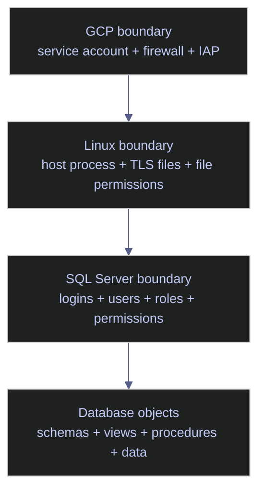

# SQL Server Authentication

> [!abstract]- Summary
>
> Defines SQL Server authentication hardening on Linux in GCP as a three-boundary problem: cloud and VM identity, host and transport security, and SQL Server principals and permissions. The note exists to prevent a common security mistake in administration work: improving one layer in isolation while a different layer still leaves the instance effectively exposed.
>
> **Identity boundaries**
> - Frame the authentication surface in concentric layers: GCP service account, firewall, and IAP/bastion ingress; Linux process identity and TLS material; then SQL Server logins, users, roles, and permissions
> - Treat the posture as only as strong as the weakest boundary rather than as a single "authentication setting" problem
>
> **Baseline the instance authentication posture**
> - Verify engine edition and mixed-mode posture with `SERVERPROPERTY`, inventory server principals through `sys.server_principals` and `sys.sql_logins`, and review `sysadmin` exposure before making changes
> - Use the baseline queries to distinguish SQL logins, Windows-mapped principals, password-policy flags, and high-privilege role membership explicitly
>
> **External identity integration**
> - Compare Entra ID and Active Directory integration paths, including `adutil`, Arc-connected SQL Server support, and the places where centralized identity materially improves over standalone SQL logins
>
> **Transport encryption and TLS**
> - Verify the transport-security boundary through TLS configuration, `mssql-conf`, certificate material, and `forceencryption` posture so successful login attempts are not traveling over a weak channel
>
> **Server audit**
> - Use SQL Server Audit and related security telemetry to record authentication and permission activity in a way that supports investigation rather than only configuration
>
> **GCP perimeter recommendations**
> - Keep the cloud edge narrow with least-privilege service accounts, tight firewall rules, and controlled administrative ingress rather than exposing SQL Server as if it were a flat VM-local problem
>
> **Operations and safety**
> - Recommendations: identity and principals, Linux password-policy realities, database principal-surface review, TLS posture, and GCP perimeter controls all require deliberate hardening rather than product defaults

> [!note]- Glossary
>
> **Mixed mode**
> - The SQL Server authentication mode where both SQL logins and integrated logins are allowed.
> - It matters because `IsIntegratedSecurityOnly = 0` immediately expands the password-management and secret-rotation surface of the instance.
> - Mixed mode is often operationally necessary on Linux, but it makes SQL login hygiene a first-class security problem.
>
> ---
>
> **Server principal**
> - A login-capable or role-like security object defined at the SQL Server instance level.
> - It matters because `sys.server_principals` is the authoritative inventory for who can authenticate to the instance and what kind of identity each principal represents.
> - If a principal can connect at the instance boundary, it shows up here before any database-level permissions are considered.
>
> ---
>
> **SQL login**
> - A SQL Server-managed username and password identity stored and authenticated by the engine itself.
> - It matters because SQL logins remain common for application connectivity, but they require deliberate secret management and audit coverage.
> - SQL logins are portable and easy to provision, but they do not inherit the lifecycle controls, MFA posture, or centralized policy model of directory-backed identities.
>
> ---
>
> **`sysadmin`**
> - The fixed server role with effectively unrestricted control over the entire SQL Server instance.
> - It matters because reviewing `sysadmin` membership is the single highest-leverage audit step in the note: any principal here can bypass almost every lower permission boundary.
> - A weakly controlled `sysadmin` surface can make careful object-level permission design irrelevant in practice.
>
> ---
>
> **`securityadmin`**
> - The fixed server role that can manage many login and permission operations.
> - It matters because it is often treated as "less dangerous than sysadmin" when in practice it can still become an escalation path.
> - A principal that can reset passwords and grant access should be reviewed with nearly the same caution as a full instance administrator.
>
> ---
>
> **`CHECK_POLICY` / `CHECK_EXPIRATION`**
> - SQL login settings that control whether password policy and expiration rules are enforced.
> - It matters because the meaning of these flags differs between Windows-backed and Linux-backed SQL Server environments, which directly affects compliance interpretation.
> - On Linux, `CHECK_POLICY` is not equivalent to full Active Directory password enforcement. Audits should document that limitation explicitly.
>
> ---
>
> **Microsoft Entra ID**
> - Microsoft’s cloud identity platform, used for centralized authentication and group-based access control.
> - It matters because Entra-backed access can materially reduce password sprawl and improve attribution compared with shared SQL login patterns.
> - Entra integration is most valuable when the surrounding SQL Server deployment path actually supports it cleanly, such as Arc-connected scenarios.
>
> ---
>
> **`adutil`**
> - The Linux-side utility used to integrate SQL Server with Active Directory-backed identities.
> - It matters because Linux deployments do not inherit Windows-integrated authentication behavior automatically; identity integration has to be configured deliberately.
> - On Linux, directory integration is a designed capability, not a default operating state. The supporting host and domain assumptions have to be met first.
>
> ---
>
> **TLS / force encryption**
> - The transport-security layer that protects client-server traffic and lets the server prove its identity through certificate-backed encryption.
> - It matters because even perfectly permissioned principals are still risky if credentials or query traffic move over a weak or unauthenticated channel.
> - A secure role model cannot rescue an insecure wire path. Authentication and transport security are separate boundaries.
>
> ---
>
> **`mssql-conf`**
> - The Linux-side configuration utility and file surface used to manage SQL Server engine settings such as network and TLS behavior.
> - It matters because transport hardening on Linux SQL Server depends on both database configuration and host-level configuration discipline.
> - On Linux, instance security is partly a host-configuration problem. `mssql-conf` is one of the tools that makes that boundary explicit.
>
> ---
>
> **SQL Server Audit**
> - The engine-native auditing feature that records selected security and activity events for later review.
> - It matters because authentication hardening is incomplete if access and permission changes cannot be reconstructed during an investigation.
> - A hardened surface still needs evidence. Without audit data, incident response becomes guesswork instead of analysis.
>
> ---
>
> **`CONTROL SERVER`**
> - A server-level permission that grants near-instance-wide control without requiring explicit `sysadmin` membership.
> - It matters because role review alone does not catch every high-risk privilege path; direct grants can create equivalent exposure outside fixed-role membership.
> - A principal can be non-`sysadmin` on paper and still be effectively administrative if permissions like `CONTROL SERVER` are granted directly.
>
> ---
>
> **GCP perimeter**
> - The cloud-layer access boundary formed by the VM service account, firewall rules, and administrative ingress path such as IAP or bastion access.
> - It matters because SQL Server on a cloud VM is never secured purely inside the engine; network reachability and VM identity decide who gets to try authenticating in the first place.
> - If the VM edge is too open, SQL Server is exposed before its own login model even gets a chance to help.
>
> ---

## Identity boundaries

For SQL Server running on Linux in GCP, think about identity and access in concentric layers rather than as one flat security problem.

*Model the authentication boundary as a four-layer path from GCP ingress to database objects.*



The operational rule is simple:

- keep the cloud service account narrow
- make transport encryption explicit
- keep SQL logins and roles minimal and attributable

## Baseline the instance authentication posture

Production hardening starts with facts, not intention. Before changing logins or TLS settings, inventory the current authentication mode, principal surface, and privileged role membership.

### SQL Server | SERVERPROPERTY | engine mode and authentication boundary

The engine-level properties show whether the instance is Windows-auth-only or mixed-mode, which SQL Server edition and branch you are securing, and which engine family (box product vs Azure SQL) governs the security model.

#### Return engine identity and authentication mode

At the very start of any authentication audit, before changing logins, TLS, or role membership. It is typically triggered by new instance onboarding, security review, post-upgrade verification, or any question of the form "what edition, build, and auth mode is this server?". T-SQL session, `VIEW SERVER STATE` is not required (all columns come from constant property functions), read-only, no downtime. Establish the engine fingerprint and mixed-mode vs Windows-only authentication boundary so every subsequent audit step is calibrated to the correct engine family.

`SERVERPROPERTY` returns scalar instance metadata. Each call takes a property name and returns a `sql_variant`, so the safer pattern is to `CAST` to the expected concrete type. The two security-relevant keys are `EngineEdition` (which engine family is running) and `IsIntegratedSecurityOnly` (is this instance Windows-authentication-only or mixed-mode).

| Field | Source | Type | Meaning |
|---|---|---|---|
| `server_name` | `@@SERVERNAME` | `nvarchar(128)` | Network name of the instance. On Linux inside Docker, this is the container hostname. |
| `edition` | `SERVERPROPERTY('Edition')` | `sql_variant → nvarchar(128)` | Edition string, e.g. `Developer Edition (64-bit)`, `Enterprise Edition: Core-based Licensing`, `Standard Edition`. |
| `product_version` | `SERVERPROPERTY('ProductVersion')` | `sql_variant → nvarchar(128)` | Four-part build number: `major.minor.build.revision`. Major maps to version family (16 = SQL 2022, 15 = SQL 2019). |
| `product_level` | `SERVERPROPERTY('ProductLevel')` | `sql_variant → nvarchar(128)` | Servicing level: `RTM`, `SPn`, `CTPn`. |
| `engine_edition` | `SERVERPROPERTY('EngineEdition')` | `sql_variant → int` | Engine family code. 2 = Standard, 3 = Enterprise/Developer box product, 4 = Express, 5 = Azure SQL Database, 6 = Azure Synapse, 8 = Azure SQL Managed Instance, 9 = Azure SQL Edge, 11 = Azure Fabric SQL DB. |
| `is_windows_auth_only` | `SERVERPROPERTY('IsIntegratedSecurityOnly')` | `sql_variant → int` | `1` if Windows auth only, `0` if mixed mode (SQL logins accepted). |

*Return the engine edition, exact build, and whether the instance accepts only integrated authentication or also SQL logins.*

```sql
SELECT
    @@SERVERNAME AS server_name,
    CAST(SERVERPROPERTY('Edition') AS nvarchar(128)) AS edition,
    CAST(SERVERPROPERTY('ProductVersion') AS nvarchar(128)) AS product_version,
    CAST(SERVERPROPERTY('ProductLevel') AS nvarchar(128)) AS product_level,
    CAST(SERVERPROPERTY('EngineEdition') AS int) AS engine_edition,
    CAST(SERVERPROPERTY('IsIntegratedSecurityOnly') AS int) AS is_windows_auth_only;
```

```text
server_name  edition                  product_version  product_level  engine_edition  is_windows_auth_only
-----------  -----------------------  ---------------  -------------  --------------  --------------------
9b9b89176e4b Developer Edition (64-bit) 16.0.4236.2    RTM            3               0
```

_This instance accepts SQL logins because `is_windows_auth_only = 0`. On Linux that is the expected outcome for this environment, but it also means SQL login hygiene matters immediately. `engine_edition = 3` identifies the standard on-premises SQL Server engine family rather than Azure SQL Database._

Treat `engine_edition = 3` as the standard box-product SQL Server engine. Treat `engine_edition = 5` as Azure SQL Database, where the authentication model differs materially. Treat `is_windows_auth_only = 0` as mixed mode and `1` as integrated-only authentication.

### SQL Server | sys.server_principals | instance login inventory

A secure authentication model needs an explicit inventory of every server principal that can connect, whether it is disabled, and whether SQL logins are using password policy enforcement. `sys.server_principals` holds the full login-capable principal list; `sys.sql_logins` is a filtered view that exposes the SQL-authentication password flags. They must be joined to see policy state for SQL logins alongside their base metadata.

#### Inventory server logins with password-policy flags

During the initial baseline of a new instance, and periodically thereafter to detect new or drifting logins. It is typically triggered by security audit, onboarding, post-incident forensics, or any suspicion that unapproved logins have been created. T-SQL session, requires `VIEW ANY DEFINITION` (or higher) to see all principals — `sysadmin` or `securityadmin` see everything, regular logins only see themselves. Read-only. Produce the authoritative list of every login-capable principal, distinguish Windows-mapped from SQL-authenticated, and surface password-policy enforcement for SQL logins.

| Field | Source | Type | Meaning |
|---|---|---|---|
| `login_name` | `sys.server_principals.name` | `sysname` | The login name as seen by SQL Server. For Windows principals, includes the `DOMAIN\` prefix. |
| `type_desc` | `sys.server_principals.type_desc` | `nvarchar(60)` | Principal kind: `SQL_LOGIN`, `WINDOWS_LOGIN`, `WINDOWS_GROUP`, `SERVER_ROLE`, `CERTIFICATE_MAPPED_LOGIN`, `ASYMMETRIC_KEY_MAPPED_LOGIN`, `EXTERNAL_LOGIN` (Entra), `EXTERNAL_GROUP` (Entra group). |
| `is_disabled` | `sys.server_principals.is_disabled` | `bit` | `1` if the login has been disabled with `ALTER LOGIN ... DISABLE` and cannot authenticate. |
| `create_date` | `sys.server_principals.create_date` | `datetime` | When the login row was first written. For built-in Windows principals on Linux, this is the container creation date, not the SQL Server install date. |
| `is_policy_checked` | `sys.sql_logins.is_policy_checked` | `bit` | SQL logins only. `1` if `CHECK_POLICY = ON`. On Linux there is no Windows LSA, so `CHECK_POLICY` enforces only a minimal server-side length and complexity check — it is not equivalent to Windows Active Directory password policy. |
| `is_expiration_checked` | `sys.sql_logins.is_expiration_checked` | `bit` | SQL logins only. `1` if `CHECK_EXPIRATION = ON`. Requires `CHECK_POLICY = ON` to be set. |
| `password_last_set` | `LOGINPROPERTY(name, 'PasswordLastSetTime')` | `datetime` | Timestamp of the last password change for SQL logins. `NULL` for Windows principals. |

Filter predicate notes:

- `sp.type IN ('S', 'U', 'G')` — keeps SQL logins (`S`), Windows logins (`U`), and Windows groups (`G`). Excludes server roles (`R`), certificate-mapped logins (`C`), and asymmetric-key-mapped logins (`K`) which do not themselves authenticate interactively.
- `sp.name NOT LIKE '##%'` — excludes the `##MS_*##` certificate-mapped and hidden system principals.

*List login-capable server principals and show which SQL logins use password policy and expiration checks.*

```sql
SELECT
    sp.name AS login_name,
    sp.type_desc,
    sp.is_disabled,
    sp.create_date,
    sl.is_policy_checked,
    sl.is_expiration_checked,
    LOGINPROPERTY(sp.name, 'PasswordLastSetTime') AS password_last_set
FROM sys.server_principals AS sp
LEFT JOIN sys.sql_logins AS sl
    ON sp.principal_id = sl.principal_id
WHERE sp.type IN ('S', 'U', 'G')
  AND sp.name NOT LIKE '##%'
ORDER BY sp.name;
```

```text
login_name                  type_desc      is_disabled  create_date              is_policy_checked  is_expiration_checked  password_last_set
--------------------------  -------------  -----------  -----------------------  -----------------  ---------------------  -----------------------
BUILTIN\Administrators      WINDOWS_GROUP  0            2026-01-22 20:23:42.077 NULL               NULL                   NULL
NT AUTHORITY\NETWORK SERVICE WINDOWS_LOGIN 0            2026-03-04 22:09:29.657 NULL               NULL                   NULL
NT AUTHORITY\SYSTEM         WINDOWS_LOGIN  0            2026-03-04 22:09:29.657 NULL               NULL                   NULL
sa                          SQL_LOGIN      0            2003-04-08 09:10:35.460 1                  0                      2026-03-04 22:09:29.133
```

_The login surface is still small, which is good, but it is not yet production-tight. The `sa` login is enabled, password policy enforcement is on, password expiration is off, and three Windows principals remain present at the instance level. On Linux-backed deployments, those Windows principals usually exist because of the container or host security model; the important next step is not to confuse their presence with a safe privilege posture._

Review `SQL_LOGIN`, `WINDOWS_LOGIN`, and `WINDOWS_GROUP` differently because they imply different lifecycle controls. Treat `is_disabled = 1` as the safer state for retired privileged identities. Treat `is_policy_checked = 0` for SQL logins as an explicit finding, and justify `is_expiration_checked = 0` for service accounts with an external rotation process.

### SQL Server | sysadmin | privileged role exposure

The single most dangerous authentication outcome is not merely having many logins. It is having too many principals in `sysadmin`, because `sysadmin` bypasses nearly every other permission boundary — it ignores object-level DENY, can impersonate any login, and can reconfigure the instance. Reviewing membership is the single highest-leverage audit step.

#### List sysadmin members via sys.server_role_members

Immediately after the login inventory and again on every scheduled audit cycle. It is typically triggered by security review, suspicion of privilege sprawl, investigation of an unauthorized change, or any report that someone "can see everything". T-SQL session, `VIEW ANY DEFINITION` required to resolve principal names; read-only. Enumerate every principal that inherits full instance-wide administrative authority so the blast radius is immediately visible.

| Field | Source | Type | Meaning |
|---|---|---|---|
| `role_name` | `sys.server_principals.name` (joined via `role_principal_id`) | `sysname` | Name of the server role being inspected. Always `sysadmin` here. |
| `member_name` | `sys.server_principals.name` (joined via `member_principal_id`) | `sysname` | Principal that is a direct member of the role. Nested role membership requires a recursive CTE to surface. |
| `type_desc` | `sys.server_principals.type_desc` | `nvarchar(60)` | Principal kind — `SQL_LOGIN`, `WINDOWS_LOGIN`, `WINDOWS_GROUP`, `SERVER_ROLE`, or `EXTERNAL_LOGIN` (Entra). |

> [!info]- Joining sys.server_role_members: why two joins against sys.server_principals
>
> `sys.server_role_members` is a many-to-many mapping table with only two columns: `role_principal_id` and `member_principal_id`. Both columns are integer IDs that resolve against `sys.server_principals`. To display both names in one row, the query joins `sys.server_principals` twice — once aliased as `r` for the role side and once as `m` for the member side. Each join resolves the `principal_id` to the matching `name`. Filtering on `r.name = 'sysadmin'` narrows the role side, and ordering by `m.name` sorts the output by member.

*Return the full current membership of the `sysadmin` fixed server role.*

```sql
SELECT
    r.name AS role_name,
    m.name AS member_name,
    m.type_desc
FROM sys.server_role_members AS srm
JOIN sys.server_principals AS r
    ON srm.role_principal_id = r.principal_id
JOIN sys.server_principals AS m
    ON srm.member_principal_id = m.principal_id
WHERE r.name = 'sysadmin'
ORDER BY m.name;
```

```text
role_name member_name                 type_desc
--------  --------------------------  -------------
sysadmin  BUILTIN\Administrators      WINDOWS_GROUP
sysadmin  NT AUTHORITY\NETWORK SERVICE WINDOWS_LOGIN
sysadmin  sa                          SQL_LOGIN
```

_This is broader than a production-safe posture. `sa` in `sysadmin` is inherent, but `BUILTIN\Administrators` and `NT AUTHORITY\NETWORK SERVICE` both need explicit justification. `NETWORK SERVICE` especially deserves review because it represents a host/service identity rather than an interactive DBA identity._

The safest shape is a small set of named DBA or break-glass principals. Treat `sa` as transitional hardening debt, broad OS groups as indirect privilege sprawl, and service identities such as `NETWORK SERVICE` as high-risk unless they are documented and unavoidable.

### SQL Server | sys.server_role_members | fixed server roles capability reference

The `sysadmin` role dominates the authentication discussion because it is the broadest, but it is not the only fixed server role. SQL Server ships nine legacy fixed server roles plus the `public` role, and each one carries a specific immutable permission set. In SQL Server 2022 Microsoft added ten user-facing `##MS_*##` roles for least-privilege assignments, and these are preferred for new grants. Before granting any fixed server role, the capability boundary of that role must be understood because the permissions cannot be narrowed with `DENY`.

> [!info] `bulkadmin` and `ADMINISTER BULK OPERATIONS` are not supported on Linux
>
> On SQL Server on Linux, `BULK INSERT` can be executed only by `sysadmin`. Adding a login to `bulkadmin` has no effect, and granting `ADMINISTER BULK OPERATIONS` does not work. If an application needs bulk-load capability on Linux, the only current path is to promote its login to `sysadmin` or to run the bulk load from a separate ETL identity with `sysadmin`.

| Role | Capability boundary | Blast radius |
|---|---|---|
| `sysadmin` | Every action on the instance; object-level `DENY` is ignored; can impersonate any login. | Total. Same as root. |
| `securityadmin` | Can `GRANT`, `DENY`, `REVOKE` any server-level or database-level permission; can reset SQL login passwords for non-sysadmin logins. | **Effectively equivalent to sysadmin.** Treat identically. |
| `serveradmin` | Can change server config options (`sp_configure`), `SHUTDOWN` the instance, alter endpoints. | Full availability blast radius; cannot read data directly but can reconfigure and stop the engine. |
| `setupadmin` | Can add/remove linked servers via T-SQL. | Narrow, but opens lateral movement via linked servers; equivalent to sysadmin on linked targets if the linked server uses pass-through credentials. |
| `processadmin` | Can `KILL` any session, including other DBA sessions. | Moderate. Denial-of-service but not data disclosure. |
| `diskadmin` | Manages disk/backup device files (`sp_addumpdevice`, `sp_dropdevice`). | Low; legacy role, rarely granted. |
| `dbcreator` | Can `CREATE`, `ALTER`, `DROP`, `RESTORE` any database. | High — can restore a backup from anywhere to overwrite existing databases. Can also drop production. |
| `bulkadmin` | Can run `BULK INSERT` on Windows. **No effect on Linux.** | Moderate — bulk-insert into any writable target. |
| `public` | Implicit membership for every login. Cannot be dropped. Default grants: `VIEW ANY DATABASE`, `CONNECT` on most endpoints. | Any broadening of `public` is a universal grant — treat changes with extreme care. |

#### List fixed server roles and member counts

During the instance baseline, and any time a privilege-sprawl audit is required beyond `sysadmin`. It is typically triggered by security review, post-restore audit, any report of "elevated permissions" outside `sysadmin`. T-SQL session, `VIEW ANY DEFINITION` required, read-only. Enumerate every fixed server role with current member counts so broad roles other than `sysadmin` (especially `securityadmin` and `dbcreator`) are not overlooked.

*Return the nine user-facing fixed server roles with the count of direct members for each.*

```sql
SELECT
    sp.name AS role_name,
    sp.type_desc,
    sp.is_fixed_role,
    ISNULL(m.member_count, 0) AS member_count
FROM sys.server_principals AS sp
LEFT JOIN (
    SELECT role_principal_id, COUNT(*) AS member_count
    FROM sys.server_role_members
    GROUP BY role_principal_id
) AS m ON m.role_principal_id = sp.principal_id
WHERE sp.type = 'R'
  AND sp.is_fixed_role = 1
  AND sp.name NOT LIKE '##%'
ORDER BY sp.name;
```

```text
role_name    type_desc    is_fixed_role  member_count
-----------  -----------  -------------  ------------
bulkadmin    SERVER_ROLE  1              0
dbcreator    SERVER_ROLE  1              0
diskadmin    SERVER_ROLE  1              0
processadmin SERVER_ROLE  1              0
securityadmin SERVER_ROLE 1              0
serveradmin  SERVER_ROLE  1              0
setupadmin   SERVER_ROLE  1              0
sysadmin     SERVER_ROLE  1              3
```

_Only `sysadmin` has members on this instance. The eight other fixed server roles are empty, which is the desired baseline for a fresh container. The three `sysadmin` members are the ones already audited in the previous H3 (`sa`, `BUILTIN\Administrators`, `NT AUTHORITY\NETWORK SERVICE`). The `##MS_*##` hidden roles added in SQL Server 2022 are filtered out by the `NOT LIKE '##%'` predicate because they are not user-facing role targets._

### SQL Server | CREATE LOGIN | login creation and policy DDL

`CREATE LOGIN` is the only supported path to create a new server principal. The WITH-clause options decide whether Windows password policy is enforced, whether the password expires, whether the user must change the password on first connect, what database the session lands in by default, and — critically — whether the login uses a fresh password or an already-hashed value (for migration between instances).

Three enforcement flags interact:

- `CHECK_POLICY = ON/OFF` — enforces password complexity rules.
- `CHECK_EXPIRATION = ON/OFF` — enforces password expiration. Requires `CHECK_POLICY = ON`.
- `MUST_CHANGE` — forces the user to change the password on first login. Requires `CHECK_EXPIRATION = ON` and `CHECK_POLICY = ON`.

The combination `CHECK_POLICY = OFF` with `CHECK_EXPIRATION = ON` is invalid and is rejected at parse time.

> [!warning] On Linux, CHECK_POLICY does not use Windows/AD password policy
>
> There is no LSA or Active Directory Group Policy on Linux. On SQL Server 2022 and earlier, `CHECK_POLICY = ON` enforces only a built-in minimal rule (length ≥ 8, three of four character classes), and password expiration is hard-coded to 90 days regardless of any domain policy. This is officially documented on Microsoft Learn ([Linux security limitations](https://learn.microsoft.com/sql/linux/sql-server-linux-security-overview)) and is a common surprise for teams migrating from Windows.

> [!success] Starting with SQL Server 2022 CU23 and SQL Server 2025, configurable Linux policy is supported
>
> Later builds expose a `[passwordpolicy]` section in `mssql.conf` with `passwordminimumlength`, `passwordhistorylength`, `passwordminimumage`, and `passwordmaximumage` keys ([custom password policy on Linux](https://learn.microsoft.com/sql/linux/sql-server-linux-custom-password-policy)). In AD-integrated environments, `adutil updatepasswordpolicy` can read the domain policy and push it into `mssql.conf`.

#### Create a SQL login with strict policy enforcement

When provisioning a new SQL-authenticated login for an application or a named DBA. It is typically triggered by new application onboarding, rotation of a legacy shared login, replacement of `sa` usage. T-SQL session, requires `ALTER ANY LOGIN` or `sysadmin`, state-changing (creates a new row in `sys.server_principals`). Stand up a SQL login with all available policy flags engaged and a safe default database, so the login lands in the intended context and carries the strongest enforcement Linux supports.

*Create a SQL-authenticated application login with all policy flags engaged and a safe default database.*

```sql
CREATE LOGIN [svc_etl_app]
    WITH PASSWORD         = N'CHANGE-ME-STRONG-2026-!xY7',
    DEFAULT_DATABASE      = [stoxx],
    DEFAULT_LANGUAGE      = [us_english],
    CHECK_EXPIRATION      = ON,
    CHECK_POLICY          = ON;
```

```text
Template only. This state-changing example was not executed in the lab snapshot.
```

#### Create a login from an existing password hash for migration

When moving an application login from one instance to another without forcing an application password reset. It is typically triggered by database restore onto a new instance, DR failover, standing up a reporting replica that needs the same login SID. T-SQL session, requires `ALTER ANY LOGIN`, state-changing. The source hash must come from `sys.sql_logins.password_hash` on the original instance. Recreate the login with identical credentials and SID so the application continues to work and `sys.database_principals.sid` on the restored database still matches (no orphan remediation required).

*Create a login using an already-hashed password and a pinned SID to match an existing database user.*

```sql
CREATE LOGIN [svc_etl_app]
    WITH PASSWORD = 0x0100... HASHED,
    SID           = 0x241C...,
    DEFAULT_DATABASE = [stoxx],
    CHECK_POLICY  = ON;
```

```text
Template only. This state-changing example was not executed in the lab snapshot.
```

### SQL Server | ALTER LOGIN | disable or rename sa

`sa` is the default SQL superuser. On a Linux container SQL Server refuses to start without a SQL login in the sysadmin role, which is why `sa` exists and is enabled at first boot. The hardening recommendation documented by Microsoft is to create a named sysadmin login first, then disable (and optionally rename) `sa`.

> [!danger] Do not disable sa without first creating another sysadmin login
>
> If `sa` is the only member of `sysadmin` and you disable it, you are locked out. On Linux, recovery requires stopping the `mssql-server` service and restarting with `sqlservr -m"SQLCMD"` from the `mssql` user context to get a single-user connection. This is slow, disruptive, and needs root on the host.

> [!success] Always add a named sysadmin first, then test, then disable sa
>
> The safe sequence is:
>
> - `CREATE LOGIN [dba_break_glass] WITH PASSWORD = N'...' ...`
> - `ALTER SERVER ROLE sysadmin ADD MEMBER [dba_break_glass];`
> - Log in as `dba_break_glass` to confirm it works.
> - Only then rename and disable `sa`.

#### Rename sa and disable it

Immediately after a named sysadmin login has been provisioned, tested, and confirmed working. It is typically triggered by post-install hardening, compliance remediation, CIS SQL Server benchmark requirement. T-SQL session as a non-sa sysadmin, state-changing. Does not require downtime; existing sessions authenticated as `sa` are not killed — use `KILL` for that. Remove the default account name as an attack vector (no more username-guessing against `sa`) and make the login unusable entirely so even a leaked `sa` password cannot authenticate.

*Rename the `sa` login to an unguessable name, then disable it entirely.*

```sql
ALTER LOGIN sa WITH NAME = [sqladm_disabled];
ALTER LOGIN [sqladm_disabled] DISABLE;
```

```text
Template only. This state-changing example was not executed in the lab snapshot.
```

### SQL Server | sys.server_permissions | granular instance permissions

Not every privilege is expressed as a role. Many of the most dangerous grants are individual server-level permissions that can be `GRANT`ed directly to a login. Reviewing role membership alone misses these. The permission-review baseline is to enumerate every explicit grant of `CONTROL SERVER`, `ALTER ANY LOGIN`, `IMPERSONATE ANY LOGIN`, `UNSAFE ASSEMBLY`, and similar broad server-level permissions.

| Permission | Scope | Equivalent to |
|---|---|---|
| `CONTROL SERVER` | Entire instance | `sysadmin`. The most dangerous individual grant. |
| `ALTER ANY LOGIN` | All logins | `securityadmin`-lite; can reset non-sysadmin passwords. |
| `ALTER ANY SERVER ROLE` | All server roles | Can grant itself into any role except `sysadmin`. |
| `IMPERSONATE ANY LOGIN` | All logins | Can `EXECUTE AS` any other login (including service identities). |
| `UNSAFE ASSEMBLY` | CLR hosting | Can load unsafe .NET assemblies that execute arbitrary code in-process. |
| `VIEW SERVER STATE` | All DMVs | Read-only; needed for monitoring, common for observability identities. |
| `VIEW ANY DATABASE` | All databases | Read-only metadata visibility; default granted to `public`. |
| `ALTER ANY DATABASE` | All databases | Can set `CONTAINMENT = PARTIAL` and open a contained-DB-auth backdoor. |
| `SHUTDOWN` | Instance | Can gracefully stop the engine. |

#### Inventory explicit grants of broad server permissions

During the instance baseline audit, and on any schedule that reviews permission drift. It is typically triggered by security review, post-incident, new observability or backup tool onboarding (which often asks for `VIEW SERVER STATE`). T-SQL session, `VIEW ANY DEFINITION` required, read-only. Surface every direct (non-role-mediated) grant of a high-impact server permission so reviews can distinguish intentional monitoring grants from accidental privilege sprawl.

| Field | Source | Type | Meaning |
|---|---|---|---|
| `grantee` | `sys.server_principals.name` (joined via `grantee_principal_id`) | `sysname` | Login or role that holds the permission. |
| `grantee_type` | `sys.server_principals.type_desc` | `nvarchar(60)` | Principal kind — `SQL_LOGIN`, `WINDOWS_LOGIN`, `SERVER_ROLE`, `CERTIFICATE_MAPPED_LOGIN`, etc. |
| `state_desc` | `sys.server_permissions.state_desc` | `nvarchar(60)` | `GRANT`, `GRANT_WITH_GRANT_OPTION`, `DENY`, `REVOKE`. |
| `permission_name` | `sys.server_permissions.permission_name` | `nvarchar(128)` | The permission action. |
| `class_desc` | `sys.server_permissions.class_desc` | `nvarchar(60)` | Permission scope — `SERVER`, `SERVER_PRINCIPAL`, `ENDPOINT`, `SERVER_ROLE`. |

*Return every direct grant (or grant-with-grant-option) of a broad server-level permission, excluding internal `##MS_*##` principals.*

```sql
SELECT
    pr.name AS grantee,
    pr.type_desc AS grantee_type,
    sp.state_desc,
    sp.permission_name,
    sp.class_desc
FROM sys.server_permissions AS sp
JOIN sys.server_principals AS pr
    ON sp.grantee_principal_id = pr.principal_id
WHERE sp.permission_name IN (
    'CONTROL SERVER',
    'ALTER ANY LOGIN',
    'ALTER ANY SERVER ROLE',
    'IMPERSONATE ANY LOGIN',
    'UNSAFE ASSEMBLY',
    'VIEW SERVER STATE',
    'VIEW ANY DATABASE',
    'ALTER ANY DATABASE',
    'SHUTDOWN'
)
  AND sp.state_desc IN ('GRANT', 'GRANT_WITH_GRANT_OPTION')
  AND pr.name NOT LIKE '##%'
ORDER BY pr.name, sp.permission_name;
```

```text
grantee             grantee_type   state_desc  permission_name    class_desc
------------------  -------------  ----------  -----------------  ----------
NT AUTHORITY\SYSTEM WINDOWS_LOGIN  GRANT       VIEW SERVER STATE  SERVER
public              SERVER_ROLE    GRANT       VIEW ANY DATABASE  SERVER
```

_Two grants exist outside the hidden system roles. `NT AUTHORITY\SYSTEM` holds `VIEW SERVER STATE`, which is the built-in pattern for the host process identity and is expected on a Linux container. `public` holds `VIEW ANY DATABASE`, which is the SQL Server 2005+ default that lets every login enumerate the catalog of every database. Neither is surprising; the point of this query is that if a third row appeared (`CONTROL SERVER` to some named login, for example), it would be immediately visible and auditable._

Treat direct `CONTROL SERVER`, `ALTER ANY LOGIN`, `ALTER ANY SERVER ROLE`, `IMPERSONATE ANY LOGIN`, and `UNSAFE ASSEMBLY` grants as immediate review items. Treat `VIEW SERVER STATE` as potentially legitimate for monitoring. Treat `GRANT_WITH_GRANT_OPTION` as a privilege-escalation path unless it is tightly justified.

### SQL Server | sys.databases and sys.database_principals | database principal surface in stoxx

Instance logins are only half of the story. A login can connect to the instance without being mapped to a user in a specific database, and a database can carry users whose matching login has been dropped (orphans). Database principal inventory shows whether access inside `stoxx` is broad, narrow, or still largely unmodeled, and it exposes the database ownership anchor that ownership-chaining decisions pivot on.

#### Return database owner and encryption state

Once per database during the initial audit, again whenever ownership or TDE state is expected to have changed. It is typically triggered by new database created, database attach/restore from a different instance, post-TDE-rollout verification, or ownership-chaining review. T-SQL session, `VIEW ANY DEFINITION` or `VIEW ANY DATABASE` needed to see non-owned databases; read-only. Confirm who owns the database and whether it is encrypted at rest, because ownership anchors ownership chaining and TDE state dictates backup certificate requirements.

| Field | Source | Type | Meaning |
|---|---|---|---|
| `database_name` | `sys.databases.name` | `sysname` | Database name as stored in the catalog. |
| `owner_name` | `SUSER_SNAME(sys.databases.owner_sid)` | `nvarchar(128)` | Human-readable name of the login whose SID owns the database. `SUSER_SNAME` resolves the raw SID against `sys.server_principals`. Returns `NULL` if the owning login has been dropped (orphaned database ownership). |
| `is_encrypted` | `sys.databases.is_encrypted` | `bit` | `1` if TDE is enabled for this database. Controlled by `ALTER DATABASE ... SET ENCRYPTION ON` and requires a Database Encryption Key backed by a certificate in `master`. |

*Return the owner and encryption flag for the `stoxx` database.*

```sql
SELECT
    db.name AS database_name,
    SUSER_SNAME(owner_sid) AS owner_name,
    db.is_encrypted
FROM sys.databases AS db
WHERE db.name = 'stoxx';
```

```text
database_name owner_name is_encrypted
------------- ---------- ------------
stoxx         sa         0
```

_`stoxx` is still owned by `sa`, and it is not encrypted with TDE. The owner itself is not an authentication method, but database ownership matters because ownership chaining and implicit authority often become harder to reason about when production databases remain owned by a generic superuser login._

Treat a dedicated named owner as the cleaner production boundary. Treat `owner_name = sa` as common lab state but weak separation. Treat `is_encrypted = 0` as an intentional decision point, not a neutral default.

#### Inventory non-system database principals in stoxx

During the database-level security audit, after the instance-level login inventory is complete. It is typically triggered by a login has been added or removed, a database has been restored from a different instance, or the application team reports permission problems. T-SQL session scoped to the target database (`USE stoxx;` or connection-level database), requires `VIEW DEFINITION` on the database; read-only. Expose the direct database principals (users and custom roles) that exist on top of the fixed roles, so least-privilege review can distinguish built-in scaffolding from application-defined grants.

| Field | Source | Type | Meaning |
|---|---|---|---|
| `name` | `sys.database_principals.name` | `sysname` | Database principal name. Can differ from the mapped login name (`ALTER USER ... WITH NAME = ...`). |
| `type_desc` | `sys.database_principals.type_desc` | `nvarchar(60)` | Principal kind — `SQL_USER`, `WINDOWS_USER`, `WINDOWS_GROUP`, `DATABASE_ROLE`, `APPLICATION_ROLE`, `CERTIFICATE_MAPPED_USER`, `ASYMMETRIC_KEY_MAPPED_USER`, `EXTERNAL_USER` (Entra). |
| `authentication_type_desc` | `sys.database_principals.authentication_type_desc` | `nvarchar(60)` | `NONE` for roles and certificate-mapped principals, `INSTANCE` for users mapped to server logins, `DATABASE` for contained-database users with their own password, `EXTERNAL` for Entra-mapped users, `WINDOWS` for Windows-mapped users. |
| `create_date` | `sys.database_principals.create_date` | `datetime` | Row creation timestamp. |
| `modify_date` | `sys.database_principals.modify_date` | `datetime` | Last modification timestamp (rename, password change, etc.). |

Filter predicate notes:

- `principal_id > 4` — excludes the four system principals (`dbo` id 1, `guest` id 2, `INFORMATION_SCHEMA` id 3, `sys` id 4) so the result shows only real application surface.
- `type IN ('S', 'U', 'G', 'R')` — keeps SQL users (`S`), Windows users (`U`), Windows groups (`G`), and roles (`R`). Add `'E'` (external/Entra user) and `'X'` (external group) if Entra authentication is in use.

*List non-system database principals in `stoxx` so the actual user surface is visible.*

```sql
SELECT
    name,
    type_desc,
    authentication_type_desc,
    create_date,
    modify_date
FROM sys.database_principals
WHERE principal_id > 4
  AND type IN ('S', 'U', 'G', 'R')
ORDER BY name;
```

```text
name              type_desc      authentication_type_desc create_date              modify_date
----------------  -------------  ------------------------ -----------------------  -----------------------
db_accessadmin    DATABASE_ROLE  NONE                     2003-04-08 09:10:42.333 2009-04-13 12:59:14.467
db_backupoperator DATABASE_ROLE  NONE                     2003-04-08 09:10:42.350 2009-04-13 12:59:14.467
db_datareader     DATABASE_ROLE  NONE                     2003-04-08 09:10:42.363 2009-04-13 12:59:14.467
db_datawriter     DATABASE_ROLE  NONE                     2003-04-08 09:10:42.363 2009-04-13 12:59:14.467
db_ddladmin       DATABASE_ROLE  NONE                     2003-04-08 09:10:42.350 2009-04-13 12:59:14.467
db_denydatareader DATABASE_ROLE  NONE                     2003-04-08 09:10:42.380 2009-04-13 12:59:14.467
db_denydatawriter DATABASE_ROLE  NONE                     2003-04-08 09:10:42.380 2009-04-13 12:59:14.467
db_owner          DATABASE_ROLE  NONE                     2003-04-08 09:10:42.333 2009-04-13 12:59:14.467
db_securityadmin  DATABASE_ROLE  NONE                     2003-04-08 09:10:42.350 2009-04-13 12:59:14.467
```

_There are currently no custom users in `stoxx`; the principal surface is only the built-in fixed database roles. That is better than an uncontrolled sprawl of users, but it also means the application-facing permission model has not yet been explicitly expressed inside the database._

In this snapshot every row is a `DATABASE_ROLE` with `authentication_type_desc = NONE`, so the database contains scaffolding rather than actual mapped users. Once `SQL_USER`, `WINDOWS_USER`, or contained `DATABASE` users appear, review the mapping and least-privilege design explicitly.

#### Verify the guest user has no explicit permissions in stoxx

After the database-principal inventory, to confirm the guest user surface in every user database. It is typically triggered by database restore from an unknown source, compliance audit, or any report of "users that aren't supposed to be there can read data". T-SQL session, requires `VIEW DEFINITION` on the database, read-only. Must be run once per user database — this script targets `stoxx` only. Confirm that the `guest` fallback user has no direct grants in `stoxx`, so any login that reaches the instance cannot fall through to `guest` to read or modify data.

The `guest` user is a built-in database principal with `principal_id = 2`. When a login connects to a database where no matching user exists, SQL Server attempts to map the login to `guest` as a fallback. In user databases `guest` is disabled by default (no `CONNECT` permission), so the fallback fails — but any direct grant to `guest` re-opens the hole for every authenticated login on the instance.

| Field | Source | Type | Meaning |
|---|---|---|---|
| `state_desc` | `sys.database_permissions.state_desc` | `nvarchar(60)` | `GRANT`, `GRANT_WITH_GRANT_OPTION`, `DENY`, `REVOKE`. |
| `permission_name` | `sys.database_permissions.permission_name` | `nvarchar(128)` | Permission action (e.g. `CONNECT`, `SELECT`, `EXECUTE`, `VIEW DEFINITION`). |
| `DATABASE_PRINCIPAL_ID('guest')` | built-in function | `int` | Returns the `principal_id` of the named database principal in the current database (`2` for `guest`). Shorter and safer than hard-coding the ID. |

*Check whether the `guest` user has any explicit permissions inside `stoxx`.*

```sql
SELECT
    perm.state_desc,
    perm.permission_name
FROM sys.database_permissions AS perm
WHERE perm.grantee_principal_id = DATABASE_PRINCIPAL_ID('guest')
ORDER BY perm.permission_name;
```

```text
(0 rows)
```

_No rows is the desired result here. `guest` has no explicit permissions in `stoxx`, which means an authenticated login that is not mapped to a user in the database cannot fall through to `guest` to read or modify data._

#### Contrast with the master database where guest has CONNECT

Immediately after the `stoxx` check, to see what a live non-empty grant to `guest` looks like. It is typically triggered by understanding the baseline difference between system databases (`master`, `msdb`) and user databases for the `guest` fallback. T-SQL session, `USE master` context switch required, read-only. Demonstrate the canonical case where `guest` does have a permission (CONNECT in `master`), which is why every login on the instance can enter `master` even without an explicit user.

*Return the explicit grants held by the `guest` user in `master` for contrast.*

```sql
USE master;
SELECT
    dp.name AS database_user,
    perm.class_desc,
    perm.state_desc,
    perm.permission_name
FROM sys.database_permissions AS perm
JOIN sys.database_principals AS dp
    ON perm.grantee_principal_id = dp.principal_id
WHERE dp.name = 'guest'
  AND perm.state_desc IN ('GRANT', 'GRANT_WITH_GRANT_OPTION')
ORDER BY perm.permission_name;
```

```text
database_user class_desc state_desc permission_name
------------- ---------- ---------- ---------------
guest         DATABASE   GRANT      CONNECT
```

_In `master`, `guest` holds `GRANT CONNECT`. That is deliberate: every login on the instance needs to be able to enter `master` to read server metadata, and the `guest` fallback is how that happens when the login does not have its own user. The same pattern applies to `msdb` for SQL Agent visibility. In user databases, on the other hand, `guest` must stay without `CONNECT` — otherwise every authenticated login automatically has database access it was never explicitly granted._

Treat zero rows in user databases as the desired baseline. Treat any explicit `CONNECT` grant to `guest` in a user database as a real exposure. Keep the `CONNECT` grant in `master` and `msdb`, because those system databases depend on that fallback.

> [!warning] Disabling guest CONNECT in master or msdb breaks every login
>
> Do not run `REVOKE CONNECT FROM guest` in `master` or `msdb`. Every login depends on the `guest` fallback to enter those system databases for metadata queries and SQL Agent jobs. Revoking it causes immediate connection failures for every non-`sysadmin` login on the instance.

> [!success] Revoke guest CONNECT only in user databases
>
> Run `REVOKE CONNECT FROM guest` only inside user databases (e.g. `stoxx`), and verify with the query above that the result returns zero rows afterwards. System databases must keep the default grant.

#### Detect orphaned users by SID mismatch

After any database restore from a different instance, after a login drop, or when an application reports "Cannot open user default database" errors. It is typically triggered by post-restore, post-migration, post-DR failover, compliance audit. T-SQL session scoped to the target database, `VIEW DEFINITION` on the database, read-only. The join against `sys.server_principals` must run on the destination instance, not the source. Identify database users whose `sid` no longer matches any server login, so they can be remapped (via `ALTER USER`) or recreated (via `CREATE LOGIN ... SID = ...`) before they block application connections.

A database user is considered orphaned when its `sid` (stored in `sys.database_principals`) does not correspond to any row in `sys.server_principals` on the current instance. This happens most commonly when a database is restored onto a new instance that does not have the same logins, or when the matching login is dropped while the database user is left behind.

> [!warning] sp_change_users_login is deprecated
>
> The older `sp_change_users_login` procedure will be removed in a future version of SQL Server. Do not use it in new development. `ALTER USER ... WITH LOGIN = ...` is the supported replacement and behaves identically for the remap case.

| Field | Source | Type | Meaning |
|---|---|---|---|
| `database_user` | `sys.database_principals.name` | `sysname` | The database user name. |
| `type_desc` | `sys.database_principals.type_desc` | `nvarchar(60)` | Principal kind; only `SQL_USER`, `WINDOWS_USER`, `WINDOWS_GROUP` can be orphaned. |
| `mapping_status` | computed | `varchar(9)` | `ORPHANED` when `authentication_type_desc = 'INSTANCE'` but no matching `sys.server_principals.sid`; `CONTAINED` when the user is a contained-database user with its own password; `MAPPED` when the login mapping is intact. |
| `authentication_type_desc` | `sys.database_principals.authentication_type_desc` | `nvarchar(60)` | How the user authenticates — `INSTANCE` (mapped to login), `DATABASE` (contained), `WINDOWS`, `EXTERNAL` (Entra), `NONE`. |

*Detect database users whose SID no longer matches any server login on this instance.*

```sql
SELECT
    dp.name AS database_user,
    dp.type_desc,
    CASE
        WHEN dp.authentication_type_desc = 'INSTANCE' AND sp.sid IS NULL THEN 'ORPHANED'
        WHEN dp.authentication_type_desc = 'DATABASE' THEN 'CONTAINED'
        WHEN dp.authentication_type_desc = 'INSTANCE' THEN 'MAPPED'
        ELSE dp.authentication_type_desc
    END AS mapping_status,
    dp.authentication_type_desc
FROM sys.database_principals AS dp
LEFT JOIN sys.server_principals AS sp
    ON dp.sid = sp.sid
WHERE dp.principal_id > 4
  AND dp.type IN ('S', 'U', 'G')
ORDER BY dp.name;
```

```text
(0 rows)
```

_No orphans exist in `stoxx`, which matches the fact that no custom users have been created in the database yet. Once application users are added, this query becomes a routine post-restore check. The `LEFT JOIN` against `sys.server_principals` is the mechanism — any user whose SID cannot be matched on the right side of the join shows up with `sp.sid IS NULL`, which the `CASE` expression relabels as `ORPHANED`._

Two remediation paths exist, depending on whether the matching login still exists on the instance:

*Remap an orphaned database user to an existing login.*

```sql
ALTER USER [app_user] WITH LOGIN = [app_login];
```

```text
Template only. This state-changing example was not executed in the lab snapshot.
```

*Recreate the missing login with the original SID so the database user maps cleanly again.*

```sql
CREATE LOGIN [app_login]
    WITH PASSWORD = N'<strong>',
    SID = 0x<binary_sid_from_sys.database_principals>;
```

```text
Template only. This state-changing example was not executed in the lab snapshot.
```

Retrieve the source SID with `SELECT sid FROM sys.database_principals WHERE name = 'app_user'` before recreating the login.

## External identity integration

Mixed-mode SQL authentication is only one option. SQL Server on Linux also supports two external identity providers — Active Directory via Kerberos (using `adutil`), and Microsoft Entra ID (Azure AD) via the Azure Arc extension. Both let a login authenticate without storing a password in `sys.sql_logins`, and both make central identity lifecycle (join, leave, rename) the authoritative source. In any production deployment where Active Directory or Entra is already available, these paths are strongly preferred over SQL logins.

### SQL Server 2022 | Microsoft Entra | Entra authentication on Linux

Microsoft Entra authentication for SQL Server 2022 on Linux is not a standalone feature — it requires the instance to be onboarded via the Azure Arc agent, which installs the Azure extension for SQL Server. Once onboarded, the Arc agent writes the `network.aad*` keys into `mssql.conf` automatically, places a certificate under `/var/opt/mssql/aadsecrets/`, and registers the instance with the configured Entra tenant. Manual editing of the `network.aad*` keys is unsupported and will break the integration.

| `mssql-conf` key | Managed by | Purpose |
|---|---|---|
| `network.aadauthenticationendpoint` | Arc agent | Entra authentication endpoint URL. |
| `network.aadprimarytenant` | Arc agent | Tenant GUID the instance is federated with. |
| `network.aadserveradminname` | Arc agent | Entra identity set as sysadmin at onboarding. |
| `network.aadserveradminsid` | Arc agent | SID of that admin. |
| `network.aadserveradmintype` | Arc agent | `User`, `Group`, or `ServicePrincipal`. |
| `network.aadclientid` | Arc agent | Client GUID for the Arc identity. |
| `network.aadcertificatefilepath` | Overridable before enabling | Certificate path. Defaults to `/var/opt/mssql/aadsecrets/`. |

Failover cluster instances are not supported for Entra authentication; only single-instance Linux SQL Server 2022. The feature supports three principal types: Entra users, Entra groups, and service principals (including managed identities).

#### Create an Entra-backed login on Linux

After the instance has been Azure Arc-onboarded and the Entra admin has been configured via the portal. It is typically triggered by production identity consolidation, removing SQL-login password sprawl, integrating with Conditional Access and MFA. T-SQL session as a sysadmin (typically the Entra admin configured at onboarding), state-changing. Requires the Arc extension and Entra admin pre-configured — this is prerequisite work, not something the T-SQL session alone can do. Create an externally-authenticated login so an Entra user, group, or managed identity can authenticate to the instance using its Entra credential instead of a SQL password.

*Create an Entra-backed login for a user, an Entra group, and a service principal / managed identity.*

```sql
CREATE LOGIN [alice@contoso.onmicrosoft.com] FROM EXTERNAL PROVIDER;
CREATE LOGIN [DataPlatformOps]               FROM EXTERNAL PROVIDER;  -- Entra group
CREATE LOGIN [etl-prod-mi]                   FROM EXTERNAL PROVIDER;  -- managed identity
```

```text
Template only. This state-changing example was not executed in the lab snapshot.
```

> [!info] Source: Microsoft Learn — Microsoft Entra authentication for SQL Server
>
> Complete prerequisites, Arc onboarding steps, Entra admin configuration, and managed-identity patterns are documented at [learn.microsoft.com/sql/relational-databases/security/authentication-access/azure-ad-authentication-sql-server-overview](https://learn.microsoft.com/sql/relational-databases/security/authentication-access/azure-ad-authentication-sql-server-overview).

### SQL Server Linux | adutil | Active Directory authentication

Active Directory authentication on SQL Server Linux uses Kerberos via a keytab file. The host does not strictly need to be domain-joined — a keytab pre-built on a domain-joined machine can be copied to the Linux host — but the preferred path is to use Microsoft's `adutil` CLI, which creates the AD service account, registers the SPNs, generates the keytab, and writes the correct `mssql-conf` keys. Once the keytab is loaded and SQL Server is restarted, `CREATE LOGIN [DOMAIN\user] FROM WINDOWS` works identically to Windows SQL Server.

| Tool | Purpose |
|---|---|
| `adutil user create` | Creates the SQL Server service account in Active Directory. |
| `adutil spn addauto` | Registers `MSSQLSvc/<FQDN>` and `MSSQLSvc/<FQDN>:1433` against the account. |
| `adutil keytab createauto` | Generates the `.keytab` file with service principal credentials. |
| `mssql-conf setup-ad-keytab` | Writes the keytab path, principal, and enables AD auth in `mssql.conf`. |
| `mssql-conf validate-ad-config` | Validates the AD + Kerberos + SSSD configuration end-to-end. |
| `sssd` | Optional: provides AD user/group lookup via the System Security Services Daemon. |

#### Provision AD-backed SQL Server with adutil

During first-time setup of an AD-integrated Linux SQL Server host, before any `CREATE LOGIN ... FROM WINDOWS` statement. It is typically triggered by production deployment that needs integrated Windows auth, migration of an existing AD-auth application onto a Linux host. OS shell with `sudo` on the Linux host; requires an AD-privileged user (for `kinit`), the `mssql-tools` / `adutil` packages installed, and the host's clock within 5 minutes of the domain controller. State-changing and requires an `mssql-server` restart to load the keytab. Create the SQL Server AD service account, register the SPNs, generate the Kerberos keytab, and point `mssql-conf` at the keytab so Kerberos authentication works from Windows clients.

> [!warning] Clock skew over 5 minutes breaks Kerberos
>
> Kerberos tickets are invalid if the host clock differs from the domain controller by more than 5 minutes. On Linux, ensure `chrony` or `systemd-timesyncd` is running and synced to the same NTP source as the DC before running any `adutil` step.

> [!success] Verify with mssql-conf validate-ad-config before creating AD logins
>
> After every AD configuration change, run `sudo /opt/mssql/bin/mssql-conf validate-ad-config` and confirm every check passes before attempting `CREATE LOGIN [DOMAIN\user] FROM WINDOWS`. The validator catches keytab permission errors, SPN registration gaps, and SSSD misconfiguration that otherwise surface only at first login.

*Create an AD service account, register SPNs, generate a keytab, and point mssql-conf at it.*

```bash
# 1. Obtain a Kerberos TGT as a privileged AD user.
kinit privilegeduser@CONTOSO.COM

# 2. Create the SQL Server service account in AD.
adutil user create \
    --name sqluser \
    --distname CN=sqluser,CN=Users,DC=contoso,DC=com \
    --password '<strong_password>'

# 3. Register the SPNs against the account.
adutil spn addauto -n sqluser -s MSSQLSvc -H sql1.contoso.com -p 1433

# 4. Generate the keytab with service principal credentials.
adutil keytab createauto \
    -k /var/opt/mssql/secrets/mssql.keytab \
    -p 1433 \
    -H sql1.contoso.com \
    -s MSSQLSvc

# 5. Wire the keytab into mssql-conf and set the privileged AD account.
sudo /opt/mssql/bin/mssql-conf set network.kerberoskeytabfile /var/opt/mssql/secrets/mssql.keytab
sudo /opt/mssql/bin/mssql-conf set network.privilegedadaccount sqluser

# 6. Lock down the keytab file permissions.
sudo chown mssql:mssql /var/opt/mssql/secrets/mssql.keytab
sudo chmod 400 /var/opt/mssql/secrets/mssql.keytab

# 7. Restart SQL Server to load the keytab.
sudo systemctl restart mssql-server

# 8. Validate the final AD configuration.
sudo /opt/mssql/bin/mssql-conf validate-ad-config
```

```text
Template only. This staged provisioning sequence was not executed in the lab snapshot.
```

#### Create an AD-backed SQL Server login

After `mssql-conf validate-ad-config` reports success and the host can resolve AD users via `id <DOMAIN\user>`. It is typically triggered by first AD login provisioning, onboarding additional AD users or groups. T-SQL session as sysadmin, state-changing. Requires the `FROM WINDOWS` clause; no password is stored in SQL Server. Map an Active Directory user or group to a SQL Server login so the user can authenticate with their AD Kerberos credential from a Windows client.

*Create a Windows/AD-backed login for a user and an AD group.*

```sql
CREATE LOGIN [CONTOSO\alice]        FROM WINDOWS;
CREATE LOGIN [CONTOSO\DBAdmins]     FROM WINDOWS;  -- AD group
```

```text
Template only. This state-changing example was not executed in the lab snapshot.
```

> [!info] Source: Microsoft Learn — Active Directory authentication with adutil
>
> The full `adutil` tutorial, keytab generation options, and `mssql-conf` reference for AD settings is documented at [learn.microsoft.com/sql/linux/sql-server-linux-ad-auth-adutil-tutorial](https://learn.microsoft.com/sql/linux/sql-server-linux-ad-auth-adutil-tutorial).

## Transport encryption and TLS

Authentication hardening is incomplete if clients can still talk to SQL Server over unencrypted transport. SQL logins especially depend on transport security because the credential exchange and session traffic otherwise remain exposed to network interception. On Linux, transport is governed by four `mssql-conf` settings (`network.forceencryption`, `network.tlsprotocols`, `network.tlscert`, `network.tlskey`) and verified at runtime through `sys.dm_exec_connections`.

### SQL Server | sys.dm_exec_connections | runtime encryption posture

The first question is not whether TLS has been configured in theory. It is whether current live connections are actually encrypted. `sys.dm_exec_connections` reports the per-connection encryption state as seen by the server at handshake time, which is the authoritative view when reconciling client configuration against server enforcement.

#### Summarize user-process encryption state

Whenever you need a one-shot view of the current encryption posture — during audits, after a TLS config change, or when investigating unexpected plaintext traffic. It is typically triggered by TLS enforcement rollout, suspected plaintext leakage, compliance review. T-SQL session, `VIEW SERVER STATE` required to see other sessions, read-only. Observer session is included in the counts unless you filter by `c.session_id <> @@SPID`. Aggregate all live user-process connections into a single pivot by `encrypt_option × auth_scheme × net_transport` to make unencrypted traffic immediately visible.

| Field | Source | Type | Meaning |
|---|---|---|---|
| `encrypt_option` | `sys.dm_exec_connections.encrypt_option` | `nvarchar(40)` | `TRUE` if the TDS session was negotiated with TLS, `FALSE` otherwise. The server records the handshake outcome as seen on its side. |
| `auth_scheme` | `sys.dm_exec_connections.auth_scheme` | `nvarchar(40)` | `SQL` for SQL-login auth, `NTLM` for NTLM, `KERBEROS` for Kerberos-backed Windows/AD auth, `DIGEST`, `BASIC`, `NONE`. |
| `net_transport` | `sys.dm_exec_connections.net_transport` | `nvarchar(40)` | `TCP`, `Named pipe`, `Shared memory`, `Via`, `Session`. Dedicated Admin Connection shows as `TCP` with `is_admin_endpoint = 1` in sibling views. |
| `is_user_process` | `sys.dm_exec_sessions.is_user_process` | `bit` | `1` for user-originated sessions, `0` for system sessions (lazy writer, checkpoint, etc.). Filters out internal background traffic. |

*Summarize live user-process connections by encryption state, authentication scheme, and transport.*

```sql
SELECT
    c.encrypt_option,
    c.auth_scheme,
    c.net_transport,
    COUNT(*) AS connection_count
FROM sys.dm_exec_connections AS c
JOIN sys.dm_exec_sessions AS s
    ON c.session_id = s.session_id
WHERE s.is_user_process = 1
  AND c.session_id <> @@SPID
GROUP BY
    c.encrypt_option,
    c.auth_scheme,
    c.net_transport
ORDER BY connection_count DESC;
```

```text
encrypt_option auth_scheme net_transport connection_count
-------------- ----------- ------------- ----------------
FALSE          NTLM        TCP           3
```

_Every live user-process session on the instance (excluding the observer) is unencrypted NTLM over TCP. That is the real transport posture on this container: the only traffic right now is SQL Agent background connections over loopback, all of them plaintext. The lack of any `TRUE` rows confirms there is no client currently enforcing TLS, which in turn confirms the server is not enforcing TLS either. This is the baseline state that hardening must change._

Treat `encrypt_option = TRUE` as the target for every remote client. Treat `FALSE` as urgent for remote traffic and tolerable only as temporary loopback lab state. Treat `KERBEROS` as the preferred integrated-auth handshake once Active Directory is configured, and treat `TCP` as the expected transport for Linux SQL Server.

#### Inspect per-session connection detail

After the summary query flags unencrypted traffic, or any time you need to identify a specific session by login, host, or program. It is typically triggered by unexpected plaintext row in the summary, forensics on a specific login, hunting an unauthorized client tool. T-SQL session, `VIEW SERVER STATE` required, read-only. Client network address can be the gateway or proxy IP rather than the real client when a middle-box is in the path. Resolve aggregate encryption counts into individual sessions with login, host, and program identity so the noisy rows can be traced directly.

| Field | Source | Type | Meaning |
|---|---|---|---|
| `session_id` | `sys.dm_exec_connections.session_id` | `smallint` | Server SPID of the session. |
| `login_name` | `sys.dm_exec_sessions.login_name` | `nvarchar(128)` | Login that authenticated the session. For Windows principals, includes the `DOMAIN\` prefix. |
| `host_name` | `sys.dm_exec_sessions.host_name` | `nvarchar(128)` | Client-reported machine name. Clients can spoof this — do not treat as authoritative. |
| `program_name` | `sys.dm_exec_sessions.program_name` | `nvarchar(128)` | Application Name from the client connection string. Common values: `SQLCMD`, `Microsoft SQL Server Management Studio`, `.Net SqlClient Data Provider`, `Python`, `Core Microsoft SqlClient Data Provider`. Set by the app — do not treat as authoritative. |
| `encrypt_option` | `sys.dm_exec_connections.encrypt_option` | `nvarchar(40)` | Per-connection TLS negotiation outcome (`TRUE` / `FALSE`). |
| `auth_scheme` | `sys.dm_exec_connections.auth_scheme` | `nvarchar(40)` | Authentication handshake used. |
| `net_transport` | `sys.dm_exec_connections.net_transport` | `nvarchar(40)` | Transport protocol of the connection. |
| `client_net_address` | `sys.dm_exec_connections.client_net_address` | `varchar(48)` | TCP endpoint address the server sees. For Docker, loopback `127.0.0.1` is internal container traffic; `172.17.0.0/16`, `172.18.0.0/16`, `172.19.0.0/16` are typical Docker bridge network ranges from the host. |

*Return per-session connection detail so unencrypted or unexpected clients can be identified directly.*

```sql
SELECT TOP 10
    c.session_id,
    s.login_name,
    s.host_name,
    s.program_name,
    c.encrypt_option,
    c.auth_scheme,
    c.net_transport,
    c.client_net_address
FROM sys.dm_exec_connections AS c
JOIN sys.dm_exec_sessions AS s
    ON c.session_id = s.session_id
WHERE c.session_id <> @@SPID
ORDER BY c.encrypt_option, c.session_id;
```

```text
session_id login_name                   host_name    program_name                    encrypt_option auth_scheme net_transport client_net_address
---------- ---------------------------  -----------  ------------------------------  -------------- ----------- ------------- ------------------
74         NT AUTHORITY\NETWORK SERVICE 8482aae8ad0a SQLAgent - Generic Refresher   FALSE          NTLM        TCP           127.0.0.1
75         NT AUTHORITY\NETWORK SERVICE 8482aae8ad0a SQLAgent - Email Logger        FALSE          NTLM        TCP           127.0.0.1
78         NT AUTHORITY\NETWORK SERVICE 8482aae8ad0a SQLAgent - Contained AG        FALSE          NTLM        TCP           127.0.0.1
```

_Every live non-observer session is a SQL Agent background worker running as `NT AUTHORITY\NETWORK SERVICE`, connecting over loopback `127.0.0.1`, and using NTLM without TLS. Loopback plaintext traffic is a lower risk than cross-network plaintext, but the larger point is that the entire current observable surface is unencrypted — the server is not enforcing TLS and clients are not requesting it. Once TLS is enforced, these Agent sessions will need valid certificate trust just like any remote client._

Treat loopback `127.0.0.1` sessions as lower interception risk but still subject to forced-encryption once hardening is complete. Treat private or public remote addresses as requiring TLS immediately. Treat `SQLAgent - *` as expected internal traffic and unexpected program names as an investigation trigger.

### SQL Server Linux | mssql-conf | network settings reference

Live connections tell you what is happening now. `mssql-conf` tells you what the server has actually been configured to enforce on Linux, and — crucially — whether the configuration is implicit (defaults) or explicit (values that will survive upgrades and audits). On Linux the server reads its network settings from `/var/opt/mssql/mssql.conf` at startup, so any change requires a `mssql-server` service restart to take effect.

The full `network.*` setting space governs every transport-level aspect of the server: TLS certificate material, protocol restrictions, cipher suites, Active Directory keytab, Microsoft Entra certificate, network endpoint, and RPC port. Before reading current state or applying hardening, map the setting space in one place:

| Setting | Default | Possible values | Restart | Purpose |
|---|---|---|---|---|
| `network.forceencryption` | `0` | `0`, `1` | ✅ | `1` makes SQL Server require TLS-encrypted TDS for every incoming connection. `0` leaves encryption to client negotiation. |
| `network.tlscert` | self-signed | absolute path to PEM certificate | ✅ | Server certificate SQL Server presents during the TLS handshake. File must be readable by the `mssql` user. |
| `network.tlskey` | self-signed | absolute path to PEM key | ✅ | Matching private key for `tlscert`. Must be unencrypted or decryptable by SQL Server; recommended mode `600`, owner `mssql:mssql`. |
| `network.tlsprotocols` | `1.2,1.1,1.0` | comma-separated subset of `1.3`, `1.2`, `1.1`, `1.0` (only `1.3` on SQL 2022+) | ✅ | Accepted TLS protocol versions. Production baseline is `1.2` on SQL 2019, `1.2` or `1.2,1.3` on SQL 2022. |
| `network.tlsciphers` | ECDHE/AES default set | OpenSSL cipher list string | ✅ | Accepted cipher suites. Microsoft recommends leaving the default; narrow only with a clear compliance requirement. |
| `network.kerberoskeytabfile` | (none) | absolute path to `.keytab` | ✅ | Kerberos keytab used for Active Directory authentication via `adutil`. Required for `CREATE LOGIN [DOMAIN\user] FROM WINDOWS` on Linux. |
| `network.privilegedadaccount` | (none) | AD username without domain prefix | ✅ | Service account that SQL Server authenticates to AD as. Written by `mssql-conf setup-ad-keytab`. |
| `network.ipaddress` | all interfaces | IP address string | ✅ | Restricts the listener to one interface. Useful when the host has multiple NICs. |
| `network.tcpport` | `1433` | port number | ✅ | TDS listener port. Change only if another service owns `1433`. |
| `network.rpcport` | dynamic | port number | ✅ | RPC port for remote admin operations. |
| `network.disablesssd` | `false` | `true`, `false` | ❌ | When `true`, SQL Server ignores SSSD and looks up AD users via LDAP directly. |
| `network.enablekdcfromkrb5conf` | `false` | `true`, `false` | ❌ | Allows SQL Server to locate the KDC via `/etc/krb5.conf` instead of SSSD. |
| `network.forcesecureldap` | `false` | `true`, `false` | ❌ | Forces LDAP over TLS for AD directory lookups. |
| `network.kerberoscredupdatefrequency` | default | integer seconds | ❌ | Interval at which SQL Server refreshes Kerberos credentials. |
| `network.aadcertificatefilepath` | `/var/opt/mssql/aadsecrets/` | absolute path incl. filename | ✅ before Entra enabled | Certificate used by the Azure Arc agent to authenticate the instance to Microsoft Entra. Other `network.aad*` keys are managed by Arc and must not be set manually. |
| `network.ipv6dnsrecordslimit` | (none) | integer `0`–`5` | ❌ | Caps AAAA records returned for Entra endpoints to avoid slow DNS resolution. |

> [!info] Source: Microsoft Learn — SQL Server on Linux configuration reference
>
> The full setting list, types, and restart semantics are documented at [learn.microsoft.com/sql/linux/sql-server-linux-configure-mssql-conf](https://learn.microsoft.com/sql/linux/sql-server-linux-configure-mssql-conf). This note reflects the SQL Server 2022 reference; earlier versions have a narrower `tlsprotocols` range (no `1.3`) and do not expose the Entra keys.

#### Read current mssql-conf network settings

During the initial instance baseline and before any TLS hardening change, to confirm whether the current posture is implicit (defaults) or explicit (set values). It is typically triggered by new container or VM onboarding, compliance audit, upgrade verification, post-restore drift check. OS shell inside the container (`docker exec ... mssql-conf get <key>`) or on the host if running directly. Read-only, no restart needed. Report the effective value for each TLS-related `network.*` key so implicit defaults can be made explicit and documented.

`mssql-conf get <key>` prints the stored value for a single configuration key, or `not set` when no value has been written to `/var/opt/mssql/mssql.conf`. A `not set` result does not mean the server has no value — it means the server is falling back to its hard-coded default. For TLS keys on Linux, the default for `forceencryption` is `0` (not enforced) and the default for `tlscert`/`tlskey` is a self-signed certificate generated at first startup.

*Read the Linux `mssql-conf` TLS settings that control certificate location, protocol version, and forced encryption.*

```bash
docker exec stoxx-db /opt/mssql/bin/mssql-conf get network.forceencryption
docker exec stoxx-db /opt/mssql/bin/mssql-conf get network.tlsprotocols
docker exec stoxx-db /opt/mssql/bin/mssql-conf get network.tlscert
docker exec stoxx-db /opt/mssql/bin/mssql-conf get network.tlskey
```

```text
network.forceencryption
not set

network.tlsprotocols
not set

network.tlscert
not set

network.tlskey
not set
```

_No explicit TLS settings are configured in `mssql.conf`. The server is running on its self-signed default certificate with `forceencryption = 0`, which means any client that asks for plaintext gets it. Incidentally-encrypted sessions (because a client chose `Encrypt=yes`) are not the same as an enforced posture: change a single client config and traffic falls back to plaintext without the server objecting._

Treat `network.forceencryption = 1` plus explicit `network.tlscert` and `network.tlskey` paths as the auditable production baseline. Treat `network.tlsprotocols = 1.2` or `1.2,1.3` as the normal restricted set. Treat `not set` as drift from an explicit posture, because it falls back to legacy-accepting defaults and self-signed certificate behavior.

### SQL Server Linux | mssql-conf | force encrypted client traffic

On Linux, explicit TLS hardening is done entirely through `mssql-conf`. This is a production configuration change and must be scheduled with certificate provisioning, service-restart planning, and a client validation path. The same settings apply to SQL Server 2017/2019/2022 on Linux; only the supported TLS protocol set differs by build.

#### Configure cert paths, restrict protocols, and force encryption

During a planned maintenance window, after the certificate and private key have been provisioned, validated, and tested against at least one client. It is typically triggered by TLS hardening rollout, rotation of an expiring server certificate, post-audit remediation. OS shell with `sudo` on the Linux host (or `docker exec -u root` on a containerized instance), **requires a `systemctl restart mssql-server`** — this causes a service interruption for every connected client. Move from implicit defaults to explicit TLS enforcement so remote clients can verify the server identity and plaintext connections are rejected at the server boundary.

These commands set the certificate path, private-key path, allowed TLS protocol versions, and forced-encryption behavior.

> [!warning] Forced encryption without a trusted cert breaks all clients at restart
>
> Enabling `network.forceencryption 1` with no valid certificate (or a certificate whose chain is not trusted by clients) causes every remote client to fail the TLS handshake the moment SQL Server restarts. Applications that set `TrustServerCertificate=false` cannot connect at all. Applications that still set `TrustServerCertificate=true` will connect but lose the identity guarantee the hardening was meant to add.

> [!success] Provision the cert first, test one client, then flip force-encryption
>
> The safe order of operations is:
>
> - Install the certificate and private key at their final filesystem paths, owned by the `mssql` user and mode `600`.
> - Set `network.tlscert` and `network.tlskey` and restart in a maintenance window.
> - Validate one representative application path with `Encrypt=yes;TrustServerCertificate=no;` before rolling out.
> - Only then set `network.forceencryption 1` and restart again.

> [!info]- Production TLS hardening sequence on SQL Server Linux
>
> The four `mssql-conf` settings below must be applied in order because `forceencryption` is evaluated at handshake against the configured cert material.
>
> - `network.tlscert` points SQL Server to the PEM-encoded server certificate.
> - `network.tlskey` points SQL Server to the matching PEM-encoded private key (unencrypted or decryptable).
> - `network.tlsprotocols 1.2` restricts the accepted protocol set intentionally. SQL Server 2022 also supports `1.3`; SQL Server 2019 caps at `1.2`.
> - `network.forceencryption 1` tells SQL Server to require encryption for every incoming connection.
> - `systemctl restart mssql-server` is required for the new network settings to take effect; a reconfigure is not enough.

*Configure the Linux TLS certificate paths, restrict protocols, and force encrypted client traffic.*

```bash
sudo /opt/mssql/bin/mssql-conf set network.tlscert /var/opt/mssql/tls/server.crt
sudo /opt/mssql/bin/mssql-conf set network.tlskey /var/opt/mssql/tls/server.key
sudo /opt/mssql/bin/mssql-conf set network.tlsprotocols 1.2
sudo /opt/mssql/bin/mssql-conf set network.forceencryption 1
sudo systemctl restart mssql-server
```

```text
Template only. This state-changing maintenance sequence was not executed in the lab snapshot.
```

#### Require encryption and cert validation in client connection strings

Every time an application's connection string is being authored, rolled out, or reviewed — not after the server is already hardened. It is typically triggered by new application deployment, audit of existing connection strings, migration away from `TrustServerCertificate=yes`. Client-side application or driver configuration, not T-SQL. Applies equivalently to `.NET SqlClient`, `Microsoft.Data.SqlClient`, `pyodbc`, `mssql-jdbc`, `Go mssql`, and `ODBC Driver for SQL Server`. Guarantee the client enforces TLS and actually validates the server certificate instead of blindly trusting whatever cert the server presents, closing the identity-impersonation gap that `TrustServerCertificate=yes` leaves open.

Clients should request encryption explicitly and validate the server certificate rather than bypass trust checks. `Encrypt=yes` tells the driver to negotiate TLS; `TrustServerCertificate=no` tells it to actually verify the chain against the OS trust store instead of accepting any cert the server presents.

| Connection option | Effect | Production recommendation |
|---|---|---|
| `Encrypt=yes` | Client refuses to connect if the handshake cannot negotiate TLS. | Always set to `yes`. `Microsoft.Data.SqlClient 4.0+` defaults to `yes`. |
| `Encrypt=strict` (SQL 2022+ clients) | Client requires TLS 1.3 strict mode with SNI; no downgrade to TDS pre-login negotiation. | Use when both client and server are SQL Server 2022+. |
| `TrustServerCertificate=no` | Client verifies the server cert chain against the OS trust store. | Always set to `no` once a trusted cert is deployed. |
| `TrustServerCertificate=yes` | Client accepts any certificate the server presents. | Acceptable only for local lab/dev with a self-signed cert. Defeats identity verification in production. |
| `HostNameInCertificate=...` | Overrides the hostname the client validates against the server cert subject/SAN. | Required when connecting via a name that differs from the cert's subject (DNS aliases, load balancers). |

*Use encrypted connection strings that validate the server certificate instead of bypassing TLS trust.*

```ini
Encrypt=yes;TrustServerCertificate=no;
```

## Server audit

Authentication hardening without audit is blind. Disabling `sa`, forcing TLS, and narrowing `sysadmin` all help prevent incidents, but only SQL Server Audit creates the attributable trail needed to investigate one after it happens. Audit captures login success and failure, principal create/alter/drop events, server-role membership changes, database-principal changes, and any custom action group chosen at spec creation time. The full list of audit action groups is documented at [learn.microsoft.com/sql/relational-databases/security/auditing/sql-server-audit-action-groups-and-actions](https://learn.microsoft.com/sql/relational-databases/security/auditing/sql-server-audit-action-groups-and-actions).

> [!info] SQL Server Audit is available on all editions — including Linux Developer Edition
>
> Starting with SQL Server 2016 SP1, both basic and fine-grained audit are included in every edition: Enterprise, Standard, Developer, Web, and Express. On Linux, audit writes to the file target identically to Windows. The Windows Security Log and Application Log targets are not available on Linux; use the file target.

### SQL Server | sys.server_audits | inventory existing audits

As the first step of any audit-related task, to confirm whether audit is already configured on this instance. It is typically triggered by instance onboarding, compliance review, incident forensics, verifying a documented audit rollout. T-SQL session, `VIEW SERVER STATE` required, read-only. Enumerate any existing `CREATE SERVER AUDIT` objects with their file target, failure behavior, and current enabled state.

| Field | Source | Type | Meaning |
|---|---|---|---|
| `audit_name` | `sys.server_audits.name` | `sysname` | Audit object name chosen at creation time. |
| `audit_guid` | `sys.server_audits.audit_guid` | `uniqueidentifier` | Immutable GUID used to correlate with `sys.server_audit_specifications.audit_guid`. |
| `type_desc` | `sys.server_audits.type_desc` | `nvarchar(60)` | `FILE`, `APPLICATION LOG`, `SECURITY LOG`, `EXTERNAL_MONITOR`, `URL`. Only `FILE` is supported on Linux. |
| `on_failure_desc` | `sys.server_audits.on_failure_desc` | `nvarchar(60)` | `CONTINUE` (default), `SHUTDOWN`, `FAIL_OPERATION`. |
| `is_state_enabled` | `sys.server_audits.is_state_enabled` | `bit` | `1` if the audit is currently `STATE = ON`. A disabled audit captures nothing. |
| `queue_delay` | `sys.server_audits.queue_delay` | `int` | Max time in milliseconds before a captured event must be written. `0` is synchronous; minimum non-zero is `1000`. |

*Return every server audit defined on the instance along with its failure mode and enabled state.*

```sql
SELECT
    sa.name AS audit_name,
    sa.audit_guid,
    sa.type_desc,
    sa.on_failure_desc,
    sa.is_state_enabled,
    sa.queue_delay
FROM sys.server_audits AS sa
ORDER BY sa.name;
```

```text
(0 rows)
```

_No server audit is defined on this instance. That is the expected baseline for a fresh container, and it is also the most important finding of this audit pass: authentication events are not being captured at all. Every failed login, every role membership change, and every principal creation is currently invisible. The remediation is to create a file-target audit and at least one server audit specification that covers the security action groups._

### SQL Server | CREATE SERVER AUDIT | create a file-target audit

The audit object controls where events are written, how the rollover works, what happens on failure, and how much delay is tolerated between event and write. A single audit can back multiple audit specifications, so the typical pattern is one audit per destination plus one spec per scope (server-level, per-database).

| Option | Default | Possible values | Meaning |
|---|---|---|---|
| `FILEPATH` | (required) | absolute directory path | Where `.sqlaudit` files are written. On Linux, typically `/var/opt/mssql/audit/`. Must be owned by the `mssql` user. |
| `MAXSIZE` | `UNLIMITED` | `n [KB \| MB \| GB]` | Max size of a single audit file before rollover. `UNLIMITED` fills the volume. |
| `MAX_ROLLOVER_FILES` | `UNLIMITED` | `n`, `UNLIMITED` | Number of historical rollover files to retain. Total on disk = value + 1 (the active file). |
| `MAX_FILES` | `UNLIMITED` | `n` | Alternative to rollover: audit fails when the cap is reached. Mutually exclusive with `MAX_ROLLOVER_FILES`. |
| `RESERVE_DISK_SPACE` | `OFF` | `ON`, `OFF` | If `ON`, pre-allocates `MAXSIZE` bytes at file creation. |
| `QUEUE_DELAY` | `1000` (ms) | `0` (synchronous) or `≥ 1000` ms | Max delay between event and file write. `0` forces every event to write synchronously. |
| `ON_FAILURE` | `CONTINUE` | `CONTINUE`, `FAIL_OPERATION`, `SHUTDOWN` | What happens if the audit cannot write. `SHUTDOWN` requires the `SHUTDOWN` server permission. |

> [!warning] ON_FAILURE = SHUTDOWN can stop the instance at the worst possible moment
>
> If `ON_FAILURE = SHUTDOWN` is set and the audit target becomes unavailable (disk full, permissions broken, filesystem read-only), the SQL Server instance stops. This is the strictest compliance posture but also the highest-availability risk. Use `FAIL_OPERATION` as a middle ground: auditable events fail, but non-audited events (and the instance) continue.

> [!success] Use FAIL_OPERATION for compliance workloads and CONTINUE for best-effort
>
> - **CONTINUE** — events that cannot be written are lost but the instance keeps running. Use for general availability-first deployments.
> - **FAIL_OPERATION** — only the auditable statement fails; everything else keeps running. Use for compliance scopes where lost events are unacceptable.
> - **SHUTDOWN** — the instance stops. Use only when the audit trail is more important than availability (rare).

#### Create a file-target server audit

As the first step of any audit rollout, before any audit specification references it. It is typically triggered by compliance requirement, security baseline, post-audit remediation, CIS SQL Server benchmark implementation. T-SQL session as sysadmin (required for `CREATE SERVER AUDIT`), state-changing. The `FILEPATH` directory must exist and be owned by `mssql` on Linux; create it with `mkdir -p /var/opt/mssql/audit && chown mssql:mssql /var/opt/mssql/audit` before running. Stand up a durable file-target audit sink that will later be linked to one or more audit specifications, with rollover limits that match the expected disk budget.

*Create a 10-file rolling file-target audit with 512 MB per file and fail-operation on write failure.*

```sql
CREATE SERVER AUDIT [SecAudit]
TO FILE (
    FILEPATH           = N'/var/opt/mssql/audit/',
    MAXSIZE            = 512 MB,
    MAX_ROLLOVER_FILES = 10,
    RESERVE_DISK_SPACE = OFF
)
WITH (
    QUEUE_DELAY = 1000,
    ON_FAILURE  = FAIL_OPERATION
);

ALTER SERVER AUDIT [SecAudit] WITH (STATE = ON);
```

```text
Template only. This state-changing example was not executed in the lab snapshot.
```

### SQL Server | CREATE SERVER AUDIT SPECIFICATION | cover authentication events

The audit object is just the sink. The audit specification is what actually tells SQL Server which events to capture. Specifications come in two flavors: server-level (`CREATE SERVER AUDIT SPECIFICATION`) for instance-wide events like logins and role changes, and database-level (`CREATE DATABASE AUDIT SPECIFICATION`) for per-database object access. For authentication hardening, the server-level spec is the critical one.

| Action group | What it captures |
|---|---|
| `FAILED_LOGIN_GROUP` | Every failed authentication attempt, with login name, client IP, and program name. |
| `SUCCESSFUL_LOGIN_GROUP` | Every successful authentication, including connection-pool reuse. |
| `SERVER_ROLE_MEMBER_CHANGE_GROUP` | Adds and removes for any server role (`sysadmin`, `securityadmin`, etc.). |
| `SERVER_PRINCIPAL_CHANGE_GROUP` | `CREATE LOGIN`, `ALTER LOGIN`, `DROP LOGIN`. |
| `DATABASE_PRINCIPAL_CHANGE_GROUP` | `CREATE USER`, `ALTER USER`, `DROP USER` in any database. |
| `AUDIT_CHANGE_GROUP` | Any change to audit objects themselves. Prevents silent disabling of the audit trail. |
| `SUCCESSFUL_DATABASE_AUTHENTICATION_GROUP` | Login success for contained-database users (which do not appear in the server-level login groups). |
| `FAILED_DATABASE_AUTHENTICATION_GROUP` | Login failure for contained-database users. |

#### Capture authentication and principal-change events

Immediately after the audit sink is created, before any application traffic exists, so the baseline is established from a known-empty state. It is typically triggered by compliance rollout, security baseline, audit-trail gap remediation. T-SQL session as sysadmin, state-changing. The audit specification must reference an existing audit object by name. The spec is created disabled and must be enabled explicitly with `STATE = ON`. Create the server-level audit specification that covers every authentication event and every principal lifecycle event so the audit file captures the full account-management and login trail.

> [!info] Source: Microsoft Learn — audit action groups and actions
>
> The complete list of server-level and database-level audit action groups, with the exact events each group captures, is documented at [learn.microsoft.com/sql/relational-databases/security/auditing/sql-server-audit-action-groups-and-actions](https://learn.microsoft.com/sql/relational-databases/security/auditing/sql-server-audit-action-groups-and-actions).

*Create a server audit specification that captures login success/failure and every principal lifecycle event.*

```sql
CREATE SERVER AUDIT SPECIFICATION [SecAuditSpec]
FOR SERVER AUDIT [SecAudit]
    ADD (FAILED_LOGIN_GROUP),
    ADD (SUCCESSFUL_LOGIN_GROUP),
    ADD (SERVER_ROLE_MEMBER_CHANGE_GROUP),
    ADD (SERVER_PRINCIPAL_CHANGE_GROUP),
    ADD (DATABASE_PRINCIPAL_CHANGE_GROUP),
    ADD (AUDIT_CHANGE_GROUP)
WITH (STATE = ON);
```

```text
Template only. This state-changing example was not executed in the lab snapshot.
```

### SQL Server | sys.fn_get_audit_file | read captured audit events

Audit files are binary `.sqlaudit` rolling files under the configured `FILEPATH`. They are not human-readable; the only supported way to read them is `sys.fn_get_audit_file`, which parses the binary format and returns a rowset of events. The function accepts wildcards and reads across rollover files transparently.

> [!info] Permission change in SQL Server 2022
>
> On SQL Server 2019 and earlier, reading an audit file requires `CONTROL SERVER`. On SQL Server 2022 and later, `VIEW SERVER SECURITY AUDIT` is sufficient and is the preferred least-privilege grant for audit review workflows.

| Field | Source | Type | Meaning |
|---|---|---|---|
| `event_time` | `sys.fn_get_audit_file` | `datetime2(7)` | UTC timestamp when the event occurred. |
| `action_id` | `sys.fn_get_audit_file` | `varchar(4)` | Short action code. `LGF` = failed login, `LGS` = successful login, `AUSC` = audit state change, `SRA` = server role addition. |
| `succeeded` | `sys.fn_get_audit_file` | `bit` | `1` if the audited operation succeeded. |
| `server_principal_name` | `sys.fn_get_audit_file` | `sysname` | Login name at time of event. |
| `database_name` | `sys.fn_get_audit_file` | `sysname` | Database context of the event. |
| `object_name` | `sys.fn_get_audit_file` | `sysname` | Object touched by the event (for principal/role changes, the principal name). |
| `statement` | `sys.fn_get_audit_file` | `nvarchar(4000)` | T-SQL statement that produced the event. |
| `client_ip` | `sys.fn_get_audit_file` | `nvarchar(128)` | Client IP (SQL Server 2017+). |
| `application_name` | `sys.fn_get_audit_file` | `nvarchar(128)` | Program name from the connection string (SQL Server 2017+). |

#### Query recent login success and failure events

During incident investigation, routine audit review, or to confirm that the audit pipeline is capturing the events the spec was created for. It is typically triggered by suspected brute-force activity, compliance report generation, post-rollout validation. T-SQL session with `VIEW SERVER SECURITY AUDIT` (SQL 2022+) or `CONTROL SERVER` (SQL 2019-), read-only. The function reads from the filesystem path configured on the audit object. Surface recent login events (success and failure) from the audit file so an operator can see who authenticated, from where, and when.

*Return the most recent successful and failed login events from the audit file.*

```sql
SELECT TOP 50
    event_time,
    action_id,
    succeeded,
    server_principal_name,
    database_name,
    client_ip,
    application_name,
    statement
FROM sys.fn_get_audit_file(
    N'/var/opt/mssql/audit/*.sqlaudit',
    DEFAULT,
    DEFAULT
)
WHERE action_id IN ('LGF', 'LGS')
ORDER BY event_time DESC;
```

```text
No lab output is shown here because the baseline snapshot had no configured server audit and therefore no `.sqlaudit` files to query.
```

> [!info]- Audit file path wildcards
>
> `sys.fn_get_audit_file` accepts three patterns for the first argument:
>
> - `N'/path/*.sqlaudit'` — every audit file in the directory (typical for reading across rollover files).
> - `N'/path/AuditName_{GUID}*'` — every file for a specific audit, matched by the audit GUID embedded in the filename.
> - `N'/path/specific_file.sqlaudit'` — a single named file.
>
> The second and third arguments (`DEFAULT, DEFAULT`) are starting-file and starting-offset; `DEFAULT` reads from the beginning.

## GCP perimeter hardening

The SQL Server layer is only one part of the authentication boundary. On GCP, the VM service account, firewall rules, and administrative access path should be narrow and explicit, because anyone who can reach `tcp/1433` has already bypassed half of the defense-in-depth model.

### GCP | Compute Engine | service account scope

Do not run a production SQL Server VM on the default Compute Engine service account with broad project-level permissions. Use a dedicated service account and grant only the roles that the VM really needs:

- object access to the backup bucket
- metric or log publication permissions
- nothing else unless a workload requires it

Treat the service account identity as part of the authentication surface, because it determines what the VM can read or write after a host compromise.

### GCP | IAP | administrative ingress

Prefer an administrative path that is attributable and narrow:

- use IAP TCP forwarding or another controlled bastion pattern
- keep SQL Server ports closed to broad source ranges
- document which admin tools are expected to connect and from where

Treat direct exposure of `tcp/1433` from broad source ranges as a perimeter failure even if the SQL login model itself looks disciplined.

## Hardening priorities

### Identity and principals

- Prefer Entra ID (SQL Server 2022 on Arc-connected Linux) or Active Directory via `adutil` over SQL logins whenever either is available. Centralized identity lifecycle, MFA, and Conditional Access are materially stronger than password files.
- Create a named sysadmin login, test it, then rename and disable `sa`. Never disable `sa` without another confirmed sysadmin first.
- Keep `sysadmin` membership minimal and review it regularly. Treat `securityadmin` with nearly the same caution because it can reset passwords and grant access.
- Audit `sys.server_permissions` for direct grants such as `CONTROL SERVER`, `ALTER ANY LOGIN`, `IMPERSONATE ANY LOGIN`, or `UNSAFE ASSEMBLY`. Role review alone does not catch those paths.
- Replace shared SQL logins with dedicated application identities. Use `HASHED` plus `SID` pinning when migrating logins across instances to avoid orphan remediation.

### Password policy on Linux

- On SQL Server 2022 and earlier, `CHECK_POLICY` enforces only the built-in minimum; there is no Windows or AD policy integration. Document this limitation explicitly for compliance reviews.
- On SQL Server 2022 CU23+ and SQL Server 2025, configure the `[passwordpolicy]` section in `mssql.conf` to match the organizational password policy.

### Database principal surface

- Keep `guest` without `CONNECT` in every user database. Revoke it explicitly if found. Do not change `guest CONNECT` in `master` or `msdb`, because the instance depends on that system-database fallback.
- Run the orphaned-user detection query after every database restore or login drop. Use `ALTER USER ... WITH LOGIN = ...` for remediation, not the deprecated `sp_change_users_login`.
- Set `contained database authentication` to `0` at the instance level unless it is explicitly required, because contained databases can grant access without the receiving instance's `sysadmin` consent.

### Transport encryption

- Make every `network.*` TLS setting in `mssql.conf` explicit. Treat `not set` as a finding even when the current default is acceptable.
- Provision a trusted certificate first, validate one client with `TrustServerCertificate=no`, then enable `network.forceencryption 1` and restart. Do not enable forced encryption without a verified certificate path.
- Restrict `network.tlsprotocols` to `1.2` on SQL Server 2019 or `1.2,1.3` on SQL Server 2022. Do not accept `1.0` or `1.1` in an audited scope.
- Treat a few encrypted live sessions as a snapshot rather than proof of enforcement. The authoritative configuration check is `mssql-conf get network.forceencryption`.

### Audit

- Create at least one `CREATE SERVER AUDIT` object with a file target under `/var/opt/mssql/audit/` and a rollover cap that matches disk budget.
- Attach a `CREATE SERVER AUDIT SPECIFICATION` that covers `FAILED_LOGIN_GROUP`, `SUCCESSFUL_LOGIN_GROUP`, `SERVER_ROLE_MEMBER_CHANGE_GROUP`, `SERVER_PRINCIPAL_CHANGE_GROUP`, `DATABASE_PRINCIPAL_CHANGE_GROUP`, and `AUDIT_CHANGE_GROUP`.
- Use `ON_FAILURE = FAIL_OPERATION` for compliance workloads, `CONTINUE` for best-effort availability. Reserve `SHUTDOWN` for scopes where the audit trail is more important than the engine staying up.
- Grant `VIEW SERVER SECURITY AUDIT` (SQL 2022+) instead of `CONTROL SERVER` to audit-review identities.

### Perimeter

- Run the VM under a dedicated GCP service account with backup-bucket and log-publication roles only. Do not use the default Compute Engine service account.
- Close `tcp/1433` to broad source ranges. Use IAP TCP forwarding or a documented bastion for administrative access, and record the expected admin source IPs.
