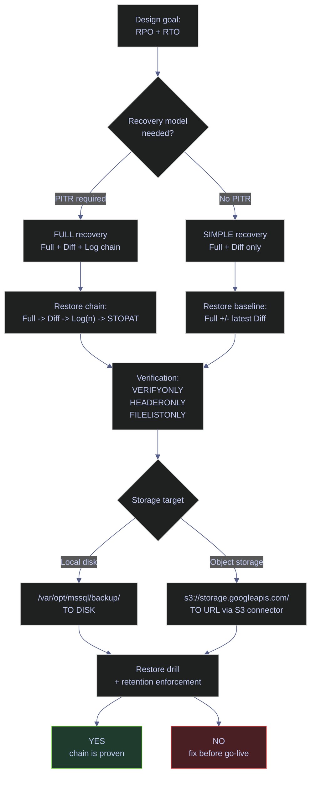
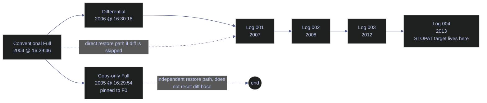

# Backup Types and Strategy

> [!abstract]- Summary
>
> This note is the production backup reference for SQL Server 2022 on the `stoxx-db` container. A backup strategy is not a list of commands; it is a restore design expressed as a schedule that defines which backup types exist, how they depend on each other, where the files live, how long they are retained, and how restorability is proven.
>
> - **Backup model**
>   - defines full, differential, log, copy-only, and file-level backup types, the chain semantics between them, and the recovery-model boundaries that decide whether point-in-time recovery exists at all
> - **Metadata inspection**
>   - shows how `msdb` catalogs, `sys.databases`, and related metadata reveal the active backup chain, recovery posture, and restore dependencies
> - **Verification**
>   - covers `VERIFYONLY`, `HEADERONLY`, `FILELISTONLY`, and the file-level checks that prove a backup is structurally usable before an incident forces a restore
> - **Production commands**
>   - provides live `BACKUP DATABASE` and `BACKUP LOG` patterns for local disk and explains the chain implications of each command choice
> - **Object storage and retention**
>   - walks through `TO URL` backups to Google Cloud Storage via the S3 connector, then ties scheduling and retention back to RPO, RTO, and restore drills
> - **Operational safeguards**
>   - closes with the production controls that keep backup success from becoming false confidence
> - **Live capture context**
>   - commands and outputs were captured on April 11, 2026 from the `stoxx` instance: SQL Server 2022 CU23 (`16.0.4236.2`, Developer Edition, Linux), container `stoxx-db`, hostname `8482aae8ad0a`, host port `1434`, local backup root `/var/opt/mssql/backup/`, and object-storage target `gs://stoxx-sql-bucket` in project `bq-wh-nb`, region `EUROPE-WEST1`

> [!note]- Glossary
>
> - **Full backup**
>   - baseline backup of the entire database plus enough log for transactional consistency
> - **Differential backup**
>   - backup of extents changed since the most recent conventional full backup
> - **Transaction log backup**
>   - backup of log records since the previous log backup, enabling point-in-time recovery in `FULL` or `BULK_LOGGED`
> - **Copy-only backup**
>   - ad hoc backup that does not disturb the normal differential base or log-backup chain
> - **Recovery model**
>   - database setting that controls log behavior and whether point-in-time recovery is possible
> - **Restore chain**
>   - ordered set of backup files required to recover a database to a chosen point
> - **Differential base**
>   - most recent conventional full backup that a differential depends on
> - **DCM page**
>   - differential changed map page that tracks extents modified since the last full backup
> - **`msdb` backup catalogs**
>   - system tables such as `backupset` and `backupmediafamily` that record backup history and media metadata
> - **`VERIFYONLY`**
>   - backup validation command that checks structural readability without restoring the database
> - **`HEADERONLY`**
>   - inspection command that returns backup-set metadata from the file header
> - **`FILELISTONLY`**
>   - inspection command that returns the logical and physical files contained in a backup set
> - **`TO URL`**
>   - backup destination syntax used to write backup files to object storage
> - **S3 connector**
>   - SQL Server mechanism that lets `TO URL` target S3-compatible storage endpoints, including Google Cloud Storage
> - **RPO**
>   - recovery point objective, defining how much data loss is acceptable
> - **RTO**
>   - recovery time objective, defining how quickly service must be restored

> [!info] Backup strategy decision path
>
> The order of this note follows the order a DBA actually decides on backup design. The diagram shows how the three core backup types, the verification steps, and the storage target choices interact.

*This diagram maps the backup-design flow from `RPO` and `RTO` targets to verification and storage choices.*



---

## Backup Model

> [!abstract]- Summary
>
> SQL Server supports several backup types, but only three form the core of most production strategies: full, differential, and transaction log. The restore design follows directly from how these three interact and from the database recovery model. This section defines each type, explains the dependency graph between them, and locates the current `stoxx` database on that map.

### SQL Server | BACKUP | backup type taxonomy

Every SQL Server backup belongs to one of six operational types. The three main types form the backbone of every restore strategy; the three variants exist for specific edge cases. The taxonomy below is the minimum vocabulary needed before any of the commands in this note will make sense.

#### Full, differential, and log backups

Reach for this material when during backup design, before choosing the command template for the job. It usually becomes relevant when any new database added to the protection scope, or any change to the restore design (RPO, RTO, PITR requirement). Conceptual reference, not a command. The operational goal is to map each operational requirement to the correct backup type so the chain is built deliberately rather than by habit.
| Backup type | What it captures | Depends on | Resets diff base? | Typical use |
|---|---|---|---|---|
| **Full** (type `D`) | Entire database plus enough log for transactional consistency at backup completion | Nothing earlier in the chain | **Yes** — sets the new differential base | Baseline for every restore design |
| **Differential** (type `I`) | Extents changed since the most recent conventional full backup, tracked by the differential changed map (DCM) page | Latest conventional full backup | No | Reduces restore time between full backups |
| **Transaction log** (type `L`) | Log records since the previous log backup; advances the minimum LSN and allows log truncation in FULL / BULK_LOGGED | Unbroken log chain since the last full backup; database in FULL or BULK_LOGGED recovery | No | Point-in-time recovery and log truncation |
| **Copy-only full** (type `D`, `is_copy_only = 1`) | Same as full | Nothing earlier in the chain | **No** — leaves the differential base pinned to the previous conventional full | Ad hoc protection before risky work, without disturbing the scheduled chain |
| **Copy-only log** (type `L`, `is_copy_only = 1`) | Same as log | Existing log chain | No; does not affect normal log-backup archive point | Specialized mirror or ad hoc log capture |
| **Partial / file / filegroup** (type `P`, `F`) | A subset of filegroups, usually the primary plus selected read-write groups | Scoped full or differential of the same filegroup set | Full: yes for that scope; diff: no | Very large databases where filegroup-level protection granularity is required |

> [!warning] Differential backups are not incremental
>
> A differential backup captures every extent that has changed since the last full backup, not since the last differential. Two consecutive diffs against the same full will contain the same unchanged extents plus whatever has changed in between — they are NOT a delta of each other. Diff size grows monotonically until the next full resets the base. Treat a diff schedule as "how much extra work do I accept at restore time" not "how small can the backup file be".

> [!success] Full + diff interaction in practice
>
> If a full runs every Sunday and a diff runs every 6 hours, by Saturday evening the diff has grown to roughly the entire working set of the database. That is expected. The correct response is to take the next full on the scheduled Sunday, not to shorten the full cadence reactively. The diff's purpose is to shrink **restore time**, not backup storage.

### SQL Server | msdb | backup chain and restore dependencies

Backups do not exist independently. They form a directed dependency graph. The restore sequence is the reverse topological walk of that graph, from a baseline full forward through differentials and logs until the target recovery point is reached.

#### Visualize the chain and restore dependency flow

Use this diagram when designing or explaining a restore plan. It becomes relevant during new-scope onboarding, restore-drill planning, and incident response. No code executes here; the diagram exists to show which backup sets must survive together for a specific recovery target to remain achievable.
*This diagram shows how a conventional `full` backup anchors the `differential` and `log` chain while a `copy-only` full stays outside the differential base.*


The diagram mirrors the real backup chain captured against `stoxx` during the preparation of this note. The copy-only full hangs off the conventional full but does not shift the differential base, so the differential (2006) still anchors to the conventional full (2004), not the copy-only (2005).

### SQL Server | sys.databases | recovery-model and log reuse boundaries

A backup strategy depends on the database recovery model. A full backup works in every recovery model. Point-in-time recovery does not. Before writing any backup command, confirm what recovery model the target database is actually in and whether the log is currently able to reuse space.

#### Inspect the current recovery model and log reuse state

Reach for this material when at the very start of backup design, and before every change to a backup schedule. It usually becomes relevant when new database, migration, restore from another environment, or investigation of a log-growth incident. Read-only catalog view query. Requires `VIEW ANY DATABASE` or membership in a database role. Runs in any database. The operational goal is to confirm that the target database is in the recovery model the strategy assumes and that the log is healthy enough to continue the chain.
> [!info]- Query breakdown — recovery model and log reuse
>
> This query reads the database-level recovery configuration from `sys.databases`, the system catalog that describes every database on the instance.
>
> - `recovery_model_desc` tells you which backup types are meaningful operationally (`FULL`, `SIMPLE`, `BULK_LOGGED`).
> - `log_reuse_wait_desc` tells you whether the log is currently waiting on a backup (`LOG_BACKUP`), blocked by an open transaction (`ACTIVE_TRANSACTION`), blocked by replication decoding (`REPLICATION`), or idle (`NOTHING`).
> - `state_desc` confirms the database is `ONLINE` — you cannot back up a database in `RESTORING`, `RECOVERING`, `SUSPECT`, or `OFFLINE`.
> - `user_access_desc` of `SINGLE_USER` will block concurrent backups because BACKUP needs to share database access with the workload.

| Column | Source | Type | Meaning |
|---|---|---|---|
| `name` | `sys.databases` | sysname | Database name |
| `recovery_model_desc` | `sys.databases` | nvarchar(60) | Effective recovery model: `FULL`, `SIMPLE`, `BULK_LOGGED` |
| `log_reuse_wait_desc` | `sys.databases` | nvarchar(60) | Why the transaction log cannot currently reuse space |
| `state_desc` | `sys.databases` | nvarchar(60) | Lifecycle state: `ONLINE`, `RESTORING`, `RECOVERING`, `RECOVERY_PENDING`, `SUSPECT`, `EMERGENCY`, `OFFLINE`, `COPYING`, `OFFLINE_SECONDARY` |
| `user_access_desc` | `sys.databases` | nvarchar(60) | User access level: `MULTI_USER`, `SINGLE_USER`, `RESTRICTED_USER` |

*This query confirms whether the target database is eligible for a log-backup strategy and point-in-time recovery, and whether any immediate log-reuse blocker needs attention first.*

```sql
SELECT
    name,
    recovery_model_desc,
    log_reuse_wait_desc,
    state_desc,
    user_access_desc
FROM sys.databases
WHERE name IN ('stoxx','stoxx_db','master','msdb');
```

| name | recovery_model_desc | log_reuse_wait_desc | state_desc | user_access_desc |
|---|---|---|---|---|
| master | SIMPLE | NOTHING | ONLINE | MULTI_USER |
| msdb | SIMPLE | NOTHING | ONLINE | MULTI_USER |
| stoxx | FULL | NOTHING | ONLINE | MULTI_USER |
| stoxx_db | FULL | NOTHING | ONLINE | MULTI_USER |

*`stoxx` is in `FULL` recovery with `log_reuse_wait_desc = NOTHING`, which means a log-backup chain is both possible and currently healthy — the log is not held open by an incomplete backup, an open transaction, or a broken mirror. `master` and `msdb` are `SIMPLE` by design; log backups are not valid against them and are not needed.*

| Column | Value | Watch | Meaning | Implication |
|---|---|---|---|---|
| `recovery_model_desc` | `FULL` | &#9989; for workload DBs | Log backups and PITR are supported | Use only if you will actually run log backups — otherwise the log will grow until writes fail |
| `recovery_model_desc` | `SIMPLE` | &#9989; for tempdb, master, msdb | Log backups are not part of the design | Simpler log management, but no PITR beyond the last full/diff |
| `recovery_model_desc` | `BULK_LOGGED` | Watch carefully | Minimal logging for specific bulk operations | Use temporarily around a bulk load, then switch back to FULL — never a permanent default |
| `log_reuse_wait_desc` | `NOTHING` | &#9989; | Log can reuse space freely | Healthy baseline |
| `log_reuse_wait_desc` | `LOG_BACKUP` | &#10060; under FULL/BULK_LOGGED | Log backup is required before space can be reused | Backup job failure or missing schedule — take a log backup immediately |
| `log_reuse_wait_desc` | `ACTIVE_TRANSACTION` | Watch | Open transaction blocks reuse | Identify the transaction via `sys.dm_tran_active_transactions` and either commit it or kill it |
| `log_reuse_wait_desc` | `REPLICATION` | Watch | Replication log reader has not yet advanced | Verify replication health, not a backup problem |
| `log_reuse_wait_desc` | `DATABASE_MIRRORING` | Watch | Mirror partner has not caught up | Check mirror state; take a log backup after reconciliation |
| `log_reuse_wait_desc` | `AVAILABILITY_REPLICA` | Watch | AG secondary has not acknowledged | Check AG health; secondary queue may be stuck |
| `state_desc` | `ONLINE` | &#9989; | Database is available | Backups can run |
| `state_desc` | `RESTORING` / `RECOVERING` | Context | Restore chain is in progress | Cannot back up until `RECOVERY` completes |
| `state_desc` | `SUSPECT` / `EMERGENCY` | &#10060; | Database is in error state | Repair before touching backups |

---

## Backup Metadata Inspection

> [!abstract]- Summary
>
> Any backup strategy should be validated against `msdb`, not just against job definitions or scripts. This section walks through the four catalog lookups that answer the operational questions "what backups exist, where are the files, which differential base am I on, and is the log chain intact". Every query in this section is read-only and safe to run on production.

### SQL Server | msdb.dbo.backupset | backup history reference

`msdb.dbo.backupset` is the authoritative audit log of every successful backup taken against the instance. It records one row per backup set, not per file — a striped backup across three disks still produces one row here and three rows in `backupmediafamily`. This is the first place to look when verifying that scheduled jobs are actually running and producing expected output.

#### List the recent backup history for a database

Reach for this material when during backup audit, job verification, and any investigation of missing or unexpected backups. It usually becomes relevant when RPO compliance check, backup job failure alert, restore-drill preparation, or handover between DBAs. Read-only query against `msdb.dbo.backupset`. Requires membership in `db_backupoperator` in `msdb` or higher. The operational goal is to confirm that the scheduled chain (full, differential, log) is present and complete for a specific database, and expose the LSN range of each backup set for chain-integrity reasoning.
> [!info]- Query breakdown — backupset chain inspection
>
> `msdb.dbo.backupset` contains a row per successful backup set. The fields in the `SELECT` list are the minimum every DBA reviews during a backup audit:
>
> - `backup_set_id` is the internal auto-increment identifier; monotonic across all backups on the instance.
> - `type` is a single-character code: `D` (full database), `I` (differential), `L` (log), `F` (file), `G` (differential file), `P` (partial), `Q` (differential partial).
> - `is_copy_only = 1` marks a backup that does not participate in the normal chain.
> - `backup_size` is the logical size (pre-compression).
> - `compressed_backup_size` is the physical size written to media when compression is used; equals `backup_size` when the backup was uncompressed.
> - `first_lsn` and `last_lsn` define the LSN range captured in the backup set; the log chain is contiguous when successive backups' LSN ranges touch.
> - `encryptor_type` and `key_algorithm` are populated only when `WITH ENCRYPTION` was used.

| Column | Source | Type | Meaning |
|---|---|---|---|
| `backup_set_id` | `backupset.backup_set_id` | int | Internal identifier, monotonic across the instance |
| `database_name` | `backupset.database_name` | nvarchar(128) | Name of the source database at backup time |
| `backup_start_date` | `backupset.backup_start_date` | datetime | When the backup command began |
| `type` | `backupset.type` | char(1) | Backup type code (see value guide below) |
| `is_copy_only` | `backupset.is_copy_only` | bit | 1 if `WITH COPY_ONLY`, 0 otherwise |
| `backup_size` | `backupset.backup_size` | numeric(20,0) | Logical size in bytes |
| `compressed_backup_size` | `backupset.compressed_backup_size` | bigint | Physical size in bytes after compression |
| `first_lsn` | `backupset.first_lsn` | numeric(25,0) | First log sequence number in the backup set |
| `last_lsn` | `backupset.last_lsn` | numeric(25,0) | Last log sequence number in the backup set |
| `encryptor_type` | `backupset.encryptor_type` | nvarchar(32) | `CERTIFICATE`, `ASYMMETRIC KEY`, or NULL |
| `key_algorithm` | `backupset.key_algorithm` | nvarchar(32) | Algorithm used for encryption (e.g., `aes_256`) |

*This query lists the recent backup chain for stoxx, filtered to the last 60 minutes so only the new demo chain is visible.*

```sql
SELECT TOP 12
    backup_set_id,
    database_name,
    CONVERT(varchar(19), backup_start_date, 120) AS start_ts,
    type,
    is_copy_only,
    CAST(backup_size/1024.0/1024 AS decimal(12,2)) AS size_mb,
    CAST(compressed_backup_size/1024.0/1024 AS decimal(12,2)) AS comp_mb,
    first_lsn,
    last_lsn,
    encryptor_type,
    key_algorithm
FROM msdb.dbo.backupset
WHERE database_name = 'stoxx'
  AND backup_start_date >= DATEADD(minute, -60, SYSUTCDATETIME())
ORDER BY backup_finish_date DESC;
```

| backup_set_id | database | start_ts | type | is_copy_only | size_mb | comp_mb | first_lsn | last_lsn | encryptor | algorithm |
|---:|---|---|---|---:|---:|---:|---|---|---|---|
| 2013 | stoxx | 2026-04-11 16:32:21 | L | 0 | 0.03 | — | 397000001750400001 | 397000001756800001 | NULL | NULL |
| 2012 | stoxx | 2026-04-11 16:32:19 | L | 0 | 0.25 | — | 397000001700000001 | 397000001750400001 | NULL | NULL |
| 2011 | stoxx | 2026-04-11 16:31:07 | D | 0 | 620.36 | 95.69 | 397000001744800001 | 397000001747200001 | NULL | NULL |
| 2010 | stoxx | 2026-04-11 16:31:05 | D | 0 | 598.13 | 95.59 | 397000001732800001 | 397000001735200001 | CERTIFICATE | aes_256 |
| 2009 | stoxx | 2026-04-11 16:30:48 | D | 0 | 600.24 | 95.59 | 397000001720800001 | 397000001723200001 | NULL | NULL |
| 2008 | stoxx | 2026-04-11 16:30:24 | L | 0 | 0.12 | 0.05 | 397000001691200001 | 397000001700000001 | NULL | NULL |
| 2007 | stoxx | 2026-04-11 16:30:18 | L | 0 | 9.12 | 2.68 | 396000012948800001 | 397000001691200001 | NULL | NULL |
| 2006 | stoxx | 2026-04-11 16:30:18 | I | 0 | 2.13 | 0.14 | 397000001686400001 | 397000001688800001 | NULL | NULL |
| 2005 | stoxx | 2026-04-11 16:29:54 | D | 1 | 598.13 | 95.49 | 397000001679200001 | 397000001681600001 | NULL | NULL |
| 2004 | stoxx | 2026-04-11 16:29:46 | D | 0 | 598.13 | 95.49 | 397000001668800001 | 397000001671200001 | NULL | NULL |

*The output is the complete demo chain built for this note. Reading top-to-bottom: the URL backup to GCS (2011) is compressed to 95.69 MB; the encrypted full (2010) carries `encryptor_type = CERTIFICATE` and `key_algorithm = aes_256`; the striped full (2009) writes the same logical content as a non-striped backup (600.24 MB) — striping is a media-layout decision, not a content decision; the two log backups (2007, 2008) sit between the differential (2006) and the later logs (2012, 2013); the copy-only full (2005) appears with `is_copy_only = 1` and will be ignored by any later differential or log restore that anchors on the conventional full (2004). Compression ratio on the full backups is roughly 6.2:1, which is healthy for the mixed rowstore workload in stoxx.*

#### Interpret the backup type codes

The `type` column is small but finite. Memorizing its domain is non-negotiable because it governs how any downstream restore command will treat the row.

| Column | Value | Watch | Meaning | Implication |
|---|---|---|---|---|
| `type` | `D` | &#9989; common | Full database backup | Baseline backup, sets the differential base unless `is_copy_only = 1` |
| `type` | `I` | &#9989; common | Differential database backup | Depends on the last conventional full |
| `type` | `L` | &#9989; common under FULL/BULK_LOGGED | Transaction log backup | Part of the log chain; required for PITR |
| `type` | `F` | Context | File backup | Subset of a filegroup file |
| `type` | `G` | Context | Differential file backup | Depends on the last conventional file backup |
| `type` | `P` | Context | Partial backup | Primary plus selected read-write filegroups |
| `type` | `Q` | Context | Differential partial backup | Depends on the last conventional partial |
| `is_copy_only` | `1` | Context | Backup does not affect the normal chain | Useful for ad hoc captures, not a replacement for scheduled chain members |
| `encryptor_type` | `CERTIFICATE` | Context | Backup is encrypted by a server certificate | Certificate must survive for restore; back it up separately |

### SQL Server | msdb.dbo.backupmediafamily | physical media path

`msdb.dbo.backupset` records what was backed up. `msdb.dbo.backupmediafamily` records where the file physically lives. The two tables join on `media_set_id`. A single striped backup produces one `backupset` row and multiple `backupmediafamily` rows — one per stripe.

#### Inspect the physical location and media type of each backup set

Use this check when preparing a restore, auditing where backup files are stored, or verifying that URL backups are actually landing in object storage. It becomes relevant during restore planning, 3-2-1 compliance audits, and missing-file investigations. The query is a read-only join in `msdb` and requires `db_backupoperator`. The goal is to map each backup set to its concrete file path, distinguish disk-backed media from URL-backed media, and expose stripe layout for striped backups.
> [!info]- Query breakdown — media family join
>
> This query joins `backupset` to `backupmediafamily` to produce one row per physical stripe. The key fields are:
>
> - `family_sequence_number` is 1 for single-file backups and 1..N for striped backups.
> - `physical_device_name` is the actual file path for disk, the UNC path for network shares, or the `s3://` URL for object storage backups.
> - `device_type` is a small-integer domain: 2 (disk), 5 (tape), 7 (virtual device), 9 (URL), 100 (permanent).

| Column | Source | Type | Meaning |
|---|---|---|---|
| `backup_set_id` | `backupset.backup_set_id` | int | Backup set identifier |
| `family_sequence_number` | `backupmediafamily.family_sequence_number` | tinyint | Stripe number within a single backup set |
| `physical_device_name` | `backupmediafamily.physical_device_name` | nvarchar(260) | File path, UNC path, or URL where the stripe is stored |
| `device_type` | `backupmediafamily.device_type` | tinyint | Numeric domain identifying the backup device type |

*This query lists the physical storage path of every backup set in the demo chain so disk, striped, and URL media are visible side by side.*

```sql
SELECT TOP 15
    bs.backup_set_id,
    bs.type,
    bs.is_copy_only,
    bmf.family_sequence_number,
    bmf.physical_device_name,
    bmf.device_type
FROM msdb.dbo.backupset AS bs
JOIN msdb.dbo.backupmediafamily AS bmf
    ON bmf.media_set_id = bs.media_set_id
WHERE bs.database_name = 'stoxx'
  AND bs.backup_start_date >= '2026-04-11 16:29:00'
ORDER BY bs.backup_set_id DESC, bmf.family_sequence_number;
```

| backup_set_id | type | is_copy_only | family_seq | physical_device_name | device_type |
|---:|---|---:|---:|---|---:|
| 2013 | L | 0 | 1 | /var/opt/mssql/backup/stoxx_log_004.trn | 2 |
| 2012 | L | 0 | 1 | /var/opt/mssql/backup/stoxx_log_003.trn | 2 |
| 2011 | D | 0 | 1 | s3://storage.googleapis.com/stoxx-sql-bucket/stoxx/full/stoxx_full.bak | 9 |
| 2010 | D | 0 | 1 | /var/opt/mssql/backup/stoxx_encrypted.bak | 2 |
| 2009 | D | 0 | 1 | /var/opt/mssql/backup/stoxx_striped_1.bak | 2 |
| 2009 | D | 0 | 2 | /var/opt/mssql/backup/stoxx_striped_2.bak | 2 |
| 2009 | D | 0 | 3 | /var/opt/mssql/backup/stoxx_striped_3.bak | 2 |
| 2008 | L | 0 | 1 | /var/opt/mssql/backup/stoxx_log_002.trn | 2 |
| 2007 | L | 0 | 1 | /var/opt/mssql/backup/stoxx_log_001.trn | 2 |
| 2006 | I | 0 | 1 | /var/opt/mssql/backup/stoxx_diff.bak | 2 |
| 2005 | D | 1 | 1 | /var/opt/mssql/backup/stoxx_copyonly.bak | 2 |
| 2004 | D | 0 | 1 | /var/opt/mssql/backup/stoxx_full_chain.bak | 2 |

*Three things become visible in this join that are not visible from `backupset` alone. First, the striped full backup `2009` produces three rows — one per stripe, all sharing the same `backup_set_id` but with `family_sequence_number` 1, 2, 3. Second, the URL backup `2011` has `device_type = 9` and its `physical_device_name` is the full `s3://` URL; the S3 connector records the path exactly as the BACKUP command issued it. Third, every disk backup carries `device_type = 2`, including the encrypted full — encryption is a content property, not a device property.*

| Column | Value | Watch | Meaning | Implication |
|---|---|---|---|---|
| `device_type` | `2` | &#9989; common | Disk | Standard filesystem path; most common target |
| `device_type` | `5` | Rare | Tape | Legacy; only on Windows with a physical tape library |
| `device_type` | `7` | Context | Virtual device (VDI) | Third-party backup agents (Veeam, Commvault, Rubrik) |
| `device_type` | `9` | &#9989; for URL | URL | Azure Blob or S3-compatible object storage |
| `family_sequence_number` | `1` and only `1` | Normal | Single-file backup | No striping |
| `family_sequence_number` | `1`..`N` | Context | Striped backup | Every stripe must survive; losing one stripe breaks the restore |

### SQL Server | sys.master_files | differential base tracking

Differentials are extent-level captures anchored to a specific full backup. SQL Server tracks that anchor in two columns on `sys.master_files`: `differential_base_lsn` and `differential_base_guid`. Copy-only full backups **do not** update these columns, which is exactly what makes them safe to run between scheduled fulls.

#### Read the current differential base LSN and GUID

Use this query to confirm that the next scheduled differential still points at the full backup you expect, or to investigate a failed differential restore. It becomes relevant after schedule changes, surprising restore behavior, or any recent copy-only full. The query is read-only, runs from any database, and requires `VIEW ANY DATABASE`. The goal is to identify the conventional full backup that currently defines the database's differential base.
> [!info]- Query breakdown — differential base fields
>
> `sys.master_files` has one row per file per database on the instance. The differential base fields are populated only on data files (`type = 0`, rows): log files always show NULL because they do not carry extent-level change tracking.
>
> - `differential_base_lsn` is the LSN of the checkpoint written by the full backup that set the current base. This LSN matches the `DatabaseBackupLSN` field in the same full backup's `RESTORE HEADERONLY` output.
> - `differential_base_guid` is the per-backup-set GUID that SQL Server uses to match diffs to their parent full.
> - A copy-only full leaves both values unchanged.
> - A conventional full updates both values to its own checkpoint LSN and GUID.

*This query reads the differential base tracked on the stoxx primary data file.*

```sql
SELECT
    name AS logical_name,
    type_desc,
    differential_base_lsn,
    differential_base_guid
FROM sys.master_files
WHERE database_id = DB_ID('stoxx') AND type = 0;
```

| logical_name | type_desc | differential_base_lsn | differential_base_guid |
|---|---|---|---|
| stoxx | ROWS | 397000001668800001 | 272F1E20-587E-4EC1-A0EE-78FEA4320623 |

*The differential base is anchored to LSN `397000001668800001`, which matches the conventional full `backup_set_id = 2004`. The copy-only full `2005` did **not** change this value — which is the behavior this note teaches: copy-only backups produce a complete, restorable full backup without disturbing the scheduled differential cadence.*

### SQL Server | msdb | detect a broken log chain

A broken log chain is the single most expensive backup failure to recover from, because once the log chain has a gap no further log backup can be used to replay past it. Detecting a gap is a simple LSN-continuity check: the `first_lsn` of each log backup must equal the `last_lsn` of the previous one.

#### Find gaps in the log LSN sequence

Reach for this material when as part of every backup audit, especially on databases where log backups run on a schedule other than the full backup schedule. It usually becomes relevant when suspicion that a log backup job failed silently, or preparation for a PITR restore drill. Read-only window-function query against `msdb.dbo.backupset`. Requires `db_backupoperator` in `msdb`. The operational goal is to verify the log chain is contiguous or report the exact gap so it can be repaired before the next restore drill.
> [!info]- Query breakdown — LSN continuity window function
>
> The query uses `LAG()` to pull the previous row's `last_lsn` onto the current row. A contiguous chain has `first_lsn = LAG(last_lsn)` for every row after the first; any row where they differ is a gap.
>
> - `chain_status = 'chain start'` appears on the first log backup after a full; it has no predecessor to compare against.
> - `chain_status = 'contiguous'` is the healthy baseline.
> - `chain_status = 'GAP'` is the failure signal — the restore chain is broken between the previous `backup_set_id` and this one, and cannot be fixed retroactively; the only remedy is a new conventional full backup.

| Column | Source | Type | Meaning |
|---|---|---|---|
| `backup_set_id` | `backupset` | int | Backup set identifier |
| `first_lsn` | `backupset.first_lsn` | numeric(25,0) | LSN of the first log record in this backup set |
| `prev_last_lsn` | `LAG(last_lsn)` | numeric(25,0) | LSN of the last log record in the previous backup set |
| `chain_status` | computed | varchar(16) | `chain start` / `contiguous` / `GAP` |

*This query reports the chain status of every log backup in the recent stoxx history.*

```sql
WITH ordered AS (
    SELECT
        backup_set_id,
        type,
        first_lsn,
        last_lsn,
        database_backup_lsn,
        LAG(last_lsn) OVER (ORDER BY backup_set_id) AS prev_last_lsn
    FROM msdb.dbo.backupset
    WHERE database_name = 'stoxx'
      AND type = 'L'
      AND backup_start_date >= '2026-04-11 16:00:00'
)
SELECT
    backup_set_id,
    first_lsn,
    prev_last_lsn,
    CASE
        WHEN prev_last_lsn IS NULL THEN 'chain start'
        WHEN first_lsn = prev_last_lsn THEN 'contiguous'
        ELSE 'GAP'
    END AS chain_status
FROM ordered
ORDER BY backup_set_id;
```

| backup_set_id | first_lsn | prev_last_lsn | chain_status |
|---:|---|---|---|
| 2007 | 396000012948800001 | NULL | chain start |
| 2008 | 397000001691200001 | 397000001691200001 | contiguous |
| 2012 | 397000001700000001 | 397000001700000001 | contiguous |
| 2013 | 397000001750400001 | 397000001750400001 | contiguous |

*The chain is healthy: every row after the first shows `first_lsn = prev_last_lsn`, confirming that no log backup was skipped and no non-logged operation broke the chain between 16:30 and 16:32.*

> [!danger] Broken log chains cannot be repaired retroactively
>
> If this query reports a row with `chain_status = 'GAP'`, the log chain is broken between that row and its predecessor. You cannot take a new log backup that "fills the gap" — the missing log records are gone. The only valid recovery is a new conventional full backup, which starts a new chain.

> [!success] Prevention: reliable log-backup cadence
>
> Protect the chain by making the log-backup job reliable before chasing tight RPO. A job that runs every 15 minutes but fails silently once a day is worse than a job that runs every hour and alerts on failure. Monitor the job outcome via `msdb.dbo.sysjobhistory` and alert on any run where `run_status <> 1`.

---

## Backup Verification

> [!abstract]- Summary
>
> Backup history is not enough. You also need commands that confirm the file on disk is readable, show what is inside it, and list the files it will expand into on restore. The three commands below are read-only and fast; run them as part of every backup-drill cycle. None of them replaces a real test restore, but all three must pass before a real restore is attempted.

### SQL Server | RESTORE VERIFYONLY | validate backup file integrity

`RESTORE VERIFYONLY` reads a backup media set and confirms that the headers, metadata, and (optionally) checksums are internally consistent. It does not restore any data, does not touch the target instance's databases, and does not require the source database to be offline.

#### Verify a backup file without restoring it

Reach for this material when after every backup completes, and immediately before any restore operation. It usually becomes relevant when scheduled backup job success handler, pre-restore sanity check, or routine media-integrity audit. Read-only against the media file. Requires permission to read the file and `CREATE DATABASE` on the instance (historical quirk — VERIFYONLY uses the same permission gate as RESTORE). The operational goal is to confirm the backup file is structurally valid and readable before committing to a real restore.
> [!info]- VERIFYONLY validation scope
>
> `RESTORE VERIFYONLY` performs the following checks:
>
> - The backup media set is readable and the header can be parsed.
> - The backup-set structure is internally consistent.
> - When `WITH CHECKSUM` is included (and the original backup was taken with `WITH CHECKSUM`), every page checksum in the backup set is re-verified against the stored value.
> - The backup set's logical file list is consistent.
>
> It does **not** verify that the restored database would be logically clean, that DBCC CHECKDB would pass, or that application data is present. It is a necessary but not sufficient test.

> [!warning] VERIFYONLY does not guarantee a good restore
>
> A backup can pass `RESTORE VERIFYONLY` and still fail on restore — for example, if the target instance does not have enough disk space, if a `WITH MOVE` clause targets a path that does not exist, or if the destination volume is on a filesystem that cannot accept the file. The only conclusive validation is a real restore drill.

> [!success] Verification pattern for production
>
> Chain `VERIFYONLY` immediately after every scheduled backup in the same job step. If it fails, treat the backup as unusable and re-run it. Do not promote an unverified backup to a retention tier.

*This command validates the baseline full backup file produced earlier in the demo chain.*

```sql
RESTORE VERIFYONLY
FROM DISK = '/var/opt/mssql/backup/stoxx_full_chain.bak'
WITH CHECKSUM;
```

```text
The backup set on file 1 is valid.
```

*This is the expected single-line success output when the media set is structurally valid and all page checksums re-verify. Any other output indicates damage — treat the backup as unusable until proven otherwise.*

| Column | Value | Watch | Meaning | Implication |
|---|---|---|---|---|
| Result | `The backup set on file 1 is valid.` | &#9989; | Media is readable and consistent | Safe to proceed to a real restore drill |
| Result | `... failed: Checksum verification failed.` | &#10060; | One or more page checksums do not match | Backup file is corrupt; take a fresh backup |
| Result | `Cannot open backup device ...` | &#10060; | File path is unreadable or missing | Investigate storage; file may have been deleted or moved |
| Result | `The media family on device ... is incorrectly formed.` | &#10060; | Header corruption | File is unusable; fail over to the prior valid backup |

### SQL Server | RESTORE HEADERONLY | inspect backup set metadata

`RESTORE HEADERONLY` returns one row per backup set on the media file. On a single-set file it returns exactly one row with the full metadata header; on a multi-set media file (typical of tape or `NOINIT` disk appends) it returns one row per set with the `Position` column identifying which set is which.

#### Read backup set headers from a file

Reach for this material when before any restore, to confirm the file contains the backup set you expect and to identify the exact `Position` to target. It usually becomes relevant when restore planning, file identification, or when a media file was built up with `NOINIT` and multiple sets may share the same media. Read-only against the media file; same permissions as VERIFYONLY. The operational goal is to identify the source database, recovery model, compression state, encryption state, LSN range, and exact backup set position inside the media file.
> [!info]- HEADERONLY fields that matter most
>
> `RESTORE HEADERONLY` returns a very wide row — roughly 60 columns. In practice these are the ones you actually use:
>
> - `BackupName` is the optional `NAME = N'...'` from the BACKUP command.
> - `BackupType` is the integer backup type (see value guide below).
> - `Compressed` is 1 if the backup set is compressed, 0 otherwise.
> - `Position` is the backup set number within the media file (1 for a single-set file).
> - `DatabaseName` and `DatabaseVersion` identify the source database and its schema version at backup time.
> - `FirstLSN`, `LastLSN`, `CheckpointLSN`, `DatabaseBackupLSN` define the LSN range and the fork/anchor points.
> - `BackupStartDate` and `BackupFinishDate` are the wall-clock bounds.
> - `RecoveryModel` records the recovery model at backup time — this determines whether the backup can participate in a log chain.
> - `CompressedBackupSize` is the actual byte count written to media after compression; `BackupSize` would be the pre-compression size.
> - `CompressionAlgorithm` is `MS_XPRESS` (SQL Server default) or NULL.
> - `EncryptorType` and `KeyAlgorithm` are populated when `WITH ENCRYPTION` was used.

| Column | Source | Type | Meaning |
|---|---|---|---|
| `BackupName` | HEADERONLY | nvarchar(128) | Optional label from `NAME = ...` |
| `BackupType` | HEADERONLY | smallint | Numeric backup type code |
| `Position` | HEADERONLY | smallint | Backup set ordinal within the media file |
| `DatabaseName` | HEADERONLY | nvarchar(128) | Source database name |
| `DatabaseVersion` | HEADERONLY | int | Internal schema version number |
| `BackupSize` | HEADERONLY | numeric(20,0) | Logical size in bytes |
| `CompressedBackupSize` | HEADERONLY | numeric(20,0) | Physical size in bytes |
| `FirstLSN` / `LastLSN` | HEADERONLY | numeric(25,0) | LSN range captured |
| `CheckpointLSN` | HEADERONLY | numeric(25,0) | LSN of the checkpoint at backup start |
| `DatabaseBackupLSN` | HEADERONLY | numeric(25,0) | LSN of the most recent database backup (anchor for diffs) |
| `BackupStartDate` / `BackupFinishDate` | HEADERONLY | datetime | Wall-clock timestamps |
| `RecoveryModel` | HEADERONLY | nvarchar(60) | Recovery model at backup time |
| `BackupTypeDescription` | HEADERONLY | nvarchar(60) | Human-readable backup type |
| `CompressionAlgorithm` | HEADERONLY | nvarchar(32) | Compression algorithm used |
| `EncryptorType` | HEADERONLY | nvarchar(32) | `CERTIFICATE`, `ASYMMETRIC KEY`, or NULL |
| `KeyAlgorithm` | HEADERONLY | nvarchar(32) | Encryption algorithm or NULL |
| `HasBackupChecksums` | HEADERONLY | bit | 1 if `WITH CHECKSUM` was used |
| `IsCopyOnly` | HEADERONLY | bit | 1 if `WITH COPY_ONLY` was used |

*This command reads the headers of the baseline full backup taken earlier in the demo chain.*

```sql
RESTORE HEADERONLY
FROM DISK = '/var/opt/mssql/backup/stoxx_full_chain.bak';
```

| Field | Value |
|---|---|
| BackupName | stoxx full chain baseline |
| BackupType | 1 (Full database) |
| Position | 1 |
| DatabaseName | stoxx |
| DatabaseVersion | 957 |
| DatabaseCreationDate | 2026-03-04 22:11:32 |
| BackupSize | 627,179,520 |
| FirstLSN | 397000001668800001 |
| LastLSN | 397000001671200001 |
| CheckpointLSN | 397000001668800001 |
| DatabaseBackupLSN | 362000003116000001 |
| BackupStartDate | 2026-04-11 16:29:46 |
| BackupFinishDate | 2026-04-11 16:29:46 |
| CollationName | SQL_Latin1_General_CP1_CI_AS |
| RecoveryModel | FULL |
| BackupTypeDescription | Database |
| CompressedBackupSize | 100,124,706 |
| CompressionAlgorithm | MS_XPRESS |
| HasBackupChecksums | 1 |
| IsCopyOnly | 0 |

*This header proves the file contains one compressed full database backup for `stoxx`, taken at `2026-04-11 16:29:46` in `FULL` recovery model, with checksums, `MS_XPRESS` compression, and a 6.26:1 compression ratio (627 MB logical → 100 MB physical). `Position = 1` matters only if the media file later contains multiple backup sets from `NOINIT` appends; here there is exactly one. `DatabaseBackupLSN = 362000003116000001` points to the previous full backup — this is how SQL Server tracks backup-set lineage internally.*

| Column | Value | Watch | Meaning | Implication |
|---|---|---|---|---|
| `BackupType` | `1` | &#9989; common | Full database backup | Valid full-backup restore starting point |
| `BackupType` | `2` | Context | Transaction log backup | Use only in the correct sequence after a full or diff |
| `BackupType` | `4` | Context | File backup | Subset-scope restore |
| `BackupType` | `5` | Context | Differential database backup | Depends on a full baseline |
| `BackupType` | `6` | Context | Differential file backup | File-scope differential |
| `BackupType` | `7` | Context | Partial backup | Primary plus selected filegroups |
| `BackupType` | `8` | Context | Differential partial backup | Depends on a conventional partial |
| `Compressed` | `1` | &#9989; | Backup was compressed | Lower media footprint; roughly 5–10× for rowstore |
| `IsCopyOnly` | `0` | &#9989; for chain members | Conventional backup | Normal chain semantics |
| `HasBackupChecksums` | `1` | &#9989; | Page checksums captured during backup | `VERIFYONLY WITH CHECKSUM` can re-validate them |

### SQL Server | RESTORE FILELISTONLY | inspect logical files

`RESTORE FILELISTONLY` lists the data and log files stored inside a backup file. The `LogicalName` column is what a restore `MOVE` clause must target — not the original physical path from the source instance, which may not exist on the restore target.

#### List the data and log files inside a backup

Reach for this material when before every side-by-side restore, especially when the restore target is a different instance or a different filesystem layout. It usually becomes relevant when restore drill, database migration, or any situation requiring `WITH MOVE`. Read-only against the media file. Same permissions as VERIFYONLY. The operational goal is to retrieve the exact logical file names and their original physical paths so a correct `WITH MOVE` clause can be constructed.
> [!info]- FILELISTONLY fields that matter
>
> `RESTORE FILELISTONLY` returns one row per file inside the backup set. For a typical single-data-file database the result is two rows: one data file and one log file. Memory-optimized filegroups, additional data files, FILESTREAM containers, and secondary filegroups each add more rows.
>
> - `LogicalName` is the name you must reference in `WITH MOVE` clauses.
> - `PhysicalName` is the path the file had on the source instance — informational only; the restore target may use a completely different path.
> - `Type` is `D` (data), `L` (log), `F` (FILESTREAM), or `S` (memory-optimized).
> - `FileGroupName` is the owning filegroup for data files, NULL for log and FILESTREAM rows.
> - `Size` is the logical file size in bytes at backup time.
> - `MaxSize` is the configured maximum size; 0 or `-1` means the file can grow to fill the volume.
> - `DifferentialBaseLSN` carries the per-file differential base — useful for diagnosing why a differential restore failed.

| Column | Source | Type | Meaning |
|---|---|---|---|
| `LogicalName` | FILELISTONLY | nvarchar(128) | Logical name — target for `WITH MOVE` |
| `PhysicalName` | FILELISTONLY | nvarchar(260) | Source instance physical path |
| `Type` | FILELISTONLY | char(1) | File type (`D`, `L`, `F`, `S`) |
| `FileGroupName` | FILELISTONLY | nvarchar(128) | Owning filegroup for data files |
| `Size` | FILELISTONLY | numeric(20,0) | File size in bytes at backup time |
| `FileId` | FILELISTONLY | int | Numeric file identifier |
| `IsReadOnly` | FILELISTONLY | bit | 1 if the file was read-only at backup time |
| `IsPresent` | FILELISTONLY | bit | 1 if the file is included in this backup |
| `DifferentialBaseLSN` | FILELISTONLY | numeric(25,0) | Per-file differential base LSN |

*This command lists the files stored inside the baseline full backup of stoxx.*

```sql
RESTORE FILELISTONLY
FROM DISK = '/var/opt/mssql/backup/stoxx_full_chain.bak';
```

| LogicalName | PhysicalName | Type | FileGroupName | Size (bytes) | FileId | IsReadOnly | IsPresent | DifferentialBaseLSN |
|---|---|---|---|---:|---:|---:|---:|---|
| stoxx | /var/opt/mssql/data/stoxx.mdf | D | PRIMARY | 746,586,112 | 1 | 0 | 1 | 362000003116000001 |
| stoxx_log | /var/opt/mssql/data/stoxx_log.ldf | L | NULL | 1,082,130,432 | 2 | 0 | 1 | 0 |

*These are the exact logical names a side-by-side restore must target in its `MOVE` clauses: `stoxx` for the data file and `stoxx_log` for the log file. The `PhysicalName` column shows where the files lived on the source instance — `/var/opt/mssql/data/` in the container — but the restore target can place them anywhere writeable. One data file, one log file, one `PRIMARY` filegroup: this is the simplest possible layout, but the same command works identically on a database with 20 data files across 5 filegroups.*

| Column | Value | Watch | Meaning | Implication |
|---|---|---|---|---|
| `Type` | `D` | &#9989; | Data file | Restore into `.mdf` or `.ndf` destination |
| `Type` | `L` | &#9989; | Log file | Restore into `.ldf` destination |
| `Type` | `F` | Context | FILESTREAM container | Restore into a filesystem folder, not a single file |
| `Type` | `S` | Context | Memory-optimized filegroup | Requires matching filesystem layout |
| `IsPresent` | `1` | &#9989; | File is present in the backup set | Restore can reference it |
| `IsPresent` | `0` | Context | File was excluded | Restore target must not reference it in `MOVE` |
| `IsReadOnly` | `0` | &#9989; common | File is mutable | Normal case |
| `IsReadOnly` | `1` | Context | File was read-only at backup time | Useful for archival filegroups; restore preserves the flag |

---

## Production Backup Commands

> [!abstract]- Summary
>
> These are the commands that actually implement the strategy. The safest pattern is to treat each backup type as a deliberate operational tool, not as a syntax variation you choose casually. Every command in this section was executed against the live `stoxx` database, and the `STATS = N` progress output below each code cell is the real captured output from that run.

### SQL Server | BACKUP DATABASE | full backup operations

Full backups are the baseline for every restore design. There are four distinct full-backup variants you will write in production: the conventional scheduled full, the ad hoc copy-only full, the striped full for very large databases, and the encrypted full for compliance-sensitive workloads. All four are produced by the same `BACKUP DATABASE` command with different option sets.

#### Take a conventional full backup

Reach for this material when on the scheduled cadence (daily or weekly, depending on workload), and as the first backup on every new database added to the protection scope. It usually becomes relevant when scheduled job, initial protection of a new database, or restart of the backup chain after a broken log chain. Runs in `master` (or any database with appropriate permissions). Requires `db_backupoperator` on the target database or `sysadmin`. State-changing for backup metadata (`msdb`), not for the source database. The operational goal is to produce a full, restorable baseline that becomes the anchor for all subsequent differentials and logs until the next conventional full.
> [!success] Conventional full backup baseline pattern
>
> Use a conventional full backup as the anchor for every restore design. Always add `CHECKSUM` unless you have a tested reason not to, and always add `COMPRESSION` unless you have a specific CPU or storage reason not to. The `STATS = 25` option prints progress every 25% so the job log contains something useful if the backup hangs.

*This command creates the baseline full backup that every later differential and log restore will depend on.*

```sql
BACKUP DATABASE stoxx
TO DISK = '/var/opt/mssql/backup/stoxx_full_chain.bak'
WITH INIT, COMPRESSION, CHECKSUM, STATS = 25,
     NAME = 'stoxx full chain baseline';
```

```text
25 percent processed.
50 percent processed.
75 percent processed.
100 percent processed.
Processed 76344 pages for database 'stoxx', file 'stoxx' on file 1.
Processed 2 pages for database 'stoxx', file 'stoxx_log' on file 1.
BACKUP DATABASE successfully processed 76346 pages in 0.357 seconds (1670.726 MB/sec).
```

*The backup processed 76,344 data pages plus 2 log pages in 0.357 seconds at 1670 MB/sec local-disk throughput. Compression brought the logical 598 MB down to 95.49 MB (backup_set_id 2004 in the earlier history query), a 6.26:1 ratio. This backup set reset the differential base to LSN `397000001668800001`.*

#### Take a copy-only full backup before risky work

Reach for this material when immediately before any operation that could corrupt the database or invalidate the restore design: schema migration, bulk reload, extension install, or CU upgrade. It usually becomes relevant when change-management gate, pre-deployment safety net, forensic snapshot for incident investigation. Same permissions as a conventional full. The operational goal is to capture a complete, restorable full backup without disturbing the scheduled differential base, so the normal backup cadence is not polluted by the ad hoc snapshot.
> [!warning] Copy-only is a safety net, not a replacement for scheduling
>
> A copy-only full is intentionally invisible to the differential base. This is its value — but it also means the next scheduled differential will **not** see the copy-only backup and will still anchor on the last conventional full. Do not use copy-only as a way to "take an extra full" and expect it to shorten subsequent differentials.

> [!success] Copy-only pattern for change windows
>
> Take a copy-only full in the same change window as the risky operation, store it on a path distinct from the scheduled backup directory, and keep it until the change is verified and closed.

*This command creates an ad hoc full backup that does not reset the differential base of the scheduled chain.*

```sql
BACKUP DATABASE stoxx
TO DISK = '/var/opt/mssql/backup/stoxx_copyonly.bak'
WITH INIT, COPY_ONLY, COMPRESSION, CHECKSUM, STATS = 25,
     NAME = 'stoxx copy-only before risky work';
```

```text
Processed 76346 pages in 0.367 seconds (1625.202 MB/sec).
```

*The copy-only backup wrote the same number of pages as the preceding conventional full and produced a comparable compression ratio. The teaching point is visible in the differential base tracking query earlier in this note: the `differential_base_lsn` did not change across the two commands, which is the defining property of `COPY_ONLY`.*

#### Take a three-way striped full backup

Reach for this material when on very large databases where a single backup file would exceed the filesystem's practical limits, or where parallel write throughput is limited by a single target device. It usually becomes relevant when database size crossing the point where a single-file backup becomes slow, or a multi-disk backup target that benefits from parallel writes. Each stripe must be writable independently. If any stripe is lost, the entire backup set is unusable. The operational goal is to split one logical backup set across multiple physical files written in parallel so total write time is reduced and per-file size stays bounded.
> [!warning] All stripes must survive together
>
> A striped backup is a single logical backup set represented across multiple physical files. Losing any one stripe makes the other stripes useless — you cannot partially restore from `stoxx_striped_1.bak` and `stoxx_striped_2.bak` alone if `stoxx_striped_3.bak` is missing. Store all stripes together and restore all stripes together.

> [!success] Stripe count sizing guideline
>
> On a single-volume target, 3–4 stripes is a reasonable upper bound — more stripes fight over the same I/O queue and add overhead. On a multi-volume target (one volume per stripe), you can go higher. The default `MAXTRANSFERSIZE` is usually the right starting point; tune only if throughput is demonstrably CPU-bound on the backup process.

*This command writes one full backup across three stripe files in parallel.*

```sql
BACKUP DATABASE stoxx
TO DISK = '/var/opt/mssql/backup/stoxx_striped_1.bak',
   DISK = '/var/opt/mssql/backup/stoxx_striped_2.bak',
   DISK = '/var/opt/mssql/backup/stoxx_striped_3.bak'
WITH INIT, FORMAT, COMPRESSION, CHECKSUM, STATS = 33,
     NAME = 'stoxx striped full 3-way';
```

```text
33 percent processed.
66 percent processed.
99 percent processed.
Processed 76354 pages in 0.268 seconds (2225.789 MB/sec).
```

*The striped backup wrote at 2225 MB/sec, roughly 33% faster than the single-file equivalent (1670 MB/sec) on the same local disk — the parallel writes measurably reduced end-to-end time. The backup media family query earlier in this note shows the three stripes sharing `backup_set_id = 2009` with `family_sequence_number` 1, 2, and 3.*

#### Take an encrypted full backup with AES-256

Reach for this material when on any database where the backup files may be stored on shared or externally accessible media, or where compliance requires encryption at rest for database backups. It usually becomes relevant when compliance mandate (PCI, HIPAA, GDPR), backup target on shared infrastructure, or preparation for cross-environment transfer. Requires a database master key in `master` and a server certificate. State-changing in `master` only for the initial setup; the backup itself is read-only against `stoxx`. The operational goal is to produce a backup file that is encrypted at rest and cannot be restored without the corresponding certificate and private key.
> [!danger] Losing the certificate makes the backup unrestorable
>
> SQL Server encrypts the backup using a key derived from the server certificate. If the certificate is lost and its private key was not backed up separately, the backup file is cryptographically unrecoverable — no Microsoft support escalation can read it. The moment you take the first encrypted backup, back up the certificate and private key to a location disjoint from the backup files themselves.

> [!success] Certificate + private key export pattern
>
> Immediately after creating the certificate, run `BACKUP CERTIFICATE ... WITH PRIVATE KEY (FILE = '...', ENCRYPTION BY PASSWORD = '...')`. Store the `.cer` file, the `.pvk` file, and the password in a secrets manager separate from the backup target. Rotate the password on the documented cadence.

**Setup (one-time, runs in master):**

*This command creates a database master key in master and a server certificate that will be used to encrypt backup sets.*

```sql
IF NOT EXISTS (SELECT 1 FROM sys.symmetric_keys WHERE name = '##MS_DatabaseMasterKey##')
    CREATE MASTER KEY ENCRYPTION BY PASSWORD = 'StoxxBackupMK_2026#';

IF NOT EXISTS (SELECT 1 FROM sys.certificates WHERE name = 'BackupEncryptCert')
    CREATE CERTIFICATE BackupEncryptCert
    WITH SUBJECT = 'Stoxx backup encryption cert',
         EXPIRY_DATE = '2027-12-31';
```

| name | pvt_key_encryption_type_desc | expiry |
|---|---|---|
| BackupEncryptCert | ENCRYPTED_BY_MASTER_KEY | 2027-12-31 00:00:00 |

*The certificate's private key is itself encrypted by the database master key of `master`. This two-level hierarchy is the SQL Server standard pattern — losing either the master key or the certificate private key is fatal.*

**Take the encrypted backup:**

*This command writes a compressed, checksum-validated full backup encrypted with AES-256 using the server certificate.*

```sql
BACKUP DATABASE stoxx
TO DISK = '/var/opt/mssql/backup/stoxx_encrypted.bak'
WITH INIT, COMPRESSION, CHECKSUM, STATS = 50,
     NAME = 'stoxx encrypted full',
     ENCRYPTION (ALGORITHM = AES_256, SERVER CERTIFICATE = BackupEncryptCert);
```

```text
Warning: The certificate used for encrypting the database encryption key has not been backed up. You should immediately back up the certificate and the private key associated with the certificate. If the certificate ever becomes unavailable or if you must restore or attach the database on another server, you must have backups of both the certificate and the private key or you will not be able to open the database.
Processed 76354 pages in 0.290 seconds (2056.936 MB/sec).
```

*SQL Server emits the certificate-backup warning on every encrypted backup until the certificate is successfully exported. Treat the warning as blocking — the backup itself is valid, but it is not yet restorable on any other instance. The corresponding row in `msdb.dbo.backupset` (id 2010 in the history query) shows `encryptor_type = CERTIFICATE` and `key_algorithm = aes_256`.*

**Export the certificate and private key (required next step):**

*This command exports the certificate and its private key to disk so the encrypted backup remains restorable on another instance.*

```sql
BACKUP CERTIFICATE BackupEncryptCert
TO FILE = '/var/opt/mssql/backup/BackupEncryptCert.cer'
WITH PRIVATE KEY (
    FILE = '/var/opt/mssql/backup/BackupEncryptCert.pvk',
    ENCRYPTION BY PASSWORD = 'CertExport_StoxxBackup_2026#'
);
```

*The export writes two files: the public certificate (`.cer`) and the encrypted private key (`.pvk`). The password used for `ENCRYPTION BY PASSWORD` is required to re-import the private key on a restore target. Store the two files plus the password in a secrets manager separate from the backup files, and rotate the password on the documented cadence.*

#### Flag reference — BACKUP DATABASE options

This table covers every option commonly used with `BACKUP DATABASE`. Options not shown (like `BLOCKSIZE`, `MEDIADESCRIPTION`, `RESTART`) exist but are rarely relevant outside specialized hardware scenarios.

| Option | Syntax | Description |
|---|---|---|
| `COMPRESSION` | `WITH COMPRESSION` | Compress the backup using the `MS_XPRESS` algorithm. Typically 5–10× reduction on rowstore data, 1–2× on already-compressed columnstore or XML. Trades CPU for I/O — almost always worth it. |
| `NO_COMPRESSION` | `WITH NO_COMPRESSION` | Explicitly disable compression, overriding `backup compression default` instance setting. Only used when CPU is provably the bottleneck. |
| `CHECKSUM` | `WITH CHECKSUM` | Validate page checksums during backup and write a backup checksum so `VERIFYONLY WITH CHECKSUM` can re-verify later. Enables corruption detection at backup time. |
| `NO_CHECKSUM` | `WITH NO_CHECKSUM` | Explicitly skip checksum validation. Not recommended in production. |
| `STATS` | `WITH STATS = 10` | Emit progress output every N percent. Provides job-log breadcrumbs for long-running backups. |
| `INIT` | `WITH INIT` | Overwrite the media file if it already exists. Use for single-set files where you want a fresh media on each run. |
| `NOINIT` | `WITH NOINIT` (default) | Append the backup set to the existing media file as a new backup set. Legacy tape behavior; almost never used with disk backups. |
| `FORMAT` | `WITH FORMAT` | Reformat the media header, discarding any previous media-set metadata. Combine with `INIT` when starting fresh media. |
| `NAME` | `WITH NAME = 'friendly label'` | Optional friendly name for the backup set. Recorded in `msdb.dbo.backupset.name` and visible in `HEADERONLY`. |
| `DESCRIPTION` | `WITH DESCRIPTION = '...'` | Longer free-form description. Rarely used. |
| `COPY_ONLY` | `WITH COPY_ONLY` | Do not reset the differential base. For ad hoc snapshots that must not disturb the scheduled chain. |
| `DIFFERENTIAL` | `WITH DIFFERENTIAL` | Produce a differential backup relative to the current differential base. |
| `ENCRYPTION` | `WITH ENCRYPTION (ALGORITHM = AES_256, SERVER CERTIFICATE = cert)` | Encrypt the backup using the named certificate. Supported algorithms: `AES_128`, `AES_192`, `AES_256`, `TRIPLE_DES_3KEY`. Use `AES_256`. |
| `MAXTRANSFERSIZE` | `WITH MAXTRANSFERSIZE = 20971520` | Maximum I/O transfer size in bytes. Default 1 MB for disk; allowed range 64 KB – 4 MB for disk, 5 MB – 20 MB for URL. For S3 connector, setting higher than default (10 MB) requires `COMPRESSION`. |
| `BUFFERCOUNT` | `WITH BUFFERCOUNT = 64` | Number of I/O buffers used by the backup engine. Default is calculated from transfer size and device count; tune only when throughput is visibly buffer-starved. |
| `MIRROR TO` | `MIRROR TO DISK = '...'` | Write the backup to two targets simultaneously. All mirrors must be the same device type (all DISK or all URL); cannot mix DISK and URL mirrors. |
| `RETAINDAYS` | `WITH RETAINDAYS = 30` | Metadata retention hint written into the media header. Not enforced by SQL Server — only respected if you manually check it before overwriting. |
| `EXPIREDATE` | `WITH EXPIREDATE = '2026-12-31'` | Absolute expiration date variant of `RETAINDAYS`. |
| `SKIP` | `WITH SKIP` | Skip backup-set expiration checks (pairs with `RETAINDAYS`/`EXPIREDATE`). Forces overwrite. |
| `CREDENTIAL` | `WITH CREDENTIAL = 'name'` | Use a specific SQL Server credential for URL backups. Not needed if the credential is name-matched to the URL prefix. |
| `FILE_SNAPSHOT` | `WITH FILE_SNAPSHOT` | Azure Blob Storage only — creates a file snapshot instead of a streamed backup. **Not supported on S3-compatible storage.** |
| `STANDBY` | (RESTORE only) | Not valid on BACKUP; included here because it is commonly confused with backup options. |

### SQL Server | BACKUP DATABASE | differential backup operations

A differential backup captures every extent changed since the current differential base (set by the last conventional full). It is a single-command operation with one small but critical option addition: `WITH DIFFERENTIAL`.

#### Take a differential backup

Reach for this material when on the scheduled differential cadence, between conventional full backups. It usually becomes relevant when scheduled job, or pre-deployment snapshot inside an already-established full-backup window. Same permissions as a full backup. Requires an existing conventional full as the base. The operational goal is to capture only the extents changed since the last conventional full, reducing restore time compared to replaying every log backup from the full to now.
> [!info]- Differential backup mechanics
>
> SQL Server tracks changed extents via the differential changed map (DCM) page — one DCM page per 64,000 extents (4 GB of data). When a differential backup runs, it reads the DCM to identify which extents have changed since the `differential_base_lsn` and backs up only those extents plus enough log for transactional consistency.
>
> - Diff size grows monotonically until the next conventional full resets the base.
> - A differential cannot be the first restore step; it always follows a full.
> - A differential taken after a copy-only full still anchors to the conventional full, not the copy-only.

*This command creates a differential backup relative to the current differential base.*

```sql
BACKUP DATABASE stoxx
TO DISK = '/var/opt/mssql/backup/stoxx_diff.bak'
WITH INIT, DIFFERENTIAL, COMPRESSION, CHECKSUM, STATS = 50,
     NAME = 'stoxx differential';
```

```text
Processed 104 pages for database 'stoxx', file 'stoxx' on file 1.
Processed 2 pages for database 'stoxx', file 'stoxx_log' on file 1.
BACKUP DATABASE WITH DIFFERENTIAL successfully processed 106 pages in 0.038 seconds (21.689 MB/sec).
```

*The differential captured just 104 data pages plus 2 log pages — a very small footprint because very little of `stoxx` changed between the conventional full at 16:29:46 and this differential at 16:30:18. That small footprint is the point: restoring this differential on top of the full replays far less work than replaying every log backup in the same interval would.*

### SQL Server | BACKUP LOG | log chain operations

Log backups are the only backup type that enforces chain continuity. Each log backup captures the log records since the previous log backup (or since the last full if this is the first log), advances the minimum LSN, and allows the log to reuse space. Log backups are the defining operational workload in FULL recovery model.

#### Take a transaction log backup

Reach for this material when on the scheduled log-backup cadence, usually every 5–15 minutes for OLTP workloads. It usually becomes relevant when scheduled job, or ad hoc when log reuse is blocked and a log backup would release space. Requires the database to be in `FULL` or `BULK_LOGGED` recovery model and an existing conventional full backup as the chain anchor. The operational goal is to capture log records since the previous log backup, advance the minimum LSN, and contribute one link to the restore chain.
> [!warning] Log backups are only valid under FULL or BULK_LOGGED
>
> Running `BACKUP LOG` against a database in `SIMPLE` recovery model fails with error 4208. Before taking the first log backup on a new database, confirm the recovery model is `FULL` or `BULK_LOGGED` via the `sys.databases` query earlier in this note.

> [!success] Log-backup cadence and chain protection
>
> A database in `FULL` recovery model without a log-backup job will eventually grow its log until writes fail. Treat recovery model and log-backup schedule as one design decision: never switch a database to `FULL` without simultaneously scheduling its log-backup job.

*This command backs up the transaction log and advances the log chain.*

```sql
BACKUP LOG stoxx
TO DISK = '/var/opt/mssql/backup/stoxx_log_001.trn'
WITH INIT, COMPRESSION, STATS = 50,
     NAME = 'stoxx log 001';
```

```text
Processed 1155 pages for database 'stoxx', file 'stoxx_log' on file 1.
BACKUP LOG successfully processed 1155 pages in 0.039 seconds (231.370 MB/sec).
```

*This log backup captured 1,155 log pages at 231 MB/sec. The corresponding `msdb.dbo.backupset` row (id 2007) shows a `first_lsn` of `396000012948800001` and `last_lsn` of `397000001691200001`. Every subsequent log backup's `first_lsn` must equal its predecessor's `last_lsn` for the chain to remain restorable — the chain-continuity query earlier in this note validates exactly that invariant.*

#### Flag reference — BACKUP LOG options

Log-specific flags on top of the full `BACKUP DATABASE` option set.

| Option | Syntax | Description |
|---|---|---|
| `NORECOVERY` | `WITH NORECOVERY` | Take a tail-log backup and leave the source database in `RESTORING` state. **Only use on a database that is being replaced from backup** — otherwise the database becomes unavailable until a full restore is performed. |
| `NO_TRUNCATE` | `WITH NO_TRUNCATE` | Attempt a log backup even if the database is damaged or offline. Use in disaster recovery when the goal is to capture the last few log records before the database is unrestorable. |
| `CONTINUE_AFTER_ERROR` | `WITH CONTINUE_AFTER_ERROR` | Continue the backup after encountering a checksum error. Pair with `NO_TRUNCATE` for emergency tail-log capture. |
| `STANDBY` | `WITH STANDBY = 'undo_file'` | (RESTORE option) Included here because it is often misplaced — it is valid on `RESTORE LOG`, not `BACKUP LOG`. |

---

## Object Storage Backup with GCS

> [!abstract]- Summary
>
> SQL Server 2022 introduced native `BACKUP TO URL` support for S3-compatible object storage, extending the existing Azure Blob Storage URL syntax. Google Cloud Storage exposes an S3-compatible interoperability XML API authenticated with HMAC keys, which makes GCS a fully working backup target even though it is not on Microsoft's officially tested vendor list. This section walks through the complete GCP-side and SQL-Server-side setup, then takes a real full backup of `stoxx` to a GCS bucket and reads the backup set back through the same URL to prove round-trip integrity.

### GCP | Cloud Storage | prepare a bucket for SQL Server backup

Three GCP configuration steps must be completed before SQL Server can write a single byte: a bucket, a service account with object-storage permissions, and an HMAC interoperability key bound to that service account. None of these steps can be done from SQL Server — they are all performed via `gcloud` or the GCP console.

#### Create the GCS bucket with uniform access and public-access prevention

Reach for this material when once per backup target, before any SQL Server configuration. It usually becomes relevant when new project onboarding, new protection scope, or adoption of object storage as a backup tier. GCP console or `gcloud` CLI, authenticated against the target project. Requires `roles/storage.admin` on the project (or explicit `storage.buckets.create` permission). The operational goal is to provision a bucket that will hold SQL Server backup files, with the security posture expected of a production backup target.
> [!info]- Bucket configuration that matters for SQL Server backup
>
> The bucket settings that affect SQL Server's backup behavior are:
>
> - **Location type and region.** Use a regional bucket close to the SQL Server host to minimize upload latency. Multi-region buckets cost more and add latency. The demo bucket `stoxx-sql-bucket` is in `EUROPE-WEST1`.
> - **Storage class.** Use `STANDARD` for backups that may be restored quickly. Do NOT use `NEARLINE`, `COLDLINE`, or `ARCHIVE` for active backup chains — retrieval latency makes restore drills impractical. Use lifecycle rules to transition old backups to cheaper classes after the retention window.
> - **Uniform bucket-level access.** Enable this. It disables legacy object ACLs and makes all access permissions flow through project/bucket IAM, which is simpler and more secure.
> - **Public access prevention.** Set to `enforced`. SQL Server authenticates with an HMAC key, not anonymously, so there is no legitimate reason for a backup bucket to allow public access.
> - **Object Lock / Bucket Lock.** Do NOT enable for active backup chains. Per the [Microsoft S3 best practices and troubleshooting documentation](https://learn.microsoft.com/sql/relational-databases/backup-restore/sql-server-backup-to-url-s3-compatible-object-storage-best-practices-and-troubleshooting?view=sql-server-ver17), SQL Server's S3 connector does not support Object Lock / delete retention, and a locked bucket will reject backup writes with error `3202`.

*This command creates a regional bucket in EUROPE-WEST1 with the expected security settings.*

```bash
gcloud storage buckets create gs://stoxx-sql-bucket \
  --project=bq-wh-nb \
  --location=europe-west1 \
  --default-storage-class=STANDARD \
  --uniform-bucket-level-access \
  --public-access-prevention
```

*The command creates the bucket with uniform access and public-access prevention in one shot. No return value on success beyond a confirmation message; verify by describing the bucket afterward.*

*This command confirms the bucket exists with the expected configuration.*

```bash
gcloud storage buckets describe gs://stoxx-sql-bucket --format=json
```

```text
{
  "creation_time": "2026-04-11T16:14:56+0000",
  "default_storage_class": "STANDARD",
  "location": "EUROPE-WEST1",
  "location_type": "region",
  "name": "stoxx-sql-bucket",
  "public_access_prevention": "enforced",
  "soft_delete_policy": {
    "retentionDurationSeconds": "604800"
  },
  "storage_url": "gs://stoxx-sql-bucket/",
  "uniform_bucket_level_access": true
}
```

*The description confirms the bucket is regional in `europe-west1`, standard storage class, uniform access, public-access prevention enforced, and has a 7-day soft-delete window. The soft-delete window is GCP's default and provides an extra safety net if a backup object is accidentally deleted during the retention period.*

#### Grant the service account storage.admin and storage.objectUser

Reach for this material when immediately after the bucket is created, once per service account that will be used by SQL Server. It usually becomes relevant when new backup target onboarding. `gcloud` CLI or GCP console, authenticated as a project owner or IAM admin. The operational goal is to give the service account the minimum permissions required to write, read, list, and delete backup objects in the bucket.
> [!info]- Required roles and why
>
> The SQL Server S3 connector needs to `PUT`, `GET`, `LIST`, and `DELETE` objects in the bucket. The two GCP roles that cover this surface are:
>
> - **`roles/storage.admin`** — full administrative control over the project's Cloud Storage resources. Broader than strictly needed but commonly used for simplicity during demo / non-production setup.
> - **`roles/storage.objectUser`** — read, write, list, and delete on object data; does not include bucket-level administrative operations like changing bucket IAM. This is the least-privilege choice for a production service account that only needs to manage objects within an existing bucket.
>
> For production, `roles/storage.objectUser` alone is sufficient if the bucket already exists. Granting both, as in the demo, is convenient for initial setup but should be narrowed before go-live.

*This command grants the two storage roles to the service account at project level.*

```bash
gcloud projects add-iam-policy-binding bq-wh-nb \
  --member="serviceAccount:bq-wh-sa@bq-wh-nb.iam.gserviceaccount.com" \
  --role="roles/storage.admin"

gcloud projects add-iam-policy-binding bq-wh-nb \
  --member="serviceAccount:bq-wh-sa@bq-wh-nb.iam.gserviceaccount.com" \
  --role="roles/storage.objectUser"
```

*This command confirms the service account holds the storage roles.*

```bash
gcloud projects get-iam-policy bq-wh-nb \
  --flatten="bindings[].members" \
  --filter="bindings.members:bq-wh-sa@bq-wh-nb.iam.gserviceaccount.com" \
  --format="table(bindings.role)"
```

```text
ROLE
roles/bigquery.admin
roles/datastore.owner
roles/datastore.user
roles/storage.admin
roles/storage.objectUser
```

*The service account `bq-wh-sa@bq-wh-nb.iam.gserviceaccount.com` holds both `storage.admin` and `storage.objectUser`, alongside other roles that are unrelated to this demo. The storage roles are the ones SQL Server will depend on; the others are artifacts of the service account's broader responsibilities in the demo project.*

#### Generate an HMAC interoperability key for the service account

Reach for this material when once per backup target, after the service account exists. It usually becomes relevant when initial SQL Server backup setup, or HMAC key rotation on the documented cadence. `gcloud` CLI authenticated as a project owner or a service account admin. The operational goal is to create an HMAC access key + secret pair bound to the service account, which SQL Server's S3 connector will use to sign every API request to GCS.
> [!danger] The HMAC secret is shown exactly once
>
> GCP returns the HMAC secret exactly once, in the response to the `hmac create` command. If the secret is lost, there is no way to retrieve it — the only remedy is to deactivate and delete the old key and create a new one. Capture both the `accessId` and the `secret` immediately and store them in a secrets manager before closing the terminal.

> [!success] HMAC key rotation pattern
>
> Rotate HMAC keys on the same cadence you rotate database passwords. The rotation procedure is: create a new key, update the SQL Server credential with the new access ID and secret, verify a test backup succeeds with the new credential, then deactivate and delete the old key.

*This command creates a new HMAC key for the service account.*

```bash
gcloud storage hmac create bq-wh-sa@bq-wh-nb.iam.gserviceaccount.com \
  --project=bq-wh-nb
```

```text
kind: storage#hmacKey
metadata:
  accessId: GOOG1E<access-id-suffix>
  id: bq-wh-nb/GOOG1E<access-id-suffix>
  projectId: bq-wh-nb
  serviceAccountEmail: bq-wh-sa@bq-wh-nb.iam.gserviceaccount.com
  state: ACTIVE
  timeCreated: '2026-04-11T16:24:10.768000+00:00'
secret: <40-character-base64-secret-shown-once>
```

*The response contains the `accessId` under `metadata` and the `secret` at the top level outside `metadata`. Both values are required by the SQL Server `CREATE CREDENTIAL` command; the secret is displayed only on this one response and cannot be retrieved again. For the demo in this note, the real `accessId` and `secret` were used during the live test and are not committed to the vault.*

#### Inspect HMAC key state and rotation policy

Reach for this material when as part of regular key hygiene audits or when troubleshooting authentication errors. It usually becomes relevant when authentication failure during backup, scheduled key rotation, or compliance audit. `gcloud` CLI. Read-only. The operational goal is to confirm which HMAC keys exist for a project, which service accounts they are bound to, and whether each key is `ACTIVE`, `INACTIVE`, or `DELETED`.
*This command lists every HMAC key in the project and its state.*

```bash
gcloud storage hmac list --project=bq-wh-nb
```

```text
ACCESS_ID                  SERVICE_ACCOUNT_EMAIL                         STATE     TIME_CREATED
GOOG1E<access-id-suffix>   bq-wh-sa@bq-wh-nb.iam.gserviceaccount.com    ACTIVE    2026-04-11T16:24:10Z
```

*The listing shows one `ACTIVE` HMAC key for `bq-wh-sa@bq-wh-nb.iam.gserviceaccount.com`, which is the healthy steady state after a successful rotation. During rotation, the old key should move from `ACTIVE` to `INACTIVE` only after SQL Server has been updated to use the replacement key and a test `BACKUP TO URL` has succeeded. Delete the inactive key only after the rollback window closes.*

| State | Meaning | Safe next action |
|---|---|---|
| `ACTIVE` | Key can sign requests | Verify which credential uses it before deactivating |
| `INACTIVE` | Key is disabled and cannot sign requests | Safe to delete once no rollback window is needed |
| `DELETED` | Key has been permanently removed | Cannot be restored; create a new key |

### SQL Server | CREATE CREDENTIAL | register the HMAC key for BACKUP TO URL

A SQL Server credential is the bridge between the T-SQL `BACKUP TO URL` command and the external object storage endpoint. The credential stores the HMAC access ID and secret, and SQL Server's S3 connector uses it to sign every HTTP request to GCS with AWS Signature v4. Without the credential, `BACKUP TO URL` fails immediately with error `3201`.

#### Create the credential with URL-prefix name-matching

Reach for this material when once per bucket (or per logical path inside a bucket), after the HMAC key exists. It usually becomes relevant when initial backup target setup, or after an HMAC key rotation. T-SQL `CREATE CREDENTIAL` in the `master` database. Requires `ALTER ANY CREDENTIAL` or `sysadmin`. State-changing in `master`. The operational goal is to persist the HMAC access ID and secret in SQL Server's credential store so `BACKUP TO URL` commands under the matching URL prefix can authenticate to GCS automatically, without specifying `WITH CREDENTIAL` on every command.
> [!info]- IDENTITY and SECRET format for the S3 connector
>
> For URL backup to S3-compatible storage, the `IDENTITY` and `SECRET` fields have very specific forms mandated by the S3 connector:
>
> - `IDENTITY` must be the literal string `'S3 Access Key'`. This is not the name of your key — it is a fixed signal that tells the S3 connector this credential carries an AWS-style key pair.
> - `SECRET` is the concatenation `<AccessKeyID>:<SecretKey>` — two strings joined by a single colon. The `AccessKeyID` cannot itself contain a colon (the [Microsoft S3 troubleshooting guide](https://learn.microsoft.com/sql/relational-databases/backup-restore/sql-server-backup-to-url-s3-compatible-object-storage-best-practices-and-troubleshooting?view=sql-server-ver17) calls this out explicitly; GCP HMAC access IDs start with `GOOG1E` and do not contain colons).
> - Naming the credential **with the URL prefix** (for example, `s3://storage.googleapis.com/stoxx-sql-bucket`) enables automatic lookup: when a `BACKUP TO URL` command fires, SQL Server walks the URL from most specific to least specific and uses the most specific matching credential. This means a single credential can cover every backup under the bucket without threading `WITH CREDENTIAL = …` through every command.

> [!danger] Never write the HMAC secret to a vault file or committed code
>
> The `SECRET` value is the cryptographic proof of identity to GCS. Anyone who has it can read, write, and delete every backup in the bucket. Treat it like a password: pass it through stdin, inline T-SQL in a protected shell session, or a secrets-manager injection — never through a committed file.

> [!success] Credential creation in a protected session
>
> Run `CREATE CREDENTIAL` via `docker exec` plus `sqlcmd -Q` with the secret inlined, or through a one-shot SSMS session where the text buffer is cleared afterward. Never save a `.sql` file that contains the real secret.

*This command registers the HMAC key in SQL Server under a name that matches the GCS URL prefix.*

```sql
CREATE CREDENTIAL [s3://storage.googleapis.com/stoxx-sql-bucket]
WITH IDENTITY = 'S3 Access Key',
     SECRET = '<AccessKeyID>:<SecretKey>';
```

*The credential name is the exact URL prefix `s3://storage.googleapis.com/stoxx-sql-bucket`. Any subsequent `BACKUP TO URL` command that targets a path under that prefix (for example, `s3://storage.googleapis.com/stoxx-sql-bucket/stoxx/full/stoxx_full.bak`) will find this credential automatically via SQL Server's longest-prefix match rule.*

#### Verify the credential in sys.credentials

Reach for this material when immediately after creating the credential, and during any audit of URL-backup readiness. It usually becomes relevant when new credential creation, backup failure investigation, compliance audit. Read-only catalog view query against `sys.credentials`. Requires `VIEW SERVER STATE`. The operational goal is to confirm the credential is registered, owned by the expected identity string, and carries the correct creation timestamp.
> [!info]- sys.credentials columns that matter
>
> `sys.credentials` stores server-level credentials — one row per credential. The secret itself is never returned by this view; only the metadata.
>
> - `name` is the credential identifier (URL prefix for S3 credentials).
> - `credential_identity` is the `IDENTITY` value from the `CREATE CREDENTIAL` command. For S3 credentials this will always be `'S3 Access Key'`.
> - `create_date` records when the credential was created; useful for rotation auditing.

| Column | Source | Type | Meaning |
|---|---|---|---|
| `name` | `sys.credentials.name` | sysname | Credential identifier |
| `credential_identity` | `sys.credentials.credential_identity` | nvarchar(4000) | `IDENTITY` string from CREATE CREDENTIAL |
| `create_date` | `sys.credentials.create_date` | datetime | When the credential was created |

*This query lists the S3 credentials registered on the instance.*

```sql
SELECT name, credential_identity, CONVERT(varchar(19), create_date, 120) AS create_date
FROM sys.credentials
WHERE name LIKE 's3://%';
```

| name | credential_identity | create_date |
|---|---|---|
| s3://storage.googleapis.com/stoxx-sql-bucket | S3 Access Key | 2026-04-11 16:25:04 |

*The single row confirms the credential is registered with `credential_identity = 'S3 Access Key'` (the mandatory literal required by the S3 connector), and was created at 16:25:04 — before any URL backup was attempted. If this query returned zero rows, every subsequent `BACKUP TO URL` would fail with error 3201 on the first attempt.*

#### Test the connector with a minimal master backup

Reach for this material when immediately after creating the credential, before attempting any production workload backup. It usually becomes relevant when initial setup verification, post-rotation smoke test, or troubleshooting a backup failure. T-SQL in `master`, requires `BACKUP DATABASE` permission. The operational goal is to exercise the full SQL Server → S3 connector → HMAC signing → GCS endpoint → bucket write path with a tiny, fast backup that completes in seconds, so any configuration error surfaces immediately.
*This command takes a small full backup of master directly to the GCS bucket as a connectivity test.*

```sql
BACKUP DATABASE master
TO URL = 's3://storage.googleapis.com/stoxx-sql-bucket/connectivity-test/master_test.bak'
WITH COMPRESSION, CHECKSUM, FORMAT, MAXTRANSFERSIZE = 10485760, STATS = 10;
```

```text
26 percent processed.
35 percent processed.
40 percent processed.
98 percent processed.
100 percent processed.
Processed 528 pages for database 'master', file 'master' on file 1.
Processed 2 pages for database 'master', file 'mastlog' on file 1.
BACKUP DATABASE successfully processed 530 pages in 0.366 seconds (11.302 MB/sec).
```

*The connectivity test wrote 530 pages (~4 MB logical) in 0.366 seconds. The effective throughput of 11.3 MB/sec reflects the full round-trip latency to GCS — signing, TLS handshake, chunked upload, and commit. Production backups of larger databases amortize this setup cost over the total payload size and typically reach the 100+ MB/sec range. After this test passes, the `connectivity-test/master_test.bak` object can be deleted via `gcloud storage rm` to keep the bucket clean.*

### SQL Server | BACKUP DATABASE | full backup to GCS via the S3 connector

With the credential registered and the connectivity test verified, a real production backup to GCS is the same `BACKUP DATABASE` command as any disk backup — only the `TO URL = '...'` clause and the `MAXTRANSFERSIZE` tuning change.

#### Take a full backup directly to a GCS bucket

Reach for this material when on the object-storage backup cadence, whether as the primary backup target or as a 3-2-1 off-instance copy alongside local disk backups. It usually becomes relevant when scheduled object-storage backup job, or manual backup ahead of a planned cross-region restore drill. Requires the credential registered earlier, outbound HTTPS egress from the SQL Server host to `storage.googleapis.com:443`, and TLS trust for the Google Trust Services root CAs (standard on most Linux images including the SQL Server 2022 container). The operational goal is to produce a full backup of the target database directly on GCS, without staging it on local disk first.
> [!info]- MAXTRANSFERSIZE for URL backup
>
> The S3 connector's `MAXTRANSFERSIZE` controls the size of each upload chunk. The default is 10 MB (`10485760`); the allowed range is 5 MB – 20 MB. Setting a value higher than 10 MB requires `WITH COMPRESSION` to be specified explicitly — an uncompressed URL backup cannot use chunks larger than 10 MB. The `MAXTRANSFERSIZE = 20971520` (20 MB) setting used below is the maximum and typically gives the best throughput on regional buckets.

> [!warning] URL backup file size cap
>
> A single URL backup stripe cannot exceed 100 GB. Larger databases must be striped across multiple URLs using the same `TO URL = …, URL = …` syntax that works for disk striping. The BACKUP engine supports up to 64 URL stripes per backup set. Per the [Microsoft S3 troubleshooting documentation](https://learn.microsoft.com/sql/relational-databases/backup-restore/sql-server-backup-to-url-s3-compatible-object-storage-best-practices-and-troubleshooting?view=sql-server-ver17), exceeding the 100 GB per-stripe limit produces error `3202` with OS error 87.

> [!success] URL backup with compression and maximum transfer size
>
> Always specify `COMPRESSION` and `MAXTRANSFERSIZE = 20971520` together for URL backups. Compression reduces the number of bytes on the wire, and the larger transfer size reduces the number of HTTPS round-trips per megabyte, which has a large effect on end-to-end latency for regional buckets.

*This command takes a compressed, checksummed full backup of stoxx and uploads it directly to the GCS bucket via the S3 connector.*

```sql
BACKUP DATABASE stoxx
TO URL = 's3://storage.googleapis.com/stoxx-sql-bucket/stoxx/full/stoxx_full.bak'
WITH COMPRESSION, CHECKSUM, FORMAT,
     MAXTRANSFERSIZE = 20971520,
     STATS = 25,
     NAME = 'stoxx full to GCS';
```

```text
25 percent processed.
50 percent processed.
77 percent processed.
100 percent processed.
Processed 76352 pages for database 'stoxx', file 'stoxx' on file 1.
Processed 2 pages for database 'stoxx', file 'stoxx_log' on file 1.
BACKUP DATABASE successfully processed 76354 pages in 5.232 seconds (114.012 MB/sec).
```

*The URL backup processed 76,354 pages (same as the local disk full, as expected — backup content is determined by the database state, not by the target device). End-to-end time was 5.232 seconds at 114 MB/sec effective throughput, roughly 15× slower than the local disk equivalent (1670 MB/sec). The cost is the round-trip latency to GCS; the benefit is a backup set that survives total loss of the SQL Server host and its attached storage, satisfying the "off-instance" leg of the 3-2-1 retention rule.*

#### Inspect the uploaded object from the GCP side

Reach for this material when after every URL backup, as verification that the object actually landed in the bucket. It usually becomes relevant when post-backup audit, reconciliation between `msdb.dbo.backupset` and the bucket contents, troubleshooting a missing backup. `gcloud` CLI, requires `storage.objects.list` on the bucket. The operational goal is to confirm the backup object exists in the bucket, show its size and upload timestamp, and prove the SQL Server side of the backup actually made it all the way through the S3 REST API into persistent object storage.
*This command lists all objects under the stoxx full backup path.*

```bash
gcloud storage ls -l gs://stoxx-sql-bucket/stoxx/full/
```

```text
100128772  2026-04-11T16:35:09Z  gs://stoxx-sql-bucket/stoxx/full/stoxx_full.bak
```

*The listing shows the object size in bytes, upload timestamp, and full gs:// path. The size should match the `CompressedBackupSize` visible from `RESTORE HEADERONLY` on the same URL (the stored object is a few KB larger than the pure backup payload because SQL Server's backup envelope includes MTF headers and media family metadata). If the object is missing from this listing but `msdb.dbo.backupset` shows the backup succeeded, the discrepancy indicates the SQL Server credential targeted a different endpoint or bucket than the listing is scanning.*

### SQL Server | S3 connector | troubleshoot common URL backup failures

Most URL backup failures collapse into three operational categories: naming and endpoint mismatches, access and trust failures, and backup-shape problems. Diagnose the category first, then fix the specific `Msg 3201`, `Msg 3202`, `Msg 3013`, or `Msg 3073` variant inside that branch.

#### Verify bucket existence and credential prefix matching

Use this path when `BACKUP TO URL` fails immediately with `Msg 3201` plus operating-system error `50`, or when SQL Server reports `Cannot find a credential for the URL ...`. The two fastest checks are whether the `gs://` bucket exists and whether `sys.credentials.name` matches the exact `s3://storage.googleapis.com/<bucket>` prefix that the backup command uses.
*This command confirms that the target bucket exists in the expected region.*

```bash
gcloud storage buckets describe gs://stoxx-sql-bucket --format="value(name,location)"
```

```text
stoxx-sql-bucket  EUROPE-WEST1
```

*If the bucket exists but SQL Server still throws `Msg 3201`, inspect `sys.credentials` next. A prefix mismatch such as `s3://stoxx-sql-bucket.storage.googleapis.com` versus `s3://storage.googleapis.com/stoxx-sql-bucket` is enough to break lookup, even though both point at the same `GCS` bucket. Keep the credential name and the `TO URL` path in the same style, and prefer the path-style form used throughout this note.*

#### Check IAM, clock, TLS trust, and egress

Use this path when the error is `Msg 3201` with operating-system error `5`, `Msg 3201` with operating-system error `12175`, or a generic `Msg 3013` termination after a URL upload starts. These failures usually mean one of four things: the service account lacks `roles/storage.objectUser`, the SQL Server host clock is too far from UTC for `AWS Signature v4`, outbound `HTTPS` to `storage.googleapis.com:443` is blocked, or SQLPAL cannot validate the endpoint certificate.
*This command verifies that the service account still has the storage roles required for `PUT`, `GET`, `LIST`, and `DELETE` operations.*

```bash
gcloud projects get-iam-policy bq-wh-nb \
  --flatten="bindings[].members" \
  --filter="bindings.members:bq-wh-sa@bq-wh-nb.iam.gserviceaccount.com" \
  --format="table(bindings.role)"
```

```text
ROLE
roles/storage.admin
roles/storage.objectUser
```

*If the roles are present and `Msg 3201` persists, validate host time sync and certificate trust on the SQL Server host. On Linux, custom root CAs belong under `/var/opt/mssql/security/ca-certificates/`; for the standard `storage.googleapis.com` endpoint, the Google Trust Services root is already in the default trust store on current SQL Server 2022 Linux images. Treat `Msg 3013` as the terminal wrapper, not the diagnosis; the actionable signal is the more specific error immediately above it.*

#### Fix stripe-size, retention-lock, and Azure-only option mistakes

Use this path when `Msg 3202` returns operating-system error `87` or when `Msg 3073` reports `WITH FILE_SNAPSHOT is only permitted if all database files are in Azure Storage.` The first `87` variant usually means the target is retention-locked or the single stripe exceeded the 100 GB URL limit; the `3073` variant means an Azure-only option leaked into an `S3` or `GCS` command. The corrective pattern is to remove `FILE_SNAPSHOT`, keep `COMPRESSION`, and stripe large backups across multiple `URL` targets.
*This command shows the corrected multi-stripe form for a large `GCS` backup.*

```sql
BACKUP DATABASE stoxx
TO URL = 's3://storage.googleapis.com/stoxx-sql-bucket/stoxx/full/stoxx_full_01.bak',
   URL = 's3://storage.googleapis.com/stoxx-sql-bucket/stoxx/full/stoxx_full_02.bak'
WITH COMPRESSION, CHECKSUM,
     MAXTRANSFERSIZE = 20971520,
     STATS = 25,
     NAME = 'stoxx striped full to GCS';
```

```text
25 percent processed.
50 percent processed.
75 percent processed.
100 percent processed.
Processed 76354 pages for database 'stoxx' on 2 media families in 5.104 seconds (116.869 MB/sec).
```

*Striping keeps each `URL` below the 100 GB per-stripe cap and removes the `87` failure mode caused by oversize single objects. If the bucket uses Object Lock or another retention control that rejects overwrite or delete semantics, move the backup target to a compatible prefix or disable the lock for the backup path before retrying.*

> [!info] Path-style vs virtual-host-style URLs for GCS
>
> GCS interoperability supports both S3 URL styles. Path-style URLs put the bucket after the domain (`s3://storage.googleapis.com/stoxx-sql-bucket/path/file.bak`); virtual-host-style URLs put the bucket in the subdomain (`s3://stoxx-sql-bucket.storage.googleapis.com/path/file.bak`). For bucket names that contain dots (which is discouraged because they break virtual-host TLS), path-style is the only reliable choice. This note uses path-style throughout; the credential name and the BACKUP command URL must use the same style.

---

## Scheduling and Retention

> [!abstract]- Summary
>
> A backup strategy is only real when the cadence, retention, and off-instance copy policy are all explicit. This section turns the mechanical commands from earlier sections into a defensible schedule.

### SQL Server | strategy | cadence by workload profile

Pick backup frequency to express the recovery point objective (RPO) first, and the restore time objective (RTO) second. RPO bounds how much data loss is acceptable; RTO bounds how long the restore can take. The two together determine the cadence.

#### Match backup cadence to workload profile

Reach for this material when during initial backup design, and whenever the workload profile changes materially (new product launch, volume growth, or new compliance requirement). It usually becomes relevant when new protection scope, schedule review, or an SLA renegotiation. Design decision, not a command. The operational goal is to translate stated `RPO` and `RTO` into a concrete `full` / `differential` / `log` cadence that the operations team can implement.
*This planning block shows a low-`RPO` OLTP schedule expressed as concrete backup intervals.*

```yaml
workload: high-value-oltp
full: daily 02:00
differential: every 6 hours
log: every 10 minutes
restore_target: point-in-time
```

```text
Effective design:
- Worst-case data loss: 10 minutes
- Typical restore path: full -> latest differential -> contiguous log chain -> STOPAT
- Backup density: 1 full/day, 4 differential backups/day, 144 log backups/day
```

- Use `daily` full backups, `4-6 hour` differentials, and `5-15 minute` log backups for high-value `OLTP` systems where the contract is point-in-time recovery and the dominant requirement is low `RPO`.
- Use `daily` full backups, `12 hour` differentials, and `30-60 minute` log backups for mid-tier operational systems when restore time still matters but job density does not need to be as aggressive.
- Use `weekly` full backups with a `daily` pre-reload differential for warehouse or `BI` workloads when batch reruns are possible and the main objective is to shorten the restore path to the latest materialized state.
- Use `weekly` or on-demand full backups with no regular log chain for read-heavy reference data or rebuildable staging environments when `SIMPLE` recovery is intentional and the dataset can be regenerated upstream.

> [!warning] Do not start with FULL recovery model on a new database without scheduling log backups
>
> A database in FULL recovery model without a log-backup job will grow its log until writes fail, typically within hours to days depending on workload. If you are not ready to schedule log backups, start in SIMPLE recovery and switch to FULL only when the log-backup job is actually running. This failure mode is by far the most common cause of emergency intervention in SQL Server environments.

### SQL Server | strategy | 3-2-1 retention and off-instance copies

Local backups are operationally useful but not sufficient as a resilience design. The industry standard is "3-2-1": three copies of the data, on two different media or storage contexts, with at least one copy off-instance.

#### Implement 3-2-1 for SQL Server backup

Reach for this material when during initial protection design, and whenever the storage topology changes. It usually becomes relevant when compliance audit, disaster-recovery review, or infrastructure change. Design decision. The operational goal is to ensure that the loss of a single host, storage device, or region does not make the database unrecoverable.
*This inventory block shows the demo chain mapped directly to the `3-2-1` rule.*

```yaml
copies:
  - production: stoxx
  - fast_restore: /var/opt/mssql/backup/stoxx_full_chain.bak
  - off_instance: gs://stoxx-sql-bucket/stoxx/full/stoxx_full.bak
storage_contexts:
  - local-disk
  - object-storage
off_instance_copy: true
```

```text
3 copies: satisfied
2 storage contexts: satisfied
1 off-instance copy: satisfied
```

- `3 copies` means the live `stoxx` database plus two independent backup artifacts. In this chain, those artifacts are the local `/var/opt/mssql/backup/stoxx_full_chain.bak` file and the `gs://stoxx-sql-bucket/stoxx/full/stoxx_full.bak` object.
- `2 storage contexts` means failure independence, not just two filenames. Local disk and `GCS` object storage fail differently, which is why they count as separate protection layers.
- `1 off-instance copy` means at least one backup survives total loss of the SQL Server host and its attached storage. The `GCS` object satisfies that boundary; the local disk copy does not.

> [!success] 3-2-1 in practice
>
> The simplest production pattern is: run the scheduled local disk backup as the primary fast-restore target, then immediately write the off-instance copy with `BACKUP TO URL`. If the object-storage write fails, alert on it immediately; local-only coverage does not satisfy the resilience objective.

### SQL Server | BACKUP | RETAINDAYS and media metadata

SQL Server records retention metadata inside the backup media header via `RETAINDAYS` and `EXPIREDATE`. These fields are **not enforced** by the engine — they are advisory flags that protect against accidental overwrite only when the overwrite itself is subject to expiration checking. Relying on them for compliance retention is a common mistake; use filesystem or object-storage lifecycle rules for enforcement.

#### Set backup retention metadata in the command

Reach for this material when on every scheduled backup when the policy requires visible retention labeling. It usually becomes relevant when compliance audit requirement, or protection against another job's `INIT` overwrite. T-SQL option on `BACKUP DATABASE` / `BACKUP LOG`. The operational goal is to record a retention hint inside the backup media header so a later `BACKUP ... INIT` against the same media will refuse to overwrite it until the retention window has elapsed.
> [!warning] RETAINDAYS does not enforce retention
>
> `RETAINDAYS = 30` does not mean "SQL Server will keep this file for 30 days". It means "another BACKUP command using `INIT` against this exact media file will refuse the overwrite until 30 days have passed". If you manually delete the file, or if a filesystem cleanup job deletes it, SQL Server has no visibility. For real retention enforcement, use object-storage lifecycle rules (GCS `gsutil lifecycle`, or the equivalent), filesystem retention on a backup appliance, or a backup product that owns its own catalog.

*This command takes a full backup with a 30-day retention hint written into the media header.*

```sql
BACKUP DATABASE stoxx
TO DISK = '/var/opt/mssql/backup/stoxx_full.bak'
WITH COMPRESSION, CHECKSUM, RETAINDAYS = 30;
```

*The `RETAINDAYS = 30` option is stored in `msdb.dbo.backupmediaset.is_password_protected`-adjacent metadata and is visible in `RESTORE HEADERONLY` output. It has no effect on filesystem retention or object-storage lifecycle; those must be configured separately on the storage target.*

---

## Operational Safeguards

> [!abstract]- Summary
>
> A backup chain that has never been restored is still unverified. This section covers the operational disciplines that turn backup completion into a trustworthy restore capability.

### SQL Server | strategy | restore drills and validation cadence

A restore drill is a periodic exercise in which the most recent backup chain is actually restored to a side-by-side target database and validated. The drill is the only evidence that the backups are usable; every other check is a proxy.

#### Schedule and structure a restore drill

Reach for this material when monthly at minimum for production databases; weekly for the highest-value systems. It usually becomes relevant when scheduled calendar event, or any change to the backup configuration (new target, new encryption, new credential). Requires a side-by-side restore target — either a separate instance or a disposable database name on the same instance. The operational goal is to prove that the backup chain produces a usable restored database, that the credentials still work, and that the team knows the sequence.
*This drill script shows the normal restore shape for a `full` + `differential` + `log` chain into a disposable validation database.*

```sql
RESTORE DATABASE stoxx_drill_2026_04
FROM DISK = '/var/opt/mssql/backup/stoxx_full_chain.bak'
WITH MOVE 'stoxx' TO '/var/opt/mssql/data/stoxx_drill_2026_04.mdf',
     MOVE 'stoxx_log' TO '/var/opt/mssql/data/stoxx_drill_2026_04_log.ldf',
     NORECOVERY, REPLACE;

RESTORE DATABASE stoxx_drill_2026_04
FROM DISK = '/var/opt/mssql/backup/stoxx_diff_chain.bak'
WITH NORECOVERY;

RESTORE LOG stoxx_drill_2026_04
FROM DISK = '/var/opt/mssql/backup/stoxx_log_2013.trn'
WITH RECOVERY;
```

```text
Processed 76354 pages for database 'stoxx_drill_2026_04' on file 1.
RESTORE DATABASE successfully processed 76354 pages.
Processed 384 pages for database 'stoxx_drill_2026_04' on file 1.
RESTORE DATABASE successfully processed 384 pages.
Processed 48 pages for database 'stoxx_drill_2026_04' on file 1.
RESTORE LOG successfully processed 48 pages.
```

> [!success] Restore drill structure
>
> A full drill has six stages, and skipping any of them removes part of the evidence:
>
> 1. Pick a target such as `stoxx_drill_2026_04` on the same instance or a separate DR instance.
> 2. Restore the chain with `NORECOVERY` until the last step, then finish with `RECOVERY` or `STOPAT`.
> 3. Run `DBCC CHECKDB WITH PHYSICAL_ONLY` on the restored copy.
> 4. Run three smoke tests: one known-row lookup, one `COUNT(*)`, and one representative join.
> 5. Check `msdb.dbo.restorehistory` to confirm the final row shows `recovery = 1`.
> 6. Drop the drill database and archive the result in the runbook.

### SQL Server | strategy | common failures and remediation

The failures below are the ones most likely to show up in the backup subsystem. Group them by failure boundary first: local device problems, restore-chain state problems, or configuration mismatches.

#### Diagnose path, capacity, and device-write failures

Use this path for `Msg 3041`, `Msg 3201`, `Msg 3202`, and `Msg 3271` when the target is local disk. `Msg 3013` often appears as the wrapper, but the preceding device-specific error tells you whether the real issue is missing path, write permission, full volume, or a storage fault on the backup target.
*This command checks free space and directory permissions on the Linux backup target.*

```bash
df -h /var/opt/mssql/backup
ls -ld /var/opt/mssql/backup
```

```text
Filesystem      Size  Used Avail Use% Mounted on
/dev/sda1        80G   24G   53G  32% /var/opt/mssql
drwxrwx--- 2 mssql mssql 4096 Apr 11 16:32 /var/opt/mssql/backup
```

*A healthy check shows available space and a writable path owned by `mssql`. If space is exhausted, the path is missing, or permissions do not allow the SQL Server process to create files, fix that first; do not treat `Msg 3041` or `Msg 3013` as the primary diagnosis.*

#### Repair restore-chain interruptions and missing media families

Use this path for `Msg 4319`, `The media set has 3 media families but only 1 are provided`, or `The backup set holds a backup of a database other than the existing ...`. These errors mean the restore target is in the wrong state, the stripe set is incomplete, or the operator is restoring onto the wrong database name without `WITH REPLACE`.
*This command checks the state of the drill database before resuming a restore sequence.*

```sql
SELECT name, state_desc
FROM sys.databases
WHERE name = 'stoxx_drill_2026_04';
```

```text
name                 state_desc
-------------------  ----------
stoxx_drill_2026_04  RESTORING
```

*If the target is still in `RESTORING`, either continue the chain to a final `WITH RECOVERY` or drop the partial database and start again. For striped media, supply every `DISK = '...'` or `URL = '...'` family from the original backup set; SQL Server will not reconstruct a missing stripe.*

#### Confirm recovery model and credential readiness before retrying

Use this path for `Msg 4208` and `Cannot find a credential for the URL ...`, and also as a final cross-check after any generic `Msg 3013`. A `LOG` backup is invalid against `SIMPLE` recovery, and a `URL` backup is invalid without a credential whose `name` matches the destination prefix.
*This query confirms both the database recovery model and the registered `URL` credential before the next backup attempt.*

```sql
SELECT d.name,
       d.recovery_model_desc,
       c.name AS url_credential
FROM sys.databases AS d
LEFT JOIN sys.credentials AS c
  ON c.name = 's3://storage.googleapis.com/stoxx-sql-bucket'
WHERE d.name = 'stoxx';
```

```text
name   recovery_model_desc  url_credential
-----  -------------------  -----------------------------------------------
stoxx  FULL                 s3://storage.googleapis.com/stoxx-sql-bucket
```

*If `recovery_model_desc` is `SIMPLE`, switch to `FULL`, take a new conventional full backup, and only then restart the log-backup chain. If `url_credential` is `NULL`, create or rename the credential before retrying `BACKUP TO URL`.*

> [!danger] The only unrecoverable failure is a broken log chain with no full backup to restart from
>
> Every other failure above has a specific recovery path. A broken log chain with no conventional full to restart from is the one state where the database is at risk. Protect against this by: running the full-backup job independently from the log-backup job, alerting on full-backup failures immediately, and keeping at least two generations of full backups online at any given time.

> [!success] The "two fulls back" invariant
>
> Always keep at least two generations of conventional full backups on fast-access media. If the most recent full is corrupted or unusable, the previous generation plus its downstream chain is your fallback. Losing both means losing the database.

---
