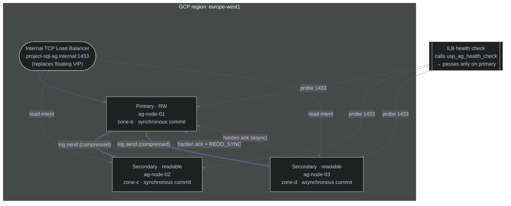
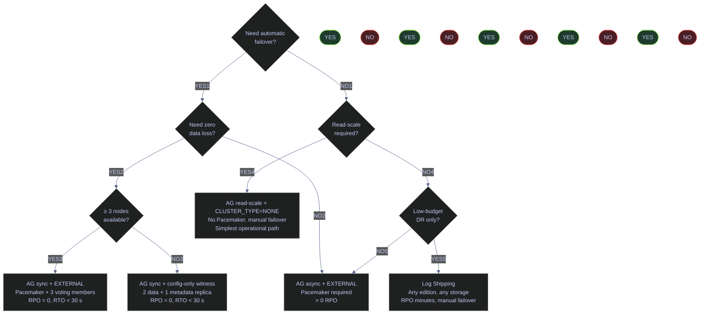
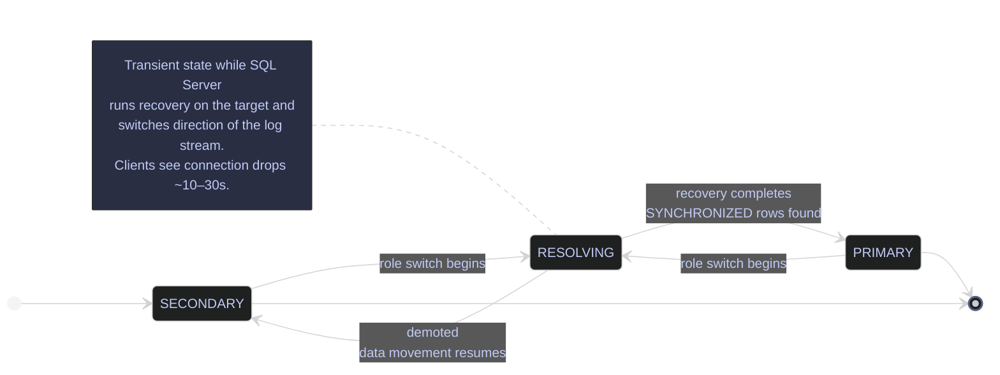

# SQL Server High Availability Overview

> [!quote]+
>
> "The major difference between a thing that might go wrong and a thing that cannot possibly go wrong is that when a thing that cannot possibly go wrong goes wrong it usually turns out to be impossible to get at or repair."
>
> — **Douglas Adams**, *Mostly Harmless* (1992)

> [!abstract]- Summary
>
> SQL Server 2022 on Linux GCP VMs supports multiple high-availability mechanisms, but the operational center of gravity is deciding which failure modes matter, which topology meets the real RTO/RPO target, and how failover is monitored and executed under Linux constraints. This note covers the full lifecycle from option selection through Always On Availability Group operations and GCP-specific routing design.
>
> - **Why high availability**
>   - defines the single-instance failure modes HA protects against and anchors the design around RTO, RPO, SLA, and the boundary between HA and DR
> - **HA options**
>   - compares Availability Groups, Failover Cluster Instances, log shipping, and the historical context of removed database mirroring, ending with a decision matrix for Linux and GCP
> - **Always On AG deployment**
>   - walks through Pacemaker-based AG setup on Linux, quorum design, certificates, replica roles, and the cluster mechanics needed for automatic failover
> - **Monitoring and failover**
>   - covers the `sys.dm_hadr_*` health surface, failover operations, and the checks that prove a replica is actually ready to take traffic
> - **Read scale and performance**
>   - explains read-only routing, secondary workload tradeoffs, and the performance constraints that show up once AGs carry real query load
> - **Operations on GCP**
>   - addresses backup-on-secondary behavior, Internal Load Balancer design as a listener replacement, and the GCP-specific networking and storage constraints that shape the reference architecture
> - **Advanced variants and guidance**
>   - closes with contained and distributed AG variants, a maintenance checklist, and the final recommendations for production topology choices

> [!note]- Glossary
>
> - **High availability (HA)**
>   - design approach that keeps service available through local failures and maintenance events
> - **Disaster recovery (DR)**
>   - recovery strategy for larger-scope failures, usually accepting more latency or data loss than HA
> - **RTO**
>   - recovery time objective, defining the maximum acceptable downtime
> - **RPO**
>   - recovery point objective, defining the maximum acceptable data loss
> - **SLA**
>   - uptime commitment derived from the service objective for the workload
> - **Availability Group (AG)**
>   - SQL Server feature that replicates one or more databases together across multiple replicas
> - **Primary replica**
>   - AG replica currently accepting writes and shipping log records to secondaries
> - **Secondary replica**
>   - AG replica receiving log records and optionally serving read-only traffic
> - **Synchronous commit**
>   - availability mode where commit acknowledgment waits for a synchronous secondary to harden the log
> - **Asynchronous commit**
>   - availability mode where the primary acknowledges commit before the secondary hardens the log
> - **Configuration-only replica**
>   - quorum-only AG replica that stores metadata but no user databases
> - **Pacemaker**
>   - Linux cluster manager used to coordinate AG health, quorum, and failover
> - **Quorum**
>   - cluster voting model that decides whether failover is safe and allowed
> - **Listener replacement**
>   - GCP pattern that uses an Internal Load Balancer instead of a traditional floating AG listener IP
> - **Failover Cluster Instance (FCI)**
>   - shared-storage SQL Server failover architecture that moves the whole instance between nodes
> - **Log shipping**
>   - scheduled log-backup copy-and-restore pattern used mainly for lightweight DR
> - **Contained AG**
>   - SQL Server 2022 AG variant that replicates AG-scoped system metadata along with user databases
> - **Distributed AG**
>   - AG topology that links separate availability groups, often across regions or environments

## Why high availability

> [!abstract] Scope
>
> This section establishes the operational vocabulary used throughout the rest of the note. It defines the single-instance failure modes that HA defends against, the three metrics (RTO, RPO, SLA) used to size HA topology, and the distinction between high availability and disaster recovery. Every downstream decision — sync vs async commit, number of replicas, cross-zone placement — derives from these metrics.

A single SQL Server instance is a single point of failure. If the VM crashes, the disk corrupts, or the OS needs a kernel patch, the database is down. High availability (HA) ensures the database remains accessible during planned maintenance and unplanned outages by maintaining redundant copies of the data that can take over automatically. HA is distinct from disaster recovery (DR): HA protects against local component failures (VM, disk, zone) with zero or near-zero data loss, while DR protects against region-level disasters and typically accepts non-zero RPO in exchange for geographic isolation.

### SQL Server | HA | key metrics (RTO, RPO, SLA)

Three metrics define the shape of any HA solution. RTO and RPO are application-driven requirements set by the business; SLA is the contractual uptime commitment derived from them. The table below lists the canonical definitions and the ranges achievable with each SQL Server HA option on Linux.

| Metric | Definition | Typical HA target | Typical DR target |
|--------|-----------|-------------------|-------------------|
| **RTO** (Recovery Time Objective) | Maximum acceptable downtime between failure and restored service | 10–30 seconds (AG automatic failover with Pacemaker) | Minutes to hours (log shipping, async AG) |
| **RPO** (Recovery Point Objective) | Maximum acceptable data loss measured in time, i.e. how far back committed state may be rewound on recovery | 0 (synchronous commit with `REQUIRED_SYNCHRONIZED_SECONDARIES_TO_COMMIT >= 1`) | Seconds (async AG) to minutes (log shipping) |
| **SLA** | Uptime guarantee expressed as a percentage of elapsed time | 99.9% = 8h 45m 57s / year downtime, 99.99% = 52m 35s / year, 99.999% = 5m 15s / year | Same percentages but over the DR window |

> [!info] How RTO and RPO interact with replica count
>
> A single synchronous secondary gives RPO=0 for that replica but does not give automatic failover: automatic failover requires an external cluster manager (Pacemaker on Linux, WSFC on Windows) plus an odd-node quorum, which typically means either 3 synchronous replicas or 2 synchronous replicas plus a configuration-only replica acting as a witness. With 2 nodes only, loss of either node leaves the survivor without quorum and Pacemaker refuses to promote — so the practical minimum for automatic failover on Linux is 3 voting members.

---

## HA options for SQL Server 2022 on Linux

> [!abstract] Scope
>
> SQL Server on Linux supports three active HA mechanisms (Availability Groups, Failover Cluster Instances, Log Shipping) plus one deprecated option (Database Mirroring, removed in SQL Server 2022). This section summarises the architectural differences, explains why Always On Availability Groups are the canonical choice on GCP, and ends with a decision matrix plus a selection flowchart. The primary differentiators are whether shared storage is required, whether failover is automatic, whether secondaries can serve read traffic, and whether the option is compatible with GCP's networking and storage model.

### SQL Server | Always On Availability Groups | architecture and topology

Always On Availability Groups (AG) are the primary HA mechanism for SQL Server 2022 on Linux. An AG is a group of user databases that replicate together across 2 to 9 replicas — one primary plus up to 8 secondaries — with a hard limit of 3 synchronous-commit replicas per AG (confirmed in *Pro SQL Server 2022 Administration, Third Edition*). The primary accepts reads and writes, applies each committed transaction to its local log, compresses the log stream, and ships log records to every secondary through a single TCP endpoint (default port 5022) per instance. Secondaries receive, harden, and redo the log records in order; readable secondaries can also serve read-intent queries while redo is running.

All databases in a given AG fail over atomically — failover is scoped to the AG, not to the individual database or to the instance. Instance-level objects (SQL Agent jobs, linked servers, instance-level logins) are not replicated by a classic AG; SQL Server 2022 introduces contained availability groups that replicate a dedicated `master`/`msdb` pair at the AG level to close this gap. The binding scaling limit is the single database mirroring endpoint per instance: Microsoft has tested and recommends at most 100 databases and 10 AGs per instance, because all AGs share that one endpoint for log transport.



#### SQL Server | Always On AG | replication modes

Three availability modes control how the primary decides when a transaction is "safe" and how failover behaves. The choice per replica is independent; a single AG can mix synchronous, asynchronous, and configuration-only replicas in the same topology.

| Mode | How it works | RPO | `FAILOVER_MODE` allowed | Typical use case |
|------|--------------|-----|-------------------------|------------------|
| **Synchronous commit** | Primary does not acknowledge the client commit until at least one synchronous secondary has hardened the log record to disk | 0 (no committed data loss for that replica) | `EXTERNAL` (Linux/Pacemaker), `AUTOMATIC` (Windows/WSFC), `MANUAL` | Same-region secondaries, HA path, transactional databases |
| **Asynchronous commit** | Primary sends log records and acknowledges the commit immediately, without waiting for secondaries to harden | > 0 (bounded by current send queue) | `MANUAL` only (async cannot be target of automatic failover) | Cross-region DR replicas, high-latency links, read-scale fan-out |
| **Configuration-only** | Replica stores AG metadata in its own `master` database but does not host user databases — it only participates in quorum voting | N/A | Always read-only metadata peer | Third voting member for automatic failover quorum when you want 2 data-carrying replicas plus 1 witness rather than 3 full replicas |

On Linux, Pacemaker replaces Windows Server Failover Clustering (WSFC) as the cluster resource manager. SQL Server communicates with Pacemaker through the `mssql-server-ha` package and the `ocf:mssql:ag` resource agent, which calls `sp_server_diagnostics` to report health. Automatic failover requires `CLUSTER_TYPE = EXTERNAL` and `FAILOVER_MODE = EXTERNAL` on every synchronous replica — `FAILOVER_MODE = AUTOMATIC` is reserved for WSFC on Windows and is rejected on Linux.

> [!info] Readable secondary and automatic failover are not mutually exclusive by replica
>
> A common misconception is that a synchronous replica cannot be readable. It can: set `SECONDARY_ROLE (ALLOW_CONNECTIONS = READ_ONLY)` on a `SYNCHRONOUS_COMMIT` replica and it will serve read-intent queries while also being eligible for automatic failover. The practical limit is operational: long-running read queries on the secondary take schema-stability (`Sch-S`) locks that can block redo, which in turn delays failover-readiness and grows the redo queue. Use row-committed snapshot isolation (RCSI) on the secondary to avoid this. See also *SQL Server Advanced Troubleshooting and Performance Tuning* (Dmitri Korotkevitch) on `lock_redo_blocked`.

### SQL Server | Failover Cluster Instance | architecture and GCP incompatibility

A Failover Cluster Instance (FCI) is a single SQL Server instance that runs on one node at a time and can fail over to another node. Unlike AGs, FCI uses shared storage — both nodes see the same data and log files. Failover is instance-level: the entire engine moves, including `master`, `msdb`, `tempdb`, and all user databases. On Linux, FCI runs on Pacemaker with a shared filesystem resource (typically GlusterFS, NFS, or iSCSI).

| Aspect | Availability Group | Failover Cluster Instance |
|--------|--------------------|---------------------------|
| Storage model | Independent copy per replica (no shared disk) | Single shared copy visible from all nodes |
| Failover scope | Per-AG (a subset of user databases) | Entire instance (`master`, `msdb`, `tempdb`, all user databases) |
| Readable secondaries | Yes (`READ_ONLY` or `ALL` connections on secondary role) | No (secondary node has no SQL Server process running) |
| Number of copies of data on disk | N (one per replica, counted separately toward cost) | 1 (shared disk is single-copy from SQL Server's perspective) |
| Linux support | SQL Server 2017+ (`CLUSTER_TYPE = EXTERNAL`) | SQL Server 2017+ (`ocf:mssql:fci` resource agent) |
| GCP implementation | Each VM has its own GCP persistent disk | Requires a shared filesystem layer (GlusterFS, NFS, iSCSI) on top of persistent disks |
| Single point of failure | None at storage layer (each replica has its own disk) | Shared filesystem itself becomes a SPoF |

> [!warning] GCP has no native shared block storage for FCI
>
> GCP does not offer a native equivalent to AWS EBS Multi-Attach or Azure Shared Disks. To run FCI on GCP you must stand up a shared filesystem (GlusterFS, DRBD, NetApp Cloud Volumes, or a self-managed NFS server), which adds an entire clustered-storage layer as an extra failure domain. The shared-storage cluster itself needs its own fencing, quorum, and monitoring. Operationally this typically costs more than a 3-replica AG on independent persistent disks and introduces failure modes (split-brain at the storage layer) that do not exist with AGs.

> [!success] Deploy Always On AGs on independent persistent disks instead
>
> Each replica owns its own GCP zonal persistent disk and its own copy of the data files — no shared storage, no GlusterFS, no NFS cluster. Use an Internal TCP/UDP Load Balancer as the listener frontend since GCP does not support Gratuitous ARP for traditional floating VIPs (see the GCP-specific considerations section below). This eliminates the shared-storage failure domain entirely and matches the reference architecture Microsoft publishes for SQL Server on Linux on GCP.

### SQL Server | Log Shipping | lightweight DR complement

Log shipping is the simplest form of HA/DR. The primary instance backs up its transaction log on a schedule, a file-copy step moves the backup file to the secondary, and the secondary restores it (either `NORECOVERY` for a warm standby that cannot be read, or `STANDBY` for a read-only standby that must be kicked out of read mode whenever a new restore is applied).

```text
Primary ──BACKUP LOG──► backup share ──SCP/rsync──► Secondary ──RESTORE LOG──►
         (every 5-15 min)                           (lagging by 5-15 min)
```

- **RPO:** minutes to hours, bounded by the backup interval and the copy/restore duration.
- **Failover:** manual — an administrator must point applications to the secondary, recover its databases, and reconfigure DNS or load balancers.
- **Advantages:** extremely simple, works on every edition including SQL Server Standard Edition and Web Edition, no Pacemaker required, no shared storage, no listener, trivial to reason about.
- **Disadvantages:** not automatic, always has data lag, secondary is either inaccessible (`NORECOVERY`) or disconnects every restore cycle (`STANDBY`), and cannot serve long-running reports during restore windows.

Log shipping is best used as a DR complement to an AG, not as the primary HA solution. A common pattern is a 3-replica same-region AG for HA plus a 1-node cross-region log-shipping destination as a cheap geographic DR path without the cost of a cross-region async AG replica.

### SQL Server | Database Mirroring | deprecated in SQL Server 2022

Database mirroring was removed as a feature in SQL Server 2022 (it remained in the product marked deprecated from SQL Server 2012 through 2019). It is the conceptual predecessor of Always On AGs — same single-TCP-endpoint log-stream architecture, same certificate authentication on Linux — but limited to a single database per mirroring session and with no readable secondaries. If you encounter database mirroring in legacy documentation, treat it as the historical predecessor of AGs; any new deployment on SQL Server 2022 must use AGs instead. Internally, AGs still identify as "Real Time Log Shipping" in some system metadata — the underlying transport is the same.

### SQL Server | HA | decision matrix and selection flowchart

The decision matrix below maps operational requirements to HA option. Use it as the starting point; the flowchart immediately below then walks through the YES/NO questions that select the right option for a given workload.

| Requirement | AG (sync, `EXTERNAL`) | AG (async) | AG (read-scale, `NONE`) | FCI on GCP | Log Shipping |
|-------------|-----------------------|-----------|-------------------------|------------|--------------|
| Zero committed-data loss | Yes | No | No (manual failover) | Yes (shared storage) | No |
| Automatic failover | Yes (Pacemaker) | No | No | Yes (Pacemaker) | No |
| Readable secondary | Yes | Yes | Yes | No | `STANDBY` only |
| No shared storage | Yes | Yes | Yes | No | Yes |
| Cross-region DR | Supported | Recommended | Possible | Not recommended | Simple and cheap |
| SQL Server edition | Enterprise | Enterprise | Enterprise or Standard | Enterprise or Standard | Any edition |
| Operational complexity | High (Pacemaker + certs) | High | Medium (no Pacemaker) | Very high on GCP | Low |
| Minimum replica count for auto failover | 3 voting members (or 2 + config-only) | N/A | N/A | 2 nodes + shared disk | N/A |



---

## Setting up Always On Availability Groups on Linux and GCP

> [!abstract] Scope
>
> This section walks through the full deployment sequence for a 3-replica Always On Availability Group on SQL Server 2022 Linux with Pacemaker as the external cluster manager. The flow is: verify prerequisites, enable HADR, create the database mirroring endpoint with certificate authentication on every node, distribute the certificate, create the AG with the desired replication topology and timeouts, join secondaries, add databases, and finally configure Pacemaker + Corosync plus an optional floating VIP or (on GCP) an Internal Load Balancer frontend. The procedure is production-oriented — every step includes the permissions required, what the command changes, and how to verify the change landed.

> [!todo] 8-step deployment procedure
>
> The steps below are ordered — do not skip or reorder. Each step must complete successfully on every node before moving to the next.
>
> - **Step 1**: enable HADR on every instance (state change, SQL Server restart required)
> - **Step 2**: create the database mirroring endpoint on every instance
> - **Step 3**: create the endpoint certificate on the primary and export it
> - **Step 4**: import the certificate on every secondary
> - **Step 5**: create the availability group on the primary
> - **Step 6**: join each secondary to the AG and grant seeding permission
> - **Step 7**: add user databases to the AG
> - **Step 8**: install and configure Pacemaker + Corosync + the AG resource

### Linux | apt, gcloud, systemctl | AG prerequisites

Before touching any SQL Server configuration, during the host-provisioning stage of the deployment. It is typically triggered by new AG cluster deployment, or adding a new replica to an existing AG. Ubuntu Linux shell on each VM, requires `sudo`, changes persist across reboots, some steps require reboots. Make sure every node has the expected SQL Server version, the cluster packages, network reachability to the AG endpoint ports, and hostname resolution — before any HADR object is created.

Every node participating in the AG must satisfy the following conditions. Mismatches are the most common cause of failed endpoint handshakes and join-time errors.

| Prerequisite | Concrete check |
|--------------|----------------|
| SQL Server 2022 with identical CU on every node | `sqlservr --version` or `SELECT @@VERSION` on each instance |
| `mssql-server-ha` package installed | `dpkg -l mssql-server-ha` (Debian/Ubuntu) or `rpm -q mssql-server-ha` (RHEL/SLES) |
| Pacemaker + Corosync installed (for `CLUSTER_TYPE = EXTERNAL` only) | `pacemakerd --version` and `corosync -v` |
| Unique, resolvable hostnames from every node to every other node | `getent hosts <peer>` on every node, or populate `/etc/hosts` |
| VPC firewall rules: SQL (1433), HADR (5022), pcsd (2224), Pacemaker (3121), Corosync (5405/udp), Pacemaker mcast (21064) | `gcloud compute firewall-rules list --filter="allowed:tcp/5022"` |
| Identical data and log file paths on all replicas (automatic seeding requirement) | Check `MSSQL_DATA_DIR` / `MSSQL_LOG_DIR` or `/var/opt/mssql/data` across nodes |
| Clock skew below 100 ms between nodes | `chronyc sources` or `timedatectl status` |

> [!warning] Hostname resolution must be symmetric and deterministic
>
> Endpoint handshakes and automatic seeding embed the hostname directly into the AG metadata. If node A can resolve `ag-node-02` but node B cannot resolve `ag-node-01`, the AG will fail to join and the error surface on each side only shows half the problem. Always verify bidirectional resolution with `getent hosts` from every node to every other node before creating endpoints.

> [!success] Populate /etc/hosts or private Cloud DNS before touching any SQL Server object
>
> On GCP, use an internal Cloud DNS zone attached to the VPC so all nodes resolve each other by short hostname. The alternative — maintaining `/etc/hosts` by hand across nodes — works for small deployments but drifts on every VM replacement. For the 3-replica reference architecture used throughout this note, use hostnames like `ag-node-01.internal`, `ag-node-02.internal`, `ag-node-03.internal` in a `DNS_ZONE=ag.internal` zone.

### SQL Server | ALTER SERVER CONFIGURATION | enable HADR on every instance

Once per instance, during initial HA bring-up, before any AG object exists. It is typically triggered by the `mssql-conf` setting `MSSQL_ENABLE_HADR` is 0 or `SERVERPROPERTY('IsHadrEnabled')` returns 0. Runs on the Linux shell (`mssql-conf set hadr.hadrenabled 1`) then requires a `systemctl restart mssql-server` to take effect. `IsHadrEnabled` is a read-only server property sourced from `mssql-conf` — you cannot flip it from inside T-SQL. Allow the SQL Server instance to host AG replicas. Without this, `CREATE AVAILABILITY GROUP` fails with error 35237 "Always On Availability Groups is not enabled on this instance of SQL Server".

*Enable HADR via `mssql-conf` then restart the service on every node.*

```bash
sudo /opt/mssql/bin/mssql-conf set hadr.hadrenabled 1
sudo systemctl restart mssql-server
```

*Verify HADR is enabled and read the cluster type via SERVERPROPERTY on every node.*

```sql
SELECT
    @@SERVERNAME                             AS server_name,
    SERVERPROPERTY('IsHadrEnabled')          AS hadr_enabled,
    SERVERPROPERTY('HadrManagerStatus')      AS hadr_manager_status,
    SERVERPROPERTY('IsLocalDB')              AS is_local_db;
```

<!-- live-capture: run against ag-node-01 after setup script completes -->

> [!info] HadrManagerStatus values
>
> `1` = pending communication, `2` = running, `0` = not started. You want `2` on every node before proceeding to endpoint creation. A stuck value of `1` usually means the HADR service thread could not bind to 5022 or failed DNS resolution.

### SQL Server | CREATE MASTER KEY, CREATE CERTIFICATE | create and export the AG endpoint certificate

Once, on the primary, after HADR is enabled. It is typically triggered by initial AG setup or rotation of the endpoint certificate before it expires. T-SQL in the `master` database on the primary. Requires `CONTROL SERVER` (sysadmin). The `BACKUP CERTIFICATE ... WITH PRIVATE KEY` step writes files the `mssql` service account owns — they must be readable only by the peer nodes' service account after transfer. Create a self-signed X.509 certificate used for mutual authentication between AG endpoints. Linux AGs cannot use Windows/Kerberos auth for the mirroring endpoint, so certificate auth is mandatory.

> [!warning] Certificate expiry is a silent operational risk
>
> The default `EXPIRY_DATE` when the clause is omitted is **one year from creation**. SQL Server does not raise an alert or error log entry as expiry approaches — log shipping just stops when the certificate expires and the secondary goes into `NOT SYNCHRONIZING`. Script a weekly job against `sys.certificates WHERE expiry_date < DATEADD(day, 60, GETUTCDATE())` and alert on any row returned.

> [!success] Set a long, explicit expiry and track it in monitoring
>
> Specify `EXPIRY_DATE = '2036-04-11'` (10 years out) on creation and record the date in your runbook. Pair this with the weekly monitoring query so rotation is a planned event, not a post-incident scramble.

*Create the master key, AG endpoint certificate, and export both the public certificate and the password-protected private key.*

```sql
CREATE MASTER KEY ENCRYPTION BY PASSWORD = 'StrongMasterKeyP@ss!';

CREATE CERTIFICATE dbm_cert
    WITH SUBJECT    = 'AG endpoint certificate for project_ag',
         EXPIRY_DATE = '2036-04-11';

BACKUP CERTIFICATE dbm_cert
    TO FILE = '/var/opt/mssql/data/dbm_cert.cer'
    WITH PRIVATE KEY (
        FILE             = '/var/opt/mssql/data/dbm_cert.pvk',
        ENCRYPTION BY PASSWORD = 'CertP@ss123!'
    );
```

### Linux | scp, chown | distribute the endpoint certificate to every secondary

Immediately after exporting the certificate on the primary. It is typically triggered by initial AG setup or certificate rotation. Linux shell on the primary, requires `ssh` key-based access to every secondary and `sudo` on each target for the `chown` step. The `.cer` file is the public certificate; the `.pvk` file contains the private key encrypted by the export password and must be treated as secret material. Put a copy of the public certificate and the encrypted private key on every secondary so each secondary can import them and create a matching `dbm_cert`.

*Copy the certificate public and private key files to each secondary, then set ownership so the `mssql` service account can read them.*

```bash
for NODE in ag-node-02 ag-node-03; do
    scp /var/opt/mssql/data/dbm_cert.{cer,pvk} \
        "dba@${NODE}:/var/opt/mssql/data/"
    ssh "dba@${NODE}" \
        'sudo chown mssql:mssql /var/opt/mssql/data/dbm_cert.{cer,pvk} \
         && sudo chmod 600 /var/opt/mssql/data/dbm_cert.pvk'
done
```

### SQL Server | CREATE MASTER KEY, CREATE CERTIFICATE FROM FILE | import the endpoint certificate on each secondary

On every secondary, after the primary has exported the certificate and the files have been copied over. It is typically triggered by initial AG setup or certificate rotation. T-SQL in the `master` database on each secondary, sysadmin privileges required. Reconstitute the same `dbm_cert` used by the primary on each secondary so the endpoints can authenticate each other via matching certificate thumbprints.

*Create the master key and import the public certificate + decrypted private key from the files copied from the primary.*

```sql
CREATE MASTER KEY ENCRYPTION BY PASSWORD = 'StrongMasterKeyP@ss!';

CREATE CERTIFICATE dbm_cert
    FROM FILE = '/var/opt/mssql/data/dbm_cert.cer'
    WITH PRIVATE KEY (
        FILE                  = '/var/opt/mssql/data/dbm_cert.pvk',
        DECRYPTION BY PASSWORD = 'CertP@ss123!'
    );
```

### SQL Server | CREATE ENDPOINT | create the database mirroring endpoint on every node

Once per node, after the certificate has been created (primary) or imported (secondaries). It is typically triggered by initial AG setup. T-SQL in the `master` database on each node. `ROLE = ALL` allows the endpoint to serve both primary and secondary traffic — required for automatic failover. `ENCRYPTION = REQUIRED ALGORITHM AES` forces transport-layer encryption for all inter-replica log shipping. Port 5022 is the SQL Server convention but is freely configurable; change it on both sides consistently. Expose a TCP endpoint on port 5022 that transports the compressed log stream between replicas, authenticated via `dbm_cert`.

> [!info]- CREATE ENDPOINT clause breakdown
>
> - `AS TCP (LISTENER_PORT = 5022, LISTENER_IP = ALL)`: bind the endpoint to all IPv4 addresses on port 5022. Use `LISTENER_IP = ('10.132.0.10')` to bind to a specific NIC when the node has multiple subnets.
> - `ROLE = ALL`: the endpoint accepts both primary outbound and secondary inbound roles. Alternatives are `WITNESS` (configuration-only replica) or `PARTNER` (deprecated mirror-only role).
> - `AUTHENTICATION = CERTIFICATE dbm_cert`: the endpoint presents `dbm_cert` to peers during the TLS handshake and verifies their certificates against its own. Any mismatch (wrong subject, expired cert, missing private key) breaks the handshake with error 1474 or 1477.
> - `ENCRYPTION = REQUIRED ALGORITHM AES`: reject connections that do not negotiate AES. `DISABLED` and `SUPPORTED` exist but should not be used in production.
> - `STATE = STARTED`: turn the endpoint listener on immediately. `STOPPED` or `DISABLED` create the object without listening.

*Create the AG mirroring endpoint bound to TCP 5022 with certificate authentication and mandatory AES encryption.*

```sql
CREATE ENDPOINT [Hadr_endpoint]
    STATE = STARTED
    AS TCP (LISTENER_PORT = 5022, LISTENER_IP = ALL)
    FOR DATA_MIRRORING (
        ROLE           = ALL,
        AUTHENTICATION = CERTIFICATE dbm_cert,
        ENCRYPTION     = REQUIRED ALGORITHM AES
    );
```

*Verify the endpoint is listening and its certificate/encryption metadata matches expectations.*

```sql
SELECT
    e.name                                 AS endpoint_name,
    e.state_desc                           AS state,
    e.protocol_desc                        AS protocol,
    tep.port,
    dbm.role_desc                          AS mirroring_role,
    dbm.is_encryption_enabled              AS encryption_on,
    dbm.encryption_algorithm_desc          AS algo,
    dbm.connection_auth_desc               AS auth,
    dbm.certificate_id
FROM sys.endpoints e
JOIN sys.tcp_endpoints      tep ON e.endpoint_id = tep.endpoint_id
JOIN sys.database_mirroring_endpoints dbm ON e.endpoint_id = dbm.endpoint_id
WHERE e.name = N'Hadr_endpoint';
```

<!-- live-capture: run against ag-node-01 after setup script completes -->

### SQL Server | CREATE AVAILABILITY GROUP | create the AG with flexible failover policy

Once, on the primary, after all endpoints and certificates are in place on every node. It is typically triggered by initial AG setup. T-SQL in `master` on the primary, requires `CREATE AVAILABILITY GROUP` permission or sysadmin. Atomic operation — either the whole AG is created or none of it. After creation, the primary is in `RESOLVING` state until at least one secondary joins. Define the AG topology (replicas, availability modes, failover modes, seeding modes, routing lists), the flexible failover policy (`FAILURE_CONDITION_LEVEL`, `HEALTH_CHECK_TIMEOUT`, `DB_FAILOVER`), and the commit-safety constraint (`REQUIRED_SYNCHRONIZED_SECONDARIES_TO_COMMIT`).

> [!info]- CREATE AVAILABILITY GROUP option reference
>
> **AG-level options**
>
> - `CLUSTER_TYPE = EXTERNAL`: Pacemaker is the external cluster manager. Use `NONE` for a manual-failover read-scale AG with no cluster manager at all. Use `WSFC` on Windows.
> - `DB_FAILOVER = ON`: enable database-level health detection. When any database in the AG transitions to a non-`ONLINE` state (offline, suspect, emergency), automatic failover is triggered. Corrects a common misconception — it is NOT only corruption that triggers this; any database health failure does. Use cautiously on GCP persistent disks that exhibit burst-mode I/O errors.
> - `REQUIRED_SYNCHRONIZED_SECONDARIES_TO_COMMIT = 1`: the primary will block commits until at least 1 synchronous secondary has hardened the log record. With 2 synchronous secondaries configured, this tolerates losing one of them before the primary stalls. Setting it to `2` with only 2 synchronous secondaries means any secondary failure freezes the primary — do not do this on production unless you have a 3rd synchronous replica as headroom.
> - `HEALTH_CHECK_TIMEOUT = 30000` (ms, default 30 s, min 15 s): how long the resource agent waits for `sp_server_diagnostics` to return before declaring the primary unhealthy. `sp_server_diagnostics` is called at interval `HEALTH_CHECK_TIMEOUT / 3`, so 30 s timeout means a 10 s polling interval.
> - `FAILURE_CONDITION_LEVEL = 3` (default): triggers automatic failover on critical internal errors (orphaned spinlocks, access violations, excessive dump files). Levels 1–5 from least to most aggressive — see the separate timeouts section below.
>
> **Per-replica options (`WITH (...)` clause)**
>
> - `ENDPOINT_URL`: the `tcp://hostname:port` the primary uses to reach this replica. Must match the hostname the peer certificate was issued to.
> - `AVAILABILITY_MODE = SYNCHRONOUS_COMMIT | ASYNCHRONOUS_COMMIT`: sync blocks commits on the primary until the replica hardens; async does not.
> - `FAILOVER_MODE = EXTERNAL | AUTOMATIC | MANUAL`: EXTERNAL delegates to Pacemaker on Linux. AUTOMATIC is WSFC-only on Windows. MANUAL blocks any automatic promotion.
> - `SEEDING_MODE = AUTOMATIC | MANUAL`: AUTOMATIC streams the initial database copy over the AG endpoint. MANUAL requires a backup/restore bootstrap — faster for very large databases (> 100 GB) because you can use compressed backups plus parallel restore.
> - `BACKUP_PRIORITY = 50` (default, range 0–100): higher wins in backup-preference selection. Set to 0 to exclude a replica from backups entirely.
> - `SECONDARY_ROLE (ALLOW_CONNECTIONS = NO | READ_ONLY | ALL, READ_ONLY_ROUTING_URL = '...')`: controls readable-secondary behavior and exposes this replica for read-only routing.
> - `PRIMARY_ROLE (ALLOW_CONNECTIONS = READ_WRITE | ALL, READ_ONLY_ROUTING_LIST = (...))`: controls primary-side behavior and declares which secondaries should receive read-intent traffic.

*Create the 3-replica AG with 2 synchronous and 1 asynchronous replica, automatic seeding, and a flexible failover policy tuned for same-region zone-to-zone latency.*

```sql
CREATE AVAILABILITY GROUP [project_ag]
WITH (
    CLUSTER_TYPE                                 = EXTERNAL,
    DB_FAILOVER                                  = ON,
    REQUIRED_SYNCHRONIZED_SECONDARIES_TO_COMMIT  = 1,
    HEALTH_CHECK_TIMEOUT                         = 30000,
    FAILURE_CONDITION_LEVEL                      = 3
)
FOR REPLICA ON
    N'ag-node-01' WITH (
        ENDPOINT_URL          = N'tcp://ag-node-01:5022',
        AVAILABILITY_MODE     = SYNCHRONOUS_COMMIT,
        FAILOVER_MODE         = EXTERNAL,
        SEEDING_MODE          = AUTOMATIC,
        BACKUP_PRIORITY       = 20,
        SESSION_TIMEOUT       = 10,
        SECONDARY_ROLE (
            ALLOW_CONNECTIONS      = ALL,
            READ_ONLY_ROUTING_URL  = N'tcp://ag-node-01:1433'
        ),
        PRIMARY_ROLE (
            ALLOW_CONNECTIONS      = READ_WRITE,
            READ_ONLY_ROUTING_LIST = ((N'ag-node-02', N'ag-node-03'), N'ag-node-01')
        )
    ),
    N'ag-node-02' WITH (
        ENDPOINT_URL          = N'tcp://ag-node-02:5022',
        AVAILABILITY_MODE     = SYNCHRONOUS_COMMIT,
        FAILOVER_MODE         = EXTERNAL,
        SEEDING_MODE          = AUTOMATIC,
        BACKUP_PRIORITY       = 60,
        SESSION_TIMEOUT       = 10,
        SECONDARY_ROLE (
            ALLOW_CONNECTIONS      = ALL,
            READ_ONLY_ROUTING_URL  = N'tcp://ag-node-02:1433'
        ),
        PRIMARY_ROLE (
            ALLOW_CONNECTIONS      = READ_WRITE,
            READ_ONLY_ROUTING_LIST = ((N'ag-node-01', N'ag-node-03'), N'ag-node-02')
        )
    ),
    N'ag-node-03' WITH (
        ENDPOINT_URL          = N'tcp://ag-node-03:5022',
        AVAILABILITY_MODE     = ASYNCHRONOUS_COMMIT,
        FAILOVER_MODE         = EXTERNAL,
        SEEDING_MODE          = AUTOMATIC,
        BACKUP_PRIORITY       = 40,
        SESSION_TIMEOUT       = 30,
        SECONDARY_ROLE (
            ALLOW_CONNECTIONS      = ALL,
            READ_ONLY_ROUTING_URL  = N'tcp://ag-node-03:1433'
        ),
        PRIMARY_ROLE (
            ALLOW_CONNECTIONS      = READ_WRITE,
            READ_ONLY_ROUTING_LIST = ((N'ag-node-01', N'ag-node-02'), N'ag-node-03')
        )
    );
```

> [!info] SEEDING_MODE selection
>
> `AUTOMATIC` streams the initial database copy over the AG endpoint — no manual backup/restore required. For databases above ~100 GB, `MANUAL` with a compressed backup on the primary and a `RESTORE WITH NORECOVERY` on each secondary is often faster because you can parallelize the restore and bypass the single-endpoint log-stream bottleneck. For the reference 3-replica setup used throughout this note, automatic seeding is fine and is what the live-capture script uses.

### SQL Server | ALTER AVAILABILITY GROUP JOIN | join each secondary to the AG

On every secondary, immediately after the AG is created on the primary. It is typically triggered by initial AG setup or adding a new replica. T-SQL in `master` on the secondary, requires `ALTER ANY AVAILABILITY GROUP` or sysadmin. The `GRANT CREATE ANY DATABASE` is the permission required by the automatic seeding worker thread — without it seeding silently fails. Transition the secondary from having an AG definition in metadata to actively replicating with the primary. After JOIN succeeds, the secondary begins receiving log records and (with automatic seeding) creates its local copies of the AG databases.

*Join the secondary to the AG with `CLUSTER_TYPE = EXTERNAL` and grant the automatic seeding thread permission to create databases.*

```sql
ALTER AVAILABILITY GROUP [project_ag] JOIN WITH (CLUSTER_TYPE = EXTERNAL);
ALTER AVAILABILITY GROUP [project_ag] GRANT CREATE ANY DATABASE;
```

### SQL Server | ALTER AVAILABILITY GROUP ADD DATABASE | add user databases to the AG

On the primary, after all secondaries have joined and are showing as `CONNECTED`. It is typically triggered by initial AG setup or ongoing database onboarding. T-SQL on the primary. The target database must be in FULL recovery model and must have at least one full backup in its history (the AG log chain extends from that backup). With automatic seeding, the secondaries create their local copies in the same file layout — if the data/log paths differ, seeding fails. Attach a user database to the AG so it replicates to every secondary.

*Flip the database to FULL recovery, take a full backup to seed the log chain, then add the database to the AG.*

```sql
ALTER DATABASE [analytics_db] SET RECOVERY FULL;

BACKUP DATABASE [analytics_db]
    TO DISK = N'/var/opt/mssql/data/analytics_db_full.bak'
    WITH COMPRESSION, CHECKSUM, INIT;

ALTER AVAILABILITY GROUP [project_ag] ADD DATABASE [analytics_db];
```

### Linux | apt, pcs, corosync | configure Pacemaker + Corosync on every node

After the AG is fully functional with at least one database replicating, before exposing the cluster to production traffic. It is typically triggered by initial cluster bring-up with `CLUSTER_TYPE = EXTERNAL`. Skip entirely for `CLUSTER_TYPE = NONE` (read-scale AG). Linux shell, `sudo` on every node. Install step is per-node; cluster configuration is done from one node with `pcs cluster setup` and propagates to the others. Restarts Corosync and Pacemaker services. Give SQL Server an external cluster resource manager that detects node failure, enforces quorum, drives automatic failover of the AG primary, and manages the listener VIP (or equivalent ILB integration).

*Install the Pacemaker stack, the SQL Server HA resource agent package, and the GCP fencing agent on every node.*

```bash
sudo apt update
sudo apt install -y pacemaker pacemaker-cli-utils pcs corosync \
                    resource-agents fence-agents fence-agents-gce \
                    mssql-server-ha
```

*Set the shared `hacluster` password on every node (required by `pcs` for cluster authentication).*

```bash
echo 'hacluster:ClusterP@ss2026!' | sudo chpasswd
sudo systemctl enable --now pcsd
```

*On one node only, authenticate to the pcs daemons and create the cluster with all three nodes.*

```bash
sudo pcs host auth ag-node-01 ag-node-02 ag-node-03 \
    -u hacluster -p 'ClusterP@ss2026!'

sudo pcs cluster setup project-cluster \
    ag-node-01 ag-node-02 ag-node-03 --force

sudo pcs cluster start --all
sudo pcs cluster enable --all
```

#### Linux | Pacemaker | SQL Server health-check login and credential file

After the AG is created but before `pcs resource create ag_cluster`. It is typically triggered by initial cluster bring-up. T-SQL on every node + Linux shell on every node. The SQL login is the identity Pacemaker uses via `sp_server_diagnostics`. The credential file `/var/opt/mssql/secrets/passwd` is read by the `ocf:mssql:ag` resource agent and must be root-owned with `0400` permissions. Give Pacemaker a dedicated, least-privilege SQL login that can query `sp_server_diagnostics` and issue AG failover commands.

*Create a dedicated Pacemaker login on every replica and grant the minimal AG management permissions.*

```sql
CREATE LOGIN [pacemakerLogin] WITH PASSWORD = 'PacemakerP@ss2026!';

GRANT ALTER, CONTROL, VIEW DEFINITION
    ON AVAILABILITY GROUP::[project_ag]
    TO [pacemakerLogin];

GRANT VIEW SERVER STATE TO [pacemakerLogin];
```

*Store the Pacemaker login credentials on every node in a root-owned file readable only by root.*

```bash
sudo mkdir -p /var/opt/mssql/secrets
echo 'pacemakerLogin' | sudo tee /var/opt/mssql/secrets/passwd > /dev/null
echo 'PacemakerP@ss2026!' | sudo tee -a /var/opt/mssql/secrets/passwd > /dev/null
sudo chown root:root /var/opt/mssql/secrets/passwd
sudo chmod 0400 /var/opt/mssql/secrets/passwd
```

#### Linux | corosync.conf | quorum and transport settings reference

Corosync cluster membership is configured via `/etc/corosync/corosync.conf`. `pcs cluster setup` generates a reasonable default but you almost always want to review and adjust the transport timeouts and the quorum settings before going live.

| Section | Key | Default | What it controls | Production recommendation on GCP |
|---------|-----|---------|------------------|----------------------------------|
| `totem` | `version` | 2 | Corosync protocol version | Leave at 2 |
| `totem` | `cluster_name` | — | Human-readable cluster name; embedded in state files | Set to a project identifier (`project-cluster`) |
| `totem` | `transport` | `udpu` | Membership transport; `udpu` = unicast (GCP-compatible), `knet` = newer, multi-path aware | `knet` on Corosync 3+, `udpu` otherwise |
| `totem` | `token` | 1000 ms | Membership token timeout | 5000 ms for GCP cross-zone |
| `totem` | `token_retransmits_before_loss_const` | 4 | Missed tokens before declaring node lost | 10 for GCP cross-zone |
| `totem` | `rrp_mode` | `none` | Redundant ring protocol mode | `none` (knet handles redundancy natively) |
| `nodelist` | `node.ring0_addr` | — | Primary ring address for the node | Set to each node's short hostname |
| `nodelist` | `node.nodeid` | — | Unique numeric node ID | Set explicitly, 1/2/3... (do not rely on hash defaults) |
| `quorum` | `provider` | `corosync_votequorum` | Quorum algorithm | Keep default |
| `quorum` | `two_node` | 0 | Enable two-node mode (auto-grants quorum) | 0 for 3+ nodes, 1 for 2 nodes |
| `quorum` | `wait_for_all` | auto | Wait for all nodes before assuming quorum on first boot | 1 for production |

#### Linux | pcs resource create | register the AG resource and constraints in Pacemaker

Once, from any single node, after Corosync + Pacemaker are running and authenticated. It is typically triggered by initial cluster bring-up. Pacemaker propagates the configuration to all members via Corosync. Linux shell, `sudo`. Creates a promotable clone resource (the modern replacement for the legacy `master` keyword) so the AG primary role can move between nodes. The VIP resource colocation constraint ensures the floating IP always lives on the current primary. Hand control of the AG primary role to Pacemaker, including automatic failover on node failure, so SQL Server and the cluster manager agree on who is primary at all times.

> [!info]- ocf:mssql:ag resource options
>
> | Option | Meaning | Default |
> |--------|---------|---------|
> | `ag_name` | Name of the AG the resource manages | required |
> | `meta failure-timeout` | How long a failed resource failure is retained before it auto-clears | 1h |
> | `op start timeout` | Max time to bring the resource online | 30s (use 60s for SQL Server) |
> | `op stop timeout` | Max time to bring the resource offline | 30s |
> | `op promote timeout` | Max time to promote the secondary to primary | 60s (allow for `sp_server_diagnostics` coordination) |
> | `op demote timeout` | Max time to demote the old primary to secondary | 10s |
> | `op monitor interval=10s` | Health check interval (unpromoted role) | 10s |
> | `op monitor interval=11s role=Promoted` | Health check interval on promoted role (must differ from unpromoted by at least 1s) | 11s |
> | `op monitor on-fail=demote` | On health failure on primary: demote immediately (vs. restart/fence) | demote |
> | `promotable notify=true` | Send pre-notify/post-notify to all replicas on state transitions | required |

> [!warning] Legacy master/slave keyword is removed in Pacemaker 2.x
>
> Older documentation uses `pcs resource create ... master notify=true`. Pacemaker 2.0+ replaced the `master` resource type with `promotable` (and `master/slave` terminology with `promoted/unpromoted`). Using the legacy keyword on a modern cluster fails with an obscure error. The examples below use the modern syntax.

> [!success] Use promotable + Promoted role references
>
> `sudo pcs resource create ag_cluster ocf:mssql:ag ag_name=project_ag promotable notify=true` and reference `role=Promoted` in subsequent constraints. This matches current Pacemaker docs and survives upgrades.

*Create the AG promotable clone resource, the VIP resource, and the colocation + ordering constraints so the VIP always runs on the current primary.*

```bash
sudo pcs resource create ag_cluster \
    ocf:mssql:ag \
    ag_name=project_ag \
    meta failure-timeout=60s \
    op start   timeout=60s \
    op stop    timeout=60s \
    op promote timeout=60s \
    op demote  timeout=10s \
    op monitor timeout=60s interval=10s on-fail=demote \
    op monitor timeout=60s interval=11s on-fail=demote role=Promoted \
    promotable notify=true

sudo pcs resource create ag_vip \
    ocf:heartbeat:IPaddr2 \
    ip=10.132.0.100 cidr_netmask=32 \
    op monitor interval=30s

sudo pcs constraint colocation add ag_vip with ag_cluster-clone INFINITY with-rsc-role=Promoted
sudo pcs constraint order promote ag_cluster-clone then start ag_vip
```

> [!warning] Floating VIP does not work natively on GCP
>
> Because GCP's SDN does not honour Gratuitous ARP, a classic `IPaddr2` floating VIP cannot steal an IP address from one VM to another. The VIP will appear on the target node in Pacemaker's view but GCP will drop the packets. The resource shown above is correct only for on-prem or environments with GARP support.

> [!success] Use an Internal TCP Load Balancer with a custom SQL health probe on GCP
>
> Replace the `ag_vip` resource with a GCP Internal Load Balancer whose health probe calls a stored procedure that only returns success on the current primary. The detailed ILB configuration, including the health-probe stored procedure, is in the `## GCP-specific HA considerations` section below.

### SQL Server | CREATE / ALTER AVAILABILITY GROUP | tuning HEALTH_CHECK_TIMEOUT, FAILURE_CONDITION_LEVEL, SESSION_TIMEOUT, DB_FAILOVER

After initial deployment once baseline latency and CPU pressure under production load are measured; adjust on incident response when false-positive failovers or missed failovers are observed. It is typically triggered by flapping replicas, false-positive automatic failovers, or a health-check-related incident. T-SQL on the primary. `HEALTH_CHECK_TIMEOUT` and `FAILURE_CONDITION_LEVEL` are AG-level and only affect synchronous replicas with automatic failover. `SESSION_TIMEOUT` is per-replica. `DB_FAILOVER` is AG-level. Make the flexible failover policy match the actual behaviour of the underlying infrastructure (cross-zone network latency, CPU pressure, I/O burst patterns).

| Option | Scope | Default | Range | What it controls |
|--------|-------|---------|-------|------------------|
| `HEALTH_CHECK_TIMEOUT` | AG | 30000 ms | 15000 – 4294967295 ms | Max wait for `sp_server_diagnostics` to return. Internally polled at `HEALTH_CHECK_TIMEOUT / 3`. Increase on CPU-pressured instances. |
| `FAILURE_CONDITION_LEVEL` | AG | 3 | 1 – 5 | Which failure classes trigger automatic failover. Higher = more sensitive. See level table below. |
| `SESSION_TIMEOUT` | Replica | 10 s | 5 s – int32 max | Inter-replica heartbeat timeout before marking the replica DISCONNECTED. Increase on cross-region async replicas. |
| `DB_FAILOVER` | AG | OFF | ON / OFF | When ON, any database leaving `ONLINE` state (OFFLINE, SUSPECT, RECOVERING, EMERGENCY) triggers automatic failover. |

**Failure condition levels:**

| Level | Name | Failover triggers |
|-------|------|-------------------|
| 1 | OnServerDown | SQL Server service is down; cluster lease expired with no ACK from the instance |
| 2 | OnServerUnresponsive | No response from `sp_server_diagnostics` for the full `HEALTH_CHECK_TIMEOUT`; replica reported in failed state |
| 3 (default) | OnCriticalServerError | Level 2 + critical internal errors: orphaned spinlocks, write-access violations, excessive dumping |
| 4 | OnModerateServerError | Level 3 + moderate errors: persistent OOM in the internal resource pool |
| 5 | OnAnyQualifiedFailureCondition | Level 4 + worker-thread exhaustion, unsolvable deadlocks |

> [!warning] DB_FAILOVER = ON is sensitive to transient I/O errors
>
> On GCP persistent disks the burst-mode I/O model can produce short-lived I/O timeouts that move a database through `RECOVERING` or `SUSPECT` briefly. With `DB_FAILOVER = ON`, a single such transient will trigger a full AG failover, even though the underlying storage recovers within seconds. If your storage class exhibits this behaviour, leave `DB_FAILOVER = OFF` and rely on `FAILURE_CONDITION_LEVEL = 3` health checks instead, accepting that rare database-level issues may go undetected.

> [!success] Measure before tuning, tune in one step at a time
>
> Start at defaults (`HEALTH_CHECK_TIMEOUT = 30000`, `FAILURE_CONDITION_LEVEL = 3`, `SESSION_TIMEOUT = 10`, `DB_FAILOVER = OFF`). Observe `sp_server_diagnostics` output at steady state for at least one week. Adjust one value at a time and validate with a planned failover drill after each change.

*Adjust the flexible failover policy after baseline measurement.*

```sql
ALTER AVAILABILITY GROUP [project_ag]
    SET (HEALTH_CHECK_TIMEOUT = 60000);

ALTER AVAILABILITY GROUP [project_ag]
    SET (FAILURE_CONDITION_LEVEL = 3);

ALTER AVAILABILITY GROUP [project_ag]
    MODIFY REPLICA ON N'ag-node-03' WITH (SESSION_TIMEOUT = 30);

ALTER AVAILABILITY GROUP [project_ag]
    SET (DB_FAILOVER = OFF);
```

---

## Monitoring the AG with the sys.dm_hadr_* family

> [!abstract] Scope
>
> AG health is observed almost entirely through the `sys.dm_hadr_*` dynamic management views plus the `sys.availability_*` catalog views. This section covers the six core queries every operator should know: AG inventory, replica-level state, database-level replication status, cluster membership, automatic seeding progress, and the full health dashboard that joins them into a single snapshot. Every query below is captured live against a 3-replica AG named `project_ag` on SQL Server 2022 Linux (Developer Edition, container `ag-node-01`) in a deliberately partial-outage state: the primary (`ag-node-01`) is the only connected replica; `ag-node-02` (synchronous) and `ag-node-03` (asynchronous) are intentionally offline. That partial-outage snapshot is more useful than a fully healthy one because it shows exactly what an operator sees during a real incident.
>
> The two metrics you will reach for first during an incident are the **log send queue** (KB of log hardened on the primary but not yet sent to a given secondary — a growing send queue increases RPO on that secondary and can block primary log truncation) and the **redo queue** (KB of log received by a secondary but not yet applied to database pages — a growing redo queue increases recovery time if that secondary is promoted and also delays primary log truncation across all secondaries).

### SQL Server | sys.availability_groups | AG-level inventory and flexible failover policy

During initial validation of a new AG, during an incident to confirm the AG-level settings have not drifted, or before scheduling maintenance. It is typically triggered by new AG deployment, incident response, pre-failover drill. Read-only T-SQL on any replica, requires `VIEW ANY DEFINITION`. Returns one row per AG hosted by the local instance. Confirm the AG-level options (cluster type, backup preference, failure condition level, health check timeout, DB failover, required synchronized secondaries) are what you expect.

| Field | Source column | Type | Meaning |
|-------|---------------|------|---------|
| `name` | `sys.availability_groups.name` | sysname | AG name |
| `cluster_type_desc` | `sys.availability_groups.cluster_type_desc` | nvarchar(60) | `WSFC`, `EXTERNAL` (Pacemaker), `NONE` (read-scale) |
| `automated_backup_preference_desc` | `sys.availability_groups.automated_backup_preference_desc` | nvarchar(60) | `PRIMARY`, `SECONDARY_ONLY`, `SECONDARY`, `NONE` |
| `failure_condition_level` | `sys.availability_groups.failure_condition_level` | int | 1–5 (see flexible failover policy table) |
| `health_check_timeout` | `sys.availability_groups.health_check_timeout` | int (ms) | `sp_server_diagnostics` wait ceiling |
| `db_failover` | `sys.availability_groups.db_failover` | bit | 1 = database-level health triggers failover |
| `required_synchronized_secondaries_to_commit` | same | int | Minimum sync secondaries that must harden before commit |
| `version` | `sys.availability_groups.version` | tinyint | AG metadata version (SQL Server 2022 = 23) |

*Query AG-level inventory and flexible failover policy for every AG on the instance.*

```sql
SELECT
    name,
    cluster_type_desc,
    automated_backup_preference_desc,
    failure_condition_level,
    health_check_timeout,
    db_failover,
    required_synchronized_secondaries_to_commit,
    version
FROM sys.availability_groups;
```

| name | cluster_type_desc | automated_backup_preference_desc | failure_condition_level | health_check_timeout | db_failover | required_synchronized_secondaries_to_commit | version |
|------|-------------------|----------------------------------|-------------------------|----------------------|-------------|---------------------------------------------|---------|
| project_ag | none | secondary | 0 | 0 | 0 | 1 | 23 |

> [!info] `failure_condition_level = 0` and `health_check_timeout = 0` on `CLUSTER_TYPE = NONE`
>
> When the AG cluster type is `NONE` (read-scale, no cluster manager), the flexible failover policy is not used — `FAILURE_CONDITION_LEVEL` and `HEALTH_CHECK_TIMEOUT` are stored as 0 to signal "inapplicable". When you switch to `CLUSTER_TYPE = EXTERNAL` or `WSFC`, those fields become live and default to 3 and 30000 respectively.

### SQL Server | sys.availability_replicas | per-replica configuration inventory

During validation, incident response, or when planning a topology change. It is typically triggered by replica added/removed, sync-mode change, read-only routing change. Read-only T-SQL on any replica. Returns one row per replica in every AG on the instance. Enumerate every replica's endpoint URL, availability mode, failover mode, session timeout, backup priority, seeding mode, and role-based connection allowance.

| Field | Source column | Type | Meaning |
|-------|---------------|------|---------|
| `replica_server_name` | `sys.availability_replicas.replica_server_name` | nvarchar(256) | The server name the replica was registered under |
| `endpoint_url` | `sys.availability_replicas.endpoint_url` | nvarchar(128) | `tcp://host:port` reachable from peer replicas |
| `availability_mode_desc` | same | nvarchar(60) | `SYNCHRONOUS_COMMIT`, `ASYNCHRONOUS_COMMIT`, `CONFIGURATION_ONLY` |
| `failover_mode_desc` | same | nvarchar(60) | `AUTOMATIC` (WSFC only), `MANUAL`, `EXTERNAL` (Pacemaker) |
| `session_timeout` | same | int (sec) | Replica heartbeat timeout before DISCONNECTED |
| `primary_role_allow_connections_desc` | same | nvarchar(60) | `READ_WRITE`, `ALL` |
| `secondary_role_allow_connections_desc` | same | nvarchar(60) | `NO`, `READ_ONLY`, `ALL` |
| `backup_priority` | same | int (0–100) | Higher wins backup preference ties; 0 excludes from backup |
| `seeding_mode_desc` | same | nvarchar(60) | `AUTOMATIC`, `MANUAL` |

*Enumerate every replica's configuration, sorted by replica server name.*

```sql
SELECT
    replica_server_name,
    CAST(endpoint_url AS NVARCHAR(60))         AS endpoint,
    availability_mode_desc,
    failover_mode_desc,
    session_timeout,
    primary_role_allow_connections_desc        AS primary_conn,
    secondary_role_allow_connections_desc      AS secondary_conn,
    backup_priority,
    seeding_mode_desc
FROM sys.availability_replicas
ORDER BY replica_server_name;
```

| replica_server_name | endpoint | availability_mode_desc | failover_mode_desc | session_timeout | primary_conn | secondary_conn | backup_priority | seeding_mode_desc |
|---------------------|----------|------------------------|--------------------|-----------------|--------------|----------------|-----------------|-------------------|
| ag-node-01 | tcp://ag-node-01:5022 | SYNCHRONOUS_COMMIT | MANUAL | 10 | READ_WRITE | ALL | 20 | AUTOMATIC |
| ag-node-02 | tcp://ag-node-02:5022 | SYNCHRONOUS_COMMIT | MANUAL | 10 | READ_WRITE | ALL | 60 | AUTOMATIC |
| ag-node-03 | tcp://ag-node-03:5022 | ASYNCHRONOUS_COMMIT | MANUAL | 10 | READ_WRITE | ALL | 40 | AUTOMATIC |

### SQL Server | sys.dm_hadr_availability_replica_states | replica-level live health

First query of every incident response, every few seconds during a failover, on a monitoring interval in steady state. It is typically triggered by any AG health alert, connection loss, flapping replica. Read-only T-SQL on any replica. Returns one row per replica in every AG on the instance, with live state (as opposed to the configured state in `sys.availability_replicas`). Identify the current primary, detect disconnected replicas, spot unhealthy sync state, and surface the recovery-health rollup from all databases on each replica.

| Field | Source column | Type | Value domain |
|-------|---------------|------|--------------|
| `role_desc` | `sys.dm_hadr_availability_replica_states.role_desc` | nvarchar(60) | `PRIMARY`, `SECONDARY`, `RESOLVING` (in-transition) |
| `connected_state_desc` | same | nvarchar(60) | `CONNECTED`, `DISCONNECTED` |
| `synchronization_health_desc` | same | nvarchar(60) | `NOT_HEALTHY`, `PARTIALLY_HEALTHY`, `HEALTHY` (rollup across all databases on this replica and availability mode) |
| `operational_state_desc` | same | nvarchar(60) | `PENDING_FAILOVER`, `PENDING`, `ONLINE`, `OFFLINE`, `FAILED`, `FAILED_NO_QUORUM`, `NULL` for remote replicas |
| `recovery_health_desc` | same | nvarchar(60) | `ONLINE_IN_PROGRESS`, `ONLINE`, `NULL` for remote replicas |

> [!info] Value guide for `synchronization_health_desc`
>
> The three-state synchronization health rollup is defined by the intersection of the availability mode and the per-database synchronization state across every database on that replica:
>
> | Value | Meaning | When it appears |
> |-------|---------|-----------------|
> | `NOT_HEALTHY` | At least one database is in `NOT SYNCHRONIZING` | Disconnected secondary, suspended data movement, endpoint failure |
> | `PARTIALLY_HEALTHY` | A synchronous-commit replica has a database in `SYNCHRONIZING` (not yet `SYNCHRONIZED`) | Caught in the redo catch-up window, or fresh JOIN in progress |
> | `HEALTHY` | All synchronous databases are `SYNCHRONIZED`, all asynchronous databases are `SYNCHRONIZING` | Steady state |

*Join the AG catalog with the per-replica state DMV to see role, connection state, sync health, operational state, and recovery health for every replica.*

```sql
SELECT
    ag.name                          AS ag_name,
    ar.replica_server_name           AS replica,
    ars.role_desc                    AS role,
    ar.availability_mode_desc        AS mode,
    ars.connected_state_desc         AS connected,
    ars.synchronization_health_desc  AS sync_health,
    ars.operational_state_desc       AS op_state,
    ars.recovery_health_desc         AS recovery_health
FROM sys.availability_groups ag
JOIN sys.availability_replicas ar
    ON ag.group_id = ar.group_id
JOIN sys.dm_hadr_availability_replica_states ars
    ON ar.replica_id = ars.replica_id
ORDER BY ars.role_desc DESC, ar.replica_server_name;
```

| ag_name | replica | role | mode | connected | sync_health | op_state | recovery_health |
|---------|---------|------|------|-----------|-------------|----------|-----------------|
| project_ag | ag-node-01 | PRIMARY | SYNCHRONOUS_COMMIT | CONNECTED | HEALTHY | ONLINE | ONLINE |
| project_ag | ag-node-02 | SECONDARY | SYNCHRONOUS_COMMIT | DISCONNECTED | NOT_HEALTHY | NULL | NULL |
| project_ag | ag-node-03 | SECONDARY | ASYNCHRONOUS_COMMIT | DISCONNECTED | NOT_HEALTHY | NULL | NULL |

> [!warning] NULL in `op_state` and `recovery_health` for disconnected secondaries
>
> When a secondary is `DISCONNECTED`, its operational and recovery health rollups are reported as `NULL` from the primary's perspective — the primary cannot see past the endpoint failure. This is correct and does NOT mean the secondary is ruined; it only means the primary has no live signal. Cross-check with a direct connection to the secondary (when reachable) to confirm the true state.

> [!success] Cross-check suspected-dead replicas from a second instance
>
> If the primary reports a secondary as `DISCONNECTED / NOT_HEALTHY / NULL`, connect directly to the secondary and run `SELECT @@SERVERNAME, SERVERPROPERTY('HadrManagerStatus')`. If the secondary responds normally, the problem is the inter-replica endpoint (network, firewall, certificate, login permissions) not the secondary itself. If the secondary is also unreachable, escalate to the node-level infrastructure.

### SQL Server | sys.dm_hadr_database_replica_states | per-database synchronization, send queue, redo queue

Second query of every incident response. Poll every 10–30 seconds during an ongoing sync issue to watch queues grow or shrink. It is typically triggered by log shipping alert, growing send or redo queue, suspended data movement. Read-only T-SQL on the primary for the most complete picture — secondary rows are accurate when queried from the primary. Returns one row per database per replica. Identify which specific database on which specific replica is falling behind, see send/redo queue magnitudes, detect suspended replication, and read the suspend reason if any.

| Field | Source column | Type | Meaning / Units |
|-------|---------------|------|-----------------|
| `database_name` | `sys.databases.name` (joined from `database_id`) | sysname | User-visible database name |
| `replica_server_name` | `sys.availability_replicas.replica_server_name` (joined from `replica_id`) | nvarchar(256) | Replica this row describes |
| `synchronization_state_desc` | `sys.dm_hadr_database_replica_states.synchronization_state_desc` | nvarchar(60) | Data movement state |
| `synchronization_health_desc` | same | nvarchar(60) | Per-database health rollup |
| `log_send_queue_size` | same (KB) | bigint | Log bytes hardened on primary not yet sent to this replica |
| `log_send_rate` | same (KB/sec) | bigint | Current log send throughput to this replica |
| `redo_queue_size` | same (KB) | bigint | Log bytes received by this replica not yet applied to pages |
| `redo_rate` | same (KB/sec) | bigint | Redo thread throughput on this replica |
| `last_hardened_lsn` | same | numeric(25,0) | Last LSN hardened on this replica |
| `is_suspended` | same | bit | 1 = data movement paused |
| `suspend_reason_desc` | same | nvarchar(60) | See value guide below |

> [!info] Value guide for `synchronization_state_desc`
>
> | Value | Meaning | Normal for |
> |-------|---------|------------|
> | `NOT SYNCHRONIZING` | Not ready for log synchronization, or lost the connection to the primary | Disconnected secondaries, recently-joined secondaries, freshly suspended replicas |
> | `SYNCHRONIZING` | Actively exchanging log records. On primary row, means "ready to accept scan requests from secondaries". On async secondary rows, means "in active data movement". | Steady state for async secondaries; transient for sync secondaries during catch-up |
> | `SYNCHRONIZED` | The database on this replica is hardened up to the primary's current LSN and is failover-ready. Only appears for sync replicas and for the primary row. | Steady state for sync secondaries and the primary |
> | `REVERTING` | Undo in progress: the secondary is actively getting pages from the primary to unwind a failed transaction. Forcing failover while in this state leaves the database unrecoverable as a primary. | Crash recovery on a secondary |
> | `INITIALIZING` | Shipping the redo-target log across so the secondary can catch up. Forcing failover while in this state also leaves the database unrecoverable. | Automatic seeding bootstrap |

> [!info] Value guide for `suspend_reason_desc`
>
> | Value | Meaning | Operator response |
> |-------|---------|-------------------|
> | `SUSPEND_FROM_USER` | Manual `ALTER DATABASE ... SET HADR SUSPEND` | Resume with `SET HADR RESUME` when ready |
> | `SUSPEND_FROM_PARTNER` | Secondary was suspended after a forced failover to protect data | Investigate divergence, then resume or drop-and-reseed |
> | `SUSPEND_FROM_REDO` | Redo thread hit an error applying a log record | Check SQL Server error log, may require reseeding |
> | `SUSPEND_FROM_APPLY` | Error writing log records to the transaction log on the replica | Check disk state and log file growth |
> | `SUSPEND_FROM_CAPTURE` | Error capturing log on the primary | Primary-side issue, check primary error log |
> | `SUSPEND_FROM_RESTART` | Replica was suspended before a database restart | Resume after restart completes |
> | `SUSPEND_FROM_UNDO` | Error during undo | Check error log, may require reseeding |
> | `SUSPEND_FROM_REVALIDATION` | Log change mismatch on reconnection | Re-seeding is often the fastest fix |
> | `SUSPEND_FROM_XRF_UPDATE` | Cannot find the common log point | Almost always needs reseeding |

*Query per-database synchronization state, send queue, redo queue, last hardened LSN, and suspended state across every replica.*

```sql
SELECT
    d.name                           AS database_name,
    ar.replica_server_name           AS replica,
    drs.synchronization_state_desc   AS sync_state,
    drs.synchronization_health_desc  AS sync_health,
    drs.log_send_queue_size          AS log_send_q_kb,
    drs.log_send_rate                AS log_send_rate_kb,
    drs.redo_queue_size              AS redo_q_kb,
    drs.redo_rate                    AS redo_rate_kb,
    drs.last_hardened_lsn,
    drs.is_suspended,
    drs.suspend_reason_desc
FROM sys.dm_hadr_database_replica_states drs
JOIN sys.availability_replicas ar
    ON drs.replica_id = ar.replica_id
JOIN sys.databases d
    ON drs.database_id = d.database_id
ORDER BY d.name, ar.replica_server_name;
```

| database_name | replica | sync_state | sync_health | log_send_q_kb | log_send_rate_kb | redo_q_kb | redo_rate_kb | last_hardened_lsn | is_suspended | suspend_reason_desc |
|---------------|---------|------------|-------------|---------------|------------------|-----------|--------------|-------------------|--------------|---------------------|
| analytics_db | ag-node-01 | SYNCHRONIZED | HEALTHY | NULL | NULL | NULL | NULL | 42000000035200001 | 0 | NULL |
| analytics_db | ag-node-02 | NOT SYNCHRONIZING | NOT_HEALTHY | NULL | 0 | 0 | 0 | 0 | 0 | NULL |
| analytics_db | ag-node-03 | NOT SYNCHRONIZING | NOT_HEALTHY | NULL | 0 | 0 | 0 | 0 | 0 | NULL |

> [!info] Why `log_send_q_kb` and `last_hardened_lsn` are NULL for disconnected secondaries
>
> The primary cannot measure a send queue to a replica it cannot reach. `NULL` here means "no live signal", not "zero bytes". Once the secondary reconnects, the send queue begins reporting real values that can then be used to estimate catch-up time as `log_send_q_kb / log_send_rate_kb`. `last_hardened_lsn = 0` is the equivalent signal at the LSN level.

### SQL Server | sys.dm_hadr_cluster, sys.dm_hadr_cluster_members | cluster membership

During initial validation of `CLUSTER_TYPE = EXTERNAL` deployments, incident response when a replica is unreachable, or when the quorum state is suspect. It is typically triggered by pacemaker event, fenced node, new cluster member added. Read-only T-SQL. `sys.dm_hadr_cluster` returns cluster identity and quorum type; `sys.dm_hadr_cluster_members` returns one row per cluster member with state and voting information. Confirm which nodes are cluster members from SQL Server's perspective (independent of what Pacemaker reports) and read the quorum state.

*Read cluster identity and quorum type from SQL Server's local cache.*

```sql
SELECT cluster_name, quorum_type_desc, quorum_state_desc
FROM sys.dm_hadr_cluster;
```

| cluster_name | quorum_type_desc | quorum_state_desc |
|--------------|------------------|-------------------|
|  | NODE_MAJORITY | NORMAL_QUORUM |

*Enumerate cluster members with state and quorum vote count.*

```sql
SELECT member_name, member_type_desc, member_state_desc, number_of_quorum_votes
FROM sys.dm_hadr_cluster_members;
```

| member_name | member_type_desc | member_state_desc | number_of_quorum_votes |
|-------------|------------------|-------------------|------------------------|
| ag-node-01 | CLUSTER_NODE | UP | NULL |

> [!info] `cluster_name` is empty and `number_of_quorum_votes` is NULL on `CLUSTER_TYPE = NONE`
>
> With read-scale AGs (no external cluster manager) the cluster identity is synthesized by SQL Server itself and reports a blank name. The quorum state is still meaningful (`NORMAL_QUORUM` = SQL Server sees itself as authoritative) but votes are not tracked because there is no cluster voting to coordinate. When `CLUSTER_TYPE = EXTERNAL`, these columns are populated from Pacemaker's view of the cluster.

### SQL Server | sys.dm_hadr_automatic_seeding | seeding progress when adding a database or replica

While adding a new database to the AG or bringing a new replica up with `SEEDING_MODE = AUTOMATIC`. Rows appear only while seeding is active; the view empties immediately after each seeding completes or fails. It is typically triggered by `ALTER AVAILABILITY GROUP ... ADD DATABASE` with automatic seeding, or a freshly joined secondary automatically seeding from the primary. T-SQL on the primary. Returns zero rows when no seeding is in progress. Monitor seeding progress and identify the exact failure reason if seeding stalls.

| Field | Source column | Type | Meaning |
|-------|---------------|------|---------|
| `ag_name` | `sys.availability_groups.name` (joined) | sysname | AG name |
| `ag_db_id` | `sys.dm_hadr_automatic_seeding.ag_db_id` | uniqueidentifier | Internal AG database identifier |
| `current_state` | same | tinyint | 1 = running, 2 = completed, 3 = failed |
| `performed_seeding` | same | bit | 1 = this row represents a seeding that ran on this replica |
| `failure_state_desc` | same | nvarchar(60) | `NO_FAILURE`, or specific failure reason |
| `start_time` | same | datetime | Seeding start timestamp |
| `completion_time` | same | datetime | Seeding completion timestamp (NULL if running) |
| `number_of_attempts` | same | int | Retry count; > 1 indicates at least one prior failure |

*Query active and recent automatic seeding operations.*

```sql
SELECT
    ag.name                          AS ag_name,
    hadr_s.ag_db_id,
    hadr_s.current_state             AS seeding_state,
    hadr_s.performed_seeding         AS seeding_done,
    hadr_s.failure_state_desc        AS failure_reason,
    hadr_s.start_time,
    hadr_s.completion_time,
    hadr_s.number_of_attempts
FROM sys.dm_hadr_automatic_seeding hadr_s
JOIN sys.availability_groups ag ON hadr_s.ag_id = ag.group_id;
```

| ag_name | ag_db_id | seeding_state | seeding_done | failure_reason | start_time | completion_time | number_of_attempts |
|---------|----------|---------------|--------------|----------------|------------|-----------------|--------------------|

*(0 rows) — automatic seeding completed cleanly and the row was cleared. The empty result is the healthy steady state. If seeding is running, you will see a row with `current_state = 1` and `completion_time = NULL`. If it failed, you will see a row with `current_state = 3` and a non-null `failure_state_desc`.*

### SQL Server | AG health dashboard | consolidated single-query snapshot

Primary query for dashboards, hourly monitoring, and incident-response first-look. Execute against the primary for the most authoritative view. It is typically triggered by any routine AG health check, incident response, or monitoring cadence. Read-only T-SQL on the primary, joins 5 catalog + DMV views. One-shot health snapshot that combines AG name, replica role, mode, health, connection state, per-database sync state, log and redo queue magnitudes, suspended flag, and staleness in seconds.

> [!info]- AG health dashboard clause-by-clause breakdown
>
> - `FROM sys.availability_groups ag`: the AG catalog, one row per AG
> - `JOIN sys.availability_replicas ar ON ag.group_id = ar.group_id`: expand to one row per replica, bringing in the replica configuration
> - `JOIN sys.dm_hadr_availability_replica_states ars ON ar.replica_id = ars.replica_id`: bring in the live replica health rollup (role, connected state, sync health)
> - `LEFT JOIN sys.dm_hadr_database_replica_states drs ON ar.replica_id = drs.replica_id`: bring in the per-database sync state, queues, and last commit time. LEFT JOIN because replicas with no databases (or disconnected replicas with no reachable database state) should still appear as one row with NULLs rather than being filtered out
> - `LEFT JOIN sys.databases d ON drs.database_id = d.database_id`: resolve the database name. LEFT JOIN for the same reason
> - `DATEDIFF(SECOND, drs.last_commit_time, GETUTCDATE()) AS lag_seconds`: compute staleness from `last_commit_time` on the primary row compared to current UTC. On the primary row this is near-zero; on secondaries it approximates per-database replication lag for reporting purposes
> - `ORDER BY ag.name, ars.role_desc DESC, ar.replica_server_name`: group by AG, put PRIMARY rows first (alphabetical DESC puts `P` before `S`), then alphabetical by replica name

*Consolidated snapshot joining AG, replica inventory, replica state, per-database state, and staleness.*

```sql
SELECT
    ag.name                              AS ag_name,
    ar.replica_server_name               AS replica,
    ars.role_desc                        AS role,
    ar.availability_mode_desc            AS mode,
    ars.synchronization_health_desc      AS health,
    ars.connected_state_desc             AS connected,
    d.name                               AS database_name,
    drs.synchronization_state_desc       AS db_sync_state,
    drs.log_send_queue_size              AS log_q_kb,
    drs.redo_queue_size                  AS redo_q_kb,
    drs.is_suspended                     AS suspended,
    DATEDIFF(SECOND, drs.last_commit_time, GETUTCDATE()) AS lag_seconds
FROM sys.availability_groups ag
JOIN sys.availability_replicas ar
    ON ag.group_id = ar.group_id
JOIN sys.dm_hadr_availability_replica_states ars
    ON ar.replica_id = ars.replica_id
LEFT JOIN sys.dm_hadr_database_replica_states drs
    ON ar.replica_id = drs.replica_id
LEFT JOIN sys.databases d
    ON drs.database_id = d.database_id
ORDER BY ag.name, ars.role_desc DESC, ar.replica_server_name;
```

| ag_name | replica | role | mode | health | connected | database_name | db_sync_state | log_q_kb | redo_q_kb | suspended | lag_seconds |
|---------|---------|------|------|--------|-----------|---------------|---------------|----------|-----------|-----------|-------------|
| project_ag | ag-node-01 | PRIMARY | SYNCHRONOUS_COMMIT | HEALTHY | CONNECTED | analytics_db | SYNCHRONIZED | NULL | NULL | 0 | NULL |
| project_ag | ag-node-02 | SECONDARY | SYNCHRONOUS_COMMIT | NOT_HEALTHY | DISCONNECTED | analytics_db | NOT SYNCHRONIZING | NULL | 0 | 0 | NULL |
| project_ag | ag-node-03 | SECONDARY | ASYNCHRONOUS_COMMIT | NOT_HEALTHY | DISCONNECTED | analytics_db | NOT SYNCHRONIZING | NULL | 0 | 0 | NULL |

### SQL Server | AG monitoring | alert thresholds for external observability

Alert thresholds should be set on the underlying DMV columns, not on the description strings, so they work with Datadog, Prometheus, CloudWatch, or any metric pipeline that ingests numeric counters.

| Metric | Source | Warning | Critical | Notes |
|--------|--------|---------|----------|-------|
| `synchronization_health` | `sys.dm_hadr_availability_replica_states` | `= 1` (PARTIALLY_HEALTHY) | `= 0` (NOT_HEALTHY) | Rollup across all databases and availability mode |
| `connected_state` | `sys.dm_hadr_availability_replica_states` | — | `= 0` (DISCONNECTED) | Set per replica |
| `log_send_queue_size` | `sys.dm_hadr_database_replica_states` (KB) | `> 10240` (10 MB) | `> 51200` (50 MB) | Per database per replica |
| `redo_queue_size` | `sys.dm_hadr_database_replica_states` (KB) | `> 51200` (50 MB) | `> 204800` (200 MB) | Per database per replica |
| `lag_seconds` | computed from `last_commit_time` | `> 30` | `> 300` | For async replicas; use with care on sync replicas (should be near zero) |
| `is_suspended` | `sys.dm_hadr_database_replica_states` | — | `= 1` | Critical; investigate `suspend_reason_desc` |
| `HADR_SYNC_COMMIT` wait avg | `sys.dm_os_wait_stats` | `> 5 ms` | `> 20 ms` | Direct proxy for sync commit latency blocking primary transactions |

> [!info] Parallel redo wait types to monitor on secondaries
>
> *Source: SQL Server Advanced Troubleshooting and Performance Tuning, Dmitri Korotkevitch.* On Enterprise Edition secondaries with parallel redo enabled, watch these waits: `PARALLEL_REDO_FLOW_CONTROL`, `PARALLEL_REDO_TRAN_TURN`, `DIRTY_PAGE_TABLE_LOCK`, `DPT_ENTRY_LOCK`. Elevated CPU plus a growing redo queue plus any of these waits is a classic parallel-redo-thread bottleneck signature. The nuclear option is trace flag `T3459` to disable parallel redo globally — it is an instance-level trace flag and affects every database on the secondary, so reach for it last.

---

## Failover operations

> [!abstract] Scope
>
> AG failover transfers the primary role from one replica to another. There are three triggers: **planned** (operator-initiated with zero data loss, used for OS patching and upgrades), **forced** (emergency, possible data loss, used when the primary is unreachable and no synchronous secondary is current), and **automatic** (Pacemaker-driven, triggered by the flexible failover policy on `CLUSTER_TYPE = EXTERNAL` clusters). In every case the `ALTER AVAILABILITY GROUP ... FAILOVER` command runs on the **target** secondary (the one being promoted), not the current primary. This section covers the pre-flight check, the three command variants, and the post-failover cleanup.



### SQL Server | ALTER AVAILABILITY GROUP FAILOVER | planned failover with zero data loss

Before OS patching, SQL Server upgrades, VM maintenance, hardware rotation, or any planned downtime of the current primary. It is typically triggered by scheduled maintenance window; must be chosen proactively when the synchronous secondary is fully caught up. Run on the **target secondary** (not the primary), in a T-SQL session with `ALTER AVAILABILITY GROUP` permission or sysadmin. Only valid when the target secondary is in `SYNCHRONOUS_COMMIT` mode, is `CONNECTED`, and the per-database state is `SYNCHRONIZED`. Applications connected via the listener experience a brief disconnect (~10–30 s); open transactions on the old primary that have not committed are rolled back. Move the primary role without data loss so the old primary can be taken offline for maintenance.

*Pre-flight check: confirm the target secondary has all databases in `SYNCHRONIZED` state before issuing the failover.*

```sql
SELECT
    ar.replica_server_name,
    drs.synchronization_state_desc
FROM sys.dm_hadr_database_replica_states drs
JOIN sys.availability_replicas ar ON drs.replica_id = ar.replica_id
WHERE drs.synchronization_state_desc = 'SYNCHRONIZED';
```

| replica_server_name | synchronization_state_desc |
|---------------------|----------------------------|
| ag-node-01 | SYNCHRONIZED |

*(1 row) — the only replica currently in SYNCHRONIZED state is the primary itself. With 2 secondaries disconnected, there is no valid failover target; a planned failover here would be rejected. This is exactly the pre-flight information you need.*

*Execute the planned failover on the target secondary.*

```sql
ALTER AVAILABILITY GROUP [project_ag] FAILOVER;
```

After the command returns, the old primary becomes a secondary and starts receiving log records from the new primary. Applications connected via the listener/VIP are redirected automatically.

> [!warning] Planned failover is rejected if no sync secondary is SYNCHRONIZED
>
> `ALTER AVAILABILITY GROUP ... FAILOVER` without the `FORCE_FAILOVER_ALLOW_DATA_LOSS` option will return an error if no synchronous secondary is currently `SYNCHRONIZED`. This is a safety feature — SQL Server refuses to promote a replica that would cause data loss. The fix is to wait for the secondary to catch up (check send and redo queues), not to force.

> [!success] Always run the pre-flight sync check in the same session window
>
> Inspect `synchronization_state_desc` within the same minute you execute the failover. Sync state can change between the check and the command, so keeping the window tight reduces the chance of an unexpected rejection.

### SQL Server | ALTER AVAILABILITY GROUP FORCE_FAILOVER_ALLOW_DATA_LOSS | emergency forced failover

Only when the primary is unreachable and cannot be recovered within RTO. It is typically triggered by primary-side hard failure (node down, disk failure, extended network partition). Run on the secondary you want to promote. Requires sysadmin. This command does NOT wait for the original primary and may lose committed transactions not yet hardened on this secondary. Regain write availability when the primary is permanently lost or unreachable within the recovery window.

> [!danger] Forced failover may lose committed transactions
>
> `FORCE_FAILOVER_ALLOW_DATA_LOSS` promotes the target secondary regardless of its sync state. Any transactions hardened on the old primary but not yet hardened on this secondary are lost. Additionally, once the old primary returns, it may have divergent transactions that cannot be reconciled without re-seeding. Always prefer planned failover. Only force when the alternative is extended downtime.

> [!success] Inspect last_hardened_lsn on every reachable secondary before forcing
>
> Before issuing `FORCE_FAILOVER_ALLOW_DATA_LOSS`, query `last_hardened_lsn` on every available secondary to identify which replica is most current. Promote the secondary with the highest LSN to minimise data loss. The LSN check is the single most important input to a forced-failover decision.

*Compare last hardened LSN across all reachable secondaries before choosing which replica to promote.*

```sql
SELECT
    ar.replica_server_name,
    d.name                    AS database_name,
    drs.last_hardened_lsn,
    drs.synchronization_state_desc,
    drs.is_suspended,
    drs.suspend_reason_desc
FROM sys.dm_hadr_database_replica_states drs
JOIN sys.availability_replicas ar ON drs.replica_id = ar.replica_id
JOIN sys.databases d ON drs.database_id = d.database_id
ORDER BY drs.last_hardened_lsn DESC;
```

| replica_server_name | database_name | last_hardened_lsn | synchronization_state_desc | is_suspended | suspend_reason_desc |
|---------------------|---------------|-------------------|----------------------------|--------------|---------------------|
| ag-node-01 | analytics_db | 42000000035200001 | SYNCHRONIZED | 0 | NULL |
| ag-node-02 | analytics_db | 0 | NOT SYNCHRONIZING | 0 | NULL |
| ag-node-03 | analytics_db | 0 | NOT SYNCHRONIZING | 0 | NULL |

*Execute the forced failover on the chosen target secondary.*

```sql
ALTER AVAILABILITY GROUP [project_ag] FORCE_FAILOVER_ALLOW_DATA_LOSS;
```

#### SQL Server | ALTER AVAILABILITY GROUP | post-forced-failover recovery sequence

Immediately after a forced failover completes and the old primary becomes reachable again. It is typically triggered by recovery of the old primary following a forced failover. T-SQL on the old primary (now a secondary candidate). Requires sysadmin. Reintegrate the old primary as a secondary under the new primary, either via rejoin (if the log chain is compatible) or via drop-and-reseed (if the databases diverged).

1. Check for data inconsistencies between the new primary and the rejoined replicas.
2. When the old primary comes back online, any transactions it committed after losing contact with the new primary are divergent and cannot be merged — they must be discarded or captured via logical extract.
3. Rejoin the old primary as secondary. If the databases diverged too far, drop and reseed them.

*Rejoin the old primary as a secondary after a forced failover.*

```sql
ALTER AVAILABILITY GROUP [project_ag]
    SET (ROLE = SECONDARY);

ALTER AVAILABILITY GROUP [project_ag]
    JOIN WITH (CLUSTER_TYPE = EXTERNAL);
```

*If the databases diverged too much, drop the database on the old primary and let automatic seeding recreate it from the new primary.*

```sql
ALTER AVAILABILITY GROUP [project_ag] REMOVE DATABASE [analytics_db];
DROP DATABASE [analytics_db];
ALTER AVAILABILITY GROUP [project_ag] GRANT CREATE ANY DATABASE;
-- Then on the new primary:
-- ALTER AVAILABILITY GROUP [project_ag] ADD DATABASE [analytics_db];
```

### Linux | pcs status | Pacemaker-driven automatic failover

After an incident response to confirm Pacemaker promoted the expected replica, or during routine observation to confirm the cluster is healthy. It is typically triggered by automatic failover event, cluster health alert, or scheduled health check. Linux shell on any cluster node, `sudo` required for `pcs resource failcount`. Read-only observations — nothing is changed by these commands. Confirm which node currently holds the promoted AG role, read the failcount for the AG resource, and tail recent Pacemaker logs for failover events.

*Read current cluster status: nodes online, promoted/unpromoted role assignment, resources running.*

```bash
sudo pcs status
```

*Reference output on a healthy Pacemaker 2.x cluster with promotable resource syntax (not live-capturable from the Docker test environment because Pacemaker is not installed in the containers — captured from Microsoft Learn documentation patterns).*

```text
Cluster name: project-cluster
Status of pacemakerd: 'Pacemaker is running' (last updated 2026-04-11 19:30:14 +00:00)
Cluster Summary:
  * Stack: corosync
  * Current DC: ag-node-01 (version 2.1.2) - partition with quorum
  * 3 nodes configured
  * 2 resource instances configured

Node List:
  * Online: [ ag-node-01 ag-node-02 ag-node-03 ]

Full List of Resources:
  * Clone Set: ag_cluster-clone [ag_cluster] (promotable):
    * Promoted:   [ ag-node-01 ]
    * Unpromoted: [ ag-node-02 ag-node-03 ]
  * ag_vip       (ocf:heartbeat:IPaddr2):   Started ag-node-01
```

*Read Pacemaker fail count for the AG resource to detect flapping.*

```bash
sudo pcs resource failcount show ag_cluster
```

*Tail recent Pacemaker logs for failover events.*

```bash
sudo journalctl -u pacemaker --since "1 hour ago" | grep -iE "failover|promote|demote"
```

> [!warning] Legacy Master/Slave terminology is obsolete in Pacemaker 2.x
>
> Older AG tutorials show `Master/Slave Set` and `Masters:`/`Slaves:` in `pcs status` output. These labels were replaced with `Clone Set [... ] (promotable)` and `Promoted:`/`Unpromoted:` in Pacemaker 2.0 (released 2018). Any runbook referencing `Masters:` output is out of date and will not match what a current cluster prints.

> [!success] Use `role=Promoted` when writing new constraints
>
> In new Pacemaker 2.x constraints, use `with-rsc-role=Promoted` (for colocation) and `then-action=promote` (for ordering) instead of the legacy `Master` keyword. The examples in the setup section above already use the modern form.

---

## Read-only routing to secondary replicas

> [!abstract] Scope
>
> Read-only routing allows the AG listener to redirect incoming connections that specify `ApplicationIntent=ReadOnly` to a readable secondary, offloading reporting and dashboard workloads away from the primary. The routing decision happens at connection time: the client connects to the listener, SQL Server inspects the `ApplicationIntent` property, and if it is `ReadOnly`, the primary consults its `READ_ONLY_ROUTING_LIST` to select a destination secondary. This section covers the three building blocks — `READ_ONLY_ROUTING_URL` on each replica, `READ_ONLY_ROUTING_LIST` on each replica's `PRIMARY_ROLE`, load-balance syntax (available since SQL Server 2016), and client-side connection strings — and ends with a verification query that proves routing is actually working.

### SQL Server | ALTER AVAILABILITY GROUP | configure READ_ONLY_ROUTING_URL and READ_ONLY_ROUTING_LIST

During initial AG setup, when adding a new readable secondary, or when adjusting the read-intent routing policy. It is typically triggered by new AG deployment, new readable replica, policy change to offload reporting workload. T-SQL on the primary, requires `ALTER AVAILABILITY GROUP` permission. Each `ALTER AVAILABILITY GROUP ... MODIFY REPLICA` call is transactional and takes effect immediately on the next new connection. Tell each replica what URL to advertise as a read-target (`READ_ONLY_ROUTING_URL`) and, for the primary role, what ordered or load-balanced list of replicas to redirect read-intent connections to (`READ_ONLY_ROUTING_LIST`).

> [!info]- Routing list ordering vs load balancing syntax
>
> The routing list supports three orderings:
>
> - **Sequential (fallback):** `READ_ONLY_ROUTING_LIST = (N'node2', N'node3')` — always tries node2 first; only falls back to node3 if node2 is unreachable. Default behaviour before SQL Server 2016.
> - **Round-robin (load balanced):** `READ_ONLY_ROUTING_LIST = ((N'node2', N'node3'))` — one level of nested parentheses creates a load-balanced set. New read-intent connections are distributed across node2 and node3 in round-robin order. Available since SQL Server 2016.
> - **Load-balanced with sequential fallback:** `READ_ONLY_ROUTING_LIST = ((N'node2', N'node3'), N'node4')` — round-robin across node2/node3; if both unreachable, fall back to node4. Only one level of nesting is supported.

*Set read-only routing URL and routing list on every replica, using the load-balance syntax to distribute read-intent load between the two secondaries.*

```sql
ALTER AVAILABILITY GROUP [project_ag]
MODIFY REPLICA ON N'ag-node-01' WITH (
    SECONDARY_ROLE (
        ALLOW_CONNECTIONS      = ALL,
        READ_ONLY_ROUTING_URL  = N'tcp://ag-node-01:1433'
    ),
    PRIMARY_ROLE (
        ALLOW_CONNECTIONS      = READ_WRITE,
        READ_ONLY_ROUTING_LIST = ((N'ag-node-02', N'ag-node-03'), N'ag-node-01')
    )
);

ALTER AVAILABILITY GROUP [project_ag]
MODIFY REPLICA ON N'ag-node-02' WITH (
    SECONDARY_ROLE (
        ALLOW_CONNECTIONS      = ALL,
        READ_ONLY_ROUTING_URL  = N'tcp://ag-node-02:1433'
    ),
    PRIMARY_ROLE (
        ALLOW_CONNECTIONS      = READ_WRITE,
        READ_ONLY_ROUTING_LIST = ((N'ag-node-01', N'ag-node-03'), N'ag-node-02')
    )
);

ALTER AVAILABILITY GROUP [project_ag]
MODIFY REPLICA ON N'ag-node-03' WITH (
    SECONDARY_ROLE (
        ALLOW_CONNECTIONS      = ALL,
        READ_ONLY_ROUTING_URL  = N'tcp://ag-node-03:1433'
    ),
    PRIMARY_ROLE (
        ALLOW_CONNECTIONS      = READ_WRITE,
        READ_ONLY_ROUTING_LIST = ((N'ag-node-01', N'ag-node-02'), N'ag-node-03')
    )
);
```

### Connection strings | ApplicationIntent | read-write vs read-only split

The `ApplicationIntent=ReadOnly` keyword on the client connection string tells SQL Server the connection wants read-intent routing. This must be combined with a **listener** connection (not a direct node connection), because routing is evaluated by the primary and only applies to connections that arrive via the listener. If no readable secondary is available, the connection falls back to the primary (when the primary's routing list terminates with itself as the final fallback — the pattern shown above).

*Read/write and read-only connection string variants against the AG listener.*

```ini
# Read/write connection (writes and transactional reads):
Server=project-ag.internal,1433;Database=analytics_db;ApplicationIntent=ReadWrite;Encrypt=true;TrustServerCertificate=false;

# Read-only connection (reporting, dashboards):
Server=project-ag.internal,1433;Database=analytics_db;ApplicationIntent=ReadOnly;Encrypt=true;TrustServerCertificate=false;
```

> [!warning] ApplicationIntent on a direct instance connection is ignored
>
> `ApplicationIntent=ReadOnly` only works when the client connects through the AG listener. Connecting directly to an instance hostname with `ApplicationIntent=ReadOnly` will land on whatever replica you specified — if that happens to be the primary, you will serve reads from the primary regardless of the routing list. Always use the listener DNS name (or ILB frontend on GCP) as the `Server=` value for read-intent traffic.

> [!success] Use a separate read-only connection string per application layer
>
> Give reporting, dashboarding, and BI extract layers their own connection string with `ApplicationIntent=ReadOnly`. Keep the transactional path on `ApplicationIntent=ReadWrite` (or omit the property, which defaults to read-write). This makes it easy to audit which workloads are actually being routed to secondaries and to measure secondary redo load under real traffic.

### SQL Server | @@SERVERNAME, DATABASEPROPERTYEX | verify routing is working

From a read-intent session after configuring read-only routing, during incident response when read workloads unexpectedly hit the primary, or as a periodic sanity check. It is typically triggered by initial routing deployment, reporting workload pressure on primary, client-library upgrade. T-SQL session opened with `ApplicationIntent=ReadOnly` against the listener. Requires only `CONNECT` permission to the database. Confirm the session was actually routed to a secondary and verify the database is in the read-only updateability state on that secondary.

*Report the connected server name and the database's updateability mode (READ_ONLY vs READ_WRITE).*

```sql
SELECT @@SERVERNAME                                   AS connected_to,
       DATABASEPROPERTYEX(DB_NAME(), 'Updateability') AS updateability,
       CONNECTIONPROPERTY('client_net_address')       AS client_ip,
       CONNECTIONPROPERTY('net_transport')            AS transport;
```

*Live capture: run against `ag-node-01` (the primary) without read-intent — returns `READ_WRITE`.*

| connected_to | updateability | client_ip | transport |
|--------------|---------------|-----------|-----------|
| ag-node-01 | READ_WRITE | 127.0.0.1 | TCP |

*When the secondaries are connected and a session is opened with `ApplicationIntent=ReadOnly`, `connected_to` will be one of `ag-node-02`/`ag-node-03` (round-robin) and `updateability` will be `READ_ONLY`. The two-secondary multi-replica capture is not reproducible from the local Docker test environment because the secondary replicas cannot join (see the monitoring section's partial-outage live capture).*

---

## Common HA incidents and troubleshooting

> [!abstract] Scope
>
> The five incident patterns below cover the large majority of AG failures seen in production: secondary stuck in `NOT SYNCHRONIZING`, redo queue growing faster than redo rate, automatic failover refusing to trigger, split-brain between two primaries, and endpoint certificate expiry. Each pattern includes a diagnostic query or command, a cause/fix matrix, and explicit warning/success callouts for the dangerous failure modes. Split-brain is covered with both prevention (STONITH + `REQUIRED_SYNCHRONIZED_SECONDARIES_TO_COMMIT`) and detection.

### SQL Server | sys.dm_hadr_database_replica_states | secondary stuck in NOT SYNCHRONIZING

**Symptoms:** one or more rows in `sys.dm_hadr_database_replica_states` show `synchronization_state_desc = 'NOT SYNCHRONIZING'` for the database on the affected replica; the rollup `synchronization_health_desc` is `NOT_HEALTHY`; log send queue on the primary stops growing or stays at NULL.

First incident-response query when an alert fires on sync state. It is typically triggered by monitoring alert on `synchronization_health = NOT_HEALTHY` or `is_suspended = 1`. T-SQL on the primary. Detect manual suspensions vs implicit suspensions caused by endpoint or transport issues.

*Find databases with data movement suspended and read the suspend reason.*

```sql
SELECT
    ar.replica_server_name,
    d.name AS database_name,
    drs.is_suspended,
    drs.suspend_reason_desc,
    drs.synchronization_state_desc
FROM sys.dm_hadr_database_replica_states drs
JOIN sys.availability_replicas ar ON drs.replica_id = ar.replica_id
JOIN sys.databases d ON drs.database_id = d.database_id
WHERE drs.is_suspended = 1
   OR drs.synchronization_state_desc = 'NOT SYNCHRONIZING';
```

| replica_server_name | database_name | is_suspended | suspend_reason_desc | synchronization_state_desc |
|---------------------|---------------|--------------|---------------------|----------------------------|
| ag-node-02 | analytics_db | 0 | NULL | NOT SYNCHRONIZING |
| ag-node-03 | analytics_db | 0 | NULL | NOT SYNCHRONIZING |

*Live capture: secondaries are `NOT SYNCHRONIZING` without `is_suspended = 1`. This distinguishes between an explicit manual suspend (would show `SUSPEND_FROM_USER`) and a transport-level problem (shows `NOT SYNCHRONIZING` with `is_suspended = 0`, meaning "not suspended, just can't reach the partner").*

| Cause | Diagnostic | Fix |
|-------|-----------|-----|
| Data movement manually suspended | `is_suspended = 1` with `suspend_reason_desc = SUSPEND_FROM_USER` | `ALTER DATABASE [analytics_db] SET HADR RESUME` on the secondary |
| Endpoint not started | `SELECT state_desc FROM sys.endpoints WHERE name = 'Hadr_endpoint'` returns `STOPPED` or `DISABLED` | `ALTER ENDPOINT [Hadr_endpoint] STATE = STARTED` |
| Certificate expired or subject mismatch | Error 1474/1477 in errorlog; `sys.certificates.expiry_date < GETUTCDATE()` | Re-issue cert on primary, re-export, re-import on every secondary, `ALTER ENDPOINT ... FOR DATA_MIRRORING (AUTHENTICATION = CERTIFICATE <new_cert>)` |
| Cert-based login missing or CONNECT permission not granted | `SELECT * FROM sys.endpoint_permissions` does not show a grant to the cert login | `CREATE LOGIN dbm_login_cert FROM CERTIFICATE dbm_cert; GRANT CONNECT ON ENDPOINT::Hadr_endpoint TO dbm_login_cert` |
| Firewall blocking port 5022 | `gcloud compute firewall-rules list --filter="allowed:tcp/5022"` returns no row | Add VPC firewall rule allowing TCP 5022 between AG node CIDRs |
| Log send queue growing unbounded with no endpoint issue | `log_send_queue_size` growing continuously, `log_send_rate` significantly lower than application write rate | Network throughput bottleneck — check `iftop` and `sar -n DEV 1`, verify GCP egress tier, consider upgrading to `n2-standard` VMs |

### SQL Server | sys.dm_hadr_database_replica_states | high redo queue on secondary

**Symptoms:** `redo_queue_size` on a secondary grows faster than `redo_rate` can drain it; readable secondary reports become stale; failover would take longer than RTO allows.

During an alert on `redo_queue_size > 50 MB` or when secondary reporting lag is noticed. It is typically triggered by monitoring alert on redo queue, slow report query complaints. T-SQL on the primary; `iostat` and `top` on the secondary OS. Measure how long the secondary would need to catch up at current redo rate and diagnose whether the bottleneck is I/O, CPU, lock contention, or parallel redo thread exhaustion.

*Measure estimated redo catchup time in seconds for every secondary with a nonzero redo queue.*

```sql
SELECT
    ar.replica_server_name,
    drs.redo_queue_size AS redo_queue_kb,
    drs.redo_rate       AS redo_rate_kb_sec,
    CASE WHEN drs.redo_rate > 0
         THEN drs.redo_queue_size / drs.redo_rate
         ELSE -1
    END                 AS estimated_redo_catchup_seconds
FROM sys.dm_hadr_database_replica_states drs
JOIN sys.availability_replicas ar ON drs.replica_id = ar.replica_id
WHERE drs.redo_queue_size > 0;
```

**Fix checklist for redo queue pressure:**

| Cause | Diagnostic | Fix |
|-------|-----------|-----|
| Secondary disk I/O bottleneck | `iostat -xz 1` shows high `%util` and `await` on the data volume | Move secondary to an I/O-optimized VM type or SSD-backed persistent disk |
| Secondary CPU saturated | `top` shows `REDO` or `PARALLEL REDO` worker at high utilization | Increase secondary vCPU count; confirm parallel redo is enabled |
| Long-running read queries blocking redo (Sch-S vs Sch-M) | `sqlserver.lock_redo_blocked` XEvent fires, `sys.dm_exec_requests WHERE command='DB STARTUP'` shows blocker | Kill blocking session or shift heavy reporting to async async replica; use RCSI on secondary |
| Parallel redo flow control waits | `PARALLEL_REDO_FLOW_CONTROL`, `PARALLEL_REDO_TRAN_TURN`, `DIRTY_PAGE_TABLE_LOCK` in `sys.dm_os_wait_stats` | Apply latest CU (many parallel redo bugs fixed); if still unresolved, global trace flag `T3459` disables parallel redo (Source: Korotkevitch, *SQL Server Advanced Troubleshooting and Performance Tuning*) |
| Single-threaded redo on a large database (> 100 thread budget exhausted) | `SELECT command FROM sys.dm_exec_requests WHERE database_id = DB_ID('<db>')` shows only `DB STARTUP` instead of `PARALLEL REDO TASK` | Reduce database count on secondary, or scale vCPUs so the thread pool has headroom |

### Linux | pcs status, corosync-quorumtool | automatic failover did not trigger

**Symptoms:** primary goes down but the expected secondary is not promoted; `sys.dm_hadr_availability_replica_states` on the surviving node does not show `role_desc = PRIMARY`.

Immediately after an expected automatic failover did not happen. It is typically triggered by extended primary outage without promotion, stuck clients, alarm on AG availability. Linux shell on any surviving node, `sudo` required for `pcs resource cleanup`. Identify why Pacemaker refused to promote and clear the blocker.

*Check Pacemaker resource status, clear failure counts, and verify quorum.*

```bash
sudo pcs status
sudo pcs resource config ag_cluster
sudo pcs resource cleanup ag_cluster
sudo corosync-quorumtool -s
sudo crm_mon -1
```

| Cause | Diagnostic | Fix |
|-------|-----------|-----|
| No quorum (majority of nodes offline) | `corosync-quorumtool -s` shows `Quorate: No` | Restore more than 50% of nodes; long-term, add a config-only replica as a 3rd voting member |
| Synchronous secondary not SYNCHRONIZED at failure time | `synchronization_state_desc` was `SYNCHRONIZING` on every sync secondary when the primary died | Pacemaker refuses to promote to prevent data loss. Either accept forced failover with data loss (`FORCE_FAILOVER_ALLOW_DATA_LOSS`) or wait for the old primary to recover |
| Pacemaker resource stuck in failed state from a prior cleanup | `pcs status` shows a failed action with a non-zero fail count | `sudo pcs resource cleanup ag_cluster` to reset |
| STONITH not configured or broken | `pcs property show stonith-enabled` returns `true` but `pcs stonith status` shows no configured fencing device | Configure `fence_gce` on GCP or set `stonith-enabled=false` (not recommended for production); Pacemaker refuses to promote without working fencing |
| `AVAILABILITY_MODE = ASYNCHRONOUS_COMMIT` on all secondaries | no secondary eligible for automatic failover | Set at least one secondary to synchronous commit; async replicas can only be target of forced failover |

### SQL Server | sys.dm_hadr_availability_replica_states | split-brain detection and prevention

**Symptoms:** two separate replicas both report `role_desc = PRIMARY` simultaneously when queried directly from each node. Committed transactions diverge across the two sides.

> [!danger] Split-brain is the most destructive AG failure class
>
> Two primaries committing independent transactions cannot be reconciled automatically. Every second that writes continue on both sides compounds the divergence. Treat split-brain as a full-severity incident: stop all writes immediately, then decide which side to keep.

> [!success] Prevent split-brain with STONITH fencing and REQUIRED_SYNCHRONIZED_SECONDARIES_TO_COMMIT
>
> Configure `fence_gce` as the STONITH fencing agent so Pacemaker can forcibly power off (fence) a node that loses quorum, preventing it from accepting writes while isolated. In parallel, set `REQUIRED_SYNCHRONIZED_SECONDARIES_TO_COMMIT = 1` so the primary halts writes if it cannot reach at least one synchronous secondary — this eliminates the split-brain write window at the SQL Server layer before fencing even has a chance to act.

#### Prevention checklist

- Configure working STONITH via `fence_gce` (or an equivalent IPMI/SCSI fencing device on-prem). Pacemaker refuses to promote without working fencing, and fencing physically prevents an isolated node from continuing to accept writes.
- Set `REQUIRED_SYNCHRONIZED_SECONDARIES_TO_COMMIT >= 1`. The primary stops accepting writes as soon as it cannot reach a synchronous secondary, so a split starts with both sides frozen rather than both sides diverging.
- Use an odd number of voting cluster members (3, 5) or a 2-data + 1-config-only topology. Even-node clusters are vulnerable to symmetric partitions.
- Never set `no-quorum-policy = ignore` on a 2-node cluster — this explicitly allows both sides to run independently if they partition.

From each reachable cluster node during a suspected split-brain event. It is typically triggered by observed divergence in application state between supposedly synchronized replicas, or Pacemaker reporting multiple promoted members. T-SQL on each cluster node directly (not via the listener). Requires login to each individual node. Confirm whether the cluster is actually in a split-brain state and identify which node has the most recent hardened LSN.

*Run on every reachable node. If more than one node returns a row with `role_desc = PRIMARY`, the cluster is in a split-brain state.*

```sql
SELECT
    @@SERVERNAME             AS this_node,
    ars.role_desc,
    ar.replica_server_name,
    ars.synchronization_health_desc,
    ars.connected_state_desc
FROM sys.dm_hadr_availability_replica_states ars
JOIN sys.availability_replicas ar ON ars.replica_id = ar.replica_id
WHERE ars.role_desc = 'PRIMARY'
  AND ars.is_local  = 1;
```

**Recovery sequence:**

1. Immediately stop application writes to every node (bring the application tier offline or block at the load balancer).
2. Compare `last_hardened_lsn` across both sides — the higher value is the "winner".
3. Stop SQL Server on the stale node (`sudo systemctl stop mssql-server`).
4. Bring the winning node back to `PRIMARY` role exclusively, restart client traffic.
5. Restart SQL Server on the stale node, it will come up as `RESOLVING`, then demote to `SECONDARY`.
6. If transactions diverged, drop and reseed the affected database on the stale node rather than trying to reconcile by hand.

### SQL Server | sys.certificates | endpoint certificate expiry

**Symptoms:** after months of healthy operation, data movement suddenly stops on every secondary simultaneously; errorlog shows "Connection handshake failed" with error 1474 or 1477.

> [!warning] Endpoint certificates silently expire after one year by default
>
> If `CREATE CERTIFICATE dbm_cert WITH SUBJECT = '...'` is called without an explicit `EXPIRY_DATE`, SQL Server stamps the certificate with a default lifetime of **one year from creation**. There is no built-in alert. Twelve months later, at exactly the creation timestamp, every endpoint handshake starts failing and the AG goes silently `NOT SYNCHRONIZING`.

> [!success] Set a long explicit expiry and scan certificates weekly
>
> At creation time, set `EXPIRY_DATE = '2036-04-11'` (10 years ahead) or similar. Independently, run the weekly scan query below as a SQL Agent job (or cron job executing sqlcmd) and alert on any row returning `days_remaining < 60`.

Weekly as a scheduled monitoring check, and on demand during any "suddenly disconnected" AG incident. It is typically triggered by periodic monitoring cadence, or post-incident investigation. T-SQL on any replica. Identify certificates nearing expiry before they break the AG.

*Scan all certificates for upcoming expiry, including built-in signing certificates (filtered out of operational alerting) and user certificates like `dbm_cert`.*

```sql
SELECT name,
       CAST(subject AS NVARCHAR(60)) AS subject,
       expiry_date,
       DATEDIFF(day, GETUTCDATE(), expiry_date) AS days_remaining
FROM sys.certificates
WHERE expiry_date IS NOT NULL
ORDER BY expiry_date;
```

| name | subject | expiry_date | days_remaining |
|------|---------|-------------|----------------|
| `##MS_SQLResourceSigningCertificate##` | MS_SQLResourceSigningCertificate | 2027-01-23 04:20:25.000 | 287 |
| `##MS_PolicySigningCertificate##` | MS_PolicySigningCertificate | 2027-01-23 04:20:26.000 | 287 |
| `##MS_SmoExtendedSigningCertificate##` | MS_SmoExtendedSigningCertificate | 2027-01-23 04:20:26.000 | 287 |
| `##MS_SQLAuthenticatorCertificate##` | MS_SQLAuthenticatorCertificate | 2027-01-23 04:20:26.000 | 287 |
| `##MS_SQLReplicationSigningCertificate##` | MS_SQLResourceSigningCertificate | 2027-01-23 04:20:26.000 | 287 |
| `##MS_AgentSigningCertificate##` | MS_AgentSigningCertificate | 2027-01-23 04:22:32.000 | 287 |
| `##MS_SchemaSigningCertificate5B98FF7255B8CD1E604F708454F3171D1273F48C##` | MS_SchemaSigningCertificate5B98FF7255B8CD1E604F708454F3171D1273F48C | 2027-01-23 04:23:20.000 | 287 |
| dbm_cert | AG endpoint cert for project_ag | 2036-04-11 00:00:00.000 | 3653 |

*Live capture: the user `dbm_cert` was created with an explicit 10-year expiry and shows 3653 days remaining. The built-in `##MS_*##` internal signing certificates all show 287 days — these are SQL Server internal certificates, not AG endpoint certificates, and should not be rotated manually. Filter the operational alert to `WHERE name NOT LIKE '##MS_%##'` when wiring this into monitoring.*

*Rotate the endpoint certificate when expiry is approaching: create a new certificate on the primary, export it, re-import on every secondary, then atomically switch the endpoint to use the new certificate.*

```sql
ALTER ENDPOINT [Hadr_endpoint]
    FOR DATA_MIRRORING (AUTHENTICATION = CERTIFICATE dbm_cert_new);
```

---

## Performance tuning for AGs

> [!abstract] Scope
>
> AG performance is bounded end-to-end by three constraints: how fast the primary can compress and send transaction log records, how fast each secondary can receive and harden them, and how fast each secondary's redo thread can apply them to database pages. All log transport flows through a single database mirroring endpoint per instance — this is the binding scaling constraint when many databases or AGs share one instance (Microsoft tests and recommends at most 100 databases and 10 AGs per instance for this reason). This section covers how to measure each leg of the pipeline, the five optimization levers available, and the specific latency impact of synchronous commit.

### SQL Server | sys.dm_hadr_database_replica_states | monitor log send, redo, and commit lag

As a dashboard metric every 30–60 seconds, during load testing, or during capacity planning. It is typically triggered by baseline measurement, performance regression investigation, latency alert. T-SQL on the primary for accurate cross-replica values. Quantify the log transport pipeline at every hop to identify whether the bottleneck is network send throughput, secondary harden throughput, or secondary redo throughput.

*Monitor log send and redo rates plus commit lag across all replicas in MB units. A persistent gap between `log_send_rate` and `redo_rate` indicates the secondary cannot replay log records as fast as they arrive.*

```sql
SELECT
    ar.replica_server_name,
    CAST(drs.log_send_queue_size / 1024.0 AS DECIMAL(18,2)) AS log_send_queue_mb,
    CAST(drs.log_send_rate       / 1024.0 AS DECIMAL(18,2)) AS log_send_rate_mb_sec,
    CAST(drs.redo_queue_size     / 1024.0 AS DECIMAL(18,2)) AS redo_queue_mb,
    CAST(drs.redo_rate           / 1024.0 AS DECIMAL(18,2)) AS redo_rate_mb_sec,
    DATEDIFF(SECOND, drs.last_commit_time, GETUTCDATE())    AS commit_lag_seconds
FROM sys.dm_hadr_database_replica_states drs
JOIN sys.availability_replicas ar ON drs.replica_id = ar.replica_id;
```

> [!info]- Optimization levers for AG performance
>
> | Lever | What it does | How |
> |-------|--------------|-----|
> | **Log stream compression** | Compresses the log stream between replicas, trading CPU for network bandwidth | Automatic for async replicas in SQL Server 2016+ and automatic for all replicas in SQL Server 2022 with a default. For sync replicas on older versions, enable with trace flag `T1462`. Confirmed in *Pro SQL Server 2022 Administration, Third Edition*. |
> | **Network bandwidth** | Higher bandwidth directly increases `log_send_rate` | On GCP, move to `n2-standard` or higher VM types with upgraded egress tier; cross-zone AGs benefit most from higher throughput |
> | **Parallel redo** | Multi-threaded redo on secondaries (SQL Server 2016+) | Enabled by default on Enterprise Edition. Verify with `SELECT command FROM sys.dm_exec_requests WHERE command LIKE '%PARALLEL REDO%'`. Disabled globally with `T3459` only when parallel-redo-specific wait types dominate. |
> | **Async vs sync commit** | Async removes the sync harden latency from the primary commit path | Trade-off: increases RPO on the affected replica. Use for cross-region replicas where the round-trip would otherwise add 50+ ms to every commit. |
> | **SQL Server 2022 batched log sends** | Reduces per-message overhead on the transport layer | Automatic on SQL Server 2022 CU1+, no configuration required; ensure you are on the latest CU. |
> | **Resource Governor for reporting workloads on secondaries** | Bounds CPU/I/O used by read-intent queries so redo thread does not starve | Create a workload group on the secondary with CPU cap at 30–50% for the reporting user |

### SQL Server | sys.availability_groups | commit latency impact of synchronous commit

During baseline measurement, when deciding whether to set a cross-region replica to sync or async, or during incident response on high `HADR_SYNC_COMMIT` waits. It is typically triggered by latency regression, new cross-region replica deployment, or change to `REQUIRED_SYNCHRONIZED_SECONDARIES_TO_COMMIT`. T-SQL on the primary, read-only. Confirm the current commit-safety setting and reason about its interaction with observed `HADR_SYNC_COMMIT` wait times.

Every write transaction on the primary in synchronous-commit mode waits for at least `REQUIRED_SYNCHRONIZED_SECONDARIES_TO_COMMIT` synchronous secondaries to confirm the log has been hardened. This adds one network round trip plus the secondary's disk-harden time to every commit. The wait appears as `HADR_SYNC_COMMIT` in `sys.dm_os_wait_stats` and holds all transaction locks until it clears — average wait time above ~5 ms directly contributes to blocking on the primary.

*Read the current `REQUIRED_SYNCHRONIZED_SECONDARIES_TO_COMMIT` setting.*

```sql
SELECT ag.name,
       ag.required_synchronized_secondaries_to_commit AS required_sync,
       ag.cluster_type_desc
FROM sys.availability_groups ag;
```

| name | required_sync | cluster_type_desc |
|------|---------------|-------------------|
| project_ag | 1 | none |

> [!info] Within-region vs cross-region round-trip latency on GCP
>
> Within a GCP region, zone-to-zone round-trip time is typically under 1 ms — synchronous commit adds negligible latency and is the correct default. Cross-region latencies on GCP are published in the VPC documentation: `europe-west1 ⇄ us-central1` is approximately 80–120 ms per round trip. Adding 100 ms to every commit is almost never acceptable for a transactional workload — use asynchronous commit for cross-region replicas.

> [!warning] HADR_SYNC_COMMIT wait above 5 ms at steady state indicates a problem
>
> Source: Korotkevitch, *SQL Server Advanced Troubleshooting and Performance Tuning*. `HADR_SYNC_COMMIT` wait time is the direct proxy for synchronous commit delay. Expected values: under 1 ms in same-zone, 1–5 ms cross-zone in same region, higher values almost always indicate network congestion, secondary disk saturation, or a misconfigured async replica still marked as synchronous. Average `wait_time_ms / waiting_tasks_count` above 5 ms at steady state requires investigation.

> [!success] Measure HADR_GROUP_COMMIT and HADR_LOGCAPTURE_SYNC alongside HADR_SYNC_COMMIT
>
> `HADR_GROUP_COMMIT` indicates the primary is batching multiple commit log records together for throughput — usually benign, rarely requires action. `HADR_LOGCAPTURE_SYNC` indicates the log capture thread is waiting on the log flush — if this dominates, the primary's log disk is the bottleneck, not the network.

---

## Backup strategy on AG secondaries

> [!abstract] Scope
>
> Offloading backups to a secondary avoids I/O impact on the primary during backup windows, but the set of backup operations allowed on a secondary is **not** the same as on a standalone instance. This section covers the supported / unsupported backup types on a secondary, the AG-level backup preference configuration (`AUTOMATED_BACKUP_PREFERENCE`), the per-replica `BACKUP_PRIORITY` tiebreaker, the `sys.fn_hadr_backup_is_preferred_replica` function used inside backup scripts, and a wrapper script template that can safely be deployed identically on every AG node.

### SQL Server | BACKUP DATABASE | what is and is not supported on a secondary replica

> [!warning] Differential backups are NOT supported on secondaries, and full backups on secondaries MUST be COPY_ONLY
>
> A widespread misconception is that every backup type can be offloaded to a secondary. The truth is stricter:
>
> - **Full backups** on a secondary **must** be declared `COPY_ONLY`. Regular full backups fail on a secondary because SQL Server maintains the differential change map (DCM) only on the primary. `COPY_ONLY` signals that the backup does not reset the DCM and is not part of the differential chain.
> - **Differential backups** are **not supported** on a secondary at all and will fail. The differential base tracking exists only on the primary. If your backup strategy depends on differentials, take them on the primary — no secondary offload is possible.
> - **Log backups** are supported on a secondary and ARE part of the log chain. You can restore a log chain that includes log backups taken from any mix of primary and secondary replicas, but the backup *history* is not shared across replicas automatically — you must track it in a central store (msdb mirroring, a dedicated history table, or a tool like dbatools).

> [!success] Use AUTOMATED_BACKUP_PREFERENCE = SECONDARY + COPY_ONLY for full backups + log backups on secondaries
>
> Set `AUTOMATED_BACKUP_PREFERENCE = SECONDARY` at the AG level, always use `COPY_ONLY` in the full-backup script, and take log backups freely on the preferred secondary. Keep differential backups (if you use them at all) on the primary by running a secondary `BACKUP DATABASE ... WITH DIFFERENTIAL` job gated on `sys.fn_hadr_backup_is_preferred_replica = 0` (run only when this node is NOT preferred, i.e. is the primary). The simpler path is: drop differentials entirely, take full backups more often, rely on log backups for point-in-time recovery — this is almost always operationally cleaner with AGs.

| Backup type | Primary | Secondary | Notes |
|-------------|---------|-----------|-------|
| Full (regular) | Supported | **Not supported** | Must use `COPY_ONLY` on secondaries |
| Full with `COPY_ONLY` | Supported | Supported | Does not reset differential base; safe on every replica |
| Differential | Supported | **Not supported** | DCM only exists on primary; errors if attempted on secondary |
| Log backup | Supported | Supported | Part of the log chain; backup history must be shared externally |
| File/filegroup `COPY_ONLY` | Supported | Supported | Same COPY_ONLY rule as full |

### SQL Server | ALTER AVAILABILITY GROUP | configure backup preference and priority

During initial AG setup and any time the topology changes (replica added, removed, or resized). It is typically triggered by new deployment or backup strategy change. T-SQL on the primary. `AUTOMATED_BACKUP_PREFERENCE` is AG-level; `BACKUP_PRIORITY` is per-replica and acts as a tiebreaker when multiple replicas share the same preference class. Tell backup scripts (via `sys.fn_hadr_backup_is_preferred_replica`) which replica should actually run the backup at any given moment.

| Option | Value | Meaning |
|--------|-------|---------|
| `AUTOMATED_BACKUP_PREFERENCE = PRIMARY` | 0 | Always backup on primary (use when differential backups are required) |
| `AUTOMATED_BACKUP_PREFERENCE = SECONDARY_ONLY` | 1 | Never backup on primary. If no secondary is available, backup does not run. |
| `AUTOMATED_BACKUP_PREFERENCE = SECONDARY` | 2 | Prefer secondary; fall back to primary only if no secondary is available. **Default.** |
| `AUTOMATED_BACKUP_PREFERENCE = NONE` | 3 | No preference; backup scripts may run anywhere |

*Set AG-level backup preference to prefer secondaries, then assign per-replica priority (higher = more preferred, range 0–100). A priority of 0 excludes the replica from the preference algorithm entirely.*

```sql
ALTER AVAILABILITY GROUP [project_ag]
    SET (AUTOMATED_BACKUP_PREFERENCE = SECONDARY);

ALTER AVAILABILITY GROUP [project_ag]
    MODIFY REPLICA ON N'ag-node-01' WITH (BACKUP_PRIORITY = 20);

ALTER AVAILABILITY GROUP [project_ag]
    MODIFY REPLICA ON N'ag-node-02' WITH (BACKUP_PRIORITY = 60);

ALTER AVAILABILITY GROUP [project_ag]
    MODIFY REPLICA ON N'ag-node-03' WITH (BACKUP_PRIORITY = 40);
```

### SQL Server | sys.fn_hadr_backup_is_preferred_replica | runtime check for backup scripts

Inside every backup script step, as the first check before executing `BACKUP DATABASE`. It is typically triggered by scheduled backup job execution. Read-only T-SQL, callable with only the `CONNECT` permission. Takes a database name argument; returns `1` if this replica is the currently-preferred backup target for that database, `0` otherwise. For databases not in any AG the function returns `1`. Allow the same backup script to be deployed identically on every AG node while ensuring only one node actually runs the backup at any given time. The preference check is evaluated at script execution time, so it automatically follows topology and role changes.

*Check if the local replica is currently the preferred backup target for `analytics_db`.*

```sql
SELECT sys.fn_hadr_backup_is_preferred_replica('analytics_db') AS is_preferred_for_analytics_db,
       sys.fn_hadr_backup_is_preferred_replica('master')       AS is_preferred_for_master;
```

| is_preferred_for_analytics_db | is_preferred_for_master |
|-------------------------------|-------------------------|
| 1 | 1 |

*Live capture: the local replica is currently preferred for both `analytics_db` and `master`. `master` returns 1 because it is not in any AG — the function returns 1 for non-AG databases by design. `analytics_db` returns 1 because the local replica is the only connected member of the 3-replica AG in the partial-outage state.*

### Linux | sqlcmd, bash | wrapper script for preference-gated backup

Deploy the same script as a cron job (or SQL Agent job) on every AG node. At the scheduled time, every node evaluates the preference check and only the preferred replica proceeds to backup. It is typically triggered by scheduled backup cadence. Linux shell, typically runs as the SQL Server service account or a dedicated backup user. Requires sqlcmd and the `$SA_PASSWORD` (or a connection string using a dedicated SQL login with `VIEW ANY DEFINITION` and `BACKUP DATABASE` permissions). Make backup execution topology-aware and failover-safe so operators do not need to reconfigure scripts after an AG failover or reseed.

*Wrapper script that checks preference then runs a COPY_ONLY full backup only on the preferred replica. Deploy identically on every AG node.*

```bash
#!/bin/bash
set -euo pipefail

DB=analytics_db
SA_PASSWORD="${SA_PASSWORD:?must be set in environment or secret store}"
BACKUP_DIR=/var/opt/mssql/backup
STAMP=$(date -u +%Y%m%d_%H%M%S)

IS_PREFERRED=$(/opt/mssql-tools18/bin/sqlcmd \
    -S localhost -U sa -P "$SA_PASSWORD" -C -N -h -1 -W \
    -Q "SET NOCOUNT ON; SELECT sys.fn_hadr_backup_is_preferred_replica('$DB')")

if [[ "$IS_PREFERRED" == "1" ]]; then
    /opt/mssql-tools18/bin/sqlcmd \
        -S localhost -U sa -P "$SA_PASSWORD" -C -N -b \
        -Q "BACKUP DATABASE [$DB]
            TO DISK = N'${BACKUP_DIR}/${DB}_${STAMP}.bak'
            WITH COPY_ONLY, COMPRESSION, CHECKSUM, INIT;"
    echo "Backup completed on $(hostname)"
else
    echo "$(hostname): not the preferred backup replica — skipping"
fi
```

> [!info] COPY_ONLY is mandatory in this script
>
> Note the `WITH COPY_ONLY` clause in the `BACKUP DATABASE` command above. Because the script runs on whichever replica is currently preferred — which is typically a secondary — the backup must be `COPY_ONLY`. On the rare fallback to the primary (when all secondaries are unavailable), `COPY_ONLY` is still safe: it means "do not reset the differential base", which is harmless. Removing `COPY_ONLY` would cause the script to fail on secondaries.

---

## GCP-specific HA considerations

> [!abstract] Scope
>
> GCP's networking and storage model differs from on-premises and from other cloud providers in three ways that directly affect SQL Server AG deployments: GCP does not support Gratuitous ARP (so traditional floating VIPs do not work and must be replaced with Internal TCP/UDP Load Balancers), GCP does not provide native shared block storage (so FCI is impractical and AGs are the only reasonable HA option), and GCP zonal placement gives sub-millisecond zone-to-zone round-trip latency (making synchronous commit essentially free within a region). This section covers the ILB replacement for the listener, cross-zone placement for zone-level fault tolerance, fence_gce for STONITH, and persistent disk snapshots as an additional recovery layer orthogonal to the AG.

### GCP | gcloud compute | Internal Load Balancer as AG listener replacement

Once, during initial AG deployment on GCP, before cutting application traffic over to the listener address. It is typically triggered by new AG deployment on GCP or migration from on-prem VIP-based AG to GCP. `gcloud compute` commands from an administrative workstation or Cloud Shell, requires `compute.healthChecks.create`, `compute.instanceGroups.create`, `compute.backendServices.create`, and `compute.forwardingRules.create` IAM permissions. The forwarding rule IP becomes the AG listener VIP; every client connects to this IP (or to a Cloud DNS record pointing at it). Replace the traditional floating VIP with a GCP-native load balancer whose health check only passes on the current primary, so write traffic always lands on the current primary after failover without needing Gratuitous ARP.

*Create a TCP health check, an unmanaged instance group containing all AG nodes, a backend service, and a forwarding rule. The forwarding rule IP becomes the AG listener address.*

```bash
gcloud compute health-checks create tcp ag-health-check \
    --port=59999 \
    --check-interval=5s \
    --timeout=5s \
    --unhealthy-threshold=2 \
    --healthy-threshold=2

gcloud compute instance-groups unmanaged create project-ag-group \
    --zone=europe-west1-b
gcloud compute instance-groups unmanaged add-instances project-ag-group \
    --instances=ag-node-01,ag-node-02,ag-node-03 \
    --zone=europe-west1-b

gcloud compute backend-services create project-ag-backend \
    --protocol=TCP \
    --health-checks=ag-health-check \
    --region=europe-west1

gcloud compute backend-services add-backend project-ag-backend \
    --instance-group=project-ag-group \
    --instance-group-zone=europe-west1-b \
    --region=europe-west1

gcloud compute forwarding-rules create project-ag-ilb \
    --load-balancing-scheme=INTERNAL \
    --network=default \
    --subnet=default \
    --region=europe-west1 \
    --ip-protocol=TCP \
    --ports=1433 \
    --backend-service=project-ag-backend
```

> [!info] Why the health check probes port 59999, not 1433
>
> Probing SQL Server directly on port 1433 accepts the connection on every node regardless of whether it is currently primary — this would cause the ILB to route traffic to every replica, which is wrong for write traffic. The production pattern is a side-car TCP listener (or a tiny stored-procedure-backed HTTP listener via a Python/Go daemon) on port 59999 that responds 1 only when `sys.dm_hadr_availability_replica_states` reports the local replica as `PRIMARY`. The ILB health check then follows the AG primary exactly. The `usp_ag_health_check` stored procedure shown below is the SQL side of that check — you pair it with a small local daemon that runs the procedure on every health-check ping and opens/closes the listener socket based on the result.

### SQL Server | CREATE OR ALTER PROCEDURE | usp_ag_health_check for ILB

Once, during initial deployment of the GCP ILB listener pattern. After creation the stored procedure is called by the side-car health-probe daemon on every cluster node. It is typically triggered by ILB listener setup. T-SQL in the user database (not `master`) so the procedure is included in the AG and automatically exists on every replica. Requires sysadmin or `CREATE PROCEDURE` plus `VIEW SERVER STATE`. Return success only when the local replica is the current primary, so the ILB health check can route write traffic exclusively to that node.

*Stored procedure returning 1 only when called on the current primary replica; raises error 50000 otherwise.*

```sql
CREATE OR ALTER PROCEDURE dbo.usp_ag_health_check
AS
BEGIN
    SET NOCOUNT ON;
    IF EXISTS (
        SELECT 1
        FROM sys.dm_hadr_availability_replica_states
        WHERE role_desc = 'PRIMARY'
          AND is_local  = 1
    )
        SELECT 1 AS is_primary;
    ELSE
        RAISERROR(N'Not primary', 16, 1);
END;
```

### GCP | fence_gce | STONITH fencing for Pacemaker on GCE

During initial Pacemaker bring-up on GCP, before exposing the cluster to production traffic. It is typically triggered by new Pacemaker cluster on GCP, or transition from `stonith-enabled=false` (lab configuration) to production. Linux shell on any cluster node, `sudo`. The `fence_gce` agent is packaged in `fence-agents-gce` on Debian/Ubuntu. It fences by calling the GCP Compute Engine API to power-cycle the target instance — this requires the cluster nodes to have IAM permissions on each other's instances. Provide a working STONITH fencing device so Pacemaker can forcibly power-cycle a node that loses quorum, preventing split-brain. Pacemaker refuses to promote resources without working fencing in the default configuration.

*Create a `fence_gce` STONITH resource targeting the other cluster nodes.*

```bash
sudo pcs stonith create fence_ag_cluster \
    fence_gce \
    pcmk_host_map="ag-node-01:ag-node-01;ag-node-02:ag-node-02;ag-node-03:ag-node-03" \
    plug=ag-node-01,ag-node-02,ag-node-03 \
    zone=europe-west1-b \
    project=<your-gcp-project-id> \
    op monitor interval=60s
```

> [!info] fence_gce IAM prerequisites
>
> The service account attached to each cluster node VM needs `compute.instances.reset` and `compute.instances.get` permissions on the peer VMs. The cleanest pattern is a dedicated IAM role bound to a shared service account that all cluster nodes use. Test fencing with `sudo fence_gce --zone=europe-west1-b --project=<proj> -n ag-node-02 -o status` (status check, non-destructive) before committing `on`/`off` test cycles.

### GCP | cross-zone placement | zone-level fault tolerance with sub-millisecond latency

Place replicas in different zones within the same region for zone-level fault tolerance without incurring cross-region latency. Zone-to-zone round-trip latency within a single GCP region is consistently below 1 ms, which makes synchronous commit essentially free in terms of per-transaction latency.

```text
ag-node-01  →  europe-west1-b  (primary,     sync commit)
ag-node-02  →  europe-west1-c  (secondary,   sync commit)
ag-node-03  →  europe-west1-d  (secondary,   async commit / DR)
```

This topology tolerates one zone failure (any of b, c, d) without data loss: the remaining synchronous secondary is SYNCHRONIZED and eligible for automatic failover, the async secondary continues receiving log for DR, and quorum (3 voting members) is maintained.

### GCP | gcloud compute disks snapshot | persistent disk snapshots as an additional safety net

Weekly or monthly, as a scheduled job from a bastion host or Cloud Function. It is typically triggered by scheduled data-protection cadence orthogonal to the AG log chain. Administrative Linux shell with `compute.disks.createSnapshot` IAM permission. Snapshots are regional by default and take a crash-consistent picture of the persistent disk. Provide a recovery path that survives logical corruption (where an AG would replicate the corruption to every replica) — snapshots are taken from a secondary's disk so the backup/restore cost is isolated from the primary, and they can be restored to a fresh VM in any zone within the region.

*Snapshot the secondary's data disk weekly and retain the most recent 4 snapshots (discard older ones via tail).*

```bash
gcloud compute disks snapshot ag-node-02-data \
    --zone=europe-west1-c \
    --snapshot-names="ag-node-02-weekly-$(date -u +%Y%m%d)" \
    --storage-location=europe-west1

gcloud compute snapshots list \
    --filter="name~'ag-node-02-weekly'" \
    --sort-by=~creationTimestamp \
    --format="value(name)" | tail -n +5 | \
    xargs -I{} gcloud compute snapshots delete {} --quiet
```

> [!warning] Disk snapshots are not a substitute for SQL-aware backups
>
> GCP persistent disk snapshots are crash-consistent at the block level but not application-consistent at the SQL Server level. Restoring a snapshot gives you a database in a `RECOVERY_PENDING` state that requires full SQL recovery on startup; log chains between snapshots and restored databases are not guaranteed compatible. Snapshots complement `BACKUP DATABASE` jobs for worst-case recovery — they do not replace them.

---

## Contained and distributed AG variants

> [!abstract] Scope
>
> SQL Server 2022 introduces two additional AG topologies that solve specific problems the classic AG does not handle well: contained availability groups replicate instance-level metadata (logins, Agent jobs) alongside user databases, and distributed availability groups connect two independent AGs into a forwarder-plus-satellite topology for cross-cluster migration and multi-region DR beyond the 8-replica per-AG limit. This section summarises what each variant is, when to use it, and the key configuration differences from a classic AG.

### SQL Server | contained availability group | replicate instance metadata with the AG

**What it solves:** in a classic AG, instance-level objects — logins, SQL Agent jobs, linked servers, instance-level permissions — are **not** replicated. On failover, the new primary has none of the logins the application depends on unless you manually mirror them across replicas with tooling like `dbatools Sync-DbaLoginPermission`. This is a long-standing operational gap.

**What SQL Server 2022 does:** a contained AG carries a dedicated `master`/`msdb` pair as part of the AG. Server-level objects created through the listener connection are stored in the contained `master` and automatically replicate to every replica. On failover, the new primary sees the same logins, jobs, and permissions the old primary had.

Key differences from a classic AG:

| Aspect | Classic AG | Contained AG (SQL Server 2022+) |
|--------|-----------|---------------------------------|
| Instance logins | Not replicated — must be mirrored externally | Replicated via contained `master` |
| SQL Agent jobs | Not replicated — must be scripted across replicas | Replicated via contained `msdb` |
| Initial seeding | `AUTOMATIC` or `MANUAL` | `AUTOMATIC` required (manual seeding not supported for contained system databases) |
| Listener required | No (optional) | Effectively required — contained metadata is only visible when you connect to the listener, not to an instance directly |
| Creation syntax | `CREATE AVAILABILITY GROUP ... WITH (...)` | `CREATE AVAILABILITY GROUP ... WITH (CONTAINED, REUSE_SYSTEM_DATABASES, ...)` |
| Audit configuration | Server audit visible on every instance | Audit must be recreated separately inside each contained `master` — server-scope operations performed through the contained listener persist only in the contained system databases |

> [!info] Contained AG forwarder for distributed AG
>
> If the contained AG is going to be the forwarder in a distributed AG, it must be created with the `AUTOSEEDING_SYSTEM_DATABASES` clause. This tells SQL Server to skip creating its own contained system databases locally and instead seed them from the upstream global primary. See the distributed AG section below.

### SQL Server | distributed availability group | cross-cluster federation for migrations and multi-region DR

**What it solves:** classic AGs are limited to 8 replicas per AG, all on the same WSFC/Pacemaker cluster. Distributed AGs break that limit by connecting two separate AGs — each on its own cluster — into a unidirectional log-stream relationship. This is the canonical pattern for Windows ⇄ Linux migration, side-by-side SQL Server version upgrades, and cross-region DR beyond 8 replicas.

**Topology:** the first AG hosts the "global primary" — the ultimate source of truth. The second AG's primary replica is the "forwarder" — it receives log from the global primary and fans it out to the forwarder's own secondaries. Inter-AG replication is always asynchronous (configurable as sync only within SQL Server 2025+), regardless of the sync mode within each individual AG. Failover between the two AGs is always a manual `FORCE_FAILOVER_ALLOW_DATA_LOSS` operation.

```text
Cluster A (WSFC)                        Cluster B (Pacemaker Linux)
  global primary  ──log stream──►  forwarder  ──log stream──►  secondaries
   (ag1, node1)                    (ag2, node3)                (ag2, node4/5)
```

Key production uses:

- **Windows → Linux migration:** stand up `ag2` on Linux, configure DAG, wait for sync, cut over with `FORCE_FAILOVER_ALLOW_DATA_LOSS` on `ag2`'s forwarder, decommission `ag1`. The application DNS moves to `ag2`'s listener.
- **Multi-region DR beyond 8 replicas:** `ag1` is in region A with 4 replicas (1 sync primary + 3 sync/async secondaries), `ag2` is in region B with 4 more replicas. DAG links them for 8 total replicas in two independent clusters.
- **SQL Server version upgrade side-by-side:** `ag1` on SQL Server 2019, `ag2` on SQL Server 2022. DAG syncs them, `ag2` becomes the new primary, `ag1` is decommissioned.

> [!warning] Distributed AG failover is ALWAYS manual and forced
>
> There is no automatic failover path between the two AGs in a DAG. You explicitly run `ALTER AVAILABILITY GROUP <dag_name> FORCE_FAILOVER_ALLOW_DATA_LOSS` from the forwarder side when you want to cut over. For planned cutovers, pre-stage the topology so that the data has fully drained before running the force command; the pre-stage check is the DAG-level sync state across both AGs.

---

## Maintenance checklist

> [!abstract] Scope
>
> A structured maintenance schedule ensures AG health is continuously verified and issues are caught before they cause outages. Automate the daily checks via SQL Agent jobs or external monitoring (Datadog, Prometheus, CloudWatch); perform the weekly, monthly, and quarterly checks manually during maintenance windows. The cadence below is opinionated — adjust the timing to match your organisation's change-management and operational-review cycles.

### SQL Server | AG | daily automated health checks

- [ ] Check `sys.dm_hadr_database_replica_states` for `NOT SYNCHRONIZING` or `is_suspended = 1` on every database × replica combination
- [ ] Monitor `log_send_queue_size` and `redo_queue_size` — alert on thresholds defined in the monitoring section above
- [ ] Verify Pacemaker cluster health: `sudo pcs status` shows all nodes Online and the AG resource in `Promoted`/`Unpromoted` set with the expected primary
- [ ] Monitor `HADR_SYNC_COMMIT`, `HADR_GROUP_COMMIT`, and parallel redo wait types — alert on regression from baseline

### SQL Server | AG | weekly manual checks

- [ ] Review `lag_seconds` trend across every replica — a week-over-week increase indicates capacity drift
- [ ] Scan `sys.certificates` for endpoint certificate expiry under 60 days (exclude `##MS_*##` internal signing certificates)
- [ ] Verify backups are running on the preferred replica via `sys.fn_hadr_backup_is_preferred_replica` audit
- [ ] Run `DBCC CHECKDB` on a secondary (not the primary) to avoid I/O impact on the primary
- [ ] Review Pacemaker failover history: `sudo pcs resource failcount show ag_cluster`

### SQL Server | AG | monthly drills and validation

- [ ] Test planned failover to each synchronous secondary and back — verify the `ALTER AVAILABILITY GROUP ... FAILOVER` procedure works and the listener redirects within expected seconds
- [ ] Review GCP ILB health check logs for transient failures that did not trigger failover
- [ ] Validate a restore of a backup on a non-AG test instance — proves the backup history and encryption keys are recoverable
- [ ] Rotate endpoint certificates if approaching expiry under the 60-day threshold
- [ ] Review `HEALTH_CHECK_TIMEOUT` and `FAILURE_CONDITION_LEVEL` against last month's incident baseline

### SQL Server | AG | quarterly topology reviews

- [ ] Test forced failover to verify emergency procedure works in a controlled maintenance window
- [ ] Review AG topology — is the number of secondaries still appropriate for RTO/RPO and cost budget?
- [ ] Review synchronous vs asynchronous assignments based on actual measured cross-zone and cross-region latency
- [ ] Patch OS and SQL Server CU on secondaries first, then planned failover, then patch the old primary — never patch the primary first
- [ ] Review `REQUIRED_SYNCHRONIZED_SECONDARIES_TO_COMMIT` and `DB_FAILOVER` against observed incident patterns

---

## Recommendations

- **Use AGs, not FCIs, on GCP.** GCP has no native shared block storage; FCI requires a self-managed shared filesystem that adds an entire extra failure domain. The 3-replica AG on independent persistent disks is the canonical pattern.
- **Use a 3-replica sync + async topology by default.** 2 synchronous replicas give RPO=0 and automatic failover readiness; 1 asynchronous replica adds a cross-region DR path without cross-region latency on the primary commit path.
- **Set `REQUIRED_SYNCHRONIZED_SECONDARIES_TO_COMMIT = 1`** with the 3-replica topology. Tolerates 1 secondary failure before the primary stalls, while preventing split-brain writes at the SQL Server layer.
- **Leave `DB_FAILOVER = OFF` on GCP persistent disk-backed VMs** unless you have confirmed the I/O burst characteristics do not produce transient I/O errors. Rely on `FAILURE_CONDITION_LEVEL = 3` health checks instead.
- **Always specify `START_DATE` and `EXPIRY_DATE`** when creating the endpoint certificate. Default 1-year expiry is an operational landmine; 10-year explicit expiry plus a weekly `sys.certificates` scan is the reliable pattern.
- **Always use `COPY_ONLY` in any backup script that may run on a secondary.** Differential backups on secondaries are unsupported. Log backups on secondaries are supported and are part of the log chain.
- **Use an Internal Load Balancer instead of a floating VIP on GCP.** Gratuitous ARP does not work on GCP's SDN; the ILB + `usp_ag_health_check` stored procedure is the canonical pattern.
- **Configure `fence_gce` STONITH** on production Pacemaker clusters. Do not ship `stonith-enabled=false` to production.
- **Use the modern Pacemaker 2.x `promotable` resource type** and `role=Promoted` in constraints. The legacy `master/slave` syntax is deprecated and will not exist in future Pacemaker releases.
- **Cap parallel redo on secondaries with Resource Governor** when readable secondaries are serving a mixed reporting workload. Redo thread starvation on a secondary is a common incident class and is best prevented, not detected.
- **Test planned failover monthly and forced failover quarterly.** The RTO you quote to stakeholders is only real if you measured it recently.

---

## Related

- [sql-server-authentication](https://alp78.github.io/elysium/04-Databases/01-SQL-Server/01-Server-Operations/sql-server-authentication) — service account hardening and SQL Server login security for the Pacemaker login, certificate-based endpoint logins, and the backup job account
- [users-logins-roles-permissions](https://alp78.github.io/elysium/04-Databases/01-SQL-Server/01-Server-Operations/users-logins-roles-permissions) — principal and permission model used when wiring the Pacemaker login and contained AG metadata
- [tde-encryption](https://alp78.github.io/elysium/04-Databases/01-SQL-Server/01-Server-Operations/tde-encryption) — Transparent Data Encryption for data-at-rest protection of AG databases, including the interaction with endpoint certificate master keys
- [sql-server-agent-jobs](https://alp78.github.io/elysium/04-Databases/01-SQL-Server/01-Server-Operations/sql-server-agent-jobs) — SQL Agent job deployment patterns for the preferred-replica backup wrapper and contained AG job replication
- [essential-dba-queries](https://alp78.github.io/elysium/04-Databases/01-SQL-Server/01-Server-Operations/essential-dba-queries) — general DMV triage patterns that complement the AG-specific `sys.dm_hadr_*` queries in this note
- [moc-sql-server](https://alp78.github.io/elysium/04-Databases/moc-sql-server) — SQL Server chapter index
