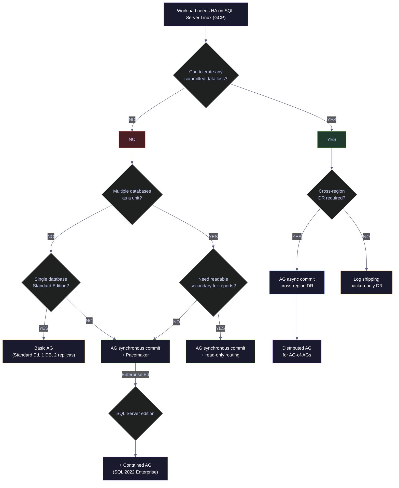
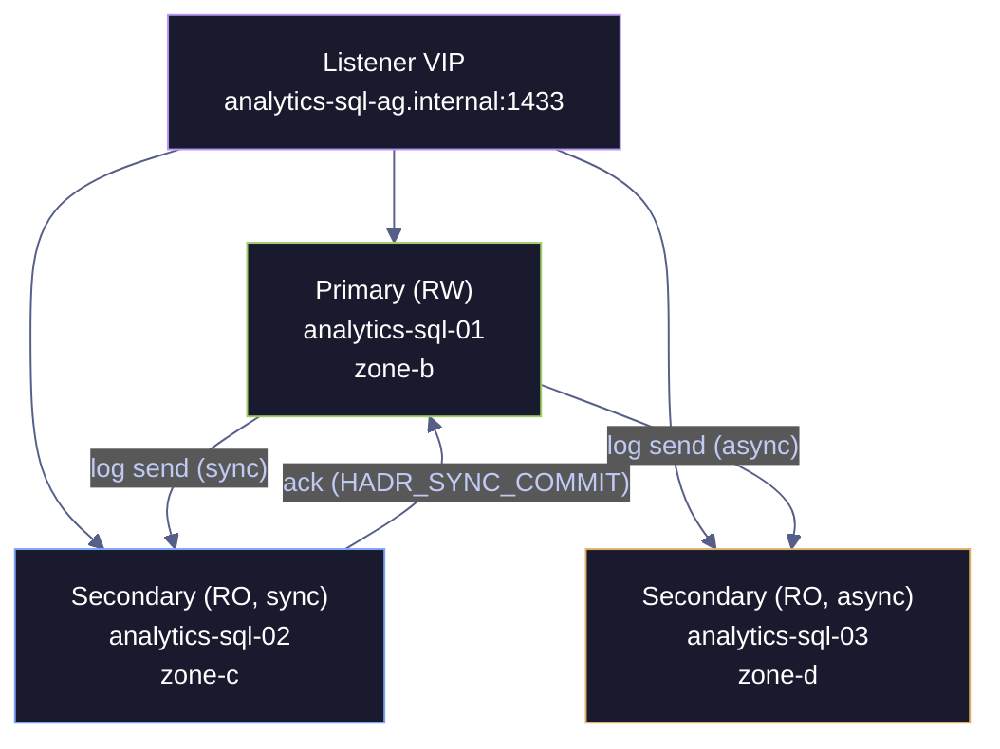
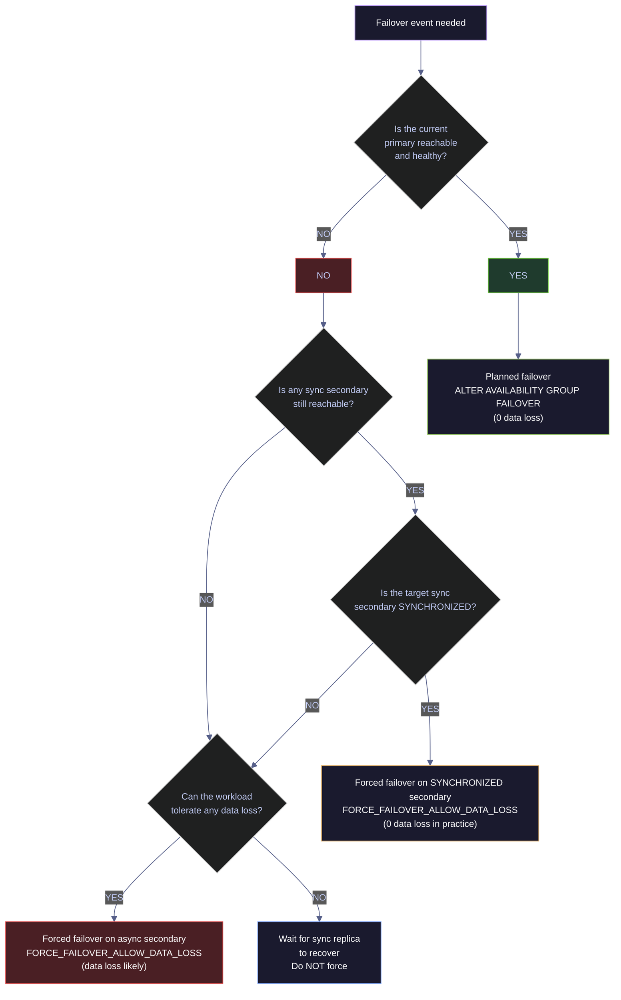

# Always On Availability Groups

> [!quote]+
> "High availability is not about preventing failure — it is about recovering from failure faster than your users notice."
>
> — **Adrian Cockcroft**, Netflix tech blog

> [!abstract]- Summary
>
> Always On Availability Groups (AGs) are the primary high-availability mechanism for SQL Server on Linux. They replicate a group of databases across 2 to 9 replicas, with the primary accepting writes while secondaries harden and replay the log stream. This note covers the full operational surface of AGs for SQL Server 2022 on Linux under GCP.
>
> - **HA option selection**
>   - compares synchronous and asynchronous AGs with FCI, log shipping, Basic AG, Distributed AG, and Contained AG so the topology matches the workload and platform constraints
> - **End-to-end setup**
>   - covers HADR feature enablement, certificate-authenticated database mirroring endpoints, `CREATE AVAILABILITY GROUP` options, and Pacemaker resource configuration
> - **Monitoring**
>   - explains the `sys.dm_hadr_*` surface, queue metrics, synchronization health, and `HADR_SYNC_COMMIT` diagnostics
> - **Failover and read scale**
>   - walks through planned failover gates, forced failover risk, post-failover validation, and read-only routing configuration plus diagnostics
> - **Operational tuning**
>   - covers `FAILURE_CONDITION_LEVEL`, `HEALTH_CHECK_TIMEOUT`, `REQUIRED_SYNCHRONIZED_SECONDARIES_TO_COMMIT`, `AUTOMATED_BACKUP_PREFERENCE`, and `BACKUP_PRIORITY`
> - **GCP integration and safety**
>   - maps AG listener replacement through an Internal Load Balancer, required firewall and fencing design, TDE prerequisites across replicas, and concrete troubleshooting patterns
>
> All code cells in this note were either live-captured against the local `stoxx` SQL Server 2022 Developer Edition Linux container (`16.0.4236.2`, HADR disabled as a fresh pre-AG baseline), or flagged explicitly where live capture is not possible on a single-container lab instance.

> [!note]- Glossary
>
> - **Availability Group (AG)**
>   - database-level replication feature that groups one or more user databases into a single failover unit
> - **Primary replica**
>   - AG node currently accepting writes and sending log records to secondaries
> - **Secondary replica**
>   - AG node receiving log records, optionally serving read-only traffic, and waiting to assume primary if needed
> - **Synchronous commit**
>   - replica mode where commit acknowledgment waits for a synchronous secondary to harden the log
> - **Asynchronous commit**
>   - replica mode where commit acknowledgment does not wait for the secondary to harden the log
> - **HADR**
>   - SQL Server high-availability and disaster-recovery feature surface that powers AGs
> - **Database mirroring endpoint**
>   - TCP endpoint used to transport AG log traffic between replicas
> - **Pacemaker**
>   - Linux cluster manager that handles quorum, health, and failover coordination for AGs
> - **Basic AG**
>   - SQL Server Standard Edition AG variant limited to one database and two replicas
> - **Contained AG**
>   - SQL Server 2022 AG variant that replicates AG-scoped system metadata alongside user databases
> - **Distributed AG**
>   - topology that links separate availability groups for cross-region or cross-environment replication
> - **Read-only routing**
>   - feature that directs read-intent connections to eligible secondary replicas
> - **`REQUIRED_SYNCHRONIZED_SECONDARIES_TO_COMMIT`**
>   - setting that controls how many synchronous secondaries must harden a transaction before commit succeeds
> - **Listener replacement**
>   - GCP pattern that uses an Internal Load Balancer instead of a traditional AG listener VIP
> - **Fencing**
>   - cluster safeguard that isolates a failed or partitioned node so split-brain cannot occur

---

## Why High Availability?

A single SQL Server instance is a single point of failure. If the VM crashes, the disk corrupts, or you need to patch the OS, your database is down. HA ensures the database remains accessible during planned maintenance and unplanned outages by maintaining redundant copies of data that can take over automatically. This section establishes the target metrics an AG topology is meant to achieve and verifies the baseline HADR state of a fresh SQL Server instance.

### SQL Server | RPO, RTO, SLA | key HA metrics

Every HA design decision traces back to three numeric targets. RTO bounds how long the database may be offline after a failure, RPO bounds how much committed data may be lost, and the SLA expresses both as a percentage uptime guarantee to users and stakeholders. An AG topology's replication mode (sync vs async), replica count, and failover policy are all chosen to meet specific RPO/RTO/SLA numbers — if you cannot state the three targets, you cannot verify that the topology meets them.

| Metric | Definition | Target |
|--------|-----------|--------|
| **RTO** (Recovery Time Objective) | Maximum acceptable downtime after a failure | Seconds to minutes for HA; hours for DR |
| **RPO** (Recovery Point Objective) | Maximum acceptable data loss measured in time | 0 for synchronous commit; seconds for async |
| **SLA** uptime | Uptime guarantee expressed as a percentage | 99.9% = ~8.76 h/year downtime, 99.99% = ~52.6 min/year, 99.999% = ~5.26 min/year |

The SLA column translates percentage uptime into allowed downtime so the number is operationally meaningful. A "three nines" (99.9%) SLA on a 24×7 system permits roughly 8.76 hours of cumulative annual unavailability, which a properly configured 2-replica synchronous AG can meet comfortably. "Four nines" (99.99%) drops that to ~52 minutes, which requires automatic failover with a tight `HEALTH_CHECK_TIMEOUT` and a fencing mechanism — manual operator intervention alone cannot hit the target. "Five nines" (99.999%) requires anycast routing, chaos-tested failover, and cross-region asynchronous DR in addition to the primary HA topology.

### SQL Server | SERVERPROPERTY | verify HADR feature state on an instance

Before planning AG setup on a fresh instance, or when debugging why `CREATE AVAILABILITY GROUP` or `ALTER SERVER CONFIGURATION SET HADR CLUSTER TYPE` fails. It is typically triggered by first installation of SQL Server on a node, post-patch verification that HADR state survived a restart, or a support-ticket request to confirm HADR is actually enabled on a suspect instance. T-SQL session, read-only, requires no special permissions beyond connection. Runs against the local instance only. Confirm whether the Always On feature flag is on (`IsHadrEnabled = 1`) and whether the HADR manager started successfully (`HadrManagerStatus = 1`).

*Baseline instance properties — product version, edition, patch level, HADR feature flag, and HADR manager status:*

```sql
SELECT
    CAST(SERVERPROPERTY('ProductVersion')     AS nvarchar(32)) AS product_version,
    CAST(SERVERPROPERTY('Edition')            AS nvarchar(64)) AS edition,
    CAST(SERVERPROPERTY('ProductLevel')       AS nvarchar(16)) AS product_level,
    CAST(SERVERPROPERTY('IsHadrEnabled')      AS int)          AS is_hadr_enabled,
    CAST(SERVERPROPERTY('HadrManagerStatus')  AS int)          AS hadr_manager_status;
```

| product_version | edition | product_level | is_hadr_enabled | hadr_manager_status |
|---|---|---|---|---|
| 16.0.4236.2 | Developer Edition (64-bit) | RTM | 0 | 1 |

The stoxx baseline shows the fresh-install state: SQL Server 2022 CU23 (`16.0.4236.2`) Developer Edition on Linux with `is_hadr_enabled = 0`. `HadrManagerStatus = 1` means the manager thread started successfully at service startup even though the feature itself is off — this is the expected "ready to be enabled" state. `SERVERPROPERTY` returns `sql_variant`, so every value is explicitly `CAST` to a concrete type to avoid the `ODBC SQL type -16 is not yet supported` error when the result is consumed by pyodbc or other typed clients.

| Output column | Source | Meaning |
|---|---|---|
| `product_version` | `SERVERPROPERTY('ProductVersion')` | Four-part build number. `16.0.xxxx.y` = SQL Server 2022; `15.0.xxxx.y` = SQL Server 2019. |
| `edition` | `SERVERPROPERTY('Edition')` | Edition name. Enterprise, Standard, and Developer support AG. Standard is limited to Basic AGs only (2 replicas, 1 database). |
| `product_level` | `SERVERPROPERTY('ProductLevel')` | `RTM`, `SP1`, `SP2`, `CU*`, etc. Always On CU dependencies are specific — for example, SQL Server 2022 CU18 is required for Resource Governor support on contained AG connections. |
| `is_hadr_enabled` | `SERVERPROPERTY('IsHadrEnabled')` | `1` if HADR is on, `0` if off. Must be `1` before `CREATE AVAILABILITY GROUP` will succeed. Toggled with `ALTER SERVER CONFIGURATION SET HADR CLUSTER TYPE`. |
| `hadr_manager_status` | `SERVERPROPERTY('HadrManagerStatus')` | `0` = not started (pending), `1` = started and running, `2` = failed to start. A healthy instance ready for AG work shows `1` regardless of whether `is_hadr_enabled` is `0` or `1`. |

---

## HA Options for SQL Server 2022 on Linux

SQL Server on Linux supports six HA/DR mechanisms, each with different trade-offs between data-loss protection, failover speed, operational complexity, and GCP compatibility. Always On Availability Groups are the recommended choice for most workloads because they provide database-level replication with no shared-storage requirement — a critical advantage on GCP, where native shared block storage like AWS EBS Multi-Attach or Azure Shared Disks is not available. This section walks through each option, establishes when to pick which, and closes with a decision flowchart and matrix.

### SQL Server Linux | HA option selection | choose the right mechanism

The flowchart below captures the decision path most data-engineering teams follow when picking an HA mechanism for a new SQL Server workload on GCP. The YES/NO branches make the failure modes explicit — "can the workload tolerate any data loss?" is the first gate, because it eliminates async-commit and log-shipping as primary HA paths.



### SQL Server | Always On Availability Group | database-level replication mechanism

An Always On Availability Group replicates one or more user databases across 2–9 instances (1 primary + up to 8 secondaries). Each replica owns its own data files on locally attached storage — no shared block device is required. The primary streams log records to each secondary over a `DATABASE_MIRRORING` TCP endpoint (default port 5022), and the secondary hardens those records into its own log file, then replays them into its own data pages. AGs are the default HA pattern for SQL Server on GCP because the no-shared-storage design maps cleanly to Persistent Disk.

The topology diagram below shows a typical 3-replica AG used in production fintech workloads: two synchronous-commit replicas across adjacent GCP zones for HA (RPO = 0), plus one asynchronous-commit replica in a third zone or region for DR and read-scale. The listener VIP (shown here as a placeholder — see the GCP ILB section for the production pattern) is the single endpoint applications connect to, and is automatically retargeted to whichever replica currently holds the primary role.



On Linux, **Pacemaker replaces Windows Server Failover Clustering (WSFC)** as the external cluster manager. The Pacemaker `mssql-server-ha` package (the SQL Server Resource Agent for Pacemaker) bridges between the cluster manager and SQL Server's HADR state machine — when `sp_server_diagnostics` reports a failure above the configured `FAILURE_CONDITION_LEVEL`, or the health check does not respond within `HEALTH_CHECK_TIMEOUT` milliseconds, Pacemaker promotes a synchronous-commit secondary to primary.

#### Synchronous, asynchronous, configuration-only — AG availability modes

| Mode | How it works | RPO | Quorum role | Use case |
|------|-------------|-----|-------------|----------|
| **`SYNCHRONOUS_COMMIT`** | Primary waits for the synchronous secondary to harden the log record to its log file before acknowledging the commit to the client. Automatic failover is only supported in this mode. | `0` (no committed data loss) | Full | Same-region or same-AZ cluster secondaries, high-value OLTP, any workload where the RPO target is 0 |
| **`ASYNCHRONOUS_COMMIT`** | Primary sends log records and immediately acknowledges the commit without waiting for secondary hardening. The secondary catches up as fast as the network and its local log I/O allow. | `>0` (seconds to minutes in steady state) | Full | Cross-region DR, high-latency WAN links, read-scale secondaries where latency impact on the primary is unacceptable |
| **`CONFIGURATION_ONLY`** | Replica stores AG metadata (`master` AG state) but holds no user data. Acts purely as a quorum witness. | N/A (no data) | Full | Third-node quorum without the cost of a full data replica — common in 2-data-replica AGs where you want automatic failover but cannot justify a third data copy |

Automatic failover requires both partners to be in `SYNCHRONOUS_COMMIT` mode, have `FAILOVER_MODE = EXTERNAL` (Linux) or `AUTOMATIC` (Windows WSFC), and currently be in `SYNCHRONIZED` state. A synchronous replica that has not caught up (state `SYNCHRONIZING`) blocks automatic failover — this is the design that prevents data loss but can surprise operators when they expect Pacemaker to act and it refuses to promote a non-synchronized secondary.

### SQL Server | Failover Cluster Instance (FCI) | instance-level shared-storage failover

FCI is the other SQL Server clustering option. An FCI is a single SQL Server instance whose binaries, system databases, and user databases all live on **shared storage** that is visible to multiple nodes simultaneously. At any given moment, exactly one node has the instance active; the others are passive. On failure, Pacemaker demotes the old active node, mounts the shared storage on a new node, and starts the SQL Server process there. The instance identity, logins, SQL Agent jobs, and server-level objects all move with the storage — no re-scripting is needed after failover.

FCI trades flexibility for simplicity: the shared-storage requirement adds significant complexity on GCP, but the failover unit is the whole instance, so there is nothing to synchronize at the database level.

| Aspect | Always On AG | Failover Cluster Instance (FCI) |
|--------|---|-----|
| **Shared storage** | No — each replica has its own copy | Yes — shared disk, filesystem, or network storage |
| **Failover unit** | Per-database or per-AG group of databases | Whole SQL Server instance |
| **Readable secondaries** | Yes (Enterprise, configurable per replica) | No — passive node is offline |
| **Replication protocol** | Log-record streaming over TCP 5022 | No replication — only the storage is shared |
| **Data-loss scenarios** | Sync = 0 loss; async = seconds | 0 loss (same physical bytes, just remounted) |
| **Multiple databases as one unit** | Yes, group databases into a single AG | Yes, all databases on the instance are one unit |
| **Server-level object sync** | Manual — logins, jobs, linked servers must be re-scripted on every replica | Automatic — shared storage holds everything |
| **GCP implementation cost** | Each VM has its own Persistent Disk | Requires shared filesystem (GlusterFS, NFS, or iSCSI), which adds operational complexity and a new failure point |
| **Recommended for** | Most SQL Server on Linux workloads, especially on GCP | Rare — only when you need instance-level failover and can tolerate shared-storage operational overhead |

> [!info] GCP favors AGs over FCI
>
> GCP does not offer native shared block storage equivalent to AWS EBS Multi-Attach or Azure Shared Disks. Setting up GlusterFS, NFS, or iSCSI for FCI on GCP adds operational complexity and another failure point. AGs achieve the same or better RPO/RTO without touching the storage layer. Use AGs unless a specific operational constraint forces FCI.

### SQL Server | Log Shipping | asynchronous backup-based DR

Log shipping is the simplest DR mechanism. The primary backs up its transaction log on a schedule, copies the backup file to the secondary (typically via a file share or `scp`), and the secondary `RESTORE LOG ... WITH STANDBY` replays it. There is no cluster manager, no quorum, and no automatic failover — an operator manually promotes the secondary by applying the final log backup and running `RESTORE ... WITH RECOVERY`.

- **RPO**: Minutes to hours, equal to the log-backup frequency plus transit time
- **RTO**: Minutes to hours — operator must apply the final tail-log backup, recover, redirect applications
- **Readable secondary**: Yes, under `WITH STANDBY` (but read sessions block during log restore)
- **Operational role**: DR complement to AGs for off-site second copy, not a primary HA mechanism. Log shipping is valuable when an AG-level corruption or logical bug would replicate to all AG secondaries — the log-shipped copy lags enough to be rolled forward to a point before the incident.

### SQL Server | Basic Availability Group | Standard Edition single-database HA

Introduced in SQL Server 2016, Basic AGs are a Standard Edition feature designed to replace the deprecated database mirroring. They deliver the core AG value — HA without shared storage — to customers who cannot license Enterprise. The trade-off is substantial: **one database per AG, exactly two replicas, no readable secondary, no backup offload, no read-only routing list**. If any of those limitations hurt, the workload needs Enterprise Edition and a standard (non-basic) AG.

Create a Basic AG with the `BASIC` option on `CREATE AVAILABILITY GROUP`:

*Create a Basic AG on Standard Edition for a single database with two replicas:*

```sql
CREATE AVAILABILITY GROUP [basic_ag]
WITH (
    BASIC,
    CLUSTER_TYPE = EXTERNAL,
    DB_FAILOVER = ON
)
FOR DATABASE [analytics_db]
FOR REPLICA ON
    N'analytics-sql-01' WITH (
        ENDPOINT_URL = N'tcp://analytics-sql-01:5022',
        AVAILABILITY_MODE = SYNCHRONOUS_COMMIT,
        FAILOVER_MODE = EXTERNAL,
        SEEDING_MODE = AUTOMATIC
    ),
    N'analytics-sql-02' WITH (
        ENDPOINT_URL = N'tcp://analytics-sql-02:5022',
        AVAILABILITY_MODE = SYNCHRONOUS_COMMIT,
        FAILOVER_MODE = EXTERNAL,
        SEEDING_MODE = AUTOMATIC
    );
```

| Basic AG restriction | Standard AG equivalent |
|---|---|
| Exactly 2 replicas | Up to 9 replicas |
| Exactly 1 database | Up to 100 databases per AG |
| No readable secondary | `SECONDARY_ROLE (ALLOW_CONNECTIONS = READ_ONLY)` |
| No read-only routing list | `READ_ONLY_ROUTING_LIST` supported |
| No backup offload | `AUTOMATED_BACKUP_PREFERENCE = SECONDARY` supported |
| No `CONFIGURATION_ONLY` replica | Supported on Enterprise |

### SQL Server 2016+ | Distributed Availability Group | AG-of-AGs cross-cluster pattern

A distributed AG is an AG whose "replicas" are themselves entire AGs, each hosted on an independent Pacemaker or WSFC cluster. One AG is the **forwarder** (the distributed AG's current primary role); the other AG is the **target**. The forwarder's primary node streams log records to the target AG's primary node, which then replays them into its own secondaries through the normal intra-AG protocol. This is the canonical cross-region DR pattern — each region operates its own independent cluster with its own quorum, so a region-wide outage cannot take down the surviving region's cluster.

Distributed AGs are always asynchronous between clusters (the log-record latency across a WAN makes synchronous-commit impractical at region-scale distances). SQL Server 2022 improved cross-cluster throughput by using multiple TCP connections for the log stream, mitigating the bandwidth-delay product penalty on long-latency links.

*Create a distributed AG connecting `ag1` on cluster A to `ag2` on cluster B, with `ag1` as the current forwarder:*

```sql
CREATE AVAILABILITY GROUP [dist_ag]
WITH (DISTRIBUTED)
AVAILABILITY GROUP ON
    'ag1' WITH (
        LISTENER_URL = 'tcp://ag1-listener.cluster-a.internal:5022',
        AVAILABILITY_MODE = ASYNCHRONOUS_COMMIT,
        FAILOVER_MODE = MANUAL,
        SEEDING_MODE = AUTOMATIC
    ),
    'ag2' WITH (
        LISTENER_URL = 'tcp://ag2-listener.cluster-b.internal:5022',
        AVAILABILITY_MODE = ASYNCHRONOUS_COMMIT,
        FAILOVER_MODE = MANUAL,
        SEEDING_MODE = AUTOMATIC
    );
```

Then join the target AG:

```sql
-- Run on ag2 primary
ALTER AVAILABILITY GROUP [dist_ag]
JOIN AVAILABILITY GROUP ON
    'ag1' WITH (LISTENER_URL = 'tcp://ag1-listener.cluster-a.internal:5022', AVAILABILITY_MODE = ASYNCHRONOUS_COMMIT, FAILOVER_MODE = MANUAL, SEEDING_MODE = AUTOMATIC),
    'ag2' WITH (LISTENER_URL = 'tcp://ag2-listener.cluster-b.internal:5022', AVAILABILITY_MODE = ASYNCHRONOUS_COMMIT, FAILOVER_MODE = MANUAL, SEEDING_MODE = AUTOMATIC);
```

Manual failover is the norm at this scope — a cross-region promote-and-redirect is a deliberate operational event, not a reflex to a transient spike. Failover is initiated with `ALTER AVAILABILITY GROUP [dist_ag] FORCE_FAILOVER_ALLOW_DATA_LOSS` on the surviving cluster, with the understanding that any log records that had not yet reached it are lost.

### SQL Server 2022 | Contained Availability Group | self-contained master and msdb

SQL Server 2022 Enterprise introduced **contained AGs**. A contained AG carries its own replicated copy of the `master` and `msdb` system databases, named `{AgName}_master` and `{AgName}_msdb` at the instance level. Server-scope objects created **while connected through the AG listener** — logins, SQL Agent jobs, linked servers, resource governor pools (from CU18) — are stored in the contained system databases and replicated to every replica automatically. This eliminates the long-standing pain point where a failover to a fresh secondary would break any application that depended on a login, job, or server-level object that was only present on the old primary's `master` or `msdb`.

*Create a contained AG whose replica metadata, system objects, logins, and jobs all replicate automatically:*

```sql
CREATE AVAILABILITY GROUP [contained_ag]
WITH (
    CLUSTER_TYPE = EXTERNAL,
    CONTAINED,
    DB_FAILOVER = ON,
    REQUIRED_SYNCHRONIZED_SECONDARIES_TO_COMMIT = 1
)
FOR DATABASE [analytics_db]
FOR REPLICA ON
    N'analytics-sql-01' WITH (
        ENDPOINT_URL = N'tcp://analytics-sql-01:5022',
        AVAILABILITY_MODE = SYNCHRONOUS_COMMIT,
        FAILOVER_MODE = EXTERNAL,
        SEEDING_MODE = AUTOMATIC,
        SECONDARY_ROLE (ALLOW_CONNECTIONS = READ_ONLY)
    ),
    N'analytics-sql-02' WITH (
        ENDPOINT_URL = N'tcp://analytics-sql-02:5022',
        AVAILABILITY_MODE = SYNCHRONOUS_COMMIT,
        FAILOVER_MODE = EXTERNAL,
        SEEDING_MODE = AUTOMATIC,
        SECONDARY_ROLE (ALLOW_CONNECTIONS = READ_ONLY)
    );
```

| Contained AG operational rule | Implication |
|---|---|
| Must use automatic seeding for the initial sync of contained system databases | `SEEDING_MODE = AUTOMATIC` required; user databases added later can use manual seeding |
| Connect through the listener, not the instance, to access the contained environment | Direct instance connections land in the instance's `master`/`msdb`, not the contained ones |
| Contained AG **is not a security boundary** | A connection inside the contained AG can still access databases outside the AG on the same instance |
| SSIS packages and maintenance plans unsupported | Use SQL Agent T-SQL job steps or external orchestration instead |
| Transactional, merge, and snapshot replication unsupported | Replicate through an external ETL path if the AG databases need to be published |
| Log-shipping **source** supported, **target** unsupported | Contained AG can be the primary of a log-shipping pair but not the secondary |
| Resource governor on contained AG connections requires SQL Server 2022 CU18+ | Earlier CUs fail with an error if resource governor is configured on a contained AG connection |
| SQL Server 2025 adds distributed AG support for contained AGs | Requires `WITH (CONTAINED, AUTOSEEDING_SYSTEM_DATABASES)` when the contained AG is the forwarder |

Contained AGs are the recommended pattern for new Enterprise deployments on SQL Server 2022+ because they eliminate the manual-scripting failure mode that historically caused post-failover outages when a secondary took over and an application's login or Agent job was missing.

### Decision matrix — HA option selection

| Requirement | AG (Sync) | AG (Async) | Basic AG | FCI | Log Shipping | Distributed AG |
|---|---|---|---|---|---|---|
| **Zero data loss** | Yes | No | Yes | Yes | No | No |
| **Automatic failover** | Yes (Pacemaker) | No | Yes (Pacemaker) | Yes (Pacemaker) | No | No |
| **Readable secondary** | Yes | Yes | No | No | With `STANDBY` | Yes (inside each AG) |
| **No shared storage** | Yes | Yes | Yes | No | Yes | Yes |
| **Cross-region DR** | Possible, high latency cost | Recommended | No | No | Yes | Recommended |
| **Multi-database unit** | Yes | Yes | No (1 DB) | Yes (whole instance) | Yes | Yes |
| **Standard Edition** | No | No | Yes | Enterprise only | Yes | Enterprise only |
| **Operational complexity** | Medium | Medium | Low | High (shared storage on GCP) | Low | High |

---

## Setting Up Always On AGs on Linux (GCP)

The setup follows 8 phases: enable HADR on each instance, create the database mirroring endpoint with certificate authentication, export and distribute the certificate, import it on the secondaries, create the AG with the desired replication topology, join secondaries, add databases, and configure Pacemaker as the external cluster manager for automatic failover. All inter-replica communication flows through a single TCP endpoint (port 5022 by convention) per instance — the log stream is compressed before transmission and authenticated either by certificate (Linux) or by Windows domain service account (WSFC).

### Prerequisites for AG deployment

Every node that will host a replica must have the following in place before any `CREATE AVAILABILITY GROUP` statement runs. Missing any one of these causes cryptic errors deep in the setup flow (endpoint start failures, certificate trust errors, Pacemaker resource creation failures), so it is worth verifying all of them up front.

- **SQL Server 2022** installed with the same version and cumulative update on every node. A CU mismatch blocks `ALTER AVAILABILITY GROUP ... JOIN` with error 35233 or higher.
- **`mssql-server-ha`** package installed on every node. This ships the `ocf:mssql:ag` resource agent that Pacemaker uses to promote/demote SQL Server replicas.
- **Pacemaker + Corosync** installed on every node with a synchronized `corosync.conf` and a shared `hacluster` password.
- **Unique hostnames** resolvable by every node, either via `/etc/hosts` (if DNS is not available) or via a shared DNS zone. The hostname must match `@@SERVERNAME` exactly.
- **Matching time across all nodes** via NTP or chrony. Certificate-based authentication rejects time skew greater than a few minutes.
- **VPC firewall rules** allowing the following TCP/UDP ports between every pair of AG nodes: `1433` (SQL client traffic), `5022` (DATABASE_MIRRORING endpoint, the AG log-stream port), `2224` (pcsd REST API), `3121` (Pacemaker remote), `21064` (dlm — required by some distros), and UDP `5405` (Corosync).
- **A fencing device** (STONITH). In GCP, `fence_gce` is the canonical choice. Production clusters without fencing are unsupported by Red Hat and are a top-3 cause of split-brain incidents.

### SQL Server | ALTER SERVER CONFIGURATION | enable HADR for external cluster

On a fresh instance that has been installed but never configured for HA, or after a `mssql-server` reinstall that reset the feature flag. It is typically triggered by the first step of any AG setup. Also required when converting an instance from standalone to AG-ready. T-SQL session on each replica (run independently on every node). Requires `ALTER SETTINGS` permission, which `sysadmin` has by default. **State-changing and requires a SQL Server service restart** to take effect. `EXTERNAL` tells SQL Server that a non-Microsoft cluster manager (Pacemaker on Linux, or none on Linux read-scale) handles failover. Flip the `IsHadrEnabled` feature flag to `1` so the instance can host an availability replica.

*Enable HADR for an external cluster manager on a Linux SQL Server instance:*

```sql
ALTER SERVER CONFIGURATION SET HADR CLUSTER TYPE = EXTERNAL;
```

The statement returns no rows. Verify the feature flag flipped by re-running the baseline `SERVERPROPERTY` query from earlier in the note — `is_hadr_enabled` should now return `1` after the SQL Server service has been restarted. Until the restart, the configuration change is persisted but not active.

> [!danger] SQL Server service restart is required
>
> `ALTER SERVER CONFIGURATION SET HADR CLUSTER TYPE` persists the setting but does not activate HADR until the SQL Server service is restarted (`sudo systemctl restart mssql-server` on Linux). Schedule the restart in a maintenance window — any in-flight sessions are disconnected and any uncommitted transactions roll back.

> [!success] Cleanly restart with connection-drain window
>
> Announce the restart 5 minutes in advance, drain application connection pools, then restart: `sudo systemctl restart mssql-server && sudo systemctl status mssql-server`. Run the baseline `SERVERPROPERTY` query after the restart to confirm `is_hadr_enabled = 1` before proceeding to the endpoint step.

### SQL Server | CREATE MASTER KEY | prepare the instance for certificate operations

Before creating or importing any certificate on a replica. Every SQL Server instance needs exactly one database master key in the `master` database, and the AG endpoint certificate is encrypted by that master key. It is typically triggered by fresh instance that has never had a master key created, or a replica joined to a new AG for the first time. T-SQL session connected to `master`. Requires `CONTROL` permission on `master` (which `sysadmin` has). State-changing — creates a new master key protected by the supplied password. Establish the root of the encryption hierarchy that will protect the endpoint certificate.

*Create the database master key that protects the AG endpoint certificate:*

```sql
CREATE MASTER KEY ENCRYPTION BY PASSWORD = 'StrongMasterKeyP@ss!';
```

Run this on every replica. The password must be 8+ characters and meet the SQL Server password policy. Save the password in a secrets manager (Google Secret Manager on GCP) — you need it to open the master key during disaster recovery or when restoring the certificate from backup.

### SQL Server | CREATE CERTIFICATE | generate the AG endpoint certificate on the primary

Exactly once per AG, on the future primary replica, after the master key exists. It is typically triggered by first replica being configured for the new AG. T-SQL session on the future primary. State-changing — creates a new server-scope certificate in `master` and backs it up to the filesystem. Mint the certificate used to authenticate log-stream traffic between AG replicas. All replicas must present this same certificate (or a matching pair) for endpoint handshakes to succeed.

*Create the AG endpoint certificate in the master database:*

```sql
CREATE CERTIFICATE dbm_cert
    WITH SUBJECT = 'AG endpoint certificate';
```

*Back up the certificate and private key to files the secondaries can import:*

```sql
BACKUP CERTIFICATE dbm_cert
    TO FILE = '/var/opt/mssql/data/dbm_cert.cer'
    WITH PRIVATE KEY (
        FILE = '/var/opt/mssql/data/dbm_cert.pvk',
        ENCRYPTION BY PASSWORD = 'CertP@ss123!'
    );
```

The private key file is the sensitive part — anyone holding it can impersonate this replica at the endpoint layer. Store the `CertP@ss123!` password in Google Secret Manager, not in shell history or configuration files.

> [!info] Certificate authentication replaces Windows Kerberos on Linux
>
> Windows AGs can use the SQL Server service account's domain credentials as the endpoint authentication principal. Linux has no equivalent (Kerberos on Linux is supported for client TDS traffic via `adutil` but not for AG endpoint authentication). Linux AGs always use certificate-based authentication: a single certificate minted on the primary and imported on each secondary. Certificate-based authentication also works across Active-Directory boundaries and across clusters that do not share a domain — it is the same mechanism Distributed AGs use.

### Linux | scp | distribute the certificate files to each secondary

Immediately after the `BACKUP CERTIFICATE` step on the primary, before any secondary tries to import the certificate. It is typically triggered by preparing secondaries for the AG. Shell session on the primary node. Requires `scp` and SSH keys or password auth to each secondary. State-changing on the secondaries' filesystems. **Production tip:** prefer key-based SSH with a deploy user over password SSH. Copy the certificate and private-key files to the same absolute path on every secondary so the `CREATE CERTIFICATE ... FROM FILE` import step can find them.

*Copy the certificate files to both secondaries:*

```bash
scp /var/opt/mssql/data/dbm_cert.cer user@analytics-sql-02:/var/opt/mssql/data/
scp /var/opt/mssql/data/dbm_cert.pvk user@analytics-sql-02:/var/opt/mssql/data/
scp /var/opt/mssql/data/dbm_cert.cer user@analytics-sql-03:/var/opt/mssql/data/
scp /var/opt/mssql/data/dbm_cert.pvk user@analytics-sql-03:/var/opt/mssql/data/
```

*Fix ownership on each secondary so the `mssql` user can read the files:*

```bash
ssh user@analytics-sql-02 'sudo chown mssql:mssql /var/opt/mssql/data/dbm_cert.*'
ssh user@analytics-sql-03 'sudo chown mssql:mssql /var/opt/mssql/data/dbm_cert.*'
```

The SQL Server process runs as the `mssql` user on Linux. If the ownership step is skipped, `CREATE CERTIFICATE ... FROM FILE` on the secondary fails with `Error 15208: The certificate, asymmetric key, or private key file is not valid or does not exist`.

### SQL Server | CREATE CERTIFICATE FROM FILE | import the AG certificate on each secondary

On each secondary, after the master key exists and the certificate files have been copied from the primary. It is typically triggered by bringing a new replica online. T-SQL session on the secondary. State-changing — creates a server-scope certificate in the secondary's `master` database. Install the same certificate on the secondary so its endpoint can present matching credentials during the AG handshake.

*Import the AG certificate and private key from the files copied from the primary:*

```sql
CREATE CERTIFICATE dbm_cert
    FROM FILE = '/var/opt/mssql/data/dbm_cert.cer'
    WITH PRIVATE KEY (
        FILE = '/var/opt/mssql/data/dbm_cert.pvk',
        DECRYPTION BY PASSWORD = 'CertP@ss123!'
    );
```

The password must match the one used in the primary's `BACKUP CERTIFICATE ... ENCRYPTION BY PASSWORD` step. After the import succeeds, delete the `.pvk` file from the secondary's filesystem — the private key is now inside the instance's certificate store and the file on disk is no longer needed, but is a standing risk if the VM is later compromised.

### SQL Server | CREATE ENDPOINT | create the database mirroring endpoint on every node

After the certificate exists on the instance (primary first, then each secondary after the certificate import). It is typically triggered by configuring an instance for AG traffic. T-SQL session on each replica. State-changing — creates a listening TCP endpoint on port 5022 and authorizes certificate-based endpoint authentication. Open the port and install the authentication mechanism that carries the AG log-record stream between replicas.

*Create the database mirroring endpoint on port 5022 with certificate authentication:*

```sql
CREATE ENDPOINT [Hadr_endpoint]
    AS TCP (LISTENER_PORT = 5022)
    FOR DATA_MIRRORING (
        ROLE = ALL,
        AUTHENTICATION = CERTIFICATE dbm_cert,
        ENCRYPTION = REQUIRED ALGORITHM AES
    );
```

*Start the endpoint so it begins listening on port 5022:*

```sql
ALTER ENDPOINT [Hadr_endpoint] STATE = STARTED;
```

| Endpoint option | Value | Meaning |
|---|---|---|
| `AS TCP (LISTENER_PORT = 5022)` | Integer | TCP port the endpoint binds to. 5022 is the convention; any unused port works as long as it is reachable between every pair of replicas and the VPC firewall allows it. |
| `FOR DATA_MIRRORING` | Payload type | Declares the endpoint carries database mirroring / AG log-record traffic. Other payload types (`TSQL`, `SERVICE_BROKER`) are for unrelated features. |
| `ROLE = ALL` | `WITNESS`, `PARTNER`, `ALL` | `ALL` allows the endpoint to act as either primary or secondary. Always use `ALL` for AG replicas so the endpoint survives a failover. |
| `AUTHENTICATION = CERTIFICATE dbm_cert` | Certificate name | Certificate in the instance's `master` database that authenticates this endpoint to peers. Windows AGs can alternatively use `WINDOWS NEGOTIATE`. |
| `ENCRYPTION = REQUIRED` | `DISABLED`, `SUPPORTED`, `REQUIRED` | `REQUIRED` forces TLS for every peer connection. Always use `REQUIRED` in production. |
| `ALGORITHM AES` | `RC4`, `AES`, `AES RC4`, `RC4 AES` | Encryption algorithm. `AES` is the modern choice; `RC4` is cryptographically broken and only exists for backward compatibility. |

### SQL Server | CREATE AVAILABILITY GROUP | define replicas and topology

After every replica has an endpoint running and the certificate is installed on every replica. It is typically triggered by the pivotal step that actually defines the AG. Runs exactly once on the intended primary. T-SQL session on the future primary. Requires `CREATE AVAILABILITY GROUP` server permission, `sysadmin` role membership, or equivalent. State-changing — creates an availability group object with replica topology and synchronization rules. Register the AG in `sys.availability_groups`, declare the replica set and their roles, and establish the failover policy.

*Create the AG with three replicas — two synchronous for HA and one asynchronous for DR:*

```sql
CREATE AVAILABILITY GROUP [project_ag]
WITH (
    CLUSTER_TYPE = EXTERNAL,
    DB_FAILOVER = ON,
    REQUIRED_SYNCHRONIZED_SECONDARIES_TO_COMMIT = 1,
    FAILURE_CONDITION_LEVEL = 3,
    HEALTH_CHECK_TIMEOUT = 30000,
    AUTOMATED_BACKUP_PREFERENCE = SECONDARY
)
FOR REPLICA ON
    N'analytics-sql-01' WITH (
        ENDPOINT_URL = N'tcp://analytics-sql-01:5022',
        AVAILABILITY_MODE = SYNCHRONOUS_COMMIT,
        FAILOVER_MODE = EXTERNAL,
        SEEDING_MODE = AUTOMATIC,
        BACKUP_PRIORITY = 50,
        SECONDARY_ROLE (ALLOW_CONNECTIONS = READ_ONLY)
    ),
    N'analytics-sql-02' WITH (
        ENDPOINT_URL = N'tcp://analytics-sql-02:5022',
        AVAILABILITY_MODE = SYNCHRONOUS_COMMIT,
        FAILOVER_MODE = EXTERNAL,
        SEEDING_MODE = AUTOMATIC,
        BACKUP_PRIORITY = 50,
        SECONDARY_ROLE (ALLOW_CONNECTIONS = READ_ONLY)
    ),
    N'analytics-sql-03' WITH (
        ENDPOINT_URL = N'tcp://analytics-sql-03:5022',
        AVAILABILITY_MODE = ASYNCHRONOUS_COMMIT,
        FAILOVER_MODE = EXTERNAL,
        SEEDING_MODE = AUTOMATIC,
        BACKUP_PRIORITY = 100,
        SECONDARY_ROLE (ALLOW_CONNECTIONS = READ_ONLY)
    );
```

| AG-level `WITH` option | Values | Default | Meaning |
|---|---|---|---|
| `CLUSTER_TYPE` | `WSFC`, `EXTERNAL`, `NONE` | `WSFC` on Windows | `EXTERNAL` = Pacemaker or a non-Microsoft cluster manager (Linux production). `NONE` = read-scale AG with no clustering. |
| `AUTOMATED_BACKUP_PREFERENCE` | `PRIMARY`, `SECONDARY_ONLY`, `SECONDARY`, `NONE` | `SECONDARY` | Advisory preference for backup jobs that consult `sys.fn_hadr_backup_is_preferred_replica`. Not enforced; see the backup offload section. |
| `FAILURE_CONDITION_LEVEL` | `1`–`5` | `3` | Which `sp_server_diagnostics` failure classes trigger auto-failover. See the tuning section. |
| `HEALTH_CHECK_TIMEOUT` | `15000`–`4294967295` ms | `30000` | How long to wait for `sp_server_diagnostics` before considering the instance unresponsive. |
| `DB_FAILOVER` | `ON`, `OFF` | `OFF` | `ON` causes a single-database outage (such as corruption) to trigger auto-failover of the whole AG. Recommended for most workloads. |
| `REQUIRED_SYNCHRONIZED_SECONDARIES_TO_COMMIT` | `0`–`(count of sync replicas)` | `0` | The primary stops accepting writes if fewer than this many sync secondaries are SYNCHRONIZED. Set to at least `1` to guarantee RPO = 0 in failover scenarios. |
| `DTC_SUPPORT` | `PER_DB`, `NONE` | `NONE` | Enables distributed-transaction participation for AG databases. Needed for `MSDTC`-coordinated cross-database transactions. |
| `BASIC` | — | — | Creates a Basic AG (Standard Edition, 2 replicas, 1 DB). |
| `DISTRIBUTED` | — | — | Creates a distributed AG (AG-of-AGs). |
| `CONTAINED [REUSE_SYSTEM_DATABASES \| AUTOSEEDING_SYSTEM_DATABASES]` | — | — | Creates a contained AG (SQL 2022 Enterprise). |
| Replica-level `WITH` option | Values | Default | Meaning |
|---|---|---|---|
| `ENDPOINT_URL` | `tcp://<host>:<port>` | — | TCP URL of this replica's mirroring endpoint. Must match the port in `CREATE ENDPOINT`. |
| `AVAILABILITY_MODE` | `SYNCHRONOUS_COMMIT`, `ASYNCHRONOUS_COMMIT`, `CONFIGURATION_ONLY` | — | Replication mode for this replica. Automatic failover requires `SYNCHRONOUS_COMMIT` on both partners. |
| `FAILOVER_MODE` | `AUTOMATIC`, `MANUAL`, `EXTERNAL` | — | `EXTERNAL` = Pacemaker on Linux. `AUTOMATIC` = WSFC on Windows. `MANUAL` = human-initiated only. |
| `SEEDING_MODE` | `AUTOMATIC`, `MANUAL` | `MANUAL` | `AUTOMATIC` streams the initial database copy over the AG endpoint. `MANUAL` requires backup/restore-based seeding. |
| `BACKUP_PRIORITY` | `0`–`100` | `50` | Used with `AUTOMATED_BACKUP_PREFERENCE` to pick the preferred backup replica. `0` = never preferred. |
| `SESSION_TIMEOUT` | `5`–`∞` seconds | `10` | How long a replica waits for a ping from its partner before declaring the connection disconnected. Raise on high-latency links. |
| `PRIMARY_ROLE (ALLOW_CONNECTIONS = { ALL \| READ_WRITE })` | `ALL`, `READ_WRITE` | `ALL` | `READ_WRITE` rejects `ApplicationIntent=ReadOnly` on the primary, forcing all read-only sessions through routing. |
| `SECONDARY_ROLE (ALLOW_CONNECTIONS = { NO \| READ_ONLY \| ALL })` | `NO`, `READ_ONLY`, `ALL` | `NO` | `READ_ONLY` + read-only routing is the standard pattern. `NO` disables read-scale on this replica. |
| `SECONDARY_ROLE (READ_ONLY_ROUTING_URL = 'tcp://host:port')` | URL | — | The TCP URL read-only-routed connections are redirected to when this replica is a read-only secondary. |
| `PRIMARY_ROLE (READ_ONLY_ROUTING_LIST = ...)` | List of replicas | — | Ordered routing list used when this replica is the primary. See the read-only routing section. |

> [!tip] REQUIRED_SYNCHRONIZED_SECONDARIES_TO_COMMIT protects RPO at the cost of availability
>
> Setting `REQUIRED_SYNCHRONIZED_SECONDARIES_TO_COMMIT = 1` guarantees that at least one synchronous secondary hardens every log record before the primary acknowledges the commit. In a failover, the promoted secondary is guaranteed to have every committed transaction. The trade-off is that if **all** sync secondaries go offline simultaneously, the primary stops accepting writes. Choose `1` for a 3-replica AG (2 sync + 1 async) to tolerate one sync replica loss; choose higher values only in 4+-replica topologies. Available since SQL Server 2017.

> [!info] SEEDING_MODE = AUTOMATIC streams the initial copy over the endpoint
>
> `AUTOMATIC` seeding streams the initial database copy from the primary to each joining secondary over the existing `DATABASE_MIRRORING` endpoint. No backup file, no `RESTORE`. The primary performs a VDI-level read of every allocated page and transmits it alongside the log tail, and the secondary writes directly into its data files. For small-to-medium databases (< 500 GB) this is the simplest and fastest option. For very large databases (multiple TB) or links with limited bandwidth, `MANUAL` seeding with `BACKUP DATABASE` + `RESTORE DATABASE ... WITH NORECOVERY, NOUNLOAD` followed by `ALTER DATABASE ... SET HADR AVAILABILITY GROUP` is usually faster end-to-end and lets you parallelize the transfer.

### SQL Server | ALTER AVAILABILITY GROUP JOIN | join each secondary to the AG

On each secondary immediately after the AG is created on the primary. It is typically triggered by bringing a replica online for the first time, or rejoining a replica after it was manually removed. T-SQL session on the secondary. Requires `ALTER AVAILABILITY GROUP` permission. State-changing — the secondary begins accepting log-stream traffic from the primary. Attach the secondary to the AG topology so its endpoint accepts the log-record stream.

*Join the secondary to the AG:*

```sql
ALTER AVAILABILITY GROUP [project_ag] JOIN WITH (CLUSTER_TYPE = EXTERNAL);
```

*Authorize automatic seeding to create databases on the secondary:*

```sql
ALTER AVAILABILITY GROUP [project_ag] GRANT CREATE ANY DATABASE;
```

`GRANT CREATE ANY DATABASE` is only needed when `SEEDING_MODE = AUTOMATIC` is in use. Without this grant, automatic seeding fails because the AG worker process lacks permission to create the database on the secondary. If you are using manual seeding instead, skip this step and pre-create the database on the secondary using `RESTORE DATABASE ... WITH NORECOVERY` before joining.

### SQL Server | ALTER AVAILABILITY GROUP ADD DATABASE | add databases to the AG

On the primary, after every secondary has joined and `GRANT CREATE ANY DATABASE` has been issued. It is typically triggered by adding a new database to an existing AG, or adding the initial database as the last step of AG setup. T-SQL session on the primary. Requires `ALTER AVAILABILITY GROUP` permission. The database must be in `FULL` recovery model. State-changing — triggers automatic seeding (or manual seeding if configured). Mark a user database as an availability database and start replicating it.

*Add the analytics database to the AG (database is already in FULL recovery):*

```sql
ALTER AVAILABILITY GROUP [project_ag] ADD DATABASE [analytics_db];
```

If the database is currently in `SIMPLE` recovery, you must switch it to `FULL` and take a full backup first, because the log chain has to exist before the AG can replicate log records.

*Switch the database to FULL recovery model if it was in SIMPLE:*

```sql
ALTER DATABASE [analytics_db] SET RECOVERY FULL;
```

*Take the full backup that anchors the log chain:*

```sql
BACKUP DATABASE [analytics_db] TO DISK = '/var/opt/mssql/backup/analytics_db_full.bak';
```

*Now add the database to the AG:*

```sql
ALTER AVAILABILITY GROUP [project_ag] ADD DATABASE [analytics_db];
```

### Linux | apt | install Pacemaker and the SQL Server HA resource agent

Before any `pcs` command is used on the node. Install on every node, not just one. It is typically triggered by first-time Pacemaker setup. Shell session on every node as a user with `sudo`. State-changing — installs packages and systemd units. Make the Pacemaker cluster manager and the `ocf:mssql:ag` resource agent available on the node.

*Install Pacemaker, Corosync, resource agents, and fencing agents on every node:*

```bash
sudo apt install -y pacemaker pacemaker-cli-utils corosync resource-agents fence-agents
```

*Install the SQL Server HA resource agent that teaches Pacemaker how to drive SQL Server:*

```bash
sudo apt install -y mssql-server-ha
```

The `mssql-server-ha` package ships `/usr/ocf/resource.d/mssql/ag`, the OCF resource agent script that Pacemaker calls to promote, demote, monitor, and seed SQL Server replicas. Without it, `pcs resource create ... ocf:mssql:ag` fails with "unable to find agent".

### SQL Server | CREATE LOGIN | create the Pacemaker health-check login

On every replica after the AG exists. Pacemaker needs a dedicated SQL login that it uses to call `sp_server_diagnostics` and manage the AG during failover events. It is typically triggered by pacemaker resource creation. The `mssql-server-ha` agent reads its credentials from `/var/opt/mssql/secrets/passwd`. T-SQL session on each replica. State-changing — creates a login and grants AG-scoped permissions. Use a strong password stored in Google Secret Manager, not in shell history. Give Pacemaker a least-privilege identity with exactly the permissions it needs to monitor and fail over the AG.

*Create the Pacemaker login on each replica:*

```sql
CREATE LOGIN [pacemakerLogin] WITH PASSWORD = 'PacemakerP@ss!';
```

*Grant AG-scoped and server-state permissions:*

```sql
GRANT ALTER, CONTROL, VIEW DEFINITION ON AVAILABILITY GROUP::[project_ag]
    TO [pacemakerLogin];
```

```sql
GRANT VIEW SERVER STATE TO [pacemakerLogin];
```

The `pacemakerLogin` needs to `ALTER` the AG (for `FAILOVER`), `CONTROL` (for state transitions), `VIEW DEFINITION` (for metadata queries), and `VIEW SERVER STATE` (for `sp_server_diagnostics` and the `sys.dm_hadr_*` DMVs). Any narrower set of permissions will fail during failover events.

### Linux | /var/opt/mssql/secrets/passwd | store the Pacemaker SQL credentials on each node

After the `pacemakerLogin` exists on every replica. It is typically triggered by preparing the node so the `mssql-server-ha` resource agent can connect to SQL Server. Shell session on each node as `sudo`. Writes a two-line credentials file owned by `root` with mode `400`. **Do not check this file into version control.**. The `ocf:mssql:ag` resource agent reads this file to log in to SQL Server as `pacemakerLogin` during every monitor tick.

*Write the login name and password to the secrets file:*

```bash
echo 'pacemakerLogin' | sudo tee /var/opt/mssql/secrets/passwd
echo 'PacemakerP@ss!' | sudo tee -a /var/opt/mssql/secrets/passwd
```

*Lock down the file so only root can read it:*

```bash
sudo chmod 400 /var/opt/mssql/secrets/passwd
sudo chown root:root /var/opt/mssql/secrets/passwd
```

Mode `400` = `-r--------` (read-only for root, no access for anyone else). Do **not** leave the file world-readable or in a shared-secret store — the credentials give full AG failover control.

### Linux | corosync.conf | configure Corosync cluster membership

On the primary Pacemaker node first, then copy the file to every other node. It is typically triggered by first-time cluster bootstrap, or adding a new node to an existing cluster. Shell session as `sudo` on the first node, plus `scp` or similar to distribute to the others. State-changing — replaces `/etc/corosync/corosync.conf` and restarts Corosync + Pacemaker. Declare the cluster name, transport, and the full list of member nodes with unique node IDs and quorum-voting rules.

*Write the Corosync configuration file with all three AG nodes:*

```bash
sudo tee /etc/corosync/corosync.conf > /dev/null << 'EOF'
totem {
    version: 2
    cluster_name: analytics-cluster
    transport: udpu
    rrp_mode: none
}

nodelist {
    node {
        ring0_addr: analytics-sql-01
        nodeid: 1
    }
    node {
        ring0_addr: analytics-sql-02
        nodeid: 2
    }
    node {
        ring0_addr: analytics-sql-03
        nodeid: 3
    }
}

quorum {
    provider: corosync_votequorum
    two_node: 0
}
EOF
```

*Restart Corosync and Pacemaker so the new configuration takes effect:*

```bash
sudo systemctl restart corosync
sudo systemctl restart pacemaker
```

| Corosync setting | Meaning |
|---|---|
| `totem.version: 2` | Protocol version — always 2 for modern Corosync. |
| `totem.cluster_name` | Arbitrary cluster identifier; must match across all nodes. |
| `totem.transport: udpu` | Unicast UDP transport. `udpu` is the modern default; `udp` multicast is less friendly on GCP VPC. |
| `nodelist.node.ring0_addr` | The hostname or IP each node listens on for cluster messages. Must be resolvable from every other node. |
| `nodelist.node.nodeid` | Unique integer ID per node. Must not repeat in the cluster. |
| `quorum.provider: corosync_votequorum` | Use the standard Corosync vote-based quorum algorithm. |
| `quorum.two_node: 0` | `1` enables the two-node special case (single-vote quorum so neither node can block writes). For 3+ node clusters leave this at `0`. |

### Linux | pcs resource create | define the AG cluster resource and listener VIP

On any single Pacemaker node — Pacemaker replicates the resource definition to every other node automatically. It is typically triggered by creating a new AG cluster resource, or recreating one after a fenced failure. Shell session as `sudo` on one node. State-changing — creates two Pacemaker resources (AG and VIP) and the colocation + ordering constraints that link them. Teach Pacemaker to drive SQL Server AG promotion/demotion and keep a virtual IP colocated with whichever replica currently holds the primary role.

*Create the AG cluster resource with full monitor and promote/demote timings:*

```bash
sudo pcs resource create ag_cluster \
    ocf:mssql:ag \
    ag_name="project_ag" \
    meta failure-timeout=60s \
    op start timeout=60s \
    op stop timeout=60s \
    op promote timeout=60s \
    op demote timeout=10s \
    op monitor timeout=60s interval=10s on-fail=demote \
    op monitor timeout=60s interval=11s on-fail=restart role=Promoted \
    promotable notify=true
```

*Create the virtual IP resource that follows the primary replica:*

```bash
sudo pcs resource create ag_vip \
    ocf:heartbeat:IPaddr2 \
    ip=10.132.0.100 \
    cidr_netmask=32 \
    op monitor interval=30s
```

*Force the VIP to colocate with the AG primary (master of the promotable clone):*

```bash
sudo pcs constraint colocation add ag_vip with master ag_cluster-clone INFINITY
```

*Order the resources so promotion happens before the VIP starts:*

```bash
sudo pcs constraint order promote ag_cluster-clone then start ag_vip
```

| `pcs resource create` parameter | Meaning |
|---|---|
| `ocf:mssql:ag` | Open Cluster Framework resource agent from the `mssql-server-ha` package — knows how to promote, demote, monitor, and seed a SQL Server AG replica. SQL Server 2025 CU3 introduces the `agv2` variant with improved failover performance and TLS 1.3 support. |
| `ag_name="project_ag"` | Which AG the resource manages. Must match the `CREATE AVAILABILITY GROUP` name. |
| `meta failure-timeout=60s` | How long a failure is remembered before Pacemaker forgets it. Shorter = faster recovery from transient failures; longer = more conservative. |
| `op start timeout=60s` | How long Pacemaker waits for the start operation to succeed before declaring it failed. |
| `op promote timeout=60s` | Promote operation timeout. Keep >= 60s so large databases have time to recover the tail of the log. |
| `op demote timeout=10s` | Demote operation timeout. Shorter is fine because demotion is just a state transition. |
| `op monitor interval=10s on-fail=demote` | Monitor every 10 seconds; on failure, demote the replica. |
| `op monitor interval=11s role=Promoted on-fail=restart` | Second monitor operation specifically for the promoted role. Different interval (11s) so Pacemaker can distinguish the two monitors. |
| `promotable notify=true` | Declares this resource as promotable (master/slave semantics). `notify=true` lets the agent receive pre-promotion notifications. Older Pacemaker used `master notify=true` — `promotable` is the RHEL 8+ / Ubuntu 20.04+ syntax. |
| `IPaddr2` parameter | Meaning |
|---|---|
| `ip=10.132.0.100` | The floating IP that applications connect to as the AG listener. On GCP, see the ILB replacement section — floating VIPs do not work reliably because GCP filters gratuitous ARP. |
| `cidr_netmask=32` | Netmask for the floating IP. `/32` is correct for a single-host alias IP. |
| `op monitor interval=30s` | Health-check frequency for the VIP. 30 s is a reasonable balance between liveness and cluster load. |

---

## Monitoring the AG — Essential DMVs

AG health is monitored through the `sys.dm_hadr_*` family of Dynamic Management Views and supporting catalog views. The primary health signals are the **log send queue** (how far behind the secondary is in receiving log blocks) and the **redo queue** (how far behind the secondary is in replaying received log blocks into database pages). A growing send queue increases RPO risk on async replicas and — less obviously — prevents transaction log truncation on the primary, because SQL Server will not truncate the log past the oldest unacknowledged log record. A growing redo queue increases recovery time after failover (the entire queue must drain before the database becomes accessible post-promotion) and can also block log truncation on the primary through an **undocumented** second mechanism: the engine will not truncate the log past the oldest unapplied redo starting point on any secondary either. Both queues are therefore first-class operational metrics, not just correctness metrics.

### SQL Server | sync pipeline | six-stage log replication flow

The diagram below walks the log record from the client's `COMMIT` all the way through secondary redo. Each stage is a potential latency source and most of them have a corresponding wait type in `sys.dm_os_wait_stats`. The `HARDEN` stage is the point where RPO is determined for synchronous replicas — the primary cannot acknowledge the commit to the client until the log block is in the secondary's log file, not just in its memory cache.

```mermaid
%%{init: {'theme': 'dark', 'themeVariables': {
  'primaryColor': '#292e42',
  'primaryTextColor': '#c0caf5',
  'primaryBorderColor': '#565f89',
  'lineColor': '#565f89',
  'secondaryColor': '#1a1b26',
  'tertiaryColor': '#24283b',
  'noteTextColor': '#c0caf5',
  'noteBkgColor': '#292e42',
  'textColor': '#c0caf5',
  'fontSize': '13px'
}}}%%
flowchart LR
    COMMIT["Client COMMIT<br/>on primary"]
    GEN["1. Log generation<br/>WRITELOG wait"]
    CAP["2. Log capture<br/>HADR_LOGCAPTURE_WAIT"]
    SEND["3. Network send<br/>over port 5022"]
    RECV["4. Receive and cache<br/>on secondary"]
    HARDEN["5. Harden<br/>to secondary log<br/>(RPO boundary)"]
    ACK["6a. ACK to primary<br/>HADR_SYNC_COMMIT"]
    REDO["6b. Redo<br/>apply to data pages"]
    READY["Client sees<br/>commit success"]

    COMMIT --> GEN --> CAP --> SEND --> RECV --> HARDEN
    HARDEN --> ACK --> READY
    HARDEN --> REDO

    style COMMIT fill:#1a1a2e,stroke:#bb9af7,color:#fff
    style GEN fill:#1a1a2e,stroke:#7aa2f7,color:#fff
    style CAP fill:#1a1a2e,stroke:#7aa2f7,color:#fff
    style SEND fill:#1a1a2e,stroke:#7aa2f7,color:#fff
    style RECV fill:#1a1a2e,stroke:#7aa2f7,color:#fff
    style HARDEN fill:#1f3b2d,stroke:#9ece6a,color:#fff
    style ACK fill:#1a1a2e,stroke:#9ece6a,color:#fff
    style REDO fill:#1a1a2e,stroke:#e0af68,color:#fff
    style READY fill:#1a1a2e,stroke:#bb9af7,color:#fff
```



Two things worth noting. First, **redo happens after the ACK returns to the primary** — the secondary can be "caught up" in terms of RPO (all log blocks hardened) but still lagging in terms of read latency (redo queue not drained). Readable secondaries suffer from exactly this gap. Second, the send/capture/redo stages each have their own queue and rate metric in `sys.dm_hadr_database_replica_states`, so the specific stage that is bottlenecked is directly observable from a single query.

### SQL Server | sys.dm_hadr_availability_replica_states | inspect replica sync health

Any time you need to verify the state of the AG across all replicas — first operational check after setup, during an incident investigation, or as the core query behind a monitoring dashboard. It is typically triggered by "Is the AG healthy?" — any suspicion that a replica is disconnected or out of sync. T-SQL session on any replica. Read-only. Requires `VIEW SERVER STATE` on SQL 2019 and earlier, or `VIEW SERVER PERFORMANCE STATE` on SQL 2022+. Joins across `sys.availability_groups`, `sys.availability_replicas`, and the DMV. Return one row per replica showing its current role, sync mode, connection state, synchronization health, and the last connection error.

| Field | Source column | Type | Meaning |
|---|---|---|---|
| `ag_name` | `sys.availability_groups.name` | `nvarchar(128)` | AG display name — matches `CREATE AVAILABILITY GROUP [name]`. |
| `replica` | `sys.availability_replicas.replica_server_name` | `nvarchar(256)` | Hostname of the replica. Must match `@@SERVERNAME` on that node. |
| `current_role` | `sys.dm_hadr_availability_replica_states.role_desc` | `nvarchar(60)` | `PRIMARY`, `SECONDARY`, or `RESOLVING` (transitional). |
| `sync_mode` | `sys.availability_replicas.availability_mode_desc` | `nvarchar(60)` | `SYNCHRONOUS_COMMIT`, `ASYNCHRONOUS_COMMIT`, or `CONFIGURATION_ONLY`. |
| `connected` | `sys.dm_hadr_availability_replica_states.connected_state_desc` | `nvarchar(60)` | `CONNECTED` or `DISCONNECTED`. A disconnected secondary marks all its databases as `NOT SYNCHRONIZED` on the primary. |
| `sync_health` | `sys.dm_hadr_availability_replica_states.synchronization_health_desc` | `nvarchar(60)` | `HEALTHY`, `PARTIALLY_HEALTHY`, or `NOT_HEALTHY`. Rollup across all databases for this replica. |
| `operational_state` | `sys.dm_hadr_availability_replica_states.operational_state_desc` | `nvarchar(60)` | `ONLINE`, `PENDING`, `PENDING_FAILOVER`, `OFFLINE`, `FAILED`, `FAILED_NO_QUORUM`, or `NULL`. `NULL` on remote replicas, populated only on the local replica. |
| `last_error` | `sys.dm_hadr_availability_replica_states.last_connect_error_number` | `int` | Last TDS-level connection error from this replica. `0` or `NULL` = no recent errors. |
| `last_error_time` | `sys.dm_hadr_availability_replica_states.last_connect_error_timestamp` | `datetime` | When the last connection error occurred. |

*Inspect replica-level health across the AG:*

```sql
SELECT
    ag.name                          AS ag_name,
    ar.replica_server_name           AS replica,
    ars.role_desc                    AS current_role,
    ar.availability_mode_desc        AS sync_mode,
    ars.connected_state_desc         AS connected,
    ars.synchronization_health_desc  AS sync_health,
    ars.operational_state_desc       AS operational_state,
    ars.last_connect_error_number    AS last_error,
    ars.last_connect_error_timestamp AS last_error_time
FROM sys.availability_groups ag
JOIN sys.availability_replicas ar
    ON ag.group_id = ar.group_id
JOIN sys.dm_hadr_availability_replica_states ars
    ON ar.replica_id = ars.replica_id
ORDER BY ars.role_desc, ar.replica_server_name;
```

| ag_name | replica | current_role | sync_mode | connected | sync_health | operational_state | last_error | last_error_time |
|---|---|---|---|---|---|---|---|---|
| *(0 rows)* | | | | | | | | |

On stoxx the query returns zero rows because HADR is disabled and no AG exists on the instance. In a healthy three-replica production AG, it would return three rows with `PRIMARY / SECONDARY / SECONDARY`, all `CONNECTED` and `HEALTHY`.

> [!info] Reference: healthy 3-replica AG output (from Microsoft Learn documentation)
>
> The following output cannot be reproduced on the stoxx single-container lab — it requires three independent SQL Server instances on separate hosts with Pacemaker cluster configured. The format is reproduced from the Microsoft Learn reference output for a synchronous/synchronous/asynchronous 3-replica AG:
>
> ```text
> ag_name      replica            current_role   sync_mode            connected   sync_health   operational_state
> project_ag   analytics-sql-01   PRIMARY        SYNCHRONOUS_COMMIT   CONNECTED   HEALTHY       ONLINE
> project_ag   analytics-sql-02   SECONDARY      SYNCHRONOUS_COMMIT   CONNECTED   HEALTHY       NULL
> project_ag   analytics-sql-03   SECONDARY      ASYNCHRONOUS_COMMIT  CONNECTED   HEALTHY       NULL
> ```
>
> Any value other than `CONNECTED` + `HEALTHY` needs investigation — see the troubleshooting section for the first-pass diagnostic queries.

#### role_desc, synchronization_health_desc — DMV enum value reference

Every `*_desc` column consumed by the query has a finite set of values documented by Microsoft Learn. Monitoring queries must interpret each column correctly, so the value-guide table below is the reference for the expected, watch-for, and critical values.

| Column | Value | Watch | Meaning | Implication |
|---|---|---|---|---|
| `role_desc` | `PRIMARY` | Normal on primary | Replica is the primary, accepting reads and writes. | Expected on exactly one replica at a time. Two primaries = split-brain, see troubleshooting. |
| `role_desc` | `SECONDARY` | Normal on secondaries | Replica is a secondary receiving log records from the primary. | Expected on n-1 replicas in an n-replica AG. |
| `role_desc` | `RESOLVING` | Transient | Replica is between roles during a failover or initial cluster bootstrap. | Investigate if it persists beyond 30 seconds — usually means the replica cannot reach quorum. |
| `availability_mode_desc` | `SYNCHRONOUS_COMMIT` | Normal | Primary waits for this replica to harden the log before ACKing the commit. | This replica is eligible for automatic failover with 0 data loss. |
| `availability_mode_desc` | `ASYNCHRONOUS_COMMIT` | Normal | Primary does not wait for this replica. | Not eligible for automatic failover. Forced failover incurs data loss. |
| `availability_mode_desc` | `CONFIGURATION_ONLY` | Normal on CO replicas | Replica stores AG metadata only, no user data. | Quorum witness. Cannot be promoted to primary. |
| `connected_state_desc` | `CONNECTED` | Normal | Secondary's endpoint session with the primary is alive. | Expected. |
| `connected_state_desc` | `DISCONNECTED` | Critical | No endpoint session. Databases are marked `NOT SYNCHRONIZED` on the primary. | Check endpoint status, network, firewall, certificate expiry. |
| `synchronization_health_desc` | `HEALTHY` | Normal | Every database on this replica is in the target sync state. | Expected. |
| `synchronization_health_desc` | `PARTIALLY_HEALTHY` | Warn | At least one database is not in target sync state but others are. | Inspect `sys.dm_hadr_database_replica_states` to find the affected database. |
| `synchronization_health_desc` | `NOT_HEALTHY` | Critical | At least one database is `NOT SYNCHRONIZING`. | Emergency — any sync-commit failover target is not usable. Fix before touching failover. |
| `operational_state_desc` | `ONLINE` | Normal on primary | Replica is the primary and all database worker threads are running. | Expected on primary. |
| `operational_state_desc` | `PENDING` | Transient | Primary replica is starting up (before workers are ready). | Expected briefly after startup; investigate if persistent. |
| `operational_state_desc` | `PENDING_FAILOVER` | Transient | Failover command is in progress. | Expected during planned failover. |
| `operational_state_desc` | `OFFLINE` | Critical | Replica configuration is on the cluster but no primary exists. | AG is down. |
| `operational_state_desc` | `FAILED` | Critical | Replica cannot read/write to the cluster. | Check cluster quorum and Pacemaker resource state. |
| `operational_state_desc` | `FAILED_NO_QUORUM` | Critical | Local cluster node lost quorum. | Restore quorum (bring nodes back or adjust votes) before anything else. |
| `operational_state_desc` | `NULL` | Normal on remote | Column is only populated on the local replica. | Run the query on each replica to see its `operational_state_desc`. |

### SQL Server | sys.dm_hadr_database_replica_states | log send queue and redo queue monitoring

As the core "how far behind is each database on each replica" query. Run periodically from a monitoring job or on demand during an incident. It is typically triggered by dashboard refresh, alerting on lag growth, or triage of "reports on the secondary are stale". T-SQL session on the primary (running it on a secondary returns incomplete data for `log_send_queue_size` and `log_send_rate`). Read-only. Joins against `sys.availability_replicas` and `sys.databases`. Return one row per database per replica with the queue sizes, rates, LSN checkpoints, suspension flags, and commit timestamps needed to triage replication lag.

| Field | Source column | Unit / type | Meaning |
|---|---|---|---|
| `database_name` | `sys.databases.name` | `sysname` | User database inside the AG. |
| `replica_server_name` | `sys.availability_replicas.replica_server_name` | `nvarchar(256)` | Replica where this database state lives. |
| `sync_state` | `sys.dm_hadr_database_replica_states.synchronization_state_desc` | `nvarchar(60)` | `NOT SYNCHRONIZING`, `SYNCHRONIZING`, `SYNCHRONIZED`, `REVERTING`, `INITIALIZING`. |
| `sync_health` | `sys.dm_hadr_database_replica_states.synchronization_health_desc` | `nvarchar(60)` | `HEALTHY`, `PARTIALLY_HEALTHY`, `NOT_HEALTHY`. |
| `log_send_queue_kb` | `sys.dm_hadr_database_replica_states.log_send_queue_size` | `bigint`, kilobytes | Bytes of log records the primary has generated but **not yet sent** to this replica. Primary-side metric; is `NULL` when queried on the secondary itself. |
| `log_send_rate_kb_sec` | `sys.dm_hadr_database_replica_states.log_send_rate` | `bigint`, KB/sec | Recent average rate at which the primary is transmitting log records to this replica. |
| `redo_queue_kb` | `sys.dm_hadr_database_replica_states.redo_queue_size` | `bigint`, kilobytes | Bytes of log records received by the secondary but **not yet applied** to the secondary's data pages. Secondary-side metric. |
| `redo_rate_kb_sec` | `sys.dm_hadr_database_replica_states.redo_rate` | `bigint`, KB/sec | Recent average rate at which the secondary is redoing log records. |
| `last_hardened_lsn` | `sys.dm_hadr_database_replica_states.last_hardened_lsn` | `numeric(25,0)` | LSN of the newest log record durably written to the secondary's log file. The RPO boundary — data up to this LSN is safe. |
| `last_commit_time` | `sys.dm_hadr_database_replica_states.last_commit_time` | `datetime` | Timestamp of the last committed transaction acknowledged by this replica. Subtract from `GETUTCDATE()` for lag in seconds. |
| `is_suspended` | `sys.dm_hadr_database_replica_states.is_suspended` | `bit` | `1` = data movement is suspended on this database (manual or automatic). Needs operator action to resume. |
| `suspend_reason_desc` | `sys.dm_hadr_database_replica_states.suspend_reason_desc` | `nvarchar(60)` | Why data movement is suspended. Values include `SUSPEND_FROM_USER`, `SUSPEND_FROM_PARTNER`, `SUSPEND_FROM_REDO`, `SUSPEND_FROM_APPLY`, `SUSPEND_FROM_CAPTURE`, `SUSPEND_FROM_RESTART`. |

*Monitor database-level synchronization, send queue, redo queue, and suspension state:*

```sql
SELECT
    d.name                              AS database_name,
    ar.replica_server_name,
    drs.synchronization_state_desc      AS sync_state,
    drs.synchronization_health_desc     AS sync_health,
    drs.log_send_queue_size             AS log_send_queue_kb,
    drs.log_send_rate                   AS log_send_rate_kb_sec,
    drs.redo_queue_size                 AS redo_queue_kb,
    drs.redo_rate                       AS redo_rate_kb_sec,
    drs.last_hardened_lsn,
    drs.last_commit_time,
    drs.is_suspended,
    drs.suspend_reason_desc
FROM sys.dm_hadr_database_replica_states drs
JOIN sys.availability_replicas ar
    ON drs.replica_id = ar.replica_id
JOIN sys.databases d
    ON drs.database_id = d.database_id
ORDER BY d.name, ar.replica_server_name;
```

| database_name | replica_server_name | sync_state | sync_health | log_send_queue_kb | log_send_rate_kb_sec | redo_queue_kb | redo_rate_kb_sec |
|---|---|---|---|---|---|---|---|
| *(0 rows)* | | | | | | | |

Zero rows on stoxx because no database is in an AG. The full DMV exposes 38 columns — the query above pulls the 12 operationally relevant ones. The LSN columns (`last_hardened_lsn`, `last_received_lsn`, `last_redone_lsn`) enable fine-grained "who is ahead of whom" comparisons during split-brain recovery, and `secondary_lag_seconds` directly answers "how stale is my readable secondary".

#### synchronization_state_desc, suspend_reason_desc — database-level enum reference

| Column | Value | Watch | Meaning | Implication |
|---|---|---|---|---|
| `synchronization_state_desc` | `SYNCHRONIZED` | Normal for sync replicas | Every committed log record is hardened on this replica. | Replica is eligible for 0-data-loss failover. |
| `synchronization_state_desc` | `SYNCHRONIZING` | Normal for async | Replica is receiving and hardening log records but is not guaranteed to be caught up. | Expected steady state for async replicas; warns on sync replicas (they should converge to `SYNCHRONIZED`). |
| `synchronization_state_desc` | `NOT SYNCHRONIZING` | Critical | Data movement is broken. Primary-to-secondary log stream is not flowing. | Emergency. Check endpoint, cluster, disk, `is_suspended`, `suspend_reason_desc`. |
| `synchronization_state_desc` | `REVERTING` | Transient | Secondary is rolling back uncommitted transactions after a failover. | Expected briefly post-failover. Lasts seconds to minutes depending on open-transaction count. |
| `synchronization_state_desc` | `INITIALIZING` | Transient | Database is being seeded or initialized. | Expected during `ADD DATABASE` with automatic seeding. |
| `is_suspended` | `0` | Normal | Data movement is active. | Expected. |
| `is_suspended` | `1` | Critical | Data movement is suspended; the secondary will fall behind until resumed. | Diagnose via `suspend_reason_desc` and run `ALTER DATABASE ... SET HADR RESUME` on the secondary. |
| `suspend_reason_desc` | `SUSPEND_FROM_USER` | — | Operator ran `ALTER DATABASE ... SET HADR SUSPEND`. | Resume when ready. |
| `suspend_reason_desc` | `SUSPEND_FROM_PARTNER` | — | Primary suspended the secondary (for example, during `REMOVE DATABASE`). | Usually automatic — do not force-resume without understanding why. |
| `suspend_reason_desc` | `SUSPEND_FROM_REDO` | — | Redo encountered an error. | Inspect the secondary's error log for the underlying error. |
| `suspend_reason_desc` | `SUSPEND_FROM_APPLY` | — | Apply phase failed on the secondary. | Investigate disk, permissions, corrupted pages. |
| `suspend_reason_desc` | `SUSPEND_FROM_CAPTURE` | — | Capture phase failed on the primary. | Investigate primary log throughput. |
| `suspend_reason_desc` | `SUSPEND_FROM_RESTART` | — | Database restarted while HADR was active. | Usually transient — will clear on its own. |

#### log_send_queue_size, redo_queue_size — lag thresholds and alerting

Microsoft docs do not publish a single universal alert threshold for these queues because the right number depends on workload, replica count, link bandwidth, and RPO target. Production practice (Korotkevitch, *SQL Server Advanced Troubleshooting and Performance Tuning*, ch. 12) is to alert on **sustained growth**, not a fixed MB value — any queue size that is climbing rather than oscillating around a steady-state floor is the signal that something is wrong.

| Column | Healthy steady state | Watch | Critical | Reason |
|---|---|---|---|---|
| `log_send_queue_size` (KB) | Close to 0, occasional small spikes | Sustained > 50,000 KB (≈ 50 MB) for > 5 min | Growing unbounded, or > `log_send_rate × RPO_target_seconds` | Secondary is falling behind. On async, this is your RPO in KB × 1024. On sync, it blocks commits on the primary. Also blocks log truncation on the primary. |
| `redo_queue_size` (KB) | Close to 0 on low-write workloads, steady non-zero on heavy writes | Sustained > 100,000 KB (≈ 100 MB) and growing | Growing unbounded | Redo cannot keep up with arriving log records. Directly controls RTO — on failover, the entire redo queue must drain before the database becomes accessible. Also silently blocks log truncation on the primary (undocumented). |
| `is_suspended` | `0` | `1` from `SUSPEND_FROM_REDO` or `SUSPEND_FROM_APPLY` | `1` from any non-user reason | Resume and diagnose; check secondary error log. |
| `synchronization_state_desc` | `SYNCHRONIZED` (sync) or `SYNCHRONIZING` (async) | `SYNCHRONIZING` on a sync replica for > 5 min | `NOT SYNCHRONIZING` | `NOT SYNCHRONIZING` means data movement is broken, not slow. |

> [!warning] HADR_SYNC_COMMIT waits over 2 seconds indicate a commit-path problem
>
> The extended event `hadr_db_commit_mgr_harden_still_waiting` fires when a commit acknowledgment has not arrived from a synchronous secondary after 2 seconds. This event "should not happen under normal circumstances" (Korotkevitch) — it is a reliable alert signal distinct from the routine `HADR_SYNC_COMMIT` wait accumulation. If this event is firing regularly, the sync secondary is either I/O-bound, network-bottlenecked, or deadlocked on the apply path.

> [!success] Alert on sustained queue growth, not fixed thresholds
>
> Put a rolling window over the queue size columns (Prometheus, Grafana, or a SQL Agent job writing to a history table) and alert when the derivative is positive for N consecutive samples. A queue sitting at 80 MB and stable is far less dangerous than a queue at 30 MB and doubling every minute — fixed thresholds miss the derivative.

### SQL Server | sys.dm_hadr_automatic_seeding | automatic seeding progress

When adding a new database to an AG with `SEEDING_MODE = AUTOMATIC`, or when adding a new replica to an existing AG with databases that need to be streamed. It is typically triggered by the operator just ran `ALTER AVAILABILITY GROUP ... ADD DATABASE` or a new replica just joined the AG. T-SQL session on the primary. Read-only. Returns in-progress and completed seeding operations. Track the state of automatic-seeding streams so the operator can tell whether the seeding is working, stalled, or failed.

| Field | Source column | Type | Meaning |
|---|---|---|---|
| `ag_name` | `sys.availability_groups.name` | `nvarchar(128)` | AG the seeding operation belongs to. |
| `replica` | `sys.availability_replicas.replica_server_name` | `nvarchar(256)` | Target replica receiving the seeded copy. |
| `database_name` | `sys.databases.name` | `sysname` | Database being seeded. |
| `seeding_state` | `sys.dm_hadr_automatic_seeding.current_state` | `nvarchar(4000)` | Current state text. Values include `Initializing`, `Running`, `CopyDatabase`, `Completed`, `Failed`. |
| `seeding_done` | `sys.dm_hadr_automatic_seeding.performed_seeding` | `bit` | `1` if this replica was the source of the seeding, `0` if it was the target. |
| `failure_reason` | `sys.dm_hadr_automatic_seeding.failure_state_desc` | `nvarchar(4000)` | Reason if the seeding failed. Typical values include insufficient disk space, network timeout, certificate mismatch. |
| `start_time` | `sys.dm_hadr_automatic_seeding.start_time` | `datetime` | When the seeding operation began. |
| `completion_time` | `sys.dm_hadr_automatic_seeding.completion_time` | `datetime` | When it finished (or `NULL` if still running). |

*Check automatic seeding progress across the AG:*

```sql
SELECT
    ag.name                          AS ag_name,
    ar.replica_server_name           AS replica,
    d.name                           AS database_name,
    hadr_s.current_state             AS seeding_state,
    hadr_s.performed_seeding         AS seeding_done,
    hadr_s.failure_state_desc        AS failure_reason,
    hadr_s.start_time,
    hadr_s.completion_time
FROM sys.dm_hadr_automatic_seeding hadr_s
JOIN sys.availability_groups ag
    ON hadr_s.ag_id = ag.group_id
JOIN sys.availability_replicas ar
    ON hadr_s.ag_id = ar.group_id
    AND hadr_s.ag_remote_replica_id = ar.replica_id
JOIN sys.databases d
    ON hadr_s.ag_db_id = d.group_database_id;
```

| ag_name | replica | database_name | seeding_state | seeding_done | failure_reason | start_time | completion_time |
|---|---|---|---|---|---|---|---|
| *(0 rows)* | | | | | | | |

No seeding rows on stoxx (no AG). During an active seeding operation, this query returns one row per (replica × database) pair with `seeding_state = 'Running'` and a populated `start_time` but `NULL` `completion_time`. After completion the rows remain visible for a short period with `completion_time` populated and `seeding_state = 'Completed'`.

### SQL Server | sys.dm_os_wait_stats | HADR wait-type diagnostics

When replication latency is high and you need to identify which stage of the sync pipeline is bottlenecked, or when the primary is slow and you suspect sync commit is the cause. It is typically triggered by `HADR_SYNC_COMMIT` showing high wait time on the primary, dashboards showing elevated commit latency, or post-incident review. T-SQL session on the primary. Read-only. `sys.dm_os_wait_stats` accumulates since service startup (or since the last `DBCC SQLPERF('sys.dm_os_wait_stats', 'CLEAR')`), so compute deltas for time-windowed analysis rather than reading raw totals. Enumerate the HADR wait types and their accumulated wait time so you can pinpoint which stage of the sync pipeline is costing latency.

*Show the commit-path wait types side by side with WRITELOG:*

```sql
SELECT wait_type, waiting_tasks_count, wait_time_ms, signal_wait_time_ms
FROM sys.dm_os_wait_stats
WHERE wait_type IN (
    'HADR_SYNC_COMMIT',
    'HADR_GROUP_COMMIT',
    'HADR_LOGCAPTURE_WAIT',
    'HADR_DATABASE_FLOW_CONTROL',
    'WRITELOG'
)
ORDER BY wait_time_ms DESC;
```

| wait_type | waiting_tasks_count | wait_time_ms | signal_wait_time_ms |
|---|---|---|---|
| WRITELOG | 1774 | 554 | 77 |
| HADR_SYNC_COMMIT | 0 | 0 | 0 |
| HADR_DATABASE_FLOW_CONTROL | 0 | 0 | 0 |
| HADR_LOGCAPTURE_WAIT | 0 | 0 | 0 |
| HADR_GROUP_COMMIT | 0 | 0 | 0 |

On stoxx only `WRITELOG` has accumulated any wait time (1,774 waits, 554 ms total) — this is the local log write path and runs regardless of AG state. The `HADR_*` wait types are all zero because HADR is disabled, so no sync-commit path exists to wait on. In a production sync-commit AG, `HADR_SYNC_COMMIT` is typically the largest HADR wait and reflects the end-to-end latency from local log block generation to the remote ACK.

| Wait type | What it means | Healthy | Watch | Critical |
|---|---|---|---|---|
| `HADR_SYNC_COMMIT` | Primary waiting for the remote sync secondary to harden and ACK a commit. | Low percentage of total waits, stable over time | Growing proportion of commit latency | > 20% of total wait time = sync commit is the dominant bottleneck |
| `HADR_GROUP_COMMIT` | Commit processing waiting to bundle multiple log records into one log block. | Normal baseline value | — | Persistently growing indicates a commit-bundle optimizer issue |
| `HADR_LOGCAPTURE_WAIT` | Log capture scan waiting for new log records. | Expected when log scan is caught up | — | Not normally problematic; this is the "I'm idle waiting for work" wait |
| `HADR_DATABASE_FLOW_CONTROL` | Primary throttling log sends because the secondary's receive queue is full. | 0 | Any non-zero accumulation | Secondary cannot keep up with the primary's write rate — scale the secondary or switch to async |
| `WRITELOG` | Primary waiting on its own local log I/O. | Small baseline | Elevated during sync commit pressure | Primary log disk is the bottleneck — upgrade storage or reduce commit frequency |

> [!info] HADR_SYNC_COMMIT improved substantially in SQL Server 2016
>
> Korotkevitch documents a real-world SolarWinds deployment where upgrading from SQL Server 2012/2014 to 2016 reduced `HADR_SYNC_COMMIT` waits to less than one-third of previous levels, with a simultaneous ~35% CPU reduction on the primary. The improvement came from log-block compression and pipeline restructuring. If you are still on pre-2016 code and running synchronous-commit at scale, an upgrade is the single biggest sync-latency lever available.

---

## Failover Operations

AG failover transfers the primary role from one replica to another. There are two categories: **planned** (zero data loss, initiated by an administrator during maintenance windows or controlled region evacuation) and **forced** (emergency, possible data loss, used when the primary is unreachable and the workload cannot wait). Both commands are run on the **target** secondary — the replica that should become the new primary — not on the current primary. This section walks through the decision path, the two commands, the tuning knobs that shape automatic failover behavior, and the post-forced-failover recovery checklist.

### SQL Server | failover decision tree | planned vs forced vs automatic

The flowchart below captures the operational decision path a DBA or SRE follows when a failover event is needed. The first gate (`is the current primary reachable?`) separates planned from forced. The second gate (`is the target SYNCHRONIZED?`) separates zero-data-loss from forced-with-possible-data-loss within the forced branch.



The "wait for sync replica to recover" terminal is the path operators most often want to skip but usually should not. Forcing a failover onto an async replica when a sync replica is on the verge of recovering is one of the most common causes of avoidable data loss in production AGs.

### SQL Server | sys.dm_hadr_database_replica_states | verify target synchronization before planned failover

Immediately before any planned failover. Run on the current primary; never assume the target is SYNCHRONIZED without checking. It is typically triggered by scheduled maintenance window, rolling OS patch, or a planned controlled failover test. T-SQL session on the primary. Read-only. Returns one row per SYNCHRONIZED database on each sync-commit replica. Gate the `ALTER AVAILABILITY GROUP FAILOVER` command — if the target replica does not appear in this result for every database in the AG, a planned failover would refuse or would accept data loss.

*Check which replicas have every database in SYNCHRONIZED state before running FAILOVER:*

```sql
SELECT
    ar.replica_server_name,
    d.name AS database_name,
    drs.synchronization_state_desc,
    drs.synchronization_health_desc
FROM sys.dm_hadr_database_replica_states drs
JOIN sys.availability_replicas ar
    ON drs.replica_id = ar.replica_id
JOIN sys.databases d
    ON drs.database_id = d.database_id
WHERE ar.availability_mode_desc = 'SYNCHRONOUS_COMMIT'
ORDER BY ar.replica_server_name, d.name;
```

| replica_server_name | database_name | synchronization_state_desc | synchronization_health_desc |
|---|---|---|---|
| *(0 rows)* | | | |

Empty on stoxx. In production, every sync-commit replica should have every database listed as `SYNCHRONIZED` and `HEALTHY` — otherwise `ALTER AVAILABILITY GROUP FAILOVER` will reject the command with error 41142 ("The availability group has no synchronized secondaries to fail over to"). `SYNCHRONIZING` indicates the replica has not caught up yet; wait and re-check.

### SQL Server | ALTER AVAILABILITY GROUP FAILOVER | planned zero-data-loss failover

During an announced maintenance window, after the synchronization gate query confirms the target is `SYNCHRONIZED` and `HEALTHY` for every database. It is typically triggered by OS patching, SQL Server cumulative update, VM maintenance, controlled region evacuation, or scheduled failover testing for runbook validation. T-SQL session on the **target** secondary — the replica that should become the new primary. Requires `ALTER AVAILABILITY GROUP` permission. State-changing — transfers the primary role, reopens endpoint sessions, and redirects listener traffic. Move the primary role to another sync-commit secondary with zero data loss and minimal connection-drop window (typically 10–30 seconds for the client failover, depending on driver retry logic).

*Run on the target secondary to become the new primary:*

```sql
ALTER AVAILABILITY GROUP [project_ag] FAILOVER;
```

After the command completes, the old primary automatically becomes a secondary and begins receiving log records from the new primary. Applications connected through the listener are redirected within the driver's retry window (`ConnectRetryCount` × `ConnectRetryInterval` for `Microsoft.Data.SqlClient`, or equivalent for other drivers). New connections go to the new primary transparently.

> [!info] Automatic failover during maintenance requires FAILOVER_MODE = AUTOMATIC
>
> The `ALTER AVAILABILITY GROUP FAILOVER` command is a **manual** planned failover — it is always operator-initiated. Separately, if both partners were created with `FAILOVER_MODE = AUTOMATIC` (Windows) or `FAILOVER_MODE = EXTERNAL` with Pacemaker managing the resource (Linux), the cluster manager can trigger its own automatic failover when it detects that the primary is unhealthy per `FAILURE_CONDITION_LEVEL`. The two code paths are independent — automatic failover does not require the operator to run `ALTER AVAILABILITY GROUP FAILOVER`.

### SQL Server | ALTER AVAILABILITY GROUP FORCE_FAILOVER_ALLOW_DATA_LOSS | emergency failover with possible data loss

When the primary is unreachable and cannot be recovered within the workload's RTO, and no sync-commit secondary can be brought to `SYNCHRONIZED` state in time. It is typically triggered by primary VM died, lost quorum, hit unrecoverable corruption, or any scenario where waiting is not an option. T-SQL session on the **target** secondary — the replica that should become the new primary. Requires `ALTER AVAILABILITY GROUP` permission. State-changing, **irreversible**, and **will accept data loss** for any committed transaction that had not been hardened on this replica before the primary went away. Promote a secondary to primary without waiting for the original primary, at the cost of losing any committed log records that were not yet hardened on this replica.

> [!danger] FORCE_FAILOVER_ALLOW_DATA_LOSS is irreversible and loses committed transactions
>
> Running this command on an `ASYNCHRONOUS_COMMIT` or `SYNCHRONIZING` secondary **will silently discard** every transaction that was committed on the primary but not yet hardened on this replica. The lost transactions cannot be recovered — even if the old primary comes back online, it can only rejoin as a secondary, and its divergent data must be dropped and re-seeded. Use this command only when the alternative (waiting for the primary to recover) violates your RTO and you have documented the expected RPO loss with stakeholders.

> [!success] Minimize data loss when forced failover is unavoidable
>
> When a forced failover is inevitable but you have a few minutes of window, follow the sequence recommended by Carter (*Pro SQL Server 2022 Administration*): (1) disable new logins on the primary if it is partially reachable, (2) switch the target replica to synchronous commit if possible so any in-flight records catch up, (3) wait for the target's `log_send_queue_size` to drop to zero, (4) **then** run `FORCE_FAILOVER_ALLOW_DATA_LOSS`. This sequence minimizes the RPO gap even in an async-only scenario.

*Promote the secondary to primary in an emergency, accepting possible data loss:*

```sql
ALTER AVAILABILITY GROUP [project_ag] FORCE_FAILOVER_ALLOW_DATA_LOSS;
```

#### Post-forced-failover recovery sequence

After a forced failover, the AG topology is asymmetric: the new primary accepts writes but the old primary (when it returns) may have committed transactions that the new primary never saw. These divergent transactions must be resolved before the old primary can rejoin.

- **Inspect data inconsistency first.** Compare the application's recent write history against what is on the new primary. Identify which committed transactions were lost.
- **When the old primary comes back online, demote it to secondary.** Do not let it continue as primary — there is now only one valid primary in the AG.
- **Rejoin the old primary as a secondary.** The database replica on the old primary will be in an invalid state; either drop and reseed it, or (if the divergence is small and the LSN histories overlap) use `ALTER DATABASE ... SET HADR RESUME` after manually resolving divergence.

*Demote the old primary to secondary and rejoin it to the AG:*

```sql
ALTER AVAILABILITY GROUP [project_ag] SET (ROLE = SECONDARY);
```

```sql
ALTER AVAILABILITY GROUP [project_ag] JOIN WITH (CLUSTER_TYPE = EXTERNAL);
```

> [!danger] DROP DATABASE on the old primary destroys any divergent writes
>
> If the databases on the old primary diverged from the new primary beyond what log-based resolution can handle, the standard remediation is to drop the database on the old primary and let automatic seeding re-create it from the new primary. This **deletes every committed transaction on the old primary that the new primary does not have**. Only run this after (a) confirming the divergent data is either recoverable from application logs or deemed acceptable loss, and (b) taking a final `COPY_ONLY` backup of the old primary's database for forensic review.

> [!success] Take a COPY_ONLY backup before dropping a divergent database
>
> `BACKUP DATABASE [analytics_db] TO DISK = '/var/opt/mssql/backup/divergent_premortem.bak' WITH COPY_ONLY, COMPRESSION;` — the `COPY_ONLY` flag ensures the backup does not break any log chain, and the file gives you a recovery option if the post-failover data analysis reveals lost transactions that must be replayed manually.

*Drop the divergent database on the old primary and let automatic seeding restream it:*

```sql
DROP DATABASE [analytics_db];
```

```sql
ALTER AVAILABILITY GROUP [project_ag] GRANT CREATE ANY DATABASE;
```

After the `GRANT CREATE ANY DATABASE`, automatic seeding from the new primary begins streaming a fresh copy of the database to the old primary's log and data files. Monitor progress with the `sys.dm_hadr_automatic_seeding` query from the monitoring section.

### SQL Server | FAILURE_CONDITION_LEVEL | tune automatic failover sensitivity

When the default `FAILURE_CONDITION_LEVEL = 3` is either too aggressive (spurious failovers from non-critical errors) or too lenient (serious failures not triggering failover in time). It is typically triggered by post-incident review where automatic failover either happened when it should not have, or failed to happen when it should have. T-SQL session on the primary. `ALTER AVAILABILITY GROUP` permission. Persistent — takes effect immediately and survives restarts. Per-AG setting. Adjust which classes of `sp_server_diagnostics` failures trigger automatic failover. The value ranges from `1` (least restrictive — only infrastructure failure) to `5` (most restrictive — any qualified failure condition).

| Level | Name | Triggers automatic failover on |
|---|---|---|
| `1` | `OnServerDown` | SQL Server service is down, or the lease expired because no ACK was received from the server instance within `5/3 × HealthCheckTimeout`. |
| `2` | `OnServerUnresponsive` | Level 1 + `sp_server_diagnostics` returned no data for the full `HEALTH_CHECK_TIMEOUT` window. |
| `3` | `OnCriticalServerError` | Level 2 + critical SQL Server internal errors (orphaned spinlocks, serious write-access violations, too much dumping). **This is the default.** |
| `4` | `OnModerateServerError` | Level 3 + moderate internal errors (persistent OOM in an internal resource pool). |
| `5` | `OnAnyQualifiedFailureConditions` | Level 4 + any qualified failure (worker-thread exhaustion, unsolvable deadlock detected by the query processing component). |

Levels are cumulative — level 4 includes everything in levels 1–3. **Default is 3**, which catches critical internal errors without reacting to recoverable conditions. Production deployments that want to be more aggressive about failing over on worker-thread exhaustion or deadlock storms move to 4 or 5. Deployments that have experienced flappy failovers from transient spinlock issues move to 2.

*Change the failure condition level of an existing AG:*

```sql
ALTER AVAILABILITY GROUP [project_ag] SET (FAILURE_CONDITION_LEVEL = 3);
```

### SQL Server | HEALTH_CHECK_TIMEOUT | tune the health-check response window

When the primary is under sustained CPU pressure that causes `sp_server_diagnostics` to miss its response window, triggering unwanted failovers. It is typically triggered by failover log showing health-check timeout as the failure cause, or post-incident review of a spurious failover. T-SQL session on the primary. `ALTER AVAILABILITY GROUP` permission. Takes effect immediately. Raise or lower the wait time for `sp_server_diagnostics` to return server-health information before the cluster manager considers the instance unresponsive. Default `30000` ms (30 s), minimum `15000` ms, maximum `4294967295` ms.

The update interval for `sp_server_diagnostics` is **always `HealthCheckTimeout / 3`** — so the default 30 s timeout produces a 10 s sampling cadence. Raising the timeout to 60 s raises the sampling cadence to 20 s, which tolerates more CPU pressure but delays failover detection by roughly the same amount.

*Raise the health check timeout to 60 seconds for a primary under sustained CPU pressure:*

```sql
ALTER AVAILABILITY GROUP [project_ag] SET (HEALTH_CHECK_TIMEOUT = 60000);
```

| HEALTH_CHECK_TIMEOUT | sp_server_diagnostics sampling | Use case |
|---|---|---|
| `15000` (minimum) | 5 s | Aggressive — catches failures fastest but is intolerant of CPU spikes. Only for very low-latency HA tiers. |
| `30000` (default) | 10 s | Balanced. Recommended starting point. |
| `60000` | 20 s | Tolerates moderate CPU pressure on the primary at the cost of slower failover detection. |
| `120000` | 40 s | Used on primaries that periodically saturate CPU for a minute or two (bulk ETL, large analytical queries). Expect RTO to grow by the same amount. |

---

## Read-Only Routing

Read-only routing allows the AG listener to redirect connections that specify `ApplicationIntent=ReadOnly` to a secondary replica, offloading read workloads (dashboards, reporting, analytics) away from the primary. The routing decision happens at connection time: the client connects to the listener, SQL Server inspects the `ApplicationIntent` property in the TDS login7 packet, and if it is `ReadOnly`, the primary consults its own `READ_ONLY_ROUTING_LIST` and redirects the client to the first available secondary in the list. This section walks through the configuration model, the load-balancing variant introduced in SQL Server 2016, the verification query, and the failure modes.

By default, the routing list is **ordered** — SQL Server always routes to the first available entry. To distribute read connections across multiple secondaries using round-robin, nest replicas in parentheses (available since SQL Server 2016): `READ_ONLY_ROUTING_LIST = (('Server1','Server2'),'Server3')` routes round-robin between `Server1` and `Server2`, falling back to `Server3` only if both are unavailable. Only one level of nested parentheses is supported — you cannot nest load-balanced sets inside load-balanced sets.

### SQL Server | ALTER AVAILABILITY GROUP MODIFY REPLICA | configure read-only routing URL and list

After the AG exists and every replica has its endpoint running. Run once per replica on the primary. It is typically triggered by enabling read scale-out, adding a new readable secondary, or reshaping the routing list to change load-balancing behavior. T-SQL session on the primary. `ALTER AVAILABILITY GROUP` permission. State-changing — updates `sys.availability_replicas` and `sys.availability_read_only_routing_lists`. Configure `READ_ONLY_ROUTING_URL` on each secondary (where clients get redirected) and `READ_ONLY_ROUTING_LIST` on each replica's `PRIMARY_ROLE` (the ordered or load-balanced list of secondaries to route to when that replica is the primary).

*Configure routing URL and list on replica 1 (so sql-01 routes reads to sql-02 then sql-03 when it is the primary):*

```sql
ALTER AVAILABILITY GROUP [project_ag]
MODIFY REPLICA ON N'analytics-sql-01' WITH (
    PRIMARY_ROLE (
        READ_ONLY_ROUTING_LIST = (N'analytics-sql-02', N'analytics-sql-03')
    ),
    SECONDARY_ROLE (
        READ_ONLY_ROUTING_URL = N'tcp://analytics-sql-01:1433',
        ALLOW_CONNECTIONS = READ_ONLY
    )
);
```

*Configure routing on replica 2 (so sql-02 routes reads to sql-01 then sql-03 when it is the primary):*

```sql
ALTER AVAILABILITY GROUP [project_ag]
MODIFY REPLICA ON N'analytics-sql-02' WITH (
    PRIMARY_ROLE (
        READ_ONLY_ROUTING_LIST = (N'analytics-sql-01', N'analytics-sql-03')
    ),
    SECONDARY_ROLE (
        READ_ONLY_ROUTING_URL = N'tcp://analytics-sql-02:1433',
        ALLOW_CONNECTIONS = READ_ONLY
    )
);
```

Each replica is configured independently because a routing list only takes effect when that replica is the current primary. A failover from sql-01 to sql-02 immediately switches the active routing list to sql-02's — which is why every primary-eligible replica needs its own list.

*Use nested parentheses to round-robin reads between sql-01 and sql-02, with sql-03 as fallback:*

```sql
ALTER AVAILABILITY GROUP [project_ag]
MODIFY REPLICA ON N'analytics-sql-01' WITH (
    PRIMARY_ROLE (
        READ_ONLY_ROUTING_LIST = ((N'analytics-sql-02', N'analytics-sql-01'), N'analytics-sql-03')
    )
);
```

Note that an entry can itself contain the local replica — Microsoft recommends placing the local replica at the **end** of its own list so read-intent connections preferentially land on remote secondaries and only fall back to the local replica if nothing else is available.

### SQL Server | connection string | ApplicationIntent=ReadOnly driver contract

The connection string is the contract between the client and the routing machinery. Every read-only connection must target the **listener** (never a specific instance), specify a database that belongs to the AG, and set `ApplicationIntent=ReadOnly`. Leaving out any of these quietly disables routing and sends the session to the primary.

*Read-write connection string (targets the listener, routed to the primary):*

```ini
Server=analytics-sql-ag.internal,1433;Database=analytics_db;ApplicationIntent=ReadWrite;Encrypt=strict;
```

*Read-only connection string (targets the same listener, routed to a readable secondary):*

```ini
Server=analytics-sql-ag.internal,1433;Database=analytics_db;ApplicationIntent=ReadOnly;Encrypt=strict;
```

The **`Database=`** parameter must be populated and must be one of the databases in the AG — if the database name is empty or the database is not in the AG, the routing logic falls through and the connection lands on the primary. This is the single most common read-only routing misconfiguration in practice.

> [!warning] Read-only routing fails silently in five ways
>
> Read-only routing has no error signal when it is bypassed — the connection simply lands on the primary and the workload hammers it. The five bypass paths are:
>
> - **Connection string targets a server instance directly instead of the listener.** Any routing is bypassed; the client connects to whichever instance it named.
> - **`ApplicationIntent=ReadOnly` is missing from the connection string.** The primary accepts the connection as read-write.
> - **`READ_ONLY_ROUTING_LIST` is empty or not configured on the current primary replica.** The primary has no routing target, so it keeps the connection.
> - **`READ_ONLY_ROUTING_URL` is missing or wrong on the secondary.** The primary cannot hand the connection off because it has no URL to redirect to.
> - **Client driver does not support `ApplicationIntent`.** Only modern drivers (ODBC 11+, `Microsoft.Data.SqlClient`, `System.Data.SqlClient` 4.0.2+, JDBC 6.0+) honor it; legacy drivers silently ignore it.

> [!success] Fix every bypass path with one configuration pass
>
> Verify all five conditions in sequence during setup: (1) connection string targets the listener, not a host; (2) `ApplicationIntent=ReadOnly` is present; (3) `sys.availability_read_only_routing_lists` has rows for the current primary replica; (4) `sys.availability_replicas.read_only_routing_url` is non-null for every secondary; (5) the driver version is modern. If any one fails, the workload lands on the primary even though everything else is correct.

### SQL Server | sys.availability_replicas | audit read-only routing configuration

As the first diagnostic step when reports or analytics workloads are hammering the primary instead of a secondary. It is typically triggered by primary CPU elevated by dashboard traffic, or suspicion that read-only routing is not working. T-SQL session on the primary. Read-only. Joins against `sys.availability_read_only_routing_lists`. Return the routing URL and the routing list for each replica so the operator can spot missing URLs, empty lists, or a replica that is disallowed from accepting read-only connections.

*Inspect the readable-secondary configuration and routing URL for every replica:*

```sql
SELECT
    replica_server_name,
    secondary_role_allow_connections_desc,
    read_only_routing_url,
    read_write_routing_url
FROM sys.availability_replicas;
```

| replica_server_name | secondary_role_allow_connections_desc | read_only_routing_url | read_write_routing_url |
|---|---|---|---|
| *(0 rows)* | | | |

*Inspect the ordered routing list itself (which secondary gets routed to when this replica is the primary):*

```sql
SELECT replica_id, routing_priority, read_only_replica_id
FROM sys.availability_read_only_routing_lists
ORDER BY replica_id, routing_priority;
```

| replica_id | routing_priority | read_only_replica_id |
|---|---|---|
| *(0 rows)* | | |

Both queries return zero rows on stoxx because no AG exists. In production, the first query should show every replica with a populated `read_only_routing_url` and `secondary_role_allow_connections_desc = 'READ_ONLY'` (or `'ALL'`). The second query should show one or more rows per `replica_id` with increasing `routing_priority`, where `read_only_replica_id` points at the target secondary replica. An empty second result set is the signature of a missing routing list on the current primary.

### SQL Server | @@SERVERNAME, DATABASEPROPERTYEX | verify a read-only connection landed on a secondary

From a client holding a read-only connection, to confirm routing actually redirected the session. It is typically triggered by smoke-testing a new read-only routing config, or validating that a dashboard's connection string is being honored. T-SQL session opened with `ApplicationIntent=ReadOnly` against the listener. Read-only. Return the hostname and the database updateability state, so the operator can distinguish "routed correctly" from "silently on the primary".

*Verify which replica the current session is connected to and whether the database is read-only:*

```sql
SELECT
    @@SERVERNAME                                              AS connected_to,
    DATABASEPROPERTYEX(DB_NAME(), 'Updateability')            AS updateability,
    CASE
        WHEN DATABASEPROPERTYEX(DB_NAME(), 'Updateability') = 'READ_ONLY'
        THEN 'routed to secondary (READ_ONLY)'
        ELSE 'NOT routed — landed on primary (READ_WRITE)'
    END AS routing_diagnosis;
```

| connected_to | updateability | routing_diagnosis |
|---|---|---|
| 9b9b89176e4b | READ_WRITE | NOT routed — landed on primary (READ_WRITE) |

The stoxx output shows the single-instance server name and `READ_WRITE` because no AG exists and there is no secondary to route to. In a correctly configured AG on a read-only connection, `connected_to` should show the secondary replica's hostname and `updateability` should return `READ_ONLY`. If `updateability` is `READ_WRITE` on a connection that was supposed to be routed, something in the five bypass paths above is misconfigured.

---

## Troubleshooting

The five issues below cover the most common AG failures in production. Each section includes a diagnosis query or shell command, a cause/fix table, and — where applicable — paired danger/success callouts flagging the operational risks and the safe remediation path. The issues are ordered by frequency in practice: sync-state failures first, then redo-queue pressure, automatic-failover failures, split-brain, and certificate expiry.

### SQL Server | sys.dm_hadr_database_replica_states | diagnose NOT SYNCHRONIZING secondary

When `sys.dm_hadr_availability_replica_states.synchronization_health_desc` returned `NOT_HEALTHY` and one or more databases show `synchronization_state_desc = 'NOT SYNCHRONIZING'`. It is typically triggered by monitoring alert, failed planned failover, or operator report that "the secondary is stuck". T-SQL session on the primary. Read-only. Identify which databases have data-movement suspended and read the suspend reason so the operator can pick the right remediation.

*Check which databases have data movement suspended and why:*

```sql
SELECT
    ar.replica_server_name,
    d.name            AS database_name,
    drs.is_suspended,
    drs.suspend_reason_desc,
    drs.synchronization_state_desc,
    drs.last_hardened_lsn,
    drs.last_commit_time
FROM sys.dm_hadr_database_replica_states drs
JOIN sys.availability_replicas ar
    ON drs.replica_id = ar.replica_id
JOIN sys.databases d
    ON drs.database_id = d.database_id
WHERE drs.is_suspended = 1
   OR drs.synchronization_state_desc IN ('NOT SYNCHRONIZING', 'REVERTING');
```

| replica_server_name | database_name | is_suspended | suspend_reason_desc | synchronization_state_desc |
|---|---|---|---|---|
| *(0 rows)* | | | | |

No suspended databases on stoxx (no AG). In a real incident, expect one or more rows with `is_suspended = 1` and a populated `suspend_reason_desc`.

| Cause | Diagnosis | Fix |
|---|---|---|
| Data movement manually suspended by an operator | `suspend_reason_desc = SUSPEND_FROM_USER` | Run `ALTER DATABASE [analytics_db] SET HADR RESUME` on the secondary |
| Endpoint not started | Endpoint state query returns `STOPPED` or endpoint is missing | Run `ALTER ENDPOINT [Hadr_endpoint] STATE = STARTED` on the affected replica |
| Certificate expired or mismatched | Error log: "Database Mirroring login attempt failed with error: Connection handshake failed" + `sys.certificates.expiry_date` in the past | Re-export the certificate from the primary and re-import on every secondary; re-`ALTER ENDPOINT` to reference the new certificate name if changed |
| Firewall blocking port 5022 | Error log: "A connection attempt failed because the connected party did not properly respond" | Check `gcloud compute firewall-rules list --filter="allowed:tcp/5022"` and open the port if missing |
| Log send queue growing unbounded | `log_send_queue_size` climbing steadily, `log_send_rate` near zero | Network saturation or secondary is unresponsive. Check GCP VPC network metrics and the secondary's health. |
| Redo error on the secondary | `suspend_reason_desc = SUSPEND_FROM_REDO`, secondary error log shows the underlying error | Inspect the secondary error log, fix the underlying condition (disk full, corrupted page, permission error), then resume |

### SQL Server | sys.dm_hadr_database_replica_states | diagnose high redo queue on secondary

When `redo_queue_size` on a secondary is growing or stuck well above baseline, causing reports on the readable secondary to return stale data or post-failover recovery time to balloon. It is typically triggered by monitoring alert on `redo_queue_size`, dashboard stale-data complaint, or RTO-estimation exercise. T-SQL session on the primary (the `log_send_*` columns are only meaningful on the primary). Read-only. Compute each database's estimated redo catch-up time in seconds so the operator can decide whether to wait, scale up the secondary, or take remediation action.

*Compare log send rate vs redo rate and estimate redo catch-up time:*

```sql
SELECT
    ar.replica_server_name,
    d.name                                            AS database_name,
    drs.redo_queue_size                               AS redo_queue_kb,
    drs.redo_rate                                     AS redo_rate_kb_sec,
    drs.log_send_rate                                 AS log_send_rate_kb_sec,
    CASE
        WHEN drs.redo_rate > 0
        THEN drs.redo_queue_size / drs.redo_rate
        ELSE -1
    END                                               AS estimated_redo_catchup_seconds,
    CASE
        WHEN drs.redo_rate < drs.log_send_rate
        THEN 'redo cannot keep up with send'
        ELSE 'redo is catching up'
    END                                               AS trajectory
FROM sys.dm_hadr_database_replica_states drs
JOIN sys.availability_replicas ar
    ON drs.replica_id = ar.replica_id
JOIN sys.databases d
    ON drs.database_id = d.database_id
WHERE drs.redo_queue_size > 0;
```

| replica_server_name | database_name | redo_queue_kb | redo_rate_kb_sec | log_send_rate_kb_sec | estimated_redo_catchup_seconds | trajectory |
|---|---|---|---|---|---|---|
| *(0 rows)* | | | | | | |

An `estimated_redo_catchup_seconds` value of `-1` means redo is stalled (`redo_rate = 0`); any positive value gives a rough seconds-to-drain estimate assuming the current rate holds.

#### SQL Server | redo-queue remediation | network, disk, CPU, schema-lock troubleshooting

- **Disk I/O on the secondary.** Run `iostat -xz 1` on the secondary and look for high `%util` (> 80%) or `await` (> 20 ms). Redo is write-intensive on the data files — slow disk is the most common bottleneck. Upgrade to higher-IOPS storage (GCP Persistent Disk SSD → Extreme PD) if the secondary is saturated.
- **CPU for the redo thread.** Redo is single-threaded per database in most cases. If the secondary has only a few cores and is under other load, redo starves. Either scale the VM up or offload readers.
- **Schema-locks from readers.** If the secondary is serving read-intent workloads, those readers can hold schema stability (`Sch-S`) locks that block the redo thread. Enable [RCSI](https://alp78.github.io/elysium/04-Databases/01-SQL-Server/03-Query-Writing-and-Optimization/blocking-and-locking) on the secondary so readers use row-versioning instead of schema locks.
- **Parallel redo.** SQL Server 2016+ supports parallel redo for secondary replicas, which can multi-thread the apply path. Verify it is active with the `REDO_THREAD_PENDING_WORK` wait type — if it shows parallel activity, parallel redo is on.

> [!warning] Growing redo queue blocks log truncation on the primary (undocumented)
>
> SQL Server will not truncate the primary's transaction log past the oldest unapplied redo starting point on **any** secondary (Korotkevitch, *SQL Server Advanced Troubleshooting*). This behavior is not documented by Microsoft but is well-established in the field. A stuck secondary with a growing redo queue can therefore cause the primary's log file to grow without bound even though the primary itself is not the bottleneck. Monitor primary log-file size alongside `redo_queue_size` for this interaction.

> [!success] Resolve the bottleneck or remove the replica from the AG
>
> Either fix the underlying redo bottleneck on the secondary (disk, CPU, schema locks) or temporarily remove the replica from the AG with `ALTER AVAILABILITY GROUP ... REMOVE REPLICA`. Removing the replica unblocks primary log truncation immediately; you can reseed it after the workload pressure subsides.

### Linux | pcs status | diagnose automatic failover that did not fire

When the primary went down, the SLA required automatic failover, and Pacemaker did not promote a secondary. It is typically triggered by post-incident review, or during an active incident where the primary is down and no promotion has happened. Shell session as `sudo` on any Pacemaker node. Read-only (`pcs status`) or state-changing (`pcs resource cleanup`). Check Pacemaker resource state, quorum state, and the failed-actions list so the operator can understand why the cluster did not act.

*Show Pacemaker cluster and resource status:*

```bash
sudo pcs status
```

*Check the specific AG cluster resource and its recent history:*

```bash
sudo pcs resource show ag_cluster
```

*Reset the failure count on the AG cluster resource (if it is in a failed state):*

```bash
sudo pcs resource cleanup ag_cluster
```

*Verify Corosync quorum state:*

```bash
sudo corosync-quorumtool -s
```

*One-shot cluster-wide state snapshot:*

```bash
sudo crm_mon -1
```

| Cause | Diagnosis | Fix |
|---|---|---|
| No quorum | `corosync-quorumtool -s` reports `Quorate: No` | Need > 50% of nodes online. With 2 nodes, add a `CONFIGURATION_ONLY` replica as a quorum witness, or add a third full node. |
| Sync secondary not `SYNCHRONIZED` | `sys.dm_hadr_database_replica_states.synchronization_state_desc` ≠ `SYNCHRONIZED` on the target | Failover is blocked by design to prevent data loss. Fix the sync issue first (resume data movement, wait for catch-up). |
| Pacemaker resource in failed state | `pcs status` shows the resource in `FAILED` | `sudo pcs resource cleanup ag_cluster` to reset the failure count after fixing the underlying issue. |
| STONITH not configured | `pcs status` reports "no stonith resources defined" | Configure `fence_gce` or another fencing device. Do **not** disable STONITH permanently. |

> [!danger] Disabling STONITH is a production-hostile shortcut
>
> `sudo pcs property set stonith-enabled=false` makes Pacemaker's documentation examples "work" during lab setup but removes the only mechanism the cluster has to guarantee a dead node is actually dead. Without fencing, Pacemaker can promote a new primary while the old primary is still alive but partitioned from the cluster — a textbook split-brain scenario. Red Hat explicitly does not support RHEL HA clusters with STONITH disabled for production.

> [!success] Configure fence_gce for STONITH on GCP
>
> Use the `fence_gce` agent to fence a misbehaving node by forcibly stopping its GCE VM. The agent needs a GCP service account key with `Compute Instance Admin (v1)` role scoped to the cluster nodes, plus `stonith_admin` on each cluster node. Example creation: `sudo pcs stonith create fence_vm_01 fence_gce port=analytics-sql-01 project=my-project zone=europe-west1-b serviceaccount=/etc/corosync/fence_gce.json pcmk_host_list=analytics-sql-01`. Repeat for every node and place `stonith-enabled=true` in the cluster properties.

### SQL Server | sys.dm_hadr_availability_replica_states | detect and recover from split-brain

Any time there is a suspicion that two replicas both believe they are the primary — the most dangerous HA failure mode. It is typically triggered by conflicting write attempts succeeding on two replicas, applications reporting inconsistent state from the listener, or post-forced-failover audit. T-SQL sessions on every replica individually — do not run through the listener because the listener only resolves to one instance. Detect whether more than one replica believes it holds the primary role.

*Query every replica individually to find any that claim the PRIMARY role:*

```sql
SELECT
    ars.role_desc,
    ar.replica_server_name,
    ars.operational_state_desc,
    ars.connected_state_desc
FROM sys.dm_hadr_availability_replica_states ars
JOIN sys.availability_replicas ar
    ON ars.replica_id = ar.replica_id
WHERE ars.role_desc = 'PRIMARY';
```

| role_desc | replica_server_name | operational_state_desc | connected_state_desc |
|---|---|---|---|
| *(0 rows)* | | | |

If running this query on **two different replicas** both return a row with `role_desc = 'PRIMARY'`, the cluster is in a split-brain state and writes are being accepted on both sides.

> [!danger] Split-brain causes silent data divergence on both replicas
>
> In split-brain, clients connected through DNS or an ILB may hit either primary depending on routing. Each primary accepts writes independently, creating two divergent histories that cannot be merged. The longer the split-brain persists, the more data you lose in the recovery — you must eventually pick one surviving primary and discard the other's writes. Every second of active split-brain is irreversible data loss.

> [!success] Prevent split-brain with quorum, fencing, and sync-commit write-blocking
>
> Three overlapping defenses are necessary: (1) use an odd number of voting nodes or a `CONFIGURATION_ONLY` replica for clean majority quorum; (2) configure STONITH (`fence_gce` on GCP) so the cluster can forcibly stop a misbehaving node; (3) set `REQUIRED_SYNCHRONIZED_SECONDARIES_TO_COMMIT = 1` so the primary stops accepting writes if it cannot reach a sync secondary — this turns a connectivity failure into a controlled outage instead of a silent divergence.

#### SQL Server | split-brain recovery | identify divergent data and reseed the stale replica

Split-brain recovery is a manual, error-prone operation. Follow this sequence exactly:

- **Immediately stop writes to both nodes.** Bring applications offline or rotate the connection string to a null endpoint. Any additional writes make the recovery harder.
- **Determine which node has the most recent data.** Compare `last_hardened_lsn` from `sys.dm_hadr_database_replica_states` on both nodes. The higher LSN is more recent, but this is a rough signal — you must also verify against application-level timestamps because the higher-LSN node may have accepted some writes that the other had already rolled back.
- **Demote the stale node.** Force-stop SQL Server on the stale node (`sudo systemctl stop mssql-server`), then rejoin it as a secondary to the surviving primary.
- **Reseed if the data diverged.** If the two histories have diverged beyond simple log resolution, drop the database on the stale node and let automatic seeding re-create it from the new primary. Accept the documented data loss from stakeholders first.

### SQL Server | sys.certificates | detect endpoint certificate expiry

Monthly as a preventive check, and any time the AG starts failing connection handshakes with the "Connection handshake failed" error in the SQL Server error log. It is typically triggered by automated monitoring cron, or an incident where secondaries suddenly show `DISCONNECTED` state. T-SQL session on any replica. Read-only. Report the expiry date of every certificate used by the `DATABASE_MIRRORING` endpoint, so expiry can be rotated before it causes an outage.

*List the expiry dates of AG endpoint certificates:*

```sql
SELECT
    name,
    subject,
    start_date,
    expiry_date,
    DATEDIFF(DAY, GETDATE(), expiry_date) AS days_until_expiry
FROM sys.certificates
WHERE name LIKE 'dbm%' OR name LIKE '%mirroring%';
```

| name | subject | start_date | expiry_date | days_until_expiry |
|---|---|---|---|---|
| *(0 rows)* | | | | |

No mirroring certificates on stoxx — the AG was never set up, so no `dbm_cert` was created. In production, expect one row per replica showing the certificate that the endpoint was configured to use, with an `expiry_date` typically one year out from the original `BACKUP CERTIFICATE` step. `CREATE CERTIFICATE` without an explicit `EXPIRY_DATE` defaults to one year, which is often missed in the original setup.

#### SQL Server | ALTER ENDPOINT | rotate an expired AG endpoint certificate

If the certificate has expired or is close to expiry, generate a new one on the primary, export it, import it on every secondary, and rebind the endpoint.

*Create a fresh certificate on the primary with a 3-year expiry:*

```sql
CREATE CERTIFICATE dbm_cert_new
    WITH SUBJECT = 'AG endpoint certificate v2',
         EXPIRY_DATE = '2029-04-11';
```

*Back up the new certificate for distribution to the secondaries:*

```sql
BACKUP CERTIFICATE dbm_cert_new
    TO FILE = '/var/opt/mssql/data/dbm_cert_new.cer'
    WITH PRIVATE KEY (
        FILE = '/var/opt/mssql/data/dbm_cert_new.pvk',
        ENCRYPTION BY PASSWORD = 'RotationP@ss2029!'
    );
```

Distribute the files to every secondary with `scp`, import them with `CREATE CERTIFICATE ... FROM FILE`, and then rebind the endpoint on every replica:

*Rebind the database mirroring endpoint to use the new certificate:*

```sql
ALTER ENDPOINT [Hadr_endpoint]
    FOR DATA_MIRRORING (AUTHENTICATION = CERTIFICATE dbm_cert_new);
```

After rebinding on every replica, the old certificate can be dropped with `DROP CERTIFICATE dbm_cert` once the endpoint health is confirmed.

> [!warning] Rotating the certificate mid-stream drops endpoint sessions briefly
>
> Rebinding the endpoint to a new certificate interrupts the log-stream session momentarily as the replicas re-handshake. Synchronous-commit replicas will see a brief `SYNCHRONIZING` state during the transition. Schedule the rotation during a low-write window, and verify every replica returns to `SYNCHRONIZED` before considering the rotation complete.

> [!success] Rotate annually with a calendar alert and monitoring
>
> Add the expiry check to the monthly monitoring job, alert 60 days before expiry, and rotate 30 days before. Use a longer expiry date (3 years is a common compromise) to reduce operational toil, but still monitor — "certificate valid for 3 years" is also "forgotten for 3 years" unless there is a reminder in the ticketing system.

---

## Backup Offload to Secondaries

One of the primary operational reasons to run multiple replicas is to move the backup workload off the primary. AGs support this through the `AUTOMATED_BACKUP_PREFERENCE` AG-level setting and the `BACKUP_PRIORITY` per-replica setting, together with the `sys.fn_hadr_backup_is_preferred_replica` function that backup jobs must consult at runtime. **The preference is advisory — SQL Server does not enforce it.** Every replica must run the same backup job, each job consults the function, and only the "preferred" replica actually performs the backup. Skipping the function check means every replica runs a backup independently; forgetting to schedule the job on a new replica means a failover loses backup coverage.

### SQL Server | CREATE AVAILABILITY GROUP | set AUTOMATED_BACKUP_PREFERENCE

The `AUTOMATED_BACKUP_PREFERENCE` option on `CREATE AVAILABILITY GROUP` (or on `ALTER AVAILABILITY GROUP`) declares the group-wide preference for where backups should run.

| Value | Meaning |
|---|---|
| `PRIMARY` | Always back up on the primary. Required if you need features unsupported on secondaries — most notably **differential backups**, which cannot be taken from a secondary. |
| `SECONDARY_ONLY` | Back up only on a secondary; if the primary is the only online replica, skip the backup entirely. |
| `SECONDARY` (default) | Back up on a secondary, but fall back to the primary if it is the only online replica. This is the recommended setting for most workloads. |
| `NONE` | Ignore replica role entirely; let `BACKUP_PRIORITY` (and operational/connected state) pick the replica. |

*Change an existing AG's backup preference to prefer secondary:*

```sql
ALTER AVAILABILITY GROUP [project_ag] SET (AUTOMATED_BACKUP_PREFERENCE = SECONDARY);
```

### SQL Server | ALTER AVAILABILITY GROUP MODIFY REPLICA | set BACKUP_PRIORITY per replica

Within the preference, `BACKUP_PRIORITY` (0–100, default 50) picks which replica is the preferred backup target. Higher number = more preferred. Setting `BACKUP_PRIORITY = 0` opts a replica out of backup work entirely — useful for a read-intent secondary whose dashboards should not be perturbed by backup I/O.

*Raise the backup priority on the dedicated backup replica (sql-03) and lower it on the primary-eligible replicas:*

```sql
ALTER AVAILABILITY GROUP [project_ag]
MODIFY REPLICA ON N'analytics-sql-03' WITH (BACKUP_PRIORITY = 100);
```

```sql
ALTER AVAILABILITY GROUP [project_ag]
MODIFY REPLICA ON N'analytics-sql-01' WITH (BACKUP_PRIORITY = 10);
```

### SQL Server | sys.fn_hadr_backup_is_preferred_replica | runtime preference check in backup jobs

At the top of every backup job on every replica. The job is scheduled identically on every replica, but only the preferred replica actually executes the backup. It is typically triggered by scheduled backup window. T-SQL batch inside a SQL Agent job step or cron-triggered external backup script. Read-only check; does not perform the backup itself. Return `1` on the replica that is currently the preferred backup replica for the specified database, `0` on every other replica. Acts as a branch gate around the actual `BACKUP DATABASE` / `BACKUP LOG` statement.

*Backup job skeleton that every replica runs identically, with the preference check gating the actual backup:*

```sql
IF (sys.fn_hadr_backup_is_preferred_replica(N'analytics_db') != 1)
BEGIN
    PRINT 'This is not the preferred replica for analytics_db — skipping backup';
    RETURN;
END

BACKUP DATABASE [analytics_db]
    TO DISK = '/var/opt/mssql/backup/analytics_db.bak'
    WITH COPY_ONLY, COMPRESSION, CHECKSUM;
```

> [!warning] Secondary backups must use COPY_ONLY and cannot be differential
>
> Full and log backups taken from a readable secondary must use `COPY_ONLY` because the secondary cannot update the differential base (the primary owns it). **Differential backups cannot be taken from a secondary at all** — they will fail with error 3052. If your backup strategy uses differentials, either take differentials on the primary (set `AUTOMATED_BACKUP_PREFERENCE = PRIMARY` for the differential job specifically) or replace differentials with a higher frequency of full backups.

> [!success] Pair secondary COPY_ONLY backups with primary-only differentials
>
> For a mixed backup strategy, keep the full and log backup jobs on the secondary with `COPY_ONLY` (preference `SECONDARY`), and keep a separate differential backup job on the primary (preference `PRIMARY`). This minimizes primary I/O for the common backups while preserving the differential chain. Document the split clearly in the runbook — operators unfamiliar with the pattern often "fix" the discrepancy by moving all backups to the primary, undoing the offload.

---

## GCP Listener with Internal Load Balancer

GCP does not support Gratuitous ARP, which is the mechanism Pacemaker's standard `IPaddr2` floating VIP uses to announce the new owner of a virtual IP during failover. As a result, a floating VIP configured via `pcs resource create ... IPaddr2` will either fail to move cleanly during failover or will move but not be reachable from other subnets. The GCP production pattern is to replace the floating VIP with a **regional Internal Load Balancer (ILB)** that has a health check on SQL Server port 1433 and a backend instance group containing every AG node. The ILB routes client traffic only to the node whose health check currently responds as primary.

### GCP | Internal Load Balancer | configure health check and backend for the AG listener

During initial AG setup on GCP, after the AG exists and before applications are repointed to the listener. It is typically triggered by preparing the listener endpoint. The Pacemaker `IPaddr2` VIP is skipped in favor of the ILB. `gcloud` CLI session with `compute.loadBalancerAdmin` permissions on the GCP project. Creates ILB components: health check, backend service, forwarding rule, firewall rule. Provide a stable TCP endpoint that applications connect to, which transparently routes to whichever AG node currently holds the primary role.

The ILB pattern has three pieces:

- **Backend instance group.** An unmanaged instance group containing every AG node VM. All nodes are always in the group; health-check state determines which actually receives traffic.
- **TCP health check on port 1433.** The ILB probes each node on port 1433 and considers a node "healthy" only when SQL Server responds. A more sophisticated health check (using a dedicated port that only the primary binds) can refine this, but for most workloads a plain TCP 1433 probe is sufficient because only the primary accepts TDS client connections.
- **Internal TCP forwarding rule.** An IP + port pair inside the VPC subnet that applications connect to. The ILB forwards the TCP session to whichever backend is currently healthy.

*Create the TCP health check on port 1433:*

```bash
gcloud compute health-checks create tcp ag-health-check \
    --region=europe-west1 \
    --port=1433 \
    --check-interval=5s \
    --timeout=4s \
    --healthy-threshold=2 \
    --unhealthy-threshold=3
```

*Create the unmanaged instance group containing every AG node:*

```bash
gcloud compute instance-groups unmanaged create ag-backend-group \
    --zone=europe-west1-b
```

```bash
gcloud compute instance-groups unmanaged add-instances ag-backend-group \
    --zone=europe-west1-b \
    --instances=analytics-sql-01,analytics-sql-02,analytics-sql-03
```

*Create the regional backend service bound to the health check:*

```bash
gcloud compute backend-services create ag-backend-service \
    --region=europe-west1 \
    --load-balancing-scheme=INTERNAL \
    --protocol=TCP \
    --health-checks-region=europe-west1 \
    --health-checks=ag-health-check
```

```bash
gcloud compute backend-services add-backend ag-backend-service \
    --region=europe-west1 \
    --instance-group=ag-backend-group \
    --instance-group-zone=europe-west1-b
```

*Create the forwarding rule that applications connect to as the AG listener:*

```bash
gcloud compute forwarding-rules create ag-listener \
    --region=europe-west1 \
    --load-balancing-scheme=INTERNAL \
    --network=analytics-vpc \
    --subnet=analytics-subnet \
    --address=10.132.0.100 \
    --ip-protocol=TCP \
    --ports=1433 \
    --backend-service=ag-backend-service
```

*Open the VPC firewall for the health-check probe IP ranges:*

```bash
gcloud compute firewall-rules create allow-ag-health-check \
    --network=analytics-vpc \
    --direction=INGRESS \
    --action=ALLOW \
    --rules=tcp:1433 \
    --source-ranges=35.191.0.0/16,130.211.0.0/22 \
    --target-tags=ag-node
```

| GCP resource | Purpose |
|---|---|
| Regional TCP health check | Probes port 1433 on each backend. Only the current primary accepts TDS connections, so only it is marked healthy. |
| Unmanaged instance group | Contains all AG nodes. Never add/remove instances during normal operation — failover is handled by the health check. |
| Internal backend service | Binds the health check to the backend group. Must be regional and use `INTERNAL` scheme. |
| Internal TCP forwarding rule | The actual "listener" IP applications connect to. Uses a reserved IP in the VPC subnet. |
| Firewall rule for health check ranges | GCP health checks come from `35.191.0.0/16` and `130.211.0.0/22`. Must be explicitly allowed to port 1433. |

> [!info] Skip the Pacemaker VIP resource when using an ILB
>
> If you are using the ILB pattern, do **not** create the `ag_vip` resource in Pacemaker — the ILB is the listener and the Pacemaker VIP is redundant. Remove the `colocation` and `order` constraints that reference `ag_vip` from your `pcs` configuration. The only Pacemaker resource you need is `ag_cluster` (the AG resource itself).

---

## TDE with AGs — Certificate Prerequisites Across Replicas

Transparent Data Encryption protects the data files at rest using a database encryption key (DEK) that is itself encrypted by a certificate or asymmetric key in the `master` database. In an AG, the DEK travels with the database across replicas automatically, but the certificate that protects the DEK **does not** — it is a server-scope object in each replica's `master` database, and each replica must have the same certificate before the encrypted database can be added to the AG.

The setup order matters: create the master key and certificate on every replica **before** creating the DEK on the primary. If you enable TDE on the primary first and then try to add the database to the AG, the `ALTER AVAILABILITY GROUP ... ADD DATABASE` step fails on every replica that does not have a matching certificate with the error "Cannot find server certificate with thumbprint".

### SQL Server | CREATE CERTIFICATE | provision TDE certificate on every replica before DEK creation

Before creating the database encryption key on the primary, on every replica. The certificate on each replica must be created from the same backup file so the thumbprints match. It is typically triggered by enabling TDE on an AG database. T-SQL session on each replica. State-changing. Requires a database master key in `master` already. Pre-provision the TDE certificate on every replica so the AG can later carry an encrypted database.

*On the primary, create the TDE certificate and back it up for distribution:*

```sql
USE master;
CREATE CERTIFICATE tde_cert
    WITH SUBJECT = 'TDE certificate for analytics_db';
```

*Back up the TDE certificate and its private key for distribution to every secondary:*

```sql
BACKUP CERTIFICATE tde_cert
    TO FILE = '/var/opt/mssql/data/tde_cert.cer'
    WITH PRIVATE KEY (
        FILE = '/var/opt/mssql/data/tde_cert.pvk',
        ENCRYPTION BY PASSWORD = 'TdeRotationP@ss!'
    );
```

*Copy the certificate files to every secondary and import them (repeat on each secondary):*

```sql
USE master;
CREATE CERTIFICATE tde_cert
    FROM FILE = '/var/opt/mssql/data/tde_cert.cer'
    WITH PRIVATE KEY (
        FILE = '/var/opt/mssql/data/tde_cert.pvk',
        DECRYPTION BY PASSWORD = 'TdeRotationP@ss!'
    );
```

*Now, on the primary only, create the DEK for the database and enable encryption:*

```sql
USE [analytics_db];
CREATE DATABASE ENCRYPTION KEY
    WITH ALGORITHM = AES_256
    ENCRYPTION BY SERVER CERTIFICATE tde_cert;
```

```sql
ALTER DATABASE [analytics_db] SET ENCRYPTION ON;
```

With the DEK created and encryption enabled on the primary, the database can now be added to the AG normally. The DEK is carried in the boot record and replicates with the database; the certificate that decrypts the DEK is already present on every secondary thanks to the pre-provisioning step.

> [!danger] Enabling TDE before pre-provisioning the certificate breaks AG membership
>
> If you enable TDE on the primary and then try to add the database to the AG (or add a new replica to an AG containing encrypted databases), every replica without the matching certificate fails with "Cannot find server certificate with thumbprint ...". The database on that replica is stuck in `RESTORING` state and the only remediation is to import the correct certificate from a backup file — which requires the **original** private-key password, not a new one.

> [!success] Always pre-provision TDE certificates across every replica first
>
> Before running `CREATE DATABASE ENCRYPTION KEY` on the primary, run the `BACKUP CERTIFICATE` step on the primary, copy the files to every secondary (current and future), and import them on every secondary. Only then create the DEK and enable encryption on the primary. Treat the TDE certificate the same way you treat the AG endpoint certificate: same file everywhere, stored in Google Secret Manager, rotated on a schedule.

> [!info] TDE also encrypts tempdb on the entire instance
>
> Enabling TDE on any database in an AG also encrypts `tempdb` on every replica hosting that database (the global tempdb is shared across all databases on the instance, including encrypted ones). This has a minor CPU impact on all workloads on that instance, not just the TDE database. Factor this into sizing when planning TDE adoption.

---

## Related

- [backup-types-and-strategy](https://alp78.github.io/elysium/04-Databases/01-SQL-Server/01-Server-Operations/backup-types-and-strategy) — FULL recovery model required for AGs; backup strategy with AG offload
- [restore-and-recovery](https://alp78.github.io/elysium/04-Databases/01-SQL-Server/01-Server-Operations/restore-and-recovery) — recovery point objectives and how AGs interact with restore scenarios
- [server-configuration](https://alp78.github.io/elysium/04-Databases/01-SQL-Server/01-Server-Operations/server-configuration) — instance settings (MAXDOP, max server memory) that apply to all replicas
- [blocking-and-locking](https://alp78.github.io/elysium/04-Databases/01-SQL-Server/03-Query-Writing-and-Optimization/blocking-and-locking) — RCSI on secondary replicas to prevent redo thread blocking
- [storage-internals](https://alp78.github.io/elysium/04-Databases/01-SQL-Server/02-Database-Design-and-Storage/storage-internals) — WAL and log record flow that underlies AG replication
- [users-logins-roles-permissions](https://alp78.github.io/elysium/04-Databases/01-SQL-Server/01-Server-Operations/users-logins-roles-permissions) — Pacemaker login permission model, TDE permissions
