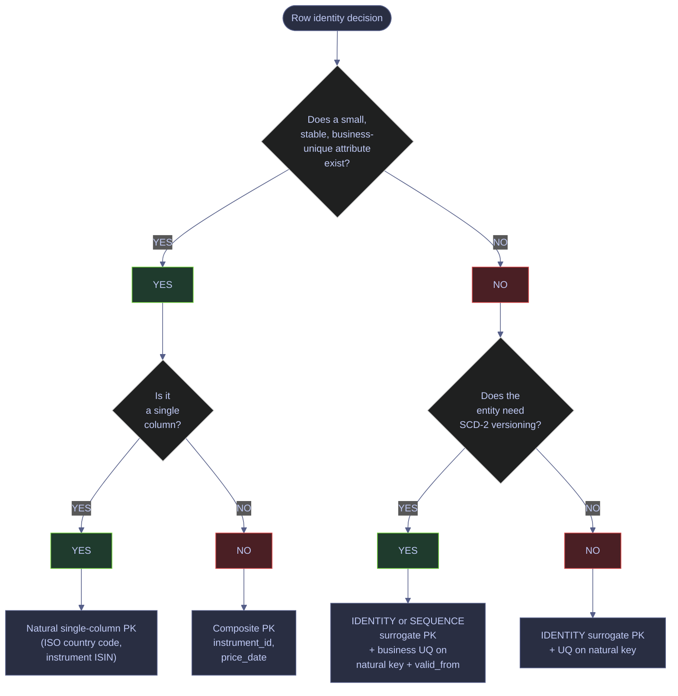
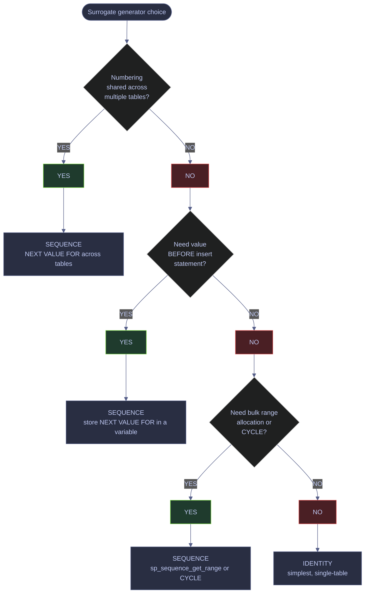

# Keys, Defaults, Identity, and Sequences

> [!abstract]- Summary
>
> This note owns every mechanism SQL Server uses to assign, guarantee, and retrieve row identity: the strategic choice between natural, surrogate, and composite keys; automatic value generation through `IDENTITY`, `SEQUENCE`, `NEWSEQUENTIALID`, and `DEFAULT` constraints; and the operational traps around gap formation, value retrieval, clustered-index fragmentation, and the `rowversion` change token. Every rule is backed by a live demo captured against the local `stoxx` instance.
>
> **Row identity strategy**
> - compares natural, surrogate, and composite keys with the trade-offs each choice makes around width, stability, clustering locality, and downstream joins
>
> **`IDENTITY` behavior**
> - explains how `IDENTITY` behaves under failed inserts, `IDENTITY_INSERT`, `DBCC CHECKIDENT`, `IDENTITY_CACHE`, trace flag 272, and overflow
> - covers the safe retrieval surface for generated values: `SCOPE_IDENTITY()`, `@@IDENTITY`, `IDENT_CURRENT`, and the `OUTPUT` clause
>
> **`SEQUENCE` and defaults**
> - shows how `SEQUENCE` objects, `NEXT VALUE FOR`, and `sp_sequence_get_range` extend numbering beyond one table
> - covers how `DEFAULT` constraints bind `SYSUTCDATETIME`, `NEWID`, `NEWSEQUENTIALID`, and sequence values to columns without application-side logic
>
> **GUIDs and change tokens**
> - explains why `NEWSEQUENTIALID` changes clustered-index fragmentation behavior and what `rowversion` actually does in optimistic concurrency designs
>
> **Operations and safety**
> - Warnings: identity gaps, wrong identity-retrieval functions, random GUID clustering, and misunderstanding `rowversion` all create correctness bugs that surface late
> - Recommendations: choose keys deliberately, retrieve generated values with scope-safe patterns, and separate join identity from business uniqueness

> [!note]- Glossary
>
> **Natural key**
> - A key whose columns come from the business domain itself, such as `(symbol, date)` or `(customer_id, order_id)`.
> - It matters because natural keys often capture the real uniqueness rule even when the table also carries a surrogate identifier.
>
> > [!warning] Business uniqueness still needs enforcement
> >
> > Switching to a surrogate key does not make the domain rule disappear. It only moves the join anchor somewhere else.
>
> ---
>
> **Surrogate key**
> - A generated identifier with no business meaning, often implemented as an integer `IDENTITY`.
> - It matters because surrogate keys simplify joins and foreign-key relationships, but they are not a substitute for business-key integrity.
>
> > [!info] Convenience and semantics are different concerns
> >
> > Surrogate keys are excellent for joins. They do not prove that a row is unique according to the business.
>
> ---
>
> **Composite key**
> - A key made of multiple columns together rather than a single identifier column.
> - It matters because composite keys can express business uniqueness directly, but they change index width, foreign-key shape, and clustering tradeoffs.
>
> > [!warning] Wider keys propagate outward
> >
> > A wide clustered composite key increases the size of every nonclustered index that points back to it. That physical cost needs to be deliberate.
>
> ---
>
> **`IDENTITY`**
> - A column property that generates incrementing numeric values automatically on insert.
> - It matters because it is SQL Server’s most common surrogate-key mechanism and comes with operational behavior around gaps, reseeds, and retrieval.
>
> > [!warning] Gaps are normal
> >
> > Failed inserts, rollbacks, restarts, and caching can all create missing identity values. Sequential does not mean gapless.
>
> ---
>
> **`IDENTITY_INSERT`**
> - The session setting that temporarily allows explicit values to be inserted into an identity column.
> - It matters because repair, migration, and replay workflows sometimes need it, but it changes the normal key-generation contract while active.
>
> > [!warning] One table per session
> >
> > Only one table can have `IDENTITY_INSERT` enabled in a session at a time. Leaving it on carelessly complicates later writes.
>
> ---
>
> **`DBCC CHECKIDENT`**
> - The command used to inspect or reseed an identity value.
> - It matters because reseeding is one of the few direct ways to alter the next generated identity value after repairs or bulk operations.
>
> > [!danger] Reseeding can create collisions
> >
> > Setting the seed below existing values can cause duplicate-key failures or broken relationships on the very next insert.
>
> ---
>
> **`SCOPE_IDENTITY()`**
> - A function that returns the last identity value generated in the current scope.
> - It matters because it is the safest common way to retrieve an identity created by the statement you just executed.
>
> > [!warning] Scope is the safety boundary
> >
> > Functions that ignore scope can return identity values generated by triggers or unrelated activity. That is a correctness bug, not just a style issue.
>
> ---
>
> **`SEQUENCE`**
> - A schema-scoped object that generates numeric values independently of any one table.
> - It matters because sequences are the right abstraction when numbering must be shared, preallocated, or consumed outside one table insert pattern.
>
> > [!info] Sequence numbers are table-agnostic
> >
> > Unlike `IDENTITY`, a sequence can be used across many tables, defaults, or preallocation workflows without being tied to one rowstore object.
>
> ---
>
> **`NEXT VALUE FOR`**
> - The expression that consumes the next value from a sequence object.
> - It matters because it is the bridge between a sequence and the DML or default expression that needs the generated value.
>
> > [!warning] Consumption still advances on failed work
> >
> > Like identity values, consumed sequence numbers are not automatically rolled back into existence if later work fails.
>
> ---
>
> **`DEFAULT` constraint**
> - A column rule that supplies a value when the insert statement omits that column.
> - It matters because defaults let the database own generated timestamps, GUIDs, and sequence assignments instead of trusting every caller to do it correctly.
>
> > [!warning] Defaults fill values, they do not validate intent
> >
> > A default makes omission safe. It does not prove the generated value is the right semantic choice unless the design says so explicitly.
>
> ---
>
> **`NEWSEQUENTIALID`**
> - A function that generates GUID values with increasing locality instead of fully random distribution.
> - It matters because sequential GUIDs reduce page splits and fragmentation compared with `NEWID()` when the GUID is part of the clustered key path.
>
> > [!warning] Sequential is local, not globally ordered history
> >
> > `NEWSEQUENTIALID` helps storage locality. It is not a business timestamp and should not be treated as one.
>
> ---
>
> **`rowversion`**
> - An automatically incremented binary token SQL Server updates whenever a row changes.
> - It matters because `rowversion` is a change-detection and optimistic-concurrency primitive, not a human time value.
>
> > [!warning] It is not a timestamp
> >
> > Despite the historical name, `rowversion` contains no wall-clock meaning. It only tells you that a newer change has happened somewhere in the database.
>
> ---

## Row Identity Strategy

Row identity is the contract the table makes with every consumer — application code, foreign keys, indexes, downstream pipelines — about how to locate exactly one row. The choice between a natural key, a surrogate key, and a composite key determines clustering locality, index width, join cost, and the difficulty of slowly-changing-dimension versioning, so it is the first decision to make when designing a table, not the last.



### Natural keys

A natural key is a column or combination of columns that already identifies the entity in the business domain. It is free (no extra column to allocate, populate, and index), it makes row lookups meaningful when you read the table directly, and it removes one layer of indirection between the data and the user. The price for those advantages is that you now depend on the business domain never to renumber, re-code, or widen that column. In practice that last condition is rarely stable enough for facts or dimensions that live for years.

Use a natural key when the source attribute meets all three of these conditions simultaneously:

- **Truly stable.** The value assigned to an entity today will never be reused, rebranded, or reassigned by the upstream system. Examples: ISO 4217 currency codes, ISO 3166-1 alpha-2 country codes, exchange MIC codes, IANA time zone names.
- **Already enforced by the business domain.** Uniqueness is guaranteed by the issuing authority (ISO, exchange, regulator), so the database does not need to rely on application code to deduplicate.
- **Compact enough to be practical in joins and indexes.** Per the [clustered index design guidelines](https://learn.microsoft.com/sql/relational-databases/sql-server-index-design-guide?view=sql-server-ver17#clustered-index-design-guidelines), clustered key bytes are duplicated into every nonclustered index on the same table, so every extra byte in the PK is multiplied across all indexes. A `char(3)` ISO code is fine. A 120-character natural description is not.

> [!info] Clustered key width cascades into every nonclustered index
>
> SQL Server stores the clustered key in every nonclustered index leaf row as the row locator. A 4-byte `int` clustered key adds 4 bytes per row to every nonclustered index. A 40-byte natural string adds 40 bytes per row. On a 100M-row table with four nonclustered indexes, that is ~14 GB of extra storage plus the corresponding memory, I/O, and logging overhead — without a single extra row of data.

### Surrogate keys

A surrogate key is a meaningless, system-generated value — typically an `int`, `bigint`, or `uniqueidentifier` — introduced purely to give the row a compact, stable identity that the business domain cannot corrupt. It insulates the table from upstream renaming, widens the space for SCD-2 versioning (where one business entity has many row versions), and gives every foreign key a narrow, monotonic target for clustered insert locality.

Use a surrogate key when any of the following holds:

- The business key is **wide or volatile** — long strings, multi-part composites, or values that the upstream provider rewrites periodically.
- The source key **changes over time** — for example when an instrument is renamed, re-listed, or its symbol is reassigned to a different company.
- You need a **compact clustering or foreign-key surface** to keep nonclustered indexes and referencing tables narrow.
- **Slowly changing dimensions** require one business entity to have multiple row versions, so the business key alone cannot be the primary key (many rows share it by design).

### Composite keys

A composite primary key is the natural answer for fact-like and time-series tables where row identity is already multi-column by nature: `(instrument_id, price_date)` for OHLCV, `(order_id, line_number)` for order lines, `(exchange_code, trade_date, ticker)` for trade history. Adding a synthetic `fact_id` surrogate on top of such a table is almost always harmful:

- It widens the table by 4 or 8 bytes per row without giving queries a new access path (every filter in practice still looks up by the composite).
- It forces every nonclustered index to carry an extra column to keep the composite filter covered.
- It breaks the natural sort order of the data, typically making range scans on the business composite non-covering.

The composite PK earns its place by being exactly what an `INSERT` / `MERGE` / `UPSERT` wants to look up on, and by being a monotonic insert target when the leading column is `date` or `datetime`.

Use this demonstration when during initial schema design for a time-series or fact table. It usually becomes relevant when the table's business identity is a small, stable combination (e.g., `(instrument_id, price_date)`). T-SQL DDL against a user database; requires `CREATE TABLE` permission in the target schema; read-only once the table exists. The operational goal is to prove that a composite clustered primary key uniquely identifies and orders every row without introducing a synthetic surrogate.
> [!info]- Composite primary key DDL breakdown
>
> - `CREATE TABLE dbo.race_keys_fact` — creates a fact table in the demo schema.
> - `instrument_id int NOT NULL` and `price_date date NOT NULL` — the two columns that together identify a row. Neither column alone is unique.
> - `close_price decimal(18,4)` and `volume bigint` — payload columns carried along with the identity.
> - `CONSTRAINT PK_race_keys_fact PRIMARY KEY CLUSTERED (instrument_id, price_date)` — names the PK, makes it the clustered index, and declares uniqueness on the ordered pair. Clustering on the composite keeps same-instrument rows physically adjacent on disk, which is exactly what range-scan queries (`WHERE instrument_id = X AND price_date BETWEEN ...`) want.
> - The subsequent `INSERT` inserts five rows that exercise both a single instrument with three dates and a second instrument with two.

*This example creates a composite-keyed fact table and inserts rows that could never be uniquely identified by `instrument_id` or `price_date` alone.*

```sql
CREATE TABLE dbo.race_keys_fact
(
    instrument_id  int           NOT NULL,
    price_date     date          NOT NULL,
    close_price    decimal(18,4) NOT NULL,
    volume         bigint        NOT NULL,
    CONSTRAINT PK_race_keys_fact PRIMARY KEY CLUSTERED (instrument_id, price_date)
);

INSERT INTO dbo.race_keys_fact (instrument_id, price_date, close_price, volume) VALUES
    (1, '2026-04-07', 198.4300, 15234000),
    (1, '2026-04-08', 199.1200, 12981000),
    (1, '2026-04-09', 201.5500, 17450000),
    (2, '2026-04-07',  62.1000, 34120000),
    (2, '2026-04-08',  62.9400, 29830000);

SELECT instrument_id, price_date, close_price, volume
FROM   dbo.race_keys_fact
ORDER BY instrument_id, price_date;
```

```text
| instrument_id | price_date | close_price | volume |
|---|---|---|---|
| 1 | 2026-04-07 | 198.4300 | 15234000 |
| 1 | 2026-04-08 | 199.1200 | 12981000 |
| 1 | 2026-04-09 | 201.5500 | 17450000 |
| 2 | 2026-04-07 | 62.1000  | 34120000 |
| 2 | 2026-04-08 | 62.9400  | 29830000 |
```

Three rows for instrument 1 and two rows for instrument 2 coexist under a single primary key because the pair `(instrument_id, price_date)` is unique. The same `price_date = 2026-04-07` appears under both instruments without collision. A scan filtered by a single instrument is guaranteed to be a contiguous range on the clustered index, which is the I/O pattern fact queries overwhelmingly exhibit.

## IDENTITY Columns

`IDENTITY` is SQL Server's per-table automatic numeric generator. A column declared `IDENTITY(seed, increment)` receives a new value at insert time from a counter maintained by the database engine, without the application having to name the value. One `IDENTITY` column is allowed per table, and its data type must be an integer (`tinyint`, `smallint`, `int`, `bigint`) or a `decimal`/`numeric` with scale 0. The full contract and its limits are documented in the official [CREATE TABLE IDENTITY property page](https://learn.microsoft.com/sql/t-sql/statements/create-table-transact-sql-identity-property?view=sql-server-ver17).

### IDENTITY contract and its known gaps

The only guarantees `IDENTITY` offers are that new values are derived from the current seed and increment, and that concurrent transactions on the same table each receive distinct values. Everything a newcomer might expect is explicitly **not** guaranteed: uniqueness, gap-free numbering, consecutive values within a transaction, consecutive values after a restart, or recycling of values from rolled-back inserts. This is by design — the Microsoft docs warn that if gap-free numbering matters, `IDENTITY` is the wrong tool.

> [!warning] IDENTITY has gaps by design
>
> `IDENTITY` values can jump for several legitimate reasons:
>
> - **Failed inserts.** Any insert that violates a constraint (`PRIMARY KEY`, `UNIQUE`, `CHECK`, `FOREIGN KEY`, `IGNORE_DUP_KEY`) still consumes its identity value. The value is never reused.
> - **Rolled-back transactions.** Identity values issued inside a transaction that is later rolled back are lost forever.
> - **Identity cache preallocation.** Under `IDENTITY_CACHE = ON` (the default in SQL Server 2017+), the engine reserves a block of values in memory. An unplanned shutdown, crash, or Availability Group failover discards the unused part of the block, leading to jumps of 1000+ on `int` columns and 10000+ on `bigint` columns.
> - **Bulk/batch inserts.** As documented on [Microsoft Q&A](https://learn.microsoft.com/answers/a/12700444), a failed bulk insert can consume a very large identity range without inserting any rows.

> [!success] Use SEQUENCE with NO CACHE when numbering must be gap-free
>
> If the application genuinely needs contiguous numbering (regulatory invoice sequences, audit trails that must not be scrutinisable as "row X is missing"), do not use `IDENTITY`. Use a `SEQUENCE` with `NO CACHE`, or better, externalise the numbering entirely to an application-managed counter protected by its own transaction. Even then, `sp_sequence_get_range` and `NEXT VALUE FOR` still produce gaps under rollback — the only truly gap-free solution is to serialize allocation with `sp_getapplock` or a dedicated counter table.

> [!info] Controlling the IDENTITY cache
>
> SQL Server 2017 (14.x) and later expose [`IDENTITY_CACHE`](https://learn.microsoft.com/sql/t-sql/statements/alter-database-scoped-configuration-transact-sql?view=sql-server-ver17#identity_cache---on--off-) as a database-scoped configuration that disables the in-memory preallocation, shrinking post-crash jumps to at most the increment. Before 2017 the same behaviour was available only globally via [trace flag 272](https://learn.microsoft.com/sql/t-sql/database-console-commands/dbcc-traceon-trace-flags-transact-sql?view=sql-server-ver17#tf272). Always prefer the database-scoped setting on SQL Server 2017 and later:
>
> - Setting: `ALTER DATABASE SCOPED CONFIGURATION SET IDENTITY_CACHE = OFF;`
> - Scope: per database, takes effect immediately on the primary replica.
> - Cost: a small insert-time write to system tables per identity block, versus the larger cost of unexplained gaps.

#### Declare an IDENTITY surrogate with a business UQ

During initial schema design of a dimension or master-data table that needs a compact foreign-key target and also has a real business key. It is typically triggered by you have chosen `IDENTITY` over `SEQUENCE` because numbering stays inside one table and you do not need pre-insert values. T-SQL DDL in the target database. Requires `CREATE TABLE` permission. State-changing but fully reversible by `DROP TABLE`. Make the surrogate the clustered PK and enforce business uniqueness separately so `IDENTITY` cannot silently produce duplicate business rows.

> [!info]- IDENTITY surrogate DDL breakdown
>
> - `instrument_id int IDENTITY(1,1) NOT NULL` — an automatic counter starting at 1 and incrementing by 1. The column is marked `NOT NULL` because the engine is responsible for producing a value.
> - `CONSTRAINT PK_race_keys_instrument PRIMARY KEY CLUSTERED (instrument_id)` — makes the surrogate the clustered key. Narrow (4 bytes), monotonic, and unique, which is ideal for the clustered index per the Microsoft clustered index design guidelines.
> - `CONSTRAINT UQ_race_keys_instrument_symbol_valid_from UNIQUE (symbol, valid_from)` — the business unique key. `IDENTITY` does not enforce uniqueness on *anything* — the UQ constraint is what stops the same `(symbol, valid_from)` pair from being inserted twice.
> - `valid_from` / `valid_to` / `is_current` — SCD-2 versioning columns. Without the surrogate, the PK would have to be `(symbol, valid_from)`, which is both wider and harder to reference from fact tables.

*This example creates a surrogate-key IDENTITY column and enforces business uniqueness through a separate UNIQUE constraint.*

```sql
CREATE TABLE dbo.race_keys_instrument
(
    instrument_id  int IDENTITY(1,1) NOT NULL,
    symbol         varchar(32)       NOT NULL,
    valid_from     datetime2(3)      NOT NULL,
    valid_to       datetime2(3)      NOT NULL,
    is_current     bit               NOT NULL,
    CONSTRAINT PK_race_keys_instrument PRIMARY KEY CLUSTERED (instrument_id),
    CONSTRAINT UQ_race_keys_instrument_symbol_valid_from UNIQUE (symbol, valid_from)
);

SELECT name, object_id, is_identity
FROM   sys.columns
WHERE  object_id = OBJECT_ID('dbo.race_keys_instrument')
ORDER BY column_id;
```

```text
| name | object_id | is_identity |
|---|---|---|
| instrument_id | 199671759 | True |
| symbol | 199671759 | False |
| valid_from | 199671759 | False |
| valid_to | 199671759 | False |
| is_current | 199671759 | False |
```

Exactly one column is flagged `is_identity = True` — SQL Server enforces the "one identity column per table" rule silently via metadata. The fact that `is_identity` is a `sys.columns` attribute (not a separate system table) means the identity property travels with the column definition through DDL changes.

#### Inspect IDENTITY metadata via sys.identity_columns

Whenever you need to know the seed, increment, or last value a table's identity column has issued, without actually scanning the table. It is typically triggered by post-DDL verification, pre-migration audit, or reseed planning. Read-only T-SQL query against the catalog view [`sys.identity_columns`](https://learn.microsoft.com/sql/relational-databases/system-catalog-views/sys-identity-columns-transact-sql?view=sql-server-ver17). Confirm that the identity column is declared with the expected seed/increment and read the engine's record of the last value it handed out.

| Field | Source column | Type | Meaning |
|---|---|---|---|
| `schema_name` | `OBJECT_SCHEMA_NAME(c.object_id)` | `sysname` | Schema containing the parent table. |
| `table_name` | `OBJECT_NAME(c.object_id)` | `sysname` | Parent table name. |
| `column_name` | `sys.identity_columns.name` | `sysname` | The identity column itself. |
| `seed_value` | `sys.identity_columns.seed_value` | `sql_variant` (cast to `bigint` here) | Starting value declared at `CREATE TABLE` / `ALTER TABLE`. |
| `increment_value` | `sys.identity_columns.increment_value` | `sql_variant` (cast to `bigint`) | Step size per insert. |
| `last_value` | `sys.identity_columns.last_value` | `sql_variant` (cast to `bigint`) | The most recent value the engine has issued. `NULL` until the first successful insert after table creation. |
| `is_not_for_replication` | `sys.identity_columns.is_not_for_replication` | `bit` | `1` when the identity is declared `NOT FOR REPLICATION` so replication agents bypass the generator. |

*This query inspects the engine's record of the newly created table's identity column.*

```sql
SELECT  OBJECT_SCHEMA_NAME(c.object_id) AS schema_name,
        OBJECT_NAME(c.object_id)        AS table_name,
        c.name                          AS column_name,
        CAST(c.seed_value      AS bigint) AS seed_value,
        CAST(c.increment_value AS bigint) AS increment_value,
        CAST(c.last_value      AS bigint) AS last_value,
        c.is_not_for_replication
FROM    sys.identity_columns c
WHERE   c.object_id = OBJECT_ID('dbo.race_keys_instrument');
```

```text
| schema_name | table_name | column_name | seed_value | increment_value | last_value | is_not_for_replication |
|---|---|---|---|---|---|---|
| dbo | race_keys_instrument | instrument_id | 1 | 1 | NULL | False |
```

`last_value = NULL` confirms no rows have been inserted yet — the engine allocates the first value only on the first successful insert, and the catalog column stays `NULL` until then. `seed_value = 1` and `increment_value = 1` match the `IDENTITY(1,1)` declaration. The next successful insert will set `last_value = 1`.

### Retrieving the generated value

A client that inserts a row usually needs the new identity value back so it can populate foreign keys, build URLs, or return it to the caller. SQL Server ships three scalar functions and one set-based clause for retrieval, and they are **not** interchangeable. The [ADO.NET "Retrieve identity or autonumber values" page](https://learn.microsoft.com/sql/connect/ado-net/retrieve-identity-or-autonumber-values?view=sql-server-ver17) summarises the scalar functions in one table; the table below consolidates that with the `OUTPUT` clause for a single operational reference.

| Mechanism | Scope | Correct for... | Broken by... |
|---|---|---|---|
| `SCOPE_IDENTITY()` | Last identity generated in the **current session AND current scope**. | Single-row inserts where the code that reads the value is in the same batch/proc as the insert. | Returns `NULL` if no insert happened in scope. |
| `@@IDENTITY` | Last identity generated in the **current session, any scope**. | **Nothing you should write today.** Kept for backwards compatibility. | Triggers that insert into other identity tables poison the return value. |
| `IDENT_CURRENT('schema.table')` | Last identity generated for a **specific table in any session and any scope**. | Diagnostics, monitoring ("what is the identity watermark right now?"), never for INSERT correctness. | Racy — another session may have inserted between your call and your own insert. |
| `OUTPUT INSERTED.<column>` | Set-based, per-statement; returns rows. | Multi-row inserts, `MERGE`, audit trails, capturing multiple generated columns at once. | Restrictions listed on the [OUTPUT clause page](https://learn.microsoft.com/sql/t-sql/queries/output-clause-transact-sql?view=sql-server-ver17#remarks) when piping into another `INSERT`. |

#### Retrieve a single-row insert with SCOPE_IDENTITY

In application code or stored procedures that insert one row and need the generated surrogate immediately. It is typically triggered by any INSERT whose generated identity becomes a foreign key or return value. T-SQL executed inside the same batch, stored procedure, or user-defined function as the INSERT. State-changing (the insert itself). Read-only for the retrieval function call. Obtain the exact identity value generated by the last INSERT in the current scope, immune to triggers that write to other identity tables.

> [!info]- SCOPE_IDENTITY vs @@IDENTITY vs IDENT_CURRENT in one query
>
> Calling all three functions immediately after the INSERT makes the scope differences visible:
>
> - `SCOPE_IDENTITY()` — the value of the insert you just ran, unaffected by triggers.
> - `@@IDENTITY` — the value of whichever identity column was last touched in the session, including by triggers firing on the INSERT. Per the [SCOPE_IDENTITY remarks](https://learn.microsoft.com/sql/t-sql/functions/scope-identity-transact-sql?view=sql-server-ver17#remarks), if T1 has a trigger that inserts into T2, and both have identity columns, `@@IDENTITY` after an insert on T1 returns the T2 value and `SCOPE_IDENTITY()` returns the T1 value.
> - `IDENT_CURRENT('schema.table')` — the last value for that specific table across any session. On a quiet test run it agrees with the scope value, but on a busy system another session's insert could shift the answer between statements.

*This example inserts one row and retrieves the generated identity through all three scalar functions side by side.*

```sql
INSERT INTO dbo.race_keys_instrument (symbol, valid_from, valid_to, is_current)
VALUES ('AAPL', '2026-01-01', '9999-12-31', 1);

SELECT SCOPE_IDENTITY() AS last_scope_identity,
       @@IDENTITY       AS last_session_identity,
       IDENT_CURRENT('dbo.race_keys_instrument') AS table_current_identity;
```

```text
| last_scope_identity | last_session_identity | table_current_identity |
|---|---|---|
| 1 | 1 | 1 |
```

On an empty, trigger-free table the three functions agree. The differences become visible only under triggers or concurrent load; the table above is only useful for teaching the call pattern. In production code always use `SCOPE_IDENTITY()` for single-row retrieval — even if there are no triggers today, adding one later must not silently corrupt existing identity reads.

> [!danger] @@IDENTITY crosses scopes and breaks under triggers
>
> Any trigger that writes to a different identity-bearing table in response to an insert will make `@@IDENTITY` return the trigger's generated value, not the one the calling code expects. This is a silent, data-corrupting bug: the calling code stores a foreign key that points to an unrelated table's row. The Microsoft docs explicitly recommend replacing `@@IDENTITY` with `SCOPE_IDENTITY()` for exactly this reason.

> [!success] Default to SCOPE_IDENTITY() or OUTPUT INSERTED
>
> - **Single-row inserts**: call `SCOPE_IDENTITY()` in the same batch. It is scope-aware and immune to triggers.
> - **Multi-row inserts, MERGE, audit trails**: use `OUTPUT INSERTED.<column>` — it is set-based, returns every new row's identity, and still works inside triggers.
> - **Diagnostics only**: `IDENT_CURRENT` answers "what is the watermark on table X right now" without touching the table. Never use it to predict the next value.

#### Retrieve a multi-row insert with OUTPUT INSERTED

Whenever an INSERT produces more than one row and the caller needs every generated identity back. It is typically triggered by batch loads, server-side `SELECT INTO` replacements, data copies with SCD-2 versioning. T-SQL INSERT with an `OUTPUT` clause. State-changing (the insert itself); `OUTPUT INSERTED.*` streams a live result set back through the same cursor. Return every inserted row's generated identity in a single round-trip, without a follow-up SELECT that would re-read the rows.

> [!info]- OUTPUT clause semantics
>
> The `OUTPUT` clause ([Microsoft docs](https://learn.microsoft.com/sql/t-sql/queries/output-clause-transact-sql?view=sql-server-ver17)) gives you a row-level view of the change a DML statement made. For an INSERT, the `INSERTED` pseudo-table contains the post-insert row for each row added. Selecting `INSERTED.instrument_id` returns the identity value the engine generated for that specific row. For UPDATE it exposes both `DELETED` (before) and `INSERTED` (after). For DELETE only `DELETED` is meaningful. Because `OUTPUT` returns one row per affected row, it is the only pattern that scales to multi-row inserts without a follow-up SELECT.

*This example inserts three rows and returns their generated identity values in one statement.*

```sql
INSERT INTO dbo.race_keys_instrument (symbol, valid_from, valid_to, is_current)
OUTPUT  INSERTED.instrument_id, INSERTED.symbol, INSERTED.valid_from
VALUES  ('MSFT', '2026-01-01', '9999-12-31', 1),
        ('NVDA', '2026-01-01', '9999-12-31', 1),
        ('AMZN', '2026-01-01', '9999-12-31', 1);
```

```text
| instrument_id | symbol | valid_from |
|---|---|---|
| 2 | MSFT | 2026-01-01 00:00:00 |
| 3 | NVDA | 2026-01-01 00:00:00 |
| 4 | AMZN | 2026-01-01 00:00:00 |
```

The three identity values `2, 3, 4` follow the previous `1` and were assigned atomically by the engine. No follow-up SELECT is needed — the application can consume the result set directly from the INSERT. `SCOPE_IDENTITY()` after this statement would return only `4` (the last value issued), which is why `OUTPUT INSERTED` is the correct multi-row retrieval pattern.

### Observing and repairing gaps

Real workloads produce gaps. The only useful question is how to detect them, whether they matter for the workload, and how to reseed the counter if you later decide that a specific gap should be closed.

#### Reproduce an IDENTITY gap from a failed insert

When teaching or validating the "gaps by design" contract, especially before a code review where the proposer expects gap-free numbering. It is typically triggered by any insert that can fail a constraint and retry — the failed attempt still burns an identity value. T-SQL executed against a table with at least one uniqueness constraint. State-changing (consumes an identity value even on failure). Demonstrate the exact sequence in which SQL Server allocates and discards identity values under a constraint violation, so the reader stops being surprised when production data shows gaps.

> [!info]- Why the failed INSERT still advances the counter
>
> SQL Server reserves the next identity value *before* it begins the insert's physical work, so that concurrent inserts each receive a distinct value. If the insert then fails a constraint (`UNIQUE`, `CHECK`, `FOREIGN KEY`) or is rolled back, the reservation is not undone. This is the same trade-off that enables cached-block allocation: correctness under concurrency is paid for in possible gaps under failure. The Microsoft docs make this explicit: "The identity value is never rolled back even though the transaction that tried to insert the value into the table is not committed."

*This example deliberately violates the UQ constraint so the reader can observe the identity value disappearing into a gap.*

```sql
BEGIN TRY
    INSERT INTO dbo.race_keys_instrument (symbol, valid_from, valid_to, is_current)
    VALUES ('AAPL', '2026-01-01', '9999-12-31', 1);
END TRY
BEGIN CATCH
    /* swallow - we want to keep going */
END CATCH;

INSERT INTO dbo.race_keys_instrument (symbol, valid_from, valid_to, is_current)
VALUES ('GOOGL', '2026-01-01', '9999-12-31', 1);

SELECT instrument_id, symbol
FROM   dbo.race_keys_instrument
ORDER BY instrument_id;
```

```text
| instrument_id | symbol |
|---|---|
| 1 | AAPL |
| 2 | MSFT |
| 3 | NVDA |
| 4 | AMZN |
| 6 | GOOGL |
```

The identity value `5` is missing. It was reserved for the rejected `AAPL` duplicate (which failed `UQ_race_keys_instrument_symbol_valid_from`), then discarded. The subsequent successful `GOOGL` insert was assigned `6`. This is exactly the gap pattern that appears in production whenever retry logic, bulk loads, or constraint conflicts run through an identity table. It is not a bug to report.

#### Audit the current identity watermark with DBCC CHECKIDENT

After large delete or load operations, before migrations, or when diagnosing whether the engine's counter and the physical `MAX()` agree. It is typically triggered by suspicion of drift between `sys.identity_columns.last_value` and `MAX(identity_col)` (e.g., after a manual row deletion that bypassed the table). T-SQL command [`DBCC CHECKIDENT`](https://learn.microsoft.com/sql/t-sql/database-console-commands/dbcc-checkident-transact-sql?view=sql-server-ver17). With `NORESEED` it is read-only; with `RESEED` it writes to the counter. Requires `db_owner` or ownership of the table. Report the engine's current identity and the actual `MAX()` side by side so the operator can decide whether to leave them alone or reseed.

> [!info]- DBCC CHECKIDENT modes
>
> - `DBCC CHECKIDENT ('table', NORESEED)` — prints current identity value and current `MAX()`, does not modify anything. Safe to run on production.
> - `DBCC CHECKIDENT ('table')` or `DBCC CHECKIDENT ('table', RESEED)` — if the current identity is **less than** the max, resets it to the max. If the current is already at or above the max, does nothing. Almost never what you want — the normal expectation is the opposite direction.
> - `DBCC CHECKIDENT ('table', RESEED, new_value)` — unconditionally sets the counter to `new_value`. Dangerous: setting the value below existing data causes future inserts to collide with existing rows (error 2627).

*This example audits the identity watermark without modifying it.*

```sql
DBCC CHECKIDENT ('dbo.race_keys_instrument', NORESEED) WITH NO_INFOMSGS;
SELECT IDENT_CURRENT('dbo.race_keys_instrument') AS current_identity,
       (SELECT MAX(instrument_id) FROM dbo.race_keys_instrument) AS max_in_table;
```

```text
| current_identity | max_in_table |
|---|---|
| 6 | 6 |
```

The engine's counter (`6`) and the physical maximum (`6`) match, which means the next insert will start at `7`. The missing `5` is a gap in the issued range, not a mismatch between the counter and the table. `DBCC CHECKIDENT ... RESEED` would not do anything here because the counter is already at the max. Reseeding would only be meaningful if the counter had drifted *below* the max — the common case when someone ran `SET IDENTITY_INSERT` to load a value beyond the current counter.

#### Override the counter with IDENTITY_INSERT

Exactly once per session, during a controlled migration or backfill, when specific identity values must be preserved (for example, copying rows from a staging table into its production sibling while keeping the PKs). It is typically triggered by data migration, disaster recovery from an export, or merging partitioned tables. T-SQL `SET IDENTITY_INSERT dbo.table ON;` — session-scoped, only one table at a time. Requires `ALTER` permission on the table. State-changing and trap-prone. Bypass the automatic generator for one or more explicit `INSERT` statements so specific values can be written into the identity column.

> [!warning] IDENTITY_INSERT is session-scoped and does not reseed the counter
>
> Leaving `IDENTITY_INSERT` ON at the end of a session blocks every subsequent insert into that table with error 544 until it is turned OFF. And inserting a value above the current counter does **not** advance it — the next auto-generated insert may collide with the explicit value unless you also run `DBCC CHECKIDENT ... RESEED`.

> [!success] Wrap IDENTITY_INSERT in a TRY...FINALLY pattern
>
> - Turn it ON.
> - Run the explicit inserts.
> - Turn it OFF in the same batch, even on error.
> - Run `DBCC CHECKIDENT (..., RESEED, <new_max>)` afterwards if the explicit values exceeded the previous counter, otherwise the next auto-insert will attempt to reuse a value that is already in the table and fail with error 2627.

*This example writes an explicit identity value into the table.*

```sql
SET IDENTITY_INSERT dbo.race_keys_instrument ON;

INSERT INTO dbo.race_keys_instrument (instrument_id, symbol, valid_from, valid_to, is_current)
VALUES (100, 'META', '2026-01-01', '9999-12-31', 1);

SET IDENTITY_INSERT dbo.race_keys_instrument OFF;

SELECT instrument_id, symbol
FROM   dbo.race_keys_instrument
WHERE  instrument_id >= 100
ORDER BY instrument_id;
```

```text
| instrument_id | symbol |
|---|---|
| 100 | META |
```

The row is now present at `instrument_id = 100`, jumping over all the intermediate values. Because `100` is above the previous counter (`6`), the engine reseeded automatically — SQL Server detects the override and advances the internal counter past the inserted value, so the next auto-insert will produce `101`.

*This follow-up insert confirms the counter advanced past the override value.*

```sql
INSERT INTO dbo.race_keys_instrument (symbol, valid_from, valid_to, is_current)
VALUES ('TSLA', '2026-01-01', '9999-12-31', 1);

SELECT TOP 5 instrument_id, symbol
FROM dbo.race_keys_instrument
ORDER BY instrument_id DESC;
```

```text
| instrument_id | symbol |
|---|---|
| 101 | TSLA |
| 100 | META |
| 6 | GOOGL |
| 4 | AMZN |
| 3 | NVDA |
```

The next auto-generated value is `101`, exactly one step above the explicit `100`. Notice the enormous gap from `6` to `100` in the middle of the table — legitimate, but guaranteed by the combination of the failed insert (loss of `5`) and the `IDENTITY_INSERT` override (skip of `7..99`). Anyone auditing the table who expects contiguous values will be puzzled; anyone who understands the `IDENTITY` contract will not.

### Detecting IDENTITY overflow before it hits production

A 4-byte `int` identity exhausts at 2,147,483,647. High-throughput fact tables reach that watermark in a few years under sustained load. The time to detect exhaustion is **before** the next insert fails with error 8115 (arithmetic overflow) — at that point all writes are blocked until the column is migrated to `bigint` or the counter is reseeded into the negative range, both of which are invasive online operations.

#### Report IDENTITY column utilization

On a scheduled interval (monthly or quarterly) across every identity column in the database, as part of a standing capacity check. It is typically triggered by drift report, capacity review, before any project that expects to multiply insert volume on an identity-bearing table. Read-only T-SQL query that joins `sys.identity_columns` to `sys.types` to translate the data type into a maximum value, then computes utilization. Produce a per-identity-column percent-consumed figure so the DBA can see every table approaching exhaustion in one glance.

| Field | Source column | Type | Meaning |
|---|---|---|---|
| `schema_name` / `table_name` / `column_name` | `sys.identity_columns` metadata | `sysname` | Locate the identity column. |
| `data_type` | `sys.types.name` | `sysname` | The integer type backing the counter. |
| `last_value` | `sys.identity_columns.last_value` | `bigint` (cast) | Most recent issued value; `NULL` until first insert. |
| `type_max_value` | computed from data type | `bigint` | Absolute upper bound given the column's type. |
| `pct_consumed` | `last_value * 100.0 / type_max_value` | `decimal(9,6)` | Fraction of the numeric space already burned. |

*This query reports how much of each identity column's numeric space has been consumed.*

```sql
SELECT  OBJECT_SCHEMA_NAME(c.object_id) AS schema_name,
        OBJECT_NAME(c.object_id)        AS table_name,
        c.name                          AS column_name,
        t.name                          AS data_type,
        CAST(c.last_value AS bigint)    AS last_value,
        CASE t.name
            WHEN 'tinyint'  THEN CAST(255                     AS bigint)
            WHEN 'smallint' THEN CAST(32767                   AS bigint)
            WHEN 'int'      THEN CAST(2147483647              AS bigint)
            WHEN 'bigint'   THEN CAST(9223372036854775807     AS bigint)
        END AS type_max_value,
        CAST(
            CAST(c.last_value AS bigint) * 100.0 /
            CASE t.name
                WHEN 'tinyint'  THEN 255
                WHEN 'smallint' THEN 32767
                WHEN 'int'      THEN 2147483647
                WHEN 'bigint'   THEN 9223372036854775807
            END
        AS decimal(9,6)) AS pct_consumed
FROM    sys.identity_columns c
JOIN    sys.types t ON t.user_type_id = c.user_type_id
WHERE   c.object_id = OBJECT_ID('dbo.race_keys_instrument');
```

```text
| schema_name | table_name | column_name | data_type | last_value | type_max_value | pct_consumed |
|---|---|---|---|---|---|---|
| dbo | race_keys_instrument | instrument_id | int | 101 | 2147483647 | 0.000005 |
```

`pct_consumed` of `0.000005` is essentially zero — expected on a test table. In production the interesting rows are the ones climbing past single digits. A useful operational rule of thumb:

| `pct_consumed` | Watch | Meaning | Implication |
|---|---|---|---|
| `< 1` | Green | Years of headroom | No action. |
| `1 – 25` | Green | Healthy growth | Track month-over-month delta. |
| `25 – 50` | Amber | Half the space consumed | Schedule a bigint migration for the next quiet window. |
| `50 – 80` | Red | Exhaustion risk real | Plan the migration now; pick the downtime slot. |
| `> 80` | Critical | Exhaustion imminent | Stop the bleeding: disable auto-retry loops, migrate to `bigint`, or reseed into the negative range as a temporary measure. |

### IDENTITY operations reference

| Operation | Syntax | Scope | Notes |
|---|---|---|---|
| Declare counter | `IDENTITY(seed, increment)` on a single column per table. Memory-optimized tables require `IDENTITY(1,1)`. | DDL time | The seed is the first value issued, not the value stored in the counter before the first insert. |
| Override one row | `SET IDENTITY_INSERT dbo.table ON; ... OFF;` | Session | One table at a time. Clear OFF before end of session. |
| Audit counter | `DBCC CHECKIDENT ('table', NORESEED)` | Read-only | Prints current and `MAX()` without modifying. |
| Reseed to max | `DBCC CHECKIDENT ('table', RESEED)` | State-changing | Only moves the counter **up** to the current max. Does not reduce. |
| Force reseed | `DBCC CHECKIDENT ('table', RESEED, new_value)` | State-changing | Setting below existing rows causes PK collisions. |
| Disable cache | `ALTER DATABASE SCOPED CONFIGURATION SET IDENTITY_CACHE = OFF;` | Database | Replaces trace flag 272 from SQL Server 2017 onwards. |
| Disable globally | `DBCC TRACEON(272, -1);` | Server (legacy) | Pre-2017 only. Use the database-scoped option instead. |
| Inspect | `SELECT * FROM sys.identity_columns WHERE object_id = OBJECT_ID('...')` | Read-only | Returns `seed_value`, `increment_value`, `last_value`. |
| Introspect last issued | `IDENT_CURRENT('schema.table')` | Read-only | Session-independent; see earlier warning about race conditions. |

## SEQUENCE Objects

A `SEQUENCE` is a schema-bound, table-independent numeric generator introduced in SQL Server 2012. Unlike `IDENTITY`, which is welded to a column on a table, a sequence lives on its own inside a schema. Any statement that needs a new value asks for it via `NEXT VALUE FOR`, regardless of whether the value ends up in a row, a variable, a `PRINT` statement, or is never used at all. The full contract is documented in [CREATE SEQUENCE](https://learn.microsoft.com/sql/t-sql/statements/create-sequence-transact-sql?view=sql-server-ver17) and the operational overview page [Sequence numbers](https://learn.microsoft.com/sql/relational-databases/sequence-numbers/sequence-numbers?view=sql-server-ver17).



### When to use SEQUENCE instead of IDENTITY

Per the [Microsoft "Use sequences" guidance](https://learn.microsoft.com/sql/relational-databases/sequence-numbers/sequence-numbers?view=sql-server-ver17#use-sequences), the scenarios that justify SEQUENCE over IDENTITY are:

- **Pre-insert value.** The application needs the number *before* the INSERT runs — for example, to build a URL, return it to a UI, or embed it in a message before persisting the row.
- **Cross-table numbering.** A single series is shared by multiple tables (e.g., `pipeline_run`, `job_execution`, `stage_execution` all drawing from one `run_id_seq`).
- **Restart / cycle.** Numbering must loop back to the start after exhaustion (ticket-number reuse, slot allocation).
- **Ordered generation by another field.** `NEXT VALUE FOR seq OVER (ORDER BY col)` yields values in row order instead of insertion order.
- **Bulk range allocation.** [`sp_sequence_get_range`](https://learn.microsoft.com/sql/relational-databases/system-stored-procedures/sp-sequence-get-range-transact-sql?view=sql-server-ver17) reserves a contiguous block for a single caller in one call, which is far faster than N round-trips for N values.
- **Mutable specification.** The increment, bounds, or cache size may need to change after the sequence has been in use. `ALTER SEQUENCE` changes them online; `ALTER TABLE` cannot change an identity column's seed/increment without dropping and re-adding it.

### Creating a SEQUENCE

#### Create a cached bigint sequence with explicit bounds

During initial schema design of the schema that owns cross-table numbering. It is typically triggered by a decision to externalise numbering from the tables. T-SQL DDL (`CREATE SEQUENCE`). Requires `CREATE SEQUENCE` permission on the schema. State-changing (creates a schema object; the first `NEXT VALUE FOR` call allocates its first cache block). Create a reusable number generator with explicit data type, start, step, bounds, non-cycling behaviour, and a cache size tuned to the workload.

> [!info]- CREATE SEQUENCE option breakdown
>
> - `AS bigint` — the backing integer type. Defaults to `bigint` if omitted. `int` is sufficient for most workloads but eliminates the 2.1B ceiling that `IDENTITY int` columns have, which is one of the operational reasons to pick SEQUENCE in the first place.
> - `START WITH 1000` — the first value the sequence will issue. Optional; defaults to the data type's `MINVALUE`.
> - `INCREMENT BY 1` — step size per call. Must be non-zero. Negative values produce a descending sequence.
> - `MINVALUE 1000` / `MAXVALUE 9999999` — explicit bounds. Without them the sequence uses the data type's full range.
> - `NO CYCLE` — the sequence raises an error when it exceeds `MAXVALUE` instead of wrapping back to `MINVALUE`. `CYCLE` wraps without error (useful for ticket slots, harmful for primary keys).
> - `CACHE 50` — the engine pre-allocates blocks of 50 values in memory per round-trip to system tables. The inputs to this decision are **insert rate** and **tolerable gap magnitude on crash**. At low throughput (< 100 inserts/day), `CACHE 10` or even `NO CACHE` is adequate — the system-table write cost is invisible. At moderate throughput (100–10,000 inserts/second), `CACHE 50` balances write reduction against a maximum 50-value gap per unexpected shutdown. At high throughput (10,000+ inserts/second), `CACHE 500` or `CACHE 1000` reduces system-table contention measurably. The demo uses `CACHE 50` for `dbo.race_keys_seq` because the stoxx workload is lab-scale with infrequent inserts — the value is large enough to avoid per-call I/O but small enough that a gap of ≤ 50 on crash is negligible. **Feedback signal:** if `sys.dm_exec_requests` shows waits on `PREEMPTIVE_OS_WRITEFILEGATHER` or `WRITELOG` correlated with `NEXT VALUE FOR` calls, the cache is too small — double it. If audit requirements flag unacceptable gaps after a failover, reduce the cache or switch to `NO CACHE`. See the danger callout below.

> [!danger] SEQUENCE CACHE loses unused numbers on crash
>
> When a sequence is declared with `CACHE n`, the engine persists only the *end* of the cached block to the system tables. If the instance crashes or fails over before the block is fully consumed, the unused tail of the block is lost forever. A `CACHE 100` sequence can jump forward by up to 100 on every unexpected shutdown. The loss is by design and documented on the [CREATE SEQUENCE remarks page](https://learn.microsoft.com/sql/t-sql/statements/create-sequence-transact-sql?view=sql-server-ver17#remarks).

> [!success] Use NO CACHE when contiguous numbering matters
>
> `NO CACHE` writes every issued value to the system table immediately, so a crash loses at most the single value mid-transaction. The cost is one system-table write per `NEXT VALUE FOR` call. For workloads that need audit-grade numbering (invoice IDs, regulatory sequences), the write cost is acceptable. For high-throughput surrogate keys, stick with a reasonable `CACHE` size and accept the occasional jump.

*This example creates the cross-table sequence used by the rest of the section.*

```sql
CREATE SEQUENCE dbo.race_keys_seq
    AS bigint
    START WITH 1000
    INCREMENT BY 1
    MINVALUE 1000
    MAXVALUE 9999999
    NO CYCLE
    CACHE 50;
```

#### Inspect SEQUENCE metadata via sys.sequences

After creating or altering a sequence, and whenever you need to know its current/last-used values without consuming a number. It is typically triggered by post-DDL audit, pre-migration inventory, or diagnosing an `is_exhausted` condition. Read-only query against the catalog view [`sys.sequences`](https://learn.microsoft.com/sql/relational-databases/system-catalog-views/sys-sequences-transact-sql?view=sql-server-ver17). Read every declared property and the current state of the generator in one row.

| Field | Source column | Type | Meaning |
|---|---|---|---|
| `sequence_name` | `sys.sequences.name` | `sysname` | Name of the sequence object. |
| `schema_name` | `SCHEMA_NAME(schema_id)` | `sysname` | Owning schema. |
| `data_type` | `sys.types.name` | `sysname` | Backing integer type. |
| `start_value` | `sys.sequences.start_value` | `sql_variant` → `bigint` | The `START WITH` value from DDL. |
| `increment` | `sys.sequences.increment` | `sql_variant` → `bigint` | Step per `NEXT VALUE FOR` call. |
| `minimum_value` / `maximum_value` | `sys.sequences.minimum_value` / `.maximum_value` | `sql_variant` → `bigint` | Declared bounds. |
| `is_cycling` | `sys.sequences.is_cycling` | `bit` | `1` when `CYCLE` is set. |
| `is_cached` | `sys.sequences.is_cached` | `bit` | `1` when `CACHE` is in effect (even with default cache size). |
| `cache_size` | `sys.sequences.cache_size` | `int` | Number of values cached in memory per round-trip. |
| `current_value` | `sys.sequences.current_value` | `sql_variant` → `bigint` | Last value **obligated** (returned by `NEXT VALUE FOR` or `sp_sequence_get_range`). Before first use, equals `START WITH`. |
| `last_used_value` | `sys.sequences.last_used_value` | `sql_variant` → `bigint` | Last value actually returned to a caller. `NULL` before first use. SQL Server 2017+. |
| `is_exhausted` | `sys.sequences.is_exhausted` | `bit` | `1` when non-cycling sequence has reached `MAXVALUE` — subsequent `NEXT VALUE FOR` raises error 11728. |

*This query reads the engine's record of the sequence right after creation.*

```sql
SELECT  s.name                                         AS sequence_name,
        SCHEMA_NAME(s.schema_id)                       AS schema_name,
        t.name                                         AS data_type,
        CAST(s.start_value      AS bigint)             AS start_value,
        CAST(s.increment        AS bigint)             AS increment,
        CAST(s.minimum_value    AS bigint)             AS minimum_value,
        CAST(s.maximum_value    AS bigint)             AS maximum_value,
        s.is_cycling,
        s.is_cached,
        s.cache_size,
        CAST(s.current_value    AS bigint)             AS current_value,
        CAST(s.last_used_value  AS bigint)             AS last_used_value,
        s.is_exhausted
FROM    sys.sequences s
JOIN    sys.types t ON t.user_type_id = s.user_type_id
WHERE   s.name = 'race_keys_seq';
```

```text
| sequence_name | schema_name | data_type | start_value | increment | minimum_value | maximum_value | is_cycling | is_cached | cache_size | current_value | last_used_value | is_exhausted |
|---|---|---|---|---|---|---|---|---|---|---|---|---|
| race_keys_seq | dbo | bigint | 1000 | 1 | 1000 | 9999999 | False | True | 50 | 1000 | NULL | False |
```

`current_value` shows `1000` — the engine reports the last obligated value, but since no `NEXT VALUE FOR` has been called yet, it still holds the `START WITH` value. `last_used_value` is `NULL` — this column (added in SQL Server 2017) only populates after the first consumption. `cache_size = 50` matches the DDL. Once `NEXT VALUE FOR` is called, the engine obligates the first 50 values in one system-table write, updates `current_value` to `1049`, and hands out `1000` from the in-memory cache.

### Consuming a SEQUENCE

#### Use NEXT VALUE FOR in a DEFAULT constraint

When you want the sequence to feel like an identity column from the application's perspective — the caller never names the value. It is typically triggered by binding a table's PK to a pre-existing sequence. T-SQL DDL (`CREATE TABLE` with `DEFAULT (NEXT VALUE FOR ...)`). Requires `CREATE TABLE` plus `SELECT` (for `NEXT VALUE FOR`) and `REFERENCES` on the sequence. Let inserts that omit the PK column draw the next value from the sequence automatically, without giving up the option to supply an explicit value.

> [!info]- Default constraints that reference a sequence
>
> A table column whose `DEFAULT` expression is `NEXT VALUE FOR schema.seq` behaves very much like `IDENTITY` from the caller's point of view — inserts that omit the column get an auto-assigned value, and inserts that supply an explicit value override the default without any `SET IDENTITY_INSERT` dance. Unlike `IDENTITY`, the column can be updated after the fact, and the sequence can be shared with other tables or with application code that also calls `NEXT VALUE FOR`.

*This example creates a table whose primary key, timestamp, and status columns all use defaults — the PK from the sequence, the timestamp from `SYSUTCDATETIME`, and the status from a literal.*

```sql
CREATE TABLE dbo.race_keys_pipeline_run
(
    pipeline_run_id  bigint        NOT NULL
        CONSTRAINT DF_race_keys_pipeline_run_id DEFAULT (NEXT VALUE FOR dbo.race_keys_seq),
    pipeline_name    varchar(100)  NOT NULL,
    started_at_utc   datetime2(3)  NOT NULL
        CONSTRAINT DF_race_keys_pipeline_run_started DEFAULT (SYSUTCDATETIME()),
    status_code      varchar(16)   NOT NULL
        CONSTRAINT DF_race_keys_pipeline_run_status DEFAULT ('pending'),
    CONSTRAINT PK_race_keys_pipeline_run PRIMARY KEY CLUSTERED (pipeline_run_id)
);
```

#### Consume a sequence with an explicit NEXT VALUE FOR

In procedures that need the value in a variable before the insert, or when you want the retrieval mechanism to be visible at the call site. It is typically triggered by the caller wants to embed the sequence value in a message, a log line, or a return parameter before the row is persisted. T-SQL `INSERT ... VALUES (NEXT VALUE FOR ...)`. State-changing. Record the exact value the sequence issued for the new row.

*This example obligates the first value from the cache explicitly.*

```sql
INSERT INTO dbo.race_keys_pipeline_run (pipeline_run_id, pipeline_name)
VALUES (NEXT VALUE FOR dbo.race_keys_seq, 'daily_eurostoxx_pipeline');

SELECT pipeline_run_id, pipeline_name, started_at_utc, status_code
FROM   dbo.race_keys_pipeline_run;
```

```text
| pipeline_run_id | pipeline_name | started_at_utc | status_code |
|---|---|---|---|
| 1000 | daily_eurostoxx_pipeline | 2026-04-11 21:19:36.373 | pending |
```

The row gets `pipeline_run_id = 1000` (the `START WITH` value), `started_at_utc` is populated by the `SYSUTCDATETIME()` default, and `status_code` is populated by the literal `'pending'` default. The caller only supplied the `pipeline_name`.

#### Let the DEFAULT pull from the sequence

Use this pattern when the table should own the surrogate allocation policy and callers should never hard-code the generated key.

*This example inserts two more rows and lets every default fire.*

```sql
INSERT INTO dbo.race_keys_pipeline_run (pipeline_name) VALUES
    ('daily_stoxxusa_pipeline'),
    ('daily_oil20_pipeline');

SELECT pipeline_run_id, pipeline_name, status_code
FROM   dbo.race_keys_pipeline_run
ORDER BY pipeline_run_id;
```

```text
| pipeline_run_id | pipeline_name | status_code |
|---|---|---|
| 1000 | daily_eurostoxx_pipeline | pending |
| 1001 | daily_stoxxusa_pipeline | pending |
| 1002 | daily_oil20_pipeline | pending |
```

The two new rows take `1001` and `1002` — the sequence's internal counter moved even though the caller never named it. This is the smallest working example of a sequence behaving exactly like an identity column from the caller's point of view.

#### Allocate a block with sp_sequence_get_range

From a batch process that will issue many INSERTs and wants to reserve its range in one round-trip. It is typically triggered by bulk load, ETL pipeline, or an application that shards surrogate IDs across threads. T-SQL `EXEC sys.sp_sequence_get_range` with four output parameters. Requires `UPDATE` on the sequence or its schema. Reserve a contiguous range of sequence values without N round-trips, and learn how many times the sequence had to cycle (for cycling sequences) to satisfy the request.

> [!info]- sp_sequence_get_range parameters
>
> - `@sequence_name` — two-part name of the sequence (`schema.seq`).
> - `@range_size` — number of values to reserve.
> - `@range_first_value` OUTPUT — the first value in the reserved block.
> - `@range_last_value` OUTPUT — the last value in the reserved block (inclusive). For `INCREMENT BY 1` this is `first + size - 1`.
> - `@range_cycle_count` OUTPUT — number of times the sequence had to wrap during this allocation. Non-zero only for `CYCLE` sequences.
>
> For non-cycling sequences, if the requested range exceeds the remaining space the procedure returns error 11732 without mutating the sequence.

*This example reserves ten values in one call.*

```sql
DECLARE @first sql_variant, @last sql_variant, @cycle_count int;
EXEC sys.sp_sequence_get_range
    @sequence_name        = N'dbo.race_keys_seq',
    @range_size           = 10,
    @range_first_value    = @first    OUTPUT,
    @range_last_value     = @last     OUTPUT,
    @range_cycle_count    = @cycle_count OUTPUT;
SELECT CAST(@first AS bigint)       AS first_value,
       CAST(@last  AS bigint)       AS last_value,
       @cycle_count                 AS cycle_count;
```

```text
| first_value | last_value | cycle_count |
|---|---|---|
| 1003 | 1012 | 0 |
```

The block starts at `1003` (right after the three rows we already inserted at `1000..1002`) and runs to `1012`. `cycle_count = 0` because this is a `NO CYCLE` sequence and the range fit without wrapping. The caller now owns ten consecutive values and can use them in any order, in any table, without a second round-trip.

*This follow-up query confirms the catalog view reflects the new watermark.*

```sql
SELECT  CAST(current_value    AS bigint) AS current_value,
        CAST(last_used_value  AS bigint) AS last_used_value
FROM    sys.sequences
WHERE   name = 'race_keys_seq';
```

```text
| current_value | last_used_value |
|---|---|
| 1012 | 1012 |
```

Both fields advanced to `1012` — the sequence records the end of the most recently issued block, even though the caller may not yet have consumed every value in it. This is why the "gap on crash" warning matters: if the instance were to crash now, the entire block `1003..1012` would be forever burned, even if the application had only actually used three of the ten.

### Modifying a SEQUENCE

#### Restart a sequence in place with ALTER SEQUENCE

When the sequence's counter must jump backwards (rarely correct), or when an initial seed was wrong and the sequence has not yet been consumed in production. It is typically triggered by design error, test-environment reset, or a deliberate restart after a cleanup. T-SQL `ALTER SEQUENCE ... RESTART WITH`. Requires `ALTER` on the sequence. State-changing. Change `RESTART`, `INCREMENT`, `MINVALUE`, `MAXVALUE`, `CYCLE`, or `CACHE` on an existing sequence without recreating it.

> [!warning] NEXT VALUE FOR twice in one SELECT returns the same value
>
> The ANSI-standard behaviour documented in the [CREATE SEQUENCE remarks](https://learn.microsoft.com/sql/t-sql/statements/create-sequence-transact-sql?view=sql-server-ver17#remarks) is that multiple `NEXT VALUE FOR` references to the same sequence **within a single Transact-SQL statement** return the *same* value for a given row being processed. The engine treats them as "for this row, give me one value". This surprises callers who expect two calls to advance the counter twice.

> [!success] Use separate statements or OVER to advance
>
> - Separate the calls into two different statements (two INSERTs, two SELECTs, or a batch with a `;`) if you need two distinct values.
> - Use `NEXT VALUE FOR seq OVER (ORDER BY col)` when you need one distinct value per row inside a multi-row INSERT or SELECT.

*This example restarts the sequence and proves the "same-statement, same-value" rule.*

```sql
ALTER SEQUENCE dbo.race_keys_seq
    RESTART WITH 5000
    INCREMENT BY 1;

SELECT NEXT VALUE FOR dbo.race_keys_seq AS first_after_restart,
       NEXT VALUE FOR dbo.race_keys_seq AS second_after_restart;
```

```text
| first_after_restart | second_after_restart |
|---|---|
| 5000 | 5000 |
```

Both columns show `5000` — per the ANSI rule, two `NEXT VALUE FOR` calls in the same `SELECT` bind to the same value for the single row being projected. This is a hard trap: a developer who writes `SELECT seq.NEXT, seq.NEXT` expecting `5000, 5001` will see `5000, 5000` in both columns. The fix is to split the calls across two statements, or to wrap them in `OVER (ORDER BY ...)` when the source produces multiple rows.

### SEQUENCE options reference

| Option | Syntax | Default | Meaning |
|---|---|---|---|
| Data type | `AS <type>` | `bigint` | Any integer or `decimal`/`numeric` with scale 0. |
| Starting value | `START WITH <const>` | `MINVALUE` for ascending, `MAXVALUE` for descending | First value the sequence will issue. |
| Step | `INCREMENT BY <const>` | `1` | Non-zero. Negative = descending sequence. |
| Lower bound | `MINVALUE <const>` / `NO MINVALUE` | Data type's minimum | Floor; relevant for cycling and exhaustion. |
| Upper bound | `MAXVALUE <const>` / `NO MAXVALUE` | Data type's maximum | Ceiling; relevant for cycling and exhaustion. |
| Cycling | `CYCLE` / `NO CYCLE` | `NO CYCLE` | `CYCLE` wraps to `MINVALUE` at the top; `NO CYCLE` raises error 11728. |
| Cache | `CACHE [<n>]` / `NO CACHE` | `CACHE` with engine-chosen size | Larger cache = fewer system writes, larger gap on crash. |

`ALTER SEQUENCE` supports the same options plus `RESTART [WITH <const>]` but **not** `AS <type>` — to change the type you must drop and recreate the sequence.

## DEFAULT Constraints

A `DEFAULT` constraint attaches a value-producing expression to a column so the engine can populate it when the caller's INSERT omits the column. Unlike `IDENTITY` and `SEQUENCE`, which produce numeric identifiers, a `DEFAULT` can bind any deterministic scalar expression — a literal, a system function such as `SYSUTCDATETIME()` or `NEWID()`, a catalog lookup, or a `NEXT VALUE FOR`. The complete set of ways to attach a default is documented in the [Specify default values for columns](https://learn.microsoft.com/sql/relational-databases/tables/specify-default-values-for-columns?view=sql-server-ver17) reference page.

Use defaults only for values that the database contract owns. Good cases:

- `SYSUTCDATETIME()` for `created_at` and `updated_at` timestamps the application should not be trusted to compute.
- `NEWSEQUENTIALID()` (or `NEWID()`) for GUID primary keys that must be generated on insert.
- Named-constant fallbacks (`'pending'`, `'info'`, `0`, `N'{}'`) for columns the caller does not always care to supply explicitly.
- `NEXT VALUE FOR schema.seq` to bind a sequence to a column.

Do **not** use a default to silently paper over a missing business input. If the caller should have supplied a value, a NOT NULL column without a default is safer — it fails loudly at insert time instead of persisting a placeholder that later looks like a real value.

### Attaching a DEFAULT to a column

#### Create a table with inline DEFAULT constraints

During initial schema creation for a table where several columns should auto-populate when the caller omits them. It is typically triggered by new table for logs, audits, events, job control, or any scenario with system-generated columns. T-SQL `CREATE TABLE` with one `CONSTRAINT DF_... DEFAULT (...)` clause per column. Requires `CREATE TABLE` permission. State-changing. Name every default constraint explicitly so subsequent `ALTER TABLE DROP CONSTRAINT` operations are stable across environments.

> [!warning] Unnamed defaults get system-generated constraint names
>
> If you write `created_at datetime2(3) NOT NULL DEFAULT (SYSUTCDATETIME())` without the `CONSTRAINT DF_...` clause, SQL Server generates a name like `DF__events__created___3B75D760`. The suffix is random and differs across environments, which breaks deployment scripts that later need to drop the constraint by name. Always name defaults at creation time.

> [!success] Always name default constraints with a DF_ prefix
>
> The convention used throughout the stoxx vault is `DF_<table>_<column>`. Example: `DF_race_keys_event_created`. This makes every default addressable by name in source control, migration scripts, and diagnostic queries.

*This example creates a table with three named defaults bound inline and one more added via ALTER TABLE to prove both syntaxes work together.*

```sql
CREATE TABLE dbo.race_keys_event
(
    event_id       int IDENTITY(1,1) NOT NULL
        CONSTRAINT PK_race_keys_event PRIMARY KEY CLUSTERED,
    event_name     varchar(100)  NOT NULL,
    created_at_utc datetime2(3)  NOT NULL
        CONSTRAINT DF_race_keys_event_created DEFAULT (SYSUTCDATETIME()),
    severity       varchar(16)   NOT NULL
        CONSTRAINT DF_race_keys_event_severity DEFAULT ('info'),
    payload        nvarchar(max) NULL
);

-- Add a constraint AFTER the fact.
ALTER TABLE dbo.race_keys_event
    ADD CONSTRAINT DF_race_keys_event_payload DEFAULT (N'{}') FOR payload;
```

The `CREATE TABLE` form is the standard way to bind defaults at the same time as the column. The subsequent `ALTER TABLE ADD CONSTRAINT ... FOR` form is the only way to add a default to an existing column without dropping and re-adding the column — the [ALTER TABLE table_constraint reference](https://learn.microsoft.com/sql/t-sql/statements/alter-table-table-constraint-transact-sql?view=sql-server-ver17) documents both paths and warns that `DEFAULT` definitions cannot be applied to `timestamp` / `rowversion` columns or to columns that already carry an `IDENTITY` property.

#### Inspect DEFAULT metadata via sys.default_constraints

Any time you need to audit, reproduce, or remove a default constraint in code. It is typically triggered by environment diff, post-deployment audit, schema-export script. Read-only query against [`sys.default_constraints`](https://learn.microsoft.com/sql/relational-databases/system-catalog-views/sys-default-constraints-transact-sql?view=sql-server-ver17) joined to `sys.columns` for the column name. List every default attached to a table, the column it targets, and the exact expression the engine will evaluate.

| Field | Source column | Type | Meaning |
|---|---|---|---|
| `constraint_name` | `sys.default_constraints.name` | `sysname` | The name of the DF_ constraint. System-generated names appear here if you did not name them explicitly. |
| `table_name` | `OBJECT_NAME(parent_object_id)` | `sysname` | Parent table. |
| `column_name` | `COL_NAME(parent_object_id, parent_column_id)` | `sysname` | Column the default is bound to. |
| `definition` | `sys.default_constraints.definition` | `nvarchar(max)` | The exact expression as the engine sees it, wrapped in parentheses. |

*This query lists every default constraint attached to the events table.*

```sql
SELECT  dc.name                               AS constraint_name,
        OBJECT_NAME(dc.parent_object_id)      AS table_name,
        COL_NAME(dc.parent_object_id, dc.parent_column_id) AS column_name,
        dc.definition
FROM    sys.default_constraints dc
WHERE   dc.parent_object_id = OBJECT_ID('dbo.race_keys_event')
ORDER BY dc.parent_column_id;
```

```text
| constraint_name | table_name | column_name | definition |
|---|---|---|---|
| DF_race_keys_event_created | race_keys_event | created_at_utc | (sysutcdatetime()) |
| DF_race_keys_event_severity | race_keys_event | severity | ('info') |
| DF_race_keys_event_payload | race_keys_event | payload | (N'{}') |
```

Three defaults are attached: two added inline at `CREATE TABLE`, one added later via `ALTER TABLE ... ADD CONSTRAINT ... FOR`. All three follow the `DF_` naming convention, so migration scripts can drop them by name. The `definition` column shows the exact expression — note the engine keeps the parentheses and the case/quoting SQL Server uses internally (`sysutcdatetime()` lower-case).

#### Observe defaults firing on INSERT

To prove that omitting columns in an INSERT statement causes their defaults to fire. It is typically triggered by writing or reviewing a client that relies on defaults. T-SQL INSERT statements that omit various default-bound columns. State-changing. Demonstrate that defaults fire only for omitted columns, that explicit values override them, and that all default types (function, literal, JSON string) coexist in the same table.

*This example inserts three rows, each omitting different subsets of the default-bound columns.*

```sql
INSERT INTO dbo.race_keys_event (event_name) VALUES ('ingest_started');
INSERT INTO dbo.race_keys_event (event_name, severity) VALUES ('rowcount_ok', 'info');
INSERT INTO dbo.race_keys_event (event_name, severity, payload)
VALUES ('quarantine_hit', 'warn', N'{"bad_rows":12}');

SELECT event_id, event_name, created_at_utc, severity,
       CAST(payload AS varchar(100)) AS payload
FROM   dbo.race_keys_event
ORDER BY event_id;
```

```text
| event_id | event_name | created_at_utc | severity | payload |
|---|---|---|---|---|
| 1 | ingest_started | 2026-04-11 21:19:36.406 | info | {} |
| 2 | rowcount_ok | 2026-04-11 21:19:36.406 | info | {} |
| 3 | quarantine_hit | 2026-04-11 21:19:36.406 | warn | {"bad_rows":12} |
```

Row 1 omitted `created_at_utc`, `severity`, and `payload` — all three defaults fired. Row 2 supplied `severity` explicitly but still relied on the other defaults — only the omitted columns picked up defaults, the explicit `'info'` passed through as a regular value. Row 3 supplied all three columns, so no defaults fired and the explicit `{"bad_rows":12}` landed unchanged. This is the exact "fire only when omitted" contract, and it is why a default never replaces a value the application actually sent.

## GUIDs and Sequential GUIDs

SQL Server offers two functions that produce `uniqueidentifier` (GUID) values: `NEWID()` produces a random 128-bit value, and `NEWSEQUENTIALID()` produces a value that is greater than every previous one it has produced on the same machine since Windows started. Functionally both are globally unique; operationally they have drastically different effects on clustered-index fragmentation, and that difference is large enough to make it the single biggest reason to pick one over the other for PKs.

### NEWID vs NEWSEQUENTIALID

| Dimension | `NEWID()` | `NEWSEQUENTIALID()` |
|---|---|---|
| Output | 128-bit `uniqueidentifier` | 128-bit `uniqueidentifier` |
| Uniqueness | Globally unique (high-quality random) | Unique on the same machine since last boot; globally unique if the host has a network card |
| Ordering | Random | Monotonically increasing on the same machine |
| Clustered-index insert pattern | Inserts scatter across the whole B-tree; heavy page splits | Inserts go to the end of the B-tree; no mid-B-tree splits |
| Privacy | Not guessable | **Guessable** — the next value can be predicted, so do not use for security tokens |
| Default binding | Any expression context (column default, `SELECT`, variable, function arg) | **Only** a `DEFAULT` on a `uniqueidentifier` column; cannot be referenced in queries, cannot be combined with other scalars |
| Restart behaviour | Always random | Range may reset after a Windows reboot or when the database is moved to a different host |

> [!warning] NEWID fragments clustered indexes within minutes
>
> Every insert with a random GUID key lands at a random B-tree location. When the target page is already full, the engine splits it in two, moves half the rows to a new page, and updates every nonclustered index pointer — amplifying the single insert into a storm of logged operations. After a few thousand inserts the clustered index is 80–90% fragmented and page fill drops below 70%.

> [!success] Use NEWSEQUENTIALID or bigint IDENTITY for clustered PKs
>
> `NEWSEQUENTIALID()` preserves the "insert at the end of the B-tree" property that `IDENTITY bigint` gives you, so clustered inserts remain sequential and pages fill close to 100%. Per the [NEWSEQUENTIALID reference](https://learn.microsoft.com/sql/t-sql/functions/newsequentialid-transact-sql?view=sql-server-ver17), this is exactly why the function exists. If global uniqueness across hosts is not required, a `bigint IDENTITY` is narrower (8 bytes vs 16) and avoids the restart-range quirk entirely.

#### Measure the fragmentation difference

Before adopting `NEWID()` as a clustered PK default in any new table. It is typically triggered by a design review where someone proposes `uniqueidentifier DEFAULT NEWID()` as the PK. T-SQL against [`sys.dm_db_index_physical_stats`](https://learn.microsoft.com/sql/relational-databases/system-dynamic-management-views/sys-dm-db-index-physical-stats-transact-sql?view=sql-server-ver17) in `'DETAILED'` mode. Requires `VIEW DATABASE STATE`. Read-only but scans every page of the leaf level, which is expensive on large tables. Produce a side-by-side fragmentation measurement of two clustered indexes — one keyed by `NEWID()`, one by `NEWSEQUENTIALID()` — after inserting the same number of rows into each.

> [!info]- Setup for the comparison
>
> Two tables are created with identical schemas (a `uniqueidentifier` PK and a 200-byte payload). The first uses `NEWID()` as its default PK expression, the second uses `NEWSEQUENTIALID()`. A 2000-iteration loop inserts the same number of rows into each. Immediately afterwards, `sys.dm_db_index_physical_stats` reports leaf-level fragmentation and page fill for both clustered indexes. Because the schemas, row count, row width, and SQL Server version are identical, the only variable between the two measurements is the PK expression — any difference in fragmentation is caused entirely by insert locality.

*This setup creates the random-GUID table and fills it with 2000 rows.*

```sql
CREATE TABLE dbo.race_keys_guid_random
(
    pk       uniqueidentifier NOT NULL
        CONSTRAINT DF_race_keys_guid_random_pk DEFAULT (NEWID()),
    payload  char(200)        NOT NULL
        CONSTRAINT DF_race_keys_guid_random_payload DEFAULT ('x'),
    CONSTRAINT PK_race_keys_guid_random PRIMARY KEY CLUSTERED (pk)
);

DECLARE @i int = 0;
WHILE @i < 2000
BEGIN
    INSERT INTO dbo.race_keys_guid_random (payload) VALUES ('x');
    SET @i += 1;
END;
SELECT COUNT(*) AS rows_inserted FROM dbo.race_keys_guid_random;
```

```text
| rows_inserted |
|---|
| 2000 |
```

*This setup creates the sequential-GUID table with the same schema and row count.*

```sql
CREATE TABLE dbo.race_keys_guid_sequential
(
    pk       uniqueidentifier NOT NULL
        CONSTRAINT DF_race_keys_guid_seq_pk DEFAULT (NEWSEQUENTIALID()),
    payload  char(200)        NOT NULL
        CONSTRAINT DF_race_keys_guid_seq_payload DEFAULT ('x'),
    CONSTRAINT PK_race_keys_guid_sequential PRIMARY KEY CLUSTERED (pk)
);

DECLARE @i int = 0;
WHILE @i < 2000
BEGIN
    INSERT INTO dbo.race_keys_guid_sequential (payload) VALUES ('x');
    SET @i += 1;
END;
SELECT COUNT(*) AS rows_inserted FROM dbo.race_keys_guid_sequential;
```

```text
| rows_inserted |
|---|
| 2000 |
```

Both tables now hold 2000 rows of identical size. Each `payload` is a 200-character filler column, so the row width is dominated by the GUID key (16 bytes) plus the payload (200 bytes). The only difference between the two tables is the PK default expression.

| Field | Source column | Unit | Meaning |
|---|---|---|---|
| `table_name` | `OBJECT_NAME(ips.object_id)` | `sysname` | Which table is being measured. |
| `index_type_desc` | `sys.dm_db_index_physical_stats.index_type_desc` | `nvarchar` | Index type (CLUSTERED INDEX for both tables here). |
| `page_count` | `sys.dm_db_index_physical_stats.page_count` | pages | Leaf-level page count. For the same row count, a lower number means tighter packing. |
| `record_count` | `sys.dm_db_index_physical_stats.record_count` | rows | Leaf-level row count — must match `COUNT(*)`. |
| `avg_frag_pct` | `sys.dm_db_index_physical_stats.avg_fragmentation_in_percent` | % | Logical fragmentation: percentage of out-of-order leaf pages. Close to 0 is good; 30+ hurts range scans; 80+ is catastrophic for read-ahead. |
| `avg_page_fill_pct` | `sys.dm_db_index_physical_stats.avg_page_space_used_in_percent` | % | Average percentage of each leaf page that is populated. 95+ is excellent, 70 is bad, below 50 is wasted space. |

*This query reports the leaf-level state of both clustered indexes side by side.*

```sql
SELECT  OBJECT_NAME(ips.object_id)         AS table_name,
        ips.index_type_desc,
        ips.page_count,
        ips.record_count,
        CAST(ips.avg_fragmentation_in_percent AS decimal(5,2)) AS avg_frag_pct,
        CAST(ips.avg_page_space_used_in_percent AS decimal(5,2)) AS avg_page_fill_pct
FROM    sys.dm_db_index_physical_stats(
            DB_ID('stoxx'),
            NULL, NULL, NULL, 'DETAILED') ips
WHERE   ips.object_id IN (
            OBJECT_ID('dbo.race_keys_guid_random'),
            OBJECT_ID('dbo.race_keys_guid_sequential'))
    AND ips.index_level = 0
ORDER BY table_name;
```

```text
| table_name | index_type_desc | page_count | record_count | avg_frag_pct | avg_page_fill_pct |
|---|---|---|---|---|---|
| race_keys_guid_random | CLUSTERED INDEX | 86 | 2000 | 97.67 | 68.65 |
| race_keys_guid_sequential | CLUSTERED INDEX | 61 | 2000 | 1.64 | 96.79 |
```

The measurement is decisive. For the same 2000 rows:

- **Page count** — random 86 pages vs sequential 61 pages. The random table burns **41% more pages** to store the same data.
- **Fragmentation** — random **97.67%** (essentially all leaf pages out of order) vs sequential **1.64%** (essentially contiguous). The random index cannot benefit from read-ahead prefetching; every scan becomes a random-I/O walk.
- **Page fill** — random **68.65%** vs sequential **96.79%**. The random table wastes ~30% of every page on empty space left behind by page splits, which also means ~30% of every memory page in the buffer pool is wasted on nothing.

At this row count on a test server the absolute numbers are small, but the *ratios* scale directly to production. A 100M-row table with a `NEWID()` clustered PK consumes 40% more disk, 40% more buffer pool, and produces 60x the fragmentation of the same table with `NEWSEQUENTIALID()` or `bigint IDENTITY`. Every maintenance job — rebuild, reorganise, statistics update, backup, CHECKDB — pays that tax.

## rowversion and Change Tokens

`rowversion` (the modern name for the deprecated `timestamp` synonym) is an 8-byte, database-scoped, monotonically increasing binary token that the engine automatically stamps on any row inserted or updated in a table that declares a `rowversion` column. It is **not** a time, it is **not** a datetime, and it carries no clock meaning — it is a counter that tells you the row changed without telling you when. The full contract is documented in the [rowversion (Transact-SQL) page](https://learn.microsoft.com/sql/t-sql/data-types/rowversion-transact-sql?view=sql-server-ver17).

> [!warning] rowversion is not a timestamp
>
> The deprecated `timestamp` synonym misleads every newcomer. Reading the hex value and converting it to a date produces meaningless garbage. `rowversion` values are pulled from a database-wide monotonic counter (`@@DBTS`), not from any clock. They compare ordinally (A is greater than B if A is newer) but they are not tied to wall time in any way — two rows with adjacent values could have been written seconds or months apart.

> [!success] Use SYSUTCDATETIME for time, rowversion for change detection
>
> - Need to know **when** a row changed? Add `datetime2(3)` columns with `SYSUTCDATETIME()` defaults (and update triggers if necessary).
> - Need to know **whether** a row changed since you last read it? Add a `rowversion` column and compare.
> - Need to pull "all rows changed since my last sync"? Store `MIN_ACTIVE_ROWVERSION()` at the start of each sync, and in the next sync fetch rows whose `rv` is `>=` the stored value.

### rowversion for optimistic concurrency

#### Declare a rowversion column

During schema design of a row whose updates must be protected from lost-update bugs without taking long pessimistic locks. It is typically triggered by any scenario where multiple clients read a row, edit it independently, and write back — accounts, inventory, configuration documents. T-SQL `CREATE TABLE` with a single `rowversion` column. The engine stamps and maintains the value automatically. State-changing; one `rowversion` column per table is allowed. Equip the row with a change token so subsequent UPDATEs can detect whether the row was modified since the client read it.

> [!info]- rowversion DDL rules
>
> - Only one `rowversion` column per table.
> - You **must** name the column — unlike `timestamp`, `rowversion` does not pick a default name.
> - The column is effectively `NOT NULL` — the engine always populates it.
> - A non-nullable `rowversion` is semantically `binary(8)`; a nullable one (rare, usually a mistake) is `varbinary(8)`.
> - You cannot INSERT or UPDATE a `rowversion` column directly — the engine owns it.
> - A `rowversion` column cannot carry a `DEFAULT` constraint or participate in an `IDENTITY`.

*This example creates a table with a rowversion column and inserts three starter rows.*

```sql
CREATE TABLE dbo.race_keys_rowversion
(
    account_id   int            NOT NULL
        CONSTRAINT PK_race_keys_rowversion PRIMARY KEY CLUSTERED,
    balance      decimal(18,2)  NOT NULL,
    rv           rowversion     NOT NULL
);

INSERT INTO dbo.race_keys_rowversion (account_id, balance) VALUES
    (1, 1000.00),
    (2,  250.00),
    (3, 5000.00);

SELECT account_id, balance, rv
FROM   dbo.race_keys_rowversion
ORDER BY account_id;
```

```text
| account_id | balance | rv |
|---|---|---|
| 1 | 1000.00 | 0x00000000000529D0 |
| 2 | 250.00 | 0x00000000000529D1 |
| 3 | 5000.00 | 0x00000000000529D2 |
```

Each insert produced a `rowversion` value one greater than the previous one, confirming that the counter is database-scoped (not table-scoped). The hex values have no clock meaning, only an ordinal one: `0x529D2 > 0x529D1 > 0x529D0`, so account 3 was inserted after accounts 1 and 2.

#### Apply an optimistic update

In a client that read the row earlier, cached the `rv` value, and now wants to commit its edit only if no one else has modified the row in between. It is typically triggered by any UPDATE where lost-update bugs are unacceptable. T-SQL `UPDATE` with an additional `AND rv = @snapshot_rv` predicate. State-changing. Requires `UPDATE` on the table. Use the previously-captured `rv` token as a concurrency check: `@@ROWCOUNT = 1` means the update landed; `@@ROWCOUNT = 0` means someone else updated the row first and the client must re-read and retry.

*This example captures the current rv, then updates using it as a concurrency predicate.*

```sql
DECLARE @snapshot_rv binary(8);
SELECT @snapshot_rv = rv
FROM   dbo.race_keys_rowversion
WHERE  account_id = 1;

UPDATE dbo.race_keys_rowversion
SET    balance = balance - 100
WHERE  account_id = 1
  AND  rv = @snapshot_rv;

SELECT @@ROWCOUNT AS rows_updated,
       CASE WHEN @@ROWCOUNT = 1 THEN 'applied' ELSE 'conflict' END AS outcome;
```

```text
| rows_updated | outcome |
|---|---|
| 1 | applied |
```

The UPDATE matched the stored `rv` token, so `@@ROWCOUNT = 1` and the balance is reduced by 100. In real code the client would typically re-read the row afterwards to get the new `rv` for the next edit.

#### Detect an optimistic conflict

Use this pattern when stale writes must be rejected instead of silently overwriting a concurrent change.

*This example captures a rowversion, then lets something else update the row, and finally attempts an UPDATE against the stale token.*

```sql
DECLARE @stale_rv binary(8);
SELECT @stale_rv = rv FROM dbo.race_keys_rowversion WHERE account_id = 2;

UPDATE dbo.race_keys_rowversion
SET    balance = balance + 1
WHERE  account_id = 2;

UPDATE dbo.race_keys_rowversion
SET    balance = balance - 50
WHERE  account_id = 2
  AND  rv = @stale_rv;

SELECT @@ROWCOUNT AS rows_updated,
       CASE WHEN @@ROWCOUNT = 1 THEN 'applied' ELSE 'conflict - retry' END AS outcome;
```

```text
| rows_updated | outcome |
|---|---|
| 0 | conflict - retry |
```

The intermediate `UPDATE balance = balance + 1` advanced the row's `rv` value, so when the second `UPDATE` tried to match against the stale token, the `WHERE rv = @stale_rv` predicate found no row. `@@ROWCOUNT = 0` tells the client that a conflict occurred and the change was rejected — the correct response is to re-read the row, reapply the business logic, and retry. The database is never in an inconsistent state: either the update applies atomically or it is rejected atomically.

For a full worked example of rowversion optimistic concurrency under two concurrent sessions, see [[18-race-conditions]] in the query-writing chapter, which reproduces the lost-update pattern, the rowversion fix, and the snapshot-isolation alternative using the same stoxx instance.

### rowversion for change detection

#### Use MIN_ACTIVE_ROWVERSION for safe incremental sync

At the start of every incremental sync window. It is typically triggered by a downstream pipeline that needs "all rows changed since the previous sync". Read-only T-SQL call to [`MIN_ACTIVE_ROWVERSION()`](https://learn.microsoft.com/sql/t-sql/functions/min-active-rowversion-transact-sql?view=sql-server-ver17) at the start of the window, and `@@DBTS` at the end — both are non-deterministic and not affected by isolation level. Obtain a high-watermark value that is safe for incremental reads. `MIN_ACTIVE_ROWVERSION` is the lowest `rv` that may still be in an uncommitted transaction; any rv strictly less than it is guaranteed to be committed.

> [!info]- Why @@DBTS alone is unsafe
>
> `@@DBTS` returns the current database `rowversion` counter, but does not account for in-flight transactions. If a sync process reads `@@DBTS` at time T and then queries `rv < T` immediately, it may skip rows whose `rv` is less than T but whose transactions had not yet committed at time T. Those rows commit later and are invisible to every subsequent sync. `MIN_ACTIVE_ROWVERSION` solves this by returning the *lowest* active rv, so filtering `rv < MIN_ACTIVE_ROWVERSION()` guarantees every returned row is committed.

*This query compares the two values on a quiet instance.*

```sql
SELECT  CAST(MIN_ACTIVE_ROWVERSION() AS bigint) AS min_active_rv_as_bigint,
        CAST(@@DBTS                    AS bigint) AS db_ts_as_bigint;
```

```text
| min_active_rv_as_bigint | db_ts_as_bigint |
|---|---|
| 338392 | 338391 |
```

When no transactions are active, `MIN_ACTIVE_ROWVERSION()` equals `@@DBTS + 1` — the next value the engine will hand out. On a busy system with in-flight transactions, `MIN_ACTIVE_ROWVERSION()` is `<= @@DBTS` and the difference represents the window of "possibly-uncommitted" values the sync must wait on. Always store the `MIN_ACTIVE_ROWVERSION()` value as the watermark for the current window — not `@@DBTS` — and filter the next window's query on `rv >= previous_watermark AND rv < new_watermark`.

## Practical Selection Rules

Apply these in order when designing a table that needs row identity or automatic value generation:

1. **Prefer a natural key only when all three conditions hold:** the attribute is stable, already unique in the business domain, and narrow enough to carry through every nonclustered index without ballooning storage.
2. **Prefer a composite natural key** when the table's row identity is genuinely multi-part (`(instrument_id, price_date)`, `(order_id, line_number)`) and the leading column supports monotonic inserts.
3. **Introduce a surrogate key** whenever volatility, width, or SCD-2 versioning makes the natural key awkward — but keep a `UNIQUE` constraint on the business columns so the surrogate never silently allows duplicates.
4. **Use `IDENTITY`** for single-table surrogates where numbering never crosses tables, pre-insert values are not needed, and monotonic cluster inserts are wanted. Start on `bigint` for any table whose volume is measured in millions per year.
5. **Use `SEQUENCE`** when numbering must outlive one table, must be available before insert, must support bulk `sp_sequence_get_range` allocation, or must cycle. Size the `CACHE` based on insert throughput and tolerable gap magnitude — see the `CREATE SEQUENCE` breakdown earlier in this note for concrete guidance at different scales.
6. **Use `DEFAULT` constraints** for values the database contract owns — timestamps, sequence-bound PKs, named-constant fallbacks, sequential GUIDs — and name every constraint explicitly (`DF_<table>_<column>`).
7. **Use `NEWSEQUENTIALID()`** instead of `NEWID()` for any clustered `uniqueidentifier` PK unless global-across-hosts uniqueness is mandatory and the privacy warning does not apply.
8. **Use `rowversion`** for optimistic concurrency and incremental-sync change detection. Never use it as a timestamp.
9. **Schedule a capacity check** on every `IDENTITY int` column — migrate to `bigint` when `pct_consumed` crosses 25%.
10. **Disable `IDENTITY_CACHE`** at the database level only when gaps would be audibly painful — the on-disk write cost is real.

## References

- [CREATE TABLE — IDENTITY property](https://learn.microsoft.com/sql/t-sql/statements/create-table-transact-sql-identity-property?view=sql-server-ver17)
- [DBCC CHECKIDENT](https://learn.microsoft.com/sql/t-sql/database-console-commands/dbcc-checkident-transact-sql?view=sql-server-ver17)
- [ALTER DATABASE SCOPED CONFIGURATION — IDENTITY_CACHE](https://learn.microsoft.com/sql/t-sql/statements/alter-database-scoped-configuration-transact-sql?view=sql-server-ver17#identity_cache---on--off-)
- [Trace flag 272](https://learn.microsoft.com/sql/t-sql/database-console-commands/dbcc-traceon-trace-flags-transact-sql?view=sql-server-ver17#tf272)
- [SCOPE_IDENTITY](https://learn.microsoft.com/sql/t-sql/functions/scope-identity-transact-sql?view=sql-server-ver17) · [@@IDENTITY](https://learn.microsoft.com/sql/t-sql/functions/identity-transact-sql?view=sql-server-ver17) · [IDENT_CURRENT](https://learn.microsoft.com/sql/t-sql/functions/ident-current-transact-sql?view=sql-server-ver17)
- [OUTPUT clause](https://learn.microsoft.com/sql/t-sql/queries/output-clause-transact-sql?view=sql-server-ver17)
- [CREATE SEQUENCE](https://learn.microsoft.com/sql/t-sql/statements/create-sequence-transact-sql?view=sql-server-ver17) · [ALTER SEQUENCE](https://learn.microsoft.com/sql/t-sql/statements/alter-sequence-transact-sql?view=sql-server-ver17) · [Sequence numbers](https://learn.microsoft.com/sql/relational-databases/sequence-numbers/sequence-numbers?view=sql-server-ver17) · [sp_sequence_get_range](https://learn.microsoft.com/sql/relational-databases/system-stored-procedures/sp-sequence-get-range-transact-sql?view=sql-server-ver17)
- [Specify default values for columns](https://learn.microsoft.com/sql/relational-databases/tables/specify-default-values-for-columns?view=sql-server-ver17) · [ALTER TABLE table_constraint](https://learn.microsoft.com/sql/t-sql/statements/alter-table-table-constraint-transact-sql?view=sql-server-ver17)
- [NEWSEQUENTIALID](https://learn.microsoft.com/sql/t-sql/functions/newsequentialid-transact-sql?view=sql-server-ver17) · [Index architecture and design guide](https://learn.microsoft.com/sql/relational-databases/sql-server-index-design-guide?view=sql-server-ver17) · [sys.dm_db_index_physical_stats](https://learn.microsoft.com/sql/relational-databases/system-dynamic-management-views/sys-dm-db-index-physical-stats-transact-sql?view=sql-server-ver17)
- [rowversion](https://learn.microsoft.com/sql/t-sql/data-types/rowversion-transact-sql?view=sql-server-ver17) · [MIN_ACTIVE_ROWVERSION](https://learn.microsoft.com/sql/t-sql/functions/min-active-rowversion-transact-sql?view=sql-server-ver17) · [Transaction locking and row versioning guide](https://learn.microsoft.com/sql/relational-databases/sql-server-transaction-locking-and-row-versioning-guide?view=sql-server-ver17)
- [sys.identity_columns](https://learn.microsoft.com/sql/relational-databases/system-catalog-views/sys-identity-columns-transact-sql?view=sql-server-ver17) · [sys.sequences](https://learn.microsoft.com/sql/relational-databases/system-catalog-views/sys-sequences-transact-sql?view=sql-server-ver17) · [sys.default_constraints](https://learn.microsoft.com/sql/relational-databases/system-catalog-views/sys-default-constraints-transact-sql?view=sql-server-ver17)
