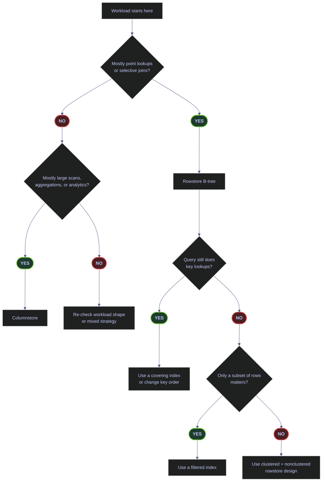
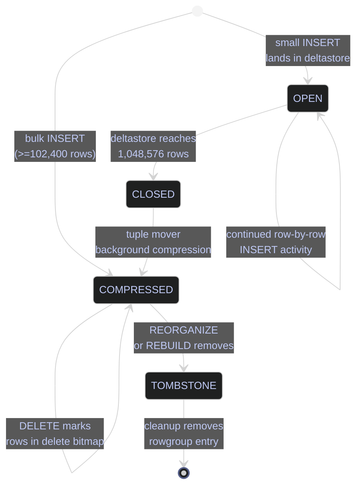

# Index Types and Strategy

> [!abstract]- Summary
>
> Indexes are a storage design decision, not just a tuning afterthought. Every index changes how SQL Server can find rows, how much data must be read to satisfy a query, and how much extra work every `INSERT`, `UPDATE`, and `DELETE` must do. The correct production question is not “can this query be faster with an index?” It is “does this index earn its write cost across the workload?”
>
> **Physical index families**
> - covers the storage shape of rowstore B-tree and columnstore indexes and how each answers queries
>
> **Design choices**
> - evaluates heap vs clustered vs nonclustered vs covering vs filtered vs columnstore, including composite-key order, include columns, lookups, and write cost
>
> **Live telemetry**
> - uses catalog views and DMVs to inspect the current index surface and measure whether indexes are earning their maintenance budget
>
> **Missing-index interpretation**
> - explains how to read missing-index DMVs as hints rather than commands and how to avoid blind `CREATE INDEX` execution
>
> **Operations and safety**
> - Warnings: every extra index adds write cost, bad key order breaks seekability, low-value missing-index suggestions create bloat, and columnstore is not a generic rowstore upgrade
> - Recommendations: treat indexing as workload budgeting, design around real predicates, and verify live usage before adding or keeping an index

> [!note]- Glossary
>
> **B-tree**
> - The balanced rowstore structure SQL Server uses for clustered and nonclustered indexes.
> - It matters because most index decisions in the note are really decisions about how that tree stores keys, pointers, and projected columns.
>
> > [!info] Rowstore indexing is tree design
> >
> > Seek depth, page density, and pointer width all come back to the B-tree shape. Thinking at that level prevents shallow “add an index” decisions.
>
> ---
>
> **Heap**
> - A table with no clustered index, storing rows without clustered-key order.
> - It matters because heaps have distinct lookup and update behavior and are the first major storage decision for rowstore tables.
>
> > [!warning] Heaps degrade differently
> >
> > A heap can be fine for narrow staging patterns, but updates and forwarded rows make it a poor accidental default for many permanent tables.
>
> ---
>
> **Clustered index**
> - The index whose leaf level is the table’s actual data pages and whose key defines the physical row order.
> - It matters because clustered design affects every nonclustered pointer, range scan, split pattern, and maintenance cost downstream.
>
> > [!warning] This is storage layout, not just a lookup aid
> >
> > Treating the clustered index like “just another index” leads to bad key choices. It is the table’s physical shape.
>
> ---
>
> **Nonclustered index**
> - A secondary B-tree whose leaf stores key columns and a pointer back to the base row.
> - It matters because nonclustered indexes are the main way to support alternate predicate paths, but every one adds storage and write overhead.
>
> > [!warning] Every read benefit has a write bill
> >
> > Inserts, updates, and deletes must maintain every nonclustered index too. An index is only good if the workload earns that cost.
>
> ---
>
> **Composite key**
> - An index key made from more than one column in a specific order.
> - It matters because left-to-right key order determines which predicates can seek efficiently and which fall back to scans or residual filtering.
>
> > [!warning] Column order is semantics, not style
> >
> > `(symbol, date)` and `(date, symbol)` are physically different access paths. Choosing the wrong order quietly destroys the intended seek pattern.
>
> ---
>
> **Covering index**
> - An index whose key plus included columns provide every column a target query needs.
> - It matters because covering removes key or RID lookups for hot queries, but widens the leaf and raises maintenance cost.
>
> > [!warning] Covering is query-specific
> >
> > An index that perfectly covers one workload can still miss the next one. Do not confuse a local optimization with a universal answer.
>
> ---
>
> **Filtered index**
> - A nonclustered index built only on rows matching a `WHERE` predicate.
> - It matters because filtered indexes are one of the cleanest ways to index only the hot or currently valid slice of a table.
>
> > [!warning] Powerful, but more fragile than full-table indexes
> >
> > Filtered indexes depend on specific semantics and can surprise teams that treat them like ordinary generic indexes.
>
> ---
>
> **Key Lookup / RID Lookup**
> - The plan operator that fetches missing base-row columns after a nonclustered seek, using either the clustering key or the heap RID.
> - It matters because excessive lookups are often the visible symptom that a covering design or different base structure is needed.
>
> > [!warning] Cheap per row can still be expensive in total
> >
> > Lookups often look harmless in tiny tests. At larger row counts they become one of the classic hidden query-cost explosions.
>
> ---
>
> **Columnstore index**
> - A column-oriented compressed storage structure optimized for large scans and aggregations rather than point lookups.
> - It matters because columnstore is a different storage family with different maintenance and workload fit from rowstore B-trees.
>
> > [!warning] Not a better B-tree
> >
> > Columnstore excels at analytic scan patterns. It is the wrong answer for many lookup-heavy or short OLTP access paths.
>
> ---
>
> **Fill factor**
> - The percentage of leaf-page fullness targeted when an index is built or rebuilt.
> - It matters because fill factor trades space and scan cost against page-split pressure on write-heavy indexes.
>
> > [!warning] Lower is not automatically smarter
> >
> > A low fill factor on a read-mostly index just wastes space. It should be a response to measured split pain, not a reflex setting.
>
> ---
>
> **Missing-index DMV**
> - The optimizer suggestion surface built from `sys.dm_db_missing_index_details`, `_groups`, and `_group_stats`.
> - It matters because it is useful for ranking review candidates, but it cannot understand overlap, full workload write cost, or existing design intent.
>
> > [!warning] Hints, not orders
> >
> > Blindly creating every suggested index is one of the fastest ways to bloat an index surface and slow writes without solving the real problem.
>
> ---

## Key Concepts

| Term | Plain-English definition | Why it matters here | Common confusion |
|---|---|---|---|
| **B-tree** | A balanced multi-level tree structure SQL Server uses for rowstore indexes. The top is the *root*, intermediate nodes point down, and the bottom *leaf* level holds either the full rows (clustered) or key+pointer rows (nonclustered). | Every rowstore index in this note is a B-tree. Seek/scan performance flows from how deep the tree is and what lives at the leaf. | "Index" is often used loosely to mean "any lookup structure"; in SQL Server rowstore it specifically means a B-tree. |
| **Leaf level** | The bottom level of a B-tree where the actual index rows live. For a clustered index the leaf *is* the table. For a nonclustered index the leaf stores the index keys plus a pointer back to the base row. | Determines what `INCLUDE` columns do and why covering indexes avoid base-row fetches. | Thinking the leaf of a nonclustered index contains the full row — it does not, unless INCLUDE columns cover every projected column. |
| **Heap** | A table with no clustered index. Rows live in unordered 8 KB pages and are located by Row IDentifier (RID = file:page:slot). | Heaps are the default when no clustered index exists. They perform badly under updates and scans unless the workload is narrow and write-only. | Assuming "no index" means "slow" — heaps are fast for bulk insert + truncate patterns, but pathological under updates. |
| **Forwarding record** | When an update on a heap makes a row too large to fit in its page, SQL Server leaves a pointer in the original slot and moves the row to a new page. Every read of the old RID now follows one extra hop. | This is the main reason heaps degrade under update workloads — forwarding records accumulate invisibly and bloat read paths. | Forwarding records are never cleaned up automatically; only `ALTER TABLE ... REBUILD` clears them. |
| **RID (Row Identifier)** | The physical file:page:slot address used to locate a row in a heap. | Nonclustered indexes on a heap point to RIDs. Nonclustered indexes on a clustered table point to the clustering key. | Confusing RID with the clustering key — they serve the same purpose but have different costs and stability properties. |
| **Clustered index** | An index whose leaf level *is* the table itself, physically ordered by the clustering key. Each table can have at most one. | The clustered key defines row storage order, appears inside every nonclustered index as the lookup pointer, and influences fragmentation and page splits. | Thinking a clustered index is "just another index". It is actually the table's storage layout. |
| **Nonclustered index (NC)** | A secondary B-tree whose leaf contains the key columns (plus any INCLUDE columns) and a pointer to the base row (RID for heap, clustering key for clustered table). | Used to support access paths that differ from the clustered key, such as business-key lookups, joins, and range queries. | Forgetting that every NC insert, update, and delete costs extra writes on top of the base table. |
| **Composite key** | A nonclustered index key with more than one column, e.g. `(symbol, date)`. | The leftmost column(s) decide which predicates the index can seek on. Key order matters far more than most people expect. | `(symbol, date)` and `(date, symbol)` are not interchangeable. The second cannot seek on `symbol` alone. |
| **Covering index** | A nonclustered index whose leaf contains every column the query needs — either in the key or as INCLUDE columns — so the query never touches the base row. | Eliminates key lookups for hot queries with stable projection lists. The main tool for removing expensive nested-loops lookup patterns. | Treating "covering" as binary — an index that covers one query may not cover the next one if the projection list changes. |
| **INCLUDE column** | A column added to the leaf of a nonclustered index but not to the key. It cannot be seeked on but can be projected. | Lets you widen an index for covering without pushing extra columns into the key, which would bloat every level of the B-tree. | Adding INCLUDE columns blindly — they still cost write maintenance and storage. |
| **Key Lookup** | The execution-plan operator that follows a nonclustered seek by fetching the rest of the row from the clustered index using the clustering key. | Shows up when a query's projection is not covered. Often the exact symptom a covering index fixes. | Key Lookup is cheap per row but pathological at high row counts — one lookup per row adds up fast. |
| **RID Lookup** | The heap equivalent of Key Lookup — fetches the base row by RID after a nonclustered seek. | Same symptom, different base structure. | Many people call both "bookmark lookup" because SQL Server 2000 did. |
| **Filtered index** | A nonclustered index with a `WHERE` clause, indexing only a subset of rows. | Lets you maintain uniqueness or fast access paths only for the hot subset (e.g. `is_current = 1`), saving storage and write cost on the cold rows. | Filtered indexes require very specific session SET options on any INSERT or UPDATE that touches the filtered column, or the write will fail. |
| **SCD2 (Slowly Changing Dimension type 2)** | A dimension modeling pattern that tracks history by adding new rows with `valid_from`, `valid_to`, and `is_current` flags instead of overwriting. | Filtered unique indexes on `WHERE is_current = 1` enforce uniqueness only on the live slice, not on historical versions. | Assuming uniqueness must be enforced across the full table — that would prevent history from being kept at all. |
| **Surrogate key** | A meaningless integer or GUID used as a stable row identity (e.g. `id int IDENTITY`). Not visible to users. | Often chosen as the clustered key because it is narrow, unique, static, and ever-increasing. | Confusing surrogate key with business key — see next row. |
| **Business key** | A naturally meaningful identifier used by humans or upstream systems (e.g. `symbol + date`, ISIN, SKU). Also called natural key. | Usually the predicate the application queries on, so it typically gets a nonclustered unique index even when the surrogate is clustered. | Clustering on a wide business key can blow up NC index size because every NC index inherits the clustering key. |
| **Columnstore index** | An index that stores data column-by-column in compressed rowgroups instead of row-by-row in B-tree pages. Two flavors: clustered columnstore (CCI — the table *is* the columnstore) and nonclustered columnstore (NCCI — overlaid on a rowstore table). | Wins on large scans, aggregates, and compression. Loses on point lookups and short OLTP queries. | Treating columnstore as "a better B-tree". It is a fundamentally different storage model with different costs. |
| **Rowgroup** | A columnstore storage unit of up to ~1,048,576 rows. Each rowgroup is compressed per column segment. | The unit of columnstore compression, state transitions, and maintenance. Understanding rowgroup state is essential for troubleshooting columnstore performance. | Confusing rowgroups with partitions. Partitions hold rowgroups; rowgroups are finer-grained. |
| **Deltastore** | A hidden rowstore B-tree attached to each columnstore index that absorbs small writes until a background process (tuple mover) closes the deltastore and compresses it into a rowgroup. | Explains why columnstore tolerates small inserts at all, and why too many small inserts leave you with a slow, uncompressed `OPEN` deltastore. | Assuming columnstore is read-only. It tolerates writes via the deltastore — just not cheaply. |
| **Rowgroup state** | One of `OPEN`, `CLOSED`, `COMPRESSED`, or `TOMBSTONE`. Controls whether a rowgroup is still accepting inserts, queued for compression, fully compressed, or pending removal. | Directly visible in `sys.dm_db_column_store_row_group_physical_stats.state_desc`. High `OPEN`/`CLOSED` counts mean deltastore pressure. | Reading `COMPRESSED` as "done and perfect" without checking `deleted_rows`. A heavily-deleted compressed rowgroup still wastes space. |
| **Fill factor** | The percentage of each leaf page filled at build or rebuild time, leaving the rest as free space for future inserts/updates. 0 and 100 both mean "full". | Lower fill factor absorbs page splits at insert/update time, at the cost of storage and scan cost. Only useful when there is real mid-page split pain. | Setting low fill factor on read-mostly indexes — it just wastes space. |
| **Page split** | When a rowstore leaf page cannot fit a new row, SQL Server allocates a new page, moves half the rows to it, and relinks the chain. Expensive: allocation, logging, and fragmentation. | Page splits are the main source of NC index fragmentation and write amplification on active tables. | Thinking splits are rare — they are common on any index keyed on non-sequential values under heavy inserts. |
| **`OPTIMIZE_FOR_SEQUENTIAL_KEY`** | A SQL Server 2019+ index option that reduces last-page insert contention on ever-increasing clustering keys. | Specifically targets the PAGELATCH_EX hotspot created by identity/sequence-keyed clustered indexes under concurrent inserts. | Enabling it on non-sequential keys — it does nothing useful there and adds scheduling overhead. |
| **`DROP_EXISTING`** | A `CREATE INDEX ... WITH (DROP_EXISTING = ON)` option that atomically replaces an index with a new definition in one transaction. | Safer than separate `DROP INDEX` + `CREATE INDEX` — no window where the index is missing. | Forgetting that `DROP_EXISTING` only works when both definitions share the same name. |
| **Missing-index DMV** | A trio of dynamic management views (`sys.dm_db_missing_index_details`, `_groups`, `_group_stats`) that surface index suggestions the optimizer would have used if they existed. | Useful starting point for index review. Not a design engine — the DMVs are blind to overlap, existing indexes, and write cost. | Running every suggested `CREATE INDEX` from SSMS's missing-index popup. That produces bloated, overlapping index surfaces. |
| **Improvement measure** | The heuristic `avg_total_user_cost * (avg_user_impact / 100) * (user_seeks + user_scans)` computed from the missing-index DMVs. | Lets you rank suggestions so the highest-impact ones get reviewed first. | Treating the improvement measure as an absolute benefit. It is a ranking number, not an SLA. |
| **Cardinality** | The number of distinct values in a column or result set. High cardinality = many distinct values; low cardinality = few. | The optimizer uses cardinality estimates to choose between seek and scan. Unique and primary-key constraints give cardinality reasoning a precise anchor. | Assuming a bit or status column is useful as an index key — low cardinality usually defeats selectivity. |

## Choose The Right Index Family

> [!abstract] Scope of this section
>
> - The three physical storage shapes SQL Server offers (heap, clustered B-tree, columnstore) and how each lays out rows
> - Decision drivers for heap vs clustered vs nonclustered: workload shape, write pattern, scan vs seek, cardinality, stability, and uniqueness needs
> - When columnstore applies and when it does not
> - A decision flowchart that maps workloads to index families

SQL Server has two mainstream index families for disk-based tables:

- **rowstore B-tree indexes** for point lookups, selective predicates, OLTP joins, and ordered access
- **columnstore indexes** for large scans, aggregates, analytics, and compression-heavy reporting

Within rowstore, the main design decisions are:

- heap vs clustered (does the table have a physical order at all?)
- clustered vs nonclustered (what access paths need a dedicated structure?)
- single-column vs composite (what predicate shapes matter?)
- narrow lookup index vs covering index (does the projection justify extra leaf width?)
- full-table index vs filtered subset (is only a hot subset worth indexing?)

### Heap vs Clustered Index | The First Storage Decision

Before choosing any nonclustered index, decide whether the table should have a clustered index at all. This is the single biggest storage decision for a rowstore table because it determines how every row is physically laid out on disk and how every future access path resolves.

#### What a heap actually is

A heap is a table with no clustered index. Row pages are allocated as they are needed, rows are inserted wherever the Page Free Space (PFS) tracker finds space, and there is no logical row order. To find a specific row, SQL Server either scans the whole table (IAM-ordered) or follows a nonclustered index that points to a **Row Identifier** (RID = `file:page:slot`). Deleted rows leave empty slots that later inserts may or may not reuse.

The defining property of a heap is that rows do not move after they are inserted — unless an update grows the row past what its page can hold, in which case SQL Server leaves a forwarding pointer in the old slot and moves the row. That forwarding pointer is a **forwarding record**, and every read that follows the old RID pays one extra page read. Forwarding records accumulate silently. Only `ALTER TABLE ... REBUILD` clears them.

> [!danger] Heaps with updates degrade silently — and nonclustered indexes make it worse
>
> The performance damage from forwarding records is invisible in most dashboards. A heap-based transactional table can run fine for months, then hit a wall as forwarding-record density climbs. The only routine telemetry that exposes this is `sys.dm_db_index_physical_stats(... 'DETAILED')` which surfaces `forwarded_record_count` on heaps specifically. When nonclustered indexes exist on the heap, every update that causes a forwarding record also forces each NC index to leave its RID pointer pointing to the forwarded row — read paths pay the forwarding hop on every NC lookup, and `forwarded_record_count` climbs continuously. This is the default failure mode of "we'll add a clustered index later."

> [!success] Decide the clustered shape first, then add nonclustered indexes
>
> A clustered B-tree has no forwarding records. An in-place update that no longer fits triggers a page split, which is itself expensive but at least produces a predictable and measurable cost signal (fragmentation and `leaf_allocation_count`) that every standard maintenance job can detect. Always decide the clustered shape before adding any nonclustered indexes — every NC index structurally depends on it, and retrofitting a clustered index to a heap with heavy NC coverage requires rebuilding every NC index as part of the operation.

#### What a clustered index actually is

A clustered index is not "just another index." It is the table. The leaf level of the clustered B-tree holds every column of every row, physically ordered by the clustering key. There is only one clustered index per table because there is only one physical order. Nonclustered indexes on a clustered table store the clustering key as their row pointer (instead of a RID), which means the clustering key is copied into every nonclustered leaf row — one of the main reasons wide clustering keys are bad for storage.

#### Decision drivers: when to choose heap vs clustered

The decision is not aesthetic — it follows from the workload. This table is the authoritative one for the vault.

| Decision driver | Favors clustered index | Favors heap |
|---|---|---|
| **Write pattern** | Row updates that change row size (wide VARCHARs, LOB, nullable columns filled later) | Insert-only, truncate-and-reload, or append-only staging |
| **Row access pattern** | Any combination of point lookup + range scan | Full-table scans only, followed by truncate |
| **Row lifespan** | Rows live for months/years and are updated in place | Rows live for one ETL cycle and are then wiped |
| **Predicate selectivity** | Frequent selective predicates on at least one stable column | No selective predicates — always a full scan |
| **Join participation** | Table is the probe side of joins (lookup side) | Table is only the build side of bulk transforms |
| **Row width** | Rows fit comfortably in a leaf page without splits | Rows are narrow and uniform — no forwarding risk |
| **Concurrent writers** | Many concurrent updaters (forwarding risk high) | Single bulk loader, no concurrent updates |
| **Backup/restore needs** | Normal — clustered tables restore cleanly | No constraint — heaps restore the same way |
| **Expected scan frequency** | Mixed scan+seek workload | Scan-only workload where ordered access adds no value |
| **Data quality enforcement** | Primary key or unique constraint is required (clustered is the natural host) | No uniqueness requirement at all |

In production data warehouses and analytical platforms, clustered is the safe default. The short list of legitimate heap use cases:

- **Bulk insert staging** that is loaded with `INSERT ... WITH (TABLOCK)`, consumed once by an ETL process, and then `TRUNCATE`d. Heap inserts under minimal logging are faster than clustered inserts.
- **Write-once log sinks** that are never updated and are scanned sequentially (e.g. raw event landings, append-only audit buffers).
- **Tables that are always accessed via a covering nonclustered index and never via their base row.** Uncommon, but valid.

Any durable transactional or reporting table that sees updates should have a clustered index. Period.

**The heap + nonclustered + updates combination is the worst storage pattern in SQL Server.** Any durable transactional or reporting table that sees updates should have a clustered index. Period.

### Clustered Index | Choosing The Clustering Key

Once you have decided the table is clustered, the next question is which column(s) to cluster on. The clustering key appears inside every nonclustered index leaf (as the lookup pointer), controls the physical order, and shapes insert contention. Four rules drive the choice — ideally all four are satisfied at once.

| Rule | What it means | Why it matters |
|---|---|---|
| **Narrow** | Few bytes per row — typically `int`, `bigint`, or a short composite | The clustering key is copied into every nonclustered leaf row, so wide keys inflate every NC index |
| **Unique** | Values are distinct per row, either naturally or via `uniquifier` | Non-unique clustered indexes add a hidden 4-byte uniquifier to every duplicate row, and the optimizer loses precise cardinality reasoning |
| **Static** | Values never change after insert | If the clustering key is updated, SQL Server must physically move the row and update every nonclustered index pointer — a massive write amplifier |
| **Ever-increasing** | New rows always get a key larger than all prior keys (e.g. identity, sequence, time-based surrogate) | Inserts go to the right-most leaf page, which avoids mid-tree page splits — but creates the last-page PAGELATCH_EX hotspot |

A well-chosen clustering key is usually a narrow surrogate like `id int IDENTITY(1,1)` or `id bigint IDENTITY`. A natural business key like `(symbol, date)` can work if it is stable and narrow, but it adds the business-key bytes to every nonclustered leaf row and often creates hot spots near "today".

> [!warning] Last-page insert contention under high concurrency
>
> An ever-increasing clustered key concentrates every insert on the same right-most leaf page. Under 100+ concurrent writers you get `PAGELATCH_EX` waits on that page — the "last-page insert contention" pattern.

> [!success] Enable `OPTIMIZE_FOR_SEQUENTIAL_KEY` for write-hot identity keys
>
> `CREATE INDEX ... WITH (OPTIMIZE_FOR_SEQUENTIAL_KEY = ON)` was added in SQL Server 2019 specifically to relieve last-page contention on sequential clustering keys. It adds a small scheduling layer that reduces thread spinning on the hot page. Use it only when you can measure contention; it does nothing useful on non-sequential keys.

### Nonclustered Index | Secondary Access Paths

A nonclustered index is a separate B-tree whose leaf contains the key columns and (optionally) INCLUDE columns, plus a pointer back to the base row. On a clustered table the pointer is the clustering key; on a heap it is the RID. A single table can have many nonclustered indexes, and every one of them adds write maintenance cost to every insert, update, and delete that touches the indexed columns.

The main design questions for a nonclustered index are:

- **Which predicate shapes does it support?** Composite key order decides which predicate prefixes can seek.
- **Is it covering for the hot queries?** If the query projects columns not in the leaf, SQL Server must follow the pointer back to the base row (Key Lookup on a clustered table, RID Lookup on a heap). A covering index eliminates that hop.
- **Is it unique?** Unique nonclustered indexes double as constraint enforcement and give the optimizer sharper cardinality reasoning.
- **Is it filtered?** If only a small, stable subset of rows is relevant to the hot query, a filtered index is both smaller and cheaper to maintain.
- **Does it overlap with an existing index?** Two indexes with the same key prefix waste write I/O.

Composite key order is the rule most often gotten wrong. SQL Server can seek on any prefix of the key, but not on a suffix without the prefix. `(symbol, date)` can seek on `symbol` alone, or on `symbol + date`. It cannot seek on `date` alone — that would require a full index scan. Put equality predicates first, then range predicates, then columns only used for sorting.

**NC indexes on a heap point to RIDs** — any update that causes a forwarding record invalidates the cost model of the NC seek. Add the clustered index first, then add nonclustered indexes only for predicate shapes you can prove the workload runs. Add INCLUDE columns only after you can show a hot stable projection list. Reevaluate every index against its write cost using `sys.dm_db_index_usage_stats` and `sys.dm_db_index_operational_stats`.

### Columnstore Index | Scan And Compression-Heavy Workloads

Columnstore is a fundamentally different storage model. Instead of pages of full rows, data is stored column-by-column in **rowgroups** of up to ~1,048,576 rows, each column segment compressed independently. Queries that scan many rows but project few columns — typical analytics and aggregation — hit column segments directly and benefit from batch-mode execution, segment elimination, and dictionary compression. Point lookups and short OLTP queries pay more because they have to decode segments to produce a single row.

Columnstore comes in two flavors:

- **Clustered columnstore index (CCI)** — the table itself is stored as a columnstore. Best for large analytical fact tables that have no OLTP traffic.
- **Nonclustered columnstore index (NCCI)** — a columnstore index overlaid on a rowstore table. The base table stays rowstore (for OLTP writes) and the NCCI answers analytical queries from the same physical table. This is the **HTAP pattern** (Hybrid Transactional/Analytical Processing).

> [!tip] Columnstore does not replace rowstore
>
> The right production question is not "should we migrate to columnstore?" but "where does each workload pattern want columnstore, and where does it want rowstore?" Fact tables with mixed OLTP + analytics often end up with clustered rowstore + NCCI to serve both sides.

### Rowstore design rules

- Use a **clustered index** to define the physical row order of the table.
- Use **nonclustered indexes** to support selective predicates, join keys, and ordering patterns.
- Use **composite key order** to match the actual predicate order that matters to the workload.
- Use **INCLUDE columns** only when a lookup-heavy read pattern justifies the larger leaf level.
- Use **filtered indexes** when only a stable subset of rows matters.

### Columnstore design rules

- Use **clustered columnstore** for scan-heavy analytical storage.
- Use **nonclustered columnstore** when the rowstore table must remain the primary transactional shape.
- Expect stronger wins on aggregates and scans than on single-row lookups.

> [!info] Microsoft's authoritative `CREATE INDEX` reference
>
> Microsoft documents the complete `CREATE INDEX` design surface — filtered indexes, INCLUDE columns, `OPTIMIZE_FOR_SEQUENTIAL_KEY`, `DROP_EXISTING`, resumable operations, online rebuild, and data compression — in the official [`CREATE INDEX` documentation](https://learn.microsoft.com/en-us/sql/t-sql/statements/create-index-transact-sql). Every production design review should cross-check options against this page because defaults change between versions.



## Inspect The Live Index Surface

> [!abstract] Section scope
>
> - Listing every index on a table with its key and INCLUDE columns via `sys.indexes` and `sys.index_columns`
> - Measuring physical size and row counts per index via `sys.dm_db_partition_stats`
> - Detecting heaps and confirming they are deliberate
> - Confirming composite key order and sort direction before trusting a seek plan
> - Measuring fragmentation via `sys.dm_db_index_physical_stats` against the standard 5 %/30 % reorganize/rebuild thresholds

Index strategy starts with inventory. Before adding or dropping anything, establish:

- which indexes already exist
- whether a table is clustered or a heap
- how large the existing structures are
- whether any index is unique, filtered, or primary-key-backed
- how fragmented each structure is and whether maintenance is due

### `sys.indexes` + `sys.index_columns` | inspect one real table

`silver.eurostoxx50_ohlcv` is a good live example because it has both a clustered primary key and a unique nonclustered composite index.

#### `sys.indexes` + `sys.index_columns` | list the real indexes on `silver.eurostoxx50_ohlcv`

Any time you need an authoritative list of indexes on a specific table before changing them. It is typically triggered by starting an index review, diagnosing a slow query, or validating that a deployment added the expected indexes. Read-only T-SQL session. Requires `VIEW DEFINITION` on the target. No locking impact — catalog views read from metadata cache. Return the full set of rowstore index definitions with key columns, INCLUDE columns, uniqueness, primary-key backing, and filter predicate.

| Field | Source column | Type | Meaning |
|---|---|---|---|
| `index_id` | `sys.indexes.index_id` | int | `0` = heap, `1` = clustered, `>1` = nonclustered |
| `index_name` | `sys.indexes.name` | sysname | Index name as created (PK names include a random hash suffix unless named explicitly) |
| `index_type` | `sys.indexes.type_desc` | nvarchar(60) | `HEAP`, `CLUSTERED`, `NONCLUSTERED`, `CLUSTERED COLUMNSTORE`, `NONCLUSTERED COLUMNSTORE`, `XML`, `SPATIAL` |
| `is_unique` | `sys.indexes.is_unique` | bit | 1 if duplicate keys are forbidden |
| `is_primary_key` | `sys.indexes.is_primary_key` | bit | 1 if the index backs a `PRIMARY KEY` constraint |
| `filter_definition` | `sys.indexes.filter_definition` | nvarchar(max) | The `WHERE` clause of a filtered index, or `NULL` for a full-table index |
| `key_columns` | Aggregated from `sys.index_columns` where `is_included_column = 0`, ordered by `key_ordinal` | nvarchar | Columns that form the seek key, in order |
| `included_columns` | Aggregated from `sys.index_columns` where `is_included_column = 1` | nvarchar | Columns stored only at the leaf level to support covering |

*Return the real rowstore index definitions for `silver.eurostoxx50_ohlcv`, including key columns and uniqueness.*

```sql
SELECT
    i.index_id,
    i.name AS index_name,
    i.type_desc AS index_type,
    i.is_unique,
    i.is_primary_key,
    i.filter_definition,
    STRING_AGG(CASE WHEN ic.is_included_column = 0 THEN c.name END, ', ')
        WITHIN GROUP (ORDER BY ic.key_ordinal) AS key_columns,
    STRING_AGG(CASE WHEN ic.is_included_column = 1 THEN c.name END, ', ') AS included_columns
FROM sys.indexes AS i
JOIN sys.index_columns AS ic
    ON i.object_id = ic.object_id
   AND i.index_id = ic.index_id
JOIN sys.columns AS c
    ON ic.object_id = c.object_id
   AND ic.column_id = c.column_id
WHERE i.object_id = OBJECT_ID('silver.eurostoxx50_ohlcv')
GROUP BY
    i.index_id,
    i.name,
    i.type_desc,
    i.is_unique,
    i.is_primary_key,
    i.filter_definition
ORDER BY i.index_id;
```

| index_id | index_name | index_type | is_unique | is_primary_key | filter_definition | key_columns | included_columns |
|---|---|---|---:|---:|---|---|---|
| 1 | `PK__eurostox__3213E83FDF67D274` | `CLUSTERED` | 1 | 1 |  | `id` |  |
| 2 | `IX_silver_eurostoxx50_ohlcv_symbol_date` | `NONCLUSTERED` | 1 | 0 |  | `symbol, date` |  |

_This table has a conventional hybrid rowstore design: a narrow clustered primary key on `id` and a unique nonclustered lookup index on `(symbol, date)`. That means sequential row identity is decoupled from the query-facing business lookup pattern. It is a valid design when the workload needs stable surrogate keys and also frequent symbol/date predicates._

| Column | Value | Watch | Meaning | Implication |
|---|---|---|---|---|
| `index_id` | `1` | ✅ | Clustered index or clustered primary key. | Defines the physical row order of the table. |
| `index_id` | `2+` | ✅ | Nonclustered index. | Secondary access path only; table data remains elsewhere. |
| `index_type` | `CLUSTERED` | ✅ | The table itself is stored as the leaf of this index. | Only one clustered index can exist per table. |
| `index_type` | `NONCLUSTERED` | ✅ | Separate B-tree that points back to the base row. | Good for alternate predicates and sort orders. |
| `is_unique` | `1` | Depends | Duplicate keys are not allowed. | Strong for natural keys, lookup stability, and cardinality precision. |
| `is_primary_key` | `1` | Depends | The index backs a primary key constraint. | Usually the most semantically important unique key on the table. |
| `filter_definition` | `NULL` | ✅ here | The index covers all rows. | Expected for a general-purpose lookup index. |
| `filter_definition` | Non-NULL | Depends | The index is filtered. | Great when only a subset of rows matters and the predicate is stable. |

### `sys.dm_db_partition_stats` | identify the largest real indexes

This query ranks real non-demo indexes by used page count and size. It is the fastest way to see which objects matter most for storage and maintenance.

#### `sys.dm_db_partition_stats` | rank the largest real indexes

As part of any index audit, storage sizing exercise, or maintenance planning pass. It is typically triggered by "Which indexes are the biggest?" or "Where is my storage going?" Also used before reorganize/rebuild scheduling to decide which structures need the most attention. Read-only T-SQL session. Catalog read — no locks on base tables. Results are accurate as of the last committed metadata update; no need for a checkpoint. Rank every user-table index by physical size and row count, so storage investment can be matched against read/write value delivered.

| Field | Source column | Type | Meaning |
|---|---|---|---|
| `table_name` | `OBJECT_SCHEMA_NAME` + `OBJECT_NAME` on `sys.indexes.object_id` | nvarchar | Schema-qualified table name |
| `index_name` | `sys.indexes.name` | sysname | Index name |
| `type_desc` | `sys.indexes.type_desc` | nvarchar(60) | Index family (see prior field table) |
| `is_unique` | `sys.indexes.is_unique` | bit | Unique flag |
| `is_primary_key` | `sys.indexes.is_primary_key` | bit | PK backing flag |
| `size_mb` | Computed: `used_page_count * 8.0 / 1024` | decimal | Size in MB (SQL Server page = 8 KB) |
| `row_count` | `sys.dm_db_partition_stats.row_count` | bigint | Approximate row count from metadata |

*Return the largest real rowstore indexes in `stoxx` by used page count and size.*

```sql
SELECT TOP 12
    OBJECT_SCHEMA_NAME(i.object_id) + '.' + OBJECT_NAME(i.object_id) AS table_name,
    i.name AS index_name,
    i.type_desc,
    i.is_unique,
    i.is_primary_key,
    CAST(ps.used_page_count * 8.0 / 1024 AS DECIMAL(10,2)) AS size_mb,
    ps.row_count
FROM sys.indexes AS i
JOIN sys.dm_db_partition_stats AS ps
    ON i.object_id = ps.object_id
   AND i.index_id = ps.index_id
WHERE OBJECTPROPERTY(i.object_id, 'IsUserTable') = 1
  AND i.index_id > 0
  AND OBJECT_NAME(i.object_id) NOT LIKE 'demo[_]%'
ORDER BY ps.used_page_count DESC;
```

| table_name | index_name | type_desc | is_unique | is_primary_key | size_mb | row_count |
|---|---|---|---:|---:|---:|---:|
| `silver.eurostoxx50_ohlcv` | `PK__eurostox__3213E83FDF67D274` | `CLUSTERED` | 1 | 1 | 6.02 | 67155 |
| `silver.stoxxasia50_ohlcv` | `PK__stoxxasi__3213E83F66A8DE5E` | `CLUSTERED` | 1 | 1 | 5.80 | 64875 |
| `silver.stoxxusa50_ohlcv` | `PK__stoxxusa__3213E83FC84E3F24` | `CLUSTERED` | 1 | 1 | 5.77 | 66000 |
| `silver.oil20_ohlcv` | `PK__oil20_oh__3213E83F544EB286` | `CLUSTERED` | 1 | 1 | 2.20 | 25080 |
| `silver.eurostoxx50_ohlcv` | `IX_silver_eurostoxx50_ohlcv_symbol_date` | `NONCLUSTERED` | 1 | 0 | 1.88 | 67155 |
| `silver.stoxxasia50_ohlcv` | `IX_silver_stoxxasia50_ohlcv_symbol_date` | `NONCLUSTERED` | 1 | 0 | 1.83 | 64875 |
| `silver.stoxxusa50_ohlcv` | `IX_silver_stoxxusa50_ohlcv_symbol_date` | `NONCLUSTERED` | 1 | 0 | 1.67 | 66000 |
| `bronze.trading_calendar` | `PK_trading_calendar` | `CLUSTERED` | 1 | 1 | 0.95 | 29335 |
| `bronze.index_dim` | `PK__index_di__3213E83FDB4E5BA9` | `CLUSTERED` | 1 | 1 | 0.70 | 169 |
| `silver.index_dim` | `PK__index_di__3213E83F590AA69E` | `CLUSTERED` | 1 | 1 | 0.68 | 169 |
| `gold.index_performance` | `PK__index_pe__3213E83FBBB2393E` | `CLUSTERED` | 1 | 1 | 0.66 | 5351 |
| `silver.oil20_ohlcv` | `IX_silver_oil20_ohlcv_symbol_date` | `NONCLUSTERED` | 1 | 0 | 0.64 | 25080 |

_The dominant real storage pattern in `stoxx` is consistent: clustered primary keys hold the main storage surface, and narrow unique nonclustered lookup indexes support business-key access on the OHLCV fact tables. This matches the expected profile of a rowstore-first analytical staging model — storage is dominated by base data (clustered PKs), not by auxiliary NC indexes, the NC-to-clustered size ratio stays well below 50%, and zero forwarding records appear on any heap._

| Column | Value | Watch | Meaning | Implication |
|---|---|---|---|---|
| `type_desc` | `CLUSTERED` on top rows | ✅ | Largest structures are clustered PKs — the tables' own storage | Healthy — storage is dominated by base data, not by auxiliary NC indexes |
| `type_desc` | `NONCLUSTERED` with `size_mb` ≥ 50 % of clustered | Depends | A single NC index is nearly as big as the table | Acceptable if the NC is covering a hot query; suspicious if it is a narrow key index |
| `size_mb` | Top entry > 1 GB | Depends | Storage is dominated by one table | Make sure backup, maintenance, and restore windows account for it |
| `row_count` | Very low with high `size_mb` | ❌ | Wide rows or heavy fragmentation | Investigate row width, deleted-row bloat, or fragmentation with `sys.dm_db_index_physical_stats` |

### `sys.indexes` | detect heaps

Heaps are not inherently wrong, but they are specialized. In a production system, a heap should exist because the design review concluded that the table's workload matches a legitimate heap use case (truncate-reload staging, write-once log sink, covering-NC-only access) — not because a clustered index was forgotten. The way to verify intent is to check whether the table's DDL or design document explicitly states "heap by design" and whether the table's access pattern matches one of the three legitimate cases listed above.

#### `sys.indexes` | identify user tables that are heaps

During an index audit, after migration, or when chasing down forwarding-record performance issues. It is typically triggered by "Are there any heaps I don't know about?" or an `sys.dm_db_index_physical_stats` result showing non-zero `forwarded_record_count`. Read-only T-SQL session. No locks. Runs in milliseconds even on large databases. Surface every user table with no clustered index so each one can be reviewed against the heap decision criteria from the earlier section.

| Field | Source column | Type | Meaning |
|---|---|---|---|
| `table_name` | `OBJECT_SCHEMA_NAME` + `OBJECT_NAME(object_id)` | nvarchar | Schema-qualified table name |
| Filter | `sys.indexes.type = 0` | tinyint | Heap marker: `0` = heap, `1` = clustered, `2` = nonclustered, `5` = clustered columnstore, `6` = NCCI |

*Return the user tables that are currently stored as heaps.*

```sql
SELECT
    OBJECT_SCHEMA_NAME(object_id) + '.' + OBJECT_NAME(object_id) AS table_name
FROM sys.indexes
WHERE type = 0
  AND OBJECTPROPERTY(object_id, 'IsUserTable') = 1;
```

| table_name |
|---|
| `dbo.demo_pulse_tickers` |

_Only one user table is currently a heap. That is fine for a disposable or staging-oriented table, but it would need explicit justification if it were a durable transactional or reporting table._

| Column | Value | Watch | Meaning | Implication |
|---|---|---|---|---|
| Result set empty | No heaps | ✅ in most OLTP/reporting databases | Every user table has a clustered shape. | Good default for predictable row access and reduced forwarding-record risk. |
| One or few heaps matching a legitimate use case | Depends | A heap exists for a documented reason (truncate-reload staging, write-once sink, NC-only access). Verify by checking `sys.dm_db_index_physical_stats` for zero `forwarded_record_count` and confirming the table is not join-probed. | Acceptable when the workload matches; flag for review if forwarding records appear or the table starts receiving updates. |
| Many heaps | ❌ | Clustered design has likely been skipped broadly. | Review immediately; scans, forwarding records, and maintenance complexity often rise. |

### `sys.index_columns` | confirm key order and sort direction

Composite index usefulness depends on key order. SQL Server only gets full seek power from the leftmost key sequence that matches the predicate shape.

#### `sys.index_columns` | inspect sort direction and key order

Before trusting that a composite index supports the predicate shape you think it does. It is typically triggered by query plans showing an unexpected scan when a seek was expected, or a code review of a new composite index. Read-only T-SQL session. No locks. Catalog read only. Confirm the exact ordinal position and sort direction of every key column in every index on the target table, so seek eligibility can be verified against the predicate shape.

| Field | Source column | Type | Meaning |
|---|---|---|---|
| `index_name` | `sys.indexes.name` | sysname | Index name |
| `column_name` | `sys.columns.name` | sysname | Column name for this key position |
| `key_ordinal` | `sys.index_columns.key_ordinal` | tinyint | 1-based position in the key; `0` for INCLUDE columns |
| `sort_direction` | `sys.index_columns.is_descending_key` | bit | `0` = `ASC`, `1` = `DESC` |
| `is_included_column` | `sys.index_columns.is_included_column` | bit | `1` if the column is in the leaf INCLUDE list, `0` if it is a key column |

*Return the key order and sort direction for the `silver.eurostoxx50_ohlcv` indexes.*

```sql
SELECT
    i.name AS index_name,
    c.name AS column_name,
    ic.key_ordinal,
    CASE WHEN ic.is_descending_key = 1 THEN 'DESC' ELSE 'ASC' END AS sort_direction,
    ic.is_included_column
FROM sys.indexes AS i
JOIN sys.index_columns AS ic
    ON i.object_id = ic.object_id
   AND i.index_id = ic.index_id
JOIN sys.columns AS c
    ON ic.object_id = c.object_id
   AND ic.column_id = c.column_id
WHERE i.object_id = OBJECT_ID('silver.eurostoxx50_ohlcv')
ORDER BY i.index_id, ic.key_ordinal, ic.index_column_id;
```

| index_name | column_name | key_ordinal | sort_direction | is_included_column |
|---|---|---:|---|---:|
| `PK__eurostox__3213E83FDF67D274` | `id` | 1 | `ASC` | 0 |
| `IX_silver_eurostoxx50_ohlcv_symbol_date` | `symbol` | 1 | `ASC` | 0 |
| `IX_silver_eurostoxx50_ohlcv_symbol_date` | `date` | 2 | `ASC` | 0 |

_The nonclustered index is ordered by `symbol` first and `date` second, which is ideal for predicates that narrow to one symbol and then scan a date range. The same index would be much weaker for date-first queries across many symbols._

| Column | Value | Watch | Meaning | Implication |
|---|---|---|---|---|
| `key_ordinal` | `1` | ✅ | Leftmost key column — the one the optimizer can always seek on | Choose this column to match the most common equality predicate |
| `key_ordinal` | `2+` | Depends | Secondary key columns — only seekable when the prefix is fixed | Put range predicates here, not equality filters |
| `is_included_column` | `1` | ✅ for covering | Leaf-only column; not part of the seek key | Use INCLUDE to cover projection columns without bloating B-tree internal pages |
| `sort_direction` | `ASC` | Default | Ascending sort | Matches ascending `ORDER BY` and range predicates |
| `sort_direction` | `DESC` | Depends | Descending sort | Only useful when a hot `ORDER BY ... DESC` query can avoid a sort operator |

### `sys.dm_db_index_physical_stats` | measure fragmentation

Fragmentation on a rowstore B-tree has two distinct meanings, and both matter:

- **External (logical) fragmentation** — the leaf-page chain is not in physical order on disk. Leaf pages are scattered, so large scans lose read-ahead efficiency. Reported as `avg_fragmentation_in_percent`.
- **Internal fragmentation** — leaf pages are less than full. A 60 %-full leaf means every scan reads 40 % wasted bytes. Reported as `avg_page_space_used_in_percent` (so high is good; low is bad).

The textbook thresholds from Microsoft's index-maintenance guidance are:

- `avg_fragmentation_in_percent < 5 %` — do nothing.
- `5 %–30 %` — `ALTER INDEX ... REORGANIZE` (online, incremental, low-impact).
- `> 30 %` — `ALTER INDEX ... REBUILD` (higher-impact, rebuilds statistics, online if Enterprise).

These are starting points, not absolute rules. The inputs that push you toward action within the 5–30% band are **index size** (fragmentation on a 10-page index is noise; on a 100,000-page index it costs real scan I/O), **workload type** (a range-scan-heavy analytics workload feels fragmentation more than a point-lookup OLTP workload), and **page density** (check `avg_page_space_used_in_percent` — if it drops below 70% alongside rising fragmentation, the index is both sparse and scattered). Very small indexes (under ~1,000 pages) rarely justify any maintenance. Very write-hot indexes may justify rebuilding earlier, or lowering `fill_factor` to absorb splits in advance.

**Concrete example:** The `IX_silver_eurostoxx50_ohlcv_symbol_date` index on stoxx shows 40.59% fragmentation at 894 leaf pages — this crosses the 30% rebuild threshold and the page count is large enough to matter. The correct action is `ALTER INDEX [IX_silver_eurostoxx50_ohlcv_symbol_date] ON silver.eurostoxx50_ohlcv REBUILD WITH (ONLINE = ON)` (or without `ONLINE` on Standard Edition). **Feedback signal:** after the rebuild, re-run the `sys.dm_db_index_physical_stats` query — `avg_fragmentation_in_percent` should drop below 1% and `avg_page_space_used_in_percent` should rise to ~99%. If fragmentation returns to 30%+ within days, the root cause is the insert pattern (non-sequential key), and lowering `fill_factor` (e.g., to 90%) on the next rebuild is the appropriate response.

> [!warning] SAMPLED and DETAILED modes are not free
>
> `sys.dm_db_index_physical_stats` accepts a mode parameter: `LIMITED` (default, fast, no leaf read), `SAMPLED` (samples 1 % of pages for leaf fragmentation), and `DETAILED` (reads every leaf page — expensive on large indexes). The `SAMPLED` output used below is the right default for scheduled maintenance review; `DETAILED` is reserved for targeted forensics like forwarding-record counts on heaps.

> [!success] Schedule fragmentation checks off-hours
>
> Run the `SAMPLED` or `DETAILED` query against large indexes during a maintenance window, not mid-peak. On 100+ GB indexes a `DETAILED` scan can run for minutes and pressure the buffer pool.

#### `sys.dm_db_index_physical_stats` | check fragmentation on `silver.eurostoxx50_ohlcv`

On a recurring schedule (weekly or nightly) during a maintenance window, or ad hoc before making an index decision. It is typically triggered by query plan showing scan inefficiency, maintenance review, or investigation of sudden read-latency regression. Read-only DMV call. `SAMPLED` mode reads a 1 % sample of leaf pages — some I/O pressure but minimal locking. Quantify logical fragmentation and page fullness per index so maintenance can be targeted at the structures that have actually decayed.

| Field | Source column | Type | Meaning |
|---|---|---|---|
| `table_name` | `OBJECT_SCHEMA_NAME` + `OBJECT_NAME` on `object_id` | nvarchar | Schema-qualified table name |
| `index_name` | `sys.indexes.name` | sysname | Index name |
| `type_desc` | `sys.indexes.type_desc` | nvarchar(60) | Index family |
| `index_level` | `sys.dm_db_index_physical_stats.index_level` | tinyint | `0` = leaf, higher = intermediate B-tree level |
| `page_count` | `sys.dm_db_index_physical_stats.page_count` | bigint | 8 KB pages at this level |
| `avg_frag_pct` | `sys.dm_db_index_physical_stats.avg_fragmentation_in_percent` | float | Logical fragmentation: percentage of leaf pages out of physical order |
| `avg_page_space_used_pct` | `sys.dm_db_index_physical_stats.avg_page_space_used_in_percent` | float | Internal page fullness — higher is better |
| `fragment_count` | `sys.dm_db_index_physical_stats.fragment_count` | bigint | Number of contiguous runs of leaf pages — fewer is better |

*Return leaf-level fragmentation and page fullness for every index on `silver.eurostoxx50_ohlcv`.*

```sql
SELECT
    OBJECT_SCHEMA_NAME(ips.object_id) + '.' + OBJECT_NAME(ips.object_id) AS table_name,
    i.name AS index_name,
    i.type_desc,
    ips.index_level,
    ips.page_count,
    CAST(ips.avg_fragmentation_in_percent AS DECIMAL(6,2)) AS avg_frag_pct,
    CAST(ips.avg_page_space_used_in_percent AS DECIMAL(6,2)) AS avg_page_space_used_pct,
    ips.fragment_count
FROM sys.dm_db_index_physical_stats(
        DB_ID(),
        OBJECT_ID('silver.eurostoxx50_ohlcv'),
        NULL, NULL, 'SAMPLED') AS ips
JOIN sys.indexes AS i
    ON ips.object_id = i.object_id
   AND ips.index_id = i.index_id
WHERE ips.index_level = 0
ORDER BY i.index_id;
```

| table_name | index_name | type_desc | index_level | page_count | avg_frag_pct | avg_page_space_used_pct | fragment_count |
|---|---|---|---:|---:|---:|---:|---:|
| `silver.eurostoxx50_ohlcv` | `PK__eurostox__3213E83FDF67D274` | `CLUSTERED` | 0 | 766 | 0.52 | 99.71 | 33 |
| `silver.eurostoxx50_ohlcv` | `IX_silver_eurostoxx50_ohlcv_symbol_date` | `NONCLUSTERED` | 0 | 239 | 40.59 | 80.09 | 111 |

_The clustered primary key is nearly pristine: 0.52 % fragmentation and 99.71 % page fullness. That is exactly what you expect from a clustered index on an ever-increasing surrogate key — new rows go to the right-most page, the existing pages are never disturbed. The nonclustered `symbol, date` index tells a completely different story. At 40.59 % fragmentation with 111 fragments across only 239 pages, it has decayed to the rebuild threshold because inserts arrive interleaved across many symbols, splitting pages in the middle of the B-tree. This is the canonical asymmetry: the clustered structure stays healthy while a NC index on a non-sequential composite key fragments aggressively._

| Column | Value | Watch | Meaning | Implication |
|---|---|---|---|---|
| `avg_frag_pct` | `< 5` | ✅ | Index is physically well-ordered | No action needed |
| `avg_frag_pct` | `5–30` | Depends | Moderate external fragmentation | Schedule `ALTER INDEX ... REORGANIZE` |
| `avg_frag_pct` | `> 30` | ❌ | Heavy external fragmentation | Schedule `ALTER INDEX ... REBUILD`, rebuild stats |
| `avg_page_space_used_pct` | `> 90` | ✅ | Pages are nearly full — efficient scans | Ideal steady state |
| `avg_page_space_used_pct` | `70–90` | Depends | Normal for write-active indexes with some splits | Acceptable; monitor trend |
| `avg_page_space_used_pct` | `< 70` | ❌ | Heavy internal fragmentation — many half-empty pages | Rebuild; consider lowering `fill_factor` only if rebuild alone does not hold |
| `fragment_count` | Close to `page_count / 8` | ✅ | Contiguous page runs — read-ahead friendly | Good for large scans |
| `fragment_count` | Close to `page_count` | ❌ | Every page is its own fragment — worst case | Rebuild mandatory if the index is read-heavy |
| `page_count` | `< 1000` | Depends | Small index | Fragmentation rarely matters at this scale — prefer leaving it alone |

## Check Whether Indexes Earn Their Cost

> [!abstract] Section scope
>
> - Read vs write accounting per index via `sys.dm_db_index_usage_stats`
> - Contention and lock-wait measurement via `sys.dm_db_index_operational_stats`
> - Nonclustered overhead ratio vs base table size
> - Duplicate-key signature detection and zero-read audit
> - Separating long-window evidence from short-window noise

Every nonclustered index adds maintenance work to writes. A good design review must therefore show both the read benefits and the write cost, not just the existence of an index.

### `sys.dm_db_index_usage_stats` | compare reads and writes

Usage stats are cumulative since the last SQL Server restart. They are not permanent history, but they are still one of the fastest ways to separate high-value indexes from dead weight.

#### `sys.dm_db_index_usage_stats` | rank indexes by recent read activity

During an index audit, budget review, or consolidation pass. It is typically triggered by "Which indexes are actually getting read?" or "Why is my write workload slow?". Read-only DMV call. Counters reset on instance restart, database detach, or index rebuild — a long uptime window (weeks or months) is required before usage_stats can support removal decisions. Compare read-driven access (`user_seeks`, `user_scans`, `user_lookups`) against write maintenance (`user_updates`) so indexes that only cost writes can be flagged for removal review.

| Field | Source column | Type | Meaning |
|---|---|---|---|
| `table_name` | `OBJECT_SCHEMA_NAME` + `OBJECT_NAME` on `sys.indexes.object_id` | nvarchar | Schema-qualified table name |
| `index_name` | `sys.indexes.name` | sysname | Index name |
| `type_desc` | `sys.indexes.type_desc` | nvarchar(60) | Index family |
| `user_seeks` | `sys.dm_db_index_usage_stats.user_seeks` | bigint | Count of selective seeks that touched this index |
| `user_scans` | `sys.dm_db_index_usage_stats.user_scans` | bigint | Count of scans (full or partial) that touched this index |
| `user_lookups` | `sys.dm_db_index_usage_stats.user_lookups` | bigint | Only non-zero for the clustered index: key lookups performed as follow-ups from NC seeks |
| `user_updates` | `sys.dm_db_index_usage_stats.user_updates` | bigint | Count of write operations that had to maintain this index |
| `total_reads` | Computed sum of seeks + scans + lookups | bigint | Aggregate read signal |
| `last_user_seek` | `sys.dm_db_index_usage_stats.last_user_seek` | datetime | Timestamp of most recent seek, `NULL` if none since counter reset |
| `last_user_scan` | `sys.dm_db_index_usage_stats.last_user_scan` | datetime | Timestamp of most recent scan |

*Return recent read and write activity per index since the last instance restart.*

```sql
SELECT TOP 20
    OBJECT_SCHEMA_NAME(i.object_id) + '.' + OBJECT_NAME(i.object_id) AS table_name,
    i.name AS index_name,
    i.type_desc,
    ISNULL(s.user_seeks, 0) AS user_seeks,
    ISNULL(s.user_scans, 0) AS user_scans,
    ISNULL(s.user_lookups, 0) AS user_lookups,
    ISNULL(s.user_updates, 0) AS user_updates,
    ISNULL(s.user_seeks, 0) + ISNULL(s.user_scans, 0) + ISNULL(s.user_lookups, 0) AS total_reads,
    s.last_user_seek,
    s.last_user_scan
FROM sys.indexes AS i
LEFT JOIN sys.dm_db_index_usage_stats AS s
    ON i.object_id = s.object_id
   AND i.index_id = s.index_id
   AND s.database_id = DB_ID()
WHERE OBJECTPROPERTY(i.object_id, 'IsUserTable') = 1
  AND i.index_id > 0
ORDER BY total_reads DESC, user_updates DESC;
```

| table_name | index_name | type_desc | user_seeks | user_scans | user_lookups | user_updates | total_reads | last_user_seek | last_user_scan |
|---|---|---|---:|---:|---:|---:|---:|---|---|
| `silver.eurostoxx50_ohlcv` | `PK__eurostox__3213E83FDF67D274` | `CLUSTERED` | 0 | 26 | 2 | 0 | 28 |  | 2026-04-08 16:13:42.380 |
| `silver.eurostoxx50_ohlcv` | `IX_silver_eurostoxx50_ohlcv_symbol_date` | `NONCLUSTERED` | 11 | 8 | 0 | 0 | 19 | 2026-04-08 16:12:25.190 | 2026-04-08 16:13:42.380 |
| `silver.index_dim` | `PK__index_di__3213E83F590AA69E` | `CLUSTERED` | 0 | 18 | 0 | 0 | 18 |  | 2026-04-08 16:13:42.393 |
| `silver.signals_daily` | `IX_silver_signals_daily_symbol_date` | `NONCLUSTERED` | 4 | 9 | 0 | 0 | 13 | 2026-04-08 15:31:24.947 | 2026-04-08 16:12:41.873 |
| `gold.scores_daily` | `UX_gold_scores_daily` | `NONCLUSTERED` | 7 | 4 | 0 | 0 | 11 | 2026-04-08 14:35:25.753 |  |
| `gold.index_performance` | `UX_gold_index_performance` | `NONCLUSTERED` | 3 | 6 | 0 | 0 | 9 | 2026-04-08 14:33:42.390 | 2026-04-08 16:12:41.873 |

_This result shows useful live distinctions. The `symbol, date` nonclustered index on `silver.eurostoxx50_ohlcv` is clearly earning reads, while some clustered indexes are serving mostly scan-driven access. Because the instance uptime is short, these are not long-term business conclusions, but they are still valid short-window operational evidence._

| Column | Value | Watch | Meaning | Implication |
|---|---|---|---|---|
| `user_seeks` high | ✅ | SQL Server is using the index for selective access. | Usually a strong sign the index matches real predicates well. |
| `user_scans` high | Depends | SQL Server is scanning the index or clustered structure. | Fine for analytic tables; suspicious on an index intended for point lookups. |
| `user_lookups` high | Depends | SQL Server needs extra base-row fetches after the nonclustered seek. | Consider a covering index if the query is hot and stable. |
| `user_updates` high with low reads | ❌ | The index costs writes but does not help reads much. | Candidate for redesign or removal after longer-window confirmation. |
| `last_user_seek` / `last_user_scan` NULL | Depends | No such operation has occurred since restart. | Do not overreact immediately on fresh uptime. |

### Zero-read indexes

A zero-read index is not automatically wrong, but it is the first place to look for write overhead that may not be paying back.

> [!warning] Fresh uptime makes usage_stats misleading
>
> `sys.dm_db_index_usage_stats` counters reset on restart and on index rebuild. A zero-read index on a server that restarted an hour ago tells you nothing — the workload has not had time to exercise it yet. Drop decisions should never be made on short uptime windows.

> [!success] Require weeks of uptime and a full business cycle before dropping
>
> Wait for at least two weeks of uptime plus one full business cycle (month-end close, quarterly run, year-end) before acting on zero-read findings. Persist the output of this query to a history table at regular intervals so the evidence accumulates across restarts.

#### `sys.dm_db_index_usage_stats` | find indexes with write cost but no reads

During a consolidation pass, after long instance uptime, or before a planned index cleanup. It is typically triggered by "Which NC indexes have paid write cost without delivering read value?". Read-only DMV call. Requires long uptime to be meaningful. Isolate nonclustered indexes with measurable write updates but zero recorded reads since the last counter reset, as candidates for review (not immediate removal).

| Field | Source column | Type | Meaning |
|---|---|---|---|
| `table_name` | `OBJECT_SCHEMA_NAME` + `OBJECT_NAME` | nvarchar | Schema-qualified table name |
| `index_name` | `sys.indexes.name` | sysname | Index name |
| `type_desc` | `sys.indexes.type_desc` | nvarchar(60) | Index family |
| `write_cost` | `sys.dm_db_index_usage_stats.user_updates` | bigint | Write operations that maintained this index |
| `size_mb` | Computed: `used_page_count * 8.0 / 1024` | decimal | Physical size of the index |

*Return indexes that have recent write maintenance cost but no recorded reads since restart.*

```sql
SELECT
    OBJECT_SCHEMA_NAME(i.object_id) + '.' + OBJECT_NAME(i.object_id) AS table_name,
    i.name AS index_name,
    i.type_desc,
    ISNULL(s.user_updates, 0) AS write_cost,
    CAST(ps.used_page_count * 8.0 / 1024 AS DECIMAL(10,2)) AS size_mb
FROM sys.indexes AS i
LEFT JOIN sys.dm_db_index_usage_stats AS s
    ON i.object_id = s.object_id
   AND i.index_id = s.index_id
   AND s.database_id = DB_ID()
JOIN sys.dm_db_partition_stats AS ps
    ON i.object_id = ps.object_id
   AND i.index_id = ps.index_id
WHERE OBJECTPROPERTY(i.object_id, 'IsUserTable') = 1
  AND i.index_id > 1
  AND ISNULL(s.user_seeks, 0) = 0
  AND ISNULL(s.user_scans, 0) = 0
  AND ISNULL(s.user_lookups, 0) = 0
ORDER BY write_cost DESC, size_mb DESC;
```

| table_name | index_name | type_desc | write_cost | size_mb |
|---|---|---|---:|---:|
| `dbo.demo_idxmaint_usage` | `IX_demo_idxmaint_usage_category` | `NONCLUSTERED` | 2 | 0.98 |
| `dbo.demo_idxmaint_rowstore` | `IX_demo_idxmaint_symbol_date` | `NONCLUSTERED` | 1 | 34.84 |
| `silver.stoxxasia50_ohlcv` | `IX_silver_stoxxasia50_ohlcv_symbol_date` | `NONCLUSTERED` | 0 | 1.83 |
| `silver.stoxxusa50_ohlcv` | `IX_silver_stoxxusa50_ohlcv_symbol_date` | `NONCLUSTERED` | 0 | 1.67 |
| `silver.oil20_ohlcv` | `IX_silver_oil20_ohlcv_symbol_date` | `NONCLUSTERED` | 0 | 0.64 |

_The interesting rows are the real ones, not the demos. Several real OHLCV nonclustered lookup indexes have zero reads in the current uptime window. That does not mean they are bad; it means the restart window is still too short to treat DMV usage stats as final truth. Production decisions on index removal should always use a longer observation window._

| Column | Value | Watch | Meaning | Implication |
|---|---|---|---|---|
| `write_cost` | Non-zero with zero reads on short uptime | Depends | The index has paid maintenance without evidence of reads | Do not remove yet — wait for multi-week uptime |
| `write_cost` | Non-zero with zero reads on long uptime | ❌ | The index has paid write cost and still has no read evidence | Strong candidate for removal after overlap check |
| `write_cost` | Zero with zero reads | Depends | Neither reads nor writes — either dormant or very new | Check `create_date` via `sys.indexes`/`sys.objects` before acting |
| `size_mb` | Large with zero reads | ❌ | Wasted storage | Factor into cleanup priority |

### `sys.dm_db_index_operational_stats` | measure contention and lock waits

`usage_stats` counts *how often* an index is touched. It does not reveal *what happened* when it was touched. For contention, lock waits, page allocations (a proxy for page splits), and singleton-vs-range patterns, the right DMV is `sys.dm_db_index_operational_stats`. It is more expensive to query — counters live in buffer-pool state, not in a static system catalog — but it is the only DMV that surfaces real per-index contention.

> [!tip] Operational stats is the DMV that exposes page splits
>
> `leaf_allocation_count` increments every time SQL Server has to allocate a new leaf page for the index — the direct signature of a page split. Watching this counter grow on a hot NC index is how you decide whether a lower `fill_factor` would actually help.

#### `sys.dm_db_index_operational_stats` | rank indexes by contention and churn

During a performance investigation that suspects lock/latch contention, or during an index consolidation review that wants to weigh contention alongside read counts. It is typically triggered by queries blocking on `KEY` or `PAGE` lock waits, rising page split counts, or unexpected `leaf_allocation_count` growth. Read-only DMV call. Counters are per-index since the object was last loaded into the buffer pool (resets when the index is rebuilt or evicted). Surface real per-index read patterns (`range_scan_count` vs `singleton_lookup_count`), write churn (`leaf_insert_count`, `leaf_update_count`, `leaf_allocation_count`), and contention waits (`row_lock_wait_count`, `page_lock_wait_in_ms`) so hot indexes can be reviewed against design choices.

| Field | Source column | Type | Meaning |
|---|---|---|---|
| `table_name` | `OBJECT_SCHEMA_NAME` + `OBJECT_NAME` | nvarchar | Schema-qualified table name |
| `index_name` | `sys.indexes.name` | sysname | Index name |
| `range_scan_count` | `sys.dm_db_index_operational_stats.range_scan_count` | bigint | Range scans (partial or full) against this index |
| `singleton_lookup_count` | `sys.dm_db_index_operational_stats.singleton_lookup_count` | bigint | Point lookups (Key Lookup / RID Lookup / single-row seek) |
| `leaf_insert_count` | `...leaf_insert_count` | bigint | Rows inserted at the leaf level of this index |
| `leaf_update_count` | `...leaf_update_count` | bigint | Rows updated in place at the leaf |
| `leaf_delete_count` | `...leaf_delete_count` | bigint | Rows deleted from the leaf |
| `leaf_allocation_count` | `...leaf_allocation_count` | bigint | New leaf pages allocated — page-split signature |
| `row_lock_count` | `...row_lock_count` | bigint | Row-level locks taken |
| `page_lock_count` | `...page_lock_count` | bigint | Page-level locks taken |
| `page_lock_wait_count` | `...page_lock_wait_count` | bigint | Times a page lock request had to wait |
| `page_lock_wait_in_ms` | `...page_lock_wait_in_ms` | bigint | Cumulative time spent waiting for page locks |

*Return contention and churn counters for the most-active real user-table indexes in `stoxx`.*

```sql
SELECT TOP 10
    OBJECT_SCHEMA_NAME(os.object_id) + '.' + OBJECT_NAME(os.object_id) AS table_name,
    i.name AS index_name,
    os.range_scan_count,
    os.singleton_lookup_count,
    os.leaf_insert_count,
    os.leaf_update_count,
    os.leaf_delete_count,
    os.leaf_allocation_count,
    os.row_lock_count,
    os.page_lock_count,
    os.page_lock_wait_count,
    os.page_lock_wait_in_ms
FROM sys.dm_db_index_operational_stats(DB_ID(), NULL, NULL, NULL) AS os
JOIN sys.indexes AS i
    ON os.object_id = i.object_id
   AND os.index_id = i.index_id
WHERE OBJECTPROPERTY(os.object_id, 'IsUserTable') = 1
  AND i.index_id > 0
  AND OBJECT_NAME(os.object_id) NOT LIKE 'demo[_]%'
  AND (os.range_scan_count + os.singleton_lookup_count + os.leaf_insert_count + os.leaf_update_count) > 0
ORDER BY (os.range_scan_count + os.singleton_lookup_count) DESC;
```

| table_name | index_name | range_scan_count | singleton_lookup_count | leaf_insert_count | leaf_update_count | leaf_delete_count | leaf_allocation_count | row_lock_count | page_lock_count | page_lock_wait_count | page_lock_wait_in_ms |
|---|---|---:|---:|---:|---:|---:|---:|---:|---:|---:|---:|
| `demo_jx.indexed_json_events` | `PK__indexed___2370F7271F8E1B33` | 6 | 56 | 7 | 0 | 0 | 1 | 96 | 67 | 0 | 0 |
| `demo_stc.employee` | `PK__employee__C52E0BA8F2AF8EA3` | 6 | 24 | 7 | 0 | 0 | 1 | 198 | 56 | 0 | 0 |
| `demo_jx.indexed_json_events` | `ix_indexed_json_events_symbol` | 11 | 0 | 7 | 0 | 0 | 1 | 70 | 17 | 0 | 0 |
| `silver.eurostoxx50_ohlcv` | `PK__eurostox__3213E83FDF67D274` | 5 | 6 | 0 | 0 | 0 | 0 | 0 | 3640 | 0 | 0 |
| `demo_stc.employee` | `GRAPH_UNIQUE_INDEX_43E2B593F31D4A09B43337A085CC7AE1` | 1 | 8 | 7 | 0 | 0 | 1 | 22 | 15 | 0 | 0 |
| `demo_jx.raw_event_json` | `PK__raw_even__2370F72763FFA3D5` | 8 | 0 | 4 | 0 | 0 | 1 | 36 | 11 | 0 | 0 |
| `demo_jx.raw_event_xml` | `PK__raw_even__C73FA98638E8DC81` | 6 | 0 | 4 | 0 | 0 | 1 | 22 | 9 | 0 | 0 |
| `demo_stc.instrument_state` | `PK_demo_stc_instrument_state` | 2 | 4 | 5 | 2 | 0 | 1 | 12 | 10 | 0 | 0 |
| `demo_stc.instrument_state_history` | `ix_instrument_state_history` | 4 | 0 | 2 | 0 | 0 | 1 | 4 | 4 | 0 | 0 |
| `demo_stc.compliance_event` | `PK_demo_stc_compliance_event` | 3 | 0 | 5 | 0 | 0 | 1 | 15 | 7 | 0 | 0 |

_This result exposes contention and churn signatures that `usage_stats` cannot. The `silver.eurostoxx50_ohlcv` PK shows 3,640 row locks against a small number of reads, which is a characteristic pattern for a recently exercised lookup surface under isolation-level pressure. The PK rows on `demo_jx.indexed_json_events` show a mix of range scans and point lookups with `leaf_allocation_count = 1` — one page split occurred. No row has any `page_lock_wait_count`, so there is currently no blocking contention. On a production incident the same shape would highlight the indexes actually driving lock waits._

| Column | Value | Watch | Meaning | Implication |
|---|---|---|---|---|
| `range_scan_count` >> `singleton_lookup_count` | Depends | Index is used for range queries | Confirm composite key order is range-friendly |
| `singleton_lookup_count` >> `range_scan_count` | Depends | Index is used for point lookups | Covering index may remove a Key Lookup operator |
| `leaf_allocation_count` | Growing fast | ❌ | Frequent page splits | Consider `fill_factor` < 100 or `OPTIMIZE_FOR_SEQUENTIAL_KEY` |
| `row_lock_wait_count` | Non-zero | ❌ | Actual row-lock contention | Investigate isolation level, transaction duration, and index key selectivity |
| `page_lock_wait_in_ms` | Rising | ❌ | Waiting for page latches/locks | Typical last-page insert contention on sequential clustering |
| `leaf_insert_count` | High on a read-only index | Unexpected | Writes touching the wrong table | Check for accidental writes |
| `leaf_update_count` | Non-zero on a dim NC | Depends | Updates on what should be a static dimension | May indicate SCD2 is modifying the wrong slice |

### Index vs base-table size ratio

A fast second pass over the storage evidence is to compute the ratio of total nonclustered storage to the base table (clustered / heap) size. A table whose NC footprint is 50 % or more of the base size has spent a significant write budget on NC maintenance and deserves a justified read benefit to match.

#### `sys.dm_db_partition_stats` | compute NC overhead per table

When sizing a maintenance window, reviewing write-heavy table design, or justifying consolidation. It is typically triggered by growing database size that is not explained by new rows, or slow writes on a table with many NC indexes. Read-only DMV call. Aggregates `used_page_count` by `index_id` group. Quantify how much storage every table spends on nonclustered indexes as a fraction of the base table itself. A high ratio with matching read activity is healthy; a high ratio with low reads is a classic over-indexing symptom.

| Field | Source column | Type | Meaning |
|---|---|---|---|
| `table_name` | `OBJECT_SCHEMA_NAME` + `OBJECT_NAME` | nvarchar | Schema-qualified table name |
| `row_count` | `sys.dm_db_partition_stats.row_count` | bigint | Table row count |
| `base_mb` | Computed: sum of `used_page_count` where `index_id IN (0,1)` × 8 / 1024 | decimal | Heap or clustered size |
| `nc_total_mb` | Computed: sum of `used_page_count` where `index_id > 1` × 8 / 1024 | decimal | Total size of every nonclustered index combined |
| `nc_overhead_pct` | Computed: `100 * nc_total_pages / base_pages` | decimal | NC footprint as a percentage of base table |

*Return the ten largest real tables in `stoxx` with their nonclustered overhead ratio.*

```sql
WITH tbl AS (
    SELECT
        ps.object_id,
        SUM(CASE WHEN ps.index_id IN (0, 1) THEN ps.used_page_count ELSE 0 END) AS base_pages,
        SUM(CASE WHEN ps.index_id > 1 THEN ps.used_page_count ELSE 0 END) AS nc_pages,
        MAX(ps.row_count) AS row_count
    FROM sys.dm_db_partition_stats AS ps
    WHERE OBJECTPROPERTY(ps.object_id, 'IsUserTable') = 1
      AND OBJECT_NAME(ps.object_id) NOT LIKE 'demo[_]%'
    GROUP BY ps.object_id
)
SELECT TOP 10
    OBJECT_SCHEMA_NAME(object_id) + '.' + OBJECT_NAME(object_id) AS table_name,
    row_count,
    CAST(base_pages * 8.0 / 1024 AS DECIMAL(10,2)) AS base_mb,
    CAST(nc_pages * 8.0 / 1024 AS DECIMAL(10,2)) AS nc_total_mb,
    CASE WHEN base_pages > 0
         THEN CAST(100.0 * nc_pages / base_pages AS DECIMAL(6,1))
         ELSE 0 END AS nc_overhead_pct
FROM tbl
WHERE base_pages > 0
ORDER BY base_pages DESC;
```

| table_name | row_count | base_mb | nc_total_mb | nc_overhead_pct |
|---|---:|---:|---:|---:|
| `silver.eurostoxx50_ohlcv` | 67155 | 6.02 | 1.88 | 31.3 |
| `silver.stoxxasia50_ohlcv` | 64875 | 5.80 | 1.83 | 31.5 |
| `silver.stoxxusa50_ohlcv` | 66000 | 5.77 | 1.67 | 29.0 |
| `silver.oil20_ohlcv` | 25080 | 2.20 | 0.64 | 29.2 |
| `bronze.trading_calendar` | 29335 | 0.95 | 0.50 | 52.5 |
| `bronze.index_dim` | 169 | 0.70 | 0.02 | 2.2 |
| `silver.index_dim` | 169 | 0.68 | 0.02 | 2.3 |
| `gold.index_performance` | 5351 | 0.66 | 0.20 | 29.8 |
| `dbo.context_log` | 60 | 0.48 | 0.00 | 0.0 |
| `dbo.silver_ohlcv` | 2530 | 0.42 | 0.08 | 18.5 |

_The three largest `silver` OHLCV tables cluster tightly around 29–31 % NC overhead. That is the expected steady state for a single narrow `(symbol, date)` unique nonclustered index on top of a narrow clustered `id` PK. `bronze.trading_calendar` stands out at 52.5 %, which reflects its lighter base (one row per trading date per exchange) plus multiple calendar-oriented NC indexes. The dimension tables at ~2 % are dominated by their clustered PK with essentially no NC footprint. None of these ratios are alarming, but the technique generalizes: a table with 200 % NC overhead and low read counts is a cleanup target._

| Column | Value | Watch | Meaning | Implication |
|---|---|---|---|---|
| `nc_overhead_pct` | `< 25` | ✅ | Small NC footprint relative to base | Healthy default for well-designed OLTP tables |
| `nc_overhead_pct` | `25–75` | Depends | Moderate NC footprint | Acceptable when the NC indexes are proven earning their reads |
| `nc_overhead_pct` | `> 75` | ⚠️ | NC storage rivals the base table | Every NC index must be justified; look for duplicates and overlaps |
| `nc_overhead_pct` | `> 150` | ❌ | NC exceeds base size | Strong over-indexing signal — run duplicate and usage audits |
| `row_count` | Low with high `nc_overhead_pct` | Depends | Wide NC indexes on a small table | Usually fine; small absolute size limits the damage |
| `base_mb` | Very large with low `nc_overhead_pct` | Depends | Big table with few NC indexes | Make sure the few NC indexes cover the hot predicates |

### Duplicate-key index signatures

Duplicate indexes waste write I/O and maintenance budget. The fastest first pass is to compare key signatures on the same table.

> [!warning] Key signatures alone do not catch every duplicate pattern
>
> A signature-only compare misses overlaps where one index is a proper prefix of another, where INCLUDE columns differ, or where a filtered index subsumes a non-filtered one. Signature equality is the fastest first pass, not the definitive audit.

> [!success] Follow up with an overlap analysis tool
>
> For a complete review use a dedicated duplicate-and-overlap analyzer such as `sp_BlitzIndex` or a hand-rolled query that compares leftmost prefixes, INCLUDE column sets, filter predicates, and uniqueness. Remove indexes one at a time, measuring impact before and after with `sys.dm_db_index_usage_stats`.

#### Duplicate key-signature check | count duplicate index definitions

During a consolidation pass, before adding a new index, or after inheriting an unfamiliar database. It is typically triggered by suspicion of over-indexing, a missing-index DMV suggestion that looks similar to an existing index, or high `nc_overhead_pct` from the previous section. Read-only catalog read. No locks. Collapse every index on every user table into a signature (ordered key column list) and count the signatures that appear more than once on the same table — the fastest way to catch identical key indexes.

| Field | Source column | Type | Meaning |
|---|---|---|---|
| `duplicate_signature_count` | Computed count | int | Number of `(table, key_signature)` pairs that appear more than once |
| `key_signature` | Computed: `STRING_AGG` of key columns in ordinal order | nvarchar | Ordered, comma-separated list of key columns (excludes INCLUDE columns) |

*Count user-table index key signatures that are duplicated on the same table.*

```sql
WITH index_signatures AS (
    SELECT
        i.object_id,
        i.index_id,
        OBJECT_SCHEMA_NAME(i.object_id) + '.' + OBJECT_NAME(i.object_id) AS table_name,
        STRING_AGG(CASE WHEN ic.is_included_column = 0 THEN c.name END, ',')
            WITHIN GROUP (ORDER BY ic.key_ordinal) AS key_signature
    FROM sys.indexes AS i
    JOIN sys.index_columns AS ic
        ON i.object_id = ic.object_id
       AND i.index_id = ic.index_id
    JOIN sys.columns AS c
        ON ic.object_id = c.object_id
       AND ic.column_id = c.column_id
    WHERE OBJECTPROPERTY(i.object_id, 'IsUserTable') = 1
      AND i.index_id > 0
    GROUP BY i.object_id, i.index_id
)
SELECT COUNT(*) AS duplicate_signature_count
FROM (
    SELECT table_name, key_signature
    FROM index_signatures
    GROUP BY table_name, key_signature
    HAVING COUNT(*) > 1
) AS d;
```

| duplicate_signature_count |
|---:|
| 0 |

_No duplicated key signatures were found in the current user-table surface. That is a good sign, although deeper duplicate analysis can still look at INCLUDE columns, filters, and uniqueness because key signatures alone do not capture every overlap pattern._

| Column | Value | Watch | Meaning | Implication |
|---|---|---|---|---|
| `duplicate_signature_count` | `0` | ✅ | No identical-key NC pairs | First-pass clean — move to INCLUDE/prefix/filter analysis |
| `duplicate_signature_count` | `1–5` | Depends | A few duplicates, usually migration residue | Investigate each pair, keep the most-used one, drop the rest |
| `duplicate_signature_count` | `> 5` | ❌ | Systemic duplicate-creation pattern | Audit who is creating indexes and how; typical symptom of unreviewed `CREATE INDEX` runs from missing-index popups |

## Treat Missing-Index DMVs As Hints, Not Orders

> [!abstract] Section scope
>
> - What the missing-index DMV trio actually captures and what it does not
> - How to rank suggestions with the standard improvement-measure formula
> - Why blind creation from SSMS's green-bar prompt produces bloated index surfaces
> - How to use suggestions as input to a design review rather than a `CREATE INDEX` script

The missing-index DMVs are a heuristic, transient signal that the optimizer records whenever it would have used a hypothetical index if one had existed. They capture which columns appeared on which side of a predicate in a query that actually ran — but they have no visibility into:

- **other existing indexes** that could already serve the query with a small adjustment
- **overlap** between suggestions for the same table
- **write cost** of creating the suggested index
- **workload breadth** — only queries the optimizer considered are recorded
- **lifetime** — suggestions are cleared by restart, database detach, or index rebuild on the target table

> [!danger] SSMS's green-bar "CREATE INDEX" prompt is not a design tool
>
> The single biggest production mistake with missing-index DMVs is to run the green-bar "Missing Index" recommendation from an SSMS query plan as-is. It produces wide, overlapping indexes that paste INCLUDE lists directly from the projection, inflating write cost and creating duplicates. Teams that do this consistently end up with tables carrying 15-20 NC indexes, most of them near-duplicates.

> [!success] Use suggestions as input to a design review
>
> Export the DMV results, compare every suggestion against the existing indexes from `sys.indexes`, consolidate suggestions that share a key prefix, and only then decide which new indexes (if any) to create. Every new index should be justified against the write cost observed in `sys.dm_db_index_usage_stats` and `sys.dm_db_index_operational_stats`.

> [!info] Microsoft's authoritative missing-index DMV reference
>
> Microsoft explicitly documents that the missing-index DMVs are heuristic, transient, and blind to broader index overlap and workload-wide tradeoffs in the [Tune nonclustered missing-index suggestions](https://learn.microsoft.com/en-us/sql/relational-databases/indexes/tune-nonclustered-missing-index-suggestions) guide. The DMV column reference lives in the [`sys.dm_db_missing_index_details`](https://learn.microsoft.com/en-us/sql/relational-databases/system-dynamic-management-views/sys-dm-db-missing-index-details-transact-sql) page.

### `sys.dm_db_missing_index_details` | review the current suggestions

#### `sys.dm_db_missing_index_details` | rank the current suggestions in `stoxx`

Once per index review, not continuously. Also useful immediately after running a representative workload against a dev copy. It is typically triggered by scheduled tuning review, a new report going to production, or a query that is slow despite a sensible-looking plan. Read-only DMV call. Counters accumulate until the instance restarts or the table is rebuilt, so treat the snapshot as "what the optimizer noticed between restarts". Rank current missing-index suggestions by the standard improvement-measure heuristic so the review can focus on the suggestions most likely to deliver real value.

> [!info]- How the `improvement_measure` formula is built
>
> The standard ranking heuristic is `avg_total_user_cost * (avg_user_impact / 100) * (user_seeks + user_scans)`, computed across three joined DMVs:
>
> - **`sys.dm_db_missing_index_group_stats.avg_total_user_cost`** — average query cost (in optimizer-internal units) of the queries that would have benefitted from the index
> - **`sys.dm_db_missing_index_group_stats.avg_user_impact`** — estimated percentage improvement in cost if the index existed, as a 0–100 value; the formula divides by 100 to convert it into a multiplier
> - **`sys.dm_db_missing_index_group_stats.user_seeks + user_scans`** — how many times the hypothetical index would have been used
>
> The product gives a rough "cost * benefit * frequency" ranking. It is useful for sorting but is not an SLA — the units are not seconds, the cost is optimizer-estimated not measured, and the count does not weight recency. A suggestion with a huge improvement_measure that only appears once a week is often a red herring.

| Field | Source column | Type | Meaning |
|---|---|---|---|
| `object_name` | `sys.dm_db_missing_index_details.statement` | nvarchar | Fully qualified target table name, as the optimizer recorded it |
| `user_seeks` | `sys.dm_db_missing_index_group_stats.user_seeks` | bigint | Number of times the hypothetical index would have been used for a seek |
| `user_scans` | `sys.dm_db_missing_index_group_stats.user_scans` | bigint | Number of times the hypothetical index would have been used for a scan |
| `improvement_measure` | Computed: `avg_total_user_cost * (avg_user_impact / 100) * (user_seeks + user_scans)` | decimal | Ranking heuristic — higher is a bigger potential win |
| `equality_columns` | `sys.dm_db_missing_index_details.equality_columns` | nvarchar | Columns that appeared in `=` predicates (best candidates for the left of a composite key) |
| `inequality_columns` | `sys.dm_db_missing_index_details.inequality_columns` | nvarchar | Columns that appeared in range/inequality predicates (best placed after equality columns) |
| `included_columns` | `sys.dm_db_missing_index_details.included_columns` | nvarchar | Columns the optimizer would like as INCLUDEs to avoid a Key/RID Lookup |

*Return the current missing-index DMV suggestions and their improvement heuristic for `stoxx`.*

```sql
SELECT TOP 15
    CAST(mid.statement AS nvarchar(4000)) AS object_name,
    migs.user_seeks,
    migs.user_scans,
    CAST(
        migs.avg_total_user_cost
        * (migs.avg_user_impact / 100.0)
        * (migs.user_seeks + migs.user_scans)
        AS decimal(18,2)
    ) AS improvement_measure,
    mid.equality_columns,
    mid.inequality_columns,
    mid.included_columns
FROM sys.dm_db_missing_index_group_stats AS migs
JOIN sys.dm_db_missing_index_groups AS mig
    ON migs.group_handle = mig.index_group_handle
JOIN sys.dm_db_missing_index_details AS mid
    ON mig.index_handle = mid.index_handle
WHERE mid.database_id = DB_ID()
ORDER BY improvement_measure DESC;
```

| object_name | user_seeks | user_scans | improvement_measure | equality_columns | inequality_columns | included_columns |
|---|---:|---:|---:|---|---|---|
| `[stoxx].[dbo].[demo_idxmaint_missing]` | 10 | 0 | 90.06 | `[symbol]` | `[trade_date], [volume]` | `[close_price]` |
| `[stoxx].[silver].[eurostoxx50_ohlcv]` | 2 | 0 | 1.13 | `[symbol]` |  | `[date], [close]` |
| `[stoxx].[silver].[eurostoxx50_ohlcv]` | 1 | 0 | 0.97 | `[date]` |  | `[close], [volume]` |
| `[stoxx].[silver].[index_dim]` | 1 | 0 | 0.07 | `[_index], [symbol], [is_current]` |  | `[long_name], [short_name], [sector], [industry], [country], [exchange], [currency], [range_start], [price_data_start]` |
| `[stoxx].[gold].[index_performance]` | 1 | 0 | 0.03 | `[_index]` |  | `[perf_date], [daily_return], [cumulative_factor], [stocks_count]` |

_The DMV is giving reasonable hints, not finished designs. The top demo row is intentionally obvious, but the real `silver.eurostoxx50_ohlcv` suggestions show the classic problem: multiple narrow hints may overlap with each other and with existing indexes. Those rows should start a design review, not trigger blind `CREATE INDEX` execution._

| Column | Value | Watch | Meaning | Implication |
|---|---|---|---|---|
| `improvement_measure` high | Depends | The DMV thinks the missing index could reduce work materially. | Prioritize review, not automatic creation. |
| `equality_columns` populated | ✅ | Columns used in equality predicates. | Usually belong at the left side of a candidate composite key. |
| `inequality_columns` populated | Depends | Range or non-equality predicates. | Usually belong after equality columns in the key order. |
| `included_columns` very wide | ❌ if used blindly | The DMV wants a large covering surface. | Review carefully to avoid bloated indexes. |

## Design Patterns With Real Proof

> [!abstract] Section scope
>
> - Covering index pattern: when INCLUDE columns eliminate Key Lookups and when they just bloat the leaf
> - Filtered index pattern: indexing only the hot subset of a table
> - Unique and primary-key-backed indexes as constraint + optimizer signal
> - Clustered columnstore pattern for analytical storage
> - Nonclustered columnstore overlay for HTAP
> - How to inspect rowgroup physical state and when to care

This section shows the index patterns that matter most operationally, using either real `stoxx` structures or disposable demo tables with verified outputs.

### Disposable demo objects

The next three subsections use disposable `dbo.demo_index_types_*` tables so the commands are fully reproducible without changing the real `silver` and `gold` tables.

#### `CREATE TABLE` + `CREATE INDEX` | seed the covering-index demo table

Before running the covering-index before/after demo in the next H3. It is typically triggered by setting up the reproducible lab table. DDL + bulk `INSERT` + two `CREATE INDEX` calls. Not for production — creates a disposable object in `dbo`. Safe to rerun because the `IF OBJECT_ID ... DROP TABLE` guard resets state first. Produce a 50,000-row rowstore table with a narrow clustered `id` and a deliberately noncovering `(symbol, date)` nonclustered index, so the next H3 can show the performance of a noncovering baseline before adding INCLUDE columns.

*Create the disposable rowstore table used for the covering-index before/after proof.*

```sql
IF OBJECT_ID('dbo.demo_index_types_covering', 'U') IS NOT NULL
    DROP TABLE dbo.demo_index_types_covering;

CREATE TABLE dbo.demo_index_types_covering
(
    id int NOT NULL,
    symbol varchar(20) NOT NULL,
    [date] date NOT NULL,
    [close] float NOT NULL,
    volume bigint NOT NULL
);

INSERT INTO dbo.demo_index_types_covering (id, symbol, [date], [close], volume)
SELECT TOP (50000)
    id,
    symbol,
    [date],
    [close],
    volume
FROM silver.eurostoxx50_ohlcv
ORDER BY id;

CREATE CLUSTERED INDEX CIX_demo_index_types_covering
    ON dbo.demo_index_types_covering(id);

CREATE NONCLUSTERED INDEX IX_demo_index_types_covering_symbol_date
    ON dbo.demo_index_types_covering(symbol, [date]);

SELECT COUNT(*) AS row_count
FROM dbo.demo_index_types_covering;
```

| row_count |
|---:|
| 50000 |

_The covering-index demo table now exists with 50,000 rows and the intended noncovering baseline index shape._

#### `CREATE TABLE` + filtered index | seed the filtered-index demo table

Before running the filtered-index inspection queries later in this section. It is typically triggered by setting up the filtered-index lab with a reproducible 80/20 active split. DDL + bulk `INSERT` + `CREATE CLUSTERED INDEX` + `CREATE NONCLUSTERED INDEX ... WHERE is_active = 1`. Sets `ANSI_NULLS ON` and `QUOTED_IDENTIFIER ON` explicitly because filtered indexes require them on any subsequent DML. Create a 20,000-row table with a stable active/inactive partition (16,000 / 4,000) so the filtered-index behavior can be observed on a known subset ratio.

> [!warning] Filtered indexes require specific session SET options
>
> Creating or maintaining a filtered index requires `ANSI_NULLS ON`, `QUOTED_IDENTIFIER ON`, `CONCAT_NULL_YIELDS_NULL ON`, `ARITHABORT ON`, `ANSI_PADDING ON`, `ANSI_WARNINGS ON`, and `NUMERIC_ROUNDABORT OFF`. Any `INSERT`, `UPDATE`, `DELETE`, or `MERGE` against a table that has a filtered index fails with error 1934 if the session does not have these options set.

> [!success] Enforce the required SET options at the session/application layer
>
> Modern ODBC/OLE DB/SqlClient drivers default to the correct options, but legacy applications, linked servers, and some ETL tools can silently use `ARITHABORT OFF` and break writes. Validate the client's `sys.dm_exec_sessions.arithabort` on a test insert before deploying a filtered index.

*Create the disposable table used for the filtered-index proof and populate a stable active/inactive split.*

```sql
SET ANSI_NULLS ON;
SET QUOTED_IDENTIFIER ON;

IF OBJECT_ID('dbo.demo_index_types_filtered', 'U') IS NOT NULL
    DROP TABLE dbo.demo_index_types_filtered;

CREATE TABLE dbo.demo_index_types_filtered
(
    id int NOT NULL,
    symbol varchar(20) NOT NULL,
    [date] date NOT NULL,
    [close] float NOT NULL,
    is_active bit NOT NULL
);

INSERT INTO dbo.demo_index_types_filtered (id, symbol, [date], [close], is_active)
SELECT TOP (20000)
    id,
    symbol,
    [date],
    [close],
    CASE WHEN ROW_NUMBER() OVER (ORDER BY id) % 5 = 0 THEN 0 ELSE 1 END
FROM silver.eurostoxx50_ohlcv
ORDER BY id;

CREATE CLUSTERED INDEX CIX_demo_index_types_filtered
    ON dbo.demo_index_types_filtered(id);

CREATE NONCLUSTERED INDEX IX_demo_index_types_filtered_active
    ON dbo.demo_index_types_filtered(symbol, [date])
    WHERE is_active = 1;

SELECT
    COUNT(*) AS row_count,
    SUM(CASE WHEN is_active = 1 THEN 1 ELSE 0 END) AS active_rows,
    SUM(CASE WHEN is_active = 0 THEN 1 ELSE 0 END) AS inactive_rows
FROM dbo.demo_index_types_filtered;
```

| row_count | active_rows | inactive_rows |
|---:|---:|---:|
| 20000 | 16000 | 4000 |

_The filtered-index demo has a predictable 80/20 active split, which makes the storage benefit of indexing only `is_active = 1` easy to reason about._

#### `CREATE CLUSTERED COLUMNSTORE INDEX` | seed the columnstore demo table

Before inspecting rowgroup physical state in the later H3. It is typically triggered by setting up the reproducible clustered columnstore lab. DDL + bulk `INSERT` + `CREATE CLUSTERED COLUMNSTORE INDEX`. The `INSERT ... ORDER BY id` is important: SQL Server uses the insertion order to fill rowgroups, and an ordered bulk load produces one dense compressed rowgroup instead of many small ones. Produce a 50,000-row analytical lab table with a single compressed columnstore rowgroup so the state enumeration in the rowgroup-inspection H3 has a stable result to read.

*Create the disposable clustered columnstore table used for the rowgroup-state example.*

```sql
IF OBJECT_ID('dbo.demo_index_types_columnstore', 'U') IS NOT NULL
    DROP TABLE dbo.demo_index_types_columnstore;

CREATE TABLE dbo.demo_index_types_columnstore
(
    id int NOT NULL,
    symbol varchar(20) NOT NULL,
    [date] date NOT NULL,
    [close] float NOT NULL,
    volume bigint NOT NULL
);

INSERT INTO dbo.demo_index_types_columnstore (id, symbol, [date], [close], volume)
SELECT TOP (50000)
    id,
    symbol,
    [date],
    [close],
    volume
FROM silver.eurostoxx50_ohlcv
ORDER BY id;

CREATE CLUSTERED COLUMNSTORE INDEX CCI_demo_index_types_columnstore
    ON dbo.demo_index_types_columnstore;

SELECT COUNT(*) AS row_count
FROM dbo.demo_index_types_columnstore;
```

| row_count |
|---:|
| 50000 |

_The columnstore demo now has a stable 50,000-row analytical surface for rowgroup inspection._

### Covering index | eliminate a key lookup or base-row fetch

A covering index is one whose leaf level contains every column the hot query needs — either as key columns or as INCLUDE columns — so the query can be answered from the nonclustered structure alone. The opposite is a **noncovering** index that supplies only the keys and forces SQL Server to follow the row pointer back to the base table for every matching row to fetch the remaining columns. On a clustered table the follow-up is a **Key Lookup** operator; on a heap it is a **RID Lookup**. Both are cheap per row but scale linearly with match count, which is why they become the dominant cost of hot selective queries.

A covering index is worth its extra leaf width only when a stable, high-value query stops paying repeated base-row cost because the index now contains every column that the query needs.

> [!warning] Wide INCLUDE lists bloat the leaf and inflate write cost
>
> Pasting the full projection from an SSMS missing-index suggestion into an `INCLUDE` list is the classic over-covering mistake. Every INCLUDE column adds to the leaf row size, which grows the index, inflates write cost, and makes scans less efficient. A covering index that is 80 % of the base table storage has usually lost the bet.

> [!success] Cover only the columns the hot query actually projects
>
> Start from the actual projection list of the single hot query you are trying to fix. Add only those columns to `INCLUDE`. If a second query with a different projection comes along, consider whether it should share the covering index or whether a second narrow index is a better fit.

> [!tip] `DROP_EXISTING = ON` replaces an index atomically
>
> `CREATE INDEX ... WITH (DROP_EXISTING = ON)` atomically replaces an existing index with a new definition (new key columns, new INCLUDEs, new filter, new options) in one transaction. It is safer than separate `DROP INDEX` + `CREATE INDEX` because there is never a window where the index is missing and queries are running without it. Both definitions must share the same name.

#### Noncovering baseline | run the query against the noncovering index

Before measuring a covering-index improvement, to establish the baseline cost. It is typically triggered by setting up the before/after proof for a covering index change. Read-only query against the disposable demo table. `SET STATISTICS IO ON` enables the logical-read count diagnostic. Measure the logical I/O cost of answering the query against a noncovering `(symbol, date)` nonclustered index that does not contain `[close]` or `volume`, so the reader sees how many pages the query touches before the covering change.

*Run the query against a noncovering `(symbol, date)` index so the baseline logical-read cost is visible.*

```sql
SET STATISTICS IO ON;

SELECT /* demo-covering-before */ TOP (100)
    symbol,
    [date],
    [close],
    volume
FROM dbo.demo_index_types_covering
WHERE symbol = 'ASML.AS'
  AND [date] >= '2025-01-01'
  AND [date] < '2025-04-01';
```

| Table | Scan count | logical reads | physical reads |
|---|---:|---:|---:|
| `demo_index_types_covering` | 1 | 280 | 0 |

_The predicate itself is selective, but the read count is still high because the index is not covering the output columns. SQL Server can find the qualifying keys, then it must touch the base row structure again to retrieve `[close]` and `volume`._

#### Plan shape summary | noncovering baseline

Immediately after the baseline query, to inspect the operator tree without leaving the session. It is typically triggered by confirming whether the optimizer picked a scan, seek, or seek + lookup path. Read-only query against plan cache DMVs. Requires `VIEW SERVER STATE`. Reconstruct the operator chain of the cached plan for the noncovering query by parsing the showplan XML, so the plan shape is visible without opening SSMS.

*Summarize the operator tree for the noncovering version of the demo query from plan cache.*

```sql
WITH plans AS (
    SELECT
        st.text AS sql_text,
        CAST(qp.query_plan AS xml) AS plan_xml
    FROM sys.dm_exec_query_stats AS qs
    CROSS APPLY sys.dm_exec_sql_text(qs.sql_handle) AS st
    CROSS APPLY sys.dm_exec_query_plan(qs.plan_handle) AS qp
    WHERE st.text LIKE '%demo-covering-before%'
)
SELECT
    'before' AS variant,
    plan_xml.value(
        'declare default element namespace "http://schemas.microsoft.com/sqlserver/2004/07/showplan";
         (/ShowPlanXML/BatchSequence/Batch/Statements/StmtSimple/QueryPlan/RelOp/@PhysicalOp)[1]',
        'nvarchar(100)'
    ) AS root_operator,
    STUFF((
        SELECT ' -> ' + n.value('@PhysicalOp', 'nvarchar(100)')
        FROM plan_xml.nodes('declare default element namespace "http://schemas.microsoft.com/sqlserver/2004/07/showplan"; //RelOp') AS t(n)
        FOR XML PATH(''), TYPE
    ).value('.', 'nvarchar(max)'), 1, 4, '') AS operators
FROM plans;
```

| variant | root_operator | operators |
|---|---|---|
| `before` | `Top` | `Top -> Clustered Index Scan` |

_The cached shape for this short demo resolved to a clustered scan path rather than a tight index-only access path, which is exactly why the logical reads are high. The production lesson is the same: if the query must touch too much of the base storage, the noncovering design is not doing enough work._

#### Convert the baseline index into a covering index

After measuring the baseline cost, once the decision to add INCLUDE columns has been made. It is typically triggered by A noncovering NC index driving repeated Key Lookup operators on a hot, stable query. Two DDL statements: `DROP INDEX` removes the baseline; `CREATE NONCLUSTERED INDEX ... INCLUDE` adds the covering version. State-changing — makes the index temporarily unavailable between the two statements. In production prefer `CREATE INDEX ... WITH (DROP_EXISTING = ON)` to avoid the gap. Replace the noncovering `(symbol, date)` nonclustered index with a covering variant that adds `[close]` and `volume` as INCLUDE columns so the query can be answered from the NC leaf alone.

*Rebuild the demo index as a covering index by adding `[close]` and `volume` as INCLUDE columns.*

```sql
DROP INDEX IX_demo_index_types_covering_symbol_date
    ON dbo.demo_index_types_covering;

CREATE NONCLUSTERED INDEX IX_demo_index_types_covering_symbol_date_cover
    ON dbo.demo_index_types_covering(symbol, [date])
    INCLUDE ([close], volume);
```

*Confirm the new covering index shape by inspecting `sys.indexes` + `sys.index_columns` for the rebuilt index.*

```sql
SELECT
    i.name AS index_name,
    i.type_desc,
    STRING_AGG(CASE WHEN ic.is_included_column = 0 THEN c.name END, ', ')
        WITHIN GROUP (ORDER BY ic.key_ordinal) AS key_columns,
    STRING_AGG(CASE WHEN ic.is_included_column = 1 THEN c.name END, ', ') AS included_columns
FROM sys.indexes AS i
JOIN sys.index_columns AS ic
    ON i.object_id = ic.object_id
   AND i.index_id = ic.index_id
JOIN sys.columns AS c
    ON ic.object_id = c.object_id
   AND ic.column_id = c.column_id
WHERE i.object_id = OBJECT_ID('dbo.demo_index_types_covering')
  AND i.index_id > 1
GROUP BY i.name, i.type_desc;
```

| index_name | type_desc | key_columns | included_columns |
|---|---|---|---|
| `IX_demo_index_types_covering_symbol_date_cover` | `NONCLUSTERED` | `symbol, date` | `close, volume` |

_The catalog confirms the new shape: key columns `(symbol, date)` identical to the baseline, plus `close` and `volume` now at the leaf level as INCLUDEs. Key column ordinals are preserved, so existing predicate seek eligibility is unchanged — only the projection path changes._

#### Covering variant | re-run the query after adding INCLUDE columns

Immediately after creating the covering index, to measure the improvement. It is typically triggered by completing the covering-index change to confirm the logical-read drop. Read-only query. `SET STATISTICS IO ON` reports the new logical read count. Re-execute the identical query shape against the covering index and compare the logical-read count with the baseline to quantify the improvement.

*Re-run the same query after adding `[close]` and `volume` as INCLUDE columns to make the index covering.*

```sql
SET STATISTICS IO ON;

SELECT /* demo-covering-after */ TOP (100)
    symbol,
    [date],
    [close],
    volume
FROM dbo.demo_index_types_covering
WHERE symbol = 'ASML.AS'
  AND [date] >= '2025-01-01'
  AND [date] < '2025-04-01';
```

| Table | Scan count | logical reads | physical reads |
|---|---:|---:|---:|
| `demo_index_types_covering` | 1 | 2 | 0 |

_The query now reads two pages instead of 280. That is a textbook covering-index win: the query shape stayed the same, but the storage design let SQL Server satisfy it almost entirely from the nonclustered structure._

#### Plan shape summary | covering variant

Immediately after the covering query, to confirm the plan simplification. It is typically triggered by proving that the optimizer switched to an index-only access path. Read-only query against plan cache DMVs. Requires `VIEW SERVER STATE`. Reconstruct the operator chain of the cached plan for the covering query and confirm the Key Lookup is gone.

*Summarize the operator tree for the covering version of the demo query from plan cache.*

```sql
WITH plans AS (
    SELECT
        st.text AS sql_text,
        CAST(qp.query_plan AS xml) AS plan_xml
    FROM sys.dm_exec_query_stats AS qs
    CROSS APPLY sys.dm_exec_sql_text(qs.sql_handle) AS st
    CROSS APPLY sys.dm_exec_query_plan(qs.plan_handle) AS qp
    WHERE st.text LIKE '%demo-covering-after%'
)
SELECT
    'after' AS variant,
    plan_xml.value(
        'declare default element namespace "http://schemas.microsoft.com/sqlserver/2004/07/showplan";
         (/ShowPlanXML/BatchSequence/Batch/Statements/StmtSimple/QueryPlan/RelOp/@PhysicalOp)[1]',
        'nvarchar(100)'
    ) AS root_operator,
    STUFF((
        SELECT ' -> ' + n.value('@PhysicalOp', 'nvarchar(100)')
        FROM plan_xml.nodes('declare default element namespace "http://schemas.microsoft.com/sqlserver/2004/07/showplan"; //RelOp') AS t(n)
        FOR XML PATH(''), TYPE
    ).value('.', 'nvarchar(max)'), 1, 4, '') AS operators
FROM plans;
```

| variant | root_operator | operators |
|---|---|---|
| `after` | `Top` | `Top -> Index Seek` |

_The plan collapses to an `Index Seek` path once the nonclustered leaf contains the output columns. This is the exact kind of change that justifies a covering index on a hot stable query._

### Filtered index | index only the active subset

Filtered indexes are best when the predicate is stable and the queried subset is much smaller than the base table. Typical production patterns:

- **`WHERE is_current = 1`** on an SCD2 dimension — only the live slice gets a unique index, while historical versions remain unconstrained
- **`WHERE is_active = 1`** or **`WHERE status = 'open'`** on transactional state tables — only the active/open rows are indexed
- **`WHERE deleted_at IS NULL`** on soft-delete tables — only live rows are indexed, keeping the index small
- **`WHERE error_code IS NOT NULL`** on log tables — only the error rows are indexed, supporting fast error-detail lookups

#### `sys.indexes` + `sys.partitions` | list the filtered indexes currently in `stoxx`

During index audits, when reviewing SCD2 dimensions, or when investigating a filtered-index write error 1934. It is typically triggered by confirming which filter predicates are in use and how small the filtered subsets are compared to the full tables. Read-only catalog read plus `sys.dm_db_partition_stats` for size. List every filtered NC index in the database with its filter predicate, row count, and page footprint so their fit can be reviewed against the stable-subset rule.

| Field | Source column | Type | Meaning |
|---|---|---|---|
| `table_name` | `OBJECT_SCHEMA_NAME` + `OBJECT_NAME` | nvarchar | Schema-qualified table name |
| `name` | `sys.indexes.name` | sysname | Index name |
| `type_desc` | `sys.indexes.type_desc` | nvarchar(60) | Index family |
| `has_filter` | `sys.indexes.has_filter` | bit | `1` if filtered |
| `filter_definition` | `sys.indexes.filter_definition` | nvarchar(max) | The `WHERE` clause of the filtered index |
| `rows` | `sys.partitions.rows` | bigint | Rows stored in the index partition |
| `used_page_count` | `sys.dm_db_partition_stats.used_page_count` | bigint | Pages occupied at the leaf level |

*Return the filtered indexes currently present in `stoxx` and show their row counts and size footprint.*

```sql
SELECT TOP 5
    OBJECT_SCHEMA_NAME(i.object_id) + '.' + OBJECT_NAME(i.object_id) AS table_name,
    i.name,
    i.type_desc,
    i.has_filter,
    i.filter_definition,
    p.rows,
    ps.used_page_count
FROM sys.indexes AS i
JOIN sys.partitions AS p
    ON i.object_id = p.object_id
   AND i.index_id = p.index_id
JOIN sys.dm_db_partition_stats AS ps
    ON i.object_id = ps.object_id
   AND i.index_id = ps.index_id
WHERE i.has_filter = 1
ORDER BY ps.used_page_count DESC;
```

| table_name | name | type_desc | has_filter | filter_definition | rows | used_page_count |
|---|---|---|---:|---|---:|---:|
| `dbo.demo_index_types_filtered` | `IX_demo_index_types_filtered_active` | `NONCLUSTERED` | 1 | `([is_active]=(1))` | 16000 | 48 |
| `silver.index_dim` | `UX_silver_index_dim_current` | `NONCLUSTERED` | 1 | `([is_current]=(1))` | 169 | 2 |

_These are both good filtered-index patterns. The demo index only stores the active 16,000-row subset instead of all 20,000 rows, and the real `silver.index_dim` index enforces uniqueness only for the current SCD2 slice, not for historical rows. That is exactly the kind of stable subset that filtered indexes are designed for._

### Unique and primary-key-backed indexes

Primary keys and unique constraints are not just data-quality features. They are index design decisions with optimizer consequences because they improve cardinality reasoning and prevent duplicate-key ambiguity. When the optimizer knows a column is unique, it can collapse joins, eliminate sort operators, and skip duplicate-removal steps. When it does not, it has to assume duplicates and pay for the safety margin.

A `PRIMARY KEY` constraint defaults to a clustered index if the table has no clustered index yet; otherwise it creates a unique nonclustered index. A `UNIQUE` constraint creates a unique nonclustered index by default. Both participate in foreign key relationships and both receive the same optimizer benefits as a manually created unique index — the constraint and the index are the same object.

> [!tip] `OPTIMIZE_FOR_SEQUENTIAL_KEY` belongs on hot identity-clustered PKs
>
> When a clustered PK on an `IDENTITY` or `SEQUENCE` column takes hundreds of concurrent inserts, last-page PAGELATCH_EX contention becomes the bottleneck. `CREATE INDEX ... WITH (OPTIMIZE_FOR_SEQUENTIAL_KEY = ON)` (SQL Server 2019+) adds a small scheduler layer that reduces thread spinning on the hot page. It has no effect on non-sequential keys and a small fixed overhead when enabled, so turn it on only where contention is actually measured.

#### `sys.indexes` | inspect unique, primary-key, filtered, and columnstore examples

When auditing constraint-backed indexes, debugging unexpected uniqueness behavior, or reviewing fill_factor and `OPTIMIZE_FOR_SEQUENTIAL_KEY` usage. It is typically triggered by audit, migration validation, or investigation of a query plan that assumed uniqueness the table did not actually enforce. Read-only catalog read. List one representative index per major family (clustered PK, unique NC, filtered NC, clustered columnstore) so the shape of the metadata columns that matter — `is_unique`, `is_primary_key`, `has_filter`, `fill_factor`, `optimize_for_sequential_key` — is visible side by side.

| Field | Source column | Type | Meaning |
|---|---|---|---|
| `table_name` | `OBJECT_SCHEMA_NAME` + `OBJECT_NAME` | nvarchar | Schema-qualified table name |
| `index_name` | `sys.indexes.name` | sysname | Index name |
| `type_desc` | `sys.indexes.type_desc` | nvarchar(60) | Index family |
| `is_unique` | `sys.indexes.is_unique` | bit | `1` if duplicate keys forbidden |
| `is_primary_key` | `sys.indexes.is_primary_key` | bit | `1` if the index backs a `PRIMARY KEY` constraint |
| `has_filter` | `sys.indexes.has_filter` | bit | `1` if the index has a `WHERE` clause |
| `filter_definition` | `sys.indexes.filter_definition` | nvarchar(max) | Filter predicate or `NULL` |
| `fill_factor` | `sys.indexes.fill_factor` | tinyint | Leaf fill percentage at build/rebuild. `0` means "default" (100 % full). Non-zero values mean the index was built with explicit headroom for future inserts/updates |
| `optimize_for_sequential_key` | `sys.indexes.optimize_for_sequential_key` | bit | `1` if the 2019+ sequential-key contention mitigation is enabled |

*Return a compact cross-section of real and disposable index types from the current database.*

```sql
SELECT
    OBJECT_SCHEMA_NAME(i.object_id) + '.' + OBJECT_NAME(i.object_id) AS table_name,
    i.name AS index_name,
    i.type_desc,
    i.is_unique,
    i.is_primary_key,
    i.has_filter,
    i.filter_definition,
    i.fill_factor,
    i.optimize_for_sequential_key
FROM sys.indexes AS i
WHERE i.object_id IN (
    OBJECT_ID('gold.index_performance'),
    OBJECT_ID('dbo.demo_index_types_columnstore'),
    OBJECT_ID('dbo.demo_index_types_filtered')
)
  AND i.index_id > 0
ORDER BY table_name, i.index_id;
```

| table_name | index_name | type_desc | is_unique | is_primary_key | has_filter | filter_definition | fill_factor | optimize_for_sequential_key |
|---|---|---|---:|---:|---:|---|---:|---:|
| `dbo.demo_index_types_columnstore` | `CCI_demo_index_types_columnstore` | `CLUSTERED COLUMNSTORE` | 0 | 0 | 0 |  | 0 | 0 |
| `dbo.demo_index_types_filtered` | `CIX_demo_index_types_filtered` | `CLUSTERED` | 0 | 0 | 0 |  | 0 | 0 |
| `dbo.demo_index_types_filtered` | `IX_demo_index_types_filtered_active` | `NONCLUSTERED` | 0 | 0 | 1 | `([is_active]=(1))` | 0 | 0 |
| `gold.index_performance` | `PK__index_pe__3213E83FBBB2393E` | `CLUSTERED` | 1 | 1 | 0 |  | 0 | 0 |
| `gold.index_performance` | `UX_gold_index_performance` | `NONCLUSTERED` | 1 | 0 | 0 |  | 0 | 0 |

_This output captures the main design surface clearly: clustered PK, unique nonclustered constraint-backed index, filtered nonclustered index, and clustered columnstore. It also shows that none of these examples currently uses a non-default fill factor or `OPTIMIZE_FOR_SEQUENTIAL_KEY`, which is fine until a write-hot sequential-key contention problem appears._

| Column | Value | Watch | Meaning | Implication |
|---|---|---|---|---|
| `is_unique` | `1` on a clustered PK | ✅ | Clustered key enforces uniqueness | Ideal — clustered PKs should always be unique |
| `is_unique` | `0` on a nonclustered index | Depends | Not a constraint; optimizer cannot assume distinct values | Acceptable for secondary access paths; upgrade to unique when the key really is unique |
| `is_primary_key` | `1` on `NONCLUSTERED` | Depends | PK backed by NC index, usually because a clustered index already existed | Legitimate pattern when clustering key is different from the business PK |
| `has_filter` | `1` with low `rows` | ✅ | Filter catches a small hot subset | Classic filtered-index win |
| `fill_factor` | `0` | Default | 100 % full at build time | Fine for read-mostly or append-only indexes |
| `fill_factor` | `70–90` | Depends | Deliberate headroom for page splits | Set to 90% first; if `leaf_allocation_count` in `sys.dm_db_index_operational_stats` still shows frequent splits after one workload cycle, drop to 80%. Below 70% wastes > 30% of leaf space — only justified for extreme random-insert patterns. All stoxx indexes currently use 0 (= 100% fill) because the workload is append-heavy with minimal mid-tree inserts. |
| `fill_factor` | `< 70` | ❌ | Wastes page space without clear benefit | Rebuild at default unless measured contention justifies the lower value |
| `optimize_for_sequential_key` | `1` on a sequential-clustered PK | ✅ | Last-page contention mitigation enabled | Appropriate for write-hot identity/sequence clustered keys |
| `optimize_for_sequential_key` | `1` on a non-sequential index | ❌ | No benefit; fixed scheduling overhead | Rebuild without the option |

### Clustered columnstore | compressed rowgroup storage

A clustered columnstore index replaces the B-tree storage of a rowstore table with column-by-column compressed storage. Rows are grouped into rowgroups of up to ~1,048,576 rows; each column in the rowgroup is stored as a compressed segment. Queries that scan many rows and project few columns benefit from both the vertical layout (the query reads only the segments for the referenced columns) and batch-mode execution. Point lookups pay more because a single row requires decoding segments for every projected column.

#### `sys.dm_db_column_store_row_group_physical_stats` | inspect one real clustered columnstore

When auditing a columnstore table's physical state, after a large ETL batch, or when investigating slow analytical scans. It is typically triggered by deltastore bloat suspected, query performance regression on a columnstore table, or post-maintenance verification. Read-only DMV. Returns one row per rowgroup per index. Surface the physical rowgroup layout — state, row count, deleted-row count, and compressed size in bytes — so the health of the columnstore structure can be reviewed against ideal steady state (dense `COMPRESSED` rowgroups, zero deleted rows).

| Field | Source column | Type | Meaning |
|---|---|---|---|
| `object_name` | `OBJECT_SCHEMA_NAME` + `OBJECT_NAME` | nvarchar | Schema-qualified table name |
| `index_name` | `sys.indexes.name` | sysname | Columnstore index name |
| `row_group_id` | `sys.dm_db_column_store_row_group_physical_stats.row_group_id` | int | Zero-based rowgroup identifier within the index |
| `state_desc` | `...state_desc` | nvarchar(60) | Physical state: `INVISIBLE`, `OPEN`, `CLOSED`, `COMPRESSED`, or `TOMBSTONE` |
| `total_rows` | `...total_rows` | bigint | Rows stored in the rowgroup, including logically deleted rows |
| `deleted_rows` | `...deleted_rows` | bigint | Rows marked as deleted by the deleted-bitmap, not yet physically removed |
| `size_in_bytes` | `...size_in_bytes` | bigint | Compressed size of the rowgroup on disk |

*Return the physical rowgroup state for the live clustered columnstore example.*

```sql
SELECT
    OBJECT_SCHEMA_NAME(i.object_id) + '.' + OBJECT_NAME(i.object_id) AS object_name,
    i.name AS index_name,
    rg.row_group_id,
    rg.state_desc,
    rg.total_rows,
    rg.deleted_rows,
    rg.size_in_bytes
FROM sys.indexes AS i
JOIN sys.dm_db_column_store_row_group_physical_stats AS rg
    ON i.object_id = rg.object_id
   AND i.index_id = rg.index_id
WHERE i.object_id = OBJECT_ID('dbo.demo_index_types_columnstore')
ORDER BY rg.row_group_id;
```

| object_name | index_name | row_group_id | state_desc | total_rows | deleted_rows | size_in_bytes |
|---|---|---:|---|---:|---:|---:|
| `dbo.demo_index_types_columnstore` | `CCI_demo_index_types_columnstore` | 0 | `COMPRESSED` | 50000 | 0 | 583144 |

_The columnstore example currently has one compressed rowgroup with no deleted rows. That is the ideal steady state for a small analytical example: compressed storage, no deltastore residue, and no delete bloat._

| Column | Value | Watch | Meaning | Implication |
|---|---|---|---|---|
| `state_desc` | `COMPRESSED` | ✅ | Rowgroup is fully compressed and serving analytical queries efficiently | Ideal steady state |
| `state_desc` | `OPEN` | Depends | Deltastore is actively accepting row-by-row inserts | Acceptable for small inserts; persistent `OPEN` counts mean deltastore bloat |
| `state_desc` | `CLOSED` | Depends | Deltastore is full (1,048,576 rows) and waiting for the tuple mover to compress it | Usually transient; should not persist longer than one tuple-mover cycle |
| `state_desc` | `TOMBSTONE` | Depends | Rowgroup is logically removed and waiting for cleanup | Transient; eliminated on the next maintenance pass |
| `state_desc` | `INVISIBLE` | Depends | Rowgroup is being created but not yet queryable | Transient during `REORGANIZE` or bulk insert |
| `total_rows` | `≈ 1,048,576` | ✅ | Full-sized compressed rowgroup | Maximum compression efficiency |
| `total_rows` | `< 102,400` | ❌ | Undersized rowgroup — likely came from a small `INSERT` batch | Force compression via `ALTER INDEX ... REORGANIZE WITH (COMPRESS_ALL_ROW_GROUPS = ON)` |
| `deleted_rows` | `0` | ✅ | No logically-deleted row residue | Ideal |
| `deleted_rows` | `> 10 %` of `total_rows` | ❌ | Delete bloat — deleted rows still occupy compressed segments | Rebuild to reclaim space |
| `size_in_bytes` | Matches expected row width × `total_rows` × compression ratio | ✅ | Normal | Proceed |

### Nonclustered columnstore | HTAP overlay on a rowstore table

A nonclustered columnstore index (NCCI) is a columnstore index built on top of a rowstore table — the base table stays a B-tree (so writes, updates, and OLTP patterns keep their normal cost profile) while the NCCI provides the analytical scan surface. Queries that would otherwise scan the rowstore pay batch-mode-aware columnstore costs; queries that do point lookups keep using the rowstore. This is the **HTAP (Hybrid Transactional/Analytical Processing)** pattern and is the recommended shape for fact tables that serve both OLTP writes and analytical reads.

#### `CREATE TABLE` + `CREATE NONCLUSTERED COLUMNSTORE INDEX` | seed the NCCI HTAP demo table

Before inspecting the NCCI structure in the next cell. It is typically triggered by setting up a reproducible HTAP lab. DDL plus bulk `INSERT`. Disposable demo object — safe to rerun because the `IF OBJECT_ID ... DROP TABLE` guard resets state. Produce a 50,000-row rowstore table with a clustered PK on `id` and a nonclustered columnstore over the analytical columns, so both storage shapes coexist on the same table.

*Create the disposable HTAP demo table with a clustered PK and a nonclustered columnstore overlay.*

```sql
IF OBJECT_ID('dbo.demo_index_types_ncci', 'U') IS NOT NULL
    DROP TABLE dbo.demo_index_types_ncci;

CREATE TABLE dbo.demo_index_types_ncci
(
    id int NOT NULL,
    symbol varchar(20) NOT NULL,
    [date] date NOT NULL,
    [close] float NOT NULL,
    volume bigint NOT NULL,
    CONSTRAINT PK_demo_index_types_ncci PRIMARY KEY CLUSTERED (id)
);

INSERT INTO dbo.demo_index_types_ncci (id, symbol, [date], [close], volume)
SELECT TOP (50000) id, symbol, [date], [close], volume
FROM silver.eurostoxx50_ohlcv
ORDER BY id;

CREATE NONCLUSTERED COLUMNSTORE INDEX NCCI_demo_index_types_ncci
    ON dbo.demo_index_types_ncci([close], volume, symbol, [date]);

SELECT COUNT(*) AS row_count FROM dbo.demo_index_types_ncci;
```

| row_count |
|---:|
| 50000 |

_The HTAP demo table is now populated with 50,000 rows and carries both storage shapes: a clustered rowstore PK on `id` (the transactional surface) and a nonclustered columnstore over the analytical columns (the scan surface)._

#### `sys.indexes` | confirm both structures coexist on one table

Right after creating the HTAP table, to verify both structures are present. It is typically triggered by post-setup validation. Read-only catalog read. Confirm that the table hosts both a clustered rowstore index and a nonclustered columnstore index simultaneously — the defining property of the HTAP pattern.

*Return the indexes currently defined on the HTAP demo table.*

```sql
SELECT
    i.name AS index_name,
    i.type_desc,
    i.is_primary_key,
    CASE WHEN i.type_desc LIKE '%COLUMNSTORE%' THEN 'yes' ELSE 'no' END AS is_columnstore
FROM sys.indexes AS i
WHERE i.object_id = OBJECT_ID('dbo.demo_index_types_ncci')
  AND i.index_id > 0
ORDER BY i.index_id;
```

| index_name | type_desc | is_primary_key | is_columnstore |
|---|---|---|---|
| `PK_demo_index_types_ncci` | `CLUSTERED` | True | no |
| `NCCI_demo_index_types_ncci` | `NONCLUSTERED COLUMNSTORE` | False | yes |

_Both structures exist on the same physical table. OLTP queries that seek by `id` go through the clustered PK. Analytical queries that project `close` and `volume` with a scan-and-aggregate pattern are served by the NCCI. The optimizer picks the cheaper path at plan time based on the predicate and projection list._

#### `sys.dm_db_partition_stats` | compare the rowstore and columnstore footprints

Right after the HTAP table is seeded, to quantify how much storage each structure consumes. It is typically triggered by justifying the HTAP storage overhead against the analytical win. Read-only DMV call. Measure the compressed size of the nonclustered columnstore relative to the clustered rowstore PK so the compression ratio is visible.

*Compare the storage footprint of the clustered rowstore PK and the nonclustered columnstore overlay.*

```sql
SELECT
    i.name AS index_name,
    i.type_desc,
    CAST(ps.used_page_count * 8.0 / 1024 AS DECIMAL(10,2)) AS size_mb,
    ps.row_count
FROM sys.indexes AS i
JOIN sys.dm_db_partition_stats AS ps
    ON i.object_id = ps.object_id
   AND i.index_id = ps.index_id
WHERE i.object_id = OBJECT_ID('dbo.demo_index_types_ncci')
  AND i.index_id > 0
ORDER BY i.index_id;
```

| index_name | type_desc | size_mb | row_count |
|---|---|---:|---:|
| `PK_demo_index_types_ncci` | `CLUSTERED` | 2.73 | 50000 |
| `NCCI_demo_index_types_ncci` | `NONCLUSTERED COLUMNSTORE` | 0.63 | 50000 |

_The same 50,000 rows occupy 2.73 MB as a clustered rowstore B-tree and only 0.63 MB as a nonclustered columnstore overlay — roughly a 4× storage reduction for the analytical structure, thanks to column-wise compression. The ratio grows larger on real production fact tables where repetitive symbol/date values compress well. The tradeoff is that the NCCI only pays off for scans and aggregates; a point lookup by `id` still goes through the rowstore PK._

> [!tip] HTAP is the default shape for mixed-workload fact tables
>
> When a fact table receives both small transactional writes and large analytical reads, NCCI over a rowstore base is almost always the right answer. The base table keeps OLTP write performance and the NCCI gives analytical queries batch-mode scans without a separate ETL copy.

### Rowgroup lifecycle

Columnstore rowgroups move through a fixed set of states as data is written, closed, compressed, deleted, and cleaned up. Understanding the transitions is essential for reading `sys.dm_db_column_store_row_group_physical_stats.state_desc` in real production incidents.



_The state machine above captures the four real states surfaced in `sys.dm_db_column_store_row_group_physical_stats.state_desc` plus the initial path for bulk loads. Small `INSERT` statements flow through the deltastore (`OPEN` → `CLOSED` → `COMPRESSED`). Bulk loads of at least 102,400 rows bypass the deltastore and create a `COMPRESSED` rowgroup directly — this is why bulk-load shape matters for columnstore performance. `DELETE` operations never remove rows physically; they set the delete bitmap and the row stays in the compressed segment until the next `REORGANIZE` or `REBUILD`._

## Production Strategy Rules

The rules below are the operational summary of every previous section. They are presented as a decision-oriented table because every rule is a tradeoff and the right answer depends on the workload signal you have.

| Rule | What it actually means | When it applies | Primary signal to confirm it |
|---|---|---|---|
| Pick the clustered key for row identity and access stability, not just because the column is a primary key | The clustered key drives physical order, appears inside every NC index, and decides write contention. Choose narrow + unique + static + ever-increasing — ideally all four | Every durable rowstore table | `sys.indexes`, page-split rate from `sys.dm_db_index_operational_stats.leaf_allocation_count` |
| Keep nonclustered keys as narrow as practical | Narrow keys mean smaller B-trees, smaller leaf rows, lower write cost, and smaller copies inside the clustering key reference | Every NC index | NC overhead ratio from the index-vs-table size DMV |
| Put equality predicates first in composite keys, then range predicates | Only the leftmost prefix of the key is seekable. Equality columns must come before range columns or the index cannot seek on them | Every composite NC index | Query plans showing scans where seeks were expected |
| Add INCLUDE columns only when a stable lookup-heavy query truly benefits | INCLUDE columns increase leaf size, write cost, and storage. The benefit is removing one Key Lookup operator per matching row, only meaningful if reads dominate | Hot stable queries with measured Key Lookup cost | Drop in `STATISTICS IO` logical reads after the change |
| Prefer filtered indexes when the hot subset is small, stable, and queried predictably | Filtered indexes index only the rows you care about, but require strict session SET options on every write | SCD2 `is_current = 1`, soft-delete `deleted_at IS NULL`, status flags | Filter selectivity from a row count comparison |
| Treat missing-index DMVs as design hints, not implementation orders | The DMVs are blind to overlap, write cost, and existing index coverage. Their suggestions need to go through a review loop | Every missing-index DMV result | Cross-check against existing `sys.indexes` + manual overlap audit |
| Re-check every proposed index against its write cost and overlap with existing indexes | A new NC index that duplicates an existing one wastes write maintenance budget. Even narrow indexes accumulate cost | Before every `CREATE INDEX` | `sys.dm_db_index_usage_stats` and the duplicate-signature query |
| Use columnstore for scans and aggregates, not as a universal replacement for rowstore | Columnstore shines on large analytical scans with few projected columns. It loses on point lookups and short OLTP queries | Analytical fact tables, aggregate-heavy reporting | Query plan operator family (batch-mode vs row-mode) |
| Use NCCI (HTAP) when one fact table serves both OLTP and analytical workloads | NCCI keeps the rowstore base for writes and adds a columnstore overlay for scans, avoiding a separate ETL pipeline | Mixed-workload fact tables | `sys.indexes` showing both clustered rowstore and `NONCLUSTERED COLUMNSTORE` |
| Heaps are deliberate, not the default | Heaps are valid for bulk-insert + truncate staging. They are pathological for tables that take updates because of forwarding records | Disposable staging tables only | `sys.indexes` heap detection + `forwarded_record_count` from `sys.dm_db_index_physical_stats(... 'DETAILED')` |
| Schedule maintenance on telemetry, not on a calendar | Rebuild only when fragmentation passes 30 %; reorganize between 5 % and 30 %; ignore below 5 % | Every weekly maintenance window | `sys.dm_db_index_physical_stats` |

## SQL Server Index Types and Strategy References

- [`CREATE INDEX (Transact-SQL)`](https://learn.microsoft.com/en-us/sql/t-sql/statements/create-index-transact-sql) — full design surface for rowstore B-tree indexes including INCLUDE, filtered, `OPTIMIZE_FOR_SEQUENTIAL_KEY`, `DROP_EXISTING`, online rebuild, and resumable operations
- [`CREATE COLUMNSTORE INDEX (Transact-SQL)`](https://learn.microsoft.com/en-us/sql/t-sql/statements/create-columnstore-index-transact-sql) — clustered columnstore (CCI) and nonclustered columnstore (NCCI) syntax and options
- [`sys.indexes (Transact-SQL)`](https://learn.microsoft.com/en-us/sql/relational-databases/system-catalog-views/sys-indexes-transact-sql) — index catalog view, including `type`, `is_unique`, `is_primary_key`, `has_filter`, `fill_factor`, and `optimize_for_sequential_key`
- [`sys.index_columns (Transact-SQL)`](https://learn.microsoft.com/en-us/sql/relational-databases/system-catalog-views/sys-index-columns-transact-sql) — per-column index metadata including `key_ordinal`, `is_descending_key`, and `is_included_column`
- [`sys.dm_db_partition_stats (Transact-SQL)`](https://learn.microsoft.com/en-us/sql/relational-databases/system-dynamic-management-views/sys-dm-db-partition-stats-transact-sql) — used pages and row counts per index partition
- [`sys.dm_db_index_usage_stats (Transact-SQL)`](https://learn.microsoft.com/en-us/sql/relational-databases/system-dynamic-management-views/sys-dm-db-index-usage-stats-transact-sql) — read vs write counters per index
- [`sys.dm_db_index_operational_stats (Transact-SQL)`](https://learn.microsoft.com/en-us/sql/relational-databases/system-dynamic-management-views/sys-dm-db-index-operational-stats-transact-sql) — contention, lock waits, and page-split signatures per index
- [`sys.dm_db_index_physical_stats (Transact-SQL)`](https://learn.microsoft.com/en-us/sql/relational-databases/system-dynamic-management-views/sys-dm-db-index-physical-stats-transact-sql) — fragmentation, page fullness, and forwarding-record counts per index
- [`sys.dm_db_missing_index_details (Transact-SQL)`](https://learn.microsoft.com/en-us/sql/relational-databases/system-dynamic-management-views/sys-dm-db-missing-index-details-transact-sql) — equality, inequality, and INCLUDE column suggestions captured by the optimizer
- [Tune nonclustered missing-index suggestions](https://learn.microsoft.com/en-us/sql/relational-databases/indexes/tune-nonclustered-missing-index-suggestions) — Microsoft's guidance on interpreting and consolidating missing-index DMV output
- [Optimize index maintenance with `sys.dm_db_index_physical_stats`](https://learn.microsoft.com/en-us/sql/relational-databases/indexes/reorganize-and-rebuild-indexes) — official 5 %/30 % reorganize/rebuild thresholds
- [`sys.dm_db_column_store_row_group_physical_stats (Transact-SQL)`](https://learn.microsoft.com/en-us/sql/relational-databases/system-dynamic-management-views/sys-dm-db-column-store-row-group-physical-stats-transact-sql) — rowgroup state, total/deleted rows, and segment size for columnstore indexes
- [Columnstore indexes — design guidance](https://learn.microsoft.com/en-us/sql/relational-databases/indexes/columnstore-indexes-design-guidance) — when to use clustered columnstore vs NCCI, sizing, and load patterns
- [Sequential keys — `OPTIMIZE_FOR_SEQUENTIAL_KEY`](https://learn.microsoft.com/en-us/sql/relational-databases/system-catalog-views/sys-indexes-transact-sql#optimize_for_sequential_key) — last-page contention mitigation for write-hot identity-clustered indexes
- [Filtered index — design considerations](https://learn.microsoft.com/en-us/sql/relational-databases/indexes/create-filtered-indexes) — required `SET` options and write-side gotchas
