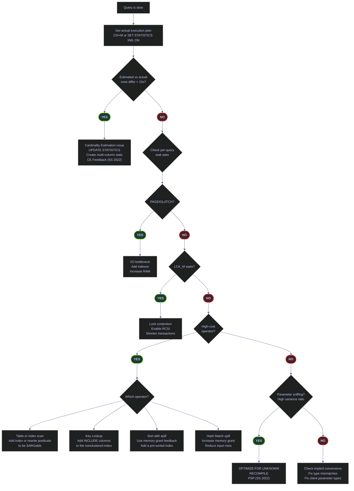
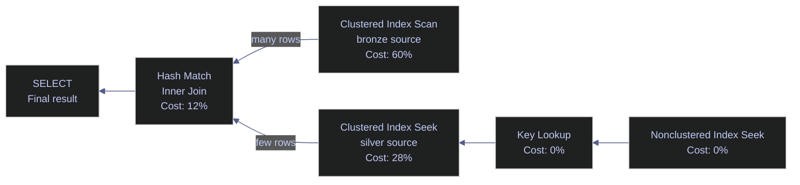
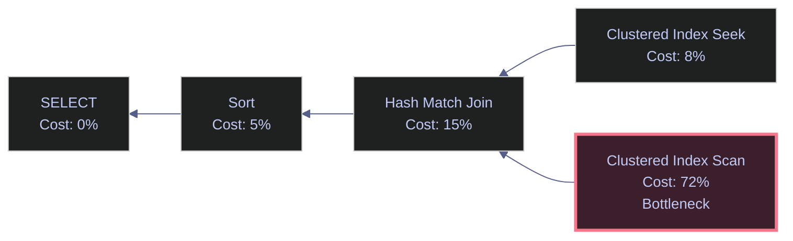
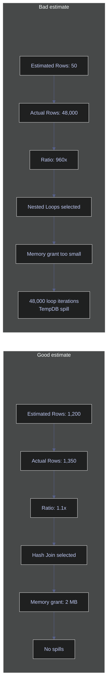
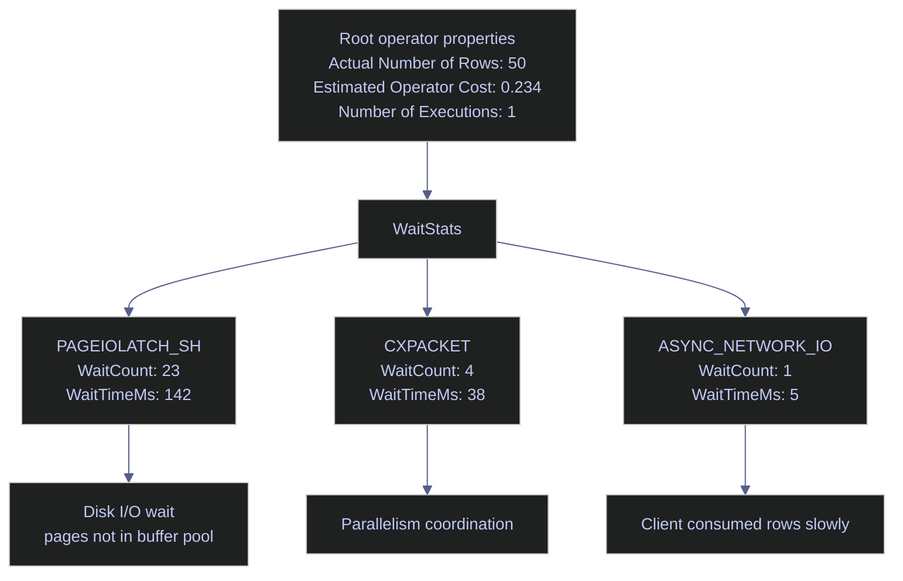

# Execution Plans

> [!quote]+
> "The query optimizer is the most sophisticated piece of software in any database system."
>
> — **Michael Stonebraker**, ACM interview

> [!abstract]- Summary
>
> Execution plans are SQL Server’s ground-truth performance narrative: they show which physical operators the optimizer chose, how many rows it expected versus actually processed, what waits or spills occurred, and which plan-shaping features were active. This note teaches how to capture those plans reproducibly in the `stoxx` lab, read them in SSMS or from XML, and turn the findings into safe tuning actions.
>
> **Plan capture and lab setup**
> - covers reproducible setup in `stoxx`, Query Store and last-plan capture settings, and the baseline configuration needed before plan analysis examples make sense
>
> **Plan reading surfaces**
> - covers estimated versus actual plans, SSMS visual tree reading, and non-SSMS programmatic capture through XML and DMVs
>
> **Core diagnostics**
> - covers cost hotspots, cardinality-estimation errors, per-query wait stats inside plans, and the operator-level clues behind slow batch workloads
>
> **Plan hazards and regressions**
> - covers implicit conversions, parameter sniffing, missing-index interpretation, and the plan patterns that hide I/O, memory-grant, or lookup problems
>
> **Modern optimizer features**
> - covers batch mode, Intelligent Query Processing, and related SQL Server 2022 behaviors that alter plan shape or runtime adaptation
>
> **Operations and safety**
> - Warnings: estimated plan cost percentages are comparative rather than absolute, plan cache contents are transient, stale statistics distort row estimates, missing-index suggestions are hints rather than commands, and some setup steps change database-scoped behavior
> - Recommendations: capture actual plans when possible, compare estimated and actual rows first, pair plan reading with wait evidence, treat Showplan XML as the source of truth behind the SSMS graph, and change lab or database-scoped options deliberately rather than casually

> [!note]- Glossary
>
> **Execution plan**
> - The optimizer-generated description of how SQL Server will execute or did execute a query, represented as a tree of physical operators.
> - It matters because the note’s entire workflow depends on reading this tree accurately before making any tuning decision.
>
> > [!info] The plan is the optimizer’s explanation
> >
> > A slow query can have many symptoms, but the execution plan is where SQL Server shows the chosen access paths, join strategy, and operator pipeline that produced those symptoms.
>
> ---
>
> **ShowplanXML**
> - The XML serialization format SQL Server uses for execution plans underneath graphical tools such as SSMS.
> - It matters because programmatic plan analysis and many advanced properties are easiest to access from the XML source, not from the rendered diagram.
>
> > [!warning] The diagram is a rendering, not the primary artifact
> >
> > SSMS is convenient, but it hides some details and can encourage shallow reading. When precision matters, inspect the XML-backed properties or the XML itself.
>
> ---
>
> **Physical operator**
> - A concrete execution step in a plan, such as an index seek, hash match, sort, or nested loops join.
> - It matters because performance diagnostics happen at the operator level, where row counts, spills, and access paths become visible.
>
> > [!info] The operator is where cost becomes behavior
> >
> > Tuning is rarely about the whole plan in the abstract. It is about understanding which specific operators are doing too much work and why.
>
> ---
>
> **Plan cache**
> - SQL Server’s in-memory store of compiled query plans that can be reused across executions.
> - It matters because plan reuse, plan eviction, and plan inspection workflows all depend on understanding that cached plans are transient shared state.
>
> > [!warning] Cached does not mean permanent
> >
> > Memory pressure, recompilation, statistics change, or configuration changes can evict or replace a cached plan. A missing cached plan is not evidence that the query never ran.
>
> ---
>
> **OBJCP / SQLCP**
> - The two main plan-cache pools where SQL Server stores object plans (`OBJCP`) and ad hoc or prepared SQL plans (`SQLCP`).
> - It matters because the note’s cache discussion distinguishes stored-procedure workloads from ad hoc query text and dynamic SQL.
>
> > [!info] Cache pool hints at workload shape
> >
> > Seeing where a plan lives helps explain whether it came from a module, a prepared statement, or ad hoc text. That context affects tuning and parameterization decisions.
>
> ---
>
> **Estimated plan**
> - A plan produced without running the query, based on optimizer assumptions and estimated row counts only.
> - It matters because it is easy to capture and useful for shape inspection, but it lacks runtime truth about actual rows, waits, and spills.
>
> > [!warning] Estimates are predictions, not observations
> >
> > An estimated plan can be logically correct and still miss the real runtime problem. It should be treated as a hypothesis until actual execution evidence confirms it.
>
> ---
>
> **Actual plan**
> - A plan captured during query execution that includes runtime metrics such as actual row counts and sometimes per-operator waits.
> - It matters because comparing actual versus estimated rows is one of the fastest ways to find the root cause of a bad plan.
>
> > [!info] Runtime truth starts here
> >
> > If a query is slow, the actual plan is usually the first meaningful artifact to inspect. It shows what the optimizer predicted and what the engine really encountered.
>
> ---
>
> **Cardinality estimate**
> - The optimizer’s prediction of how many rows a plan operator will produce or consume.
> - It matters because bad cardinality estimates are one of the main reasons SQL Server chooses the wrong join type, memory grant, or access path.
>
> > [!warning] Row-count error cascades
> >
> > A large estimate error near the top of the plan can poison many downstream choices. That is why estimate-versus-actual row comparison is such a high-value diagnostic step.
>
> ---
>
> **Memory grant and spill**
> - The memory reserved for plan operators such as sorts or hash joins, and the condition where that memory proves insufficient so data spills to tempdb.
> - It matters because spills often explain sudden slowdowns, tempdb pressure, and wait patterns that are not obvious from operator names alone.
>
> > [!warning] Sort or hash operators can become tempdb problems
> >
> > A spill is not just a slower operator. It changes the resource profile of the query by pulling tempdb and extra I/O into the runtime path.
>
> ---
>
> **Parameter sniffing**
> - The behavior where SQL Server compiles a reusable plan using the parameter values seen on the compilation execution.
> - It matters because one cached plan can be excellent for one parameter set and terrible for another.
>
> > [!warning] Reuse can be the source of variance
> >
> > A plan that works well for a selective parameter may catastrophically misfit a broad parameter, or the reverse. The issue is not the parameter itself, but the reuse of one plan shape for many distributions.
>
> ---
>
> **Batch mode**
> - A vectorized execution mode where operators process many rows at a time instead of row by row.
> - It matters because batch mode can radically change operator efficiency and plan behavior for analytical workloads.
>
> > [!info] Same logic, different execution engine feel
> >
> > Batch mode often makes large scans, aggregates, and joins far cheaper. Understanding whether a plan is in row mode or batch mode changes how you interpret its runtime profile.
>
> ---
>
> **Intelligent Query Processing**
> - The SQL Server feature family that adapts or improves runtime and compilation behavior through capabilities such as memory grant feedback, PSP, and CE-related refinements.
> - It matters because some plan issues are now partially mitigated by engine features, but those mitigations still need to be verified rather than assumed.
>
> > [!info] The engine can adapt, but not magically
> >
> > IQP features help many workloads, but they do not replace plan reading. A bad query shape or a poor data model can still defeat every adaptive feature in the stack.



---

## Reproducible Setup

This page mixes read-only DMV queries, session-level instrumentation, and database-scoped configuration changes. Run the setup below once in SSMS before executing the later examples so the plan cache, Query Store, and last-plan DMVs all have real `stoxx` data to inspect.

### SQL Server | lab setup | database context and capture flags

Every later example in the note assumes the same baseline: SQL Server 2022 at compatibility level 160, the local `stoxx` lab database, Query Store in `READ_WRITE` mode with broad capture, `LAST_QUERY_PLAN_STATS` on, and the advanced optimizer feedback switches enabled. The four components below establish that baseline, seed a reproducible demo query into the plan cache and Query Store, expose the `session_id` lookup you need for live-plan capture, and finally walk back the capture settings when the lab session is over.

#### Use the `stoxx` lab database

This sets the database context and verifies the database-level features that the rest of the page depends on.

*Set the database context and confirm the lab instance state before running the later DMV queries.*

> [!info]- `USE stoxx` and diagnostic row breakdown
>
> This batch switches the SSMS session to the `stoxx` database and returns one diagnostic row that confirms the database-level features the rest of the note relies on.
>
> - `USE stoxx;` changes the current database context for the session, so every unqualified system view reference after the `GO` runs against `stoxx`.
> - `GO` ends the first batch. That matters because `USE` affects the following batch, not statements that have already been compiled in the same batch.
> - `SELECT @@VERSION AS sql_server_version` returns the exact SQL Server build and edition. This is how you verify that version-sensitive features such as Query Store wait stats, PSP, and CE Feedback are actually available.
> - `DB_NAME() AS current_database` returns the name of the database currently in scope for this session. It should return `stoxx` if the `USE` worked.
> - `FROM sys.databases d WHERE d.name = DB_NAME()` restricts the query to the single row for the current database, rather than listing every database on the instance.
> - `d.compatibility_level`, `d.is_query_store_on`, and `d.is_read_committed_snapshot_on` expose the exact database settings that later sections depend on: optimizer generation, Query Store capture, and row-versioned read committed behavior.

```sql
USE stoxx;
GO

SELECT
    @@VERSION AS sql_server_version,
    DB_NAME() AS current_database,
    d.compatibility_level,
    d.is_query_store_on,
    d.is_read_committed_snapshot_on
FROM sys.databases d
WHERE d.name = DB_NAME();
GO
```

| sql_server_version | current_database | compatibility_level | is_query_store_on | is_read_committed_snapshot_on |
|---|---|---:|---:|---:|
| Microsoft SQL Server 2022 (RTM-CU23) (KB5078297) - 16.0.4236.2 (X64), Developer Edition (64-bit) on Linux (Ubuntu 22.04.5 LTS) | `stoxx` | 160 | 1 | 0 |

_This setup row is the first gate for the entire note. It confirms the session is in `stoxx`, the engine is SQL Server 2022, Query Store is already on, and `READ_COMMITTED_SNAPSHOT` is still off at capture time. That combination means the Query Store and IQP sections are expected to work, while the later RCSI section is still demonstrating a change that has not yet been applied._

| Column | Value | Watch | Meaning | Implication |
|---|---|---|---|---|
| `current_database` | `stoxx` | ✅ | The session is connected to the intended lab database. | Later outputs belong to the same database as the note text. |
| `current_database` | Anything else | ❌ | The session is running in the wrong database context. | Almost every later query becomes misleading until `USE stoxx;` is rerun. |
| `compatibility_level` | `160` | ✅ | SQL Server 2022 optimizer behavior is active. | PSP, CE Feedback, DOP Feedback, and the expected SQL Server 2022 plan behavior are available. |
| `compatibility_level` | `150` | Depends | SQL Server 2019 optimizer behavior is active. | Batch mode on rowstore can still work, but several SQL Server 2022-only sections no longer match the note. |
| `compatibility_level` | `140` or lower | ❌ | Older optimizer behavior is active. | Modern IQP features in this page are unavailable or behave differently. |
| `is_query_store_on` | `1` | ✅ | Query Store is enabled. | Query Store plan and runtime-stat queries can return persisted rows. |
| `is_query_store_on` | `0` | ❌ | Query Store is disabled. | Query Store sections will be empty or incomplete until it is enabled. |
| `is_read_committed_snapshot_on` | `0` | Depends | Read committed still uses locking semantics. | Good if you want to demonstrate the pre-RCSI state; readers should still expect reader-writer blocking to be possible. |
| `is_read_committed_snapshot_on` | `1` | ✅ | Read committed uses row-versioned snapshot scans. | The later RCSI enablement command becomes a verification step rather than a state change. |

#### Enable the capture features used later in this page

Several later sections assume Query Store is writable, one-off queries are captured, and the server retains the last actual plan for completed queries.

*Enable the database-scoped capture and feedback features referenced throughout the note.*

> [!warning] Later examples depend on these features being enabled
>
> Several later examples in this note will either return incomplete data or not work at all if these features are not enabled first.
>
> - The Query Store queries later in the page need Query Store to be `ON` and in `READ_WRITE` mode. If Query Store is off, those catalog views will be empty or misleading for this walkthrough.
> - The ad-hoc demo query used throughout the note is easiest to find when `QUERY_CAPTURE_MODE = ALL`. With the default `AUTO` mode, small one-off lab queries may not be captured.
> - The `sys.dm_exec_query_plan_stats` example depends on `LAST_QUERY_PLAN_STATS = ON`. Without it, that section will not return the last actual plan for completed statements.
> - The CE Feedback, PSP, Memory Grant Feedback persistence, and DOP Feedback sections describe SQL Server 2022 optimizer behaviors that only appear when those database-scoped features are enabled.
> - In production, do not enable everything blindly just because the lab note does. `QUERY_CAPTURE_MODE = ALL` increases Query Store write volume and storage use, and `LAST_QUERY_PLAN_STATS = ON` adds lightweight runtime-plan capture overhead. The optimizer-feedback features are usually appropriate for modern production databases, but they should still be enabled intentionally, monitored, and validated against your workload.
> - For a lab or troubleshooting session, enabling these settings up front is the simplest way to guarantee that every later command in this page produces observable output.

> [!success] Enable broadly in lab, enable narrowly in production
>
> Safe pattern:
>
> - In a lab or one-off investigation, enable the full batch below before running the walkthrough, then revert the extra capture settings afterward with the cleanup batch already included in this section.
> - In production, prefer enabling Query Store in `READ_WRITE` mode first, keep `QUERY_CAPTURE_MODE = AUTO` unless you specifically need ad-hoc capture, and turn on `LAST_QUERY_PLAN_STATS` only when you need last-actual-plan visibility badly enough to justify the extra overhead.
> - If you skip this batch, expect the later sections on Query Store, `sys.dm_exec_query_plan_stats`, CE Feedback, PSP, persisted Memory Grant Feedback, and DOP Feedback to be partially or completely unavailable.

> [!info]- `ALTER DATABASE` Query Store and scoped-config batch breakdown
>
> This batch enables the database-scoped features that later plan-analysis queries assume are already active.
>
> - `ALTER DATABASE stoxx SET QUERY_STORE = ON;` enables Query Store if it is currently disabled. Query Store is the persisted store for query text, plan history, runtime stats, and wait stats.
> - `ALTER DATABASE stoxx SET QUERY_STORE (...)` changes three Query Store options at once: `OPERATION_MODE = READ_WRITE` allows Query Store to capture new data, `QUERY_CAPTURE_MODE = ALL` forces even small ad-hoc statements to be captured, and `WAIT_STATS_CAPTURE_MODE = ON` stores per-query waits when available.
> - `GO` ends the database-level Query Store batch before the database-scoped configuration statements run.
> - `ALTER DATABASE SCOPED CONFIGURATION SET LAST_QUERY_PLAN_STATS = ON;` keeps the last actual plan for completed statements so `sys.dm_exec_query_plan_stats` can return real runtime plans.
> - `PARAMETER_SNIFFING`, `PARAMETER_SENSITIVE_PLAN_OPTIMIZATION`, and `CE_FEEDBACK` control optimizer behavior for the advanced sections later in the note.
> - `MEMORY_GRANT_FEEDBACK_PERCENTILE_GRANT`, `MEMORY_GRANT_FEEDBACK_PERSISTENCE`, and `DOP_FEEDBACK` enable the Intelligent Query Processing features that adjust memory grants and parallelism over repeated executions.
> - These statements change database behavior. They do not return rows, but they affect what later DMV queries and actual plans can show.

```sql
ALTER DATABASE stoxx SET QUERY_STORE = ON;
ALTER DATABASE stoxx SET QUERY_STORE (
    OPERATION_MODE = READ_WRITE,
    QUERY_CAPTURE_MODE = ALL,
    WAIT_STATS_CAPTURE_MODE = ON
);
GO

ALTER DATABASE SCOPED CONFIGURATION SET LAST_QUERY_PLAN_STATS = ON;
ALTER DATABASE SCOPED CONFIGURATION SET PARAMETER_SNIFFING = ON;
ALTER DATABASE SCOPED CONFIGURATION SET PARAMETER_SENSITIVE_PLAN_OPTIMIZATION = ON;
ALTER DATABASE SCOPED CONFIGURATION SET CE_FEEDBACK = ON;
ALTER DATABASE SCOPED CONFIGURATION SET MEMORY_GRANT_FEEDBACK_PERCENTILE_GRANT = ON;
ALTER DATABASE SCOPED CONFIGURATION SET MEMORY_GRANT_FEEDBACK_PERSISTENCE = ON;
ALTER DATABASE SCOPED CONFIGURATION SET DOP_FEEDBACK = ON;
GO
```

#### Seed the plan cache and Query Store with one repeatable demo query

Many later examples retrieve plans from cache or Query Store. This query gives those sections a stable statement to target.

*Run one tagged query three times so the plan-cache, Query Store, and `LAST_QUERY_PLAN_STATS` examples all have a known statement to inspect.*

> [!info]- Tagged demo `SELECT` query breakdown
>
> This query seeds both the plan cache and Query Store with one stable, easy-to-find statement that later examples can target.
>
> - `SELECT symbol, [date], [close], volume` returns four columns from the OHLCV fact table, which is enough to generate a real execution plan without returning unnecessary columns.
> - `FROM silver.eurostoxx50_ohlcv` uses the largest `stoxx` silver fact table in this lab, so the plan is representative rather than trivial.
> - `WHERE symbol = 'ASML.AS'` narrows the query to one stock and `AND [date] >= '2025-04-01' AND [date] < '2025-05-01'` defines a half-open April 2025 date range. The half-open pattern avoids ambiguity at month boundaries.
> - `/* execution-plans-demo */` is a query tag embedded in the batch text. Later DMV queries search for this exact tag so you can find this statement reliably in the cache.
> - `GO 3` tells SSMS to execute the entire batch three times. Repeating the same statement gives Query Store and the runtime DMVs more than one execution to aggregate.

```sql
SELECT
    symbol,
    [date],
    [close],
    volume
FROM silver.eurostoxx50_ohlcv
WHERE symbol = 'ASML.AS'
  AND [date] >= '2025-04-01'
  AND [date] < '2025-05-01'
/* execution-plans-demo */;
GO 3
```

| symbol | date | close | volume |
|---|---|---:|---:|
| ASML.AS | 2025-04-01 | 619.7 | 678551 |
| ASML.AS | 2025-04-02 | 616.3 | 678930 |
| ASML.AS | 2025-04-03 | 578.7 | 1145270 |
| ASML.AS | 2025-04-04 | 564.1 | 1994082 |
| ASML.AS | 2025-04-07 | 550.0 | 2619138 |

_This rowset is only a reproducibility check. It proves the tagged demo query is valid in `stoxx`, returns real April 2025 `ASML.AS` data, and therefore has something concrete to seed into both the plan cache and Query Store. By itself, this output is not performance evidence yet._

#### Find the session id for in-flight plan capture

The `sys.dm_exec_query_statistics_xml` example later in the page needs the `session_id` of a currently running or waiting user query from another SSMS window.

*Use the example below to generate active blocking and capture a live `session_id` together with wait and blocker context.*

> [!example]- Reproduce a live blocked request in 3 SSMS windows
>
> This is a lab-only workflow. It creates a disposable demo table, keeps one transaction open long enough to hold a lock, and intentionally blocks a second query so `sys.dm_exec_requests` returns a meaningful live user-session result.
>
> **Step 1. Run once in any window to create the demo table**
>
> ```sql
> USE stoxx;
> GO
>
> IF OBJECT_ID('dbo.dm_exec_requests_demo', 'U') IS NOT NULL
>     DROP TABLE dbo.dm_exec_requests_demo;
> GO
>
> CREATE TABLE dbo.dm_exec_requests_demo
> (
>     id int NOT NULL PRIMARY KEY,
>     payload char(200) NOT NULL DEFAULT REPLICATE('X', 200)
> );
> GO
>
> INSERT INTO dbo.dm_exec_requests_demo (id)
> VALUES (1);
> GO
> ```
>
> **Step 2. Window 1: open a transaction and keep the lock alive**
>
> ```sql
> USE stoxx;
> GO
>
> BEGIN TRAN;
>
> UPDATE dbo.dm_exec_requests_demo
> SET payload = payload
> WHERE id = 1;
>
> WAITFOR DELAY '00:01:00';
>
> ROLLBACK;
> GO
> ```
>
> **Alternative blocker pattern for Window 1: leave the blocker idle**
>
> ```sql
> USE stoxx;
> GO
>
> BEGIN TRAN;
>
> UPDATE dbo.dm_exec_requests_demo
> SET payload = payload
> WHERE id = 1;
>
> -- Do not COMMIT or ROLLBACK yet.
> -- Leave the session idle with the transaction still open.
> ```
>
> This variant is closer to what often happens in production. The blocking session may no longer appear in `sys.dm_exec_requests` because it has no active request, but it can still hold locks. In that case the observer query shows only the blocked victims, and `blocking_session_id` points to a session that must be inspected elsewhere.
>
> **Step 3. Window 2: run the victim query while Window 1 is still waiting**
>
> ```sql
> USE stoxx;
> GO
>
> SELECT payload
> FROM dbo.dm_exec_requests_demo WITH (UPDLOCK, HOLDLOCK)
> WHERE id = 1;
> GO
> ```
>
> **Step 4. Window 3: observe the live requests**
>
> ```sql
> SELECT
>     r.session_id,
>     DB_NAME(r.database_id) AS database_name,
>     s.login_name,
>     s.host_name,
>     s.program_name,
>     r.status,
>     r.command,
>     r.wait_type,
>     r.wait_time AS wait_time_ms,
>     r.cpu_time AS cpu_time_ms,
>     r.total_elapsed_time AS elapsed_time_ms,
>     r.logical_reads,
>     r.reads,
>     r.writes,
>     r.blocking_session_id,
>     LEFT(REPLACE(REPLACE(LTRIM(SUBSTRING(
>         st.text,
>         (r.statement_start_offset / 2) + 1,
>         CASE
>             WHEN r.statement_end_offset = -1 THEN (DATALENGTH(st.text) - r.statement_start_offset) / 2 + 1
>             ELSE (r.statement_end_offset - r.statement_start_offset) / 2 + 1
>         END
>     )), CHAR(13), ' '), CHAR(10), ' '), 160) AS running_statement
> FROM sys.dm_exec_requests AS r
> JOIN sys.dm_exec_sessions AS s
>     ON r.session_id = s.session_id
> CROSS APPLY sys.dm_exec_sql_text(r.sql_handle) AS st
> WHERE r.session_id <> @@SPID
>   AND s.is_user_process = 1
> ORDER BY r.total_elapsed_time DESC, r.session_id;
> ```
>
> **Step 5. Run cleanup in any window after the demo**
>
> ```sql
> USE stoxx;
> GO
>
> IF @@TRANCOUNT > 0
>     ROLLBACK;
> GO
>
> DROP TABLE IF EXISTS dbo.dm_exec_requests_demo;
> GO
> ```
>

> [!info]- `sys.dm_exec_requests` live triage query breakdown
>
> This production-focused query surfaces live user requests with enough context to identify who is running them, what they are waiting on, how long they have been active, how much work they have already done, and which exact statement is currently in flight.
>
> - `FROM sys.dm_exec_requests AS r` reads the dynamic management view that tracks requests currently executing or waiting on the server.
> - `JOIN sys.dm_exec_sessions AS s ON r.session_id = s.session_id` lets the query distinguish user sessions from internal engine sessions.
> - `CROSS APPLY sys.dm_exec_sql_text(r.sql_handle) AS st` attaches the SQL text for the batch behind the live request.
> - `DB_NAME(r.database_id)`, `s.login_name`, `s.host_name`, and `s.program_name` identify the workload origin so you can tell whether the request came from an application, a job, SSMS, or an ad hoc tool.
> - `status`, `command`, `wait_type`, `wait_time`, `cpu_time`, `total_elapsed_time`, `logical_reads`, `reads`, `writes`, and `blocking_session_id` expose the live execution state, current wait reason, elapsed duration, resource usage, and blocking chain.
> - The `SUBSTRING` expression uses `statement_start_offset` and `statement_end_offset` to extract the current statement inside the batch instead of returning the entire batch text. The surrounding `LTRIM`, `REPLACE`, and `LEFT(..., 160)` calls make that statement readable in a compact troubleshooting output.
> - `WHERE r.session_id <> @@SPID` excludes the session currently running this lookup query, so you do not accidentally inspect the wrong session.
> - `AND s.is_user_process = 1` removes engine background tasks such as `TASK MANAGER`, `LAZY WRITER`, and redo workers, leaving only real client sessions.
> - `ORDER BY r.total_elapsed_time DESC, r.session_id` pushes the longest-lived requests to the top, which is usually a better production default than pure session order.
> - The `session_id` value returned here is still the number you later assign to `@session_id` in the `sys.dm_exec_query_statistics_xml` example, but now the same query is also useful as a real production triage view.

```sql
SELECT
    r.session_id,
    DB_NAME(r.database_id) AS database_name,
    s.login_name,
    s.host_name,
    s.program_name,
    r.status,
    r.command,
    r.wait_type,
    r.wait_time AS wait_time_ms,
    r.cpu_time AS cpu_time_ms,
    r.total_elapsed_time AS elapsed_time_ms,
    r.logical_reads,
    r.reads,
    r.writes,
    r.blocking_session_id,
    LEFT(REPLACE(REPLACE(LTRIM(SUBSTRING(
        st.text,
        (r.statement_start_offset / 2) + 1,
        CASE
            WHEN r.statement_end_offset = -1 THEN (DATALENGTH(st.text) - r.statement_start_offset) / 2 + 1
            ELSE (r.statement_end_offset - r.statement_start_offset) / 2 + 1
        END
    )), CHAR(13), ' '), CHAR(10), ' '), 160) AS running_statement
FROM sys.dm_exec_requests AS r
JOIN sys.dm_exec_sessions AS s
    ON r.session_id = s.session_id
CROSS APPLY sys.dm_exec_sql_text(r.sql_handle) AS st
WHERE r.session_id <> @@SPID
  AND s.is_user_process = 1
ORDER BY r.total_elapsed_time DESC, r.session_id;
```

| session_id | database_name | login_name | host_name | program_name | status | command | wait_type | wait_time_ms | cpu_time_ms | elapsed_time_ms | logical_reads | reads | writes | blocking_session_id | running_statement |
|---|---|---|---|---|---|---|---|---:|---:|---:|---:|---:|---:|---:|---|
| 53 | stoxx | sa | ELYSIUM | Microsoft SQL Server Management Studio - Query | suspended | UPDATE | LCK_M_IX | 21737 | 0 | 21737 | 0 | 0 | 0 | 56 | `UPDATE [dbo].[dm_exec_requests_demo] SET [payload] = [payload] WHERE [id]=@1` |
| 62 | stoxx | sa | ELYSIUM | Microsoft SQL Server Management Studio - Query | suspended | SELECT | LCK_M_SCH_S | 11584 | 0 | 11584 | 0 | 0 | 0 | 56 | `SELECT payload FROM dbo.dm_exec_requests_demo WITH (UPDLOCK, HOLDLOCK) WHERE id = 1` |

_Both visible requests are victims, not the root blocker. Session `53` is an `UPDATE` waiting on `LCK_M_IX`, and session `62` is a `SELECT` waiting on `LCK_M_SCH_S`; both point to `blocking_session_id = 56`. Session `56` does not appear in `sys.dm_exec_requests` because that DMV only shows currently active requests, and a sleeping session with an open transaction can still hold incompatible locks without having a current request row. The timing columns show that both victims have been stalled for seconds, while `cpu_time_ms = 0`, `logical_reads = 0`, `reads = 0`, and `writes = 0` make it clear that the current bottleneck is lock waiting, not CPU work or I/O. `running_statement` shows exactly which statements are blocked, which lets you distinguish a blocked writer from a blocked reader before tracing the root blocker in session and lock DMVs._

| Column | Value | Watch | Meaning | Implication |
|---|---|---|---|---|
| `database_name` | Expected target database such as `stoxx` | ✅ | The request is running where you expect it to run. | Focus the investigation on that database's objects, indexes, and workload. |
| `database_name` | Unexpected database such as `master`, `tempdb`, or another user DB | ❌ | The request is not running in the database you assumed. | Re-scope the investigation before tuning the wrong database. |
| `login_name` | Expected service or application login | ✅ | The session identity matches the workload you are investigating. | Helps separate application traffic from ad hoc or administrative activity. |
| `login_name` | `sa` or an unexpected privileged login | Depends | The request is being executed under a broad administrative identity. | Check whether this is an emergency change, administrative action, or unsafe production practice. |
| `host_name` | Expected application host, jump box, or job runner | ✅ | The request came from a known origin. | Useful for routing the issue to the right team or node. |
| `host_name` | Unknown workstation or unexpected server | ❌ | The request origin is not what you expected. | Investigate ad hoc activity, rogue tooling, or a misrouted workload. |
| `program_name` | Expected application, agent, or client tool | ✅ | The client program matches the workload path you are tracing. | Helps separate application traffic from SSMS, ETL, or scripts. |
| `program_name` | `SQLCMD`, `Microsoft SQL Server Management Studio`, or other ad hoc tool in production | Depends | The request is coming from a manual or script-driven client, not necessarily from the application tier. | Check whether the issue is operational, not application-driven. |
| `status` | `running` | ✅ | The request is currently executing on a worker. | Best candidate when you want to capture an actively consuming statement. |
| `status` | `runnable` | Depends | The request is ready to run but waiting for scheduler time. | Look for CPU pressure or scheduler contention. |
| `status` | `suspended` | Depends | The request is waiting on a resource. | Use `wait_type` and `blocking_session_id` to determine whether the wait is benign or actionable. |
| `status` | `sleeping` | ❌ | The session is idle and not actively executing a request. | Not useful for in-flight plan capture or live request triage. |
| `command` | `SELECT` | ✅ | A read query is the active statement. | Investigate plan shape, blocking, row goals, and read volume. |
| `command` | `UPDATE` | Depends | A write statement is active or waiting. | Consider lock acquisition, transaction scope, and whether the write itself is the blocker or another victim. |
| `command` | `INSERT`, `UPDATE`, or `DELETE` | Depends | A write statement is active. | Consider locking impact, transaction length, log pressure, and index maintenance cost. |
| `command` | `WAITFOR` | Depends | The session is intentionally paused but the batch is still active. | Acceptable only when deliberate; otherwise it can indicate an agent loop, delay logic, or a held transaction. |
| `command` | Backup, restore, DBCC, or maintenance command | Depends | Administrative work is active. | Do not treat it like normal OLTP traffic; coordinate with operations first. |
| `wait_type` | Blank / `NULL` | Depends | No current wait is exposed for the request. | Often means the request is actively running or has just transitioned between waits. |
| `wait_type` | `WAITFOR` | ✅ | The request is sleeping inside a `WAITFOR` statement. | Acceptable only when deliberate; otherwise investigate why the session is intentionally delayed. |
| `wait_type` | `LCK_M_IX` | ❌ | The request is waiting to acquire an intent exclusive lock. | Usually indicates write-side blocking before SQL Server can proceed to finer-grained exclusive locking. |
| `wait_type` | `LCK_M_SCH_S` | ❌ | The request is waiting for a schema stability lock. | Often points to blocking from DDL, recompilation-sensitive activity, or a session holding an incompatible schema-level lock. |
| `wait_type` | `LCK_M_*` such as `LCK_M_U` | ❌ | The request is waiting on a lock. | Follow the blocker before tuning the victim query. |
| `wait_type` | `PAGEIOLATCH_*` | ❌ | The request is waiting for data pages to be read into memory. | Investigate storage latency, missing indexes, and cache residency. |
| `wait_type` | `CXPACKET` or `CXCONSUMER` | Depends | The request is participating in a parallel plan. | Check whether parallelism is helping or masking skew and grant issues. |
| `wait_type` | `ASYNC_NETWORK_IO` | Depends | SQL Server is waiting for the client to consume rows. | The bottleneck may be client-side rather than query-side. |
| `wait_time_ms` | `0-1000` | ✅ | The current wait is short. | Usually not enough by itself to justify urgent action. |
| `wait_time_ms` | `1000-10000` | Depends | The request has been waiting for seconds, not milliseconds. | Worth watching, especially on hot paths or high-frequency queries. |
| `wait_time_ms` | `>10000` | ❌ | The current wait is long-lived. | Escalate blocking, I/O, or scheduler investigation based on `wait_type`. |
| `cpu_time_ms` | Near `0` while `wait_type` shows a resource wait | ✅ | The request is mostly waiting, not burning CPU. | Focus on the wait reason rather than CPU tuning first. |
| `cpu_time_ms` | Close to `elapsed_time_ms` | ❌ | The request is spending most of its lifetime on CPU. | Investigate plan inefficiency, row volume, scalar work, or poor parallelism choices. |
| `elapsed_time_ms` | Low and stable | ✅ | The request is recent or transient. | A short-lived issue may be acceptable if it is not frequent. |
| `elapsed_time_ms` | Continuously growing | ❌ | The request is staying alive for a long time. | Prioritize it if it is blocking others or consuming resources. |
| `logical_reads` | `0-100` for point lookups or blocked waits | ✅ | The request has touched few buffer-pool pages so far. | Not a sign of read amplification by itself. |
| `logical_reads` | Large and rapidly increasing | ❌ | The request is scanning or repeatedly touching many pages. | Investigate index design, predicate shape, and row estimates. |
| `reads` | `0` while the request is blocked | ✅ | The session is not performing physical I/O during the wait. | Confirms the current bottleneck is not disk access. |
| `reads` | Nonzero and growing with `PAGEIOLATCH_*` waits | ❌ | Physical page reads are occurring. | Correlate with I/O waits and storage/cache conditions. |
| `writes` | `0` for a blocked reader | ✅ | The victim is not generating write I/O. | Supports the interpretation that it is waiting on a lock rather than changing data. |
| `writes` | Nonzero on a write-heavy request | Depends | The request is dirtying pages. | Consider transaction log pressure and downstream blocking impact. |
| `blocking_session_id` | `0` or `NULL` | ✅ | The request is not currently blocked, or a blocker is not identified. | Look elsewhere for the bottleneck. |
| `blocking_session_id` | Positive session id | ❌ | Another session is the blocker. | Trace the blocker first; if that session does not appear in `sys.dm_exec_requests`, it may be sleeping with an open transaction and must be investigated through session and lock metadata. |
| `blocking_session_id` | `-2`, `-3`, `-4`, or `-5` | ❌ | SQL Server is indicating a nonstandard blocker case rather than a normal user session. | Investigate distributed transactions, recovery, or latch ownership details before drawing conclusions. |
| `running_statement` | Precise current statement text | ✅ | The query isolates the exact statement currently executing inside the batch. | You can tune or trace the right statement instead of guessing from the full batch. |
| `running_statement` | Truncated or unexpectedly generic text | Depends | The current statement is long, dynamic, or parameterized. | Pull the full batch text or the full plan XML if you need more context. |

#### Optional cleanup after you finish collecting outputs

Return the capture settings to lighter defaults after collecting the required plans.

*Return Query Store and last-plan capture to their usual lab defaults after you finish the walkthrough.*

> [!warning] Run cleanup only after you have captured the outputs you need
>
> This batch reduces future capture detail. If you run it too early, later sections that rely on broad Query Store capture or last actual plan retention may stop returning the evidence you expect. It does not delete existing Query Store rows, but it does make the environment less observant for subsequent demos.

> [!success] Use it as an end-of-lab reset
>
> Keep the richer settings on while you are collecting plans, XML, waits, and feedback metadata. Run the cleanup batch only when you are done with the walkthrough or want to return the lab to a lighter baseline.

> [!info]- Capture cleanup batch breakdown
>
> This cleanup batch reverts the extra capture overhead introduced by the setup section without deleting the data you already captured.
>
> - `ALTER DATABASE stoxx SET QUERY_STORE (QUERY_CAPTURE_MODE = AUTO);` returns Query Store to automatic capture mode, where SQL Server decides which queries are worth persisting.
> - `ALTER DATABASE SCOPED CONFIGURATION SET LAST_QUERY_PLAN_STATS = OFF;` stops retaining the last actual plan for completed statements.
> - `GO` ends the cleanup batch cleanly in SSMS.
> - This batch changes future capture behavior only. It does not purge existing Query Store rows that were already collected.

```sql
ALTER DATABASE stoxx SET QUERY_STORE (QUERY_CAPTURE_MODE = AUTO);
ALTER DATABASE SCOPED CONFIGURATION SET LAST_QUERY_PLAN_STATS = OFF;
GO
```

---

## Estimated vs. Actual Plans

SQL Server exposes three different plan views depending on whether the query has already executed, is still running, or is being inspected before execution. Getting the right one for your diagnostic goal matters: estimated plans can mislead when statistics are stale, actual plans carry the runtime counters you actually need to reason about performance, and live plans animate data flow while the query is still in progress.

### SQL Server | plan variants | estimated, actual, and live capture

Choosing between estimated, actual, and live plans is almost always the first question when you start a performance investigation. The H4 below is a single comparison table that maps each plan variant to the SSMS shortcut or T-SQL flag that produces it and to the information it actually carries.

#### Compare estimated, actual, and live plan capture options

*Map each plan variant to how you produce it and what diagnostic information it contains.*

| Plan type | How to get it | What it shows |
|---|---|---|
| **Estimated** | SSMS: Ctrl+L, or `SET SHOWPLAN_XML ON` | What the optimizer *predicts* will happen — row counts, costs, operator choices. **No actual execution.** |
| **Actual** | SSMS: Ctrl+M then run, or `SET STATISTICS XML ON` | Everything above PLUS what *actually* happened — real row counts, real memory, spills, elapsed time. |
| **Live** | SSMS: Include Live Query Statistics | Real-time animation showing rows flowing through operators as the query runs. |

> [!tip] Always Use Actual Plans for Diagnosis
>
> Estimated plans can mislead when statistics are stale. The estimated cost percentages are computed from optimizer predictions — when those predictions are wrong, the cost distribution is wrong too. Always cross-reference with actual row counts.

---

## Reading the Visual Tree in SSMS

SQL Server execution plans are read **right-to-left, bottom-to-top**. The rightmost operators are the data sources (table/index scans and seeks). Data flows left through transformations (joins, sorts, aggregations) until it reaches the leftmost operator — the final `SELECT`, `INSERT`, or `UPDATE` result.



### SQL Server | plan tree | operators, arrows, and cost tooltips

Reading a SQL Server plan is a mechanical process once you know the order and the three properties that matter most on each operator. The H4 below walks that sequence end-to-end for the common shapes you will see on pipeline and dashboard queries.

#### Walk the plan from data sources to final SELECT

1. **Start at the far right.** These are the data access operators — where SQL Server touches tables/indexes. Look at their type:
   - **Index Seek** (good) — B-tree navigation to specific rows, O(log n). Requires [SARGable predicates](https://alp78.github.io/elysium/04-Databases/01-SQL-Server/03-Query-Writing-and-Optimization/sargable-queries) in the WHERE clause.
   - **Index Scan** (check context) — reads all leaf pages of an index
   - **Table Scan** (usually bad) — full heap scan, reads every page
   - **Key Lookup** (expensive if frequent) — bookmark lookup from NC index to [clustered index](https://alp78.github.io/elysium/04-Databases/01-SQL-Server/02-Database-Design-and-Storage/index-types-and-strategy). Fix by adding INCLUDE columns to the nonclustered index.
2. **Follow the arrows left.** Data flows through intermediate operators:
   - **Hash Match** — builds a hash table for joins or aggregations
   - **Merge Join** — merges two pre-sorted inputs (efficient if both are already sorted)
   - **Nested Loops** — for each row in outer input, seeks into inner input
   - **Sort** — sorts rows (watch for spill warnings)
   - **Filter** — applies WHERE conditions that couldn't be pushed to the seek
3. **End at the far left.** The result operator: `SELECT`, `INSERT`, `UPDATE`, or `DELETE`.
4. **Check arrow thickness.** A sudden thick-to-thin transition (or vice versa) reveals where filtering or explosion happens. A thick arrow into a Nested Loops operator with a thin inner input means many iterations — potential performance issue.
5. **Hover over each operator** for the tooltip. The critical properties are:
   - **Estimated/Actual Number of Rows** — are they close? (see Cardinality Estimation below)
   - **Estimated Operator Cost** — where is time being spent? (see Cost Analysis below)
   - **Number of Executions** — how many times was this operator invoked?
   - **Warnings** — yellow triangle icons indicate problems (spills, implicit conversions, missing indexes)

---

## Getting Plans from the Pipeline (Non-SSMS)

SSMS is the standard tool for interactive plan analysis, but data pipelines run unattended. You need programmatic methods to capture and store plans for post-execution review — from the volatile plan cache, from live sessions, or from Query Store for persistent history.

> [!info] Query Store
>
> Query Store is a built-in flight recorder for query performance data, introduced in SQL Server 2016. When enabled (`ALTER DATABASE db SET QUERY_STORE = ON`), it persists execution plans, runtime statistics, and wait stats to disk — surviving plan cache eviction and server restarts. Query Store is required for several SQL Server 2022 [Intelligent Query Processing](https://alp78.github.io/elysium/04-Databases/01-SQL-Server/03-Query-Writing-and-Optimization/execution-plans#intelligent-query-processing) features (CE Feedback, Memory Grant Feedback Persistence, DOP Feedback).

### SQL Server | DMV capture | programmatic plan retrieval

Pipelines run unattended, so you need ways to recover a plan after the query has finished. The three H4s below cover the three main sources: the volatile plan cache for recently executed statements, inline capture during execution, and the durable Query Store history that survives cache eviction and restarts.

#### Retrieve a cached plan from the plan cache

The plan cache holds compiled plans in memory. This query retrieves the plan for a specific query after it has executed. The plan cache is volatile — plans are evicted under memory pressure or after DDL changes.

> [!info]- `sys.dm_exec_query_plan` plan-cache lookup breakdown
>
> This query searches the plan cache for the tagged demo statement and returns the cached XML plan together with averaged resource metrics from the cache metadata.
>
> - `FROM sys.dm_exec_query_stats qs` is the main DMV. It stores aggregated execution statistics for cached statements, including execution counts, worker time, logical reads, and timestamps.
> - `CROSS APPLY sys.dm_exec_query_plan(qs.plan_handle) qp` uses the cached `plan_handle` to retrieve the Showplan XML for each cached statement.
> - `CROSS APPLY sys.dm_exec_sql_text(qs.sql_handle) st` retrieves the SQL batch text associated with the cached statement so the query can filter by text.
> - `qp.query_plan` is the XML execution plan, `qs.execution_count` is how many times the cached statement has executed, `avg_reads` divides `total_logical_reads` by `execution_count`, and `avg_cpu_ms` converts average worker time from microseconds to milliseconds.
> - `WHERE st.text LIKE '%execution-plans-demo%'` restricts the result set to the seeded demo statement instead of scanning every cached statement on the server.
> - `ORDER BY qs.last_execution_time DESC` returns the most recently executed matching cached entry first.

```sql
SELECT
    qp.query_plan,
    qs.execution_count,
    qs.total_logical_reads / qs.execution_count AS avg_reads,
    qs.total_worker_time / qs.execution_count / 1000 AS avg_cpu_ms
FROM sys.dm_exec_query_stats qs
CROSS APPLY sys.dm_exec_query_plan(qs.plan_handle) qp
CROSS APPLY sys.dm_exec_sql_text(qs.sql_handle) st
WHERE st.text LIKE '%execution-plans-demo%'
ORDER BY qs.last_execution_time DESC;
```

| execution_count | avg_reads | avg_cpu_ms |
|---:|---:|---:|
| 2 | 86 | 0 |

<!-- output separator -->

| query_plan_hash | root_op | operators | indexes |
|---|---|---|---|
| `0x0B9E9C3019B25F40` | Nested Loops | Nested Loops -> Index Seek -> Clustered Index Seek | `IX_silver_eurostoxx50_ohlcv_symbol_date`, `PK__eurostox__3213E83FDF67D274` |

_The first table is cache-level aggregate telemetry from `sys.dm_exec_query_stats`. It says the cached statement had executed twice, averaged 86 logical reads per execution, and consumed less than 1 ms of average worker time once rounded to milliseconds. Because SQL Server and Query Store both express these counters as aggregated plan metrics, the right reading is “cheap and stable so far,” not “guaranteed fast forever.” The second table is the XML-plan summary: the same statement shape is identified by one `query_plan_hash`, and the operator chain shows a nonclustered seek on `(symbol, date)` followed by clustered lookups for the non-covered columns `close` and `volume`._

| Column | Value | Watch | Meaning | Implication |
|---|---|---|---|---|
| `execution_count` | `1` | Depends | Only one execution contributed to the cache row. | Enough to inspect plan shape, but too little history for trend analysis. |
| `execution_count` | `2-10` | Depends | Light execution history. | Still a small sample; avoid broad conclusions until the query has executed more times. |
| `execution_count` | `>10` | ✅ | Repeated plan reuse is happening. | Average metrics become more representative of normal behavior. |
| `avg_reads` | `0-10` | ✅ | Extremely selective access, usually a point lookup or tiny seek. | Usually not an I/O concern unless executed at very high frequency. |
| `avg_reads` | `10-100` | ✅ | Modest buffer-pool work per execution. | Common and often acceptable for selective transactional queries. |
| `avg_reads` | `100-1000` | Depends | Moderate memory traffic per execution. | Acceptable for wider predicates, but worth checking on hot paths. |
| `avg_reads` | `>1000` | ❌ | Heavy page access per execution. | Investigate scans, key lookups, or missing indexes. |
| `avg_cpu_ms` | `<1 ms` | ✅ | CPU cost is trivial or rounded below 1 ms. | CPU is not the pressure point for this statement in the captured sample. |
| `avg_cpu_ms` | `1-10 ms` | ✅ | Low CPU consumption. | Usually acceptable unless the statement runs constantly. |
| `avg_cpu_ms` | `10-50 ms` | Depends | Moderate CPU usage. | Fine for some workloads, but monitor if frequency is high. |
| `avg_cpu_ms` | `>50 ms` | ❌ | CPU cost is materially noticeable. | Investigate expensive expressions, joins, sorts, or poor row estimates. |
| `root_op` | `Nested Loops` | ✅ | Loop join chosen for relatively selective probing. | A good sign when outer-row counts are low. |
| `operators` | `Index Seek -> Clustered Index Seek` | Depends | The plan is selective but not fully covered. | Fine for small result sets; can degrade as qualifying rows grow because each row triggers lookups. |
| `query_plan_hash` | Same hash across cache, Query Store, and last-plan sections | ✅ | Multiple telemetry sources are pointing at the same physical plan. | Cross-section comparisons in the note are valid. |

> [!tip] Click the XML result in SSMS to open the graphical plan viewer.

#### Capture the live actual plan inline with a session flag

Wrapping a query with `SET STATISTICS XML ON/OFF` adds the full execution plan as an additional XML result set column. This is the standard method for capturing actual plans from pipeline scripts during development.

> [!warning] Extra XML result set and session-scoped instrumentation
>
> `SET STATISTICS XML ON` changes the shape of what the session returns: every subsequent statement emits an extra XML plan result set until you turn it off. That is usually fine in SSMS, but it can confuse application code, automation, or notebooks that expect only the normal query result. It also adds overhead, so do not leave it on in busy production troubleshooting loops.

> [!success] Use it in an isolated SSMS session and turn it off immediately after the target query
>
> This pattern is appropriate for labs, one-off investigations, and scripted captures where you explicitly want the actual plan XML inline with the query output.

> [!info]- `SET STATISTICS XML ON` inline capture breakdown
>
> This batch executes the demo query and tells SQL Server to append the actual execution plan as an extra XML result set.
>
> - `SET STATISTICS XML ON;` enables actual Showplan XML output for every subsequent statement in the session until it is turned off.
> - The `SELECT` reads four business columns from `silver.eurostoxx50_ohlcv` for one symbol over one month. That keeps the result understandable while still producing a non-trivial plan.
> - The same `/* execution-plans-demo */` tag is preserved so the exact statement text still matches the later plan-cache searches.
> - `SET STATISTICS XML OFF;` disables XML plan output for later statements in the session, so only this query emits the extra plan result set.
> - The batch returns two things: normal row data in the first result set and the actual execution plan XML in a second result set.

```sql
SET STATISTICS XML ON;

SELECT
    symbol,
    [date],
    [close],
    volume
FROM silver.eurostoxx50_ohlcv
WHERE symbol = 'ASML.AS'
  AND [date] >= '2025-04-01'
  AND [date] < '2025-05-01'
/* execution-plans-demo */;

SET STATISTICS XML OFF;
```

| symbol | date | close | volume |
|---|---|---:|---:|
| ASML.AS | 2025-04-01 | 619.7 | 678551 |
| ASML.AS | 2025-04-02 | 616.3 | 678930 |
| ASML.AS | 2025-04-03 | 578.7 | 1145270 |
| ASML.AS | 2025-04-04 | 564.1 | 1994082 |
| ASML.AS | 2025-04-07 | 550.0 | 2619138 |

<!-- output separator -->

| query_plan_hash | root_op | operators | root_actual_rows | seek_logical_reads | key_lookup_logical_reads |
|---|---|---|---:|---:|---:|
| `0x0B9E9C3019B25F40` | Nested Loops | Nested Loops -> Index Seek -> Clustered Index Seek | 20 | 2 | 44 |

_The first table is the business rowset, and the second table is the actual-plan summary derived from the XML result set produced by `SET STATISTICS XML ON`. The important point is not just that 20 ASML rows were returned, but that the actual plan shows where the work happened: only 2 logical reads on the seek itself, versus 44 logical reads on the clustered key lookups. That is the textbook signature of a selective access path that still pays extra work for non-covered columns._

| Column | Value | Watch | Meaning | Implication |
|---|---|---|---|---|
| `root_actual_rows` | Exact match to returned row count | ✅ | The plan summary is aligned with the visible query result. | You can safely tie the operator work to the business rowset. |
| `root_actual_rows` | Much higher than expected | ❌ | More rows flowed through the plan than the reader may assume from the preview. | Recheck filters, row goals, or hidden branches in the plan. |
| `seek_logical_reads` | `0-10` | ✅ | The access method itself is cheap. | The index key is selective and doing its job. |
| `seek_logical_reads` | `>100` | ❌ | Even the seek phase is touching many pages. | Predicate selectivity or index design may be poor. |
| `key_lookup_logical_reads` | Lower than seek reads | ✅ | Lookup overhead is minor. | The plan is close to being efficient enough already. |
| `key_lookup_logical_reads` | Similar to or higher than seek reads | Depends | Lookup overhead is material. | Consider a covering index if this query is important or frequent. |
| `operators` | `Index Seek -> Clustered Index Seek` | Depends | Good selectivity, but the index does not cover all requested columns. | Fine for small row counts; risky if row count grows. |

#### Retrieve persisted plan history from Query Store

Query Store captures plans across restarts, making it the preferred source for historical plan analysis and regression detection. Unlike the plan cache, plans in Query Store are durable.

> [!info]- `sys.query_store_plan` four-way join breakdown
>
> This query reads persisted plan history from Query Store and returns recent plan records for the seeded demo query.
>
> - `FROM sys.query_store_runtime_stats qsrs` is the main source. It contains aggregated runtime metrics for a specific plan over a specific Query Store time interval.
> - `JOIN sys.query_store_plan qsp ON qsrs.plan_id = qsp.plan_id` attaches the runtime stats row to the exact execution plan that produced those metrics.
> - `JOIN sys.query_store_query qsq ON qsp.query_id = qsq.query_id` maps the physical plan back to the logical query identity.
> - `JOIN sys.query_store_query_text qsqt ON qsq.query_text_id = qsqt.query_text_id` retrieves the original SQL text associated with that query.
> - `TRY_CAST(qsp.query_plan AS XML) AS plan_xml` converts the stored plan payload into XML so it can be opened directly in SSMS.
> - `avg_ms` converts Query Store duration from microseconds to milliseconds, and `qsrs.avg_logical_io_reads` exposes average buffer-pool page reads.
> - The `WHERE` clause filters the Query Store catalog to plans whose SQL text contains both the target table name and the `ASML.AS` literal. `ORDER BY qsp.last_execution_time DESC` returns the most recently used matching plan first, and `TOP 20` caps the output.

```sql
SELECT TOP 20
    qsqt.query_sql_text,
    TRY_CAST(qsp.query_plan AS XML) AS plan_xml,
    qsrs.avg_duration / 1000 AS avg_ms,
    qsrs.avg_logical_io_reads
FROM sys.query_store_runtime_stats qsrs
JOIN sys.query_store_plan qsp ON qsrs.plan_id = qsp.plan_id
JOIN sys.query_store_query qsq ON qsp.query_id = qsq.query_id
JOIN sys.query_store_query_text qsqt ON qsq.query_text_id = qsqt.query_text_id
WHERE qsqt.query_sql_text LIKE '%silver.eurostoxx50_ohlcv%'
  AND qsqt.query_sql_text LIKE '%ASML.AS%'
ORDER BY qsp.last_execution_time DESC;
```

| query_sql_text | avg_ms | avg_logical_io_reads | query_plan_hash | root_op | operators | indexes |
|---|---:|---:|---|---|---|---|
| `SELECT symbol, [date], [close], volume FROM silver.eurostoxx50_ohlcv WHERE symbol = 'ASML.AS' AND [date] >= '2025-04-01' AND [date] < '2025-05-01'` | 0.217 | 86 | `0x0B9E9C3019B25F40` | Nested Loops | Nested Loops -> Index Seek -> Clustered Index Seek | `IX_silver_eurostoxx50_ohlcv_symbol_date`, `PK__eurostox__3213E83FDF67D274` |

_This row is the durable Query Store version of the same query shape seen in the volatile plan cache. Microsoft documents `avg_duration` as microseconds and `avg_logical_io_reads` as 8 KB pages, so after the conversion in this query the output says: this plan averaged `0.217 ms` per execution and about `86` logical page reads, or roughly `688 KB` of buffer-pool page access per execution. That is a fast query. The `query_plan_hash` matching the cache section matters because it proves Query Store and the plan cache were describing the same physical plan, not two different plans that only happened to query the same table._

| Column | Value | Watch | Meaning | Implication |
|---|---|---|---|---|
| `avg_ms` | `<1 ms` | ✅ | Usually trivial elapsed time for one Query Store runtime-stats row. | The query is not a tuning priority unless it runs extremely often. |
| `avg_ms` | `1-10 ms` | ✅ | Generally healthy for short lookup-style work. | Usually acceptable unless the statement is on a hot path. |
| `avg_ms` | `10-50 ms` | Depends | Still often acceptable, but no longer negligible. | Review frequency and business criticality before ignoring it. |
| `avg_ms` | `50-200 ms` | Depends | Noticeable latency. | Worth checking if the statement executes frequently. |
| `avg_ms` | `200-1000 ms` | ❌ | Materially expensive for most interactive workloads. | Investigate plan quality, row estimates, and indexing. |
| `avg_ms` | `>1000 ms` | ❌ | Clear tuning target unless the query is intentionally batch/reporting work. | Expect deeper plan analysis. |
| `avg_logical_io_reads` | `0-10` | ✅ | Tiny page-touch footprint. | Typical of very selective point lookups. |
| `avg_logical_io_reads` | `10-100` | ✅ | Modest logical I/O footprint. | Common and usually acceptable for selective seeks. |
| `avg_logical_io_reads` | `100-1000` | Depends | Moderate buffer-pool work. | Fine for medium-range queries, but watch hot-path frequency. |
| `avg_logical_io_reads` | `>1000` | ❌ | Large page-touch footprint per execution. | Investigate scans, lookups, or wider-than-expected predicates. |
| `avg_logical_io_reads` | `86` in this capture | ✅ | About `86 x 8 KB = 688 KB` of logical page access. | Not alarming on its own. The query is fast and the I/O footprint is still modest. |
| `root_op` | `Nested Loops` | ✅ | Query Store preserved the same join strategy as the cache capture. | The plan is still a seek-plus-lookup plan, not a regression to a scan-heavy shape. |
| `query_plan_hash` | Same hash as the cache and last-actual-plan sections | ✅ | Same physical plan across telemetry sources. | Cross-source comparisons in the note are trustworthy. |

> [!tip] One Query Store row is one plan in one aggregation interval
>
> `avg_ms` and `avg_logical_io_reads` do not represent the query for all time. They represent one Query Store runtime-stats row for one plan in one interval. If the same query has multiple plans or multiple intervals, you must aggregate or compare those rows explicitly before making historical claims.

### SQL Server | lightweight profiling | in-flight and last-actual plans

SQL Server 2019+ enables **lightweight profiling (v3) by default** — collecting per-operator row counts for every query execution with minimal overhead (~2%). This replaces the need for `SET STATISTICS XML ON` in many production scenarios, because you can retrieve the last actual execution plan for any session without adding instrumentation to the query itself. The two H4s below use its two main access points: a live in-flight lookup by `session_id` and a retroactive lookup for the last actual plan of a statement that already finished.

#### Capture the live in-flight actual plan of a running query

This DMV returns the actual execution plan (with runtime statistics) for a currently running query. Call it from a separate session, passing the target session's `session_id`. No prior setup is needed on SQL Server 2019+.

> [!info]- `sys.dm_exec_query_statistics_xml` in-flight plan breakdown
>
> This query asks SQL Server for the live actual plan of a request that is still running right now.
>
> - `DECLARE @session_id smallint = 0;` defines the target session number. Replace `0` with the real `session_id` collected from `sys.dm_exec_requests`.
> - `sys.dm_exec_query_statistics_xml(@session_id)` is a table-valued function that returns the current in-flight actual plan, including runtime counters gathered by lightweight profiling.
> - `SELECT *` returns every column exposed by that function. The important payload is the XML plan document.
> - This query must run from a different SSMS window than the target query. If the target request finishes before you run this function, the function will return no current in-flight plan.

```sql
DECLARE @session_id smallint = 0;

SELECT *
FROM sys.dm_exec_query_statistics_xml(@session_id);
```

*No embedded row here, because this DMV only returns a result while a different session is still executing.*

> [!tip] Finding the session_id
>
> Reuse the production `sys.dm_exec_requests` query and pick the `session_id` for the live user request you want to inspect.

#### Retrieve the last actual plan of a completed statement

When enabled, SQL Server retains the last actual execution plan statistics for completed queries, accessible via `sys.dm_exec_query_plan_stats`. This gives you actual plans for queries that have already finished, without requiring `SET STATISTICS XML ON` during execution.

> [!info]- `sys.dm_exec_query_plan_stats` last-actual-plan breakdown
>
> This query retrieves the last actual execution plan captured for the tagged demo statement after that statement has already finished running.
>
> - `FROM sys.dm_exec_query_stats qs` supplies the cached execution metadata for completed statements.
> - `CROSS APPLY sys.dm_exec_query_plan_stats(qs.plan_handle) qp` uses the plan handle to retrieve the last actual runtime plan, not just the estimated cached plan. This only works when `LAST_QUERY_PLAN_STATS` is enabled.
> - `CROSS APPLY sys.dm_exec_sql_text(qs.sql_handle) st` retrieves the statement text so the query can isolate the demo statement.
> - `qp.query_plan` is the captured actual plan XML, `qs.execution_count` shows how many times that cached statement executed, and `qs.last_elapsed_time / 1000` converts the last execution duration from microseconds to milliseconds.
> - `WHERE st.text LIKE '%execution-plans-demo%'` narrows the result to the tagged demo statement.
> - `ORDER BY qs.last_execution_time DESC` returns the most recently executed matching statement first.

```sql
SELECT
    qp.query_plan,
    qs.execution_count,
    qs.last_elapsed_time / 1000 AS last_ms
FROM sys.dm_exec_query_stats qs
CROSS APPLY sys.dm_exec_query_plan_stats(qs.plan_handle) qp
CROSS APPLY sys.dm_exec_sql_text(qs.sql_handle) st
WHERE st.text LIKE '%execution-plans-demo%'
ORDER BY qs.last_execution_time DESC;
```

| execution_count | last_ms |
|---:|---:|
| 2 | 0 |

<!-- output separator -->

| query_plan_hash | root_op | operators | indexes |
|---|---|---|---|
| `0x0B9E9C3019B25F40` | Nested Loops | Nested Loops -> Index Seek -> Clustered Index Seek | `IX_silver_eurostoxx50_ohlcv_symbol_date`, `PK__eurostox__3213E83FDF67D274` |

_This DMV gives you the last known actual plan after execution has already finished. The first table tells you the cached statement had been executed twice and that the most recent elapsed time rounded down below 1 ms. The second table matters more: it proves the preserved last actual plan was still the same seek-plus-key-lookup shape seen in the plan cache and Query Store. In practice, this DMV is most useful when the query is already gone by the time you start troubleshooting._

| Column | Value | Watch | Meaning | Implication |
|---|---|---|---|---|
| `execution_count` | `1` | Depends | You only have one completed execution in the cache row. | Fine for confirming the last plan, weak for trend analysis. |
| `execution_count` | `>1` | ✅ | The statement has reused the same cached entry. | Useful for comparing “last execution” against broader averages elsewhere. |
| `last_ms` | `<1 ms` | ✅ | The last completed execution was trivial once rounded to milliseconds. | The query is not currently a latency concern. |
| `last_ms` | `1-10 ms` | ✅ | Low elapsed time for the most recent execution. | Usually healthy for a selective lookup. |
| `last_ms` | `10-100 ms` | Depends | The last execution is no longer negligible. | Compare against cache averages to see whether this was a one-off. |
| `last_ms` | `>100 ms` | ❌ | The latest execution was noticeably slow. | Inspect actual rows, waits, and parameter values. |
| `query_plan_hash` | Same as other sections | ✅ | The last actual plan matches the other captured sources. | The note is showing one stable plan, not conflicting telemetry. |

> [!warning] Permissions Change in SQL Server 2022
>
> `sys.dm_exec_query_statistics_xml` requires `VIEW SERVER STATE` on SQL Server 2019 and earlier, but `VIEW SERVER PERFORMANCE STATE` on SQL Server 2022+.

> [!success] Grant the new permission on SQL Server 2022+ instances
>
> `GRANT VIEW SERVER PERFORMANCE STATE TO [pipeline_user];`

---

## Cost Analysis — Finding the Most Expensive Operator

Every operator in the execution plan shows an **Estimated Operator Cost** as a percentage of the total query cost. This tells you where to focus optimization effort. The cost is a dimensionless number derived from the optimizer's internal model — it combines estimated I/O and CPU work but does not represent seconds, milliseconds, or any real-time unit.



### SQL Server | plan cost | interpretation and extraction

Estimated Operator Cost percentages come from the optimizer's internal model, not from real execution. The four H4s below first translate the percentage ranges into operational thresholds, then show how to extract per-operator cost data from plan XML, how to split that cost into I/O and CPU components, and finally how to cross-check estimated cost against real `STATISTICS TIME/IO` numbers for the same query.

#### Interpret Estimated Operator Cost percentage ranges

| Cost range | What it means | Action |
|---|---|---|
| 0-5% | Negligible | Ignore — not worth optimizing |
| 5-20% | Normal | Check only if query is slow overall |
| 20-50% | Significant | Investigate — might benefit from an index or query rewrite |
| 50-100% | Dominant | This operator is the bottleneck. Fix this first. |

#### Shred operator costs from cached plan XML

> [!info]- Operator-cost XML shredder breakdown
>
> This two-step batch finds the most recent tagged demo statement and then shreds its XML plan into one row per physical operator.
>
> - `DECLARE @sql_handle varbinary(64);` creates a variable that will hold the plan-cache SQL handle for one statement.
> - The first `SELECT TOP (1)` reads `sys.dm_exec_query_stats` and `sys.dm_exec_sql_text` to find the most recently executed cached statement whose text contains `execution-plans-demo`.
> - `@sql_handle = qs.sql_handle` stores the handle for that one statement so the second query can target a single cached batch rather than every plan in cache.
> - `;WITH XMLNAMESPACES (...)` declares the Showplan XML namespace that SQL Server uses in plan documents. Without that namespace, the XPath queries against `RelOp` nodes would not match.
> - `CROSS APPLY qp.query_plan.nodes('//RelOp') AS T(node)` expands the XML so that each physical operator in the execution plan becomes one output row.
> - The selected attributes break down the optimizer's estimated cost model: `@PhysicalOp` is the operator name, `@EstimatedTotalSubtreeCost` is the cumulative cost below that node, `@EstimateRows` is the estimated row count, and `@EstimateIO` and `@EstimateCPU` split the estimated work into I/O and CPU components.
> - `WHERE qs.sql_handle = @sql_handle` keeps the output limited to the one tagged demo statement, and `ORDER BY subtree_cost DESC` ranks the operators from most expensive estimated subtree to least expensive.

```sql
DECLARE @sql_handle varbinary(64);

SELECT TOP (1)
    @sql_handle = qs.sql_handle
FROM sys.dm_exec_query_stats qs
CROSS APPLY sys.dm_exec_sql_text(qs.sql_handle) st
WHERE st.text LIKE '%execution-plans-demo%'
ORDER BY qs.last_execution_time DESC;

;WITH XMLNAMESPACES (DEFAULT 'http://schemas.microsoft.com/sqlserver/2004/07/showplan')
SELECT
    node.value('@PhysicalOp', 'varchar(50)') AS operator_name,
    node.value('@EstimatedTotalSubtreeCost', 'float') AS subtree_cost,
    node.value('@EstimateRows', 'float') AS estimated_rows,
    node.value('@EstimateIO', 'float') AS io_cost,
    node.value('@EstimateCPU', 'float') AS cpu_cost
FROM sys.dm_exec_query_stats qs
CROSS APPLY sys.dm_exec_query_plan(qs.plan_handle) qp
CROSS APPLY qp.query_plan.nodes('//RelOp') AS T(node)
WHERE qs.sql_handle = @sql_handle
ORDER BY subtree_cost DESC;
```

| operator_name | subtree_cost | estimated_rows | io_cost | cpu_cost |
|---|---:|---:|---:|---:|
| Sort | 0.0313798 | 135 | 0.0112613 | 0.00159444 |
| Compute Scalar | 0.0185241 | 135 | 0 | 0.0000135 |
| Filter | 0.0185106 | 135 | 0 | 0.00132 |
| Nested Loops | 0.0171906 | 1500 | 0 | 0.00627 |
| Nested Loops | 0.00942047 | 1500 | 0 | 0.00627 |

_These numbers come from the optimizer's cost model, not from measured runtime. In this capture, `Sort` has the highest `subtree_cost`, which means SQL Server estimated that ordering work would dominate the plan branch more than the join or scalar computation. That does not prove the sort was the real runtime bottleneck. It only tells you where the optimizer believed the most combined I/O-plus-CPU work would be, which is why you should confirm it against actual rows and `STATISTICS IO/TIME`._

| Column | Value | Watch | Meaning | Implication |
|---|---|---|---|---|
| `subtree_cost` | Highest row in the result set | ✅ | Highest estimated branch cost in the plan. | Start your cost-focused inspection here. |
| `estimated_rows` | Close to actual rows later in the note | ✅ | The optimizer's row model is behaving reasonably. | Cost ranking is more trustworthy. |
| `estimated_rows` | Far from actual rows | ❌ | Cost ranking is being driven by bad assumptions. | Fix statistics or cardinality issues before trusting the cost order. |
| `io_cost` greater than `cpu_cost` | Depends | SQL Server expects page access to dominate. | Investigate selectivity, scans, and indexing first. |
| `cpu_cost` greater than `io_cost` | Depends | SQL Server expects computation to dominate. | Investigate sorts, hashes, and expressions first. |

#### Break down per-operator cost into I/O versus CPU

Each operator's cost is split into I/O cost and CPU cost:

- **High IO cost** → the operator is reading many pages from disk/buffer pool. Solution: add [indexes](https://alp78.github.io/elysium/04-Databases/01-SQL-Server/02-Database-Design-and-Storage/index-types-and-strategy) to reduce pages read, or add RAM for better buffer pool hit ratio.
- **High CPU cost** → the operator is doing heavy computation (sorting, hashing, string comparisons). Solution: reduce the number of rows reaching this operator, or simplify the expression.

> [!warning] Cost Percentages Are Based on Estimates
>
> Cost percentages are based on the optimizer's **estimates**, not actual execution. If statistics are stale, the cost distribution can be completely wrong. A scan showing "5%" might actually dominate execution time if the optimizer underestimated the row count. Always cross-reference costs with **actual row counts** and `SET STATISTICS TIME/IO` output.

> [!success] Always verify cost percentages against actual row counts and `SET STATISTICS TIME/IO`
>
> Run with `SET STATISTICS TIME ON; SET STATISTICS IO ON;` alongside the actual execution plan (Ctrl+M). Compare the reported elapsed time per statement against the plan's cost percentages — a mismatch signals stale statistics. Run `UPDATE STATISTICS table WITH FULLSCAN` to correct estimates.

#### Capture actual timing and logical reads per statement

These session-level settings report actual I/O and CPU measurements per statement — not per operator, but they validate total query-level performance against the plan's cost distribution.

> [!warning] Session-scoped diagnostics with noisy output
>
> `SET STATISTICS TIME ON` and `SET STATISTICS IO ON` keep emitting Messages-pane diagnostics for every later statement in the same session until they are turned off. That is safe for manual troubleshooting, but it is noisy in shared scripts and can break parsers that expect clean output. The numbers are statement-level totals, not operator-level timings, so do not over-interpret them as a substitute for the actual plan.

> [!success] Use them to validate the plan, not replace it
>
> Run them in SSMS or another manual session alongside the actual execution plan, capture the Messages output you care about, then turn both settings back off immediately.

> [!info]- `SET STATISTICS TIME/IO ON` instrumentation breakdown
>
> This batch runs the demo query with both timing and I/O instrumentation enabled so SSMS writes real resource usage to the Messages pane.
>
> - `SET STATISTICS TIME ON;` tells SQL Server to report parse, compile, CPU, and elapsed execution times for subsequent statements in this session.
> - `SET STATISTICS IO ON;` tells SQL Server to report per-table logical reads, physical reads, and scan counts for subsequent statements.
> - The `SELECT` itself is the same tagged ASML April 2025 demo query used throughout the page, so the timing and I/O output can be compared directly to the cached plan examples.
> - The row result still returns normally. The instrumentation adds extra diagnostic text in the Messages pane rather than changing the result set shape.
> - `SET STATISTICS TIME OFF;` and `SET STATISTICS IO OFF;` stop the extra diagnostics so later statements do not continue producing timing and I/O output.

```sql
SET STATISTICS TIME ON;
SET STATISTICS IO ON;

SELECT
    symbol,
    [date],
    [close],
    volume
FROM silver.eurostoxx50_ohlcv
WHERE symbol = 'ASML.AS'
  AND [date] >= '2025-04-01'
  AND [date] < '2025-05-01'
/* execution-plans-demo */;

SET STATISTICS TIME OFF;
SET STATISTICS IO OFF;
```

| metric | value |
|---|---|
| row_count | 20 |
| table | `silver.eurostoxx50_ohlcv` |
| scan_count | 1 |
| logical_reads | 70 |
| physical_reads | 0 |
| CPU_ms | 1 |
| elapsed_ms | 0 |

_This is statement-level runtime evidence rather than plan estimates. The query returned 20 rows, touched 70 logical 8 KB pages, performed no physical reads, used 1 ms of CPU, and rounded down to 0 ms elapsed time in the captured message output. No physical reads means the needed pages were already in memory for this execution, so storage latency was not part of the observed cost. `70` logical reads is about `560 KB` of page access, which is still modest._

| Metric | Value or range | Watch | Meaning | Implication |
|---|---|---|---|---|
| `row_count` | Matches expected result size | ✅ | The statement returned the rows you expected. | Good baseline before comparing plan metrics. |
| `logical_reads` | `0-10` | ✅ | Tiny page-touch footprint. | Usually a point lookup or very selective seek. |
| `logical_reads` | `10-100` | ✅ | Modest buffer-pool work. | Common and often acceptable for selective queries. |
| `logical_reads` | `100-1000` | Depends | Moderate page-touch volume. | Check frequency and whether lookups are inflating reads. |
| `logical_reads` | `>1000` | ❌ | Heavy page access per execution. | Investigate scans, broad predicates, or non-covering indexes. |
| `physical_reads` | `0` | ✅ | All needed pages came from memory. | Storage is not the pressure point for this execution. |
| `physical_reads` | `>0` | Depends | Some pages had to be read from storage. | Could be normal for a cold cache or a sign of memory pressure. |
| `CPU_ms` | `<1-5 ms` | ✅ | Low CPU cost. | CPU is not the main issue here. |
| `elapsed_ms` much larger than `CPU_ms` | ❌ | The statement spent time waiting rather than burning CPU. | Investigate blocking, I/O waits, or client consumption. |

---

## Cardinality Estimation — Detecting Bad Row Count Guesses

The **cardinality estimator** predicts how many rows each operator will process. When these predictions are wrong, the optimizer chooses bad strategies — wrong join types, insufficient memory grants, unnecessary sorts.

**The golden rule:** Compare **Estimated Number of Rows** vs. **Actual Number of Rows** for every operator in the actual execution plan. A ratio > 10x in either direction signals a problem.

### SQL Server | cardinality | detect estimation errors

Cardinality estimation errors are the single most common root cause of bad plans. Detection starts in the SSMS actual plan, then moves to Query Store for historical ranking, then to plan XML for per-operator comparison of estimated and actual row counts. The three H4s below cover those three detection surfaces in that order.

#### Spot bad row-count estimates in the SSMS actual plan



1. Run the query with **Include Actual Execution Plan** (Ctrl+M)
2. Hover over each operator — the tooltip shows both Estimated and Actual rows
3. Look for **thick arrows** where you expect thin ones (or vice versa)
4. SSMS 18+ shows a **warning icon** (yellow triangle) when estimates are off by > 10x

#### Rank the worst cardinality regressions in Query Store

> [!info]- `sys.query_store_runtime_stats` slowest-plan triage breakdown
>
> This query does not calculate estimate-versus-actual row mismatches directly. Instead, it pulls slow Query Store plan rows so you can open those plans and inspect their row-estimation errors manually.
>
> - `FROM sys.query_store_runtime_stats qsrs` is the main source. It contains aggregated runtime statistics for one plan within one Query Store aggregation interval.
> - `JOIN sys.query_store_plan qsp ON qsrs.plan_id = qsp.plan_id` attaches the runtime stats to the exact execution plan that produced them.
> - `JOIN sys.query_store_query qsq` and `JOIN sys.query_store_query_text qsqt` walk from the plan to the logical query and then to the readable SQL text.
> - `TOP 20` limits the output to the first 20 rows after sorting, so this becomes a short ranked triage list rather than a full Query Store dump.
> - `qsqt.query_sql_text` is the SQL text, `qsp.query_plan` is the XML plan, `qsrs.avg_rowcount` is labeled `actual_avg_rows`, `qsrs.avg_logical_io_reads` shows average logical reads, `qsrs.count_executions` shows how many executions contributed to that aggregate row, and `qsrs.avg_duration / 1000` converts average duration from microseconds to milliseconds.
> - `WHERE qsrs.avg_duration > 1000000` filters to runtime-stat rows whose average duration exceeds 1 second. This is a filter on average duration for that aggregate row, not on the single slowest execution ever seen.
> - `ORDER BY qsrs.avg_duration DESC` ranks the qualifying rows from slowest average duration to fastest. The next step is to open the returned plan XML and compare estimated and actual row counts operator by operator.

```sql
SELECT TOP 20
    qsqt.query_sql_text,
    qsp.query_plan,
    qsrs.avg_rowcount AS actual_avg_rows,
    qsrs.avg_logical_io_reads,
    qsrs.count_executions,
    qsrs.avg_duration / 1000 AS avg_ms
FROM sys.query_store_runtime_stats qsrs
JOIN sys.query_store_plan qsp ON qsrs.plan_id = qsp.plan_id
JOIN sys.query_store_query qsq ON qsp.query_id = qsq.query_id
JOIN sys.query_store_query_text qsqt ON qsq.query_text_id = qsqt.query_text_id
WHERE qsrs.avg_duration > 1000000
ORDER BY qsrs.avg_duration DESC;
```

| rows_returned | note |
|---:|---|
| 0 | No Query Store runtime-stat row matched `avg_duration > 1000000` on 2026-04-08. |

_This zero-row result is informative, not a failure. Query Store did have runtime rows, but none of them had an average duration above one second for the captured intervals. In other words, the filter is stricter than the current lab workload. If you want this section to produce examples, lower the threshold or run a deliberately slower query._

| Column | Value | Watch | Meaning | Implication |
|---|---|---|---|---|
| `rows_returned` | `0` | Depends | The query ran successfully, but no row met the filter. | Either the workload is healthy, the interval is quiet, or the threshold is too high. |
| `rows_returned` | `>0` | ✅ | At least one Query Store runtime row crossed the threshold. | The returned statements are valid tuning candidates. |

#### Shred estimated versus actual rows from cached plan XML

> [!info]- `EstimateRows` vs `ActualRows` XPath breakdown
>
> This two-step batch finds the tagged demo statement and then extracts estimated and actual row counts from each operator in its actual execution plan.
>
> - `DECLARE @sql_handle varbinary(64);` allocates a variable to hold the SQL handle for the demo statement.
> - The first `SELECT TOP (1)` searches `sys.dm_exec_query_stats` and `sys.dm_exec_sql_text` for the most recently executed cached statement whose text contains `execution-plans-demo`.
> - The XML namespace declaration enables XPath queries against Showplan XML.
> - `CROSS APPLY qp.query_plan.nodes('//RelOp') AS T(node)` expands the plan to one row per relational operator.
> - `OUTER APPLY node.nodes('RunTimeInformation/RunTimeCountersPerThread') AS RT(runtime)` expands the runtime counter nodes beneath each operator. `OUTER APPLY` is used because some operators may not have runtime counters, and you still want the operator row returned.
> - `estimated_rows` comes from the operator attribute `@EstimateRows`, `actual_rows` comes from `@ActualRows` in the runtime counters, and the `CASE` expression calculates an actual-to-estimated ratio while avoiding division by zero and zero-row edge cases by returning `N/A`.
> - `WHERE qs.sql_handle = @sql_handle` restricts the shred to the one demo statement, and `ORDER BY runtime.value('@ActualRows', 'int') DESC` surfaces the highest-row operators first.

```sql
DECLARE @sql_handle varbinary(64);

SELECT TOP (1)
    @sql_handle = qs.sql_handle
FROM sys.dm_exec_query_stats qs
CROSS APPLY sys.dm_exec_sql_text(qs.sql_handle) st
WHERE st.text LIKE '%execution-plans-demo%'
ORDER BY qs.last_execution_time DESC;

;WITH XMLNAMESPACES (DEFAULT 'http://schemas.microsoft.com/sqlserver/2004/07/showplan')
SELECT
    node.value('@PhysicalOp', 'varchar(50)') AS operator_name,
    node.value('@EstimateRows', 'float') AS estimated_rows,
    runtime.value('@ActualRows', 'int') AS actual_rows,
    CASE
        WHEN node.value('@EstimateRows', 'float') = 0 THEN 'N/A'
        WHEN runtime.value('@ActualRows', 'int') = 0 THEN 'N/A'
        ELSE CAST(
            runtime.value('@ActualRows', 'float') /
            NULLIF(node.value('@EstimateRows', 'float'), 0)
            AS VARCHAR(20))
    END AS actual_to_estimated_ratio
FROM sys.dm_exec_query_stats qs
CROSS APPLY sys.dm_exec_query_plan(qs.plan_handle) qp
CROSS APPLY qp.query_plan.nodes('//RelOp') AS T(node)
OUTER APPLY node.nodes('RunTimeInformation/RunTimeCountersPerThread') AS RT(runtime)
WHERE qs.sql_handle = @sql_handle
ORDER BY runtime.value('@ActualRows', 'int') DESC;
```

| operator_name | estimated_rows | actual_rows | actual_to_estimated_ratio |
|---|---:|---:|---|
| Sort | 1 |  |  |
| Filter | 135.36 |  |  |
| Nested Loops | 1504 |  |  |
| Concatenation | 1504 |  |  |
| Table-valued function | 504 |  |  |

_The important signal here is the absence of `actual_rows`, not the operator names themselves. This query shredded cached plan XML that did not include runtime counters, so SQL Server could still expose `EstimateRows` but not the actual per-operator row counts. That is why the ratio column is blank. The operational lesson is simple: cached plan XML is often enough for shape analysis, but not always enough for actual-vs-estimated row analysis._

| Column | Value | Watch | Meaning | Implication |
|---|---|---|---|---|
| `actual_rows` | Numeric value present | ✅ | Runtime row counters were captured. | You can compare actual vs estimated rows directly. |
| `actual_rows` | Blank / `NULL` | ❌ | Runtime counters were not present in the XML source. | This output cannot prove cardinality accuracy. Use an actual-plan source instead. |
| `actual_to_estimated_ratio` | Close to `1x` | ✅ | Estimate quality is good. | The optimizer had a reasonable row-count model. |
| `actual_to_estimated_ratio` | `>10x` or `<0.1x` | ❌ | Large estimation error. | Expect poorer join choices or memory grants. |

### SQL Server | CE model | causes and fixes

Once an estimation error is identified, the next question is which CE model the database is running and whether switching back to the legacy estimator (or fixing statistics) produces a better plan. The three H4s below list the common root causes, expose the current compatibility level, and show how to force the legacy CE per statement when the default 160 model is producing a worse plan.

#### Map common causes of bad estimates to their fixes

| Symptom | Cause | Fix |
|---|---|---|
| Estimated = 1, Actual = 50,000 | Statistics not updated after bulk load | `UPDATE STATISTICS table WITH FULLSCAN` |
| Estimated = 100,000, Actual = 5 | Statistics were built when table was full, then data was deleted | `UPDATE STATISTICS` or `OPTION (RECOMPILE)` |
| Estimates wrong on joined columns | Multi-column correlation not captured by single-column statistics | Create multi-column statistics: `CREATE STATISTICS stat_idx_sym ON silver.signals_daily (_index, symbol)` |
| Estimates wrong with local variables | Optimizer can't sniff variable values (unlike parameters) | Use `OPTION (RECOMPILE)` or convert to parameterized query |
| Estimates wrong on filtered data | Statistics histogram has insufficient granularity | `UPDATE STATISTICS ... WITH FULLSCAN` or filtered statistics |
| Consistently bad on complex predicates | CE model limitation (e.g., `WHERE a = 1 OR b = 2`) | Break into UNION ALL, or use plan guides |

#### Confirm which CE model the database is running

SQL Server has two CE models. The **legacy CE** (introduced in SQL Server 7.0) assumes full independence between predicates. The **new CE** (introduced in SQL Server 2014, compatibility level 120+) uses a partial correlation model and handles ascending keys and multi-statement TVFs better. SQL Server 2022 uses CE 160. If you're seeing bizarre estimates on upgraded databases, check which model is active:

> [!info]- `sys.databases.compatibility_level` lookup breakdown
>
> This query asks SQL Server which compatibility level the `stoxx` database is currently using.
>
> - `FROM sys.databases` reads the server-wide catalog view that contains one row per database.
> - `WHERE name = 'stoxx'` narrows the query to the single lab database discussed in this note.
> - `name` confirms which database row you are reading, and `compatibility_level` tells you which optimizer behavior family and CE generation are in effect for that database.
> - The query returns one row and is meant to be interpreted together with the compatibility-level table immediately below it.

```sql
SELECT name, compatibility_level FROM sys.databases WHERE name = 'stoxx';
```

| name | compatibility_level |
|---|---:|
| stoxx | 160 |

_This output confirms the database-level optimizer generation for `stoxx`. `160` means SQL Server 2022 behavior, which is why the SQL Server 2022 IQP features in this note are expected to appear. Compatibility level is not just a syntax flag. It changes which optimizer behaviors SQL Server may use for new compilations._

| Column | Value | Watch | Meaning | Implication |
|---|---|---|---|---|
| `compatibility_level` | `160` | ✅ | SQL Server 2022 behavior. | The note's PSP, CE Feedback, and newest IQP sections match the database setting. |
| `compatibility_level` | `150` | Depends | SQL Server 2019 behavior. | Some newer SQL Server 2022 sections will no longer match observed behavior. |
| `compatibility_level` | `140` or lower | ❌ | Older optimizer behavior. | Modern sections in this note become partially inapplicable. |
| Compatibility level | CE model |
|---|---|
| 70 | Legacy CE (pre-2014) |
| 120 | New CE (SQL Server 2014) |
| 150 | New CE (SQL Server 2019) |
| 160 | New CE (SQL Server 2022, recommended) |

#### Override the CE model for one statement with a query hint

If the new CE gives worse estimates for a specific query, you can force the legacy model without changing the database compatibility level. You can also toggle the CE model at the database level using `ALTER DATABASE SCOPED CONFIGURATION SET LEGACY_CARDINALITY_ESTIMATION = ON`.

> [!warning] Last-resort hint, not a first fix
>
> `FORCE_LEGACY_CARDINALITY_ESTIMATION` changes compilation behavior for that statement and can make the plan look better for one workload slice while making it worse for others. Do not jump to this hint before checking stale statistics, non-SARGable predicates, skewed data, and missing indexes. If you keep the hint permanently, document why, because it becomes a long-lived optimizer override.

> [!success] Compare both plans side by side before deciding
>
> Run the same query with and without the hint, capture the actual plans plus `STATISTICS IO/TIME`, and keep the hint only if the measured outcome is consistently better on the real workload.

> [!info]- `FORCE_LEGACY_CARDINALITY_ESTIMATION` hint breakdown
>
> This query runs one real `silver.signals_daily` lookup while forcing SQL Server to compile that single statement with the legacy cardinality estimator.
>
> - `SELECT * FROM silver.signals_daily` returns all columns so the plan reflects the full row shape of the table. Here `SELECT *` is being used as a diagnostic lab query, not as a production coding pattern.
> - `WHERE _index = 'euro_stoxx_50'` filters to a real `_index` value that exists in the `stoxx` data set.
> - `OPTION (USE HINT('FORCE_LEGACY_CARDINALITY_ESTIMATION'))` overrides the normal database-level CE choice for this statement only and tells the optimizer to use the legacy model during compilation.
> - The purpose of the query is comparative: run it with and without the hint and inspect whether row estimates, join choices, or memory grants differ.

```sql
SELECT * FROM silver.signals_daily
WHERE _index = 'euro_stoxx_50'
OPTION (USE HINT('FORCE_LEGACY_CARDINALITY_ESTIMATION'));
```

| id | _index | symbol | signal_date | current_price | target_median_price | upside_potential |
|---:|---|---|---|---:|---:|---:|
| 1 | euro_stoxx_50 | ASML.AS | 2026-03-04 | 1199.8 | 1450 | 0.2085 |
| 2 | euro_stoxx_50 | MC.PA | 2026-03-04 | 507.4 | 640 | 0.2613 |
| 3 | euro_stoxx_50 | RMS.PA | 2026-03-04 | 1930 | 2355 | 0.2202 |
| 4 | euro_stoxx_50 | OR.PA | 2026-03-04 | 374.3 | 410 | 0.0954 |
| 5 | euro_stoxx_50 | SAP.DE | 2026-03-04 | 167.38 | 255 | 0.5235 |

_This grid only confirms that the hinted query returned the expected `euro_stoxx_50` rows. The point of the hint is not the row data but the compiled plan behind it, so the real comparison is whether row estimates, join choices, or memory grants change when you run the same statement with and without the legacy CE hint._

### SQL Server | CE Feedback | 2022 optimizer feedback loop

SQL Server 2022 introduces **Cardinality Estimation Feedback**, an Intelligent Query Processing feature that automatically detects and corrects significant CE errors at runtime. Instead of manually diagnosing estimation mismatches and applying hints, CE Feedback runs a three-phase cycle:

1. **Identify** — during execution, SQL Server detects operators where actual rows diverge significantly from estimated rows
2. **Verify** — on subsequent executions, the optimizer recompiles the query with alternate CE assumptions (e.g., switching from full independence to partial correlation for multi-predicate filters) and validates whether the alternate plan is faster
3. **Replace** — if the alternate plan is confirmed faster, the correction is persisted as a Query Store hint, automatically applied to future compilations

CE Feedback targets three specific CE model assumptions:

- **Correlation** — adjusts predicate selectivity between full independence, partial correlation, and full correlation
- **Join containment** — switches between simple containment and base containment assumptions
- **Row goal** — modifies the row goal optimization for TOP, EXISTS, and IN subqueries

#### Enable CE Feedback at the database scope

This single database-scoped switch is the only command you need to turn CE Feedback on. The enablement is silent — no rows are returned — and the resulting feedback loop only becomes visible after repeated executions of eligible queries. The prerequisites and the telemetry surfaces you use to confirm that SQL Server is applying feedback are explained in the callouts immediately below.

*Enable the CE Feedback Intelligent Query Processing feature for the current database.*

> [!warning] CE Feedback Requirements
>
> CE Feedback requires compatibility level 160 and Query Store enabled in READ_WRITE mode. If a forced plan already exists in Query Store for a query, CE Feedback is skipped for that query.

> [!success] Enable CE Feedback and verify it is active
>
> Run the configuration batch below after confirming that the database is already at compatibility level 160 and Query Store is writable.

> [!info]- `CE_FEEDBACK = ON` enablement breakdown
>
> This batch enables CE Feedback for the current database and names the two telemetry surfaces you can use to confirm that SQL Server is applying feedback.
>
> - `ALTER DATABASE SCOPED CONFIGURATION SET CE_FEEDBACK = ON;` enables the SQL Server 2022 cardinality-estimation feedback feature at the database scope.
> - The statement does not return rows. It changes optimizer behavior for future compilations in this database.
> - `query_feedback_analysis` and `query_feedback_validation` are Extended Events that show SQL Server analyzing and validating feedback candidates over repeated executions.
> - `sys.query_store_plan_feedback` and `sys.query_store_query_hints` are the main catalog views to inspect when you want to see persisted feedback metadata and associated Query Store hints.

```sql
ALTER DATABASE SCOPED CONFIGURATION SET CE_FEEDBACK = ON;
```

---

## Wait Stats Inside Execution Plans

SQL Server 2016+ embeds **query-level wait statistics** directly into the actual execution plan XML. Instead of correlating server-wide [wait stats](https://alp78.github.io/elysium/04-Databases/01-SQL-Server/03-Query-Writing-and-Optimization/wait-stats-analysis) with specific queries, you can see exactly what each query waited on.

### SQL Server | plan wait stats | per-query wait extraction

SQL Server records per-query waits inside the actual plan itself, not only in the server-wide `sys.dm_os_wait_stats` view. The two H4s below cover the two ways you extract those waits: interactively through the SSMS plan properties panel, and programmatically by shredding the embedded `WaitStats` XML node out of cached plans.

#### Read per-query waits from the SSMS plan properties panel

1. Run query with **Include Actual Execution Plan** (Ctrl+M)
2. Right-click on the **root operator** (leftmost — `SELECT`, `INSERT`, etc.)
3. Click **Properties** (or press F4)
4. Expand **WaitStats** node in the Properties panel



#### Shred per-query waits from cached plan XML

> [!info]- `WaitStats/Wait` XML shredder breakdown
>
> This query opens cached plan XML for the tagged demo statement and shreds the embedded `WaitStats` node into one row per wait type.
>
> - The XML namespace declaration enables XPath access to the Showplan XML schema.
> - `FROM sys.dm_exec_query_stats qs` starts from cached statements, and `sys.dm_exec_query_plan(qs.plan_handle)` returns the XML plan for each one.
> - `sys.dm_exec_sql_text(qs.sql_handle)` retrieves the original SQL batch text so the query can isolate the tagged demo statement.
> - `qp.query_plan.nodes('//WaitStats/Wait') AS W(ws)` expands the plan XML so each `<Wait>` element becomes one result row.
> - `SUBSTRING(st.text, 1, 200)` returns only the first 200 characters of the statement text to keep the output readable, while `wait_type`, `wait_time_ms`, and `wait_count` come directly from the XML wait attributes.
> - `WHERE st.text LIKE '%execution-plans-demo%'` limits the result to the tagged demo query, and `ORDER BY ws.value('@WaitTimeMs', 'bigint') DESC` ranks the waits from longest accumulated wait time to shortest.

```sql
;WITH XMLNAMESPACES (DEFAULT 'http://schemas.microsoft.com/sqlserver/2004/07/showplan')
SELECT
    SUBSTRING(st.text, 1, 200) AS query_text,
    ws.value('@WaitType', 'varchar(100)') AS wait_type,
    ws.value('@WaitTimeMs', 'bigint') AS wait_time_ms,
    ws.value('@WaitCount', 'bigint') AS wait_count
FROM sys.dm_exec_query_stats qs
CROSS APPLY sys.dm_exec_query_plan(qs.plan_handle) qp
CROSS APPLY sys.dm_exec_sql_text(qs.sql_handle) st
CROSS APPLY qp.query_plan.nodes('//WaitStats/Wait') AS W(ws)
WHERE st.text LIKE '%execution-plans-demo%'
ORDER BY ws.value('@WaitTimeMs', 'bigint') DESC;
```

| rows_returned | note |
|---:|---|
| 0 | No per-query wait rows were returned from cached plan XML for the tagged demo query. |

_A zero-row result here does not mean the query never waited; it means the matched cached plan XML did not contain embedded per-query wait nodes. This often happens on very fast statements or when the plan source is not an actual-plan capture that recorded waits._

### SQL Server | wait types | per-query interpretation reference

Once you have per-query waits, you need to translate wait type names into operational causes. The two H4s below first map the wait types you will actually encounter on pipeline queries to their causes and fixes, then explain how to correlate per-query waits with the server-wide cumulative counters in `sys.dm_os_wait_stats`.

#### Interpret the common wait types seen on pipeline queries

| Wait type in plan | Meaning | Action |
|---|---|---|
| `PAGEIOLATCH_SH` / `PAGEIOLATCH_EX` | Query waited for pages to be read from disk into buffer pool | Not enough RAM (buffer pool too small) or missing indexes causing unnecessary scans |
| `WRITELOG` | Query waited for transaction log flush to disk | Slow log disk, or too many individual COMMITs (batch them) |
| `CXPACKET` / `CXCONSUMER` | Parallelism coordination waits | Usually harmless. If excessive: check for skewed thread distribution or lower MAXDOP |
| `ASYNC_NETWORK_IO` | SQL Server produced rows faster than the client consumed them | Client (dashboard/pipeline) is slow processing results, or network latency |
| `LCK_M_S` / `LCK_M_X` | Query was blocked by another session's lock | Contention — check for long-running transactions, consider [RCSI](https://alp78.github.io/elysium/04-Databases/01-SQL-Server/03-Query-Writing-and-Optimization/merge-and-upsert) |
| `MEMORY_GRANT_QUEUE` | Query waited in the memory grant queue before it could start | Too many concurrent queries requesting sort/hash memory — reduce parallelism or add RAM |
| `SOS_SCHEDULER_YIELD` | CPU was overloaded, query had to yield its time slice | CPU pressure — optimize the query or add vCPUs |

#### Correlate per-query waits with server-wide cumulative waits

Per-query waits tell you "this specific query waited on X." Server-wide waits (from `sys.dm_os_wait_stats`) tell you "the entire workload is bottlenecked on X." Use both:

1. Check server-wide [wait stats](https://alp78.github.io/elysium/04-Databases/01-SQL-Server/03-Query-Writing-and-Optimization/wait-stats-analysis) → identify the category (I/O? locks? CPU?)
2. Find the specific queries contributing → per-query wait stats in execution plans
3. Fix the worst offenders

---

## Critical Plan Operators for Batch Workloads

When reviewing execution plans for data pipeline queries (bronze→silver→gold MERGE operations, bulk INSERTs, aggregation jobs), certain operators have specific expectations. The same operator can be healthy on one query shape and a strong red flag on another, so the reader needs a quick reference that pairs each operator with its expected pipeline context.

### SQL Server | pipeline operators | expected and red-flag reference

The H4 below is a single reference table that maps the operators you will encounter most often on `stoxx`-style pipeline workloads to the query shape where they are expected and to the scenarios where their presence should trigger further investigation.

#### Map plan operators to pipeline expectations and red flags

*Reference table for interpreting each operator in the context of bronze/silver/gold pipeline queries.*

| Operator | Expected in Pipeline | Red Flag |
|----------|---------------------|----------|
| **Clustered Index Insert** | Normal for bulk INSERT | — |
| **Clustered Index Scan** | Expected for full-table MERGE source | Red flag if appearing in WHERE-filtered queries |
| **Table Scan** | Never acceptable on silver/gold tables | Add clustered index |
| **Hash Match (Inner Join)** | Normal for large MERGE joins | Check memory grant — spills to TempDB are costly |
| **Sort** | Often needed for MERGE | Watch for sort spills (yellow warning in plan) |
| **Nested Loops** | Good for small lookups | Red flag if outer input is large (> 1000 rows) |
| **Key Lookup** | Covering index missing columns | Add INCLUDE columns to index |
| **Parallelism (Gather Streams)** | Normal for large operations | Check for skewed thread distribution |

---

## Implicit Conversions — The Silent Performance Killer

The most common silent performance killer in Python-to-SQL pipelines. Python's pyodbc sends parameters as `NVARCHAR` by default, but SQL columns may be `VARCHAR`. This forces a per-row conversion and prevents [index seeks](https://alp78.github.io/elysium/04-Databases/01-SQL-Server/03-Query-Writing-and-Optimization/sargable-queries).

### SQL Server | implicit conversions | detect and fix

Implicit conversions silently break index usability and are common on pipelines that send string parameters from a Python client. The two H4s below first detect the problem server-side by scanning cached plans for the `PlanAffectingConvert` warning, then fix the root cause client-side in the pyodbc driver so the conversion never reaches SQL Server in the first place.

#### Detect implicit conversions in cached plan XML

> [!info]- `PlanAffectingConvert` detection query breakdown
>
> This query searches cached plans for implicit conversion warnings and ranks the matching statements by average logical reads.
>
> - `SET TRANSACTION ISOLATION LEVEL READ UNCOMMITTED;` lowers isolation for this session so the DMV inspection query avoids waiting on locks while it reads metadata.
> - The XML namespace declaration prepares the query to inspect Showplan XML.
> - `FROM sys.dm_exec_query_stats qs` provides cached execution statistics, `sys.dm_exec_query_plan(qs.plan_handle)` provides the XML plan, and `sys.dm_exec_sql_text(qs.sql_handle)` provides the readable SQL text.
> - `qp.query_plan.exist('//Warnings/PlanAffectingConvert') = 1` is the key filter. It returns only plans whose XML contains a `PlanAffectingConvert` warning, which usually indicates an implicit or explicit conversion that can change plan quality.
> - The output returns the SQL text, the full XML plan, execution count, and `avg_reads`, which is calculated by dividing total logical reads by execution count.
> - `ORDER BY qs.total_logical_reads DESC` surfaces the conversion-affected statements that have consumed the most buffer-pool reads.

```sql
SET TRANSACTION ISOLATION LEVEL READ UNCOMMITTED;
;WITH XMLNAMESPACES (DEFAULT 'http://schemas.microsoft.com/sqlserver/2004/07/showplan')
SELECT TOP 20
    st.text AS query_text,
    qp.query_plan,
    qs.execution_count,
    qs.total_logical_reads / qs.execution_count AS avg_reads
FROM sys.dm_exec_query_stats qs
CROSS APPLY sys.dm_exec_query_plan(qs.plan_handle) qp
CROSS APPLY sys.dm_exec_sql_text(qs.sql_handle) st
WHERE qp.query_plan.exist('//Warnings/PlanAffectingConvert') = 1
ORDER BY qs.total_logical_reads DESC;
```

| query_text | execution_count | avg_reads |
|---|---:|---:|
| `SET NOCOUNT ON; SELECT TOP 1 CAST(qp.query_plan AS nvarchar(max)) AS query_plan, qs.execution_count, CAST(qs.total_logical_reads / NULLIF(qs.execution_count,0) AS bigint) AS avg_reads, CAST(qs.total_worker_time / NULLIF(qs.execution_count,0 ...` | 1 | 13787 |
| `WITH XMLNAMESPACES (DEFAULT 'http://schemas.microsoft.com/sqlserver/2004/07/showplan') SELECT SUBSTRING(st.text, 1, 200) AS query_text, ws.value('@WaitType', 'varchar(100)') AS wait_type, ws.value('@WaitTimeMs', 'bigint') AS wai ...` | 1 | 13579 |
| `(@_msparam_0 nvarchar(4000),@_msparam_1 nvarchar(4000),@_msparam_2 nvarchar(4000))SELECT clmns.column_id AS [ID], clmns.name AS [Name], ISNULL(dc.Name, N'') AS [DefaultConstraintName], clmns.is_nullable AS [Nullable], CAST(ISNULL(cik.index_ ...` | 2 | 919 |
| `DECLARE @msticks bigint, @mstickstime datetime, @LastHour datetime SELECT @mstickstime = GETDATE(), @msticks = ms_ticks from sys.dm_os_sys_info SELECT @LastHour = DATEADD(HOUR, -1, @mstickstime); ...` | 3 | 481 |
| `SELECT TOP 20 qsqt.query_sql_text, qsp.query_plan, qsrs.avg_rowcount AS actual_avg_rows, qsrs.avg_logical_io_reads, qsrs.count_executions, qsrs.avg_duration / 1000 AS avg_ms FROM sys.query_store_runtime_stats qsrs JO ...` | 1 | 1395 |

_This output is useful mostly as a caution about scope. The XML warning filter is broad enough to surface internal and diagnostic statements, not just your application queries. The `avg_reads` values are also large in the first rows, which means these warning-bearing statements touched many pages on average. That does not automatically mean the conversion warning caused all of the cost, but it does tell you these are expensive enough rows to justify inspection once you narrow the text filter to your real workload._

| Column | Value | Watch | Meaning | Implication |
|---|---|---|---|---|
| `execution_count` | `1` | Depends | Only one execution contributed to the row. | Enough to inspect the statement, weak for trend analysis. |
| `execution_count` | `>10` | ✅ | Repeated executions are amplifying the effect of the conversion issue. | Fixing one bad conversion can pay off many times. |
| `avg_reads` | `481` to `1395` | Depends | Moderate to high logical I/O in this sample. | Worth inspecting if these are application queries rather than tooling queries. |
| `avg_reads` | `>10000` | ❌ | Very heavy page-touch footprint. | If the query is real workload SQL, the conversion warning deserves urgent review. |

#### Fix NVARCHAR→VARCHAR conversion at the pyodbc driver

The detection query above finds implicit conversions after they have already reached the server. The root fix is to stop them ever reaching the server by telling pyodbc to send `VARCHAR` bytes when the target column is `VARCHAR`, instead of defaulting to `NVARCHAR`. The two short snippets below cover the two places this matters: the connection-level encoding setup, which affects every statement on the connection, and the per-cursor `fast_executemany` path used during bulk INSERT.

*Configure the pyodbc connection encoding and enable `fast_executemany` to eliminate implicit `NVARCHAR`→`VARCHAR` conversion at the driver.*

```python
conn.setdecoding(pyodbc.SQL_CHAR, encoding='utf-8')
conn.setdecoding(pyodbc.SQL_WCHAR, encoding='utf-8')
conn.setencoding(encoding='utf-8')

cursor.fast_executemany = True
cursor.executemany("INSERT INTO ...", rows)
```

> [!info] Full SARGability Reference
>
> For the complete list of SARGable vs. non-SARGable patterns, the detection query, and the data pipeline quick-reference table, see [sargable-queries](https://alp78.github.io/elysium/04-Databases/01-SQL-Server/03-Query-Writing-and-Optimization/sargable-queries).

---

## Parameter Sniffing

Parameter sniffing is less common in pipelines (queries use literal values, not stored procedures), but it affects parameterized queries from pyodbc.

### SQL Server | parameter sniffing | CPU-variance detection

Parameter sniffing shows up as the same cached statement consuming wildly different amounts of CPU across executions. The H4 below uses `sys.dm_exec_query_stats` to rank cached statements by CPU variance, which is a reliable first-pass heuristic for finding parameter-sensitive statements before deciding which mitigation to apply.

#### Rank cached statements by CPU variance across executions

> [!info]- Worker-time variance detection breakdown
>
> This query looks for cached statements whose CPU time varies dramatically between executions, which is one signal that parameter sniffing might be involved.
>
> - `FROM sys.dm_exec_query_stats qs` supplies aggregated execution statistics for cached statements, and `sys.dm_exec_sql_text(qs.sql_handle)` provides the matching SQL text.
> - `execution_count` shows how many executions contributed to the row, while `avg_cpu_ms`, `min_cpu_ms`, and `max_cpu_ms` convert average, minimum, and maximum worker time from microseconds to milliseconds.
> - `variance_ratio` is computed as `(max_worker_time - min_worker_time) / min_worker_time`. A large ratio means the same cached statement sometimes consumes much more CPU than it does on its best execution.
> - `WHERE qs.execution_count > 10` ignores statements with too little execution history, and `qs.max_worker_time > qs.min_worker_time * 10` keeps only statements whose worst CPU time is more than 10 times their best CPU time.
> - `SUBSTRING(st.text, 1, 200)` truncates the SQL text so the result grid stays readable.
> - `ORDER BY variance_ratio DESC` ranks the most variable cached statements first. This is a heuristic shortlist, not definitive proof of parameter sniffing.

```sql
SELECT
    qs.execution_count,
    qs.total_worker_time / qs.execution_count / 1000 AS avg_cpu_ms,
    qs.min_worker_time / 1000 AS min_cpu_ms,
    qs.max_worker_time / 1000 AS max_cpu_ms,
    CAST((qs.max_worker_time - qs.min_worker_time) * 1.0 /
         NULLIF(qs.min_worker_time, 0) AS DECIMAL(10,1)) AS variance_ratio,
    SUBSTRING(st.text, 1, 200) AS query_text
FROM sys.dm_exec_query_stats qs
CROSS APPLY sys.dm_exec_sql_text(qs.sql_handle) st
WHERE qs.execution_count > 10
  AND qs.max_worker_time > qs.min_worker_time * 10
ORDER BY variance_ratio DESC;
```

| execution_count | avg_cpu_ms | min_cpu_ms | max_cpu_ms | variance_ratio | query_text |
|---:|---:|---:|---:|---:|---|
| 29 | 0 | 0 | 1 | 36.8 | `(@planId bigint, @queryId bigint, @replicaGroupId bigint, @startTime datetimeoffset, @APRC_SUM_SQUARE_CPU_SCALE int, @accountAbortedFlag bit,@sumCountExecutions bigint OUTPUT,@sumCountAborted bigint O` |
| 29 | 0 | 0 | 1 | 36.2 | `(@planId bigint, @queryId bigint, @replicaGroupId bigint, @startTime datetimeoffset, @APRC_SUM_SQUARE_CPU_SCALE int, @accountAbortedFlag bit,@sumCountExecutions bigint OUTPUT,@sumCountAborted bigint O` |

_This output is a heuristic shortlist, not a verdict. A `variance_ratio` above `30x` means the worst observed CPU time was more than thirty times the best observed CPU time for the same cached statement, which is exactly the kind of spread that makes parameter sensitivity plausible. But the sample rows here are internal Query Store procedures, not business SQL, so the correct conclusion is “the heuristic works” rather than “these two rows prove your application has parameter sniffing.”_

| Column | Value | Watch | Meaning | Implication |
|---|---|---|---|---|
| `execution_count` | `<=10` | Depends | Very little history. | Variance can be noise, which is why the query excludes these rows. |
| `execution_count` | `>10` | ✅ | Enough executions to make variance more meaningful. | Better candidate set for investigation. |
| `variance_ratio` | `<3x` | ✅ | Low CPU spread across executions. | Usually not a strong parameter-sensitivity signal. |
| `variance_ratio` | `3x-10x` | Depends | Noticeable variability. | Worth watching if the query is business-critical. |
| `variance_ratio` | `>10x` | ❌ | Strong variability. | Good candidate for plan inspection, parameter review, or PSP analysis. |
| `query_text` | Internal system or tooling SQL | Depends | The heuristic found a variable statement, but not your app workload. | Narrow the text filter before drawing application conclusions. |

### SQL Server | query hints | traditional PS mitigations

Before SQL Server 2022 introduced PSP, the two standard mitigations were statement-level query hints: `OPTIMIZE FOR UNKNOWN` compiles a single generic plan based on average statistics, and `OPTION (RECOMPILE)` rebuilds the plan on every execution. The H4 below shows the exact syntax for both hints and explains when each one is the right trade-off.

#### Apply OPTIMIZE FOR UNKNOWN and OPTION (RECOMPILE)

> [!warning] Both hints trade plan quality for predictability in different ways
>
> `OPTIMIZE FOR UNKNOWN` can protect you from a bad sniffed parameter, but it does so by asking for a generic plan that may be mediocre for every parameter value. `OPTION (RECOMPILE)` does the opposite: it can produce an excellent plan for the current value, but it adds compile CPU every time the statement runs and prevents normal plan reuse for that statement.

> [!success] Choose the narrowest mitigation that fits the workload
>
> Use `OPTIMIZE FOR UNKNOWN` when one stable reusable plan is good enough across the parameter range. Use `RECOMPILE` when executions are infrequent and per-execution plan quality matters more than compile overhead. Measure both against the unhinted version before keeping either.

> [!info]- `OPTIMIZE FOR UNKNOWN` and `RECOMPILE` hint breakdown
>
> This block shows two different statement-level mitigations for parameter-sensitive behavior: one compiles a generic plan, and the other recompiles on every execution.
>
> - `DECLARE @index varchar(20) = 'euro_stoxx_50';` and `DECLARE @from date = '2026-04-01';` define example parameter values for the first query.
> - The first `SELECT * FROM silver.signals_daily WHERE _index = @index AND signal_date >= @from` is a parameterized filter over a real `stoxx` table.
> - `OPTION (OPTIMIZE FOR UNKNOWN)` tells the optimizer to ignore the current runtime parameter values during compilation and estimate selectivity using average density information instead.
> - `DECLARE @idx varchar(20) = 'euro_stoxx_50';` sets a parameter for the second example query.
> - The second `SELECT * FROM gold.scores_daily WHERE _index = @idx` is a separate statement that filters another real table.
> - `OPTION (RECOMPILE)` forces SQL Server to compile that second statement fresh on every execution, using the current parameter value instead of reusing a cached plan.
> - The two statements return full rows on purpose so you can compare their resulting execution plans and runtime behavior rather than just their scalar outputs.

```sql
DECLARE @index varchar(20) = 'euro_stoxx_50';
DECLARE @from date = '2026-04-01';

SELECT * FROM silver.signals_daily
WHERE _index = @index AND signal_date >= @from
OPTION (OPTIMIZE FOR UNKNOWN);

DECLARE @idx varchar(20) = 'euro_stoxx_50';

SELECT * FROM gold.scores_daily
WHERE _index = @idx
OPTION (RECOMPILE);
```

| id | _index | symbol | signal_date | current_price | target_median_price | upside_potential |
|---:|---|---|---|---:|---:|---:|
| 3002 | euro_stoxx_50 | ASML.AS | 2026-04-08 | 1113.8 | 1450 | 0.3018 |
| 3003 | euro_stoxx_50 | MC.PA | 2026-04-08 | 466.85 | 610 | 0.3066 |
| 3004 | euro_stoxx_50 | RMS.PA | 2026-04-08 | 1648.5 | 2295 | 0.3922 |
| 3005 | euro_stoxx_50 | OR.PA | 2026-04-08 | 350.8 | 407.5 | 0.1616 |
| 3006 | euro_stoxx_50 | SAP.DE | 2026-04-08 | 145.22 | 228 | 0.57 |

<!-- output separator -->

| id | _index | symbol | score_date | sector | composite_score | composite_rank | current_price |
|---:|---|---|---|---|---:|---:|---:|
| 149 | euro_stoxx_50 | ABI.BR | 2026-03-04 | Consumer Defensive | 0.4069 | 5 | 64.48 |
| 150 | euro_stoxx_50 | AD.AS | 2026-03-04 | Consumer Defensive | 0.2755 | 12 | 41.42 |
| 151 | euro_stoxx_50 | ADS.DE | 2026-03-04 | Consumer Cyclical | 0.0315 | 24 | 141.8 |
| 152 | euro_stoxx_50 | ADYEN.AS | 2026-03-04 | Technology | 0.0494 | 23 | 957.6 |
| 153 | euro_stoxx_50 | AI.PA | 2026-03-04 | Basic Materials | 0.0972 | 22 | 172.36 |

_These two tables are only rowset previews. The first table is the statement compiled with `OPTIMIZE FOR UNKNOWN`; the second is the statement compiled with `OPTION (RECOMPILE)`. Neither table proves anything about plan quality on its own. Their role is to show that both statements executed successfully against real `stoxx` data. The actual lesson is the compilation policy behind them: `OPTIMIZE FOR UNKNOWN` asks for a generic reusable plan, while `RECOMPILE` asks SQL Server to build a fresh plan for the current parameter value each time._

> [!tip] When to Use RECOMPILE
>
> Use `OPTION (RECOMPILE)` sparingly — only on queries that run a few times per pipeline (not thousands of times in a loop). Recompilation has CPU overhead.

### SQL Server | PSP | 2022 Parameter Sensitive Plan Optimization

SQL Server 2022 ships Parameter Sensitive Plan Optimization (PSP), an Intelligent Query Processing feature that lets the optimizer keep multiple cached plan variants for the same parameterized statement and select the right one at execution time based on the input parameter value. The two H4s below cover the full PSP operational lifecycle: enabling it at the database scope so eligible statements start getting multiple plan variants, and then narrowly disabling it on one specific regressing statement while leaving the database-wide setting on.

SQL Server 2022 introduces **Parameter Sensitive Plan (PSP) Optimization**, a built-in solution to parameter sniffing for queries over non-uniform data distributions. Instead of caching a single plan per parameterized query, PSP creates a **dispatcher plan** that selects among multiple **plan variants** at runtime based on the actual parameter value.

The dispatcher evaluates the parameter against boundary values derived from the statistics histogram, then routes execution to the cached variant optimized for that value range. For example, a query filtering on `_index` might have one variant with a Nested Loops plan for selective values (few rows) and another with a Hash Join plan for non-selective values (many rows).

#### Enable PSP at the database scope

PSP is enabled by default at compatibility level 160. It applies automatically to eligible parameterized queries — no query hints needed. Query Store is recommended (not required) for full observability.

> [!warning] Database-scoped feature with workload-wide effects
>
> This setting affects future compilations across the database, not just one query. PSP is usually helpful on skewed data distributions, but it can increase the number of cached plans for one statement and change how you troubleshoot plan cache behavior. If you are testing regressions, compare before and after under the same workload.

> [!success] Make the prerequisite explicit, then validate on real skewed queries
>
> In this note, the command is mainly there to make the lab reproducible. In practice, keep PSP on when compatibility level 160 and parameter sniffing are both intended, then validate its effect on the parameterized statements that actually show skew.

> [!info]- `PARAMETER_SENSITIVE_PLAN_OPTIMIZATION = ON` breakdown
>
> This statement explicitly enables Parameter Sensitive Plan Optimization for the current database.
>
> - `ALTER DATABASE SCOPED CONFIGURATION` changes an optimizer setting at the database scope rather than at the server or statement scope.
> - `SET PARAMETER_SENSITIVE_PLAN_OPTIMIZATION = ON` tells SQL Server 2022 to allow multiple cached plan variants for eligible parameterized statements with uneven data distribution.
> - The statement returns no rows. Its effect is visible later when qualifying statements compile and execute.
> - In this lab the feature is already supported because `stoxx` is at compatibility level 160, but running the statement makes the precondition explicit and reproducible.

```sql
ALTER DATABASE SCOPED CONFIGURATION SET PARAMETER_SENSITIVE_PLAN_OPTIMIZATION = ON;
```

#### Opt one statement out of PSP with a query hint

If PSP causes plan cache bloating or unexpected regressions, disable it at the query level without affecting other queries:

> [!warning] PSP changes plan-cache behavior for the whole database
>
> Enabling PSP is usually beneficial on skewed parameterized workloads, but it allows SQL Server to keep multiple plan variants for qualifying statements. That can change memory use, troubleshooting patterns, and the number of plans you see for one query. Do not assume PSP is active just because this setting is on: `PARAMETER_SNIFFING` must also be on, compatibility level must support it, and the statement must qualify.

> [!success] Enable globally, disable narrowly
>
> The preferred pattern is to keep PSP enabled at the database scope, observe whether the workload improves, and use `DISABLE_PARAMETER_SENSITIVE_PLAN` only on the specific statement that regresses.

> [!info]- `DISABLE_PARAMETER_SENSITIVE_PLAN` per-query hint breakdown
>
> This query shows how to opt one parameterized statement out of PSP while leaving the database-wide PSP setting enabled.
>
> - `DECLARE @index varchar(20) = 'euro_stoxx_50';` creates a runtime parameter value that the statement will filter on.
> - `SELECT * FROM silver.signals_daily WHERE _index = @index` is a real parameterized filter over a `stoxx` table.
> - `OPTION (USE HINT('DISABLE_PARAMETER_SENSITIVE_PLAN'))` applies a statement-level hint that tells SQL Server not to use PSP for this statement, even if the database-wide feature is enabled.
> - The query returns all columns so you can compare the resulting plan shape and caching behavior against the default PSP-enabled version of the same statement.

```sql
DECLARE @index varchar(20) = 'euro_stoxx_50';

SELECT * FROM silver.signals_daily
WHERE _index = @index
OPTION (USE HINT('DISABLE_PARAMETER_SENSITIVE_PLAN'));
```

| id | _index | symbol | signal_date | current_price | target_median_price | upside_potential |
|---:|---|---|---|---:|---:|---:|
| 1 | euro_stoxx_50 | ASML.AS | 2026-03-04 | 1199.8 | 1450 | 0.2085 |
| 2 | euro_stoxx_50 | MC.PA | 2026-03-04 | 507.4 | 640 | 0.2613 |
| 3 | euro_stoxx_50 | RMS.PA | 2026-03-04 | 1930 | 2355 | 0.2202 |
| 4 | euro_stoxx_50 | OR.PA | 2026-03-04 | 374.3 | 410 | 0.0954 |
| 5 | euro_stoxx_50 | SAP.DE | 2026-03-04 | 167.38 | 255 | 0.5235 |

_This rowset again only proves that the statement ran and returned the intended `euro_stoxx_50` rows. The meaning of `DISABLE_PARAMETER_SENSITIVE_PLAN` is not in the row values. It is in the plan-cache behavior: after applying the hint, the statement should stop participating in PSP multi-variant plan selection even if PSP remains enabled at the database level._

> [!warning] PSP Interactions
>
> PSP is automatically disabled when trace flag 4136 is active or when `PARAMETER_SNIFFING = OFF` is set at the database level. If you have either of these legacy mitigations in place, PSP will not activate even at compatibility level 160.

> [!success] Remove legacy parameter sniffing workarounds to let PSP run
>
> `ALTER DATABASE SCOPED CONFIGURATION SET PARAMETER_SNIFFING = ON;`

---

## Batch Mode Execution

SQL Server 2022 supports **batch mode on rowstore** (no columnstore index required). This dramatically accelerates analytical queries (groupby, window functions).

### SQL Server | batch mode | check and enable on rowstore

Batch mode on rowstore processes approximately 900 rows at a time in a columnar format rather than one row at a time, dramatically accelerating window functions, aggregations, and analytical scans. The two H4s below first check which of your existing cached plans actually ran in batch mode, then show how to explicitly request batch mode on a single statement with the `ENABLE_BATCH_MODE_ON_ROWSTORE` hint.

#### Check whether cached plans ran in batch mode

This query identifies your most CPU-intensive gold-layer queries and retrieves their plans. In the XML plan output, look for `ActualExecutionMode="Batch"` vs `"Row"` on each operator — batch mode processes ~900 rows at a time in a columnar format, while row mode processes one row at a time.

> [!info]- `ActualExecutionMode` gold-query scanner breakdown
>
> This query scans the plan cache for expensive cached statements whose text references `gold` tables and returns both CPU usage and plan XML so you can inspect execution mode.
>
> - `FROM sys.dm_exec_query_stats qs` supplies cached execution statistics for compiled statements.
> - `sys.dm_exec_sql_text(qs.sql_handle)` provides the SQL text, and `sys.dm_exec_query_plan(qs.plan_handle)` provides the XML execution plan for the same cached statement.
> - `qs.execution_count` shows how often the statement ran, and `qs.total_worker_time / 1000 AS total_cpu_ms` converts total accumulated CPU time from microseconds to milliseconds.
> - `SUBSTRING(st.text, 1, 200)` truncates the SQL text so the result grid is readable while still showing which statement the plan belongs to.
> - `WHERE st.text LIKE '%gold.%'` limits the scan to cached statements that reference gold-layer objects, which are the most likely analytical candidates for batch mode.
> - `ORDER BY qs.total_worker_time DESC` ranks the returned cached statements from highest total CPU consumption to lowest. You then open `qp.query_plan` and inspect operator properties for `ActualExecutionMode`.

```sql
SELECT
    qs.execution_count,
    qs.total_worker_time / 1000 AS total_cpu_ms,
    SUBSTRING(st.text, 1, 200) AS query_text,
    qp.query_plan
FROM sys.dm_exec_query_stats qs
CROSS APPLY sys.dm_exec_sql_text(qs.sql_handle) st
CROSS APPLY sys.dm_exec_query_plan(qs.plan_handle) qp
WHERE st.text LIKE '%gold.%'
ORDER BY qs.total_worker_time DESC;
```

| execution_count | total_cpu_ms | query_text |
|---:|---:|---|
| 1 | 381 | `DROP TABLE IF EXISTS dbo.demo_signals_daily; SELECT * INTO dbo.demo_signals_daily FROM silver.signals_daily; DROP TABLE IF EXISTS dbo.demo_eurostoxx50_ohlcv; SELECT * INTO dbo.demo_eurostoxx50_ohlcv F` |
| 1 | 45 | `DROP TABLE IF EXISTS dbo.demo_signals_daily; SELECT * INTO dbo.demo_signals_daily FROM silver.signals_daily; DROP TABLE IF EXISTS dbo.demo_eurostoxx50_ohlcv; SELECT * INTO dbo.demo_eurostoxx50_ohlcv F` |
| 1 | 12 | `DROP TABLE IF EXISTS dbo.demo_signals_daily; SELECT * INTO dbo.demo_signals_daily FROM silver.signals_daily; DROP TABLE IF EXISTS dbo.demo_eurostoxx50_ohlcv; SELECT * INTO dbo.demo_eurostoxx50_ohlcv F` |
| 1 | 9 | `DROP TABLE IF EXISTS dbo.demo_signals_daily; SELECT * INTO dbo.demo_signals_daily FROM silver.signals_daily; DROP TABLE IF EXISTS dbo.demo_eurostoxx50_ohlcv; SELECT * INTO dbo.demo_eurostoxx50_ohlcv F` |
| 1 | 2 | `DROP TABLE IF EXISTS dbo.demo_signals_daily; SELECT * INTO dbo.demo_signals_daily FROM silver.signals_daily; DROP TABLE IF EXISTS dbo.demo_eurostoxx50_ohlcv; SELECT * INTO dbo.demo_eurostoxx50_ohlcv F` |

_This output is useful mainly as a gotcha. The text filter is broad enough to surface demo DDL that references `gold` tables, not just analytical SELECT statements. The sample rows therefore tell you more about the weakness of the text filter than about batch mode itself. `total_cpu_ms` is total accumulated CPU time since compilation, not average per execution, and `execution_count = 1` on every displayed row means each row is currently just a single-use cached statement._

| Column | Value | Watch | Meaning | Implication |
|---|---|---|---|---|
| `execution_count` | `1` | Depends | Only one execution contributed to the CPU total. | The row is a weak candidate for trend analysis. |
| `execution_count` | `>1` | ✅ | Repeated cached use. | Better candidate set for identifying true high-CPU analytical queries. |
| `total_cpu_ms` | High but tied to DDL text | Depends | CPU was consumed, but maybe by setup commands rather than analytics. | Tighten the text filter before drawing batch-mode conclusions. |

#### Request batch mode on one statement with a hint

> [!warning] Database compatibility changes are broad, and the hint is only a request
>
> `ALTER DATABASE ... SET COMPATIBILITY_LEVEL = 160` affects the optimizer behavior of the entire database, not just this query. Test compatibility-level changes carefully because they can change many plans at once. Also, `ENABLE_BATCH_MODE_ON_ROWSTORE` does not guarantee batch mode; it only encourages the optimizer to consider it when the statement is eligible.

> [!success] Test the query hint before committing to database-wide changes
>
> In a lab, setting compatibility level explicitly makes the prerequisite reproducible. In production, validate compatibility-level changes separately, and use the actual plan to confirm whether operators really ran in batch mode.

> [!info]- `ENABLE_BATCH_MODE_ON_ROWSTORE` hint batch breakdown
>
> This batch ensures the database is at a compatible level for batch mode on rowstore and then runs a window-function query while explicitly asking the optimizer to consider batch mode.
>
> - `ALTER DATABASE stoxx SET COMPATIBILITY_LEVEL = 160;` sets the database compatibility level to SQL Server 2022 behavior. Batch mode on rowstore requires compatibility level 150 or higher.
> - `DECLARE @date date = '2026-04-08';` defines the filter value for the example query.
> - The `SELECT` reads `_index` and `score_date` from `gold.scores_daily` and computes `AVG(momentum_score) OVER (PARTITION BY _index)`, which is a window aggregate. It returns one row per input row, not one row per group.
> - `WHERE score_date = @date` limits the data set to one scoring date so the result remains small and reproducible.
> - `OPTION (USE HINT('ENABLE_BATCH_MODE_ON_ROWSTORE'))` is a statement-level hint that encourages SQL Server to use batch mode on a rowstore table when the optimizer considers it beneficial.

```sql
ALTER DATABASE stoxx SET COMPATIBILITY_LEVEL = 160;

DECLARE @date date = '2026-04-08';

SELECT _index, score_date,
    AVG(momentum_score) OVER (PARTITION BY _index) AS avg_momentum
FROM gold.scores_daily
WHERE score_date = @date
OPTION (USE HINT('ENABLE_BATCH_MODE_ON_ROWSTORE'));
```

| status | message |
|---|---|
| error | `'ENABLE_BATCH_MODE_ON_ROWSTORE' is not a valid hint.` |

_This means the hint was not accepted by the current engine or syntax combination, so the statement did not produce a batch-mode demo plan here. Treat that as real environment evidence rather than as a documentation typo: not every hint that appears in blog posts or older builds will be valid on the target instance._

| Column | Value | Watch | Meaning | Implication |
|---|---|---|---|---|
| `status` | `error` | ❌ | SQL Server rejected the statement or hint. | The example did not produce a batch-mode plan and needs an alternate method. |
| `status` | `success` or row output | ✅ | The statement executed. | You can then inspect the returned plan for `ActualExecutionMode`. |

---

## Intelligent Query Processing

Intelligent Query Processing (IQP) is a family of automatic optimization features introduced incrementally across SQL Server 2017, 2019, and 2022. These features allow the query processor to adapt its decisions at runtime — correcting bad cardinality estimates, adjusting memory grants, and selecting better join strategies without manual intervention. Batch Mode on Rowstore and Parameter Sensitive Plan Optimization (covered in dedicated sections above) are part of this family.

The features below are the remaining IQP capabilities that directly affect how execution plans are generated and adapted. Each requires a minimum compatibility level and some require Query Store enabled in READ_WRITE mode.

### SQL Server | IQP | feature matrix and compatibility requirements

Intelligent Query Processing spans four SQL Server releases, and each feature has its own minimum compatibility level and Query Store prerequisite. The single H4 below maps every current IQP feature to the version and settings that enable it so you can tell at a glance whether a feature is available on the target database.

#### Map every IQP feature to version, compat level, and QS requirement

| Feature | Version | Compat level | QS required | What it does |
|---------|---------|-------------|-------------|-------------|
| Adaptive Joins | SS 2017+ | 140 | No | Selects Hash or Nested Loops at runtime based on actual input rows |
| Interleaved Execution (MSTVFs) | SS 2017+ | 140 | No | Uses actual multi-statement TVF cardinality instead of fixed guess of 100 |
| Memory Grant Feedback (batch mode) | SS 2017+ | 140 | No | Adjusts memory grant up/down based on spill/waste history |
| Memory Grant Feedback (row mode) | SS 2019+ | 150 | No | Extends batch-mode MGF to all rowstore queries |
| Scalar UDF Inlining | SS 2019+ | 150 | No | Inlines scalar UDFs as relational expressions — UDF logic visible in plan |
| Table Variable Deferred Compilation | SS 2019+ | 150 | No | Uses actual table variable cardinality at first compilation (not fixed estimate of 1) |
| MGF Percentile + Persistence | SS 2022+ | 160 | **Yes** | 90th-percentile algorithm over recent history; persisted across cache evictions |
| DOP Feedback | SS 2022+ | 160 | **Yes** | Auto-tunes degree of parallelism per query |
| CE Feedback | SS 2022+ | 160 | **Yes** | Corrects CE model assumptions; persisted via QS hints |
| PSP Optimization | SS 2022+ | 160 | Recommended | Multiple cached plan variants per parameterized statement |
| Optimized Plan Forcing | SS 2022+ | 160 | **Yes** | Stores compilation replay hints in QS to speed up forced plan recompilation |

### SQL Server | Adaptive Joins | runtime join type selection

Adaptive Joins are the SQL Server 2017+ IQP feature that defers the join-type decision from compile time to runtime. The H4 below explains how to read the adaptive operator in a plan and how to confirm which join strategy was actually used for a given execution via the `ActualJoinType` property in the plan XML.

#### Read adaptive join behavior from the execution plan

Adaptive Joins dynamically choose between Hash Match and Nested Loops at runtime. The optimizer sets an **adaptive threshold** — a row count boundary — during compilation. During execution, if the actual row count from the build input exceeds the threshold, the join executes as a Hash Match; if below, it switches to Nested Loops. Rows already read by the Hash build phase are reused, so there is no duplicate I/O.

In the execution plan, an Adaptive Join appears as a single operator with three child branches: the Hash probe phase, the Nested Loops seek, and the adaptive threshold node. The `ActualJoinType` property in the plan XML shows which strategy was actually used at runtime.

### SQL Server | Memory Grant Feedback | runtime grant adjustment

Memory Grant Feedback (MGF) is the IQP feature that tunes the per-query memory grant based on execution history rather than relying on the static compile-time estimate. The H4 below enables the SQL Server 2022 refinements that make MGF more stable and durable: percentile-based grant calculation and persistence through Query Store.

#### Enable percentile-based and persistent memory grant feedback

When the optimizer compiles a plan, it estimates how much memory the query needs for sort and hash operations (the **memory grant**). If the estimate is too low, data spills to TempDB — visible as yellow warning icons on Sort and Hash Match operators. If too high, memory is wasted and concurrent queries may queue in the `RESOURCE_SEMAPHORE` wait.

Memory Grant Feedback automatically adjusts the grant based on execution history:

- **Under-grant detected** (spill occurred) → next execution gets a larger grant
- **Over-grant detected** (< 50% used) → next execution gets a smaller grant
- **Self-disabling** → if adjustments cause oscillation (alternating spill/waste), MGF stops adjusting and falls back to the optimizer's estimate

SQL Server 2022 adds **percentile mode** (uses the 90th percentile of recent grant history plus a buffer, instead of just the last execution) and **persistence** (feedback survives plan cache eviction and server restarts via Query Store).

*Enable percentile-grant and persistence for Memory Grant Feedback at the database scope.*

> [!warning] Adaptive behavior appears only after repeated executions
>
> These settings do not speed up the next single execution by themselves. Memory Grant Feedback needs qualifying repeated executions before you see adjusted grants, and persistence depends on Query Store being enabled and writable. On volatile or one-off queries, you may not observe any visible effect.

> [!success] Enable it where repeated analytical queries matter
>
> This is most useful on workloads where the same statements run many times with different parameter values or changing row counts. Verify the behavior with actual plans and Query Store metadata, not by assuming the feature fired.

> [!info]- Memory Grant Feedback percentile and persistence breakdown
>
> This batch enables the two SQL Server 2022 memory-grant feedback options that make grant adjustments both more stable and more durable.
>
> - `ALTER DATABASE SCOPED CONFIGURATION SET MEMORY_GRANT_FEEDBACK_PERCENTILE_GRANT = ON;` tells SQL Server to calculate future grants using a percentile of recent history instead of reacting only to the last execution.
> - `ALTER DATABASE SCOPED CONFIGURATION SET MEMORY_GRANT_FEEDBACK_PERSISTENCE = ON;` tells SQL Server to persist memory-grant feedback through Query Store so the feedback survives cache eviction and restarts.
> - Both statements are database-scoped configuration changes. They do not return rows; their effect appears in later repeated executions of eligible queries.

```sql
ALTER DATABASE SCOPED CONFIGURATION SET MEMORY_GRANT_FEEDBACK_PERCENTILE_GRANT = ON;
ALTER DATABASE SCOPED CONFIGURATION SET MEMORY_GRANT_FEEDBACK_PERSISTENCE = ON;
```

### SQL Server | DOP Feedback | runtime parallelism adjustment

DOP Feedback is the SQL Server 2022 IQP feature that auto-tunes the effective degree of parallelism for individual queries when the optimizer's compile-time DOP produces skewed thread distribution or excessive `CXPACKET` waits. The H4 below enables the feature at the database scope; the actual effect becomes visible only after repeated executions of qualifying parallel statements.

#### Enable DOP Feedback at the database scope

DOP (Degree of Parallelism) Feedback automatically tunes the parallelism degree for individual queries based on runtime feedback. If a query's parallel execution wastes CPU due to skewed thread distribution or excessive `CXPACKET` waits, DOP Feedback reduces the DOP for subsequent executions. Feedback is persisted in Query Store.

> [!warning] Parallelism may change across executions
>
> Once DOP Feedback is enabled, the same query can receive a different effective DOP on later executions. That is the point of the feature, but it also means troubleshooting becomes more dynamic: one execution might not match the next. As with other SQL Server 2022 feedback features, you need repeated qualifying executions before you will see an effect.

> [!success] Observe it on stable, repeatable workloads
>
> Use this on workloads where the same expensive parallel statements run often enough for feedback to converge. Confirm changes in actual plans or Query Store feedback metadata instead of assuming the database-scoped setting alone changed performance.

> [!info]- `DOP_FEEDBACK = ON` enablement breakdown
>
> This statement enables Degree of Parallelism Feedback for the current database.
>
> - `ALTER DATABASE SCOPED CONFIGURATION` changes an optimizer feature at the database scope.
> - `SET DOP_FEEDBACK = ON` allows SQL Server 2022 to adjust the effective parallelism degree for qualifying repeated statements based on runtime feedback.
> - The statement returns no rows. You confirm its effect later by observing repeated query executions and their plans or Query Store metadata.

```sql
ALTER DATABASE SCOPED CONFIGURATION SET DOP_FEEDBACK = ON;
```

> [!info] IQP and Execution Plan Visibility
>
> All IQP adaptations are visible in the actual execution plan. Adaptive Joins show `AdaptiveJoinType`, Memory Grant Feedback shows `IsMemoryGrantFeedbackAdjusted`, and DOP Feedback adjustments appear in the plan's `MemoryGrantInfo` and `RuntimeCountersPerThread` nodes. Always use actual plans (not estimated) to observe IQP behavior — estimated plans show only the pre-adaptation compile-time decisions.

---

## Missing Indexes for Pipeline Queries

SQL Server surfaces missing index recommendations directly in the execution plan (yellow warning icon) and stores them in DMVs. Because the real `stoxx` tables already have constraints and indexes, the lab approach is to create disposable heap copies in the `dbo` schema first, then apply representative clustered and nonclustered index DDL to those lab copies so you can observe the plan differences safely without touching the production-shaped source tables.

### SQL Server | demo tables | build disposable heap copies and add indexes

The two H4s below form the full missing-index lab workflow: first build a set of disposable heap copies of the bronze/silver/gold tables using `SELECT INTO`, then add representative clustered and covering nonclustered indexes so you can re-run the same queries and observe how the execution plans change.

#### Build disposable heap copies of bronze, silver, and gold tables

This setup batch creates five `dbo.demo_*` heap copies you can experiment on freely. It is intentionally destructive on rerun: it drops and recreates the demo tables every time so the lab starts from a clean baseline. It never touches the original source tables, which stay read-only for the duration of the batch.

*Create five disposable heap copies in the `dbo` schema from the real `bronze`, `silver`, and `gold` tables.*

> [!warning] Rerunnable setup that deletes previous demo copies
>
> This batch drops and recreates the `dbo.demo_*` tables each time it runs. That is intentional for a clean lab, but it also means any indexes, constraints, or data changes you previously added to those demo tables will be lost. Do not point this pattern at real business tables.

> [!success] Safe lab pattern because it leaves source tables untouched
>
> The original `bronze`, `silver`, and `gold` tables are read only in this batch. Use the disposable `dbo.demo_*` copies for plan experiments, then drop or recreate them freely as you iterate.

> [!info]- Disposable `dbo.demo_*` heap-copy batch breakdown
>
> This setup batch creates five disposable heap copies in `dbo` so you can test index creation commands without changing the real `bronze`, `silver`, and `gold` tables.
>
> - Each `DROP TABLE IF EXISTS` removes the previous demo copy if it already exists, which makes the batch rerunnable.
> - Each `SELECT * INTO dbo.demo_... FROM ...` copies both the current data and the column definitions from the source table into a new table in the `dbo` schema.
> - `SELECT INTO` creates the destination table as a heap by default. That is useful here because it gives you a neutral starting point before adding clustered or nonclustered indexes manually.
> - The batch creates copies of `silver.signals_daily`, `silver.eurostoxx50_ohlcv`, `gold.scores_daily`, `gold.index_performance`, and `bronze.pulse_tickers`.
> - None of these statements modify the original source tables. They only create or recreate the disposable demo copies.

```sql
DROP TABLE IF EXISTS dbo.demo_signals_daily;
SELECT * INTO dbo.demo_signals_daily FROM silver.signals_daily;

DROP TABLE IF EXISTS dbo.demo_eurostoxx50_ohlcv;
SELECT * INTO dbo.demo_eurostoxx50_ohlcv FROM silver.eurostoxx50_ohlcv;

DROP TABLE IF EXISTS dbo.demo_scores_daily;
SELECT * INTO dbo.demo_scores_daily FROM gold.scores_daily;

DROP TABLE IF EXISTS dbo.demo_index_performance;
SELECT * INTO dbo.demo_index_performance FROM gold.index_performance;

DROP TABLE IF EXISTS dbo.demo_pulse_tickers;
SELECT * INTO dbo.demo_pulse_tickers FROM bronze.pulse_tickers;
```

#### Add representative clustered and covering nonclustered indexes

With the heap copies in place, the next step is to add the specific clustered and nonclustered indexes that mirror the common lookup patterns for each table. This is the step you re-run while iterating on index designs: run the heap-copy batch above to reset, then run this batch with whichever index shape you want to test next.

*Add representative clustered and covering nonclustered indexes to the `dbo.demo_*` tables.*

> [!warning] Index creation changes the demo tables and can fail if the copied data is not unique
>
> These `CREATE UNIQUE CLUSTERED INDEX` statements assume the copied demo data is unique on the chosen key columns. If the source data contains duplicates, SQL Server will reject the index creation. Even on demo tables, index builds consume I/O and log space, so treat them as real DDL rather than as a harmless display command.

> [!success] Good lab step because the write scope is isolated
>
> This is the right place to demonstrate heap-to-index plan changes: the DDL touches only the disposable `dbo.demo_*` tables, and the selected keys mirror common lookup patterns from the real `stoxx` tables.

> [!info]- Demo-table index creation batch breakdown
>
> This batch adds representative clustered and nonclustered indexes to the disposable demo tables created immediately above.
>
> - `CREATE UNIQUE CLUSTERED INDEX CIX_demo_signals_daily ON dbo.demo_signals_daily (_index, symbol, signal_date);` creates a clustered index whose key matches the common merge and lookup pattern for the signals table.
> - `CREATE UNIQUE CLUSTERED INDEX CIX_demo_eurostoxx50_ohlcv ON dbo.demo_eurostoxx50_ohlcv (symbol, [date]);` creates a clustered key aligned with common symbol-and-date lookups on the OHLCV fact table.
> - `CREATE UNIQUE CLUSTERED INDEX CIX_demo_scores_daily ON dbo.demo_scores_daily (_index, score_date, symbol);` creates a clustered index that supports index-and-date dashboard reads on the scores table.
> - `CREATE UNIQUE CLUSTERED INDEX CIX_demo_index_performance ON dbo.demo_index_performance (_index, perf_date);` creates a clustered index for time-series index performance lookups.
> - `CREATE NONCLUSTERED INDEX IX_demo_pulse_tickers_index ... INCLUDE (...)` creates a covering nonclustered index on `_index` for the pulse tickers demo table so lookups by `_index` can also return `symbol`, `rank`, `activity_score`, and `volume_surge` from the index leaf level.
> - Because these commands target `dbo.demo_*` tables, they are safe lab DDL rather than changes to the production-shaped source tables.

```sql
CREATE UNIQUE CLUSTERED INDEX CIX_demo_signals_daily
ON dbo.demo_signals_daily (_index, symbol, signal_date);

CREATE UNIQUE CLUSTERED INDEX CIX_demo_eurostoxx50_ohlcv
ON dbo.demo_eurostoxx50_ohlcv (symbol, [date]);

CREATE UNIQUE CLUSTERED INDEX CIX_demo_scores_daily
ON dbo.demo_scores_daily (_index, score_date, symbol);

CREATE UNIQUE CLUSTERED INDEX CIX_demo_index_performance
ON dbo.demo_index_performance (_index, perf_date);

CREATE NONCLUSTERED INDEX IX_demo_pulse_tickers_index
ON dbo.demo_pulse_tickers (_index) INCLUDE (symbol, rank, activity_score, volume_surge);
```

> [!info] Missing Index DMVs
>
> For the systematic missing index detection query using `sys.dm_db_missing_index_details`, see [index-types-and-strategy > Missing Index DMV Queries](https://alp78.github.io/elysium/04-Databases/01-SQL-Server/02-Database-Design-and-Storage/index-types-and-strategy#missing-index-dmv-queries).

---

## Quick Wins for Query Performance (Ordered by Impact)

These are the highest-impact, lowest-effort optimizations to apply after reading execution plans. Each addresses a common pattern seen in pipeline and dashboard workloads.

### SQL Server | high-impact fixes | detection and implementation

The four H4s below are the highest-impact, lowest-effort optimizations you can apply after reading execution plans for a pipeline workload. Each one pairs a detection query — something you run to find out whether the fix is needed — with the corresponding implementation command. The order follows the usual impact ranking on stoxx-style workloads: heap-to-clustered conversion, enabling row-versioned read committed, page compression, and finally statistics refresh after bulk loads.

| Optimization | Effort | Impact | When to Apply |
|-------------|--------|--------|---------------|
| Clustered indexes on all tables | Low | High | Immediately if any heaps exist |
| `OPTION (RECOMPILE)` on pipeline queries | Low | Medium | If you see parameter sniffing issues |
| Enable RCSI | Low | High | Immediately — eliminates reader/writer blocking |
| Covering indexes | Medium | Medium | When dashboard queries show Key Lookups |
| Page compression on gold tables | Medium | Medium | When buffer pool starts filling up |
| Statistics update after loads | Low | High | Add to pipeline post-load step |

#### Detect populated heap tables with no clustered index

> [!info]- Heap-table detection query breakdown
>
> This query lists populated user tables that currently have heap storage rather than a clustered index.
>
> - `FROM sys.tables t` starts from the catalog view containing one row per user table.
> - `JOIN sys.partitions p ON t.object_id = p.object_id AND p.index_id = 0` restricts the join to heap partitions only. In SQL Server, `index_id = 0` means the table has heap storage rather than clustered-index storage.
> - `SCHEMA_NAME(t.schema_id) + '.' + t.name AS table_name` formats the output as a schema-qualified table name.
> - `p.rows` returns the approximate row count for the heap partition.
> - `WHERE p.rows > 0` suppresses empty heaps, and `ORDER BY p.rows DESC` puts the largest populated heaps first so you can prioritize them.

```sql
SELECT
    SCHEMA_NAME(t.schema_id) + '.' + t.name AS table_name,
    p.rows
FROM sys.tables t
JOIN sys.partitions p ON t.object_id = p.object_id AND p.index_id = 0
WHERE p.rows > 0
ORDER BY p.rows DESC;
```

| table_name | rows |
|---|---:|
| dbo.demo_pulse_tickers | 40 |

_This means only one populated heap was found in the current database snapshot: `dbo.demo_pulse_tickers`, with about 40 rows. Because the row count is tiny, the immediate cost is small, but it is still a useful reminder that `index_id = 0` identifies heap storage and that larger heaps would usually be early clustered-index candidates._

#### Enable row-versioned read committed isolation (RCSI)

> [!danger] Database-wide concurrency change that needs exclusive access
>
> `READ_COMMITTED_SNAPSHOT ON` changes how all future read-committed statements in the database behave. Enabling it requires SQL Server to obtain exclusive access during the transition, so the command can fail while other sessions are connected. It also shifts read consistency to row versioning in `tempdb`, which increases `tempdb` usage and should be evaluated deliberately before changing a production database.

> [!success] Enable it during a planned change window after checking `tempdb`
>
> Use the first `SELECT` to verify the current state, close or drain other sessions before changing the setting, and treat this as a database-level operational decision rather than a casual troubleshooting toggle.

> [!info]- `READ_COMMITTED_SNAPSHOT` check and enablement breakdown
>
> This two-statement batch first checks the current RCSI state for `stoxx` and then enables row-versioned read committed isolation.
>
> - `SELECT name, is_read_committed_snapshot_on FROM sys.databases WHERE name = 'stoxx';` returns the current database-level flag so you can verify the state before changing it.
> - `ALTER DATABASE stoxx SET READ_COMMITTED_SNAPSHOT ON;` tells SQL Server to serve read-committed readers from row versions in tempdb instead of taking shared locks against the base rows.
> - This is a database-wide behavioral change, not a session-only hint. It affects future read-committed statements in `stoxx`.
> - The statement requires exclusive access during the transition, which is why the surrounding prose warns that no other connections can be active.

```sql
SELECT name, is_read_committed_snapshot_on
FROM sys.databases WHERE name = 'stoxx';

ALTER DATABASE stoxx SET READ_COMMITTED_SNAPSHOT ON;
```

| name | is_read_committed_snapshot_on |
|---|---|
| stoxx | 0 |

_This is the prechange state check. `name = stoxx` confirms you are inspecting the intended database, and `is_read_committed_snapshot_on = 0` means row-versioned read committed isolation was still off when the output was captured. In that state, normal read-committed readers still use shared locks and can participate in reader-writer blocking._

| Column | Value | Watch | Meaning | Implication |
|---|---|---|---|---|
| `is_read_committed_snapshot_on` | `0` | Depends | RCSI is off. | Good if you are demonstrating the default locking behavior before a change. |
| `is_read_committed_snapshot_on` | `1` | ✅ | RCSI is on. | Read committed readers use row versions instead of shared locks. |

#### Estimate and apply page compression on a large table

> [!warning] Estimation is lightweight; rebuild is not
>
> `sp_estimate_data_compression_savings` is a planning step, but `ALTER INDEX ... REBUILD WITH (DATA_COMPRESSION = PAGE)` is a real maintenance operation that consumes CPU, I/O, log space, and potentially long-running locks depending on edition and options. Do not treat the estimate and the rebuild as equally safe.

> [!success] Separate the decision from the maintenance window
>
> Run the estimate first, review the savings, then schedule the rebuild when the logging, blocking, and elapsed-time impact are acceptable for that table and environment.

> [!info]- `sp_estimate_data_compression_savings` and `REBUILD` breakdown
>
> This batch first estimates the effect of PAGE compression on `gold.index_performance` and then rebuilds that object with PAGE compression enabled.
>
> - `EXEC sp_estimate_data_compression_savings` runs the built-in estimation procedure. It samples the object and reports current versus estimated size under the requested compression setting.
> - `@schema_name = 'gold'` and `@object_name = 'index_performance'` identify the target table.
> - `@index_id = NULL` and `@partition_number = NULL` tell the procedure to evaluate all indexes and all partitions of the table rather than one specific structure.
> - `@data_compression = 'PAGE'` requests PAGE compression, which combines row compression with page-level dictionary and prefix compression.
> - `ALTER INDEX ALL ON gold.index_performance REBUILD WITH (DATA_COMPRESSION = PAGE);` then physically rebuilds every index on that table using PAGE compression. This is a state-changing maintenance operation, not just a diagnostic query.

```sql
EXEC sp_estimate_data_compression_savings
    @schema_name = 'gold',
    @object_name = 'index_performance',
    @index_id = NULL,
    @partition_number = NULL,
    @data_compression = 'PAGE';

ALTER INDEX ALL ON gold.index_performance
REBUILD WITH (DATA_COMPRESSION = PAGE);
```

| object_name | schema_name | index_id | partition_number | size_with_current_compression_setting(KB) | size_with_requested_compression_setting(KB) | sample_size_with_current_compression_setting(KB) | sample_size_with_requested_compression_setting(KB) |
|---|---|---:|---:|---:|---:|---:|---:|
| index_performance | gold | 1 | 1 | 672 | 384 | 728 | 416 |
| index_performance | gold | 2 | 1 | 200 | 120 | 232 | 144 |

_This procedure estimates compression savings without changing the index. PAGE compression would likely shrink `gold.index_performance` materially: for `index_id = 1`, estimated size drops from `672 KB` to `384 KB`, and for `index_id = 2`, from `200 KB` to `120 KB`. That is a meaningful percentage reduction, but the decision still depends on whether the CPU overhead of compressed access is acceptable for this workload._

| Column | Value | Watch | Meaning | Implication |
|---|---|---|---|---|
| `index_id` | `0` | Depends | Heap. | Compression behavior and maintenance patterns differ from indexed storage. |
| `index_id` | `1` | ✅ | Clustered index. | This is usually the most important row because it covers the table's base storage. |
| `index_id` | `>1` | Depends | Nonclustered index. | Savings matter, but usually after the clustered structure. |
| `partition_number` | `1` | ✅ | First partition, or the only partition on a nonpartitioned object. | The estimate is easy to interpret because no partition spread is involved. |
| `size_with_requested_compression_setting(KB)` lower than current size | ✅ | Compression is likely to save space. | Consider whether the saved memory and I/O justify the CPU tradeoff. |
| `size_with_requested_compression_setting(KB)` higher than current size | ❌ | Compression would make the object larger. | Do not enable compression for that structure without a very specific reason. |

#### Refresh statistics broadly and with full scan after bulk loads

> [!warning] Statistics refreshes can trigger recompiles and heavy reads
>
> `sp_updatestats` and manual `UPDATE STATISTICS` change optimizer metadata, which can invalidate cached plans and trigger recompilation on later executions. `FULLSCAN` in particular can be expensive on large tables because SQL Server reads the whole object to build the histogram. Do not run fullscan updates blindly on large production tables during busy periods.

> [!success] Use the broad tool broadly, and reserve `FULLSCAN` for targeted cases
>
> `sp_updatestats` is the lower-effort maintenance option after general data change. Keep `UPDATE STATISTICS ... WITH FULLSCAN` for tables where estimates are materially wrong and the extra read cost is justified.

> [!info]- `sp_updatestats` and `UPDATE STATISTICS WITH FULLSCAN` breakdown
>
> This batch shows one broad statistics refresh and two targeted high-precision statistics updates.
>
> - `EXEC sp_updatestats;` walks the current database and updates statistics that SQL Server determines need refreshing. It is the broad, low-effort option.
> - `UPDATE STATISTICS gold.scores_daily WITH FULLSCAN, PERSIST_SAMPLE_PERCENT = ON;` refreshes statistics on `gold.scores_daily` using a full-table scan rather than sampling, which gives the optimizer the most accurate histogram it can build from the current data.
> - `UPDATE STATISTICS gold.index_performance WITH FULLSCAN, PERSIST_SAMPLE_PERCENT = ON;` does the same for `gold.index_performance`.
> - `PERSIST_SAMPLE_PERCENT = ON` tells SQL Server to remember the chosen sampling behavior for later automatic updates, which helps keep future stats refreshes consistent with this manual fullscan choice.
> - These statements change metadata used by the optimizer; they do not return a normal result set.

```sql
EXEC sp_updatestats;

UPDATE STATISTICS gold.scores_daily WITH FULLSCAN, PERSIST_SAMPLE_PERCENT = ON;
UPDATE STATISTICS gold.index_performance WITH FULLSCAN, PERSIST_SAMPLE_PERCENT = ON;
```

---

## Related

- [sargable-queries](https://alp78.github.io/elysium/04-Databases/01-SQL-Server/03-Query-Writing-and-Optimization/sargable-queries) — predicate patterns that enable vs. prevent index seeks
- [wait-stats-analysis](https://alp78.github.io/elysium/04-Databases/01-SQL-Server/03-Query-Writing-and-Optimization/wait-stats-analysis) — server-wide wait stats to correlate with per-query plan waits
- [index-types-and-strategy](https://alp78.github.io/elysium/04-Databases/01-SQL-Server/02-Database-Design-and-Storage/index-types-and-strategy) — index types, missing index DMVs, and covering index strategy
- [storage-internals](https://alp78.github.io/elysium/04-Databases/01-SQL-Server/02-Database-Design-and-Storage/storage-internals) — buffer pool, B-tree mechanics that explain what plans show
- [performance-audit-playbook](https://alp78.github.io/elysium/04-Databases/01-SQL-Server/01-Server-Operations/performance-audit-playbook) — structured audit using execution plans as the primary tool
