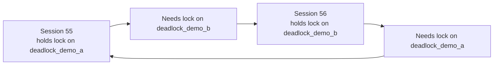
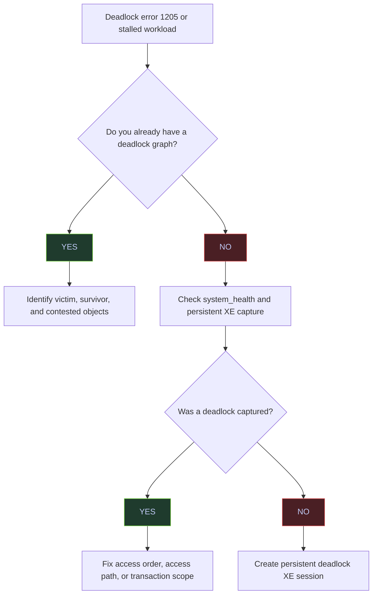

# Deadlock Detection and Prevention

> [!abstract]- Summary
>
> SQL Server resolves deadlocks automatically by choosing a victim and rolling back that transaction with error `1205`, so operational deadlock work is about collecting the graph, understanding the circular wait, and then deciding whether to fix access order, access path, transaction scope, or retry behavior. This note focuses on production detection and prevention rather than abstract lock theory.
>
> **Deadlock fundamentals**
> - covers the distinction between circular wait and ordinary blocking, plus the triage flow that starts from an error or stall and moves to graph capture
>
> **Deadlock capture**
> - covers extraction from `system_health`, persistent Extended Events capture, and the practical queries used to count and inspect deadlock graphs
>
> **Reproduction and prevention**
> - covers deterministic deadlock reproduction, access-order fixes, access-path fixes, row-versioning implications, and other design-level prevention strategies
>
> **Application behavior**
> - covers deadlock priority and bounded retry logic for replay-safe workloads
>
> **Operations and safety**
> - Warnings: waits alone are weaker evidence than a deadlock graph, retry logic is only safe for replayable work, row versioning does not remove writer/writer cycles, and background capture must be persistent enough to survive rollover windows
> - Recommendations: treat the graph as the source of truth, fix access order first when multiple objects are involved, keep a dedicated XE deadlock session on important systems, lower deadlock priority only for cheap background work, and retry only small idempotent units of work

> [!note]- Glossary
>
> **Deadlock**
> - A circular wait where two or more sessions each hold resources the others need, so no participant can make progress.
> - It matters because the note’s diagnostic and prevention workflow starts by recognizing that this is not ordinary queueing but a cycle that cannot resolve without intervention.
>
> > [!warning] Deadlock is not “slow blocking”
> >
> > A blocked session may eventually continue. A deadlock will not. The circular dependency is what forces SQL Server to kill one participant.
>
> ---
>
> **Deadlock victim**
> - The session SQL Server chooses to roll back in order to break the deadlock cycle.
> - It matters because application code sees the deadlock as error `1205` on the victim side, not as a neutral system event.
>
> > [!info] The victim is chosen, not random in all cases
> >
> > SQL Server uses deadlock priority and rollback cost when choosing the loser. Understanding that makes deadlock outcomes more predictable and tunable.
>
> ---
>
> **Error `1205`**
> - The SQL Server error raised to the chosen victim when the engine resolves a deadlock by aborting its transaction.
> - It matters because this is the application-visible signature that should trigger graph collection and, where safe, retry logic.
>
> > [!warning] Retrying the error is not always safe
> >
> > The presence of error `1205` tells you a deadlock happened. It does not tell you the failed operation is safe to replay without broader idempotency guarantees.
>
> ---
>
> **Deadlock graph**
> - The XML representation of the deadlock showing processes, resources, owners, waiters, and the victim.
> - It matters because it is the authoritative artifact for understanding what actually deadlocked.
>
> > [!info] This is the forensic source of truth
> >
> > Wait types and blocked-session snapshots are useful context, but the graph is the only artifact that shows the full cycle and the contested resources in one place.
>
> ---
>
> **`xml_deadlock_report`**
> - The Extended Events payload type SQL Server emits when it captures a deadlock graph.
> - It matters because both `system_health` and dedicated XE sessions expose deadlock evidence through this event.
>
> > [!info] One event type, two capture strategies
> >
> > The built-in `system_health` session often captures enough to start, but dedicated sessions are safer when retention or workload importance makes rollover risk unacceptable.
>
> ---
>
> **`system_health` session**
> - The built-in Extended Events session that usually captures deadlock reports without extra setup.
> - It matters because it is the fastest no-setup starting point when a deadlock is reported on a running system.
>
> > [!warning] Built-in capture has retention limits
> >
> > `system_health` is convenient, not infinite. Busy systems can roll older deadlock files away before the investigation starts.
>
> ---
>
> **Lock order inversion**
> - A pattern where two sessions acquire the same resources in different orders, creating the classic precondition for a deadlock.
> - It matters because enforcing a consistent access order across code paths is one of the most effective structural deadlock fixes.
>
> > [!warning] Same resources, different order is enough
> >
> > Sessions do not need exotic logic to deadlock. Two simple transactions that touch the same objects in opposite order can create a cycle reliably.
>
> ---
>
> **Access path**
> - The index or scan route SQL Server uses to reach rows during a statement.
> - It matters because two logically similar statements can deadlock differently if they touch rows or indexes in different physical orders.
>
> > [!info] Deadlock prevention is sometimes an indexing problem
> >
> > A broad scan can lock rows or keys in a very different pattern from a narrow seek. Changing the access path can remove the cycle even when the logical query stays the same.
>
> ---
>
> **Deadlock priority**
> - The session-level setting that influences which participant SQL Server prefers to kill when a deadlock occurs.
> - It matters because it can turn an unpredictable production casualty into a deliberate, retryable background casualty.
>
> > [!warning] Priority changes the loser, not the existence of the cycle
> >
> > Lowering priority does not prevent a deadlock. It only makes SQL Server more likely to pick that session as the victim when the cycle occurs.
>
> ---
>
> **Replay-safe unit of work**
> - A transaction or operation whose effects remain correct if the application reruns it after a deadlock rollback.
> - It matters because retry logic should only wrap work that is genuinely safe to execute more than once.
>
> > [!warning] Idempotency is a business property
> >
> > SQL retry helpers can only be correct if the underlying unit of work is replay-safe. The database error alone cannot guarantee that.
>
> ---
>
> **Row versioning**
> - A concurrency model that lets readers access versioned row copies instead of waiting for shared locks.
> - It matters because it can remove reader/writer deadlock edges in some patterns while leaving writer/writer deadlocks untouched.
>
> > [!warning] It narrows some cycles, not all cycles
> >
> > If both sides are writing, row versioning often does nothing for deadlock prevention. The cycle still exists unless the write pattern changes.
>
> ---
>
> **Extended Events deadlock session**
> - A dedicated XE session created specifically to persist deadlock graphs outside the generic `system_health` rollover window.
> - It matters because important systems need reliable deadlock retention for forensic and trend analysis.
>
> > [!info] Dedicated capture is an operational durability choice
> >
> > If deadlocks matter enough to debug repeatedly, they matter enough to capture in a durable, queryable way instead of depending only on the built-in session.

## Deadlock Fundamentals

This section establishes the conceptual baseline: how a deadlock differs from ordinary blocking, and the decision flow to follow when one is reported in production.

### SQL Server | Deadlock | Concept and triage

A deadlock is a circular wait between sessions, not a linear queue. Recognizing that distinction is what allows a DBA to jump straight from "error 1205" to the deadlock graph instead of hunting through wait stats.

#### Circular wait vs. linear blocking

Blocking is linear: one session waits for another to finish. A deadlock is circular: session A needs a lock held by session B, while session B needs a lock held by session A. That cycle cannot resolve without intervention.



#### Production triage decision flow



## Detection From `system_health`

The built-in `system_health` Extended Events session captures `xml_deadlock_report` events by default on modern SQL Server builds. These three queries extract progressively more detail from it — from a simple count to a full victim-and-resource summary.

### SQL Server | system_health | Forensic extraction

`system_health` is usually the first stop when investigating a deadlock because it requires no setup and persists across restarts. The queries below locate its event file, count its captured deadlocks, and extract the latest graph.

#### Count captured deadlock events

The fastest production check is to count how many deadlock reports are already present in the built-in `system_health` Extended Events session.

> [!info]-
> This query locates the `system_health` event-file target and counts all captured `xml_deadlock_report` events.
>
> - `system_health` exists by default on modern SQL Server builds and usually captures deadlocks without extra setup.
> - `deadlock_event_count` is cumulative across the files that still exist on disk, not a rate per second and not a per-database counter.
> - This tells you whether deadlocks have happened, but not yet which queries or objects were involved.

```sql
DECLARE @path nvarchar(4000);

SELECT @path = REPLACE(
    CAST(t.target_data AS xml).value('(EventFileTarget/File/@name)[1]', 'nvarchar(4000)'),
    '.xel',
    '*.xel'
)
FROM sys.dm_xe_sessions AS s
JOIN sys.dm_xe_session_targets AS t
    ON s.address = t.event_session_address
WHERE s.name = 'system_health'
  AND t.target_name = 'event_file';

SELECT COUNT(*) AS deadlock_event_count
FROM sys.fn_xe_file_target_read_file(@path, NULL, NULL, NULL)
WHERE object_name = 'xml_deadlock_report';
```

| deadlock_event_count |
|---:|
| 2 |

*This instance already has two captured deadlock graphs in `system_health`. That is enough to do real forensic analysis without waiting for the next deadlock.*

#### List recent deadlock reports with sessions and objects

The next step is to extract a compact summary of the latest deadlock reports so you can see the victim, the sessions involved, and the contested objects.

> [!info]-
> This query reads the most recent `xml_deadlock_report` events from `system_health` and extracts a compact deadlock summary.
>
> - `utc_time` is when the deadlock event was recorded.
> - `victim_process_id` is the process id from the deadlock XML, not necessarily the same as the SQL Server `session_id`.
> - `process1_spid` and `process2_spid` are the SQL Server sessions that were involved.
> - `resource1_object` and `resource2_object` identify the tables or indexes named in the resource list.

```sql
DECLARE @path nvarchar(4000);

SELECT @path = REPLACE(
    CAST(t.target_data AS xml).value('(EventFileTarget/File/@name)[1]', 'nvarchar(4000)'),
    '.xel',
    '*.xel'
)
FROM sys.dm_xe_sessions AS s
JOIN sys.dm_xe_session_targets AS t
    ON s.address = t.event_session_address
WHERE s.name = 'system_health'
  AND t.target_name = 'event_file';

;WITH src AS (
    SELECT TOP (5)
        CAST(event_data AS xml) AS event_xml,
        file_name,
        file_offset
    FROM sys.fn_xe_file_target_read_file(@path, NULL, NULL, NULL)
    WHERE object_name = 'xml_deadlock_report'
    ORDER BY file_name DESC, file_offset DESC
)
SELECT
    event_xml.value('(event/@timestamp)[1]', 'datetime2') AS utc_time,
    event_xml.value('(event/data/value/deadlock/victim-list/victimProcess/@id)[1]', 'nvarchar(100)') AS victim_process_id,
    event_xml.value('(event/data/value/deadlock/process-list/process[1]/@spid)[1]', 'int') AS process1_spid,
    event_xml.value('(event/data/value/deadlock/process-list/process[2]/@spid)[1]', 'int') AS process2_spid,
    event_xml.value('(event/data/value/deadlock/resource-list/*[1]/@objectname)[1]', 'nvarchar(256)') AS resource1_object,
    event_xml.value('(event/data/value/deadlock/resource-list/*[2]/@objectname)[1]', 'nvarchar(256)') AS resource2_object
FROM src
ORDER BY utc_time DESC;
```

| utc_time | victim_process_id | process1_spid | process2_spid | resource1_object | resource2_object |
|---|---|---:|---:|---|---|
| 2026-04-08 17:40:24.9920000 | processf00070ca8 | 55 | 56 | stoxx.dbo.deadlock_demo_b | stoxx.dbo.deadlock_demo_a |
| 2026-04-08 11:18:05.8550000 | processf000688c8 | 53 | 56 | stoxx.dbo.dm_exec_requests_demo | stoxx.dbo.dm_exec_requests_demo |

*The newest deadlock is the controlled two-table demo: session `55` and session `56` deadlocked while touching `deadlock_demo_a` and `deadlock_demo_b` in opposite order. The older event shows a separate deadlock on `dm_exec_requests_demo`, which confirms this instance has already seen more than one concurrency pattern.*

| Column | Value | Watch | Meaning | Implication |
|---|---|---|---|---|
| `utc_time` | Recent timestamp | Depends | When the deadlock occurred. | Correlate with deployment windows, job schedules, and app logs. |
| `victim_process_id` | Non-null process id | Neutral | Deadlock XML process identifier. | Use it to map the victim inside the full graph. |
| `process1_spid` / `process2_spid` | Positive session ids | Depends | SQL Server sessions involved in the cycle. | These are the sessions to correlate with logs or captured SQL text. |
| `resource*_object` | Same object on both rows | &#10060; when unexpected | Both sides contended on the same table or index. | Look for conflicting access order or hot-key activity. |
| `resource*_object` | Different objects | Depends | The cycle crossed tables or indexes. | Ordered object access is often the first fix to test. |

#### Extract the latest deadlock graph summary

For root-cause work, you need more than a count. You need the victim, the number of processes in the cycle, and the exact resources each side waited on.

> [!info]-
> This query extracts the latest deadlock report from `system_health` and summarizes the victim, process count, resource count, and wait resources.
>
> - `victim_process_id` identifies the process chosen for rollback.
> - `process_count` and `resource_count` show how large the graph is.
> - `process1_waitresource` and `process2_waitresource` reveal the exact key or page each process was waiting for.
> - In production, this compact summary is often enough to identify a lock-order problem before opening the full XML graph.

```sql
DECLARE @path nvarchar(4000);

SELECT @path = REPLACE(
    CAST(t.target_data AS xml).value('(EventFileTarget/File/@name)[1]', 'nvarchar(4000)'),
    '.xel',
    '*.xel'
)
FROM sys.dm_xe_sessions AS s
JOIN sys.dm_xe_session_targets AS t
    ON s.address = t.event_session_address
WHERE s.name = 'system_health'
  AND t.target_name = 'event_file';

;WITH src AS (
    SELECT TOP (1)
        CAST(event_data AS xml) AS event_xml
    FROM sys.fn_xe_file_target_read_file(@path, NULL, NULL, NULL)
    WHERE object_name = 'xml_deadlock_report'
    ORDER BY file_name DESC, file_offset DESC
)
SELECT
    event_xml.value('(event/@timestamp)[1]', 'datetime2') AS utc_time,
    event_xml.value('(event/data/value/deadlock/victim-list/victimProcess/@id)[1]', 'nvarchar(100)') AS victim_process_id,
    event_xml.value('count((event/data/value/deadlock/process-list/process))', 'int') AS process_count,
    event_xml.value('count((event/data/value/deadlock/resource-list/*))', 'int') AS resource_count,
    event_xml.value('(event/data/value/deadlock/process-list/process[1]/@spid)[1]', 'int') AS process1_spid,
    event_xml.value('(event/data/value/deadlock/process-list/process[1]/@waitresource)[1]', 'nvarchar(400)') AS process1_waitresource,
    event_xml.value('(event/data/value/deadlock/process-list/process[2]/@spid)[1]', 'int') AS process2_spid,
    event_xml.value('(event/data/value/deadlock/process-list/process[2]/@waitresource)[1]', 'nvarchar(400)') AS process2_waitresource
FROM src;
```

| utc_time | victim_process_id | process_count | resource_count | process1_spid | process1_waitresource | process2_spid | process2_waitresource |
|---|---|---:|---:|---:|---|---:|---|
| 2026-04-08 17:40:24.9920000 | processf00070ca8 | 2 | 2 | 55 | KEY: 5:72057594062241792 (8194443284a0) | 56 | KEY: 5:72057594062176256 (8194443284a0) |

*This graph is the classic two-process, two-resource deadlock: session `55` waited for a key on `deadlock_demo_b`, session `56` waited for a key on `deadlock_demo_a`, and SQL Server chose process `processf00070ca8` as the victim. The graph is small, which is typical for ordered-access deadlocks.*

| Column | Value | Watch | Meaning | Implication |
|---|---|---|---|---|
| `victim_process_id` | Non-null process id | Depends | Process chosen for rollback. | This is the workload that received error `1205`. |
| `process_count` | `2` | Neutral | Two sessions participated. | This is the most common deadlock shape. |
| `process_count` | Greater than `2` | &#10060; | More than two sessions participated. | Look for parallel fan-in, queue consumers, or wider graph complexity. |
| `resource_count` | `2` | Neutral | Two contested resources appear in the graph. | Often points to opposite-order access across two objects or keys. |
| `process*_waitresource` | `KEY:` resource | Depends | The wait was on an index key. | Narrow index access can still deadlock if lock order conflicts. |
| `process*_waitresource` | `PAGE:` or `OBJECT:` resource | &#10060; when frequent | The deadlock involved broader resources. | Look for scans, escalation, or DDL interaction. |

## Persistent Deadlock Capture

`system_health` rolls over and eventually loses older deadlock reports. When a workload is deadlock-sensitive, a dedicated Extended Events session with an owner-controlled retention policy is the right long-term answer.

### SQL Server | Extended Events | Dedicated deadlock session

A dedicated session writes `xml_deadlock_report` events to a file target you control. Retention, storage location, and rollover behavior stop being shared with the general health session.

#### Create a persistent XE session for deadlocks

The built-in `system_health` session is useful, but production environments benefit from a dedicated deadlock capture session with a retention policy you control.

> [!warning]
> A dedicated Extended Events session changes server metadata and writes more diagnostic files. It is usually safe, but it should still follow change management and storage-retention standards.

> [!success]
> Use a dedicated deadlock session when deadlocks are important enough to warrant longer retention than the `system_health` rollover files provide.

```sql
CREATE EVENT SESSION [deadlock_capture_persistent]
ON SERVER
ADD EVENT sqlserver.xml_deadlock_report
ADD TARGET package0.event_file
(
    SET filename = '/var/opt/mssql/log/deadlock_capture_persistent'
);
GO

ALTER EVENT SESSION [deadlock_capture_persistent]
ON SERVER
STATE = START;
GO
```

## Deterministic Deadlock Reproduction

A reproducible deadlock is the fastest way to validate detection queries, retry policies, and Extended Events capture. The demo below builds a deterministic two-table cycle, confirms the victim error, and inspects the surviving row state.

### SQL Server | T-SQL | Two-table deadlock demo

The following demo creates a deterministic two-table deadlock by updating the same two tables in opposite order. Each cell is a separate step to be executed in its own SSMS window or session.

#### Set up the demo tables and seed data

```sql
USE stoxx;
GO

IF OBJECT_ID('dbo.deadlock_demo_a', 'U') IS NOT NULL
    DROP TABLE dbo.deadlock_demo_a;
IF OBJECT_ID('dbo.deadlock_demo_b', 'U') IS NOT NULL
    DROP TABLE dbo.deadlock_demo_b;
GO

CREATE TABLE dbo.deadlock_demo_a
(
    id int NOT NULL PRIMARY KEY,
    payload int NOT NULL
);

CREATE TABLE dbo.deadlock_demo_b
(
    id int NOT NULL PRIMARY KEY,
    payload int NOT NULL
);
GO

INSERT INTO dbo.deadlock_demo_a(id, payload) VALUES (1, 10);
INSERT INTO dbo.deadlock_demo_b(id, payload) VALUES (1, 20);
GO
```

#### Run Session 1 (update A, then B)

```sql
USE stoxx;
GO

SET DEADLOCK_PRIORITY LOW;

BEGIN TRAN;

UPDATE dbo.deadlock_demo_a
SET payload = payload + 1
WHERE id = 1;

WAITFOR DELAY '00:00:05';

UPDATE dbo.deadlock_demo_b
SET payload = payload + 1
WHERE id = 1;

COMMIT TRAN;
GO
```

#### Run Session 2 (update B, then A)

```sql
USE stoxx;
GO

BEGIN TRAN;

UPDATE dbo.deadlock_demo_b
SET payload = payload + 1
WHERE id = 1;

WAITFOR DELAY '00:00:05';

UPDATE dbo.deadlock_demo_a
SET payload = payload + 1
WHERE id = 1;

COMMIT TRAN;
GO
```

#### Clean up the demo tables

```sql
USE stoxx;
GO

DROP TABLE IF EXISTS dbo.deadlock_demo_a;
DROP TABLE IF EXISTS dbo.deadlock_demo_b;
GO
```

### SQL Server | T-SQL | Victim outcome verification

Once the demo deadlock has fired, two things must be confirmed: the victim session received error `1205`, and the surviving session's changes actually committed.

#### Deadlock victim error 1205

The deadlock victim gets error `1205`. The surviving session completes and commits its changes.

> [!info]-
> The first table captures the deadlock-victim error returned by Session 1. The second query checks the final row values after the surviving transaction commits.

| source | message_number | message_text |
|---|---:|---|
| Session 1 | 1205 | Transaction (Process ID 55) was deadlocked on lock resources with another process and has been chosen as the deadlock victim. Rerun the transaction. |

*Error `1205` is the normal deadlock-victim signal. SQL Server has already rolled back the victim transaction. The application should not treat this as an unknown failure; it should treat it as a retry candidate after validating idempotency.*

| Column | Value | Watch | Meaning | Implication |
|---|---|---|---|---|
| `message_number` | `1205` | &#10060; | Deadlock victim error. | The transaction was rolled back by SQL Server and may need a retry. |
| `message_number` | Other runtime error | Depends | Different failure mode. | Use the appropriate error-handling path; do not assume deadlock semantics. |

#### Inspect surviving row state after rollback

After the victim rolls back, the surviving transaction's change is still visible in the target table. Querying both tables confirms which side committed.

> [!info]-
> This query checks the surviving row values after the deadlock. One side committed; the deadlock victim did not.

```sql
SELECT 'deadlock_demo_a' AS table_name, id, payload FROM dbo.deadlock_demo_a
UNION ALL
SELECT 'deadlock_demo_b' AS table_name, id, payload FROM dbo.deadlock_demo_b
ORDER BY table_name, id;
```

| table_name | id | payload |
|---|---:|---:|
| deadlock_demo_a | 1 | 11 |
| deadlock_demo_b | 1 | 21 |

*Only the surviving transaction committed. Each table increased by `1`, not by `2`, which is exactly what you expect when one transaction becomes the deadlock victim and rolls back fully.*

## Deadlock Prevention Strategies

Prevention falls into three families: lock-order discipline at the transaction boundary, isolation-level changes that remove reader/writer conflict, and targeted use of `DEADLOCK_PRIORITY` when one workload should always lose.

### SQL Server | Transactions | Lock-order discipline

Most production deadlocks come from code paths touching the same objects in different orders, or from plan shapes that widen the locking footprint. These three patterns attack the problem at its source.

#### Enforce a consistent access order

If every transaction touches tables or indexes in the same order, the most common two-object deadlock disappears.

- Bad pattern: one code path updates `OrderHeader` then `OrderLine`, while another updates `OrderLine` then `OrderHeader`.
- Better pattern: all code paths acquire locks in the same object order and with the same lookup shape.

#### Narrow the access path

Many deadlocks are really plan problems in disguise. Broad scans, key lookups, and non-SARGable predicates expand the lock footprint and increase the chance of conflicting lock order.

- Add or fix supporting indexes.
- Remove unnecessary lookups when they widen the locking pattern.
- Revisit parameter-sensitive plans if the deadlock happens only for some parameter values.

#### Keep transactions short

The longer a transaction stays open, the larger the window for a cycle to form.

- Do not wait for user input inside a transaction.
- Do not perform remote calls inside a transaction unless they are unavoidable.
- Stage data first, then open the transaction only for the final mutation.

### SQL Server | Isolation | Row versioning for reader/writer cycles

Row versioning changes what a reader has to acquire. It cannot break writer-versus-writer cycles, but it often eliminates the reader-versus-writer half of a cycle entirely.

#### Use `READ COMMITTED SNAPSHOT` or `SNAPSHOT` to break reader/writer cycles

`READ COMMITTED SNAPSHOT` and `SNAPSHOT` do not fix writer-versus-writer deadlocks, but they often remove reader-versus-writer cycles caused by shared locks.

- If the deadlock involves only writers, row versioning is not enough.
- If one side is a long reader and the other is a writer, row versioning can remove that half of the cycle.

### SQL Server | T-SQL | `DEADLOCK_PRIORITY`

When cycles cannot be fully eliminated, making a specific workload the designated victim turns random production pain into a predictable, retryable outcome.

#### Lower deadlock priority for background workloads

Sometimes the right fix is not "make deadlocks impossible"; it is "make the least important session lose predictably".

> [!success]
> Lower the deadlock priority for background work such as cache refreshes, ETL backfills, or report warmups when those workloads can safely retry.

```sql
SET DEADLOCK_PRIORITY LOW;
GO
```

## Application Retry Policy

Deadlocks are a normal part of a concurrent workload, so well-behaved applications must be prepared to retry them — but only when the unit of work is safe to replay.

### C# | ADO.NET | Deadlock-safe retry helper

A dedicated retry helper keeps deadlock handling in one place, uses a bounded attempt count, and refuses to swallow anything other than error `1205`.

#### Retry `SqlException 1205` with bounded backoff

Applications should retry `1205` only when the operation is safe to replay.

> [!warning]
> Deadlock retry logic is correct only for idempotent or safely replayable units of work. Never wrap a non-idempotent side effect in blind retries.

> [!info]-
> This helper retries only SQL error `1205`, applies a small backoff, and rethrows everything else.
>
> - Use a bounded retry count.
> - Keep the retried unit of work small.
> - Pair the retry with application-level idempotency where required.

```csharp
public static async Task<T> ExecuteWithDeadlockRetryAsync<T>(
    Func<Task<T>> operation,
    int maxRetries = 3,
    int baseDelayMs = 250)
{
    for (var attempt = 1; ; attempt++)
    {
        try
        {
            return await operation();
        }
        catch (SqlException ex) when (ex.Number == 1205 && attempt <= maxRetries)
        {
            await Task.Delay(baseDelayMs * attempt);
        }
    }
}
```

## SQL Server Deadlock Detection and Prevention Recommendations

- Treat the deadlock graph as the source of truth. Do not guess from waits alone when a graph already exists.
- Fix access order first when the graph spans multiple tables or indexes.
- Fix access paths when the graph shows broad scans, hot keys, or unexpected objects.
- Lower deadlock priority for background work only when retries are cheap and safe.
- Keep a dedicated deadlock capture session on systems where rollover of `system_health` is not enough.
