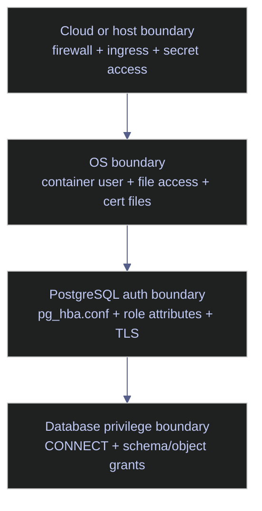

# PostgreSQL Authentication

This note is the PostgreSQL equivalent of the SQL Server authentication chapter, but the security model is different enough that the right translation is not "find the PostgreSQL version of mixed mode". PostgreSQL authentication is a boundary problem across network reachability, `pg_hba.conf` rule order, role attributes, password hashing, TLS configuration, and the logging surface that proves which identities are actually getting in.

> [!abstract]- Summary
>
> Defines PostgreSQL authentication hardening as a layered problem across cloud and host identity, cluster authentication rules, role attributes, transport security, and connection-audit visibility. The note exists to prevent a common operational mistake: improving one layer in isolation while a different layer still makes the cluster effectively exposed.
>
> **Identity boundaries**
> - frame the authentication surface in layers: cloud or VM identity, host process identity and file access, PostgreSQL client authentication rules, and database-level privileges
> - treat the posture as only as strong as the weakest boundary rather than as a single "password setting" problem
>
> **Baseline the cluster authentication posture**
> - verify the current password hashing mode, SSL posture, connection logging posture, and active HBA and ident files through `pg_settings`
> - inventory `pg_hba.conf` rules through `pg_hba_file_rules`, login-capable roles through `pg_roles`, and capability inheritance through `pg_auth_members`
>
> **External identity integration**
> - compare local password and socket-auth patterns with GSSAPI/Kerberos, LDAP, PAM, and client-certificate authentication
> - separate Linux container convenience from enterprise authentication design
>
> **Transport encryption and TLS**
> - verify the runtime encryption boundary through `pg_stat_ssl`, current SSL settings, and the client-side meaning of libpq `sslmode`
> - make server certificates, root CA validation, and encrypted client traffic deliberate rather than assumed
>
> **Audit and connection evidence**
> - use `log_connections`, `log_disconnections`, `log_line_prefix`, and extension-based auditing deliberately so successful or failed authentication attempts are reconstructable later
>
> **Perimeter recommendations**
> - keep the cloud or VM edge narrow with controlled ingress, minimal role count, strong password methods, and TLS that actually verifies server identity

> [!note]- Glossary
>
> **`pg_hba.conf`**
> - PostgreSQL's client-authentication rules file.
> - It matters because this file decides which authentication method applies before a password, certificate, or external identity provider is even consulted.
>
> ---
>
> **HBA rule order**
> - The first-match evaluation model of `pg_hba.conf`.
> - It matters because PostgreSQL does not fall through to a stronger later rule if an earlier weaker rule already matched and failed.
>
> ---
>
> **Role with `LOGIN`**
> - A PostgreSQL role that is allowed to authenticate as an initial session identity.
> - It matters because PostgreSQL does not distinguish "login" and "user" as different principal types the way SQL Server distinguishes logins and database users.
>
> ---
>
> **Predefined role**
> - A built-in PostgreSQL role such as `pg_monitor`, `pg_read_all_data`, or `pg_signal_backend` that bundles specific capabilities.
> - It matters because these roles are the PostgreSQL equivalent of many fixed server or monitoring roles that SQL Server administrators expect to see.
>
> ---
>
> **`password_encryption`**
> - The setting that controls how new or changed PostgreSQL passwords are stored.
> - It matters because PostgreSQL 16 should normally create SCRAM password hashes, not legacy MD5 hashes.
>
> ---
>
> **`sslmode`**
> - The libpq client-side option that controls whether TLS is disabled, preferred, required, or fully verified.
> - It matters because a secure server can still be reached insecurely if the client is allowed to downgrade or skip certificate verification.
>
> ---
>
> **GSSAPI / Kerberos**
> - The PostgreSQL external-authentication path most comparable to integrated enterprise single sign-on on Linux.
> - It matters because it is the main PostgreSQL answer to centralized identity without local passwords on Linux estates.
>
> ---
>
> **Connection logging**
> - The server log events emitted by `log_connections` and `log_disconnections`.
> - It matters because hardening is incomplete if authentication activity cannot be reconstructed during review or incident response.

## Identity Boundaries

For PostgreSQL running in a container, on a VM, or on a cloud host, authentication must be reasoned about in layers rather than as one flat credential problem.

*Model the authentication boundary as a four-layer path from infrastructure ingress to database objects.*



### PostgreSQL | identity | the four trust boundaries

The diagram compresses four different authorization systems into one reading path. Each layer has its own identities, controls, and failure modes. Treating PostgreSQL authentication as only a role-and-password problem misses the fact that network reachability, file ownership, and local socket behavior may already have determined who gets to try authenticating.

- **Cloud or host boundary**
  - Controls who can reach the database host, container port, secret store, or bastion path.
- **OS boundary**
  - Controls who can read `postgresql.conf`, `pg_hba.conf`, server certificates, password files, or container-mounted secrets.
- **PostgreSQL auth boundary**
  - Controls which HBA rule matches, which authentication method is used, and whether the role attributes allow the session to start.
- **Database privilege boundary**
  - Controls what the authenticated role can do once connected, including `CONNECT`, schema usage, object access, and role membership.

### PostgreSQL | identity | why infrastructure identity is not database identity

A container runtime identity, cloud service account, or VM SSH identity is not automatically a PostgreSQL role. Those identities may control host access and secret retrieval, but PostgreSQL still performs its own client-authentication and role-resolution steps inside the server.

> [!warning]- Secret retrieval and database login are different boundaries
>
> A workload can be fully authorized to reach the host and fetch a secret, but still be wrong at the database boundary if the HBA rule, role attributes, or TLS expectations do not match the intended design.
>
> > [!danger] Network reach plus broad trust is effectively anonymous access
> >
> > If the infrastructure edge is reachable and PostgreSQL uses wide `trust` rules, the cluster is no longer protected by meaningful identity verification.
> >
> > ```conf
> > host all all all trust
> > ```
>
> > [!success] Keep infrastructure and database identity explicitly joined
> >
> > Use infrastructure identity to control reachability and secret retrieval, then let PostgreSQL enforce a deliberate role, method, and transport policy.
> >
> > ```conf
> > hostssl all app_runtime 10.0.0.0/24 scram-sha-256
> > ```

## Baseline the cluster authentication posture

Production hardening starts with the current reality of the running cluster, not with the intended target state. PostgreSQL exposes that reality through `pg_settings`, `pg_hba_file_rules`, `pg_roles`, and `pg_auth_members`.

### PostgreSQL | pg_settings | authentication and TLS baseline

This subsection captures the small set of settings that immediately tell you how passwords are stored, whether TLS is enabled, whether connection activity is logged, and which files control authentication behavior.

#### Return the cluster authentication, TLS, and auth-log baseline

Run this at the start of any PostgreSQL authentication review, before editing HBA rules or rotating passwords. It is typically triggered by first cluster onboarding, security review, post-rebuild validation, or any confusion about why a connection works more easily than expected. The query runs in a SQL session, is read-only, and needs only a role allowed to read `pg_settings`. Its purpose is to surface the cluster's current authentication, TLS, and logging posture in one place before any change is proposed.

| Output field | Source expression | Unit / type | Meaning |
|---|---|---|---|
| `password_encryption` | `current_setting('password_encryption')` | `text` | The hash method used for newly created or altered passwords. |
| `ssl_enabled` | `current_setting('ssl')` | `text` | Whether the server is configured to accept SSL/TLS connections. |
| `log_connections` | `current_setting('log_connections')` | `text` | Whether new connection attempts are logged. |
| `log_disconnections` | `current_setting('log_disconnections')` | `text` | Whether session terminations are logged. |
| `hba_file` | `current_setting('hba_file')` | `text` | The active `pg_hba.conf` path. |
| `config_file` | `current_setting('config_file')` | `text` | The active `postgresql.conf` path. |

*This query shows the effective settings that matter first for PostgreSQL authentication review.*

```sql
SELECT
    current_setting('password_encryption') AS password_encryption,
    current_setting('ssl') AS ssl_enabled,
    current_setting('log_connections') AS log_connections,
    current_setting('log_disconnections') AS log_disconnections,
    current_setting('hba_file') AS hba_file,
    current_setting('config_file') AS config_file;
```

```text
 password_encryption | ssl_enabled | log_connections | log_disconnections |               hba_file               |               config_file                
---------------------+-------------+-----------------+--------------------+--------------------------------------+------------------------------------------
 scram-sha-256       | off         | off             | off                | /var/lib/postgresql/data/pg_hba.conf | /var/lib/postgresql/data/postgresql.conf
(1 row)
```

The good news is that new passwords default to `scram-sha-256`, which is the current PostgreSQL baseline. The weak points are just as important: server-side SSL is off, connection and disconnection logging are off, and the cluster is therefore relying on local trust plus network boundaries rather than on encrypted client traffic and strong session evidence.

### PostgreSQL | pg_hba_file_rules | effective authentication rules

PostgreSQL authentication is rule-driven. The cluster does not have one global "login mode" switch. It has an ordered HBA table, and the first matching row decides which authentication method applies.

#### Inventory the effective HBA rules and methods

Run this whenever the real question is "which rule is actually matching?" rather than "which rule do we think exists in the file?". It is typically triggered by unexpected login success, unexpected password prompts, new network paths, or a hardening pass on `pg_hba.conf`. The query runs in a SQL session, is read-only, and needs visibility into `pg_hba_file_rules`. Its purpose is to inspect the effective parsed rules, including parse errors, without manually reading and mentally expanding the file.

| Output field | Source column | Unit / type | Meaning |
|---|---|---|---|
| `line_number` | `pg_hba_file_rules.line_number` | `integer` | The source line in `pg_hba.conf`. |
| `type` | `pg_hba_file_rules.type` | `text` | The connection class such as `local` or `host`. |
| `database` | `pg_hba_file_rules.database` | `text[]` | The database targets matched by the rule. |
| `user_name` | `pg_hba_file_rules.user_name` | `text[]` | The role targets matched by the rule. |
| `address` | `pg_hba_file_rules.address` | `text` | The client CIDR or host target for `host*` rules. |
| `auth_method` | `pg_hba_file_rules.auth_method` | `text` | The authentication method PostgreSQL applies if this rule matches first. |
| `options` | `pg_hba_file_rules.options` | `text[]` | Method-specific options on the rule such as LDAP or client-cert parameters. |
| `error` | `pg_hba_file_rules.error` | `text` | Parse or validation error for the rule, if any. |

*This query lists the parsed `pg_hba.conf` rules in the order PostgreSQL will evaluate them.*

```sql
SELECT
    line_number,
    type,
    database,
    user_name,
    address,
    auth_method,
    options,
    error
FROM pg_hba_file_rules
ORDER BY line_number;
```

```text
 line_number | type  |   database    | user_name |  address  |  auth_method  | options | error 
-------------+-------+---------------+-----------+-----------+---------------+---------+-------
         117 | local | {all}         | {all}     |           | trust         |         | 
         119 | host  | {all}         | {all}     | 127.0.0.1 | trust         |         | 
         121 | host  | {all}         | {all}     | ::1       | trust         |         | 
         124 | local | {replication} | {all}     |           | trust         |         | 
         125 | host  | {replication} | {all}     | 127.0.0.1 | trust         |         | 
         126 | host  | {replication} | {all}     | ::1       | trust         |         | 
         128 | host  | {all}         | {all}     | all       | scram-sha-256 |         | 
(7 rows)
```

The ordering matters more than the individual methods. PostgreSQL documentation is explicit that the first matching record is used and there is no fallback to later lines if authentication fails. In this lab, loopback traffic is accepted by earlier `trust` rules, so the later `scram-sha-256` rule for `all` addresses never governs those local connections.

### PostgreSQL | pg_roles | role inventory and login-capable principals

PostgreSQL uses one role system for both login-capable identities and non-login capability bundles. That means authentication review must distinguish `rolcanlogin` roles from predefined or delegated roles that exist only to carry privileges.

#### Inventory roles and their core authentication attributes

Run this during every authentication review before changing role attributes or creating new service identities. It is typically triggered by first baseline, privilege review, or any question about whether a role can log in, create databases, create roles, replicate, bypass row-level security, or ignore connection limits. The query runs in a SQL session, is read-only, and needs access to `pg_roles`. Its purpose is to make PostgreSQL's role model explicit instead of treating every role name as the same kind of principal.

| Output field | Source column | Unit / type | Meaning |
|---|---|---|---|
| `rolname` | `pg_roles.rolname` | `name` | The PostgreSQL role name. |
| `rolsuper` | `pg_roles.rolsuper` | `boolean` | Whether the role bypasses all normal permission checks. |
| `rolcreaterole` | `pg_roles.rolcreaterole` | `boolean` | Whether the role can create and manage other roles within PostgreSQL's role-attribute rules. |
| `rolcreatedb` | `pg_roles.rolcreatedb` | `boolean` | Whether the role can create databases. |
| `rolcanlogin` | `pg_roles.rolcanlogin` | `boolean` | Whether the role can be used as an initial session identity. |
| `rolreplication` | `pg_roles.rolreplication` | `boolean` | Whether the role can initiate streaming replication. |
| `rolbypassrls` | `pg_roles.rolbypassrls` | `boolean` | Whether the role bypasses all row-level security policies. |
| `rolconnlimit` | `pg_roles.rolconnlimit` | `integer` | The per-role connection limit; `-1` means unlimited. |
| `rolvaliduntil` | `pg_roles.rolvaliduntil` | `timestamp with time zone` | Password expiration timestamp, if set. |
| `memberships_granted` | `COUNT(pg_auth_members.roleid)` | `bigint` | How many role memberships are granted to this role. |

*This query inventories role attributes and separates login-capable principals from predefined capability roles.*

```sql
SELECT
    r.rolname,
    r.rolsuper,
    r.rolcreaterole,
    r.rolcreatedb,
    r.rolcanlogin,
    r.rolreplication,
    r.rolbypassrls,
    r.rolconnlimit,
    r.rolvaliduntil,
    COUNT(m.roleid) AS memberships_granted
FROM pg_roles AS r
LEFT JOIN pg_auth_members AS m
    ON m.member = r.oid
GROUP BY
    r.rolname,
    r.rolsuper,
    r.rolcreaterole,
    r.rolcreatedb,
    r.rolcanlogin,
    r.rolreplication,
    r.rolbypassrls,
    r.rolconnlimit,
    r.rolvaliduntil
ORDER BY r.rolname;
```

```text
           rolname           | rolsuper | rolcreaterole | rolcreatedb | rolcanlogin | rolreplication | rolbypassrls | rolconnlimit | rolvaliduntil | memberships_granted 
-----------------------------+----------+---------------+-------------+-------------+----------------+--------------+--------------+---------------+---------------------
 pg_checkpoint               | f        | f             | f           | f           | f              | f            |           -1 |               |                   0
 pg_create_subscription      | f        | f             | f           | f           | f              | f            |           -1 |               |                   0
 pg_database_owner           | f        | f             | f           | f           | f              | f            |           -1 |               |                   0
 pg_execute_server_program   | f        | f             | f           | f           | f              | f            |           -1 |               |                   0
 pg_monitor                  | f        | f             | f           | f           | f              | f            |           -1 |               |                   3
 pg_read_all_data            | f        | f             | f           | f           | f              | f            |           -1 |               |                   0
 pg_read_all_settings        | f        | f             | f           | f           | f              | f            |           -1 |               |                   0
 pg_read_all_stats           | f        | f             | f           | f           | f              | f            |           -1 |               |                   0
 pg_read_server_files        | f        | f             | f           | f           | f              | f            |           -1 |               |                   0
 pg_signal_backend           | f        | f             | f           | f           | f              | f            |           -1 |               |                   0
 pg_stat_scan_tables         | f        | f             | f           | f           | f              | f            |           -1 |               |                   0
 pg_use_reserved_connections | f        | f             | f           | f           | f              | f            |           -1 |               |                   0
 pg_write_all_data           | f        | f             | f           | f           | f              | f            |           -1 |               |                   0
 pg_write_server_files       | f        | f             | f           | f           | f              | f            |           -1 |               |                   0
 postgres                    | t        | t             | t           | t           | t              | t            |           -1 |               |                   0
(15 rows)
```

The cluster is still extremely small, which is good for a chapter lab: only `postgres` can log in, and every other listed role is a predefined capability role. That also means the security posture is concentrated in one superuser account, which is convenient for note authoring but not a production target state.

### PostgreSQL | pg_auth_members | predefined role capability inheritance

Predefined roles are only meaningful when granted. `pg_auth_members` shows which roles inherit which capabilities and whether `ADMIN`, `INHERIT`, and `SET` rights were granted with the membership.

#### Inventory role memberships and predefined-role inheritance

Run this when the question is no longer "which roles exist?" but "which roles actually receive capabilities through membership?". It is typically triggered by privilege review, least-privilege redesign, or an incident where a role seemed to have powers that were not obvious from its direct attributes. The query runs in a SQL session, is read-only, and needs access to `pg_auth_members`. Its purpose is to expose inherited power rather than only direct role attributes.

| Output field | Source expression | Unit / type | Meaning |
|---|---|---|---|
| `member_role` | `pg_get_userbyid(member)` | `name` | The role receiving the membership. |
| `granted_role` | `pg_get_userbyid(roleid)` | `name` | The role whose privileges are being granted. |
| `admin_option` | `pg_auth_members.admin_option` | `boolean` | Whether the member can grant or revoke that role to others. |
| `inherit_option` | `pg_auth_members.inherit_option` | `boolean` | Whether privileges are inherited automatically. |
| `set_option` | `pg_auth_members.set_option` | `boolean` | Whether the member can `SET ROLE` to the granted role explicitly. |

*This query shows every explicit role membership in the current cluster.*

```sql
SELECT
    pg_get_userbyid(member) AS member_role,
    pg_get_userbyid(roleid) AS granted_role,
    admin_option,
    inherit_option,
    set_option
FROM pg_auth_members
ORDER BY 1, 2;
```

```text
 member_role |     granted_role     | admin_option | inherit_option | set_option 
-------------+----------------------+--------------+----------------+------------
 pg_monitor  | pg_read_all_settings | f            | t              | t
 pg_monitor  | pg_read_all_stats    | f            | t              | t
 pg_monitor  | pg_stat_scan_tables  | f            | t              | t
(3 rows)
```

This output matches PostgreSQL's predefined-role design directly: `pg_monitor` is implemented by membership in `pg_read_all_settings`, `pg_read_all_stats`, and `pg_stat_scan_tables`. The significance is operational. In PostgreSQL, powerful capability bundles often arrive by role membership rather than by standalone boolean attributes like `rolcreatedb`.

### PostgreSQL | CREATE ROLE | login creation and password posture

Creating a login in PostgreSQL is `CREATE ROLE ... LOGIN` or `CREATE USER`, with role attributes defining the capability boundary. The safe default is to create narrowly-scoped login roles and then grant them separate non-login roles that carry object privileges.

#### Create a least-privilege login role inside a rollback-safe demo transaction

Run this when teaching or testing login DDL without wanting to leave cluster-global debris behind. It is typically triggered by documentation capture or rehearsal of least-privilege provisioning. The batch runs in a SQL session, is state-changing inside the transaction, and must be executed by a superuser or a role with the appropriate `CREATEROLE` power. Its purpose is to show what a narrowly-scoped runtime login looks like while rolling the demonstration back cleanly.

*This batch creates a demo login role, inspects its attributes, and then rolls the entire demonstration back.*

```sql
BEGIN;

CREATE ROLE demo_note03_runtime
LOGIN
PASSWORD 'DemoNote03!scram'
NOSUPERUSER
NOCREATEDB
NOCREATEROLE
NOREPLICATION
CONNECTION LIMIT 5;

SELECT
    rolname,
    rolsuper,
    rolcreatedb,
    rolcreaterole,
    rolreplication,
    rolcanlogin,
    rolconnlimit
FROM pg_roles
WHERE rolname = 'demo_note03_runtime';

ROLLBACK;
```

```text
BEGIN
CREATE ROLE
      rolname       | rolsuper | rolcreatedb | rolcreaterole | rolreplication | rolcanlogin | rolconnlimit 
--------------------+----------+-------------+---------------+----------------+-------------+--------------
 demo_note03_runtime | f        | f           | f             | f              | t           |            5
(1 row)

ROLLBACK
```

The important pattern is not the demo name. It is the separation of duties: `LOGIN` is present so the role can authenticate, but every broad cluster capability is explicitly off. That is the PostgreSQL equivalent of refusing to hand application identities blanket administrative rights at creation time.

### PostgreSQL | ALTER ROLE | lockout and expiration controls

Disabling risky login paths in PostgreSQL is done with role attributes rather than with a dedicated "disable login" catalog surface. The two main controls are `NOLOGIN` and `VALID UNTIL`.

#### Disable a login path and set a password-expiration boundary

Run this when a role should remain present for ownership or grants but should no longer authenticate, or when a temporary credential should expire automatically after a bounded window. It is typically triggered by service rotation, incident response, vendor access expiry, or security review of stale accounts. The batch runs in a SQL session, is state-changing inside the transaction, and requires superuser or appropriate `CREATEROLE` authority. Its purpose is to show the PostgreSQL equivalent of login disable and credential expiry without leaving demo roles behind.

*This batch creates a demo login, alters it to `NOLOGIN` with a finite `VALID UNTIL`, inspects the result, and then rolls everything back.*

```sql
BEGIN;

CREATE ROLE demo_note03_lockout
LOGIN
PASSWORD 'DemoNote03!scram'
VALID UNTIL 'infinity';

ALTER ROLE demo_note03_lockout
NOLOGIN
VALID UNTIL '2026-04-30 00:00:00+00';

SELECT
    rolname,
    rolcanlogin,
    rolvaliduntil
FROM pg_roles
WHERE rolname = 'demo_note03_lockout';

ROLLBACK;
```

```text
BEGIN
CREATE ROLE
ALTER ROLE
       rolname       | rolcanlogin |     rolvaliduntil      
---------------------+-------------+------------------------
 demo_note03_lockout | f           | 2026-04-30 00:00:00+00
(1 row)

ROLLBACK
```

`NOLOGIN` is the direct PostgreSQL equivalent of disabling the account for new connections, while `VALID UNTIL` adds a time boundary for password-based authentication. The important difference from SQL Server is that PostgreSQL keeps these controls as role attributes instead of exposing them as a separate login-status subsystem.

## External identity integration

Password authentication is only one PostgreSQL pattern. Enterprise deployments often shift authentication to GSSAPI/Kerberos, LDAP, PAM, or client certificates so that PostgreSQL relies on an external identity boundary rather than on local password storage alone.

### PostgreSQL | GSSAPI | Kerberos and enterprise single sign-on

PostgreSQL's primary Linux-oriented single-sign-on story is GSSAPI, commonly backed by Kerberos or Active Directory. In that model the server accepts a Kerberos service principal and the client presents a user principal that is mapped into a PostgreSQL role name.

```conf
hostgssenc all all 10.0.0.0/24 gss include_realm=1 krb_realm=EXAMPLE.COM
```

The lab does not have GSSAPI configured, so there is no live keytab or `hostgssenc` example to inventory here. The PostgreSQL documentation boundary is still clear: GSSAPI is available only when the build supports it, and it can be used for authentication, transport encryption, or both.

### PostgreSQL | LDAP and PAM | directory-backed authentication

LDAP and PAM are the common PostgreSQL answers when the server should delegate password verification to an external directory or the host authentication stack. LDAP is typically clearer for centralized directory-backed service identity, while PAM is useful when the operating system already owns the policy decision.

```conf
hostssl all all 10.0.0.0/24 ldap ldapserver=ldap.example.com ldaptls=1 ldapbasedn="dc=example,dc=com" ldapsearchattribute=uid
```

```conf
host all all 10.0.1.0/24 pam pamservice=postgresql
```

The important boundary is that these methods shift credential verification away from PostgreSQL local passwords, but they do not remove the need for a correct HBA rule, correct role mapping, or encrypted client transport. External identity and transport security are separate controls.

### PostgreSQL | certificates | client-certificate authentication

Client certificates are the PostgreSQL equivalent of moving identity proof into PKI rather than into reusable passwords. PostgreSQL supports both pure `cert` authentication and the `clientcert` option on `hostssl` rules.

```conf
hostssl all app_runtime 10.0.2.0/24 cert clientname=CN
```

```conf
hostssl all all 10.0.2.0/24 scram-sha-256 clientcert=verify-full
```

The first pattern makes the certificate itself the authentication method. The second combines certificate validation with another method such as SCRAM. PostgreSQL documentation is explicit that `verify-full` adds username matching and is the stronger client-certificate boundary.

## Transport encryption and TLS

Transport hardening is a separate problem from password strength. A SCRAM password sent over an unencrypted connection is still exposed to network observation risk, and a server with TLS disabled cannot satisfy secure `sslmode` requirements from clients.

### PostgreSQL | pg_stat_ssl | runtime encryption posture

The correct first check is not "did the client ask for SSL?" but "what does the server say this backend is actually using?" `pg_stat_ssl` answers that directly.

#### Return the current TCP session's SSL state

Run this when the question is whether a live backend is encrypted, not whether a config file claims it should be. It is typically triggered by TLS rollout, connection troubleshooting, or auditing whether a client really negotiated SSL or simply fell back. The query runs in a SQL session, is read-only, and works best from a TCP client path so `inet_client_addr()` is populated. Its purpose is to prove the real runtime encryption state of the current backend.

| Output field | Source expression | Unit / type | Meaning |
|---|---|---|---|
| `role_name` | `current_user` | `name` | The effective database role of the current session. |
| `session_role` | `session_user` | `name` | The session-authenticated initial role. |
| `client_addr` | `inet_client_addr()` | `inet` | The remote address of the client for this backend. |
| `client_port` | `inet_client_port()` | `integer` | The client-side source port of the TCP session. |
| `using_ssl` | `pg_stat_ssl.ssl` | `boolean` | Whether this backend is using SSL/TLS. |
| `ssl_version` | `pg_stat_ssl.version` | `text` | The negotiated SSL/TLS protocol version, if any. |
| `ssl_cipher` | `pg_stat_ssl.cipher` | `text` | The negotiated cipher suite, if any. |

*This query opens a TCP session and asks the server whether the current backend is actually using SSL.*

```sql
SELECT
    current_user AS role_name,
    session_user AS session_role,
    inet_client_addr() AS client_addr,
    inet_client_port() AS client_port,
    ssl.ssl AS using_ssl,
    ssl.version AS ssl_version,
    ssl.cipher AS ssl_cipher
FROM pg_stat_ssl AS ssl
WHERE ssl.pid = pg_backend_pid();
```

```text
 role_name | session_role | client_addr | client_port | using_ssl | ssl_version | ssl_cipher 
-----------+--------------+-------------+-------------+-----------+-------------+------------
 postgres  | postgres     | 127.0.0.1   |       38694 | f         |             | 
(1 row)
```

This confirms the earlier client-side observation from note `02`: the backend is over TCP, but it is not encrypted. The server is therefore accepting plaintext TCP sessions for loopback traffic in the current lab.

### PostgreSQL | pg_settings | TLS files and audit-log posture

The runtime encryption story depends on more than `ssl = on`. Certificate file locations, logging settings, and preload state all influence whether authentication is secure and whether it can be investigated later.

#### Inventory SSL file settings and auth-log controls

Run this after the basic authentication baseline and before any TLS hardening or audit design work. It is typically triggered by a security review, a certificate rollout, or a question about whether the cluster can currently produce useful connection evidence. The query runs in a SQL session, is read-only, and needs visibility into `pg_settings`. Its purpose is to show which SSL and logging settings are currently active, which ones require restart, and which ones are still sitting at image defaults.

| Output field | Source column | Unit / type | Meaning |
|---|---|---|---|
| `name` | `pg_settings.name` | `text` | The setting name. |
| `setting` | `pg_settings.setting` | `text` | The current effective value. |
| `unit` | `pg_settings.unit` | `text` | The unit for numeric settings when applicable. |
| `context` | `pg_settings.context` | `text` | Whether the setting is reloadable, superuser-settable, or restart-only. |
| `source` | `pg_settings.source` | `text` | Where the current value came from. |
| `pending_restart` | `pg_settings.pending_restart` | `boolean` | Whether a new configured value is waiting on restart. |

*This query inventories the current TLS file settings and the authentication-related logging controls.*

```sql
SELECT
    name,
    setting,
    unit,
    context,
    source,
    pending_restart
FROM pg_settings
WHERE name IN
(
    'log_connections',
    'log_destination',
    'log_disconnections',
    'logging_collector',
    'log_hostname',
    'log_line_prefix',
    'shared_preload_libraries',
    'ssl',
    'ssl_ca_file',
    'ssl_cert_file',
    'ssl_ciphers',
    'ssl_crl_file',
    'ssl_key_file'
)
ORDER BY name;
```

```text
           name           |         setting          | unit |      context      | source  | pending_restart 
--------------------------+--------------------------+------+-------------------+---------+-----------------
 log_connections          | off                      |      | superuser-backend | default | f
 log_destination          | stderr                   |      | sighup            | default | f
 log_disconnections       | off                      |      | superuser-backend | default | f
 logging_collector        | off                      |      | postmaster        | default | f
 log_hostname             | off                      |      | sighup            | default | f
 log_line_prefix          | %m [%p]                  |      | sighup            | default | f
 shared_preload_libraries |                          |      | postmaster        | default | f
 ssl                      | off                      |      | sighup            | default | f
 ssl_ca_file              |                          |      | sighup            | default | f
 ssl_cert_file            | server.crt               |      | sighup            | default | f
 ssl_ciphers              | HIGH:MEDIUM:+3DES:!aNULL |      | sighup            | default | f
 ssl_crl_file             |                          |      | sighup            | default | f
 ssl_key_file             | server.key               |      | sighup            | default | f
(13 rows)
```

This is a lab-default security posture, not a production one. SSL is off even though default file names exist, connection logging is off, the logging collector is off, and no preload-based audit extension is configured. The settings are useful precisely because they show the difference between "the server knows what certificate filenames would be" and "the server is actually using TLS and capturing audit evidence".

## Audit and connection evidence

Authentication design is incomplete if successful and failed connection activity cannot be reconstructed later. PostgreSQL's native answer starts with logging settings, and extension-based auditing can add richer statement coverage where needed.

### PostgreSQL | logging and extensions | audit readiness

The cluster's connection logging, log format, and preload surface decide whether authentication evidence is available at all and whether deeper audit coverage can be enabled cleanly.

#### Check whether audit-oriented extensions are even available in the current lab

Run this before writing audit guidance that assumes an extension exists. It is typically triggered by hardening work, feature planning, or the first attempt to enable an extension such as `pgaudit`. The query runs in a SQL session, is read-only, and needs only the ability to inspect available extensions. Its purpose is to distinguish "PostgreSQL can do this in general" from "this particular lab image already ships the extension".

| Output field | Source column | Unit / type | Meaning |
|---|---|---|---|
| `name` | `pg_available_extensions.name` | `name` | The extension name available to the cluster. |
| `default_version` | `pg_available_extensions.default_version` | `text` | The default version available for installation. |
| `installed_version` | `pg_available_extensions.installed_version` | `text` | The currently installed version in this database, if any. |
| `comment` | `pg_available_extensions.comment` | `text` | The extension description. |

*This query checks whether `pgaudit` and other security-relevant extensions are available in the current container image.*

```sql
SELECT
    name,
    default_version,
    installed_version,
    comment
FROM pg_available_extensions
WHERE name IN ('pgaudit', 'sslinfo', 'pgcrypto')
ORDER BY name;
```

```text
   name   | default_version | installed_version |              comment               
----------+-----------------+-------------------+------------------------------------
 pgcrypto | 1.3             |                   | cryptographic functions
 sslinfo  | 1.2             |                   | information about SSL certificates
(2 rows)
```

`pgaudit` is not present in the current image, which matters operationally. Native PostgreSQL logging is therefore the immediate audit surface, and any chapter section that recommends `pgaudit` must first account for installation and `shared_preload_libraries` changes.

## GCP and perimeter hardening

The outer boundary still matters even for a database with strong internal authentication. Keep the PostgreSQL listener off the public internet, constrain ingress to bastions, private networks, or service meshes, and never let a broad network path combine with permissive HBA rules.

### PostgreSQL | perimeter | practical hardening priorities

- restrict host ingress before relying on PostgreSQL alone to save the cluster
- keep `pg_hba.conf` narrow and specific, with local exceptions before broader remote rules
- use SCRAM for password auth, not legacy password methods
- enable TLS and use `verify-full` on security-sensitive clients
- log connections and disconnections with a useful `log_line_prefix`
- reduce direct superuser usage to administration tasks only

## Hardening priorities

### Authentication methods

Prefer local socket `peer` or tightly-scoped `trust` only for disposable single-user labs. For real shared environments, prefer `scram-sha-256`, GSSAPI, LDAP, PAM, or client certificates based on the surrounding identity architecture.

### Roles and superusers

Keep login roles narrow, keep most capability in non-login roles, and avoid normal application work as `postgres`. PostgreSQL documentation is explicit that superuser status bypasses all normal permission checks, so superuser concentration is one of the highest-risk boundaries in the cluster.

### Transport security

Do not confuse `sslmode=prefer` with a secure posture. It permits silent downgrade when the server does not support SSL. The secure target for sensitive environments is server-side SSL plus client-side certificate validation, usually with `sslmode=verify-full`.

### Audit and evidence

Turn on `log_connections` and `log_disconnections`, make `log_line_prefix` carry enough session identity to be useful later, and decide deliberately whether native logging is enough or whether extension-based auditing is needed.

### Rule order

Read `pg_hba.conf` from top to bottom exactly as PostgreSQL does. The most common authentication mistakes are not missing methods but misplaced rules.
