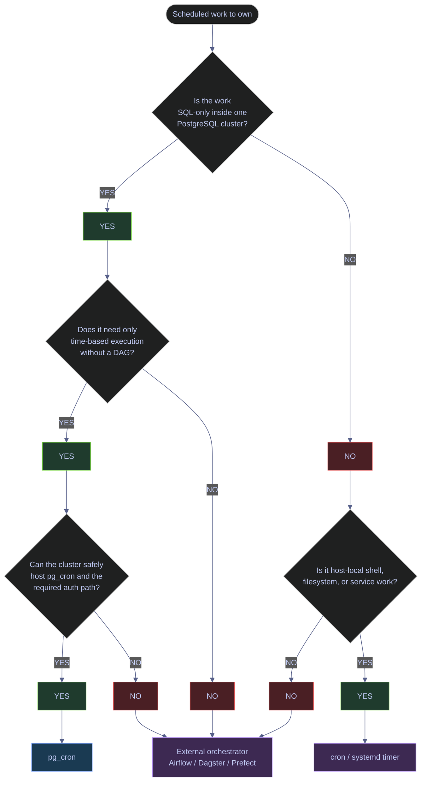

# PostgreSQL Scheduling and pg_cron

This note is the PostgreSQL equivalent of the SQL Server Agent jobs note, but the first operational fact is that PostgreSQL core does not ship a built-in Agent-like scheduler. The closest in-database analogue is `pg_cron`, an extension that runs scheduled SQL inside PostgreSQL with one metadata database, optional cross-database targeting, and catalog tables that expose job definitions plus run history. The design question is therefore two-step: decide whether the workload belongs inside the database at all, then decide whether `pg_cron` is the right owner or whether the work should stay in cron, systemd timers, Airflow, Dagster, or another orchestrator.

> [!abstract]- Summary
>
> PostgreSQL scheduling is an extension and orchestration problem rather than a core-engine feature toggle. This note establishes how to prove the scheduler surface is currently absent, how to install and enable `pg_cron` safely on Linux, how to create and inspect cross-database jobs, how to read `cron.job` and `cron.job_run_details`, and how to decide when `pg_cron` is the correct owner versus when the workload belongs in an external scheduler.
>
> - **Current scheduler state**
>   - proves that the live lab has no in-database scheduler surface before enablement because `pg_cron` is absent from `pg_available_extensions` and `shared_preload_libraries` is empty
> - **Enablement on Linux**
>   - covers package install, restart-scoped preload behavior, the `cron.*` settings that appear after the worker loads, and the one-database metadata boundary
> - **Job creation**
>   - uses `cron.schedule_in_database` to register a harmless heartbeat job that executes in `stoxx` while the metadata lives in the scheduler database
> - **Monitoring and history**
>   - inspects `cron.job`, `cron.job_run_details`, and the row-level-security policies that control which jobs each user can see
> - **Failure interpretation**
>   - captures both successful and failed runs so `status`, `return_message`, and timing columns are grounded in real output rather than inferred semantics
> - **Operational boundaries**
>   - clarifies that PostgreSQL has no built-in operators, notification routing, categories, or proxy subsystem equivalent to SQL Server Agent
> - **Scheduler ownership**
>   - ends with a decision framework for `pg_cron` versus host schedulers and external orchestrators

> [!note]- Glossary
>
> **`pg_cron`**
> - A PostgreSQL extension that schedules SQL to run on a cron-like timetable inside PostgreSQL.
> - It matters because PostgreSQL core has no built-in SQL Server Agent equivalent.
>
> ---
>
> **Metadata database**
> - The one database in a PostgreSQL cluster that stores the `pg_cron` catalog tables and functions.
> - It matters because `pg_cron` can only be installed into one database at a time.
>
> ---
>
> **`cron.schedule_in_database`**
> - The function that registers a job in the metadata database but targets execution in another database in the same cluster.
> - It matters because it is the PostgreSQL answer to "schedule against the business database without moving the metadata there."
>
> ---
>
> **`shared_preload_libraries`**
> - The startup-only PostgreSQL setting that loads libraries needing shared memory, light-weight locks, or background workers at postmaster start.
> - It matters because `pg_cron` cannot run until the background worker is loaded there.
>
> ---
>
> **`cron.job`**
> - The catalog table that stores job definitions.
> - It matters because it is the nearest PostgreSQL analogue to the Agent job-definition catalogs in `msdb`.
>
> ---
>
> **`cron.job_run_details`**
> - The catalog table that stores one row per job execution attempt.
> - It matters because this is the primary history surface for determining whether a scheduled job succeeded, failed, or stopped producing the expected result.

## Current Scheduler State

Before discussing schedules, first prove whether the cluster currently exposes any in-database scheduling surface at all. On PostgreSQL that means checking for extension files and startup-loaded background-worker libraries, not checking a single built-in service switch.

### PostgreSQL | scheduler surface | verify whether the cluster currently exposes pg_cron

This subsection answers the same opening question that the SQL Server Agent note answers for `Agent XPs`: is a scheduler surface actually present on the live instance, or is the idea still hypothetical?

#### Check whether pg_cron is currently available as an extension

Run this at the start of any PostgreSQL scheduling review, before editing `postgresql.conf`, installing packages, or assuming a scheduler already exists. It is typically triggered by first host audit, post-rebuild validation, or a request to "just add a scheduled job" on a cluster whose extension surface is still unknown. The query runs in a SQL session, is read-only, and requires only visibility into `pg_available_extensions`. Its purpose is to prove whether PostgreSQL already has the `pg_cron` extension files available to install.

| Output field | Source column | Unit / type | Meaning |
|---|---|---|---|
| `name` | `pg_available_extensions.name` | `name` | The extension name known to the current PostgreSQL installation. |
| `default_version` | `pg_available_extensions.default_version` | `text` | The default version PostgreSQL would install if `CREATE EXTENSION` were executed. |
| `installed_version` | `pg_available_extensions.installed_version` | `text` | The version currently installed in the connected database, if any. |

*This query checks whether the current PostgreSQL installation exposes `pg_cron` at all.*

```sql
SELECT
    name,
    default_version,
    installed_version
FROM pg_available_extensions
WHERE name = 'pg_cron';
```

```text
 name | default_version | installed_version
------+-----------------+-------------------
(0 rows)
```

The live lab currently has no `pg_cron` extension files installed, so there is no in-database scheduler surface to enable yet. This is the key PostgreSQL difference from SQL Server Agent: the scheduler is not dormant inside core waiting for a switch. It must exist as packaged extension code first.

#### Check whether any startup preload libraries are active

Run this immediately after the extension-availability check when the next question is whether the postmaster is already loading any background-worker libraries at startup. It is typically triggered by scheduler enablement planning, extension troubleshooting, or a need to prove that the instance is still close to package defaults. The query runs in a SQL session, is read-only, and needs only `current_setting`. Its purpose is to determine whether a restart-scoped worker library is already loaded into the server.

| Output field | Source expression | Unit / type | Meaning |
|---|---|---|---|
| `shared_preload_libraries` | `current_setting('shared_preload_libraries')` | `text` | The comma-separated list of libraries PostgreSQL is loading at postmaster start. |

*This query returns the current startup preload list.*

```sql
SELECT current_setting('shared_preload_libraries') AS shared_preload_libraries;
```

```text
 shared_preload_libraries
--------------------------

(1 row)
```

The preload list is empty, which means there is no currently loaded scheduler worker and no restart-scoped extension surface in play. That is the correct baseline for a lab that has not yet been explicitly prepared for in-database scheduling.

## Enablement on Linux

Enabling `pg_cron` on Linux is a sequence, not one command. PostgreSQL first needs the extension package on disk, then the postmaster must load the shared library at server start, then the metadata functions and tables must be created in exactly one database.

### PostgreSQL / Linux | pg_cron | install and enable the extension

This subsection covers the complete enablement path from "the package is missing" to "the cluster exposes `cron.*` settings and the extension can be created." The boundary that matters most is restart scope: `shared_preload_libraries` is a postmaster setting, so installation alone never makes the scheduler active.

| Setting | What it controls | Default in the live lab after worker load | Possible values | Production guidance |
|---|---|---|---|---|
| `shared_preload_libraries` | Startup-loaded shared libraries that may allocate shared memory or start background workers. | `pg_cron` during the enablement capture | Comma-separated library names, startup-only. | Keep it minimal because a bad library name can prevent PostgreSQL from starting. |
| `cron.database_name` | The one database that stores `pg_cron` metadata. | `postgres` | Any database name in the cluster, startup-only. | Choose deliberately; all `pg_cron` metadata lives here, even when jobs target other databases. |
| `cron.host` | The hostname or socket path used when `pg_cron` opens local libpq connections. | `localhost` | Hostname, socket directory, or empty string, startup-only. | Align it with the intended local-authentication model in `pg_hba.conf`. |
| `cron.use_background_workers` | Whether `pg_cron` launches jobs via background workers instead of local libpq connections. | `off` | `on` or `off`, startup-only. | Turn it on only when the concurrency and worker-process budget are designed for it. |
| `max_worker_processes` | Cluster-wide budget for background workers. | `8` before any tuning | Integer, startup-only. | Raise it only if background-worker scheduling or other extensions genuinely need more capacity. |
| `cron.timezone` | Time zone used for `pg_cron` schedule interpretation. | `GMT` | Any PostgreSQL-supported time zone, startup-only. | Set it explicitly if the estate does not want GMT semantics. |

#### Install the pg_cron package for PostgreSQL 16

Run this when the extension-availability query has confirmed that `pg_cron` is absent and the next operational step is to make the extension files available to the server. It is typically triggered by first-time scheduler enablement on a self-managed Linux host or container. The command runs in the Linux shell with root-level package-management privileges, is state-changing, and affects the container or host filesystem rather than the database catalogs directly. Its purpose is to install the shared library and SQL extension files PostgreSQL needs before any database-level enablement can happen.

*This command installs `pg_cron` from the configured PGDG apt repository inside the live PostgreSQL container.*

```bash
docker exec stoxx-postgres bash -lc "DEBIAN_FRONTEND=noninteractive apt-get install -y postgresql-16-cron"
```

```text
Reading package lists...
Building dependency tree...
Reading state information...
The following NEW packages will be installed:
  postgresql-16-cron
0 upgraded, 1 newly installed, 0 to remove and 3 not upgraded.
Need to get 91.8 kB of archives.
After this operation, 233 kB of additional disk space will be used.
Get:1 http://apt.postgresql.org/pub/repos/apt trixie-pgdg/main amd64 postgresql-16-cron amd64 1.6.7-2.pgdg13+1 [91.8 kB]
Setting up postgresql-16-cron (1.6.7-2.pgdg13+1) ...
```

The package install places the `pg_cron` shared library under PostgreSQL's library path and the extension SQL files under `/usr/share/postgresql/16/extension`. That still does not make the scheduler active. PostgreSQL must load the library at server start before any `cron.*` settings or background worker can appear.

#### Stage pg_cron for server-start loading

Run this after the package is installed and before the restart window begins. It is typically triggered by planned scheduler enablement after confirming that a restart is acceptable. The command runs in a SQL session as a superuser, is state-changing, and writes PostgreSQL configuration metadata rather than immediately changing the running server. Its purpose is to tell the postmaster to load `pg_cron` on the next start.

*This command stages `pg_cron` into the startup preload list.*

```sql
ALTER SYSTEM SET shared_preload_libraries = 'pg_cron';
```

```text
ALTER SYSTEM
```

This is only the configuration step. PostgreSQL documentation is explicit that `shared_preload_libraries` is server-start only because some modules need shared memory, lightweight locks, or background workers during postmaster initialization. Until the restart happens, `pg_cron` is still inert.

#### Restart PostgreSQL so the pg_cron worker can register its settings

Run this only after the restart-scoped configuration has been staged and the operational window permits a database restart. It is typically triggered by extension enablement or extension removal, not by day-to-day job administration. The command runs in Docker on the host, is state-changing, and interrupts active sessions while the container restarts. Its purpose is to let the postmaster load the `pg_cron` library and register the `cron.*` configuration surface.

*This command restarts the PostgreSQL container after the preload change.*

```powershell
docker restart stoxx-postgres
```

```text
stoxx-postgres
```

#### Inspect the pg_cron runtime settings after restart

Run this immediately after the restart to verify that the worker actually loaded and to see which execution model the cluster is now using. It is typically triggered by post-restart validation or troubleshooting when `CREATE EXTENSION` or job execution does not behave as expected. The query runs in a SQL session, is read-only, and needs only access to `pg_settings`. Its purpose is to prove that the `pg_cron` library is loaded and to surface the settings that control where metadata lives, how connections are made, and how much concurrency is possible.

| Output field | Source column | Unit / type | Meaning |
|---|---|---|---|
| `name` | `pg_settings.name` | `text` | The setting name. |
| `setting` | `pg_settings.setting` | `text` | The current effective value. |
| `context` | `pg_settings.context` | `text` | Whether the setting is startup-only, reloadable, or otherwise scoped. |
| `source` | `pg_settings.source` | `text` | Where the current value came from. |

*This query inspects the most important `pg_cron` runtime settings after the worker is loaded.*

```sql
SELECT
    name,
    setting,
    context,
    source
FROM pg_settings
WHERE name IN
(
    'shared_preload_libraries',
    'cron.database_name',
    'cron.host',
    'cron.use_background_workers',
    'cron.max_running_jobs',
    'cron.timezone'
)
ORDER BY name;
```

```text
            name             |  setting  |  context   |       source
-----------------------------+-----------+------------+--------------------
 cron.database_name          | postgres  | postmaster | default
 cron.host                   | localhost | postmaster | default
 cron.max_running_jobs       | 32        | postmaster | default
 cron.timezone               | GMT       | postmaster | default
 cron.use_background_workers | off       | postmaster | default
 shared_preload_libraries    | pg_cron   | postmaster | configuration file
(6 rows)
```

Three decisions are operationally important here. First, the worker is truly loaded because `shared_preload_libraries = pg_cron` is now live and the `cron.*` settings exist. Second, the metadata database default is `postgres`, not `stoxx`, which means the scheduler catalog will live there unless `cron.database_name` is changed and PostgreSQL is restarted again. Third, `cron.use_background_workers = off`, so `pg_cron` will use local libpq connections by default and therefore depends on a working local-authentication path in `pg_hba.conf`.

#### Create the extension in the metadata database

Run this only after the restart has succeeded and the `cron.*` settings are visible. It is typically triggered by the first database-level step of scheduler enablement. The batch runs in a SQL session as a superuser, is state-changing, and creates the extension objects in exactly one database. Its purpose is to register the `pg_cron` catalog objects and function surface in the chosen metadata database.

| Output field | Source expression | Unit / type | Meaning |
|---|---|---|---|
| `extname` | `pg_extension.extname` | `name` | The extension name installed in the current database. |
| `extversion` | `pg_extension.extversion` | `text` | The installed extension version. |
| `schema_name` | `pg_extension.extnamespace::regnamespace` | `regnamespace` | The extension's owning schema namespace record. |

*This batch installs `pg_cron` into the default metadata database and then verifies the extension row.*

```sql
CREATE EXTENSION pg_cron;

SELECT
    extname,
    extversion,
    extnamespace::regnamespace AS schema_name
FROM pg_extension
WHERE extname = 'pg_cron';
```

```text
CREATE EXTENSION
 extname | extversion | schema_name
---------+------------+-------------
 pg_cron | 1.6        | pg_catalog
(1 row)
```

`pg_cron` is now installed in the metadata database and ready to accept job definitions. The practical consequence of keeping `cron.database_name = postgres` is that job metadata lives there even when the actual scheduled SQL targets `stoxx`.

| Flag or setting | Syntax | Description |
|---|---|---|
| `-y` | `apt-get install -y postgresql-16-cron` | Accept the package-install prompt non-interactively. |
| `bash -lc` | `docker exec stoxx-postgres bash -lc "<command>"` | Execute the package-management command inside the running container shell. |
| `shared_preload_libraries` | `ALTER SYSTEM SET shared_preload_libraries = 'pg_cron'` | Register `pg_cron` as a startup-loaded library. |
| `cron.database_name` | `cron.database_name = 'postgres'` | Choose the one database that owns `pg_cron` metadata. |
| `cron.use_background_workers` | `cron.use_background_workers = off` | Keep the default libpq-based job-launch model instead of background workers. |

## Job Creation

Once the extension exists, job creation is catalog-driven. The important PostgreSQL distinction is that job metadata may live in one database while the SQL executes in another database in the same cluster.

### PostgreSQL | cron.schedule_in_database | create and inventory jobs

This subsection establishes the actual function surface, creates a harmless scheduled job against `stoxx`, and inspects the stored job definition in `cron.job`.

#### List the pg_cron function surface

Run this before writing production job code or delegating access to other operators, especially when the team is unsure which `pg_cron` signatures the currently installed version exposes. It is typically triggered by first use of the extension, upgrade validation, or review of cross-database scheduling capability. The query runs in a SQL session, is read-only, and inspects PostgreSQL's function catalogs. Its purpose is to show the concrete job-management API rather than relying on memory or outdated examples.

| Output field | Source expression | Unit / type | Meaning |
|---|---|---|---|
| `proname` | `pg_proc.proname` | `name` | The function name exposed in the `cron` schema. |
| `arguments` | `pg_get_function_identity_arguments(p.oid)` | `text` | The identity argument list for the function signature. |
| `returns` | `pg_get_function_result(p.oid)` | `text` | The function's return type. |

*This query lists the `pg_cron` management functions exposed by the installed extension.*

```sql
SELECT
    proname,
    pg_get_function_identity_arguments(p.oid) AS arguments,
    pg_get_function_result(p.oid) AS returns
FROM pg_proc AS p
JOIN pg_namespace AS n
    ON n.oid = p.pronamespace
WHERE n.nspname = 'cron'
ORDER BY proname, arguments;
```

```text
       proname        |                                        arguments                                         | returns
----------------------+------------------------------------------------------------------------------------------+---------
 alter_job            | job_id bigint, schedule text, command text, database text, username text, active boolean | void
 job_cache_invalidate |                                                                                          | trigger
 schedule             | job_name text, schedule text, command text                                               | bigint
 schedule             | schedule text, command text                                                              | bigint
 schedule_in_database | job_name text, schedule text, command text, database text, username text, active boolean | bigint
 unschedule           | job_id bigint                                                                            | boolean
 unschedule           | job_name text                                                                            | boolean
(7 rows)
```

The key operational point is the presence of `cron.schedule_in_database`. That is the function that lets the metadata remain in the scheduler database while the real work runs in `stoxx`, which is the cleanest analogue to central scheduler metadata with business-database execution.

#### Create a harmless target table for a scheduler heartbeat

Run this when the goal is to validate scheduler behavior without touching business tables or relying on side effects that are hard to inspect. It is typically triggered by first scheduler rehearsal or by extension-validation work after enablement. The batch runs in the target application database, is state-changing, and creates a small demo table in `demo_stc` that later scheduled runs can write into safely. Its purpose is to make successful execution visible in ordinary SQL data, not only in scheduler metadata.

*This batch creates a simple target table in `stoxx` for scheduled heartbeat rows.*

```sql
DROP TABLE IF EXISTS demo_stc.pgcron_heartbeat;

CREATE TABLE demo_stc.pgcron_heartbeat
(
    heartbeat_id bigint GENERATED ALWAYS AS IDENTITY PRIMARY KEY,
    executed_at timestamptz NOT NULL,
    db_name text NOT NULL,
    role_name text NOT NULL,
    note text NOT NULL
);
```

```text
DROP TABLE
CREATE TABLE
NOTICE:  table "pgcron_heartbeat" does not exist, skipping
```

This is deliberately low-risk. The scheduled command will later write a timestamp, database name, and role name into this table, which makes cross-database execution visible without needing to infer success from logs alone.

#### Register a named cross-database heartbeat job

Run this after the target-side object exists and the scheduler metadata database is ready to store jobs. It is typically triggered by the first production-style use of `pg_cron`, especially when the team wants metadata in `postgres` but execution in `stoxx`. The command runs in the metadata database as a sufficiently privileged PostgreSQL role, is state-changing, and inserts a row into `cron.job`. Its purpose is to create a named schedule that executes in `stoxx` as `postgres` every minute.

| Output field | Source expression | Unit / type | Meaning |
|---|---|---|---|
| `job_id` | `cron.schedule_in_database(...)` | `bigint` | The new job identifier stored in `cron.job`. |

*This command creates a named heartbeat job that runs every minute in `stoxx`.*

```sql
SELECT cron.schedule_in_database
(
    'note05_pgcron_heartbeat',
    '* * * * *',
    'INSERT INTO demo_stc.pgcron_heartbeat(executed_at, db_name, role_name, note) VALUES (clock_timestamp(), current_database(), current_user, ''pg_cron note 05 heartbeat'');',
    'stoxx',
    'postgres',
    true
) AS job_id;
```

```text
 job_id
--------
      1
(1 row)
```

The returned `job_id = 1` is the durable identifier for later monitoring, alteration, and removal. The schedule string is the classic five-field cron form, so the job is expected to fire once per minute.

#### Inspect the stored job definition

Run this immediately after scheduling, or any time the question is "what exactly is registered right now?" rather than "what do we think the job was meant to do?" It is typically triggered by initial review, change-control verification, or troubleshooting of schedule drift. The query runs in the metadata database, is read-only, and inspects `cron.job`. Its purpose is to verify the stored job text, target database, execution user, and active state.

| Output field | Source column | Unit / type | Meaning |
|---|---|---|---|
| `jobid` | `cron.job.jobid` | `bigint` | The job identifier used for alteration, history joins, and removal. |
| `jobname` | `cron.job.jobname` | `text` | The optional human-readable job name. |
| `schedule` | `cron.job.schedule` | `text` | The cron schedule expression. |
| `command` | `cron.job.command` | `text` | The SQL command `pg_cron` will execute. |
| `database` | `cron.job.database` | `text` | The target database in which the command runs. |
| `username` | `cron.job.username` | `text` | The PostgreSQL role used for the job's execution. |
| `active` | `cron.job.active` | `boolean` | Whether the job is enabled for future execution. |

*This query shows the exact job definition stored in `cron.job`.*

```sql
SELECT
    jobid,
    jobname,
    schedule,
    command,
    database,
    username,
    active
FROM cron.job
ORDER BY jobid;
```

```text
 jobid |         jobname         | schedule  |                                                                                 command                                                                                 | database | username | active
-------+-------------------------+-----------+-------------------------------------------------------------------------------------------------------------------------------------------------------------------------+----------+----------+--------
     1 | note05_pgcron_heartbeat | * * * * * | INSERT INTO demo_stc.pgcron_heartbeat(executed_at, db_name, role_name, note) VALUES (clock_timestamp(), current_database(), current_user, 'pg_cron note 05 heartbeat'); | stoxx    | postgres | t
(1 row)
```

The metadata confirms the intended design: the job catalog is stored in the scheduler database, the SQL executes in `stoxx`, the executor is `postgres`, and the job is active. This is the PostgreSQL shape that replaces the SQL Server Agent distinction between central metadata and target database work.

## Monitoring and History

Job registration is only the first half of scheduling. A usable scheduler note must show what success looks like, what failure looks like, and which metadata surfaces prove the difference.

### PostgreSQL | cron.job_run_details | verify success, failure, and cleanup

This subsection inspects the catalog shape, confirms the row-level-security visibility model, captures successful executions, captures a controlled failure, and then removes the demo job cleanly.

#### Inspect the scheduler catalog layout

Run this before writing monitoring queries or delegating scheduler access, especially when the team needs to know which tables actually hold definitions versus run history. It is typically triggered by first operational review of `pg_cron`, by note-writing work, or by troubleshooting where the result columns are not yet familiar. The query runs in a SQL session, is read-only, and inspects `information_schema.columns`. Its purpose is to document the real column surface of `cron.job` and `cron.job_run_details`.

| Output field | Source column | Unit / type | Meaning |
|---|---|---|---|
| `table_name` | `information_schema.columns.table_name` | `sql_identifier` | The scheduler metadata table name. |
| `column_name` | `information_schema.columns.column_name` | `sql_identifier` | The column name exposed by the scheduler table. |
| `data_type` | `information_schema.columns.data_type` | `character_data` | The PostgreSQL data type of that column. |

*This query lists the column layout of the two main scheduler metadata tables.*

```sql
SELECT
    table_name,
    column_name,
    data_type
FROM information_schema.columns
WHERE table_schema = 'cron'
  AND table_name IN ('job', 'job_run_details')
ORDER BY table_name, ordinal_position;
```

```text
   table_name    |  column_name   |        data_type
-----------------+----------------+--------------------------
 job             | jobid          | bigint
 job             | schedule       | text
 job             | command        | text
 job             | nodename       | text
 job             | nodeport       | integer
 job             | database       | text
 job             | username       | text
 job             | active         | boolean
 job             | jobname        | text
 job_run_details | jobid          | bigint
 job_run_details | runid          | bigint
 job_run_details | job_pid        | integer
 job_run_details | database       | text
 job_run_details | username       | text
 job_run_details | command        | text
 job_run_details | status         | text
 job_run_details | return_message | text
 job_run_details | start_time     | timestamp with time zone
 job_run_details | end_time       | timestamp with time zone
(19 rows)
```

`cron.job` is the definition table. `cron.job_run_details` is the execution-history table. That separation is the same operational boundary an engineer expects from any scheduler: one surface describes what should happen, the other records what actually happened.

#### Inspect the row-level-security policies on scheduler metadata

Run this when the security question is not "can the extension run?" but "who can see whose jobs and history?" It is typically triggered by multi-user scheduler design, audit review, or a decision to grant non-superusers access to the `cron` schema. The query runs in a SQL session, is read-only, and inspects `pg_policies`. Its purpose is to surface the visibility boundary PostgreSQL applies to `cron.job` and `cron.job_run_details`.

| Output field | Source column | Unit / type | Meaning |
|---|---|---|---|
| `schemaname` | `pg_policies.schemaname` | `name` | The schema containing the protected table. |
| `tablename` | `pg_policies.tablename` | `name` | The table protected by the policy. |
| `policyname` | `pg_policies.policyname` | `name` | The RLS policy name. |
| `roles` | `pg_policies.roles` | `name[]` | The roles to which the policy applies. |
| `cmd` | `pg_policies.cmd` | `text` | The command class covered by the policy. |
| `qual` | `pg_policies.qual` | `text` | The predicate PostgreSQL uses to decide row visibility. |

*This query shows the row-level-security policies applied to the `pg_cron` metadata tables.*

```sql
SELECT
    schemaname,
    tablename,
    policyname,
    roles,
    cmd,
    qual
FROM pg_policies
WHERE schemaname = 'cron'
ORDER BY tablename, policyname;
```

```text
 schemaname |    tablename    |         policyname          |  roles   | cmd |           qual
------------+-----------------+-----------------------------+----------+-----+---------------------------
 cron       | job             | cron_job_policy             | {public} | ALL | (username = CURRENT_USER)
 cron       | job_run_details | cron_job_run_details_policy | {public} | ALL | (username = CURRENT_USER)
(2 rows)
```

This is a critical PostgreSQL-specific security boundary. The `cron` tables are not wide-open inventories by default. They are protected so ordinary users only see rows where `username = CURRENT_USER`, which is the closest analogue to "operators can manage only the jobs they own."

#### Confirm that no run has happened yet

Run this immediately after job registration when the next question is whether the first execution has actually occurred. It is typically triggered by a wait for the next minute boundary or by validation that the scheduler is not backfilling unexpectedly. The query runs in the target database, is read-only, and inspects the heartbeat table created for this note. Its purpose is to prove the pre-execution state before success or failure is interpreted.

| Output field | Source expression | Unit / type | Meaning |
|---|---|---|---|
| `heartbeat_rows` | `COUNT(*)` | `bigint` | The number of rows currently written by the scheduled heartbeat job. |

*This query verifies that the heartbeat table is still empty before the first minute boundary is reached.*

```sql
SELECT COUNT(*) AS heartbeat_rows
FROM demo_stc.pgcron_heartbeat;
```

```text
 heartbeat_rows
----------------
              0
(1 row)
```

The zero-row result is the expected state immediately after scheduling and before the first firing time is reached.

#### Inspect the successful heartbeat rows in the target database

Run this after allowing the schedule to cross one or more minute boundaries and when the goal is to prove actual SQL execution in the target database rather than only metadata updates. It is typically triggered by first scheduler validation or by a question about whether cross-database execution is working. The query runs in `stoxx`, is read-only, and inspects the target table the job writes to. Its purpose is to prove that scheduled SQL executed in the intended database as the intended role.

| Output field | Source column | Unit / type | Meaning |
|---|---|---|---|
| `heartbeat_id` | `demo_stc.pgcron_heartbeat.heartbeat_id` | `bigint` | The identity key for each recorded run. |
| `executed_at` | `demo_stc.pgcron_heartbeat.executed_at` | `timestamptz` | The wall-clock time at which the scheduled statement executed. |
| `db_name` | `demo_stc.pgcron_heartbeat.db_name` | `text` | The database name seen by the executing session. |
| `role_name` | `demo_stc.pgcron_heartbeat.role_name` | `text` | The SQL role under which the job executed. |
| `note` | `demo_stc.pgcron_heartbeat.note` | `text` | The static marker written by the scheduled statement. |

*This query shows the rows written by the scheduled heartbeat job in `stoxx`.*

```sql
SELECT
    heartbeat_id,
    executed_at,
    db_name,
    role_name,
    note
FROM demo_stc.pgcron_heartbeat
ORDER BY heartbeat_id;
```

```text
 heartbeat_id |          executed_at          | db_name | role_name |           note
--------------+-------------------------------+---------+-----------+---------------------------
            1 | 2026-04-18 22:48:00.010829+00 | stoxx   | postgres  | pg_cron note 05 heartbeat
            2 | 2026-04-18 22:49:00.005062+00 | stoxx   | postgres  | pg_cron note 05 heartbeat
(2 rows)
```

These rows prove the job is not merely "scheduled." It is executing in `stoxx`, seeing `current_database() = stoxx`, and running as `postgres`. The timestamps also show the expected once-per-minute cadence.

#### Inspect the successful run-history rows

Run this alongside the target-table check when the operational need is to confirm scheduler history, not only application-side effects. It is typically triggered by monitoring design or by incident review when the business table is not enough evidence on its own. The query runs in the metadata database, is read-only, and inspects `cron.job_run_details`. Its purpose is to show how `pg_cron` records success, duration, and server feedback for each run.

| Output field | Source column | Unit / type | Meaning |
|---|---|---|---|
| `jobid` | `cron.job_run_details.jobid` | `bigint` | The scheduled job that produced this run. |
| `runid` | `cron.job_run_details.runid` | `bigint` | The unique execution-attempt identifier. |
| `database` | `cron.job_run_details.database` | `text` | The target database for the run. |
| `username` | `cron.job_run_details.username` | `text` | The PostgreSQL role used for execution. |
| `status` | `cron.job_run_details.status` | `text` | The run outcome, such as `succeeded` or `failed`. |
| `return_message` | `cron.job_run_details.return_message` | `text` | PostgreSQL's returned command tag or error text. |
| `start_time` | `cron.job_run_details.start_time` | `timestamptz` | When the run started. |
| `end_time` | `cron.job_run_details.end_time` | `timestamptz` | When the run ended. |

*This query shows the scheduler's recorded history for the successful heartbeat runs.*

```sql
SELECT
    jobid,
    runid,
    database,
    username,
    status,
    return_message,
    start_time,
    end_time
FROM cron.job_run_details
ORDER BY runid DESC
LIMIT 5;
```

```text
 jobid | runid | database | username |  status   | return_message |          start_time          |           end_time
-------+-------+----------+----------+-----------+----------------+------------------------------+-------------------------------
     1 |     1 | stoxx    | postgres | succeeded | INSERT 0 1     | 2026-04-18 22:48:00.01005+00 | 2026-04-18 22:48:00.011453+00
(1 row)
```

On a successful DML job, `return_message` is the PostgreSQL command tag. Here it reports `INSERT 0 1`, which means the scheduler saw one inserted row and recorded the run as `succeeded`.

#### Change the job command to a controlled failure

Run this only in a sandbox or a deliberately isolated demo when the goal is to validate failure visibility. It is typically triggered by monitoring rehearsal, not by ordinary administration. The command runs in the metadata database, is state-changing, and changes the stored SQL for future executions. Its purpose is to force a predictable error on the next run so the history table can be interpreted against a real failure.

*This command changes the scheduled SQL to `SELECT 1/0;` so the next execution fails deterministically.*

```sql
SELECT cron.alter_job(1, command := 'SELECT 1/0;');
```

```text
 alter_job
-----------

(1 row)
```

#### Verify the altered job definition before the next run

Run this immediately after `cron.alter_job` when the next execution outcome must be interpreted against the exact stored command text. It is typically triggered by change review or failure rehearsal. The query runs in the metadata database, is read-only, and inspects `cron.job`. Its purpose is to prove that the job now carries the failing SQL text and is still active.

*This query confirms the altered command text stored for job `1`.*

```sql
SELECT
    jobid,
    jobname,
    schedule,
    command,
    database,
    username,
    active
FROM cron.job
WHERE jobid = 1;
```

```text
 jobid |         jobname         | schedule  |   command   | database | username | active
-------+-------------------------+-----------+-------------+----------+----------+--------
     1 | note05_pgcron_heartbeat | * * * * * | SELECT 1/0; | stoxx    | postgres | t
(1 row)
```

#### Inspect the resulting failed run history

Run this after the next minute boundary once the intentionally failing job has had time to execute. It is typically triggered by a need to verify alerting logic, monitoring dashboards, or triage queries against a known-bad run. The query runs in the metadata database, is read-only, and inspects `cron.job_run_details`. Its purpose is to show what `pg_cron` records when a scheduled statement throws a PostgreSQL error.

*This query shows the most recent run-history rows after the command was altered to fail.*

```sql
SELECT
    jobid,
    runid,
    database,
    username,
    status,
    return_message,
    start_time,
    end_time
FROM cron.job_run_details
ORDER BY runid DESC
LIMIT 5;
```

```text
 jobid | runid | database | username |  status   |      return_message      |          start_time           |           end_time
-------+-------+----------+----------+-----------+--------------------------+-------------------------------+-------------------------------
     1 |     3 | stoxx    | postgres | failed    | ERROR:  division by zero+| 2026-04-18 22:50:00.006885+00 | 2026-04-18 22:50:00.007958+00
     1 |     2 | stoxx    | postgres | succeeded | INSERT 0 1               | 2026-04-18 22:49:00.004794+00 | 2026-04-18 22:49:00.005939+00
     1 |     1 | stoxx    | postgres | succeeded | INSERT 0 1               | 2026-04-18 22:48:00.01005+00  | 2026-04-18 22:48:00.011453+00
(3 rows)
```

This is the monitoring payoff. The same job now has two successful runs followed by a failed run, and `return_message` carries the real PostgreSQL error text. The history table is therefore sufficient to distinguish "job fired and failed" from "job never fired."

#### Remove the demo job from the scheduler metadata

Run this after the monitoring rehearsal is complete and the scheduled object should no longer exist. It is typically triggered by teardown of test jobs or by replacement of an obsolete job definition. The first query runs in the metadata database, is state-changing, and removes the job by id. The second query is read-only and confirms that the catalog is empty afterward. Their purpose is to demonstrate clean scheduler teardown rather than leaving test jobs behind.

| Output field | Source expression | Unit / type | Meaning |
|---|---|---|---|
| `removed` | `cron.unschedule(1)` | `boolean` | Whether the job row was removed successfully. |

*This command removes the demo job from `cron.job`.*

```sql
SELECT cron.unschedule(1) AS removed;
```

```text
 removed
---------
 t
(1 row)
```

*This query confirms that no scheduler rows remain after removal.*

```sql
SELECT COUNT(*) AS remaining_jobs
FROM cron.job;
```

```text
 remaining_jobs
----------------
              0
(1 row)
```

#### Remove the target table used by the demo job

Run this after the scheduler metadata has been cleaned up and the target-side demo object is no longer needed. It is typically triggered by teardown of rehearsal artifacts. The batch runs in `stoxx`, is state-changing, and drops the target table. Its purpose is to return the business database to its pre-demo state.

*This batch removes the target table created for the heartbeat demo.*

```sql
DROP TABLE IF EXISTS demo_stc.pgcron_heartbeat;
```

```text
DROP TABLE
```

## Execution Boundaries and Notifications

`pg_cron` is not a full scheduler platform. It has job definitions and run history, but it does not provide SQL Server Agent-style operators, notification bindings, categories, or a proxy subsystem. Those boundaries must be understood before `pg_cron` is treated as a production scheduler.

### PostgreSQL | scheduler boundaries | understand what pg_cron does and does not own

The most important operational distinction is the execution model. By default `pg_cron` opens local libpq connections to run jobs, so scheduler success still depends on the local authentication path. Visibility is restricted through row-level security, and alerting normally comes from PostgreSQL logging plus an external monitoring or orchestration layer.

> [!warning]- The default execution model still depends on local authentication
>
> With `cron.use_background_workers = off`, `pg_cron` opens a local PostgreSQL connection to launch the job. If `pg_hba.conf` does not admit the target role over that path, the job stays scheduled but the execution fails.

> [!success]- Keep the connection model explicit
>
> Either keep a safe local-authentication path for the executor role, or deliberately switch to background-worker execution and raise `max_worker_processes` only when the worker budget has actually been designed.

Three practical consequences follow from the live scheduler surface captured in this note:

- job execution is tied to a PostgreSQL role, not to an external credential proxy
- history is visible in `cron.job_run_details`, but paging humans still requires PostgreSQL logs, external monitoring, or an orchestrator
- organization depends on clear `jobname` values and role design rather than on built-in job categories or notification operators

PostgreSQL therefore gives the database-local scheduling surface, not the human-notification surface. For production use, pair `pg_cron` with log collection, metrics, or an external scheduler that can alert on missed or failed runs.

## Choosing the Right Scheduler

The same question at the end of the SQL Server Agent note still matters here: should the database own this schedule at all? PostgreSQL changes the answer because the in-database scheduler is optional and extension-based rather than built into core.

### PostgreSQL | pg_cron vs orchestrator | choose the correct owner for scheduled work

#### Decision tree



*The decision tree deliberately narrows `pg_cron` to the same ownership domain where it is strongest: SQL-only work inside one PostgreSQL cluster, triggered by time rather than by cross-system dependencies. Host schedulers keep their place for shell and filesystem work, and full orchestrators keep their place for DAGs, retries across systems, and human-facing alerting.*

#### When pg_cron is the right tool

| Pattern | Reason |
|---|---|
| Lightweight table maintenance in one PostgreSQL cluster | The work is SQL-only, cluster-local, and time-based. |
| Periodic refresh of summary tables or materialized views | The data and the scheduler boundary both stay inside PostgreSQL. |
| Retention deletes, archival flags, or routine housekeeping SQL | The command is short, deterministic, and easy to validate from `cron.job_run_details`. |
| Small heartbeat or observability writes | The success condition is visible directly in PostgreSQL data and metadata. |
| Scheduled invocation of a stored procedure or function | The job surface is a single SQL call with no external dependency graph. |

#### When pg_cron is the wrong tool

| Pattern | Better owner | Reason |
|---|---|---|
| Multi-step ETL crossing PostgreSQL, object storage, and APIs | Airflow / Dagster / Prefect | The workflow needs DAG semantics, retries, and external observability. |
| Shell scripts, file rotation, backups to host paths, or service restarts | cron / systemd timer | The work belongs to the host, not to PostgreSQL SQL execution. |
| Pipelines that need alert routing, SLA tracking, or dependency visualization | External orchestrator | `pg_cron` has no built-in operator, notification, or DAG model. |
| Workloads requiring different OS credentials or secret scopes | External orchestrator or host scheduler | `pg_cron` executes as a PostgreSQL role, not as an OS-level proxy. |
| Long-running jobs that would compete heavily with normal database workload | External orchestrator | The scheduler and the workload would contend for the same database resources. |

> [!success]- Default decision rule
>
> Before creating a new `pg_cron` job, ask one narrow question: "If this work never left PostgreSQL SQL, would the schedule still make sense?" If the answer is yes, `pg_cron` is a strong candidate. If the answer depends on files, APIs, shells, DAG dependencies, or human-facing alerting, keep the schedule outside the database.
