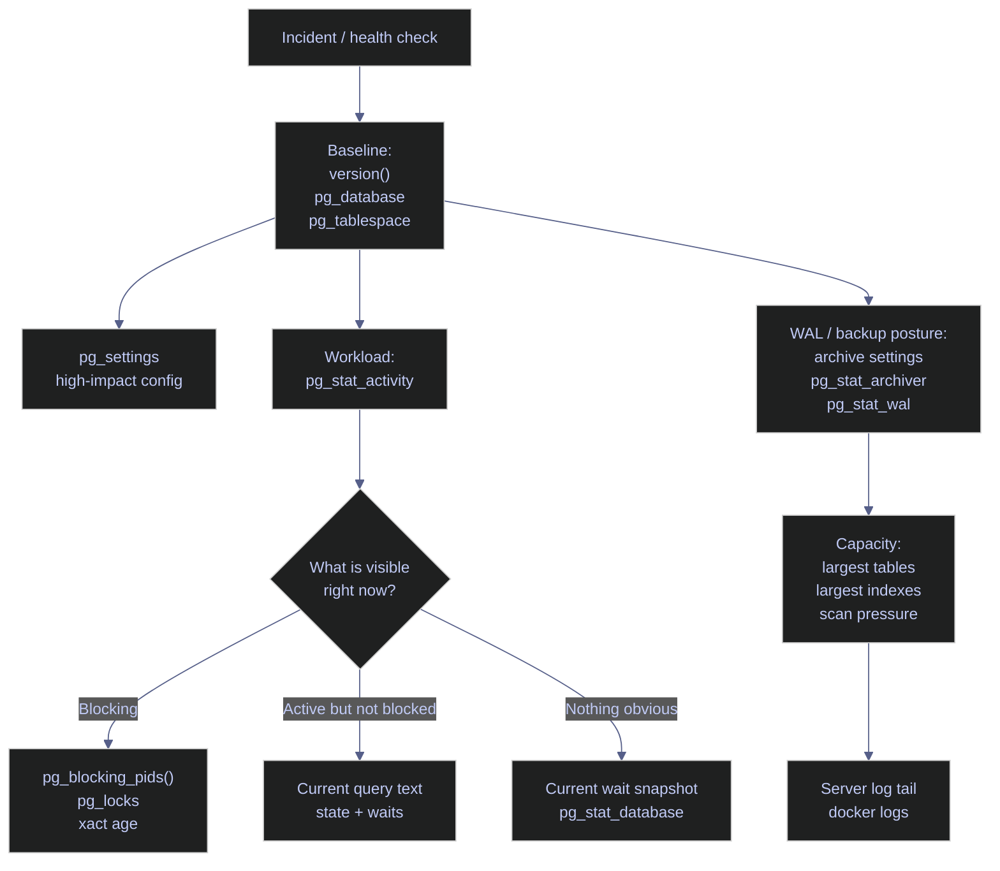

# Essential PostgreSQL DBA Queries

This note is a first-response PostgreSQL query pack for production administration. The goal is not catalog completeness. It is to keep a short, defensible set of queries that answers the first operational questions a PostgreSQL operator needs during health checks and incident triage: which cluster this is, what databases and tablespaces exist, what sessions are active now, whether anything is blocked, whether WAL protection is configured, and where storage pressure is accumulating.

> [!abstract]- Summary
>
> This note mirrors the SQL Server DBA query pack, but it is grounded in PostgreSQL's own operating surfaces: `pg_database`, `pg_tablespace`, `pg_settings`, `pg_stat_activity`, `pg_locks`, `pg_stat_database`, `pg_stat_archiver`, `pg_stat_wal`, and relation-size functions. The purpose is to keep the first-response path short and operational: confirm cluster identity, inspect catalog state, read live session and blocking evidence, evaluate WAL and backup posture, and rank the largest relations before the next decision is made.
>
> - **Baseline**
>   - confirms cluster identity, runtime directories, database inventory, tablespaces, and high-impact configuration state
> - **Workload**
>   - inspects user backends, active and blocked sessions, blocking relationships, transaction age, current waits, and temp-file pressure
> - **Backups and capacity**
>   - shows WAL archiving posture, WAL-generation counters, WAL-directory footprint, largest tables, largest indexes, sequential-scan pressure, and recent server log lines
> - **Operational differences from SQL Server**
>   - replaces file-level database catalogs with database and tablespace inventories, replaces Agent/job history with WAL and archiver posture, and replaces missing-index DMVs with table and index access statistics
> - **Live capture context**
>   - result sets were captured on April 18, 2026 from the local `stoxx-postgres` PostgreSQL 16.13 container on host port `5434`, with a 45 MB `stoxx` database, default tablespaces only, `archive_mode = off`, and a temporary lock demo used to surface real blocking and transaction-age evidence

> [!note]- Glossary
>
> **Statistics view**
> - PostgreSQL's cumulative or activity view used for workload and capacity diagnostics.
> - It matters because PostgreSQL does not use SQL Server-style DMVs but solves the same operational problem through `pg_stat_*` views.
>
> ---
>
> **`pg_stat_activity`**
> - The view that exposes one row per server process, including state, waits, current query, and session identity.
> - It matters because it is the primary first-response view for active workload, blocking, and long transactions.
>
> ---
>
> **`pg_database`**
> - The shared system catalog that stores cluster-wide database metadata.
> - It matters because PostgreSQL database inventory, connectivity rules, and per-database size checks start here.
>
> ---
>
> **Tablespace**
> - A named storage location that can hold databases, tables, or indexes.
> - It matters because PostgreSQL storage layout is reasoned about through tablespaces rather than through SQL Server-style filegroups and individual database files.
>
> ---
>
> **WAL**
> - Write-ahead log used for crash recovery, replication, and archiving.
> - It matters because backup posture and recovery readiness depend on WAL retention and archiving, not on transaction-log backup history catalogs.
>
> ---
>
> **Blocking**
> - A session waiting on another session's lock to proceed.
> - It matters because PostgreSQL exposes the relationship through `pg_blocking_pids()` and lock catalogs rather than through a single head-blocker DMV.
>
> ---
>
> **Temp spill**
> - Executor work that exceeded memory and wrote temporary files to disk.
> - It matters because PostgreSQL has no `tempdb` database equivalent; temp pressure is inferred from temp-file statistics and current wait evidence.

> [!info] First-response triage decision path
>
> The query pack follows the same operator path as the SQL Server source note: establish identity first, then branch into workload or WAL/capacity questions depending on what the first symptom suggests.

*This flowchart shows how the PostgreSQL first-response queries branch from baseline facts into workload, blocking, and WAL/capacity triage.*



Each section in this note maps to one branch of that decision path.

---

## Baseline

> [!abstract]- Summary
>
> Before changing anything, confirm the exact PostgreSQL build, data directory, database inventory, tablespaces, and configuration posture on the cluster you are actually connected to. Every later workload or recovery interpretation depends on these facts being current and correct.

### PostgreSQL | version() and current_setting | cluster identity

This subsection answers the first operational question on any incident: which PostgreSQL cluster is this, what version is it running, and where is its runtime rooted on disk?

#### Engine version banner via version()

Run this as the first check on every unfamiliar PostgreSQL connection, before reading workload or changing configuration. It is typically triggered by incident triage, post-upgrade validation, or any doubt about which cluster the session reached. The query runs in a SQL session, is read-only, and requires only ordinary connection privileges. Its purpose is to capture the full product banner in one human-readable string so the exact major version, package build, compiler lineage, and architecture can be copied into a ticket or compared against the current release line.

| Output field | Source expression | Unit / type | Meaning |
|---|---|---|---|
| `version_string` | `version()` | `text` | The full PostgreSQL product banner for the running server. |

*This query returns the raw PostgreSQL version banner for the connected cluster.*

```sql
SELECT version() AS version_string;
```

```text
                                                    version_string
----------------------------------------------------------------------------------------------------------------------
 PostgreSQL 16.13 (Debian 16.13-1.pgdg13+1) on x86_64-pc-linux-gnu, compiled by gcc (Debian 14.2.0-19) 14.2.0, 64-bit
(1 row)
```

This cluster is PostgreSQL 16.13 on 64-bit Debian packaging. That is the right first-response banner because it tells the operator both the PostgreSQL major line and the package lineage that may matter during extension, packaging, or OS-level troubleshooting.

#### Structured identity via current_setting

Run this immediately after `version()` when the diagnostic needs discrete fields for dashboards, runbooks, or comparisons across environments. It is typically triggered by configuration review, data-directory verification, or a need to prove the session reached the intended runtime. The query runs in a SQL session, is read-only, and uses `current_setting` for stable server metadata. Its purpose is to break the cluster identity into structured values rather than relying on one free-form banner string.

| Output field | Source expression | Unit / type | Meaning |
|---|---|---|---|
| `server_version` | `current_setting('server_version')` | `text` | The server's advertised PostgreSQL version string. |
| `server_version_num` | `current_setting('server_version_num')` | `text` | The machine-friendly version number used for version-aware logic. |
| `data_directory` | `current_setting('data_directory')` | `text` | The active PostgreSQL cluster data directory. |
| `port` | `current_setting('port')` | `text` | The server-side listener port inside the runtime. |
| `server_encoding` | `current_setting('server_encoding')` | `text` | The cluster's server encoding. |
| `timezone` | `current_setting('TimeZone')` | `text` | The active server time zone. |

*This query returns structured cluster identity fields from `current_setting`.*

```sql
SELECT
    current_setting('server_version') AS server_version,
    current_setting('server_version_num') AS server_version_num,
    current_setting('data_directory') AS data_directory,
    current_setting('port') AS port,
    current_setting('server_encoding') AS server_encoding,
    current_setting('TimeZone') AS timezone;
```

```text
         server_version          | server_version_num |      data_directory      | port | server_encoding | timezone
---------------------------------+--------------------+--------------------------+------+-----------------+----------
 16.13 (Debian 16.13-1.pgdg13+1) | 160013             | /var/lib/postgresql/data | 5432 | UTF8            | Etc/UTC
(1 row)
```

The structured fields confirm the runtime boundary precisely: PostgreSQL 16.13, UTF-8 cluster encoding, server-side port `5432`, and data rooted under `/var/lib/postgresql/data`. The active server time zone is `Etc/UTC`, so any schedule, log, or transaction-age interpretation should assume UTC unless the client explicitly converts it.

### PostgreSQL | pg_database | catalog inventory

This subsection answers which databases exist in the cluster, who owns them, whether they accept connections, which default tablespace they use, and how large they currently are.

#### Database connectivity, tablespace, and size inventory

Run this after identity is confirmed and whenever a capacity, restore, or access question becomes database-specific. It is typically triggered by health checks, post-restore validation, or any question about which databases are present in the cluster and which are still reachable. The query runs in a SQL session, is read-only, and uses the shared `pg_database` catalog joined to `pg_tablespace`. Its purpose is to produce a single-page inventory of every database with the fields that matter first for connectivity and size.

| Output field | Source expression | Unit / type | Meaning |
|---|---|---|---|
| `database_oid` | `pg_database.oid` | `oid` | The database object's internal identifier. |
| `datname` | `pg_database.datname` | `name` | The database name. |
| `owner_role` | `pg_get_userbyid(pg_database.datdba)` | `name` | The owning PostgreSQL role. |
| `datallowconn` | `pg_database.datallowconn` | `boolean` | Whether new sessions may connect to the database. |
| `datconnlimit` | `pg_database.datconnlimit` | `integer` | Per-database connection limit; `-1` means unlimited. |
| `encoding` | `pg_encoding_to_char(pg_database.encoding)` | `name` | The database character encoding. |
| `tablespace_name` | `pg_tablespace.spcname` | `name` | The database's default tablespace. |
| `database_size` | `pg_size_pretty(pg_database_size(pg_database.datname))` | `text` | Human-readable total size of the database. |
| `datcollate` | `pg_database.datcollate` | `text` | Database collation setting. |
| `datctype` | `pg_database.datctype` | `text` | Database character classification locale. |

*This query inventories every database in the cluster with connectivity, ownership, tablespace, and size metadata.*

```sql
SELECT
    d.oid AS database_oid,
    d.datname,
    pg_get_userbyid(d.datdba) AS owner_role,
    d.datallowconn,
    d.datconnlimit,
    pg_encoding_to_char(d.encoding) AS encoding,
    t.spcname AS tablespace_name,
    pg_size_pretty(pg_database_size(d.datname)) AS database_size,
    d.datcollate,
    d.datctype
FROM pg_database AS d
JOIN pg_tablespace AS t
    ON t.oid = d.dattablespace
ORDER BY pg_database_size(d.datname) DESC;
```

```text
 database_oid |  datname  | owner_role | datallowconn | datconnlimit | encoding | tablespace_name | database_size | datcollate |  datctype
--------------+-----------+------------+--------------+--------------+----------+-----------------+---------------+------------+------------
        16384 | stoxx     | postgres   | t            |           -1 | UTF8     | pg_default      | 45 MB         | en_US.utf8 | en_US.utf8
            5 | postgres  | postgres   | t            |           -1 | UTF8     | pg_default      | 7671 kB       | en_US.utf8 | en_US.utf8
            1 | template1 | postgres   | t            |           -1 | UTF8     | pg_default      | 7425 kB       | en_US.utf8 | en_US.utf8
            4 | template0 | postgres   | f            |           -1 | UTF8     | pg_default      | 7361 kB       | en_US.utf8 | en_US.utf8
(4 rows)
```

The cluster is intentionally small. `stoxx` is the only business database at about 45 MB, while the `postgres` administrative database and the two templates remain small. `template0` correctly disallows connections, which is the default protective posture for the immutable template database.

### PostgreSQL | pg_tablespace | storage allocation surface

This subsection answers where PostgreSQL storage is logically rooted. PostgreSQL does not have a direct SQL Server-style `sys.master_files` equivalent for every database file, so first-response storage layout is reasoned about through tablespaces and relation-size functions instead.

#### Cluster tablespaces and on-disk footprint

Run this during baseline storage review, after database inventory, or whenever the question is whether the cluster uses custom tablespaces or only the built-in defaults. It is typically triggered by disk-layout review, restore planning, or a migration that may have introduced user-defined tablespaces. The query runs in a SQL session, is read-only, and uses `pg_tablespace` plus PostgreSQL's tablespace-location and size functions. Its purpose is to show which logical storage roots exist and how much space they currently occupy.

| Output field | Source expression | Unit / type | Meaning |
|---|---|---|---|
| `oid` | `pg_tablespace.oid` | `oid` | Tablespace object identifier. |
| `spcname` | `pg_tablespace.spcname` | `name` | Tablespace name. |
| `location` | `pg_tablespace_location(pg_tablespace.oid)` | `text` | Filesystem path for a user-defined tablespace; built-ins return empty text. |
| `tablespace_size` | `pg_size_pretty(pg_tablespace_size(pg_tablespace.oid))` | `text` | Human-readable total size of objects stored in the tablespace. |

*This query inventories the cluster's tablespaces and their current on-disk footprint.*

```sql
SELECT
    oid,
    spcname,
    pg_tablespace_location(oid) AS location,
    pg_size_pretty(pg_tablespace_size(oid)) AS tablespace_size
FROM pg_tablespace
ORDER BY spcname;
```

```text
 oid  |  spcname   | location | tablespace_size
------+------------+----------+-----------------
 1663 | pg_default |          | 66 MB
 1664 | pg_global  |          | 589 kB
(2 rows)
```

Only the two built-in tablespaces exist, which means the cluster has no custom storage layout yet. `pg_default` holds ordinary database objects, while `pg_global` holds shared catalogs and cluster-wide metadata. That is a healthy lab baseline because storage troubleshooting can start from one root instead of chasing tablespace drift.

### PostgreSQL | pg_settings | configuration drift audit

This subsection answers whether high-impact runtime settings are still at image defaults or have already been deliberately changed. It is the PostgreSQL equivalent of a short configuration-drift check during the first minutes of triage.

#### Non-default and high-impact configuration values

Run this in the first minutes of a performance, backup, or capacity incident, especially when the cluster may still be close to package defaults. It is typically triggered by unexpected WAL churn, temp spills, or poor planner behavior. The query runs in a SQL session, is read-only, and inspects `pg_settings`. Its purpose is to surface the settings that most often separate a deliberate production baseline from a generic image or package install.

| Output field | Source column | Unit / type | Meaning |
|---|---|---|---|
| `name` | `pg_settings.name` | `text` | The setting name. |
| `setting` | `pg_settings.setting` | `text` | The current effective value. |
| `unit` | `pg_settings.unit` | `text` | Implicit unit for numeric settings when applicable. |
| `context` | `pg_settings.context` | `text` | Whether the setting is restart-only, reloadable, superuser-settable, or user-settable. |
| `source` | `pg_settings.source` | `text` | Where the current setting came from. |
| `pending_restart` | `pg_settings.pending_restart` | `boolean` | Whether a changed value is waiting on a restart. |

*This query lists high-impact configuration settings together with their scope and source.*

```sql
SELECT
    name,
    setting,
    unit,
    context,
    source,
    pending_restart
FROM pg_settings
WHERE name IN
(
    'archive_command',
    'archive_mode',
    'checkpoint_timeout',
    'effective_cache_size',
    'log_temp_files',
    'maintenance_work_mem',
    'max_connections',
    'max_wal_size',
    'min_wal_size',
    'shared_buffers',
    'temp_file_limit',
    'track_io_timing',
    'wal_level',
    'work_mem'
)
ORDER BY name;
```

```text
         name         |  setting   | unit |  context   |       source       | pending_restart
----------------------+------------+------+------------+--------------------+-----------------
 archive_command      | (disabled) |      | sighup     | default            | f
 archive_mode         | off        |      | postmaster | default            | f
 checkpoint_timeout   | 300        | s    | sighup     | default            | f
 effective_cache_size | 524288     | 8kB  | user       | default            | f
 log_temp_files       | -1         | kB   | superuser  | default            | f
 maintenance_work_mem | 65536      | kB   | user       | default            | f
 max_connections      | 100        |      | postmaster | configuration file | f
 max_wal_size         | 1024       | MB   | sighup     | configuration file | f
 min_wal_size         | 80         | MB   | sighup     | configuration file | f
 shared_buffers       | 16384      | 8kB  | postmaster | configuration file | f
 temp_file_limit      | -1         | kB   | superuser  | default            | f
 track_io_timing      | off        |      | superuser  | default            | f
 wal_level            | replica    |      | postmaster | default            | f
 work_mem             | 4096       | kB   | user       | default            | f
(14 rows)
```

This is still close to a packaged baseline rather than a strongly opinionated production build. The important first-response signals are `archive_mode = off`, `archive_command = (disabled)`, `log_temp_files = -1`, `temp_file_limit = -1`, and `track_io_timing = off`. In other words, WAL archiving is not configured, temp spills are neither logged nor bounded, and I/O timing is disabled. `wal_level = replica` is the healthy default posture for recovery and replication capability, but the surrounding operational controls are still minimal.

## Workload

> [!abstract]- Summary
>
> PostgreSQL workload triage starts with `pg_stat_activity`, then branches into blocking relationships, transaction age, current waits, and database-wide temp or I/O pressure. The views are different from SQL Server's DMVs, but the operational questions are the same: who is connected, what are they doing, who is blocked, how long has the transaction been open, and what signals point to pressure rather than idle normalcy?

### PostgreSQL | pg_stat_activity | connection inventory

This subsection answers how many user backends are connected right now and which applications they represent.

#### Count of connected user backends

Run this at the start of live workload review, especially when the immediate question is whether the cluster is quiet, overloaded, or still carrying long-lived client sessions from a prior incident. It is typically triggered by connection-pressure review, session-leak suspicion, or the first pass of a workload incident. The query runs in a SQL session, is read-only, and reads `pg_stat_activity`. Its purpose is to count client backends only, excluding auxiliary PostgreSQL processes such as checkpointers and autovacuum workers.

| Output field | Source expression | Unit / type | Meaning |
|---|---|---|---|
| `user_backend_count` | `COUNT(*)` | `bigint` | Number of currently connected client backends. |

*This query counts currently connected client backends.*

```sql
SELECT COUNT(*) AS user_backend_count
FROM pg_stat_activity
WHERE backend_type = 'client backend';
```

```text
 user_backend_count
--------------------
                  3
(1 row)
```

Three client backends are connected in the captured workload snapshot. That is a tiny concurrency footprint, which is exactly what a lab should look like before external application traffic is introduced.

#### Most recently connected client sessions with application identity

Run this immediately after the session count when the next question is which applications or scripts own those sessions. It is typically triggered by mystery connections, workload attribution, or a need to prove which session is the blocker versus which session is only diagnosing the blocker. The query runs in a SQL session, is read-only, and reads `pg_stat_activity`. Its purpose is to show recent client backends with state, wait identity, and the front of the current query text.

| Output field | Source column | Unit / type | Meaning |
|---|---|---|---|
| `pid` | `pg_stat_activity.pid` | `integer` | Backend process id. |
| `usename` | `pg_stat_activity.usename` | `name` | Logged-in PostgreSQL role. |
| `application_name` | `pg_stat_activity.application_name` | `text` | Client-supplied application identity. |
| `client_addr` | `pg_stat_activity.client_addr` | `inet` | Client IP address; null for local socket connections. |
| `backend_start` | `pg_stat_activity.backend_start` | `timestamptz` | When the backend process started. |
| `state` | `pg_stat_activity.state` | `text` | Current backend state such as `active` or `idle`. |
| `wait_event_type` | `pg_stat_activity.wait_event_type` | `text` | Wait class, if any. |
| `wait_event` | `pg_stat_activity.wait_event` | `text` | Specific wait event, if any. |
| `query_excerpt` | `LEFT(pg_stat_activity.query, 120)` | `text` | Truncated current query text. |

*This query lists the most recently connected client backends together with their current state and query excerpt.*

```sql
SELECT
    pid,
    usename,
    application_name,
    client_addr,
    backend_start,
    state,
    wait_event_type,
    wait_event,
    LEFT(query, 120) AS query_excerpt
FROM pg_stat_activity
WHERE backend_type = 'client backend'
ORDER BY backend_start DESC
LIMIT 8;
```

```text
 pid | usename  |  application_name  | client_addr |         backend_start         | state  | wait_event_type |  wait_event   |                                                      query_excerpt
-----+----------+--------------------+-------------+-------------------------------+--------+-----------------+---------------+--------------------------------------------------------------------------------------------------------------------------
 881 | postgres | psql               |             | 2026-04-18 23:02:41.842746+00 | active |                 |               | SELECT pid, usename, application_name, client_addr, backend_start, state, wait_event_type, wait_event, LEFT(query, 120)
 708 | postgres | note06_lock_waiter |             | 2026-04-18 23:01:13.500498+00 | active | Lock            | transactionid | UPDATE demo_stc.lock_demo SET note = 'waiter' WHERE id = 1;
 698 | postgres | note06_lock_holder |             | 2026-04-18 23:01:11.000217+00 | active | Timeout         | PgSleep       | BEGIN; UPDATE demo_stc.lock_demo SET note = 'holder' WHERE id = 1; SELECT pg_sleep(120);
(3 rows)
```

This is a clean teaching snapshot. One backend is the diagnostic `psql` session. The other two are the lock-demo pair: the holder is active but sleeping inside a transaction, while the waiter is active and blocked on a lock. `client_addr` is null for all three because they are local socket connections from inside the container rather than TCP clients.

### PostgreSQL | pg_stat_activity | live request triage

This subsection turns raw sessions into triage output by surfacing blocking relationships and transaction age in the same row set.

#### Blocked and running sessions with blocking pids

Run this when a user says "the database is hanging" and the next question is whether any backend is blocked or simply busy. It is typically triggered by lock incidents, slow DML, or a need to identify the blocker without manually correlating several views. The query runs in a SQL session, is read-only, and reads `pg_stat_activity` plus `pg_blocking_pids()`. Its purpose is to show active sessions together with the exact backend ids that are blocking them.

| Output field | Source expression | Unit / type | Meaning |
|---|---|---|---|
| `pid` | `pg_stat_activity.pid` | `integer` | Backend process id. |
| `application_name` | `pg_stat_activity.application_name` | `text` | Client application identity. |
| `usename` | `pg_stat_activity.usename` | `name` | Logged-in PostgreSQL role. |
| `state` | `pg_stat_activity.state` | `text` | Current backend state. |
| `wait_event_type` | `pg_stat_activity.wait_event_type` | `text` | Wait class for the backend. |
| `wait_event` | `pg_stat_activity.wait_event` | `text` | Specific wait event for the backend. |
| `xact_age` | `age(clock_timestamp(), xact_start)` | `interval` | Current age of the open transaction. |
| `blocking_pids` | `pg_blocking_pids(pid)` | `integer[]` | Array of backend pids currently blocking this backend. |
| `query_excerpt` | `LEFT(query, 120)` | `text` | Truncated current query text. |

*This query surfaces blocked sessions and their blockers from `pg_stat_activity`.*

```sql
WITH activity AS
(
    SELECT
        pid,
        application_name,
        usename,
        state,
        wait_event_type,
        wait_event,
        xact_start,
        query,
        pg_blocking_pids(pid) AS blocking_pids
    FROM pg_stat_activity
    WHERE backend_type = 'client backend'
)
SELECT
    pid,
    application_name,
    usename,
    state,
    wait_event_type,
    wait_event,
    age(clock_timestamp(), xact_start) AS xact_age,
    blocking_pids,
    LEFT(query, 120) AS query_excerpt
FROM activity
WHERE cardinality(blocking_pids) > 0
   OR pid IN
      (
          SELECT unnest(blocking_pids)
          FROM activity
          WHERE cardinality(blocking_pids) > 0
      )
ORDER BY application_name;
```

```text
 pid |  application_name  | usename  | state  | wait_event_type |  wait_event   |    xact_age     | blocking_pids |                                      query_excerpt
-----+--------------------+----------+--------+-----------------+---------------+-----------------+---------------+------------------------------------------------------------------------------------------
 698 | note06_lock_holder | postgres | active | Timeout         | PgSleep       | 00:00:22.949092 | {}            | BEGIN; UPDATE demo_stc.lock_demo SET note = 'holder' WHERE id = 1; SELECT pg_sleep(120);
 708 | note06_lock_waiter | postgres | active | Lock            | transactionid | 00:00:20.448844 | {698}         | UPDATE demo_stc.lock_demo SET note = 'waiter' WHERE id = 1;
(2 rows)
```

This is the PostgreSQL head-blocker picture in one result set. Backend `708` is waiting on a transactionid lock and `pg_blocking_pids()` points straight to backend `698`. The holder is not "idle" in the safe sense; it is sleeping while keeping an open transaction alive, which is exactly how long-lived blockers often hide in real systems.

#### Lock detail on the holder and waiter

Run this after identifying a blocking pair when the next question is what lock modes are actually involved. It is typically triggered by deciding whether the wait is on a row-level conflict, a relation lock, or a transactionid dependency. The query runs in a SQL session, is read-only, and reads `pg_locks`. Its purpose is to show granted versus waiting locks on the specific backends involved.

| Output field | Source column | Unit / type | Meaning |
|---|---|---|---|
| `pid` | `pg_locks.pid` | `integer` | Backend holding or waiting on the lock. |
| `locktype` | `pg_locks.locktype` | `text` | Lock target class such as relation, tuple, or transactionid. |
| `mode` | `pg_locks.mode` | `text` | Lock mode requested or held. |
| `granted` | `pg_locks.granted` | `boolean` | Whether the lock has been granted. |
| `relation_name` | `pg_locks.relation::regclass` | `regclass` | Relation name when the lock is relation-backed. |
| `transactionid` | `pg_locks.transactionid::text` | `text` | Transaction id involved in transactionid waits. |
| `virtualtransaction` | `pg_locks.virtualtransaction` | `text` | Backend-local virtual transaction id. |

*This query shows the granted and waiting lock rows for the blocking pair.*

```sql
SELECT
    pid,
    locktype,
    mode,
    granted,
    relation::regclass AS relation_name,
    transactionid::text AS transactionid,
    virtualtransaction
FROM pg_locks
WHERE pid IN
(
    SELECT pid
    FROM pg_stat_activity
    WHERE application_name IN ('note06_lock_holder', 'note06_lock_waiter')
)
ORDER BY pid, locktype, relation_name NULLS LAST, mode;
```

```text
 pid |   locktype    |       mode       | granted |      relation_name      | transactionid | virtualtransaction
-----+---------------+------------------+---------+-------------------------+---------------+--------------------
 698 | relation      | RowExclusiveLock | t       | demo_stc.lock_demo      |               | 3/116
 698 | relation      | RowExclusiveLock | t       | demo_stc.lock_demo_pkey |               | 3/116
 698 | transactionid | ExclusiveLock    | t       |                         | 913           | 3/116
 698 | virtualxid    | ExclusiveLock    | t       |                         |               | 3/116
 708 | relation      | RowExclusiveLock | t       | demo_stc.lock_demo      |               | 4/10
 708 | relation      | RowExclusiveLock | t       | demo_stc.lock_demo_pkey |               | 4/10
 708 | transactionid | ExclusiveLock    | t       |                         | 914           | 4/10
 708 | transactionid | ShareLock        | f       |                         | 913           | 4/10
 708 | tuple         | ExclusiveLock    | t       | demo_stc.lock_demo      |               | 4/10
 708 | virtualxid    | ExclusiveLock    | t       |                         |               | 4/10
(10 rows)
```

The waiting lock is the ungranted `ShareLock` on transaction `913`, which belongs to the holder backend. That is why `pg_stat_activity` reported `wait_event_type = Lock` and `wait_event = transactionid` rather than a relation name. PostgreSQL is waiting for the blocking transaction to finish.

### PostgreSQL | pg_stat_activity | long-running transactions

This subsection isolates open transactions by age. In PostgreSQL, transaction age matters even when the session appears quiet because it can hold locks, delay vacuum cleanup, and retain row versions.

#### Open transactions with age, wait identity, and statement text

Run this after a blocking or performance symptom suggests transactions may be lingering too long. It is typically triggered by vacuum lag, old snapshots, blocking incidents, or connection pools that leave transactions open across application waits. The query runs in a SQL session, is read-only, and reads `pg_stat_activity`. Its purpose is to rank open transactions by age and show whether they are running, sleeping, or waiting on a resource.

| Output field | Source expression | Unit / type | Meaning |
|---|---|---|---|
| `pid` | `pg_stat_activity.pid` | `integer` | Backend process id. |
| `application_name` | `pg_stat_activity.application_name` | `text` | Client application identity. |
| `usename` | `pg_stat_activity.usename` | `name` | Logged-in PostgreSQL role. |
| `xact_start` | `pg_stat_activity.xact_start` | `timestamptz` | Timestamp when the current transaction began. |
| `xact_age` | `age(clock_timestamp(), xact_start)` | `interval` | Current transaction age. |
| `state` | `pg_stat_activity.state` | `text` | Backend state. |
| `wait_event_type` | `pg_stat_activity.wait_event_type` | `text` | Wait class, if any. |
| `wait_event` | `pg_stat_activity.wait_event` | `text` | Specific wait event, if any. |
| `query_excerpt` | `LEFT(query, 120)` | `text` | Truncated current query text. |

*This query ranks open transactions by age.*

```sql
SELECT
    pid,
    application_name,
    usename,
    xact_start,
    age(clock_timestamp(), xact_start) AS xact_age,
    state,
    wait_event_type,
    wait_event,
    LEFT(query, 120) AS query_excerpt
FROM pg_stat_activity
WHERE xact_start IS NOT NULL
ORDER BY xact_start;
```

```text
 pid |  application_name  | usename  |          xact_start           |    xact_age     | state  | wait_event_type |  wait_event   |                                                      query_excerpt
-----+--------------------+----------+-------------------------------+-----------------+--------+-----------------+---------------+--------------------------------------------------------------------------------------------------------------------------
 698 | note06_lock_holder | postgres | 2026-04-18 23:01:11.001133+00 | 00:00:22.946564 | active | Timeout         | PgSleep       | BEGIN; UPDATE demo_stc.lock_demo SET note = 'holder' WHERE id = 1; SELECT pg_sleep(120);
 708 | note06_lock_waiter | postgres | 2026-04-18 23:01:13.501387+00 | 00:00:20.446470 | active | Lock            | transactionid | UPDATE demo_stc.lock_demo SET note = 'waiter' WHERE id = 1;
 749 | psql               | postgres | 2026-04-18 23:01:33.944107+00 | 00:00:00.003752 | active | IO              | DataFileRead  | WITH activity AS ( SELECT pid, application_name, usename, state, wait_event_type, wait_event, xact_start, query_start, q
 751 | psql               | postgres | 2026-04-18 23:01:33.944427+00 | 00:00:00.003433 | active |                 |               | SELECT pid, application_name, usename, xact_start, age(clock_timestamp(), xact_start) AS xact_age, state, wait_event_typ
 752 | psql               | postgres | 2026-04-18 23:01:33.945320+00 | 00:00:00.002541 | active |                 |               | SELECT locktype, mode, granted, relation::regclass AS relation_name, transactionid, pid FROM pg_locks WHERE pid IN (SELE
(5 rows)
```

The two meaningful rows are the first two. Both demo sessions have open transactions older than twenty seconds, which is trivial in a lab but operationally important in production. Long-lived open transactions keep vacuum horizons old and make lock or cleanup problems more expensive than their query text alone suggests.

### PostgreSQL | pg_stat_activity and pg_stat_database | current waits and temp pressure

This subsection replaces two SQL Server-specific ideas with their PostgreSQL equivalents. There is no `tempdb`-allocation-page diagnostic in core PostgreSQL, and there is no built-in cumulative wait-stats DMV identical to `sys.dm_os_wait_stats`. The nearest first-response surface is current waits from `pg_stat_activity` plus database-wide temp-file and buffer-read statistics from `pg_stat_database`.

#### Current wait snapshot by wait-event class

Run this when the system feels slow and the first question is what backends are waiting on right now. It is typically triggered by transient incidents where cumulative history would blur the live picture. The query runs in a SQL session, is read-only, and groups `pg_stat_activity` by wait class and specific wait event. Its purpose is to show the current wait surface without pretending PostgreSQL has a SQL Server-style accumulated wait DMV in core.

| Output field | Source column | Unit / type | Meaning |
|---|---|---|---|
| `wait_event_type` | `pg_stat_activity.wait_event_type` | `text` | Wait class such as `Lock`, `IO`, `Timeout`, or `Client`. |
| `wait_event` | `pg_stat_activity.wait_event` | `text` | Specific wait event inside the class. |
| `backend_count` | `COUNT(*)` | `bigint` | Number of client backends currently in that wait state. |

*This query groups current waits by wait-event class and event name.*

```sql
SELECT
    wait_event_type,
    wait_event,
    COUNT(*) AS backend_count
FROM pg_stat_activity
WHERE backend_type = 'client backend'
  AND wait_event_type IS NOT NULL
GROUP BY wait_event_type, wait_event
ORDER BY backend_count DESC, wait_event_type, wait_event;
```

```text
 wait_event_type |  wait_event   | backend_count
-----------------+---------------+---------------
 Lock            | transactionid |             1
 Timeout         | PgSleep       |             1
(2 rows)
```

This is the current-wait analogue of the SQL Server cumulative-waits check. In the captured snapshot the waits are completely explained by the demo: one backend is blocked on a transactionid lock and one backend is intentionally sleeping. On a real incident, this query tells you what is happening now, not what happened earlier in the day.

#### Database-wide temp-file, buffer, and deadlock counters

Run this when the symptom points toward temp spills, low cache locality, or unexplained database-wide pressure rather than a single blocked session. It is typically triggered by sort spills, slow analytical queries, or a need to prove whether deadlocks or temp-file creation are occurring at all. The query runs in a SQL session, is read-only, and inspects `pg_stat_database`. Its purpose is to provide a compact database-wide pressure summary for the current database.

| Output field | Source column | Unit / type | Meaning |
|---|---|---|---|
| `datname` | `pg_stat_database.datname` | `name` | Database name. |
| `numbackends` | `pg_stat_database.numbackends` | `integer` | Current number of backends connected to the database. |
| `xact_commit` | `pg_stat_database.xact_commit` | `bigint` | Committed transactions since stats reset. |
| `xact_rollback` | `pg_stat_database.xact_rollback` | `bigint` | Rolled-back transactions since stats reset. |
| `blks_read` | `pg_stat_database.blks_read` | `bigint` | Disk blocks read into PostgreSQL shared buffers. |
| `blks_hit` | `pg_stat_database.blks_hit` | `bigint` | Block lookups satisfied from shared buffers. |
| `temp_files` | `pg_stat_database.temp_files` | `bigint` | Temp files created since stats reset. |
| `temp_bytes` | `pg_size_pretty(pg_stat_database.temp_bytes)` | `text` | Human-readable temp-file bytes created since stats reset. |
| `deadlocks` | `pg_stat_database.deadlocks` | `bigint` | Deadlocks detected since stats reset. |
| `blk_read_time` | `pg_stat_database.blk_read_time` | `double precision` | Time spent reading data-file blocks when I/O timing is enabled; zero here because timing is off. |
| `blk_write_time` | `pg_stat_database.blk_write_time` | `double precision` | Time spent writing data-file blocks when I/O timing is enabled; zero here because timing is off. |
| `stats_reset` | `pg_stat_database.stats_reset` | `timestamptz` | When these counters were last reset. |

*This query shows database-wide temp, buffer, and deadlock counters for the current database.*

```sql
SELECT
    datname,
    numbackends,
    xact_commit,
    xact_rollback,
    blks_read,
    blks_hit,
    temp_files,
    pg_size_pretty(temp_bytes) AS temp_bytes,
    deadlocks,
    blk_read_time,
    blk_write_time,
    stats_reset
FROM pg_stat_database
WHERE datname = current_database();
```

```text
 datname | numbackends | xact_commit | xact_rollback | blks_read | blks_hit | temp_files | temp_bytes | deadlocks | blk_read_time | blk_write_time | stats_reset
---------+-------------+-------------+---------------+-----------+----------+------------+------------+-----------+---------------+----------------+-------------
 stoxx   |           4 |        1723 |            24 |       873 |   787482 |          1 | 1888 kB    |         0 |             0 |              0 |
(1 row)
```

The database-wide picture is calm. One temp file totaling about 1.8 MB has been created since the stats reset, deadlocks are zero, and shared-buffer hits vastly exceed physical reads. The two zero I/O timing columns do not mean "no I/O happened." They mean `track_io_timing` is off, which the baseline section already confirmed.

## Backups And Capacity

> [!abstract]- Summary
>
> PostgreSQL backup and capacity triage is centered on WAL and relation sizes, not on `msdb` history tables. This section therefore checks WAL-archiving posture, WAL-generation counters, WAL-directory footprint, largest tables, largest indexes, table access patterns, and recent server log lines. Where SQL Server exposes a built-in history catalog, PostgreSQL often expects external backup tooling to record that history, so the note explicitly calls out those boundaries.

### PostgreSQL | archive settings and pg_stat_archiver | WAL backup posture

This subsection answers whether the cluster is configured to archive WAL at all and whether the archiver has actually done any work. That is the PostgreSQL analogue to backup-history sanity checks, with an important limitation: PostgreSQL does not maintain a built-in catalog of `pg_dump`, base-backup, or external backup-tool history equivalent to `msdb.dbo.backupset`.

#### WAL-archiving configuration and archiver activity

Run this when recovery readiness or backup posture is in question. It is typically triggered by first hardening review, PITR readiness checks, or any incident where WAL retention might matter. The first query runs in a SQL session, is read-only, and reads `pg_settings`. The second query is also read-only and inspects `pg_stat_archiver`. Their purpose is to show whether WAL archiving is enabled and whether the archiver process has moved any WAL successfully since the stats reset.

| Output field | Source column | Unit / type | Meaning |
|---|---|---|---|
| `archive_mode` | `pg_settings.setting` for `archive_mode` | `text` | Whether WAL archiving is enabled. |
| `archive_command` | `pg_settings.setting` for `archive_command` | `text` | Command used to archive completed WAL files. |
| `archived_count` | `pg_stat_archiver.archived_count` | `bigint` | Number of WAL files archived successfully. |
| `last_archived_wal` | `pg_stat_archiver.last_archived_wal` | `text` | Last WAL file archived successfully. |
| `last_archived_time` | `pg_stat_archiver.last_archived_time` | `timestamptz` | Time of the last successful archive. |
| `failed_count` | `pg_stat_archiver.failed_count` | `bigint` | Number of failed WAL archive attempts. |
| `last_failed_wal` | `pg_stat_archiver.last_failed_wal` | `text` | Last WAL file that failed to archive. |
| `last_failed_time` | `pg_stat_archiver.last_failed_time` | `timestamptz` | Time of the last failed archive attempt. |
| `stats_reset` | `pg_stat_archiver.stats_reset` | `timestamptz` | When the archiver statistics were reset. |

*This query shows the current WAL-archiving configuration state.*

```sql
SELECT
    name,
    setting,
    context,
    source
FROM pg_settings
WHERE name IN ('archive_mode', 'archive_command')
ORDER BY name;
```

```text
      name       |  setting   |  context   | source
-----------------+------------+------------+---------
 archive_command | (disabled) | sighup     | default
 archive_mode    | off        | postmaster | default
(2 rows)
```

*This query inspects the live archiver statistics.*

```sql
SELECT
    archived_count,
    last_archived_wal,
    last_archived_time,
    failed_count,
    last_failed_wal,
    last_failed_time,
    stats_reset
FROM pg_stat_archiver;
```

```text
 archived_count | last_archived_wal | last_archived_time | failed_count | last_failed_wal | last_failed_time |          stats_reset
----------------+-------------------+--------------------+--------------+-----------------+------------------+-------------------------------
              0 |                   |                    |            0 |                 |                  | 2026-04-18 20:37:33.679131+00
(1 row)
```

The posture is explicit: WAL archiving is off, no archive command exists, and the archiver has never archived a WAL file since the last stats reset. That does not mean backups do not exist somewhere outside PostgreSQL, but it does mean the cluster itself cannot prove any in-core PITR chain from these views. External tooling must own backup history if this cluster is meant to be recoverable beyond crash recovery.

### PostgreSQL | pg_stat_wal and pg_ls_waldir | transaction-log footprint

This subsection answers how much WAL activity the server has generated and how large the current WAL directory is on disk. It is the PostgreSQL analogue to log-footprint queries, except the operational unit is WAL generation and retained segment files rather than log-backup history.

#### Current WAL-generation counters and WAL-directory size

Run this during write-heavy incidents, capacity reviews, or any time WAL retention is suspected of growing faster than expected. It is typically triggered by unexpected disk growth under `pg_wal`, by replication or archiving design review, or by a desire to correlate checkpoint behavior with actual WAL volume. The first query runs in a SQL session, is read-only, and inspects `pg_stat_wal`. The second query is also read-only and walks the WAL directory with `pg_ls_waldir()`. Their purpose is to separate cumulative WAL generation from current on-disk retained size.

| Output field | Source column | Unit / type | Meaning |
|---|---|---|---|
| `wal_records` | `pg_stat_wal.wal_records` | `bigint` | Total WAL records generated since stats reset. |
| `wal_fpi` | `pg_stat_wal.wal_fpi` | `bigint` | Full-page images written since stats reset. |
| `wal_bytes` | `pg_stat_wal.wal_bytes` | `numeric` | Total WAL bytes generated since stats reset. |
| `wal_buffers_full` | `pg_stat_wal.wal_buffers_full` | `bigint` | Number of times WAL buffers filled completely. |
| `wal_write` | `pg_stat_wal.wal_write` | `bigint` | Number of WAL write calls issued. |
| `wal_sync` | `pg_stat_wal.wal_sync` | `bigint` | Number of WAL fsync calls. |
| `wal_write_time` | `pg_stat_wal.wal_write_time` | `double precision` | Time spent writing WAL when WAL timing is enabled. |
| `wal_sync_time` | `pg_stat_wal.wal_sync_time` | `double precision` | Time spent syncing WAL when WAL timing is enabled. |
| `wal_file_count` | `COUNT(*)` from `pg_ls_waldir()` | `bigint` | Number of WAL segment files currently in `pg_wal`. |
| `wal_total_size` | `pg_size_pretty(SUM(size))` from `pg_ls_waldir()` | `text` | Total retained on-disk WAL size. |

*This query shows cumulative WAL-generation counters since the stats reset.*

```sql
SELECT
    wal_records,
    wal_fpi,
    wal_bytes,
    wal_buffers_full,
    wal_write,
    wal_sync,
    wal_write_time,
    wal_sync_time,
    stats_reset
FROM pg_stat_wal;
```

```text
 wal_records | wal_fpi | wal_bytes | wal_buffers_full | wal_write | wal_sync | wal_write_time | wal_sync_time |          stats_reset
-------------+---------+-----------+------------------+-----------+----------+----------------+---------------+-------------------------------
      312553 |     450 |  47409998 |             1141 |      1415 |      267 |              0 |             0 | 2026-04-18 20:37:33.679131+00
(1 row)
```

*This query shows the current retained WAL footprint on disk.*

```sql
SELECT
    COUNT(*) AS wal_file_count,
    pg_size_pretty(SUM(size)) AS wal_total_size
FROM pg_ls_waldir();
```

```text
 wal_file_count | wal_total_size
----------------+----------------
              4 | 64 MB
(1 row)
```

The cluster has generated about 47 MB of WAL since the stats reset and is currently retaining four WAL segment files totaling 64 MB in `pg_wal`. That retained size is modest, which aligns with the lab's small write footprint and the absence of archiving or replication backlog.

### PostgreSQL | pg_total_relation_size | largest tables by total footprint

This subsection identifies which tables consume the most space in the current database. PostgreSQL capacity triage is relation-centric, so the first question is total relation size, then heap-versus-index split, then access pattern.

#### Top tables by total size, heap, and index footprint

Run this during capacity review, after large loads, or when one schema feels disproportionately heavy relative to the rest of the database. It is typically triggered by disk-growth review or by a need to understand whether growth lives in heap data, indexes, or TOAST. The query runs in a SQL session, is read-only, and uses `pg_total_relation_size`, `pg_relation_size`, and `pg_indexes_size`. Its purpose is to rank the largest business tables by full storage footprint.

| Output field | Source expression | Unit / type | Meaning |
|---|---|---|---|
| `schema_name` | `pg_namespace.nspname` | `name` | Schema containing the relation. |
| `table_name` | `pg_class.relname` | `name` | Table or partitioned table name. |
| `estimated_rows` | `pg_class.reltuples::bigint` | `bigint` | Planner estimate of row count. |
| `total_size` | `pg_size_pretty(pg_total_relation_size(pg_class.oid))` | `text` | Total on-disk size including heap, indexes, and TOAST. |
| `heap_size` | `pg_size_pretty(pg_relation_size(pg_class.oid))` | `text` | Heap size only. |
| `index_size` | `pg_size_pretty(pg_indexes_size(pg_class.oid))` | `text` | Total size of indexes on the relation. |
| `toast_size` | `pg_size_pretty(pg_total_relation_size(...) - pg_relation_size(...) - pg_indexes_size(...))` | `text` | TOAST and auxiliary storage footprint. |

*This query ranks the largest business tables in `bronze`, `silver`, and `gold`.*

```sql
SELECT
    n.nspname AS schema_name,
    c.relname AS table_name,
    c.reltuples::bigint AS estimated_rows,
    pg_size_pretty(pg_total_relation_size(c.oid)) AS total_size,
    pg_size_pretty(pg_relation_size(c.oid)) AS heap_size,
    pg_size_pretty(pg_indexes_size(c.oid)) AS index_size,
    pg_size_pretty(pg_total_relation_size(c.oid) - pg_relation_size(c.oid) - pg_indexes_size(c.oid)) AS toast_size
FROM pg_class AS c
JOIN pg_namespace AS n
    ON n.oid = c.relnamespace
WHERE c.relkind IN ('r', 'p')
  AND n.nspname IN ('bronze', 'silver', 'gold')
ORDER BY pg_total_relation_size(c.oid) DESC
LIMIT 10;
```

```text
 schema_name |    table_name     | estimated_rows | total_size | heap_size | index_size | toast_size
-------------+-------------------+----------------+------------+-----------+------------+------------
 silver      | eurostoxx50_ohlcv |          67155 | 9520 kB    | 8000 kB   | 1488 kB    | 32 kB
 silver      | stoxxusa50_ohlcv  |          66000 | 9496 kB    | 8000 kB   | 1464 kB    | 32 kB
 silver      | stoxxasia50_ohlcv |          64875 | 8960 kB    | 7488 kB   | 1440 kB    | 32 kB
 silver      | oil20_ohlcv       |          25080 | 3544 kB    | 2944 kB   | 568 kB     | 32 kB
 bronze      | trading_calendar  |          29335 | 2424 kB    | 1728 kB   | 664 kB     | 32 kB
 gold        | index_performance |           5351 | 816 kB     | 648 kB    | 136 kB     | 32 kB
 bronze      | index_dim         |            169 | 576 kB     | 512 kB    | 16 kB      | 48 kB
 gold        | scores_daily      |            635 | 448 kB     | 384 kB    | 32 kB      | 32 kB
 silver      | index_dim         |            169 | 352 kB     | 288 kB    | 16 kB      | 48 kB
 silver      | signals_daily     |            635 | 184 kB     | 128 kB    | 32 kB      | 24 kB
(10 rows)
```

The storage center of gravity is in the three `silver` OHLCV tables, each near 9 MB total. The heap dominates in every case, which means capacity pressure here is mostly table data rather than runaway secondary indexing or TOAST.

### PostgreSQL | pg_stat_user_indexes and pg_stat_user_tables | index and scan pressure

This subsection replaces two SQL Server-specific surfaces. PostgreSQL core has no built-in missing-index DMV and no SQL Server-style fragmentation metric that belongs in a first-response pack. The nearest operational analogue is to inspect index size and scan counts, then inspect table-level sequential scans, dead tuples, and autovacuum activity.

#### Top indexes by size and scan count

Run this during index-capacity review or when the operator needs to know whether the biggest indexes are actually earning their keep. It is typically triggered by storage review or by suspicion that indexes exist but are not being used. The query runs in a SQL session, is read-only, and inspects `pg_stat_user_indexes`. Its purpose is to rank the largest user indexes and show whether they have been scanned since the stats reset.

| Output field | Source column | Unit / type | Meaning |
|---|---|---|---|
| `schemaname` | `pg_stat_user_indexes.schemaname` | `name` | Schema containing the indexed table. |
| `table_name` | `pg_stat_user_indexes.relname` | `name` | Base table name. |
| `index_name` | `pg_stat_user_indexes.indexrelname` | `name` | Index name. |
| `idx_scan` | `pg_stat_user_indexes.idx_scan` | `bigint` | Number of index scans that used this index since stats reset. |
| `index_size` | `pg_size_pretty(pg_relation_size(indexrelid))` | `text` | On-disk size of the index relation. |

*This query ranks the largest user indexes by size and shows whether they have been scanned.*

```sql
SELECT
    schemaname,
    relname AS table_name,
    indexrelname AS index_name,
    idx_scan,
    pg_size_pretty(pg_relation_size(indexrelid)) AS index_size
FROM pg_stat_user_indexes
ORDER BY pg_relation_size(indexrelid) DESC
LIMIT 10;
```

```text
 schemaname |    table_name     |       index_name       | idx_scan | index_size
------------+-------------------+------------------------+----------+------------
 silver     | eurostoxx50_ohlcv | eurostoxx50_ohlcv_pkey |        0 | 1488 kB
 silver     | stoxxusa50_ohlcv  | stoxxusa50_ohlcv_pkey  |        0 | 1464 kB
 silver     | stoxxasia50_ohlcv | stoxxasia50_ohlcv_pkey |        0 | 1440 kB
 bronze     | trading_calendar  | trading_calendar_pkey  |        0 | 664 kB
 silver     | oil20_ohlcv       | oil20_ohlcv_pkey       |        0 | 568 kB
 gold       | index_performance | index_performance_pkey |        0 | 136 kB
 gold       | scores_daily      | scores_daily_pkey      |        0 | 32 kB
 silver     | signals_daily     | signals_daily_pkey     |        0 | 32 kB
 bronze     | pulse_tickers     | pulse_tickers_pkey     |        0 | 16 kB
 bronze     | pulse             | pulse_pkey             |        0 | 16 kB
(10 rows)
```

The result is not an indictment of the indexes. It simply means the current stats-reset window has not seen any index scans against them yet. That is a normal lab signal, but on a production system it would be the starting point for asking whether large indexes are genuinely used.

#### Tables with heavy sequential scans, dead tuples, and autovacuum activity

Run this when the question is not "which index is biggest?" but "which tables look like candidates for indexing review, vacuum review, or plan-shape review?" It is typically triggered by full-table-scan concerns, stale-table suspicion, or a need to find objects that are growing without index usage. The query runs in a SQL session, is read-only, and inspects `pg_stat_user_tables`. Its purpose is to show scan mix, tuple churn, and vacuum/analyze activity in one view.

| Output field | Source column | Unit / type | Meaning |
|---|---|---|---|
| `schemaname` | `pg_stat_user_tables.schemaname` | `name` | Table schema. |
| `table_name` | `pg_stat_user_tables.relname` | `name` | Table name. |
| `seq_scan` | `pg_stat_user_tables.seq_scan` | `bigint` | Number of sequential scans since stats reset. |
| `idx_scan` | `pg_stat_user_tables.idx_scan` | `bigint` | Number of index scans since stats reset. |
| `n_live_tup` | `pg_stat_user_tables.n_live_tup` | `bigint` | Estimated live tuples. |
| `n_dead_tup` | `pg_stat_user_tables.n_dead_tup` | `bigint` | Estimated dead tuples awaiting cleanup. |
| `vacuum_count` | `pg_stat_user_tables.vacuum_count` | `bigint` | Manual vacuums completed since stats reset. |
| `autovacuum_count` | `pg_stat_user_tables.autovacuum_count` | `bigint` | Autovacuums completed since stats reset. |
| `analyze_count` | `pg_stat_user_tables.analyze_count` | `bigint` | Manual analyzes completed since stats reset. |
| `autoanalyze_count` | `pg_stat_user_tables.autoanalyze_count` | `bigint` | Autoanalyzes completed since stats reset. |

*This query highlights user tables with sequential-scan pressure and tuple-maintenance signals.*

```sql
SELECT
    schemaname,
    relname AS table_name,
    seq_scan,
    idx_scan,
    n_live_tup,
    n_dead_tup,
    vacuum_count,
    autovacuum_count,
    analyze_count,
    autoanalyze_count
FROM pg_stat_user_tables
WHERE schemaname IN ('bronze', 'silver', 'gold')
ORDER BY seq_scan DESC, n_live_tup DESC
LIMIT 10;
```

```text
 schemaname |    table_name     | seq_scan | idx_scan | n_live_tup | n_dead_tup | vacuum_count | autovacuum_count | analyze_count | autoanalyze_count
------------+-------------------+----------+----------+------------+------------+--------------+------------------+---------------+-------------------
 silver     | stoxxusa50_ohlcv  |       24 |        0 |      66000 |          0 |            0 |                1 |             0 |                 1
 bronze     | signals_daily     |        5 |        0 |        169 |          0 |            0 |                0 |             0 |                 1
 bronze     | index_dim         |        4 |        0 |        169 |          0 |            0 |                0 |             0 |                 1
 bronze     | stoxxusa50_ohlcv  |        4 |        0 |         50 |          0 |            0 |                0 |             0 |                 0
 silver     | eurostoxx50_ohlcv |        3 |        0 |      67155 |          0 |            0 |                1 |             0 |                 1
 silver     | stoxxasia50_ohlcv |        3 |        0 |      64875 |          0 |            0 |                1 |             0 |                 1
 bronze     | trading_calendar  |        3 |        0 |      29335 |          0 |            0 |                1 |             0 |                 1
 silver     | oil20_ohlcv       |        3 |        0 |      25080 |          0 |            0 |                1 |             0 |                 1
 gold       | index_performance |        3 |        0 |       5351 |          0 |            0 |                1 |             0 |                 1
 gold       | scores_daily      |        3 |        0 |        635 |          0 |            0 |                0 |             0 |                 1
(10 rows)
```

This is the nearest first-response replacement for a missing-index suggestion surface. `silver.stoxxusa50_ohlcv` has the strongest sequential-scan footprint in the current stats window and zero observed index scans, which makes it a candidate for deeper query-shape review. At the same time, `n_dead_tup = 0` across the set means there is no current bloat or vacuum-emergency signal in these tables.

### PostgreSQL | docker logs | recent server log evidence

This subsection provides the PostgreSQL analogue to an error-log tail. On this lab the logging collector is off, so the most direct operator surface is the container log stream rather than a SQL-readable catalog.

#### Recent high-signal server log lines from the container

Run this after workload or WAL triage when the operator needs recent server-side evidence around startup, checkpoints, or other cluster events. It is typically triggered by a need to confirm restart timing, checkpoint cadence, or whether PostgreSQL has logged anything structurally important that the SQL views do not preserve. The command runs in the host shell, is read-only, and reads Docker's captured container log stream. Its purpose is to bring recent server log context into the same first-response pack as the SQL queries.

*This command extracts the last ten `LOG:` lines from the PostgreSQL container output.*

```powershell
docker logs stoxx-postgres 2>&1 | Select-String 'LOG:' | Select-Object -Last 10 | ForEach-Object { $_.Line }
```

```text
2026-04-18 22:51:14.232 UTC [1] LOG:  starting PostgreSQL 16.13 (Debian 16.13-1.pgdg13+1) on x86_64-pc-linux-gnu, compiled by gcc (Debian 14.2.0-19) 14.2.0, 64-bit
2026-04-18 22:51:14.233 UTC [1] LOG:  listening on IPv4 address "0.0.0.0", port 5432
2026-04-18 22:51:14.233 UTC [1] LOG:  listening on IPv6 address "::", port 5432
2026-04-18 22:51:14.235 UTC [1] LOG:  listening on Unix socket "/var/run/postgresql/.s.PGSQL.5432"
2026-04-18 22:51:14.238 UTC [29] LOG:  database system was shut down at 2026-04-18 22:51:13 UTC
2026-04-18 22:51:14.242 UTC [1] LOG:  database system is ready to accept connections
2026-04-18 22:56:14.311 UTC [27] LOG:  checkpoint starting: time
2026-04-18 22:56:15.126 UTC [27] LOG:  checkpoint complete: wrote 11 buffers (0.1%); 0 WAL file(s) added, 0 removed, 0 recycled; write=0.806 s, sync=0.004 s, total=0.816 s; sync files=8, longest=0.002 s, average=0.001 s; distance=21 kB, estimate=21 kB; lsn=0/46A33D0, redo lsn=0/46A3398
2026-04-18 23:01:14.152 UTC [27] LOG:  checkpoint starting: time
2026-04-18 23:01:15.211 UTC [27] LOG:  checkpoint complete: wrote 31 buffers (0.2%); 0 WAL file(s) added, 0 removed, 0 recycled; write=1.048 s, sync=0.006 s, total=1.059 s; sync files=27, longest=0.002 s, average=0.001 s; distance=145 kB, estimate=145 kB; lsn=0/46C7AC8, redo lsn=0/46C7A88
```

These lines add useful context the SQL views do not retain directly: the cluster restart time, listener readiness, and two recent time-driven checkpoints. The checkpoint lines also show tiny write volume and zero WAL-file churn, which is consistent with the lab's small WAL footprint.

## Next Steps

The next PostgreSQL notes should be read in the same operational order as the SQL Server chapter:

- [[07-postgresql-backup-types-and-strategy]] for backup design and PITR prerequisites
- [[08-postgresql-restore-and-recovery]] for physical restore and recovery workflows
- [[11-postgresql-memory-and-buffer-cache]] for shared buffers, planner cache assumptions, and memory pressure
- [[18-postgresql-statistics-and-system-views]] for the deeper statistics and catalog surfaces that go beyond this first-response pack
