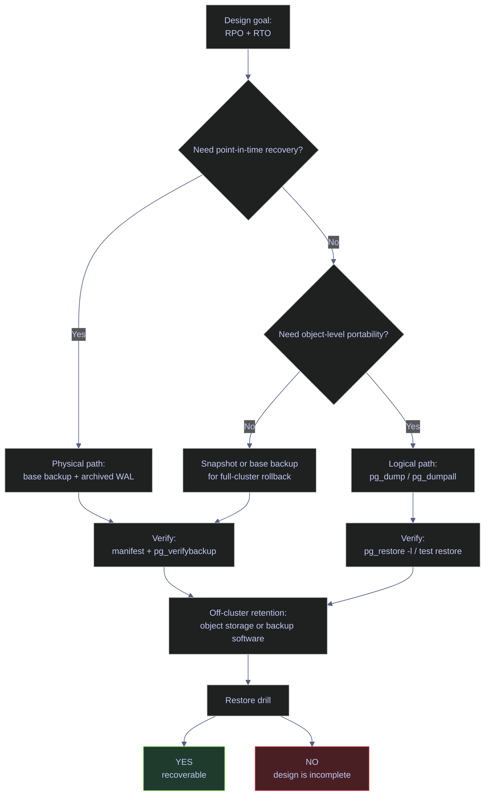

# Backup Types and Strategy

This note is the PostgreSQL production backup reference for the `stoxx-postgres` lab. PostgreSQL does not expose SQL Server-style `full`, `differential`, and `transaction log backup` commands. The operational design is still the same problem, but the building blocks differ: a physical base backup establishes a restart baseline, continuous WAL archiving preserves every change after that baseline, and logical dumps provide object-level portability that physical recovery cannot.

> [!abstract]- Summary
>
> This note mirrors the SQL Server backup-strategy chapter, but translates it into PostgreSQL's actual operational surfaces: `pg_basebackup`, WAL archiving, `pg_dump`, `pg_dumpall --globals-only`, `backup_label`, `backup_manifest`, `pg_stat_archiver`, and external object-storage tooling.
>
> - **Backup model**
>   - defines the PostgreSQL equivalents of full-baseline, log-chain, and object-level backups, and explains where the SQL Server mapping stops being exact
> - **Metadata inspection**
>   - shows how `pg_settings`, `pg_stat_archiver`, `pg_current_wal_lsn()`, `backup_label`, and `backup_manifest` reveal whether the cluster is actually recoverable
> - **Verification**
>   - uses `pg_verifybackup` for the physical artifact and `pg_restore -l` for the logical artifact so the backup is inspected before an incident forces a restore
> - **Production commands**
>   - captures a real `pg_basebackup`, a real custom-format `pg_dump`, and a globals-only dump for cluster-level objects such as roles
> - **Object storage**
>   - explains the PostgreSQL pattern for GCS: build immutable artifacts first, checksum them, then upload with external tooling or purpose-built backup software
> - **Scheduling and safeguards**
>   - ties base-backup cadence, WAL retention, dump cadence, and restore drills back to `RPO`, `RTO`, and proof of restorability
> - **Live capture context**
>   - commands and outputs were captured on April 18, 2026 from PostgreSQL 16.13 in container `stoxx-postgres`, host port `5434`, with `stoxx` at roughly 45 MB, `archive_mode = off`, a physical base backup created under `/tmp/note07/basebackup`, a custom dump at `/tmp/note07/stoxx_note07.dump`, and a packaged tarball prepared for off-cluster upload

> [!note]- Glossary
>
> **Base backup**
> - A physical copy of the cluster data directory taken in a consistent state.
> - It matters because PostgreSQL point-in-time recovery always starts from a base backup, not from a differential chain.
>
> ---
>
> **WAL**
> - PostgreSQL write-ahead log used for crash recovery, replication, and continuous archiving.
> - It matters because PostgreSQL does not have a separate transaction-log backup command; the operational equivalent is archived WAL segments.
>
> ---
>
> **WAL archive**
> - Durable copy of completed WAL segments shipped out of `pg_wal`.
> - It matters because point-in-time recovery is impossible after the base-backup timestamp unless the required WAL exists.
>
> ---
>
> **Logical dump**
> - Export produced by `pg_dump` or `pg_dumpall` containing SQL or archive-format logical objects.
> - It matters because logical dumps solve object-level restore, migration, and cross-version portability, not physical crash recovery.
>
> ---
>
> **Backup manifest**
> - Checksummed inventory file written by `pg_basebackup`.
> - It matters because physical verification in PostgreSQL depends on this manifest rather than on a `VERIFYONLY`-style backup-header command.
>
> ---
>
> **Timeline**
> - Recovery-history branch identifier that changes after promotion or certain recovery events.
> - It matters because recovery commands must follow the correct timeline when a cluster has been promoted or rewound.

> [!info] Backup strategy decision path
>
> PostgreSQL backup design starts by deciding whether the requirement is physical recovery, point-in-time recovery, or logical portability. The chain below shows how those decisions diverge.

*This diagram maps PostgreSQL backup design from recovery target to artifact type and verification path.*



---

## Backup Model

> [!abstract]- Summary
>
> PostgreSQL uses three backup surfaces that must not be conflated: physical base backups for cluster recovery, archived WAL for continuity after the base backup, and logical dumps for portable object-level restore. There is no direct differential-backup feature and no standalone `BACKUP LOG` command. When a SQL Server backup policy is translated to PostgreSQL, the nearest equivalent is usually `base backup + continuous WAL archive`, with logical dumps layered on for operator convenience.

### PostgreSQL | `pg_basebackup` / `pg_dump` | backup type taxonomy

#### Compare physical recovery artifacts and logical exports

Reach for this material during backup design, before a schedule is written. The operational goal is to map the recovery requirement to the correct PostgreSQL artifact so the schedule preserves the restore path deliberately.

| Artifact | What it captures | Depends on | Supports PITR? | Typical use |
|---|---|---|---|---|
| **Physical base backup** | Consistent copy of the cluster data directory | Nothing earlier, but recovery after the backup timestamp requires WAL | Only with archived WAL | Baseline for full-cluster recovery |
| **Archived WAL** | Completed write-ahead log segments after the base backup | A valid base backup and continuous retained WAL chain | Yes | Point-in-time recovery and replica catch-up |
| **Logical dump (`pg_dump`)** | Logical database objects and data for one database | No prior chain | No | Object-level restore, migration, schema portability |
| **Globals dump (`pg_dumpall --globals-only`)** | Roles, role memberships, and tablespaces | No prior chain | No | Cluster-level objects that `pg_dump` omits |
| **Storage snapshot** | Filesystem or volume snapshot of the data directory | Storage system consistency guarantees, often coordinated with PostgreSQL checkpoints | Sometimes, if paired with WAL retention | Infrastructure-managed rollback or backup acceleration |

> [!warning] PostgreSQL has no differential backup analogue
>
> SQL Server differential backups capture changes since the last full backup. PostgreSQL does not have an equivalent built-in backup type. If the design needs recovery to an arbitrary time, the physical chain is `base backup + every required WAL segment`, not `full + diff + logs`.

> [!success] Map the SQL Server model carefully
>
> The closest PostgreSQL equivalent to a SQL Server production chain is:
>
> - a scheduled physical base backup
> - continuous WAL archiving to durable off-cluster storage
> - optional logical dumps for object-level restore and portability
>
> A schedule built only on `pg_dump` is useful, but it is not a physical disaster-recovery plan.

### PostgreSQL | `pg_settings` | recovery prerequisites and WAL posture

#### Inspect the current cluster settings that govern recoverability

Use this query at the start of every backup design review. It is read-only and answers whether the cluster is currently capable of physical backups, whether continuous archiving is active, and whether the WAL surface is configured for recovery rather than only for crash safety.

> [!info]- Query breakdown — WAL and backup prerequisites
>
> - `archive_mode` and `archive_command` decide whether completed WAL files leave the server at all.
> - `wal_level` must be high enough for physical replication and WAL archiving semantics.
> - `max_wal_senders` and `max_replication_slots` define how many base-backup or replica senders the cluster can sustain.
> - `full_page_writes` affects recoverability after torn-page scenarios and should stay enabled in normal production use.
> - `checkpoint_timeout` shapes WAL cadence and recovery behavior, even though it is not itself a backup setting.

```sql
SELECT name, setting, unit, source
FROM pg_settings
WHERE name IN (
  'archive_mode',
  'archive_command',
  'archive_timeout',
  'checkpoint_timeout',
  'full_page_writes',
  'max_replication_slots',
  'max_wal_senders',
  'wal_compression',
  'wal_level'
)
ORDER BY name;
```

| name | setting | unit | source |
|---|---|---|---|
| `archive_command` | `(disabled)` |  | `default` |
| `archive_mode` | `off` |  | `default` |
| `archive_timeout` | `0` | `s` | `default` |
| `checkpoint_timeout` | `300` | `s` | `default` |
| `full_page_writes` | `on` |  | `default` |
| `max_replication_slots` | `10` |  | `default` |
| `max_wal_senders` | `10` |  | `default` |
| `wal_compression` | `off` |  | `default` |
| `wal_level` | `replica` |  | `default` |

The current lab can take a physical base backup immediately, because `wal_level = replica` and WAL senders are available. It is not yet point-in-time recoverable after the base-backup timestamp, because `archive_mode = off` and `archive_command` is disabled. That distinction matters operationally: a base backup without retained WAL is only a restart baseline at one instant, not a continuous recovery design.

| Setting | Current value | Operational meaning | Action |
|---|---|---|---|
| `archive_mode` | `off` | Completed WAL segments are not being archived anywhere | Turn on before claiming PITR coverage |
| `archive_command` | `(disabled)` | No archive target is configured | Set a durable target and test it |
| `wal_level` | `replica` | Physical replication and WAL archiving semantics are available | Good baseline for physical recovery |
| `max_wal_senders` | `10` | Cluster can support backup/replication sender processes | Adequate for the lab |
| `full_page_writes` | `on` | Recovery has torn-page protection | Keep enabled in production |

---

## Backup Metadata Inspection

> [!abstract]- Summary
>
> PostgreSQL does not maintain an `msdb`-style catalog of successful base backups. The operator has to reason from live settings, archive counters, backup-manifest files, backup labels, storage inventory, and orchestrator logs. This is a real design difference from SQL Server, and it changes how backup audits are performed.

### PostgreSQL | `backup_label` / `backup_manifest` | physical backup evidence

#### Inspect the physical artifact produced by `pg_basebackup`

The lab base backup was taken with `pg_basebackup` into `/tmp/note07/basebackup`. `backup_label` records the exact WAL start point and timeline of the artifact, while `backup_manifest` records checksummed file inventory for verification.

```bash
cat /tmp/note07/basebackup/backup_label
```

```text
START WAL LOCATION: 0/5000028 (file 000000010000000000000005)
CHECKPOINT LOCATION: 0/5000060
BACKUP METHOD: streamed
BACKUP FROM: primary
START TIME: 2026-04-18 23:12:58 UTC
LABEL: note07_basebackup
START TIMELINE: 1
```

```bash
ls -lh /tmp/note07/basebackup/backup_manifest /tmp/note07/basebackup/backup_label
```

| file | size |
|---|---|
| `backup_label` | `217 B` |
| `backup_manifest` | `193 KB` |

```bash
head -n 8 /tmp/note07/basebackup/backup_manifest
```

```text
{ "PostgreSQL-Backup-Manifest-Version": 1,
"Files": [
{ "Path": "backup_label", "Size": 217, "Last-Modified": "2026-04-18 23:12:58 GMT", "Checksum-Algorithm": "CRC32C", "Checksum": "4b52529b" },
{ "Path": "postgresql.conf", "Size": 29950, "Last-Modified": "2026-04-18 20:32:24 GMT", "Checksum-Algorithm": "CRC32C", "Checksum": "7c03416c" },
{ "Path": "pg_ident.conf", "Size": 2640, "Last-Modified": "2026-04-18 20:32:24 GMT", "Checksum-Algorithm": "CRC32C", "Checksum": "0ce04d87" },
{ "Path": "pg_xact/0000", "Size": 8192, "Last-Modified": "2026-04-18 23:06:14 GMT", "Checksum-Algorithm": "CRC32C", "Checksum": "b6dd5df8" },
{ "Path": "base/5/3455", "Size": 16384, "Last-Modified": "2026-04-18 22:51:09 GMT", "Checksum-Algorithm": "CRC32C", "Checksum": "7eb64bfe" },
```

The manifest is the PostgreSQL equivalent of "prove the backup file is structurally complete". It does not prove business-level recoverability by itself, but it gives the checksum inventory that `pg_verifybackup` relies on.

### PostgreSQL | `pg_stat_archiver` | archive success and failure counters

#### Read the current WAL archive posture

This query answers whether WAL archiving is active and whether recent archive attempts have succeeded or failed. It is the closest native visibility surface PostgreSQL offers for continuous physical backup health.

```sql
SELECT archived_count, last_archived_wal, last_archived_time, failed_count, last_failed_wal, last_failed_time, stats_reset
FROM pg_stat_archiver;
```

| archived_count | last_archived_wal | last_archived_time | failed_count | last_failed_wal | last_failed_time | stats_reset |
|---|---|---|---|---|---|---|
| `0` |  |  | `0` |  |  | `2026-04-18 20:37:33.679131+00` |

`archived_count = 0` is expected here only because archiving is disabled. In a production design that claims PITR readiness, a permanently zero archive counter is a defect, not a neutral state.

### PostgreSQL | `pg_current_wal_lsn()` | current WAL identity

#### Capture the live WAL position of the cluster

The current WAL location is the anchor for reasoning about how far the cluster has advanced beyond the base backup and which WAL file names should exist in durable storage once archiving is enabled.

```sql
SELECT now() AS captured_at, pg_current_wal_lsn() AS current_wal_lsn, pg_walfile_name(pg_current_wal_lsn()) AS current_wal_file;
```

| captured_at | current_wal_lsn | current_wal_file |
|---|---|---|
| `2026-04-18 23:12:00.101795+00` | `0/46CEDD8` | `000000010000000000000004` |

The later base backup started at WAL file `000000010000000000000005`, which is consistent with the cluster advancing between the pre-capture and the base-backup checkpoint.

### PostgreSQL | `pg_replication_slots` | cleanup after physical backup

#### Confirm that no orphaned backup slot remains

`pg_basebackup -X stream` creates a temporary replication slot unless told otherwise. That slot should disappear automatically when the backup completes. Leaving a slot behind can pin WAL and create silent storage growth.

```sql
SELECT slot_name, slot_type, active, restart_lsn, wal_status
FROM pg_replication_slots
ORDER BY slot_name;
```

| slot_name | slot_type | active | restart_lsn | wal_status |
|---|---|---|---|---|
| *(0 rows)* |  |  |  |  |

No residual slot remains after the lab backup. That is the expected clean state.

---

## Backup Verification

> [!abstract]- Summary
>
> PostgreSQL verification is artifact-centric. The physical backup is verified against its manifest, while the logical dump is inspected by reading the archive catalog without restoring it. This is different from SQL Server's `VERIFYONLY` / `HEADERONLY` / `FILELISTONLY` split, but it solves the same operational problem: prove the artifact is structurally usable before the outage starts.

### PostgreSQL | `pg_verifybackup` | verify the physical backup directory

#### Validate the base backup against its manifest

The container has `pg_verifybackup`, but not on the default `PATH`, so the full binary path is used here. This command checks that the backup directory matches the recorded manifest and that required files are present and readable.

```bash
/usr/lib/postgresql/16/bin/pg_verifybackup /tmp/note07/basebackup
```

```text
backup successfully verified
```

`pg_verifybackup` proves that the physical artifact is internally coherent. It does not prove that the restore procedure, archive retention, or application cutover runbook is correct. That proof comes only from an actual restore drill.

### PostgreSQL | `pg_restore -l` | inspect a logical dump without restoring it

#### Read the catalog of objects stored inside the custom-format dump

`pg_restore -l` is the logical equivalent of "inspect the backup header before using it". It does not restore data. It lists the table of contents of the archive so the operator can confirm that the dump contains the expected schemas and objects.

```bash
pg_restore -l /tmp/note07/stoxx_note07.dump | head -n 18
```

```text
;
; Archive created at 2026-04-18 23:13:12 UTC
;     dbname: stoxx
;     TOC Entries: 135
;     Compression: gzip
;     Dump Version: 1.15-0
;     Format: CUSTOM
;     Integer: 4 bytes
;     Offset: 8 bytes
;     Dumped from database version: 16.13 (Debian 16.13-1.pgdg13+1)
;     Dumped by pg_dump version: 16.13 (Debian 16.13-1.pgdg13+1)
;
6; 2615 24577 SCHEMA - bronze postgres
7; 2615 24578 SCHEMA - dbo postgres
8; 2615 24579 SCHEMA - demo_stc postgres
9; 2615 24580 SCHEMA - gold postgres
10; 2615 24581 SCHEMA - silver postgres
```

The dump contains the expected layered schemas and was created by the same PostgreSQL major version as the source cluster. That is a strong baseline for logical restorability, but a real import test is still the final proof.

### PostgreSQL | filesystem inventory | confirm the artifact footprint

#### Measure the physical and logical backup outputs

Artifact size is not just a storage question. It also determines transfer windows, object-storage upload time, and restore staging time.

```bash
du -sh /tmp/note07/basebackup
find /tmp/note07/basebackup -maxdepth 1 -type f | sed 's|/tmp/note07/basebackup/||' | sort
ls -lh /tmp/note07/stoxx_note07.dump
```

| artifact | observed footprint |
|---|---|
| `basebackup/` | `84M` |
| top-level files | `PG_VERSION`, `backup_label`, `backup_manifest`, `pg_hba.conf`, `pg_ident.conf`, `postgresql.auto.conf`, `postgresql.conf` |
| `stoxx_note07.dump` | `5.6M` |

The lab size difference is the reason PostgreSQL operators often retain both artifact classes: the physical backup is the recovery baseline, while the logical dump is the compact object-level export.

---

## Production Backup Commands

> [!abstract]- Summary
>
> A production PostgreSQL backup schedule usually captures at least three things: a physical base backup, archived WAL stored outside the cluster, and a periodic logical export for object-level portability. The commands below were executed live against the lab where possible, and the surrounding notes explain which operational role each command actually fills.

### PostgreSQL | `pg_basebackup` | take a physical base backup

#### Take a conventional base backup with streamed WAL

This command is the PostgreSQL baseline equivalent of taking a conventional full database backup. It copies the cluster files and streams enough WAL to make the copy consistent.

```bash
pg_basebackup -U postgres -D /tmp/note07/basebackup -Fp -X stream -c fast -l note07_basebackup -v
```

```text
pg_basebackup: initiating base backup, waiting for checkpoint to complete
pg_basebackup: checkpoint completed
pg_basebackup: write-ahead log start point: 0/5000028 on timeline 1
pg_basebackup: starting background WAL receiver
pg_basebackup: created temporary replication slot "pg_basebackup_1542"
pg_basebackup: write-ahead log end point: 0/5000100
pg_basebackup: waiting for background process to finish streaming ...
pg_basebackup: syncing data to disk ...
pg_basebackup: renaming backup_manifest.tmp to backup_manifest
pg_basebackup: base backup completed
```

Key choices in this capture:

| Flag | Meaning | Why it matters |
|---|---|---|
| `-Fp` | plain-format directory backup | keeps `backup_manifest` directly readable |
| `-X stream` | stream WAL during the backup | avoids depending on an external WAL archive for backup consistency |
| `-c fast` | request a fast checkpoint | shortens the wait to start the backup at the cost of more immediate I/O |
| `-l note07_basebackup` | write a readable label | makes later artifact inspection faster |

### PostgreSQL | `pg_dump` | create a logical database backup

#### Write a compressed custom-format dump of `stoxx`

`pg_dump` is not a substitute for continuous physical recovery. Its strength is object-level restore, portability, and the ability to inspect or restore selectively with `pg_restore`.

```bash
pg_dump -U postgres -d stoxx -Fc -f /tmp/note07/stoxx_note07.dump
ls -lh /tmp/note07/stoxx_note07.dump
```

| file | size |
|---|---|
| `/tmp/note07/stoxx_note07.dump` | `5.6M` |

### PostgreSQL | `pg_dumpall --globals-only` | capture roles and other cluster-level objects

#### Protect the cluster objects that per-database dumps omit

Per-database dumps do not contain roles, role memberships, or tablespace definitions. A backup strategy that restores data but loses login and privilege state is still incomplete.

```bash
pg_dumpall -U postgres --globals-only > /tmp/note07/globals_only.sql
ls -lh /tmp/note07/globals_only.sql
```

| file | size |
|---|---|
| `/tmp/note07/globals_only.sql` | `671B` |

```sql
SELECT rolname, rolsuper, rolcreatedb, rolreplication
FROM pg_roles
ORDER BY rolname;
```

| rolname | rolsuper | rolcreatedb | rolreplication |
|---|---|---|---|
| `pg_checkpoint` | `f` | `f` | `f` |
| `pg_create_subscription` | `f` | `f` | `f` |
| `pg_database_owner` | `f` | `f` | `f` |
| `pg_execute_server_program` | `f` | `f` | `f` |
| `pg_monitor` | `f` | `f` | `f` |
| `pg_read_all_data` | `f` | `f` | `f` |
| `pg_read_all_settings` | `f` | `f` | `f` |
| `pg_read_all_stats` | `f` | `f` | `f` |
| `pg_read_server_files` | `f` | `f` | `f` |
| `pg_signal_backend` | `f` | `f` | `f` |
| `pg_stat_scan_tables` | `f` | `f` | `f` |
| `pg_use_reserved_connections` | `f` | `f` | `f` |
| `pg_write_all_data` | `f` | `f` | `f` |
| `pg_write_server_files` | `f` | `f` | `f` |
| `postgres` | `t` | `t` | `t` |

### PostgreSQL | `pg_controldata` | checkpoint metadata for backup reasoning

#### Read the cluster control file after the backup

`pg_controldata` is not a backup command, but it is a useful control-plane check when reconciling backup labels, checkpoint state, and the current WAL timeline.

```bash
/usr/lib/postgresql/16/bin/pg_controldata /var/lib/postgresql/data | egrep 'Database cluster state|Latest checkpoint location|Latest checkpoint.s TimeLineID|Latest checkpoint.s REDO WAL file'
```

```text
Database cluster state:               in production
Latest checkpoint location:           0/5000060
Latest checkpoint's REDO WAL file:    000000010000000000000005
Latest checkpoint's TimeLineID:       1
```

The checkpoint location and redo WAL file line up with the `backup_label` captured earlier. That consistency is what an operator wants to see when validating a freshly created physical artifact.

---

## Object Storage Backup with GCS

> [!abstract]- Summary
>
> PostgreSQL has no built-in `BACKUP TO URL` equivalent. The engine produces files; external tooling moves and retains them. In practice that means one of three patterns: upload the artifacts with `gcloud` or another storage client, use a PostgreSQL-aware backup tool such as `pgBackRest`, `WAL-G`, or `Barman`, or place the cluster on infrastructure that snapshots storage while PostgreSQL coordinates consistency.

### GCP | Cloud Storage | validate the current upload surface

#### Confirm CLI context and bucket readiness before an upload

The host workstation has `gcloud` installed and authenticated. That is necessary, but not sufficient. The target bucket also has to exist and be writable before any base backup or dump can leave the machine.

```powershell
gcloud --version | Select-Object -First 1
gcloud auth list --filter=status:ACTIVE --format="value(account)"
gcloud config get-value project
gcloud storage ls gs://stoxx-sql-bucket
```

```text
Google Cloud SDK 563.0.0
alexper.recovery@gmail.com
bq-wh-nb
ERROR: (gcloud.storage.ls) gs://stoxx-sql-bucket not found: 404.
```

The current lab host can talk to GCP, but the bucket path used in the mirrored SQL Server note is not present in project `bq-wh-nb`. In PostgreSQL terms, that means off-cluster retention is not operational yet even though the backup artifacts can already be created locally.

### PostgreSQL | artifact packaging | prepare immutable files for object upload

#### Compress and checksum the backup artifacts before shipping them

Because PostgreSQL writes files rather than streaming natively to Cloud Storage, packaging and checksumming are part of the operator workflow unless a higher-level backup tool handles them automatically.

```bash
cd /tmp/note07
tar -czf basebackup-20260418.tar.gz basebackup
sha256sum basebackup-20260418.tar.gz stoxx_note07.dump
ls -lh basebackup-20260418.tar.gz stoxx_note07.dump
```

```text
c047a650af1a9c4b7bdc568f3384004f5697a4142cd34de6381b30e0f7be310f  basebackup-20260418.tar.gz
98102d49afce90aa65fe397187882b6e9f402334e155944c6a9426e7f9415816  stoxx_note07.dump
-rw-r--r-- 1 root     root      13M Apr 18 23:14 basebackup-20260418.tar.gz
-rw-r--r-- 1 postgres postgres 5.6M Apr 18 23:13 stoxx_note07.dump
```

These are the objects a Cloud Storage upload would actually carry. The important PostgreSQL discipline is to preserve the artifact immutably and to keep its manifest or checksum with it.

| Upload pattern | PostgreSQL fit | Notes |
|---|---|---|
| `gcloud storage cp` of packaged artifacts | Good for simple labs and one-off exports | Database engine is not aware of retention or upload success |
| `WAL-G`, `pgBackRest`, `Barman` | Best for production physical backups and WAL archives | Handles archiving, retention, and restore orchestration more safely |
| Snapshot-only with no WAL archive | Limited | Acceptable only when PITR is not required |

---

## Scheduling and Retention

> [!abstract]- Summary
>
> Backup cadence is an expression of recovery requirements. PostgreSQL schedule design must answer three separate questions: how often the physical baseline is refreshed, how continuously WAL is retained, and how often logical exports are taken for object-level recovery.

### PostgreSQL | strategy | match cadence to the recovery target

#### Choose cadence by workload profile

| Workload profile | Physical backup cadence | WAL archive cadence | Logical dump cadence | Typical outcome |
|---|---|---|---|---|
| Local dev or disposable lab | Weekly or before risky changes | Optional | On demand | Fast rollback, no PITR guarantee |
| Small production DB with moderate `RPO` | Nightly base backup | Continuous WAL archive | Daily custom dump | Full-cluster recovery plus object-level export |
| High-change production DB with low `RPO` | Daily base backup, sometimes more frequent after large maintenance events | Continuous WAL archive with durable off-cluster retention | Daily or release-aligned | PITR measured in minutes, not days |

If the design requires "restore to 09:37", WAL archiving is mandatory. If the design only requires "recover last night's state", a base backup and periodic logical dump may be sufficient, but that should be stated explicitly rather than implied.

### PostgreSQL | strategy | apply 3-2-1 to physical and logical artifacts

#### Separate local recovery copies from off-cluster retention

| Copy | Example in PostgreSQL terms | Purpose |
|---|---|---|
| 1. Local operational copy | Recent base backup on fast local or nearby storage | Fast restore staging |
| 2. Off-cluster durable copy | Tarred base backup plus WAL archive in object storage or backup repository | Survive host or volume loss |
| 3. Separate format or platform copy | Logical dump and globals dump | Object-level recovery and migration safety |

The live lab artifacts illustrate why the copies can differ by purpose: the physical base backup is `84M`, its packaged tarball is `13M`, and the logical dump is `5.6M`. Smaller artifacts are easier to distribute, but they do not replace the physical recovery chain.

---

## Operational Safeguards

> [!abstract]- Summary
>
> Backup success is only meaningful when restore success has been rehearsed. PostgreSQL adds two recurring failure modes that are easy to underestimate: believing `pg_dump` is a disaster-recovery plan, and believing a base backup alone provides point-in-time recovery when WAL archiving is still disabled.

### PostgreSQL | strategy | restore drills and validation cadence

#### Structure the restore proof, not just the backup job

At minimum, a PostgreSQL restore drill should prove:

| Check | Why it matters |
|---|---|
| The physical base backup verifies with `pg_verifybackup` | Proves artifact completeness against its manifest |
| The logical dump inventory is readable with `pg_restore -l` | Proves the archive format is intact |
| Roles and other globals are backed up separately | Prevents a restore with missing login or privilege state |
| WAL archive retention spans the desired `RPO` window | Prevents false confidence about PITR |
| A real restore boots and accepts connections | Proves the runbook, not just the files |

### PostgreSQL | strategy | common backup design failures and remediation

#### Diagnose the most common PostgreSQL backup mistakes

| Symptom | Likely cause | Corrective action |
|---|---|---|
| Base backup exists but PITR is impossible | `archive_mode = off` or no durable WAL archive | Enable archiving, test `archive_command`, and monitor `pg_stat_archiver` |
| Logical restore works but permissions are wrong | `pg_dump` taken without a globals dump | Capture `pg_dumpall --globals-only` and restore it first |
| `pg_wal` grows without bound after backup activity | orphaned replication slot or archive failure | Inspect `pg_replication_slots`, archive status, and slot retention |
| Upload job fails before off-cluster retention begins | bucket or IAM not ready | Validate object-storage path and credentials before relying on it |
| Backup verified locally but restore still fails | no restore drill or missing WAL timeline handling | Rehearse the exact restore sequence on an isolated target |

The current lab already shows one of these safeguards in action: backup creation works, but GCS retention is not ready because `gs://stoxx-sql-bucket` does not exist. That is precisely the kind of boundary an operator needs to detect before declaring the backup strategy complete.

Next: [[08-postgresql-restore-and-recovery]] turns these artifacts into actual restore procedures and recovery decision points.
