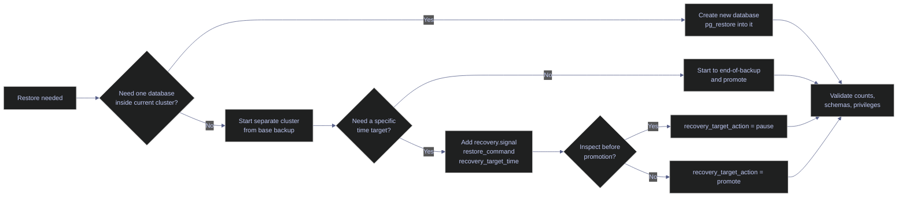

# Restore and Recovery

Restore is where a PostgreSQL backup design stops being theory. The SQL Server source note restores one database name through a chain of `NORECOVERY` and `RECOVERY` steps. PostgreSQL solves the same operational problem differently: physical restore is cluster-wide, recovery state is controlled by `recovery.signal` plus `recovery_target_*` settings, and side-by-side validation inside the same running cluster is usually a logical restore with `pg_restore`.

> [!abstract]- Summary
>
> This note mirrors the SQL Server restore chapter, but uses PostgreSQL's real recovery surfaces: `recovery.signal`, `restore_command`, `recovery_target_time`, `pg_is_in_recovery()`, restore logs, `pg_restore`, `pg_basebackup`, and streamed WAL captured with `pg_receivewal`.
>
> - **Restore fundamentals**
>   - defines the PostgreSQL recovery-state model and replaces SQL Server's `NORECOVERY` / `RECOVERY` switch with signal files and recovery-target settings
> - **Side-by-side restore**
>   - shows the PostgreSQL equivalent of restoring under a new name: a logical restore into `stoxx_restore_check`, leaving the source database untouched
> - **Point-in-time recovery**
>   - replays a real base backup plus captured WAL to `2026-04-18 23:21:22.500000+00`, stopping before the final test transaction
> - **Object-storage restore**
>   - uses the packaged base-backup tarball from note `07`, then shows the PostgreSQL restore boundary after the archive is back on disk
> - **Tail-WAL and disaster recovery**
>   - explains why PostgreSQL has no standalone tail-log backup command and shows the nearest operational analogue: force WAL segment completion and confirm capture
> - **Recovery monitoring**
>   - uses restore logs, `pg_stat_activity`, `pg_is_in_recovery()`, and replay timestamps to prove that recovery is progressing or paused where expected
> - **Live capture context**
>   - commands and outputs were captured on April 18, 2026 from PostgreSQL 16.13 in container `stoxx-postgres`, with disposable restore targets on ports `5546` and `5547`, a logical validation database `stoxx_restore_check`, and a PITR demo table `demo_stc.note08_recovery_demo`

> [!note]- Glossary
>
> **`recovery.signal`**
> - Signal file that tells PostgreSQL to enter archive recovery when the server starts.
> - It matters because PostgreSQL restore state is file-driven rather than step-driven.
>
> ---
>
> **`restore_command`**
> - Shell command PostgreSQL executes to fetch required WAL files during recovery.
> - It matters because archive recovery fails immediately if the command cannot return the requested segment.
>
> ---
>
> **`recovery_target_time`**
> - Wall-clock point where WAL replay should stop.
> - It matters because this is the PostgreSQL equivalent of choosing a `STOPAT` target.
>
> ---
>
> **`recovery_target_action`**
> - What PostgreSQL should do after reaching the recovery target: pause, promote, or shut down.
> - It matters because operators often want to inspect the recovered state before promotion.
>
> ---
>
> **`pg_is_in_recovery()`**
> - Function that reports whether the server is still replaying WAL.
> - It matters because it is the fastest way to tell whether a restored cluster is still recovering or already promoted.
>
> ---
>
> **`pg_receivewal`**
> - Utility that streams WAL files out of the server using the replication protocol.
> - It matters because it can provide the "final WAL capture" role that SQL Server would fill with a tail-log backup.

> [!info] Restore decision path
>
> PostgreSQL restore decisions split first by scope. If the operator needs one database name preserved inside the current cluster, the answer is usually logical restore. If the operator needs physical crash recovery or PITR, the answer is a separate cluster restored from a base backup plus WAL.



---

## Restore Fundamentals

> [!abstract]- Summary
>
> PostgreSQL restore state is not controlled per command the way SQL Server uses `NORECOVERY`, `RECOVERY`, and `STANDBY`. Instead, the operator starts a restored cluster with or without `recovery.signal`, points it at the required WAL source, and sets a recovery target if replay should stop before the end of the available WAL.

### PostgreSQL | `recovery.signal` / `recovery_target_*` | recovery state semantics

#### Understand how PostgreSQL decides whether more WAL should be applied

Use this material at the start of every physical restore. The operational goal is to choose whether the cluster should stop at the end of the backup, continue replaying WAL to the end of the archive, or stop at a precise recovery target for inspection.

| PostgreSQL state choice | What it does | Operational use |
|---|---|---|
| Start from a base backup with no `recovery.signal` | Completes backup recovery to the end-of-backup WAL and opens normally | Full-cluster restore to the backup timestamp |
| Start with `recovery.signal` and valid `restore_command` | Replays archived WAL beyond the base backup | PITR or continuous recovery |
| `recovery_target_action = 'pause'` | Stops at the chosen target and keeps the cluster read-only in recovery | Inspect recovered state before promotion |
| `recovery_target_action = 'promote'` | Stops at the target and promotes automatically | Fast cutover when inspection is not needed |

> [!warning] PostgreSQL has no per-step "final RECOVERY" command
>
> In SQL Server, the dangerous mistake is applying `WITH RECOVERY` too early. In PostgreSQL, the equivalent mistake is starting a restored cluster without the correct `recovery.signal`, `restore_command`, or `recovery_target_*` settings. The error moves from the command text to the startup configuration.

> [!success] Pause is the closest analogue to an inspectable final step
>
> `recovery_target_action = 'pause'` gives the operator a read-only checkpoint at the chosen target, which is operationally similar to bringing a restore online for validation before committing to the final cutover.

The PITR restore in this note was configured with these exact recovery settings:

```text
restore_command = 'cp /tmp/note08/archive/%f %p'
recovery_target_time = '2026-04-18 23:21:22.500000+00'
recovery_target_action = 'pause'
recovery_target_timeline = 'current'
```

The target time was chosen between these two transactions captured on the primary:

| id | label | inserted_at |
|---|---|---|
| `2` | `after_backup_keep` | `2026-04-18 23:21:21.804624+00` |
| `3` | `after_backup_discard` | `2026-04-18 23:21:23.008614+00` |

### PostgreSQL | restore logs | the restore audit trail

#### Use server logs as the authoritative record of what recovery did

PostgreSQL does not maintain an `msdb.dbo.restorehistory` catalogue. The authoritative restore audit trail is the restore log itself plus the operator runbook that describes which base backup and WAL source were used.

```text
2026-04-18 23:24:17.027 UTC [416] LOG:  starting point-in-time recovery to 2026-04-18 23:21:22.5+00
2026-04-18 23:24:17.054 UTC [416] LOG:  restored log file "000000010000000000000007" from archive
2026-04-18 23:24:17.073 UTC [416] LOG:  restored log file "000000010000000000000008" from archive
2026-04-18 23:24:17.081 UTC [416] LOG:  recovery stopping before commit of transaction 919, time 2026-04-18 23:21:23.008651+00
2026-04-18 23:24:17.081 UTC [416] LOG:  pausing at the end of recovery
2026-04-18 23:24:17.081 UTC [416] HINT:  Execute pg_wal_replay_resume() to promote.
```

These lines answer the same questions `restorehistory` answers in SQL Server:

| Question | Evidence in PostgreSQL |
|---|---|
| Which base backup was used? | `backup_label`, startup LSNs, and the operator's artifact path |
| Which WAL files were applied? | restore log lines such as `restored log file ... from archive` |
| Where did replay stop? | `recovery stopping before commit ... time ...` |
| Is the cluster still recoverable forward? | `pg_is_in_recovery()` and whether replay is paused or promoted |

---

## Side-By-Side Restore

> [!abstract]- Summary
>
> A physical PostgreSQL restore is cluster-wide. You cannot take a physical base backup of one database and attach it inside the same running cluster under a new database name. The nearest same-cluster analogue to SQL Server's side-by-side restore is logical restore into a new database with `pg_restore`.

### PostgreSQL | `pg_restore` | restore a database under a new validation name

#### Create and populate `stoxx_restore_check`

This is the PostgreSQL side-by-side validation pattern: create a disposable database name, restore the custom archive into it, and compare counts or schemas before deciding whether the artifact is trustworthy.

```sql
DROP DATABASE IF EXISTS stoxx_restore_check WITH (FORCE);
CREATE DATABASE stoxx_restore_check TEMPLATE template0;
```

```text
DROP DATABASE
CREATE DATABASE
```

```bash
pg_restore -U postgres -d stoxx_restore_check /tmp/note07/stoxx_note07.dump
```

`pg_restore` completed without errors, so validation moved immediately to state inspection:

```sql
SELECT datname, pg_size_pretty(pg_database_size(datname)) AS size
FROM pg_database
WHERE datname IN ('stoxx', 'stoxx_restore_check')
ORDER BY datname;
```

| datname | size |
|---|---|
| `stoxx` | `45 MB` |
| `stoxx_restore_check` | `44 MB` |

```sql
SELECT COUNT(*) AS eurostoxx50_rows
FROM silver.eurostoxx50_ohlcv;
```

| database | eurostoxx50_rows |
|---|---|
| `stoxx` | `67155` |
| `stoxx_restore_check` | `67155` |

The restored database is close in size to the source and contains the same row count in a representative fact table. That is the minimum validation bar before calling the logical restore usable.

---

## Point-In-Time Recovery

> [!abstract]- Summary
>
> PostgreSQL PITR is "base backup plus every WAL record needed to reach the target time". For the lab, a physical base backup was taken at `2026-04-18 23:21:12 UTC`, additional transactions were written afterward, WAL was captured with `pg_receivewal`, and the restored cluster was told to stop at `2026-04-18 23:21:22.500000+00`.

### PostgreSQL | `pg_receivewal` | capture WAL after the base backup

#### Hold the post-backup change stream outside the primary

`pg_receivewal` is not the only way to provide WAL for PITR, but it is a useful lab analogue to an external archive because it works without reconfiguring the primary cluster.

```text
pg_receivewal: starting log streaming at 0/6000000 (timeline 1)
```

```sql
SELECT pid, application_name, client_addr, state, sent_lsn, write_lsn, flush_lsn, sync_state
FROM pg_stat_replication
ORDER BY pid;
```

| pid | application_name | client_addr | state | sent_lsn | write_lsn | flush_lsn | sync_state |
|---|---|---|---|---|---|---|---|
| `2170` | `pg_receivewal` |  | `streaming` | `0/6030C20` | `0/6000000` |  | `async` |

The replication view confirms that WAL is leaving the primary while the PITR chain is being built.

### PostgreSQL | `pg_basebackup` and timed writes | define the recovery target boundary

#### Capture the baseline and the transactions that will be included or excluded

The base backup for the PITR demo started here:

```text
START WAL LOCATION: 0/7000028 (file 000000010000000000000007)
CHECKPOINT LOCATION: 0/7000060
BACKUP METHOD: streamed
BACKUP FROM: primary
START TIME: 2026-04-18 23:21:12 UTC
LABEL: note08_pitr_base
START TIMELINE: 1
```

The two post-backup transactions were then written with deliberately separated timestamps:

```sql
INSERT INTO demo_stc.note08_recovery_demo (id, label)
VALUES (2, 'after_backup_keep')
RETURNING id, label, inserted_at;

SELECT pg_sleep(1.2);

INSERT INTO demo_stc.note08_recovery_demo (id, label)
VALUES (3, 'after_backup_discard')
RETURNING id, label, inserted_at;
```

| id | label | inserted_at |
|---|---|---|
| `2` | `after_backup_keep` | `2026-04-18 23:21:21.804624+00` |
| `3` | `after_backup_discard` | `2026-04-18 23:21:23.008614+00` |

The source database after both writes contained all three rows:

| id | label | inserted_at |
|---|---|---|
| `1` | `before_backup` | `2026-04-18 23:20:53.667264+00` |
| `2` | `after_backup_keep` | `2026-04-18 23:21:21.804624+00` |
| `3` | `after_backup_discard` | `2026-04-18 23:21:23.008614+00` |

### PostgreSQL | `recovery_target_time` | replay to the exact stop point

#### Restore the base backup and stop before the final transaction commits

To make the WAL segments recoverable, the primary forced segment completion:

```sql
SELECT pg_current_wal_lsn() AS before_switch;
SELECT pg_switch_wal() AS switched_1;
SELECT pg_switch_wal() AS switched_2;
SELECT pg_current_wal_lsn() AS after_switch;
```

| step | value |
|---|---|
| `before_switch` | `0/80002D8` |
| `switched_1` | `0/80002F0` |
| `switched_2` | `0/9000000` |
| `after_switch` | `0/9000000` |

The receiver then finished the relevant archive segments:

```text
pg_receivewal: finished segment at 0/7000000 (timeline 1)
pg_receivewal: finished segment at 0/8000000 (timeline 1)
pg_receivewal: finished segment at 0/9000000 (timeline 1)
```

```text
000000010000000000000006
000000010000000000000007
000000010000000000000008
000000010000000000000009.partial
```

The partial `000000010000000000000009.partial` file is expected because the current segment was still open when capture stopped. The PITR target does not need it, because replay stops before the commit recorded in segment `000000010000000000000009`.

The restored PITR cluster then started with `recovery.signal` and the recovery settings captured earlier. Its startup log proves the replay boundary:

```text
2026-04-18 23:24:17.027 UTC [416] LOG:  starting point-in-time recovery to 2026-04-18 23:21:22.5+00
2026-04-18 23:24:17.054 UTC [416] LOG:  restored log file "000000010000000000000007" from archive
2026-04-18 23:24:17.073 UTC [416] LOG:  restored log file "000000010000000000000008" from archive
2026-04-18 23:24:17.081 UTC [416] LOG:  recovery stopping before commit of transaction 919, time 2026-04-18 23:21:23.008651+00
2026-04-18 23:24:17.081 UTC [416] LOG:  pausing at the end of recovery
```

Validation on the restored cluster shows that PostgreSQL is still in recovery and that only rows `1` and `2` survived the replay target:

```sql
SELECT pg_is_in_recovery() AS in_recovery,
       pg_last_wal_replay_lsn() AS replay_lsn,
       pg_last_xact_replay_timestamp() AS replay_ts;

SELECT id, label, inserted_at
FROM demo_stc.note08_recovery_demo
ORDER BY id;
```

| in_recovery | replay_lsn | replay_ts |
|---|---|---|
| `t` | `0/8000278` | `2026-04-18 23:21:21.804704+00` |

| id | label | inserted_at |
|---|---|---|
| `1` | `before_backup` | `2026-04-18 23:20:53.667264+00` |
| `2` | `after_backup_keep` | `2026-04-18 23:21:21.804624+00` |

That is the PostgreSQL PITR proof: the target time includes the wanted transaction and excludes the later one.

> [!warning] PITR failure modes to watch
>
> - missing required WAL file: recovery halts because `restore_command` cannot return the next segment
> - target later than retained WAL: the cluster can recover only to the end of the retained archive, not to the requested timestamp
> - restore started without `recovery.signal`: the cluster opens at end-of-backup and never attempts PITR

---

## Restore From Object Storage

> [!abstract]- Summary
>
> PostgreSQL has no `RESTORE FROM URL` syntax. Once the archived base backup is back on local disk, restore proceeds exactly like any other physical restore: unpack the artifact, fix permissions if needed, and start a separate cluster.

### PostgreSQL | packaged base backup | restore after download

#### Extract the archived artifact and boot it on a different port

The packaged artifact created in note `07` was unpacked under `/tmp/note08/from_object`. After extraction, the top-level directory required a PostgreSQL-compatible permission fix from `0755` to `0700` before startup would succeed.

```bash
tar -xzf /tmp/note07/basebackup-20260418.tar.gz -C /tmp/note08/from_object
ls -lh /tmp/note08/from_object/basebackup/backup_label
```

```text
-rw------- 1 postgres postgres 217 Apr 18 23:12 /tmp/note08/from_object/basebackup/backup_label
```

The first startup attempt failed for the exact reason PostgreSQL documents for physical data directories:

```text
FATAL:  data directory "/tmp/note08/from_object/basebackup" has invalid permissions
DETAIL:  Permissions should be u=rwx (0700) or u=rwx,g=rx (0750).
```

After `chmod 700 /tmp/note08/from_object/basebackup`, the extracted cluster started cleanly on port `5546`:

```text
waiting for server to start.... done
server started
/tmp/note08/run/full:5546 - accepting connections
```

```text
2026-04-18 23:23:39.976 UTC [321] LOG:  starting backup recovery with redo LSN 0/5000028, checkpoint LSN 0/5000060, on timeline ID 1
2026-04-18 23:23:39.980 UTC [321] LOG:  completed backup recovery with redo LSN 0/5000028 and end LSN 0/5000100
2026-04-18 23:23:40.005 UTC [318] LOG:  database system is ready to accept connections
```

```sql
SELECT pg_is_in_recovery() AS in_recovery,
       pg_postmaster_start_time() AS started_at;
```

| in_recovery | started_at |
|---|---|
| `f` | `2026-04-18 23:23:39.756278+00` |

```sql
SELECT datname
FROM pg_database
ORDER BY datname;
```

| datname |
|---|
| `postgres` |
| `stoxx` |
| `template0` |
| `template1` |

The important boundary is operational, not syntactic: object storage changes how the artifact is transported, not how PostgreSQL restores it after download.

---

## Tail-WAL Capture and Disaster Recovery

> [!abstract]- Summary
>
> PostgreSQL does not have a standalone tail-log backup command. The nearest analogue is to ensure that the final WAL needed for recovery leaves the primary before it is replaced: switch WAL if the server is still alive, confirm the external archive or receiver has the completed segment, and only then treat the chain as sealed.

### PostgreSQL | no direct tail-log backup | capture the last completed WAL safely

#### Use WAL switch plus external capture when the primary is still reachable

The lab used `pg_switch_wal()` followed by `pg_receivewal` segment completion as the disaster-recovery equivalent of "capture the tail before restore":

| Signal | Evidence |
|---|---|
| WAL switch forced | `before_switch = 0/80002D8`, `switched_1 = 0/80002F0`, `switched_2 = 0/9000000` |
| Receiver finished archiveable segments | `000000010000000000000006`, `000000010000000000000007`, `000000010000000000000008` |
| Current open segment remained partial | `000000010000000000000009.partial` |

This maps to disaster recovery in PostgreSQL as follows:

| SQL Server concept | PostgreSQL analogue |
|---|---|
| Tail-log backup before replace | Force WAL switch and confirm final completed segment is archived or streamed out |
| Log-backup file chain | Archived WAL segment chain |
| Damaged source unavailable before final capture | Unarchived WAL in the current segment may be lost |

If the server is still alive, a controlled shutdown and verified WAL capture materially improve recovery completeness. If it is already gone, PostgreSQL can recover only as far as the last durable WAL segment already outside the server.

---

## Recovery Monitoring

> [!abstract]- Summary
>
> Recovery monitoring in PostgreSQL uses startup-process visibility and replay-state functions rather than SQL Server DMVs. The goal is the same: prove that recovery is advancing, distinguish "actively replaying" from "paused at target", and know whether the cluster is already writable.

### PostgreSQL | `pg_stat_activity` / replay functions | observe recovery state

#### Confirm whether the restored cluster is still replaying or already promoted

The paused PITR cluster exposes its state through both catalog views and replay functions:

```sql
SELECT pid, backend_type, state, wait_event_type, wait_event
FROM pg_stat_activity
WHERE backend_type IN ('startup', 'client backend')
ORDER BY backend_type, pid;
```

| pid | backend_type | state | wait_event_type | wait_event |
|---|---|---|---|---|
| `502` | `client backend` | `active` | `IO` | `DataFileRead` |
| `503` | `client backend` | `active` |  |  |
| `416` | `startup` |  | `IPC` | `RecoveryPause` |

```sql
SELECT pg_is_in_recovery() AS in_recovery,
       pg_last_wal_replay_lsn() AS replay_lsn,
       pg_last_xact_replay_timestamp() AS replay_ts;
```

| in_recovery | replay_lsn | replay_ts |
|---|---|---|
| `t` | `0/8000278` | `2026-04-18 23:21:21.804704+00` |

The full restore from the packaged base backup shows the opposite state:

| restore target | in_recovery | meaning |
|---|---|---|
| PITR cluster on `5547` | `t` | paused at the requested recovery target |
| full cluster on `5546` | `f` | end-of-backup recovery completed and cluster promoted |

### PostgreSQL | restore drill checklist | prove the restore path monthly

#### Run the PostgreSQL equivalent of a restore drill

| Step | Proof captured in this note |
|---|---|
| Restore a logical archive into a disposable name | `stoxx_restore_check` restored and validated |
| Start a physical restore target from a base backup | packaged base backup started on port `5546` |
| Replay WAL to a chosen time | PITR cluster stopped before transaction `919` at `23:21:23.008651+00` |
| Verify target data state | only rows `1` and `2` survived on the PITR cluster |
| Confirm monitoring surfaces | `pg_stat_activity`, restore logs, and replay functions all matched the expected state |

Next: [[09-postgresql-high-availability-overview]] expands from backup-and-restore into continuous availability patterns, replica roles, and failover tradeoffs.
