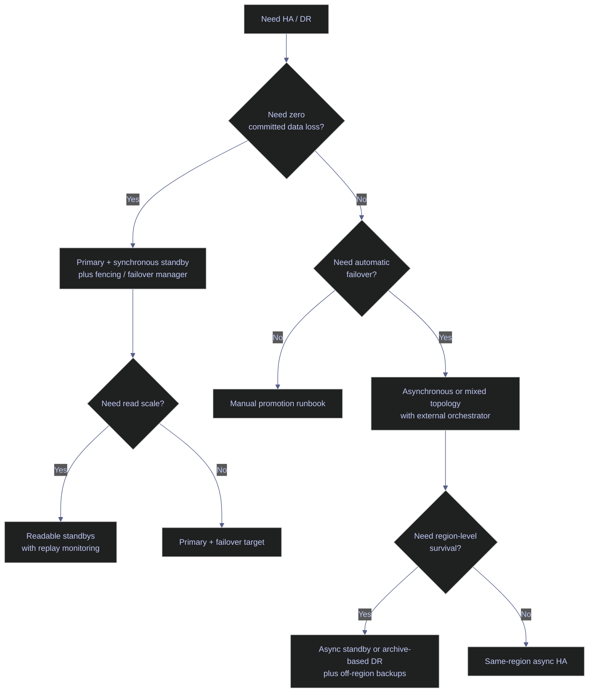

# PostgreSQL High Availability Overview

High availability in PostgreSQL is a topology problem, not a single feature toggle. Core PostgreSQL provides WAL generation, streaming replication, archive recovery, synchronous commit controls, and promotion. What it does not provide by itself is a one-command equivalent to SQL Server Availability Groups with built-in cluster orchestration. The operator has to choose a topology, define an `RPO` and `RTO`, decide whether failover is manual or automatic, and then add the surrounding coordination layer that makes promotion safe.

> [!abstract]- Summary
>
> This note mirrors the SQL Server HA overview, but translates it into PostgreSQL's actual HA building blocks: physical streaming replication, synchronous and asynchronous standbys, archive-based warm standby, external failover managers, replay-state monitoring, and load-balancer or proxy decisions outside the database engine.
>
> - **Why high availability**
>   - defines the failure modes HA is meant to cover and anchors topology choice in `RTO`, `RPO`, and the boundary between HA and DR
> - **HA options**
>   - compares streaming replication, synchronous standbys, archive-based standby, logical replication, and shared-storage failover patterns
> - **Automatic failover boundaries**
>   - explains what PostgreSQL core does itself and what must come from Patroni, `repmgr`, `pg_auto_failover`, Kubernetes operators, or another control plane
> - **Monitoring and failover**
>   - covers `pg_stat_replication`, `pg_stat_wal_receiver`, replay-state functions, slots, and the operational signals that prove a standby is actually promotable
> - **Read scale and performance**
>   - explains `hot_standby`, synchronous commit tradeoffs, replay lag, and conflict cancellations on replicas
> - **GCP and infrastructure concerns**
>   - addresses zone placement, leader routing, fencing, and the separation between database replication and traffic steering
> - **Live capture context**
>   - live queries were captured on April 18, 2026 from `stoxx-postgres` PostgreSQL 16.13, where `wal_level = replica`, `hot_standby = on`, and sender/slot capacity is configured, but no standbys, replication slots, or WAL receivers are currently active

> [!note]- Glossary
>
> **High availability**
> - Design for surviving node failures and maintenance events with low downtime.
> - It matters because HA is about keeping service up inside the normal operating region, not only recovering after a disaster.
>
> ---
>
> **Disaster recovery**
> - Recovery strategy for larger-scope loss such as region failure or total environment loss.
> - It matters because DR may accept more latency and data loss than same-region HA.
>
> ---
>
> **Primary**
> - The writable PostgreSQL server generating WAL.
> - It matters because every standby's freshness and failover safety are measured relative to the primary WAL position.
>
> ---
>
> **Standby**
> - PostgreSQL server replaying WAL from a primary or upstream standby.
> - It matters because standbys are the core HA building block for both read scaling and failover.
>
> ---
>
> **Synchronous standby**
> - Standby that the primary may wait for during commit, depending on `synchronous_standby_names` and `synchronous_commit`.
> - It matters because this is how PostgreSQL reaches zero-data-loss failover targets.
>
> ---
>
> **Replication slot**
> - Retention anchor that prevents the primary from removing WAL still needed by a standby or receiver.
> - It matters because slots improve safety but can also pin WAL and fill storage if consumers stall.
>
> ---
>
> **Promotion**
> - Action that turns a standby into the new writable primary.
> - It matters because promotion is the actual failover event, whether manual or automated.
>
> ---
>
> **Fencing**
> - Mechanism that guarantees the old primary cannot keep accepting writes after another node is promoted.
> - It matters because split-brain is worse than downtime.

> [!info] HA topology decision path
>
> PostgreSQL HA design starts by deciding whether the requirement is zero data loss, manual failover, or geographic isolation. The database provides replication; the control plane decides who is allowed to become primary.



---

## Why High Availability

> [!abstract]- Summary
>
> A single PostgreSQL instance is a single failure domain. HA exists to narrow the operational blast radius of host failure, patching, storage loss, and operator error. The correct topology is driven by `RTO`, `RPO`, and whether the system needs local failover, regional DR, or both.

### PostgreSQL | HA | key metrics and failure boundaries

#### Frame the topology around `RTO`, `RPO`, and write safety

| Metric | Meaning | PostgreSQL impact |
|---|---|---|
| `RTO` | Maximum acceptable downtime before service returns | Determines whether manual promotion is acceptable or a failover manager is required |
| `RPO` | Maximum acceptable data loss | Determines whether standbys must be synchronous or may lag asynchronously |
| Write-safety boundary | Whether two primaries must be prevented absolutely | Determines whether fencing and leader coordination are mandatory |

The core distinction is the same as in SQL Server:

| Need | PostgreSQL interpretation |
|---|---|
| Local HA | Survive one node or zone loss with rapid promotion of a standby |
| DR | Survive broader infrastructure loss, usually with async lag or archive replay |
| Read scale | Offload read-only queries to `hot_standby` replicas without confusing that with failover readiness |

### PostgreSQL | current cluster posture | what the lab can and cannot do today

#### Inspect whether the current cluster is actually HA-enabled

The current `stoxx-postgres` lab is replication-capable, but it is not highly available yet. These settings and views show the difference between "prepared for replication" and "protected by replication".

```sql
SELECT name, setting, unit, source
FROM pg_settings
WHERE name IN (
  'hot_standby',
  'max_replication_slots',
  'max_wal_senders',
  'synchronous_commit',
  'synchronous_standby_names',
  'wal_level'
)
ORDER BY name;
```

| name | setting | unit | source |
|---|---|---|---|
| `hot_standby` | `on` |  | `default` |
| `max_replication_slots` | `10` |  | `default` |
| `max_wal_senders` | `10` |  | `default` |
| `synchronous_commit` | `on` |  | `default` |
| `synchronous_standby_names` |  |  | `default` |
| `wal_level` | `replica` |  | `default` |

```sql
SELECT pg_is_in_recovery() AS in_recovery,
       pg_current_wal_lsn() AS current_wal_lsn,
       pg_walfile_name(pg_current_wal_lsn()) AS current_wal_file;
```

| in_recovery | current_wal_lsn | current_wal_file |
|---|---|---|
| `f` | `0/B042020` | `00000001000000000000000B` |

```sql
SELECT pid, application_name, client_addr, state, sync_state, sent_lsn, write_lsn, flush_lsn, replay_lsn
FROM pg_stat_replication
ORDER BY pid;
```

| pid | application_name | client_addr | state | sync_state | sent_lsn | write_lsn | flush_lsn | replay_lsn |
|---|---|---|---|---|---|---|---|---|
| *(0 rows)* |  |  |  |  |  |  |  |  |

```sql
SELECT slot_name, slot_type, active, restart_lsn, wal_status
FROM pg_replication_slots
ORDER BY slot_name;
```

| slot_name | slot_type | active | restart_lsn | wal_status |
|---|---|---|---|---|
| *(0 rows)* |  |  |  |  |

```sql
SELECT pid, status, receive_start_lsn, written_lsn, flushed_lsn, latest_end_lsn, latest_end_time, slot_name, sender_host, sender_port
FROM pg_stat_wal_receiver;
```

| pid | status | receive_start_lsn | written_lsn | flushed_lsn | latest_end_lsn | latest_end_time | slot_name | sender_host | sender_port |
|---|---|---|---|---|---|---|---|---|---|
| *(0 rows)* |  |  |  |  |  |  |  |  |  |

The lab is therefore in the "replication-ready single primary" state:

| Surface | Current meaning |
|---|---|
| `wal_level = replica` | physical replication can be configured |
| `max_wal_senders = 10` | there is sender capacity for standbys or tools like `pg_receivewal` |
| `synchronous_standby_names` empty | no standby is required for commits |
| `pg_stat_replication` empty | no active standbys exist |
| `pg_replication_slots` empty | no retained-WAL contract exists for a standby |

---

## HA Options for PostgreSQL 16

> [!abstract]- Summary
>
> PostgreSQL offers several topologies that solve different parts of the HA and DR problem. Streaming replication is the main HA mechanism. Archive-based standby and logical replication solve narrower problems. Shared-storage single-writer designs exist, but they are infrastructure patterns rather than PostgreSQL-native replication patterns.

### PostgreSQL | physical streaming replication | the default HA building block

Streaming replication is the core PostgreSQL HA pattern. A primary ships WAL to one or more standbys, which write and replay it continuously. This is the closest operational analogue to SQL Server AG log transport, but it is instance-scoped rather than "database-group" scoped: the standby is a physical copy of the cluster, not a subset of databases.

| Mode | How it works | RPO | Typical use |
|---|---|---|---|
| Asynchronous standby | primary acknowledges commits without waiting for standby flush | `> 0` | low-latency local HA, cross-zone or cross-region DR |
| Synchronous standby | primary waits for configured standby acknowledgment | `0` for acknowledged commits | zero-data-loss HA when latency budget allows |
| Cascading standby | standby receives WAL from another standby | inherited from upstream | fan-out, WAN reduction, layered topologies |

### PostgreSQL | archive-based warm standby | simpler but slower failover path

An archive-based standby replays WAL from durable storage rather than from a live streaming connection. This is operationally closer to log shipping than to continuous streaming replication. It is useful for DR and recovery, but usually not the first choice for same-region low-`RTO` HA.

| Strength | Weakness |
|---|---|
| simpler network boundary and durable off-cluster WAL history | higher lag and slower failover than continuous streaming |
| pairs naturally with PITR tooling | not ideal for fast automatic failover |

### PostgreSQL | logical replication | not a physical HA substitute

Logical replication replicates tables and changes at the logical level. It is excellent for selective distribution, version upgrades, and data movement. It is not a full-cluster HA mechanism because it does not reproduce the cluster state the way a physical standby does.

| Good fit | Not a fit |
|---|---|
| selective table replication | whole-cluster failover |
| blue/green migrations | exact crash-recovery equivalent of the primary |
| heterogenous subscriber patterns | preserving every system relation and physical state |

### PostgreSQL | HA | decision matrix

| Requirement | Sync standby | Async standby | Archive-based standby | Logical replication |
|---|---|---|---|---|
| Zero committed-data loss | Yes, if the standby is part of `synchronous_standby_names` | No | No | No |
| Fast same-region failover | Yes | Usually | Rarely | No |
| Readable standby | Yes (`hot_standby`) | Yes (`hot_standby`) | Sometimes after recovery state is reached | Subscriber is readable but not a physical standby |
| Whole-cluster replacement | Yes | Yes | Yes | No |
| Cheap DR copy | Expensive | Good | Good | Limited |
| Cross-version migration help | Poor | Poor | Poor | Excellent |

---

## Automatic Failover Boundaries

> [!abstract]- Summary
>
> PostgreSQL core knows how to replicate and how to promote a standby. It does not, by itself, provide distributed consensus, fencing, or leader-routing orchestration. Automatic failover therefore lives at the boundary between PostgreSQL and an external control plane.

### PostgreSQL | promotion and control planes | what core does and what orchestration adds

#### Separate database replication from cluster leadership

Core PostgreSQL is responsible for:

| Core capability | Why it matters |
|---|---|
| WAL generation and shipping | moves committed changes to standbys |
| standby replay and read-only query support | keeps a standby close enough to promote |
| synchronous commit semantics | defines whether commit waits for a standby |
| promotion | turns a standby into a writable primary |

What PostgreSQL core does not decide alone:

| External concern | Why it matters |
|---|---|
| which node is allowed to promote | prevents two primaries |
| whether the old primary is fenced off | prevents split-brain |
| how applications find the new leader | routes traffic correctly after failover |
| when automatic failover is safe | combines replication lag, node health, and quorum |

This is why PostgreSQL HA topologies typically include one of the following:

| Pattern | Typical role |
|---|---|
| Patroni or Kubernetes operator | leader election, configuration, service endpoints |
| `pg_auto_failover` | monitoring and failover control plane |
| `repmgr` | replication management and promotion orchestration |
| Managed service control plane | provider-managed failover and routing |

> [!warning] Replication without fencing is not HA
>
> A standby that can be promoted is necessary but not sufficient. If the old primary can keep accepting writes after the new primary is promoted, the system is in split-brain. PostgreSQL HA design must include fencing or a control plane that can guarantee single-writer leadership.

---

## Monitoring and Failover Readiness

> [!abstract]- Summary
>
> A standby is not failover-ready just because it exists. Operators need to know whether WAL is flowing, whether replay is keeping up, whether slots are retaining too much WAL, and whether a candidate standby is synchronous, asynchronous, or absent entirely.

### PostgreSQL | replication views | the core HA health surface

#### Read the views that answer "can this standby take over?"

The baseline PostgreSQL HA monitoring set is:

| View or function | Primary question answered |
|---|---|
| `pg_stat_replication` | which standbys are connected and how far behind they are |
| `pg_stat_wal_receiver` | whether a standby is receiving WAL at all |
| `pg_replication_slots` | whether slots exist and whether they are pinning WAL |
| `pg_is_in_recovery()` | whether a node is primary or standby |
| `pg_last_wal_replay_lsn()` / `pg_last_xact_replay_timestamp()` | how far a standby has replayed |

The current lab shows the most important failure mode of all: there is no standby to fail over to. `pg_stat_replication`, `pg_replication_slots`, and `pg_stat_wal_receiver` are all empty. That means the cluster is not degraded HA. It is non-HA.

### PostgreSQL | failover criteria | define promotability explicitly

#### Know what a failover manager should check before promotion

At minimum, a promotable standby should satisfy:

| Criterion | Why it matters |
|---|---|
| connected WAL stream or recent archive catch-up | proves the standby is not stale |
| acceptable replay lag for the workload `RPO` | ensures promotion meets the data-loss target |
| known synchronous status if `RPO = 0` is required | proves commits were durably acknowledged |
| fencing path for the old primary | prevents split-brain |
| routable application endpoint after promotion | prevents "failover succeeded but clients still hit the dead node" |

---

## Read Scale and Performance

> [!abstract]- Summary
>
> PostgreSQL standbys can serve read-only queries with `hot_standby = on`, but read scale is not free. Replay lag, query conflicts, and synchronous commit latency all become part of the production design.

### PostgreSQL | `hot_standby` and synchronous commit | read scale versus write latency

#### Balance commit safety against throughput and query offload

The live settings surface already shows the main tuning levers:

| Setting | Current value | HA meaning |
|---|---|---|
| `hot_standby` | `on` | standbys are allowed to accept read-only queries |
| `synchronous_commit` | `on` | commits use normal durability semantics; sync topology can require standby acknowledgment |
| `synchronous_standby_names` | empty | no standby is currently required for commit |

Operational tradeoffs:

| Choice | Benefit | Cost |
|---|---|---|
| Synchronous standby | zero-data-loss failover for acknowledged commits | added commit latency and possible write stalls if sync standby is unavailable |
| Asynchronous standby | lower write latency | possible data loss on failover |
| Read-heavy standby | offloads reporting traffic | replay can lag or cancel conflicting queries |

---

## Backup Strategy on Standbys

> [!abstract]- Summary
>
> HA and backup strategy intersect directly in PostgreSQL. A standby can reduce backup load on the primary, but only if the operator understands which backup styles remain safe and what replay lag does to freshness.

### PostgreSQL | backup from replicas | use standbys deliberately, not automatically

#### Know which backup operations fit a standby

| Operation | Standby fit | Notes |
|---|---|---|
| `pg_basebackup` from a standby | Good | common way to offload physical backup reads |
| `pg_dump` against a hot standby | Good with caveats | export is read-only and may reflect replay lag |
| WAL archiving responsibility | Usually still primary-side or shared backup system | do not assume standby backups remove the need for WAL retention discipline |

A standby used for backups is still part of the HA design. If backup I/O slows replay badly, the standby may stop being a good failover target even while backups continue to "succeed".

---

## GCP and Infrastructure Considerations

> [!abstract]- Summary
>
> PostgreSQL replication keeps database state aligned; infrastructure still has to route traffic, isolate failures, and fence dead primaries. On GCP or any similar VM platform, HA design has to treat the database and the traffic-control plane as separate systems.

### PostgreSQL | GCP deployment shape | leader routing, zones, and fencing

#### Design the non-database pieces explicitly

| Concern | PostgreSQL implication |
|---|---|
| Zone placement | spread primary and standbys across zones to reduce shared failure domains |
| Traffic routing | use a load balancer, proxy, DNS, or service registry that can follow leader changes |
| Fencing | ensure failed primaries cannot keep serving writes after a standby is promoted |
| Durable off-cluster WAL retention | keep PITR and DR independent of the live replica set |

The PostgreSQL lesson is the same one the SQL Server AG note reaches through different tooling: replication is only half the architecture. The other half is making sure clients always reach the one true primary and never two primaries.

---

## Maintenance Checklist

> [!abstract]- Summary
>
> HA fails quietly long before it fails loudly. The right checklist cadence keeps the operator from discovering during an outage that the standby was stale, the slot was missing, or the routing layer still pointed at the wrong host.

### PostgreSQL | HA | daily, weekly, and monthly checks

#### Review the HA posture on a schedule

| Cadence | Check |
|---|---|
| Daily | confirm replica connectivity, replay lag, slot health, and archive health |
| Weekly | verify failover candidate ordering, routing targets, and backup-from-standby behavior |
| Monthly | run a promotion or restore drill and confirm application reconnection path |
| Quarterly | review `RTO` / `RPO` assumptions against observed latency and infrastructure changes |

---

## PostgreSQL High Availability Overview Recommendations

For most PostgreSQL production systems, the practical baseline is a physical primary plus at least one standby, with the choice between synchronous and asynchronous replication driven by whether `RPO = 0` is actually required. Automatic failover should be introduced only with a control plane that can fence the old primary and reroute traffic safely. Logical replication remains valuable, but as a distribution and migration tool, not as the first answer to HA.

The current `stoxx-postgres` lab is prepared for replication but not yet protected by it. Next: [[10-postgresql-streaming-replication-and-failover]] turns that architecture into a concrete PostgreSQL replica build, monitoring surface, and promotion workflow.
