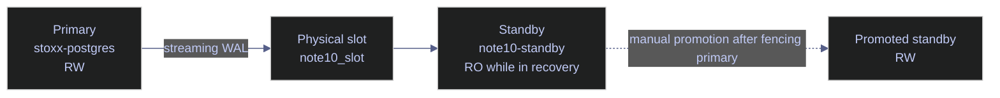

# PostgreSQL Streaming Replication and Failover

This note is the PostgreSQL operational counterpart to the SQL Server Availability Group setup note. The feature surface is different, but the goal is the same: build a second node, make WAL flow continuously, understand what synchronous versus asynchronous protection actually looks like on the wire, and practice promotion under controlled conditions.

> [!abstract]- Summary
>
> This note captures a live PostgreSQL 16 streaming-replication drill built from the `stoxx-postgres` primary into a disposable `note10-standby` container.
>
> - **End-to-end setup**
>   - creates a dedicated replication login, opens a lab-only replication path in `pg_hba.conf`, seeds the standby with `pg_basebackup -R`, and starts it in recovery
> - **Monitoring**
>   - reads the primary-side `pg_stat_replication` surface, the standby-side `pg_stat_wal_receiver` surface, and the physical replication slot state
> - **Async to sync transition**
>   - shows why standby naming matters for `synchronous_standby_names`, then captures the live change from `sync_state = async` to `sync_state = sync`
> - **Failover**
>   - fences the old primary by stopping the primary container, promotes the standby, and proves the promoted node is writable
> - **Read scale and backup offload**
>   - verifies direct read-only queries on the standby and runs `pg_dump -s` from the replica as a simple backup-offload example
> - **Safety boundary**
>   - the lab uses manual failover only; there is no Patroni, `repmgr`, `pg_auto_failover`, or other control plane making promotion decisions
> - **Live capture context**
>   - captured on April 18, 2026 from `stoxx-postgres` (`postgres:16`, host port `5434`) and a disposable standby container `note10-standby`, with replication slot `note10_slot`, application name `note10_standby`, and a demo table `demo_stc.note10_replication_demo`

> [!note]- Glossary
>
> **`standby.signal`**
> - File that tells PostgreSQL to boot as a standby and start recovery.
> - It matters because this is what `pg_basebackup -R` leaves behind to turn a copied cluster into a replica.
>
> ---
>
> **`primary_conninfo`**
> - Connection string the standby uses to reach its upstream primary.
> - It matters because authentication, host routing, and `application_name` all live here.
>
> ---
>
> **Physical replication slot**
> - Slot on the primary that retains WAL until the standby consumes it.
> - It matters because it protects the standby from missing WAL, but can fill disk if the standby stalls.
>
> ---
>
> **`sync_state`**
> - Primary-side view of whether a connected standby is asynchronous, potential synchronous, or fully synchronous.
> - It matters because this is the direct proof of whether the standby is part of the no-data-loss commit path.
>
> ---
>
> **Promotion**
> - Action that ends recovery on a standby and makes it writable.
> - It matters because promotion is the actual PostgreSQL failover event.

> [!info] Streaming replication drill topology
>
> The live lab below uses one primary and one physical standby. Automatic failover is intentionally absent; the point is to show the PostgreSQL primitives clearly before layering an orchestrator on top.



---

## End-To-End Setup

> [!abstract]- Summary
>
> PostgreSQL streaming replication setup is simpler than SQL Server AG certificate and cluster-agent setup, but the operator still has to do four things correctly: create a replication identity, permit the network path in `pg_hba.conf`, take a physical base backup, and start the standby in recovery with the right upstream metadata.

### PostgreSQL | replication login and `pg_hba.conf` | prepare the primary for a standby

#### Create a dedicated replication role and allow the bridge network in the lab

The primary created a dedicated replication login:

```sql
DO $$
BEGIN
  IF NOT EXISTS (SELECT 1 FROM pg_roles WHERE rolname = 'note10_replicator') THEN
    CREATE ROLE note10_replicator WITH LOGIN REPLICATION;
  END IF;
END
$$;

SELECT rolname, rolreplication, rolcanlogin
FROM pg_roles
WHERE rolname = 'note10_replicator';
```

| rolname | rolreplication | rolcanlogin |
|---|---|---|
| `note10_replicator` | `t` | `t` |

The lab then added a single bridge-network rule to `pg_hba.conf` and reloaded configuration:

```text
host replication note10_replicator 172.17.0.0/16 trust
```

> [!warning] Lab-only authentication shortcut
>
> The `trust` rule above is appropriate only for a disposable local drill. Production replication links should use password or certificate-based authentication and a tightly scoped source address.

### PostgreSQL | `pg_basebackup -R` | seed the standby from the primary

#### Take the physical base backup and create the slot

The standby container seeded itself directly from the primary:

```bash
pg_basebackup -h 172.17.0.3 -p 5432 -U note10_replicator \
  -D /var/lib/postgresql/standby -R -C -S note10_slot \
  -X stream -c fast -l note10_seed -v
```

```text
pg_basebackup: initiating base backup, waiting for checkpoint to complete
pg_basebackup: checkpoint completed
pg_basebackup: write-ahead log start point: 0/C000028 on timeline 1
pg_basebackup: starting background WAL receiver
pg_basebackup: created replication slot "note10_slot"
pg_basebackup: write-ahead log end point: 0/C000100
pg_basebackup: waiting for background process to finish streaming ...
pg_basebackup: syncing data to disk ...
pg_basebackup: renaming backup_manifest.tmp to backup_manifest
pg_basebackup: base backup completed
```

The seeded standby contained the expected recovery markers:

```text
primary_conninfo = 'user=note10_replicator passfile=''/var/lib/postgresql/.pgpass'' channel_binding=prefer host=172.17.0.3 port=5432 sslmode=prefer sslnegotiation=postgres sslcompression=0 sslcertmode=allow sslsni=1 ssl_min_protocol_version=TLSv1.2 gssencmode=prefer krbsrvname=postgres gssdelegation=0 target_session_attrs=any load_balance_hosts=disable'
primary_slot_name = 'note10_slot'
```

```text
/var/lib/postgresql/standby/standby.signal
```

### PostgreSQL | standby startup | start recovery and verify the first streaming state

#### Bring the standby online and inspect both sides of the connection

Startup on the standby showed the expected recovery transition:

```text
2026-04-18 23:34:35.393 UTC [78] LOG:  entering standby mode
2026-04-18 23:34:35.393 UTC [78] LOG:  starting backup recovery with redo LSN 0/C000028, checkpoint LSN 0/C000060, on timeline ID 1
2026-04-18 23:34:35.396 UTC [78] LOG:  consistent recovery state reached at 0/C000100
2026-04-18 23:34:35.396 UTC [73] LOG:  database system is ready to accept read-only connections
2026-04-18 23:34:35.402 UTC [79] LOG:  started streaming WAL from primary at 0/D000000 on timeline 1
```

Primary-side replication view:

```sql
SELECT pid, application_name, client_addr, state, sync_state, sent_lsn, write_lsn, flush_lsn, replay_lsn
FROM pg_stat_replication
ORDER BY pid;
```

| pid | application_name | client_addr | state | sync_state | sent_lsn | write_lsn | flush_lsn | replay_lsn |
|---|---|---|---|---|---|---|---|---|
| `1233` | `note10_standby` | `172.17.0.4` | `streaming` | `async` | `0/D000060` | `0/D000060` | `0/D000060` | `0/D000060` |

Standby-side recovery view:

```sql
SELECT pg_is_in_recovery() AS in_recovery,
       pg_last_wal_receive_lsn() AS receive_lsn,
       pg_last_wal_replay_lsn() AS replay_lsn,
       pg_last_xact_replay_timestamp() AS replay_ts;

SELECT pid, status, receive_start_lsn, written_lsn, flushed_lsn, latest_end_lsn, latest_end_time, slot_name, sender_host, sender_port
FROM pg_stat_wal_receiver;
```

| in_recovery | receive_lsn | replay_lsn | replay_ts |
|---|---|---|---|
| `t` | `0/D000000` | `0/D000060` |  |

| pid | status | receive_start_lsn | written_lsn | flushed_lsn | latest_end_lsn | latest_end_time | slot_name | sender_host | sender_port |
|---|---|---|---|---|---|---|---|---|---|
| `119` | `streaming` | `0/D000000` | `0/D000060` | `0/D000000` | `0/D000060` | `2026-04-18 23:35:14.566691+00` | `note10_slot` | `172.17.0.3` | `5432` |

---

## Synchronous Versus Asynchronous Protection

> [!abstract]- Summary
>
> PostgreSQL does not become synchronous just because a standby exists. The primary must be told which standby names count toward commit safety, and the standby must present the matching `application_name`.

### PostgreSQL | `application_name` and `synchronous_standby_names` | make the standby part of the commit path

#### Promote the standby from async observer to synchronous protection target

The first replication connection came up as a normal asynchronous standby. To make it eligible for synchronous commit, the standby was given an explicit `application_name` in `primary_conninfo`:

```text
primary_conninfo = 'host=172.17.0.3 port=5432 user=note10_replicator application_name=note10_standby'
```

Then the primary set:

```sql
ALTER SYSTEM SET synchronous_standby_names = 'FIRST 1 (note10_standby)';
SELECT pg_reload_conf();
```

PostgreSQL accepted the setting:

```sql
SELECT name, setting, source
FROM pg_settings
WHERE name IN ('synchronous_commit', 'synchronous_standby_names')
ORDER BY name;
```

| name | setting | source |
|---|---|---|
| `synchronous_commit` | `on` | `default` |
| `synchronous_standby_names` | `FIRST 1 (note10_standby)` | `configuration file` |

The primary log confirmed the state transition:

```text
parameter "synchronous_standby_names" changed to "FIRST 1 (note10_standby)"
standby "note10_standby" is now a synchronous standby with priority 1
```

And the replication view showed the standby become part of the commit path:

```sql
SELECT pid, application_name, state, sync_state, sync_priority, sent_lsn, write_lsn, flush_lsn, replay_lsn
FROM pg_stat_replication
ORDER BY pid;
```

| pid | application_name | state | sync_state | sync_priority | sent_lsn | write_lsn | flush_lsn | replay_lsn |
|---|---|---|---|---|---|---|---|---|
| `1233` | `note10_standby` | `streaming` | `sync` | `1` | `0/D000060` | `0/D000060` | `0/D000060` | `0/D000060` |

> [!warning] Name mismatch silently prevents sync protection
>
> Until the standby's `application_name` matched the name in `synchronous_standby_names`, the node remained asynchronous even though the replication link was healthy. This is a common setup mistake and worth checking immediately when `sync_state` never leaves `async`.

---

## Monitoring the Replication Link

> [!abstract]- Summary
>
> The PostgreSQL monitoring surface for physical replication is compact but operationally sufficient. The primary tells you how far the standby has received and replayed. The standby tells you whether WAL is still arriving. The slot tells you whether the primary is retaining WAL on the standby's behalf.

### PostgreSQL | `pg_stat_replication` / `pg_stat_wal_receiver` | prove that the standby is caught up

#### Measure send, write, flush, and replay position directly

After the standby entered synchronous mode, a test table was created on the primary and a row was inserted:

```sql
DROP TABLE IF EXISTS demo_stc.note10_replication_demo;
CREATE TABLE demo_stc.note10_replication_demo (
    id integer PRIMARY KEY,
    label text NOT NULL,
    inserted_at timestamptz NOT NULL DEFAULT clock_timestamp()
);

INSERT INTO demo_stc.note10_replication_demo (id, label)
VALUES (1, 'synced_from_primary')
RETURNING id, label, inserted_at;
```

| id | label | inserted_at |
|---|---|---|
| `1` | `synced_from_primary` | `2026-04-18 23:35:59.623255+00` |

The standby caught up fully:

```sql
SELECT pid, application_name, state, sync_state, sent_lsn, write_lsn, flush_lsn, replay_lsn,
       pg_wal_lsn_diff(sent_lsn, replay_lsn) AS send_minus_replay_bytes
FROM pg_stat_replication
ORDER BY pid;
```

| pid | application_name | state | sync_state | sent_lsn | write_lsn | flush_lsn | replay_lsn | send_minus_replay_bytes |
|---|---|---|---|---|---|---|---|---|
| `1233` | `note10_standby` | `streaming` | `sync` | `0/D027110` | `0/D027110` | `0/D027110` | `0/D027110` | `0` |

```sql
SELECT COUNT(*) AS row_count,
       MIN(label) AS first_label,
       MAX(inserted_at) AS last_seen_insert
FROM demo_stc.note10_replication_demo;

SELECT pg_is_in_recovery() AS in_recovery,
       pg_last_wal_receive_lsn() AS receive_lsn,
       pg_last_wal_replay_lsn() AS replay_lsn,
       pg_last_xact_replay_timestamp() AS replay_ts;
```

| row_count | first_label | last_seen_insert |
|---|---|---|
| `1` | `synced_from_primary` | `2026-04-18 23:35:59.623255+00` |

| in_recovery | receive_lsn | replay_lsn | replay_ts |
|---|---|---|---|
| `t` | `0/D027110` | `0/D027110` | `2026-04-18 23:35:59.62352+00` |

### PostgreSQL | `pg_replication_slots` | watch the safety contract and the WAL retention risk

#### Inspect the physical slot that protects the standby

The primary retained a live physical slot for the standby:

```sql
SELECT slot_name, slot_type, active, restart_lsn, wal_status
FROM pg_replication_slots
WHERE slot_name = 'note10_slot';
```

| slot_name | slot_type | active | restart_lsn | wal_status |
|---|---|---|---|---|
| `note10_slot` | `physical` | `t` | `0/D027110` | `reserved` |

The slot is the safety guarantee that the standby will not miss WAL if it disconnects briefly. It is also a risk surface: if the standby stalls for too long, the primary keeps retaining WAL and disk usage grows until the slot is advanced or dropped.

---

## Read Scale Without Built-In Routing

> [!abstract]- Summary
>
> PostgreSQL can serve reads from the standby, but it does not implement SQL Server-style read-only routing inside the engine. The operator connects to the standby directly or uses an external proxy or service-discovery layer.

### PostgreSQL | direct standby reads | prove the replica is readable but still read-only

#### Query the standby explicitly

```sql
SHOW transaction_read_only;

SELECT inet_server_addr() AS server_addr,
       inet_server_port() AS server_port,
       pg_is_in_recovery() AS in_recovery;

SELECT COUNT(*) AS eurostoxx50_rows
FROM silver.eurostoxx50_ohlcv;
```

| transaction_read_only |
|---|
| `on` |

| server_addr | server_port | in_recovery |
|---|---|---|
|  |  | `t` |

| eurostoxx50_rows |
|---|
| `67155` |

The standby is clearly readable, but the routing decision is external. PostgreSQL itself does not expose an `ApplicationIntent=ReadOnly` equivalent or a built-in read-only routing list.

---

## Failover Operations

> [!abstract]- Summary
>
> In PostgreSQL, failover is promotion. Without an orchestrator, the operator must first fence the old primary, then promote the standby, then re-establish a new protection path afterward. The two-node lab here intentionally demonstrates manual failover only.

### PostgreSQL | planned failover | fence first, promote second

#### Stop the primary cleanly and promote the synchronized standby

Immediately before failover, a second row was inserted on the primary and confirmed on the synchronous standby:

```sql
INSERT INTO demo_stc.note10_replication_demo (id, label)
VALUES (2, 'before_failover')
RETURNING id, label, inserted_at;
```

| id | label | inserted_at |
|---|---|---|
| `2` | `before_failover` | `2026-04-18 23:36:53.800391+00` |

```sql
SELECT id, label, inserted_at
FROM demo_stc.note10_replication_demo
ORDER BY id;
```

| id | label | inserted_at |
|---|---|---|
| `1` | `synced_from_primary` | `2026-04-18 23:35:59.623255+00` |
| `2` | `before_failover` | `2026-04-18 23:36:53.800391+00` |

The primary-side sync view still showed zero send/replay gap:

| application_name | sync_state | send_minus_replay_bytes |
|---|---|---|
| `note10_standby` | `sync` | `0` |

The old primary was then fenced by stopping the primary container, and the standby accepted promotion:

```sql
SELECT pg_promote(wait_seconds => 60) AS promoted;
```

| promoted |
|---|
| `t` |

The first check immediately after `pg_promote()` still showed `in_recovery = t` and `transaction_read_only = on`, which is a useful operational reminder that promotion is asynchronous. A few seconds later the standby was fully writable:

```sql
SELECT pg_is_in_recovery() AS in_recovery;
SHOW transaction_read_only;

INSERT INTO demo_stc.note10_replication_demo (id, label)
VALUES (3, 'after_promotion')
RETURNING id, label, inserted_at;

SELECT id, label, inserted_at
FROM demo_stc.note10_replication_demo
ORDER BY id;
```

| in_recovery |
|---|
| `f` |

| transaction_read_only |
|---|
| `off` |

| id | label | inserted_at |
|---|---|---|
| `3` | `after_promotion` | `2026-04-18 23:37:22.82333+00` |

| id | label | inserted_at |
|---|---|---|
| `1` | `synced_from_primary` | `2026-04-18 23:35:59.623255+00` |
| `2` | `before_failover` | `2026-04-18 23:36:53.800391+00` |
| `3` | `after_promotion` | `2026-04-18 23:37:22.82333+00` |

> [!warning] Promotion changes the topology, not just the role
>
> Once the standby is promoted and starts accepting writes, the old primary is stale. In a real environment it must be rewound or re-seeded before it can safely rejoin as a standby.

---

## Backup Offload to the Standby

> [!abstract]- Summary
>
> PostgreSQL can offload some backup work to a standby. The simplest proof in this lab is a schema dump from the replica while it is still a read-only standby.

### PostgreSQL | `pg_dump` on the standby | simple backup offload example

#### Run a logical export from the replica

```bash
pg_dump -U postgres -d stoxx -s -f /tmp/note10_schema_from_standby.sql
ls -lh /tmp/note10_schema_from_standby.sql
head -n 15 /tmp/note10_schema_from_standby.sql
```

```text
-rw-r--r-- 1 postgres postgres 34K Apr 18 23:36 /tmp/note10_schema_from_standby.sql
--
-- PostgreSQL database dump
--

\restrict OLG9iqfGln0oyNfnjDoSYcNNlasg0CedxvkvAvGzdRZHZUF2BoZkuJcq0hjB6T3

-- Dumped from database version 16.13 (Debian 16.13-1.pgdg13+1)
-- Dumped by pg_dump version 16.13 (Debian 16.13-1.pgdg13+1)
```

This is not a substitute for the physical HA chain, but it proves the standby can absorb backup-read workload while the primary stays focused on writes.

---

## Troubleshooting Patterns

> [!abstract]- Summary
>
> The most common PostgreSQL replication failures are mechanical: the standby connects but is not listed as synchronous, the slot exists but pins WAL forever, or promotion is assumed complete before the node is actually writable.

### PostgreSQL | common issues | diagnose the first things that break

#### Use the live lab mistakes as the checklist

| Symptom | What the lab showed | Corrective action |
|---|---|---|
| Standby streams but stays `async` | `application_name` initially did not match the sync target name | fix `primary_conninfo` and confirm `sync_state` changes on the primary |
| Slot exists but standby is disconnected | slot would remain `active = f` and keep WAL pinned | restart or remove the consumer, then drop or advance the slot deliberately |
| `pg_promote()` returned true but inserts still failed | promotion had started but the node was still in recovery for a moment | wait for `pg_is_in_recovery() = f` and `transaction_read_only = off` before treating the node as writable |
| Primary was not fenced before promotion | would risk split-brain | stop or isolate the old primary first, or let an orchestrator handle fencing |

Next: [[11-postgresql-memory-and-buffer-cache]] shifts from replication topology back into single-node engine internals: shared buffers, memory accounting, cache observation, and the operational boundaries between memory pressure and query behavior.
