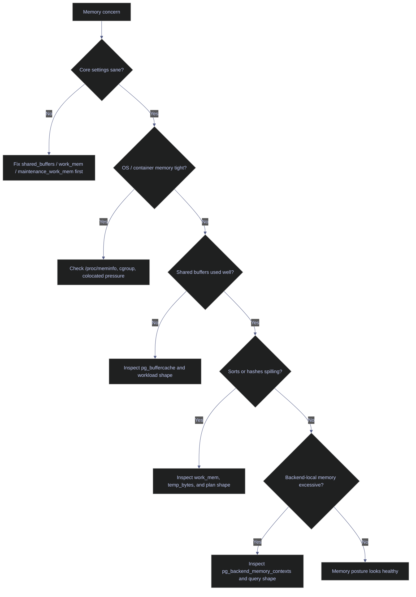

# PostgreSQL Memory and Buffer Cache

PostgreSQL uses memory aggressively too, but its memory model is not SQL Server's buffer-pool-plus-clerk design. The core surfaces are `shared_buffers`, per-backend working memory such as `work_mem`, maintenance memory such as `maintenance_work_mem`, and the operating-system page cache that PostgreSQL expects to exist outside the server process. The operator has to reason across all of them together; tuning one in isolation is how memory work turns into folklore instead of engineering.

> [!abstract]- Summary
>
> This note mirrors the SQL Server memory chapter, but translates it into PostgreSQL's real surfaces: `shared_buffers`, `effective_cache_size`, Linux memory visibility, `pg_stat_bgwriter`, `pg_stat_io`, `pg_buffercache`, per-backend memory contexts, and temp-file spills caused by low `work_mem`.
>
> - **Reproducible baseline**
>   - captures the core settings and the write-side buffer-management counters that explain how memory and checkpoints are behaving
> - **Linux host boundaries**
>   - reads `/proc/meminfo` and the cgroup memory files visible inside the container so the database settings are interpreted against the real host boundary
> - **Buffer cache health**
>   - uses `pg_buffercache` to measure used versus unused buffers, usage-count distribution, and which databases currently own the cached pages
> - **Memory consumers**
>   - replaces SQL Server memory clerks with PostgreSQL's per-backend memory contexts and explains the boundary between shared buffers and local backend memory
> - **Work-memory spill behavior**
>   - demonstrates a real external merge sort under `work_mem = '64kB'` and ties the spill back to `pg_stat_database.temp_files` and `temp_bytes`
> - **Operational guidance**
>   - closes with the settings that usually matter first and the cautions around over-tuning buffer memory in containerized PostgreSQL
> - **Live capture context**
>   - captured on April 18, 2026 from `stoxx-postgres` PostgreSQL 16.13 with `shared_buffers = 16384 * 8kB` (128 MB), `effective_cache_size = 4 GB`, `pg_buffercache` enabled in `stoxx`, and a controlled sort spill against `silver.eurostoxx50_ohlcv`

> [!note]- Glossary
>
> **`shared_buffers`**
> - PostgreSQL's shared memory cache for table and index pages.
> - It matters because this is the closest native analogue to SQL Server's buffer pool.
>
> ---
>
> **`effective_cache_size`**
> - Planner hint estimating how much data may already be cached by PostgreSQL and the OS.
> - It matters because it influences plan selection, not memory allocation.
>
> ---
>
> **`work_mem`**
> - Per-sort or per-hash working memory budget before a node spills to disk.
> - It matters because PostgreSQL has no central memory-grant semaphore equivalent; many operators get `work_mem` wrong by forgetting it is per operation, not per session.
>
> ---
>
> **`maintenance_work_mem`**
> - Working memory budget for maintenance operations such as `VACUUM`, index builds, and some DDL.
> - It matters because maintenance throughput often depends more on this setting than on `work_mem`.
>
> ---
>
> **`pg_buffercache`**
> - Extension that exposes the current contents of shared buffers.
> - It matters because PostgreSQL does not expose buffer-cache occupancy through a built-in DMV equivalent.
>
> ---
>
> **Temp spill**
> - Query node writing temporary files because its memory budget was too small.
> - It matters because this is PostgreSQL's nearest analogue to SQL Server memory-grant pressure.



---

## Reproducible Baseline

> [!abstract]- Summary
>
> PostgreSQL memory diagnostics start with two layers: the configured memory knobs and the write-side counters that explain how often checkpoints and background writes are happening. Without those, buffer-cache snapshots are hard to interpret.

### PostgreSQL | `pg_settings` | audit the main memory-related settings

#### Check the memory knobs that shape runtime behavior

```sql
SELECT name, setting, unit, source
FROM pg_settings
WHERE name IN (
  'block_size',
  'effective_cache_size',
  'huge_pages',
  'maintenance_work_mem',
  'shared_buffers',
  'temp_buffers',
  'work_mem'
)
ORDER BY name;
```

| name | setting | unit | source |
|---|---|---|---|
| `block_size` | `8192` |  | `default` |
| `effective_cache_size` | `524288` | `8kB` | `default` |
| `huge_pages` | `try` |  | `default` |
| `maintenance_work_mem` | `65536` | `kB` | `default` |
| `shared_buffers` | `16384` | `8kB` | `configuration file` |
| `temp_buffers` | `1024` | `8kB` | `default` |
| `work_mem` | `4096` | `kB` | `default` |

These settings translate to:

| Setting | Effective size | Operational meaning |
|---|---|---|
| `shared_buffers` | `128 MB` | very small shared cache for a 30+ GB host; the OS page cache is expected to carry more of the working set |
| `effective_cache_size` | `4 GB` | planner assumes a moderate amount of data may already be cached |
| `work_mem` | `4 MB` per sort/hash node | easy to exhaust in wide sorts or multi-join plans |
| `maintenance_work_mem` | `64 MB` | modest budget for vacuum and index maintenance |
| `temp_buffers` | `8 MB` per session | temp-table local buffer budget |

### PostgreSQL | `pg_stat_bgwriter` and `pg_stat_io` | inspect write-side memory pressure signals

#### Read checkpoint and buffer allocation counters

`pg_stat_bgwriter` and `pg_stat_io` tell you whether the server is cycling buffers aggressively and who is doing the I/O work.

```sql
SELECT * FROM pg_stat_bgwriter;
```

| checkpoints_timed | checkpoints_req | checkpoint_write_time | checkpoint_sync_time | buffers_checkpoint | buffers_clean | maxwritten_clean | buffers_backend | buffers_backend_fsync | buffers_alloc | stats_reset |
|---|---|---|---|---|---|---|---|---|---|---|
| `33` | `9` | `389354` | `151` | `6658` | `0` | `0` | `2362` | `0` | `18921` | `2026-04-18 20:37:33.679131+00` |

```sql
SELECT backend_type, object, context,
       reads, read_time, writes, write_time,
       extends, extend_time, hits, evictions, reuses, fsyncs, fsync_time
FROM pg_stat_io
WHERE backend_type IN ('checkpointer', 'background writer', 'client backend')
  AND object IN ('relation', 'temp relation')
ORDER BY backend_type, object, context;
```

| backend_type | object | context | reads | read_time | writes | write_time | extends | extend_time | hits | evictions | reuses | fsyncs | fsync_time |
|---|---|---|---|---|---|---|---|---|---|---|---|---|---|
| `background writer` | `relation` | `normal` |  |  | `0` | `0` |  |  |  |  |  | `0` | `0` |
| `checkpointer` | `relation` | `normal` |  |  | `6658` | `0` |  |  |  |  |  | `629` | `0` |
| `client backend` | `relation` | `bulkread` | `920` | `0` | `0` | `0` |  |  | `14` | `0` | `136` |  |  |
| `client backend` | `relation` | `bulkwrite` | `0` | `0` | `0` | `0` | `8058` | `0` | `7314` | `0` | `0` |  |  |
| `client backend` | `relation` | `normal` | `8724` | `0` | `0` | `0` | `1156` | `0` | `882839` | `0` |  | `0` | `0` |
| `client backend` | `relation` | `vacuum` | `0` | `0` | `0` | `0` | `0` | `0` | `0` | `0` | `0` |  |  |
| `client backend` | `temp relation` | `normal` | `5` | `0` | `0` | `0` | `11` | `0` | `86` | `0` |  |  |  |

The main signal here is not "memory is broken". It is that `shared_buffers` is small enough that PostgreSQL still relies heavily on client-backend hits and the OS cache, while checkpoint and relation-extension activity remain visible in the write counters.

---

## Linux Host Memory Boundaries

> [!abstract]- Summary
>
> PostgreSQL settings only make sense relative to the memory the container and OS actually expose. Inside containers this is the first place to look before blaming the database for memory pressure that really belongs to the host or orchestrator.

### Linux | `/proc/meminfo` and cgroup files | read the memory envelope seen by PostgreSQL

#### Inspect host-visible RAM, swap, and container limits

```text
MemTotal:       31656120 kB
MemAvailable:   25192732 kB
SwapTotal:       8388608 kB
SwapFree:        8064460 kB
---
max
---
30457856
```

Interpretation:

| Surface | Observed value | Meaning |
|---|---|---|
| `/proc/meminfo MemTotal` | `31,656,120 kB` | container sees roughly `30.2 GB` of RAM |
| `/proc/meminfo MemAvailable` | `25,192,732 kB` | host-visible free memory is currently high |
| `/sys/fs/cgroup/memory.max` | `max` | no hard cgroup memory cap is being applied |
| `/sys/fs/cgroup/memory.current` | `30,457,856` bytes | current container usage is only about `29 MB` at capture time |

This is the same conclusion the SQL Server source note reaches through different interfaces: before tuning the database, confirm the operating environment is not already the true bottleneck.

---

## Buffer Cache Health

> [!abstract]- Summary
>
> PostgreSQL does not expose a single "buffer cache hit ratio" counter that plays the same operational role as SQL Server's traditional buffer-pool diagnostics. The better approach is to inspect the actual shared-buffer contents and their usage-count distribution.

### PostgreSQL | `pg_buffercache` | inspect used versus unused buffers

#### Summarize the current state of shared buffers

`pg_buffercache` was enabled in `stoxx` for this inspection:

```sql
CREATE EXTENSION IF NOT EXISTS pg_buffercache;
SELECT extname, extversion FROM pg_extension WHERE extname = 'pg_buffercache';
```

| extname | extversion |
|---|---|
| `pg_buffercache` | `1.4` |

```sql
SELECT * FROM pg_buffercache_summary();
SELECT * FROM pg_buffercache_usage_counts();
```

| buffers_used | buffers_unused | buffers_dirty | buffers_pinned | usagecount_avg |
|---|---|---|---|---|
| `448` | `15936` | `43` | `0` | `3.658482142857143` |

| usage_count | buffers | dirty | pinned |
|---|---|---|---|
| `0` | `15936` | `0` | `0` |
| `1` | `95` | `6` | `0` |
| `2` | `48` | `4` | `0` |
| `3` | `24` | `1` | `0` |
| `4` | `27` | `8` | `0` |
| `5` | `254` | `24` | `0` |

The key point is how little of shared buffers is actually occupied: only `448` buffers, or about `3.5 MB`, were used at capture time. The cache is not under pressure. It is mostly empty.

### PostgreSQL | `pg_buffercache` | rank cached pages by database

#### See which databases currently own shared-buffer space

```sql
SELECT COALESCE(d.datname, 'shared/catalog') AS database_name,
       COUNT(*) AS buffers,
       pg_size_pretty(COUNT(*) * current_setting('block_size')::int::bigint) AS cached_size,
       SUM(CASE WHEN b.isdirty THEN 1 ELSE 0 END) AS dirty_buffers
FROM pg_buffercache AS b
LEFT JOIN pg_database AS d ON d.oid = b.reldatabase
GROUP BY COALESCE(d.datname, 'shared/catalog')
ORDER BY COUNT(*) DESC;
```

| database_name | buffers | cached_size | dirty_buffers |
|---|---|---|---|
| `shared/catalog` | `15951` | `125 MB` | `1` |
| `stoxx` | `274` | `2192 kB` | `42` |
| `postgres` | `159` | `1272 kB` | `0` |

```sql
WITH current_db AS (
  SELECT oid AS db_oid FROM pg_database WHERE datname = current_database()
)
SELECT n.nspname || '.' || c.relname AS relation_name,
       c.relkind,
       COUNT(*) AS buffers,
       pg_size_pretty(COUNT(*) * current_setting('block_size')::int::bigint) AS cached_size,
       SUM(CASE WHEN b.isdirty THEN 1 ELSE 0 END) AS dirty_buffers
FROM pg_buffercache AS b
JOIN current_db AS d ON b.reldatabase IN (0, d.db_oid)
JOIN pg_class AS c ON pg_relation_filenode(c.oid) = b.relfilenode
JOIN pg_namespace AS n ON n.oid = c.relnamespace
GROUP BY n.nspname || '.' || c.relname, c.relkind
ORDER BY COUNT(*) DESC
LIMIT 15;
```

At capture time, the hottest cached relations were mostly catalog tables such as `pg_catalog.pg_attribute`, `pg_catalog.pg_proc`, and `pg_catalog.pg_class`. That is consistent with a lightly loaded lab where metadata access dominates over sustained large-table scans.

---

## Memory Consumers

> [!abstract]- Summary
>
> PostgreSQL does not expose SQL Server-style memory clerks or a server-wide plan-cache accounting view. Memory is split between shared memory structures and backend-local allocations. When diagnosing memory usage, that difference matters more than any one query result.

### PostgreSQL | `pg_backend_memory_contexts` | inspect backend-local memory

#### Read the memory contexts of the current backend

`pg_backend_memory_contexts` is a per-session view, not a server-wide inventory. That makes it narrower than SQL Server memory clerks, but it is still the right place to inspect unusual per-backend allocations.

```sql
SELECT name, ident, parent, level,
       pg_size_pretty(total_bytes) AS total_bytes,
       pg_size_pretty(free_bytes) AS free_bytes,
       pg_size_pretty(used_bytes) AS used_bytes
FROM pg_backend_memory_contexts
ORDER BY total_bytes DESC
LIMIT 15;
```

| name | ident | parent | level | total_bytes | free_bytes | used_bytes |
|---|---|---|---|---|---|---|
| `TopMemoryContext` |  |  | `0` | `95 kB` | `13 kB` | `83 kB` |
| `ExprContext` |  | `ExecutorState` | `4` | `8192 bytes` | `6296 bytes` | `1896 bytes` |
| `printtup` |  | `ExecutorState` | `4` | `8192 bytes` | `7928 bytes` | `264 bytes` |
| `TupleSort sort` |  | `TupleSort main` | `5` | `8192 bytes` | `7928 bytes` | `264 bytes` |
| `Table function arguments` |  | `ExecutorState` | `4` | `8192 bytes` | `7888 bytes` | `304 bytes` |

The absence of large contexts here is a healthy signal. The session used to capture this note is not itself consuming unusual local memory.

> [!info] PostgreSQL has no direct memory-clerk analogue
>
> The closest mapping is:
>
> - `shared_buffers` and related shared memory for server-wide cache
> - per-backend memory contexts for session-local allocations
> - temp-file spill metrics for work that exceeded local memory budgets
>
> PostgreSQL also does not have SQL Server's instance-wide plan cache bloat pattern in the same form; prepared plans are typically scoped to sessions or explicit prepared statements rather than a global ad hoc plan cache.

---

## Work-Memory Spill Behavior

> [!abstract]- Summary
>
> SQL Server memory-grant diagnostics translate to PostgreSQL as "did a sort or hash spill to temp because `work_mem` was too small?" PostgreSQL does not queue all queries behind a central grant semaphore, but it absolutely can turn low memory into temp I/O and latency.

### PostgreSQL | low `work_mem` sort | reproduce a temp-file spill

#### Force an external merge sort and confirm the temp I/O

The session started from this baseline in `pg_stat_database`:

```sql
SELECT temp_files, pg_size_pretty(temp_bytes) AS temp_bytes_before
FROM pg_stat_database
WHERE datname = 'stoxx';
```

| temp_files | temp_bytes_before |
|---|---|
| `1` | `1888 kB` |

Then `work_mem` was forced down to `64kB` and a wide sort was executed:

```sql
SET work_mem = '64kB';

EXPLAIN (ANALYZE, BUFFERS, SUMMARY)
SELECT *
FROM silver.eurostoxx50_ohlcv
ORDER BY close DESC, date DESC;

RESET work_mem;
```

```text
Sort  (cost=16012.27..16180.16 rows=67155 width=80) (actual time=31.388..36.597 rows=67155 loops=1)
  Sort Key: close DESC, date DESC
  Sort Method: external merge  Disk: 6056kB
  Buffers: shared hit=6 read=1000, temp read=2260 written=2443
  ->  Seq Scan on eurostoxx50_ohlcv  (cost=0.00..1671.55 rows=67155 width=80) (actual time=0.017..10.254 rows=67155 loops=1)
        Buffers: shared read=1000
Planning:
  Buffers: shared hit=78 read=5
Planning Time: 0.366 ms
Execution Time: 38.575 ms
```

A fresh stats read after the spill showed the cumulative temp counters advance:

```sql
SELECT temp_files, temp_bytes, pg_size_pretty(temp_bytes) AS temp_bytes_pretty
FROM pg_stat_database
WHERE datname = 'stoxx';
```

| temp_files | temp_bytes | temp_bytes_pretty |
|---|---|---|
| `2` | `8134656` | `7944 kB` |

This is the PostgreSQL memory-pressure pattern to watch:

| Signal | Meaning |
|---|---|
| `Sort Method: external merge  Disk: 6056kB` | executor ran out of memory for the sort and spilled to temp |
| `temp read=2260 written=2443` | temp-file I/O was real, not theoretical |
| `pg_stat_database.temp_bytes` increased | spill cost is now visible in cumulative database stats |

---

## Operational Guidance

> [!abstract]- Summary
>
> PostgreSQL memory tuning is usually more about restraint than aggression. The common mistake is to increase every knob at once, then forget that many of them multiply across sessions or executor nodes.

### PostgreSQL | memory priorities | tune in the right order

#### Change the smallest number of things that explain the symptom

| Priority | Focus | Why |
|---|---|---|
| 1 | `shared_buffers` | sets the size of PostgreSQL's own shared cache |
| 2 | `work_mem` | drives per-operation spill behavior and can multiply dangerously |
| 3 | `maintenance_work_mem` | helps vacuum and index maintenance without inflating every query |
| 4 | host and container memory limits | define whether database tuning can even succeed |

Practical rules from the live lab:

| Observation | Guidance |
|---|---|
| `shared_buffers = 128 MB` on a ~30 GB host | this is conservative and keeps PostgreSQL dependent on the OS cache; good for a small lab, not a production default |
| most buffers unused at capture time | low occupancy is not automatically bad; it only matters if the workload is actually cache-thrashing |
| low `work_mem` created a visible spill immediately | tune `work_mem` from real spill evidence, not from generic blog defaults |
| cgroup `memory.max = max` | there is no orchestrator-level hard cap protecting the instance today |

### PostgreSQL | things not to port blindly from SQL Server

#### Respect the engine differences

| SQL Server habit | PostgreSQL reality |
|---|---|
| Treat one large central buffer pool as the whole memory story | PostgreSQL also depends heavily on the OS page cache and backend-local memory |
| Look for memory clerks to rank consumers | use shared-buffer inspection, backend contexts, and spill evidence instead |
| Look for a central grant queue before tuning sorts | PostgreSQL spills per operator when `work_mem` is too small |
| Assume buffer cache hit ratio tells the whole truth | buffer occupancy, workload shape, temp I/O, and checkpoint behavior matter more |

Next: [[12-postgresql-audit-logging]] turns from memory and cache behavior to evidence trails: PostgreSQL logs, statement capture, role and DDL auditing patterns, and what the server can and cannot record by default.
