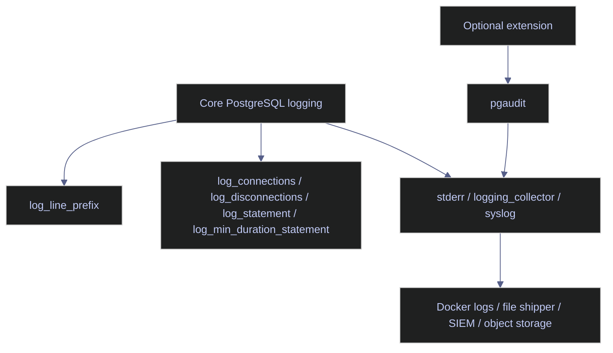

# PostgreSQL Audit Logging

PostgreSQL does not have a built-in object model that matches SQL Server Audit's server-audit and specification hierarchy. The nearest core equivalent is the logging subsystem: choose a log destination, shape the line prefix so identity is visible, decide which connection or statement classes should be logged, and then ship that log stream into durable storage and external analysis. Richer object-class auditing usually comes from extensions such as `pgaudit`, which are outside core PostgreSQL and were not present in this lab.

> [!abstract]- Summary
>
> This note mirrors the SQL Server audit chapter, but translates it into PostgreSQL's actual control plane: built-in logging settings, log-line identity design, live statement and connection capture, failed-login triage from the server log, and the boundary between core logging and `pgaudit`.
>
> - **Audit architecture**
>   - explains why PostgreSQL core logging is the base evidence surface and why `pgaudit` is an optional extension rather than a built-in audit object
> - **Build and verify**
>   - captures the current lab posture, shows that `pgaudit` is absent, then enables a minimal audit-style logging configuration with `log_connections`, `log_disconnections`, `log_statement = 'ddl'`, and a richer `log_line_prefix`
> - **Read and triage**
>   - reads the live container log stream to confirm successful connections, DDL, and failed logins
> - **Detection**
>   - counts repeated failed-login events from the same test principal to show the first-response triage pattern
> - **Operational integration**
>   - highlights the current durability boundary: `logging_collector = off`, `log_destination = stderr`, and the need for external forwarding if logs must outlive the container runtime
> - **Live capture context**
>   - captured on April 18, 2026 from `stoxx-postgres` PostgreSQL 16.13 with logs still routed to container stderr, `pgaudit` unavailable, and note-scoped events tagged with `application_name` values `note12_ok`, `note12_ddl`, and `note12_fail`

> [!note]- Glossary
>
> **`logging_collector`**
> - PostgreSQL setting that writes server logs to managed files on disk instead of only to stderr or syslog.
> - It matters because durable file retention starts here, not at a separate audit object.
>
> ---
>
> **`log_line_prefix`**
> - Prefix template added to every log line.
> - It matters because audit usefulness depends heavily on whether user, database, PID, and application name are visible.
>
> ---
>
> **`log_statement`**
> - Setting that logs statements by class such as `ddl`, `mod`, or `all`.
> - It matters because PostgreSQL statement capture is a configuration decision, not an attached audit specification.
>
> ---
>
> **`pgaudit`**
> - Extension that adds structured audit-style statement classes on top of PostgreSQL logging.
> - It matters because many teams expect it to be built in; it is not.



---

## Audit Architecture

> [!abstract]- Summary
>
> In PostgreSQL, auditing starts from the log stream. The engine does not create a separate audit file format or queryable audit catalog by default. That means operators have to care about log identity, durability, forwarding, and reader access much earlier than they might on SQL Server.

### PostgreSQL | built-in logging versus `pgaudit` | know the native boundary

#### Verify what exists in the current lab

The lab confirmed that `pgaudit` is not available:

```sql
SELECT name, default_version, installed_version, comment
FROM pg_available_extensions
WHERE name IN ('pgaudit')
ORDER BY name;
```

| name | default_version | installed_version | comment |
|---|---|---|---|
| *(0 rows)* |  |  |  |

This matters operationally:

| Surface | Available in this lab? | Meaning |
|---|---|---|
| Core logging settings | Yes | can capture connections, disconnections, statements, durations, and server events |
| `pgaudit` | No | richer audit classes are not available unless the package is installed and preloaded |
| SQL Server-style audit object hierarchy | No direct equivalent | PostgreSQL relies on log configuration and external handling instead |

---

## Build And Verify The Logging Surface

> [!abstract]- Summary
>
> PostgreSQL logging is configured through settings, not through an audit DDL hierarchy. The first step is to inspect the current posture, then make the smallest change that produces useful security-relevant events.

### PostgreSQL | `pg_settings` | inspect the current logging posture

#### Read the baseline before changing anything

```sql
SELECT name, setting, source
FROM pg_settings
WHERE name IN (
  'logging_collector',
  'log_destination',
  'log_directory',
  'log_filename',
  'log_connections',
  'log_disconnections',
  'log_statement',
  'log_line_prefix',
  'shared_preload_libraries'
)
ORDER BY name;
```

| name | setting | source |
|---|---|---|
| `log_connections` | `off` | `default` |
| `log_destination` | `stderr` | `default` |
| `log_directory` | `log` | `default` |
| `log_disconnections` | `off` | `default` |
| `log_filename` | `postgresql-%Y-%m-%d_%H%M%S.log` | `default` |
| `log_line_prefix` | `%m [%p]` | `default` |
| `log_statement` | `none` | `default` |
| `logging_collector` | `off` | `default` |
| `shared_preload_libraries` |  | `default` |

The baseline tells the real story:

| Setting | Operational implication |
|---|---|
| `logging_collector = off` | logs are not being rotated into PostgreSQL-managed files |
| `log_destination = stderr` | the live evidence stream is the container runtime log |
| `log_connections = off` and `log_disconnections = off` | connection lifecycle is invisible by default |
| `log_statement = none` | DDL and DML are not logged by default |
| `log_line_prefix = %m [%p]` | timestamp and PID exist, but user, database, and application name do not |

### PostgreSQL | minimal audit-style settings | enable identity-rich logging

#### Turn on connection, disconnection, and DDL visibility

For the lab, PostgreSQL was configured with:

```sql
ALTER SYSTEM SET log_connections = 'on';
ALTER SYSTEM SET log_disconnections = 'on';
ALTER SYSTEM SET log_statement = 'ddl';
ALTER SYSTEM SET log_line_prefix = '%m [%p] %u@%d %a ';
SELECT pg_reload_conf();
```

```sql
SELECT name, setting, source
FROM pg_settings
WHERE name IN ('log_connections','log_disconnections','log_statement','log_line_prefix')
ORDER BY name;
```

| name | setting | source |
|---|---|---|
| `log_connections` | `on` | `configuration file` |
| `log_disconnections` | `on` | `configuration file` |
| `log_line_prefix` | `%m [%p] %u@%d %a ` | `configuration file` |
| `log_statement` | `ddl` | `configuration file` |

One real operational footgun surfaced during setup: `postgresql.auto.conf` had briefly been left owned by `root` from an earlier lab cleanup, which caused `ALTER SYSTEM` to fail with `Permission denied` until ownership was returned to `postgres`. That is a useful reminder that audit and logging changes depend on filesystem hygiene, not only SQL privileges.

---

## Read And Triage The Log Stream

> [!abstract]- Summary
>
> With `logging_collector = off`, the live audit surface is the container stderr stream. That is not ideal for long-term evidence retention, but it is enough to prove whether the current configuration is capturing the right event classes.

### PostgreSQL | connection, DDL, and failure evidence | read the relevant log lines back

#### Generate note-scoped events and inspect them

The lab generated three event classes:

| `application_name` | Action |
|---|---|
| `note12_ok` | successful connection and disconnection |
| `note12_ddl` | `CREATE TABLE` followed by `DROP TABLE` |
| `note12_fail` | repeated failed login attempts for nonexistent role `no_such_role` |

Filtered log lines from the live server stream:

```text
2026-04-18 23:47:31.151 UTC [614] postgres@stoxx [unknown] LOG:  connection authorized: user=postgres database=stoxx application_name=note12_ddl
2026-04-18 23:47:31.152 UTC [614] postgres@stoxx note12_ddl LOG:  statement: CREATE TABLE demo_stc.note12_audit_demo(id int); DROP TABLE demo_stc.note12_audit_demo;
2026-04-18 23:47:31.154 UTC [614] postgres@stoxx note12_ddl LOG:  disconnection: session time: 0:00:00.003 user=postgres database=stoxx host=127.0.0.1 port=42948
2026-04-18 23:47:31.158 UTC [615] postgres@stoxx [unknown] LOG:  connection authorized: user=postgres database=stoxx application_name=note12_ok
2026-04-18 23:47:31.159 UTC [615] postgres@stoxx note12_ok LOG:  disconnection: session time: 0:00:00.001 user=postgres database=stoxx host=127.0.0.1 port=42964
2026-04-18 23:47:31.208 UTC [625] no_such_role@postgres [unknown] FATAL:  role "no_such_role" does not exist
2026-04-18 23:47:31.223 UTC [627] no_such_role@postgres [unknown] FATAL:  role "no_such_role" does not exist
2026-04-18 23:47:31.240 UTC [629] no_such_role@postgres [unknown] FATAL:  role "no_such_role" does not exist
```

These lines demonstrate the three core auditing questions:

| Question | PostgreSQL evidence |
|---|---|
| Who connected? | user, database, application name, and source host in the connection and disconnection lines |
| What DDL happened? | `statement:` log line because `log_statement = 'ddl'` |
| Did authentication fail? | `FATAL` lines in the server log |

---

## Detect Failed-Login Bursts

> [!abstract]- Summary
>
> PostgreSQL failed-login detection is log analysis unless an external system is already parsing and indexing the stream. The first-response pattern is therefore count-and-group, not a query against an audit table.

### PostgreSQL | failed login triage | count repeated authentication failures

#### Summarize the test burst

The filtered log stream contained `6` failed-login events for `no_such_role` during the note-scoped test run.

Operationally:

| Signal | Meaning |
|---|---|
| repeated `FATAL: role "..." does not exist` | password spray against nonexistent principals, typoed automation, or account drift |
| same `application_name` repeated | likely one automation path rather than unrelated users |
| same source host and short time window | raises the urgency if the host is not a trusted jump box or app server |

This is the PostgreSQL equivalent of the SQL Server note's failed-login burst section: the logic is the same, but the evidence source is the log stream rather than `sys.fn_get_audit_file`.

---

## Operational Integration

> [!abstract]- Summary
>
> Audit value depends on durability. The current lab proves event capture, but it also shows the current weakness clearly: logs are still tied to the container runtime rather than a PostgreSQL-managed file set or an external immutable sink.

### PostgreSQL | durability boundary | understand what the current lab does not yet provide

#### Read the current retention posture honestly

| Setting | Current value | Meaning |
|---|---|---|
| `logging_collector` | `off` | PostgreSQL is not rotating its own log files |
| `log_destination` | `stderr` | evidence leaves the engine through container stderr |
| `log_directory` / `log_filename` | configured but inactive for current flow | these matter only if `logging_collector` is enabled |

Practical consequences:

| If you need... | Then... |
|---|---|
| short-term local debugging | container stderr may be sufficient |
| durable audit evidence | enable `logging_collector` or ship stderr externally immediately |
| structured object-class auditing | install and configure `pgaudit`, then ship those logs too |
| central alerting | forward to Cloud Logging, a SIEM, or another indexed log sink |

### PostgreSQL | access control | separate event generation from event reading

#### Treat log access as a security boundary

PostgreSQL core does not create a separate "audit reader" permission model. In practice:

| Operation | Typical access boundary |
|---|---|
| change logging settings | PostgreSQL superuser plus filesystem control |
| read container stderr logs | platform or container-runtime access |
| read PostgreSQL log files with logging collector enabled | filesystem access to the log directory |

That makes reader governance an infrastructure decision as much as a database one.

---

## PostgreSQL Audit Logging Recommendations

Use the core logging surface for baseline auditability first: turn on identity-rich prefixes, capture connection lifecycle, and log at least DDL. If compliance or security operations require richer statement-class auditing, install `pgaudit` deliberately and ship the resulting logs into an external indexed system. Do not confuse "events are visible in docker logs right now" with "audit evidence is durably retained and access-controlled".

Next: [[13-postgresql-encryption-at-rest-and-in-transit]] moves from evidence to protection: TLS, client authentication boundaries, data-at-rest encryption realities in PostgreSQL, and the nearest equivalents to SQL Server's encryption surface.
