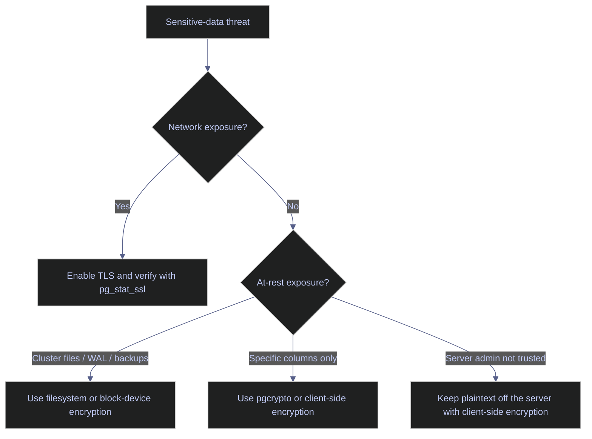

# PostgreSQL Encryption At Rest And In Transit

PostgreSQL's encryption surface does not map one-to-one to SQL Server's TDE hierarchy. Core PostgreSQL divides the problem into separate layers: password hashing for authentication, TLS or GSSAPI for transport, optional column-level cryptography through `pgcrypto`, and filesystem or block-device encryption for the actual cluster files. The operational mistake is to assume one of those layers automatically covers the others.

> [!abstract]- Summary
>
> This note mirrors the SQL Server TDE chapter, but translates it into PostgreSQL's real boundaries instead of pretending there is a direct feature match. The correct PostgreSQL answer is layered:
>
> - **Transport encryption**
>   - TLS protects passwords, queries, and returned data while the session is on the wire
> - **Credential protection**
>   - `password_encryption = scram-sha-256` protects stored role passwords, but does not encrypt table data
> - **Selective data encryption**
>   - `pgcrypto` can encrypt chosen values or columns when application or operational requirements demand it
> - **Cluster-file protection**
>   - core PostgreSQL still relies on filesystem or block-level encryption for data files, WAL, and base-backup artifacts at rest
> - **Live lab evidence**
>   - the note captures the current `stoxx-postgres` posture, proves a real `sslmode=require` session through `pg_stat_ssl`, and shows a disposable `pgcrypto` round-trip against the live lab
> - **Operational guidance**
>   - the closing recommendations separate the problems that TLS solves from the problems that only disk encryption, backup handling, or client-side encryption can solve

> [!note]- Glossary
>
> **SCRAM**
> - Salted Challenge Response Authentication Mechanism used for PostgreSQL password hashing and challenge-response login.
> - It matters because password hashing is part of the encryption story, but it is not table-data encryption.
>
> ---
>
> **TLS / SSL**
> - Transport encryption between client and PostgreSQL server.
> - It matters because it protects credentials and result sets on the network.
>
> ---
>
> **`pgcrypto`**
> - Extension that adds cryptographic functions such as `pgp_sym_encrypt()` and `pgp_sym_decrypt()`.
> - It matters because it is the nearest in-engine tool for protecting specific values when core PostgreSQL does not offer transparent whole-cluster encryption.
>
> ---
>
> **Filesystem or block-device encryption**
> - Encryption provided below PostgreSQL by the operating system or storage stack.
> - It matters because this is the practical at-rest protection for cluster files, WAL, and physical backups.
>
> ---
>
> **`pg_stat_ssl`**
> - Statistics view showing whether individual backend sessions are using TLS and which protocol and cipher were negotiated.
> - It matters because it is the cleanest live proof that transport encryption is actually in use.



---

## What PostgreSQL Actually Encrypts

> [!abstract]- Summary
>
> The official PostgreSQL encryption guidance is layered by boundary, not by one master feature. That design matters operationally because the operator has to choose the layer that matches the threat.

### PostgreSQL | encryption boundary | separate the four native layers

#### Match the control to the threat you are actually defending against

Use this model before enabling any setting or extension so the control matches the risk. It is typically triggered during security hardening, audit response, or migration from a platform where "database encryption" meant a single checkbox. The context is architectural rather than command-driven: it is read-only reasoning, but it determines whether later configuration work is useful or wasted. Its purpose is to prevent the common category error where password hashing, TLS, and at-rest protection are treated as interchangeable.

Core PostgreSQL separates the encryption problem this way:

| Layer | Native PostgreSQL surface | What it protects | What it does not protect |
|---|---|---|---|
| Password hashing | `password_encryption = 'scram-sha-256'` | stored role-password verifier | table data, WAL, backups, network traffic |
| Transport encryption | TLS / SSL and optionally GSSAPI | queries, credentials, and result sets in transit | data already written to disk |
| Selective data encryption | `pgcrypto` or client-side crypto | chosen values or columns | cluster-wide transparent encryption |
| At-rest cluster protection | filesystem or block-device encryption | data files, WAL, base backups, copied volumes | plaintext visible to the mounted host and PostgreSQL process |

That is the direct replacement for the SQL Server TDE mental model. The PostgreSQL core documentation's encryption-options section still describes `pgcrypto`, TLS, and filesystem or block-level storage encryption rather than a transparent cluster-file encryption feature inside the server itself. The right conclusion is not "PostgreSQL has no encryption"; it is "PostgreSQL expects you to compose the right layers deliberately."

---

## Baseline The Current Lab Posture

> [!abstract]- Summary
>
> Before changing anything, confirm which encryption-relevant settings are already in effect. That distinguishes what the cluster is protecting today from what still depends on infrastructure outside PostgreSQL.

### PostgreSQL | `pg_settings` | inspect the current encryption-related settings

#### Check the current password, checksum, and TLS posture

Run this before changing certificates, `pg_hba.conf`, or extension state so the current posture is explicit. It is typically triggered during first-pass hardening, incident review, or platform migration. The command runs inside a PostgreSQL session, is read-only, and requires only the visibility needed to read `pg_settings`. Its purpose is to prove which encryption-related controls are active right now rather than relying on assumptions from container images or prior notes.

| Field | Source column | Type | Meaning |
|---|---|---|---|
| `name` | `pg_settings.name` | `text` | Setting name being inspected. |
| `setting` | `pg_settings.setting` | `text` | Current live value as PostgreSQL is using it. |
| `unit` | `pg_settings.unit` | `text` | Unit for numeric settings when one exists. Blank means the value is symbolic. |
| `context` | `pg_settings.context` | `text` | Configuration scope such as `internal`, `user`, or `sighup`. This tells you whether a reload or restart would be required. |
| `source` | `pg_settings.source` | `text` | Where the value came from: default, configuration file, command line, and so on. |

*Return the encryption-relevant settings that define the current cluster posture.*

```sql
SELECT name, setting, unit, context, source
FROM pg_settings
WHERE name IN (
  'data_checksums',
  'password_encryption',
  'ssl',
  'ssl_ca_file',
  'ssl_cert_file',
  'ssl_key_file',
  'ssl_min_protocol_version'
)
ORDER BY name;
```

| name | setting | unit | context | source |
|---|---|---|---|---|
| `data_checksums` | `off` |  | `internal` | `default` |
| `password_encryption` | `scram-sha-256` |  | `user` | `default` |
| `ssl` | `on` |  | `sighup` | `configuration file` |
| `ssl_ca_file` |  |  | `sighup` | `default` |
| `ssl_cert_file` | `server.crt` |  | `sighup` | `default` |
| `ssl_key_file` | `server.key` |  | `sighup` | `default` |
| `ssl_min_protocol_version` | `TLSv1.2` |  | `sighup` | `default` |

This result is precise about the current boundary:

| Column | Value | Watch | Meaning | Implication |
|---|---|---|---|---|
| `password_encryption` | `scram-sha-256` | healthy | modern password verifier format is active | new or changed passwords are stored as SCRAM verifiers instead of MD5 |
| `ssl` | `on` | healthy | server is willing to negotiate TLS | transport encryption is available, but not necessarily required |
| `ssl_min_protocol_version` | `TLSv1.2` | healthy | older TLS versions are excluded | clients must negotiate at least TLS 1.2 |
| `ssl_ca_file` | empty | depends | server is not configured for client-cert trust via CA file | TLS is available, but mutual TLS is not configured here |
| `data_checksums` | `off` | caution | block checksums are disabled | corruption detection is weaker, and this setting is not an encryption feature anyway |

### PostgreSQL | `pg_hba_file_rules` | verify whether TLS is merely available or actually enforced

#### Read the current host-authentication rules honestly

Run this after confirming that `ssl = on` so you do not confuse "the server can negotiate TLS" with "all remote clients must use TLS." It is typically triggered during connection-hardening review or after enabling server certificates. The command is read-only, runs inside PostgreSQL, and exposes the parsed `pg_hba.conf` rules the server is actually applying. Its purpose is to show whether plain `host` lines are still accepting non-SSL sessions.

| Field | Source column | Type | Meaning |
|---|---|---|---|
| `type` | `pg_hba_file_rules.type` | `text` | Connection class such as `host`, `hostssl`, or `hostgssenc`. |
| `database` | `pg_hba_file_rules.database` | `text[]` | Databases the rule applies to. |
| `user_name` | `pg_hba_file_rules.user_name` | `text[]` | Roles the rule applies to. |
| `address` | `pg_hba_file_rules.address` | `text` | Client address or CIDR range matched by the rule. |
| `auth_method` | `pg_hba_file_rules.auth_method` | `text` | Authentication method used once the rule matches. |

*List the current network authentication rules that matter for transport encryption.*

```sql
SELECT type, database, user_name, address, auth_method
FROM pg_hba_file_rules
WHERE type IN ('host','hostssl','hostgssenc')
ORDER BY line_number;
```

| type | database | user_name | address | auth_method |
|---|---|---|---|---|
| `host` | `{all}` | `{all}` | `127.0.0.1` | `trust` |
| `host` | `{all}` | `{all}` | `::1` | `trust` |
| `host` | `{replication}` | `{all}` | `127.0.0.1` | `trust` |
| `host` | `{replication}` | `{all}` | `::1` | `trust` |
| `host` | `{all}` | `{all}` | `all` | `scram-sha-256` |

The key signal is the absence of any `hostssl` rule. TLS is available on this server, but the current `pg_hba.conf` posture does not force encrypted network sessions. A client can still connect over plain `host` if it chooses to and if the matched rule allows it. On a hardened production instance, `hostssl` is the line that turns "available" into "required."

---

## Encrypt Data In Transit

> [!abstract]- Summary
>
> Transport encryption is the one place where PostgreSQL gives a direct, built-in answer. The operational test is not "did I set `ssl = on`?" It is "can a client requiring TLS connect, and does `pg_stat_ssl` prove the negotiated session?"

### PostgreSQL | TLS listener and live session proof | verify the transport layer end to end

#### Confirm the listener is advertising TLS and that clients can prove it

Run this immediately after enabling certificates or changing SSL settings. It is typically triggered by hardening work, client connection failures after certificate changes, or an audit question about whether sessions are really encrypted. The workflow has two parts: a state read from the server and a client connection that requires TLS. The goal is to prove the feature is live at both ends rather than stopping at server-side configuration.

The server was restarted after placing `server.crt` and `server.key` in the data directory. After restart, `SHOW ssl;` returned `on` and `sslmode=require` connections to `127.0.0.1:5432` succeeded.

| Field | Source column | Type | Meaning |
|---|---|---|---|
| `application_name` | `pg_stat_activity.application_name` | `text` | Client-supplied identifier used to isolate the test session. |
| `ssl` | `pg_stat_ssl.ssl` | `boolean` | `t` when the backend is currently using TLS. |
| `version` | `pg_stat_ssl.version` | `text` | Negotiated TLS protocol version. |
| `cipher` | `pg_stat_ssl.cipher` | `text` | Cipher suite used for this session. |
| `client_dn` | `pg_stat_ssl.client_dn` | `text` | Client certificate distinguished name if mutual TLS is in use. Blank here means no client cert was presented. |
| `client_addr` | `pg_stat_activity.client_addr` | `inet` | Client network address connected to the backend. |

*Open a TLS-required session and verify it from the server side.*

```sql
SELECT a.application_name,
       s.ssl,
       s.version,
       s.cipher,
       s.client_dn,
       a.client_addr
FROM pg_stat_ssl AS s
JOIN pg_stat_activity AS a
  ON a.pid = s.pid
WHERE a.application_name = 'note13_ssl';
```

| application_name | ssl | version | cipher | client_dn | client_addr |
|---|---|---|---|---|---|
| `note13_ssl` | `t` | `TLSv1.3` | `TLS_AES_256_GCM_SHA384` |  | `127.0.0.1` |

This is the clean transport-evidence row the note needed. The session was opened with `sslmode=require`, PostgreSQL negotiated `TLSv1.3`, and the cipher suite is a modern AEAD cipher. `client_dn` is blank because the lab is using server-authenticated TLS, not mutual TLS.

---

## Encrypt Selected Values With `pgcrypto`

> [!abstract]- Summary
>
> `pgcrypto` is not transparent whole-database encryption. It is targeted cryptography for the cases where only certain values need stronger handling inside SQL workflows.

### PostgreSQL | `pgcrypto` | demonstrate selective value encryption

#### Install the extension and round-trip one encrypted value

Use this when the requirement is "protect a specific value or column" rather than "encrypt every cluster file." It is typically triggered by sensitive attributes such as API secrets, PAN-like fields, or narrowly scoped compliance rules. The extension install is state-changing and persistent for the database; the demo table below is disposable because it uses a temporary table inside a transaction and rolls back. The purpose is to prove the real column-encryption surface that PostgreSQL exposes inside SQL.

First, the `stoxx` database was checked for the extension:

```sql
CREATE EXTENSION IF NOT EXISTS pgcrypto;

SELECT extname, extversion
FROM pg_extension
WHERE extname = 'pgcrypto';
```

| extname | extversion |
|---|---|
| `pgcrypto` | `1.3` |

Then a disposable round-trip used `pgp_sym_encrypt()` and `pgp_sym_decrypt()`:

| Field | Source column | Type | Meaning |
|---|---|---|---|
| `id` | `note13_crypto_demo.id` | `integer` | Demo row identifier. |
| `clear_text` | `note13_crypto_demo.clear_text` | `text` | Original plaintext inserted into the temporary table. |
| `cipher_bytes` | `octet_length(cipher)` | `integer` | Length of the encrypted bytea payload. |
| `cipher_prefix_hex` | `encode(substring(cipher from 1 for 16), 'hex')` | `text` | First 16 bytes of the ciphertext rendered as hex to prove the stored bytes are opaque. |
| `decrypted_text` | `pgp_sym_decrypt(cipher, 'note13-demo-key')` | `text` | Decrypted plaintext returned only when the same key is supplied. |

*Encrypt one value with `pgcrypto`, show the stored ciphertext shape, then decrypt it in the same disposable transaction.*

```sql
BEGIN;

CREATE TEMP TABLE note13_crypto_demo (
  id int,
  clear_text text,
  cipher bytea
);

INSERT INTO note13_crypto_demo
VALUES (
  1,
  'alpha-sensitive',
  public.pgp_sym_encrypt('alpha-sensitive', 'note13-demo-key')
);

SELECT id,
       clear_text,
       octet_length(cipher) AS cipher_bytes,
       encode(substring(cipher from 1 for 16), 'hex') AS cipher_prefix_hex,
       public.pgp_sym_decrypt(cipher, 'note13-demo-key') AS decrypted_text
FROM note13_crypto_demo;

ROLLBACK;
```

| id | clear_text | cipher_bytes | cipher_prefix_hex | decrypted_text |
|---|---|---|---|---|
| `1` | `alpha-sensitive` | `81` | `c30d04070302251cac9e74d55f5f7bd2` | `alpha-sensitive` |

The operational lesson is straightforward: `pgcrypto` absolutely works for selected values, but the key and plaintext are still present in the server process while the function runs. That is why `pgcrypto` is useful for scoped protection and application design, yet it is not a substitute for client-side encryption when the database host itself is outside the trust boundary.

---

## Understand The At-Rest Boundary

> [!abstract]- Summary
>
> Core PostgreSQL still writes ordinary relation files beneath `data_directory`. If those files must be unreadable when copied off disk, the protection layer lives below PostgreSQL, not inside a cluster-wide TDE setting.

### PostgreSQL | cluster files and backup artifacts | map the real file boundary

#### Locate a relation file relative to the data directory

Run this when the question is "what exactly sits on disk if someone copies the cluster volume or a base backup?" It is typically triggered during disk-encryption design, backup threat modelling, or migration from platforms with transparent page encryption. The command is read-only and runs inside PostgreSQL. Its purpose is to connect SQL objects to the physical file tree that PostgreSQL manages so the at-rest boundary is concrete.

| Field | Source column | Type | Meaning |
|---|---|---|---|
| `relpath` | `pg_relation_filepath('pg_class')` | `text` | Relative file path for the chosen relation inside the cluster. |
| `data_directory` | `current_setting('data_directory')` | `text` | Cluster root on disk. |

*Show where a real system relation lives under the data directory.*

```sql
SELECT pg_relation_filepath('pg_class') AS relpath,
       current_setting('data_directory') AS data_directory;
```

| relpath | data_directory |
|---|---|
| `base/5/1259` | `/var/lib/postgresql/data` |

That row is the whole at-rest story in one glance: PostgreSQL relations ultimately become files under the cluster directory. WAL, control files, relation forks, and physical base-backup copies live in the same physical world. If an attacker steals the mounted volume or an unencrypted backup copy, core PostgreSQL does not transparently re-encrypt those files for you. The protection layer has to be filesystem or block-device encryption, plus disciplined backup handling.

| Artifact | Core PostgreSQL encrypted by default? | Practical protection layer |
|---|---|---|
| Table and index files under `data_directory` | No | filesystem or block-device encryption |
| WAL files under `pg_wal` | No | filesystem or block-device encryption |
| Physical base backups | No | encrypted backup storage or encrypted underlying volume |
| `pg_dump` logical exports | No | external encryption and controlled storage handling |

---

## PostgreSQL Encryption At Rest And In Transit Recommendations

> [!abstract]- Summary
>
> PostgreSQL encryption work is mostly about choosing the right layer and proving it with live evidence. The wrong pattern is to turn on one control and assume the whole stack is now covered.

### PostgreSQL | production guidance | use the correct layer for the threat

#### Apply controls in the order that matches operational risk

Use these rules during rollout planning and audit review. They are triggered whenever a team asks for "PostgreSQL encryption" as if it were a single feature request. The context is design and operations rather than a single command. The purpose is to keep transport, credential, and at-rest controls from being mixed together incorrectly.

| Priority | Control | Why it comes first |
|---|---|---|
| 1 | Require TLS with `hostssl` where remote clients connect | this closes the clearest network exposure first |
| 2 | Keep `password_encryption = 'scram-sha-256'` and retire MD5-era assumptions | password verifiers should not be the weak link |
| 3 | Encrypt the volume or filesystem holding `data_directory`, `pg_wal`, and backup targets | this is the actual cluster-file at-rest control |
| 4 | Use `pgcrypto` only for selected values that justify the complexity | it solves a narrower problem than whole-volume protection |
| 5 | Move to client-side encryption when the database host itself is not trusted | plaintext must never appear on the server in that threat model |

Practical rules from the live lab:

| Observation | Guidance |
|---|---|
| `ssl = on`, but only `host` rules are present | transport encryption is available, not enforced |
| `pg_stat_ssl` shows `TLSv1.3` for `note13_ssl` | verify real sessions this way after every certificate change |
| `data_checksums = off` | do not confuse corruption detection with encryption; they solve different problems |
| `pgcrypto` works cleanly in `stoxx` | good for scoped secrets, not a stand-in for disk encryption |
| relation files live plainly under `/var/lib/postgresql/data` | protect the storage layer and backup copies explicitly |

Next: [[14-postgresql-problems]] turns these controls back into incident language: the concrete PostgreSQL failure patterns that break pipelines, exhaust storage, stall maintenance, or quietly erode recoverability.
