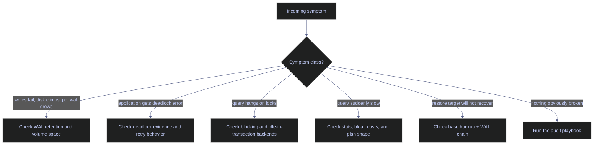
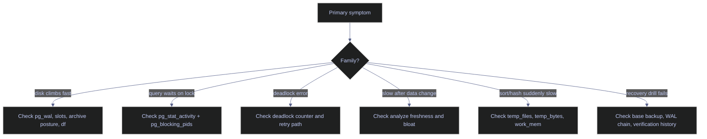

# PostgreSQL Problems

This note plays the same role as the SQL Server problem catalog, but the failure classes change with the engine. PostgreSQL incidents are usually shaped by WAL retention, autovacuum debt, blocking from ordinary transactions, temp-file spills, broken backup chains, and quiet observability gaps such as disabled `pg_stat_statements`. The fastest responders classify the problem family first and only then choose the right query or fix.

> [!abstract]- Summary
>
> The catalog is organized by operational severity rather than by feature area so on-call work maps to the note quickly:
>
> - **Severity and triage**
>   - starts with four severity bands and a symptom-first flowchart
> - **Critical problems**
>   - covers WAL or disk exhaustion, deadlocks, broken recovery chains, and restore-readiness failures
> - **High-severity problems**
>   - covers blocking, stale statistics, bloat, pool exhaustion, and incorrect uniqueness assumptions
> - **Moderate and low-severity problems**
>   - captures the recurring issues that do not always wake on-call but steadily damage performance and safety
> - **Operational reference**
>   - closes with command and setting tables for the commands most often used during response
> - **Live capture context**
>   - captured against `stoxx-postgres` on April 19, 2026 using PostgreSQL 16.13 running in Docker on `localhost:5434`

> [!note]- Glossary
>
> **WAL retention**
> - Amount of write-ahead log PostgreSQL must keep because of replication slots, archiving, or recovery requirements.
> - It matters because uncontrolled retention is the fastest path to filling `pg_wal`.
>
> ---
>
> **Deadlock**
> - Circular lock dependency between sessions, resolved by aborting one participant.
> - It matters because PostgreSQL will not "wait it out"; one transaction loses immediately once the detector fires.
>
> ---
>
> **Blocking chain**
> - Sessions waiting behind a lock-holding backend.
> - It matters because PostgreSQL treats ordinary `SELECT`, `UPDATE`, DDL, and even idle transactions as possible blockers.
>
> ---
>
> **Autovacuum debt**
> - Table cleanup and freeze work that has not kept up with churn.
> - It matters because bloat and eventually transaction-ID risk follow from it.
>
> ---
>
> **Temp spill**
> - Sort, hash, or related executor work that overflowed memory and wrote temporary files.
> - It matters because PostgreSQL often converts memory mistakes directly into disk I/O and latency.

## Severity and Triage

Every problem below is placed in the severity band that reflects its worst plausible outcome, not its average nuisance level.

| Severity | Count | Worst-case impact | Response window | Owner |
|---|---|---|---|---|
| Critical | 5 | restore failure, write outage, or broken recovery objective | immediate | on-call database engineer |
| High | 8 | degraded SLA, blocked pipelines, or silent data-quality drift | same day | senior engineer or team lead |
| Moderate | 7 | recurring pain that can become severe if ignored | current sprint | backlog owner |
| Low | 5 | technical debt and observability gaps | planned maintenance | team |



---

## Critical — Recovery Objective Or Write Availability At Risk

### PostgreSQL | `pg_wal` retention | WAL growth can fill the instance disk

#### Inspect the current WAL-retention posture before the disk fills

Run this as soon as disk usage rises unexpectedly or `pg_wal` growth is suspected. It is typically triggered by storage alerts, lagging replicas, or a recovery design review before a PITR rollout. The query is read-only and safe on the primary. Its purpose is to separate three causes that operators often collapse together: archiving, replication slots, and normal WAL generation.

| Field | Source column | Type | Meaning |
|---|---|---|---|
| `archive_mode` | `current_setting('archive_mode')` | `text` | Whether WAL archiving is enabled. |
| `archive_command` | `current_setting('archive_command')` | `text` | Shell command used when archiving WAL. |
| `wal_level` | `current_setting('wal_level')` | `text` | WAL richness level required for replication or recovery features. |
| `max_wal_size` | `current_setting('max_wal_size')` | `text` | Soft checkpoint target for WAL growth, not a hard cap. |
| `replication_slots` | `COUNT(*) FROM pg_replication_slots` | `bigint` | Number of slots that can retain WAL. |
| `retained_wal_bytes` | `SUM(pg_wal_lsn_diff(...))` | `bigint` bytes | WAL retained by slot restart positions. |

*Show the current WAL retention posture on the primary.*

```sql
SELECT current_setting('archive_mode') AS archive_mode,
       current_setting('archive_command') AS archive_command,
       current_setting('wal_level') AS wal_level,
       current_setting('max_wal_size') AS max_wal_size,
       COUNT(*) AS replication_slots,
       COALESCE(SUM(pg_wal_lsn_diff(pg_current_wal_lsn(), restart_lsn)),0)::bigint AS retained_wal_bytes
FROM pg_replication_slots;
```

| archive_mode | archive_command | wal_level | max_wal_size | replication_slots | retained_wal_bytes |
|---|---|---|---|---|---|
| `off` | `(disabled)` | `replica` | `1GB` | `0` | `0` |

This is a clean lab baseline. There is no archive backlog and no slot retaining WAL. In production, the dangerous rows are the opposite: slots present, `retained_wal_bytes` climbing, or archiving enabled but silently failing. `max_wal_size` is only a checkpoint target; it does not save you from a slot or archive condition that forces PostgreSQL to keep old WAL indefinitely.

### PostgreSQL | concurrent transactions | deadlock during ETL or application writes

#### Prove the deadlock with a real two-session reproduction

Run this pattern when an application reports a deadlock error or when concurrent writers touch the same rows in inconsistent order. It is typically triggered by retried jobs, duplicate queue consumers, or newly parallelized ETL code. The demo below is state-changing but isolated to a disposable table that was removed after capture. Its purpose is to show the evidence surface PostgreSQL actually emits: one failed transaction plus the cumulative `deadlocks` counter in `pg_stat_database`.

The lab reproduced a classic two-row deadlock. Session A committed; session B was chosen as the victim:

```text
BEGIN
SET
UPDATE 1
 pg_sleep
----------

(1 row)

ERROR:  deadlock detected
DETAIL:  Process 674 waits for ShareLock on transaction 1124; blocked by process 664.
Process 664 waits for ShareLock on transaction 1125; blocked by process 674.
HINT:  See server log for query details.
CONTEXT:  while updating tuple (0,1) in relation "note14_deadlock_demo"
```

Then the database counter confirmed the event:

```sql
SELECT deadlocks
FROM pg_stat_database
WHERE datname = 'stoxx';
```

| deadlocks |
|---|
| `1` |

A PostgreSQL deadlock is never fixed by "waiting longer." The fix is consistent object-access order, shorter transactions, or retry logic at the application boundary. The detector will always abort one participant.

### PostgreSQL | data directory volume | disk exhaustion during load or runaway retention

#### Measure the current storage boundary seen by the container

Run this when `COPY`, `INSERT`, autovacuum, or checkpoints start failing with filesystem errors or when you need to quantify how close the data volume is to exhaustion. It is typically triggered by node-level disk alerts or sudden growth in base tables, indexes, or WAL. The command runs in the container shell and is read-only. Its purpose is to distinguish a real storage emergency from a database-internal limit.

*Show the filesystem capacity for the mounted PostgreSQL data directory.*

```text
Filesystem      Size  Used Avail Use% Mounted on
/dev/sdf       1007G   68G  889G   8% /var/lib/postgresql/data
```

The current lab is healthy at `8%` used. In production, the critical boundary is not only data files; `pg_wal`, temporary files, copied logical dumps, and base-backup staging directories all compete for the same underlying storage unless deliberately separated.

### PostgreSQL | backup validation | a backup that has never been restored is still a hypothesis

#### Treat verify-and-restore discipline as part of the backup job

This problem is triggered when teams believe `pg_dump`, `pg_basebackup`, or object-storage upload success implies recoverability. It is critical because PostgreSQL backup success and PostgreSQL restore success are separate questions. Physical backups require consistent WAL, manifest verification, and restore rehearsal. Logical dumps require restore rehearsal against a fresh target. The fix procedure is the one already demonstrated in [[07-postgresql-backup-types-and-strategy]] and [[08-postgresql-restore-and-recovery]]: verify the backup artifact, rehearse recovery, and record exact restore steps instead of trusting file existence.

### PostgreSQL | PITR chain | missing WAL or archive gaps make recovery impossible

#### Protect the base-backup and WAL chain as one recovery unit

This problem appears only when point-in-time recovery is needed, which is exactly why it stays latent until it is catastrophic. A base backup without the required WAL is not a recovery path. A WAL archive without a valid base backup is also not a recovery path. The operational analogue to the SQL Server "lost TDE certificate" failure is a broken PostgreSQL recovery chain: the data exists, but the server cannot reach the target state because part of the required history is gone. The fix is to test PITR end to end, not to assume archiving is healthy because `archive_mode = on`.

---

## High — Degraded SLA, Data Drift, Or Concurrency Pain

### PostgreSQL | `COPY` and ingestion input | malformed rows, encoding drift, or length mismatch

#### Fail early on input quality instead of debugging halfway through the load

The PostgreSQL equivalent of truncation incidents is usually one of three failures: `value too long for type`, bad encoding, or malformed CSV structure. These issues are same-day severity because they stop bronze loads or silently force ad hoc data surgery. The safe pattern is pre-validated staging plus explicit column typing rather than direct blind `COPY` into business tables.

### PostgreSQL | implicit casts | mismatched types can defeat indexes

#### Treat cross-type joins and predicates as plan-shape risks

PostgreSQL will happily coerce many values, but that does not mean the planner can still use the intended index path efficiently. Text-to-integer, timestamp-to-date, and collated-text mismatches belong in the same severity band as SQL Server implicit-conversion incidents: they often look like "the database got slower" even though the root cause is query typing discipline.

### PostgreSQL | prepared plans | generic-plan regression under uneven parameter shapes

#### Watch for plan instability around prepared statements

PostgreSQL's equivalent to parameter-sniffing trouble is often the generic-versus-custom plan boundary for prepared statements. A workload that is selective for one parameter set and broad for another can degrade sharply once PostgreSQL stops generating custom plans and reuses a generic one. The fix path is different from SQL Server, but the symptom is familiar: one query shape, wildly different runtimes.

### PostgreSQL | blocking chain | a single transaction can stall many sessions

#### Surface the blocker and the waiter at the same time

Run this when a query hangs and application timeouts begin stacking up. It is typically triggered by lock waits, stalled ETL, or user transactions left open in interactive tools. The query is read-only and safe. Its purpose is to show both the blocked backend and the specific blocker using `pg_blocking_pids()`.

| Field | Source column | Type | Meaning |
|---|---|---|---|
| `pid` | `pg_stat_activity.pid` | `integer` | Backend process ID. |
| `application_name` | `pg_stat_activity.application_name` | `text` | Client identifier used to separate the blocking and waiting sessions. |
| `state` | `pg_stat_activity.state` | `text` | Backend state such as `active` or `idle in transaction`. |
| `wait_event_type` | `pg_stat_activity.wait_event_type` | `text` | Broad wait family. |
| `wait_event` | `pg_stat_activity.wait_event` | `text` | Specific wait event. |
| `blocking_pids` | `pg_blocking_pids(pid)` | `integer[]` | Backend IDs currently blocking this session. |
| `query` | `pg_stat_activity.query` | `text` | Current statement text. |

*Capture a real lock wait and identify the blocker directly from `pg_stat_activity`.*

```sql
SELECT pid,
       application_name,
       state,
       wait_event_type,
       wait_event,
       pg_blocking_pids(pid) AS blocking_pids,
       LEFT(query, 120) AS query
FROM pg_stat_activity
WHERE application_name IN ('note15_holder','note15_waiter')
ORDER BY application_name;
```

| pid | application_name | state | wait_event_type | wait_event | blocking_pids | query |
|---|---|---|---|---|---|---|
| `549` | `note15_holder` | `active` | `Timeout` | `PgSleep` | `{}` | `BEGIN; UPDATE demo_stc.note15_lock_demo SET payload = 'held-by-holder' WHERE id = 1; SELECT pg_sleep(30); ROLLBACK;` |
| `567` | `note15_waiter` | `active` | `Lock` | `transactionid` | `{549}` | `SET lock_timeout = '25s'; UPDATE demo_stc.note15_lock_demo SET payload = 'waiter-update' WHERE id = 1;` |

This is the ideal blocking diagnostic rowset: one holder, one waiter, and the waiter explicitly naming the blocker PID. The important operational point is that the blocker does not need to look dramatic. A backend sleeping inside an open transaction can still be the head of the chain.

### PostgreSQL | table statistics | stale stats distort row estimates

#### Check whether autovacuum and autoanalyze are actually keeping up

Run this when a query changes plans unexpectedly or after large data changes. It is typically triggered by nightly loads, bulk corrections, or newly skewed data. The query is read-only and safe. Its purpose is to inspect whether PostgreSQL's maintenance loop is refreshing table statistics often enough for the planner to stay truthful.

| Field | Source column | Type | Meaning |
|---|---|---|---|
| `schemaname` | `pg_stat_user_tables.schemaname` | `name` | Schema containing the table. |
| `relname` | `pg_stat_user_tables.relname` | `name` | Table name. |
| `n_live_tup` | `pg_stat_user_tables.n_live_tup` | `bigint` | Estimated live row count. |
| `n_dead_tup` | `pg_stat_user_tables.n_dead_tup` | `bigint` | Estimated dead row count not yet reclaimed. |
| `last_autovacuum` | `pg_stat_user_tables.last_autovacuum` | `timestamptz` | Last autovacuum time for the table. |
| `last_autoanalyze` | `pg_stat_user_tables.last_autoanalyze` | `timestamptz` | Last autoanalyze time for the table. |
| `autovacuum_count` | `pg_stat_user_tables.autovacuum_count` | `bigint` | Number of autovacuums since stats reset. |
| `autoanalyze_count` | `pg_stat_user_tables.autoanalyze_count` | `bigint` | Number of autoanalyzes since stats reset. |

*List the most interesting user tables by dead tuples and row volume.*

```sql
SELECT schemaname,
       relname,
       n_live_tup,
       n_dead_tup,
       last_autovacuum,
       last_autoanalyze,
       vacuum_count,
       autovacuum_count,
       analyze_count,
       autoanalyze_count
FROM pg_stat_user_tables
ORDER BY n_dead_tup DESC, n_live_tup DESC
LIMIT 10;
```

| schemaname | relname | n_live_tup | n_dead_tup | last_autovacuum | last_autoanalyze | vacuum_count | autovacuum_count | analyze_count | autoanalyze_count |
|---|---|---|---|---|---|---|---|---|---|
| `silver` | `eurostoxx50_ohlcv` | `67155` | `0` | `2026-04-18 20:39:30.784519+00` | `2026-04-18 20:39:30.839016+00` | `0` | `1` | `0` | `1` |
| `silver` | `stoxxusa50_ohlcv` | `66000` | `0` | `2026-04-18 20:39:30.996572+00` | `2026-04-18 20:39:31.058322+00` | `0` | `1` | `0` | `1` |
| `silver` | `stoxxasia50_ohlcv` | `64875` | `0` | `2026-04-18 20:39:30.911588+00` | `2026-04-18 20:39:30.970592+00` | `0` | `1` | `0` | `1` |

The lab is healthy here: dead tuples are `0` and autoanalyze has already run. In production, stale stats trouble usually appears as the opposite pattern: large `n_live_tup`, accumulating dead tuples, and old or null analyze timestamps after significant change volume.

### PostgreSQL | heap and index storage | bloat from churn and delayed cleanup

#### Separate true growth from wasted space

PostgreSQL does not fragment in the SQL Server sense, but it absolutely accumulates table and index bloat when churn outpaces vacuum and pruning. The symptom is similar: more I/O, less cache efficiency, and storage growth that does not match business growth. The correct mental model is dead tuples and bloated pages, not leaf-fragmentation percentage.

### PostgreSQL | session pools | leaked or idle sessions can exhaust connection headroom

#### Measure connection headroom against the configured ceiling

Run this when an application starts reporting "too many clients already" or when pool behavior is suspected. It is typically triggered by leaked sessions, disabled transaction pooling, or background jobs opening more connections than expected. The queries are read-only. Their purpose is to compare real session footprint with the configured ceiling and to expose observability gaps such as a missing `pg_stat_statements` installation.

```sql
SELECT name, setting, unit, source
FROM pg_settings
WHERE name IN ('max_connections','shared_preload_libraries')
ORDER BY name;
```

| name | setting | unit | source |
|---|---|---|---|
| `max_connections` | `100` |  | `configuration file` |
| `shared_preload_libraries` |  |  | `default` |

```sql
SELECT state, backend_type, COUNT(*) AS sessions
FROM pg_stat_activity
GROUP BY state, backend_type
ORDER BY backend_type, state;
```

| state | backend_type | sessions |
|---|---|---|
|  | `autovacuum launcher` | `1` |
|  | `background writer` | `1` |
|  | `checkpointer` | `1` |
| `active` | `client backend` | `1` |
|  | `logical replication launcher` | `1` |
|  | `walwriter` | `1` |

The lab is nowhere near `max_connections = 100`, but this output still teaches the right operator habit: count real backends first, then decide whether the problem is connection leakage, pool sizing, or an undersized ceiling. `shared_preload_libraries` being empty also means no cluster-level observability extension has been preloaded yet.

### PostgreSQL | UPSERT semantics | duplicate business keys without real uniqueness

#### Do not treat application logic as a substitute for constraints

`INSERT ... ON CONFLICT` is safe only when the conflict target really exists as a unique or exclusion constraint. Without that constraint, PostgreSQL cannot arbitrate duplicates for you. This lands in the high-severity band because it produces silent data-quality failure rather than a clean exception.

---

## Moderate — Operational Pain That Becomes Expensive If Ignored

### PostgreSQL | numeric arithmetic | overflow or precision loss in derived metrics

#### Make scale and precision decisions explicit in finance-facing SQL

The failure pattern is the same as on SQL Server even though the type system is different. `numeric` is powerful, but derived calculations still fail or drift if scale is not chosen deliberately. In medallion-style pricing or scoring workloads, moderate arithmetic mistakes can become high-severity data-quality incidents.

### PostgreSQL | `timestamp` versus `timestamptz` | time-zone confusion in joins and filters

#### Treat wall-clock and absolute time as different data models

PostgreSQL's `timestamp without time zone` and `timestamp with time zone` confusion is a frequent cause of off-by-hours filtering, especially around ingestion from multiple regions. The issue often hides until daylight-saving or cross-region comparisons arrive. Fix the model, not only the predicate.

### PostgreSQL | `work_mem` | temp-file spill storms under broad sorts or hashes

#### Read the cumulative spill counters before guessing about memory

Run this when queries are slower than expected and temp I/O is suspected. It is typically triggered by sort-heavy reporting, wide hash joins, or intentionally low `work_mem`. The query is read-only and safe. Its purpose is to prove that PostgreSQL is already writing temporary files instead of relying on intuition about memory pressure.

| Field | Source column | Type | Meaning |
|---|---|---|---|
| `datname` | `pg_stat_database.datname` | `name` | Database name. |
| `deadlocks` | `pg_stat_database.deadlocks` | `bigint` | Cumulative deadlock count since stats reset. |
| `temp_files` | `pg_stat_database.temp_files` | `bigint` | Number of temporary files created. |
| `temp_bytes` | `pg_stat_database.temp_bytes` | `text` via `pg_size_pretty` | Size of temporary-file writes. |
| `idle_in_transaction_time` | `pg_stat_database.idle_in_transaction_time` | `double precision` ms | Cumulative time spent idle in transaction. |

*Read temp-file and concurrency counters for the current database.*

```sql
SELECT datname,
       deadlocks,
       temp_files,
       pg_size_pretty(temp_bytes) AS temp_bytes,
       blk_read_time,
       blk_write_time,
       session_time,
       active_time,
       idle_in_transaction_time
FROM pg_stat_database
WHERE datname = 'stoxx';
```

| datname | deadlocks | temp_files | temp_bytes | blk_read_time | blk_write_time | session_time | active_time | idle_in_transaction_time |
|---|---|---|---|---|---|---|---|---|
| `stoxx` | `1` | `2` | `7944 kB` | `0` | `0` | `300976.563` | `297929.887` | `228.329` |

The key signal is `temp_files = 2` and `temp_bytes = 7944 kB`, which matches the controlled external-merge spill reproduced in [[11-postgresql-memory-and-buffer-cache]]. The `deadlocks = 1` value also shows that these counters are cumulative by database: a different incident class can appear in the same rowset, which is why responders must read the column they actually care about rather than treating the entire row as one diagnosis.

### PostgreSQL | autovacuum cadence | lag toward wraparound or maintenance debt

#### Check transaction-ID age before it becomes an emergency

Run this during routine health review or when autovacuum warnings appear in logs. It is typically triggered by large write bursts, disabled autovacuum on selected tables, or concern about wraparound protection. The queries are read-only. Their purpose is to compare real transaction-ID age with the cluster-wide freeze threshold.

```sql
SELECT name, setting, unit, source
FROM pg_settings
WHERE name = 'autovacuum_freeze_max_age';
```

| name | setting | unit | source |
|---|---|---|---|
| `autovacuum_freeze_max_age` | `200000000` |  | `default` |

```sql
SELECT datname,
       age(datfrozenxid) AS xid_age,
       pg_size_pretty(pg_database_size(datname)) AS db_size
FROM pg_database
ORDER BY age(datfrozenxid) DESC;
```

| datname | xid_age | db_size |
|---|---|---|
| `postgres` | `397` | `7671 kB` |
| `stoxx` | `397` | `45 MB` |
| `template1` | `397` | `7425 kB` |
| `template0` | `397` | `7361 kB` |

This lab is extremely safe relative to the freeze limit. The operational point is the ratio, not the absolute number here. A database approaching a material fraction of `200000000` needs immediate autovacuum investigation, not a later tuning ticket.

### PostgreSQL | checkpoints and WAL | undersized WAL settings can force churn

#### Treat frequent checkpoints as write amplification, not background noise

When `max_wal_size` is too small for the write profile, checkpoints fire more often than the workload deserves, dirty buffers are pushed aggressively, and the I/O path gets noisier. The settings row above already shows `max_wal_size = 1GB`; whether that is healthy depends entirely on write volume and checkpoint frequency, not on the number by itself.

### PostgreSQL | idle in transaction | sleeping sessions can still hold locks and xmin

#### Kill the open transaction, not the symptom it created

An idle backend is harmless; an idle backend inside a transaction is not. It can block writers, delay vacuum cleanup, and hold old snapshots alive. PostgreSQL makes this problem especially easy to create from interactive tools and poorly disciplined application code.

### PostgreSQL | collation and locale | mixed sort rules produce inconsistent results

#### Verify locale assumptions whenever data crosses environments

Text ordering, uniqueness semantics, and case behavior can drift across clusters if collations differ. This is usually moderate severity until it intersects with unique keys, text merges, or user-visible ordering logic.

---

## Low — Technical Debt And Observability Gaps

### PostgreSQL | `SELECT *` | row-width coupling and wasted I/O

#### Keep projection lists explicit in persistent code

The anti-pattern is identical to every other engine: `SELECT *` couples code to schema shape, defeats narrow index strategies, and widens rows unnecessarily. PostgreSQL's tuple model does not rescue the habit.

### PostgreSQL | `pg_stat_statements` | not enabled where it would actually help

#### Confirm whether statement-level workload visibility exists

Run this during platform review or before a major tuning effort. It is typically triggered by "what is actually expensive?" questions. The commands are read-only. Their purpose is to distinguish "extension is available" from "extension is installed and preloaded correctly."

```sql
SELECT name, installed_version, default_version
FROM pg_available_extensions
WHERE name = 'pg_stat_statements';
```

| name | installed_version | default_version |
|---|---|---|
| `pg_stat_statements` |  | `1.10` |

```sql
SELECT extname, extversion
FROM pg_extension
WHERE extname = 'pg_stat_statements';
```

| extname | extversion |
|---|---|
| *(0 rows)* |  |

The extension is available but not installed, and the earlier settings capture showed `shared_preload_libraries` empty. That is a low-severity issue today only because this is a lab. On a busy production cluster, lacking statement history materially slows every tuning investigation.

### PostgreSQL | PL/pgSQL loops | row-by-row procedural work in place of set-based SQL

#### Use procedural code only where relational algebra stops helping

The engine can do row-by-row work, but it is rarely the most efficient shape for bulk transformations. This lands in low severity because the problem is usually design debt rather than an outage, yet it steadily increases CPU and maintenance cost.

### PostgreSQL | transaction and error discipline | scripts that half-fail leave messy state

#### Make rollback behavior explicit in scripts and maintenance jobs

Interactive `psql` sessions, ad hoc scripts, and multi-step maintenance tasks often fail not because one statement is wrong, but because error handling and transaction boundaries were never defined. PostgreSQL is predictable here; sloppy operator code is not.

### PostgreSQL | container and filesystem permissions | ownership drift breaks startup and security settings

#### Respect the files that PostgreSQL must own itself

This problem already surfaced in the lab: `postgresql.auto.conf` temporarily ended up owned by `root`, which caused `ALTER SYSTEM` to fail until ownership returned to `postgres`. The same class of error affects TLS key files, socket directories, and mounted volumes. It looks minor until a restart or config change suddenly fails.

---

## Operational Reference Tables

### `pg_dump`, `pg_basebackup`, and verification surfaces

| Tool or surface | Purpose | Main use |
|---|---|---|
| `pg_dump -Fc` | logical custom-format dump | object-level restore, schema review, selective replay |
| `pg_dumpall --globals-only` | cluster-global objects | roles and tablespaces alongside logical recovery |
| `pg_basebackup` | physical base backup | replica seeding and PITR base state |
| `pg_verifybackup` | backup manifest validation | verify physical backup completeness before trusting it |
| `pg_receivewal` | WAL streaming to archive location | capture WAL continuously for physical recovery workflows |

### Settings that commonly appear in response work

| Setting | What it controls | Current lab value | Why it matters |
|---|---|---|---|
| `max_connections` | connection ceiling | `100` | pool exhaustion and backend count always start here |
| `work_mem` | per sort/hash memory budget | `4096 kB` | low values create spill risk; high values multiply dangerously |
| `max_wal_size` | checkpoint target for WAL growth | `1GB` | too small can create checkpoint churn |
| `autovacuum_freeze_max_age` | wraparound-protection threshold | `200000000` | xid age must stay comfortably below it |
| `shared_preload_libraries` | preload-only extension surface | empty | determines whether features like `pg_stat_statements` can exist |

## Diagnostic Decision Flow



## Related

- [[07-postgresql-backup-types-and-strategy]]
- [[08-postgresql-restore-and-recovery]]
- [[11-postgresql-memory-and-buffer-cache]]
- [[15-postgresql-troubleshooting-flowcharts]]
- [[16-postgresql-performance-audit-playbook]]
