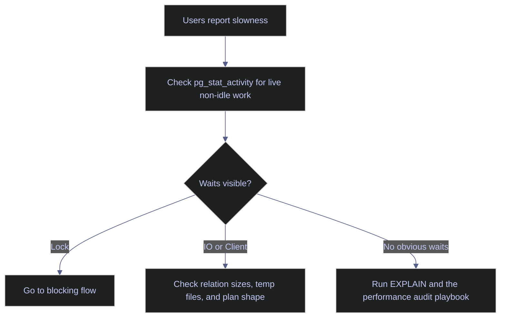
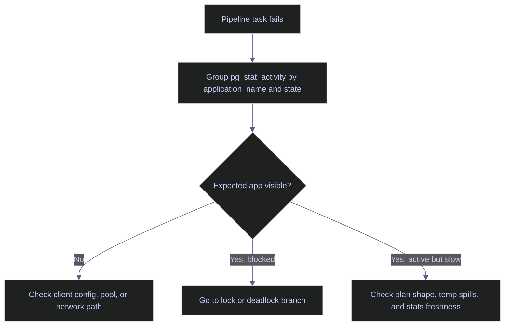
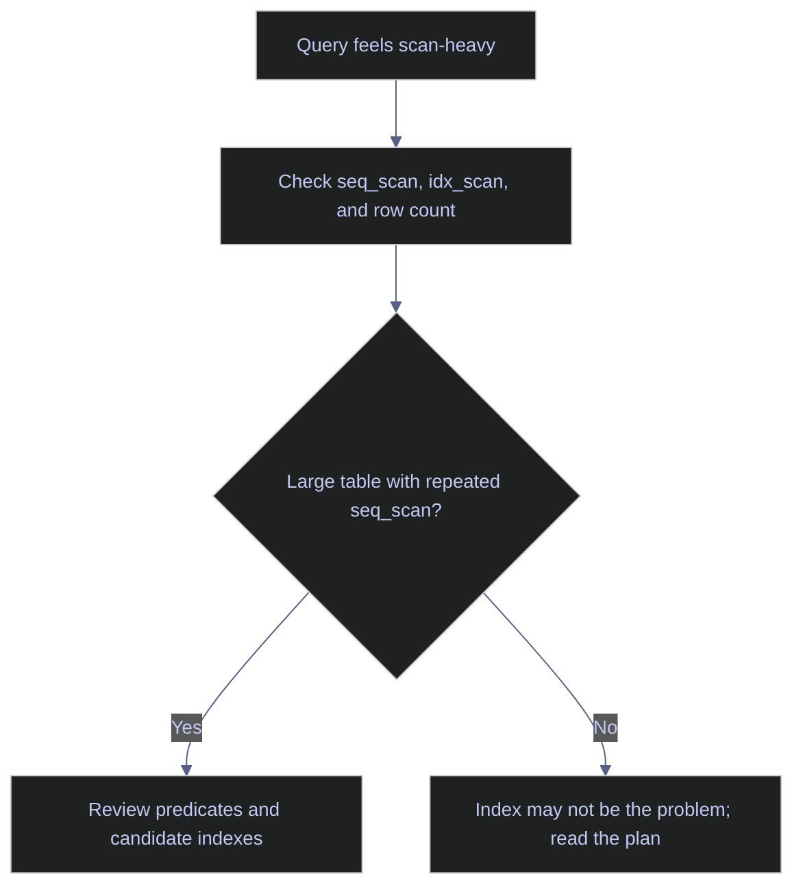
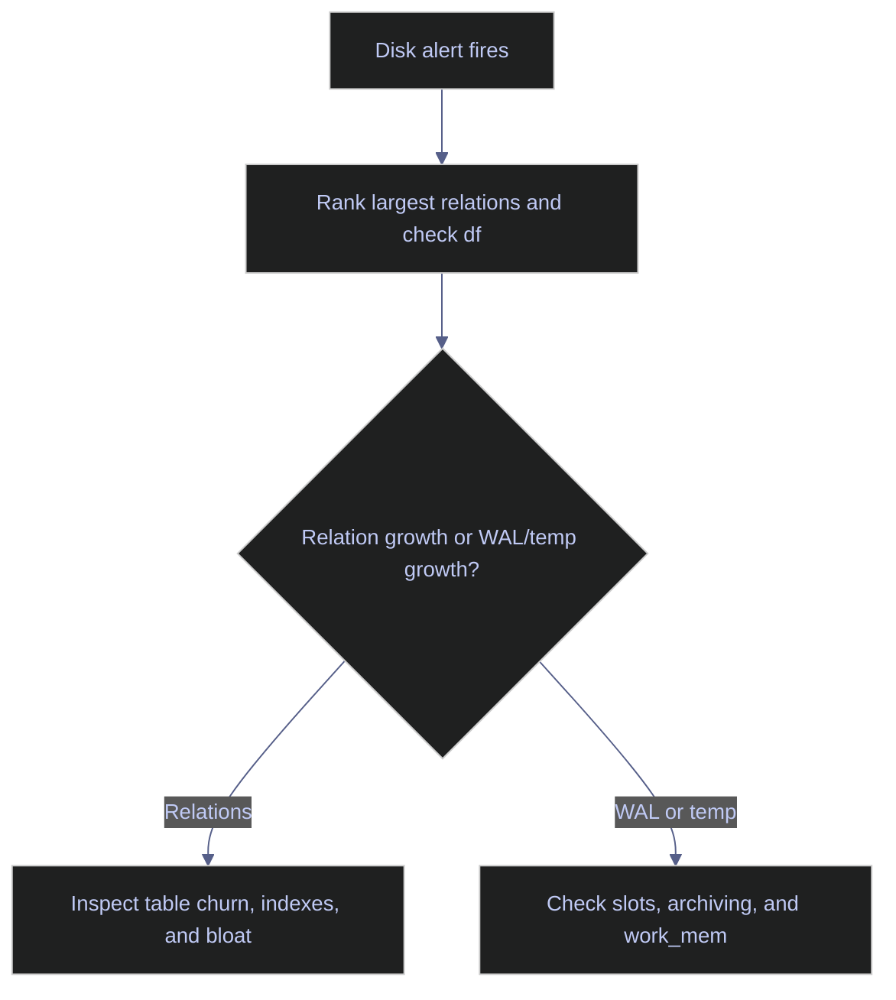
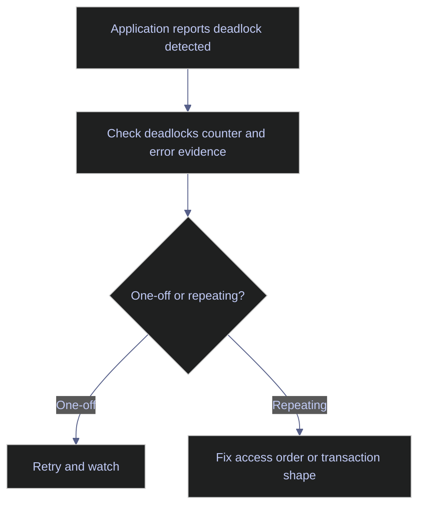
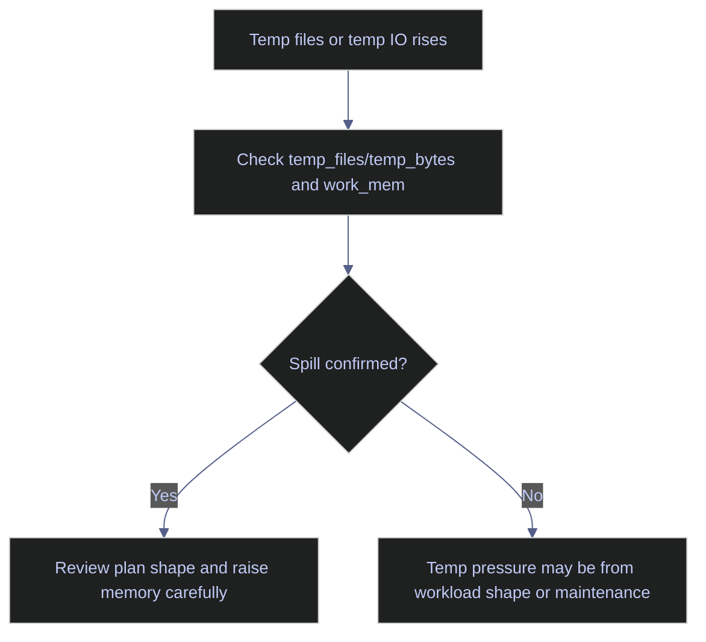
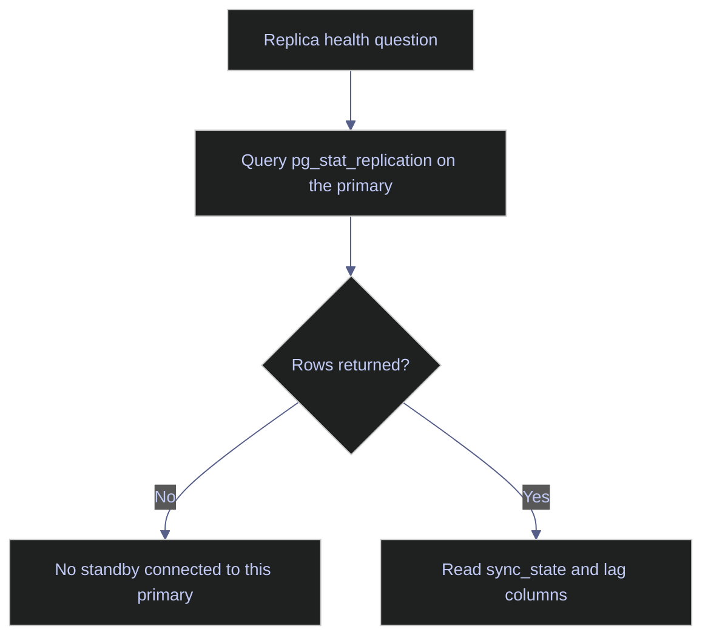

# PostgreSQL Troubleshooting Flowcharts

This page is a routing layer, not the full remediation manual. Its job is to answer the first question fast: which surface should you open first, what evidence actually exists in core PostgreSQL, and which deeper note owns the follow-up. The biggest translation error from SQL Server is to look for one cumulative wait-stats DMV. Core PostgreSQL does not provide that exact surface, so routing starts from live activity, table statistics, I/O counters, relation sizes, and replication views instead.

> [!abstract]- Summary
>
> The page mirrors the SQL Server troubleshooting note, but adapts each branch to PostgreSQL's real diagnostic surfaces:
>
> - **Master routing**
>   - maps symptom classes to the first flowchart, the primary system view, and the owning deep note
> - **Performance and pipeline flowcharts**
>   - route generic slowness and failed pipeline tasks through `pg_stat_activity`, application names, and maintenance evidence
> - **Index and storage decisions**
>   - start with table-scan patterns and relation-size facts before anyone proposes structural change
> - **Concurrency and temp work**
>   - split lock waits, deadlocks, and temp-file pressure into separate branches because the fixes are different
> - **Replication**
>   - uses `pg_stat_replication` to distinguish "no replica", "healthy replica", and "replica behind"
> - **Live evidence discipline**
>   - every starter query below was run against the live lab, even when the correct answer on this standalone instance is "no standby configured"

> [!note]- Glossary
>
> **Starter query**
> - First low-cost query used to classify the incident before deep tuning starts.
> - It matters because routing mistakes waste more time than slow queries.
>
> ---
>
> **`pg_stat_activity`**
> - View of current backends, queries, wait events, and states.
> - It matters because it is PostgreSQL's first-response surface for live incidents.
>
> ---
>
> **`pg_stat_user_tables`**
> - Per-table activity counters including sequential scans, dead tuples, and maintenance timestamps.
> - It matters because indexing and stale-statistics questions often start here.
>
> ---
>
> **`pg_stat_replication`**
> - Primary-side view of connected standbys and their lag positions.
> - It matters because it cleanly distinguishes replica lag from "no standby exists."

> [!info] Permissions note
>
> PostgreSQL does not use SQL Server-style performance-reader roles. In practice, the safe read-only diagnostic role is usually membership in `pg_monitor` or `pg_read_all_stats`, depending on how much visibility the team wants to grant. Superuser is not required for the starter queries below, but ordinary application roles typically cannot see the full cluster-wide surface.

## Master Decision Matrix

| Symptom class | First flowchart | Primary surface | Primary deep note |
|---|---|---|---|
| General slowness | [Flowchart 1](#flowchart-1-why-is-it-slow--start-with-live-activity-not-frozen-folklore) | `pg_stat_activity` | [[16-postgresql-performance-audit-playbook]] |
| Pipeline task failed | [Flowchart 2](#flowchart-2-pipeline-failed--find-the-application-session-shape) | `pg_stat_activity` grouped by `application_name` | [[14-postgresql-problems]] |
| "Should I add an index?" | [Flowchart 3](#flowchart-3-should-i-add-an-index--check-scan-shape-first) | `pg_stat_user_tables` | [[16-postgresql-performance-audit-playbook]] |
| Disk-space emergency | [Flowchart 4](#flowchart-4-disk-space-emergency--separate-relation-growth-from-volume-exhaustion) | relation sizes plus `df` | [[14-postgresql-problems]] |
| Deadlock reported | [Flowchart 5](#flowchart-5-deadlock-reported--retry-vs-code-fix) | `pg_stat_database.deadlocks` and error evidence | [[14-postgresql-problems]] |
| Temp work exploding | [Flowchart 6](#flowchart-6-temp-under-pressure--spill-vs-memory-budget) | `pg_stat_database` and `pg_settings` | [[11-postgresql-memory-and-buffer-cache]] |
| Replica behind | [Flowchart 7](#flowchart-7-replica-fallen-behind--lag-vs-no-standby) | `pg_stat_replication` | [[10-postgresql-streaming-replication-and-failover]] |

## Flowchart 1: "Why Is It Slow?" — Start With Live Activity, Not Frozen Folklore



### PostgreSQL | `pg_stat_activity` | inspect live activity and wait events

#### Start with what the server is doing right now

Run this first when the complaint is simply "the database is slow." It is typically triggered before any specific query ID or blocker is known. The query is read-only and cluster-safe. Its purpose is to classify live work by state and wait family, which is PostgreSQL's core alternative to a built-in cumulative wait-stats DMV.

```sql
SELECT application_name,
       state,
       wait_event_type,
       wait_event,
       backend_type,
       LEFT(query, 100) AS query
FROM pg_stat_activity
WHERE backend_type = 'client backend'
ORDER BY state, application_name;
```

| application_name | state | wait_event_type | wait_event | backend_type | query |
|---|---|---|---|---|---|
| `psql` | `active` |  |  | `client backend` | `SELECT application_name, state, wait_event_type, wait_event, backend_type, LEFT(query, 100) AS query` |

This snapshot is healthy and boring by design: one active `psql` backend and no visible waits. That is still useful. It tells the operator the cluster is not currently locked, I/O-stalled, or swamped with active client backends. When the rowset is noisy, route by `wait_event_type` first.

## Flowchart 2: "Pipeline Failed" — Find The Application Session Shape



### PostgreSQL | `pg_stat_activity` by `application_name` | see the current client footprint

#### Verify whether the expected client workload is even present

Run this when an orchestrator, worker, or API tier reports failure and you need to know whether sessions are reaching PostgreSQL at all. It is typically triggered by Airflow, scheduler, or service alarms. The query is read-only. Its purpose is to turn a vague "pipeline failed" report into a concrete session-shape question.

```sql
SELECT COALESCE(NULLIF(application_name, ''), '(blank)') AS application_name,
       state,
       COUNT(*) AS sessions
FROM pg_stat_activity
WHERE backend_type = 'client backend'
GROUP BY COALESCE(NULLIF(application_name, ''), '(blank)'), state
ORDER BY COUNT(*) DESC, application_name;
```

| application_name | state | sessions |
|---|---|---|
| `psql` | `active` | `1` |

On this lab the client footprint is just the interactive `psql` session. In production, this query immediately separates "the pipeline is not even connected" from "the pipeline is connected but blocked or slow."

## Flowchart 3: "Should I Add an Index?" — Check Scan Shape First



### PostgreSQL | `pg_stat_user_tables` | inspect sequential versus indexed access patterns

#### Use table-level scan evidence before proposing new indexes

Run this before creating any new index in response to a slow query complaint. It is typically triggered by broad scans, plan-review sessions, or "optimizer should use an index" arguments. The query is read-only. Its purpose is to show whether repeated sequential access is happening on tables large enough for the pattern to matter.

```sql
SELECT schemaname,
       relname,
       seq_scan,
       idx_scan,
       n_live_tup
FROM pg_stat_user_tables
ORDER BY seq_scan DESC, idx_scan DESC
LIMIT 10;
```

| schemaname | relname | seq_scan | idx_scan | n_live_tup |
|---|---|---|---|---|
| `silver` | `stoxxusa50_ohlcv` | `25` | `0` | `66000` |
| `bronze` | `signals_daily` | `6` | `0` | `169` |
| `silver` | `eurostoxx50_ohlcv` | `6` | `0` | `67155` |

The right read is not "build indexes everywhere `idx_scan = 0`." Small tables often should scan. The interesting rows are the larger `silver` tables where repeated `seq_scan` counts exist alongside meaningful row counts. That is a plan-review candidate, not an automatic DDL order.

## Flowchart 4: "Disk Space Emergency" — Separate Relation Growth From Volume Exhaustion



### PostgreSQL | relation sizes | identify the heaviest tables first

#### Rank user relations by total on-disk size

Run this when storage pressure is real and you need to know which objects are consuming space before taking action. It is typically triggered by low-space alerts or before a cleanup window. The query is read-only. Its purpose is to split heap size from index size and point the next investigation at the right relations.

```sql
SELECT n.nspname AS schema_name,
       c.relname AS relation_name,
       pg_size_pretty(pg_total_relation_size(c.oid)) AS total_size,
       pg_size_pretty(pg_relation_size(c.oid)) AS heap_size,
       pg_size_pretty(pg_indexes_size(c.oid)) AS indexes_size
FROM pg_class AS c
JOIN pg_namespace AS n
  ON n.oid = c.relnamespace
WHERE c.relkind = 'r'
  AND n.nspname NOT IN ('pg_catalog','information_schema')
ORDER BY pg_total_relation_size(c.oid) DESC
LIMIT 10;
```

| schema_name | relation_name | total_size | heap_size | indexes_size |
|---|---|---|---|---|
| `silver` | `eurostoxx50_ohlcv` | `9520 kB` | `8000 kB` | `1488 kB` |
| `silver` | `stoxxusa50_ohlcv` | `9496 kB` | `8000 kB` | `1464 kB` |
| `silver` | `stoxxasia50_ohlcv` | `8960 kB` | `7488 kB` | `1440 kB` |

This tells the operator immediately that the large OHLCV fact-like tables dominate current storage, not the smaller dimension tables. Pair this with the host `df` result before deciding whether the emergency is database growth, WAL retention, or plain filesystem exhaustion.

## Flowchart 5: "Deadlock Reported" — Retry Vs. Code Fix



### PostgreSQL | `pg_stat_database.deadlocks` | confirm whether the database has seen the event

#### Read the cumulative deadlock counter for the affected database

Run this after any deadlock error or retry storm. It is typically triggered by job failures, lock-ordering regressions, or new concurrency in ETL code. The query is read-only. Its purpose is to confirm that the database recorded the event even if the application log is incomplete.

```sql
SELECT deadlocks
FROM pg_stat_database
WHERE datname = 'stoxx';
```

| deadlocks |
|---|
| `1` |

That non-zero count matches the live two-session deadlock reproduced in [[14-postgresql-problems]]. A rising counter means the issue is systemic enough to deserve code or transaction-shape changes, not only client retries.

## Flowchart 6: "Temp Under Pressure" — Spill Vs. Memory Budget



### PostgreSQL | `pg_stat_database` and `pg_settings` | confirm temp-file pressure and memory budget

#### Read spill evidence and the current memory knobs together

Run this when sorts or hashes are suspected of spilling. It is typically triggered by sudden query slowdowns or temp-disk growth. Both queries are read-only. Their purpose is to connect what already happened (`temp_files`, `temp_bytes`) to the configured memory budget (`work_mem`, `maintenance_work_mem`).

```sql
SELECT name, setting, unit
FROM pg_settings
WHERE name IN ('work_mem','maintenance_work_mem')
ORDER BY name;
```

| name | setting | unit |
|---|---|---|
| `maintenance_work_mem` | `65536` | `kB` |
| `work_mem` | `4096` | `kB` |

Use these settings with the spill counters from [[14-postgresql-problems]] and the reproduced external-merge sort from [[11-postgresql-memory-and-buffer-cache]]. The key routing question is simple: if `temp_bytes` is growing and `work_mem` is small, fix plan shape and memory budgeting before blaming storage.

## Flowchart 7: "Replica Fallen Behind" — Lag Vs. No Standby



### PostgreSQL | `pg_stat_replication` | distinguish lag from the absence of a standby

#### Ask the primary whether any standby is actually attached

Run this as soon as someone says a replica is behind. It is typically triggered by replication alarms, failover drills, or confusion about whether a standby exists at all. The query is read-only and must run on the primary. Its purpose is to prevent operators from diagnosing lag on a server that does not currently have a connected standby.

```sql
SELECT application_name,
       client_addr,
       state,
       sync_state,
       write_lag,
       flush_lag,
       replay_lag
FROM pg_stat_replication;
```

| application_name | client_addr | state | sync_state | write_lag | flush_lag | replay_lag |
|---|---|---|---|---|---|---|
| *(0 rows)* |  |  |  |  |  |  |

This zero-row result is the correct answer on the current standalone lab: there is no connected standby. In a replication-enabled environment, the same query becomes the first health split between "standby exists but is lagging" and "there is no attached standby to diagnose."
