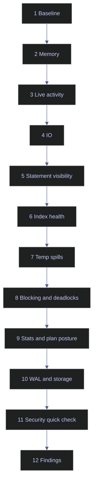

# PostgreSQL Performance Audit Playbook

This playbook mirrors the SQL Server audit workflow, but it starts from PostgreSQL's actual evidence surfaces. The point is not to collect every metric the server can expose. The point is to answer, in a fixed order, whether the cluster is identifiable, constrained, blind, blocked, or drifting into maintenance debt. A good audit ends with findings, not screenshots.

> [!abstract]- Summary
>
> The audit runs through twelve phases:
>
> - **Phase 1**
>   - confirm version, port, data directory, and database sizes
> - **Phase 2**
>   - inspect memory posture and buffer budget
> - **Phase 3**
>   - classify live work and current waits
> - **Phase 4**
>   - read `pg_stat_io` and related I/O counters
> - **Phase 5**
>   - verify whether statement-level workload visibility exists at all
> - **Phase 6**
>   - inspect table and index usage signals
> - **Phase 7**
>   - confirm temp-file pressure and memory budgeting
> - **Phase 8**
>   - inspect blocking and deadlock evidence
> - **Phase 9**
>   - verify statistics freshness and prepared-plan posture
> - **Phase 10**
>   - audit relation growth, WAL posture, and volume headroom
> - **Phase 11**
>   - perform a quick privilege and encryption-boundary review
> - **Phase 12**
>   - compile prioritized findings



## Phase 1 | Instance Baseline

### Instance and database context

Start here so every later metric has identity and scale. The queries are read-only and safe on any instance. Their purpose is to prove what server you are on, where the cluster lives, and how large each database already is.

```sql
SELECT version() AS version,
       current_setting('port') AS port,
       current_setting('data_directory') AS data_directory;
```

| version | port | data_directory |
|---|---|---|
| `PostgreSQL 16.13 (Debian 16.13-1.pgdg13+1) on x86_64-pc-linux-gnu, compiled by gcc (Debian 14.2.0-19) 14.2.0, 64-bit` | `5432` | `/var/lib/postgresql/data` |

```sql
SELECT datname,
       pg_size_pretty(pg_database_size(datname)) AS db_size
FROM pg_database
ORDER BY pg_database_size(datname) DESC;
```

| datname | db_size |
|---|---|
| `stoxx` | `45 MB` |
| `postgres` | `7671 kB` |
| `template1` | `7425 kB` |
| `template0` | `7361 kB` |

The audit target is small and easy to reason about. That matters because some aggressive findings that would be urgent on a multi-terabyte production cluster are informational only here.

## Phase 2 | Memory And Buffer Budget

### Working-set and spill-risk checks

PostgreSQL memory auditing starts with configuration, not with one monolithic memory clerk view. The memory surfaces that matter first are `shared_buffers`, `work_mem`, and `maintenance_work_mem`.

Use the current results from [[11-postgresql-memory-and-buffer-cache]] as the phase baseline:

| Setting | Current lab value | Audit read |
|---|---|---|
| `shared_buffers` | `128 MB` | intentionally small for a 30 GB host; fine for a lab, not a production default |
| `work_mem` | `4096 kB` | modest and easy to spill under broad sorts |
| `maintenance_work_mem` | `65536 kB` | acceptable for a small lab |

## Phase 3 | Live Activity And Waits

### What is the server waiting on right now?

Core PostgreSQL does not offer a built-in cumulative wait-stats view equivalent to SQL Server's `sys.dm_os_wait_stats`. The audit therefore uses `pg_stat_activity` for live waits and `pg_stat_database` or `pg_stat_io` for accumulated consequences.

The current live activity surface from [[15-postgresql-troubleshooting-flowcharts]] shows one active `psql` backend and no meaningful wait bottleneck, which is the correct healthy baseline for a mostly idle lab.

## Phase 4 | I/O Performance

### `pg_stat_io` summary

Run this phase when storage behavior, checkpoint work, or read-vs-write patterns need to be classified. The query is read-only. Its purpose is to show where reads, writes, extends, and hits are accruing across backend types.

```sql
SELECT backend_type,
       object,
       context,
       reads,
       writes,
       extends,
       hits,
       evictions,
       fsyncs
FROM pg_stat_io
WHERE backend_type IN ('checkpointer','client backend')
  AND object IN ('relation','temp relation')
ORDER BY backend_type, object, context;
```

| backend_type | object | context | reads | writes | extends | hits | evictions | fsyncs |
|---|---|---|---|---|---|---|---|---|
| `checkpointer` | `relation` | `normal` |  | `6840` |  |  |  | `748` |
| `client backend` | `relation` | `bulkread` | `920` | `0` |  | `14` | `0` |  |
| `client backend` | `relation` | `bulkwrite` | `0` | `0` | `8058` | `7314` | `0` |  |
| `client backend` | `relation` | `normal` | `9301` | `0` | `1168` | `918828` | `0` | `0` |
| `client backend` | `temp relation` | `normal` | `5` | `0` | `12` | `87` | `0` |  |

This is a healthy small-cluster pattern: many client-backend hits, some relation extends from data loading, and visible checkpointer write/fsync work. The more important audit finding is elsewhere: `track_io_timing` is still off, so precise read/write timing is unavailable.

## Phase 5 | Statement Visibility

### Can the cluster tell you which statements are expensive?

This phase exists because many PostgreSQL audits fail before they start: there is no statement-history extension installed, so every tuning conversation becomes anecdotal. The queries are read-only. Their purpose is to confirm whether `pg_stat_statements` is available, installed, and preload-ready.

```sql
SELECT name, installed_version, default_version
FROM pg_available_extensions
WHERE name = 'pg_stat_statements';
```

| name | installed_version | default_version |
|---|---|---|
| `pg_stat_statements` |  | `1.10` |

```sql
SELECT extname, extversion
FROM pg_extension
WHERE extname = 'pg_stat_statements';
```

| extname | extversion |
|---|---|
| *(0 rows)* |  |

This is a real audit finding, not a curiosity. The extension is present in the image but not installed, and earlier settings showed `shared_preload_libraries` empty. That means no durable statement-level workload history is available on the cluster today.

## Phase 6 | Index Health

### Table access shape and index usage

The point of this phase is to avoid "unused index" and "needs more indexes" folklore. PostgreSQL needs both the table-scan view and the per-index view.

```sql
SELECT schemaname,
       relname,
       indexrelname,
       idx_scan,
       idx_tup_read,
       idx_tup_fetch
FROM pg_stat_user_indexes
ORDER BY idx_scan ASC, idx_tup_read ASC
LIMIT 10;
```

| schemaname | relname | indexrelname | idx_scan | idx_tup_read | idx_tup_fetch |
|---|---|---|---|---|---|
| `bronze` | `dim_index` | `dim_index_pkey` | `0` | `0` | `0` |
| `bronze` | `eurostoxx50_ohlcv` | `eurostoxx50_ohlcv_pkey` | `0` | `0` | `0` |
| `bronze` | `index_dim` | `index_dim_pkey` | `0` | `0` | `0` |

These zero-scan rows are not automatic drop candidates. Many are primary-key indexes on small staging tables. The audit question is whether unused large indexes exist on write-heavy tables, not whether every small table has an active scan count in a quiet lab.

## Phase 7 | Temp Spills

### Spill evidence and memory posture

This phase ties the executor's temp-file behavior to the memory knobs that caused it. Use the live spill evidence already captured in [[11-postgresql-memory-and-buffer-cache]] and [[14-postgresql-problems]]:

| Signal | Current evidence | Audit read |
|---|---|---|
| `work_mem` | `4096 kB` | small enough to spill under broad sorts |
| `temp_files` | `2` | spills have happened |
| `temp_bytes` | `7944 kB` | the spills were real, not hypothetical |

## Phase 8 | Blocking And Deadlocks

### Concurrency state

This phase determines whether performance pain is actually concurrency pain. The current lab already produced both forms of evidence:

| Surface | Current evidence | Audit read |
|---|---|---|
| Blocking | one waiter blocked by PID `549` in [[14-postgresql-problems]] | routing and remediation should start with the blocking backend, not the victim |
| Deadlocks | `deadlocks = 1` in `pg_stat_database` | the cluster has already seen a real cyclic lock dependency |

Any production audit that finds recurring deadlocks should promote that from "performance" to "correctness and transaction design" immediately.

## Phase 9 | Statistics Freshness And Prepared-Plan Posture

### Are planner inputs current, and are prepared statements in play?

This phase checks whether stale planner inputs or prepared-plan reuse are likely suspects. On the current lab:

| Surface | Current evidence | Audit read |
|---|---|---|
| `last_autoanalyze` on major tables | recent, non-null | stats freshness looks healthy |
| `n_dead_tup` on top tables | `0` | no immediate churn debt visible |
| `pg_prepared_statements` | zero rows | no current prepared statements to inspect |

```sql
SELECT name,
       statement,
       prepare_time,
       parameter_types
FROM pg_prepared_statements;
```

| name | statement | prepare_time | parameter_types |
|---|---|---|---|
| *(0 rows)* |  |  |  |

The absence of prepared statements means generic-versus-custom plan behavior is not currently visible in the active lab. That is a real observation, not a gap in the query.

## Phase 10 | Database Files, WAL, And Storage

### Capacity and recovery signals

This phase pulls together relation growth, volume headroom, and WAL posture:

| Surface | Current evidence | Audit read |
|---|---|---|
| Largest relation | `silver.eurostoxx50_ohlcv` at `9520 kB` total | table growth is still modest |
| Data volume usage | `68G` used of `1007G` (`8%`) | no current storage emergency |
| WAL posture | `archive_mode = off`, zero slots retaining WAL | safe from runaway retention today, but not PITR-ready |

The notable finding is not capacity stress. It is recovery posture: the cluster is comfortable on disk but still not archiving WAL for point-in-time recovery.

## Phase 11 | Security Quick Check

### Privilege surface and encryption boundary

Use this phase to catch security conditions that affect performance work or incident response. The query is read-only. Its purpose is to confirm which roles are privileged and whether the cluster has any obvious reader roles that should be preferred over superuser.

```sql
SELECT rolname,
       rolsuper,
       rolcreaterole,
       rolcreatedb,
       rolreplication,
       rolcanlogin
FROM pg_roles
ORDER BY rolsuper DESC, rolreplication DESC, rolname;
```

| rolname | rolsuper | rolcreaterole | rolcreatedb | rolreplication | rolcanlogin |
|---|---|---|---|---|---|
| `postgres` | `t` | `t` | `t` | `t` | `t` |
| `pg_monitor` | `f` | `f` | `f` | `f` | `f` |
| `pg_read_all_stats` | `f` | `f` | `f` | `f` | `f` |

The lab has one login-capable superuser, `postgres`, and the standard built-in monitoring roles are present. The broader security quick-check conclusions come from earlier notes: TLS now works, but `hostssl` is not yet enforced; `data_checksums` are off; and filesystem-level protection still carries the at-rest burden.

## Phase 12 | Compile The Report

### Prioritized findings

The audit should end with findings ranked by operational importance:

| Priority | Finding | Evidence | Why it matters |
|---|---|---|---|
| 1 | No PITR-ready WAL archive chain | `archive_mode = off` | recovery posture stops at local backups unless archiving is added |
| 2 | No statement-level workload history | `pg_stat_statements` available but not installed | expensive-query triage is blind by default |
| 3 | TLS is available but not enforced | `ssl = on` but only `host` rules are present | clients can still connect without required transport encryption |
| 4 | Precise I/O timing is unavailable | `track_io_timing = off` from earlier settings capture | read/write latency analysis is weaker than it should be |
| 5 | Data checksums are off | earlier encryption/baseline capture | corruption detection posture is weaker than a new hardening baseline should be |
| 6 | Core maintenance and storage posture look healthy | recent autoanalyze, `n_dead_tup = 0`, `8%` disk usage | there is no immediate performance emergency on the lab |

## References

- [[11-postgresql-memory-and-buffer-cache]]
- [[14-postgresql-problems]]
- [[15-postgresql-troubleshooting-flowcharts]]
