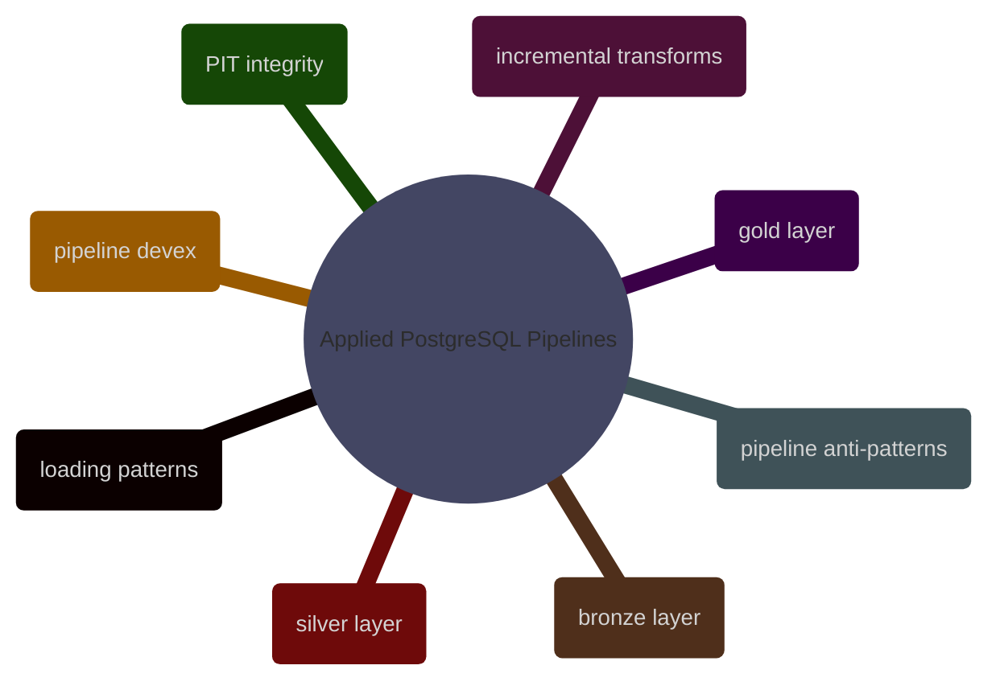

# Applied PostgreSQL Pipelines

This domain applies PostgreSQL to pipeline construction rather than to generic DBA or query-writing work. It owns ingestion patterns, incremental movement, medallion implementation, point-in-time correctness, and pipeline-specific operational guidance.

## Loading and Incremental Movement

> [!abstract]- [[01-postgresql-loading-patterns-and-idempotency]]

> [!abstract]- [[05-postgresql-incremental-transforms]]

> [!abstract]- [[08-postgresql-pipeline-anti-patterns]]

## Bronze, Silver, and Gold Implementation

> [!abstract]- [[02-postgresql-bronze-layer-loading]]

> [!abstract]- [[03-postgresql-silver-transforms]]

> [!abstract]- [[04-postgresql-gold-transforms]]

## Operability, Observability, and Historical Correctness

> [!abstract]- [[07-postgresql-pipeline-integration-and-devex]]

> [!abstract]- [[06-postgresql-pit-integrity-logic]]
