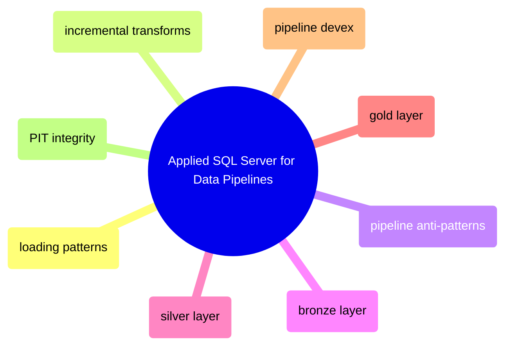

# Applied SQL Server for Data Pipelines

This domain applies SQL Server to pipeline construction rather than to generic DBA or query-tuning work. It owns ingestion patterns, incremental movement, medallion implementation, point-in-time correctness, and pipeline-specific operational guidance.

## Loading and Incremental Movement

> [!abstract]- [[01-sql-server-loading-patterns]]

> [!abstract]- [[05-sql-server-incremental-transforms]]

> [!abstract]- [[08-sql-server-pipeline-anti-patterns]]

## Bronze, Silver, and Gold Implementation

> [!abstract]- [[02-bronze-layer-loading]]

> [!abstract]- [[03-silver-transforms]]

> [!abstract]- [[04-gold-transforms]]

## Operability, Observability, and Historical Correctness

> [!abstract]- [[07-pipeline-integration-and-devex]]

> [!abstract]- [[06-pit-integrity-logic]]
