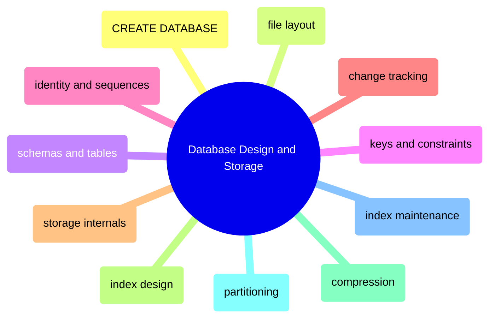

# Database Design and Storage

This domain owns the database objects themselves: how databases are created, how schemas and tables are shaped, how keys and constraints are chosen, how change history is captured, and how the physical storage layer is designed and maintained.

## Database Creation and Structural Defaults

> [!abstract]- [[01-database-creation-and-file-layout]]

> [!abstract]- [[05-sql-server-schema-layering]]

## Schemas, Tables, Keys, and Constraints

> [!abstract]- [[03-schemas-tables-and-constraints]]

> [!abstract]- [[04-keys-defaults-identity-and-sequences]]

> [!abstract]- [[10-sql-server-change-tracking]]

## Physical Storage, Indexes, and Compression

> [!abstract]- [[02-storage-internals]]

> [!abstract]- [[06-index-types-and-strategy]]

> [!abstract]- [[08-table-compression]]

> [!abstract]- [[09-partitioning-strategies]]

## Maintenance and Lifecycle

> [!abstract]- [[07-index-maintenance]]
