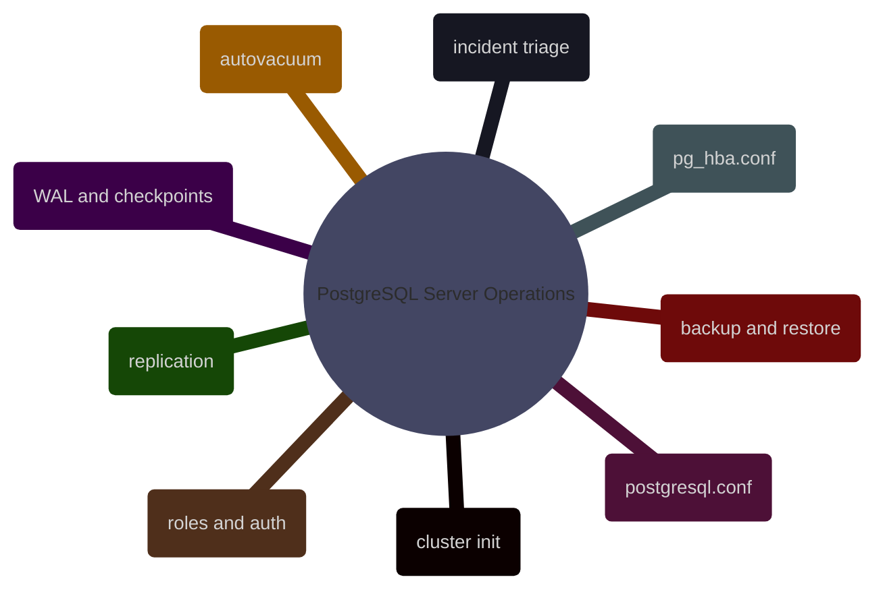

# PostgreSQL Server Operations

This domain owns PostgreSQL as a running service: cluster initialization, configuration files, connectivity, roles and authentication, backup and restore, WAL and checkpoint behavior, replication, observability, and operational recovery under production pressure.

## Configuration Baseline

> [!abstract]- [[01-postgresql-server-configuration]]

## Environment and Connectivity

> [!abstract]- [[02-psql-connection-and-usage]]

## Authentication and Hardening

> [!abstract]- [[03-postgresql-authentication]]

## Roles and Privileges

> [!abstract]- [[04-roles-users-and-privileges]]

## Scheduling and Automation

> [!abstract]- [[05-postgresql-scheduling-and-pg-cron]]

## Diagnostics and Triage

> [!abstract]- [[06-essential-postgresql-dba-queries]]

## Backup and Recovery

> [!abstract]- [[07-postgresql-backup-types-and-strategy]]

> [!abstract]- [[08-postgresql-restore-and-recovery]]

## Replication and Availability

> [!abstract]- [[09-postgresql-high-availability-overview]]

> [!abstract]- [[10-postgresql-streaming-replication-and-failover]]

## Memory and Runtime Internals

> [!abstract]- [[11-postgresql-memory-and-buffer-cache]]

## Logging and Auditability

> [!abstract]- [[12-postgresql-audit-logging]]

## Encryption and Transport Security

> [!abstract]- [[13-postgresql-encryption-at-rest-and-in-transit]]

## Problems and Incident Patterns

> [!abstract]- [[14-postgresql-problems]]

## Troubleshooting and Playbooks

> [!abstract]- [[15-postgresql-troubleshooting-flowcharts]]

> [!abstract]- [[16-postgresql-performance-audit-playbook]]

## Cost and Governance

> [!abstract]- [[17-postgresql-finops-cost-optimization]]

## Reference Index

> [!abstract]- [[18-postgresql-system-catalog-and-stats-reference]]
