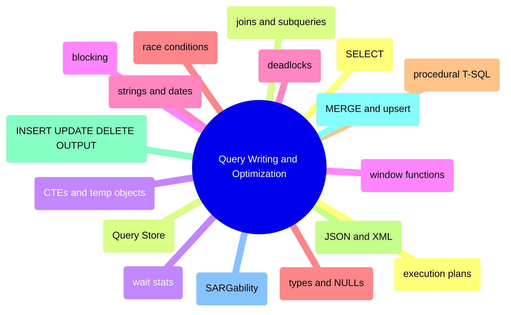

# Query Writing and Optimization

This domain owns how T-SQL is written and how workload behavior is optimized. It starts with language fundamentals, then moves into execution plans, Query Store, waits, blocking, deadlocks, and race conditions.

## SELECT, JOIN, and Result Shaping

> [!abstract]- [[01-select-and-query-basics]]

> [!abstract]- [[03-joins-subqueries-and-apply]]

> [!abstract]- [[04-common-table-expressions-and-temporary-objects]]

> [!abstract]- [[05-window-functions]]

## Functions, Data Types, and Procedural T-SQL

> [!abstract]- [[07-string-functions-and-pattern-matching]]

> [!abstract]- [[08-date-and-time-functions]]

> [!abstract]- [[06-numeric-and-aggregate-functions]]

> [!abstract]- [[02-data-types-conversion-and-null-handling]]

> [!abstract]- [[15-system-functions-and-session-metadata]]

> [!abstract]- [[19-stored-procedures-dynamic-sql-and-error-handling]]

> [!abstract]- [[09-json-xml-and-semi-structured-data]]

> [!abstract]- [[10-insert-update-delete-patterns]]

> [!abstract]- [[11-merge-and-upsert]]

## Query Optimization, Plans, and Workload Behavior

> [!abstract]- [[12-sargable-queries]]

> [!abstract]- [[13-execution-plans]]

> [!abstract]- [[20-query-store-regressions-and-plan-forcing]]

> [!abstract]- [[14-wait-stats-analysis]]

## Blocking, Deadlocks, and Race Conditions

> [!abstract]- [[16-blocking-and-locking]]

> [!abstract]- [[17-deadlock-detection-and-prevention]]

> [!abstract]- [[18-race-conditions]]
