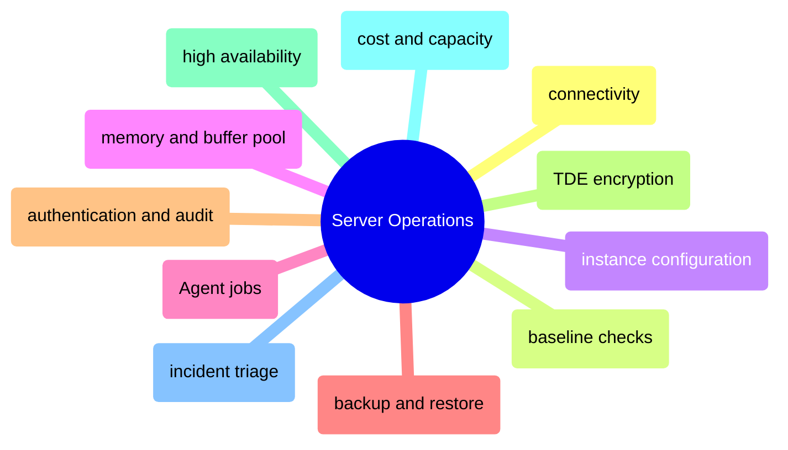

# Server Operations

This domain owns SQL Server as a running service: how to connect to it, baseline it, configure it, secure it, automate it, back it up, restore it, scale it, and troubleshoot it under production pressure.

## Connectivity, Baseline, and Configuration

> [!abstract]- [[02-sqlcmd-connection-and-usage]]

> [!abstract]- [[06-essential-dba-queries]]

> [!abstract]- [[18-dynamic-management-views]]

> [!abstract]- [[01-server-configuration]]

> [!abstract]- [[11-memory-and-buffer-pool]]

## Automation, Backup, and Recovery

> [!abstract]- [[05-sql-server-agent-jobs]]

> [!abstract]- [[07-backup-types-and-strategy]]

> [!abstract]- [[08-restore-and-recovery]]

## Security, Audit, and High Availability

> [!abstract]- [[03-sql-server-authentication]]

> [!abstract]- [[04-users-logins-roles-permissions]]

> [!abstract]- [[12-audit-logging]]

> [!abstract]- [[13-tde-encryption]]

> [!abstract]- [[09-high-availability-overview]]

> [!abstract]- [[10-always-on-availability-groups]]

## Capacity, Cost, and Incident Triage

> [!abstract]- [[17-finops-cost-optimization]]

> [!abstract]- [[16-performance-audit-playbook]]

> [!abstract]- [[15-troubleshooting-flowcharts]]

> [!abstract]- [[14-sql-server-problems]]

