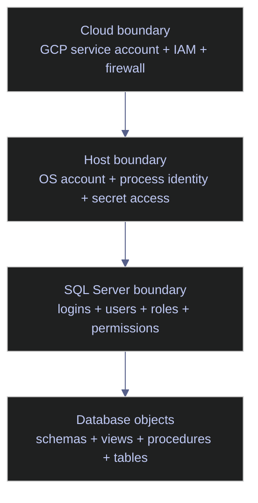
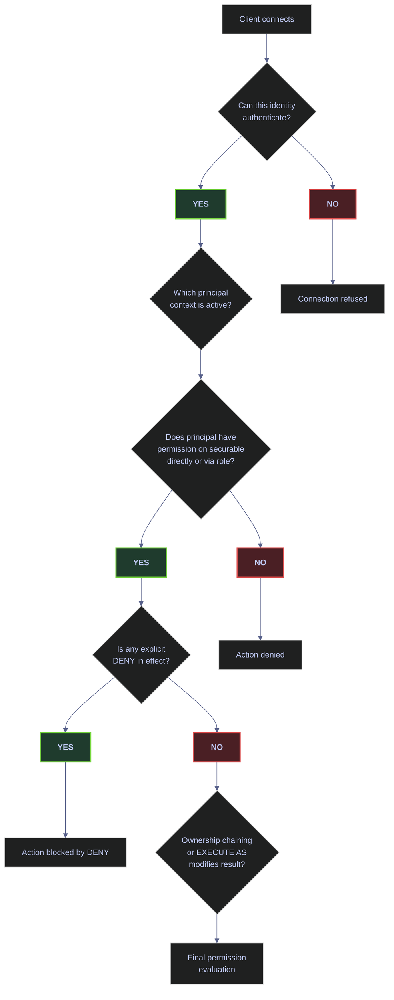
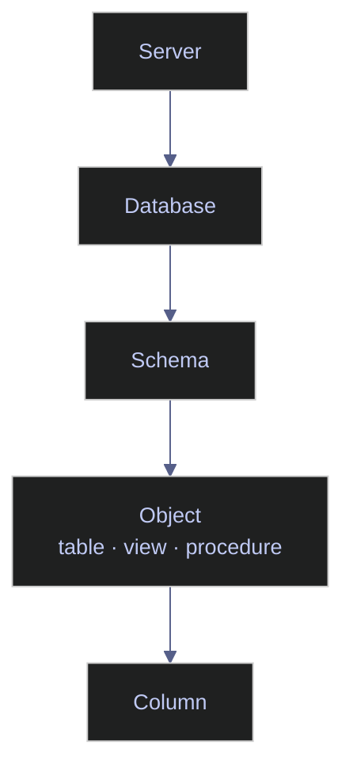

# Users, Logins, Roles, and Permissions

> [!abstract]- Summary
>
> SQL Server security is an operational design problem across identity, scope, authorization, and auditability. This note establishes how server logins, database users, roles, and permissions interact so access models stay least-privilege, attributable, and debuggable under production pressure.
>
> - **Identity boundaries**
>   - clarifies the cloud, host, SQL Server, and database-object trust boundaries so GCP-hosted workloads do not confuse infrastructure access with database access
> - **Principal and role model**
>   - explains logins vs users, special principals, server roles, database roles, and the path from authentication to authorization
> - **Permission design**
>   - covers the securable hierarchy, `GRANT` / `DENY` / `REVOKE`, schema-level patterns, ownership chaining, SQL Server Agent roles, and when fixed roles should give way to custom roles
> - **Operational patterns**
>   - maps least-privilege designs for admins, engineers, pipelines, vendors, analysts, BI consumers, deployment identities, and application runtimes, backed by inventory and audit queries against `sys.*` catalogs and DMVs
> - **Operations and safety**
>   - Warnings: shared service logins, `db_owner` on app runtimes, and `CHECK_POLICY = OFF` all widen blast radius or weaken accountability
>   - Recommendations: default to custom roles, grant at schema scope, isolate identities per pipeline, prefer `##MS_LoginManager##`, separate deployment from runtime, audit `sysadmin`, avoid casual `public` grants, and use contained users deliberately
>   - Troubleshooting: login-to-user mapping gaps, missing role membership, `DENY` conflicts, contained-user connection targeting, password-policy failures, orphaned users after restore, ineffective grants, and GCP Windows-group limitations
>
> Every DDL example and inventory query in this note runs against the local `stoxx` SQL Server 2022 instance, and the output tables under code cells are captured from live execution rather than fabricated examples.

> [!note]- Glossary
>
> - **Principal**
>   - security subject in SQL Server, including logins, users, and roles
> - **Securable**
>   - resource that can carry permissions, such as a server, database, schema, object, or column
> - **Login**
>   - server-scoped identity that authenticates to the SQL Server instance
> - **User**
>   - database-scoped identity that authorizes work inside one database
> - **Server role**
>   - server-level permission bundle, including legacy fixed roles and SQL Server 2022 `##MS_*##` roles
> - **Database role**
>   - database-level permission bundle used to group grants within one database
> - **Fixed role**
>   - built-in role with predefined permissions and broad default coverage
> - **Custom role**
>   - user-defined role built around workload-specific least-privilege access
> - **Schema**
>   - namespace and security boundary used to grant access to groups of related objects
> - **Schema-scoped grant**
>   - permission granted on `SCHEMA::name`, usually the cleanest authorization pattern for layered data platforms
> - **Contained user**
>   - database user that authenticates directly to a database without a corresponding server login
> - **Application role**
>   - database principal activated by an application to assume a controlled permission set
> - **Ownership chaining**
>   - behavior where SQL Server can skip rechecking access between objects that share the same owner
> - **`GRANT`**
>   - permission statement that allows an action on a securable
> - **`DENY`**
>   - explicit block that overrides inherited grants
> - **`REVOKE`**
>   - removal of a previous explicit grant or deny without creating a new block
> - **`public`**
>   - baseline database role whose permissions apply to every database user
> - **Least privilege**
>   - design principle of granting only the minimum access needed for a clear operational purpose
> - **Orphaned user**
>   - database user whose login mapping no longer matches after restore or migration
> - **`sysadmin`**
>   - fixed server role with effectively unrestricted instance control

> [!important] Least-privilege defaults
>
> The safest default is:
>
> 1. authenticate at the **narrowest practical boundary**
> 2. authorize through **custom roles**
> 3. grant at the **schema level** when possible
> 4. avoid broad fixed roles for applications and pipelines
> 5. make every privileged identity attributable to a real purpose

---

## The Security Model in One Sentence

A **login** gets you into the SQL Server instance. A **user** gets you into a specific database. A **role** groups permissions. A **permission** allows or denies an action on a **securable**.

That sentence is simple, but each word has operational consequences. The rest of this note exists to make those consequences explicit.

---

## Identity Boundaries

For SQL Server running on a VM or host, especially on **GCP**, identity must be reasoned about in layers rather than as one flat problem.



### SQL Server | identity | the four trust boundaries

The diagram collapses four separate authorization systems into one picture. Each layer below has its own identities, its own permission surface, and its own failure modes. Reasoning about SQL Server access in isolation from the cloud and host layers is the single most common cause of "the service account has permission but the query still fails" incidents.

- **Cloud boundary**
  - Controls who can administer the VM, fetch secrets, call cloud APIs, or reach the network path.
  - On GCP this often means a **GCP service account**, IAM bindings, firewall rules, and sometimes Secret Manager access.
- **Host boundary**
  - Controls which process can read TLS files, environment variables, credential files, or mounted secrets.
  - This is the Linux or Windows process boundary.
- **SQL Server boundary**
  - Controls who can connect to the SQL Server instance and what they can do there.
  - This is where **logins, users, roles, and permissions** live.
- **Database object boundary**
  - Controls what can be read, executed, altered, or denied inside actual databases.
  - This is where **schemas, views, procedures, tables, and object-level permissions** matter.

> [!warning] Cloud identity is not database identity
>
> A GCP service account is **not** a SQL Server login.
>
> It may identify the VM or workload to GCP, but it does not automatically become a principal inside SQL Server. In a GCP-hosted SQL Server deployment, the usual pattern is:
>
> - GCP service account protects infrastructure and secret retrieval
> - application retrieves a SQL credential or other approved secret
> - application authenticates to SQL Server using a SQL login, Windows principal, contained user, or other supported SQL identity model

> [!success] Retrieve SQL credentials from Secret Manager at runtime
>
> Use the GCP service account to retrieve the SQL credential from Secret Manager, then authenticate to SQL Server with a dedicated SQL login or contained user. Keep cloud identity and database identity explicitly connected through secret management.

### SQL Server | identity | why cloud trust is not database trust

Many teams mistakenly think that because a pipeline runs under a cloud service account, SQL Server access is already solved. It is not. Cloud identity and SQL identity are related operationally, but they are separate authorization systems.

> [!tip] Two-layer identity model
>
> Treat cloud service accounts as **infrastructure identities** and SQL logins or contained users as **database identities**. Connect them deliberately through secret management and explicit access design, not by assumption.

---

## Core Definitions

Brief dictionary definitions are not enough for security work. Each term must be understood in context.

### SQL Server | security | principal

A **principal** is any entity that can request SQL Server resources.

Examples:

- a SQL login
- a Windows login
- a Windows group
- a database user
- a server role
- a database role
- an application role
- a certificate-mapped principal in specialized designs

Why it matters:

- Permissions are not assigned to “connections” in the abstract.
- Permissions are assigned to principals.
- If you cannot identify the principal, you cannot reason about the permission model.

Example:

- `etl_loader` as a SQL login is a **server principal**
- `etl_loader` as a user inside `warehouse` is a **database principal**
- `etl_loader_rw` as a custom database role is also a **principal**, because it can hold permissions and memberships

> [!info] Principals as subjects
>
> Think of principals as the **subjects** in the authorization model. They are the “who” side of “who can do what on which object.”

### SQL Server | security | securable

A **securable** is any SQL Server resource that can have permissions applied to it.

Examples by scope:

- **server scope**
  - the server itself
  - endpoints
  - logins
- **database scope**
  - the database
  - schemas
  - roles
  - certificates
- **schema scope**
  - types
  - XML schema collections
- **object scope**
  - tables
  - views
  - procedures
  - functions
  - synonyms
  - queues
- **column scope**
  - a specific column in a table or view

Why it matters:

- Permissions are always evaluated against a securable.
- If you grant too low in the hierarchy, management becomes noisy.
- If you grant too high in the hierarchy, blast radius grows.

Example:

- `GRANT SELECT ON SCHEMA::gold TO reporting_reader`
  - principal: `reporting_reader`
  - permission: `SELECT`
  - securable: `SCHEMA::gold`

### SQL Server | security | permission

A **permission** is the right to perform a specific action on a securable.

Examples:

- `CONNECT`
- `SELECT`
- `INSERT`
- `UPDATE`
- `DELETE`
- `EXECUTE`
- `ALTER`
- `VIEW DEFINITION`
- `CONTROL`
- `CREATE LOGIN`
- `CREATE USER`

Why it matters:

- Permissions are the actual capability surface.
- Roles are just bundles; permissions are what ultimately allow actions.

Example:

- A reporting user might need:
  - `CONNECT`
  - `SELECT` on a schema
  - possibly `VIEW DEFINITION`
- That user does **not** need `ALTER`, `CONTROL`, or `db_owner`

### SQL Server | authentication | login

A **login** is a server-level identity. It allows authentication to the **SQL Server instance**.

Common login types in SQL Server:

- SQL login
- Windows login
- Windows group login
- in supported environments, certain Microsoft Entra-based identities

What it implies:

- A login does **not** automatically imply access inside every database.
- A login is usually authenticated at the `master` boundary unless you are using a contained user model.

*Create a SQL login as a server-level principal.*

```sql
CREATE LOGIN etl_loader
WITH PASSWORD = 'StrongPasswordHere';
```

What this does **not** do:

- It does not create a database user.
- It does not grant table access.
- It does not grant `SELECT`, `INSERT`, or `EXECUTE`.
- It only creates the server principal.

> [!warning] Login does not equal access
>
> “The login exists” is not the same thing as “the pipeline can use the target database.” You still need a database user and permissions.

> [!success] Complete the login → user → role chain in every creation script
>
> After creating the login, always create the corresponding database user and assign it to a custom role with explicit permissions. Half-finished principals with no user mapping or no role membership produce silent access failures under load.

### SQL Server | authentication | database user

A **database user** is a database-level identity. It is the principal that holds permissions inside a specific database. Two patterns exist: a user mapped to an existing server login, and a contained user that authenticates against the database directly without a server login.

#### Map a database user to an existing server login

*Create a login-mapped database user in the target database.*

```sql
USE warehouse;
GO
CREATE USER etl_loader FOR LOGIN etl_loader;
GO
```

Implication:

- The login authenticates at the instance.
- The user defines the identity inside this database.

#### Create a contained user that authenticates at the database level

*Create a contained user that authenticates at the database level without a server login.*

```sql
USE warehouse;
GO
CREATE USER consumer_portal
WITH PASSWORD = 'StrongContainedPasswordHere',
     DEFAULT_SCHEMA = dbo;
GO
```

Implication:

- Authentication occurs at the database level.
- The connection string must target the database explicitly.
- This is often useful for portability and one-database access designs.

> [!info] Login-to-user cardinality
>
> A login can map to **one user per database**, but the same login can be mapped into **many databases**.

#### Resolve unqualified object references via DEFAULT_SCHEMA

When a user issues an unqualified object reference (e.g., `SELECT * FROM orders`), SQL Server resolves it using the user's **default schema**. If the object is not found there, SQL Server then looks in the `dbo` schema as a fallback. This two-step resolution is documented in the Microsoft Learn page on user-schema separation.

| Default Schema Setting | Resolution Order |
|---|---|
| Explicitly set (e.g., `DEFAULT_SCHEMA = gold`) | `gold.orders` first, then `dbo.orders` |
| Not set or set to `dbo` | `dbo.orders` only |

> [!tip] Default schema alignment
>
> Set the default schema to match the user's primary working layer (e.g., `gold` for analysts, `bronze` for loaders). This prevents accidental cross-schema references and makes unqualified queries predictable.

### SQL Server | security | role

A **role** is a principal that groups permissions. SQL Server has two categories — server roles (instance scope) and database roles (database scope) — and each category has fixed roles shipped by SQL Server and user-defined roles created by operators.

**Server role** — holds permissions at server scope. Examples: `sysadmin`, `securityadmin`, `dbcreator`, `##MS_LoginManager##`.

**Database role** — holds permissions at database scope. Examples: `db_datareader`, `db_datawriter`, `db_owner`, plus custom roles such as `gold_reader` or `etl_executor`.

Why roles matter — they separate **identity** from **capability**, users come and go but roles remain stable, and auditing becomes much easier when permissions are granted to roles instead of directly to users.

> [!tip] Role-based permission chain
>
> The clean model is:
>
> `login -> user -> role -> permission`
>
> not:
>
> `login -> random direct grants everywhere`

### SQL Server | security | schema

A **schema** is both a namespace and a security boundary.

Example:

- `bronze.ticks_raw`
- `silver.orders_enriched`
- `gold.pnl_daily`

Why it matters:

- Schema-level grants are usually the best balance between precision and manageability
- They let you grant access to entire layers without table-by-table sprawl

*Grant schema-level SELECT and EXECUTE to custom roles.*

```sql
GRANT SELECT ON SCHEMA::gold TO gold_reader;
GRANT EXECUTE ON SCHEMA::api TO app_executor;
```

### SQL Server | security | GRANT DENY REVOKE

The three permission DDL verbs form the core authorization surface. Every permission change on a securable passes through one of them. Their interaction rules — especially `DENY` overriding inherited `GRANT` — are the source of most "why can't this user read this table?" incidents.

#### Add a permission to a principal with GRANT

*Grant SELECT on a schema to a role.*

```sql
GRANT SELECT ON SCHEMA::gold TO reporting_reader;
```

#### Explicitly block a permission with DENY

*Deny SELECT on a specific table, overriding any inherited grant.*

```sql
DENY SELECT ON OBJECT::gold.salaries TO analyst_readers;
```

#### Remove a previous GRANT or DENY with REVOKE

*Remove a previously applied permission (grant or deny) from a role.*

```sql
REVOKE SELECT ON OBJECT::gold.salaries FROM analyst_readers;
```

Operational implications:

- `DENY` is stronger than inherited `GRANT`
- `REVOKE` is not the same as `DENY`
- `DENY` does **not** apply to `sysadmin` members or object owners
- careless `DENY` usage makes permission debugging much harder

> [!warning] `DENY` overuse
>
> Use `DENY` sparingly.
>
> Prefer designing clean role scopes so that you rarely need negative permissions. Heavy `DENY` usage usually indicates a messy authorization model.

> [!success] Use REVOKE before DENY; design roles that never need DENY
>
> Design roles so that each grants only what is needed. Use `REVOKE` to remove unwanted inherited permissions before reaching for `DENY`. A security model where `DENY` is the primary exclusion mechanism is a security model that will be impossible to debug under incident pressure.

---

## The Authentication and Authorization Path

When a client connects, SQL Server evaluates access in stages:



1. **Can this identity authenticate to the instance or database?**
2. **Which principal context is active?**
3. **Does that principal have permission on the target securable, directly or through role membership?**
4. **Is any explicit deny in effect?**
5. **Does ownership chaining or execution context modify the final result?**

This is why a user may:

- connect to the instance but not to a database
- connect to a database but not read a table
- read a view but not the underlying table directly
- execute a procedure without direct table permissions if ownership chaining is designed intentionally

> [!important] Authentication vs authorization
>
> Authentication answers **who are you?**
>
> Authorization answers **what can you do?**
>
> Many production failures come from conflating the two.

---

## Login Types

### SQL Server | authentication | SQL logins

Use when:

- the application is not domain-integrated
- the environment is Linux-hosted and Windows auth is not available or not used
- a pipeline runtime needs deterministic credentials
- secret rotation is managed externally

*Create a SQL login with password policy enforcement enabled and expiration disabled.*

```sql
CREATE LOGIN ingest_runtime
WITH PASSWORD = 'UseARealManagedSecret',
     CHECK_POLICY = ON,
     CHECK_EXPIRATION = OFF;
GO
```

| Aspect | Detail |
|---|---|
| Strengths | Simple, portable, common in application and ETL tooling |
| Weaknesses | Password management burden, secret sprawl risk, rotation discipline essential |
| Good fit | Service runtimes, ETL tools, vendor integrations, GCP-hosted apps retrieving credentials from Secret Manager |

#### Configure CHECK_POLICY and CHECK_EXPIRATION

SQL logins support two password-governance options set at creation time:

| Option | Default | Effect | Recommendation |
|---|---|---|---|
| `CHECK_POLICY` | `ON` | On Windows, enforces the Windows password-complexity policy (length, character classes). On Linux before SQL Server 2022 CU23, `CHECK_POLICY = ON` enforces only the SQL Server default policy (8-character minimum, three-of-four character classes) and ignores AD group-policy settings. SQL Server 2022 CU23 and SQL Server 2025 support custom policies via `mssql.conf`. | Always `ON` — setting to `OFF` accepts any password including empty strings |
| `CHECK_EXPIRATION` | `OFF` | On Windows, enforces the Windows password-expiration policy. On Linux pre-CU23, password expiration is hardcoded to 90 days when `CHECK_EXPIRATION = ON`. | `OFF` for service accounts (rotate via Secret Manager instead), `ON` for human logins if the OS policy is configured |

> [!warning] Disabled password policy
>
> `CHECK_POLICY = OFF` is invisible until an audit or breach. It is the single most common SQL login misconfiguration.

> [!success] Always create SQL logins with CHECK_POLICY = ON
>
> Always create SQL logins with `CHECK_POLICY = ON`. For service accounts, set `CHECK_EXPIRATION = OFF` so the credential rotation is driven by Secret Manager rather than the OS expiration clock, but never disable complexity enforcement.

### SQL Server | authentication | Windows logins and Windows groups

Use when:

- SQL Server is integrated with Windows identity
- human access is managed through domain groups
- you want centralized onboarding and offboarding

*Create a Windows group login and map it to a database user.*

```sql
CREATE LOGIN [CONTOSO\DataEngineers] FROM WINDOWS;
GO

USE warehouse;
GO
CREATE USER [CONTOSO\DataEngineers] FOR LOGIN [CONTOSO\DataEngineers];
GO
```

| Aspect | Detail |
|---|---|
| Strengths | Central identity lifecycle, easier human access management, strong fit for enterprise admin and analyst groups |
| Weaknesses | Less portable, not always available in Linux/GCP-centered patterns |
| Good fit | DBAs, platform engineers, analyst groups, security-managed human access |

### SQL Server | authentication | contained users

Use when:

- access is limited to one database
- database portability matters
- you want to decouple from instance-level logins
- tenant isolation is clearer at the database level

*Create a contained user scoped to a single database with a default schema.*

```sql
USE analytics_serving;
GO
CREATE USER dashboard_consumer
WITH PASSWORD = 'UseASecretManagerManagedValue',
     DEFAULT_SCHEMA = reporting;
GO
```

| Aspect | Detail |
|---|---|
| Strengths | Easier database migration, avoids `master` login dependency, clean for single-database applications |
| Weaknesses | Connection string must name the database explicitly, can complicate identity standardization if overused, each database needs its own contained principal |

> [!success] Single-database access
>
> For identities that connect to exactly one database, contained users are often a cleaner design than login-mapped users.

### SQL Server | authentication | certificate and asymmetric-key principals

Use when:

- signing modules
- highly specialized security patterns
- controlled privilege elevation through signed code

This is an advanced pattern, not the default for application access.

> [!info] Module signing
>
> Module signing is often a better answer than granting broad direct permissions to application users that need carefully scoped privileged actions.

---

## Special Principals

| Principal | Scope | What it is | Recommendation |
|---|---|---|---|
| `sa` | Server | Built-in high-privilege SQL login, member of `sysadmin` | Strong password, monitor usage, disable or rename where possible, never use as an application identity |
| `dbo` | Database | Special principal representing database ownership context with full control inside the database | Do not map ordinary applications or humans to `dbo`, do not normalize access around it |
| `guest` | Database | Special principal that can allow access without an explicit user if misconfigured | Keep `guest` permissions absent unless deliberately designed, audit regularly |
| `public` | Both | Every login is in server `public`, every database user is in database `public` | Any permission granted to `public` is extremely broad — use only when you truly mean “everyone” |

> [!warning] `public` grant scope
>
> `public` grants are easy to forget and hard to reason about later. Keep them minimal.

> [!success] Audit public and guest permissions every security review
>
> Audit `public` and `guest` permissions as part of every security review. Remove any grants that are not explicitly justified — a stale `GRANT SELECT TO public` on a schema is effectively a database-wide read permission that no principal audit will surface.

---

## Server Roles

Server roles define permissions at instance scope.

### SQL Server | server roles | legacy fixed server roles

SQL Server 2019 and earlier shipped nine fixed server roles. Their permissions cannot be changed and they remain available in SQL Server 2022 for compatibility. Most are too broad for modern least-privilege designs and should be replaced by the `##MS_*##` roles introduced in SQL Server 2022 wherever the use case matches.

| Fixed server role | Capability | Production fit |
|---|---|---|
| `sysadmin` | Full control over the instance; bypasses nearly all other boundaries | Break-glass only, very small number of trusted DBAs; never for applications, ETL runtimes, analysts, or ordinary engineers |
| `securityadmin` | Manages logins and permissions broadly; can effectively escalate to `sysadmin` | Treat as equivalent to `sysadmin` per Microsoft Learn; prefer `##MS_LoginManager##` |
| `serveradmin` | Server-wide configuration actions, including `SHUTDOWN` | DBAs performing instance configuration; not for application identities |
| `processadmin` | Terminate sessions and running processes | Limited operations teams; usually a subset of DBA permissions |
| `setupadmin` | Manage linked servers via T-SQL | Rare; most linked-server admin is done by DBAs in `sysadmin` |
| `bulkadmin` | Run `BULK INSERT` | Not supported on SQL Server on Linux; carries escalation risk because `BULK INSERT` can read arbitrary files the service account can access |
| `diskadmin` | Historical disk-file management | Rarely appropriate in modern estates |
| `dbcreator` | Create, alter, drop, and restore databases | Too broad for most daily work; prefer `##MS_DatabaseManager##` |
| `public` | Baseline membership for all logins | Any grant to `public` applies server-wide to every principal — use only when you truly mean "everyone" |

> [!warning] Legacy role over-granting
>
> `securityadmin`, `dbcreator`, and `bulkadmin` are commonly over-granted because they sound narrower than they really are. `securityadmin` in particular should be treated as equivalent to `sysadmin` — a member can grant any server permission to any principal, including to itself.

> [!success] Prefer `##MS_LoginManager##` and `##MS_DatabaseManager##`
>
> Use the SQL Server 2022 `##MS_LoginManager##` and `##MS_DatabaseManager##` roles instead. They provide the common use cases without the broad escalation surface of legacy roles, and they are portable to Azure SQL Database which does not expose the legacy fixed roles.

### SQL Server | server roles | SQL Server 2022 least-privilege roles

SQL Server 2022 added 10 new fixed server roles prefixed with `##MS_` and suffixed with `##` to reduce reliance on overly broad legacy roles. Per Microsoft Learn, these roles are designed around the Principle of Least Privilege and their permissions can inherit down to individual databases (except `##MS_LoginManager##`, which is server-scope only).

| SQL Server 2022 role | Server-level permissions | Database-level permissions (inherited when the login has a database user) | Use case |
|---|---|---|---|
| `##MS_LoginManager##` | `CREATE LOGIN`, `ALTER ANY LOGIN` | N/A (server-scope only) | Teams that create, alter, or drop logins without being able to grant arbitrary server privileges |
| `##MS_DatabaseManager##` | `CREATE ANY DATABASE`, `ALTER ANY DATABASE` | `ALTER` | Teams needing database create/drop capability without full server privilege — creator becomes database owner |
| `##MS_DatabaseConnector##` | `CONNECT ANY DATABASE` | `CONNECT` | Server-wide database connectivity — broader than it looks because it connects to any database unless explicitly denied |
| `##MS_ServerStateReader##` | `VIEW SERVER STATE`, `VIEW SERVER PERFORMANCE STATE`, `VIEW SERVER SECURITY STATE` | `VIEW DATABASE STATE`, `VIEW DATABASE PERFORMANCE STATE`, `VIEW DATABASE SECURITY STATE` | Performance observability teams needing broad DMV visibility |
| `##MS_ServerStateManager##` | Same as `##MS_ServerStateReader##` plus `ALTER SERVER STATE` | Same as `##MS_ServerStateReader##` | Controlled server-state operations (DBCC cache flushes, plan cache clearing); strict superset of reader |
| `##MS_ServerPerformanceStateReader##` | `VIEW SERVER PERFORMANCE STATE` | `VIEW DATABASE PERFORMANCE STATE` | Narrower performance observability than full state reader |
| `##MS_ServerSecurityStateReader##` | `VIEW SERVER SECURITY STATE` | `VIEW DATABASE SECURITY STATE` | Security observability (audit state, permission reviews) |
| `##MS_DefinitionReader##` | `VIEW ANY DATABASE`, `VIEW ANY DEFINITION`, `VIEW ANY PERFORMANCE DEFINITION`, `VIEW ANY SECURITY DEFINITION` | `VIEW DEFINITION`, `VIEW PERFORMANCE DEFINITION`, `VIEW SECURITY DEFINITION` | Metadata readers needing broad definition visibility for schema compare, reverse engineering |
| `##MS_PerformanceDefinitionReader##` | `VIEW ANY PERFORMANCE DEFINITION` | `VIEW PERFORMANCE DEFINITION` | Performance tuning tools that inspect execution plans and stats but nothing else |
| `##MS_SecurityDefinitionReader##` | `VIEW ANY SECURITY DEFINITION` | `VIEW SECURITY DEFINITION` | Security auditors reading role memberships and permissions metadata |

> [!success] Prefer SQL Server 2022 `##MS_*##` roles over legacy fixed roles
>
> Prefer the new `##MS_*##` SQL Server 2022 roles over broader legacy roles when they satisfy the use case. They cover the same use cases with a tighter permission surface and are portable across SQL Server and Azure SQL Database.

#### Delegate login administration to a security operations group

*Add a Windows group to the least-privilege login management role.*

```sql
ALTER SERVER ROLE [##MS_LoginManager##] ADD MEMBER [CONTOSO\SqlSecurityOps];
GO
```

---

## Database Roles

Database roles define permissions inside a single database.

### SQL Server | database roles | fixed database roles

SQL Server ships nine fixed database roles in every user database. Their permissions apply across the entire database and automatically cover new objects added later — convenient, but often too broad for least-privilege designs on schema-layered data platforms.

| Fixed database role | Capability | Production fit |
|---|---|---|
| `db_owner` | All permissions in the database; full DDL and data access | Extremely limited admin cases, database owners, maintenance automation; avoid for applications, reporting users, ETL runtimes, and general engineers |
| `db_securityadmin` | Manage permissions and custom role membership | High-risk — privilege escalation potential through role membership manipulation |
| `db_accessadmin` | Add or remove database access (create/drop users) | Delegated onboarding without full DBA privilege |
| `db_backupoperator` | Back up the database | Backup automation; pair with separate identity for restore |
| `db_ddladmin` | Run broad DDL on any object | Risk — can create or alter programmable objects that may execute under higher privilege via ownership chaining |
| `db_datareader` | Read all user tables and views, including tables added later | Useful only when read scope is truly the whole database; not ideal when you want only one schema or a limited API surface |
| `db_datawriter` | Modify data in all user tables, including tables added later | Usually too broad for pipelines unless the database is deliberately narrow |
| `db_denydatareader` | Explicitly denies reads across all user tables and views | Exception handling; prefer clean role scoping over DENY-based exclusion |
| `db_denydatawriter` | Explicitly denies writes across all user tables | Same as above |
| `public` | Base role for all database users | Any grant to `public` applies to every database user, including future ones |

> [!warning] Fixed role blast radius
>
> Fixed database roles are convenient, but they often grant much more than a production application or pipeline actually needs. A subtle hazard is that `db_datareader` and `db_datawriter` automatically cover every new table added to the database later — a sensitive table created next year inherits the broad permission by default, while a custom role would not.

> [!success] Create schema-scoped custom roles as the default
>
> Create custom database roles scoped to specific schemas. Use fixed roles only when the access need genuinely spans the entire database and when automatic coverage of future objects is the intended behavior, not an accident.

### SQL Server | database roles | user-defined custom roles

This should be your default authorization tool.

Examples:

- `bronze_loader`
- `silver_transformer`
- `gold_reader`
- `api_executor`
- `schema_migrator`
- `job_operator_limited`

Why custom roles win:

- they match your workload
- they can be audited clearly
- they avoid “all tables in all schemas” grants
- they survive personnel churn better

*Create a custom read role scoped to the gold schema.*

```sql
USE warehouse;
GO
CREATE ROLE gold_reader;
GO
GRANT SELECT ON SCHEMA::gold TO gold_reader;
GO
```

> [!success] Custom roles as default
>
> For most databases, custom roles should carry the actual access design, while fixed roles are used only selectively.

---

## Permission Hierarchy and Scope

Permissions can be granted at different levels of the securable hierarchy. A grant at a higher scope cascades to all objects below it.



Typical hierarchy:

- server
- database
- schema
- object
- column

### SQL Server | permissions | why scope matters

If you grant too low:

- administration becomes noisy
- onboarding requires repetitive grants
- permissions drift becomes likely

If you grant too high:

- blast radius expands
- unauthorized data becomes visible
- audits become harder to defend

### SQL Server | permissions | scope choice by scenario

| Scenario | Best Scope | Why |
|---|---|---|
| All published reporting tables | Schema | Stable and readable |
| One stored procedure API | Procedure or API schema | Exact execution surface |
| One sensitive table | Object | Narrow exception |
| One sensitive column | Column | Use only when justified |
| Full database admin | Database | Admin boundary |

> [!tip] Schema-scoped roles
>
> Schema-level security is usually the best default for data platforms:
>
> - `bronze_loader` on `bronze`
> - `silver_transformer` on `silver`
> - `gold_reader` on `gold`

---

## Direct Grants vs Role-Based Grants

### SQL Server | authorization | direct grants to users

*Grant SELECT directly to an individual user.*

```sql
GRANT SELECT ON SCHEMA::gold TO analyst_anna;
```

Good for:

- temporary investigation
- one-off exceptions
- emergencies followed by cleanup

Bad as a default because:

- they do not scale
- they create hidden snowflakes
- audits become principal-by-principal archaeology

### SQL Server | authorization | role-based grants

*Create a role, grant permissions to the role, then add the user to the role.*

```sql
CREATE ROLE gold_reader;
GRANT SELECT ON SCHEMA::gold TO gold_reader;
ALTER ROLE gold_reader ADD MEMBER analyst_anna;
```

Good because:

- capability is separated from identity
- onboarding and offboarding are easier
- intent is visible in role names

> [!important] Roles over direct grants
>
> Grant permissions to roles. Add users to roles. Avoid direct grants unless the exception is short-lived and documented.

---

## Recommended Design Rules

1. **Prefer groups over individual humans** when your identity platform supports it.
2. **Prefer custom roles over fixed roles** for application and data access.
3. **Prefer schema-level grants over table-by-table grants** for layered data platforms.
4. **Avoid `db_owner` for applications**.
5. **Avoid `sysadmin` except for true admin identities**.
6. **Treat `securityadmin` as high-risk**.
7. **Use SQL Server 2022 `##MS_*##` server roles** where they fit.
8. **Use contained users for one-database identities** when portability helps.
9. **Do not use `DENY` as your primary design mechanism**.
10. **Do not grant to `public` casually**.
11. **Keep service identities non-interactive and narrowly scoped**.
12. **Separate read, write, DDL, and operations identities**.

---

## Scenario Patterns

### SQL Server | access pattern | platform administrator

**Typical need:** instance operations, backups and restores, failover operations, server configuration, break-glass troubleshooting.

**Recommended model:** named admin identity or admin group, very limited membership in `sysadmin`, additional observability identities separated where possible.

**Bad pattern:** using one shared "admin" SQL login for all DBAs — no attribution, no audit trail, one credential leak compromises the entire instance.

**Better pattern:** named Windows group or controlled login, audited elevation workflow, break-glass account documented separately and kept disabled by default.

---

### SQL Server | access pattern | security administrator

**Typical need:** create and alter logins, review role membership, inspect permissions, without necessarily running the whole server.

**Recommended model:** prefer `##MS_LoginManager##` in SQL Server 2022; add metadata-reader roles (`##MS_SecurityDefinitionReader##`, `##MS_DefinitionReader##`) only as needed.

**Why not `securityadmin` by default:** it can `GRANT`, `DENY`, and `REVOKE` server-level permissions to any principal, including to itself, which means it can silently escalate to `sysadmin`. Microsoft Learn explicitly recommends treating `securityadmin` as equivalent to `sysadmin`.

*Assign login management to a security operations group using the least-privilege role.*

```sql
ALTER SERVER ROLE [##MS_LoginManager##] ADD MEMBER [CONTOSO\SqlSecurityOps];
GO
```

---

### SQL Server | access pattern | single-database administrator

**Typical need:** manage users, manage roles, perform DDL, run maintenance within one database.

**Recommended model:** use `db_owner` only if the identity is truly acting as a full database administrator. Otherwise combine narrower capabilities — a custom admin role with explicit grants, `db_backupoperator` for backups, `db_ddladmin` for schema changes, and `db_securityadmin` only with strict review.

> [!warning] `db_owner` scope risk
>
> `db_owner` is operationally simple, but it is often too broad for development leads or pipeline maintainers.

> [!success] Decompose db_owner into narrow capabilities
>
> Combine narrower capabilities: a custom admin role with specific DDL grants, `db_backupoperator` for backups, and explicit schema permissions for data access. This design makes each granted capability attributable to a real operational need.

---

### SQL Server | access pattern | data engineer

**Typical need:** read raw and transformed data, write to staging or target schemas, execute ETL procedures, occasionally create tables in controlled schemas.

**Recommended model:** use schema-scoped custom roles such as `bronze_loader`, `silver_transformer`, `etl_executor`, and `gold_reader`. Avoid `db_owner`, `db_datawriter` across the whole database unless the database is intentionally narrow, and server-level roles for database-local work.

*Create schema-scoped custom roles for each data layer.*

```sql
CREATE ROLE bronze_loader;
GRANT SELECT, INSERT, UPDATE, DELETE ON SCHEMA::bronze TO bronze_loader;

CREATE ROLE silver_transformer;
GRANT SELECT, INSERT, UPDATE, DELETE ON SCHEMA::silver TO silver_transformer;

CREATE ROLE etl_executor;
GRANT EXECUTE ON SCHEMA::etl TO etl_executor;
```

---

### SQL Server | access pattern | pipeline runtime

This is the identity used by Airflow, dbt, SSIS, a custom loader, a containerized ETL task, or a scheduled app runtime.

**Typical need:** connect non-interactively, execute specific procedures, write to specific schemas, possibly bulk load into controlled targets.

**Recommended model:** a SQL login or contained user, one identity per runtime or pipeline family, custom roles only, no interactive admin rights, no `db_owner`, no `sysadmin`.

*Create a dedicated pipeline login, map it to a user, and assign a custom schema role.*

```sql
CREATE LOGIN pipeline_ingest
WITH PASSWORD = 'ManagedSecretValue',
     CHECK_POLICY = ON,
     CHECK_EXPIRATION = OFF;
GO

USE warehouse;
GO
CREATE USER pipeline_ingest FOR LOGIN pipeline_ingest;
GO

CREATE ROLE bronze_loader;
GRANT INSERT, UPDATE, DELETE, SELECT ON SCHEMA::bronze TO bronze_loader;
GRANT EXECUTE ON SCHEMA::etl TO bronze_loader;
ALTER ROLE bronze_loader ADD MEMBER pipeline_ingest;
GO
```

> [!success] One identity per runtime
>
> Give each runtime its own identity. Do not let five unrelated pipelines share one login unless you want five-way audit ambiguity.

---

### SQL Server | access pattern | GCP-hosted pipeline runtime

**Reality check:** the GCP service account secures VM/API access, secret retrieval, and workload identity at the cloud layer. It does **not** by itself authorize SQL operations inside SQL Server.

**Recommended pattern:**

1. The GCP service account retrieves the SQL secret from Secret Manager.
2. The application connects using a SQL login, or a contained user if the workload touches only one database.
3. Database access is role-based and schema-scoped — never `db_owner`.

**Good pattern:**

- GCP service account: `etl-prod@project.iam.gserviceaccount.com`
- SQL login: `pipeline_prod_ingest`
- database user: `pipeline_prod_ingest`
- database roles: `bronze_loader`, `etl_executor`

**Bad pattern:** one shared SQL login for all pipelines across all environments; `db_owner` for the runtime because "it's simpler"; embedding SQL secrets directly in code or CI variables without managed secret retrieval.

> [!warning] Narrow at both layers
>
> The service account should be narrow in GCP, and the SQL identity should be narrow in SQL Server. Do not collapse infrastructure trust into database superuser access.

> [!success] One SQL login per pipeline, credentials from Secret Manager
>
> Give each pipeline its own SQL login, retrieve the credential from Secret Manager at runtime, and assign only the custom roles needed for that pipeline's specific data layer. Isolation at both the cloud and database layer makes any single credential leak survivable.

---

### SQL Server | access pattern | BI consumer and reporting user

**Typical need:** read published data, possibly execute curated reporting procedures, no write capability.

**Recommended model:** contained user or group-mapped login, custom role such as `gold_reader`, schema-level `SELECT`, optional `EXECUTE` on a reporting procedure schema, optional `VIEW DEFINITION` if tooling requires metadata visibility. Avoid `db_datareader` if only one schema should be visible and direct table grants unless the exception is narrow and documented.

*Create a read-only reporting role with SELECT on gold and EXECUTE on reporting procedures.*

```sql
CREATE ROLE gold_reader;
GRANT SELECT ON SCHEMA::gold TO gold_reader;
GRANT EXECUTE ON SCHEMA::reporting TO gold_reader;
```

---

### SQL Server | access pattern | data consumer and analyst

**Typical need:** ad hoc queries against curated data, optional metadata reads, no writes, no DDL.

**Recommended model:** analyst group → login/user → custom read role, optional `VIEW DEFINITION`, deny access to sensitive schemas by design, not after-the-fact patching.

**Good example** — an `analytics_readers` role with `SELECT` on `gold`, `EXECUTE` on `analytics`, and no access to `bronze` or administrative schemas.

---

### SQL Server | access pattern | application end user

In most SQL Server-backed applications, end users should **not** be direct database principals.

**Better pattern:** the application authenticates as a service identity, the application enforces business authorization, and SQL Server sees one or a few service principals rather than thousands of human end users.

Use direct database users for end users only when the application is intentionally database-facing, multi-tenant or per-user auditing requires it, and the operational overhead is justified.

> [!info] App vs database authorization
>
> Application authorization and database authorization are not the same thing. Do not push all application end-user identity directly into SQL Server unless you truly need that model.

---

### SQL Server | access pattern | vendor and support identity

**Typical need:** temporary diagnostic read access, possibly execute a support procedure, no standing write permission, time-limited access.

**Recommended model:** a dedicated vendor login disabled by default when feasible, a custom support role with narrow schema or procedure permissions, and a strong audit trail capturing every use.

*Create a narrow support role with read access and a single diagnostic procedure.*

```sql
CREATE ROLE vendor_support_reader;
GRANT SELECT ON SCHEMA::gold TO vendor_support_reader;
GRANT EXECUTE ON OBJECT::support.usp_collect_diagnostics TO vendor_support_reader;
```

---

### SQL Server | access pattern | deployment and migration identity

**Typical need:** create and alter objects, run migrations, optionally create schemas, without reading or writing all business data by default.

**Recommended model:** a dedicated deployment login or contained user, a custom role with DDL rights appropriate to the target schema, `db_ddladmin` only if justified and understood, and separate from the runtime identity.

> [!warning] Deployment vs runtime identity
>
> Do not reuse the application runtime login for schema deployment. Deployment is a different privilege boundary.

> [!success] Separate deployment identity from runtime identity
>
> Create a separate deployment login with DDL rights on target schemas. Keep the runtime identity limited to DML and EXECUTE. A runtime that cannot drop a table cannot be tricked into dropping one.

---

## Fixed Roles vs Custom Roles

| Need | Good Choice | Avoid by Default |
|---|---|---|
| Create logins | `##MS_LoginManager##` | `securityadmin` |
| Create databases | `##MS_DatabaseManager##` or tightly governed `dbcreator` | `sysadmin` |
| Read all published reporting tables | custom schema role | `db_datareader` if only one schema is needed |
| Full database admin | `db_owner` for very few principals | giving `db_owner` to apps |
| ETL writes to one schema | custom role | `db_datawriter` on whole DB |
| Human admin break-glass | `sysadmin` for very few named identities | shared admin login |
| SQL Agent job operators | `SQLAgentOperatorRole` in `msdb` if applicable | `sysadmin` when job ops are the only need |

---

## Common DDL Patterns

### SQL Server | DDL pattern | create a SQL login and map it to a database user

This is the canonical pattern for creating a non-interactive identity used by service runtimes, ETL tools, and applications. Creating the login without the mapped user leaves the identity unable to `USE` the database — the pattern must be completed with the second `CREATE USER` statement in the target database. Role membership and object permissions are still missing after this pair of statements and must be assigned separately.

Onboarding a new service runtime, pipeline, or application that needs SQL authentication. It is typically triggered by new pipeline deployment, new application environment, or vendor integration setup. T-SQL session as `securityadmin` (or member of `##MS_LoginManager##`) for the login and `db_owner` / `db_accessadmin` for the user; state-changing; no downtime. Create a server-level login and its corresponding database-level user so the identity can both authenticate to the instance and be referenced inside the database.

*Create the server login first, then the database user mapped to it.*

```sql
CREATE LOGIN demo_sec_bronze_pipeline
WITH PASSWORD = 'Bronz3P1peline_Str0ng_DemoPass!',
     CHECK_POLICY = ON,
     CHECK_EXPIRATION = OFF;
```

*Verify the login was created with the expected policy configuration.*

```sql
SELECT
    name,
    type_desc,
    is_disabled,
    is_policy_checked,
    is_expiration_checked
FROM sys.sql_logins
WHERE name = 'demo_sec_bronze_pipeline';
```

| name | type_desc | is_disabled | is_policy_checked | is_expiration_checked |
|---|---|---|---|---|
| demo_sec_bronze_pipeline | SQL_LOGIN | False | True | False |

*Create the database user mapped to the login.*

```sql
CREATE USER demo_sec_bronze_pipeline FOR LOGIN demo_sec_bronze_pipeline;
```

*Verify the user exists with the expected authentication type and default schema.*

```sql
SELECT
    name,
    type_desc,
    authentication_type_desc,
    default_schema_name
FROM sys.database_principals
WHERE name = 'demo_sec_bronze_pipeline';
```

| name | type_desc | authentication_type_desc | default_schema_name |
|---|---|---|---|
| demo_sec_bronze_pipeline | SQL_USER | INSTANCE | dbo |

The verification output confirms the complete pair: a `SQL_LOGIN` at server scope with `CHECK_POLICY = True` and `CHECK_EXPIRATION = False` (the canonical service-account policy), and a `SQL_USER` at database scope with `authentication_type_desc = INSTANCE` meaning "authentication happens at the instance through the mapped login". The `default_schema_name = dbo` is the default because `DEFAULT_SCHEMA` was not specified in `CREATE USER` — set it explicitly if the identity should resolve unqualified objects against a non-`dbo` schema.

---

### SQL Server | DDL pattern | create a contained user

Contained users decouple the identity from instance-level login management. Use this pattern when the identity needs only one database, when portability across instances matters, and when you want to avoid `master`-level login dependency. The connection string must target the database explicitly — `Database=analytics_serving` — otherwise authentication fails because the contained user does not exist in `master`.

Onboarding a single-database workload where database portability matters and the identity should not depend on an instance-level login. It is typically triggered by new dashboard connection, single-database analytics workload, or a database that will be frequently backed up and restored across instances. T-SQL session in the target database as `db_owner`; the instance must have contained database authentication enabled with `sp_configure 'contained database authentication', 1` and the database must be set to `CONTAINMENT = PARTIAL`; state-changing. Create a database user that authenticates at the database level, with no corresponding server login.

*Create a contained user with an explicit default schema.*

```sql
USE analytics_serving;
GO
CREATE USER demo_sec_dashboard_contained
WITH PASSWORD = 'UseARealManagedSecret',
     DEFAULT_SCHEMA = gold;
GO
```

> [!info] Demonstration on a non-contained database
>
> The local `stoxx` instance does not have contained database authentication enabled, so the `WITH PASSWORD` form cannot be captured. The closest reproducible form is `CREATE USER ... WITHOUT LOGIN`, which creates a user that has no authentication mechanism at all but can still hold permissions and be impersonated via `EXECUTE AS`. The verification below shows the `WITHOUT LOGIN` variant — note `authentication_type_desc = NONE` where a true contained user would show `DATABASE`.

*On a non-contained database, use the WITHOUT LOGIN form for permission testing.*

```sql
CREATE USER demo_sec_dashboard_contained WITHOUT LOGIN
WITH DEFAULT_SCHEMA = gold;
```

*Verify the user was created with the expected default schema.*

```sql
SELECT
    name,
    type_desc,
    authentication_type_desc,
    default_schema_name
FROM sys.database_principals
WHERE name = 'demo_sec_dashboard_contained';
```

| name | type_desc | authentication_type_desc | default_schema_name |
|---|---|---|---|
| demo_sec_dashboard_contained | SQL_USER | NONE | gold |

In a database with contained authentication enabled, the same `CREATE USER ... WITH PASSWORD` statement would produce `authentication_type_desc = DATABASE` instead of `NONE`, and the user would be able to authenticate directly by specifying the database in the connection string.

---

### SQL Server | DDL pattern | create a custom read role

A custom role scoped to a single schema is the cleanest building block for read-only access design. The role grants `SELECT` on every object in the schema — existing and future — so adding a new gold table later does not require updating the role.

When designing access for a new team, workload, or data layer that needs broad read access within a single schema. It is typically triggered by new analytics team onboarding, new reporting workload, or schema refactor. T-SQL in the target database as `db_securityadmin` or `db_owner`; state-changing. Separate the capability (SELECT on gold) from identity (which users hold the role) so the access model survives personnel churn.

*Create the role and grant schema-scoped SELECT.*

```sql
CREATE ROLE demo_sec_gold_reader;
GRANT SELECT ON SCHEMA::gold TO demo_sec_gold_reader;
```

*Verify the role exists and holds the expected permission.*

```sql
SELECT
    dp.name AS role_name,
    perm.permission_name,
    perm.state_desc,
    s.name AS schema_name
FROM sys.database_principals dp
LEFT JOIN sys.database_permissions perm
    ON perm.grantee_principal_id = dp.principal_id
LEFT JOIN sys.schemas s
    ON perm.major_id = s.schema_id AND perm.class = 3
WHERE dp.name = 'demo_sec_gold_reader';
```

| role_name | permission_name | state_desc | schema_name |
|---|---|---|---|
| demo_sec_gold_reader | SELECT | GRANT | gold |

The role is now ready to receive members. Adding a user to the role (next pattern) gives that user read access to every table, view, and user-defined function in the `gold` schema — including any created in the future — with no additional grants required.

---

### SQL Server | DDL pattern | add a user to a role

Membership is assigned via `ALTER ROLE ... ADD MEMBER`. The legacy `sp_addrolemember` still works but is deprecated and should not be used in new code.

Onboarding a new member to an existing role; never for creating a new access pattern (create a role instead). It is typically triggered by new team member, new pipeline identity, or contractor needing temporary access. T-SQL in the target database as `db_securityadmin` or a member of the role being modified; state-changing. Grant a principal all the permissions held by the role without issuing any direct grants.

*Add multiple existing database users to their custom roles in one batch.*

```sql
ALTER ROLE demo_sec_bronze_loader ADD MEMBER demo_sec_bronze_pipeline;
ALTER ROLE demo_sec_silver_transformer ADD MEMBER demo_sec_silver_pipeline;
ALTER ROLE demo_sec_gold_reader ADD MEMBER demo_sec_analyst;
ALTER ROLE demo_sec_gold_reader ADD MEMBER demo_sec_dashboard_contained;
```

*Verify every membership is in place.*

```sql
SELECT
    r.name AS role_name,
    m.name AS member_name,
    m.type_desc AS member_type
FROM sys.database_role_members rm
JOIN sys.database_principals r ON rm.role_principal_id = r.principal_id
JOIN sys.database_principals m ON rm.member_principal_id = m.principal_id
WHERE r.name LIKE 'demo_sec_%'
ORDER BY r.name, m.name;
```

| role_name | member_name | member_type |
|---|---|---|
| demo_sec_bronze_loader | demo_sec_bronze_pipeline | SQL_USER |
| demo_sec_gold_reader | demo_sec_analyst | SQL_USER |
| demo_sec_gold_reader | demo_sec_dashboard_contained | SQL_USER |
| demo_sec_silver_transformer | demo_sec_silver_pipeline | SQL_USER |

Four role-to-member edges are now in place. Each pipeline identity holds only the permissions of its data-layer role; the analyst and dashboard consumer both hold `gold_reader`, giving them `SELECT` on the `gold` schema without any direct grants. This is the model that makes quarterly audits tractable — every permission in the database is traceable to a role with a clear operational purpose.

---

### SQL Server | DDL pattern | create a controlled ETL role

The ETL pattern bundles schema-level DML, `EXECUTE` on the ETL procedure schema, and `VIEW DEFINITION` so pipeline tooling can introspect object metadata without needing server-level visibility. The role is then assigned to the pipeline user — the identity holding the actual credentials — and no further direct grants are required on individual objects.

*Create a transformation role with DML, EXECUTE, and VIEW DEFINITION on target schemas.*

```sql
USE warehouse;
GO
CREATE ROLE silver_transformer;
GO

GRANT SELECT, INSERT, UPDATE, DELETE ON SCHEMA::silver TO silver_transformer;
GRANT EXECUTE ON SCHEMA::etl TO silver_transformer;
GRANT VIEW DEFINITION ON SCHEMA::silver TO silver_transformer;
GO

ALTER ROLE silver_transformer ADD MEMBER pipeline_loader;
GO
```

---

### SQL Server | DDL pattern | grant procedure execution without table access

This is the canonical stored-procedure-as-API pattern. Consumers get `EXECUTE` on the procedure schema but no direct `SELECT` on the underlying tables. Ownership chaining allows the procedure to read the tables even though the caller has no direct permission — provided the procedure and the tables share the same schema owner. Breaking the ownership chain breaks the pattern.

*Create an execute-only role for a procedure-based API schema.*

```sql
USE serving;
GO
CREATE ROLE api_executor;
GO
GRANT EXECUTE ON SCHEMA::api TO api_executor;
GO
```

This pattern is useful when consumers should use procedures as the supported access surface rather than directly querying tables.

---

### SQL Server | DDL pattern | revoke and deny on a sensitive schema

`REVOKE` and `DENY` sound similar but behave differently. `REVOKE` removes an earlier explicit permission — if the principal still has the permission through another grant (e.g., a role membership), the principal retains it. `DENY` actively blocks the permission even if it is inherited through a role. The rule of thumb is to prefer clean role scoping so `DENY` is rarely needed; use `DENY` only for true exceptions on individual sensitive objects.

Only for documented exceptions where a principal must be explicitly blocked from a specific schema or object that it would otherwise reach via role membership. It is typically triggered by compliance requirement to exclude a specific identity from specific data, a misconfiguration rollback, or a legal hold. T-SQL in the target database as `db_owner` or with explicit `CONTROL` on the securable; state-changing. Remove any prior explicit grant with `REVOKE`, then block inherited permissions with `DENY` to create an exception override.

*Revoke an explicit grant, then apply a DENY to actively block the permission.*

```sql
REVOKE SELECT ON SCHEMA::gold FROM demo_sec_vendor_support_reader;
DENY SELECT ON SCHEMA::gold TO demo_sec_vendor_support_reader;
```

*Verify the final state — only the DENY should remain.*

```sql
SELECT
    s.name AS schema_name,
    dp.permission_name,
    dp.state_desc,
    USER_NAME(dp.grantee_principal_id) AS grantee
FROM sys.database_permissions dp
JOIN sys.schemas s ON dp.major_id = s.schema_id
WHERE dp.class = 3
  AND USER_NAME(dp.grantee_principal_id) = 'demo_sec_vendor_support_reader'
ORDER BY schema_name;
```

| schema_name | permission_name | state_desc | grantee |
|---|---|---|---|
| gold | SELECT | DENY | demo_sec_vendor_support_reader |

Only one row remains — the `DENY`. The prior `GRANT SELECT ON SCHEMA::gold TO demo_sec_vendor_support_reader` row is gone because `REVOKE` removed it. If the vendor support identity is later added to a role that has `SELECT ON SCHEMA::gold`, the explicit `DENY` on the user will still override the role-based grant, which is exactly the intended behavior for compliance holds. Remember: `DENY` does not apply to members of the `sysadmin` fixed server role or to object owners, so a compliance hold enforced via `DENY` is only as strong as the governance of those two escape hatches.

---

### SQL Server | DDL pattern | delegate login management without broad security privilege

*Assign narrow login management to a team using the SQL Server 2022 role.*

```sql
ALTER SERVER ROLE [##MS_LoginManager##] ADD MEMBER [CONTOSO\SqlSecurityOps];
GO
```

---

### SQL Server | DDL pattern | add a Windows analyst group to a database role

*Create a Windows group login, map it to a database user, and add it to a read role.*

```sql
CREATE LOGIN [CONTOSO\AnalyticsReaders] FROM WINDOWS;
GO

USE warehouse;
GO
CREATE USER [CONTOSO\AnalyticsReaders] FOR LOGIN [CONTOSO\AnalyticsReaders];
GO

ALTER ROLE gold_reader ADD MEMBER [CONTOSO\AnalyticsReaders];
GO
```

---

## Schema-Level Security Patterns

For a data platform with `bronze`, `silver`, and `gold` schemas, the cleanest model is usually schema-scoped roles.

### SQL Server | schema security | recommended role design

| Role | Typical Grants | Typical Members |
|---|---|---|
| `bronze_loader` | `SELECT`, `INSERT`, `UPDATE`, `DELETE` on `bronze`; maybe `EXECUTE` on ingestion procs | pipeline runtimes |
| `silver_transformer` | `SELECT`, `INSERT`, `UPDATE`, `DELETE` on `silver`; `EXECUTE` on ETL schema | transformation jobs |
| `gold_reader` | `SELECT` on `gold` | BI, analysts, consumers |
| `api_executor` | `EXECUTE` on `api` schema | application runtimes |
| `schema_migrator` | controlled DDL permissions or `db_ddladmin` if justified | deployment identity |

### SQL Server | schema security | build the three-layer role design

*Create the three-layer schema role design in one script.*

```sql
USE warehouse;
GO

CREATE ROLE bronze_loader;
CREATE ROLE silver_transformer;
CREATE ROLE gold_reader;
GO

GRANT SELECT, INSERT, UPDATE, DELETE ON SCHEMA::bronze TO bronze_loader;
GRANT SELECT, INSERT, UPDATE, DELETE ON SCHEMA::silver TO silver_transformer;
GRANT SELECT ON SCHEMA::gold TO gold_reader;
GO
```

> [!success] Schema-level durability
>
> Schema-level roles usually age better than database-wide fixed roles because they keep layer intent visible.

---

## SQL Server Agent Roles

If your pipeline model uses **SQL Server Agent**, the `msdb` database includes three concentric fixed roles plus the proxy/credential pattern for delegating elevated job execution without granting elevated permissions to the Agent service account.

### SQL Server | Agent security | concentric Agent roles in msdb

The three Agent roles in `msdb` form a strict containment hierarchy: `SQLAgentOperatorRole` contains `SQLAgentReaderRole` contains `SQLAgentUserRole`. Grant the narrowest role that satisfies the operational need.

| Role | Capability | Scope |
|---|---|---|
| `SQLAgentUserRole` | Create, modify, and delete own jobs; execute own jobs; view own job history | Only jobs owned by the user |
| `SQLAgentReaderRole` | All `SQLAgentUserRole` capabilities plus view all jobs and all job history | All jobs in `msdb` |
| `SQLAgentOperatorRole` | All `SQLAgentReaderRole` capabilities plus enable/disable jobs and execute any job | All jobs in `msdb` |

Do **not** grant `sysadmin` just because someone needs to operate jobs.

*Inventory Agent role membership counts in msdb.*

```sql
SELECT
    r.name AS role_name,
    r.type_desc,
    COUNT(drm.member_principal_id) AS member_count
FROM msdb.sys.database_principals r
LEFT JOIN msdb.sys.database_role_members drm
    ON r.principal_id = drm.role_principal_id
WHERE r.name IN ('SQLAgentUserRole', 'SQLAgentReaderRole', 'SQLAgentOperatorRole')
GROUP BY r.name, r.type_desc
ORDER BY r.name;
```

| role_name | type_desc | member_count |
|---|---|---|
| SQLAgentOperatorRole | DATABASE_ROLE | 1 |
| SQLAgentReaderRole | DATABASE_ROLE | 1 |
| SQLAgentUserRole | DATABASE_ROLE | 3 |

The live result against `stoxx` shows the default post-install state — three members in `SQLAgentUserRole` and one in each of the two privileged roles. In a production audit, any application identity or shared pipeline login in `SQLAgentOperatorRole` is a finding: the operator role can execute every job on the instance, including jobs owned by `sa` or deployment identities. Run the full role-membership inventory query (`sys.database_role_members`) against `msdb` to enumerate every member, not just the counts.

### SQL Server | Agent security | proxy and credential pattern for least-privilege jobs

Job steps run under the SQL Server Agent service account by default. When specific steps need elevated permissions (file access, PowerShell execution, SSIS package runs), the recommended pattern is: create a SQL credential mapped to a narrow-privilege AD account, map the credential to a proxy, then assign the proxy to the specific job step. This avoids granting elevated rights to the service account globally.

```sql
-- 1. create a credential mapped to a narrow-privilege identity
CREATE CREDENTIAL etl_file_access
WITH IDENTITY = 'CONTOSO\svc_etl_files',
     SECRET = 'ManagedSecretValue';

-- 2. create a proxy for the PowerShell subsystem using the credential
EXEC msdb.dbo.sp_add_proxy
    @proxy_name = 'etl_file_access_proxy',
    @credential_name = 'etl_file_access',
    @enabled = 1;

EXEC msdb.dbo.sp_grant_proxy_to_subsystem
    @proxy_name = 'etl_file_access_proxy',
    @subsystem_id = 12;  -- 12 = PowerShell

-- 3. assign the proxy to a specific job step
EXEC msdb.dbo.sp_update_jobstep
    @job_name = 'ETL - File Cleanup',
    @step_id = 1,
    @proxy_name = 'etl_file_access_proxy';
```

> [!info] Concentric Agent roles
>
> SQL Server Agent roles are concentric: the more privileged Agent roles inherit the lower Agent-role capabilities. A member of `SQLAgentOperatorRole` automatically holds every capability of `SQLAgentReaderRole` and `SQLAgentUserRole`.

---

## Ownership Chaining and Execution Context

These topics matter because principals do not always need direct table permissions if access is intentionally mediated.

### SQL Server | authorization | ownership chaining

If a procedure and the underlying table share the same owner, SQL Server can allow the procedure to access the table without requiring direct table permission for the caller. This is the mechanism that makes the stored-procedure-as-API pattern work — consumers get `EXECUTE` on the procedure and the ownership chain grants transitive access to the underlying data.

Use this demonstration to validate the stored-procedure-as-API pattern or to explain why a procedure can succeed even when the caller has no direct permission on the underlying table. It becomes relevant during API-schema design, permission review, and team onboarding. The demo runs in T-SQL against a sandbox database, requires `CREATE PROCEDURE`, and uses `EXECUTE AS USER` for impersonation. The goal is to show exactly how ownership chaining grants transitive access and what breaks when the ownership boundary changes.
*Set up a table with sensitive data and a stored procedure that reads it. Both are owned by `dbo`.*

```sql
CREATE TABLE dbo.race_ownchain_secret (id int PRIMARY KEY, value nvarchar(50));
INSERT INTO dbo.race_ownchain_secret VALUES (1, 'top-secret-value');
EXEC('CREATE PROCEDURE dbo.race_ownchain_usp_read AS SELECT id, value FROM dbo.race_ownchain_secret;');
GRANT EXECUTE ON dbo.race_ownchain_usp_read TO demo_sec_analyst;
```

*Execute the procedure as a user who has only `EXECUTE` on the procedure and no direct grant on the table.*

```sql
EXECUTE AS USER = 'demo_sec_analyst';
EXEC dbo.race_ownchain_usp_read;
REVERT;
```

| id | value |
|---|---|
| 1 | top-secret-value |

The call succeeds. `demo_sec_analyst` has no `SELECT` permission on `dbo.race_ownchain_secret` — only `EXECUTE` on the procedure. Ownership chaining allowed the procedure to read the table on behalf of the caller because the procedure (`dbo.race_ownchain_usp_read`) and the table (`dbo.race_ownchain_secret`) share the same owner (`dbo`). This is the mechanism that makes the "procedures as API" pattern work.

*Attempt a direct `SELECT` against the table as the same user to confirm the caller has no underlying permission.*

```sql
EXECUTE AS USER = 'demo_sec_analyst';
BEGIN TRY
    SELECT id, value FROM dbo.race_ownchain_secret;
END TRY
BEGIN CATCH
    SELECT ERROR_NUMBER() AS err_num, ERROR_MESSAGE() AS err_msg;
END CATCH;
REVERT;
```

| err_num | err_msg |
|---|---|
| 229 | The SELECT permission was denied on the object 'race_ownchain_secret', database 'stoxx', schema 'dbo'. |

Error 229 (SELECT permission denied) fires when the user queries the table directly. The identical read through the procedure succeeded because ownership chaining bypasses the permission check on the downstream object, while the direct query has no chain to follow and hits the missing grant immediately. If the table and procedure had different owners, the ownership chain would be broken and the procedure would also fail with error 229 — making ownership consistency across a schema critical to the design.

### SQL Server | authorization | EXECUTE AS

A module can run under a different execution context than the caller. The four forms are `EXECUTE AS CALLER` (the default — runs as the invoking principal), `EXECUTE AS SELF` (runs as the user who created the module), `EXECUTE AS OWNER` (runs as the current module owner), and `EXECUTE AS '<user>'` (runs as a named user).

Why this matters:

- it can simplify secure API patterns
- it can also hide privilege escalation if poorly designed

Recommendation:

- prefer explicit, well-documented procedure surfaces
- use `EXECUTE AS` deliberately, not casually
- review ownership context during security audits

> [!warning] EXECUTE AS CALLER is not supported in natively compiled procedures
>
> In-memory OLTP (Hekaton) natively compiled stored procedures do not support `EXECUTE AS CALLER`. The procedure must be created with `EXECUTE AS SELF`, `EXECUTE AS OWNER`, or `EXECUTE AS '<user>'`. This is a migration trap when moving conventional procedures with caller-context security to memory-optimized tables.

> [!success] Migrate caller-context procedures deliberately
>
> When migrating a conventional procedure with `EXECUTE AS CALLER` semantics to a natively compiled procedure, pick the execution context explicitly: `EXECUTE AS OWNER` preserves ownership chaining; `EXECUTE AS '<service_account_user>'` pins the execution context to a specific identity and makes the effective permissions auditable. Never leave the decision to default behavior.

> [!warning] Hidden execution context
>
> Broad grants plus hidden execution-context changes produce authorization models that are very hard to reason about.

> [!success] Keep EXECUTE AS explicit and documented
>
> Use explicit, documented procedure surfaces with ownership chaining. Review `EXECUTE AS` usage during every security audit and keep the execution context visible in code comments and runbooks. A procedure whose effective context is not obvious from its definition is a procedure that will surprise someone during an incident.

---

## Additional Security Features

### SQL Server | recovery | orphaned users after restore

An **orphaned user** is a database user whose mapped login no longer exists or whose SID no longer matches. This commonly occurs after restoring a database to a different instance.

Immediately after every database restore to a different instance, every major migration, and whenever a pipeline reports "login exists but cannot connect to the database". It is typically triggered by post-restore verification checklist, login-to-user SID mismatch error, or audit of a recently migrated database. T-SQL in the restored database as `db_owner` or `securityadmin`; read-only detection; `ALTER USER` for the repair step requires `ALTER ANY USER` or database ownership. Identify every database user whose mapped login is missing on the current instance, then re-map each orphaned user to its current login so authentication works again.

| Field | Source | Type | Meaning |
|---|---|---|---|
| `user_name` | `sys.database_principals.name` | `sysname` | Database user name |
| `type_desc` | `sys.database_principals.type_desc` | `nvarchar(60)` | Filtered to `SQL_USER` (`S`) and `WINDOWS_USER` (`U`) in this query |
| `sid_hex` | `CONVERT(varchar(100), dp.sid, 1)` | `varbinary(85) → varchar` | SID of the database user, displayed as hex; the join to `sys.server_principals.sid` is how orphans are detected |

*Detect orphaned users by comparing database user SIDs to server login SIDs.*

```sql
SELECT
    dp.name AS user_name,
    dp.type_desc,
    CONVERT(VARCHAR(100), dp.sid, 1) AS sid_hex
FROM sys.database_principals AS dp
LEFT JOIN sys.server_principals AS sp
    ON dp.sid = sp.sid
WHERE dp.type IN ('S', 'U')
  AND dp.authentication_type_desc = 'INSTANCE'
  AND sp.sid IS NULL
  AND dp.name NOT IN ('dbo', 'guest', 'INFORMATION_SCHEMA', 'sys');
```

| user_name | type_desc | sid_hex |
|---|---|---|
| demo_sec_silver_pipeline | SQL_USER | 0x2BD4D98312A7BF4596818A1C1601636D |

The live output above was produced by deliberately orphaning a demo user: `demo_sec_silver_pipeline` was created, its server login was then dropped, and the detection query immediately surfaces the user with no matching login. In a production environment after a restore, every row returned by this query represents an identity that cannot currently authenticate. The `sid_hex` column lets you cross-reference the database user SID against the server login SID on the source instance when recreating the login with `CREATE LOGIN ... WITH SID = 0x...`.

*Re-map an orphaned user to its login after confirming the login exists on the new instance.*

```sql
CREATE LOGIN demo_sec_silver_pipeline
WITH PASSWORD = 'S1lverP1peline_Rec0vered_Str0ng!',
     CHECK_POLICY = ON,
     CHECK_EXPIRATION = OFF;
ALTER USER demo_sec_silver_pipeline WITH LOGIN = demo_sec_silver_pipeline;
SELECT
    dp.name AS user_name,
    dp.type_desc,
    CASE WHEN sp.sid IS NULL THEN 'ORPHANED' ELSE 'MAPPED' END AS status
FROM sys.database_principals AS dp
LEFT JOIN sys.server_principals AS sp
    ON dp.sid = sp.sid
WHERE dp.name = 'demo_sec_silver_pipeline';
```

| user_name | type_desc | status |
|---|---|---|
| demo_sec_silver_pipeline | SQL_USER | MAPPED |

The verification shows the status flipped from `ORPHANED` to `MAPPED` after `ALTER USER ... WITH LOGIN`. The role memberships and schema permissions the user held before the orphaning are preserved — `ALTER USER ... WITH LOGIN` only rewrites the SID, nothing else. If the original login SID on the source instance must be preserved (for example, because the database will be restored back to the source later), create the new login with `CREATE LOGIN ... WITH SID = <original_sid>` before running `ALTER USER`.

> [!warning] Orphaned users after restore
>
> Orphaned users retain their role memberships and permissions but cannot authenticate. After a database restore, always run the orphan detection query before declaring the migration complete.

> [!success] Repair orphaned users with ALTER USER ... WITH LOGIN
>
> Re-map each orphaned user with `ALTER USER [name] WITH LOGIN = [name]` — this rewrites the database user's SID to match the current server login's SID. If the login does not exist on the target instance, create it first with a matching SID using `CREATE LOGIN ... WITH SID = 0x...` so future restores to the original instance remain compatible.

### SQL Server | security | application roles

An **application role** is a database principal activated by the application at runtime using `sp_setapprole`. It replaces the caller's security context for the duration of the session.

| Aspect | Detail |
|---|---|
| Activation | `EXEC sp_setapprole 'app_role_name', 'password'` — can also use `@fCreateCookie = 1` to save the prior context |
| Effect | Drops the caller's user permissions and assumes the role's permissions until deactivation or disconnect |
| Deactivation | `EXEC sp_unsetapprole @cookie` (requires saving the cookie at activation) |
| Use case | Legacy applications that need a single, controlled permission set regardless of the connecting user |
| Password hashing | SQL Server 2012+ stores the password as a one-way SHA-512 hash; SQL Server 2025 uses PBKDF (RFC2898, 100,000 iterations, SHA-512) |
| Server metadata | Application roles cannot access server-level metadata unless trace flag 4616 is enabled or the procedure is signed with a certificate |

*Create an application role and grant it schema-level SELECT.*

```sql
CREATE APPLICATION ROLE demo_sec_app_role WITH PASSWORD = 'AppR0leDemoPass_Str0ng!';
GRANT SELECT ON SCHEMA::gold TO demo_sec_app_role;
```

*Activate the role, capture the cookie, verify the context switch, then deactivate.*

```sql
DECLARE @cookie VARBINARY(8000);
EXEC sp_setapprole
    @rolename = 'demo_sec_app_role',
    @password = 'AppR0leDemoPass_Str0ng!',
    @fCreateCookie = 1,
    @cookie = @cookie OUTPUT;
SELECT
    USER_NAME() AS current_user_after_setapprole,
    IS_ROLEMEMBER('db_owner') AS is_db_owner,
    DATALENGTH(@cookie) AS cookie_bytes;
EXEC sp_unsetapprole @cookie;
```

| current_user_after_setapprole | is_db_owner | cookie_bytes |
|---|---|---|
| demo_sec_app_role | 0 | 50 |

The live output shows three important facts. First, `USER_NAME()` returns `demo_sec_app_role` immediately after `sp_setapprole` — the session's effective identity has been replaced by the application role. Second, `IS_ROLEMEMBER('db_owner') = 0` confirms that the original caller's role memberships were dropped; the session now holds only the application role's permissions (`SELECT ON SCHEMA::gold`). Third, the cookie is 50 bytes — the currently-implemented length, though applications should reserve `varbinary(8000)` per Microsoft's guidance because the cookie size may grow in future releases. After `sp_unsetapprole`, the session reverts to the original caller identity and the original role memberships are restored.

> [!warning] Legacy pattern with audit attribution gaps
>
> Application roles are a legacy pattern. For new designs, prefer service-identity logins with custom database roles. Application roles introduce password management complexity, make audit attribution harder because the original caller identity is masked during the session, and cannot access server-level metadata without trace flag 4616 or certificate-signed procedures.

> [!success] Use service identity logins for new application designs
>
> For new applications, create a dedicated SQL login per service identity and assign it to custom database roles. This preserves audit attribution (every action is tied to the service identity, not to an opaque application role), eliminates the application-role password in the codebase, and integrates cleanly with Secret Manager rotation.

### SQL Server | security | row-level security

SQL Server supports **row-level security (RLS)** through security predicates defined as inline table-valued functions. RLS filters rows transparently — users see only the rows they are authorized to access.

RLS is relevant when:

- multi-tenant data shares a single table and tenants must be isolated
- regulatory requirements mandate row-level access control beyond schema or view boundaries
- the access boundary cannot be achieved by schema separation alone

Use this demonstration to validate a multi-tenant isolation design when row-level access control must be enforced inside a shared table. It becomes relevant during new application design, compliance review, and security reassessment of an existing tenant model. The demo runs as `db_owner`, creates the inline TVF and security policy, and needs at least two users so the filter effect is visible. The goal is to show that RLS applies transparently based on the executing principal and that the predicate must be schema-bound, with an explicit administrative bypass when the design requires one.
*Create a demo table with two tenants, grant SELECT to both, and insert representative rows.*

```sql
CREATE TABLE dbo.race_rls_orders (
    order_id int PRIMARY KEY,
    tenant_name sysname,
    amount money
);
INSERT INTO dbo.race_rls_orders VALUES
    (1, 'demo_sec_analyst', 100),
    (2, 'demo_sec_analyst', 200),
    (3, 'demo_sec_bronze_pipeline', 300),
    (4, 'demo_sec_bronze_pipeline', 400);
GRANT SELECT ON dbo.race_rls_orders TO demo_sec_analyst;
GRANT SELECT ON dbo.race_rls_orders TO demo_sec_bronze_pipeline;
```

*Create the security predicate as an inline TVF with `WITH SCHEMABINDING` and a `db_owner` bypass clause.*

```sql
CREATE FUNCTION dbo.race_rls_filter_predicate(@tenant sysname)
    RETURNS TABLE
    WITH SCHEMABINDING
    AS
    RETURN SELECT 1 AS result
    WHERE @tenant = USER_NAME() OR IS_ROLEMEMBER('db_owner') = 1;
```

*Create a security policy that binds the predicate to the table.*

```sql
CREATE SECURITY POLICY dbo.race_rls_orders_policy
ADD FILTER PREDICATE dbo.race_rls_filter_predicate(tenant_name) ON dbo.race_rls_orders
WITH (STATE = ON);
```

*Verify the policy is enabled.*

```sql
SELECT name, CAST(is_enabled AS int) AS is_enabled
FROM sys.security_policies
WHERE name = 'race_rls_orders_policy';
```

| name | is_enabled |
|---|---|
| race_rls_orders_policy | 1 |

*Query the table as the first tenant.*

```sql
EXECUTE AS USER = 'demo_sec_analyst';
SELECT order_id, tenant_name, amount FROM dbo.race_rls_orders;
REVERT;
```

| order_id | tenant_name | amount |
|---|---|---|
| 1 | demo_sec_analyst | 100.0000 |
| 2 | demo_sec_analyst | 200.0000 |

*Query the same table as the second tenant.*

```sql
EXECUTE AS USER = 'demo_sec_bronze_pipeline';
SELECT order_id, tenant_name, amount FROM dbo.race_rls_orders;
REVERT;
```

| order_id | tenant_name | amount |
|---|---|---|
| 3 | demo_sec_bronze_pipeline | 300.0000 |
| 4 | demo_sec_bronze_pipeline | 400.0000 |

Each tenant sees only the two rows where `tenant_name = USER_NAME()`. The table still contains all four rows — neither `SELECT` query threw an error or touched a filter in application code. The `WITH (STATE = ON)` policy and the schemabound inline TVF together produce transparent row filtering that cannot be bypassed by direct `SELECT` from either user.

> [!warning] WITH SCHEMABINDING is mandatory for security predicates
>
> The predicate function must be created `WITH SCHEMABINDING`. Without it, the `CREATE SECURITY POLICY` statement fails. More importantly, schemabinding prevents DDL changes to the underlying table from silently breaking the predicate — a production hazard that has caused real data exposure incidents.

> [!success] Always include an admin bypass in the predicate
>
> Include an `IS_ROLEMEMBER('db_owner') = 1` (or similar privileged-role check) in the predicate so administrators can still see all rows for maintenance, troubleshooting, and data quality work. Without the bypass, `db_owner` itself is subject to the filter, which makes the table effectively unreadable for maintenance operations.

> [!tip] RLS vs schema separation
>
> RLS is powerful but adds query overhead and complexity. For data platforms using schema-layered designs (`bronze`/`silver`/`gold`), schema-level roles are usually sufficient. Consider RLS only when the isolation requirement is within a schema, not between schemas. When RLS becomes a performance bottleneck, the typical mitigation is a materialized view or a dataset-materializer pattern where each tenant reads from a pre-filtered table, trading storage for query latency.

### SQL Server | security | dynamic data masking

**Dynamic data masking (DDM)** obscures sensitive column data from non-privileged users without changing the stored values. Masked columns return obfuscated results to users without `UNMASK` permission.

DDM is relevant when:

- analysts need access to a table but should not see PII columns (email, SSN, salary)
- the masking requirement is presentation-level, not storage-level
- column-level `DENY` is too restrictive because the user needs to query the table

Use this demonstration to validate a Dynamic Data Masking design or to troubleshoot why masked columns are still showing real values. It becomes relevant when a new PII requirement appears, a reporting layer is being reviewed, or DDM behavior is under investigation. The demo runs as `db_owner`, creates a masked table and a low-privilege user, and then shows both the masked and unmasked execution paths. The goal is to prove that DDM masks data for principals without `UNMASK` and that `GRANT UNMASK` immediately changes what the caller can see.
*Create a table with two masked columns and grant SELECT to a non-privileged user.*

```sql
CREATE TABLE dbo.race_ddm_employees (
    emp_id int PRIMARY KEY,
    emp_name nvarchar(50),
    email nvarchar(100) MASKED WITH (FUNCTION = 'email()'),
    salary money MASKED WITH (FUNCTION = 'default()')
);
INSERT INTO dbo.race_ddm_employees VALUES
    (1, 'Alice', 'alice@example.com', 95000),
    (2, 'Bob',   'bob@example.com',   82000),
    (3, 'Carol', 'carol@example.com', 110000);
GRANT SELECT ON dbo.race_ddm_employees TO demo_sec_analyst;
```

*Query the table as the non-privileged user — masked columns are obfuscated.*

```sql
EXECUTE AS USER = 'demo_sec_analyst';
SELECT emp_id, emp_name, email, salary FROM dbo.race_ddm_employees;
REVERT;
```

| emp_id | emp_name | email | salary |
|---|---|---|---|
| 1 | Alice | aXXX@XXXX.com | 0.0000 |
| 2 | Bob | bXXX@XXXX.com | 0.0000 |
| 3 | Carol | cXXX@XXXX.com | 0.0000 |

The `email()` mask exposes the first letter and a fixed `XXX@XXXX.com` domain pattern. The `default()` mask on the `money` column returns `0.0000`. The `emp_name` column has no mask, so real values appear. Crucially, the stored data is unchanged — only the presentation layer is transformed for callers without `UNMASK` permission.

*Grant UNMASK to the user and re-query to see real values.*

```sql
GRANT UNMASK TO demo_sec_analyst;
EXECUTE AS USER = 'demo_sec_analyst';
SELECT emp_id, emp_name, email, salary FROM dbo.race_ddm_employees;
REVERT;
```

| emp_id | emp_name | email | salary |
|---|---|---|---|
| 1 | Alice | alice@example.com | 95000.0000 |
| 2 | Bob | bob@example.com | 82000.0000 |
| 3 | Carol | carol@example.com | 110000.0000 |

After `GRANT UNMASK`, the same user querying the same table sees the real values. `UNMASK` is a database-scoped permission that applies to every masked column in the database — it is not column-scoped. For granular control, use column-level `UNMASK` via `GRANT UNMASK ON OBJECT::dbo.race_ddm_employees(email) TO demo_sec_analyst` on SQL Server 2022 and later.

> [!warning] DDM is not a security boundary
>
> DDM is not a security boundary — users with `SELECT INTO`, `DBCC`, or sufficient privileges can bypass the mask. It is a convenience layer, not an encryption or access-control mechanism.

> [!success] Use Always Encrypted for regulatory data, DDM only for casual PII
>
> Use DDM for casual PII protection in reporting layers. For regulatory-grade data protection, use column-level encryption (Always Encrypted) or restrict access entirely through schema and role design — never rely on masking alone to satisfy a compliance control.

---

## Auditing and Inventory Queries

### SQL Server | audit | inventory server principals

This query is the first thing to run during any security review. It lists every SQL login, Windows login, and Windows group on the instance and shows the password-policy configuration for SQL logins specifically. Stale service accounts, SQL logins with `is_policy_checked = 0`, and logins with very old `password_last_set` timestamps are the most common findings.

At the start of every quarterly security review, after any principal-management operation, and before declaring a restore complete. It is typically triggered by quarterly audit cadence, post-incident principal review, or suspicion of an unexpected login being created. T-SQL session as a member of `securityadmin` or with `VIEW ANY LOGIN` server permission; read-only; no locks held beyond the DMV snapshot. Produce an authoritative inventory of every non-internal server principal with its password-policy configuration, so stale or non-compliant logins can be identified and remediated.

The field definitions below cover every column the query reads or returns. `LOGINPROPERTY` returns a `sql_variant` that must be cast to `datetime2` before `CONVERT(varchar(19), ..., 120)` to avoid the pyodbc `sql_variant` handling limitation — the pattern is the same for production clients that need deterministic type handling.

| Field | Source | Type | Meaning |
|---|---|---|---|
| `name` | `sys.server_principals.name` | `sysname` | Login name as registered on the instance |
| `type_desc` | `sys.server_principals.type_desc` | `nvarchar(60)` | Principal kind: `SQL_LOGIN`, `WINDOWS_LOGIN`, `WINDOWS_GROUP`, `SERVER_ROLE`, `CERTIFICATE_MAPPED_LOGIN`, etc. |
| `is_disabled` | `sys.server_principals.is_disabled` | `bit` | `1` when the login has been disabled with `ALTER LOGIN ... DISABLE`; `0` when active |
| `create_date` | `sys.server_principals.create_date` | `datetime` | Timestamp the login was created |
| `is_policy_checked` | `sys.sql_logins.is_policy_checked` | `bit` | `1` when `CHECK_POLICY = ON`; `0` when `CHECK_POLICY = OFF`; `NULL` for non-SQL logins |
| `is_expiration_checked` | `sys.sql_logins.is_expiration_checked` | `bit` | `1` when `CHECK_EXPIRATION = ON`; `0` when off; `NULL` for non-SQL logins |
| `password_last_set` | `LOGINPROPERTY(name, 'PasswordLastSetTime')` | `sql_variant → datetime2` | Last password-change timestamp for SQL logins; `NULL` for Windows logins |

> [!info]- Query breakdown
>
> Joins `sys.server_principals` with `sys.sql_logins` to combine identity metadata with password-policy status. The `WHERE` clause filters to SQL logins (`S`), Windows logins (`U`), and Windows groups (`G`), excluding internal `##` principals. `LOGINPROPERTY` retrieves the last password change timestamp for SQL logins. The `CONVERT(varchar(19), CAST(... AS datetime2), 120)` wrapper normalizes the `sql_variant` result so every client driver handles it consistently.

*List all non-internal server principals with their type, status, and password-policy configuration.*

```sql
SELECT
    sp.name,
    sp.type_desc,
    CAST(sp.is_disabled AS int) AS is_disabled,
    CONVERT(varchar(19), sp.create_date, 120) AS create_date,
    sl.is_policy_checked,
    sl.is_expiration_checked,
    CONVERT(varchar(19), CAST(LOGINPROPERTY(sp.name, 'PasswordLastSetTime') AS datetime2), 120) AS password_last_set
FROM sys.server_principals AS sp
LEFT JOIN sys.sql_logins AS sl
    ON sp.principal_id = sl.principal_id
WHERE sp.type IN ('S', 'U', 'G')
  AND sp.name NOT LIKE '##%'
ORDER BY sp.name;
```

| name | type_desc | is_disabled | create_date | is_policy_checked | is_expiration_checked | password_last_set |
|---|---|---|---|---|---|---|
| BUILTIN\Administrators | WINDOWS_GROUP | 0 | 2026-01-22 20:23:42 | NULL | NULL | NULL |
| demo_sec_analyst | SQL_LOGIN | 0 | 2026-04-11 16:13:02 | True | False | 2026-04-11 16:13:02 |
| demo_sec_bronze_pipeline | SQL_LOGIN | 0 | 2026-04-11 16:13:02 | True | False | 2026-04-11 16:13:02 |
| demo_sec_weakpw | SQL_LOGIN | 0 | 2026-04-11 16:13:02 | False | False | 2026-04-11 16:13:02 |
| NT AUTHORITY\NETWORK SERVICE | WINDOWS_LOGIN | 0 | 2026-03-04 22:09:29 | NULL | NULL | NULL |
| NT AUTHORITY\SYSTEM | WINDOWS_LOGIN | 0 | 2026-03-04 22:09:29 | NULL | NULL | NULL |
| sa | SQL_LOGIN | 0 | 2003-04-08 09:10:35 | True | False | 2026-03-04 22:09:29 |

The live output above is captured against the local `stoxx` SQL Server 2022 instance. The `demo_sec_weakpw` row is the exact scenario this inventory is meant to surface — a SQL login with `is_policy_checked = False`, which accepts any password including empty strings and is invisible to most monitoring. The `sa` row with `is_policy_checked = True` and `is_expiration_checked = False` is the canonical service-account pattern: complexity enforced, rotation handled externally. `BUILTIN\Administrators` has `is_policy_checked = NULL` because Windows groups inherit policy from Active Directory and do not appear in `sys.sql_logins`.

| Column | Values | Watch | Meaning | Implication |
|---|---|---|---|---|
| `type_desc` | `SQL_LOGIN`, `WINDOWS_LOGIN`, `WINDOWS_GROUP` | Unexpected `SQL_LOGIN` in environments that should use Windows auth | The authentication mode of the principal | If the estate standard is Windows auth, every `SQL_LOGIN` row is a finding |
| `is_disabled` | `0` = active, `1` = disabled | Stale service accounts still active | Whether the login can currently authenticate | Disabled logins are not a security risk but indicate cleanup opportunities |
| `is_policy_checked` | `0`, `1`, `NULL` | Any SQL login with `0` | `CHECK_POLICY` state at creation; `NULL` for non-SQL logins | A `0` means the login bypasses the OS password-complexity policy — critical finding |
| `is_expiration_checked` | `0`, `1`, `NULL` | `1` on service accounts | `CHECK_EXPIRATION` state | Service accounts should have `OFF` (rotate via Secret Manager); human logins should have `ON` if the OS policy is configured |
| `password_last_set` | datetime or `NULL` | Dates older than the rotation policy | Last password-change time for SQL logins | Rotation discipline indicator; pair with credential vault rotation log |

### SQL Server | audit | inventory sysadmin membership

Every member of `sysadmin` can do anything on the instance. The only defensible state is one where every member is a named DBA or break-glass identity, and the list is short. This query produces the list in a form that can be saved to a security audit repository for quarterly review.

Quarterly as part of the sysadmin-membership review, and immediately after any security incident or suspected privilege escalation. It is typically triggered by periodic audit, post-incident review, or a report of unexpected `sysadmin`-level actions in an audit log. T-SQL session as a member of `securityadmin` or `sysadmin`; read-only; completes in milliseconds. Produce the authoritative list of principals with full instance control, so unjustified memberships can be removed.

| Field | Source | Type | Meaning |
|---|---|---|---|
| `role_name` | `sys.server_principals.name` (filtered to `sysadmin`) | `sysname` | Name of the server role; always `sysadmin` in this query |
| `member_name` | `sys.server_principals.name` (joined via `member_principal_id`) | `sysname` | Name of the principal that holds `sysadmin` membership |
| `type_desc` | `sys.server_principals.type_desc` | `nvarchar(60)` | Kind of principal: `SQL_LOGIN`, `WINDOWS_LOGIN`, `WINDOWS_GROUP`, or `SERVER_ROLE` when nested |

> [!info]- Query breakdown
>
> Joins `sys.server_role_members` back to `sys.server_principals` twice — once for the role and once for the member — to resolve names. Filters to the `sysadmin` role only. Every row in the result is a principal with full instance control.

*List all principals that are members of the sysadmin server role.*

```sql
SELECT
    r.name AS role_name,
    m.name AS member_name,
    m.type_desc
FROM sys.server_role_members AS srm
JOIN sys.server_principals AS r
    ON srm.role_principal_id = r.principal_id
JOIN sys.server_principals AS m
    ON srm.member_principal_id = m.principal_id
WHERE r.name = 'sysadmin'
ORDER BY m.name;
```

| role_name | member_name | type_desc |
|---|---|---|
| sysadmin | BUILTIN\Administrators | WINDOWS_GROUP |
| sysadmin | NT AUTHORITY\NETWORK SERVICE | WINDOWS_LOGIN |
| sysadmin | sa | SQL_LOGIN |

The live result from `stoxx` shows the three default members in a freshly-installed SQL Server 2022 on Windows: `BUILTIN\Administrators` (every local admin on the host is a `sysadmin` — this is often the first finding in a production audit and should be removed), `NT AUTHORITY\NETWORK SERVICE` (the service account the instance runs under, required for engine operations), and `sa` (the built-in SQL admin, which should be disabled or renamed in production). A healthy production result adds only a small number of named DBA identities and the break-glass account — any SQL login, application identity, or unexpected Windows group is a finding.

| Column | Values | Watch | Meaning | Implication |
|---|---|---|---|---|
| `member_name` | any login | Application identities, shared pipeline logins, ad-hoc developer accounts | The principal with full instance control | Every unjustified row is a critical audit finding; remove with `ALTER SERVER ROLE sysadmin DROP MEMBER` |
| `type_desc` | `SQL_LOGIN`, `WINDOWS_LOGIN`, `WINDOWS_GROUP` | `WINDOWS_GROUP` that maps to a broad OS group like `BUILTIN\Administrators` | Kind of principal | Group-based `sysadmin` membership is especially dangerous because membership is managed outside SQL Server and can grow silently |

### SQL Server | audit | inventory database principals

This is the per-database equivalent of the server-principals inventory. It lists every non-built-in user, role, and application role in the current database. Contained users (`authentication_type_desc = 'DATABASE'`) appear here but not in `sys.server_principals`, which makes this query essential for auditing databases that use containment.

Per database as part of the quarterly security audit, and after every major restore or migration to confirm the user list is clean. It is typically triggered by quarterly audit, post-restore verification, or investigation of a specific database's access model. T-SQL session in the target database context with `VIEW DEFINITION` on the database or membership in `db_securityadmin` / `db_owner`; read-only. Produce the authoritative list of every non-built-in principal in the database (users, roles, application roles), distinguishing login-mapped users from contained users.

| Field | Source | Type | Meaning |
|---|---|---|---|
| `name` | `sys.database_principals.name` | `sysname` | Principal name inside this database |
| `type_desc` | `sys.database_principals.type_desc` | `nvarchar(60)` | Principal kind: `SQL_USER`, `WINDOWS_USER`, `WINDOWS_GROUP`, `DATABASE_ROLE`, `APPLICATION_ROLE`, `EXTERNAL_USER`, etc. |
| `authentication_type_desc` | `sys.database_principals.authentication_type_desc` | `nvarchar(60)` | `INSTANCE` = login-mapped user, `DATABASE` = contained user, `NONE` = role or unauthenticated principal, `EXTERNAL` = Microsoft Entra |
| `create_date` | `sys.database_principals.create_date` | `datetime` | When the principal was created in this database |
| `modify_date` | `sys.database_principals.modify_date` | `datetime` | Last time the principal was modified (name change, default schema change, etc.) |

> [!info]- Query breakdown
>
> Queries `sys.database_principals` for all user-created principals. The `WHERE principal_id > 4` filter excludes the built-in principals (`public`, `dbo`, `guest`, `INFORMATION_SCHEMA`). `authentication_type_desc` distinguishes login-mapped users from contained users. In the captured run the filter is extended with `name LIKE 'demo_sec_%'` to isolate the demo principals created for this note — a production audit would omit the `LIKE` filter to return every non-built-in principal.

*List all non-built-in database principals with their type and authentication method.*

```sql
SELECT
    name,
    type_desc,
    authentication_type_desc,
    create_date,
    modify_date
FROM sys.database_principals
WHERE principal_id > 4
  AND name LIKE 'demo_sec_%'
ORDER BY name;
```

| name | type_desc | authentication_type_desc | create_date | modify_date |
|---|---|---|---|---|
| demo_sec_analyst | SQL_USER | INSTANCE | 2026-04-11 16:11:35.12 | 2026-04-11 16:11:35.12 |
| demo_sec_api_executor | DATABASE_ROLE | NONE | 2026-04-11 16:11:35.14 | 2026-04-11 16:11:35.14 |
| demo_sec_bronze_loader | DATABASE_ROLE | NONE | 2026-04-11 16:11:35.133 | 2026-04-11 16:11:35.133 |
| demo_sec_bronze_pipeline | SQL_USER | INSTANCE | 2026-04-11 16:11:35.093 | 2026-04-11 16:11:35.093 |
| demo_sec_dashboard_contained | SQL_USER | NONE | 2026-04-11 16:11:35.127 | 2026-04-11 16:11:35.127 |
| demo_sec_gold_reader | DATABASE_ROLE | NONE | 2026-04-11 16:11:35.137 | 2026-04-11 16:11:35.137 |
| demo_sec_silver_pipeline | SQL_USER | INSTANCE | 2026-04-11 16:11:35.11 | 2026-04-11 16:11:35.11 |
| demo_sec_silver_transformer | DATABASE_ROLE | NONE | 2026-04-11 16:11:35.137 | 2026-04-11 16:11:35.137 |
| demo_sec_vendor_support_reader | DATABASE_ROLE | NONE | 2026-04-11 16:11:35.14 | 2026-04-11 16:11:35.14 |

The live output exhibits every `type_desc` and `authentication_type_desc` combination an auditor typically sees. `SQL_USER` with `INSTANCE` is a login-mapped user (`demo_sec_analyst`, `demo_sec_bronze_pipeline`, `demo_sec_silver_pipeline`). `SQL_USER` with `NONE` is a `WITHOUT LOGIN` user (`demo_sec_dashboard_contained`) — created as a stand-in for a true contained user because the stoxx instance does not have contained database authentication enabled. `DATABASE_ROLE` with `NONE` is a user-defined role. In a production audit, the same query without the `LIKE` filter would also show any `APPLICATION_ROLE` (legacy pattern) and any `WINDOWS_USER` / `WINDOWS_GROUP` principals mapped from domain identities.

| Column | Key Values | Watch | Meaning | Implication |
|---|---|---|---|---|
| `type_desc` | `SQL_USER`, `WINDOWS_USER`, `WINDOWS_GROUP`, `DATABASE_ROLE`, `APPLICATION_ROLE`, `EXTERNAL_USER` | Unexpected `APPLICATION_ROLE` (legacy pattern) or `EXTERNAL_USER` in on-prem databases | Principal kind | Application roles mask caller identity during activation — every application role is an audit friction point |
| `authentication_type_desc` | `INSTANCE`, `DATABASE`, `NONE`, `EXTERNAL` | `DATABASE` in databases not intended for containment, `NONE` on a user that should be login-mapped | How the principal authenticates | `DATABASE` (contained user) bypasses `master` — confirm the database is intentionally contained |
| `create_date` | datetime | Principals created outside a documented change window | When the principal appeared | Unauthorized creations should trigger an alert through the security monitoring pipeline |

### SQL Server | audit | inventory database role membership

This query produces the full role-to-member mapping in the current database. The output should be scanned for unjustified memberships in `db_owner`, `db_securityadmin`, and `db_ddladmin` — these three fixed roles are the highest-risk database-level privileges.

Alongside the database-principals inventory; also run before any deployment that changes role membership. It is typically triggered by audit cadence, change-management verification, or investigation of an unexpected permission grant. T-SQL in the target database; `VIEW DEFINITION` or `db_securityadmin` required; read-only. Expose every role-to-member edge so over-privileged memberships can be traced back to an operational justification.

| Field | Source | Type | Meaning |
|---|---|---|---|
| `role_name` | `sys.database_principals.name` joined via `role_principal_id` | `sysname` | Role that holds a member |
| `member_name` | `sys.database_principals.name` joined via `member_principal_id` | `sysname` | Principal that is a member of the role |
| `member_type` | `sys.database_principals.type_desc` | `nvarchar(60)` | Kind of member: `SQL_USER`, `WINDOWS_USER`, `WINDOWS_GROUP`, `DATABASE_ROLE` (nested), `APPLICATION_ROLE` |

> [!info]- Query breakdown
>
> Joins `sys.database_role_members` to `sys.database_principals` twice — once for the role and once for the member — to produce a human-readable mapping. Review this output for over-privileged memberships, especially in `db_owner`, `db_securityadmin`, and `db_ddladmin`.

*List every role-to-member mapping in the current database.*

```sql
SELECT
    roles.name AS role_name,
    members.name AS member_name,
    members.type_desc AS member_type
FROM sys.database_role_members AS drm
JOIN sys.database_principals AS roles
    ON drm.role_principal_id = roles.principal_id
JOIN sys.database_principals AS members
    ON drm.member_principal_id = members.principal_id
WHERE roles.name LIKE 'demo_sec_%'
   OR members.name LIKE 'demo_sec_%'
ORDER BY roles.name, members.name;
```

| role_name | member_name | member_type |
|---|---|---|
| demo_sec_bronze_loader | demo_sec_bronze_pipeline | SQL_USER |
| demo_sec_gold_reader | demo_sec_analyst | SQL_USER |
| demo_sec_gold_reader | demo_sec_dashboard_contained | SQL_USER |
| demo_sec_silver_transformer | demo_sec_silver_pipeline | SQL_USER |

The live result shows the canonical data-platform role design: one pipeline identity per data-layer role (`bronze_loader`, `silver_transformer`), and two reader identities in `gold_reader` (the analyst and the dashboard consumer). Every row is traceable to a specific operational purpose — the test for a healthy role-membership table. In a production audit, any `db_owner` membership, any `db_securityadmin` membership, and any `db_ddladmin` membership should be cross-checked against the change-management ticket that authorized it; unexplained memberships in these three roles are the most common privilege-escalation path in compromised SQL Server instances.

### SQL Server | audit | inventory explicit schema permissions

This query lists every schema-level permission that was explicitly granted or denied in the current database. Permissions inherited through fixed roles do not appear here — only explicit DDL. The output is the authoritative source for understanding "who can touch what schema" outside of role membership.

After any permission-granting change, as part of the quarterly audit, and before any decommissioning or schema refactor. It is typically triggered by audit cadence, permission change review, or architecture decisions about schema scope. T-SQL in the target database; `VIEW DEFINITION` or `db_securityadmin`; read-only. Enumerate every schema-level grant and deny so the authorization model can be validated end-to-end.

| Field | Source | Type | Meaning |
|---|---|---|---|
| `class_desc` | `sys.database_permissions.class_desc` | `nvarchar(60)` | Scope of the permission; filter `class = 3` means `SCHEMA` |
| `schema_name` | `sys.schemas.name` joined on `major_id = schema_id` | `sysname` | Schema the permission applies to |
| `permission_name` | `sys.database_permissions.permission_name` | `nvarchar(128)` | The action being granted or denied (`SELECT`, `EXECUTE`, etc.) |
| `state_desc` | `sys.database_permissions.state_desc` | `nvarchar(60)` | `GRANT`, `DENY`, `REVOKE`, or `GRANT_WITH_GRANT_OPTION` |
| `grantee_name` | `USER_NAME(grantee_principal_id)` | `sysname` | Database principal the permission applies to |

> [!info]- Query breakdown
>
> Queries `sys.database_permissions` filtered to `class = 3` (schema-scoped permissions) and joins `sys.schemas` to resolve schema names. `state_desc` shows whether each permission is a `GRANT`, `DENY`, or `GRANT_WITH_GRANT_OPTION`. The `USER_NAME(grantee_principal_id)` lookup resolves the principal ID to its display name. In the captured run the filter is scoped to `demo_sec_%` grantees to isolate the demo principals.

*List all explicit schema-level permission grants and denies in the current database.*

```sql
SELECT
    dp.class_desc,
    s.name AS schema_name,
    dp.permission_name,
    dp.state_desc,
    USER_NAME(dp.grantee_principal_id) AS grantee_name
FROM sys.database_permissions AS dp
JOIN sys.schemas AS s
    ON dp.major_id = s.schema_id
WHERE dp.class = 3
  AND USER_NAME(dp.grantee_principal_id) LIKE 'demo_sec_%'
ORDER BY s.name, grantee_name, dp.permission_name;
```

| class_desc | schema_name | permission_name | state_desc | grantee_name |
|---|---|---|---|---|
| SCHEMA | bronze | SELECT | GRANT | demo_sec_bronze_loader |
| SCHEMA | gold | SELECT | GRANT | demo_sec_gold_reader |
| SCHEMA | gold | SELECT | DENY | demo_sec_vendor_support_reader |
| SCHEMA | silver | SELECT | GRANT | demo_sec_silver_transformer |

The live output shows three `GRANT` rows on the three data-layer schemas and one `DENY` row — `demo_sec_vendor_support_reader` was granted `SELECT ON SCHEMA::gold`, then the grant was revoked and replaced with an explicit `DENY`. The `DENY` row is what makes this query essential: the data-layer principals hold their access through custom roles (which would not appear here), but explicit grants and denies at the schema level are the only way to surface exceptions outside of the role model.

| Column | Key Values | Watch | Meaning | Implication |
|---|---|---|---|---|
| `state_desc` | `GRANT`, `DENY`, `GRANT_WITH_GRANT_OPTION`, `REVOKE` | `DENY` entries and `GRANT_WITH_GRANT_OPTION` on non-admin principals | Whether the permission is positive, negative, or delegatable | Many `DENY` rows often indicate a messy role design; `GRANT_WITH_GRANT_OPTION` allows the grantee to grant the permission to others |
| `permission_name` | `SELECT`, `INSERT`, `UPDATE`, `DELETE`, `EXECUTE`, `ALTER`, `CONTROL`, `REFERENCES`, `TAKE OWNERSHIP`, `UNMASK` | `CONTROL` or `ALTER` on business-data schemas granted to non-admin principals | The specific permission verb | `CONTROL` on a schema is effectively schema-owner — escalation risk |
| `grantee_name` | any database principal | Service accounts or application identities holding `CONTROL` or `ALTER` | Principal receiving the permission | Compare to the role-membership inventory to determine whether the permission is redundant or an exception |

### SQL Server | audit | check guest permissions

The `guest` principal exists in every database but is disabled by default. Any explicit grant on `guest` means any login that can connect to the instance can also read from or execute against the database, bypassing the normal user-creation flow. A healthy result returns zero rows.

Once per database during the quarterly audit; also run immediately after a database restore. It is typically triggered by audit cadence, post-restore verification, or suspicion that a database was restored from an instance with `guest` enabled. T-SQL in the target database; any read permission on `sys.database_permissions` is sufficient. Confirm `guest` holds no explicit permissions in the database — a zero-row result is the healthy state.

| Field | Source | Type | Meaning |
|---|---|---|---|
| `state_desc` | `sys.database_permissions.state_desc` | `nvarchar(60)` | `GRANT`, `DENY`, `REVOKE`, or `GRANT_WITH_GRANT_OPTION` |
| `permission_name` | `sys.database_permissions.permission_name` | `nvarchar(128)` | The permission verb granted to `guest` |

> [!info]- Query breakdown
>
> Filters `sys.database_permissions` to the `guest` principal using `DATABASE_PRINCIPAL_ID('guest')`. Any row returned means `guest` has an explicit permission in this database, which could allow access without a dedicated user.

*Check whether the guest principal has any explicit permissions in the current database.*

```sql
SELECT
    perm.state_desc,
    perm.permission_name
FROM sys.database_permissions AS perm
WHERE perm.grantee_principal_id = DATABASE_PRINCIPAL_ID('guest')
ORDER BY perm.permission_name;
```

```text
(0 rows)
```

The live result against `stoxx` returns zero rows — the healthy state. Any `GRANT` row on `guest` means unauthenticated database access may be possible for any login that can reach the instance. Remove unexpected guest grants immediately with `REVOKE <permission> ON <securable> FROM guest`.

---

## Production Permission Introspection

The inventory queries above describe state — "what does the permission model look like?" — but production troubleshooting frequently asks a different question: "what can this specific principal actually do right now?" SQL Server provides three purpose-built functions for that: `fn_my_permissions`, `HAS_PERMS_BY_NAME`, and `sys.fn_builtin_permissions`. Every scripted access check and every self-service permission diagnostic in production should be built on these, not on handwritten queries against `sys.database_permissions`.

### SQL Server | permission introspection | fn_my_permissions

`fn_my_permissions` is a dynamic management function that returns every permission the current caller holds on a given securable. It can be called on any scope (`SERVER`, `DATABASE`, `SCHEMA`, `OBJECT`, etc.) and wrapped in `EXECUTE AS USER` to check permissions for a specific principal.

To verify a user has exactly the permissions expected after a role or direct grant change; to troubleshoot "why is this query failing?"; to produce a permission delta before and after a deployment. It is typically triggered by permission troubleshooting, post-deployment verification, or self-service access check. T-SQL as any user (returns the current user's permissions) or wrapped in `EXECUTE AS USER = 'target'` to return a different user's permissions; requires `IMPERSONATE` on the target user for the `EXECUTE AS` form. Produce the authoritative effective-permission list for a principal on a securable, including permissions inherited through role membership.

| Field | Source | Type | Meaning |
|---|---|---|---|
| `entity_name` | return column of `fn_my_permissions` | `nvarchar(256)` | Name of the securable the permission applies to |
| `subentity_name` | return column of `fn_my_permissions` | `nvarchar(256)` | Column name when the permission is column-scoped; empty otherwise |
| `permission_name` | return column of `fn_my_permissions` | `nvarchar(128)` | Permission verb (e.g., `SELECT`, `EXECUTE`, `ALTER`) |

*List every server-level permission the current caller holds.*

```sql
SELECT entity_name, subentity_name, permission_name
FROM fn_my_permissions(NULL, 'SERVER')
ORDER BY permission_name;
```

| entity_name | subentity_name | permission_name |
|---|---|---|
| server |  | ADMINISTER BULK OPERATIONS |
| server |  | ALTER ANY AVAILABILITY GROUP |
| server |  | ALTER ANY CONNECTION |
| server |  | ALTER ANY CREDENTIAL |
| server |  | ALTER ANY DATABASE |
| server |  | ALTER ANY ENDPOINT |
| server |  | ALTER ANY EVENT NOTIFICATION |
| server |  | ALTER ANY EVENT SESSION |
| server |  | ALTER ANY EVENT SESSION ADD EVENT |
| server |  | ALTER ANY EVENT SESSION ADD TARGET |
| server |  | ALTER ANY EVENT SESSION DISABLE |
| server |  | ALTER ANY EVENT SESSION DROP EVENT |
| server |  | ALTER ANY EVENT SESSION DROP TARGET |
| server |  | ALTER ANY EVENT SESSION ENABLE |
| server |  | ALTER ANY EVENT SESSION OPTION |
| server |  | ALTER ANY LINKED SERVER |
| server |  | ALTER ANY LOGIN |
| server |  | ALTER ANY SERVER AUDIT |
| server |  | ALTER ANY SERVER ROLE |
| server |  | ALTER RESOURCES |

The captured output was produced as `sa`, which is why the result is a long list of `ALTER ANY *` permissions — the signature of a `sysadmin`. A pipeline runtime calling the same function should see only `CONNECT SQL` and the minimal set of server permissions its role explicitly grants. Any deviation from the expected set is a red flag.

*List every schema-level permission the current caller holds on the `gold` schema.*

```sql
SELECT entity_name, subentity_name, permission_name
FROM fn_my_permissions('gold', 'SCHEMA')
ORDER BY permission_name;
```

| entity_name | subentity_name | permission_name |
|---|---|---|
| gold |  | ALTER |
| gold |  | CONTROL |
| gold |  | CREATE SEQUENCE |
| gold |  | DELETE |
| gold |  | EXECUTE |
| gold |  | INSERT |
| gold |  | REFERENCES |
| gold |  | SELECT |
| gold |  | TAKE OWNERSHIP |
| gold |  | UNMASK |
| gold |  | UPDATE |
| gold |  | VIEW CHANGE TRACKING |
| gold |  | VIEW DEFINITION |

The schema-scope call returns the full permission set a `sysadmin` holds on any schema. A `demo_sec_gold_reader` member would see only `SELECT` (and any other permissions the role explicitly grants). To check permissions for another user, wrap the call in `EXECUTE AS USER = '<user>'`:

```sql
EXECUTE AS USER = 'demo_sec_analyst';
SELECT entity_name, permission_name FROM fn_my_permissions('gold', 'SCHEMA');
REVERT;
```

### SQL Server | permission introspection | HAS_PERMS_BY_NAME

`HAS_PERMS_BY_NAME` is a scalar function that returns `1` if the current caller holds a specific permission on a specific securable, `0` otherwise. It is the canonical function for scripted permission checks inside stored procedures, functions, and validation scripts.

Inside application code, stored procedures, or deployment scripts that need to conditionally take action based on whether a permission is held. It is typically triggered by programmatic permission check in an automated workflow. Any T-SQL context; the function takes the securable name, class, and permission name as parameters. A single boolean check per permission, suitable for inline use in `IF` branches and `WHERE` clauses.

*Check multiple server-, schema-, and object-scoped permissions in one call.*

```sql
SELECT
    HAS_PERMS_BY_NAME(NULL, NULL, 'VIEW SERVER STATE') AS can_view_server_state,
    HAS_PERMS_BY_NAME(NULL, NULL, 'CONNECT SQL') AS can_connect_sql,
    HAS_PERMS_BY_NAME('gold', 'SCHEMA', 'SELECT') AS can_select_gold,
    HAS_PERMS_BY_NAME('silver.eurostoxx50_ohlcv', 'OBJECT', 'SELECT') AS can_select_silver_table;
```

| can_view_server_state | can_connect_sql | can_select_gold | can_select_silver_table |
|---|---|---|---|
| 1 | 1 | 1 | 1 |

Every permission returned `1` because the capture was done as `sa`. In production, the same query as a pipeline identity produces a clear, machine-readable vector of true/false values — exactly the shape needed by automation. The first argument is the securable name (or `NULL` for server scope), the second is the class (`SCHEMA`, `OBJECT`, `DATABASE`, etc.), and the third is the permission name.

### SQL Server | permission introspection | sys.fn_builtin_permissions

`sys.fn_builtin_permissions` returns the complete catalog of every permission SQL Server recognizes at every scope. It is the authoritative reference for "what permissions exist?" and "what is the parent permission that covers this one?".

When building a permission-inventory tool, validating a new role design, or learning the permission hierarchy. It is typically triggered by architectural review, tool development, or training. Any T-SQL context; read-only; returns a static catalog. Enumerate every permission known to SQL Server at every scope, with its covering (parent) permission.

| Field | Source | Type | Meaning |
|---|---|---|---|
| `class_desc` | return column | `nvarchar(60)` | Scope of the permission (`SERVER`, `DATABASE`, `SCHEMA`, `OBJECT`, `COLUMN`, etc.) |
| `permission_name` | return column | `nvarchar(128)` | The permission verb |
| `covering_permission_name` | return column | `nvarchar(128)` | The parent permission that implicitly grants this one (empty for top-level permissions) |
| `parent_class_desc` | return column | `nvarchar(60)` | The class of the parent scope (e.g., `DATABASE` is the parent of `SCHEMA`) |

*List every permission available at schema scope with its covering parent permission.*

```sql
SELECT class_desc, permission_name, covering_permission_name, parent_class_desc
FROM sys.fn_builtin_permissions(DEFAULT)
WHERE class_desc = 'SCHEMA'
ORDER BY permission_name;
```

| class_desc | permission_name | covering_permission_name | parent_class_desc |
|---|---|---|---|
| SCHEMA | ALTER | CONTROL | DATABASE |
| SCHEMA | CONTROL |  | DATABASE |
| SCHEMA | CREATE SEQUENCE | ALTER | DATABASE |
| SCHEMA | DELETE | CONTROL | DATABASE |
| SCHEMA | EXECUTE | CONTROL | DATABASE |
| SCHEMA | INSERT | CONTROL | DATABASE |
| SCHEMA | REFERENCES | CONTROL | DATABASE |
| SCHEMA | SELECT | CONTROL | DATABASE |
| SCHEMA | TAKE OWNERSHIP | CONTROL | DATABASE |
| SCHEMA | UNMASK | CONTROL | DATABASE |
| SCHEMA | UPDATE | CONTROL | DATABASE |
| SCHEMA | VIEW CHANGE TRACKING | CONTROL | DATABASE |
| SCHEMA | VIEW DEFINITION | CONTROL | DATABASE |

The `covering_permission_name` column is the key insight: `CONTROL ON SCHEMA` implicitly grants every other permission at schema scope. A principal with `CONTROL ON SCHEMA::gold` holds `SELECT`, `INSERT`, `UPDATE`, `DELETE`, `EXECUTE`, `ALTER`, and every other schema-scoped permission — which is why `CONTROL` grants are so dangerous when issued to application identities. The `parent_class_desc = DATABASE` column shows that every schema permission is inherited from the database scope: `CONTROL ON DATABASE` covers `CONTROL ON SCHEMA` on every schema in the database, which in turn covers every object permission within those schemas. This is the permission hierarchy that makes `db_owner` effectively unlimited within a database.

### SQL Server | audit | password hygiene scan

The basic server-principals inventory surfaces `is_policy_checked`, but production password hygiene needs more — lockout state, bad-password counts, expiration state, and the last password change time. This query extends the inventory with the `LOGINPROPERTY` family of functions for full password hygiene triage.

Weekly as part of password hygiene monitoring, and immediately after a brute-force alert. It is typically triggered by password-hygiene audit cadence, suspected credential-stuffing attack, or post-incident forensics. T-SQL as `securityadmin` or with `VIEW ANY LOGIN`; read-only. Produce a per-SQL-login view of lockout, expiration, and complexity state in one query.

| Field | Source | Type | Meaning |
|---|---|---|---|
| `is_locked` | `LOGINPROPERTY(name, 'IsLocked')` | `sql_variant → int` | `1` when the login has been locked out after repeated failed attempts |
| `is_expired` | `LOGINPROPERTY(name, 'IsExpired')` | `sql_variant → int` | `1` when the password has passed its expiration age |
| `must_change` | `LOGINPROPERTY(name, 'IsMustChange')` | `sql_variant → int` | `1` when the login must change its password on next logon |
| `bad_password_count` | `LOGINPROPERTY(name, 'BadPasswordCount')` | `sql_variant → int` | Count of failed password attempts since the last successful logon |

*Full password hygiene scan for every SQL login on the instance.*

```sql
SELECT
    sp.name,
    CAST(sp.is_disabled AS int) AS is_disabled,
    sl.is_policy_checked,
    sl.is_expiration_checked,
    CAST(LOGINPROPERTY(sp.name, 'IsLocked')        AS int) AS is_locked,
    CAST(LOGINPROPERTY(sp.name, 'IsExpired')       AS int) AS is_expired,
    CAST(LOGINPROPERTY(sp.name, 'IsMustChange')    AS int) AS must_change,
    CAST(LOGINPROPERTY(sp.name, 'BadPasswordCount') AS int) AS bad_password_count,
    CONVERT(varchar(19), CAST(LOGINPROPERTY(sp.name, 'PasswordLastSetTime') AS datetime2), 120) AS password_last_set
FROM sys.server_principals sp
JOIN sys.sql_logins sl ON sp.principal_id = sl.principal_id
WHERE sp.type = 'S'
  AND sp.name NOT LIKE '##%'
ORDER BY sp.name;
```

| name | is_disabled | is_policy_checked | is_expiration_checked | is_locked | is_expired | must_change | bad_password_count | password_last_set |
|---|---|---|---|---|---|---|---|---|
| demo_sec_analyst | 0 | True | False | 0 | 0 | 0 | 0 | 2026-04-11 16:13:02 |
| demo_sec_bronze_pipeline | 0 | True | False | 0 | 0 | 0 | 0 | 2026-04-11 16:13:02 |
| demo_sec_weakpw | 0 | False | False | 0 | 0 | 0 | 0 | 2026-04-11 16:13:02 |
| sa | 0 | True | False | 0 | 0 | 0 | 0 | 2026-03-04 22:09:29 |

The hygiene scan surfaces four findings worth investigating in this captured state: every SQL login has `is_expiration_checked = False` (the service-account pattern; acceptable for automation identities, not for human logins); `demo_sec_weakpw` has `is_policy_checked = False` (the critical finding — an empty or trivial password could have been set); `bad_password_count = 0` across the board (no brute-force activity); and `password_last_set` on every login is recent. A production result with `bad_password_count > 10` on any login, `is_locked = 1`, or `is_expired = 1` on an active login is an operational signal requiring immediate action.

All `LOGINPROPERTY` calls are wrapped in `CAST(... AS int)` to normalize the `sql_variant` return type for client drivers that do not handle `sql_variant` transparently. Without the cast, pyodbc raises `ODBC SQL type -16 is not yet supported` and other drivers produce inconsistent results.

---

## Operational Anti-Patterns

| Anti-Pattern | Why It Fails | Better Alternative |
|---|---|---|
| Application login in `db_owner` | Excessive blast radius, accidental DDL possible, harder root-cause analysis | Custom role with schema-scoped DML and EXECUTE only |
| Pipeline login in `sysadmin` | Full server compromise if secret leaks, destroys least privilege, impossible to justify in audit | Dedicated SQL login with custom database roles |
| Direct grants to dozens of humans | Permissions drift, onboarding/offboarding pain, unclear intent | Group-based login mapped to custom roles |
| One shared login for every pipeline | No accountability, no isolation, one credential leak affects everything | One identity per pipeline or workload family |
| Defaulting to `db_datareader` / `db_datawriter` | May exceed actual schema needs, encourages whole-database visibility | Custom schema-scoped roles (`gold_reader`, `bronze_loader`) |
| Using `DENY` as routine architecture | Brittle, hard to reason about, indicates role design weakness | Design clean role scopes so `DENY` is rarely needed |
| Granting to `public` | Hidden broad access, often forgotten | Explicit role membership for every access need |

---

## Baseline Designs by Persona

| Persona | Identity Model | Role Strategy | Key Constraint |
|---|---|---|---|
| Human DBA | Named admin identity or Windows group | Minimal `sysadmin` membership | No shared credentials |
| Security operations | Dedicated login or group | `##MS_LoginManager##`, metadata reader as needed | Separate from DBA break-glass |
| Data engineer | Named login or group | Custom schema roles (`bronze_loader`, `silver_transformer`) | No broad server role, no `db_owner` unless justified |
| Pipeline runtime | SQL login or contained user, one per workload family | Custom roles only | No interactive admin, no `sysadmin` or `db_owner` |
| BI reader | Group-based user | `gold_reader`, optional `VIEW DEFINITION` | Read-only, no write capability |
| Application runtime | Service identity | Execute-only or execute-plus-limited-read role | Procedure/API pattern, no ad hoc DDL |
| Vendor support | Dedicated vendor login, disabled by default | Support-specific role, narrow schema or procedure permissions | Time-bounded, no standing broad permissions |

---

## Decision Matrix

| Question | Preferred Answer |
|---|---|
| Does the identity touch only one database? | Consider a contained user |
| Is the identity a human team? | Prefer group-based access |
| Is the identity a service runtime? | Use a dedicated non-human principal |
| Is the access primarily one layer or schema? | Grant at schema scope |
| Is a fixed role broader than required? | Create a custom role instead |
| Does someone only need login management? | Use `##MS_LoginManager##` |
| Does someone need job operation only? | Use SQL Agent roles, not `sysadmin` |
| Do you think `db_owner` is easiest? | Re-check whether you are over-granting |

---

## End-to-End Design Examples

### SQL Server | end-to-end | read-only analytics consumers

*Full pattern: create role, create login, create user, assign role.*

```sql
USE warehouse;
GO
CREATE ROLE gold_reader;
GO
GRANT SELECT ON SCHEMA::gold TO gold_reader;
GO

CREATE LOGIN analytics_bi
WITH PASSWORD = 'ManagedSecretValue',
     CHECK_POLICY = ON,
     CHECK_EXPIRATION = OFF;
GO

CREATE USER analytics_bi FOR LOGIN analytics_bi;
GO
ALTER ROLE gold_reader ADD MEMBER analytics_bi;
GO
```

### SQL Server | end-to-end | ETL runtime for bronze ingestion

*Full pattern: login, user, custom role with schema DML and EXECUTE.*

```sql
CREATE LOGIN pipeline_bronze_ingest
WITH PASSWORD = 'ManagedSecretValue',
     CHECK_POLICY = ON,
     CHECK_EXPIRATION = OFF;
GO

USE warehouse;
GO
CREATE USER pipeline_bronze_ingest FOR LOGIN pipeline_bronze_ingest;
GO

CREATE ROLE bronze_loader;
GO
GRANT SELECT, INSERT, UPDATE, DELETE ON SCHEMA::bronze TO bronze_loader;
GRANT EXECUTE ON SCHEMA::etl TO bronze_loader;
GO
ALTER ROLE bronze_loader ADD MEMBER pipeline_bronze_ingest;
GO
```

### SQL Server | end-to-end | one-database consumer with contained user

*Full pattern: contained user with custom read role, no server login.*

```sql
USE analytics_serving;
GO
CREATE USER dashboard_consumer
WITH PASSWORD = 'ManagedSecretValue',
     DEFAULT_SCHEMA = reporting;
GO

CREATE ROLE dashboard_reader;
GO
GRANT SELECT ON SCHEMA::reporting TO dashboard_reader;
GO
ALTER ROLE dashboard_reader ADD MEMBER dashboard_consumer;
GO
```

### SQL Server | end-to-end | login administration delegated without securityadmin

*Delegate login lifecycle management to a team without granting securityadmin.*

```sql
ALTER SERVER ROLE [##MS_LoginManager##]
ADD MEMBER [CONTOSO\SqlSecurityOps];
GO
```

---

## Final Rules

1. **A login is not a user**
2. **A user is not a role**
3. **A role is not a permission**
4. **A cloud service account is not a SQL login**
5. **A connection succeeding does not mean authorization is correct**
6. **`db_owner` and `sysadmin` are design failures unless explicitly justified**
7. **Schema-level custom roles are the professional default for data platforms**
8. **Every non-human identity should have one clear operational purpose**
9. **Every privileged identity should be attributable, reviewable, and monitored**
10. **Least privilege is not a slogan; it is a schema and role design discipline**

---

## Warnings

> [!warning] Shared service logins
>
> If five pipelines share one SQL login, a data integrity issue or security event cannot be attributed to a specific workload. Forensic investigation becomes pipeline-by-pipeline guesswork.

> [!success] One login per pipeline, credentials from Secret Manager
>
> Create one SQL login per pipeline or workload family. Retrieve each credential from Secret Manager at runtime. A single credential leak then compromises only one pipeline, not the entire data platform.

> [!warning] `db_owner` on app runtimes
>
> Applications with `db_owner` can execute DDL, drop tables, alter schemas, and escalate privileges. A single application bug or credential leak becomes a full database compromise.

> [!success] Reserve db_owner for humans, not for application runtimes
>
> Use custom roles scoped to the schemas and operations the application actually needs. Reserve `db_owner` for human DBAs performing maintenance. An application identity with `db_owner` fails every principle-of-least-privilege audit and every security review.

> [!warning] `CHECK_POLICY = OFF`
>
> SQL logins created with `CHECK_POLICY = OFF` accept any password, including empty strings. This is invisible until an audit or breach.

> [!success] Never create a SQL login with CHECK_POLICY = OFF
>
> Always use `CHECK_POLICY = ON` for SQL logins. Set `CHECK_EXPIRATION = OFF` for service accounts (they rotate via Secret Manager), but keep `ON` for human logins. There is no legitimate reason to disable complexity enforcement on a SQL login in a production environment.

---

## Recommendations

1. **Default to custom roles over fixed roles** — fixed roles like `db_datareader` and `db_datawriter` grant database-wide access, which is almost always broader than needed for schema-layered data platforms.
2. **Grant at schema scope** — schema-level grants (`GRANT SELECT ON SCHEMA::gold`) provide the best balance between precision and manageability for data platforms.
3. **One identity per pipeline** — each pipeline or workload family gets its own SQL login or contained user, with credentials managed through Secret Manager rotation.
4. **Prefer `##MS_LoginManager##` over `securityadmin`** — the SQL Server 2022 role provides login lifecycle management without the broad escalation surface of the legacy role.
5. **Separate deployment from runtime** — use a dedicated deployment login with DDL rights, and a separate runtime login with DML and EXECUTE only.
6. **Audit `sysadmin` membership quarterly** — run the inventory query and verify every member is justified. Remove stale or unnecessary memberships.
7. **Never grant to `public` casually** — any permission on `public` applies to every principal in the database, including future ones.
8. **Use contained users for single-database workloads** — they decouple the identity from instance-level login management and simplify database portability.

---

## Troubleshooting

| Symptom | Likely Cause | Fix |
|---|---|---|
| Login succeeds but `USE database` fails | No database user mapped to the login | `CREATE USER [name] FOR LOGIN [name]` in the target database |
| User exists but `SELECT` fails | No role membership or direct grant on the target schema/object | Add the user to a custom role with `GRANT SELECT ON SCHEMA::target` |
| Permission works for one user but not another in the same role | An explicit `DENY` on the failing user overrides the role grant | Check `sys.database_permissions` for `DENY` entries on that principal |
| Contained user cannot connect | Connection string does not specify the database name | Add `Initial Catalog=dbname` or `Database=dbname` to the connection string |
| `CREATE LOGIN` fails with policy error | `CHECK_POLICY = ON` and the password does not meet OS complexity requirements | Use a stronger password or temporarily set `CHECK_POLICY = OFF` (not recommended for production) |
| Pipeline suddenly loses access after restore | Login-to-user SID mismatch (orphaned user) | Run `ALTER USER [name] WITH LOGIN = [name]` to re-map the SID |
| `GRANT` appears to have no effect | A higher-priority `DENY` is blocking the permission | Query `sys.database_permissions` filtered to the principal to find the conflicting `DENY` |
| Windows group login works on-prem but not on GCP VM | SQL Server on the GCP VM is not domain-joined or Kerberos is not configured | Use SQL logins or contained users for GCP-hosted instances without domain integration |

---

## References

- Microsoft Learn — Create a login

https://learn.microsoft.com/en-us/sql/t-sql/statements/create-login-transact-sql?view=sql-server-ver17

- Microsoft Learn — Create a user

https://learn.microsoft.com/en-us/sql/t-sql/statements/create-user-transact-sql?view=sql-server-ver17

- Microsoft Learn — Principals (Database Engine)

https://learn.microsoft.com/en-us/sql/relational-databases/security/authentication-access/principals-database-engine?view=sql-server-ver17

- Microsoft Learn — Permissions (Database Engine)

https://learn.microsoft.com/en-us/sql/relational-databases/security/permissions-database-engine?view=sql-server-ver17

- Microsoft Learn — Permissions hierarchy

https://learn.microsoft.com/en-us/sql/relational-databases/security/permissions-hierarchy-database-engine?view=sql-server-ver17

- Microsoft Learn — Server-level roles

https://learn.microsoft.com/en-us/sql/relational-databases/security/authentication-access/server-level-roles?view=sql-server-ver17

- Microsoft Learn — Database-level roles

https://learn.microsoft.com/en-us/sql/relational-databases/security/authentication-access/database-level-roles?view=sql-server-ver17

- Microsoft Learn — Get started with Database Engine permissions

https://learn.microsoft.com/en-us/sql/relational-databases/security/authentication-access/getting-started-with-database-engine-permissions?view=sql-server-ver17

- Microsoft Learn — Contained database users

https://learn.microsoft.com/en-us/sql/relational-databases/security/contained-database-users-making-your-database-portable?view=sql-server-ver17

- Microsoft Learn — Contained database authentication server option

https://learn.microsoft.com/en-us/sql/database-engine/configure-windows/contained-database-authentication-server-configuration-option?view=sql-server-ver17

- Microsoft Learn — GRANT

https://learn.microsoft.com/en-us/sql/t-sql/statements/grant-transact-sql?view=sql-server-ver17

- Microsoft Learn — DENY

https://learn.microsoft.com/en-us/sql/t-sql/statements/deny-transact-sql?view=sql-server-ver17

- Microsoft Learn — REVOKE

https://learn.microsoft.com/en-us/sql/t-sql/statements/revoke-transact-sql?view=sql-server-ver17

- Microsoft Learn — SQL Server Agent fixed database roles

https://learn.microsoft.com/en-us/ssms/agent/sql-server-agent-fixed-database-roles
