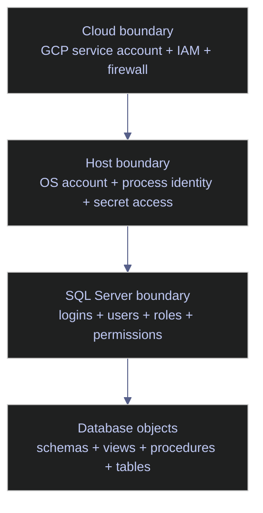
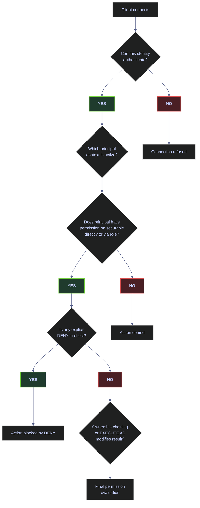
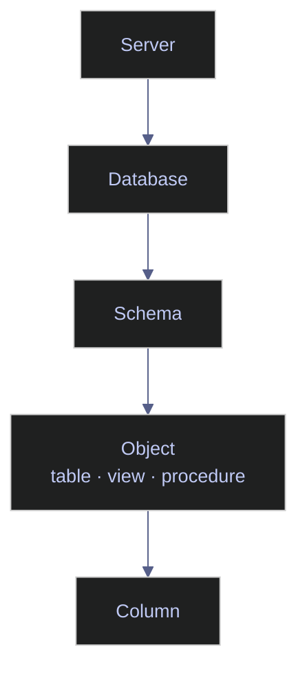

# Users, Logins, Roles, and Permissions

SQL Server security is not one feature. It is the combination of:

- **identity**: who or what is connecting
- **scope**: server, database, schema, object, or column
- **authorization**: what actions are permitted
- **operational design**: whether the access model remains understandable and auditable under real production pressure

This note is the complete working reference for **SQL Server 2022** principals and permissions in a data engineering environment. It covers:

- logins vs users
- server roles vs database roles
- fixed roles vs custom roles
- `GRANT`, `DENY`, and `REVOKE`
- schema-level security
- least-privilege patterns
- contained users
- service identities
- practical access models for:
  - platform admins
  - security admins
  - data engineers
  - ETL and ELT runtimes
  - GCP-hosted pipeline services
  - BI consumers
  - analysts
  - application end users
  - vendors and break-glass identities

> [!important] Least-privilege defaults
>
> The safest default is:
>
> 1. authenticate at the **narrowest practical boundary**
> 2. authorize through **custom roles**
> 3. grant at the **schema level** when possible
> 4. avoid broad fixed roles for applications and pipelines
> 5. make every privileged identity attributable to a real purpose

---

## The Security Model in One Sentence

A **login** gets you into the SQL Server instance. A **user** gets you into a specific database. A **role** groups permissions. A **permission** allows or denies an action on a **securable**.

That sentence is simple, but each word has operational consequences. The rest of this note exists to make those consequences explicit.

---

## Identity Boundaries

For SQL Server running on a VM or host, especially on **GCP**, identity must be reasoned about in layers rather than as one flat problem.



### What each layer means

- **Cloud boundary**
  - Controls who can administer the VM, fetch secrets, call cloud APIs, or reach the network path.
  - On GCP this often means a **GCP service account**, IAM bindings, firewall rules, and sometimes Secret Manager access.

- **Host boundary**
  - Controls which process can read TLS files, environment variables, credential files, or mounted secrets.
  - This is the Linux or Windows process boundary.

- **SQL Server boundary**
  - Controls who can connect to the SQL Server instance and what they can do there.
  - This is where **logins, users, roles, and permissions** live.

- **Database object boundary**
  - Controls what can be read, executed, altered, or denied inside actual databases.
  - This is where **schemas, views, procedures, tables, and object-level permissions** matter.

> [!warning] Cloud identity is not database identity
>
> A GCP service account is **not** a SQL Server login.
>
> It may identify the VM or workload to GCP, but it does not automatically become a principal inside SQL Server. In a GCP-hosted SQL Server deployment, the usual pattern is:
>
> - GCP service account protects infrastructure and secret retrieval
> - application retrieves a SQL credential or other approved secret
> - application authenticates to SQL Server using a SQL login, Windows principal, contained user, or other supported SQL identity model

> [!success] Correct pattern
>
> Use the GCP service account to retrieve the SQL credential from Secret Manager, then authenticate to SQL Server with a dedicated SQL login or contained user. Keep cloud identity and database identity explicitly connected through secret management.

### Why this matters

Many teams mistakenly think that because a pipeline runs under a cloud service account, SQL Server access is already solved. It is not. Cloud identity and SQL identity are related operationally, but they are separate authorization systems.

> [!tip] Two-layer identity model
>
> Treat cloud service accounts as **infrastructure identities** and SQL logins or contained users as **database identities**. Connect them deliberately through secret management and explicit access design, not by assumption.

---

## Core Definitions

Brief dictionary definitions are not enough for security work. Each term must be understood in context.

### Principal

A **principal** is any entity that can request SQL Server resources.

Examples:
- a SQL login
- a Windows login
- a Windows group
- a database user
- a server role
- a database role
- an application role
- a certificate-mapped principal in specialized designs

Why it matters:
- Permissions are not assigned to “connections” in the abstract.
- Permissions are assigned to principals.
- If you cannot identify the principal, you cannot reason about the permission model.

Example:
- `etl_loader` as a SQL login is a **server principal**
- `etl_loader` as a user inside `warehouse` is a **database principal**
- `etl_loader_rw` as a custom database role is also a **principal**, because it can hold permissions and memberships

> [!info] Principals as subjects
>
> Think of principals as the **subjects** in the authorization model. They are the “who” side of “who can do what on which object.”

### Securable

A **securable** is any SQL Server resource that can have permissions applied to it.

Examples by scope:
- **server scope**
  - the server itself
  - endpoints
  - logins
- **database scope**
  - the database
  - schemas
  - roles
  - certificates
- **schema scope**
  - types
  - XML schema collections
- **object scope**
  - tables
  - views
  - procedures
  - functions
  - synonyms
  - queues
- **column scope**
  - a specific column in a table or view

Why it matters:
- Permissions are always evaluated against a securable.
- If you grant too low in the hierarchy, management becomes noisy.
- If you grant too high in the hierarchy, blast radius grows.

Example:
- `GRANT SELECT ON SCHEMA::gold TO reporting_reader`
  - principal: `reporting_reader`
  - permission: `SELECT`
  - securable: `SCHEMA::gold`

### Permission

A **permission** is the right to perform a specific action on a securable.

Examples:
- `CONNECT`
- `SELECT`
- `INSERT`
- `UPDATE`
- `DELETE`
- `EXECUTE`
- `ALTER`
- `VIEW DEFINITION`
- `CONTROL`
- `CREATE LOGIN`
- `CREATE USER`

Why it matters:
- Permissions are the actual capability surface.
- Roles are just bundles; permissions are what ultimately allow actions.

Example:
- A reporting user might need:
  - `CONNECT`
  - `SELECT` on a schema
  - possibly `VIEW DEFINITION`
- That user does **not** need `ALTER`, `CONTROL`, or `db_owner`

### Login

A **login** is a server-level identity. It allows authentication to the **SQL Server instance**.

Common login types in SQL Server:
- SQL login
- Windows login
- Windows group login
- in supported environments, certain Microsoft Entra-based identities

What it implies:
- A login does **not** automatically imply access inside every database.
- A login is usually authenticated at the `master` boundary unless you are using a contained user model.

*Create a SQL login as a server-level principal.*

```sql
CREATE LOGIN etl_loader
WITH PASSWORD = 'StrongPasswordHere';
```

What this does **not** do:
- It does not create a database user.
- It does not grant table access.
- It does not grant `SELECT`, `INSERT`, or `EXECUTE`.
- It only creates the server principal.

> [!warning] Login does not equal access
>
> “The login exists” is not the same thing as “the pipeline can use the target database.” You still need a database user and permissions.

> [!success] Correct pattern
>
> After creating the login, always create the corresponding database user and assign it to a custom role with explicit permissions.

### User

A **database user** is a database-level identity.

There are two major patterns:

#### Login-mapped user
A database user mapped to an existing login.

*Create a login-mapped database user in the target database.*

```sql
USE warehouse;
GO
CREATE USER etl_loader FOR LOGIN etl_loader;
GO
```

Implication:
- The login authenticates at the instance.
- The user defines the identity inside this database.

#### Contained user
A database user without a corresponding server login.

*Create a contained user that authenticates at the database level without a server login.*

```sql
USE warehouse;
GO
CREATE USER consumer_portal
WITH PASSWORD = 'StrongContainedPasswordHere',
     DEFAULT_SCHEMA = dbo;
GO
```

Implication:
- Authentication occurs at the database level.
- The connection string must target the database explicitly.
- This is often useful for portability and one-database access designs.

> [!info] Login-to-user cardinality
>
> A login can map to **one user per database**, but the same login can be mapped into **many databases**.

#### Default schema behavior

When a user issues an unqualified object reference (e.g., `SELECT * FROM orders`), SQL Server resolves it using the user's **default schema**. If no default schema is set, SQL Server falls back to `dbo`.

| Default Schema Setting | Resolution Order |
|---|---|
| Explicitly set (e.g., `DEFAULT_SCHEMA = gold`) | `gold.orders` first, then `dbo.orders` |
| Not set or set to `dbo` | `dbo.orders` only |

> [!tip] Default schema alignment
>
> Set the default schema to match the user's primary working layer (e.g., `gold` for analysts, `bronze` for loaders). This prevents accidental cross-schema references and makes unqualified queries predictable.

### Role

A **role** is a principal that groups permissions.

Two major categories:

#### Server role
Holds permissions at server scope.

Examples:
- `sysadmin`
- `securityadmin`
- `dbcreator`
- `##MS_LoginManager##`

#### Database role
Holds permissions at database scope.

Examples:
- `db_datareader`
- `db_datawriter`
- `db_owner`
- custom roles such as `gold_reader` or `etl_executor`

Why roles matter:
- They separate **identity** from **capability**
- Users come and go; roles should remain stable
- Auditing becomes much easier when permissions are granted to roles instead of directly to users

> [!tip] Role-based permission chain
>
> The clean model is:
>
> `login -> user -> role -> permission`
>
> not:
>
> `login -> random direct grants everywhere`

### Schema

A **schema** is both a namespace and a security boundary.

Example:
- `bronze.ticks_raw`
- `silver.orders_enriched`
- `gold.pnl_daily`

Why it matters:
- Schema-level grants are usually the best balance between precision and manageability
- They let you grant access to entire layers without table-by-table sprawl

*Grant schema-level SELECT and EXECUTE to custom roles.*

```sql
GRANT SELECT ON SCHEMA::gold TO gold_reader;
GRANT EXECUTE ON SCHEMA::api TO app_executor;
```

### `GRANT`, `DENY`, and `REVOKE`

#### `GRANT`
Adds permission.

*Grant SELECT on a schema to a role.*

```sql
GRANT SELECT ON SCHEMA::gold TO reporting_reader;
```

#### `DENY`
Explicitly blocks permission, even if the principal might otherwise inherit it through a role.

*Deny SELECT on a specific table, overriding any inherited grant.*

```sql
DENY SELECT ON OBJECT::gold.salaries TO analyst_readers;
```

#### `REVOKE`
Removes a previous grant or deny.

*Remove a previously applied permission (grant or deny) from a role.*

```sql
REVOKE SELECT ON OBJECT::gold.salaries FROM analyst_readers;
```

Operational implications:
- `DENY` is stronger than inherited `GRANT`
- `REVOKE` is not the same as `DENY`
- `DENY` does **not** apply to `sysadmin` members or object owners
- careless `DENY` usage makes permission debugging much harder

> [!warning] `DENY` overuse
>
> Use `DENY` sparingly.
>
> Prefer designing clean role scopes so that you rarely need negative permissions. Heavy `DENY` usage usually indicates a messy authorization model.

> [!success] Correct pattern
>
> Design roles so that each grants only what is needed. Use `REVOKE` to remove unwanted inherited permissions before reaching for `DENY`.

---

## The Authentication and Authorization Path

When a client connects, SQL Server evaluates access in stages:



1. **Can this identity authenticate to the instance or database?**
2. **Which principal context is active?**
3. **Does that principal have permission on the target securable, directly or through role membership?**
4. **Is any explicit deny in effect?**
5. **Does ownership chaining or execution context modify the final result?**

This is why a user may:
- connect to the instance but not to a database
- connect to a database but not read a table
- read a view but not the underlying table directly
- execute a procedure without direct table permissions if ownership chaining is designed intentionally

> [!important] Authentication vs authorization
>
> Authentication answers **who are you?**
>
> Authorization answers **what can you do?**
>
> Many production failures come from conflating the two.

---

## Login Types

### SQL Logins

Use when:
- the application is not domain-integrated
- the environment is Linux-hosted and Windows auth is not available or not used
- a pipeline runtime needs deterministic credentials
- secret rotation is managed externally

*Create a SQL login with password policy enforcement enabled and expiration disabled.*

```sql
CREATE LOGIN ingest_runtime
WITH PASSWORD = 'UseARealManagedSecret',
     CHECK_POLICY = ON,
     CHECK_EXPIRATION = OFF;
GO
```

| Aspect | Detail |
|---|---|
| Strengths | Simple, portable, common in application and ETL tooling |
| Weaknesses | Password management burden, secret sprawl risk, rotation discipline essential |
| Good fit | Service runtimes, ETL tools, vendor integrations, GCP-hosted apps retrieving credentials from Secret Manager |

#### `CHECK_POLICY` and `CHECK_EXPIRATION`

SQL logins support two password-governance options set at creation time:

| Option | Default | Effect | Recommendation |
|---|---|---|---|
| `CHECK_POLICY` | `ON` | Enforces the Windows password-complexity policy (length, character classes). On Linux, only minimum length is enforced. | Always `ON` — setting to `OFF` accepts any password including empty strings |
| `CHECK_EXPIRATION` | `OFF` | Enforces the Windows password-expiration policy. When enabled, the login must change its password before the OS-defined maximum age. | `OFF` for service accounts (rotate via Secret Manager instead), `ON` for human logins if the OS policy is configured |

> [!warning] Disabled password policy
>
> `CHECK_POLICY = OFF` is invisible until an audit or breach. It is the single most common SQL login misconfiguration.

> [!success] Correct pattern
>
> Always create SQL logins with `CHECK_POLICY = ON`. For service accounts, disable expiration but keep complexity enforcement.

### Windows Logins and Windows Groups

Use when:
- SQL Server is integrated with Windows identity
- human access is managed through domain groups
- you want centralized onboarding and offboarding

*Create a Windows group login and map it to a database user.*

```sql
CREATE LOGIN [CONTOSO\DataEngineers] FROM WINDOWS;
GO

USE warehouse;
GO
CREATE USER [CONTOSO\DataEngineers] FOR LOGIN [CONTOSO\DataEngineers];
GO
```

| Aspect | Detail |
|---|---|
| Strengths | Central identity lifecycle, easier human access management, strong fit for enterprise admin and analyst groups |
| Weaknesses | Less portable, not always available in Linux/GCP-centered patterns |
| Good fit | DBAs, platform engineers, analyst groups, security-managed human access |

### Contained Users

Use when:
- access is limited to one database
- database portability matters
- you want to decouple from instance-level logins
- tenant isolation is clearer at the database level

*Create a contained user scoped to a single database with a default schema.*

```sql
USE analytics_serving;
GO
CREATE USER dashboard_consumer
WITH PASSWORD = 'UseASecretManagerManagedValue',
     DEFAULT_SCHEMA = reporting;
GO
```

| Aspect | Detail |
|---|---|
| Strengths | Easier database migration, avoids `master` login dependency, clean for single-database applications |
| Weaknesses | Connection string must name the database explicitly, can complicate identity standardization if overused, each database needs its own contained principal |

> [!success] Single-database access
>
> For identities that connect to exactly one database, contained users are often a cleaner design than login-mapped users.

### Certificate- or Asymmetric-Key-Mapped Principals

Use when:
- signing modules
- highly specialized security patterns
- controlled privilege elevation through signed code

This is an advanced pattern, not the default for application access.

> [!info] Module signing
>
> Module signing is often a better answer than granting broad direct permissions to application users that need carefully scoped privileged actions.

---

## Special Principals

| Principal | Scope | What it is | Recommendation |
|---|---|---|---|
| `sa` | Server | Built-in high-privilege SQL login, member of `sysadmin` | Strong password, monitor usage, disable or rename where possible, never use as an application identity |
| `dbo` | Database | Special principal representing database ownership context with full control inside the database | Do not map ordinary applications or humans to `dbo`, do not normalize access around it |
| `guest` | Database | Special principal that can allow access without an explicit user if misconfigured | Keep `guest` permissions absent unless deliberately designed, audit regularly |
| `public` | Both | Every login is in server `public`, every database user is in database `public` | Any permission granted to `public` is extremely broad — use only when you truly mean “everyone” |

> [!warning] `public` grant scope
>
> `public` grants are easy to forget and hard to reason about later. Keep them minimal.

> [!success] Correct pattern
>
> Audit `public` and `guest` permissions as part of every security review. Remove any grants that are not explicitly justified.

---

## Server Roles

Server roles define permissions at instance scope.

### Legacy Fixed Server Roles

#### `sysadmin`
- Full control over the instance
- Bypasses nearly all other boundaries

Use for:
- break-glass access
- a very small number of trusted DBAs

Never use for:
- applications
- ETL runtimes
- analysts
- ordinary engineers

#### `securityadmin`
- Can manage logins and permissions broadly
- Effectively dangerous enough to be treated near-`sysadmin` in real environments

Use with extreme caution.

#### `serveradmin`
- Server-wide configuration actions

#### `processadmin`
- Can terminate sessions

#### `setupadmin`
- Can manage linked servers via T-SQL

#### `bulkadmin`
- Can run `BULK INSERT`
- carries escalation risk
- not supported on SQL Server on Linux

#### `diskadmin`
- Historical disk-file management role
- rarely appropriate in modern estates

#### `dbcreator`
- Can create, alter, drop, and restore databases
- too broad for most daily work

#### `public`
- baseline membership for all logins

> [!warning] Legacy role over-granting
>
> `securityadmin`, `dbcreator`, and `bulkadmin` are commonly over-granted because they sound narrower than they really are.

> [!success] Correct pattern
>
> Use the SQL Server 2022 `##MS_LoginManager##` and `##MS_DatabaseManager##` roles instead. They provide the common use cases without the broad escalation surface of legacy roles.

### SQL Server 2022 Least-Privilege Server Roles

SQL Server 2022 added new fixed roles prefixed with `##MS_` to reduce reliance on overly broad legacy roles.

#### `##MS_LoginManager##`
Use for:
- teams that must create, alter, or drop logins
- security operations that should **not** be able to grant arbitrary server privileges

This is usually better than `securityadmin` for login lifecycle management.

#### `##MS_DatabaseManager##`
Use for:
- teams that need database create/drop capability without full server privilege

Caution:
- creator becomes owner of the database they create

#### `##MS_DatabaseConnector##`
Use for:
- server-wide database connectivity scenarios

Caution:
- this is broader than it looks because it can connect to any database unless explicitly denied at a database

#### `##MS_ServerStateReader##`
Use for:
- performance observability teams that need broad DMV visibility

#### `##MS_ServerStateManager##`
Use for:
- controlled server-state operations, broader than reader

#### `##MS_ServerPerformanceStateReader##`
Use for:
- performance observability with a narrower footprint than full state reader

#### `##MS_ServerSecurityStateReader##`
Use for:
- security observability use cases

#### `##MS_DefinitionReader##`
Use for:
- metadata readers who need broad definition visibility

#### `##MS_PerformanceDefinitionReader##`
Use for:
- performance metadata visibility

#### `##MS_SecurityDefinitionReader##`
Use for:
- security metadata visibility

> [!success] SQL Server 2022 roles
>
> Prefer the new `##MS_*##` SQL Server 2022 roles over broader legacy roles when they satisfy the use case.

#### Example | narrow login administration

*Add a Windows group to the least-privilege login management role.*

```sql
ALTER SERVER ROLE [##MS_LoginManager##] ADD MEMBER [CONTOSO\SqlSecurityOps];
GO
```

---

## Database Roles

Database roles define permissions inside a single database.

### Fixed Database Roles

#### `db_owner`
Has all permissions in the database.

Use for:
- extremely limited admin cases
- database owners
- controlled automation for maintenance only when truly necessary

Avoid for:
- applications
- reporting users
- ETL runtimes
- general engineers

#### `db_securityadmin`
Can manage permissions and custom role membership.

Risk:
- privilege escalation potential

#### `db_accessadmin`
Can add or remove database access.

#### `db_backupoperator`
Can back up the database.

#### `db_ddladmin`
Can run broad DDL.

Risk:
- can create or alter programmable objects that may execute under higher privilege

#### `db_datareader`
Can read all user tables and views.

Useful when:
- read scope is truly the whole database

Not ideal when:
- you want only `gold` schema or a limited API surface

#### `db_datawriter`
Can modify data in all user tables.

Usually too broad for pipelines unless the database is deliberately narrow.

#### `db_denydatareader`
Explicitly denies reads across user tables and views.

#### `db_denydatawriter`
Explicitly denies writes across user tables.

#### `public`
Base role for all database users.

> [!warning] Fixed role blast radius
>
> Fixed database roles are convenient, but they often grant much more than a production application or pipeline actually needs.

> [!success] Correct pattern
>
> Create custom database roles scoped to specific schemas. Use fixed roles only when the access need genuinely spans the entire database.

### User-Defined Database Roles

This should be your default authorization tool.

Examples:
- `bronze_loader`
- `silver_transformer`
- `gold_reader`
- `api_executor`
- `schema_migrator`
- `job_operator_limited`

Why custom roles win:
- they match your workload
- they can be audited clearly
- they avoid “all tables in all schemas” grants
- they survive personnel churn better

*Create a custom read role scoped to the gold schema.*

```sql
USE warehouse;
GO
CREATE ROLE gold_reader;
GO
GRANT SELECT ON SCHEMA::gold TO gold_reader;
GO
```

> [!success] Custom roles as default
>
> For most databases, custom roles should carry the actual access design, while fixed roles are used only selectively.

---

## Permission Hierarchy and Scope

Permissions can be granted at different levels of the securable hierarchy. A grant at a higher scope cascades to all objects below it.



Typical hierarchy:
- server
- database
- schema
- object
- column

### Why scope matters

If you grant too low:
- administration becomes noisy
- onboarding requires repetitive grants
- permissions drift becomes likely

If you grant too high:
- blast radius expands
- unauthorized data becomes visible
- audits become harder to defend

### Good scope choices by scenario

| Scenario | Best Scope | Why |
|---|---|---|
| All published reporting tables | Schema | Stable and readable |
| One stored procedure API | Procedure or API schema | Exact execution surface |
| One sensitive table | Object | Narrow exception |
| One sensitive column | Column | Use only when justified |
| Full database admin | Database | Admin boundary |

> [!tip] Schema-scoped roles
>
> Schema-level security is usually the best default for data platforms:
>
> - `bronze_loader` on `bronze`
> - `silver_transformer` on `silver`
> - `gold_reader` on `gold`

---

## Direct Grants vs Role-Based Grants

### Direct grants

*Grant SELECT directly to an individual user.*

```sql
GRANT SELECT ON SCHEMA::gold TO analyst_anna;
```

Good for:
- temporary investigation
- one-off exceptions
- emergencies followed by cleanup

Bad as a default because:
- they do not scale
- they create hidden snowflakes
- audits become principal-by-principal archaeology

### Role-based grants

*Create a role, grant permissions to the role, then add the user to the role.*

```sql
CREATE ROLE gold_reader;
GRANT SELECT ON SCHEMA::gold TO gold_reader;
ALTER ROLE gold_reader ADD MEMBER analyst_anna;
```

Good because:
- capability is separated from identity
- onboarding and offboarding are easier
- intent is visible in role names

> [!important] Roles over direct grants
>
> Grant permissions to roles. Add users to roles. Avoid direct grants unless the exception is short-lived and documented.

---

## Recommended Design Rules

1. **Prefer groups over individual humans** when your identity platform supports it.
2. **Prefer custom roles over fixed roles** for application and data access.
3. **Prefer schema-level grants over table-by-table grants** for layered data platforms.
4. **Avoid `db_owner` for applications**.
5. **Avoid `sysadmin` except for true admin identities**.
6. **Treat `securityadmin` as high-risk**.
7. **Use SQL Server 2022 `##MS_*##` server roles** where they fit.
8. **Use contained users for one-database identities** when portability helps.
9. **Do not use `DENY` as your primary design mechanism**.
10. **Do not grant to `public` casually**.
11. **Keep service identities non-interactive and narrowly scoped**.
12. **Separate read, write, DDL, and operations identities**.

---

## Scenario Patterns

### Platform Administrator

#### Typical need
- instance operations
- backups/restores
- failover operations
- server configuration
- break-glass troubleshooting

#### Recommended model
- named admin identity or admin group
- very limited membership in `sysadmin`
- additional observability identities separated where possible

#### Bad pattern
- using one shared “admin” SQL login for all DBAs

#### Better pattern
- named Windows group or controlled login
- audited elevation workflow
- break-glass account documented separately

---

### Security Administrator

#### Typical need
- create and alter logins
- review role membership
- inspect permissions
- not necessarily run the whole server

#### Recommended model
- prefer `##MS_LoginManager##` in SQL Server 2022
- add metadata-reader roles only as needed

#### Why not `securityadmin` by default
Because it is broader and easier to misuse.

*Assign login management to a security operations group using the least-privilege role.*

```sql
ALTER SERVER ROLE [##MS_LoginManager##] ADD MEMBER [CONTOSO\SqlSecurityOps];
GO
```

---

### Database Administrator for One Database

#### Typical need
- manage users
- manage roles
- perform DDL
- run maintenance within one database

#### Recommended model
- `db_owner` only if truly acting as full database admin
- otherwise combine narrower capabilities:
  - custom admin role
  - `db_backupoperator`
  - `db_ddladmin`
  - explicit grants
  - `db_securityadmin` only with care

> [!warning] `db_owner` scope risk
>
> `db_owner` is operationally simple, but it is often too broad for development leads or pipeline maintainers.

> [!success] Correct pattern
>
> Combine narrower capabilities: a custom admin role with specific DDL grants, `db_backupoperator` for backups, and explicit schema permissions for data access.

---

### Data Engineer

#### Typical need
- read raw and transformed data
- write to staging or target schemas
- execute ETL procedures
- occasionally create tables in controlled schemas

#### Recommended model
Use custom roles such as:
- `bronze_loader`
- `silver_transformer`
- `etl_executor`
- `gold_reader`

*Create schema-scoped custom roles for each data layer.*

```sql
CREATE ROLE bronze_loader;
GRANT SELECT, INSERT, UPDATE, DELETE ON SCHEMA::bronze TO bronze_loader;

CREATE ROLE silver_transformer;
GRANT SELECT, INSERT, UPDATE, DELETE ON SCHEMA::silver TO silver_transformer;

CREATE ROLE etl_executor;
GRANT EXECUTE ON SCHEMA::etl TO etl_executor;
```

Avoid:
- `db_owner`
- `db_datawriter` across the whole database unless the database is intentionally narrow
- server-level roles for database-local work

---

### Pipeline Runtime User

This is the identity used by Airflow, dbt, SSIS, a custom loader, a containerized ETL task, or a scheduled app runtime.

#### Typical need
- connect non-interactively
- execute specific procedures
- write to specific schemas
- maybe bulk load into controlled targets

#### Recommended model
- SQL login or contained user
- one identity per runtime or pipeline family
- custom roles only
- no interactive admin rights
- no `db_owner`
- no `sysadmin`

*Create a dedicated pipeline login, map it to a user, and assign a custom schema role.*

```sql
CREATE LOGIN pipeline_ingest
WITH PASSWORD = 'ManagedSecretValue',
     CHECK_POLICY = ON,
     CHECK_EXPIRATION = OFF;
GO

USE warehouse;
GO
CREATE USER pipeline_ingest FOR LOGIN pipeline_ingest;
GO

CREATE ROLE bronze_loader;
GRANT INSERT, UPDATE, DELETE, SELECT ON SCHEMA::bronze TO bronze_loader;
GRANT EXECUTE ON SCHEMA::etl TO bronze_loader;
ALTER ROLE bronze_loader ADD MEMBER pipeline_ingest;
GO
```

> [!success] One identity per runtime
>
> Give each runtime its own identity. Do not let five unrelated pipelines share one login unless you want five-way audit ambiguity.

---

### GCP-Hosted Pipeline Runtime

#### Reality check
The GCP service account secures:
- VM/API access
- secret retrieval
- workload identity at the cloud layer

It does **not** by itself authorize SQL operations inside SQL Server.

#### Recommended pattern
1. GCP service account retrieves the SQL secret from Secret Manager
2. application connects using:
   - a SQL login, or
   - a contained user if the workload touches only one database
3. database access is role-based and schema-scoped

#### Good pattern
- GCP service account: `etl-prod@project.iam.gserviceaccount.com`
- SQL login: `pipeline_prod_ingest`
- database user: `pipeline_prod_ingest`
- database roles:
  - `bronze_loader`
  - `etl_executor`

#### Bad pattern
- one shared SQL login for all pipelines in all environments
- `db_owner` for the runtime because “it’s simpler”
- embedding SQL secrets directly in code or CI variables without managed secret retrieval

> [!warning] Narrow at both layers
>
> The service account should be narrow in GCP, and the SQL identity should be narrow in SQL Server. Do not collapse infrastructure trust into database superuser access.

> [!success] Correct pattern
>
> Give each pipeline its own SQL login, retrieve the credential from Secret Manager at runtime, and assign only the custom roles needed for that pipeline's specific data layer.

---

### BI Consumer or Reporting User

#### Typical need
- read published data
- maybe execute curated reporting procedures
- no write capability

#### Recommended model
- contained user or group-mapped login
- custom role such as `gold_reader`
- schema-level `SELECT`
- optional `EXECUTE` on a reporting procedure schema
- optional `VIEW DEFINITION` if tooling requires metadata visibility

*Create a read-only reporting role with SELECT on gold and EXECUTE on reporting procedures.*

```sql
CREATE ROLE gold_reader;
GRANT SELECT ON SCHEMA::gold TO gold_reader;
GRANT EXECUTE ON SCHEMA::reporting TO gold_reader;
```

Avoid:
- `db_datareader` if only one schema should be visible
- direct table grants unless it is a narrow exception

---

### Data Consumer and Analyst

#### Typical need
- ad hoc queries against curated data
- maybe read metadata
- no writes
- no DDL

#### Recommended model
- analyst group -> login/user -> custom read role
- optional `VIEW DEFINITION`
- deny access to sensitive schemas by design, not after-the-fact patching

Good example:
- `analytics_readers`
  - `SELECT` on `gold`
  - `EXECUTE` on `analytics`
  - no access to `bronze`
  - no access to administrative schemas

---

### Application End User

In most SQL Server-backed applications, end users should **not** be direct database principals.

#### Better pattern
- application authenticates as a service identity
- application enforces business authorization
- SQL Server sees one or a few service principals, not thousands of human end users

Use direct DB users for end users only when:
- the application is intentionally database-facing
- multi-tenant or per-user auditing requires it
- operational overhead is justified

> [!info] App vs database authorization
>
> Application authorization and database authorization are not the same thing. Do not push all application end-user identity directly into SQL Server unless you truly need that model.

---

### Vendor or Support Identity

#### Typical need
- temporary diagnostic read access
- maybe execute a support procedure
- no standing write permission
- time-limited access

#### Recommended model
- dedicated vendor login
- disabled by default when feasible
- custom support role
- narrow schema or procedure permissions
- strong audit trail

*Create a narrow support role with read access and a single diagnostic procedure.*

```sql
CREATE ROLE vendor_support_reader;
GRANT SELECT ON SCHEMA::gold TO vendor_support_reader;
GRANT EXECUTE ON OBJECT::support.usp_collect_diagnostics TO vendor_support_reader;
```

---

### Deployment or Migration Identity

#### Typical need
- create/alter objects
- run migrations
- possibly create schemas
- should not read or write all business data by default

#### Recommended model
- dedicated deployment login or contained user
- custom role with DDL rights appropriate to the target schema
- `db_ddladmin` only if justified and understood
- separate from runtime identity

> [!warning] Deployment vs runtime identity
>
> Do not reuse the application runtime login for schema deployment. Deployment is a different privilege boundary.

> [!success] Correct pattern
>
> Create a separate deployment login with DDL rights on target schemas. Keep the runtime identity limited to DML and EXECUTE.

---

## Fixed Roles vs Custom Roles

| Need | Good Choice | Avoid by Default |
|---|---|---|
| Create logins | `##MS_LoginManager##` | `securityadmin` |
| Create databases | `##MS_DatabaseManager##` or tightly governed `dbcreator` | `sysadmin` |
| Read all published reporting tables | custom schema role | `db_datareader` if only one schema is needed |
| Full database admin | `db_owner` for very few principals | giving `db_owner` to apps |
| ETL writes to one schema | custom role | `db_datawriter` on whole DB |
| Human admin break-glass | `sysadmin` for very few named identities | shared admin login |
| SQL Agent job operators | `SQLAgentOperatorRole` in `msdb` if applicable | `sysadmin` when job ops are the only need |

---

## Common DDL Patterns

### Create a SQL Login and Map It to a Database User

*Create a server login and its corresponding database user in one pattern.*

```sql
CREATE LOGIN pipeline_loader
WITH PASSWORD = 'UseARealManagedSecret',
     CHECK_POLICY = ON,
     CHECK_EXPIRATION = OFF;
GO

USE warehouse;
GO
CREATE USER pipeline_loader FOR LOGIN pipeline_loader;
GO
```

#### What this pattern is for
- service runtimes
- ETL tools
- non-interactive apps

#### What it still lacks
- role membership
- actual object permissions

---

### Create a Contained User

*Create a database-level user with no server login dependency.*

```sql
USE analytics_serving;
GO
CREATE USER dashboard_reader
WITH PASSWORD = 'UseARealManagedSecret',
     DEFAULT_SCHEMA = reporting;
GO
```

#### Use when
- the identity needs only one database
- portability matters
- you want to avoid instance-level login dependency

#### Remember
- the connection string must target the database explicitly

---

### Create a Custom Read Role

*Create a role and grant schema-scoped SELECT.*

```sql
USE warehouse;
GO
CREATE ROLE gold_reader;
GO
GRANT SELECT ON SCHEMA::gold TO gold_reader;
GO
```

---

### Add a User to a Role

*Add an existing database user to a custom role.*

```sql
ALTER ROLE gold_reader ADD MEMBER dashboard_reader;
GO
```

---

### Create a Controlled ETL Role

*Create a transformation role with DML, EXECUTE, and VIEW DEFINITION on target schemas.*

```sql
USE warehouse;
GO
CREATE ROLE silver_transformer;
GO

GRANT SELECT, INSERT, UPDATE, DELETE ON SCHEMA::silver TO silver_transformer;
GRANT EXECUTE ON SCHEMA::etl TO silver_transformer;
GRANT VIEW DEFINITION ON SCHEMA::silver TO silver_transformer;
GO

ALTER ROLE silver_transformer ADD MEMBER pipeline_loader;
GO
```

---

### Grant Procedure Execution Without Table Access

*Create an execute-only role for a procedure-based API schema.*

```sql
USE serving;
GO
CREATE ROLE api_executor;
GO
GRANT EXECUTE ON SCHEMA::api TO api_executor;
GO
```

This pattern is useful when consumers should use procedures as the supported access surface rather than directly querying tables.

---

### Revoke and Deny Examples

*Remove an explicit permission, then apply an explicit deny on a sensitive table.*

```sql
REVOKE SELECT ON OBJECT::gold.salaries FROM gold_reader;
GO

DENY SELECT ON OBJECT::gold.salaries TO analyst_readers;
GO
```

#### Practical distinction
- `REVOKE` removes an earlier explicit permission
- `DENY` actively blocks the permission even if inherited through a role

---

### Give a Team Login Management Without Broad Security Privilege

*Assign narrow login management to a team using the SQL Server 2022 role.*

```sql
ALTER SERVER ROLE [##MS_LoginManager##] ADD MEMBER [CONTOSO\SqlSecurityOps];
GO
```

---

### Add a Human Analyst Group to a Database Role

*Create a Windows group login, map it to a database user, and add it to a read role.*

```sql
CREATE LOGIN [CONTOSO\AnalyticsReaders] FROM WINDOWS;
GO

USE warehouse;
GO
CREATE USER [CONTOSO\AnalyticsReaders] FOR LOGIN [CONTOSO\AnalyticsReaders];
GO

ALTER ROLE gold_reader ADD MEMBER [CONTOSO\AnalyticsReaders];
GO
```

---

## Schema-Level Security Patterns

For a data platform with `bronze`, `silver`, and `gold` schemas, the cleanest model is usually schema-scoped roles.

### Recommended role design

| Role | Typical Grants | Typical Members |
|---|---|---|
| `bronze_loader` | `SELECT`, `INSERT`, `UPDATE`, `DELETE` on `bronze`; maybe `EXECUTE` on ingestion procs | pipeline runtimes |
| `silver_transformer` | `SELECT`, `INSERT`, `UPDATE`, `DELETE` on `silver`; `EXECUTE` on ETL schema | transformation jobs |
| `gold_reader` | `SELECT` on `gold` | BI, analysts, consumers |
| `api_executor` | `EXECUTE` on `api` schema | application runtimes |
| `schema_migrator` | controlled DDL permissions or `db_ddladmin` if justified | deployment identity |

### Example

*Create the three-layer schema role design in one script.*

```sql
USE warehouse;
GO

CREATE ROLE bronze_loader;
CREATE ROLE silver_transformer;
CREATE ROLE gold_reader;
GO

GRANT SELECT, INSERT, UPDATE, DELETE ON SCHEMA::bronze TO bronze_loader;
GRANT SELECT, INSERT, UPDATE, DELETE ON SCHEMA::silver TO silver_transformer;
GRANT SELECT ON SCHEMA::gold TO gold_reader;
GO
```

> [!success] Schema-level durability
>
> Schema-level roles usually age better than database-wide fixed roles because they keep layer intent visible.

---

## SQL Server Agent Roles

If your pipeline model uses **SQL Server Agent**, the `msdb` database includes special fixed roles:

- `SQLAgentUserRole`
- `SQLAgentReaderRole`
- `SQLAgentOperatorRole`

Use them when the real need is:
- view jobs
- run owned jobs
- operate jobs
- inspect job history

Do **not** grant `sysadmin` just because someone needs to operate jobs.

> [!info] Concentric Agent roles
>
> SQL Server Agent roles are concentric: the more privileged Agent roles inherit the lower Agent-role capabilities.

---

## Ownership Chaining and Execution Context

These topics matter because principals do not always need direct table permissions if access is intentionally mediated.

### Ownership chaining
If a procedure and the underlying table share the same owner, SQL Server can allow the procedure to access the table without requiring direct table permission for the caller.

### `EXECUTE AS`
A module can run under a different execution context than the caller.

Why this matters:
- it can simplify secure API patterns
- it can also hide privilege escalation if poorly designed

Recommendation:
- prefer explicit, well-documented procedure surfaces
- use `EXECUTE AS` deliberately, not casually
- review ownership context during security audits

> [!warning] Hidden execution context
>
> Broad grants plus hidden execution-context changes produce authorization models that are very hard to reason about.

> [!success] Correct pattern
>
> Use explicit, documented procedure surfaces with ownership chaining. Review `EXECUTE AS` usage during every security audit and keep the execution context visible in code comments and runbooks.

---

## Additional Security Features

### Orphaned users

An **orphaned user** is a database user whose mapped login no longer exists or whose SID no longer matches. This commonly occurs after restoring a database to a different instance.

*Detect orphaned users by comparing database user SIDs to server login SIDs.*

```sql
SELECT
    dp.name AS user_name,
    dp.type_desc,
    dp.sid
FROM sys.database_principals AS dp
LEFT JOIN sys.server_principals AS sp
    ON dp.sid = sp.sid
WHERE dp.type IN ('S', 'U')
  AND dp.authentication_type_desc = 'INSTANCE'
  AND sp.sid IS NULL
  AND dp.name NOT IN ('dbo', 'guest', 'INFORMATION_SCHEMA', 'sys');
```

*Re-map an orphaned user to its login after confirming the login exists on the new instance.*

```sql
ALTER USER [pipeline_loader] WITH LOGIN = [pipeline_loader];
```

> [!warning] Orphaned users after restore
>
> Orphaned users retain their role memberships and permissions but cannot authenticate. After a database restore, always run the orphan detection query before declaring the migration complete.

> [!success] Correct pattern
>
> Re-map each orphaned user with `ALTER USER ... WITH LOGIN`. If the login does not exist on the target instance, create it first with a matching SID using `CREATE LOGIN ... WITH SID = 0x...`.

### Application roles

An **application role** is a database principal activated by the application at runtime using `sp_setapprole`. It replaces the caller's security context for the duration of the session.

| Aspect | Detail |
|---|---|
| Activation | `EXEC sp_setapprole 'app_role_name', 'password'` |
| Effect | Drops the caller's user permissions and assumes the role's permissions |
| Deactivation | `EXEC sp_unsetapprole @cookie` (requires saving the cookie at activation) |
| Use case | Legacy applications that need a single, controlled permission set regardless of the connecting user |

> [!info] Legacy pattern
>
> Application roles are a legacy pattern. For new designs, prefer service-identity logins with custom database roles. Application roles introduce password management complexity and make audit attribution harder because the original caller identity is masked during the session.

### Row-level security

SQL Server supports **row-level security (RLS)** through security predicates defined as inline table-valued functions. RLS filters rows transparently — users see only the rows they are authorized to access.

RLS is relevant when:
- multi-tenant data shares a single table and tenants must be isolated
- regulatory requirements mandate row-level access control beyond schema or view boundaries
- the access boundary cannot be achieved by schema separation alone

> [!tip] RLS vs schema separation
>
> RLS is powerful but adds query overhead and complexity. For data platforms using schema-layered designs (`bronze`/`silver`/`gold`), schema-level roles are usually sufficient. Consider RLS only when the isolation requirement is within a schema, not between schemas.

### Dynamic data masking

**Dynamic data masking (DDM)** obscures sensitive column data from non-privileged users without changing the stored values. Masked columns return obfuscated results to users without `UNMASK` permission.

DDM is relevant when:
- analysts need access to a table but should not see PII columns (email, SSN, salary)
- the masking requirement is presentation-level, not storage-level
- column-level `DENY` is too restrictive because the user needs to query the table

> [!warning] DDM is not a security boundary
>
> DDM is not a security boundary — users with `SELECT INTO`, `DBCC`, or sufficient privileges can bypass the mask. It is a convenience layer, not an encryption or access-control mechanism.

> [!success] Correct pattern
>
> Use DDM for casual PII protection in reporting layers. For regulatory-grade data protection, use column-level encryption (Always Encrypted) or restrict access entirely through schema and role design.

---

## Auditing and Inventory Queries

### Inventory server principals

> [!info]- Query breakdown
>
> Joins `sys.server_principals` with `sys.sql_logins` to combine identity metadata with password-policy status. The `WHERE` clause filters to SQL logins (`S`), Windows logins (`U`), and Windows groups (`G`), excluding internal `##` principals. `LOGINPROPERTY` retrieves the last password change timestamp for SQL logins.

*List all non-internal server principals with their type, status, and password-policy configuration.*

```sql
SELECT
    sp.name,
    sp.type_desc,
    sp.is_disabled,
    sp.create_date,
    sl.is_policy_checked,
    sl.is_expiration_checked,
    LOGINPROPERTY(sp.name, 'PasswordLastSetTime') AS password_last_set
FROM sys.server_principals AS sp
LEFT JOIN sys.sql_logins AS sl
    ON sp.principal_id = sl.principal_id
WHERE sp.type IN ('S', 'U', 'G')
  AND sp.name NOT LIKE '##%'
ORDER BY sp.name;
```

| Column | Values | What to watch for |
|---|---|---|
| `type_desc` | `SQL_LOGIN`, `WINDOWS_LOGIN`, `WINDOWS_GROUP` | Unexpected SQL logins in environments that should use Windows auth |
| `is_disabled` | `0` = active, `1` = disabled | Service accounts that should be disabled but are active |
| `is_policy_checked` | `1` = password policy enforced, `0` = not enforced, `NULL` = Windows login | SQL logins with `0` — they bypass the OS password-complexity policy |
| `is_expiration_checked` | `1` = expiration enforced, `0` = not enforced | Service logins should normally have `OFF`; human logins may have `ON` |
| `password_last_set` | Datetime or `NULL` | Very old dates indicate stale credentials that need rotation |

### Inventory `sysadmin` membership

> [!info]- Query breakdown
>
> Joins `sys.server_role_members` back to `sys.server_principals` twice — once for the role and once for the member — to resolve names. Filters to the `sysadmin` role only. Every row in the result is a principal with full instance control.

*List all principals that are members of the sysadmin server role.*

```sql
SELECT
    r.name AS role_name,
    m.name AS member_name,
    m.type_desc
FROM sys.server_role_members AS srm
JOIN sys.server_principals AS r
    ON srm.role_principal_id = r.principal_id
JOIN sys.server_principals AS m
    ON srm.member_principal_id = m.principal_id
WHERE r.name = 'sysadmin'
ORDER BY m.name;
```

*A healthy result has only a small number of named, justified principals. Any SQL login, application identity, or unexpected Windows group in this list is a finding.*

### Inventory database principals

> [!info]- Query breakdown
>
> Queries `sys.database_principals` for all user-created principals. The `WHERE principal_id > 4` filter excludes the built-in principals (`public`, `dbo`, `guest`, `INFORMATION_SCHEMA`). `authentication_type_desc` distinguishes login-mapped users from contained users.

*List all non-built-in database principals with their type and authentication method.*

```sql
SELECT
    name,
    type_desc,
    authentication_type_desc,
    create_date,
    modify_date
FROM sys.database_principals
WHERE principal_id > 4
ORDER BY name;
```

| Column | Key Values | What to watch for |
|---|---|---|
| `type_desc` | `SQL_USER`, `WINDOWS_USER`, `WINDOWS_GROUP`, `DATABASE_ROLE`, `APPLICATION_ROLE` | Unexpected user types or orphaned users |
| `authentication_type_desc` | `INSTANCE` = login-mapped, `DATABASE` = contained user, `NONE` = no auth (roles, groups) | Contained users in databases not intended for containment |

### Inventory database role membership

> [!info]- Query breakdown
>
> Joins `sys.database_role_members` to `sys.database_principals` twice — once for the role and once for the member — to produce a human-readable mapping. Review this output for over-privileged memberships, especially in `db_owner`, `db_securityadmin`, and `db_ddladmin`.

*List every role-to-member mapping in the current database.*

```sql
SELECT
    roles.name AS role_name,
    members.name AS member_name,
    members.type_desc AS member_type
FROM sys.database_role_members AS drm
JOIN sys.database_principals AS roles
    ON drm.role_principal_id = roles.principal_id
JOIN sys.database_principals AS members
    ON drm.member_principal_id = members.principal_id
ORDER BY roles.name, members.name;
```

*Check for application or pipeline identities in `db_owner` or other broad fixed roles. Each membership should be traceable to an operational need.*

### Inventory explicit schema permissions

> [!info]- Query breakdown
>
> Queries `sys.database_permissions` filtered to `class = 3` (schema-scoped permissions) and joins `sys.schemas` to resolve schema names. `state_desc` shows whether each permission is a `GRANT`, `DENY`, or `GRANT_WITH_GRANT_OPTION`.

*List all explicit schema-level permission grants and denies in the current database.*

```sql
SELECT
    dp.class_desc,
    s.name AS schema_name,
    dp.permission_name,
    dp.state_desc,
    USER_NAME(dp.grantee_principal_id) AS grantee_name
FROM sys.database_permissions AS dp
JOIN sys.schemas AS s
    ON dp.major_id = s.schema_id
WHERE dp.class = 3
ORDER BY s.name, grantee_name, dp.permission_name;
```

| Column | Key Values | What to watch for |
|---|---|---|
| `state_desc` | `GRANT`, `DENY`, `GRANT_WITH_GRANT_OPTION`, `REVOKE` | `DENY` entries that may be masking a messy role design; `GRANT_WITH_GRANT_OPTION` on non-admin principals |
| `permission_name` | `SELECT`, `INSERT`, `UPDATE`, `DELETE`, `EXECUTE`, `ALTER`, `CONTROL` | `CONTROL` or `ALTER` on business-data schemas granted to non-admin principals |

### Check `guest` permissions

> [!info]- Query breakdown
>
> Filters `sys.database_permissions` to the `guest` principal using `DATABASE_PRINCIPAL_ID('guest')`. Any row returned means `guest` has an explicit permission in this database, which could allow access without a dedicated user.

*Check whether the guest principal has any explicit permissions in the current database.*

```sql
SELECT
    perm.state_desc,
    perm.permission_name
FROM sys.database_permissions AS perm
WHERE perm.grantee_principal_id = DATABASE_PRINCIPAL_ID('guest')
ORDER BY perm.permission_name;
```

*A healthy result returns no rows. Any `GRANT` row on `guest` means unauthenticated database access may be possible for any login that can reach the instance. Remove unexpected guest grants immediately.*

---

## Operational Anti-Patterns

| Anti-Pattern | Why It Fails | Better Alternative |
|---|---|---|
| Application login in `db_owner` | Excessive blast radius, accidental DDL possible, harder root-cause analysis | Custom role with schema-scoped DML and EXECUTE only |
| Pipeline login in `sysadmin` | Full server compromise if secret leaks, destroys least privilege, impossible to justify in audit | Dedicated SQL login with custom database roles |
| Direct grants to dozens of humans | Permissions drift, onboarding/offboarding pain, unclear intent | Group-based login mapped to custom roles |
| One shared login for every pipeline | No accountability, no isolation, one credential leak affects everything | One identity per pipeline or workload family |
| Defaulting to `db_datareader` / `db_datawriter` | May exceed actual schema needs, encourages whole-database visibility | Custom schema-scoped roles (`gold_reader`, `bronze_loader`) |
| Using `DENY` as routine architecture | Brittle, hard to reason about, indicates role design weakness | Design clean role scopes so `DENY` is rarely needed |
| Granting to `public` | Hidden broad access, often forgotten | Explicit role membership for every access need |

---

## Baseline Designs by Persona

| Persona | Identity Model | Role Strategy | Key Constraint |
|---|---|---|---|
| Human DBA | Named admin identity or Windows group | Minimal `sysadmin` membership | No shared credentials |
| Security operations | Dedicated login or group | `##MS_LoginManager##`, metadata reader as needed | Separate from DBA break-glass |
| Data engineer | Named login or group | Custom schema roles (`bronze_loader`, `silver_transformer`) | No broad server role, no `db_owner` unless justified |
| Pipeline runtime | SQL login or contained user, one per workload family | Custom roles only | No interactive admin, no `sysadmin` or `db_owner` |
| BI reader | Group-based user | `gold_reader`, optional `VIEW DEFINITION` | Read-only, no write capability |
| Application runtime | Service identity | Execute-only or execute-plus-limited-read role | Procedure/API pattern, no ad hoc DDL |
| Vendor support | Dedicated vendor login, disabled by default | Support-specific role, narrow schema or procedure permissions | Time-bounded, no standing broad permissions |

---

## Decision Matrix

| Question | Preferred Answer |
|---|---|
| Does the identity touch only one database? | Consider a contained user |
| Is the identity a human team? | Prefer group-based access |
| Is the identity a service runtime? | Use a dedicated non-human principal |
| Is the access primarily one layer or schema? | Grant at schema scope |
| Is a fixed role broader than required? | Create a custom role instead |
| Does someone only need login management? | Use `##MS_LoginManager##` |
| Does someone need job operation only? | Use SQL Agent roles, not `sysadmin` |
| Do you think `db_owner` is easiest? | Re-check whether you are over-granting |

---

## End-to-End Design Examples

### Read-only analytics consumers

*Full pattern: create role, create login, create user, assign role.*

```sql
USE warehouse;
GO
CREATE ROLE gold_reader;
GO
GRANT SELECT ON SCHEMA::gold TO gold_reader;
GO

CREATE LOGIN analytics_bi
WITH PASSWORD = 'ManagedSecretValue',
     CHECK_POLICY = ON,
     CHECK_EXPIRATION = OFF;
GO

CREATE USER analytics_bi FOR LOGIN analytics_bi;
GO
ALTER ROLE gold_reader ADD MEMBER analytics_bi;
GO
```

### ETL runtime for bronze ingestion

*Full pattern: login, user, custom role with schema DML and EXECUTE.*

```sql
CREATE LOGIN pipeline_bronze_ingest
WITH PASSWORD = 'ManagedSecretValue',
     CHECK_POLICY = ON,
     CHECK_EXPIRATION = OFF;
GO

USE warehouse;
GO
CREATE USER pipeline_bronze_ingest FOR LOGIN pipeline_bronze_ingest;
GO

CREATE ROLE bronze_loader;
GO
GRANT SELECT, INSERT, UPDATE, DELETE ON SCHEMA::bronze TO bronze_loader;
GRANT EXECUTE ON SCHEMA::etl TO bronze_loader;
GO
ALTER ROLE bronze_loader ADD MEMBER pipeline_bronze_ingest;
GO
```

### One-database consumer with contained user

*Full pattern: contained user with custom read role, no server login.*

```sql
USE analytics_serving;
GO
CREATE USER dashboard_consumer
WITH PASSWORD = 'ManagedSecretValue',
     DEFAULT_SCHEMA = reporting;
GO

CREATE ROLE dashboard_reader;
GO
GRANT SELECT ON SCHEMA::reporting TO dashboard_reader;
GO
ALTER ROLE dashboard_reader ADD MEMBER dashboard_consumer;
GO
```

### Login administration in SQL Server 2022

*Delegate login lifecycle management to a team without granting securityadmin.*

```sql
ALTER SERVER ROLE [##MS_LoginManager##]
ADD MEMBER [CONTOSO\SqlSecurityOps];
GO
```

---

## Final Rules

1. **A login is not a user**
2. **A user is not a role**
3. **A role is not a permission**
4. **A cloud service account is not a SQL login**
5. **A connection succeeding does not mean authorization is correct**
6. **`db_owner` and `sysadmin` are design failures unless explicitly justified**
7. **Schema-level custom roles are the professional default for data platforms**
8. **Every non-human identity should have one clear operational purpose**
9. **Every privileged identity should be attributable, reviewable, and monitored**
10. **Least privilege is not a slogan; it is a schema and role design discipline**

---

## Key Terms

| Term | Definition | Purpose | Common Mistake |
|---|---|---|---|
| **Principal** | Any entity that can request SQL Server resources (login, user, role) | The "who" in authorization — permissions attach to principals | Confusing a login (server) with a user (database) — they are separate principals |
| **Securable** | Any SQL Server resource that can have permissions applied (server, database, schema, object, column) | The "what" in authorization — defines the target of a permission | Granting at object scope when schema scope would be cleaner and more maintainable |
| **Login** | Server-level identity that allows authentication to the SQL Server instance | Gets a connection through the front door | Assuming a login automatically grants database access — it does not |
| **User** | Database-level identity mapped to a login or self-contained | Defines what a principal can do inside a specific database | Creating a login but forgetting to create the corresponding database user |
| **Role** | Principal that groups permissions, separating identity from capability | Stable permission bundles that survive personnel churn | Granting permissions directly to users instead of through roles |
| **Schema** | Both a namespace and a security boundary for database objects | Allows granting access to entire layers without table-by-table sprawl | Putting all objects in `dbo` and losing schema-level security |
| **Contained user** | Database user with no corresponding server login, authenticating at the database level | Portability and single-database isolation | Forgetting that the connection string must explicitly name the database |
| **`DENY`** | Explicitly blocks a permission, overriding inherited grants | Exception handling for sensitive objects | Overusing `DENY` as the primary design mechanism instead of clean role scoping |

---

## Warnings

> [!warning] Shared service logins
>
> If five pipelines share one SQL login, a data integrity issue or security event cannot be attributed to a specific workload. Forensic investigation becomes pipeline-by-pipeline guesswork.

> [!success] Correct pattern
>
> Create one SQL login per pipeline or workload family. Retrieve each credential from Secret Manager at runtime.

> [!warning] `db_owner` on app runtimes
>
> Applications with `db_owner` can execute DDL, drop tables, alter schemas, and escalate privileges. A single application bug or credential leak becomes a full database compromise.

> [!success] Correct pattern
>
> Use custom roles scoped to the schemas and operations the application actually needs. Reserve `db_owner` for human DBAs performing maintenance.

> [!warning] `CHECK_POLICY = OFF`
>
> SQL logins created with `CHECK_POLICY = OFF` accept any password, including empty strings. This is invisible until an audit or breach.

> [!success] Correct pattern
>
> Always use `CHECK_POLICY = ON` for SQL logins. Set `CHECK_EXPIRATION = OFF` for service accounts (they rotate via Secret Manager), but keep `ON` for human logins.

---

## Recommendations

1. **Default to custom roles over fixed roles** — fixed roles like `db_datareader` and `db_datawriter` grant database-wide access, which is almost always broader than needed for schema-layered data platforms.
2. **Grant at schema scope** — schema-level grants (`GRANT SELECT ON SCHEMA::gold`) provide the best balance between precision and manageability for data platforms.
3. **One identity per pipeline** — each pipeline or workload family gets its own SQL login or contained user, with credentials managed through Secret Manager rotation.
4. **Prefer `##MS_LoginManager##` over `securityadmin`** — the SQL Server 2022 role provides login lifecycle management without the broad escalation surface of the legacy role.
5. **Separate deployment from runtime** — use a dedicated deployment login with DDL rights, and a separate runtime login with DML and EXECUTE only.
6. **Audit `sysadmin` membership quarterly** — run the inventory query and verify every member is justified. Remove stale or unnecessary memberships.
7. **Never grant to `public` casually** — any permission on `public` applies to every principal in the database, including future ones.
8. **Use contained users for single-database workloads** — they decouple the identity from instance-level login management and simplify database portability.

---

## Troubleshooting

| Symptom | Likely Cause | Fix |
|---|---|---|
| Login succeeds but `USE database` fails | No database user mapped to the login | `CREATE USER [name] FOR LOGIN [name]` in the target database |
| User exists but `SELECT` fails | No role membership or direct grant on the target schema/object | Add the user to a custom role with `GRANT SELECT ON SCHEMA::target` |
| Permission works for one user but not another in the same role | An explicit `DENY` on the failing user overrides the role grant | Check `sys.database_permissions` for `DENY` entries on that principal |
| Contained user cannot connect | Connection string does not specify the database name | Add `Initial Catalog=dbname` or `Database=dbname` to the connection string |
| `CREATE LOGIN` fails with policy error | `CHECK_POLICY = ON` and the password does not meet OS complexity requirements | Use a stronger password or temporarily set `CHECK_POLICY = OFF` (not recommended for production) |
| Pipeline suddenly loses access after restore | Login-to-user SID mismatch (orphaned user) | Run `ALTER USER [name] WITH LOGIN = [name]` to re-map the SID |
| `GRANT` appears to have no effect | A higher-priority `DENY` is blocking the permission | Query `sys.database_permissions` filtered to the principal to find the conflicting `DENY` |
| Windows group login works on-prem but not on GCP VM | SQL Server on the GCP VM is not domain-joined or Kerberos is not configured | Use SQL logins or contained users for GCP-hosted instances without domain integration |

---

## Cross-References

- **Authentication posture:** [[03-sql-server-authentication]] — engine authentication, TLS configuration, and identity boundary design
- **Instance configuration:** [[01-server-configuration]] — server-level security settings and baseline hardening
- **Database creation:** [[01-database-creation-and-file-layout]] — database creation choices that affect initial security posture
- **Schema layering:** [[05-sql-server-schema-layering]] — schema-as-security-boundary design for `bronze`/`silver`/`gold` patterns
- **Object design:** [[03-schemas-tables-and-constraints]] — table and constraint design after access boundaries are defined

---

## References

- Microsoft Learn — Create a login  
  https://learn.microsoft.com/en-us/sql/t-sql/statements/create-login-transact-sql?view=sql-server-ver17

- Microsoft Learn — Create a user  
  https://learn.microsoft.com/en-us/sql/t-sql/statements/create-user-transact-sql?view=sql-server-ver17

- Microsoft Learn — Principals (Database Engine)  
  https://learn.microsoft.com/en-us/sql/relational-databases/security/authentication-access/principals-database-engine?view=sql-server-ver17

- Microsoft Learn — Permissions (Database Engine)  
  https://learn.microsoft.com/en-us/sql/relational-databases/security/permissions-database-engine?view=sql-server-ver17

- Microsoft Learn — Permissions hierarchy  
  https://learn.microsoft.com/en-us/sql/relational-databases/security/permissions-hierarchy-database-engine?view=sql-server-ver17

- Microsoft Learn — Server-level roles  
  https://learn.microsoft.com/en-us/sql/relational-databases/security/authentication-access/server-level-roles?view=sql-server-ver17

- Microsoft Learn — Database-level roles  
  https://learn.microsoft.com/en-us/sql/relational-databases/security/authentication-access/database-level-roles?view=sql-server-ver17

- Microsoft Learn — Get started with Database Engine permissions  
  https://learn.microsoft.com/en-us/sql/relational-databases/security/authentication-access/getting-started-with-database-engine-permissions?view=sql-server-ver17

- Microsoft Learn — Contained database users  
  https://learn.microsoft.com/en-us/sql/relational-databases/security/contained-database-users-making-your-database-portable?view=sql-server-ver17

- Microsoft Learn — Contained database authentication server option  
  https://learn.microsoft.com/en-us/sql/database-engine/configure-windows/contained-database-authentication-server-configuration-option?view=sql-server-ver17

- Microsoft Learn — GRANT  
  https://learn.microsoft.com/en-us/sql/t-sql/statements/grant-transact-sql?view=sql-server-ver17

- Microsoft Learn — DENY  
  https://learn.microsoft.com/en-us/sql/t-sql/statements/deny-transact-sql?view=sql-server-ver17

- Microsoft Learn — REVOKE  
  https://learn.microsoft.com/en-us/sql/t-sql/statements/revoke-transact-sql?view=sql-server-ver17

- Microsoft Learn — SQL Server Agent fixed database roles  
  https://learn.microsoft.com/en-us/ssms/agent/sql-server-agent-fixed-database-roles
