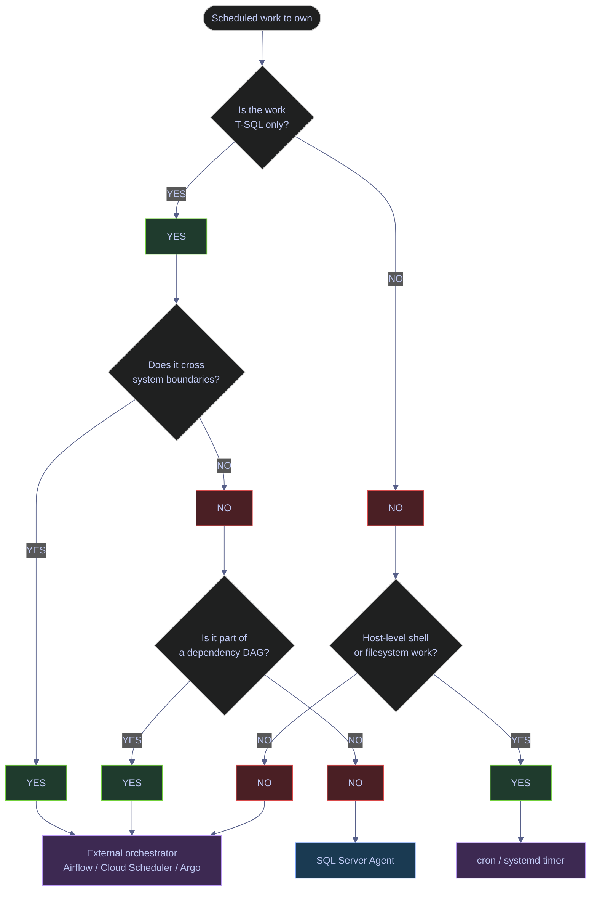

# SQL Server Agent Jobs

SQL Server Agent is SQL Server's built-in scheduler for maintenance and database-local automation. It is good at recurring T-SQL work and SQL Server-native maintenance. It is not a general orchestrator. On Linux, that boundary matters even more because Agent supports fewer job-step subsystems than it does on Windows.

---

## Current Instance State

Before designing jobs, verify whether Agent is actually enabled, whether the `Agent XPs` feature switch is on, and whether `msdb` contains the catalog rows that prove Agent is initialized. These three checks together answer the only question that matters at the start of any Agent investigation: is Agent actually a usable scheduling surface on this instance, or is it cold?

> [!abstract] Three checks every new instance needs
>
> A SQL Server instance can be in one of three Agent states: fully off (`Agent XPs = 0`, no service running, `syssubsystems` empty), partially on (`Agent XPs = 1` but the OS-level Agent service is not running, so jobs cannot fire), or fully on (`Agent XPs = 1`, service running, `syssubsystems` populated, jobs visible in `sysjobs`). The three queries below distinguish all three states.

Every Agent query in this section hits `msdb` — the SQL Server system database that stores Agent metadata, alert definitions, operators, notifications, job history, Database Mail configuration, log shipping bookkeeping, and several other operational catalogs. Agent itself is not just `msdb`; the service runs as a separate process on Linux (`sqlagent`) and as a separate Windows service on Windows. But every persistent piece of Agent state lives in `msdb`. If `msdb` is unavailable or corrupt, Agent cannot run.

The catalog views referenced throughout this note:

| Catalog | Purpose | Rows on `stoxx` |
|---|---|---|
| `msdb.dbo.sysjobs` | One row per Agent job | 1 (the demo job created for this note) |
| `msdb.dbo.sysjobsteps` | One row per step inside each job | 1 |
| `msdb.dbo.sysjobschedules` | Bridge: which schedules are attached to which jobs | 1 |
| `msdb.dbo.sysschedules` | Schedule definitions, independent of jobs | 8 (1 user-defined + 7 SQL-system collector schedules) |
| `msdb.dbo.sysjobservers` | Last-run outcome per (job, server) pair | 1 |
| `msdb.dbo.sysjobhistory` | Append-only history of every job/step execution | 2 (job-level + step-level row from the demo run) |
| `msdb.dbo.syssubsystems` | One row per Agent subsystem the engine knows how to launch | 10 |
| `msdb.dbo.syscategories` | Job category metadata | many (default categories) |
| `msdb.dbo.sysoperators` | Operator definitions for notifications | 1 (the demo operator created for this note) |

### SQL Server | sys.configurations | Agent feature switch

The `Agent XPs` instance setting is the feature flag that exposes the Agent extended stored procedures (`xp_sqlagent_*`, the `sp_add_job` family, `sysjobs` access through Agent code paths). It is the *engine-side* switch — flipping it does not start the OS-level Agent service. On a healthy installation, the value auto-flips to `1` the first time the Agent service starts. The full reference for this setting lives in [01-server-configuration.md](01-server-configuration.md); the entry is repeated here as the first check because it is the cheapest and most diagnostic.

#### Verify Agent XPs configuration value

**When to run:** as the very first check on any new or inherited instance, before assuming Agent is or is not configured.
**Trigger:** initial Agent audit, post-restart verification, post-migration check, or troubleshooting "why are my jobs not running".
**Context:** runs in any database, read-only against `sys.configurations`, requires `VIEW SERVER STATE`. Cannot itself enable Agent — it only reports the current value.
**Purpose:** establish whether the Agent feature flag is on. If `value_in_use = 0`, every other Agent query in this note will return empty regardless of whether you "see" jobs in SSMS.

> [!info]- `sys.configurations` columns (Agent XPs row)
>
> The `Agent XPs` row uses the same five columns as every other `sp_configure` setting. See [01-server-configuration.md](01-server-configuration.md) for the full column reference. The columns relevant here:
>
> - `name` — the literal `sp_configure` option name.
> - `value` — the configured value stored in metadata.
> - `value_in_use` — the effective live value. For `Agent XPs`, the two should match (the setting is dynamic).
> - `is_dynamic = 1` — change takes effect after `RECONFIGURE` without an instance restart.
> - `is_advanced = 1` — the setting is hidden until `sp_configure 'show advanced options', 1`.
>
> *This query checks whether the `Agent XPs` instance feature switch is on.*
>
```sql
SELECT
    name,
    CAST(value AS bigint)        AS value,
    CAST(value_in_use AS bigint) AS value_in_use,
    is_dynamic,
    is_advanced
FROM sys.configurations
WHERE name = 'Agent XPs';
```

| name | value | value_in_use | is_dynamic | is_advanced |
|---|---:|---:|---:|---:|
| Agent XPs | 1 | 1 | 1 | 1 |

*`Agent XPs = 1` confirms the engine-side feature surface is on. This was flipped automatically when the `sqlagent` service started for the first time on this instance — Agent does not require a manual `sp_configure` step on Linux as long as `sqlagent.enabled = true` is set in `mssql-conf`.*

| Column | Value | Watch | Meaning | Implication |
|---|---|---|---|---|
| `value_in_use` | `0` | &#10060; if Agent is part of the design | Agent extended-procedure surface is disabled | All Agent queries return empty; `msdb.dbo.sp_add_job` is not callable |
| `value_in_use` | `1` | &#9989; | Agent extended-procedure surface is enabled | Agent procedures are callable; the OS-level Agent service must also be running for jobs to fire |
| `value` differs from `value_in_use` | Either direction | Watch | A `RECONFIGURE` is pending | Run `RECONFIGURE` to apply, or restart the instance if the change requires it |
| `is_dynamic` | `1` | Context | Setting can be changed without restart | Standard for `Agent XPs` |
| `is_advanced` | `1` | Context | Hidden until `show advanced options` is enabled | Run `EXEC sp_configure 'show advanced options', 1; RECONFIGURE;` first |

### SQL Server | msdb.dbo.sysjobs | inspect job catalog

`sysjobs` is the master catalog of Agent jobs. Every job created via `sp_add_job` lives here, regardless of whether it has steps, schedules, or run history. An empty `sysjobs` result can mean Agent is fully off, or it can mean Agent is on but no jobs have been defined yet — these two states are operationally identical from this catalog's perspective, which is why the previous `Agent XPs` check is required to distinguish them.

| Column | Type | Meaning |
|---|---|---|
| `job_id` | uniqueidentifier | The internal Agent job identifier; primary key for joins to `sysjobsteps`, `sysjobhistory`, `sysjobschedules`, and `sysjobservers`. |
| `originating_server_id` | int | The `server_id` of the server where the job was originally defined. Used in MSX/TSX (multi-server administration) topologies; on standalone instances always `0`. |
| `name` | sysname | The job display name as set by `sp_add_job @job_name`. Unique per instance. |
| `enabled` | tinyint | `1` = the job will fire on its schedule, `0` = the job is defined but suppressed. Manual `sp_start_job` invocations still work even when `enabled = 0`. |
| `description` | nvarchar(512) | Free-form description set by `sp_add_job @description`. |
| `start_step_id` | int | The step number Agent begins execution from. Defaults to `1`. Used to skip leading steps on retry. |
| `category_id` | int | Foreign key to `msdb.dbo.syscategories`. Defaults to `0` (Uncategorized) when `sp_add_job @category_name` is not specified. |
| `owner_sid` | varbinary(85) | The SID of the principal that owns the job. The owner determines the security context the steps run in unless overridden by a proxy. Set via `sp_add_job @owner_login_name`. |
| `notify_level_eventlog`, `notify_level_email`, `notify_level_netsend`, `notify_level_page` | int | When to notify by each channel: `0` = never, `1` = on success, `2` = on failure, `3` = always. The non-eventlog channels require an operator. |
| `notify_email_operator_id`, `notify_netsend_operator_id`, `notify_page_operator_id` | int | Foreign keys to `msdb.dbo.sysoperators`. |
| `delete_level` | int | When to auto-delete the job after running: `0` = never, `1` = on success, `2` = on failure, `3` = always. Useful for one-shot jobs. |
| `date_created`, `date_modified` | datetime | Audit columns. `date_modified` updates on any subsequent `sp_update_job` call. |
| `version_number` | int | Increments on each modification. |

#### Count Agent jobs

**When to run:** immediately after the `Agent XPs` check, as the second step in any Agent audit.
**Trigger:** initial Agent audit, post-migration verification, or "why is nothing scheduled" troubleshooting.
**Context:** runs in any database, read-only against `msdb.dbo.sysjobs`, requires `SQLAgentReaderRole` on `msdb` (or sysadmin).
**Purpose:** answer the simplest possible question — does this instance have any Agent jobs at all?

> [!info]- `COUNT(*)` against `sysjobs`
>
> A simple cardinality check. `COUNT(*)` is the right operator here because we want every row, not just enabled ones. To distinguish enabled from disabled, add `SUM(CAST(enabled AS int)) AS enabled_count` to the projection.
>
> *Returns a single integer: the number of Agent jobs defined in `msdb` on this instance.*
>
```sql
SELECT COUNT(*) AS job_count
FROM msdb.dbo.sysjobs;
```

| job_count |
|---:|
| 1 |

*One job exists on this instance — the `Vault Demo - Hello` job created specifically for this note. On a fresh production instance with no maintenance jobs yet defined, this query returns `0`. On a server inherited from another team, expect anywhere from a handful to dozens of rows.*

#### List recent Agent jobs

**When to run:** after `sysjobs` count returns non-zero, when you need to see what jobs actually exist and when each was last modified.
**Trigger:** discovery on an inherited instance, or change-control review after a deployment.
**Context:** runs in any database, read-only, requires `SQLAgentReaderRole` (or sysadmin).
**Purpose:** see the most recent jobs by creation date, the description each job was given, and whether each job is currently enabled.

> [!info]- `sysjobs` projection for the discovery query
>
> The five columns selected are the operationally interesting subset of `sysjobs`. For a deeper inspection of any single job, switch to `EXEC msdb.dbo.sp_help_job @job_name = N'...'` which returns a multi-result-set view including job, schedule, step, and server bindings in one call.
>
> *Returns the most recently created Agent jobs with their enabled state and audit timestamps.*
>
```sql
SELECT
    name,
    enabled,
    description,
    date_created,
    date_modified
FROM msdb.dbo.sysjobs
ORDER BY date_created DESC;
```

| name | enabled | description | date_created | date_modified |
|---|---:|---|---|---|
| Vault Demo - Hello | 1 | Minimal demo job created for the Elysium vault note 05-sql-server-agent-jobs. Prints a single line; no side effects. | 2026-04-11 15:57:20.273 | 2026-04-11 15:57:20.347 |

*One job is visible. `enabled = 1` means it will fire on its attached schedule (`Vault Demo Daily 03:17`). `date_modified` is a few hundred milliseconds after `date_created` because the schedule attach via `sp_attach_schedule` updates the job version. On a real production server, sorting by `date_modified` is often more useful than `date_created` for spotting recent changes.*

| Column | Value | Watch | Meaning | Implication |
|---|---|---|---|---|
| `enabled` | `1` | &#9989; | Job will fire on schedule | Normal operating state |
| `enabled` | `0` | Watch | Job is defined but suppressed | Manual `sp_start_job` still works; check why someone disabled it |
| `description` | Empty string | Watch | No description set | Inherited or hand-rolled jobs often skip this; add one for auditability |
| `date_modified` ≫ `date_created` | Recent | Context | The job has been modified after creation | Review `sp_help_job` to see what changed |
| `date_modified` = `date_created` | Old | Context | The job has not been touched since creation | Long-stable job; treat as known-good unless wait stats say otherwise |

### SQL Server | msdb.dbo.syssubsystems | inspect Agent subsystem surface

`syssubsystems` is the catalog of every job-step subsystem the Agent service knows how to launch. Each row corresponds to a subsystem name that can appear in `sp_add_jobstep @subsystem`. On a fresh `msdb`, the table is populated by SQL Server setup with the full set of supported subsystems for the platform — but on Linux, several of them are non-functional even though they appear in the catalog. The `agent_exe` column shows where each subsystem's external executable would live; on Linux, paths that point to `C:\COM/...` or similar Windows paths are placeholders for subsystems the Linux Agent cannot actually run.

| Column | Type | Meaning |
|---|---|---|
| `subsystem_id` | int | Internal numeric identifier for the subsystem. Stable across instances. |
| `subsystem` | sysname | The subsystem name as referenced in `sp_add_jobstep @subsystem`. Examples: `TSQL`, `CmdExec`, `PowerShell`, `Snapshot`, `LogReader`, `Distribution`, `Merge`, `QueueReader`, `ANALYSISQUERY`, `ANALYSISCOMMAND`. |
| `description_id` | int | Foreign key into `sysmessages` for a localizable description string. |
| `subsystem_dll` | nvarchar(255) | The DLL/SO that implements the subsystem dispatcher. `[Internal]` means the subsystem is implemented inside the Agent process itself (this is true for `TSQL`). |
| `agent_exe` | nvarchar(255) | The external executable Agent invokes for this subsystem. `[Internal]` for `TSQL`, `NULL` for subsystems not actually supported on the current platform, and a `C:\` path for replication/SSIS subsystems whose binaries do not exist on Linux. |
| `start_entry_point`, `event_entry_point`, `stop_entry_point` | nvarchar(255) | DLL function names the dispatcher calls. Always `[Internal]` for first-party subsystems. |
| `max_worker_threads` | int | Maximum concurrent Agent worker threads the subsystem may consume. Caps how many parallel job steps using this subsystem can run at once. |

#### List registered Agent subsystems

**When to run:** during initial Agent audit, after enabling Agent for the first time, or when a job step fails with a "subsystem not found" or "unable to load" error.
**Trigger:** Agent enablement verification, subsystem-specific troubleshooting (e.g. why a `CmdExec` step fails on Linux).
**Context:** runs in any database, read-only against `msdb.dbo.syssubsystems`, requires `SQLAgentReaderRole` (or sysadmin).
**Purpose:** confirm the Agent surface is initialized, see which subsystems are nominally available on this instance, and detect at a glance which ones are non-functional Linux placeholders.

> [!info]- `syssubsystems` projection
>
> Four columns are projected: `subsystem_id` for the canonical ordering, `subsystem` for the name used in `sp_add_jobstep`, `agent_exe` to spot Linux limitations, and `max_worker_threads` to see the concurrency cap.
>
> *Returns every subsystem the Agent service knows how to launch on this instance.*
>
```sql
SELECT
    subsystem_id,
    subsystem,
    agent_exe,
    max_worker_threads
FROM msdb.dbo.syssubsystems
ORDER BY subsystem_id;
```

| subsystem_id | subsystem | agent_exe | max_worker_threads |
|---:|---|---|---:|
| 1 | TSQL | `[Internal]` | 320 |
| 3 | CmdExec | `NULL` | 160 |
| 4 | Snapshot | `C:\COM/SNAPSHOT.EXE` | 1600 |
| 5 | LogReader | `C:\COM/logread.exe` | 400 |
| 6 | Distribution | `C:\COM/DISTRIB.EXE` | 1600 |
| 7 | Merge | `C:\COM/REPLMERG.EXE` | 1600 |
| 8 | QueueReader | `C:\COM/qrdrsvc.exe` | 1600 |
| 9 | ANALYSISQUERY | `NULL` | 1600 |
| 10 | ANALYSISCOMMAND | `NULL` | 1600 |
| 12 | PowerShell | `c:\Tools\/Binn/SQLPS.exe` | 2 |

*Ten subsystems are registered. Only `TSQL` is genuinely usable on this Linux instance — its `agent_exe = [Internal]` means the implementation is built into the Agent process itself. `CmdExec`, `ANALYSISQUERY`, and `ANALYSISCOMMAND` show `NULL` for `agent_exe`, which means no external launcher exists; any `sp_add_jobstep` that targets one of these subsystems will fail at step execution. The replication subsystems (`Snapshot`, `LogReader`, `Distribution`, `Merge`, `QueueReader`) and `PowerShell` show `C:\...` paths that are catalog placeholders left over from the Windows-derived `msdb` schema; the binaries they point to do not exist on Linux. The practical guidance is unchanged regardless of how many rows appear here: on Linux, treat Agent as a `TSQL`-only scheduler.*

| Column | Value | Watch | Meaning | Implication |
|---|---|---|---|---|
| Empty result | 0 rows | &#10060; | `syssubsystems` not initialized | Agent service has never been started; `Agent XPs = 1` alone is not enough |
| `subsystem` = `TSQL`, `agent_exe` = `[Internal]` | Always present | &#9989; | T-SQL subsystem is built in | Always usable on Windows and Linux |
| `agent_exe` = `NULL` | `CmdExec`, `ANALYSISQUERY`, `ANALYSISCOMMAND` | Watch on Linux | No external launcher | Any `sp_add_jobstep` targeting this subsystem will fail at execution |
| `agent_exe` starts with `C:\` | Replication, `PowerShell` | Watch on Linux | Catalog placeholder pointing at a non-existent Windows path | Subsystem is registered but unusable on Linux |
| `max_worker_threads` | `320` for `TSQL` | Context | Up to 320 parallel `TSQL` job steps | Effectively unlimited for almost every workload |

### SQL Server | sqlagent.out | inspect Agent log file on Linux

The Agent process writes its own log file separate from the SQL Server error log. On Linux, the file lives at `/var/opt/mssql/log/sqlagent.out` and is encoded in UTF-16, which is a frequent surprise — `cat` it directly and the output looks like garbage with spaces between every letter. The recommended pattern is to convert through `iconv` before reading. The file rotates when Agent restarts; the previous version is `sqlagent.out.1`, etc.

#### Tail the Agent log on Linux

**When to run:** any time `sysjobhistory` does not contain the expected rows, when a job fires but produces no output, or when troubleshooting Agent service startup.
**Trigger:** missing job history, missing job execution, Agent startup failure, or post-restart verification.
**Context:** runs on the Linux host (or inside the `stoxx-db` Docker container via `docker exec`). Requires read access to `/var/opt/mssql/log/`, which is restricted to the `mssql` user and root by default.
**Purpose:** see Agent service-level events that never reach `sysjobhistory` — cache population, subsystem load failures, mail dispatcher startup, scheduler initialization, idle CPU condition warnings.

> [!info]- Reading the UTF-16 log
>
> `iconv -f UTF-16 -t UTF-8` converts the on-disk UTF-16 bytes into UTF-8 so the terminal renders the text correctly. `tail -25` then prints the most recent 25 entries. To stream new entries live, use `tail -F` instead. Each line is prefixed with the timestamp, a single character (`?` for info, `+` for warning), a numeric event ID in brackets, and the message.
>
> *Decodes and prints the most recent entries from the Linux Agent log file.*
>
```bash
docker exec stoxx-db bash -c \
  'iconv -f UTF-16 -t UTF-8 /var/opt/mssql/log/sqlagent.out | tail -25'
```

```text
2026-04-11 15:56:01 - ? [124] Subsystem 'LogReader' successfully loaded (maximum concurrency: 400)
2026-04-11 15:56:01 - ? [124] Subsystem 'Distribution' successfully loaded (maximum concurrency: 1600)
2026-04-11 15:56:01 - ? [124] Subsystem 'Merge' successfully loaded (maximum concurrency: 1600)
2026-04-11 15:56:01 - ? [124] Subsystem 'QueueReader' successfully loaded (maximum concurrency: 1600)
2026-04-11 15:56:01 - ? [129] SQLSERVERAGENT starting under Windows NT service control
2026-04-11 15:56:01 - ? [000] InitDefaultMSDBId initialized default msdb id to 4.
2026-04-11 15:56:01 - + [474] Unable to refresh Database Mail profile . (reason: No mail profile defined)
2026-04-11 15:56:01 - + [260] Unable to start mail session.
2026-04-11 15:56:01 - ? [273] Mail dispatcher started
2026-04-11 15:56:01 - + [375] Warning: The AlertEngine engine has been disabled
2026-04-11 15:56:01 - ? [174] Job scheduler engine started (maximum user worker threads: 1600, maximum system worker threads: 800)
2026-04-11 15:56:01 - ? [146] Request servicer engine started
2026-04-11 15:56:01 - ? [167] Populating job cache...
2026-04-11 15:56:01 - + [396] An idle CPU condition has not been defined - OnIdle job schedules will have no effect
2026-04-11 15:56:01 - ? [133] Support engine started
2026-04-11 15:56:01 - ? [110] Starting SQLServerAgent Monitor using '' as the notification recipient...
2026-04-11 15:56:01 - ? [000] Contained Ag Supporting Thread Started
2026-04-11 15:56:01 - ? [168] There are 0 job(s) [0 disabled] in the job cache
2026-04-11 15:56:01 - ? [170] Populating alert cache...
2026-04-11 15:56:01 - ? [171] There are 0 alert(s) in the alert cache
2026-04-11 15:56:01 - ? [101] SQLServerAgent service successfully started
2026-04-11 15:56:02 - ? [000] ContainedAgMgrThread: Start to scan primary contained AG
2026-04-11 15:57:20 - ? [152] Refreshing job 0xCB63BF18C928324A822D25229BF77341 for INSERT [requested by: sa]
2026-04-11 15:57:20 - ? [177] Job Vault Demo - Hello has been requested to run by User sa
2026-04-11 15:57:20 - ? [184] Job completion for Vault Demo - Hello is being logged to sysjobhistory
```

*The log captures the full Agent startup sequence on this instance: subsystems loading one by one, the mail dispatcher starting (with a warning that no Database Mail profile is defined — expected, none is configured), the AlertEngine being disabled (also expected, no alerts are defined), the job and alert caches populating empty, and the service successfully starting at `15:56:01`. The two trailing entries show the demo job being created (event `152`) and run (event `177`), plus the service notifying that the run was logged to `sysjobhistory` (event `184`). Two warnings appear that look alarming on first read but are informational on a fresh instance: event `260`/`474` warns about no mail session because Database Mail is not configured, and event `396` warns that no idle-CPU condition is defined so any job using `freq_type = 128` (run on idle) will never fire.*

| Log marker | Meaning | Watch |
|---|---|---|
| `- ? [...]` | Informational | Normal — most lines have this prefix |
| `- + [...]` | Warning | Read the message; usually configuration-related, not engine failure |
| `- ! [...]` | Error | Investigate; an Agent component failed to start or a job step had an unrecoverable error |
| `[101] SQLServerAgent service successfully started` | The whole service is up | The single line that confirms Agent is operational |
| `[124] Subsystem '...' successfully loaded` | One subsystem successfully initialized | One per row in `syssubsystems` |
| `[260] Unable to start mail session` | No Database Mail profile configured | Expected when notifications are not in use; otherwise configure Database Mail |
| `[396] no idle CPU condition defined` | `freq_type = 128` (on idle) schedules will never trigger | Define an idle threshold via `sp_add_alert` or avoid `OnIdle` schedules |
| `[177] Job ... has been requested to run` | A specific job was started | Cross-reference with `sysjobhistory` for the outcome |

---

## Enabling Agent On Linux

SQL Server Agent on Linux is enabled outside T-SQL through `mssql-conf`, because the Linux packaging model differs from Windows service management. There is no `services.msc`, no `Set-Service`, and no GUI checkbox; the only sanctioned path is the `mssql-conf` CLI shipped with the engine package, plus a restart so the new setting takes effect at process startup.

> [!abstract] Linux Agent enablement is a one-line config change plus a restart
>
> Run `mssql-conf set sqlagent.enabled true`, restart the SQL Server service, then verify `Agent XPs`, `syssubsystems`, and the Agent log file. The whole sequence is reversible (`set sqlagent.enabled false` + restart) and safe outside of an active workload window.

**Linux subsystem boundary:**

Linux Agent ships with the same `syssubsystems` rows as Windows Agent, but the subset that actually works is much smaller. The catalog rows are inherited from the Windows-derived `msdb` schema, so the table will still list `CmdExec`, `PowerShell`, and the replication subsystems on Linux even though their underlying executables either do not exist (`CmdExec` shows `agent_exe = NULL`) or point at Windows-only paths that cannot run (`Snapshot`, `LogReader`, `Distribution`, `Merge`, `QueueReader`, `PowerShell`). Treat the subsystem catalog on Linux as a registry of *nominal* support, not actual support.

| Capability area | Windows Agent | Linux Agent | Notes |
|---|---|---|---|
| T-SQL job steps | Yes | **Yes** | The only fully supported subsystem on Linux. `agent_exe = [Internal]` in `syssubsystems`. |
| Replication-related job steps (`Snapshot`, `LogReader`, `Distribution`, `Merge`, `QueueReader`) | Yes | Where the underlying replication feature is enabled | Linux supports a subset of SQL Server replication; the Agent subsystems for it work only when the matching feature components are installed. |
| `CmdExec` (shell out to OS) | Yes | **No** | `syssubsystems.agent_exe = NULL` on Linux. Steps that target this subsystem fail at execution. Use `xp_cmdshell` from a `TSQL` step *only if* you accept the security implications, or move shell work to cron. |
| `PowerShell` job steps | Yes | **No** | The `agent_exe` row points at a Windows path that does not exist on Linux. |
| `SSIS` job steps | Yes | **No** | SSIS is not supported on Linux at all. The catalog does not list an SSIS row on Linux, but tooling that auto-discovers Windows Agent capabilities may try to use it and fail. |
| `ANALYSISQUERY`, `ANALYSISCOMMAND` (SSAS) | Yes | **No** | `agent_exe = NULL` because SSAS is Windows-only. |
| General-purpose orchestration role | Limited | **Even more limited** | The smaller subsystem surface forces every "do shell + Python + cloud + SQL" workflow off Linux Agent and into an external scheduler. |

> [!warning] Do not assume Windows-style Agent capabilities on Linux
>
> The catalog rows in `syssubsystems` look identical to a Windows install at first glance, but several are non-functional placeholders. A job step that uses `CmdExec`, `PowerShell`, `SSIS`, or `ANALYSIS*` will be accepted by `sp_add_jobstep` and then fail at run time with a subsystem-load or executable-not-found error.

> [!success] Use Linux Agent as a T-SQL-only scheduler
>
> On Linux, design jobs as if `TSQL` were the only available subsystem. Move shell automation, Python, PowerShell, and multi-system orchestration into cron, systemd timers, or an external orchestrator that natively owns those workloads.

### SQL Server | mssql-conf | Agent enablement

`mssql-conf` is the platform configuration CLI shipped with the SQL Server on Linux package. It lives at `/opt/mssql/bin/mssql-conf` and reads/writes a single INI-style file at `/var/opt/mssql/mssql.conf`. Every setting it manages takes effect only after a SQL Server restart (`systemctl restart mssql-server` on the host, or `docker restart stoxx-db` for the container build of the engine).

The `sqlagent.*` keys exposed by `mssql-conf list`:

| Setting | Default | Effect |
|---|---|---|
| `sqlagent.enabled` | `false` | Master switch. `true` starts the `sqlagent` process at SQL Server startup; `false` does not. Required for any Agent functionality. |
| `sqlagent.errorlogfile` | `/var/opt/mssql/log/sqlagent.out` | Absolute path to the Agent log file. The file is UTF-16 encoded; read with `iconv -f UTF-16 -t UTF-8`. |
| `sqlagent.errorlogginglevel` | `7` | Bitmask of which log severities are written: `1` = errors, `2` = warnings, `4` = info. Default `7` writes all three. Set to `3` (errors + warnings) to suppress info noise on busy hosts. |
| `sqlagent.jobhistorymaxrows` | `1000000` | Cap on total rows stored in `sysjobhistory` across all jobs. Older rows are pruned when the cap is exceeded. |
| `sqlagent.jobhistorymaxrowsperjob` | `100` | Per-job cap. Each job retains at most this many history rows; older rows for the same job are pruned when the cap is exceeded. |
| `sqlagent.databasemailprofile` | (empty) | Default Database Mail profile for Agent notifications. Empty by default; set when you wire up Database Mail. |
| `sqlagent.startupwaitforalldb` | `1` | When `1`, Agent waits for *every* database to be online before starting. When `0`, Agent starts as soon as `msdb` is online. Set to `0` if a non-`msdb` database is slow or sick and is blocking Agent startup. |

#### Enable Agent and restart the engine

**When to run:** once, on a fresh SQL Server on Linux installation (or container) where Agent is needed. Also after any rebuild that resets the `mssql.conf` file.
**Trigger:** initial Agent enablement, post-rebuild verification, or recovery after `sqlagent.enabled` was accidentally turned off.
**Context:** runs on the Linux host shell as a privileged user (`sudo`), or inside the running container as root via `docker exec -u root`. The `mssql-conf set` command edits `/var/opt/mssql/mssql.conf` in place. The `systemctl restart mssql-server` (host) or `docker restart stoxx-db` (container) bounces the engine, which is a brief but real availability event — schedule it during a quiet window.
**Purpose:** flip the Linux-side Agent service switch and bounce the engine so the `sqlagent` process actually starts at next launch and the `Agent XPs` feature flag auto-enables.

> [!warning] Engine restart required
>
> This is a host-level change, not a database change. It affects the instance globally and requires a SQL Server restart, because Agent runs inside the SQL Server service container on Linux.

> [!success] Verify the post-restart state
>
> Run it during a maintenance window or other restart-safe period. After the restart, verify `Agent XPs`, `msdb.dbo.syssubsystems`, and `msdb.dbo.sysjobs` per the queries above.

> [!info]- mssql-conf set + restart explained
>
> - `sudo /opt/mssql/bin/mssql-conf set sqlagent.enabled true` writes `[sqlagent]\nenabled = true` to `/var/opt/mssql/mssql.conf`. The CLI prints a reminder that a restart is required.
> - `sudo systemctl restart mssql-server` bounces the SQL Server systemd unit. On Docker, the equivalent is `docker restart stoxx-db`.
>
> After restart, the `sqlagent` process is launched alongside `sqlservr` and the `Agent XPs` configuration value automatically flips to `1`.
>
> *Enables SQL Server Agent on Linux and restarts the engine so the Agent surface is initialized.*
>
```bash
sudo /opt/mssql/bin/mssql-conf set sqlagent.enabled true
sudo systemctl restart mssql-server
```

```text
SQL Server needs to be restarted in order to apply this setting. Please run
'systemctl restart mssql-server.service'.
```

*The `mssql-conf set` command immediately writes the setting to `mssql.conf` and prints the restart reminder. After `systemctl restart` (or `docker restart` for the container build), the `sqlagent` process appears in `ps aux` next to `sqlservr` and the `Agent XPs` configuration value auto-flips to `1`. To verify the on-disk state at any time, `cat /var/opt/mssql/mssql.conf` should show `[sqlagent]\nenabled = true`.*

---

## Creating Jobs

Once Agent is enabled, job creation is a sequence of `sp_add_*` calls in `msdb`. Five procedures are involved, in this order: `sp_add_job` creates the empty job container, `sp_add_jobstep` adds one or more execution steps, `sp_add_schedule` defines a time pattern (independent of any job), `sp_attach_schedule` binds the schedule to the job, and `sp_add_jobserver` registers the job on a target server (the local instance for standalone deployments). Skipping any of these leaves the job in a non-runnable state — the catalog row exists but Agent will never fire it.

> [!abstract] Five procedures, one job
>
> Every Agent job goes through `sp_add_job` → `sp_add_jobstep` → `sp_add_schedule` → `sp_attach_schedule` → `sp_add_jobserver`. The first three create independent objects in `msdb`; the last two wire them together. A job with no `sp_add_jobserver` row will never run on a schedule even if everything else is correct.

### SQL Server | sp_add_* | T-SQL job creation pattern

The five procedures below build the same `Vault Demo - Hello` job that the previous queries inspect. They are split into individual code cells per the vault's atomic-spans rule, and each cell is followed by a brief verification note. The example deliberately uses a trivial `PRINT` step (not a backup) so the demo job is safe to leave on the instance and so its history rows can be inspected without producing real side effects on `stoxx`.

Before the executable cells, the next four blocks document every parameter on every procedure used in the sequence — `sp_add_job`, `sp_add_jobstep`, `sp_add_schedule`, and the two binder procedures (`sp_attach_schedule`, `sp_add_jobserver`). These are reference tables; reading them top to bottom is not necessary, but they are the only place in the vault where every parameter is enumerated.

#### `sp_add_job` reference

`msdb.dbo.sp_add_job` creates an empty job container in `msdb.dbo.sysjobs`. The job exists but has no steps, no schedule, and no server binding until the other procedures are called.

| Parameter | Default | Meaning |
|---|---|---|
| `@job_name` | (required) | The job display name. Unique per instance. |
| `@enabled` | `1` | `1` = job will fire on its schedules; `0` = job is defined but suppressed (manual `sp_start_job` still works). |
| `@description` | `'No description available.'` | Free-form description, max 512 chars. Surfaces in `sysjobs.description` and in SSMS. |
| `@start_step_id` | `1` | The step number Agent begins execution from. Used to skip leading steps on retry. |
| `@category_name` | `[Uncategorized (Local)]` | Foreign key by name to `msdb.dbo.syscategories`. Determines the job category visible in SSMS. |
| `@owner_login_name` | The current login | The principal that owns the job. Determines the security context the steps run in unless overridden by a proxy. Set to a service-style login (e.g. `sa` or a dedicated `agent_owner`) so jobs do not break when individual users leave. |
| `@notify_level_eventlog` | `2` (failure) | Eventlog notification level: `0` = never, `1` = on success, `2` = on failure, `3` = always. |
| `@notify_level_email` | `0` (never) | Email notification level. Same enum. Requires `@notify_email_operator_name`. |
| `@notify_level_netsend` | `0` | NET SEND notification level. Same enum. Linux Agent does not implement NET SEND — leave at `0`. |
| `@notify_level_page` | `0` | Pager notification level. Same enum. Linux Agent does not implement pager dispatch. |
| `@notify_email_operator_name` | `NULL` | Operator name for email notifications. Must exist in `msdb.dbo.sysoperators`. |
| `@notify_netsend_operator_name` | `NULL` | Operator name for NET SEND. Linux: ignore. |
| `@notify_page_operator_name` | `NULL` | Operator name for pager. Linux: ignore. |
| `@delete_level` | `0` (never) | Auto-delete the job after running: `0` = never, `1` = on success, `2` = on failure, `3` = always. Useful for one-shot jobs. |
| `@job_id` | `NULL` (output) | Output parameter — receives the new `job_id` so the caller can pass it to subsequent procedures instead of re-resolving by name. |

#### `sp_add_jobstep` reference

`msdb.dbo.sp_add_jobstep` adds one execution step to an existing job. A job can have many steps; the `@on_success_action` and `@on_fail_action` parameters control the per-step branching graph.

| Parameter | Default | Meaning |
|---|---|---|
| `@job_name` or `@job_id` | (one required) | Identifies the parent job. |
| `@step_name` | (required) | Display name for the step. Unique within the job. |
| `@step_id` | next sequential | Position in the job's step list. Steps run in `step_id` order unless `@on_success_action` jumps. |
| `@subsystem` | `'TSQL'` | The subsystem name from `syssubsystems`. On Linux, only `TSQL` is fully supported (see "Linux subsystem boundary" above). |
| `@command` | `''` | The actual code the step runs. For `TSQL`, this is the T-SQL batch. For `CmdExec` (Windows only), the shell command. Up to ~3200 nvarchar characters. |
| `@database_name` | `'master'` | For `TSQL` steps, the database the batch runs in. **Critical** — a backup step that targets the wrong database will silently back up the wrong database. |
| `@database_user_name` | `NULL` | For `TSQL` steps, optionally impersonate a specific database user via `EXECUTE AS`. |
| `@on_success_action` | `1` (quit reporting success) | Branching after step success: `1` = quit reporting success, `2` = quit reporting failure, `3` = go to next step, `4` = go to step ID `@on_success_step_id`. |
| `@on_success_step_id` | `0` | The target step ID when `@on_success_action = 4`. |
| `@on_fail_action` | `2` (quit reporting failure) | Branching after step failure: same enum as `@on_success_action`. |
| `@on_fail_step_id` | `0` | The target step ID when `@on_fail_action = 4`. |
| `@retry_attempts` | `0` | Number of times Agent retries a failed step before honoring `@on_fail_action`. |
| `@retry_interval` | `0` | Minutes between retries. `0` = retry immediately. |
| `@output_file_name` | `NULL` | Absolute path to a file Agent writes the step's textual output to. On Linux, the path must be writable by the `mssql` user (e.g. `/var/opt/mssql/log/mystep.out`). |
| `@flags` | `0` | Bitmask: `0` = overwrite output file, `2` = append, `4` = write step history to step log table, `8` = write log to step output. |
| `@proxy_name` | `NULL` | Run the step under a proxy account. Largely irrelevant on Linux because the subsystems that benefit from proxies (`CmdExec`, `PowerShell`, `SSIS`) are unsupported. |

#### `sp_add_schedule` reference

`msdb.dbo.sp_add_schedule` creates a *standalone* schedule object in `msdb.dbo.sysschedules`. The schedule exists independently of any job — once created, it can be attached to any number of jobs via `sp_attach_schedule`. This separation is intentional: the same "every Sunday at 02:00" schedule can drive a backup job, a checkdb job, and an index-maintenance job from a single schedule definition.

| Parameter | Default | Meaning |
|---|---|---|
| `@schedule_name` | (required) | Display name for the schedule. Unique per owner. |
| `@enabled` | `1` | Whether the schedule is active. |
| `@freq_type` | `1` | Frequency type — see the value enum below. |
| `@freq_interval` | `0` | Days/weeks/months between firings; meaning depends on `@freq_type`. |
| `@freq_subday_type` | `1` | When `@freq_type = 4` (daily), this controls intra-day frequency: `1` = at the specified time, `2` = every N seconds, `4` = every N minutes, `8` = every N hours. |
| `@freq_subday_interval` | `0` | The N for the subday type. |
| `@freq_relative_interval` | `0` | For `@freq_type = 32` (monthly relative): which week of the month — `1` = first, `2` = second, `4` = third, `8` = fourth, `16` = last. |
| `@freq_recurrence_factor` | `0` | For weekly/monthly, how many weeks/months between firings. `1` = every week/month, `2` = every other, etc. |
| `@active_start_date` | today | Date the schedule becomes active. `yyyymmdd` integer. |
| `@active_end_date` | `99991231` | Date the schedule becomes inactive. |
| `@active_start_time` | `0` (00:00:00) | Time of day to fire (or to start the subday cycle). `hhmmss` integer — `020000` = 02:00:00, `133045` = 13:30:45. |
| `@active_end_time` | `235959` | Time of day at which the daily cycle ends. |
| `@owner_login_name` | the current login | Schedule owner. |

**`@freq_type` values:**

| Value | Meaning |
|---|---|
| `1` | Once. Fire at `@active_start_date` + `@active_start_time` and never again. |
| `4` | Daily. Fire every `@freq_interval` days. Use `@freq_subday_*` for sub-daily recurrence. |
| `8` | Weekly. Fire every `@freq_recurrence_factor` weeks on the days specified by `@freq_interval` (bitmask: 1=Sun, 2=Mon, 4=Tue, 8=Wed, 16=Thu, 32=Fri, 64=Sat). |
| `16` | Monthly on a fixed day. `@freq_interval` = day-of-month (1-31). |
| `32` | Monthly relative. `@freq_relative_interval` = which week (first/second/third/fourth/last). `@freq_interval` = which day-type (1=Sun .. 7=Sat, 8=day, 9=weekday, 10=weekend day). |
| `64` | Run when SQL Server Agent service starts. |
| `128` | Run when CPU is idle. **Linux gotcha:** an idle CPU condition must be defined via `sp_add_alert`; otherwise Agent logs warning `[396] An idle CPU condition has not been defined - OnIdle job schedules will have no effect` at startup and these schedules never fire. |

#### `sp_attach_schedule` and `sp_add_jobserver` reference

The remaining two procedures are simple binders.

| Procedure | Parameters | Meaning |
|---|---|---|
| `msdb.dbo.sp_attach_schedule` | `@job_name` (or `@job_id`), `@schedule_name` (or `@schedule_id`) | Inserts a row in `msdb.dbo.sysjobschedules` linking the schedule to the job. A schedule must be attached to at least one job before it has any effect; an unattached schedule is just a row in `sysschedules`. |
| `msdb.dbo.sp_add_jobserver` | `@job_name` (or `@job_id`), `@server_name = N'(local)'` (default) | Inserts a row in `msdb.dbo.sysjobservers` registering the job on a target server. For standalone instances always pass the default `(local)`. For MSX/TSX (multi-server administration), pass the target server name. **A job with no `sp_add_jobserver` row will never run** — the most common "I created the job but it doesn't fire" mistake. |

#### Create the job container

**When to run:** as the first step of any new job creation. Always create the empty container before adding steps or attaching schedules.
**Trigger:** new maintenance job, new ETL hand-off job, or any new scheduled work that fits Agent's responsibility (T-SQL only on Linux).
**Context:** runs in any database (the procedure is fully qualified to `msdb`), requires `SQLAgentUserRole` (own jobs) or `SQLAgentOperatorRole` (cross-owner) on `msdb`. State-changing — inserts one row into `msdb.dbo.sysjobs`.
**Purpose:** create the empty job row that subsequent `sp_add_jobstep`, `sp_attach_schedule`, and `sp_add_jobserver` calls will hang off.

> [!info]- sp_add_job parameters used here
>
> Three parameters are passed: `@job_name` (the unique display name), `@enabled = 1` (the job will fire on its schedule once one is attached), and `@description` (a clear, audit-friendly description). All other parameters fall back to defaults — the job runs as the current login (`sa` in this capture), reports failures to the eventlog only, and never auto-deletes itself.
>
> *Creates an empty Agent job container called `Vault Demo - Hello` in `msdb.dbo.sysjobs`.*
>
```sql
EXEC msdb.dbo.sp_add_job
    @job_name = N'Vault Demo - Hello',
    @enabled = 1,
    @description = N'Minimal demo job created for the Elysium vault note 05-sql-server-agent-jobs. Prints a single line; no side effects.';
```

```text
(no result set)
```

*The procedure returns no result set on success. Verify by querying `msdb.dbo.sysjobs` — see "List recent Agent jobs" above for the live capture, which shows this exact job with `enabled = 1` and the description text.*

#### Add a T-SQL job step

**When to run:** immediately after `sp_add_job`, before attaching any schedule. A job with zero steps is a valid catalog state but Agent will refuse to run it.
**Trigger:** building out a job that was just created with `sp_add_job`, or extending an existing job with another step.
**Context:** runs in any database, requires `SQLAgentUserRole` (own jobs) or higher. State-changing — inserts one row into `msdb.dbo.sysjobsteps`.
**Purpose:** define what the job actually does. For Linux Agent, this is almost always a `TSQL` step.

> [!info]- sp_add_jobstep parameters used here
>
> The step is named `Print hello`, uses the `TSQL` subsystem, runs in `master`, executes a single `PRINT` statement, branches to "quit reporting success" on success (`@on_success_action = 1`), branches to "quit reporting failure" on failure (`@on_fail_action = 2`), and does not retry on failure (`@retry_attempts = 0`). These are the explicit defaults — passing them makes the intent visible in source control.
>
> *Adds a `TSQL` step that prints a single line to the Agent step log.*
>
```sql
EXEC msdb.dbo.sp_add_jobstep
    @job_name = N'Vault Demo - Hello',
    @step_name = N'Print hello',
    @subsystem = N'TSQL',
    @command = N'PRINT ''Hello from stoxx Agent'';',
    @database_name = N'master',
    @on_success_action = 1,
    @on_fail_action = 2,
    @retry_attempts = 0;
```

```text
(no result set)
```

*Verify by querying `msdb.dbo.sysjobsteps` — see "Inspect job step configuration" below for the live capture, which shows this step with `subsystem = TSQL`, `database_name = master`, `on_success_action = 1`, `on_fail_action = 2`, and the command excerpt.*

#### Define the schedule

**When to run:** any time a recurring time pattern is needed. Schedules are reusable — define once and attach to many jobs if the same cadence applies to multiple workloads.
**Trigger:** new job that needs to fire on a cadence, or refactoring multiple jobs to share a single schedule definition.
**Context:** runs in any database, requires `SQLAgentUserRole` or higher. State-changing — inserts one row into `msdb.dbo.sysschedules`. **Does not** by itself attach the schedule to any job; that is `sp_attach_schedule`'s job.
**Purpose:** create a standalone reusable schedule object.

> [!info]- sp_add_schedule parameters used here
>
> `@freq_type = 4` selects daily recurrence. `@freq_interval = 1` means every day (not every Nth day). `@active_start_time = 31700` is `hhmmss` for `03:17:00` — the deliberate non-round 17-minute offset is a vault-content convention to avoid having every job in the fleet fire at exactly the top of the hour. All other parameters fall back to defaults: schedule is enabled, no end date, fires once per day at the start time.
>
> *Creates a daily schedule that fires at 03:17:00 every day, enabled, no end date.*
>
```sql
EXEC msdb.dbo.sp_add_schedule
    @schedule_name = N'Vault Demo Daily 03:17',
    @freq_type = 4,
    @freq_interval = 1,
    @active_start_time = 31700;
```

```text
(no result set)
```

*Verify by querying `msdb.dbo.sysschedules` — see "Inspect schedules" below for the live capture, which shows this schedule alongside the seven SQL Server-system collector schedules that ship with `msdb`.*

#### Attach schedule and bind to local server

**When to run:** immediately after both the job and the schedule exist. Both bindings are required for the job to fire — one without the other leaves the job in a "defined but inert" state.
**Trigger:** completing the job creation sequence, or rewiring an existing job to a new schedule.
**Context:** runs in any database, requires `SQLAgentUserRole` or higher. State-changing — inserts one row in `sysjobschedules` and one row in `sysjobservers`.
**Purpose:** make the job actually runnable. After both calls succeed, Agent's scheduler will pick up the job at `next_run_date`/`next_run_time`.

> [!info]- The two bind procedures
>
> `sp_attach_schedule` connects the schedule to the job by inserting into `msdb.dbo.sysjobschedules`. `sp_add_jobserver` (with no `@server_name` parameter, defaulting to `(local)`) registers the job on the local instance by inserting into `msdb.dbo.sysjobservers`. Both rows are required.
>
> *Wires the schedule to the job and registers the job on the local server so Agent will actually run it.*
>
```sql
EXEC msdb.dbo.sp_attach_schedule
    @job_name = N'Vault Demo - Hello',
    @schedule_name = N'Vault Demo Daily 03:17';

EXEC msdb.dbo.sp_add_jobserver
    @job_name = N'Vault Demo - Hello';
```

```text
(no result set)
```

*Verify by querying `msdb.dbo.sysjobschedules` (shows the job-schedule link with `next_run_date`/`next_run_time`) and `msdb.dbo.sysjobservers` (shows the local server binding and `last_run_outcome`). Both captures appear in the next H2 section.*

> [!warning] sp_attach_schedule is a single statement; do not split or skip
>
> Forgetting `sp_attach_schedule` leaves the schedule in `sysschedules` but unbound to any job — the job exists, the schedule exists, but Agent has no row in `sysjobschedules` linking them. Forgetting `sp_add_jobserver` leaves the job unregistered to any target server, so Agent's scheduler skips it. Both are silent failures: the job appears correctly defined in SSMS, but it never fires.

> [!success] Verify with `sp_help_job` after creation
>
> The single most useful verification command is `EXEC msdb.dbo.sp_help_job @job_name = N'Vault Demo - Hello';` which returns a multi-result-set view including job, schedule, step, and server bindings in one call. If any of the four catalogs is missing a row, `sp_help_job` will show it.

#### Manually start the job

**When to run:** for ad hoc execution outside the schedule — testing a newly created job, re-running after a fixed bug, or kicking off a maintenance pass on demand.
**Trigger:** post-creation smoke test, post-fix re-run, or operator-initiated execution.
**Context:** runs in any database, requires `SQLAgentUserRole` (own jobs) or `SQLAgentOperatorRole` (any job). The procedure returns immediately — Agent forks the execution into its scheduler thread and returns control. To wait for completion, poll `sysjobhistory` for the matching `instance_id`.
**Purpose:** start the job right now, regardless of its schedule.

> [!info]- sp_start_job behavior
>
> `sp_start_job` is fire-and-forget. The procedure returns as soon as Agent has accepted the request, not when the job has finished. The job's outcome is reported in `sysjobhistory` after the run completes. To start at a specific step instead of `start_step_id`, pass `@step_name`.
>
> *Asks Agent to run the named job immediately, returning before the job completes.*
>
```sql
EXEC msdb.dbo.sp_start_job
    @job_name = N'Vault Demo - Hello';
```

```text
(no result set)
```

*The job ran successfully — the live `sysjobhistory` capture in the next H2 section shows two rows for this run: a job-level outcome row (`step_id = 0`) with `run_status = 1` (succeeded) and a step row (`step_id = 1`) with the same status and the captured output `Hello from stoxx Agent`.*

---

## Monitoring And History

If Agent owns production maintenance, `msdb` must be part of your observability surface. Four catalog views together give a complete picture: `sysjobsteps` for the static step configuration, `sysschedules` for the schedule definitions, `sysjobservers` for the last-run-outcome summary per (job, server), and `sysjobhistory` for the append-only execution log. The first three are configuration; the fourth is telemetry. A healthy production check normally hits all four — last-run-outcome from `sysjobservers`, recent execution detail from `sysjobhistory`, plus a sanity check that the step configuration has not been changed since the last known-good snapshot.

> [!abstract] Four catalogs make up Agent observability
>
> `sysjobsteps` (configuration), `sysschedules` (configuration), `sysjobservers` (latest outcome summary), `sysjobhistory` (append-only execution log). On a production instance, hit all four during any incident triage; do not trust `sysjobhistory` alone, because if Agent never ran the job at all, `sysjobhistory` will simply be silent.

### SQL Server | msdb.dbo.sysjobsteps | inspect step configuration

`sysjobsteps` is the per-step catalog. Every row corresponds to one execution step inside a job, in `step_id` order. The columns reveal the static configuration: subsystem, target database, branching graph, retry policy, and the actual command text. This is the catalog to query when answering "what does this job actually do" without firing it.

| Column | Type | Meaning |
|---|---|---|
| `job_id` | uniqueidentifier | Foreign key to `sysjobs`. |
| `step_id` | int | Position in the job's step list. Steps with lower IDs run first, unless `on_success_action`/`on_fail_action` jumps. |
| `step_name` | sysname | Display name. |
| `subsystem` | nvarchar(40) | Subsystem name (must exist in `syssubsystems`). |
| `command` | nvarchar(max) | The actual code the step runs. For long commands, project `LEFT(command, N)` to keep output readable. |
| `flags` | int | Bitmask: `0` = overwrite output file, `2` = append, `4` = step output to step history, `8` = log to file. |
| `additional_parameters` | nvarchar(max) | Subsystem-specific extras. |
| `cmdexec_success_code` | int | For `CmdExec` only: which OS exit code counts as success. Defaults to `0`. |
| `on_success_action`, `on_success_step_id`, `on_fail_action`, `on_fail_step_id` | int | The branching graph. See `sp_add_jobstep` reference above for the action enum. |
| `server` | nvarchar(30) | Override target server (rare on standalone instances). |
| `database_name` | sysname | Target database for `TSQL` steps. |
| `database_user_name` | sysname | Optional `EXECUTE AS` user for `TSQL` steps. |
| `retry_attempts`, `retry_interval` | int | Retry policy. `retry_interval` is in minutes. |
| `os_run_priority` | int | Process priority for `CmdExec` steps. Linux: ignored. |
| `output_file_name` | nvarchar(200) | Absolute path Agent writes the step output to. |
| `last_run_outcome`, `last_run_duration`, `last_run_retries`, `last_run_date`, `last_run_time` | int | Per-step outcome summary, updated each time the step runs. |
| `proxy_id` | int | Foreign key to `sysproxies`. |

#### Inspect job step configuration

**When to run:** during change-control review of an inherited job, when validating that a deployment did not accidentally change a step's command or branching, or when triaging "the job ran but did the wrong thing".
**Trigger:** post-deployment verification, change-control audit, or "what does this job actually do" discovery.
**Context:** runs in any database, read-only against `msdb.dbo.sysjobsteps`, requires `SQLAgentReaderRole` (or sysadmin).
**Purpose:** see the static configuration of every step in every job — subsystem, target database, branching, retries, command excerpt — without running anything.

> [!info]- sysjobsteps projection
>
> The query joins `sysjobsteps` to `sysjobs` for the job name, then projects the operationally interesting columns. `LEFT(s.command, 60)` truncates the command text so the output table stays readable; remove the `LEFT` to see the full command.
>
> *Returns the step configuration for every job on this instance, in (job, step_id) order.*
>
```sql
SELECT
    j.name              AS job_name,
    s.step_id,
    s.step_name,
    s.subsystem,
    s.database_name,
    s.on_success_action,
    s.on_fail_action,
    s.retry_attempts,
    s.retry_interval,
    LEFT(s.command, 60) AS command_excerpt
FROM msdb.dbo.sysjobsteps AS s
JOIN msdb.dbo.sysjobs AS j ON j.job_id = s.job_id
ORDER BY j.name, s.step_id;
```

| job_name | step_id | step_name | subsystem | database_name | on_success_action | on_fail_action | retry_attempts | retry_interval | command_excerpt |
|---|---:|---|---|---|---:|---:|---:|---:|---|
| Vault Demo - Hello | 1 | Print hello | TSQL | master | 1 | 2 | 0 | 0 | `PRINT 'Hello from stoxx Agent';` |

*The single step in the demo job is correctly configured: `subsystem = TSQL`, `database_name = master`, `on_success_action = 1` (quit reporting success), `on_fail_action = 2` (quit reporting failure), `retry_attempts = 0` (no retry on failure). The command excerpt is the full T-SQL batch since the original is short. On a production job with multi-step branching, the value-guide table below shows what to look for.*

| Column | Value | Watch | Meaning | Implication |
|---|---|---|---|---|
| `subsystem` | `TSQL` | &#9989; on Linux | T-SQL step | Always usable |
| `subsystem` | `CmdExec`, `PowerShell`, `SSIS`, `ANALYSIS*` | &#10060; on Linux | Unsupported subsystem | Step will fail at execution; rewrite as `TSQL` or move to external scheduler |
| `on_success_action` | `1` | &#9989; for terminal step | Quit reporting success | Normal end of job |
| `on_success_action` | `3` | Context | Go to next step | Normal multi-step flow |
| `on_success_action` | `4` | Context | Jump to step `on_success_step_id` | Branching — verify the target step exists |
| `on_fail_action` | `2` | &#9989; default | Quit reporting failure | Normal failure handling |
| `on_fail_action` | `4` | Context | Jump to step `on_fail_step_id` | Recovery branching — common pattern is "on fail, jump to a notification step" |
| `retry_attempts` | `0` | &#9989; for non-transient work | No retry | Failure surfaces immediately |
| `retry_attempts` | `>0` | Context | Step retries on failure | Verify `retry_interval` is sane (Agent retries are coarse — minutes, not seconds) |

### SQL Server | msdb.dbo.sysschedules | inspect schedule definitions

`sysschedules` holds standalone schedule definitions, independent of any job. The `freq_*` columns encode the recurrence pattern; the `active_*_date`/`time` columns bound when the pattern is in effect. SQL Server itself ships with seven internal schedules used by the Data Collector, all named `CollectorSchedule_Every_*` — these are normal and should be left alone.

#### Inspect schedules

**When to run:** when validating that a job's intended cadence matches its attached schedule, when adding a new schedule and wanting to see what already exists, or when investigating "why did this job fire at the wrong time".
**Trigger:** schedule validation during change-control, schedule reuse discovery, or wrong-time-execution triage.
**Context:** runs in any database, read-only, requires `SQLAgentReaderRole` (or sysadmin).
**Purpose:** see every schedule defined on this instance, including built-in collector schedules and user-defined schedules.

> [!info]- sysschedules projection
>
> The query selects the seven columns most useful for reading the recurrence pattern. The full enum for `freq_type` and `freq_subday_type` is documented in the `sp_add_schedule` parameter table above.
>
> *Returns every schedule defined in `msdb`, in `schedule_id` order.*
>
```sql
SELECT
    s.schedule_id,
    s.name,
    s.enabled,
    s.freq_type,
    s.freq_interval,
    s.freq_subday_type,
    s.active_start_time
FROM msdb.dbo.sysschedules AS s
ORDER BY s.schedule_id;
```

| schedule_id | name | enabled | freq_type | freq_interval | freq_subday_type | active_start_time |
|---:|---|---:|---:|---:|---:|---:|
| 1 | RunAsSQLAgentServiceStartSchedule | 1 | 64 | 0 | 0 | 0 |
| 2 | CollectorSchedule_Every_5min | 1 | 4 | 1 | 4 | 0 |
| 3 | CollectorSchedule_Every_10min | 1 | 4 | 1 | 4 | 0 |
| 4 | CollectorSchedule_Every_15min | 1 | 4 | 1 | 4 | 0 |
| 5 | CollectorSchedule_Every_30min | 1 | 4 | 1 | 4 | 0 |
| 6 | CollectorSchedule_Every_60min | 1 | 4 | 1 | 4 | 0 |
| 7 | CollectorSchedule_Every_6h | 1 | 4 | 1 | 8 | 0 |
| 8 | Vault Demo Daily 03:17 | 1 | 4 | 1 | 1 | 31700 |

*Eight schedules exist. The first one (`RunAsSQLAgentServiceStartSchedule`, `freq_type = 64`) is a built-in "run when Agent starts" trigger used internally. Schedules 2-7 are the SQL Server Data Collector schedules with `freq_type = 4` (daily) and `freq_subday_type` of `4` (every N minutes) or `8` (every N hours) — they exist on every `msdb` regardless of whether the Data Collector is configured. The last row is the user-defined `Vault Demo Daily 03:17` schedule attached to the demo job: `freq_type = 4` (daily), `freq_interval = 1` (every day), `freq_subday_type = 1` (at the start time, not sub-daily), `active_start_time = 31700` (`hhmmss` for 03:17:00).*

### SQL Server | msdb.dbo.sysjobservers | last-run outcome per server

`sysjobservers` holds one row per `(job_id, server_id)` pair. For standalone instances, every job has exactly one row here with `server_id = 0` (the local server). For MSX/TSX (multi-server administration), a target job has one row per target server. The columns hold a *summary* of the most recent run — full history lives in `sysjobhistory`. This is the right catalog to hit for a single-row "did the job succeed last night" check.

| Column | Type | Meaning |
|---|---|---|
| `job_id` | uniqueidentifier | Foreign key to `sysjobs`. |
| `server_id` | int | Foreign key to `sys.servers`. `0` = local server. |
| `last_run_outcome` | tinyint | `0` = failed, `1` = succeeded, `2` = retry, `3` = canceled, `5` = never run. |
| `last_outcome_message` | nvarchar(1024) | Human-readable summary of the last run, set by Agent after the run completes. |
| `last_run_date` | int | `yyyymmdd` integer. `0` if never run. |
| `last_run_time` | int | `hhmmss` integer. `0` if never run. |
| `last_run_duration` | int | `hhmmss` integer (not seconds). `0` if never run or duration was less than one second. |

#### Inspect last run per server

**When to run:** as the first daily-health check after Agent owns production maintenance. One row per job, one row per outcome.
**Trigger:** morning-after health check, post-incident triage, or change-control review.
**Context:** runs in any database, read-only, requires `SQLAgentReaderRole` (or sysadmin). The join to `sys.servers` resolves the server name from `server_id`; for standalone instances `server_id = 0` resolves to the local server name.
**Purpose:** get the most recent run outcome of every job in one row per job — much faster than scanning `sysjobhistory`.

> [!info]- sysjobservers projection with server name resolution
>
> The base table has `server_id`, not `server_name`. To resolve the name, left-join to `sys.servers`. `LEFT JOIN` rather than `INNER JOIN` so that orphaned `sysjobservers` rows (where the matching `server_id` no longer exists) still appear, with a `NULL` server name as a flag.
>
> *Returns the most recent run summary for every job, joined to `sys.servers` for the server display name.*
>
```sql
SELECT
    j.name             AS job_name,
    srv.name           AS server_name,
    js.last_run_outcome,
    js.last_run_date,
    js.last_run_time,
    js.last_run_duration
FROM msdb.dbo.sysjobservers AS js
JOIN msdb.dbo.sysjobs AS j      ON j.job_id    = js.job_id
LEFT JOIN sys.servers AS srv    ON srv.server_id = js.server_id
ORDER BY j.name;
```

| job_name | server_name | last_run_outcome | last_run_date | last_run_time | last_run_duration |
|---|---|---:|---:|---:|---:|
| Vault Demo - Hello | 9b9b89176e4b | 1 | 20260411 | 155720 | 0 |

*The demo job's last run succeeded (`last_run_outcome = 1`), on `2026-04-11` at `15:57:20`, with a duration of `0` (the `PRINT` step took less than one second so the `hhmmss`-encoded duration rounds down). The `server_name` is the Docker container hostname (`9b9b89176e4b`) because that is how SQL Server inside the container reports itself. On a non-containerized host, the value would be the actual machine name.*

| Column | Value | Watch | Meaning | Implication |
|---|---|---|---|---|
| `last_run_outcome` | `1` | &#9989; | Succeeded | Normal healthy state |
| `last_run_outcome` | `0` | &#10060; | Failed | Cross-reference `sysjobhistory.message` for the error text |
| `last_run_outcome` | `2` | Watch | Retrying | Failure already happened once; final outcome will appear after retry exhausts |
| `last_run_outcome` | `3` | Watch | Canceled | Operator stopped the job mid-run; check who and why |
| `last_run_outcome` | `5` | Watch | Never run | Job was created but Agent has not run it yet — may be intentional or may indicate scheduling issue |

### SQL Server | msdb.dbo.sysjobhistory | recent execution review

`sysjobhistory` is the append-only execution log. Every job run inserts at least one row (the job-level outcome row, `step_id = 0`) plus one row per step that ran. `instance_id` is monotonic across the whole table — sorting by it descending gives the most recent rows first. The catalog has two non-obvious encodings that bite first-time readers: `run_date` is `yyyymmdd` integer and `run_time` is `hhmmss` integer (so `15:57:20` is stored as the integer `155720`), and **`run_duration` is also `hhmmss` integer, not seconds** — a 1h 25m 30s run is stored as `12530`, not `5130`.

| Column | Type | Encoding | Meaning |
|---|---|---|---|
| `instance_id` | int | sequential | Monotonic primary key. Sort by `instance_id DESC` for "most recent first". Resets only on `msdb` rebuild. |
| `job_id` | uniqueidentifier | — | Foreign key to `sysjobs`. |
| `step_id` | int | — | `0` = job-level outcome row (one per run). `1`, `2`, ... = the step that ran. |
| `step_name` | sysname | — | `(Job outcome)` for `step_id = 0`, the step name otherwise. |
| `sql_message_id` | int | — | SQL Server error message ID if the step raised an error; `0` otherwise. |
| `sql_severity` | int | — | Severity of the error if any. |
| `message` | nvarchar(4000) | — | The full text of the step output or error message. |
| `run_status` | int | enum | `0` = failed, `1` = succeeded, `2` = retry, `3` = canceled, `4` = in progress, `5` = unknown. |
| `run_date` | int | `yyyymmdd` | Date the step started. **Not a `date` column.** Convert with `CONVERT(date, CAST(run_date AS varchar(8)), 112)`. |
| `run_time` | int | `hhmmss` | Time the step started. **Not a `time` column.** A leading-zero hour like `09:30:00` is stored as `93000`, not `093000`. |
| `run_duration` | int | `hhmmss` | Duration the step ran. **Not seconds.** A 5-second run is `5`, a 5-minute run is `500`, a 5-hour run is `50000`, a 1h25m30s run is `12530`. |
| `operator_id_emailed`, `operator_id_netsent`, `operator_id_paged` | int | — | Foreign keys to `sysoperators` for any notifications dispatched. `0` = none. |
| `retries_attempted` | int | — | How many retries Agent attempted before this row was logged. |
| `server` | nvarchar(30) | — | Server name where the step ran. |

#### Query recent job history

**When to run:** as part of every Agent observability check — daily health, post-incident triage, or "did the deployment job actually finish".
**Trigger:** morning health check, alert investigation, or operator-initiated audit.
**Context:** runs in any database, read-only, requires `SQLAgentReaderRole` (or sysadmin). On busy instances `sysjobhistory` can have hundreds of thousands of rows; always cap with `TOP` or filter by `run_date` to avoid scanning the whole table.
**Purpose:** see the most recent Agent executions with their outcome and a slice of the message text. The first column to scan is `run_status` (1 = success, 0 = failure); the second is `step_id` (0 = job summary, ≥1 = the actual step).

> [!info]- sysjobhistory projection
>
> The query joins `sysjobhistory` to `sysjobs` for the job name and projects the eight columns most useful for triage. `LEFT(h.message, 80)` truncates the message column so the table stays readable; remove the `LEFT` to see the full text. `ORDER BY h.instance_id DESC` puts the most recent rows first, which is the natural reading order.
>
> *Returns recent Agent executions with status, encoded date/time/duration, and the message excerpt.*
>
```sql
SELECT
    j.name              AS job_name,
    h.step_id,
    h.step_name,
    h.run_status,
    h.run_date,
    h.run_time,
    h.run_duration,
    LEFT(h.message, 80) AS message_excerpt
FROM msdb.dbo.sysjobhistory AS h
JOIN msdb.dbo.sysjobs AS j ON j.job_id = h.job_id
ORDER BY h.instance_id DESC;
```

| job_name | step_id | step_name | run_status | run_date | run_time | run_duration | message_excerpt |
|---|---:|---|---:|---:|---:|---:|---|
| Vault Demo - Hello | 0 | (Job outcome) | 1 | 20260411 | 155720 | 0 | The job succeeded.  The Job was invoked by User sa.  The last step to run was st |
| Vault Demo - Hello | 1 | Print hello | 1 | 20260411 | 155720 | 0 | Executed as user: NT AUTHORITY\NETWORK SERVICE. Hello from stoxx Agent [SQLSTATE |

*Two rows for the demo job's single run, in `instance_id` descending order: the job-level outcome row (`step_id = 0`, `step_name = (Job outcome)`) and the step row (`step_id = 1`, `step_name = Print hello`). Both have `run_status = 1` (succeeded). `run_date = 20260411` decodes to `2026-04-11`; `run_time = 155720` decodes to `15:57:20`; `run_duration = 0` means the run took less than one second. The message excerpt shows the Agent post-execution summary on the outcome row and the captured T-SQL output (`Hello from stoxx Agent`) on the step row, prefixed with `Executed as user: NT AUTHORITY\NETWORK SERVICE` — that user identity is a Windows-derived placeholder Agent uses on Linux for its internal execution context, not a real Windows account.*

| Column | Value | Watch | Meaning | Implication |
|---|---|---|---|---|
| `step_id` | `0` | Context | Job-level outcome row | Read `message` for the run summary; `run_status` is the overall job status |
| `step_id` | `≥1` | Context | Step row | One row per executed step; `message` is the per-step output |
| `run_status` | `1` | &#9989; | Succeeded | Normal healthy execution |
| `run_status` | `0` | &#10060; | Failed | Read `message` for the error; check `sql_message_id` and `sql_severity` for error classification |
| `run_status` | `2` | Watch | Retrying | A retry is in progress; the final outcome will appear in a later row |
| `run_status` | `3` | Watch | Canceled | Operator stopped the run; check who via the eventlog |
| `run_status` | `4` | Context | In progress | Live row, will be updated when the step finishes |
| `run_duration` = `0` | Context | Step took less than one second | Normal for trivial steps like `PRINT` |
| `run_duration` rapidly increasing across runs | Watch | Step is getting slower | Investigate plan regression, data growth, or contention |

---

## Operators And Notifications

Agent's notification surface is built around *operators* — named recipients defined in `msdb.dbo.sysoperators` — and *notifications* — bindings in `msdb.dbo.sysnotifications` that wire a job's outcome (success, failure, completion) to one of those operators. Without at least one operator, the `notify_*_email`, `notify_*_pager`, and `notify_*_netsend` parameters on `sp_add_job` have nowhere to send their messages and silently do nothing.

> [!abstract] Operators are how Agent talks to humans
>
> Define an operator with `sp_add_operator`, then attach it to a job with `sp_add_notification` (or set `@notify_email_operator_name` directly on `sp_add_job`). Without this wiring, a failing job logs to `sysjobhistory` and the eventlog but no human gets paged.

### SQL Server | sp_add_operator | operator setup

Each operator is a named contact with optional email, pager, and NET SEND addresses, plus a weekday/weekend pager schedule. On Linux, only the email channel is functionally meaningful (NET SEND is unavailable on Linux at all, and pager dispatch is also Windows-derived).

**`sysoperators` columns:**

| Column | Type | Meaning |
|---|---|---|
| `id` | int | Internal operator identifier; primary key for joins to `sysnotifications`. |
| `name` | sysname | Operator display name. Used in `sp_add_notification @operator_name`. |
| `enabled` | tinyint | `1` = operator receives notifications, `0` = suppressed. |
| `email_address` | nvarchar(100) | Email address for email notifications. Requires Database Mail to be configured. |
| `last_email_date`, `last_email_time` | int | Last time an email was actually dispatched to this operator. `0` = never. |
| `pager_address`, `weekday_pager_start_time`, `weekday_pager_end_time`, `saturday_pager_*`, `sunday_pager_*` | varies | Pager schedule. Linux: ignore — pager dispatch is Windows-derived. |
| `netsend_address` | nvarchar(100) | NET SEND target. Linux: ignore. |
| `category_id` | int | Foreign key to `syscategories` (operator category). |

**`sp_add_operator` parameters:**

| Parameter | Default | Meaning |
|---|---|---|
| `@name` | (required) | Operator display name. Must be unique. |
| `@enabled` | `1` | Operator is active. |
| `@email_address` | `NULL` | Email recipient. Requires Database Mail configured for the dispatch to actually happen. |
| `@pager_address` | `NULL` | Pager target. Linux: ignore. |
| `@weekday_pager_start_time`, `@weekday_pager_end_time` | `0`, `235959` | Pager active window on weekdays. `hhmmss` integer encoding. |
| `@pager_days` | `0` | Bitmask of which days the pager schedule applies (1=Sun .. 64=Sat). |
| `@netsend_address` | `NULL` | NET SEND target. Linux: ignore. |
| `@category_name` | `NULL` | Operator category from `syscategories`. |

#### Inspect existing operators

**When to run:** before creating a new operator (to avoid name collisions), and as part of an Agent audit to confirm notifications can actually reach a human.
**Trigger:** initial Agent setup, post-incident "why didn't anyone get paged" investigation, or operator team handover.
**Context:** runs in any database, read-only against `msdb.dbo.sysoperators`, requires `SQLAgentReaderRole` (or sysadmin).
**Purpose:** see every operator on the instance with their enabled state, email address, and most recent dispatch time.

> [!info]- sysoperators projection
>
> Five columns are projected. `last_email_date = 0` means no email has ever been dispatched to this operator — useful for catching operators that exist on paper but have never been wired to anything.
>
> *Returns every operator currently defined in `msdb`.*
>
```sql
SELECT
    id,
    name,
    enabled,
    email_address,
    last_email_date
FROM msdb.dbo.sysoperators
ORDER BY id;
```

| id | name | enabled | email_address | last_email_date |
|---:|---|---:|---|---:|
| 1 | Vault Demo Operator | 1 | demo-operator@example.invalid | 0 |

*One operator exists on this instance — `Vault Demo Operator`, created for this note. `last_email_date = 0` because Database Mail is not configured on `stoxx` (the Agent log warning `[260] Unable to start mail session` confirms this). On a production instance with Database Mail wired up, `last_email_date` would be a recent `yyyymmdd` integer for any operator that has actually been notified.*

#### Create an operator

**When to run:** when wiring up Agent notifications for the first time, or when a new on-call rotation needs its own operator entry.
**Trigger:** initial notifications setup, or addition of a new on-call recipient.
**Context:** runs in any database, requires `SQLAgentOperatorRole` or sysadmin. State-changing — inserts one row in `msdb.dbo.sysoperators`.
**Purpose:** create a named recipient that subsequent `sp_add_notification` calls can target.

> [!info]- Minimal operator definition
>
> Three parameters are passed: `@name` (the unique display name), `@enabled = 1` (the operator is active), and `@email_address` (the email recipient). The `.invalid` TLD is reserved by RFC 2606 for documentation and demos so the address provably cannot resolve to a real mailbox.
>
> *Creates an enabled operator with an email address but no pager or NET SEND configuration.*
>
```sql
EXEC msdb.dbo.sp_add_operator
    @name = N'Vault Demo Operator',
    @enabled = 1,
    @email_address = N'demo-operator@example.invalid';
```

```text
(no result set)
```

*Verify by re-running the inspection query above. The new operator appears with `id = 1`, `enabled = 1`, the configured `email_address`, and `last_email_date = 0` until something actually triggers a dispatch.*

**Wiring an operator to a job:**

Once an operator exists, attach it to a job in one of two ways: pass `@notify_email_operator_name` directly to `sp_add_job` (or `sp_update_job`), or call `sp_add_notification` separately to insert into `msdb.dbo.sysnotifications`. The first form is preferred for simple "page operator X on failure" wiring; the second is used for alert-based notifications (operator X gets paged when alert Y fires).

> [!warning] Notifications need Database Mail
>
> Email notifications require Database Mail to be configured (`sp_configure 'Database Mail XPs', 1; RECONFIGURE;` plus a profile via `msdb.dbo.sysmail_add_profile_sp` and an account via `sysmail_add_account_sp`). Without Database Mail, the operator row exists, the notification binding exists, but no email is ever dispatched. Agent silently logs `[260] Unable to start mail session` and continues. This is one of the most common "I configured notifications and nothing happens" failure modes.

> [!success] Verify with `sp_send_dbmail` first
>
> Before relying on Agent notifications in production, send a test message directly with `EXEC msdb.dbo.sp_send_dbmail @profile_name = N'...', @recipients = N'...', @subject = N'test', @body = N'test';`. If `sp_send_dbmail` fails, Agent's notifications will fail too. Fix Database Mail first, then wire it to Agent.

---

## Categories And Proxies

These two catalogs round out the Agent metadata surface but matter very differently on Linux: categories are useful organizational metadata that work the same on every platform, while proxies are largely irrelevant on Linux because the subsystems that benefit from proxies (`CmdExec`, `PowerShell`, `SSIS`) are unsupported.

### SQL Server | sp_add_category | job categories

`msdb.dbo.syscategories` is the catalog of categories used to organize jobs, alerts, and operators. Each row has a `category_class` (1 = job, 2 = alert, 3 = operator) and a `category_type` (1 = local, 2 = multi-server, 3 = none). SQL Server ships a substantial set of default categories on every fresh `msdb`; the most common ones for Agent jobs are visible in the live capture below.

**`syscategories` columns:**

| Column | Type | Meaning |
|---|---|---|
| `category_id` | int | Internal numeric identifier. |
| `category_class` | int | `1` = job category, `2` = alert category, `3` = operator category. |
| `category_type` | int | `1` = local, `2` = multi-server, `3` = none. |
| `name` | sysname | Display name used in `sp_add_job @category_name`. Square-bracketed names like `[Uncategorized (Local)]` are SQL Server-shipped defaults. |

#### List job categories

**When to run:** when creating a new job and choosing a category, or when auditing how existing jobs are organized.
**Trigger:** new job creation, audit of inherited jobs, or cleanup pass on category sprawl.
**Context:** runs in any database, read-only against `msdb.dbo.syscategories`, requires `SQLAgentReaderRole` (or sysadmin).
**Purpose:** see every category available for jobs (`category_class = 1`), including the SQL Server-shipped defaults.

> [!info]- syscategories projection filtered to job categories
>
> The `WHERE category_class = 1` filter excludes alert categories and operator categories. The result is the set of names you can pass to `sp_add_job @category_name`.
>
> *Returns every job-class category defined in `msdb`, including SQL Server-shipped defaults and any user-created categories.*
>
```sql
SELECT
    category_id,
    name,
    category_class,
    category_type
FROM msdb.dbo.syscategories
WHERE category_class = 1
ORDER BY category_id;
```

| category_id | name | category_class | category_type |
|---:|---|---:|---:|
| 0 | `[Uncategorized (Local)]` | 1 | 1 |
| 1 | `Jobs from MSX` | 1 | 1 |
| 2 | `[Uncategorized (Multi-Server)]` | 1 | 2 |
| 3 | `Database Maintenance` | 1 | 1 |
| 5 | `Full-Text` | 1 | 1 |
| 6 | `Log Shipping` | 1 | 1 |
| 7 | `Database Engine Tuning Advisor` | 1 | 1 |
| 8 | `Data Collector` | 1 | 1 |
| 10 | `REPL-Distribution` | 1 | 1 |
| 11 | `REPL-Distribution Cleanup` | 1 | 1 |
| 12 | `REPL-History Cleanup` | 1 | 1 |
| 13 | `REPL-LogReader` | 1 | 1 |
| 14 | `REPL-Merge` | 1 | 1 |
| 15 | `REPL-Snapshot` | 1 | 1 |
| 16 | `REPL-Checkup` | 1 | 1 |
| 17 | `REPL-Subscription Cleanup` | 1 | 1 |
| 18 | `REPL-Alert Response` | 1 | 1 |
| 19 | `REPL-QueueReader` | 1 | 1 |

*The instance has 18 default job categories (`category_class = 1`) and no user-created categories yet. The two `[Uncategorized ...]` rows are the catch-all categories for jobs created without a `@category_name` parameter — `[Uncategorized (Local)]` for standalone instances and `[Uncategorized (Multi-Server)]` for MSX/TSX setups. The `Database Maintenance` category is the conventional home for backup, integrity-check, and index-maintenance jobs. The `REPL-*` rows are populated even when replication is not used; they exist on every fresh `msdb`. To create a custom category, call `EXEC msdb.dbo.sp_add_category @class = N'JOB', @type = N'LOCAL', @name = N'My Category';`.*

### SQL Server | sysproxies | proxies on Linux

`msdb.dbo.sysproxies` holds proxy account definitions. A proxy lets a job step run under a different security context than the job owner, by mapping a SQL Server credential to a Windows account that has access to the resources the step needs. **On Linux, proxies are largely irrelevant** because the subsystems that benefit from proxies (`CmdExec`, `PowerShell`, `SSIS`, `ANALYSISCOMMAND`, `ANALYSISQUERY`) are unsupported. The only Linux-supported subsystem is `TSQL`, and `TSQL` steps run inside the engine process itself — they do not need an OS-level proxy.

#### Confirm proxies are unused on Linux

**When to run:** during initial Agent audit to confirm the proxy surface is empty (it should be), or when a Windows-trained operator asks why a job isn't running under a specific Windows account.
**Trigger:** Agent audit, security review, or Windows-vs-Linux feature gap discussion.
**Context:** runs in any database, read-only against `msdb.dbo.sysproxies`, requires `SQLAgentReaderRole` (or sysadmin).
**Purpose:** confirm no proxies are defined and explain why they would have no effect even if they were.

> [!info]- sysproxies columns
>
> The catalog has `proxy_id`, `name`, `enabled`, `description`, `user_sid`, `credential_id`, `created`, and `last_modified`. On Linux, the typical state is "empty table" — no proxies defined, because none of the proxy-supporting subsystems are functional anyway.
>
> *Returns every proxy account defined on this instance.*
>
```sql
SELECT
    proxy_id,
    name,
    enabled,
    description
FROM msdb.dbo.sysproxies;
```

```text
(0 rows)
```

*The result is empty because no proxies are defined on `stoxx`, which is the expected state for a Linux instance. Even if a proxy were created via `sp_add_proxy`, it would have no functional effect: a `TSQL` job step ignores `@proxy_name` because T-SQL execution happens inside the SQL Server process under the job owner's database identity, and the other subsystems that *would* honor `@proxy_name` are unsupported on Linux. The practical guidance for Linux is: do not create proxies, and remove any inherited proxy rows during a Linux migration as part of the cleanup pass.*

> [!warning] Proxies on Linux are configuration drift, not features
>
> A `sysproxies` row on a Linux instance is configuration drift left over from a Windows-derived `msdb` or a misguided port. It does not enable anything because the supporting subsystems are not functional on Linux.

> [!success] Run T-SQL as a database principal, not as a proxy
>
> When a `TSQL` step needs to execute as someone other than the job owner, use `sp_add_jobstep @database_user_name = N'...'` (the step's own `EXECUTE AS` parameter) rather than a proxy. This is the supported Linux pattern.

---

## Choosing The Right Scheduler

Agent is not the right owner for every scheduled task in a data platform. The key axis is *what other systems the task touches*. T-SQL-only work belongs on Agent because Agent is the only scheduler that understands SQL Server's transactional model, has direct access to `sysjobhistory` for telemetry, and runs inside the engine process so there is no extra hop. Multi-system work belongs on a general-purpose orchestrator (Airflow, cron, Cloud Scheduler) because Agent has no concept of dependency graphs, no built-in retry semantics that survive cross-system failures, and no DAG visualization.

### SQL Server | Agent vs orchestrator | scheduler ownership

#### Decision tree



*Three terminal owners on this decision tree. **Agent** wins for T-SQL-only, single-system, non-DAG work — backups, `DBCC CHECKDB`, index and statistics maintenance. **External orchestrator** (Airflow, Cloud Scheduler, Argo, Prefect, Dagster, etc.) wins for anything that crosses systems, depends on a DAG, or needs visibility into Python/cloud-API failure modes. **cron** (or systemd timers) wins for host-level shell or filesystem work that has nothing to do with SQL Server. The tree intentionally pushes anything ambiguous off Agent — the cost of using Agent for orchestration work is much higher than the cost of using an orchestrator for a workload that could have been a `TSQL` step.*

#### When Agent is the right tool

| Pattern | Reason |
|---|---|
| Full, differential, and log backups | T-SQL-native (`BACKUP DATABASE`/`BACKUP LOG`), single-system, transactional |
| `DBCC CHECKDB` and integrity verification | T-SQL-native, requires no external coordination |
| Index reorganize/rebuild | T-SQL-native, benefits from running close to the storage |
| Statistics updates (`UPDATE STATISTICS`, `sp_updatestats`) | Same as above |
| Database Mail house-keeping (`sysmail_delete_log_sp`) | `msdb`-local, naturally Agent's job |
| `msdb` history pruning (`sp_purge_jobhistory`, `sp_delete_backuphistory`) | `msdb`-local meta-maintenance |
| Single-database ETL written entirely in T-SQL | Single-system, no DAG, no cross-system retries |

#### When Agent is the wrong tool

| Pattern | Better owner | Reason |
|---|---|---|
| Multi-step pipeline crossing SQL Server + object storage + warehouse | Airflow / Argo / Dagster | Native DAG semantics, per-task retries, lineage |
| Python ETL scripts | Airflow / Prefect / cron | Native Python execution, dependency management |
| GCP / AWS / Azure SDK automation | Cloud Scheduler / native cloud orchestrator | Cloud-native auth, retries, cost reporting |
| Host-level cleanup scripts (`logrotate`, `find -delete`, etc.) | cron / systemd timer | Host-local, no SQL Server involvement |
| PowerShell-heavy workflows | Windows Task Scheduler / cron with `pwsh` | `PowerShell` Agent subsystem is unavailable on Linux |
| Anything involving `CmdExec` on Linux | cron / systemd | `CmdExec` Agent subsystem is unavailable on Linux |
| DAG-style workflows with retries and dependency graphs | Airflow / Argo / Prefect | Agent has no DAG, no per-task retries that respect cross-system failures |
| Cross-instance coordination | Service Broker / external orchestrator | Agent has no native cross-instance coordination beyond MSX/TSX, which is itself limited on Linux |

> [!success] The default question to ask
>
> Before defining a new Agent job on Linux, ask: "Could this run as a single `TSQL` job step?" If the answer is yes, Agent is probably the right owner. If the answer requires `CmdExec`, `PowerShell`, an SDK call, a file copy, a webhook, or coordination with another system, the answer is no — move it to the orchestrator that owns that other system.

---

