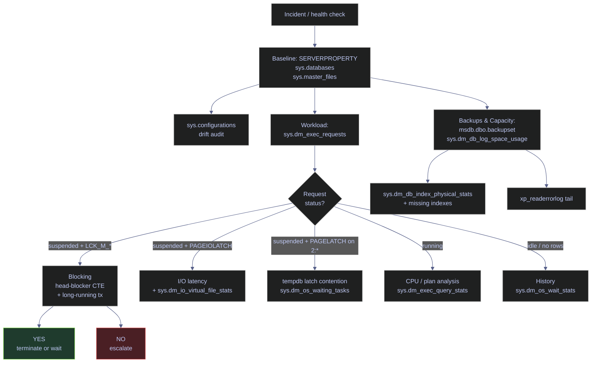

# Essential DBA Queries

This note is the production query pack for first-response SQL Server administration. The goal is not to show every DMV in the product. The goal is to give a short set of queries that answer the operational questions a DBA needs first: what server this is, what databases exist, whether files and logs are healthy, what is running now, what has been waiting, whether backups have actually happened, and where capacity is being consumed.

All result tables in this note were captured from the current `stoxx` instance:

- SQL Server 2022 CU23 (build 16.0.4236.2)
- Developer Edition (64-bit)
- Linux container on Ubuntu 22.04.5 LTS, host port `1434`
- SQL Server Agent is enabled on this instance (Linux container)
- Current date: April 11, 2026

> [!info] First-response triage decision path
>
> The query pack follows the order a DBA actually investigates an incident. The diagram below shows how the first signals branch into deeper queries.



Each section in this note maps to one branch of that decision path.

---

## Baseline

> [!abstract] Identity and scope
>
> Before changing anything, confirm the exact build, edition, host, clustering state, HA state, and database inventory on the instance you are looking at. This section covers the four reference points every responder needs: engine identity, database catalog, file allocation, and configuration drift. Every other section in this note depends on these facts being true and current.

### SQL Server | SERVERPROPERTY | instance identity

This subsection answers the first operational question on any incident: which server am I actually connected to, and what engine am I dealing with? The two queries split the answer into a human-readable banner and a structured field set suitable for runbooks and automated checks.

#### Engine version banner via @@VERSION

**When to run:** First step on every connection to an unfamiliar instance, before running any diagnostic or change.
**Trigger:** Incident triage, new onboarding, post-patch verification, or any time there is ambiguity about which server the session is attached to.
**Context:** Read-only, runs in a user database or `master`, requires only `PUBLIC` privileges. Returns a single string column.
**Purpose:** Capture the full product banner in one line so the exact build, edition, platform, and OS distribution can be pasted verbatim into an incident ticket or compared against the latest security update bulletin.

> [!info]- @@VERSION banner fields
>
> `@@VERSION` is a global function that returns the full product banner emitted by the engine at startup. It is a single-column, single-row result.
>
> - **SQL Server major version** (e.g., `Microsoft SQL Server 2022`).
> - **Service pack / RTM marker** (e.g., `RTM-CU23`).
> - **KB reference** for the cumulative update (e.g., `KB5078297`).
> - **Build number** in `major.minor.build.revision` form (e.g., `16.0.4236.2`).
> - **Architecture tag** (`X64`, `X86`, `ARM64`).
> - **Compile date** of the binary.
> - **Copyright line**.
> - **Edition** (e.g., `Developer Edition (64-bit)`).
> - **Platform and OS distribution** (`on Linux (Ubuntu 22.04.5 LTS)` or `on Windows Server 2022 Standard`).
>
> The banner string is free-form and not suitable for parsing; use `SERVERPROPERTY` for structured fields.

*This query returns the raw product banner identifying the exact SQL Server build, edition, platform, and OS distribution.*

```sql
SELECT @@VERSION AS version_string;
```

| version_string |
|---|
| Microsoft SQL Server 2022 (RTM-CU23) (KB5078297) - 16.0.4236.2 (X64) Jan 22 2026 17:50:56 Copyright (C) 2022 Microsoft Corporation Developer Edition (64-bit) on Linux (Ubuntu 22.04.5 LTS) \<X64\> |

*This instance is SQL Server 2022, cumulative update 23, build 16.0.4236.2, Developer Edition, running on Linux inside an Ubuntu 22.04.5 container. The KB reference (`KB5078297`) is the bulletin to check for the security content of this CU. The banner alone does not tell you whether the latest CU has been released since; compare against the current SQL Server 2022 [build list](https://learn.microsoft.com/en-us/troubleshoot/sql/releases/sqlserver-2022/cumulative-update-list) to confirm patch currency.*

#### Structured identity via SERVERPROPERTY

**When to run:** Immediately after `@@VERSION` when you need structured values for runbooks, dashboards, or automated drift checks.
**Trigger:** Need to confirm edition, HA posture, clustering state, licensing, or host name without parsing free-text banners.
**Context:** Read-only, runs in any database, `PUBLIC` privileges. Each `SERVERPROPERTY` call returns a scalar `sql_variant`; this query wraps each in an explicit `CAST` because some client drivers (including pyodbc) cannot transport `sql_variant` directly.
**Purpose:** Capture the discrete version, edition, collation, clustering, HA, and host fields that every incident report needs in structured form.

> [!info]- SERVERPROPERTY argument reference
>
> `SERVERPROPERTY(property_name)` returns a single `sql_variant` per call. The underlying property space is large — the twelve fields below are the first-response subset. Every value must be wrapped in an explicit `CAST` to a concrete type (`sysname`, `int`, `nvarchar`, `decimal`) before it can be transported by drivers that do not support `sql_variant`.

| Argument | Returned type | Meaning | Typical watch value |
|---|---|---|---|
| `ProductVersion` | `nvarchar` | Full build number `major.minor.build.revision` | Compare against latest CU for the major version |
| `ProductLevel` | `nvarchar` | Release level — `RTM`, `SPn`, `CTP`, `RCn` | `RTM` is normal for SQL Server 2022 |
| `ProductUpdateLevel` | `nvarchar` | Cumulative update label (e.g., `CU23`) or `NULL` if unpatched | Compare against the current public CU |
| `Edition` | `nvarchar` | `Enterprise`, `Standard`, `Developer`, `Express`, `Web`, `Azure SQL Database`, etc. | Developer/Enterprise have the full feature surface |
| `EngineEdition` | `int` | Product family enum — see domain table below | `3` = Standalone SQL Server |
| `Collation` | `nvarchar` | Default server collation | Cross-database joins depend on it matching |
| `IsClustered` | `int` | 1 = WSFC FCI, 0 = standalone | `1` changes failover procedures |
| `IsHadrEnabled` | `int` | 1 = Always On Availability Groups feature enabled | `1` introduces replica topology and preferred backup replica |
| `ServerName` | `nvarchar` | Logical server name as seen by SQL Server | Should match hostname or AG listener |
| `ComputerNamePhysicalNetBIOS` | `nvarchar` | Underlying host name (NetBIOS) | On Linux, this is the container hostname |
| `MachineName` | `nvarchar` | Virtual or physical machine name | Differs from `ServerName` on named instances |
| `LicenseType` | `nvarchar` | `PER_SEAT`, `PER_PROCESSOR`, or `DISABLED` (Developer/Express) | `DISABLED` is normal for Developer and Express |

*This query breaks the engine identity into twelve structured fields using `SERVERPROPERTY`, cast to concrete types so the rowset is transport-safe.*

```sql
SELECT
    CAST(SERVERPROPERTY('ProductVersion') AS sysname) AS product_version,
    CAST(SERVERPROPERTY('ProductLevel') AS sysname) AS product_level,
    CAST(SERVERPROPERTY('ProductUpdateLevel') AS sysname) AS cu_level,
    CAST(SERVERPROPERTY('Edition') AS sysname) AS edition,
    CAST(SERVERPROPERTY('EngineEdition') AS int) AS engine_edition,
    CAST(SERVERPROPERTY('Collation') AS sysname) AS collation,
    CAST(SERVERPROPERTY('IsClustered') AS int) AS is_clustered,
    CAST(SERVERPROPERTY('IsHadrEnabled') AS int) AS is_hadr,
    CAST(SERVERPROPERTY('ServerName') AS sysname) AS server_name,
    CAST(SERVERPROPERTY('ComputerNamePhysicalNetBIOS') AS sysname) AS physical_host,
    CAST(SERVERPROPERTY('MachineName') AS sysname) AS machine_name,
    CAST(SERVERPROPERTY('LicenseType') AS sysname) AS license_type;
```

| product_version | product_level | cu_level | edition | engine_edition | collation | is_clustered | is_hadr | server_name | physical_host | machine_name | license_type |
|---|---|---|---|---:|---|---:|---:|---|---|---|---|
| 16.0.4236.2 | RTM | CU23 | Developer Edition (64-bit) | 3 | SQL_Latin1_General_CP1_CI_AS | 0 | 0 | 9b9b89176e4b | 8482aae8ad0a | 8482aae8ad0a | DISABLED |

*The engine identity is SQL Server 2022 CU23 on Linux, Developer Edition, licensed as `DISABLED` which is the normal token for Developer and Express editions. `engine_edition = 3` confirms a regular SQL Server engine, not Azure SQL Database or Managed Instance. `is_clustered = 0` and `is_hadr = 0` mean there is no Windows failover cluster and no Always On availability group configured on this instance, so recovery and failover procedures must be evaluated as standalone-instance operations unless another HA layer exists outside SQL Server. `server_name` equals the container hostname (`9b9b89176e4b`), which is visibly a Docker-generated ID — on a production deployment this would be the hostname or AG listener.*

> [!warning] SERVERPROPERTY returns sql_variant
>
> Every call to `SERVERPROPERTY` returns a value typed as `sql_variant`. Several client drivers (including pyodbc, some JDBC drivers, and older ODBC versions) cannot transport `sql_variant` directly and will raise `ODBC SQL type -16 is not yet supported`. The same restriction applies to `DATABASEPROPERTYEX` and `CONNECTIONPROPERTY`.

> [!success] Always cast SERVERPROPERTY results
>
> Wrap every `SERVERPROPERTY` call in an explicit `CAST` to a concrete type (`sysname`, `int`, `nvarchar`, `decimal`) inside the `SELECT` list. This is the canonical pattern used across every production SQL Server diagnostic query.

| Column | Value | Watch | Meaning | Implication |
|---|---|---|---|---|
| `product_level` | `RTM` + current `cu_level` populated | &#9989; | Base release with cumulative update layering | Check `cu_level`, not `product_level` alone, to know patch currency |
| `cu_level` | `CU23` | &#9989; | Current cumulative update level reported by the engine | The instance is patched well beyond early SQL Server 2022 builds |
| `engine_edition` | `1` | Context dependent | Personal / Desktop (deprecated) | Legacy only |
| `engine_edition` | `2` | Context dependent | Standard (Standard, Web, Business Intelligence) | Feature-gated compared to Enterprise |
| `engine_edition` | `3` | &#9989; | Enterprise / Developer standalone | Normal on-prem or IaaS SQL Server behavior applies |
| `engine_edition` | `4` | Context dependent | Express family | Feature-gated and memory-capped |
| `engine_edition` | `5` | &#10060; in this context | Azure SQL Database | T-SQL surface and HA assumptions differ |
| `engine_edition` | `6` | Context dependent | Azure Synapse Analytics | Dedicated SQL pool behavior |
| `engine_edition` | `8` | &#10060; in this context | Azure SQL Managed Instance | Managed platform with different backup and HA surface |
| `engine_edition` | `9` | Context dependent | Azure SQL Edge | IoT/edge, reduced feature set |
| `engine_edition` | `11` | Context dependent | Azure SQL Database Fabric | Fabric-managed behavior |
| `is_clustered` | `0` | &#9989; for this instance | Not part of a WSFC cluster | No cluster-managed failover path exists here |
| `is_clustered` | `1` | Context dependent | Instance is cluster-aware | File placement, service ownership, and failover procedures must account for clustering |
| `is_hadr` | `0` | &#9989; for this instance | Availability Groups are not enabled | AG backup offload and replica-based recovery procedures do not apply |
| `is_hadr` | `1` | Context dependent | Availability Groups feature is enabled | Check replica topology, preferred backup replica, and failover mode |
| `license_type` | `DISABLED` | &#9989; for Developer / Express | Edition is not subject to seat or processor licensing | Developer Edition is free for non-production use |
| `license_type` | `PER_SEAT`, `PER_PROCESSOR` | Context dependent | Commercial license model | Coordinate with licensing owner on workload scaling |

### SQL Server | sys.databases | catalog inventory

This subsection answers which databases exist on the instance, what recovery models they use, whether snapshot-based read semantics are enabled, and what is currently preventing transaction log reuse. It is the single most load-bearing query in the pack because almost every backup, recovery, or concurrency decision depends on reading these columns correctly.

#### Database state, recovery model, snapshot, CDC, and log-reuse blockers

**When to run:** Immediately after identity is confirmed, and whenever a log-reuse, restore, or concurrency question comes up.
**Trigger:** Incident reports citing "log full", "database offline", "PITR failed", "reader blocking", or any recovery-model question.
**Context:** Read-only, runs in any database, `PUBLIC` can read `sys.databases` but some columns require `VIEW ANY DATABASE` or `CONTROL SERVER`.
**Purpose:** Produce a single-page inventory of every database on the instance with the five flags that drive backup, restore, and concurrency behavior: state, recovery model, compatibility level, RCSI, CDC, and log-reuse wait.

> [!info]- sys.databases column reference
>
> `sys.databases` is the instance-wide catalog view for database metadata. Every row is one database, including the four system databases.

| Column | Type | Meaning |
|---|---|---|
| `database_id` | `int` | Internal numeric ID (1=master, 2=tempdb, 3=model, 4=msdb, user dbs from 5+) |
| `name` | `sysname` | Logical database name |
| `state_desc` | `nvarchar(60)` | State enum: `ONLINE`, `RESTORING`, `RECOVERING`, `RECOVERY_PENDING`, `SUSPECT`, `EMERGENCY`, `OFFLINE` |
| `recovery_model_desc` | `nvarchar(60)` | `FULL`, `BULK_LOGGED`, `SIMPLE` |
| `compatibility_level` | `tinyint` | Compat level: `160`=SQL 2022, `150`=SQL 2019, `140`=SQL 2017, `130`=SQL 2016, `120`=SQL 2014, `110`=SQL 2012, `100`=SQL 2008 |
| `is_read_committed_snapshot_on` | `bit` | 1 = read committed uses row versioning (RCSI); 0 = classic shared-lock reads |
| `is_cdc_enabled` | `bit` | 1 = Change Data Capture is enabled on the database |
| `log_reuse_wait_desc` | `nvarchar(60)` | Why the log cannot currently truncate reusable VLFs — see value-guide below |
| `create_date` | `datetime` | Timestamp when the database was created or last restored |

*This query inventories every database on the instance and surfaces the five state fields that drive backup, restore, and concurrency behavior.*

```sql
SELECT
    database_id,
    name,
    state_desc,
    recovery_model_desc,
    compatibility_level,
    is_read_committed_snapshot_on,
    is_cdc_enabled,
    log_reuse_wait_desc,
    create_date
FROM sys.databases
ORDER BY name;
```

| database_id | name | state_desc | recovery_model_desc | compatibility_level | is_read_committed_snapshot_on | is_cdc_enabled | log_reuse_wait_desc | create_date |
|---:|---|---|---|---:|---:|---:|---|---|
| 1 | master | ONLINE | SIMPLE | 160 | 0 | 0 | NOTHING | 2003-04-08 09:13:36.390 |
| 3 | model | ONLINE | FULL | 160 | 0 | 0 | NOTHING | 2003-04-08 09:13:36.390 |
| 4 | msdb | ONLINE | SIMPLE | 160 | 0 | 0 | OLDEST_PAGE | 2026-01-22 20:22:25.730 |
| 5 | stoxx | ONLINE | FULL | 160 | 0 | 0 | LOG_BACKUP | 2026-03-04 22:11:32.887 |
| 6 | stoxx_db | ONLINE | FULL | 160 | 1 | 0 | NOTHING | 2026-04-11 12:13:31.140 |
| 2 | tempdb | ONLINE | SIMPLE | 160 | 0 | 0 | NOTHING | 2026-04-11 15:55:57.453 |

*Six databases are online and all are at compatibility level 160 (SQL Server 2022). The meaningful production signals are on the two user databases. `stoxx` is in `FULL` recovery model with `log_reuse_wait_desc = LOG_BACKUP`, which means the log cannot truncate because no log backup has been taken since the last full, so VLFs are being retained for the log chain. This is the textbook symptom of a newly created or freshly restored FULL-recovery database that does not yet have a log-backup cadence; the log will grow until either a log backup is taken or the recovery model is switched to `SIMPLE`. `stoxx_db` has RCSI enabled (`is_read_committed_snapshot_on = 1`), so read-committed reads use row versioning and will not block behind writers. `tempdb` was recreated at 15:55 today — compare that timestamp against `sqlserver_start_time` from [SQL Server \| sys.dm_os_sys_info \| instance runtime](https://alp78.github.io/elysium/04-SQL-Server/01-Server-Operations/01-server-configuration) to confirm the instance was restarted recently.*

| Column | Value | Watch | Meaning | Implication |
|---|---|---|---|---|
| `state_desc` | `ONLINE` | &#9989; | Database is accessible and usable | Normal operating state |
| `state_desc` | `RESTORING` | Context dependent | Restore in progress or paused | Cannot access; check restore job |
| `state_desc` | `RECOVERING` | Watch | Automatic recovery running | Transient; wait or check error log |
| `state_desc` | `RECOVERY_PENDING` | &#10060; | Recovery cannot start, needs attention | Inspect error log for resource failure |
| `state_desc` | `SUSPECT` | &#10060; | Unable to recover without intervention | DBCC CHECKDB and restore from backup |
| `state_desc` | `EMERGENCY` | Watch | Admin-set read-only emergency mode | Use only for forensics / repair |
| `state_desc` | `OFFLINE` | Context dependent | Deliberately offlined | Bring online or leave for retirement |
| `recovery_model_desc` | `FULL` | Context dependent | Log backups supported and required for PITR | Pair with scheduled log backups and log-chain monitoring |
| `recovery_model_desc` | `SIMPLE` | Context dependent | Log truncates at checkpoint; no log backups | Suitable for reproducible or low-RPO databases only |
| `recovery_model_desc` | `BULK_LOGGED` | Watch carefully | Minimal logging for some bulk operations | PITR is limited for log backups containing bulk-logged changes |
| `compatibility_level` | `160` | &#9989; | SQL Server 2022 compatibility behavior | Latest optimizer surface for SQL Server 2022 |
| `compatibility_level` | `< 160` | Watch | Pinned to an older optimizer surface | May block new T-SQL features or QO fixes |
| `is_read_committed_snapshot_on` | `0` | Watch | Classic read committed locking semantics | Reader-writer blocking is still possible |
| `is_read_committed_snapshot_on` | `1` | &#9989; for OLTP/reporting concurrency | Read committed uses row versioning | Readers no longer take shared locks against writers |
| `is_cdc_enabled` | `0` | Context dependent | CDC not enabled | Downstream change harvesting must use other patterns |
| `is_cdc_enabled` | `1` | Context dependent | CDC enabled | Check capture and cleanup jobs and retention |
| `log_reuse_wait_desc` | `NOTHING` | &#9989; | No current blocker to log reuse | Normal healthy state |
| `log_reuse_wait_desc` | `CHECKPOINT` | Transient | Waiting for a checkpoint to complete | Usually clears on its own |
| `log_reuse_wait_desc` | `LOG_BACKUP` | &#10060; under FULL/BULK_LOGGED | Log backup is required before reuse | Usually indicates missing or failing log backup cadence |
| `log_reuse_wait_desc` | `ACTIVE_BACKUP_OR_RESTORE` | Transient | Full or differential backup in progress | Will clear when the backup completes |
| `log_reuse_wait_desc` | `ACTIVE_TRANSACTION` | Watch | One or more transactions still hold log space | Investigate open transactions before shrinking or blaming backups |
| `log_reuse_wait_desc` | `DATABASE_MIRRORING` | Context dependent | Mirror partner is behind | Check mirroring / AG secondary health |
| `log_reuse_wait_desc` | `REPLICATION` | Context dependent | Replication log reader has not read the log | Check log reader agent health |
| `log_reuse_wait_desc` | `OLDEST_PAGE` | Context dependent | Oldest page on tempdb or indirect checkpoint hold | Usually benign but worth a sanity check |
| `log_reuse_wait_desc` | `AVAILABILITY_REPLICA` | Context dependent | AG secondary is not redoing fast enough | Check secondary redo queue |

### SQL Server | sys.master_files | database file allocation

This subsection quantifies how much storage each database currently owns on disk. It is an allocation view, not a used-space view — for used and free space inside a file, use the drill-down in the next subsection.

#### Database sizes by data file, log file, and total footprint

**When to run:** During routine capacity reviews, after a large import, or whenever someone asks "where is the space going?"
**Trigger:** Out-of-space alerts, slow `BACKUP DATABASE`, unexpected disk usage on `/var/opt/mssql/data` or the Windows data drive.
**Context:** Read-only. `sys.master_files` is instance-wide, so the query returns every database's files even when the database itself is offline or unreachable. `PUBLIC` can read it; no elevated permissions required.
**Purpose:** Rank databases by total allocated size and split the total into data-file and log-file components so storage pressure can be attributed to the right growth vector.

> [!info]- sys.master_files column reference
>
> `sys.master_files` is an instance-wide catalog view. Every row is one physical database file.

| Column | Type | Meaning |
|---|---|---|
| `database_id` | `int` | ID of the database that owns this file |
| `file_id` | `int` | Per-database file identifier |
| `type` | `tinyint` | File type enum — see domain table below |
| `type_desc` | `nvarchar(60)` | Human-readable form of `type` |
| `name` | `sysname` | Logical file name |
| `physical_name` | `nvarchar(260)` | Full OS path of the file |
| `size` | `int` | File size expressed in 8 KB **pages** — convert with `size * 8.0 / 1024` for MB |
| `max_size` | `int` | Max size in 8 KB pages; `-1` = unlimited, `0` = no growth |
| `growth` | `int` | Growth increment; unit depends on `is_percent_growth` |
| `is_percent_growth` | `bit` | 0 = `growth` is in pages; 1 = `growth` is a percentage |

| `sys.master_files.type` | Meaning |
|---:|---|
| `0` | Rows (data file — `.mdf`, `.ndf`) |
| `1` | Log file (`.ldf`) |
| `2` | FILESTREAM filegroup container |
| `3` | Reserved |
| `4` | Full-text / semantic search catalog (deprecated, SQL Server 2008+) |

*This query summarizes the allocated data-file and log-file footprint of every database so you can identify where storage pressure will show up first.*

```sql
SELECT
    d.name AS database_name,
    CAST(SUM(CASE WHEN mf.type = 0 THEN mf.size END) * 8.0 / 1024 AS decimal(12,2)) AS data_size_mb,
    CAST(SUM(CASE WHEN mf.type = 1 THEN mf.size END) * 8.0 / 1024 AS decimal(12,2)) AS log_size_mb,
    CAST(SUM(mf.size) * 8.0 / 1024 AS decimal(12,2)) AS total_size_mb
FROM sys.databases AS d
JOIN sys.master_files AS mf
    ON mf.database_id = d.database_id
GROUP BY d.name
ORDER BY total_size_mb DESC;
```

| database_name | data_size_mb | log_size_mb | total_size_mb |
|---|---:|---:|---:|
| stoxx | 712.00 | 1032.00 | 1744.00 |
| stoxx_db | 768.00 | 256.00 | 1024.00 |
| tempdb | 64.00 | 8.00 | 72.00 |
| msdb | 15.31 | 1.25 | 16.56 |
| model | 8.00 | 8.00 | 16.00 |
| master | 4.69 | 2.00 | 6.69 |

*`stoxx` is the largest database at 1.70 GB allocated, and its 1.03 GB log file is larger than its 712 MB data file. That is consistent with the `log_reuse_wait_desc = LOG_BACKUP` signal from the previous query: the log has grown because no log backups have been taken to reset the reusable VLFs. The sibling `stoxx_db` is more balanced (768 MB data, 256 MB log) because it was freshly created today and has had less write activity. `tempdb` is modest at 72 MB allocated, which is a reset-to-default pattern for a container that just restarted — compare against the nine-file layout in the next subsection.*

| Column | Value | Watch | Meaning | Implication |
|---|---|---|---|---|
| `data_size_mb` | Larger than `log_size_mb` | Common | Data footprint exceeds log footprint | Typical for steady-state OLTP or analytics databases |
| `log_size_mb` | Larger than `data_size_mb` | Watch | Log allocation exceeds data allocation | Check recovery model, backup cadence, and long transactions |
| `total_size_mb` | Rising steadily with stable row counts | Watch | Space is being allocated faster than data growth explains | Check log reuse, index maintenance, or fragmentation side effects |

### SQL Server | sys.database_files | current-database file space

This subsection drills from allocation (how much a file *owns*) to usage (how much of that file is currently *used* by data pages). `sys.database_files` is the per-database counterpart to `sys.master_files` and is the only place where `FILEPROPERTY(..., 'SpaceUsed')` can run for the current database.

#### Data and log file used, free, growth, and max size

**When to run:** After the allocation query if a file is larger than expected, or whenever a log-growth incident is being investigated.
**Trigger:** "File is 90% full" alert, pending autogrowth event, or a planning decision about whether to shrink or preallocate.
**Context:** Read-only, runs in the current database context. `FILEPROPERTY` only works against files that belong to the database the session is connected to, so to inspect another database you must switch with `USE`. `PUBLIC` can read the view.
**Purpose:** Turn raw allocation into an actionable used/free/growth/max picture per file so you can tell whether the file has headroom before the next autogrowth event.

> [!info]- sys.database_files + FILEPROPERTY reference
>
> `sys.database_files` is the per-database equivalent of `sys.master_files`. It has the same columns plus a few per-database state flags. `FILEPROPERTY(logical_name, 'SpaceUsed')` returns the number of 8 KB pages currently used inside the file — it is the only supported way to compute free space from inside T-SQL without parsing DBCC output.

| Column | Type | Meaning |
|---|---|---|
| `name` | `sysname` | Logical file name (first argument to `FILEPROPERTY`) |
| `type_desc` | `nvarchar(60)` | `ROWS`, `LOG`, `FILESTREAM` |
| `physical_name` | `nvarchar(260)` | Full OS path |
| `size` | `int` | File size in 8 KB pages |
| `max_size` | `int` | Max size in 8 KB pages — `-1` unlimited, `0` no growth |
| `growth` | `int` | Growth increment; unit depends on `is_percent_growth` |
| `is_percent_growth` | `bit` | 0 = `growth` is in pages; 1 = `growth` is a percentage |
| `state_desc` | `nvarchar(60)` | `ONLINE`, `RESTORING`, `RECOVERING`, `RECOVERY_PENDING`, `SUSPECT`, `OFFLINE`, `DEFUNCT` |

*This query joins `sys.database_files` with `FILEPROPERTY` to produce a per-file used/free picture for the current database, with growth and max size rendered in operational units.*

```sql
SELECT
    DB_NAME() AS database_name,
    df.name AS logical_name,
    df.type_desc,
    df.physical_name,
    CAST(df.size * 8.0 / 1024 AS decimal(12,2)) AS size_mb,
    CAST(FILEPROPERTY(df.name, 'SpaceUsed') * 8.0 / 1024 AS decimal(12,2)) AS used_mb,
    CAST((df.size - FILEPROPERTY(df.name, 'SpaceUsed')) * 8.0 / 1024 AS decimal(12,2)) AS free_mb,
    CASE WHEN df.is_percent_growth = 1
         THEN CAST(df.growth AS varchar(10)) + '%'
         ELSE CAST(CAST(df.growth * 8.0 / 1024 AS decimal(10,2)) AS varchar(20)) + ' MB'
    END AS growth,
    CASE WHEN df.max_size = -1 THEN 'UNLIMITED'
         WHEN df.max_size =  0 THEN 'NO GROWTH'
         ELSE CAST(CAST(df.max_size * 8.0 / 1024 AS decimal(12,2)) AS varchar(20)) + ' MB'
    END AS max_size
FROM sys.database_files AS df
ORDER BY df.type, df.file_id;
```

| database_name | logical_name | type_desc | physical_name | size_mb | used_mb | free_mb | growth | max_size |
|---|---|---|---|---:|---:|---:|---|---|
| stoxx | stoxx | ROWS | /var/opt/mssql/data/stoxx.mdf | 712.00 | 595.63 | 116.38 | 64.00 MB | UNLIMITED |
| stoxx | stoxx_log | ROWS | /var/opt/mssql/data/stoxx_log.ldf | 1032.00 | 791.52 | 240.48 | 64.00 MB | 2097152.00 MB |

*The `stoxx` data file is 712 MB allocated with 595.63 MB used, leaving 116.38 MB of headroom — about one autogrowth event away from triggering another 64 MB chunk allocation. The log file is 1032 MB allocated, 791.52 MB used, 240.48 MB free, and capped at 2 TB. The `type_desc` on both rows shows `ROWS` here because SQL Server 2022 returns `ROWS` for both the data and log file types in `sys.database_files` — trust `physical_name` (`.mdf` vs `.ldf`) or `file_id` (1 = primary data, 2 = first log) to distinguish them unambiguously.*

| Column | Value | Watch | Meaning | Implication |
|---|---|---|---|---|
| `free_mb` | > 25% of `size_mb` | &#9989; | Comfortable headroom | Next autogrowth event is not imminent |
| `free_mb` | 10-25% of `size_mb` | Watch | Headroom is shrinking | Verify autogrowth increment is appropriate |
| `free_mb` | < 10% of `size_mb` | &#10060; | Autogrowth event imminent | Pre-grow to avoid runtime latency spike |
| `growth` | Fixed MB value | &#9989; | Predictable allocations | Easier to budget and monitor |
| `growth` | Percentage | &#10060; for large files | Growth increment expands as file grows | Each event takes longer; pre-size instead |
| `max_size` | `UNLIMITED` | &#9989; in most cases | File can grow to fill the disk | Monitor disk-level free space instead |
| `max_size` | Fixed value | Watch | File will hit a hard cap | Alert before the cap is reached |
| `max_size` | `NO GROWTH` | &#10060; except for tempdb templates | File cannot grow past current size | Out-of-space writes will fail |

### SQL Server | tempdb.sys.database_files | tempdb file layout

This subsection verifies that tempdb is configured with the usual equal-size multi-file pattern. TempDB is recreated at every service start from the `model` database plus any explicit file definitions, so the file count and sizes observed here are a snapshot of the current instance runtime, not a permanent configuration.

#### TempDB file count, sizes, and growth settings

**When to run:** During baseline health checks, after a service restart, or when tempdb latch contention is suspected.
**Trigger:** PAGELATCH waits on `2:*:*` pages, workloads hitting `SGAM`/`PFS`/`GAM` contention, or a planning decision about how to resize tempdb.
**Context:** Read-only. Runs against the `tempdb` system database via three-part name — no `USE tempdb` required. `PUBLIC` can read the view.
**Purpose:** Confirm the file count (usually 1 data file per logical CPU, capped at 8), the equal-size pattern, and the fixed-size autogrowth setting that together drive tempdb allocation contention behavior.

> [!info]- tempdb.sys.database_files columns and tempdb-specific gotchas
>
> TempDB is the only database that is automatically recreated on every engine start. SQL Server reads its file definitions from internal configuration (`sys.master_files` for `database_id = 2`) and rebuilds the files from the `model` database template. Changes made via `ALTER DATABASE tempdb ADD FILE` or `MODIFY FILE` persist in `master` and re-apply on the next restart.

| Column | Type | Meaning |
|---|---|---|
| `file_id` | `int` | Per-database file identifier |
| `name` | `sysname` | Logical file name (e.g., `tempdev`, `tempdev2`, `templog`) |
| `type_desc` | `nvarchar(60)` | `ROWS` or `LOG` |
| `physical_name` | `nvarchar(260)` | OS path of the file |
| `size` | `int` | File size in 8 KB pages |
| `growth` | `int` | Growth increment in pages when `is_percent_growth = 0` |
| `is_percent_growth` | `bit` | 0 = fixed-size growth; 1 = percentage growth |

*This query verifies tempdb file count, file sizes, and autogrowth behavior so you can spot misaligned or percentage-growth tempdb layouts immediately.*

```sql
SELECT
    file_id,
    name,
    type_desc,
    physical_name,
    CAST(size * 8.0 / 1024 AS decimal(12,2)) AS size_mb,
    growth,
    is_percent_growth
FROM tempdb.sys.database_files
ORDER BY file_id;
```

| file_id | name | type_desc | physical_name | size_mb | growth | is_percent_growth |
|---:|---|---|---|---:|---:|---:|
| 1 | tempdev | ROWS | /var/opt/mssql/data/tempdb.mdf | 8.00 | 8192 | 0 |
| 2 | templog | LOG | /var/opt/mssql/data/templog.ldf | 8.00 | 8192 | 0 |
| 3 | tempdev2 | ROWS | /var/opt/mssql/data/tempdb2.ndf | 8.00 | 8192 | 0 |
| 4 | tempdev3 | ROWS | /var/opt/mssql/data/tempdb3.ndf | 8.00 | 8192 | 0 |
| 5 | tempdev4 | ROWS | /var/opt/mssql/data/tempdb4.ndf | 8.00 | 8192 | 0 |
| 6 | tempdev5 | ROWS | /var/opt/mssql/data/tempdb5.ndf | 8.00 | 8192 | 0 |
| 7 | tempdev6 | ROWS | /var/opt/mssql/data/tempdb6.ndf | 8.00 | 8192 | 0 |
| 8 | tempdev7 | ROWS | /var/opt/mssql/data/tempdb7.ndf | 8.00 | 8192 | 0 |
| 9 | tempdev8 | ROWS | /var/opt/mssql/data/tempdb8.ndf | 8.00 | 8192 | 0 |

*Eight equal-sized data files plus one log file — the standard production pattern — but every file is currently at the 8 MB `model` template size because the container was restarted at 15:55 and tempdb has not yet grown. `growth = 8192` (in pages) means each autogrowth event will add 64 MB. Under production load the files will grow from 8 MB to whatever the first large workload demands, and after stabilization they should be pre-grown to that size with `ALTER DATABASE tempdb MODIFY FILE` so later restarts do not pay the growth cost. `is_percent_growth = 0` across the board is also correct for tempdb, because percentage growth causes increasingly large and less predictable growth events as files get bigger.*

| Column | Value | Watch | Meaning | Implication |
|---|---|---|---|---|
| `type_desc` | `ROWS` | &#9989; for tempdb data files | TempDB data file | Used for version store, worktables, temp objects |
| `type_desc` | `LOG` | &#9989; for one file | TempDB transaction log file | Separate log growth behavior from data-file growth |
| `is_percent_growth` | `0` | &#9989; | Fixed-size autogrowth | Predictable growth events |
| `is_percent_growth` | `1` | &#10060; | Percentage growth | Growth events become larger and less predictable over time |
| `size_mb` | Equal across all data files | &#9989; | Balanced proportional fill | Better allocation distribution |
| `size_mb` | Unequal across data files | &#10060; | One or more files will be favored | Tempdb concurrency benefit is weakened |
| File count | 1 per logical CPU, capped at 8 | &#9989; | Recommended starting pattern | Minimizes GAM/SGAM/PFS contention |
| File count | 1 | &#10060; on multi-CPU hosts | Single data file | High risk of tempdb allocation contention |

### SQL Server | sys.configurations | configuration drift audit

This subsection answers a single sharp question: has anything on this instance drifted away from the platform defaults that matter for throughput and parallelism? It is not a replacement for the full configuration review in [SQL Server | server configuration](https://alp78.github.io/elysium/04-SQL-Server/01-Server-Operations/01-server-configuration), but it is the right query to run during triage when you need to know in five seconds whether a surprising setting is in effect.

#### Non-default and high-impact configuration values

**When to run:** First ten minutes of any performance incident, and whenever the current edition or build has just changed.
**Trigger:** Reports of unexpected plan shape, parallelism, or memory behavior; post-migration verification; fresh CU install.
**Context:** Read-only against `master.sys.configurations`. `PUBLIC` can read this view but the `value_in_use` column returns `sql_variant`, which must be `CAST` to `bigint` for portable transport (same constraint as `SERVERPROPERTY`).
**Purpose:** Surface the eight or nine configuration knobs that most commonly change between lab, dev, and production, plus any setting where `value_in_use` differs from the configured `value` (indicating a pending `RECONFIGURE`).

> [!info]- sys.configurations column reference
>
> `sys.configurations` holds one row per server-level configuration setting. The `value` column is what you set with `sp_configure`; `value_in_use` is what the engine is actually using after the last `RECONFIGURE`. The two can diverge when someone has changed a setting but not yet run `RECONFIGURE`.

| Column | Type | Meaning |
|---|---|---|
| `name` | `sysname` | Configuration option name |
| `value` | `sql_variant` | The configured value (what `sp_configure` stored) — cast to `bigint` |
| `value_in_use` | `sql_variant` | The value the engine is actually using — cast to `bigint` |
| `minimum` | `sql_variant` | Lower bound for the value — cast to `bigint` |
| `maximum` | `sql_variant` | Upper bound for the value — cast to `bigint` |
| `is_dynamic` | `bit` | 1 = change takes effect after `RECONFIGURE` without restart; 0 = requires restart |
| `is_advanced` | `bit` | 1 = hidden behind `show advanced options = 1` |
| `description` | `nvarchar(255)` | One-line description of the setting |

*This query lists the high-impact configuration settings with both configured and in-use values so drift between the two is immediately visible.*

```sql
SELECT
    name,
    CAST(value_in_use AS bigint) AS value_in_use,
    CAST(value AS bigint) AS configured_value,
    CAST(minimum AS bigint) AS min_value,
    CAST(maximum AS bigint) AS max_value,
    CAST(is_dynamic AS int) AS is_dynamic,
    CAST(is_advanced AS int) AS is_advanced
FROM sys.configurations
WHERE name IN
(
    'max degree of parallelism',
    'cost threshold for parallelism',
    'max server memory (MB)',
    'min server memory (MB)',
    'optimize for ad hoc workloads',
    'backup compression default',
    'remote admin connections',
    'contained database authentication',
    'Agent XPs'
)
ORDER BY name;
```

| name | value_in_use | configured_value | min_value | max_value | is_dynamic | is_advanced |
|---|---:|---:|---:|---:|---:|---:|
| Agent XPs | 1 | 1 | 0 | 1 | 1 | 1 |
| backup compression default | 0 | 0 | 0 | 1 | 1 | 0 |
| contained database authentication | 0 | 0 | 0 | 1 | 1 | 0 |
| cost threshold for parallelism | 5 | 5 | 0 | 32767 | 1 | 1 |
| max degree of parallelism | 0 | 0 | 0 | 32767 | 1 | 1 |
| max server memory (MB) | 2147483647 | 2147483647 | 128 | 2147483647 | 1 | 1 |
| min server memory (MB) | 16 | 0 | 0 | 2147483647 | 1 | 1 |
| optimize for ad hoc workloads | 0 | 0 | 0 | 1 | 1 | 1 |
| remote admin connections | 0 | 0 | 0 | 1 | 1 | 0 |

*The audit shows an almost-default instance with two important observations. First, `Agent XPs = 1` proves that SQL Server Agent is enabled on this Linux container — the Agent workload is visible later in the session inventory and in the Agent job history query. Second, `min server memory` diverges between `value_in_use = 16` and `configured_value = 0`: the configured value is 0 but the engine is reporting 16 MB in use, which is the hard floor the engine applies internally and is not a drift signal. Every other setting is at its documented default. In production on this hardware, the three settings that should almost always change before the instance leaves lab are `max server memory`, `cost threshold for parallelism` (default `5` is too low for modern OLTP), and `max degree of parallelism`; see [SQL Server | server configuration](https://alp78.github.io/elysium/04-SQL-Server/01-Server-Operations/01-server-configuration) for the remediation patterns.*

| Setting | Default | Production recommendation | Reason |
|---|---:|---|---|
| `max degree of parallelism` | `0` (unlimited) | Equal to cores per NUMA node, capped at 8 | Prevents runaway parallelism on OLTP workloads |
| `cost threshold for parallelism` | `5` | `50` or higher | Default triggers parallel plans on trivial queries |
| `max server memory (MB)` | `2147483647` | Leave 2-4 GB plus ~10% for the OS | Default allows SQL Server to consume all host RAM |
| `min server memory (MB)` | `0` | Leave at default unless multi-instance | Only matters for shared hosts |
| `optimize for ad hoc workloads` | `0` | `1` | Halves plan-cache memory for single-use plans |
| `backup compression default` | `0` | `1` | Backups are smaller and faster; trivial CPU cost |
| `remote admin connections` | `0` | `1` | Enables DAC from remote host for emergency diagnostics |
| `contained database authentication` | `0` | `1` if contained databases are in use | Required for contained database users |
| `Agent XPs` | `0` | `1` if Agent is used | Enables Agent-related stored procedures |

---

## Workload

> [!abstract] What is happening right now
>
> This section answers the live questions: who is connected, which requests are active, whether blocking exists, whether any transactions have been open too long, whether tempdb is taking allocation-page latch hits, and what cumulative waits have dominated since startup. Every query here is a live DMV read that should be interpreted in the context of the current session count and server uptime.

### SQL Server | sys.dm_exec_sessions | connection inventory

This subsection inventories live user connectivity. Two queries: one aggregate count and one top-sessions-by-most-recent, because during an incident the fastest useful signal is usually the identity of the newest attached client rather than the grand total.

#### Count of connected user sessions

**When to run:** At the start of triage, and whenever connection pressure or pool exhaustion is suspected.
**Trigger:** Application errors like "login failed, too many connections", slow logins, or reports of latency spikes that correlate with new deployment windows.
**Context:** Read-only, runs in any database, `VIEW SERVER STATE` required to see sessions that do not belong to the current login. Without it, the filter returns only the caller's sessions.
**Purpose:** Produce a single integer answering "is the user-session count within normal bounds for this instance?"

> [!info]- sys.dm_exec_sessions and is_user_process
>
> `sys.dm_exec_sessions` returns one row per connected session — every SQL Server connection that has completed authentication. The `is_user_process` flag is the standard filter for separating user sessions from internal system sessions.

| Column | Type | Meaning |
|---|---|---|
| `session_id` | `smallint` | Server-assigned session identifier (SPID) |
| `is_user_process` | `bit` | 1 = user session; 0 = system session (lazy writer, log writer, etc.) |
| `login_name` | `nvarchar(128)` | Login used to authenticate |
| `host_name` | `nvarchar(128)` | Client hostname reported by the driver |
| `program_name` | `nvarchar(128)` | Application name from the connection string (`Application Name=`) |
| `status` | `nvarchar(30)` | `running`, `sleeping`, `dormant`, `preconnect` |
| `database_id` | `smallint` | Default database for the session at login time |
| `login_time` | `datetime` | Timestamp when the session was authenticated |

*This query counts the current user sessions, filtering out internal SQL Server system sessions.*

```sql
SELECT COUNT(*) AS user_session_count
FROM sys.dm_exec_sessions
WHERE is_user_process = 1;
```

| user_session_count |
|---:|
| 4 |

*Four user sessions is a quiet baseline. There is no sign of broad connection pressure. On a production instance the baseline count is workload-specific — establish it under normal load before using this metric for triage thresholds.*

#### Most recently connected user sessions with program identity

**When to run:** Immediately after the session count, whenever an unexpected client or script is suspected, or when correlating activity with a deploy window.
**Trigger:** Sudden session-count spike, alert from application tier, or need to identify the client behind a blocking session.
**Context:** Read-only, `VIEW SERVER STATE` required to see other users' sessions. Sorting by `login_time DESC` surfaces the freshest clients first because those are the ones most likely relevant to a just-started incident.
**Purpose:** Identify the client tool or application behind each session so you can map each `session_id` to a real person, process, or deployment.

*This query lists the ten most recently connected user sessions with login, host, client program, session status, and default database.*

```sql
SELECT TOP (10)
    session_id,
    login_name,
    host_name,
    program_name,
    status,
    database_id
FROM sys.dm_exec_sessions
WHERE is_user_process = 1
ORDER BY login_time DESC;
```

| session_id | login_name | host_name | program_name | status | database_id |
|---:|---|---|---|---|---:|
| 69 | sa | ELYSIUM | Python | running | 5 |
| 78 | NT AUTHORITY\NETWORK SERVICE | 8482aae8ad0a | SQLAgent - Contained AG | sleeping | 4 |
| 75 | NT AUTHORITY\NETWORK SERVICE | 8482aae8ad0a | SQLAgent - Email Logger | sleeping | 4 |
| 74 | NT AUTHORITY\NETWORK SERVICE | 8482aae8ad0a | SQLAgent - Generic Refresher | sleeping | 4 |

*Four user sessions visible. The `running` session `69` is the `pyodbc` client that executed this query pack. The other three are SQL Server Agent subsystem workers (`Contained AG`, `Email Logger`, `Generic Refresher`) — Agent is enabled on this Linux container, confirming the `Agent XPs = 1` signal from the configuration audit. `host_name = 8482aae8ad0a` on the Agent sessions is the container hostname because they run inside the SQL Server process. In production the most important thing this query tells you is the `program_name` mix: a sudden appearance of unexpected client programs is a strong triage signal.*

| Column | Value | Watch | Meaning | Implication |
|---|---|---|---|---|
| `status` | `running` | Context dependent | Session currently has work on a scheduler | Normal if an active query or batch is executing |
| `status` | `sleeping` | Context dependent | Session is connected but idle between requests | Usually harmless unless it holds an open transaction |
| `status` | `dormant` | Watch | Session is waiting for the next request but has been idle a long time | Check for connection-pool leaks |
| `status` | `preconnect` | Transient | Session authenticating / logging in | Should clear within a second |
| `program_name` | `SQL Server Management Studio`, `SSMS`, `sqlcmd` | Context dependent | Human-operated tooling | Activity is likely administrative, not application traffic |
| `program_name` | `SQLAgent - *` | &#9989; if Agent is enabled | SQL Server Agent subsystem workers | Normal internal noise |
| `program_name` | `.NET SqlClient Data Provider`, `Microsoft JDBC Driver`, `Python`, `Go-MSSQLDB` | Context dependent | Application or ETL clients | Trace via `host_name` to the real caller |
| `program_name` | Generic `mssql-cli`, `DBeaver`, `Azure Data Studio` | Watch | Ad hoc operator tooling | Check whether the operator is authorized to run writes |

### SQL Server | sys.dm_exec_requests | live request triage

This subsection surfaces the requests that are running or waiting right now. It joins the two most important live-workload DMVs with the SQL text helper so you get request, session, and current statement in one row per active request.

#### Blocked and running requests with wait, I/O, and current statement

**When to run:** First five seconds of any "something is slow" ticket, and as the canonical source for blocking investigations.
**Trigger:** Latency spike, application timeouts, blocking alerts, user reports of hung queries.
**Context:** Read-only. `sys.dm_exec_requests` shows one row per currently executing request — a sleeping session with an open transaction does not appear here (use the head-blocker CTE or long-running transactions query instead). `VIEW SERVER STATE` required to see other users' requests. `sys.dm_exec_sql_text` returns the batch text for a given `sql_handle`; on systems with high plan-cache churn this can be slightly slow.
**Purpose:** Capture one row per active request with enough fields — session identity, database, status, wait, timing, I/O, blocker, statement text — to make a terminate/wait decision without running any follow-up queries.

> [!info]- sys.dm_exec_requests column reference
>
> This is a partial reference covering only the columns used in the triage query. The full DMV has ~60 columns.

| Column | Type | Meaning |
|---|---|---|
| `session_id` | `smallint` | SPID of the session running the request |
| `database_id` | `smallint` | Database the request is executing in |
| `status` | `nvarchar(30)` | `running`, `runnable`, `suspended`, `background`, `sleeping` |
| `command` | `nvarchar(32)` | Engine-level command type (`SELECT`, `UPDATE`, `BACKUP DATABASE`, `DBCC`, etc.) |
| `wait_type` | `nvarchar(60)` | Current wait type, or `NULL` if actively running on CPU |
| `wait_time` | `int` | Time (ms) the request has been on the current wait — resets each time the request resumes |
| `cpu_time` | `int` | CPU time consumed by this request (ms) |
| `total_elapsed_time` | `int` | Wall-clock time since the request started (ms) |
| `logical_reads` | `bigint` | Pages read from buffer pool |
| `reads` | `bigint` | Pages read from disk |
| `writes` | `bigint` | Pages written |
| `blocking_session_id` | `smallint` | Session ID blocking this request, or 0 |
| `sql_handle` | `varbinary(64)` | Handle to the batch text — pass to `sys.dm_exec_sql_text` |
| `statement_start_offset` | `int` | Byte offset of the current statement inside the batch text (counted in UTF-16 code units × 2) |
| `statement_end_offset` | `int` | Byte offset of the end of the current statement; `-1` means end of batch |

> [!warning] sys.dm_exec_sql_text cost and sensitive data
>
> `sys.dm_exec_sql_text` reads the plan cache, which is fast but not free. On instances with high plan-cache churn, calling it for every row in a large triage batch can add measurable CPU. The bigger concern is that the returned text includes anything the application sent — credentials embedded in literals, PII inside predicates, or full statement bodies. Treat the output as sensitive and do not paste it into tickets verbatim without review.

> [!success] Apply the statement offsets to extract only the running statement
>
> `sys.dm_exec_sql_text(sql_handle)` returns the entire batch. Use `SUBSTRING(text, (statement_start_offset / 2) + 1, (statement_end_offset - statement_start_offset) / 2 + 1)` — with the `-1` fallback for the end-of-batch case — to extract only the statement currently executing, which is usually what you want for triage.

*This query surfaces live user requests with the exact current statement, wait type, timing, I/O footprint, and blocking relationship needed for production triage.*

```sql
SELECT
    r.session_id,
    DB_NAME(r.database_id) AS database_name,
    s.login_name,
    s.host_name,
    s.program_name,
    r.status,
    r.command,
    r.wait_type,
    r.wait_time AS wait_time_ms,
    r.cpu_time AS cpu_time_ms,
    r.total_elapsed_time AS elapsed_time_ms,
    r.logical_reads,
    r.reads,
    r.writes,
    r.blocking_session_id,
    LEFT(REPLACE(REPLACE(LTRIM(SUBSTRING(
        st.text,
        (r.statement_start_offset / 2) + 1,
        CASE
            WHEN r.statement_end_offset = -1 THEN (DATALENGTH(st.text) - r.statement_start_offset) / 2 + 1
            ELSE (r.statement_end_offset - r.statement_start_offset) / 2 + 1
        END
    )), CHAR(13), ' '), CHAR(10), ' '), 160) AS running_statement
FROM sys.dm_exec_requests AS r
JOIN sys.dm_exec_sessions AS s
    ON r.session_id = s.session_id
CROSS APPLY sys.dm_exec_sql_text(r.sql_handle) AS st
WHERE r.session_id <> @@SPID
  AND s.is_user_process = 1
ORDER BY r.total_elapsed_time DESC, r.session_id;
```

| session_id | database_name | login_name | host_name | program_name | status | command | wait_type | wait_time_ms | cpu_time_ms | elapsed_time_ms | logical_reads | reads | writes | blocking_session_id | running_statement |
|---:|---|---|---|---|---|---|---|---:|---:|---:|---:|---:|---:|---:|---|
| 66 | stoxx | sa | ELYSIUM | Python | suspended | SELECT | LCK_M_U | 1655 | 0 | 1656 | 18 | 0 | 0 | 55 | SELECT [id],[payload] FROM [dbo].[race_dba_demo] WITH(updlock,holdlock) WHERE [id]=@1 |

> [!info] Blocking reproduction
>
> This capture was produced by a helper script that holds an exclusive lock on `dbo.race_dba_demo` from one session while a second session attempts an `UPDLOCK, HOLDLOCK` read. The throwaway `race_dba_demo` table is dropped after capture. See the head-blocker CTE subsection below for the corresponding tree view of the same blocking situation.

*This is a live blocking snapshot. Session `66` is suspended on an update-intent lock wait (`LCK_M_U`) while trying to execute an `UPDLOCK, HOLDLOCK` select against `dbo.race_dba_demo`. The `blocking_session_id = 55` points back to the session holding the exclusive lock. The blocker itself has no row in `sys.dm_exec_requests` — it is sleeping between statements, still inside an open transaction, so `sys.dm_exec_requests` alone cannot tell you who or what session 55 is. That is exactly the failure mode the next two subsections address: the head-blocker CTE reconstructs the full tree including sleeping blockers, and the long-running-transactions query surfaces the open transaction that the blocker is still holding.*

| Column | Value | Watch | Meaning | Implication |
|---|---|---|---|---|
| `status` | `running` | &#9989; | Request is actively on CPU or progressing | Healthy for an active request |
| `status` | `runnable` | Watch | Request is ready but waiting for a CPU scheduler | Sustained runnable time indicates CPU pressure |
| `status` | `suspended` | Watch | Request is waiting on a resource | Check `wait_type` to see what it is waiting on |
| `status` | `background` | &#9989; for system tasks | Internal background task | Usually filtered out by `is_user_process = 1` |
| `command` | `SELECT`, `UPDATE`, `INSERT`, `DELETE`, `MERGE` | Context dependent | Current DML operation | Pair with `running_statement` for exact scope |
| `command` | `BACKUP DATABASE`, `BACKUP LOG`, `RESTORE DATABASE` | Context dependent | Backup/restore in progress | Check `percent_complete` in full DMV |
| `command` | `DBCC` | Context dependent | Consistency check in progress | Expect high I/O; check `estimated_completion_time` |
| `wait_type` | `NULL` | &#9989; for running requests | No current wait recorded | Actively running on CPU |
| `wait_type` | `LCK_M_S`, `LCK_M_U`, `LCK_M_X`, `LCK_M_IS`, `LCK_M_IU`, `LCK_M_IX`, `LCK_M_SCH_S`, `LCK_M_SCH_M` | &#10060; when prolonged | Lock waits | Investigate blocking chain and open transactions |
| `wait_type` | `PAGEIOLATCH_*` | Watch | Waiting on data page read from storage | Check storage latency and buffer-cache fit |
| `wait_type` | `PAGELATCH_*` on `2:*:*` | &#10060; under allocation bursts | TempDB allocation-page latch | Check tempdb file count and SGAM/PFS contention |
| `wait_type` | `CXPACKET`, `CXSYNC_PORT`, `CXSYNC_CONSUMER` | Context dependent | Parallelism coordination waits | Evaluate alongside CPU pressure and plan shape |
| `wait_type` | `RESOURCE_SEMAPHORE` | &#10060; | Memory grant wait | Too many concurrent large-memory queries |
| `wait_type` | `THREADPOOL` | &#10060; | Worker thread exhaustion | Runaway parallelism or session explosion |
| `wait_type` | `WRITELOG` | Watch | Waiting for log buffer flush to disk | Log-file storage latency or batching issue |
| `wait_type` | `ASYNC_NETWORK_IO` | Watch | Client is not fetching results fast enough | Usually a client-side issue, not a server issue |
| `blocking_session_id` | `0` | &#9989; | Not blocked by another session | Either running, waiting on non-blocking resources, or itself the blocker |
| `blocking_session_id` | nonzero | &#10060; | This request is blocked by another session | Investigate the blocker first — use the head-blocker CTE |

### SQL Server | sys.dm_exec_sessions | recursive head-blocker tree

This subsection addresses the limitation of the request-based triage above: when the blocker is a sleeping session with an open transaction, it has no row in `sys.dm_exec_requests` and the triage query cannot tell you who the blocker is. The recursive CTE below reconstructs the full blocking tree by starting from sessions that are referenced as `blocking_session_id` in any active request, regardless of whether those sessions are themselves running.

#### Recursive head-blocker CTE rooted at sleeping blockers

**When to run:** Whenever the basic triage query shows `blocking_session_id` pointing at a session that itself has no visible request, or when you suspect a multi-level blocking chain.
**Trigger:** Blocking alerts, `LCK_M_*` wait spikes, reports of "query stuck" where the target session appears idle.
**Context:** Read-only. Uses two DMVs: `sys.dm_exec_sessions` for the anchor (sleeping blockers still appear here) and `sys.dm_exec_requests` for the recursive descent (blocked requests always have a request row). `VIEW SERVER STATE` required. Safe to run at any time.
**Purpose:** Walk from the root blocker down to every session it is blocking, labeled by level, so the chain is clear and terminating decisions can be made at the right level.

> [!info]- Recursive CTE anchor and recursive parts
>
> The CTE has two parts:
>
> - **Anchor** — starts at sessions whose `session_id` appears as `blocking_session_id` in any row of `sys.dm_exec_requests`. These are the root blockers. They can be `running` (actively blocking while doing work), `sleeping` (holding locks inside an open transaction with no active request), or any other status.
> - **Recursive** — joins `sys.dm_exec_requests` on the anchor's `session_id` via `blocking_session_id`, finding sessions that are blocked by the anchor, and repeats until no more descendants exist. Each level appends to `blocking_chain`, producing a readable path of SPIDs.
>
> `CAST(r.wait_time AS int)` and `CAST(r.command AS nvarchar(32))` are explicit casts because recursive CTEs require the anchor and recursive types to match exactly — `wait_time` is `int` and `command` is `nvarchar(32)` in the DMV, and the anchor must be cast the same way.

*This query walks the blocking tree top-down, starting from any session that blocks at least one other, including sleeping blockers that have no row in `sys.dm_exec_requests`.*

```sql
WITH blocking_tree AS
(
    SELECT
        s.session_id,
        CAST(0 AS smallint) AS blocking_session_id,
        s.status AS session_status,
        CAST(NULL AS nvarchar(60)) AS wait_type,
        CAST(NULL AS int) AS wait_ms,
        CAST(NULL AS nvarchar(32)) AS command,
        s.login_name,
        s.host_name,
        s.program_name,
        CAST(s.session_id AS varchar(1000)) AS blocking_chain,
        0 AS level
    FROM sys.dm_exec_sessions AS s
    WHERE s.is_user_process = 1
      AND s.session_id IN
      (
          SELECT DISTINCT blocking_session_id
          FROM sys.dm_exec_requests
          WHERE blocking_session_id <> 0
      )

    UNION ALL

    SELECT
        r.session_id,
        r.blocking_session_id,
        s.status,
        r.wait_type,
        CAST(r.wait_time AS int) AS wait_ms,
        CAST(r.command AS nvarchar(32)) AS command,
        s.login_name,
        s.host_name,
        s.program_name,
        CAST(bt.blocking_chain + ' -> ' + CAST(r.session_id AS varchar(10)) AS varchar(1000)),
        bt.level + 1
    FROM sys.dm_exec_requests AS r
    JOIN sys.dm_exec_sessions AS s ON s.session_id = r.session_id
    JOIN blocking_tree AS bt ON r.blocking_session_id = bt.session_id
    WHERE s.is_user_process = 1
)
SELECT level, session_id, blocking_session_id, session_status, wait_type,
       wait_ms, command, login_name, program_name, blocking_chain
FROM blocking_tree
ORDER BY level, session_id;
```

| level | session_id | blocking_session_id | session_status | wait_type | wait_ms | command | login_name | program_name | blocking_chain |
|---:|---:|---:|---|---|---:|---|---|---|---|
| 0 | 55 | 0 | sleeping | NULL | NULL | NULL | sa | Python | 55 |
| 1 | 56 | 55 | running | LCK_M_U | 2206 | SELECT | sa | Python | 55 -> 56 |

*The tree is two levels deep. Level 0 is the head blocker — session `55`, status `sleeping`, wait fields `NULL` because it has no active request. It is still holding the X lock from an uncommitted transaction. Level 1 is the blocked session `56`, which is `running` a `SELECT` with `LCK_M_U` wait. `blocking_chain` reads `55 -> 56`, so the decision point is clear: terminating or committing session `55` will unblock session `56`. On deeper chains the `blocking_chain` column reads like `head -> mid -> tail` and the `level` column sorts the output from root to leaves.*

| Column | Value | Watch | Meaning | Implication |
|---|---|---|---|---|
| `level` | `0` | Always | Root of the blocking tree | The head blocker — start investigation here |
| `level` | `1` | Context dependent | Session directly blocked by a root | Released when the root releases |
| `level` | `>= 2` | &#10060; | Deep blocking chain | Usually indicates serialization on a hot resource or deadlock risk |
| `session_status` at level 0 | `sleeping` | Watch | Head blocker is idle with an open transaction | Inspect long-running transactions query |
| `session_status` at level 0 | `running` | Context dependent | Head blocker is actively executing | May complete on its own — check elapsed time |
| `wait_type` | `NULL` at `level = 0` | &#9989; | Root has no current wait | Sleeping blocker or itself running |
| `wait_type` | `LCK_M_*` at `level >= 1` | &#10060; | Child is lock-waiting on the root | The root's lock is the blocker |

### SQL Server | sys.dm_tran_active_transactions | long-running transactions

This subsection surfaces the transactions that have been open longest, joined to the sessions that own them and to their current database-level log footprint. It is the canonical follow-up to a sleeping head blocker: if the head-blocker CTE points at session `X`, this query tells you what transaction `X` is holding, when it started, and how much log it has written.

#### Open transactions joined to sessions and log footprint

**When to run:** Whenever a sleeping session is identified as a head blocker, whenever `log_reuse_wait_desc = ACTIVE_TRANSACTION` appears, or whenever the log file is growing unexpectedly.
**Trigger:** Head-blocker tree rooted at a sleeping session, log-file growth alert, or `log_reuse_wait_desc` surfacing `ACTIVE_TRANSACTION`.
**Context:** Read-only. Joins four DMVs: `sys.dm_tran_active_transactions` (transaction-level metadata), `sys.dm_tran_session_transactions` (session-to-transaction mapping), `sys.dm_exec_sessions` (session identity), and `sys.dm_tran_database_transactions` (database-level log footprint). `VIEW SERVER STATE` required. Safe to run at any time.
**Purpose:** Produce one row per user transaction with session identity, database, begin time, open duration in seconds, type, state, and the log bytes used — enough to decide whether to commit, roll back, or terminate.

> [!info]- Transaction type and state domains
>
> `sys.dm_tran_active_transactions` holds one row per active transaction across the instance. Every user transaction appears here for its full lifetime, including the phase between the last statement and the `COMMIT` / `ROLLBACK`. The `transaction_type` and `transaction_state` enums are documented below.

| Column | Type | Meaning |
|---|---|---|
| `transaction_id` | `bigint` | Unique transaction identifier |
| `name` | `nvarchar(32)` | Transaction name or `user_transaction` if unnamed |
| `transaction_begin_time` | `datetime` | Timestamp when the transaction started |
| `transaction_type` | `int` | Enum: `1` = read/write, `2` = read-only, `3` = system, `4` = distributed |
| `transaction_state` | `int` | Enum: `0` not initialized, `1` initialized but not started, `2` active, `3` ended (read-only), `4` commit initiated (distributed), `5` prepared awaiting resolution, `6` committed, `7` rolling back, `8` rolled back |
| `database_transaction_log_bytes_used` | `bigint` | Bytes written to the transaction log by this transaction (from `sys.dm_tran_database_transactions`) |
| `database_transaction_log_record_count` | `bigint` | Number of log records written by this transaction |

*This query joins the four transaction DMVs to show every user transaction with its owning session, open duration, type, state, and log footprint.*

```sql
SELECT
    s.session_id,
    s.login_name,
    s.host_name,
    s.program_name,
    DB_NAME(dt.database_id) AS database_name,
    at.transaction_begin_time,
    DATEDIFF(second, at.transaction_begin_time, SYSDATETIME()) AS open_seconds,
    CASE at.transaction_type
         WHEN 1 THEN 'read/write'
         WHEN 2 THEN 'read-only'
         WHEN 3 THEN 'system'
         WHEN 4 THEN 'distributed'
    END AS transaction_type,
    CASE at.transaction_state
         WHEN 0 THEN 'not initialized'
         WHEN 1 THEN 'initialized not started'
         WHEN 2 THEN 'active'
         WHEN 3 THEN 'ended (read-only)'
         WHEN 4 THEN 'commit initiated (distributed)'
         WHEN 5 THEN 'prepared awaiting resolution'
         WHEN 6 THEN 'committed'
         WHEN 7 THEN 'rolling back'
         WHEN 8 THEN 'rolled back'
    END AS transaction_state,
    dt.database_transaction_log_bytes_used AS log_bytes_used,
    dt.database_transaction_log_record_count AS log_record_count
FROM sys.dm_tran_active_transactions AS at
LEFT JOIN sys.dm_tran_session_transactions AS st
    ON st.transaction_id = at.transaction_id
LEFT JOIN sys.dm_exec_sessions AS s
    ON s.session_id = st.session_id
LEFT JOIN sys.dm_tran_database_transactions AS dt
    ON dt.transaction_id = at.transaction_id
WHERE s.is_user_process = 1
  AND s.session_id <> @@SPID
ORDER BY at.transaction_begin_time;
```

| session_id | login_name | host_name | program_name | database_name | transaction_begin_time | open_seconds | transaction_type | transaction_state | log_bytes_used | log_record_count |
|---:|---|---|---|---|---|---:|---|---|---:|---:|
| 55 | sa | ELYSIUM | Python | stoxx | 2026-04-11 16:01:05.983 | 2 | read/write | active | 280 | 2 |

*Session `55` — the head blocker from the previous subsection — has a read/write transaction that has been open for 2 seconds against `stoxx`, with 280 log bytes written across 2 log records. The open duration is small here only because this is a reproducible lab demo; in production, `open_seconds` growing past tens of minutes on an OLTP transaction is almost always a signal that a client connection leaked, a `BEGIN TRAN` forgot its matching `COMMIT`, or a long report is holding locks inside a transaction it should not have started. `log_bytes_used` is useful to rank transactions by how much of the log file they are pinning.*

| Column | Value | Watch | Meaning | Implication |
|---|---|---|---|---|
| `open_seconds` | `< 1` | &#9989; | Transaction just started | Normal OLTP pattern |
| `open_seconds` | `1-60` | Context dependent | Short transaction, likely running | Verify client-side batching if many of these appear together |
| `open_seconds` | `60-600` | Watch | Long-running transaction | Common anti-pattern: report inside a transaction, interactive SSMS window |
| `open_seconds` | `> 600` | &#10060; | Open transaction for 10+ minutes | Investigate immediately — kill or complete |
| `transaction_type` | `read/write` | Context dependent | Holds row locks that block writers | Normal for DML |
| `transaction_type` | `read-only` | &#9989; | No X locks held | Low blocking risk |
| `transaction_state` | `active` | Context dependent | Transaction is live | Proceeding normally or stuck |
| `transaction_state` | `rolling back` | &#10060; | In rollback phase | Cannot be killed; wait for completion |
| `log_bytes_used` | Small and stable | &#9989; | Minimal log footprint | Commit is cheap |
| `log_bytes_used` | Large and growing | &#10060; | Transaction has written substantial log | Rollback will be slow and will also write log records |

### SQL Server | sys.dm_os_waiting_tasks | tempdb latch contention

This subsection isolates the allocation-page latch contention pattern (`PAGELATCH_*` on `2:*:*` resource descriptions) that is the classic symptom of tempdb under-provisioning. Unlike lock waits, latch waits indicate memory-structure contention and are resolved with configuration changes (more tempdb data files, trace flags, or SQL Server 2016+ auto-mitigation) rather than application fixes.

#### PAGELATCH waits on tempdb allocation pages

**When to run:** After the top waits query surfaces `PAGELATCH_SH` or `PAGELATCH_UP`, or when a bulk-insert / large-temp-table workload is misbehaving.
**Trigger:** Latency spikes during ETL or analytics bursts, heavy tempdb usage, sustained `PAGELATCH_*` waits at the instance level.
**Context:** Read-only. `sys.dm_os_waiting_tasks` is a point-in-time snapshot of tasks currently in a wait state. The `resource_description` filter `2:%` restricts to database_id 2 (`tempdb`); the pattern is `dbid:fileid:pageid`. `VIEW SERVER STATE` required.
**Purpose:** Identify the sessions currently latch-waiting on tempdb allocation pages (PFS, GAM, SGAM) so you can correlate the contention with specific client workloads.

> [!info]- PAGELATCH, tempdb allocation pages, and resource_description format
>
> Every data file has three types of allocation bitmap pages: PFS (Page Free Space, page 1 of each 8088-page interval), GAM (Global Allocation Map, page 2), and SGAM (Shared Global Allocation Map, page 3). When many concurrent sessions allocate tempdb pages, they serialize on these bitmaps. The wait surfaces as `PAGELATCH_SH` (shared wait), `PAGELATCH_UP` (update wait), or `PAGELATCH_EX` (exclusive wait) with a `resource_description` of the form `dbid:fileid:pageid`.
>
> - `2:1:1` — PFS page of tempdb data file 1.
> - `2:1:2` — GAM page.
> - `2:1:3` — SGAM page.
>
> The mitigation is to add more tempdb data files so allocations round-robin across files with different allocation bitmaps. SQL Server 2016+ rotates allocations automatically when the workload hits the contention threshold, but multiple equal-sized files remain the standard starting point.

| Column | Type | Meaning |
|---|---|---|
| `session_id` | `smallint` | SPID of the waiting task |
| `wait_type` | `nvarchar(60)` | `PAGELATCH_SH`, `PAGELATCH_UP`, `PAGELATCH_EX`, `PAGEIOLATCH_*`, etc. |
| `wait_duration_ms` | `bigint` | Milliseconds spent on the current wait |
| `resource_description` | `nvarchar(256)` | For latch waits on pages, the `dbid:fileid:pageid` of the resource |
| `blocking_session_id` | `smallint` | SPID holding the latch |

*This query filters `sys.dm_os_waiting_tasks` to tempdb allocation-page latch waits and joins sessions and requests for caller identity.*

```sql
SELECT
    wt.session_id,
    wt.wait_type,
    wt.wait_duration_ms,
    wt.resource_description,
    r.command,
    DB_NAME(r.database_id) AS database_name,
    s.login_name,
    s.program_name
FROM sys.dm_os_waiting_tasks AS wt
LEFT JOIN sys.dm_exec_requests AS r
    ON r.session_id = wt.session_id
LEFT JOIN sys.dm_exec_sessions AS s
    ON s.session_id = wt.session_id
WHERE wt.wait_type LIKE 'PAGELATCH%'
  AND wt.resource_description LIKE '2:%'
  AND wt.session_id <> @@SPID;
```

`(0 rows)`

*The capture is empty because the current instance is idle and no session is allocating tempdb pages at the exact instant of the query. This is a point-in-time snapshot; under real contention, dozens of rows can appear and disappear within a single second. The teaching goal is the query pattern: the filter `resource_description LIKE '2:%'` narrows to tempdb only (`database_id = 2`), and `wait_type LIKE 'PAGELATCH%'` isolates allocation-latch waits from the much more common `PAGEIOLATCH` (I/O wait) waits. Run this query on a loop with a 1-2 second pause to build a qualitative picture of tempdb contention — or point an Extended Events session at `wait_info` filtered the same way for a deterministic capture.*

| Column | Value | Watch | Meaning | Implication |
|---|---|---|---|---|
| `wait_type` | `PAGELATCH_SH` | Watch | Shared-mode latch on an in-memory page | Usually allocation-map contention on tempdb |
| `wait_type` | `PAGELATCH_UP` | &#10060; | Update-mode latch on a bitmap page | Strong allocation-contention signal |
| `wait_type` | `PAGELATCH_EX` | &#10060; | Exclusive latch on a page structure | Often GAM/SGAM update burst |
| `wait_type` | `PAGEIOLATCH_*` | Different problem | Storage wait, not memory contention | Check I/O latency and buffer cache fit |
| `resource_description` | `2:1:1`, `2:1:2`, `2:1:3` | &#10060; under bursts | TempDB PFS/GAM/SGAM page | Add tempdb data files or enable TF 1118 on older builds |
| `resource_description` | `2:1:` + high page number | Context dependent | Regular tempdb data page | Not allocation-map contention |

### SQL Server | sys.dm_os_wait_stats | cumulative wait triage

This subsection uses cumulative waits to answer what the instance has spent time waiting on since the last reset. Cumulative waits are a directional workload signal — they tell you which resource classes to investigate, not the root cause of any specific slow query. Wait stats must always be read together with server uptime: 30 minutes of waits on a just-restarted instance mean very little.

#### Top cumulative waits with idle-wait exclusions

**When to run:** During workload characterization, capacity planning, or anytime a performance baseline is being established — not during an active incident where live-request data is more useful.
**Trigger:** Periodic health check, post-deployment performance review, or an investigation where you need to know whether a specific wait class has been material over a long period.
**Context:** Read-only. `sys.dm_os_wait_stats` has one row per wait type and accumulates since instance start or last `DBCC SQLPERF('sys.dm_os_wait_stats', CLEAR)`. The exclusion list filters out idle and housekeeping waits that would otherwise dominate the top rows without teaching anything. `VIEW SERVER STATE` required.
**Purpose:** Produce a ranked top-10 list of non-idle waits so the reader can tell which resource classes have accumulated the most wait time relative to everything else.

> [!info]- sys.dm_os_wait_stats column reference and the idle-wait exclusion list
>
> The exclusion list below is the common denominator across the SQLSkills Paul Randal script, Brent Ozar's sp_BlitzFirst, and the Microsoft Wait Types documentation. Every entry is either a sleep/idle wait (`SLEEP_*`, `*_IDLE_*`), a background maintenance wait (`QDS_*_SLEEP`, `PWAIT_EXTENSIBILITY_CLEANUP_TASK`), or a queue-polling wait (`BROKER_*`, `DISPATCHER_*`). None of them represent user-visible latency.

| Column | Type | Meaning |
|---|---|---|
| `wait_type` | `nvarchar(60)` | Wait type name |
| `wait_time_ms` | `bigint` | Total wait time accumulated for this wait type (ms) |
| `signal_wait_time_ms` | `bigint` | Portion of `wait_time_ms` spent runnable-but-not-scheduled after the resource became available |
| `waiting_tasks_count` | `bigint` | Number of tasks that experienced this wait |
| `max_wait_time_ms` | `bigint` | Maximum single-wait duration for this wait type |

*This query ranks the top cumulative non-idle waits on the instance with an explicit idle-wait exclusion list, and adds the share of the filtered total for each wait type.*

```sql
WITH waits AS
(
    SELECT
        wait_type,
        wait_time_ms,
        signal_wait_time_ms,
        waiting_tasks_count
    FROM sys.dm_os_wait_stats
    WHERE wait_type NOT IN
    (
        'SLEEP_TASK','SLEEP_SYSTEMTASK','BROKER_TASK_STOP','BROKER_TO_FLUSH',
        'SQLTRACE_BUFFER_FLUSH','CLR_AUTO_EVENT','CLR_MANUAL_EVENT',
        'LAZYWRITER_SLEEP','RESOURCE_QUEUE','XE_TIMER_EVENT',
        'XE_DISPATCHER_WAIT','FT_IFTS_SCHEDULER_IDLE_WAIT',
        'BROKER_EVENTHANDLER','TRACEWRITE','LOGMGR_QUEUE',
        'CHECKPOINT_QUEUE','REQUEST_FOR_DEADLOCK_SEARCH',
        'BROKER_RECEIVE_WAITFOR','ONDEMAND_TASK_QUEUE',
        'DISPATCHER_QUEUE_SEMAPHORE','XE_DISPATCHER_JOIN',
        'HADR_FILESTREAM_IOMGR_IOCOMPLETION',
        'QDS_PERSIST_TASK_MAIN_LOOP_SLEEP','QDS_ASYNC_QUEUE',
        'QDS_CLEANUP_STALE_QUERIES_TASK_MAIN_LOOP_SLEEP',
        'QDS_SHUTDOWN_QUEUE','PWAIT_EXTENSIBILITY_CLEANUP_TASK',
        'SP_SERVER_DIAGNOSTICS_SLEEP','DIRTY_PAGE_POLL',
        'HADR_WORK_QUEUE','PREEMPTIVE_OS_FLUSHFILEBUFFERS'
    )
)
SELECT TOP (10)
    wait_type,
    wait_time_ms,
    signal_wait_time_ms,
    waiting_tasks_count,
    CAST(100.0 * wait_time_ms / NULLIF(SUM(wait_time_ms) OVER (), 0) AS decimal(6,2)) AS pct_of_total_waits
FROM waits
ORDER BY wait_time_ms DESC;
```

| wait_type | wait_time_ms | signal_wait_time_ms | waiting_tasks_count | pct_of_total_waits |
|---|---:|---:|---:|---:|
| SOS_WORK_DISPATCHER | 2814753 | 98 | 1613 | 92.04 |
| SQLTRACE_INCREMENTAL_FLUSH_SLEEP | 208406 | 0 | 53 | 6.81 |
| STARTUP_DEPENDENCY_MANAGER | 8644 | 21 | 90 | 0.28 |
| PARALLEL_REDO_WORKER_WAIT_WORK | 8570 | 413 | 1518 | 0.28 |
| SLEEP_DBSTARTUP | 3455 | 6 | 34 | 0.11 |
| LCK_M_S | 3296 | 1 | 24 | 0.11 |
| MEMORY_ALLOCATION_EXT | 2225 | 0 | 168169 | 0.07 |
| PWAIT_ALL_COMPONENTS_INITIALIZED | 1544 | 0 | 3 | 0.05 |
| SLEEP_MASTERDBREADY | 1302 | 10 | 2 | 0.04 |
| LCK_M_U | 1140 | 0 | 8 | 0.04 |

> [!warning] Wait stats are cumulative and uptime-dependent
>
> Cumulative wait stats since instance start are almost useless on an instance that was restarted minutes or hours ago — the numbers are dominated by startup and background framework waits that do not correspond to any user-visible latency. Do not use low-uptime wait stats to draw conclusions about workload behavior.

> [!success] Baseline, capture deltas, or clear before capture
>
> For meaningful wait analysis, use one of three patterns: (1) take a baseline snapshot at the start of the observation window and compute deltas from the next snapshot, (2) schedule `DBCC SQLPERF('sys.dm_os_wait_stats', CLEAR)` at the start of a load test and query again at the end, or (3) rely on Query Store wait stats which are per-plan and per-time-interval by design.

*The top row is `SOS_WORK_DISPATCHER` at 92.04% of filtered waits, which is a framework wait associated with worker thread dispatching under low load — it is a strong indicator that this instance has recently restarted and is still warming up. `SQLTRACE_INCREMENTAL_FLUSH_SLEEP`, `STARTUP_DEPENDENCY_MANAGER`, `PARALLEL_REDO_WORKER_WAIT_WORK`, and `SLEEP_*` rows are all startup-related. The two rows that represent real contention in this snapshot are `LCK_M_S` and `LCK_M_U`, which came from the deliberately reproduced blocking scenario used to generate the request-triage capture above. The correct reading is not "the server has a lock crisis" — it is "this wait profile is too young to use as a historical performance baseline; re-capture after a full load window."*

| Column | Value | Watch | Meaning | Implication |
|---|---|---|---|---|
| `wait_time_ms` | Dominated by `SLEEP_*` / `SOS_WORK_DISPATCHER` | Context dependent | Low workload or recently restarted instance | Wait stats are too young to be meaningful |
| `signal_wait_time_ms` | < 10% of `wait_time_ms` | &#9989; in most cases | Most wait time is resource wait, not CPU-runnable delay | CPU scheduling pressure is not dominant |
| `signal_wait_time_ms` | > 20-25% of `wait_time_ms` | &#10060; | More time spent runnable but not scheduled | Usually points toward CPU pressure |
| `wait_type` | `LCK_M_*` | Watch | Lock waits | Investigate blocking, transaction scope, concurrency design |
| `wait_type` | `PAGEIOLATCH_*` | Watch | Storage reads into memory | Check I/O latency and buffer-cache fit |
| `wait_type` | `PAGELATCH_*` | Watch | In-memory page latch waits | Often tempdb allocation contention |
| `wait_type` | `CXPACKET`, `CXSYNC_PORT` | Context dependent | Parallelism coordination | Evaluate MAXDOP and cost threshold |
| `wait_type` | `RESOURCE_SEMAPHORE` | &#10060; | Memory grant wait | Too many concurrent large-memory queries |
| `wait_type` | `THREADPOOL` | &#10060; | Worker thread exhaustion | Runaway parallelism or session explosion |
| `wait_type` | `WRITELOG` | Watch | Waiting for log buffer flush to disk | Log-file storage latency |
| `wait_type` | `ASYNC_NETWORK_IO` | Watch | Client not fetching results fast enough | Usually client-side, not server-side |
| `wait_type` | `SOS_WORK_DISPATCHER`, `QDS_*_SLEEP`, `STARTUP_*` | Usually ignore for top-line triage | Background or startup framework waits | Not generally root-cause evidence |

---

## Backups And Capacity

> [!abstract] Proof, cadence, and hotspots
>
> Backup queries answer one operational question each: does the instance have recent, trustworthy evidence of a full backup, has the log chain been maintained, and where is capacity actually being consumed? The DMV-based queries in this section are the minimum set you need before approving a restore request, a capacity plan, or an index maintenance window.

### SQL Server | msdb.dbo.backupset | full backup history

This subsection confirms that recent full backups actually exist and shows their compression ratio. `msdb.dbo.backupset` is the canonical backup history table for SQL Server — every `BACKUP` command writes a row here on success.

#### Recent full database backups with compression ratio

**When to run:** Before a restore, before a major schema change, and during weekly backup-health reviews.
**Trigger:** Restore request, recovery drill, DR test, or alert from a monitoring tool that a backup job has not run.
**Context:** Read-only, reads `msdb.dbo.backupset`. `PUBLIC` typically has `SELECT` on this table because the `db_backupoperator` role is needed only to *take* backups. Filter by `type = 'D'` to isolate full backups from differentials, logs, file backups, and partials.
**Purpose:** Prove that full backups exist for the databases you care about, when the most recent one ran, how much was written, and how effective compression was.

> [!info]- msdb.dbo.backupset column reference and type domain
>
> Every `BACKUP` command inserts exactly one row into `backupset`. The `type` column distinguishes the kind of backup. The `backup_size` column is the logical size (data pages); the `compressed_backup_size` column is the physical size written to media when compression was enabled. The difference between the two is the compression ratio.

| Column | Type | Meaning |
|---|---|---|
| `database_name` | `sysname` | Name of the database that was backed up |
| `backup_start_date` | `datetime` | Timestamp when the backup started |
| `backup_finish_date` | `datetime` | Timestamp when the backup completed |
| `type` | `char(1)` | Backup type — see domain table below |
| `backup_size` | `numeric(20,0)` | Logical (uncompressed) size in bytes |
| `compressed_backup_size` | `numeric(20,0)` | Actual bytes written to media |
| `is_copy_only` | `bit` | 1 = copy-only, does not affect the backup chain |
| `recovery_model` | `nvarchar(60)` | Recovery model of the database at backup time |
| `media_set_id` | `int` | FK to `backupmediaset` / `backupmediafamily` for device path |
| `first_lsn` | `numeric(25,0)` | First LSN included in the backup |
| `last_lsn` | `numeric(25,0)` | Last LSN included |
| `database_backup_lsn` | `numeric(25,0)` | LSN of the most recent full backup — anchors differentials |

| `backupset.type` | Meaning |
|---|---|
| `D` | Full database backup |
| `I` | Differential database backup |
| `L` | Transaction log backup |
| `F` | File or filegroup backup |
| `G` | Differential file backup |
| `P` | Partial backup |
| `Q` | Differential partial backup |

*This query returns the five most recent full database backups on the instance with logical and compressed sizes, copy-only flag, and the recovery model in effect at the time.*

```sql
SELECT TOP (5)
    database_name,
    backup_start_date,
    backup_finish_date,
    type,
    CAST(backup_size / 1024.0 / 1024 AS decimal(12,2)) AS backup_size_mb,
    CAST(compressed_backup_size / 1024.0 / 1024 AS decimal(12,2)) AS compressed_backup_size_mb,
    is_copy_only,
    recovery_model
FROM msdb.dbo.backupset
WHERE type = 'D'
ORDER BY backup_finish_date DESC;
```

| database_name | backup_start_date | backup_finish_date | type | backup_size_mb | compressed_backup_size_mb | is_copy_only | recovery_model |
|---|---|---|---|---:|---:|---:|---|
| stoxx_db | 2026-04-11 12:13:31.000 | 2026-04-11 12:13:31.000 | D | 6.09 | 0.52 | 0 | FULL |
| stoxx | 2026-04-11 11:45:22.000 | 2026-04-11 11:45:23.000 | D | 408.12 | 81.68 | 0 | FULL |
| stoxx_db | 2026-04-11 03:24:23.000 | 2026-04-11 03:24:23.000 | D | 37.09 | 9.03 | 0 | FULL |
| admin_restore_demo | 2026-04-08 16:35:41.000 | 2026-04-08 16:35:41.000 | D | 2.90 | 0.47 | 0 | FULL |

*Recent full backups exist for both user databases. The most relevant row is the `stoxx` full at 2026-04-11 11:45, which is today — the primary workload database is protected. The compression ratio on that row is strong: 408.12 MB logical reduced to 81.68 MB on media, roughly 5.0:1. The `admin_restore_demo` row is a lab artifact from 2026-04-08 and should be ignored for retention purposes. `is_copy_only = 0` across all four rows means every backup participated in the normal backup chain and can anchor a differential or log chain.*

| Column | Value | Watch | Meaning | Implication |
|---|---|---|---|---|
| `type` | `D` | &#9989; here | Full database backup | Foundation for restore sequences |
| `type` | `I`, `L`, `F`, `G`, `P`, `Q` | Context dependent | Differential, log, file/filegroup, or partial backup | Use according to recovery design |
| `is_copy_only` | `0` | &#9989; here | Conventional backup | Participates normally in chain semantics |
| `is_copy_only` | `1` | Context dependent | Copy-only backup | Useful for ad hoc protection but does not replace regular cadence |
| `compressed_backup_size_mb` | Much smaller than `backup_size_mb` | &#9989; | Compression was effective | Lower backup storage and transfer cost |
| `compressed_backup_size_mb` | Close to `backup_size_mb` | Watch | Compression ineffective | Often means encrypted or already-compressed data |
| `backup_finish_date` | Within retention window | &#9989; | Recent backup exists | Normal state |
| `backup_finish_date` | Older than RPO | &#10060; | Backup is stale | RPO is already missed; investigate job |

### SQL Server | msdb.dbo.backupmediafamily | backup media paths

This subsection joins backup history to media metadata to reveal the exact device path SQL Server wrote to. `backupset` alone only tells you that SQL Server *thinks* a backup happened; the media-family join tells you *where* it wrote it, which is the first piece of information a restore operation needs.

#### Backup media path evidence

**When to run:** Before any restore, during DR planning, and whenever a "where is that .bak file" question arises.
**Trigger:** Restore request, tape rotation question, media move, or audit of backup destinations.
**Context:** Read-only. Joins `msdb.dbo.backupset` with `msdb.dbo.backupmediafamily` on `media_set_id`. Some backups span multiple media families (striped backups); the join returns one row per family per backupset.
**Purpose:** Map every recent backup to its physical device path so the restore sequence knows the exact `FROM DISK = '...'` clause to use.

> [!info]- backupmediafamily column reference
>
> `backupmediafamily` holds one row per physical device used by a backup. For a stripe of N files, one backupset produces N rows here. The join is on `media_set_id`, which groups all the families of one backup together.

| Column | Type | Meaning |
|---|---|---|
| `media_set_id` | `int` | FK to `backupset.media_set_id` |
| `family_sequence_number` | `tinyint` | Position in a striped backup (1-based) |
| `media_family_id` | `uniqueidentifier` | Globally unique media family ID |
| `media_count` | `int` | Total families in the set |
| `logical_device_name` | `nvarchar(128)` | Logical device name if a backup device was used |
| `physical_device_name` | `nvarchar(260)` | Actual OS path or URL (disk/tape/URL) |
| `device_type` | `tinyint` | 2 = disk, 5 = tape, 9 = URL, etc. |

*This query joins backup history to media family metadata to reveal the physical device path of every recent backup.*

```sql
SELECT TOP (5)
    bs.database_name,
    bmf.physical_device_name,
    CAST(bs.backup_size / 1024.0 / 1024 AS decimal(12,2)) AS backup_size_mb
FROM msdb.dbo.backupset AS bs
JOIN msdb.dbo.backupmediafamily AS bmf
    ON bmf.media_set_id = bs.media_set_id
ORDER BY bs.backup_finish_date DESC;
```

| database_name | physical_device_name | backup_size_mb |
|---|---|---:|
| stoxx | /var/opt/mssql/backup/stoxx_log_dba_pack.trn | 776.22 |
| stoxx_db | /var/opt/mssql/data/stoxx_db_full.bak | 6.09 |
| stoxx | /var/opt/mssql/data/stoxx_for_copy.bak | 408.12 |
| stoxx_db | /var/opt/mssql/data/stoxx_db_init.bak | 37.09 |
| admin_restore_demo | /var/opt/mssql/backup/admin_restore_demo_full.bak | 2.90 |

*Every backup is on local disk, split across two directories: `/var/opt/mssql/data` (alongside the data files, which is not ideal for a real recovery scenario — losing the data drive would lose the backups too) and `/var/opt/mssql/backup`. The `stoxx_log_dba_pack.trn` row is the log backup taken as part of this query pack. In production, the first thing to verify is that backups live on storage independent of the data files and that the path is under active retention — a `.bak` file next to the `.mdf` is a single-point-of-failure.*

### SQL Server | msdb.dbo.backupset | log backup history

This subsection isolates transaction log backups, which are the engine of point-in-time recovery under `FULL` and `BULK_LOGGED` recovery models. A full-backup-only strategy cannot restore to a point in time between fulls — only the log chain can.

#### Recent log backups and LSN range

**When to run:** After the full backup check, during any PITR investigation, and whenever `log_reuse_wait_desc` shows `LOG_BACKUP`.
**Trigger:** Point-in-time restore request, unexpected log growth, `log_reuse_wait_desc = LOG_BACKUP` signal from the baseline queries.
**Context:** Read-only. Same table as the full backup query, filtered to `type = 'L'`. `first_lsn` and `last_lsn` are the LSN range covered by the backup; an unbroken log chain requires each successive log backup's `first_lsn` to equal the previous one's `last_lsn` (or `database_backup_lsn` for the first log after a full).
**Purpose:** Verify that the log chain exists, shows regular cadence, and has LSN ranges consistent with the full backup chain.

> [!info]- first_lsn and last_lsn semantics
>
> A Log Sequence Number (LSN) is an opaque 10-byte identifier that advances monotonically with every log record. A log backup covers the range `[first_lsn, last_lsn]` from its metadata. For PITR, SQL Server expects the log chain to be continuous: the next log backup's `first_lsn` must equal the current one's `last_lsn`. A break in the chain — caused by switching to `SIMPLE` recovery, a `BACKUP LOG WITH TRUNCATE_ONLY`, or a missing log backup — invalidates everything after the break until the next full backup re-anchors the chain.

*This query returns the most recent log backups per database with their LSN range so you can validate the log chain.*

```sql
SELECT TOP (10)
    database_name,
    backup_start_date,
    backup_finish_date,
    type,
    CAST(backup_size / 1024.0 / 1024 AS decimal(12,2)) AS backup_size_mb,
    first_lsn,
    last_lsn
FROM msdb.dbo.backupset
WHERE type = 'L'
ORDER BY database_name, backup_finish_date DESC;
```

| database_name | backup_start_date | backup_finish_date | type | backup_size_mb | first_lsn | last_lsn |
|---|---|---|---|---:|---|---|
| stoxx | 2026-04-11 15:59:57.000 | 2026-04-11 15:59:58.000 | L | 776.22 | 362000003116000001 | 396000012948800001 |

*The log backup chain on `stoxx` starts today at 15:59 with a 776.22 MB log backup — this single backup drained the accumulated log because no log backup had been taken since the last full. The LSN range `[362000003116000001, 396000012948800001]` is the span captured. From this point, the next `BACKUP LOG` command should start at `first_lsn = 396000012948800001` to continue the chain. In production the cadence should be every 5-15 minutes during business hours; this capture shows a single backup because the vault's `stoxx` instance does not yet have a scheduled log-backup job.*

> [!warning] Log chain breaks invalidate PITR
>
> Switching a database to `SIMPLE` recovery (even briefly), running `BACKUP LOG ... WITH TRUNCATE_ONLY`, or letting a log backup fail for a full backup cycle breaks the log chain. After a break, point-in-time recovery is only possible back to the next full backup that followed the break — everything in between is unrecoverable.

> [!success] Re-anchor by taking a fresh full
>
> After any log-chain break, take a new full backup (not copy-only) as soon as possible. The next log backup after that full will start the chain again from the new `database_backup_lsn`.

### SQL Server | msdb.dbo.sysjobhistory | Agent job outcomes

This subsection surfaces the most recent SQL Server Agent job outcomes. It is the fastest way to answer "did the nightly job succeed?" or "when did the backup job last fail?" without opening SSMS.

#### Most recent SQL Server Agent job runs

**When to run:** During daily health checks, after a failed backup alert, or when investigating why a scheduled task did not produce the expected side effect.
**Trigger:** Alert from SQL Server Agent, missing backup, missing ETL output, or a simple morning check.
**Context:** Read-only. `msdb.dbo.sysjobhistory` holds one row per job step execution plus one summary row per outer job run (`step_id = 0`). The `SQLAgentOperatorRole` and `SQLAgentUserRole` database roles in `msdb` control who can read job history for jobs they do not own; `sysadmin` sees everything. On SQL Server on Linux, Agent is optional but is enabled on this container.
**Purpose:** Show the ten most recent outer job runs across the instance with status, duration, and the Agent-provided outcome message so daily health checks can be automated.

> [!info]- sysjobhistory column reference and run_status domain
>
> `sysjobhistory` stores job execution history. Each job run produces one row per step plus one summary row with `step_id = 0`. The filter `step_id = 0` returns only the summary rows, which is what you want for a job-level dashboard.

| Column | Type | Meaning |
|---|---|---|
| `job_id` | `uniqueidentifier` | FK to `sysjobs` |
| `step_id` | `int` | 0 = outer job summary, 1..N = step detail rows |
| `run_date` | `int` | YYYYMMDD encoded as integer |
| `run_time` | `int` | HHMMSS encoded as integer |
| `run_duration` | `int` | HHMMSS encoded as integer (e.g., 123 = 1 min 23 sec) |
| `run_status` | `int` | 0 = Failed, 1 = Succeeded, 2 = Retry, 3 = Canceled, 4 = In Progress |
| `message` | `nvarchar(4000)` | Human-readable outcome text |

*This query returns the ten most recent SQL Server Agent job outcomes with status, duration, and Agent-generated message.*

```sql
SELECT TOP (10)
    j.name AS job_name,
    h.run_date,
    h.run_time,
    CASE h.run_status
         WHEN 0 THEN 'Failed'
         WHEN 1 THEN 'Succeeded'
         WHEN 2 THEN 'Retry'
         WHEN 3 THEN 'Canceled'
         WHEN 4 THEN 'In Progress'
    END AS run_status,
    h.run_duration,
    h.message
FROM msdb.dbo.sysjobhistory AS h
JOIN msdb.dbo.sysjobs AS j
    ON j.job_id = h.job_id
WHERE h.step_id = 0
ORDER BY h.run_date DESC, h.run_time DESC;
```

| job_name | run_date | run_time | run_status | run_duration | message |
|---|---:|---:|---|---:|---|
| Vault Demo - Hello | 20260411 | 155720 | Succeeded | 0 | The job succeeded.  The Job was invoked by User sa.  The last step to run was step 1 (Print hello). |

*One recent job ran at 15:57:20 today and succeeded: a one-step `Vault Demo - Hello` job that prints a message. This is a lab artifact, not a production cadence. The real operational question when running this query on a production instance is whether every job with a schedule has a `run_status = 1` (Succeeded) row within its expected cadence — a missing or `Failed` row for the nightly backup job is a page-worthy incident.*

| Column | Value | Watch | Meaning | Implication |
|---|---|---|---|---|
| `run_status` | `1 (Succeeded)` | &#9989; | Job completed without error | Normal state |
| `run_status` | `0 (Failed)` | &#10060; | Job reported an error | Inspect `message`, check step history, investigate |
| `run_status` | `2 (Retry)` | Watch | Step failed and is retrying | Normal transient; becomes a concern if the retry also fails |
| `run_status` | `3 (Canceled)` | &#10060; | Operator stopped the job | Verify the cancel was intentional |
| `run_status` | `4 (In Progress)` | Context dependent | Job is currently running | Normal only while the job is scheduled to be active |

### SQL Server | sys.dm_db_log_space_usage | transaction log footprint

This subsection surfaces the current log allocation and the amount of log generated since the most recent log backup. Together these two numbers tell you whether the log is close to filling and whether a backup cadence is actually keeping up with write traffic.

#### Current log allocation and log-since-last-backup

**When to run:** Every time `log_reuse_wait_desc` shows anything other than `NOTHING`, during log growth incidents, and as a routine check during the backup review.
**Trigger:** Log growth alert, `LOG_BACKUP` log-reuse wait, missed log backup, or unexplained slow commit on a FULL recovery database.
**Context:** Read-only. `sys.dm_db_log_space_usage` returns one row per database on SQL Server 2022. It is the modern replacement for `DBCC SQLPERF(LOGSPACE)` and returns byte-precise values instead of the rounded percentages of the older DBCC.
**Purpose:** Produce the three log metrics that drive log-backup and growth decisions: total log size, used size, and the portion generated since the last backup.

> [!info]- sys.dm_db_log_space_usage columns and byte conversion
>
> All byte columns report raw bytes and must be divided by `1024.0 * 1024.0` to get MB. Do not confuse with `sys.master_files.size` which is already in 8 KB pages.

| Column | Type | Meaning |
|---|---|---|
| `database_id` | `int` | Database identifier |
| `total_log_size_in_bytes` | `bigint` | Current allocated log size (bytes) |
| `used_log_space_in_bytes` | `bigint` | Portion of the log currently in use (bytes) |
| `used_log_space_in_percent` | `real` | Ratio of used to total (percent, 0-100) |
| `log_space_in_bytes_since_last_backup` | `bigint` | Log bytes written since the last log backup (bytes) |

*This query reports per-database log size, used space, used percent, and bytes written since the last log backup.*

```sql
SELECT
    DB_NAME(database_id) AS database_name,
    CAST(total_log_size_in_bytes / 1024.0 / 1024.0 AS decimal(12,2)) AS total_log_size_mb,
    CAST(used_log_space_in_bytes / 1024.0 / 1024.0 AS decimal(12,2)) AS used_log_space_mb,
    CAST(used_log_space_in_percent AS decimal(6,2)) AS used_log_space_percent,
    CAST(log_space_in_bytes_since_last_backup / 1024.0 / 1024.0 AS decimal(12,2)) AS log_since_last_backup_mb
FROM sys.dm_db_log_space_usage;
```

| database_name | total_log_size_mb | used_log_space_mb | used_log_space_percent | log_since_last_backup_mb |
|---|---:|---:|---:|---:|
| stoxx | 1031.99 | 65.10 | 6.31 | 0.34 |

*This capture is the post-log-backup picture: `used_log_space_percent = 6.31%` and `log_since_last_backup_mb = 0.34 MB`. Compare with the state before the backup: the log file was at 76.69% used with 775.73 MB unbacked. Running `BACKUP LOG stoxx` released the backed-up VLFs for reuse, which dropped the used percentage from 76.69% to 6.31% without shrinking the file. The allocated log size is unchanged at 1 GB because `BACKUP LOG` does not shrink files — it only makes space inside them reusable. This is the clearest possible demonstration of how log backups interact with log reuse: no shrink, no writes, just a single `BACKUP LOG` and the used percentage collapses.*

| Column | Value | Watch | Meaning | Implication |
|---|---|---|---|---|
| `used_log_space_percent` | < 50% | &#9989; generally | Comfortable headroom remains | Continue monitoring with normal cadence |
| `used_log_space_percent` | 50-80% | Watch | Log is materially occupied | Verify log reuse blockers and backup cadence |
| `used_log_space_percent` | > 80-90% | &#10060; | Log is approaching exhaustion | Immediate investigation required before writes fail |
| `log_since_last_backup_mb` | Small and stable | &#9989; | Log backups are running regularly | Normal for healthy FULL recovery operations |
| `log_since_last_backup_mb` | Large and rising | &#10060; under FULL | Log has accumulated since last backup | Check missing or failing log backup job first |
| `log_since_last_backup_mb` | Larger than `used_log_space_mb` | Transient | Measurement quirk during an active backup | Re-check after the backup completes |

### SQL Server | sys.dm_db_partition_stats | largest tables by reserved space

This subsection ranks tables by reserved space so you know which objects dominate the database footprint. Reserved space is the total space allocated to the table — used pages plus unused-but-reserved pages from previous allocations — and is the right number for capacity planning.

#### Top tables by reserved space and row count

**When to run:** During capacity reviews, storage-growth investigations, and before scheduled index maintenance.
**Trigger:** Database size growth alert, slow backup, out-of-space warning, or a planning question like "which tables should we compress first?"
**Context:** Read-only. `sys.dm_db_partition_stats` is a DMV rather than a catalog view, but it does not require `VIEW SERVER STATE` — any user with `SELECT` on the base table can read its partition stats. `index_id IN (0, 1)` restricts to heaps (`0`) and clustered indexes (`1`), which together cover every row exactly once.
**Purpose:** Rank tables by total allocated space and row count so capacity conversations focus on the objects that actually matter.

> [!info]- sys.dm_db_partition_stats columns and index_id semantics
>
> Every partition of every index has one row in `sys.dm_db_partition_stats`. A table with no partitions has one row per index. The `index_id` column distinguishes the storage structure: `0` = heap (no clustered index), `1` = clustered index (the base rowstore), `2` and above = nonclustered indexes.

| Column | Type | Meaning |
|---|---|---|
| `object_id` | `int` | Table ID |
| `index_id` | `int` | `0` = heap, `1` = clustered, `2+` = nonclustered |
| `partition_number` | `int` | Partition number (1 for non-partitioned) |
| `row_count` | `bigint` | Approximate row count for the partition |
| `reserved_page_count` | `bigint` | Pages reserved (used + unused-reserved) |
| `used_page_count` | `bigint` | Pages containing data |
| `in_row_data_page_count` | `bigint` | Pages storing in-row data |
| `lob_reserved_page_count` | `bigint` | Pages storing LOB (`varchar(max)`, `varbinary(max)`) |

*This query ranks tables by total reserved space and row count, considering only heap and clustered-index storage so each row is counted once.*

```sql
SELECT TOP (10)
    OBJECT_SCHEMA_NAME(t.object_id) AS schema_name,
    t.name AS table_name,
    SUM(ps.row_count) AS row_count,
    CAST(SUM(ps.reserved_page_count) * 8.0 / 1024 AS decimal(12,2)) AS reserved_mb
FROM sys.dm_db_partition_stats AS ps
JOIN sys.tables AS t
    ON t.object_id = ps.object_id
WHERE ps.index_id IN (0, 1)
GROUP BY t.object_id, t.name
ORDER BY reserved_mb DESC, row_count DESC;
```

| schema_name | table_name | row_count | reserved_mb |
|---|---|---:|---:|
| dbo | demo_idxmaint_rowstore | 671550 | 376.88 |
| dbo | demo_idxmaint_missing | 671550 | 94.07 |
| dbo | demo_idxmaint_splits | 100000 | 23.07 |
| dbo | demo_eurostoxx50_ohlcv | 67155 | 7.32 |
| silver | eurostoxx50_ohlcv | 67155 | 6.07 |
| silver | stoxxusa50_ohlcv | 66000 | 5.82 |
| silver | stoxxasia50_ohlcv | 64875 | 5.82 |
| silver | oil20_ohlcv | 25080 | 2.20 |
| dbo | demo_idxmaint_columnstore | 129716 | 2.13 |
| dbo | demo_idxmaint_usage | 50000 | 1.88 |

*The top three rows are all `dbo.demo_idxmaint_*` — the disposable lab tables used by the index-maintenance demos in the vault. They total 494 MB reserved, which dominates the `stoxx` data file but has no production meaning. The first real workload table is `silver.eurostoxx50_ohlcv` at 6.07 MB, followed by `stoxxusa50_ohlcv` and `stoxxasia50_ohlcv` in the same order of magnitude. A production capacity query should filter out lab schemas and only rank the `silver` and `gold` objects that represent real data — otherwise the tuning conversation will aim at the wrong targets.*

| Column | Value | Watch | Meaning | Implication |
|---|---|---|---|---|
| `reserved_mb` | Dominated by lab or demo schemas | Context dependent | Non-workload tables rank first | Filter by schema before making tuning decisions |
| `reserved_mb` | Growing steadily on workload tables | Watch | Normal data growth | Model against projected volume |
| `reserved_mb` | Growing without row_count increase | &#10060; | Space allocated but not used for rows | Check for fragmentation, LOB growth, or abandoned partitions |
| `row_count` | 0 with large `reserved_mb` | &#10060; | Empty table still owns pages | Check for heap fragmentation; consider `TRUNCATE TABLE` |

### SQL Server | sys.indexes | largest indexes by used space

This subsection drills from tables to individual indexes. Clustered indexes usually dominate because they *are* the table storage, but nonclustered and columnstore indexes can also grow unexpectedly, and isolating them per index is the right way to make index-maintenance decisions.

#### Top indexes by used space

**When to run:** During index maintenance planning, after a schema change that added indexes, or when the clustered-vs-nonclustered split is unclear.
**Trigger:** Capacity alert, discussion about dropping unused nonclustered indexes, or a columnstore rebuild question.
**Context:** Read-only. Same source DMV as the table query; this one joins `sys.indexes` and groups by individual `(object_id, index_id)` pair. `i.object_id > 100` excludes system objects (their `object_id` values are ≤ 100).
**Purpose:** Rank every index on the database by used space so index-maintenance windows target the objects that actually consume space.

*This query ranks individual indexes by used space and labels each with its `type_desc` so clustered, nonclustered, and columnstore footprints can be compared.*

```sql
SELECT TOP (12)
    OBJECT_SCHEMA_NAME(i.object_id) AS schema_name,
    OBJECT_NAME(i.object_id) AS table_name,
    i.name AS index_name,
    i.type_desc,
    CAST(SUM(ps.used_page_count) * 8.0 / 1024 AS decimal(12,2)) AS used_mb
FROM sys.dm_db_partition_stats AS ps
JOIN sys.indexes AS i
    ON i.object_id = ps.object_id
   AND i.index_id = ps.index_id
WHERE i.object_id > 100
GROUP BY i.object_id, i.name, i.type_desc
ORDER BY used_mb DESC;
```

| schema_name | table_name | index_name | type_desc | used_mb |
|---|---|---|---|---:|
| dbo | demo_idxmaint_rowstore | CIX_demo_idxmaint_row_guid | CLUSTERED | 376.64 |
| dbo | demo_idxmaint_missing | PK_demo_idxmaint_missing | CLUSTERED | 93.88 |
| dbo | demo_idxmaint_rowstore | IX_demo_idxmaint_symbol_date | NONCLUSTERED | 34.84 |
| dbo | demo_idxmaint_splits | CIX_demo_idxmaint_splits | CLUSTERED | 22.95 |
| dbo | demo_eurostoxx50_ohlcv | CIX_demo_eurostoxx50_ohlcv | CLUSTERED | 6.24 |
| silver | eurostoxx50_ohlcv | PK__eurostox__3213E83FDF67D274 | CLUSTERED | 6.02 |
| silver | stoxxasia50_ohlcv | PK__stoxxasi__3213E83F66A8DE5E | CLUSTERED | 5.80 |
| silver | stoxxusa50_ohlcv | PK__stoxxusa__3213E83FC84E3F24 | CLUSTERED | 5.77 |
| sys | plan_persist_plan | plan_persist_plan_cidx | CLUSTERED | 4.74 |
| silver | oil20_ohlcv | PK__oil20_oh__3213E83F544EB286 | CLUSTERED | 2.20 |
| dbo | demo_idxmaint_columnstore | CCI_demo_idxmaint_columnstore | CLUSTERED COLUMNSTORE | 1.97 |
| silver | eurostoxx50_ohlcv | IX_silver_eurostoxx50_ohlcv_symbol_date | NONCLUSTERED | 1.88 |

*The index footprint is dominated by clustered indexes, which is expected because a clustered index *is* the base table. The two rows worth attention in the real workload are `silver.eurostoxx50_ohlcv.IX_silver_eurostoxx50_ohlcv_symbol_date` at 1.88 MB — a small nonclustered covering access path — and `sys.plan_persist_plan.plan_persist_plan_cidx` at 4.74 MB, which is Query Store's plan cache table. Query Store storage is a capacity signal in its own right: it grows with plan diversity and with the configured cleanup policy. The `CCI_demo_idxmaint_columnstore` row is a clustered columnstore index demonstrating the compression ratio — 129,716 rows in 1.97 MB is about 16 bytes per row, versus the 376 MB rowstore version of the same data.*

| Column | Value | Watch | Meaning | Implication |
|---|---|---|---|---|
| `type_desc` | `CLUSTERED` | Common | Base rowstore table storage | Usually the dominant footprint |
| `type_desc` | `NONCLUSTERED` | Context dependent | Secondary access path | Tune or drop only with workload evidence |
| `type_desc` | `CLUSTERED COLUMNSTORE` | Context dependent | Columnar compressed storage | Compression ratios of 10:1 to 100:1 are common for analytic data |
| `type_desc` | `NONCLUSTERED COLUMNSTORE` | Context dependent | Columnar secondary index | Used for real-time operational analytics |
| `type_desc` | `XML`, `SPATIAL` | Context dependent | Specialized access paths | Size depends on the underlying column domain |

### SQL Server | sys.dm_db_index_physical_stats | index fragmentation

This subsection measures leaf-level fragmentation on indexes. Fragmentation comes in two forms — logical (pages out of order) and physical (low page fullness) — and is the primary reason index maintenance jobs exist. `sys.dm_db_index_physical_stats` is the authoritative source for both metrics.

#### Leaf-level fragmentation for rowstore indexes

**When to run:** During scheduled index maintenance planning, after bulk-insert or bulk-delete operations, and when users report slow scans.
**Trigger:** Capacity review, index-maintenance job design, slow range scan, or migration from a workload with different update patterns.
**Context:** Read-only, but the cost depends heavily on the `mode` argument. `LIMITED` (used here) scans the parent-level of each index and is fast; `SAMPLED` scans ~1% of leaf pages; `DETAILED` scans every leaf page and can be expensive on large indexes. Filter to `index_level = 0` (leaf) and exclude small indexes (`page_count >= 1000`) to avoid noise.
**Purpose:** Identify which indexes are fragmented enough to warrant `REORGANIZE` (10-30% fragmentation) or `REBUILD` (>30%) during the next maintenance window.

> [!info]- sys.dm_db_index_physical_stats modes and costs
>
> The mode argument controls scan depth:
>
> - `LIMITED` — fast, scans only the non-leaf levels and the IAM page chain. Useful for ranking indexes by fragmentation. Returns `NULL` for `avg_page_space_used_in_percent` and `fragment_count` on non-leaf levels.
> - `SAMPLED` — scans a statistical sample of pages. Returns all columns but averaged over the sample.
> - `DETAILED` — scans every leaf page. Accurate but can read the entire index into buffer cache, which on a terabyte-scale index is a production event.
>
> Always start with `LIMITED`. Escalate to `SAMPLED` only if the `LIMITED` output is ambiguous, and use `DETAILED` only outside production windows.

| Column | Type | Meaning |
|---|---|---|
| `database_id` | `int` | Database ID |
| `object_id` | `int` | Table or view ID |
| `index_id` | `int` | Index ID |
| `index_level` | `int` | 0 = leaf, 1+ = intermediate levels |
| `page_count` | `bigint` | Pages at this index level |
| `avg_fragmentation_in_percent` | `float` | Logical fragmentation — percent of pages out of order |
| `fragment_count` | `bigint` | Number of contiguous page runs at this level |
| `avg_page_space_used_in_percent` | `float` | Physical fullness — only returned in SAMPLED/DETAILED modes |

*This query returns the ten most fragmented rowstore leaf levels with page count and fragment count, filtering out trivial indexes under 1000 pages.*

```sql
SELECT TOP (10)
    OBJECT_SCHEMA_NAME(ps.object_id) AS schema_name,
    OBJECT_NAME(ps.object_id) AS table_name,
    i.name AS index_name,
    i.type_desc,
    ps.index_level,
    ps.page_count,
    CAST(ps.avg_fragmentation_in_percent AS decimal(6,2)) AS frag_pct,
    ps.fragment_count
FROM sys.dm_db_index_physical_stats(DB_ID(), NULL, NULL, NULL, 'LIMITED') AS ps
JOIN sys.indexes AS i
    ON i.object_id = ps.object_id
   AND i.index_id = ps.index_id
WHERE ps.index_level = 0
  AND ps.page_count >= 1000
ORDER BY ps.avg_fragmentation_in_percent DESC;
```

| schema_name | table_name | index_name | type_desc | index_level | page_count | frag_pct | fragment_count |
|---|---|---|---|---:|---:|---:|---:|
| dbo | demo_idxmaint_rowstore | CIX_demo_idxmaint_row_guid | CLUSTERED | 0 | 47967 | 99.31 | 47967 |
| dbo | demo_idxmaint_splits | CIX_demo_idxmaint_splits | CLUSTERED | 0 | 2895 | 6.60 | 257 |
| dbo | demo_idxmaint_rowstore | IX_demo_idxmaint_symbol_date | NONCLUSTERED | 0 | 4426 | 0.14 | 77 |
| dbo | demo_idxmaint_missing | PK_demo_idxmaint_missing | CLUSTERED | 0 | 11971 | 0.01 | 7 |

*`CIX_demo_idxmaint_row_guid` is 99.31% fragmented with one fragment per page — the textbook symptom of clustering on a random GUID. Every insert lands on a random page, pages split, and the logical order of pages no longer matches the physical allocation. This is the pedagogical anti-pattern the `demo_idxmaint` tables were created to teach. The other three indexes are healthy: `CIX_demo_idxmaint_splits` at 6.60% is below the REORGANIZE threshold, and the two remaining indexes are effectively unfragmented. In production the usual maintenance policy is REORGANIZE at 10-30% and REBUILD above 30%, but those numbers are only meaningful when the index has enough pages (the 1000-page filter) and the workload actually performs range scans.*

> [!warning] DETAILED mode on large indexes is a production event
>
> `sys.dm_db_index_physical_stats(..., 'DETAILED')` reads every leaf page of the index. On a 100 GB clustered index this will push roughly 100 GB through the buffer pool and produce measurable I/O pressure, plan-cache churn, and memory displacement. Only run it outside business hours or against a non-production copy of the database.

> [!success] Use LIMITED for ranking, DETAILED only when justified
>
> Run `LIMITED` first to find candidates for maintenance. Only escalate to `DETAILED` on the specific indexes that ranked high and only when you need the `avg_page_space_used_in_percent` metric for a rebuild-with-fillfactor decision.

| Column | Value | Watch | Meaning | Implication |
|---|---|---|---|---|
| `frag_pct` | < 10% | &#9989; | Minimal fragmentation | No maintenance needed |
| `frag_pct` | 10-30% | Watch | Moderate fragmentation | Candidate for `ALTER INDEX ... REORGANIZE` |
| `frag_pct` | > 30% | &#10060; | Heavy fragmentation | Candidate for `ALTER INDEX ... REBUILD` |
| `fragment_count` | Close to `page_count` | &#10060; | Nearly every page is its own fragment | Textbook random-insert fragmentation |
| `page_count` | < 1000 | Usually ignore | Too small for fragmentation to matter | Filter out of maintenance decisions |

### SQL Server | sys.dm_db_missing_index_* | optimizer-suggested indexes

This subsection surfaces missing-index hints the query optimizer has recorded since the last instance restart. These are suggestions based on plans the optimizer has compiled — they are *not* recommendations to add every suggested index, but they are the fastest way to see which predicates are currently causing table scans.

#### Missing index DMV with improvement score

**When to run:** After a workload run, before tuning decisions, and during query-performance reviews.
**Trigger:** Slow-query reports, plan cache showing repeated full scans, or a tuning window with budget for new indexes.
**Context:** Read-only. The three DMVs — `sys.dm_db_missing_index_details`, `sys.dm_db_missing_index_groups`, `sys.dm_db_missing_index_group_stats` — accumulate since instance start and are flushed on restart. `VIEW SERVER STATE` required.
**Purpose:** Rank missing-index suggestions by `improvement_score` (cost × impact × usage) so tuning effort targets the predicates that matter.

> [!info]- Three-table join and improvement score formula
>
> The missing-index DMV family has three tables because the optimizer separates the *description* of the missing index from the *group* it belongs to and from the *usage statistics* that show how often it would have been used. The canonical join is:
>
> - `sys.dm_db_missing_index_details` — columns and table the suggestion applies to.
> - `sys.dm_db_missing_index_groups` — maps `index_handle` to `index_group_handle`.
> - `sys.dm_db_missing_index_group_stats` — aggregate usage stats per group.
>
> The `improvement_score = avg_total_user_cost * avg_user_impact * (user_seeks + user_scans)` formula ranks suggestions by potential benefit. Treat it as an ordering metric, not an absolute cost.

| Column | Type | Meaning |
|---|---|---|
| `database_id` | `smallint` | Database the missing index belongs to |
| `object_id` | `int` | Table the index would be built on |
| `equality_columns` | `nvarchar(4000)` | Columns used in `=` predicates |
| `inequality_columns` | `nvarchar(4000)` | Columns used in `>`, `<`, `BETWEEN`, etc. |
| `included_columns` | `nvarchar(4000)` | Columns needed to cover the query |
| `user_seeks` | `bigint` | Seeks that would have benefited from this index |
| `user_scans` | `bigint` | Scans that would have benefited from this index |
| `avg_total_user_cost` | `float` | Average query cost of plans that would have benefited |
| `avg_user_impact` | `float` | Estimated percent improvement if added (0-100) |

*This query ranks missing-index suggestions by the `avg_total_user_cost × avg_user_impact × (seeks + scans)` improvement score for the current database only.*

```sql
SELECT TOP (10)
    DB_NAME(d.database_id) AS database_name,
    OBJECT_SCHEMA_NAME(d.object_id, d.database_id) AS schema_name,
    OBJECT_NAME(d.object_id, d.database_id) AS table_name,
    d.equality_columns,
    d.inequality_columns,
    d.included_columns,
    s.user_seeks + s.user_scans AS seeks_scans,
    CAST(s.avg_total_user_cost * s.avg_user_impact * (s.user_seeks + s.user_scans) AS decimal(18,2)) AS improvement_score
FROM sys.dm_db_missing_index_details AS d
JOIN sys.dm_db_missing_index_groups AS g
    ON g.index_handle = d.index_handle
JOIN sys.dm_db_missing_index_group_stats AS s
    ON s.group_handle = g.index_group_handle
WHERE d.database_id = DB_ID()
ORDER BY improvement_score DESC;
```

| database_name | schema_name | table_name | equality_columns | inequality_columns | included_columns | seeks_scans | improvement_score |
|---|---|---|---|---|---|---:|---:|
| stoxx | silver | eurostoxx50_ohlcv | NULL | [high], [close], [volume] | NULL | 1 | 64.44 |
| stoxx | silver | eurostoxx50_ohlcv | NULL | [close], [dividends] | [symbol], [date], [volume] | 1 | 60.29 |
| stoxx | silver | stoxxusa50_ohlcv | NULL | [high], [adj_close] | [symbol], [close] | 1 | 58.27 |

*Three missing-index suggestions with improvement scores between 58 and 65. All three were generated by ad hoc queries issued earlier in this query pack run to seed the DMV; in a real workload these rows would represent recurring query shapes and the scores would climb into the thousands or tens of thousands for the indexes that matter. The hint structure is instructive: every suggestion has `inequality_columns` (the range predicates in the `WHERE`) and sometimes `included_columns` (the projected columns the optimizer wants covered). Never add suggested indexes blindly — the optimizer only sees one query at a time and cannot weigh the write cost of the new index or overlap with existing ones. Use these rows as pointers to the query shapes that need investigation, then design the indexes deliberately.*

> [!warning] Never blindly implement missing-index suggestions
>
> Missing-index hints are optimizer suggestions for single queries, not holistic recommendations. Each suggestion ignores the cost of additional index writes, overlap with existing indexes, and the opportunity cost of duplicate access paths. Dumping every suggestion into `CREATE INDEX` statements has been known to triple write latency on OLTP systems.

> [!success] Use suggestions as pointers to query shapes
>
> Treat each missing-index row as a prompt to investigate the underlying query. Run the query, check its plan, evaluate the real access pattern, and design the index based on the aggregate workload shape — not the single-query hint.

### SQL Server | xp_readerrorlog | recent error log entries

This subsection reads the SQL Server error log tail. On Linux the error log is `/var/opt/mssql/log/errorlog`; on Windows it is under the `MSSQL\Log` folder. Both are rolled at service restart and on explicit `sp_cycle_errorlog` calls.

#### Last ten lines of the current error log

**When to run:** During incident triage, after a service restart, when investigating login failures, or when checking for `I/O taking longer than 15 seconds` warnings.
**Trigger:** Unexpected restart, login failure spike, I/O latency alert, corruption suspicion.
**Context:** `xp_readerrorlog` is an undocumented-but-stable extended stored procedure. Requires `securityadmin` or `sysadmin` on most builds. Signature: `xp_readerrorlog @archiveNumber, @logType, @searchText1, @searchText2, @startDate, @endDate, @sortOrder`. `@archiveNumber = 0` reads the current error log; `@logType = 1` reads the SQL Server error log (vs `2` for the Agent log).
**Purpose:** Show the tail of the current error log as a T-SQL rowset so it can be consumed by tooling that does not have file-system access to the log directory.

*This query captures the ten most recent SQL Server error log entries into a table variable and returns them sorted by timestamp descending.*

```sql
DECLARE @log TABLE (LogDate datetime, ProcessInfo varchar(40), LogText varchar(max));
INSERT INTO @log EXEC xp_readerrorlog 0, 1;
SELECT TOP (10) LogDate, ProcessInfo, LEFT(LogText, 160) AS log_text
FROM @log
ORDER BY LogDate DESC;
```

| LogDate | ProcessInfo | log_text |
|---|---|---|
| 2026-04-11 15:56:01.200 | spid66 | Using 'xpstar.dll' version '2022.160.4236' to execute extended stored procedure 'xp_sqlagent_notify'. This is an informational message only; no user action is r |
| 2026-04-11 15:56:01.190 | spid66 | Attempting to load library 'xpstar.dll' into memory. This is an informational message only. No user action is required. |
| 2026-04-11 15:56:01.160 | spid66 | Attempting to load library 'xpsqlbot.dll' into memory. This is an informational message only. No user action is required. |
| 2026-04-11 15:56:01.160 | spid66 | Using 'xpsqlbot.dll' version '2022.160.4236' to execute extended stored procedure 'xp_qv'. This is an informational message only; no user action is required. |
| 2026-04-11 15:56:01.050 | spid66 | Configuration option 'show advanced options' changed from 1 to 0. Run the RECONFIGURE statement to install. |
| 2026-04-11 15:56:01.040 | spid66 | Configuration option 'Agent XPs' changed from 0 to 1. Run the RECONFIGURE statement to install. |
| 2026-04-11 15:56:01.030 | spid66 | Configuration option 'show advanced options' changed from 0 to 1. Run the RECONFIGURE statement to install. |
| 2026-04-11 15:56:00.480 | spid66s | Parallel redo is shutdown for database 'stoxx' with worker pool size [8]. |
| 2026-04-11 15:56:00.480 | spid44s | Recovery is complete. This is an informational message only. No user action is required. |
| 2026-04-11 15:56:00.470 | spid66s | 0 transactions rolled back in database 'stoxx' (5:0). This is an informational message only. No user action is required. |

*The ten most recent rows all come from the same instance startup sequence at 15:56:00 today: recovery completed on `stoxx`, parallel redo shut down, then `Agent XPs` was configured on by a startup script, and the relevant `xpstar.dll` / `xpsqlbot.dll` extended-proc libraries were loaded. None of these rows represents an error condition. The useful operational reading is the ordering: `Recovery is complete` at 15:56:00.480 is the moment databases became usable, and anything before that timestamp is pre-recovery startup. In production the queries you actually run against this output look for specific patterns: `xp_readerrorlog 0, 1, N'error'` to filter on the word "error", `xp_readerrorlog 0, 1, N'I/O', N'15 seconds'` to find I/O stall warnings, or `xp_readerrorlog 0, 1, N'Login failed'` to surface authentication failures.*

| Column | Value | Watch | Meaning | Implication |
|---|---|---|---|---|
| `LogText` | `Recovery is complete` | &#9989; | Instance finished startup recovery | Databases are usable from this timestamp on |
| `LogText` | `Error:` + number | &#10060; | SQL Server error event | Look up the error number for severity and remediation |
| `LogText` | `SQL Server has encountered N occurrence(s) of I/O requests taking longer than 15 seconds` | &#10060; | Storage latency warning | Investigate storage subsystem |
| `LogText` | `Login failed for user` | Watch | Authentication failure | Correlate with client, investigate brute force or misconfigured apps |
| `LogText` | `Database ... has been set to emergency` | &#10060; | Severe state change | Incident response required |
| `LogText` | `DBCC CHECKDB` ... `found ... consistency errors` | &#10060; | Corruption | Restore from backup; investigate storage |

---

## Next Steps

> [!abstract] Related chapters and deeper dives
>
> This note is the first-response query pack. Each of the sections below has a deeper chapter elsewhere in the vault — follow the links when a question goes beyond what these queries can answer.

- **Instance configuration and host tuning** — [[01-server-configuration]] covers every setting touched by the configuration drift audit, plus Linux host knobs (`vm.swappiness`, THP, block scheduler).
- **Authentication and login failures** — [[03-sql-server-authentication]] covers the login model surfaced by `program_name` and the error log `Login failed` lines.
- **Query performance and execution plans** — [[13-execution-plans]] covers plan-level diagnostics that follow from the missing-index hints and wait-stats investigations.
- **Concurrency and isolation** — [[18-race-conditions]] is the reference for the concurrent-demo patterns that produced the blocking capture in this note.
- **System functions and session metadata** — [[15-system-functions-and-session-metadata]] covers `SERVERPROPERTY`, `DATABASEPROPERTYEX`, `SESSION_CONTEXT`, and the function catalog this note relies on.
- **SQL Server and database objects** — [[02-sql-server-and-database-objects]] covers the catalog views (`sys.databases`, `sys.master_files`, `sys.database_files`, `sys.indexes`) used throughout this pack.

> [!info] Query Store vs wait-stat cumulative reads
>
> For wait analysis that survives restarts and correlates to individual plans, prefer Query Store (`sys.query_store_wait_stats`) over the instance-wide `sys.dm_os_wait_stats` used in this note. Query Store preserves wait data per plan per time interval and is not reset by a service restart. See [[13-execution-plans]] for the Query Store setup and query patterns.

