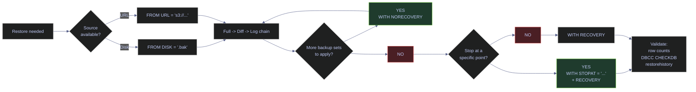
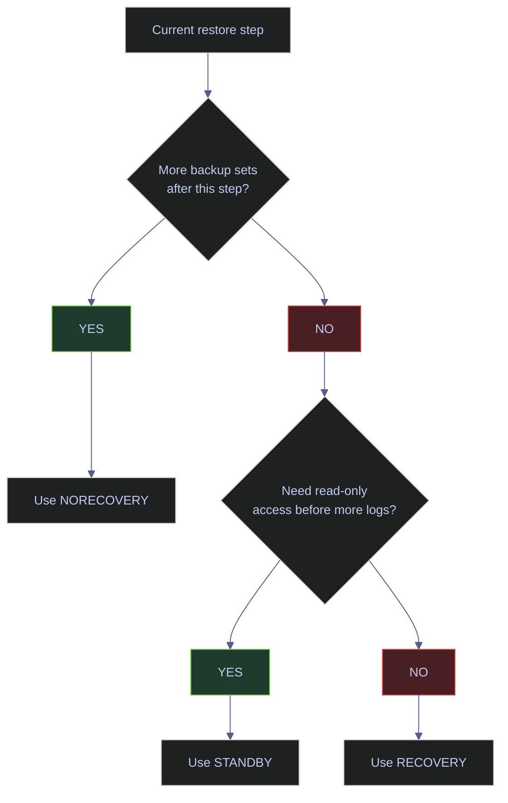

# Restore and Recovery

Restore is where the backup strategy is either proven or exposed as theory. A restore guide must be operational: which command runs first, when to use `NORECOVERY` versus `RECOVERY`, how to target a new database name safely, how to stop the replay at an exact moment in time, and how to validate that the restored database is actually usable.

All commands and live outputs in this note were captured from the current `stoxx` instance on the `stoxx-db` container:

- SQL Server 2022 CU23 (build 16.0.4236.2, Developer Edition, Linux)
- Restore source: local backup chain under `/var/opt/mssql/backup/` + GCS bucket `gs://stoxx-sql-bucket`
- Restore target: disposable database `stoxx_backup` created for the drill, plus a throwaway `stoxx_backup_check` for the URL-restore side-by-side demo
- Capture window: 2026-04-11 16:32–16:34 UTC

> [!info] Restore decision path
>
> The diagram below shows how the recovery-state decision, the restore source decision, and the PITR decision interact. Follow the path from left to right during any real incident.



---

## Restore Fundamentals

> [!abstract] Recovery state semantics and the msdb restore audit trail
>
> Most restore mistakes come from using the wrong recovery state on the wrong step. The three options (`NORECOVERY`, `RECOVERY`, `STANDBY`) decide whether SQL Server expects more backup sets to follow. Get this wrong and the restore sequence either cannot be continued or the database comes online half-way through the chain and cannot be rolled forward.

### SQL Server | RESTORE | recovery state semantics

`RESTORE DATABASE` and `RESTORE LOG` both accept a recovery-state option that controls what happens to the database after the command completes. The option is not optional in any practical sense: every intermediate step in a multi-step restore **must** use `NORECOVERY`, and the final step **must** use `RECOVERY`.

#### Understand NORECOVERY, RECOVERY, and STANDBY

**When to run:** Decision happens at every restore command, not a separate invocation. **Trigger:** Every step of a restore chain. **Context:** Conceptual — no separate command. **Purpose:** Choose the right recovery state for each step so the chain stays restorable and the final step brings the database online in a clean state.

| Option | What it does | Use when |
|---|---|---|
| `NORECOVERY` | Leaves the database in `RESTORING` state and ready to accept more backup sets | Any intermediate restore step — between full and diff, or between diff and first log, or between successive logs |
| `RECOVERY` | Rolls back any uncommitted transactions in the restored log stream and brings the database online | The final step of the restore chain, after which no more backup sets will be applied |
| `STANDBY` | Brings the database online in read-only mode while preserving enough undo information to continue the log restore later | Verification or reporting between log restores, or when users need to query the restored state before committing to final `RECOVERY` |

> [!warning] RECOVERY is the point of no return
>
> Once a database has been recovered (`WITH RECOVERY`), it cannot accept further log restores. If you later discover that you needed one more log backup, the only option is to start the entire chain over from the full backup. This is the single most expensive restore mistake and the one new DBAs make most often.

> [!success] The "chain of NORECOVERY, final RECOVERY" pattern
>
> Script the whole restore sequence as one batch, with `NORECOVERY` on every step except the last one. Review it end-to-end before executing any step. The script becomes an audit artifact for the drill and an exact runbook for the next DR event.

#### Visualize the restore-state decision

*This diagram captures the decision each restore step faces.*



### SQL Server | msdb.dbo.restorehistory | restore audit trail

Every restore against the instance creates one row in `msdb.dbo.restorehistory`. Unlike `backupset` (which is populated by every scheduled backup job and contains thousands of rows), `restorehistory` is usually sparse and is the canonical source of truth for "what was restored, when, from where, and by whom".

#### Query the recent restore history for a database

**When to run:** After every restore drill, as part of restore audit, or when investigating why a database is in an unexpected state. **Trigger:** Post-restore verification, compliance audit, or forensic investigation. **Context:** Read-only query against `msdb`. Requires membership in `db_backupoperator` in `msdb` or higher. **Purpose:** Produce an authoritative ordered list of every RESTORE command that touched a specific database, including the source backup set and the final recovery state.

> [!info]- restorehistory columns that matter
>
> `msdb.dbo.restorehistory` records one row per restore step, not per restore sequence. A four-step PITR restore (full + diff + 2 logs) produces four rows with ascending `restore_history_id`.
>
> - `restore_history_id` is the internal auto-increment identifier; monotonic across the instance.
> - `restore_date` is the wall-clock timestamp at restore start.
> - `destination_database_name` identifies the target database (which may be a new name, via `RESTORE ... AS`).
> - `user_name` records the login that executed the restore.
> - `backup_set_id` links back to the source row in `msdb.dbo.backupset`.
> - `restore_type` is a single character: `D` (full), `I` (differential), `L` (log), `F` (file), `G` (diff file), `V` (verifyonly), `R` (revert).
> - `replace` is 1 if `WITH REPLACE` was used.
> - `recovery` is 1 if the step used `WITH RECOVERY` (i.e., brought the database online).
> - `stop_at` is populated only when `WITH STOPAT` was used.

| Column | Source | Type | Meaning |
|---|---|---|---|
| `restore_history_id` | `restorehistory` | int | Step identifier, monotonic across instance |
| `restore_date` | `restorehistory` | datetime | Restore start timestamp |
| `destination_database_name` | `restorehistory` | nvarchar(128) | Name of the database being restored |
| `restore_type` | `restorehistory` | char(1) | Restore step type code |
| `replace` | `restorehistory` | bit | 1 if `WITH REPLACE` |
| `recovery` | `restorehistory` | bit | 1 if `WITH RECOVERY` (step brought DB online) |
| `stop_at` | `restorehistory` | datetime | PITR target if `WITH STOPAT` was used |
| `backup_set_id` | `restorehistory` | int | FK to `backupset.backup_set_id` |
| `physical_device_name` | `backupmediafamily` | nvarchar(260) | Source file path or URL of the restored backup |

*This query lists every restore step against databases matching the pattern `stoxx_backup%`, joined to the source backupset and media family so the source path is visible.*

```sql
SELECT TOP 10
    rh.restore_history_id,
    CONVERT(varchar(19), rh.restore_date, 120) AS restore_date,
    rh.destination_database_name,
    rh.restore_type,
    rh.replace,
    rh.recovery,
    CONVERT(varchar(23), rh.stop_at, 121) AS stop_at,
    rh.backup_set_id,
    bmf.physical_device_name
FROM msdb.dbo.restorehistory AS rh
LEFT JOIN msdb.dbo.backupset          AS bs  ON bs.backup_set_id = rh.backup_set_id
LEFT JOIN msdb.dbo.backupmediafamily  AS bmf ON bmf.media_set_id = bs.media_set_id
WHERE rh.destination_database_name LIKE 'stoxx_backup%'
ORDER BY rh.restore_history_id DESC;
```

| restore_history_id | restore_date | destination | type | replace | recovery | stop_at | backup_set_id | physical_device_name |
|---:|---|---|---|---:|---:|---|---:|---|
| 2008 | 2026-04-11 16:33:29 | stoxx_backup_check | D | 0 | 1 | NULL | 2011 | s3://storage.googleapis.com/stoxx-sql-bucket/stoxx/full/stoxx_full.bak |
| 2007 | 2026-04-11 16:33:04 | stoxx_backup | L | 0 | 1 | 2026-04-11 16:32:20.000 | 2013 | /var/opt/mssql/backup/stoxx_log_004.trn |
| 2006 | 2026-04-11 16:33:04 | stoxx_backup | L | 0 | 0 | NULL | 2012 | /var/opt/mssql/backup/stoxx_log_003.trn |
| 2005 | 2026-04-11 16:33:04 | stoxx_backup | L | 0 | 0 | NULL | 2008 | /var/opt/mssql/backup/stoxx_log_002.trn |
| 2004 | 2026-04-11 16:33:04 | stoxx_backup | L | 0 | 0 | NULL | 2007 | /var/opt/mssql/backup/stoxx_log_001.trn |
| 2003 | 2026-04-11 16:33:03 | stoxx_backup | I | 0 | 0 | NULL | 2006 | /var/opt/mssql/backup/stoxx_diff.bak |
| 2002 | 2026-04-11 16:32:59 | stoxx_backup | D | 0 | 0 | NULL | 2004 | /var/opt/mssql/backup/stoxx_full_chain.bak |

*Two restore sequences are visible in this output. The `stoxx_backup` sequence (rows 2002–2007) is a complete PITR restore chain: full (2002) → differential (2003) → log001 (2004) → log002 (2005) → log003 (2006) → log004 WITH STOPAT (2007). Only the last row has `recovery = 1` because only the last step used `WITH RECOVERY`; every intermediate step has `recovery = 0` (i.e., `NORECOVERY`). Row 2007 also has `stop_at = 2026-04-11 16:32:20.000`, the PITR target. The `stoxx_backup_check` sequence is a single-step full restore from the GCS URL (row 2008), landing directly with `recovery = 1` because no further backup sets needed to be applied.*

| Column | Value | Watch | Meaning | Implication |
|---|---|---|---|---|
| `restore_type` | `D` | &#9989; common | Full database restore | Baseline of every chain |
| `restore_type` | `I` | &#9989; common | Differential restore | Must follow a full on the same chain |
| `restore_type` | `L` | &#9989; common | Log restore | Part of a PITR chain |
| `restore_type` | `F` | Context | File restore | File-scope recovery |
| `restore_type` | `V` | Context | VERIFYONLY step | Audit trail of validation runs |
| `restore_type` | `R` | Rare | Revert (database snapshot revert) | Only seen with database snapshots |
| `recovery` | `1` | Terminal | Step brought the database online | No more log restores possible after this row |
| `recovery` | `0` | Intermediate | Step used NORECOVERY | Chain is still open; more steps expected |
| `stop_at` | populated | PITR | `WITH STOPAT` was used | Target was a specific log timestamp |
| `stop_at` | `NULL` | Common | Standard restore | No PITR target |

---

## Side-By-Side Restore

> [!abstract] Restore to a new database name with WITH MOVE
>
> The safest way to validate a backup is to restore it under a new database name and inspect the data before touching any existing database. This section walks through the full side-by-side pattern: the `MOVE` clause, the new-name target, the validation queries, and the audit trail it leaves.

### SQL Server | RESTORE DATABASE | restore to a new name with MOVE

A side-by-side restore creates a new database from a backup file. The key option is `WITH MOVE`, which remaps each logical file inside the backup to a new physical path on the restore target. Without `MOVE`, the restore tries to use the original physical paths from the source — which usually collide with the live source database.

#### Restore a full backup to a new database with WITH MOVE

**When to run:** For every restore drill, for every migration between instances, for every investigative restore of historical data, and for the first step of every PITR chain. **Trigger:** Drill cadence, migration plan, incident requiring data recovery, or validation before overwriting an existing database. **Context:** T-SQL `RESTORE DATABASE`. Requires `CREATE DATABASE` permission on the instance. Writes new `.mdf` / `.ldf` files on the target volume. **Purpose:** Produce a live, queryable database with a new name that contains the exact state captured in the backup file, without disturbing any existing database.

> [!info]- The MOVE clause and logical-vs-physical file names
>
> Every file inside a SQL Server backup has a logical name (stable, set at `CREATE DATABASE` time) and a physical path (where the file lived on the source instance). On restore, the default behavior is to use the original physical paths — which is only correct if the backup is being restored to the exact same instance and those paths are free. The `MOVE 'logical_name' TO 'new_physical_path'` clause remaps each file.
>
> - One `MOVE` clause is required per file inside the backup.
> - Use `RESTORE FILELISTONLY` on the backup file first to retrieve the exact logical file names.
> - Target physical paths must be writeable by the `mssql` service user.
> - If the target path already exists and belongs to a different database, the restore fails unless `WITH REPLACE` is also specified.

> [!warning] Omitting MOVE can overwrite the source database
>
> Running `RESTORE DATABASE stoxx FROM DISK = '...'` with no `MOVE` and no new name will attempt to restore over the source `stoxx.mdf` and `stoxx_log.ldf` files — which fails if `stoxx` is online (with error 3101: the database is in use), and silently overwrites them if `stoxx` is offline. Always use `MOVE` + a new database name for side-by-side restore drills.

> [!success] Side-by-side restore template
>
> Use this pattern for every drill: pick a new database name, run `RESTORE FILELISTONLY` to get the logical names, build a `RESTORE DATABASE new_name FROM DISK = '...' WITH MOVE 'logical_data' TO '/new/path/data.mdf', MOVE 'logical_log' TO '/new/path/data_log.ldf', NORECOVERY` command, then continue the chain from there.

*This command restores the full backup of stoxx to a new database named `stoxx_backup`, with NORECOVERY because the chain will continue with a differential and four log backups.*

```sql
RESTORE DATABASE stoxx_backup
FROM DISK = '/var/opt/mssql/backup/stoxx_full_chain.bak'
WITH MOVE 'stoxx'     TO '/var/opt/mssql/data/stoxx_backup.mdf',
     MOVE 'stoxx_log' TO '/var/opt/mssql/data/stoxx_backup_log.ldf',
     NORECOVERY,
     STATS = 25;
```

```text
25 percent processed.
50 percent processed.
75 percent processed.
100 percent processed.
Processed 76344 pages for database 'stoxx_backup', file 'stoxx' on file 1.
Processed 2 pages for database 'stoxx_backup', file 'stoxx_log' on file 1.
RESTORE DATABASE successfully processed 76346 pages in 0.326 seconds (1829.598 MB/sec).
```

*The full restore processed the same 76,346 pages that the source backup contained, at 1829 MB/sec — restore is CPU-bound on MS_XPRESS decompression and disk-bound on data-file writes, so this is roughly the same throughput as the backup command. `stoxx_backup` now exists on the instance in `RESTORING` state, ready for the next step in the chain.*

#### Flag reference — RESTORE DATABASE options

| Option | Syntax | Description |
|---|---|---|
| `MOVE` | `WITH MOVE 'logical_name' TO 'new_physical_path'` | Remap a logical file inside the backup to a new physical path. Required for side-by-side restore. Repeat once per file. |
| `NORECOVERY` | `WITH NORECOVERY` | Leave the database in `RESTORING` state ready for more backup sets |
| `RECOVERY` | `WITH RECOVERY` (default) | Bring the database online after applying this backup set |
| `STANDBY` | `WITH STANDBY = '/path/to/undo.bak'` | Bring the database online read-only while preserving undo for future log restores |
| `REPLACE` | `WITH REPLACE` | Force overwrite of an existing database. Required when restoring over a database that differs from the backup source |
| `FILE` | `WITH FILE = N` | Target a specific backup set position when the media file contains multiple sets (from `NOINIT` appends) |
| `STOPAT` | `WITH STOPAT = '2026-04-11 16:32:20'` | PITR target timestamp. Valid on `RESTORE LOG` and on `RESTORE DATABASE` under specific conditions |
| `STOPATMARK` | `WITH STOPATMARK = 'mark_name'` | PITR target by named transaction mark (requires `BEGIN TRANSACTION ... WITH MARK`) |
| `STOPBEFOREMARK` | `WITH STOPBEFOREMARK = 'mark_name'` | PITR target just before a named mark |
| `CHECKSUM` | `WITH CHECKSUM` | Validate backup checksums during restore |
| `STATS` | `WITH STATS = 10` | Emit progress output every N percent |
| `CREDENTIAL` | `WITH CREDENTIAL = 'name'` | Use a named credential for URL restore (not needed with name-matched credentials) |
| `RESTART` | `WITH RESTART` | Resume a previously interrupted restore |
| `KEEP_REPLICATION` | `WITH KEEP_REPLICATION` | Preserve replication settings after restore |

### SQL Server | RESTORE DATABASE | validate a restored database

A restore is not complete until the restored database has been proven usable. Validation is cheap, fast, and mandatory — skipping it is the main reason restore drills give false confidence.

#### Validate the restored data before production use

**When to run:** Immediately after a restore completes with `RECOVERY`. **Trigger:** End of any restore drill or any recovery event. **Context:** Read-only queries against the restored database. **Purpose:** Confirm that the restored database is online, that the expected tables exist with expected row counts, and that application-critical data is present.

*This query runs a three-part smoke test: confirm the database is online, count the main fact table, and verify that demo markers survived the restore.*

```sql
SELECT DB_NAME() AS current_db, @@SERVERNAME AS server_name;

SELECT
    'silver.eurostoxx50_ohlcv' AS source_table, COUNT(*) AS row_count
    FROM silver.eurostoxx50_ohlcv
UNION ALL SELECT 'silver.index_dim',          COUNT(*) FROM silver.index_dim
UNION ALL SELECT 'gold.index_performance',   COUNT(*) FROM gold.index_performance
UNION ALL SELECT 'dbo.backup_demo_marker',   COUNT(*) FROM dbo.backup_demo_marker;
```

| current_db | server_name |
|---|---|
| stoxx_backup | 8482aae8ad0a |

| source_table | row_count |
|---|---:|
| silver.eurostoxx50_ohlcv | 67155 |
| silver.index_dim | 169 |
| gold.index_performance | 5351 |
| dbo.backup_demo_marker | 3 |

*The restored `stoxx_backup` database contains 67,155 OHLCV rows, 169 index dimension rows, 5,351 index performance rows, and 3 demo-marker rows. The row counts for the silver and gold tables match the source, confirming the full-chain restore preserved the primary workload data exactly. The 3-row count on the marker table is the PITR target — three markers were committed before the STOPAT timestamp of 16:32:20, and the fourth marker (committed at 16:32:21.219) was correctly excluded. Both facts together prove the restore is both complete and precisely bounded.*

---

## Point-In-Time Recovery

> [!abstract] Replay the backup chain and stop at an exact moment
>
> Point-in-time recovery is a chain-replay procedure, not a single restore command. It exists only when the backup chain and recovery-model design support it. This section walks through the full PITR sequence: the differential after the full, the log chain in order, and the final log applied with `STOPAT` to stop just before the target moment.

### SQL Server | RESTORE DATABASE | differential and log chain replay

After a full restore with `NORECOVERY`, the next step is to apply the latest differential (if one exists) with `NORECOVERY`, then each log backup in LSN order also with `NORECOVERY`, until reaching the final log which is applied with either `RECOVERY` (for "restore to the latest possible point") or `STOPAT ... RECOVERY` (for PITR).

#### Apply a differential and a log chain with NORECOVERY

**When to run:** After the full restore, as part of the same restore batch. **Trigger:** Scheduled drill, DR event, or historical data recovery. **Context:** Each `RESTORE` command runs in the context of the instance hosting the `RESTORING`-state database. **Purpose:** Replay the differential and the log chain up to (but not including) the final step, keeping the database in `RESTORING` state so additional backups can be applied.

> [!warning] Log order matters and must be contiguous
>
> Log restores must be applied in LSN order. Applying `stoxx_log_002.trn` before `stoxx_log_001.trn` fails with "The log in this backup set begins at LSN ... which is too recent to apply to the database". If the chain is not contiguous (a gap in `msdb.dbo.backupset.first_lsn` / `last_lsn`), the restore can proceed only up to the last pre-gap log.

*This batch applies the differential plus the first three logs, all with NORECOVERY so the chain stays open for the final STOPAT step.*

```sql
RESTORE DATABASE stoxx_backup
    FROM DISK = '/var/opt/mssql/backup/stoxx_diff.bak'
    WITH NORECOVERY, STATS = 50;

RESTORE LOG stoxx_backup
    FROM DISK = '/var/opt/mssql/backup/stoxx_log_001.trn'
    WITH NORECOVERY, STATS = 50;

RESTORE LOG stoxx_backup
    FROM DISK = '/var/opt/mssql/backup/stoxx_log_002.trn'
    WITH NORECOVERY, STATS = 50;

RESTORE LOG stoxx_backup
    FROM DISK = '/var/opt/mssql/backup/stoxx_log_003.trn'
    WITH NORECOVERY, STATS = 50;
```

```text
100 percent processed.
Processed 104 pages for database 'stoxx_backup', file 'stoxx' on file 1.
Processed 2 pages for database 'stoxx_backup', file 'stoxx_log' on file 1.
RESTORE DATABASE successfully processed 106 pages in 0.174 seconds (4.736 MB/sec).
100 percent processed.
Processed 1155 pages for database 'stoxx_backup', file 'stoxx_log' on file 1.
RESTORE LOG successfully processed 1155 pages in 0.031 seconds (291.078 MB/sec).
100 percent processed.
Processed 6 pages for database 'stoxx_backup', file 'stoxx_log' on file 1.
RESTORE LOG successfully processed 6 pages in 0.010 seconds (4.296 MB/sec).
100 percent processed.
Processed 32 pages for database 'stoxx_backup', file 'stoxx_log' on file 1.
RESTORE LOG successfully processed 32 pages in 0.012 seconds (20.507 MB/sec).
```

*Each restore step reports its page count and throughput. The differential restored 104 + 2 pages (matching the differential backup size), the first log applied 1,155 pages at 291 MB/sec (the heaviest log in the chain), and the subsequent two logs applied 6 and 32 pages respectively — the logs get progressively smaller as they catch up with the active state of the source database at the time the chain was captured. After these four commands `stoxx_backup` is still in `RESTORING` state, ready for the final log with STOPAT.*

### SQL Server | RESTORE LOG | STOPAT for point-in-time recovery

`STOPAT` accepts a datetime value and stops the log replay at the last transaction whose commit timestamp is less than or equal to that value. The PITR target must fall within the LSN range of the log backup being restored with STOPAT — SQL Server will refuse to apply a log with a STOPAT that is outside the log's time window.

#### Apply the final log with WITH STOPAT and RECOVERY

**When to run:** As the last step of a PITR restore chain. **Trigger:** PITR target time identified; all preceding backup sets have been restored with NORECOVERY. **Context:** T-SQL `RESTORE LOG ... WITH STOPAT`. **Purpose:** Stop the log replay precisely at the target timestamp, roll back any uncommitted transactions past that point, and bring the database online.

> [!info]- STOPAT, STOPATMARK, and STOPBEFOREMARK
>
> SQL Server offers three ways to express a PITR stop point:
>
> - `STOPAT = '<datetime>'` stops at or before a specific wall-clock timestamp. The datetime is interpreted in the server's local time zone at restore time.
> - `STOPATMARK = 'mark_name'` stops at the transaction that was committed with `BEGIN TRANSACTION mark_name WITH MARK`. The marked transaction IS included in the restored state.
> - `STOPBEFOREMARK = 'mark_name'` stops immediately before the marked transaction. The marked transaction is NOT included.
>
> Marks are the most reliable PITR mechanism for application-coordinated restore because they are LSN-anchored rather than time-anchored, but they require the application to issue `WITH MARK` at the critical moment. Use `STOPAT` for unplanned incidents where no mark was set.

> [!warning] STOPAT target must be inside the log being restored
>
> If the STOPAT target is earlier than the first LSN of the log backup, or later than its last LSN, SQL Server rejects the restore. Use the `FirstLSN` / `LastLSN` / `BackupStartDate` / `BackupFinishDate` fields from `RESTORE HEADERONLY` (or `msdb.dbo.backupset`) to confirm the target falls within the log's range before issuing the command.

> [!success] PITR restore verification pattern
>
> After a STOPAT restore, always verify the target state by querying a known "before the stop" and "after the stop" row. In this demo, marker 3 (`pitr_target`, committed at 16:32:16.894) should be present, and marker 4 (`after_pitr_target`, committed at 16:32:21.219) should be absent — proving the STOPAT of 16:32:20 was respected exactly.

*This command applies the final log backup, stops replay at the PITR target, and brings the database online.*

```sql
RESTORE LOG stoxx_backup
FROM DISK = '/var/opt/mssql/backup/stoxx_log_004.trn'
WITH STOPAT = '2026-04-11T16:32:20',
     RECOVERY,
     STATS = 50;
```

```text
100 percent processed.
Processed 4 pages for database 'stoxx_backup', file 'stoxx_log' on file 1.
RESTORE LOG successfully processed 4 pages in 0.010 seconds (3.125 MB/sec).
```

*The final log contained 4 pages, replayed in 0.010 seconds, and brought the database online at the PITR target. The database is now in `ONLINE` state and queryable. The row immediately before in this note — the validation query against `stoxx_backup` — shows exactly 3 markers present, confirming the fourth marker (committed at 16:32:21.219) was correctly excluded by the STOPAT of 16:32:20.*

#### Verify the PITR target state

*This query confirms which markers are present in the restored database.*

```sql
SELECT id, marker, CONVERT(varchar(23), created_at, 121) AS created_at
FROM dbo.backup_demo_marker
ORDER BY id;
```

| id | marker | created_at |
|---:|---|---|
| 1 | between_log_001_and_log_002 | 2026-04-11 16:30:24.921 |
| 2 | after_log_002_before_striped | 2026-04-11 16:30:48.652 |
| 3 | pitr_target | 2026-04-11 16:32:16.894 |

*The output shows markers 1, 2, and 3 — all committed before the STOPAT of 16:32:20 — and no row for marker 4 (`after_pitr_target`, committed at 16:32:21.219). This is the canonical PITR validation: a row known to exist after the target is verifiably absent, and every row known to exist before the target is present.*

#### PITR failure modes

| Failure mode | What happens | Remediation |
|---|---|---|
| Missing log backup in the chain | SQL Server cannot replay past the gap; `RESTORE LOG` fails with "The log in this backup set cannot be applied because ..." | Restore only up to the last log backup before the gap; nothing past the gap is recoverable |
| RECOVERY used too early in the chain | Database comes online in an incomplete state; subsequent log restores fail with error 4335 | Restart the entire restore sequence from the full backup; do not attempt to "fix up" the already-recovered database |
| Wrong STOPAT timestamp or timezone assumption | Database restores to the wrong point (often too early) | Restart from the last required backup before the desired timestamp; verify target falls within log's range using `HEADERONLY` |
| STOPAT outside the log's LSN range | `RESTORE LOG` rejects the command with "The STOPAT time ... is in the past. No roll forward is performed" or "too recent to apply" | Use `HEADERONLY` on the log to confirm its time range, pick a STOPAT inside that range, or restore an earlier / later log as appropriate |
| Broken backup chain from a prior SIMPLE switch | Log backups before the switch cannot be replayed | Restore the last full + diff + logs since the last conventional full; anything older is not recoverable via PITR |
| Missing differential base after full restore | `RESTORE DATABASE ... WITH DIFFERENTIAL` fails because the diff was taken against a different base | Restore the correct full backup first (the one whose `CheckpointLSN` matches the diff's `DatabaseBackupLSN`) |

---

## Restore From Object Storage

> [!abstract] Restore a full backup directly from GCS via the S3 connector
>
> A URL restore is the mirror image of a URL backup: same credential, same URL, same S3 connector. This section demonstrates a complete round-trip by restoring the full backup written to GCS earlier into a second disposable database, `stoxx_backup_check`.

### SQL Server | RESTORE DATABASE | restore from a GCS URL into a new database

The `RESTORE DATABASE ... FROM URL = '...'` command accepts the same options as `RESTORE DATABASE ... FROM DISK = '...'`. The only difference is the source — instead of a local file path, the source is an `s3://` URL, and SQL Server authenticates to the bucket using the credential created earlier in [07-backup-types-and-strategy.md](07-backup-types-and-strategy.md).

#### Restore the GCS backup side-by-side into stoxx_backup_check

**When to run:** As a validation that the URL backup actually landed in the bucket and is readable via the same credential that wrote it, or during a real restore operation when the only surviving backup is the off-instance copy in object storage. **Trigger:** Scheduled URL-restore drill, loss of local backup files, or cross-region recovery. **Context:** T-SQL on the `stoxx-db` container. Requires the SQL Server credential for the URL prefix. Requires outbound HTTPS to `storage.googleapis.com:443`. **Purpose:** Produce a complete, queryable database from a backup stored entirely on GCS, proving the URL backup pipeline is restore-ready.

> [!warning] URL restore depends on the same credential as URL backup
>
> A URL backup succeeds only if `sys.credentials` contains a credential whose name is a prefix of the URL. URL restore has the same requirement. If the credential was rotated or dropped after the backup was taken, the URL restore will fail with the same "Operating system error 50 (The request is not supported.)" signal until the credential is recreated.

*This command restores the GCS full backup into a new disposable database as a side-by-side validation.*

```sql
RESTORE DATABASE stoxx_backup_check
FROM URL = 's3://storage.googleapis.com/stoxx-sql-bucket/stoxx/full/stoxx_full.bak'
WITH MOVE 'stoxx'     TO '/var/opt/mssql/data/stoxx_backup_check.mdf',
     MOVE 'stoxx_log' TO '/var/opt/mssql/data/stoxx_backup_check_log.ldf',
     RECOVERY,
     STATS = 25;
```

```text
26 percent processed.
50 percent processed.
77 percent processed.
100 percent processed.
Processed 76352 pages for database 'stoxx_backup_check', file 'stoxx' on file 1.
Processed 2 pages for database 'stoxx_backup_check', file 'stoxx_log' on file 1.
RESTORE DATABASE successfully processed 76354 pages in 7.271 seconds (82.039 MB/sec).
```

*The URL restore processed 76,354 pages (matching the URL backup written earlier) in 7.271 seconds at 82 MB/sec effective throughput. Restore from URL is slower than restore from local disk because every data page must traverse the TLS-signed HTTPS connection to GCS, but it works end-to-end with no local staging. `stoxx_backup_check` is now online in `ONLINE` state, queryable, and contains the same data as the source `stoxx` at the moment the URL backup was taken.*

#### Validate the URL-restored database

*This query confirms row counts match the source and reports the marker state captured in the URL backup.*

```sql
SELECT 'url_restored_row_counts' AS metric, COUNT(*) AS value FROM silver.eurostoxx50_ohlcv
UNION ALL SELECT 'url_restored_markers', COUNT(*) FROM dbo.backup_demo_marker;
```

| metric | value |
|---|---:|
| url_restored_row_counts | 67155 |
| url_restored_markers | 2 |

*The 67,155-row count matches the source `stoxx` database exactly. The 2-row marker count is significant for a different reason: the URL backup was taken at 16:31:07, which was after markers 1 and 2 were committed (16:30:24 and 16:30:48) but before markers 3 and 4 (16:32:16 and 16:32:21). So the restored database correctly reflects the state captured at 16:31:07 — not the state of `stoxx` now, not the state reached by the PITR restore into `stoxx_backup`, but the exact state at the moment the URL backup was written. This confirms the backup-chain timeline and the restore is working on the correct source data.*

*Clean up the disposable validation database:*

```sql
DROP DATABASE stoxx_backup_check;
```

*`stoxx_backup_check` was created for this side-by-side URL restore validation and has no further purpose. Dropping it releases the disk space and removes the row from `sys.databases`. The `stoxx_backup` database (produced by the PITR chain) is retained for further use.*

---

## Tail-Log Backup and Disaster Restore

> [!abstract] Capture the last log records and restore to the moment of failure
>
> A tail-log backup is a log backup taken with `WITH NORECOVERY` against a database that is about to be replaced. It captures the final log records — including any transactions committed between the last scheduled log backup and the failure event — and leaves the source database in `RESTORING` state. This is the disaster recovery surface; use it only when the source database is being replaced from backup.

### SQL Server | BACKUP LOG | tail-log backup for disaster recovery

A tail-log backup is structurally identical to any other log backup except for the `WITH NORECOVERY` option, which closes the log chain and immediately takes the source database offline for restore. The purpose is to close the RPO gap between the last scheduled log backup and the moment of failure.

#### Take a tail-log backup with NORECOVERY

**When to run:** Only during disaster recovery, when the source database is about to be replaced from backup and the final few seconds of committed transactions must be captured. **Trigger:** Data corruption, ransomware event, or any failure scenario where the source is being overwritten from backup. **Context:** T-SQL `BACKUP LOG ... WITH NORECOVERY`. Requires the database to still be online (or at least accessible) at the moment the tail-log is taken. **Purpose:** Capture the log records since the previous log backup and close the chain, so a subsequent restore sequence can replay up to the moment of failure rather than up to the last scheduled log backup.

> [!danger] A tail-log backup leaves the source database in RESTORING state
>
> `BACKUP LOG ... WITH NORECOVERY` puts the source database into `RESTORING` state and blocks all user access until a `RESTORE DATABASE ... WITH RECOVERY` completes. This is by design — it prevents any further transactions from landing in a database that is about to be replaced. **Do not run this command on a production database unless you are committed to the restore that follows.**

> [!success] Disaster restore pattern with tail-log
>
> The full disaster restore pattern is:
>
> - Take the tail-log backup `WITH NORECOVERY`. Source database goes offline.
> - Restore the full backup `WITH REPLACE, NORECOVERY`.
> - Restore the latest differential (if any) `WITH NORECOVERY`.
> - Restore every regular log backup in order `WITH NORECOVERY`.
> - Restore the tail-log backup `WITH RECOVERY`.
> - The database comes online at the exact state of the last committed transaction before the tail-log command.

*Template: this command captures the tail log of a database being replaced from backup.*

```sql
-- Step 1: capture the tail log (source goes into RESTORING state)
BACKUP LOG stoxx
TO DISK = '/var/opt/mssql/backup/stoxx_tail.trn'
WITH NORECOVERY, COMPRESSION, NAME = 'stoxx tail log';

-- Step 2: full chain restore + tail log as the final step
RESTORE DATABASE stoxx
FROM DISK = '/var/opt/mssql/backup/stoxx_full_chain.bak'
WITH REPLACE, NORECOVERY;

RESTORE LOG stoxx
FROM DISK = '/var/opt/mssql/backup/stoxx_log_001.trn'
WITH NORECOVERY;

-- ... apply remaining scheduled log backups ...

RESTORE LOG stoxx
FROM DISK = '/var/opt/mssql/backup/stoxx_tail.trn'
WITH RECOVERY;
```

*The tail-log backup is not executed against live `stoxx` in this note because it would take the production teaching database offline. The template shown is the exact pattern to apply in a real disaster scenario.*

#### Flag reference — BACKUP LOG disaster options

| Option | Syntax | Description |
|---|---|---|
| `NORECOVERY` | `WITH NORECOVERY` | Take a tail-log and leave the source in `RESTORING` state. Disaster recovery only. |
| `NO_TRUNCATE` | `WITH NO_TRUNCATE` | Attempt a log backup even when the database is not accessible via normal means (damaged, offline, suspect). Use when the source is already broken. |
| `CONTINUE_AFTER_ERROR` | `WITH CONTINUE_AFTER_ERROR` | Continue the backup after encountering a checksum error. Pair with `NO_TRUNCATE` when the source is already corrupt and the goal is "salvage as much as possible". |

> [!warning] NO_TRUNCATE + CONTINUE_AFTER_ERROR is a last resort
>
> These options allow a log backup to run against a database that is already damaged, but the backup itself may be incomplete or partially corrupt. Use only when the alternative is losing the log entirely. Always re-verify the resulting backup file with `RESTORE VERIFYONLY` before relying on it.

---

## Recovery Monitoring

> [!abstract] Observe active recovery and restore operations
>
> Not every recovery event is a manual restore. Crash recovery after a restart also matters operationally, and it should be observable from the two DMVs that expose active work: `sys.dm_exec_requests` for in-flight commands and `sys.dm_db_log_info` for VLF pressure during recovery.

### SQL Server | sys.dm_exec_requests | observe restore and recovery progress

`sys.dm_exec_requests` exposes every request currently executing on the instance, including background recovery work. During a long-running `RESTORE DATABASE` or during crash recovery after a restart, this DMV is where you read progress from.

#### Check for active recovery, restore, or backup commands

**When to run:** During any long-running restore to monitor progress, or after a restart to watch crash recovery complete, or during incident response to determine whether a blocking command is backup/restore or application workload. **Trigger:** Restore takes longer than expected, database stays in `RECOVERING` state after a restart, or unexpected session activity. **Context:** Read-only DMV query. Requires `VIEW SERVER STATE`. **Purpose:** Identify which sessions are running backup, restore, or recovery commands, and how far along they are.

> [!info]- Filtering the DMV for real user operations
>
> `sys.dm_exec_requests` always contains some background system sessions — the most relevant is `RECOVERY WRITER`, a persistent background task that runs in the `master` database and has nothing to do with user restore operations. Filter it out by matching on `command` text or by filtering to `session_id >= 50` (user-session boundary).
>
> - `percent_complete` is populated during REDO and restore operations; it is reliable during REDO but less reliable during UNDO (which is harder to estimate).
> - `estimated_completion_time` is in milliseconds and is approximate — treat it as "order of magnitude" not "countdown timer".
> - `command` values to expect: `RESTORE DATABASE`, `RESTORE LOG`, `BACKUP DATABASE`, `BACKUP LOG`, `DB STARTUP`, `RECOVERY WRITER`.

| Column | Source | Type | Meaning |
|---|---|---|---|
| `session_id` | `dm_exec_requests` | smallint | Session identifier |
| `database_id` | `dm_exec_requests` | smallint | Database the request is executing against |
| `command` | `dm_exec_requests` | nvarchar(32) | Command name (backup / restore / system phase) |
| `percent_complete` | `dm_exec_requests` | real | Percent complete for operations that track progress |
| `estimated_completion_time` | `dm_exec_requests` | bigint | Estimated remaining time in milliseconds |
| `wait_type` | `dm_exec_requests` | nvarchar(60) | Current wait type if the request is waiting |
| `blocking_session_id` | `dm_exec_requests` | smallint | Blocker session, or 0 if not blocked |

*This query shows any backup, restore, or database-startup activity, plus the background RECOVERY WRITER for reference.*

```sql
SELECT
    session_id,
    DB_NAME(database_id) AS database_name,
    command,
    percent_complete,
    estimated_completion_time / 60000 AS est_minutes_remaining,
    wait_type,
    blocking_session_id
FROM sys.dm_exec_requests
WHERE command IN ('RESTORE DATABASE','RESTORE LOG','BACKUP DATABASE','BACKUP LOG','DB STARTUP','RECOVERY WRITER');
```

| session_id | database_name | command | percent_complete | est_minutes_remaining | wait_type | blocking_session_id |
|---:|---|---|---:|---:|---|---:|
| 37 | master | RECOVERY WRITER | 0.0 | 0 | NULL | 0 |

*The only active command at capture time is the background `RECOVERY WRITER` in `master`. This row is always present on a running instance — it is the system task that flushes recovery-related writes, not a user restore operation. If a real restore were in progress, an additional row would appear with `command = 'RESTORE DATABASE'` or `command = 'RESTORE LOG'`, with `percent_complete` climbing toward 100 and a database_name matching the restore target. The absence of such rows is the healthy steady state.*

| Column | Value | Watch | Meaning | Implication |
|---|---|---|---|---|
| `command` | `RECOVERY WRITER` | &#9989; always present | Background recovery writer system task | Normal; ignore in user-operation filters |
| `command` | `RESTORE DATABASE` | Context | Active full or differential restore | Check `percent_complete` for progress |
| `command` | `RESTORE LOG` | Context | Active log restore | Usually fast; if slow, check `wait_type` |
| `command` | `DB STARTUP` | Context (after restart) | Crash recovery in progress | Database is not yet online |
| `percent_complete` | Rising toward 100 | &#9989; | Operation is progressing | Healthy |
| `percent_complete` | Stuck at one value | &#10060; | Operation is blocked or stuck | Check `wait_type` and `blocking_session_id` |
| `wait_type` | `ASYNC_IO_COMPLETION` | Context | Waiting on storage I/O | Disk is slow; check volume throughput |
| `wait_type` | `BACKUPBUFFER` / `BACKUPTHREAD` | Context | Waiting on backup infrastructure | Tune BUFFERCOUNT / MAXTRANSFERSIZE |
| `wait_type` | `LCK_M_X` on database | &#10060; | Blocked by another session holding a lock | Investigate `blocking_session_id` |

### SQL Server | sys.dm_db_log_info | assess log reuse and VLF pressure during recovery

`sys.dm_db_log_info` returns one row per virtual log file (VLF) inside the transaction log. During recovery, a high VLF count or high active VLF ratio can slow recovery dramatically. Reading this DMV is the fastest way to diagnose "my database recovered but it took twice as long as expected" scenarios.

#### Inspect VLF count and active log size

**When to run:** After any restore, after any instance restart, or when investigating slow recovery. **Trigger:** Recovery-slow symptom, log-growth investigation, or post-restore health check. **Context:** DMV query. Requires `VIEW DATABASE STATE` on the target database. **Purpose:** Measure VLF fragmentation and the active log size, both of which affect recovery time and log-backup efficiency.

> [!info]- VLF health thresholds
>
> SQL Server divides the transaction log into chunks called Virtual Log Files. Each VLF is a unit of space reuse and of recovery work. An over-fragmented log (hundreds or thousands of small VLFs) extends recovery time because SQL Server scans every VLF during redo/undo phases.
>
> - **Healthy VLF count** for a 1 GB log: roughly 16 VLFs (the engine creates larger VLFs when the log is grown by large chunks).
> - **Unhealthy VLF count** for a 1 GB log: hundreds or thousands (usually from incremental 1 MB growth during runtime).
> - **Active VLF count** should stay low — ideally 1–3 at any given moment. A high active count means the log is not reusing space, usually due to a missing log backup or a long-running transaction.

| Column | Source | Type | Meaning |
|---|---|---|---|
| `vlf_total` | `COUNT(*)` over `dm_db_log_info` | int | Total number of VLFs |
| `vlf_active` | `SUM(vlf_active = 1)` | int | Number of VLFs currently holding active log records |
| `total_size_mb` | `SUM(vlf_size_mb)` | decimal | Total log file size in MB |
| `active_size_mb` | `SUM(vlf_size_mb WHERE vlf_active = 1)` | decimal | Active log size in MB |

*This query reports the VLF profile for a newly restored database.*

```sql
SELECT
    COUNT(*) AS vlf_total,
    SUM(CASE WHEN vlf_active = 1 THEN 1 ELSE 0 END) AS vlf_active,
    CAST(SUM(vlf_size_mb) AS decimal(10,2)) AS total_size_mb,
    CAST(SUM(CASE WHEN vlf_active = 1 THEN vlf_size_mb ELSE 0 END) AS decimal(10,2)) AS active_size_mb
FROM sys.dm_db_log_info(DB_ID('stoxx_backup'));
```

| vlf_total | vlf_active | total_size_mb | active_size_mb |
|---:|---:|---:|---:|
| 44 | 1 | 1031.96 | 64.00 |

*The restored `stoxx_backup` database has 44 VLFs in a 1032 MB log file — roughly 23 MB per VLF on average. That is on the high side of healthy (the target is around 64 MB per VLF for this log size), but well below the "hundreds of small VLFs" pathology that slows recovery. Only 1 VLF is currently active, holding 64 MB of live log — the rest are available for reuse. This is a healthy post-restore baseline.*

| Column | Value | Watch | Meaning | Implication |
|---|---|---|---|---|
| `vlf_total` | < 50 for < 2 GB logs | &#9989; | Reasonable VLF count | Recovery is not VLF-bound |
| `vlf_total` | 100–500 | Watch | Moderate fragmentation | Schedule log rebuild after next full backup |
| `vlf_total` | > 500 | &#10060; | Heavy fragmentation | Recovery time noticeably extended; rebuild the log via shrink + grow in a maintenance window |
| `vlf_active` | 1–3 | &#9989; | Healthy reuse | Log is not pinned |
| `vlf_active` | > 10 | &#10060; | Log is not reusing space | Run a log backup and re-check; investigate `log_reuse_wait_desc` |

### SQL Server | restore drill checklist

A documented restore drill runs end-to-end through the full chain and produces an auditable artifact. The checklist below is the minimum for a production restore drill.

#### Run a monthly restore drill

**When to run:** Monthly at minimum for production databases; weekly for the highest-value systems. **Trigger:** Scheduled calendar event, or any change to the backup or restore configuration. **Context:** Drill procedure, not a single command. **Purpose:** Prove end-to-end that the backup chain is restorable, the credentials still work, the team knows the sequence, and the restored database passes validation.

| Step | Action | Success criterion |
|---|---|---|
| 1 | Pick a disposable target database name (e.g., `stoxx_drill_2026_04`) | Target does not already exist |
| 2 | Run `RESTORE FILELISTONLY` on the most recent full backup | Logical file names match the source |
| 3 | Run `RESTORE VERIFYONLY WITH CHECKSUM` on every file in the chain (full, diff, all logs) | Every file reports "backup set on file 1 is valid" |
| 4 | Restore the chain: full + diff + log chain with `NORECOVERY`, final log with `RECOVERY` | Every step reports success; final row in `msdb.dbo.restorehistory` has `recovery = 1` |
| 5 | Run `DBCC CHECKDB ('stoxx_drill_2026_04') WITH PHYSICAL_ONLY` | Zero errors |
| 6 | Run the three-query smoke test: a known row, a row count on the largest fact table, a join across the main fact and dim | Row counts match expected, query results match known values |
| 7 | Check `msdb.dbo.restorehistory` for the drill sequence | All steps present and ordered correctly |
| 8 | Drop the drill database | `DROP DATABASE stoxx_drill_2026_04` |
| 9 | Archive the drill result to the runbook | Dated entry with: backup files used, duration per step, any anomalies, sign-off |

> [!success] Drill cadence + alert integration
>
> A drill that runs monthly but fails silently is worse than no drill at all. Wire the drill into the same alerting path as production jobs: success emits a green ticket, failure pages the on-call DBA. The drill's value is the evidence it leaves behind, not the execution itself.

---


