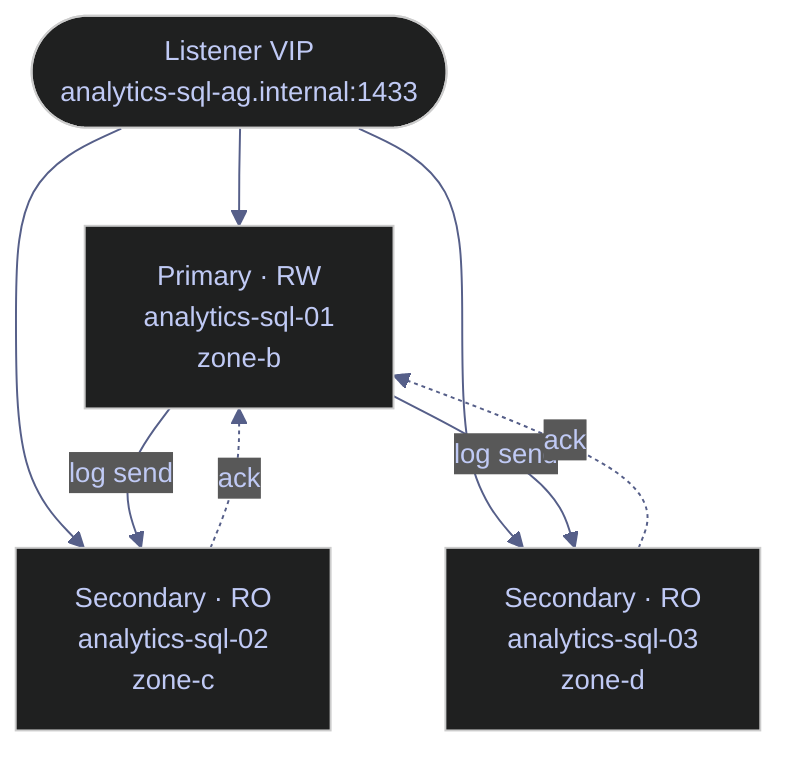

# SQL Server High Availability — Architecture, Operations, and Troubleshooting

> [!quote]
> "The major difference between a thing that might go wrong and a thing that cannot possibly go wrong is that when a thing that cannot possibly go wrong goes wrong it usually turns out to be impossible to get at or repair."
>
> — **Douglas Adams**, *Mostly Harmless* (1992)

SQL Server 2022 on Linux GCP VMs supports multiple high availability mechanisms. This note covers the full lifecycle: choosing the right HA option, deploying Always On Availability Groups with Pacemaker, monitoring replication health, performing failovers, and handling GCP-specific constraints.

## Why High Availability?

A single SQL Server instance is a single point of failure. If the VM crashes, the disk corrupts, or you need to patch the OS, your database is down. High availability (HA) ensures the database remains accessible during planned maintenance and unplanned outages by maintaining redundant copies of your data that can take over automatically.

### Key HA metrics

| Metric | Definition | Target |
|--------|-----------|--------|
| **RTO** (Recovery Time Objective) | Maximum acceptable downtime after a failure | Seconds to minutes for HA; hours for DR |
| **RPO** (Recovery Point Objective) | Maximum acceptable data loss (how far back you'd roll back) | 0 for synchronous commit; seconds for async |
| **SLA** | Uptime guarantee expressed as a percentage | 99.9% = ~8.7h/year downtime, 99.99% = ~52min/year |

---

## HA Options for SQL Server 2022 on Linux

SQL Server on Linux supports three active HA mechanisms plus one deprecated option. The primary differentiators are whether shared storage is required, whether failover is automatic, and whether secondaries can serve read traffic. On GCP, Always On Availability Groups are the recommended choice because GCP lacks native shared block storage, making FCI impractical.

### Option 1: Always On Availability Groups (Recommended)

The primary HA mechanism for SQL Server on Linux. A group of databases replicated together across 2–9 replicas (1 primary + up to 8 secondaries). The primary accepts reads and writes; secondaries receive transaction log records and replay them.



#### Replication modes

| Mode | How It Works | RPO | Use Case |
|------|-------------|-----|----------|
| **Synchronous commit** | Primary waits for secondary to harden the log before acknowledging the commit to the client | 0 (no data loss) | Same-region secondaries, high-value data |
| **Asynchronous commit** | Primary sends log records but doesn't wait for acknowledgment | > 0 (possible data loss) | Cross-region DR replicas, high-latency links |
| **Configuration-only** | Replica stores AG metadata but not data — acts as a quorum witness | N/A | Third node for automatic failover quorum (avoids needing 3 full replicas) |

**On Linux, Pacemaker replaces Windows Server Failover Clustering (WSFC).** The cluster manager detects failures and triggers failover. SQL Server on Linux uses the `mssql-server-ha` package to integrate with Pacemaker.

### Option 2: Failover Cluster Instance (FCI)

A single SQL Server instance that runs on one node at a time but can fail over to another node. Unlike AGs, FCI uses **shared storage** — both nodes see the same data files.

| Aspect | AG | FCI |
|--------|-----|-----|
| Shared storage | No — each replica has its own copy | Yes — shared disk (or network storage) |
| Database-level | Yes — individual databases can be in different AGs | No — entire instance fails over |
| Readable secondaries | Yes | No |
| Linux support | Full (SQL 2017+) | Full (SQL 2017+) |
| GCP implementation | Each VM has its own persistent disk | Requires shared filesystem (GlusterFS, NFS, or iSCSI) |

> [!warning] GCP and FCI
>
> **On GCP, AGs are strongly preferred** because GCP doesn't offer native shared storage like AWS EBS Multi-Attach or Azure Shared Disks. You'd need to set up GlusterFS or an NFS server, adding complexity and another failure point.

> [!success] Safe Pattern — Use Always On AGs on GCP
>
> Deploy Always On Availability Groups with each replica on its own GCP persistent disk. Each replica maintains its own copy of the data files — no shared storage required. Use an Internal TCP/UDP Load Balancer as the listener VIP since GCP does not support Gratuitous ARP for floating IPs.

### Option 3: Log Shipping

The simplest form of HA. The primary server backs up its transaction log on a schedule, copies the backup file to the secondary, and the secondary restores it.

```
Primary ──backup──► Shared storage ──copy──► Secondary ──restore──►
         (every 5m)                          (lagging by 5-15 min)
```

- **RPO**: Minutes to hours (depends on backup frequency)
- **Failover**: Manual — an admin must point applications to the secondary
- **Advantage**: Dead simple, works with any edition, no Pacemaker needed
- **Disadvantage**: Not automatic, always has data lag, secondary is restoring (not readable without STANDBY mode)

Best used as a **DR complement** to AGs, not as the primary HA solution.

### Option 4: Database Mirroring (Deprecated)

Removed in SQL Server 2022. Replaced by Always On Availability Groups. If you encounter it in legacy documentation, treat it as the predecessor of AGs with a single-database scope and no readable secondaries.

### Decision Matrix

| Requirement | AG (Sync) | AG (Async) | FCI | Log Shipping |
|-------------|-----------|-----------|-----|-------------|
| Zero data loss | Yes | No | Yes | No |
| Automatic failover | Yes (with Pacemaker) | No | Yes (with Pacemaker) | No |
| Readable secondary | Yes | Yes | No | With STANDBY |
| No shared storage | Yes | Yes | No | Yes |
| Cross-region DR | Possible | Recommended | No | Yes |
| Simplicity | Medium | Medium | High complexity on GCP | Simple |

---

## Setting Up Always On Availability Groups on Linux (GCP)

The setup follows 8 steps: enable HADR on each instance, create the database mirroring endpoint with certificate authentication, create the AG with the desired replication topology, join secondaries, add databases, and configure Pacemaker as the external cluster manager. All inter-replica communication flows through a single TCP endpoint (port 5022) per instance — the log stream is compressed before transmission. For a focused reference on the AG itself, see [always-on-availability-groups](https://alp78.github.io/elysium/04-SQL-Server/01-Server-Operations/always-on-availability-groups).

### Prerequisites

All nodes must have:
- SQL Server 2022 installed with the same version/CU
- The `mssql-server-ha` package installed
- Pacemaker + Corosync installed
- Unique hostnames resolvable by all nodes (via `/etc/hosts` or DNS)
- VPC firewall rules allowing: port 1433 (SQL), 5022 (AG endpoint), 2224 (pcsd), 3121 (Pacemaker), 5405 (Corosync)

### Step 1: Enable HADR on Every Node

#### Enable HADR cluster type on each SQL Server instance

Run on each SQL Server instance. `EXTERNAL` tells SQL Server that an external cluster manager (Pacemaker) handles failover, not WSFC. Verify with `SERVERPROPERTY('IsHadrEnabled')` — it should return 1.

```sql
ALTER SERVER CONFIGURATION SET HADR CLUSTER TYPE = EXTERNAL;

SELECT SERVERPROPERTY('IsHadrEnabled') AS hadr_enabled;
```

### Step 2: Create the Database Mirroring Endpoint on Every Node

#### Create the HADR endpoint for log transport (run on each node)

```sql
CREATE ENDPOINT [Hadr_endpoint]
    AS TCP (LISTENER_PORT = 5022)
    FOR DATA_MIRRORING (
        ROLE = ALL,
        AUTHENTICATION = CERTIFICATE dbm_cert,
        ENCRYPTION = REQUIRED ALGORITHM AES
    );

ALTER ENDPOINT [Hadr_endpoint] STATE = STARTED;
```

AGs on Linux use **certificate-based authentication** (not Windows authentication). You create a certificate on the primary and copy it to all secondaries.

### Step 3: Create and Export the Certificate (Primary)

#### Create the master key and AG certificate on the primary node

On the primary, create a master key, generate the AG endpoint certificate, and export both the certificate and private key.

```sql
CREATE MASTER KEY ENCRYPTION BY PASSWORD = 'StrongMasterKeyP@ss!';

CREATE CERTIFICATE dbm_cert
    WITH SUBJECT = 'AG endpoint certificate';

BACKUP CERTIFICATE dbm_cert
    TO FILE = '/var/opt/mssql/data/dbm_cert.cer'
    WITH PRIVATE KEY (
        FILE = '/var/opt/mssql/data/dbm_cert.pvk',
        ENCRYPTION BY PASSWORD = 'CertP@ss123!'
    );
```

#### Copy certificate files to each secondary and fix ownership

Copy the certificate and private key to each secondary, then fix ownership so the `mssql` service account can read them.

```bash
scp /var/opt/mssql/data/dbm_cert.* user@analytics-sql-02:/var/opt/mssql/data/
scp /var/opt/mssql/data/dbm_cert.* user@analytics-sql-03:/var/opt/mssql/data/

ssh user@analytics-sql-02 'sudo chown mssql:mssql /var/opt/mssql/data/dbm_cert.*'
ssh user@analytics-sql-03 'sudo chown mssql:mssql /var/opt/mssql/data/dbm_cert.*'
```

### Step 4: Import the Certificate on Each Secondary

#### Import the primary's certificate on each secondary node

On each secondary, create a master key and import the certificate and private key copied from the primary.

```sql
CREATE MASTER KEY ENCRYPTION BY PASSWORD = 'StrongMasterKeyP@ss!';

CREATE CERTIFICATE dbm_cert
    FROM FILE = '/var/opt/mssql/data/dbm_cert.cer'
    WITH PRIVATE KEY (
        FILE = '/var/opt/mssql/data/dbm_cert.pvk',
        DECRYPTION BY PASSWORD = 'CertP@ss123!'
    );
```

### Step 5: Create the Availability Group (Primary)

#### Create the AG with synchronous and asynchronous replicas

```sql
CREATE AVAILABILITY GROUP [project_ag]
WITH (
    CLUSTER_TYPE = EXTERNAL,
    DB_FAILOVER = ON,
    REQUIRED_SYNCHRONIZED_SECONDARIES_TO_COMMIT = 1
)
FOR REPLICA ON
    N'analytics-sql-01' WITH (
        ENDPOINT_URL = N'tcp://analytics-sql-01:5022',
        AVAILABILITY_MODE = SYNCHRONOUS_COMMIT,
        FAILOVER_MODE = EXTERNAL,
        SEEDING_MODE = AUTOMATIC,
        SECONDARY_ROLE (ALLOW_CONNECTIONS = READ_ONLY)
    ),
    N'analytics-sql-02' WITH (
        ENDPOINT_URL = N'tcp://analytics-sql-02:5022',
        AVAILABILITY_MODE = SYNCHRONOUS_COMMIT,
        FAILOVER_MODE = EXTERNAL,
        SEEDING_MODE = AUTOMATIC,
        SECONDARY_ROLE (ALLOW_CONNECTIONS = READ_ONLY)
    ),
    N'analytics-sql-03' WITH (
        ENDPOINT_URL = N'tcp://analytics-sql-03:5022',
        AVAILABILITY_MODE = ASYNCHRONOUS_COMMIT,
        FAILOVER_MODE = EXTERNAL,
        SEEDING_MODE = AUTOMATIC,
        SECONDARY_ROLE (ALLOW_CONNECTIONS = READ_ONLY)
    );
```

> [!info] REQUIRED_SYNCHRONIZED_SECONDARIES_TO_COMMIT
>
> Setting this to 1 means the primary will not acknowledge a commit until at least 1 synchronous secondary has hardened the log. This prevents data loss during failover but means if both synchronous secondaries go down, the primary stops accepting writes. `DB_FAILOVER = ON` triggers automatic failover when a critical database error (such as corruption) is detected. Available since SQL Server 2017.

> [!tip] SEEDING_MODE = AUTOMATIC
>
> SQL Server streams the initial database copy over the AG endpoint instead of requiring manual backup/restore. For large databases (100+ GB), manual seeding with backup/restore is faster.

### Step 6: Join Secondaries to the AG

#### Join each secondary to the AG and grant seeding permission

Run on each secondary. `GRANT CREATE ANY DATABASE` allows automatic seeding to create the database on the secondary.

```sql
ALTER AVAILABILITY GROUP [project_ag] JOIN WITH (CLUSTER_TYPE = EXTERNAL);
ALTER AVAILABILITY GROUP [project_ag] GRANT CREATE ANY DATABASE;
```

The `GRANT CREATE ANY DATABASE` allows automatic seeding to create the database on the secondary.

### Step 7: Add Databases to the AG (Primary)

#### Add the target database to the Availability Group

```sql
ALTER AVAILABILITY GROUP [project_ag] ADD DATABASE [analytics_db];
```

The database must be in FULL recovery model. If it's in SIMPLE:

```sql
ALTER DATABASE [analytics_db] SET RECOVERY FULL;
BACKUP DATABASE [analytics_db] TO DISK = '/var/opt/mssql/backup/mydb_full.bak';
ALTER AVAILABILITY GROUP [project_ag] ADD DATABASE [analytics_db];
```

### Step 8: Configure Pacemaker

#### Install Pacemaker, Corosync, and the SQL Server HA resource agent

Install Pacemaker, Corosync, and the SQL Server HA resource agent on all nodes.

```bash
sudo apt install -y pacemaker pacemaker-cli-utils corosync resource-agents fence-agents
sudo apt install -y mssql-server-ha
```

#### Create the Pacemaker login in SQL Server on each node

On each node, create a dedicated SQL login for Pacemaker health checks and grant it AG management permissions.

```sql
CREATE LOGIN [pacemakerLogin] WITH PASSWORD = 'PacemakerP@ss!';

GRANT ALTER, CONTROL, VIEW DEFINITION ON AVAILABILITY GROUP::[project_ag]
    TO [pacemakerLogin];
GRANT VIEW SERVER STATE TO [pacemakerLogin];
```

#### Store Pacemaker credentials on each node

Store the Pacemaker login credentials on each node in a file readable only by root.

```bash
echo 'pacemakerLogin' | sudo tee /var/opt/mssql/secrets/passwd
echo 'PacemakerP@ss!' | sudo tee -a /var/opt/mssql/secrets/passwd
sudo chmod 400 /var/opt/mssql/secrets/passwd
sudo chown root:root /var/opt/mssql/secrets/passwd
```

#### Configure Corosync cluster membership (run on primary, sync to all nodes)

Configure Corosync on the primary, then copy the configuration file to all other nodes.

```bash
sudo cat > /etc/corosync/corosync.conf << 'EOF'
totem {
    version: 2
    cluster_name: analytics-cluster
    transport: udpu
    rrp_mode: none
}

nodelist {
    node {
        ring0_addr: analytics-sql-01
        nodeid: 1
    }
    node {
        ring0_addr: analytics-sql-02
        nodeid: 2
    }
    node {
        ring0_addr: analytics-sql-03
        nodeid: 3
    }
}

quorum {
    provider: corosync_votequorum
    two_node: 0
}
EOF

sudo systemctl restart corosync
sudo systemctl restart pacemaker
```

#### Create the AG resource and virtual IP in Pacemaker (run on one node only)

Create the AG resource, virtual IP, and colocation constraint. Run on one node only — Pacemaker propagates the configuration to all cluster members.

```bash
sudo pcs resource create ag_cluster \
    ocf:mssql:ag \
    ag_name="project_ag" \
    meta failure-timeout=60s \
    op start timeout=60s \
    op stop timeout=60s \
    op promote timeout=60s \
    op demote timeout=10s \
    op monitor timeout=60s interval=10s on-fail=demote \
    op monitor timeout=60s interval=11s on-fail=restart role=Promoted \
    master notify=true

sudo pcs resource create ag_vip \
    ocf:heartbeat:IPaddr2 \
    ip=10.132.0.100 \
    cidr_netmask=32 \
    op monitor interval=30s

sudo pcs constraint colocation add ag_vip with master ag_cluster-clone INFINITY
sudo pcs constraint order promote ag_cluster-clone then start ag_vip
```

The virtual IP (`10.132.0.100`) floats between nodes — it's always assigned to the current primary. Applications connect to this IP instead of individual node IPs.

> [!info] Use ILB Instead of Floating VIP
>
> GCP does not support Gratuitous ARP, so a floating VIP may not work reliably. An Internal TCP/UDP Load Balancer is the recommended alternative. Create an ILB with a health check on port 1433 and a backend instance group containing all AG nodes. The ILB forwards traffic only to the node that responds as primary. See [GCP-Specific HA Considerations](#gcp-specific-ha-considerations) below.

---

## Monitoring the AG — Essential DMVs

AG health is monitored through the `sys.dm_hadr_*` family of Dynamic Management Views. The primary health signals are the **log send queue** (how far behind the secondary is in receiving log blocks from the primary) and the **redo queue** (how far behind the secondary is in replaying received log blocks into database pages). A growing send queue increases RPO risk and can cause transaction log file growth on the primary. A growing redo queue increases recovery time after failover and increases read latency on readable secondaries.

### Replica State and Synchronization Health

#### Query all replica roles and sync health

```sql
SELECT
    ag.name                          AS ag_name,
    ar.replica_server_name           AS replica,
    ars.role_desc                    AS current_role,
    ar.availability_mode_desc        AS sync_mode,
    ars.connected_state_desc         AS connected,
    ars.synchronization_health_desc  AS sync_health,
    ars.operational_state_desc       AS operational_state,
    ars.last_connect_error_number    AS last_error,
    ars.last_connect_error_timestamp AS last_error_time
FROM sys.availability_groups ag
JOIN sys.availability_replicas ar
    ON ag.group_id = ar.group_id
JOIN sys.dm_hadr_availability_replica_states ars
    ON ar.replica_id = ars.replica_id
ORDER BY ars.role_desc, ar.replica_server_name;
```

#### Healthy output looks like

```
ag_name    replica        current_role  sync_mode    connected    sync_health
project_ag   analytics-sql-01   PRIMARY       SYNCHRONOUS  CONNECTED    HEALTHY
project_ag   analytics-sql-02   SECONDARY     SYNCHRONOUS  CONNECTED    HEALTHY
project_ag   analytics-sql-03   SECONDARY     ASYNCHRONOUS CONNECTED    HEALTHY
```

Any value other than `CONNECTED` + `HEALTHY` needs investigation.

### Database-Level Replication Status

#### Query per-database sync state, send queue, and redo queue

```sql
SELECT
    d.name                              AS database_name,
    drs.replica_id,
    ar.replica_server_name,
    drs.synchronization_state_desc      AS sync_state,
    drs.synchronization_health_desc     AS sync_health,
    drs.log_send_queue_size             AS log_send_queue_kb,
    drs.log_send_rate                   AS log_send_rate_kb_sec,
    drs.redo_queue_size                 AS redo_queue_kb,
    drs.redo_rate                       AS redo_rate_kb_sec,
    drs.last_hardened_lsn,
    drs.last_commit_time,
    drs.is_suspended,
    drs.suspend_reason_desc
FROM sys.dm_hadr_database_replica_states drs
JOIN sys.availability_replicas ar
    ON drs.replica_id = ar.replica_id
JOIN sys.databases d
    ON drs.database_id = d.database_id
ORDER BY d.name, ar.replica_server_name;
```

#### Key columns to watch

| Column | Meaning | Alert If |
|--------|---------|----------|
| `log_send_queue_size` | KB of log not yet sent to secondary | > 50,000 KB (secondary is falling behind) |
| `redo_queue_size` | KB of log received by secondary but not yet replayed | > 100,000 KB (secondary redo is lagging) |
| `is_suspended` | Data movement is paused | = 1 (manual intervention needed) |
| `sync_state` | SYNCHRONIZING, SYNCHRONIZED, NOT SYNCHRONIZING | NOT SYNCHRONIZING = broken |

### Automatic Seeding Progress

#### Check seeding status when adding a new database or replica

Run when adding a new database or replica to check progress and diagnose failures.

```sql
SELECT
    ag.name                          AS ag_name,
    ar.replica_server_name           AS replica,
    d.name                           AS database_name,
    hadr_s.current_state             AS seeding_state,
    hadr_s.performed_seeding         AS seeding_done,
    hadr_s.failure_state_desc        AS failure_reason,
    hadr_s.start_time,
    hadr_s.completion_time
FROM sys.dm_hadr_automatic_seeding hadr_s
JOIN sys.availability_groups ag
    ON hadr_s.ag_id = ag.group_id
JOIN sys.availability_replicas ar
    ON hadr_s.ag_id = ar.group_id
    AND hadr_s.replica_id = ar.replica_id
JOIN sys.databases d
    ON hadr_s.ag_db_id = d.group_database_id;
```

### AG Health Dashboard Query

#### Single comprehensive query for full HA health snapshot

```sql
SELECT
    ag.name                              AS ag_name,
    ar.replica_server_name               AS replica,
    ars.role_desc                        AS role,
    ar.availability_mode_desc            AS mode,
    ars.synchronization_health_desc      AS health,
    ars.connected_state_desc             AS connected,
    d.name                               AS database_name,
    drs.synchronization_state_desc       AS db_sync_state,
    drs.log_send_queue_size              AS log_queue_kb,
    drs.redo_queue_size                  AS redo_queue_kb,
    drs.is_suspended                     AS suspended,
    drs.last_commit_time                 AS last_commit,
    DATEDIFF(SECOND,
        drs.last_commit_time,
        GETUTCDATE()
    )                                    AS lag_seconds
FROM sys.availability_groups ag
JOIN sys.availability_replicas ar
    ON ag.group_id = ar.group_id
JOIN sys.dm_hadr_availability_replica_states ars
    ON ar.replica_id = ars.replica_id
LEFT JOIN sys.dm_hadr_database_replica_states drs
    ON ar.replica_id = drs.replica_id
LEFT JOIN sys.databases d
    ON drs.database_id = d.database_id
ORDER BY ag.name, ars.role_desc DESC, ar.replica_server_name;
```

#### Alert thresholds for monitoring (Datadog, Prometheus, etc.)

| Metric | Warning | Critical |
|--------|---------|----------|
| `sync_health` | — | != HEALTHY |
| `connected_state` | — | != CONNECTED |
| `log_send_queue_size` | > 10 MB | > 50 MB |
| `redo_queue_size` | > 50 MB | > 200 MB |
| `lag_seconds` | > 30 | > 300 |
| `is_suspended` | — | = 1 |
| Pacemaker node count | < expected | < quorum |

---

## Failover Operations

AG failover transfers the primary role from one replica to another. There are two types: **planned** (zero data loss, initiated by an administrator during maintenance) and **forced** (emergency, possible data loss, used when the primary is unreachable). In both cases, the failover command is run on the *target* secondary, not the current primary. Pacemaker can also drive automatic failover when it detects the primary node is down.

### Planned Failover (Zero Downtime, Zero Data Loss)

Used for: OS patching, SQL Server upgrades, VM maintenance.

#### Verify sync state and perform planned failover

First, verify on the primary that the target secondary shows `SYNCHRONIZED` (not `SYNCHRONIZING`). Then run the FAILOVER command on the target secondary.

```sql
SELECT
    ar.replica_server_name,
    drs.synchronization_state_desc
FROM sys.dm_hadr_database_replica_states drs
JOIN sys.availability_replicas ar ON drs.replica_id = ar.replica_id
WHERE drs.synchronization_state_desc = 'SYNCHRONIZED';
```

```sql
ALTER AVAILABILITY GROUP [project_ag] FAILOVER;
```

After failover, the old primary becomes a secondary and starts receiving log records from the new primary. Applications connected to the listener/VIP are redirected automatically (brief connection drop, ~10-30 seconds).

### Forced Failover (Emergency, Possible Data Loss)

Used when: the primary is down and cannot be recovered quickly.

> [!warning] Data Loss Risk
>
> Forced failover may result in committed transactions being lost if the secondary was not fully synchronized. Always prefer planned failover when possible.

> [!success] Safe Pattern — Verify LSN Before Forcing Failover
>
> Before issuing `FORCE_FAILOVER_ALLOW_DATA_LOSS`, query `last_hardened_lsn` on all available secondaries to identify which replica is most current: `SELECT ar.replica_server_name, drs.last_hardened_lsn FROM sys.dm_hadr_database_replica_states drs JOIN sys.availability_replicas ar ON drs.replica_id = ar.replica_id`. Promote the secondary with the highest LSN to minimise data loss.

#### Force failover on the target secondary

Run on the secondary you want to promote. This command does not wait for the original primary and may lose transactions not yet hardened on this secondary.

```sql
ALTER AVAILABILITY GROUP [project_ag] FORCE_FAILOVER_ALLOW_DATA_LOSS;
```

#### After a forced failover, you must

1. Check for data inconsistencies between the new primary and remaining secondaries
2. When the old primary comes back online, it may have transactions that the new primary doesn't — these "divergent" transactions must be resolved
3. Rejoin the old primary as a secondary:

#### Rejoin the old primary as secondary after forced failover

```sql
ALTER AVAILABILITY GROUP [project_ag]
    SET (ROLE = SECONDARY);
ALTER AVAILABILITY GROUP [project_ag] JOIN WITH (CLUSTER_TYPE = EXTERNAL);
```

If the databases diverged too much, you may need to drop the database on the old primary and let automatic seeding re-create it:

#### Drop and reseed the database on the old primary if diverged

```sql
DROP DATABASE [analytics_db];
ALTER AVAILABILITY GROUP [project_ag] GRANT CREATE ANY DATABASE;
```

### Pacemaker-Driven Failover

When Pacemaker detects the primary node is down (health check fails), it automatically promotes a synchronous secondary. Monitor this:

#### Check Pacemaker cluster status and failover history

Check cluster status, failover history, and Pacemaker logs. A healthy cluster shows all nodes in the `Masters`/`Slaves` set with the VIP assigned to the current primary.

```bash
sudo pcs status
sudo pcs resource failcount show ag_cluster
sudo journalctl -u pacemaker --since "1 hour ago" | grep -i failover
```

```text
Master/Slave Set: ag_cluster-clone [ag_cluster]
    Masters: [ analytics-sql-01 ]
    Slaves: [ analytics-sql-02 analytics-sql-03 ]
ag_vip    (ocf:heartbeat:IPaddr2):    Started analytics-sql-01
```

---

## Read-Only Routing

Read-only routing allows the AG listener to redirect connections that specify `ApplicationIntent=ReadOnly` to a secondary replica, offloading read workloads (dashboards, reporting) away from the primary. The routing decision happens at connection time: the client connects to the listener, SQL Server inspects the `ApplicationIntent` property, and if it is `ReadOnly`, the primary consults its `READ_ONLY_ROUTING_LIST` to select a secondary. By default the list is ordered (first available wins); to distribute connections round-robin, nest replicas in parentheses (available since SQL Server 2016).

### Routing configuration

#### Configure read-only routing URLs on each replica

Configure `READ_ONLY_ROUTING_URL` on each replica and `READ_ONLY_ROUTING_LIST` on each replica's `PRIMARY_ROLE`.

```sql
ALTER AVAILABILITY GROUP [project_ag]
MODIFY REPLICA ON N'analytics-sql-01' WITH (
    PRIMARY_ROLE (
        READ_ONLY_ROUTING_LIST = (N'analytics-sql-02', N'analytics-sql-03')
    ),
    SECONDARY_ROLE (
        READ_ONLY_ROUTING_URL = N'tcp://analytics-sql-01:1433',
        ALLOW_CONNECTIONS = READ_ONLY
    )
);

ALTER AVAILABILITY GROUP [project_ag]
MODIFY REPLICA ON N'analytics-sql-02' WITH (
    PRIMARY_ROLE (
        READ_ONLY_ROUTING_LIST = (N'analytics-sql-01', N'analytics-sql-03')
    ),
    SECONDARY_ROLE (
        READ_ONLY_ROUTING_URL = N'tcp://analytics-sql-02:1433',
        ALLOW_CONNECTIONS = READ_ONLY
    )
);
```

#### Application connection strings

The `ApplicationIntent=ReadOnly` property tells SQL Server to route the connection to a secondary. If no readable secondary is available, it falls back to the primary.

```text
Server=analytics-sql-ag.internal,1433;Database=analytics_db;ApplicationIntent=ReadWrite;

Server=analytics-sql-ag.internal,1433;Database=analytics_db;ApplicationIntent=ReadOnly;
```

#### Verify read-only routing is working

Run on a read-only connection. The result should show a secondary server name and `READ_ONLY`. If it shows the primary, routing is not working.

```sql
SELECT @@SERVERNAME AS connected_to,
       DATABASEPROPERTYEX(DB_NAME(), 'Updateability') AS updateability;
```

---

## Common HA Issues and Troubleshooting

The five issues below cover the most common AG failures. Each includes a diagnosis query and a cause/fix table. For more detail on each issue, see [always-on-availability-groups](https://alp78.github.io/elysium/04-SQL-Server/01-Server-Operations/always-on-availability-groups).

### Issue 1: Secondary Shows NOT SYNCHRONIZING

**Symptoms:** `synchronization_state_desc = 'NOT SYNCHRONIZING'` in the DMV.

#### Check if data movement is suspended

```sql
SELECT
    ar.replica_server_name,
    drs.is_suspended,
    drs.suspend_reason_desc
FROM sys.dm_hadr_database_replica_states drs
JOIN sys.availability_replicas ar ON drs.replica_id = ar.replica_id
WHERE drs.is_suspended = 1;
```

#### Common causes

| Cause | Fix |
|-------|-----|
| Data movement manually suspended | `ALTER DATABASE [analytics_db] SET HADR RESUME` on the secondary |
| Endpoint not started | `ALTER ENDPOINT [Hadr_endpoint] STATE = STARTED` |
| Certificate expired or mismatched | Re-export from primary, re-import on secondary |
| Firewall blocking port 5022 | Check `gcloud compute firewall-rules list --filter="allowed:tcp/5022"` |
| Log send queue growing unbounded | Network throughput issue — check `iftop` or GCP network metrics |

### Issue 2: High Redo Queue on Secondary

The secondary is receiving log records faster than it can replay them.

#### Measure redo catchup time

```sql
SELECT
    ar.replica_server_name,
    drs.redo_queue_size AS redo_queue_kb,
    drs.redo_rate AS redo_rate_kb_sec,
    CASE WHEN drs.redo_rate > 0
         THEN drs.redo_queue_size / drs.redo_rate
         ELSE -1
    END AS estimated_redo_catchup_seconds
FROM sys.dm_hadr_database_replica_states drs
JOIN sys.availability_replicas ar ON drs.replica_id = ar.replica_id
WHERE drs.redo_queue_size > 0;
```

#### Fixes
- Check secondary disk I/O: `iostat -xz 1` — look for high `%util` or `await`
- Ensure secondary has enough CPU for redo thread (it's single-threaded per database in most cases)
- If secondary is also serving read queries, those queries may hold schema locks blocking redo. Use `RCSI` (read committed snapshot isolation) on the secondary to avoid this
- Increase secondary VM size if I/O or CPU is the bottleneck

### Issue 3: Automatic Failover Didn't Happen

#### Diagnose Pacemaker resource state

Check Pacemaker resource status, clean up failed actions, and verify quorum.

```bash
sudo pcs status
sudo pcs resource show ag_cluster
sudo pcs resource cleanup ag_cluster
sudo corosync-quorumtool -s
sudo crm_mon -1
```

#### Common causes

| Cause | Fix |
|-------|-----|
| No quorum (majority of nodes down) | Need >50% of nodes online. With 2 nodes, add a config-only replica as witness |
| Synchronous secondary not SYNCHRONIZED | Failover blocked to prevent data loss. Fix the sync issue first |
| Pacemaker resource in failed state | `sudo pcs resource cleanup ag_cluster` to reset failure count |
| STONITH not configured | Pacemaker requires fencing by default. Either configure it or disable: `sudo pcs property set stonith-enabled=false` (not recommended for production) |

### Issue 4: Split-Brain Scenario

Two nodes both think they're the primary. This is the most dangerous HA failure.

> [!warning] Split-Brain is Critical
>
> Two primaries will diverge immediately. Stop all writes as soon as possible and determine which node has the most recent `last_hardened_lsn`.

> [!success] Safe Pattern — Prevent Split-Brain with STONITH and Odd-Node Quorum
>
> Configure `fence_gce` as the STONITH fencing agent so Pacemaker can forcibly power off a node that loses quorum, preventing it from accepting writes while isolated. Set `REQUIRED_SYNCHRONIZED_SECONDARIES_TO_COMMIT = 1` so the primary halts writes if it cannot reach a synchronous secondary — eliminating the split-brain write window at the SQL Server level.

#### Prevention
- Always configure proper fencing (STONITH) — Pacemaker can use `fence_gce` to forcibly shut down a GCP VM
- Set `REQUIRED_SYNCHRONIZED_SECONDARIES_TO_COMMIT = 1` so the primary stops accepting writes if it can't reach a secondary
- Use odd number of nodes (or a config-only witness) for clean majority

#### Detect split-brain by checking both nodes for PRIMARY role

Run on both nodes — if both return a row with `role_desc = 'PRIMARY'`, the cluster is in a split-brain state.

```sql
SELECT
    ars.role_desc,
    ar.replica_server_name
FROM sys.dm_hadr_availability_replica_states ars
JOIN sys.availability_replicas ar ON ars.replica_id = ar.replica_id
WHERE ars.role_desc = 'PRIMARY';
```

#### Recovery
1. Immediately stop writes to both nodes (bring applications offline)
2. Determine which node has the most recent data (compare `last_hardened_lsn`)
3. Demote the stale node: force stop SQL Server, then rejoin as secondary
4. If data diverged, you may need to restore the stale node from backup or reseed

### Issue 5: Certificate Expiry

Certificates used for AG endpoint authentication don't expire by default (they're valid for 1 year from creation in some configurations). Check:

#### Check certificate expiry date

```sql
SELECT name, expiry_date, start_date
FROM sys.certificates
WHERE name = 'dbm_cert';
```

If expired, generate a new certificate on the primary, export it, and import it on all secondaries. Then alter the endpoint to use the new certificate:

#### Rotate the endpoint certificate

```sql
ALTER ENDPOINT [Hadr_endpoint]
    FOR DATA_MIRRORING (AUTHENTICATION = CERTIFICATE dbm_cert_new);
```

---

## Performance Tuning for HA

AG performance is bounded by how fast the primary can send transaction log records to secondaries and how fast they can harden and redo them. All log transport flows through a single database mirroring endpoint per instance — this is the scaling bottleneck when many databases or AGs share the same instance.

### Log Send Throughput

The AG's performance is bounded by how fast the primary can send transaction log to secondaries and how fast they can harden + redo it.

#### Monitor log send and redo rates with commit lag

Monitor log send and redo rates over time. A persistent gap between `log_send_rate` and `redo_rate` indicates the secondary cannot replay log records as fast as they arrive.

```sql
SELECT
    ar.replica_server_name,
    drs.log_send_queue_size / 1024.0      AS log_send_queue_mb,
    drs.log_send_rate / 1024.0            AS log_send_rate_mb_sec,
    drs.redo_queue_size / 1024.0          AS redo_queue_mb,
    drs.redo_rate / 1024.0                AS redo_rate_mb_sec,
    DATEDIFF(SECOND,
        drs.last_commit_time,
        GETUTCDATE()
    )                                     AS commit_lag_seconds
FROM sys.dm_hadr_database_replica_states drs
JOIN sys.availability_replicas ar ON drs.replica_id = ar.replica_id;
```

#### Optimization levers

| Lever | What It Does | How |
|-------|-------------|-----|
| **Compression** | Compresses log stream between replicas (saves network, costs CPU) | Automatic for async in SQL 2022; can enable for sync with trace flag 1462 |
| **Network bandwidth** | Higher bandwidth = faster log shipping | Use `n2-standard` or higher VMs with higher Gbps tier on GCP |
| **Parallel redo** | SQL 2022 supports parallel redo threads on secondaries | Automatic when database has multiple filegroups; verify with `dm_exec_requests` WHERE `command = 'PARALLEL REDO'` |
| **Transport layer** | SQL 2022 improves AG transport with batched log sends | Ensure you're on the latest CU |
| **Synchronous → async** | Reduces primary commit latency by not waiting for secondary | Trade-off: possible data loss on failover |

### Latency Impact of Synchronous Commit

Every write transaction on the primary must wait for at least one synchronous secondary to confirm the log is hardened. This adds **network round-trip time** to every commit.

#### Check the required sync secondaries setting

Check the current setting. Changing this value affects commit latency and data loss protection — test in non-production environments.

```sql
SELECT CAST(
    ag.required_synchronized_secondaries_to_commit AS INT
) AS required_sync
FROM sys.availability_groups ag;
```

> [!tip] Within-Region vs Cross-Region Latency
>
> Within the same GCP region (zone-to-zone), round-trip is ~0.5ms — negligible. Cross-region (e.g., europe-west1 → us-central1) can be 80-120ms — use async for cross-region replicas.

---

## Backup Strategy with AGs

Backups should run on a secondary to avoid I/O impact on the primary. SQL Server supports backup preference configuration at the AG level — you set which replicas are preferred for backups, and a built-in function (`sys.fn_hadr_backup_is_preferred_replica`) lets backup scripts check at runtime whether they should proceed or skip.

### Backup preference configuration

#### Set backup preference and priority on each replica

Set the AG-level backup preference to prefer secondaries, then assign a priority to each replica (higher = more preferred, range 0-100).

```sql
ALTER AVAILABILITY GROUP [project_ag]
SET (AUTOMATED_BACKUP_PREFERENCE = SECONDARY);

-- Configure which secondary is preferred for backups
ALTER AVAILABILITY GROUP [project_ag]
MODIFY REPLICA ON N'analytics-sql-02' WITH (
    BACKUP_PRIORITY = 60
);
ALTER AVAILABILITY GROUP [project_ag]
MODIFY REPLICA ON N'analytics-sql-03' WITH (
    BACKUP_PRIORITY = 40
);
```

#### Check if this replica is the preferred backup replica

Returns 1 if this replica is currently the preferred backup target. Use this in backup scripts to skip non-preferred replicas.

```sql
SELECT sys.fn_hadr_backup_is_preferred_replica('analytics_db') AS is_preferred;
```

#### Backup script that runs only on the preferred replica

A wrapper script that checks whether this replica is the preferred backup target before running the backup. Deploy this as a cron job on every AG node.

```bash
#!/bin/bash
IS_PREFERRED=$(sqlcmd -S localhost -U sa -P "$SA_PASSWORD" -Q \
    "SET NOCOUNT ON; SELECT sys.fn_hadr_backup_is_preferred_replica('analytics_db')" \
    -h -1 -W)

if [ "$IS_PREFERRED" = "1" ]; then
    sqlcmd -S localhost -U sa -P "$SA_PASSWORD" -Q "
        BACKUP DATABASE [analytics_db]
        TO DISK = '/var/opt/mssql/backup/project_$(date +%Y%m%d_%H%M%S).bak'
        WITH COMPRESSION, CHECKSUM;
    "
    echo "Backup completed on $(hostname)"
else
    echo "Not the preferred backup replica — skipping"
fi
```

> [!important] COPY_ONLY Backups
> `COPY_ONLY` backups can run on any replica. Full and differential backups that affect the log chain should only run on one node (the preferred backup replica) to avoid log chain confusion.

---

## GCP-Specific HA Considerations

GCP's networking model differs from on-premises and other clouds in ways that affect AG deployment. The three key considerations are: using an Internal Load Balancer instead of a floating VIP (GCP does not support Gratuitous ARP), cross-zone placement for zone-level fault tolerance, and persistent disk snapshots as an additional recovery layer.

### Internal Load Balancer Instead of Floating VIP

GCP doesn't support Gratuitous ARP, so traditional floating VIPs don't work reliably. Use an Internal TCP Load Balancer instead:

#### Create the GCP Internal Load Balancer for the AG listener

Create a TCP health check, an unmanaged instance group containing all AG nodes, a backend service, and a forwarding rule. The forwarding rule IP becomes the AG listener VIP.

```bash
gcloud compute health-checks create tcp ag-health-check \
    --port=1433 \
    --check-interval=5s \
    --timeout=5s \
    --unhealthy-threshold=2 \
    --healthy-threshold=2

gcloud compute instance-groups unmanaged create analytics-ag-group \
    --zone=europe-west1-b
gcloud compute instance-groups unmanaged add-instances analytics-ag-group \
    --instances=analytics-sql-01,analytics-sql-02,analytics-sql-03 \
    --zone=europe-west1-b

gcloud compute backend-services create analytics-ag-backend \
    --protocol=TCP \
    --health-checks=ag-health-check \
    --region=europe-west1

gcloud compute backend-services add-backend analytics-ag-backend \
    --instance-group=analytics-ag-group \
    --instance-group-zone=europe-west1-b \
    --region=europe-west1

gcloud compute forwarding-rules create analytics-ag-ilb \
    --load-balancing-scheme=INTERNAL \
    --network=default \
    --subnet=default \
    --region=europe-west1 \
    --ip-protocol=TCP \
    --ports=1433 \
    --backend-service=analytics-ag-backend
```

For the health check to route only to the primary, create a custom health check endpoint:

#### Stored procedure that returns success only when called on the primary

The stored procedure returns success only when called on the current primary. The ILB health check calls this — only the primary passes, so the ILB routes traffic exclusively to it.

```sql
CREATE OR ALTER PROCEDURE dbo.usp_ag_health_check
AS
BEGIN
    IF EXISTS (
        SELECT 1
        FROM sys.dm_hadr_availability_replica_states
        WHERE role_desc = 'PRIMARY'
          AND is_local = 1
    )
        SELECT 1 AS is_primary;  -- ILB health check passes
    ELSE
        RAISERROR('Not primary', 16, 1);  -- ILB health check fails
END;
```

### Cross-Zone Placement

Place replicas in different zones within the same region for zone-level fault tolerance without cross-region latency:

```
analytics-sql-01  →  europe-west1-b  (primary)
analytics-sql-02  →  europe-west1-c  (sync secondary)
analytics-sql-03  →  europe-west1-d  (async secondary / DR)
```

Zone-to-zone latency within a region: **< 1ms**. This makes synchronous commit essentially free in terms of latency.

### Persistent Disk Snapshots as Additional Safety Net

Even with AG, schedule periodic disk snapshots of the secondary:

#### Weekly snapshot with 4-week retention

Snapshot the secondary's data disk weekly and retain the last 4 snapshots.

```bash
gcloud compute disks snapshot analytics-sql-02-data \
    --zone=europe-west1-c \
    --snapshot-names="analytics-sql-weekly-$(date +%Y%m%d)" \
    --storage-location=europe-west1

gcloud compute snapshots list \
    --filter="name~'analytics-sql-weekly'" \
    --sort-by=~creationTimestamp \
    --format="value(name)" | tail -n +5 | \
    xargs -I{} gcloud compute snapshots delete {} --quiet
```

---

## Maintenance Checklist

A structured maintenance schedule ensures AG health is continuously verified and issues are caught before they cause outages. Automate the daily checks via SQL Agent jobs or external monitoring (Datadog, Prometheus); perform weekly and monthly checks manually during maintenance windows.

### Daily (Automated)

- [ ] Check `dm_hadr_database_replica_states` for `NOT SYNCHRONIZING` or `is_suspended = 1`
- [ ] Monitor `log_send_queue_size` and `redo_queue_size` — alert on thresholds
- [ ] Verify Pacemaker cluster is healthy: `sudo pcs status` shows all nodes online

### Weekly

- [ ] Review `lag_seconds` trend — a growing trend indicates capacity issue
- [ ] Check certificate expiry dates
- [ ] Verify backups are running on the preferred replica
- [ ] Run `DBCC CHECKDB` on a secondary (not the primary) to avoid I/O impact
- [ ] Review Pacemaker failover history: `sudo pcs resource failcount show`

### Monthly

- [ ] Test planned failover to each secondary and back — verify the procedure works
- [ ] Review GCP ILB health check logs for transient failures
- [ ] Validate restore from backup on a non-AG test instance
- [ ] Update certificates if approaching expiry

### Quarterly

- [ ] Test forced failover to verify emergency procedure (in a maintenance window)
- [ ] Review AG topology — is the number of secondaries still appropriate?
- [ ] Review synchronous vs asynchronous assignments based on actual latency measurements
- [ ] Patch OS and SQL Server CU on secondaries first, then planned failover, then patch old primary

---

## Related

- [tde-encryption](https://alp78.github.io/elysium/04-SQL-Server/01-Server-Operations/tde-encryption) — Transparent Data Encryption for data-at-rest protection of AG databases
- [sql-server-authentication](https://alp78.github.io/elysium/04-SQL-Server/01-Server-Operations/sql-server-authentication) — Service account hardening and SQL Server login security
- [moc-sql-server](https://alp78.github.io/elysium/04-SQL-Server/moc-sql-server) — SQL Server section index

